# SCORE: Subject Coordinate Recovery for Label-Free Cross-Subject EEG-to-Image Retrieval

Zhenyao Cui, Siyuan Kan, Siyang Li, Ziwei Wang, Dongrui Wu

School of Artificial Intelligence and Automation, Huazhong University of Science and Technology, Wuhan, China zycui@hust.edu.cn

## Abstract

Accurate visual decoding can reveal how the brain repre- sents visual information and recover perceived content from neural signals such as electroencephalography (EEG), with potential for neural communication. However, current EEG- to-image retrieval methods perform far below their within- subject counterparts for new users without labeled calibration, limiting real-world deployment. To understand this gap, we analyze EEG features across subjects and find that different subjects preserve similar relationships among concepts but express them along diferent coordinate directions. We therefore propose Subject Coordinate Recovery (SCORE), a target label-free framework combining recovery-aware source training with coordinate alignment at deployment. During training, SCORE aligns source subject EEG with a common image space and simulates unseen-subject recovery through source-only episodes. At deployment, with both en- coders frozen, SCORE selects reliable EEG–image landmarks through hubness-corrected matching and estimates an orthog onal transformation to recover target EEG coordinates without source data or target labels. In 200-way retrieval on two public benchmarks, SCORE outperforms the unadapted baseline for every target subject and achieves the best overall accuracy. It reaches 53.23%/83.55% and 12.01%/32.16% Top-1/Top-5 on THINGS-EEG2 and Alljoined-1.6M, respectively, surpassing the strongest baselines by 17.45/15.70 and 3.08/4.62 percent- age points. Without target labels or encoder updates, SCORE brings brain-based visual decoding closer to robust, practical, low-latency deployment across users.

## Introduction

Visual decoding aims to recover perceived content from neu- ral activity (Song et al. 2024; Li et al. 2024a), ofering a way to study visual representations and support neural com- munication. Among neural recording modalities, electroen- cephalography (EEG) suits practical deployment because it is non-invasive, portable, and low-cost. EEG visual decoding has been studied for retrieval and reconstruction (Song et al. 2024; Chen and Wei 2024; Li et al. 2024a). In retrieval, recent studies (Song et al. 2024; Li et al. 2024a; Chen and Wei 2024; Wang et al. 2026) map EEG and image features into a shared space and align matched pairs with contrastive learn- ing. On the widely used THINGS-EEG2 benchmark (Giford et al. 2022), within-subject approaches have reached 85–91% Top-1 in zero-shot 200-way retrieval (Tang et al. 2026; Jiang et al. 2026).

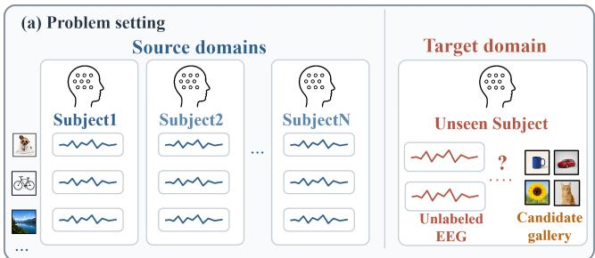

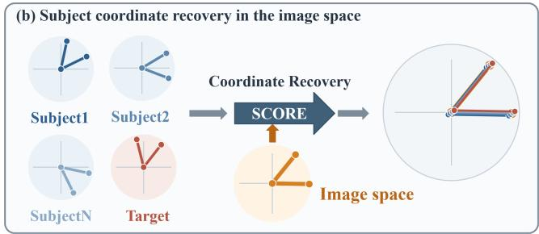  
Figure 1: Cross-subject EEG-to-image retrieval and the idea behind SCORE. (a) Source subjects provide labeled EEG– image pairs, whereas an unseen target subject provides unlabeled EEG and a candidate gallery. (b) Each subject expresses the same concept relationships along its own coordinate di- rections, which SCORE recovers in the image space.

However, these results need extensive subject-specific EEG–image pairs and one model per individual, which is costly and hard to scale. Cross-subject retrieval is a more practical alternative. A model trained on source subjects is applied directly to an unseen subject without labeled calibration, as shown in Figure 1(a). Existing cross-subject transfer approaches mainly improve generalization by learning shared source representations or adapting features and scores with unlabeled target data (Jiang et al. 2026; Huang and Zhu 2026). Despite these advances, reported cross-subject Top-1 accuracy on THINGS-EEG2 remains below 35% (Jiang et al. 2026; Huang and Zhu 2026). Yet one question remains: why does EEG-to-image retrieval reach high accuracy within a subject but transfer so poorly to a new one?

To understand this problem, we analyze the learned EEG representations across subjects and find that diferent subjects preserve similar relationships among image concepts but express them along diferent coordinate directions. Based on this finding, we propose Subject Coordinate Recovery (SCORE), a framework that combines recovery-aware source training with label-free coordinate recovery at deployment, as shown in Figure 1(b). During training, SCORE aligns source subject EEG with a common image space and simulates unseen-subject recovery through source-only episodes. At deployment, coordinate recovery selects EEG–image land- marks under hubness correction and recovers the target co- ordinates with a regularized orthogonal map. SCORE uses no target subject data during training and no target labels at deployment, making retrieval easier to extend to new users.

On two public benchmarks under 200-way cross-subject retrieval, SCORE reaches 53.23%/83.55% Top-1/Top- 5 accuracy on THINGS-EEG2 and 12.01%/32.16% on Alljoined-1.6M, surpassing the strongest evaluated baselines by 17.45/15.70 and 3.08/4.62 points, respectively. It im-proves both metrics over the unadapted baseline for every held-out subject on both datasets and generalizes across different EEG encoders. The recovered map also transfers to an unseen gallery and remains efective under many distractors, which makes SCORE easy to scale to new users without target labels or encoder updates.

In summary, our core contributions are as follows:

• We identify a representational pattern in cross-subject EEG-to-image retrieval. Diferent subjects preserve similar concept relationships but express them along diferent coordinate directions.

• We propose SCORE, which brings source subject EEG closer to the image coordinates during training and re- covers a new subject’s coordinates at deployment, using neither source EEG nor target labels and updating no encoder parameters.

• SCORE achieves the best overall accuracy among the evaluated cross-subject algorithms on THINGS-EEG2 and Alljoined-1.6M, improving both metrics for every held-out subject and generalizing across diferent EEG encoders.

## Related Work

EEG-to-image retrieval. EEG-to-image retrieval projects an EEG trial and candidate images into a shared space and decodes by similarity matching, which allows test concepts disjoint from training concepts. NICE established this formulation on THINGS-EEG2, training an EEG encoder against frozen CLIP features with a symmetric contrastive loss (Song et al. 2024). Subsequent work improves the source-side rep- resentation: ATM extends the embedding to difusion re- construction (Li et al. 2024a); MUSE preserves multimodal similarity (Chen and Wei 2024); HCF fuses intermediate visual features (Tang et al. 2026); NeuroCLIP tunes prompts for the visual encoder (Wang et al. 2026); and SAMGA builds subject-aware visual targets (Jiang et al. 2026). These studies reach high accuracy within a subject, whereas we focus on the cross-subject setting and aim to reduce the dependence on target labels.

Cross-subject transfer and representation alignment. Cross-subject EEG decoding seeks to reduce calibration for a new user (Wang et al. 2023). Euclidean Alignment normalizes each subject with a reference covariance before training (He and Wu 2020), while hyperalignment and Riemannian Procrustes analysis align neural representations across individuals from a common stimulus set or from class labels (Haxby et al. 2011; Rodrigues, Jutten, and Congedo 2019). Source-free subject adaptation drops the source recordings but still needs target labels (Lee et al. 2023), and test-time adaptation adapts a frozen model from unlabeled test data (Wang et al. 2021; Li et al. 2024b). SATTC targets hubness in EEG-to-image retrieval and keeps both encoders frozen, calibrating target features and retrieval scores from unlabeled target EEG alone, combining subject-adaptive whitening, a score correction based on cross-domain sim- ilarity local scaling, and a structural term over mutual neigh- bors (Huang and Zhu 2026). These methods bring subjects distributions closer together. However, we ask why transfer fails, and use the answer to recover a new subject’s coordinates in the image space, where retrieval is scored, using neither source recordings nor target labels.

Unsupervised alignment of two embedding spaces. Out-side neural decoding, a line of work asks whether two inde- pendently trained embedding spaces can be matched without supervision. For word vectors from two languages, the corre- spondence can be recovered by alternating between candidate matches and an orthogonal transform (Conneau et al. 2018; Artetxe, Labaka, and Agirre 2018; Grave, Joulin, and Berthet 2019). We address a cross-subject problem in neural signals: subjects express the same concept relationships along different coordinate directions, and an orthogonal transform recovers much of that diference. The image space is our an- chor: both the source subjects and a new subject are placed in it, so one fixed target replaces many pairwise alignments.

## The SCORE Framework

Problem setup. We consider cross-subject EEG-to-image retrieval. Training uses labeled EEG–image pairs from source subjects and no target subject data. At deployment the model receives only unlabeled EEG from a new sub- ject and a candidate image gallery; no target label is available at any point, which is what label-free means throughout. Formally, the EEG encoder maps a response e to $q = f _ { \boldsymbol { \theta } } ( e ) \ \in \ \mathbb { R } ^ { d } ;$ , and the image encoder maps a candi- date image v to $g = h _ { \phi } ( v ) \in \mathbb { R } ^ { \bar { d } }$ , where $h _ { \phi }$ projects frozen pretrained visual features (Jiang et al. 2026). Retrieval returns the gallery image most similar to the EEG query in this shared space.

## Cross-Subject Coordinate Diagnosis

Shared concept relationships. We first ask whether an unseen target subject preserves the concept relationships learned from source subjects. For each leave-one-subject-out (LOSO) split of THINGS-EEG2 we train a separate encoder on one half of the concepts and analyze the held-out half, so that subject and concepts are both unseen. For each subject, we construct an EEG representational similarity matrix (RSM) whose entry (i, j) is the cosine similarity between concepts i and j (Kriegeskorte, Mur, and Bandettini 2008). As shown in Figure 2, the target and source RSMs exhibit similar patterns; across target–source pairs the mean full- RSM correlation is 0.687±0.035. An unseen target therefore preserves the source concept structure.

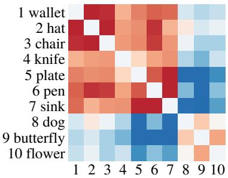  
(a) Source RSM A

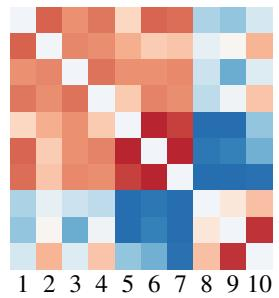  
(b) Source RSM B

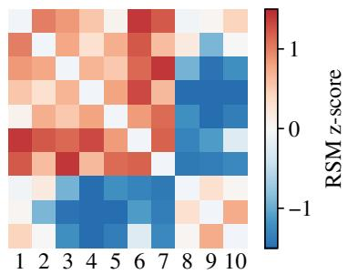  
(c) Target RSM

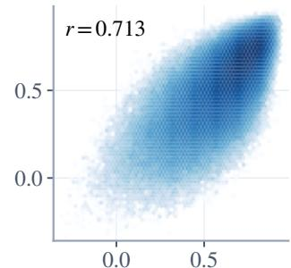  
(d) Held-out pairs

Figure 2: Source and target EEG RSMs on encoder-unseen concepts (THINGS-EEG2), for one LOSO fold. (a)-(c) Two of the nine source subjects and the held-out target subject, under a shared fixed z-score scale. (d) All held-out concept pairs for the displayed source–target pair, with the target subject on the horizontal axis and source B on the vertical axis (r = 0.713).
<table><tr><td>Alignment</td><td>Top-1 ↑</td><td>Top-5 ↑</td></tr><tr><td>Direct</td><td>16.89</td><td>41.95</td></tr><tr><td>Ridge map</td><td>20.01</td><td>47.15</td></tr><tr><td>Orthogonal map</td><td>28.22</td><td>59.16</td></tr></table>

Table 1: Target-to-source EEG retrieval before and after co- ordinate mapping on THINGS-EEG2.

Coordinate reorientation. Similar concept relationships do not guarantee that coordinates match. For the held-out concepts, we run three-fold cross-validation. Two folds fit a ridge map or an orthogonal map from target EEG to source EEG, and the third evaluates retrieval, so each concept is tested once. The ridge map can apply any linear transforma- tion, whereas the orthogonal map only reorients the coordi- nates and keeps distances and angles unchanged.

As shown in Table 1, the orthogonal map raises retrieval by 11.33 Top-1 and 17.21 Top-5 points over direct matching, and it also improves on the ridge map. Figure 3 shows the same efect on matched concepts. Each subject forms a similar shape from the corresponding concepts, yet the two subjects place that shape under diferently oriented coordi-nate systems, and the orthogonal map brings the two shapes into close agreement. These results show that much of the cross-subject gap is a change of coordinates that preserves distances.

Together, the two diagnostics reveal a specific cross- subject pattern. First, target EEG preserves source-like con-cept relationships. Second, the EEG features of diferent subjects nevertheless difer substantially, so direct target-to-source matching is poor, yet an orthogonal map fitted from known concept pairs largely recovers it. Thus, the informa- tion needed for retrieval survives the change of subject; what blocks it is the target’s coordinate system.

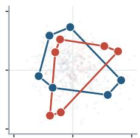

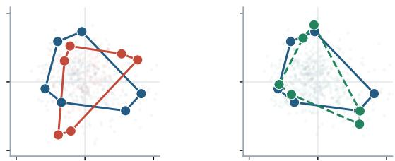

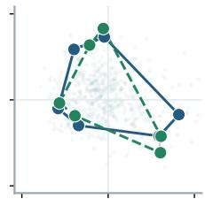  
(a) Cross-subject reorientation (b) Recovered coordinates  
Source EEG Target EEG Reoriented target  
Figure 3: Orthogonal coordinate recovery for one target– source pair, projected onto a two-dimensional plane chosen from the fitting concepts.

A direct approach is to align the coordinate systems of the source and target subjects. However, we align both of them to the image space instead, for two reasons. First, contrastive source training has already placed every source subject in the image space, so recovering a target subject there also aligns it to the source subjects and directly serves retrieval. Second, it removes the question of which source subject should serve as the alignment target, and it is better suited to deployment, where the trained model is available but the source recordings are not.

This also explains the gap between within-subject and cross-subject retrieval. Within a subject, the coordinates learned during training still describe new test concepts, so retrieval stays accurate. A new subject never took part in that optimization, so it keeps the concept structure but expresses it in a frame the model cannot read, and accuracy drops. Serving a new subject therefore comes down to recovering its coordinates in the image space, replacing a subject-tosubject diference with an alignment to the gallery already present at deployment.

SCORE carries this out in two stages: recovery-aware source training brings source subjects into the image frame using source data only, and at deployment coordinate re- covery recovers a new subject’s coordinates from unlabeled target EEG and the candidate gallery, leaving the source

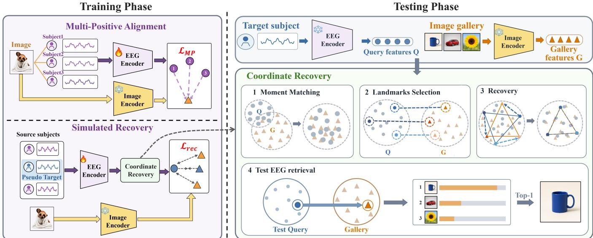  
Figure 4: Overview of SCORE. Left: recovery-aware source training aligns source subjects and simulates target recovery. Right: at deployment, coordinate recovery recovers the coordinates of unlabeled target EEG features before image retrieval.

recordings unused (Figure 4).

## Recovery-Aware Source Training

Multi-positive alignment. Unlike a single-positive contrastive loss, SCORE makes the subject dimension explicit: EEG responses from diferent source subjects to the same image are positives in both retrieval directions, so they are not pushed apart (Khosla et al. 2020). The loss therefore pulls the coordinates of diferent subjects toward the same fixed image space.

Let qi and $g _ { i }$ be the i-th EEG and image features, and let yi be the stimulus index of the i-th air. We define $\begin{array} { r } { \mathcal { P } ( i ) \stackrel { } { = } \{ \dot { j } : } \end{array}$ $y _ { j } = y _ { i } \} , p _ { i j } = 1 / | \mathcal { P } ( i ) |$ for $j \in \mathcal { P } ( i )$ , and $S _ { i j } = q _ { i } ^ { \top } g _ { j } / \tau$ with temperature τ. The symmetric multi-positive loss is

$$
\begin{array} { l } { \mathcal { L } _ { E  I } = - \displaystyle \frac { 1 } { B } \sum _ { i } \sum _ { j \in \mathcal { P } ( i ) } p _ { i j } \log \frac { \exp ( S _ { i j } ) } { \sum _ { l } \exp ( S _ { i l } ) } , } \\ { \mathcal { L } _ { I  E } = - \displaystyle \frac { 1 } { B } \sum _ { i } \sum _ { j \in \mathcal { P } ( i ) } p _ { i j } \log \frac { \exp ( S _ { j i } ) } { \sum _ { l } \exp ( S _ { l i } ) } , } \\ { \mathcal { L } _ { \mathrm { M P } } = \mathcal { L } _ { E  I } + \mathcal { L } _ { I  E } . } \end{array}\tag{1}
$$

Here B is the number of EEG–image pairs. The image-to-EEG term supplies cross-subject supervision because each image is paired with responses from multiple source subjects.

Simulated coordinate recovery. Alignment among source subjects does not ensure the same coordinates for an unseen subject. We therefore construct source-only recovery episodes (Li et al. 2019). Each mini-batch treats one source subject as a temporary target, hides its EEG–image matches, and applies the same recovery steps used at deployment.

After recovery, we reveal the source matches only to com- pute the loss. Let $B _ { t }$ be the number of temporary target queries, with recovered query $\widehat { q _ { i } }$ and matching image feature

$g _ { y _ { i } }$ . We compute

$$
\mathcal { L } _ { \mathrm { r e c } } = - \frac { 1 } { B _ { t } } \sum _ { i = 1 } ^ { B _ { t } } \log \frac { \exp ( \widehat { q } _ { i } ^ { \top } g _ { y _ { i } } / \tau _ { \mathrm { r e c } } ) } { \sum _ { j } \exp ( \widehat { q } _ { i } ^ { \top } g _ { j } / \tau _ { \mathrm { r e c } } ) } ,\tag{2}
$$

where $\tau _ { \mathrm { r e c } }$ is the temperature. This loss trains the EEG en- coder to preserve the correct retrieval after recovery, while gradients do not pass through the map.

In the SAMGA implementation used for our main results, multi-positive alignment replaces the original pairwise con- trastive term, and the recovery loss is added with weight $\lambda _ { \mathrm { { r e c } } }$

## Label-Free Coordinate Recovery at Deployment

At deployment we obtain the target subject’s EEG features and the candidate image features, but no correspondence between them. Coordinate recovery estimates the coordinate diference from these unlabeled features in four steps.

Step 1: Moment matching. Before recovering the orientation of the coordinate system, the origins of the EEG and image coordinate systems must coincide, since an orthogo- nal map cannot account for a translation. Coordinate recovery therefore first matches their per-dimension statistics, follow- ing the practice of re-estimating feature statistics on the test distribution (Schneider et al. 2020). Let Q and G contain the target EEG and image features, with $n _ { q }$ and $n _ { g }$ rows in $\mathbb { R } ^ { d } .$

$$
\widetilde { Q } = \frac { Q - \mu _ { Q } } { \sigma _ { Q } + \epsilon } \left( \sigma _ { G } + \epsilon \right) + \mu _ { G } ,\tag{3}
$$

where $( \mu _ { Q } , \sigma _ { Q } )$ and $( \mu _ { G } , \sigma _ { G } )$ are computed from the EEG and image features, and ϵ stabilizes small variances.

Step 2: Landmark selection. With the center and scale corrected, the orientation remains, and the true EEG–image pairs are unknown. We therefore select pseudo-matched pairs as landmarks, keeping only those informative about the ori- entation. However, high-dimensional retrieval sufers from hubness, where a few images appear among the nearest neighbors of many queries and attract matches regardless of content (Radovanović, Nanopoulos, and Ivanović 2010), so we score every corrected EEG feature $\widetilde { q } _ { i }$ against every image feature $g _ { j }$ with cross-domain similarity local scaling (CSLS) (Conneau et al. 2018),

$$
s ^ { \mathrm { C S L S } } ( \widetilde { q } _ { i } , g _ { j } ) = 2 \cos ( \widetilde { q } _ { i } , g _ { j } ) - r _ { G } ( \widetilde { q } _ { i } ) - r _ { Q } ( g _ { j } ) ,\tag{4}
$$

where $r _ { G } ( \widetilde { q } _ { i } )$ and $r _ { Q } ( g _ { j } )$ are mean similarities to the k near-est features in the other space, penalizing features broadly similar to many candidates. We retain only mutual nearest- neighbor pairs as landmarks.

Because EEG has a low signal-to-noise ratio, landmarks should not contribute equally: a less certain pair should carry less weight. Let $s _ { i , ( 1 ) }$ and $s _ { i , ( 2 ) }$ be the highest and second- highest CSLS scores for landmark i; their margin defines its weight,

$$
\widehat { \Delta } _ { i } = \operatorname* { m a x } \bigl ( s _ { i , ( 1 ) } - s _ { i , ( 2 ) } , \eta \bigr ) , \qquad w _ { i } = \frac { m \widehat { \Delta } _ { i } } { \sum _ { j } \widehat { \Delta } _ { j } } ,\tag{5}
$$

where m is the number of landmarks and $\eta > 0$ is a small floor.

Step 3: Recovery. Step 2 yields m weighted landmarks. Following the cross-subject coordinate diagnosis, we use them to estimate ${ \textbf { a } } d \times d$ orthogonal map that reorients the target EEG coordinates toward the image coordinates while preserving distances.

Let $\boldsymbol { X } , \boldsymbol { Y } \in \mathbb { R } ^ { m \times d }$ contain the landmark rows from $\widetilde { Q }$ and their image features. We subtract their weighted centers $\mu _ { X }$ and $\mu _ { Y }$ to obtain $\widetilde { X }$ and $\widetilde { Y }$ , which removes any residual ofset before the map is estimated, and place the weights in a diagonal matrix $\dot { W }$

A deployment batch holds a few hundred queries, so at most that many landmarks can be formed, and a low signal-to- noise ratio leaves fewer still that can be trusted. The number of landmarks $m$ is therefore much smaller than the feature dimension $d ,$ and the alignment term alone is rank-deficient. Its minimizer is then not unique, since R is unconstrained along every direction no landmark supports. We therefore add a term that leaves such directions at the identity map $I .$ With nonnegative identity-regularization strength λ we solve

$$
R ^ { \star } = \operatorname * { a r g m i n } _ { R ^ { \top } R = I } \left\| W ^ { 1 / 2 } ( \widetilde { X } R - \widetilde { Y } ) \right\| _ { F } ^ { 2 } + \lambda \big \| R - I \big \| _ { F } ^ { 2 } .\tag{6}
$$

The orthogonal constraint prevents arbitrary scaling. We set $\lambda = \rho \| \widetilde { X } ^ { \bar { \top } } W \widetilde { Y } \| _ { 2 }$ , where $\| \cdot \| _ { 2 }$ is the spectral norm, so that $\rho$ is dimensionless.

Equation (6) has a closed form. Since $R ^ { \top } R = I ,$ , the terms

$$
\begin{array} { r l } { \mathrm { t r } \big ( R ^ { \top } \widetilde { X } ^ { \top } W \widetilde { X } R \big ) } & { { } \mathrm { a n d } \quad \mathrm { t r } \big ( R ^ { \top } R \big ) } \end{array}
$$

are constant, and the objective reduces to

$$
\operatorname * { m a x } _ { R ^ { \top } R = I } \mathrm { t r } \big ( R ^ { \top } M \big ) , \qquad M = \widetilde { X } ^ { \top } W \widetilde { Y } + \lambda I .\tag{7}
$$

Writing the singular value decomposition as $M = U \Sigma V ^ { \top }$ gives $\Breve { R ^ { \star } } = U \Breve { V ^ { \top } }$ (Schönemann 1966). The identity regularization therefore acts as a ridge term on the cross-covariance: in directions where $\widetilde { X } ^ { \top } W \widetilde { Y }$ carries little energy, M is dominated by λI and $R ^ { \star }$ stays close to the identity.

Because the map is fitted between centered landmark sets, recovery is completed by subtracting $\mu _ { X }$ from every target feature, applying $R ^ { \star }$ , and adding $\mu _ { Y }$ ,

$$
\widehat Q = ( \widetilde Q - \mu _ { X } ) R ^ { \star } + \mu _ { Y } ,\tag{8}
$$

which places the whole target set, and not only the landmarks, in the image coordinates.

Step 4: Test EEG retrieval. Retrieval proceeds in the re-covered space: we recompute the hubness-corrected similar- ity of Equation (4) on ${ \widehat { Q } } ,$ so the neighborhood terms come from the recovered features rather than ${ \cal \widetilde Q } ,$ and return the highest-scoring candidate for each query,

$$
\hat { \boldsymbol { \jmath } } ( i ) = \underset { j } { \arg \operatorname* { m a x } } ~ \boldsymbol { s } ^ { \mathrm { C S L S } } ( \widehat { \boldsymbol { q } } _ { i } , \boldsymbol { g } _ { j } ) .\tag{9}
$$

Top-k accuracy counts a query as correct when its paired image is among the k highest-scoring candidates.

## Experiments

## Setup and Comparison Protocol

We evaluate SCORE under LOSO protocols on THINGS- EEG2 and Alljoined-1.6M, which share the THINGS objectconcept stimulus set (Hebart et al. 2019), in the standard 200-way setting (Giford et al. 2022; Xu et al. 2025). Following prior work (Song et al. 2024; Jiang et al. 2026) and the processed release of Wu et al. (2025), on THINGS-EEG2 we use all 63 channels, segment epochs from 0 to 1000 ms after onset, baseline-correct with the 200 ms pre-stimulus mean, resample to 250 Hz, apply multivariate noise normal- ization (MVNN), and average repetitions of the same image. Alljoined-1.6M is used as released, under its own preprocessing.

We use SAMGA, a recent strong EEG encoder (Jiang et al. 2026), train each model for 50 epochs, and report the final epoch. Our strict cross-subject protocol exposes no target subject data during training, and the supplement describes SAMGA’s reported result and its training protocol. Coordi- nate recovery uses $\rho = 0 . 1$ , 12 to 160 landmarks, ten CSLS neighbors, and a single recovery step. Recovery-aware train- ing uses $\lambda _ { \mathrm { r e c } } = 0 . 0 3$ and $\tau = \tau _ { \mathrm { r e c } } = 0 . 0 7$

## Main Results

Table 2 reports the main retrieval results. SATTC (SAW) and CSLS improve retrieval accuracy over the original source- training baseline. EA adds +1.23 and +0.22 Top-1, neither consistent across folds (sign test, $p = 0 . 5 8 5$ and $p = 0 . 5 6 8 )$ Coordinate recovery yields a clearly larger improvement on both benchmarks, from the same frozen representation and without target labels. The complete SATTC operator adds little to the frozen SAMGA representation. Unlike SATTC, which was developed on a weaker source representation, ev- ery controlled row here uses a recent strong encoder, and we report both the complete operator and its strongest compo- nent. Recovery-aware training improves retrieval further, and complete SCORE achieves the highest accuracy. As shown in Figure 5, complete SCORE improves both Top-1 and Top-5 accuracy over the unadapted baseline for every held-out sub- ject on both datasets. In the retrieval examples of Figure 6, the correct image lies outside the top three of the unadapted baseline, whereas complete SCORE moves it into the top three.

<table><tr><td rowspan="2">Source training</td><td rowspan="2">Deployment method</td><td colspan="2">THINGS-EEG2</td><td colspan="2">Alljoined-1.6M</td></tr><tr><td>Top-1 ↑</td><td> $\mathrm { T o p } { - } 5 \uparrow$ </td><td> $\mathrm { T o p - } 1 \uparrow$ </td><td>Top-5 ↑</td></tr><tr><td rowspan="6">Original</td><td>None</td><td> $2 6 . 2 2 \pm 1 . 0 8$ </td><td> $5 7 . 9 8 \pm 0 . 8 8$ </td><td> $6 . 0 8 \pm 0 . 3 3$ </td><td> $2 0 . 5 5 \pm 0 . 7 9$ </td></tr><tr><td>EA</td><td> $2 7 . 4 5 \pm 0 . 8 2$ </td><td> $5 9 . 3 7 \pm 1 . 0 7$ </td><td> $6 . 3 1 \pm 0 . 1 9$ </td><td> $2 0 . 4 7 \pm 0 . 6 7$ </td></tr><tr><td>SATTC (SAW)</td><td> $3 0 . 9 8 \pm 0 . 3 5$ </td><td> $6 0 . 8 5 \pm 1 . 0 0$ </td><td> $8 . 9 3 \pm 0 . 3 4$ </td><td> $2 7 . 5 4 \pm 1 . 1 9$ </td></tr><tr><td>SATTC</td><td> $2 6 . 1 2 \pm 0 . 4 5$ </td><td> $5 2 . 7 3 \pm 1 . 8 2$ </td><td> $6 . 7 8 \pm 0 . 1 5$ </td><td> $2 0 . 7 0 \pm 0 . 9 8$ </td></tr><tr><td>CSLS</td><td> $3 5 . 7 8 \pm 1 . 6 2$ </td><td> $6 7 . 8 5 \pm 1 . 2 1$ </td><td> $8 . 0 4 \pm 0 . 3 5$ </td><td> $2 5 . 3 9 \pm 0 . 5 4$ </td></tr><tr><td>Coordinate recovery (ours)</td><td> $4 8 . 7 5 \pm 1 . 2 5$ </td><td> $8 0 . 9 3 \pm 0 . 5 0$ </td><td> $1 0 . 6 7 \pm 0 . 2 5$ </td><td> $3 0 . 5 1 \pm 0 . 2 8$ </td></tr><tr><td rowspan="2">Recovery-aware (ours)</td><td>None</td><td> $2 9 . 3 3 \pm 0 . 5 7$ </td><td> $6 2 . 4 2 \pm 1 . 6 0$ </td><td> $9 . 0 8 \pm 0 . 3 2$ </td><td> $2 6 . 7 8 \pm 0 . 1 4$ </td></tr><tr><td>Complete SCORE</td><td> ${ \bf 5 3 . 2 3 \pm 1 . 6 2 }$ </td><td> $\mathbf { 8 3 . 5 5 \pm 1 . 1 3 }$ </td><td> ${ \bf 1 2 . 0 1 \pm 0 . 4 9 }$ </td><td> ${ \bf 3 2 . 1 6 \pm 0 . 7 8 }$ </td></tr></table>

Table 2: Cross-subject retrieval on two EEG-to-ima e benchmarks with the SAMGA encoder throu hout. EA is Euclidean Alignment, which normalizes each subject before source training and is then deployed without further adaptation. SATTC (SAW) denotes SATTC’s subject-adaptive whitening operator, applied on its own. Values are means and standard deviations across all subjects and three seeds

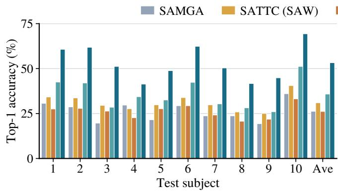

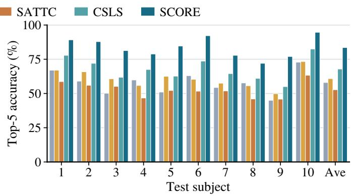  
Figure 5: Retrieval accuracy for every held-out subject and the mean (THINGS-EEG2), in (a) Top-1 and (b) Top-5.

Generalization across EEG encoders. Table 3 applies SCORE to three additional EEG encoders. Adding coordi- nate recovery to standard training raises Top-1 by 18.34– 28.33 points, and recovery-aware training gives a further gain for each encoder. Coordinate recovery therefore attaches to diferent EEG encoders as a general component.

## Analysis of Coordinate Recovery

Training and recovery components. Table 4 separates the contributions of source training and target recovery. In train- ing, multi-positive alignment gives the larger gain and simu- lated recovery a further improvement. At test time, moment matching improves retrieval, recovery gives the largest addi- tional gain (+7.18 Top-1), and identity regularization adds 2.25 points. Recovering the coordinate directions therefore gives the largest single test-phase gain, supporting a recoverable coordinate component across subjects.

Expanded gallery. To test whether coordinate recovery depends on a strict one-to-one query–gallery correspondence and stays efective once the gallery holds distractors, we pro- gressively add up to 1,654 training-concept images to the THINGS-EEG2 gallery, keeping the same target queries and frozen representations. Although every method declines as the gallery grows, Table 5 shows that complete coordinate re- covery remains best at every size and benefits every held-out subject at the largest gallery. Coordinate recovery therefore does not rely on the closed-set assumption, and SCORE holds its advantage where the gallery contains far more images than the user has viewed. Methods that exploit the one-to-one as- sumption are reported separately in the supplement.

Plug-and-play transfer to an unseen gallery. Because the expanded-gallery setting still fits and evaluates coordinate recovery within the same query batch, we next split the test concepts into disjoint Galleries A and B and ask whether a fitted map transfers between them. Coordinate recovery esti- mates the target statistics, landmarks, and map from Gallery A; the map is then frozen and applied to Gallery B without refitting. Table 6 shows that the frozen map improves re- trieval for every held-out subject. Since Gallery B shares no EEG queries or images with Gallery A, the recovered map captures a reusable subject-to-image relation rather than a fit to specific concepts.

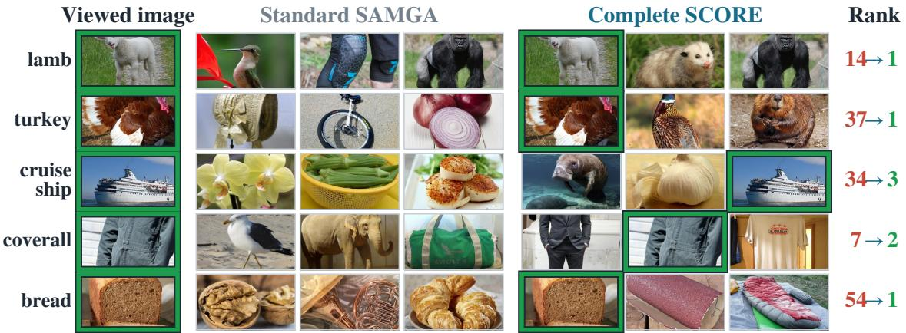

Figure 6: Retrieval examples from one held-out subject. Each method shows its top three images, the green border marks the viewed image, and the rightmost column its rank in the 200-image gallery before and after recovery.
<table><tr><td rowspan="2">EEG encoder</td><td colspan="2">Standard</td><td colspan="2">Recovery-Aware</td><td colspan="2">Standard + Recovery</td><td colspan="2">Complete SCORE</td></tr><tr><td>Top-1</td><td>Top-5</td><td>Top-1</td><td>Top-5</td><td>Top-1</td><td>Top-5</td><td>Top-1</td><td>Top-5</td></tr><tr><td>NICE (Song et al. 2024)</td><td>27.60</td><td>60.38</td><td>31.08</td><td>63.50</td><td>50.27</td><td>81.05</td><td>54.85</td><td>83.75</td></tr><tr><td>ShallowFBCSPNet (Schirrmeister et al. 2017)</td><td>10.63</td><td>32.67</td><td>11.37</td><td>33.83</td><td>28.97</td><td>61.45</td><td>30.73</td><td>62.92</td></tr><tr><td>EEGNet (Lawhern et al. 2018)</td><td>15.95</td><td>42.80</td><td>17.22</td><td>45.68</td><td>44.28</td><td>76.72</td><td>46.95</td><td>78.65</td></tr></table>

Table 3: Generalization across EEG encoders on THINGS-EEG2. Values are mean Top-1 and Top-5 accuracy across three seeds.

<table><tr><td>Phase</td><td>Configuration</td><td>Top-1 ↑</td><td>Top-5 ↑</td></tr><tr><td rowspan="4">Train</td><td>SAMGA objective</td><td> $2 6 . 2 2 \pm 1 . 0 8$ </td><td> $5 7 . 9 8 \pm 0 . 8 8$ </td></tr><tr><td>+ multi-positive</td><td> $2 8 . 6 3 \pm 1 . 7 5$ </td><td> $6 2 . 0 2 \pm 1 . 7 3$ </td></tr><tr><td>+ simulated recovery</td><td> $2 9 . 3 3 \pm 0 . 5 7$ </td><td> $6 2 . 4 2 \pm 1 . 6 0$ </td></tr><tr><td>CSLS ranking</td><td> $3 9 . 0 8 \pm 0 . 8 1$ </td><td> $7 1 . 2 3 \pm 0 . 7 0$ </td></tr><tr><td rowspan="4">Test</td><td>+ mean and scale</td><td> $4 3 . 8 0 \pm 1 . 5 7$ </td><td> $7 5 . 6 8 \pm 0 . 5 8$ </td></tr><tr><td>+ recovery</td><td> $5 0 . 9 8 \pm 1 . 5 3$ </td><td> $8 0 . 3 8 \pm 0 . 7 8$ </td></tr><tr><td>+ identity regularization</td><td> ${ \bf 5 3 . 2 3 \pm 1 . 6 2 }$ </td><td></td></tr><tr><td></td><td></td><td> ${ \bf 8 3 . 5 5 \pm 1 . 1 3 }$ </td></tr></table>

Table 4: Cumulative ablation of recovery-aware training and coordinate recovery. Each row adds one component to the row above it.

## Conclusion

We investigated why EEG-to-image retrieval transfers poorly across subjects, and found that diferent subjects pre-serve similar concept relationships while expressing them along diferent coordinate directions. Based on this finding, SCORE combines recovery-aware source training with label- free recovery of the target coordinates in the image space. On two datasets and four EEG encoders, it improves retrieval for every held-out subject, and the recovered map transfers to an unseen gallery, so a new user can be supported with unlabeled data alone.

<table><tr><td>Gallery size</td><td>Raw</td><td>SATTC (SAW)</td><td>CSLS</td><td>SCORE</td></tr><tr><td>200</td><td>29.33</td><td>35.28</td><td>39.08</td><td>53.23</td></tr><tr><td>700</td><td>15.72</td><td>17.98</td><td>21.75</td><td>29.47</td></tr><tr><td>1,200</td><td>12.25</td><td>12.80</td><td>17.03</td><td>22.27</td></tr><tr><td>1,854</td><td>9.47</td><td>9.92</td><td>13.33</td><td>17.03</td></tr></table>

Table 5: Top-1 retrieval as training-concept distractors are added to the 200 matching images. Gallery size counts the 200 matching images plus the added distractors. Every col- umn uses the same recovery-aware representation.

<table><tr><td>Update</td><td>Ranking</td><td>Top-1 ↑</td><td>Top-5 ↑</td></tr><tr><td>None</td><td>Cosine</td><td> $3 9 . 5 3 \pm 0 . 9 7$ </td><td> $7 5 . 5 9 \pm 0 . 8 1$ </td></tr><tr><td>None</td><td>CSLS</td><td> $5 0 . 4 1 \pm 0 . 6 0$ </td><td> $8 3 . 1 6 \pm 0 . 7 7$ </td></tr><tr><td>Frozen map</td><td>Cosine</td><td> $5 6 . 3 5 \pm 1 . 1 4$ </td><td> $8 7 . 3 8 \pm 0 . 7 8$ </td></tr><tr><td>Frozen map</td><td>CSLS</td><td> ${ \bf 6 4 . 1 6 \pm 1 . 5 9 }$ </td><td> ${ \bf 9 1 . 5 1 \pm 0 . 9 1 }$ </td></tr></table>

Table 6: Transfer of a frozen map between disjoint 100- concept galleries.

However, the method is not without conditions. It still needs landmarks with a suficient signal-to-noise ratio, and it still needs a small batch of unlabeled target samples rather than a single trial. Both conditions point to the same direction for future work: making the recovered map reliable from weaker and smaller evidence. We will pursue that direction next, and we will also extend the framework beyond EEG, to MEG and other neural recording modalities.

## References

Artetxe, M.; Labaka, G.; and Agirre, E. 2018. A Robust Self-Learning Method for Fully Unsupervised Cross-Lingual Mappings of Word Embeddings. In Proceedings of the 56th Annual Meeting of the Association for Computational Linguistics, 789–798.

Chen, C.-S.; and Wei, C.-S. 2024. Mind’s Eye: Image Recog- nition by EEG via Multimodal Similarity-Keeping Con- trastive Learning. arXiv preprint arXiv:2406.16910.

Conneau, A.; Lample, G.; Ranzato, M.; Denoyer, L.; and Jégou, H. 2018. Word Translation Without Parallel Data. In International Conference on Learning Representations.

Giford, A. T.; Dwivedi, K.; Roig, G.; and Cichy, R. M. 2022. A large and rich EEG dataset for modeling human visual object recognition. NeuroImage, 264: 119754.

Grave, E.; Joulin, A.; and Berthet, Q. 2019. Unsupervised Alignment of Embeddings with Wasserstein Procrustes. In Proceedings ofthe Twenty-Second International Conference on Artificial Intelligence and Statistics, volume 89 of Proceedings ofMachine Learning Research, 1880–1890.

Haxby, J. V.; Guntupalli, J. S.; Connolly, A. C.; Halchenko, Y. O.; Conroy, B. R.; Gobbini, M. I.; Hanke, M.; and Ra- madge, P. J. 2011. A Common, High-Dimensional Model of the Representational Space in Human Ventral Temporal Cortex. Neuron, 72(2): 404–416.

He, H.; and Wu, D. 2020. Transfer Learning for Brain– Computer Interfaces: A Euclidean Space Data Alignment Approach. IEEE Transactions on Biomedical Engineering, 67(2): 399–410.

Hebart, M. N.; Dickter, A. H.; Kidder, A.; Kwok, W. Y.; Cor- riveau, A.; Van Wicklin, C.; and Baker, C. I. 2019. THINGS: A database of 1,854 object concepts and more than 26,000 naturalistic object images. PLoS ONE, 14(10): e0223792.

Huang, Q.; and Zhu, W. 2026. SATTC: Structure-Aware Label-Free Test-Time Calibration for Cross-Subject EEGto-Image Retrieval. In Proceedings of the IEEE/CVF Conference on Computer Vision and Pattern Recognition.

Jiang, L.; She, Q.; Xu, J.; Xu, H.; Wu, D.; and Kuang, Z. 2026. Subject-Aware Multi-Granularity Alignment for Zero-Shot EEG-to-Image Retrieval. arXiv preprint arXiv:2604.17782.

Khosla, P.; Teterwak, P.; Wang, C.; Sarna, A.; Tian, Y.; Isola, P.; Maschinot, A.; Liu, C.; and Krishnan, D. 2020. Super- vised Contrastive Learning. In Advances in Neural Information Processing Systems, volume 33, 18661–18673.

Kriegeskorte, N.; Mur, M.; and Bandettini, P. A. 2008. Repre- sentational Similarity Analysis—Connecting the Branches of Systems Neuroscience. Frontiers in Systems Neuroscience, 2: 4.

Lawhern, V. J.; Solon, A. J.; Waytowich, N. R.; Gordon, S. M.; Hung, C. P.; and Lance, B. J. 2018. EEGNet: A Com- pact Convolutional Neural Network for EEG-Based Brain– Computer Interfaces. Journal of Neural Engineering, 15(5): 056013.

Lee, P.; Jeon, S.; Hwang, S.; Shin, M.; and Byun, H. 2023. Source-Free Subject Adaptation for EEG-Based Visual Recognition. In 2023 11th International Winter Conference on Brain-Computer Interface, 1–6.

Li, D.; Wei, C.; Li, S.; Zou, J.; and Liu, Q. 2024a. Visual Decoding and Reconstruction via EEG Embeddings with Guided Difusion. In Advances in Neural Information Processing Systems.

Li, D.; Zhang, J.; Yang, Y.; Liu, C.; Song, Y.-Z.; and Hospedales, T. M. 2019. Episodic Training for Domain Gen- eralization. In Proceedings of the IEEE/CVF International Conference on Computer Vision, 1446–1455.

Li, S.; Wang, Z.; Luo, H.; Ding, L.; and Wu, D. 2024b. T- TIME: Test-Time Information Maximization Ensemble for Plug-and-Play BCIs. IEEE Transactions on Biomedical Engineering, 71(2): 423–432.

Radovanović, M.; Nanopoulos, A.; and Ivanović, M. 2010. Hubs in space: Popular nearest neighbors in high- dimensional data. Journal of Machine Learning Research, 11: 2487–2531.

Rodrigues, P. L. C.; Jutten, C.; and Congedo, M. 2019. Rie- mannian Procrustes Analysis: Transfer Learning for Brain- Computer Interfaces. IEEE Transactions on Biomedical Engineering, 66(8): 2390–2401.

Schirrmeister, R. T.; Springenberg, J. T.; Fiederer, L. D. J.; Glasstetter, M.; Eggensperger, K.; Tangermann, M.; Hutter, F.; Burgard, W.; and Ball, T. 2017. Deep Learning with Convolutional Neural Networks for EEG Decoding and Vi- sualization. Human Brain Mapping, 38(11): 5391–5420.

Schneider, S.; Rusak, E.; Eck, L.; Bringmann, O.; Brendel, W.; and Bethge, M. 2020. Improving robustness against com- mon corruptions by covariate shift adaptation. In Advances in Neural Information Processing Systems.

Schönemann, P. H. 1966. A Generalized Solution of the Orthogonal Procrustes Problem. Psychometrika, 31(1): 1– 10.

Song, Y.; Liu, B.; Li, X.; Shi, N.; Wang, Y.; and Gao, X. 2024. Decoding Natural Images from EEG for Object Recognition. In International Conference on Learning Representations.

Tang, J.; Jiang, S.; Su, F.; and Zhao, Z. 2026. Aligning What EEG Can See: Structural Representations for Brain-Vision Matching. arXiv preprint arXiv:2603.07077.

Wang, D.; Shelhamer, E.; Liu, S.; Olshausen, B.; and Dar- rell, T. 2021. Tent: Fully Test-Time Adaptation by Entropy Minimization. In International Conference on Learning Representations.

Wang, J.; Zhang, L.; Lin, H.; Liu, Q.; Huang, G.; Li, Z.; Liang, Z.; and Wu, X. 2026. NeuroCLIP: Brain-Inspired Prompt Tuning for EEG-to-Image Multimodal Contrastive Learning. In Proceedings ofthe AAAI Conference on Artificial Intelligence.

Wang, Z.; Zhang, W.; Li, S.; Chen, X.; and Wu, D. 2023. Unsupervised domain adaptation for cross-patient seizure classification. Journal ofNeural Engineering, 20(6): 066002.

Wu, H.; Li, Q.; Zhang, C.; He, Z.; and Ying, X. 2025. Bridg- ing the Vision-Brain Gap with an Uncertainty-Aware Blur Prior. In Proceedings of the IEEE/CVF Conference on Computer Vision and Pattern Recognition.

Xu, J.; Nunes, U. B.; Jiang, W.; Ryther, S.; Pringle, J.; Scotti, P. S.; Delorme, A.; and Kneeland, R. 2025. Alljoined-1.6M: A Million-Trial EEG-Image Dataset for Evaluat- ing Afordable Brain-Computer Interfaces. arXiv preprint arXiv:2508.18571.