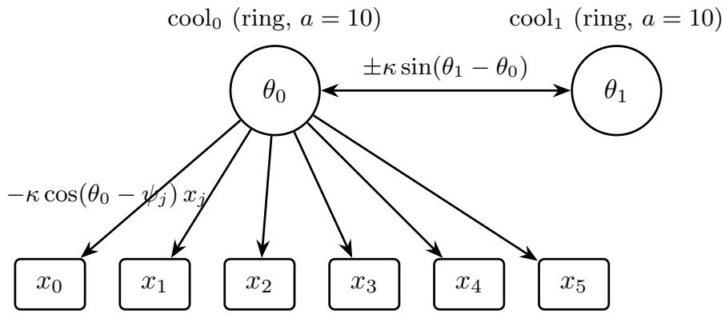
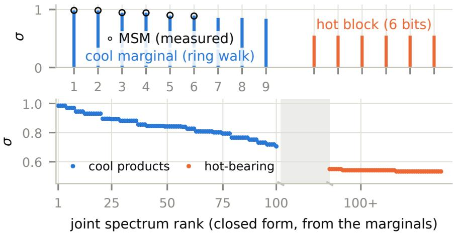
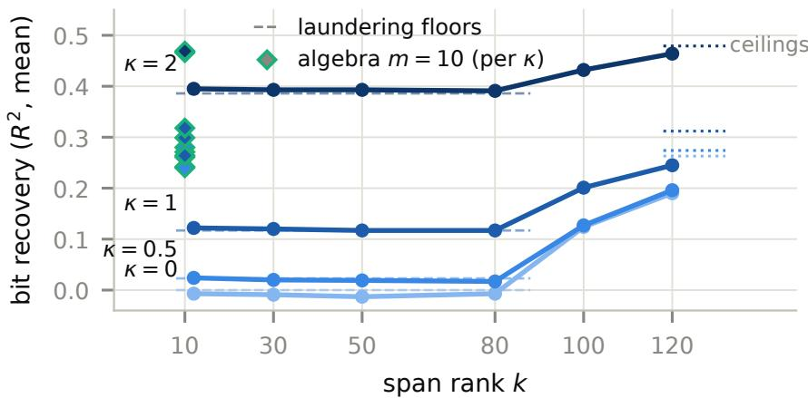
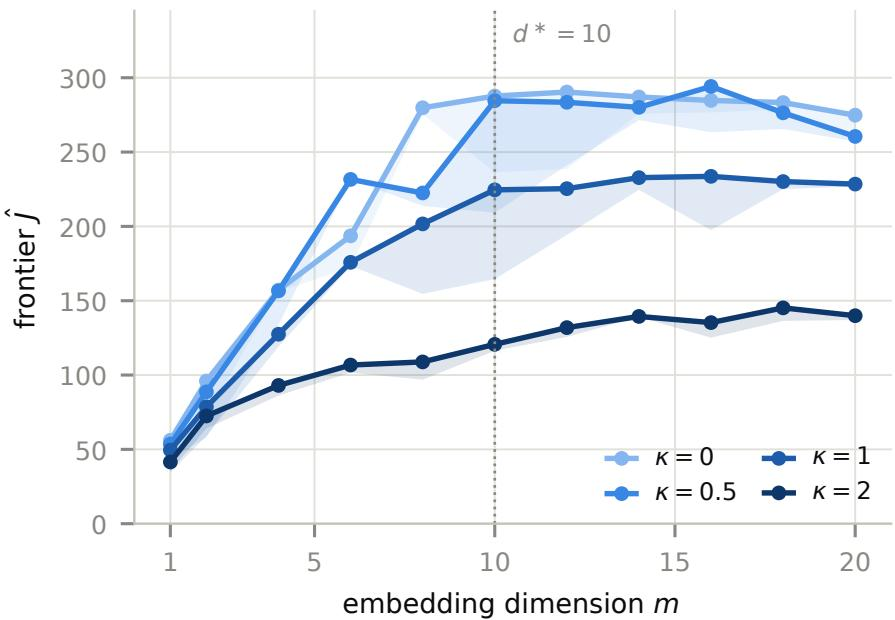
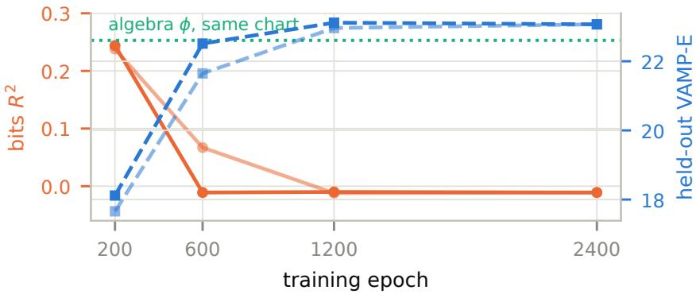
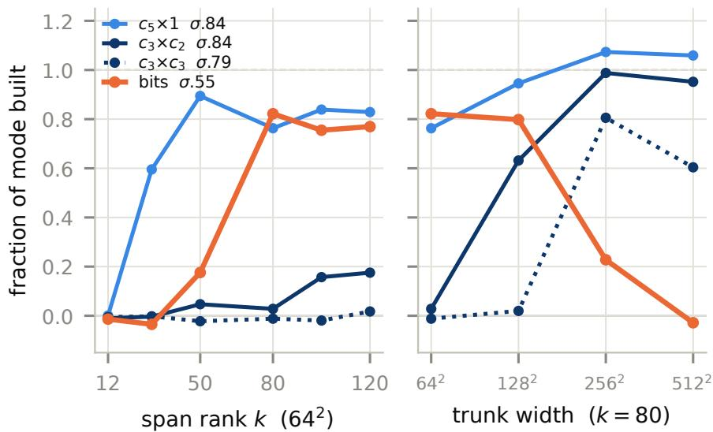

# Score the Algebra, Not the Span: Dimension Reduction for Transfer Operator Models of Dynamical Systems

Mark Kozdoba1 Technion, IIT

Shie Mannor Technion, IIT and NVIDIA

## Abstract

Dimension reduction for dynamical systems is standard practice, and the standard route is spectral: model the transfer (Koopman) operator by its leading modes. We show that on systems assembled from several weakly interacting components — a structure common in physical and biological settings — this may either require an exponential number of modes, or drop an entire component: the component is absent from the model rather than modeled coarsely, and no function of it can be predicted at any accuracy. We call this linear masking.

The cause is that a rank-based model pays one coordinate per mode. We propose to score instead the σ-algebra the coordinates generate, so that products and powers come free and a component’s cost is governed only by its generators rather than by all its interactions. The criterion is a χ2-divergence between the embedded present and future, and it carries a budget guarantee: twice the intrinsic dimension of the dynamics is enough coordinates for an embedding whose algebra carries the operator’s entire spectrum, with its full infinite rank.

In variational form the criterion admits of-the-shelf estimators, and restricting its critic to the bilinear class returns the VAMP score on the span, so rank-based methods are one end of the same family. We demonstrate the proposed objective on a composite of published benchmark systems. We exhibit examples where the rank-based methods completely miss the masked components at all ranks k < 100, while ten algebra coordinates recover all of them. In addition, the resulting algebra representation supports predicting the masked components from few labels, while direct regression from the high-dimensional observation or from the VAMP features fail.

## 1 Introduction

Learning a model of a dynamical system from observed trajectories is a basic machine learning task. Instead of modeling the dynamics on the state space X directly, one standard approach is to work with the linear operator T that the dynamics induces on the space of functions f over X, carrying a function of the future state to its conditional expectation given the present. In deterministic systems this is known as the Koopman operator [Brunton et al., 2022], and it is simply the transition operator in the Markov setting [Meyn and Tweedie, 2009].

For many physical systems the eigenfunctions of T are known in closed form, and serve as the basis of the analysis of the dynamics. However, when the system is given only through sampled trajectories, the eigenfunctions have to be learned, and the standard target to be approximated is a finite-dimensional invariant subspace. For instance, the extended dynamic mode decomposition (EDMD) fits one inside a chosen dictionary [Williams et al., 2015a], while in the stochastic and non-reversible setting, one of the most commonly used objectives for learning the leading k-dimensional singular subspace is VAMP [Wu and Noé, 2020]. Its neural form, VAMPnets [Mardt et al., 2018], learns k functions that realize the best rank-k approximation to T.

Multicomponent systems and linear masking. Many systems of interest are multicomponent by nature, and biological ones especially so. For instance, a biomolecular complex is well known to decompose into domains whose internal kinetics are fast and whose mutual coupling is weak. This near-product structure is then put to use: decomposing and modeling such systems domain by domain rather than jointly is an established strategy [Hempel et al., 2021, Mardt et al., 2022]. However, finding such a decomposition is itself hard. It presupposes both the number of components and the number of states allotted to each, and it applies only where those components are uncoupled or weakly coupled, a restriction that is stated explicitly in the literature [Mardt et al., 2022].

Here we ask instead whether such systems can be modeled directly, without the need to decompose the system.

As mentioned above, a common approach to direct modeling of dynamical systems is by the rank-k approximation of the transfer operator T. However, the product structure above may severely limit the approximability of a system by a low-rank operator. The reason is a counting one: such a model spends one coordinate on each singular function it retains. When the components are independent, the singular functions of the joint operator are products of the singular functions of the components, and similarly the singular values are products of the components’ singular values. This implies in turn that the number of modes above a given level may grow exponentially in the number of components.

We note that the most problematic manifestation of this phenomenon happens when there are spectral gaps between the components themselves. For instance, if there are a few slow components (large singular values), and a faster component (smaller leading singular value), then many products of the slow components’ values will be higher than the leading value of the fast component. In Section 5 we provide an example of a system with eight components, in which a rank k = 100 representation contains no mode involving six of them, and therefore carries no information about those six at all — they are not approximated coarsely, they are absent, while each of them is individually predictable. This is striking, since the whole system is intrinsically ten-dimensional, and one might expect a 100-dimensional representation to carry all the information about it. We call this phenomenon linear masking.

Approximating by an algebra. The underlying reason for linear masking is that rank based models must assign a separate coordinate to every nonlinear interaction between existing singular functions (such as their products), even though such an interaction is already computable from the coordinates the model holds. We therefore ask for an approximation that is credited for everything computable from its coordinates, rather than one that must buy each combination separately.

We formalize this intuition by looking for an embedding ${ \boldsymbol { \phi } } = \left( \phi _ { 1 } , \ldots , \phi _ { m } \right)$ that generates the largest σ-algebra, as measured by the amount of the spectrum of $T$ it captures. That ${ \mathrm { i s } } ,$ consider the space $V _ { \phi }$ of functions of x computable from the representation $\phi ( x )$ alone. Then, roughly speaking, we are interested in the $\phi$ for which the restriction of $T$ to $V _ { \phi }$ has the largest Hilbert–Schmidt norm. Although $\phi$ is finite dimensional, the space $V _ { \phi }$ is typically not, and it contains all the interactions between the coordinates $\phi _ { i }$ . For comparison, replacing $V _ { \phi }$ by the span $U _ { \phi } = \operatorname { s p a n } \left\{ \phi _ { 1 } , \dots , \phi _ { m } \right\}$ recovers the rank-m objective of VAMPnets.

In Theorem 4.1 we show that a finite budget always sufices: the number of coordinates whose algebra carries the whole of $T$ is bounded by twice the intrinsic dimension of the dynamics, a quantity that agrees with the number of degrees of freedom of the system in the cases of interest. The cost of a faithful representation is thus set by the degrees of freedom, rather than by the number of significant modes, which is what avoids the masking pathology described above.

It is also worth noting that a wide literature reads a dimension of a knee in the spectrum of $T$ [Noé and Nüske, 2013, Dsilva et al., 2018, von Lindheim, 2018, Talmon and Coifman, 2015]. Such spectrum-based notions of dimension can be arbitrarily large on a system with few degrees of freedom, as the example above shows.

Practical modeling. While optimizing $\phi$ to score the algebra may a priori appear complex, the restricted Hilbert–Schmidt norm above is in fact exactly the $\chi ^ { 2 }$ dependence between the embedded present and future. Both it and the map $\phi$ attaining it can therefore be computed with of-the-shelf $\chi ^ { 2 }$ estimators [Sugiyama et al., 2012, Kanamori et al., 2009, Nguyen et al., 2010].

Experiments. We consider a ten-dimensional system with eight components assembled from published benchmark systems, some slow and some fast, and a parameter κ controlling the amount of dependence between them. Its trajectories are observed either through the native ten-dimensional state, or through a high-dimensional nonlinear warp, as is more common in practice.

We demonstrate empirically the phenomena that the theory predicts. VAMPnets trained to convergence recover nothing of the six fast components at any rank below the product count of about one hundred, although each is individually predictable from the observations. This holds at every setting of κ and under both observation models. Maximizing the algebra criterion over ten coordinates, one per degree of freedom, recovers every component in all of these settings.

The value of a learned dimension reduction often lies in the label budget: trained on abundant unlabeled transition pairs, a representation can support predicting the masked components from few labels. We show that the algebra objective produces representations where this is possible, while direct regression from the observations and rank-based representations both fail.

## 2 Related Work

The standard low-rank program scores the linear span of its coordinates, and so pays one coordinate per significant mode. The best rank-k span is the leading singular subspace of the transfer operator, which for a composition operator is the Koopman operator of the dynamics. Taking those leading functions as coordinates is the program of Koopman operator theory [Brunton et al., 2022], realized empirically by dynamic mode decomposition and its extended and kernel variants [Williams et al., 2015a,b]. In the stochastic, non-reversible setting the variational score for that subspace is VAMP [Wu and Noé, 2020], and its neural form, scoring the span of a learned k-dimensional feature map, is VAMPnets [Mardt et al., 2018]. The current neural mode learners target the same top-k subspace [Jeong et al., 2025, Kostic et al., 2024b, Deng et al., 2022, Pfau et al., 2019], as does the kernel and RKHS operator-regression line [Klus et al., 2020b, Kostic et al., 2022], where the rank-k truncation is replaced by a restriction on the RKHS norm. On a multicomponent system all of them over-count the intrinsic dimension by an unbounded factor, since the modes they enumerate are products and harmonics of a few generators. VAMPnet is our primary benchmark (Section 5).

Closest in machinery, Turri et al. [2026] train a feature map through the same least-squares density-ratio functional we estimate with, with a bilinear critic whose optimal value they identify with the VAMP-2 score the span once more, now reached variationally. Our one move is to leave that critic unrestricted, which scores the algebra the coordinates generate and turns the mode count into an intrinsic dimension (Section 4.2).

Bittracher et al. [2018] likewise seek a mapping that preserves the dominant spectral subspace, and reach it through the embedding machinery our Theorem 4.1 also uses, over the same $\chi ^ { 2 }$ geometry of predictive laws. Their guarantee is a dominant-mode one by construction: the recovered eigenfunctions carry an error bounded by $\varepsilon / | \lambda _ { i } |$ , which diverges as $| \lambda _ { i } | \to 0 ,$ , so it is silent on the fast modes a rank budget discards, and they assume reversibility, which we do not. Computational mechanics reaches for the same object conceptually: causal states are the classes of a predictive-equivalence σ-algebra [Shalizi and Crutchfield, 2001], constructed in practice through kernel mean embeddings of the predictive laws [Brodu and Crutchfield, 2020], and so anchored to the kernel’s view of the observed state.

Additional literature notes, on component identification and on autoencoder methods, are in Section C.

## 3 Preliminaries

The coupling. We work with a single state space $\mathcal { X }$ carrying a probability measure $\mu$ together with a Markov kernel $p ( \cdot \mid x )$ , the one-step law of the future given the present. Let $X \sim \mu$ be the present state, $X ^ { \prime } \sim p ( \cdot \mid X )$ the coupled future, and $\mu ^ { \prime }$ the induced future marginal, $\begin{array} { r } { d \mu ^ { \prime } ( x ^ { \prime } ) = \int p ( x ^ { \prime } \mid x ) d \mu ( x ) } \end{array}$ . We assume neither stationarity $( \mu ^ { \prime }$ may difer from $\mu )$ nor reversibility. The pair $( X , X ^ { \prime } )$ has joint law $\bar { \mu }$ on $\mathcal { X } \times \mathcal { X } .$ , and this joint law is the sole input — every object below is a functional of $\bar { \mu }$ alone. $\mathrm { A }$ coupling is thus any pair of random variables, with the present/future reading as its running instance.

The transfer operator. The coupling is carried by its conditional-expectation (transfer) operator $T$ : $L ^ { 2 } ( \mathcal X , \mu ^ { \prime } ) \to L ^ { 2 } ( \bar { \mathcal X } , \mu )$

$$
( T f ) ( x ) = \mathbb { E } f ( X ^ { \prime } ) \mid X = x ,\tag{1}
$$

which sends a future observable to its best present prediction. We also write $T = T _ { X , X ^ { \prime } }$ , when the underlying coupling needs to be specified explicitly. The adjoint of T, $T ^ { * } : L ^ { 2 } ( \mathcal { X } , \mu ) \to L ^ { 2 } ( \mathcal { X } , \mu ^ { \prime } )$ is the backward conditional expectation $( T ^ { * } g ) ( x ^ { \prime } ) = \mathbb { E } g ( X ) \mid X ^ { \prime } = x ^ { \prime }$ , and constants are fixed, $T \mathbf { 1 } = \mathbf { 1 } = T ^ { * } \mathbf { 1 }$

Regularity and the singular system. The single standing assumption in this paper is that $T$ is Hilbert– Schmidt, $\mathrm { t r } ( T ^ { * } T ) < \infty$ . This is also the standing assumption of the variational Koopman literature, where it underwrites the singular value decomposition and likewise excludes deterministic dynamics [Wu and Noé, 2020]. A Hilbert–Schmidt operator is compact, so $T$ admits a singular value decomposition $( \sigma _ { j } , \phi _ { j } , \psi _ { j } ) _ { j \geq 0 }$ [Hsing and Eubank, 2015],

$$
T \psi _ { j } = \sigma _ { j } \phi _ { j } , \qquad T ^ { * } \phi _ { j } = \sigma _ { j } \psi _ { j } ,\tag{2}
$$

with singular values $1 = \sigma _ { 0 } \geq \sigma _ { 1 } \geq \cdot \cdot \cdot  0$ , present functions $\{ \phi _ { j } \}$ orthonormal in $L ^ { 2 } ( \mu )$ , future functions $\{ \psi _ { j } \}$ orthonormal in $L ^ { 2 } ( \mu ^ { \prime } )$ , and the trivial leading triple $\boldsymbol { \sigma } _ { 0 } = 1 , \boldsymbol { \phi } _ { 0 } = \boldsymbol { \psi } _ { 0 } = { \bf 1 }$ . The trace is the sum of the squared singular values, and is the squared Hilbert–Schmidt norm: $\begin{array} { r } { \mathrm { t r } ( T ^ { * } T ) = \left. T \right. _ { \mathrm { H S } } ^ { 2 } = \sum _ { j \geq 0 } \sigma _ { j } ^ { 2 } } \end{array}$

In addition, the trace is related to the $\chi ^ { 2 }$ dependence between X and $X ^ { \prime } -$ the $\chi ^ { 2 }$ divergence of the joint law from the independent product of the marginals, written $\chi ^ { 2 } ( X ; X ^ { \prime } )$ . Let P be the joint law of $( X , X ^ { \prime } )$ and $r = d P / d ( \mu \otimes \mu ^ { \prime } )$ its density ratio against the product of the marginals. Then the transfer operator $T = T _ { X , X ^ { \prime } }$ is the integral operator with kernel $\begin{array} { r } { r , ( T f ) ( x ) = \int r ( x , x ^ { \prime } ) f ( x ^ { \prime } ) d \mu ^ { \prime } ( x ^ { \prime } ) } \end{array}$ and we have

$$
\left\| T \right\| _ { \mathrm { H S } } ^ { 2 } = \int r ^ { 2 } d ( \mu \otimes \mu ^ { \prime } ) = 1 + \chi ^ { 2 } ( X ; X ^ { \prime } ) .\tag{3}
$$

We thus use $\left\| T \right\| _ { \mathrm { H S } } ^ { 2 }$ and $1 + \chi ^ { 2 } ( X ; X ^ { \prime } )$ interchangeably throughout the paper.

## 4 Framework and Results

## 4.1 General Embedding Results

Induced couplings. Let $\phi : \mathcal { X }  \mathcal { Y }$ be a measurable feature map. With $Y = \phi ( X )$ and $Y ^ { \prime } = \phi ( X ^ { \prime } )$ the pair $( Y , Y ^ { \prime } )$ is again a coupling, the one induced by $\phi ,$ and it carries its own transfer operator $T _ { Y , Y ^ { \prime } }$

The algebra objective. We will be interested in embeddings $\phi$ that maximize the size of the induced operator, $T _ { \phi } : = T _ { Y , Y ^ { \prime } }$ . By (3), applied to the induced coupling,

$$
\left\| T _ { \phi } \right\| _ { \mathrm { H S } } ^ { 2 } = 1 + \chi ^ { 2 } \big ( \phi ( X ) ; \phi ( X ^ { \prime } ) \big ) ,\tag{4}
$$

the predictive $\chi ^ { 2 }$ dependence — the total principal inertia — of the embedded present and future. We call (4) the algebra objective because its value depends on $\phi$ only through the σ-algebra $\sigma ( \phi )$ the coordinates generate:1 any embedding computing the same information receives the same value, and every product, power, or other measurable function of the coordinates is credited for free. Theorem A.1 in Section A states the relation between (4) and the space $V _ { \phi }$ of Section 1 precisely: $T _ { \phi }$ is the compression of $T$ onto $V _ { \phi }$ and its future counterpart.

The class of maps, and the optimum over it. The objective is defined for every measurable $\phi ,$ but what is attainable depends on which maps one is willing to search. We therefore carry the class as an explicit parameter: $\Phi$ is a set of measurable maps $\mathcal { X } \to \mathbb { R } ^ { m }$ , and $\phi ^ { * }$ denotes a maximizer of the objective over it,

$$
\phi ^ { \ast } \in \underset { \phi \in \Phi } { \arg \operatorname* { m a x } } \left. T _ { \phi } \right. _ { \mathrm { H S } } ^ { 2 } ,\tag{5}
$$

attaining the value $\| T _ { \phi ^ { * } } \| _ { \mathrm { H S } } ^ { 2 }$ . Since the criterion sees ϕ only through the algebra it generates, $\phi ^ { * }$ is determined only up to that algebra, which is the object actually selected. Two properties hold for every $\Phi \colon$ the value never exceeds $\left\| T \right\| _ { \mathrm { H S } } ^ { \smash { \widetilde { 2 } } } = 1 + \chi ^ { 2 } ( X ; X ^ { \prime } )$ , by the data-processing inequality, and it is non-decreasing as $\Phi$ grows, in particular when a coordinate is adjoined to every map in it. Three classes appear below — all measurable maps, the Lipschitz maps that Theorem 4.1 produces, and the networks on the observed coordinates that we actually fit.

Remeasuring the state. Suppose the state is observed through a map $h : \mathcal { X }  \mathcal { Z }$ , so that models must be built from $Z = h ( X )$ rather than from X itself. For a general $h$ this loses dependence, by data processing. When h is invertible, however, nothing is lost: the induced coupling $( h ( X ) , h ( X ^ { \prime } ) )$ is the original coupling relabeled, and every embedding $\phi$ of the state translates to the embedding $\tilde { \phi } = \phi \circ h ^ { - 1 }$ of the observation the same coordinates, now computed from $Z ,$ provided the class of maps on $\mathcal { Z }$ is rich enough to contain $\tilde { \phi } .$ We return to this in the experiments (Section 5.4). See also Section F.

A budget of m coordinates. With Φ a family of maps $\mathcal { X } \to \mathbb { R } ^ { m }$ , how large should the dimension m be? We first note that this depends on the complexity of Φ: a single coordinate, $m = 1$ , made complex enough, can be injective, and its generated algebra then carries everything, so the budget m by itself is not an obstacle. The real question is — what m sufices with maps of controlled complexity? For instance, what are we guaranteed for a system with smooth dynamics in a d-dimensional state space and with reasonably behaved maps $\phi ?$

To answer this question, we first define the intrinsic dimension of a system in terms of quantities governed only by the coupling $( X , X ^ { \prime } )$ itself. Specifically, we set $d ^ { * }$ to be the box dimension [Falconer, 2014] of the state space $\mathcal { X }$ under the predictive difusion metric of Coifman and Lafon [2006], in which two states are close when their predictive laws are close. This definition parallels classical constructions in dynamics, for instance [Farmer et al., 1983], [Sauer et al., 1991] — with the attractor replaced by the coupling’s predictive geometry, as in Bittracher et al. [2018]. The intrinsic dimension behaves as expected on smooth systems: on a compact d-dimensional state space with smooth enough, nondegenerate transitions we have $d ^ { * } \leq d$ (Theorem H.2), and the system of Section 5 has $d ^ { * } = 1 0$ . The full details of the construction are given in Section I.

In the next theorem we then show that $m = \lfloor 2 d ^ { * } \rfloor + 1$ always sufices. This holds no matter how many significant modes the operator carries: the guaranteed budget is set by the dimension of the dynamics, not by the size of its spectrum.

Theorem 4.1 (A finite budget sufices). Assume the coupling is Hilbert–Schmidt with finite intrinsic dimension $d ^ { * } < \infty$ . Then for every integer m $> 2 d ^ { * }$ there exists a map $\phi : \mathcal { X }  \mathbb { R } ^ { m }$ , Lipschitz with respect to the predictive metric, whose generated algebra carries the whole operator,

$$
\left\| T _ { \phi } \right\| _ { \mathrm { H S } } ^ { 2 } = \left\| T \right\| _ { \mathrm { H S } } ^ { 2 } = 1 + \chi ^ { 2 } ( X ; X ^ { \prime } ) .\tag{6}
$$

In particular $\lfloor 2 d ^ { * } \rfloor + 1$ coordinates sufice.

The proof sketch and the full proof are in Section I. The proof builds on general embedology results in Banach spaces [Hunt and Kaloshin, 1999], and is essentially an existence proof, exploiting a certain kind of random linear mappings, and does not otherwise provide a recipe for constructing the map. Maximizing (4) may be viewed as the learning of such a mapping.

## 4.2 Connection with Other Objectives

Span versus algebra: what is scored. The classical rank-based objective, VAMP [Wu and Noé, 2020] — the objective of VAMPnets [Mardt et al., 2018] — searches for the map $\boldsymbol { \phi } ( \boldsymbol { x } ) = ( \phi _ { 1 } ( \boldsymbol { x } ) , \ldots , \phi _ { m } ( \boldsymbol { x } ) ) \in \mathbb { R } ^ { m }$ for which $T$ restricted to the linear span of the coordinate functions, span $\{ \phi _ { 1 } , \ldots , \phi _ { m } \}$ , has the largest norm. In Theorem A.1 (Section $\mathrm { A } )$ we show that the objective (4) is precisely this criterion with the span replaced by the whole σ-algebra the coordinates generate — products, powers, and every other measurable function of the $\phi _ { i }$ included. The span credits only the coordinates themselves — every product and power must be bought with a further coordinate — while the algebra credits them for free. We take the larger algebra, which allows the map $\phi$ to extract more information at the same budget.

Estimation via the variational form. Next, one way to estimate a $\chi ^ { 2 }$ divergence is via its variational form. For the coupling $( X , X ^ { \prime } )$ , with joint law P and independent product of marginals $\mu \otimes \mu ^ { \prime }$ as in Section 3, the $\chi ^ { 2 }$ is a supremum over functions $g \in L ^ { 2 } ( \mu \otimes \mu ^ { \prime } )$ of the pair, called critics:

$$
\operatorname* { s u p } _ { g } \left( 2 \int g d P - \int g ^ { 2 } d ( \mu \otimes \mu ^ { \prime } ) \right) ~ = ~ 1 + \chi ^ { 2 } ( X ; X ^ { \prime } )\tag{7}
$$

[Kanamori et al., 2009, Nguyen et al., 2010]. Proofs and attribution are in Section B.

Bilinear versus full critics: what is estimated. Applied to the induced coupling $\left( \phi ( X ) , \phi ( X ^ { \prime } ) \right)$ , the supremum in (7) computes the $\chi ^ { 2 }$ in (4), with critics $g ( y , y ^ { \prime } )$ now functions of the embedded pair. We use this approach for the experiments in Section 5.

Notably, the critic class is where the span–algebra distinction re-enters: restricting the critics g in (7) to a smaller class captures a smaller part of the dependence. Over the full critic class the supremum is the entire $1 + \chi ^ { 2 } ( \phi ( X ) ; \phi ( X ^ { \prime } ) )$ . Restricting to bilinear critics — functions afine in each argument, $g ( y , y ^ { \prime } ) = \alpha + a ^ { \top } y + b ^ { \top } y ^ { \prime } + y ^ { \top } B y ^ { \prime }$ — admits only the coordinates themselves, and the supremum collapses to exactly the VAMP-2 span score of ϕ (see Turri et al., 2026, HaoChen et al., 2021).

Finally, we note that the fact that the $\chi ^ { 2 }$ captures the full dependence of the coupling is well known. The novelty in this paper is in maximizing ϕ against this criterion rather than the bilinear one, in the motivation for doing so, and in its implications.

## 5 Experiments

We study masking and the algebra objective on a multicomponent difusion assembled from published benchmark systems, with a coupling dial κ controlling the interdependence of its components. The system is intrinsically ten-dimensional, and its components are of two kinds: two slow ones with rich spectra, and six fast ones whose modes lie below them. We show that span methods mask its fast components up to large rank — through $k = 8 0$ , with the transition at $k \approx 1 0 0$ , the product-mode count — while a ten-dimensional maximizer of the algebra objective recovers every component (Section 5.3). Both objectives are invariant under a large class of reparametrizations (Section 4.1), so constructing the representations on the native state is no loss of generality; we test this directly by rerunning the program through a high-dimensional, strongly non-isometric warp of the state (Section 5.4), where an interesting optimization phenomenon also appears. Finally we ask what a representation buys over regressing each target directly from the data: learned from unlabeled observations, the embedding supports prediction from far fewer labeled samples (Section 5.5).

## 5.1 The Composite System

Components. The system is built from slow and fast components, which play opposite roles in the masking geometry: the slow ones carry rich spectra, so their products supply the leading modes of the joint operator, while each fast one contributes a single mode, placed below those products. The slow part consists of $r = 2$ independent copies of the lemon-slice difusion — overdamped Langevin dynamics in the circular multi-well potential of Bittracher et al. [2018], as used by Klus et al. [2020b] and named in Klus et al. [2020a] —

$$
V _ { \mathrm { c o o l } } ( x , y ) = \cos \bigl ( a \mathrm { a t a n 2 } ( y , x ) \bigr ) + 1 0 \bigl ( \sqrt { x ^ { 2 } + y ^ { 2 } } - 1 \bigr ) ^ { 2 } ,
$$

with $a = 1 0$ wells and difusion coeficient $D = 0 . 2 5$ . The fast part is a six-dimensional hypercube of independent double-well bits, $V _ { \mathrm { h o t } } ( x ) = 2 ( x ^ { 2 } - 1 ) ^ { 2 }$ per coordinate at $D = 0 . 7 5$ , the benchmark family of iVAMPnets [Mardt et al., 2022]. We call the ring components cools and the bits hots, and the state is $2 \times 2 + 6 \times 1 = 1 0$ dimensional. All experiments use transition pairs at lag $\tau = 2$

Coupling. A dial $\kappa \geq 0$ couples the components: a Kuramoto torque ±κ sin $\left( \theta _ { 1 } - \theta _ { 0 } \right)$ between the two cool component angles, and a directed tilt $- \kappa \cos ( \theta _ { 0 } - \psi _ { j } ) x _ { j }$ on bit j, with phases $\psi _ { j } = 2 \pi j / 6 .$ so cool0 modulates every bit while no bit feeds back (Figure 1). At $\kappa = 0$ the components are independent and the cool marginals are exact nearest-neighbor ring walks; we use $\kappa \in \{ 0 , 0 . 5 , 1 , 2 \}$ , chosen so that every component remains live and autonomous at every setting.

  
Figure 1: The coupling at dial κ: a symmetric torque between the two rings, and a phase-staggered tilt from cool on each bit, with no feedback. At $\kappa = 0$ every arrow vanishes.

  
Figure 2: The composite system’s spectrum. Top: the marginal of one cool, a ring walk, with the measured Markov state model overlaid, and the six bits as a degenerate block at $\sigma \approx 0 . 5 5$ . Bottom: the joint spectrum at $\kappa = 0$ , the product of the marginals. The rank axis is broken because the crossover is near rank 100 but not pinned there, the closed form idealizing each cool as a ten-state ring walk.

Spectrum, and why masking is predicted. The leading singular values of a single cool component can be approximated by those of a cyclic walk on its wells [Sarich et al., 2010, Prinz et al., 2011], $\lambda _ { i } =$ $1 - p ( 1 - \cos ( 2 \pi i / a ) )$ at hop probability $p = 0 . 0 8 0$ [Levin and Peres, 2017], yielding values 0.985/0.945/0.895 for the leading nontrivial modes, verified in addition by a Markov state model approximation on simulated data (Figure 2). Each bit contributes a single mode at $\sigma \approx 0 . 5 5$ . At $\kappa = 0$ the joint singular values are products across components, so the whole joint spectrum follows from these marginals by multiplication, with no estimation involved. Figure 2 plots it: the two cools alone generate $a ^ { r } = 1 0 0$ product modes, and the entire hot block falls below them, the lowest cool product sitting at $( 1 - 2 p ) ^ { 2 } \approx 0 . 7 1$ against $\sigma _ { 1 } ^ { \mathrm { h o t } } = 0 . 5 6 1$ for the highest mode that involves a bit. The joint rank saturates at 100. A rank-k span optimum therefore fills with cool products and excludes every bit until k reaches the product count — roughly one hundred coordinates for a system whose intrinsic dimension is ten — while six individually predictable components sit outside the span.

## 5.2 Estimators and Protocol

Span. VAMPnets [Mardt et al., 2018, Wu and Noé, 2020] train a k-output network on the VAMP score. We train to convergence under a fixed protocol: two restarts, checkpoints to 2400 epochs, restart selection and snapshotting on held-out VAMP-E. Convergence is not a formality here: at every setting we tested, an under-trained VAMPnet carries transient bit signal that its own objective removes as the held-out score improves (Section 5.4), so a shorter protocol reports spurious recovery. An undersized network produces the same artifact: unable to build the leading product modes, it spends those coordinates on the bits instead (Section D.2).

<table><tr><td>bit recovery  $\overline { { ( R ^ { 2 } ) } }$ </td><td> $\overline { { \kappa = 0 } }$ </td><td> $\kappa = 0 . 5$ </td><td> $\kappa = 1$ </td><td> $\kappa = 2$ </td></tr><tr><td>floor (cools only)</td><td>0.00</td><td>0.02</td><td>0.12</td><td>0.39</td></tr><tr><td>span,  $k = 3 0$ </td><td>0.00</td><td>0.02</td><td>0.12</td><td>0.39</td></tr><tr><td>bilinear critic</td><td>0.04</td><td></td><td>0.12</td><td></td></tr><tr><td>algebra,  $m = 1 0$ </td><td></td><td>0.24-0.270.24-0.28</td><td>0.26–0.32</td><td>0.47</td></tr><tr><td>ceiling (raw state)</td><td>0.26</td><td>0.27</td><td>0.31</td><td>0.48</td></tr></table>

Table 1: Bit recovery along the coupling dial, mean over the six fast components. The floor is what the cools alone reveal about them. The bilinear-critic row is our own objective at $m = 1 0$ with the critic restricted to the span, run at two couplings. Algebra entries are min–max over three, two, three and two runs.

Algebra. We maximize (7) by joint ascent over an m-output embedding ϕ and an unrestricted MLP critic g, with snapshot early stopping on the held-out objective value Jˆ. Restricting the same functional to bilinear critics recovers the span case (Section 4.2). Run in our own machinery, that restriction is indistinguishable from VAMPnet on every readout, which confirms the phenomenon through an independent implementation (Table 1). Representations train on $n = 3 0 { , } 0 0 0$ unlabeled pairs. Writing $w ^ { \ell }$ for a fully connected trunk of ℓ hidden layers of w units each, the algebra trunk is $6 4 ^ { 2 }$ on the native observation and $1 2 8 ^ { 2 }$ on the warped one never wider than the span trunk it is compared against, which we sweep to $5 1 2 ^ { 2 }$

Readout. Every method is scored the same way: uniform prediction targets — each component’s future state coordinates, identically for every component — regressed from the learned features by one neural readout on separate splits, reported as per-component test $R ^ { 2 }$ . Two reference rows apply that same readout to inputs that are not learned. The first is the full state. Every representation is a function of the state, so under a common readout none can predict a target better than the state itself does: this row is the ceiling, the best score any method could reach. The second withholds the bit coordinates and reads out from the cools alone. This is the floor benchmark: once the components are coupled the cools carry some information about the bits, so a method clears that level without representing a bit at all. It is zero at $\kappa = 0$ and rises with the coupling.

## 5.3 Masking and Recovery

Figure 3 shows bit recovery against span rank k, at the largest trunks we train $( 5 1 2 ^ { 2 } )$ , one curve per κ, with each curve’s floor benchmark and ceiling marked, and the algebra objective at $m = 1 0$ as a level marker. The pattern is the same at every coupling: the span sits exactly on its floor benchmark through $k = 8 0 \mathrm { ~ - ~ } \mathrm { a t ~ } \kappa = 0$ that floor is zero and the converged span returns −0.01 at $k = 8 0$ across two restarts, at κ = 1 VAMPnet reproduces the floor value 0.117 to the third decimal at both $k = 5 0$ and k = 80 — then admits the bits gradually across $k = 1 0 0 { - } 1 2 0$ , near the product count. We call that rank the threshold: the smallest budget at which a span carries anything of the bits’ own content. It does not move with κ: coupling raises the floor (cool-borne bit information grows until, at $\kappa = 2$ , the cools alone reach 82% of the bits’ predictable content) but not the rank at which the bits’ own content enters. Table 1 gives the same comparison numerically, at one rank per coupling, where the floor and the ceiling are easier to read of than from the figure: the span reproduces the floor, and the algebra objective at $m = 1 0$ reaches the ceiling, at every coupling. Cool recovery is uniformly high (0.91–0.96) for every method at every k and κ.

## 5.4 Warped Observations

Native dynamical coordinates are rarely observed in practice: what is given instead is a larger set of correlated measurements that describe them, which is why a dimension reduction is needed at all. We model this situation by observing the state through a fixed random injective warp $S : \mathbb { R } ^ { 1 0 }  \mathbb { R } ^ { 1 0 0 }$ an orthonormal injection followed by four random afine coupling layers of a normalizing flow — smooth, exactly invertible, and strongly non-isometric (local scale distortion ≈ 7 measured on data pairs). Thus, in this subsection and the next, every method receives the 100-dimensional warped observation as input, in place of the ten-dimensional native state used above. Since the warp is an invertible remeasurement of the state, the achievable values of both objectives are unchanged (Remeasuring the state, Section 4.1), so the population picture is unmoved. The measurements agree: VAMPnet stays masked through $k = 5 0$ and admits the bits across $k = 8 0 \mathrm { - } 1 2 0 .$ , as it does natively. What the warp costs is estimation: past the threshold the best held-out span scores run about a third below native.

  
Figure 3: Masking along the coupling dial. Bit recovery of the rank-k span optimum stays on the floor benchmark until k approaches the product-mode count (≈ 100), at every coupling strength, while the algebra objective recovers the bits at $m = 1 0$ . The floor rises with κ as the cools come to carry more about the bits; the threshold does not move.

An optimization phenomenon, and its repair. Optimizing the algebra objective on the warped data by direct joint ascent over ϕ and g falls short: it plateaus at $\hat { J } \approx 9 3$ against ≈ 288 on the native state, recovering the bits only partially at full readout (0.19–0.23 against a 0.26 ceiling) and weakly in the few-label regime. The shortfall is not capacity — enlarging ϕ in width or depth strictly lowers the attained value, and enlarging the critic leaves cold features’ scores unchanged — and it is not the estimand, since a diagnostic ϕ frozen at a supervised inverse of S scores at the native level. It is the ascent itself.

The repair is standard unsupervised pretraining [Erhan et al., 2010]: an autoencoder on the unlabeled warped stream, trained on reconstruction alone with no lagged pairs and no dynamical term (reconstruction $R ^ { 2 } = 0 . 8 5$ , so an imperfect chart sufices), whose encoder warm-starts the ascent. It sees no dynamics and uses no labels, so it remains an optimization aid rather than a second model. Started this way, the ascent restores native-level recovery (bits 0.253 at full readout, three seeds, negligible seed variance).

The failure itself is interesting: a 30k-parameter network with $n = 3 0 { , } 0 0 0$ pairs and a smooth invertible target is a regime in which direct optimization would be expected to succeed, and it does not. Our measurements place the dificulty in the joint ascent rather than in the objective or the architecture, and we think identifying it is a worthwhile question in its own right.

The objective, not the optimizer, removes the bits. The same warm start separates the two objectives cleanly, and it is a neutral starting point precisely because the chart is dynamics-blind: having never seen a lagged pair, it carries no preference among components into the comparison, so every divergence below is attributable to the objective that follows it. Given the identical autoencoder chart, the free-critic ascent keeps the bits (0.253); the bilinear-critic ascent removes them $\left( - 0 . 0 1 \right)$ ; and a VAMPnet whose trunk is initialized from the chart starts with readout-verified bit information $( R ^ { 2 } = 0 . 2 4 4$ at its first checkpoint, at the recovery level of the algebra ϕ) and trains it away while its held-out score improves monotonically, reaching −0.01 by convergence (Figure S2). Every convergence trace we recorded, in every setting, shows this decay of early transient bit signal; the warm-started run certifies that what decays is real, usable information, removed because the span optimum excludes it. This is also why the convergence protocol of Section 5.2 is load-bearing: any under-trained span representation exhibits transient “recovery” that vanishes at convergence.

<table><tr><td>from 300 labels</td><td>cools</td><td>bits</td></tr><tr><td>direct regression</td><td>0.40–0.44</td><td> $\overline { { 0 . 0 3 \pm 0 . 0 4 } }$ </td></tr><tr><td>span, any rank 12–120</td><td></td><td> $\leq 0$ </td></tr><tr><td>autoencoder chart alone</td><td>0.49</td><td> $0 . 0 9 \pm 0 . 0 2$ </td></tr><tr><td>algebra,  $m = 1 0$ </td><td>0.77-0.80</td><td> $0 . 1 3 \pm 0 . 0 2$ </td></tr><tr><td>ceiling (full sample)</td><td></td><td>0.26</td></tr></table>

Table 2: Prediction from few labels on the warped observation, mean ± sd over twenty paired label draws that resample the labels only, with nothing retrained. Spans are at or below zero on the bits at every rank we measured, $k = 1 2$ to 120, including the ranks whose full-sample readout does recover them.

## 5.5 Prediction from Few Labels

Why learn a representation at all, when any target can be regressed directly from the raw data? We show that on the warped observation the algebra objective learns representations that support few-shot learning. Representations are trained on $n = 3 0 { , } 0 0 0$ unlabeled pairs, each prediction target is then learned from 300 noisy labeled samples, and we report test $R ^ { 2 }$ against clean targets, resampled over twenty independent label draws with all methods paired on identical draws. Five representations are compared under that protocol: the warped observation itself, a rank-k span, the autoencoder chart, the algebra objective at $m = 1 0$ , and the native state, which is the ceiling. Table 2 gives the comparison. The algebra representation beats direct regression on both kinds of component, and beats every span rank on the bits. Its advantage is also not inherited from the unsupervised warm start that initializes the ascent: the autoencoder chart alone already improves on direct regression, and training the algebra objective from that chart improves on it again.

Span representations sit at or below zero on the bits at every rank $k = 1 2 { - } 1 2 0$ , in every setting and a every capacity we measured — including ranks past the threshold whose full-sample readout does recover the bits (native $5 1 2 ^ { 2 } , k = 1 2 0 \colon 0 . 1 7 - 0 . 1 9$ at full sample, −0.05 at 300 labels even with clean labels). Admission into the span at full sample does not transfer to the few-label regime: the information is spread across ≈ 100 coordinates, and 300 labels cannot reassemble it, while the algebra objective concentrates it in ten. The scope of the advantage is two-fold. Dominant structure is recoverable from few labels through either compression at suficient rank or the algebra objective. The weak components are recoverable only through the algebra representation — at full sample by any route that does not compress them away, at few labels by nothing else we measured.

## 6 Conclusion, Limitations, and Future Work

We proposed a criterion for reducing a dynamical system to few coordinates: score the algebra the feature map generates rather than the span of its coordinates, so that a component costs its generators and not its modes. The objective is a $\chi ^ { 2 }$ dependence between the embedded present and future, optimized directly by standard density-ratio estimators, and its variational form places VAMP and our criterion in one family, separated only by the critic class — bilinear for the span, unrestricted for the algebra. Experimentally, span objectives exhibit the motivating failure, linear masking — whole components dropped at every rank below the count of interaction modes, a count exponential in the number of components — while the algebra objective recovers them at one coordinate per degree of freedom, and its representations support prediction from few labels where regression on the observation fails. These results extend the operator-theoretic program rather than displace it: what changes is the price of a component — degrees of freedom rather than modes

The warped-observation study (Section 5.4) also yields a finding: from an unsupervised warm start — standard pretraining, blind to the dynamics — the ascent reaches its native value, and the measurements localize the cold-start gap to the joint optimization rather than to the objective. We leave this as future work.

Finally, the experimental construction we use is a natural extension of studied benchmark systems, but the data are simulated rather than real — the next step is real data, where the components are not known in advance.

## References

Galen Andrew, Raman Arora, Jef Bilmes, and Karen Livescu. Deep canonical correlation analysis. In International Conference on Machine Learning (ICML), pages 1247–1255, 2013.

Francis R. Bach and Michael I. Jordan. Kernel independent component analysis. Journal of Machine Learning Research, 3:1–48, 2002.

Andreas Bittracher, Péter Koltai, Stefan Klus, Ralf Banisch, Michael Dellnitz, and Christof Schütte. Transition manifolds of complex metastable systems: Theory and data-driven computation of efective dynamics. Journal of Nonlinear Science, 28(2):471–512, 2018.

Leo Breiman and Jerome H. Friedman. Estimating optimal transformations for multiple regression and correlation. Journal of the American Statistical Association, 80(391):580–598, 1985.

Nicolas Brodu and James P. Crutchfield. Discovering causal structure with reproducing-kernel Hilbert space ϵ-machines. arXiv preprint arXiv:2011.14821, 2020.

Steven L. Brunton, Marko Budišić, Eurika Kaiser, and J. Nathan Kutz. Modern Koopman theory for dynamical systems. SIAM Review, 64(2):229–340, 2022.

Andreas Buja. Remarks on functional canonical variates, alternating least squares methods and ACE. The Annals of Statistics, 18(3):1032–1069, 1990.

Flavio P. Calmon, Ali Makhdoumi, Muriel Médard, Mayank Varia, Mark Christiansen, and Ken R. Dufy. Principal inertia components and applications. IEEE Transactions on Information Theory, 63(8):5011–5038, 2017.

Ronald R. Coifman and Stéphane Lafon. Difusion maps. Applied and Computational Harmonic Analysis, 21 (1):5–30, 2006.

Zhijie Deng, Jiaxin Shi, and Jun Zhu. NeuralEF: Deconstructing kernels by deep neural networks. In International Conference on Machine Learning (ICML), pages 4976–4992. PMLR, 2022.

Carmeline J. Dsilva, Ronen Talmon, Ronald R. Coifman, and Ioannis G. Kevrekidis. Parsimonious representation of nonlinear dynamical systems through manifold learning: A chemotaxis case study. Applied and Computational Harmonic Analysis, 44(3):759–773, 2018.

Dumitru Erhan, Yoshua Bengio, Aaron Courville, Pierre-Antoine Manzagol, Pascal Vincent, and Samy Bengio. Why does unsupervised pre-training help deep learning? Journal of Machine Learning Research, 11:625–660, 2010.

Kenneth Falconer. Fractal Geometry: Mathematical Foundations and Applications. John Wiley & Sons, 3rd edition, 2014.

J. Doyne Farmer, Edward Ott, and James A. Yorke. The dimension of chaotic attractors. Physica D: Nonlinear Phenomena, 7(1–3):153–180, 1983.

Marco Federici, Patrick Forré, Ryota Tomioka, and Bastiaan S. Veeling. Latent representation and simulation of markov processes via time-lagged information bottleneck. In International Conference on Learning Representations (ICLR), 2024. arXiv:2309.07200.

Kenji Fukumizu, Francis R. Bach, and Arthur Gretton. Statistical consistency of kernel canonical correlation analysis. Journal of Machine Learning Research, 8:361–383, 2007.

Michael J. Greenacre. Theory and Applications of Correspondence Analysis. Academic Press, London, 1984.

Arthur Gretton, Olivier Bousquet, Alex Smola, and Bernhard Schölkopf. Measuring statistical dependence with Hilbert–Schmidt norms. In Algorithmic Learning Theory (ALT), pages 63–77. Springer, 2005.

Jef Z. HaoChen, Colin Wei, Adrien Gaidon, and Tengyu Ma. Provable guarantees for self-supervised deep learning with spectral contrastive loss. In Advances in Neural Information Processing Systems (NeurIPS), pages 5000–5011, 2021.

Tim Hempel, Mauricio J. del Razo, Christopher T. Lee, Bryn C. Taylor, Rommie E. Amaro, and Frank Noé. Independent Markov decomposition: Toward modeling kinetics of biomolecular complexes. Proceedings of the National Academy of Sciences (PNAS), 118(31):e2105230118, 2021. doi: 10.1073/pnas.2105230118.

Tailen Hsing and Randall Eubank. Theoretical Foundations of Functional Data Analysis, with an Introduction to Linear Operators. Wiley Series in Probability and Statistics. John Wiley & Sons, 2015.

Brian R. Hunt and Vadim Yu. Kaloshin. Regularity of embeddings of infinite-dimensional fractal sets into finite-dimensional spaces. Nonlinearity, 12(5):1263–1275, 1999.

Sungwoo Jeong, Heejun Ryu, Se-Young Yun, and Gregory W. Wornell. Eficient parametric SVD of Koopman operator for stochastic dynamical systems. In Advances in Neural Information Processing Systems (NeurIPS), 2025. arXiv:2507.07222.

Takafumi Kanamori, Shohei Hido, and Masashi Sugiyama. A least-squares approach to direct importance estimation. Journal of Machine Learning Research, 10:1391–1445, 2009.

Alexander S. Kechris. Classical Descriptive Set Theory, volume 156 of Graduate Texts in Mathematics. Springer, 1995.

Stefan Klus, Feliks Nüske, Sebastian Peitz, Jan-Hendrik Niemann, Cecilia Clementi, and Christof Schütte. Data-driven approximation of the Koopman generator: Model reduction, system identification, and control. Physica D: Nonlinear Phenomena, 406:132416, 2020a.

Stefan Klus, Ingmar Schuster, and Krikamol Muandet. Eigendecompositions of transfer operators in reproducing kernel Hilbert spaces. Journal of Nonlinear Science, 30(1):283–315, 2020b.

Vladimir R. Kostic, Pietro Novelli, Andreas Maurer, Carlo Ciliberto, Lorenzo Rosasco, and Massimiliano Pontil. Learning dynamical systems via Koopman operator regression in reproducing kernel Hilbert spaces. In Advances in Neural Information Processing Systems (NeurIPS), 2022.

Vladimir R. Kostic, Karim Lounici, Grégoire Pacreau, Pietro Novelli, Giacomo Turri, and Massimiliano Pontil. Neural conditional probability for uncertainty quantification. In Advances in Neural Information Processing Systems (NeurIPS), 2024a. arXiv:2407.01171.

Vladimir R. Kostic, Pietro Novelli, Riccardo Grazzi, Karim Lounici, and Massimiliano Pontil. Learning invariant representations of time-homogeneous stochastic dynamical systems. In International Conference on Learning Representations (ICLR), 2024b. arXiv:2307.09912.

H. O. Lancaster. The structure of bivariate distributions. The Annals of Mathematical Statistics, 29(3): 719–736, 1958.

David A. Levin and Yuval Peres. Markov Chains and Mixing Times. American Mathematical Society, 2nd edition, 2017.

Bethany Lusch, J. Nathan Kutz, and Steven L. Brunton. Deep learning for universal linear embeddings of nonlinear dynamics. Nature Communications, 9(1):4950, 2018.

Anuran Makur and Lizhong Zheng. Polynomial spectral decomposition of conditional expectation operators. In 54th Annual Allerton Conference on Communication, Control, and Computing, pages 633–640. IEEE, 2016.

Andreas Mardt, Luca Pasquali, Hao Wu, and Frank Noé. VAMPnets for deep learning of molecular kinetics. Nature Communications, 9(1):5, 2018.

Andreas Mardt, Tim Hempel, Cecilia Clementi, and Frank Noé. Deep learning to decompose macromolecules into independent Markovian domains. Nature Communications, 13(1):7101, 2022. doi: 10.1038/s41467-022- 34603-z.

Sean Meyn and Richard L. Tweedie. Markov Chains and Stochastic Stability. Cambridge University Press, 2 edition, 2009.

Tomer Michaeli, Weiran Wang, and Karen Livescu. Nonparametric canonical correlation analysis. In International Conference on Machine Learning (ICML), volume 48 of PMLR, pages 1967–1976, 2016.

XuanLong Nguyen, Martin J. Wainwright, and Michael I. Jordan. Estimating divergence functionals and the likelihood ratio by convex risk minimization. IEEE Transactions on Information Theory, 56(11):5847–5861, 2010.

Frank Noé and Feliks Nüske. A variational approach to modeling slow processes in stochastic kinetics. Multiscale Modeling & Simulation, 11(2):635–655, 2013.

Sebastian Nowozin, Botond Cseke, and Ryota Tomioka. f-GAN: Training generative neural samplers using variational divergence minimization. In Advances in Neural Information Processing Systems (NeurIPS), pages 271–279, 2016.

Adam Paszke, Sam Gross, Francisco Massa, Adam Lerer, James Bradbury, Gregory Chanan, Trevor Killeen, Zeming Lin, Natalia Gimelshein, Luca Antiga, et al. PyTorch: An imperative style, high-performance deep learning library. In Advances in Neural Information Processing Systems (NeurIPS), 2019.

David Pfau, Stig Petersen, Ashish Agarwal, David G. T. Barrett, and Kimberly L. Stachenfeld. Spectral inference networks: Unifying deep and spectral learning. In International Conference on Learning Representations (ICLR), 2019. arXiv:1806.02215.

Jan-Hendrik Prinz, Hao Wu, Marco Sarich, Bettina Keller, Martin Senne, Martin Held, John D. Chodera, Christof Schütte, and Frank Noé. Markov models of molecular kinetics: Generation and validation. The Journal of Chemical Physics, 134(17):174105, 2011.

Alfréd Rényi. On measures of dependence. Acta Mathematica Academiae Scientiarum Hungaricae, 10(3–4): 441–451, 1959.

Jaume Riba and Ferran de Cabrera. Regularized estimation of information via high dimensional canonical correlation analysis. 2020. arXiv:2005.02977.

Marco Sarich, Frank Noé, and Christof Schütte. On the approximation quality of Markov state models. Multiscale Modeling & Simulation, 8(4):1154–1177, 2010.

Tim Sauer, James A. Yorke, and Martin Casdagli. Embedology. Journal of Statistical Physics, 65(3–4): 579–616, 1991.

Matthew S. Schmitt, Maciej Koch-Janusz, Michel Fruchart, Daniel S. Seara, Michael Rust, and Vincenzo Vitelli. Information theory for dimensionality reduction in dynamical systems. arXiv preprint arXiv:2312.06608, 2023.

Cosma Rohilla Shalizi and James P. Crutchfield. Computational mechanics: Pattern and prediction, structure and simplicity. Journal of Statistical Physics, 104(3):817–879, 2001.

Le Song, Jonathan Huang, Alex Smola, and Kenji Fukumizu. Hilbert space embeddings of conditional distributions with applications to dynamical systems. In International Conference on Machine Learning (ICML), pages 961–968, 2009.

Masashi Sugiyama, Taiji Suzuki, and Takafumi Kanamori. Density Ratio Estimation in Machine Learning. Cambridge University Press, 2012.

Taiji Suzuki and Masashi Sugiyama. Canonical dependency analysis based on squared-loss mutual information. Neural Networks, 34:46–55, 2012.

Taiji Suzuki and Masashi Sugiyama. Suficient dimension reduction via squared-loss mutual information estimation. Neural Computation, 25(3):725–758, 2013.

Naoya Takeishi, Yoshinobu Kawahara, and Takehisa Yairi. Learning Koopman invariant subspaces for dynamic mode decomposition. In Advances in Neural Information Processing Systems (NeurIPS), 2017.

Ronen Talmon and Ronald R. Coifman. Intrinsic modeling of stochastic dynamical systems using empirical geometry. Applied and Computational Harmonic Analysis, 39(1):138–160, 2015.

Giacomo Turri, Luigi Bonati, Kai Zhu, Massimiliano Pontil, and Pietro Novelli. Self-supervised evolution operator learning for high-dimensional dynamical systems. In International Conference on Learning Representations (ICLR), 2026. arXiv:2505.18671.

Aaron van den Oord, Yazhe Li, and Oriol Vinyals. Representation learning with contrastive predictive coding. 2018. arXiv:1807.03748.

Johannes von Lindheim. On intrinsic dimension estimation and minimal difusion maps embeddings of point clouds. Master’s thesis, Freie Universität Berlin, 2018.

Lichen Wang, Jiaxiang Wu, Shao-Lun Huang, Lizhong Zheng, Xiangxiang Xu, Lin Zhang, and Junzhou Huang. An eficient approach to informative feature extraction from multimodal data. In Proceedings of the AAAI Conference on Artificial Intelligence (AAAI), 2019. arXiv:1811.08979.

Matthew O. Williams, Ioannis G. Kevrekidis, and Clarence W. Rowley. A data-driven approximation of the Koopman operator: Extending dynamic mode decomposition. Journal of Nonlinear Science, 25(6): 1307–1346, 2015a.

Matthew O. Williams, Clarence W. Rowley, and Ioannis G. Kevrekidis. A kernel-based method for data-driven Koopman spectral analysis. Journal of Computational Dynamics, 2(2):247–265, 2015b.

Hao Wu and Frank Noé. Variational approach for learning markov processes from time series data. Journal of Nonlinear Science, 30(1):23–66, 2020.

## Supplementary Material

## Contents

A. The Projection Lemma. The structural identity the algebra objective rests on: the coupling induced by ϕ is the two-sided compression of T onto the algebra ϕ generates.

B. The objective as a $\chi ^ { 2 }$ divergence. That the algebra objective is $\mathrm { ~ a ~ } \chi ^ { 2 }$ divergence, its variational form and the least-squares estimator we use, the critic-class reading that puts span and algebra on one axis, the bilinear ablation, and what a held-out value does and does not certify.

C. Additional literature notes. Dependence-maximization methods and the information-bottleneck reductions, component identification, repeated eigendirections, and autoencoder models of the dynamics — several of which carry a cost exponential in the number of components, in coordinates or in batch size.

D. Additional experiments. D.1 isolates what the unsupervised warm start supplies on its own. D.2 is the capacity study: an underfit span network does not build the interaction modes its own objective calls for, and may leak bit information in their place.

E. The predictive metric. The geometry of the singular system, as against the size that B measures — the $\chi ^ { 2 }$ distance between predictive laws, the kernel of $T T ^ { * }$ and its canonical RKHS, and how the feature class imposes a topology of its own.

F. Invariance. The algebra objective is unchanged by any bi-measurable remeasurement of the state, and what that does not give a fitted model.

G. What a coordinate buys. Where the algebra objective spends a coordinate, asked twice. Against a rank budget on a product system, in closed form: products and powers are free, a new component is what costs. Against a reconstruction objective: that one allocates by variance, this one by predictability.

H. The predictive metrics and the intrinsic dimension. The construction Theorem 4.1 rests on — the forward and backward metrics, the joint embedding, Theorem H.1, and the bound $d ^ { * } \leq d$ for smooth systems (Theorem H.2).

I. Proof of Theorem 4.1. The budget theorem. The definition it depends on is Theorem H.1, in H.

J. Experimental details and reproducibility. Compute, seeds, metrics, and the hyperparameter ranges searched.

## A The Projection Lemma

Throughout, write $H : = L ^ { 2 } ( \mathcal { X } \times \mathcal { X } , \bar { \mu } )$ for the joint space, and view every operator in Theorem A.1 as acting on H. We identify $L ^ { 2 } ( \mathcal { X } , \dot { \mu } )$ with $V _ { X }$ via the isometry g 7→ g ◦ pr, $( g \circ \operatorname { p r } ) ( x , x ^ { \prime } ) = g ( x )$ an isometry because the first marginal of $\bar { \mu }$ is µ — and likewise $L ^ { 2 } ( \mathcal { X } , \mu ^ { \prime } )$ with $V _ { X ^ { \prime } }$ via $f \mapsto f ( x ^ { \prime } )$ , the second marginal being $\mu ^ { \prime } .$ . Under these identifications T is the lift $f ( x ^ { \prime } ) \stackrel { \cdot } { \mapsto } ( T f ) ( x )$ , a map $V _ { X ^ { \prime } }  V _ { X }$ . For a sub-σ-algebra G write $V _ { \mathcal { G } }$ for its closed subspace of measurable functions in H and $P _ { V g }$ for the orthogonal projection onto it. The present algebra $V _ { \phi } \subseteq V _ { X }$ is then the functions of $\phi ( X )$ , and the future algebra $V _ { \phi } ^ { \prime } \subseteq V _ { X ^ { \prime } }$ ′ the functions of $\phi ( X ^ { \prime } )$

Lemma A.1 (Induced projection). As operators on H, the transfer operator factors into projections $T = P _ { V _ { X } } P _ { V _ { X ^ { \prime } } }$ , and the operator of the coupling induced by any measurable ϕ is the two-sided compression of $T \mathrm { ~ - ~ } t h e$ present projected onto $V _ { \phi }$ , the future onto $V _ { \phi } ^ { \prime }$

$$
T _ { Y , Y ^ { \prime } } = P _ { V _ { \phi } } T P _ { V _ { \phi } ^ { \prime } } .\tag{8}
$$

The proof rests on two elementary facts.

(F1) Conditional expectation is orthogonal projection. For a sub-σ-algebra G of the product σ-algebra, $P _ { V _ { G } } h = \mathbb { E } h \mid \mathcal { G }$ for every $h \in H \colon$ : the conditional expectation is the G-measurable function minimizing $\| h - g \| _ { L ^ { 2 } }$ over G-measurable $^ { g , }$ which is exactly the orthogonal projection of h onto the closed subspace $V _ { \mathcal { G } }$ . In particular $P _ { V _ { X } } h$ depends only on x and $P _ { V _ { X ^ { \prime } } } h$ only on $x ^ { \prime }$

(F2) Nested projections collapse. If $A \subseteq B$ are closed subspaces with orthogonal projections $P _ { A } , P _ { B }$ then $P _ { A } P _ { B } = P _ { B } P _ { A } = P _ { A }$

Proof of Theorem A.1. First claim, $T = P _ { V _ { X } } P _ { V _ { X ^ { \prime } } }$ . Take $h \in H$ . By (F1), $P _ { V _ { X ^ { \prime } } } h$ is a function of $x ^ { \prime }$ alone, $f ( x ^ { \prime } ) : = \mathbb { E } h \mid X ^ { \prime } = x ^ { \prime }$ , so $P _ { V _ { X ^ { \prime } } } h = f \in V _ { X ^ { \prime } }$ , and applying (F1) again,

$$
P _ { V _ { X } } P _ { V _ { X } } , h = P _ { V _ { X } } f = \mathbb { E } f ( X ^ { \prime } ) \mid X = x = ( T f ) ( x ) .
$$

Thus $P _ { V _ { X } } P _ { V _ { X ^ { \prime } } }$ restricts to $T$ on $V _ { X ^ { \prime } }$ and annihilates $V _ { X ^ { \prime } } ^ { \perp }$ (where $P _ { V _ { X ^ { \prime } } } = 0 )$ , so the two operators coincide on $H$

Second claim, (8). The induced pair $( Y , Y ^ { \prime } ) = ( \phi ( X ) , \phi ( X ^ { \prime } ) )$ is itself a coupling, so the first claim applied to it gives $T _ { Y , Y ^ { \prime } } = P _ { V _ { \phi } } P _ { V _ { \phi } ^ { \prime } }$ . Because $\sigma ( Y ) \subseteq \sigma ( X )$ we have $V _ { \phi } \subseteq V _ { X }$ , and symmetrically $V _ { \phi } ^ { \prime } \subseteq V _ { X ^ { \prime } }$ . Applying (F2) to each nested pai $\dot { { \mathbf { \theta } } } - P _ { V _ { \phi } } P _ { V _ { X } } = P _ { V _ { \phi } }$ and $P _ { V _ { X ^ { \prime } } } P _ { V _ { \phi } ^ { \prime } } = P _ { V _ { \phi } ^ { \prime } } -$ with the first claim,

$$
\begin{array} { r l } & { P _ { V _ { \phi } } T P _ { V _ { \phi } ^ { \prime } } = P _ { V _ { \phi } } P _ { V _ { X } } P _ { V _ { X ^ { \prime } } } P _ { V _ { \phi } ^ { \prime } } = ( P _ { V _ { \phi } } P _ { V _ { X } } ) ( P _ { V _ { X ^ { \prime } } } P _ { V _ { \phi } ^ { \prime } } ) } \\ & { \qquad = P _ { V _ { \phi } } P _ { V _ { \phi } ^ { \prime } } = T _ { Y , Y ^ { \prime } } , } \end{array}
$$

which is (8).

Remark A.2. The argument uses only nesting, so the factorization $T = P _ { V } P _ { V ^ { \prime } }$ underlying (8) holds for any pair of closed subspaces in place of $V _ { \phi } \subseteq V _ { X }$ and $V _ { \phi } ^ { \prime } \subseteq V _ { X ^ { \prime } } \mathrm { ~ - ~ }$ in particular for a reproducing-kernel subspace of the algebra, which is what later licenses modeling the operator on an RKHS rather than on all of $L ^ { 2 }$

## B The Objective as a $\chi ^ { 2 }$ Divergence, and its Direct Estimation

This section carries the proofs and the attribution for Section 4.2: the criterion is a $\chi ^ { 2 }$ divergence, its optimal witness is the density ratio r of (9), and least-squares density-ratio estimation computes it variationally, with no covariance inversion and no shared ridge.

The criterion is a functional of one object, the density ratio of the coupling. Intrinsically it is the Radon–Nikodym derivative of the joint law P of $( X , X ^ { \prime } )$ against the product of its marginals,

$$
r ~ = ~ \frac { d P } { d ( \mu \otimes \mu ^ { \prime } ) } , \qquad r ( x , \cdot ) = \frac { d p ( \cdot ~ | ~ x ) } { d \mu ^ { \prime } } ,\tag{9}
$$

which needs no base measure and lies in $L ^ { 2 } ( \mu \otimes \mu ^ { \prime } )$ exactly when $\chi ^ { 2 } ( X ; X ^ { \prime } ) < \infty$ . If $\mu , \mu ^ { \prime }$ carry densities $p _ { X } , p _ { X ^ { \prime } }$ ′ with respect to a common reference dz, then r is represented by $r ( x , x ^ { \prime } ) = p ( x , x ^ { \prime } ) / ( p _ { X } ( x ) p _ { X ^ { \prime } } ( x ^ { \prime } ) ) =$ $p ( x ^ { \prime } \mid x ) / p _ { X ^ { \prime } } ( x ^ { \prime } ) \stackrel { } { - }$ the reference cancels in the ratio — and the integrals $\textstyle \int ( \cdot ) d z$ below are taken against that dz, with $\mu ^ { \prime } ( d z ) = p _ { X ^ { \prime } } ( z )$ dz. Its diagonal (singular) expansion [Lancaster, 1958, Rényi, 1959] is

$$
r ( x , x ^ { \prime } ) = 1 + \sum _ { j \geq 1 } \sigma _ { j } \phi _ { j } ( x ) \psi _ { j } ( x ^ { \prime } ) ,\tag{10}
$$

with $\{ \phi _ { j } \}$ orthonormal in $L ^ { 2 } ( \mu ) , \{ \psi _ { j } \}$ orthonormal in $L ^ { 2 } ( \mu ^ { \prime } )$ , and $( \sigma _ { j } , \phi _ { j } , \psi _ { j } )$ the singular system of $T \ ( 1 )$ Here $\sigma _ { 1 }$ is the maximal correlation and $\sigma _ { 0 } = 1$ on constants.

The objective. The criterion of (4) is the total $\chi ^ { 2 }$ dependence between the embedded present and future, $\left\| T _ { \phi } \right\| _ { \mathrm { H S } } ^ { 2 } - 1 = \chi ^ { 2 } ( \phi ( X ) ; \phi ( X ^ { \prime } ) )$ , and at $\phi = \mathrm { i d }$ it is

$$
\chi ^ { 2 } ( X ; X ^ { \prime } ) = \int \int ( r - 1 ) ^ { 2 } p _ { X } ( x ) p _ { X ^ { \prime } } ( x ^ { \prime } ) d x d x ^ { \prime } = \sum _ { j \geq 1 } \sigma _ { j } ^ { 2 } .\tag{11}
$$

This scalar is twice the squared-loss mutual information, which is conventionally defined as ${ \scriptstyle { \frac { 1 } { 2 } } } \chi ^ { 2 }$ , and is the Pearson mean-square contingency and the total principal inertia [Calmon et al., 2017]. It measures the total mass of the singular spectrum.

Definition B.1 $( \chi ^ { 2 }$ divergence). For probability measures $P \ll Q$ on a common space,

$$
\chi ^ { 2 } ( P \Vdash Q ) \ = \ \int \Big ( \frac { d P } { d Q } - 1 \Big ) ^ { 2 } d Q \ = \ \int \Big ( \frac { d P } { d Q } \Big ) ^ { 2 } d Q \ - \ 1 ,\tag{12}
$$

and $\chi ^ { 2 } ( P \parallel Q ) = \infty$ if $P \not \ll Q$ or the integral diverges.

It is the f-divergence of $f ( t ) \ = \ ( t - 1 ) ^ { 2 }$ : nonnegative, zero exactly at $P = Q$ , and satisfying the data-processing inequality [Sugiyama et al., 2012].

Lemma B.2 (the objective is a $\chi ^ { 2 }$ mutual information). Fix an embedding $\phi ,$ , let $P _ { \phi }$ be the joint law of the pair $( \phi ( X ) , \phi ( X ^ { \prime } ) )$ and $Q _ { \phi }$ the product of its marginals. Then

$$
\left\| T _ { \phi } \right\| _ { \mathrm { H S } } ^ { 2 } = 1 + \chi ^ { 2 } \big ( P _ { \phi } \left\| Q _ { \phi } \right) ,\tag{13}
$$

the $\chi ^ { 2 }$ analogue of a mutual information: the divergence of the coupling from the independent coupling with the same marginals.

Proof. When $P _ { \phi } \ll Q _ { \phi }$ the ratio is $r _ { \phi } .$ , the object (9) of the embedded pair, and (12) evaluates through the expansion (10) to $\begin{array} { r } { \int r _ { \phi } ^ { 2 } d Q _ { \phi } - 1 = \sum _ { i > 1 } \sigma _ { j } ( \phi ) ^ { 2 } } \end{array}$ , which together with the constant mode is $\begin{array} { r } { \| T _ { \phi } \| _ { \mathrm { H S } } ^ { 2 } , } \end{array}$ , as in (11). When $P _ { \phi } \ll Q _ { \phi }$ the operator is not Hilbert–Schmidt and both sides are infinite. □

The role of the ratio. By (12) the objective is the squared $L ^ { 2 } ( Q _ { \phi } )$ distance of $r _ { \phi }$ from the constant $1 -$ dependence measured as distance from independence — and by (9) the rows $r _ { \phi } ( y , \cdot )$ are exactly the predictive laws of the embedded system. So the divergence and the predictor are two functionals of the one object $r _ { \phi } .$ and any estimator that recovers $r _ { \phi }$ recovers both at once.

Least-squares density-ratio estimation. LSIF [Kanamori et al., 2009, Sugiyama et al., 2012] fits $r$ by least squares in $L ^ { 2 } ( Q )$ without forming either density. A critic is a function $g ( x , x ^ { \prime } )$ of the pair — it stands in for $r ,$ which lives on the product space; its slice $g ( x , \cdot )$ at the optimum is the predictive density weight of (9). For any critic $g \in L ^ { 2 } ( Q )$ , using $\begin{array} { r } { \int r g d Q = \int g \dot { d } \dot { P } \dot { - } } \end{array}$ the defining property of the ratio, which removes r from the criterion,

$$
J ( g ) = 2 \int g d P - \int g ^ { 2 } d Q = \int r ^ { 2 } d Q - \left\| g - r \right\| _ { L ^ { 2 } ( Q ) } ^ { 2 } ,\tag{14}
$$

so

$$
\operatorname* { s u p } _ { g } J ( g ) \ = \ 1 + \chi ^ { 2 } ( P \| Q ) , { \mathrm { a t t a i n e d ~ a t } } g = r .\tag{15}
$$

This is (13) in variational form — the $\chi ^ { 2 }$ case of the convex-dual representation of f-divergences [Nguyen et al., 2010]; the same functional under the name squared-loss mutual information is developed by Suzuki and Sugiyama [2013]. Empirically the first integral runs over the observed pairs and the second over cross-pairings of present with future samples, which sample Q for free. The two consequences used in the body: first, there is no whitening inverse. The critic’s capacity is one budget, but it is spent by the least-squares fit of r itself — concentrated where the dependence is — rather than assigned by the marginal spectrum of the features as the shared whitening ridge of the kernel realization assigns it. (Per-observable regularization is a property of the downstream prediction stage, where each regressed measurable carries its own ridge; the critic does not provide it and is not meant to.) Second, by (14) $J ( g ) \leq 1 + \chi ^ { 2 }$ for every g, so on a held-out split the estimate approaches the truth from below and cannot be inflated by overfitting. It is not monotone in training — an overfit critic drifts from r and J falls — so the stopping point is itself selected on the held-out value. This is a property of the estimate, not of a critic class: the bilinear (span) critic, whose training is monotone and stable on the decoupled system, develops the same post-peak decline once the components are coupled. The reported model is the held-out snapshot for every critic class alike.

The critic-class ablation. Holding the functional, the data, the $m = 1 0$ embedding architecture, the optimizer, the schedule and the stopping rule fixed, and changing only the critic class from the free MLP to the bilinear $g = 1 + \phi ( x ) ^ { \top } P \phi ( x ^ { \prime } )$ , reproduces the span behaviour inside our own machinery. Per-component bit $R ^ { 2 }$ under the neural readout, against a raw-state ceiling of 0.26 at $\kappa = 0$ and 0.31 at $\kappa = 1$ . At $\kappa = 0$ the bilinear critic gives 0.037 (cools 0.93), where the free critic gives $0 . 2 7 1 / 0 . 2 4 2 / 0 . 2 6 1$ over three seeds. At $\kappa = 1$ the bilinear critic gives 0.119/0.111/0.119, which is the floor benchmark 0.117 to within seed noise, where the free critic reaches 0.264–0.318. At both couplings the bilinear row sits at the floor to within a few hundredths, far below the ceiling the free critic reaches, so the phenomenon does not depend on the span estimator being a VAMPnet — it follows from the critic class alone.

Estimating the dependence. At a fixed $\phi , \chi ^ { 2 } ( \phi ( X ) ; \phi ( X ^ { \prime } ) )$ is a divergence of the joint law of the kdimensional pair $\left( \phi ( X ) , \phi ( X ^ { \prime } ) \right)$ , an of-the-shelf density-ratio problem. Direct estimators include least-squares importance fitting [Kanamori et al., 2009], squared-loss mutual information and its dimension-reduction use [Suzuki and Sugiyama, 2012, 2013], convex variational divergence estimation [Nguyen et al., 2010, Nowozin et al., 2016], and kernel dependence measures [Gretton et al., 2005], with Sugiyama et al. [2012] the reference treatment. None of these diagonalizes T, so the objective is spectrum-free to evaluate — the singular system enters only the analysis of Theorem 4.1.

Remark B.3 (span and algebra are critic classes). Restricting the critic decides which functional (15) computes. Write $u = \phi ( X )$ and $v = \phi ( X ^ { \prime } )$ for the present and future features, whitened and mean- $- f r e e _ { ; }$ , and $\hat { C } _ { 0 1 } = \mathbb E u v ^ { \top }$ for their cross-covariance across the lag. A direct computation then gives ma $\mathfrak { x } _ { A } \ J \big ( 1 + \boldsymbol { u } ^ { \top } \boldsymbol { A } \boldsymbol { v } \big ) =$ $1 + \left. \hat { C } _ { 0 1 } \right. _ { F } ^ { 2 } -$ the span (VAMP-2) score of the coordinates — while the supremum over all of $L ^ { 2 } ( Q _ { \phi } )$ is (13), the algebra. A bilinear critic of rank m estimates the top m modes: mode counting re-enters exactly through the critic’s rank, and declining that restriction is the same choice as scoring the algebra in place of the span. Each half is separately on record. The rank-restricted maximum is the variational principle of Wu and Noé [2020]; the same bilinear restriction of (14) recurs as the spectral contrastive loss [HaoChen et al., 2021], in discrete plug-in form in correspondence analysis [Greenacre, 1984, §4.6] and Riba and de Cabrera [2020], and — closest to the present setting — in Turri et al. [2026], who identify its optimal value with the VAMP-2 score for exactly the present–future ratio. Kostic et al. [2024a] fit low-rank models of r with this loss and state that the full-model optimum is the $\chi ^ { 2 }$ divergence. Neither endpoint is new and we claim neither. Reading them as one axis is a matter of vocabulary rather than of result: mode counting enters exactly through the critic’s rank, and declining that restriction is the choice of algebra over span. What the reading is for is that it makes the value a quantity to maximize over the embedding. These derivations take the ratio on the full space, where the unrestricted value $1 + \chi ^ { 2 } ( X ; X ^ { \prime } )$ is a constant of the coupling. Ours is the pushforward ratio, whose value $1 + \chi ^ { 2 } ( \phi ( X ) ; \phi ( X ^ { \prime } ) )$ moves with ϕ — which is what makes it a criterion for choosing ϕ at all.

What the estimate certifies. By (15), restricting g to a class only lowers the value, so for the fitted ϕ the held-out estimate is at most $1 + \chi ^ { 2 } ( \phi ( X ) ; \phi ( X ^ { \prime } ) ) = \left\| T _ { \phi } \right\| _ { \mathrm { H S } } ^ { 2 }$ , the criterion’s value at that map. The estimate therefore approaches its target from below and cannot be inflated by overfitting the critic. What it certifies is constructive and one-sided: the reported value is attained by a map we exhibit, so m coordinates sufice for it. Showing m coordinates necessary would need an upper bound over all $\phi ,$ which no lower bound supplies and which we do not claim.

Convergence of the estimate with the budget. Figure S1 is a diagnostic for the estimator, not a measurement of any dimension. For each m we train the algebra objective on the composite system and record the held-out ${ \hat { J } } ,$ on a grid $m = 1 { - } 2 0$ at each coupling. Two things are worth reading of it. First, the absolute scale is set by the critic architecture — values rise by roughly 10% per doubling of the critic width — so only the shape of each curve is identified, not its height, and no comparison against the closed-form ceiling of Theorem G.1 should be drawn from it. Second, the value achievable at budget m is non-decreasing in m, since adjoining a coordinate can only enlarge $V _ { \phi } ,$ , so any decline past a plateau is estimation error rather than signal. Growth stabilizes on every curve, and past that point the curves move by no more than the spread between optimizer restarts at a single m, so what remains there is run-to-run scatter rather than a trend.

  
Figure S1: Convergence of the objective with the coordinate budget, on the composite system of Section 5. Held-out Jˆ against embedding dimension m at each coupling, seed spread shaded. The vertical scale is set by the critic architecture and is not comparable across architectures, so the curves identify shape and not height. Because the achievable value is non-decreasing in m, any decline past a plateau measures the estimator’s error rather than a loss of signal. Growth stabilizes on every curve, later at stronger coupling. This is an instrument diagnostic: the flattening reports that our estimator stops gaining, not that the coupling has a dimension.

Where growth stabilizes moves with the coupling, later at stronger coupling. The plateau itself falls as κ rises, the criterion being a property of the coupling, and coupling spending part of it.

## C Additional Literature Notes

$\chi ^ { 2 } ~ /$ dependence-maximization methods. Maximizing a $\chi ^ { 2 }$ dependence to select features is an established program. Squared-loss mutual information drives suficient dimension reduction [Suzuki and Sugiyama, 2013] over a projection that is linear, static, and aimed at an external target — it recovers the central subspace and carries no dimension notion. Principal inertia components [Calmon et al., 2017] and Soft-HGR [Wang et al., 2019] maximize the same dependence over k feature pairs and recover the top-k modes, and the spectral contrastive loss [HaoChen et al., 2021] characterizes its optimum as the top eigenfunctions — in our vocabulary, span readings, which count components by their modes. Our objective instead credits every function of the coordinates, so once a component’s generators are held, its products and powers are free.

Schmitt et al. [2023] share a principal aim with our approach — reducing a system by how predictive its variables are of the future — but measure predictability by a mutual information against a bit-rate budget, through an information bottleneck. That objective is considerably harder to compute: solved exactly it needs the full conditional law $p ( x _ { t + \Delta t } \mid x _ { t } )$ , which they note is dificult to estimate in practice, so their variational form replaces it with a prior on the code and a contrastive estimate of the predictive information.

A similar objective, likewise built on mutual information, appears in Federici et al. [2024], who maximize the mutual information between the embedded present and the embedded future, and estimate it contrastively as well. Their bottleneck term is not directly computable either, and is replaced by a bound requiring an explicit conditional density model.

Both therefore inherit the ceiling of the contrastive estimate. $I _ { \mathrm { N C E } }$ is bounded by log B at batch size B [van den Oord et al., 2018], so representing I nats of dependence requires $B \geq e ^ { I }$ , and since the information in multicomponent systems typically grows roughly linearly in the number of components (information is additive for independent components), the batch size required grows exponentially in their number. Our objective carries no such bound: at any batch size the held-out value is an unbiased estimate of the criterion at the fitted critic, and the supremum over critics is $1 + \chi ^ { 2 }$ exactly (7).

Component identification. The independent-Markov-decomposition line [Hempel et al., 2021] and its deep successor [Mardt et al., 2022] build Markov state models of biomolecular complexes. As discussed in Section 1, the state complexity of a product system grows with the number of components, and they approach this by decomposing the system into weakly coupled subsystems.

Repeated eigendirections. Dsilva et al. [2018] observe that a difusion-maps embedding returns coordinates parametrizing a direction that an earlier coordinate already parametrizes — repeated eigendirections, their instance being cos 2x against cos x — which overstates the dimension of the data and pushes a genuinely new direction below the repeats in the spectrum. These repeats are exactly what the algebra objective credits for free: once cos x is held, every function of it is available and (4) pays nothing further for cos 2x. In contrast to our approach, their solution is not to seek a better embedding but to filter the one computed: each eigenvector is fitted from its predecessors by a local linear regression, and is discarded if that fit succeeds. Every kept direction must therefore first appear in the computed spectrum, and on the system of Section 5 the first fast component appears only past rank one hundred — a hundred eigenvectors and a hundred such tests to reach it. That count is the product mode count, so it grows exponentially in the number of slow components: the high-rank spectral computation is paid in full and only the final dimension is reduced, where (4) never forms a spectrum at all (Section B).

Autoencoder methods. Koopman autoencoders [Lusch et al., 2018, Takeishi et al., 2017] linearize the dynamics with a finite-dimensional linear model. That requirement implies that a rank objective is the optimal one, so here the rank restriction is structurally necessitated. We require less: no model of the dynamics is fit at all, the embedding only generates the algebra that (4) scores, and predictions are made from it afterwards by regression.

Finally, we note that we use an autoencoder in Section 5.4, for the purposes of pre-training. This autoencoder does not model the dynamics: it is trained to reduce the dimension of present-only data, with no future and no lagged pairs, and is used as a warm start for our objective. Adding the dynamic part, our objective itself, then improves on it (Section D.1).

## D Additional Experiments

## D.1 The Warm Start Is Not the Advantage

The few-label results of Section 5.5 use an algebra ϕ trained from an autoencoder warm start (Section 5.4), which raises the question of how much of the advantage the unsupervised chart already supplies. We answer it by reading out the chart itself, with no algebra training on top: the same architecture, the same checkpoint the algebra runs start from, the same twenty paired label draws and the same readout. At 300 noisy labels on the warped observation, averaged over three seeds:

<table><tr><td>representation</td><td>cools</td><td>bits</td></tr><tr><td>direct regression</td><td>0.42</td><td>0.030 ± 0.038</td></tr><tr><td>autoencoder chart alone</td><td>0.49</td><td> $0 . 0 8 9 \pm 0 . 0 1 9$ </td></tr><tr><td>algebra φ from that chart</td><td>0.78</td><td> $0 . 1 3 4 \pm 0 . 0 1 7$ </td></tr></table>

The chart alone carries real information about the fast components — three times what direct regression recovers — so part of the gap to direct regression is due to unsupervised pretraining rather than to the criterion. The remainder is due to the criterion, and it is the larger part on the dominant components: training the algebra objective from that chart adds +0.29 on the cools and +0.045 on the bits, winning on all twenty paired draws in both cases (exact two-sided sign test, $p = 1 . 9 \times 1 0 ^ { - 6 } )$ . The comparison is exact in the sense that the two rows difer only in whether the objective was applied.

  
Figure S2: Removal is the optimization. Initialized from the same unsupervised chart, the span objective trains away readout-verified bit information (orange, left axis) as its own held-out score improves (blue, right axis), while the algebra objective from that chart retains it. Two restarts.

## D.2 Capacity and the Reachability Wall

An underfit span network does not build the interaction modes its own objective calls for, and leaks bit information into the slots they vacate. Run at a $6 4 ^ { 2 }$ trunk, the sweep of Figure 3 shows the bits entering already at $k \approx 5 0 { - } 8 0 \mathrm { ~ - ~ } \mathrm { a }$ reachability efect, not a sampling one, the span estimator paying twice, once in rank and once in the capacity to compose roughly one hundred interaction functions. That is why Figure 3 is reported at the largest trunks we train. This section records the per-mode evidence. At $\kappa = 0$ the product eigenfunctions are available in closed form, so we can measure, per mode, whether the trained network can build them: a linear readout of each product mode from the trained features shows the interaction frontier of a $6 4 ^ { 2 }$ trunk frozen at low order — the cool-cool interaction $c _ { 3 } \times c _ { 3 }$ reads out at zero for every k up to 120, while at $2 5 6 ^ { 2 } { - } 5 1 2 ^ { 2 }$ it is built at 60–80% of its ceiling. The sharpest control is a matched pair at essentially identical singular value: the single-component mode $c _ { 5 } { \times } 1 ~ ( \sigma = 0 . 8 3 8 )$ is built by the $6 4 ^ { 2 }$ trunk while the interaction $c _ { 3 } \times c _ { 2 } ~ ( \sigma = 0 . 8 3 7 )$ is not — the failure is composition, not spectral depth. The same reading comes from the other end of the spectrum: the bits, at $\sigma = 0 . 5 5$ the lowest modes in play, are built well before interactions that outrank them. The slots the unreachable interactions vacate go to the bits, and the exchange is visible in both directions: down the k-axis at $6 4 ^ { 2 }$ the interaction frontier freezes while bits flood in between $k = 5 0$ and 80, and up the width axis at fixed $k = 8 0$ the interactions arrive while the bits drain (bit $R ^ { 2 } ~ 0 . 2 5  - 0 . 0 1$ from $6 4 ^ { 2 }$ to $5 1 2 ^ { 2 }$ , which is $0 . 8 3  - 0 . 0 3$ of the ceiling in the fraction-built units Figure S3 plots). Even at $5 1 2 ^ { 2 }$ a small unbuildable core remains (the deepest diagonal products), which is why admission in Figure 3 is gradual rather than sharp: the bits enter at the rank the product count predicts, but reach only 0.19 of their 0.26 ceiling by $k = 1 2 0$ , a fifth past the wall. The under-capacity and under-training artifacts coincide numerically: at $\kappa = 0 , k = 8 0$ , the $5 1 2 ^ { 2 }$ trunk reads 0.23 at 200 epochs and decays to −0.01 by 2400, the early value coinciding with what a $6 4 ^ { 2 }$ trunk reports at convergence.

## E The Predictive Metric

The objective of Section B measures the size of the singular spectrum. This section concerns its geometry: the predictive metric $d _ { S }$ of (23) and its embedding $J _ { \mathrm { f } } .$ . Like the objective, $d _ { S }$ is a functional of the density ratio r of (9) — but unlike the objective it is the singular system.

The intrinsic dimension is built from $d _ { S }$ but is not its dimension. By Theorem H.1, $d ^ { * }$ is the box dimension of the joint embedding $J = \left( J _ { \mathrm { f } } , J _ { \mathrm { b } } \right)$ under the joint metric $d _ { J }$ , which separates two states whenever they difer in what they predict or in what they postdict. The forward half alone carries $d _ { S }$ and has a dimension of its own, in general a smaller one. Section H assembles $d _ { J }$ from $d _ { S }$ and its backward counterpart and defines $d ^ { * }$ there.

  
Figure S3: The reachability wall, on both axes. Fraction of each mode built, as a linear readout of that mode from the trained features $( R ^ { 2 } / \sigma ^ { 2 } )$ . Left, against span rank at a $6 4 ^ { 2 }$ trunk: the bits are built by $k = 8 0$ even though $\sigma = 0 . 5 5$ makes them the lowest modes plotted, while the interactions above them stay unbuilt. Right, at fixed $k = 8 0$ against trunk width: the interactions arrive and the bits drain, the same slots changing hands. $c _ { 5 } \times 1$ and $c _ { 3 } \times c _ { 2 }$ are a matched pair at $\sigma \approx 0 . 8 4$ , built and unbuilt respectively, so what fails is composition rather than spectral depth.

The difusion metric of (23) is the $\chi ^ { 2 }$ distance between one-step predictive laws,

$$
d _ { S } ( x , y ) ^ { 2 } = \int \frac { \left( p ( z \mid x ) - p ( z \mid y ) \right) ^ { 2 } } { p x { \prime } ( z ) } d z = \| r ( x , \cdot ) - r ( y , \cdot ) \| _ { L ^ { 2 } ( \mu ^ { \prime } ) } ^ { 2 } = \sum _ { j > 1 } \sigma _ { j } ^ { 2 } \big ( \phi _ { j } ( x ) - \phi _ { j } ( y ) \big ) ^ { 2 } .\tag{16}
$$

It admits three readings: the $\chi ^ { 2 }$ distance between the predictive laws $p ( \cdot \mid x )$ and $p ( \cdot \mid y )$ , the $L ^ { 2 } ( \mu ^ { \prime } )$ distance between the rows $r ( x , \cdot )$ of the density ratio, and the weighted Euclidean distance in the singular coordinates $J _ { \mathrm { f } } ( x ) = ( \sigma _ { j } \phi _ { j } ( x ) ) _ { j }$ . It is the correspondence-analysis $\chi ^ { 2 }$ distance between the row profiles of the kernel [Greenacre, 1984] and the difusion distance [Coifman and Lafon, 2006] of the symmetrized round-trip operator $T T ^ { * }$ . Unlike the asymmetric $\chi ^ { 2 } ( P \parallel Q )$ , it is symmetric with the fixed reference $\mu ^ { \prime }$ , and it vanishes exactly when $p ( \cdot \mid x ) = p ( \cdot \mid y )$ , that is, when x and y are the same predictive state.

The kernel of $T T ^ { * }$ . Let $T ^ { * } : L ^ { 2 } ( \mu ) \to L ^ { 2 } ( \mu ^ { \prime } )$ be the adjoint of $T ,$ the backward conditional expectation $( T ^ { * } g ) ( x ^ { \prime } ) = \mathbb { E } g ( X ) \mid X ^ { \prime } = x ^ { \prime }$ . The round-trip operator $T T ^ { * } : L ^ { 2 } ( \mu )  L ^ { 2 } ( \mu ) \mathrm { - s t e p }$ forward $x \mapsto x ^ { \prime } \sim p ( \cdot \mid x )$ then back $x ^ { \prime } \mapsto x ^ { \prime \prime }$ by the posterior $p ( \cdot \mid x ^ { \prime } ) -$ is self-adjoint, positive, and Markov $\left( T T ^ { * } \mathbf { 1 } = \mathbf { 1 } \right)$ , hence a reversible Markov operator with stationary law $\mu$ and $T T ^ { * } \phi _ { j } = \sigma _ { j } ^ { 2 } \phi _ { j }$ . Its integral kernel with respect to $\mu ,$ defined by $\begin{array} { r } { ( T T ^ { * } f ) ( x ) = \int K ( x , y ) f ( y ) d \mu ( y ) } \end{array}$ , is

$$
K ( x , y ) = \big \langle r ( x , \cdot ) , r ( y , \cdot ) \big \rangle _ { L ^ { 2 } ( \mu ^ { \prime } ) } = \int \frac { p ( z \mid x ) p ( z \mid y ) } { p _ { X ^ { \prime } } ( z ) } d z = 1 + \sum _ { j \geq 1 } \sigma _ { j } ^ { 2 } \phi _ { j } ( x ) \phi _ { j } ( y ) .\tag{17}
$$

This is the $\chi ^ { 2 }$ afinity between the two predictive laws, and its diagonal $K ( x , x ) = 1 + \chi ^ { 2 } \big ( p ( \cdot \mid x ) \mid \mid \mu ^ { \prime } \big )$ measures how far the future of x departs from the average future $\mu ^ { \prime }$ . The predictive metric is exactly the distance induced by this kernel,

$$
d _ { S } ( x , y ) ^ { 2 } = K ( x , x ) - 2 K ( x , y ) + K ( y , y ) = \| r ( x , \cdot ) - r ( y , \cdot ) \| _ { L ^ { 2 } ( \mu ^ { \prime } ) } ^ { 2 } ,\tag{18}
$$

so $d _ { S }$ is the difusion distance [Coifman and Lafon, 2006] of the symmetrized operator $T T ^ { * }$ with $K$ as its kernel, at difusion time $\begin{array} { r } { t = \frac { 1 } { 2 } } \end{array}$ in the convention $\begin{array} { r } { D _ { t } ^ { 2 } = \sum _ { j } \lambda _ { j } ^ { 2 t } ( \Delta \phi _ { j } ) ^ { 2 } } \end{array}$ with $\lambda _ { j } = \bar { \sigma } _ { j } ^ { 2 }$ . Passing to $T T ^ { * }$ is what lets the embedding machinery for self-adjoint operators apply to the non-reversible coupling T. We avoid the term spectral dimension for $d ^ { * }$ : in the Dirichlet-form literature that name is reserved for the exponent $d _ { s } = 2 \alpha / \beta$ read of the on-diagonal heat-kernel decay $p _ { t } ( x , x ) \asymp t ^ { - \alpha / \beta }$ , a short-time quantity that a metric taken at a fixed lag cannot see.

Remark E.1 (The canonical RKHS of a coupling). Equations (17) and (18) exhibit $d _ { S }$ as a reproducingkernel distance. The feature map is x 7→ $\cdot \ r ( x , \cdot ) = d p ( \cdot \mid x ) / d \mu ^ { \prime } \in L ^ { 2 } ( \mu ^ { \prime } )$ , its reproducing kernel is $K _ {  }$ , and $d _ { S } ( x , y ) = \| K ( x , \cdot ) - K ( y , \cdot ) \| _ { \mathcal { H } _ { \kappa } }$ . The space is intrinsic to the coupling: $\mathcal { H } _ { K } = \mathrm { r a n g e } ( T )$ , the predictable observables $f ( x ) = \mathbb { E } g ( X ^ { \prime } ) \mid X = x ,$ and $\| f \| _ { \mathcal { H } _ { K } }$ is the $L ^ { 2 } ( \mu ^ { \prime } )$ norm of the minimal g that predicts $f ,$ so less predictable directions (smaller $\sigma _ { j } )$ carry more norm. In particular every predictable observable is $d _ { S } – L i p s c h i t z .$ for $f = T g , | f ( x ) - f ( y ) | = \left| \langle g , r ( x , \cdot ) - r ( y , \cdot ) \rangle _ { L ^ { 2 } ( \mu ^ { \prime } ) } \right| \leq \| g \| _ { L ^ { 2 } ( \mu ^ { \prime } ) } \ d _ { S } ( x , y )$ , and the supremum over $\| g \| _ { L ^ { 2 } ( \mu ^ { \prime } ) } \leq 1$ gives the dual form $d _ { S } ( x , y ) = \operatorname* { s u p } \{ | T g ( x ) - T g ( y ) | : \| g \| _ { L ^ { 2 } ( \mu ^ { \prime } ) } \leq 1 \}$ , an integral-probability metric [Gretton et al., 2005]. Thus $d _ { S }$ is the smallest metric in which $T$ smooths — the coordinates $\sigma _ { j } \phi _ { j }$ are each 1-Lipschitz and $J _ { \mathrm { f } }$ is an isometry onto $M _ { T }$ [Coifman and Lafon, 2006] — and this operator-analytic half of Theorem $\it 4 . 1$ is unconditional, leaving all of the reduction’s dificulty in the geometry of M rather than the action of T. Unlike a method that fixes a kernel on the observation space, nothing is chosen here: the feature $r ( x , \cdot )$ is a Radon–Nikodym derivative, hence invariant under a common bi-measurable reparametrization $x \mapsto h ( x )$ (Theorem F.1), and K with it. Any characteristic kernel recovers the same canonical system $( \sigma _ { j } , \phi _ { j } , \psi _ { j } )$ after whitening [Fukumizu et $a l .$ , 2007], so whitening is exactly the passage from a chosen kernel to $K _ {  }$ , the whitened linear instance being VAMP [Wu and Noé, 2020]. The kernel K itself is classical (the kernel of $T T ^ { * } ) _ { }$ , and it is finite precisely in the Hilbert–Schmidt regime, $K ( x , x ) = 1 + \chi ^ { 2 } \big ( p ( \cdot \mid x ) \| \mu ^ { \prime } \big ) < \infty$ degenerating in the deterministic limit where $r ( x , \cdot )$ leaves $L ^ { 2 } ( \mu ^ { \prime } )$

Estimating the predictive metric. The metric $d _ { S }$ requires the predictive laws $p ( \cdot \mid x )$ or, equivalently, the leading singular functions $\sigma _ { j } \phi _ { j }$ . These are the estimands of nonlinear canonical analysis: alternating conditional expectations [Breiman and Friedman, 1985], functional canonical variates [Buja, 1990], nonparametric canonical correlation [Michaeli et al., 2016], kernel canonical correlation [Bach and Jordan, 2002, Fukumizu et al., 2007], and conditional mean embeddings or kernel transfer operators [Song et al., 2009, Klus et al., 2020b]. The whitened linear case is the VAMP score [Wu and Noé, 2020], and closed forms are available when the singular functions are orthogonal polynomials [Makur and Zheng, 2016]. The reversible special case recovers the classical difusion map [Coifman and Lafon, 2006].

The kernel-imported metric. The nearest prior construction of a reduced predictive embedding, the reproducing-kernel ϵ-machine [Shalizi and Crutchfield, 2001, Brodu and Crutchfield, 2020], metrizes predictive laws by a maximum-mean-discrepancy [Gretton et al., 2005] induced by a chosen kernel rather than by $d _ { S }$ That distance depends on the kernel and is not invariant under a bi-measurable reparametrization of the observations, whereas $d _ { S }$ is the distance of the canonical kernel K (Theorem E.1) — an arbitrary-kernel proxy in place of the coupling’s own. Because box dimension is a metric — not a topological — invariant, the two give diferent dimensions, and the intrinsic dimension of Theorem H.1 is the box dimension under the canonical $d _ { S }$

The feature class carries a topology, and it can bias $d ^ { * }$ . The lower bound survives only while every $\phi$ in the maximization is admissible, that is, continuous in $d _ { J }$ (Theorem H.1). A network on $\mathcal { X } \subseteq \mathbb { R } ^ { d }$ instead enforces continuity in the native metric, and the two classes are in general incomparable. If the singular functions $\phi _ { j }$ are native-smooth, a native-continuous $\phi$ can still separate d -equivalent states — it is then dS-discontinuous, and the value it attains is not one a dS-continuous map could certify. If instead the $\phi _ { j }$ are native-rough or discontinuous, as under a non-smooth observation of the state, the admissible optimum is native-discontinuous and lies outside the network class, which approximates it by several smooth coordinates and over-counts $d ^ { * }$ . Enlarging the class past admissibility therefore deflates the dimension below its invariant value: the operative constraint is fidelity to $d _ { S }$ , not network capacity.

A shared limitation the algebra softens. This native-continuity prior is common to all neural transferoperator estimators — VAMPnets [Mardt et al., 2018], deep canonical correlation [Andrew et al., 2013],

Koopman autoencoders [Lusch et al., 2018] — none of which can represent a native-discontinuous singular function, since the invariance resides in the operator (the $\sigma _ { j }$ and the $\phi _ { j }$ as $L ^ { 2 }$ objects) and any network reaches it only through the native topology. Relative to these span methods the algebra is the less exposed: a mode method must carry every retained mode as a network output, including the roughest high harmonics, whereas here the network represents only the generators, and their products — the harmonics — are scored through the algebra rather than represented. The network thus carries the fewest and smoothest functions, so the native-smoothness bottleneck binds later than for span methods, and only once the generators themselves become discontinuous.

## F Invariance

Let $h : \mathcal { X } \to \tilde { \mathcal { X } }$ be measurable and injective with measurable inverse on its image, and form the remeasured coupling $\tilde { X } = h ( X ) , \tilde { X } ^ { \prime } = h ( X ^ { \prime } )$ , with $\tilde { \mu } = h _ { * } \mu$ , induced $\tilde { \mu } ^ { \prime } = h _ { * } \mu ^ { \prime } ,$ , and operator $\tilde { T } = T _ { \tilde { X } , \tilde { X } ^ { \prime } }$ . Pulling functions back along $h , U _ { h } : L ^ { 2 } ( \tilde { \mu } ) \to L ^ { 2 } ( \mu ) , ( U _ { h } u ) ( x ) = u ( h ( x ) )$ ), is an isometry because $\tilde { \mu } = h _ { * } \mu ,$ , and it is onto because $h ^ { - 1 }$ is measurable on $h ( \mathcal { X } )$ : any $v \in L ^ { 2 } ( \mu )$ is $v = U _ { h } ( v \circ h ^ { - 1 } )$ . Hence $U _ { h }$ is unitary, and $U _ { h ^ { \prime } }$ is its analogue $L ^ { 2 } ( \tilde { \mu } ^ { \prime } ) \to L ^ { 2 } ( \mu ^ { \prime } )$ . Surjectivity of h plays no role, since $\tilde { \mathcal { X } } \setminus h ( \mathcal { X } )$ is µ˜-null. When X and X˜ are standard Borel the measurability of $h ^ { - 1 }$ is automatic, injectivity alone suficing by the Lusin–Suslin theorem [Kechris, 1995]. No surjectivity is required, so observations that embed the state in a larger space, as in the warped and high-dimensional observations of Section 5, are covered. Injectivity is exactly what makes $U _ { h }$ unitary rather than merely isometric — for a general measurable h one gets $\left. \tilde { T } _ { \tilde { Y } , \tilde { Y } ^ { \prime } } \right. _ { \mathrm { H S } } \leq \left. T _ { Y , Y ^ { \prime } } \right. _ { \mathrm { H S } }$ , the compression inequality of Theorem $\mathrm { A . 1 }$

Lemma F.1 (Invariance). For any $\tilde { \phi } : \tilde { \mathcal { X } }  \mathbb { R } ^ { m }$ put $\phi = \tilde { \phi } \circ h , Y = \phi ( X )$ , and $\tilde { Y } = \tilde { \phi } ( \tilde { X } )$ . The induced operators are unitarily conjugate,

$$
{ \tilde { T } } _ { \tilde { Y } , \tilde { Y ^ { \prime } } } = U _ { h } ^ { - 1 } T _ { Y , Y ^ { \prime } } U _ { h ^ { \prime } } ,\tag{19}
$$

so $\left\| \tilde { T } _ { \tilde { Y } , \tilde { Y } ^ { \prime } } \right\| _ { \mathrm { H S } } = \| T _ { Y , Y ^ { \prime } } \| _ { \mathrm { H S } } .$ the criterion gives $\tilde { \phi }$ on the relabeled coupling the same value it gives $\tilde { \phi } \circ h$ on the original. The predictive metric is fixed by the singular system, so the same conjugation carries $d _ { J }$ along.

Proof of Theorem F.1. Conditioning on $\tilde { X } = \tilde { x }$ is conditioning on $X = h ^ { - 1 } ( \tilde { x } )$ , so for $u \in L ^ { 2 } ( \tilde { \mu } ^ { \prime } )$

$$
( \tilde { T } u ) ( \tilde { x } ) = \mathbb { E } u ( h ( X ^ { \prime } ) ) \mid X = h ^ { - 1 } ( \tilde { x } ) = ( U _ { h } ^ { - 1 } T U _ { h ^ { \prime } } u ) ( \tilde { x } ) ,
$$

which is (19) for the full algebras. For the restriction, g is $\sigma ( \tilde { \phi } )$ -measurable if $g = \rho \circ \tilde { \phi }$ for some ρ, and then $\rho ,$ $U _ { h } g = \rho \circ \phi$ is $\sigma ( \phi )$ -measurable. Conversely every $\sigma ( \phi )$ -measurable $\rho \circ \phi$ equals $U _ { h } ( \rho \circ \tilde { \phi } )$ , so $U _ { h } V _ { \tilde { \phi } } = V _ { \phi } -$ this step needs no injectivity, only $\phi = \tilde { \phi } \circ h$ . Since $U _ { h }$ is unitary, by fact (F1) a unitary carries the projection onto a subspace to the projection onto its image, $P _ { V _ { \tilde { \phi } } } = U _ { h } ^ { - 1 } P _ { V _ { \phi } } U _ { h }$ and $\dot { P } _ { V _ { \tilde { \phi } } ^ { \prime } } = U _ { h ^ { \prime } } ^ { - 1 } P _ { V _ { \phi } ^ { \prime } } U _ { h ^ { \prime } }$ . Substituting into $\tilde { T } _ { \tilde { Y } , \tilde { Y ^ { \prime } } } = P _ { V _ { \tilde { \phi } } } \tilde { T } P _ { V _ { \tilde { \phi } } ^ { \prime } } ,$

$$
\tilde { T } _ { \tilde { Y } , \tilde { Y ^ { \prime } } } = U _ { h } ^ { - 1 } P _ { V _ { \phi } } U _ { h } \cdot U _ { h } ^ { - 1 } T U _ { h ^ { \prime } } \cdot U _ { h ^ { \prime } } ^ { - 1 } P _ { V _ { \phi } ^ { \prime } } U _ { h ^ { \prime } } = U _ { h } ^ { - 1 } P _ { V _ { \phi } } T P _ { V _ { \phi } ^ { \prime } } U _ { h ^ { \prime } } ,
$$

which is (19). Unitary conjugation preserves the Hilbert–Schmidt norm. The predictive metric is a function of the operator’s singular system, which the same equivalence carries along, so d -continuity is preserved. Finally $\tilde { \phi } \mapsto \tilde { \phi } \circ h$ is a bijection between feature maps on $\tilde { \mathcal X }$ and on $\mathcal { X } .$ with inverse $\phi \mapsto \phi \circ h ^ { - 1 }$ here injectivity is used — so the two problems have the same achievable values at every budget. □

Remark F.2 (Invariance of the fitted pipeline). Theorem F.1 is a statement about the criterion, not about any estimator. A fitted ϕ is drawn from a class defined by regularity in the observed coordinates, and that class is preserved by h only when h preserves the native topology. Asking h to be a homeomorphism bi-continuous, not smooth — sufices, and as a bi-measurable map it still leaves $d _ { J }$ and $d ^ { * }$ fixed, so the estimator is equivariant and not only the target. This is also the class on which a kernel fixed on the raw observations fails, ambient smoothness being a metric and not a topological invariant. Section 5.4 tests it.

## G What a Coordinate Buys

Recall that the algebra objective scores a map $\phi$ by the size of the operator of the coupling $\phi$ induces, $\| T _ { \phi } \| _ { \mathrm { H S } } ^ { 2 } = 1 + \chi ^ { 2 } ( \bar { \phi ( X ) } ; \phi ( \bar { X } ^ { \prime } ) )$ , which is (4). This section evaluates that score exactly in two settings where it can be set against what a diferent criterion would choose from the same budget. The first asks where a rank budget goes on a system assembled from independent components. The second asks the same of a reconstruction objective.

Both pose one question — given one more coordinate, what is it spent on — and the two rivals answer it in the same way as each other. $\mathrm { A }$ rank method ranks the candidates by singular value and buys the largest. A reconstruction objective ranks directions by variance and keeps the largest. Each scores a candidate by a magnitude the candidate carries on its own, with no reference to what the coordinates already held can express. The algebra objective (4) scores it instead by what it adds: a coordinate is worth something exactly insofar as it enlarges the algebra $\sigma ( \phi )$ in a direction carrying present–future dependence. So a mode that is already a product of coordinates held is worth nothing however large its singular value, and a direction that decorrelates within one step is worth nothing however large its variance. The two computations below are those two sentences, made exact.

## Products are free, new components are not

Assume $X = ( X _ { 1 } , \ldots , X _ { m } )$ has independent coordinates and the transition factorizes, $\begin{array} { r } { p ( x ^ { \prime } \mid x ) = \prod _ { i } p _ { i } ( x _ { i } ^ { \prime } \mid x _ { i } ) } \end{array}$ so the components evolve without interacting. Let $T _ { i }$ be the operator of component $i ,$ with singular values $1 = \sigma _ { i , 0 } > \sigma _ { i , 1 } \geq \cdot \cdot \cdot$ · and left singular functions $\phi _ { i , n }$ , and write

$$
g _ { i } : = \ : \| T _ { i } \| _ { \mathrm { H S } } ^ { 2 } = \sum _ { n \geq 0 } \sigma _ { i , n } ^ { 2 }\tag{20}
$$

for its total spectral mass, every order included. Call a component non-degenerate if its leading singular function $\phi _ { i , 1 }$ generates $\sigma ( X _ { i } )$ , which holds whenever $\phi _ { i , 1 }$ is injective. Two elementary components qualify. A Gaussian one $- \ X _ { i } \sim { \mathcal { N } } ( 0 , 1 )$ with $( X _ { i } , X _ { i } ^ { \prime } )$ jointly Gaussian of correlation $\rho _ { i } \mathrm { ~ - ~ }$ has Hermite singular functions and $\sigma _ { i , n } = \rho _ { i } ^ { n }$ , so $g _ { i } = 1 / ( 1 - \rho _ { i } ^ { 2 } )$ . A two-state one $X _ { i } \in \{ \pm 1 \}$ uniform, flipping with probability $( 1 - \lambda _ { i } ) / 2$ has the single nontrivial mode $\phi _ { i , 1 } = x _ { i }$ at $\sigma _ { i , 1 } = \lambda _ { i }$ , so $g _ { i } = 1 + \lambda _ { i } ^ { 2 }$ . The second is the idealization of the bits of Section $5 .$

Proposition G.1. Suppose every component is non-degenerate, and let $\phi$ select a subset $I \subseteq [ m ]$ of them through their generating coordinates $( x _ { i } ) _ { i \in I }$ . Then

$$
\| T _ { \phi } \| _ { \mathrm { H S } } ^ { 2 } = \prod _ { i \in I } g _ { i } , \qquad i . e . \qquad \chi ^ { 2 } \bigl ( \phi ( X ) ; \phi ( X ^ { \prime } ) \bigr ) = \prod _ { i \in I } g _ { i } - 1 .\tag{21}
$$

Consequently: $( 1 )$ selecting every component gives the unconditional maximum $\begin{array} { r } { \left\| T \right\| _ { \mathrm { H S } } ^ { 2 } = \prod _ { i } g _ { i } ; ( 2 ) } \end{array}$ products are free — adjoining a product $\phi _ { i , 1 } \phi _ { j , 1 }$ 1 of two already-selected components leaves the value unchanged, so a coordinate spent on it buys nothing; (3) when $\sigma _ { \ell , 1 } > 0$ , spending that same coordinate on an unselected component $\ell \not \in I$ raises the value by $\textstyle { \big ( } \prod _ { i \in I } g _ { i } { \big ) } ( g _ { \ell } - 1 ) > 0$

Proof. The algebra objective sees $\phi$ only through the σ-algebra it generates, and non-degeneracy gives $\sigma ( \phi ) = \sigma \big ( ( X _ { i } ) _ { i \in I } \big )$ , so we may take $\phi ( x ) = ( x _ { i } ) _ { i \in I }$ . The induced pair $( Y , Y ^ { \prime } ) = \left( ( X _ { i } ) _ { i \in I } , ( X _ { i } ^ { \prime } ) _ { i \in I } \right)$ is then a product coupling in its own right: its joint law is $\otimes _ { i \in I }$ law $( X _ { i } , X _ { i } ^ { \prime } )$ and its two marginals are the corresponding products, so its density ratio against the product of its marginals factorizes, $\begin{array} { r } { r _ { Y } ( y , y ^ { \prime } ) = \prod _ { i \in I } r _ { i } ( y _ { i } , y _ { i } ^ { \prime } ) } \end{array}$ with $r _ { i } = d p _ { i } ( \cdot \mid x _ { i } ) / d \mu _ { i } ^ { \prime }$ . By (3) applied to $( Y , Y ^ { \prime } )$ and Fubini,

$$
\left. T _ { \phi } \right. _ { \mathrm { H S } } ^ { 2 } = \int r _ { Y } ^ { 2 } d ( \mu _ { Y } \otimes \mu _ { Y } ^ { \prime } ) = \prod _ { i \in I } \int r _ { i } ^ { 2 } d ( \mu _ { i } \otimes \mu _ { i } ^ { \prime } ) = \prod _ { i \in I } \left. T _ { i } \right. _ { \mathrm { H S } } ^ { 2 } = \prod _ { i \in I } g _ { i } .
$$

Claim (1) is $I = [ m ]$ . For $( 2 ) , \phi _ { i , 1 } \phi _ { j , 1 }$ is a function of $( x _ { i } , x _ { j } )$ , so adjoining it leaves $\sigma ( \phi )$ , hence the value, unchanged. For (3), adjoining component ℓ replaces I by $I \cup \{ \ell \}$ and multiplies the value by $g _ { \ell } .$ □

Only the law of the induced pair enters, so no compression of $T$ and no singular system of the joint operator is needed — the product structure of $( Y , Y ^ { \prime } )$ does all the work. The singular values appear only to name $g _ { i }$ in (20) and to identify which coordinate a rank method would pick.

What the two claims mean. Claims (2) and (3) are one coordinate spent two ways. Suppose $\phi = ( x _ { 1 } , x _ { 2 } )$ and one further coordinate is available. A candidate for it is the product $\phi _ { 1 , 1 } \phi _ { 2 , 1 } -$ not an arbitrary choice, but a genuine singular function of the joint operator, of singular value $\lambda _ { 1 } \lambda _ { 2 }$ , and when $\lambda _ { 1 } \lambda _ { 2 } > \lambda _ { 3 }$ it is the third-largest mode of the entire system, so a rank-3 method returns exactly $x _ { 1 } , x _ { 2 } , x _ { 1 } x _ { 2 }$ . Yet that product is already a function of $( x _ { 1 } , x _ { 2 } )$ . The generated algebra does not grow, I is still $\{ 1 , 2 \}$ , and the value is still g1g2: the coordinate buys nothing whatsoever. Spent on $x _ { 3 }$ instead it buys $g _ { 1 } g _ { 2 } ( g _ { 3 } - 1 ) > 0$ , strictly positive as soon as the third component has any nontrivial mode. That is the double meaning of products are free. The algebra objective credits every product of the coordinates already held, so a coordinate need never be spent on one — and therefore a coordinate spent on one is spent on something already owned.

The smallest instance, and the one we run. Take three two-state components with $\lambda _ { 1 } \lambda _ { 2 } > \lambda _ { 3 }$ . The rank-3 optimum is $\{ x _ { 1 } , x _ { 2 } , x _ { 1 } x _ { 2 } \}$ , whose algebra is $\sigma ( X _ { 1 } , X _ { 2 } )$ and therefore contains no non-constant function of $X _ { 3 }$ at all: the third component is not modeled coarsely, it is absent. The algebra objective selects $\{ x _ { 1 } , x _ { 2 } , x _ { 3 } \}$ and exceeds the rank-3 value by $( 1 + \lambda _ { 1 } ^ { 2 } ) ( 1 + \lambda _ { 2 } ^ { 2 } ) \bar { \lambda } _ { 3 } ^ { 2 }$ . When $\lambda _ { 3 } > \lambda _ { 1 } \lambda _ { 2 }$ the two selections coincide. So the mode ordering decides whether a rank budget goes wrong, and never afects what (4) prefers. This is linear masking at $m = 3$ , exactly. The system of Section 5 is the same phenomenon with eight components, a budget near one hundred, and measured rather than closed-form quantities — a fuller demonstration, though not a sharper one than this.

Remark G.2. A feature violating non-degeneracy $- \ f o r$ instance $\phi = x _ { i } ^ { 2 }$ , which discards the sign of $x _ { i }$ and so captures only the even-order modes of component i — can only lower the value, never exceed the all-component maximum of claim (1).

## Autoencoder Reconstruction vs Dynamic Objective

An autoencoder model of the dynamics seeks an encoder $E : \mathcal { X }  \mathbb { R } ^ { k }$ , a decoder $D : \mathbb { R } ^ { k }  \mathcal { X }$ , and a latent map M — linear in the Koopman autoencoders of Lusch et al. [2018] — with

$$
D \circ E ( x ) \approx x , \qquad D \circ M \circ E ( x ) \approx x ^ { \prime } .\tag{22}
$$

The reconstruction requirement makes (22) allocate the budget k by variance rather than by dynamics: minimizing reconstruction error rewards E for keeping the directions of x that are most costly to regenerate, the high-variance ones, whether or not they carry any dynamical information. Write $x = x _ { 1 } \oplus x _ { 2 }$ with $x _ { 1 }$ high variance but decorrelating in one step — a per-step nuisance — and the predictable dynamics in a lower-variance $x _ { 2 }$ . Reconstruction spends coordinates on $x _ { 1 } ,$ since dropping it dominates the error, whereas (4) spends none, since $x _ { 1 }$ contributes no dependence between $X$ and $X ^ { \prime }$ . In the factorized setting of Theorem G.1 this is exact: a per-step nuisance factor has $g _ { i } = 1$ and zero selection gain in claim (3), at any variance. (A static attribute $- \ x _ { 1 }$ frozen, $x _ { 1 } ^ { \prime } = x _ { 1 }$ — is the opposite case: it is ${ \mathrm { ~ a ~ } } \sigma = 1$ mode that (4) does retain, being perfectly coupled across time.) Reconstruction methods are in this sense a nonlinear analogue of $\mathrm { P C A } - \mathrm { a }$ linear autoencoder is $\mathrm { P C A } -$ selecting directions by variance, where (4) selects by predictability.

This is a property of the loss, not of the decoder, and dropping reconstruction does not repair it. Keeping only $D \circ M \circ E ( x ) \approx x ^ { \prime } -$ modeling $x ^ { \prime } \mid x -$ constrains the encoder only on the present support; under a non-stationary coupling $\mu ^ { \prime } \neq \mu$ the future occupies a diferent region, so iterating the model applies $E$ of the support it was fit on. The role of the latent also becomes unclear: a conditional generative model of $x ^ { \prime } \mid x$ places its latent on the transition noise — the variation in $x ^ { \prime }$ not determined by $x -$ which is not a representation of the state at all. Recovering a representation requires bottlenecking $x ,$ which is the one-sided predictive-suficiency objective once more, now committed to a likelihood we do not need.

Finally, even at its optimum the autoencoder recovers only the conditional mean: trained under an $L _ { 2 }$ loss, $D \circ M \circ E$ converges to $\mathbb { E } X ^ { \prime } \mid X = x$ , a single predicted next state, and says nothing about the spread of $x ^ { \prime }$ around it. The operator $T$ instead encodes $\mathbb { E } f ( X ^ { \prime } )$ | X for every observable $f ,$ and that family determines the full conditional law. The objective (4) carries no decoder and never reconstructs x.

## H The Predictive Metrics and the Intrinsic Dimension

This section carries the construction that Theorem 4.1 rests on. The singular system of T puts two metrics on the state space, one forward and one backward. Stacking their embeddings gives the joint embedding whose box dimension is the intrinsic dimension $d ^ { * }$ of Theorem H.1. We then exhibit a class of systems on which $d ^ { * }$ is finite and behaves as expected (Theorem H.2), which is what makes the budget of Theorem 4.1 a finite one.

The predictive metrics. The singular system puts a metric on the state space. The forward predictive distance between two states is the $\chi ^ { 2 }$ distance2 between the futures they predict,

$$
\begin{array} { l } { { d _ { S } ( x , y ) ^ { 2 } = \chi ^ { 2 } \big ( p ( \cdot \mid x ) \big \| p ( \cdot \mid y ) \big ) } } \\ { { \displaystyle \qquad = \| r ( x , \cdot ) - r ( y , \cdot ) \| _ { L ^ { 2 } ( \mu ^ { \prime } ) } ^ { 2 } } } \\ { { \displaystyle \qquad = \sum _ { j \ge 1 } \sigma _ { j } ^ { 2 } \big ( \phi _ { j } ( x ) - \phi _ { j } ( y ) \big ) ^ { 2 } , } } \end{array}\tag{23}
$$

the weighted Euclidean distance in the left singular coordinates, vanishing exactly when x and y predict the same future. Its time-reversed counterpart, the backward distance, is built identically from the right singular functions and the backward kernel $q ( \cdot \mid x )$ of $T ^ { * }$ (the previous state given the current),

$$
\begin{array} { l } { { d _ { S ^ { * } } ( x , y ) ^ { 2 } = \chi ^ { 2 } \big ( q ( \cdot \mid x ) \big \| q ( \cdot \mid y ) \big ) } } \\ { { \ = \displaystyle \sum _ { j \geq 1 } \sigma _ { j } ^ { 2 } \big ( \psi _ { j } ( x ) - \psi _ { j } ( y ) \big ) ^ { 2 } . } } \end{array}\tag{24}
$$

Both are coordinate-free: because r is a Radon–Nikodym derivative, $d _ { S }$ and $d _ { S } \mathrm { , }$ ∗ are unchanged when the state is remeasured by any bi-measurable h.

The joint embedding and the intrinsic dimension. The forward and backward maps $J _ { \mathrm { f } } ( x ) =$ $( \sigma _ { j } \phi _ { j } ( x ) ) _ { j \geq 1 }$ and $J _ { \mathrm { b } } ( x ) = ( \sigma _ { j } \psi _ { j } ( x ) ) _ { j \geq 1 }$ embed the state into $\ell ^ { 2 }$ as the predictive manifolds $M _ { T } = J _ { \mathrm { f } } ( { \boldsymbol \chi } )$ and $M _ { T ^ { * } } = J _ { \mathrm { b } } ( \mathcal { X } )$ , carrying $d _ { S }$ and $d _ { S ^ { * } }$ ∗ [Coifman and Lafon, 2006]. Stacking them gives the joint (bidirectional) embedding $J = \left( J _ { \mathrm { f } } , J _ { \mathrm { b } } \right)$ , an isometry from $( \mathcal { X } , d _ { J } )$ onto $J ( \mathcal { X } ) \stackrel { \cdot } { \subseteq } \ell ^ { 2 } \oplus \ell ^ { 2 }$ under

$$
d _ { J } ( x , y ) ^ { 2 } = d _ { S } ( x , y ) ^ { 2 } + d _ { S ^ { * } } ( x , y ) ^ { 2 } ,\tag{25}
$$

which separates two states whenever they difer in what they predict or in what they postdict.

Definition H.1 (Intrinsic dimension). The intrinsic dimension of the coupling is the upper box-counting dimension of the joint embedding under the joint metric,

$$
d ^ { * } : = \overline { { \mathrm { d i m } } } _ { \mathrm { b o x } } \big ( J ( \mathcal { X } ) , d _ { J } \big ) ,\tag{26}
$$

the exponent governing the growth as $\varepsilon  0$ of the number of $d _ { J } { - } b a l l s$ of radius ε needed to cover $J ( \mathcal { X } )$ [Falconer, ${ \it 2 0 1 4 } | .$ We take the upper version throughout, which is the one the covering bounds below and the embedding theorem require, and we assume J is defined at every state, that is $K ( x , x )$ and $K ^ { * } ( x , x )$ are finite pointwise rather than merely almost everywhere — a standing regularity condition, needed because $\mu$ and $\mu ^ { \prime }$ may difer and no single null set is exceptional for both.

The next proposition exhibits a class of systems with bounded intrinsic dimension: smooth, nondegenerate dynamics on a compact d-dimensional state space.

Proposition H.2 (A class of systems with bounded intrinsic dimension). Let $( \mathcal { X } , \rho )$ be a compact metric space with upper box dimension $d ,$ carrying a finite reference measure dz, and suppose the transition law has a density $p ( z \mid x )$ with respect to dz such that, for constants $0 < c \le C < \infty$ and $L < \infty$

(i) $c \leq p ( z \mid x ) \leq C$ for all $x , z ,$ and

(ii) $| p ( z \mid x ) - p ( z \mid y ) | \leq L \rho ( x , y )$ and $| p ( x \mid w ) - p ( y \mid w ) | \le L \rho ( x , y )$ for all $z , w$ and $x , y$

Then for every initial law $\mu$ on X the coupling is Hilbert–Schmidt and $d ^ { * } \leq d$ . In particular, Theorem $\it 4 . 1$ guarantees that $\lfloor 2 d \rfloor + 1$ coordinates always sufice for such a system.

Proof. Write $| \mathcal { X } | = \textstyle \int d z$ for the total reference mass. The future marginal has density $\begin{array} { r } { p _ { X ^ { \prime } } ( z ) = \int p ( z \mid } \end{array}$ $w ) d \mu ( w ) \in [ c , C ]$ , so the density ratio $r ( x , z ) = p ( z \mid x ) / p _ { X ^ { \prime } } ( z )$ is bounded by $C / c .$ . Hence $\left. T \right. _ { \mathrm { H S } } ^ { 2 } =$ $\begin{array} { r } { \int r ^ { 2 } d ( \mu \otimes \mu ^ { \prime } ) \leq ( \dot { C } / c ) ^ { 2 } < \infty } \end{array}$ , the coupling is Hilbert–Schmidt, and $K ( x , x )$ and $K ^ { * } ( x , x )$ are finite at every state, so the standing regularity condition of Theorem H.1 holds.

For the forward metric, (16) with (i) and (ii) gives

$$
d _ { S } ( x , y ) ^ { 2 } = \int \frac { \left( p ( z \mid x ) - p ( z \mid y ) \right) ^ { 2 } } { p _ { X ^ { \prime } } ( z ) } d z \ \leq \ \frac { L ^ { 2 } | \mathcal { X } | } { c } \rho ( x , y ) ^ { 2 } .
$$

For the backward metric, the reversed kernel at the future state x has density $g _ { x } ( w ) = p ( x \mid w ) / p _ { X ^ { \prime } } ( x )$ with respect to $\mu ,$ and $\begin{array} { r } { | p _ { X ^ { \prime } } ( x ) - p _ { X ^ { \prime } } ( y ) | \leq \int | p ( x \mid w ) - p ( y \mid w ) | d \mu ( w ) \leq L \rho ( x , y ) } \end{array}$ , so for every w

$$
| g _ { x } ( w ) - g _ { y } ( w ) | \leq \frac { | p ( x \mid w ) - p ( y \mid w ) | } { p _ { X ^ { \prime } } ( x ) } + p ( y \mid w ) \frac { | p _ { X ^ { \prime } } ( y ) - p _ { X ^ { \prime } } ( x ) | } { p _ { X ^ { \prime } } ( x ) p _ { X ^ { \prime } } ( y ) } \leq L \Big ( \frac { 1 } { c } + \frac { C } { c ^ { 2 } } \Big ) \rho ( x , y ) ,
$$

whence $\begin{array} { r } { d _ { S ^ { * } } ( x , y ) ^ { 2 } = \int ( g _ { x } - g _ { y } ) ^ { 2 } d \mu \le L ^ { 2 } ( 1 / c + C / c ^ { 2 } ) ^ { 2 } \rho ( x , y ) ^ { 2 } } \end{array}$ . The two bounds make the joint embedding $J : ( \mathcal { X } , \rho )  ( J ( \mathcal { X } ) , \dot { d } _ { J } )$ Lipschitz and surjective, and Lipschitz maps do not increase upper box dimension [Falconer, 2014], so $d ^ { * } = { \overline { { \mathrm { d i m } } } } _ { \mathrm { b o x } } ( J ( { \mathcal { X } } ) , d _ { J } ) \leq { \overline { { \mathrm { d i m } } } } _ { \mathrm { b o x } } ( { \mathcal { X } } , \rho ) = d .$ □

The hypotheses hold, for example, for a nondegenerate difusion observed at a fixed lag on a compact manifold: the transition density is then smooth and strictly positive, hence bounded and Lipschitz in each argument.

## I Proof of Theorem 4.1

Every object this proof consumes is constructed in Section H: the forward and backward predictive metrics $d _ { S }$ and $d _ { S ^ { * } }$ , the joint embedding $J = \left( J _ { \mathrm { f } } , J _ { \mathrm { b } } \right)$ and the joint metric $d _ { J }$ it carries as an isometry, and the intrinsic dimension $d ^ { * } = \overline { { \mathrm { d i m } } } _ { \mathrm { b o x } } \big ( J ( \mathcal { X } ) , d _ { J } \big )$ of Theorem H.1. This section takes them as given and proves the budget statement about them.

Sketch. Finite box dimension forces total boundedness, so $J ( \mathcal { X } )$ is a precompact subset of the Hilbert space $\ell ^ { 2 } \oplus \ell ^ { 2 }$ of box dimension $d ^ { * }$ , and passing to the closure gives a compact set of the same dimension. For any integer $m > 2 d ^ { * }$ , embedology [Hunt and Kaloshin, 1999] — the infinite-dimensional form of Sauer et al. [1991] — makes a prevalent, hence at least one, bounded linear $\pi : \ell ^ { 2 } \oplus \ell ^ { 2 } \to \mathbb { R } ^ { m }$ injective on $J ( \mathcal { X } )$ with continuous inverse. This is an existence statement, not an explicit map. The composite $\phi = \pi \circ J$ is d -Lipschitz with constant $\lVert \boldsymbol { \pi } \rVert$ , because J is a dJ-isometry. Injectivity recovers J from $\phi ,$ so every $\sigma _ { j } \phi _ { j }$ and $\sigma _ { j } \psi _ { j }$ is a function of ϕ: the left singular functions become functions of $\phi ( X )$ and the right ones of $\phi ( X ^ { \prime } )$ , whence $\| T _ { \phi } \| _ { \mathrm { H S } } = \| T \| _ { \mathrm { H S } }$ . The full argument follows. □

Write $\mathcal { E } = \ell ^ { 2 } \oplus \ell ^ { 2 }$ and recall the joint embedding $J ( x ) = \left( ( \sigma _ { j } \phi _ { j } ( x ) ) _ { j } , ( \sigma _ { j } \psi _ { j } ( x ) ) _ { j } \right) \in \mathcal { E }$ , which is an isometry of $( \mathcal { X } , d _ { J } )$ onto $J ( \mathcal { X } ) \colon \| J ( x ) - J ( y ) \| _ { \varepsilon } ^ { 2 } = d _ { S } ( x , y ) ^ { 2 } + d _ { S ^ { * } } ( x , y ) ^ { 2 } = d _ { J } ( x , y ) ^ { 2 }$ . The singular system enters only as a choice of coordinates here. By (23) the same isometry is $x \mapsto { \big ( } r ( x , \cdot ) , r ^ { * } ( \cdot , x ) { \big ) } \in L ^ { 2 } ( \mu ^ { \prime } ) \oplus L ^ { 2 } ( \mu )$ , built from the conditional laws alone, and $( \sigma _ { j } \phi _ { j } ( x ) ) _ { j }$ is its coordinate vector in the singular basis. Everything below may be read in either presentation. $^ 3 \mathrm { \ B y }$ hypothesis $d ^ { * } = \overline { { \mathrm { d i m } } } _ { \mathrm { b o x } } ( J ( \mathcal { X } ) , d _ { J } ) < \infty .$ , and a set of finite box dimension admits a finite ε-cover for every $\varepsilon > 0$ , hence is totally bounded. Since E is complete, $J ( \mathcal { X } )$ is therefore precompact, and we may replace it by its closure $M \subseteq { \mathcal { E } } ,$ , a compact set of the same box dimension. (Hilbert–Schmidt decay alone would not give this: the $\phi _ { j }$ are orthonormal in $L ^ { 2 } ( \mu )$ , not uniformly bounded, so $\left\| J ( x ) \right\| ^ { 2 } = \chi ^ { 2 } ( p ( \cdot  { \mid } x ) \| \mu ^ { \prime } ) + \chi ^ { 2 } ( q ( \cdot  { \mid } x ) \| \mu )$ need not be bounded over x.)

Fix an integer $m > 2 d ^ { * }$ . By the embedding theorem for compact sets of finite box dimension [Sauer et al., 1991, Hunt and Kaloshin, 1999], a prevalent — hence nonempty — set of bounded linear maps $\pi : \mathcal { E }  \mathbb { R } ^ { m }$ is injective on M with Hölder-continuous inverse on $\pi ( M )$ . Fix such $\mathrm { ~ a ~ } \pi$ and put $\phi = \pi \circ J$

Admissibility. For $x , y \in { \mathcal { X } }$

$$
\left| \phi ( x ) - \phi ( y ) \right| = \left| \pi { \big ( } J ( x ) - J ( y ) { \big ) } \right| \leq \| \pi \| \ \| J ( x ) - J ( y ) \| _ { \varepsilon } = \| \pi \| \ d _ { J } ( x , y ) ,
$$

so $\phi$ is $d _ { J } { \mathrm { - L i p s c h i t z } } ,$ , in particular continuous in the joint metric.

ϕ resolves the singular system. Since π is injective on $M \supseteq J ( \mathcal { X } ) , J ( x ) = ( \pi | _ { M } ) ^ { - 1 } ( \phi ( x ) )$ , so every coordinate of J — each $\sigma _ { j } \phi _ { j }$ and each $\sigma _ { j } \psi _ { j } \nonumber -$ is a continuous function of ϕ. For $\sigma _ { j } > 0$ this makes $\phi _ { j }$ measurable with respect to $\sigma ( \phi ( X ) )$ , that is $\phi _ { j } \in V _ { \phi }$ , and likewise $\psi _ { j } \in V _ { \phi } ^ { \prime }$

The full norm is attained. Writing the singular decomposition $\begin{array} { r } { T \stackrel { \prime } { = } \sum _ { j } \sigma _ { j } \left. \psi _ { j } , \cdot \right. _ { L ^ { 2 } ( \mu ^ { \prime } ) } \phi _ { j } } \end{array}$ and using $P _ { V _ { \phi } } \phi _ { j } = \phi _ { j } , P _ { V _ { \phi } ^ { \prime } } \psi _ { j } = \psi _ { j }$ for every j with $\sigma _ { j } > 0$

$$
P _ { V _ { \phi } } T P _ { V _ { \phi } ^ { \prime } } = \sum _ { j } \sigma _ { j } \left. P _ { V _ { \phi } ^ { \prime } } \psi _ { j } , \cdot \right. P _ { V _ { \phi } } \phi _ { j } = \sum _ { j } \sigma _ { j } \left. \psi _ { j } , \cdot \right. \phi _ { j } = T ,
$$

so $\| T _ { \phi } \| _ { \mathrm { H S } } = \| T \| _ { \mathrm { H S } }$ . Conversely $\left\| P _ { V _ { \phi } } T P _ { V _ { \phi } ^ { \prime } } \right\| _ { \mathrm { H S } } \leq \| T \| _ { \mathrm { H S } }$ for every $\phi ,$ since orthogonal projections are contractions, so this $\phi$ attains the largest value the criterion can take, $\left\| T _ { \phi } \right\| _ { \mathrm { H S } } ^ { 2 } = \left\| T \right\| _ { \mathrm { H S } } ^ { 2 }$ , which is (6). In particular $\lfloor 2 d ^ { * } \rfloor + 1$ coordinates sufice.

## J Experimental Details and Reproducibility

Compute. All experiments run CPU-only on a single Apple M1 laptop (macOS), in Python 3.11 with PyTorch [Paszke et al., 2019]. Library versions are pinned in requirements.txt.

Seeds. Data seeds are fixed integer literals: 1 for the ϕ training pairs, 2 for the model-selection split, and $1 0 / 1 1 / 1 2$ for the readout train/validation/test pools. Model-initialization seeds are derived formulas, $3 1 1 + 7 i$ over the ϕ restarts and $1 7 + 9 9 1 r$ over the VAMPnet restarts, and the warp maps carry their own fixed seeds (7, 11, 99). The dataset is therefore identical across what we report as “seeds”, so the seed spread measures optimizer-initialization variability and not sampling variability. The sole sampling-side error bar in the paper is the resampled label draws of Section 5.5. No torch determinism flags are set. Results are float32 on CPU and machine-stable, but not guaranteed bitwise-portable across BLAS builds.

Metrics. Every recovery number is a per-component test $R ^ { 2 }$ : writing y for one target coordinate over the held-out test pool, yˆ for its prediction from the learned features, and y¯ for the mean of y on that pool, $R ^ { 2 } = 1 - \textstyle \sum ( y - \hat { y } ) ^ { 2 } / \textstyle \sum ( y - \bar { y } ) ^ { 2 }$ , computed per coordinate and averaged within a component (two coordinates for a cool, one for a bit). It is not clipped, so a representation that predicts a component worse than that component’s own mean scores negative, and a component the representation has dropped reads 0 up to readout noise. Span-side selection uses VAMP-E [Wu and Noé, 2020], which at a rank-k feature pair takes the value $2 \mathrm { t r } ( U ^ { \dagger } C _ { 0 1 } V ) - \mathrm { t r } ( U ^ { \dagger } C _ { 0 0 } U V ^ { \top } C _ { 1 1 } V )$ with the whitening transforms $U , V$ fitted on the training split and the feature covariances — $C _ { 0 0 }$ and $C _ { 1 1 }$ instantaneous on the present and future features, $C _ { 0 1 }$ across the lag — formed on a disjoint one, so it is an unbiased estimate of a population score that overfitting can only depress. Figure S3 reports the fraction built of a singular mode, $R ^ { 2 } / \sigma ^ { 2 }$ , where $R ^ { 2 }$ is that of a linear readout of the mode’s future value from the present features and $\sigma ^ { 2 }$ is the population $R ^ { 2 }$ available for a unit-variance singular function of singular value σ: one means a fully represented mode, zero an absent one.

Hyperparameter searches. Beyond the settings of record, the following ranges were tried during development. Span: trunk widths $6 4 ^ { 2 } , 1 2 \hat { 8 } ^ { 2 } , 2 5 6 ^ { 2 } , 5 1 2 ^ { 2 }$ at ranks $k \in \{ 1 2 , 3 0 , 5 0 , 8 0 , 1 0 0 , 1 2 0 \}$ . Algebra: embedding dimension $m \in \{ 1 , 2 , 4 , 6 , 8 , 1 0 , 1 2 , 1 4 , 1 6 , 1 8 , 2 0 \}$ , critic learning rate $2 \cdot 1 0 ^ { - 4 } \mathrm { ~ t o ~ 2 \cdot 1 \bar { 0 } ^ { - 3 } }$ in four steps, with held-out $\hat { J }$ increasing across the range so the largest was kept, and critic weight decay 0 or $1 0 ^ { - 4 }$ , the latter never selected. On the warped observation we swept the ϕ learning rate over $\mathrm { 1 0 ^ { - 3 } , 3 \cdot 1 0 ^ { - 4 } , 1 0 ^ { - 4 } }$ both cold (held-out $\hat { J }$ of 93, 116, 86) and warm-started (140, 161, 173), keeping $3 \cdot 1 0 ^ { - 4 }$ , and the ϕ trunk over $1 2 8 ^ { 2 }$ $\mathrm { 2 5 6 ^ { 2 } , 5 1 2 ^ { 2 } , 1 2 8 ^ { 3 } , 1 2 8 ^ { 4 } }$ , every widening or deepening of which lowered $\hat { J } \ ( 9 3 , 7 9 , 6 2 , 7 5 , 6 0 )$ , so the warped $\phi$ stays at $1 2 8 ^ { 2 }$ . The readout tunes learning rate $\{ \bar { 3 } \cdot 1 0 ^ { - 3 } , 1 0 ^ { - 2 } \}$ against weight decay $\{ 1 0 ^ { - 5 } , 1 0 ^ { - 3 } \}$ on its own validation split. Restarts and stopping epochs were selected on held-out VAMP-E for the span and on held-out $\hat { J }$ for the algebra, and no hyperparameter anywhere was selected on a test readout.