# THE ROAD TAKEN: THE ROLE OF OPTIMIZERS AT THE EDGE OF STABILITY

Jaerin Lee & Kyoung Mu Lee

Computer Vision Lab, ASRI

Seoul National University

Seoul 08826, Korea

{ironjr,kyoungmu}@snu.ac.kr

## ABSTRACT

The edge of stability refers to a phenomenon in deep learning with gradient-based optimizers where the Hessian eigenvalues of the loss remain stable above a threshold that the classical descent lemma predicts to be unstable. Previous works formulate the edge of stability with respect to the maximum Hessian eigenvalue and the learning rate. However, we observe that many first-order methods, including gradient descent, significantly violate the stability bound predicted by these theories by a factor as large as ×21.1. Moreover, this deviation turns out to be systematic and highly dependent on the underlying optimizer, which is not captured by previous formulations. This calls for a new formulation of the stability threshold, which we derive from the directional Hessian and the gradient-alignment score with respect to the actual update taken by the optimizer, rather than the maximum curvature mode. Our new formulation of the realized edge of stability not only removes optimizer-dependent offsets and provides more consistent predictions of the stability threshold, but also introduces new diagnostic tools that reveal the unique role of the optimizer in actively balancing between the temporal and spatial budgets in first-order optimization.

## 1 INTRODUCTION

The training dynamics of deep learning optimization still possess many mysteries. One of the most intriguing phenomena is the edge of stability (EoS) (Cohen et al., 2021), where gradient descent operates in a region where classical theory predicts instability. The good old descent lemma (Ortega & Rheinboldt, 1970; Bertsekas, 1999) suggests that the available step size $\eta$ for gradient descent is bounded by the curvature of the objective function:

$$
\eta \lambda _ { \operatorname* { m a x } } ( \pmb { H } ) \leq 2 ,\tag{1}
$$

where $\lambda _ { \mathrm { m a x } }$ is the maximum eigenvalue of the Hessian matrix $H = \nabla _ { \pmb { \theta } } ^ { 2 } \mathcal { L } ( \pmb { \theta } ^ { \star } )$ of the loss $\mathcal { L } ( \pmb \theta )$ at a local minimum $\pmb { \theta } ^ { \star }$ . Although this bound holds for convex objectives, its behavior becomes more subtle in highly nonconvex settings such as deep learning. In those regimes, it has been reported that the relation (1) behaves more like a stable attractor that draws the curvature $\lambda _ { \mathrm { m a x } }$ towards a value near $2 / \eta$ , rather than a strict stability threshold (Lewkowycz et al., 2020; Cohen et al., 2021). During the first few hundred iterations, the top Hessian eigenvalue $\lambda _ { \mathrm { m a x } }$ either shrinks rapidly (Lewkowycz et al., 2020; Zhu et al., 2024) or increases gradually (Cohen et al., 2021) depending on the initialization, until it eventually reaches a stable point near $2 / \eta .$ and then hovers around this value. This mechanism is referred to as the edge ofstability (EoS) (Cohen et al., 2021).

Rather than being unified into a single definition, previous works have suggested various alternative formulations for the edge of stability (Lyu et al., 2022; Cohen et al., 2023; Damian et al., 2023; Agarwala et al., 2023; Zhu et al., 2023; Andreyev & Beneventano, 2024; Chen et al., 2024; Cohen et al., 2025; Islamov et al., 2026; Andreyev et al., 2026; Litman, 2026). Nevertheless, all share the same core idea and structure as a product of two or three separable quantities: (1) a learning rate scalar η, (2) a maximum curvature eigenmode or sharpness S with respect to a (possibly preconditioned) Hessian, and optionally (3) a momentum-induced gain Γ if the optimizer is stateful:

$$
\eta S \Gamma \leq 2 .\tag{2}
$$

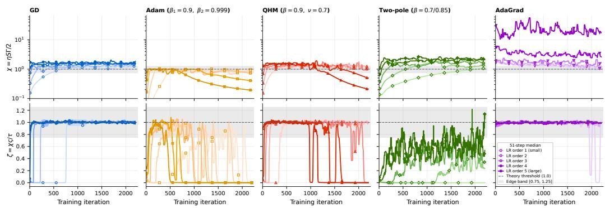  
Figure 1: Edge of stability across different families of optimizers. We train a fully-connected network on CIFAR-10 using various full-batch gradient-based optimizers: gradient descent (GD), Adam, GD with a polezero filter (QHM) and GD with a two-pole filter (Grokfast), and AdaGrad. Theoretical prediction of the edge of stability $\chi : = \eta S \Gamma / 2 = 1 . 0$ is occasionally violated in practice, and the offsets $\chi$ are heavily dependent on the type of optimizers in use. This systematic deviations motivate a new formulation of the realized edge of stability $\zeta : = \chi \varsigma / \tau$ with ς and τ being the spatial and temporal calibrations, respectively. This new formulation is more consistent with the empirical observations and removes the optimization-dependent offsets.

For instance, the original formulation (Cohen et al., 2021) assigns $S = \lambda _ { \mathrm { m a x } } ( H )$ and $\Gamma = 1$ Later, Cohen et al. (2023) incorporate preconditioning by taking $S = \lambda _ { \mathrm { m a x } } ( P ^ { - 1 / 2 } H P ^ { - 1 / 2 } )$ and introduce a factor $\Gamma = \Gamma ( \beta )$ to account for the momentum, e.g., $\Gamma ( \beta ) = \mathrm { \ i } / ( 1 + \beta )$ for Heavy Ball (Polyak, 1964) and $\Gamma ( \beta ) = ( 1 + 2 \beta ) / ( 1 + \beta )$ for Nesterov’s momentum (Nesterov, 1983).

In summary, the edge of stability has been understood as a product of the worst-mode sharpness and separable temporal factors. This formulation provides available stability thresholds that are provably marginal for quadratic objectives. However, we find that the actual relative position of the edge, $\chi : = \eta S \Gamma / 2$ , is not consistent with the theoretical prediction $\chi = 1$ . As Figure 1 shows, its values range from 0.79 to 21.07 across different types of optimizers and learning rates. Even vanilla GD sits above $\chi = 1$ (top left). The median of the saturated curve grow up to $\chi \approx 1 . 6 2$ as the learning rate increases. More complicated optimizers, such as dual-momentum optimizers (Lee et al., 2024; Pagliardini et al., 2025) or pole-zero filters (Ma & Yarats, 2019), show their actual EoS rising to around $\chi = 2 . 6 5$ (columns 3 and 4). The most extreme case is AdaGrad (Duchi et al., 2011) (top right), which shows a clear edge starting from $\chi = 1 . 4 2 \mathrm { a t } \eta = 0 . 0 1$ and reaching $\chi = 2 1 . 0 7$ at $\eta = 0 . 1$ The deviation of $\chi$ from the theoretical prediction of $\chi = 1 . 0$ depends strongly on the underlying optimization algorithm. This systematic deviation poses a new challenge to the current formulation and interpretation of the edge of stability.

In fact, this formulation (2) is hiding a critical assumption: the worst-mode sharpness S is always realized by the optimizer, which is not always the case. Starting from modeling the actual dynamical system the optimizer operates on, we derive a new formulation of the stability threshold from the directional Hessian (Lee & Jang, 2023; Mishkin et al., 2024; Islamov et al., 2026) and the gradientupdate alignment (Lee & Lee, 2025). As shown in the bottom row of Figure 1, this new formulation, called the realized edge of stability $\zeta ,$ largely eliminates optimizer-dependent offsets. Furthermore, it is much more efficient to compute and recovers the original formulation $\chi$ by decomposing it into interpretable factors. This provides a richer understanding of the phenomenon itself and reveals the optimizer’s role in steering along the edge of stability by actively calibrating the temporal gauge and spatial budget.

Our contributions are:

• We extend the original formulation of the edge of stability (Cohen et al., 2021; 2023) to general gradient-based optimizers with states, which is exact for fixed quadratic objectives.

• We derive a new formulation of the stability threshold, based on the directional Hessian and the gradient-update alignment score $( \mathrm { L e e } \ \& \ \mathrm { L e e } , 2 0 2 5 )$ , which is more consistent with empirical observations and eliminates optimizer-dependent offsets.

• We factorize the realized edge of stability $\zeta$ into interpretable components: the original edge of stability $\chi ,$ spatial participation $\varsigma ,$ and temporal calibration $\tau ,$ and show that the two EoS formulations coincide, $\zeta = \chi$ , if and only if $\varsigma = \tau$

• This provides a simple yet powerful diagnostic tool for understanding the main factors driving a training trajectory at the edge of stability, revealing how much of the potential loss decrease, $\pmb { g } ^ { \top } \pmb { u } \overset { \cdot } { = } \mathrm { d } \pmb { \mathcal { L } } \hat { / } \mathrm { d } t$ , carried out by the optimizer is actually converted into real progress $\Delta { \mathcal { L } } .$ , and how much is lost to different components.

## 2 PRELIMINARIES: EDGE OF STABILITY

To understand the edge of stability, we start by reviewing its previously established formulations. Following the aforementioned lines of work, we focus on the full-batch settings where the analysis is more tractable and the effect is more pronounced. Let us define a few notations to clarify the following discussion. In gradient-based optimization, we train a parameter θ by minimizing a loss function $\mathcal { L } ( \pmb \theta )$ through its first-order gradients $\begin{array} { r } { \mathbf { \boldsymbol { g } } : = \nabla _ { \mathbf { \boldsymbol { \theta } } } \mathcal { L } ( \mathbf { \boldsymbol { \theta } } ) } \end{array}$ . We can either use this gradient directly, or filter it by some input-dependent preconditioner $_ { r }$ and temporal filter $Q$ to produce a parameter update u which has the same shape as the parameter θ:

$$
\pmb \theta _ { t + 1 } = \pmb \theta _ { t } - \eta \pmb u _ { t } , \quad \mathrm { w h e r e } \quad \pmb u _ { t } = P _ { t } ^ { - 1 } ( Q _ { t } * \pmb g _ { \le t } ) _ { t } .\tag{♠}
$$

With an input-dependent preconditioner $P _ { t }$ and a causal gradient filter $Q _ { t }$ acting on a history of gradient signal $\mathbf { \pmb { g } } _ { \le t }$ , this gives a generic formulation for gradient-based optimizers with internal states. This not only includes GD, Heavy Ball (Polyak, 1964), Nesterov’s Momentum (Nesterov, 1983), and various preconditioned versions of these (Duchi et al., 2011; Tieleman & Hinton, 2012; Kingma & Ba, 2015; Loshchilov & Hutter, 2019), but also extends to more exotic temporal filters such as dual-momentum (Lee et al., 2024; Pagliardini et al., 2025) or quasi-hyperbolic momentum (QHM) (Ma & Yarats, 2019). For example, GD corresponds to $P _ { t } = I$ and $Q _ { t } = I$ , and Heavy Ball with momentum coefficient $\beta$ is repesented by $\begin{array} { r } { Q \ast g _ { \leq t } = \sum _ { k = 0 } ^ { t } \beta ^ { k } g _ { t - k } } \end{array}$ . Signal processing notation for the gradient filter $Q$ allows us to study this dynamics in frequency domain, $\mathrm { i } . \mathrm { e } . , Q ( z ) =$ $\scriptstyle \sum _ { t = 0 } ^ { \infty } Q _ { t } z ^ { - t }$ . We also assume its dc gain is normalized to $Q ( 1 ) = 1$ , so that the learning rate η is solely responsible for the gain of the system. This simplifies the analysis without loss of generality.

From extensive observations, Cohen et al. (2021; 2023) formulated the EoS as a separable product of a function of the preconditioner $_ { r }$ and a function of the momentum coefficient $\beta ,$

$$
\eta \lambda _ { \mathrm { m a x } } ( P _ { t } ^ { - 1 / 2 } H _ { t } P _ { t } ^ { - 1 / 2 } ) \Gamma ( \beta ) < 2 ,\tag{3}
$$

where $\pmb { H } _ { t }$ is the Hessian at time t. For example, Heavy Ball gives $\Gamma ( \beta ) = 1 / ( 1 + \beta )$ , normalized Heavy Ball gives $\Gamma ( \beta ) = ( 1 - \beta ) / ( 1 + \beta )$ ), Nesterov’s momentum gives $\Gamma ( \beta ) \dot { = } ( 1 + 2 \beta ) / ( 1 + \beta )$ and so on. It is proven for each momentum type that this behaves as a marginal stability condition for the frozen quadratic system (Cohen et al., 2023). The following proposition generalizes their results to any gradient-based optimizer of type (♠).

Proposition 2.1 (Edge of Stability for Stateful Optimizers). [proof] Consider a dynamical system given by the update rule (♠). Let $( \lambda , v )$ be any eigenpair of the preconditioned Hessian $P _ { t } ^ { - 1 / 2 } H _ { t } P _ { t } ^ { - 1 / 2 }$ . Then the gain $k _ { \star } ( Q )$ at the first crossing of the unit circle by the root locus of $\dot { Q } ( z )$ is given by

$$
k _ { \star } ( Q ) = \operatorname* { m i n } _ { \omega \in \Omega _ { + } ( Q ) } \left| \frac { 1 - e ^ { i \omega } } { Q ( e ^ { i \omega } ) } \right| , \quad w h e r e ~ \Omega _ { + } ( Q ) : = \left\{ \omega \in ( 0 , \pi ] : \frac { 1 - e ^ { i \omega } } { Q ( e ^ { i \omega } ) } \in \mathbb { R } _ { > 0 } \right\} ,\tag{4}
$$

where $\Omega _ { + } ( Q )$ is the set offrequencies on the unit circle at which the locus can cross with a real positive gain. If we write $\mathrm { ~ \bar { r } ~ } : = 2 / k _ { \star } ( Q )$ , then the equivalent stability condition for the frozen quadratic system is attained by

$$
\eta \lambda \Gamma \ \leq \ 2 .\tag{♣}
$$

Moreover, if the first unit-circle crossing is at the Nyquistfrequency $z = - 1$ with $Q ( - 1 ) > 0 ;$ , i.e., period-2 oscillation, then $\Gamma = Q ( - 1 )$ and the stability condition becomes $\eta \lambda Q ( - 1 ) \leq 2 .$

Corollary 2.2 (Recovering Cohen et al. (2023)’s formulae). $\left[ \operatorname { p r o o f } \right]$ The coefficient $\Gamma ( \beta )$ in the inequality (3) for momentum-based optimizers is attained at the Nyquist frequency $z = - 1$ , i.e., $\Gamma ( \bar { \beta } ) = \dot { Q } ( - 1 )$ for (dc gain-normalized) Heavy Ball and Nesterov’s momentum.

The detailed derivation is provided in Appendix B.2. The gauge Γ of each optimizer filter, including the cases $\Gamma \neq Q ( - 1 )$ , is derived in Appendix C.1. The sketch of the proof is as follows: Let the parameter along the i-th eigenvector be $x _ { i } = { \pmb v } _ { i } \cdot { \pmb \theta }$ , then the dynamics of the parameter along this direction is given by (omit i for brevity)

$$
x _ { t + 1 } = x _ { t } - \eta \lambda ( Q _ { t } \ast x _ { \leq t } ) _ { t } .\tag{5}
$$

In z-domain, we have $\begin{array} { r } { X ( z ) = \sum _ { t = 0 } ^ { \infty } x _ { t } z ^ { - t } } \end{array}$ and the convolution becomes a multiplication:

$$
z X ( z ) = X ( z ) - \eta \lambda Q ( z ) X ( z ) .\tag{6}
$$

Dividing both sides by $X ( z )$ , we obtain the characteristic transferfunction along this mode:

$$
z - 1 + \eta \lambda Q ( z ) = 0 .\tag{7}
$$

Classical control theory tells us that any linear discrete-time dynamic system must have all its roots

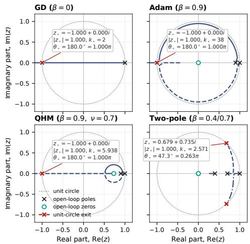  
Figure 2: Root locus of optimizers. It is possible to exit the unit circle at $z \neq - 1$ , i.e., Γ ̸= $Q ( - 1 )$

z inside the unit circle $| z | < 1$ in order to be stable (Ogata, 1995), which gives the results.

From Proposition 2.1 and Corollary 2.2, we see that the original EoS (Cohen et al., 2021) and adaptive EoS (Cohen et al., 2023) are special cases of this general stability condition. The boxed bound (♣) is an available stability limit on a frozen quadratic, which is exact in this case, as demonstrated in Appendix C.3: each eigenmode is independent, Γ is a functional of $Q$ alone, and $\chi : = \eta S \Gamma / 2 \le 1$ is necessary for no mode to be linearly unstable. Using $\chi$ as the observed hovering edge of a nonlinear trajectory is a different statement, which requires an additional occupation hypothesis: over the relevant horizon the update u keeps realizing the worst-case mode of that stability limit. In other words, it stays in $\operatorname { s p a n } ( { \pmb v } _ { \operatorname* { m a x } } )$ of a fixed (preconditioned) Hessian $P _ { t } ^ { - 1 / 2 } H _ { t } P _ { t } ^ { - 1 / \bar { 2 } }$ over the relevant horizon. Still, the marginal stability condition (♣) remains an exact stability limit for the frozen quadratic system on which the original theory is based. It does not, by itself, imply that a nonlinear deep learning trajectory must hover at $\chi = 1$ . It is noteworthy that Q does not play a role in the occupation hypothesis. Section 3 tests the occupation hypothesis first on vanilla GD, where $P = I , Q \bar { \equiv } 1 \mathrm { a n d } \bar { \Gamma } = 1$ , so systematic mispredictions $\chi >$ 1 cannot be blamed on a missing momentum or on a preconditioning artefact.

## 3 OPTIMIZER-DEPENDENT OFFSETS

The extended formulation of the edge of stability (♣) allows us to test Cohen’s formulation of EoS in various optimizers. We train a 5-layer MLP with 200 hidden units with tanh activation on CIFAR-10 (Krizhevsky, 2009) using different full-batch optimizers and learning rates. Specifically, we use gradient descent (GD), GD with Heavy Ball (GDM), GD with Nesterov’s momentum (GDN), Adam (Kingma & Ba, 2015), AdamW (Loshchilov & Hutter, 2019), AdaGrad (Duchi et al., 2011), RMSprop (Tieleman & Hinton, 2012), AdaFactor (Shazeer & Stern, 2018), NAdam (Dozat, 2016), PAdam (Chen et al., 2020), AMSGrad (Reddi et al., 2018), GD with a quasi-hyperbolic momentum (QHM) (Ma & Yarats, 2019), and GD with a Grokfast-like two-pole filter (Lee et al., 2024). For each optimizer, we vary the learning rates on a geometrically scaled grid of five values, depending on the optimizer family. The results are summarized in Figure 1 and Figures 8 and 9, and Table 6 in Appendix E. To measure the discrepancy between the realized and theoretical edge of stability, we define the relative edge of stability $\chi : = \eta S \Gamma / 2$ as a unit-free measure. $\chi = 1$ corresponds to theoretical exactness, and is displayed as dashed lines. We additionally summarize the range of $\chi$ for different (optimizer, lr) in Figure 3. The range is computed as the median of $\chi$ in the interval between first entering $\chi > 0 . 7 5$ and last exiting $\chi < 0 . 7 5$ during each training trajectory.

We observe that the deviation of $\chi$ varies in a very large range $\chi \in [ 0 . 7 9 , 2 1 . 0 7 ]$ in a systematic manner. Different optimizer families exhibit different patterns of deviation, and the offset generally increases with $\eta ,$ as observed in Figure 1 and Figures 8 and 9 in Appendix E. Offsets lower than 1.0 are easy to interpret: either the trajectory remains strictly within the stable region, or the optimizer is not able to drive the trajectory to the edge of stability. Those with offsets greater than 1.0 are more interesting. Complex filters, such as QHM and two-pole, raise χ up to 1.576 and 2.646, respectively. At one extreme, AdaGrad severely violates the $\chi \leq 1$ bound to reach $\chi = 2 1 . 0 7 0$

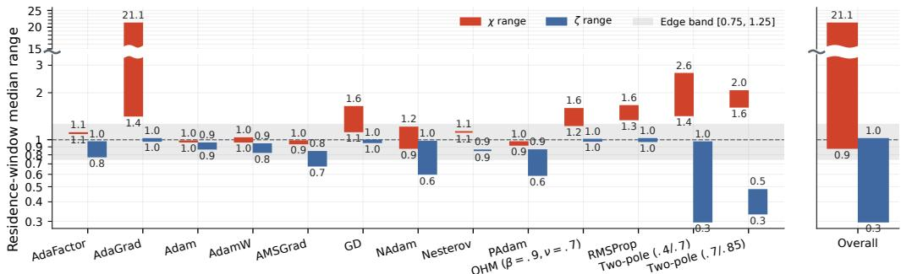  
Figure 3: Family-wise ranges of per-setting interval medians. Medians of $\dot { \chi }$ taken from the interval between first $\chi > 0 . 7 5$ and the final downward exit. The previous formulation of the edge of stability $\chi \leq 1$ (Cohen et al., 2021; 2023) is occasionally violated by large, optimizer-dependent offsets. Our realized EoS ζ has its median universally upper bounded by near 1.0, which is more consistent with the name $\mathrm { \ " e d g e ^ { , } }$ of stability.

Another observation that draws our attention is that even the vanilla full-batch GD violates our expectation to stay near $\chi = 1$ : Table 6 reports in-window median $\chi \mathrm { o f } 0 . 9 0 4 , 1 . 1 3 0 , 1 . 2 4 6 , 1 . 4 7 8 .$ 1.624 across the five learning rates. Its four of five cases sit above $\chi = 1$ bound, and the observed edge systematically increases with η. Since GD uses $P = I$ and $Q \equiv 1$ , hence $\Gamma = 1$ and $\chi = \eta S / 2$ this offset cannot be a missing $\Gamma ( \ddot { \beta } )$ . By contrast, Heavy Ball, Adam, and AdamW stay inside the $\chi \leq 1$ bound, with global median 0.949, 0.960, and 0.971, respectively. The momentum-induced gauge Γ is what those stateful methods relieves from the violation of the edge of stability by GD.

The results not only imply a stabilization mechanism (Damian et al., 2023) that keeps the trajectory stable even outside the guaranteed region of stability by consistently reducing the sharpness, but also suggest that the attractor ofχ itselflies outside the theoretically predicted stable margin. These optimizer-dependent offsets raise a significant concern that the current formulation of the edge of stability is incomplete, especially in how it identifies the empirical edge with $\lambda _ { \mathrm { m a x } }$ rather than with the curvature along the update that is actually taken.

## 4 REALIZED EDGE OF STABILITY

The previous observation calls for an update to our formulation of the edge of stability to account for the actual training dynamics that are representative of the true stability threshold. Previous works (Lee & Jang, 2023; Mishkin et al., 2024; Islamov et al., 2026) give us a hint to this problem: the worst-case eigenmode $\operatorname { s p a n } ( { \pmb v } _ { \operatorname* { m a x } } )$ that defined the boundary of the region of stability in (♣) may not actually be taken as update directions. This idea encourages us to examine the actual update direction u that the optimizer executes during training. We go back to the generalized dynamical system formulation in equation (♠), and ask:

Given the update direction u that the optimizer $( P , Q )$ actually takes, where is the local quadratic stability boundary along this particular ray?

To answer this question, fix the iteration index t and consider a ray in the parameter space along the update direction u from the current parameter θ:

$$
\pmb \theta ( s ) : = \pmb \theta - s \pmb u , \quad 0 \leq s \leq 1 .\tag{8}
$$

Then the Taylor expansion of the objective function along this ray is given by:

$$
\mathcal { L } ( \pmb \theta ( s ) ) = \mathcal { L } ( \pmb \theta ) - s \pmb g ^ { \top } \pmb u + \frac { s ^ { 2 } } { 2 } \pmb { u } ^ { \top } \nabla _ { \pmb \theta } ^ { 2 } \mathcal { L } ( \pmb \theta - \xi s \pmb u ) \pmb u , \quad \mathrm { f o r ~ s o m e ~ } \xi \in [ 0 , 1 ] .\tag{9}
$$

The term $\bar { H } _ { \eta , u } : = \nabla _ { \pmb { \theta } } ^ { 2 } \mathcal { L } ( \pmb { \theta } - \xi s \pmb { u } )$ is the weighted secant Hessian of the objective function along the ray that can be obtained from the current Hessian:

$$
\bar { H } _ { \eta , u } : = 2 \int _ { 0 } ^ { 1 } ( 1 - s ) \nabla _ { \theta } ^ { 2 } \mathcal { L } ( \theta - s \eta u ) d s .\tag{10}
$$

Define the alignment score $A : = \pmb { g } ^ { \top }$ u and the curvature load $B : = \eta \pmb { u } ^ { \top } \bar { \pmb { H } } _ { \eta , \pmb { u } } \pmb { u } / 2$ . Then

$$
\mathcal { L } ( \pmb \theta ( s ) ) = \mathcal { L } ( \pmb \theta ) - s A + \frac { s ^ { 2 } } { \eta } B .\tag{11}
$$

Assuming net-zero improvement $\mathcal { L } ( \pmb { \theta } ( s ) ) = \mathcal { L } ( \pmb { \theta } )$ , we have a quadratic equation in $s ,$ which has a nontrivial solution $s _ { * } = \eta A / B$ . The actual step size η should be smaller than $s _ { * }$ to ensure positive improvement. This yields the local quadratic stability boundary with respect to the update direction u deliberately chosen by the optimizer, which we call the realized edge of stability ζ:

$$
\zeta : = \frac { \eta } { s _ { * } } = \frac { B } { A } = \frac { \eta } { 2 } \frac { \boldsymbol { u } ^ { \top } \bar { H } _ { \eta , \boldsymbol { u } } \boldsymbol { u } } { g ^ { \top } \boldsymbol { u } } \le 1 .\tag{♢}
$$

It is helpful to notice that, by the chain rule, the alignment score is exactly the learning ratecompensated loss drop rate for the full-batch update (Lee & Lee, 2025):

$$
A = g ^ { \top } { \boldsymbol { u } } = \nabla _ { \theta } { \mathcal { L } } ^ { \top } \left( - { \frac { \mathrm { d } \theta } { \eta \mathrm { d } t } } \right) = - { \frac { 1 } { \eta } } { \frac { \mathrm { d } { \mathcal { L } } } { \mathrm { d } t } } = - { \frac { \mathrm { d } { \mathcal { L } } } { \mathrm { d } s } } .\tag{12}
$$

In other words, the alignment score $A$ measures the actual learning work done by the optimizer to decrease the loss along the update direction ${ \mathbf { } } ^ { \mathbf { } } \mathbf { \Delta } ^ { \mathbf { } } \mathbf { u } ,$ with a time granularity (sampling interval) $\eta \mathrm { d } t = \mathrm { d } s$ Similarly, the curvature load $B$ measures the reduction in the loss drop rate due to the curvature of the loss landscape along the update direction u:

$$
B = \frac { \eta } { 2 } \pmb { u } ^ { \top } \bar { \pmb { H } } _ { \eta , \pmb { u } } \pmb { u } = A + \frac { \mathcal { L } ( \pmb { \theta } - \eta \pmb { u } ) - \mathcal { L } ( \pmb { \theta } ) } { \eta } = A + \frac { \Delta \mathcal { L } } { \eta } = - \frac { \mathrm { d } \mathcal { L } } { \mathrm { d } s } - \left( - \frac { \Delta \mathcal { L } } { \Delta s } \right) ,\tag{13}
$$

where $\Delta s = \eta \Delta t = \eta$ (since $\Delta t = 1$ for the iteration indices). Borrowing a physics analogy, if we casually refer to the loss drop rate A as the learning power, we can call the curvature load B the learning power dissipation by the loss landscape along the update direction u. Therefore, ζ is a unit-free ratio of the learning power dissipation to the learning power output of the optimizer $( P , Q )$ . In this sense, we may call the realized EoS ζ the learning impedance of the task.

To better understand the relationship between the realized $\zeta$ and the relative edge of stability $\chi ,$ let us define a few more quantities and decompose the realized EoS ζ into factors involving χ. The directional smoothness from previous works (Lee & Jang, 2023; Mishkin et al., 2024; Islamov et al., 2026), $D ^ { \| \cdot \| }$ , is a normalized curvature load, written in our notation as $D ^ { \| \cdot \| _ { P } } : = 2 B / ( \eta \| \boldsymbol { u } \| _ { P } ^ { 2 } )$ Recall that the maximum sharpness $S$ in (♣) is defined as $S \ = \ \lambda _ { \mathrm { m a x } } ( P ^ { - 1 / 2 } H P ^ { - 1 / 2 } ) =$ $\operatorname* { m a x } _ { { \pmb u } \neq 0 } { \pmb u } ^ { \top } { \pmb H } { \pmb u } / \| { \pmb u } \| _ { P } ^ { 2 }$ . If the Hessian H remains almost constant along the ray, then $\bar { \pmb { H } } _ { \eta , \pmb { u } } \overset { \cdot } { \simeq } \pmb { H }$ implies $S \simeq \operatorname* { m a x } _ { u \neq 0 } D ^ { \| \cdot \| _ { P } }$ . Hence, $D ^ { \| \cdot \| _ { P } } \leq S$ . Therefore, we can define a spatial participation factor $\varsigma : = D ^ { \| \cdot \| _ { P } } / S ,$ a unit-free measure of how much of the maximally available sharpness is actuated by the curvature along the update direction u taken by the optimizer. Its value becomes 1 when we take the worst-case direction $\pmb { u } = \mathrm { s p a n } ( \pmb { v } _ { \mathrm { m a x } } )$ , and is lower when we take other directions.

Also, recall that Γ in (♣) is the gain of the gradient filter $Q$ at the escape frequency of its root locus. In other words, at this escape frequency, the optimizer applies the update $\pmb { u } = \pmb { P } ^ { - 1 } ( \Gamma \pmb { g } )$ Equivalently, $\pmb { g } = \Gamma ^ { - 1 } P \pmb { u }$ . If the update realizes the escape mode of Proposition 2.1, then u = $P ^ { - 1 } ( \Gamma g )$ and the learning power takes the form $A = ( \Gamma ^ { - 1 } \dot { P } u ) ^ { \top } u = \| u \| _ { P } ^ { 2 } / \Gamma$ . Therefore, we can define a temporal calibration factor $\tau : = A / ( \| \boldsymbol { \boldsymbol { u } } \| _ { P } ^ { 2 } / \dot { \Gamma } ) = \Gamma \dot { A _ { \langle } } / \| \boldsymbol { \boldsymbol { u } } \| _ { P } ^ { 2 } ,$ a unit-free measure of how closely the actual learning power agrees with the power predicted by that escape mode. Its value is 1 when the filtered stream is in phase with Γg in the P-inner product, and is identically 1 for vanilla GD $( \Gamma = 1 , \pmb { u } = \pmb { g } )$

Using these factors, we can now exactly decompose the realized EoS ζ into the following factors:

$$
\zeta = \frac { \eta S \Gamma } { 2 } \cdot \frac { u ^ { \top } \bar { H } _ { \eta , u } u } { S \| u \| _ { P } ^ { 2 } } \cdot \frac { \| u \| _ { P } ^ { 2 } } { \Gamma g ^ { \top } u } = \chi \frac { \zeta } { \tau } = \mathrm { ( r e l a t i v e ~ E o S ) } \times \frac { \mathrm { ( s p a t i a l ~ p a r t i c i p a t i o n ) } } { \mathrm { ( t e m p o r a l ~ c a l i b r a t i o n ) } } ,\tag{♡}
$$

Therefore $\zeta = \chi$ if and only $\operatorname { i f } \varsigma = \tau$ . The factors ς and τ account for the spatial and temporal discrepancies between the actual update and the binding mode of the available certificate, and their equivalence is not trivially guaranteed. Refer to Corollary 5.1 and Appendix B.5 for the exact condition and the GD reduction $\tau \equiv 1$

## 5 COINCIDENCE AND NONSEPARABILITY

We now delve into the implications of the new formulation (♡) in more detail. We are interested in the conditions under which the two values ζ and $\chi$ are equal and when they become different. The following corollary is the exact content of $( \heartsuit )$

Corollary 5.1 (Coincidence). [proof] Fix an iteration and assume $\eta , S , \Gamma > 0 , \pmb { u } \neq \mathbf { 0 } ,$ , and $A = \pmb { g } ^ { \top } \pmb { u } \neq 0$ . Then (♡) is an identity, and

$$
\zeta \ = \ \chi \quad \Longleftrightarrow \quad \varsigma \ = \ \tau \quad \Longleftrightarrow \quad u ^ { \top } { \bar { \pmb { H } } } _ { \eta , u } { \boldsymbol { u } } \ = \ S \Gamma g ^ { \top } { \boldsymbol { u } } .\tag{14}
$$

The separate conditions $\varsigma = 1$ and $\tau = 1$ are sufficient for coincidence and not necessary: they impose two scalar constraints where $( I 4 )$ imposes one. In particular, vanilla GD $( P = I , \stackrel { \cdot } { Q } \equiv \stackrel { \cdot } { 1 } )$ has $\Gamma = 1$ and $\tau \equiv 1$ at every step, so $\zeta = \chi \varsigma$ and coincidence reduces to occupation $\varsigma = 1$ . At the realized edge $\zeta = 1$ one must have $\chi = \tau / \varsigma$

The proof is the cancellation in Appendix B.5. In plain language, the original edge χ equals the realized edge $\zeta$ exactly when spatial participation ς matches temporal calibration τ. For GD, since its τ is fixed to unity, the systematic violation of $\chi > 1$ immediately translates to $\rvert \varsigma < 1$ . We observe that Adam, AdamW, and Heavy Ball in Section 3 have both $\chi$ and $\zeta$ near 1. This translates to $\varsigma \approx \tau .$

The following corollary isolates the one special case in which coincidence is structural rather than accidental, namely $\varsigma = \tau = 1$ rather than a mere cancellation $\varsigma = \tau$

Corollary 5.2 (Coincidence on a mode-locked quadratic system). [proof] Assume the following over the memory horizon of the filter Q. (Q1) The loss is quadratic over the memory horizon: $\pmb { g } _ { s } = \pmb { H } ( \pmb { \theta } _ { s } - \pmb { \theta } _ { \star } )$ ) and therefore $\bar { \pmb { H } } _ { \eta , \pmb { u } } = \pmb { H }$ . (Q2) The preconditioner isfrozen: $P _ { s } \equiv P \succ 0 . ( Q 3 )$ The trajectory is locked to the sharpest preconditioned eigenmode: $\theta _ { s } - \theta _ { \star } = x _ { s } P ^ { - 1 / 2 } v _ { \mathrm { { m a x } } }$ for scalars $x _ { s } ,$ , where $x _ { t } \neq 0 . \ ( Q 4 )$ The root locus ofQ escapes at the Nyquistfrequency: $\Gamma = Q ( - 1 )$ and the locked mode is in period-2 oscillation, $x _ { t - k } \ = \ ( - 1 ) ^ { k } x _ { t }$ Then the alignment score is automatically nondegenerate, $A = \Gamma S ^ { 2 } x _ { t } ^ { 2 } > 0 ,$ , and $\varsigma = \tau = 1$ , and therefore the realized EoS ζ is exactly the relative edge of stability $\chi \colon \zeta = \chi = \eta S Q ( - 1 ) / 2$ . Dropping the period-2 part of (Q4), even while keeping $\Gamma \stackrel { - } { = } Q ( - 1 )$ , preserves $\varsigma = 1$ but gives

$$
\tau = { \frac { \Gamma x _ { t } } { ( Q * x _ { \leq t } ) _ { t } } } ,\tag{15}
$$

which equals 1 only when thefiltered stream is in phase with the gradient at the escape gain.

The proof is provided in Appendix B.6. Corollary 5.2 reveals assumptions that are used to derive the original boundary $\chi \leq 1$ in previous works (Cohen et al., 2021; 2023). In this worst-mode-locked quadratic regime, our realized EoS $\zeta \leq 1$ of (♢) is exactly the original EoS $\chi \leq 1$ of (♣). Our formulation generalizes the previous works in this precise sense.

Each of the assumptions (Q1)–(Q4) fails in an identifiable way, and the observations of Section 3 split across those failure types. The decomposition of (♡), therefore, not only serves as an evidence that ζ generalizes $\chi ,$ but also a useful diagnostic toolkit for analyzing the edge of stability: (Q1) fails whenever the third-order term along the ray is non-negligible, so that $\bar { { \cal H } } _ { n , u } ^ { - } \neq { \cal H } ; ( \bar { \mathrm { Q } } 2 )$ fails for adaptive preconditioners, whose $P _ { t }$ drifts over the memory horizon of $Q ; ( \mathbf { Q } 3 )$ fails whenever the update actuates a non-maximal direction, including vanilla GD, where ${ \boldsymbol { \mathbf { \mathit { u } } } } = { \boldsymbol { \mathbf { \mathit { g } } } } ;$ and (Q4) fails for any filter whose root locus escapes away from $z = - 1$ , or whose locked mode is not in period-2 oscillation. We can categorize the observation results in Section 3 into the following cases: GD is (Q3) with $\tau \equiv 1 ( \chi = 1 . 1 2 4 > 1 , \zeta = 0 . 9 8 3 \approx 1 ) \pi$ Adam, AdamW, and Heavy Ball are near coincidence after Γ-scaling (χ at 0.960, 0.971, and 0.949 against ζ at 0.964, 0.919, and 0.983, respectively); AdaGrad is (Q2)–(Q3) $( \chi = 2 1 . 0 7 0 \gg 1$ , yet $\mathit { \check { \zeta } } = \mathrm { { 1 . 0 0 2 } \approx 1 ) }$ ; QHM mixes a moderate χ offset with $\zeta = 1 . 0 0 0$ ; and the two-pole cascades are (Q4), with $\chi = 2 . 6 4 6 > 1$ and no ζ reaches the edge. This identifies the actual causes of the offsets as elaborated in Section 6.

We now record what Corollary 5.1 implies for the available stability limit: χ determines ζ only through the ratio $\varsigma / \tau _ { ; }$ , which the gauges (S, Γ) do not control.

Theorem 5.3 (Insufficiency of χ for the realized edge). [proof] Assume $\eta , S , \Gamma > 0 , \pm 0 \neq { \bf 0 } ,$ , and $A \neq 0$ . By Corollary ${ 5 . } I , { \dot { \zeta } } = { \dot { \chi } } i f$ and only $i f \varsigma = \tau$ . Consequently $( \eta , S , \Gamma )$ determine ζ if and only if they determine the ratio $\varsigma / \tau$ . For vanilla GD $( P = I , \bar { Q } \equiv \bar { 1 } )$ one has $\tau \equiv 1$ and $\zeta = \chi \varsigma ,$ so $\chi$ determines ζ if and only if occupation ς is a function of $( \eta , S )$ alone. This alreadyfails on any frozen quadratic in dimension at least 2 whose gradient is not an eigen-direction ofH: then ς is the Rayleigh ratio $\pmb { g } ^ { \top } \pmb { H } \pmb { g } / ( S \| \pmb { g } \| ^ { 2 } )$ and is not determined by $S = \lambda _ { \mathrm { m a x } } ( H )$ ).

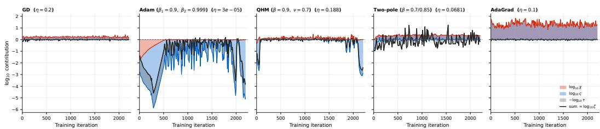

(a) Decomposition of the realized edge of stability ζ from a single experiment.  
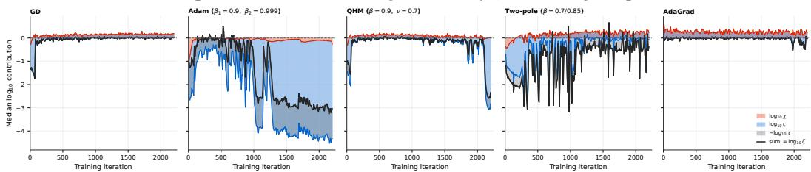  
(b) Decomposition of optimizer-family-wise contributions to $\zeta ,$ median from an LR sweep of size 5.  
Figure 4: EoS stack plot. Decomposition of the realized EoS ζ into factors in log-scale, involving the (relative) edge of stability χ (red area and line), the spatial participation factor $\varsigma$ (blue area and line), and the temporal calibration factor τ (grey overlay and black line). Note that log τ operates in the opposite direction by subtraction.

The proof of Theorem 5.3 is the identity of Corollary 5.1 together with the GD reduction $\tau \equiv 1$ detailed in Appendix B.8. It is important to mention that this result does not falsify previous works’ contributions on formulating the EoS (Cohen et al., 2021; 2023), but rather we circumscribe the scope of their claims to the case where the update direction is fixed to the fixed maximum curvature, which is condition (Q3) of Corollary 5.2. Violation of this condition implies that the optimizer is more than just a prescribed algorithmic procedure, but rather an active decision-maker that chooses the edge it wants to occupy among the available options provided by the current loss landscape.

## 6 DISCUSSION

Previous formulations of the edge of stability (Cohen et al., 2021; 2023; Islamov et al., 2026) and its generalized version in Proposition 2.1 predict available worst-case marginality $\chi .$ Our realized EoS ζ reveals whether and how this available margin is actually trod upon by the optimizer. This distinction offers a new way to understand the training dynamics of different optimizer families.

## 6.1 DIAGNOSTIC APPLICATIONS

If we take the logarithm of the multiplicative relationship in (♢), we can decompose the realized EoS $\zeta$ into additive factors:

$$
\log { \zeta } = \log { \chi } + \log { \zeta } - \log { \tau } .\tag{16}
$$

This simple additive relationship holds for every iteration, allowing us to draw an EoS stack plot, as in Figure 4, to visualize how each factor contributes to the realized EoS $\zeta$ during the training process. We can use this stack plot as a new diagnostic tool to study training dynamics online, for various instances and families of optimizers.

The first thing we notice from the EoS stack plot in Figure 4 is that the spatial participation factor ς compensates for $\chi$ even without a nontrivial preconditioner. Vanilla GD has $\tau \equiv 1$ , so the stack is log $\zeta = \log \chi + \log \varsigma$ . The compansation from $\chi = 1$ .124 to $\zeta = 0 . 9 8 3$ is solely due to $\varsigma < 1$ . The same happens to AdaGrad’s extreme offset $\chi \approx 2 1 . 1$ , which is mostly compensated by $\varsigma ,$ resulting in $\zeta \approx 1$ . In other words, the optimizer often selects updates u in nonmaximal sharpness directions, and GD already does so. This explains why the previous edge of stability formulation based on the worst-mode update $\pmb { u } _ { \mathrm { m a x } }$ was not sufficient to predict the actual EoS $\zeta .$ Another interesting observation is that the temporal calibration factor τ can act in either direction, depending on the type of gradient filter $Q .$ . For Adam and QHM, τ is mostly negative, but for more complicated filters like two-pole filters, τ can be positive, pulling the dynamics away from the edge of stability. Adam’s near-coincidence $\chi \approx \zeta \approx 1$ 1 is therefore $\varsigma \approx \tau$ after Γ is included in $\chi ,$ not a restoration of occupation $\varsigma = 1$ . This single observation already explains the main cause of the family-dependent offsets in the edge of stability $\chi$ and allows us to visualize how different optimizer families compensate for this effect and actively shape their training dynamics online.

Table 1: Computation requirements. For one full-batch optimizer step (Adam, params=777k, batch=50k, 8-step Lanczos, 1× RTX 5090). ζ requires no HVPs, reducing computation time by 95.3%.
<table><tr><td>Component</td><td>Calculation formula</td><td>HVPs</td><td>Time (ms)</td><td>Peak mem. (MiB)</td></tr><tr><td> $\chi = \eta S \Gamma$ </td><td>k-step Lanczos sharpness</td><td>8</td><td> $1 1 0 . 1 5 \pm 2 . 5 6$ </td><td>767.3</td></tr><tr><td> $\dot { \varsigma } = \dot { 2 B } / ( \eta D S )$ </td><td>k-step Lanczos sharpness</td><td>8</td><td> $1 1 4 . 8 4 \pm 1 . 1 5$ </td><td>767.3</td></tr><tr><td> $\dot { \tau } = 2 \Gamma \dot { A } / \dot { D }$ </td><td>gradient contractions</td><td>0</td><td> $5 . 2 2 \pm 0 . 0 0$ </td><td>305.4</td></tr><tr><td> $\zeta = B / A$ </td><td>gradient contractions</td><td>0</td><td> $5 . 2 0 \pm 0 . 0 1$ </td><td>305.4</td></tr></table>

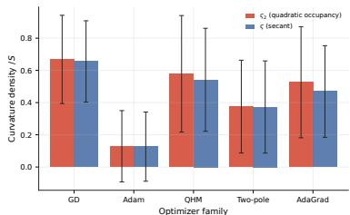  
Figure $5 \colon \varsigma \ : \mathbf { v s } . \ : \varsigma _ { 2 }$ for optimizers.

## 6.2 COST BENEFITS

One additional benefit of realized EoS $\zeta$ is that it does not require heavy calculation. Since

$$
\zeta = \frac { B } { A } = \frac { A + \Delta \mathcal { L } / \eta } { A } = 1 + \frac { \Delta \mathcal { L } } { \eta g ^ { \top } u } ,\tag{17}
$$

we can compute $\zeta$ directly from the current gradient $^ { g , }$ the chosen update direction ${ \mathbf { } } ^ { \mathbf { } } \mathbf { \Delta } ^ { \mathbf { } } \mathbf { u } ,$ and the resulting change in loss $\Delta \mathcal { L }$ at each training iteration. In comparison, previous definition of the EoS involves a maximizer on preconditioned Hessian (Cohen et al., 2021; 2023; Islamov et al., 2026), which is not only computationally expensive, requiring multiple Hessian-vector products (HVPs), but also forces us to use approximate measures. Table 1 summarizes the computation costs for each component of (16), all measured from the same CIFAR-10 training using the 200-5-tanh model in the initial report (Cohen et al., 2021). We highlight that our formulation is both cost-effective and exact for full-batch optimization.

## 6.3 EFFECT OF HIGHER-ORDER TERMS

Similar to the original edge of stability (Cohen et al., 2021; 2023; Islamov et al., 2026), Figure 1 shows how actual training trajectories are attracted to, oscillate around, and are eventually pushed away from the edge of stability $\zeta = 1$ . As in previous works on EoS (Damian et al., 2023; Mulayoff & Stich, 2026), we can derive sufficient conditions for the stabilization mechanism to take effect. Since our main focus is to resolve the optimizer-dependent offsets found in the empirical EoS, we defer this analysis to Appendix D. In our formulation of $\zeta ,$ the higher-order terms are absorbed into the weighted secant Hessian $\bar { H } _ { \eta , u }$ and thus into the spatial participation factor ς. If we want to isolate the effect of the higher-order terms, we can define the second-order-only spatial participation factor $\varsigma _ { 2 } : = { \pmb u } ^ { \top } { \pmb H } { \pmb u } / ( S \| \mathbf { \bar { u } } \| _ { P } ^ { 2 } )$ and compare it with ς, as shown in Figure 5. Although higher-order terms are essential for maintaining stability beyond the edge of stability, their magnitudes contribute negligibly to the realized EoS $\zeta$ when we study the position of the edge.

## 6.4 LIMITATIONS

This work focuses on full-batch optimization, where the theory is exactly realized in practice. In mini-batch optimization, the terms $\begin{array} { r } { A = \pmb { g } ^ { \top } \pmb { u } , B = \eta \pmb { u } ^ { \top } \pmb { H } \pmb { u } / \overset { . } { 2 } } \end{array}$ , and their ratio $\zeta = B / A$ become stochastic due to changes in the instantaneous loss landscape $\dot { \mathcal { L } }$ along the trajectory. This makes the analysis more challenging and complicates the interpretation of the ratio $\zeta .$ . Previous works treat the incorporation of stochastic scenarios as an independent problem, which is sometimes referred to as the edge of stochastic stability (EoSS) Andreyev & Beneventano (2024); Andreyev et al. (2026). We likewise leave the extension of our framework to the stochastic setting for future work.

## 7 CONCLUSION

The edge of stability has been studied primarily as an effect related to the maximum curvature mode of the loss landscape. This turns out to be only half of the story. The other half is the effect of time-varying stateful optimizers that actually take the updates, given a loss landscape and gradient history. Neglecting this aspect leads to optimizer-dependent systematic offsets in estimating the edge of stability, which are largely eliminated in our framework on the realized edge of stability. Decomposing the realized EoS into factors results in diagnostic tools that provide a richer understanding of training dynamics under gradient-based optimizers.

## REFERENCES

Atish Agarwala, Fabian Pedregosa, and Jeffrey Pennington. Second-order regression models exhibit progressive sharpening to the edge of stability. In ICML, volume 202, pp. 169–195, 2023.

Kwangjun Ahn, Jingzhao Zhang, and Suvrit Sra. Understanding the unstable convergence of gradient descent. In ICML, volume 162, 2022.

Kwangjun Ahn, Sebastien Bubeck, Sinho Chewi, Yin Tat Lee, Felipe Suarez, and Yi Zhang. Learning threshold neurons via edge of stability. In NeurIPS, 2023.

Arseniy Andreyev and Pierfrancesco Beneventano. Edge of stochastic stability: Revisiting the edge of stability for SGD. arXiv preprint arXiv:2412.20553, 2024.

Arseniy Andreyev, Advikar Ananthkumar, Marc Walden, Tomaso Poggio, and Pierfrancesco Beneventano. Momentum further constrains sharpness at the edge of stochastic stability. In ICML, 2026.

Sanjeev Arora, Zhiyuan Li, and Abhishek Panigrahi. Understanding gradient descent on the edge of stability in deep learning. In ICML, volume 162, pp. 948–1024, 2022.

Dimitri P Bertsekas. Nonlinear Programming. Athena Scientific, Belmont, MA, 2nd edition, 1999.

Jinghui Chen, Dongruo Zhou, Yiqi Tang, Ziyan Yang, Yuan Cao, and Quanquan Gu. Closing the generalization gap of adaptive gradient methods in training deep neural networks. In IJCAI, 2020.

Lei Chen and Joan Bruna. Beyond the edge of stability via two-step gradient updates. In ICML, volume 202, pp. 4330–4391, 2023.

Xuxing Chen, Krishnakumar Balasubramanian, Promit Ghosal, and Bhavya Agrawalla. From stability to chaos: Analyzing gradient descent dynamics in quadratic regression. Transactions on Machine Learning Research, 2024.

Jeremy M. Cohen, Simran Kaur, Yuanzhi Li, J. Zico Kolter, and Ameet Talwalkar. Gradient descent on neural networks typically occurs at the edge of stability. In ICLR, 2021.

Jeremy M. Cohen, Behrooz Ghorbani, Shankar Krishnan, Naman Agarwal, Sourabh Medapati, Michal Badura, Daniel Suo, David Cardoze, Zachary Nado, George E. Dahl, and Justin Gilmer. Adaptive gradient methods at the edge of stability. In NeurIPS 2023 Workshop on Heavy Tails in Machine Learning: Structure, Stability, and Dynamics, 2023.

Jeremy M. Cohen, Alex Damian, Ameet Talwalkar, J. Zico Kolter, and Jason D. Lee. Understanding optimization in deep learning with central flows. In ICLR, 2025.

Alex Damian, Eshaan Nichani, and Jason D. Lee. Self-stabilization: The implicit bias of gradient descent at the edge of stability. In ICLR, 2023.

Timothy Dozat. Incorporating nesterov momentum into adam. In Proceedings of the 4th International Conference on Learning Representations (ICLR) Workshop, 2016.

John Duchi, Elad Hazan, and Yoram Singer. Adaptive subgradient methods for online learning and stochastic optimization. JMLR, 12(61):2121–2159, 2011.

Mathieu Even, Scott Pesme, Suriya Gunasekar, and Nicolas Flammarion. (S)GD over diagonal linear networks: Implicit bias, large stepsizes and edge of stability. In NeurIPS, 2023.

Avrajit Ghosh, Soo Min Kwon, Rongrong Wang, Saiprasad Ravishankar, and Qing Qu. Learning dynamics of deep matrix factorization beyond the edge of stability. In ICLR, 2025.

Justin Gilmer, Behrooz Ghorbani, Ankush Garg, Sneha Kudugunta, Behnam Neyshabur, David Cardoze, George Edward Dahl, Zachary Nado, and Orhan Firat. A loss curvature perspective on training instabilities of deep learning models. In ICLR, 2022.

Igor Gitman, Hunter Lang, Pengchuan Zhang, and Lin Xiao. Understanding the role of momentum in stochastic gradient methods. In NeurIPS, 2019.

Thomas Hofmann. The map behind the flow: Finite-step gradient descent as a dynamical system. arXiv preprint arXiv:2607.04993, 2026.

Bin Hu and Laurent Lessard. Control interpretations for first-order optimization methods. In ACC, pp. 3114–3119, 2017.

Rustem Islamov, Michael Crawshaw, Jeremy Cohen, and Robert Gower. Non-euclidean gradient descent operates at the edge of stability. In ICML, 2026.

Stanisław Jastrz˛ebski, Zachary Kenton, Nicolas Ballas, Asja Fischer, Yoshua Bengio, and Amos Storkey. On the relation between the sharpest directions of DNN loss and the SGD step length. In ICLR, 2019.

Stanisław Jastrz˛ebski, Maciej Szymczak, Stanislav Fort, Devansh Arpit, Jacek Tabor, Kyunghyun Cho, and Krzysztof Geras. The break-even point on optimization trajectories of deep neural networks. In ICLR, 2020.

Kaiqi Jiang, Jeremy Cohen, and Yuanzhi Li. Understanding the evolution of the neural tangent kernel at the edge of stability. In NeurIPS, 2025.

Diederik P. Kingma and Jimmy Ba. Adam: A method for stochastic optimization. In ICLR, 2015.

Itai Kreisler, Mor Shpigel Nacson, Daniel Soudry, and Yair Carmon. Gradient descent monotonically decreases the sharpness of gradient flow solutions in scalar networks and beyond. In ICML, volume 202, pp. 17684–17744, 2023.

Alex Krizhevsky. Learning multiple layers of features from tiny images. Technical report, University of Toronto, 2009.

Jaerin Lee and Kyoung Mu Lee. Greedy alignment principle for optimizer selection. arXiv preprint arXiv:2512.06370, 2025.

Jaerin Lee, Bong Gyun Kang, Kihoon Kim, and Kyoung Mu Lee. Grokfast: Accelerated grokking by amplifying slow gradients. arXiv preprint arXiv:2405.20233, 2024.

Sungyoon Lee and Cheongjae Jang. A new characterization of the edge of stability based on a sharpness measure aware of batch gradient distribution. In ICLR, 2023.

Laurent Lessard, Benjamin Recht, and Andrew Packard. Analysis and design of optimization algorithms via integral quadratic constraints. SIAM Journal on Optimization, 26(1):57–95, 2016.

Aitor Lewkowycz, Yasaman Bahri, Ethan Dyer, Jascha Sohl-Dickstein, and Guy Gur-Ari. The large learning rate phase of deep learning: the catapult mechanism. arXiv preprint arXiv:2003.02218, 2020.

Xianliang Li, Jun Luo, Zhiwei Zheng, Hanxiao Wang, Li Luo, Lingkun Wen, Linlong Wu, and Sheng Xu. On the performance analysis of momentum method: A frequency domain perspective. In ICLR, 2025.

Elon Litman. The origin of edge of stability. arXiv preprint arXiv:2604.20446, 2026.

Ilya Loshchilov and Frank Hutter. Decoupled weight decay regularization. In ICLR, 2019.

Kaifeng Lyu, Zhiyuan Li, and Sanjeev Arora. Understanding the generalization benefit of normalization layers: Sharpness reduction. In NeurIPS, 2022.

Chao Ma, Daniel Kunin, Lei Wu, and Lexing Ying. Beyond the quadratic approximation: The multiscale structure of neural network loss landscapes. Journal of Machine Learning, 1(3):247– 267, 2022.

Jerry Ma and Denis Yarats. Quasi-hyperbolic momentum and adam for deep learning. ICLR, 2019.

Pierre Marion. Edge flow: A tractable and predictive continuous-time model for gradient descent at the edge of stability. arXiv preprint arXiv:2606.18080, 2026.

Aaron Mishkin, Ahmed Khaled, Yuanhao Wang, Aaron Defazio, and Robert M. Gower. Directional smoothness and gradient methods: Convergence and adaptivity. In NeurIPS, 2024.

Rotem Mulayoff and Sebastian U. Stich. On the stability of nonlinear dynamics in GD and SGD: Beyond quadratic potentials. In COLT, volume 336, pp. 5210–5243, 2026.

Yurii E. Nesterov. A method for solving the convex programming problem with convergence rate $o ( 1 / k ^ { 2 } )$ . Doklady Akademii Nauk SSSR, 269(3):543–547, 1983. English translation: Soviet Mathematics Doklady, 27(2):372–376, 1983.

Katsuhiko Ogata. Discrete-Time Control Systems. Prentice-Hall, Englewood Cliffs, NJ, 2nd edition, 1995.

James M Ortega and Werner C Rheinboldt. Iterative Solution of Nonlinear Equations in Several Variables. Academic Press, New York-London, 1970.

Matteo Pagliardini, Pierre Ablin, and David Grangier. The AdEMAMix optimizer: Better, faster, older. In ICLR, 2025.

Boris T. Polyak. Some methods of speeding up the convergence of iteration methods. USSR Computational Mathematics and Mathematical Physics, 4(5):1–17, 1964.

Ning Qian. On the momentum term in gradient descent learning algorithms. Neural Networks, 12 (1):145–151, 1999.

Sashank J. Reddi, Satyen Kale, and Sanjiv Kumar. On the convergence of Adam and beyond. In ICLR, 2018.

Eric Regis and Sinho Chewi. A rod flow model for Adam at the edge of stability. arXiv preprint arXiv:2605.06821, 2026a.

Eric Regis and Sinho Chewi. Rod flow: A continuous-time model for gradient descent at the edge of stability. arXiv preprint arXiv:2602.01480, 2026b.

Noam Shazeer and Mitchell Stern. Adafactor: Adaptive learning rates with sublinear memory cost. In ICML, 2018.

Minhak Song and Chulhee Yun. Trajectory alignment: Understanding the edge of stability phenomenon via bifurcation theory. In NeurIPS, 2023.

Tijmen Tieleman and Geoffrey Hinton. Lecture 6.5—-RMSProp: Divide the gradient by a running average of its recent magnitude. COURSERA: Neural Networks for Machine Learning, 2012.

Bryan Van Scoy, Randy A. Freeman, and Kevin M. Lynch. The fastest known globally convergent first-order method for minimizing strongly convex functions. IEEE Control Systems Letters, 2(1): 49–54, 2018.

Yuqing Wang, Zhenghao Xu, Tuo Zhao, and Molei Tao. Good regularity creates large learning rate implicit biases: edge of stability, balancing, and catapult. Journal ofMachine Learning Research, 26(273):1–68, 2025.

Zixuan Wang, Zhouzi Li, and Jian Li. Analyzing sharpness along GD trajectory: Progressive sharpening and edge of stability. In NeurIPS, 2022.

Jingfeng Wu, Vladimir Braverman, and Jason D. Lee. Implicit bias of gradient descent for logistic regression at the edge of stability. In NeurIPS, 2023.

Jingfeng Wu, Peter L. Bartlett, Matus Telgarsky, and Bin Yu. Large stepsize gradient descent for logistic loss: Non-monotonicity of the loss improves optimization efficiency. In COLT, volume 247, pp. 5019–5073, 2024.

Chen Xing, Devansh Arpit, Christos Tsirigotis, and Yoshua Bengio. A walk with SGD. arXiv preprint arXiv:1802.08770, 2018.

Libin Zhu, Chaoyue Liu, Adityanarayanan Radhakrishnan, and Mikhail Belkin. Catapults in SGD: spikes in the training loss and their impact on generalization through feature learning. In ICML, volume 235, pp. 62476–62509, 2024.

Xingyu Zhu, Zixuan Wang, Xiang Wang, Mo Zhou, and Rong Ge. Understanding edge-of-stability training dynamics with a minimalist example. In ICLR, 2023.

## A RELATED WORK

Edge of stability. It has been known that the learning rate constrains the curvature of the loss landscape during the course of training (Xing et al., 2018; Jastrz˛ebski et al., 2019; Gilmer et al., 2022). Later, Cohen et al. (2021) conducted an extensive study on this phenomenon and first coined the term edge of stability to describe the attractive behavior of the maximum Hessian eigenvalue $\lambda _ { \operatorname* { m a x } } ( H )$ towards a value reciprocal to the learning rate $\lambda _ { \operatorname* { m a x } } \approx 2 / \eta$ under full-batch gradient descent. Similar phenomena have been reported under different optimization settings (Lyu et al., 2022; Cohen et al., 2023; Damian et al., 2023; Agarwala et al., 2023; Zhu et al., 2023; Andreyev & Beneventano, 2024; Chen et al., 2024; Cohen et al., 2025; Islamov et al., 2026; Andreyev et al., 2026; Litman, 2026). This includes full gradient descent (Cohen et al., 2021), mini-batch gradient descent (Andreyev & Beneventano, 2024), momentum-based optimizers (Cohen et al., 2023; Andreyev et al., 2026), and adaptive method (Cohen et al., 2023) such as RMSProp (Tieleman & Hinton, 2012) or Adam (Kingma & Ba, 2015). Following these lines of work, we primarily focus on the full-batch settings where the analysis is more tractable and the effect is more pronounced. In case of stochastic mini-batch gradient descent, Andreyev & Beneventano (2024); Andreyev et al. (2026) empirically found that the edge of stability extends beyond determinism and applies to curvature of the batch statistics.

Mechanisms: catapult, progressive sharpening, self-stabilization, and bifurcation. Existing explanations for the EoS phenomenon can be categorized into four mechanisms: (1) The catapult (Lewkowycz et al., 2020), described prior to the formalization of the edge of stability, explains how a large learning rate drives a sudden loss spike that initiates the reduction of the curvature down to the edge of stability. (2) Cohen et al. (2021); Wang et al. (2022) demonstrate the opposite, called progressive sharpening, where curvature initially increases up to the EoS bound. The EoS phenomenon also implies the existence of a coincidental stabilization mechanism that consistently reduces the curvature to the edge, causing it to hover just over the theoretical stability bound. (3) Damian et al. (2023) attribute this self-stabilization to curvature compensation by third-order derivatives. (4) Jastrz˛ebski et al. (2020); Song & Yun (2023) identify a period-2 flip bifurcation in the discrete dynamical system governed by gradient descent. These four mechanisms form the basis of the EoS phenomenon, and many follow-up works have sought to explain them using simpler models. Arora et al. (2022) use a two-timescale decomposition; Ma et al. (2022) employ a one-dimensional model; Chen & Bruna (2023) analyze two-step fixed points that extract period-2 motions; Kreisler et al. (2023) study scalar linear networks; and Hofmann (2026) use a simple quartic model. Continuous-time reductions are also explored, including central flows (Cohen et al., 2025), Edge Flow (Marion, 2026), and Rod Flow (Regis & Chewi, 2026b;a). In structured models, EoS is used as an implicit-bias mechanism for diagonal linear networks (Even et al., 2023), logistic regression (Wu et al., 2023; 2024), threshold neurons (Ahn et al., 2023), and deep matrix factorization (Ghosh et al., 2025); Wang et al. (2025) unify EoS, balancing, and catapult as large-learning-rate biases resulting from regularity, and Jiang et al. (2025) track the NTK at EoS. None of these works reformulate the dependence of the EoS $\chi = \eta S \Gamma / 2$ on the maximum sharpness direction ${ v } _ { \mathrm { m a x } }$ to incorporate actual executed updates carried out by the optimizers, which is the gap we address.

Directional smoothness. We are mainly inspired by prior work examining how directional smoothness influences the stability bound of full-batch gradient descent. Ahn et al. (2022) formalize unstable convergence in terms of directional smoothness and relative progress, finding structured oscillations rather than divergence past $2 / \eta$ . Lee & Jang (2023) replace $\lambda _ { \mathrm { m a x } }$ with an interactionaware sharpness (batch-gradient–Hessian coupling), and report that this quantity hovers around a concentration measure under mini-batch SGD. Mishkin et al. (2024); Islamov et al. (2026) investigate the directional smoothness of the executed step as a convergence diagnostic. Their works are analogous to our realized EoS $\zeta = B / A$ along an update direction u; however, their quantities are not directly representative of the edge of stability, as they resort to the maximum sharpness instead of the executed update. Furthermore, previous works have not accounted for general filtered optimizers. Therefore, our work extends these works rather than competing with them.

Gradient-based optimizers as filters. Momentum methods (Polyak, 1964; Nesterov, 1983) are linear time-invariant (LTI) filters applied to the gradient stream. Qian (1999) identified Heavy Ball (Polyak, 1964) as a discrete-time low-pass filter. Control systems theory makes this viewpoint precise: first-order methods are modeled as LTI plants in feedback with gradient stream signals $\mathbf { \pmb { g } } .$ These systems can be analyzed using transfer functions, Bode plots, and integral quadratic constraints (Lessard et al., 2016; Hu & Lessard, 2017), and can be designed as higher-order filters such as triple momentum (Van Scoy et al., 2018). Gitman et al. (2019) treat Heavy Ball (Polyak, 1964), Nesterov’s momentum (Nesterov, 1983), and quasi-hyperbolic momentum (Ma & Yarats, 2019) as a single IIR family, and map stability regions in $( \beta , \nu )$ . Lee et al. (2024); Pagliardini et al. (2025) design a two-timescale EMA filter with preconditioner (Kingma & Ba, 2015; Loshchilov & Hutter, 2019). Li et al. (2025) apply the z-transform to momentum methods and interpret the coefficients as a (time-varying) frequency response. Lee & Lee (2025) proposes an adaptive technique to determine the optimal filter coefficients, $\mathrm { e . g . }$ ., the momentum hyperparameter $\beta ,$ further developing this signal processing perspective. In summary, momentum-based optimizers can be understood as filters: GD acts as an identity filter, Heavy Ball and Nesterov’s momentum are one-pole filters, QHM is a onetap pole-zero filter, and two-timescale EMAs (Ghosh et al., 2025) such as Grokfast (Lee et al., 2024) and AdEMAMix (Pagliardini et al., 2025) function as cascaded two-pole filters. The latter serve as practical counterparts of $Q ,$ whose root locus does not necessarily escape at the Nyquist frequency $z = - 1$ . We draw extensively on this perspective to study the EoS phenomenon under general filtered optimizers.

## B PROOFS

## B.1 THE MODE REDUCTION

Throughout this subsection we work in the frozen quadratic regime on which the original edgeof-stability arguments are based: over the memory horizon of the filter the loss is $\begin{array} { r } { \mathcal { L } ( \boldsymbol { \theta } ) = \frac { 1 } { 2 } ( \boldsymbol { \theta } - } \end{array}$ $\pmb { \theta } _ { \star } ) ^ { \top } \pmb { H } ( \pmb \theta - \pmb \theta _ { \star } )$ with H constant and symmetric, the preconditioner is frozen at $P _ { t } \equiv P \succ 0$ , and the filter is time invariant, $Q _ { t } \equiv Q$ . Let $( \lambda _ { i } , \pmb { v } _ { i } )$ be the eigenpairs of $P ^ { - 1 / 2 } H P ^ { - 1 / 2 }$ with $\{ v _ { i } \}$ orthonormal, and define the whitened coordinates

$$
x _ { t } ^ { ( i ) } : = v _ { i } ^ { \top } P ^ { 1 / 2 } ( \pmb \theta _ { t } - \pmb \theta _ { \star } ) .\tag{18}
$$

Two remarks on (18). The factor $P ^ { 1 / 2 }$ applies before the mode decomposition, and the offset $\theta _ { \star }$ makes the gradient proportional to the coordinate. The shorthand $x _ { i } = { \pmb v } _ { i } \cdot { \pmb \theta }$ used below (5) incorporates both effects for brevity.

Lemma B.1 (Exact decoupling). Under the frozen quadratic regime, the update rule (♠) is equivalent to thefamily ofdecoupled scalar recursions

$$
x _ { t + 1 } ^ { ( i ) } = x _ { t } ^ { ( i ) } - \eta \lambda _ { i } \bigl ( Q * x _ { \leq t } ^ { ( i ) } \bigr ) _ { t } , \qquad i = 1 , \ldots , d ,\tag{19}
$$

which $i s \left( 5 \right)$ with the coordinates $( I \delta )$

Proof. Since $\pmb { g } _ { t } = \pmb { H } ( \pmb { \theta } _ { t } - \pmb { \theta } _ { \star } )$ , inserting $P ^ { \pm 1 / 2 }$ gives $P ^ { - 1 / 2 } g _ { t } = ( P ^ { - 1 / 2 } H P ^ { - 1 / 2 } ) P ^ { 1 / 2 } ( \theta _ { t } -$ $\boldsymbol { \theta } _ { \star } )$ , so ${ \pmb v } _ { i } ^ { \top } { \pmb P } ^ { - 1 / 2 } { \pmb g } _ { t } = \lambda _ { i } { \pmb x } _ { t } ^ { ( i ) } .$ . Applying $P ^ { 1 / 2 } \mathrm { t o } \theta _ { t + 1 } - \theta _ { \star } = \theta _ { t } - \theta _ { \star } - \eta P ^ { - 1 } ( Q \ast g _ { \leq t } ) _ { t }$ and using $P ^ { - 1 / 2 } ( Q * g _ { < t } ) _ { t } = ( Q * P ^ { - 1 / 2 } g _ { < t } ) _ { i }$ (which holds because the convolution acts on the time

index and $_ { P }$ is constant), we obtain $P ^ { 1 / 2 } ( \theta _ { t + 1 } - \theta _ { \star } ) = P ^ { 1 / 2 } ( \theta _ { t } - \theta _ { \star } ) - \eta ( Q \ast P ^ { - 1 / 2 } g _ { < t } ) _ { t }$ Projecting onto ${ \mathbf { } } v _ { i }$ yields (19). Since no two modes interact, the reduction is exact rather than an approximation. □

From here on we can fix one mode without loss of generality, drop the index, and write the loop gain

$$
k : = \eta \lambda > 0 ,\tag{20}
$$

assuming $\lambda > 0$ . Modes with $\lambda \leq 0$ do not contribute to unit-circle crossing for $k > 0$ , and need not be considered.

## B.2 PROOF OF PROPOSITION 2.1

Proof. We first record the two standing hypotheses that the statement of the proposition leaves implicit, but generallly holds true for practical filters. Write $Q ( z )$ in a rational form $Q ( z ) = b ( \xi ) / a ( \xi )$ with $\xi : = \overline { { z } } ^ { - 1 }$ , where a, b are coprime real polynomials normalized so that $a ( 0 ) = 1$

(H1) $Q$ is causal and internally stable: every pole of Q lies in $| z | < 1$ , equivalently every root of a lies in $| \xi | > 1$

(H2) $Q ( 1 )$ is finite and nonzero; by the dc normalization of Section $2 , Q ( 1 ) = 1 \mathrm { a l w a y s }$

Without (H1) the filter is unstable on its own and no gain k stabilizes the mode, so the phrase “first crossing” has no meaning. Without (H2) the branch of the locus that starts at $z = 1$ does not move into the disc.

The characteristic polynomial. Taking z-transforms of (19) with zero initial data gives $z X ( z ) =$ $X ( z ) - k Q ( z ) X ( \dot { z } )$ , hence (7),

$$
z - 1 + k Q ( z ) = 0 .\tag{21}
$$

Multiplying (21) by $z ^ { - 1 } a ( z ^ { - 1 } )$ and substituting $\xi = z ^ { - 1 }$ clears both the pole at $z = 0$ and the denominator of Q, yielding a characteristic polynomial

$$
c _ { k } ( \xi ) : = ( 1 - \xi ) a ( \xi ) + k \xi b ( \xi ) = 0 .\tag{22}
$$

Because $| z | < 1 \iff | \xi | > 1$ , the mode is asymptotically stable exactly when every root of $c _ { k }$ lies strictly outside the closed unit disc. Roots of $c _ { k }$ move continuously with k on the Riemann sphere, and the exterior $\{ | \xi | > 1 \} \cup \{ \infty \}$ is open, so a root can enter the closed unit disc only by passing through the circle $| \dot { \xi } | = \dot { 1 } . \mathrm { ~ A ~ }$ root escaping to $\xi = \infty ,$ , which happens when the leading coefficient of (22) degenerates, is a deadbeat pole at $z = 0$ and never destabilizes.

Step 1: the locus starts inside. $\mathrm { \bf A t } ~ k = 0$ we have $c _ { 0 } ( \xi ) = ( 1 - \xi ) a ( \xi )$ , whose roots are $\xi = 1$ together with the roots of a, which all lie in $| \xi | > 1$ by (H1). The root at $\xi = 1$ is simple because $a ( \bar { 1 } ) \neq 0$ by (H2). Since $\partial _ { \xi } c _ { k } | _ { ( 1 , 0 ) } = - a ( 1 )$ and $\partial _ { k } \dot { c _ { k } } | _ { ( 1 , 0 ) } = b ( 1 )$ ), the implicit function theorem gives a branch ξ(k) with

$$
\left. \frac { d \xi } { d k } \right| _ { k = 0 } = \left. \frac { b ( 1 ) } { a ( 1 ) } \right. = Q ( 1 ) = 1 > 0 , \qquad \mathtt { s o } \qquad \xi ( k ) = 1 + k + O ( k ^ { 2 } ) .\tag{23}
$$

Equivalently $z ( k ) = 1 - k + O ( k ^ { 2 } )$ : the dc pole leaves $z = 1$ along the negative real direction and enters the disc. Hence there is $k _ { 0 } > 0$ such that the mode is asymptotically stable for every $k \in ( 0 , k _ { 0 } )$ , and the locus starts inside the disc.

Step 2: the crossings are exactly $\Omega _ { + } ( Q )$ . For $k > 0 ,$ its corresponding characteristic polynomial $c _ { k }$ has a root on $| \xi | = 1$ if and only if (21) is solved by some $z = e ^ { i \omega }$ on the unit circle, i.e.

$$
k = \frac { 1 - e ^ { i \omega } } { Q ( e ^ { i \omega } ) } = : k ( \omega ) .\tag{24}
$$

The frequency $\omega = 0$ forces $k = 0$ and is excluded. Because $a , b$ are real, $k ( - \omega ) = { \overline { { k ( \omega ) } } }$ , so the crossings appear symmetrically, i.e., ±ω occur at the same gain, and it suffices to take $\omega \in ( 0 , \pi ]$

Finally k must be a real positive number, which is precisely the defining condition of $\Omega _ { + } ( Q )$ in (4).   
On $\Omega _ { + } ( Q )$ the value $k ( \omega )$ coincides with its modulus, $\mathrm { i . e . , } k ( \omega ) = | k ( \omega )$ .

Step 3: conclusion. Combining Steps 1 and 2, the set of gains at which some root sits on the unit circle is $\{ k ( \omega ) : \omega \in \Omega _ { + } ( Q ) \}$ }, and the mode is stable on the whole interval below its smallest element. Therefore

$$
k _ { \star } ( Q ) = \operatorname * { m i n } _ { \omega \in \Omega _ { + } ( Q ) } \left| \frac { 1 - e ^ { i \omega } } { Q ( e ^ { i \omega } ) } \right| ,\tag{25}
$$

with the convention $k _ { \star } ( Q ) = + \infty$ and $\Gamma = 0$ when $\Omega _ { + } ( Q ) = \emptyset$ , which is exactly the claim (4). Writing $\Gamma : = 2 / k _ { \star } ( Q )$ , the mode is stable iff $\eta \lambda < 2 / \Gamma$ and marginal at equality, i.e. iff $\eta \lambda \Gamma \leq 2 \quad$ which recovers (♣). Since Γ depends on Q alone and not on λ (mode decoupling), the binding mode is the sharpest one, and the system is not exponentially unstable iff $\eta \lambda _ { \mathrm { m a x } } \big ( \hat { P } ^ { - \mathrm { i } / 2 } H P ^ { - 1 / 2 } \big ) \hat { \Gamma } \le 2 .$ which is precisely the boxed condition (♣).

Step 4: the Nyquist case. If the minimum in (25) is attained at the Nyquist frequency $\omega = \pi .$ , i.e., $z = e ^ { i \omega } = - 1$ , and $Q ( - 1 ) > 0$ , then

$$
k _ { \star } ( Q ) = \frac { 1 - ( - 1 ) } { Q ( - 1 ) } = \frac { 2 } { Q ( - 1 ) } , \qquad \mathrm { h e n c e } \qquad \Gamma = \frac { 2 } { k _ { \star } ( Q ) } = Q ( - 1 ) ,\tag{26}
$$

and the stability condition reads $\eta \lambda Q ( - 1 ) \leq 2$ . The marginal root $z = - 1$ has $z ^ { 2 } = 1$ , so the marginal motion is a period-2 oscillation. This proves the last sentence of Proposition 2.1. □

## B.3 TWO LEMMAS ON THE ROOT LOCUS GAUGE

The gauge Γ is a functional of the filter Q alone, so it can be computed once per optimizer family, and is not dependent on the preconditioner. The following two lemmas consolidates this: the first removes the dc normalization Q(1), and the second identifies a large class of filters for which the escape is provably at Nyquist $z = - 1$

Lemma B.2 (Positive scaling). $L e t c > 0 .$ . Then $\Omega _ { + } ( c Q ) = \Omega _ { + } ( Q ) , k _ { \star } ( c Q ) = k _ { \star } ( Q ) / c ,$ and

$$
\Gamma ( c Q ) = c \Gamma ( Q ) .\tag{27}
$$

In particular the dc-normalized filter ${ \tilde { Q } } : = Q / Q ( 1 )$ satisfies $\Gamma ( \tilde { Q } ) = \Gamma ( Q ) / Q ( 1 )$ , and $\Gamma ( Q ) =$ $Q ( - 1 )$ holds for Q if and only if it holds for Q˜.

Proof. $k ( \omega )$ in (24) is replaced by $k ( \omega ) / c$ . Multiplication by $c ^ { - 1 } > 0$ preserves membership in $\mathbb { R } _ { > 0 } , \operatorname { s o } \Omega _ { + }$ is unchanged, and it scales every modulus by $c ^ { - \mathbf { i } }$ , so the minimum scales by $c ^ { - 1 }$ and $\Gamma = 2 / k _ { \star }$ by c. The last claim follows since Γ and $Q ( - 1 )$ carry the same factor c. □

Lemma B.3 (Nyquist escape for positive one-pole mixtures). Let

$$
Q ( z ) \ = \ \sum _ { j = 1 } ^ { J } w _ { j } \frac { 1 - \beta _ { j } } { 1 - \beta _ { j } z ^ { - 1 } } , \qquad w _ { j } > 0 , \quad \sum _ { j = 1 } ^ { J } w _ { j } = 1 , \quad \beta _ { j } \in [ 0 , 1 ) .\tag{28}
$$

Then Q(1) = 1, hypotheses (H1) and (H2) hold, and

$$
\Omega _ { + } ( Q ) = \{ \pi \} , \qquad k _ { \star } ( Q ) = \frac { 2 } { Q ( - 1 ) } , \qquad \Gamma = Q ( - 1 ) = \sum _ { j = 1 } ^ { J } w _ { j } \frac { 1 - \beta _ { j } } { 1 + \beta _ { j } } \in ( 0 , 1 ] ,\tag{29}
$$

with $\Gamma = 1$ if and only if every $\beta _ { j } = 0$

Proof. Each summand equals $w _ { j } \mathrm { a t } z = 1 , \mathrm { s o } Q ( 1 ) = 1$ , giving (H2). Also, the poles are $z = \beta _ { j } \in$ [0, 1), giving (H1). For $\omega \in ( 0 , \dot { \pi } ]$ the elementary identity

$$
1 - e ^ { i \omega } = 2 \sin \left( \frac { \omega } { 2 } \right) e ^ { i ( \omega - \pi ) / 2 } , \qquad 2 \sin \left( \frac { \omega } { 2 } \right) > 0 ,\tag{30}
$$

shows that $k ( \omega ) \in \mathbb { R } _ { > 0 }$ holds iff $e ^ { i \theta } / Q ( e ^ { i \omega } ) \in \mathbb { R } _ { > 0 }$ with $\theta : = ( \omega - \pi ) / 2$ . Writing $e ^ { i \theta } / Q =$ $e ^ { i \theta } \overline { { Q } } / \vert Q \vert ^ { 2 }$ and take the conjugate. The reality requirement $e ^ { i \theta } / Q ( e ^ { i \omega } ) \in \mathbb { R } _ { > 0 }$ is exactly the vanishing of the phase margin

$$
\Psi ( \omega ) : = { \mathrm { I m } } \left( e ^ { - i ( \omega - \pi ) / 2 } Q ( e ^ { i \omega } ) \right) .\tag{31}
$$

So it suffices to show that $\Psi > 0$ on $( 0 , \pi )$ , which rules out every interior crossing.

Consider one pole, $Q _ { \beta } ( z ) : = ( 1 - \beta ) / ( 1 - \beta z ^ { - 1 } )$ , so that $Q _ { \beta } ( e ^ { i \omega } ) ~ = ~ ( 1 - \beta ) / ( 1 - \beta e ^ { - i \omega } )$ Rationalizing gives

$$
\Psi _ { \beta } ( \omega ) = { \frac { 1 - \beta } { | 1 - \beta e ^ { - i \omega } | ^ { 2 } } } \mathrm { I m } \bigl ( e ^ { - i \theta } \bigl ( 1 - \beta e ^ { i \omega } \bigr ) \bigr ) = { \frac { 1 - \beta } { | 1 - \beta e ^ { - i \omega } | ^ { 2 } } } \bigl ( - \sin \theta - \beta \sin ( \omega - \theta ) \bigr ) .\tag{32}
$$

Since $\begin{array} { r } { - \theta = \frac { \pi - \omega } { 2 } } \end{array}$ and $\begin{array} { r } { \omega - \theta = \frac { \omega + \pi } { 2 } } \end{array}$ , both sines collapse onto the same value, − sin $\begin{array} { r } { \theta = \cos \frac { \omega } { 2 } = } \end{array}$ $\sin ( \omega - \theta )$ , and we have

$$
\Psi _ { \beta } ( \omega ) \ = \ \frac { ( 1 - \beta ) ^ { 2 } \cos ( \omega / 2 ) } { 1 - 2 \beta \cos \omega + \beta ^ { 2 } } \ > \ 0 \qquad \mathrm { f o r } \ \omega \in ( 0 , \pi ) ,\tag{33}
$$

because $\beta < 1$ and $\cos ( \omega / 2 ) > 0 \mathrm { f o r } \omega \in ( 0 , \pi )$ . Also, the denominator $| 1 - \beta e ^ { - i \omega } | ^ { 2 } \geq ( 1 - \beta ) ^ { 2 } >$ 0. The single pole therefore clears the critical line strictly, and it does so by a margin proportional to $( 1 - \beta ) ^ { \frac { \ d } { 2 } }$ : the closer $\beta$ is to 1, the closer the filter comes to admitting an interior crossing.

Since Ψ is R-linear in $Q ,$ the mixture inherits the sign: $\begin{array} { r } { \Psi ( \omega ) = \sum _ { i } w _ { j } \Psi _ { \beta _ { j } } ( \omega ) > 0 } \end{array}$ on $( 0 , \pi )$ , as every $w _ { j } > 0$ . Hence $\Omega _ { + } ( Q ) \cap ( 0 , \pi ) = \emptyset$ . At $\omega = \pi$ we have $\theta = 0$ and $\begin{array} { r } { Q ( - 1 ) = \sum _ { i } w _ { j } ( 1 - } \end{array}$ $\beta _ { j } ) / ( 1 + \beta _ { j } ) > 0$ is real, so $\Psi ( \pi ) = 0$ and $k ( \pi ) = 2 / Q ( - 1 ) \in \mathbb { R } _ { > 0 }$ , i.e. $\pi \in \Omega _ { + } ( \bar { Q } )$ . Thus $\dot { \Omega _ { + } } ( Q ) = \dot { \{ \pi \} }$ and (29) follows from Step 4 of Appendix B.2. Finally $( 1 - \beta ) / ( 1 + \beta ) \in ( 0 , 1 ]$ with equality iff $\beta = 0$ , and a convex combination of such numbers obeys the same bounds. □

Remark B.4 (Root locus on various filters). The vast majority ofexisting gradient-based optimizers rely on one-pole momentum, either in Heavy Ball $( P o l y a k$ , 1964) or Nesterov’s Accelerated Gradient (Nesterov, 1983). As thefollowing section shows, these are the main examples where Lemma B.3 applies. The actual root loci of various optimizers with and without preconditioners are shown in Figure 2 ofthe main manuscript and in subsequentfigures in Appendix C. It is clear that (1) the root locus of optimizers using a single momentum parameter $\beta$ (or $\beta _ { 1 } )$ is identical and independent of their preconditioners, and (2) their crossings always appear at the Nyquist frequency.

## B.4 PROOF OF COROLLARY 2.2

All that remains is to write each of the widely-used optimizer filters in the form (28) and read off $Q ( - 1 )$ . We use the convention that $\mathbf { \pmb { u } } _ { t }$ is the vector multiplying η in (♠) with $P = I$ , and $\mathbf { \nabla } m _ { t }$ denotes the momentum buffer.

Proof. Heavy Ball. From $\mathbf { \nabla } m _ { t } = \beta \mathbf { \nabla } m _ { t - 1 } + \mathbf { g } _ { t }$ and $\mathbf { \boldsymbol { u } } _ { t } = \mathbf { \boldsymbol { m } } _ { t }$ we get $\begin{array} { r } { \pmb { m } _ { t } = \sum _ { k \geq 0 } \beta ^ { k } \pmb { g } _ { t - k } } \end{array}$ , the geometric filter quoted below (♠), so

$$
Q ^ { \mathrm { H B } } ( z ) = \sum _ { k \geq 0 } \beta ^ { k } z ^ { - k } = \frac { 1 } { 1 - \beta z ^ { - 1 } } , \qquad Q ^ { \mathrm { H B } } ( 1 ) = \frac { 1 } { 1 - \beta } .\tag{34}
$$

Its dc-normalized version $Q ^ { \mathrm { n H B } } = ( 1 - \beta ) Q ^ { \mathrm { H B } }$ is exactly (28) with $J = 1 , w _ { 1 } = 1 , \beta _ { 1 } = \beta$ , so Lemma B.3 applies and gives $\Gamma ^ { \mathrm { n H B } } \stackrel { \cdot } { = } ( 1 - \beta ) / ( 1 + \beta )$ . To recover unnormalized results, we apply Lemma B.2 with $c = 1 / \bar { ( 1 - \beta ) }$ yielding $\Gamma ^ { \hat { \mathrm { H B } } ^ { \prime } } = 1 / ( 1 ^ { ' } + \beta )$ . Both equal the respective $Q ( - 1 )$ and recover the results of Cohen et al. (2023).

Nesterov’s momentum. With $\pmb { m } _ { t } = \beta \pmb { m } _ { t - 1 } + \pmb { g } _ { t }$ and $\pmb { u } _ { t } = \pmb { g } _ { t } + \beta \pmb { m } _ { t }$

$$
Q ^ { \mathrm { N A G } } ( z ) = 1 + \frac { \beta } { 1 - \beta z ^ { - 1 } } , \qquad Q ^ { \mathrm { N A G } } ( 1 ) = \frac { 1 } { 1 - \beta } .\tag{35}
$$

Multiplying by $( 1 - \beta )$ and splitting the constant term off as a pole at the origin,

$$
Q ^ { \mathrm { n N A G } } ( z ) = ( 1 - \beta ) \cdot 1 + \beta \cdot \frac { 1 - \beta } { 1 - \beta z ^ { - 1 } } ,\tag{36}
$$

which is (28) with weights $( 1 - \beta , \beta )$ and poles $( 0 , \beta )$ . The weights are positive and sum to one for $\beta \in ( 0 , 1 )$ , so Lemma B.3 applies and

$$
\Gamma ^ { \mathrm { n \mathrm { N A G } } } = ( 1 - \beta ) \cdot 1 + \beta \cdot { \frac { 1 - \beta } { 1 + \beta } } = { \frac { ( 1 - \beta ) ( 1 + 2 \beta ) } { 1 + \beta } } , \qquad \Gamma ^ { \mathrm { N A G } } = { \frac { 1 + 2 \beta } { 1 + \beta } } ,\tag{37}
$$

the second by Lemma B.2. Again, both recover the results reported in Cohen et al. (2023).

This proves Corollary 2.2: for both Heavy Ball and Nesterov’s momentum, normalized or not, $\Omega _ { + } = \{ \pi \}$ and therefore $\Gamma ( \beta ) = Q ( - 1 )$ ), matching the values quoted below (3). □

Similar results on the remaining filters of Section 3, such as QHM (Ma & Yarats, 2019), parallel dual momentum, and cascaded two-pole momenta (Lee et al., 2024; Pagliardini et al., 2025) are derived in Appendix C.1 with their gauges summarized in Table 2. Also refer to the root locus plots in Appendix C for visualization of these results.

## B.5 PROOF OF COROLLARY 5.1

This subsection proves Corollary 5.1 and the GD reduction used in Theorem 5.3. Fix an iteration and recall the definitions $A = \pmb { g } ^ { \top } \pmb { u } , B = \eta \pmb { u } ^ { \top } \bar { \pmb { H } } _ { \eta , \pmb { u } } \pmb { u } / 2 , \| \pmb { u } \| _ { P } ^ { 2 } = \pmb { u } ^ { \top } P \pmb { u }$

$$
\zeta = \frac { B } { A } , \qquad \chi = \frac { \eta S \Gamma } { 2 } , \qquad \varsigma = \frac { D \mathbb { I } \cdot \mathbb { I } \ : P } { S } = \frac { u ^ { \top } \bar { H } _ { \eta , u } u } { S \| u \| _ { P } ^ { 2 } } , \qquad \tau = \frac { \Gamma A } { \| u \| _ { P } ^ { 2 } } .\tag{38}
$$

The assumptions $\eta , S , \Gamma > 0 , \pm 0 \ddagger 0 .$ , and $A \neq 0$ ensure all four quantities are finite, with $\chi > 0$ and $\tau \neq 0$ . This identity provides additional insight into when the worst-case circumscription $\chi$ is fully realized along the actual optimization trajectory, which is summarized in the following proposition.

Proof. The decomposition is exact. Substituting (38) directly,

$$
\chi _ { \overline { { { \tau } } } } ^ { \varsigma } = \frac { \eta S \Gamma } { 2 } \cdot \frac { { \boldsymbol u } ^ { \top } \bar { { \boldsymbol H } } _ { \eta , { \boldsymbol u } } { \boldsymbol u } } { S \| { \boldsymbol u } \| _ { P } ^ { 2 } } \cdot \frac { \| { \boldsymbol u } \| _ { P } ^ { 2 } } { \Gamma A } = \frac { \eta } { 2 } \frac { { \boldsymbol u } ^ { \top } \bar { { \boldsymbol H } } _ { \eta , { \boldsymbol u } } { \boldsymbol u } } { g ^ { \top } { \boldsymbol u } } = \frac { B } { A } = \zeta .\tag{39}
$$

Every occurrence of S, Γ, and $\| \mathbf { \boldsymbol { u } } \| _ { P } ^ { 2 }$ cancels, so (♡) is an identity: neither $\bar { \cal H } _ { \eta , u } \simeq { \cal H }$ nor occupation of ${ v } _ { \mathrm { m a x } }$ is used anywhere in (39). This is precisely why the decomposition constrains only the ratio $\varsigma / \tau$

Coincidence condition. From (39) and $\chi > 0 ,$ , it is trivial that $\zeta = \chi$ if and only if $\varsigma = \tau$ . Clearing the common denominator $\| \mathbf { \boldsymbol { u } } \| _ { P } ^ { 2 } > 0$ and multiplying by $S > 0$

$$
\zeta = \chi \iff \varsigma = \tau \iff \frac { u ^ { \top } \bar { H } _ { \eta , u } u } { S } = \Gamma A \iff u ^ { \top } \bar { H } _ { \eta , u } u = S \Gamma g ^ { \top } u ,\tag{40}
$$

which gives the coincidence conditio of (39).

Conditions on the individual factors. Because $S \ > \ 0 ,$ the definition of ς gives $\varsigma = 1 \quad \Longleftrightarrow$ $\pmb { u } ^ { \top } \bar { \pmb { H } } _ { \eta , \pmb { u } } \pmb { u } / \Vert \pmb { u } \Vert _ { P } ^ { 2 } = S$ . Because $\| \mathbf { \boldsymbol { u } } \| _ { P } ^ { 2 } > 0$ , the definition of τ gives $\tau = 1 \iff \Gamma A =$ ${ \pmb u } ^ { \top } { \cal P } { \pmb u } \iff { \pmb u } ^ { \top } ( \Gamma { \pmb g } - { \pmb P } { \pmb u } ) = 0$ . Sufficiency of $\varsigma = \tau = 1$ is immediate from (39). Necessity fails, and Appendix B.7 exhibits an admissible instance with $\varsigma = \tau \neq 1$

Form at the realized edge. Setting $\zeta = 1$ in (39) and solving for χ gives $\chi = \tau / \varsigma .$ If $\bar { \cal H } _ { \eta , u } \simeq { \cal H }$ then $D ^ { \| \cdot \| _ { P } } \leq S$ by the variational characterization of S recalled in Section 4, hence $\varsigma \leq 1$ and $\chi \geq \tau$

GD reduction. Take $P = I$ and $Q \equiv 1$ . Then $\Gamma = Q ( - 1 ) = 1$ and $\mathbf { \boldsymbol { u } } = \mathbf { \boldsymbol { g } } ;$ , so $A = \pmb { g } ^ { \top } \pmb { u } = \| \pmb { g } \| ^ { 2 }$ and $\| \pmb { u } \| _ { P } ^ { 2 } = \| \pmb { g } \| ^ { 2 }$ , hence $\tau = \Gamma A / \| \boldsymbol { u } \| _ { P } ^ { 2 } = 1$ . The identity collapses to $\zeta = \chi \varsigma$ with $\chi = \eta S / 2$ On a frozen quadratic, $\bar { \pmb { H } } _ { \eta , \pmb { u } } = \pmb { H }$ and $\varsigma = { g ^ { \top } } H { g } / ( { S \| g \| ^ { 2 } } )$ , which equals 1 if and only if $\textbf {  { g } }$ is an eigen-direction for $\lambda _ { \operatorname* { m a x } } ( \dot { H } )$ . This is the occupation hypothesis of Section 2, and is the content of the GD clause in Corollary 5.1. □

## B.6 PROOF OF COROLLARY 5.2

Proof. Notations. Write $v = v _ { \operatorname* { m a x } }$ for the unit top eigenvector of $P ^ { - 1 / 2 } H P ^ { - 1 / 2 }$ 2, so that

$$
P ^ { - 1 / 2 } { \cal H } P ^ { - 1 / 2 } v \ = \ S v \qquad \Longleftrightarrow \qquad { \cal H } P ^ { - 1 / 2 } v \ = \ S P ^ { 1 / 2 } v .\tag{41}
$$

This will be used throughout the proof.

The locked mode is invariant. By (Q1) the loss is quadratic over the horizon, so $\pmb { g } _ { s } = \pmb { H } ( \pmb { \theta } _ { s } - \pmb { \theta } _ { \star } )$ With (Q3), we have $x _ { s } { \pmb { H } } P ^ { - 1 / 2 } { \pmb v } = S x _ { s } { \pmb P } ^ { 1 / 2 } { \pmb v }$ using (41). By (Q2) the preconditioner may be pulled out of the convolution, so the update (♠) is

$$
u _ { t } = P ^ { - 1 } ( Q * g _ { \leq t } ) _ { t } = S ( Q * x _ { \leq t } ) _ { t } P ^ { - 1 } P ^ { 1 / 2 } v = S ( Q * x _ { \leq t } ) _ { t } P ^ { - 1 / 2 } v .\tag{42}
$$

The update therefore stays in span $\scriptstyle ( P ^ { - 1 / 2 } v )$ , which is the locked mode.

Spatialfactor. Abbreviate $q : = ( Q * x _ { \leq t } ) _ { t }$ and use $\pmb { v } ^ { \top } \pmb { v } = 1$ together with (41) to get:

$$
A = g _ { t } ^ { \top } u _ { t } = S ^ { 2 } x _ { t } q ,
$$

$$
\lvert \lvert \mathbf { u } _ { t } \rvert \rvert _ { P } ^ { 2 } = \mathbf { u } _ { t } ^ { \top } P \mathbf { u } _ { t } = S ^ { 2 } q ^ { 2 } ,\tag{43}
$$

$$
\begin{array} { r } { \pmb { u } _ { t } ^ { \top } \pmb { H } \pmb { u } _ { t } \ = \ \ b { S } ^ { 2 } \pmb { q } ^ { 2 } \pmb { v } ^ { \top } \pmb { P } ^ { - 1 / 2 } \pmb { H } \pmb { P } ^ { - 1 / 2 } \pmb { v } \ = \ \ b { S } ^ { 3 } \pmb { q } ^ { 2 } . } \end{array}
$$

Since $\bar { \pmb { H } } _ { \eta , \pmb { u } } = \pmb { H }$ by (Q1), the spatial participation factor is

$$
\varsigma = \frac { \boldsymbol { u } _ { t } ^ { \intercal } \bar { \boldsymbol { H } } _ { \eta , \boldsymbol { u } } \boldsymbol { u } _ { t } } { S \| \boldsymbol { u } _ { t } \| _ { P } ^ { 2 } } = \frac { S ^ { 3 } q ^ { 2 } } { S \cdot S ^ { 2 } q ^ { 2 } } = 1 .\tag{44}
$$

Therefore, the conditions $( \mathrm { Q } 1 ) { - } ( \mathrm { Q } 3 )$ are sufficient for the spatial factor to be $\varsigma = 1$ . The temporal factor is $\tau = \Gamma A / \| u _ { t } \| _ { P } ^ { 2 } = \Gamma S ^ { 2 } \bar { x _ { t } q } / ( S ^ { 2 } q ^ { 2 } ) = \Gamma x _ { t } / q$ , which recovers (15).

Temporal factor. By (Q4) the escape is at $z = - 1$ , so $\Gamma = Q ( - 1 )$ by Proposition 2.1, and the period-2 history $x _ { t - k } = ( - 1 ) ^ { k } x _ { t }$ gives

$$
q = \sum _ { k \geq 0 } Q _ { k } x _ { t - k } \ = \ { \Big ( } \sum _ { k \geq 0 } Q _ { k } ( - 1 ) ^ { k } { \Big ) } x _ { t } \ = \ Q ( - 1 ) x _ { t } \ = \ \Gamma x _ { t } .\tag{45}
$$

Hence $\tau = \Gamma x _ { t } / q = 1$ , and $A = S ^ { 2 } x _ { t } q = \Gamma S ^ { 2 } x _ { t } ^ { 2 } > 0$ because $\Gamma > 0$ and $x _ { t } \neq 0 ,$ , so $A \neq 0$ and the identity $( 3 9 )$ applies. Substituting $\varsigma = \tau = 1$ into the identity (39) gives $\zeta = \chi = \eta S \Gamma / 2 =$ $\eta S Q ( - 1 ) / 2$ . Note that (45) is what requires the Nyquist frequency: a mode oscillating at any other escape frequency ω⋆ contributes a phase shift, so no real gain satisfies $q = \Gamma x _ { t }$ at every step.

## B.7 A COUNTEREXAMPLE TO THE NECESSITY OF $\varsigma = \tau = 1$

The following instance lies entirely inside the framework of (♠) and is exactly computable. Take the quadratic objective $\begin{array} { r } { { \mathcal { L } } ( \pmb { \theta } ) = \frac { 1 } { 2 } \pmb { \theta } ^ { \top } } \end{array}$ Hθ on $\mathbb { R } ^ { 2 }$ with $\pmb { H } = \mathrm { d i a g } ( 4 , 1 )$ , so that $\dot { \boldsymbol { H } } _ { \eta , u } \doteq \boldsymbol { H }$ exactly and $v _ { \mathrm { m a x } } = e _ { 1 }$ . Take $P = I , { \mathrm { s o ~ } } S = 4$ , and take the dc-normalized Heavy Ball filter $Q _ { k } = ( 1 - \beta ) \beta ^ { k }$ with $\beta = 1 / 2$ , so $Q ( 1 ) = 1$ and $\Gamma = Q ( - 1 ) = ( 1 - \beta ) / ( 1 + \beta ) = \hat { 1 } / 3$ . Let $\eta = 1 / 1 0$ and start from a zero momentum buffer, so that ${ \pmb u } _ { 0 } = ( 1 - \beta ) { \pmb g } _ { 0 }$ and

$$
\begin{array} { r } { g _ { 1 } = ( I - \eta ( 1 - \beta ) { \cal H } ) g _ { 0 } = \mathrm { d i a g } ( \frac { 4 } { 5 } , \frac { 1 9 } { 2 0 } ) g _ { 0 } , \qquad u _ { 1 } = \mathrm { d i a g } ( \frac { 1 3 } { 2 0 } , \frac { 2 9 } { 4 0 } ) g _ { 0 } . } \end{array}\tag{46}
$$

All four quantities are invariant to the scale of $\mathbf { \delta g } _ { 0 } .$ , so only its direction matters. Reading them at $t = 1 \colon$

$$
\begin{array} { c c c c c } { { g _ { 0 } = e _ { 1 } : } } & { { \varsigma = 1 , } } & { { \tau = \frac { 1 6 } { 3 9 } , } } & { { \chi = \frac { 1 } { 1 5 } , } } & { { \zeta = \frac { 1 3 } { 8 0 } ; } } \end{array}
$$

$$
\begin{array} { c c c c c } { { g _ { 0 } = e _ { 2 } : } } & { { \varsigma = \frac { 1 } { 4 } , } } & { { \tau = \frac { 3 8 } { 8 7 } , } } & { { \chi = \frac { 1 } { 1 5 } , } } & { { \zeta = \frac { 2 9 } { 7 6 0 } . } } \end{array}\tag{47}
$$

Two conclusions can made from this. First, the case $\mathbf { \boldsymbol { g } } _ { 0 } = \mathbf { \boldsymbol { e } } _ { 1 }$ satisfies every geometric condition one would attach to coincidence, namely $\bar { \pmb { H } } _ { \eta , \pmb { u } } = \pmb { H }$ exactly and ${ \pmb u } _ { 1 } \in \mathrm { s p a n } ( { \pmb v } _ { \mathrm { m a x } } )$ , hence $\varsigma = 1 ;$ yet $\zeta / \chi = 3 9 / 1 6 \neq 1$ , because Γ is the loop gain at the root-locus escape frequency while the trajectory at $t = 1$ is not at that frequency. Second, writing ${ \pmb g } _ { 0 } ( \phi ) = ( \cos \phi , \sin \phi )$ , the map $\phi \mapsto \varsigma - \tau$ is continuous on $[ 0 , \pi / 2 ]$ with $\varsigma - \tau = 2 3 / 3 9 > 0$ at $\phi = 0$ and $\varsigma - \tau = - 6 5 / 3 4 8 < 0$ at $\phi = \pi / 2 .$ , so it has a root $\phi _ { \star } \in ( 0 , \pi / 2 )$ . At ϕ⋆ we have $\varsigma = \tau$ and therefore $\zeta = \chi$ , while $\varsigma < 1$ because $\varsigma = 1$ forces ${ \pmb u } _ { 1 } \in \mathrm { s p a n } ( { \pmb e } _ { 1 } ) , \mathrm { i . e . ~ } \phi = 0 .$ . Numerically $\phi _ { \star } = 1 . 0 1 0 2 4 9 5 4$ and $\varsigma = \tau = 0 . 4 3 0 4 0 1 3 7$ , giving $\zeta = \chi = 1 / 1 5$ to ten significant digits. Hence $\varsigma = \tau = 1$ is not necessary for $\zeta = \chi$

Table 2: Root-locus gauge of the one-pole and parallel optimizer filters. Every dc-normalized entry is a positive one-pole mixture (28), so Lemma B.3 certifies $\grave { \Omega _ { + } } = \left\{ \pi \right\}$ and $\Gamma = \dot { Q ( - 1 ) }$ . Cascaded two-pole momenta are not in this table. The last column recovers the results from Cohen et al. (2023).
<table><tr><td>Optimizer</td><td>Q(z)</td><td>Q(1)</td><td>mixture  $( w _ { j } ; \beta _ { j } )$ </td><td> $\Gamma = Q ( - 1 )$ </td></tr><tr><td>GD</td><td>1</td><td>1</td><td>(1; 0)</td><td>1</td></tr><tr><td>Heavy Ball</td><td> $\frac { 1 } { 1 - \beta z ^ { - 1 } }$ </td><td> $\frac { 1 } { 1 - \beta }$ </td><td></td><td> $\frac { 1 } { 1 + \beta }$ </td></tr><tr><td>normalized HB</td><td> $\frac { 1 - \beta } { 1 - \beta z ^ { - 1 } }$ </td><td></td><td> $( 1 ; \beta )$ </td><td> $\frac { 1 - \beta } { 1 + \beta }$ </td></tr><tr><td></td><td></td><td>1</td><td></td><td></td></tr><tr><td>Nesterov</td><td> $1 + \frac { \beta } { 1 - \beta z ^ { - 1 } }$ </td><td> $\frac { 1 } { 1 - \beta }$ </td><td></td><td> $\frac { 1 + 2 \beta } { 1 + \beta }$ </td></tr><tr><td>normalized Nesterov</td><td> $( 1 - \beta ) + \frac { \beta ( 1 - \beta ) } { 1 - \beta z ^ { - 1 } }$ </td><td>1</td><td> $( 1 - \beta , \beta ; 0 , \beta )$ </td><td> $\frac { ( 1 - \beta ) ( 1 + 2 \beta ) } { 1 + \beta }$ </td></tr><tr><td> $\mathrm { Q H M } , \nu \in [ 0 , 1 ]$ </td><td> $( 1 - \nu ) + \frac { \nu ( 1 - \beta ) } { 1 - \beta z ^ { - 1 } }$ </td><td>1</td><td> $( 1 - \nu , \nu ; 0 , \beta )$ </td><td> $\frac { 1 + \beta ( 1 - 2 \nu ) } { 1 + \beta }$ </td></tr><tr><td>parallel dual momentum, o</td><td> $\tau > 0 \sum _ { j = 1 , 2 } \frac { w _ { j } ( 1 - \beta _ { j } ) } { 1 - \beta _ { j } z ^ { - 1 } }$ </td><td>1</td><td> ${ \frac { ( 1 , \alpha ) } { 1 + \alpha } } ; ( \beta _ { 1 } , \beta _ { 2 } )$ </td><td> $\sum _ { j = 1 , 2 } w _ { j } \frac { 1 - \beta _ { j } } { 1 + \beta _ { j } }$ </td></tr></table>

## B.8 PROOF OF THEOREM 5.3

Proof. From the identity. Corollary 5.1 gives $\zeta = \chi \varsigma / \tau$ and $\zeta = \chi$ if and only if $\varsigma = \tau$ . The scalar $\chi = \eta S \Gamma / 2$ is a function of $( \eta , S , \Gamma )$ alone. Therefore $\zeta$ is a function of $( \eta , \bar { S } , \Gamma )$ if and only if the ratio $\varsigma / \tau$ is.

GD reduction. For $P = I$ and $Q \equiv 1$ , the GD clause of Corollary 5.1 gives $\Gamma = 1 , \tau \equiv 1$ , and $\zeta = \chi \varsigma$ with $\chi = \eta S / 2$ . Hence $\chi$ determines $\zeta$ if and only if occupation $\varsigma$ is a function of $( \eta , S )$ alone.

Occupation is not a function of S. On a frozen quadratic, $\bar { \cal H } _ { \eta , u } ~ = ~ { \cal H }$ and $\textbf { \em u } = \textbf { \em g } .$ , so $\varsigma = g ^ { \top } H g / ( S \| g \| ^ { 2 } )$ This equals 1 if and only if g lies in the top eigenspace of H. In dimension at least 2 that is not implied by $S = \lambda _ { \mathrm { m a x } } ( H )$ . The instance $\pmb { H } = \mathrm { d i a g } ( 4 , 1 )$ has $S = 4$ independently of $^ { g , }$ but $\varsigma = 1$ along e1 and $\varsigma = 1 / 4$ along $e _ { 2 }$ . The same $( \eta , S , \Gamma = \overset { \cdot } { 1 } )$ therefore yields two values of $\zeta .$ □

## C GAUGE DERIVATIONS

Proposition 2.1 assigns a scalar gauge $\Gamma : = 2 / k _ { \star } ( Q )$ to every causal filter $Q .$ It is the loop gain at the first positive-gain unit-circle crossing of the root locus, abbreviated as the escape gain in the main text. Corollary 2.2 is the special case $\Gamma = Q ( - 1 )$ , which holds for Heavy Ball and Nesterov’s momentum and is proved in Appendix B.4 from Lemmas B.2 and B.3. This additional section extends this to include $Q ( z )$ and Γ for every optimizer that appears in the main text, especially those with $\Gamma \neq Q ( - 1 )$ , which are the filters that violate hypothesis (Q4) of Corollary 5.2 on the filter side.

## C.1 QHM AND PARALLEL DUAL MOMENTUM

We use the convention that $\mathbf { \pmb { u } } _ { t }$ is the vector multiplying η in (♠) with $P = I$ , and $\mathbf { \nabla } m _ { t }$ denotes the momentum buffer. Every dc-normalized filter in this subsection is a positive one-pole mixture (28), so Lemma B.3 applies and gives $\Omega _ { + } = \{ \pi \}$ and $\Gamma = Q ( - 1 )$ .

QHM. QHM (Ma & Yarats, 2019) uses the normalized buffer ${ \pmb { m } } _ { t } = \beta { \pmb { m } } _ { t - 1 } + ( 1 - \beta ) { \pmb { g } } _ { t }$ and $\begin{array} { r } { \pmb { u } _ { t } = ( 1 - \nu ) \pmb { g } _ { t } + \nu \pmb { m } _ { t } , } \end{array}$ , which is (28) with weights $( 1 - \nu , \nu )$ and poles $( 0 , \beta ) ;$ ; it is already dcnormalized, i $\mathbf { \tilde { . } } , Q ( 1 ) = 1$ . For $\nu \in ( 0 , 1 )$ the weights are strictly positive. Lemma B.3 gives

$$
\Gamma ^ { \mathrm { Q H M } } ( \beta , \nu ) = \frac { 1 + \beta ( 1 - 2 \nu ) } { 1 + \beta } .\tag{48}
$$

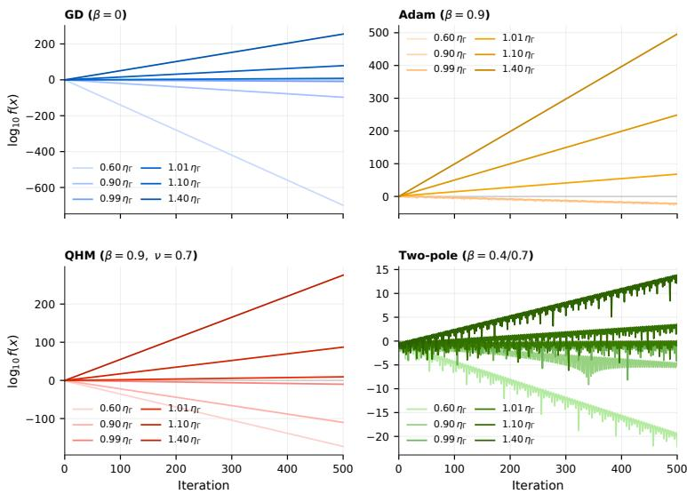  
Figure 6: We optimize a quadratic loss $f ( x ) = { \textstyle { \frac { 1 } { 2 } } } x ^ { 2 }$ with four types of optimizers: GD, Adam, QHM, and cascade two-pole at various learning rates η. Observe that the stability bound of $\chi = \eta S \Gamma / 2 \le 1$ is always satisfied for this quadratic loss.

Table 3: Predicted and observed quadratic thresholds. $\Gamma _ { \mathrm { e x p } }$ is the experiment-report gauge. The observed η is the last stable and first unstable η on a 0.005-relative grid. 605 sweep runs in total.
<table><tr><td>Filter</td><td> $\Gamma _ { \mathrm { e x p } } / 2$ </td><td> $2 / \Gamma _ { \mathrm { e x p } }$ </td><td> $2 / Q ( - 1 )$ </td><td> $\omega _ { \star } / \pi$ </td><td>observed η</td></tr><tr><td>GD</td><td>0.5</td><td>2</td><td>2</td><td>1.000</td><td>[2, 2.01]</td></tr><tr><td>EMA-HB  $\beta = 0 . 9$ </td><td>0.02632</td><td>38</td><td>38</td><td>1.000</td><td>[37.81, 38]</td></tr><tr><td>QHM  $\beta = 0 . 9 , \nu = 0 . 7$ </td><td>0.1684</td><td>5.9375</td><td>5.9375</td><td>1.000</td><td>[5.908, 5.938]</td></tr><tr><td>two-pole  $0 . 4 / 0 . 7$ </td><td>0.3889</td><td>2.571</td><td>26.44</td><td>0.263</td><td>[2.571, 2.584]</td></tr><tr><td>two-pole  $0 . 7 / 0 . 8 5$ </td><td>1.469</td><td>0.681</td><td>139.8</td><td>0.088</td><td>[0.681, 0.684]</td></tr></table>

The endpoints $\nu = 0$ and $\nu = 1$ are one-pole reductions (GD and normalized Heavy Ball), both still with $\Gamma = Q ( - 1 )$ . Two special cases are immediate from (48) and (36): $\nu = 1$ recovers normalized Heavy Ball, and $\nu = \beta$ recovers normalized Nesterov, since $1 + \beta - 2 \beta ^ { 2 } = ( 1 - \beta ) ( 1 + 2 \beta )$ . The experimental QHM arm of Section 3 uses $\nu = 0 . 7 \in ( 0 , 1 )$ , so it remains in this Nyquist class with $\Gamma \bar { = } Q ( - 1 )$ .

Parallel Dual Momentum. Dual momentum in its parallel realization, two buffers at $\beta _ { 1 } \neq \beta _ { 2 }$ summed as ${ \pmb u } _ { t } = ( { \pmb m } _ { t } ^ { ( 1 ) } + \alpha { \pmb m } _ { t } ^ { ( 2 ) } ) / ( 1 + \alpha )$ , is again (28), now with $J = 2 ,$ , weights $( 1 , \alpha ) / ( 1 + \alpha )$ and poles $( \beta _ { 1 } , \beta _ { 2 } )$ , so for $\alpha > 0$ Lemma B.3 applies verbatim, with no restriction on the number of poles. Table 2 collects these results. In our text, we did not use this construction for two-pole momenta (see the next section), but we included them in the table for completeness.

## C.2 TWO-POLE MOMENTUM: THE GAUGE IS NO LONGER $Q ( - 1 )$

Everything so far has been a parallel construction: gradients are filtered by several one-pole blocks and the outputs are added. The two-pole filters (Lee et al., 2024) of Section 3 are instead built by cascading a momentum buffer with a second one-pole block. Define the two-pole momentum family, dc-normalized, with $\beta _ { 1 } , \beta _ { 2 } \in ( 0 , 1 )$ and $\alpha \geq 0 .$

$$
Q _ { \alpha } ( z ) ~ { = } ~ \underbrace { \frac { 1 - \beta _ { 1 } } { 1 - \beta _ { 1 } z ^ { - 1 } } } _ { \mathrm { m o m e n t u m b u f f e r } } \cdot \underbrace { \frac { 1 } { 1 + \alpha } \left[ 1 + \frac { \alpha ( 1 - \beta _ { 2 } ) } { 1 - \beta _ { 2 } z ^ { - 1 } } \right] } _ { \mathrm { s e c o n d o n e - p o l e b l o c k } } ,\tag{49}
$$

so that $Q _ { \alpha } ( 1 ) = 1$ , the poles are $\beta _ { 1 }$ and $\beta _ { 2 } .$ , and there is one finite zero. The parameter α interpolates between the two limits of interest: at $\alpha = 0$ the zero cancels the second pole and $Q _ { 0 }$ is normalized

Table 4: Temporal filters of the executed families, in the paper-normalized convention $\chi = \eta S \Gamma / 2$ of $\mathsf { A p - }$ pendix C.1. $k _ { \star }$ is the unit-curvature learning-rate edge. $\omega _ { \star }$ is the first unit-circle crossing in radians. Adam, AdamW, Adafactor, AMSGrad and PAdam share one EMA filter; RMSProp, AdaGrad and GD share the memoryless filter. Note that two-pole momentum cases have $\Gamma \neq Q ( - 1 )$ ).
<table><tr><td>Filter</td><td>Families</td><td>Q(1)</td><td>Q(−1)</td><td>Γ</td><td> $k _ { \star }$ </td><td> $\omega _ { \star } / \pi$ </td></tr><tr><td>GD</td><td>GD, RMSProp, AdaGrad</td><td>1</td><td>1</td><td>1</td><td>2</td><td>1</td></tr><tr><td> $\mathbf { E M A } \ \beta = 0 . 9$ </td><td>Adam, AdamW, Adafactor, AMSGrad, PAdam</td><td>1</td><td>0.05263</td><td>0.05263</td><td>38</td><td>1</td></tr><tr><td>NAdam  $\beta = 0 . 9$ </td><td>NAdam</td><td>1</td><td>0.1474</td><td>0.1474</td><td>13.57</td><td>1</td></tr><tr><td>HB  $\beta = 0 . 9$ </td><td>Heavy Ball</td><td>10</td><td>0.5263</td><td>0.5263</td><td>3.8</td><td>1</td></tr><tr><td> $\mathrm { N A G } \ \beta = 0 . 9$ </td><td>Nesterov</td><td>10</td><td>1.474</td><td>1.474</td><td>1.357</td><td>1</td></tr><tr><td> $\operatorname { Q H M } \beta = 0 . 9 , \nu = 0 . 7$ </td><td>QHM</td><td>1</td><td>0.3368</td><td>0.3368</td><td>5.938</td><td>1</td></tr><tr><td>two-pole  $0 . 4 / 0 . 7$ </td><td>Grokfast-style</td><td>1</td><td>0.07563</td><td>0.7778</td><td>2.571</td><td>0.263</td></tr><tr><td>two-pole  $0 . 7 / 0 . 8 5$ </td><td>Grokfast-style</td><td>1</td><td>0.01431</td><td>2.938</td><td>0.681</td><td>0.088</td></tr></table>

Heavy Ball, while as $\alpha \to \infty$ the zero moves to the origin and $Q _ { \infty }$ is the pure double-EMA cascade $\begin{array} { r } { Q _ { \infty } ( \hat { z } ) = \prod _ { j = 1 , 2 } ( 1 - \beta _ { j } ) / ( 1 - \beta _ { j } z ^ { - 1 } ) } \end{array}$

One EMA pole cannot reach a $9 0 ^ { \circ }$ lag according to (33). A parallel sum stays inside the same cone, and no interior crossing is possible. A cascade, by contrast, adds lags, and two poles can jointly exceed the critical line. Making this quantitative near $\omega = \pi$ already gives the exact threshold: writing $\omega = \pi - \epsilon$ and $\beta _ { 1 } = \beta _ { 2 } = \beta _ { 3 }$ , the cascade lag is $2 \varphi _ { \beta } ( \pi - \epsilon ) = \dot { 2 } \bar { \beta } \epsilon / ( 1 + \beta ) + O ( \epsilon ^ { 2 } )$ while the required lag is $\epsilon / 2 ,$ so an interior crossing detaches from $\omega = \pi$ if and only if

$$
\frac { 2 \beta } { 1 + \beta } > \frac { 1 } { 2 } \qquad \Longleftrightarrow \qquad \beta > \frac { 1 } { 3 } .\tag{50}
$$

For two-pole momenta, we numerically evaluate the gauge and plot it in Figure 7.

## C.3 STABILITY BOUND FOR FIXED QUADRATIC LOSS

To demonstrate that Proposition 2.1 yields the exact stability bound for a fixed quadratic loss, we conduct simple numerical experiments. Four types of optimizers—GD, Adam, QHM, and cascade two-pole—are trained on a quadratic loss $f ( \stackrel { \bullet } { x } ) \ = \ \stackrel { 1 } { \textstyle \frac { 1 } { 2 } } x ^ { \stackrel { \bullet } { 2 } }$ with various learning rates η. Figure 6 summarizes the results. In the legend, we use the relative learning rate $\eta / \eta _ { \mathrm { r } }$ , where $\eta _ { \mathrm { r } } = 2 / ( S \Gamma )$ is determined by the stability condition $\chi = \eta S \Gamma / 2 \le 1$ in Proposition 2.1. For the two-pole momentum optimizer, we calculate the numerically found gauge, as shown in the root locus plot in Figure 7, which is not the Nyquist gain, i.e., $\Gamma \neq \dot { Q } ( - 1 )$ . Regardless of optimizer type, the stability bound is always satisfied on this fixed quadratic loss.

## C.4 COMPLETE ROOT LOCUS

Complete root loci for the filters studied in this paper are shown in Figure 7, extending the demonstration in Figure 2 in the main text to all filters. See also Remark B.4 in the previous section for a more detailed interpretation of the results.

## D STABILIZATION FROM HIGH-ORDER TERMS

We begin by noting that the realized EoS (♢) is already exact. Section 4 expresses the residual quantity in terms of a quadratic load ${ \pmb u } ^ { \top } \bar { \pmb { H } } _ { \eta , { \pmb u } } { \pmb u }$ and occasionally interprets this as an approximation of the second Taylor term $\bar { \cal H } _ { \eta , u } \simeq { \cal H }$ . However, this simplification is only for our conceptual understanding of the quantity. It does not affect the exactness of our realized EoS ζ. This section provides a more detailed analysis to support this simplification. Higher-order geometry does not explain why the edge is occupied. It determines how an occupied quadratic load is realized as a finite step, and whether that realization rescues or amplifies a one-step crossing of $\zeta = 1$

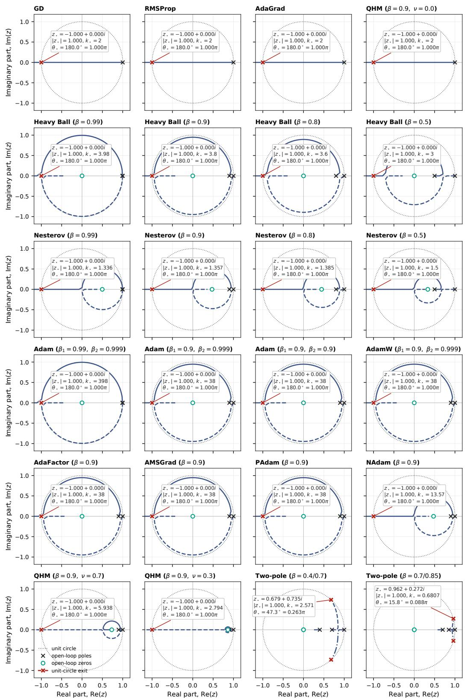  
Figure 7: Complete root locus for the filters studied in this paper, extending Figure 2 in the main text to all filters.

## D.1 EXACT NONLINEAR REALIZATION

Fix a step $\pmb { \theta } ^ { + } : = \pmb { \theta } - \eta \pmb { u }$ with $A : = \pmb { g } ^ { \top } \pmb { u } > 0$ and $H _ { \pmb { u } } : = \pmb { u } ^ { \top } \pmb { H } \pmb { u } > 0$ . The quadratic and exact secant expenditures are defined as

$$
B _ { 2 } : = \frac { \eta } { 2 } H _ { u } , \qquad B : = A + \frac { \mathcal { L } ( \theta ^ { + } ) - \mathcal { L } ( \theta ) } { \eta } = \frac { \eta } { 2 } { \ : } u ^ { \top } \bar { H } _ { \eta , u } u ,\tag{51}
$$

the second equality being (13). We also define the corresponding loads $\zeta _ { 2 } : = B _ { 2 } / A$ and $\zeta : = B / A$ Let the nonlinear realizationfactor be the ratio of the two,

$$
h : = \frac { \zeta } { \zeta _ { 2 } } = \frac { B } { B _ { 2 } } ,\tag{52}
$$

so that, identically,

$$
\zeta \ = \ \zeta _ { 2 } h .\tag{53}
$$

Note that the spatial factor $\varsigma \mathrm { o f } \left( \bigtriangledown \right)$ is built from the secant Hessian, hence already contains h. Write

$$
\varsigma _ { 2 } : = \frac { \pmb { u } ^ { \top } \pmb { H } \pmb { u } } { S \Vert \pmb { u } \Vert _ { P } ^ { 2 } }\tag{54}
$$

for the quadratic occupancy of the same ray. Then $\varsigma = \varsigma _ { 2 } h ,$ , and the main-text factorization splits as

$$
\zeta _ { 2 } = \chi \frac { \varsigma _ { 2 } } { \tau } , \qquad \zeta = \chi \frac { \varsigma _ { 2 } } { \tau } h .\tag{55}
$$

Thus we can further interpret that (1) χ is available load, ${ ( 2 ) \varsigma _ { 2 } / \tau }$ occupies a quadratic-only load along u, and (3) h realizes that load as a finite step. We need not apply the correction factor h to the main-text ς again, which is already exact as $\varsigma = \varsigma _ { 2 } h$ . Multiplying the main-text ς by a further h would double-count the same correction.

Since we are dealing with directional derivatives along the update direction u actuated by the optimizer, the factor h is a Taylor series of one scalar, not a collection of tensors. Write $T _ { \pmb { u } } : = \mathbf { \check { V } } ^ { 3 } \mathcal { L } [ \pmb { \dot { u } } ] ^ { 3 }$ $F _ { \pmb { u } } : = \nabla ^ { 4 } \mathcal { L } [ \pmb { u } ] ^ { 4 } , P _ { \pmb { u } } : = \check { \nabla } ^ { 5 } \mathcal { L } [ \pmb { u } ] ^ { 5 }$ , and

$$
\theta _ { 3 } : = \frac { \eta T _ { u } } { 3 H _ { u } } , \qquad \theta _ { 4 } : = \frac { \eta ^ { 2 } F _ { u } } { 1 2 H _ { u } } , \qquad \theta _ { 5 } : = \frac { \eta ^ { 3 } P _ { u } } { 6 0 H _ { u } } .\tag{56}
$$

Lemma D.1 (Secant Hessian expansion). Let L be $C ^ { m + 2 }$ on a neighbourhood of the executed segment $\{ \pmb \theta - s \eta \pmb u : s \in [ 0 , 1 ] \}$ . (If the activation is piecewise linear, this requires that the segment not cross a kink.) Then the weighted secant Hessian (10) satisfies

$$
\bar { { \cal H } } _ { \eta , u } = 2 \sum _ { k = 0 } ^ { m } \frac { ( - \eta ) ^ { k } } { ( k + 2 ) ! } \nabla ^ { k + 2 } { \mathcal L } ( \pmb { \theta } ) [ { \pmb u } ] ^ { k } + O ( \eta ^ { m + 1 } ) ,\tag{57}
$$

where $\nabla ^ { j } \mathcal { L } [ \boldsymbol { u } ] ^ { k }$ denotes the j-th derivative tensor contracted k times with u.

Proof. Expand $\begin{array} { r } { \nabla ^ { 2 } \mathcal { L } ( \pmb { \theta } - s \eta \pmb { u } ) = \sum _ { k \geq 0 } \frac { ( - s \eta ) ^ { k } } { k ! } \nabla ^ { k + 2 } \mathcal { L } ( \pmb { \theta } ) [ \pmb { u } ] ^ { k } } \end{array}$ and integrate against the kernel $2 ( 1 -$ s) using $\begin{array} { r } { 2 \int _ { 0 } ^ { 1 } ( 1 - s ) s ^ { k } d s = \frac { 2 } { ( k + 1 ) ( k + 2 ) } } \end{array}$ . The coefficient of $\nabla ^ { k + 2 } \mathcal { L } [ \boldsymbol { u } ] ^ { k }$ is therefore $\begin{array} { r } { \frac { 2 ( - \eta ) ^ { k } } { k ! ( k + 1 ) ( k + 2 ) } = } \end{array}$ $\frac { 2 ( - \eta ) ^ { k } } { ( k + 2 ) ! }$ □

Proposition D.2 (Impedance series and its loss-only form). With $A \neq 0$

$$
\zeta = \sum _ { j \geq 2 } { \frac { ( - 1 ) ^ { j } \eta ^ { j - 1 } } { j ! A } } \nabla ^ { j } { \mathcal { L } } ( \theta ) [ u ] ^ { j } \ = \ \zeta _ { 2 } { \big ( } 1 - \theta _ { 3 } + \theta _ { 4 } - \theta _ { 5 } + O ( \eta ^ { 4 } ) { \big ) } ,\tag{58}
$$

and therefore $h = 1 - \theta _ { 3 } + \theta _ { 4 } - \theta _ { 5 } + O ( \eta ^ { 4 } )$ . Moreover, with $\Delta \mathcal { L } : = \mathcal { L } ( \pmb { \theta } - \eta \pmb { u } ) - \mathcal { L } ( \pmb { \theta } )$

$$
\zeta - 1 = \frac { \Delta \mathcal { L } } { \eta A } = \frac { \mathcal { L } ( \pmb { \theta } - \eta \pmb { u } ) - \mathcal { L } ( \pmb { \theta } ) } { \eta \pmb { g } ^ { \top } \pmb { u } } ,\tag{59}
$$

so (58) expands a quantity that is exactly the one-step loss change normalized by the learning power.

Proof. The first equality follows from Lemma D.1 and $\begin{array} { r } { \begin{array} { r } { \zeta = \frac { \eta } { 2 A } \pmb { u } ^ { \top } \bar { \pmb { H } } _ { \eta , \pmb { u } } \pmb { u } ^ { \top } } \end{array} } \end{array}$ . The factorization is (56) collected term by term. For (59), expand $\begin{array} { r } { \Delta \mathcal { L } ~ = ~ \sum _ { j \geq 1 } \frac { ( - \eta ) ^ { j } } { j ! } \nabla ^ { j } \mathcal { L } [ { \pmb u } ] ^ { j } ~ = ~ - \eta A + } \end{array}$ $\begin{array} { r } { \sum _ { j \geq 2 } \frac { ( - \eta ) ^ { j } } { j ! } \nabla ^ { j } \mathcal { L } [ \pmb { u } ] ^ { j } } \end{array}$ and divide by $\eta A .$ Equivalently, it is (13) restated. □

Equation (59) is Hessian-free, which was mentioned in the main text as well. Only two forward passes and the inner product A are needed, which are already computed by the optimizer. Only the quadratic load $\zeta _ { 2 }$ requires a Hessian-vector product. The series (58) is simply the Taylor expansion of the exact ratio $h ,$ not an independent mechanism. The following corollary upper bounds the approximation error when we treat the secant Hessian as the true Hessian.

Corollary D.3 (Approximation of the edge of stability). If the Hessian $\boldsymbol { H } ~ = ~ \nabla _ { \boldsymbol { \theta } } ^ { 2 } \mathcal { L } ( \boldsymbol { \theta } )$ is $L _ { H } .$ Lipschitz on the segment $\{ \pmb \theta - s \eta \pmb u : s \in [ \bar { 0 } , 1 ] \}$ , then

$$
\begin{array} { r } { | \boldsymbol { u } ^ { \top } ( \bar { H } _ { \eta , u } - H ) \boldsymbol { u } | \ \leq \ \frac { L _ { H } \eta \| \boldsymbol { u } \| ^ { 3 } } { 3 } . } \end{array}\tag{60}
$$

Writing

$$
\bar { \boldsymbol { \zeta } } : = \frac { \eta \pmb { u } ^ { \intercal } \boldsymbol { H } \pmb { u } } { 2 \pmb { g } ^ { \intercal } \pmb { u } }\tag{61}
$$

for the quadratic estimator $( i . e . \ \zeta _ { 2 } \ o f ( 5 8 ) ) ,$ , the approximation error is bounded by

$$
\begin{array} { r } { | \zeta - \bar { \zeta } | \leq \frac { L _ { H } \eta ^ { 2 } \| \boldsymbol { u } \| ^ { 3 } } { 6 | \boldsymbol { g } ^ { \top } \boldsymbol { u } | } . } \end{array}\tag{62}
$$

Proof. By $\begin{array} { r } { ( 1 0 ) , \boldsymbol { u } ^ { \top } ( \bar { H } _ { \eta , \boldsymbol { u } } - H ) \boldsymbol { u } = 2 \int _ { 0 } ^ { 1 } ( 1 - s ) \boldsymbol { u } ^ { \top } \big ( \nabla ^ { 2 } \mathcal { L } ( \theta - s \eta \boldsymbol { u } ) - H ) \boldsymbol { u } } \end{array}$ ds. Lipschitz continuity of H bounds the integrand by $L _ { H } ( s \eta \lVert \mathbf { u } \rVert ) \lVert \mathbf { u } \rVert ^ { 2 }$ , so the integral is at most $2 L _ { H } \eta \vert \vert \boldsymbol { u } \vert \vert ^ { 3 } \int _ { 0 } ^ { 1 } ( 1 -$ $s ) s d s = L _ { H } \eta \lVert \mathbf { u } \rVert ^ { 3 } / 3$ . Dividing b ${ \mathrm { y ~ 2 } } | A | / \eta ;$ yields (62). This is the $m = 0$ remainder of Lemma D.1 under a Lipschitz rather than a ${ \bar { C } } ^ { 3 }$ hypothesis. □

All higher-order content in ζ is this one scalar. It is the ratio of the averaged directional curvature over the step to the instantaneous directional curvature at its start. The coefficients $- \theta _ { 3 } + \theta _ { 4 } - \cdot \cdot \cdot$ are its Taylor coefficients. This scalar can act in either side of the edge.

Let $\hat { \pmb u } : = \pmb u / \| \pmb u \|$ , let $r : = \eta \| \pmb { u } \|$ be the step length, and define the directional curvature profile

$$
\psi ( s ) : = \hat { { \boldsymbol u } } ^ { \intercal } \nabla ^ { 2 } \mathcal { L } ( \theta - s \hat { { \boldsymbol u } } ) \hat { { \boldsymbol u } } , \qquad g _ { { \boldsymbol u } } : = { \boldsymbol g } ^ { \intercal } \hat { { \boldsymbol u } } > 0 .\tag{63}
$$

Proposition D.4 (Profile form). The impedance is the $( r - s ) – w e i g h t e d$ mean of the directional curvature over the executed step,

$$
\zeta = \frac { 1 } { r g _ { u } } \int _ { 0 } ^ { r } ( r - s ) \psi ( s ) d s = \frac { r \bar { \psi } _ { r } } { 2 g _ { u } } , \qquad \bar { \psi } _ { r } : = \frac { 2 } { r ^ { 2 } } \int _ { 0 } ^ { r } ( r - s ) \psi ( s ) d s ,\tag{64}
$$

and therefore, with $\zeta _ { 2 } = r \psi ( 0 ) / ( 2 g _ { u } )$

$$
h \ = \ \frac { \zeta } { \zeta _ { 2 } } \ = \ \frac { \bar { \psi } _ { r } } { \psi ( 0 ) } .\tag{65}
$$

Proof. Let $\phi ( s ) : = \mathcal { L } ( \pmb \theta - s \hat { \pmb u } )$ , so $\phi ^ { \prime } ( 0 ) ~ = ~ - g _ { \pmb { u } }$ and $\phi ^ { \prime \prime } ( s ) \ = \ \psi ( s )$ Taylor’s theorem with integral remainder gives $\begin{array} { r } { \phi ( r ) - \phi ( 0 ) = - r g _ { \pmb { u } } + \int _ { 0 } ^ { r } ( r - s ) \psi ( s ) d s } \end{array}$ , and $\eta A = r g _ { u }$ , so by (59) $\begin{array} { r } { \zeta = 1 + \frac { \phi ( r ) - \phi ( 0 ) } { r g _ { u } } } \end{array}$ , which is (64). □

Corollary D.5 (Monotone softening and stiffening). $I f \psi$ is nonincreasing on $[ 0 , r ]$ then $h \leq 1$ , and if ψ is nondecreasing then $h \geq 1$ . Both inequalities are strict if the monotonicity is strict on a set of positive measure. More quantitatively, $i f \psi ( s ) \leq ( 1 - \mu ) \psi ( 0 )$ for $s \geq \varrho r$ with $\mu \in ( 0 , 1 )$ and $\varrho \in ( 0 , 1 )$ , then

$$
h \leq 1 - \mu ( 1 - \varrho ) ^ { 2 } .\tag{66}
$$

Proof. The kernel $2 ( r - s ) / r ^ { 2 }$ is a probability density on $[ 0 , r ] .$ , so $\bar { \psi } _ { r }$ is an average of $\psi$ and (65) gives the two monotone statements. For the bound, $\begin{array} { r } { \int _ { \varrho r } ^ { r } \frac { 2 ( r - s ) } { r ^ { 2 } } d s = ( 1 - \varrho ) ^ { 2 } } \end{array}$ , and on that sub-interval $\psi$ is below $( 1 - \mu ) \psi ( 0 )$ while elsewhere it is at most $\psi ( 0 )$ □

Thus we can call $h < 1$ directional softening and $h > 1$ directional stiffening.

## D.2 ENTRY, RETURN, AND MAINTENANCE

Because $\zeta = \zeta _ { 2 } h ,$ , a step lies below, on, or above the realized edge according as h lies below, on, or above $1 / \zeta _ { 2 }$

$$
\zeta < 1 \iff h < \frac { 1 } { \zeta _ { 2 } } , \qquad \zeta = 1 \iff h = \frac { 1 } { \zeta _ { 2 } } , \qquad \zeta > 1 \iff h > \frac { 1 } { \zeta _ { 2 } } .\tag{67}
$$

These are simple identities. When we are discussing the higher-order term $h ,$ we are mainly interested in the condition whether this term rescues or destabilizes a one-step crossing of $\zeta = 1$ , i.e., whether h is below, on, or above $1 / \zeta _ { 2 }$

Theorem D.6 (Nonlinear rescue and destabilization). Assume $A > 0$ and $H _ { u } > 0$

1. $I f \zeta _ { 2 } = 1 + \delta$ with $\delta > 0 ,$ , the step is quadratically supercritical. It is rescued to $\zeta \leq 1$ if and only if

$$
h \leq \frac { 1 } { 1 + \delta } \qquad i . e . 1 - h \geq \frac { \delta } { 1 + \delta } .\tag{68}
$$

To the order retained in (58), the same comparison reads $\theta _ { 3 } - \theta _ { 4 } + O ( \eta ^ { 3 } ) \geq \delta / ( 1 + \delta )$ with remainder controlled by Corollary D.3 when only the Lipschitz modulus is assumed.

2. $I f \zeta _ { 2 } = 1 - \delta$ with $\delta \in ( 0 , 1 )$ , the step is quadratically subcritical. Nonlinear stiffening pushes it above the edge if and only $i f h > 1 / ( 1 - \delta )$

$H \psi$ is nonincreasing and $\zeta _ { 2 } \leq 1$ , then $\zeta \leq \zeta _ { 2 } \leq 1$ . If ψ is nondecreasing and $\zeta _ { 2 } \geq 1$ , then $\dot { \zeta } \geq \zeta _ { 2 } \geq 1$

Proof. Claims 1–2 are (67) rewritten in δ. Claim 3 is Corollary D.5.

A quadratically supercritical step is therefore rescued precisely when the fractional drop in pathaveraged directional curvature exceeds the fractional linear excess. A quadratically subcritical step is destabilized when stiffening consumes more than the quadratic margin. We only need to consider two event indicators, both measurable from $( \zeta _ { 2 } , \zeta )$ alone: nonlinear rescue is $\zeta _ { 2 } > 1$ and $\zeta \leq 1$ nonlinear destabilization is $\zeta _ { 2 } \leq 1$ and $\zeta > 1$ . An ϵ-band $1 - \epsilon \le \zeta \le 1 + \epsilon$ is equivalent to $( 1 - \epsilon ) / \zeta _ { 2 } \leq h \leq ( 1 + \epsilon ) / \bar { \zeta } _ { 2 }$ . That is a one-step constraint on $h ,$ , not a statement that a period-2 orbit remains in $1 \leq \zeta < 1 + \epsilon$ (a nontrivial two-cycle with $A _ { t } > 0$ must change the sign of $\zeta - 1 )$ . The factorization (55) also splits changes of ζ. On the positive domain,

$$
\log \zeta \ = \ \log \chi + \log \varsigma _ { 2 } - \log \tau + \log h ,\tag{69}
$$

hence

$$
\Delta \log \zeta ~ = ~ \Delta \log \chi + \Delta \log \varsigma _ { 2 } - \Delta \log \tau + \Delta \log h .\tag{70}
$$

Basically, this is the same as the one in the main text, but with one additional granularity, decomposing the spatial participation ς into the quadratic participation $\varsigma _ { 2 }$ and higher-order maintenance h. Each summand is a channel of diagnostics, we may not treat them as causes while analyzing the dynamics. Therefore, we can read the diagnostics by following interpretations:

<table><tr><td>Channel</td><td>raises ζ</td><td>lowers ζ</td></tr><tr><td>X</td><td>spectral sharpening</td><td>spectral relief</td></tr><tr><td>S2</td><td>occupancy of a sharper direction</td><td>rotation toward lower curvature</td></tr><tr><td> $\tau$ </td><td>loss of temporal calibration</td><td>recovery of alignment/calibration</td></tr><tr><td> $h$ </td><td>pathwise stiffening</td><td>pathwise softening</td></tr></table>

Table 5: Optimizer grids on used in the paper. Learning rates are five geometrically spaced values. The displayed endpoints are the grid minima and maxima. $\mathrm { \Omega ^ { \mathrm { \Omega \bullet } } B C ^ { \mathrm { \bullet } \mathrm { \overline { { { \Omega } } } } } }$ is bias correction. p is the preconditioner exponent on the second moment. wd is decoupled weight decay.
<table><tr><td>Family</td><td>η grid</td><td> $\beta _ { 1 } / \beta$ </td><td> $\beta _ { 2 }$ </td><td>ε</td><td> $\mathbf { B C } / p$ </td><td>wd</td></tr><tr><td>Adam</td><td> $3 \times 1 0 ^ { - 5 } – 1 0 ^ { - 3 }$ </td><td>0.9</td><td>0.999</td><td> $1 0 ^ { - 7 }$ </td><td> $\mathrm { y e s } / 0 . 5$ </td><td>0</td></tr><tr><td>AdamW</td><td> $3 \times 1 0 ^ { - 5 } – 1 0 ^ { - 3 }$ </td><td>0.9</td><td>0.999</td><td> $1 0 ^ { - 7 }$ </td><td>yes / 0.5</td><td>0.01</td></tr><tr><td>Adafactor</td><td> $1 0 ^ { - 5 } – 1 0 ^ { - 3 }$ </td><td>0.9</td><td>0.8</td><td> $1 0 ^ { - 7 }$ </td><td> $\mathrm { n o } / 0 . 5$ </td><td>0</td></tr><tr><td>AMSGrad</td><td> $1 0 ^ { - 5 } – 1 0 ^ { - 3 }$ </td><td>0.9</td><td>0.999</td><td> $1 0 ^ { - 7 }$ </td><td> $\mathrm { n o } / 0 . 5$ </td><td>0</td></tr><tr><td>PAdam</td><td> $1 0 ^ { - 3 } – 1 0 ^ { - 1 }$ </td><td>0.9</td><td>0.999</td><td> $1 0 ^ { - 7 }$ </td><td> $\mathrm { n o } / 0 . 2 5$ </td><td>0</td></tr><tr><td>NAdam</td><td> $1 0 ^ { - 5 } – 1 0 ^ { - 3 }$ </td><td>0.9</td><td>0.999</td><td> $1 0 ^ { - 7 }$ </td><td> $\mathrm { n o } / 0 . 5$ </td><td>0</td></tr><tr><td>RMSProp</td><td> $1 0 ^ { - 4 } – 1 0 ^ { - 3 }$ </td><td>0</td><td>0.995</td><td> $1 0 ^ { - 7 }$ </td><td> $\mathrm { n o } / 0 . 5$ </td><td>0</td></tr><tr><td>AdaGrad</td><td> $1 0 ^ { - 2 } – 1 0 ^ { - 1 }$ </td><td>0</td><td>1</td><td> $1 0 ^ { - 1 0 }$ </td><td> $\mathrm { n o } / 0 . 5$ </td><td>0</td></tr><tr><td>GD</td><td> $0 . 0 2 { - } 0 . 2 $ </td><td></td><td></td><td></td><td></td><td>0</td></tr><tr><td>Heavy Ball</td><td>0.002–0.02</td><td>0.9</td><td></td><td></td><td></td><td>0</td></tr><tr><td>Nesterov</td><td>0.002-0.02</td><td>0.9</td><td></td><td></td><td></td><td>0</td></tr><tr><td>QHM</td><td>0.059375-0.59375</td><td>0.9</td><td></td><td></td><td> $\nu = 0 . 7$ </td><td>0</td></tr><tr><td>two-pole  $0 . 4 / 0 . 7$ </td><td>0.0257–0.257</td><td>一</td><td></td><td></td><td>cascade</td><td>0</td></tr><tr><td>two-pole  $0 . 7 / 0 . 8 5$ </td><td>0.00681-0.0681</td><td>—</td><td></td><td></td><td>cascade</td><td>0</td></tr></table>

Entry from below $( \zeta _ { t } ~ < ~ 1$ and $\Delta$ log $\zeta _ { t } > 0 )$ is $\Delta \log \chi + \Delta$ log $\varsigma _ { 2 } + \Delta$ log $h > \Delta$ log τ , return from above is the opposite inequality $\Delta \log \chi + \Delta \log \varsigma _ { 2 } + \Delta \log h < \Delta \log \tau$ , and maintenance near $\zeta \simeq 1$ is approximate balance of the four increments. These are measurable channel-balance conditions. Note that these are not an attractor theorem: the quantities do not assert that higher-order terms should drive ζ toward 1, nor that h is the dominant channel.

## E ADDITIONAL EXPERIMENTS

This section presents the experimental setup and all experimental results.

## E.1 IMPLEMENTATION DETAILS

Dataset. We use CIFAR-10 (Krizhevsky, 2009) dataset, all training samples are used. Every update uses one deterministic 50,000-example full batch without shuffling.

Architecture. The network flattens the $3 \times 3 2 \times 3 2$ input, applies five fully connected hidden layers of width 200 with tanh activations, and produces 10 logits. The objective is mean categorical cross-entropy on the full training set. This is exactly the same as the $5 \times 2 0 0$ architecture of Cohen et al. (2023), not the $2 \times 2 0 0$ network of Cohen et al. (2021).

Optimizers and their hyperparameters. Table 5 displays the learning rate grids and optimizer hyperparameters. AdamW weight decay is 0.01 and AdaGrad $\varepsilon \mathrm { i s } 1 0 ^ { - 1 0 }$ . Adam uses bias correction. Adafactor, AMSGrad, PAdam, NAdam, RMSProp and AdaGrad do not. PAdam uses partialadaptivity exponent 0.25. QHM uses $\beta = 0 . 9 , \nu = 0 . 7$ . The two-pole filters are cascaded EMA poles at (0.4, 0.7) and (0.7, 0.85), i.e., Grokfast-style (Lee et al., 2024) cascades rather than parallel mixtures (Appendix C.2).

Temporal filters $Q .$ The 14 optimizer names collapse to eight distinct causal filters $Q ,$ whose transfer functions are calculated in Table 4. Heavy Ball and Nesterov are the classical (not dcnormalized) recurrences, so $Q ( 1 ) = 1 / ( 1 - \beta ) = \mathrm { { \bar { 1 0 } } a t } \beta = 0 . 9$ . Adam-family first moments are dc-normalized and share the EMA filter of the dc-normalized Heavy Ball. The two-pole rows are the only filters whose first root-locus exit is off Nyquist. Refer to Figure 7 for the full root locus.

## E.2 FULL COMPARISON OF WORST-CASE EOS χ AND REALIZED EOS $\zeta$

This section shows a full comparison of worst-case EoS $\chi$ and realized EoS ζ, extending Figure 1 in the main text. Figures 8 and Figures 9 show the results. Table 6 is the complete numerical results, measured as the median of $\chi$ on the closed interval from first $\chi > 0 . 7 5$ to last $\chi < 0 . 7 5 ,$ or to the terminal checkpoint if the trajectory never returns below 0.75. Two settings never exceed 0.75 (Adafactor $\eta = 1 0 ^ { - 5 }$ , Heavy Ball $\eta = 0 . 0 0 2$ , two-pole 0.7/0.85 at $\eta = 0 . 0 0 6 8 1 )$ and are recorded as dashes. Besides the discussion in Section 3, Table 6 also suggests that the offsets are not an artefact of decoupled weight decay. Adam $( \lambda = 0 )$ and AdamW $( \lambda = 0 . 0 1 )$ share the same temporal filter, the same η grid, and the same architecture; their edge-conditioned family centers are 0.960 and 0.971.

Table 6: Measured relative edge $\chi = \eta S \Gamma / 2$ offsets for different optimizers. Each cell is the median of $\chi$ between first entry above 0.75 and last exit below 0.75 (open windows remain open at the horizon). A dash means the trajectory never exceeded 0.75. Extreme cases $\chi > 1 . 2$ are highlighted in boldface.
<table><tr><td>Optimizer Type</td><td>η1</td><td>η2</td><td>η3</td><td>η4</td><td>η5</td></tr><tr><td>Adafactor</td><td></td><td>1.052</td><td>1.103</td><td>1.102</td><td>1.191</td></tr><tr><td>AdaGrad</td><td>1.424</td><td>1.556</td><td>1.845</td><td>4.047</td><td>21.070</td></tr><tr><td>Adam</td><td>0.927</td><td>0.980</td><td>0.971</td><td>0.976</td><td>0.974</td></tr><tr><td>AdamW</td><td>0.956</td><td>0.981</td><td>0.975</td><td>1.023</td><td>0.971</td></tr><tr><td>AMSGrad</td><td>0.789</td><td>0.931</td><td>0.979</td><td>0.946</td><td>0.949</td></tr><tr><td>GD</td><td>0.904</td><td>1.130</td><td>1.246</td><td>1.478</td><td>1.624</td></tr><tr><td>Heavy Ball</td><td></td><td>0.820</td><td>0.960</td><td>0.934</td><td>0.964</td></tr><tr><td>NAdam</td><td>1.036</td><td>1.050</td><td>0.884</td><td>1.183</td><td>1.198</td></tr><tr><td>Nesterov</td><td>0.836</td><td>1.078</td><td>1.088</td><td>1.123</td><td>1.121</td></tr><tr><td>PAdam</td><td>0.895</td><td>0.959</td><td>0.966</td><td>0.927</td><td>0.950</td></tr><tr><td>QHM</td><td>0.961</td><td>1.238</td><td>1.309</td><td>1.454</td><td>1.576</td></tr><tr><td>RMSProp</td><td>1.349</td><td>1.452</td><td>1.568</td><td>1.579</td><td>1.646</td></tr><tr><td>two-pole  $0 . 4 / 0 . 7$ </td><td>0.982</td><td>1.432</td><td>1.819</td><td>2.294</td><td>2.646</td></tr><tr><td>two-pole  $0 . 7 / 0 . 8 5$ </td><td></td><td>0.988</td><td>1.354</td><td>1.625</td><td>2.049</td></tr></table>

## E.3 FULL DECOMPOSITION OF REALIZED EOS ζ

This section shows a full decomposition of realized EoS ζ for each individual setting of (optimizer, learning rate), extending Figure 4 in the main text. Full results are visualized in Figures 10 through Figure 13.

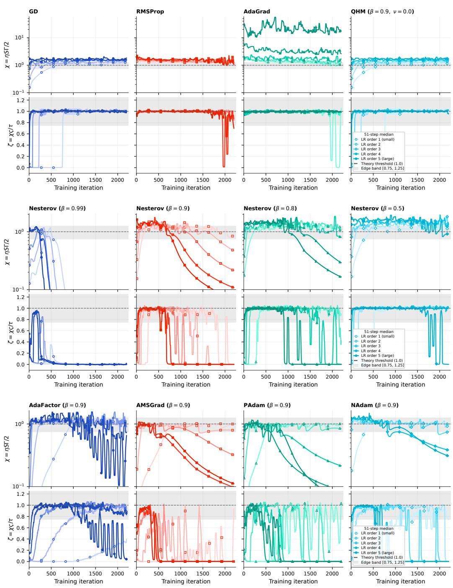  
Figure 8: Comparison of worst-case EoS χ and realized EoS $\zeta$ on the primary CIFAR-10 experiments.

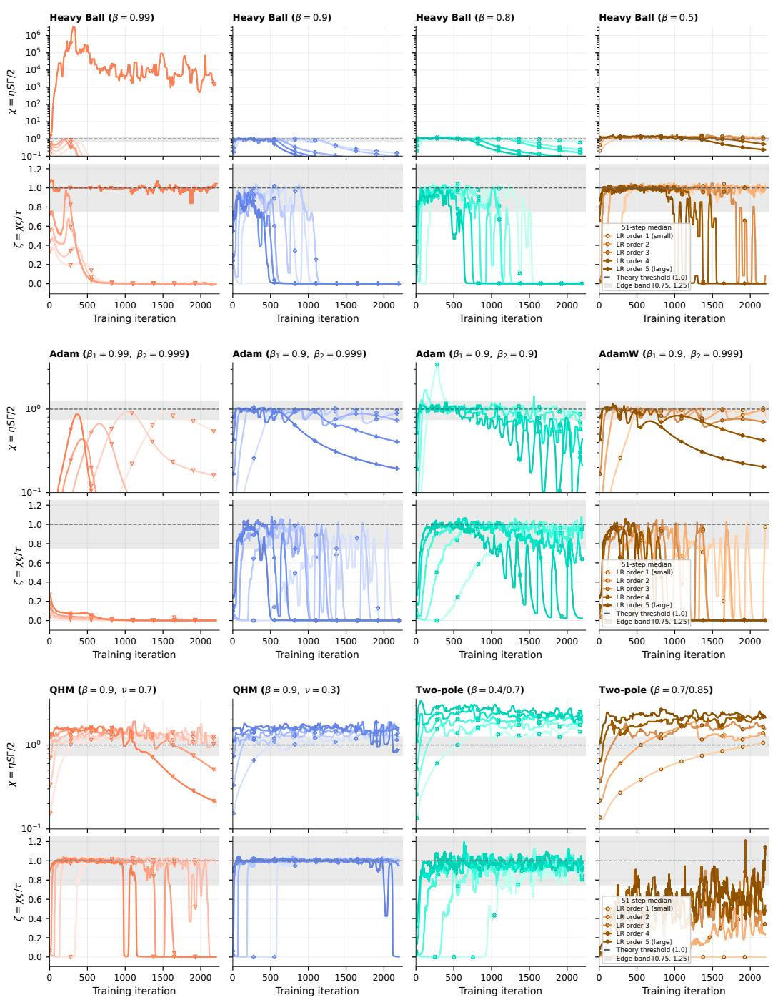  
Figure 9: Comparison of worst-case EoS χ and realized EoS ζ on the primary CIFAR-10 experiments.

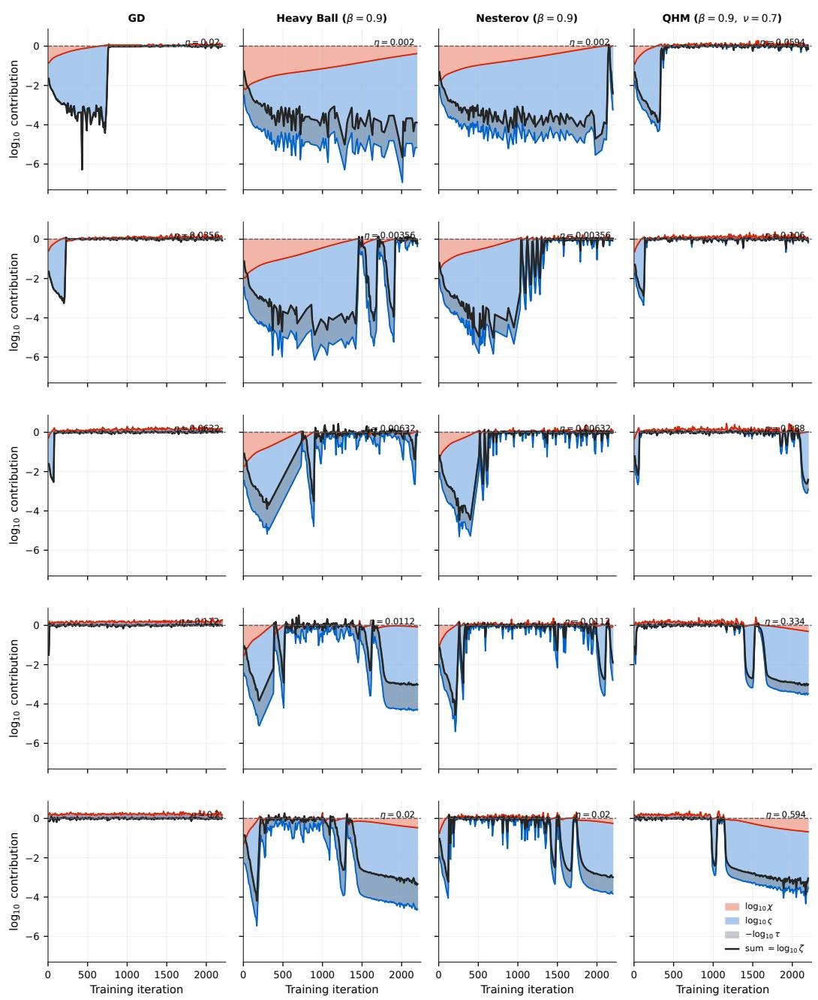  
Figure 10: Decomposition of the realized EoS ζ into factors in log-scale, involving the (relative) edge of stability χ (red area and line), the spatial participation factor ς (blue area and line), and the temporal calibration factor τ (grey overlay and black line). Note that log τ operates in the opposite direction by subtraction.

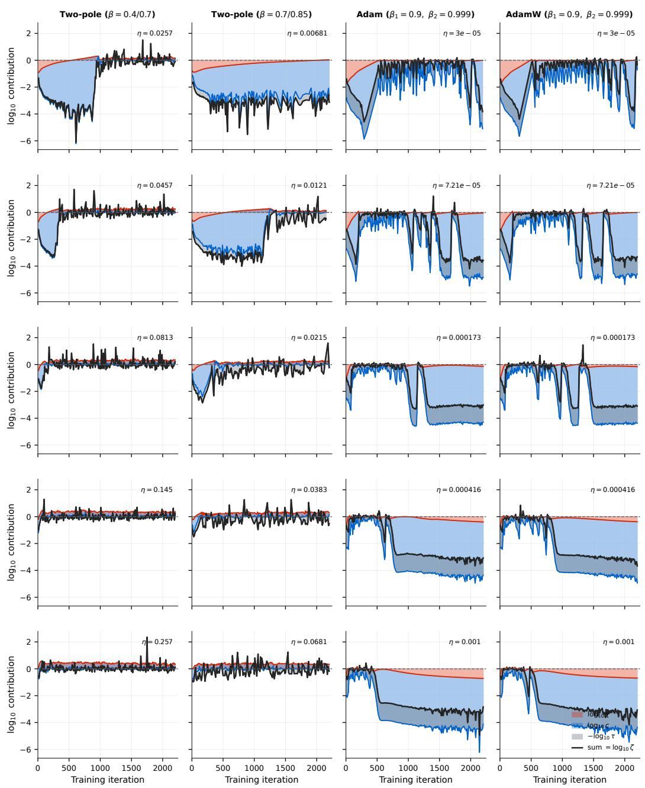  
Figure 11: Decomposition of the realized EoS ζ into factors in log-scale, involving the (relative) edge of stability χ (red area and line), the spatial participation factor ς (blue area and line), and the temporal calibration factor τ (grey overlay and black line). Note that log τ operates in the opposite direction by subtraction.

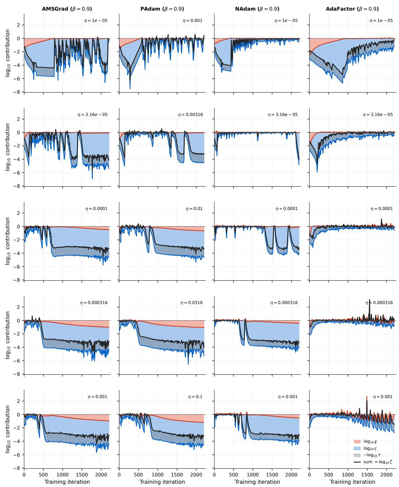  
Figure 12: Decomposition of the realized EoS ζ into factors in log-scale, involving the (relative) edge of stability χ (red area and line), the spatial participation factor ς (blue area and line), and the temporal calibration factor τ (grey overlay and black line). Note that log τ operates in the opposite direction by subtraction.

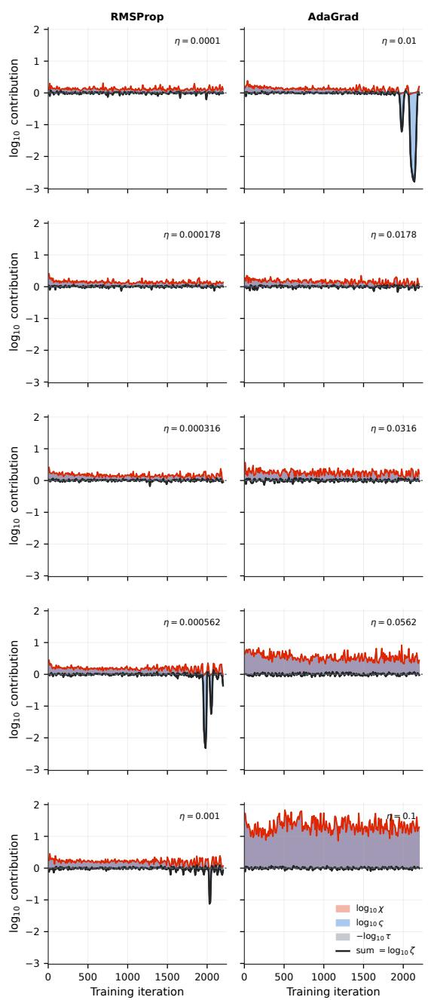  
Figure 13: Decomposition of the realized EoS ζ into factors in log-scale, involving the (relative) edge of stability χ (red area and line), the spatial participation factor ς (blue area and line), and the temporal calibration factor τ (grey overlay and black line). Note that log τ operates in the opposite direction by subtraction.