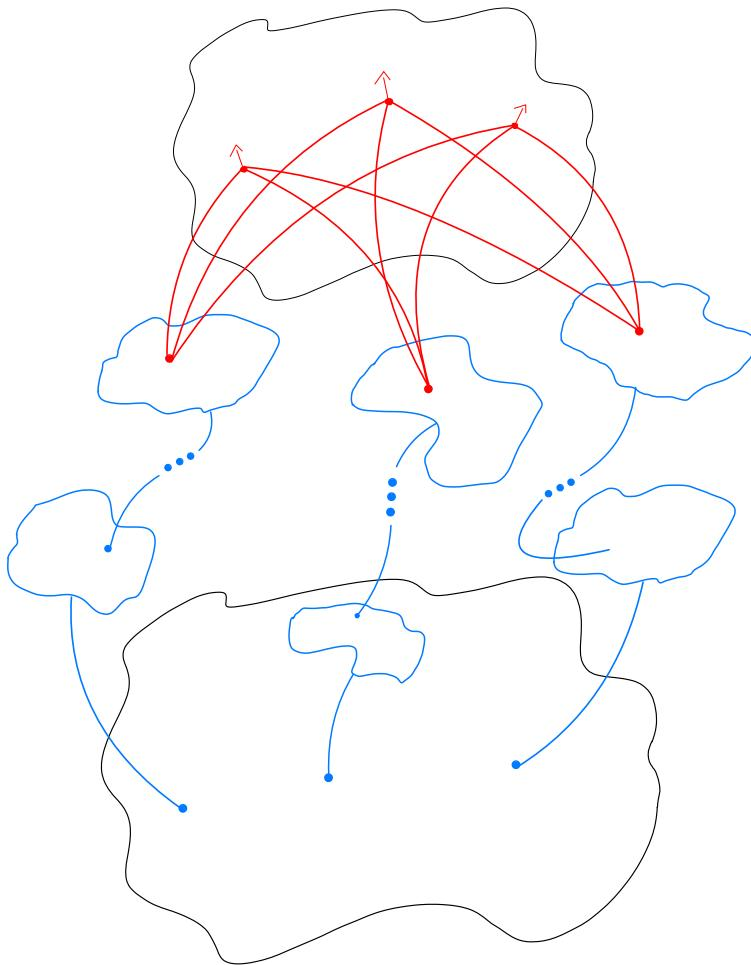
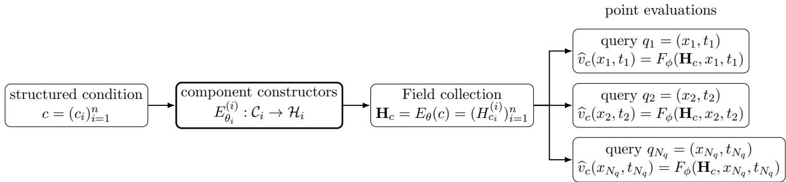
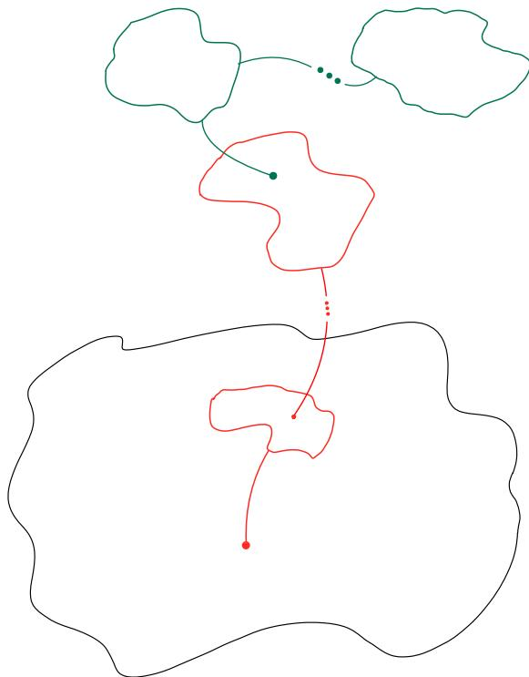
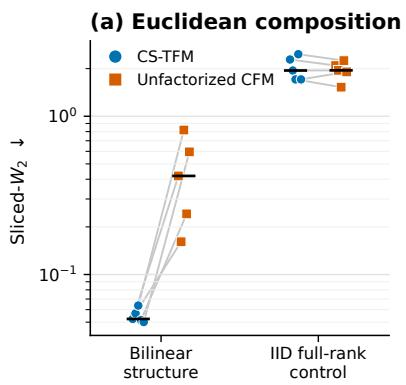
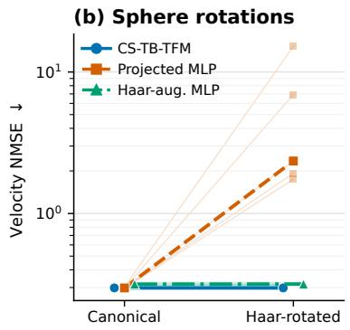
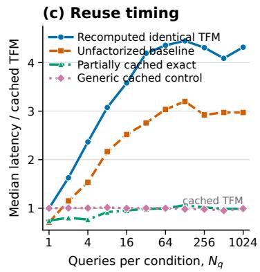

# Tensor Field Models

Alexander Strunk∗ Evercot AI

Roland Assam Evercot AI

19 June 2026

## Abstract

This paper introduces Tensor Field Models (TFMs), realization-level Mathematical Structures in which a learned Operator maps a product of admissible componentsection families to a prescribed family of time-dependent tangent sections on a Generative State Manifold. Analytic and dynamical restrictions are encoded through the choice of admissible families rather than imposed by the root definition. Constructed, component-separable, and Tensor Bundle TFMs provide structured refinements of this common object. In the conditional realizations considered here, a structured condition $c = ( c _ { 1 } , \ldots , c _ { n } ) $ is mapped componentwise to a reusable collection $\mathbf { H } _ { c } = ( H _ { c _ { 1 } } ^ { ( 1 ) } , \dots , H _ { c _ { n } } ^ { ( n ) } )$ . In the architectures evaluated here, the component representations remain distinct and are combined only by the Field Operator to produce the generated Vector Field. All learned models are trained using Flow Matching. Experiments show that TFMs can improve performance and that amortized sampling enabled by reusable condition representations can accelerate generation.

## 1 Introduction

A Tensor Field Model (TFM) is a realization containing its geometric domains, admissible input- and output-section families, parameter space, and parameterized Field Operator:

$$
\hat { T } = ( \mathcal { M } , \mathcal { T } , \{ ( \Omega _ { i } , E _ { i } , \mathcal { H } _ { i } ) \} _ { i = 1 } ^ { n } , \mathcal { V } , \Phi , \mathfrak { F } )
$$

Here, M denotes the Generative State Manifold, I denotes the time interval, and each $\pi _ { i } : E _ { i } \to \Omega _ { i }$ is a smooth Vector Bundle. Furthermore, Sec(Ei) represents the space of sections of $E _ { i }$ , while $\mathcal { H } _ { i } \subseteq \operatorname { S e c } ( E _ { i } )$ denotes a prescribed family of admissible sections.

  
Figure 1: A Tensor Field Model can be visualized as a collection of blue component Fields on latent Bundles. Through the Operator $\mathfrak { F } _ { \phi }$ , each admissible Field collection defines a red time-dependent tangent section on the Generative State Manifold M. This supports batched or parallel evaluation of independent queries while reusing the same Field collection.

The prescribed output family satisfies $\mathcal { V } \subseteq \mathrm { S e c } ( \mathrm { p r } _ { \mathcal { M } } ^ { * } T \mathcal { M } )$ , and the parameterized Field Operator has type

$$
\mathfrak { F } : \Phi \times \prod _ { i = 1 } ^ { n } \mathcal { H } _ { i } \longrightarrow \mathcal { V } \qquad \mathfrak { F } _ { \phi } ^ { ( n ) } [ \mathbf { H } ] : = \mathfrak { F } ( \phi , \mathbf { H } )
$$

Thus $\mathfrak { F } _ { \phi } ^ { ( n ) } [ \mathbf { H } ] ( x , t ) \in T _ { x } \mathcal { M }$

  
Figure 2: Point-evaluation formulation of a component-separable constructed Tensor Field Model. The component constructors produce $\mathbf { H } _ { c } ~ = ~ E _ { \theta } ( c )$ . For $N _ { q }$ queries $q _ { j } ~ = ~ ( x _ { j } , t _ { j } )$ sharing the condition ${ \mathit { c } } ,$ the point-evaluation map $F _ { \phi }$ reuses this collection to return $\widehat { v } _ { c } ( x _ { j } , t _ { j } ) \in T _ { x _ { j } } \mathcal { M }$ . The state $x _ { j }$ remains an evaluation argument. In a dynamical specialization, each trajectory can therefore be evaluated at its current state.

Conditional realizations augment the Operator with a constructor $\begin{array} { r } { E _ { \theta } : \mathcal { C }  \prod _ { i = 1 } ^ { n } \mathcal { H } _ { i } } \end{array}$ When $\begin{array} { r } { \mathcal { C } = \prod _ { i = 1 } ^ { n } \mathcal { C } _ { i } } \end{array}$ , this constructor may additionally factorize componentwise. For a constructed conditional TFM, the conceptual change is from directly learning $c \mapsto v _ { c }$ in a high-dimensional section family to learning the composition $c \mapsto \mathbf { H } _ { c } \mapsto { \widehat { v } } _ { c }$ When the component Field families have lower efective capacity than the original conditional output family, their collection can provide a reduced representation. This reduction is an architectural assumption, not a theorem following from the existence of the factorization: without restrictions on the intermediate families and Operator, an arbitrary conditional predictor can be written in factorized form. The model therefore does not treat each output-section evaluation as an unrelated prediction. Instead, it reuses the same collection in all evaluations under c.

A condition-only construction is computationally useful because continuous-time generative models repeatedly query a state- and time-dependent predictor under fixed conditional information. For $N _ { q }$ such queries, the component Fields are constructed once and the point-evaluation Operator is evaluated $N _ { q }$ times. Whether this is faster than an unfactorized predictor depends on the relative construction and per-query costs analyzed in subsection 3.2.

## 2 Mathematical Background

## 2.1 Tensor Bundles and Tensor Fields

A Tensor Bundle is a smooth Vector Bundle whose Fiber over each point is a Tensor Product space formed from the corresponding Fiber of a specified Vector Bundle and its Dual. More precisely, let M be a smooth d-dimensional Manifold and let $\pi _ { C } : C \to M$ be a smooth real Vector Bundle of finite rank $q .$ This carrier Bundle $C$ supplies the Vector Spaces on which the Tensors are formed and need not equal TM. For $r , s \in  { \mathbb { N } } _ { 0 }$ , the Tensor Bundle of type $( r , s )$ carried by C is

$$
\begin{array} { c } { { \mathbb { T } _ { s } ^ { r } ( C ) : = C ^ { \otimes r } \otimes ( C ^ { * } ) ^ { \otimes s } = \bigcup _ { x \in M } \mathbb { T } _ { s } ^ { r } ( C ) _ { x } } } \\ { { \mathbb { T } _ { s } ^ { r } ( C ) _ { x } : = C _ { x } ^ { \otimes r } \otimes ( C _ { x } ^ { * } ) ^ { \otimes s } } } \end{array}
$$

Here, $C ^ { * } \to M$ is the Dual Bundle, and a zero-fold Tensor power is understood to be the trivial line Bundle. The induced projection $\pi _ { s } ^ { r } : \mathbb { T } _ { s } ^ { r } ( C ) \to M$ sends every Tensor in $\mathbb { T } _ { s } ^ { r } ( C ) _ { x }$ to x.

  
Figure 3: A Tensor Bundle induced by a carrier Bundle $C  M$ . The lower region represents the Base Manifold $M .$ , and the regions above selected base points represent Fibers $\mathbb { T } _ { s } ^ { r } ( C ) _ { x }$ . A smooth section assigns to every $x \in M$ one Tensor $A ( x )$ in the corresponding Fiber. The carrier Fibers $C _ { x }$ need not be tangent spaces of $M$

A smooth C-Tensor Field of type $( r , s )$ is a smooth section of this Bundle:

$$
A \in \Gamma ( \mathbb { T } _ { s } ^ { r } ( C ) ) \qquad \pi _ { s } ^ { r } \circ A = \mathrm { i d } _ { M }
$$

Thus A denotes the Field, whereas $A ( x ) \in \mathbb { T } _ { s } ^ { r } ( C ) _ { z }$ denotes its value over x. The word “Tensor” refers to the multilinear structure of the carrier Fiber $C _ { x }$ . It does not require $C _ { x }$ to be the tangent space $T _ { x } M$ . The Base Manifold M parametrizes the Fibers on which the Tensorial data live.

Let $e _ { 1 } , \ldots , e _ { q }$ be a local frame of $C$ over an open set $U \subseteq M$ , and let $e ^ { 1 } , \ldots , e ^ { q }$ be its dual frame. A C-Tensor Field has the local representation

$$
A \vert _ { U } = A ^ { a _ { 1 } \ldots a _ { r } } { } _ { b _ { 1 } \ldots b _ { s } } ( x ) e _ { a _ { 1 } } \otimes \cdots \times \otimes e _ { a _ { r } } \otimes e ^ { b _ { 1 } } \otimes \cdots \times \otimes e ^ { b _ { s } }
$$

where the Fiber indices range from 1 to q. If another frame is given by ${ \widetilde { e } } _ { a } = e _ { i } G ^ { i } { } _ { a }$ , with $G : U \to { \mathrm { G L } } ( q , \mathbb { R } )$ , then the components satisfy

$$
\widetilde { A } ^ { a _ { 1 } \ldots a _ { r } } { } _ { b _ { 1 } \ldots b _ { s } } = ( G ^ { - 1 } ) ^ { a _ { 1 } } { } _ { i _ { 1 } } \cdot \cdot \cdot ( G ^ { - 1 } ) ^ { a _ { r } } { } _ { i _ { r } } G ^ { j _ { 1 } } { } _ { b _ { 1 } } \cdot \cdot \cdot G ^ { j _ { s } } { } _ { b _ { s } } A ^ { i _ { 1 } \ldots i _ { r } } { } _ { j _ { 1 } \ldots j _ { s } }
$$

Repeated Fiber indices are summed. This frame-transformation law, rather than the mere presence of several array indices, characterizes a geometric Tensor. In general, G is a transition function of $C .$ , not the Jacobian of a coordinate change on M. Moreover, the carrier rank $q$ need not equal the base dimension $d .$

## 2.1.1 Ordinary Tensors on the Base Manifold

The familiar Tensor Bundles on M are recovered by choosing the carrier Bundle $C = T M \colon$

$$
\begin{array} { r } { \mathbb { T } _ { s } ^ { r } M : = \mathbb { T } _ { s } ^ { r } ( T M ) \qquad ( \mathbb { T } _ { s } ^ { r } M ) _ { x } = ( T _ { x } M ) ^ { \otimes r } \otimes ( T _ { x } ^ { * } M ) ^ { \otimes s } } \end{array}
$$

For a coordinate chart $( U , x ^ { 1 } , \ldots , x ^ { d } )$ , the coordinate frame $\partial _ { i } = \partial / \partial x ^ { i }$ and its dual frame $d x ^ { j }$ give

$$
T | _ { U } = T ^ { i _ { 1 } \ldots i _ { r } } { } _ { j _ { 1 } \ldots j _ { s } } ( x ) \partial _ { i _ { 1 } } \otimes \cdots \otimes \partial _ { i _ { r } } \otimes d x ^ { j _ { 1 } } \otimes \cdots \otimes d x ^ { j _ { s } }
$$

Under a coordinate change $x \mapsto { \widetilde { x } } .$ the general frame-transformation law specializes to

$$
\widetilde { T } ^ { a _ { 1 } \ldots a _ { r } } { } _ { b _ { 1 } \ldots b _ { s } } = \frac { \partial \widetilde { x } ^ { a _ { 1 } } } { \partial x ^ { i _ { 1 } } } \ldots \frac { \partial \widetilde { x } ^ { a _ { r } } } { \partial x ^ { i _ { r } } } \frac { \partial x ^ { j _ { 1 } } } { \partial \widetilde { x } ^ { b _ { 1 } } } \ldots \frac { \partial x ^ { j _ { s } } } { \partial \widetilde { x } ^ { b _ { s } } } T ^ { i _ { 1 } \ldots i _ { r } } { } _ { j _ { 1 } \ldots j _ { s } }
$$

Hence Scalar Fields $f \in C ^ { \infty } ( M )$ , Vector Fields $X \in \Gamma ( T M )$ , One-Forms $\omega \in \Gamma ( T ^ { * } M )$ and Riemannian metrics $g \in \Gamma ( \mathbb { T } _ { 2 } ^ { 0 } M )$ are the respective Base Manifold examples of types $( 0 , 0 ) , ( 1 , 0 ) , ( 0 , 1 )$ , and (0, 2).

For contrast, if $C = M \times V$ is a trivial carrier Bundle, then a C-Tensor Field is locally a smooth map from M into $V ^ { \otimes r } \otimes ( V ^ { * } ) ^ { \otimes s }$ . Its indices are internal V-indices and are unafected by a change of coordinates on M, although they do transform under a change of frame in $V .$ . Nontrivial carrier Bundles give the corresponding construction without requiring a global frame.

## 2.1.2 Mathematical Operations on Tensors

Tensor Operations are defined fiberwise and, when the resulting pointwise assignment is smooth, map Tensor Fields to Tensor Fields. Let $C  M$ be a fixed carrier Bundle. The fundamental algebraic and functorial operations are the following:

• Tensor Product: For $A \in \Gamma ( \mathbb { T } _ { s } ^ { r } ( C ) )$ and $B \in \Gamma ( \mathbb { T } _ { v } ^ { u } ( C ) )$ , their Tensor Product is the $\mathrm { t y p e - } ( r + u , s + v )$ C-Tensor Field defined by

$$
A \otimes B \in \Gamma { \bigl ( } \mathbb { T } _ { s + v } ^ { r + u } ( C ) { \bigr ) } \qquad \qquad ( A \otimes B ) ( x ) = A ( x ) \otimes B ( x )
$$

Thus the operation concatenates the contravariant and covariant carrier slots of the two Tensors.

• Contraction: Contraction pairs one contravariant slot with one covariant slot by the natural Duality between $C _ { x }$ and $C _ { x } ^ { * }$ . For $r , s \geq 1 , 1 \leq a \leq r .$ , and $1 \leq b \leq s .$ contracting any selected pair gives

$$
\mathrm { C t r } _ { a , b } : \Gamma ( \mathbb { T } _ { s } ^ { r } ( C ) ) \longrightarrow \Gamma \big ( \mathbb { T } _ { s - 1 } ^ { r - 1 } ( C ) \big )
$$

For example, contraction of the first upper and lower indices has the local expression

$$
( \mathrm { C t r } _ { 1 , 1 } T ) ^ { i _ { 2 } . . . i _ { r } } { } _ { j _ { 2 } . . . j _ { s } } = T ^ { k i _ { 2 } . . . i _ { r } } { } _ { k j _ { 2 } . . . j _ { s } }
$$

The repeated Fiber index k is summed, and the result is independent of the chosen local frame.

• Permutation: The contravariant slots and the covariant slots may each be reordered without changing the Tensor type. For $\sigma \in S _ { r }$ and $\tau \in S _ { s }$ 2

$$
( P _ { \sigma , \tau } T ) ^ { i _ { 1 } . . . i _ { r } } { } _ { j _ { 1 } . . . j _ { s } } = T ^ { i _ { \sigma ( 1 ) } . . . i _ { \sigma ( r ) } } { } _ { j _ { \tau ( 1 ) } \dots j _ { \tau ( s ) } }
$$

Linear combinations of such permutations yield, for example, symmetrization and antisymmetrization. For a covariant two-Tensor A,

$$
\begin{array} { c c } { { \mathrm { S y m } ( A ) _ { i j } = \frac { 1 } { 2 } ( A _ { i j } + A _ { j i } ) ~ } } & { { ~ \mathrm { A l t } ( A ) _ { i j } = \frac { 1 } { 2 } ( A _ { i j } - A _ { j i } ) } } \end{array}
$$

An upper slot cannot be converted into a lower slot canonically because this would require a chosen identification $C \cong C ^ { * }$ , such as one induced by a Bundle metric.

• Pullback of the Carrier Bundle: Let $f : L $ M be smooth. The pullback carrier Bundle $f ^ { * } C \to L$ has Fiber $( f ^ { * } C ) _ { x } = C _ { f ( x ) }$ , and there is a canonical Bundle isomorphism

$$
f ^ { * } \mathbb { T } _ { s } ^ { r } ( C ) \cong \mathbb { T } _ { s } ^ { r } ( f ^ { * } C )
$$

Consequently, every $A \in \Gamma ( \mathbb { T } _ { s } ^ { r } ( C ) )$ induces $f ^ { * } A \in \Gamma ( \mathbb { T } _ { s } ^ { r } ( f ^ { * } C ) )$ with $( f ^ { * } A ) ( x ) =$ $A ( f ( x ) )$ . This pullback is available for every Tensor type because it retains the pulled-back carrier $f ^ { * } C$ . It does not by itself identify that carrier with $T L$

• Transport by a Bundle Map: Let $C  L$ and $D \to M$ be carrier Bundles, and let $\Phi : C \to D$ be a fiberwise-linear Bundle map covering $f : L \to M$ . A covariant D-Tensor Field $S \in \Gamma ( \mathbb { T } _ { s } ^ { 0 } ( D ) )$ pulls back to a C-Tensor Field by

$$
( \Phi ^ { * } S ) _ { x } ( v _ { 1 } , \dots , v _ { s } ) = S _ { f ( x ) } \bigl ( \Phi _ { x } v _ { 1 } , \dots , \Phi _ { x } v _ { s } \bigr ) \qquad v _ { 1 } , \dots , v _ { s } \in C _ { x }
$$

A contravariant Tensor $A _ { x } \in C _ { x } ^ { \otimes r }$ is pushed forward fiberwise:

$$
\Phi _ { * x } A _ { x } = ( \Phi _ { x } ) ^ { \otimes r } A _ { x } \in D _ { f ( x ) } ^ { \otimes r }
$$

In general this produces a Tensor Field along f. If f is a difeomorphism and Φ is a Vector Bundle isomorphism, covariant and contravariant slots combine to transport mixed Tensor Fields.

For ordinary Tensors on the Base Manifolds, the choice $\Phi = d f : T L  T M$ recovers the usual pullback of covariant Tensors and pushforward of contravariant Tensors. For example,

$$
( f ^ { * } \omega ) _ { x } ( v ) = \omega _ { f ( x ) } ( d f _ { x } v ) ,
$$

$$
f _ { * x } X _ { x } = d f _ { x } ( X _ { x } ) .
$$

For detailed treatments of these constructions, see [1, 2, 3, 4, 5, 6].

## 3 Tensor Field Models

A Tensor Field Model (TFM) with n components is the following datum:

$$
\hat { T } = ( \mathcal { M } , \mathcal { T } , \{ ( \Omega _ { i } , E _ { i } , \mathcal { H } _ { i } ) \} _ { i = 1 } ^ { n } , \mathcal { V } , \Phi , \mathfrak { F } )
$$

For any Bundle $\pi _ { E } : E  B$ , the set of sections $\operatorname { S e c } ( E )$ is defined as

$$
\operatorname { S e c } ( E ) : = \{ s : B \to E : \pi _ { E } \circ s = \operatorname { i d } _ { B } \}
$$

The entries of $\hat { T }$ satisfy the following typing conditions. The generative state space M is a smooth Manifold, and the time domain $\mathcal { T } \subseteq \mathbb { R }$ is a nondegenerate interval, viewed as a smooth one-dimensional Manifold, possibly with boundary. For each $i = 1 , \ldots , n , \Omega _ { i }$ is a smooth Base Manifold, $\pi _ { i } : E _ { i } \to \Omega _ { i }$ is a finite-rank smooth Vector Bundle, and $\mathcal { H } _ { i }$ is a specified nonempty family of admissible component sections:

$$
\emptyset \neq { \mathcal { H } } _ { i } \subseteq \operatorname { S e c } ( E _ { i } )
$$

Define the product of admissible component sections by

$$
\mathfrak { H } ^ { ( n ) } : = \prod _ { i = 1 } ^ { n } \mathcal { H } _ { i } , \qquad \mathbf { H } = ( H ^ { ( 1 ) } , \ldots , H ^ { ( n ) } ) \in \mathfrak { H } ^ { ( n ) }
$$

Let $\mathrm { p r } _ { \mathcal { M } } : \mathcal { M } \times \mathcal { T }  \mathcal { M }$ denote projection onto the state, and let $\pi _ { \mathcal { M } } : T \mathcal { M } \to \mathcal { M }$ be the Tangent Bundle projection. The pullback Tangent Bundle has Fiber

$$
( \mathrm { p r } _ { \mathcal { M } } ^ { * } T \mathcal { M } ) _ { ( x , t ) } \cong T _ { x } \mathcal { M }
$$

The output datum is a specified nonempty admissible family

$$
\emptyset \neq \mathcal { V } \subseteq \operatorname { S e c } ( \operatorname { p r } _ { \mathcal { M } } ^ { * } T \mathcal { M } )
$$

There is a canonical identification

$$
\mathrm { S e c } ( \mathrm { p r } _ { \mathcal { M } } ^ { * } T \mathcal { M } ) \cong \{ v : \mathcal { M } \times \mathcal { Z }  T \mathcal { M } : \pi _ { \mathcal { M } } \circ v = \mathrm { p r } _ { \mathcal { M } } \}
$$

Under this identification, an output is a time-dependent tangent Field v satisfying $v ( x , t ) \in T _ { x } \mathcal { M }$

Φ is a specified nonempty parameter set, equipped with any topological or smooth structure required by the application. The Field Operator datum

$$
\mathfrak { F } : \Phi \times \mathfrak { H } ^ { ( n ) } \longrightarrow \mathcal { V }
$$

is a parameterized Field Operator. No linearity, locality, or diferentiability is assumed unless it is separately imposed. For fixed $\phi \in \Phi$ and $\mathbf { H } \in \mathfrak { H } ^ { ( n ) }$ , write

$$
\mathfrak { F } _ { \phi } ^ { ( n ) } [ \mathbf { H } ] : = \mathfrak { F } ( \phi , \mathbf { H } )
$$

Pointwise evaluation is

$$
F _ { \phi } ( \mathbf { H } , x , t ) : = \big ( \mathfrak { F } _ { \phi } ^ { ( n ) } [ \mathbf { H } ] \big ) ( x , t ) \qquad F _ { \phi } ( \mathbf { H } , x , t ) \in T _ { x } \mathcal { M }
$$

## 3.1 Hierarchy of Tensor Field Models

The realization $\hat { T }$ is the common root of the hierarchy. C-TFMs and CS-TFMs form the construction branch by adding a constructor and then a componentwise factorization of that constructor. TB-TFMs add Tensor Bundle typing to the component Bundles. This typing can be combined with either construction class when the corresponding Tensor specifications and Bundle isomorphisms are supplied.

## 3.1.1 Construction Hierarchy

Let $\mathcal { C }$ be a specified nonempty condition set and Θ a specified nonempty constructorparameter set, equipped with additional structure when required. A Constructed Tensor Field Model (C-TFM) is the augmented realization

$$
\hat { T } _ { \mathrm { C } } = \left( \hat { T } , \mathcal { C } , \Theta , \mathfrak { E } \right) \qquad \mathfrak { E } : \Theta \times \mathcal { C } \longrightarrow \mathfrak { H } ^ { ( n ) }
$$

For fixed $\theta \in \Theta$ , write

$$
E _ { \theta } ( c ) : = \mathfrak { E } ( \theta , c ) = \mathbf { H } _ { c }
$$

The requirement that $E _ { \theta }$ depend on c but not on the evaluation query $( x , t )$ is part of the C-TFM structure. Its conditional tangent section is the composition

$$
c \longmapsto \mathbf { H } _ { c } = E _ { \theta } ( c ) \longmapsto { \widehat { v } } _ { c } = { \mathfrak { F } } _ { \phi } ^ { ( n ) } [ \mathbf { H } _ { c } ] \in \mathcal { V }
$$

The constructor may depend jointly on all parts of c. If $\begin{array} { r } { \mathcal { C } = \prod _ { i = 1 } ^ { n } \mathcal { C } _ { i } , \Theta = \prod _ { i = 1 } ^ { n } \Theta _ { i } } \end{array}$ , and $c = ( c _ { 1 } , \ldots , c _ { n } )$ , a Component-Separable Tensor Field Model (CS-TFM) is the augmented realization

$$
\hat { T } _ { \mathrm { C S } } = \left( \hat { T } _ { \mathrm { C } } , \{ \mathfrak { E } _ { i } \} _ { i = 1 } ^ { n } \right)
$$

with specified component constructors

$$
\mathfrak { E } _ { i } : \Theta _ { i } \times \mathcal { C } _ { i } \longrightarrow \mathcal { H } _ { i } \quad \quad i = 1 , \ldots , n
$$

For fixed $\theta = ( \theta _ { 1 } , \ldots , \theta _ { n } )$ , define the component Fields by

$$
H _ { c _ { i } } ^ { ( i ) } : = E _ { \theta _ { i } } ^ { ( i ) } ( c _ { i } ) : = \mathfrak { E } _ { i } ( \theta _ { i } , c _ { i } ) \in \mathcal { H } _ { i } , \quad \quad i = 1 , \dots , n
$$

such that

$$
E _ { \theta } ( c ) = \mathbf { H } _ { c } = \big ( H _ { c _ { 1 } } ^ { ( 1 ) } , \dots , H _ { c _ { n } } ^ { ( n ) } \big )
$$

In the conditional forward map, cross-component interactions can occur only through ${ \mathfrak { F } } _ { \phi } ^ { ( n ) }$ , while the component families may have diferent geometric types, resolutions, or latent representations. Forgetting the componentwise factorization yields a C-TFM, and forgetting the remaining construction data yields the underlying TFM realization:

$$
\mathrm { C S \mathrm { - } T F M \longrightarrow C \mathrm { - } T F M \longrightarrow T F M . }
$$

These arrows schematically denote the corresponding forgetful maps between structured realizations.

## 3.1.2 Tensor-Bundle Tensor Field Models

For a fixed Base Manifold Ω, a Tensor Specification is a finite list

$$
\mathcal { S } = \{ ( C _ { a } , r _ { a } , s _ { a } , V _ { a } ) \} _ { a = 1 } ^ { m }
$$

Here $m \geq 1$ , each $C _ { a } \to \Omega$ is a finite-rank carrier Bundle, $r _ { a } , s _ { a } \in  { \mathbb { N } } _ { 0 }$ , and $V _ { a }$ is a finitedimensional real Vector Space. Write $\underline { { { V } } } _ { a } : = \Omega \times V _ { a }$ . The specification determines the Tensor-structured Bundle

$$
\operatorname { T e n } ( S ) : = \bigoplus _ { a = 1 } ^ { m } { \bigl ( } \mathbb { T } _ { s _ { a } } ^ { r _ { a } } ( C _ { a } ) \otimes { \underline { { V } } } _ { a } { \bigr ) }
$$

The space $V _ { a }$ is a multiplicity space that allows several channels of the same Tensor type. A Tensor-Bundle Tensor Field Model (TB-TFM) is a TFM together with one Tensor specification $S _ { i }$ for each component and a Vector Bundle isomorphism

$$
\hat { T } _ { \mathrm { T B } } : = \Big ( \hat { T } , \{ ( S _ { i } , \tau _ { i } ) \} _ { i = 1 } ^ { n } \Big ) \qquad \tau _ { i } : E _ { i } \stackrel { \sim } { \longrightarrow } \mathrm { T e n } ( S _ { i } )
$$

where $\tau _ { i }$ covers $\mathrm { i d } _ { \Omega _ { i } }$ . The admissible family $\mathcal { H } _ { i }$ remains a specified subset of $\operatorname { S e c } ( E _ { i } )$ Writing $\mathbf { \mathcal { S } } _ { i } = \{ ( C _ { i a } , r _ { i a } , s _ { i a } , V _ { i a } ) \} _ { a = 1 } ^ { m _ { i } }$ , this definition separates the two roles clearly: $C _ { i a }$ supplies the Tensor indices, while $E _ { i }$ is the component Bundle used by the TFM. Ordinary Tensors on $\Omega _ { i }$ use $C _ { i a } = T \Omega _ { i }$ . Internal Tensors may instead use $C _ { i a } = \Omega _ { i } \times W _ { i a }$ , or any other prescribed carrier Bundle over $\Omega _ { i }$ . In each summand the Tensor slots transform under changes of frame of $C _ { i a }$ , while the multiplicity coordinates in $V _ { i a }$ are unchanged. A TB-TFM is a TFM with additional geometric typing data, not necessarily a smaller class of underlying models. The typing alone imposes no symmetry condition on the constructors or Field Operator.

## 3.1.3 Hierarchy Overview

The hierarchy consists of one construction branch and one compatible Tensor Bundle refinement. Tensor Bundle structure adds Tensor specifications and Bundle identifications and can be combined with a TFM, C-TFM, or CS-TFM. Combined names concatenate only nonredundant prefixes: because every CS-TFM is already a C-TFM, for example, a component-separable Tensor Bundle realization is called a CS-TB-TFM.

$$
\mathrm { T F M } \supset \left\{ \begin{array} { l l } { \mathrm { C \mathrm { - } T F M } \supset \mathrm { C S \mathrm { - } T F M } , } \\ { \mathrm { T B \mathrm { - } T F M } . } \end{array} \right.
$$

Here ⊃ denotes the hierarchy relation “is more general than”: forgetting the additional data and compatibility conditions of a realization on the right yields a realization of the class on the left. It is not meant as literal set inclusion, nor must the relation be proper. The Tensor Bundle refinement can be combined with either construction class when the required specifications and Bundle identifications are supplied. Tangentoutput compatibility and membership in V belong to the root definition, and exact reuse follows from a condition-only constructor, so neither forms a separate refinement. ODEadmissibility and other analytic restrictions are determined by the chosen output family relative to the declared solution concept.

## 3.2 Amortized Point Evaluation

For a C-TFM, the constructor depends on c but not on the query $( x , t )$ . Hence a batch $\boldsymbol { B _ { c } } = \{ q _ { j } = ( x _ { j } , t _ { j } ) \} _ { j = 1 } ^ { N _ { q } }$ sharing the same condition also shares the single Field collection $\mathbf { H } _ { c } \colon$

$$
\widehat { v } _ { c } ( x _ { j } , t _ { j } ) = F _ { \phi } ( \mathbf { H } _ { c } , x _ { j } , t _ { j } ) \in T _ { x _ { j } } { \mathcal { M } } \qquad j = 1 , \ldots , N _ { q }
$$

This is a computational consequence of the factorization, not an additional geometric refinement. It supports batched or parallel evaluation. The following idealized additive cost model assumes query-independent costs. Let $C _ { \mathrm { b u i l d } } \geq 0$ be the cost of constructing ${ \bf H } _ { c } , C _ { F } > 0$ the cost of one point evaluation, and $C _ { G } > 0$ the cost of one query to an unfactorized predictor. Then

$$
C _ { \mathrm { T F M } } ( N _ { q } ) = C _ { \mathrm { b u i l d } } + N _ { q } C _ { F } \qquad C _ { \mathrm { b a s e } } ( N _ { q } ) = N _ { q } C _ { G }
$$

For $N _ { q } \in \mathbb { N }$ , reuse is beneficial precisely when

$$
{ \cal C } _ { \mathrm { b u i l d } } + N _ { q } { \cal C } _ { F } < N _ { q } { \cal C } _ { G } \qquad \mathrm { e q u i v a l e n t l y } \qquad { \frac { { \cal C } _ { \mathrm { b u i l d } } } { N _ { q } } } + { \cal C } _ { F } < { \cal C } _ { G }
$$

If $C _ { G } \leq C _ { F }$ , this inequality cannot hold. If $C _ { G } > C _ { F }$ , it is equivalent to the crossover condition

$$
N _ { q } > \frac { C _ { \mathrm { b u i l d } } } { C _ { G } - C _ { F } }
$$

The corresponding idealized speedup is

$$
S _ { N _ { q } } = \frac { N _ { q } C _ { G } } { C _ { \mathrm { b u i l d } } + N _ { q } C _ { F } } \longrightarrow \frac { C _ { G } } { C _ { F } }
$$

as $N _ { q }$ grows. Thus, construction is amortized across the shared queries, while the largefan-out speedup is bounded by the relative per-query costs.

## 3.3 Training Objectives

Here, E denotes expectation under task-specific probability laws on the relevant measurable spaces. Every displayed random quantity and loss integrand is assumed measurable and integrable whenever the corresponding loss is used. To define the training objectives for constructed Tensor Field Models, equip M with a Riemannian metric $g$ and define

$$
\ell _ { x } ( u , v ) = g _ { x } ( u - v , u - v ) , \qquad u , v \in T _ { x } \mathcal { M }
$$

For each condition ${ \mathit { c } } ,$ construct $\mathbf { H } _ { c } = E _ { \theta } ( c )$ once and share it across the $N _ { q }$ state–time queries. Given target Vectors $v _ { j } ^ { \star } \in T _ { x _ { j } } { \mathcal { M } }$ , direct training minimizes

$$
\mathcal { L } _ { \mathrm { t a s k } } ^ { ( n ) } = \mathbb { E } \Bigg [ \frac { 1 } { N _ { q } } \sum _ { j = 1 } ^ { N _ { q } } \ell _ { x _ { j } } \big ( F _ { \phi } ( \mathbf { H } _ { c } , x _ { j } , t _ { j } ) , v _ { j } ^ { \star } \big ) \Bigg ]
$$

This preserves the model factorization: $\mathbf { H } _ { c }$ depends only on the shared condition, whereas $F _ { \phi }$ additionally receives the query $( x _ { j } , t _ { j } )$

For post-training conversion, let $G _ { \mathrm { r e f } }$ denote a reference Vector Field satisfying

$$
G _ { \mathrm { r e f } } ( x , t , c ) \in T _ { x } { \mathcal { M } }
$$

For $c \sim \nu$ and $( x , t ) \sim \mu _ { c }$ , pointwise distillation minimizes

$$
\mathcal { L } _ { \mathrm { f i e l d } } ^ { ( n ) } = \mathbb { E } [ \ell _ { x } ( F _ { \phi } ( \mathbf { H } _ { c } , x , t ) , G _ { \mathrm { r e f } } ( x , t , c ) ) ]
$$

Because both Vector Fields lie in $T _ { x } { \mathcal { M } }$ , no transport between tangent spaces is required. Optional rollout distillation generates reference and TFM trajectories using the same condition, initial state, time grid, and update noise, together with a Manifold-preserving numerical update of the form

$$
\Psi _ { \ell } : \{ ( x , u ) : x \in \mathcal { M } , \ u \in T _ { x } \mathcal { M } \} \times \Xi \times \mathcal { Z } ^ { 2 } \longrightarrow \mathcal { M }
$$

Using rollouts presupposes that the selected outputs are admissible for the chosen update rule. A continuous-time ODE interpretation additionally requires the TFM and reference outputs to be ODE-admissible under the declared solution concept. Let $t _ { 0 } < \cdots < t _ { K }$ be a time grid in $\mathcal { T } ,$ fix $x _ { 0 } \in \mathcal { M }$ , set $\boldsymbol { x } _ { t _ { 0 } } ^ { \mathrm { T F M } } = \boldsymbol { x } _ { t _ { 0 } } ^ { \mathrm { r e f } } = \boldsymbol { x } _ { 0 } ,$ and use the same noise variables $\xi _ { 0 } , \dots , \xi _ { K - 1 } \in \Xi$ in both rollouts. For $\ell = 0 , \dots , K - 1$ , define

$$
\begin{array} { r l } & { x _ { t _ { \ell + 1 } } ^ { \mathrm { \tiny { T F M } } } = \Psi _ { \ell } \big ( \big ( x _ { t _ { \ell } } ^ { \mathrm { \tiny { T F M } } } , F _ { \phi } ( { \bf H } _ { c } , x _ { t _ { \ell } } ^ { \mathrm { \tiny { T F M } } } , t _ { \ell } ) \big ) , \xi _ { \ell } , \big ( t _ { \ell } , t _ { \ell + 1 } \big ) \big ) } \\ & { x _ { t _ { \ell + 1 } } ^ { \mathrm { \tiny { r e f } } } = \Psi _ { \ell } \big ( \big ( x _ { t _ { \ell } } ^ { \mathrm { \tiny { r e f } } } , G _ { \mathrm { \tiny { r e f } } } ( x _ { t _ { \ell } } ^ { \mathrm { \tiny { r e f } } } , t _ { \ell } , c ) \big ) , \xi _ { \ell } , \big ( t _ { \ell } , t _ { \ell + 1 } \big ) \big ) } \end{array}
$$

Using the geodesic distance $d _ { g }$ , the rollout objective is

$$
\mathcal { L } _ { \mathrm { r o l l } } ^ { ( n ) } = \mathbb { E } \left[ \sum _ { \ell = 1 } ^ { K } \alpha _ { \ell } d _ { g } \big ( x _ { t _ { \ell } } ^ { \mathrm { T F M } } , x _ { t _ { \ell } } ^ { \mathrm { r e f } } \big ) ^ { 2 } \right] \qquad \alpha _ { \ell } \geq 0
$$

A Field regularizer

$$
\mathcal { L } _ { H } ^ { ( n ) } = \mathbb { E } [ \mathcal { R } ( \mathbf { H } _ { c } ) ]
$$

may be used to control the norm, smoothness, or redundancy of the component Fields. The complete objective is

$$
\begin{array} { r } { \mathcal { L } ^ { ( n ) } = \lambda _ { \mathrm { t a s k } } \mathcal { L } _ { \mathrm { t a s k } } ^ { ( n ) } + \lambda _ { \mathrm { f i e l d } } \mathcal { L } _ { \mathrm { f i e l d } } ^ { ( n ) } + \lambda _ { \mathrm { r o l l } } \mathcal { L } _ { \mathrm { r o l l } } ^ { ( n ) } + \lambda _ { H } \mathcal { L } _ { H } ^ { ( n ) } \qquad \lambda _ { \mathrm { t a s k } } , \lambda _ { \mathrm { f i e l d } } , \lambda _ { \mathrm { r o l l } } , \lambda _ { H } \geq 0 } \end{array}
$$

Terms that are not used are assigned zero weight.

## 4 Experiments

Three consequences of the preceding formulation are tested. First, a restricted component factorization can improve generalization when the conditional family has matching structure. Second, a typed Field Operator can impose a known symmetry exactly. Third, a condition-only construction can be reused without changing the output. Every learned model below is trained with the same Flow Matching (FM) or Riemannian Flow Match ing (RFM) objective as its control [7, 8]. TFM and direct FM therefore distinguish Vector-Field parameterizations under a common objective.

Learned-model results use five paired seeds. Reported values are the seed mean and a twosided 95% Student-t confidence interval with four degrees of freedom. Paired percentage reductions are computed within a seed before aggregation. Timing results instead report medians and interquartile ranges over randomized timing blocks.

## 4.1 Compositional Conditional Flow Matching in $\mathbb { R } ^ { 4 }$

Task. Let $c = ( i , j )$ , with $i , j \in \{ 1 , \ldots , 8 \}$ , and

$$
p _ { 0 } = { \mathcal N } ( 0 , I _ { 4 } ) \qquad p _ { 1 } ( x \mid i , j ) = { \mathcal N } ( \mu _ { i j } , \sigma ^ { 2 } I _ { 4 } ) \qquad \sigma = 0 . 3 5
$$

In the compositional task, the means are generated by a bilinear contraction with latent dimension three in both condition modes:

$$
\mu _ { i j , d } = \sum _ { r = 1 } ^ { 3 } \sum _ { s = 1 } ^ { 3 } u _ { i r } A _ { d r s } w _ { j s } \qquad d = 1 , \ldots , 4
$$

Consequently, the resulting $8 \times 8 \times 4$ Tensor has row and column multilinear ranks at most three. This construction does not assert CP rank three. The means are then scaled using training combinations only to have coordinate RMS 1.5. A fixed perfect matching of the $8 \times 8$ condition table is held out. The remaining 56 pairs form a connected bipartite graph, and every row and column value occurs in seven training pairs. Evaluation therefore tests eight unseen combinations of observed components.

Both models use the independent straight CFM coupling

$$
x _ { 0 } \sim { \mathcal { N } } ( 0 , I _ { 4 } ) \qquad x _ { 1 } = \mu _ { i j } + \sigma \epsilon \qquad x _ { t } = ( 1 - t ) x _ { 0 } + t x _ { 1 } \qquad u _ { t } = x _ { 1 } - x _ { 0 }
$$

where $t \sim \mathrm { U n i f } [ 0 , 1 ]$ and $\epsilon \sim \mathcal { N } ( 0 , I _ { 4 } )$ . In addition to generated samples, evaluation uses the analytic marginal regression Field

$$
v _ { \mathrm { m a r g } } ( x , t , i , j ) = \mu _ { i j } + \frac { \sigma ^ { 2 } t - ( 1 - t ) } { ( 1 - t ) ^ { 2 } + \sigma ^ { 2 } t ^ { 2 } } ( x - t \mu _ { i j } )
$$

Models and protocol. The CS-TFM constructors return separate learned representations $h _ { i } , g _ { j } \in \mathbb { R } ^ { 3 }$ . Only the Field Operator contracts them:

$$
z _ { k } ( i , j ) = \sum _ { a , b = 1 } ^ { 3 } C _ { k a b } h _ { i , a } g _ { j , b } \qquad k = 1 , \ldots , 8
$$

$$
q ( x , t ) = \mathrm { M L P } _ { 3 2 } ( x , t )
$$

$$
\widehat { v } _ { d } = [ B q ] _ { d } + \sum _ { h , k } T _ { d h k } q _ { h } z _ { k }
$$

The query network has two width-32 SiLU layers and 1,248 parameters. The complete CS-TFM has 2,524 parameters. The direct conditional FM control is a two-hiddenlayer, width-38 SiLU MLP applied to $[ x , t ,$ onehot(i), onehot(j)]. It has 2,474 parameters, 2.0% fewer. Its first afine layer already contains separate row and column embeddings implicitly, while its subsequent layers are not restricted to a Tensor contraction.

Within a seed, the models receive identical minibatches and evaluation noise. Training uses 4,000 AdamW updates, batch size 512, learning rate $2 \times 1 0 ^ { - 3 }$ , weight decay 10−6, gradient clipping at 5, and cosine learning-rate decay to $2 \times 1 0 ^ { - 4 }$ . Evaluation uses 1,024 velocity queries and 512 generated samples per condition. Generation uses 64 Heun steps, and sliced $W _ { 2 }$ uses 128 random directions and exact Gaussian target quantiles.

Results and falsification controls. On the held-out bilinear combinations, the CS-TFM reduces sliced W by 82.9% (paired 95% CI 68.6%–97.3%). Every seed favors the CS-TFM. Its train and held-out analytic velocity NMSEs are respectively 0.0183 and 0.0191, whereas the direct model changes from 0.0234 on training combinations to 0.3717 on held-out combinations. This is a compositional-generalization result, not merely a better fit to observed pairs.

For a falsification control, the bilinear Tensor is replaced by an IID Gaussian $8 \times 8 \times 4$ mean table, and the complete protocol is repeated. An unseen entry then contains no recoverable row–column information. The CS-TFM no longer improves generation: its sliced $W _ { 2 }$ is 2.022, versus 1.944 for direct FM, a paired reduction of −4.1% [−15.6%, 7.5%]. It also fits the observed IID table much less accurately (training velocity NMSE 0.325, versus 0.0264), as expected from its latent-dimension restriction.

The main model deliberately matches the simulator’s latent dimension so that the controlled test isolates the proposed inductive bias. A latent-dimension sensitivity check makes this dependence explicit. Mild over-specification with model latent dimension four retains a 79.1% sliced-W2 reduction [63.3%, 95.0%], while latent dimension two gives no reliable benefit $\left( - 5 9 . 0 \% , [ - 1 4 3 . 0 \% , 2 5 . 0 \% ] \right)$ .

## 4.2 Exactly Equivariant RFM on $\mathbb { S } ^ { 2 }$

Task. Conditions are $c = ( a , b ) \in \mathbb { S } ^ { 2 } \times \mathbb { S } ^ { 2 }$ . Training uses the canonical orientation

$$
a = e _ { 3 } \varphi = { \mathrm { I n } } \varphi , 0 , \cos \varphi ) \varphi \sim \operatorname { U n i f } [ 3 5 ^ { \circ } , 8 5 ^ { \circ } ]
$$

and the endpoint law

$$
p _ { 1 } ( x \mid a , b ) = \mathrm { v M F } \left( \frac { a + 0 . 7 5 b + 0 . 3 5 ( a \times b ) } { \| a + 0 . 7 5 b + 0 . 3 5 ( a \times b ) \| } , 1 8 \right)
$$

For $x _ { 0 } \sim \mathrm { U n i f } ( \mathbb { S } ^ { 2 } ) , x _ { 1 } \sim p _ { 1 }$ , and $\vartheta = \operatorname { a r c c o s } \langle x _ { 0 } , x _ { 1 } \rangle$ , one has $\vartheta \in ( 0 , \pi )$ almost surely under these continuous laws. On this event, let $d = ( x _ { 1 } - \cos \vartheta x _ { 0 } ) / \sin \vartheta$ . The shortest-geodesic CFM path and its tangent target are

$$
x _ { t } = \cos ( t \vartheta ) x _ { 0 } + \sin ( t \vartheta ) d \qquad \quad \ u _ { t } = \vartheta [ - \sin ( t \vartheta ) x _ { 0 } + \cos ( t \vartheta ) d ]
$$

The implementation supplies a stable tangent direction in the probability-zero coincident and antipodal cases.

Models and protocol. Write $P _ { x } = I - x x ^ { \top }$ . The CS-TB-TFM constructs typed component Fields from $a$ and $b ,$ and its shared Operator multiplies the five tangent basis Fields

$$
\mathcal { B } ( x , a , b ) = \left( P _ { x } a , P _ { x } b , P _ { x } ( a \times b ) , x \times a , x \times b \right)
$$

by coeficients from a width-96, three-hidden-layer SiLU MLP. That MLP receives only

$$
\big ( t , \langle x , a \rangle , \langle x , b \rangle , \langle a , b \rangle , \langle x , a \times b \rangle \big )
$$

All inputs to the coeficient map are invariant, while the basis Fields are covariant. Hence, for every parameter value and $R \in \mathrm { S O ( 3 ) }$

$$
\widehat { v } ( R x , t , R a , R b ) = R \widehat { v } ( x , t , a , b ) \qquad \widehat { v } ( x , t , a , b ) \in T _ { x } \mathbb { S } ^ { 2 }
$$

The model has 19,685 parameters.

The control is a width-95, three-hidden-layer coordinate MLP on $[ x , t , a , b ]$ , followed by the same projection $P _ { x }$ . It has 19,573 parameters (0.57% fewer). Thus tangency is not a confound. The CS-TB-TFM and one coordinate-MLP control are trained on canonical examples without augmentation. A second coordinate-MLP control, initialized identically to the first, receives a fresh Haar rotation applied jointly to $( x , a , b , u _ { t } )$ on every training example. All three models share the underlying minibatch stream. Training uses 3,000 AdamW updates, batch size 512, learning rate $2 \times 1 0 ^ { - 3 }$ , weight decay $1 0 ^ { - 6 }$ , and gradient clipping at 10. Evaluation uses 8,192 paired canonical examples and jointly Haar-rotated copies. The rotated raw inputs lie outside the sampled canonical training support of both the CS-TB-TFM and the canonical-only coordinate MLP, and they are in distribution for the augmented control. For the CS-TB-TFM, however, rotation leaves the invariant coeficient inputs unchanged and transforms the basis Fields covariantly, so its behavior on the rotated inputs is fixed exactly by equivariance. Generation uses 2,048 paired initial states and 48 embedded Heun steps with normalization retraction.

Results. Canonical velocity NMSE is essentially equal for the CS-TB-TFM and canonical-only coordinate MLP: 0.2983 and 0.2988, respectively. After Haar rotation, the TFM mean remains 0.2983, with canonical and rotated NMSE equal within every seed up to numerical precision, while the raw coordinate MLP is 5.9–50.2 times worse seedwise. The geometric-mean error ratio is 12.9 (log-ratio 95% CI 4.0–41.4). The TFM’s normalized equivariance defect is $3 . 0 \times 1 0 ^ { - 1 4 }$

Haar augmentation largely closes the gap. Nevertheless, at the same update budget the CS-TB-TFM has 5.92% lower Haar-rotated velocity NMSE than the augmented control (paired 95% CI 4.94%–6.89%). Their generated distributions are comparable: axial $W _ { 1 }$ is 0.0060 for the TFM and 0.0083 for the augmented control, whereas it is 0.573 for the rotated canonical-only MLP. The result is therefore interpreted as exact rotational generalization and a fixed-budget inductive-bias benefit, not as proof that augmentation or another equivariant architecture cannot match it.

## 4.3 Condition-Reuse Audit

The additive law in subsection 3.2 is tested separately with small deterministic scalar Python MLPs on one Apple-arm64 CPU. The TFM has 1,164 parameters, 768 construction multiply–accumulates (MACs), and 300 Operator MACs per query. A parametermatched direct MLP has 1,180 parameters and 1,148 MACs per complete query. For

Table 1: Primary held-out results. Model entries are mean [95% Student-t CI] across five seeds. The last column is the mean seedwise percentage reduction of the TFM relative to its named control. The Euclidean control is direct FM. The spherical control is the Haar-augmented projected MLP. Lower is better.
<table><tr><td>Setting</td><td>Metric</td><td>Structured TFM</td><td>Control</td><td>Paired reduction</td></tr><tr><td> $\overline { { \mathrm { B i l i n e a r } \mathbb { R } ^ { 4 } } }$ </td><td>sliced  $\overline { { W _ { 2 } } }$ </td><td> $\overline { { 0 . 0 5 4 9 \left[ 0 . 0 4 8 0 , 0 . 0 6 1 7 \right] } }$ </td><td> $\overline { { 0 . 4 4 7 \left[ 0 . 1 1 6 , 0 . 7 7 9 \right] } }$ </td><td> $\overline { { 8 2 . 9 \% [ 6 8 . 6 \% , 9 7 . 3 \% ] } }$ </td></tr><tr><td>IID  $\mathbb { R } ^ { 4 }$  control</td><td>sliced  $W _ { 2 }$ </td><td> $2 . 0 2 2 \left[ 1 . 5 9 9 , 2 . 4 4 6 \right]$ </td><td> $1 . 9 4 4 \left[ 1 . 6 1 0 , 2 . 2 7 8 \right]$ </td><td> $- 4 . 1 \% [ - 1 5 . 6 \% , 7 . 5 \% ]$ </td></tr><tr><td>Haar-rotated  $\mathbb { S } ^ { 2 }$ </td><td>velocity NMSE</td><td>0.2983 [0.2946, 0.3020]</td><td> $0 . 3 1 7 1 [ 0 . 3 1 0 0 , 0 . 3 2 4 1 ]$ </td><td> $5 . 9 2 \% [ 4 . 9 4 \% , 6 . 8 9 \% ]$ </td></tr></table>

  
Figure 4: Controlled experimental summary. (a) Seedwise held-out sliced $W _ { 2 }$ . Gray segments pair the same seed and black bars mark medians. The CS-TFM advantage on the bilinear family disappears for the IID control. (b) Canonical and jointly Haar-rotated velocity NMSE. All models are tangent. Pale lines are individual seeds and heavy lines are medians. The rotated raw inputs lie outside the sampled canonical training support of both the CS-TB-TFM and the unaugmented coordinate MLP. In the CS-TB-TFM, rotation leaves the coeficient inputs invariant and transforms the basis Fields covariantly. The augmented MLP sees such rotations during training. (c) Median serial CPU latency divided by cached-TFM latency. Rebuilding the identical TFM or recomputing the direct predictor is costly, but a generic cached graph and an exactly partially cached MLP match the TFM, showing that reuse is not unique to the terminology.

$N _ { q } \in \{ 1 , 2 , 4 , \dots , 1 0 2 4 \}$ , the timing protocol uses 31 randomized-order repetitions, five warmups, and disabled garbage collection inside timed blocks.

At $N _ { q } = 1 0 2 4$ , building the TFM once is $4 . 3 2 \times$ faster than rebuilding the identical TFM at every query and $2 . 9 7 \times \mathrm { ~ f a s t e r }$ than recomputing the direct MLP. Cached and recomputed outputs agree exactly. These comparisons alone would overstate the consequence, however. A generic conditioner with the identical TFM graph has the same latency, and exactly caching the direct $\mathrm { M L P ^ { \prime } s }$ first-layer contribution $b + W _ { c } c$ also preserves its output bitwise. Its cost is $8 9 6 + 2 5 2 N _ { q }$ MACs, versus $7 6 8 + 3 0 0 N _ { q }$ for the TFM, so the partially cached ordinary predictor is asymptotically cheaper and is 0.989 times the TFM latency at $N _ { q } = 1 0 2 4$ in this run. Thus the cost law and exact reuse are verified, but speed is architecture-, implementation-, and workload-dependent and is not unique to TFMs. The scalar CPU audit is not an end-to-end sampler benchmark.

Independent-path batching. An additional systems throughput audit evaluates independent conditional trajectories using the preceding equivariant TFM (19,685 parameters) and the direct projected MLP (19,573 parameters) on an Apple M3 CPU (eight cores, 8 GB RAM) with PyTorch 2.6, four intra-op threads, eager FP32 execution, and fixed, deterministically initialized (untrained) weights. For each $B \in \{ 1 , 8 , 3 2 , 1 2 8 , 5 1 2 \}$ both models receive the same seeded initial states under one fixed condition and integrate them either with an outer Python loop over singleton paths or as one tensor batch. Both use 48 Heun steps (96 function evaluations). The integration steps themselves remain sequential. The condition cache is prepared before the timed integration for both the equivariant TFM and an exactly refactored direct MLP, so this audit measures path batching rather than cache construction. Reported values are medians and inclusive interquartile ranges over 15 randomized-order blocks after three warmups.

Table 2: CPU latency for independent-path sampling. Times are median [IQR] in milliseconds. Speedup is the ratio of serial and batched medians within each model.
<table><tr><td>B</td><td>TFM serial ms</td><td>TFM batched ms</td><td>TFM speedup</td><td>Direct serial ms</td><td>Direct batched ms</td><td>Direct speedup</td></tr><tr><td>1</td><td>6.57 [5.63, 8.23]</td><td>5.83 [5.61, 8.01]</td><td>1.13×</td><td>3.99 [3.91, 4.15]</td><td>4.04 [3.87, 4.37]</td><td>0.99×</td></tr><tr><td>8</td><td>52.06 [47.37, 54.71]</td><td>7.88 [7.16, 8.93]</td><td>6.61×</td><td>32.20 [31.58, 33.10]</td><td>5.04 [4.99, 5.27]</td><td>6.39×</td></tr><tr><td>32</td><td>242.72 [215.22, 311.89]</td><td>9.60 [8.69, 13.43]</td><td>25.28×</td><td>129.13 [128.45, 129.85]</td><td>6.34 [6.25, 6.56]</td><td>20.38×</td></tr><tr><td>128</td><td>1082.72 [840.44, 1161.49]</td><td>16.32 [14.21, 23.34]</td><td>66.33×</td><td>528.81 [520.16, 535.19]</td><td>10.41 [10.29, 10.57]</td><td>50.82×</td></tr><tr><td>512</td><td>2923.10 [2880.50, 3010.21]</td><td>25.92 [25.50, 27.38]</td><td>112.76×</td><td>2103.91 [2069.18,2165.00]</td><td>20.75 [19.72, 23.60]</td><td>101.41×</td></tr></table>

At $B = 5 1 2$ , vectorization is 112.76× faster for the TFM and 101.41× faster for the direct MLP. The direct MLP also has lower absolute batched latency at every reported B. The serial and batched endpoints agree to a maximum absolute discrepancy of $1 . 2 \times 1 0 ^ { - 7 }$ These measurements characterize dense execution throughput only and do not compare sample quality.

## 5 Related Work

A useful intuition is to regard the components of c as n condition-dependent sources. Component $c _ { i }$ determines a typed Field $H _ { c _ { i } } ^ { ( i ) }$ , whose information is available wherever that Field is evaluated. At a query $( x , t )$ , the learned Operator combines the complete collection $\mathbf { H } _ { c }$ and returns a velocity in $T _ { x } { \mathcal { M } }$ This retains the “propagated information” picture, but makes two distinctions precise: the components $c _ { i }$ need not themselves be points of M, and in the architectures studied here no single $H _ { c _ { i } } ^ { ( i ) }$ is the generated tangent section. The root definition does not forbid the latter degenerate case. The closest connections are therefore to Operator learning, conditional function representations, geometric deep learning, and continuous-time generative models.

Operator learning and conditional function representations. Neural Operators learn maps between function spaces rather than only maps between finite-dimensional vectors [9]. DeepONet separates an encoding of an input function from the coordinates at which the output function is queried [10], while Fourier Neural Operators parameterize global integral Operators eficiently in the Fourier domain [11]. TFMs share this function-to-function viewpoint and, in their point-evaluation form, the separation between a condition-dependent representation and an output coordinate. Their emphasis is diferent: the input is a product of potentially heterogeneous section families, the output belongs to the prescribed family $\mathcal { V } \subseteq \mathrm { S e c } ( \mathrm { p r } _ { \mathcal { M } } ^ { * } T \mathcal { M } )$ , and the component Fields are constructed once for repeated queries. The present formulation does not by itself imply the discretization invariance or resolution transfer often sought in Neural Operator architectures. Those properties depend on the chosen constructors and Field Operator.

Continuous-time generative Vector Fields. Neural ordinary diferential equations and continuous normalizing flows established learnable dynamics defined by neural Vector Fields [12]. Flow Matching trains such Fields by regression against conditional probability paths [7]. Difusion and score-based models provide closely related iterative dynamics in discrete, ODE, or SDE form [13, 14, 15]. On Manifolds, Riemannian score models and Riemannian Flow Matching ensure that the learned dynamics respect the state geometry [16, 8]. TFMs are complementary to these training paradigms: they specify how a structured condition parameterizes the Vector Field, not which probability path or stochastic process supplies the regression target. Consequently, the same factorization can be trained directly, distilled from an existing Field, or combined with rollout supervision.

Tensor-valued and equivariant networks. Tensor Field Networks process scalar, vector, and higher-order features with rotation- and translation-equivariant operations on point clouds [17]. Despite the similar name, they are not the same construction as Tensor Field Models. Gauge-equivariant convolutional networks extend typed feature Fields to Manifolds while remaining independent of local frame choices [18], and geometric deep learning more broadly organizes architectures around symmetries and domain structure [19]. TFMs adopt the compatible principle that intermediate and output quantities should have explicit geometric types, but focus on factorizing a condition into a Field collection and then a Vector Field. Equivariance is guaranteed only when the component constructors, contractions, and Field Operator are chosen equivariantly, as in the S2 experiment. It is not automatic for every TFM parameterization.

Reduced representations and inference acceleration. When explicit capacity restrictions are imposed, the use of the intermediate collection is related in spirit to reducedorder modeling for parametric dynamical systems [20]. It should not, however, be identified with a classical matrix or multilinear low-rank factorization [21, 22]: the component Fields may live in diferent Bundles, and their learned composition is generally nonlinear. Several complementary approaches reduce the cost of iterative generation. Fast ODE solvers reduce the number of Field evaluations [23]. Progressive distillation and consistency models learn few-step or one-step generators [24, 25]. Parallel sampling reduces sequential dependence [26]. Feature-caching methods instead exploit similarity between neighboring denoising evaluations [27, 28, 29, 30]. TFM reuse is orthogonal to these methods. It caches a condition-only Field collection exactly across sampler steps and independent paths, rather than approximately reusing state-dependent activations across time. It therefore does not reduce the number of causal solver steps, and its benefit emerges only when the construction cost is amortized over enough shared-condition queries. This distinction also allows TFMs to be combined with faster solvers, distillation, temporal caching, or path-level batching. As the cache audit in section 4 demonstrates, the same exact reuse is available to an ordinary predictor whenever its computation graph exposes a condition-only subgraph. The TFM formulation makes this separation explicit but does not monopolize it.

## References

[1] J.M. Lee. Manifolds and Diferential Geometry. Graduate studies in mathematics. American Mathematical Society, 2009. isbn: 9780821848159. url: https://books. google.de/books?id=QqHdHy9WsEoC.

[2] L.W. Tu. Diferential Geometry: Connections, Curvature, and Characteristic Classes. Graduate Texts in Mathematics. Springer International Publishing, 2017. isbn: 9783319550848. url: https://books.google.de/books?id=bmsmDwAAQBAJ.

[3] M. Berger and B. Gostiaux. Diferential Geometry: Manifolds, Curves, and Surfaces. Graduate Texts in Mathematics. Springer New York, 1988. isbn: 9783540966265. url: https://books.google.de/books?id=CKWodhkU-Y0C.

[4] J.M. Lee. Introduction to Smooth Manifolds. Graduate Texts in Mathematics. Springer New York, 2013. isbn: 9780387217529. url: https://books.google. de/books?id=w4bhBwAAQBAJ.

[5] G. Gross and E. Meinrenken. Manifolds, Vector Fields, and Diferential Forms: An Introduction to Diferential Geometry. Springer Undergraduate Mathematics Series. Springer International Publishing, 2023. isbn: 9783031254093. url: https: //books.google.de/books?id=O6a7EAAAQBAJ.

[6] M. Nakahara. Geometry, Topology and Physics, Second Edition. Graduate student series in physics. Taylor & Francis, 2003. isbn: 9780750306065. url: https : / / books.google.de/books?id=cH-XQB0Ex5wC.

[7] Yaron Lipman et al. “Flow Matching for Generative Modeling”. In: International Conference on Learning Representations. 2023. url: https://arxiv.org/abs/ 2210.02747.

[8] Ricky T. Q. Chen and Yaron Lipman. “Flow Matching on General Geometries”. In: International Conference on Learning Representations. 2024. url: https:// arxiv.org/abs/2302.03660.

[9] Nikola Kovachki et al. “Neural Operator: Learning Maps Between Function Spaces with Applications to PDEs”. In: Journal of Machine Learning Research 24.89 (2023), pp. 1–97. url: https://www.jmlr.org/papers/v24/21-1524.html.

[10] Lu Lu et al. “Learning Nonlinear Operators via DeepONet Based on the Universal Approximation Theorem of Operators”. In: Nature Machine Intelligence 3 (2021), pp. 218–229. doi: 10.1038/s42256-021-00302-5.

[11] Zongyi Li et al. “Fourier Neural Operator for Parametric Partial Diferential Equations”. In: International Conference on Learning Representations. 2021. url: https://arxiv.org/abs/2010.08895.

[12] Ricky T. Q. Chen et al. “Neural Ordinary Diferential Equations”. In: Advances in Neural Information Processing Systems. 2018. url: https://arxiv.org/abs/ 1806.07366.

[13] Jonathan Ho, Ajay Jain, and Pieter Abbeel. “Denoising Difusion Probabilistic Models”. In: Advances in Neural Information Processing Systems. 2020. url: https://arxiv.org/abs/2006.11239.

[14] Jiaming Song, Chenlin Meng, and Stefano Ermon. “Denoising Difusion Implicit Models”. In: International Conference on Learning Representations. 2021. url: https://arxiv.org/abs/2010.02502.

[15] Yang Song et al. “Score-Based Generative Modeling through Stochastic Diferential Equations”. In: International Conference on Learning Representations. 2021. url: https://arxiv.org/abs/2011.13456.

[16] Valentin De Bortoli et al. “Riemannian Score-Based Generative Modelling”. In: Advances in Neural Information Processing Systems. 2022. url: https://arxiv. org/abs/2202.02763.

[17] Nathaniel Thomas et al. “Tensor Field Networks: Rotation- and Translation-Equivariant Neural Networks for 3D Point Clouds”. In: arXiv preprint arXiv:1802.08219 (2018). url: https://arxiv.org/abs/1802.08219.

[18] Taco S. Cohen et al. “Gauge Equivariant Convolutional Networks and the Icosahedral CNN”. In: Proceedings of the 36th International Conference on Machine Learning. Vol. 97. Proceedings of Machine Learning Research. 2019, pp. 1321–1330. url: https://proceedings.mlr.press/v97/cohen19d.html.

[19] Michael M. Bronstein et al. “Geometric Deep Learning: Grids, Groups, Graphs, Geodesics, and Gauges”. In: arXiv preprint arXiv:2104.13478 (2021). url: https: //arxiv.org/abs/2104.13478.

[20] Peter Benner, Serkan Gugercin, and Karen Willcox. “A Survey of Projection-Based Model Reduction Methods for Parametric Dynamical Systems”. In: SIAM Review 57.4 (2015), pp. 483–531. doi: 10.1137/130932715.

[21] Carl Eckart and Gale Young. “The Approximation of One Matrix by Another of Lower Rank”. In: Psychometrika 1 (1936), pp. 211–218.

[22] Vin de Silva and Lek-Heng Lim. “Tensor Rank and the Ill-Posedness of the Best Low-Rank Approximation Problem”. In: SIAM Journal on Matrix Analysis and Applications 30.3 (2008), pp. 1084–1127. doi: 10.1137/06066518X.

[23] Cheng Lu et al. “DPM-Solver: A Fast ODE Solver for Difusion Probabilistic Model Sampling in Around 10 Steps”. In: Advances in Neural Information Processing Systems. 2022. url: https://arxiv.org/abs/2206.00927.

[24] Tim Salimans and Jonathan Ho. “Progressive Distillation for Fast Sampling of Difusion Models”. In: International Conference on Learning Representations. 2022. url: https://arxiv.org/abs/2202.00512.

[25] Yang Song et al. “Consistency Models”. In: International Conference on Machine Learning. 2023. url: https://arxiv.org/abs/2303.01469.

[26] Andy Shih et al. “Parallel Sampling of Difusion Models”. In: Advances in Neural Information Processing Systems. 2023. url: https : / / arxiv . org / abs / 2305 . 16317.

[27] Xinyin Ma, Gongfan Fang, and Xinchao Wang. “DeepCache: Accelerating Difusion Models for Free”. In: IEEE/CVF Conference on Computer Vision and Pattern Recognition. 2024. url: https://arxiv.org/abs/2312.00858.

[28] Xinyin Ma et al. “Learning-to-Cache: Accelerating Difusion Transformer via Layer Caching”. In: Advances in Neural Information Processing Systems. 2024. url: https://arxiv.org/abs/2406.01733.

[29] Feng Liu, Shiwei Zhang, Xiaofeng Wang, et al. “Timestep Embedding Tells: It’s Time to Cache for Video Difusion Model”. In: IEEE/CVF Conference on Computer Vision and Pattern Recognition. 2025. url: https://arxiv.org/abs/2411.19108.

[30] Huanlin Gao, Ping Chen, Fuyuan Shi, et al. “MeanCache: From Instantaneous to Average Velocity for Accelerating Flow Matching Inference”. In: International Conference on Learning Representations. 2026. url: https://arxiv.org/abs/ 2601.19961.

[31] Jordan Fran¸cois and Lucrezia Ravera. “Toward manifest relationality in transformers via symmetry reduction”. In: APS Open Science 1 (2026), p. 000034.