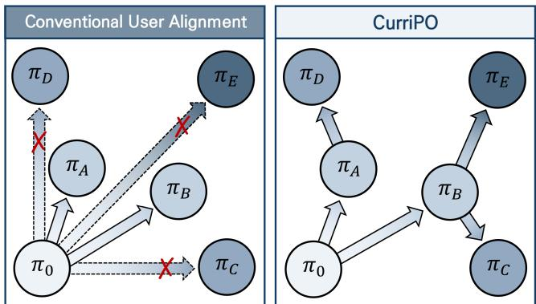
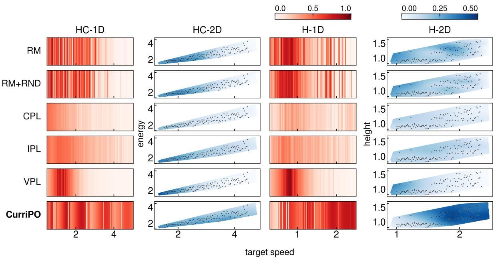
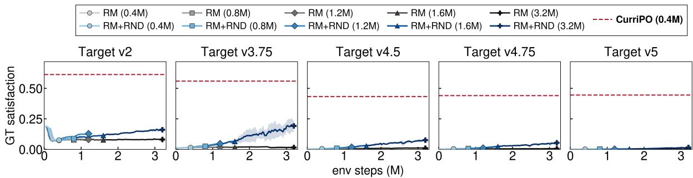
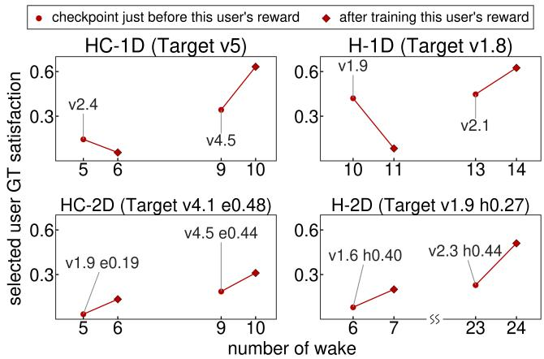
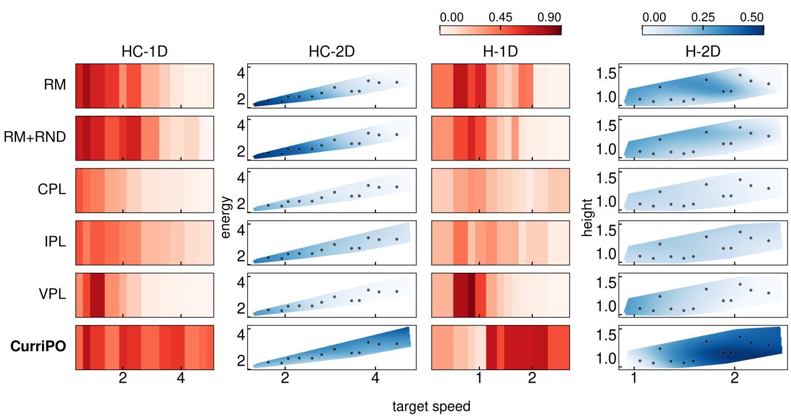
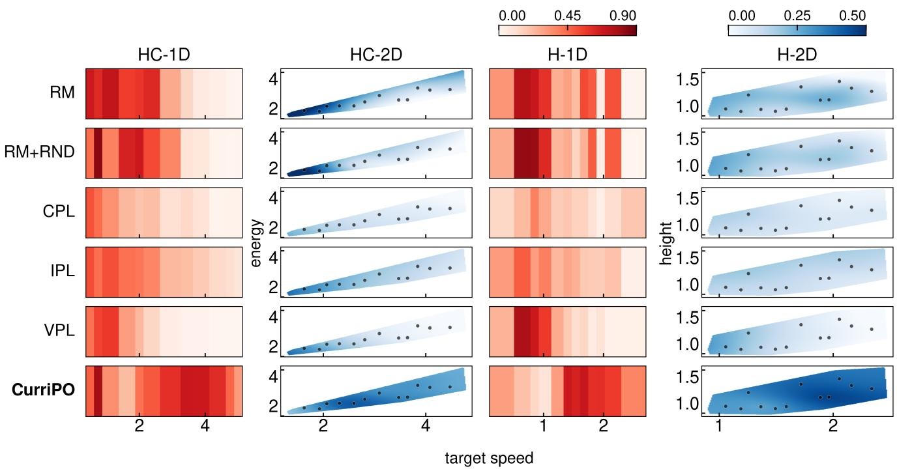
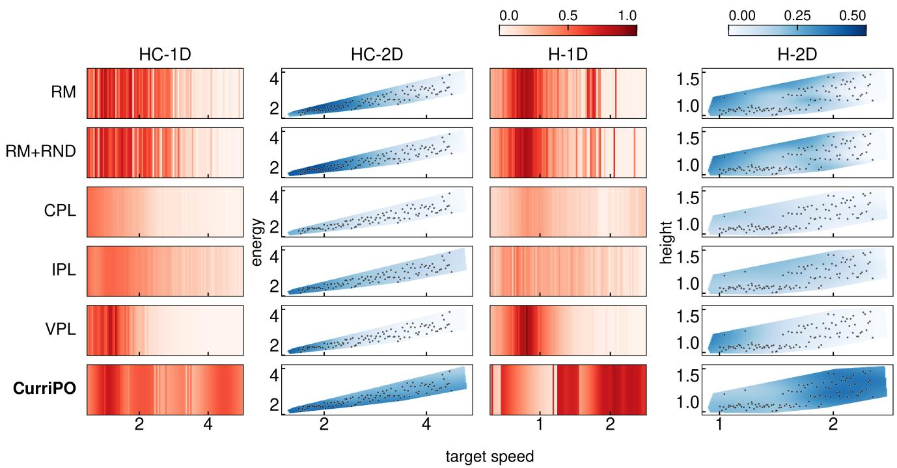

# To Go Far, Go Together: Diverse Preferences Induce a Curriculum for Reward Optimization

Taehyung Kim1, Jongeun Choi1∗

1Yonsei University, Seoul, South Korea {kth8606, jongeunchoi}@yonsei.ac.kr

## Abstract

Learning a reward model from human feedback and optimizing a policy against it is one approach to aligning AI systems with individual users. From a fairness perspective, existing work improves such alignment by developing data-eficient and accurate reward models that capture minority preferences despite scarce data. We push this line of inquiry one step further and argue that data-eficient and accurate per-user reward models are not suficient: users whose reward models are dificult to optimize at the policy level can become a new underserved group. We start from the observation that one user’s reward model can be easy to optimize from the initial policy while another’s is not. We argue that, given a suficiently diverse user population, a curriculum naturally emerges between easy- and hard-to-optimize reward models. Building on this insight, we propose CurriPO, which grows a tree-structured curriculum to accommodate diverse user-specific objectives, covering the population in a single traversal. Specifically, CurriPO automatically constructs a curriculum over diverse user reward models, allowing it to branch from the existing curriculum and reuse reward models previously incorporated into the curriculum. To the best of our knowledge, this is the first work to explicitly exploit multi-user structure to address optimization in AI alignment. Extensive experiments on personalized continuous control in a simulated environment show that CurriPO achieves 1.2–2.1× the population satisfaction of the strongest baseline while substantially reducing training time. Additional analysis attributes much of this improvement to the users left underserved by conventional optimization.

## 1 Introduction

A widely adopted approach to aligning AI systems with human values is to elicit preference feedback (e.g., pairwise comparisons), fit a reward model, and optimize a policy against it with reinforcement learning (RL) (Christiano et al. 2017). This approach has since been applied and extended across a range of domains, achieving substantial gains (Ouyang et al. 2022; Cabi et al. 2020). As these systems have become widely deployed, there has been a growing demand for alignment at the level of individual users (Guan et al. 2025).

Prior work has developed various reward model-based preference optimization methods to support personalized alignment. These include reward models that capture heterogeneous preferences by modeling distributions over latent utilities (Siththaranjan, Laidlaw, and Hadfield-Menell 2024), shared preference-space methods with few-shot onboarding (Poddar et al. 2024), and methods that use limited reward models based on mixtures of preference groups or combinations of shared prototypes (Shenfeld et al. 2025; Kim et al. 2026). From the perspective of protecting minority preferences, these approaches leverage the structural advantage of multi-user settings to improve personalized reward model accuracy and data eficiency, helping preserve preferences that might otherwise be overlooked.

  
Figure 1: CurriPO aims to construct an efective curriculum across users, enabling better alignment for those who would otherwise remain underserved by conventional methods.

Although these approaches are efective, we go one step further by highlighting that even when accurate personalized reward models are available for all users, including minorities, subsequent RL optimization can itself create new forms of underrepresentation. When modern methods drive a reward model to high held-out accuracy, it remains unclear whether a policy can be efectively optimized against it. Ng, Harada, and Russell (1999) characterize a family of reward transformations that preserve the optimal policy while substantially altering the dificulty of learning it. Extending this line of analysis to learned reward functions, Skalse et al. (2023) show that accuracy on held-out feedback alone cannot distinguish reward models that are easy to optimize from those that are not. Similarly, Razin et al. (2025b) show that a reward model can correctly rank every pair while still inducing a flat optimization landscape that makes policy optimization dificult. This optimization issue can be particularly pronounced in peruser alignment, where a separate policy must be optimized for each user under a user-specific reward landscape.

To address the reward optimization problem across a diverse user population, we begin with the observation that reward models learned from diferent users vary substantially in how easily a policy can be optimized against them. Our key intuition is that users whose reward models are easier to optimize can serve as stepping stones toward users with progressively harder reward models, enabling a curriculum-like optimization procedure. We instantiate this idea as CurriPO, a tree-structured traversal of policy space that treats the diverse reward model population as its curriculum. Starting from an initial policy $\pi _ { 0 } ,$ CurriPO repeatedly optimizes a selected user’s reward model, stores the resulting policy checkpoint, and selects the next reward model to optimize. All checkpoints generated during traversal are retained in a growing set, which we call the wake. At each stage, CurriPO probes the entire wake by running short rollouts and evaluating them under users’ reward models, thereby identifying the next reward model–checkpoint pair to optimize. Once the curriculum is complete, each user is ultimately served the checkpoint in the wake that is most preferred by that user’s own reward model.

CurriPO incorporates two key mechanisms. First, branching allows the next optimization to start from any checkpoint in the wake, rather than only from the most recent one. This prevents optimization from degenerating into a single chain and enables broader coverage of heterogeneous users. Second, reusing continues to probe previously optimized reward models, allowing them to re-enter the curriculum when probing identifies a later checkpoint as a more promising initialization. Thus, a reward model previously dificult to optimize can be reused from a better initialization. Through these mechanisms, CurriPO turns the multiplicity of users—often viewed as an obstacle to per-user alignment—into a sequence of learning stages. By explicitly leveraging this multi-user structure, CurriPO reduces the risk that users associated with harderto-optimize reward models are systematically underserved during the alignment process.

We consider a setting in which CurriPO optimizes a policy using pairwise preferences collected from users. In our evaluation, we focus on personalizing relatively simple robots that are likely to be deployed around humans in the near term, instead of highly complex systems such as humanoid robots. We study personalization on continuous-control tasks in MuJoCo (Todorov, Erez, and Tassa 2012). We show that CurriPO substantially improves population satisfaction while reducing training time relative to both conventional reward model optimization and direct preference optimization baselines. Ablation studies further validate the contributions of its key components. Additional analysis demonstrates that CurriPO provides particularly large gains for users who are poorly served by existing optimization methods.

Our key contributions are summarized as follows:

• We propose CurriPO, a novel method for improving optimization in per-user alignment in multi-user settings, which treats the diverse user population as a curriculum to identify favorable optimization trajectories for users whose reward models are dificult to optimize.

• CurriPO admits branching and reusing when ordering the curriculum, yielding a tree-structured curriculum that serves all users in a single traversal and thus achieves more eficient and accurate user alignment.

• Extensive experiments in continuous control show that CurriPO improves population satisfaction over conventional optimization baselines, with the largest gains observed for users whose reward models are dificult to optimize against using conventional methods.

## 2 Related Work

Preference-Based Policy Learning and Alignment. Preference-based RL replaces manually specified rewards with human preferences (Christiano et al. 2017). This paradigm has been steadily refined across diverse domains of continuous control (Lee, Smith, and Abbeel 2021; Park et al. 2022). As preference feedback increasingly comes from heterogeneous populations, recent work has sought to account for individual diferences. Poddar et al. (2024) personalize robot control policies by inferring a per-user latent preference within a shared latent space, and, in a similar spirit, Kalra et al. (2026) decompose the preferences of multiple users into a common preference basis. Kim et al. (2026) group users with similar preferences and learn a reward model for each group, aiming to obtain robot policies that serve the population well. While these methods assume a multi-user setting and devote their eforts to constructing better reward models, whether multiple users can also be leveraged to improve the policy optimization stage itself has rarely been explored. To the best of our knowledge, CurriPO is the first to address this gap, using policies obtained by optimizing one user’s reward as stepping stones that make other users’ reward models easier to optimize.

A parallel line of work bypasses explicit reward modeling and optimizes policies directly from preferences. IPL (Hejna and Sadigh 2023) learns a preference-consistent Q-function via an implicit reward, while CPL (Hejna et al. 2024) directly optimizes the policy with a contrastive objective. However, removing the explicit reward model does not eliminate optimization dificulties: direct preference optimization remains constrained by the coverage of the preference data and by the policy distribution from which optimization proceeds (Razin et al. 2025a; Guo et al. 2025). Discarding the reward model therefore does not resolve the problem CurriPO targets.

Curriculum Learning. Curriculum learning organizes training examples or tasks to match the learner’s evolving capabilities (Bengio et al. 2009; Kumar, Packer, and Koller 2010), with automatic variants adapting the curriculum using signals such as learning progress (Graves et al. 2017; Matiisen et al. 2019). In RL, self-paced RL adapts task distributions to the agent’s competence (Klink et al. 2020), while PLR (Jiang, Grefenstette, and Rocktäschel 2021) prioritizes levels with high learning potential. Unsupervised Environment Design further generates or curates tasks near the learning frontier; examples include PAIRED (Dennis et al. 2020), replay-guided environment design (Jiang et al. 2021), and ACCEL (Parker-Holder et al. 2022). Recent methods improve task generation and selection through learned task representations (Azad et al.

2023) or cross-task learnability (Cho et al. 2026). Related open-ended methods such as POET transfer policies across challenges, using intermediate solutions as stepping stones toward otherwise dificult behaviors (Wang et al. 2019, 2020).

CurriPO difers in two key respects. First, it requires no separate process for designing or generating curriculum tasks: the heterogeneous reward models already present in the user population form the task space, allowing population diversity to be directly exploited as a structural resource for optimization. Second, CurriPO is not a curriculum toward a single target. Through branching and reusing, it expands toward multiple user-specific objectives, efectively solving many user alignment problems within a shared traversal.

## 3 Method

## 3.1 Problem formulation

We aim to serve a diverse population with user-aligned policies, derived from $\pi _ { 0 } ,$ using only pairwise user feedback collected over a behavior pool D. Let $\mathcal { M } = ( S , \mathcal { A } , P , \rho _ { 0 } , H )$ be a reward-free episodic decision process, where a policy $\pi ( a \mid s )$ specifies the probability of choosing action a in state $s ,$ and executing the policy yields a trajectory $\tau = ( s _ { 0 } , a _ { 0 } , \ldots , s _ { H - 1 } , a _ { H - 1 } ) \in \mathcal { T }$ . Let $\mathcal { U } = \{ 1 , \dots , N \}$ be the population of users. We assume each user u carries a latent utility $g _ { u }$ capturing how satisfied u actually is with a given behavior. From the feedback $\mathcal { F } _ { u }$ that u provides on trajectory segments $\xi = ( ( s _ { t } , a _ { t } ) ) _ { t = 0 } ^ { L - 1 }$ , we fit a per-user reward model $f _ { u } : \mathcal { S } \times \mathcal { A } \stackrel { } {  } \mathbb { R }$ , whose segment score $\begin{array} { r } { \bar { f } _ { u } ( \xi ) = \frac { 1 } { L } \sum _ { t } \dot { f } _ { u } ( s _ { t } , a _ { t } ) } \end{array}$ is a learned proxy for $g _ { u }$ . We call $\{ f _ { u } \} _ { u \in \mathcal { U } }$ the reward model bank. Given the bank, we aim to provide each user u with a personalized policy $\pi _ { u } ,$ , improving overall population satisfaction $\begin{array} { r } { \frac { 1 } { N } \sum _ { u } \dot { \mathbb E } _ { \xi \sim \pi _ { u } } \mathbf { \bar { [ { g } _ { u } ( { \xi } ) ] } } } \end{array}$ while better serving users who would otherwise remain underserved by conventional policy optimization.

## 3.2 Reward modeling from pairwise preferences

We instantiate the bank following the standard preferencebased pipeline (Christiano et al. 2017). Each element of $\mathcal { F } _ { u }$ is a triple $( \xi ^ { 0 } , \dot { \xi } ^ { 1 } , y )$ with $y \in \{ 0 , 1 \}$ , where $y = 1$ denotes $\xi ^ { 1 } \succ \dot { \xi ^ { 0 } }$ and $y = 0$ denotes $\dot { \xi ^ { 0 } } \succ \dot { \xi ^ { 1 } }$ . To fit $f _ { u } ,$ , most prior work (Christiano et al. 2017; Lee, Smith, and Abbeel 2021) defines a preference predictor following the Bradley–Terry model (Bradley and Terry 1952); we adopt the predictor per user, expressed as $P _ { f _ { u } } \big [ \xi ^ { 1 } \succ \xi ^ { 0 } \big ] = \mathrm { l o g i s t i c } \big ( \dot { \bar { f } } _ { u } ( \xi ^ { 1 } ) - \dot { \bar { f } } _ { u } ( \xi ^ { 0 } ) \big )$ Each $f _ { u }$ is fit by minimizing the binary cross-entropy below, and repeating this for every $u \in \mathcal { U }$ yields the reward model bank:

$$
\begin{array} { r } { \mathcal { L } ^ { \mathrm { C E } } ( f _ { u } ) = - \underset { ( \xi ^ { 0 } , \xi ^ { 1 } , y ) \sim \mathcal { F } _ { u } } { \mathbb { E } } \left[ ( 1 - y ) \log P _ { f _ { u } } \big [ \xi ^ { 0 } \succ \xi ^ { 1 } \big ] \right. } \\ { + \left. y \log P _ { f _ { u } } \big [ \xi ^ { 1 } \succ \xi ^ { 0 } \big ] \right] . } \end{array}\tag{1}
$$

## 3.3 CurriPO: Probe-Driven Reward Traversal

CurriPO exploits the reward model bank as an automatically discovered curriculum. Starting from $\pi _ { 0 }$ , CurriPO traverses the policy space by iteratively optimizing a selected user’s reward model, retaining the resulting policy checkpoint, and selecting the reward model for the next stage. After k stages, these checkpoints form the wake $\mathcal { W } _ { k } = \mathbf { \bar { \{ } }  \pi _ { 0 } , \ldots , \pi _ { k } \mathbf  \}$ . At stage $k ,$ CurriPO selects $( w _ { k } , u _ { k } )$ , where $\pi _ { w _ { k } } \in \mathcal { W } _ { k }$ is the checkpoint used to warm-start optimization of the selected reward model $f _ { u _ { k } }$

Probing the wake. CurriPO evaluates each checkpoint using short probe rollouts, scored by every user reward model. For each checkpoint–user pair, we estimate the competence

$$
\mathrm { c o m p } ( \pi , u ) = \widehat { \mathbb { E } } _ { \xi \sim \pi } \big [ \mathcal { N } _ { u } \big ( \bar { f } _ { u } ( \xi ) \big ) \big ] ,\tag{2}
$$

where $\mathcal { N } _ { u } ( x ) = P _ { \xi \sim \mathcal { D } } [ \bar { f } _ { u } ( \xi ) \overset { } { \leq } x ]$ is the empirical cumulative distribution function over the pool $\mathcal { D } ,$ so competence is the pool percentile $\pi$ reaches under u. Below we write comp $\boldsymbol { \mathbf { \rho } } _ { w } ( u )$ for the competence of checkpoint $\pi _ { w }$ evaluated under user u’s reward model. Aggregating competence over the wake gives the coverage

$$
C _ { k } ( u ) = \operatorname* { m a x } _ { w : \pi _ { w } \in \mathcal W _ { k } } \mathrm { c o m p } _ { w } ( u ) ,\tag{3}
$$

so that $C _ { k } ( u )$ measures how well user u is served by the best checkpoint currently in the wake.

Selecting the next traversal step. Having probed the wake, CurriPO has an estimate of how well each user is currently served, summarized by the coverage $C _ { k } ( u )$ . It then uses this coverage information to decide where the traversal should expand next. CurriPO follows a curriculum principle of expanding progressively toward reward models that are sufficiently accessible from the current wake (Florensa et al. 2018). To this end, it first restricts attention to the admissible users, namely those some checkpoint in the wake already serves above a minimum threshold $c _ { \mathrm { l o } } \mathrm { . }$

$$
\mathcal { U } _ { k } = \left\{ u : C _ { k } ( u ) \geq c _ { \mathrm { l o } } \right\} .\tag{4}
$$

Among these, CurriPO targets the least-covered user and warm-starts from the checkpoint that currently serves that user best:

$$
u _ { k } = \arg \operatorname* { m i n } _ { u \in \mathcal { U } _ { k } } C _ { k } ( u ) , \quad w _ { k } = \arg \operatorname* { m a x } _ { w : \pi _ { w } \in \mathcal { W } _ { k } } \mathrm { c o m p } _ { w } ( u _ { k } ) ,\tag{5}
$$

with ties broken toward the most recently added checkpoint.

This design enables CurriPO to select the starting checkpoint afresh at every stage, without requiring every reward optimization stage to start from the immediately preceding checkpoint. As a result, the traversal can branch into a tree instead of being a single chain. This is a particularly efective design choice for our setting, where the goal is not to reach a single dificult objective, but to eficiently cover a diverse population of users with diferent hard-to-optimize objectives.

Additionally, motivated by the observation that optimizing the same reward model from diferent initializations can induce substantially diferent optimization dynamics (Razin et al. 2025b), which we also empirically observe in Figure 4, we allow each reward model that has already been selected and used for optimization to be reused up to q times. CurriPO gives a previously selected reward model another opportunity for optimization whenever a newly added checkpoint in the wake achieves a better probe score than the checkpoint from which that reward model was previously optimized. This mechanism is particularly well suited to our setting, where stepping-stone checkpoints remain relevant even after the curriculum is complete because they are retained as candidate policies for final user assignment. Reusing reward models can therefore improve the quality of these stepping stones while simultaneously inducing a finer-grained curriculum as the wake expands.

  
Figure 2: User satisfaction visualization across diferent optimization methods with $N = 1 0 0$ users under oracle feedback. User satisfaction landscapes are shown for HalfCheetah and Hopper under 1-D and 2-D preference settings, with target speed as the shared preference dimension and energy or height as the second dimension. Darker colors indicate higher user satisfaction.

Local stage optimization. Once $( w _ { k } , u _ { k } )$ is selected, CurriPO initializes the policy from $\pi _ { w _ { k } }$ and performs a local optimization stage:

$$
\pi _ { k + 1 } \approx { \underset { \pi } { \operatorname { a r g m a x } } } \ \mathbb { E } _ { \tau \sim \pi } \sum _ { t } [ { \hat { r } } _ { u _ { k } } - \beta D _ { \mathrm { K L } } ( \pi \parallel \pi _ { w _ { k } } ) ] .\tag{6}
$$

Here, $\pi _ { w _ { k } }$ is kept fixed as the reference policy throughout the stage. To make the shared regularization coeficient $\beta$ comparable across users, we standardize each reward model over the pool D:

$$
\hat { r } _ { u } ( s , a ) = \frac { f _ { u } ( s , a ) - \mu _ { u } ^ { \mathcal { D } } } { \sigma _ { u } ^ { \mathcal { D } } } .\tag{7}
$$

The KL penalty preserves useful behaviors from the selected checkpoint while preventing each optimization stage from moving too far from its initialization. Re-anchoring the constraint at successive checkpoints allows CurriPO to progressively traverse policy space through local transitions.

Serving from the wake. The traversal terminates when min $_ { \textmd l } C _ { k } ( u ) \geq c _ { \mathrm { s t o p } }$ or when the interaction budget B is exhausted. The final output is the entire wake. Each user u is assigned the checkpoint preferred by that user’s own reward model,

$$
\pi _ { u } = \arg \operatorname* { m a x } _ { \pi \in \mathcal { W } } \mathrm { c o m p } ( \pi , u ) .\tag{8}
$$

## 4 Experiments

## 4.1 Experimental Settings

Environment. Our environment design follows the objective decomposition in MO-Gymnasium (Felten et al. 2023), which has been used to study trade-ofs among multiple control objectives, and is conceptually aligned with Hwang et al. (2024), who model user preferences through combinations of such objectives. We evaluate the styles preferred by multiple scripted users across four environments: (i) HC-1D, with HalfCheetah as the agent, where user preferences are defined over its velocity; (ii) HC-2D, also using HalfCheetah, where preferences depend jointly on velocity and energy consumption; (iii) H-1D, with Hopper as the agent, where preferences are defined over its velocity; and (iv) H-2D, also using Hopper, where preferences depend jointly on velocity and vertical position (z-height).

Datasets. We construct a custom dataset D covering a diverse range of locomotion styles, as existing public ofline RL datasets do not provide such coverage. For each environment, we train 10 PPO (Schulman et al. 2017) policies with diferent random seeds for 600K steps using velocity-based reward functions with varying target values. We collect trajectories from nine checkpoints throughout training for each policy. The trajectories are then partitioned into non-overlapping 25-step segments and augmented with segments generated by a random policy. Finally, we construct a pairwise dataset by sampling segment pairs from the resulting pool.

<table><tr><td rowspan="2">Method</td><td colspan="4">Oracle</td><td colspan="4">B-Pref noise</td><td rowspan="2">Time (h)</td></tr><tr><td>HC-1D</td><td>HC-2D</td><td>H-1D</td><td>H-2D</td><td>HC-1D</td><td>HC-2D</td><td>H-1D</td><td>H-2D</td></tr><tr><td>RM</td><td> $\overline { { 0 . 3 4 1 { \pm } 0 . 0 0 4 } }$ </td><td> $\overline { { 0 . 2 1 5 { \scriptstyle \pm 0 . 0 0 6 } } }$ </td><td> $\overline { { 0 . 2 5 0 { \scriptstyle \pm 0 . 0 2 7 } } }$ </td><td> $\overline { { 0 . 1 7 5 { \scriptstyle \pm 0 . 0 0 1 } } }$ </td><td> $\overline { { 0 . 3 1 1 \pm 0 . 0 1 2 } }$ </td><td>0.220±0.002</td><td> $\overline { { 0 . 3 0 9 { \scriptstyle \pm 0 . 0 1 2 } } }$ </td><td> $\overline { { 0 . 1 6 3 \pm 0 . 0 1 1 } }$ </td><td>2.6</td></tr><tr><td>RM+RND</td><td> $0 . 3 8 8 { \scriptstyle \pm 0 . 0 0 0 }$ </td><td> $0 . 2 3 9 { \scriptstyle \pm 0 . 0 1 3 }$ </td><td> $0 . 2 6 0 { \scriptstyle \pm 0 . 0 0 3 }$ </td><td> $0 . 1 5 7 { \scriptstyle \pm 0 . 0 0 1 }$ </td><td> $0 . 3 2 0 { \scriptstyle \pm 0 . 0 0 3 }$ </td><td> $0 . 1 6 8 { \scriptstyle \pm 0 . 0 0 2 }$ </td><td> $0 . 3 1 2 { \scriptstyle \pm 0 . 0 2 7 }$ </td><td> $0 . 1 5 6 { \scriptstyle \pm 0 . 0 0 9 }$ </td><td>3.4</td></tr><tr><td>CPL</td><td> $0 . 1 8 8 { \scriptstyle \pm 0 . 0 1 0 }$ </td><td> $0 . 0 9 1 { \scriptstyle \pm 0 . 0 0 8 }$ </td><td> $0 . 1 8 8 { \scriptstyle \pm 0 . 0 2 0 }$ </td><td> $0 . 0 7 6 { \scriptstyle \pm 0 . 0 0 8 }$ </td><td> $0 . 1 9 4 { \scriptstyle \pm 0 . 0 0 3 }$ </td><td> $0 . 0 9 6 { \scriptstyle \pm 0 . 0 0 6 }$ </td><td> $0 . 1 8 0 { \scriptstyle \pm 0 . 0 0 5 }$ </td><td> $0 . 0 8 5 { \scriptstyle \pm 0 . 0 0 5 }$ </td><td>5.6</td></tr><tr><td>IPL</td><td> $0 . 2 9 5 { \scriptstyle \pm 0 . 0 0 7 }$ </td><td> $0 . 1 9 3 { \scriptstyle \pm 0 . 0 0 7 }$ </td><td> $0 . 2 2 8 { \scriptstyle \pm 0 . 0 0 7 }$ </td><td> $0 . 1 2 5 { \scriptstyle \pm 0 . 0 0 8 }$ </td><td> $0 . 3 0 4 { \scriptstyle \pm 0 . 0 0 1 }$ </td><td> $0 . 1 9 3 { \scriptstyle \pm 0 . 0 0 8 }$ </td><td> $0 . 2 5 3 { \scriptstyle \pm 0 . 0 0 8 }$ </td><td> $0 . 1 2 8 { \scriptstyle \pm 0 . 0 0 9 }$ </td><td>5.7</td></tr><tr><td>VPL</td><td> $0 . 2 0 9 { \scriptstyle \pm 0 . 0 0 9 }$ </td><td> $0 . 0 8 7 { \scriptstyle \pm 0 . 0 1 3 }$ </td><td> $0 . 2 6 6 { \scriptstyle \pm 0 . 0 0 1 }$ </td><td> $0 . 0 9 9 { \scriptstyle \pm 0 . 0 0 5 }$ </td><td> $0 . 1 9 2 { \scriptstyle \pm 0 . 0 2 1 }$ </td><td> $0 . 1 1 4 { \scriptstyle \pm 0 . 0 2 3 }$ </td><td> $0 . 2 6 4 { \scriptstyle \pm 0 . 0 1 6 }$ </td><td> $0 . 0 9 8 { \scriptstyle \pm 0 . 0 0 6 }$ </td><td>3.5</td></tr><tr><td>CurriPO</td><td> $\mathbf { 0 . 5 1 4 } { \scriptstyle \pm 0 . 0 1 6 }$ </td><td> $\mathbf { 0 . 3 1 8 { \scriptstyle \pm 0 . 0 4 0 } }$ </td><td> $\mathbf { 0 . 3 5 5 } \pm 0 . 0 5 9$ </td><td> $\mathbf { 0 . 3 2 8 { \scriptstyle \pm 0 . 0 0 6 } }$ </td><td> $\mathbf { 0 . 3 8 6 { \scriptstyle \pm 0 . 0 3 4 } }$ </td><td> $\mathbf { 0 . 3 4 4 } { \scriptstyle \pm 0 . 0 0 9 }$ </td><td> $\mathbf { 0 . 3 7 1 { \scriptstyle \pm 0 . 0 2 1 } }$ </td><td> $\mathbf { 0 . 3 4 0 { \scriptstyle \pm 0 . 0 3 8 } }$ </td><td>1.1</td></tr></table>

Table 1: Satisfaction and training time for N = 12 users under oracle and B-Pref noisy feedback across three seeds.

<table><tr><td rowspan="2">Method</td><td colspan="4">Oracle</td><td colspan="4">B-Pref noise</td><td rowspan="2">Time (h)</td></tr><tr><td>HC-1D</td><td>HC-2D</td><td>H-1D</td><td>H-2D</td><td>HC-1D</td><td>HC-2D</td><td>H-1D</td><td>H-2D</td></tr><tr><td>RM</td><td>0.352±0.000</td><td> $\overline { { 0 . 2 2 7 { \scriptstyle \pm 0 . 0 0 1 } } }$ </td><td> $\overline { { 0 . 3 0 9 { \pm } 0 . 0 0 2 } }$ </td><td> $\overline { { 0 . 1 4 2 { \scriptstyle \pm 0 . 0 0 3 } } }$ </td><td> $\overline { { 0 . 3 1 8 { \scriptstyle \pm 0 . 0 0 3 } } }$ </td><td> $\overline { { 0 . 1 8 3 \pm 0 . 0 0 1 } }$ </td><td> $\overline { { 0 . 2 4 4 { \scriptstyle \pm 0 . 0 0 7 } } }$ </td><td> $\overline { { 0 . 1 7 9 2 0 . 0 0 4 } }$ </td><td>22</td></tr><tr><td>RM+RND</td><td>0.344±0.005</td><td> $0 . 2 2 1 { \scriptstyle \pm 0 . 0 0 0 }$ </td><td> $0 . 3 1 8 { \scriptstyle \pm 0 . 0 0 8 }$ </td><td> $0 . 1 4 5 { \scriptstyle \pm 0 . 0 0 5 }$ </td><td> $0 . 3 1 6 { \scriptstyle \pm 0 . 0 0 5 }$ </td><td> $0 . 1 7 1 { \scriptstyle \pm 0 . 0 0 4 }$ </td><td> $0 . 2 6 7 { \scriptstyle \pm 0 . 0 0 3 }$ </td><td> $0 . 1 5 2 { \scriptstyle \pm 0 . 0 0 4 }$ </td><td>28</td></tr><tr><td>CPL</td><td> $0 . 1 7 3 { \scriptstyle \pm 0 . 0 1 5 }$ </td><td> $0 . 0 8 9 { \scriptstyle \pm 0 . 0 1 1 }$ </td><td> $0 . 1 9 1 { \scriptstyle \pm 0 . 0 1 7 }$ </td><td> $0 . 0 7 8 { \scriptstyle \pm 0 . 0 0 7 }$ </td><td> $0 . 1 7 9 { \scriptstyle \pm 0 . 0 0 2 }$ </td><td> $0 . 0 9 3 { \scriptstyle \pm 0 . 0 0 1 }$ </td><td> $0 . 1 9 4 { \scriptstyle \pm 0 . 0 0 6 }$ </td><td> $0 . 0 8 7 { \scriptstyle \pm 0 . 0 0 6 }$ </td><td>47</td></tr><tr><td>IPL</td><td> $0 . 2 9 9 { \scriptstyle \pm 0 . 0 0 8 }$ </td><td> $0 . 1 9 5 { \scriptstyle \pm 0 . 0 0 5 }$ </td><td> $0 . 2 4 0 { \scriptstyle \pm 0 . 0 0 6 }$ </td><td> $0 . 1 2 8 { \scriptstyle \pm 0 . 0 0 6 }$ </td><td> $0 . 2 9 6 { \scriptstyle \pm 0 . 0 0 7 }$ </td><td> $0 . 1 9 1 { \scriptstyle \pm 0 . 0 0 4 }$ </td><td> $0 . 2 6 1 { \scriptstyle \pm 0 . 0 1 8 }$ </td><td> $0 . 1 2 9 { \scriptstyle \pm 0 . 0 0 2 }$ </td><td>48</td></tr><tr><td>VPL</td><td> $0 . 2 0 8 { \scriptstyle \pm 0 . 0 2 0 }$ </td><td> $0 . 1 0 7 { \scriptstyle \pm 0 . 0 3 1 }$ </td><td> $0 . 2 7 5 { \scriptstyle \pm 0 . 0 0 2 }$ </td><td> $0 . 0 9 4 { \scriptstyle \pm 0 . 0 0 3 }$ </td><td> $0 . 2 1 5 { \scriptstyle \pm 0 . 0 0 4 }$ </td><td> $0 . 1 2 5 { \scriptstyle \pm 0 . 0 3 0 }$ </td><td> $0 . 2 7 5 { \scriptstyle \pm 0 . 0 0 6 }$ </td><td> $0 . 0 9 3 { \scriptstyle \pm 0 . 0 0 3 }$ </td><td>28</td></tr><tr><td>CurriPO</td><td> $\mathbf { 0 . 5 1 2 { \scriptstyle \pm 0 . 0 3 0 } }$ </td><td> $\mathbf { 0 . 3 1 9 } { \scriptstyle \pm 0 . 0 1 9 }$ </td><td> $\mathbf { 0 . 4 1 5 { \scriptstyle \pm 0 . 0 5 1 } }$ </td><td> $\mathbf { 0 . 2 8 0 { \scriptstyle \pm 0 . 0 0 8 } }$ </td><td> $\mathbf { 0 . 5 2 2 { \scriptstyle \pm 0 . 0 1 8 } }$ </td><td> $\mathbf { 0 . 2 5 3 { \scriptstyle \pm 0 . 0 2 6 } }$ </td><td> $\mathbf { 0 . 3 5 0 { \scriptstyle \pm 0 . 0 1 8 } }$ </td><td> $\mathbf { 0 . 2 6 9 { \scriptstyle \pm 0 . 0 1 2 } }$ </td><td>1.6</td></tr></table>

Table 2: Satisfaction and training time for $N = 1 0 0$ users under oracle and B-Pref noisy feedback across three seeds.

User Sampling. Following common practice in prior work on personalized preference learning, we use scripted users to evaluate personalization across heterogeneous preferences (Poddar et al. 2024; Zollo et al. 2025; Bahlous-Boldi et al. 2024; Kim et al. 2026). In the 1-D settings (HC-1D and H-1D), users are sampled uniformly at random from a predefined speed range. In the 2-D settings (HC-2D and H-2D), users are sampled only from the feasible region. For example, in HC-2D, mismatched speed–energy combinations, such as high speed with low energy or low speed with high energy, are dificult to obtain under our data-collection procedure and are therefore excluded by construction. We conduct experiments with two population sizes, $N = 1 2$ and $N = 1 0 0$ , for each environment. Figures in Appendix C.1 and Figure 2 visualize the preference ranges and user populations in the 1-D and 2-D settings for $N = 1 2$ and $N = 1 0 0$ , respectively. To mitigate the limitations of scripted teachers, we further evaluate robustness to imperfect preference feedback by introducing noisy preference labels following the preference-noise setting of B-Pref (Lee et al. 2021), yielding reward model geometries that deviate from the oracle geometry (Liang et al. 2022; Park et al. 2022; Cheng et al. 2024). The preference-noise parameters are detailed in Appendix A.1.

Evaluation Metrics. We evaluate each personalized policy using the user’s ground-truth utility, which is not directly observed during training. For user u, the per-step utility is defined as a band-shaped kernel over the behavioral feature vector d (e.g., velocity and energy consumption) generated by the policy assigned to the user,

$$
g _ { u } ( d _ { t } ) = \mathrm { e x p } \left( - \frac { \left| \left| ( d _ { t } - c _ { u } ) \oslash \eta _ { u } \right| \right| _ { 2 } ^ { 2 } } { b _ { u } } \right) ,\tag{9}
$$

where $c _ { u } , \eta _ { u } ,$ , and $b _ { u }$ are the user’s preferred target, perdimension tolerance, and bandwidth, and ⊘ denotes elementwise division. The policy-level utility $G _ { u } ( \pi )$ is the temporal average of $g _ { u } ( d _ { t } )$ over fresh stochastic rollouts from π. Rather than using raw distance in the behavioral descriptor space, we normalize deviations by user-specific tolerances to make heterogeneous preference dimensions comparable. The exponential kernel then maps this normalized distance to a bounded satisfaction score, smoothly capturing how utility decreases as behavior moves away from the user’s preferred region (Poddar et al. 2024). Our primary metric is population satisfaction, i.e., the utilitarian population satisfaction $\begin{array} { r } { W _ { \mathrm { u t i l } } = \frac { 1 } { N } \sum _ { u = 1 } ^ { N } G _ { u } ( \pi _ { u } ) } \end{array}$ , where $\pi _ { u }$ is the policy served to user u, so that all users contribute equally. Each $G _ { u }$ is estimated from 10 fresh evaluation episodes. We also report the egalitarian population satisfaction minu $G _ { u } ( \pi _ { u } )$ and the Nash population satisfaction $\left( \prod _ { u } G _ { u } ( \pi _ { u } ) \right) ^ { 1 / N }$ in the Appendix C.2.

Implementation Details. CurriPO is implemented in Python 3.11.15 with PyTorch 2.13.0 and MuJoCo 3.10.0 on Rocky Linux 9.4. All continuous-control training ran on Intel Xeon Gold 5320 CPUs, with each job allocated two CPU cores and 6 GB RAM. Reward model optimization methods share one PPO implementation: actor and critic MLPs of width 64, 8 parallel environments, 256-step rollouts, 10 epochs, Adam at $\bar { 3 } { \times } 1 0 ^ { - 4 } , \gamma { = } 0 . 9 9 , { \mathrm { G A E ~ } } \lambda { = } 0 . \bar { 9 } 5$ and clip 0.2. For CurriPO, we set $c _ { \mathrm { l o } } { = } 0 . 6 , \beta { = } 0 . 0 1 , q { = } 2 .$ , and $c _ { \mathrm { s t o p } } { = } 0 . 9$ . Each traversal stage is allocated a PPO budget of 400K environment steps. We set a safety cap of B=9.6M environment steps, but this limit was rarely reached. For probing, we run six 1,000-step episodes from each checkpoint. π is randomly initialized and held fixed across all methods within a run. As assumed throughout the paper, each reward model is trained until it reaches at least 90% held-out preference accuracy against oracle labels. All baselines that rely on an explicit reward model use the same reward model bank as CurriPO.

## 4.2 Comparison with State-of-the-Art Methods

Baselines. We compare against two families of methods. Reward model optimization: RM (Christiano et al. 2017) optimizes each user’s reward model directly with PPO, i.e. the conventional per-user optimization pipeline; RM+RND adds a random network distillation (RND) bonus (Burda et al. 2019) to RM, to examine whether insuficient exploration accounts for its poor performance; and VPL (Poddar et al. 2024) infers a per-user latent preference and conditions a shared reward model on it. Direct preference optimization: CPL (Hejna et al. 2024) directly optimizes the policy using a contrastive preference objective, whereas IPL (Hejna and Sadigh 2023) learns a preference-consistent Q-function through an implicit reward induced by the inverse Bellman operator. Both methods learn policies from preferences without fitting an explicit reward model. Further implementation details for baselines are provided in Appendix A.2.

  
Figure 3: Comparison of learning curves with stronger PPO baselines in HC-1D with 12 users. Ground-truth goal satisfaction over three seeds is shown across diferent target preferences, comparing RM and RM+RND with increased environment steps.

  
Figure 4: Case studies of rescuing users from local optima. The x-axis denotes the wake number, which increases as the CurriPO tree progressively branches over training. The y-axis denotes the selected user’s ground-truth satisfaction. Circles indicate the checkpoint used to warm-start training for the selected user, with the preceding user’s target additionally provided for reference; v, e, and h denote target speed, target energy, and target height, respectively. Diamonds indicate the checkpoint obtained after training the selected user’s reward model starting from the corresponding warm-start policy.

Experiment Results. Table 1 reports population satisfaction for N=12. Under oracle feedback, CurriPO achieves the highest satisfaction in every environment, with particularly large margins in the more challenging 2-D settings, while no single baseline consistently dominates. These gains persist under B-Pref noise: although noisy feedback afects absolute performance, CurriPO remains the best-performing method across all four environments, indicating that its advantage holds even under the altered reward model geometry induced by imperfect preference feedback.

Table 2 shows that this advantage also persists as the population scales to N=100, with CurriPO again outperforming all baselines under both oracle and noisy feedback. CurriPO also tends to exhibit lower across-seed variability at $N { = } 1 0 0$ consistent with more stable performance as the population grows. To understand where these gains arise, Figure 2 visualizes the satisfaction landscape and user distribution for the N=100 oracle setting (see Appendix C.1 for the satisfaction landscapes under the remaining population and feedback settings). For the baselines, satisfaction is concentrated near the low-velocity region and fades as the target moves outward; the additional exploration of RM+RND expands this region only slightly. In contrast, CurriPO maintains high satisfaction across a broad portion of the feasible range, showing that its gains arise primarily from users whose target bands lie in the regions that conventional optimization methods tend to underserve. Appendix C.2 further demonstrates that CurriPO achieves much strong gains under Nash and egalitarian population satisfaction. CurriPO also scales eficiently in terms of training cost: increasing the population from 12 to 100 raises its training time only from 1.1 h to 1.6 h, whereas the baseline training times increase from 2.6–5.7 h to 22–48 h. Across the eight environments, CurriPO significantly outperforms every baseline under a two-sided Wilcoxon signed-rank test (p=0.0078), with all comparisons remaining significant after Holm correction $( p _ { \mathrm { a d j } } { = } 0 . 0 3 9 1 )$ .

## 4.3 Analysis of Branching, Reusing and KL

We next examine the roles of CurriPO’s branching and reusing mechanisms. We compare CurriPO against two ablations: Chain, which removes both branching and reusing and traverses the curriculum along a single path, and No reuse, which retains branching but prevents a reward model from being selected more than once. As shown in Tables 3 and 4, Chain consistently performs substantially worse than CurriPO, while No reuse closes much of the gap but remains slightly worse in several settings. These results suggest that branching is particularly important for reaching diverse, hard-to-reach users, while reusing provides additional flexibility to recover users that become more accessible from later checkpoints.

<table><tr><td rowspan="2">Method</td><td colspan="4">Oracle</td><td colspan="4">B-Pref noise</td></tr><tr><td>HC-1D</td><td>HC-2D</td><td>H-1D</td><td>H-2D</td><td>HC-1D</td><td>HC-2D</td><td>H-1D</td><td>H-2D</td></tr><tr><td>Chain</td><td> $\overline { { 0 . 3 8 9 { \scriptstyle \pm 0 . 0 3 7 } } }$ </td><td> $\overline { { 0 . 2 4 9 { \scriptstyle \pm 0 . 0 3 0 } } }$ </td><td> $\overline { { 0 . 3 2 4 { \scriptstyle \pm 0 . 0 1 3 } } }$ </td><td> $\overline { { 0 . 1 5 7 \pm 0 . 0 1 2 } }$ </td><td> $\overline { { 0 . 3 0 1 \pm 0 . 0 2 4 } }$ </td><td> $\overline { { 0 . 2 2 3 \pm 0 . 0 0 8 } }$ </td><td> $\overline { { 0 . 3 0 7 { \scriptstyle \pm 0 . 0 0 6 } } }$ </td><td> $\overline { { 0 . 1 6 1 \pm 0 . 0 0 9 } }$ </td></tr><tr><td>No reuse</td><td> $\mathbf { 0 . 5 1 4 { \scriptstyle \pm 0 . 0 1 6 } }$ </td><td> $\mathbf { 0 . 3 1 8 { \scriptstyle \pm 0 . 0 4 0 } }$ </td><td> $0 . 3 5 2 { \scriptstyle \pm 0 . 1 9 0 }$ </td><td> $0 . 3 0 4 { \scriptstyle \pm 0 . 0 1 5 }$ </td><td> $0 . 3 5 2 { \scriptstyle \pm 0 . 0 8 2 }$ </td><td> $\mathbf { 0 . 3 4 4 { \scriptstyle \pm 0 . 0 0 9 } }$ </td><td> $0 . 3 7 0 { \scriptstyle \pm 0 . 0 8 1 }$ </td><td> $0 . 3 1 9 { \scriptstyle \pm 0 . 0 2 9 }$ </td></tr><tr><td>No KL</td><td> $0 . 2 4 4 { \scriptstyle \pm 0 . 1 3 9 }$ </td><td> $0 . 2 5 3 { \scriptstyle \pm 0 . 1 3 2 }$ </td><td> $\mathbf { 0 . 3 6 2 { \scriptstyle \pm 0 . 1 3 8 } }$ </td><td> $0 . 3 2 0 { \scriptstyle \pm 0 . 0 1 6 }$ </td><td> $0 . 2 8 6 { \scriptstyle \pm 0 . 1 0 5 }$ </td><td> $0 . 2 9 3 { \scriptstyle \pm 0 . 0 5 9 }$ </td><td> $0 . 3 5 8 { \scriptstyle \pm 0 . 1 0 2 }$ </td><td> $\mathbf { 0 . 3 6 0 { \scriptstyle \pm 0 . 0 5 2 } }$ </td></tr><tr><td>CurriPO</td><td> $\mathbf { 0 . 5 1 4 { \scriptstyle \pm 0 . 0 1 6 } }$ </td><td> $\mathbf { 0 . 3 1 8 { \scriptstyle \pm 0 . 0 4 0 } }$ </td><td> $0 . 3 5 5 { \scriptstyle \pm 0 . 0 5 9 }$ </td><td> $\mathbf { 0 . 3 2 8 { \scriptstyle \pm 0 . 0 0 6 } }$ </td><td> $\mathbf { 0 . 3 8 6 { \scriptstyle \pm 0 . 0 3 4 } }$ </td><td> $\mathbf { 0 . 3 4 4 { \scriptstyle \pm 0 . 0 0 9 } }$ </td><td> $\mathbf { 0 . 3 7 1 { \scriptstyle \pm 0 . 0 2 1 } }$ </td><td> $0 . 3 4 0 { \scriptstyle \pm 0 . 0 3 8 }$ </td></tr></table>

Table 3: Ablation on branching and reusing for $N = 1 2$ across three seeds.

<table><tr><td rowspan="2">Method</td><td colspan="4">Oracle</td><td colspan="4">B-Pref noise</td></tr><tr><td>HC-1D</td><td>HC-2D</td><td>H-1D</td><td>H-2D</td><td>HC-1D</td><td>HC-2D</td><td>H-1D</td><td>H-2D</td></tr><tr><td>Chain</td><td> $\overline { { 0 . 3 1 1 \pm 0 . 0 1 2 } }$ </td><td> $\overline { { 0 . 2 2 2 { \scriptstyle \pm 0 . 0 0 8 } } }$ </td><td> $\overline { { 0 . 0 8 1 \pm 0 . 0 0 1 } }$ </td><td> $\overline { { 0 . 1 6 9 \pm 0 . 0 1 8 } }$ </td><td> $\overline { { 0 . 2 8 0 { \scriptstyle \pm 0 . 0 1 0 } } }$ </td><td> $\overline { { 0 . 2 1 1 \pm 0 . 0 0 4 } }$ </td><td> $\overline { { 0 . 0 8 7 { \scriptstyle \pm 0 . 0 1 0 } } }$ </td><td> $\overline { { 0 . 1 6 1 \pm 0 . 0 1 5 } }$ </td></tr><tr><td>No reuse</td><td> $0 . 4 9 2 { \scriptstyle \pm 0 . 0 4 3 }$ </td><td> $\mathbf { 0 . 3 1 9 { \scriptstyle \pm 0 . 0 1 9 } }$ </td><td> $0 . 3 9 0 { \scriptstyle \pm 0 . 0 6 2 }$ </td><td> $0 . 2 7 6 { \scriptstyle \pm 0 . 0 1 5 }$ </td><td> $\mathbf { 0 . 5 2 2 { \scriptstyle \pm 0 . 0 1 8 } }$ </td><td> $\mathbf { 0 . 2 5 6 } { \scriptstyle \pm 0 . 0 2 3 }$ </td><td> $0 . 3 4 8 { \scriptstyle \pm 0 . 0 3 4 }$ </td><td> $0 . 2 6 7 { \scriptstyle \pm 0 . 0 1 4 }$ </td></tr><tr><td>No KL</td><td> $0 . 5 1 0 { \scriptstyle \pm 0 . 0 3 3 }$ </td><td> $0 . 3 0 8 { \scriptstyle \pm 0 . 0 1 3 }$ </td><td> $0 . 3 2 0 { \scriptstyle \pm 0 . 0 7 7 }$ </td><td> $0 . 2 1 1 { \scriptstyle \pm 0 . 1 1 4 }$ </td><td> $0 . 4 2 4 { \scriptstyle \pm 0 . 0 1 0 }$ </td><td> $0 . 2 4 3 { \scriptstyle \pm 0 . 0 0 5 }$ </td><td> $0 . 3 2 3 { \scriptstyle \pm 0 . 0 7 7 }$ </td><td> $0 . 2 0 7 { \scriptstyle \pm 0 . 1 1 9 }$ </td></tr><tr><td>CurriPO</td><td> $\mathbf { 0 . 5 1 2 { \scriptstyle \pm 0 . 0 3 0 } }$ </td><td> $\mathbf { 0 . 3 1 9 { \scriptstyle \pm 0 . 0 1 9 } }$ </td><td> $\mathbf { 0 . 4 1 5 { \scriptstyle \pm 0 . 0 5 1 } }$ </td><td> $\mathbf { 0 . 2 8 0 { \scriptstyle \pm 0 . 0 0 8 } }$ </td><td> $\mathbf { 0 . 5 2 2 { \scriptstyle \pm 0 . 0 1 8 } }$ </td><td> $0 . 2 5 3 { \scriptstyle \pm 0 . 0 2 6 }$ </td><td> $\mathbf { 0 . 3 5 0 { \scriptstyle \pm 0 . 0 1 8 } }$ </td><td> $\mathbf { 0 . 2 6 9 { \scriptstyle \pm 0 . 0 1 2 } }$ </td></tr></table>

Table 4: Ablation on branching and reusing for $N = 1 0 0$ across three seeds.

To further examine the benefit of reusing, we conduct user-level case studies on how initialization afects reward model optimization. As shown in Figure 4, optimizing the same reward model can lead to markedly diferent outcomes depending on the initialization: in some cases, ground-truth satisfaction decreases from an earlier checkpoint, but increases substantially when the same reward model is reused from a policy learned for another user. This illustrates how reusing allows CurriPO to exploit newly discovered, more favorable initializations for previously dificult users.

Finally, we ablate the KL penalty to the reference policy in Eq. (6) (No KL), where each stage optimizes from $\pi _ { w _ { k } }$ without being constrained toward it. Tables 3 and 4 show that removing it degrades satisfaction in most settings and inflates the variance. We attribute this to the role of the penalty in keeping successive stages as local transitions, which prevents the traversal from abruptly leaving the curriculum it has built.

## 4.4 Additional Analysis of Hard-to-Reach Users

In the previous section, we showed that CurriPO’s gains arise primarily in regions that are not reachable by the existing baselines. A natural objection is that the baselines are merely undertrained on these users. Figure 3 examines this possibility by analyzing the training dynamics on the targets that RM and RM+RND serve most poorly. To this end, we scale the training budget for RM from 0.4M to 3.2M steps per user, well beyond the default 1.2M steps used for both RM and RM+RND. Increasing the training budget, however, leaves these targets essentially unserved: satisfaction at target velocity 5 remains at 0.001 throughout, while at target velocity 3.75, satisfaction does not improve monotonically with additional training. An exploration bonus helps but does not close the gap.

## 4.5 Additional Ablations and Sensitivity Analysis

We conduct additional experiments on checkpoint serving, the traversal order, and $c _ { \mathrm { l o } } ,$ along with a sensitivity analysis of $c _ { \mathrm { l o } } .$ . At serving time, CurriPO assigns each user the wake checkpoint that best matches their reward model. To isolate the efect of this serving rule, we apply the same rule to each baseline over its own policy pool. This improves baselines slightly, but explains only a small fraction of CurriPO’s overall gain, indicating that the benefit comes mainly from the traversal that expands the policy pool. We next examine whether CurriPO’s traversal order itself is important. For the targets in Figure 3 that are dificult to reach using conventional optimization, we randomize the curriculum followed by CurriPO. This tests whether warm-starting from other users policies alone is suficient, or whether CurriPO’s specific traversal order is important. Randomizing the order sharply reduces satisfaction, and the performance gap widens as the target becomes more dificult, demonstrating the importance of CurriPO’s curriculum ordering. We further ablate $c _ { \mathrm { l o } } ;$ removing this restriction substantially degrades performance, confirming the importance of restricting expansion to an appropriate frontier. Finally, performance remains stable around the default $c _ { \mathrm { l o } } .$ suggesting that CurriPO does not require careful tuning of this threshold. Detailed setups and results are provided in Appendix B.

## 5 Conclusion

This paper highlights the severity of the problem of unserved users that can arise when optimizing a reward model over a diverse user population, and introduces CurriPO, which addresses this issue by treating the diverse user population as a curriculum. To our knowledge, it is the first to exploit multi-user structure at the optimization stage. By growing a tree-structured traversal with branching and reusing, CurriPO serves an entire population within a single pass. Through extensive experiments on personalized continuous control, we demonstrate that CurriPO achieves higher population satisfaction than baselines at substantially lower training cost, with the gains concentrated on users that conventional optimization struggles to reach. Future work includes extending CurriPO to broader user alignment settings, such as large language models and vision-language-action models, and evaluating it with diverse real-user feedback.

Azad, A. S.; Gur, I.; Emhof, J.; Alexis, N.; Faust, A.; Abbeel, P.; and Stoica, I. 2023. Clutr: Curriculum learning via unsupervised task representation learning. In International Conference on Machine Learning, 1361–1395. PMLR.

Bahlous-Boldi, R.; Ding, L.; Spector, L.; and Niekum, S. 2024. Pareto-Optimal Learning from Preferences with Hidden Context.

Bengio, Y.; Louradour, J.; Collobert, R.; and Weston, J. 2009. Curriculum learning. In Proceedings of the 26th annual international conference on machine learning, 41–48.

Bradley, R. A.; and Terry, M. E. 1952. Rank analysis of incomplete block designs: I. the method of paired comparisons. Biometrika, 39(3/4): 324–345.

Burda, Y.; Edwards, H.; Storkey, A.; and Klimov, O. 2019. Exploration by random network distillation. In International Conference on Learning Representations.

Cabi, S.; Colmenarejo, S. G.; Novikov, A.; Konyushova, K.; Reed, S.; Jeong, R.; Zolna, K.; Aytar, Y.; Budden, D.; Vecerik, M.; Sushkov, O.; Barker, D.; Scholz, J.; Denil, M.; de Freitas, N.; and Wang, Z. 2020. Scaling data-driven robotics with reward sketching and batch reinforcement learning. In Proceedings ofRobotics: Science and Systems. Corvallis, Oregon, USA.

Cheng, J.; Xiong, G.; Dai, X.; Miao, Q.; Lv, Y.; and Wang, F.-Y. 2024. RIME: Robust Preference-based Reinforcement Learning with Noisy Preferences. In International Conference on Machine Learning, 8229–8247. PMLR.

Cho, G.; Im, J.; Lee, J.; Yi, H.; Kim, S.; and Kim, S. 2026. TRACED: Transition-aware Regret Approximation with Colearnability for Environment Design. In International Conference on Learning Representations, volume 2026, 16051– 16086.

Christiano, P. F.; Leike, J.; Brown, T.; Martic, M.; Legg, S.; and Amodei, D. 2017. Deep reinforcement learning from human preferences. Advances in neural information processing systems, 30.

Dennis, M.; Jaques, N.; Vinitsky, E.; Bayen, A.; Russell, S.; Critch, A.; and Levine, S. 2020. Emergent complexity and zero-shot transfer via unsupervised environment design. Advances in neural information processing systems, 33: 13049– 13061.

Felten, F.; Alegre, L. N.; Nowé, A.; Bazzan, A. L. C.; Talbi, E. G.; Danoy, G.; and Silva, B. C. da. 2023. A Toolkit for Reliable Benchmarking and Research in Multi-Objective Reinforcement Learning. In Proceedings ofthe 37th Conference on Neural Information Processing Systems (NeurIPS 2023).

Florensa, C.; Held, D.; Geng, X.; and Abbeel, P. 2018. Automatic goal generation for reinforcement learning agents. In International conference on machine learning, 1515–1528. PMLR.

Graves, A.; Bellemare, M. G.; Menick, J.; Munos, R.; and Kavukcuoglu, K. 2017. Automated curriculum learning for neural networks. In international conference on machine learning, 1311–1320. Pmlr.

Guan, J.; Wu, J.; Li, J.-N.; Cheng, C.; and Wu, W. 2025. A survey on personalized Alignment—The missing piece for large language models in real-world applications. In Findings of the Association for Computational Linguistics: ACL 2025, 5313–5333.

Guo, J.; Li, Z.; Qiu, J.; Wu, Y.; and Wang, M. 2025. On the role of preference variance in preference optimization.

Hejna, J.; Rafailov, R.; Sikchi, H.; Finn, C.; Niekum, S.; Knox, W. B.; and Sadigh, D. 2024. Contrastive preference learning: Learning from human feedback without reinforcement learning. In International Conference on Learning Representations, volume 2024, 18770–18798.

Hejna, J.; and Sadigh, D. 2023. Inverse preference learning: Preference-based rl without a reward function. Advances in Neural Information Processing Systems, 36: 18806–18827.

Hwang, M.; Weihs, L.; Park, C.; Lee, K.; Kembhavi, A.; and Ehsani, K. 2024. Promptable behaviors: Personalizing multi-objective rewards from human preferences. In 2024 IEEE/CVF Conference on Computer Vision and Pattern Recognition (CVPR), 16216–16226. IEEE.

Jiang, M.; Dennis, M.; Parker-Holder, J.; Foerster, J.; Grefenstette, E.; and Rocktäschel, T. 2021. Replay-guided adversarial environment design. Advances in Neural Information Processing Systems, 34: 1884–1897.

Jiang, M.; Grefenstette, E.; and Rocktäschel, T. 2021. Prioritized level replay. In International Conference on Machine Learning, 4940–4950. PMLR.

Kalra, A.; Novoseller, E.; Lawhern, V.; and Brown, D. S. 2026. P3L: Learning Pluralistically Aligned Policies from Heterogeneous Crowd Feedback.

Kim, T.; Lee, G.; Chang, M.; Lim, S.; and Choi, J. 2026. Deployable Human Preference Alignment in Robotics: Learning Representative Rewards from Diverse Human Preferences.

Klink, P.; D’Eramo, C.; Peters, J. R.; and Pajarinen, J. 2020. Self-paced deep reinforcement learning. Advances in Neural Information Processing Systems, 33: 9216–9227.

Kumar, M.; Packer, B.; and Koller, D. 2010. Self-paced learning for latent variable models. Advances in neural information processing systems, 23.

Lee, K.; Smith, L.; Dragan, A.; and Abbeel, P. 2021. B-Pref: Benchmarking Preference-Based Reinforcement Learning. In Thirty-fifth Conference on Neural Information Processing Systems Datasets and Benchmarks Track (Round 1).

Lee, K.; Smith, L. M.; and Abbeel, P. 2021. PEBBLE: Feedback-Eficient Interactive Reinforcement Learning via Relabeling Experience and Unsupervised Pre-training. In Meila, M.; and Zhang, T., eds., Proceedings of the 38th International Conference on Machine Learning, volume 139 of Proceedings ofMachine Learning Research, 6152–6163. PMLR.

Liang, X.; Shu, K.; Lee, K.; and Abbeel, P. 2022. Reward Uncertainty for Exploration in Preference-based Reinforcement Learning. In International Conference on Learning Representations.

Matiisen, T.; Oliver, A.; Cohen, T.; and Schulman, J. 2019. Teacher–student curriculum learning. IEEE transactions on neural networks and learning systems, 31(9): 3732–3740.

Ng, A. Y.; Harada, D.; and Russell, S. 1999. Policy invariance under reward transformations: Theory and application to reward shaping. In Icml, volume 99, 278–287. Citeseer.

Ouyang, L.; Wu, J.; Jiang, X.; Almeida, D.; Wainwright, C.; Mishkin, P.; Zhang, C.; Agarwal, S.; Slama, K.; Ray, A.; et al. 2022. Training language models to follow instructions with human feedback. Advances in neural information processing systems, 35: 27730–27744.

Park, J.; Seo, Y.; Shin, J.; Lee, H.; Abbeel, P.; and Lee, K. 2022. SURF: Semi-supervised Reward Learning with Data Augmentation for Feedback-eficient Preference-based Reinforcement Learning. In International Conference on Learning Representations.

Parker-Holder, J.; Jiang, M.; Dennis, M.; Samvelyan, M.; Foerster, J.; Grefenstette, E.; and Rocktäschel, T. 2022. Evolving curricula with regret-based environment design. In International Conference on Machine Learning, 17473–17498. PMLR.

Poddar, S.; Wan, Y.; Ivison, H.; Gupta, A.; and Jaques, N. 2024. Personalizing reinforcement learning from human feedback with variational preference learning. Advances in Neural Information Processing Systems, 37: 52516–52544.

Razin, N.; Malladi, S.; Bhaskar, A.; Chen, D.; Arora, S.; and Hanin, B. 2025a. Unintentional unalignment: Likelihood displacement in direct preference optimization. In International Conference on Learning Representations, volume 2025, 24791–24834.

Razin, N.; Wang, Z.; Strauss, H.; Wei, S.; Lee, J.; and Arora, S. 2025b. What Makes a Reward Model a Good Teacher? An Optimization Perspective. In Belgrave, D.; Zhang, C.; Lin, H.; Pascanu, R.; Koniusz, P.; Ghassemi, M.; and Chen, N., eds., Advances in Neural Information Processing Systems, volume 38, 59162–59222. Curran Associates, Inc.

Schulman, J.; Wolski, F.; Dhariwal, P.; Radford, A.; and Klimov, O. 2017. Proximal policy optimization algorithms.

Shenfeld, I.; Faltings, F.; Agrawal, P.; and Pacchiano, A. 2025. Language Model Personalization via Reward Factorization. In Second Conference on Language Modeling.

Siththaranjan, A.; Laidlaw, C.; and Hadfield-Menell, D. 2024. Distributional preference learning: Understanding and accounting for hidden context in rlhf. In International Conference on Learning Representations, volume 2024, 27448– 27471.

Skalse, J. M. V.; Farrugia-Roberts, M.; Russell, S.; Abate, A.; and Gleave, A. 2023. Invariance in policy optimisation and partial identifiability in reward learning. In International Conference on Machine Learning, 32033–32058. PMLR.

Todorov, E.; Erez, T.; and Tassa, Y. 2012. Mujoco: A physics engine for model-based control. In 2012 IEEE/RSJ international conference on intelligent robots and systems, 5026– 5033. IEEE.

Wang, R.; Lehman, J.; Clune, J.; and Stanley, K. O. 2019. Poet: open-ended coevolution of environments and their optimized solutions. In Proceedings of the genetic and evolutionary computation conference, 142–151.

Wang, R.; Lehman, J.; Rawal, A.; Zhi, J.; Li, Y.; Clune, J.; and Stanley, K. 2020. Enhanced poet: Open-ended reinforcement learning through unbounded invention of learning challenges and their solutions. In International conference on machine learning, 9940–9951. PMLR.

Zollo, T.; Siah, A.; Ye, N.; Li, L.; and Namkoong, H. 2025. Personalllm: Tailoring llms to individual preferences. In International Conference on Learning Representations, volume 2025, 66949–66971.

## Appendix

## A Additional Implementation Details

## A.1 Preference Noise Configuration

Both the oracle and the noisy pairwise labels judge a segment $\xi = ( ( s _ { t } , a _ { t } ) ) _ { t = } ^ { L }$ through a weighted segment return

$$
R _ { u } ( \xi ) = \sum _ { t = 1 } ^ { L } w _ { t } u _ { t } , ~ u _ { t } = g _ { u } ( d _ { t } ) ,\tag{10}
$$

where $g _ { u }$ is the ground-truth per-step utility of user u defined in Eq. (9) and $d _ { t }$ is the behavioral feature vector at step t.

The oracle pairwise label uses uniform weights $w _ { t } = 1$ and returns the deterministic label $y = \mathbf { 1 } \big [ R _ { u } ( \xi ^ { 1 } ) \big ] > R _ { u } ( \xi ^ { 0 } ) ^ { - }$ .

The noisy pairwise label follows the design of B-Pref (Lee et al. 2021) and applies all five perturbations—myopia, stochasticity, mistakes, skipping, and equal labels—to every query. Writing $\Delta R = \hat { R _ { u } ( \xi ^ { 1 } ) } - R _ { u } \overset { . } { ( } \xi ^ { 0 } )$ and letting $\bar { R } _ { u }$ denote the mean segment return of user u over the behavior pool D, each query $( \xi ^ { 0 } , \xi ^ { 1 } )$ is processed in the following order.

• Myopic weighting. The return in Eq. (10) is computed with the discounted weights $w _ { t } = \bar { \gamma } ^ { L - t }$ , so that later timesteps within a segment carry larger weight and the teacher judges primarily on the terminal behavior of the segment.

• Skip. If neither segment is informative, i.e. max $\begin{array} { r l r } { \{ R _ { u } ( \xi ^ { 0 } ) , R _ { u } ( \xi ^ { 1 } ) \} } & { { } < } & { \delta _ { \mathrm { s k i p } } \bar { R } _ { u } } \end{array}$ , the query is discarded and no label is produced.

• Equal. If the two segments are nearly indistinguishable, i.e. $| \Delta R | < \delta _ { \mathrm { e q u a l } } \bar { R _ { u } } ,$ , the query receives the soft label $y = 0 . 5$ , which contributes to Eq. (1) as an evenly split target.

• Stochastic labeling. Otherwise the label is drawn as y ∼ Bernoulli $\left( \sigma ( \bar { \beta } \Delta R ) \right)$ with rationality constant $\beta ,$ rather than taken deterministically from the sign of $\Delta R .$

• Mistake. Finally, every hard label is flipped independently with probability $p _ { \mathrm { f i i p } }$

Table 5 lists the values used for the five components. This configuration perturbs the preference labels in five qualitatively diferent ways at once, and therefore yields reward models whose geometry deviates substantially from the oracle geometry.

## A.2 Baseline Implementations

Common protocol. Every baseline receives exactly the same supervision as CurriPO: RM and RM+RND reuse the identical bank $\{ f _ { u } \} _ { u \in \mathcal { U } } .$ , while VPL, CPL, and IPL are fit from the same per-user preference dataset. All methods that interact with the environment share the PPO implementation reported in the main text, start from the same initial policy π , and consume the pool-standardized reward of Eq. (7).

RM. The conventional per-user pipeline (Christiano et al. 2017) runs one PPO job per user on that user’s reward model $f _ { u }$ for 1.2M environment steps. The policy is initialized at $\pi _ { 0 }$ at the start of each run.

<table><tr><td>Component</td><td>Parameter</td></tr><tr><td>Myopic</td><td> $\gamma = 0 . 9$ </td></tr><tr><td>Skip Equal</td><td> $\delta _ { \mathrm { s k i p } } = 0 . 1$   $\delta _ { \mathrm { e q u a l } } = 0 . 1$ </td></tr><tr><td>Stochastic</td><td> $\beta = 1 2$ </td></tr><tr><td>Mistake</td><td> $p _ { \mathrm { f l i p } } = 0 . 1$ </td></tr></table>

Table 5: Parameters of the B-Pref noise.

RM+RND. RM+RND augments RM with a Random Network Distillation bonus (Burda et al. 2019) of coeficient 1.0. The target and predictor networks are width-256 MLPs producing 64-dimensional features, and the predictor is trained online on visited states. The per-user budget is again 1.2M steps. This baseline isolates whether insuficient exploration alone accounts for the users that RM fails to serve.

VPL. VPL (Poddar et al. 2024) fits a single latentconditional reward model over all users jointly. An encoder $q ( z \mid A )$ maps an annotation context A of 8 preference pairs to a latent $\dot { z } \in \mathbb { R } ^ { 1 6 }$ , and a decoder $r ( s , a , z )$ scores state– action pairs conditioned on it. Both are 3-layer width-256 MLPs, trained for 15k Adam steps with a Bradley–Terry reconstruction loss and an annealed KL term against the latent prior. Each user u is then served by the same 1.2M-step per-user PPO run used for RM, applied to the conditioned reward $r ( \cdot , \cdot , z _ { u } )$ .

CPL. CPL (Hejna et al. 2024) first behavior-clones a Gaussian policy with two hidden layers of width 256 on the pooled dataset D for 15k updates. For each user $u ,$ it then fine-tunes the policy for an additional 45k updates on the user’s preference pairs using the biased contrastive advantage objective, with temperature $\alpha = 0 . 1$ , conservative bias 0.5, and batch size 96.

IPL. IPL (Hejna and Sadigh 2023) trains twin Q-networks, a V-network, and an actor with two hidden layers of width 256 for 60k gradient steps on the frozen pooled dataset. The value function is learned using IQL-style expectile regression with expectile 0.7, while the implicit reward $r = Q - \gamma V$ induced by the inverse Bellman operator, is optimized using the Bradley–Terry preference loss with a $\chi ^ { 2 }$ regularizer. The actor is then extracted via advantage-weighted regression with temperature $\beta = 1 / 3$

## B Additional Analysis on Serving from the Wake and Sensitivity Analysis

## B.1 Analysis on Serving from the Wake

CurriPO serves each user the wake checkpoint their own reward model prefers, which raises the question of how much of its advantage comes from selecting over a pool rather than from the traversal that built the pool. Tables 6 and 7 give every baseline the same serving rule over its own policy pool. Nearly all baseline-setting pairs improve, confirming that cross-user serving is useful on its own, but the gains are small and leave a wide margin. The reason is that selection and traversal play diferent roles. Selection is a repair mechanism:

<table><tr><td rowspan="2">Method</td><td colspan="4">Oracle</td><td colspan="4">B-Pref noise</td></tr><tr><td>HC-1D</td><td>HC-2D</td><td>H-1D</td><td>H-2D</td><td>HC-1D</td><td>HC-2D</td><td>H-1D</td><td>H-2D</td></tr><tr><td>RM</td><td>0.364(+0.023)</td><td> $\overline { { 0 . 2 3 8 \left( + 0 . 0 2 3 \right) } }$ </td><td> $\overline { { 0 . 2 7 2 \left( + 0 . 0 2 2 \right) } }$ </td><td>0.185 (+0.010)</td><td> $\overline { { 0 . 3 2 8 \left( + 0 . 0 1 7 \right) } }$ </td><td>0.226 (+0.006)</td><td>0.326 (+0.017)</td><td>0.200 (+0.037)</td></tr><tr><td>+RND</td><td>0.419 (+0.031)</td><td> $0 . 2 6 8 \stackrel { . } { ( } + 0 . 0 2 9 \stackrel { . } { ) }$ </td><td> $0 . 2 7 5 \dot { ( + 0 . 0 1 5 ) }$ </td><td> $0 . 1 6 8 \stackrel { \cdot } { ( } + 0 . 0 1 1 \stackrel { \cdot } { ) }$ </td><td>0.331 (+0.011)</td><td> $0 . 1 7 2 \stackrel { . } { ( } + 0 . 0 0 4 )$ </td><td>0.317 (+0.005)</td><td> $0 . 1 6 6 \stackrel { . } { ( } + 0 . 0 1 0 \stackrel { . } { ) }$ </td></tr><tr><td>CPL</td><td>0.201 (+0.013)</td><td> $0 . 1 2 1 \stackrel { . } { ( + 0 . 0 3 0 ) }$ </td><td> $0 . 2 2 4 \left( + 0 . 0 3 6 \right)$ </td><td> $0 . 1 0 2 \left( + 0 . 0 2 6 \right)$ </td><td> $0 . 2 2 5 \left( + 0 . 0 3 1 \right)$ </td><td> $0 . 1 4 1 \ ( + 0 . 0 4 5 )$ </td><td> $0 . 2 1 2 \left( + 0 . 0 3 2 \right)$ </td><td> $0 . 1 1 1 \left( + 0 . 0 2 6 \right)$ </td></tr><tr><td>IPL</td><td> $0 . 3 0 5 \dot { ( + 0 . 0 1 0 ) }$ </td><td> $0 . 2 0 9 \left( + 0 . 0 1 6 \right)$ </td><td> $0 . 2 4 3 \overset { \cdot } { \left( + 0 . 0 1 5 \right) }$ </td><td> $0 . 1 7 8 \left( + 0 . 0 5 3 \right)$ </td><td> $0 . 3 2 3 \overset { \cdot } { ( } + 0 . 0 1 9 \overset { \cdot } { ) }$ </td><td> $0 . 2 1 0 \overset { \cdot } { \left( + 0 . 0 1 7 \right) }$ </td><td> $0 . 2 6 2 \ : ( + 0 . 0 0 9 )$ </td><td> $0 . 1 3 9 \dot { ( + 0 . 0 1 1 ) }$ </td></tr><tr><td>VPL</td><td> $0 . 2 1 7 \left( + 0 . 0 0 8 \right)$ </td><td> $0 . 1 0 1 \left( + 0 . 0 1 4 \right)$ </td><td> $0 . 2 5 7 \left( - 0 . 0 0 9 \right)$ </td><td> $0 . 1 0 8 \left( + 0 . 0 0 9 \right)$ </td><td> $0 . 2 1 9 \left( + 0 . 0 2 7 \right)$ </td><td> $0 . 1 3 0 \dot { ( + 0 . 0 1 6 ) }$ </td><td> $0 . 2 6 6 \overset { . } { ( } + 0 . 0 0 2 \overset { . } { ) }$ </td><td> $0 . 1 1 6 \left( + 0 . 0 1 8 \right)$ </td></tr><tr><td>CurriPO</td><td>0.514</td><td>0.318</td><td>0.355</td><td>0.328</td><td>0.386</td><td>0.344</td><td>0.371</td><td>0.340</td></tr></table>

Table 6: Satisfaction for $N = 1 2$ users under CurriPO-style final serving using policy pools trained by diferent baseline methods. Each cell reports the served satisfaction, with the gain over the baseline’s own serving in parentheses.
<table><tr><td rowspan="2">Method</td><td colspan="4">Oracle</td><td colspan="4">B-Pref noise</td></tr><tr><td>HC-1D</td><td>HC-2D</td><td>H-1D</td><td>H-2D</td><td>HC-1D</td><td>HC-2D</td><td>H-1D</td><td>H-2D</td></tr><tr><td>RM</td><td>0.360 (+0.008)</td><td> $\overline { { 0 . 2 3 3 ( + 0 . 0 0 6 ) } }$ </td><td> $\overline { { 0 . 3 3 6 \left( + 0 . 0 2 7 \right) } }$ </td><td> $\overline { { 0 . 1 5 6 \left( + 0 . 0 1 4 \right) } }$ </td><td> $\overline { { 0 . 3 3 2 \left( + 0 . 0 1 4 \right) } }$ </td><td> $\overline { { 0 . 1 9 7 \left( + 0 . 0 1 4 \right) } }$ </td><td>0.253 (+0.009)</td><td>0.193 (+0.014)</td></tr><tr><td>+RND</td><td>0.360  $\left( + 0 . 0 1 6 \right)$ </td><td> $0 . 2 3 7 \ : ( + 0 . 0 1 6 )$ </td><td> $0 . 3 4 2 \ : ( + 0 . 0 2 4 )$ </td><td> $0 . 1 5 3 \left( + 0 . 0 0 8 \right)$ </td><td> $0 . 3 3 8 \dot { ( } + 0 . 0 2 2 \dot { ) }$ </td><td> $0 . 1 7 5 \left( + 0 . 0 0 4 \right)$ </td><td>0.275 (+0.008)</td><td>0.172 (+0.020)</td></tr><tr><td>CPL</td><td>0.212  $\left( + 0 . 0 3 9 \right)$ </td><td> $0 . 1 0 2 \left( + 0 . 0 1 3 \right)$ </td><td> $0 . 2 0 4 \left( + 0 . 0 1 3 \right)$ </td><td> $0 . 1 0 5 \left( + 0 . 0 2 7 \right)$ </td><td> $0 . 1 9 8 \left( + 0 . 0 1 9 \right)$ </td><td> $0 . 1 0 3 \ : ( + 0 . 0 1 0 )$ </td><td> $0 . 2 0 6 \overset { \cdot } { \left( + 0 . 0 1 2 \right) }$ </td><td> $0 . 0 9 9 \left( + 0 . 0 1 2 \right)$ </td></tr><tr><td>IPL</td><td>0.311  $\left( + 0 . 0 1 2 \right)$ </td><td> $0 . 2 1 9 \left( + 0 . 0 2 4 \right)$ </td><td> $0 . 2 4 8 \stackrel { . } { ( } + 0 . 0 0 8 )$ </td><td> $0 . 1 4 3 \ : ( + 0 . 0 1 5 )$ </td><td> $0 . 3 1 2 \left( + 0 . 0 1 6 \right)$ </td><td> $0 . 2 2 2 \stackrel { . } { ( } + 0 . 0 3 1 \stackrel { . } { ) }$ </td><td> $0 . 2 7 5 \dot { ( } + 0 . 0 1 4 \dot { ) }$ </td><td> $0 . 1 3 5 \left( + 0 . 0 0 6 \right)$ </td></tr><tr><td>VPL</td><td> $0 . 2 5 5 \left( + 0 . 0 4 7 \right)$ </td><td> $0 . 1 1 6 \left( + 0 . 0 0 9 \right)$ </td><td> $0 . 2 9 2 \ : ( + 0 . 0 1 7 )$ </td><td> $0 . 1 1 2 \ r ( + 0 . 0 1 8 )$ </td><td> $0 . 2 2 2 \left( + 0 . 0 0 7 \right)$ </td><td> $0 . 1 3 2 \left( + 0 . 0 0 7 \right)$ </td><td> $0 . 2 8 1 \ : ( + 0 . 0 0 6 )$ </td><td> $0 . 1 0 7 \ : ( + 0 . 0 1 4 )$ </td></tr><tr><td>CurriPO</td><td>0.512</td><td>0.319</td><td>0.415</td><td>0.280</td><td>0.522</td><td>0.253</td><td>0.350</td><td>0.269</td></tr></table>

Table 7: Satisfaction for $N = 1 0 0$ users under CurriPO-style final serving using policy pools trained by diferent baseline methods. Each cell reports the served satisfaction, with the gain over the baseline’s own serving in parentheses.

<table><tr><td rowspan="2">Method</td><td colspan="5">Target velocity</td></tr><tr><td>2</td><td>3.75</td><td>4.5</td><td>4.75</td><td>5</td></tr><tr><td>Random Order</td><td>0.428</td><td>0.212</td><td>0.159</td><td>0.147</td><td>0.128</td></tr><tr><td>CurriPO</td><td>0.613</td><td>0.559</td><td>0.433</td><td>0.441</td><td>0.445</td></tr></table>

Table 8: Random-ordering ablation on hard-to-reach targets.

when a user’s own optimization fails, it lets that user fall back on a neighbor’s policy that happens to score better under their reward model, recovering part of the loss within the behaviors the policy pool already contains. It cannot, however, extend the pool. Under per-user optimization, every policy in it was produced from $\pi _ { 0 } ,$ so regions unreachable in that way remain unrepresented no matter how the serving rule redistributes them, and the users who lie there gain nothing. CurriPO’s traversal instead changes what is available to select from, because each stage starts from a new checkpoint that enables higher-quality exploration of previously unexplored regions.

## B.2 Analysis on Ordering

CurriPO reaches a given user through a specific sequence of intermediate checkpoints. To test whether this ordering itself matters, we construct a Random Order baseline that takes the curriculum CurriPO traversed to reach each of the hard targets in Figure 3 and randomly permutes the order in which its intermediate reward models are optimized, running the same number of KL-anchored local stages in Eq. (6) with the same per-stage PPO budget and warm-starting each stage from the preceding checkpoint. Table 8 reports utilitarian satisfaction on $N { = } 1 2$ under oracle feedback. Random Order is uniformly worse. Warm-starting from other users’ policies is thus not suficient on its own—the progression discovered by CurriPO’s coverage-based selection is what makes hard-

to-optimize users reachable.

## B.3 Analysis on $c _ { \mathrm { l o } }$

Table 10 varies and ablate the key parameter $c _ { \mathrm { l o } } .$ . Setting $c _ { \mathrm { l o } } { = } 0$ admits every user as a candidate at every checkpoint, causing Eq. (5) to reduce to always targeting the least-covered user. As a result, mean satisfaction drops from 0.365 to 0.208, demonstrating that removing the threshold substantially degrades performance. These results suggest that restricting expansion to an appropriate curriculum frontier is important for efective exploration. At the same time, performance is relatively insensitive around the default setting of $c _ { \mathrm { l o } } { = } 0 . 6 0 \colon$ across $c _ { \mathrm { l o } } \in [ 0 . 5 0 , 0 . 7 0 ]$ , mean satisfaction varies only from 0.356 to $0 . 3 6 5 \cdot$ , indicating that CurriPO does not require careful tuning of $c _ { \mathrm { l o } }$

## C Additional Experimental Details

## C.1 Additional User Satisfaction Visualization

Figure 2 in the main text reports the user satisfaction landscape for the $N { = } 1 0 0$ population under oracle feedback. Here we provide the same visualization for the remaining three population–feedback configurations: $N { = } 1 2$ under oracle feedback (Figure 5), N=12 under B-Pref noisy feedback (Figure 6), and $N { = } 1 0 0$ under B-Pref noisy feedback (Figure 7).

## C.2 Nash and Egalitarian Population Satisfaction

Metrics. The utilitarian satisfaction reported in the main text, $\begin{array} { r } { W _ { \mathrm { u t i l } } = \frac { 1 } { N } \sum _ { u } G _ { u } ( \pi _ { u } ) } \end{array}$ , weighs every user equally but is insensitive to how satisfaction is distributed: a method that serves part of the population well and abandons the rest can attain the same mean as a method that serves everyone moderately. Since the concern motivating this work is precisely that some users are left unserved, we additionally report two

<table><tr><td></td><td colspan="3">Oracle (N=12)</td><td colspan="3">Noisy (N=12)</td><td colspan="3">Oracle (N=100)</td><td colspan="3">Noisy (N=100)</td></tr><tr><td>Method</td><td>HC-1D HC-2D H-1D H-2D HC-1D HC-2D H-1D H-2D HC-1D HC-2D H-1D H-2D HC-1D HC-2D H-1D H-2D</td><td></td><td></td><td></td><td></td><td></td><td></td><td></td><td></td><td></td><td></td><td></td></tr><tr><td colspan="9">Egalitarian</td><td></td><td></td><td></td><td></td></tr><tr><td>RM</td><td>0.018</td><td>0.010</td><td>0.012 0.014</td><td>0.005</td><td>0.002</td><td>0.013 0.009</td><td>0.001</td><td>0.018</td><td>0.0080.011</td><td>0.000</td><td>0.001</td><td>0.0050.006</td></tr><tr><td>RM+RND CPL</td><td>0.002 0.006</td><td>0.018 0.013</td><td>0.0080.016 0.0500.014</td><td>0.004 0.006</td><td>0.002</td><td>0.010 0.020 0.0340.027</td><td>0.001</td><td>0.013</td><td>0.012 0.011 0.012 0.007</td><td>0.000 0.003</td><td>0.001 0.002</td><td>0.010 0.008 0.001 0.006</td></tr><tr><td>IPL</td><td>0.089</td><td>0.088</td><td>0.0430.062</td><td>0.075</td><td>0.022 0.085</td><td>0.0350.060</td><td>0.006 0.075</td><td>0.004 0.074</td><td>0.014 0.019</td><td>0.048</td><td>0.057</td><td>0.011 0.017</td></tr><tr><td>VPL</td><td>0.002</td><td>0.005</td><td>0.008 0.012</td><td>0.001</td><td>0.007</td><td>0.013 0.011</td><td>0.002</td><td>0.003</td><td>0.008 0.009</td><td>0.002</td><td>0.002</td><td>0.008 0.009</td></tr><tr><td>CurriPO</td><td>0.348</td><td>0.212</td><td>0.102 0.037</td><td>0.139</td><td>0.201</td><td>0.075 0.091</td><td>0.235</td><td>0.155</td><td>0.055 0.077</td><td>0.206</td><td>0.119</td><td>0.052 0.058</td></tr><tr><td></td><td></td><td></td><td></td><td></td><td></td><td></td><td></td><td></td><td></td><td></td><td></td><td></td></tr><tr><td>Nash</td><td></td><td></td><td></td><td></td><td></td><td></td><td></td><td></td><td></td><td></td><td></td><td></td></tr><tr><td>RM</td><td>0.183</td><td>0.128</td><td>0.222 0.118</td><td>0.162</td><td>0.107</td><td>0.266 0.105</td><td>0.196</td><td>0.162</td><td>0.186 0.102</td><td>0.132</td><td>0.086</td><td>0.212 0.141</td></tr><tr><td>RM+RND</td><td>0.192</td><td>0.158</td><td>0.146 0.115</td><td>0.140</td><td>0.067</td><td>0.235 0.125</td><td>0.175</td><td>0.149</td><td>0.187 0.103</td><td>0.107</td><td>0.080</td><td>0.230 0.118</td></tr><tr><td>CPL</td><td>0.087</td><td>0.064</td><td>0.1580.059</td><td>0.108</td><td>0.080</td><td>0.1460.075</td><td>0.098</td><td>0.064</td><td>0.1510.063</td><td>0.113</td><td>0.072</td><td>0.153 0.073</td></tr><tr><td>IPL</td><td>0.251</td><td>0.178</td><td>0.182 0.118</td><td>0.257</td><td>0.176</td><td>0.206 0.119</td><td>0.264</td><td>0.182</td><td>0.194 0.118</td><td>0.254</td><td>0.174</td><td>0.213 0.117</td></tr><tr><td>VPL</td><td>0.051</td><td>0.042</td><td>0.1260.064</td><td>0.043</td><td>0.057</td><td>0.142 0.064</td><td>0.056</td><td>0.049</td><td>0.1360.062</td><td>0.064</td><td>0.061</td><td>0.132 0.062</td></tr><tr><td>CurriPO</td><td>0.505</td><td>0.310</td><td>0.302 0.249</td><td>0.342</td><td>0.335</td><td>0.309 0.307</td><td>0.500</td><td>0.311</td><td>0.346 0.241</td><td>0.503</td><td>0.244</td><td>0.295 0.232</td></tr></table>

Table 9: Egalitarian and Nash population satisfaction on $N { = } 1 2$ and N=100 over 3 seeds.

<table><tr><td></td><td colspan="2">Oracle</td><td colspan="2"> $\overline { { ( N = 1 0 0 ) } }$ </td><td colspan="2">Noisy</td><td colspan="2"> $\overline { { ( N = 1 0 0 ) } }$ </td></tr><tr><td> $c _ { \mathrm { l o } }$ </td><td>HC-1D</td><td>HC-2D</td><td>H-1D</td><td>H-2D</td><td>HC-1D</td><td>HC-2D</td><td>H-1D</td><td>H-2D</td></tr><tr><td>0.00</td><td>0.311</td><td>0.140</td><td>0.221</td><td>0.087</td><td>0.378</td><td>0.234</td><td>0.199</td><td>0.093</td></tr><tr><td>0.50</td><td>0.493</td><td>0.174</td><td>0.474</td><td>0.292</td><td>0.441</td><td>0.192</td><td>0.473</td><td>0.305</td></tr><tr><td>0.55</td><td>0.445</td><td>0.327</td><td>0.525</td><td>0.286</td><td>0.406</td><td>0.246</td><td>0.412</td><td>0.206</td></tr><tr><td>0.60</td><td>0.512</td><td>0.319</td><td>0.415</td><td>0.280</td><td>0.522</td><td>0.253</td><td>0.350</td><td>0.269</td></tr><tr><td>0.65</td><td>0.428</td><td>0.332</td><td>0.459</td><td>0.206</td><td>0.477</td><td>0.253</td><td>0.445</td><td>0.285</td></tr><tr><td>0.70</td><td>0.452</td><td>0.326</td><td>0.463</td><td>0.261</td><td>0.487</td><td>0.226</td><td>0.337</td><td>0.292</td></tr></table>

Table 10: Sensitivity and ablation analysis of $c _ { \mathrm { l o } }$ on $N { = } 1 0 0$

distribution-sensitive criteria,

$$
W _ { \mathrm { n a s h } } = \Bigl ( \prod _ { u = 1 } ^ { N } G _ { u } ( \pi _ { u } ) \Bigr ) ^ { 1 / N } , \qquad W _ { \mathrm { e g a l } } = \operatorname* { m i n } _ { u } G _ { u } ( \pi _ { u } ) .\tag{11}
$$

The egalitarian criterion is determined by the single worstserved user. The Nash criterion sits between the egalitarian and utilitarian: being multiplicative, it is driven toward zero by any user receiving near-zero satisfaction, while still rewarding broad gains. Tables 9 reports both criteria for N=12 and $N { = } 1 0 0$ under oracle and B-Pref noisy feedback. CurriPO achieves the highest Nash welfare in all 16 settings and the highest egalitarian welfare in 15 of 16. The advantage is particularly pronounced under the egalitarian criterion, where most baselines leave at least one user with near-zero satisfaction, whereas CurriPO substantially raises the satisfaction of the worst-served users. These results indicate that CurriPO’s gains are not driven by concentrating improvements on already well-served users, but by extending efective coverage to users who would otherwise remain underserved.

  
Figure 5: User satisfaction visualization across diferent optimization methods with $N = 1 2$ users under oracle feedback. User satisfaction landscapes are shown for HalfCheetah and Hopper under 1-D and 2-D preference settings, with target speed as the shared preference dimension and energy or height as the second dimension. Darker colors indicate higher user satisfaction.

  
Figure 6: User satisfaction visualization across diferent optimization methods with $N = 1 2$ users under noisy feedback. User satisfaction landscapes are shown for HalfCheetah and Hopper under 1D and 2D preference settings, with target speed as the shared preference dimension and energy or height as the second dimension. Darker colors indicate higher user satisfaction.

  
Figure 7: User satisfaction visualization across diferent optimization methods with $N = 1 0 0$ users under noisy feedback. User satisfaction landscapes are shown for HalfCheetah and Hopper under 1D and 2D preference settings, with target speed as the shared preference dimension and energy or height as the second dimension. Darker colors indicate higher user satisfaction.