# Training Chemical Plausibility-Aware Large Language Models for Single-Step Retrosynthesis

Bogdan Zagribelnyy1, Ivan Ilin1, Nikita Bondarev1, Maksim Kuznetsov2, Mathieu Reymond2 Vladimir Aladinskiy1, Alex Aliper1, Alex Zhavoronkov1,2,3

1Insilico Medicine AI Limited, Abu Dhabi, UAE, 2Insilico Medicine Canada Inc., Montreal, Quebec, Canada, 3Insilico Medicine Hong Kong Ltd., Hong Kong SAR, China

Correspondence: bogdan@insilicomedicine.com

## Abstract

Single-step retrosynthesis is a central component of computer-aided synthesis planning, yet its intrinsically one-to-many nature is poorly captured by single-answer evaluation and benchmarking protocols. To address this, we introduce Top-K prompting as a robust training and inference paradigm to better capture diverse, plausible reaction predictions. We compile CREED-CCV-2+USPTO-XL, an ultra-large-scale dataset of ∼45.6 million verified reactions to train the C3LM (Chemistry Constraint-Consistent Language Model). By integrating fine-tuning with ChemCensorbased and novelty-oriented rewards, our model achieves state-of-the-art performance on the OOD URSA-expert-2026 benchmark. Further analysis of reaction uniqueness shows that LLMs and conventional models explore complementary reaction spaces, motivating ensemble-based retrosynthesis systems. Overall, our results establish Top-K, plausibilityaware training as a practical new direction for robust future LLM-based synthesis planning.

## 1 Introduction

Contemporary small-molecule drug discovery requires careful consideration of whether newly designed compounds are synthetically accessible (Gao and Coley, 2020). In real-world medicinal chemistry, the best way to model synthetic accessibility is typically found through synthesis planning (Zagribelnyy et al., 2026a), with retrosynthetic analysis being the central approach (Vléduts, 1963; Corey, 1967). Computer-aided synthesis planning (CASP) seeks to automate this task by identifying plausible synthetic routes from a target molecule (TM) back to commercially or readily available building blocks (Tu et al., 2025). Although end-toend multistep retrosynthesis models are beginning to appear (Shee et al., 2025), many CASP systems still formulate synthesis planning as the problem to be resolved by two connected algorithms: (i) a single-step retrosynthesis (SSRS) model, proposing possible reactions and precursors, and (ii) a multistep retrosynthesis (MSRS) search engine, where these individual reactions are orchestrated into complete synthetic routes (Segler and Waller, 2017; Segler et al., 2018). In the past decade, many SSRS models (such as LocalRetro (Chen and Jung, 2021), MHNreact (Seidl et al., 2022) and RetroKNN (Xie et al., 2023)) have become conventional tools that can be easily integrated into CASP systems (Maziarz et al., 2025). At the same time, the rise of Large Language Models (LLMs) (Wolf et al., 2020; Brown et al., 2020) and their broad applications to chemistry (Boiko et al., 2023) in general and synthesis planning in particular (Bran et al., 2026) cannot be ignored. A benchmark between LLMs as SSRS models and conventional tools has been recently performed (Zagribelnyy et al., 2026b) using the novel URSA framework, which utilizes the ChemCensor metric as the proxy of chemical plausibility, as opposed to the Top-K accuracy metric. This study revealed LLMs as promising SSRS models, but inferior to the best conventional solutions.

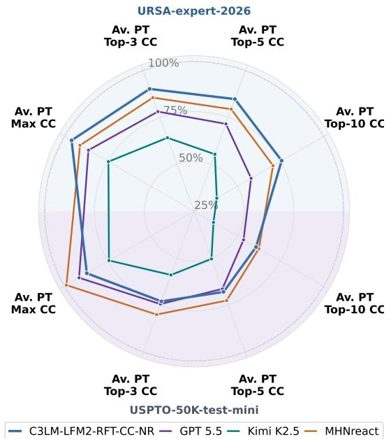  
Figure 1: Comparison of representative top-performing models from each model tier, normalized by metricspecific frontier scores.

In our study, we trained an LLM that is capable of outperforming the best conventional models in the SSRS task on the challenging URSA-expert-2026 benchmark. The novel version of C3LM (Chemistry Constraint–Consistent Language Model) was trained on a newly introduced ultra-large (∼45.6M) CREED-CCV-2+USPTO-XL set of reactions and then fine-tuned using fast ChemCensor-based and novelty-oriented rewards to boost chemical plausibility and diversity of the model’s outcomes.

We deliberately optimize C3LM using ChemCensor-based filtering and rewards. Although this creates partial circularity with evaluation on ChemCensor metrics, the goal is to develop the most practically useful model for end users by directly improving the plausibility and precedent support of generated reactions.

The key contributions of our work are as follows:

1. We propose Top-K mode for LLM training and prompting as a best practice for increasing the diversity of generated reactions.

2. We construct CREED-CCV-2+USPTO-XL, a dataset of ∼ 45.6M verified reactions derived from expert-coded templates.

3. We train a new version of C3LM on the novel dataset, improving performance over conventional SSRS models and other LLMs.

4. We perform an in-depth comparison of LLMs and conventional tools from the perspective of reaction uniqueness and identify the current frontiers of the SSRS task.

## 2 Approach

## 2.1 Prompting modes

To evaluate the capability of Large Language Models (LLMs) in exploring the multi-path nature of single-step retrosynthesis, we formalize the task under two distinct prompting paradigms: Top-1 Prompting Mode and Top-K Prompting Mode. Both modes use a core set of 15 diverse natural language templates adapted from MolInstructions, which wrap the target product’s SMILES string.

In the Top-1 Prompting Mode, the model is evaluated under a standard zero-shot configuration. Given a target product SMILES embedded within one of the 15 baseline templates, the LLM is instructed to generate a single, most plausible set of reactants. In one experiment, the model is prompted 15 times by selecting the random template, and all answers are collected, producing 15 reactant sets per target molecule. This mode serves as our baseline. It was used in the previous research of SSRS task on LLMs (Zagribelnyy et al., 2026b).

The Top-K Prompting Mode is devoted to simulate behaviour of the conventional SSRS models and capture the inherent one-to-many complexity of retrosynthesis — where a single target molecule can often be potentially synthesized via multiple independent disconnections. To apply this mode, we modify the prompts provided in (Zagribelnyy et al., 2026b) and append the explicit suffix instruction, "Give me 15 different answers", to each of the 15 baseline templates from Top-1 Prompting Mode. In one experiment, the LLM is prompted with 3 random templates for each target molecule and up to 15 reactant sets are collected for each template. The predicted outputs are then scored independently and the final metrics are averaged between 3 calculated reaction sets.

## 2.2 Training sets

USPTO is decontaminated USPTO-full (Lowe, 2017), consisting of unique ∼897K products and ∼951K reactions.

CREED-CCV is generated using a virtual synthesis engine and ChemCensor (v.0.5.2) as a chemical plausibility verification framework and consists of unique ∼699K products and ∼6.4M reactions (Zagribelnyy et al., 2026b).

CREED-CCV-2 is collected from two sources: (1) compounds from ChEMBL (v34) (Zdrazil et al., 2024) subjected to the Virtual Synthesis Engine (VSE) to enumerate reactions, (2) reactions from CREED-CCV (see Figure 2). Both sets of reactions are then merged, deduplicated and scored in Chem-Censor (v.1.1.1). Finally, CREED-CCV-2 consists of unique ∼2.9M products and ∼36M reactions.

USPTO-XL is generated using unique products from USPTO and the VSE to enumerate reactants in order to address the main limitation of USPTO, that it mainly contains 1 reaction per product. The generated reactants are then verified by ChemCensor (v.1.1.1). The final USPTO-XL set contains unique ∼859K products and ∼10.6M reactions.

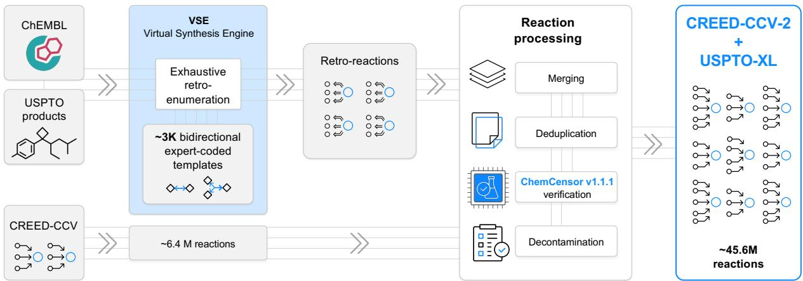  
Figure 2: Data-generation pipeline for the CREED-CCV-2+USPTO-XL training set.

## 3 Experiments

## 3.1 Baselines

We benchmark a list of proprietary and openweight foundation general-purpose (GP) LLMs, as well as conventional SSRS models (Appendix C).

## 3.2 C3LM Supervised Fine-Tuning

Training setups: We perform supervised finetuning (SFT) of the C3LM model under three data configurations. Specifically, we train on either (i) CREED-CCV+USPTO, where USPTO was upsampled to match the size of CREED-CCV, or (ii) CREED-CCV-2+USPTO-XL that consists of 3,680,906 unique products and 45,649,785 unique reactions, which are derived from CREED-CCV-2 and USPTO-XL via merging and deduplication (Figure 2). Both models are trained in Top-K mode. The latter C3LM is also asked in its answers to sort the generated reactions according to their predicted plausibility in terms of the ChemCensor score.

We initialize C3LMs with LFM2 2.6B checkpoint (Amini et al., 2025) and train with basic reasoning for 50,000 steps: C3LM-LFM2-CREED-CCV+USPTO on CREED-CCV+USPTO and C3LM-LFM2-CREED-CCV-2+USPTO-XL trained on CREED-CCV-2+USPTO-XL, respectively.

The details of the training procedure and training data preprocessing can be found in Appendix D.

## 3.3 C3LM Reinforcement Learning Fine-Tuning

We perform online Reinforcement Learning Fine-Tuning of the C3LM-LFM2-CREED-CCV-2+USPTO-XL using single-reward Group Relative Policy Optimization (GRPO) (Shao et al., 2024). RFT uses the same CREED training split as SFT with a GRPO group size of 8, sampling temperature of 1, and KL-regularization weight of 0.1. The GRPO reward function is defined as a weighted sum combination of 6 different reward components. Firstly, 3 components are used for syntax purposes, i.e., thinking format validity, generation of valid SMILES strings, and generation of exactly k answers. Next, to avoid duplicates, 1 component encourages the generation of unique solutions. Finally, the main components aim to generate chemically plausible and novel reactants. For plausibility, we maximize the ChemCensor score of each generated reactant. For novelty, we encourage the generation of reactants outside of the exhaustive lists of reactants of CREED-CCV-2+USPTO-XL that also exhibit a positive ChemCensor score. Details about training and each of the reward components are available in Appendix E. The inventory of both SFT and RFT C3LM models can be found in Appendix A.

## 3.4 Evaluation protocol

We perform a benchmark of all models from Sec. 3.1 and C3LMs on the recently proposed URSAexpert-2026 and USPTO-50K-test-mini sets (Zagribelnyy et al., 2026b) using ChemCensor (v.1.1.1). In case of LLMs, for each product, we generate either (i) 15 independent responses using 15 prompts (Top-1 prompting mode) or (ii) 3 independent responses from each model using 1 random Top-15 prompt (1 random prompt to get 15 reactions, i.e. Top-K prompting mode, K=15). Then we average CC-aggregated metrics Av. PT-Max CC and Av. PT-Top-K reported in (Zagribelnyy et al.,

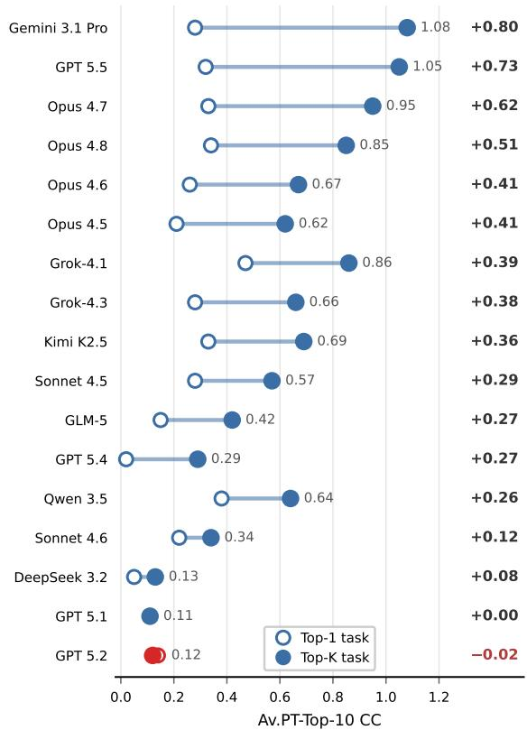  
Figure 3: Top-1 → Top-K transition on URSA-expert-2026 (Av. PT-Top-10 CC). Hollow = Top-1 task, filled = Top-K task; line length is the gain $\Delta = \mathrm { T o p } { \bf - K } - \mathrm { T o p } { \bf - } 1$ (right column, sorted).

2026b) by 3. In case of conventional SSRS models, 15 reactions are generated per product using the models installed via Syntheseus (Maziarz et al., 2025). Then the reactions are evaluated using CCaggregated metrics. The benchmark was carried out using two databases of synthetic precedents: major (i) public USPTO-full and supplemental (ii) combined USPTO-full with commercial Pistachio set (NextMove Software) (see Appendix I).

To study different frontiers of reactions’ plausibility and diversity, all answers from all respective models are collected together with CC-based sorting applied to the obtained list of reactions for each TM. After that, the best 15 reactant sets are retained and CC-metrics are calculated as usual.

## 4 Results

Top-K vs Top-1 prompting: Benchmarking foundation models reveals broad differentiation between the LLMs in how they are influenced by the prompting framework. Overall results for Top-K mode are presented in Table 1, for Top-1 in Table 4 of Appendix G respectively. Across the

CC-aggregated metrics, Av. PT-Top-10 metric is the most sensitive to the diversity of generated reactions, thus the transition from Top-1 to the Top-K mode should be the most descriptive in the case of this metric. As we can see in Figure 3, the vast majority of models benefit significantly from this transition. Moreover, the models’ rankings change: Grok-4.1 produces the most plausible and diverse reactions in Top-1 mode, while Gemini 3.1 Pro’s performance improves dramatically in Top-15 mode, making it the best LLM baseline. Only GPT 5.2 performs worse in the Top-K mode according to Av. PT-Top-10 values, while for other CC-based metrics, GPT 5.1 and Claude Sonnet 4.6 also show inferior performance in the Top-K mode (see Table 3 and Table 4). Finally, the substantial improvements in metrics due to the change in prompting mode force us to establish the best practice for LLM benchmarking in the SSRS task: use the Top-K mode instead of the Top-1 mode.

Top-K mode for the C3LM training: Considering the Top-K mode is beneficial not only for LLMs’ inference, but also for model training, we have trained a C3LM-LFM2-CREED-CCV+USPTO in the Top-K mode and compared it to the model trained on the same dataset but in the Top-1 mode. We can see (Table 1) that all CC-based metrics are boosted due to the training mode transition to the Top-K mode, and the most substantial improvement (> 2.5 fold) is observed for Av. PT-Top-10 metric, pointing to the increased diversity of the generated reactions. Specifically, the matched Top-1 → Top-K transition improves Max/@3/@5/@10 by $+ 0 . 3 0 / + 0 . 6 2 / + 0 . 7 0 / + 0 . 6 0$ , respectively. As a result of this comparison, the new C3LMs are trained in the Top-K mode. This stage allowed the new SFT C3LM to reach the performance level of top-tier proprietary GP LLMs: Gemini 3.1 Pro and GPT 5.5.

Scaling training set and RFT: The next significant improvement in C3LMs training is achieved when the training set size increased by > 6 times, when transited from CREED-CCV+USPTO to CREED-CCV-2+USPTO-XL. This dataset transition further improves Max/@3/@5/@10 by $+ 0 . 1 2 / + 0 . 1 3 / + 0 . 1 7 / + 0 . 2 9$ , respectively. The resulting C3LM-LFM2-CREED-CCV-2+USPTO-XL is then fine-tuned in RL mode using the ChemCensor (CC) and Novelty (NR) rewards. The use of the CC-reward allows to beat conventional SSRS models on the OOD URSA-expert-2026 benchmark according to Av. PT-Top-K CC metrics, while adding the NR results in the RFT-model dominance across all CC metrics on this benchmark set. CC-RFT adds $+ 0 . 0 4 / + 0 . 0 7 / + 0 . 0 6 / + 0 . 0 2$ to Max/@3/@5/@10, while the novelty reward contributes a further $+ 0 . 0 8 / + 0 . 0 6 / + 0 . 0 8 / + 0 . 0 8$ respectively. From the perspective of the representative sample from the conventional USPTO-

<table><tr><td rowspan="2">Model</td><td colspan="4">URSA-expert-2026</td><td colspan="4">USPTO-50K-test-mini</td></tr><tr><td>Max</td><td>Av. PT-Top-K CC @3</td><td>@5</td><td>@10</td><td>Max</td><td>Av. PT-Top-K CC @3</td><td>@5</td><td>@10</td></tr><tr><td colspan="9">Proprietary Foundation Models</td></tr><tr><td>Grok-4.1</td><td>1.86</td><td>1.56</td><td>1.31</td><td>0.86</td><td>3.99</td><td>2.61</td><td>2.02</td><td>1.24</td></tr><tr><td>Grok-4.3</td><td>1.74</td><td>1.41</td><td>1.13</td><td>0.66</td><td>3.99</td><td>2.58</td><td>1.95</td><td>1.15</td></tr><tr><td>Gemini 3.1 Pro</td><td>1.91</td><td>1.69</td><td>1.46</td><td>1.08</td><td>4.32</td><td>2.92</td><td>2.34</td><td>1.59</td></tr><tr><td>GPT 5.4</td><td>1.19</td><td>0.78</td><td>0.55</td><td>0.29</td><td>2.34</td><td>1.43</td><td>1.02</td><td>0.55</td></tr><tr><td>GPT 5.5</td><td>1.94</td><td>1.68</td><td>1.46</td><td>1.05</td><td>4.50</td><td>3.07</td><td>2.45</td><td>1.63</td></tr><tr><td>Claude Opus 4.7</td><td>1.91</td><td>1.65</td><td>1.39</td><td>0.95</td><td>4.35</td><td>2.96</td><td>2.31</td><td>1.45</td></tr><tr><td>Claude Opus 4.8</td><td>1.89</td><td>1.62</td><td>1.34</td><td>0.85</td><td>4.35</td><td>2.95</td><td>2.30</td><td>1.44</td></tr><tr><td colspan="9">Open-weight Foundation Models</td></tr><tr><td>Qwen 3.5</td><td>1.61</td><td>1.32</td><td>1.07</td><td>0.64</td><td>3.44</td><td>2.39</td><td>1.84</td><td>1.09</td></tr><tr><td>Kimi K2.5</td><td>1.68</td><td>1.38</td><td>1.13</td><td>0.69</td><td>3.65</td><td>2.43</td><td>1.86</td><td>1.10</td></tr><tr><td>GLM-5</td><td>1.22</td><td>0.97</td><td>0.75</td><td>0.42</td><td>2.16</td><td>1.39</td><td>1.03</td><td>0.58</td></tr><tr><td colspan="9">Conventional SSRS Models</td></tr><tr><td>LocalRetro</td><td>2.11</td><td>1.85</td><td>1.59</td><td>1.22</td><td>4.84</td><td>3.31</td><td>2.67</td><td>1.81</td></tr><tr><td>GLN</td><td>1.96</td><td>1.72</td><td>1.49</td><td>1.03</td><td>4.80</td><td>3.18</td><td>2.52</td><td>1.58</td></tr><tr><td>MHNreact</td><td>2.05</td><td>1.84</td><td>1.62</td><td>1.28</td><td>4.86</td><td>3.30</td><td>2.68</td><td>1.90</td></tr><tr><td>RetroKNN</td><td>2.10</td><td>1.84</td><td>1.60</td><td>1.22</td><td>4.85</td><td>3.33</td><td>2.68</td><td>1.82</td></tr><tr><td>R-SMILES</td><td>2.08</td><td>1.83</td><td>1.56</td><td>1.11</td><td>4.85</td><td>3.36</td><td>2.67</td><td>1.75</td></tr><tr><td colspan="9">C3LM, Supervised Fine-Tuning, Top-1 Mode</td></tr><tr><td>C3LM-LFM2-CREED-CCV+USPTO*</td><td>1.62</td><td>1.06</td><td>0.72</td><td>0.38</td><td>4.12</td><td>2.10</td><td>1.36</td><td>0.70</td></tr><tr><td colspan="9">C3LM, Supervised and Reinforcement Learning Fine-Tuning, Top-K Mode</td></tr><tr><td>C3LM-LFM2-CREED-CCV+USPTO</td><td>1.92</td><td>1.68</td><td>1.42</td><td>0.98</td><td>4.16</td><td>2.74</td><td>2.17</td><td>1.42</td></tr><tr><td>C3LM-LFM2-CREED-CCV-2+USPTO-XL</td><td>2.04</td><td>1.81</td><td>1.59</td><td>1.27</td><td>4.16</td><td>2.88</td><td>2.37</td><td>1.70</td></tr><tr><td>C3LM-LFM2-RFT-CC</td><td>2.08</td><td>1.88</td><td>1.65</td><td>1.29</td><td>4.16</td><td>2.92</td><td>2.41</td><td>1.73</td></tr><tr><td>C3LM-LFM2-RFT-CC-NR</td><td>2.16</td><td>1.94</td><td>1.73</td><td>1.37</td><td>4.28</td><td>3.01</td><td>2.51</td><td>1.85</td></tr><tr><td colspan="9">Chemical Plausibility and Diversity Frontier of Generated Reactions</td></tr><tr><td>All GP LLMs (17) together</td><td>2.19</td><td>2.07</td><td>1.93</td><td>1.65</td><td>4.85</td><td>3.98</td><td>3.53</td><td>2.87</td></tr><tr><td>All conventional SSRS models (8) together</td><td>2.18</td><td>1.99</td><td>1.78</td><td>1.45</td><td>4.90</td><td>3.58</td><td>3.00</td><td>2.26</td></tr><tr><td>All C3LMs (5) together</td><td>2.23</td><td>2.04</td><td>1.88</td><td>1.57</td><td>4.74</td><td>3.31</td><td>2.78</td><td>2.14</td></tr><tr><td>All benchmarked models (30) together</td><td>2.25</td><td>2.15</td><td>2.04</td><td>1.81</td><td>4.91</td><td>4.12</td><td>3.69</td><td>3.04</td></tr></table>

Table 1: Plausibility-based evaluation in the single-step retrosynthesis Top-K mode. Max: per-target maximum ChemCensor score averaged over TMs. Av. PT-Top-K CC: per-TM average ChemCensor score over top-K unique predictions; ChemCensor v1.1.1, USPTO-full as the source of synthetic precedents. See the full table in Appendix F. Results for recently released models are available at https://dddbench.insilico.com/.

50K-test benchmark (USPTO-50K-test-mini), the Av. PT-Top-10 metric is the least vulnerable to data leakage, since the vast majority (481/497) of product molecules from the USPTO-50K-test-mini have no more than 3 reactions in the public USPTOfull (see Appendix K). In these conditions, the second-best result of C3LM-LFM2-RFT-CC-NR on the USPTO-50K-test-mini benchmark (Av. PT-Top-10) is the additional sign of the models’ capabilities to generate genuinely chemically plausible reactions rather than to memorize right answers. Oppositely, the Av. PT-Max CC values close to 5 (i.e., exact match to the synthetic precedent) by the conventional SSRS models reveal potential leakage of USPTO-50K-based benchmarks to these models and this particular metric on USPTO-50K-test-mini benchmark should be cautiously considered.

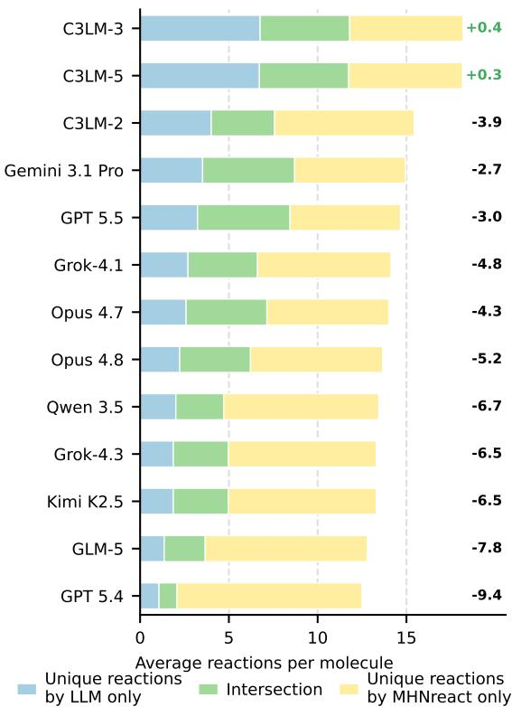  
Figure 4: Intersection between the reactions predicted for the URSA-expert-2026 benchmark set by each LLM and those predicted by MHNreact. Values on the right (∆) show the average per-target difference between the number of reactions unique to the LLM and those unique to MHNreact; positive values indicate more LLM-unique reactions. C3LM-2: C3LM-LFM2-CREED-CCV+USPTO; C3LM-3: C3LM-LFM2-CREED-CCV-2+USPTO-XL; C3LM-5: C3LM-LFM2-RFT-CC-NR. See all results in Figure 5.

Frontier of plausibility and diversity: While C3LM-LFM2-RFT-CC-NR achieves results on the challenging benchmark, the real frontier of chemical plausibility and diversity of generated reactions remains unknown due to the one-to-many nature of the ChemCensor-based benchmarks. Understanding the frontier values would be helpful for the next iterations of the research to navigate the efforts. Collecting the best answers across GP LLMs reveals that they together produce more plausible and diverse outcomes than the conventional SSRS models, while the best individual GP models (Gemini 3.1 Pro and GPT 5.5) are still far from the best conventional models (LocalRetro and MHNreact). The collected and sorted answers from all C3LMs also allow for higher values of CC-aggregated metrics than for conventional models, while all GP LLMs together are slightly superior to all C3LMs together. The ultimate detectable frontier values of the CCaggregated metrics that can be identified so far have been calculated from the reactions generated by all 30 benchmarked models (see Table 1). These values show that there is still room for improvement in models, especially with respect to metrics that are sensitive to both reactions’ diversity and plausibility (+0.44 for Av. PT-Top-10 and +0.31 for Av. PT-Top-5). Finally, the % of frontier values of the CC-based metrics achieved by a model can be considered as an additional metric to visualize the performance of the model (see Figure 1).

The analysis of reactions: Looking at the values of CC-aggregated metrics from the Table 1, the genuine chemical contributions in terms of proposing unique plausible reactions might remain unclear. In order to reveal the capabilities of LLMs to provide unique reactions at the top of the performance by SSRS models, we compare reactions generated by the MHNreact model, which is the most capable of generating diverse outputs (best Av. PT-Top-10 values across conventional models), to the reactions generated by the LLMs on the URSA-expert-2026 benchmark. The full results of models’ comparison from the reactions uniqueness perspective for URSA-expert-2026 are available in Appendix H, while key highlights can be observed in Figure 4. MHNreact dominates across the vast majority of LLMs to give plausible reactions (ChemCensor Score > 0) that have not been generated by them. Only models that produce more unique reactions than MHNreact are C3LM-LFM2-CREED-CCV-2+USPTO-XL (+0.4 reactions on average) and C3LM-LFM2-RFT-CC-NR (+0.3 reactions on average). The examples of reactions generated by C3LM-LFM2-CREED-CCV-2+USPTO-XL and MH-Nreact for one of the target molecules from the benchmark set can be found in Figure 6 of Appendix H. At the same time, we can see that every LLM can predict some plausible reactions that have not been proposed by MHNreact, and the proportion of such reactions, as well as the proportion of intersecting reactions, generally increases with newer versions of GP LLMs. These findings highlight that the chemical spaces of plausible reactions generated by the best conventional SSRS model and LLMs are quite different, and this can motivate researchers to improve both LLMs and conventional models and/or to use the ensemble of models (conventional model and LLM) to cover a broader chemical space of generated reactions.

## 5 Ethical considerations

The development and deployment of computeraided synthesis planning (CASP) tools carry significant dual-use potential, as technologies capable of automating the design of synthetic routes for complex small molecules could, in principle, be repurposed to facilitate the synthesis of hazardous compounds. Our research exemplifies the usage of the CREED dataset and the ChemCensor scoring in the pursuit of improving the objective evaluation of chemical plausibility and synthetic feasibility for drug discovery. While our work improves the reliability and interpretability of CASP tools and their more robust benchmarking methodology, we recognize that the ability to accurately plan synthetic routes must be coupled with responsible stewardship.

To mitigate potential risks, we have focused our benchmarking efforts on the legitimate goal of automating synthesis planning for medicinal chemistry, specifically utilizing novel molecular structures that do not overlap with known hazardous compound databases. Furthermore, the ChemCensor framework is built upon established open-scientific data from patent literature and does not inherently possess or provide instructions for the synthesis of toxic or regulated substances. We emphasize that all applications of LLM-based retrosynthesis should be conducted within established institutional biosafety frameworks and comply with relevant international and local regulations governing chemical research. We advocate for the ongoing development of safety-aligned AI systems that incorporate robust safeguards to prevent the generation of unauthorized synthetic pathways, ensuring that the advancement of AI in drug discovery remains focused on beneficial scientific and clinical outcomes.

## 6 Limitations

Despite the performance gains achieved by our Top-K, plausibility-aware training paradigm, this study is subject to several limitations that warrant future investigation. As already mentioned in section 1, we acknowledge a degree of alignment between our optimization criteria and our evaluation metrics. Nevertheless, we contend that this "circularity" is a functional design choice: our primary aim is to maximize the model’s utility for practitioners. While the ChemCensor serves as an efficient proxy for chemical plausibility, it still does not fully account for practical laboratory organic synthesis parameters, such as reaction conditions, solvents, and purification methods. The reference datasets of synthetic precedents used for ChemCensor scoring in the frame of this study are limited to patent-derived reaction spaces. Chemical diversity is assessed solely through exact SMILES string matching, which lacks a chemically grounded comparison of the predicted transformations, such as reaction class or mechanistic type. Finally, we understand that the generation of our training dataset relies on a template-based engine, which might be biased toward particular chemical patterns and may lack some omitted and "novel-chemistry" transformations.

## 7 Code and Benchmark Availability

The ChemCensor source code is publicly available at https://github.com/insilicomedicine/ ChemCensor.

Updated benchmarking results, including evaluations of recently released models, are available at https://dddbench.insilico.com/.

## References

Alexander Amini, Anna Banaszak, Harold Benoit, Arthur Böök, Tarek Dakhran, Song Duong, Alfred Eng, Fernando Fernandes, Marc Härkönen, Anne Harrington, Ramin Hasani, Saniya Karwa, Yuri Khrustalev, Maxime Labonne, Mathias Lechner, Valentine Lechner, Simon Lee, Zetian Li, Noel Loo, and 14 others. 2025. Lfm2 technical report. Preprint, arXiv:2511.23404.

Anthropic. 2025a. System card: Claude opus 4.5.

Anthropic. 2025b. System card: Claude sonnet 4.5.

Anthropic. 2026a. System card: Claude opus 4.6.

Anthropic. 2026b. System card: Claude opus 4.7.

Anthropic. 2026c. System card: Claude opus 4.8.

Anthropic. 2026d. System card: Claude sonnet 4.6.

Daniil A Boiko, Robert MacKnight, Ben Kline, and Gabe Gomes. 2023. Autonomous chemical research with large language models. Nature, 624(7992):570– 578.

Andres M Bran, Théo A Neukomm, Daniel Armstrong, Zlatko Joncev, and Philippe Schwaller. 2026.ˇ Chemical reasoning in LLMs unlocks strategy-aware synthesis planning and reaction mechanism elucidation. Matter, 0(102812):102812.

Tom Brown, Benjamin Mann, Nick Ryder, Melanie Subbiah, Jared D Kaplan, Prafulla Dhariwal, Arvind Neelakantan, Pranav Shyam, Girish Sastry, Amanda Askell, Sandhini Agarwal, Ariel Herbert-Voss, Gretchen Krueger, Tom Henighan, Rewon Child, Aditya Ramesh, Daniel Ziegler, Jeffrey Wu, Clemens Winter, and 12 others. 2020. Language models are few-shot learners. In Advances in Neural Information Processing Systems, volume 33, pages 1877–1901. Curran Associates, Inc.

Shuan Chen and Yousung Jung. 2021. Deep retrosynthetic reaction prediction using local reactivity and global attention. JACS Au, 1(10):1612–1620.

E. J. Corey. 1967. General methods for the construction of complex molecules. Pure and Applied Chemistry, 14(1):19–38.

Hanjun Dai, Chengtao Li, Connor Coley, Bo Dai, and Le Song. 2019. Retrosynthesis prediction with conditional graph logic network. In Advances in Neural Information Processing Systems, volume 32. Curran Associates, Inc.

Inc. Daylight Chemical Information Systems. 2007. SMARTS — a language for describing molecular patterns.

DeepSeek-AI. 2025. Deepseek-v3.2: Pushing the frontier of open large language models. Preprint, arXiv:2512.02556.

Jörg Degen, Christof Wegscheid-Gerlach, Andrea Zaliani, and Matthias Rarey. 2008. On the art of compiling and using ’drug-like’ chemical fragment spaces. ChemMedChem, 3(10):1503–1507.

Wenhao Gao and Connor W. Coley. 2020. The synthesizability of molecules proposed by generative models. Journal ofChemical Information and Modeling, 60(12):5714–5723.

Gemini-Team. 2026. Gemini 3.1 pro.

GLM-5-Team. 2026. Glm-5: from vibe coding to agentic engineering. Preprint, arXiv:2602.15763.

Ross Irwin, Spyridon Dimitriadis, Jiazhen He, and Esben Jannik Bjerrum. 2022. Chemformer: a pre-trained transformer for computational chemistry. Machine Learning: Science and Technology, 3(1):015022.

Kimi-Team. 2026. Kimi k2.5: Visual agentic intelligence. Preprint, arXiv:2602.02276.

Micha Livne, Zulfat Miftahutdinov, Elena Tutubalina, Maksim Kuznetsov, Daniil Polykovskiy, Annika Brundyn, Aastha Jhunjhunwala, Anthony Costa, Alex Aliper, Alán Aspuru-Guzik, and Alex Zhavoronkov. 2024. nach0: multimodal natural and chemical languages foundation model. Chem. Sci., 15:8380–8389.

Daniel Lowe. 2017. Chemical reactions from US patents (1976-Sep2016).

Krzysztof Maziarz, Austin Tripp, Guoqing Liu, Megan Stanley, Shufang Xie, Piotr Gainski, Philipp Seidl,´ and Marwin H. S. Segler. 2025. Re-evaluating retrosynthesis algorithms with syntheseus. Faraday Discuss., 256:568–586.

NextMove Software. Pistachio. https://www. nextmovesoftware.com/pistachio.html. Commercial reaction database.

OpenAI. 2025a. Gpt-5.1 instant and gpt-5.1 thinking system card addendum.

OpenAI. 2025b. Update to gpt-5 system card: Gpt-5.2.

OpenAI. 2026a. Introducing gpt-5.4.

OpenAI. 2026b. Introducing gpt-5.5.

Qizhi Pei, Wei Zhang, Jinhua Zhu, Kehan Wu, Kaiyuan Gao, Lijun Wu, Yingce Xia, and Rui Yan. 2023. BioT5: Enriching cross-modal integration in biology with chemical knowledge and natural language associations. In Proceedings of the 2023 Conference on Empirical Methods in Natural Language Processing, pages 1102–1123, Singapore. Association for Computational Linguistics.

Qwen-Team. 2026. Model card: Qwen3.5.

Mikołaj Sacha, Mikołaj Błaz, Piotr Byrski, Paweł˙ D ˛abrowski-Tumanski, Mikołaj Chromi´ nski, Rafał´ Loska, Paweł Włodarczyk-Pruszynski, and Stanisław´ Jastrz˛ebski. 2021. Molecule edit graph attention network: Modeling chemical reactions as sequences of graph edits. Journal of Chemical Information and Modeling, 61(7):3273–3284. PMID: 34251814.

Marwin H S Segler, Mike Preuss, and Mark P Waller. 2018. Planning chemical syntheses with deep neural networks and symbolic AI. Nature, 555(7698):604– 610.

Marwin H. S. Segler and Mark P. Waller. 2017. Neuralsymbolic machine learning for retrosynthesis and reaction prediction. Chemistry – A European Journal, 23(25):5966–5971.

Philipp Seidl, Philipp Renz, Natalia Dyubankova, Paulo Neves, Jonas Verhoeven, Jörg K Wegner, Marwin Segler, Sepp Hochreiter, and Günter Klambauer. 2022. Improving few- and zero-shot reaction template prediction using modern hopfield networks. J. Chem. Inf. Model., 62(9):2111–2120.

Zhihong Shao, Peiyi Wang, Qihao Zhu, Runxin Xu, Junxiao Song, Xiao Bi, Haowei Zhang, Mingchuan Zhang, Y. K. Li, Y. Wu, and Daya Guo. 2024. Deepseekmath: Pushing the limits of mathematical reasoning in open language models. Preprint, arXiv:2402.03300.

Yu Shee, Anton Morgunov, Haote Li, and Victor S. Batista. 2025. Directmultistep: Direct route generation for multistep retrosynthesis. Journal ofChemical Information and Modeling, 65(8):3903–3914.

Zhengkai Tu, Sourabh J. Choure, Mun Hong Fong, Jihye Roh, Itai Levin, Kevin Yu, Joonyoung F. Joung, Nathan Morgan, Shih-Cheng Li, Xiaoqi Sun, Huiqian Lin, Mark Murnin, Jordan P. Liles, Thomas J. Struble, Michael E. Fortunato, Mengjie Liu, William H. Green, Klavs F. Jensen, and Connor W. Coley. 2025. Askcos: an open source software suite for synthesis planning. Preprint, arXiv:2501.01835.

G.É. Vléduts. 1963. Concerning one system of classification and codification of organic reactions. Information Storage and Retrieval, 1(2):117–146.

David Weininger. 1988. SMILES, a chemical language and information system. 1. introduction to methodology and encoding rules. Journal ofChemical Information and Computer Sciences, 28(1):31–36.

Thomas Wolf, Lysandre Debut, Victor Sanh, Julien Chaumond, Clement Delangue, Anthony Moi, Pierric Cistac, Tim Rault, Remi Louf, Morgan Funtowicz, Joe Davison, Sam Shleifer, Patrick von Platen, Clara Ma, Yacine Jernite, Julien Plu, Canwen Xu, Teven Le Scao, Sylvain Gugger, and 3 others. 2020. Transformers: State-of-the-art natural language processing. In Proceedings ofthe 2020 Conference on Empirical Methods in Natural Language Processing: System Demonstrations, pages 38–45, Online. Association for Computational Linguistics.

xAI. 2025. Grok 4.1 model card.

xAI. 2026. Grok 4.3. xAI API Documentation.

Shufang Xie, Rui Yan, Junliang Guo, Yingce Xia, Lijun Wu, and Tao Qin. 2023. Retrosynthesis prediction with local template retrieval. Preprint, arXiv:2306.04123.

Bogdan Zagribelnyy, Sergei Fedorchenko, Nikita Bondarev, Ivan Ilin, Yan Ivanenkov, and Aleksandrs Zavoronkovs. 2026a. Advanced retrosynthesis-related synthetic accessibility modeling. U.S. Patent Application Publication No. US 2026/0100252 A1. Appl. No. 19/353,038; filed 2025-10-08; priority 2024-10- 09.

Bogdan Zagribelnyy, Ivan Ilin, Maksim Kuznetsov, Nikita Bondarev, Roman Schutski, Thomas Mac-Dougall, Rim Shayakhmetov, Zulfat Miftakhutdinov, Mikolaj Mizera, Vladimir Aladinskiy, Alex Aliper, and Alex Zhavoronkov. 2026b. When single answer is not enough: Rethinking single-step retrosynthesis benchmarks for LLMs. In Proceedings of the 43rd International Conference on Machine Learning, volume 306 of Proceedings ofMachine Learning Research, Seoul, South Korea. PMLR. Copy available here: https://arxiv.org/abs/2602.03554.

Barbara Zdrazil, Eloy Felix, Fiona Hunter, Emma J Manners, James Blackshaw, Sybilla Corbett, Marleen de Veij, Harris Ioannidis, David Mendez Lopez, Juan F Mosquera, Maria Paula Magarinos, Nicolas Bosc, Ricardo Arcila, Tevfik Kizilören, Anna Gaulton, A Patrícia Bento, Melissa F Adasme, Peter Monecke, Gregory A Landrum, and Andrew R Leach. 2024. The chembl database in 2023: a drug discovery platform spanning multiple bioactivity data types and time periods. Nucleic Acids Research, 52(D1):D1180–D1192.

Weihe Zhong, Ziduo Yang, and Calvin Yu-Chian Chen. 2023. Retrosynthesis prediction using an end-to-end graph generative architecture for molecular graph editing. Nat. Commun., 14(1):3009.

Zipeng Zhong, Jie Song, Zunlei Feng, Tiantao Liu, Lingxiang Jia, Shaolun Yao, Min Wu, Tingjun Hou, and Mingli Song. 2022. Root-aligned SMILES: a tight representation for chemical reaction prediction. Chem. Sci., 13(31):9023–9034.

## A C3LM Family Inventory

<table><tr><td>Model Name</td><td>Short Name</td><td>Training Data</td><td>Reward</td></tr><tr><td colspan="4">C3LM, Supervised Fine-Tuning, Top-1 task</td></tr><tr><td>C3LM-LFM2-CREED-CCV+USPTO*</td><td>C3LM-1</td><td>TD-1</td><td></td></tr><tr><td>C3LM, Supervised Fine-Tuning, Top-K task</td><td></td><td></td><td></td></tr><tr><td colspan="4"></td></tr><tr><td>C3LM-LFM2-CREED-CCV+USPTO C3LM-LFM2-CREED-CCV-2+USPTO-XL</td><td>C3LM-2 C3LM-3</td><td>TD-1 TD-2</td><td></td></tr><tr><td></td><td></td><td></td><td></td></tr><tr><td colspan="4">C3LM, Reinforcement Learning Fine-Tuning, Top-K task</td></tr><tr><td>C3LM-LFM2-RFT-CC</td><td>C3LM-4</td><td>TD-2</td><td>ChemCensor</td></tr><tr><td>C3LM-LFM2-RFT-CC-NR</td><td>C3LM-5</td><td>TD-2</td><td>ChemCensor, Novelty</td></tr></table>

Table 2: C3LM family inventory. TD-1 = CREED-CCV + USPTO; TD-2 = CREED-CCV-2 + USPTO-XL. ∗Trained in prior work (Zagribelnyy et al., 2026b); its predictions are re-scored under ChemCensor (v1.1.1) for comparison, without retraining.

## B Glossary

ChemCensor ChemCensor Score (CC Score) is a quantitative metric evaluating the chemical plausibility of a reaction and/or a retrosynthetic route by measuring the proportion of steps that pass plausibility validation, weighted by their confidence levels.

CREED CREED (Comprehensive Reactant Exhaustive Enumeration Dataset) is a large-scale, qualitycontrolled dataset of ∼22.7M unique reactions over 1,493,715 unique products introduced in (Zagribelnyy et al., 2026b), generated by a virtual synthesis engine from ∼3K expert-coded bidirectional reaction templates and designed to expose multiple plausible single-step disconnections per product rather than a single ground truth; its ChemCensor-verified subset, retaining only candidates with CC Score > 0, is denoted CREED-CCV.

C3LM C3LM (Chemistry Constraint-Consistent Language Model) is the family of language models introduced in (Zagribelnyy et al., 2026b), fine-tuned on CREED and its variants from the LFM2 2.6B base checkpoint via supervised and reinforcement fine-tuning, and optimized to generate chemically plausible single-step retrosynthetic disconnections.

URSA-expert-2026 URSA-expert-2026 is an expert-annotated dataset introduced in (Zagribelnyy et al., 2026b), an out-of-distribution benchmark of 100 novel, machine-generated target molecules whose synthetic accessibility was confirmed by expert chemists, constructed to be disjoint from publicly available reaction datasets so as to evaluate SSRS generalization free from training-set memorization or data leakage.

USPTO-50K-test-mini USPTO-50K-test-mini is a cost-efficient 10% random subset (497 targets) of the curated USPTO-50K-test introduced in (Zagribelnyy et al., 2026b), recommended as the default USPTO-derived in-distribution benchmark for LLM-based SSRS evaluation under API-cost or wall-clock constraints.

Target molecule The target molecule is the desired chemical compound that represents the ultimate goal of synthesis planning. It is the molecule for which the system generates or evaluates synthetic routes, and it serves as the starting point for retrosynthetic disconnection, working backward from the target to identify precursor molecules.

Reactants Reactants are the chemical compounds that undergo transformation during a chemical reaction and whose atoms are directly incorporated into the product structure. Technically, reactants are distinguished from reagents by the presence of atom mapping – atoms in reactants have corresponding mapped atoms in the product(s).

Reagents Reagents are chemical compounds that participate in a chemical reaction but whose atoms are not directly incorporated into the product structure. Reagents typically facilitate or enable the transformation (e.g., catalysts, bases, acids, solvents with reactive roles) with no or only minor atom contribution to the final product. For benchmarking, it is reasonable to extend the reacting species with reagents, since they may influence the correctness of atom–atom mapping and thereby the reaction-center extraction process.

Starting materials Starting materials are the initial chemical compounds from which a synthetic route begins. They are molecules that exist at the terminal nodes (leaves) of a retrosynthetic tree and are not produced by any reaction step within the route. Starting materials serve as the input chemicals for the synthesis and are expected to be commercially available or otherwise accessible within the reported synthetic methods.

Building blocks Building blocks (CABBs) are commercially available chemical compounds that can be found in vendor datasets and purchased from them.

Single-step retrosynthesis model An SSRS model predicts one or several retrosynthetic disconnections by mapping a target product molecule to a set of precursor reactants corresponding to a single reaction step. The model does not perform recursive planning or multi-step route construction, focusing instead on identifying chemically plausible reactants.

Multi-step retrosynthesis model An MSRS model is a system that applies retrosynthetic transformations (typically recursively) to decompose a target molecule into commercially available or otherwise accessible starting materials through a sequence of reaction steps.

Reaction center (RC) An RC is the set of atoms (dynamic atoms) in one or more reactant molecules and the product molecule that undergoes change during a chemical transformation, including atoms/bonds that are formed, broken, created, destroyed, or whose connectivity, bond order, formal charge, or hybridization state differs between reactants and products.

Chemical plausibility Chemical plausibility reflects alignment of a reaction with core principles of organic synthesis (e.g., chemoselectivity, regioselectivity, stereoselectivity). Operationally, it can be reduced to chemoinformatic concepts such as reaction centers, functional groups, their occurrence, and compatibility rules, potentially augmented with conditions (solvents, temperature, catalysts, auxiliary reagents). In this system, plausibility is assessed by comparing the reaction center and functional-group context against a reference dataset of verified transformations. If the extracted reaction center is absent from the reference library, the reaction is considered implausible; similarly, functional groups never observed for that reaction center negate plausibility. When both reactioncenter and functional-group context are supported by precedents, the reaction is considered chemically plausible.

Level of confidence The nominal degree of chemical plausibility is estimated via discrete levels of confidence (LC), depending on which reaction-center representation is matched among verified transformations. Higher LC indicates that a more specific (larger-context) reaction-center definition is supported, correlating with higher nominal plausibility and representativeness in terms of synthetic precedents. The LC value is used as the reaction score in ChemCensor.

Functional groups (FGs) FGs are structural motifs that determine chemical reactivity and properties. In the present system, functional groups are represented as SMARTS patterns (Daylight Chemical Information Systems, 2007) that can be matched to molecular structures via substructure search.

Functional-group context annotated for each reaction center helps determine which patterns are tolerable for a transformation, supporting chemical plausibility.

Functional group (FG) signature An FG signature is the ensemble of FGs present in reactant/product molecules that are not affected by the transformation. For a given reaction center, the signature is constructed by aggregating synthetic precedents from the reference dataset.

Reference dataset A reference dataset is a collection of verified reaction transformations extracted from sources including patents (e.g., USPTO), articles, preprints, and ELNs. It may include metadata such as conditions and yield. In this system, the reference dataset is used to validate analyzed reactions via reaction-center matching and functional-group signature comparison.

Synthetic precedent A synthetic precedent is an elementary synthetic fact of a successful chemical reaction recorded in a reference dataset.

## C Baselines

Proprietary Foundation Models: Grok 4.1 (xAI, 2025) and 4.3 (xAI, 2026); Gemini 3.1 Pro (Gemini-Team, 2026); GPT 5.1 (OpenAI, 2025a); 5.2 (OpenAI, 2025b), 5.4 (OpenAI, 2026a) and 5.5 (OpenAI, 2026b); Claude Sonnet 4.5 (Anthropic, 2025b) and 4.6 (Anthropic, 2026d); Claude Opus 4.5 (Anthropic, 2025a), 4.6 (Anthropic, 2026a), 4.7 (Anthropic, 2026b) and 4.8 (Anthropic, 2026c).

Open-weight Foundation Models: DeepSeek-V3.2 (DeepSeek-AI, 2025); Qwen3.5-397B-A17B (formally Qwen3.5) (Qwen-Team, 2026), Kimi K2.5 (Kimi-Team, 2026) and GLM-5 (GLM-5-Team, 2026).

Conventional SSRS models: LocalRetro (Chen and Jung, 2021), R-SMILES (Zhong et al., 2022), MEGAN (Sacha et al., 2021), Chemformer (Irwin et al., 2022), Graph2Edits (Zhong et al., 2023), GLN (Dai et al., 2019), MHNreact (Seidl et al., 2022) and RetroKNN (Xie et al., 2023).

## D C3LM Supervised Fine-Tuning Details

Training procedure: On each training step, we utilize a total 524, 288 tokens context windows across all GPUs and pack multiple training sequences into each GPU available context window.

Training Data Preprocessing: Similarly to other chemical language models (Livne et al., 2024; Pei et al., 2023), we extend the base vocabulary with SMILES format (Weininger, 1988) specific tokens; this is aimed at isolating chemical tokens from natural-language tokens and providing a consistent representation of SMILES entities. During the training, we tokenize SMILES into specialized tokens always in model outputs, and with 0.5 probability for user input; we adopt this strategy to align LFM2 base checkpoint chemical knowledge and new tokens. To improve chemical generalization, we augment SMILES entities during training by applying non-canonical random traversal.

Reasoning: We use the same basic reasoning scheme as (Zagribelnyy et al., 2026b): each chain-ofthought example is prepended with a deterministic block listing the canonical SMILES of the input entities and their BRICS fragments (Degen et al., 2008).

## E C3LM Reinforcement Learning Fine-Tuning Details

Training procedure: Online Reinforcement Learning Fine-Tuning (RFT) of the C3LM (CREED-CCV-2+USPTO-XL) model is performed using single-reward Group Relative Policy Optimization (GRPO) (Shao et al., 2024). RFT uses the same CREED training split as SFT, with sampling temperature of 1 and KL-regularization weight of 0.1. The policy is trained over 1000 training steps, with a learning rate of 10−6, a GRPO group size of 8, and 64 groups per step. The GRPO reward function is defined as a weighted sum combination of multiple reward components. The components and their weights are as follows:

Thinking format (weight 0.1) verifies if the generated completion is correctly formatted, by returning 1 for keeping the thinking in thinking tags, and −1 otherwise.

Molecular syntax (weight 0.5) verifies if the answer is a valid SMILES string.

ChemCensor score (weight 1.0) verifies, for a generated reaction, the chemical plausibility from ChemCensor. The plausibility is rescaled from (0, 5) to (0, 1). A reward of −1 is assigned when the generated reactant SMILES is invalid.

Top-K uniqueness (weight 0.2) computes the proportion of uniquely generated solutions, by comparing the canonical version of the generated SMILES string of each solution. The range of this reward function is thus (1/k, 1).

Top-K matching (weight 0.1) verifies if the number of generated answers matches k, the number of requests answers.

Novelty score (weight 1.0) provides a binary score for each generated reactant. This score is 1 if the generated reactant does not exist in the exhaustive list of CREED and if its ChemCensor score is positive, which corresponds to the lowest degree of confidence for chemical plausibility. In doing so, we encourage the policy to generate plausible reactants outside of the training data. The individual scores’ average is used as novelty reward.

F Full Plausibility-Based Top-K Evaluation
<table><tr><td rowspan="2">Model</td><td colspan="4">URSA-expert-2026 Av. PT-Top-K CC</td><td colspan="4">USPTO-50K-test-mini Av. PT-Top-K CC</td></tr><tr><td>Max</td><td>@3</td><td>@5</td><td>@10</td><td>Max</td><td>@3</td><td>@5</td><td>@10</td></tr><tr><td colspan="9">Proprietary Foundation Models</td></tr><tr><td>Grok-4.1</td><td>1.86</td><td>1.56</td><td>1.31</td><td>0.86</td><td>3.99</td><td>2.61</td><td>2.02</td><td>1.24</td></tr><tr><td>Grok-4.3</td><td>1.74</td><td>1.41</td><td>1.13</td><td>0.66</td><td>3.99</td><td>2.58</td><td>1.95</td><td>1.15</td></tr><tr><td>Gemini 3.1 Pro</td><td>1.91</td><td>1.69</td><td>1.46</td><td>1.08</td><td>4.32</td><td>2.92</td><td>2.34</td><td>1.59</td></tr><tr><td>GPT 5.1</td><td>0.59</td><td>0.32</td><td>0.21</td><td>0.11</td><td>1.22</td><td>0.65</td><td>0.43</td><td>0.22</td></tr><tr><td>GPT 5.2</td><td>0.43</td><td>0.28</td><td>0.20</td><td>0.12</td><td>1.48</td><td>0.88</td><td>0.62</td><td>0.34</td></tr><tr><td>GPT 5.4</td><td>1.19</td><td>0.78</td><td>0.55</td><td>0.29</td><td>2.34</td><td>1.43</td><td>1.02</td><td>0.55</td></tr><tr><td>GPT 5.5 Claude Sonnet 4.5</td><td>1.94</td><td>1.68</td><td>1.46</td><td>1.05</td><td>4.50</td><td>3.07</td><td>2.45</td><td>1.63</td></tr><tr><td>Claude Sonnet 4.6</td><td>1.56</td><td>1.27</td><td>0.98</td><td>0.57</td><td>3.16</td><td>2.02</td><td>1.51</td><td>0.87</td></tr><tr><td></td><td>1.03</td><td></td><td>0.79 0.60</td><td>0.34</td><td>2.93</td><td>1.83</td><td>1.35</td><td>0.76</td></tr><tr><td>Claude Opus 4.5</td><td>1.68</td><td></td><td>1.31 1.03</td><td>0.62</td><td>3.30</td><td>2.17</td><td>1.64</td><td>0.97</td></tr><tr><td>Claude Opus 4.6</td><td>1.68</td><td></td><td>1.36 1.10</td><td>0.67</td><td>3.77</td><td>2.51</td><td>1.92</td><td>1.15</td></tr><tr><td>Claude Opus 4.7</td><td>1.91</td><td>1.65</td><td>1.39</td><td>0.95</td><td>4.35</td><td>2.96</td><td>2.31</td><td>1.45</td></tr><tr><td>Claude Opus 4.8</td><td>1.89</td><td></td><td>1.62 1.34</td><td>0.85</td><td>4.35</td><td>2.95</td><td>2.30</td><td>1.44</td></tr><tr><td colspan="9">Open-weight Foundation Models</td></tr><tr><td>DeepSeek 3.2</td><td>0.50 1.61</td><td></td><td>0.34 0.24</td><td>0.13</td><td>0.95</td><td>0.56</td><td>0.38</td><td>0.21 1.09</td></tr><tr><td>Qwen 3.5</td><td></td><td>1.68</td><td>1.32 1.07</td><td>0.64</td><td>3.44</td><td>2.39</td><td>1.84</td><td></td></tr><tr><td>Kimi K2.5 GLM-5</td><td></td><td>1.38 1.22 0.97</td><td>1.13 0.75</td><td>0.69 0.42</td><td>3.65 2.16</td><td>2.43 1.39</td><td>1.86</td><td>1.10 0.58</td></tr><tr><td></td><td></td><td></td><td></td><td></td><td></td><td></td><td>1.03</td><td></td></tr><tr><td colspan="9">Conventional SSRS Models</td></tr><tr><td>LocalRetro GLN</td><td>2.11 1.96</td><td>1.72</td><td>1.85 1.59 1.49</td><td>1.22 1.03</td><td>4.84 4.80</td><td>3.31 3.18</td><td>2.67 2.52</td><td>1.81 1.58</td></tr><tr><td>MEGAN</td><td></td><td>2.01</td><td>1.70 1.42</td><td>0.92</td><td>4.78</td><td>3.15</td><td>2.45</td><td>1.54</td></tr><tr><td>Chemformer</td><td></td><td>1.77</td><td>1.03 0.68</td><td>0.35</td><td>4.67</td><td>1.69</td><td>1.02</td><td>0.51</td></tr><tr><td>Graph2Edits</td><td></td><td>2.08</td><td>1.78 1.48</td><td>1.01</td><td>4.79</td><td>3.00</td><td>2.28</td><td>1.39</td></tr><tr><td>MHNreact</td><td></td><td>2.05</td><td>1.84 1.62</td><td>1.28</td><td>4.86</td><td>3.30</td><td>2.68</td><td>1.90</td></tr><tr><td>RetroKNN</td><td></td><td>2.10</td><td>1.84 1.60</td><td>1.22</td><td>4.85</td><td>3.33</td><td>2.68</td><td>1.82</td></tr><tr><td>R-SMILES</td><td></td><td>2.08</td><td>1.83 1.56</td><td>1.11</td><td>4.85</td><td>3.36</td><td>2.67</td><td>1.75</td></tr><tr><td colspan="9">C3LM, Supervised Fine-Tuning,</td></tr><tr><td>C3LM-LFM2-CREED-CCV+USPTO*</td><td>1.62</td><td>1.06</td><td>0.72</td><td>Top-1 Mode</td><td>0.38</td><td>4.12 2.10</td><td>1.36</td><td>0.70</td></tr><tr><td colspan="9">C3LM, Supervised and Reinforcement Learning Fine-Tuning, , Top-K Mode</td></tr><tr><td colspan="9"></td></tr><tr><td>C3LM-LFM2-CREED-CCV+USPTO</td><td>1.92</td><td>1.68</td><td>1.42</td><td>0.98</td><td>4.16</td><td>2.74</td><td>2.17</td><td>1.42</td></tr><tr><td>C3LM-LFM2-CREED-CCV-2+USPTO-XL</td><td>2.04</td><td>1.81</td><td>1.59</td><td>1.27</td><td>4.16</td><td>2.88</td><td>2.37</td><td>1.70</td></tr><tr><td>C3LM-LFM2-RFT-CC</td><td>2.08</td><td>1.88</td><td>1.65</td><td>1.29</td><td>4.16</td><td>2.92</td><td>2.41</td><td>1.73</td></tr><tr><td>C3LM-LFM2-RFT-CC-NR</td><td>2.16</td><td>1.94</td><td>1.73</td><td>1.37</td><td>4.28</td><td>3.01</td><td>2.51</td><td>1.85</td></tr><tr><td colspan="9">Chemical Plausibility and Diversity Frontier of Generated Reactions</td></tr><tr><td>All GP LLMs (17) together</td><td>2.19</td><td></td><td>2.07 1.93</td><td>1.65</td><td>4.85</td><td>3.98 3.58</td><td>3.53 3.00</td><td>2.87 2.26</td></tr><tr><td>All conventional SSRS models (8) together All C3LMs (5) together</td><td>2.18 2.23</td><td>1.99 2.04</td><td>1.78 1.88</td><td>1.45 1.57</td><td>4.90 4.74</td><td>3.31</td><td>2.78</td><td>2.14</td></tr><tr><td></td><td></td><td></td><td></td><td></td><td></td><td></td><td></td><td></td></tr><tr><td>All benchmarked models (30) together</td><td>2.25</td><td>2.15</td><td>2.04</td><td>1.81</td><td>4.91</td><td>4.12</td><td>3.69</td><td>3.04</td></tr></table>

Table 3: Full plausibility-based evaluation in the single-step retrosynthesis Top-K mode. Max: per-target maximum ChemCensor score averaged over TMs. Av. PT-Top-K CC: per-TM average ChemCensor score over top-K unique predictions; ChemCensor v1.1.1., USPTO-full as the source of synthetic precedents.

## G Plausibility-Based Top-1 (Single-Answer) Results

The Top-1 (single-answer) predictions evaluated in Table 4 are taken from the original benchmark (Zagribelnyy et al., 2026b); we do not regenerate them and only re-score them under ChemCensor v1.1.1, the version used throughout this paper, so that they are directly comparable with our Top-K results.
<table><tr><td rowspan=2 colspan=1>Model</td><td rowspan=1 colspan=1>URSA-expert-2026</td><td rowspan=1 colspan=1>USPTO-50K-test-mini</td></tr><tr><td rowspan=1 colspan=1>Av. PT-Top-K CCMax@3  @5  @10</td><td rowspan=1 colspan=1>Av. PT-Top-K CCMax@3  @5   @10</td></tr><tr><td rowspan=1 colspan=3>Proprietaryy Foundation Models</td></tr><tr><td rowspan=1 colspan=1>Grok-4.1</td><td rowspan=1 colspan=1>1.73  1.28 0.92 0.47</td><td rowspan=1 colspan=1>4.01 2.29 1.53  0.79</td></tr><tr><td rowspan=1 colspan=1>Grok-4.3</td><td rowspan=1 colspan=1>1.47 0.86 0.56 0.28</td><td rowspan=1 colspan=1>3.06 1.34 0.83  0.41</td></tr><tr><td rowspan=1 colspan=1>Gemini 3.1 Pro</td><td rowspan=1 colspan=1>1.63 0.92 0.57 0.28</td><td rowspan=1 colspan=1>4.00 1.70 1.03  0.51</td></tr><tr><td rowspan=1 colspan=1>GPT 5.1</td><td rowspan=1 colspan=1>0.73 0.34 0.21  0.11</td><td rowspan=1 colspan=1>1.37  0.63 0.38  0.19</td></tr><tr><td rowspan=1 colspan=1>GPT 5.2</td><td rowspan=1 colspan=1>0.86 0.45 0.28 0.14</td><td rowspan=1 colspan=1>2.02 0.95 0.58  0.29</td></tr><tr><td rowspan=1 colspan=1>GPT 5.4</td><td rowspan=1 colspan=1>0.11 0.05 0.03 0.02</td><td rowspan=1 colspan=1>2.12 0.97 0.60  0.30</td></tr><tr><td rowspan=1 colspan=1>GPT 5.5</td><td rowspan=1 colspan=1>1.52 0.96 0.63 0.32</td><td rowspan=1 colspan=1>3.90 1.89 1.18  0.59</td></tr><tr><td rowspan=1 colspan=1>Claude Sonnet 4.5</td><td rowspan=1 colspan=1>1.44 0.86 0.56 0.28</td><td rowspan=1 colspan=1>3.34 1.67 1.05  0.52</td></tr><tr><td rowspan=1 colspan=1>Claude Sonnet 4.6</td><td rowspan=1 colspan=1>1.26 0.71 0.44 0.22</td><td rowspan=1 colspan=1>3.32  1.64 1.01  0.51</td></tr><tr><td rowspan=1 colspan=1>Claude Opus 4.5</td><td rowspan=1 colspan=1>1.31 0.68 0.42 0.21</td><td rowspan=1 colspan=1>3.33  1.54 0.94  0.47</td></tr><tr><td rowspan=1 colspan=1>Claude Opus 4.6</td><td rowspan=1 colspan=1>1.36 0.84 0.53 0.26</td><td rowspan=1 colspan=1>3.63  1.81 1.12  0.56</td></tr><tr><td rowspan=1 colspan=1>Claude Opus 4.7</td><td rowspan=1 colspan=1>1.67 1.04 0.66 0.33</td><td rowspan=1 colspan=1>3.72 1.79 1.12  0.56</td></tr><tr><td rowspan=1 colspan=1>Claude Opus 4.8</td><td rowspan=1 colspan=1>1.66  1.06 0.67 0.34</td><td rowspan=1 colspan=1>3.64 1.69 1.04  0.52</td></tr><tr><td rowspan=1 colspan=3>Open-weight Foundation Models</td></tr><tr><td rowspan=1 colspan=1>DeepSeek 3.2</td><td rowspan=1 colspan=1>0.39 0.16 0.09 0.05</td><td rowspan=1 colspan=1>1.14 0.44 0.26  0.13</td></tr><tr><td rowspan=1 colspan=1>Qwen 3.5</td><td rowspan=1 colspan=1>1.54  1.04 0.73 0.38</td><td rowspan=1 colspan=1>3.69 2.02 1.32  0.67</td></tr><tr><td rowspan=1 colspan=1>Kimi K2.5</td><td rowspan=1 colspan=1>1.47 0.98 0.64 0.33</td><td rowspan=1 colspan=1>3.73  1.85 1.16  0.58</td></tr><tr><td rowspan=1 colspan=1>GLM-5</td><td rowspan=1 colspan=1>1.03 0.49 0.29 0.15</td><td rowspan=1 colspan=1>3.67  1.92 1.23  0.62</td></tr><tr><td rowspan=1 colspan=1>LFM2 2.6B</td><td rowspan=1 colspan=1>0.00 0.00 0.00 0.00</td><td rowspan=1 colspan=1>0.00 0.00 0.00  0.00</td></tr></table>

Table 4: Plausibility-based evaluation in the single-step retrosynthesis Top-1 mode. Max: per-target maximum ChemCensor score averaged over TMs. Av. PT-Top-K CC: per-TM average ChemCensor score over top-K unique predictions; ChemCensor v1.1.1.

## H Reaction Intersection with the Conventional Model MHNreact

To assess whether the models generate plausible reactions beyond those found by a strong conventional method, we compare the set of reactions predicted by each model against those predicted by MHNreact, the strongest conventional SSRS baseline in our evaluation. Table 5 reports, for every model, the average per-target number of reactions in the intersection with MHNreact, those unique to the model, and those unique to MHNreact, together with the difference $\Delta$ between the number of reactions unique to the model and those unique to MHNreact.

<table><tr><td>Model</td><td>Intersection</td><td>Unique for Model</td><td>Unique for MHNreact</td><td> $\Delta$ </td></tr><tr><td>C3LM-LFM2-CREED-CCV-2+USPTO-XL</td><td>5.0</td><td>6.8</td><td>6.4</td><td>+0.4</td></tr><tr><td>C3LM-LFM2-RFT-CC-NR</td><td>5.0</td><td>6.7</td><td>6.4</td><td>+0.3</td></tr><tr><td>C3LM-LFM2-RFT-CC</td><td>4.8</td><td>6.0</td><td>6.6</td><td>-0.6</td></tr><tr><td>C3LM-LFM2-CREED-CCV+USPTO</td><td>3.6</td><td>4.0</td><td>7.9</td><td>-3.9</td></tr><tr><td>Gemini 3.1 Pro</td><td>5.2</td><td>3.5</td><td>6.2</td><td>-2.7</td></tr><tr><td>GPT 5.5</td><td>5.2</td><td>3.2</td><td>6.2</td><td>-3.0</td></tr><tr><td>Grok-4.1</td><td>3.9</td><td>2.7</td><td>7.5</td><td>-4.8</td></tr><tr><td>Claude Opus 4.7</td><td>4.5</td><td>2.6</td><td>6.9</td><td>-4.3</td></tr><tr><td>Claude Opus 4.8</td><td>4.0</td><td>2.2</td><td>7.4</td><td>-5.2</td></tr><tr><td>Qwen 3.5</td><td>2.7</td><td>2.0</td><td>8.7</td><td>-6.7</td></tr><tr><td>Claude Opus 4.6</td><td>3.0</td><td>1.9</td><td>8.5</td><td>-6.6</td></tr><tr><td>Grok-4.3</td><td>3.1</td><td>1.9</td><td>8.4</td><td>-6.5</td></tr><tr><td>Kimi K2.5</td><td>3.1</td><td>1.9</td><td>8.4</td><td>-6.5</td></tr><tr><td>Claude Sonnet 4.5</td><td>2.3</td><td>1.9</td><td>9.1</td><td>-7.2</td></tr><tr><td>Claude Opus 4.5</td><td>2.7</td><td>1.8</td><td>8.7</td><td>-6.9</td></tr><tr><td>GLM-5</td><td>2.3</td><td>1.4</td><td>9.2</td><td>-7.8</td></tr><tr><td>C3LM-LFM2-CREED-CCV+USPTO*</td><td>1.4</td><td>1.3</td><td>10.0</td><td>-8.7</td></tr><tr><td>GPT 5.4</td><td>1.0</td><td>1.1</td><td>10.5</td><td>-9.4</td></tr><tr><td>Claude Sonnet 4.6</td><td>1.6</td><td>0.8</td><td>9.8</td><td>-9.0</td></tr><tr><td>GPT 5.2</td><td>0.3</td><td>0.6</td><td>11.1</td><td>-10.5</td></tr><tr><td>GPT 5.1</td><td>0.3</td><td>0.5</td><td>11.1</td><td>-10.6</td></tr><tr><td>DeepSeek 3.2</td><td>0.4</td><td>0.4</td><td>10.9</td><td>-10.5</td></tr></table>

Table 5: Intersection of predicted reactions for URSA-expert-2026 benchmark set with the reference conventional model MHNreact. ∆ is the per-target difference between the number of reactions unique to the model and those unique to MHNreact.

Figure 5 visualizes this partition across all models. Most models, including all foundation LLMs, produce fewer unique reactions than MHNreact $( \Delta \ < \ 0 )$ ; only the strongest C3LM variants — C3LM-LFM2-CREED-CCV-2+USPTO-XL and C3LM-LFM2-RFT-CC-NR — generate more unique plausible reactions than MHNreact $( \Delta > 0 )$ , indicating that they extend the plausible reaction space beyond this conventional baseline.

Finally, Figure 6 gives a representative example for a single target (X404-1768-5005), contrasting the reactants predicted only by C3LM-LFM2-CREED-CCV-2+USPTO-XL, only by MHNreact, and by both models.

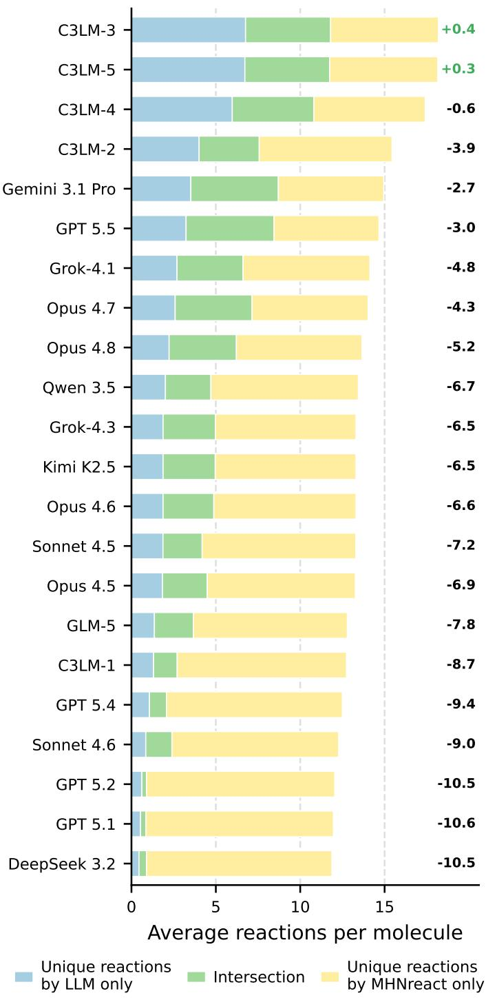  
Figure 5: Intersection of reactions predicted by LLMs and the conventional SSRS model MHNreact. Values on the right show the difference between the number of reactions unique to the model and those unique to MHNreact (mode − MHNreact). C3LM-1: C3LM-LFM2-CREED-CCV+USPTO\*; C3LM-2: C3LM-LFM2-CREED-CCV+USPTO; C3LM-3: C3LM-LFM2-CREED-CCV-2+USPTO-XL; C3LM-4: C3LM-LFM2-RFT-CC; C3LM-5: C3LM-LFM2-RFT-CC-NR.

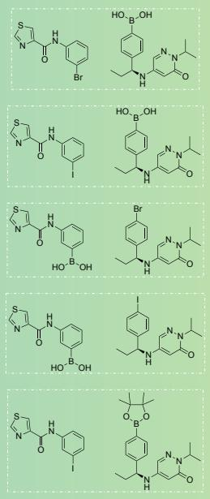

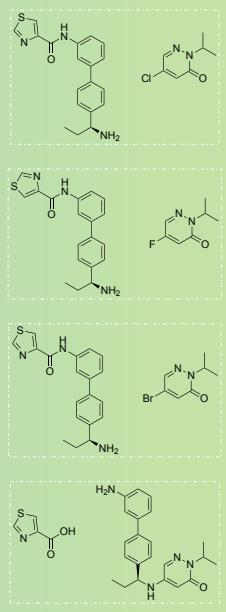

Reactants predicted by C3LM-LFM2-CREED-CCV-2+USPTO-XL  
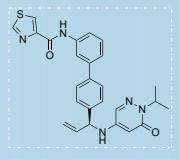

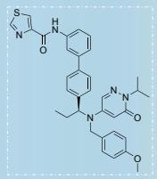

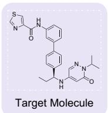  
Reactants predicted by both models: C3LM-LFM2-CREED-CCV-2+USPTO-XL and MHNreact

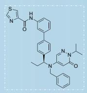

Reactants predicted by MHNreact  
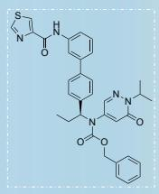

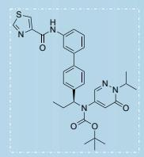

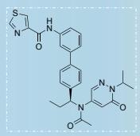

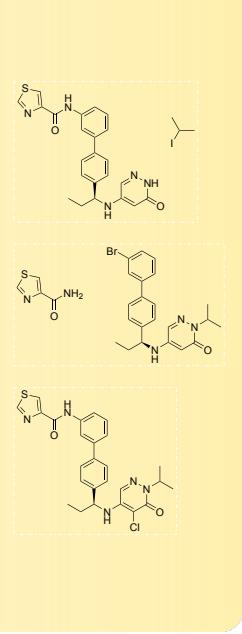  
Figure 6: Intersection of reactions predicted for X404-1768-5005 by C3LM-LFM2-CREED-CCV-2+USPTO-XL and MHNreact.

## I ChemCensor Metrics Calculated with USPTO ∪ Pistachio Reference dataset

The plausibility scores in the main results (Table 1) are computed by ChemCensor (v1.1.1) against its default reference database (USPTO-full, as reported in (Zagribelnyy et al., 2026b)). To verify that our conclusions do not depend on this choice, we re-score the same model predictions with ChemCensor v1.1.1 using the ChemCensor-U2P2 reference database (USPTO-full ∪ Pistachio Q3 2023) instead. As shown in Table 6, the absolute scores change, but the relative ordering of models is largely preserved, confirming that the comparison is robust to the choice of reference database.

<table><tr><td rowspan="2">Model</td><td colspan="4">URSA-expert-2026</td><td colspan="4">USPTO-50K-test-mini</td></tr><tr><td>Max</td><td>Av. PT-Top-K CC @3</td><td>@5</td><td>@10</td><td>Max</td><td>Av. PT-Top-K CC @3</td><td>@5</td><td>@10</td></tr><tr><td colspan="9">Proprietary Foundation Models</td></tr><tr><td>Grok-4.1</td><td>2.17</td><td></td><td></td><td></td><td></td><td></td><td>2.27</td><td>1.46</td></tr><tr><td>Grok-4.3</td><td>2.02</td><td>1.81 1.62</td><td>1.54 1.32</td><td>1.06 0.82</td><td>4.13 4.14</td><td>2.84 2.81</td><td>2.19</td><td>1.35</td></tr><tr><td>Gemini 3.1 Pro</td><td>2.20</td><td>1.93</td><td>1.68</td><td>1.29</td><td>4.42</td><td>3.12</td><td>2.56</td><td>1.83</td></tr><tr><td>GPT 5.1</td><td>0.69</td><td>0.40</td><td>0.27</td><td>0.14</td><td>1.41</td><td>0.79</td><td>0.54</td><td>0.28</td></tr><tr><td>GPT 5.2</td><td>0.51</td><td>0.33</td><td>0.24</td><td>0.15</td><td>1.61</td><td>0.99</td><td>0.71</td><td>0.40</td></tr><tr><td>GPT 5.4</td><td>1.37</td><td>0.97</td><td>0.71</td><td>0.39</td><td>2.50</td><td>1.62</td><td>1.19</td><td>0.66</td></tr><tr><td>GPT 5.5</td><td>2.28</td><td>1.94</td><td>1.68</td><td>1.27</td><td>4.60</td><td>3.26</td><td>2.68</td><td>1.86</td></tr><tr><td>Claude Sonnet 4.5</td><td>1.86</td><td>1.51</td><td>1.21</td><td>0.75</td><td>3.36</td><td>2.31</td><td>1.80</td><td>1.11</td></tr><tr><td>Claude Sonnet 4.6</td><td>1.17</td><td>0.90</td><td>0.70</td><td>0.42</td><td>3.13</td><td>2.07</td><td>1.57</td><td>0.92</td></tr><tr><td>Claude Opus 4.5</td><td>1.92</td><td>1.55</td><td>1.24</td><td>0.79</td><td>3.54</td><td>2.46</td><td>1.94</td><td>1.22</td></tr><tr><td>Claude Opus 4.6</td><td>1.95</td><td>1.59</td><td>1.29</td><td>0.83</td><td>3.96</td><td>2.77</td><td>2.19</td><td>1.37</td></tr><tr><td>Claude Opus 4.7</td><td>2.24</td><td>1.89</td><td>1.61</td><td>1.16</td><td>4.44</td><td>3.16</td><td>2.55</td><td>1.68</td></tr><tr><td>Claude Opus 4.8</td><td>2.17</td><td>1.85</td><td>1.54</td><td>1.02</td><td>4.45</td><td>3.17</td><td>2.55</td><td>1.68</td></tr><tr><td colspan="9">Open-weight Foundation Models</td></tr><tr><td>DeepSeek 3.2</td><td>0.55</td><td>0.40</td><td>0.29</td><td>0.17</td><td>1.18</td><td>0.73</td><td>0.52</td><td>0.30</td></tr><tr><td>Qwen 3.5</td><td>1.91</td><td>1.54</td><td>1.26</td><td>0.81</td><td>3.61</td><td>2.61</td><td>2.07</td><td>1.29</td></tr><tr><td>Kimi K2.5 GLM-5</td><td>1.98</td><td>1.61</td><td>1.35</td><td>0.88</td><td>3.84</td><td>2.67</td><td>2.11</td><td>1.33</td></tr><tr><td></td><td>1.76</td><td>1.40</td><td>1.11</td><td>0.66</td><td>3.12</td><td>2.11</td><td>1.61</td><td>0.96</td></tr><tr><td colspan="9">Conventional SSRS Models</td></tr><tr><td>LocalRetro GLN</td><td>2.38 2.26</td><td>2.11</td><td>1.84</td><td>1.41</td><td>4.88</td><td>3.49</td><td>2.87</td><td>2.02</td></tr><tr><td>MEGAN</td><td>2.34</td><td>1.94 1.95</td><td>1.68 1.61</td><td>1.21 1.09</td><td>4.86 4.85</td><td>3.35 3.34</td><td>2.71 2.67</td><td>1.76 1.72</td></tr><tr><td>Chemformer</td><td>2.01</td><td>1.16</td><td>0.78</td><td>0.40</td><td>4.73</td><td>1.73</td><td>1.05</td><td>0.52</td></tr><tr><td>Graph2Edits</td><td>2.38</td><td>2.05</td><td>1.73</td><td>1.22</td><td>4.86</td><td>3.18</td><td>2.46</td><td>1.55</td></tr><tr><td>MHNreact</td><td>2.33</td><td>2.08</td><td>1.82</td><td>1.44</td><td>4.90</td><td>3.48</td><td>2.89</td><td>2.12</td></tr><tr><td>RetroKNN</td><td>2.35</td><td>2.11</td><td>1.82</td><td>1.41</td><td>4.90</td><td>3.53</td><td>2.91</td><td>2.04</td></tr><tr><td>R-SMILES</td><td>2.35</td><td></td><td></td><td></td><td></td><td></td><td></td><td>1.95</td></tr><tr><td></td><td></td><td>2.09</td><td>1.79</td><td>1.30</td><td>4.90</td><td>3.54</td><td>2.89</td><td></td></tr><tr><td colspan="9">C3LM, Supervised Fine-Tuning, Top-1 Mode</td></tr><tr><td>C3LM-LFM2-CREED-CCV+USPTO*</td><td>1.88</td><td>1.24</td><td>0.86</td><td>0.45</td><td>4.23</td><td>2.23</td><td>1.46</td><td>0.76</td></tr><tr><td colspan="9">C3LM, Supervised and Reinforcement Learning Fine-Tuning, Top-K Mode</td></tr><tr><td>C3LM-LFM2-CREED-CCV+USPTO</td><td>2.18</td><td>1.89</td><td>1.62</td><td>1.13</td><td>4.27</td><td>2.94</td><td>2.37</td><td>1.60</td></tr><tr><td>C3LM-LFM2-CREED-CCV-2+USPTO-XL</td><td>2.32</td><td>2.05</td><td>1.80</td><td>1.43</td><td>4.29</td><td>3.08</td><td>2.58</td><td>1.91</td></tr><tr><td>C3LM-LFM2-RFT-CC</td><td>2.42</td><td>2.14</td><td>1.89</td><td>1.48</td><td>4.30</td><td>3.12</td><td>2.62</td><td>1.93</td></tr><tr><td>C3LM-LFM2-RFT-CC-NR</td><td>2.42</td><td>2.21</td><td>1.95</td><td>1.56</td><td>4.40</td><td>3.21</td><td>2.71</td><td>2.06</td></tr></table>

Table 6: Plausibility-based evaluation in the single-step retrosynthesis Top-K mode. Max: per-target maximum ChemCensor score averaged over TMs. Av. PT-Top-K CC: per-TM average ChemCensor score over top-K unique predictions; ChemCensor v1.1.1, ChemCensor-U2P2 reference database (USPTO-full ∪ Pistachio Q3 2023).

## J Results under ChemCensor v0.5.2

The main results (Table 1) are computed with ChemCensor v1.1.1. To verify that our conclusions do not depend on the specific version of the plausibility metric, we re-score the same model predictions with ChemCensor v0.5.2, the version used in the original benchmark (Zagribelnyy et al., 2026b). The evaluation setup is otherwise identical to Table 1; only the scoring function differs. As shown in Table 7, the absolute values shift slightly, but the relative ordering of models is largely preserved, indicating that the comparison is robust to the choice of ChemCensor version.

<table><tr><td rowspan="2">Model</td><td colspan="4">URSA-expert-2026 Av. PT-Top-K CC</td><td colspan="4">USPTO-50K-test-mini Av. PT-Top-K CC</td></tr><tr><td>Max</td><td>@3</td><td>@5</td><td>@10</td><td>Max</td><td>@3</td><td>@5</td><td>@10</td></tr><tr><td colspan="9">Proprietary Foundation Models</td></tr><tr><td>Grok-4.1</td><td>1.90</td><td>1.59</td><td>1.33</td><td>0.88</td><td>4.04</td><td>2.71</td><td>2.13</td><td>1.33</td></tr><tr><td>Grok-4.3</td><td>1.80</td><td>1.45</td><td>1.16</td><td>0.69</td><td>4.02</td><td>2.65</td><td>2.03</td><td>1.22</td></tr><tr><td>Gemini 3.1 Pro</td><td>1.96</td><td>1.72</td><td>1.49</td><td>1.11</td><td>4.35</td><td>2.97</td><td>2.42</td><td>1.66</td></tr><tr><td>GPT 5.1</td><td>0.61</td><td>0.35</td><td>0.23</td><td>0.12</td><td>1.31</td><td>0.72</td><td>0.48</td><td>0.25</td></tr><tr><td>GPT 5.2</td><td>0.43</td><td>0.28</td><td>0.20</td><td>0.12</td><td>1.53</td><td>0.92</td><td>0.65</td><td>0.36</td></tr><tr><td>GPT 5.4</td><td>1.23</td><td>0.81</td><td>0.57</td><td>0.30</td><td>2.40</td><td>1.50</td><td>1.08</td><td>0.59</td></tr><tr><td>GPT 5.5</td><td>1.98</td><td>1.71</td><td>1.48</td><td>1.08</td><td>4.51</td><td>3.15</td><td>2.55</td><td>1.72</td></tr><tr><td>Claude Sonnet 4.5</td><td>1.59</td><td>1.29</td><td>1.02</td><td>0.60</td><td>3.21</td><td>2.10</td><td>1.58</td><td>0.93</td></tr><tr><td>Claude Sonnet 4.6</td><td>1.04</td><td>0.79</td><td>0.61</td><td>0.35</td><td>2.98</td><td>1.92</td><td>1.42</td><td>0.81</td></tr><tr><td>Claude Opus 4.5</td><td>1.70</td><td>1.34</td><td>1.07</td><td>0.65</td><td>3.37</td><td>2.28</td><td>1.75</td><td>1.06</td></tr><tr><td>Claude Opus 4.6</td><td>1.73</td><td>1.39</td><td>1.13</td><td>0.70</td><td>3.82</td><td>2.61</td><td>2.02</td><td>1.23</td></tr><tr><td>Claude Opus 4.7</td><td>1.95</td><td>1.68</td><td>1.42</td><td>0.97</td><td>4.37</td><td>3.04</td><td>2.40</td><td>1.53</td></tr><tr><td>Claude Opus 4.8</td><td>1.93</td><td>1.66</td><td>1.38</td><td>0.88</td><td>4.37</td><td>3.03</td><td>2.40</td><td>1.51</td></tr><tr><td colspan="9">Open-weight Foundation Models</td></tr><tr><td>DeepSeek 3.2</td><td>0.51</td><td>0.35</td><td>0.24</td><td>0.13</td><td>0.99</td><td>0.60</td><td>0.42</td><td>0.23</td></tr><tr><td>Qwen 3.5</td><td>1.63</td><td>1.33</td><td>1.07</td><td>0.64</td><td>3.49</td><td>2.46</td><td>1.92</td><td>1.16</td></tr><tr><td>Kimi K2.5</td><td>1.73</td><td>1.42</td><td>1.16</td><td>0.71</td><td>3.72</td><td>2.51</td><td>1.94</td><td>1.17</td></tr><tr><td>GLM-5</td><td>1.50</td><td>1.20</td><td>0.93</td><td>0.52</td><td>2.93</td><td>1.92</td><td>1.44</td><td>0.83</td></tr><tr><td colspan="9">Conventional SSRS Models</td></tr><tr><td>LocalRetro</td><td>2.14</td><td>1.87</td><td>1.61</td><td>1.23</td><td>4.82</td><td>3.35</td><td>2.73</td><td>1.88</td></tr><tr><td>GLN</td><td>1.97</td><td>1.73</td><td>1.50</td><td>1.04</td><td>4.81</td><td>3.23</td><td>2.58</td><td>1.66</td></tr><tr><td>MEGAN</td><td>2.03</td><td>1.76</td><td>1.50</td><td>1.01</td><td>4.82</td><td>3.26</td><td>2.59</td><td>1.67</td></tr><tr><td>Chemformer</td><td>1.77</td><td>1.02</td><td>0.68</td><td>0.35</td><td>4.70</td><td>1.73</td><td>1.05</td><td>0.53</td></tr><tr><td>Graph2Edits</td><td>2.11</td><td>1.81</td><td>1.54</td><td>1.09</td><td>4.80</td><td>3.12</td><td>2.40</td><td>1.51</td></tr><tr><td>MHNreact</td><td>2.08</td><td>1.86</td><td>1.63</td><td>1.28</td><td>4.84</td><td>3.34</td><td>2.75</td><td>1.98</td></tr><tr><td>RetroKNN</td><td>2.13</td><td>1.86</td><td>1.62</td><td>1.23</td><td>4.84</td><td>3.37</td><td>2.75</td><td>1.90</td></tr><tr><td>R-SMILES</td><td>2.10</td><td>1.87</td><td>1.64</td><td>1.24</td><td>4.87</td><td>3.51</td><td>2.86</td><td>1.95</td></tr><tr><td colspan="9">C3LM, Supervised Fine-Tuning,&#x27; Top-1 Mode</td></tr><tr><td>C3LM-LFM2-CREED-CCV+USPTO*</td><td>1.63</td><td>1.08</td><td>0.74</td><td>0.39</td><td>4.15</td><td>2.17</td><td>1.42</td><td>0.74</td></tr><tr><td colspan="9">C3LM, Supervised Fine-Tuning, Top-K Mode</td></tr><tr><td>C3LM-LFM2-CREED-CCV+USPTO</td><td>2.01</td><td>1.72</td><td>1.45</td><td>1.00</td><td>4.23</td><td>2.84</td><td>2.28</td><td>1.51</td></tr><tr><td>C3LM-LFM2-CREED-CCV-2+USPTO-XL</td><td>2.07</td><td>1.82</td><td>1.60</td><td>1.27</td><td>4.17</td><td>2.92</td><td>2.43</td><td>1.78</td></tr><tr><td colspan="9">C3LM, Reinforcement Learning Fine-Tuning, Top-K Mode</td></tr><tr><td>C3LM-LFM2-RFT-CC</td><td>2.08</td><td>1.86</td><td>1.65</td><td>1.29</td><td>4.16</td><td>2.96</td><td>2.47</td><td>1.79</td></tr><tr><td>C3LM-LFM2-RFT-CC-NR</td><td>2.18</td><td>1.95</td><td>1.74</td><td>1.38</td><td>4.29</td><td>3.05</td><td>2.56</td><td>1.92</td></tr></table>

Table 7: Plausibility-based evaluation in the single-step retrosynthesis Top-K mode. Max: per-target maximum ChemCensor score averaged over TMs. Av. PT-Top-K CC: per-TM average ChemCensor score over top-K unique predictions; ChemCensor v0.5.2.

## K Distribution of Reactant Sets per Product in USPTO-50K-test-mini

Figure 7 shows the distribution of the number of distinct reactant sets (reference reactions) per product across the USPTO-50K-test-mini set. For each product, we collected all reference reactant sets by matching the product against the entire USPTO-full corpus (Lowe, 2017), rather than relying only on the single reaction provided in the test split. Even so, the large majority of products (420 of 497) are associated with a single reference reaction, and only a small tail has two or more. This sparsity of reference routes is the main limitation of exact-match, single-reference evaluation, and it motivates both our plausibility-based Top-K evaluation and the USPTO-XL augmentation, which enriches products with additional verified reactant sets.

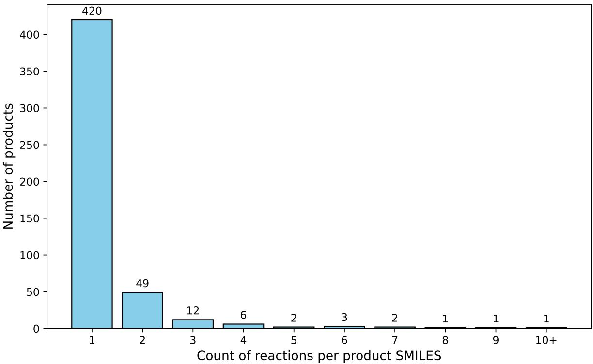  
Figure 7: Distribution of the number of reactant sets for products from USPTO-50K-test-mini. For each product, all reference reactant sets were retrieved by matching it against USPTO-full.

## L CREED-CCV-2+USPTO-XL Details

In this work, we introduce the CREED-CCV-2+USPTO-XL training dataset. Relative to the original CREED-CCV (Zagribelnyy et al., 2026b), it is substantially larger and denser: 3,680,906 unique products and 45,649,785 reaction candidates (vs. 698,765 and 6,368,986), i.e. roughly 5.3× more products and 7.2× more reactions, with ∼12.4 candidates per product on average (vs. ∼9.11). Partitions follow the same 0.8/0.1/0.1 product-disjoint split. The per-product candidate count is concentrated in the 11–50 bin (2,099,509 products), with the remainder in the 6–10 (785,011), 2–5 (579,555), 1 (216,754), and 50+ (77) bins.