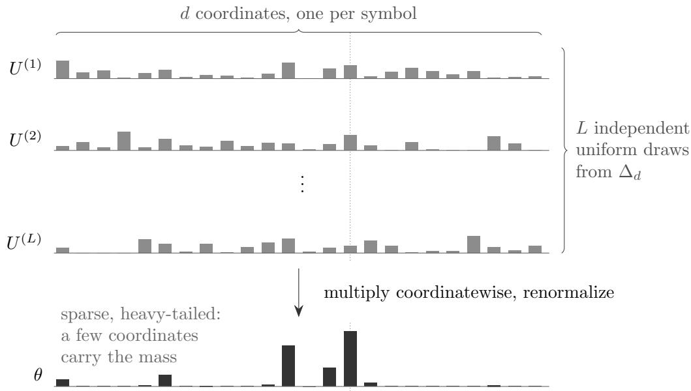
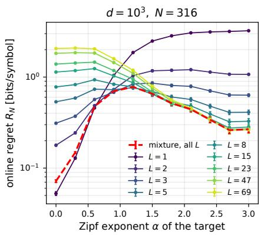
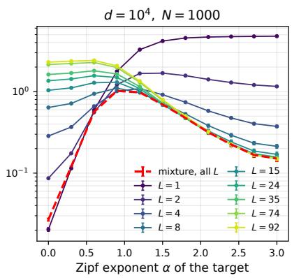
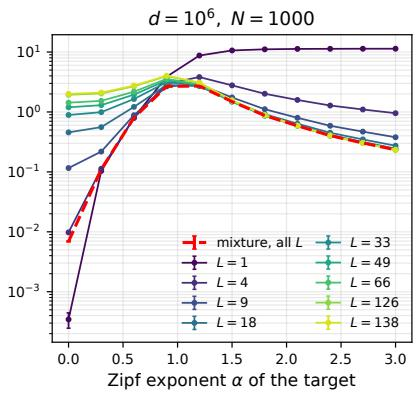
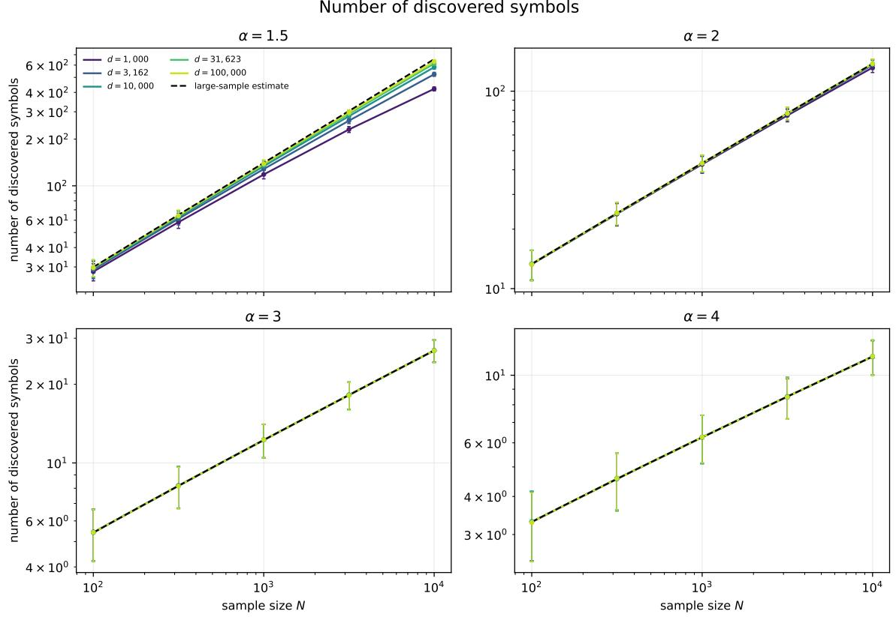
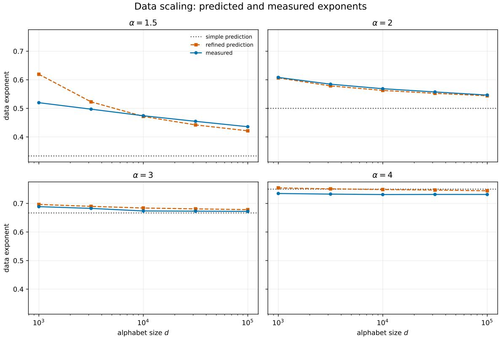
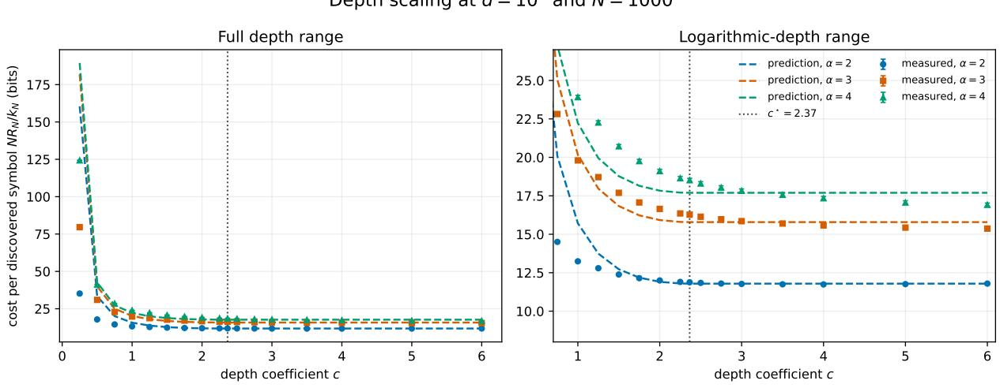
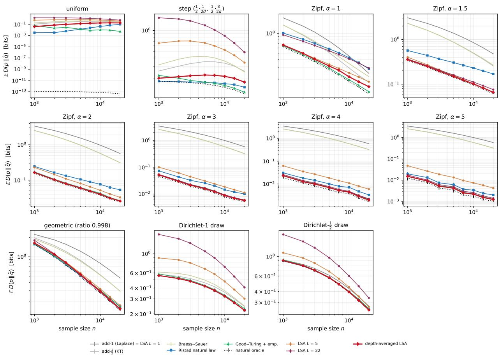
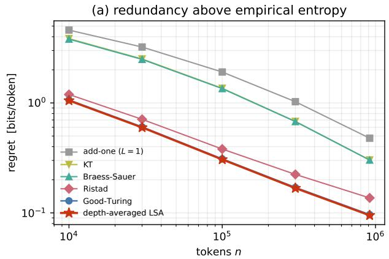
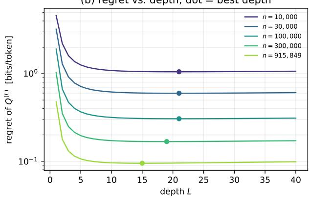

# A Layered Simplex Architecture for Large Alphabets

Meir Feder and Yaniv Fogel School of Electrical and Computer Engineering Tel Aviv University, Tel Aviv, Israel meir@tau.ac.il, yaniv.fogel8@gmail.com

Ruediger Urbanke School of Computer and Communication Sciences EPFL, Lausanne, Switzerland rudiger.urbanke@epfl.ch

August 21, 2026

## Abstract

Probability estimation over large alphabets under log loss is a well-studied problem, with celebrated methods such as the Good–Turing estimator. We introduce and study a new Bayesian estimator with four notable properties. First, its construction is exceptionally simple: multiply independent uniform draws from the probability simplex coordinate-wise and renormalize. Depth is the only structural parameter, and averaging over depths eliminates the need to tune it. Second, the regret of the resulting mixture, the excess code length it pays relative to a code that knows the source, admits an explicit and eficiently computable expression. Third, despite its simplicity and lack of tuned constants, the estimator is competitive across a diverse set of synthetic and real-text benchmarks with substantially more specialized methods, including Good–Turing. Fourth, the tractability of its regret allows us to identify scaling laws in data, alphabet size, and depth. For Zipf targets with exponent above one, the regret has a simple reading as long as the sample reveals only a small fraction of the alphabet. It closely matches the description length of the set of discovered symbols, at one bit of code per bit of description, plus a further cost per symbol. The data exponent is therefore the rate at which new symbols are discovered.

## 1 Introduction

Three questions motivate this paper.

First, can a simple Bayesian estimator compete in the large-alphabet regime? Estimating an unknown distribution under log loss is a classical problem, but it becomes particularly dificult when the alphabet size d is large relative to the available data N. Simple Bayesian rules with uniform prior over the d dimensional simplex leads to the add-one rule (Laplace) and with Dirichlet 1/2 prior to the the add-half rule (Krichevsky–Trofimov [13]); both spread probability across the entire alphabet and can therefore perform poorly when the target is sparse or heavy-tailed. Good–Turing estimation [8] and its variants address this regime well, with strong guarantees in several competitive frameworks [16, 14, 1, 17]. Ristad’s natural law of succession [18] indicates that a hierarchical construction can recover some of this adaptivity. We ask whether a simple Bayesian construction can compete with these more specialized estimators across both flat and highly concentrated targets. Its only structural parameter is the depth, and even that can be removed by averaging over it.

Second, can the scaling of such an estimator be understood from first principles? Empirical scaling laws in machine learning describe robust power-law improvements with data, model size, and compute [12], but their exponents are generally dificult to derive. Large-alphabet estimation ofers a setting in which the relevant mechanism may be isolated: under a heavy-tailed source, the number of distinct symbols revealed by the data itself follows a scaling law. A nontrivia but tractable estimator could therefore connect its regret directly to the rate of symbol discovery, providing a solvable example in which the origin of a scaling exponent is explicit.

Third, what does a layered architecture buy? In the information-theoretic view of machine learning developed in [7], an architecture together with the randomness of its initialization induces a prior w over predictors. The corresponding Bayesian mixture pays, on a particular target, according to how much prior mass lies near that target: up to lower-order terms, its regret is governed by

$$
- \log w \mathopen { } \mathclose \bgroup \left( \Theta _ { 0 } ^ { \epsilon } \aftergroup \egroup \right) ,
$$

the negative logarithm of the prior mass of a small neighborhood of the best predictor [6, 15, 7]. Layered architectures can induce priors with a broad complexity range: multiplying independent random factors spreads their sizes over many orders of magnitude, so appreciable prior mass lands on predictors of very diferent complexities. Can this mechanism be exhibited in a minimal model in which the prior, regret, and resulting scaling laws can all be computed?

We answer these questions using the prior induced by a layered simplex architecture (LSA) on the alphabet $\mathcal { X } _ { d } = \{ 1 , \ldots , d \}$ ; we call it the LSA prior and its Bayesian mixture the LSA predictor. At depth $L ,$ we draw L independent uniform points $\{ U _ { i } \} _ { i = 1 } ^ { L }$ from the probability simplex, multiply them coordinatewise, and renormalize:

$$
\theta _ { i } = \frac { \prod _ { \ell = 1 } ^ { L } U _ { i } ^ { ( \ell ) } } { \sum _ { j = 1 } ^ { d } \prod _ { \ell = 1 } ^ { L } U _ { j } ^ { ( \ell ) } } , \qquad i = 1 , \dots , d .
$$

Sometimes, such multiplication and normalization is called “product of experts” [9]. This leads to a non-uniform LSA prior on the d-dimensional simplex. With this prior, we can perform a Bayesian mixture over $P _ { \theta } ( x ^ { N } )$ a multinomial distribution, to get $Q _ { N } ^ { ( L ) } ( x ^ { N } )$ , which will define the LSA predictor. The construction has only one structural parameter. At $L = 1$ , its Bayesian mixture is exactly Laplace’s add-one rule; at depth proportional to ln d, typical prior draws become sparse and heavy-tailed. Because diferent depths favor targets of diferent concentration, we also study a predictor that averages the mixtures over all depths up to a maximum $L _ { \mathrm { m a x } } .$

$$
Q _ { N } ^ { \mathrm { a v g } } ( x ^ { N } ) = \frac { 1 } { L _ { \mathrm { m a x } } } \sum _ { L = 1 } ^ { L _ { \mathrm { m a x } } } Q _ { N } ^ { ( L ) } ( x ^ { N } ) .\tag{1}
$$

The result is a single coherent Bayesian predictor that requires no depth selection and automatically shifts its posterior weight toward the depths best suited to the observed data. Thus the same model provides a competitive large-alphabet estimator, a tractable setting for studying scaling laws, and a minimal example of a layered prior with a broad complexity range.

## Contributions.

1. An exact and computable regret. We derive an exact expression for the regret as a sum over the possible profiles of the sample, where the profile records how many symbols were observed once, how many twice, and so on (but not which symbols):

$$
R _ { N } = - H ( p ) - { \frac { 1 } { N } } \sum _ { \lambda \in \Lambda _ { N } } A _ { \lambda } ( p ) \log _ { 2 } q _ { \lambda } .
$$

The formula separates the two ingredients of the problem: $A _ { \lambda } ( \boldsymbol { p } )$ depends only on the target, $q _ { \lambda }$ only on the architecture. At depth $L = 1$ the induced predictor is exactly Laplace’s add-one rule (Proposition 1), so the shallow end of the family is a classical baseline. The expression is eficiently computable at scale: we evaluate it for alphabets up to $d = 1 0 ^ { 6 }$ , depths up to $L = 1 3 8$ , and up to the $9 \cdot 1 0 ^ { 5 } .$ -token corpus of Section 5.3.

2. Deeper priors suit more concentrated targets, and averaging over depth removes the need to choose. Evaluating every integer depth up to $c = L / \ln d \approx 1 0$ at $d = 1 0 ^ { 3 } , 1 0 ^ { 4 } , 1 0 ^ { 6 }$ , we find that the best depth grows with the concentration of the target and with the alphabet size; on the most concentrated target at $d = 1 0 ^ { 6 }$ the regret at the best depth is about 49 times smaller than at $L = 1$ , while on the uniform target the ordering reverses (Section 3.3). The depth-averaged predictor (1) tracks the best single depth to within $( \log _ { 2 } { L _ { \mathrm { m a x } } } ) / N$ bits per symbol on every target, so no depth selection is needed.

3. A scaling law with an identifiable mechanism. For Zipf targets with $\alpha > 1$ at logarithmic depth, the regret follows $R _ { N } \approx C ( c , \alpha ) \left( \log _ { 2 } d \right) N ^ { - ( 1 - 1 / \alpha ) }$ (Section 4). The mechanism is symbol discovery: a sample of size N reveals about $N ^ { 1 / \alpha }$ distinct symbols, and the prior pays the number of bits needed to say which symbols these are, at one bit of code per bit of description, plus a premium per discovered symbol. We both measure this unit price and derive it: as a function of the depth coeficient $c ,$ it has a flat minimum of exactly one at the freezing transition $c ^ { \star }$ of the prior—the depth beyond which a typical draw concentrates its mass on a few symbols—which is also why the transition leaves no kink in the regret. The data exponent $1 - 1 / \alpha$ is thus the rate at which new symbols are discovered.

4. The depth-averaged predictor competes with the best classical estimators. On a benchmark of eleven targets of very diferent shapes (support $d = 1 0 ^ { 4 }$ , extending [17]), one fixed prior with no tuned constants performs about as well as whichever classical method is best for each target: it coincides with add-one on the flat targets, matches Good–Turing on Zipf $\alpha = 1 . 5$ , beats it on the more concentrated targets, and loses clearly only on the flattest ones, where Good–Turing exploits count-frequency statistics that no exchangeable mixture in this family uses (Section 5). On a real text, the entire King James Bible over a fixed $d = 1 0 ^ { 5 }$ vocabulary, it is the best method tested at every prefix length, with a posterior over depths that stays in the logarithmic regime (Section 5.3). Adding memory as a second architectural axis gains a further 1.47 bits per token, while the ordering reverses for flat priors: per-state KT codes worse than the memoryless layered model, so at this alphabet size the marginal prior matters more than the memory it feeds (Section 5.4).

5. Certified computation. All probabilities are evaluated from explicit formulas rather than by running the predictor sequentially; the only statistical error is the Monte Carlo average over count profiles, whose standard errors are reported. The implementation is validated against closed forms, independent quadrature, and exact identities (Appendices B and C).

Throughout, regret and KL divergences are reported in bits; asymptotic formulas use ln d, which changes only constants.

## 2 The Information-Theoretic Setting, in Brief

This work is an instance of a general program: the information-theoretic approach to modern machine learning, in which an architecture with randomly initialized parameters is analyzed as a prior over predictors and learning as universal prediction [6, 15, 7]. We state here the two facts from that setting that the rest of the paper uses, and return to the setting itself, and to what our results say about it, in Section 6. Consider batch or online prediction of a sequence $x ^ { N }$ under log-loss. A hypothesis class $\{ p _ { \theta } \} _ { \theta \in \Theta }$ with a prior w over Θ defines the Bayesian mixture $\begin{array} { r } { Q _ { N } ( x ^ { N } ) \ = \ \int w ( d \theta ) p _ { \theta } ( x ^ { N } ) } \end{array}$ , the universal predictor of the class. For any reference $\theta _ { 0 }$ and any neighborhood $\begin{array} { r } { \Theta _ { 0 } ^ { \epsilon } = \{ \theta : \frac { 1 } { N } D ( p _ { \theta _ { 0 } } ^ { N } | | p _ { \theta } ^ { N } ) \leq \epsilon \} } \end{array}$ , the mixture’s per-symbol redundancy against $p _ { \theta _ { 0 } }$ satisfies the non-uniform bound

$$
\frac { 1 } { N } D \big ( p _ { \theta _ { 0 } } ^ { N } \big | \big | Q _ { N } \big ) \ \le \ \operatorname* { m i n } _ { \epsilon > 0 } \bigg [ \epsilon - \ \frac { 1 } { N } \log w ( \Theta _ { 0 } ^ { \epsilon } ) \bigg ] ,\tag{2}
$$

so the price of universality for a particular target is governed by the log prior mass near that target, not by the cardinality or dimension of the class [6, 15, 7]. The quantity − log $w ( \Theta _ { 0 } ^ { \epsilon } )$ is the complexity of the target under the prior ; for smooth parametric families it recovers the familiar $\frac { k } { 2 }$ log N with k the (efective) dimension, but in general it is a property of the prior’s geometry. An architecture converts the randomness of its initialization into a random predictor, and the distribution of that random predictor is exactly the prior w; one claim in [7] that this paper makes exact is that layered architectures induce priors with a broad complexity range: the unit of prior mass is spread over the whole range of complexities, with no level absorbing almost all of it, so that each target is charged roughly its own complexity. The LSA is designed to be, plausibly, the simplest nontrivial instance in which all the objects in (2) (mixture, prior mass, and regret) can be computed essentially exactly.

## 3 The LSA and Its Exact Regret

Let

$$
\begin{array} { r } { \mathcal { X } _ { d } = \{ 1 , \dotsc , d \} , \qquad \Delta _ { d } = \Big \{ p \in [ 0 , 1 ] ^ { d } : \ \sum _ { i = 1 } ^ { d } p _ { i } = 1 \Big \} . } \end{array}
$$

Zipf targets serve as a one-parameter family of test distributions. For $\alpha \geq 0$ 2

$$
p _ { i } = p _ { d , \alpha } ( i ) = \frac { i ^ { - \alpha } } { H _ { d , \alpha } } , \qquad H _ { d , \alpha } = \sum _ { j = 1 } ^ { d } j ^ { - \alpha } ,
$$

with $\alpha = 0$ the uniform distribution and larger α more concentrated targets. The prior is a probability distribution over $\Delta _ { d } ,$ constructed as follows. Fix an integer $L \geq 1$ . Draw

$$
U ^ { ( 1 ) } , \ldots , U ^ { ( L ) } \stackrel { \mathrm { i i d } } { \sim } \mathrm { D i r i c h l e t } ( 1 , \ldots , 1 ) ,
$$

multiply the L simplex points coordinatewise, and renormalize:

$$
\theta _ { i } = \frac { \prod _ { \ell = 1 } ^ { L } U _ { i } ^ { ( \ell ) } } { \sum _ { j = 1 } ^ { d } \prod _ { \ell = 1 } ^ { L } U _ { j } ^ { ( \ell ) } } , \qquad i = 1 , \dots , d .
$$

The law of $\theta$ is denoted $\mathcal { M } _ { d , L }$ . Equivalently, if $E _ { \ell i } \stackrel { \mathrm { i i d } } { \sim } \mathrm { E x p } ( 1 )$ , then

$$
Y _ { i } = \prod _ { \ell = 1 } ^ { L } E _ { \ell i } , \qquad \theta _ { i } = { \frac { Y _ { i } } { \sum _ { j = 1 } ^ { d } Y _ { j } } } ,\tag{3}
$$

because a uniform Dirichlet vector is a normalized vector of iid exponentials and the simplex normalizations cancel in the final renormalization. This LSA construction is shown in Figure 1.

  
Figure 1: One draw of the layered simplex architecture (LSA) at d = 24, L = 4 (real draws, common vertical scale). Each layer is an independent uniform draw from the simplex, every coordinate fluctuating around the common scale $1 / d .$ Multiplying the layers coordinatewise and renormalizing yields a draw θ from the LSA prior $\mathcal { M } _ { d , L }$ that is sparse and heavy-tailed. The dotted line traces the winning coordinate: it was above average in every layer.

The exponential representation (3) is the “architectural” form of the prior: d independent channels, each a product of L iid nonnegative factors, globally normalized. Two depth regimes play diferent roles. At fixed L the prior is dense: all coordinates fluctuate around a common scale $1 / d \ : ( \mathrm { a t } \ : L = 1 $ it is exactly the uniform Dirichlet prior on $\Delta _ { d } )$ . In the logarithmic-depth regime

$$
L = { \mathrm { r o u n d } } ( c \ln d ) , \qquad c > 0 ,
$$

the product construction concentrates as d grows: since log $Y _ { i }$ is a sum of L iid terms with mean −γ, where γ is the Euler–Mascheroni constant, and variance $\pi ^ { 2 } / 6$ , the coordinate scales spread over $e ^ { - \gamma L \pm O ( { \sqrt { L } } ) }$ , and after normalization typical draws are sparse and heavy-tailed: most coordinates are tiny and a small random set carries the visible mass. Depth therefore does not add parameters to fit; it reshapes where the prior puts its mass on the simplex.

## 3.1 Exact regret via count profiles

All logarithms in the regret are base 2. The Bayesian mixture predictor associated with $\mathcal { M } _ { d , L }$ assigns

$$
Q _ { N } ( x ^ { N } ) = \mathbb { E } _ { \theta \sim { M _ { d , L } } } \prod _ { t = 1 } ^ { N } \theta _ { x _ { t } }
$$

to a sequence $x ^ { N } \in \mathcal { X } _ { d } ^ { N }$ . The per-symbol online regret against a target $p \in \Delta _ { d }$ is

$$
R _ { N } ( Q , p ) = { \frac { 1 } { N } } D ( p ^ { N } \parallel Q _ { N } ) = { \frac { 1 } { N } } \mathbb { E } _ { X ^ { N } \sim p ^ { N } } \log _ { 2 } { \frac { p ^ { N } ( X ^ { N } ) } { Q _ { N } ( X ^ { N } ) } } .
$$

For a sequence $x ^ { N }$ , let $m _ { i }$ count the occurrences of symbol $i ,$ and let

$$
q _ { m } = \mathbb { E } _ { \theta \sim \mathcal { M } _ { d , L } } \prod _ { i = 1 } ^ { d } \theta _ { i } ^ { m _ { i } } .
$$

Since $Q _ { N } ( x ^ { N } ) = q _ { m }$ , and the count vector $M = [ M _ { 1 } , \dots , M _ { d } ]$ of an iid sample is Multinomial $( N , p )$ distributed,

$$
R _ { N } ( Q , p ) = - H ( p ) - { \frac { 1 } { N } } \mathbb { E } \log _ { 2 } q _ { M } , \qquad H ( p ) = - \sum _ { i = 1 } ^ { d } p _ { i } \log _ { 2 } p _ { i } .\tag{4}
$$

This identity holds for every d, L, N, and target $p .$

How the experiments evaluate this formula. The numerical results in this paper are obtained from (4) (or from the exact analogous expression for the predictive probabilities); the same numbers could equivalently be obtained by running the predictor symbol by symbol on simulated text. Two computations are involved. First, for a given count vector, log q and the next-symbol probabilities are computed analytically by the methods of Appendix B; this step has no statistical error, only a numerical error that is controlled and certified (Appendix C). Second, the expectation over count vectors is estimated by Monte Carlo: we draw M ∼ Multinomial $( N , p )$ repeatedly with fixed random seeds, evaluate the exact formula on each draw, and average. The error bars in every figure show the standard error of this averaging, which is the only statistical uncertainty in the paper. Later sections refer back to this procedure simply as “evaluating the exact formula.” The mode ${ \mathcal { M } } _ { d , L }$ does not distinguish between alphabet labels, so $q _ { m }$ depends only on the multiset of nonzero counts, which counts occur and how many times, but not which symbols carry them. This multiset is called the profile of the sample, written $\lambda ,$ and we write $\Lambda _ { N }$ for the set of all possible profiles of $N$ observations. Writing $q _ { \lambda }$ for the common value and

$$
A _ { \lambda } ( p ) = \mathbb { P } _ { M \sim \mathrm { M u l t i n o m i a l } ( N , p ) } ( \mathrm { p r o f l e } ( M ) = \lambda ) ,
$$

the exact regret is

$$
R _ { N } ( Q , p ) = - H ( p ) - { \frac { 1 } { N } } \sum _ { \lambda \in \Lambda _ { N } } A _ { \lambda } ( p ) \log _ { 2 } q _ { \lambda } .\tag{5}
$$

All dependence on the target is contained in $H ( p )$ and $A _ { \lambda } ( \boldsymbol { p } )$ ; all dependence on the architecture is contained in $q _ { \lambda }$ . Note also that $H ( p )$ and $A _ { \lambda } ( \boldsymbol { p } )$ are invariant under relabeling the symbols: the regret depends on the target only through its shape (its sorted weight vector), a fact whose meaning for the notion of complexity is taken up in Appendix D. Appendix A gives exact and asymptotic methods for $A _ { \lambda } ;$ Appendix B gives the layer recursion and integral representations for $q _ { \lambda }$ and for the induced predictive probabilities, together with the validated numerical scheme used in all experiments. Throughout, N is the sample size under analysis and n a running number of observations; counts are always $m _ { i }$

Batch regret. Equations (4) and (5) measure the cumulative cost of coding $x ^ { N }$ , or the accumulated log-loss in online prediction of the entire $x ^ { N }$ . The competitive-estimation literature, and Section 5 below, instead score an estimator by the divergence between the target and the single distribution it outputs after N observations. That distribution is

$$
\hat { q } _ { m } ( i ) = Q ( X _ { N + 1 } = i \mid X ^ { N } ) = \frac { q _ { m + e _ { i } } } { q _ { m } } ,
$$

where $e _ { i }$ is the i-th standard basis vector, and $m = m ( X ^ { N } )$ is the random count vector induced by the sample $X ^ { N }$ , i.e. the j-th entry of $m ( X ^ { N } )$ is the number of appearances of $j$ in $X ^ { N }$ . Define

$$
R _ { N } ^ { \mathrm { B } } ( Q , p ) = \mathbb { E } _ { X ^ { N } \sim p ^ { N } } \left[ D \Big ( p \| \widehat { q } _ { m ( X ^ { N } ) } \Big ) \right] .\tag{6}
$$

Because $\mathcal { M } _ { d , L }$ ignores alphabet labels, $\hat { q } _ { m } ( i )$ depends on i only through the count $m _ { i }$ , and the performance depends on the profile λ. Writing $\lambda \oplus r$ for the profile obtained from λ by moving one symbol from count r to $r + 1$ , the common value on the count-r class is $\hat { q } _ { \lambda } ( r ) = q _ { \lambda \oplus r } / q _ { \lambda }$ and $\begin{array} { r } { \sum _ { r } c _ { r } \hat { q } _ { \lambda } ( r ) = 1 } \end{array}$ with $c _ { r }$ the number of symbols seen r times. Every mixture in the family is therefore a natural estimator in the sense of [17], so the natural oracle of Section 5 lower-bounds every LSA row of Table 5. Grouping symbols by count and writing $\begin{array} { r } { S _ { r } ( m ) = \sum _ { i : m _ { i } = r } p _ { i } } \end{array}$ for their true total mass gives the analogue of (5),

$$
R _ { N } ^ { \tt B } ( Q , p ) = - { \cal H } ( p ) - { \tt K } \left[ \sum _ { r \geq 0 } S _ { r } ( M ) \log _ { 2 } \frac { q _ { \lambda \oplus r } } { q _ { \lambda } } \right] , \qquad \lambda = \mathrm { p r o f l e } ( M ) .\tag{7}
$$

This identity is exact for every $d , L , N ,$ , and $p ;$ only the expectation over count vectors is estimated by Monte Carlo, by the procedure of Section 3.1.

## 3.2 The shallow end of the family is Laplace’s rule

Proposition 1. For $L = 1$ , the mixture is the uniform-Dirichlet mixture,

$$
q _ { m } = { \frac { \prod _ { i } m _ { i } ! \Gamma ( d ) } { \Gamma ( d + N ) } } ,
$$

and the induced sequential predictor is the add-one (Laplace) rule: after counts m with $\textstyle \sum _ { i } m _ { i } = n$

$$
Q ( x _ { n + 1 } = i \mid x ^ { n } ) = { \frac { m _ { i } + 1 } { n + d } } .
$$

Proof. The moment formula for Dirichlet $( 1 , \ldots , 1 )$ gives the expression for $q _ { m } ;$ the predictive ratio is $q _ { m + e _ { i } } / q _ { m } = ( m _ { i } + 1 ) / ( d + n )$ □

Thus the family $\{ \mathcal { M } _ { d , L } \} _ { L \ge 1 }$ starts, at its shallow end, exactly at the classical baseline whose failure on large skewed alphabets motivates Good–Turing-type methods. Everything that depth adds is therefore measured against Laplace by construction.

## 3.3 The deep end of the family: depth tilts the complexity spectrum

Proposition 1 identified the shallow end of the family with a classical rule; we now examine what happens at the deep end. The framework of Section 2 predicts a specific qualitative efect: increasing L should move prior mass from the center of the simplex toward sparse, low-entropy vectors, and the regret (5) should respond by decreasing on skewed targets and increasing on flat ones, a tilt of the complexity spectrum, with the family as a whole covering the entire range. A more elaborate analysis of the resulting prior behavior is carried out in [11]. A back-of-the-envelope version of the prior-mass computation makes the prediction quantitative. Under (3), log $Y _ { i }$ is a sum of L iid logexponential variables (E log $E = - \gamma$ , Var log $E = \pi ^ { 2 } / 6 )$ . For the prior to place mass near a target whose sorted weights decay like $p _ { ( i ) } \sim i ^ { - \alpha }$ , the top coordinates must receive log-weights of order α ln i above the bulk; the probability that a given channel’s sum of L terms exceeds the bulk by $\Delta$ decays exponentially in $\Delta ^ { 2 } / L$ (Gaussian regime) or $\Delta$ (large-deviation regime). So a channel’s log-weight fluctuates by $O ( \sqrt { L } )$ for free and can be pushed $\mathrm { u p }$ by $O ( L )$ at the large-deviation cost above, while a Zipf target asks for lifts of order ln d. The reachable range and the required range match exactly when $L \asymp \ln d ,$ which is why logarithmic depth is the natural scale. At fixed small $L$ the spread is $O ( 1 )$ and skewed targets are exponentially expensive for the prior; at $L \gg$ ln d the prior over-commits to sparsity and flat targets become expensive.

The computation above has a useful rephrasing: it evaluates the surprisal of the target’s shape under the density that the prior induces on shapes, which is the architecture-dependent part of the complexity in (2). Appendix D develops this refinement; it is not needed for what follows.

Figure 2 tests this prediction directly, evaluating the regret formula for each target and depth by the procedure of Section 3.1. Three alphabet sizes are shown: d $\in \{ 1 0 ^ { 3 } , 1 0 ^ { 4 } , 1 0 ^ { 6 } \}$ . We evaluate every integer depth from $L = 1$ through $L _ { \mathrm { m a x } } \in \{ 6 9 , 9 2 , 1 3 8 \}$ , respectively, corresponding to $c = L /$ ln $d \lesssim$ 10. The targets are Zipf laws with $\alpha \in \{ 0 , 0 . 3 , \ldots , 3 \}$ ; sample sizes are $N = 3 1 6$ at $d = 1 0 ^ { 3 }$ and $N = 1 0 0 0$ at $d = 1 0 ^ { 4 } , 1 0 ^ { 6 }$ . Each point averages 40 sampled profiles, with profile-sampling standard errors reported. Only a representative subset of depths is drawn in the figure for readability. The dashed red curve is the depth-averaged LSA predictor over all depths $1 \leq L \leq L _ { \operatorname* { m a x } } .$ Three

  
Figure 2: Depth tilts the complexity spectrum at every alphabet size. Online regret on a logarithmic scale versus the Zipf exponent $\alpha$ of the target, for $d = 1 0 ^ { 3 } , 1 0 ^ { 4 } , 1 0 ^ { 6 }$ . Every integer depth up to $c = L / \ln d \approx 1 0$ was evaluated; representative depths are displayed for readability. Shallow priors perform best on near-uniform targets, while increasingly deep priors perform best as the target becomes more concentrated. The dashed red curve is the uniform sequence-mixture over all depths $1 \leq L \leq L _ { \mathrm { m a x } }$ . Its gap from the single-depth envelope is bounded by $( \log _ { 2 } { L _ { \mathrm { m a x } } } ) / N$ (Remark 1); the measured gaps are reported in the text. Error bars are profile-sampling standard errors over 40 sampled profiles.

features of Figure 2 and Table 1 deserve emphasis. First, the crossing structure is the predicted tilt at every alphabet size. $L = 1$ is best for the near-uniform targets and performs increasingly poorly as the target becomes concentrated. The best tested depth increases broadly with α and with $d ,$ see Table 1. At $d = 1 0 ^ { 6 } , \alpha = 3$ , the family envelope improves on $L = 1$ by a factor of approximately 49. Second, define the envelope of the family as the regret of the best single depth for each target, the pointwise minimum over the curves in each panel. The envelope is nearly flat compared with any single member, and, crucially, it is essentially achieved by one predictor: the depth-average (1) (dashed red in Figure 2) lies within $( \log _ { 2 } { L _ { \mathrm { m a x } } } ) / N$ bits of the envelope at every $( d , \alpha )$ , including $d = 1 0 ^ { 6 }$ . The measured worst-case gaps are 0.01933, 0.006524, and 0.006572 bits in the three panels, within the corresponding bounds 0.01933, 0.006524, and 0.007109. In the first two panels the gap attains the bound exactly: it occurs on the flattest targets, where the posterior collapses onto $L = 1$ , so the average pays the full $\log _ { 2 } ( L _ { \operatorname* { m a x } } )$ surcharge. Nothing is lost beyond the stated price of not knowing the depth in advance. The family $\{ \mathcal { M } _ { d , L } \} _ { L }$ , indexed by one integer, has a broad complexity range in the operational sense of Section 2, and the range is packaged into a single coherent prior at negligible cost.

<table><tr><td>α</td><td>0</td><td>0.3</td><td>0.6</td><td>0.9</td><td>1.2</td><td>1.5</td><td>1.8</td><td>2.1</td><td>2.4</td><td>2.7</td><td>3.0</td></tr><tr><td>best  $\mathrm { ~ L ~ } ( d = 1 0 ^ { 3 } )$ </td><td>1</td><td>1</td><td>1</td><td>3</td><td>6</td><td>10</td><td>15</td><td>23</td><td>32</td><td>43</td><td>47</td></tr><tr><td>best  $L ~ ( d = 1 0 ^ { 4 } )$ </td><td>1</td><td>1</td><td>2</td><td>4</td><td>8</td><td>15</td><td>24</td><td>35</td><td>48</td><td>63</td><td>74</td></tr><tr><td>best  $L ~ ( d = 1 0 ^ { 6 } )$ </td><td>1</td><td>1</td><td>4</td><td>9</td><td>18</td><td>33</td><td>49</td><td>66</td><td>85</td><td>110</td><td>126</td></tr><tr><td>envelope  $( d = 1 0 ^ { 6 } )$ </td><td>0.00</td><td>0.10</td><td>0.79</td><td>2.67</td><td>2.70</td><td>1.49</td><td>0.87</td><td>0.59</td><td>0.40</td><td>0.30</td><td>0.23</td></tr><tr><td> $L { = } 1 \ ( d = 1 0 ^ { 6 } )$ </td><td>0.00</td><td>0.10</td><td>0.80</td><td>3.88</td><td>8.74</td><td>10.63</td><td>11.10</td><td>11.27</td><td>11.31</td><td>11.35</td><td>11.36</td></tr></table>

Table 1: Best tested depth per target for the three alphabet sizes of Figure 2 (bits/symbol in the last two rows). Every integer depth up to $c \lesssim$ 10 was tested; each entry is estimated from 40 sampled profiles. The minimizing depth increases broadly with target skew and with $d ,$ although the regret curves for the more concentrated targets are shallow and therefore do not identify the minimizing integer depth sharply. None of the nontrivial minima occurs at the upper search boundary.

Remark 1 (Why depth-averaging is free). Computationally, the whole depth family costs no more than its deepest member: the layer recursion of Appendix B computes depth L from depth $L - 1$ so a single run up to $L _ { \mathrm { m a x } }$ produces every depth along the way. Statistically, the depth-averaged predictor (1) pays for its ignorance of the right depth at most $\log _ { 2 } { L _ { \mathrm { m a x } } }$ bits in total over the whole sequence, the cost of the uniform $1 / L _ { \mathrm { m a x } }$ factor, i.e. at most $( \log _ { 2 } { L _ { \mathrm { m a x } } } ) / N$ bits per symbol. Since the cumulative regret is the sum over time of the instantaneous prediction errors, the average tracks the best single depth up to this vanishing overhead, which is exactly what the dashed curves in Figure 2 show.

Third, the tilt is a statement about the prior, not about fitting: nothing was trained, and the number of “parameters” dL plays no role in the crossing: $L = 1 5$ is worse than $L = 1$ on the uniform target despite being the larger model. What changes with depth is where the prior mass sits, i.e. which targets are cheap in the sense of (2).

## 4 Scaling Laws from Symbol Discovery

For a Zipf target, the regret is closely tied to the number of symbols that the sample reveals. Throughout this section, $R _ { N }$ denotes the normalized online regret in (4), after N predictions; thus $N R _ { N }$ is the corresponding cumulative online regret. It is computed via (5) using the methods described in Section 3.1. Let $K _ { N }$ be the number of diferent symbols seen in N independent draws from

$$
p _ { i } = \frac { i ^ { - \alpha } } { H _ { d , \alpha } } , \qquad i = 1 , \ldots , d .
$$

Symbol i is seen at least once with probability $1 - ( 1 - p _ { i } ) ^ { N }$ . Hence the expected number of discovered symbols is

$$
k _ { N } ( d , \alpha ) : = \mathbb { E } [ K _ { N } ] = \sum _ { i = 1 } ^ { d } [ 1 - ( 1 - p _ { i } ) ^ { N } ] .\tag{8}
$$

We can compute this sum directly for every $d , \ N ,$ and α used below. At logarithmic depth, $L = \operatorname { r o u n d } ( c \ln d )$ , we expect much of the redundancy to come from identifying the symbols that have appeared. Saying which $K _ { N }$ of the d symbols were seen takes $\log _ { 2 } \left( { \overset { \bar { d } } { _ { K _ { N } } } } \right)$ bits. This suggests the finite-size law

$$
N R _ { N } ( d , L , \alpha ) \approx \mathbb { E } \bigg [ \log _ { 2 } \binom { d } { K _ { N } } \bigg ] + B ( c , \alpha ) k _ { N } .\tag{9}
$$

The first term is the cost of naming the discovered subset, charged at one bit of code per bit of description. The second term charges each discovered symbol a further $B ( c , \alpha )$ bits on top of its share of the description length. Equation (9) is the main finite-size prediction tested in this section. Regret is in bits throughout, and all logarithms in fits and figures are base 2. The growth of (8) in N can be read of from a simplified model, reached in three steps: replace $( 1 - p _ { i } ) ^ { N } \mathrm { b y } e ^ { - N p _ { i } }$ replace the normalization $H _ { d , \alpha }$ of the finite alphabet by the zeta function $\zeta ( \alpha )$ , and let the sum run over all $i \geq 1$ rather than stopping at d. Comparing the simplified sum with the integral

  
Figure 3: Symbol discovery. Solid curves give the exact expected number of discovered symbols, dashed curves give the large-sample approximation in Equation (10), and points with error bars give the mean and standard deviation over 5,000 sampled profiles. The efect of the finite alphabet is visible mainly at $\alpha = 1 . 5$ and small d.

$\begin{array} { r } { \int _ { 0 } ^ { \infty } \bigl ( 1 - e ^ { - N x ^ { - \alpha } / \zeta ( \alpha ) } \bigr ) } \end{array}$ dx gives

$$
\begin{array} { r } { k _ { N } = \Gamma \Big ( 1 - \frac { 1 } { \alpha } \Big ) \Big ( \frac { N } { \zeta ( \alpha ) } \Big ) ^ { 1 / \alpha } - \frac { 1 } { 2 } + o ( 1 ) , } \end{array}\tag{10}
$$

where the $o ( 1 )$ refers to the simplified model as $N \to \infty$ . The integral equals the first term. The $- \frac 1 2$ arises because the sum starts at $i = 1$ while the integral starts at 0: matching each term of the sum to the unit interval around it leaves $( 0 , { \frac { 1 } { 2 } } )$ uncovered, where the integrand is one. The cost of the three steps is dominated by the last one: the infinite sum counts symbols beyond $d ,$ about $N d ^ { 1 - \alpha } / ( ( \alpha - 1 ) \zeta ( \alpha ) )$ of them, so (10) overshoots (8) once the sample starts to exhaust the alphabet. On the grid of Section 4.1 the overshoot stays below $5 \%$ for $\alpha \geq 2$ . At $\alpha = 1 . 5$ it grows with the revealed fraction of the alphabet: at $N = 1 0 ^ { 4 }$ it is $4 \%$ of the count at $d = 1 0 ^ { 5 }$ but 55% at $d = 1 0 ^ { 3 }$ , where the sample has revealed 42% of the alphabet. The first two steps cost at most a few symbols and act in the opposite direction. Figure 3 compares (8), (10), and the counts observed in the sampled profiles. All tests below use the exact count (8); equation (10) serves only to exhibit the growth $N ^ { 1 / \alpha }$ . Substituting (10) into (9) and keeping only the leading orders gives the simple law

$$
R _ { N } ( d , L , \alpha ) \approx C ( c , \alpha ) ( \log _ { 2 } d ) N ^ { - ( 1 - 1 / \alpha ) } .\tag{11}
$$

Equation (11) is easy to remember, but it stacks several approximations. At finite d and $N$ , we expect (9) to be more informative.

## 4.1 Three numerical tests

We test alphabet size, data, and depth separately. The data and alphabet scaling tests use

$$
N \in \{ 1 0 ^ { 2 } , 1 0 ^ { 2 . 5 } , 1 0 ^ { 3 } , 1 0 ^ { 3 . 5 } , 1 0 ^ { 4 } \} , \qquad d \in \{ 1 0 ^ { 3 } , 1 0 ^ { 3 . 5 } , 1 0 ^ { 4 } , 1 0 ^ { 4 . 5 } , 1 0 ^ { 5 } \} ,
$$

with $\alpha \in \{ 1 . 5 , 2 , 3 , 4 \}$ and $c = c ^ { \star } = ( 1 - \gamma ) ^ { - 1 }$ ; the depth test uses $d = 1 0 ^ { 5 }$ and $N = 1 0 ^ { 3 }$ . At $\alpha = 1 . 5$ discovery is fastest, with $k _ { N }$ up to about 630; at $\alpha = 4$ only $k _ { N } \approx 3$ to 12 symbols are discovered, so this is where small-count efects show.

Alphabet scaling. We first fix $N , c ,$ and $\alpha ,$ and vary only d. Dividing (9) by kN gives

$$
\frac { N R _ { N } } { k _ { N } } \approx \frac { \mathbb { E } \log _ { 2 } \binom { d } { K _ { N } } } { k _ { N } } + B ( c , \alpha ) .\tag{12}
$$

Write $x$ for the first term on the right of (12), the description length per discovered symbol. For every $d , N ,$ and $\alpha ,$ the value of $x$ is a number we compute, while the left side, $y = N R _ { N } / k _ { N }$ , is a number we measure. Equation (12) says $y = x + B$ . So if we plot the measured y against the computed $x ,$ with d moving the points along the horizontal axis, the points should fall on a straight line of slope one, lying $B$ above the diagonal. The slope is the substance of the test: it measures how many bits of code the prior spends per bit of description. If the prior spent one and a half bits per bit, the slope would come out 1.5. The second prediction of (12) is that the ofset B of the line is the same for every N. Table 2 gives the measured slope and ofset for three values of $N$ . For $\alpha \geq 2$ , the slopes range from 0.95 to 1.09, close to the predicted value one. The agreement is especially stable at $\alpha = 3$ and 4. The result difers at $\alpha = 1 . 5$ . The measured slope decreases from 0.87 at $N = 1 0 ^ { 2 }$ to 0.58 at $N = 1 0 ^ { 4 }$ . In this regime the sample reveals a substantial fraction of the smaller alphabets, so the description cost is no longer proportional to the expression used in Equation (12). The ofset slightly changes with N for every α.

Remark 2. Part of the growth of B with α has a simple origin. The target weights fall like $i ^ { - \alpha }$ so symbol i carries $( K _ { N } / i ) ^ { \alpha }$ times the weight of the last discovered symbol, symbol $K _ { N }$ . The prior must lift its coordinate for symbol i by the same factor, which is α $\log _ { 2 } ( K _ { N } / i )$ bits, and each bit of lift costs about one bit of code (derived in the depth test below). Averaged over the discovered symbols $i \le K _ { N }$ , the lift is α $\log _ { 2 } ( K _ { N } ^ { K _ { N } } / K _ { N } ! ) / K _ { N } \to \alpha \log _ { 2 } e$ bits per discovered symbol, since $K _ { N } ! \approx ( K _ { N } / e ) ^ { K _ { N } }$ . This matches the direction seen in Table 2: at every N, the measured B increases with α.

<table><tr><td>α</td><td>measured quantity</td><td> $N = 1 0 ^ { 2 }$ </td><td> $N = 1 0 ^ { 3 }$ </td><td> $N = 1 0 ^ { 4 }$ </td></tr><tr><td rowspan="2">1.5</td><td>slope</td><td>0.87</td><td>0.76</td><td>0.58</td></tr><tr><td>offset B (bits)</td><td>-2.74</td><td>-2.17</td><td>-1.34</td></tr><tr><td rowspan="2">2</td><td>slope</td><td>1.00</td><td>0.99</td><td>0.95</td></tr><tr><td>offset B (bits)</td><td>-0.83</td><td>-0.64</td><td>-0.46</td></tr><tr><td rowspan="2">3</td><td>slope</td><td>1.04</td><td>1.04</td><td>1.04</td></tr><tr><td>offset B (bits)</td><td>1.40</td><td>1.82</td><td>1.94</td></tr><tr><td rowspan="2">4</td><td>slope</td><td>1.07</td><td>1.09</td><td>1.08</td></tr><tr><td>offset B (bits)</td><td>2.75</td><td>3.47</td><td>3.90</td></tr></table>

Table 2: Alphabet scaling. For each N, the alphabet size varies from $1 0 ^ { 3 }$ to $1 0 ^ { 5 }$ . Equation (12) predicts slope one and an ofset B that does not change with N. The table reports both measured quantities.

Data scaling. We hold d, c, and α fixed and vary only N. The measured exponent is minus the slope of a straight line fitted to log $R _ { N }$ against log N, where $R _ { N }$ is the actual regret. The right side of the law (9) predicts how this regret should scale: the description length of the discovered set, plus B bits per discovered symbol, divided by N. For B we take a single formula across the whole grid, α $\log _ { 2 } e - 2$ bits: the growth α $\log _ { 2 }$ e is that of Remark 2, and the constant −2 was chosen once, after inspecting the measurements of Table 2, to work across the grid, so the prediction is partly calibrated rather than fully independent; moving it by ±0.5 bits moves the predicted exponents by less than 0.01 for $\alpha \geq 2 .$ . The same straight-line fit through the predicted values gives the predicted exponent. Table 3 and Figure 4 label this prediction refined and the limit $1 - 1 / \alpha$ simple. Table 3 compares the slopes. The predicted exponent difers from the measured one by at most 0.002 at $\alpha = 2$ , by at most 0.007 at $\alpha = 3$ , and by 0.013 to 0.019 at $\alpha = 4$ . The gaps at $\alpha = 3$ and 4 have an identifiable origin: the prediction fixes B while Table 2 shows it rising slowly with N. Repeating the prediction with the measured $B ( \alpha , N )$ , interpolated linearly in log N, shrinks these four gaps to at most 0.002. At $\alpha = 1 . 5$ the prediction is within 0.015 of the measurement at $d = 1 0 ^ { 5 }$ and of by 0.10 at $d = 1 0 ^ { 3 } ;$ this diference is explained in the last paragraph. The limit of the slopes is

<table><tr><td></td><td>simple</td><td colspan="2"> $d = 1 0 ^ { 3 }$ </td><td colspan="2"> $d = 1 0 ^ { 5 }$ </td></tr><tr><td>α</td><td>prediction</td><td>refined</td><td>measured</td><td>refined</td><td>measured</td></tr><tr><td>1.5</td><td>0.333</td><td>0.619</td><td>0.520</td><td>0.421</td><td>0.436</td></tr><tr><td>2</td><td>0.500</td><td>0.607</td><td>0.608</td><td>0.544</td><td>0.546</td></tr><tr><td>3</td><td>0.667</td><td>0.696</td><td>0.689</td><td>0.678</td><td>0.672</td></tr><tr><td>4</td><td>0.750</td><td>0.754</td><td>0.735</td><td>0.744</td><td>0.731</td></tr></table>

Table 3: Data scaling. Predicted and measured exponents over the tested range $1 0 0 \le N \le 1 0 ^ { 4 }$ The simple prediction is $1 - 1 / \alpha$ . The refined prediction evaluates the finite-size law on the same values of N, with the fixed ofset $B = \alpha \log _ { 2 } e - 2$ bits per discovered symbol; see the text.

the discovery rate: by the simple law (11) the slope tends to $1 - 1 / \alpha .$ , the rate at which the sample reveals new symbols. Over the tested range the measured slopes sit above this limit at $\alpha = 2$ and 3 and below it at $\alpha = 4$ . The dominant deviation is the fall of the regret per discovered symbol $P = N R _ { N } / k _ { N }$ . By (9) with $\begin{array} { r } { \log _ { 2 } { \binom { d } { k } } \approx k \log _ { 2 } ( e d / k ) } \end{array}$ it is $P \approx \log _ { 2 } ( e d / k _ { N } ) + B$ , so each factor of e in N raises $k _ { N }$ by $e ^ { 1 / \alpha }$ and lowers P by $\log _ { 2 } e / \alpha$ bits if B does not change, and the slope becomes

$$
\beta _ { \mathrm { e f f } } ~ = ~ 1 - { \frac { d \ln k _ { N } } { d \ln N } } - { \frac { d \ln P } { d \ln N } } ~ = ~ \left( 1 - { \textstyle { \frac { 1 } { \alpha } } } \right) + { \frac { \log _ { 2 } e } { \alpha P } } .\tag{13}
$$

At $\alpha = 2$ , the second term increases from 0.11 to 0.18 over the tested range of N at $d = 1 0 ^ { 3 }$ , and from 0.055 to 0.070 at $d = 1 0 ^ { 5 }$ . These local corrections are larger than the fitted excesses 0.108 and 0.046, because Equation (13) omits two efects that act in the opposite direction: the $- \frac 1 2$ of (10) and the rise of B with N. At $\alpha = 3$ they cancel about half of the second term; at $\alpha = 4$ they are as large as it, and the measured slopes land below the limit. The prediction assumes that the sample reveals a small fraction of the alphabet. At $\alpha = 1 . 5$ this holds at $d = 1 0 ^ { 5 }$ , where the predicted and measured slopes are 0.42 and 0.44, and fails at $d = 1 0 ^ { 3 }$ , where $N = 1 0 ^ { 4 }$ reveals 42% of the alphabet and the slopes are 0.62 predicted against 0.52 measured. Figure 4 shows the comparison at every tested alphabet size.

  
Figure 4: Data scaling. The exponent obtained from the measured regret is compared with the simple prediction $1 - 1 / \alpha$ and with the finite-size prediction evaluated on the same values of $N$ The refined prediction follows the measurements closely for $\alpha = 2$ and 3. At $\alpha = 1 . 5$ , it fails for the smallest alphabet, where the sample reveals a substantial fraction of all symbols. At $\alpha = 4$ the measured exponent remains slightly below both predictions.

Depth scaling. In both tests above, the depth was fixed at $c = c ^ { \star }$ , and the quantity we worked with was the regret per discovered symbol, $P = N R _ { N } / k _ { N }$ . The third test asks how it depends on the depth: we fix $d = 1 0 ^ { 5 } , N = 1 0 ^ { 3 }$ , and $\alpha ,$ and vary c. Figure 5 shows the result. Shallow depths are clearly worse, while the curves flatten near $c ^ { \star }$ . The best tested depth improves on $c ^ { \star }$ by

1.2% at $\alpha = 2$ , 5.9% at $\alpha = 3 .$ , and $9 . 5 \%$ at $\alpha = 4 ;$ see Figure 5 and Table 4. Two facts explain this shape. First, the price of naming can never be below one bit of code per bit of description. The prior treats all symbols the same, so its weight splits equally over the $\binom { d } { k }$ possible placements of k discovered symbols, and any one placement can carry at most a fraction $\left( { d \atop k } \right) ^ { - 1 }$ of it: the full description length must always be paid. Second, whether the prior reaches this floor depends on where its weight typically sits, and that is what depth controls (Section 3.3). Past $c ^ { \star }$ , a typical draw from the prior already concentrates its mass on a few coordinates. The only information missing is which coordinates these are, and that is exactly the description: the price is one, and extra depth cannot lower it. This is why the curves are flat past $c ^ { \star }$ , and why the slope measured in the alphabet test, which runs at $c = c ^ { \star }$ , comes out close to one for α $\geq 2$ . Below $c ^ { \star }$ , a typical draw is spread over the whole simplex. Sparse vectors are then unusual for the prior, and reaching them costs extra weight on top of the description; each missing layer makes this surcharge larger. The surcharge can be computed. A coordinate that carries visible mass must have its logarithm about ln d above the typical level, and this excess must be assembled from the $L = c$ ln d layers, each contributing $1 / c$ on average. The cost for one layer to shift its logarithm by a given amount is a standard convex function $I ,$ determined by the distribution of a single layer factor; for our factors, I is the Legendre transform of log $\Gamma ( 1 + s )$ . The total cost is then $L I { \Big ( } { \frac { 1 } { c } } { \Big ) }$ against a required shift of ln $d ,$ and their ratio is the price per bit of description:

$$
\begin{array} { r } { \rho ( c ) ~ = ~ c I \Big ( \frac { 1 } { c } \Big ) ~ ( c \leq c ^ { \star } ) , \qquad \rho ( c ) ~ = ~ 1 \quad ( c \geq c ^ { \star } ) . } \end{array}\tag{14}
$$

Because the digamma function satisfies $\psi ( 2 ) = 1 - \gamma$ , three exact facts follow: $\rho ( c ^ { \star } ) = 1 , \rho ^ { \prime } ( c ^ { \star } ) = 0$ and $\rho ^ { \prime \prime } ( c ^ { \star } ) = ( 1 - \gamma ) ^ { 3 } / ( \pi ^ { 2 } / 6 - 1 ) \approx 0 . 1 1 7$ . The price reaches its floor exactly at $c ^ { \star }$ , and it does so flatly. On the shallow side, $\rho ( 1 ) = 1 . 3 1 , \rho ( 1 . 5 ) = 1 . 0 7 , \rho ( 2 ) = 1 . 0 1$ . This matches the measurements: the steep rise at small $^ { c , }$ the broad minima of Table 4, which are broad because $\rho ^ { \prime } ( c ^ { \star } ) = 0$ , and the absence of any kink in the regret at the phase transition, which sits exactly at the flat minimum.

Remark 3. The argument behind (14) takes the required growth of a coordinate to be exactly a factor of d, and it ignores how the typical size of all the other coordinates shifts with depth. It is therefore reliable near and above $c ^ { \star }$ and overshoots for $c \lesssim 1$ . A full derivation through the induced density of Section 3.3 is open; it would also give the dependence of the ofset B on $N _ { ; }$ , and the phase structure it needs is that of $[ 1 1 ] .$

Conclusion. The three experiments support a common account of the regret. After N samples, about $k _ { N }$ symbols have been seen. Saying which ones takes log $\scriptstyle { \binom { d } { k _ { N } } }$ bits, and as long as the sample reveals only a small fraction of the alphabet, the prior pays this in full and not more: for $\alpha \geq 2$ the measured slopes are close to one (Table 2), and the depth test derives the value one at $c = c ^ { \star }$ At $\alpha = 1 . 5$ the smallest alphabets leave this regime, and the description term is no longer the right measure of the naming cost. Each discovered symbol costs a further B bits, where B grows with the concentration of the target (Remark 2) and drifts slowly with $N ;$ we report it rather than model it. Together, the finite-size law (9) and its leading form (11) summarize the account: the exponent is the rate of symbol discovery, and depth, once logarithmic, moves only the constants, in the way (14) states.

$$
d = 1 0 ^ { 5 }
$$

Figure 5: Depth scaling. Measured regret per discovered symbol at $d = 1 0 ^ { 5 }$ and $N = 1 0 ^ { 3 }$ together with the prediction in Equation (14). The left panel shows the full range. The right panel enlarges the logarithmic-depth range. The prediction captures the broad flattening near $c ^ { \star }$ , but overestimates it at the shallowest depths, as expected from the approximation used to derive it.
<table><tr><td>α</td><td>best tested c</td><td> $P ( c ^ { \star } ) / P _ { \operatorname* { m i n } }$ </td></tr><tr><td>2</td><td>4</td><td>1.012</td></tr><tr><td>3</td><td>6</td><td>1.059</td></tr><tr><td>4</td><td>6</td><td>1.095</td></tr></table>

Table 4: Depth scaling. Measured dependence of the regret per discovered symbol on depth at $d = 1 0 ^ { 5 }$ and $N = 1 0 ^ { 3 }$

## 5 Competitive Comparison: Classical, Good–Turing, Ristad, and the LSA Predictor

The scaling analysis says the log-depth prior handles heavy-tailed targets on large alphabets well. The natural external benchmark is the line of work on competitive distribution estimation, where Good–Turing-type estimators are provably near-oracle [17, 1, 16, 14]. This section uses the LSA prior on the experimental suite of Orlitsky and Suresh [17] and adds Ristad’s natural law of succession [18], which we argue is the closest classical relative of the LSA prior.

## 5.1 Setup

Following [17], the support size is $d = 1 0 ^ { 4 }$ . Their six targets are used: uniform; a step distribution with half the symbols of probability $\textstyle { \frac { 1 } { 2 d } }$ and half $\frac { 3 } { 2 d }$ ; Zipf with $\alpha = 1$ and $\alpha = 1 . 5 ;$ and random targets drawn once per trial from the Dirichlet-1 and Dirichlet- $\cdot \frac { 1 } { 2 }$ priors on $\Delta _ { d } ,$ together with five additional targets that widen the range of shapes: Zipf with $\alpha \ = \ 2 , \ 3 .$ , 4, and 5 (increasingly concentrated; at $\alpha = 5$ the top symbol carries 96% of the mass and its count approaches $2 \cdot 1 0 ^ { 4 }$ at the largest sample size, handled by the heavy-count extension of Appendix B.2); and a geometric law $p _ { i } \propto 0 . 9 9 8 ^ { i }$ , whose probabilities decay exponentially over an efective support of about 500 symbols. For each target and each $n \in \{ 1 0 0 0 , 2 0 0 0 , 3 0 0 0 , 5 0 0 0 , 7 0 0 0 , 1 0 ^ { 4 } , 1 . 4 \cdot 1 0 ^ { 4 } , 2 \cdot 1 0 ^ { 4 } \}$ , a sample of size n is drawn, every estimator is given the resulting counts $( m _ { 1 } , \ldots , m _ { d } )$ (and the support size $d )$ , and the loss is the divergence $D ( p \| \hat { q } )$ between the true distribution and the estimate, averaged over 20 independent trials with common samples across estimators. For a Bayesian mixture this estimate is the predictive distribution ${ \hat { q } } ( i ) = Q ( x _ { n + 1 } = i \mid x ^ { n } )$ , so the metric is the instantaneous form of the cumulative regret studied above: the per-symbol online regret is exactly the time average of these predictive divergences. The estimators are:

• Add-constant rules: add-one (Laplace), which by Proposition 1 is the prior induced by the LSA at $L = 1 ;$ add-half (Krichevsky–Trofimov [13]); and the Braess–Sauer rule [3], which adds $\frac { 1 } { 2 }$ to unseen, 1 to once-seen, and $\frac 3 4$ to multiply-seen symbols before normalizing.

• Good–Turing + empirical: the hybrid of $[ 1 7 ] { \colon }$ with $c _ { t }$ the number of symbols appearing t times, a symbol seen t times receives (before normalization) the empirical mass $t / n$ if $t > c _ { t + 1 }$ , and the Good–Turing mass $( c _ { t + 1 } + 1 ) ( t + 1 ) / ( n c _ { t } )$ otherwise; unseen symbols share the $t = 0$ assignment.

• Ristad’s natural law of succession [18]: with $s \leq d$ distinct symbols observed in n samples, if $s = d$ the rule is add-one; if $s < d ,$

$$
\hat { q } ( i ) = \left\{ \begin{array} { l l } { \displaystyle \frac { ( m _ { i } + 1 ) ( n + 1 - s ) } { n ^ { 2 } + n + 2 s } , \quad m _ { i } > 0 , } \\ { \displaystyle s ( s + 1 ) } \\ { \displaystyle \frac { ( d - s ) ( n ^ { 2 } + n + 2 s ) } { ( d - s ) ( n ^ { 2 } + n + 2 s ) } , \quad m _ { i } = 0 . } \end{array} \right.
$$

The rule arises from a hierarchical uniform prior over the size and identity of the support followed by a uniform Dirichlet within it. However, for this rule, as noted in [10], the code, or the prediction it implies for the entire sequence does not induce a predictive probability of any prior: its sequence probability is order-dependent (see discussion in Section 5.2 and Section 5.3).

• Natural oracle: the genie of [17] that knows p but must assign the same probability to all symbols with the same count: $\hat { q } ( i ) = S _ { m _ { i } } / c _ { m _ { i } }$ , with $S _ { t }$ the true total probability of symbols appearing t times. It lower-bounds every natural (count-based) estimator, including all of the above.

• The prior induced by the LSA at $L = 5$ and $L = 2 2 = { \mathrm { r o u n d } } ( c ^ { \star } \ln d )$ , computed exactly from the count profile by the methods of Appendix B.

• Depth-averaged LSA predictor (1) with $L _ { \mathrm { m a x } } = 8 0$ , comfortably above $2 c ^ { \star }$ ln $d \approx 4 4$ , so that the most concentrated targets cannot be limited by the ceiling (the efect of the ceiling is examined in the findings below). After observing $x ^ { n }$ , its next-symbol estimate is the weighted average

$$
\hat { q } ( i ) = \sum _ { L = 1 } ^ { 8 0 } w _ { L } ( x ^ { n } ) \hat { q } _ { L } ( i ) , \qquad w _ { L } ( x ^ { n } ) = \frac { Q _ { n } ^ { ( L ) } ( x ^ { n } ) } { \sum _ { L ^ { \prime } = 1 } ^ { 8 0 } Q _ { n } ^ { ( L ^ { \prime } ) } ( x ^ { n } ) } ,
$$

where $\hat { q } _ { L }$ is the depth-L predictive and the weight $w _ { L }$ is the (posterior) probability of depth L given the data. The weights require the mixture likelihoods $Q _ { n } ^ { ( L ) } ( x ^ { n } )$ themselves, not just ratios; these are computed to about $1 0 ^ { - 3 }$ nats by the exact-evaluation method of Appendix B.3.

## 5.2 Findings

The short summary is that the scheme does well: the depth-averaged LSA predictor, which is Bayesian and has all the theoretical and practical advantages of a Bayesian, with the layer-induced prior, beats every classical method, or ties the best of them within one standard error, on eight of the eleven targets; the exceptions, all in favor of Good–Turing, are the flattest targets (uniform, step, and $\mathrm { Z i p f } \ \alpha = 1 )$ , and the uniform case, where the gap is largest and most instructive, is discussed at the end of this section. The paragraphs below go through the evidence, and Section 5.3 takes the same estimators to a real text.

  
Figure 6: Competitive comparison on the benchmark of [17], extended to eleven targets $( d = 1 0 ^ { 4 }$ ; log-log axes; 20 trials, standard-error bars). The depth-averaged LSA predictor (red diamonds) performs well on every panel: it matches the best add-constant rule on the flat targets and the best overall rule on eight of eleven panels. On the uniform target, where it lags behind Good–Turing and Ristad, all predictors are far from the natural-oracle curve, which is $\approx 0$

On heavy-tailed targets, the LSA prior is Good–Turing-competitive. On Zipf $\alpha = 1 . 5$ the most skewed Zipf target in the original benchmark of [17], the $L = 5$ mixture attains 0.066 bits at $n = 2 \cdot 1 0 ^ { 4 }$ , equal to Good–Turing (0.066) and within about 8% of the natural oracle (0.061); at $n = 1 0 0 0$ the deeper members are slightly ahead of Good–Turing. Fixed depths beat Ristad (0.170 at $n = 2 \cdot 1 0 ^ { 4 } )$ by more than a factor of two and the add-constant rules by factors of 3 to 7. On $\mathrm { Z i p f ~ } \alpha = 1$ , the depth-averaged predictor (0.154) is second only to Good–Turing (0.129), ahead of every other estimator and far ahead of Ristad (0.288) and add-one (0.246). No component of these mixtures was designed around count frequencies; the competitive behavior emerges from where logarithmic depth places prior mass.

<table><tr><td colspan="7">classical</td><td rowspan="2"></td><td colspan="3">LSA</td></tr><tr><td>target</td><td>add-1</td><td>KT</td><td>BS</td><td>Ristad</td><td>GT</td><td>oracle</td><td> $L { = } 5$ </td><td> $L { = } 2 2$ </td><td>avg over L</td></tr><tr><td>uniform</td><td>0.174</td><td>0.285</td><td>0.262</td><td>0.098</td><td>0.005</td><td>0.000</td><td>0.387</td><td>0.544</td><td>0.174</td></tr><tr><td>step</td><td>0.180</td><td>0.258</td><td>0.252</td><td>0.152</td><td>0.129</td><td>0.122</td><td>0.344</td><td>0.484</td><td>0.180</td></tr><tr><td> $\mathrm { Z i p f } \alpha = 1$ </td><td>0.246</td><td>0.179</td><td>0.219</td><td>0.288</td><td>0.129</td><td>0.120</td><td>0.183</td><td>0.295</td><td>0.154</td></tr><tr><td> $\mathrm { Z i p f } \ \alpha = 1 . 5$ </td><td>0.479</td><td>0.257</td><td>0.268</td><td>0.170</td><td>0.066</td><td>0.061</td><td>0.066</td><td>0.076</td><td>0.066</td></tr><tr><td> $\mathrm { Z i p f } \ \alpha = 2$ </td><td>0.564</td><td>0.310</td><td>0.311</td><td>0.053</td><td>0.027</td><td>0.024</td><td>0.033</td><td>0.026</td><td>0.026</td></tr><tr><td> $\mathrm { Z i p f } \ \alpha = 3$ </td><td>0.582</td><td>0.321</td><td>0.321</td><td>0.0101</td><td>0.0059</td><td>0.0051</td><td>0.0112</td><td>0.0060</td><td>0.0057</td></tr><tr><td> $\mathrm { Z i p f } \ \alpha = 4$ </td><td>0.584</td><td>0.322</td><td>0.322</td><td>0.0033</td><td>0.0022</td><td>0.0017</td><td>0.0060</td><td>0.0023</td><td>0.0020</td></tr><tr><td> $\mathrm { Z i p f } \ : \alpha = 5$ </td><td>0.584</td><td>0.322</td><td>0.322</td><td>0.0020</td><td>0.0013</td><td>0.0010</td><td>0.0043</td><td>0.0014</td><td>0.0012</td></tr><tr><td>geometric</td><td>0.467</td><td>0.292</td><td>0.292</td><td>0.170</td><td>0.167</td><td>0.147</td><td>0.177</td><td>0.152</td><td>0.156</td></tr><tr><td>Dirichlet-1 draw</td><td>0.221</td><td>0.244</td><td>0.247</td><td>0.221</td><td>0.230</td><td>0.220</td><td>0.301</td><td>0.407</td><td>0.221</td></tr><tr><td>Dirichlet- draw 2</td><td>0.272</td><td>0.244</td><td>0.249</td><td>0.250</td><td>0.254</td><td>0.243</td><td>0.267</td><td>0.337</td><td>0.246</td></tr></table>

Table 5: Mean $D ( p \| \hat { q } )$ in bits at $n = 2 \cdot 1 0 ^ { 4 } , d = 1 0 ^ { 4 }$ , 20 trials; standard errors $\leq 0 . 0 0 1$ bits except the Dirichlet rows (≤ 0.013). The last column is the depth-averaged LSA predictor (1) over all depths $L = 1 , \dots , 8 0$ (see the text), a single prior with no tuned constants. Bold marks rows where it beats every classical (non-LSA) method or ties the best of them within one standard error; Section 5.2 discusses the pattern row by row.

On strongly concentrated targets the average overtakes Good–Turing. The concentrated targets sharpen the picture. On Zipf $\alpha = 2$ the depth-averaged predictor attains 0.165 bits at $n = 1 0 ^ { 3 }$ and 0.026 at $n = 2 \cdot 1 0 ^ { 4 }$ , ahead of Good–Turing (0.172 and 0.027) at both sample sizes and within about 6 to $8 \%$ of the natural oracle; on Zipf $\alpha = 3$ it attains 0.0057 versus Good– Turing’s 0.0059, close to the oracle (0.0051); on Zipf $\alpha = 4$ it reaches 0.0020 bits at $n = 2 \cdot 1 0 ^ { 4 }$ versus Good–Turing’s 0.0022, near the oracle (0.0017); and on Zipf α = 5 it attains 0.0012 against Good–Turing’s 0.0013 and the oracle’s 0.0010, the diferences at the scale of one standard error (0.0001). The add-constant rules remain 2 to 3.5 bits away at small n on all of these.

The posterior weights tell the architectural story. It is interesting to examine the posterior weights of the depths, up to $L _ { \mathrm { m a x } } = 8 0$ , which is roughly $3 . 7 ~ c ^ { \star }$ ln d. On $\alpha = 2$ the data select a band around $L \approx 2 3$ to 25, just beyond $c ^ { \star }$ ln $d \approx 2 2$ . On $\alpha = 3 , 4 .$ and 5, the posterior spreads almost flat over the deep end (for α = 4, 5, 85–86% of the mass on $L \in [ 6 1 , 8 0 ]$ with top weight only 0.07), while the regret is unchanged to the fourth decimal. Depth beyond roughly $2 c ^ { \star }$ ln d neither helps nor hurts. This is the freezing transition of Section $^ { 4 , }$ now visible in the likelihood itself: past $c ^ { \star }$ the price of naming a discovered symbol, $\rho ( c )$ of Equation (14), equals one no matter how deep the prior, so all suficiently deep members of the family predict alike and the data cannot tell them apart.

Choosing $L _ { \mathrm { m a x } } .$ . The experiments above settle a practical question: how deep should the family be? The evidence converges on $L _ { \operatorname* { m a x } } = \left\lfloor 2 c ^ { \star } \ln d \right\rceil \approx 3 . 3 \log _ { 2 } d ,$ about three layers per bit of alphabet (44 at $d = 1 0 ^ { 4 }$ , 65 at $1 0 ^ { 6 } )$ ; the factor of two over $c ^ { \star }$ ln d is margin for the finite-d crossover, and even the most concentrated target tested gains nothing beyond it. The two provisioning errors are sharply asymmetric: too small a ceiling costs real bits on concentrated targets, while too large a ceiling costs $\log _ { 2 }$ of the overshoot factor in total, one bit here for doubling, with every flat-target row unchanged to three decimals. When in doubt, round up; the only genuine cost of a generous ceiling is computation, which grows linearly in $L _ { \mathrm { m a x } }$

target posterior over depths at $n = 1 0 ^ { 3 }$ $\mathrm { a t } \ n = 2 \cdot 1 0 ^ { 4 }$   
uniform $L { = } 1 : 1 . 0 0$ $L { = } 1 : 1 . 0 0$   
step $L { = } 1 : 1 . 0 0$ $L { = } 1 : 1 . 0 0$   
$\mathrm { Z i p f } \ \alpha = 1$ $L { = } 5 : 0 . 7 1 , \ L { = } 6 : 0 . 2 9$ $L { = } 3 : 1 . 0 0$   
$\mathrm { Z i p f } \ \alpha = 1 . 5$ $L \mathrm { = 1 5 : 0 . 2 0 , ~ } L \mathrm { = 1 4 : 0 . 1 9 , ~ } L \mathrm { = 1 6 : 0 . 1 6 , ~ } L \mathrm { = 1 3 : 0 . 1 3 }$ $L { = } 9 : 0 . 6 3 , \ L { = } 1 0 : 0 . 3 6$   
$\mathrm { Z i p f } \ \alpha = 2$ $L { = } 3 1 , 3 0 , 3 2 : 0 . 0 6$ each (broad, $L \approx 2 6$ to 36) $L { = } 2 4 , 2 3 , 2 5 : { \approx } 0 . 1 5$ each   
$\mathrm { Z i p f } \ \alpha = 3$ $\mathrm { b r o a d : ~ } 9 4 \% \mathrm { ~ o f ~ m a s s ~ o n ~ } L \in [ 4 1 , 8 0 ]$ broad, mode L≈70; 99% on $L \in [ 4 1 , 8 0 ]$   
$\mathrm { Z i p f } \ \alpha = 4$ $\mathrm { b r o a d : ~ } 9 6 \% \mathrm { o n } \ L \in [ 4 1 , 8 0 ]$ 85% on $L \in [ 6 1 , 8 0 ] ,$ , top weight 0.07   
$\mathrm { Z i p f } \ : \alpha = 5$ $\mathrm { b r o a d : ~ } 9 6 \% \mathrm { o n } \ L \in [ 4 1 , 8 0 ]$ $8 6 \%$ on $L \in [ 6 1 , 8 0 ] ;$ top weight 0.07   
geometric $L { = } 4 : 0 . 7 3 , \ L { = } 5 : 0 . 2 7$ $L { = } 1 0 : 0 . 9 2 , \ L { = } 9 : 0 . 0 8$   
$\mathrm { D i r i c h l e t { - } 1 }$ $L { = } 1 : 1 . 0 0$ $L { = } 1 : 1 . 0 0$   
$\mathrm { D i r i c h l e t } - \frac { 1 } { 2 }$ $L { = } 2 : 0 . 7 0 , \ L { = } 1 : 0 . 3 0$ $L { = } 2 : 1 . 0 0$  
Table 6: Mean posterior weights $w _ { L } \propto q _ { L } ( x ^ { n } )$ of the depth-averaged predictor (entries below 0.05 omitted). The data select depth as the complexity-spectrum analysis predicts: shallow for flat targets, deep for heavy-tailed ones.

The geometric target. The geometric target rewards moderate depth: the posterior settles at $L \approx 1 0 ,$ and the depth-average (0.156 bits at $n = 2 \cdot 1 0 ^ { 4 } )$ is ahead of Good–Turing (0.167) and Ristad (0.170). Here the fixed depth $L = 2 2$ is slightly better (0.152), but the depth-average is close behind while remaining universal. The target’s exponential decay is neither flat nor power-law, and no single classical rule is tuned for it; the average finds the right amount of prior sparsity by itself.

The price appears exactly where the theory says it should. On the uniform and step targets, and on the Dirichlet draws (which are flat targets with $\Theta ( 1 / d )$ coordinates), the deep priors pay: $L = 2 2$ is the worst estimator on the uniform panel (0.544 bits at $n = 2 \cdot 1 0 ^ { 4 } )$ while the family’s shallow end, add-one = L=1, is second only to Ristad among the non-GT rules (0.174). This is the spectrum tilt of Section 3.3 evaluated on external benchmarks: a deep prior is not uniformly better; it reallocates regret from skewed to flat targets. Good–Turing, by contrast, adapts its efective smoothing to the count statistics and is near-oracle on every panel; this is precisely the content of its competitive guarantees [17].

The depth-averaged predictor: one prior, best of the family, empirically. Remark 1 promises that averaging over all depths incurs essentially no penality relative to the best depth. The “avg over $L ^ { \dag }$ column of Table 5 and the red curve of Figure 6 verify the promise on external benchmarks. The posterior weights (Table 6) collapse onto $L = 1$ on the flat targets, making the average exactly add-one there, and select intermediate depths on the skewed ones; the row-by-row numbers are in Table 5. Two facts are new here. First, on Zipf $\alpha = 1 . 5$ the average is ahead of Good–Turing at every $n \leq 1 . 4 \cdot 1 0 ^ { 4 }$ (e.g. 0.356 vs. 0.366 at $n = 1 0 ^ { 3 } )$ . Second, the posterior adapts: the selected depth decreases from about 15 to about 9 as n grows; once the data pin down the heavy symbols, less prior sparsity is required, and the average reallocates automatically.

Coherence: what the mixture buys that Good–Turing does not. The Good–Turing hybrid is an excellent estimator but not a coherent probability assignment over sequences: its posthoc normalization and regime switch (empirical vs. Good–Turing mass) do not arise from any prior, and its cumulative log-loss admits no mixture interpretation. The depth-averaged LSA predictor is a single exchangeable prior: it simultaneously defines a sequential code, satisfies the regret identity (5), composes with further hierarchical modeling, and inherits the non-uniform guarantee (2). The comparison shows that this coherence is now essentially free: across the whole benchmark, the coherent prior gives up meaningful ground to Good–Turing only on the uniform target. There Good–Turing exploits a piece of information this prior family does not use, the observed frequencies of the counts themselves, which on a uniform target reveal that all symbols have nearly the same probability, and it reaches 0.005 bits where the best prior in the family reaches 0.174.

Ristad’s law as the closest relative. Ristad’s natural law is built from a two-level hierarchical picture, mass spread first over support sizes and then uniformly within a support [18], and its qualitative behavior in Figure 6 sits between the add-constant rules and Good–Turing, much like a two-level layered prior. Furthermore, as noted above, unlike the LSA predictors, Ristad’s law is not exactly Bayesian: It was derived combinatorially, and its one-step rules do not multiply to an exchangeable probability over sequences [10] (already at $d = 2$ , sequences with the same counts receive diferent probabilities). Ristad’s sequential version is also the one used in the next Section 5.3, to encode the entire sequence (the Bible).

Concretely, as for its performance: on Zipf $\alpha = 1 . 5$ , Ristad improves on add-one by 2.8× and the log-depth mixture improves on Ristad by a further 2.6×, closing essentially all the remaining gap to the oracle. Where Ristad’s two-level prior is better adapted (near-uniform targets: 0.098 vs. Laplace’s 0.174 on uniform), the deep prior has moved its mass elsewhere.

## 5.3 Compressing the Bible

The benchmark above scores estimators against known synthetic targets. As a final test we compress a real text and measure each estimator by its actual codelength. The corpus is the entire King James Bible (Project Gutenberg etext #10, verse numbers removed): $N = 9 1 5 { , } 8 6 0$ tokens over a fixed vocabulary of $d = 1 0 0 { , } 0 0 0$ , the alphabet scale of modern language-model tokenizers, of which the text uses 13,550 distinct word and punctuation types, about 14% of the alphabet. Every estimator is a sequential probability assignment, hence a lossless code: its codelength $\mathrm { i s \mathrm { ~ - } l o g _ { 2 } }$ of the probability it assigns to the token sequence. We report the redundancy: codelength per token minus the empirical unigram entropy $\hat { H } _ { n }$ of the coded prefix, the part of the codelength due to learning the distribution rather than to its intrinsic uncertainty. For the exchangeable estimators (the LSA priors, add-one, add-half) the codelength is computed exactly from the counts; for the order-dependent rules (Good–Turing, Ristad, Braess–Sauer) it is accumulated by coding the actual sequence one token at a time. Each number reported in this section is the codelength of an honest sequential predictor: predict the next token, sufer the log-loss, update, repeat. Appendix C states the identity between the batch codelength and the accumulated sequential log-loss, and verifies it numerically on the corpus.

Table 7 and Figure 7 show the outcome. Three observations. First, the depth-averaged predictor is the best method tested at every prefix length, ahead of Good–Turing by a small but consistent margin (0.095 vs. 0.097 bits per token on the full text, about 1,800 bits over the whole book), ahead of Ristad’s law by 14 to 44%, and ahead of add-one by a factor of about 4 to 6. The margins over the add-constant rules are exactly the point of the layered architecture: a real text over a large fixed vocabulary is sparse and heavy-tailed, and a depth-one prior wastes its mass on the 86% of the alphabet that never occurs. Second, the posterior over depths is decisive and interpretable. At every checkpoint it concentrates on one or two adjacent depths (at $n = N$ it puts mass 0.9999991 on $L = 1 5 )$ ; with ln $d \approx 1 1 . 5 ,$ , the selected depths 15 to 21 are (1.3 to 1.8) ln d, squarely in the logarithmic regime of Section 3.3, and the drift downward as n grows, $2 1  1 9  1 5$ , is the same adaptation seen on the synthetic Zipf targets: once the data pin down the frequent tokens, less prior sparsity is needed. Third, averaging costs nothing: the depth-average matches the best single depth to four decimal places at every checkpoint, consistent with the $\log _ { 2 } ( L _ { \mathrm { m a x } } ) / n$ bound of Remark 1, which is at most $6 . 3 \cdot 1 0 ^ { - 4 }$ bits per token at the smallest checkpoint $( L _ { \operatorname* { m a x } } = 8 0 , n = 1 0 ^ { 4 } )$ . As a check of the opposite regime, we also ran a byte-pair vocabulary trained on the corpus itself: such a tokenizer is built to flatten the token distribution, and accordingly the posterior collapses onto the shallowest depths $( \mathrm { L } = 2$ , against $\mathrm { L } = 1 5$ on the word stream) and all reasonable methods tie, the two ends of the complexity spectrum, detected automatically from the data.

<table><tr><td>n</td><td>distinct</td><td> $\hat { H } _ { n }$ </td><td>add-1</td><td>KT</td><td>BS</td><td>Ristad</td><td>GT</td><td>LSA avg</td><td>posterior mode</td></tr><tr><td>10,000</td><td>1,160</td><td>7.56</td><td>4.597</td><td>3.846</td><td>3.805</td><td>1.193</td><td>1.066</td><td>1.052</td><td> $L = 2 1$ </td></tr><tr><td>30,000</td><td>2,119</td><td>7.87</td><td>3.225</td><td>2.512</td><td>2.489</td><td>0.709</td><td>0.606</td><td>0.598</td><td> $L = 2 1$ </td></tr><tr><td>100,000</td><td>3,839</td><td>8.02</td><td>1.911</td><td>1.359</td><td>1.350</td><td>0.381</td><td>0.310</td><td>0.306</td><td> $L = 2 1$ </td></tr><tr><td>300,000</td><td>6,922</td><td>8.18</td><td>1.026</td><td>0.679</td><td>0.677</td><td>0.224</td><td>0.170</td><td>0.168</td><td> $L = 1 9$ </td></tr><tr><td>915,860</td><td>13,550</td><td>8.48</td><td>0.478</td><td>0.303</td><td>0.302</td><td>0.137</td><td>0.097</td><td>0.095</td><td> $L = 1 5$ </td></tr></table>

Table 7: Compressing the King James Bible $( d = 1 0 0 , 0 0 0$ , word-and-punctuation tokens). Redundancy in bits per token (codelength per token minus the empirical unigram entropy ${ \hat { H } } _ { n } )$ for prefixes of n tokens. The depth-averaged LSA predictor is the best method at every prefix length; its posterior over depths is essentially a point mass that drifts from $L = 2 1$ down to $L = 1 5$ as the sample grows.

(b) regret vs. depth; dot = best depth  
  
Figure 7: The Bible experiment. (a) Redundancy above the empirical entropy for each method as the coded prefix grows (log-log); the depth-averaged LSA predictor (red) is lowest at every n. (b) Redundancy of the single-depth mixtures $Q ^ { ( L ) }$ as a function of depth, at each prefix length; the minimizing depth (dots) moves from $L = 2 1$ to $L = 1 5$ as n grows, and the depth-average matches the minimum to four decimal places throughout.

## 5.4 Adding memory

The framework treats memory as a second architectural axis, orthogonal to depth: a context structure decides how the data are partitioned, and the depth of each conditional prior decides what shape that conditional is expected to have. We test the simplest instance on the same corpus: an order-one model whose states are the M most frequent tokens plus a single backof state for all other histories. Conditioned on the state the successor sub-sequence is exchangeable, so the mixture factorizes over states and the total codelength is a sum of per-state codelengths, each computed exactly by the machinery of Section 3.1. Every state carries its own depth-averaged predictor $( L \leq 4 0$ and $L \leq 6 0$ for the two partitions of Table 8), so depth varies across contexts, and the number of split contexts is itself averaged over a nested grid $k \in \{ 0 , 6 4 , \ldots , 5 1 2 \}$ , one more level of hierarchical averaging [5], in the structure of a single split level of a context tree [20, 19] with a diferent leaf model. The result remains one coherent prior with an exact regret identity. Table 8 summarizes the outcome.

Memory pays. The code drops from 8.572 to 7.100 bits per token, and the layered prior remains the best method tested, ahead of per-state Good–Turing at both partition sizes.

The reversal for flat priors. Central to the thesis of this paper is the reversal: order-one KT codes at 9.78 bits per token, worse than the memoryless layered model, because every state is another $1 0 ^ { 5 } { \mathrm { - s y m b o l } }$ alphabet on which an add-constant prior wastes its mass, and refining the partition makes KT and add-one strictly worse while the layered prior improves. On large alphabets the choice of marginal prior matters more than the memory it is attached to.

Per-state depth posteriors. The per-state depth posteriors are themselves interpretable: conditionals are more concentrated than the marginal, and the selected depths shift accordingly (quartiles $2 5 / 3 1 / 3 9$ , i.e. 2 to 3.5 ln d, against L⋆=15 for the unigram), with collocation heads such as “according” selecting the deepest priors and broad contexts such as “the” the shallowest.

The number of contexts has an interior optimum. Extending the split count past the grid, the code rises again (7.10 at k = 512, 7.23 at 2048, 7.53 with all 13,550 contexts split), because a context seen a handful of times cannot amortize the log d cost of starting its own conditional: the efective memory size is a data-determined quantity.

Describing the context set. The partition above was defined by the M most frequent context tokens of the full corpus, so an honest code must also describe which tokens these are. The overhead is small. A two-part code that names the 512 split contexts out of the $d = 1 0 ^ { 5 }$ vocabulary costs log2 $( _ { 5 1 2 } ^ { 1 0 ^ { 5 } } ) \approx 4 { , } 6 0 0$ bits, about 0.005 bits per token, raising the semi-adaptive total from 7.100 to 7.105; the same header is owed by every per-state baseline, so no ranking in Table 8 changes. In the language of Section 2 this header is simply − log w of the architecture under a prior over context sets that favors small ones: naming a context costs about log d bits while a context worth splitting saves hundreds, which is why the selection is nearly free.

Learning the context set online. The header can also be avoided entirely. A context gets its own state once its count so far crosses a threshold (the threshold itself is averaged over a small grid, as before). This code is fully sequential, and it is still exactly computable, because which state a token goes to depends only on the past. It costs 7.204 bits per token, 0.10 above the semi-adaptive 7.100: the price of learning the contexts as it codes, with no header. The list itself is a moving target: barely two-thirds of the final “top $5 1 2 ^ { \circ }$ is in place halfway through the corpus. What the code learns quickly and cheaply is the rule, not the list.

## 6 The Broader Setting: Architectures as Priors in Modern Machine Learning

We now place the results in the setting of Section 2.

<table><tr><td colspan="2"> $M = 2 5 6 ,$   $L \leq 4 0$   $M = 5 1 2 , L \leq 6 0$ </td></tr><tr><td>coverage of transitions</td><td>76.6% 83.7%</td></tr><tr><td>empirical H(next | state)</td><td>6.315 6.098</td></tr><tr><td>LSA, per-state depth avg</td><td>7.132 7.100</td></tr><tr><td>Good-Turing (per state)</td><td>7.143 7.113</td></tr><tr><td>Ristad (per state)</td><td>7.254 7.227</td></tr><tr><td>KT (per state)</td><td>9.781 10.172</td></tr><tr><td>add-one (per state)</td><td>10.445 10.868</td></tr></table>

Table 8: Order-one models of the Bible (bits per token; unigram reference: empirical entropy 8.477, LSA code 8.572). States are the M most frequent context tokens plus a backof state.

The structural claim. The claim of [7] is that layered (deep) architectures induce priors whose unit of mass is spread over a very wide range of complexities. Multiplying many independent random factors produces heavy-tailed, nearly degenerate spectra; in linear networks these are literally the spectra of products of random matrices, so typical draws contain both large and extremely small directions. A single deep prior therefore assigns usable mass to simple targets (through the many near-degenerate directions that can be ignored) and to complicated ones (through the rare draws that activate many directions), and the regret behaves non-uniformly, each target charged roughly its own complexity. In [7] this picture is supported by the spectra of layered random maps and by experiments on trained networks.

What the LSA makes exact. The LSA was designed as plausibly the smallest nontrivial instance of this picture, and the results of this paper exhibit it in closed form. Depth multiplies iid factors, and multiplication spreads log-weights. The spread tilts prior mass across target complexities (Figure 2), and the regret responds target by target exactly as (2) prescribes. A mixture across depths assembles the family envelope into one predictor at vanishing cost, in the spirit of hierarchical universal coding [5]. The scaling law of Section 4 yields a power-law loss curve whose exponent is a property of the source (the symbol-discovery rate) rather than of representation learning. The memory experiments of Section 5.4 extend the same accounting to a second architectural axis, where the choice of marginal prior turns out to matter more than the memory it is attached to.

What the model isolates. None of this involves training dynamics. That is both the model’s limitation and the source of its solvability: it isolates the part of the deep-learning story that does not require gradient descent—where mass sits, not how it is found.

What exactness buys. The model plays the role that exactly solvable models play elsewhere: a place where the central quantities (complexity as prior mass, the complexity range of an architecture, the regret it implies) become computable functions whose behavior can be checked against real data, as the Bible experiments do. The surprisal refinement of Appendix D is an example. For exchangeable models, only part of a target’s complexity depends on the architecture: the surprisal − log f (ω0) of its shape under the density the prior induces on shapes. The rest is labeling information, the same for every predictor. The complexity range of an architecture is then a concrete object: the family of surprisal curves it induces over shapes.

Next steps. The natural next steps are the ones the model points to: richer architectures (context trees with layered leaves, latent state, graphical models), and identifying which parts of the exact accounting survive when the prior is only sampled through training rather than integrated.

## 7 Discussion

Similarity to, and diference from, empirical scaling laws. As in empirical studies [12], excess loss follows power laws over substantial ranges, with a data exponent that improves with the concentration of the source. The diference is that here the exponent is derived: it is the Zipf symboldiscovery rate, and the depth parameter, once logarithmic, moves only constants. The mode thus ofers a first-principles existence proof that power-law loss curves need not encode anything about representation learning; symbol discovery under a heavy-tailed source sufices. Conversely, exponents measured in real systems that deviate from discovery rates carry information beyond source statistics.

The transition at $c ^ { \star }$ and its (in)visibility. The freezing transition of the layered prior at $c ^ { \star } = ( 1 - \gamma ) ^ { - 1 } \ [ 1 1 , 4 , 2 ]$ is a genuine phase transition of the architecture, yet the regret shows no kink at $c ^ { \star }$ . Section 4 explains why: the transition enters the regret only through the price $\rho ( c )$ of Equation (14), which reaches its floor of one flatly at $c ^ { \star }$ and stays there, and a quantity that is flat at the transition and constant beyond it cannot produce a kink. What the regret does show is the shallow side, where each missing layer costs bits, and the slow drift of the ofset B.

Relation to competitive estimation theory. Good–Turing’s near-oracle behavior is backed by worst-case competitive guarantees [17, 1]; the layered mixture, by contrast, carries the nonuniform Bayesian guarantee (2) and matches Good–Turing empirically on the heavy-tailed part of the benchmark while losing on the flat part. An attractive open question is whether the depthaveraged LSA prior admits a competitive guarantee of the Good–Turing type, e.g. regret against the natural oracle vanishing uniformly over $\Delta _ { d } ,$ which would unify the two lines: a single coherent prior with both MDL semantics and worst-case competitiveness. The uniform-target column of Table 5 shows the present family does not yet achieve this: Good–Turing’s 0.005 bits there reflect count-frequency information that no exchangeable-prior mixture in our family currently exploits as eficiently.

Limitations. The study is numerical beyond $L = 1$ ; the scaling law (11) is supported over finite ranges $( d \leq 1 0 ^ { 6 } , N \leq 1 0 ^ { 4 } )$ rather than proved; targets are iid with known alphabet size; and the comparison inherits the specific benchmark choices of [17] (support $1 0 ^ { 4 }$ , KL-to-truth metric). The numerical scheme itself is validated to the tolerances reported in Appendix C.

## 8 Conclusion

We introduced a simple Bayesian estimator for probability estimation over large alphabets. At depth L, the prior is obtained by multiplying L independent uniform simplex draws coordinatewise and renormalizing. The $L = 1$ member is exactly Laplace’s add-one rule, while increasing depth moves prior mass toward sparse and heavy-tailed distributions. Averaging over depths gives a single coherent predictor that adapts across target distributions and is competitive with substantially more specialized estimators on both synthetic benchmarks and real text. The model is also suficiently tractable to expose how its regret scales with data, alphabet size, and depth. For Zipf targets in the logarithmic-depth regime, as long as the sample reveals only a small fraction of the alphabet, the regret closely matches the description length of the discovered symbol set, at one bit of code per bit of description, plus a further cost per discovered symbol; the data exponent 1 − 1/α is the symbol-discovery rate, while the depth coeficient changes only constants. From the architectural perspective, the same construction provides a solvable example of how layering creates a prior with a broad complexity range: multiplication spreads prior mass from the center of the simplex toward its sparse boundary, and averaging over depths packages these complexity scales into one adaptive predictor. The model claims neither to explain neural networks nor to replace Good–Turing. It shows, in a setting where everything can be computed, how much of both stories (scaling laws and competitive large-alphabet estimation) already follows from a single structural principle: multiply enough independent random factors, and the resulting prior is broad enough to charge each target roughly its own complexity.

## A Computing the Profile Weights $A _ { \lambda } ( p )$

Let $\lambda \in \Lambda _ { N }$ be a profile, described by its multiplicities: $c _ { r }$ is the number of symbols observed exactly r times, so $\textstyle \sum _ { r } r c _ { r } = N$ . Write $\mathcal { R } _ { \lambda } = \{ r : c _ { r } > 0 \}$ for the count values that occur and $s = \sum c _ { r }$ for the number of distinct observed symbols $( A _ { \lambda } = 0 { \mathrm { ~ i f ~ } } s > d )$

## A.1 Coeficient formula

Each alphabet symbol is either unused, contributing 1, or used r times, contributing $p _ { i } ^ { r } / r !$ . Therefore

$$
A _ { \lambda } ( \boldsymbol { p } ) = \Gamma ( N + 1 ) \left[ z ^ { c } \right] \prod _ { i = 1 } ^ { d } \Bigl ( 1 + \sum _ { r \in \mathcal { R } _ { \lambda } } z _ { r } \frac { p _ { i } ^ { r } } { \Gamma ( r + 1 ) } \Bigr ) ,
$$

where $[ z ^ { c } ]$ extracts $\prod _ { r } z _ { r } ^ { c _ { r } }$ : one formal variable per distinct part size. For the uniform target the coeficient is explicit,

$$
{ \cal A } _ { \lambda } ( u ) = \frac { \Gamma ( N + 1 ) } { d ^ { N } } \frac { d ! } { ( d - s ) ! } \frac { 1 } { \prod _ { r \geq 1 } \Gamma ( r + 1 ) ^ { c _ { r } } \prod _ { r \geq 1 } c _ { r } ! } ,
$$

which serves as a validation case.

## A.2 Evaluation, and what the experiments use

Read literally, the coeficient formula requires extracting a coeficient from a product of d factors. By symmetry it collapses to a polynomial in the power sums $\begin{array} { r } { P _ { r } = \sum _ { i = 1 } ^ { d } p _ { i } ^ { r } } \end{array}$ : the formula does not care which symbol contributed which factor, and summing over the choice of symbols produces exactly the power sums. A standard dynamic program assembles this polynomial at a cost that grows with the number of distinct count values in $\lambda ,$ not with $d ;$ for very large profiles, Poissonization makes the symbol counts independent and a saddlepoint argument applies. The experiments themselves do not need $A _ { \lambda }$ at all: as explained in Section 3.1, the expectation over profiles is estimated by drawing count vectors $M \sim$ Multinomial $( N , p )$ directly and averaging the exact log q values, which is unbiased for (4). The $A _ { \lambda }$ machinery is retained because it validates the sampling pipeline through the identity $\textstyle \sum _ { \lambda } A _ { \lambda } = 1$ and the uniform-target closed form. The average description length E log2 $\textstyle { \binom { d } { K _ { N } } }$ used in Section 4 is computed over the same sampled profiles, and checked against the exact distribution of $K _ { N }$ obtained under Poissonization by a one-pass recursion over the alphabet.

## B Computing the Mixture Weights $q _ { \lambda }$ and Predictive Probabilities

Using (3) and the Gamma integral $\begin{array} { r } { 1 / \Gamma ( N ) \int _ { 0 } ^ { \infty } t ^ { N - 1 } e ^ { - t S } d t = S ^ { - N } } \end{array}$ with $S = \textstyle \sum _ { j } Y _ { j }$

$$
q _ { \lambda } = \frac { 1 } { \Gamma ( N ) } \int _ { 0 } ^ { \infty } t ^ { N - 1 } \phi _ { 0 } ( t ) ^ { d - s } \prod _ { r \in \mathcal { R } _ { \lambda } } \phi _ { r } ( t ) ^ { c _ { r } } d t , \qquad \phi _ { r } ( t ) = \mathbb { E } \bigl [ Y ^ { r } e ^ { - t Y } \bigr ] ,\tag{15}
$$

with Y a single product of L iid exponentials. The kernel functions obey the layer recursion

$$
\phi _ { r } ^ { ( \ell ) } ( t ) = \int _ { 0 } ^ { \infty } e ^ { - x } x ^ { r } \phi _ { r } ^ { ( \ell - 1 ) } ( t x ) d x , \qquad \phi _ { r } ^ { ( 1 ) } ( t ) = \frac { \Gamma ( r + 1 ) } { ( 1 + t ) ^ { r + 1 } } ,\tag{16}
$$

one integral per layer, independent of d.

## B.1 Numerical scheme

All computations store $h _ { r } ( u ) = \log \phi _ { r } ( e ^ { u } )$ on a uniform grid in u = log t. The integrand of one layer step (16) has two structures: a kernel peak of width $( r + 1 ) ^ { - 1 / 2 }$ , and, once t is large, a slowly varying plateau that produces the far-tail behavior $\phi _ { r } ( t ) \sim C _ { L } ( \ln t ) ^ { L - 1 } t ^ { - ( r + 1 ) }$ . The scheme integrates the two regions separately and blends them smoothly, with interpolation for of-grid reads. The outer integral (15) is evaluated by scanning its log-integrand coarsely and refining around the maximum.

A predictive probability is the ratio of two such integrals difering in a single kernel row. Write $\begin{array} { r } { \Psi ( u ) = n u + ( d - s ) h _ { 0 } ( u ) + \sum _ { r } c _ { r } h _ { r } ( u ) } \end{array}$ for the log-integrand of (15) in the variable $u = \log t ;$ the term nu absorbs both $t ^ { n - 1 }$ and the Jacobian $d t = e ^ { u } d u$ . After n observations, a symbol with count r has

$$
Q ( x _ { n + 1 } = i \mid x ^ { n } ) = { \frac { q _ { m + e _ { i } } } { q _ { m } } } = { \frac { 1 } { n } } \cdot { \frac { \int e ^ { u } \left( \phi _ { r + 1 } / \phi _ { r } \right) e ^ { \Psi ( u ) } d u } { \int e ^ { \Psi ( u ) } d u } } ,
$$

i.e. the same integral with $h _ { r }$ replaced by $h _ { r + 1 }$ at one symbol and one extra power of t. Grid biases common to numerator and denominator cancel; this cancellation is certified by the normalization checks of Appendix C.

## B.2 Heavy counts by anchor interpolation

Count values up to $m _ { \mathrm { m a x } } \approx 2 \cdot 1 0 ^ { 4 }$ arise on the benchmark of Section 5 (the top symbol of $\mathrm { Z i p f }$ $\alpha = 5$ at $n = 2 \cdot 1 0 ^ { 4 }$ ; already $\mathrm { Z i p f } \ : \alpha = 1 . 5$ produces counts near $8 \cdot 1 0 ^ { 3 } )$ . Tables store all small-count rows exactly and anchor rows at geometric spacing above; a missing row is interpolated through bracketing anchors after removing a known smooth trend. Direct tests against exactly built rows show errors $\sim 1 0 ^ { - 4 }$ in $h _ { r }$ and $\sim 2 \cdot 1 0 ^ { - 5 }$ in the predictive diferences, negligible at the precision of the experiments.

## B.3 Exact kernel rows via Mellin Barnes contours

Absolute mixture likelihoods log $q _ { \lambda } .$ , needed for the posterior weights of the depth-mixture, amplify any error in $h _ { 0 }$ by the factor $d - s$ in (15) and in $h _ { r } \ ( { \mathrm { s m a l l } } \ r )$ by the multiplicities $c _ { r }$ . Grid-recursion accuracy of order $1 0 ^ { - 5 }$ , ample for predictive ratios, is therefore insuficient at $d = 1 0 ^ { 6 }$ . The small-r kernels admit an exact remedy: since the Mellin transform of a product of L unit exponentials is $\Gamma ( z ) ^ { L }$ ,

$$
\phi _ { r } ^ { ( L ) } ( t ) = \frac { 1 } { 2 \pi i } \int _ { c - i \infty } ^ { c + i \infty } \Gamma ( s ) \Gamma ( r + 1 - s ) ^ { L } t ^ { - s } d s , \qquad 0 < c < r + 1 ,
$$

with an integrand that decays like $e ^ { - ( L + 1 ) \pi | \Im s | / 2 }$ , faster at greater depth. Two float64 pitfalls, catastrophic cancellation at small t and integrand growth with depth, are avoided by extracting the $s = 0$ pole (whose residue is exactly $\Gamma ( r + 1 ) ^ { L } )$ and by placing the contour so that $\Re ( r + 1 - s )$ sits at the minimizer of log Γ. The resulting rows show step-halving agreement below $3 \cdot 1 0 ^ { - 9 } $ for all small r at every depth used in the experiments $( L \leq 1 3 8 )$ ), match independent Meijer-G evaluations where those converge, and replace the recursion rows for small r in every stored table; the residua contribution of the remaining recursion rows to log $q _ { \lambda } \mathrm { i s } \lesssim 1 0 ^ { - 3 }$ nats on the measured profiles.

## C Validation and Reproducibility

The implementation is validated by the following checks, all of which must pass before any experiment is run.

<table><tr><td>check</td><td>compared against</td><td>agreement</td></tr><tr><td>layer recursion (16),  $L = 2$ </td><td>adaptive quadrature</td><td> $< 2 \cdot 1 0 ^ { - 6 }$ </td></tr><tr><td>closed forms at  $L = 1$ </td><td>Proposition 1</td><td> $< 2 \cdot 1 0 ^ { - 9 }$  (relative)</td></tr><tr><td> $q _ { ( 1 ) } = 1 / d ; d q _ { ( 2 ) } + d ( d - 1 ) q _ { ( 1 , 1 ) } = 1$ </td><td>exchangeability</td><td> $2 \cdot 1 0 ^ { - 5 } \ \mathrm { n a t s } \ ( d = \dot { 1 } 0 ^ { 4 } ) ; 2 \cdot 1 0 ^ { - 3 } \ ( 1 0 ^ { 6 } )$ </td></tr><tr><td>predictive normalization  $\begin{array} { r } { \sum _ { i } \dot { \hat { q } } ( i ) = 1 } \end{array}$ </td><td>measured profiles</td><td> $1 0 ^ { - 5 } \ ( L = 5 ) ; 4 \cdot 1 0 ^ { - 4 } \ ( L = 2 2 )$ </td></tr><tr><td> $\begin{array} { r } { \sum _ { \lambda } A _ { \lambda } = 1 ; } \end{array}$  uniform closed form</td><td>Appendix A</td><td>within tolerance</td></tr></table>

These checks bound the absolute log $q _ { \lambda }$ error entering the depth-mixture posteriors by $\lesssim 1 0 ^ { - 3 }$ nats, and the KL error of the reported comparisons by $\lesssim 1 0 ^ { - 3 }$ bits, below all plotted diferences.

The batch codelength is the sequential log-loss. Each LSA predictor, including the depth average, is a single, fixed probability assignment on token sequences, so by the chain rule its batch codelength is the accumulated sequential log-loss: $\begin{array} { r } { - \log _ { 2 } Q ( x ^ { n } ) = \sum _ { t < n } - \log _ { 2 } Q ( x _ { t + 1 } \mid x ^ { t } ) } \end{array}$ , where the conditional at step t is the posterior-weighted, depth-averaged next-token probability given the past. The profile formula of Section 3.1 merely evaluates the left side without looping over the sequence; nothing about the numbers reported in Section 5.3 depends on seeing the data in batch. We also verified the identity numerically, since the per-step conditionals and the batch marginal are computed by diferent numerical routes: on Bible prefixes the machinery’s next-token predictive matches the marginal ratio $Q ( x ^ { t + 1 } ) / Q ( x ^ { t } )$ to within 10−12 at every tested step, the accumulated per-step log-losses match the batch codelength to $3 \cdot 1 0 ^ { - 4 }$ bits over thousands of steps (for single depths and for the posterior-weighted depth average alike), and at $L = 1$ the sequential machinery reproduces the add-one rule $( m _ { i } + 1 ) / ( t + d )$ exactly.

Experiment protocols: all trials use fixed seeds; the comparison of Section 5 shares identica samples across estimators; means and standard errors are over 20 trials or 40 profile draws as stated in each caption; all depths come from a single recursion chain per table set; regret and KL are converted to bits by division by ln 2.

## D Surprisal of an Induced Order Parameter

This appendix rephrases the back-of-the-envelope computation of Section 3.3 as a statement about an induced density. Let $\omega ( \theta )$ be an order parameter of the drawn predictor—a low-dimensional summary of $\theta ,$ such as its entropy or its sorted weight vector—and let $f _ { L }$ denote the density of $\omega ( \theta )$ when $\theta \sim \mathcal { M } _ { d , L }$ . The surprisal $- \log f _ { L } ( \omega _ { 0 } )$ , evaluated at the value $\omega _ { 0 }$ equivalent to the target, measures the prior-tilted complexity at that level of description, and it may describe the operative complexity more accurately than the raw neighborhood mass − log $w ( \Theta _ { 0 } ^ { \epsilon } )$ of (2). The reason is the exchangeable structure of the model. For a permutation-invariant prior, the mass of a neighborhood of a specific target $\theta _ { 0 }$ splits, up to the resolution dω at which the order parameter is specified (a term common to all targets in a given shape family), as

$$
- \log w \big ( \Theta _ { 0 } ^ { \epsilon } \big ) \approx - \log f _ { L } ( \omega _ { 0 } ) + \log M _ { \mathrm { l a b } } ( \theta _ { 0 } ) ,
$$

where $M _ { \mathrm { l a b } } ( \theta _ { 0 } )$ (at most d!) counts the distinct relabelings of $\theta _ { 0 } { : }$ the level set $\{ \omega ( \theta ) \approx \omega _ { 0 } \}$ , whose mass is $f _ { L } ( \omega _ { 0 } ) d \omega$ , consists of $M _ { \mathrm { l a b } } ( \theta _ { 0 } )$ equally weighted permuted copies of the neighborhood. The labeling term log $M _ { \mathrm { l a b } } ( \theta _ { 0 } )$ is common to every target of the same shape, and it is exactly the information that the data must convey under any code, which symbols are the frequent ones, so it does not separate predictors; indeed the exact regret (5) depends on the target only through its shape. What depth acts on is the other term: increasing L tilts the induced density $f _ { L }$ toward sparse, low-entropy values of $\omega ,$ lowering the surprisal of concentrated shapes and raising that of flat ones. The back-of-the-envelope estimate of Section 3.3 is precisely a large-deviation evaluation of − log fL for the shape parameter: with log $Y _ { i }$ a sum of L iid log-exponentials, whose cumulant generating function is log $\Gamma ( 1 + s )$ Cram´er’s theorem gives − log $f _ { L }$ as L times the conjugate rate function evaluated at the required log-weight per layer, and the Gaussian and large-deviation regimes quoted there are its two branches, the second of which is what produces the transition at $c ^ { \star }$ in Section 4. The panels of Figure 2 can then be read as the depth-tilted surprisal plotted across the one-parameter shape family $\omega _ { 0 } = \alpha$

## Acknowledgements

We are grateful to Prof. Gregory Wornell. A question he asked one of us (MF) sparked the line of inquiry that led to this work. We also thank Ryu Jeong for providing the asymptotic analysis of the layered prior [11] and for discussions on the presented model.

The numerical computations reported in this paper, including the layer recursions, the contourintegral evaluations, and the experiments of Sections 3.3–5, were carried out with the assistance of Claude Fable 5 (Anthropic), which also assisted in the writing of the manuscript. All computations are validated by the checks of Appendix C and are reproducible from the accompanying code package at https://github.com/urbanke/layered-simplex-architecture; responsibility for the content rests entirely with the authors.

## References

[1] Jayadev Acharya, Ashkan Jafarpour, Alon Orlitsky, and Ananda Theertha Suresh. Optimal probability estimation with applications to prediction and classification. In Proceedings of the 26th Annual Conference on Learning Theory, 2013.

[2] Anton Bovier. Statistical Mechanics of Disordered Systems: A Mathematical Perspective. Cambridge University Press, 2006.

[3] Dietrich Braess and Thomas Sauer. Bernstein polynomials and learning theory. Journal of Approximation Theory, 128(2):187–206, 2004.

[4] Bernard Derrida. Random-energy model: An exactly solvable model of disordered systems. Physical Review B, 24(5):2613–2626, 1981.

[5] Meir Feder and Neri Merhav. Hierarchical universal coding. IEEE Transactions on Information Theory, 42(5):1354–1364, 1996.

[6] Meir Feder, Neri Merhav, and Michael Gutman. Universal prediction of individual sequences. IEEE transactions on Information Theory, 38(4):1258–1270, 1992.

[7] Meir Feder, R¨udiger Urbanke, and Yaniv Fogel. Information-theoretic framework for understanding modern machine-learning. Preprint, 2025.

[8] Irving John Good. The population frequencies of species and the estimation of population parameters. Biometrika, 40(3–4):237–264, 1953.

[9] Geofrey E. Hinton. Products of experts. In Ninth International Conference on Artificial Neural Networks (ICANN), volume 1, pages 1–6, 1999.

[10] Marcus Hutter. Ofline to online conversion. In Algorithmic Learning Theory (ALT), pages 230–244, 2014.

[11] Ryan Jeong. A phase transition for layered multiplicative priors on the simplex. Unpublished manuscript, 2026.

[12] Jared Kaplan, Sam McCandlish, Tom Henighan, Tom B. Brown, Benjamin Chess, Rewon Child, Scott Gray, Alec Radford, Jefrey Wu, and Dario Amodei. Scaling laws for neural language models. arXiv preprint arXiv:2001.08361, 2020.

[13] Raphail Krichevsky and Victor Trofimov. The performance of universal encoding. IEEE Transactions on Information Theory, 27(2):199–207, 1981.

[14] David McAllester and Robert E. Schapire. On the convergence rate of Good-Turing estimators. In Proceedings of the 13th Annual Conference on Computational Learning Theory, 2000.

[15] Neri Merhav and Meir Feder. Universal prediction. IEEE Transactions on Information Theory, 44(6):2124–2147, 1998.

[16] Alon Orlitsky, Narayana P. Santhanam, and Junan Zhang. Always Good Turing: Asymptotically optimal probability estimation. Science, 302(5644):427–431, 2003.

[17] Alon Orlitsky and Ananda Theertha Suresh. Competitive distribution estimation: Why is Good-Turing good. Advances in Neural Information Processing Systems, 28, 2015.

[18] Eric Sven Ristad. A natural law of succession. Technical Report CS-TR-495-95, Princeton University, 1995. arXiv:cmp-lg/9508012.

[19] Frans MJ Willems. The context-tree weighting method: Extensions. IEEE Transactions on Information Theory, 44(2):792–798, 1998.

[20] Frans MJ Willems, Yuri M Shtarkov, and Tjalling J Tjalkens. The context-tree weighting method: Basic properties. IEEE transactions on information theory, 41(3):653–664, 1995.