# A Locally Tokenized Generative Model for Robust Time-Series Watermarking

Dongbin Kim1 †, Geonwoo Shin1 †, Yujin Choi1 2, Soyeon Park1, Jaewook Lee1 \*

1Seoul National University 2Nanyang Technological University

{dongbin413,shin0621,uznhigh,soyeon2,jaewook}@snu.ac.kr

## Abstract

Watermarking is a central tool for provenance in generative models, yet its application to multivariate time series remains hindered by reliability failures under post-editing attacks. We show that existing detectors, which rely on globally coupled re-encoding, suffer from bidirectional drift of the null distribution: post-editing attacks can shift the z-score of non-watermarked samples in either direction, invalidating clean-calibrated thresholds. We argue that this instability is a property of the re-encoding, and that reliable detection requires each recovered unit to depend only on a bounded temporal neighborhood. Guided by this principle, we propose L-VQVAE, a generative model in which each discrete token is produced from a short contiguous window, and LVQMark, a watermarking method over this token space that combines logit-bias injection with robust re-encoding for attack-time detection. Experiments on four benchmarks spanning finance, energy, and neuroimaging show that our approach preserves generation quality while stabilizing both detection power and false-positive behavior under post-editing attacks.

## 1 Introduction

Reliable provenance verification is essential as generative models increasingly produce high-quality synthetic data [2, 14, 24]. Among existing approaches—provenance metadata, forensic detection, model fingerprinting, and watermarking [5, 13, 23]—generation-time watermarking is particularly suited to synthetic time series [9, 17]: it embeds verification signals during sampling, requires no retraining or external metadata, and remains detectable under downstream transformations [19, 21].

Despite these advances, most watermarking methods assess robustness through detectability of watermarked samples after post-editing attack, typically reporting true positive rate (TPR) at a fixed false positive rate (FPR) (TPR@X%FPR) calibrated on clean negative samples [26, 19, 17, 15]. Yet for provenance verification, false positives are also critical: attacked non-watermarked samples may be misdetected as watermarked, leading to erroneous attribution and reduced reliability of the provenance guarantee. While recent image watermarking and forgery-aware studies discuss such false-attribution risks [12, 1], they remain largely unexplored in time-series watermarking.

We address this gap by enforcing locality in the recovered token representation. We first introduce L-VQVAE, a generative model for multivariate time series in which each discrete token is recovered from a bounded temporal neighborhood of the observed signal, rather than through global inversion. L-VQVAE comprises a local tokenizer, a global decoder, and an autoregressive transformer, all sharing a single codebook. We then build LVQMark, a generation-time watermarking method designed over this locally recoverable token interface: it embeds a red–green logit bias during autoregressive sampling, where green-set tokens receive a positive sampling bias at each position, and introduces a robust encoder that maps attacked continuous signals back to their clean token assignments for detection. Because generation, insertion, and detection are all defined over the same locally recoverable token representation, perturbations affect only a bounded subset of recovered evidence, preserving both detection power and false-positive control.

We evaluate LVQMark on four time-series datasets under varying sequence lengths and post-editing attacks. Experiments show that LVQMark preserves high generation quality while achieving robust watermark detection and stable false-positive behavior on attacked non-watermarked samples.

Our main contributions are summarized as follows:

• We formulate false-positive reliability in time-series watermarking as a re-encoding stability problem. We show that when the re-encoding map is globally coupled, post-editing attacks can shift the null distribution of the detection statistic for non-watermarked samples, invalidating clean-calibrated thresholds.

• We introduce L-VQVAE, a generative model for multivariate time series in which each token depends only on a short temporal neighborhood, preventing perturbations from inducing global drift in the recovered representation.

• We build LVQMark, a generation-time watermarking method over the L-VQVAE token space, combining red–green logit-bias insertion with scheduling modifications tailored to L-VQVAE and robust re-encoding for attack-time detection.

## 2 Watermarking in Time Series and Robustness

Generalized detection framework. Generation-time watermarks [9, 7, 17] share a common statistical template. Let $\mathbf { x } \in \mathbb { R } ^ { T \times D }$ denote an observed sample, let X denote the space of recovered units (e.g. a finite codebook index set), and let $\Phi ( \mathbf { x } ) \in \dot { \mathcal { X } } ^ { N }$ denote the internal representation recovered by the detector. For each position $n \in \{ 1 , \ldots , N \}$ , a secret key κ specifies a positionwise target region $\mathcal T _ { n } \subset \mathcal X$ . Under the null hypothesis $H _ { 0 }$ , the recovered units $\{ \Phi ( { \bf x } ) _ { n } \} _ { n = 1 } ^ { N }$ are independent across positions and each lies in $\mathcal { T } _ { n }$ with probability $\mu _ { 0 } ;$ watermarking biases the generative process so that this event occurs more frequently. The detector computes the agreement rate and its standardized score

$$
\hat { g } ( \mathbf { x } ) = \frac { 1 } { N } \sum _ { n = 1 } ^ { N } \mathbb { 1 } [ \Phi ( \mathbf { x } ) _ { n } \in \mathcal { T } _ { n } ] , \qquad z ( \mathbf { x } ) = \frac { \hat { g } ( \mathbf { x } ) - \mu _ { 0 } } { \sigma _ { 0 } } , \qquad \sigma _ { 0 } = \sqrt { \frac { \mu _ { 0 } ( 1 - \mu _ { 0 } ) } { N } } ,\tag{1}
$$

and declares x watermarked whenever $z ( \mathbf { x } ) > \eta$ for a fixed threshold $\eta > 0 .$ . In the balanced setting considered throughout this paper, $\mu _ { 0 } = 1 / 2 ,$ so that $\begin{array} { r } { \sigma _ { 0 } = \frac { 1 } { 2 \sqrt { N } } } \end{array}$ . This formulation subsumes both token-level generation-time watermarks for language models, such as KGW [9], and time-series methods such as TimeWak [17]: although these approaches adopt different choices of the recovered representation Φ and target regions $\mathcal { T } _ { n }$ , they share an identical statistical structure.

Red-green watermarking and time-series departure. KGW [9] recovers $\Phi ( \mathbf { x } )$ trivially from the observed token sequence: detection simply reproduces the green list $G _ { n }$ from the secret seed $\kappa$ and applies Equation (1) directly. Time-series watermarking [17] adheres to the same statistical logic but departs in one essential respect: the detector must first re-encode the continuous signal into $\Phi ( \mathbf { x } )$ This re-encoding step is benign under clean conditions, but, as we show next, becomes the primary source of robustness degradation under post-editing attacks.

Table 1: Intended interpretation of z under a clean-calibrated detector. The validity of this interpretation requires re-encoding stability of Φ under the attack family; in its absence, null drift bidirectionally invalidates the threshold.
<table><tr><td colspan="2"> $z \gg 0$ </td><td> $z \approx 0$ </td><td> $z \ll 0$ </td></tr><tr><td>Watermarked</td><td>Correct detection</td><td>Miss</td><td>Statistical anomaly</td></tr><tr><td>Non-watermarked</td><td>False positive</td><td>Correct rejection</td><td>Statistical anomaly</td></tr></table>

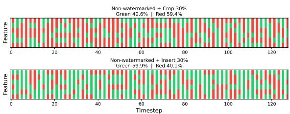  
(a) Recovered green/red assignments.

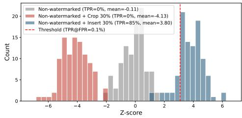  
(b) z-score distributions.  
Figure 1: Bidirectional drift of the null on non-watermarked samples (TimeWak [17], Stocks). Crop and insert push the recovered tokens (a) and the resulting z-score (b) in opposite directions, with insert crossing the clean-calibrated threshold and yielding an 85% false-positive rate.

Re-encoding stability. To formalize this failure mode, we call a re-encoding map Φ stable under an attack family $\mathcal { F }$ when, for every non-watermarked x and every ${ \mathcal { A } } \in { \mathcal { F } }$ , the distribution of $\Phi ( { \cal A } ( { \bf x } ) )$ stays close to that of $\Phi ( \mathbf { x } )$ , keeping $\mathbb { E } _ { \mathcal { H } _ { 0 } } [ \hat { g } ( \mathcal { A } ( \mathbf { x } ) ) ]$ near $\mu _ { 0 }$ . We refer to violations of this property as re-encoding instability. Its observable symptom is the drift of $\mathbb { E } [ \hat { g } ( \mathcal { A } ( \mathbf { x } ) ) ]$ away from $\mu _ { 0 }$ on non-watermarked samples, which we call null drift. We refer to the property that the clean-calibrated threshold continues to control the FPR under attack as false-positive reliability. Under this view, false-positive reliability is a direct consequence of re-encoding stability.

Bidirectional null drift under post-editing attacks. Existing methods fail to satisfy this property. As Figure 1 illustrates on a representative method and Table 12 confirms across baselines, $\hat { g }$ concentrates near $\mu _ { 0 } = 1 / 2$ in the clean setting (as Equation (1) requires) but drifts away under attack in a method- and attack-dependent manner. Since the drift direction is governed by the interaction between Φ and A rather than by the watermark, attacks can either trigger false positives $( z \gg 0 )$ or induce severe statistical anomalies $( z \ll 0 )$ , and the clean-calibrated threshold loses its intended meaning under both regimes of Table 1.

A representation-level interpretation. We attribute null drift to Φ rather than to the statistic itself: existing methods instantiate Φ through globally coupled computations, where each recovered position depends on essentially every time step of x, so a localized perturbation propagates to every position. We address this in Section 3 by making each unit of Φ depend only on a bounded temporal neighborhood—a property we call locality—confining attacks to a bounded subset of recovered units.

## 3 Proposed Method

Motivated by the observation that globally coupled representations propagate post-editing attacks beyond the attacked region, we design a generative model with a deliberately local internal representation (L-VQVAE) and a watermarking method that exploits this locality (LVQMark). A schematic is shown in Figure 2.

## 3.1 L-VQVAE: Locally Tokenized Generative Model

L-VQVAE generates multivariate time series through three stages: a local tokenizer encodes each short temporal window into a discrete codebook entry, a global decoder reconstructs a full time series from the resulting token sequence, and an autoregressive transformer models the distribution over token sequences for sampling.

## 3.1.1 Local Tokenization

Let $\mathbf { x } \in \mathbb { R } ^ { T \times D }$ denote a multivariate time series with T time steps and D variables. The local tokenizer produces a discrete token sequence $\mathbf { s } = ( s _ { 1 } , \ldots , s _ { N } ) \in \{ 1 , \tilde { \mathbf { \Gamma } } , \tilde { \mathbf { \Gamma } } , \tilde { \mathbf { \Gamma } } , K \} ^ { N }$ from x in three steps: sliding-window decomposition, per-window summarization, and vector quantization against a shared codebook $\mathcal { C } = \{ { \mathbf e } _ { k } \} _ { k = 1 } ^ { K }$

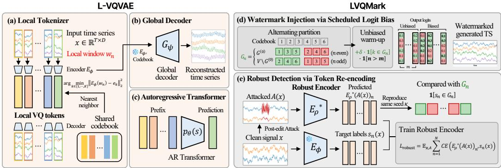  
Figure 2: Overview of L-VQVAE and LVQMark. (a) The local tokenizer encodes each temporal window into a discrete VQ token. (b) The global decoder reconstructs the time series from the token sequence. (c) An autoregressive transformer models the token distribution. (d) Watermark injection via scheduled logit bias with alternating partition and unbiased warm-up. (e) Robust detection via token re-encoding, where $E _ { \rho } ^ { \ast }$ recovers clean token assignments from the attacked signal for the green-ratio test.

Sliding-window decomposition. We partition x into overlapping local windows with receptive field R and stride s (with s chosen so that $( T - R ) / s$ is an integer):

$$
\mathbf { w } _ { n } = \mathbf { x } _ { t _ { n } + 1 : t _ { n } + R } \in \mathbb { R } ^ { R \times D } , \qquad t _ { n } = ( n - 1 ) s , \qquad n = 1 , \dots , N ,\tag{2}
$$

where $N = ( T - R ) / s + 1$ is the number of windows. By construction, ${ \bf w } _ { n }$ depends only on the time steps within $[ t _ { n } + 1 , t _ { n } + R ]$ , so a temporal post-editing attack overlaps at most $\lceil \dot { R } / s \rceil + 1$ consecutive windows and can therefore alter at most that many tokens downstream.

Window summarization and quantization. Each window is summarized into a single latent vector by a shared cross-attention encoder $E _ { \phi }$ and then quantized against the codebook. We linearly project ${ \bf w } _ { n }$ to dimension d and add learnable positional embeddings $\mathbf { P } \in \mathbb { R } ^ { R \times d }$ (shared across windows) to obtain $\mathbf { H } _ { n } \in \mathbb { R } ^ { R \times d }$ . A single learnable query vector $\mathbf { q } _ { 0 } \in \mathbf { \mathbb { R } } ^ { 1 \times d }$ , shared across all windows, is then refined by a stack of L cross-attention blocks: for $\ell = \bar { 1 } , \ldots , L ,$

$$
\tilde { \mathbf { q } } _ { n } ^ { ( \ell ) } = \mathrm { L N } \Big ( \mathbf { q } _ { n } ^ { ( \ell - 1 ) } + \mathrm { C r o s s A t t n } ( \mathbf { q } _ { n } ^ { ( \ell - 1 ) } , \mathbf { H } _ { n } , \mathbf { H } _ { n } ) \Big ) ,\tag{3}
$$

$$
\mathbf { q } _ { n } ^ { ( \ell ) } = \mathrm { L N } \left( \tilde { \mathbf { q } } _ { n } ^ { ( \ell ) } + \mathrm { F F N } ( \tilde { \mathbf { q } } _ { n } ^ { ( \ell ) } ) \right) ,\tag{4}
$$

with ${ \bf q } _ { n } ^ { ( 0 ) } = { \bf q } _ { 0 }$ for all n. The output $\mathbf { q } _ { n } ^ { ( L ) } \in \mathbb { R } ^ { 1 \times d }$ is squeezed and linearly projected to obtain the window latent $E _ { \phi } ( \mathbf { w } _ { n } ) \in \mathbb { R } ^ { d _ { c } }$ , which is mapped to its nearest codebook entry:

$$
s _ { n } = \arg \operatorname* { m i n } _ { k \in \{ 1 , \dots , K \} } \| E _ { \phi } ( \mathbf { w } _ { n } ) - \mathbf { e } _ { k } \| _ { 2 } ^ { 2 } , \qquad \mathbf { z } _ { n } ^ { q } = \mathbf { e } _ { s _ { n } } ,\tag{5}
$$

with gradients propagated through the arg min by the straight-through estimator [18]. Because keys and values are derived exclusively from $\mathbf { w } _ { n } .$ , any post-editing attack of x that does not overlap ${ \bf w } _ { n }$ leaves $E _ { \phi } ( \mathbf { w } _ { n } )$ and $s _ { n }$ unchanged. For brevity, we write ${ \bf z } _ { n } : = E _ { \phi } ( { \bf w } _ { n } )$ for the continuous (pre-quantization) encoding of window $\mathbf { w } _ { n } ,$ , and ${ \bf z } _ { n } ^ { q }$ for its quantized counterpart.

Local pretraining. Training $( E _ { \phi } , \mathcal { C } )$ jointly with the global decoder from scratch leads to poor codebook utilization: the global decoder can compensate for inaccurate codes by drawing on neighboring tokens, weakening the gradient signal to the codebook and undermining the per-token locality on which detection-time recovery relies. We therefore first pretrain $( E _ { \phi } , \mathcal { C } )$ together with a local decoder $D _ { \widetilde { \psi } } ^ { \mathrm { l o c } }$ that reconstructs ${ \bf w } _ { n }$ from the single code ${ \bf z } _ { n } ^ { q }$ alone. The encoder and local decoder are trained by minimizing

$$
\begin{array} { r } { \mathcal { L } _ { \mathrm { V Q } } = \mathbb { E } _ { n } \left[ \underbrace { \| \mathbf { w } _ { n } - D _ { \tilde { \psi } } ^ { \mathrm { l o c } } ( \mathbf { z } _ { n } ^ { q } ) \| _ { 2 } ^ { 2 } } _ { \mathrm { r e c o n s t r u c t i o n } } + \beta \underbrace { \| \mathbf { z } _ { n } - \mathrm { s g } [ \mathbf { z } _ { n } ^ { q } ] \| _ { 2 } ^ { 2 } } _ { \mathrm { c o m m i t m e n t } } \right] , } \end{array}\tag{6}
$$

where $\mathrm { s g } [ \cdot ]$ denotes the stop-gradient operator and ${ \bf z } _ { n } = E _ { \phi } ( { \bf w } _ { n } )$ . The codebook entries $\{ \mathbf { e } _ { k } \} _ { k = 1 } ^ { K }$ are not updated by gradient descent; instead, each $\mathbf { e } _ { k }$ is maintained as an exponential moving average of the encoder outputs $\mathbf { z } _ { n }$ . Under this local bottleneck, each code must fully describe its window without relying on neighboring context. After pretraining, $D _ { \tilde { \psi } } ^ { \mathrm { l o c } }$ is discarded, and $( E _ { \phi } , \mathcal { C } )$ are frozen for the subsequent training of the global decoder.

## 3.1.2 Global Decoder and Autoregressive Transformer

Locality is imposed only on the encoding side, which is the sole component re-executed at detection time and therefore exposed to post-editing attacks. Since the decoder and AR Transformer are invoked only during generation, they need not be local and can model long-range dependencies without compromising robustness.

Global decoder. The decoder $G _ { \psi }$ maps the full token sequence to a time series in a single forward pass. Let $\mathbf { E } \in \mathbb { R } ^ { N \times d }$ denote the embedded token sequence with positional embeddings, and let $\mathbf { \bar { Q } } _ { t } \in \mathbb { R } ^ { T \times d }$ be a learnable set of time-step queries. A stack of cross-attention blocks updates $\mathbf { Q } _ { t }$ using E as keys and values,

$$
\mathbf { Q } _ { t } \gets \mathrm { L N } ( \mathbf { Q } _ { t } + \mathrm { C r o s s A t t n } ( \mathbf { Q } _ { t } , \mathbf { E } , \mathbf { E } ) ) , \qquad \mathbf { Q } _ { t } \gets \mathrm { L N } ( \mathbf { Q } _ { t } + \mathrm { F F N } ( \mathbf { Q } _ { t } ) ) ,\tag{7}
$$

and a linear projection yields $\hat { \mathbf { x } } = G _ { \psi } ( \mathbf { s } ) \in \mathbb { R } ^ { T \times D }$ $G _ { \psi }$ is trained with $E _ { \phi }$ and the codebook frozen, under $\mathcal { L } _ { \mathrm { d e c } } = \| \mathbf { x } - G _ { \psi } ( \mathbf { s } ( \mathbf { x } ) ) \| _ { 2 } ^ { 2 }$

Autoregressive Transformer. The token sequence is modeled by a decoder-only autoregressive transformer, $\begin{array} { r } { p _ { \theta } ( \mathbf { s } ) \ = \ \prod _ { n = 1 } ^ { N } p _ { \theta } ( s _ { n } \ | \ s _ { < n } ) } \end{array}$ , trained with next-token cross-entropy. Causal selfattention is restricted to a fixed lookback window, consistent with the locality principle of the tokenizer. Together, the local tokenizer, the global decoder, and the autoregressive transformer constitute L-VQVAE as a standalone generative model: sampling from $p _ { \theta }$ and decoding through $G _ { \psi }$ produces a synthetic time series without any watermark.

## 3.2 LVQMark: Watermarking over Local VQ Tokens

LVQMark embeds a watermark into the L-VQVAE generation process by biasing the autoregressive sampling step, and provides a detection mechanism based on robust re-encoding.

## 3.2.1 Watermark Injection via Scheduled Logit Bias

Logit-bias watermarking. At each autoregressive position $n ,$ a secret seed κ partitions the codebook $\mathcal { V } = \{ 1 , \ldots , K \}$ into a green subset $G _ { n } \subseteq \nu$ and its complementary red subset $R _ { n } = \mathcal { V } \backslash G _ { n } ,$ with $| G _ { n } | \overset { \cdot } { = } | R _ { n } | = \overset { \cdot } { K } / 2$ . Let $\ b \ell _ { n } \in \mathbb { R } ^ { K }$ denote the logits produced by the autoregressive transformer at position n. A positive bias $\delta > 0$ is added to the logits of green tokens before sampling:

$$
\tilde { \ell } _ { n , k } = \ell _ { n , k } + \delta \mathbb { 1 } [ k \in G _ { n } ] , \qquad s _ { n } \sim \mathrm { C a t e g o r i c a l } ( \mathrm { s o f t m a x } ( \tilde { \ell } _ { n } ) ) ,\tag{8}
$$

This adapts the red–green scheme of KGW [9] (Section 2) to the L-VQVAE codebook. At detection time, the observed time series is re-encoded into tokens by the robust encoder $E _ { \rho } ^ { \star }$ (Section 3.2.2), the green sets $\left\{ G _ { n } \right\}$ are reconstructed from the same seed $\kappa ,$ and the green-ratio test of Section 2 is applied with target regions ${ \mathcal { T } } _ { n } = G _ { n }$

Context-independent partition. In KGW for language models, the green set $G _ { n }$ typically depends on the preceding token $s _ { n - 1 }$ , which diversifies the partition across positions. We instead fix the partition independently of the recovered token context. The reason is locality: if $G _ { n }$ depended on recovered tokens, a single re-encoding error at position n would propagate to the partition at position n+1, coupling re-encoding instability with watermark scheduling. A context-independent rule confines each re-encoding error to the position where it occurs.

Failure modes of a naïve fixed partition. A context-independent partition interacts with two structural properties of L-VQVAE token sequences. First, adjacent windows largely overlap, so the AR Transformer frequently emits runs of the same token; a position-invariant $G _ { n }$ then applies +δ uniformly across the run, driving the green ratio toward 1 or 0 regardless of watermark presence (bias accumulation). Second, at the first few autoregressive steps the context is empty and logits are nearly uniform, so a fixed δ causes near-deterministic selection of the same green token, producing a stereotyped prefix that conditions all subsequent steps (bias dominance).

Alternating partition. To address bias accumulation, we make the partition depend on position parity. Let $G ^ { ( 0 ) } \subset \mathcal { V }$ be a fixed green set determined by the secret seed $\kappa ,$ with $\vert G ^ { ( 0 ) } \vert = K / 2$ , and define

$$
G _ { n } = { \left\{ \begin{array} { l l } { G ^ { ( 0 ) } , } & { n { \mathrm { ~ e v e n } } , } \\ { \gamma \setminus G ^ { ( 0 ) } , } & { n { \mathrm { ~ o d d } } , } \end{array} \right. } \qquad R _ { n } = \mathcal { V } \setminus G _ { n } .\tag{9}
$$

Under this rule, a token k is biased $( + \delta )$ at one parity and unbiased at the other. Consequently, when the autoregressive model emits a run of identical tokens, the bias is applied at only half of the positions in the run, rather than uniformly across the entire run. This bounds the contribution of any single token value to the green-ratio statistic and prevents repeated-token runs from saturating it toward 1 or 0. Since the detector reconstructs $G _ { n }$ from the same seed and parity rule, no detection power is lost.

Unbiased warm-up. To address bias dominance at early steps, we suppress the logit bias for the first m positions (we use $m = 3 )$ . Combining this with the alternating partition above, the watermarked logits become

$$
\tilde { \ell } _ { n , k } = \ell _ { n , k } + \delta \cdot \mathbb { 1 } [ k \in G _ { n } ] \cdot \mathbb { 1 } [ n > m ] , \qquad s _ { n } \sim \mathrm { C a t e g o r i c a l } ( \mathrm { s o f t m a x } ( \tilde { \ell } _ { n } ) ) ,\tag{10}
$$

so that positions $n \leq m$ are sampled from the unmodified autoregressive distribution. The detector excludes these same positions when computing the green-ratio statistic, so no detection signal is lost: at steps where the autoregressive context is empty, δ would have caused near-deterministic selection of a green token regardless of input, providing no usable evidence for the test.

## 3.2.2 Robust Detection via Token Re-encoding

Local tokenization confines the effect of a post-editing attack to a bounded set of tokens, but does not guarantee that those tokens are recovered to their clean codebook entries: the clean encoder $E _ { \phi }$ may reassign perturbed windows to different codes. We therefore introduce a robust encoder $E _ { \rho } ^ { \star }$ whose objective is to recover, from an attacked input $A ( \mathbf { x } )$ , the token assignments that $E _ { \phi }$ would have produced on x. The two components are complementary: without local tokenization, a globally coupled representation propagates the post-editing attack to every recovered token, leaving $E _ { \rho } ^ { \star }$ no stable reference to recover (Table 5); without $E _ { \rho } ^ { \star }$ , locally affected tokens remain misclassified.

$E _ { \rho } ^ { \star }$ shares the windowed cross-attention architecture of $E _ { \phi }$ but replaces vector quantization with a per-token classifier over the codebook vocabulary. It is trained on pairs $\left( \mathbf { x } , A ( \mathbf { x } ) \right)$ with x sampled from L-VQVAE and A drawn from a fixed family of attacks (including the identity), excluding pairs in which A removes the entire span of some window:

$$
\mathcal { L } _ { \mathrm { r o b u s t } } = \mathbb { E } _ { { \mathbf { x } } , A } \sum _ { n = 1 } ^ { N } \mathrm { C E } \big ( E _ { \rho } ^ { \star } ( A ( { \mathbf { x } } ) ) _ { n } , ~ s _ { n } ( { \mathbf { x } } ) \big ) ,\tag{11}
$$

where $s _ { n } ( \mathbf { x } )$ are the codes produced by the frozen $E _ { \phi }$ on the clean input. Joint training over multiple attack types yields a single encoder that recovers clean assignments without specializing to any one perturbation. At detection time, $E _ { \rho } ^ { \star }$ replaces $E _ { \phi }$ in the green-ratio test of Section 2.

## 4 Experiments

## 4.1 Experimental Setup

Datasets and baselines. We evaluate LVQMark on four multivariate time-series datasets: Stocks [22], ETTh [27], Energy [3], and fMRI [16], allowing us to assess the generality of the proposed method under heterogeneous temporal patterns. We compare against representative watermarking baselines, including Tree-Ring (TR) [19], Gaussian Shading (GS) [21], and TimeWak [17], which cover both context-independent and context-dependent watermarking strategies. To analyze watermarking performance together with backbone choice, we consider diffusion- and VQ-based generative backbones: DiffusionTS [24] for diffusion-based watermarking methods, and TimeVQ-VAE [10] and SDFormer [4] as VQ-based generative baselines. TimeVQVAE uses discrete latent tokens with a transformer prior, while SDFormer is a recent VQ-based model designed for strong time-series generation quality.

Table 2: Results of synthetic time series watermark detection and quality. Watermarked (TPR) and Non-watermarked (FPR, mean z-score) detections are evaluated under 30% attacks. Quality metrics are for 64-length. Best results are in bold, and second-best are underlined. Z-scores with |z| > 3.09 are marked in red.
<table><tr><td colspan="3">Setting</td><td colspan="3">Watermark (TPR ↑)</td><td colspan="3">Non-watermarked (FPR ↓| Z-score)</td><td colspan="2"></td><td colspan="3">Quality Metric (↓)</td></tr><tr><td>Dataset</td><td>Model</td><td>Method</td><td>Offset</td><td>Crop</td><td>Insert</td><td>Offset</td><td></td><td>Crop</td><td>Insert</td><td></td><td>C-FID Corr.</td><td>Disc.</td><td>Pred.</td></tr><tr><td rowspan="5">Stocks</td><td rowspan="3">DiffusionTS</td><td>TR</td><td>0.00</td><td>1.00</td><td>1.00</td><td>0.00</td><td>+0.21</td><td>1.00 +69.43</td><td>1.00</td><td>+8.11</td><td>1.52</td><td>0.07 0.15</td><td>0.04</td></tr><tr><td>GS</td><td>1.00</td><td>0.00</td><td>1.00</td><td>0.00</td><td>-1.40</td><td>0.00 -14.87</td><td>0.05</td><td>+1.52</td><td>1.50</td><td>0.02 0.23</td><td>0.04</td></tr><tr><td></td><td>TimeWak</td><td>1.00 1.00</td><td>1.00</td><td>0.00</td><td>-0.19</td><td>0.00</td><td>-4.32 0.05</td><td>+1.35</td><td>0.29</td><td>0.01</td><td>0.13</td><td>0.04</td></tr><tr><td>SDformer</td><td>LVQMark</td><td>0.00</td><td>0.01</td><td>0.00</td><td>0.00</td><td>-0.16 0.02</td><td>+1.19</td><td>0.00</td><td>+0.31</td><td>0.08</td><td>0.01 0.01</td><td>0.04</td></tr><tr><td>L-VQVAE</td><td>LVQMark</td><td>1.00</td><td>1.00</td><td>1.00</td><td>0.00</td><td>-0.12</td><td>0.01 -0.05</td><td>0.01</td><td>+0.35</td><td>0.07</td><td>0.02 0.06</td><td>0.04</td></tr><tr><td rowspan="5">ETTh</td><td rowspan="2">DiffusionTS</td><td>TR</td><td>1.00</td><td>1.00</td><td>1.00</td><td>0.00</td><td>+0.89</td><td>1.00 +17.16</td><td>1.00</td><td>+38.55</td><td>2.17</td><td>0.22 0.29</td><td>0.14</td></tr><tr><td>GS</td><td>1.00</td><td>1.00</td><td>1.00</td><td>0.00</td><td>-1.53</td><td>0.00 -5.44</td><td>0.00</td><td>-5.82</td><td>3.43</td><td>0.25 0.36</td><td>0.16</td></tr><tr><td></td><td>TimeWak</td><td>1.00</td><td>0.61</td><td>1.00</td><td>0.04</td><td>+1.17 0.00</td><td>-0.28</td><td>0.03</td><td>+1.20</td><td>0.37 0.13</td><td>0.11</td><td>0.12</td></tr><tr><td>SDformer</td><td>LVQMark</td><td>0.00</td><td>0.00</td><td>0.00</td><td>0.00</td><td>-0.94 0.02</td><td>+0.09</td><td>0.00</td><td>-0.09</td><td>0.04 0.05</td><td>0.01</td><td>0.12</td></tr><tr><td>L-VQVAE</td><td>LVQMark</td><td>1.00</td><td>1.00</td><td>1.00</td><td>0.01</td><td>-0.12</td><td>0.00 -0.22</td><td>0.00</td><td>+0.35</td><td>0.03</td><td>0.06 0.01</td><td>0.12</td></tr><tr><td rowspan="6">Energy</td><td rowspan="2">DiffusionTS</td><td>TR</td><td>0.00</td><td>1.00</td><td>1.00</td><td>0.00</td><td>+1.18</td><td>1.00 +53.73</td><td>1.00</td><td>+58.55</td><td>0.58</td><td>1.98</td><td>0.43 0.28</td></tr><tr><td>GS</td><td>1.00</td><td>0.38</td><td>1.00</td><td>1.00</td><td>+14.51</td><td>0.00 +0.87</td><td>1.00</td><td>+11.77</td><td>1.78</td><td>2.72 0.48</td><td>0.31</td></tr><tr><td></td><td>TimeWak</td><td>1.00</td><td>0.97</td><td>1.00</td><td>0.00</td><td>-9.69 0.00</td><td>-0.42</td><td>0.00</td><td>-1.57</td><td>0.14 1.52</td><td>0.14</td><td>0.25</td></tr><tr><td>SDformer</td><td>LVQMark</td><td>1.00</td><td>0.02</td><td>0.58</td><td>0.00</td><td>-0.02 0.00</td><td>+0.34</td><td>0.00</td><td>+0.34</td><td>0.04 1.05</td><td>0.08</td><td>0.25</td></tr><tr><td>L-VQVAE</td><td>LVQMark</td><td>1.00</td><td>1.00</td><td>1.00</td><td>0.00</td><td>-0.06 0.00</td><td>-0.25</td><td>0.01</td><td>+0.04</td><td>0.04</td><td>0.95 0.15</td><td>0.25</td></tr><tr><td></td><td>TR</td><td>1.00</td><td>0.02</td><td>1.00</td><td>0.00</td><td>+0.05</td><td>1.00 +2.27</td><td>1.00</td><td>+12.14</td><td>3.63</td><td>12.83 30.40</td><td>0.14</td></tr><tr><td rowspan="5">fMRI</td><td>DiffusionTS</td><td>GS</td><td>1.00</td><td>1.00</td><td>1.00</td><td>0.00</td><td>-1.78 0.00</td><td>-32.25</td><td>0.06</td><td>-0.01</td><td>0.74</td><td>8.31 0.50</td><td>0.11</td></tr><tr><td></td><td>TimeWak</td><td>1.00</td><td>1.00</td><td>1.00</td><td>0.00</td><td>+0.08</td><td>0.00 -2.74</td><td>0.00</td><td>+0.18</td><td>0.45</td><td>1.87 0.25</td><td>0.10</td></tr><tr><td>SDformer</td><td>LVQMark</td><td>0.25</td><td>0.02</td><td>0.04</td><td>0.00</td><td>+0.03</td><td>0.02 +0.51</td><td>0.00</td><td>-0.40</td><td>0.13</td><td>1.19 0.12</td><td>0.09</td></tr><tr><td>L-VQVAE</td><td>LVQMark</td><td>1.00</td><td>1.00</td><td>1.00</td><td>0.00</td><td>-0.03</td><td>0.00 -0.24</td><td>0.00</td><td>-0.17</td><td>0.13</td><td>1.14 0.27</td><td>0.09</td></tr><tr><td></td><td></td><td></td><td></td><td></td><td></td><td></td><td></td><td></td><td></td><td></td><td></td><td></td></tr></table>

Attack setting and metrics. We evaluate robustness under three post-editing attacks—offset, crop, and insertion—at two strengths, 5% and 30%. The main paper reports results for the stronger 30% setting, while the 5% results are deferred to Appendix E. We assess generation quality using Context-FID [8], Correlational [11], Discriminative [22], and Predictive score [22]. For watermark reliability, we treat watermarked samples as the positive class and report TPR@0.1%FPR, where the threshold is calibrated on clean non-watermarked samples to yield 0.1% FPR, and TPR is measured on watermarked samples at test time. To directly evaluate false-positive stability under post-editing attack, we additionally report the empirical FPR on attacked non-watermarked samples under the same clean-calibrated detector.

All reported results are averaged over five runs conducted with fixed random seeds to ensure reproducibility. Additional details on datasets, preprocessing, attack implementation, metrics, and hyperparameters are deferred to Appendix B.

## 4.2 Watermark Detection and Generation Quality

Stable false-positive behavior under post-editing attacks. Table 2 reveals two distinct failure modes among existing baselines. Spuriousfalse positives. Tree-Ring under crop produces mean z values of +69.4 on Stocks, +17.2 on ETTh, and +53.7 on Energy, driving the non-watermarked FPR to 1.00; Gaussian Shading shows the same pattern under offset on Energy (z = +14.5, FPR = 1.00). The attacked null has drifted past the clean-calibrated threshold η, causing non-watermarked samples to be systematically misattributed. Severe negative drift. Other baselines drift in the opposite direction: Gaussian Shading reaches z = −32.2 on fMRI under crop, and TimeWak reaches z = −9.7 on Energy under offset. These scores stay below η and yield zero empirical FPR, but the drift magnitude shows the null has been distorted well beyond its nominal scale—calibration here is accidental, not principled. FPR alone is therefore insufficient: a detector can appear calibrated when drift falls on the negative side while remaining unreliable in absolute terms. By contrast, L-VQVAE with LVQMark keeps the mean attacked z within [−0.25, +0.35] across all twelve (dataset, attack) configurations, with FPR ≤ 0.01 and TPR = 1.00 in eleven of twelve cases.

L-VQVAE matches state-of-the-art generation quality. Table 3 shows that L-VQVAE remains highly competitive in generation quality, achieving the best or second-best result on most metrics across the four datasets. By comparison, TimeVQVAE performs substantially worse on several datasets. TimeVQVAE uses separate pathways to model coarse temporal structure and fine local detail. Although this helps represent different scales of variation, cross-variable interactions are handled less explicitly, which may limit generation quality on datasets with strong inter-variable dependencies, such as Energy and fMRI.

Table 3: Results of synthetic time series quality for 64-length sequences. Best results are in bold, and second-best are underlined.
<table><tr><td></td><td colspan="4">Stocks</td><td colspan="4">Energy</td><td colspan="4">ETTh</td><td colspan="4">fMRI</td></tr><tr><td>Model</td><td>C-FID</td><td>Corr.</td><td>Disc.</td><td>Pred.</td><td>C-FID</td><td>Corr.</td><td>Disc.</td><td>Pred.</td><td>C-FID</td><td>Corr.</td><td>Disc.</td><td>Pred.</td><td>C-FID</td><td>Corr.</td><td>Disc.</td><td>Pred.</td></tr><tr><td>TimeVQVAE</td><td>0.439</td><td>0.079</td><td>0.368</td><td>0.056</td><td>5.423</td><td>7.189</td><td>0.466</td><td>0.293</td><td>2.432</td><td>0.238</td><td>0.453</td><td>0.244</td><td>18.643</td><td>38.410</td><td>0.275</td><td>0.255</td></tr><tr><td>DiffusionTS</td><td>0.294</td><td>0.013</td><td>0.126</td><td>0.037</td><td>0.143</td><td>1.519</td><td>0.135</td><td>0.251</td><td>0.370</td><td>0.134</td><td>0.114</td><td>0.117</td><td>0.446</td><td>1.869</td><td>0.253</td><td>0.100</td></tr><tr><td>SDformer</td><td>0.067</td><td>0.007</td><td>0.043</td><td>0.036</td><td>0.029</td><td>1.009</td><td>0.081</td><td>0.248</td><td>0.030</td><td>0.052</td><td>0.008</td><td>0.112</td><td>0.089</td><td>1.129</td><td>0.114</td><td>0.084</td></tr><tr><td>L-VQVAE</td><td>0.039</td><td>0.008</td><td>0.018</td><td>0.036</td><td>0.033</td><td>0.955</td><td>0.127</td><td>0.248</td><td>0.024</td><td>0.062</td><td>0.010</td><td>0.115</td><td>0.096</td><td>1.118</td><td>0.163</td><td>0.083</td></tr></table>

## 4.3 Component Analysis and Ablations

Both scheduling components are necessary. We ablate the two scheduling modifications introduced in Section 3.2.1: the alternating partition and the unbiased warm-up. Figure 3 shows the per-position green-token probability with and without the warm-up. Without it, the first few positions are sampled near-deterministically from the green set, creating a stereotyped prefix that propagates into later steps. The warm-up suppresses the bias during positions $n \leq m$ , keeping early tokens close to the unbiased baseline and allowing the autoregressive context to diversify before the watermark signal is introduced.

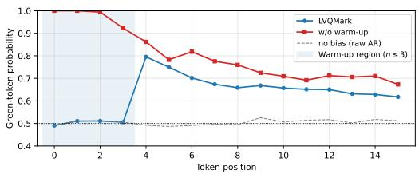  
(a) ETTh

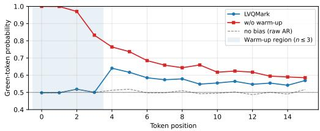  
(b) Energy  
Figure 3: Per-position green-token probability (T=64, δ=10). Shaded region: warm-up positions $( n \leq 3 )$ where the logit bias is suppressed.

Table 4 quantifies the impact on generation quality. Removing the warm-up alone degrades Context-FID moderately; removing both modifications together leads to further deterioration across most datasets, confirming that the two components address complementary failure modes.

Table 4: Ablation of watermark scheduling components for 64-length sequences (LVQMark). NO-WARMUP: unbiased warm-up removed. NO-ALT-WARMUP: both alternating partition and unbiased warm-up removed. Best results are in bold, and second-best are underlined.
<table><tr><td></td><td colspan="4">Stocks</td><td colspan="4">Energy</td><td colspan="4">ETTh</td><td colspan="4">fMRI</td></tr><tr><td>Variant</td><td>C-FID</td><td>Corr.</td><td>Disc.</td><td>Pred.</td><td>C-FID</td><td>Corr.</td><td>Disc.</td><td>Pred.</td><td>C-FID</td><td>Corr.</td><td>Disc.</td><td>Pred.</td><td>C-FID</td><td>Corr.</td><td>Disc.</td><td>Pred.</td></tr><tr><td>NO-ALT-WARMUP</td><td>0.222</td><td>0.007</td><td>0.094</td><td>0.036</td><td>0.114</td><td>1.060</td><td>0.203</td><td>0.250</td><td>0.172</td><td>0.098</td><td>0.027</td><td>0.119</td><td>0.324</td><td>1.362</td><td>0.199</td><td>0.093</td></tr><tr><td>NO-WARMUP</td><td>0.194</td><td>0.020</td><td>0.107</td><td>0.036</td><td>0.071</td><td>0.924</td><td>0.181</td><td>0.248</td><td>0.061</td><td>0.060</td><td>0.007</td><td>0.114</td><td>0.255</td><td>1.186</td><td>0.170</td><td>0.089</td></tr><tr><td>LVQMark</td><td>0.068</td><td>0.015</td><td>0.055</td><td>0.036</td><td>0.035</td><td>0.945</td><td>0.151</td><td>0.248</td><td>0.028</td><td>0.061</td><td>0.010</td><td>0.116</td><td>0.133</td><td>1.135</td><td>0.267</td><td>0.086</td></tr></table>

Across the four datasets, LVQMark consistently achieves the best or second-best quality on most metrics. Removing the unbiased warm-up alone degrades Context-FID and Correlational scores moderately, while removing both modifications together leads to further deterioration, particularly on ETTh, Energy, and fMRI. This incremental pattern confirms that the two modifications address complementary failure modes: the alternating partition mitigates the statistical artifact induced by repeated-token runs, while the unbiased warm-up prevents the stereotyped prefix from distorting

downstream generation. We adopt the full configuration as the default in all main experiments.   
Additional ablations for other sequence lengths are provided in Appendix D.2.

Robust encoder requires local tokenization. Table 5 compares SDformer and L-VQVAE with and without the attack-augmented robust encoder used in our framework. The robust encoder is itself effective: paired with L-VQVAE, it lifts Crop detection from near-zero to near-perfect across all datasets while preserving Offset and Insert. With SDformer, however, gains are uneven—substantial on Energy, marginal on ETTh, absent on Stocks—and on fMRI the encoder actively degrades detection, collapsing Offset from 1.00 to 0.05 and Insert from 1.00 to 0.03. Robust detection thus hinges not on attack-aware training alone, but on a local representation that supports stable per-region recovery. Additional experiments for other sequence lengths are provided in Appendix D.1.

Table 5: Results of watermark detection under attack for 64-length sequences. LVQMark is applied to different variants, and watermark detection performance (TPR) is evaluated under 30% attacks. Best results are in bold, and second-best are underlined.
<table><tr><td rowspan="2">Model</td><td></td><td colspan="3">Stocks</td><td colspan="3">Energy</td><td colspan="3">ETTh</td><td colspan="3">fMRI</td></tr><tr><td>Type</td><td>Offset</td><td>Crop</td><td>Insert</td><td>Offset Crop</td><td></td><td>Insert</td><td>Offset</td><td>Crop</td><td>Insert</td><td>Offset</td><td>Crop</td><td>Insert</td></tr><tr><td rowspan="2">SDformer</td><td>w/o Robust</td><td>0.00</td><td>0.01</td><td>0.00</td><td>1.00</td><td>0.02</td><td>0.58</td><td>0.00</td><td>0.00</td><td>0.00</td><td>1.00</td><td>0.02</td><td>1.00</td></tr><tr><td>w/ Robust</td><td>0.00</td><td>0.00</td><td>0.00</td><td>1.00</td><td>0.66</td><td>0.80</td><td>0.13</td><td>0.08</td><td>0.03</td><td>0.05</td><td>0.28</td><td>0.03</td></tr><tr><td rowspan="2">L-VQVAE</td><td>w/o Robust</td><td>1.00</td><td>0.00</td><td>1.00</td><td>1.00</td><td>0.00</td><td>1.00</td><td>1.00</td><td>0.01</td><td>1.00</td><td>1.00</td><td>1.00</td><td>1.00</td></tr><tr><td>w/ Robust</td><td>1.00</td><td>1.00</td><td>0.98</td><td>1.00</td><td>1.00</td><td>1.00</td><td>1.00</td><td>1.00</td><td>1.00</td><td>1.00</td><td>1.00</td><td>1.00</td></tr></table>

Detectability–quality trade-off in δ. Figure 4 shows how watermark strength δ affects the trade-off between watermark detectability and generation quality under our LVQMark, where δ = 0 denotes the non-watermarked baseline. As δ increases, watermark evidence becomes substantially stronger across Energy, ETTh, and fMRI, while Context-FID remains relatively stable at moderate strengths and increases more clearly only at larger values. This pattern indicates a clear trade-off: stronger bias improves detectability, but excessive bias can harm sample quality.

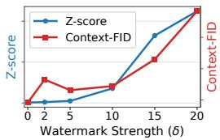  
(a) Stocks

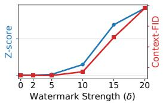  
(b) Energy

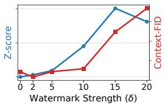  
(c) ETTh

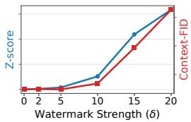  
(d) fMRI  
Figure 4: Z-score and Context-FID across watermark strength δ for 64-length

## 5 Conclusion and Limitations

In this work, we argued that false-positive reliability in time-series watermarking is fundamentally a re-encoding stability problem. Under post-editing attacks, watermark detection must first re-encode the observed continuous signal into an internal token representation, and when this re-encoding is globally coupled, post-editing attacks can distort the recovered evidence far beyond the attacked region. Motivated by this failure mode, we introduced L-VQVAE, a generative model in which each token depends only on a short temporal neighborhood, and built LVQMark on top of this locally recoverable interface with robust re-encoding and generation-time watermark injection. Across four datasets, L-VQVAE with LVQMark preserves competitive generation quality while substantially improving false-positive stability under post-editing attacks.

Limitations. Our experiments cover four multivariate time-series datasets and three sequence lengths; extending the evaluation to additional domains and longer horizons is a natural direction for future work. Robustness is assessed under three representative post-editing attacks—offset, crop, and insertion—at two strength levels. Because the robust encoder is a modular component trained independently of the generative model and the detection framework, accommodating new attack types requires only retraining $E _ { \rho } ^ { \star }$ on updated augmentation sets, without modifying L-VQVAE or the watermark schedule. Finally, the multi-stage training pipeline involves more steps than single-stage baselines, though each stage is standard and can be executed independently.

## References

[1] Kasra Arabi, R Teal Witter, Chinmay Hegde, and Niv Cohen. Seal: Semantic aware image watermarking. In Proceedings of the IEEE/CVF International Conference on Computer Vision, pages 16196–16205, 2025.

[2] Tom Brown, Benjamin Mann, Nick Ryder, Melanie Subbiah, Jared D Kaplan, Prafulla Dhariwal, Arvind Neelakantan, Pranav Shyam, Girish Sastry, Amanda Askell, et al. Language models are few-shot learners. Advances in neural information processing systems, 33:1877–1901, 2020.

[3] Luis Candanedo. Appliances energy prediction. UCI Machine Learning Repository, 10: C5VC8G, 2017.

[4] Zhicheng Chen, Shibo Feng, Zhong Zhang, Xi Xiao, Xingyu Gao, and Peilin Zhao. Sdformer: Similarity-driven discrete transformer for time series generation. Advances in Neural Information Processing Systems, 37:132179–132207, 2024.

[5] Paul England, Henrique S Malvar, Eric Horvitz, Jack W Stokes, Cédric Fournet, Rebecca Burke-Aguero, Amaury Chamayou, Sylvan Clebsch, Manuel Costa, John Deutscher, et al. Amp: Authentication of media via provenance. In Proceedings ofthe 12th ACM Multimedia Systems Conference, pages 108–121, 2021.

[6] Zhengmian Hu, Lichang Chen, Xidong Wu, Yihan Wu, Hongyang Zhang, and Heng Huang. Unbiased watermark for large language models. In The Twelfth International Conference on Learning Representations, 2024. URL https://openreview.net/forum?id=uWVC5FVidc.

[7] Mingjia Huo, Sai Ashish Somayajula, Youwei Liang, Ruisi Zhang, Farinaz Koushanfar, and Pengtao Xie. Token-specific watermarking with enhanced detectability and semantic coherence for large language models. In Proceedings ofthe 41st International Conference on Machine Learning, pages 20746–20767, 2024.

[8] Paul Jeha, Michael Bohlke-Schneider, Pedro Mercado, Shubham Kapoor, Rajbir Singh Nirwan, Valentin Flunkert, Jan Gasthaus, and Tim Januschowski. Psa-gan: Progressive self attention gans for synthetic time series. In The Tenth International Conference on Learning Representations, 2022.

[9] John Kirchenbauer, Jonas Geiping, Yuxin Wen, Jonathan Katz, Ian Miers, and Tom Goldstein. A watermark for large language models. In International conference on machine learning, pages 17061–17084. PMLR, 2023.

[10] Daesoo Lee, Sara Malacarne, and Erlend Aune. Vector quantized time series generation with a bidirectional prior model. In International Conference on Artificial Intelligence and Statistics, pages 7665–7693. PMLR, 2023.

[11] Shujian Liao, Hao Ni, Lukasz Szpruch, Magnus Wiese, Marc Sabate-Vidales, and Baoren Xiao. Conditional sig-wasserstein gans for time series generation. arXiv preprint arXiv:2006.05421, 2020.

[12] Andreas Müller, Denis Lukovnikov, Jonas Thietke, Asja Fischer, and Erwin Quiring. Black-box forgery attacks on semantic watermarks for diffusion models. In Proceedings of the Computer Vision and Pattern Recognition Conference, pages 20937–20946, 2025.

[13] Jonas Ricker, Denis Lukovnikov, and Asja Fischer. Aeroblade: Training-free detection of latent diffusion images using autoencoder reconstruction error. In Proceedings of the IEEE/CVF Conference on Computer Vision and Pattern Recognition, pages 9130–9140, 2024.

[14] Robin Rombach, Andreas Blattmann, Dominik Lorenz, Patrick Esser, and Björn Ommer. Highresolution image synthesis with latent diffusion models. In Proceedings of the IEEE/CVF conference on computer vision and pattern recognition, pages 10684–10695, 2022.

[15] Tom Sander, Pierre Fernandez, Alain Oliviero Durmus, Teddy Furon, and Matthijs Douze. Watermark anything with localized messages. In The Thirteenth International Conference on Learning Representations, 2025. URL https://openreview.net/forum?id=IkZVDzdC8M.

[16] Stephen M Smith, Karla L Miller, Gholamreza Salimi-Khorshidi, Matthew Webster, Christian F Beckmann, Thomas E Nichols, Joseph D Ramsey, and Mark W Woolrich. Network modelling methods for fmri. Neuroimage, 54(2):875–891, 2011.

[17] Zhi Wen Soi, Chaoyi Zhu, Fouad Abiad, Aditya Shankar, Jeroen M. Galjaard, Huijuan Wang, and Lydia Y. Chen. Timewak: Temporal chained-hashing watermark for time series data. In The Thirty-ninth Annual Conference on Neural Information Processing Systems, 2025. URL https://openreview.net/forum?id=akhhwQh6UV.

[18] Aaron Van Den Oord, Oriol Vinyals, et al. Neural discrete representation learning. Advances in neural information processing systems, 30, 2017.

[19] Yuxin Wen, John Kirchenbauer, Jonas Geiping, and Tom Goldstein. Tree-rings watermarks: Invisible fingerprints for diffusion images. Advances in Neural Information Processing Systems, 36:58047–58063, 2023.

[20] Yihan Wu, Ruibo Chen, Georgios Milis, and Heng Huang. An ensemble framework for unbiased language model watermarking. In The Fourteenth International Conference on Learning Representations, 2026. URL https://openreview.net/forum?id=iZ7i2y1YxO.

[21] Zijin Yang, Kai Zeng, Kejiang Chen, Han Fang, Weiming Zhang, and Nenghai Yu. Gaussian shading: Provable performance-lossless image watermarking for diffusion models. In Proceedings of the IEEE/CVF Conference on Computer Vision and Pattern Recognition, pages 12162–12171, 2024.

[22] Jinsung Yoon, Daniel Jarrett, and Mihaela Van der Schaar. Time-series generative adversarial networks. Advances in neural information processing systems, 32, 2019.

[23] Ning Yu, Vladislav Skripniuk, Sahar Abdelnabi, and Mario Fritz. Artificial fingerprinting for generative models: Rooting deepfake attribution in training data. In Proceedings of the IEEE/CVF International conference on computer vision, pages 14448–14457, 2021.

[24] Xinyu Yuan and Yan Qiao. Diffusion-TS: Interpretable diffusion for general time series generation. In The Twelfth International Conference on Learning Representations, 2024. URL https://openreview.net/forum?id=4h1apFjO99.

[25] Zhihan Yue, Yujing Wang, Juanyong Duan, Tianmeng Yang, Congrui Huang, Yunhai Tong, and Bixiong Xu. Ts2vec: Towards universal representation of time series. In Proceedings ofthe AAAI conference on artificial intelligence, volume 36, pages 8980–8987, 2022.

[26] Xuandong Zhao, Prabhanjan Vijendra Ananth, Lei Li, and Yu-Xiang Wang. Provable robust watermarking for AI-generated text. In The Twelfth International Conference on Learning Representations, 2024. URL https://openreview.net/forum?id=SsmT8aO45L.

[27] Haoyi Zhou, Shanghang Zhang, Jieqi Peng, Shuai Zhang, Jianxin Li, Hui Xiong, and Wancai Zhang. Informer: Beyond efficient transformer for long sequence time-series forecasting. In Proceedings of the AAAI conference on artificial intelligence, volume 35, pages 11106–11115, 2021.

## A Related Work

Discrete interfaces for time-series generation. Vector Quantization (VQ) [18] provides a discrete interface for continuous signals by mapping encoder outputs to entries in a learned codebook. The resulting code indices can be decoded back to the signal domain or modeled by a sequence prior. TimeVQVAE [10] and SDformer [4] show that such discrete token-based generators can be competitive with continuous-domain time-series generators [24] and preserve information useful for downstream classification or forecasting. However, these representations are not designed for re-encoding stability, or robustness to post-processing corruptions. These properties are essential for watermark detection, where a modified continuous signal must be re-encoded into a consistent token sequence before the watermark statistic can be computed.

Token-level generation-time watermarking. Generation-time watermarking is attractive because it embeds the watermark by steering the sampling process itself, rather than by directly perturbing the generated sample. This distinction is important because post-processing-based watermarking can directly alter generated samples and degrade quality [21]; in time-series generation, such perturbations may further distort temporal or cross-variate dependencies that are central to synthetic-data utility [22, 24]. The red-green watermarking framework [9] is a standard template for token-level generationtime watermarking in language models. At each sampling step, it partitions the vocabulary into a green set and its complement red set using a secret key, and adds a positive logit bias to the tokens in green set. This alters the sampling distribution, so that generated token sequences contain a detectable statistical bias. Subsequent methods [7, 6, 20] refine this mechanism by adapting the bias to token-level context or by designing unbiased rules that better preserve the original sampling distribution. We build on this distributional view, but instantiate it for time series over a local VQ token space. In contrast, our work focuses on detector-side re-encoding stability and false-positive behavior on attacked non-watermarked samples.

## B Experiment Details

## B.1 Implementation Details

Tables 6–7 summarize the hyperparameters used for each model. All models share the same data splits and preprocessing across datasets for fair comparison. Regarding the random replacement probability, during AR Transformer training each input token is independently replaced with a random codebook index with probability p, while ground-truth labels remain unchanged. This forces the model to predict the next token correctly even under corrupted context, preventing over-reliance on preceding tokens and improving generalization. For the standard VQ-VAE, which attends over the full token history, we set $p = 0 . 3$ for ETTh and Stocks — datasets with stronger temporal autocorrelation — and $p = 0 . 1$ for Energy and fMRI. For Local VQ-VAE, the AR Transformer restricts attention to a fixed lookback window of 6 tokens, which structurally limits long-range dependency; accordingly, $p = 0 . 1$ suffices across all datasets.

## B.2 Dataset Details

We use four multivariate time-series datasets spanning diverse domains. All datasets are segmented into overlapping windows of size $T \in \{ 2 4 , 6 4 , 1 2 8 \}$ with stride 1, yielding a set of fixed-length samples. Each sample is normalized per-variable to [−1, 1] via MinMax scaling. The resulting samples split 80%/20% into train and test sets. Table 8 summarizes the dataset statistics.

## B.3 Attack Settings

We evaluate detection robustness under three post-editing attacks: offset, insert, and crop. Each attack is applied with strength factor $\alpha \in \{ 0 . 0 5 , 0 . 3 0 \}$

The offset attack shifts each variable by $\alpha \times \bar { x } _ { d } .$ , where $\bar { x } _ { d }$ is the temporal mean of variable d in the sample. The insert attack replaces $\lfloor \alpha \dot { T } \rfloor$ randomly selected time steps with uniform random values drawn from the observed range of each variable. The crop attack removes a random rectangular region in the $( T , D )$ space, retaining a window of size $( 1 - \alpha ) T \times ( 1 - \alpha ) D$ at a randomly chosen position. The removed region is filled with the per-variable midpoint, defined as $( \operatorname* { m i n } + \operatorname* { m a x } ) / 2$ computed over the surviving window. Under standard min-max normalization followed by rescaling $\mathrm { t o } [ - 1 , 1 ]$ , this midpoint reduces to zero, making the fill semantically neutral. All model families use the same randomly drawn crop window at evaluation time.

Table 6: L-VQVAE hyperparameter settings. Stride 2 is used for window T=24; stride 4 for T=64, 128. † Robust encoder is trained with crop .
<table><tr><td>Parameter</td><td>Energy</td><td>ETTh</td><td>fMRI</td><td>Stocks</td></tr><tr><td>Encoder / Decoder</td><td></td><td></td><td></td><td></td></tr><tr><td>Feature size D</td><td>28</td><td>7</td><td>50</td><td>6</td></tr><tr><td> $d _ { \mathrm { m o d e l } }$ </td><td>512</td><td>512</td><td>512</td><td>128</td></tr><tr><td>Attention heads</td><td>8</td><td>8</td><td>8</td><td>4</td></tr><tr><td>Encoder layers</td><td>5</td><td>5</td><td>5</td><td>5</td></tr><tr><td>Local decoder layers</td><td>5</td><td>5</td><td>5</td><td>5</td></tr><tr><td>Global decoder layers</td><td>5</td><td>5</td><td>5</td><td>5</td></tr><tr><td>Receptive field r</td><td>4</td><td>4</td><td>4</td><td>4</td></tr><tr><td>Stride (T=24)</td><td>2</td><td>2</td><td>2</td><td>2</td></tr><tr><td>Stride (T=64, 128)</td><td>4</td><td>4</td><td>4</td><td>4</td></tr><tr><td>Codebook size K</td><td>4096</td><td>512</td><td>1024</td><td>1024</td></tr><tr><td>Codebook dim</td><td>512</td><td>512</td><td>512</td><td>128</td></tr><tr><td>Commitment weight</td><td>0.25</td><td>0.25</td><td>0.25</td><td>0.25 0.0</td></tr><tr><td>Dropout</td><td>0.0</td><td>0.0</td><td>0.0</td><td></td></tr><tr><td>AR Transformer</td><td></td><td></td><td></td><td></td></tr><tr><td>Nembd</td><td>1024</td><td>1024</td><td>1024</td><td>1024</td></tr><tr><td>Nhead</td><td>8</td><td>8</td><td>8</td><td>8</td></tr><tr><td>Nlayer</td><td>2</td><td>2</td><td>2</td><td>2</td></tr><tr><td>Random replace prob</td><td colspan="4"></td></tr><tr><td>Lookback</td><td></td><td></td><td></td><td></td></tr><tr><td>Watermark δ</td><td>10</td><td>10</td><td>10</td><td>20</td></tr><tr><td>Training</td><td></td><td></td><td></td><td></td></tr><tr><td>Optimizer</td><td></td><td>AdamW, β=(0.9, 0.99)</td><td></td><td></td></tr><tr><td>Batch size</td><td></td><td>128</td><td></td><td></td></tr><tr><td>Learning rate</td><td></td><td> $3 \times 1 0 ^ { - 4 }$ </td><td></td><td></td></tr><tr><td>Gradient clip</td><td></td><td>1.0</td><td></td><td></td></tr><tr><td>Pretrain steps (stage 1)</td><td></td><td>30,000</td><td></td><td></td></tr><tr><td>Decoder steps (stage 2)</td><td></td><td>10,000</td><td></td><td></td></tr><tr><td>Transformer steps (stage 3)</td><td></td><td>30,000</td><td></td><td></td></tr><tr><td>Robust Encoder†</td><td></td><td></td><td></td><td></td></tr><tr><td>dmodel</td><td>1024</td><td>1024</td><td>1024</td><td>256</td></tr><tr><td>Attention heads</td><td>16</td><td>16</td><td>16</td><td>4</td></tr><tr><td>Layers Receptive field r</td><td></td><td>3 4</td><td></td><td></td></tr><tr><td>Optimizer</td><td>AdamW, β=(0.9, 0.99)</td><td></td><td></td><td></td></tr><tr><td>Learning rate</td><td></td><td></td><td></td><td></td></tr><tr><td>Gradient clip</td><td></td><td> $1 \times 1 0 ^ { - 4 }$ </td><td></td><td></td></tr><tr><td>Training steps</td><td></td><td>1.0</td><td></td><td></td></tr><tr><td>Val interval</td><td></td><td>50,000 5,000</td><td></td><td></td></tr><tr><td></td><td></td><td></td><td></td><td></td></tr><tr><td>Attack augmentation (robust encoder training)</td><td></td><td></td><td></td><td></td></tr><tr><td>Clean (no attack)</td><td></td><td></td><td></td><td></td></tr><tr><td>Offset</td><td></td><td> $\mathrm { f a c t o r } \in \{ 0 . 0 5 , 0 . 3 0 \}$ </td><td></td><td></td></tr><tr><td> $\mathbf { c r o p } _ { \mathrm { v a r } } ^ { \dagger }$ </td><td></td><td> $\mathrm { f a c t o r } \in \{ 0 . 0 5 , 0 . 3 0 \}$ </td><td></td><td></td></tr><tr><td>Insertion</td><td></td><td> $\mathrm { f a c t o r } \in \{ 0 . 0 5 , 0 . 3 0 \}$ </td><td></td><td></td></tr></table>

For robust encoder training, we use an additional augmentation, $\mathbf { c r o p } _ { \mathrm { v a r } } .$ which retains a contiguous block of $( 1 - \alpha ) D$ variables over the full temporal axis and fills the remaining $\lfloor \alpha D \rfloor$ variables with the per-variable midpoint. $\mathbf { c r o p } _ { \mathrm { v a r } }$ differs from crop in that it preserves the temporal dimension and perturbs only the variable axis, thereby exposing the encoder to feature-level corruption without removing local temporal context entirely.

Table 7: SDformer hyperparameter settings.
<table><tr><td>Parameter</td><td>Energy</td><td>ETTh</td><td>fMRI</td><td>Stocks</td></tr><tr><td colspan="5">Encoder / Decoder</td></tr><tr><td>Feature size D</td><td>28</td><td>7</td><td>50</td><td>6</td></tr><tr><td>Hidden dim</td><td>512</td><td>512</td><td>512</td><td>512</td></tr><tr><td>Residual blocks</td><td>2</td><td>2</td><td>2</td><td>2</td></tr><tr><td>Downsample rate</td><td>4</td><td>4</td><td>4</td><td>4</td></tr><tr><td>EMA decay</td><td>0.99</td><td>0.99</td><td>0.99</td><td>0.99</td></tr><tr><td>Embed loss weight</td><td>0.01</td><td>0.5</td><td>0.01</td><td>2.0</td></tr><tr><td>Quantizer type</td><td></td><td>cosine</td><td></td><td></td></tr><tr><td>Codebook size K</td><td>512</td><td>512</td><td>512</td><td>512</td></tr><tr><td>Codebook dim</td><td>512</td><td>512</td><td>512</td><td>256</td></tr><tr><td>AR Transformer</td><td></td><td></td><td></td><td></td></tr><tr><td>Nembd</td><td>1024</td><td>1024</td><td>1024</td><td>1024</td></tr><tr><td>Nhead</td><td>8</td><td>8</td><td></td><td></td></tr><tr><td></td><td></td><td></td><td>8</td><td>8</td></tr><tr><td>Nlayer Random replace prob</td><td>2 0.1</td><td>6 0.3</td><td>2 0.1</td><td>2 0.3</td></tr><tr><td>Watermark δ</td><td colspan="4">10</td></tr><tr><td>Training Optimizer</td><td colspan="4">AdamW, β=(0.9, 0.99) 128</td></tr><tr><td>Batch size</td><td colspan="4">64 128 64</td></tr><tr><td>Learning rate</td><td colspan="4">3 × 10−4</td></tr><tr><td>Gradient clip</td><td colspan="4">1.0</td></tr><tr><td>VQ-VAE steps (stage 1)</td><td colspan="4">50,000</td></tr><tr><td>Transformer steps (stage 2)</td><td colspan="4">50,000</td></tr></table>

Table 8: Details of datasets used in experiments.
<table><tr><td>Dataset</td><td># Timesteps</td><td># Features</td><td>Source</td></tr><tr><td>Stocks</td><td>3,685</td><td>6</td><td>https://finance.yahoo.com</td></tr><tr><td>ETTh</td><td>17,420</td><td>7</td><td>https://github.com/zhouhaoyi/ETDataset</td></tr><tr><td>Energy</td><td>19,735</td><td>28</td><td>https://archive.ics.uci.edu</td></tr><tr><td>fMRI</td><td>10,000</td><td>50</td><td>https://www.fmrib.ox.ac.uk/datasets</td></tr></table>

## B.4 Evaluation Metrics

Context-FID Context-FID is an evaluation metric proposed by Jeha et al. [8] to measure the distributional gap between real and generated time series. It can be viewed as a time-series-oriented extension of the conventional Fréchet Inception Distance (FID), which is widely used in image generation tasks.

The key difference from image-based FID lies in the feature representation. While standard FID extracts image embeddings using an Inception network, Context-FID employs TS2Vec [25], a representation model specifically designed for time series. Since TS2Vec captures temporal characteristics of sequential data, the resulting distance is more suitable for assessing synthetic time series quality.

Yue et al. [25] further observed that generative models achieving lower Context-FID scores often show stronger downstream forecasting performance. This suggests that Context-FID reflects not only super ficial similarity but also useful temporal distributional alignment. Accordingly, a smaller Context-FID value indicates that the generated time series more closely match the real data distribution.

Correlational score The correlational score evaluates whether synthetic time series reproduce the inter-variable dependency patterns observed in real data. To this end, we first compute the covariance between the i-th and j-th variables over the temporal dimension. Following [11], the covariance is defined as:

$$
\mathrm { C o v } _ { i , j } = \frac { 1 } { W } \sum _ { t = 1 } ^ { W } K _ { i } ^ { t } K _ { j } ^ { t } - \left( \frac { 1 } { W } \sum _ { t = 1 } ^ { W } K _ { i } ^ { t } \right) \left( \frac { 1 } { W } \sum _ { t = 1 } ^ { W } K _ { j } ^ { t } \right) .
$$

Here, W is the sequence length, and $K _ { i } ^ { t }$ and $K _ { i } ^ { t }$ denote the values of the i-th and j-th features at time step t. The covariance is obtained by subtracting the product of the two feature means from the mean of their element-wise products.

After computing covariance matrices for both real and synthetic data, we compare their normalized correlation structures using the following discrepancy measure [24]:

$$
\frac { 1 } { 1 0 } \sum _ { i , j } ^ { d } \left| \frac { \mathrm { C o v } _ { i , j } ^ { R } } { \sqrt { \mathrm { C o v } _ { i , i } ^ { R } \mathrm { C o v } _ { j , j } ^ { R } } } - \frac { \mathrm { C o v } _ { i , j } ^ { S } } { \sqrt { \mathrm { C o v } _ { i , i } ^ { S } \mathrm { C o v } _ { j , j } ^ { S } } } \right| .
$$

In the equation above, superscripts R and S indicate real and synthetic data, respectively, and d denotes the number of features. The summation is computed over all feature pairs. A smaller correlational score means that the synthetic data better preserves the pairwise correlation structure of the real data.

Discriminative score The discriminative score measures the distinguishability between real and synthetic time series. Specifically, a classifier is trained to predict whether each sample comes from the real dataset or the generated dataset, and the score is calculated as |accuracy − 0.5|.

If the generated samples are highly realistic, the classifier should not be able to reliably distinguish them from real samples, and its accuracy should approach 0.5. Therefore, lower discriminative scores indicate better generation quality. Following the evaluation protocol of TimeGAN [22], we use a two-layer GRU classifier for this evaluation.

Predictive score The predictive score assesses whether generated time series preserve temporal patterns that are useful for forecasting. Rather than directly measuring visual or statistical similarity, this metric evaluates the utility of generated sequences in a prediction task.

Following the evaluation protocol of TimeGAN [22], we use a one-layer GRU-based predictor. We report the mean absolute error (MAE) between the predicted values and the ground-truth values on the test set. A lower predictive score indicates that the synthetic data better preserves the temporal dynamics required for sequence prediction.

Z-score The Z-score is used to evaluate the detectability of watermarks. It measures how far the detection statistic of watermarked samples deviates from that of non-watermarked samples. This metric is naturally connected to hypothesis testing. The null hypothesis $H _ { 0 }$ assumes that the sample does not contain a watermark generated by the corresponding watermarking method.

When the Z-score is close to zero, the watermarked and non-watermarked samples are statistically difficult to separate. A sufficiently large positive Z-score, in contrast, provides evidence against $\dot { H _ { 0 } }$ and supports the conclusion that a watermark is present.

We consider methods that produce a scalar per-sample detection statistic $x _ { i } ,$ such as bit accuracy for TimeWak [17] or green-list ratio for LVQMark. For these methods, the $\mathrm { _ { Z } }$ -score is computed at the population level via a subsampled-mean construction. Let $\mu _ {  { N } }  { \boldsymbol { W } }$ and $\sigma _ { N W }$ denote the mean and standard deviation of $x _ { i }$ over a non-watermarked, attack-free reference set generated by the same model. Following TimeWak [17], we draw B = 100 subsamples of size $n = 1 0 0 0$ without replacement. For each replicate $b ,$ we compute

$$
Z _ { b } = \frac { \bar { x } ^ { ( b ) } - \mu _ { N W } } { \sigma _ { N W } / \sqrt { n } } .
$$

We then report $\overline { { Z } } = \mathrm { m e a n } ( Z _ { b } ) , \sigma _ { Z } = \mathrm { s t d } ( Z _ { b } ) $ , and the empirical decision threshold Pr $\left( Z _ { b } > \Phi ^ { - 1 } ( 0 . 9 9 9 ) \right) \approx 3 . 0 9 0 2$

TPR@X%FPR TPR@X%FPR is the true positive rate at a threshold calibrated to yield an X% false positive rate on clean non-watermarked samples. It measures detection power under a fixed false-positive constraint, which is particularly important in provenance verification, where false positives can lead to incorrect attribution of synthetic content. In our setting, this metric allows us to compare how reliably different methods detect watermarked samples when they are required to satisfy the same nominal false-positive budget.

## B.5 Compute Resources

All experiments were conducted on a server with three GPUs: one NVIDIA H100 PCIe (80 GB) and two NVIDIA RTX PRO 6000 Blackwell Server Edition (96 GB each), an Intel Xeon Gold 6444Y dual-socket CPU (64 logical cores, up to 4.0 GHz).

## C Effect of Partition Rules on Robust Detection

Tables 9 and 10 compare the context-dependent KGW partition with our context-independent partition under 5% and 30% attacks, respectively. Under the KGW rule, the green set at position n is determined by the recovered token at $n { - } 1 .$ , so a single re-encoding error can affect the partition at the next position and propagate a local perturbation beyond the attacked region. In contrast, our context-independent partition depends only on the position index and the secret key, eliminating this cross-position coupling and confining each re-encoding error to its originating position. As a result, our partition consistently yields higher watermark Z-scores across datasets and attack types under both attack strengths. This shows that the robustness benefit of preserving locality is systematic rather than specific to the stronger 30% setting. Combined with parity alternation and the bias-free warm-up (Section 3.2.1), the proposed design leads to more stable recovered evidence and stronger overall watermark detectability.

Table 9: Partition rule comparison. Z-scores under 30% attacks. Best results are in bold.
<table><tr><td>Partition</td><td>Offset</td><td>Stocks Crop</td><td>Insert.</td><td>Offset</td><td>Energy</td><td></td><td>ETTh</td><td></td><td></td><td>fMRI</td><td></td></tr><tr><td>KGW</td><td>14.96</td><td>5.38</td><td>2.76</td><td>14.73</td><td>Crop 10.06</td><td>Insert. 9.98</td><td>Offset Crop 10.51 8.14</td><td>Insert. 7.26</td><td>Offset 12.71</td><td>Crop 13.12</td><td>Insert. 9.31</td></tr><tr><td>Ours</td><td>15.39</td><td>16.19</td><td>9.16</td><td>17.30</td><td>13.77</td><td>13.14</td><td>17.10 16.09</td><td>13.31</td><td>14.55</td><td>16.72</td><td>11.88</td></tr></table>

Table 10: Partition rule comparison. Z-scores under 5% attacks. Best results are in bold.
<table><tr><td colspan="4">Stocks</td><td colspan="2">Energy</td><td colspan="2"></td><td colspan="2">ETTh</td><td colspan="2">fMRI</td></tr><tr><td>Partition</td><td>Offset</td><td>Crop</td><td>Insert</td><td>Offset</td><td>Crop</td><td>Insert</td><td>Offset Crop</td><td>Insert</td><td>Offset</td><td>Crop</td><td>Insert</td></tr><tr><td>KGW</td><td>12.95</td><td>8.62</td><td>8.44</td><td>14.80</td><td>13.30</td><td>14.27</td><td>11.09</td><td>9.02 10.55</td><td>12.77</td><td>13.14</td><td>12.66</td></tr><tr><td>Ours</td><td>19.51</td><td>15.80</td><td>16.37</td><td>17.35</td><td>15.74 16.98</td><td></td><td>17.65</td><td>16.53 17.80</td><td>14.68</td><td>15.19</td><td>14.49</td></tr></table>

## D Experimental Results For Other Lengths

This section provides additional results for other sequence lengths $( T = 2 4 , 1 2 8 )$ and complements the main analysis at $T = 6 4$ . The overall trend is consistent with the main results.

## D.1 Watermark Detection and Generation Quality

False-positive behavior under post-editing attacks Tables 11 and 12 extend the analysis of bidirectional null shift in Section 4.2 to other sequence lengths. Consistent with the main results, the same qualitative pattern persists across other sequence lengths, further supporting that the attacked null remains stable under L-VQVAE with LVQMark while existing baselines exhibit substantial drift.

Table 11: Results of synthetic time series watermark detection and quality. Watermarked (TPR) and Non-watermarked (FPR, mean z-score) detections are evaluated under 30% attacks. Quality metrics are for 24-length. Best results are in bold, and second-best are underlined. Z-scores with |z| > 3.09 are marked in red.
<table><tr><td colspan="3">Setting</td><td colspan="3">Watermark (TPR ↑)</td><td colspan="4">Non-watermarked (FPR ↓| Z-score)</td><td colspan="2"></td><td colspan="3">Quality Metric (↓)</td></tr><tr><td>Dataset</td><td>Model</td><td>Method</td><td>Offset</td><td>Crop</td><td>Insert</td><td></td><td>Offset</td><td>Crop</td><td></td><td>Insert</td><td></td><td>C-FID Corr.</td><td>Disc.</td><td>Pred.</td></tr><tr><td rowspan="5">Stocks</td><td rowspan="3">DiffusionTS</td><td>TR</td><td>0.00</td><td>1.00</td><td>0.00</td><td>0.00</td><td>+0.19</td><td>1.00 +63.26</td><td></td><td>0.00</td><td>+1.91</td><td>0.96</td><td>0.10 0.20</td><td>0.04</td></tr><tr><td>GS</td><td>1.00</td><td>0.45</td><td>1.00</td><td>0.00</td><td>-1.15</td><td>0.00</td><td>-6.32</td><td>0.00</td><td>+0.16</td><td>8.88</td><td>0.09 0.43</td><td>0.04</td></tr><tr><td></td><td>TimeWak</td><td>1.00</td><td>1.00</td><td>1.00</td><td>0.00</td><td>-0.99</td><td>0.02 +1.39</td><td>0.00</td><td>-1.77</td><td>0.33</td><td>0.02</td><td>0.16</td><td>0.04</td></tr><tr><td>SDformer</td><td>LVQMark</td><td>0.13</td><td>0.81</td><td>0.22</td><td>0.00</td><td>+0.51</td><td>0.86</td><td>+4.49</td><td>0.01</td><td>+1.33</td><td>0.11</td><td>0.01 0.02</td><td>0.04</td></tr><tr><td>L-VQVAE</td><td>LVQMark</td><td>1.00</td><td>0.99</td><td>0.98</td><td>0.00</td><td>-0.25</td><td>0.04</td><td>+1.10</td><td>0.02</td><td>+0.38</td><td>0.07</td><td>0.01 0.11</td><td>0.04</td></tr><tr><td rowspan="5">ETTh</td><td rowspan="2">DiffusionTS</td><td>TR</td><td>1.00</td><td>1.00</td><td>1.00</td><td>0.00</td><td>+0.95</td><td>1.00</td><td>+10.84</td><td>1.00</td><td>+15.97</td><td>1.56 0.18</td><td>0.27</td><td>0.14</td></tr><tr><td>GS</td><td>1.00</td><td>1.00</td><td>1.00</td><td>1.00</td><td>+12.01</td><td>1.00+18.58</td><td></td><td>1.00</td><td>+6.96</td><td>4.66</td><td>0.42 0.38</td><td>0.19</td></tr><tr><td></td><td>TimeWak</td><td>1.00</td><td>0.48</td><td>1.00</td><td>0.00</td><td>-0.34</td><td>0.02</td><td>+1.05</td><td>0.00</td><td>-1.68</td><td>0.23 0.21</td><td>0.08</td><td>0.12</td></tr><tr><td>SDformer</td><td>LVQMark</td><td>0.98</td><td>0.03</td><td>0.07</td><td>0.01</td><td>+0.79</td><td>0.01</td><td>+0.18</td><td>0.00</td><td>+0.70</td><td>0.13 0.08</td><td>0.04</td><td>0.12</td></tr><tr><td>L-VQVAE</td><td>LVQMark</td><td>1.00</td><td>1.00</td><td>1.00</td><td>0.00</td><td>+0.03</td><td>0.01</td><td>+0.41</td><td>0.00</td><td>-0.15</td><td>0.05 0.05</td><td>0.02</td><td>0.12</td></tr><tr><td rowspan="6">Energy</td><td rowspan="2"></td><td>TR</td><td>0.00</td><td>1.00</td><td>1.00</td><td>0.00</td><td>+0.43</td><td>1.00</td><td>+39.25</td><td>1.00</td><td>+26.77</td><td>0.43</td><td>2.66 0.41</td><td>0.30</td></tr><tr><td>DiffusionTS GS</td><td>1.00</td><td>1.00</td><td>1.00</td><td>1.00</td><td>+13.17</td><td>1.00</td><td>+65.49</td><td>1.00</td><td>+14.31</td><td>1.58</td><td>3.37 0.49</td><td>0.33</td></tr><tr><td></td><td>TimeWak</td><td>1.00</td><td>1.00</td><td>1.00</td><td>0.00</td><td>+0.33</td><td>0.99</td><td>+6.03</td><td>0.00</td><td>-1.22</td><td>0.09 1.53</td><td>0.14</td><td>0.25</td></tr><tr><td>SDformer</td><td>LVQMark</td><td>1.00</td><td>0.76</td><td>1.00</td><td>0.00</td><td>+0.29</td><td>0.07</td><td>+1.48</td><td>0.00</td><td>+0.32</td><td>0.12 1.27</td><td>0.23</td><td>0.25</td></tr><tr><td>L-VQVAE</td><td>LVQMark</td><td>1.00</td><td>1.00</td><td>1.00</td><td>0.00</td><td>-0.16</td><td>0.00</td><td>-0.19</td><td>0.00</td><td>-0.03</td><td>0.03 1.02</td><td>0.09</td><td>0.25</td></tr><tr><td></td><td>TR</td><td>0.04</td><td>0.00</td><td>0.00</td><td>0.00</td><td>+0.42</td><td>0.00</td><td>+1.00</td><td>1.00</td><td>+4.89</td><td>2.26 13.42</td><td>0.50</td><td>0.15</td></tr><tr><td rowspan="5">fMRI</td><td>DiffusionTS</td><td>GS</td><td>1.00</td><td>1.00</td><td>1.00</td><td>0.24</td><td>+2.33</td><td>0.00</td><td>-2.26</td><td>0.00</td><td>-6.16</td><td>0.71 15.21</td><td>0.50</td><td>0.11</td></tr><tr><td></td><td>TimeWak</td><td>1.00</td><td>1.00</td><td>1.00</td><td>0.00</td><td>+0.19</td><td>0.22</td><td>+2.39</td><td>0.00</td><td>+0.26</td><td>0.18</td><td>1.98 0.09</td><td>0.10</td></tr><tr><td>SDformer</td><td>LVQMark</td><td>1.00</td><td>0.99</td><td>1.00</td><td>0.00</td><td>+0.14</td><td>0.01</td><td>-0.41</td><td>0.01</td><td>+0.01</td><td>0.94</td><td>3.25 0.21</td><td>0.10</td></tr><tr><td>L-VQVAE</td><td>LVQMark</td><td>1.00</td><td>1.00</td><td>1.00</td><td>0.00</td><td>+0.11</td><td>0.02</td><td>-0.23</td><td>0.00</td><td>-0.05</td><td>0.20</td><td>1.92 0.23</td><td>0.10</td></tr><tr><td></td><td></td><td></td><td></td><td></td><td></td><td></td><td></td><td></td><td></td><td></td><td></td><td></td><td></td></tr></table>

Table 12: Results of synthetic time series watermark detection and quality. Watermarked (TPR) and Non-watermarked (FPR, mean z-score) detections are evaluated under 30% attacks. Quality metrics are for 128-length. Best results are in bold, and second-best are underlined. Z-scores with |z| > 3.09 are marked in red.
<table><tr><td></td><td>Setting</td><td></td><td colspan="2">Watermark (TPR ↑)</td><td></td><td colspan="4">Non-watermarked (FPR ↓| Z-score)</td><td colspan="4">Quality Metric (↓)</td></tr><tr><td>Dataset</td><td>Model</td><td>Method</td><td>Offset Crop</td><td></td><td>Insert</td><td>Offset</td><td></td><td>Crop</td><td>Insert</td><td>C-FID</td><td>Corr.</td><td>Disc.</td><td>Pred.</td></tr><tr><td rowspan="5">Stocks</td><td rowspan="2">DiffusionTS</td><td>TR</td><td>0.00</td><td>1.00</td><td>1.00</td><td>0.00</td><td>+0.30</td><td>1.00 +84.66</td><td>1.00 +20.60</td><td></td><td>3.05</td><td>0.09 0.24</td><td>0.04</td></tr><tr><td>GS</td><td>1.00</td><td>0.04</td><td>1.00</td><td>0.00</td><td>-4.40 0.00</td><td>-10.04</td><td>0.00</td><td>-5.22 2.63</td><td>0.04</td><td>0.19</td><td>0.04</td></tr><tr><td></td><td>TimeWak</td><td>1.00</td><td>1.00</td><td>1.00</td><td>0.00 -0.16</td><td>0.00</td><td>-4.18 0.69</td><td>+3.74</td><td>0.34</td><td>0.01</td><td>0.15</td><td>0.04</td></tr><tr><td>SDformer</td><td>LVQMark</td><td>0.00</td><td>0.00</td><td>0.00</td><td>0.00</td><td>-0.54 0.00</td><td>-0.89</td><td>0.00 -1.20</td><td>0.12</td><td>0.01</td><td>0.03</td><td>0.04</td></tr><tr><td>L-VQVAE</td><td>LVQMark</td><td>1.00</td><td>1.00</td><td>1.00</td><td>0.00</td><td>+0.09 0.00</td><td>-0.09</td><td>0.00 +0.23</td><td>0.08</td><td>0.01</td><td>0.18</td><td>0.04</td></tr><tr><td rowspan="5">ETTh</td><td rowspan="2">DiffusionTS</td><td>TR</td><td>0.00</td><td>1.00</td><td>1.00</td><td>0.00</td><td>+1.52 1.00</td><td>+12.19</td><td>1.00 +36.77</td><td>2.52</td><td>0.26</td><td>0.30</td><td>0.13</td></tr><tr><td>GS</td><td>1.00</td><td>1.00</td><td>1.00</td><td>0.00</td><td>-6.09 0.00</td><td>-13.71</td><td>0.00</td><td>-6.37 5.59</td><td>0.23</td><td>0.39</td><td>0.15</td></tr><tr><td></td><td>TimeWak</td><td>1.00</td><td>0.92</td><td>1.00</td><td>0.02 +1.09</td><td>0.00</td><td>-1.63 0.00</td><td>+0.77</td><td>1.08</td><td>0.18</td><td>0.15</td><td>0.11</td></tr><tr><td>SDformer</td><td>LVQMark</td><td>0.14</td><td>0.04</td><td>0.04</td><td>0.00</td><td>+0.53 0.01</td><td>+0.76</td><td>0.00 +1.01</td><td>0.04</td><td>0.05</td><td>0.03</td><td>0.11</td></tr><tr><td>L-VQVAE</td><td>LVQMark</td><td>1.00</td><td>1.00</td><td>1.00</td><td>0.00</td><td>-0.04 0.00</td><td>-0.05</td><td>0.00 -0.30</td><td>0.04</td><td>0.05</td><td>0.02</td><td>0.11</td></tr><tr><td rowspan="5">Energy</td><td></td><td>TR</td><td>0.00</td><td>1.00</td><td>1.00</td><td>0.00</td><td>+2.20 1.00</td><td>+61.47</td><td>1.00 +98.65</td><td>0.50</td><td>1.65</td><td>0.49</td><td>0.28</td></tr><tr><td>DiffusionTS</td><td>GS</td><td>1.00</td><td>1.00</td><td>1.00</td><td>1.00</td><td>+15.43</td><td>1.00 +48.30</td><td>1.00</td><td>+27.89 3.34</td><td>3.59</td><td>0.48</td><td>0.29</td></tr><tr><td></td><td>TimeWak</td><td>1.00</td><td>0.10</td><td>1.00</td><td>0.00</td><td>-1.57 0.00</td><td>-0.78</td><td>0.00</td><td>+0.66 0.17</td><td>1.50</td><td>0.24</td><td>0.25</td></tr><tr><td>SDformer</td><td>LVQMark</td><td>1.00</td><td>0.00</td><td>0.32</td><td>0.00</td><td>+0.06 0.00</td><td>-0.65</td><td>0.00</td><td>-0.08 0.04</td><td>0.67</td><td>0.05</td><td>0.25</td></tr><tr><td>L-VQVAE</td><td>LVQMark</td><td>1.00</td><td>0.99</td><td>1.00</td><td>0.00</td><td>-0.03 0.02</td><td>+0.00</td><td>0.00</td><td>+0.13 0.03</td><td>0.74</td><td>0.19</td><td>0.24</td></tr><tr><td rowspan="5">fMRI</td><td></td><td>TR</td><td>0.00</td><td>1.00</td><td>1.00</td><td>0.00</td><td>+0.02 1.00</td><td>+6.33</td><td>1.00 +21.25</td><td>4.57 1.05</td><td>14.15 5.97</td><td>0.45</td><td>0.17</td></tr><tr><td>DiffusionTS</td><td>GS</td><td>1.00</td><td>1.00</td><td>1.00</td><td>0.00</td><td>-0.70</td><td>0.00 -57.42</td><td>0.07</td><td>+0.52</td><td></td><td>0.50</td><td>0.11</td></tr><tr><td></td><td>TimeWak</td><td>1.00</td><td>1.00</td><td>1.00</td><td>0.00</td><td>-0.07 0.00</td><td>-3.03 -0.25</td><td>0.00 -1.95</td><td>0.81 0.09</td><td>1.81</td><td>0.36</td><td>0.10</td></tr><tr><td>SDformer</td><td>LVQMark</td><td>0.10 1.00</td><td>0.02 1.00</td><td>0.03 1.00</td><td>0.00 0.00</td><td>-0.03 0.01 -0.09</td><td>0.00 +0.16</td><td>0.00 0.00</td><td>-0.15 -0.01 0.13</td><td>0.84</td><td>0.16</td><td>0.08</td></tr><tr><td>L-VQVAE</td><td>LVQMark</td><td></td><td></td><td></td><td></td><td></td><td></td><td></td><td></td><td>0.90</td><td>0.06</td><td>0.08</td></tr></table>

Generation quality Tables 13 and 14 show the generation quality results for sequence lengths 24 and 128, respectively. L-VQVAE remains competitive in quality while improving watermark reliability under attack.

## D.2 Component Analysis and Ablations

Effect of watermark scheduling Tables 15 and 16 extend the scheduling ablation in Section 4.3 to other sequence lengths. We compare the default configuration against variants without unbiased warm-up (NO-WARMUP) and without both alternating partition and unbiased warm-up (NO-ALT-WARMUP). Overall, the default configuration yields the most consistent quality across datasets, and the degradation is typically larger when both components are removed. These trends are broadly consistent with the main results at 64-length.

Table 13: Results of synthetic time series quality for 24-length sequences. Best results are in bold, and second-best are underlined.
<table><tr><td></td><td colspan="4">Stocks</td><td colspan="4">Energy</td><td colspan="4">ETTh</td><td colspan="4">fMRI</td></tr><tr><td>Model</td><td>C-FID</td><td>Corr.</td><td>Disc.</td><td>Pred.</td><td>C-FID</td><td>Corr.</td><td>Disc.</td><td>Pred.</td><td>C-FID</td><td>Corr.</td><td>Disc.</td><td>Pred.</td><td>C-FID</td><td>Corr.</td><td>Disc.</td><td>Pred.</td></tr><tr><td>TimeVQVAE</td><td>0.507</td><td>0.049</td><td>0.361</td><td>0.047</td><td>2.527</td><td>6.632</td><td>0.476</td><td>0.383</td><td>4.417</td><td>0.263</td><td>0.415</td><td>0.199</td><td>12.532</td><td>61.599</td><td>0.459</td><td>0.156</td></tr><tr><td>DiffusionTS</td><td>0.329</td><td>0.022</td><td>0.160</td><td>0.037</td><td>0.087</td><td>1.534</td><td>0.137</td><td>0.253</td><td>0.231</td><td>0.212</td><td>0.078</td><td>0.121</td><td>0.181</td><td>1.976</td><td>0.085</td><td>0.100</td></tr><tr><td>SDformer</td><td>0.028</td><td>0.009</td><td>0.023</td><td>0.037</td><td>0.030</td><td>1.088</td><td>0.093</td><td>0.252</td><td>0.036</td><td>0.066</td><td>0.010</td><td>0.120</td><td>0.114</td><td>1.833</td><td>0.056</td><td>0.092</td></tr><tr><td>L-VQVAE</td><td>0.034</td><td>0.010</td><td>0.140</td><td>0.037</td><td>0.018</td><td>1.008</td><td>0.033</td><td>0.252</td><td>0.029</td><td>0.052</td><td>0.018</td><td>0.117</td><td>0.105</td><td>1.875</td><td>0.209</td><td>0.095</td></tr></table>

Table 14: Results of synthetic time series quality for 128-length sequences. Best results are in bold, and second-best are underlined.
<table><tr><td></td><td colspan="4">Stocks</td><td colspan="4">Energy</td><td colspan="4">ETTh</td><td colspan="4">fMRI</td></tr><tr><td>Model</td><td>C-FID</td><td>Corr.</td><td>Disc.</td><td>Pred.</td><td>C-FID</td><td>Corr.</td><td>Disc.</td><td>Pred.</td><td>C-FID</td><td>Corr.</td><td>Disc.</td><td>Pred.</td><td>C-FID</td><td>Corr.</td><td>Disc.</td><td>Pred.</td></tr><tr><td>TimeVQVAE</td><td>0.293</td><td>0.087</td><td>0.135</td><td>0.039</td><td>7.738</td><td>6.631</td><td>0.498</td><td>0.344</td><td>2.205</td><td>0.251</td><td>0.256</td><td>0.143</td><td>30.672</td><td>45.692</td><td>0.250</td><td>0.149</td></tr><tr><td>DiffusionTS</td><td>0.344</td><td>0.014</td><td>0.152</td><td>0.037</td><td>0.169</td><td>1.505</td><td>0.235</td><td>0.249</td><td>1.075</td><td>0.175</td><td>0.145</td><td>0.113</td><td>0.810</td><td>1.812</td><td>0.357</td><td>0.100</td></tr><tr><td>SDformer</td><td>0.128</td><td>0.013</td><td>0.032</td><td>0.036</td><td>0.032</td><td>0.708</td><td>0.057</td><td>0.244</td><td>0.032</td><td>0.050</td><td>0.062</td><td>0.113</td><td>0.064</td><td>0.801</td><td>0.176</td><td>0.080</td></tr><tr><td>L-VQVAE</td><td>0.038</td><td>0.013</td><td>0.035</td><td>0.036</td><td>0.031</td><td>0.733</td><td>0.155</td><td>0.246</td><td>0.039</td><td>0.052</td><td>0.025</td><td>0.107</td><td>0.096</td><td>0.895</td><td>0.054</td><td>0.082</td></tr></table>

Table 15: Ablation of watermark scheduling components for 24-length sequences (LVQMark). NO-WARMUP: unbiased warm-up removed. NO-ALT-WARMUP: both alternating partition and unbiased warm-up removed. Best results are in bold, and second-best are underlined.
<table><tr><td></td><td colspan="4">Stocks</td><td colspan="4">Energy</td><td colspan="4">ETTh</td><td colspan="4">fMRI</td></tr><tr><td>Variant</td><td>C-FID</td><td>Corr.</td><td>Disc.</td><td>Pred.</td><td>C-FID</td><td>Corr.</td><td>Disc.</td><td>Pred.</td><td>C-FID</td><td>Corr.</td><td>Disc.</td><td>Pred.</td><td>C-FID</td><td>Corr.</td><td>Disc.</td><td>Pred.</td></tr><tr><td>NO-ALT-WARMUP</td><td>0.211</td><td>0.014</td><td>0.141</td><td>0.037</td><td>0.081</td><td>1.172</td><td>0.151</td><td>0.254</td><td>0.180</td><td>0.113</td><td>0.066</td><td>0.123</td><td>0.419</td><td>2.350</td><td>0.298</td><td>0.101</td></tr><tr><td>NO-WARMUP</td><td>0.160</td><td>0.013</td><td>0.224</td><td>0.037</td><td>0.060</td><td>1.063</td><td>0.130</td><td>0.253</td><td>0.093</td><td>0.059</td><td>0.039</td><td>0.123</td><td>0.346</td><td>2.067</td><td>0.296</td><td>0.098</td></tr><tr><td>LVQMark</td><td>0.074</td><td>0.007</td><td>0.110</td><td>0.037</td><td>0.028</td><td>1.022</td><td>0.090</td><td>0.252</td><td>0.046</td><td>0.048</td><td>0.021</td><td>0.117</td><td>0.200</td><td>1.920</td><td>0.229</td><td>0.097</td></tr></table>

Table 16: Ablation of watermark scheduling components for 128-length sequences (LVQMark). NO-WARMUP: unbiased warm-up removed. NO-ALT-WARMUP: both alternating partition and unbiased warm-up removed. Best results are in bold, and second-best are underlined.
<table><tr><td></td><td colspan="4">Stocks</td><td colspan="4">Energy</td><td colspan="4">ETTh</td><td colspan="4">fMRI</td></tr><tr><td>Variant</td><td>C-FID</td><td>Corr.</td><td>Disc.</td><td>Pred.</td><td>C-FID</td><td>Corr.</td><td>Disc.</td><td>Pred.</td><td>C-FID</td><td>Corr.</td><td>Disc.</td><td>Pred.</td><td>C-FID</td><td>Corr.</td><td>Disc.</td><td>Pred.</td></tr><tr><td>NO-ALT-WARMUP</td><td>0.185</td><td>0.008</td><td>0.148</td><td>0.036</td><td>0.093</td><td>0.869</td><td>0.235</td><td>0.247</td><td>0.166</td><td>0.083 0.035</td><td></td><td>0.111</td><td>0.257</td><td>1.023</td><td>0.134</td><td>0.084</td></tr><tr><td>NO-WARMUP</td><td>0.095</td><td>0.007</td><td>0.120</td><td>0.036</td><td>0.066</td><td>0.774</td><td>0.200</td><td>0.246</td><td>0.073</td><td>0.063</td><td>0.027</td><td>0.108</td><td>0.198</td><td>0.900</td><td>0.086</td><td>0.084</td></tr><tr><td>LVQMark</td><td>0.079</td><td>0.009</td><td>0.179</td><td>0.036</td><td>0.033</td><td>0.740</td><td>0.190</td><td>0.244</td><td>0.042</td><td>0.050</td><td>0.021</td><td>0.108</td><td>0.127</td><td>0.896</td><td>0.060</td><td>0.082</td></tr></table>

Effect of local tokenization on robust detection Tables 17 and 18 extend the analysis of Section 4.3 to other sequence lengths by comparing models with and without robust encoder. These results show that robust re-encoding alone is insufficient without a locally recoverable token representation.

Table 17: Results of watermark detection under attack for 24-length sequences. LVQMark is applied to different variants, and watermark detection performance (TPR) is evaluated under 30% attacks. Best results are in bold, and second-best are underlined.
<table><tr><td></td><td></td><td></td><td>Stocks</td><td></td><td>Energy</td><td></td><td></td><td>ETTh</td><td></td><td></td><td>fMRI</td><td></td></tr><tr><td>Model</td><td>Type</td><td>Offset</td><td>Crop</td><td>Insert</td><td>Offset Crop</td><td></td><td>Insert</td><td>Offset Crop</td><td>Insert</td><td></td><td>Offset Crop</td><td>Insert</td></tr><tr><td rowspan="2">SDformer</td><td>w/o Robust</td><td>0.13</td><td>0.81</td><td>0.22</td><td>1.00</td><td>0.76</td><td>1.00</td><td>0.98 0.03</td><td>0.07</td><td>1.00</td><td>0.99</td><td>1.00</td></tr><tr><td>w/ Robust</td><td>0.07</td><td>0.20</td><td>0.08</td><td>1.00</td><td>0.68</td><td>1.00</td><td>1.00 0.57</td><td>0.96</td><td>1.00</td><td>1.00</td><td>1.00</td></tr><tr><td rowspan="2">L-VQVAE</td><td>w/o Robust</td><td>1.00</td><td>0.21</td><td>0.35</td><td>1.00</td><td>0.00</td><td>1.00</td><td>1.00</td><td>0.01</td><td>1.00</td><td>1.00 1.00</td><td>1.00</td></tr><tr><td>w/ Robust</td><td>1.00</td><td>0.99</td><td>0.98</td><td>1.00</td><td>1.00</td><td>1.00</td><td>1.00</td><td>1.00 1.00</td><td></td><td>1.00 1.00</td><td>1.00</td></tr></table>

Table 18: Results of watermark detection under attack for 128-length sequences. LVQMark is applied to different variants, and watermark detection performance (TPR) is evaluated under 30% attacks. Best results are in bold, and second-best are underlined.
<table><tr><td></td><td></td><td colspan="3">Stocks</td><td colspan="3">Energy</td><td colspan="3">ETTh</td><td colspan="3">fMRI</td></tr><tr><td>Model</td><td>Type</td><td>Offset</td><td>Crop</td><td>Insert</td><td>Offset</td><td>t Crop</td><td>Insert</td><td>Offset</td><td>Crop</td><td>Insert</td><td>Offset</td><td>Crop</td><td>Insert</td></tr><tr><td rowspan="2">SDformer</td><td>w/o Robust</td><td>0.00</td><td>0.00</td><td>0.00</td><td>1.00</td><td>0.00</td><td>0.32</td><td>0.14</td><td>0.04</td><td>0.04</td><td>0.10</td><td>0.02</td><td>0.03</td></tr><tr><td>w/ Robust</td><td>0.00</td><td>0.00</td><td>0.00</td><td>1.00</td><td>0.20</td><td>0.85</td><td>0.41</td><td>0.11</td><td>0.29</td><td>0.05</td><td>0.01</td><td>0.01</td></tr><tr><td rowspan="2">L-VQVAE</td><td>w/o Robust</td><td>1.00</td><td>0</td><td>0.99</td><td>1.00</td><td>0.00</td><td>0.81</td><td>1.00</td><td>0.00</td><td>1.00</td><td>1.00</td><td>1.00</td><td>0.62</td></tr><tr><td>w/Robust</td><td>1.00</td><td>1.00</td><td>1.00</td><td>1.00</td><td>0.99</td><td>1.00</td><td>1.00</td><td>1.00</td><td>1.00</td><td>1.00</td><td>1.00</td><td>1.00</td></tr></table>

## E Experimental Results Under Mild Attack

While the main paper reports results under the stronger 30% attack setting, this section provides the corresponding results under milder 5% attacks. We include the full detection and quality results, the robust-encoder ablations in order to examine whether the main observations are specific to strong perturbations. Overall, the results are broadly consistent with the main findings: although the attack-induced distortion is often smaller than in the 30% setting, the relative pattern across methods remains largely unchanged.

## E.1 Watermark Detection

Tables 19–21 show that the qualitative conclusions of the main paper remain unchanged under the milder 5% attack setting. Compared with the 30% setting, the attack-induced distortion is generally smaller in magnitude, but the relative pattern across methods remains largely the same. Across sequence lengths, L-VQVAE with LVQMark continues to achieve strong watermark detection on watermarked samples while keeping the false-positive rate on attacked non-watermarked samples consistently low. The corresponding non-watermarked Z-scores also remain close to the intended null region, indicating that the detector also stays well calibrated under mild post-editing attacks. By contrast, the baseline methods still exhibit post-editing-dependent instability, showing that the calibration problem is not limited to severe attacks but can already arise under small perturbations. Overall, these results suggest that mild attacks reduce, but do not eliminate, the robustness gap observed in the 30% setting.

Table 19: Results of synthetic time series watermark detection and quality. Watermarked (TPR) and Non-watermarked (FPR, mean z-score) detections are evaluated under 5% attacks. Quality metrics are for 24-length. Best results are in bold, and second-best are underlined. Z-scores with |z| > 3.09 are marked in red.
<table><tr><td></td><td colspan="2">Setting</td><td colspan="2">Watermark (TPR ↑)</td><td colspan="2"></td><td colspan="2">Non-watermarked (FPR ↓| Z-score)</td><td colspan="2"></td><td colspan="3">Quality Metric (↓)</td></tr><tr><td>Dataset</td><td>Model</td><td>Method</td><td>Offset Crop</td><td></td><td>Insert</td><td>Offset</td><td></td><td>Crop</td><td>Insert</td><td>C-FID</td><td>Corr.</td><td>Disc.</td><td>Pred.</td></tr><tr><td rowspan="5">Stocks</td><td rowspan="2">DiffusionTS</td><td>TR</td><td>0.00</td><td>1.00</td><td>0.00</td><td>0.00 +0.06</td><td></td><td>1.00 +52.15</td><td></td><td>0.00 +0.41</td><td>0.96</td><td>0.10 0.20</td><td></td><td>0.04</td></tr><tr><td>GS</td><td>1.00</td><td>1.00</td><td>1.00</td><td>0.00</td><td>-0.27</td><td>1.00 +22.14</td><td>0.43</td><td>+2.88</td><td>8.88</td><td>0.09</td><td>0.43</td><td>0.04</td></tr><tr><td></td><td>TimeWak</td><td>1.00</td><td>1.00</td><td>1.00</td><td>0.00</td><td>-0.20</td><td>1.00 +9.36</td><td>0.00</td><td>+0.58</td><td>0.33</td><td>0.02</td><td>0.16</td><td>0.04</td></tr><tr><td>SDformer</td><td>LVQMark</td><td>0.19</td><td>0.44</td><td>0.72</td><td>0.00</td><td>+0.19</td><td>0.53 +3.11</td><td>0.00</td><td>+0.22</td><td>0.11</td><td>0.01</td><td>0.02</td><td>0.04</td></tr><tr><td>L-VQVAE</td><td>LVQMark</td><td>1.00</td><td>1.00</td><td>1.00</td><td>0.00</td><td>+0.11</td><td>0.02 +0.43</td><td>0.00</td><td>+0.09</td><td>0.07</td><td>0.01</td><td>0.11</td><td>0.04</td></tr><tr><td rowspan="5">ETTh</td><td rowspan="2">DiffusionTS</td><td>TR</td><td>1.00</td><td>1.00</td><td>1.00</td><td>0.00</td><td>+0.19</td><td>1.00 +10.11</td><td>1.00</td><td>+4.78</td><td>1.56</td><td>0.18</td><td>0.27</td><td>0.14</td></tr><tr><td>GS</td><td>1.00</td><td>1.00</td><td>1.00</td><td>0.18</td><td>+2.17</td><td>0.00 -10.53</td><td></td><td>0.14 +2.02</td><td>4.66</td><td>0.42</td><td>0.38</td><td>0.18</td></tr><tr><td></td><td>TimeWak</td><td>1.00</td><td>1.00</td><td>1.00</td><td>0.00</td><td>-0.26</td><td>0.00 +0.77</td><td>0.00</td><td>-0.34</td><td>0.23</td><td>0.21</td><td>0.08</td><td>0.12</td></tr><tr><td>SDformer</td><td>LVQMark</td><td>1.00</td><td>0.01</td><td>1.00</td><td>0.00</td><td>+0.15</td><td>0.00 +0.10</td><td>0.00</td><td>+0.29</td><td>0.13</td><td>0.08</td><td>0.04</td><td>0.12</td></tr><tr><td>L-VQVAE</td><td>LVQMark</td><td>1.00</td><td>1.00</td><td>1.00</td><td>0.00</td><td>+0.28</td><td>0.00 +0.13</td><td>0.00</td><td>-0.14</td><td>0.05</td><td>0.05</td><td>0.02</td><td>0.12</td></tr><tr><td rowspan="5">Energy</td><td></td><td>TR</td><td>0.00</td><td>1.00</td><td>1.00</td><td>0.00</td><td>+0.03</td><td>1.00 +36.66</td><td>1.00</td><td>+9.01</td><td>0.43</td><td>2.66</td><td>0.41</td><td>0.30</td></tr><tr><td>DiffusionTS</td><td>GS</td><td>1.00</td><td>1.00</td><td>1.00</td><td>0.59</td><td>+3.33</td><td>1.00 +43.84</td><td>0.48</td><td>+3.17</td><td>1.58</td><td>3.37</td><td>0.49</td><td>0.33</td></tr><tr><td></td><td>TimeWak</td><td>1.00</td><td>1.00</td><td>1.00</td><td>0.00</td><td>-1.43</td><td>1.00 +5.79</td><td>0.00</td><td>-0.44</td><td>0.09</td><td>1.53</td><td>0.14</td><td>0.25</td></tr><tr><td>SDformer</td><td>LVQMark</td><td>1.00</td><td>1.00</td><td>1.00</td><td>0.00</td><td>-0.22</td><td>0.00 +0.15</td><td>0.00</td><td>+0.42</td><td>0.12</td><td>1.27</td><td>0.23</td><td>0.25</td></tr><tr><td>L-VQVAE</td><td>LVQMark</td><td>1.00</td><td>1.00</td><td>1.00</td><td>0.00</td><td>-0.11</td><td>0.01</td><td>-0.02 0.00</td><td>-0.05</td><td>0.03</td><td>1.02</td><td>0.09</td><td>0.25</td></tr><tr><td rowspan="5">fMRI</td><td rowspan="2">DiffusionTS</td><td>TR</td><td>1.00</td><td>0.00</td><td>0.00</td><td>0.00</td><td>+0.06</td><td>0.00</td><td>+0.20 0.00</td><td>+0.70</td><td>2.26</td><td>13.42</td><td>0.50</td><td>0.15</td></tr><tr><td>GS</td><td>1.00</td><td>1.00</td><td>1.00</td><td>0.00</td><td>+0.58</td><td>0.20</td><td>+2.37</td><td>0.00</td><td>-0.42</td><td>0.71</td><td>15.21 0.50</td><td>0.11</td></tr><tr><td></td><td>TimeWak</td><td>1.00</td><td>1.00</td><td>1.00</td><td>0.00</td><td>-0.09</td><td>0.00 -1.07</td><td>0.00</td><td>-0.28</td><td>0.18</td><td>1.98</td><td>0.08</td><td>0.10</td></tr><tr><td>SDformer</td><td>LVQMark</td><td>1.00</td><td>1.00</td><td>1.00</td><td>0.00</td><td>-0.08</td><td>0.00</td><td>-0.36 0.00</td><td>-0.07</td><td>0.94</td><td>3.24</td><td>0.21</td><td>0.10</td></tr><tr><td>L-VQVAE</td><td>LVQMark</td><td>1.00</td><td>1.00</td><td>1.00</td><td>0.00</td><td>+0.07</td><td>0.00</td><td>-0.11 0.00</td><td>-0.14</td><td>0.20</td><td>1.92</td><td>0.23</td><td>0.10</td></tr></table>

Table 20: Results of synthetic time series watermark detection and quality. Watermarked (TPR) and Non-watermarked (FPR, mean z-score) detections are evaluated under 5% attacks. Quality metrics are for 64-length. Best results are in bold, and second-best are underlined. Z-scores with |z| > 3.09 are marked in red.
<table><tr><td colspan="3">Setting</td><td colspan="3">Watermark (TPR ↑)</td><td colspan="5">Non-watermarked (FPR↓| Z-score)</td><td colspan="3">Quality Metric (↓)</td></tr><tr><td>Dataset</td><td>Model</td><td>Method</td><td>Offset Crop</td><td></td><td>Insert</td><td>Offset</td><td></td><td>Crop</td><td></td><td>Insert</td><td>C-FID Corr. Disc.</td><td></td><td>Pred.</td></tr><tr><td rowspan="5">Stocks</td><td rowspan="2">DiffusionTS</td><td>TR</td><td>0.00</td><td>1.00</td><td>0.00</td><td></td><td>0.00 +0.06</td><td>1.00 +55.65</td><td>0.00</td><td>+2.06</td><td>1.52</td><td>0.07</td><td>0.15 0.04</td></tr><tr><td>GS</td><td>1.00</td><td>1.00</td><td>1.00</td><td>0.00</td><td>-0.35</td><td>0.00 -4.62</td><td>0.05</td><td>+1.55</td><td>1.50</td><td>0.02 0.22</td><td>0.04</td></tr><tr><td></td><td>TimeWak</td><td>1.00</td><td>1.00</td><td>1.00</td><td>0.00</td><td>-0.12</td><td>0.29 +2.56</td><td>0.00</td><td>+0.11</td><td>0.29</td><td>0.01 0.13</td><td>0.04</td></tr><tr><td>SDformer</td><td>LVQMark</td><td>0.01</td><td>0.03</td><td>0.01</td><td>0.00</td><td>-0.17</td><td>0.00 +0.58</td><td>0.01</td><td>+0.32</td><td>0.08</td><td>0.01 0.01</td><td>0.04</td></tr><tr><td>L-VQVAE</td><td>LVQMark</td><td>1.00</td><td>1.00</td><td>1.00</td><td>0.00</td><td>-0.33</td><td>0.00 +0.08</td><td>0.00</td><td>+0.30</td><td>0.07</td><td>0.01 0.06</td><td>0.04</td></tr><tr><td rowspan="5">ETTh</td><td rowspan="2">DiffusionTS</td><td>TR</td><td>1.00</td><td>1.00</td><td>1.00</td><td>0.00 +0.21</td><td></td><td>1.00 +14.18</td><td>1.00</td><td>+12.70</td><td>2.17</td><td>0.22 0.29</td><td>0.14</td></tr><tr><td>GS</td><td>1.00</td><td>1.00</td><td>1.00</td><td>0.00</td><td>-0.29</td><td>0.00 -29.58</td><td>0.00</td><td>-1.60</td><td>3.43</td><td>0.25 0.36</td><td>0.16</td></tr><tr><td></td><td>TimeWak</td><td>1.00</td><td>1.00</td><td>1.00</td><td>0.01</td><td>+0.19 0.90</td><td>+4.08</td><td>0.00</td><td>+0.23</td><td>0.37</td><td>0.13 0.11</td><td>0.12</td></tr><tr><td>SDformer</td><td>LVQMark</td><td>0.27</td><td>0.00</td><td>0.06</td><td>0.01</td><td>+0.25</td><td>0.00 -0.27</td><td>0.00</td><td>-0.11</td><td>0.04</td><td>0.05 0.00</td><td>0.12</td></tr><tr><td>L-VQVAE</td><td>LVQMark</td><td>1.00</td><td>1.00</td><td>1.00</td><td>0.00</td><td>-0.17</td><td>0.00 -0.07</td><td>0.01</td><td>+0.22</td><td>0.03</td><td>0.06 0.01</td><td>0.12</td></tr><tr><td rowspan="5">Energy</td><td></td><td>TR</td><td>0.00</td><td>1.00</td><td>1.00</td><td>0.00 +0.05</td><td></td><td>1.00 +50.50</td><td>1.00</td><td>+21.61</td><td>0.58</td><td>1.98 0.43</td><td>0.28</td></tr><tr><td>DiffusionTS</td><td>GS</td><td>1.00</td><td>1.00</td><td>1.00</td><td>0.07</td><td>+1.21</td><td>1.00 +11.15</td><td>0.37</td><td>+2.71</td><td>1.78</td><td>2.72 0.48</td><td>0.31</td></tr><tr><td></td><td>TimeWak</td><td>1.00</td><td>1.00</td><td>1.00</td><td>0.00</td><td>-1.26</td><td>0.00 -1.42</td><td>0.00</td><td>-0.84</td><td>0.14</td><td>1.52 0.14</td><td>0.25</td></tr><tr><td>SDformer</td><td>LVQMark</td><td>1.00</td><td>0.46</td><td>1.00</td><td>0.00</td><td>+0.06</td><td>0.00 +0.23</td><td>0.00</td><td>+0.07</td><td>0.04</td><td>1.04 0.08</td><td>0.25</td></tr><tr><td>L-VQVAE</td><td>LVQMark</td><td>1.00</td><td>1.00</td><td>1.00</td><td>0.00</td><td>-0.06</td><td>0.01 +0.02</td><td>0.01</td><td>+0.17</td><td>0.04</td><td>0.94 0.15</td><td>0.25</td></tr><tr><td rowspan="5">fMRI</td><td></td><td>TR</td><td>1.00</td><td>1.00</td><td>1.00</td><td>0.00 +0.03</td><td></td><td>0.00 +0.30</td><td>0.00</td><td>+2.25</td><td>3.63</td><td>12.83 0.40</td><td>0.14</td></tr><tr><td>DiffusionTS</td><td>GS</td><td>1.00</td><td>1.00</td><td>1.00</td><td>0.00</td><td>-0.55</td><td>1.00 +20.44</td><td>1.00</td><td>+8.32</td><td>0.74</td><td>8.31 0.50</td><td>0.10</td></tr><tr><td></td><td>TimeWak</td><td>1.00</td><td>1.00</td><td>1.00</td><td>0.00</td><td>+0.09</td><td>0.13 +1.96</td><td>0.01</td><td>+0.60</td><td>0.45</td><td>1.87 0.25</td><td>0.10</td></tr><tr><td>SDformer</td><td>LVQMark</td><td>0.24</td><td>0.29</td><td>0.24</td><td>0.00</td><td>+0.04</td><td>0.01 +0.43</td><td>0.00</td><td>+0.10</td><td>0.13</td><td>1.19 0.12</td><td>0.09</td></tr><tr><td>L-VQVAE</td><td>LVQMark</td><td>1.00</td><td>1.00</td><td>1.00</td><td>0.00</td><td>-0.18</td><td>0.00 +0.09</td><td>0.00</td><td>-0.04</td><td>0.13</td><td>1.14 0.27</td><td>0.09</td></tr></table>

Table 21: Results of synthetic time series watermark detection and quality. Watermarked (TPR) and Non-watermarked (FPR, mean z-score) detections are evaluated under 5% attacks. Quality metrics are for 128-length. Best results are in bold, and second-best are underlined. Z-scores with |z| > 3.09 are marked in red.
<table><tr><td colspan="3">Setting</td><td colspan="3">Watermark (TPR ↑)</td><td colspan="4">Non-watermarked (FPR ↓| Z-score)</td><td colspan="3">Quality Metric (↓)</td></tr><tr><td>Dataset</td><td>Model</td><td>Method</td><td>Offset Crop</td><td>Insert</td><td></td><td>Offset</td><td></td><td>Crop</td><td>Insert</td><td></td><td>C-FID Corr. </td><td>Disc. Pred.</td></tr><tr><td rowspan="5">Stocks</td><td rowspan="2">DiffusionTS</td><td>TR</td><td>0.00</td><td>1.00</td><td>1.00</td><td>0.00 +0.09</td><td></td><td>1.00 +66.42</td><td>1.00</td><td>+5.55</td><td>3.05</td><td>0.09 0.24</td><td>0.04</td></tr><tr><td>GS</td><td>1.00</td><td>1.00</td><td>1.00</td><td>0.00</td><td>-1.32</td><td>0.00 -3.91</td><td>0.00</td><td>-0.47</td><td>2.63</td><td>0.04 0.19</td><td>0.04</td></tr><tr><td></td><td>TimeWak</td><td>1.00</td><td>1.00</td><td>1.00</td><td>0.00</td><td>-0.17</td><td>1.00 +11.97</td><td>0.16</td><td>+2.05</td><td>0.34</td><td>0.01 0.15</td><td>0.04</td></tr><tr><td>SDformer</td><td>LVQMark</td><td>0.00</td><td>0.00</td><td>0.00</td><td>0.00</td><td>-0.82</td><td>0.00 -0.22</td><td>0.00</td><td>-0.02</td><td>0.12</td><td>0.01 0.03</td><td>0.04</td></tr><tr><td>L-VQVAE</td><td>LVQMark</td><td>1.00</td><td>1.00</td><td>1.00</td><td>0.00 +0.02</td><td></td><td>0.00 +0.16</td><td>0.01</td><td>+0.15</td><td>0.08</td><td>0.01 0.18</td><td>0.04</td></tr><tr><td rowspan="5">ETTh</td><td rowspan="2"></td><td>TR</td><td>0.00</td><td>1.00</td><td>1.00</td><td>0.00 +0.28</td><td></td><td>1.00 +11.00</td><td>1.00</td><td>+11.88</td><td>2.52</td><td>0.26 0.30</td><td>0.13</td></tr><tr><td>DiffusionTS GS</td><td>1.00</td><td>1.00</td><td>1.00</td><td>0.00</td><td>-0.93</td><td>0.00 -13.63</td><td>0.00</td><td>-1.08</td><td>5.59</td><td>0.23 0.39</td><td>0.15</td></tr><tr><td></td><td>TimeWak</td><td>1.00</td><td>1.00 1.00</td><td></td><td>0.00+0.03</td><td>0.02</td><td>+0.94</td><td>0.00</td><td>+0.40</td><td>1.08 0.17</td><td>0.15</td><td>0.11</td></tr><tr><td>SDformer</td><td>LVQMark</td><td>0.52</td><td>0.03</td><td>0.10</td><td>0.00</td><td>-0.07 0.03</td><td>+1.19</td><td>0.00</td><td>+0.53</td><td>0.04</td><td>0.05 0.03</td><td>0.11</td></tr><tr><td>L-VQVAE</td><td>LVQMark</td><td>1.00</td><td>1.00 1.00</td><td></td><td>0.00</td><td>-0.10 0.00</td><td>+0.16</td><td>0.00</td><td>+0.04</td><td>0.04</td><td>0.05 0.02</td><td>0.11</td></tr><tr><td rowspan="5">Energy</td><td></td><td>TR</td><td>0.00</td><td>1.00</td><td>1.00</td><td></td><td>0.00 +0.04</td><td>1.00 +58.72</td><td>1.00</td><td>+37.10</td><td>0.50</td><td>1.65 0.49</td><td>0.28</td></tr><tr><td>DiffusionTS</td><td>GS</td><td>1.00</td><td>1.00</td><td>1.00</td><td></td><td>0.00+0.84</td><td>1.00 +32.87</td><td>1.00</td><td>+6.63</td><td>3.34</td><td>3.59 0.48</td><td>0.29</td></tr><tr><td></td><td>TimeWak</td><td>1.00</td><td>1.00</td><td>1.00</td><td>0.00</td><td>-0.82</td><td>0.00 -1.89</td><td>0.00</td><td>+0.58</td><td>0.17</td><td>1.50 0.24</td><td>0.25</td></tr><tr><td>SDformer</td><td>LVQMark</td><td>1.00</td><td>0.14</td><td>1.00</td><td>0.00</td><td>-0.06</td><td>0.00 -0.61</td><td>0.00</td><td>+0.28</td><td>0.04</td><td>0.67 0.05</td><td>0.25</td></tr><tr><td>L-VQVAE</td><td>LVQMark</td><td>1.00</td><td>1.00</td><td>1.00</td><td>0.00 +0.15</td><td></td><td>0.00 -0.09</td><td>0.00</td><td>-0.01</td><td>0.03</td><td>0.74 0.19</td><td>0.24</td></tr><tr><td rowspan="5">fMRI</td><td></td><td>TR</td><td>0.00</td><td>0.00</td><td>1.00</td><td>0.00 +0.02</td><td>0.00</td><td>+1.37</td><td>1.00</td><td>+3.98</td><td>4.57</td><td>14.15 0.45</td><td>0.17</td></tr><tr><td>DiffusionTS</td><td>GS</td><td>1.00</td><td>1.00</td><td>1.00</td><td></td><td>0.00+0.04</td><td>0.00 -38.23</td><td>0.29</td><td>+2.54</td><td>1.05</td><td>5.97 0.50</td><td>0.11</td></tr><tr><td></td><td>TimeWak</td><td>1.00</td><td>1.00</td><td>1.00</td><td>0.00</td><td>-0.08</td><td>0.00 -0.90</td><td>0.00</td><td>-0.47</td><td>0.81</td><td>1.81 0.36</td><td>0.10</td></tr><tr><td>SDformer</td><td>LVQMark</td><td>0.10</td><td>0.12</td><td>0.11</td><td>0.00</td><td>+0.06</td><td>0.00 +0.02</td><td>0.00</td><td>-0.00</td><td>0.09</td><td>0.84 0.16</td><td>0.08</td></tr><tr><td>L-VQVAE</td><td>LVQMark</td><td>1.00</td><td>1.00</td><td>1.00</td><td>0.00-0.10</td><td></td><td>0.00 +0.25</td><td>0.00</td><td>-0.03</td><td>0.13</td><td>0.90 0.06</td><td>0.08</td></tr></table>

## E.2 Effect of Local Tokenization on Robust Detection

Tables 22–24 further examine whether robust re-encoding alone is sufficient in the mild-attack regime. The results are consistent with the main-paper ablation: adding a robust encoder can partially improve detection in some settings, but the gains remain limited and inconsistent when the underlying representation is not locally recoverable. By contrast, when robust re-encoding is combined with the local tokenization of L-VQVAE, detection performance remains uniformly strong across datasets, attacks, and sequence lengths. This again supports our central claim that robust recovery is not solely a matter of attack-aware training, but depends fundamentally on a representation whose recovered units remain locally stable under perturbation.

Table 22: Results of watermark detection under attack for 24-length sequences. LVQMark is applied to different variants, and watermark detection performance (TPR) is evaluated under 5% attacks. Best results are in bold, and second-best are underlined.
<table><tr><td></td><td></td><td></td><td>Stocks</td><td></td><td>Energy</td><td></td><td></td><td>ETTh</td><td></td><td></td><td>fMRI</td><td></td></tr><tr><td>Model</td><td>Type</td><td>Offset</td><td>Crop</td><td>Insert</td><td>Offset Crop</td><td></td><td>Insert</td><td>Offset</td><td>Crop</td><td>Insert</td><td>Offset Crop</td><td>Insert</td></tr><tr><td rowspan="2">SDformer</td><td>w/o Robust</td><td>0.19</td><td>0.44</td><td>0.72</td><td>1.00</td><td>1.00</td><td>1.00</td><td>1.00 0.01</td><td>1.00</td><td>1.00</td><td>1.00</td><td>1.00</td></tr><tr><td>w/ Robust</td><td>0.08</td><td>0.57</td><td>0.24</td><td>1.00</td><td>1.00</td><td>1.00</td><td>1.00</td><td>1.00 1.00</td><td>1.00</td><td>1.00</td><td>1.00</td></tr><tr><td rowspan="2">L-VQVAE</td><td>w/o Robust</td><td>1.00</td><td>0.78</td><td>0.86</td><td>1.00</td><td>0.76</td><td>1.00</td><td>1.00</td><td>0.90</td><td>1.00</td><td>1.00 1.00</td><td>1.00</td></tr><tr><td>w/ Robust</td><td>1.00</td><td>1.00</td><td>1.00</td><td>1.00</td><td>1.00</td><td>1.00</td><td>1.00</td><td>1.00</td><td>1.00</td><td>1.00 1.00</td><td>1.00</td></tr></table>

Table 23: Results of watermark detection under attack for 64-length sequences. LVQMark is applied to different variants, and watermark detection performance (TPR) is evaluated under 5% attacks. Best results are in bold, and second-best are underlined.
<table><tr><td rowspan="2">Model</td><td rowspan="2">Type</td><td colspan="3">Stocks</td><td colspan="3">Energy</td><td colspan="3">ETTh</td><td colspan="3">fMRI</td></tr><tr><td>Offset</td><td>Crop</td><td>Insert</td><td>Offset Crop</td><td></td><td>Insert</td><td>Offset</td><td>Crop</td><td>Insert</td><td>Offset</td><td>Crop</td><td>Insert</td></tr><tr><td rowspan="2">SDformer</td><td>w/o Robust</td><td>0.01</td><td>0.03</td><td>0.01</td><td>1.00</td><td>0.46</td><td>1.00</td><td>0.27</td><td>0.00</td><td>0.06</td><td>0.24</td><td>0.29</td><td>0.24</td></tr><tr><td>w/ Robust</td><td>0.00</td><td>0.00</td><td>0.00</td><td>1.00</td><td>0.95</td><td>1.00</td><td>0.14</td><td>0.09</td><td>0.10</td><td>0.04</td><td>0.12</td><td>0.10</td></tr><tr><td rowspan="2">L-VQVAE</td><td>w/o Robust</td><td>1.00</td><td>0.00</td><td>1.00</td><td>1.00</td><td>0.03</td><td>1.00</td><td>1.00</td><td>0.93</td><td>1.00</td><td>1.00</td><td>1.00</td><td>1.00</td></tr><tr><td>w/ Robust</td><td>1.00</td><td>1.00</td><td>1.00</td><td>1.00</td><td>1.00</td><td>1.00</td><td>1.00</td><td>1.00</td><td>1.00</td><td>1.00</td><td>1.00</td><td>1.00</td></tr></table>

Table 24: Results of watermark detection under attack for 128-length sequences. LVQMark is applied to different variants, and watermark detection performance (TPR) is evaluated under 5% attacks. Best results are in bold, and second-best are underlined.
<table><tr><td></td><td></td><td colspan="3">Stocks</td><td colspan="3">Energy</td><td colspan="3">ETTh</td><td colspan="3">fMRI</td></tr><tr><td>Model</td><td>Type</td><td>Offset</td><td>Crop</td><td>Insert</td><td>Offset Crop</td><td></td><td>Insert</td><td>Offset</td><td>Crop</td><td>Insert</td><td>Offset</td><td>Crop</td><td>Insert</td></tr><tr><td rowspan="2">SDformer</td><td>w/o Robust</td><td>0.00</td><td>0.00</td><td>0.00</td><td>1.00</td><td>0.14</td><td>1.00</td><td>0.52</td><td>0.03</td><td>0.10</td><td>0.10</td><td>0.12</td><td>0.11</td></tr><tr><td>w/ Robust</td><td>0.00</td><td>0.00</td><td>0.00</td><td>1.00</td><td>0.85</td><td>1.00</td><td>0.34</td><td>0.31</td><td>0.35</td><td>0.06</td><td>0.04</td><td>0.02</td></tr><tr><td rowspan="2">L-VQVAE</td><td>w/o Robust</td><td>1.00</td><td>0.94</td><td>1.00</td><td>1.00</td><td>0.02</td><td>1.00</td><td>1.00</td><td>0.50</td><td>1.00</td><td>1.00</td><td>1.00</td><td>1.00</td></tr><tr><td>w/ Robust</td><td>1.00</td><td>1.00</td><td>1.00</td><td>1.00</td><td>1.00</td><td>1.00</td><td>1.00</td><td>1.00</td><td>1.00</td><td>1.00</td><td>1.00</td><td>1.00</td></tr></table>

## F Detailed Watermark Detection and Quality Statistics

Tables 25–27 complement the main results by reporting both the mean and the standard deviation of the detection and quality metrics. For detection, the reported standard deviations summarize the spread of sample-level Z-scores under each setting, showing how tightly the detection statistics concentrate around their mean values. For quality, the reported standard deviations reflect variability across the same five-run protocol used in the main experiments. These additional statistics support the same qualitative conclusions as the mean-only results. In particular, L-VQVAE with LVQMark keeps the non-watermarked Z-scores centered near the intended null region across attacks and sequence lengths, while the corresponding standard deviations remain moderate, indicating stable calibration at the sample level rather than a mean obtained from offsetting extreme cases. At the same time, the watermark Z-scores remain clearly positive and well separated from zero, showing that strong detectability is preserved together with null stability. By contrast, several baselines continue to exhibit large mean shifts on attacked non-watermarked samples, and these shifts are typically much larger in magnitude than their corresponding standard deviations, indicating that the observed null drift is systematic rather than attributable to a small subset of atypical samples. Taken together, these results reinforce the main finding of the paper: the advantage of L-VQVAE with LVQMark lies not only in achieving favorable mean performance, but also in maintaining a more stable and interpretable detection behavior under attack.

Table 25: Results of synthetic time series watermark detection and quality. Watermark and Nonwatermarked detections (Z-score) are evaluated under 30% attacks. Detection and quality metrics (mean ± std) are for 24-length.
<table><tr><td rowspan=1 colspan=3>Setting</td><td rowspan=1 colspan=3>Watermark (Z-score ↑)</td><td rowspan=1 colspan=3>Non-watermarked (Z-score)</td><td rowspan=1 colspan=3>Quality Metric (↓)</td><td rowspan=1 colspan=1></td></tr><tr><td rowspan=1 colspan=1>Dataset</td><td rowspan=1 colspan=1>Model</td><td rowspan=1 colspan=1>Method</td><td rowspan=1 colspan=1>Offset</td><td rowspan=1 colspan=1>Crop</td><td rowspan=1 colspan=1>Insert</td><td rowspan=1 colspan=1>Offset</td><td rowspan=1 colspan=1>Crop</td><td rowspan=1 colspan=1>Insert</td><td rowspan=1 colspan=1>C-FID</td><td rowspan=1 colspan=1>Corr.</td><td rowspan=1 colspan=1>Disc.</td><td rowspan=1 colspan=1>Pred.</td></tr><tr><td rowspan=5 colspan=1>Stocks</td><td rowspan=3 colspan=1>DiffusionTS</td><td rowspan=2 colspan=1>TRGS</td><td rowspan=2 colspan=1>0.59±0.0385.77±0.80</td><td rowspan=1 colspan=1>51.54±0.66</td><td rowspan=1 colspan=1>0.22±0.04</td><td rowspan=1 colspan=1>0.19±0.03</td><td rowspan=1 colspan=1>63.26±0.69</td><td rowspan=1 colspan=1>1.91±0.09</td><td rowspan=1 colspan=1>0.96±0.15</td><td rowspan=1 colspan=1>0.10±0.01</td><td rowspan=1 colspan=1>0.20±0.02</td><td rowspan=1 colspan=1>0.04±0.00</td></tr><tr><td rowspan=1 colspan=1>3.11±0.67</td><td rowspan=1 colspan=1>52.58±0.80</td><td rowspan=1 colspan=1>−1.15±1.22</td><td rowspan=1 colspan=1>−6.32±0.69</td><td rowspan=1 colspan=1>0.16±0.81</td><td rowspan=1 colspan=1>8.88±0.62</td><td rowspan=1 colspan=1>0.09±0.01</td><td rowspan=1 colspan=1>0.43±0.01</td><td rowspan=1 colspan=1>0.04±0.00</td></tr><tr><td rowspan=1 colspan=1>TimeWak</td><td rowspan=1 colspan=1>180.18±0.86</td><td rowspan=1 colspan=1>11.24±0.94</td><td rowspan=1 colspan=1>56.48±1.13</td><td rowspan=1 colspan=1>−0.99±0.99</td><td rowspan=1 colspan=1>1.39±0.86</td><td rowspan=1 colspan=1>-1.77±1.03</td><td rowspan=1 colspan=1>0.33±0.03</td><td rowspan=1 colspan=1>0.02±0.01</td><td rowspan=1 colspan=1>0.16±0.02</td><td rowspan=1 colspan=1>0.04±0.00</td></tr><tr><td rowspan=1 colspan=1>SDformer</td><td rowspan=1 colspan=1>LVQMark</td><td rowspan=1 colspan=1>2.14±0.96</td><td rowspan=1 colspan=1>4.21±1.19</td><td rowspan=1 colspan=1>2.39±0.94</td><td rowspan=1 colspan=1>0.51±0.91</td><td rowspan=1 colspan=1>4.49±1.28</td><td rowspan=1 colspan=1>1.33+0.82</td><td rowspan=1 colspan=1>0.11+0.02</td><td rowspan=1 colspan=1>0.01±0.00</td><td rowspan=1 colspan=1>0.02±0.02</td><td rowspan=1 colspan=1>0.04±0.00</td></tr><tr><td rowspan=1 colspan=1>L-VQVAE</td><td rowspan=1 colspan=1>LVQMark</td><td rowspan=1 colspan=1>11.16±1.12</td><td rowspan=1 colspan=1>6.97±1.40</td><td rowspan=1 colspan=1>5.45±0.88</td><td rowspan=1 colspan=1>−0.25±0.85</td><td rowspan=1 colspan=1>1.10±1.21</td><td rowspan=1 colspan=1>0.38±1.18 0</td><td rowspan=1 colspan=1>.07±0.01</td><td rowspan=1 colspan=1>0.01±0.01</td><td rowspan=1 colspan=1>0.11±0.09</td><td rowspan=1 colspan=1>0.04±0.00</td></tr><tr><td rowspan=3 colspan=1>ETTh</td><td rowspan=3 colspan=1>DiffusionTSS</td><td rowspan=3 colspan=1>TSTimeWak</td><td rowspan=2 colspan=1>3.70±0.1053.08±1.14</td><td rowspan=2 colspan=1>11.62±0.2523.49±1.00</td><td rowspan=1 colspan=1>18.23±0.32</td><td rowspan=1 colspan=1>0.95±0.04</td><td rowspan=1 colspan=1>10.84±0.22</td><td rowspan=1 colspan=1>15.97±0.28</td><td rowspan=1 colspan=1>1.56±0.16</td><td rowspan=1 colspan=1>0.18±0.02</td><td rowspan=1 colspan=1>0.27±0.01</td><td rowspan=1 colspan=1>0.14±0.00</td></tr><tr><td rowspan=1 colspan=1>36.63±1.00</td><td rowspan=1 colspan=1>12.01±0.79</td><td rowspan=1 colspan=1>18.58±1.11</td><td rowspan=1 colspan=1>6.96±0.94</td><td rowspan=1 colspan=1>4.66±0.47</td><td rowspan=1 colspan=1>0.42±0.02</td><td rowspan=1 colspan=1>0.38±0.02</td><td rowspan=1 colspan=1>0.18±0.01</td></tr><tr><td rowspan=1 colspan=1>115.86±0.96</td><td rowspan=1 colspan=1>3.07±0.97</td><td rowspan=1 colspan=1>19.44±1.06</td><td rowspan=1 colspan=1>−0.34±0.97</td><td rowspan=1 colspan=1>1.05±0.96</td><td rowspan=1 colspan=1>−1.68±1.00</td><td rowspan=1 colspan=1>0.23±0.01</td><td rowspan=1 colspan=1>0.21±0.04</td><td rowspan=1 colspan=1>0.08±0.03</td><td rowspan=1 colspan=1>0.12±0.00</td></tr><tr><td rowspan=2 colspan=1></td><td rowspan=1 colspan=1>SDformer</td><td rowspan=1 colspan=1>LVQMark</td><td rowspan=1 colspan=1>5.15±0.94</td><td rowspan=1 colspan=1>0.50±1.26</td><td rowspan=1 colspan=1>1.82±0.89</td><td rowspan=1 colspan=1>0.79±0.96</td><td rowspan=1 colspan=1>0.18±1.22</td><td rowspan=1 colspan=1>0.70±0.85</td><td rowspan=1 colspan=1>0.13±0.02</td><td rowspan=1 colspan=1>0.08±0.03</td><td rowspan=1 colspan=1>0.04±0.02</td><td rowspan=1 colspan=1>0.12±0.00</td></tr><tr><td rowspan=1 colspan=1>L-VQVAE</td><td rowspan=1 colspan=1>LVQMark</td><td rowspan=1 colspan=1>20.66±1.12</td><td rowspan=1 colspan=1>17.01±1.24</td><td rowspan=1 colspan=1>13.48±0.95</td><td rowspan=1 colspan=1>0.03±1.10</td><td rowspan=1 colspan=1>0.41±1.45</td><td rowspan=1 colspan=1>-0.15±1.01</td><td rowspan=1 colspan=1>0.05±0.00</td><td rowspan=1 colspan=1>0.05±0.010</td><td rowspan=1 colspan=1>.02±0.01</td><td rowspan=1 colspan=1>0.12±0.00</td></tr><tr><td rowspan=5 colspan=1>Energy</td><td rowspan=3 colspan=1>DiffusionTS</td><td rowspan=3 colspan=1>TSTimeWak</td><td rowspan=2 colspan=1>0.84±0.0353.58±1.00</td><td rowspan=1 colspan=1>37.42±0.25</td><td rowspan=1 colspan=1>26.12±0.16</td><td rowspan=1 colspan=1>0.43±0.03</td><td rowspan=1 colspan=1>39.25±0.32</td><td rowspan=1 colspan=1>26.77±0.16</td><td rowspan=1 colspan=1>0.43±0.03</td><td rowspan=1 colspan=1>2.66±0.30</td><td rowspan=1 colspan=1>0.41±0.01</td><td rowspan=1 colspan=1>0.30±0.00</td></tr><tr><td rowspan=1 colspan=1>75.56±1.24</td><td rowspan=1 colspan=1>49.04±1.07</td><td rowspan=1 colspan=1>13.17±1.19</td><td rowspan=1 colspan=1>65.49±1.36</td><td rowspan=1 colspan=1>14.31±1.14</td><td rowspan=1 colspan=1>1.58±0.06</td><td rowspan=1 colspan=1>3.37±0.13</td><td rowspan=1 colspan=1>0.49±0.00</td><td rowspan=1 colspan=1>0.33±0.00</td></tr><tr><td rowspan=1 colspan=1>192.68±1.64</td><td rowspan=1 colspan=1>10.87±0.89</td><td rowspan=1 colspan=1>55.08±1.08</td><td rowspan=1 colspan=1>0.33±0.94</td><td rowspan=1 colspan=1>6.03±1.07</td><td rowspan=1 colspan=1>−1.22±1.01</td><td rowspan=1 colspan=1>0.09+0.01</td><td rowspan=1 colspan=1>1.53±0.19</td><td rowspan=1 colspan=1>0.14±0.02</td><td rowspan=1 colspan=1>0.25±0.00</td></tr><tr><td rowspan=1 colspan=1>SDformer</td><td rowspan=1 colspan=1>LVQMark</td><td rowspan=1 colspan=1>24.84±0.84</td><td rowspan=1 colspan=1>3.99±1.27</td><td rowspan=1 colspan=1>14.32±0.90</td><td rowspan=1 colspan=1>0.29±1.02</td><td rowspan=1 colspan=1>1.48±0.99</td><td rowspan=1 colspan=1>0.32+0.95</td><td rowspan=1 colspan=1>0.12+0.00</td><td rowspan=1 colspan=1>1.27±0.13</td><td rowspan=1 colspan=1>0.23±0.01</td><td rowspan=1 colspan=1>0.25±0.00</td></tr><tr><td rowspan=1 colspan=1>L-VQVAE</td><td rowspan=1 colspan=1>LVQMark</td><td rowspan=1 colspan=1>28.18±1.09</td><td rowspan=1 colspan=1>21.94±1.19</td><td rowspan=1 colspan=1>21.55±1.00</td><td rowspan=1 colspan=1>−0.16±0.97</td><td rowspan=1 colspan=1>−0.19±1.21</td><td rowspan=1 colspan=1>−0.03±0.99</td><td rowspan=1 colspan=1>0.03±0.00</td><td rowspan=1 colspan=1>1.02±0.10</td><td rowspan=1 colspan=1>0.09±0.01</td><td rowspan=1 colspan=1>0.25±0.00</td></tr><tr><td rowspan=5 colspan=1>fMRI</td><td rowspan=3 colspan=1>DiffusionTS</td><td rowspan=3 colspan=1>TRGSTimeWak</td><td rowspan=3 colspan=1>2.99±0.06418.07±1.19380.87±0.92</td><td rowspan=2 colspan=1>2.47±0.05173.30±0.84</td><td rowspan=2 colspan=1>1.74±0.07262.45±1.32</td><td rowspan=1 colspan=1>0.42±0.03</td><td rowspan=1 colspan=1>0.55±0.04</td><td rowspan=1 colspan=1>4.89±0.042</td><td rowspan=1 colspan=1>.26±0.101</td><td rowspan=1 colspan=1>3.42±0.140</td><td rowspan=3 colspan=1>.50±0.0000.50±0.000.08±0.02</td><td rowspan=3 colspan=1>.15±0.000.11±0.000.10±0.00</td></tr><tr><td rowspan=1 colspan=1>2.33+0.88</td><td rowspan=1 colspan=1>-3.89±0.87</td><td rowspan=1 colspan=1>-6.16+101</td><td rowspan=1 colspan=1>0.71+0.05</td><td rowspan=1 colspan=1>15.21+0.06</td></tr><tr><td rowspan=1 colspan=1>77.01±0.92</td><td rowspan=1 colspan=1>134.32±0.87</td><td rowspan=1 colspan=1>0.19±1.07</td><td rowspan=1 colspan=1>2.39±0.91</td><td rowspan=1 colspan=1>0.26±1.04</td><td rowspan=1 colspan=1>0.18±0.01</td><td rowspan=1 colspan=1>1.98±0.07</td></tr><tr><td rowspan=1 colspan=1>SDformer</td><td rowspan=1 colspan=1>LVQMark</td><td rowspan=1 colspan=1>22.63±0.95</td><td rowspan=1 colspan=1>6.01±1.23</td><td rowspan=1 colspan=1>9.43±0.97</td><td rowspan=1 colspan=1>0.14±0.98</td><td rowspan=1 colspan=1>−0.41±1.22</td><td rowspan=1 colspan=1>0.01±0.91</td><td rowspan=1 colspan=1>0.94±0.07</td><td rowspan=1 colspan=1>3.24±0.15</td><td rowspan=1 colspan=1>0.21±0.03</td><td rowspan=1 colspan=1>0.10±0.00</td></tr><tr><td rowspan=1 colspan=1>L-VQVAE</td><td rowspan=1 colspan=1>LVQMark</td><td rowspan=1 colspan=1>20.28±0.91</td><td rowspan=1 colspan=1>24.23±1.32</td><td rowspan=1 colspan=1>17.16±0.96</td><td rowspan=1 colspan=1>0.11±0.91</td><td rowspan=1 colspan=1>-0.23±1.32</td><td rowspan=1 colspan=1>-0.05±1.02</td><td rowspan=1 colspan=1>0.20±0.01</td><td rowspan=1 colspan=1>1.92±0.03</td><td rowspan=1 colspan=1>0.23±0.01</td><td rowspan=1 colspan=1>0.10±0.00</td></tr></table>

Table 26: Results of synthetic time series watermark detection and quality. Watermark and Nonwatermarked detections (Z-score) are evaluated under 30% attacks. Detection and quality metrics (mean ± std) are for 64-length.
<table><tr><td rowspan=1 colspan=3>Setting</td><td rowspan=1 colspan=3>Watermark (Z-score ↑)</td><td rowspan=1 colspan=3>Non-watermarked (Z-score)</td><td rowspan=1 colspan=2>Quality Me</td><td rowspan=1 colspan=1>tric (↓)</td><td rowspan=1 colspan=1></td></tr><tr><td rowspan=1 colspan=1>Dataset</td><td rowspan=1 colspan=1>Model</td><td rowspan=1 colspan=1>Method</td><td rowspan=1 colspan=1>Offset</td><td rowspan=1 colspan=1>Crop</td><td rowspan=1 colspan=1>Insert</td><td rowspan=1 colspan=1>Offset</td><td rowspan=1 colspan=1>Crop</td><td rowspan=1 colspan=1>Insert</td><td rowspan=1 colspan=1>C-FID</td><td rowspan=1 colspan=1>Corr.</td><td rowspan=1 colspan=1>Disc.</td><td rowspan=1 colspan=1>Pred.</td></tr><tr><td rowspan=5 colspan=1>Stocks</td><td rowspan=3 colspan=1>DiffusionTS</td><td rowspan=3 colspan=1>TRGSTimeWak</td><td rowspan=3 colspan=1>0.88±0.03143.09±1.43335.49±0.81</td><td rowspan=3 colspan=1>56.36±0.84−14.28±0.9416.23±0.92</td><td rowspan=1 colspan=1>4.60±0.17</td><td rowspan=1 colspan=1>0.21±0.03</td><td rowspan=1 colspan=1>69.43±0.77</td><td rowspan=1 colspan=1>8.11±0.21</td><td rowspan=1 colspan=1>1.52±0.11</td><td rowspan=1 colspan=1>0.07±0.02</td><td rowspan=1 colspan=1>0.15±0.050.22±0.03</td><td rowspan=3 colspan=1>0.04±0.000.04±0.000.04±0.00</td></tr><tr><td rowspan=2 colspan=1>79.44±1.28</td><td rowspan=2 colspan=1>−0.19±0.95</td><td rowspan=2 colspan=1>−4.32±0.91</td><td rowspan=2 colspan=1>1.35±0.91</td><td rowspan=2 colspan=1>0.29±0.03</td><td></td><td></td></tr><tr><td rowspan=1 colspan=1>0.02±0.010.01±0.00</td><td rowspan=1 colspan=1>0.13±0.03</td></tr><tr><td rowspan=1 colspan=1>SDformer</td><td rowspan=1 colspan=1>LVQMark</td><td rowspan=1 colspan=1>0.59±0.81</td><td rowspan=1 colspan=1>0.99±0.87</td><td rowspan=1 colspan=1>0.42±0.93</td><td rowspan=1 colspan=1>−0.16±0.89</td><td rowspan=1 colspan=1>1.19±1.05</td><td rowspan=1 colspan=1>0.31±1.04</td><td rowspan=1 colspan=1>0.08±0.01</td><td rowspan=1 colspan=1>0.01±0.00</td><td rowspan=1 colspan=1>0.01±0.01</td><td rowspan=1 colspan=1>0.04±0.00</td></tr><tr><td rowspan=1 colspan=1>L-VQVAE</td><td rowspan=1 colspan=1>LVQMark</td><td rowspan=1 colspan=1>15.21±1.05</td><td rowspan=1 colspan=1>28.43±1.33</td><td rowspan=1 colspan=1>8.23±0.85</td><td rowspan=1 colspan=1>−0.12±0.95</td><td rowspan=1 colspan=1>−0.05±1.28</td><td rowspan=1 colspan=1>0.32±1.0</td><td rowspan=1 colspan=1>0.07±0.016</td><td rowspan=1 colspan=1>0.01±0.01</td><td rowspan=1 colspan=1>0.06±0.02</td><td rowspan=1 colspan=1>0.04±0.00</td></tr><tr><td rowspan=5 colspan=1>ETTh</td><td rowspan=3 colspan=1>DiffusionTSS</td><td rowspan=3 colspan=1>TSTimeWak</td><td rowspan=3 colspan=1>4.69±0.09160.44±2.50194.83±1.53</td><td rowspan=3 colspan=1>17.54±0.2956.44±1.673.42±0.81</td><td rowspan=1 colspan=1>39.34±0.52</td><td rowspan=1 colspan=1>0.89±0.04</td><td rowspan=1 colspan=1>17.16±0.27</td><td rowspan=1 colspan=1>38.55±0.60</td><td rowspan=1 colspan=1>2.17±0.10</td><td rowspan=1 colspan=1>0.22±0.010</td><td rowspan=1 colspan=1>.29±0.01</td><td rowspan=1 colspan=1>0.14±0.00</td></tr><tr><td rowspan=1 colspan=1>127.53±1.28</td><td rowspan=1 colspan=1>−1.53±0.85</td><td rowspan=1 colspan=1>−5.44±1.43</td><td rowspan=1 colspan=1>−5.82±1.42</td><td rowspan=1 colspan=1>3.43±0.24</td><td rowspan=1 colspan=1>0.25±0.02</td><td rowspan=1 colspan=1>0.36±0.01</td><td rowspan=1 colspan=1>0.16+0.00</td></tr><tr><td rowspan=1 colspan=1>25.92±1.13</td><td rowspan=1 colspan=1>1.17 ±1.00</td><td rowspan=1 colspan=1>−0.28±0.85</td><td rowspan=1 colspan=1>1.20±0.88</td><td rowspan=1 colspan=1>0.37±0.02</td><td rowspan=1 colspan=1>0.13±0.01</td><td rowspan=1 colspan=1>0.11±0.00</td><td rowspan=1 colspan=1>0.12±0.00</td></tr><tr><td rowspan=1 colspan=1>SDformer</td><td rowspan=1 colspan=1>LVQMark</td><td rowspan=1 colspan=1>−0.16±0.92</td><td rowspan=1 colspan=1>0.03±1.16</td><td rowspan=1 colspan=1>0.07±0.97</td><td rowspan=1 colspan=1>−0.94±0.83</td><td rowspan=1 colspan=1>0.09±1.17</td><td rowspan=1 colspan=1>−0.09±0.98</td><td rowspan=1 colspan=1>0.04±0.00</td><td rowspan=1 colspan=1>0.05±0.02</td><td rowspan=1 colspan=1>0.00±0.01</td><td rowspan=1 colspan=1>0.12±0.01</td></tr><tr><td rowspan=1 colspan=1>L-VQVAE</td><td rowspan=1 colspan=1>LVQMark</td><td rowspan=1 colspan=1>16.81±0.99</td><td rowspan=1 colspan=1>17.48±1.13</td><td rowspan=1 colspan=1>14.46±0.97</td><td rowspan=1 colspan=1>−0.12±1.06</td><td rowspan=1 colspan=1>−0.22±1.08</td><td rowspan=1 colspan=1>0.35±0.84</td><td rowspan=1 colspan=1>0.03±0.00</td><td rowspan=1 colspan=1>0.06±0.03</td><td rowspan=1 colspan=1>0.01±0.01</td><td rowspan=1 colspan=1>0.12±0.01</td></tr><tr><td rowspan=5 colspan=1>Energy</td><td rowspan=3 colspan=1>DiffusionTS</td><td rowspan=3 colspan=1>TRGSTimeWak</td><td rowspan=3 colspan=1>2.14±0.0431.04±0.88167.49±2.09</td><td rowspan=3 colspan=1>48.74±0.342.78±1.065.02±0.93</td><td rowspan=1 colspan=1>58.22±0.28</td><td rowspan=1 colspan=1>1.18±0.04</td><td rowspan=1 colspan=1>53.73±0.38</td><td rowspan=1 colspan=1>58.55±0.29</td><td rowspan=1 colspan=1>0.58±0.04</td><td rowspan=1 colspan=1>1.98±0.09</td><td rowspan=1 colspan=1>0.43±0.02</td><td rowspan=1 colspan=1>0.28±0.00</td></tr><tr><td rowspan=2 colspan=1>37.14±1.3828.04±1.01</td><td rowspan=1 colspan=1>14.51±0.86</td><td rowspan=1 colspan=1>0.87±1.08</td><td rowspan=1 colspan=1>11.77±1.18</td><td rowspan=1 colspan=1>1.78+0.14</td><td rowspan=1 colspan=1>2.72±0.15</td><td rowspan=1 colspan=1>0.48±0.01</td><td rowspan=1 colspan=1>0.31±0.00</td></tr><tr><td rowspan=1 colspan=1>−9.69±0.82</td><td rowspan=1 colspan=1>−0.42±0.93</td><td rowspan=1 colspan=1>−1.57±0.98</td><td rowspan=1 colspan=1>0.14±0.01</td><td rowspan=1 colspan=1>1.52±0.24</td><td rowspan=1 colspan=1>0.14±0.01</td><td rowspan=1 colspan=1>0.25±0.00</td></tr><tr><td rowspan=1 colspan=1>SDformer</td><td rowspan=1 colspan=1>LVQMark</td><td rowspan=1 colspan=1>7.41±0.98</td><td rowspan=1 colspan=1>1.14±0.87</td><td rowspan=1 colspan=1>3.29±0.88</td><td rowspan=1 colspan=1>−0.02±1.10</td><td rowspan=1 colspan=1>0.34±0.87</td><td rowspan=1 colspan=1>0.34±0.90</td><td rowspan=1 colspan=1>0.04±0.00</td><td rowspan=1 colspan=1>1.04±0.15</td><td rowspan=1 colspan=1>0.08±0.02</td><td rowspan=1 colspan=1>0.25±0.00</td></tr><tr><td rowspan=1 colspan=1>L-VQVAE</td><td rowspan=1 colspan=1>LVQMark</td><td rowspan=1 colspan=1>15.24±1.16</td><td rowspan=1 colspan=1>13.22±1.12</td><td rowspan=1 colspan=1>11.31±1.02</td><td rowspan=1 colspan=1>−0.06±1.09</td><td rowspan=1 colspan=1>−0.25±1.14</td><td rowspan=1 colspan=1>0.04±1.07</td><td rowspan=1 colspan=1>0.04±0.00</td><td rowspan=1 colspan=1>0.94±0.34</td><td rowspan=1 colspan=1>0.15±0.01</td><td rowspan=1 colspan=1>0.25±0.00</td></tr><tr><td rowspan=5 colspan=1>fMRI</td><td rowspan=3 colspan=1>DiffusionTS</td><td rowspan=3 colspan=1>TRGSTimeWak</td><td rowspan=3 colspan=1>5.25±0.05543.72±1.11574.43±0.98</td><td rowspan=1 colspan=1>3.36±0.06</td><td rowspan=1 colspan=1>20.02±0.11</td><td rowspan=1 colspan=1>0.05±0.03</td><td rowspan=1 colspan=1>2.27±0.04</td><td rowspan=1 colspan=1>12.14±0.05</td><td rowspan=1 colspan=1>3.63±0.41</td><td rowspan=1 colspan=1>12.83±0.08</td><td rowspan=1 colspan=1>0.40±0.17</td><td rowspan=1 colspan=1>0.14±0.00</td></tr><tr><td rowspan=2 colspan=1>275.99±1.7284.45±0.98</td><td rowspan=2 colspan=1>421.92±3.12185.86±0.95</td><td rowspan=2 colspan=1>−1.78±0.910.08±0.97</td><td rowspan=1 colspan=1>-38.77±1.70</td><td rowspan=1 colspan=1>−0.01±2.12</td><td rowspan=1 colspan=1>0.74±0.05</td><td rowspan=1 colspan=1>8.31±0.03</td><td rowspan=1 colspan=1>0.50±0.00</td><td rowspan=1 colspan=1>0.10±0.00</td></tr><tr><td rowspan=1 colspan=1>−2.74±0.99</td><td rowspan=1 colspan=1>0.18±0.90</td><td rowspan=1 colspan=1>0.45±0.01</td><td rowspan=1 colspan=1>1.87±0.05</td><td rowspan=1 colspan=1>0.25±0.11</td><td rowspan=1 colspan=1>0.10±0.00</td></tr><tr><td rowspan=1 colspan=1>SDformer</td><td rowspan=1 colspan=1>LVQMark</td><td rowspan=1 colspan=1>2.39±0.97</td><td rowspan=1 colspan=1>1.13±1.09</td><td rowspan=1 colspan=1>1.48±0.95</td><td rowspan=1 colspan=1>0.03±0.86</td><td rowspan=1 colspan=1>0.51±1.16</td><td rowspan=1 colspan=1>−0.40±0.85</td><td rowspan=1 colspan=1>0.13±0.01</td><td rowspan=1 colspan=1>1.19±0.04</td><td rowspan=1 colspan=1>0.12±0.02</td><td rowspan=1 colspan=1>0.09±0.00</td></tr><tr><td rowspan=1 colspan=1>L-VQVAE</td><td rowspan=1 colspan=1>LVQMark</td><td rowspan=1 colspan=1> $\overline { { 1 2 . 9 0 _ { \pm 0 . 8 8 } } }$ </td><td rowspan=1 colspan=1> $\frac { 1 5 . 1 9 _ { \pm 1 . 2 3 } } { 1 5 . 1 9 _ { \pm 1 . 2 3 } }$ </td><td rowspan=1 colspan=1> $\overline { { 1 0 . 4 5 _ { \pm 0 . 9 7 } } }$ </td><td rowspan=1 colspan=1>-0.03±0.99</td><td rowspan=1 colspan=1>−0.24±1.15</td><td rowspan=1 colspan=1>−0.17±0.99</td><td rowspan=1 colspan=1>0.13±0.00</td><td rowspan=1 colspan=1>1.14±0.06</td><td rowspan=1 colspan=1>0.27±0.11</td><td rowspan=1 colspan=1>0.09±0.00</td></tr></table>

## G Visualization of Generation Results

We provide qualitative visualizations of generation-time watermarked time series data on Stocks, ETTh, Energy, and fMRI for 64-length sequences. Figures 5-8 compare original samples with LVQMark generations. The left column shows original samples, while the middle and right columns show watermarked generations produced with LVQMark and non-watermarked generations produced without watermarking, respectively.

Each row corresponds to a different channel, with five representative samples shown in each column. The generated samples capture dataset-specific temporal patterns, and the watermarked samples remain qualitatively similar to the non-watermarked ones, suggesting that LVQMark does not introduce noticeable qualitative degradation. This observation is also consistent with the low Context-FID values reported in Table 2.

Table 27: Results of synthetic time series watermark detection and quality. Watermark and Nonwatermarked detections (Z-score) are evaluated under 30% attacks. Detection and quality metrics (mean ± std) are for 128-length.
<table><tr><td rowspan=1 colspan=3>Setting</td><td rowspan=1 colspan=3>Watermark (Z-score ↑)</td><td rowspan=1 colspan=1>Non-wat</td><td rowspan=1 colspan=2>ermarked (Z-score)</td><td rowspan=1 colspan=2>Quality Me</td><td rowspan=1 colspan=1>tric (↓)</td><td rowspan=1 colspan=1></td></tr><tr><td rowspan=1 colspan=1>Dataset</td><td rowspan=1 colspan=1>Model</td><td rowspan=1 colspan=1>Method</td><td rowspan=1 colspan=1>Offset</td><td rowspan=1 colspan=1>Crop</td><td rowspan=1 colspan=1>Insert</td><td rowspan=1 colspan=1>Offset</td><td rowspan=1 colspan=1>Crop</td><td rowspan=1 colspan=1>Insert</td><td rowspan=1 colspan=1>C-FID</td><td rowspan=1 colspan=1>Corr.</td><td rowspan=1 colspan=1>Disc.</td><td rowspan=1 colspan=1>Pred.</td></tr><tr><td rowspan=4 colspan=1>Stocks</td><td rowspan=2 colspan=1>DiffusionTS</td><td rowspan=2 colspan=1>TRGSTimeWak</td><td rowspan=2 colspan=1>0.96±0.03158.85±1.94466.00±1.19</td><td rowspan=2 colspan=1>60.85±0.681.08±0.9510.37±1.01</td><td rowspan=2 colspan=1>19.13±0.3956.98±0.9576.52±1.29</td><td rowspan=2 colspan=1>0.30±0.03−4.40±1.00−0.16±0.90</td><td rowspan=2 colspan=1>84.66±0.65−10.04±0.81−4.18±0.93</td><td rowspan=2 colspan=1>20.60±0.43−5.22±1.013.74±1.03</td><td rowspan=1 colspan=1>3.05±0.78</td><td rowspan=2 colspan=1>0.09±0.010.04±0.020.01±0.00</td><td rowspan=2 colspan=1>0.24±0.050.19±0.030.15±0.04</td><td rowspan=1 colspan=1>0.04±0.00</td></tr><tr><td rowspan=1 colspan=1>2.63±0.160.34±0.08</td><td rowspan=1 colspan=1>0.04±0.000.04±0.00</td></tr><tr><td rowspan=1 colspan=1>SDformer</td><td rowspan=1 colspan=1>LVQMark</td><td rowspan=1 colspan=1>−0.57±0.94</td><td rowspan=1 colspan=1>−0.77±0.66</td><td rowspan=1 colspan=1>−0.78±0.95</td><td rowspan=1 colspan=1>−0.54±0.87</td><td rowspan=1 colspan=1>−0.89±0.98</td><td rowspan=1 colspan=1>-1.20±1.10</td><td rowspan=1 colspan=1>0.12±0.01</td><td rowspan=1 colspan=1>0.01±0.01</td><td rowspan=1 colspan=1>0.03±0.03</td><td rowspan=1 colspan=1>0.04±0.00</td></tr><tr><td rowspan=1 colspan=1>L-VQVAE</td><td rowspan=1 colspan=1>LVQMark</td><td rowspan=1 colspan=1>19.79±1.51</td><td rowspan=1 colspan=1>13.17±1.64</td><td rowspan=1 colspan=1>13.82±1.20</td><td rowspan=1 colspan=1>0.09±0.92</td><td rowspan=1 colspan=1>−0.09±1.24</td><td rowspan=1 colspan=1>0.23±0.96</td><td rowspan=1 colspan=1>0.08±0.01</td><td rowspan=1 colspan=1>0.01±0.01</td><td rowspan=1 colspan=1>0.18±0.12</td><td rowspan=1 colspan=1>0.04±0.00</td></tr><tr><td rowspan=5 colspan=1>ETTh</td><td rowspan=3 colspan=1>DiffusionTS</td><td rowspan=3 colspan=1>TRGSTimeWak</td><td rowspan=3 colspan=1>0.61±0.04229.36±2.44257.53±2.12</td><td rowspan=3 colspan=1>10.99±0.2351.50±1.154.62±1.03</td><td rowspan=1 colspan=1>35.91±0.46</td><td rowspan=1 colspan=1>1.52±0.04</td><td rowspan=1 colspan=1>12.19±0.23</td><td rowspan=1 colspan=1>36.77±0.38</td><td rowspan=1 colspan=1>2.52±0.12</td><td rowspan=1 colspan=1>0.26±0.01</td><td rowspan=1 colspan=1>0.30±0.01</td><td rowspan=1 colspan=1>0.13±0.00</td></tr><tr><td rowspan=1 colspan=1>155.83+1.52</td><td rowspan=1 colspan=1>-6.09+0.98</td><td rowspan=1 colspan=1>-13.71+0.85</td><td rowspan=1 colspan=1>−6.37±1.18</td><td rowspan=1 colspan=1>5.59+0.36</td><td rowspan=1 colspan=1>0.23±0.01</td><td rowspan=1 colspan=1>0.39±0.00</td><td rowspan=1 colspan=1>0.15±0.00</td></tr><tr><td rowspan=1 colspan=1>40.33±0.98</td><td rowspan=1 colspan=1>1.09±0.91</td><td rowspan=1 colspan=1>−1.63±0.86</td><td rowspan=1 colspan=1>0.77±0.97</td><td rowspan=1 colspan=1>1.08±0.08</td><td rowspan=1 colspan=1>0.17±0.02</td><td rowspan=1 colspan=1>0.15±0.01</td><td rowspan=1 colspan=1>0.11±0.00</td></tr><tr><td rowspan=1 colspan=1>SDformer</td><td rowspan=1 colspan=1>LVQMark</td><td rowspan=1 colspan=1>2.01±1.01</td><td rowspan=1 colspan=1>1.12±1.15</td><td rowspan=1 colspan=1>1.43±0.85</td><td rowspan=1 colspan=1>0.53±0.85</td><td rowspan=1 colspan=1>0.76±1.11</td><td rowspan=1 colspan=1>1.01±0.87</td><td rowspan=1 colspan=1>0.04±0.00</td><td rowspan=1 colspan=1>0.05±0.03</td><td rowspan=1 colspan=1>0.03±0.01</td><td rowspan=1 colspan=1>0.11±0.01</td></tr><tr><td rowspan=1 colspan=1>L-VQVAE</td><td rowspan=1 colspan=1>LVQMark</td><td rowspan=1 colspan=1>13.82±0.93</td><td rowspan=1 colspan=1>13.76±1.07</td><td rowspan=1 colspan=1>11.98±1.02</td><td rowspan=1 colspan=1>−0.04±0.81</td><td rowspan=1 colspan=1>−0.05±1.09</td><td rowspan=1 colspan=1>−0.30±0.83</td><td rowspan=1 colspan=1>0.04±0.00</td><td rowspan=1 colspan=1>0.05±0.01</td><td rowspan=1 colspan=1>0.02±0.01</td><td rowspan=1 colspan=1>0.11±0.01</td></tr><tr><td rowspan=5 colspan=1>Energy</td><td rowspan=3 colspan=1>DiffusionTS</td><td rowspan=3 colspan=1>TRGSTimeWak</td><td rowspan=3 colspan=1>2.34±0.0456.04±0.78172.41±1.57</td><td rowspan=1 colspan=1>56.95±0.34</td><td rowspan=1 colspan=1>95.70±0.35</td><td rowspan=1 colspan=1>2.20±0.03</td><td rowspan=1 colspan=1>61.47±0.39</td><td rowspan=1 colspan=1>98.65±0.37</td><td rowspan=1 colspan=1>0.50±0.05</td><td rowspan=1 colspan=1>1.65±0.19</td><td rowspan=1 colspan=1>0.49±0.00</td><td rowspan=1 colspan=1>0.28±0.00</td></tr><tr><td rowspan=1 colspan=1>61.55±1.05</td><td rowspan=1 colspan=1>65.92±1.13</td><td rowspan=1 colspan=1>15.43±1.09</td><td rowspan=1 colspan=1>48.30±0.98</td><td rowspan=1 colspan=1>27.89±1.32</td><td rowspan=1 colspan=1>3.34+0.25</td><td rowspan=1 colspan=1>3.59±0.12</td><td rowspan=1 colspan=1>0.48±0.01</td><td rowspan=1 colspan=1>0.29±0.01</td></tr><tr><td rowspan=1 colspan=1>1.82±0.90</td><td rowspan=1 colspan=1>18.91±0.96</td><td rowspan=1 colspan=1>−1.57±0.89</td><td rowspan=1 colspan=1>−0.78±0.88</td><td rowspan=1 colspan=1>0.66±0.86</td><td rowspan=1 colspan=1>0.17±0.01</td><td rowspan=1 colspan=1>1.50±0.25</td><td rowspan=1 colspan=1>0.24±0.10</td><td rowspan=1 colspan=1>0.25±0.00</td></tr><tr><td rowspan=1 colspan=1>SDformer</td><td rowspan=1 colspan=1>LVQMark</td><td rowspan=1 colspan=1>7.48±1.03</td><td rowspan=1 colspan=1>−0.29±0.86</td><td rowspan=1 colspan=1>2.74±0.89</td><td rowspan=1 colspan=1>0.06±0.96</td><td rowspan=1 colspan=1>−0.65±0.69</td><td rowspan=1 colspan=1>-0.08+0.90</td><td rowspan=1 colspan=1>0.04+0.00</td><td rowspan=1 colspan=1>0.67±0.19</td><td rowspan=1 colspan=1>0.05±0.01</td><td rowspan=1 colspan=1>0.25±0.00</td></tr><tr><td rowspan=1 colspan=1>L-VQVAE</td><td rowspan=1 colspan=1>LVQMark</td><td rowspan=1 colspan=1>8.48±1.01</td><td rowspan=1 colspan=1>6.16±1.26</td><td rowspan=1 colspan=1>6.57±1.08</td><td rowspan=1 colspan=1>−0.03±1.02</td><td rowspan=1 colspan=1>0.00±1.26</td><td rowspan=1 colspan=1>0.13±0.82</td><td rowspan=1 colspan=1>0.03±0.00</td><td rowspan=1 colspan=1>0.74±0.22</td><td rowspan=1 colspan=1>0.19±0.02</td><td rowspan=1 colspan=1>0.24±0.00</td></tr><tr><td rowspan=5 colspan=1>fMRI</td><td rowspan=3 colspan=1>DiffusionTS</td><td rowspan=3 colspan=1>TRGSTimeWak</td><td rowspan=1 colspan=1>0.22±0.04</td><td rowspan=1 colspan=1>4.73±0.05</td><td rowspan=1 colspan=1>25.33±0.12</td><td rowspan=1 colspan=1>0.02±0.02</td><td rowspan=1 colspan=1>6.33±0.04</td><td rowspan=1 colspan=1>21.25±0.064</td><td rowspan=1 colspan=1>.57±0.51</td><td rowspan=1 colspan=1>14.15±0.05</td><td rowspan=1 colspan=1>0.45±0.09</td><td rowspan=1 colspan=1>0.17±0.00</td></tr><tr><td rowspan=2 colspan=1>801.62±0.81739.70±1.24</td><td rowspan=2 colspan=1>148.15±1.5797.66±0.98</td><td rowspan=2 colspan=1>499.87±2.71204.66±0.96</td><td rowspan=1 colspan=1>−0.70±0.97</td><td rowspan=1 colspan=1>-57.42+0.88</td><td rowspan=1 colspan=1>0.52+1.78</td><td rowspan=1 colspan=1>1.05±0.06</td><td rowspan=1 colspan=1>5.97±0.05</td><td rowspan=1 colspan=1>0.50±0.00</td><td rowspan=1 colspan=1>0.11±0.00</td></tr><tr><td rowspan=1 colspan=1>−0.07±0.96</td><td rowspan=1 colspan=1>−3.03±0.95</td><td rowspan=1 colspan=1>−1.95±1.00</td><td rowspan=1 colspan=1>0.81±0.04</td><td rowspan=1 colspan=1>1.81±0.03</td><td rowspan=1 colspan=1>0.36±0.10</td><td rowspan=1 colspan=1>0.10±0.00</td></tr><tr><td rowspan=1 colspan=1>SDformer</td><td rowspan=1 colspan=1>LVQMark</td><td rowspan=1 colspan=1>1.95±0.94</td><td rowspan=1 colspan=1>0.73±1.15</td><td rowspan=1 colspan=1>0.93±0.90</td><td rowspan=1 colspan=1>−0.03±0.88</td><td rowspan=1 colspan=1>−0.25±1.11</td><td rowspan=1 colspan=1>−0.15±0.86</td><td rowspan=1 colspan=1>0.09±0.01</td><td rowspan=1 colspan=1>0.84±0.03</td><td rowspan=1 colspan=1>0.16±0.03</td><td rowspan=1 colspan=1>0.08±0.00</td></tr><tr><td rowspan=1 colspan=1>L-VQVAE</td><td rowspan=1 colspan=1>LVQMark</td><td rowspan=1 colspan=1>10.47±0.97</td><td rowspan=1 colspan=1>10.75±1.25</td><td rowspan=1 colspan=1>8.05±0.96</td><td rowspan=1 colspan=1>−0.09±0.87</td><td rowspan=1 colspan=1>0.16±1.24</td><td rowspan=1 colspan=1>−0.01±0.96</td><td rowspan=1 colspan=1>0.13±0.01</td><td rowspan=1 colspan=1>0.90±0.02</td><td rowspan=1 colspan=1>0.06±0.05</td><td rowspan=1 colspan=1>0.08±0.00</td></tr></table>

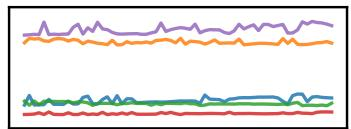

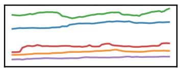

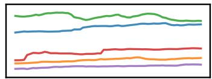

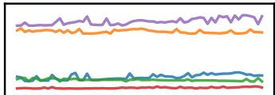

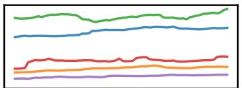

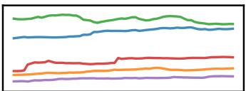

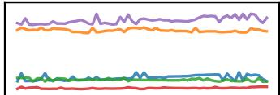

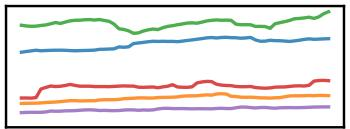

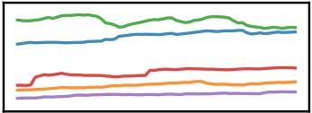

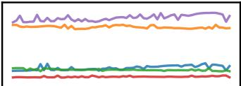

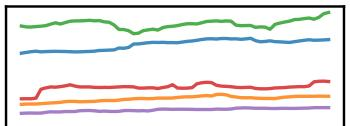

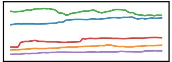

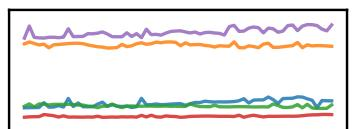

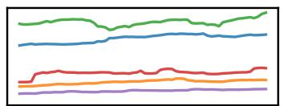

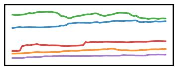

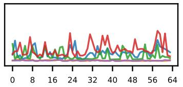  
(a) Original

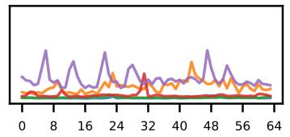  
(b) Watermarked

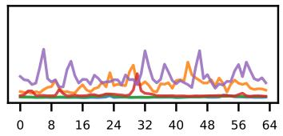  
(c) Non-watermarked  
Figure 5: Visualization of original and generated samples on the Stocks dataset with length 64.

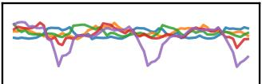

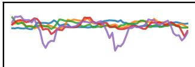

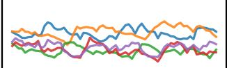

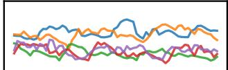

$$
u \sin \pi \sin \theta , \pi \sin \theta ,
$$

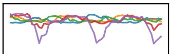

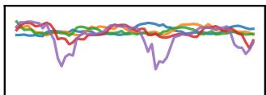

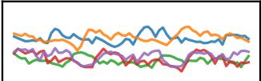

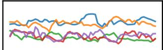

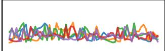

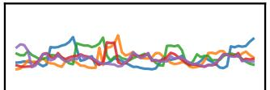

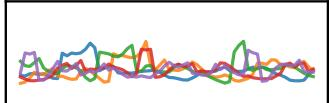

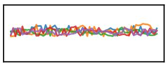

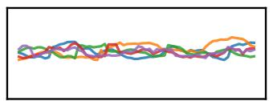

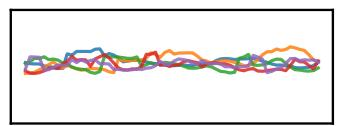

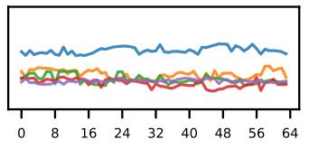  
(a) Original

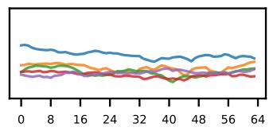  
(b) Watermarked

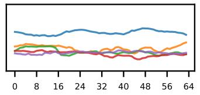  
(c) Non-watermarked  
Figure 6: Visualization of original and generated samples on the ETTh dataset with length 64.

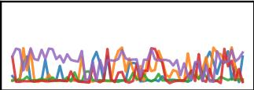

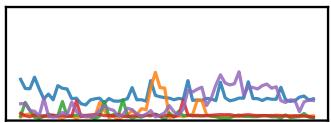

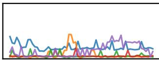

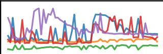

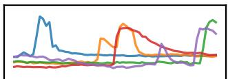

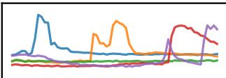

  
(a) Original

  
(b) Watermarked

  
(c) Non-watermarked  
Figure 7: Visualization of original and generated samples on the Energy dataset with length 64.

WAMWAWRAA

  
(a) Original

  
(b) Watermarked

  
(c) Non-watermarked  
Figure 8: Visualization of original and generated samples on the fMRI dataset with length 64.