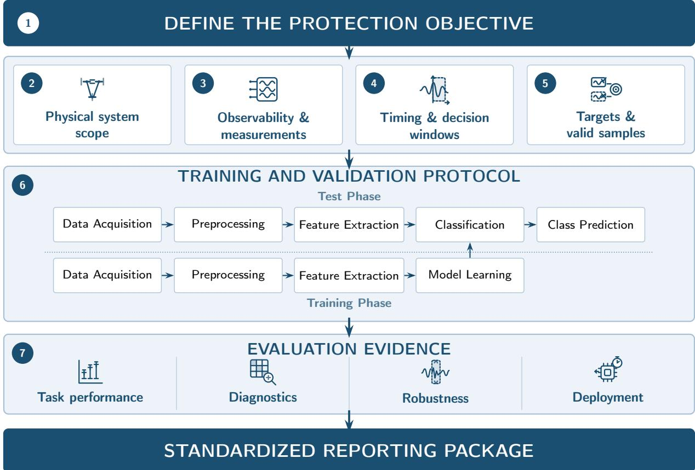
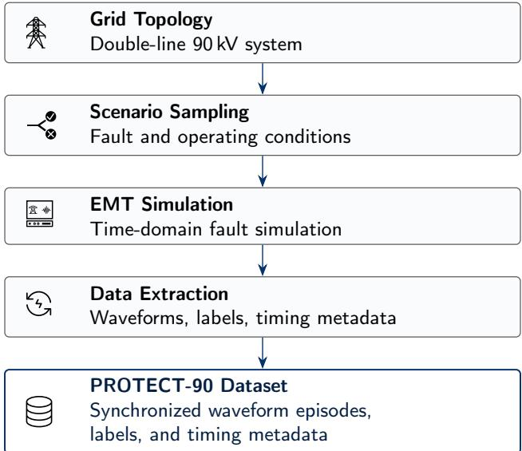
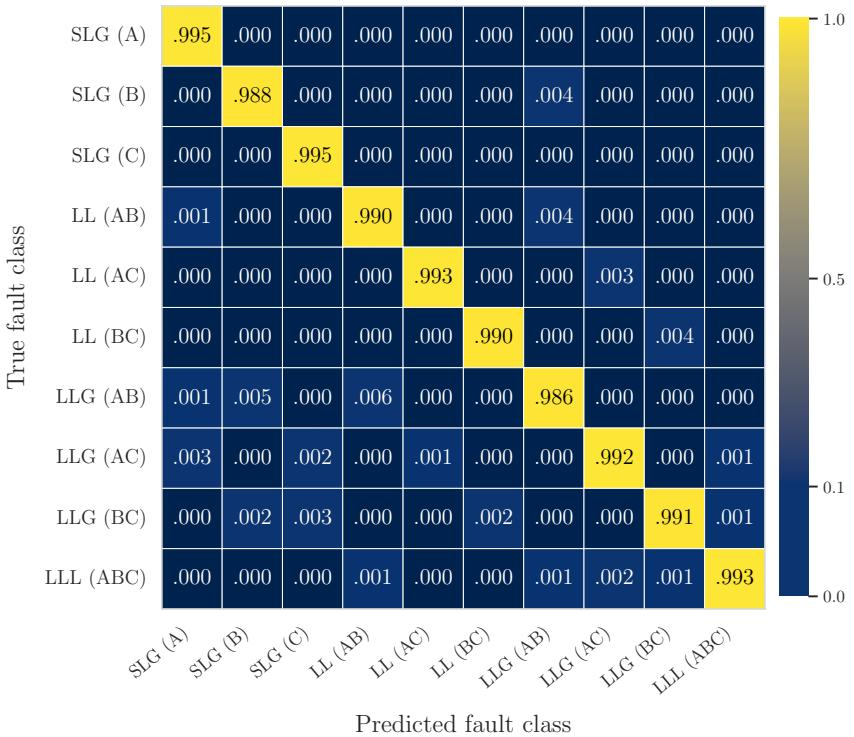
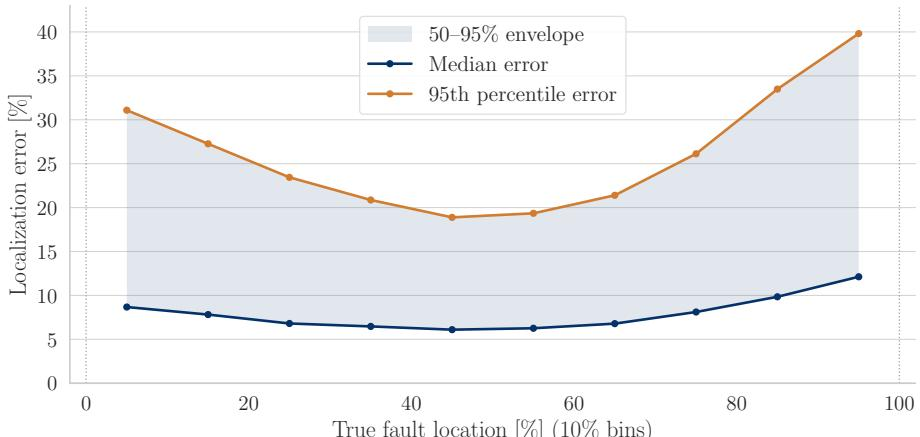

# A Standardized Framework for Machine Learning in Power System Protection

Julian Oelhafa,∗, Georg Kordowichb, Paula Andrea Pérez-Toroa, Christian Berglerc, Johann Jägerb, Andreas Maiera and Siming Bayera

aPattern Recognition Lab, Friedrich-Alexander-Universität Erlangen-Nürnberg, Martensstr. 3, 91058, Erlangen, Germany

bInstitute ofElectrical Energy Systems, Friedrich-Alexander-Universität Erlangen-Nürnberg, Cauerstr. 4, 91058, Erlangen, Germany cDepartment ofElectrical Engineering, Media and Computer Science, Ostbayerische Technische Hochschule Amberg-Weiden, Kaiser-Wilhelm-Ring 23, 92224, Amberg, Germany

A R T I C L E I N F O

Keywords:   
Power system protection   
Machine learning   
Evaluation framework   
Fault classification   
Fault localization   
Electromagnetic transient simulation

## A BS T R AC T

Studies of machine-learning-based power-system protection increasingly report near-perfect scores, yet the meaning of those scores depends strongly on the evaluation setting. Protection task, physical scope, measurements, timing, targets, preprocessing, and validation often vary jointly and remain incompletely specified. This paper proposes a standardization-oriented framework that treats evaluation design as part of the scientific contribution. It defines seven required study dimensions: protection objective, physical system scope, observability and measurements, timing and decision windows, targets and valid samples, training and validation protocol, and evaluation outputs. The framework is instantiated in a bounded case study on the public PROTECT-90 electromagnetic-transient benchmark, comprising 9022 simulated episodes from one 90 kV double-line topology for onset-conditioned fault classification and fault localization. Under centralized sensing, simulation-metadata-aligned 20 ms windows, and episode-grouped validation, a multi-layer perceptron (MLP) achieved a five-fold mean macro-averaged F1 score of 0.991 ± 0.001 for classification and a localization mean absolute error of 10.20 ± 0.25% of line length, where the standard deviations describe variation across the episode-grouped folds. Extending the decision horizon to 50 ms preserved this task-dependent performance asymmetry, while reduced observability approximately doubled the MLP localization error but had little efect on classification. A synchronized two-ended conventional locator outperformed the learning locators under its richer clean information set, and measurement degradation showed that clean predictive performance did not determine robustness. The framework turns evaluation assumptions into explicit and reproducible evidence and provides a basis for more comparable, auditable research evaluation and future certification-oriented assessment of machine-learning protection functions.

## 1. Introduction

Power system protection is a safety-critical function: protective relays must decide correctly within milliseconds, and in practice they are trusted only after standardized type-testing and certification against explicitly specified behavior. Two simultaneous shifts now strain this basis of trust – the changing physics of the grid, and a change in the methods proposed to protect it. The transition toward decentralized power systems, driven by growing renewable energy sources and distributed energy resources, is reshaping grid operation. Rising shares of inverter-based generation and the adoption of hybrid alternating current (AC)–direct current (DC) architectures [1] expand the range of operating and fault scenarios encountered in practice [2]. Meshed topologies, multi-terminal configurations, dynamic redispatch, and varying grid-connected or islanded operating modes increase protection-relevant uncertainty, while inverter-based resources contribute fault currents that difer from those of synchronous machines and challenge established protection functions [3, 4, 5, 6]. Consequently, conventional protection schemes based on deterministic logic, fixed thresholds, and static system models are increasingly stressed under variable operating conditions [7]. This has motivated growing interest in data-driven and machine learning (ML)-based approaches that can exploit nonlinear structure in protectionrelevant measurements. Yet, unlike the conventional functions they aim to augment or replace, these ML-based approaches enter the field with no established basis for testing, auditing, or certifying them – precisely the discipline that makes conventional protection trustworthy.

In protection engineering, performance claims matter only insofar as they can be verified under defined operating, sensing, timing, and failure conditions. A protection function is not trusted because it performs well in one isolated experiment, but because its behavior can be inspected, repeated, and tested against explicit assumptions. In conventional practice, this trust is established through standardized type-testing and certification: protection equipment is evaluated against common requirements such as International Electrotechnical Commission (IEC) 60255 [8] using dedicated relay-test tooling and third-party conformity assessment before deployment. Safety-critical domains are now extending analogous assurance and certification regimes to machine learning – aviation learning-assurance guidance [9], crosssector artificial intelligence (AI) risk management [10], auditable AI-management-system standards [11, 12], and safety-case standards for autonomous products [13] – alongside a growing literature on assuring the machine-learning lifecycle [14]. No widely adopted protection-specific framework currently integrates the requirements needed to evaluate, report, and audit such ML-based systems. This requirement is not yet reflected in much of the ML-based protection literature. Public datasets, released code, and high reported scores are useful first steps, but they do not by themselves create deployment-relevant evidence. A model result becomes interpretable only when the protection task, information available at decision time, data-processing pipeline, and validation protocol are specified together. Otherwise, reported performance remains inseparable from hidden study assumptions, and individual papers cannot accumulate into reliable engineering knowledge.

Despite this growing research activity, reported results in ML-based protection remain dificult to interpret and compare. Existing studies often difer simultaneously in physical system scope, sensing assumptions, temporal representation, target construction, and validation protocol. These choices are not merely implementation details; they define the efective inference problem by determining which information is available, which timing constraints apply, and what the model is asked to predict. Reported performance therefore reflects not only algorithmic design, but also diferences in task formulation and information availability. When these factors vary jointly with model choice, empirical comparisons conflate task dificulty, data-generation choices, and learning efects. A reported accuracy of 99% in one study may correspond to a comparatively simple task on a radial feeder, whereas 90% in another may reflect a more demanding setting. Without a common evaluation structure, the community cannot distinguish algorithmic progress from diferences in the underlying benchmark.

This paper places evaluation design at the center of the methodological contribution rather than as a neutral experimental backdrop. The central question is not only whether ML-based protection can work, but under which physical, observational, and temporal assumptions reported success or failure should be interpreted. This question is especially important because most studies rely on simulated datasets whose physical fidelity, scenario coverage, and documentation vary substantially across works. Without a framework that fixes and reports the core study assumptions, these factors cannot be separated consistently across studies. This work therefore does not propose a new protection method, nor a ranking of models on one benchmark. Its contribution is a standardized evaluation and reporting framework that makes the efective inference problem explicit before performance is interpreted [15].

## 1.1. Limitations of Current Evaluation Practice and Related Work

A substantial body of literature has applied ML-based methods to protection tasks such as fault detection (FD), fault line identification (FLI), fault classification (FC), and fault localization (FL). For transmission-line protection, waveletderived features and artificial neural networks have been used for ultrafast fault detection [16], while artificial neural networks and convolutional neural networks have been compared for fault-type identification from voltage and current measurements [17]. Controlled comparative work has also evaluated multiple learning methods for fault detection and line identification under a shared experimental setting [18]. A later controlled comparison on the benchmark used in the present case study examined fault classification and localization under shared sensing, timing, and validation assumptions [19].

Combined classification and localization have been studied for three-terminal transmission circuits [20], while support-vector-machine models embedded in distribution relays have been used to classify faults, estimate their region, and support switching decisions on a simulated feeder [21]. Other studies have addressed joint fault detection, classification, and localization using optimized tree-based and neuro-fuzzy methods [22], as well as machine-learningbased electrical fault detection and localization in broader grid settings [23].

Application-specific protection schemes have further included a maximal overlap discrete wavelet transform (MODWT)–extreme gradient boosting (XGBoost) pipeline for fault detection and classification across changing microgrid topologies and operating modes [24], and a hybrid protection scheme based on deep reinforcement learning [25]. Graph-neural-network-based protection has likewise been explored as a topology-aware learning approach [26]. Collectively, these studies have shown that ML methods can capture temporal patterns and nonlinear relationships in protection-relevant voltage and current signals. At the same time, they have been evaluated under substantially diferent assumptions regarding topology, fault space, measurement access, preprocessing, timing, and targets.

A central limitation of current practice is its predominantly model-centric perspective. Learning algorithms are usually assessed inside study-specific setups. In each work, the physical system model, data-generation process, measurement configuration, preprocessing pipeline, window construction, target definitions, and validation protocol are specified independently. These choices define the information available to the model, the temporal context available at decision time, and therefore the protection problem actually being solved. As a result, studies that nominally address the same task may in fact evaluate diferent inference problems. Reported performance is therefore shaped not only by model capability, but also by implicit assumptions about observability, timing, data realism, and system complexity.

Recent survey and scoping studies have confirmed that this is not an isolated issue, but a structural limitation of the field. Reviews of ML in power system protection have documented substantial heterogeneity in simulation setups, preprocessing pipelines, feature representations, and evaluation metrics, which limits reproducibility and meaningful cross-study comparison [27, 28, 29, 30]. This echoes the broader reproducibility crisis in machine-learning-based science, where incomplete documentation of data, methods, and evaluation has repeatedly prevented reported results from being reproduced [31]. In a prior scoping review by the authors covering 119 studies, only 16.0% used real-world data, 82.5% provided no data access, and only 1.7% publicly released code or models; even basic metadata such as sampling frequency were omitted in 52.1% of studies [30]. These omissions are not secondary reporting defects: they determine whether a result can be reproduced, compared, or interpreted under protection-relevant constraints. Practical challenges such as noisy or incomplete measurements, class imbalance, shifts between training and deployment conditions, and limited interpretability further complicate the use of ML in safety-critical settings [28, 32]. These findings indicate that the central limitation is not only a lack of stronger models, but a lack of shared evaluation discipline for turning model results into reproducible protection evidence.

This ambiguity is amplified by the widespread reliance on simulated data [30]. Domain-specific studies targeting high-voltage direct current (HVDC) systems, wind integration, or hybrid AC/DC networks provide valuable insights for particular applications [33, 34, 35], but they also introduce additional variation in system modeling, measurement conditions, and operating assumptions. Application-specific studies have further illustrated this dependence on the physical setting, including decision-tree-based fault detection on a thyristor-controlled series compensation (TCSC)- compensated line during power swing [36] and an enhanced relaying scheme for a compensated line connected to a doubly fed induction generator (DFIG)-based wind farm [37]. When simulation fidelity, scenario coverage, and documentation of the data-generation process are only partly specified, it remains unclear whether reported success or failure is driven by model design, information availability, task formulation, or the realism of the underlying data [30].

The dificulty is partly interdisciplinary. In protection engineering, the validity of a result depends on physical scope, measurement access, synchronization, timing, operating conditions, and failure behavior. In machine learning, validity depends on data construction, preprocessing, split design, leakage prevention, model selection, and evaluation metrics [38, 39]. ML-based protection studies require both perspectives simultaneously, but current reporting practices often leave one of them implicit. The resulting gap is procedural: the field needs an evaluation structure that connects protection assumptions with ML validity requirements. General-purpose AI-assurance standards establish the governance scafolding but do not supply these protection-specific dimensions; conversely, protection studies rarely adopt ML validity safeguards. The framework proposed here is intended to occupy exactly this intersection. Table 1 provides an illustrative structured mapping of how representative protection, machine-learning, and AI guidance treats the seven dimensions formalized in the proposed framework.

The comparison identifies an integration gap rather than an absence of prior guidance: existing source families address complementary subsets of the evaluation problem, whereas the proposed framework operationalizes all seven dimensions jointly. In particular, it treats sample-validity rules, including onset conditioning, as part of the evaluated protection problem rather than as an implicit preprocessing choice; where prior guidance addresses onset at all – as in the fault-inception-angle definition of IEC 60255-121 – it does so as a controlled test parameter, not a sample-validity rule.

Table 1  
Comparison of representative guidance against the seven framework dimensions.
<table><tr><td>Source family</td><td>Obj.</td><td>Scope</td><td>Obs.</td><td>Time</td><td>Targets</td><td>Validation</td><td>Outputs</td></tr><tr><td>Dataset documentation [40]</td><td>o</td><td>o</td><td>o</td><td>一</td><td>o</td><td>o</td><td></td></tr><tr><td>ML reporting and validation guidance [39, 38, 41]</td><td>√</td><td>o</td><td>o</td><td>o</td><td>√</td><td>√</td><td>√</td></tr><tr><td>Protection reviews and scoping studies [27, 28, 30]</td><td>√</td><td>√</td><td>o</td><td>o</td><td>o</td><td>o</td><td>√</td></tr><tr><td>Protection-testing standards [8, 42]</td><td>√</td><td>√</td><td>√</td><td>√</td><td>o</td><td>o</td><td>√</td></tr><tr><td>General Al risk and assurance guidance [10]</td><td>√</td><td>0</td><td>0</td><td>一</td><td>0</td><td>√</td><td>√</td></tr><tr><td>Proposed framework</td><td>√</td><td>√</td><td>√</td><td>√</td><td>√</td><td>√</td><td>√</td></tr></table>

Note: This table is an illustrative structured mapping rather than a quantitative score. ✓denotes an explicit prescriptive requirement accompanied by an operational procedure, ◦ denotes acknowledgement without full operationalization, and – denotes no identified treatment in the cited sources. Prior-work rows aggregate closely related sources by guidance family.

Unlike survey and scoping contributions, including prior work by the authors [30], this paper does not primarily catalog the literature or summarize reported methods. Its contribution is prescriptive rather than descriptive. It defines a standardized evaluation structure, a reporting logic, and a bounded reference instantiation that make study assumptions explicit before model performance is compared.

Overall, the literature has provided substantial evidence of the technical feasibility of ML for protection tasks, but it does not yet provide a consistent basis for interpreting why results difer across studies. Addressing this gap requires evaluation frameworks that make task formulation, observability, timing, data provenance, and validation design explicit before model comparison.

## 1.2. Objective and Contributions

The objective of this paper is to develop a standardized evaluation framework for ML-based power system protection that makes reported results interpretable as conditional and auditable evidence rather than isolated model scores. The framework therefore requires explicit specification of the physical scope, observability, timing constraints, target construction, data provenance, validation design, and reporting outputs before model performance is interpreted or compared. In doing so, it makes the efective inference problem an explicit part of the scientific contribution.

The contributions of this paper are threefold. First, it proposes a standardized, protection-specific evaluation framework that structures the complete path from protection objective and information availability to validation and reporting. The framework defines what must be specified, reported, and examined for an ML-based protection result to be reproducible, comparable, and open to independent audit. It thereby provides a first methodological step toward certification-oriented assessment without claiming to constitute a formal certification procedure. Second, it formalizes an interpretation logic in which reported performance is treated as conditional evidence tied to task formulation, physical scope, observability, timing, target construction, and validation design. This separates apparent model capability from diferences in the underlying inference problem and prevents aggregate scores from being interpreted independently of the assumptions under which they were obtained. Third, it instantiates the framework in a bounded and reproducible case study on FC and FL. Under shared sensing, timing, sample-validity, and validation assumptions, the case study demonstrates how the framework exposes task-dependent behavior, observability efects, diagnostic patterns, conventional-reference comparisons, robustness diferences, and runtime trade-ofs beyond aggregate performance measures. The case study serves as a worked example of the framework; it does not claim benchmark completeness or practical superiority over conventional protection.

The proposed framework complements established protection-testing practice [8] and emerging AI-assurance frameworks [10, 11, 12] by supplying protection-specific evaluation dimensions, including observability and synchronization, decision horizons, and onset-conditioned sample validity.

## 1.3. Paper Organization

The remainder of this paper is organized as follows. Section 2 presents the proposed standardized evaluation framework and its seven-step protocol. Section 3 shows how the framework is instantiated in a bounded case study on a public electromagnetic transient (EMT) benchmark for FC and FL. Section 4 reports the resulting findings and illustrates what the framework reveals beyond aggregate performance measures. Section 5 discusses generalizability, reuse, limitations of the present instantiation, and directions for future work. Section 6 concludes the paper.

  
Figure 1: Seven-step framework for evaluating machine-learning-based power system protection studies. Step 1 defines the protection objective, Steps 2–5 specify the efective inference setting, Step 6 places the classical training and test pipeline within an explicit validation protocol, and Step 7 structures the resulting evaluation evidence. The final reporting package links conclusions to the complete study definition. The pattern-recognition pipeline is adapted from Niemann [47].

## 2. Proposed Standardized Evaluation Framework

The central contribution of this paper is a standardized evaluation framework for ML-based power system protection. The framework does not prescribe a particular model, dataset, or grid architecture. Rather, it specifies the minimum structure a study must define before its results can be interpreted, reproduced, or compared.

The motivation is straightforward: reported performance depends not only on model choice, but also on task definition, physical scope, observability, timing, target construction, data provenance, and validation design. When these elements vary across studies, similar performance numbers may correspond to diferent underlying inference problems and therefore lack direct comparability. The proposed framework addresses this issue by making the evaluation design explicit, inspectable, and reusable.

Accordingly, the framework structures a study into seven steps: protection objective, physical system scope, observability and measurements, timing and decision windows, targets and valid samples, training and validation protocol, and evaluation outputs and diagnostics. Together, these steps define a standardized reporting structure that makes assumptions explicit and evaluation settings inspectable. The structure is informed by established protectionequipment testing and performance-documentation practice, general AI test, evaluation, verification, and validation guidance, and machine-learning reproducibility and temporal-benchmark literature [43, 42, 10, 44, 38, 45, 46]. Its contribution is not that every dimension is individually unprecedented, but that these previously separate requirements are integrated into one protection-specific and operational evaluation workflow.

## 2.1. Design Goals and Guiding Principles

The proposed framework is guided by a small set of principles that define what a rigorous ML-based protection study must achieve. First, it must support comparability: studies should specify the task, sensing assumptions, timing constraints, targets, and outputs in a form that permits meaningful comparison. Second, it must support reproducibility: the full path from raw signals to reported results should be reconstructable, including preprocessing, sample construction, splitting, and reporting. Third, it must remain physically grounded: reported performance should be interpretable in the context of topology, operating conditions, fault space, and information availability. Fourth, it must remain protection-relevant: evaluation should reflect operational constraints such as short decision times, realistic sensing assumptions, and deployment-oriented decision settings.

In addition, the framework requires leakage-aware validation, since related samples can otherwise inflate reported performance. It requires diagnostic interpretability, so that evaluation extends beyond aggregate metrics and reveals failure modes across classes, locations, sensing regimes, or operating conditions. Finally, it requires deployment awareness, so that predictive quality is assessed together with runtime, sensing requirements, communication assumptions, and robustness under degraded conditions.

Together, these principles define the framework as a reusable evaluation standard for ML-based power system protection rather than a benchmark recipe.

## 2.2. Framework Overview

Figure 1 summarizes the framework as a seven-step workflow. The sequence runs from problem definition to result interpretation. It first fixes what is to be learned, under which physical and observational conditions, and within which timing constraints. It then specifies how targets are constructed, how training and validation are performed, and which outputs are required to support interpretable conclusions. The seven steps do not prescribe a particular dataset, topology, model family, or signal domain. Instead, they define the dimensions that must be made explicit in any rigorous protection study. This keeps the framework applicable across diferent tasks and grid settings while preserving comparability at the level of study design.

The framework output is not only a trained model or a set of performance numbers. It is a standardized reporting package that documents the evaluation setting together with predictive, diagnostic, and deployment-relevant outputs. In this way, the framework supports both reproducible experimentation and interpretation of reported ML results relative to explicit assumptions. The following subsections define each framework step in turn.

Problem Specification. Steps 1–5 define the task, system, inputs, timing, and prediction target.

## 2.3. Step 1: Protection Objective

The first step is to define the protection objective precisely. A study must state which protection function is being addressed, for example, fault detection, fault classification, fault line identification, or fault localization, and must specify the corresponding learning formulation, such as binary classification, multi-class classification, or regression. Relevance. The protection objective determines what the model is expected to predict, which errors are operationally relevant, and which evaluation outputs are meaningful. The objective must therefore be stated in operational rather than generic ML terms. This is consistent with guidance requiring an AI system’s intended purpose, context of use, expected impacts, and evaluation criteria to be documented before assessment [10]. Protection standards similarly specify functions through operational characteristics such as starting, directionality, and time-delay behavior [42]. For example, “fault analysis” is too broad to support comparison unless it is decomposed into explicit tasks such as fault detection, fault type classification, or distance estimation. Fixing the protection objective at the outset prevents ambiguity and establishes the basis for later choices such as target construction, metric selection, and diagnostic analysis.

## 2.4. Step 2: Physical System Scope

Step 2 defines the physical system in which the protection task is posed. A study must specify the network type, topology class, voltage level, operating range, fault and disturbance space, scenario-generation method, coverage of critical operating conditions, data source, and known representativeness limitations. The data source may consist of simulation, hardware-in-the-loop testing, digital-twin-based generation, or field recordings. Together, these choices define both the physical environment from which the data arise and the limits of the protection problem represented by the study.

Relevance. Task dificulty depends strongly on physical scope. A result obtained on a radial distribution feeder is not directly comparable to a result obtained on a meshed transmission system, even if both are reported for the same nominal task. The same applies to diferences in fault and disturbance coverage, scenario-generation assumptions, critical operating conditions, and data origin. Making the physical system scope explicit ensures that reported performance is interpreted relative to the grid conditions under which it was obtained, rather than attributed to the model alone. For simulation-derived studies, established verification and validation practice further distinguishes conceptual-model validity, model verification, operational validity, and data validity [48].

## 2.5. Step 3: Observability and Measurements

The third step specifies what information from the physical system is available to the model. A study must specify which measurements are provided, where they are taken, in which signal domain they are represented, how they are synchronized, and whether access is centralized, local, or distributed. This includes, for example, whether the model operates on EMT waveforms, sampled values, root-mean-square (RMS) quantities, phasors, or phasor measurement unit (PMU)-based features, as well as which voltage, current, frequency, or derived channels are used. These representations are not interchangeable: sampled-value standards define the communication of waveform samples, whereas synchrophasor standards impose explicit time-tagging, synchronization, and static- and dynamicperformance requirements [49, 43].

A study must also state whether the model receives auxiliary non-waveform information beyond the primary measurements, such as topology encodings, line parameters, bus or line identifiers, operating-point variables, load information, switching states, or other metadata. If channels or auxiliary inputs are missing, delayed, noisy, or otherwise degraded, these conditions must also be reported.

Relevance. Observability is a primary determinant of task dificulty. Two studies may evaluate the same physical system but still solve diferent inference problems if one model receives only local measurements while another also receives synchronized multi-location signals, topology information, or operating metadata. Making the available information explicit separates model capability from information availability and turns observability into a comparable evaluation axis rather than a hidden implementation detail. In fault prediction, feature-selection studies provide a complementary way to identify which inputs carry task-relevant information [50].

## 2.6. Step 4: Timing and Decision Windows

The fourth step defines the decision-time setting under which the protection task is evaluated. A study must specify the temporal reference used for sample construction, the decision horizon, the window length, the step size or stride between windows, and any additional real-time constraints that limit what information is available at inference time. This includes the event reference used for alignment, the amount of pre-event and post-event context, the window extraction rule, and whether overlapping windows are used. Together, these choices determine how much pre-fault, fault-onset, and post-fault information the model can use and therefore shape the protection problem being solved.

Relevance. Protection tasks are time-critical by definition. Protection standards accordingly treat operating-time and time-delay characteristics as explicit quantities to be evaluated under defined test conditions [42]. A result obtained from short windows near fault inception is not directly comparable to one based on longer windows or broader postevent context. Changing the stride also changes the number, overlap, and temporal diversity of the available samples, which can afect both dataset composition and evaluation outcomes. Defining timing and decision windows explicitly ties reported performance to a clear protection-time budget and prevents it from being interpreted independently of the available decision time.

## 2.7. Step 5: Targets and Sample Validity

The fifth step fixes what the model must predict and which samples are valid for that prediction. A study must specify how labels or regression targets are constructed, which inclusion and exclusion rules are applied, and how boundary cases are handled. This includes, for example, whether samples are labeled by event presence, fault type, faulted line, or fault position, and whether the dataset retains all extracted windows, only windows whose time span overlaps with a fault, or only windows in which the fault begins inside the window. If samples are filtered, merged, discarded, or reassigned, these rules must be stated explicitly.

Relevance. The task name alone does not fully define the prediction problem. Two studies may both report FC or FL results while using diferent class definitions, regression targets, or sample-validity rules. The same applies to boundary handling, such as windows near fault inception, multiple events, or ambiguous cases. Defining targets and sample validity explicitly ensures that reported performance is tied to a fully specified labeling and filtering scheme rather than to labels that are only partly described. More generally, time-series benchmark research has shown that flawed anomaly placement, ambiguous event boundaries, and permissive temporal scoring can materially distort apparent progress and method rankings [45, 46].

Evaluation Protocol. Steps 6–7 define how models are compared and what evidence a study must report.

## 2.8. Step 6: Training and Validation Protocol

The sixth step specifies how models are trained, validated, and compared. A study must specify the split design, the unit of independence used for splitting, the treatment of related samples, the preprocessing pipeline, and the conditions under which diferent models are evaluated. This includes, for example, whether splitting is performed by event, episode, line, feeder, or recording, whether folds are grouped to prevent leakage, and whether preprocessing is fitted on training data only [41, 38].

Relevance. Protection datasets often contain strong dependencies between samples. Multiple windows may originate from the same event, share the same operating point, or overlap in time. If such samples are split across training and test sets, reported performance may reflect leakage rather than generalization. The protocol must therefore state which samples are considered dependent and how this dependency is handled during validation.

It must also define the boundary between training and evaluation. Any normalization, feature extraction, target transformation, dimensionality reduction, or parameter selection must be fitted on training data only and then applied to held-out data without re-estimation. If hyperparameters are tuned, the tuning procedure must be reported explicitly. Competing models must be compared under the same data partitions, target definitions, preprocessing assumptions, and metric definitions so that reported diferences are attributable to model behavior rather than to inconsistent evaluation conditions. Reproducibility guidance further emphasizes transparent reporting of data, code, experimental conditions, and model-selection procedures, while benchmark studies show that data sampling, initialization, and hyperparameter choices can materially afect comparative conclusions [44, 51].

## 2.9. Step 7: Evaluation Outputs and Diagnostics

The seventh step defines what outputs a study must report for its results to support clear conclusions. A study must report more than a single headline number. At minimum, the evaluation output should include task-appropriate aggregate metrics, structured diagnostics, and implementation-relevant indicators. Reported uncertainty must identify its source explicitly, for example, variation across held-out groups, model initializations, data samples, or perturbation realizations, because these quantities are not interchangeable [10, 51]. Where repeated evaluations are used, their unit and aggregation procedure must therefore be reported. Depending on the task, this may include classification scores, regression errors, class-resolved confusion patterns, location-resolved error profiles, observability-conditioned comparisons, robustness analyses, and runtime measurements.

Relevance. Aggregate performance alone does not show why a model succeeds or fails. Two models may achieve similar overall scores while exhibiting diferent failure modes across fault classes, locations, sensing regimes, or operating conditions. A meaningful evaluation must therefore expose not only average performance, but also the structure and stability of that performance.

The reported outputs must also match the protection objective. Classification tasks require metrics that reflect class-wise behavior and not only overall accuracy. Localization or other regression tasks require error measures with direct physical interpretation and, where relevant, stratified analyses across faulted elements or operating regions. If robustness is assessed, the study must state which factors are varied. If runtime is reported, the measurement setup must be stated clearly enough to support comparison. Recent streaming evaluations further show that short decision windows or early model decisions do not necessarily imply correspondingly short end-to-end protection latency, because the complete signal-processing and inference pipeline contributes additional delay [52]. Defining evaluation outputs in this way ensures that a study produces evidence rather than only scores.

## 2.10. Standardized Reporting Package

A study that follows the proposed framework should report its evaluation setting in a compact and standardized form, following the broader principle that datasets and evaluation artifacts should be documented for reuse and inspection [39, 40]. Just as datasheets document datasets and model cards document trained models for reuse and scrutiny [53], the proposed reporting package documents the evaluation setting of a protection study, so that a result can be inspected, reproduced, and reused under its stated conditions. This reporting package makes the core assumptions of the study explicit and allows readers to judge what is comparable, reproducible, and interpretable. Table 2 summarizes the minimum information that should be reported.

Table 2  
Minimum reporting package for ML-based power system protection studies under the proposed framework.
<table><tr><td>Framework step</td><td>Minimum reported information</td></tr><tr><td>1. Protection objective</td><td>Protection task, operational interpretation, learning formulation, and pre- dicted output</td></tr><tr><td>2. Physical system scope</td><td>Network type, topology class, voltage level, operating range, fault and disturbance space, scenario-generation method, critical-condition coverage,</td></tr><tr><td>3. Observability and measurements</td><td>data source, and known representativeness limitations Measurement locations, signal domain, channel set, synchronization assump- tions, access regime, and auxiliary inputs</td></tr><tr><td>4. Timing and decision windows</td><td>Event reference, pre-/post-event context, decision horizon, window length, stride, and overlap rule</td></tr><tr><td>5. Targets and sample validity</td><td>Label or regression-target construction, inclusion/exclusion rules, boundary handling, and retained sample set</td></tr><tr><td>6. Training and validation protocol</td><td>Split design, unit of independence, leakage-prevention strategy, preprocessing boundary, and model-comparison conditions</td></tr><tr><td>7. Evaluation outputs and diagnos- tics</td><td>Aggregate metrics, structured diagnostics, robustness analyses, observability- conditioned results, and runtime setup</td></tr><tr><td>Reporting artifacts</td><td>Data/code availability, configuration details, and any restrictions affecting reproducibility or comparison</td></tr></table>

## 3. Case Study: Instantiation on a Public EMT Benchmark

This section instantiates the evaluation framework introduced in Section 2 on the public PROTECT-90 EMT benchmark [54, 55]. The case study addresses FC and FL under shared assumptions on physical system scope, observability, timing, target construction, and validation, as summarized in Table 3. The evaluated methods span conventional protection, classical ML, task-specific deep learning, and a pre-trained time-series foundation model, as specified in Sections 3.3 and 3.4. Controlled analyses then vary timing, observability, measurement fidelity, and fault-resistance distribution while keeping the remaining evaluation assumptions fixed. Additional stride and hyperparameter checks assess the stability of the resulting interpretation. Together, these experiments demonstrate how the framework separates model efects from changes in information availability, decision time, data realism, and evaluation configuration.

## 3.1. Physical System and Observability

The case study is based on the public PROTECT-90 dataset [54]. The benchmark is derived from a 90 kV transmission-system “Double Line” topology with multiple relay locations and diverse short-circuit events. All episodes are generated in DIgSILENT PowerFactory using the EMT simulation module. This simulation-based design reflects the current scarcity of publicly accessible real-world protection datasets with suficiently detailed waveform recordings and labels for reproducible ML evaluation [30, 56, 57, 58]. These public resources provide valuable event signatures, real-world oscillograms, or synthetic transmission-grid data, but difer in signal representation, measurement layout, available metadata, and supported protection targets and therefore do not constitute directly interchangeable benchmarks for the present FC/FL protocol. Scenario diversity is introduced through domain randomization over fault and operating parameters, including variations in fault resistance, inception time, line characteristics, loading conditions, and external grid properties within predefined physically plausible ranges [54, 59]. Figure 2 summarizes the corresponding data-generation process. Such simulation-based benchmarks require explicit documentation of the data-generation assumptions because synthetic power-system datasets can otherwise be dificult to interpret or validate across studies [60].

Table 3  
Case-study instantiation of the proposed standardized evaluation framework.
<table><tr><td>Framework step</td><td>Reference instantiation</td></tr><tr><td>1. Protection objective</td><td>FC and FL under shared sensing, timing, and validation assumptions</td></tr><tr><td>2. Physical system scope</td><td>PROTECT-90; 90 kV double-line topology; 9022 EMT episodes; randomized fault and operating conditions</td></tr><tr><td>3. Observability</td><td>Synchronized three-phase voltage/current measurements from 8 relays; centralized full-observability reference setting</td></tr><tr><td>4. Timing 5. Targets</td><td>±80 ms around fault inception; 20 ms sliding windows; fixed 5 ms stride</td></tr><tr><td></td><td>Onset-conditioned 11-class FC with one non-onset class and ten fault-type classes; FL as normalized fault position; fault-onset-containing windows for FL</td></tr><tr><td>6. Validation</td><td>5-fold grouped cross-validation by simulation episode; shared preprocessing and split design across tasks and models</td></tr><tr><td>7. Outputs</td><td>Aggregate metrics, structured diagnostics, conventional baselines, runtime assessment, and controlled analyses of timing, observability, measurement fidelity, fault-resistance distribution shift, stride, and hyperparameters</td></tr></table>

The resulting benchmark contains 9022 simulation episodes. Each episode spans $T ~ = ~ 1 { \mathrm { s } }$ and is sampled at $f _ { s } = 6 4 0 0 \mathrm { { H z } } ,$ yielding 6400 time steps per episode. The simulated events cover the main short-circuit categories considered in this study, namely single-line-to-ground fault (SLG), line-to-line fault (LL), double-line-to-ground fault (LLG), and three-phase fault (LLL).

The measurement model is based on primary three-phase voltage and current waveforms extracted at protectionrelevant locations. In total, each episode provides signals from $N _ { \mathrm { P R } } = 8$ locations corresponding to the relay positions in the studied topology. At each location, three-phase voltage and three-phase current signals are available, resulting in six channels per location. Under the centralized reference configuration, all available measurements arejointly provided to the learning model, yielding the episode-level representation

$$
X \in \mathbb { R } ^ { N _ { \mathrm { P R } } \times 6 \times T _ { s } } ,\tag{1}
$$

where $T _ { s } = 6 4 0 0$ denotes the number of discrete time steps per episode. No auxiliary non-waveform metadata are used in the reference configuration. All measurements are treated as fully synchronized, noise-free, and continuously available, with no communication delay, jitter, or packet loss.

This centralized full-observability configuration serves as an upper-bound reference sensing setting for the case study. Later analyses vary the available measurements by restricting the input either to a single relay location or to both terminals of the same line, while preserving the remaining study design. These reduced-observability experiments therefore act as controlled sensitivity analyses of the observability dimension rather than as separate casestudy definitions. The clean reference configuration excludes non-fault disturbances, current transformer (CT)/voltage transformer (VT) nonidealities, missing channels, synchronization errors, and communication efects, all of which are relevant for protection-equipment assessment and practical relay evaluation [8]. Additive noise, a simplified currenttransformer saturation proxy, and synchronization jitter are subsequently evaluated as controlled measurement-fidelity axes in Section 4.5. Sensor-availability degradation is addressed in the companion study [61], whereas communication latency and broader non-fault disturbances remain outside the present scope.

## 3.2. Timing, Windowing, and Targets

Sample construction is defined relative to the fault inception time $t _ { \mathrm { f } } .$ . For each episode, the raw tensor in Eq. 1 is restricted to ${ \bf a } \pm 8 0$ ms interval around $t _ { \mathrm { f } }$ , retaining a short pre-fault baseline together with the early post-fault transient. This bounded crop is used as a reference timing setting that preserves protection-relevant onset information without introducing substantially longer post-event context that would change the efective decision problem. Importantly, this cropping uses the ground-truth $t _ { \mathrm { f } }$ from simulation metadata, which is unavailable pre-detection in a deployed relay. The reference configuration therefore isolates FC and FL from the upstream detection problem; a deployment-oriented instantiation would require either a coupled detection stage or a trigger derived from observable signal features alone.

Framework for Machine Learning in Power System Protection

  
Figure 2: Case-study data generation flow for the PROTECT-90 dataset [54]. A fixed grid topology is combined with randomized fault and operating scenarios, simulated in the EMT domain, and processed into synchronized waveform episodes with labels and metadata.

From this cropped segment, overlapping sliding windows are extracted. Let � denote the window length in samples and � the step size between consecutive windows. The �-th window is

$$
x _ { i } = X [ : , : , i S : i S + L ] ,\tag{2}
$$

with start time $t _ { i } = i S / f _ { s }$

The reference timing configuration uses a fixed step size of � = 32 samples (5 ms) and a fixed window length of $L = 1 2 8$ samples, corresponding to a decision horizon of 20 ms. At a nominal system frequency of 50 Hz, this window covers approximately one fundamental cycle and therefore provides a physically interpretable reference horizon for protection-oriented evaluation. The 5 ms stride provides overlapping temporal views of the same transient while retaining bounded sample density; it therefore afects both sample overlap and the efective composition of the resulting dataset. For this reason, stride is treated as part of the evaluation setting rather than as a neutral implementation detail. Additional window lengths are examined later as a controlled sensitivity analysis of the timing dimension.

Both tasks are defined on this shared windowed representation. For FC, each window receives a discrete label

$$
y _ { \mathrm { F C } } \in \{ c _ { 0 } , c _ { 1 } , \ldots , c _ { 1 0 } \} ,\tag{3}
$$

where $c _ { 1 } { - } c _ { 1 0 }$ correspond to the short-circuit classes AG, BG, CG, AB, BC, CA, ABG, BCG, CAG, and ABC. A window receives one of these fault-type labels only when the fault inception lies within the window; all other windows, including pre-fault windows and windows in which the fault is already active, receive $c _ { 0 }$ . Thus, $c _ { 0 }$ denotes the absence of a fault inception within the current window rather than a physically fault-free state.

For FL, the target is the normalized fault position along the afected line segment,

$$
y _ { \mathrm { F L } } = \frac { d _ { \mathrm { f a u l t } } } { \ell _ { \mathrm { l i n e } } } \cdot 1 0 0 ,\tag{4}
$$

where $d _ { \mathrm { f a u l t } }$ is the distance from a fixed reference terminal and $\ell _ { \mathrm { l i n e } }$ is the line length. Reporting the target in percent of line length makes localization results comparable across line segments.

For FL, only windows containing the fault onset are retained. A window $x _ { i }$ is used only if

$$
t _ { i } + \epsilon < t _ { \mathrm { f } } < t _ { i } + \frac { L } { f _ { s } } - \epsilon ,\tag{5}
$$

where $\epsilon = 2 / f _ { s }$ is a two-sample margin. This excludes boundary cases and ensures that each retained regression sample contains both pre-fault information and the initial post-fault transient. This onset-conditioned definition is an intentional task-construction choice that focuses localization on early transient evidence rather than on broader postfault context. It should therefore be interpreted as one bounded formulation of FL, not as the only valid definition o the localization problem.

## 3.3. Validation Protocol and Model Families

The reference, timing, observability, conventional-baseline, measurement-fidelity, stride, and hyperparameter analyses use five-fold cross-validation grouped by simulation episode. The fault-resistance distribution-shift analysis instead uses the disjoint episode-level training and test partitions defined in Appendix C. All windows originating from the same episode are assigned to the same fold. This grouping is necessary because sliding windows from the same episode are strongly dependent through shared waveform structure, fault metadata, and operating conditions. Grouped splitting therefore prevents leakage that would otherwise inflate reported performance [41, 38]. Within each investigation, all compared models use the same deterministic episode-grouped split, task definition, timing configuration, observability setting, and metric definitions. The split is also reused across investigations wherever the underlying sample construction is unchanged. Unless stated otherwise, reported values are the mean and standard deviation across the five held-out fold scores. These fold-wise standard deviations describe variation across episode groups and do not quantify variation across model initializations, confidence intervals, or standard errors.

For the classical ML estimators, each extracted window is converted into a fixed-length feature vector by reshaping the windowed tensor to

$$
x _ { i } \in \mathbb { R } ^ { L \times F } \ \mapsto \ \tilde { x } _ { i } \in \mathbb { R } ^ { L \cdot F } ,\tag{6}
$$

where � denotes the number of time steps in the window and $F = N _ { \mathrm { P R } } \cdot 6$ the number of input features per time step. In implementation terms, this corresponds to reshape(n\_samples, n\_timesteps \* n\_features), that is, a time-major flattening in which all features at one time step are kept together before proceeding to the next. For each fold, preprocessing consists of standardizing features to zero mean and unit variance, with the transformation fitted on the training partition only and then applied unchanged to the corresponding held-out fold. Hyperparameters are fixed across folds and selected without access to test-fold results: no fold-specific retuning is performed. The onedimensional convolutional neural network (1D-CNN) receives the same fold-wise standardized waveform windows as the classical models, but the standardized arrays are reshaped to channels-by-time rather than flattened for prediction. For each outer fold, the standardizer is fitted on the complete outer training partition only and then applied unchanged to the held-out fold. The fixed, untuned architecture comprises three one-dimensional convolution blocks with 64, 128, and 128 output channels; each block uses a kernel width of 5, batch normalization, rectified-linear activation, and max pooling by a factor of 2. Global average pooling and a linear output layer produce the task prediction. Models are trained with Adam at a learning rate of $1 0 ^ { - 3 }$ and batch size 256 for at most 50 epochs. Early stopping with patience 8 uses a 10% episode-grouped validation subset of the outer training fold. Cross-entropy loss is used for FC and mean-squared-error loss for FL. MOMENT-1-large is used as a frozen pre-trained time-series encoder, with its representations read out by either a linear probe or a two-layer multi-layer perceptron (MLP) prediction head with approximately 25.4 million trainable parameters. The input-length adaptation, channel-wise encoding and embedding aggregation, linear-probe solver and regularization, MLP-head dimensions and activation, optimizer, learning rate, batch size, epoch limit, task-specific loss, validation split, and stopping criterion are fixed in the released experiment configuration and reused unchanged across folds. For MOMENT, the fold-local protocol is applied end to end: within every outer fold, the raw-window standardizer is fitted on the outer-training windows only, the training and held-out embeddings are regenerated independently using that fold’s standardizer and the frozen encoder, and the linear probe and MLP head are fitted without any access to the held-out fold. These models use the same episode-grouped outer folds, task definitions, decision horizons, and task-specific metrics as the classical learning models; the 1D-CNN results are reported in Section 4.10 and the MOMENT results in Appendix E.

The learned-model evaluation uses three complementary model panels. The broad classical panel comprises Ridge regression (Ridge), K-nearest neighbors (KNN), Histogram-based gradient boosting (GB), and MLP estimators, together with their corresponding regression variants for FL, and is used for the reference and timing analyses. The focused sensitivity panel comprises the neural MLP and histogram-based GB, which provide contrasting nonlinear estimators for the observability, measurement-fidelity, fault-resistance-shift, runtime, stride, and hyperparameter analyses. The cross-family panel comprises the MLP, a task-specific 1D-CNN, and MOMENT-1-large, with the MLP providing continuity with the preceding analyses. The classical models are implemented in scikit-learn 1.8.0 [62]. Their fixed configurations are summarized in Table G.1, while the separate single-parameter sensitivity analyses are reported in Appendix G. Conventional protection methods are evaluated separately in Section 3.4.

## 3.4. Conventional Protection Baselines

Conventional protection methods are evaluated under the same episode-grouped five-fold splits and task-specific metrics as the learning models. The per-window localization comparison uses the onset-conditioned windows defined in Section 3.2. Because the phasor-based locators require settled post-onset quantities, separate per-episode settled estimates are additionally reported and treated as a distinct sample-validity setting rather than as validity-matched learning-model results. All methods use phasors obtained from a full-cycle discrete Fourier transform at 50 Hz, following standard digital-relaying and distance-protection practice [63, 64]. No additional signal pre-filtering is applied before phasor estimation, which should be considered when interpreting the conventional results relative to production relay implementations. At $f _ { s } = 6 4 0 0 \mathrm { { H z } } ,$ a 20 ms window contains exactly 128 samples and therefore one nominal cycle. Conventional baselines are consequently evaluated at the 20 ms and 50 ms horizons; the 10 ms horizon is marked phasor-invalid.

For FC, a rule-based symmetrical-component phase selector determines ground involvement from the residualcurrent ratio $| 3 I _ { 0 } | / | I _ { 1 } |$ , where $I _ { 0 }$ and $I _ { 1 }$ denote the zero- and positive-sequence currents, and identifies faulted phases from their current increase relative to a pre-fault reference, following established residual- and phase-current selection principles [7, 63]. The resulting phase set and ground flag are mapped to the same eleven classes used for the learning models. The phase-pickup threshold $\tau _ { p }$ and ground-involvement threshold $\tau _ { g }$ are selected by grid search on the training folds using macro-F1 score (F1) and are frozen for the held-out fold, thereby placing conventional parameter selection within the Step-6 training boundary.

For FL, an uncompensated single-ended reactance-based locator, grounded in established one-terminal faultlocation formulations [65, 66], and a synchronized two-ended positive-sequence locator, following established twoterminal fault-location principles [67, 68], represent single-relay and relay-pair observability, respectively. Both receive the ground-truth faulted line and fault type for loop selection, matching the isolated FL formulation used for the learning models. They additionally use the episode-specific line length and sequence impedances from the benchmark metadata and therefore operate under best-case parameter observability. By contrast, the centralized learning models use waveform inputs only. Estimated distance is expressed as a percentage of line length from the lower-index bus. Results are reported per window and, for the conventional locators, per episode using the settled post-onset estimate.

## 3.5. Measurement-Fidelity Non-Idealities

To address the realism of the reference configuration, three measurement-fidelity non-idealities are introduced as controlled, one-axis-at-a-time sensitivity analyses, mirroring the existing timing and observability sweeps. Additive white Gaussian noise is applied per channel and per window at a target signal-to-noise ratio; a proxy for currenttransformer saturation magnitude-clips the current channels at a fraction of their clean peak (a deliberately simple, symmetric proxy; a faithful flux-driven current-transformer model [69] is designated future work); and synchronization jitter shifts each relay’s channels by an independent integer sample ofset. Sensor-availability degradation (missing channels, downsampling, communication dropout) is not reproduced here, as it is the subject of a separate published study on the same data [61]; the present analysis adds the complementary measurement-fidelity axes that study does not cover.

Perturbations are injected on the raw waveform windows before standardization. The primary protocol is trainclean and test-perturbed: the clean fold models are trained once and evaluated on perturbed held-out folds, with the standardizer kept fit on clean training statistics, mirroring a system calibrated under nominal conditions that then meets degraded inputs. Each stochastic level is repeated over five realizations seeded deterministically from a single global seed. For each fold and perturbation level, the metric is first averaged across the five realizations; reported values are then computed as the mean and standard deviation across the five fold-level means. The clean level of every axis is the identity operator and therefore reproduces the corresponding reference means. The clean rows report the corresponding five-fold reference statistics; perturbed levels are aggregated over folds and realizations as stated in the table captions.

## 3.6. Reproducibility

Except for the explicitly multi-seed fault-resistance-shift experiment, all experiments use a global pseudorandom seed of 42, with deterministic derivation of perturbation seeds for each combination of fold, evaluation axis, level, and realization. The episode-grouped five-fold split is deterministic and reused across tasks, models, decision horizons, and observability settings. Learning-model hyperparameters are fixed a priori and are not selected using held-out benchmark results. The ablations reported in Appendix G are diagnostic sensitivity analyses rather than part of the model-selection procedure. For the conventional phase selector, thresholds are selected independently within each training fold and then frozen for evaluation on the corresponding held-out fold.

The classical-model environment is pinned to scikit-learn 1.8.0, and the released configuration records all explicitly set estimator parameters. The 1D-CNN runs used PyTorch 2.8.0 with CUDA 12.8; their logs record the software version, pseudorandom seed, fold-wise stopping epoch, and GPU model. NumPy and PyTorch pseudorandom seeds are fixed to 42, although bitwise-identical execution across diferent CUDA devices is not claimed. The released code also records the configuration and hardware used for runtime measurements. The FC reference, timing, observability, runtime, and hyperparameter-ablation experiments, including the 10 ms configurations, are regenerated under this pinned environment. The KNN and Ridge baselines remain unchanged, while the regenerated MLP and histogram-based GB results difer from the earlier reported values by at most 0.008 in macro-F1. All regenerated estimators use the fixed pseudorandom seed recorded in the released configuration. The released code and configurations support regeneration of the reported experiments subject to the documented data and dependency-access requirements.

## 3.7. Reported Outputs

Consistent with the reporting logic defined in Section 2, the case study reports aggregate predictive performance, structured diagnostics, conventional-method context, runtime measurements, and controlled analyses of timing, observability, measurement fidelity, fault-resistance distribution shift, stride, and hyperparameter sensitivity. For FC, the primary aggregate metric is macro-F1, complemented by confusion-based diagnostics that make class-resolved behavior explicit, including confusions between the non-onset class and the onset-conditioned fault-type classes. The classification target is strongly imbalanced – the non-onset class accounts for 89.7% of windows and the rarest faulttype class for 0.83% (an ≈108∶1 ratio; see Table D.1) – so macro-averaged F1 is reported rather than accuracy, since a trivial non-onset-only classifier attains 89.7% accuracy but only ≈0.09 macro-F1. For FL, the primary error measure is mean absolute error (MAE). Runtime measurements refer to model-side inference on pre-windowed inputs under the stated reference assumptions. Compact robustness analyses are included to assess whether the main conclusions remain stable under reasonable parameter variation.

Together, these outputs define the evidence reported for the instantiated study. Section 4 uses them to analyze the empirical findings of the reference configuration and to show how controlled variations of selected evaluation dimensions afect the resulting conclusions.

## 4. Results and Framework-Guided Interpretation

This section reports the empirical findings of the bounded reference case study introduced in Section 3. The purpose is not to present benchmark scores in isolation, but to show what becomes interpretable once task definition, physical scope, observability, timing, targets, and validation are fixed explicitly. The results are therefore read as evidence for the framework rather than as a model-ranking exercise.

The section begins with the fixed 20 ms reference configuration and then examines timing and observability as controlled problem-definition axes. Conventional methods are subsequently placed within the same reporting structure to expose the role of sensing and auxiliary information. Measurement-fidelity degradation and fault-resistance distribution shift then test robustness beyond the clean in-distribution setting, while structured diagnostics, runtime measurements, stride sensitivity, and hyperparameter analyses examine the stability and practical interpretation of the reported results. Finally, a cross-family comparison of the MLP and 1D-CNN (with a pre-trained foundation-model baseline in Appendix E) tests whether the task-level interpretation persists beyond the classical model panel.

## 4.1. Reference Performance Under the Fixed 20 ms Configuration

Table 4 summarizes the reference results for the fixed 20 ms configuration defined in Section 3. Because FC and FL are evaluated under the same physical scope, observability setting, temporal budget, and validation protocol, the comparison isolates task-dependent diferences rather than diferences induced by the evaluation setup.

For FC, the reference results indicate that short-window fault classification is already highly efective under the present benchmark and sensing assumptions. The MLP attains a macro-F1 of $0 . 9 9 1 \pm 0 . 0 0 1$ , whereas the remaining representative models perform substantially worse. The weak performance of the linear Ridge baseline further suggests that the classification task is strongly non-linear in the present representation.

Table 6  
Reference performance across representative case-study models for the fixed 20 ms timing configuration. FC is reported by macro-F1; FL by MAE in percent of normalized line length. Values are mean ± std over 5 folds.
<table><tr><td>Task</td><td>Metric</td><td>MLP</td><td>GB</td><td>KNN</td><td>Ridge</td></tr><tr><td>FC</td><td>Macro-F1 ↑</td><td> $\mathbf { 0 . 9 9 1 \pm 0 . 0 0 1 }$ </td><td> $0 . 7 4 5 \pm 0 . 0 1 7$ </td><td> $0 . 7 9 9 \pm 0 . 0 0 6$ </td><td> $0 . 0 9 5 \pm 0 . 0 0 3$ </td></tr><tr><td>FL</td><td>MAE [%] ↓</td><td> ${ \bf 1 0 . 2 0 \pm 0 . 2 5 }$ </td><td> $1 4 . 7 8 \pm 0 . 2 5$ </td><td> $2 0 . 1 0 \pm 0 . 1 6$ </td><td> $2 6 . 1 2 \pm 0 . 3 6$ </td></tr></table>

Controlled timing sensitivity for fault classification. Macro-F1 across decision horizons for the representative case-study models. Mean ± std over 5 folds; higher is better. The 20 ms row corresponds to the fixed reference timing configuration.
<table><tr><td>Window</td><td>MLP</td><td>GB</td><td>KNN</td><td>Ridge</td></tr><tr><td>10 ms</td><td> $\mathbf { 0 . 9 8 5 \pm 0 . 0 1 1 }$ </td><td> $0 . 4 1 8 \pm 0 . 0 0 9$ </td><td> $0 . 7 3 8 \pm 0 . 0 1 2$ </td><td> $0 . 0 9 7 \pm 0 . 0 0 2$ </td></tr><tr><td>20 ms (ref.)</td><td> $\mathbf { 0 . 9 9 1 \pm 0 . 0 0 1 }$ </td><td> $0 . 7 4 5 \pm 0 . 0 1 7$ </td><td> $0 . 7 9 9 \pm 0 . 0 0 6$ </td><td> $0 . 0 9 5 \pm 0 . 0 0 3$ </td></tr><tr><td>30 ms</td><td> $\mathbf { 0 . 9 8 8 \pm 0 . 0 0 5 }$ </td><td> $0 . 9 7 7 \pm 0 . 0 0 1$ </td><td> $0 . 8 3 1 \pm 0 . 0 0 4$ </td><td> $0 . 0 9 3 \pm 0 . 0 0 2$ </td></tr><tr><td>40 ms</td><td> $\mathbf { 0 . 9 8 8 \pm 0 . 0 0 7 }$ </td><td> $0 . 9 8 2 \pm 0 . 0 0 2$ </td><td> $0 . 8 5 1 \pm 0 . 0 0 3$ </td><td> $0 . 0 9 1 \pm 0 . 0 0 2$ </td></tr><tr><td>50 ms</td><td> $\mathbf { 0 . 9 9 0 \pm 0 . 0 0 5 }$ </td><td> $0 . 9 8 2 \pm 0 . 0 0 1$ </td><td> $0 . 8 6 3 \pm 0 . 0 0 3$ </td><td> $0 . 0 8 9 \pm 0 . 0 0 2$ </td></tr></table>

Timing sensitivity for FL. MAE is reported as percent of normalized line length across decision horizons. Values are mean ± std over 5 folds; lower is better. The 20 ms setting is the reference configuration.
<table><tr><td>Window</td><td>MLP</td><td>GB</td><td>KNN</td><td>Ridge</td></tr><tr><td>10 ms</td><td> ${ \bf 1 0 . 6 4 \pm 0 . 3 6 }$ </td><td> $1 4 . 6 5 \pm 0 . 1 9$ </td><td> $2 0 . 3 8 \pm 0 . 3 2$ </td><td> $2 6 . 1 4 \pm 0 . 3 2$ </td></tr><tr><td>20 ms (ref.)</td><td> ${ \bf 1 0 . 2 0 \pm 0 . 2 5 }$ </td><td> $1 4 . 7 8 \pm 0 . 2 5$ </td><td> $2 0 . 1 0 \pm 0 . 1 6$ </td><td> $2 6 . 1 2 \pm 0 . 3 6$ </td></tr><tr><td>30 ms</td><td> ${ \bf 1 0 . 1 8 \pm 0 . 3 5 }$ </td><td> $1 4 . 6 4 \pm 0 . 1 8$ </td><td> $1 9 . 6 5 \pm 0 . 1 9$ </td><td> $2 6 . 1 1 \pm 0 . 3 5$ </td></tr><tr><td>40 ms</td><td> ${ \bf 1 0 . 4 6 \pm 0 . 5 2 }$ </td><td> $1 4 . 5 9 \pm 0 . 1 9$ </td><td> $1 9 . 3 3 \pm 0 . 1 6$ </td><td> $2 6 . 1 2 \pm 0 . 3 2$ </td></tr><tr><td>50 ms</td><td> ${ \bf 9 . 9 2 \pm 0 . 2 7 }$ </td><td> $1 4 . 6 6 \pm 0 . 2 0$ </td><td> $1 9 . 1 2 \pm 0 . 1 4$ </td><td> $2 6 . 1 3 \pm 0 . 3 1$ </td></tr></table>

For FL, the pattern is diferent. Although the MLP again yields the strongest result, the lowest error remains an MAE of $1 0 . 2 0 \pm 0 . 2 5 \%$ of normalized line length, with GB, KNN, and Ridge producing progressively larger errors. Under the same benchmark, observability setting, and temporal budget, classification approaches its metric ceiling, whereas localization retains physically material error. The fixed 20 ms reference configuration therefore reveals a taskdependent performance asymmetry under otherwise shared evaluation assumptions.

## 4.2. Controlled Timing Sensitivity

Tables 5 and 6 summarize the efect of varying the decision horizon while keeping the remaining case-study design fixed. In framework terms, this analysis isolates Step 4 and examines how the two protection objectives depend on available decision time under otherwise identical assumptions.

For FC, Table 5 shows that performance is most sensitive at the shortest horizons and then approaches saturation. The MLP already attains a macro-F1 of $0 . 9 8 5 \pm 0 . 0 1 1$ at 10 ms and remains strong across all horizons, whereas histogram-based GB benefits markedly from longer windows and KNN improves more gradually. The linear Ridge baseline remains inefective throughout. Under the present benchmark and sensing assumptions, extending the horizon beyond 20 ms therefore provides little additional benefit for the strongest classifier, while weaker nonlinear models still benefit from additional temporal context.

For FL, the timing dependence in Table 6 is much weaker. The best MAE decreases only modestly from 10.64 ± 0.36 % at 10 ms to $9 . 9 2 \pm 0 . 2 7 \%$ at 50 ms, and the model ranking remains stable across horizons. Histogram-based GB and Ridge change little, while KNN improves only moderately. Longer windows therefore provide some benefit, but they do not remove the substantial localization error observed in this benchmark setting. Taken together, the timing analysis shows that decision horizon is part of the efective task definition rather than a secondary implementation

Table 7  
Controlled observability sensitivity for fault classification. Macro-F1 under full, relay-pair, and single-relay sensing for MLP and histogram-based GB models at 20 ms and 50 ms. Full-observability values are the mean ± standard deviation over the five episode-grouped folds; the relay-pair and single-relay values are the mean over the four same-line relay pairs and the eight individual relays, respectively, with the min–max range across those configurations in brackets. Higher is better.
<table><tr><td>Observability</td><td>MLP (20 ms)</td><td>GB (20 ms)</td><td>MLP (50 ms)</td><td>GB (50 ms)</td></tr><tr><td>Full</td><td> $\mathbf { 0 . 9 9 1 \pm 0 . 0 0 1 }$ </td><td> $0 . 7 4 5 \pm 0 . 0 1 7$ </td><td> $\mathbf { 0 . 9 9 0 \pm 0 . 0 0 5 }$ </td><td> $\mathbf { 0 . 9 8 2 \pm 0 . 0 0 1 }$ </td></tr><tr><td>Relay pair</td><td>0.989 (0.988–0.990)</td><td>0.750 (0.717–0.777)</td><td>0.987 (0.987–0.989)</td><td>0.971 (0.968–0.975)</td></tr><tr><td>Single relay</td><td>0.986 (0.975–0.993)</td><td>0.734 (0.629–0.811)</td><td>0.986 (0.966–0.991)</td><td>0.952 (0.900–0.973)</td></tr></table>

## Table 8

Controlled observability sensitivity for fault localization. MAE in percent of normalized line length under full, relay-pair, and single-relay sensing for MLP and histogram-based GB models at 20 ms and 50 ms. Full-observability values are the mean ± standard deviation over the five episode-grouped folds; the relay-pair and single-relay values are the mean over the four same-line relay pairs and the eight individual relays, respectively, with the min–max range across those configurations in brackets. Lower is better.
<table><tr><td>Observability</td><td>MLP (20 ms)</td><td>GB (20 ms)</td><td>MLP (50 ms)</td><td>GB (50 ms)</td></tr><tr><td>Full</td><td> ${ \bf 1 0 . 2 0 \pm 0 . 2 5 }$ </td><td> ${ \bf 1 4 . 7 8 \pm 0 . 2 5 }$ </td><td> ${ \bf 9 . 9 2 \pm 0 . 2 7 }$ </td><td> $\pm 0 . 6 6 \pm 0 . 2 0$ </td></tr><tr><td>Relay pair</td><td>19.65 (17.40–21.67)</td><td>21.43 (20.30–22.42)</td><td>19.62 (17.23–21.63)</td><td>21.37 (20.12–22.38)</td></tr><tr><td>Single relay</td><td>22.22 (20.17–23.69)</td><td>23.20 (22.46–23.94)</td><td>22.17 (20.05–23.62)</td><td>23.07 (22.19–23.77)</td></tr></table>

choice: under the present evaluation setting, FC reaches very high performance at short horizons, whereas localization retains physically material error across the same timing range.

## 4.3. Controlled Observability Sensitivity

Tables 7 and 8 examine observability as a controlled framework dimension. Reduced-observability results are reported for the focused sensitivity panel, comprising the neural MLP and histogram-based GB, at the fixed 20 ms reference horizon and at 50 ms as a longer-window comparison. In all cases, the physical system, target construction, and validation protocol remain unchanged, so the observed diferences can be attributed directly to information availability.

For FC, the efect of reduced observability is limited. As shown in Table 7, the MLP remains close to its fullobservability baseline under both relay-pair and single-relay sensing, while histogram-based GB shows only moderate degradation overall, aside from one small relay-pair improvement at 20 ms. For FL, the pattern is markedly diferent. Table 8 shows substantial error increases under reduced observability for both models and at both horizons. Moving from full observability to relay-pair sensing already raises the MAE by roughly 6.7–9.7 percentage points, and singlerelay sensing increases it further to roughly 8.4–12.3 points above the full-observability baseline. Taken together, these results show that, under the present benchmark and sensing assumptions, observability has only a limited efect on fault classification but is a dominant determinant of fault localization performance. In the language of the proposed framework, information availability is therefore part of the efective task definition rather than a secondary implementation detail.

## 4.4. Conventional Protection Baselines Under a Shared Evaluation Structure

Table 9 places conventional impedance-based fault location alongside the learning models under the shared data partitions, targets, and task-specific evaluation structure. On clean, synchronized data the synchronized two-ended method is the strongest locator. Its per-window MAE is 5.42% at 20 ms, below the best classical-learning result in Table 4 (10.20%), and, when a single estimate is latched per fault at settled current, it reaches 2.74% at 20 ms and 1.57% at 50 ms. This outcome is expected and useful for the framework: a physics-based estimator that optimally combines both synchronized terminals, and that additionally receives the true line parameters and the ground-truth loop selection denied to the reference learning models, should beat a general learner on clean data. The comparison is therefore not equal-information, and the conventional method’s advantage is reported explicitly rather than presented as an equal-footing win. The single-ended reactance method is far weaker at 20 ms (41.9%) but improves sharply to 10.9% at 50 ms, because its reactance estimate requires a settled post-fault phasor that only the longer window provides. The symmetrical-component phase selector attains a fault-only macro-F1 of 0.83 at 20 ms and 0.84 at 50 ms. These values provide a descriptive threshold-based reference, but they are not compared numerically with the 11- class learning-model macro-F1 because the latter additionally includes the non-onset class and is evaluated over both onset-containing and non-onset windows.

FL performance of learning and conventional impedance-based methods under shared episode partitions and task-specific metrics. MAE [% line length], mean ± standard deviation over five folds. Per-window conventional results use the onsetconditioned evaluation windows, whereas settled results use a separately reported per-episode post-onset validity rule. Conventional locators additionally receive per-episode line parameters and ground-truth loop selection.
<table><tr><td>Method</td><td>Observability</td><td>20 ms</td><td>50 ms</td></tr><tr><td>MLP</td><td>full</td><td> $1 0 . 2 0 \pm 0 . 2 5$ </td><td> $9 . 9 2 \pm 0 . 2 7$ </td></tr><tr><td>GB</td><td>full</td><td> $1 4 . 7 8 \pm 0 . 2 5$ </td><td> $1 4 . 6 6 \pm 0 . 2 0$ </td></tr><tr><td>KNN</td><td>full</td><td> $2 0 . 1 0 \pm 0 . 1 6$ </td><td> $1 9 . 1 2 \pm 0 . 1 4$ </td></tr><tr><td>Ridge</td><td>full</td><td> $2 6 . 1 2 \pm 0 . 3 6$ </td><td> $2 6 . 1 3 \pm 0 . 3 1$ </td></tr><tr><td>Two-ended (per window)</td><td>relay pair</td><td> $5 . 4 2 \pm 0 . 0 9$ </td><td> $3 . 6 2 \pm 0 . 2 3$ </td></tr><tr><td>Two-ended (settled)</td><td>relay pair</td><td> $\pm . 7 4 \pm \mathbf { 0 . 0 5 }$ </td><td> ${ \bf 1 . 5 7 \pm 0 . 0 3 }$ </td></tr><tr><td>One-ended (per window)</td><td>single relay</td><td> $1 5 6 . 2 \pm 4 . 9$ </td><td> $7 7 . 1 \pm 5 . 6$ </td></tr><tr><td>One-ended (settled)</td><td>single relay</td><td> $4 1 . 9 \pm 1 . 2$ </td><td> $1 0 . 9 \pm 0 . 6$ </td></tr></table>

Two framework points follow directly. First, the observability axis is exactly the axis that separates the conventional locators: two-ended location uses a relay pair, and single-ended location uses a single relay. Table A.2 shows that under matched observability, though with the parameter advantage noted above, the conventional two-ended method (2.74% at relay-pair sensing) far outperforms the learning models restricted to the same relay pair (19.6–21.4%), while single-ended location only becomes competitive with single-relay learning at the longer horizon. Second, the decision-horizon axis constrains the conventional methods too: single-ended location improves markedly, while the phase selector improves slightly, from 20 ms to 50 ms as the fundamental-cycle phasor settles, and the 10 ms horizon is phasor-invalid. A further framework observation is that the onset-conditioned sample-validity rule, designed for and validated on the learning models, does not transfer unchanged to single-ended impedance location, which needs a settled phasor; the per-window and per-episode-settled columns of Table 9 quantify this gap. Sample validity is therefore method-class-dependent, a distinction the framework makes explicit rather than conceals.

## 4.5. Measurement-Fidelity Degradation

Table 10 summarizes measurement-fidelity robustness for the focused MLP–GB sensitivity panel at the 20 ms horizon, reporting the clean value and the worst-case level across the three axes; the full per-level tables are given in Appendix B (Tables B.1 and B.2). The clean columns remain consistent with the corresponding reference results, confirming that the perturbation harness leaves the reference configuration efectively unchanged. Two findings stand out. First, degradation is monotonic within each evaluated axis, but the most damaging non-ideality is task- and modeldependent. Current-transformer saturation produces the largest localization degradation, whereas severe additive noise is particularly damaging for histogram-based GB classification. Second, and more consequentially for the framework, robustness does not track clean predictive performance, and the robustness ranking of the models is itself taskdependent. For localization, the clean-best model is the most fragile: the MLP, which attains the lowest clean error, inflates by approximately 1.2 to 2.4× across the severe perturbation levels at the evaluated 20 ms horizon, whereas histogram-based GB degrades far more gracefully (1.0 to 1.4×). For classification the ranking reverses (Table B.2): the MLP retains a macro-F1 above 0.95 under every perturbation, while histogram-based GB collapses under additive noise, falling from 0.74 to 0.27 at 10 dB. Aggregate clean performance is therefore insuficient to rank models for deployment; robustness must be measured rather than inferred from nominal performance or model family. Robustness is a distinct evaluation dimension, and the framework makes it comparable across the evaluated learning models and tasks. Applying the same perturbation protocol to the conventional methods remains necessary for a direct crossmethod-class robustness comparison.

Table 10  
Compact measurement-fidelity summary at 20 ms for the focused sensitivity panel: clean value and worst-case level across the three degradation axes (additive noise, current-transformer saturation, synchronization jitter). Full per-level results in Appendix B (Tables B.1 and B.2).
<table><tr><td>Task (metric)</td><td>Model</td><td>Clean</td><td>Worst case</td></tr><tr><td>FL (MAE [%], ↓)</td><td>MLP</td><td>10.20</td><td>24.36</td></tr><tr><td>FL (MAE [%], ↓)</td><td>GB</td><td>14.78</td><td>20.56</td></tr><tr><td>FC (macro-F1, ↑)</td><td>MLP</td><td>0.991</td><td>0.959</td></tr><tr><td>FC (macro-F1, ↑)</td><td>GB</td><td>0.745</td><td>0.274</td></tr></table>

  
Figure 3: Row-normalized confusion matrix for FC on fault-only cases under the 20 ms MLP configuration. Rows denote the true fault class and columns the predicted fault class. Diagonal entries indicate per-class recall, while of-diagonal cells represent misclassifications.

## 4.6. Structured Diagnostics

Aggregate metrics summarize overall performance but do not show where models fail. The task-specific diagnostics therefore expose the structure behind the reported scores for the 20 ms MLP configuration.

For FC, Fig. 3 shows that the errors are sparse and structured for the 20 ms MLP. The diagonal remains close to one across all fault classes, indicating that the strong aggregate macro-F1 is not driven by only a small subset of easy cases. Per-class fault-only F1 values remain uniformly high, ranging from 0.987 to 0.996. Because Fig. 3 is restricted to onset-containing fault cases, complementary pre-fault behavior is reported separately. On the held-out folds, the 20 ms MLP assigns a fault-type class to 3 of 117 286 genuine pre-fault windows, corresponding to a pooled pre-fault-window false-positive rate of 0.0026 %. This is a bounded window-level diagnostic on the pre-fault portions of fault episodes. It should not be interpreted as an episode-level false-trip probability because no relay pickup, persistence, latching, or trip logic is modeled and the benchmark contains no dedicated non-fault disturbances. For FL, Fig. 4 shows that the residual error is not spatially uniform: median error is lowest in the mid-line region and increases toward the line ends, while the 95th-percentile envelope widens substantially near the boundaries. A coarse line-level summary shows the same tendency, with lower MAE for Line 1–2 A/B (9.08 and 9.18) than for Line 2–3 A/B (10.58 and 11.05). Taken together, these diagnostics indicate that FC remains uniformly strong across classes, whereas FL is shaped by topologyand location-dependent dificulty even in the strongest evaluated configuration.

  
Figure 4: Fault localization error as a function of the true fault position for the reference 20 ms MLP configuration (out-of-fold evaluation). Results are aggregated in 10% line-length bins; the solid curve shows the median absolute error, and the shaded band spans the median to the 95th percentile.

Table 11  
Compact runtime summary for fault classification under the reference assumptions. Macro-F1 is shown for context.
<table><tr><td>Model</td><td>Window</td><td>F1</td><td>Train [s]</td><td>Infer. [μs]</td><td>Thr. [k/s]</td></tr><tr><td>MLP</td><td>20 ms</td><td>0.991</td><td>603.7</td><td>7.32</td><td>136.7</td></tr><tr><td>GB</td><td>20 ms</td><td>0.745</td><td>132.6</td><td>24.47</td><td>41.1</td></tr><tr><td>MLP</td><td>50 ms</td><td>0.990</td><td>1289.5</td><td>16.37</td><td>61.1</td></tr><tr><td>GB</td><td>50 ms</td><td>0.982</td><td>1968.8</td><td>82.91</td><td>12.1</td></tr></table>

Table 12  
Compact runtime summary for fault localization under the reference assumptions. MAE [%] is shown for context.
<table><tr><td>Model</td><td>Window</td><td>MAE</td><td>Train [s]</td><td>Infer. [µs]</td><td>Thr. [k/s]</td></tr><tr><td>MLP</td><td>20 ms</td><td>10.20</td><td>346.3</td><td>6.45</td><td>155.0</td></tr><tr><td>GB</td><td>20 ms</td><td>14.78</td><td>27.2</td><td>22.49</td><td>44.5</td></tr><tr><td>MLP</td><td>50 ms</td><td>9.92</td><td>2258.0</td><td>15.91</td><td>62.9</td></tr><tr><td>GB</td><td>50 ms</td><td>14.66</td><td>140.4</td><td>49.36</td><td>20.3</td></tr></table>

## 4.7. Runtime Under the Reference Assumptions

Tables 11 and 12 summarize training time and model-side inference time under the reference assumptions. Runtime is measured on pre-windowed inputs. The reported inference times include feature scaling and model prediction, but exclude window extraction, disk I/O, communication overhead, and synchronization overhead. The values should therefore be interpreted as relative computational indicators under a common protocol, not as end-to-end relay latencies. For context, real-time processing at the 5 ms stride requires approximately 200 windows per second per episode; al reported throughput figures exceed this threshold by more than one order of magnitude.

At the 20 ms reference horizon, the MLP combines the stronger predictive result with the lower inference time within the profiled MLP–GB subset, reaching a macro-F1 of 0.991 at 7.32 �s per window for FC and an MAE of 10.20 at 6.45 �s for FL. At 50 ms, inference cost increases for both model families, but substantially more for histogram-based GB, where FC inference rises from 24.47 to 82.91 �s per window. Within the profiled MLP–GB subset, the MLP is therefore the more favorable option on both predictive and computational grounds.

Table 13  
Main-text learned-baseline comparison under the shared episode-grouped five-fold protocol. FC is evaluated using macro-F1 (↑), and FL using MAE in percent of line length (↓). Values are mean ± standard deviation across the five held-out folds; the best mean in each column is shown in bold. The pre-trained MOMENT-1-large results are reported separately in Appendix E (Table E.1).
<table><tr><td>Model</td><td>FC 20 ms</td><td>FC 50 ms</td><td>FL 20 ms</td><td>FL 50 ms</td></tr><tr><td>MLP (reference)</td><td> $0 . 9 9 1 \pm 0 . 0 0 1$ </td><td> $0 . 9 9 0 \pm 0 . 0 0 5$ </td><td> $1 0 . 2 0 \pm 0 . 2 5$ </td><td> $9 . 9 2 \pm 0 . 2 7$ </td></tr><tr><td>1D-CNN (from scratch)</td><td> $\mathbf { 0 . 9 9 9 \pm 0 . 0 0 1 }$ </td><td> $\mathbf { 0 . 9 9 9 \pm 0 . 0 0 1 }$ </td><td> ${ \pm } \ : 0 . 6 5 \pm 0 . 6 7$ </td><td> ${ \pm 0 . 0 9 \pm 0 . 2 8 }$ </td></tr></table>

## 4.8. Stride Sensitivity Analysis

A compact stride-sensitivity check for the representative MLP and histogram-based GB models (Appendix F, Tables F.1 and F.2) confirms that this secondary windowing choice does not overturn the task-level interpretation: stride can shift absolute scores and some model-family gaps – notably, histogram-based GB improves by more than 0.22 macro-F1 at 20 ms with larger strides – but classification continues to approach its metric ceiling while localization retains material error, and the dominant efects remain task definition, timing, and observability.

## 4.9. Hyperparameter Analysis

Single-parameter hyperparameter ablations for the representative MLP and histogram-based GB models (Appendix G, Table G.4) are diagnostic sensitivity checks rather than a hyperparameter search. The MLP is highly stable for FC while histogram-based GB is more configuration-sensitive at the 20 ms horizon, and both vary more for FL; favorable settings improve absolute error but do not change the qualitative interpretation – classification continues to approach its metric ceiling while localization retains material error, and the dominant efects remain task definition, decision horizon, and observability.

## 4.10. Cross-Family Learned Baselines

To examine whether the task-level conclusions persist across model families, the comparison includes a classical MLP and a compact 1D-CNN trained from scratch. All models use the same episode-grouped five-fold protocol, sample-validity rules, decision horizons, and task-specific metrics, while retaining the model-specific input representation and preprocessing described in Section 3.3. A pre-trained time-series foundation-model baseline (MOMENT-1- large, a frozen transformer with approximately 341 million parameters) is reported separately in Appendix E. Table 13 summarizes the main-text results.

At the 50 ms horizon, the FL MAE is 9.92% for the MLP and 9.09% for the 1D-CNN, while the pre-trained foundation-model baseline reaches 8.90% (Appendix E). For FC, the 1D-CNN achieves the highest macro-F1 score at 0.999, followed by the MLP at 0.990, with the foundation-model baseline at 0.989. Despite the diferences in absolute performance, the broader interpretation remains unchanged: under the shared evaluation setting, classification approaches its metric ceiling while localization retains material error across classical ML, task-specific deep learning, and transfer from a pre-trained foundation model.

## 4.11. Framework-Level Synthesis

Across the shared evaluation configuration and the controlled analyses, seven findings emerge. First, FC and FL exhibit fundamentally diferent behavior despite identical sensing, timing, and validation assumptions. Second, decision horizon and observability materially afect the apparent dificulty of both tasks and must therefore be treated as explicit evaluation dimensions. Third, the classification–localization asymmetry persists across classica ML, task-specific deep learning, and foundation-model transfer, indicating that it is not specific to a single model family. Fourth, the synchronized two-ended conventional locator outperforms the learned locators on clean data when measurements from both terminals, line parameters, and ground-truth loop selection are available, demonstrating that information-set diferences must be reported explicitly. Fifth, measurement degradation shows that clean-data performance does not determine robustness and that robustness rankings can difer between tasks. Sixth, the directional fault-resistance holdout reveals model- and direction-dependent performance diferences (Appendix C). Seventh, stride and hyperparameter choices can afect diferences between model families, while structured diagnostics and runtime measurements reveal limitations that aggregate metrics alone do not expose. Together, these findings support the centra premise of the framework: performance in machine-learning-based protection can be interpreted only relative to the complete evaluation setting.

## 5. Discussion

This paper proposes a standardized evaluation framework for ML-based power system protection and demonstrates it through one bounded case study. The main contribution is not a claim about one universally best model or one definitive benchmark result, but a reusable way to specify, evaluate, and interpret protection studies before model performance is compared. The framework defines what must be fixed and reported; the case study shows what becomes visible when those requirements are met.

## 5.1. Main Contributions of the Framework

The reusable contribution is the seven-step evaluation logic and the associated reporting structure. Its central claim is that reported results are only scientifically interpretable when the efective inference problem – task, observability, timing, and validation – is made explicit before model performance is compared. Under this perspective, the value of the case study is not that it adds another benchmark leaderboard, but that it shows what becomes visible once these dimensions are fixed under a common protocol: FC and FL behave diferently even under shared assumptions, and observability materially changes the apparent dificulty of the task

The sensitivity analyses further show that even model-family comparisons are not invariant to seemingly secondary configuration choices. Histogram-based GB improves substantially for FC at the 20 ms horizon under alternative stride and hyperparameter settings, while the MLP remains comparatively stable. Thus, part of the observed MLP–GB gap in the default configuration reflects configuration sensitivity rather than only model-family capability. This illustrates why window construction, preprocessing, model configuration, and validation protocol must be reported as part of the evaluated protection problem, rather than treated as incidental implementation details.

The framework also accommodates multi-function protection schemes in which FD, FC, and FL are required jointly rather than in isolation. In such settings, Step 1 must enumerate each protection function and its learning formulation explicitly, while Steps 4 and 5 must state whether timing constraints and target definitions are shared or task-specific. This avoids the interpretive ambiguity that arises when distinct protection objectives share a single aggregate metric, masking task-specific failure modes.

The framework’s novelty therefore lies in integrating complementary protection and machine-learning requirements into one operational evaluation workflow, not in claiming that its individual dimensions are unprecedented. Applied retrospectively, the reporting package also exposes which assumptions would need to be reconstructed from supplementary material or clarified by the original authors.

The exact macro-F1 values, MAE values, model rankings, and the persistent localization error are specific to PROTECT-90, the Double Line topology, the chosen sensing regimes, the representative model set, and the stated configuration choices used here. These findings should therefore be read as benchmark-conditioned evidence, not as universal statements about all protection settings. What the community can reuse is not the specific performance profile of this benchmark, but the evaluation structure, reporting package, and interpretation logic that tie empirical results to explicit protection assumptions.

## 5.2. Cross-Method-Class Comparison, Robustness, and Consistency

The conventional comparisons show that the framework applies beyond learning models, because their performance likewise depends on observability, decision horizon, auxiliary inputs, and sample-validity rules. The observability axis is the axis that separates one- from two-terminal fault location, and under matched observability the synchronized two-ended locator outperforms the learning models on clean data; the decision-horizon axis is the budget that governs phasor estimability, and single-ended location and the phase selector both improve as the fundamental cycle settles. Recent work comparing dynamic-state-estimation-based protection with Transformer-based diagnosis illustrates a complementary division of functions: the physics-based method provides rapid anomaly detection, whereas the Transformer diferentiates physical faults from measurement attacks and supplies measurement-level diagnostic information [70]. Such combinations should therefore be evaluated using function-specific timing budgets, targets, and outputs rather than through a single aggregate performance ranking.

Within the MLP–GB fidelity comparison, robustness does not track clean predictive performance and the ranking is task-dependent: for localization, the lower-error MLP degrades more strongly than GB, whereas for classification the ranking reverses. Aggregate clean performance therefore does not by itself rank models for deployment. More broadly, realism and robustness, together with cross-method-class comparability, are themselves evaluation dimensions that the framework exposes.

These results are consistent with the surrounding literature on the same benchmark. The reference and timing errors agree with the authors’ controlled model-comparison study on this benchmark [19], which likewise fixes default hyperparameters; the FC and FL reference and timing values reported here are shared with that controlled-comparison study, and this overlap is disclosed explicitly, as it is for the companion robustness study. The sensor-availability robustness that the present study deliberately does not repeat is characterized in a companion paper on the same data [61]; the lower localization error reported there under performance-tuned hyperparameters is consistent with the present study’s diagnostic ablation, which shows the favorable-hyperparameter error moving toward that value. This is consistent with the framework rather than an inconsistency, and it underscores the requirement to report the hyperparameter procedure.

Finally, the framework fixes and reports the efective inference problem so that comparisons are legible; it does not by itself guarantee that a benchmark is representative of the physical-operational problem, and representativeness and critical-condition coverage remain open problems that the framework highlights but does not solve. A utility or relay manufacturer could use the framework as a study-design and reporting checklist for internal and third-party evaluations, not as a deployment certification. Operationally, adoption can proceed in three stages. First, the protection task, physical scope, information access, and timing budget are frozen before model development. Second, nominal, degraded, and critical-condition test matrices are defined together with task-specific acceptance criteria. Third, a versioned reporting package records data provenance, preprocessing boundaries, validation groups, model configuration, diagnostics, and runtime conditions. This supports auditable internal studies, supplier comparisons, and procurement-oriented evaluation without replacing formal product qualification or protection certification.

## 5.3. Comparability, Reproducibility, and Boundaries

The framework improves comparability by shifting the scientific point of comparison from models alone to the evaluation setting that defines the problem those models are solving. In much of the existing literature, grid assumptions, sensing access, decision windows, target definitions, and split protocols vary simultaneously, so similar headline scores may correspond to diferent protection problems. Here, these dimensions are fixed and reported explicitly before model performance is interpreted, making it easier to distinguish task-dependent conclusions from diferences induced by information availability, window construction, model configuration, or validation choices. The same logic improves reproducibility: reproducibility is not only a matter of releasing code, but of making the evaluation path inspectable enough that another group can reconstruct, critique, and reuse it under the same stated conditions. Moving from reproducible research evaluation toward deployment requires additional verification and validation procedures for neural-network-based protection schemes [15].

Openness of the underlying data strengthens reproducibility, but full data release is not always feasible: protection recordings and grid models are frequently subject to confidentiality, cybersecurity, and intellectual-property constraints at utilities and equipment vendors. The framework remains applicable under these limits, because it preserves comparability at the level of study design. Even when raw waveforms cannot be shared, a complete reporting package – the declared physical scope, observability, timing, target and sample-validity definitions, and validation protocol – allows a result to be interpreted, critiqued, and reused under its stated conditions. Data openness and its institutiona constraints are thus reported as an explicit study dimension rather than treated as an all-or-nothing requirement.

That said, the present instantiation is bounded in several respects. Empirically, it covers one public EMT benchmark derived from a single 90 kV Double Line topology. The observed task-dependent performance asymmetry between FC and FL may not generalize to meshed or ring-bus topologies, where overlapping current paths can make fault type discrimination substantially harder while simultaneously providing richer spatial information for localization. In terms of realism, the reference setting assumes synchronized, noise-free, continuously available measurements. Measurement-fidelity non-idealities (additive noise, current-transformer saturation, and synchronization jitter) are characterized as controlled sensitivity axes in Section 4.5, and sensor-availability degradation on the same data is characterized in the companion study [61]; communication latency and broader non-fault disturbances remain outside the present scope. In particular, security-critical non-fault events – such as transformer inrush, capacitor-bank switching, motor starting, and power swings – are not represented in the present benchmark. The pre-fault-window false-positive rate reported among the structured diagnostics is therefore a bounded diagnostic rather than an episodelevel false-trip probability; a systematic false-trip and failure-to-trip security assessment under such conditions is left to future work. The model coverage is investigation-specific: the broad classical panel is used for the reference and timing analyses, the MLP–GB subset for focused sensitivity analyses, and the MLP–1D-CNN–MOMENT panel for the cross-family comparison; conventional protection methods are evaluated separately in Section 4.4. Finally, the reported runtime values are model-side indicators on pre-windowed inputs, not end-to-end relay latencies; the 1D-CNN and MOMENT baselines were not profiled for runtime or memory and therefore do not support conclusions regarding deployment suitability.

The framework applies equally to field-recording settings, where ground-truth metadata is unavailable or uncertain. In such cases, Step 2 must flag the data source and its label provenance explicitly; Step 5 must document the labeling procedure and its associated uncertainty; and Step 4 must adapt the temporal reference to a proxy such as relay trip time if fault inception is unknown. Label uncertainty then becomes a declared study dimension that propagates into the interpretation of all downstream metrics, rather than a hidden assumption.

## 5.4. Future Extensions of the Framework

The next step is not simply to add more models, but to extend the same evaluation logic to broader and more realistic protection settings. This includes additional topologies and operating regimes, broader conventional protection methods, and additional recurrent, topology-aware, and end-to-end adapted foundation-model baselines under the same protocol, including graph-based protection models [26]. It also includes extension of the disturbance space toward higher-resistance and high-impedance fault regimes beyond the present benchmark range, as well as security-critical non-fault events. Sensing studies should extend the present measurement-fidelity analyses toward physically detailed CT/VT models, correlated or nonstationary noise, missing channels, and communication latency, jitter, or loss. In this context, feature- and channel-selection methods provide one route for studying which measurements are most relevant under reduced or degraded observability [50].

For studies working with smaller datasets, the grouped cross-validation protocol requires careful adaptation. When the number of independent groups per fold is low, fold-level estimates become sensitive to partition randomness. In such settings, leave-one-group-out cross-validation is preferable; results should additionally verify class coverage across folds before aggregate metrics are interpreted. At the reporting level, future work should complement aggregate predictive metrics with outputs more directly tied to protection security, such as false-positive behavior under extreme non-fault conditions, and move toward end-to-end latency accounting where deployment relevance is the goal. The feasible extension of the framework will depend on the availability of suitable public datasets and on access to information that is often vendor-locked, especially with respect to hardware behavior, instrument nonidealities, and relay implementation details. Pursued systematically, these extensions would move the framework from a controlled research standard toward an evaluation basis for deployment-relevant protection assessment.

## 6. Conclusion

Reported performance in machine-learning-based power system protection is not a property of the model alone. It depends on the protection objective, physical system, available measurements, decision time, target construction, validation protocol, and reported evidence. The proposed seven-step framework makes these conditions explicit and treats evaluation design as part of the scientific contribution. The unit of comparison therefore becomes the complete inference problem, not an isolated algorithm or headline score.

The PROTECT-90 case study shows why this matters. Under a fixed physical scope, sensing configuration, timing definition, and episode-grouped validation protocol, onset-conditioned fault classification approached its metric ceiling while fault localization retained physically material error. Reduced observability had little efect on classification but approximately doubled localization error. The synchronized two-ended locator outperformed the waveformbased learners when given measurements from both terminals, line parameters, and ground-truth loop selection. Measurement degradation also showed that the best clean-data model need not be the most robust. These results are specific to the evaluated benchmark and do not establish universal rankings. Their value lies in showing which assumptions produce each result.

The framework is not yet a deployment certificate; it defines the evidence needed for future qualification and certification. Reaching that stage requires evaluation across additional topologies and operating regimes, broader conventional and learning-based method families, uncertain event timing, field and hardware-in-the-loop recordings, security-critical non-fault disturbances, instrument-transformer nonidealities, communication degradation, and end-toend latency. Near-perfect scores on isolated benchmarks are insuficient. Protection models need evidence that remains interpretable and comparable as tasks, sensors, and operating conditions change. By making those conditions explicit and testable, the proposed framework turns separate studies into cumulative engineering evidence and provides a path toward dependable, auditable, and certifiable machine-learning-based protection.

## Data and Code Availability

The case study is based on the publicly available PROTECT-90 dataset. The accompanying paper documents the simulation design, waveform structure, metadata, and intended benchmark use [54]; dataset version 1.0.0 is available through Zenodo at 10.5281/zenodo.21109169 [55]. The corresponding framework implementation, including code for preprocessing, windowing, task construction, leakage-aware validation, and result reporting, is available at https://github.com/julianoelhaf/protection-eval-framework.

## CRediT authorship contribution statement

Julian Oelhaf: Conceptualization, Methodology, Investigation, Writing – original draft. Georg Kordowich: Conceptualization, Writing - review & editing. Paula Andrea Pérez-Toro: Conceptualization, Writing - review & editing. Christian Bergler: Writing - review & editing, Supervision. Johann Jäger: Supervision, Project administration, Funding acquisition. Andreas Maier: Supervision, Project administration, Funding acquisition. Siming Bayer: Supervision, Project administration, Funding acquisition, Writing – review and editing.

## Declaration of competing interest

The authors declare that they have no known competing financial interests or personal relationships that could have appeared to influence the work reported in this paper.

## Acknowledgment

This project was funded by the Deutsche Forschungsgemeinschaft (DFG, German Research Foundation) - 535389056.

## References

[1] Protection and automation (B5) and Active distribution systems and distributed energy resources (C6). Protection of distribution systems with distributed energy resources. Technical Brochure, CIGRE, 2015.

[2] VDE. Der Zellulare Ansatz - VDE Studie. Fachinformation, VDE Verband der Elektrotechnik Elektronik Informationstechnik e.V., June 2015.

[3] J. Schindler, J. Prommetta, and J. Jäger. Secure and Dependable Protection Relay Behaviour in Extremely High Loaded Transmission Systems. In 15th International Conference on Developments in Power System Protection (DPSP 2020), pages 6 pp.–6 pp., Liverpool, UK, 2020. Institution of Engineering and Technology.

[4] Wai-Kai Chen. The electrical engineering handbook. Elsevier Academic Press, Boston, 2005. OCLC: 57371415.

[5] Aboutaleb Haddadi, Evangelos Farantatos, Ilhan Kocar, and Ulas Karaagac. Impact of Inverter Based Resources on System Protection. Energies, 14(4):1050, February 2021.

[6] Juan Carlos Quispe and Eduardo Orduña. Transmission line protection challenges influenced by inverter-based resources: a review. Protection and Control ofModern Power Systems, 7(1):28, December 2022.

[7] J. Lewis Blackburn and Thomas J. Domin. Protective Relaying: Principles and Applications, Fourth Edition. Taylor & Francis Group, Baton Rouge, 4 edition, 2014.

[8] International Electrotechnical Commission. Measuring relays and protection equipment - Part 1: Common requirements, 2022.

[9] European Union Aviation Safety Agency. Artificial Intelligence Concept Paper Issue 2: Guidance for Level 1 & 2 Machine Learning Applications. Technical Report, European Union Aviation Safety Agency (EASA), March 2024.

[10] Elham Tabassi. Artificial Intelligence Risk Management Framework (AI RMF 1.0). Technical Report NIST AI 100-1, National Institute of Standards and Technology (U.S.), Gaithersburg, MD, January 2023.

[11] ISO/IEC. Information Technology - Artificial Intelligence - Management System, December 2023.

[12] ISO/IEC. Framework for Artificial Intelligence (AI) Systems Using Machine Learning (ML), 2022.

[13] UL Standards & Engagement. Standard for Safety for the Evaluation of Autonomous Products, 2023.

[14] Rob Ashmore, Radu Calinescu, and Colin Paterson. Assuring the Machine Learning Lifecycle: Desiderata, Methods, and Challenges. ACM Computing Surveys, 54(5):1–39, June 2022.

[15] Christoph Mederer, Georg Kordowich, Julian Oelhaf, Andreas Maier, Siming Bayer, and Johann Jaeger. Verification of neural network based power system protection schemes. IET Conference Proceedings, 2025(5):155–159, April 2025.

[16] Ahmad Abdullah. Ultrafast Transmission Line Fault Detection Using a DWT-Based ANN. IEEE Transactions on Industry Applications, 54(2):1182–1193, March 2018.

[17] T. Sathish Kumar, RadheyShyam Meena, P.K Mani, S. Ramya, K. Lakshmi Khandan, Arshad Mohammed, and M Siva Ramkumar. Deep Learning based Fault Detection in Power Transmission Lines. In 2022 4th International Conference on Inventive Research in Computing Applications (ICIRCA), pages 861–867, Coimbatore, India, September 2022. IEEE. Section: 0.

[18] Julian Oelhaf, Georg Kordowich, Paula Andrea Pérez-Toro, Tomás Arias-Vergara, Andreas Maier, Johann Jäger, and Siming Bayer. A Systematic Evaluation of Machine Learning Methods for Fault Detection and Line Identification in Electrical Power Grids. In ICASSP 2025 - 2025 IEEE International Conference on Acoustics, Speech and Signal Processing (ICASSP), pages 1–5, Hyderabad, India, April 2025. IEEE.

[19] Julian Oelhaf, Georg Kordowich, Changhun Kim, Paula Andrea Pérez-Toro, Christian Bergler, Andreas Maier, Johann Jäger, and Siming Bayer. Controlled Comparison of Machine Learning Models for Fault Classification and Localization in Power System Protection. In 2026 IEEE PES Innovative Smart Grid Technologies Conference Europe (ISGT-Europe). IEEE, 2026. Accepted for publication.

[20] Hanif Livani and Cansin Yaman Evrenosoglu. A Fault Classification and Localization Method for Three-Terminal Circuits Using Machine Learning. IEEE Transactions on Power Delivery, 28(4):2282–2290, October 2013.

[21] C. Birk Jones, Adam Summers, and Matthew J. Reno. Machine Learning Embedded in Distribution Network Relays to Classify and Locate Faults - 2021 IEEE Power & Energy Society Innovative Smart Grid Technologies Conference (ISGT). In 2021 IEEE Power & Energy Society Innovative Smart Grid Technologies Conference (ISGT), pages 1–5, Washington, DC, USA, February 2021. IEEE.

[22] Masoud Najafzadeh, Jaber Pouladi, Ali Daghigh, Jamal Beiza, and Taher Abedinzade. Fault Detection, Classification and Localization Along the Power Grid Line Using Optimized Machine Learning Algorithms. International Journal ofComputational Intelligence Systems, 17(1):49, March 2024.

[23] Beethi Vivek, B.Hareesh Teja, Balasubbareddy Mallala, and G. Srinitha. Electrical Fault Detection And Localization Using Machine Learning. In 2024 International Conference on Expert Clouds and Applications (ICOECA), pages 820–825, Bengaluru, India, April 2024. IEEE.

[24] B. Patnaik, M. Mishra, R.C. Bansal, and R.K. Jena. MODWT-XGBoost Based Smart Energy Solution for Fault Detection and Classification in a Smart Microgrid. Applied Energy, 285:116457, 2021.

[25] Georg Kordowich, Michael Jaworski, Tobias Lorz, Christian Scheibe, and Johann Jaeger. A hybrid Protection Scheme based on Deep Reinforcement Learning. In 2022 IEEE PES Innovative Smart Grid Technologies Conference Europe (ISGT-Europe), pages 1–6, Novi Sad, Serbia, October 2022. IEEE.

[26] Georg Kordowich, Julian Oelhaf, Andreas Maier, Siming Bayer, and Johann Jaeger. A Graph Neural Network-Based Approach for Power System Protection. In 2025 IEEE Kiel PowerTech, pages 1–6, Kiel, Germany, June 2025. IEEE.

[27] Rachna Vaish, U.D. Dwivedi, Saurabh Tewari, and S.M. Tripathi. Machine learning applications in power system fault diagnosis: Research advancements and perspectives. Engineering Applications ofArtificial Intelligence, 106:104504, November 2021.

[28] Gayashan Porawagamage, Kalana Dharmapala, J. Sebastian Chaves, Daniel Villegas, and Athula Rajapakse. A review of machine learning applications in power system protection and emergency control: opportunities, challenges, and future directions. Frontiers in Smart Grids, 3:1371153, April 2024.

[29] Maher Kouraichi, Majdi Mansouri, Mohamed Trabelsi, Anis M’Halla, Ayman S. Abdel-Khalik, and Anis Sakly. Deep Learning for Fault Diagnosis in Power Transmission Lines: Current Trends, Limitations, and Future Directions. IEEE Access, 13:192105–192142, 2025.

[30] Julian Oelhaf, Georg Kordowich, Mehran Pashaei, Christian Bergler, Andreas Maier, Johann Jäger, and Siming Bayer. A Scoping Review of Machine Learning Applications in Power System Protection and Disturbance Management. International Journal of Electrical Power & Energy Systems, 172:111257, November 2025.

[31] Odd Erik Gundersen and Sigbjørn Kjensmo. State of the Art: Reproducibility in Artificial Intelligence. Proceedings ofthe AAAI Conference on Artificial Intelligence, 32(1), April 2018.

[32] Julian Oelhaf, Georg Kordowich, Changhun Kim, Paula Andrea Pérez-Toro, Andreas Maier, Johann Jäger, and Siming Bayer. Impact of Data Sparsity on Machine Learning for Fault Detection in Power System Protection. In 2025 33rd European Signal Processing Conference (EUSIPCO), pages 1997–2001, Palermo, Italy, September 2025. IEEE.

[33] Alex Soto Da Silva, Ricardo Caneloi Dos Santos, and Guilherme Torres De Alencar. An Intelligent Time-Domain ANN-Based Method for Fault Identification in CSC-HVDC Systems. Smart Grids and Sustainable Energy, 10(2):50, July 2025.

[34] M.N. Uddin, N. Rezaei, and M.S. Arifin. Hybrid Machine Learning-based Intelligent Distance Protection and Control Schemes with Fault and Zonal Classification Capabilities for Grid-connected Wind Farms. In Conference Record - IAS Annual Meeting (IEEE Industry Applications Society), volume 2022, pages 1–8. Detroit. MI, USA. 2022. IEEE.

[35] Goutam Kumar Yadav, Mukesh Kumar Kirar, S.C. Gupta, and Jatoth Rajender. Integrating ANN and ANFIS for efective fault detection and location in modern power grid. Science and Technologyfor Energy Transition, 80:34, 2025.

[36] Subodh Kumar Mohanty, Aleena Swetapadma, Paresh Kumar Nayak, and Om P. Malik. Decision tree approach for fault detection in a TCSC compensated line during power swing. International Journal of Electrical Power & Energy Systems, 146:108758, March 2023.

[37] Subodh Kumar Mohanty, Paresh Kumar Nayak, Pallav Kumar Bera, and Hassan Haes Alhelou. An Enhanced Protective Relaying Scheme for TCSC Compensated Line Connecting DFIG-Based Wind Farm. IEEE Transactions on Industrial Informatics, 20(3):3425–3435, March 2024.

[38] Sayash Kapoor and Arvind Narayanan. Leakage and the reproducibility crisis in machine-learning-based science. Patterns, 4(9):100804, September 2023.

[39] Sayash Kapoor, Emily M. Cantrell, Kenny Peng, Thanh Hien Pham, Christopher A. Bail, Odd Erik Gundersen, Jake M. Hofman, Jessica Hullman, Michael A. Lones, Momin M. Malik, Priyanka Nanayakkara, Russell A. Poldrack, Inioluwa Deborah Raji, Michael Roberts, Matthew J. Salganik, Marta Serra-Garcia, Brandon M. Stewart, Gilles Vandewiele, and Arvind Narayanan. REFORMS: Consensus-based Recommendations for Machine-learning-based Science. Science Advances, 10(18), May 2024.

[40] Timnit Gebru, Jamie Morgenstern, Briana Vecchione, Jennifer Wortman Vaughan, Hanna Wallach, Hal Daumé Iii, and Kate Crawford. Datasheets for datasets. Communications ofthe ACM, 64(12):86–92, December 2021.

[41] David R. Roberts, Volker Bahn, Simone Ciuti, Mark S. Boyce, Jane Elith, Gurutzeta Guillera-Arroita, Severin Hauenstein, José J. Lahoz Monfort, Boris Schröder, Wilfried Thuiller, David I. Warton, Brendan A. Wintle, Florian Hartig, and Carsten F. Dormann. Cross-validation strategies for data with temporal, spatial, hierarchical, or phylogenetic structure. Ecography, 40(8):913–929, August 2017.

[42] International Electrotechnical Commission. Measuring relays and protection equipment – Part 121: Functional requirements for distance protection, March 2014. Issue: IEC 60255-121:2014.

[43] International Electrotechnical Commission and IEEE. Measuring relays and protection equipment- Part 118-1: Synchrophasor for power systems -Measurements, December 2018.

[44] Joelle Pineau, Philippe Vincent-Lamarre, Koustuv Sinha, Vincent Larivière, Alina Beygelzimer, Florence d’Alché Buc, Emily Fox, and Hugo Larochelle. Improving reproducibility in machine learning research (a report from the NeurIPS 2019 reproducibility program). J. Mach Learn. Res., 22(1), January 2021.

[45] Renjie Wu and Eamonn J. Keogh. Current Time Series Anomaly Detection Benchmarks are Flawed and are Creating the Illusion of Progress (Extended Abstract). In 2022 IEEE 38th International Conference on Data Engineering (ICDE), pages 1479–1480, Kuala Lumpur, Malaysia, Mav 2022.IEEE

[46] Siwon Kim, Kukjin Choi, Hyun-Soo Choi, Byunghan Lee, and Sungroh Yoon. Towards a Rigorous Evaluation of Time-Series Anomaly Detection. Proceedings ofthe AAAI Conference on Artificial Intelligence, 36(7):7194–7201, June 2022.

[47] Heinrich Niemann. Klassifikation von Mustern. Springer Berlin Heidelberg, Berlin, Heidelberg, 1983.

[48] R G Sargent. Verification and validation of simulation models. Journal ofSimulation, 7(1):12–24, February 2013.

[49] International Electrotechnical Commission. Communication networks and systems for power utility automation - Part 9-2: Specific communication service mapping (SCSM) - Sampled values over ISO/IEC 8802-3, February 2020. Consolidated version incorporating IEC 61850-9-2:2011 and Amendment 1:2020.

[50] Georg Kordowich, Julian Oelhaf, Siming Bayer, Andreas Maier, Matthias Kereit, and Johann Jaeger. Feature selection for fault prediction in distribution systems. Electric Power Systems Research, 261:113498, December 2026.

[51] Xavier Bouthillier, Pierre Delaunay, Mirko Bronzi, Assya Trofimov, Brennan Nichyporuk, Justin Szeto, Nazanin Mohammadi Sepahvand, Edward Raf, Kanika Madan, Vikram Voleti, and others. Accounting for variance in machine learning benchmarks. Proceedings of machine learning and systems, 3:747–769, 2021.

[52] Emad Abukhousa, Saman Zonouz, and A.P. Sakis Meliopoulos. Latency-Aware Deep Learning Benchmark for Real-Time Cyber-Physical Attack and Fault Classification in Inverter-Dominated Power Grids. In 2026 IEEE/PES Transmission and Distribution Conference and Exposition (T&D), pages 1–5, Chicago, IL, USA, May 2026. IEEE.

[53] Margaret Mitchell, Simone Wu, Andrew Zaldivar, Parker Barnes, Lucy Vasserman, Ben Hutchinson, Elena Spitzer, Inioluwa Deborah Raji, and Timnit Gebru. Model Cards for Model Reporting. In Proceedings ofthe Conference on Fairness, Accountability, and Transparency, pages 220–229, Atlanta GA USA, January 2019. ACM.

[54] Julian Oelhaf, Georg Kordowich, Christian Bergler, Andreas Maier, Johann Jäger, and Siming Bayer. PROTECT-90: A Fault Dataset for Power System Protection. In 2026 IEEE PES Innovative Smart Grid Technologies Conference Europe (ISGT-Europe). IEEE, October 2026. Accepted for publication.

[55] Georg Kordowich, Julian Oelhaf, Christian Bergler, Andreas Maier, Siming Bayer, and Johann Jäger. PROTECT-90: A Fault Dataset for Power System Protection: Open, Standardized Voltage and Current Waveforms for Reproducible Protection and Transient Analysis. [Dataset]. Zenodo, version 1.0.0, July 2026. https://doi.org/10.5281/zenodo.21109169.

[56] Aaron J. Wilson, Ali Riza Ekti, Jim Follum, Shuchismita Biswas, Christabella Annalicia, Jhi-Young Joo, Omer Aziz, and Jamie Lian. The Grid Event Signature Library: An Open-Access Repository of Power System Measurement Signatures. IEEE Access, 12:76207–76218, 2024.

[57] Aleksey Evdakov, Galina Filatova, Andrey Yablokov, Aleksandr Kovalenko, Evgeny Skachkov, and Ilya Makarov. A dataset of real-world oscillograms from electrical power grids. Scientific Data, 13(1):262, January 2026.

[58] Marc Gillioz, Guillaume Dubuis, and Philippe Jacquod. A large synthetic dataset for machine learning applications in power transmission grids. Scientific Data, 12(1):168, January 2025.

[59] Minxiao Wang, Georg Kordowich, and Johann Jäger. A Generic Data Generation Framework for Short Circuit Detection Training of Neura Networks. In PESS + PELSS 2022; Power and Energy Student Summit, pages 49–54, Kassel, Germany, November 2022. VDE.

[60] Venkat Krishnan, Bruce Bugbee, Tarek Elgindy, Carlos Mateo, Pablo Duenas, Fernando Postigo, Jean-Sebastien Lacroix, Tomas Gomez San Roman, and Bryan Palmintier. Validation of Synthetic U.S. Electric Power Distribution System Data Sets. IEEE Transactions on Smart Grid, 11(5):4477–4489, September 2020.

[61] Julian Oelhaf, Mehran Pashaei, Georg Kordowich, Christian Bergler, Andreas Maier, Johann Jäger, and Siming Bayer. Robustness evaluation of machine learning models for fault classification and localization in power system protection. IET Conference Proceedings, 2026(3):188–193, June 2026.

[62] F. Pedregosa, G. Varoquaux, A. Gramfort, V. Michel, B. Thirion, O. Grisel, M. Blondel, P. Prettenhofer, R. Weiss, V. Dubourg, J. Vanderplas, A. Passos, D. Cournapeau, M. Brucher, M. Perrot, and E. Duchesnay. Scikit-learn: Machine Learning in Python. Journal ofMachine Learning Research, 12:2825–2830, 2011.

[63] Arun G. Phadke and James S. Thorp. Computer Relaying for Power Systems. Wiley, 2 edition, July 2009.

[64] Gerhard Ziegler. Numerical distance protection: principles and applications. Publicis Publishing, Erlangen, 4 edition, 2011.

[65] T. Takagi, Y Yamakoshi, M. Yamaura, R. Kondow, and T. Matsushima. Development of a New Type Fault Locator Using the One-Termina Voltage and Current Data. IEEE Transactions on Power Apparatus and Systems, PAS-101(8):2892–2898, August 1982.

[66] Murari Mohan Saha, Jan Izykowski, and Eugeniusz Rosolowski. Fault Location on Power Networks. Power Systems. Springer London, London, 2010.

[67] A.T. Johns and S. Jamali. Accurate fault location technique for power transmission lines. IEE Proceedings C Generation, Transmission and Distribution, 137(6):395, 1990.

[68] IEEE Power and Energy Society. IEEE Guide for Determining Fault Location on AC Transmission and Distribution Lines, 2015.

[69] IEEE. IEEE Guide for the Application of Current Transformers Used for Protective Relaying Purposes, 2023.

[70] Emad Abukhousa, Saman Zonouz, and A. P. Sakis Meliopoulos. Transformer is All You Need: Attention-Based Anomaly Detection and Classification in Inverter-Rich Power Systems. In 2026 IEEE International Conference on Communications, Control, and Computing Technologiesfor Smart Grids (SmartGridComm), College Station, TX, USA, 2026. IEEE. Accepted at IEEE SmartGridComm 2026.

## A. Detailed Reduced-Observability Results

This appendix reports relay-level reduced-observability results for the representative 50 ms MLP FL configuration. Table A.1 complements the aggregate observability summary in Table 8 by comparing single-terminal and sameline two-terminal sensing for each protected line. The results show that two-terminal same-line sensing consistently reduces localization error relative to either individual terminal, while the remaining variation across lines indicates that measurement usefulness is topology-dependent rather than uniform across the grid.

## Table A.1

Relay-level FL error for the 50 ms MLP regressor under reduced observability. The improvement is computed relative to the better of the two single-terminal settings for each line.
<table><tr><td rowspan="2">Line</td><td colspan="2">Single-terminal MAE [%]</td><td rowspan="2">Two-terminal MAE [%]</td><td rowspan="2">Improvement [% points]</td></tr><tr><td>Terminal 1</td><td>Terminal 2</td></tr><tr><td>01-02A</td><td>21.948</td><td>20.055</td><td>17.229</td><td>2.826</td></tr><tr><td>01-02B</td><td>22.316</td><td>22.712</td><td>20.814</td><td>1.502</td></tr><tr><td>02-03A</td><td>20.510</td><td>23.202</td><td>18.797</td><td>1.712</td></tr><tr><td>02-03B</td><td>22.997</td><td>23.620</td><td>21.630</td><td>1.367</td></tr></table>

FL performance under observability matched between conventional and learning methods is reported in Table A.2; these values also appear, diferently organized, in Table 9.

Table A.2  
FL performance by observability at 20 ms for sensing-matched conventional and learning methods. Conventional values use the separately reported per-episode settled estimates and additionally receive episode-specific line parameters and ground-truth loop selection; the comparison is therefore sensing-matched but not input- or sample-validity-matched. MAE [% line length]; lower is better.
<table><tr><td>Observability</td><td>Conventional</td><td>Conv.</td><td>MLP</td><td>GB</td></tr><tr><td>Full</td><td> $\scriptstyle ( { \mathsf { n } } / { \mathsf { a } } )$ </td><td></td><td>10.20</td><td>14.78</td></tr><tr><td>Relay pair</td><td>two-ended synchr.</td><td>2.74</td><td>19.65</td><td>21.43</td></tr><tr><td>Single relay</td><td>one-ended reactance</td><td>41.9</td><td>22.22</td><td>23.20</td></tr></table>

## B. Detailed Measurement-Fidelity Results

This appendix reports the full per-level measurement-fidelity results summarized compactly in Table 10. Tables B.1 and B.2 give localization and classification degradation, respectively, across all evaluated levels of additive noise, current-transformer saturation, and synchronization jitter, for the focused MLP–GB sensitivity panel at the 20 ms horizon.

## Table B.1

FL robustness to measurement degradation at 20 ms. The clean row reproduces the five-fold reference statistic. For each perturbed level, the five realizations are first averaged within each fold; values are then reported as mean ± standard deviation across the five fold-level means. Lower is better.
<table><tr><td>Axis</td><td>Level</td><td>MLP</td><td>GB</td></tr><tr><td>Clean</td><td></td><td> $1 0 . 2 0 \pm 0 . 2 5$ </td><td> $1 4 . 7 8 \pm 0 . 2 5$ </td></tr><tr><td>Noise</td><td>20 dB</td><td> $1 0 . 4 8 \pm 0 . 2 6$ </td><td> $1 4 . 9 1 \pm 0 . 2 4$ </td></tr><tr><td>Noise</td><td>10 dB</td><td> $1 2 . 5 5 \pm 0 . 3 5$ </td><td> $1 5 . 7 5 \pm 0 . 2 2$ </td></tr><tr><td>CT saturation</td><td>c = 0.5</td><td> $1 5 . 9 1 \pm 0 . 2 4$ </td><td> $1 7 . 4 4 \pm 0 . 3 5$ </td></tr><tr><td>CT saturation</td><td> $c = 0 . 3$ </td><td> $2 4 . 3 6 \pm 0 . 6 7$ </td><td> $2 0 . 5 6 \pm 0 . 3 7$ </td></tr><tr><td>Jitter</td><td>2 samples</td><td> $1 2 . 3 0 \pm 1 . 3 5$ </td><td> $1 5 . 0 5 \pm 0 . 2 6$ </td></tr><tr><td>Jitter</td><td>4 samples</td><td> $1 5 . 0 6 \pm 2 . 9 4$ </td><td> $1 5 . 2 8 \pm 0 . 3 1$ </td></tr></table>

Table B.2  
FC robustness to measurement degradation at 20 ms. The clean row reproduces the five-fold reference statistic. For each perturbed level, the five realizations are first averaged within each fold; values are then reported as mean ± standard deviation across the five fold-level means. Higher is better.
<table><tr><td>Axis</td><td>Level</td><td>MLP</td><td>GB</td></tr><tr><td>Clean</td><td></td><td> $0 . 9 9 1 \pm 0 . 0 0 1$ </td><td> $0 . 7 4 5 \pm 0 . 0 1 7$ </td></tr><tr><td>Noise</td><td>20 dB</td><td> $0 . 9 8 9 \pm 0 . 0 0 3$ </td><td> $0 . 5 9 2 \pm 0 . 0 2 4$ </td></tr><tr><td>Noise</td><td>10 dB</td><td> $0 . 9 8 2 \pm 0 . 0 1 1$ </td><td> ${ \bf 0 . 2 7 4 \pm 0 . 0 2 8 }$ </td></tr><tr><td>CT saturation</td><td> $c = 0 . 5$ </td><td> $0 . 9 8 2 \pm 0 . 0 0 2$ </td><td> $0 . 6 8 2 \pm 0 . 0 2 1$ </td></tr><tr><td>CT saturation</td><td> $c = 0 . 3$ </td><td> $0 . 9 5 9 \pm 0 . 0 0 3$ </td><td> $0 . 5 3 4 \pm 0 . 0 2 1$ </td></tr><tr><td>Jitter</td><td>4 samples</td><td> $0 . 9 8 3 \pm 0 . 0 0 6$ </td><td> $0 . 6 8 2 \pm 0 . 0 3 4$ </td></tr></table>

## C. Directional Holdout Across Fault-Resistance Ranges

The reference and preceding sensitivity analyses preserve the same fault-resistance distribution between training and test data. To examine performance under a directional fault-condition holdout, the episode set is partitioned into disjoint training and test ranges according to fault resistance $R _ { f }$ . Two directional splits are evaluated at the 20 ms reference horizon: training on the lower 80% of the $R _ { f }$ range and testing on the upper 20%, and training on the upper 80% and testing on the lower 20%. The split is performed by episode, so no windows from the same episode occur in both partitions. Table C.1 reports the focused MLP–GB sensitivity panel under these directional holdouts. The ordinary episode-grouped five-fold result is included for context but is not a training-size-matched control.

## Table C.1

Directional fault-resistance holdout at 20 ms. Models are trained on the lower 80% and tested on the upper quintile of $R _ { f } ,$ or vice versa. FC: macro-F1; FL: MAE [% line length]. The episode-grouped five-fold result is shown for context and is not a training-size-matched control. Shifted MLP columns are mean ± standard deviation across five explicitly varied model seeds (0–4); the histogram-based GB columns report one run with seed 42.
<table><tr><td>Task</td><td>Model</td><td>Five-fold reference</td><td> ${ \mathsf { H i g h } } { \mathsf { - } } R _ { f }$  test</td><td>Low-  $R _ { f }$  test</td></tr><tr><td>FC (macro-F1)</td><td>MLP</td><td>0.991</td><td> $0 . 9 7 5 \pm 0 . 0 0 4$  0.731</td><td> $0 . 9 7 9 \pm 0 . 0 0 7$   $_ { 0 . 7 2 5 }$ </td></tr><tr><td>FC (macro-F1)</td><td>GB</td><td>0.745</td><td> $1 0 . 3 3 \pm 0 . 2 2$ </td><td> $1 2 . 3 4 \pm 0 . 6 3$ </td></tr><tr><td>FL (MAE [%]) FL (MAE [%])</td><td>MLP GB</td><td>10.20 14.78</td><td>16.79</td><td>14.30</td></tr><tr><td></td><td></td><td></td><td></td><td></td></tr></table>

Under these directional fault-resistance holdouts, the representative models retain broadly similar performance, although the comparison with the five-fold reference is descriptive rather than training-size matched. The MLP classifier remains within 0.02 macro-F1 of its baseline, while the MLP locator changes only slightly on the highresistance range $( 1 0 . 3 3 { \pm } 0 . 2 2 \%$ , compared with the 10.20% five-fold in-distribution reference) and degrades moderately to $1 2 . 3 4 \pm 0 . 6 3 \%$ on the low-resistance range. Histogram-based GB localization is more sensitive to the shift toward higher resistance, with the MAE increasing to 16.79%, whereas its error decreases slightly on the low-resistance test range. The observed diferences are direction- and model-dependent, showing that fault-resistance coverage is a distinct robustness axis that should be reported explicitly. This within-benchmark experiment is illustrative rather than exhaustive; shifts in topology, loading, fault families, and data source remain future instantiations under the same evaluation framework.

## D. Class Distribution and Test-Set Sizes

Table D.1 reports the class distribution of the 20 ms onset-conditioned classification windows. The target is dominated by the non-onset class (89.66% of windows), while the rarest fault-type class accounts for 0.83%, an imbalance of roughly 108∶1; this motivates macro-averaged F1 rather than accuracy as the classification metric. Each grouped five-fold test partition contains ≈52.3k windows over 1,804–1,805 episodes for FC (all windows), and ≈5.4k fault-onset windows over the same episodes for FL (fault-only).

## Table D.1

Class distribution of the 20 ms fault-classification windows (event\_type; $N = 2 6 1 { , } 6 3 8$ windows over 9,022 episodes).
<table><tr><td>Class</td><td>Type</td><td>Windows</td><td></td><td>Share</td></tr><tr><td>Non-onset</td><td></td><td>234 572</td><td></td><td>89.66%</td></tr><tr><td>AG / BG / CG</td><td>1ph-g</td><td>2295  / 2259 /  2283</td><td>0.88 / 0.86 / 0.87%</td><td></td></tr><tr><td>AB / BC / CA</td><td>2ph</td><td>2175 / 2262 / 2316</td><td>0.83 / 0.86 / 0.89%</td><td></td></tr><tr><td>ABG / BCG / CAG</td><td>2ph-g</td><td>2175 /2205/2277</td><td>0.83 / 0.84 / 0.87%</td><td></td></tr><tr><td>ABC</td><td>3ph</td><td>6819</td><td></td><td>2.61%</td></tr><tr><td>Total</td><td></td><td>261 638</td><td></td><td>100%</td></tr></table>

## E. Pre-Trained Foundation-Model Baseline

This appendix reports the pre-trained foundation-model baseline from the cross-family comparison in Section 4.10. MOMENT-1-large, a frozen time-series transformer with approximately 341 million parameters, is evaluated using either a linear probe or a two-layer MLP head on its per-channel embeddings. The fixed input-adaptation, embeddingaggregation, readout, optimization, and stopping settings are documented in the released experiment configuration.

Both readouts follow the same episode-grouped five-fold protocol, sample-validity rules, decision horizons, and taskspecific metrics as the main-text learned models, with fold-local standardization and independent regeneration of training and held-out embeddings in every outer fold. Table E.1 reports their results alongside the reference MLP and 1D-CNN. The nonlinear head outperforms the linear probe on both tasks, indicating that the frozen embeddings contain task-relevant information that is not fully linearly accessible. At 50 ms, the MLP head achieves the lowest mean FL error in the fixed cross-family comparison (8.90%), while the main interpretation remains unchanged: classification approaches its metric ceiling, whereas localization retains material error across classical ML, task-specific deep learning, and foundation-model transfer.

## Table E.1

Pre-trained foundation-model (MOMENT-1-large) baseline under the shared episode-grouped five-fold protocol, with the main-text MLP and 1D-CNN repeated for reference. FC: macro-F1 (↑); FL: MAE [% line length] (↓). Mean ± standard deviation over 5 folds; best mean per column in bold.
<table><tr><td>Model</td><td>FC 20 ms</td><td> $\mathsf { F C } \ 5 0 \mathrm { m s }$ </td><td>FL 20 ms</td><td>FL 50 ms</td></tr><tr><td>MLP (reference)</td><td> $0 . 9 9 1 \pm 0 . 0 0 1$ </td><td> $0 . 9 9 0 \pm 0 . 0 0 5$ </td><td> $1 0 . 2 0 \pm 0 . 2 5$ </td><td> $9 . 9 2 \pm 0 . 2 7$ </td></tr><tr><td>1D-CNN (from scratch)</td><td> $\mathbf { 0 . 9 9 9 \pm 0 . 0 0 1 }$ </td><td> $\mathbf { 0 . 9 9 9 \pm 0 . 0 0 1 }$ </td><td> ${ \pm } \ : 0 . 6 5 \pm 0 . 6 7$ </td><td> $9 . 0 9 \pm 0 . 2 8$ </td></tr><tr><td>MOMENT – linear probe</td><td> $0 . 9 5 3 \pm 0 . 0 0 5$ </td><td> $0 . 9 7 5 \pm 0 . 0 0 2$ </td><td> $1 4 . 8 2 \pm 0 . 1 0$ </td><td> $1 4 . 9 9 \pm 0 . 0 9$ </td></tr><tr><td> $M O M E N T - M L P$  head</td><td> $0 . 9 8 5 \pm 0 . 0 0 2$ </td><td> $0 . 9 8 9 \pm 0 . 0 0 1$ </td><td> $1 0 . 5 9 \pm 0 . 2 2$ </td><td> ${ \bf 8 . 9 0 \pm 0 . 1 2 }$ </td></tr></table>

## F. Detailed Stride Sensitivity Analysis

Tables F.1 and F.2 report a compact stride-sensitivity check for the representative MLP and histogram-based GB models. The purpose is not stride optimization, but to assess whether a secondary windowing choice changes the interpretation of the reference evaluation setting. For FC, the MLP remains largely stable across the tested strides, whereas histogram-based GB is more sensitive at short and intermediate windows. In particular, its 20 ms performance improves by more than 0.22 macro-F1 at larger strides, showing that some apparent model diferences can reflect configuration choices rather than only model-family capability. At 50 ms, both models remain close to baseline. For FL, the MLP is stable at 10 ms but degrades at larger strides for the 20 ms and 50 ms windows, while histogram-based GB shows mixed changes with no consistent gain from increasing stride. Overall, stride can afect absolute scores and relative model gaps in selected settings, and the large improvement of histogram-based GB at 20 ms shows that model-family comparisons can be configuration-dependent. However, this sensitivity does not overturn the task-level interpretation of the case study: classification continues to approach its metric ceiling while localization retains material error, and the broader conclusions remain shaped primarily by task definition, timing, and observability.

## Table F.1

Compact stride sensitivity for fault classification. Baseline performance is reported at the default 5 ms stride; additional columns show Δ macro-F1 relative to that baseline for larger strides. Positive values indicate improvement.
<table><tr><td>Model</td><td>Window</td><td>Baseline F1</td><td>∆ @ 10 ms</td><td>∆ @ 20 ms</td><td>∆ @ 50 ms</td></tr><tr><td>MLP</td><td>10 ms</td><td>0.985</td><td>+0.003</td><td></td><td>一</td></tr><tr><td>MLP</td><td>20 ms</td><td>0.991</td><td>-0.008</td><td>-0.010</td><td></td></tr><tr><td>MLP</td><td>50 ms</td><td>0.990</td><td>-0.004</td><td>-0.002</td><td>-0.003</td></tr><tr><td>GB</td><td>10 ms</td><td>0.418</td><td>+0.100</td><td></td><td>一</td></tr><tr><td>GB</td><td>20 ms</td><td>0.745</td><td>+0.221</td><td>+0.225</td><td></td></tr><tr><td>GB</td><td>50 ms</td><td>0.982</td><td>-0.005</td><td>-0.003</td><td>+0.004</td></tr></table>

## G. Detailed Hyperparameter Analysis Results

This appendix reports the single-parameter hyperparameter ablations underlying the robustness summary in the main text. The benchmark results reported in the main analysis use the tagged default configurations; the ablations are diagnostic sensitivity checks and are not used as a hyperparameter-selection procedure for the reported models. In each ablation, one hyperparameter group is varied while all remaining settings are held fixed at the tagged default baseline. Table G.2 defines the evaluated ablation design, and Table G.3 summarizes the resulting task- and window-specific sensitivity. The compact robustness analyses reported here are intended as diagnostic sensitivity checks; broader robustness stress testing of ML-based protection models is treated separately in [61].

Table F.2  
Compact stride sensitivity for fault localization. Baseline performance is reported at the default 5 ms stride; additional columns show ΔMAE relative to that baseline for larger strides. Negative values indicate improvement.
<table><tr><td>Model</td><td>Window</td><td>Baseline MAE</td><td>∆ @ 10 ms</td><td>∆ @ 20 ms</td><td>∆ @ 50 ms</td></tr><tr><td>MLP</td><td>10 ms</td><td>10.64</td><td>+0.00</td><td></td><td>一</td></tr><tr><td>MLP</td><td>20 ms</td><td>10.20</td><td>+0.93</td><td>+0.13</td><td></td></tr><tr><td>MLP</td><td>50 ms</td><td>9.92</td><td>+1.10</td><td>+1.24</td><td>+1.44</td></tr><tr><td>GB</td><td>10 ms</td><td>14.65</td><td>+0.00</td><td></td><td>一</td></tr><tr><td>GB</td><td>20 ms</td><td>14.78</td><td>+0.28</td><td>-0.36</td><td></td></tr><tr><td>GB</td><td>50 ms</td><td>14.66</td><td>+0.49</td><td>+0.65</td><td>-0.20</td></tr></table>

Table G.1  
Fixed configurations of the classical learning models used in the reference evaluation. Parameters not listed retain the scikit-learn 1.8.0 defaults. The same settings are used for the corresponding classifier and regressor unless stated otherwise.
<table><tr><td>Model</td><td>Fixed configuration</td></tr><tr><td>Ridge</td><td>Regularization strength α = 1.0; automatic solver selection; pseudorandom seed 42. RidgeClassifier is used for FC and Ridge for FL.</td></tr><tr><td>KNN</td><td>Five neighbors; uniform weighting; Minkowski distance with  $\begin{array} { r } { p \ = \ 2 ; } \end{array}$  automatic neighbor-search algorithm; parallel prediction enabled.</td></tr><tr><td>Histogram-based GB</td><td>100 boosting iterations; learning rate 0.1; unrestricted tree depth; minimum 20 samples per leaf; no L2 regularization; pseudorandom seed 42.</td></tr><tr><td>MLP</td><td>One hidden layer with 100 rectified-linear units; Adam optimizer; L2 penalty  $1 0 ^ { - 4 }$  initial learning rate  $1 0 ^ { - 3 } ;$  automatic batch size; maximum 200 iterations; no early stopping; pseudorandom seed 42.</td></tr></table>

## Table G.2

Single-parameter hyperparameter ablation design.
<table><tr><td>Model</td><td>Hyperparameter</td><td>Default</td><td>Tested values</td></tr><tr><td>GB</td><td>Learning rate</td><td>0.1</td><td>0.03, 0.2</td></tr><tr><td>GB</td><td>Maximum tree depth</td><td>unlimited</td><td>3,5, 10</td></tr><tr><td>GB</td><td>Boosting iterations</td><td>100</td><td>50,300</td></tr><tr><td>GB</td><td>Minimum samples per leaf</td><td>20</td><td>5,50</td></tr><tr><td>GB</td><td>L2 regularization</td><td>0</td><td> $1 0 ^ { - 4 } , \ 1 0 ^ { - 2 }$ </td></tr><tr><td>MLP</td><td>Hidden layers</td><td>(100)</td><td>(50), (100, 50), (256, 128)</td></tr><tr><td>MLP</td><td>L2 penalty</td><td>10-⁴</td><td>10−5, 10−3</td></tr><tr><td>MLP</td><td>Initial learning rate</td><td> $1 0 ^ { - 3 }$ </td><td> $1 0 ^ { - 5 } , \ 1 0 ^ { - 4 } , \ 1 0 ^ { - 2 }$ </td></tr><tr><td>MLP</td><td>Batch size</td><td>auto</td><td>64, 128, 256</td></tr><tr><td>MLP</td><td>Training iterations</td><td>200</td><td>100, 300, 400</td></tr></table>

Table G.3  
Condensed hyperparameter robustness summary across single-parameter ablations. For $\mathsf { F C } , \ \Delta _ { \mathsf { b e s t } }$ denotes the increase in macro-F1; for FL, it denotes the reduction in MAE. Positive values therefore indicate improvement in both tasks. The maximum spread reports the largest best–worst diference within any single-parameter ablation group. The default cells are independent results from the ablation harness and can difer slightly from the Table 4 reference; for example, FL MLP at 20 ms is 9.998 here versus 10.20 in the reference evaluation. Comparisons within each ablation group therefore use the corresponding default generated by the same harness. This diference is not a repeated-seed uncertainty estimate.
<table><tr><td>Task</td><td>Model</td><td>Window</td><td>Default</td><td>Best metric</td><td> $\Delta _ { \mathbf { b e s t } }$ </td><td>Max. spread</td></tr><tr><td>FC</td><td>GB</td><td>20 ms</td><td>0.745</td><td>0.967</td><td>+0.222 (min leaf)</td><td>0.327 (learn. rate)</td></tr><tr><td>FC</td><td>GB</td><td>50 ms</td><td>0.982</td><td>0.988</td><td>+0.006 (iters)</td><td>0.116 (learn. rate)</td></tr><tr><td>FC</td><td>MLP</td><td>20 ms</td><td>0.990</td><td>0.996</td><td>+0.006 (init. Ir)</td><td>0.015 (init. Ir)</td></tr><tr><td>FC</td><td>MLP</td><td>50 ms</td><td>0.991</td><td>0.994</td><td>+0.003 (init. Ir)</td><td>0.011 (init. Ir)</td></tr><tr><td>FL</td><td>GB</td><td>20 ms</td><td>14.782</td><td>13.232</td><td>+1.550 (iters)</td><td>5.530 (depth)</td></tr><tr><td>FL</td><td>GB</td><td>50 ms</td><td>14.662</td><td>12.942</td><td>+1.720 (iters)</td><td>5.671 (depth)</td></tr><tr><td>FL</td><td>MLP</td><td>20 ms</td><td>9.998</td><td>9.322</td><td>+0.675 (hidden)</td><td>6.209 (init. Ir)</td></tr><tr><td>FL</td><td>MLP</td><td>50 ms</td><td>9.955</td><td>8.296</td><td>+1.659 (hidden)</td><td>3.694 (init. Ir)</td></tr></table>

Table G.4  
Compact hyperparameter robustness summary for the representative MLP and histogram-based GB models based on the single-parameter ablations reported in this appendix. Ablation default refers to the best tagged default result within the independent ablation campaign across the reported decision horizons. Best denotes the strongest result observed in the corresponding ablation setting. For FC, $\Delta _ { \mathrm { b e s t } }$ denotes the increase in macro-F1; for FL, it denotes the reduction in MAE. Positive values therefore indicate improvement in both tasks.
<table><tr><td>Model</td><td>Task</td><td>Ablation default</td><td>Best</td><td> $\Delta _ { \mathbf { b e s t } }$ </td><td>Max. spread</td></tr><tr><td>MLP</td><td>FC</td><td>0.991</td><td>0.996</td><td>+0.005</td><td>0.015</td></tr><tr><td>GB</td><td>FC</td><td>0.982</td><td>0.988</td><td>+0.006</td><td>0.327</td></tr><tr><td>MLP</td><td>FL</td><td>9.955</td><td>8.296</td><td>+1.659</td><td>6.209</td></tr><tr><td>GB</td><td>FL</td><td>14.662</td><td>12.942</td><td>+1.720</td><td>5.671</td></tr></table>