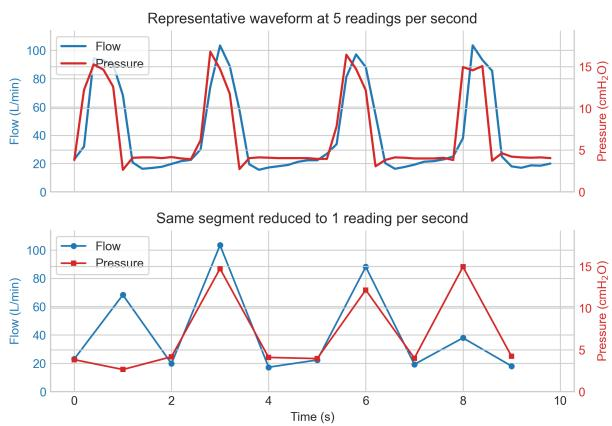
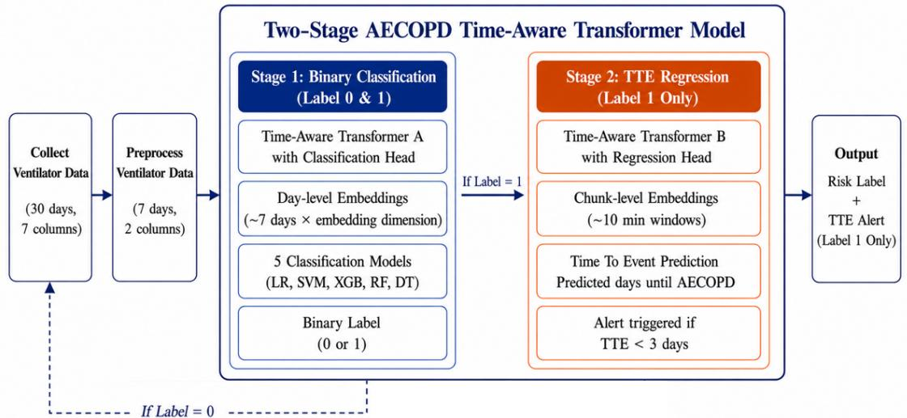
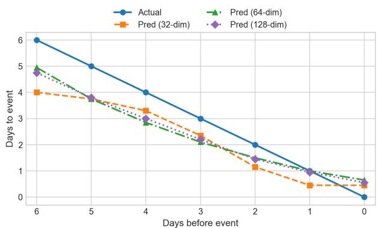

# A Two-Stage Time-Aware Transformer for Short-Horizon AECOPD Risk Prediction

Dongyang Wang, Weihao Qu, Ling Zheng, and Haowen Pan

Acute exacerbation of chronic obstructive pulmonary disease (AECOPD) can worsen rapidly, making timely prediction a clinical priority. Most existing machine learning approaches rely on episodically collected clinical variables, introducing delays that limit their practical utility in home monitoring settings. Home ventilators offer a lower-latency alternative, producing a near-continuous record of respiratory status during daily use. However existing ventilator-based approaches either compress the waveform into handcrafted features or focus primarily on binary risk classification, leaving the timing of an impending event unresolved. In this paper, we present a two-stage framework that operates directly on raw pressure and flow waveforms from the most recent seven days of home ventilator use. The first-stage classification model identifies patients at high risk of a severe exacerbation. The second-stage regression model then estimates how many days remain before the event occurs. Our experimental results demonstrate that the two-stage model outperforms traditional baseline models on both risk classification and time-to-event estimation, with our selected Stage 1 classifier achieving F1 = 0.91 and our Stage 2 regression model achieving RMSE = 1.00 days and $R ^ { 2 } = 0 . 7 6 .$ giving clinicians both an early warning and actionable lead time before a severe exacerbation occurs.

## I. INTRODUCTION

Acute exacerbation of chronic obstructive pulmonary disease (AECOPD) refers to a sudden worsening of respiratory symptoms beyond normal day-to-day variation [1]. AECOPD substantially worsens quality of life and is associated with increased hospitalization and mortality [2]. We therefore view early detection as a clinical priority, but most existing machine learning models rely on clinical and laboratory inputs such as electronic health records, spirometry, blood gas analyses, and symptom questionnaires [3]. Because these signals are collected episodically, they introduce a delay between physiological deterioration and risk detection that is especially problematic for a condition that can worsen rapidly.

Home ventilator waveforms provide a lower-latency alternative. Patients with severe COPD often use home noninvasive ventilators for several hours per day, and the resulting pressure and flow signals offer a near-continuous record of respiratory status in the home environment. Unlike clinicderived measurements, these waveforms are available during routine daily use and can therefore support short-horizon monitoring without waiting for the next hospital visit or test.

Recent machine learning studies have shown that respiratory and clinical time-series data carry predictive value, including explainable COPD risk models [3], data-driven COPD flare-up detection [1], and modern transformer models for multivariate time-series representation learning [4], [5]. However, an important gap remains: many existing AECOPD approaches still aggregate the waveform into handcrafted summary features or otherwise weaken the temporal structure of the raw signal, making it harder to capture the short-horizon dynamics that precede severe exacerbation.

In this paper we address two clinical questions. First, given a rolling window of home ventilator recordings, can a model identify patients at high risk of an imminent severe AECOPD event? Second, for patients already identified as high risk, how many days remain before that severe exacerbation event? We view the first question as supporting early warning, whereas the second provides actionable lead time for intervention.

To answer these questions, we use a two-stage model inspired by recent transformer-based time-series modeling work with temporal representation learning [4], [5]. At a high level, the approach operates directly on raw pressure and flow waveforms over a 7-day window, first producing a binary highrisk decision and then estimating time to event only for the patients identified as high risk. We design the pipeline to preserve the temporal structure of the raw waveform signal and to mirror the natural clinical workflow: screen for risk first, then estimate urgency.

Our main contributions are as follows:

(i) Instead of extracting all ventilator variables into handcrafted features, we keep the two primary waveform channels, pressure and flow, over a 7-day window. These channels directly reflect patients’ respiratory mechanics, triggering, cycling, and air trapping. This method preserves the breath-level temporal dynamics, which are indispensable for short-horizon deterioration prediction.

(ii) Time-Aware Transformer encoder adapted for raw respiratory time-series data, learning patient representations from pressure and flow waveforms that can be reused by downstream classifiers and regression models.

(iii) A two-stage prediction pipeline in which Stage 1 combines the learned representations with downstream classifiers for high-risk classification, and Stage 2 applies a separately trained time-aware regression model for timeto-event estimation in patients identified as high risk.

(iv) An empirical evaluation in which our selected 32- dimensional time-aware Stage 1 configuration uses logistic regression as the primary classifier (F1 = 0.91 for label 1) and XGBoost as a secondary classifier for stability verification, while our selected 64-dimensional Stage 2 model achieves RMSE = 1.00 days, $\mathbf { M A E } = 0 . 8 7$ days, and $R ^ { 2 } = 0 . 7 6$ on the held-out test set.

The remainder of the paper is structured as follows. Section III describes the dataset and preprocessing pipeline. Section IV presents the architecture of the two-stage model. Section V reports experimental results. Section VI discusses clinical implications, limitations, and future directions.

## II. RELATED WORK

Prior work on AECOPD prediction has largely relied on structured clinical variables, telemonitoring summaries, or handcrafted features rather than raw ventilator waveforms. Recent COPD-focused studies have used explainable clinical risk models, data-driven flare-up detection, and day-to-day home noninvasive ventilation parameters to predict or characterize exacerbation risk [1], [3], [6], [7]. These studies support the feasibility of early AECOPD prediction, but they generally depend on engineered features, intermittent measurements, or multimodal summaries that may still introduce latency or discard part of the original temporal waveform structure. In addition, most AECOPD prediction studies formulate the task mainly as binary classification, which can indicate whether risk is elevated but not how soon an event is likely to occur.

More recently, transformer-based time-series models have advanced rapidly, including improved positional encoding for multivariate time-series classification, general-purpose timeseries representation learning, and new architectures for longhorizon temporal modeling [4], [5]. Recent studies have also emphasized scalable explainable AI and behavior-guided learning in intelligent systems [8]–[10].

At the same time, prior long-horizon forecasting work has questioned whether transformer architectures consistently outperform simpler linear baselines for time-series forecasting [11]. A related jump-point time-aware transformer for AECOPD prediction compressed the respiratory waveform into sparse event representations before classification [12]. In contrast, our work keeps the raw pressure and flow waveforms, uses explicit temporal encoding over the last seven days, and extends beyond binary classification to a two-stage pipeline that also estimates time to event. This design is intended to preserve continuous respiratory deterioration patterns that are especially important for downstream regression and alert timing. Prior COPD exacerbation prediction studies have commonly used XGBoost as a strong machine-learning baseline for remote-monitoring and near-future AECOPD prediction [13], [14]. Therefore, we include XGBoost as a non-transformer comparator and stability-check model.

## III. DATA AND PREPROCESSING

## A. Dataset

The dataset initially comprised continuous one-month respiratory time-series recordings from 87 COPD patients collected via daily-use home non-invasive ventilators between 2023 and 2025 (42 patients from 2023, 10 from 2024, and 35 from 2025). Of these, 57 patients were assigned to label 0 (no acute exacerbation), whereas 30 patients were assigned to label 1 (severe AECOPD requiring emergency or intensivecare-level treatment). 2 patients were excluded before model development because their recordings did not provide sufficient temporal coverage for the required analysis windows. The final analysis contained 85 patients. Daily usage ranged from 4 to 12 hours, producing between 72,000 and 220,000 rows per day at a sampling rate of five readings per second. Each row contains eight columns: timestamp, flow, pressure, peripheral oxygen saturation $\mathrm { ( S p O _ { 2 } ) }$ , respiratory rate, tidal volume, minute ventilation, and system leak. Timestamp records the exact date and time of the measurement. Flow, minute ventilation, and leak are recorded in liters per minute. Pressure is recorded as circuit air pressure in centimeters of water $\mathrm { ( c m H _ { 2 } O ) . \ S p O _ { 2 } }$ records peripheral oxygen saturation. Respiratory rate is measured in breaths per minute. Tidal volume is the exhaled volume per breath cycle in mL.

The cohort was split into 48 training, 15 validation, and 22 test patients. Training and validation sets were stratified to preserve the natural 2:1 negative-to-positive ratio (training: 32 label-0, 16 label-1; validation: 10 label-0, 5 label-1), reflecting true clinical prevalence and avoiding artificial resampling. The test set comprises 17 label-0 and 5 label-1 patients.

These ventilator waveform data were obtained from a collaborating hospital, deidentified before analysis, and used under institutional ethics approval and consent procedures to be confirmed in the final manuscript.

Code is available at: https://github.com/WangPage81/ AECOPD-home-ventilator-prediction/tree/main. Patient data cannot be shared due to privacy restrictions.

## B. Preprocessing

We use a targeted preprocessing strategy that retains only the pressure and flow columns from the last 7 days before the prediction reference point.

Rather than using all seven physiological ventilator variables, we retain only the two most clinically representative input channels: pressure and flow. No handcrafted feature extraction or waveform compression is applied. We selected these two channels because they are the primary ventilator scalar waveforms routinely used to assess airway resistance, respiratory mechanics, patient effort, triggering, cycling, and air trapping [15]–[17]. In addition, flow-derived measures such as peak expiratory flow have shown clinical value for detecting COPD exacerbation and assessing hospitalizationlevel deterioration [18], [19].

Figure 1 shows a representative short segment of the raw ventilator waveform used in this study. Because the device records five entries per second, the data preserve fine-grained breath-by-breath temporal variation in flow and pressure, including rapid within-breath changes and cycle-to-cycle transitions. Figure 1 also compares this 5 Hz segment with the same signal reduced to 1 reading per second, showing that much of the waveform shape is lost even before any additional compression is applied. In contrast, jump-point data retain only timestamps where the absolute difference between the current value and the previous retained value exceeds a threshold. This sparse encoding cannot fully preserve the continuous 5 Hz waveform structure used by our model.

  
Fig. 1: Representative raw ventilator waveform segment comparing the original 5 Hz recording with the same segment reduced to 1 reading per second.

We further restrict the input to the most recent seven days before the prediction reference point. This short-horizon window is motivated by both clinical and practical considerations. Clinically, ventilator-based changes associated with impending exacerbation can emerge during the week before hospitalization, and prior studies have explicitly examined abnormal respiratory patterns within a 7-day pre-AECOPD period and developed models for predicting AECOPD in the upcoming 7 days [6], [7]. Practically, using the last seven days keeps the raw-sequence length manageable for transformer processing and keeps the model focusing on the period most relevant to short-horizon deterioration assessment.

## IV. METHODOLOGY

Figure 2 illustrates the architecture of the Two-Stage AE-COPD Time-Aware Transformer Model. The pipeline first preprocesses 30-day raw ventilator data by selecting only the last seven days of pressure and flow. It then applies two separate Time-Aware Transformers: Transformer A for binary classification and Transformer B for time-to-event (TTE) regression.

## A. Separate Time-Aware Transformers

Although Transformer A and Transformer B share the same Time-Aware Transformer architecture family, they are trained independently rather than through transfer learning. This design choice reflects the fact that the two stages solve different learning problems under different data distributions. Transformer A is trained on all 85 patients to separate highrisk from low-risk ventilator patterns, so its parameters are shaped by a binary discrimination objective and by exposure to both label 0 and label 1 examples. Transformer B, by contrast, is trained only on the 29 label 1 patients and optimized for a continuous time-to-event regression target. The countdown target used in Stage 2 (from day 6 to day 0 before exacerbation) has no analogue in Stage 1, so initialising Transformer B from Transformer A would introduce a classification-oriented inductive bias without a clear task-level benefit. Keeping the two transformers separate therefore allows each model to be optimized for its own objective without cross-task interference.

Let a patient’s preprocessed raw sequence be denoted $\mathcal { S } = \{ ( e _ { 1 } , v _ { 1 } , \tau _ { 1 } ) , ( e _ { 2 } , v _ { 2 } , \tau _ { 2 } ) , \dots , ( e _ { N } , v _ { N } , \tau _ { N } ) \}$ , where $e _ { i }$ is the channel type, $v _ { i }$ is the scalar sample value, and $\tau _ { i }$ is the elapsed time from the start of the first recording. We use elapsed time because prior transformer time-series work has shown that absolute or elapsed position encoding preserves sequential order. Time2Vec-style temporal representations can also improve temporal modeling performance [4], [20].

a) Input Embeddings.: Each token is represented as the sum of three embeddings:

$$
\mathbf { x } _ { i } = \mathbf { E } _ { \mathrm { t y p e } } ( e _ { i } ) + \mathbf { E } _ { \mathrm { v a l u e } } ( v _ { i } ) + \mathbf { E } _ { \mathrm { t i m e } } ( \tau _ { i } )\tag{1}
$$

where $\mathbf { E } _ { \mathrm { t y p e } } \in \mathbb { R } ^ { | \mathcal { V } | \times d }$ is a learned type embedding matrix, $\mathbf { E _ { \mathrm { v a l u e } } }$ is a linear projection from scalar to d-dimensional space, and $\mathbf { E } _ { \mathrm { t i m e } }$ is a Time2Vec-style temporal encoding [20] applied to the elapsed-time index:

$$
[ \mathbf { E } _ { \mathrm { t i m e } } ( \tau _ { i } ) ] _ { j } = \left\{ \begin{array} { l l } { w _ { 0 } \tau _ { i } + b _ { 0 } } & { j = 0 } \\ { \sin ( w _ { j } \tau _ { i } + b _ { j } ) } & { j \geq 1 } \end{array} \right.\tag{2}
$$

Using elapsed time from the start provides a stable, monotonic temporal reference within every sample window. This is particularly useful for downstream TTE regression because it aligns within-window progression across patients without introducing irrelevant absolute clock times. A learnable positional encoding is added prior to the transformer encoder layers. Each transformer has $L = 2$ layers of multi-head self-attention followed by feed-forward networks, with H = 4 attention heads and embedding dimension $d \in \{ 3 2 , 6 4 , 1 2 8 \}$

## B. Stage 1: Binary Classification

Stage 1 uses Time-Aware Transformer A with classification head and is trained on all 85 patients. The raw sequence is segmented into day-level segments over the last seven days. Each day is encoded independently, and the resulting seven day-level embeddings are concatenated into a patient feature vector $\mathbf { f } \in \mathbb { R } ^ { 7 d }$ . This vector is then passed to five standard classifiers: Logistic Regression (LR), Support Vector Machine (SVM), Decision Tree (DT), Random Forest (RF), and XGBoost (XGB), as shown in the left branch of Figure 2.

Transformer A is trained end-to-end with binary crossentropy (BCE) loss with positive class weighting:

$$
\mathcal { L } _ { \mathrm { c l s } } = - \frac { 1 } { N } \sum _ { i = 1 } ^ { N } \left[ w _ { + } y _ { i } \log \hat { p } _ { i } + ( 1 - y _ { i } ) \log ( 1 - \hat { p } _ { i } ) \right]\tag{3}
$$

where $w _ { + } ~ = ~ N _ { 0 } / N _ { 1 }$ is the ratio of negative to positive samples. The output of Stage 1 is a binary risk label.

## C. Stage 2: Time-to-Event Regression

Stage 2 uses Time-Aware Transformer B with regression head, which is trained separately and is not weight-shared with Transformer A. This stage uses only the 29 label 1 patients remaining after cohort filtering. Unlike the classification pipeline, the regression pipeline does not reuse saved day-level embeddings from Stage 1. Instead, Transformer B operates directly on raw preprocessed chunks and predicts the time to event, defined here as the time to ICU-level exacerbation, which we refer to here as days until exacerbation (stored in the code as countdown\_days\_target).

  
Fig. 2: Architecture of the Two-Stage AECOPD Time-Aware Transformer Model.

Following the right branch of Figure 2, the regression branch converts raw sequences into chunk-level embeddings using approximately 10-minute windows. The regression head then maps each chunk representation to a scalar TTE target:

$$
\hat { y } _ { \mathrm { r e g } } = g ( \mathbf { z } _ { \mathrm { c h u n k } } )\tag{4}
$$

where g is a regression head. Targets are transformed by log(1 + days) and min-max scaled to [0, 1]. The regression model is trained with mean squared error (MSE) loss on the scaled targets:

$$
\mathcal { L } _ { \mathrm { r e g } } = \frac { 1 } { N } \sum _ { i = 1 } ^ { N } ( \hat { y } _ { i } - y _ { i } ) ^ { 2 }\tag{5}
$$

At inference, the inverse transforms recover predicted days until AECOPD. The deployment logic follows the two-stage workflow shown in Figure 2: each rolling seven-day window is first processed by Stage 1. If Stage 1 predicts label 1, the patient is passed to Stage 2, which outputs the TTE estimate; an alert is triggered when the predicted TTE is less than 3 days. If Stage 1 predicts label 0, no TTE regression is performed for that window, and the system continues monitoring the patient with the next rolling seven-day window.

## D. Training Details

Transformer A and Transformer B use the same Time-Aware Transformer architecture family but are trained as two fully separate models with different data splits, objectives, and checkpoints. Transformer A is trained for classification on all 85 patients, whereas Transformer B is trained only on the 29 label 1 patients used for TTE regression. For example, the 32-dimensional transformer uses 4 attention heads, a feed-forward hidden dimension of 128, and 2 encoder layers. The Adam optimizer is used with learning rate $1 0 ^ { - 3 }$ and weight decay $1 0 ^ { - 5 }$ . The 6,000-row chunk size was selected to fit GPU memory and preserve roughly 10 minutes of continuous waveform context. The embedding dimensions $d \in \{ 3 2 , 6 4 , 1 2 8 \}$ were evaluated to balance model capacity and computational cost. A ReduceLROnPlateau scheduler halves the learning rate after 10 epochs without improvement on the validation metric. Training proceeds for a maximum of 100 epochs with early stopping (patience = 10). Mixed-precision (float16) training via torch.cuda.amp is used throughout.

## V. EXPERIMENTS AND RESULTS

## A. Experimental Setup

All experiments use the cohort described in Section III. We report the two stages of the proposed pipeline separately and then summarise the final combined configuration. For Stage 1 classification, the 85-patient cohort is divided into stratified training, validation, and test sets. Hyperparameters are selected by stratified 5-fold cross-validation on the combined train + validation subset, using F1 score on the positive class (label 1) as the primary selection metric. We compare three embedding dimensions $( d \in \{ 3 2 , 6 4 , 1 2 8 \} )$ ) under two input settings: withtime, in which Time2Vec elapsed-time encoding is included in the transformer input, and notime, in which that explicit temporal encoding is removed.

For Stage 2 regression, training is restricted to the 29 label 1 patients because only these patients have a defined time-to-event (TTE) target. The regression branch uses a 19/5/5 train/validation/test split. Performance is reported on the heldout test set after all model choices are fixed.

## B. Stage 1 Classification Results

Table I summarises the Stage 1 classification results. We observe a clear and consistent pattern: explicit temporal encoding substantially improves classification performance across all model configurations. Across all three embedding dimensions, the withtime models outperform their corresponding notime versions, often by a wide margin. At 32 dimensions, the best withtime model is logistic regression with $\operatorname { F 1 } = 0 . 9 1$ and a 95% CI of 0.67,1.00, whereas the best notime model at the same dimension reaches only F1 = 0.57. At 64 and 128 dimensions, several withtime models achieve perfect scores on the fixed test split. We interpret this pattern as likely overfitting within the small held-out cohort, and we expect a larger patient sample to provide a more reliable basis for model selection.

TABLE I: Stage 1 classification: test-set F1 (label 1) with 95% bootstrap CIs for the raw ventilator data
<table><tr><td>Configuration</td><td>LR</td><td>SVM</td><td>DT</td><td>RF</td><td>XGB</td></tr><tr><td>withtime32</td><td>0.91 [0.67,1.00]</td><td>0.80 [0.33,1.00]</td><td>0.75 [0.00,1.00]</td><td>0.77 [0.40,1.00]</td><td>0.80 [0.40,1.00]</td></tr><tr><td>withtime64</td><td>1.00 [1.00,1.00]</td><td>1.00 [1.00,1.00]</td><td>1.00 [1.00,1.00]</td><td>1.00 [1.00,1.00]</td><td>1.00 [1.00,1.00]</td></tr><tr><td>withtime128</td><td>1.00 [1.00,1.00]</td><td>1.00 [1.00,1.00]</td><td>0.71 [0.36,0.93]</td><td>1.00 [1.00,1.00]</td><td>1.00 [1.00,1.00]</td></tr><tr><td>notime32</td><td>0.57 [0.00,1.00]</td><td>0.00 [0.00,0.00]</td><td>0.31 [0.00,0.62]</td><td>0.20 [0.00,0.53]</td><td>0.37 [0.17,0.58]</td></tr><tr><td>notime64</td><td>0.55 [0.00,0.86]</td><td>0.00 [0.00,0.00]</td><td>0.17 [0.00,0.46]</td><td>0.00 [0.00,0.00]</td><td>0.00 [0.00,0.00]</td></tr><tr><td>notime128</td><td>0.13 [0.00,0.38]</td><td>0.00 [0.00,0.00]</td><td>0.11 [0.00,0.32]</td><td>0.00 [0.00,0.00]</td><td>0.37 [0.17,0.58]</td></tr></table>

TABLE II: Stage 1 classification: test-set F1 (label 1) with 95% bootstrap CIs for the jump-point baseline
<table><tr><td>Configuration</td><td>LR</td><td>SVM</td><td>DT</td><td>RF</td><td>XGB</td></tr><tr><td>jump_withtime32</td><td>0.89 [0.50,1.00]</td><td>0.75 [0.00,1.00]</td><td>0.67 [0.00,1.00]</td><td>0.89 [0.50,1.00]</td><td>0.80 [0.40,1.00]</td></tr><tr><td>jump_withtime64</td><td>0.89 [0.50,1.00]</td><td>0.57 [0.00,1.00]</td><td>0.36 [0.00,0.71]</td><td>0.80 [0.33,1.00]</td><td>0.80 [0.40,1.00]</td></tr><tr><td>jump_withtime128</td><td>0.80 [0.40,1.00]</td><td>0.80 [0.40,1.00]</td><td>0.89 [0.50,1.00]</td><td>0.80 [0.40,1.00]</td><td>0.89 [0.50,1.00]</td></tr></table>

For comparison, we evaluate the jump-point baseline from a prior study by members of the current author team [12], in which raw waveform segments are compressed into 3- dimensional jump-point representations before being passed to a time-aware transformer classifier. Table II shows that the jumppoint baseline reaches best F1 values up to 0.89, whereas our best raw-waveform withtime Stage 1 models in Table I perform better on the fixed test split. More importantly, the jumppoint representation is inherently limited to classification and cannot directly support the continuous time-to-event estimation required in Stage 2, whereas our approach handles both stages within a unified raw-waveform framework.

To test whether the classifiers behave sensibly away from the final 7-day pre-event window, we apply the same Stage 1 models to the first 7 days of each patient’s 30-day recording window, defined as the initial 7 days starting from the first recorded time when the patient used the home ventilator, and treat those earlier windows as expected label 0 inputs. Table III summarises strong and weak models at each embedding dimension.

The contrast between Tables I and II also informs our final Stage 1 choice. Within the 32-dimensional setting, logistic regression gives the strongest non-degenerate result in Table I, with F1 = 0.91 and 95% CI 0.67,1.00. XGBoost is the nextstrongest 32-dimensional withtime alternative at F1 = 0.80 and remains stable in the first-7-day check. Although logistic regression gives the best positive-class F1 on the final-window test set, its weak behavior on the early-window stability check motivates retaining XGBoost as a complementary secondary classifier. We therefore use the 32-dimensional withtime setting with logistic regression as the primary Stage 1 classifier and XGBoost as a secondary classifier for stability verification.

## C. Stage 2 Regression Results

TableIV reports the Stage 2 regression results on the label 1 patients. These test-set results are derived from the leave-onepatient-out cross-validation (LOPO-CV) style evaluation. We first compare the three Time-Aware Transformer regression models and then report non-transformer baselines built from per-day waveform statistics. Among the transformer settings, we select the 64-dimensional model because it achieves the lowest RMSE and MAE and the highest $R ^ { 2 }$ with bootstrap confidence intervals reported in the table. All transformer variants also outperform the summary-statistic baselines, whose $R ^ { 2 }$ values are near zero or negative. The mean and median baselines produce RMSE values near 2.05 days and $R ^ { 2 }$ values close to zero, indicating that simple central-tendency predictors explain little patient-specific TTE variation. Ridge regression performs worse, with RMSE = 2.25 days and negative $\bar { R ^ { 2 } }$ , suggesting that the summary features do not support a reliable linear mapping to TTE in this cohort. XGBoost is the strongest non-transformer baseline but still remains well below the 64-dimensional transformer, which supports using the raw-waveform temporal model rather than only aggregated waveform statistics.

TABLE III: Cross-window stability check on the first 7 days of each patient’s 30-day recording window
<table><tr><td>Dim</td><td>Setting</td><td>Model</td><td>AccL0</td><td>Label 0</td><td>Label 1</td></tr><tr><td>32</td><td>Strong</td><td>XGBoost</td><td>0.97</td><td>78</td><td>7</td></tr><tr><td>32</td><td>Weak</td><td>Logistic Regression</td><td>0.00</td><td>0</td><td>85</td></tr><tr><td>32</td><td>Strong</td><td>Decision Tree</td><td>0.97</td><td>83</td><td>2</td></tr><tr><td>64</td><td>Strong</td><td>XGBoost</td><td>1.00</td><td>85</td><td>0</td></tr><tr><td>64</td><td>Strong</td><td>Logistic Regression</td><td>1.00</td><td>85</td><td>0</td></tr><tr><td>64</td><td>Weak</td><td>SVM</td><td>0.00</td><td>0</td><td>85</td></tr><tr><td>128</td><td>Strong</td><td>SVM</td><td>1.00</td><td>85</td><td>0</td></tr><tr><td>128</td><td>Strong</td><td>Random Forest</td><td>0.95</td><td>76</td><td>9</td></tr><tr><td>128</td><td>Weak</td><td>Decision Tree</td><td>0.00</td><td>0</td><td>85</td></tr></table>

TABLE IV: Stage 2 regression: test-set RMSE(Days), MAE(Days), and $\mathrm { R } ^ { 2 }$ with 95% bootstrap CIs for the raw ventilator data
<table><tr><td>Model</td><td>RMSE</td><td>MAE</td><td> $\mathbf { R } ^ { 2 }$ </td></tr><tr><td>Time-Aware Transformer</td><td></td><td></td><td>0.68 [0.51,0.76]</td></tr><tr><td>32dim 64dim</td><td>1.16 [0.97,1.34] 1.00 [0.85,1.14]</td><td>1.04 [0.86,1.21] 0.87 [0.70,1.03]</td><td>0.76 [0.62,0.84]</td></tr><tr><td>128dim</td><td>1.04 [0.87,1.19]</td><td>0.91 [0.74,1.07]</td><td>0.74 [0.58,0.83]</td></tr><tr><td></td><td>Baselines (all embedding dimensions)</td><td></td><td></td></tr><tr><td>Mean</td><td>2.05 [1.75,2.34]</td><td>1.80 [1.45,2.13]</td><td>0.00 [-0.16,0.00]</td></tr><tr><td>Median</td><td>2.05 [1.74,2.33]</td><td>1.79 [1.42,2.15]</td><td>0.00 [-0.16,0.00]</td></tr><tr><td>Ridge</td><td>2.25 [1.87,2.59]</td><td>1.96 [1.57,2.33]</td><td>-0.20 [-0.63,-0.01]</td></tr><tr><td></td><td>XGBoost 2.12 [1.65,2.55]</td><td>1.76 [1.37,2.17]</td><td>-0.06 [-0.49,0.21]</td></tr></table>

TABLE V: Stage 2 alert threshold: sensitivity, specificity, PPV, and NPV on the 29 label-1 patients (embed dim=64)
<table><tr><td>Threshold</td><td>Sens.</td><td>Spec.</td><td>PPV</td><td>NPV</td></tr><tr><td>&lt; 1 day</td><td>0.97</td><td>0.78</td><td>0.44</td><td>0.99</td></tr><tr><td>&lt; 2 days</td><td>0.96</td><td>0.75</td><td>0.62</td><td>0.98</td></tr><tr><td>&lt; 3 days</td><td>0.96</td><td>0.70</td><td>0.72</td><td>0.96</td></tr><tr><td>&lt; 4 days</td><td>0.99</td><td>0.24</td><td>0.63</td><td>0.95</td></tr><tr><td>&lt; 5 days</td><td>1.00</td><td>0.00</td><td>0.72</td><td>一</td></tr></table>

Based on these results, we use the 64-dimensional model as our Stage 2 regression model. It achieves RMSE = 1.00 days (95% CI 0.85,1.14), MAE = 0.87 days (95% CI 0.70,1.03), and $R ^ { 2 } = 0 . 7 6$ (95% CI 0.62,0.84). The 128-dimensional model remains close but does not improve on the 64-dimensional setting.

To translate the regression output into a clinically usable alert, we evaluate thresholds from 1 to 5 days on all 29 label 1 patients. Table V suggests that a threshold of < 3 days provides the most balanced trade-off among early warning sensitivity, alert precision, and specificity in this cohort. At this threshold, sensitivity is 0.96, specificity is 0.70, PPV is 0.72, and NPV is 0.96. Stricter thresholds reduce PPV, whereas more relaxed thresholds increase sensitivity at the cost of a much heavier false-alert burden.

This threshold analysis is consistent with the patient-level example in Figure 3. This figure is shown as an illustrative prediction for one label 1 patient. For the illustrated test patient, the prediction error narrows as the event approaches, with the most accurate estimates in the final 3 days before exacerbation.

## D. Combined Pipeline Performance

The final two-stage configuration combines what we view as the most defensible Stage 1 setting with the strongest Stage 2 regression model. Specifically, Stage 1 uses the 32-dimensional withtime transformer embedding, with logistic regression as the primary classifier and XGBoost as a secondary classifier for stability verification, and Stage 2 uses the 64-dimensional time-aware regression model. In deployment, a patient is first assigned to label 0 or label 1 from the last 7 days of raw pressure and flow waveforms. Patients predicted as label 0 receive no alert. Patients predicted as label 1 are passed to Stage 2, which outputs the estimated remaining time to event and raises an alert when predicted TTE is below 3 days.

This final combination reflects the different requirements of the two stages. For Stage 1, we prioritise a conservative and interpretable operating point rather than the most optimistic fixed-split score, which leads us to the 32-dimensional logistic regression model while retaining XGBoost as a secondary stability check. For Stage 2, the 64-dimensional transformer gives the best held-out TTE accuracy and supports a practical 3-day alert threshold. Overall, we believe the pipeline suggests that 7 days of raw home-ventilator waveforms can support both high-risk screening and short-horizon event-timing estimation in a single clinically oriented framework.

  
Fig. 3: Illustrative time-to-event prediction example for one representative test patient, not an averaged trajectory. The same patient is evaluated with the 32-, 64-, and 128-dimensional time-aware regression models. The x-axis is shown in reverse order from 6 to 0 days before event.

## VI. DISCUSSION

## A. Clinical Implications

We design this framework to transform raw home ventilator data into two clinically actionable outputs: (1) a binary risk flag indicating whether a patient is trending towards a severe event, and (2) a time-to-event estimate of days remaining before the predicted event. In our experiments, the average lead time is approximately three days. We believe this window allows clinicians to intensify therapy, arrange a clinic visit, or prepare for potential hospital transfer. Such actions have been shown to reduce exacerbation severity and length of stay [1].

A key practical contribution of this study is the design of the two-stage model, which first applies column selection to raw pressure and flow, then performs classification, and finally time-to-event regression. Low latency means that the framework relies on continuously available home ventilator waveforms instead of delayed clinical or laboratory measurements.

This pressure–flow focus is clinically motivated. Pressure and flow are the two ventilator waveforms most routinely inspected at the bedside, and they directly reflect respiratory mechanics, patient effort, triggering/cycling behavior, and air trapping [15]–[17]. In COPD specifically, flow-based measures such as peak expiratory flow have also been associated with exacerbation detection and hospitalization assessment [18], [19]. Transformer inference over a 6,000-row chunk requires only a few seconds on GPU. From a Human-Machine Systems perspective, our two-stage model can reduce reliance on delayed laboratory measurements and serve as a decision-support tool for prioritizing high-risk patients, while leaving final clinical judgment to the clinicians.

## B. Limitations

Several limitations must be acknowledged. The cohort contains 87 patients with an approximately 2:1 class imbalance, which is small by deep learning standards. Hyperparameter optimization was performed with 5-fold cross-validation on the combined training and validation set to reduce overfitting risk, but the 22-patient test set still provides limited statistical power. Baseline demographic characteristics were not available because of privacy restrictions.

The current model uses only two input columns, flow and pressure. This restriction is intentional rather than arbitrary, because these are the primary ventilator scalars used in routine waveform interpretation and capture much of the information most relevant to obstruction, resistance, and patient– ventilator interaction [15]–[17]. Using only two channels also improves GPU efficiency and keeps training and inference computationally manageable on long raw waveform sequences.

External validation is also challenging in this setting. As illustrated by the waveform example in Figure 1, our ventilator recordings are sampled at 5 readings per second, which preserves within-breath shape and rapid cycle-to-cycle variation in flow and pressure. Many public datasets either use very different devices, different waveform definitions, or much lower and incompatible sampling schemes. Hospitals and device manufacturers should standardize ventilator waveform formats and collect higher-frequency data to support more reliable external validation.

Finally, due to the structure of the time-aware transformers, model interpretability remains limited, and its predictions should be used only as decision support while clinicians make the final clinical decisions.

## VII. CONCLUSION

This paper presented the Two-Stage AECOPD Time-Aware Transformer Model for prediction from home ventilator data over a 7-day pipeline. The final system uses raw pressure and flow waveforms as input. Our selected configuration combines a 32-dimensional time-aware embedding with logistic regression as the primary Stage 1 classifier and XGBoost as a secondary classifier for stability verification, together with a 64-dimensional time-aware transformer regression model for Stage 2 time-to-event estimation. On the held-out test set, the selected Stage 1 classifier achieves F1 = 0.91 for the high-risk group (label 1), and the selected Stage 2 regression model achieves RMSE = 1.00 days, MAE = 0.87 days, and $R ^ { 2 } = { }$ 0.76.

In our view, these results suggest that the framework can distinguish high-risk patients and provide short-horizon timing information once a patient is flagged as high risk. Compared with the jump-point baseline, we find that the rawwaveform approach gives stronger classification performance while preserving the temporal continuity required for regression. Overall, we believe the model supports clinically actionable home monitoring over the most recent 7-day window, although larger cohorts are still needed to confirm its generalizability. By combining two-stage prediction with continuous home ventilator monitoring, this framework may support more efficient early identification and intervention for telemedicine and aging-inplace care.

## REFERENCES

[1] R. Rueda, E. Fabello, T. Silva, S. Genzor, J. Mizera, and L. Stanke, “Machine learning approach to flare-up detection and clustering in chronic obstructive pulmonary disease (COPD) patients,” Health Information Science and Systems, vol. 12, no. 1, p. 50, 2024.

[2] A. Lenoir, H. Whittaker, A. Gayle, D. Jarvis, and J. K. Quint, “Mortality in non-exacerbating COPD: a longitudinal analysis of UK primary care data,” Thorax, vol. 78, no. 9, pp. 904–911, 2023.

[3] C. T. Kor, Y. R. Li, P. R. Lin, S. H. Lin, B. Y. Wang, and C. H. Lin, “Explainable machine learning model for predicting first-time acute exacerbation in patients with chronic obstructive pulmonary disease,” Journal of Personalized Medicine, vol. 12, no. 2, p. 228, Feb. 2022.

[4] N. M. Foumani, C. W. Tan, G. I. Webb, and M. Salehi, “Improving position encoding of transformers for multivariate time series classification,” Data Mining and Knowledge Discovery, vol. 38, pp. 22–48, Jan. 2024.

[5] S. Wang, J. Li, X. Shi, Z. Ye, B. Mo, W. Lin, S. Ju, Z. Chu, and M. Jin, “TimeMixer++: A general time series pattern machine for universal predictive analysis,” in International Conference on Learning Representations, vol. 2025, 2025, pp. 16 980–17 016.

[6] W. Jiang, Y. Chao, X. Wang, C. Chen, J. Zhou, and Y. Song, “Dayto-day variability of parameters recorded by home noninvasive positive pressure ventilation for detection of severe acute exacerbations in COPD,” International Journal of Chronic Obstructive Pulmonary Disease, vol. 16, pp. 727–737, Mar. 2021.

[7] C.-T. Wu, G.-H. Li, C.-T. Huang, Y.-C. Cheng, C.-H. Chen, J.-Y. Chien, P.-H. Kuo, L.-C. Kuo, and F. Lai, “Acute exacerbation of a chronic obstructive pulmonary disease prediction system using wearable device data, machine learning, and deep learning: Development and cohort study,” JMIR mHealth and uHealth, vol. 9, no. 5, May 2021.

[8] M. Tyrovolas, N. D. Kallimanis, and C. Stylios, “Efficient total causal effect computation in fuzzy cognitive maps for scalable explainable artificial intelligence,” IEEE Systems, Man, and Cybernetics Letters, 2026.

[9] Y. Li, Y. Zhou, S. Dai, J. Wang, and X. Wu, “Behavior-guided identity learning for multiagent cooperation,” IEEE Systems, Man, and Cybernetics Letters, 2026.

[10] W. Qu, D. Wang, L. Zheng, F. E. Alvarez, S. Polasa, and J. Wang, “Multimodal injury risk and performance prediction in tennis using weighted ensemble learning,” IEEE Systems, Man, and Cybernetics Magazine, pp. 1–7, 2026, early Access.

[11] A. Zeng, M. Chen, L. Zhang, and Q. Xu, “Are transformers effective for time series forecasting?” in AAAI Conference on Artificial Intelligence, vol. 37, no. 9, 2023, pp. 11 121–11 128.

[12] W. Qu, L. Zheng, D. Wang, J. Wang, and H. Pan, “Time-aware transformerbased prediction model for AECOPD,” Studies in Health Technology and Informatics, vol. 329, pp. 1089–1093, 2025.

[13] H. Yin, K. Wang, R. Yang, Y. Tan, Q. Li, W. Zhu, and S. Sung, “A machine learning model for predicting acute exacerbation of in-home chronic obstructive pulmonary disease patients,” Computer Methods and Programs in Biomedicine, vol. 246, p. 108005, 2024.

[14] K.-M. Liao, K.-C. Cheng, M.-I. Sung, Y.-T. Shen, C.-C. Chiu, C.-F. Liu, and S.-C. Ko, “Machine learning approaches for practical predicting outpatient near-future AECOPD based on nationwide electronic medical records,” iScience, vol. 27, no. 4, p. 109542, 2024.

[15] D. R. Hess, “Ventilator waveforms and the physiology of pressure support ventilation,” Respiratory Care, vol. 50, no. 2, pp. 166–186, Feb. 2005.

[16] E. R. Fernandez-Perez and R. D. Hubmayr, “Interpretation of airway´ pressure waveforms,” Intensive Care Medicine, vol. 32, no. 5, pp. 658– 659, May 2006.

[17] N. T. Hamahata, R. Sato, and E. G. Daoud, “Go with the flow—clinical importance of flow curves during mechanical ventilation: a narrative review,” Canadian Journal of Respiratory Therapy, vol. 56, pp. 11–20, Jul. 2020.

[18] J. Cen, H. Ma, Z. Chen, L. Weng, and Z. Deng, “Monitoring peak expiratory flow could predict COPD exacerbations: a prospective observational study,” Respiratory Medicine, vol. 148, pp. 43–48, Mar. 2019.

[19] J. Cen and L. Weng, “Comparison of peak expiratory flow (PEF) and COPD assessment test (CAT) to assess COPD exacerbation requiring hospitalization: a prospective observational study,” Chronic Respiratory Disease, vol. 19, p. 14799731221081859, Feb. 2022.

[20] S. M. Kazemi, R. Goel, S. Eghbali, J. Ramanan, J. Sahota, S. Thakur et al., “Time2Vec: Learning a vector representation of time,” arXiv preprint arXiv:1907.05321, Jul. 2019.