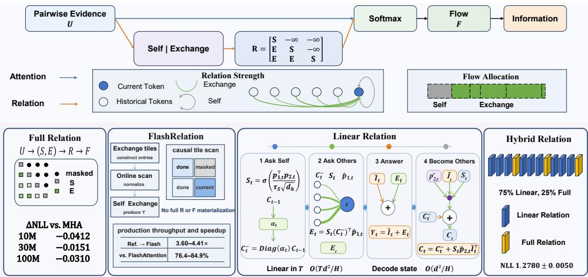
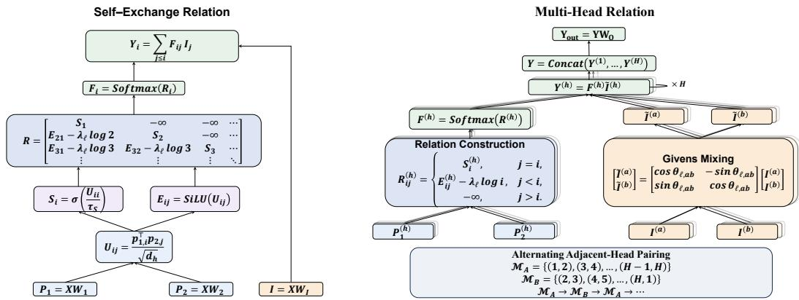

# ASK SELF, ASK OTHERS: RELATION IS ALL YOU NEED

Yuting Ge1,∗   
1Department of Electrical Engineering City University of Hong Kong   
yutingge3-c@my.cityu.edu.hk

Yang Pengju2,† 2Jilin University yangda1223@outlook.com

Mingkai Nie3,† 3National University of Singapore mingkai.nie@u.nus.edu

† These authors contributed equally. ∗ Corresponding author.

## ABSTRACT

Attention directly derives normalized information flow from pairwise scores. We introduce Relation, an alternative token-mixing primitive that first organizes pairwise evidence into explicit Self and Exchange relations and derives information flow afterward. This relational organization gives rise to Full Relation, FlashRelation, Linear Relation, Hybrid Relation, and a KV-style Relation Cache. Across matched decoder-only models at approximately 10M, 30M, and 100M parameters, Full Relation achieves lower final validation NLL than MHA at all three scales. In a fixed-context reference benchmark, FlashRelation is 3.60–4.41× faster than the materialized Full Relation implementation. Across scale-matched production workloads, it reaches 76.4–84.9% of PyTorch FlashAttention throughput while executing the Full Relation operator. Hybrid Relation uses 75% Linear Relation layers and achieves strong language-modeling quality. These results support a relation-first view of token mixing: ask Self, ask Others, then let Flow follow Relation.

## 1 INTRODUCTION

In scaled dot-product Attention, each head maps the interaction between two projected token states to a scalar score (Vaswani et al., 2017),

$$
U _ { i j } = \frac { q _ { i } ^ { \top } k _ { j } } { \sqrt { d _ { h } } } , F _ { i } = \mathrm { S o f t m a x } ( U _ { i } ) .
$$

Token interactions in language are heterogeneous. But in Attention, one scalar carries too much. Attention uses the same $\bar { U _ { i j } }$ to encode whatever relational structure matters and to directly determine information flow. Relation formation and flow allocation are therefore compressed into a single U →F step.

Attention itself was not always primary. It first appeared as an auxiliary mechanism within recurrent encoder–decoder models before becoming the organizing primitive of the Transformer (Bahdanau et al., 2015; Vaswani et al., 2017). Relation-aware Attention places relation in a similarly subordinate position. Shaw et al. (2018) augment self-attention with pairwise relation representations, but relation is still inside Attention. Attention remains primary: it incorporates relation into its own computation and still determines the flow. We reverse this hierarchy: Flow follows Relation.

We begin by decomposing Relation into two minimal structural roles: Self and Exchange. Self describes a token’s relation with itself, while Exchange describes its relation with other tokens. Pairwise evidence is mapped into these two roles before normalization, and the resulting entries are assembled into a causal Relation matrix R. Normalized information flow F is derived only after ward. This defines the basic Self–Exchange Relation (SER) operator, which extends naturally to Multi-Head Relation (MHR). This explicit organization also exposes further forms of Relation in practice: Full Relation retains explicit token-wise history, FlashRelation factorizes it for tiled execution, Linear Relation compresses historical Others into a recurrent state, Hybrid Relation combine Full and Linear layers, and Relation Cache supports autoregressive decoding.

  
Figure 1: Overview of Relation.

We evaluate Relation at approximately 10M, 30M, and 100M parameters under matched decoderonly settings. Full Relation achieves lower final-validation NLL than MHA at all three scales, while structural ablations examine the roles of its main relational components. We further evaluate practical realizations of Relation: FlashRelation provides exact tiled execution of Full Relation, Linear Relation replaces explicit token-wise history with a recurrent relational state, Hybrid Relation composes Full and Linear layers, and Relation Cache supports autoregressive decoding. Together, these results support Relation as a viable and practical alternative token-mixing primitive (Figure 1). Our main contributions are:

• We introduce Self–Exchange Relation (SER) and Multi-Head Relation (MHR) as Relation operators for token mixing.

• We characterize Self–Exchange flow and derive its exact factorization into Self mass, aggregate Exchange mass, and allocation within historical Exchange.

• Building on Relation’s distinct relational organization, we develop Relation-specific practical forms, including FlashRelation, Linear Relation, and Hybrid Relation, and mathematically derive an exact KV-style Relation Cache for autoregressive decoding.

## 2 BACKGROUND

Scaled dot-product Attention represents pairwise token interactions through compatibility scores that are normalized into token-to-token mixing weights (Vaswani et al., 2017). Subsequent work has enriched how these interactions are represented and transformed. Relative-position Attention incorporates pairwise relation representations into the scoring process (Shaw et al., 2018), while learned or structured positional biases reshape pre-normalization scores (Raffel et al., 2020; Press et al., 2022; Chi et al., 2022). Sigmoid self-attention modifies the normalization itself (Ramapuram et al., 2025). Talking-Heads Attention introduces projections across the attention-head dimension around Softmax (Shazeer et al., 2020), while the Gated Attention Unit combines single-head attention with gating (Hua et al., 2022).

Beyond Attention, alternative token-mixing operators explore different ways to organize information exchange across a sequence. FNet replaces self-attention with Fourier mixing (Lee-Thorp et al., 2022), PoNet uses multi-granularity pooling (Tan et al., 2022), and HyperMixer dynamically constructs token-mixing MLPs (Mai et al., 2023).

A separate line of work focuses on how token mixing is executed and how historical information is represented. FlashAttention and FlashAttention-2 evaluate exact softmax Attention through tiled, IO-aware execution (Dao et al., 2022; Dao, 2024). Linear and recurrent approaches replace explicit quadratic token-token interaction with associative or recurrent states (Katharopoulos et al., 2020; Sun et al., 2023; Yang et al., 2024; 2025). Kimi Delta Attention (KDA) further develops recurrentstate token mixing, while Kimi Linear combines KDA with full-attention MLA layers in a hybrid architecture (Kimi Team et al., 2025).

These lines place Relation alongside three complementary directions in token mixing: interaction representation, efficient execution, and recurrent history. Relation connects these directions through a common relational organization. The following sections develop this framework from its basic Self–Exchange Relation (SER) operator to its practical forms.

## 3 RELATION

We first introduce Self–Exchange Relation (SER), the basic Relation operator. We then extend SER to Multi-Head Relation (MHR), as illustrated in Figure 2.

  
Figure 2: Self–Exchange Relation and Multi-Head Relation.

## 3.1 SELF–EXCHANGE RELATION

Given an input sequence X, we project it into two relation spaces and an information space,

$$
P _ { 1 } = X W _ { 1 } , \qquad P _ { 2 } = X W _ { 2 } , \qquad I = X W _ { I } .
$$

$$
U _ { i j } = \frac { p _ { 1 , i } ^ { \top } p _ { 2 , j } } { \sqrt { d _ { h } } } .\tag{1}
$$

The head-wise $P _ { 1 }$ and $P _ { 2 }$ entering U use RoPE, while I remains unrotated.

Relation distinguishes a token’s interaction with itself from its interactions with other tokens. We define the Self and Exchange relation mappings as

$$
\begin{array} { c } { { S _ { i } = \sigma \left( \frac { U _ { i i } } { \tau _ { S } } \right) , \qquad E _ { i j } = \mathrm { S i L U } \left( U _ { i j } \right) , } } \\ { { \qquad \ R _ { i j } = \left\{ \begin{array} { l l } { { S _ { i } , } } & { { j = i , } } \\ { { E _ { i j } - \lambda _ { \ell } \log i , } } & { { j < i , } } \\ { { - \infty , } } & { { j > i . } } \end{array} \right. } } \end{array}\tag{2}
$$

The Self temperature $\tau _ { S } > 0$ controls the scale and smoothness of the bounded Self mapping. We set $\tau _ { S } = 2$ in all formal experiments and this fixed value is not treated as theoretically unique.

As the number of visible predecessors increases, aggregate Exchange evidence receives a candidatecount contribution. We therefore use a learnable layer-wise coefficient $\lambda _ { \ell }$ and apply the logarithmic

correction −λ log i, following the broader use of logarithmic length corrections in attention mechanisms (Ramapuram et al., 2025).

Normalized information flow is derived only after the Relation has been constructed and is applied to the information states,

$$
\begin{array} { c } { F _ { i } = \displaystyle \mathrm { S o f t m a x } \left( R _ { i } \right) , } \\ { Y _ { i } = \displaystyle \sum _ { j \leq i } F _ { i j } I _ { j } , } \\ { X _ { \ell + 1 } = X _ { \ell } + Y W _ { O } . } \end{array}\tag{3}
$$

## 3.2 MULTI-HEAD RELATION

We extend Relation to H heads. The projected relation spaces and information space are partitioned into H subspaces, each of width $d _ { h } \stackrel { \_ } { = } d { } / H$ . Each head independently applies the SER construction from Sec. 3.1, yielding its own $R ^ { ( h ) }$ and $F ^ { ( h ) }$

Before applying the flow, we mix the information states across adjacent head pairs using learnable Givens rotations (Jing et al., 2017). The pairing pattern alternates between successive layers,

$$
\begin{array} { r } { \left[ \widetilde { I } ^ { ( a ) } \right] = \left[ \begin{array} { c c } { \cos \theta _ { \ell , a b } } & { - \sin \theta _ { \ell , a b } } \\ { \sin \theta _ { \ell , a b } } & { \cos \theta _ { \ell , a b } } \end{array} \right] \left[ \begin{array} { c c } { I ^ { ( a ) } } \\ { I ^ { ( b ) } } \end{array} \right] . } \end{array}\tag{4}
$$

Each head then transports its mixed information according to its own flow, and the head outputs are concatenated and projected back to the residual stream,

$$
\begin{array} { c } { { Y ^ { ( h ) } = F ^ { ( h ) } \widetilde { I } ^ { ( h ) } , } } \\ { { X _ { \ell + 1 } = X _ { \ell } + { \mathrm { C o n c a t } } _ { h = 1 } ^ { H } \left( Y ^ { ( h ) } \right) W _ { O } . } } \end{array}\tag{5}
$$

## 4 WHY RELATION

Why introduce an explicit Relation matrix between pairwise evidence and information flow? The purpose of R is to change how token mixing is organized before normalization.

## 4.1 RELATION IS CONSTRUCTED BEFORE FLOW

In canonical Attention, pairwise compatibility scores directly form the logits from which normalized information flow is derived. Relation instead constructs an explicit relational structure before normalization. As defined in Sec. 3.1, R is assembled from role-specific Self and Exchange entries, with Self on the diagonal and Exchange over the causal history. The two roles are therefore defined before they compete for information flow.

Treating R as an explicit object in the operator definition does not require materializing the full matrix during execution. Because R is defined entrywise from pairwise evidence through the Self– Exchange construction, the required evidence and Exchange entries can be formed and consumed as needed. R specifies how token mixing is organized, while its computational representation can remain implicit.

## 4.2 HOW RELATION FORMS SELF–EXCHANGE FLOW

Because Self and Exchange are already explicit in R, the normalized flow admits an exact decomposition aligned with these roles. For token $i ,$ collect the historical Exchange entries into

For token $i > 1$ , let $S _ { i }$ denote the constructed Self relation from Eq. (2). We define the historical Exchange log-normalizer $L _ { i } ^ { E }$ , its count-corrected aggregate $A _ { i }$ , and the full row normalizer $Z _ { i }$ as

$$
\begin{array} { c } { { \mathrm { L S E } _ { j < i } ( a _ { j } ) \equiv \displaystyle \log \sum _ { j < i } e ^ { a _ { j } } , } } \\ { { { } } } \\ { { L _ { i } ^ { E } = \mathrm { L S E } _ { j < i } ( E _ { i j } ) , ~ A _ { i } = L _ { i } ^ { E } - \lambda _ { \ell } \log i = \mathrm { L S E } _ { j < i } ( R _ { i j } ) , } } \\ { { { } } } \\ { { Z _ { i } = e ^ { S _ { i } } + e ^ { A _ { i } } . } } \end{array}\tag{6}
$$

The normalized flow first divides its mass between Self and aggregate Exchange,

$$
F _ { i i } = \frac { e ^ { S _ { i } } } { e ^ { S _ { i } } + e ^ { A _ { i } } } = \sigma ( S _ { i } - A _ { i } ) , \qquad g _ { i } \equiv \sum _ { j < i } F _ { i j } = \frac { e ^ { A _ { i } } } { e ^ { S _ { i } } + e ^ { A _ { i } } } = \sigma ( A _ { i } - S _ { i } ) , \qquad F _ { i i } + g _ { i } = 1 .\tag{7}
$$

Thus, the normalized flow is partitioned exactly between the Self mass $F _ { i i }$ and the aggregate Exchange mass $g _ { i }$

Conditional on Exchange, the mass $g _ { i }$ is distributed across historical tokens according to

$$
\begin{array} { r l } & { \pi _ { i j } ^ { E } \equiv \frac { F _ { i j } } { g _ { i } } = \frac { e ^ { R _ { i j } } } { \sum _ { k < i } e ^ { R _ { i k } } } = \frac { e ^ { E _ { i j } } } { \sum _ { k < i } e ^ { E _ { i k } } } , \qquad j < i , } \\ & { F _ { i j } = \frac { e ^ { R _ { i j } } } { Z _ { i } } = \frac { e ^ { A _ { i } } } { Z _ { i } } \frac { e ^ { R _ { i j } } } { e ^ { A _ { i } } } = g _ { i } \frac { e ^ { R _ { i j } } } { \sum _ { k < i } e ^ { R _ { i k } } } = g _ { i } \pi _ { i j } ^ { E } . } \end{array}\tag{8}
$$

The communicated information is therefore

$$
Y _ { i } = \sum _ { j \le i } F _ { i j } \widetilde { I } _ { j } = F _ { i i } \widetilde { I } _ { i } + g _ { i } \sum _ { j < i } \pi _ { i j } ^ { E } \widetilde { I } _ { j } .\tag{9}
$$

The normalized flow therefore has two levels. It first determines how much mass remains with Self and how much enters Exchange. Conditional on Exchange, it then determines how that mass is distributed across historical tokens. Intuitively, Relation first asks whether a token should rely on itself or draw from its history, and if it draws from history, it then decides where to look.

## 4.3 INSIDE RELATION: HOW A TOKEN’S FLOW IS DETERMINED

We now examine what determines these two stages for an individual token i. The balance between Self and aggregate Exchange is given exactly by

$$
\log { \frac { g _ { i } } { F _ { i i } } } = A _ { i } - S _ { i } = \mathrm { L S E } _ { j < i } \left( E _ { i j } \right) - S _ { i } - \lambda _ { \ell } \log i .\tag{10}
$$

Equation (10) shows that the Self–Exchange balance is governed exactly by the gap $A _ { i } - S _ { i }$

A larger $A _ { i } - S _ { i }$ shifts flow toward Exchange, whereas a smaller $A _ { i } - S _ { i }$ shifts flow toward Self.

Once flow enters Exchange, the question changes from whether to use history to where in history to look. For any two historical positions $j , k < i ,$

$$
R _ { i j } - R _ { i k } = E _ { i j } - E _ { i k } .\tag{11}
$$

Because the logarithmic correction is shared by all historical positions in the row, it cancels in pairwise differences. The relative allocation within Exchange is therefore determined entirely by the Exchange relations $E _ { i j }$

Thus, for token i, Self versus aggregate Exchange is governed by $A _ { i } - S _ { i }$ , while allocation within history is governed by relative Exchange relations.

## 4.4 WHAT RELATION CHANGES IN TOKEN MIXING

In Relation, Self and Exchange are explicitly constructed before normalization. Their distinct roles survive in the resulting information flow, even after normalization. Canonical Attention has no such relational stage: its pairwise scores are normalized directly into flow. Relation therefore makes relation formation a distinct stage of token mixing, with information flow derived afterward. We next turn from this relational organization to its practical realizations and evaluation in Sections 5 and 6.

## 5 RELATION IN PRACTICE

The same Self–Exchange organization gives rise to a family of practical Relation forms. We call the explicit token-to-token operator defined in Sec. 3 Full Relation. FlashRelation is its exact fused execution, while Linear Relation represents historical Relation through a recurrent state. Hybrid Relation composes Full and Linear layers within a single decoder, and Relation Cache provides the autoregressive state used by Full Relation.

## 5.1 FACTORIZED SELF–EXCHANGE: FLASHRELATION

The Relation factorization derived in Sec. 4.2 separates historical Exchange aggregation from the final allocation between Self and Exchange. This factorization leads us to develop FlashRelation, a tiled realization of Full Relation. For token i, historical Exchange entries are processed through a causal tiled scan. For each tile $B ,$ , we maintain a running maximum m, normalizer l, and information accumulator z:

$$
\begin{array} { c } { m ^ { \prime } = \operatorname* { m a x } \left( m , \underset { j \in \mathcal { B } } { \operatorname* { m a x } } E _ { i j } \right) , } \\ { l ^ { \prime } = e ^ { m - m ^ { \prime } } l + \displaystyle \sum _ { j \in \mathcal { B } } e ^ { E _ { i j } - m ^ { \prime } } , \quad \quad z ^ { \prime } = e ^ { m - m ^ { \prime } } z + \displaystyle \sum _ { j \in \mathcal { B } } e ^ { E _ { i j } - m ^ { \prime } } \widetilde { I } _ { j } . } \end{array}\tag{12}
$$

After each tile, $( m , l , z ) \gets ( m ^ { \prime } , l ^ { \prime } , z ^ { \prime } )$ . Let $( m _ { i } , l _ { i } , z _ { i } )$ denote the terminal accumulators after the historical Exchange scan. They yield

$$
L _ { i } ^ { E } = m _ { i } + \log { l _ { i } } , \bar { I } _ { i } ^ { E } = { \frac { z _ { i } } { l _ { i } } } ,\tag{13}
$$

where $L _ { i } ^ { E }$ is the aggregate historical Exchange log-normalizer and $\bar { I } _ { i } ^ { E }$ is the normalized historical information summary. The row is then completed by

$$
A _ { i } = L _ { i } ^ { E } - \lambda _ { \ell } \log i , \qquad g _ { i } = \sigma ( A _ { i } - S _ { i } ) , \qquad Y _ { i } = ( 1 - g _ { i } ) \widetilde { I } _ { i } + g _ { i } \bar { I } _ { i } ^ { E } .\tag{14}
$$

Following the online-softmax tiling principle of FlashAttention (Dao et al., 2022), the historical Exchange scan is evaluated tile by tile without materializing the full R or $F$

## 5.2 CHANGE EXCHANGE: LINEAR AND HYBRID RELATION

Full Relation represents Exchange explicitly between the current token and individual historical tokens. Exchange can instead operate over a recurrent relational state that compresses individual historical Others, while Self remains tied to the current token. This leads to Linear Relation, with

$$
C _ { t } ^ { ( h ) } \in \mathbb { R } ^ { d _ { h } \times d _ { h } } .
$$

Using the same projections introduced in Sec. 3.1, the current Self relation and the two normalized relation coordinates are

$$
\begin{array} { r l r } & { } & { { S _ { t } } = \sigma \left( \frac { p _ { 1 , t } ^ { \top } p _ { 2 , t } } { \tau _ { S } \sqrt { d _ { h } } } \right) , } \\ & { } & { \hat { p } _ { 1 , t } = \frac { p _ { 1 , t } } { \| p _ { 1 , t } \| _ { 2 } } , \qquad \hat { p } _ { 2 , t } = \frac { p _ { 2 , t } } { \| p _ { 2 , t } \| _ { 2 } } . } \end{array}\tag{15}
$$

Historical Relation is maintained with an input-dependent channel-wise retention. Linear Relation applies the same RoPE to $p _ { 1 , t }$ and $p _ { 2 , t }$ before computing $S _ { t }$ and the normalized relation coordinates. Following the retention parameterization of KDA (Kimi Team et al., 2025),

$$
r _ { t } = W _ { \alpha } ^ { \dagger } W _ { \alpha } ^ { \dagger } \bar { x } _ { t } , \qquad g _ { t } = - \exp ( A _ { \mathrm { l o g } } ) \odot \mathrm { s o f t p l u s } ( r _ { t } + d t _ { \mathrm { b i a s } } ) , \qquad \alpha _ { t } = \exp ( g _ { t } ) \in ( 0 , 1 ] _ { \phantom { d } \dot { \varepsilon } \dot { \varepsilon } } ^ { d _ { h } } .\tag{16}
$$

With historical Others compressed into a recurrent state, the current token determines how that history is used through its Self relation. Linear Relation therefore follows the sequence

$$
\Bigl | \mathrm { A s k ~ S e l f }  \mathrm { A s k ~ O t h e r s }  \mathrm { A n s w e r }  \mathrm { B e c o m e ~ O t h e r s } \Bigr | .
$$

The recurrent Relation step is

$$
\begin{array} { r l } & { C _ { t } ^ { - } = \mathrm { D i a g } ( \alpha _ { t } ) C _ { t - 1 } , } \\ & { E _ { t } = S _ { t } ( C _ { t } ^ { - } ) ^ { \top } \hat { p } _ { 1 , t } , } \\ & { Y _ { t } = \widetilde { I } _ { t } + E _ { t } , } \\ & { C _ { t } = C _ { t } ^ { - } + S _ { t } \hat { p } _ { 2 , t } \widetilde { I } _ { t } ^ { \top } . } \end{array}\tag{17}
$$

Here, $S _ { t }$ determines the current Self relation and modulates both the read from historical Others and the write that makes the current token part of future Others. The read occurs before the current write, so $E _ { t }$ has strictly historical support. Each token asks Self, consults Others, forms its answer, and then becomes Others for future tokens. The resulting token-mixing complexity and decode-state requirements are summarized in Table 1.

Table 1: Complexity refers to the token-mixing core. Linear sequential operations refer to the direct recurrence.
<table><tr><td>Layer Type</td><td>Complexity</td><td>Token-Mixing Sequential Ops. Decode History</td><td>State</td></tr><tr><td>MHA / FlashAttention</td><td> $O ( T ^ { 2 } d )$ </td><td>O(1)</td><td>O(Td)</td></tr><tr><td>Full / FlashRelation</td><td> $O ( T ^ { 2 } d )$ </td><td>0(1)</td><td> $O ( T d )$ </td></tr><tr><td>Linear Relation</td><td> ${ \bf O } ( { \bf T d ^ { 2 } } / { \bf H } )$ </td><td>O(T)</td><td> ${ \bf O } ( { \bf d ^ { 2 } } / \dot { \bf H } )$ </td></tr></table>

Full and Linear Relation provide complementary regimes. Linear Relation scales linearly with sequence length and uses a fixed-size decode state, while Full Relation retains O(1) sequential operations. Hybrid Relation combines the two by interleaving Linear and Full Relation layers. Following the hybrid layerwise design used in Kimi Linear (Kimi Team et al., 2025), our evaluated configuration uses nine Linear Relation layers and three Full Relation layers.

## 5.3 CACHE HISTORY: RELATION CACHE

During autoregressive decoding, Attention commonly caches the key and value states of previous tokens to avoid recomputing the full prefix (Shazeer, 2019; Pope et al., 2023). Relation admits an analogous projected cache. At each step, only the new Relation row is formed. From the pairwiseevidence definition in Sec. 3.1, each future row uses its own current $P _ { 1 }$ coordinate against historical $P _ { 2 }$ coordinates. Once a token’s row has been formed, its $P _ { 1 }$ state is therefore no longer reused, whereas its $P _ { 2 }$ state continues to participate in Relation construction for future tokens. Historical information states are likewise reused for transport. Therefore,

$$
\mathcal { C } _ { t } = \{ P _ { 2 , 1 : t } , \widetilde { I } _ { 1 : t } \} .\tag{18}
$$

At the next decoding step, only the new Relation row is constructed from the current $P _ { 1 }$ and the cached historical states.

## 6 EXPERIMENTS

We compare MHA and Full Relation under matched decoder geometry, data order, and training budget. Experiments cover approximately 10M, 30M, and 100M parameters and use paired seeds 42, 43, and 44. Scale-specific architectures, datasets, context lengths, and token budgets are summarized in Table 2. Our primary metric is final-checkpoint NLL on the full validation set, and structural ablations use the 10M setting with the same three seeds. All models use full-head RoPE with base $1 0 ^ { 4 }$ and no positional scaling. Systems benchmarks are conducted separately on an NVIDIA RTX 5090 in BF16 and report tuned steady-state throughput. Full optimization, evaluation, per-seed, and secondary benchmark details are provided in Appendices B, C, and E.

## 6.1 LANGUAGE MODELING AND STRUCTURAL ABLATIONS

Across the three model scales, Full Relation achieves lower mean final-validation NLL than MHA, with improvements of 0.0412, 0.0151, and 0.0310 at 10M, 30M, and 100M parameters, respectively (Table 2).

Table 2: Main validation results. NLL is mean ± sample standard deviation over three seeds. Back bone reports layers $/ d _ { \mathrm { m o d e l } }$ / heads $\times d _ { h } / d _ { \mathrm { f f } }$
<table><tr><td>Scale Backbone</td><td></td><td>Data/Vocab</td><td></td><td>Ctx Tokens</td><td>MHA NLL ↓</td><td>Relation NLL ↓</td><td> $\Delta$ </td></tr><tr><td></td><td>10M 6L/384/8×48/768</td><td>TinyStories/4K 1024</td><td></td><td></td><td></td><td>150M 1.6853 ± 0.0042 1.6441 ± 0.0124 −0.0412</td><td></td></tr><tr><td>30M</td><td> $1 0 \mathrm { L } / 5 1 2 / 8 \times 6 4 / 1 0 2 4$ </td><td></td><td></td><td></td><td></td><td>TinyStories/4K 2048 450M 1.3001 ± 0.0044 1.2850 ± 0.0136 -0.0151</td><td></td></tr><tr><td>100M</td><td> $2 0 \mathrm { L } / 6 4 0 / 8 \times 8 0 / 1 2 8 0$ </td><td></td><td></td><td></td><td></td><td>SmolLM/32K 4096 1.071B 2.9373 ± 0.0093 2.9063 ± 0.0061 -0.0310</td><td></td></tr></table>

We next examine several structural choices in Full Relation on the 10M setting (Table 3). Exchangeonly transport and Raw-X communication increase final-validation NLL, while removing count calibration or collapsing Relation to a single head produces larger degradations. We also evaluate No-Givens mixing $( \overset { \cdot } { I } = \overset { \cdot } { I } )$ The exact ablation definitions and per-seed results are provided in Appendix D.

Table 3: Structural ablations on the 10M setting. NLL is mean ± sample standard deviation over three seeds.
<table><tr><td>Metric</td><td>Full Relation</td><td>Exchange-only transport  $\begin{array} { r } { Y _ { i } = \sum _ { j < i } F _ { i j } \widetilde { I _ { j } } } \end{array}$ </td><td>Raw-X communication I = X</td><td>No count calibration λe = 0</td><td>No Givens mixing Î = I</td><td>Single head  $\check { H } = 1$ </td></tr><tr><td>NLL↓ ∆ vs Full</td><td>1.6441 ± 0.01241.6761 ± 0.00971.6807 ± 0.00741.6947 ± 0.02031.6474 ± 0.0176 1.6948 ± 0.0221</td><td>+0.0320</td><td>+0.0366</td><td>+0.0506</td><td>+0.0032</td><td>+0.0507</td></tr></table>

## 6.2 EFFICIENT IMPLEMENTATIONS

In a fixed-context $T = 1 0 2 4$ reference benchmark, FlashRelation is 3.60–4.41× faster than the materialized Full Relation reference implementation. Across the three scale-matched production workloads, FlashRelation reaches 76.4–84.9% of PyTorch FlashAttention throughput while executing the exact Full Relation operator (Table 4). Same-micro throughput comparisons and Linear Relation throughput results are reported in Appendices H and I.

Table 4: FlashRelation systems results on an RTX 5090 in BF16. (a) Fixed-context $( T = 1 0 2 4 )$ comparison with the materialized Full Relation reference. (b) Scale-matched production throughput against PyTorch FlashAttention.
<table><tr><td colspan="5">(a) Fixed-context  $T = 1 0 2 4$ </td></tr><tr><td>Scale 10M</td><td>Reference Full 128,515</td><td></td><td>FlashRelation 560,909</td><td>Speedup 4.36×</td></tr><tr><td rowspan="2">30M 100M</td><td>74,376</td><td>327,927</td><td></td><td>4.41×</td></tr><tr><td>30,631</td><td>110,311</td><td></td><td>3.60×</td></tr><tr><td colspan="2">(b) Scale-matched production</td><td></td><td></td><td></td></tr><tr><td rowspan="2">Scale 10M</td><td>Context</td><td>FlashAttention</td><td>FlashRelation</td><td>FR /FA</td></tr><tr><td>1024</td><td>841,834 361,793</td><td>672,838 307,146</td><td>0.799×</td></tr><tr><td>30M</td><td>2048</td><td></td><td>82,333</td><td>0.849×</td></tr><tr><td>100M</td><td>4096</td><td>107,783</td><td></td><td>0.764×</td></tr></table>

Hybrid Relation combines nine Linear and three Full Relation layers in a $( L L L F ) ^ { 3 }$ layout. Under the 30M-class training setting, it achieves $1 . 2 7 8 0 \pm 0 . 0 0 5 0$ final-validation NLL across three seeds (Table 5). This demonstrates that Linear and Full Relation layers can be composed in a decoder in which nine of twelve token-mixing layers use Linear Relation.

Table 5: Hybrid Relation under the 30M-class training setting.
<table><tr><td>Model</td><td>Backbone</td><td>Layout</td><td>Params NLL↓</td></tr><tr><td></td><td>Hybrid Relation 12L/480/8×60/960</td><td> $( L L L F ) ^ { 3 }$ </td><td>31.97M 1.2780 ± 0.0050</td></tr></table>

## 7 LIMITATIONS AND CONCLUSION

Limitations. Our experiments cover decoder-only language models up to approximately 100M parameters and training budgets up to 1.071B tokens. Linear and Hybrid Relation are evaluated in selected configurations, while Relation Cache is established mathematically. Behavior at substantially larger scales and in multimodal or post-training settings remains open.

Conclusion. We introduced Relation as an alternative token-mixing primitive in which pairwise evidence is first organized into explicit Self and Exchange relations, and information flow is de rived afterward. Within this framework, Full Relation retains explicit token-wise history, while FlashRelation provides exact factorized execution. Linear Relation compresses historical Others into a recurrent state, and Hybrid Relation combines Full and Linear layers. A KV-style Relation Cache follows for autoregressive decoding. Across three model scales, Full Relation achieves lower final validation NLL than matched MHA baselines, while FlashRelation provides practical execution and Hybrid Relation retains strong language-modeling quality with 75% Linear Relation layers. Together, these results support a broader view of token mixing. Token mixing need not be organized directly around information flow: it can begin with Relation.

## REFERENCES

Dzmitry Bahdanau, Kyunghyun Cho, and Yoshua Bengio. Neural machine translation by jointly learning to align and translate. In International Conference on Learning Representations, 2015. URL https://arxiv.org/abs/1409.0473.

Ta-Chung Chi, Ting-Han Fan, Peter J. Ramadge, and Alexander Rudnicky. Kerple: Kernelized relative positional embedding for length extrapolation. In Advances in Neural Information Processing Systems, volume 35, pp. 8386–8399, 2022. doi: 10.52202/068431-0610. URL https://proceedings.neurips.cc/paper\_files/paper/2022/hash/ 37a413841a614b5414b333585e7613b8-Abstract-Conference.html.

Tri Dao. Flashattention-2: Faster attention with better parallelism and work partitioning. In International Conference on Learning Representations, volume 2024, pp. 35549–35562,

2024. URL https://proceedings.iclr.cc/paper\_files/paper/2024/file/ 98ed250b203d1ac6b24bbcf263e3d4a7-Paper-Conference.pdf.

Tri Dao, Daniel Y. Fu, Stefano Ermon, Atri Rudra, and Christopher Re. Flashattention: Fast´ and memory-efficient exact attention with io-awareness. In Advances in Neural Information Processing Systems, volume 35, pp. 16344–16359, 2022. doi: 10.52202/068431-1189. URL https://proceedings.neurips.cc/paper\_files/paper/2022/hash/ 67d57c32e20fd0a7a302cb81d36e40d5-Abstract-Conference.html.

Weizhe Hua, Zihang Dai, Hanxiao Liu, and Quoc Le. Transformer quality in linear time. In Proceedings ofthe 39th International Conference on Machine Learning, volume 162, pp. 9099–9117. PMLR, 2022. URL https://proceedings.mlr.press/v162/hua22a.html.

Li Jing, Yichen Shen, Tena Dubcek, John Peurifoy, Scott Skirlo, Yann LeCun, Max Tegmark, and Marin Soljaciˇ c. Tunable efficient unitary neural networks (EUNN) and their application to RNNs.´ In Doina Precup and Yee Whye Teh (eds.), Proceedings of the 34th International Conference on Machine Learning, volume 70 of Proceedings of Machine Learning Research, pp. 1733–1741. PMLR, 06–11 Aug 2017. URL https://proceedings.mlr.press/v70/jing17a. html.

Angelos Katharopoulos, Apoorv Vyas, Nikolaos Pappas, and Franc¸ois Fleuret. Transformers are rnns: Fast autoregressive transformers with linear attention. In Proceedings of the 37th International Conference on Machine Learning, volume 119, pp. 5156–5165. PMLR, 2020. URL https://proceedings.mlr.press/v119/katharopoulos20a.html.

Kimi Team, Yu Zhang, Zongyu Lin, Xingcheng Yao, Jiaxi Hu, Fanqing Meng, Chengyin Liu, Xin Men, Songlin Yang, Zhiyuan Li, Wentao Li, Enzhe Lu, Weizhou Liu, Yanru Chen, Weixin Xu, Longhui Yu, Yejie Wang, Yu Fan, Longguang Zhong, Enming Yuan, Dehao Zhang, Yizhi Zhang, T. Y. Liu, Haiming Wang, Shengjun Fang, Weiran He, Shaowei Liu, Yiwei Li, Jianlin Su, Jiezhong Qiu, Bo Pang, Junjie Yan, Zhejun Jiang, Weixiao Huang, Bohong Yin, Jiacheng You, Chu Wei, Zhengtao Wang, Chao Hong, Yutian Chen, Guanduo Chen, Yucheng Wang, Huabin Zheng, Feng Wang, Yibo Liu, Mengnan Dong, Zheng Zhang, Siyuan Pan, Wenhao Wu, Yuhao Wu, Longyu Guan, Jiawen Tao, Guohong Fu, Xinran Xu, Yuzhi Wang, Guokun Lai, Yuxin Wu, Xinyu Zhou, Zhilin Yang, and Yulun Du. Kimi linear: An expressive, efficient attention architecture. arXiv preprint arXiv:2510.26692, 2025. URL https://arxiv.org/abs/2510.26692.

James Lee-Thorp, Joshua Ainslie, Ilya Eckstein, and Santiago Ontan˜on. Fnet: Mixing tokens with´ fourier transforms. In Proceedings of the 2022 Conference of the North American Chapter of the Association for Computational Linguistics: Human Language Technologies, pp. 4296–4313. Association for Computational Linguistics, 2022. doi: 10.18653/v1/2022.naacl-main.319. URL https://aclanthology.org/2022.naacl-main.319/.

Florian Mai, Arnaud Pannatier, Fabio Fehr, Haolin Chen, Francois Marelli, Francois Fleuret, and James Henderson. Hypermixer: An mlp-based low cost alternative to transformers. In Proceedings ofthe 61st Annual Meeting ofthe Associationfor Computational Linguistics (Volume 1: Long Papers), pp. 15632–15654. Association for Computational Linguistics, 2023. doi: 10.18653/v1/ 2023.acl-long.871. URL https://aclanthology.org/2023.acl-long.871/.

Reiner Pope, Sholto Douglas, Aakanksha Chowdhery, Jacob Devlin, James Bradbury, Anselm Levskaya, Jonathan Heek, Kefan Xiao, Shivani Agrawal, and Jeff Dean. Efficiently scaling transformer inference. In Proceedings of Machine Learning and Systems, volume 5, pp. 606– 624, 2023. URL https://proceedings.mlsys.org/paper\_files/paper/2023/ hash/c4be71ab8d24cdfb45e3d06dbfca2780-Abstract-mlsys2023.html.

Ofir Press, Noah Smith, and Mike Lewis. Train short, test long: Attention with linear biases enables input length extrapolation. In International Conference on Learning Representations, 2022. URL https://openreview.net/forum?id=R8sQPpGCv0.

Colin Raffel, Noam Shazeer, Adam Roberts, Katherine Lee, Sharan Narang, Michael Matena, Yanqi Zhou, Wei Li, and Peter J. Liu. Exploring the limits of transfer learning with a unified text-totext transformer. Journal of Machine Learning Research, 21(140):1–67, 2020. URL https: //jmlr.org/papers/v21/20-074.html.

Jason Ramapuram, Federico Danieli, Eeshan Gunesh Dhekane, Floris Weers, Dan Busbridge, Pierre Ablin, Tatiana Likhomanenko, Jagrit Digani, Zijin Gu, Amitis Shidani, and Russell Webb. Theory, analysis, and best practices for sigmoid self-attention. In International Conference on Learning Representations, volume 2025, pp. 65464–65519, 2025. URL https://proceedings.iclr.cc/paper\_files/paper/2025/file/ a43b459e9fab3a703148ba0c83b8a442-Paper-Conference.pdf.

Peter Shaw, Jakob Uszkoreit, and Ashish Vaswani. Self-attention with relative position representations. In Proceedings of the 2018 Conference of the North American Chapter of the Association for Computational Linguistics: Human Language Technologies, Volume 2 (Short Papers), pp. 464–468, 2018. doi: 10.18653/v1/N18-2074. URL https://aclanthology.org/ N18-2074/.

Noam Shazeer. Fast transformer decoding: One write-head is all you need. arXiv preprint arXiv:1911.02150, 2019. URL https://arxiv.org/abs/1911.02150.

Noam Shazeer, Zhenzhong Lan, Youlong Cheng, Nan Ding, and Le Hou. Talking-heads attention. arXiv preprint arXiv:2003.02436, 2020. URL https://arxiv.org/abs/2003.02436.

Yutao Sun, Li Dong, Shaohan Huang, Shuming Ma, Yuqing Xia, Jilong Xue, Jianyong Wang, and Furu Wei. Retentive network: A successor to transformer for large language models. arXiv preprint arXiv:2307.08621, 2023. URL https://arxiv.org/abs/2307.08621.

Chao-Hong Tan, Qian Chen, Wen Wang, Qinglin Zhang, Siqi Zheng, and Zhen-Hua Ling. Ponet: Pooling network for efficient token mixing in long sequences. In International Conference on Learning Representations, 2022. URL https://openreview.net/forum?id= 9jInD9JjicF.

Ashish Vaswani, Noam Shazeer, Niki Parmar, Jakob Uszkoreit, Llion Jones, Aidan N. Gomez, Łukasz Kaiser, and Illia Polosukhin. Attention is all you need. In Advances in Neural Information Processing Systems, volume 30, pp. 5998–6008, 2017. URL https://proceedings.neurips.cc/paper\_files/paper/2017/hash/ 3f5ee243547dee91fbd053c1c4a845aa-Abstract.html.

Songlin Yang, Bailin Wang, Yikang Shen, Rameswar Panda, and Yoon Kim. Gated linear attention transformers with hardware-efficient training. In Proceedings of the 41st International Con ference on Machine Learning, volume 235, pp. 56501–56523. PMLR, 2024. URL https: //proceedings.mlr.press/v235/yang24ab.html.

Songlin Yang, Jan Kautz, and Ali Hatamizadeh. Gated delta networks: Improving mamba2 with delta rule. In International Conference on Learning Representations, pp. 29687–29707, 2025. URL https://proceedings.iclr.cc/paper\_files/paper/2025/hash/ 4904fad153f6434a7bcf04465d4be2cc-Abstract-Conference.html.

## A DETAILED OPERATOR DERIVATIONS

This appendix records the operator definitions used throughout the paper. Token indices in the count correction are one-based. A head has width $d _ { h }$ , and the information state after input projection and head mixing is denoted by Ie.

## A.1 SELF–EXCHANGE RELATION

## A.1.1 RELATION CONSTRUCTION

We first write the construction for one head. If the model-wide projection has width $d ,$ the following quantities are understood after selecting one head subspace of width $d _ { h } = d / H$ . Thus

$$
P _ { 1 } , P _ { 2 } , I \in \mathbb { R } ^ { T \times d _ { h } } , \qquad P _ { 1 } = X W _ { 1 } , \quad P _ { 2 } = X W _ { 2 } , \quad I = X W _ { I } .
$$

The head-wise $P _ { 1 }$ and $P _ { 2 }$ entering $U$ use full-head RoPE, whereas I remains unrotated. Writing $p _ { 1 , i }$ and $p _ { 2 , j }$ for rows of these projected states,

$$
U _ { i j } = \frac { p _ { 1 , i } ^ { \top } p _ { 2 , j } } { \sqrt { d _ { h } } } .
$$

The Self and Exchange entries are

$$
S _ { i } = \sigma \bigg ( \frac { U _ { i i } } { \tau _ { S } } \bigg ) , \qquad E _ { i j } = \mathrm { S i L U } ( U _ { i j } ) , \qquad \tau _ { S } > 0 , \quad \tau _ { S } = 2 .
$$

Here $\tau _ { S }$ is the Self temperature used to set the scale and smoothness of the bounded Self mapping. The count-calibration parameter $\lambda _ { \ell }$ is one unconstrained FP32 scalar per layer, shared across heads and initialized to 0.5. Causality is imposed when these role-specific entries are assembled:

$$
R _ { i j } = \left\{ \begin{array} { l l } { S _ { i } , } & { j = i , } \\ { E _ { i j } - \lambda _ { \ell } \log i , } & { j < i , } \\ { - \infty , } & { j > i . } \end{array} \right.
$$

## A.1.2 EXACT ROW NORMALIZER

The normalized row is $F _ { i } = \mathrm { S o f t m a x } ( R _ { i } )$ . For $i > 1$ , its normalizer is

$$
\begin{array} { l } { \displaystyle Z _ { i } = \sum _ { k \le i } e ^ { R _ { i k } } } \\ { \displaystyle \quad = e ^ { S _ { i } } + \sum _ { j < i } e ^ { E _ { i j } - \lambda _ { \ell } \log i } } \\ { \displaystyle = e ^ { S _ { i } } + e ^ { - \lambda _ { \ell } \log i } \sum _ { j < i } e ^ { E _ { i j } } } \\ { \displaystyle = e ^ { S _ { i } } + i ^ { - \lambda _ { \ell } } \sum _ { j \le i } e ^ { E _ { i j } } . } \end{array}
$$

Define the historical Exchange log-normalizer and its count-corrected version by

$$
L _ { i } ^ { E } = \mathrm { L S E } _ { j < i } ( E _ { i j } ) = \log \sum _ { j < i } e ^ { E _ { i j } } , \qquad A _ { i } = L _ { i } ^ { E } - \lambda _ { \ell } \log i .
$$

Then

$$
e ^ { A _ { i } } = e ^ { - \lambda _ { \ell } \log i } \sum _ { j < i } e ^ { E _ { i j } } , \qquad \Big [ Z _ { i } = e ^ { S _ { i } } + e ^ { A _ { i } } \Big ] .
$$

## A.1.3 SELF MASS AND AGGREGATE EXCHANGE MASS

The diagonal Self probability is

$$
\begin{array} { c } { { F _ { i i } = \displaystyle \frac { e ^ { S _ { i } } } { Z _ { i } } = \displaystyle \frac { e ^ { S _ { i } } } { e ^ { S _ { i } } + e ^ { A _ { i } } } } } \\ { { = \displaystyle \frac { 1 } { 1 + e ^ { A _ { i } - S _ { i } } } = \displaystyle \Big [ \sigma ( S _ { i } - A _ { i } ) \Big ] . } } \end{array}
$$

The total historical Exchange mass is

$$
\begin{array} { c } { { g _ { i } = \displaystyle \sum _ { j < i } F _ { i j } = \frac { e ^ { A _ { i } } } { e ^ { S _ { i } } + e ^ { A _ { i } } } } } \\ { { = \displaystyle \frac { 1 } { 1 + e ^ { S _ { i } - A _ { i } } } = \Big [ \sigma ( A _ { i } - S _ { i } ) \Big ] . } } \end{array}
$$

Consequently,

$$
{ \boxed { F _ { i i } + g _ { i } = 1 } } .
$$

The Self–Exchange odds are

$$
\frac { g _ { i } } { F _ { i i } } = \frac { e ^ { A _ { i } } } { e ^ { S _ { i } } } = e ^ { A _ { i } - S _ { i } } ,
$$

and therefore

$$
\boxed { \log \frac { g _ { i } } { F _ { i i } } = A _ { i } - S _ { i } = L _ { i } ^ { E } - S _ { i } - \lambda _ { \ell } \log i . }
$$

## A.1.4 CONDITIONAL EXCHANGE ALLOCATION

For a historical position $j < i ,$ define its conditional Exchange allocation as

$$
\pi _ { i j } ^ { E } = \frac { F _ { i j } } { g _ { i } } .
$$

Substituting the normalized row and the aggregate Exchange mass gives

$$
\begin{array} { l } { \pi _ { i j } ^ { E } = \displaystyle \frac { e ^ { E _ { i j } - \lambda _ { \ell } \log i } / Z _ { i } } { e ^ { A _ { i } } / Z _ { i } } } \\ { = \displaystyle \sum _ { k < i } e ^ { E _ { i j } - \lambda _ { \ell } \log i } } \\ { = \displaystyle \sum _ { k < i } e ^ { E _ { i k } - \lambda _ { \ell } \log i } } \end{array}
$$

The row-level count correction cancels because it is identical for every historical position. Hence

$$
\boxed { \pi _ { i j } ^ { E } = \mathrm { S o f t m a x } _ { j < i } ( E _ { i j } ) \vphantom { \pi _ { i j } ^ { E } } } , \qquad \sum _ { j < i } \pi _ { i j } ^ { E } = 1 ,
$$

and the original historical flow entries factor as

$$
\boxed { F _ { i j } = g _ { i } \pi _ { i j } ^ { E } } .
$$

## A.1.5 COUNT CORRECTION

For any two historical positions $j , k < i$

$$
\begin{array} { r l } & { R _ { i j } - R _ { i k } = ( E _ { i j } - \lambda _ { \ell } \log i ) - ( E _ { i k } - \lambda _ { \ell } \log i ) } \\ & { \qquad = \relax \biggl [ E _ { i j } - E _ { i k } \biggr ] . } \end{array}
$$

Equivalently,

$$
\frac { \pi _ { i j } ^ { E } } { \pi _ { i k } ^ { E } } = e ^ { E _ { i j } - E _ { i k } } .
$$

Thus $- \lambda _ { \ell }$ log i is a row-level Exchange translation. It changes the Self–Exchange mass competition through $A _ { i } - S _ { i }$ , but it does not change conditional Exchange allocation.

## A.1.6 EXACT INFORMATION TRANSPORT

Define the normalized historical information summary

$$
\bar { I } _ { i } ^ { E } = \sum _ { j < i } \pi _ { i j } ^ { E } \widetilde { I } _ { j } .
$$

The original Full Relation transport is

$$
\begin{array} { l } { { \displaystyle Y _ { i } = \sum _ { j \le i } F _ { i j } \widetilde { I } _ { j } } } \\ { { \displaystyle ~ = F _ { i i } \widetilde { I } _ { i } + \sum _ { j < i } F _ { i j } \widetilde { I } _ { j } } } \\ { { \displaystyle ~ = F _ { i i } \widetilde { I } _ { i } + g _ { i } \sum _ { j < i } \pi _ { i j } ^ { E } \widetilde { I } _ { j } } } \\ { { \displaystyle ~ = \left[ ( 1 - g _ { i } ) \widetilde { I } _ { i } + g _ { i } \widetilde { I } _ { i } ^ { E } \right] } . } \end{array}
$$

This is an exact algebraic factorization of the original Full Relation transport, not a new operator. The residual output remains $X _ { \ell + 1 } = X _ { \ell } + Y W _ { O }$

## A.1.7 BOUNDARY CASE

For the first token, the historical set is empty. Define

$$
\mathrm { L S E } _ { j < 1 } = - \infty , \qquad A _ { 1 } = - \infty .
$$

It follows directly that

$$
\bigg | g _ { 1 } = 0 , \qquad F _ { 1 1 } = 1 , \qquad Y _ { 1 } = \widetilde { I } _ { 1 } \bigg | .
$$

## A.2 MULTI–HEAD RELATION

## A.2.1 HEADWISE CONSTRUCTION

Let $d _ { h } = d / H$ . After projection and head splitting,

$$
P _ { 1 } ^ { ( h ) } , P _ { 2 } ^ { ( h ) } , I ^ { ( h ) } \in \mathbb { R } ^ { T \times d _ { h } } , \qquad h = 1 , \dots , H .
$$

Each head independently applies the Self–Exchange construction of Appendix A.1, yielding

$$
R ^ { ( h ) } , \qquad F ^ { ( h ) } , \qquad Y ^ { ( h ) } .
$$

Relation construction is head-local and cross-head interaction is applied only to the information branch.

## A.2.2 GIVENS BLOCK

For an adjacent head pair (a, b), define

$$
G ( \theta ) = \left[ \begin{array} { c c } { { \cos \theta } } & { { - \sin \theta } } \\ { { \sin \theta } } & { { \cos \theta } } \end{array} \right] .
$$

The information states are mixed by

$$
\left[ \widetilde { I } ^ { ( a ) } \right] = G ( \theta _ { \ell , a b } ) \left[ I ^ { ( a ) } \right] .
$$

Since

$$
\begin{array} { r } { G ( \theta ) ^ { \top } G ( \theta ) = I _ { 2 } , } \end{array}
$$

the transformation is orthogonal. Applied to every information channel of the pair,

$$
\begin{array} { r } { \left\| \widetilde { I } ^ { ( a ) } \right\| _ { 2 } ^ { 2 } + \left\| \widetilde { I } ^ { ( b ) } \right\| _ { 2 } ^ { 2 } = \left\| I ^ { ( a ) } \right\| _ { 2 } ^ { 2 } + \left\| I ^ { ( b ) } \right\| _ { 2 } ^ { 2 } . } \end{array}
$$

The same scalar angle $\theta _ { \ell , a b }$ acts on the $d _ { h }$ information channels associated with the pair.

## A.2.3 ALTERNATING PAIRING

The formal construction uses an even number of heads, and in all formal experiments, $H = 8$ . With one-based head indices, the two pairings are

$$
\mathcal { M } _ { A } = \{ ( 1 , 2 ) , ( 3 , 4 ) , \ldots , ( H - 1 , H ) \} , \qquad \mathcal { M } _ { B } = \{ ( 2 , 3 ) , ( 4 , 5 ) , \ldots , ( H , 1 ) \} .
$$

They alternate across layers:

$$
\mathcal { M } _ { A } \longrightarrow \mathcal { M } _ { B } \longrightarrow \mathcal { M } _ { A } \longrightarrow \cdots .
$$

For $H = 8 ,$

$$
\mathcal { M } _ { A } = \{ ( 1 , 2 ) , ( 3 , 4 ) , ( 5 , 6 ) , ( 7 , 8 ) \} , \qquad \mathcal { M } _ { B } = \{ ( 2 , 3 ) , ( 4 , 5 ) , ( 6 , 7 ) , ( 8 , 1 ) \} .
$$

There are $H / 2 = 4$ learnable angles per layer. They are stored in FP32 and initialized to zero.

## A.2.4 MULTI-HEAD TRANSPORT

After the role-specific flow is formed for each head,

$$
{ \cal Y } ^ { ( h ) } = { \cal F } ^ { ( h ) } \widetilde { \cal I } ^ { ( h ) } .
$$

The head outputs are concatenated and projected:

$$
\begin{array} { r } { Y = \operatorname { C o n c a t } \left( Y ^ { ( 1 ) } , \ldots , Y ^ { ( H ) } \right) , \qquad X _ { \ell + 1 } = X _ { \ell } + Y W _ { O } . } \end{array}
$$

Thus the Relation construction remains head-local, Givens rotations act on the information branch, and $W _ { O }$ combines the head outputs.

## A.3 FLASHRELATION

## A.3.1 HISTORICAL EXCHANGE INVARIANT

FlashRelation evaluates the exact factorization of Appendix A.1 without materializing the full $T \times T$ matrices. For a fixed query row $i ,$ let $\mathcal { I } \subseteq \{ 1 , \dots , \bar { i } - 1 \}$ be the historical indices already scanned. The historical Exchange state is defined by the invariant

$$
m = \operatorname* { m a x } _ { j \in \mathcal { I } } E _ { i j } , \qquad l = \sum _ { j \in \mathcal { I } } e ^ { E _ { i j } - m } , \qquad z = \sum _ { j \in \mathcal { I } } e ^ { E _ { i j } - m } \widetilde { I } _ { j } .
$$

This scan contains Exchange entries only and Self is not included in $( m , l , z )$ . For the empty set,

$$
m = - \infty , \qquad l = 0 , \qquad z = 0 .
$$

## A.3.2 ADDING ONE TILE

Let B be the next causal tile and set

$$
m _ { B } = \operatorname * { m a x } _ { j \in \mathcal { B } } E _ { i j } , \qquad m ^ { \prime } = \operatorname * { m a x } ( m , m _ { B } ) .
$$

The previously scanned terms are rescaled into the new maximum:

$$
\begin{array} { l } { { \displaystyle \sum _ { j \in \mathcal { I } } e ^ { E _ { i j } - m ^ { \prime } } = e ^ { m - m ^ { \prime } } \sum _ { j \in \mathcal { I } } e ^ { E _ { i j } - m } } } \\ { { \mathrm { } } } \\ { { \mathrm { } = e ^ { m - m ^ { \prime } } l . } } \end{array}
$$

Consequently, the updated normalizer is

$$
\boxed { l ^ { \prime } = e ^ { m - m ^ { \prime } } l + \sum _ { j \in B } e ^ { E _ { i j } - m ^ { \prime } } . }
$$

The same rescaling gives the information accumulator

$$
\boxed { z ^ { \prime } = e ^ { m - m ^ { \prime } } z + \sum _ { j \in \mathcal { B } } e ^ { E _ { i j } - m ^ { \prime } } \widetilde { I } _ { j } . }
$$

Together with $m \prime = \operatorname* { m a x } ( m , m _ { B } )$ , these updates preserve the invariant with ${ \mathcal { I } }  { \mathcal { I } } \cup B .$

## A.3.3 TERMINAL ACCUMULATORS

After all historical positions $j < i$ have been scanned,

$$
m _ { i } = \operatorname* { m a x } _ { j < i } E _ { i j } , \qquad l _ { i } = \sum _ { j < i } e ^ { E _ { i j } - m _ { i } } , \qquad z _ { i } = \sum _ { j < i } e ^ { E _ { i j } - m _ { i } } \widetilde { I } _ { j } .
$$

The terminal log-normalizer is

$$
\begin{array} { l } { m _ { i } + \log l _ { i } = m _ { i } + \log \displaystyle \sum _ { j < i } e ^ { E _ { i j } - m _ { i } } } \\ { = \log \left( e ^ { m _ { i } } \displaystyle \sum _ { j < i } e ^ { E _ { i j } - m _ { i } } \right) } \\ { = \log \displaystyle \sum _ { j < i } e ^ { E _ { i j } } } \\ { = \left[ L _ { i } ^ { E } \right] . } \end{array}
$$

## A.3.4 HISTORICAL INFORMATION SUMMARY

The terminal accumulator gives

$$
\begin{array} { r l r } {  { \sum _ { \vec { l } _ { i } = \frac { j < i } { \hbar } } e ^ { E _ { \mathrm { s } i } - m _ { i } } \tilde { J } _ { j } } } \\ & { } & { \stackrel { z _ { i } } { = } \sum _ { \hbar < i } ^ { \infty } e ^ { E _ { i k } - m _ { i } } } \\ & { } & { \sum _ { \vec { l } < i } ^ { \infty } e ^ { E _ { i j } } \tilde { J } _ { j } } \\ & { } & { = \frac { j < i } { \hbar < i } e ^ { E _ { i k } } } \\ & { } & { = \sum _ { j \neq i } ^ { \infty } \frac { \hbar } { i \hbar ^ { 2 } \tilde { J } _ { j } } . } \end{array}
$$

The common factor $e ^ { - m _ { i } }$ cancels. Therefore

$$
\boxed { \frac { z _ { i } } { l _ { i } } = \bar { I } _ { i } ^ { E } . }
$$

## A.3.5 RECOVERING THE FULL RELATION ROW

The row-level count correction is applied after the historical scan:

$$
A _ { i } = m _ { i } + \log l _ { i } - \lambda _ { \ell } \log i , \qquad g _ { i } = \sigma ( A _ { i } - S _ { i } ) .
$$

The final transport is

$$
Y _ { i } = ( 1 - g _ { i } ) \widetilde { I _ { i } } + g _ { i } \frac { z _ { i } } { l _ { i } } .
$$

Using the identities in Appendix A.1,

$$
\boxed { Y _ { i } ^ { \mathrm { F l a s h R e l a t i o n } } = Y _ { i } ^ { \mathrm { F u l l R e l a t i o n } } . }
$$

So FlashRelation changes the execution of the exact operator.

## A.3.6 MATERIALIZATION AND BOUNDARY

FlashRelation does not materialize full $T \times T U , R .$ , or F matrices. The required pairwise evidence and Exchange entries are formed and consumed tile by tile. The historical state is maintained as running statistics.

## A.4 LINEAR RELATION

## A.4.1 RELATION COORDINATES AND RETENTION

In the equations below, $p _ { 1 , t }$ and $p _ { 2 , t }$ denote the projected relation coordinates after the formal RoPE step. The positional order is

$$
P _ { 1 } / P _ { 2 } \longrightarrow \mathrm { R o P E } \longrightarrow S _ { t } \longrightarrow \mathrm { L 2 N o r m } \longrightarrow \mathrm { r e c u r r e n c e } .
$$

Thus

$$
S _ { t } = \sigma \left( \frac { p _ { 1 , t } ^ { \top } p _ { 2 , t } } { \tau _ { S } \sqrt { d _ { h } } } \right) , \qquad \hat { p } _ { 1 , t } = \frac { p _ { 1 , t } } { \| p _ { 1 , t } \| _ { 2 } } , \qquad \hat { p } _ { 2 , t } = \frac { p _ { 2 , t } } { \| p _ { 2 , t } \| _ { 2 } } .
$$

The retention parameterization is

$$
r _ { t } = W _ { \alpha } ^ { \dagger } W _ { \alpha } ^ { \dagger } \bar { x } _ { t } , \qquad g _ { t } = - \exp ( A _ { \mathrm { l o g } } ) \odot \mathrm { s o f t p l u s } ( r _ { t } + d t _ { \mathrm { b i a s } } ) , \qquad \alpha _ { t } = \exp ( g _ { t } ) .
$$

Because $\exp ( A _ { \mathrm { l o g } } ) > 0$ elementwise and softplus(·) > 0,

$$
g _ { t } < 0 , \qquad \big | 0 < \alpha _ { t , c } \leq 1 \big | .
$$

Here $S _ { t }$ is the Self Relation, whereas $\alpha _ { t }$ is channel-wise historical retention.

## A.4.2 RECURRENT STEP

Let

$$
D _ { t } = \mathrm { D i a g } ( \alpha _ { t } ) , \qquad \boxed { C _ { 0 } = 0 } .
$$

The recurrent step is

$$
C _ { t } ^ { - } = D _ { t } C _ { t - 1 } ,
$$

$$
\begin{array} { r } { E _ { t } = S _ { t } ( C _ { t } ^ { - } ) ^ { \top } \hat { p } _ { 1 , t } , } \end{array}
$$

$$
Y _ { t } = \widetilde { I } _ { t } + E _ { t } ,
$$

$$
C _ { t } = C _ { t } ^ { - } + S _ { t } \hat { p } _ { 2 , t } \widetilde { I } _ { t } ^ { \intercal } .
$$

The execution order is

$$
{ \Big | } \operatorname { A s k } \operatorname { S e l f } \longrightarrow \operatorname { A s k } \operatorname { O t h e r s } \longrightarrow \operatorname { A n s w e r } \longrightarrow \operatorname { B e c o m e } \operatorname { O t h e r s } . 
$$

## A.4.3 STRICT HISTORICAL SUPPORT

The read uses $C _ { t } ^ { - } = D _ { t } C _ { t - 1 }$ , while the current write

$$
S _ { t \hat { p } _ { 2 , t } \hat { I } _ { t } } ^ { \phantom { \dagger } }
$$

is added only after $E _ { t }$ has been formed. Hence $E _ { t }$ depends only on positions $1 , \ldots , t - 1$ , and the current token cannot enter its own historical read through the current write.

## A.4.4 UNROLLING THE RECURRENT STATE

Starting from

$$
C _ { t } = D _ { t } C _ { t - 1 } + S _ { t } \hat { p } _ { 2 , t } \widetilde { I _ { t } } ^ { \top } ,
$$

one expansion gives

$$
\begin{array} { r } { C _ { t } = D _ { t } \left( D _ { t - 1 } C _ { t - 2 } + S _ { t - 1 } \widehat { p } _ { 2 , t - 1 } \widetilde { I _ { t - 1 } ^ { \top } } \right) + S _ { t } \widehat { p } _ { 2 , t } \widetilde { I _ { t } ^ { \top } } } \\ { = D _ { t } D _ { t - 1 } C _ { t - 2 } + D _ { t } S _ { t - 1 } \widehat { p } _ { 2 , t - 1 } \widetilde { I _ { t - 1 } ^ { \top } } + S _ { t } \widehat { p } _ { 2 , t } \widetilde { I _ { t } ^ { \top } } . } \end{array}
$$

With the ordered product

$$
\prod _ { u = j + 1 } ^ { t } D _ { u } \equiv D _ { t } D _ { t - 1 } \cdot \cdot \cdot D _ { j + 1 } ,
$$

and the empty product equal to the identity,

$$
\boxed { C _ { t } = \sum _ { j \leq t } \left( \prod _ { u = j + 1 } ^ { t } D _ { u } \right) S _ { j } \hat { p } _ { 2 , j } \widetilde { I _ { j } } . }
$$

Thus each token contributes $S _ { j } \hat { p } _ { 2 , j } \tilde { I } _ { j } ^ { \intercal }$ and is subsequently transformed by $D _ { j + 1 } , \ldots , D _ { t }$

## A.4.5 EXPANDED HISTORICAL EXCHANGE

The pre-write state is

$$
C _ { t } ^ { - } = \sum _ { j < t } \left( \prod _ { u = j + 1 } ^ { t } D _ { u } \right) S _ { j } \hat { p } _ { 2 , j } \widetilde { I _ { j } } ^ { + } .
$$

Substituting this into the read gives

$$
\begin{array} { r l } & { { \cal E } _ { t } = S _ { t } ( C _ { t } ^ { - } ) ^ { \top } \hat { p } _ { 1 , t } } \\ & { \quad = \left. \displaystyle \sum _ { j < t } S _ { t } S _ { j } \left[ \hat { p } _ { 2 , j } ^ { \top } \left( \prod _ { u = j + 1 } ^ { t } D _ { u } \right) \hat { p } _ { 1 , t } \right] \widetilde { I } _ { j } \right. . } \end{array}
$$

Because each $D _ { u }$ is diagonal, the transpose leaves the ordered product unchanged.

## A.4.6 INFORMATION WRITE AND COMPLEXITY

The output is

$$
Y _ { t } = \widetilde { I } _ { t } + E _ { t } ,
$$

but the state writes

$$
S _ { t { \hat { p } } _ { 2 , t } { \widetilde I } _ { t } ^ { \top } } ,
$$

not $S _ { t } \hat { p } _ { 2 , t } Y _ { t } ^ { \top }$ . Each new state contribution therefore corresponds to the current token’s own information rather than recursively storing the information already read from history.

For one head, $C _ { t } ^ { ( h ) } \in \mathbb { R } ^ { d _ { h } \times d _ { h } }$ . The principal recurrent operations per token are

$$
D _ { t } C _ { t - 1 } , \qquad ( C _ { t } ^ { - } ) ^ { \top } \hat { p } _ { 1 , t } , \qquad \hat { p } _ { 2 , t } \widetilde { I } _ { t } ^ { \top } ,
$$

with leading cost $O ( d _ { h } ^ { 2 } )$ per token per head. Across H heads,

$$
O ( T H d _ { h } ^ { 2 } ) = O \Bigg ( T H \left( \frac { d } { H } \right) ^ { 2 } \Bigg ) = \Bigg [ O \bigg ( \frac { T d ^ { 2 } } { H } \bigg ) \Bigg ] .
$$

The recurrent state size is

$$
H d _ { h } ^ { 2 } = H \left( \frac { d } { H } \right) ^ { 2 } = \frac { d ^ { 2 } } { H } , \qquad \left[ O ( d ^ { 2 } / H ) \right]
$$

for the decode state. These complexities refer to the recurrent Relation token-mixing core and exclude common FFN and embedding costs.

## A.5 RELATION CACHE

## A.5.1 WHAT THE NEXT ROW NEEDS

At autoregressive position $t + 1$ , the new pairwise evidence row is

$$
U _ { t + 1 , j } = \frac { p _ { 1 , t + 1 } ^ { \top } p _ { 2 , j } } { \sqrt { d _ { h } } } , \qquad j \le t + 1 .
$$

For historical positions $j \leq t ,$ the new row needs the cached $p _ { 2 , j }$ states. Historical $p _ { 1 , j }$ states do not participate in future row construction, so $P _ { 1 , 1 : t }$ need not be retained.

## A.5.2 WHAT TRANSPORT NEEDS

The new position transports

$$
Y _ { t + 1 } = \sum _ { j \leq t + 1 } F _ { t + 1 , j } \widetilde { I } _ { j } .
$$

Thus the historical information states $\widetilde { I } _ { 1 : t }$ must also remain available. The exact projected cache is

$$
\boxed { \mathcal { C } _ { t } = \left\{ P _ { 2 , 1 : t } , \widetilde { I } _ { 1 : t } \right\} . }
$$

## A.5.3 CACHE UPDATE

After position t + 1 has been processed, its projected historical coordinate and information state are appended:

$$
\boxed { \mathcal { C } _ { t + 1 } = \mathcal { C } _ { t } \cup \left\{ P _ { 2 , t + 1 } , \widetilde { I } _ { t + 1 } \right\} . }
$$

At the following step, only the new current states $P _ { 1 , t + 2 } , P _ { 2 , t + 2 }$ , and $\stackrel { \sim } { I } _ { t + 2 }$ are formed, and the historical states $P _ { 2 , 1 : t + 1 } , \stackrel { \cdot \tilde { I } _ { 1 : t + 1 } } { }$ are read from the cache.

## A.5.4 OBJECTS NOT CACHED AND CACHE SIZE

The exact autoregressive dependency does not require retaining

$$
P _ { 1 , 1 : t } , \qquad U _ { 1 : t , 1 : t } , \qquad R _ { 1 : t , 1 : t } , \qquad F _ { 1 : t , 1 : t } .
$$

Only $P _ { 2 }$ and $\widetilde { I }$ are needed as historical projected states for the next row and its transport. The projected cache stores two d-wide states per historical token, so its size grows as

O(T d) .

## B EXPERIMENTAL SETUP AND EVALUATION

## B.1 MODEL CONFIGURATIONS

All models use full-head RoPE with base $1 0 ^ { 4 }$ . The three main scales use paired seeds 42, 43, 44.

Table 6: Formal decoder-only model configurations. Global tokens per optimizer update are 131,072 for all three scales.
<table><tr><td>Scale</td><td>Params MHA/Rel.</td><td> $\mathrm { L } / d / H \times d _ { h } / d _ { \mathrm { f f } }$ </td><td>Vocab</td><td>Data</td><td>T</td><td>Train</td><td>Micro/GA</td></tr><tr><td>10M</td><td>10,425,216/10,425,246</td><td>6/384/8×48/768</td><td>4K</td><td>TinyStories</td><td>1024</td><td>150M</td><td>32/4</td></tr><tr><td>30M</td><td>28,322,304/28,322,354</td><td>10/512/8×64/1024</td><td>4K</td><td>TinyStories</td><td>2048</td><td>450M</td><td>16/4</td></tr><tr><td>100M</td><td>102,917,760/102,917,860</td><td>20/640/8×80/1280</td><td>32K</td><td>SmolLM corpus</td><td>4096</td><td>1.071B</td><td>MHA 2/16; Rel. 4/8</td></tr></table>

## B.2 OPTIMIZATION AND CHECKPOINTS

Training uses BF16 and AdamW with betas (0.9, 0.95), weight decay 0.1, gradient clipping at 1.0, and a WSD80 schedule. Learning rates are $1 0 ^ { - 3 } , 8 \times 1 \mathrm { \dot { 0 } ^ { - 4 } }$ , and $6 \times 1 \dot { 0 } ^ { - 4 }$ for 10M, 30M, and 100M. Warmup tokens are 1.5M, 4.5M, and 10.7114M. Formal NLL is evaluated on the full validation set at the final checkpoint.

## B.3 POSITION ENCODING

RoPE covers the full head dimension. The base is $1 0 ^ { 4 }$ . For MHA, RoPE is applied to $Q$ and K after projection and head splitting. For Full Relation and FlashRelation, RoPE is applied to $P _ { 1 }$ and $P _ { 2 }$ before pairwise evidence. The information projection and Givens output remain unrotated. Linear Relation applies RoPE to its two relation coordinates before Self and normalized coordinate formation. Hybrid layers use the corresponding Full or Linear path.

## B.4 EVALUATION PROTOCOL

The primary metric is final-checkpoint NLL. Formal BLiMP uses 67 categories and 67,000 examples per seed. Secondary evaluations use the final checkpoints and the same three seeds. Systems measurements report complete optimizer-step throughput. One-time initialization and JIT, warmup, and terminal partial steps are excluded when present.

## C PER-SEED LANGUAGE-MODEL RESULTS

## C.1 FINAL VALIDATION NLL

Table 7 reports final validation NLL for all paired seeds. Aggregate rows use the sample standard deviation over three seeds.

Table 7: Final validation NLL for the three paired seeds.
<table><tr><td>Scale</td><td>Seed</td><td>MHA NLL</td><td>Full Relation NLL</td><td>Full-MHA</td></tr><tr><td>10M</td><td>42</td><td>1.688823</td><td>1.631738</td><td>-0.057085</td></tr><tr><td>10M</td><td>43</td><td>1.686405</td><td>1.643978</td><td>-0.042427</td></tr><tr><td>10M</td><td>44</td><td>1.680626</td><td>1.656633</td><td>-0.023993</td></tr><tr><td>10M</td><td> $\mathbf { M e a n } \pm \mathbf { S D }$ </td><td>1.685285 ± 0.004212</td><td>1.644117 ± 0.012448</td><td>-0.041168</td></tr><tr><td>30M</td><td>42</td><td>1.295263</td><td>1.300730</td><td>+0.005467</td></tr><tr><td>30M</td><td>43</td><td>1.303885</td><td>1.277177</td><td>-0.026708</td></tr><tr><td>30M</td><td>44</td><td>1.301160</td><td>1.277225</td><td>-0.023935</td></tr><tr><td>30M</td><td>Mean ± SD</td><td>1.300103 ± 0.004407</td><td>1.285044 ± 0.013584</td><td>-0.015059</td></tr><tr><td>100M</td><td>42</td><td>2.945050</td><td>2.912234</td><td>-0.032816</td></tr><tr><td>100M</td><td>43</td><td>2.939826</td><td>2.899965</td><td>-0.039861</td></tr><tr><td>100M</td><td>44</td><td>2.926899</td><td>2.906657</td><td>-0.020242</td></tr><tr><td>100M</td><td> $\mathbf { M e a n } \pm \mathbf { S D }$ </td><td>2.937258 ± 0.009344</td><td>2.906285 ± 0.006143</td><td>-0.030973</td></tr></table>

## C.2 AGGREGATED LANGUAGE-MODEL RESULTS

Full Relation wins all three paired comparisons at 10M, two of three at 30M, and all three at 100M, for eight wins out of nine paired comparisons.

## D STRUCTURAL ABLATION DETAILS

## D.1 ABLATION DEFINITIONS

All structural ablations use the 10M setting, the same prepared data, and seeds 42, 43, and 44. Each ablation changes only the named component of Full Relation.

• Exchange-only transport computes the complete Full Relation flow and transports only historical entries: $\begin{array} { r } { Y _ { i } = \sum _ { j < i } F _ { i j } \widetilde { I _ { j } } } \end{array}$ . Historical weights are not renormalized.

• ${ \sf R a w } { - } X$ communication replaces the independent information projection by $I = X$ . Head splitting, Givens mixing, Flow, and $W _ { O }$ remain unchanged.

• No count calibration sets $\lambda _ { \ell } = 0 .$

• No Givens mixing bypasses adjacent-head rotation, so ${ \widetilde { I } } = I ,$ , while the Relation and transport path remains unchanged.

• Single head uses $H = 1$

## D.2 PER-SEED ABLATION RESULTS

Table 8: Per-seed final validation NLL for the structural ablations.
<table><tr><td>Ablation</td><td>Seed 42</td><td>Seed 43</td><td>Seed 44</td><td>Mean ± SD</td><td>∆ vs Full</td></tr><tr><td>Full Relation</td><td>1.631738</td><td>1.643978</td><td>1.656633</td><td> $1 . 6 4 4 1 1 7 \pm 0 . 0 1 2 4 4 8$ </td><td>0.000000</td></tr><tr><td>Exchange-only transport</td><td>1.665658</td><td>1.677815</td><td>1.684822</td><td> $1 . 6 7 6 0 9 9 \pm 0 . 0 0 9 6 9 7$ </td><td>+0.031982</td></tr><tr><td>Raw-X communication</td><td>1.672332</td><td>1.686600</td><td>1.683090</td><td>1.680674 ± 0.007434</td><td>+0.036557</td></tr><tr><td>No count calibration</td><td>1.671373</td><td>1.704531</td><td>1.708256</td><td>1.694720 ± 0.020305</td><td>+0.050604</td></tr><tr><td>No Givens mixing</td><td>1.630321</td><td>1.646350</td><td>1.665386</td><td> $1 . 6 4 7 3 5 2 \pm 0 . 0 1 7 5 5 4$ </td><td>+0.003236</td></tr><tr><td>Single head</td><td>1.669349</td><td>1.707688</td><td>1.707422</td><td> $1 . 6 9 4 8 2 0 \pm 0 . 0 2 2 0 5 9$ </td><td>+0.050703</td></tr></table>

## E SECONDARY BENCHMARKS

The secondary evaluations below use final checkpoints and the same three seeds as the languagemodel experiments. Accuracy is a fraction of examples. For LAMBADA, perplexity and mean target NLL are lower-is-better metrics.

## E.1 AGGREGATED RESULTS

Table 9: Formal BLiMP results over 67 categories and 67,000 examples per seed.
<table><tr><td>Scale</td><td>Seed</td><td>MHA BLiMP</td><td>Full Relation BLiMP</td><td>Full-MHA</td></tr><tr><td>10M</td><td>42</td><td>0.572567</td><td>0.588746</td><td>+0.016179</td></tr><tr><td>10M</td><td>43</td><td>0.572299</td><td>0.581418</td><td>+0.009119</td></tr><tr><td>10M</td><td>44</td><td>0.571746</td><td>0.579463</td><td>+0.007716</td></tr><tr><td>10M</td><td> $\mathbf { M e a n } \pm \mathbf { S D }$ </td><td>0.572204 ± 0.000419</td><td>0.583209 ± 0.004894</td><td>+0.011005</td></tr><tr><td>30M</td><td>42</td><td>0.598075</td><td>0.614806</td><td>+0.016731</td></tr><tr><td>30M</td><td>43</td><td>0.621657</td><td>0.618134</td><td>-0.003522</td></tr><tr><td>30M</td><td>44</td><td>0.622328</td><td>0.625806</td><td>+0.003478</td></tr><tr><td>30M</td><td> $\mathbf { M e a n } \pm \mathbf { S D }$ </td><td>0.614020 ± 0.013813</td><td>0.619582 ± 0.005641</td><td>+0.005562</td></tr><tr><td>100M</td><td>42</td><td>0.750433</td><td>0.745955</td><td>-0.004478</td></tr><tr><td>100M</td><td>43</td><td>0.770299</td><td>0.766030</td><td>-0.004269</td></tr><tr><td>100M</td><td>44</td><td>0.765090</td><td>0.749403</td><td>-0.015687</td></tr><tr><td>100M</td><td>Mean ± SD</td><td>0.761940 ± 0.010300</td><td>0.753796 ± 0.010734</td><td>-0.008144</td></tr></table>

Table 10: Aggregated results for overall-accuracy task families.
<table><tr><td>Task</td><td>Scale</td><td> $\mathrm { M H A } \mathrm { m e a n } \pm \mathrm { S D }$ </td><td> $\mathbf { M H R \ m e a n } \pm \mathbf { S D }$ </td><td>MHR-MHA</td><td>Wins</td><td>n</td></tr><tr><td>blimp_supplement</td><td>10M</td><td> $0 . 5 7 0 1 9 0 \pm 0 . 0 1 3 8 6 9$ </td><td> $0 . 5 6 9 4 6 0 \pm 0 . 0 1 2 0 3 4$ </td><td>-0.000730</td><td>2</td><td>3</td></tr><tr><td>blimp_supplement</td><td>30M</td><td> $0 . 5 5 3 0 5 1 \pm 0 . 0 1 6 2 5 0$ </td><td> $0 . 5 7 2 7 4 5 \pm 0 . 0 1 4 9 4 6$ </td><td>0.019693</td><td>3</td><td>3</td></tr><tr><td>blimp_supplement</td><td>100M</td><td> $0 . 5 7 8 6 5 5 \pm 0 . 0 1 4 8 4 6$ </td><td> $0 . 5 9 4 0 4 5 \pm 0 . 0 0 9 5 4 5$ </td><td>0.015390</td><td>3</td><td>3</td></tr><tr><td>comps</td><td>10M</td><td> $0 . 5 3 0 8 1 3 \pm 0 . 0 1 2 6 3 5$ </td><td> $0 . 5 3 9 9 5 4 \pm 0 . 0 0 2 8 0 3$ </td><td>0.009141</td><td>2</td><td>3</td></tr><tr><td>comps</td><td>30M</td><td> $0 . 5 5 8 6 5 4 \pm 0 . 0 0 9 0 1 9$ </td><td> $0 . 5 5 6 3 8 4 \pm 0 . 0 0 8 5 3 6$ </td><td>-0.002270</td><td>0</td><td>3</td></tr><tr><td>comps</td><td>100M</td><td> $0 . 6 2 8 5 8 4 \pm 0 . 0 0 4 9 0 8$ </td><td> $0 . 6 1 5 2 4 1 \pm 0 . 0 1 9 6 0 6$ </td><td>-0.013343</td><td>0</td><td>3</td></tr><tr><td>entity_tracking</td><td>10M</td><td> $0 . 2 1 0 1 7 6 \pm 0 . 0 5 8 4 2 7$ </td><td> $0 . 2 2 9 0 0 8 \pm 0 . 0 4 5 5 1 7$ </td><td>0.018832</td><td>2</td><td>3</td></tr><tr><td>entity_tracking</td><td>30M</td><td> $0 . 3 6 3 6 6 5 \pm 0 . 0 5 0 1 5 1$ </td><td> $0 . 3 3 5 4 4 5 \pm 0 . 0 8 0 9 4 0$ </td><td>-0.028219</td><td>2</td><td>3</td></tr><tr><td>entity_tracking</td><td>100M</td><td> $0 . 2 9 1 3 9 4 \pm 0 . 0 3 0 4 5 6$ </td><td> $0 . 3 2 8 3 3 3 \pm 0 . 0 0 9 1 8 4$ </td><td>0.036939</td><td>3</td><td>3</td></tr></table>

Overall-accuracy task families.

Table 11: Aggregated B-group metrics across the three seeds.
<table><tr><td>Task</td><td>Scale</td><td>Split</td><td>Metric</td><td>MHA mean ± SD</td><td>MHR mean ± SD</td><td>MHR-MHA</td><td>Wins</td><td>n</td></tr><tr><td>arc_challenge</td><td>10M</td><td></td><td>acc</td><td> $0 . 2 0 8 4 7 3 \pm 0 . 0 1 2 6 6 2$ </td><td> $0 . 2 0 1 7 8 4 \pm 0 . 0 1 1 7 4 5$ </td><td>-0.006689</td><td>1</td><td>3</td></tr><tr><td>arc_challenge</td><td>10M</td><td></td><td>acc_norm</td><td> $0 . 2 6 1 9 8 4 \pm 0 . 0 2 0 4 3 5$ </td><td> $0 . 2 5 4 1 8 1 \pm 0 . 0 1 7 6 9 7$ </td><td>-0.007804</td><td>0</td><td>3</td></tr><tr><td>arc_challenge</td><td>30M</td><td></td><td>acc</td><td> $0 . 2 1 0 7 0 2 \pm 0 . 0 1 0 0 3 3$ </td><td> $0 . 1 9 8 4 3 9 \pm 0 . 0 0 6 9 6 2$ </td><td>-0.012263</td><td>1</td><td>3</td></tr><tr><td>arc_challenge</td><td>30M</td><td></td><td>acc_norm</td><td> $0 . 2 4 7 4 9 2 \pm 0 . 0 0 8 8 4 9$ </td><td> $0 . 2 2 1 8 5 1 \pm 0 . 0 1 0 2 1 8$ </td><td>-0.025641</td><td>0</td><td>3</td></tr><tr><td>arc_challenge</td><td>100M</td><td></td><td>acc</td><td>0.212932 ± 0.013517</td><td>0.222965 ± 0.007724</td><td>0.010033</td><td>3</td><td>3</td></tr><tr><td>arc_challenge</td><td>100M</td><td></td><td>acc_norm</td><td>0.241918 ± 0.006962</td><td>0.237458 ± 0.005793</td><td>-0.004459</td><td>0</td><td>3</td></tr><tr><td>openbookqa</td><td>10M</td><td></td><td>acc</td><td>0.131333 ± 0.007572</td><td>0.127333 ± 0.013013</td><td>-0.004000</td><td>1</td><td>3</td></tr><tr><td>openbookqa</td><td>10M</td><td></td><td>acc_norm</td><td>0.169333 ± 0.011719</td><td>0.164000 ± 0.007211</td><td>-0.005333</td><td>1</td><td>3</td></tr><tr><td>openbookqa</td><td>30M</td><td></td><td>acc</td><td>0.120000 ± 0.005292</td><td>0.112000 ± 0.010583</td><td>-0.008000</td><td>1</td><td>3</td></tr><tr><td>openbookqa</td><td>30M</td><td></td><td>acc_norm</td><td>0.174000 ± 0.015620</td><td>0.170000 ± 0.012000</td><td>-0.004000</td><td>1</td><td>3</td></tr><tr><td>openbookqa</td><td>100M</td><td></td><td>acc</td><td>0.162667 ± 0.005033</td><td>0.157333 ± 0.004619</td><td>-0.005333</td><td>1</td><td>3</td></tr><tr><td>openbookqa</td><td>100M</td><td></td><td>acc_norm</td><td>0.286000 ± 0.011136</td><td>0.286000 ± 0.003464</td><td>-0.000000</td><td>1</td><td>3</td></tr><tr><td>lambada_standard</td><td>10M</td><td>test</td><td>accuracy</td><td>0.038812 ± 0.003498</td><td>0.045669 ± 0.003888</td><td>0.006857</td><td>3</td><td>3</td></tr><tr><td>lambada_standard</td><td>10M</td><td>test</td><td>perplexity</td><td>539.084666 ± 194.121401</td><td>488.769003 ± 25.590314</td><td>-50.315663</td><td>2</td><td>3</td></tr><tr><td>lambada_standard</td><td>10M</td><td>test</td><td>mean_target_nll</td><td>6.247946 ± 0.351631</td><td>6.190993 ± 0.051624</td><td>-0.056953</td><td>2</td><td>3</td></tr><tr><td>lambada_standard</td><td>10M</td><td>validation</td><td>accuracy</td><td>0.038817 ± 0.004040</td><td>0.048470 ± 0.003651</td><td>0.009653</td><td>3</td><td>3</td></tr><tr><td>lambada_standard</td><td>10M</td><td>validation</td><td>perplexity</td><td>575.877730 ± 215.622529</td><td>525.337625 ± 38.883730</td><td>-50.540104</td><td>1</td><td>3</td></tr><tr><td>lambada_standard</td><td>10M</td><td>validation</td><td>mean_target_nll</td><td>6.311539 ± 0.359425</td><td>6.262198 ± 0.074529</td><td>-0.049341</td><td>1</td><td>3</td></tr><tr><td>lambada_standard</td><td>30M</td><td>test</td><td>accuracy</td><td>0.070315 ± 0.001954</td><td>0.066951 ± 0.000846</td><td>-0.003364</td><td>0</td><td></td></tr><tr><td>lambada_standard</td><td>30M</td><td>test</td><td>perplexity</td><td>133.042252 ± 22.776937</td><td>202.971570 ± 68.930202</td><td>69.929318</td><td>0</td><td></td></tr><tr><td>lambada_standard</td><td>30M</td><td>test</td><td>mean_target_nll</td><td>4.881056 ± 0.169080</td><td>5.266584 ± 0.390220</td><td>0.385528</td><td>0</td><td>3</td></tr><tr><td>lambada_standard</td><td>30M</td><td>validation</td><td>accuracy</td><td>0.074279 ± 0.003618</td><td>0.071062 ± 0.002763</td><td>-0.003218</td><td>0</td><td>3</td></tr><tr><td>lambada_standard</td><td>30M</td><td>validation</td><td>perplexity</td><td>135.497543 ± 21.161153</td><td>210.832091 ± 71.159280</td><td>75.334548</td><td>0</td><td>3</td></tr><tr><td>lambada_standard</td><td>30M</td><td>validation</td><td>mean_target_nll</td><td>4.900933 ± 0.154586</td><td>5.305134 ± 0.387909</td><td>0.404201</td><td>0</td><td>3</td></tr><tr><td>lambada_standard</td><td>100M</td><td>test</td><td>accuracy</td><td> $0 . 1 4 7 3 5 8 \stackrel { \_ } { \pm } 0 . 0 0 8 8 3 4$ </td><td> $0 . 1 5 0 4 6 3 \stackrel { \_ } { \pm } 0 . 0 0 6 2 3 5$ </td><td>0.003105</td><td>2</td><td>3</td></tr><tr><td>lambada_standard</td><td>100M</td><td>test</td><td>perplexity</td><td>21.944875 ± 0.824615</td><td>21.292699 ± 0.434628</td><td>-0.652177</td><td>3</td><td>3</td></tr><tr><td>lambada_standard</td><td>100M</td><td>test</td><td>mean_target_nll</td><td>3.088069 ± 0.037225</td><td> $3 . 0 5 8 2 2 6 \pm 0 . 0 2 0 2 9 7$ </td><td>-0.029842</td><td>3</td><td>3</td></tr><tr><td>lambada_standard</td><td>100M</td><td>validation</td><td>accuracy</td><td>0.151434 ± 0.010014</td><td>0.161087 ± 0.005270</td><td>0.009653</td><td>3</td><td>3</td></tr><tr><td>lambada_standard</td><td>100M</td><td>validation</td><td>perplexity</td><td>20.610276 ± 0.910404</td><td> $1 9 . 7 4 9 0 8 0 \pm 0 . 5 4 7 3 0 0$ </td><td>-0.861196</td><td>3</td><td>3</td></tr><tr><td>lambada_standard</td><td>100M</td><td>validation</td><td>mean_target_nll</td><td> $3 . 0 2 5 1 4 4 \stackrel { \_ } { \pm } 0 . 0 4 3 9 3 0$ </td><td> $2 . 9 8 2 8 5 2 \pm 0 . 0 2 7 6 1 9$ </td><td>-0.042292</td><td>3</td><td>3</td></tr></table>

B-group metrics.

Hard-benchmark metrics.

Table 12: Aggregated hard-benchmark metrics across the three seeds.
<table><tr><td>Task</td><td>Scale</td><td>Metric</td><td> $\mathrm { M H A } \ \mathrm { m e a n } \pm \mathrm { S D }$ </td><td>MHR mean ± SD</td><td>MHR-MHA</td><td>Wins</td><td>n</td></tr><tr><td>hellaswag</td><td>10M</td><td>acc</td><td> $0 . 2 5 6 5 5 6 \pm 0 . 0 0 1 8 8 0$ </td><td> $0 . 2 5 7 6 8 4 \pm 0 . 0 0 0 9 9 7$ </td><td>0.001129</td><td>3</td><td>3</td></tr><tr><td>hellaswag</td><td>10M</td><td>acc_norm</td><td> $0 . 2 6 2 9 2 9 \pm 0 . 0 0 2 1 5 0$ </td><td> $0 . 2 6 4 7 2 2 \pm 0 . 0 0 0 6 6 3$ </td><td>0.001792</td><td>2</td><td>3</td></tr><tr><td>hellaswag</td><td>30M</td><td>acc</td><td> $0 . 2 6 6 8 1 3 \pm 0 . 0 0 1 2 5 3$ </td><td> $0 . 2 6 6 6 1 4 \pm 0 . 0 0 1 0 9 2$ </td><td>-0.000199</td><td>0</td><td>3</td></tr><tr><td>hellaswag</td><td>30M</td><td>acc_norm</td><td> $0 . 2 7 2 0 2 4 \pm 0 . 0 0 1 3 2 2$ </td><td> $0 . 2 7 2 1 2 4 \pm 0 . 0 0 2 4 0 9$ </td><td>0.000100</td><td>1</td><td>3</td></tr><tr><td>hellaswag</td><td>100M</td><td>acc</td><td> $0 . 2 7 7 1 3 6 \pm 0 . 0 0 2 0 7 2$ </td><td> $0 . 2 7 9 7 2 5 \pm 0 . 0 0 0 4 3 4$ </td><td>0.002589</td><td>3</td><td>3</td></tr><tr><td>hellaswag</td><td>100M</td><td>acc_norm</td><td> $0 . 2 9 1 3 4 3 \pm 0 . 0 0 2 9 6 1$ </td><td> $0 . 2 9 1 0 4 4 \pm 0 . 0 0 1 5 9 7$ </td><td>-0.000299</td><td>2</td><td>3</td></tr><tr><td>piqa</td><td>10M</td><td>acc</td><td> $0 . 5 3 5 1 8 3 \pm 0 . 0 0 4 1 5 5$ </td><td> $0 . 5 2 9 7 4 2 \pm 0 . 0 0 5 4 7 7$ </td><td>-0.005441</td><td>0</td><td>3</td></tr><tr><td>piqa</td><td>10M</td><td>acc_norm</td><td> $0 . 5 2 1 7 6 3 \pm 0 . 0 0 4 3 1 8$ </td><td> $0 . 5 1 0 5 1 9 \pm 0 . 0 0 9 1 7 4$ </td><td>-0.011244</td><td>0</td><td>3</td></tr><tr><td>piqa</td><td>30M</td><td>acc</td><td> $0 . 5 4 2 4 3 7 \pm 0 . 0 0 2 3 7 2$ </td><td> $0 . 5 5 0 4 1 7 \pm 0 . 0 0 9 5 8 4$ </td><td>0.007980</td><td>2</td><td>3</td></tr><tr><td>piqa</td><td>30M</td><td>acc_norm</td><td> $0 . 5 2 2 4 8 8 \pm 0 . 0 0 6 8 8 9$ </td><td> $0 . 5 3 4 4 5 8 \pm 0 . 0 1 1 6 3 5$ </td><td>0.011970</td><td>2</td><td>3</td></tr><tr><td>piqa</td><td>100M</td><td>acc</td><td> $0 . 5 9 3 7 6 1 \pm 0 . 0 0 9 9 7 8$ </td><td> $0 . 5 9 5 5 7 5 \pm 0 . 0 0 7 5 4 5$ </td><td>0.001814</td><td>1</td><td>3</td></tr><tr><td>piqa</td><td>100M</td><td>acc_norm</td><td> $0 . 5 8 5 9 6 3 \pm 0 . 0 0 8 2 3 3$ </td><td> $0 . 5 8 8 6 8 3 \pm 0 . 0 0 7 9 0 3$ </td><td>0.002720</td><td>2</td><td>3</td></tr><tr><td>arc_easy</td><td>10M</td><td>acc</td><td> $0 . 2 6 9 0 0 6 \pm 0 . 0 1 5 3 2 8$ </td><td> $0 . 2 6 7 8 3 6 \pm 0 . 0 0 8 6 5 4$ </td><td>-0.001170</td><td>1</td><td>3</td></tr><tr><td>arc_easy</td><td>10M</td><td>acc_norm</td><td> $0 . 2 3 9 7 6 6 \pm 0 . 0 0 7 3 0 4$ </td><td> $0 . 2 5 6 1 4 0 \pm 0 . 0 0 1 7 5 4$ </td><td>0.016374</td><td>3</td><td>3</td></tr><tr><td>arc_easy</td><td>30M</td><td>acc</td><td> $0 . 2 7 6 0 2 3 \pm 0 . 0 2 3 5 5 9$ </td><td> $0 . 2 7 1 3 4 5 \pm 0 . 0 0 3 6 5 2$ </td><td>-0.004678</td><td>1</td><td>3</td></tr><tr><td>arc_easy</td><td>30M</td><td>acc_norm</td><td> $0 . 2 5 6 7 2 5 \pm 0 . 0 1 7 3 0 8$ </td><td> $0 . 2 6 0 8 1 9 \pm 0 . 0 2 1 9 3 6$ </td><td>0.004094</td><td>2</td><td>3</td></tr><tr><td>arc_easy</td><td>100M</td><td>acc</td><td> $0 . 4 4 0 9 3 6 \pm 0 . 0 0 2 6 8 0$ </td><td> $0 . 4 3 7 4 2 7 \pm 0 . 0 0 4 4 1 5$ </td><td>-0.003509</td><td>1</td><td>3</td></tr><tr><td>arc_easy</td><td>100M</td><td>acc_norm</td><td> $0 . 3 6 0 2 3 4 \pm 0 . 0 0 7 0 9 0$ </td><td> $0 . 3 6 3 1 5 8 \pm 0 . 0 0 6 0 7 7$ </td><td>0.002924</td><td>2</td><td>3</td></tr></table>

## E.2 PER-SEED SECONDARY RESULTS

The following tables report the per-seed results for all nine task families. Each row gives the final checkpoint result for one model, scale, and seed.

Table 13: Per-seed arc challenge accuracy results.
<table><tr><td>Scale</td><td>Model</td><td>Seed</td><td>acc</td><td>acc_norm</td></tr><tr><td>100M</td><td>MHA</td><td>42</td><td>0.197324</td><td>0.244147</td></tr><tr><td>100M</td><td>MHA</td><td>43</td><td>0.220736</td><td>0.247492</td></tr><tr><td>100M</td><td>MHA</td><td>44</td><td>0.220736</td><td>0.234114</td></tr><tr><td>100M</td><td>MHR</td><td>42</td><td>0.214047</td><td>0.234114</td></tr><tr><td>100M</td><td>MHR</td><td>43</td><td>0.227425</td><td>0.244147</td></tr><tr><td>100M</td><td>MHR</td><td>44</td><td>0.227425</td><td>0.234114</td></tr><tr><td>10M</td><td>MHA</td><td>42</td><td>0.193980</td><td>0.244147</td></tr><tr><td>10M</td><td>MHA</td><td>43</td><td>0.217391</td><td>0.284281</td></tr><tr><td>10M</td><td>MHA</td><td>44</td><td>0.214047</td><td>0.257525</td></tr><tr><td>10M</td><td>MHR</td><td>42</td><td>0.214047</td><td>0.240803</td></tr><tr><td>10M</td><td>MHR</td><td>43</td><td>0.200669</td><td>0.274247</td></tr><tr><td>10M</td><td>MHR</td><td>44</td><td>0.190635</td><td>0.247492</td></tr><tr><td>30M</td><td>MHA</td><td>42</td><td>0.200669</td><td>0.240803</td></tr><tr><td>30M</td><td>MHA</td><td>43</td><td>0.220736</td><td>0.244147</td></tr><tr><td>30M</td><td>MHA</td><td>44</td><td>0.210702</td><td>0.257525</td></tr><tr><td>30M</td><td>MHR</td><td>42</td><td>0.204013</td><td>0.210702</td></tr><tr><td>30M</td><td>MHR</td><td>43</td><td>0.190635</td><td>0.230769</td></tr><tr><td>30M</td><td>MHR</td><td>44</td><td>0.200669</td><td>0.224080</td></tr></table>

Table 14: Per-seed arc easy accuracy results.
<table><tr><td rowspan=1 colspan=5>Scale Model Seed       acc acc_norm</td></tr><tr><td rowspan=1 colspan=5>100M MHA    42 0.443860 0.361404</td></tr><tr><td rowspan=1 colspan=1>100M</td><td rowspan=2 colspan=4>MHA    43 0.438596 0.352632MHA    44 0.440351 0.366667</td></tr><tr><td rowspan=1 colspan=1>100M</td></tr><tr><td rowspan=1 colspan=1>100M</td><td rowspan=1 colspan=4>MHR    42 0.433333 0.370175</td></tr><tr><td rowspan=1 colspan=1>100M</td><td rowspan=1 colspan=4>MHR    43 0.436842 0.359649</td></tr><tr><td rowspan=1 colspan=1>100M</td><td rowspan=1 colspan=4>MHR    44 0.442105 0.359649</td></tr><tr><td rowspan=1 colspan=1>10M</td><td rowspan=1 colspan=4>MHA    42 0.256140 0.231579</td></tr><tr><td rowspan=1 colspan=1>10M</td><td rowspan=1 colspan=1>MHA</td><td rowspan=1 colspan=3>43 0.285965 0.245614</td></tr><tr><td rowspan=1 colspan=1>10M</td><td rowspan=1 colspan=1>MHA</td><td rowspan=1 colspan=2>44 0.264912</td><td rowspan=1 colspan=1>0.242105</td></tr><tr><td rowspan=1 colspan=1>10M</td><td rowspan=1 colspan=1>MHR</td><td rowspan=1 colspan=1>42</td><td rowspan=1 colspan=1>0.271930</td><td rowspan=1 colspan=1>0.257895</td></tr><tr><td rowspan=1 colspan=1>10M</td><td rowspan=1 colspan=1>MHR</td><td rowspan=1 colspan=1>43</td><td rowspan=1 colspan=1>0.273684</td><td rowspan=1 colspan=1>0.256140</td></tr><tr><td rowspan=1 colspan=1>10M</td><td rowspan=1 colspan=1>MHR</td><td rowspan=1 colspan=1>44</td><td rowspan=1 colspan=1>0.257895</td><td rowspan=1 colspan=1>0.254386</td></tr><tr><td rowspan=1 colspan=1>30M</td><td rowspan=1 colspan=1>MHA</td><td rowspan=1 colspan=1>42</td><td rowspan=1 colspan=1>0.292982</td><td rowspan=1 colspan=1>0.264912</td></tr><tr><td rowspan=1 colspan=1>30M</td><td rowspan=1 colspan=1>MHA</td><td rowspan=1 colspan=2>43 0.249123</td><td rowspan=1 colspan=1>0.236842</td></tr><tr><td rowspan=1 colspan=1>30M</td><td rowspan=1 colspan=1>MHA</td><td rowspan=1 colspan=2>44 0.285965</td><td rowspan=1 colspan=1>0.268421</td></tr><tr><td rowspan=1 colspan=1>30M</td><td rowspan=1 colspan=1>MHR</td><td rowspan=1 colspan=2>42 0.275439</td><td rowspan=1 colspan=1>0.285965</td></tr><tr><td rowspan=1 colspan=1>30M</td><td rowspan=1 colspan=1>MHR</td><td rowspan=1 colspan=2>43 0.270175</td><td rowspan=1 colspan=1>0.245614</td></tr><tr><td rowspan=1 colspan=1>30M</td><td rowspan=1 colspan=1>MHR</td><td rowspan=1 colspan=3>44 0.268421 0.250877</td></tr></table>

Table 15: Per-seed blimp supplement overall-accuracy results.
<table><tr><td>Scale</td><td>Model</td><td>Seed</td><td>Overall accuracy</td><td>Examples</td></tr><tr><td>100M</td><td>MHA</td><td>42</td><td>0.570344</td><td>5218</td></tr><tr><td>100M</td><td>MHA</td><td>43</td><td>0.595795</td><td>5218</td></tr><tr><td>100M</td><td>MHA</td><td>44</td><td>0.569827</td><td>5218</td></tr><tr><td>100M</td><td>MHR</td><td>42</td><td>0.587775</td><td>5218</td></tr><tr><td>100M</td><td>MHR</td><td>43</td><td>0.605030</td><td>5218</td></tr><tr><td>100M</td><td>MHR</td><td>44</td><td>0.589331</td><td>5218</td></tr><tr><td>10M</td><td>MHA</td><td>42</td><td>0.582886</td><td>5218</td></tr><tr><td>10M</td><td>MHA</td><td>43</td><td>0.555388</td><td>5218</td></tr><tr><td>10M</td><td>MHA</td><td>44</td><td>0.572296</td><td>5218</td></tr><tr><td>10M</td><td>MHR</td><td>42</td><td>0.583166</td><td>5218</td></tr><tr><td>10M</td><td>MHR</td><td>43</td><td>0.560625</td><td>5218</td></tr><tr><td>10M</td><td>MHR</td><td>44</td><td>0.564588</td><td>5218</td></tr><tr><td>30M</td><td>MHA</td><td>42</td><td>0.546929</td><td>5218</td></tr><tr><td>30M</td><td>MHA</td><td>43</td><td>0.540752</td><td>5218</td></tr><tr><td>30M</td><td>MHA</td><td>44</td><td>0.571473</td><td>5218</td></tr><tr><td>30M</td><td>MHR</td><td>42</td><td>0.555547</td><td>5218</td></tr><tr><td>30M</td><td>MHR</td><td>43</td><td>0.582587</td><td>5218</td></tr><tr><td>30M</td><td>MHR</td><td>44</td><td>0.580101</td><td>5218</td></tr></table>

Table 16: Per-seed comps overall-accuracy results.
<table><tr><td>Scale</td><td>Model</td><td>Seed</td><td>Overall accuracy</td><td>Examples</td></tr><tr><td>100M</td><td>MHA</td><td>42</td><td>0.623166</td><td>49340</td></tr><tr><td>100M</td><td>MHA</td><td>43</td><td>0.629854</td><td>49340</td></tr><tr><td>100M</td><td>MHA</td><td>44</td><td>0.632732</td><td>49340</td></tr><tr><td>100M</td><td>MHR</td><td>42</td><td>0.592602</td><td>49340</td></tr><tr><td>100M</td><td>MHR</td><td>43</td><td>0.626409</td><td>49340</td></tr><tr><td>100M</td><td>MHR</td><td>44</td><td>0.626713</td><td>49340</td></tr><tr><td>10M</td><td>MHA</td><td>42</td><td>0.544447</td><td>49340</td></tr><tr><td>10M</td><td>MHA</td><td>43</td><td>0.528496</td><td>49340</td></tr><tr><td>10M</td><td>MHA</td><td>44</td><td>0.519497</td><td>49340</td></tr><tr><td>10M</td><td>MHR</td><td>42</td><td>0.540799</td><td>49340</td></tr><tr><td>10M</td><td>MHR</td><td>43</td><td>0.536826</td><td>49340</td></tr><tr><td>10M</td><td>MHR</td><td>44</td><td>0.542238</td><td>49340</td></tr><tr><td>30M</td><td>MHA</td><td>42</td><td>0.567714</td><td>49340</td></tr><tr><td>30M</td><td>MHA</td><td>43</td><td>0.558573</td><td>49340</td></tr><tr><td>30M</td><td>MHA</td><td>44</td><td>0.549676</td><td>49340</td></tr><tr><td>30M</td><td>MHR</td><td>42</td><td>0.564775</td><td>49340</td></tr><tr><td>30M</td><td>MHR</td><td>43</td><td>0.556668</td><td>49340</td></tr><tr><td>30M</td><td>MHR</td><td>44</td><td>0.547710</td><td>49340</td></tr></table>

Table 17: Per-seed entity tracking overall-accuracy results.
<table><tr><td>Scale</td><td>Model</td><td>Seed</td><td>Overall accuracy</td><td>Examples</td></tr><tr><td>100M</td><td>MHA</td><td>42</td><td>0.288467</td><td>9483</td></tr><tr><td>100M</td><td>MHA</td><td>43</td><td>0.262507</td><td>9483</td></tr><tr><td>100M</td><td>MHA</td><td>44</td><td>0.323208</td><td>9483</td></tr><tr><td>100M</td><td>MHR</td><td>42</td><td>0.324787</td><td>9483</td></tr><tr><td>100M</td><td>MHR</td><td>43</td><td>0.321449</td><td>9483</td></tr><tr><td>100M</td><td>MHR</td><td>44</td><td>0.338761</td><td>9483</td></tr><tr><td>10M</td><td>MHA</td><td>42</td><td>0.241183</td><td>9483</td></tr><tr><td>10M</td><td>MHA</td><td>43</td><td>0.246563</td><td>9483</td></tr><tr><td>10M</td><td>MHA</td><td>44</td><td>0.142782</td><td>9483</td></tr><tr><td>10M</td><td>MHR</td><td>42</td><td>0.179152</td><td>9483</td></tr><tr><td>10M</td><td>MHR</td><td>43</td><td>0.268344</td><td>9483</td></tr><tr><td>10M</td><td>MHR</td><td>44</td><td>0.239527</td><td>9483</td></tr><tr><td>30M</td><td>MHA</td><td>42</td><td>0.378111</td><td>9483</td></tr><tr><td>30M</td><td>MHA</td><td>43</td><td>0.307876</td><td>9483</td></tr><tr><td>30M</td><td>MHA</td><td>44</td><td>0.405007</td><td>9483</td></tr><tr><td>30M</td><td>MHR</td><td>42</td><td>0.407819</td><td>9483</td></tr><tr><td>30M</td><td>MHR</td><td>43</td><td>0.350471</td><td>9483</td></tr><tr><td>30M</td><td>MHR</td><td>44</td><td>0.248045</td><td>9483</td></tr></table>

Table 18: Per-seed hellaswag accuracy results.
<table><tr><td>Scale</td><td>Model</td><td>Seed</td><td>acc</td><td>acc_norm</td></tr><tr><td>100M</td><td>MHA</td><td>42</td><td>0.278431</td><td>0.294762</td></tr><tr><td>100M</td><td>MHA</td><td>43</td><td>0.274746</td><td>0.289584</td></tr><tr><td>100M</td><td>MHA</td><td>44</td><td>0.278231</td><td>0.289683</td></tr><tr><td>100M</td><td>MHR</td><td>42</td><td>0.279526</td><td>0.289385</td></tr><tr><td>100M</td><td>MHR</td><td>43</td><td>0.279426</td><td>0.292571</td></tr><tr><td>100M</td><td>MHR</td><td>44</td><td>0.280223</td><td>0.291177</td></tr><tr><td>10M</td><td>MHA</td><td>42</td><td>0.258614</td><td>0.260904</td></tr><tr><td>10M</td><td>MHA</td><td>43</td><td>0.254929</td><td>0.262697</td></tr><tr><td>10M</td><td>MHA</td><td>44</td><td>0.256124</td><td>0.265186</td></tr><tr><td>10M</td><td>MHR</td><td>42</td><td>0.258813</td><td>0.264390</td></tr><tr><td>10M</td><td>MHR</td><td>43</td><td>0.256921</td><td>0.265485</td></tr><tr><td>10M</td><td>MHR</td><td>44</td><td>0.257319</td><td>0.264290</td></tr><tr><td>30M</td><td>MHA</td><td>42</td><td>0.267975</td><td>0.271261</td></tr><tr><td>30M</td><td>MHA</td><td>43</td><td>0.266979</td><td>0.271261</td></tr><tr><td>30M</td><td>MHA</td><td>44</td><td>0.265485</td><td>0.273551</td></tr><tr><td>30M</td><td>MHR</td><td>42</td><td>0.267477</td><td>0.271261</td></tr><tr><td>30M</td><td>MHR</td><td>43</td><td>0.266979</td><td>0.270265</td></tr><tr><td>30M</td><td>MHR</td><td>44</td><td>0.265385</td><td>0.274846</td></tr></table>

Table 19: Per-seed LAMBADA Standard results.
<table><tr><td>Scale</td><td>Model</td><td>Seed</td><td>Test acc</td><td>Test PPL</td><td>Test NLL</td><td>Val acc</td><td>Val PPL</td><td>Val NLL</td></tr><tr><td>100M</td><td>MHA</td><td>42</td><td>0.147681</td><td>21.5936</td><td>3.0724</td><td>0.158965</td><td>19.8012</td><td>2.9857</td></tr><tr><td>100M</td><td>MHA</td><td>43</td><td>0.138366</td><td>22.8870</td><td>3.1306</td><td>0.140070</td><td>21.5961</td><td>3.0725</td></tr><tr><td>100M</td><td>MHA</td><td>44</td><td>0.156026</td><td>21.3541</td><td>3.0612</td><td>0.155268</td><td>20.4335</td><td>3.0172</td></tr><tr><td>100M</td><td>MHR</td><td>42</td><td>0.152727</td><td>21.0142</td><td>3.0452</td><td>0.165537</td><td>19.2588</td><td>2.9580</td></tr><tr><td>100M</td><td>MHR</td><td>43</td><td>0.143412</td><td>21.7935</td><td>3.0816</td><td>0.155268</td><td>20.3395</td><td>3.0126</td></tr><tr><td>100M</td><td>MHR</td><td>44</td><td>0.155249</td><td>21.0704</td><td>3.0479</td><td>0.162456</td><td>19.6489</td><td>2.9780</td></tr><tr><td>10M</td><td>MHA</td><td>42</td><td>0.035901</td><td>375.7672</td><td>5.9290</td><td>0.034504</td><td>405.5814</td><td>6.0053</td></tr><tr><td>10M</td><td>MHA</td><td>43</td><td>0.037842</td><td>753.7046</td><td>6.6250</td><td>0.039433</td><td>818.3232</td><td>6.7073</td></tr><tr><td>10M</td><td>MHA</td><td>44</td><td>0.042694</td><td>487.7822</td><td>6.1899</td><td>0.042514</td><td>503.7286</td><td>6.2220</td></tr><tr><td>10M</td><td>MHR</td><td>42</td><td>0.050068</td><td>472.5370</td><td>6.1581</td><td>0.051345</td><td>484.8567</td><td>6.1839</td></tr><tr><td>10M</td><td>MHR</td><td>43</td><td>0.042694</td><td>518.2685</td><td>6.2505</td><td>0.049702</td><td>562.3982</td><td>6.3322</td></tr><tr><td>10M</td><td>MHR</td><td>44</td><td>0.044246</td><td>475.5015</td><td>6.1644</td><td>0.044362</td><td>528.7579</td><td>6.2705</td></tr><tr><td>30M</td><td>MHA</td><td>42</td><td>0.072385</td><td>112.6453</td><td>4.7242</td><td>0.078456</td><td>116.3114</td><td>4.7563</td></tr><tr><td>30M</td><td>MHA</td><td>43</td><td>0.068504</td><td>157.6199</td><td>5.0602</td><td>0.072294</td><td>158.1946</td><td>5.0638</td></tr><tr><td>30M</td><td>MHA</td><td>44</td><td>0.070056</td><td>128.8616</td><td>4.8587</td><td>0.072089</td><td>131.9867</td><td>4.8827</td></tr><tr><td>30M</td><td>MHR</td><td>42</td><td>0.067339</td><td>123.5239</td><td>4.8164</td><td>0.074143</td><td>128.6658</td><td>4.8572</td></tr><tr><td>30M</td><td>MHR</td><td>43</td><td>0.067533</td><td>246.8694</td><td>5.5089</td><td>0.070240</td><td>252.3256</td><td>5.5307</td></tr><tr><td>30M</td><td>MHR</td><td>44</td><td>0.065981</td><td>238.5214</td><td>5.4745</td><td>0.068803</td><td>251.5048</td><td>5.5275</td></tr></table>

Table 20: Per-seed openbookqa accuracy results.
<table><tr><td>Scale</td><td>Model</td><td>Seed</td><td>acc acc_norm</td></tr><tr><td>100M</td><td>MHA</td><td>42 0.162000</td><td>0.298000</td></tr><tr><td>100M</td><td>MHA</td><td>43 0.168000</td><td>0.284000</td></tr><tr><td>100M</td><td>MHA</td><td>44 0.158000</td><td>0.276000</td></tr><tr><td>100M</td><td>MHR</td><td>42 0.160000</td><td>0.290000</td></tr><tr><td>100M</td><td>MHR</td><td>43 0.152000</td><td>0.284000</td></tr><tr><td>100M</td><td>MHR</td><td>44 0.160000</td><td>0.284000</td></tr><tr><td>10M</td><td>MHA</td><td>42 0.128000</td><td>0.156000</td></tr><tr><td>10M</td><td>MHA</td><td>43 0.126000</td><td>0.178000</td></tr><tr><td>10M</td><td>MHA</td><td>44 0.140000</td><td>0.174000</td></tr><tr><td>10M</td><td>MHR</td><td>42 0.140000</td><td>0.162000</td></tr><tr><td>10M</td><td>MHR</td><td>43 0.114000</td><td>0.172000</td></tr><tr><td>10M</td><td>MHR</td><td>44 0.128000</td><td>0.158000</td></tr><tr><td>30M</td><td>MHA</td><td>42 0.116000</td><td>0.182000</td></tr><tr><td>30M</td><td>MHA</td><td>43 0.126000</td><td>0.184000</td></tr><tr><td>30M</td><td>MHA</td><td>44 0.118000</td><td>0.156000</td></tr><tr><td>30M</td><td>MHR</td><td>42 0.104000</td><td>0.182000</td></tr><tr><td>30M</td><td>MHR</td><td>43 0.108000</td><td>0.158000</td></tr><tr><td>30M</td><td>MHR</td><td>44 0.124000</td><td>0.170000</td></tr></table>

Table 21: Per-seed piqa accuracy results.
<table><tr><td>Scale</td><td>Model Seed</td><td></td><td>acc acc_norm</td></tr><tr><td>100M</td><td>MHA 42</td><td>0.605005</td><td>0.595212</td></tr><tr><td>100M</td><td>MHA 43</td><td>0.585963</td><td>0.583243</td></tr><tr><td>100M</td><td>MHA 44</td><td>0.590316</td><td>0.579434</td></tr><tr><td>100M</td><td>MHR 42</td><td>0.593580</td><td>0.581066</td></tr><tr><td>100M</td><td>MHR 43</td><td>0.603917</td><td>0.596844</td></tr><tr><td>100M</td><td>MHR 44</td><td>0.589227</td><td>0.588139</td></tr><tr><td>10M</td><td>MHA 42</td><td>0.539717</td><td>0.520131</td></tr><tr><td>10M</td><td>MHA 43</td><td>0.531556</td><td>0.518498</td></tr><tr><td>10M</td><td>MHA 44</td><td>0.534276</td><td>0.526659</td></tr><tr><td>10M</td><td>MHR 42</td><td>0.534820</td><td>0.514690</td></tr><tr><td>10M</td><td>MHR</td><td>43 0.530468</td><td>0.516866</td></tr><tr><td>10M</td><td>MHR</td><td>44 0.523939</td><td>0.500000</td></tr><tr><td>30M</td><td>MHA</td><td>42 0.540805</td><td>0.529924</td></tr><tr><td>30M</td><td>MHA</td><td>43 0.541349</td><td>0.516322</td></tr><tr><td>30M</td><td>MHA</td><td>44 0.545158</td><td>0.521219</td></tr><tr><td>30M</td><td>MHR</td><td>42 0.544614</td><td>0.521763</td></tr><tr><td>30M</td><td>MHR</td><td>43 0.561480</td><td>0.544614</td></tr><tr><td>30M</td><td>MHR</td><td>44 0.545158</td><td>0.536997</td></tr></table>

## F HYBRID RELATION

## F.1 CONFIGURATION

Hybrid Relation uses a 12-layer, 480-dimensional decoder with eight heads of width 60 and $d _ { \mathrm { f } } =$ 960. Its layout is $( L L L F ) ^ { 3 }$ , with nine Linear Relation layers and three Full Relation layers. The vocabulary has 4,096 entries, context length is 2,048, and training budget is 450M tokens. The model has 31,967,571 parameters and uses micro/GA 16/4, BF16, AdamW, and 131,072 global tokens per update. This is a 30M-class configuration and is not geometry-identical to the 30M Full Relation model.

## F.2 PER-SEED RESULTS

Table 22: Per-seed Hybrid Relation results.
<table><tr><td>Seed</td><td>Final NLL</td><td>Final BLiMP</td></tr><tr><td>42</td><td>1.274777</td><td>0.620134</td></tr><tr><td>43</td><td>1.283791</td><td>0.637343</td></tr><tr><td>44</td><td>1.275435</td><td>0.631582</td></tr><tr><td> $\mathbf { M e a n } \pm \mathbf { S D }$ </td><td> $1 . 2 7 8 0 0 1 \pm 0 . 0 0 5 0 2 5$ </td><td> $0 . 6 2 9 6 8 7 \pm 0 . 0 0 8 7 6 0$ </td></tr></table>

## F.3 SECONDARY RESULTS

The per-seed Hybrid BLiMP values are shown in Table 22. No additional Hybrid benchmark is used here.

## G SYSTEMS BENCHMARK PROTOCOL

## G.1 HARDWARE AND SOFTWARE

Systems measurements use an NVIDIA RTX 5090 GPU in BF16. The recorded software environment is CUDA 13.0, PyTorch 2.12.1+cu130, and Triton 3.7.1. Each campaign uses its formal prepared data and frozen model geometry.

## G.2 TIMING AND ACCOUNTING

One-time initialization and JIT compilation are outside the reported interval. Warmup optimizer steps are excluded. Throughput uses complete optimizer steps, with the terminal partial token step excluded where the campaign reaches a non-integral final update. The denominator is the number of tokens consumed by the complete measured optimizer steps.

## G.3 CAMPAIGN SETTINGS

The fixed-context Reference–FlashRelation campaign uses T = 1024 for all scales. The scalematched FlashRelation–FlashAttention campaign uses $T = 1 0 2 4 , 2 0 4 8$ , 4096 for 10M, 30M, and 100M. The same-micro campaign uses $T = { 1 0 } 2 4$ for every scale, shared micro/GA at each point, and explicitly forced FlashAttention. Linear long-context scaling uses micro = 1, 131,072 effective tokens per update, five warmup steps, and ten measured complete steps.

## H FLASHRELATION SYSTEMS RESULTS

## H.1 SCALE-MATCHED FLASHRELATION AND FLASHATTENTION

FlashAttention is explicitly forced in these scale-matched production records. FlashRelation uses the final exact production dispatch for each head dimension.

Table 23: Scale-matched production FlashAttention and FlashRelation throughput; memory is allocated/reserved GiB.
<table><tr><td>Scale</td><td>T</td><td>FlashAttention tok/s</td><td>FlashRelation tok/s</td><td>FR/FA</td><td>FR micro/GA</td><td>FA micro/GA</td><td>FR alloc./res.</td><td>FA alloc./res.</td></tr><tr><td>10M</td><td>1024</td><td>841,833.930</td><td>672,838.258</td><td>0.799253×</td><td>64/2</td><td>32/4</td><td>10.26/11.31</td><td>5.38/5.88</td></tr><tr><td>30M</td><td>2048</td><td>361,793.115</td><td>307,146.176</td><td>0.848955×</td><td>16/4</td><td>16/4</td><td>9.72/10.15</td><td>10.03/10.45</td></tr><tr><td>100M</td><td>4096</td><td>107,783.242</td><td>82,332.578</td><td>0.763872×</td><td>4/8</td><td>4/8</td><td>17.32/18.24</td><td>17.71/18.63</td></tr></table>

## H.2 COMPLETE SAME-MICRO SCALING

The tables below retain every micro point from the matched-micro campaign. FlashAttention is explicitly forced for all scales. Both methods use the same micro and gradient accumulation at each point, with $T = 1 0 2 4$ and 131,072 effective tokens per update. OOM rows are retained as measured outcomes.

Table 24: Complete same-micro scaling for 10M; FlashAttention is forced.
<table><tr><td>Method</td><td>Micro/GA</td><td>tok/s</td><td>FR/FA</td><td>△</td><td>Alloc./res. GiB</td><td>Status</td></tr><tr><td>FlashAttention</td><td>1/128</td><td>30,706.567</td><td>0.658086</td><td>-0.341914</td><td>0.41/0.44</td><td>PASS</td></tr><tr><td>FlashRelation</td><td>1/128</td><td>20,207.5580.658086-0.341914</td><td></td><td></td><td>0.41/0.45 PASS</td><td></td></tr><tr><td>FlashAttention</td><td>2/64</td><td>63,454.977 0.997759-0.002241</td><td></td><td></td><td>0.57/0.63 PASS</td><td></td></tr><tr><td>FlashRelation</td><td>2/64</td><td>63,312.789 0.997759 -0.002241</td><td></td><td></td><td>0.58/0.64 PASS</td><td></td></tr><tr><td>FlashAttention 4/32</td><td></td><td>121,247.5420.693854 -0.306146</td><td></td><td></td><td>0.89/1.00 PASS</td><td></td></tr><tr><td>FlashRelation</td><td>4/32</td><td>84,128.1510.693854-0.306146</td><td></td><td></td><td>0.88/1.00 PASS</td><td></td></tr><tr><td>FlashAttention</td><td>8/16</td><td>242,675.755 0.672295 -0.327705</td><td></td><td></td><td>1.54/1.76 PASS</td><td></td></tr><tr><td>FlashRelation</td><td>8/16</td><td>163,149.7840.672295-0.327705</td><td></td><td></td><td>1.50/1.62 PASS</td><td></td></tr><tr><td>FlashAttention</td><td>16/8</td><td>460,243.223 0.790958-0.209042</td><td></td><td></td><td>2.82/3.02 PASS</td><td></td></tr><tr><td>FlashRelation</td><td>16/8</td><td>364,033.1950.790958-0.209042</td><td></td><td></td><td>2.75/2.97 PASS</td><td></td></tr><tr><td>FlashAttention 32/4</td><td></td><td>835,322.8530.725787-0.274213</td><td></td><td></td><td>5.38/5.87 PASS</td><td></td></tr><tr><td>FlashRelation</td><td>32/4</td><td>606,266.514 0.725787 -0.274213</td><td></td><td></td><td>5.25/5.76 PASS</td><td></td></tr><tr><td>FlashAttention</td><td>64/2</td><td>769,418.1960.877894-0.122106</td><td></td><td></td><td>10.52/11.61 PASS</td><td></td></tr><tr><td>FlashRelation</td><td>64/2</td><td>675,467.3740.877894-0.122106</td><td></td><td></td><td>10.26/11.35 PASS</td><td></td></tr><tr><td>FlashAttention</td><td>128/1</td><td>754,729.251 0.877799-0.122201</td><td></td><td></td><td>20.76/21.06 PASS</td><td></td></tr><tr><td>FlashRelation</td><td>128/1</td><td>662,500.761 0.877799 -0.122201</td><td></td><td></td><td>20.23/20.52 PASS</td><td></td></tr></table>

Table 25: Complete same-micro scaling for 30M; FlashAttention is forced.
<table><tr><td>Method</td><td>Micro/GA</td><td>tok/s</td><td>FR/FA</td><td>∆ Alloc./res. GiB</td><td></td><td>Status</td></tr><tr><td>FlashAttention</td><td>1/128</td><td>21,715.706</td><td>0.739590-0.260410</td><td></td><td>0.85/0.87</td><td>PASS</td></tr><tr><td>FlashRelation</td><td>1/128</td><td>16,060.716 0.739590-0.260410</td><td></td><td></td><td>0.83/0.85  PASS</td><td></td></tr><tr><td>FlashAttention 2/64</td><td></td><td>42,208.004 0.759708 -0.240292</td><td></td><td></td><td>1.15/1.21 PASS</td><td></td></tr><tr><td>FlashRelation</td><td>2/64</td><td>32,065.762 0.759708-0.240292</td><td></td><td></td><td>1.11/1.21 PASS</td><td></td></tr><tr><td>FlashAttention 4/32</td><td></td><td>82,115.3680.770310-0.229690</td><td></td><td></td><td>1.74/1.83 PASS</td><td></td></tr><tr><td>FlashRelation</td><td>4/32</td><td>63,254.2980.770310 -0.229690</td><td></td><td></td><td>1.69/1.79 PASS</td><td></td></tr><tr><td>FlashAttention 8/16</td><td></td><td>161,224.6130.745938-0.254062</td><td></td><td></td><td>2.92/3.18 PASS</td><td></td></tr><tr><td>FlashRelation</td><td>8/16</td><td>120,263.5530.745938-0.254062</td><td></td><td></td><td>2.83/3.11 PASS</td><td></td></tr><tr><td>FlashAttention 16/8</td><td></td><td>322,442.4320.764497-0.235503</td><td></td><td></td><td>5.29/5.60 PASS</td><td></td></tr><tr><td>FlashRelation</td><td>16/8</td><td>246,506.2540.764497-0.235503</td><td></td><td></td><td>5.13/5.24 PASS</td><td></td></tr><tr><td>FlashAttention 32/4</td><td></td><td>388,949.491 0.866383 -0.133617</td><td></td><td></td><td>10.03/10.39 PASS</td><td></td></tr><tr><td>FlashRelation</td><td>32/4</td><td>336,979.3750.866383-0.133617</td><td></td><td></td><td>9.72/10.13 PASS</td><td></td></tr><tr><td>FlashAttention 64/2</td><td></td><td>352,213.5720.888005-0.111995</td><td></td><td></td><td>19.51/20.47 PASS</td><td></td></tr><tr><td>FlashRelation</td><td>64/2</td><td>312,767.3460.888005-0.111995</td><td></td><td></td><td>18.90/19.91 PASS</td><td></td></tr><tr><td>FlashAttention</td><td>128/1</td><td></td><td></td><td></td><td></td><td>OOM</td></tr><tr><td>FlashRelation</td><td>128/1</td><td></td><td></td><td></td><td></td><td>OOM</td></tr></table>

Table 26: Complete same-micro scaling for 100M; FlashAttention is forced.
<table><tr><td>Method</td><td>Micro/GA</td><td>tok/s</td><td>FR/FA</td><td>△</td><td>Alloc./res. GiB</td><td>Status</td></tr><tr><td>FlashAttention</td><td>1/128</td><td>15,954.945</td><td>0.759780 -0.240220</td><td></td><td>2.83/2.96</td><td>PASS</td></tr><tr><td>FlashRelation</td><td>1/128</td><td>12,122.251</td><td>0.759780 -0.240220</td><td></td><td>2.82/2.99</td><td>PASS</td></tr><tr><td>FlashAttention</td><td>2/64</td><td>30,462.198</td><td>0.756342-0.243658</td><td></td><td>3.83/4.08</td><td>PASS</td></tr><tr><td>FlashRelation</td><td>2/64</td><td>23,039.8460.756342-0.243658</td><td></td><td></td><td>3.80/4.06</td><td>PASS</td></tr><tr><td>FlashAttention</td><td>4/32</td><td>58,932.3910.777275-0.222725</td><td></td><td></td><td>5.85/6.30 PASS</td><td></td></tr><tr><td>FlashRelation</td><td>4/32</td><td>45,806.6770.777275-0.222725</td><td></td><td></td><td>5.74/6.22</td><td>PASS</td></tr><tr><td>FlashAttention</td><td>8/16</td><td>115,222.124</td><td>0.770535 -0.229465</td><td></td><td>9.80/10.77</td><td>PASS</td></tr><tr><td>FlashRelation</td><td>8/16</td><td>88,782.650</td><td>0.770535 -0.229465</td><td></td><td>9.61/10.60</td><td>PASS</td></tr><tr><td>FlashAttention</td><td>16/8</td><td>133,917.125</td><td>0.841217-0.158783</td><td></td><td>17.69/18.73</td><td>PASS</td></tr><tr><td>FlashRelation</td><td>16/8</td><td>112,653.3020.841217 -0.158783</td><td></td><td></td><td>17.30/18.38  PASS</td><td></td></tr><tr><td>FlashAttention</td><td>32/4</td><td></td><td></td><td></td><td></td><td>OOM</td></tr><tr><td>FlashRelation</td><td>32/4</td><td></td><td></td><td></td><td></td><td>OOM</td></tr><tr><td>FlashAttention</td><td>64/2</td><td></td><td></td><td></td><td></td><td>OOM</td></tr><tr><td>FlashRelation</td><td>64/2</td><td></td><td></td><td></td><td></td><td>OOM</td></tr><tr><td>FlashAttention</td><td>128/1</td><td></td><td></td><td></td><td></td><td>OOM</td></tr><tr><td>FlashRelation</td><td>128/1</td><td></td><td></td><td></td><td></td><td>OOM</td></tr></table>

## I LINEAR RELATION SYSTEMS AND LONG-CONTEXT SCALING

## I.1 STEADY-STATE THROUGHPUT

Table 27: Frozen Linear Relation steady-state throughput.
<table><tr><td>Scale</td><td>T</td><td>Micro/GA</td><td>Steady-state tok/s</td><td>Raw mean tok/s</td></tr><tr><td>10M</td><td>1024</td><td>64/2</td><td>517,602</td><td>282,578</td></tr><tr><td>30M</td><td>1024</td><td>32/4</td><td>256,034</td><td>199,875</td></tr><tr><td>100M</td><td>1024</td><td>16/8</td><td>90,592</td><td>87,865</td></tr></table>

## I.2 LONG-CONTEXT SCALING

Long-context runs use the production $K _ { L 6 0 }$ schedule with chunk 128, block 64, four warps, one stage, and row tile 1. Micro is fixed to 1 and the effective update size is 131,072 tokens. The $T = 6 5 5 3 6$ point is a real OOM.

Table 28: Linear Relation long-context scaling.
<table><tr><td>T</td><td>Micro</td><td>GA</td><td>Status</td><td>tok/s</td><td>Allocated GiB</td></tr><tr><td>1024</td><td>1</td><td>128</td><td>PASS</td><td>10,129.47</td><td>1.140</td></tr><tr><td>2048</td><td>1</td><td>64</td><td>PASS</td><td>20,301.39</td><td>1.640</td></tr><tr><td>4096</td><td>1</td><td>32</td><td>PASS</td><td>39,990.24</td><td>2.648</td></tr><tr><td>8192</td><td>1</td><td>16</td><td>PASS</td><td>59,367.95</td><td>4.819</td></tr><tr><td>16384</td><td>1</td><td>8</td><td>PASS</td><td>52,894.96</td><td>8.827</td></tr><tr><td>32768</td><td>1</td><td>4</td><td>PASS</td><td>30,003.56</td><td>16.815</td></tr><tr><td>65536</td><td>1</td><td>2</td><td>OOM</td><td></td><td></td></tr></table>