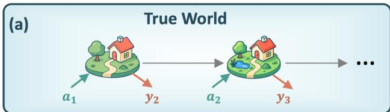
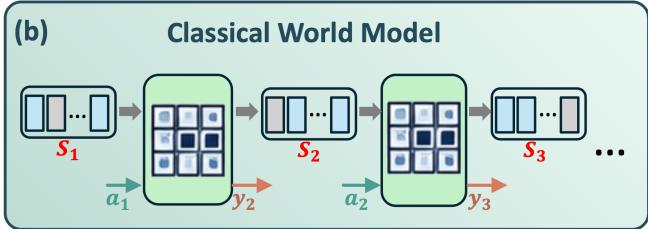
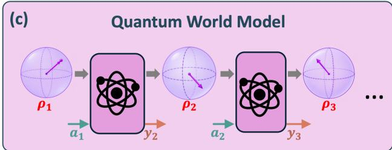
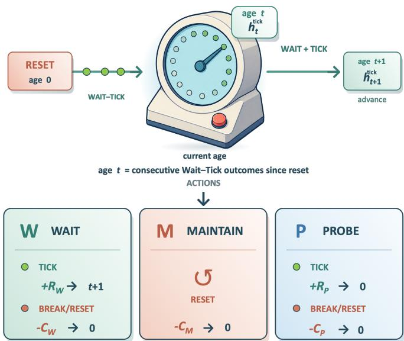
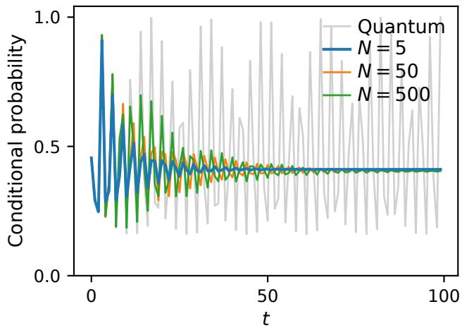
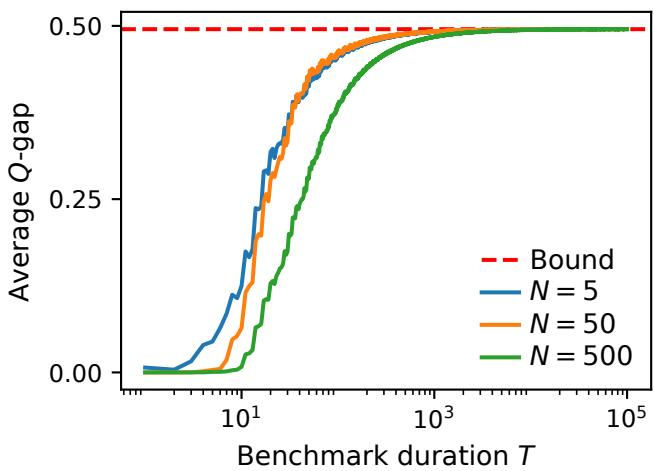

# An Irreducible Quantum Advantage in Aligning World Models with Reality

Josep Lumbreras,1, 2, ∗ Hailan Ma,1, 2, † Jayne Thompson,3, 1, 2, ‡ and Mile Gu1, 2, §

1Centre for Quantum Technologies, Nanyang Technological University, Singapore

2Nanyang Quantum Hub, School of Physical and Mathematical Sciences, Nanyang Technological University, Singapore 3College of Computing and Data Science, Nanyang Technological University, Singapore

World models provide digital simulacra of the true world, allowing agents to be trained and tested before costly real-world deployment. At each time step, they receive an action and generate an observation and reward matching the statistics of the true world. In complex environments where present outcomes depend on events far in the past, this requires memory. One might expect that, by increasing memory, we can always build a model accurately enough to align the optimal agen policies of the real and virtual worlds. We show that this is false for classical world models, even when the true world itself is classical. We construct true worlds for which every finite classical model fails along the same possible trajectory: it either loses the ability to distinguish actions when the true world clearly prefers one, or repeatedly assigns the highest expected reward to suboptimal actions. Its expected-reward estimates also retain a nonvanishing average error. In contrast, each such true world admits a quantum world model using a single qutrit that reproduces it exactly: its reward estimates and preferred actions always match those of the true world, ensuring that the optimal policies of the real and virtual worlds remain perfectly aligned.

From a robot navigating crowded supermarkets to an autonomous vehicle operating on busy streets, a central ambition of reinforcement learning is to train agents to navigate ever more complex environments [1–4]. Such training, however, depends on data that, in physical envi ronments, may be scarce, slow to collect, or economically costly. Meanwhile, a successful agent must be able to act in all potential scenarios, many of which are dificult to test because doing so could endanger people or equipment, or incur significant economic loss [5, 6]. World models address this bottleneck by providing surrogate environments in which agents can instead be trained, stress-tested, and benchmarked [7–9]. At their operational core, they accept the same actions as the environment where the agent will ultimately be deployed - the true world - and generate corresponding observations and rewards over successive time steps. But even setting aside how such models are developed, how do physical resources fundamentally constrain what worlds they can represent?

Memory is a key constraint. Complex true worlds can be highly non-Markovian: previous actions, outcomes, and rewards can change their response to the same action in the distant future. Reproducing this contextual behavior requires memory (see Fig. 1). Whenever the model receives an action and generates an outcome, it updates this memory, enabling the consequences of a future action to depend on what came before [10–12]. In complex environments, relevant context may extend over long horizons, and memory requirements can grow in tandem. Consequently, memory is a central bottleneck for building world models that remain accurate over ex-

  
Figure 1. Classical and quantum world models. The true world represents reality (a). At each time step, it receives an action at and returns an outcome $y _ { t + 1 }$ that consists of an observation and reward. A world model reproduces this input–output behavior through recurrent internal dynamics, updating its memory from one simulated step to the next. In a classical world model (b), a classical register with a finite number of bits carries the memory, and it evolves under classical stochastic updates. In a quantum world model (c), the memory is encoded in a finite number of qubits and evolves through quantum operations.

tended timescales [13–15].

This memory burden has operational consequences. A world model implicitly assigns an action-value to each candidate action, representing its expected cumulative reward if taken. If memory limitations distort a world model, the resulting deviancy can erase the separation between a clearly preferable action and its competitors, or reverse their ordering altogether [16–18]. Even when such failures occur only for specific action-outcome sequences, the efects could be disastrous. An autonomous vehicle may seldom encounter a pedestrian in its path, yet correctly ranking the merits of braking and accelerating is crucial [19, 20]. Training or benchmarking agents on a world model that reverses this ranking can induce misalignment that adversaries could exploit to cause highly undesirable outcomes.

Could quantum world models, where context is enabled by repeated interactions with a quantum memory, ofer unique advantages in removing this misalignment? We answer in the afirmative. We introduce a family of true worlds where any finite-memory classical model exhibits an alignment gap that cannot be removed. Along certain fixed future action-outcome trajectories, the expected future rewards assigned to potential actions retain a nonvanishing average error ε bounded away from 0. Any classical world model either loses the ability to resolve the true world’s preferred action or nominates suboptimal actions as optimal actions at least half of the time - incurring an average reward loss of at least ε. This alignment gap of ε cannot be reduced by increasing the size of the classical memory, as long as it remains finite. We then introduce a class of quantum models with a single qutrit (see Fig. 1 (c)) that can avoid these limitations. Every action it judges optimal is also optimal in the true world in every reachable future trajectory. Our work thus demonstrates an irreducible quantum advantage in aligning world models with certain true worlds.

## I. FRAMEWORK

Modeling True Worlds. The heart of our problem is to build concise models of true worlds—ones that reproduce their statistical black-box behavior from the perspective of any agent interacting with them. We must therefore first define this behavior operationally. We regard a true world (see Fig. 1 (a)) as an environment with which an agent interacts over discrete time steps $t = 0 , 1 , \ldots$ At time t, the world receives an action $A _ { t } \in { \mathcal { A } }$ and returns an outcome $Y _ { t + 1 } = ( O _ { t + 1 } , R _ { t + 1 } ) \in$ $y \subseteq \mathcal { O } \times \mathbb { R } .$ , consisting of an observation $O _ { t + 1 } \in \mathcal { O }$ and a reward $R _ { t + 1 } \in \mathbb { R }$ . Larger rewards represent more desirable outcomes, while costs are represented by negative rewards. Here, we take the action and outcome alphabets A and Y to be finite.

Let $h _ { t } = ( a _ { t - 1 } , y _ { t } )$ denote the action-outcome pair generated from the $t ^ { { \dot { t } } h }$ interaction. Each instance of a true world at time t then has a history $\overline { { h } } _ { t } = h _ { 1 } h _ { 2 } \dots h _ { t }$ . The operational behavior of a true world can then be entirely encapsulated by $\operatorname* { P r } _ { \star } ( y \mid \overleftarrow { h } , a )$ , the probability that it emits outcome y when receiving action a.

A faithful world model is a machine that reproduces this conditional action-outcome behavior. A standard finite-state classical realization is a controlled hidden Markov model [10–12] - a framework that underpins applications ranging from speech recognition to biological sequence analysis [10, 21–23]. These machines contain a memory M with a finite set ${ \cal S } = \{ 1 , \cdots , N \}$ of N distinct physical states. When receiving an action a, their dynamics can then be completely described by transition elements

$$
\left( D _ { y } ^ { ( a ) } \right) _ { j i } : = \operatorname* { P r } \left( Y _ { t + 1 } = y , S _ { t + 1 } = j | S _ { t } = i , A _ { t } = a \right)\tag{1}
$$

representing the probability that a machine in memory state $S _ { t } = i$ transitions to j while emitting the outcome y after receiving action a. Given an initial probability distribution $z _ { k } ^ { \mathrm { i n } } = \operatorname* { P r } ( S _ { 0 } = k )$ over memory states and action sequence $a _ { 0 } a _ { 1 } \ldots$ the dynamics $\left( D _ { y } ^ { ( a ) } \right) _ { j i }$ then completely determines the model’s probability of emitting outcome $\operatorname* { P r } _ { \mathbb { M } } ( y \mid \overleftarrow { h } , a )$ on seeing action a at time t for any history $\overleftarrow { h }$ (see Appendix A 4 for details). A world model is then faithful if it is operationally indistinguishable from the true world $\operatorname* { P r } _ { \star } .$ , such that $\operatorname* { P r } _ { \mathsf { M } } ( y \mid \overleftarrow { h } , a ) =$ Pr⋆ $. ( y \mid \overleftarrow { h } , a )$ for all $\overleftarrow { h }$ and $a .$ Each world model is thus specified by the tuple $\mathsf { M } = ( \boldsymbol { \mathcal { A } } , \boldsymbol { \mathcal { V } } , \boldsymbol { \mathcal { S } } , z ^ { \mathrm { i n } } , \mathbf { D } )$ , where $\mathbf { D } = \{ D _ { y } ^ { ( a ) } \}$ is the collection of N×N transition matrices describing transition dynamics on the model memory for each action-outcome pair $( a , y )$

Physically, such a model operates as a sequence of stochastic interactions on its memory M (see Fig. 1 (b)). Thus, M enables a world model to exhibit complex non-Markovian behavior: without it, a world model’s out come behavior cannot depend on history. Thus, the num ber N of distinct configurations available to the memory system M provides a measure of the complexity required to model a true world. 1 Operationally, N is often referred to as the physical memory dimension of M, defined as the largest number of states that can be perfectly distinguished in a single use [27–31].

Rewards and Value Functions. In practice, a perfectly faithful model can have immense generative complexity. Any practical world model is often an approximation - identifying a model where $\operatorname* { P r } ( y , \mid \overleftarrow { h } , a )$ is a sufficiently good approximation of $\operatorname* { P r } _ { \star } ( y \mid \sqrt { h } , a )$ . But what constitutes being suficiently good? To answer this, we first need to review the main impetus for world models: true-world replacements for training and benchmarking agents to obtain policies that yield higher rewards.

Specifically, world models are designed to house agents. An agent’s behavior is dictated by their policy: a probability distribution $\pi ( \boldsymbol { a } | \overleftarrow { \boldsymbol { h } } _ { t } )$ governing what actions a the agent would take on seeing history $\smash { \overleftarrow { h } _ { t } }$ . When acting on a world model M with action-outcome response $\mathrm { P r } _ { M } ( y | \overleftarrow { h } , a )$ , each policy induces a sequence of rewards governed by random variables $R _ { t } | _ { \pi , \mathsf { M } }$ governing the reward at each time-step t. Let $0 \leq \gamma < 1$ denote the discount factor, which captures the preference for immediate over future rewards: when $\gamma = 0$ , only the next reward is considered, whereas as $\gamma  1$ , rewards are weighted increasingly equally over time. The resulting discounted cumulative reward, or simply the return, is represented by the random variable

$$
G _ { \pi , \mathsf { M } } : = \sum _ { k = 0 } ^ { \infty } \gamma ^ { k } R _ { k + 1 } | _ { \pi , \mathsf { M } } ,\tag{2}
$$

which has played a dominant role in benchmarking the eficacy of a policy in reinforcement learning [1, 32]. We can then introduce $\pi _ { \mathsf { M } } ^ { \mathrm { o p t } }$ as the theoretical optimal policy in a given world model M, one that achieves the maximum expected return $\langle G _ { \pi , \mathsf { M } } \rangle$ . Here and throughout, policies are understood as history-dependent decision rules: the optimal policy specifies which action to take after every possible history encountered during interaction with the world. For true worlds with input-output response $\mathrm { P r } _ { \star } ( y | \overleftarrow { h } , a )$ , we obtain return $G _ { \pi , \star }$ and true optimal policy $\pi _ { \star } ^ { \mathrm { { o p t } } }$ . Indeed, since the true world is operationally indistinguishable from a perfectly faithful model ${ \mathsf { M } } = { \star } ,$ our subsequent exposition holds both for world models and true worlds.

Given a particular history $\overleftarrow { h }$ , the reward potential of taking diferent actions can then be captured by the action-value function. Consider the policy $\mathsf { \bar { \pi } } _ { \mathsf { M } } ^ { \mathrm { o p t } } | _ { a }$ that involves taking immediate action $a _ { t } = a$ at history $\overleftarrow { h }$ , and thereafter making decisions according to the optimal policy $\pi _ { \mathsf { M } } ^ { \mathrm { o p t } }$ . The action-value function

$$
Q _ { \mathsf { M } , a } ^ { \mathrm { o p t } } ( \overleftarrow { h } ) = \left. \sum _ { k = 0 } ^ { \infty } \gamma ^ { k } R _ { t + k + 1 } | _ { \pi _ { M } ^ { \mathrm { o p t } } | a , \mathsf { M } , \overleftarrow { h } } \right.\tag{3}
$$

then captures the maximum expected reward we can potentially extract after taking a possibly non-optimal action a according to world model M. Taking the supremum of this quantity over all a then gives us the value function

$$
V _ { \mathsf { M } } ^ { \mathrm { o p t } } ( \overleftarrow { h } ) = \left. \sum _ { k = 0 } ^ { \infty } \gamma ^ { k } R _ { t + k + 1 } | _ { \pi _ { \mathsf { M } } ^ { \mathrm { o p t } } , \mathsf { M } , \overleftarrow { h } } \right.\tag{4}
$$

that represents the reward potential of that particular history $\left\{ { \frac { \ d H } { \ d h } } \right.$ under world model M. If given for the true world ⋆, these value functions would immediately allow an agent to identify the best action at each time to maximize expected reward.

Benchmarking World Models. These quantities immediately provide operationally meaningful methods to assess candidate models. Consider a candidate model M of a true world $\star ;$ an obvious measure is to look at the diferences in their action-value and value functions

$$
\begin{array} { r l } & { e _ { \mathrm { { Q } } } ^ { \mathsf { M } } ( \overleftarrow { h } ) = \underset { a \in { \mathsf { A } } } { \operatorname* { m a x } } \left| Q _ { \star , a } ^ { \mathrm { { o p t } } } ( \overleftarrow { h } ) - Q _ { \mathsf { M } , a } ^ { \mathrm { { o p t } } } ( \overleftarrow { h } ) \right| , } \\ & { e _ { V } ^ { \mathsf { M } } ( \overleftarrow { h } ) = \left| V _ { \star } ^ { \mathrm { o p t } } ( \overleftarrow { h } ) - V _ { \mathsf { M } } ^ { \mathrm { o p t } } ( \overleftarrow { h } ) \right| } \end{array}\tag{5}
$$

Given a particular history , the first captures the maximum disagreement between M and ⋆ on the reward potential of various possible actions. The second captures their disagreement on the reward potential of itself. For such disagreements to be significant, they should not be isolated to single points in time. To formalize this, let the reachable action-outcome trajectory $\mathcal { F } =$ $    $ . be an infinite sequence of action-outcome histories that have strictly positive conditional probabil ity of occurrence in the true world. That is, (i) $h _ { 1 } h _ { 2 } \cdots h _ { t }$ for some fixed sequence of action–outcome pairs $h _ { t } = ( a _ { t - 1 } , y _ { t } )$ , and (ii) $\mathrm { P r } _ { \star } ( y _ { t } \mid \overleftarrow { h } _ { t - 1 } , a _ { t - 1 } ) > 0$ for every t. The quantities

$$
\overline { { e } } _ { \mathrm { Q } } ^ { \mathsf { M } } | _ { \mathcal { F } } : = \operatorname* { l i m } _ { T  \infty } \frac { 1 } { T } \sum _ { t = 1 } ^ { T } e _ { \mathrm { Q } } ^ { \mathsf { M } } ( \overleftarrow { h } _ { t } ) ,\tag{6}
$$

$$
\overline { { e } } _ { V } ^ { \mathsf { M } } | _ { \mathcal { F } } : = \operatorname* { l i m } _ { T  \infty } \frac { 1 } { T } \sum _ { t = 1 } ^ { T } e _ { V } ^ { \mathsf { M } } ( \overleftarrow { h } _ { t } ) ,\tag{7}
$$

then capture the deviation of assigned action-values and values, averaged across time, for diferent trajectories that an agent in the true world can experience. Thus, deploying an M where they strongly deviate to benchmark various policies could lead us to very diferent - and likely erroneous - conclusions about its eficacy. This motivates us to define the following measure of model deviancy:

Definition 1 (Value Deviancy). A world model M is ϵ-deviant if there exists a reachable action-outcome trajectory $\mathcal { F }$ such that $\vec { e } _ { V } ^ { \mathsf { M } } | _ { \mathcal { F } } \geq \epsilon ,$ , and $\bar { e } _ { \mathrm { Q } } ^ { \mathsf { M } } | _ { \mathcal { F } } \geq \epsilon .$ . That is, its average disagreement with the true world in the reward potential along this trajectory is at least ϵ for both values and action-values.

A second approach to benchmarking candidate world models is to focus on how deviations can lead to diferent conclusions about optimal agent actions. Along these lines, we first introduce the decision margin, which captures how accurately we need to estimate action-rewards to decide the optimal action based on a world model M. Specifically, given a history , define $a = a _ { \mathsf { M } } ^ { o p t } | _ { \mathsf { T } }$ as the action that leads to the optimal reward according to $M$ and $a ^ { \prime } = a _ { \mathsf { M } } ^ { \prime } | _ { \mathsf { T } }$ as the second-best action - the one that t attains maximum reward subject to the condition that $\boldsymbol { a } ^ { \prime } \neq \boldsymbol { a } .$ . The decision margin,

$$
g _ { \mathsf { M } } ( \overleftarrow { h } ) = Q _ { M , a } ^ { \mathrm { o p t } } ( \overleftarrow { h } _ { t } ) - Q _ { \mathsf { M } , a ^ { \prime } } ^ { \mathrm { o p t } } ( \overleftarrow { h } _ { t } )\tag{8}
$$

represents the action-value gap between taking the best action vs its closest competitor according to the world model M. When $\mathsf { M } = \star$ , the true action-value gap $g _ { \star } \big ( \overleftarrow { h } \big )$ is considered a measure of how robust the optimal policy is in ⋆, as a perturbation of up to $g _ { \star } ( \overleftarrow { h } ) / 2$ cannot change conclusions on optimal action [17, 18]. This then allows us to define another potential point of failure for a candidate classical model - loss of decision resolution.

Definition 2 (Loss of decision resolution). Let $\mathcal { F } =$ $h _ { 1 } h _ { 2 } \cdot \cdot \cdot$ be a reachable action–outcome trajectory, with prefixes $\dot { \textit { h } } _ { t } = h _ { 1 } \cdot \cdot \cdot h _ { t }$ . For $\varepsilon > 0$ , a world model M loses decision resolution of magnitude ε along ${ \mathcal { F } } { \mathrm { ~ i f } } ,$ for every $\delta > 0$ and every $T \in \mathbb { N } ,$ there exists $t \geq T$ such that $g _ { \star } ( \overleftarrow { h } _ { t } ) \geq \varepsilon , g _ { \mathsf { M } } ( \overleftarrow { h } _ { t } ) < \delta$ . We say simply that M loses decision resolution along $\mathcal { F }$ if this condition holds for some $\varepsilon > 0$

Thus, along one possible continuing interaction, there is always improvement when taking the best action over its closest competitor in the true world. However, a model M sufering loss of decision resolution may rank them as progressively closer in value, such that agents being trained via M will find it increasingly dificult to make the correct decision.

A complementary question is whether the model’s preferred action is correct. Let $a _ { \mathsf { M } } = a _ { \mathsf { M } } ^ { o p t } | _ { \mathsf { T } _ { h } }$ be a selected action that maximize the action-value in a world model M. At a given history $\setminus h _ { t } ,$ an agent trained to perform optimally on M, when deployed in the true world, would thus sufer a loss of

$$
\ell _ { \mathsf { M } } ( \overleftarrow { h } _ { t } ) : = V _ { \star } ^ { \mathrm { o p t } } ( \overleftarrow { h } _ { t } ) - Q _ { \star , a _ { \mathsf { M } } } ^ { \mathrm { o p t } } ( \overleftarrow { h } _ { t } ) ,\tag{9}
$$

even if all subsequent actions are chosen optimally. It is also commonly known as the regret of the current decision and naturally vanishes when M is faithful. Of course, an agent that performs optimally on M can continue to make non-optimal decisions, which is then captured by the mean decision loss:

Definition 3 (Mean decision loss). For $\varepsilon > 0$ , a world model M exhibits mean decision loss of at least ε along a reachable action-outcome trajectory $\mathcal { F } = h _ { 1 } , h _ { 2 } , \dotsc \mathrm { i f }$

$$
\overline { { \ell } } _ { \mathsf { M } } ( \mathcal { F } ) : = \operatorname* { l i m } _ { T  \infty } \operatorname* { i n f } _ { T } \sum _ { t = 1 } ^ { T } \ell _ { \mathsf { M } } ( \overleftarrow { h } _ { t } ) \geq \epsilon\tag{10}
$$

This quantity represents the asymptotic average loss incurred when decisions are optimized using a distorted model. Decision resolution and decision loss capture complementary requirements: a world model should preserve a clear true-world preference, and the action it prefers should be optimal when deployed.

## II. RESULTS

Complex True Worlds. Our first result is to establish that true worlds can be very complex. Recall that the models introduced above simply as world models, denoted by M, are classical, with dynamics governed by the stochastic transition matrices $\dot { D } _ { y } ^ { ( a ) }$ in (1). To make this distinction explicit, we henceforth refer to them as classical world models and denote them by the tuple ${ \mathsf C } = ( \mathcal { A } , \mathcal { y } , \mathcal { S } , z ^ { \mathrm { i n } } , { \bf D } )$ , where S is the set of physical states contained in its memory. We say that a classical world is finite if this set is finite - a requirement that must be true for any world model that can be physically realized. Ideally, we would then be able to simulate every true world arbitrarily closely in terms of model deviancy, loss of de cision resolution, and mean decision loss. Our first result establishes that for model deviancy, this gap cannot be closed (see Appendix B 5):

Result 1. There exist true worlds and a fixed $\varepsilon > 0$ such that, for each of these worlds, every finite classical world model C is ε-deviant.

This implies that there will always be action-outcome trajectories where our model C predicts action-values and values that disagree with the true world by an average of at least ϵ through the trajectory.

Next, we establish that this fallibility of classical models extends to loss of decision resolution, and mean decision loss. To do so, we first introduce a definition of a treacherous true world - one that cannot be replaced by a finite-memory classical model without serious degradations when used to optimise agent actions:

Definition 4 (Classically treacherous true world). For $\varepsilon > 0 .$ , a true world is classically ε-treacherous if there exists a reachable action–outcome trajectory $\mathcal { F }$ such that, for any finite-memory classical model $\mathsf { C } ,$ one of the following holds:

(a) C loses decision resolution of magnitude at least ε along ${ \mathcal { F } } ;$ ;

(b) C exhibits a mean decision loss of at least ε and recommends a suboptimal action at least half the time, asymptotically, along $\mathcal { F } .$

We emphasize that the constant ε applies to every classical memory dimension and every classical world model - and does not approach 0 in the limit of large classical memory. In a classically treacherous true world, no finite-dimensional classical world model reproduces the decision-relevant statistics well enough to support reliable action selection along $\mathcal { F }$ . Its action-values either fail to separate the candidate actions or lead the agent to deploy persistently suboptimal actions in the true world. Our second result establishes that classical treacherous true worlds exist:

Result 2. There exist true worlds that are classically ε treacherous - any finite-memory classical model that attempts to model such a true world will either sufer loss of decision resolution of magnitude ε or recommend suboptimal decisions resulting in a mean decision loss of at least ε along certain action-outcome trajectories.

For the construction of such true worlds, see $\mathrm { A p - }$ pendix B. The decision separation is proved in $\mathrm { A p \mathrm { - } }$ pendix B 4. Thus, replacing such treacherous environments with classical world models for benchmarking agents, agent training, or policy planning may therefore leave the resulting decisions vulnerable to a sophisticated adversary.

Quantum world models. Can quantum models alleviate these fundamental limitations? Recall that an $N _ { - }$ dimensional classical memory supports N physical states, which we labeled by integers $k = 1 , 2 , \hdots N .$ In contrast, a quantum d-level system can prepare such states in quantum superposition, such that each pure state of the system can be described by any normalized superposition $\begin{array} { r } { | \phi \rangle = \sum _ { k = 1 } ^ { d } c _ { k } \left| k \right. } \end{array}$ in a d-dimensional Hilbert space. The basis states |k⟩ are perfectly distinguishable and play the same role as the N distinct configurations of a classical memory. $\mathrm { A }$ general probabilistic mixture in which state $| \phi _ { j } \rangle$ is prepared with probability $p _ { j }$ is described by a positive, unit-trace density operator $\begin{array} { r } { \rho = \sum _ { j } p _ { j } \left| \phi _ { j } \right. \left. \phi _ { j } \right| } \end{array}$ which generalizes a classical probability distribution over physical states.

When the quantum memory receives an action $^ { a , }$ its dynamics are completely described by outcome-labelled quantum operations $\{ \mathcal { E } _ { y } ^ { ( a ) } \} _ { y \in \mathcal { y } }$ . Each $\mathcal { E } _ { y } ^ { ( a ) }$ is completely positive and trace nonincreasing, while $\textstyle \sum _ { y \in \mathcal { y } } \mathcal { E } _ { y } ^ { ( a ) }$ is trace preserving for every $a \in { \mathcal { A } }$ . Thus, for each action a, the operations $\{ \mathcal { E } _ { y } ^ { ( a ) } \} _ { y \in \mathcal { y } }$ form a quantum instrument [33, 34].

To make the correspondence with the classical transition elements explicit, let $J _ { t } \ = \ i$ denote that the incoming quantum memory is prepared in state |i⟩, and let $J _ { t + 1 } = j$ denote the result of reading the outgoing memory in the same basis. The instrument elements then satisfy

$$
\langle j | \mathcal { E } _ { y } ^ { ( a ) } ( | i \rangle \langle i | ) | j \rangle : = \operatorname* { P r } \left( Y _ { t + 1 } = y , J _ { t + 1 } = j | J _ { t } = i , A _ { t } = a \right)
$$

This is the joint probability that the model emits outcome y and its memory is read as $j ,$ conditioned on the incoming basis state i and supplied action a. It is the direct quantum counterpart of $\left( D _ { y } ^ { ( a ) } \right) _ { j i }$ . Unlike in the classical case, these basis-resolved probabilities do not completely specify the dynamics, since the operations $\mathcal { E } _ { y } ^ { ( a ) }$ also describe the evolution of superpositions and coherences.

Given an initial memory prepared in state $\rho ^ { \mathrm { i n } }$ and a sequence of supplied actions, the instrument operations completely determine the model’s conditional outcome probabilities $\operatorname* { P r } _ { \mathbb { Q } } ( y \mid { \overline { { h } } } , a )$ for every generated history $\overleftarrow { h }$ . A quantum world model is faithful when it is operationally indistinguishable from the true world, such that $\operatorname* { P r } _ { \mathbb { Q } } ( y \mid \overleftarrow { h } , a ) = \operatorname* { P r } _ { \star } ( y \mid \overleftarrow { h } , a )$ for every reachable history $\breve { h }$ , action a, and outcome $y .$ Then a quantum world model is specified by the tuple $\mathsf { Q } = ( \boldsymbol { A } , \bar { \boldsymbol { y } } , \mathcal { H } _ { Q } , \rho ^ { \mathrm { i n } } , \pmb { \varepsilon } )$ where $\pmb { \mathcal { E } } = \{ \mathcal { E } _ { y } ^ { ( a ) } \} _ { ( a , y ) \in A \times y }$ is the collection of instrument operations describing the memory dynamics for every action–outcome pair $( a , y )$ .

Physically, such a model operates through a sequence of quantum-instrument interactions on its memory, in direct analogy with the stochastic interactions of a classical world model. The number d is its physical memory dimension: the largest number of memory states that can be perfectly distinguished in a single use.

Quantum advantage for model-based decisions. We now combine the preceding classical limitations with an exact quantum realization, obtaining a strict separation between classical and quantum world models for the same true world. We begin with its most direct operational consequence: the action ultimately deployed by the agent. A world model generates simulated futures from which the agent evaluates its candidate actions; the ac tion assigned the largest value is then selected for deploy ment in the true world. The first quantum result shows that the physical realization of the model’s memory can determine whether this procedure identifies a true-worldoptimal action.

Result 3. For some fixed $\varepsilon > 0$ , there exists a family of classically ε-treacherous true worlds, each of which admits an exact quantum world model Q with a single qutrit of memory. This separation holds for all discount factors $\gamma \in [ 0 , 1 )$ , with the same ε.

Quantum advantage for value estimation. The previous result concerns the action ultimately selected from the model’s action values. We now ask the more stringent question of how accurately the model repro duces the values themselves. The separation remains robust: no finite classical memory, however large, can eliminate the dimension-independent gap in the actionvalues and optimal value, whereas the same qutrit world model reproduces them exactly. The advantage there fore cannot be overcome merely by allocating more finite classical storage; it arises from the physical encoding of the model’s memory.

Result 4. For the same family of true worlds, there is a fixed $\varepsilon > 0$ such that every finite-memory classical world model is ε-deviant, whereas the corresponding single-qutrit quantum world model Q is exact.

The last two results describe complementary consequences of the same representational limitation. The first concerns the action selected using the model, while the second concerns the numerical action values used to compare the candidate actions. Increasing the size of a finite classical memory may postpone the discrepancy to longer histories, but cannot remove its asymptotic average. In contrast, the same three-dimensional quantum memory reproduces the conditional dynamics, action values, and model-based decisions exactly.

The Methods Section IV gives an overview of the trueworld dynamics, why every finite classical model fails to reproduce them, and how we construct the corresponding exact quantum world model. The true world is defined formally in Appendix B 1. The decision separation is proved in Appendix Subsection B 4, while the actionvalue and optimal-value bounds are proved together in Appendix Subsection B 5. The exact qutrit world model is constructed and verified in Appendix Section C.

## III. DISCUSSION

Here, we showed how a world model processes information fundamentally changes its capacity to align with the true world - both in estimating reward potential and identifying the actions needed to realize it. Every finite-dimensional classical model unavoidably assigns erroneous action-values along certain action–outcome trajectories, with a mean error bounded away from zero independently of memory dimension. Along these trajectories, each model either makes vanishing distinctions between candidate actions when the true world has a clear preference or selects a suboptimal action at least half the time. It therefore cannot reliably align model-optimal decisions with reality, and increasing its memory cannot remove this misalignment. A quantum model with a single qutrit, by contrast, reproduces every action-conditioned future after every reachable history, yielding exact values and true-world-optimal actions. To the best of our knowledge, this is the first work to establish such an irreducible quantum advantage in world-model alignment, separating a fixed finite quantum system from all finitedimensional classical counterparts. The comparison applies at the level of recurrent physical memory in general controlled stochastic input–output machines, encompassing finite hidden-state and partially observable Markov decision process-style generative models [10, 11, 35] and connecting to recurrent methods for partial observability and finite-precision architectures with finite-automaton characterizations [36–38].

The broader consequence of this separation is that the physical medium used to store a world model’s internal state cannot always be treated as merely an implementation detail. Modern research has made major advances in how such states are learned and used for prediction and control, from Dyna-style model-based reinforcement learning to recurrent latent simulators [4, 7, 9, 39, 40], with recent extensions to language-based agents [41]. A complementary line learns predictive representations directly in latent space [42–45]. Despite their diferent architectures and training objectives, these approaches generally assume that the learned state is carried by a conventional classical memory. Our results show that this assumption can impose a fundamental limit: there exist true worlds for which no representation supported by finite classical memory can preserve alignment, regardless of how it is parameterized or learned, whereas the single-qutrit model preserves it exactly. Our separation therefore identifies a physical resource that complements advances in neural representation learning rather than competing with them. Learning determines what internal state a world model constructs; its physical encoding can determine what that state can faithfully represent. A natural next step is to harness this alignment advantage within learned neural world models and understand what our results imply under realistic noise, finite-shot estimation, and training constraints.

We also emphasize that our results concern the mod eling of entirely classical true worlds: although their internal memories are quantum, our quantum world models interact with agents entirely through classical random variables representing actions, observations, and rewards. The resulting quantum advantage is therefore directly relevant to settings in which conventional world models are used. Beyond this, our alignment advantage may provide another building block towards quantumenhanced reinforcement learning. Quantizing an agent’s internal memory and processing can yield memory and energetic advantages that grow without bound for suitable families of strategies [46, 47]. Meanwhile, coherent quantum access to a world model or environment can enable diferent trajectories to be explored in superposition, leading to speed-ups in learning [48, 49]. It would be exciting to determine how these advantages can be combined, enabling potential simultaneous speedups in learning, world-model alignment, and reduced memory and energy costs during inference.

## IV. METHODS

## A. The resettable FRDN clock

Our results use the same true world, and we now state how it is constructed. The true world is built around a resettable clock. After every reset, it independently draws a hidden lifetime $L \in \mathbb { N } _ { 0 }$ . If allowed to continue, the clock produces L consecutive Ticks followed by a Break, at which point it resets and draws a new lifetime. Viewed first as an uncontrolled process, each reset starts a new independent run. A run consists of L Ticks followed by a Break and therefore lasts $L + 1$ steps. The Breaks are renewal events, with independent and identically distributed inter-renewal times $\bar { L } + 1$ . The underlying clock is thus a discrete-time renewal process.

The renewal process above describes how the clock behaves when each run is simply allowed to unfold. To ob tain the true world used in our results, we retain this renewal law but introduce actions that determine whether the current run advances, is tested, or is deliberately reset. Whenever a reset occurs, the clock independently draws a fresh lifetime from the same distribution. The action set is $\mathcal { A } = \{ W , M , P \}$ , and the observation set is $\mathcal { O } = \{ T , B \}$ , where $T$ denotes a Tick and B the end of the current run. At each step, the clock receives one action and returns an observation together with an actiondependent reward.

Immediately after a reset, the clock has age $t = 0$ . Wait (W) allows the current run to continue for one further step. If the clock returns a Tick (T), the run survives and its age increases from t to $t + 1$ . If it returns a Break (B), the run ends and the age resets to zero. Thus, the clock’s age is the number of consecutive Wait–Tick pairs since its most recent reset.

Maintain (M) represents preventive maintenance. It incurs a fixed cost, ends the current run, and resets the age to zero without testing whether the run would have survived another step. Probe (P) performs precisely this test: at age t, it has the same Tick–Break probabilities as Wait, but the clock resets after either observation.

The three actions therefore ofer distinct ways of interacting with the clock. Maintain accepts a certain cost in exchange for an immediate reset. Probe acts as a one-step wager on the remaining lifetime: a Tick can produce a positive reward, whereas a Break can incur a cost. Probe may therefore be preferable when another Tick is suficiently likely, while Maintain may be preferable when a Break is more likely. Wait has a diferent role because a Tick leaves the current run active and exposes the clock at the next age. The complete outcome kernel and reward assignment are specified in Appendix B 1. See Fig. 2 for an illustrative summary of this true world.

Let $\mathcal { F } _ { \mathrm { t i c k } } = h _ { 1 } h _ { 2 } \cdot \cdot \cdot$ denote the trajectory in which every action–outcome pair $h _ { t }$ records a Wait action followed by a Tick. The history after t interactions is $\overleftarrow { \boldsymbol { h } } _ { t } = h _ { 1 } h _ { 2 } \cdot \cdot \cdot h _ { t } .$ , with $  \emptyset$ , and therefore contains t consecutive Wait–Tick interactions following a reset. This is the trajectory used in all four results. Every finite history $\smash { \overleftarrow { h } } _ { t }$ is reachable, and the decision at clock age t is evaluated conditional on this history. We denote such histories as $\overleftarrow { h } _ { t } ^ { \mathrm { t i c k } }$

Given $\overleftarrow { h } _ { t } ^ { \mathrm { t i c k } }$ , the preceding Ticks imply that the hidden lifetime satisfies $L \geq t .$ . If the next action is Wait or Probe, the conditional probability of returning another Tick is therefore

$$
\begin{array} { r } { S ( t ) : = \mathrm { P r } _ { \star } ( T \mid \stackrel {  } { h } _ { t } ^ { \mathrm { t i c k } } , W ) = \mathrm { P r } _ { \star } ( T \mid \stackrel {  } { h } _ { t } ^ { \mathrm { t i c k } } , P ) } \\ { = \mathrm { P r } ( L \ge t + 1 \mid L \ge t ) = \frac { \mathrm { P r } ( L \ge t + 1 ) } { \mathrm { P r } ( L \ge t ) } . } \end{array}\tag{11}
$$

Thus, $S ( t )$ is the age-dependent statistic that enters the evaluation of the available actions at $\ { \ } _ { \overline { { h } } _ { \ t } . \mathrm { ~ A ~ } } ^ {  }$ world model need not store $S ( t )$ explicitly, but its memory and readout must jointly reproduce this dependence to predict the next observation and assign the actions their correct values.

This construction defines a family of true worlds, indexed by the lifetime law and the rewards. We study a concrete member inspired by early examples of stochastic processes with finite-dimensional linear representations from Fox, Rubin, Dharmadhikari and Nadkarni (FRDN) [50–52]. Fix $\lambda ~ \in ~ ( 0 , 1 / 2 ]$ and $\alpha \ \in \ \mathbb { R }$ with $\alpha / \pi \not \in \mathbb { Q }$ , and set

$$
\operatorname* { P r } ( L = \ell ) = \lambda ^ { \ell } \sin ^ { 2 } \left( { \frac { \ell \alpha } { 2 } } \right) , \qquad \ell \geq 1 ,\tag{12}
$$

and $\begin{array} { r } { \operatorname* { P r } ( L = 0 ) = 1 - \sum _ { \ell = 1 } ^ { \infty } \operatorname* { P r } ( L = \ell ) } \end{array}$ . Substituting the above lifetime law (12) into the conditional survival probability (11) gives $\dot { S ( t ) } = f ( t \alpha )$ for $t \geq 1$ , where $f$ is a continuous, nonconstant, and 2π-periodic function. Thus, the sinusoidal dependence of the lifetime distribution is inherited by the conditional probability of observing another Tick, producing an oscillatory dependence on the clock age. The closed form of f and its derivation are given in Appendix B 1.

  
Figure 2. The resettable FRDN clock world. The displayed signs illustrate a representative payof regime: Wait ofers a reward $+ R w$ if the clock advances but risks a failure cost $- C w i$ Maintain accepts the known cost −CM of an immediate reset; and Probe also resets, with reward $+ R P$ or cost $- C _ { P }$ determined by whether the clock would have advanced. The diagram thus contrasts risky continuation under Wait, a certain outcome under Maintain, and an outcome-dependent bet under Probe, creating a nontrivial decision problem.

The irrational phase increment of discrete ages t in $f ( t \alpha )$ prevents the age dependence from synchronizing with any finite cycle. Even if the clock ages are divided into any finite collection of regularly repeating classes, the probabilities within each class continue to explore the full profile of $f .$ Operationally, the prediction-relevant information carried by the clock therefore never reduces to a finite periodic label.

The rewards translate this predictive structure into decisions. For the reward assignment used in our main results, the true optimal action continues to switch between Probe and Maintain as the clock ages: Probe is preferred when $S ( t )$ lies above a fixed threshold, and Main tain when it lies below. This switching persists for every discount factor $\gamma \in [ 0 , 1 )$ . It is not essential that these particular two actions compete. Other reward choices for the same renewal clock make the optimal action switch between Wait and Maintain instead, as discussed in $\mathrm { A p \mathrm { - } }$ pendix B 4. Thus, the fact that Wait is dominated in our main construction is a convenient way of isolating a clean decision boundary, rather than a structural property of

## B. Why finite classical memory fails and a qutrit succeeds

The relevant contrast is how the two types of memory respond to the increasing clock age along the fixed reachable trajectory $\mathcal { F } _ { \mathrm { t i c k } }$ . Every additional Wait–Tick interaction applies the same update to a classical world model’s memory. Perron–Frobenius theory implies that repeated application of this update to any finite classical memory eventually approaches a finite collection of limiting behaviours [32, 53]. Thus, for some finite spacing p, the model’s conditional predictions converge separately along the interlaced sequences of ages $t = n p + r ,$ , with $r \in \{ 0 , \ldots , p - 1 \}$

The true clock does not settle into such a finite pattern. As noted above, the conditional probability of one more Tick satisfies $S ( t ) = f ( t \alpha )$ , where f is continuous, nonconstant, and 2π-periodic. Since $\alpha / \pi \not \in \mathbb { Q }$ , for every finite spacing $p ,$ the phase increment pα remains irrational relative to 2π. Weyl equidistribution [54] therefore implies that the phases $( n p + r ) \alpha$ explore the full circle within every interlaced sequence of ages. Consequently, $S ( n p + r )$ continues to sample the same nonconstant profile of f rather than converging to one limiting probability.

The action-dependent rewards transfer this persistent age dependence to the action-values and values. In our construction, Probe and Maintain both reset the clock, so their future contributions are the same and their comparison retains the oscillation of $S ( t )$ . The value obtained by selecting the highest-valued action retains a correspond ing age dependence. This remains true for every discount factor $\gamma \in [ 0 , 1 )$ . Combining these facts with Perron– Frobenius theory and Weyl equidistribution gives a positive lower bound on the asymptotic mean action-value and value errors of every finite classical world model. A common bound can be chosen independently of the memory dimension, the particular classical model, and the discount factor. Increasing the finite memory may postpone the discrepancy to later clock ages, but cannot make either asymptotic mean error vanish. This is the ε-deviancy of Definition 1, established in Result 1.

The same mismatch also afects which action is assigned the highest value. The true preferred action switches between Probe and Maintain as the clock ages. Every finite classical world model must therefore either become arbitrarily indecisive at increasingly late histories where the true preference remains separated by a fixed positive amount, or recommend a truly suboptimal action at least half of the time along $\mathcal { F } _ { \mathrm { t i c k } }$ and incur a positive mean decision loss. This is the ε-treachery of Definition 4, established in Result 2.

In contrast, the same clock is reproduced by a concrete world model whose memory is a single qutrit. This model tracks the increasing clock age through a phase in its quantum memory. After the first Tick following Wait, the memory lies in the two-dimensional subspace spanned by {|0⟩, |1⟩}. Let $\Pi _ { 0 1 } : = | 0 \rangle \langle 0 | + | 1 \rangle \langle 1 |$ be the projector onto this subspace, and let X and Z denote the corresponding Pauli operators. The unitary phase rotation is $U _ { \alpha } = { e ^ { i \alpha Z / 2 } }$ , while the complete instrument operation associated with a Tick following Wait is

$$
\mathcal { E } _ { \mathrm { t i c k } } ^ { ( W ) } ( \rho ) : = \lambda { \left( e ^ { - r X } U _ { \alpha } e ^ { r X } \Pi _ { 0 1 } \right) } \rho { \left( e ^ { - r X } U _ { \alpha } e ^ { r X } \Pi _ { 0 1 } \right) } ^ { \dagger } .\tag{13}
$$

Here $U _ { \alpha }$ advances the phase by α. The surrounding factors $e ^ { \pm r X }$ adjust the relative amplitudes so that the phase also determines the Tick probability. Without them, the map $\rho \mapsto \lambda U _ { \alpha } \rho U _ { \alpha } ^ { \dagger }$ would give the constant Tick probability λ. Because these factors are inverses, adjacent copies cancel when the operation is repeated, allowing the phase rotations to accumulate. The parameter r is chosen so that the resulting probabilities reproduce (11); its value is derived in Appendix C 1. Since $\alpha / \pi$ is irrational, the accumulated phase never closes into a finite cycle. Different clock ages are instead associated with generally nonorthogonal qutrit states along this phase orbit.

Along $\mathcal { F } _ { \mathrm { t i c k } }$ , this is precisely the operation applied after every Wait–Tick interaction. The qutrit memory therefore follows the same histories $\overleftarrow { h } _ { t }$ along which the finite classical models are assessed. The remaining instrument operations are constructed in Appendix C 1, and their agreement with the true world after every reachable history is verified in Appendix C 3. The finite-classical decision-loss and value-error bounds are proved in $\mathrm { A p - }$ pendices B 4 and B 5, respectively.

## C. Numerical illustration of the separation

We complement the analytical results by fitting classical world models with diferent memory dimensions N to the Wait–Tick dynamics of the clock. For each N, we optimize the initial probabilities of the N internal memory states and the probabilities of producing a Tick while moving between these states after a Wait action. The models are fitted over the clock ages $t = 0 , \ldots , 1 0 0 0$ with each age weighted by its probability of occurrence. The complete fitting and evaluation procedure is given in Appendix D. Since the optimization is nonconvex, the curves below show the best models obtained numerically; the separation itself follows from the analytical result above. We write $\operatorname* { P r } _ { \mathsf { C } } ( \operatorname { T i c k } \mid \overleftarrow { h } , W )$ for the probability returned by a classical model when it is initialized after history $\overleftarrow { h }$

We consider the representative clock parameters $\lambda =$ 0.4 and $\alpha = \pi / \sqrt { 2 }$ . Figure 3 compares the true world probability $\mathrm { P r } _ { \star } ( \mathrm { T i c k } \ | \ \stackrel {  } { h } _ { t } ^ { \mathrm { t i c k } } , W )$ with the corresponding probabilities predicted by the fitted classical models. The qutrit world model reproduces the true curve exactly. Increasing N allows a classical model to follow the true probability over a larger initial range of clock ages. At later ages, its prediction loses the nonrepeating dependence on t and approaches the finitely many limiting predictions described above. For the fitted models shown here, the limiting prediction is efectively a single value.

  
Figure 3. Conditional Tick probabilities. Probability of one additional Tick after $\smash { \overleftarrow { h } } _ { t }$ for $\lambda = 0 . 4$ and $\alpha = \pi / { \sqrt { 2 } } .$ The gray curve is the true-world probability, which the qutrit world model reproduces exactly. The colored curves show the predictions of the fitted classical models with memory dimensions $N = 5$ (blue), $N = 5 0$ (orange), and $N = 5 0 0$ (green). Increasing N allows the model to reproduce the nonrepeating dependence on the clock age over a larger initial range. At later ages, the predictions approach the finite limiting behavior imposed by finite classical memory.

An error in the predicted Tick probability is therefore directly an error in the return induced by the world model for Wait. Figure 4 shows the uniform average of this error over $\overleftarrow { h } _ { 1 } ^ { \mathrm { t i c k } } , \ldots , \overleftarrow { h } _ { t } ^ { \mathrm { t i c k } }$ . Since Wait is one of the candidate actions, this quantity lower-bounds the largest action-value error across the candidate actions. Increasing N postpones the discrepancy to longer histories, but Theorem 28 (see Appendix B 5) guarantees that no finite N eliminates its asymptotic average.

## ACKNOWLEDGEMENTS

JL thanks Alessandro Luongo and Aditya Chidambaram for their help in revising the manuscript. This work is supported by the National Research Foundation of Singapore through the NRF Investigatorship Program (Award No. NRF-NRFI09-0010), the National Quantum Ofice, hosted in A\*STAR, under its Centre for Quantum Technologies Funding Initiative (S24Q2d0009), the RIE 2025 AQAS projects S25Q9D001 and S25Q9D002, the Singapore Ministry of Education Tier 1 Grant RT4/23 and RG91/25 and the RIE25 Japan-Singapore Joint Call on Quantum (Project ID H25-MRO3490). HL gratefully acknowledges support from Schmidt Sciences, LLC through the Eric and Wendy Schmidt AI in Science Postdoctoral Fellowship.

  
Figure 4. Average Wait action-value error for one-step setting. The one-step rewards are set to $R _ { W } = C _ { W } = C _ { M } =$ $C _ { P } = 1$ and $R _ { P } = - 1$ , with $\gamma = 0 .$ . Consequently, the plotted quantity for each T is $\begin{array} { r } { \frac { 1 } { T } \sum _ { t = 1 } ^ { T } \left| Q _ { \star , W } ^ { \mathrm { o p t } } ( \overleftarrow { h } _ { t } ) - Q _ { M , W } ^ { \mathrm { o p t } } ( \overleftarrow { h } _ { t } ) \right| . } \end{array}$ The dashed red line marks the dimension-independent lower bound on its asymptotic average derived in Appendix B 3. Blue, orange, and green correspond to $N = 5 , N = 5 0$ , and $N = 5 0 0$ , respectively. Here the average Q-gap represents the errors of classical models, and lower curves mean better models with low error. Larger memories postpone the discrepancy to later clock ages but do not eliminate its asymptotic average. The qutrit world model has zero error for every T; its curve coincides with the horizontal axis and is omitted for clarity.

Use of generative AI. The authors derived the main technical results and produced main manuscript drafts. OpenAI’s ChatGPT and Codex were used to assist with correctness checks and proofreading. All content was reviewed and verified by the authors.

## CODE AVAILABILITY STATEMENT

Code and data for reproducing the results in this work are available at https: $/ / { \tt g i }$ thub.com/tuliplan/ quantum-world-model-RL.

Roadmap. Section A develops the general framework for true worlds and classical and quantum world models. In particular, Theorem 12 shows that exact world models preserve optimal values, action values and optimal decisions. Section B then constructs the true world and the fixed reachable all-Tick trajectory $\mathcal { F } _ { \mathrm { t i c k } }$ used to establish all four results. The proofs proceed as follows:

• World-model deviancy. Theorems 28 and 29, proved in Subsection B 5, show that every finite classical world model has mean action-value and optimal-value errors bounded below by a common positive constant. This proves Result 1.

• Classically treacherous true worlds. Theorem 23 and Corollaries 24 and 25, proved in Subsection B 4, show that every finite classical world model either loses decision resolution or incurs persistent decision loss through suboptimal actions. This proves Result 2.

• Quantum advantage for model-based decisions. Section C constructs a world model with a single qutrit and proves in Theorem 30 that it reproduces the FRDN true world exactly after every reachable history. Combining this exact realization with the classical treachery result proves Result 3.

• Quantum advantage for value estimation. Combining the classical value-error bounds with the same exact qutrit realization, whose actionvalue and optimal-value errors vanish after every reachable history, proves Result 4.

Section D gives the numerical procedures used for the illustrations.

Notation. Throughout the appendix, $\mathbb { N } = \{ 1 , 2 , \ldots \}$ $\mathbb { N } _ { 0 } = \{ 0 , 1 , 2 , \ldots \}$ , and $[ N ] = \{ 1 , \ldots , N \}$ . For a finite set $x ,$ let $\Delta ( \mathcal { X } )$ denote the probability distributions on $x _ { i }$ equivalently, $\Delta _ { N - 1 } = \Delta ( [ N ] )$ . Finally, we write

$$
( x ) _ { + } : = \operatorname* { m a x } \{ x , 0 \} , \quad \mathbb { 1 } \{ E \} : = { \left\{ { 1 , } \atop 0 , \right.}   \mathrm { i f } \ E { \mathrm { ~ h o l d s } } ,\tag{14}
$$

for the positive part of $x \in \mathbb { R }$ and the indicator of an event or condition E, respectively.

## Appendix A: World models and value functions

For the definitions below, use the following fixed notation. Let A be a finite action set, let $\mathcal { V } \subseteq \mathcal { O } \times \mathbb { R }$ be a finite alphabet of observation–reward outcomes. For $y = ( o _ { y } , r _ { y } ) \in \mathcal { Y }$ , write $o _ { y }$ for its observation component and $r _ { y }$ for its reward component. We assume that rewards are bounded: $| r _ { y } | \le R _ { \mathrm { m a x } }$ for every $y \in \mathcal { V }$

For $t \geq 0 ,$ , define

$$
\mathcal { H } _ { t } : = ( \boldsymbol { A } \times \mathcal { Y } ) ^ { t } , \qquad \mathcal { H } : = \bigcup _ { t \geq 0 } \mathcal { H } .\tag{A1}
$$

A length-t history prefix can be written as

$$
\overleftarrow { h } _ { t } = h _ { 1 } h _ { 2 } \cdot \cdot \cdot h _ { t } = ( a _ { 0 } , y _ { 1 } , \dots , a _ { t - 1 } , y _ { t } ) ,\tag{A2}
$$

$$
h _ { k } : = ( a _ { k - 1 } , y _ { k } ) , \quad | \overleftarrow { h } _ { t } | = t ,\tag{A3}
$$

with $\overleftarrow { h } _ { \mathrm { ~ 0 ~ } } = \emptyset$ . When no time index is needed, we write $h \in \mathcal { H }$ for a generic finite history.

For $h \in \mathcal { H } _ { s }$ and $g \in \mathcal { H } _ { t }$ , write $h \frown g \in { \mathcal { H } } _ { s + t }$ for their concatenation. For a one-step extension by $a \in { \mathcal { A } }$ and $y \in \mathcal { V }$ , we continue to use the shorter notation hay.

A deterministic history string carries no true-world or world-model label. Its generating source is instead indicated by the probability law or by the corresponding random variable. Uppercase letters denote random variables and lowercase letters their realizations.

## 1. World models

We first define the true world—the environment in reinforcement-learning terminology—and the world model used as a conditional simulator.

Definition 5. A true world is specified by the tuple $\mathsf { W } _ { \star } = ( \varLambda , \mathscr { V } , \mathscr { H } , \operatorname* { P r } _ { \star } )$ , where

(i) A is the finite set of actions that the true world can receive;

(ii) $\mathcal { V } \subseteq \mathcal { O } \times \mathbb { R }$ is the finite set of possible observation– reward outcomes $y = \left( o , r \right)$ ;

(iii) H is the common finite action–outcome history space defined above (A1);

(iv) $\operatorname* { P r } _ { \star } : \mathcal { H } \times \mathcal { A }  \Delta ( \mathcal { V } )$ is the conditional outcome law, so that $\operatorname* { P r } _ { \star } ( y \mid h , a )$ is the probability of outcome y after history h when the agent takes action a.

Its reachable history tree $\mathcal { H } _ { \star } \subseteq \mathcal { H }$ is the smallest set containing ∅ such that hay $\in \mathcal { H } _ { \star }$ whenever $h \in \mathcal { H } _ { \star }$ $a \in { \mathcal { A } } , y \in { \mathcal { y } }$ , and $\operatorname* { P r } _ { \star } ( y \mid h , a ) > 0$

Definition 6 (World model). A world model is specified by the tuple

$$
\mathsf { M } = \left( \boldsymbol { A } , \boldsymbol { y } , \boldsymbol { \mathcal { M } } , \boldsymbol { m } ^ { \mathrm { i n } } , \mathrm { P r } _ { M } , T _ { M } \right) ,\tag{A4}
$$

where M is the state space of the model’s recurrent memory, $m ^ { \mathrm { i n } } \in \mathcal { M }$ is its initial memory state, A is the set of actions, $\mathcal { V } \subseteq \mathcal { O } \times \mathbb { R }$ is the set of observations-rewards,

$$
\mathrm { P r } _ { M } : \mathcal { M } \times \mathcal { A } \longrightarrow \Delta ( \mathcal { V } )\tag{A5}
$$

is its conditional outcome law, and

$$
T _ { M } = \{ T _ { M , y } ^ { a } : \mathcal { M } \longrightarrow \mathcal { M } \} _ { ( a , y ) \in \mathcal { A } \times \mathcal { Y } }\tag{A6}
$$

is its family of outcome-conditioned memory updates. Thus, from memory state m and supplied action $^ { a , }$ the model generates $Y \sim \mathrm { P r } _ { M } ( \cdot \mid m , a )$ and updates its memory to $\breve { T } _ { M , Y } ^ { a } ( m )$ . The value of $T _ { M , y } ^ { a } ( m )$ on a branch for which $\operatorname* { P r } _ { M } ( y \mid m , a ) = 0$ may be chosen arbitrarily.

This abstract representation isolates the recurrent input–output interface needed to define value functions. At this level, $\mathrm { P r } _ { M }$ and $T _ { M }$ are operational maps and need not be specified independently in a physical realization. For the classical and quantum world models considered below, they are induced, respectively, by the transition matrices $D _ { y } ^ { ( a ) }$ and the instrument operations $\mathcal { E } _ { y } ^ { ( a ) }$ , which directly describe the physical dynamics of the model’s memory.

An encoder for M is a separate initialization interface

$$
E _ { M } : \mathcal { H } \longrightarrow \mathcal { M } , \qquad E _ { M } ( \emptyset ) = m ^ { \mathrm { i n } } .\tag{A7}
$$

For a world model query following history h, the encoder supplies the memory state $E _ { M } ( h )$ from which the rollout is initialized. Once initialized, the rollout evolves entirely through $\mathrm { P r } _ { M }$ and $T _ { M }$

The encoder belongs to the agent and provides the interface through which the world model is queried. For a query history $h ,$ it initializes the model’s recurrent memory in the state $E _ { M } ( h )$ , after which the model generates the rollout through its internal dynamics. The memory dimension of a world model refers exclusively to this recurrent physical memory: it is the largest number of memory states that can be perfectly distinguished without error in a single use [27–30].

A world model is consistent and exact with respect to a true world if $\mathrm { P r } _ { M }$ reproduces the outcome probability of the true world and both descriptions of the outcomeconditioned memory updates $T _ { M }$ and the encoder $E _ { M }$ remain synchronized on reachable true-world branches. We formalize this notion below.

Definition 7 (Predictive consistency and exactness). Let M be a world model and let $E _ { M }$ be an encoder for it. The pair $( \mathsf { M } , E _ { M } )$ is predictively consistent with $\mathsf { W } _ { \star }$ on $\mathcal { G } \subseteq \mathcal { H }$ if, for every $h \in { \mathcal { G } } , a \in { \mathcal { A } } .$ and $y \in \mathcal { V }$

$$
\operatorname* { P r } _ { M } ( y \mid E _ { M } ( h ) , a ) = \operatorname* { P r } _ { \star } ( y \mid h , a ) .\tag{A8}
$$

The pair is exact on $\mathcal { G }$ if it is predictively consistent there and, whenever $\operatorname* { P r } _ { \star } ( y \mid h , a ) > 0$ 2

$$
T _ { M , y } ^ { a } ( E _ { M } ( h ) ) = E _ { M } ( h a y ) .\tag{A9}
$$

It is an exact realization of the true world if it is exact on the reachable history tree $\mathcal { H } _ { \star }$ . When the encoder is fixed by context, we use the shorter statement that M is exact relative to $E _ { M }$

## 2. Value functions in world models

Throughout this subsection, fix an abstract recurrent world model M together with an encoder $E _ { M }$ The history-indexed rollout laws and value functions therefore depend on the pair $( \mathsf { M } , E _ { M } )$ . For notational economy, we suppress the encoder dependence from their subscripts.

The world model generates simulated outcomes, whereas the agent converts the resulting reward sequences into scores or value functions in order to evaluate its current policy. Now we formally define the concept of policy.

Definition 8. A policy is a stochastic kernel from the complete classical history space to the action set, equivalently a map

$$
\pi : { \mathcal { H } } \longrightarrow \Delta ( A ) , \qquad g \longmapsto \pi ( \cdot \mid g ) .\tag{A10}
$$

Thus, for every $g \in \mathcal { H }$

$$
\pi ( a \mid g ) \geq 0 , \qquad \sum _ { a \in { \mathcal { A } } } \pi ( a \mid g ) = 1 .\tag{A11}
$$

Let

$$
\Pi _ { \mathcal { H } } : = \{ \pi : \mathcal { H } \longrightarrow \Delta ( \mathcal { A } ) \}\tag{A12}
$$

denote the class of all such policies.

The same policy $\pi \in \Pi _ { \mathcal { H } }$ is used in the true-world and world-model continuation laws below. During simulation, it is conditioned on the complete query history extended by the generated continuation.

Fix a query history $h \in \mathcal { H }$ and a policy $\pi \in \Pi _ { \mathcal { H } }$ . A model-generated rollout begins from

$$
H _ { 0 } ^ { M } : = h , \qquad M _ { 0 } : = E _ { M } ( h ) .\tag{A13}
$$

At rollout depth $k \geq 0$

$$
A _ { k } ^ { M } \sim \pi ( \cdot \mid H _ { k } ^ { M } ) ,\tag{A14}
$$

$$
Y _ { k + 1 } ^ { M } = ( O _ { k + 1 } ^ { M } , R _ { k + 1 } ^ { M } ) \sim \operatorname* { P r } _ { M } ( \cdot \mid M _ { k } , A _ { k } ^ { M } ) ,\tag{A15}
$$

$$
H _ { k + 1 } ^ { M } : = H _ { k } ^ { M } A _ { k } ^ { M } Y _ { k + 1 } ^ { M } ,\tag{A16}
$$

$$
M _ { k + 1 } : = T _ { M , Y _ { k + 1 } ^ { M } } ^ { A _ { k } ^ { M } } ( M _ { k } ) .\tag{A17}
$$

Thus, the policy conditions on the accumulated classical history $H _ { k } ^ { \bar { M } }$ , whereas the world model generates its next outcome using only its recurrent memory $M _ { k }$

The conditional true-world benchmark begins from the same query history,

$$
H _ { 0 } ^ { \star } : = h ,\tag{A18}
$$

and evolves according to

$$
A _ { k } ^ { \star } \sim \pi ( \cdot \mid H _ { k } ^ { \star } ) ,
$$

$$
Y _ { k + 1 } ^ { \star } = ( O _ { k + 1 } ^ { \star } , R _ { k + 1 } ^ { \star } ) \sim \operatorname* { P r } _ { \star } ( \cdot \mid H _ { k } ^ { \star } , A _ { k } ^ { \star } ) ,\tag{A19}
$$

$$
H _ { k + 1 } ^ { \star } : = H _ { k } ^ { \star } A _ { k } ^ { \star } Y _ { k + 1 } ^ { \star } .\tag{A20}
$$

(A21)

More explicitly, let

$$
\zeta _ { n } = ( a _ { 0 } , y _ { 1 } , \dots , a _ { n - 1 } , y _ { n } )\tag{A22}
$$

be a deterministic continuation of length $n \in  { \mathbb { N } } _ { 0 }$ for a history h. For $1 \leq k \leq n$ , let

$$
\zeta _ { k } : = ( a _ { 0 } , y _ { 1 } , \dots , a _ { k - 1 } , y _ { k } ) , \qquad \zeta _ { 0 } : = \emptyset\tag{A23}
$$

denote its length-k prefix. The complete history at roll out depth k is then $h \frown \zeta _ { k }$

Define the model-memory state associated with this continuation recursively

$$
\begin{array} { c } { { m _ { 0 } ( h , \zeta _ { 0 } ) : = E _ { M } ( h ) , } } \\ { { } } \\ { { m _ { k + 1 } ( h , \zeta _ { k + 1 } ) : = T _ { M , y _ { k + 1 } } ^ { a _ { k } } \big ( m _ { k } ( h , \zeta _ { k } ) \big ) , } } \end{array}\tag{A24}
$$

for $0 \leq k < n .$ The probability of $\zeta _ { n }$ under the world model rollout is

$$
\operatorname* { P r } _ { M , \pi } ^ { h } ( \zeta _ { n } ) = \prod _ { k = 0 } ^ { n - 1 } \pi ( a _ { k } \mid h \frown \zeta _ { k } ) \operatorname* { P r } _ { M } ( y _ { k + 1 } \mid m _ { k } ( h , \zeta _ { k } ) , a _ { k } )\tag{A25}
$$

The corresponding true-world probability continuation law after h is

$$
\operatorname* { P r } _ { \star , \pi } ^ { h } ( \zeta _ { n } ) = \prod _ { k = 0 } ^ { n - 1 } \pi ( a _ { k } \mid h \frown \zeta _ { k } ) \operatorname* { P r } _ { \star } ( y _ { k + 1 } \mid h \frown \zeta _ { k } , a _ { k } ) .\tag{A26}
$$

The continuation laws above determine the corresponding rollout expectations, denoted by $\mathbb { E } _ { M , \pi } ^ { h }$ and $\mathbb { E } _ { \star , \pi } ^ { h }$

For $X \in \{ M , \star \}$ and $a \in { \mathcal { A } } .$ , we write $\mathbb { E } _ { X , \pi } ^ { h , a }$ for expectation under the corresponding rollout initialized at $h ,$ with only the first action-selection rule replaced by

$$
A _ { 0 } = a \qquad \mathrm { a l m o s t ~ s u r e l y } .\tag{A27}
$$

All outcome-generation and memory-update rules remain unchanged, and the policy π supplies the actions from rollout depth $k \ = \ 1$ onward. In the fixed-first-action laws, $\pi ( \cdot \mid h )$ is not used: the policy controls only the actions at rollout depths $k \geq 1$

Now we define the policy values for the true world and world model. Unless stated otherwise, all quantities are defined for a fixed discount factor $\gamma \in [ 0 , 1 )$

Definition 9 (Policy values). Let $\pi \in \Pi _ { \mathcal { H } } , h \in \mathcal { H }$ $\gamma \in [ 0 , 1 )$ and $a \in { \mathcal { A } }$ . For $X \in \{ M , \star \}$ , define

$$
V _ { X } ^ { \pi } ( h ) : = \mathbb { E } _ { X , \pi } ^ { h } \left[ \sum _ { k = 0 } ^ { \infty } \gamma ^ { k } R _ { k + 1 } \right] ,\tag{A28}
$$

$$
Q _ { X } ^ { \pi } ( h , a ) : = \mathbb { E } _ { X , \pi } ^ { h , a } \left[ \sum _ { k = 0 } ^ { \infty } \gamma ^ { k } R _ { k + 1 } \right] .\tag{A29}
$$

Thus, $V _ { X } ^ { \pi } ( h )$ follows $\pi$ from the first action, whereas $Q _ { X } ^ { \pi } ( h , a )$ takes a first and follows π thereafter.

For later use, define the expected one-step rewards of the model in memory state m and of the true world after history h by

$$
r _ { M } ( m , a ) : = \sum _ { y \in \mathcal { V } } \operatorname* { P r } _ { M } ( y \mid m , a ) r _ { y } ,\tag{A30}
$$

$$
r _ { \star } ( h , a ) : = \sum _ { y \in \mathcal { y } } \operatorname* { P r } _ { \star } ( y \mid h , a ) r _ { y } .\tag{A31}
$$

When $\gamma = 0$ , the action-values reduce to these expected one-step rewards.

## a. Optimal values and Bellman equations

The material in this subsection is standard in reinforcement learning and dynamic programming. We briefly recall the definitions and results needed below, including Bellman recursions, contraction and fixed-point characterizations, and their connection with policy optimization. For complete treatments and rigorous proofs, see [1, 32, 55, 56].

The true world is Markov when the complete history is used as its state, whereas a rollout of the world model is Markov in its recurrent memory state. Accordingly, for bounded functions $u : \mathcal { H }  \mathbb { R }$ and $v : { \mathcal { M } } \to \mathbb { R }$ , define

$$
\begin{array} { l } { ( \mathcal { T } _ { \star } u ) ( h ) : = \displaystyle \operatorname* { m a x } _ { a \in \mathcal { A } } \bigg [ r _ { \star } ( h , a ) } \\ { \displaystyle \qquad + \gamma \sum _ { y \in \mathcal { Y } } \mathrm { P r } _ { \star } ( y \mid h , a ) u ( h a y ) \bigg ] , } \end{array}\tag{A32}
$$

and

$$
\begin{array} { l } { ( \mathcal { T } _ { M } v ) ( m ) : = \displaystyle \operatorname* { m a x } _ { a \in \mathcal { A } } \Biggl [ r _ { M } ( m , a ) } \\ { \displaystyle \qquad + \gamma \sum _ { y \in \mathcal { Y } } \mathrm { P r } _ { M } ( y \mid m , a ) v ( T _ { M , y } ^ { a } ( m ) ) \Biggr ] . } \end{array}\tag{A33}
$$

Since rewards are bounded and $\gamma < 1$ , both operators are γ-contractions in the supremum norm. They therefore have unique bounded fixed points. Denote these fixed points temporarily by $U _ { \star }$ and $u _ { M }$

$$
U _ { \star } = { \mathcal { T } } _ { \star } U _ { \star } , { \mathcal { { u } } } _ { M } = { \mathcal { T } } _ { M } u _ { M } .\tag{A34}
$$

We next identify these fixed points using the policy values defined above. Let

$$
G _ { n } : = \sum _ { k = 0 } ^ { n - 1 } \gamma ^ { k } R _ { k + 1 }\tag{A35}
$$

be the n-step return and $\begin{array} { r } { G _ { \infty } : = \sum _ { k = 0 } ^ { \infty } \gamma ^ { k } R _ { k + 1 } } \end{array}$ . Backward induction gives

$$
( \mathcal { T } _ { \star } ^ { n } 0 ) ( h ) = \operatorname* { s u p } _ { \pi \in \Pi _ { \mathcal { H } } } \mathbb { E } _ { \star , \pi } ^ { h } [ G _ { n } ] ,\tag{A36}
$$

$$
( { \mathcal { T } } _ { M } ^ { n } 0 ) ( E _ { M } ( h ) ) = \operatorname* { s u p } _ { \pi \in \Pi _ { { \mathcal { H } } } } \mathbb { E } _ { M , \pi } ^ { h } [ G _ { n } ] ,\tag{A37}
$$

where 0 denotes the zero function. Indeed, conditioning on the first action and outcome produces the Bellman recursions: the first action is optimized, and after each out come the later actions may be chosen separately on the resulting history branch. Conversely, these choices define a single history policy because each generated outcome is included in the history observed by the policy.

If $| R _ { k + 1 } | \leq R _ { \mathrm { m a x } }$ for every $k \geq 0 .$

$$
| G _ { \infty } - G _ { n } | \leq \frac { R _ { \mathrm { m a x } } \gamma ^ { n } } { 1 - \gamma }\tag{A38}
$$

uniformly over policies and initial conditions. Note that since $\gamma \in [ 0 , 1 )$ we have $G _ { \infty }$ bounded. Hence the finitehorizon suprema converge to the corresponding infinitehorizon suprema. Since value iteration also converges to the unique fixed points,

$$
U _ { \star } ( h ) = \operatorname* { s u p } _ { \pi \in \Pi _ { \mathcal { H } } } V _ { \star } ^ { \pi } ( h ) ,\tag{A39}
$$

$$
u _ { M } ( E _ { M } ( h ) ) = \operatorname* { s u p } _ { \pi \in \Pi _ { \mathcal { H } } } V _ { M } ^ { \pi } ( h ) .\tag{A40}
$$

The same argument with the first action fixed gives the corresponding action-value identities. We can therefore introduce the optimal quantities without ambiguity.

Definition 10 (Optimal true-world value functions). For $h \in \mathcal { H }$ and $a \in { \mathcal { A } } .$ , define

$$
V _ { \star } ^ { \mathrm { o p t } } ( h ) : = \operatorname* { s u p } _ { \pi \in \Pi _ { \mathcal { H } } } V _ { \star } ^ { \pi } ( h ) ,\tag{A41}
$$

$$
Q _ { \star } ^ { \mathrm { o p t } } ( h , a ) : = \operatorname* { s u p } _ { \pi \in \Pi _ { \mathcal { H } } } Q _ { \star } ^ { \pi } ( h , a ) .\tag{A42}
$$

The fixed-point identification established above gives

$$
{ \cal V } _ { \star } ^ { \mathrm { o p t } } ( h ) = { \cal U } _ { \star } ( h ) .\tag{A43}
$$

Consequently, the true-world optimal action-value satisfies

$$
Q _ { \star } ^ { \mathrm { o p t } } ( h , a ) = r _ { \star } ( h , a ) + \gamma \sum _ { y \in \mathcal { Y } } \operatorname* { P r } _ { \star } ( y \mid h , a ) V _ { \star } ^ { \mathrm { o p t } } ( h a y ) ,\tag{A44}
$$

and

$$
V _ { \star } ^ { \mathrm { o p t } } ( h ) = \operatorname* { m a x } _ { a \in \mathcal { A } } Q _ { \star } ^ { \mathrm { o p t } } ( h , a ) .\tag{A45}
$$

Now we define the optimal values in the world model. Definition 11 (Optimal world-model value functions). For $h \in \mathcal { H }$ and $a \in { \mathcal { A } }$ , define

$$
V _ { M } ^ { \mathrm { o p t } } ( h ) : = \operatorname* { s u p } _ { \pi \in \Pi _ { \mathcal { H } } } V _ { M } ^ { \pi } ( h ) ,\tag{A46}
$$

$$
Q _ { M } ^ { \mathrm { o p t } } ( h , a ) : = \operatorname* { s u p } _ { \pi \in \Pi _ { \mathcal { H } } } Q _ { M } ^ { \pi } ( h , a ) .\tag{A47}
$$

The world-model Bellman operator acts on memory space. We therefore write its fixed point and associated action-value function as

$$
v _ { M } ^ { \mathrm { o p t } } ( m ) : = u _ { M } ( m ) ,\tag{A48}
$$

$$
q _ { M } ^ { \mathrm { o p t } } ( m , a ) : = r _ { M } ( m , a ) + \gamma \sum _ { y \in \mathcal { Y } } \operatorname* { P r } _ { M } ( y \mid m , a ) v _ { M } ^ { \mathrm { o p t } } \left( T _ { M , y } ^ { a } ( m ) \right)\tag{A49}
$$

They satisfy

$$
v _ { M } ^ { \mathrm { o p t } } ( m ) = \operatorname* { m a x } _ { a \in \mathcal { A } } q _ { M } ^ { \mathrm { o p t } } ( m , a ) .\tag{A50}
$$

The history-indexed value functions are related to these memory-state functions through the encoder

$$
V _ { M } ^ { \mathrm { o p t } } ( h ) = v _ { M } ^ { \mathrm { o p t } } ( E _ { M } ( h ) ) ,\tag{A51}
$$

$$
Q _ { M } ^ { \mathrm { o p t } } ( h , a ) = q _ { M } ^ { \mathrm { o p t } } ( E _ { M } ( h ) , a ) .\tag{A52}
$$

Hence

$$
V _ { M } ^ { \mathrm { o p t } } ( h ) = \operatorname* { m a x } _ { a \in \mathcal { A } } Q _ { M } ^ { \mathrm { o p t } } ( h , a ) .\tag{A53}
$$

All suprema above are pointwise in the displayed history h and range over $\Pi _ { \mathcal { H } }$ . For a value $V ^ { \mathrm { { o p t } } } ( h )$ the policy selects the first and all subsequent actions. For an action-value $Q ^ { \mathrm { o p t } } ( h , a )$ , the displayed first action a is fixed and the policy selects the actions from rollout depth $k = 1$ onward. Thus Bellman optimality defines a function of the current state. For the true world, the state is the complete history. For the model, the optimal history-indexed quantities depend on the supplied history through the memory state $E _ { M } ( h )$

## 3. Exact models preserve value functions

The next theorem shows that exactness preserves the complete trajectory law under every history policy, and therefore preserves both policy-evaluation and optimal value functions.

Theorem 12. Let M be a world model and let $E _ { M }$ be an encoder such that $( \mathsf { M } , E _ { M } )$ is an exact realization of W in the sense of Definition 7. Then, for every $\pi \in \Pi _ { \mathcal { H } }$ every reachable query history $h \in \mathcal { H } _ { \star }$ , every $n \geq 0$ , and every continuation $\zeta _ { n }$

$$
\operatorname* { P r } _ { M , \pi } ^ { h } ( \zeta _ { n } ) = \operatorname* { P r } _ { \star , \pi } ^ { h } ( \zeta _ { n } ) .\tag{A54}
$$

The analogous equality holds when the first action is forced to $a \in { \mathcal { A } }$ in both rollouts. Consequently,

$$
V _ { M } ^ { \pi } ( h ) = V _ { \star } ^ { \pi } ( h ) , \qquad Q _ { M } ^ { \pi } ( h , a ) = Q _ { \star } ^ { \pi } ( h , a ) .\tag{A55}
$$

Moreover,

$$
V _ { M } ^ { \mathrm { o p t } } ( h ) = v _ { M } ^ { \mathrm { o p t } } ( E _ { M } ( h ) ) = V _ { \star } ^ { \mathrm { o p t } } ( h ) ,\tag{A56}
$$

$$
Q _ { M } ^ { \mathrm { o p t } } ( h , a ) = q _ { M } ^ { \mathrm { o p t } } ( E _ { M } ( h ) , a ) = Q _ { \star } ^ { \mathrm { o p t } } ( h , a ) .\tag{A57}
$$

Consequently, the sets of optimal actions also agree

$$
\operatorname * { a r g m a x } _ { a \in \mathcal { A } } Q _ { M } ^ { \mathrm { o p t } } ( h , a ) = \operatorname * { a r g m a x } _ { a \in \mathcal { A } } Q _ { \star } ^ { \mathrm { o p t } } ( h , a ) .\tag{A58}
$$

Proof. Fix $h \in \mathcal { H } _ { \star }$ and $\pi \in \Pi _ { \mathcal { H } }$ . For a continuation . prefix $\zeta _ { k } ,$ set

$$
g _ { k } : = h \frown \zeta _ { k } , \qquad \mu _ { k } : = m _ { k } ( h , \zeta _ { k } ) .\tag{A59}
$$

We prove simultaneously that the model and true-world probabilities of every prefix agree and that every prefix having positive common probability satisfies

$$
g _ { k } \in \mathcal { H } _ { \star } , \qquad \mu _ { k } = E _ { M } ( g _ { k } ) .\tag{A60}
$$

$\mathrm { A t } k = 0$ , both laws assign probability one to the empty continuation, $g _ { 0 } = h \in \mathcal { H } _ { \star }$ , and $\mu _ { 0 } = E _ { M } ( h )$ . Suppose the claims hold for $\zeta _ { k }$ . If its common probability is zero, every extension of that prefix has probability zero under both laws. Otherwise, exactness of the pair $( \mathsf { M } , E _ { M } )$ gives

$$
\operatorname* { P r } _ { M } ( y \mid \mu _ { k } , a ) = \operatorname* { P r } _ { M } ( y \mid E _ { M } ( g _ { k } ) , a ) = \operatorname* { P r } _ { \star } ( y \mid g _ { k } , a )\tag{A61}
$$

for every $a \in { \mathcal { A } }$ and $y \in \mathcal { V }$ . Together with the induction hypothesis, multiplying by the common prefix probability and the common policy factor gives

$$
\begin{array} { r l } { \mathrm { P r } _ { M , \pi } ^ { h } ( \zeta _ { k + 1 } ) = \mathrm { P r } _ { M , \pi } ^ { h } ( \zeta _ { k } ) \pi ( a \mid g _ { k } ) \mathrm { P r } _ { M } ( y \mid \mu _ { k } , a ) ~ } & { } \\ { = \mathrm { P r } _ { \star , \pi } ^ { h } ( \zeta _ { k } ) \pi ( a \mid g _ { k } ) \mathrm { P r } _ { \star } ( y \mid g _ { k } , a ) ~ } & { } \\ { ~ } & { \ : = \mathrm { P r } _ { \star , \pi } ^ { h } ( \zeta _ { k + 1 } ) , ~ ( \lambda } \end{array}\tag{62}
$$

If the extended prefix has positive probability, then $\operatorname* { P r } _ { \star } ( y \mid g _ { k } , a ) > 0$ . Hence $g _ { k } a y \in \mathcal { H } _ { \star }$ , and the memoryupdate condition in (A9) gives

$$
T _ { M , y } ^ { a } ( \mu _ { k } ) = T _ { M , y } ^ { a } ( E _ { M } ( g _ { k } ) ) = E _ { M } ( g _ { k } a y ) .\tag{A63}
$$

This completes the induction and proves (A54).

The same induction applies when the first action is fixed to $a \in A .$ . At rollout depth zero, both the model and true-world processes receive the same supplied action a; from depth one onward, both use the same policy π. Therefore

$$
V _ { M } ^ { \pi } ( h ) = V _ { \star } ^ { \pi } ( h ) , \qquad Q _ { M } ^ { \pi } ( h , a ) = Q _ { \star } ^ { \pi } ( h , a ) .\tag{A64}
$$

Taking suprema over $\Pi _ { \mathcal { H } }$ gives the optimal value and action-value equalities. The memory-state identities follow from (A51) and (A52). □

## 4. Finite-dimensional classical world models

Here we formally define classical world models. We state some notation that we will use for classical world models. For real vectors $u , v \in \mathbb { R } ^ { d }$ , write $\langle u , v \rangle$ for their inner product, and write $\mathbf { 1 } \in \mathbb { R } ^ { d }$ for the all-ones vector. The identity matrix is $\mathbb { I } _ { d \times d } \in \mathbb { R } ^ { d \times d }$ . A non-negative matrix $D \in \mathbb { R } _ { \geq 0 } ^ { d \times d }$ is column-substochastic if $\langle \mathbf { 1 } , D \bar { u } \rangle \leq \langle \mathbf { 1 } , u \rangle$ for every non-negative vector $u ~ \in ~ \mathbb { R } _ { > 0 } ^ { d } .$ We call D column-stochastic if the inequality is an equality for every $u \in \mathbb { R } _ { > 0 } ^ { d }$ . When the column convention is clear, we simply say substochastic and stochastic. Now we formally define our notion of classical world model.

A classical world model of memory dimension N uses a stochastic physical memory with N perfectly distinguishable configurations, labeled by $i \in [ N ]$ . A general state of this memory is represented by a probability vector $z \in \Delta ( [ N ] )$ . In POMDP terminology, z is the distribution over the N internal configurations; physically, its entries are the preparation probabilities of one N-state memory system. We use N for this physical memory dimension, independently of the continuum of possible state distributions.

The dynamics of this memory take the standard form of a finite-state POMDP, equivalently the non-negative hidden-state subclass of a controlled observable-operator model [57, 58]. This representation assigns a nonnegative matrix to each action–outcome branch. It is particularly convenient here because both branch probabilities and posterior distributions over states are obtained from products of the same matrices, in direct parallel with the quantum-instrument representation that we use for quantum world models [34, 58, 59]. Related operator representations have also been useful in recent statistical analyses of POMDPs [60, 61].

Definition 13. An N-dimensional classical world model is specified by

$$
\mathsf C _ { N } = \left( \boldsymbol A , \boldsymbol y , [ N ] , z ^ { \mathrm { i n } } , \mathbf D \right) , \quad \mathbf D : = \left\{ \boldsymbol D _ { \boldsymbol y } ^ { ( a ) } \right\} _ { ( a , \boldsymbol y ) \in \boldsymbol A \times \boldsymbol y } ,\tag{A65}
$$

where $[ N ] = \{ 1 , \dots , N \}$ labels the perfectly distinguishable physical memory configurations, $z ^ { \mathrm { i n } } \in \Delta ( [ N ] )$ is the initial memory state, A is the set of actions, $\mathcal { y } \subseteq \mathcal { O } \times$ R is the set of observations-rewards, and each $D _ { y } ^ { ( a ) } \in \mathbb { R } _ { > 0 } ^ { N \times N }$ is column-substochastic, and the family satisfies

$$
\mathbf { 1 } ^ { \mathsf { T } } \left( \sum _ { y \in \mathcal { y } } D _ { y } ^ { ( a ) } \right) = \mathbf { 1 } ^ { \mathsf { T } } \qquad { \mathrm { f o r ~ e v e r y ~ } } a \in { \mathcal { A } } .\tag{A66}
$$

The entry $( D _ { y } ^ { ( a ) } ) _ { j i }$ is the joint probability that the model generates y and moves from memory configuration i to configuration $j$ when supplied with action a.

The corresponding abstract memory-state space is $\mathcal { Z } _ { C } = \Delta ( [ N ] )$ ). The branch matrices induce the outcome law

$$
\operatorname* { P r } _ { C } ( y \mid z , a ) : = \left. \mathbf { 1 } , D _ { y } ^ { ( a ) } z \right.\tag{A67}
$$

and, whenever this probability is nonzero, the conditional memory update

$$
T _ { C , y } ^ { a } ( z ) : = \frac { D _ { y } ^ { ( a ) } z } { \left. \mathbf { 1 } , D _ { y } ^ { ( a ) } z \right. } .\tag{A68}
$$

After fixing $z _ { \mathrm { r e f } } , \mathsf { C } _ { N }$ induces the abstract recurrent tuple $( \mathcal { A } , \mathcal { Y } , \bar { \mathcal { Z } } _ { C } , z ^ { \mathrm { i n } } , \mathrm { P r } _ { C } , T _ { C } )$ required by Definition 6. The maps PrC and $T _ { C }$ are derived from D and the fixed zeroprobability convention.

For history-indexed queries, write $z _ { 0 } : = z ^ { \mathrm { i n } }$ and, for $h = ( a _ { 0 } , y _ { 1 } , \dotsc , a _ { t - 1 } , y _ { t } )$ , define

$$
D _ { h } : = D _ { y _ { t } } ^ { ( a _ { t - 1 } ) } \cdot \cdot \cdot D _ { y _ { 1 } } ^ { ( a _ { 0 } ) } , \qquad D _ { \emptyset } : = \mathbb { I } _ { N \times N } .\tag{A69}
$$

The encoder associated with the model is

$$
E _ { C } ( h ) = \frac { D _ { h } z _ { 0 } } { \langle { \bf 1 } , D _ { h } z _ { 0 } \rangle }\tag{A70}
$$

whenever the denominator is nonzero, and $E _ { C } ( h ) = z _ { \mathrm { r e f } }$ otherwise. This encoder is derived from the model’s branch dynamics and is the standard forward-filtering preparation obtained by conditioning the initial state $z ^ { \mathrm { i { \bar { n } } } }$ through the same branch matrices $D _ { y } ^ { ( a ) }$ that govern the subsequent simulation [10, 11, 58]. Moreover, for strictly positive probability histories, its form is unique in order to fulfill relation (A9) associated to the dynamics of the matrices D. The encoder remains a separate interface and is not a component of $\mathsf { C } _ { N }$ , but it is not an additional free parameter in the classical results. Throughout the classical results below, all history-indexed quantities use this canonical encoder.

## 5. Finite-dimensional quantum world models

A quantum world model of memory dimension d uses a d-level physical memory with Hilbert space $\mathcal { H } _ { Q } \simeq \mathbb { C } ^ { d }$ Write $\mathsf { L } ( \mathcal { H } _ { Q } )$ for the linear operators on $\mathcal { H } _ { Q }$ and define

$$
\begin{array} { r } { S ( \mathcal { H } _ { Q } ) : = \left\{ \rho \in \mathsf { L } ( \mathcal { H } _ { Q } ) : \rho \succeq 0 , \mathrm { ~ T r } \rho = 1 \right\} . } \end{array}\tag{A71}
$$

Its states are density operators $\rho \in \mathcal { S } ( \mathcal { H } _ { Q } )$ A set of quantum states can be perfectly distinguished in a single use only when their supports are mutually orthogonal, so such a set contains at most d states. For each candidate action, a quantum world model replaces non-negative branch matrices by quantum instrument elements, forming a quantum instrument for each action [33, 34]. The same definitions have also been used to describe quantum POMDPs [62, 63].

Definition 14. A d-dimensional quantum world model is specified by

$$
\begin{array} { r } { \mathsf { Q } _ { d } = \left( \boldsymbol { A } , \boldsymbol { \mathcal { V } } , \boldsymbol { \mathcal { H } } _ { Q } , \rho ^ { \mathrm { i n } } , \boldsymbol { \mathcal { E } } \right) , \quad \boldsymbol { \mathcal { E } } : = \left\{ \boldsymbol { \mathcal { E } } _ { y } ^ { ( a ) } \right\} _ { ( a , y ) \in \boldsymbol { A } \times \boldsymbol { \mathcal { V } } } , } \end{array}\tag{A72}
$$

where $\mathcal { H } _ { Q } \simeq \mathbb { C } ^ { d }$ is the Hilbert space of the memory, $\rho ^ { \mathrm { i n } } \in$ $ { \boldsymbol { S } } (  { \mathcal { H } } _ { Q } )$ is its initial state, and each

$$
\mathcal { E } _ { y } ^ { ( a ) } : \mathsf { L } ( \mathcal { H } _ { Q } ) \longrightarrow \mathsf { L } ( \mathcal { H } _ { Q } )\tag{A73}
$$

is completely positive and trace nonincreasing. For every $a \in \mathcal { A } , \sum _ { y \in \mathcal { y } } \mathcal { E } _ { y } ^ { ( a ) }$ is trace preserving, so $\{ \mathcal { E } _ { y } ^ { ( a ) } \} _ { y \in \mathcal { y } }$ forms a quantum instrument.

The corresponding abstract memory-state space is $\mathcal { Z } _ { Q } ~ = ~ \mathcal { S } ( \mathcal { H } _ { Q } )$ . The instrument operations induce the outcome law

$$
\operatorname* { P r } _ { Q } ( y \mid \rho , a ) : = \operatorname { T r } \left[ \mathcal { E } _ { y } ^ { ( a ) } ( \rho ) \right]\tag{A74}
$$

and, whenever this probability is nonzero, the conditional memory update

$$
T _ { Q , y } ^ { a } ( \rho ) : = \frac { \mathcal { E } _ { y } ^ { ( a ) } ( \rho ) } { \mathrm { T r } [ \mathcal { E } _ { y } ^ { ( a ) } ( \rho ) ] } .\tag{A75}
$$

Choose a reference state $\rho _ { \mathrm { r e f } } \in \mathcal { Z } _ { Q }$ and set $T _ { Q , y } ^ { a } ( \rho ) =$ ρref on zero-probability branches. Thus, PrQ and $T _ { Q }$ provide the abstract recurrent representation required by Definition $6 ;$ they are induced by $\varepsilon$

For history-indexed queries, write $\rho _ { 0 } : = \rho ^ { \mathrm { i n } }$ and, for $h = ( a _ { 0 } , y _ { 1 } , \dotsc , a _ { t - 1 } , y _ { t } )$ , define

$$
{ \mathcal { E } } _ { h } : = { \mathcal { E } } _ { y _ { t } } ^ { ( a _ { t - 1 } ) } \circ \cdot \cdot \cdot \circ { \mathcal { E } } _ { y _ { 1 } } ^ { ( a _ { 0 } ) } , \qquad { \mathcal { E } } _ { \emptyset } : = \mathrm { i d } .\tag{A76}
$$

The encoder associated with the instrument dynamics is

$$
E _ { Q } ( h ) = \frac { \mathcal { E } _ { h } ( \rho _ { 0 } ) } { \mathrm { T r } [ \mathcal { E } _ { h } ( \rho _ { 0 } ) ] }\tag{A77}
$$

whenever the denominator is nonzero, and $E _ { Q } ( h ) = \rho _ { \mathrm { r e f } }$ otherwise. The expression (A77) identifies the memory state associated with a history. For every history h satisfying $\mathrm { T r } [ \mathcal { E } _ { h } ( { \rho } _ { 0 } ) ] > 0$ , it obeys the update relation (A9) induced by E. On zero-probability histories, $\rho _ { \mathrm { r e f } }$ is an arbitrary fixed convention.

The classical and quantum specifications above induce operational recurrent representations of the form in Definition 6. In each case, the outcome law and conditional memory update are derived from the outcome-labelled physical dynamics rather than supplied as independent model data. Their respective memory dimensions are N and $d ,$ independently of the number of statistical states in $\Delta ( [ N ] )$ or density operators in $ { \boldsymbol { S } } (  { \mathcal { H } } _ { Q } )$ .

## Appendix B: The FRDN true world and finite-dimensional classical gap

This section constructs the true world used to prove our main results. We begin with the Fox–Rubin– Dharmadhikari–Nadkarni (FRDN) renewal process [50– 52, 58]. The original process generates a stochastic sequence and has neither actions nor rewards. Its output probabilities admit a finite-dimensional linear realization: they can be computed through products of fixed finitedimensional matrices. Nevertheless, the same probabilities cannot be generated by any finite-state hidden Markov model. We use them below to define the actionconditioned dynamics of a controlled world and assign rewards to its possible outcomes.

## 1. The FRDN true world

We first specify the renewal law that determines the outcome probabilities of the true world between two resets. We will equip our agent with the actions Wait, Probe and Maintain. Suppose that, after a reset, the agent repeatedly chooses Wait. The true world draws an auxiliary random lifetime $L \in  { \mathbb { N } } _ { 0 }$ . Conditional on $L = \ell ,$ it produces Tick (an observation) on the first ℓ Wait actions and Break (another observation) on the next one, after which the process resets. At each reset, a fresh independent copy of L is drawn.

Let $p _ { \ell } : = \mathrm { P r } ( L = \ell )$ be the probability that a run contains exactly ℓ Ticks. For the FRDN process, fix $\lambda \in$ $( 0 , 1 / 2 ]$ and $\alpha \in \mathbb { R }$ such that $\alpha / \pi \not \in \mathbb { Q }$ , and define

$$
p _ { \ell } : = \lambda ^ { \ell } \sin ^ { 2 } \left( \frac { \ell \alpha } { 2 } \right) , \qquad \ell \geq 1 ,\tag{B1}
$$

$$
p _ { 0 } : = 1 - \sum _ { \ell = 1 } ^ { \infty } p _ { \ell } .\tag{B2}
$$

This is a probability law because $\begin{array} { r } { \sum _ { \ell \geq 1 } p _ { \ell } \leq \lambda / ( 1 - \lambda ) \leq } \end{array}$ 1.

After t consecutive Ticks, the observed history implies that $L \geq t$ . We therefore define the survival probability

$$
\Phi ( t ) : = \mathrm { P r } ( L \geq t ) = \sum _ { \ell = t } ^ { \infty } p _ { \ell } , \quad t \geq 1 , \quad \Phi ( 0 ) : = 1 ,\tag{B3}
$$

and the conditional probability of one additional Tick,

$$
S ( t ) : = \operatorname* { P r } ( L \geq t + 1 \mid L \geq t ) = \frac { \Phi ( t + 1 ) } { \Phi ( t ) } ,\tag{B4}
$$

for $t \geq 0 .$ The irrationality assumption implies $p _ { \ell } > 0$ for every $\ell \geq 1$ . Consequently, $\Phi ( t ) > 0$ for every t, so the conditional probability $S ( t )$ in (B4) is well defined.

These quantities are probabilities: pℓ is a probability mass, Φ(t) is a survival probability, and $S ( t )$ is a conditional probability. They determine the true-world kernel below: after t consecutive Wait–Tick outcomes since the last reset, the next Wait produces Tick with probability S(t) and Break with probability $1 - S ( t )$

For $t \geq 1$ , summing the geometric series gives

$$
{ \Phi } ( t ) = \lambda ^ { t } \big [ \boldsymbol { A } - \boldsymbol { B } \cos ( t \alpha + \varphi ) \big ] ,\tag{B5}
$$

$$
A : = \frac { 1 } { 2 ( 1 - \lambda ) } , B : = \frac { 1 } { 2 | 1 - \lambda e ^ { i \alpha } | } ,\tag{B6}
$$

where $( 1 - \lambda e ^ { i \alpha } ) ^ { - 1 } = | 1 - \lambda e ^ { i \alpha } | ^ { - 1 } e ^ { i \varphi }$ . Since $A > B > 0$

$$
S ( t ) = f ( t \alpha ) , \qquad t \geq 1 ,\tag{B7}
$$

$$
f ( x ) : = \lambda \frac { A - B \cos ( x + \alpha + \varphi ) } { A - B \cos ( x + \varphi ) } .\tag{B8}
$$

The function f is continuous, 2π-periodic, and nonconstant. Moreover, $f ( x ) ~ \in ~ [ 0 , 1 ] \colon$ the irrational orbit {tα mod 2π} is dense since $\overset { \cdot } { \alpha } / \pi \overset { \cdot } { \notin } \mathbb { Q } , f ( t \alpha ) = S ( t ) \ \in$ [0, 1], and f is continuous. For $t \geq 1 , S ( t ) = f ( t \alpha )$ . The value of $S ( 0 )$ is defined separately and plays no role in the asymptotic lower bound.

We now use this probability to define the true controlled world. For an outcome label $y _ { o } ^ { a }$ , the superscript records the action a, while the subscript records the observation o. The action index is mnemonic and is not an additional component of the observation–reward pair. For special reward choices, labels associated with diferent actions may denote the same element of the outcome alphabet; this is unambiguous because each branch is indexed by both its action and its outcome.

Definition 15 (FRDN true world). In the sense of Definition 5, the FRDN true controlled world is

$$
\mathsf { W } _ { \star } ^ { \mathrm { F R D N } } : = \left( { \cal A } _ { \mathrm { F R D N } } , { \mathcal { V } } _ { \mathrm { F R D N } } , { \mathcal { H } } , \mathrm { P r } _ { \star } \right) .\tag{B9}
$$

Its action set is

$$
\mathcal { A } _ { \mathrm { F R D N } } : = \{ W , M , P \} ,\tag{B10}
$$

where W, M, and P denote Wait, Maintain, and Probe, respectively.

Let $\mathcal { O } \ : = \ \{ T , B \}$ be the observation set, where T denotes Tick and B denotes Break. Fix parameters $C _ { W } , C _ { M } , C _ { P } > 0$ and $R _ { W } , R _ { P } \in \mathbb { R }$ , and define the possible observation–reward outcomes by

$$
y _ { T } ^ { W } : = ( T , R _ { W } ) , \quad y _ { B } ^ { W } : = ( B , - C _ { W } ) , \quad y _ { B } ^ { M } : = ( B , - C _ { M } ) ,\tag{B11}
$$

$$
y _ { T } ^ { P } : = ( T , R _ { P } ) , ~ y _ { B } ^ { P } : = ( B , - C _ { P } ) .\tag{B12}
$$

The outcome set is

$$
\mathcal { Y } _ { \mathrm { F R D N } } : = \{ \boldsymbol { y } _ { T } ^ { W } , \boldsymbol { y } _ { B } ^ { W } , \boldsymbol { y } _ { B } ^ { M } , \boldsymbol { y } _ { T } ^ { P } , \boldsymbol { y } _ { B } ^ { P } \} .\tag{B13}
$$

For $h \in \mathcal { H }$ , let $\ell ( h )$ be the length of the terminal sequence of consecutive Wait–Tick action–outcome pairs in h. Equivalently,

(B14)

$$
\ell ( h a y ) : = \left\{ { \begin{array} { l l } { \ell ( h ) + 1 , } & { a = W \mathrm { ~ a n d ~ } y = y _ { T } ^ { W } , } \\ { 0 , } & { { \mathrm { o t h e r w i s e } } . } \end{array} } \right.\tag{B15}
$$

With S(t) denoting the conditional Tick probability defined in (B4), the true outcome law is

$$
\operatorname* { P r } _ { \star } ( y \mid h , W ) : = { \left\{ \begin{array} { l l } { S ( \ell ( h ) ) , } & { y = y _ { T } ^ { W } , } \\ { 1 - S ( \ell ( h ) ) , } & { y = y _ { B } ^ { W } , } \\ { 0 , } & { { \mathrm { o t h e r w i s e } } , } \end{array} \right. }\tag{B16}
$$

$$
\mathrm { P r } _ { \star } ( y \mid h , M ) : = \left\{ 1 , \quad y = y _ { B } ^ { M } , \right.\tag{B17}
$$

$$
\operatorname* { P r } _ { \star } ( y \mid h , P ) : = { \left\{ \begin{array} { l l } { S ( \ell ( h ) ) , } & { y = y _ { T } ^ { P } , } \\ { 1 - S ( \ell ( h ) ) , } & { y = y _ { B } ^ { P } , } \\ { 0 , } & { { \mathrm { o t h e r w i s e } } . } \end{array} \right. }\tag{B18}
$$

Here and throughout the FRDN construction, the history space is instantiated using the FRDN alphabets:

$$
\mathcal H : = \bigcup _ { t \geq 0 } \left( \mathcal A _ { \mathrm { F R D N } } \times \mathcal y _ { \mathrm { F R D N } } \right) ^ { t } .\tag{B19}
$$

The lifetime L is an auxiliary construction used to specify the renewal law, while $\ell ( h )$ is a deterministic function of the observed history; neither introduces an additional state variable into the true-world tuple. The Wait–Tick branch increments $\ell ( h )$ , whereas Wait–Break, Maintain, and either Probe outcome reset it to zero. Using the one-step reward definition (A31), the expected immediate rewards are

$$
r _ { \star } ( h , W ) = ( R _ { W } + C _ { W } ) S ( \ell ( h ) ) - C _ { W } ,\tag{B20}
$$

$$
r _ { \star } ( h , M ) = - C _ { M } ,\tag{B21}
$$

$$
r _ { \star } ( h , P ) = ( R _ { P } + C _ { P } ) S ( \ell ( h ) ) - C _ { P } .\tag{B22}
$$

For the controlled FRDN world, the reachable history tree $\mathcal { H } _ { \star }$ is generated by the kernels above. Equivalently, a finite string is reachable if and only if every appended outcome has positive conditional probability given the preceding history and queried action.

## 2. Convergence of finite-dimensional classical memories via Perron–Frobenius

The goal of this subsection is to isolate the finitedimensional classical memory constraint imposed by Perron–Frobenius theory on non-negative matrices. Along the all-Tick trajectory, a finite-dimensional classical world model updates its distributions over states by repeatedly applying the same non-negative Tick branch and renormalizing. Perron–Frobenius theory implies that such N-dimensional non-negative matrix dynamics cannot track an irrational rotation forever: after passing to finitely many arithmetic subsequences, its normalized distributions over states converge. More precisely, for some period $p ,$ each residue class $r \in \{ 0 , \ldots , p - 1 \}$ collects the times $t = r + k p$ for $k \in \mathbb { N } _ { 0 } ,$ , and the classical memory along each such subsequence has a limiting state. This will imply that the classical Tick predictions become asymptotically constant on each residue class.

Let $\mathsf { C } _ { N }$ be an arbitrary N-dimensional classical world model in the sense of Definition 13, with action set AFRDN and outcome alphabet YFRDN. Let

$$
D _ { T } : = D _ { y _ { T } ^ { W } } ^ { ( W ) }\tag{B23}
$$

be its Wait–Tick branch matrix, and let $z _ { 0 } \in \Delta _ { N - 1 }$ be its initial distribution over states.

Define the all-Tick action–outcome trajectory by

$$
\begin{array} { r l r l } & { \mathcal { F } _ { \mathrm { t i c k } } : = h _ { 1 } h _ { 2 } \cdots , } & & { h _ { t } : = ( W , y _ { T } ^ { W } ) , } & { t \geq 1 , } \\ & { \quad \overleftarrow { h } _ { 0 } : = \emptyset , } & & { \overleftarrow { h } _ { t } : = h _ { 1 } h _ { 2 } \cdot \cdot \cdot h _ { t } , } & & { t \geq 1 . } \end{array}\tag{B24}
$$

Thus,

$$
\overleftarrow { h } _ { t + 1 } = \overleftarrow { h } _ { t } W y _ { T } ^ { W } , \qquad \ell ( \overleftarrow { h } _ { t } ) = t .\tag{B25}
$$

Moreover,

$$
\operatorname* { P r } _ { \star } ( y _ { T } ^ { W } \mid \overleftarrow { h } _ { t } , W ) = S ( t ) = \frac { \Phi ( t + 1 ) } { \Phi ( t ) } > 0 ,\tag{B26}
$$

so every prefix $\smash { \overleftarrow { h } } _ { t }$ is reachable.

Each $\overleftarrow { h } _ { t }$ can serve as the common root of either a true-world continuation or a world-model rollout, with

$$
H _ { 0 } ^ { \star } = H _ { 0 } ^ { M } = \overleftarrow { h } _ { t } .\tag{B27}
$$

$\mathrm { A }$ general history h satisfying $\ell ( h ) = t$ need not equal $\overleftarrow { h } _ { t } ;$ only its terminal Wait–Tick sufix has length t.

Along these prefixes, define the model survival probability and conditional Tick prediction by

$$
\Phi _ { C } ( t ) : = \left. \mathbf { 1 } , D _ { T } ^ { t } z _ { 0 } \right. ,\tag{B28}
$$

$$
S _ { C } ( t ) : = \operatorname* { P r } _ { C } \left( y _ { T } ^ { W } \mid E _ { C } ( \overleftarrow { h } _ { t } ) , W \right) .\tag{B29}
$$

Here, $\Phi _ { C } ( t )$ is the probability that the model assigns to the length-t all-Tick prefix, whereas $S _ { C } ( t )$ is its conditional probability of one further Tick. Whenever $\Phi _ { C } ( t ) >$ 0,

$$
E _ { C } ( \overleftarrow { h } _ { t } ) = \frac { D _ { T } ^ { t } z _ { 0 } } { \Phi _ { C } ( t ) } , \qquad S _ { C } ( t ) = \frac { \Phi _ { C } ( t + 1 ) } { \Phi _ { C } ( t ) } .\tag{B30}
$$

If $\Phi _ { C } ( t _ { 0 } ) = 0$ for some $t _ { 0 }$ , then $\Phi _ { C } ( t ) = 0$ for every $t \geq t _ { 0 }$ By the fixed-reference convention following (A70), the encoded memory state and its Tick prediction are then eventually constant, so the claims below are immediate. We therefore treat the case $\Phi _ { C } ( t ) > 0$ for every t.

Our main technical tool is Perron–Frobenius theory, which characterizes the asymptotic behavior of powers of $D _ { T }$ and hence of the conditional probability $S _ { C } ( t )$ We use the following standard facts that can be found in [53, 64].

a. Perron–Frobenius theory for non-negative matrices. We use the column-vector convention of Definition 13. $D _ { j i } > 0$ means that one step can carry mass from state i to state j. Equivalently, the directed graph of a non-negative matrix $\dot { \boldsymbol { D } } \in \mathbb { R } _ { \ge 0 } ^ { N \times N }$ has an edge $i  j$ whenever $D _ { j i } > 0 ;$ ; then $( D ^ { t } ) _ { j i } > 0$ precisely when there is a positive-weight path of length t from i to j. A set of states is strongly connected if each state can reach every other, and D is irreducible when its graph is strongly connected.

The strongly connected components can be ordered so that a simultaneous permutation of rows and columns puts $D$ in Frobenius normal form,

$$
\Pi D \Pi ^ { \mathsf { T } } = \left( { \begin{array} { c c c c } { B _ { 1 } } & { 0 } & { \cdots } & { 0 } \\ { * } & { B _ { 2 } } & { \ddots } & { \vdots } \\ { \vdots } & { \ddots } & { \ddots } & { 0 } \\ { * } & { \cdots } & { * } & { B _ { m } } \end{array} } \right) .\tag{B31}
$$

Each diagonal block $B _ { j }$ is irreducible or a $1 \times 1$ zero block, while the of-diagonal blocks describe paths between distinct components. We call $B _ { j }$ reachable from a non-negative vector z if $z { \mathrm { ~ i f ~ } }$ some mass initially in the support of z can enter that component; equivalently, there exist $\tau \geq 0$ and a state i in $B _ { j }$ such that $( D ^ { \tau } z ) _ { i } > 0$ Blocks that are not reachable from z never contribute to $D ^ { t } z$

For an irreducible block B, let $\rho _ { B } : = \operatorname* { m a x } \{ | \mu | : \mu \in$ spec(B)} be its spectral radius. Its period is the greatest common divisor of the lengths of all closed paths from any fixed state back to itself,

$$
h _ { B } : = \operatorname* { g c d } \{ t \geq 1 : ( B ^ { t } ) _ { i i } > 0 \} ;\tag{B32}
$$

the value is independent of i. The Perron–Frobenius theorem gives positive left and right eigenvectors at $\rho _ { B } .$ , and states that the eigenvalues on the spectral circle $| \mu | = \rho _ { B }$ are exactly

$$
\rho _ { B } e ^ { 2 \pi i k / h _ { B } } , \qquad k = 0 , 1 , \ldots , h _ { B } - 1 .\tag{B33}
$$

These are the peripheral eigenvalues. Since $h _ { B } \quad \leq$ dim $B \leq N$ , the integer

$$
L _ { N } : = \mathrm { l c m } ( 1 , 2 , \ldots , N )\tag{B34}
$$

is divisible by every possible block period. Hence every peripheral eigenvalue $\mu$ of B obeys

$$
\begin{array} { r } { \mu ^ { L _ { N } } = \rho _ { B } ^ { L _ { N } } . } \end{array}\tag{B35}
$$

Passing to a fixed residue class modulo $L _ { N }$ therefore removes all Perron–Frobenius phases.

We now prove the main technical result used to establish the value-function gap.

Lemma 16. Let $D _ { T } \in \mathbb { R } _ { > 0 } ^ { N \times N }$ be column-substochastic and $L _ { N } : = \operatorname { l c m } ( 1 , 2 , \ldots , N )$ . Let $z _ { 0 } \in \Delta _ { N - 1 }$ , and define

$$
\Phi _ { C } ( t ) : = \langle \mathbf { 1 } , D _ { T } ^ { t } z _ { 0 } \rangle .\tag{B36}
$$

Assume that $\Phi _ { C } ( t ) ~ > ~ 0$ for all suficiently large t. Then, for every $\dot { q } ~ \in ~ \mathbb { R } _ { \geq 0 } ^ { N }$ with $q \ \leq \ \mathbf { 1 }$ and every $r \in$ $\{ 0 , 1 , \ldots , L _ { N } - 1 \}$ , there exists $c _ { q , r } \in [ 0 , 1 ]$ such that

$$
\operatorname* { l i m } _ { n  \infty } { \frac { \langle q , D _ { T } ^ { n L _ { N } + r } z _ { 0 } \rangle } { \langle \mathbf { 1 } , D _ { T } ^ { n L _ { N } + r } z _ { 0 } \rangle } } = c _ { q , r } .\tag{B37}
$$

In particular, taking $q = D _ { T } ^ { \mathsf { T } } \mathbf { 1 }$ gives constants $c _ { r } \in [ 0 , 1 ]$ such that

$$
S _ { C } ( n L _ { N } + r ) = \frac { \Phi _ { C } ( n L _ { N } + r + 1 ) } { \Phi _ { C } ( n L _ { N } + r ) } \longrightarrow c _ { r } .\tag{B38}
$$

Proof. Fix r and abbreviate $D : = D _ { T }$ and $L : = L _ { N }$ Column substochasticity gives

$$
\Phi _ { C } ( t + 1 ) = \langle D ^ { \mathsf { T } } \mathbf { 1 } , D ^ { t } z _ { 0 } \rangle \leq \langle \mathbf { 1 } , D ^ { t } z _ { 0 } \rangle = \Phi _ { C } ( t ) .\tag{B39}
$$

Thus, if $\Phi _ { C } ( t )$ is positive for all suficiently large t, it is in fact positive for every t. We may therefore define the normalized column vector

$$
z _ { r } : = \frac { D ^ { r } z _ { 0 } } { \langle \mathbf { 1 } , D ^ { r } z _ { 0 } \rangle } \in \Delta _ { N - 1 } .\tag{B40}
$$

Since $D ^ { n L + r } = D ^ { n L } D ^ { r }$ ，

$$
\frac { \langle q , D ^ { n L + r } z _ { 0 } \rangle } { \langle \mathbf { 1 } , D ^ { n L + r } z _ { 0 } \rangle } = \frac { \langle q , D ^ { n L } z _ { r } \rangle } { \langle \mathbf { 1 } , D ^ { n L } z _ { r } \rangle } .\tag{B41}
$$

It is therefore enough to study the subsequence nL from an arbitrary initial distribution $z ;$ below we write $z = z _ { r }$

Put D in Frobenius normal form (B31) and delete all blocks that are not reachable from z. They never receive mass from z, so this does not change $D ^ { t } z$ or either scalar in (B41). We henceforth restrict D to the reachable blocks. Let

$$
\rho : = \operatorname* { m a x } _ { j } \rho _ { B _ { j } }\tag{B42}
$$

be the largest spectral radius among its diagonal blocks. The hypothesis $\Phi _ { C } ( t ) > 0$ implies $\rho > 0$

The main contribution of $D ^ { t }$ in the inner product $\langle \mathbf { 1 } , D ^ { t } z \rangle$ has exponential rate $\rho .$ Choose a reachable block B with spectral radius $\rho _ { B } = \rho _ {  }$ . By reachability, there exist $p \geq 0$ and a state a in B such that $( D ^ { p } z ) _ { a } > 0$ . Let $e _ { a }$ denote the basis vector of that state within the block, and let $u > 0$ be a left Perron vector of B, written as $B ^ { \mathsf { T } } u = \rho u .$ and let $\mathbf { 1 } _ { B }$ denote the all-ones vector on that block. For some $\eta > 0 , \mathbf { 1 } _ { B } \geq \eta u$ componentwise. Keeping only paths that enter B at a and subsequently remain in B gives, for $t \geq p$

$$
\begin{array} { r } { a ( t ) : = \langle \mathbf { 1 } , D ^ { t } z \rangle \geq ( D ^ { p } z ) _ { a } \langle \mathbf { 1 } _ { B } , B ^ { t - p } e _ { a } \rangle } \\ { \geq ( D ^ { p } z ) _ { a } \eta \langle u , B ^ { t - p } e _ { a } \rangle } \\ { = ( D ^ { p } z ) _ { a } \eta \langle u , e _ { a } \rangle \rho ^ { t - p } . } \end{array}\tag{B43}
$$

(B44)

Thus,

$$
a ( t ) \geq C _ { p } \rho ^ { t } , \quad C _ { p } : = ( D ^ { p } z ) _ { a } \eta \langle u , e _ { a } \rangle \rho ^ { - p } > 0 .\tag{B45}
$$

We also use the standard consequence of Jordan normal form that, for any finite matrix D and vectors $u , v ,$ the scalar sequence $\langle u , D ^ { t } v \rangle$ is a finite sum of polynomial– exponential terms $p _ { \mu } ( t ) \mu ^ { t }$ , where $\mu$ ranges over eigenvalues of D [65, Sec. 3.1]. In particular, for all suficiently large t,

$$
a ( t ) = \langle \mathbf { 1 } , D ^ { t } z \rangle = \sum _ { \mu \in \mathrm { s p e c } ( D ) \setminus \{ 0 \} } p _ { \mu } ( t ) \mu ^ { t } ,\tag{B46}
$$

where each $p _ { \mu }$ is a polynomial of t. Every eigenvalue of D lies in a diagonal Frobenius block, and hence has modulus at most $\rho .$ Moreover, if $| \mu | = \rho ,$ then $\mu$ belongs to a block of spectral radius ρ and is therefore periph eral for that block. Perron-Frobenius (B35) then gives $\mu ^ { n L } = \rho ^ { n L }$ The lower bound (B44) ensures that the terms with $| \mu | = \rho$ do not all cancel after passing to $t ~ = ~ n L$ . Indeed, after substituting $t \ = \ n L$ in (B46), all terms with $| \mu | < \rho$ are exponentially smaller, while every term with $| \mu | = \rho$ satisfies $\mu ^ { n L } = \rho ^ { n L }$ by (B35). Hence the terms with $| \mu | = \rho$ combine into $\rho ^ { n L } p ( \boldsymbol { n } )$ for a real polynomial $p .$ If p were the zero polynomial, then $a ( n L ) \overset { \vartriangle } { = } \overset { \vartriangle } { o } ( \rho ^ { n L } )$ , contradicting (B45). Therefore $p$ is not zero. Let m be its degree and A its leading coeficient. Then

$$
a ( n L ) = \rho ^ { n L } n ^ { m } \big ( A + o ( 1 ) \big ) .\tag{B47}
$$

Since $a ( n L ) > 0$ for all suficiently large n, necessarily $A > 0 .$

For the numerator in (B41), set

$$
b _ { q } ( t ) : = \langle q , D ^ { t } z \rangle .\tag{B48}
$$

It has a Jordan expansion of the same form, and the componentwise inequality $0 \leq q \leq { \bf 1 }$ gives

$$
0 \leq b _ { q } ( t ) \leq a ( t ) .\tag{B49}
$$

After substituting $t = n L$ the terms with $| \mu | = \rho$ in the numerator combine into $\rho ^ { n L } { \widetilde { p } } ( n )$ for another real polynomial ${ \widetilde { p } } ,$ while all terms with $| \mu | < \rho$ are exponentially smaller. The inequality (B49) implies that $\widetilde { p }$ has degree at most m: if it had larger degree, then $b _ { q } ( n L )$ would eventually either be negative or larger than $a \overset { \cdot } { ( } n L )$ Therefore

$$
b _ { q } ( n L ) = \rho ^ { n L } n ^ { m } \big ( B _ { q } + o ( 1 ) \big ) ,\tag{B50}
$$

where $B _ { q } = 0$ when the numerator has strictly smaller order. Dividing (B49) by $\rho ^ { n L } n ^ { m }$ and taking the limit gives $0 \leq B _ { q } \leq A$ . Therefore

$$
\frac { \langle q , D ^ { n L } z \rangle } { \langle \mathbf { 1 } , D ^ { n L } z \rangle } \longrightarrow \frac { B _ { q } } { A } \in [ 0 , 1 ] .\tag{B51}
$$

Together with (B41), this proves (B37).

Finally, column substochasticity implies $0 \leq D ^ { \mathsf { T } } \mathbf { 1 } \leq \mathbf { 1 }$ ， and

$$
\langle D ^ { \mathsf { T } } \mathbf { 1 } , D ^ { t } z _ { 0 } \rangle = \langle \mathbf { 1 } , D ^ { t + 1 } z _ { 0 } \rangle = \Phi _ { C } ( t + 1 ) .\tag{B52}
$$

The choice $q = D ^ { \mathsf { T } }$ 1 therefore yields (B38).

Corollary 17. Under the hypotheses of Lemma 16, for every residue r there exists $z _ { \infty , r } \in \Delta _ { N - 1 }$ such that

$$
E _ { C } ( \overleftarrow { h } _ { n L _ { N } + r } ) = \frac { D _ { T } ^ { n L _ { N } + r } z _ { 0 } } { \langle \mathbf { 1 } , D _ { T } ^ { n L _ { N } + r } z _ { 0 } \rangle } \longrightarrow z _ { \infty , r } .\tag{B53}
$$

Consequently, every continuous function of the classical distribution over states converges to a constant on each residue class.

Proof. For the jth standard basis vector $e _ { j }$

$$
\Bigl [ E _ { C } ( \overleftarrow { h } _ { n L _ { N } + r } ) \Bigr ] _ { j } = \frac { \langle e _ { j } , D _ { T } ^ { n L _ { N } + r } z _ { 0 } \rangle } { \langle { \bf 1 } , D _ { T } ^ { n L _ { N } + r } z _ { 0 } \rangle } .\tag{B54}
$$

Since $0 \leq e _ { j } \leq 1$ , the lemma gives convergence of every coordinate. The limiting coordinates are non-negative and sum to one, so they define $z _ { \infty , r } \in \Delta _ { N - 1 }$ □

## 3. Gap for the conditional probabilities

We now turn the convergence of finite classical memories established in Lemma 16 and Corollary 17 into an operational separation for prediction, action-values, and values along the Tick histories.

We start with a standard tool that converts the problem of approximating the sequence $f ( t \alpha )$ along arithmetic subsequences into the simpler problem of approximating the function $f$ by constants in phase average. Recall that f is given in (B8) and $S ( t ) = f ( t \alpha )$ for $t \geq 1$

We use Weyl equidistribution to compare the sequence $f ( t \alpha )$ with the phase average of $f .$ . Since $L _ { N } \alpha / ( 2 \pi ) \ \notin$ $\mathbb { Q } ,$ , Weyl equidistribution [54, Chap. 1] gives, for every residue $r \in \{ 0 , \ldots , L _ { N } - 1 \}$ and every Riemann-integrable 2π-periodic function g,

$$
\operatorname* { l i m } _ { K  \infty } \frac { 1 } { K } \sum _ { n = 0 } ^ { K - 1 } g ( ( n L _ { N } + r ) \alpha ) = \frac { 1 } { 2 \pi } \int _ { 0 } ^ { 2 \pi } g ( x ) d x .\tag{B55}
$$

In particular, (B55) applies both to the continuous functions used in the value bounds and to the indicator functions used in (B102), since the latter have only finitely many discontinuities.

We shall repeatedly use the following stability consequence of Weyl equidistribution.

Lemma 18. Fix $r \in \{ 0 , \ldots , L _ { N } - 1 \}$ . Let $F : \mathbb { R }  \mathbb { R }$ be continuous and 2π-periodic, and let $c _ { n } \to c \mathrm { ~ } i n \mathbb { R }$ . Then

$$
\operatorname* { l i m } _ { K \to \infty } \frac { 1 } { K } \sum _ { n = 0 } ^ { K - 1 } \big | F \big ( ( n L _ { N } + r ) \alpha \big ) - c _ { n } \big |\tag{B56}
$$

$$
= \frac { 1 } { 2 \pi } \int _ { 0 } ^ { 2 \pi } | F ( x ) - c | d x .\tag{B57}
$$

Proof. The reverse triangle inequality gives

$$
\begin{array} { r l } & { \displaystyle  \frac { 1 } { K } \sum _ { n = 0 } ^ { K - 1 }  F \big ( ( n L _ { N } + r ) \alpha \big ) - c _ { n }  } \\ & { \qquad \displaystyle - \frac { 1 } { K } \sum _ { n = 0 } ^ { K - 1 }  F \big ( ( n L _ { N } + r ) \alpha \big ) - c  } \\ & { \qquad \le \displaystyle \frac { 1 } { K } \sum _ { n = 0 } ^ { K - 1 }  c _ { n } - c  . } \end{array}\tag{B58}
$$

Since $c _ { n } \to c ,$ convergence implies

$$
\operatorname* { l i m } _ { K  \infty } \frac { 1 } { K } \sum _ { n = 0 } ^ { K - 1 } | c _ { n } - c | = 0 .\tag{B59}
$$

On the other hand, Weyl equidistribution (B55) applied to the continuous 2π-periodic function $x \mapsto | F ( x ) - c |$ gives

$$
\operatorname* { l i m } _ { K \to \infty } \frac { 1 } { K } \sum _ { n = 0 } ^ { K - 1 } \big | F \big ( ( n L _ { N } + r ) \alpha \big ) - c \big | = \frac { 1 } { 2 \pi } \int _ { 0 } ^ { 2 \pi } \big | F ( x ) - c \big | d x .\tag{B60}
$$

Combining the above proves (B57).

The following constant will be the one appearing in our lower bounds,

$$
\kappa _ { \mathrm { F R D N } } : = \operatorname* { m i n } _ { c \in [ 0 , 1 ] } \frac { 1 } { 2 \pi } \int _ { 0 } ^ { 2 \pi } | f ( x ) - c | d x .\tag{B61}
$$

Because $f$ is continuous and nonconstant, $\kappa _ { \mathrm { F R D N } } > 0$ The following proposition combines this constant approximation gap with the residue-class convergence established above.

Proposition 19 (Finite-dimensional classical prediction gap). For every finite-dimensional classical world model over $( \mathcal { A } _ { \mathrm { F R D N } } , \mathcal { V } _ { \mathrm { F R D N } } )$ , in the sense of Definition 13,

$$
\operatorname* { l i m } _ { T \to \infty } \operatorname* { i n f } _ { T } \sum _ { t = 1 } ^ { T } | S ( t ) - S _ { C } ( t ) | \geq \kappa _ { \mathrm { F R D N } } .\tag{B62}
$$

Proof. First suppose that $\Phi _ { C } ( t _ { 0 } ) = 0$ for some $t _ { 0 }$ . Since $D _ { T }$ is column-substochastic, $\Phi _ { C } ( t + 1 ) ~ \leq ~ \Phi _ { C } ( t )$ , so $\Phi _ { C } ( t ) = 0$ for every $t \geq t _ { 0 }$ . By the fixed-reference convention following (A70), we then have $E _ { C } ( \overleftarrow { h } _ { t } ) = z _ { \mathrm { r e f } }$ for all $t \geq t _ { 0 }$ . Therefore

$$
S _ { C } ( t ) = \mathrm { P r } _ { C } ( y _ { T } ^ { W } \mid z _ { \mathrm { r e f } } , W ) = : c _ { \mathrm { r e f } } \in [ 0 , 1 ]\tag{B63}
$$

eventually. Since $\alpha / ( 2 \pi ) \not \in \mathbb { Q }$ , Weyl equidistribution (B55) gives

$$
\begin{array} { r l r } {  { \operatorname* { l i m } _ { T \to \infty } \frac { 1 } { T } \sum _ { t = 1 } ^ { T } | S ( t ) - S _ { C } ( t ) | = \frac { 1 } { 2 \pi } \int _ { 0 } ^ { 2 \pi } | f ( x ) - c _ { \mathrm { r e f } } | d x } } \\ & { } & { \geq \kappa _ { \mathrm { F R D N } } . \qquad \mathrm { ( B 6 } 4 } \end{array}
$$

Thus, the claim holds in this case. Hence, from now on, assume $\Phi _ { C } ( t ) > 0$ for all t. Fix a residue class $r \in$ $\{ 0 , \ldots , L _ { N } - 1 \}$ . By Lemma 16,

$$
S _ { C } ( n L _ { N } + r ) \longrightarrow c _ { r } .\tag{B65}
$$

Applying Lemma 18 with

$$
F ( x ) : = f ( x ) , \quad c _ { n } : = S _ { C } ( n L _ { N } + r ) , \quad c : = c _ { r } ,\tag{B66}
$$

gives

$$
\begin{array} { r l r } & { } & { \displaystyle \operatorname* { l i m } _ { K \to \infty } \frac { 1 } { K } \sum _ { n = 0 } ^ { K - 1 } | S ( n L _ { N } + r ) - S _ { C } ( n L _ { N } + r ) | } \\ & { } & { \quad \quad = \displaystyle \frac { 1 } { 2 \pi } \int _ { 0 } ^ { 2 \pi } | f ( x ) - c _ { r } | d x \geq \kappa _ { \mathrm { F R D N } } . } \end{array}\tag{B67}
$$

For $T = K L _ { N }$ , decomposition into residue classes gives

$$
\begin{array} { r l r } {  { \frac { 1 } { K L _ { N } } \sum _ { t = 0 } ^ { K L _ { N } - 1 } | S ( t ) - S _ { C } ( t ) | } } \\ & { } & { = \frac { 1 } { L _ { N } } \sum _ { r = 0 } ^ { L _ { N } - 1 } \frac { 1 } { K } \sum _ { n = 0 } ^ { K - 1 } | S ( n L _ { N } + r ) - S _ { C } ( n L _ { N } + r ) | . } \end{array}\tag{B68}
$$

Taking $K  \infty$ and using (B67) gives

$$
\operatorname* { l i m i n f } _ { K  \infty } \frac { 1 } { K L _ { N } } \sum _ { t = 0 } ^ { K L _ { N } - 1 } | S ( t ) - S _ { C } ( t ) | \geq \kappa _ { \mathrm { F R D N } } .\tag{B69}
$$

Since the summands lie in $[ 0 , 1 ] ,$ , shifting the indices from $0 , \dots , K L _ { N } - 1$ to $1 , \ldots , K L _ { N }$ is asymptotically irrelevant. For arbitrary $T _ { \cdot }$ , let $K = \lfloor T / L _ { N } \rfloor$ . Then since all terms are nonnegative,

$$
\frac { 1 } { T } \sum _ { t = 1 } ^ { T } | S ( t ) - S _ { C } ( t ) | \geq \frac { K L _ { N } } { T } \left( \frac { 1 } { K L _ { N } } \sum _ { t = 1 } ^ { K L _ { N } } | S ( t ) - S _ { C } ( t ) | \right) .\tag{B70}
$$

Since $K L _ { N } / T  1$ , taking the lower limit proves (B62). □

## 4. Model-selected actions and decision loss

We now study the action selected by an agent that acts greedily with respect to a finite-dimensional classical world model on the all-Tick query histories. To make the subsection self-contained, we repeat the decision quantities introduced in the main text.

For a query history h and world model M, fix a modelgreedy action

$$
{ \widehat { a } } _ { M } ( h ) \in \mathop { \mathrm { a r g } } \operatorname* { m a x } _ { a \in { \mathcal { A } } _ { \mathrm { F R D N } } } Q _ { M } ^ { \mathrm { o p t } } ( h , a ) .\tag{B71}
$$

Choose likewise a true-world optimal action

$$
a _ { \star } ( h ) \in \mathop { \mathrm { a r g } } _ { a \in \mathcal { A } _ { \mathrm { F R D N } } } \mathcal { Q } _ { \star } ^ { \mathrm { o p t } } ( h , a ) .\tag{B72}
$$

The corresponding model and true-world decision margins are

$$
\begin{array} { l } { { g _ { M } ( h ) : = Q _ { M } ^ { \mathrm { o p t } } ( h , \widehat { a } _ { M } ( h ) ) - \operatorname* { m a x } _ { a \neq \widehat { a } _ { M } ( h ) } Q _ { M } ^ { \mathrm { o p t } } ( h , a ) , } } \\ { { g _ { \star } ( h ) : = Q _ { \star } ^ { \mathrm { o p t } } ( h , a _ { \star } ( h ) ) - \operatorname* { m a x } _ { a \neq a _ { \star } ( h ) } Q _ { \star } ^ { \mathrm { o p t } } ( h , a ) . } } \end{array}\tag{B73}
$$

Each margin is the diference between the largest and second-largest action-values, and therefore vanishes when the two largest values are tied.

The true-world loss incurred by deploying the modelgreedy action is

$$
\ell _ { M } ( h ) : = V _ { \star } ^ { \mathrm { o p t } } ( h ) - Q _ { \star } ^ { \mathrm { o p t } } ( h , \widehat { a } _ { M } ( h ) ) .\tag{B74}
$$

This is the return sacrificed by the current model-selected action when all subsequent actions are chosen optimally in the true world.

Along a reachable action–outcome trajectory $\begin{array} { r l } { \mathcal { F } } & { { } = } \end{array}$ $h _ { 1 } h _ { 2 } \cdot \cdot \cdot$ , with prefixes $\overleftarrow { h } _ { t } = h _ { 1 } \cdot \cdot \cdot h _ { t }$ , define

$$
\overline { { \ell } } _ { M } ( \mathcal { F } ) : = \operatorname* { l i m } _ { T  \infty } \operatorname* { i n f } _ { T } \sum _ { t = 1 } ^ { T } \ell _ { M } ( \overleftarrow { h } _ { t } ) .\tag{B75}
$$

Definition 20 (Loss of decision resolution). A world model M loses decision resolution along a reachable trajectory $\mathscr { F } = h _ { 1 } h _ { 2 } \cdot . .$ · if there exists $\varepsilon > 0$ such that, for every $\delta > 0$ and every $T \in \mathbb { N }$ , there is a $t \geq T$ satisfying

$$
g _ { \star } ( \overleftarrow { h } _ { t } ) \geq \varepsilon , \qquad g _ { M } ( \overleftarrow { h } _ { t } ) < \delta .\tag{B76}
$$

For a finite-dimensional classical world model along $\mathcal { F } _ { \mathrm { t i c k } }$ , write

$$
\begin{array} { r l r l } & { \widehat { a } _ { C } ( t ) : = \widehat { a } _ { C } ( \overleftarrow { h } _ { t } ) , } & & { \ell _ { C } ( t ) : = \ell _ { C } ( \overleftarrow { h } _ { t } ) , } \\ & { g _ { C } ( t ) : = g _ { C } ( \overleftarrow { h } _ { t } ) , } & & { g _ { \star } ( t ) : = g _ { \star } ( \overleftarrow { h } _ { t } ) . } \end{array}\tag{B77}
$$

At each prefix $\overleftarrow { h } _ { t } ,$ all three candidate actions are evaluated, independently of the Wait action that extends the all-Tick trajectory.

Fix $0 < \eta < 1 - \lambda$ and specialize the reward parameters to

$$
\begin{array} { l l } { { R _ { W } : = - ( 1 + \eta ) , \qquad } } & { { C _ { W } : = 1 + \eta , } } \\ { { { \displaystyle C _ { M } : = \eta , \qquad } } } & { { R _ { P } : = 1 - \lambda - \eta , } } \\ { { { \displaystyle C _ { P } : = \lambda + \eta . \qquad } } } & { { { \displaystyle C _ { P } : = \lambda + \eta . \qquad } } } \end{array}\tag{B78}
$$

Thus, Wait gives reward $- ( 1 + \eta )$ after either outcome, Maintain gives the deterministic reward $- \eta ,$ and Probe gives reward $1 - \lambda - \eta$ after Tick and $- ( \lambda + \eta )$ after Break. Maintain and both Probe outcomes reset the clock to age zero. Consequently, Maintain and Probe have the same discounted continuation term; their comparison depends only on their expected immediate rewards. The next lemma computes the resulting true-world optimal actions and decision margins.

Lemma 21. For the rewards in (B78), every $\gamma \in [ 0 , 1 )$ and $t \geq 0$ satisfy

$$
\begin{array} { r l } & { Q _ { \star } ^ { \mathrm { o p t } } ( \overleftarrow { h } _ { t } , P ) - Q _ { \star } ^ { \mathrm { o p t } } ( \overleftarrow { h } _ { t } , M ) = S ( t ) - \lambda , } \\ & { Q _ { \star } ^ { \mathrm { o p t } } ( \overleftarrow { h } _ { t } , W ) - Q _ { \star } ^ { \mathrm { o p t } } ( \overleftarrow { h } _ { t } , M ) < - \lambda . } \end{array}\tag{B79}
$$

Consequently, the true optimal-action set is

$$
\begin{array} { r l r } & { } & { \mathcal { A } _ { \star } ( t ) : = \underset { a \in \mathcal { A } _ { \mathrm { F R D N } } } { \arg \operatorname* { m a x } } Q _ { \star } ^ { \mathrm { o p t } } ( \overleftarrow { h } _ { t } , a ) } \\ & { } & { = \left\{ \begin{array} { l l } { \{ P \} , } & { S ( t ) > \lambda , } \\ { \{ P , M \} , } & { S ( t ) = \lambda , } \\ { \{ M \} , } & { S ( t ) < \lambda , } \end{array} \right. } \end{array}\tag{B80}
$$

and

$$
g _ { \star } ( t ) = | S ( t ) - \lambda | .\tag{B81}
$$

Proof. For $t \geq 0 .$ , define

$$
H _ { t } : = ( S ( t ) - \lambda ) _ { + } .\tag{B82}
$$

We construct a candidate Bellman fixed point whose value depends on a history only through its clock age. At age zero, we define

$$
u _ { 0 } : = \frac { - \eta + H _ { 0 } } { 1 - \gamma } ,\tag{B83}
$$

and for $t \geq 1$ , define

$$
u _ { t } : = - \eta + \gamma u _ { 0 } + H _ { t } .\tag{B84}
$$

By the defining equation for $u _ { 0 } .$ , the same formula also holds at $t = 0$

Given the above quantities, we now define our candidate function that will be the fixed-point equation of the Bellman value function equation (A33) with the optimal Bellman operator T⋆ defined in (A32). For a history h, let

$$
U ( h ) : = u _ { \ell ( h ) } .\tag{B85}
$$

Since $0 \leq H _ { t } \leq 1 - \lambda$ , the function U is bounded. To verify that U is the optimal value, it is useful to separate the action-specific terms entering the Bellman operator. For a bounded function F and an action a, define

$$
\left( \mathcal { B } _ { \star , a } F \right) ( h ) : = \sum _ { y \in \mathcal { Y } _ { \mathrm { F R D N } } } \operatorname* { P r } _ { \star } ( y \mid h , a ) \left[ r _ { y } + \gamma F ( h a y ) \right] .\tag{B86}
$$

Then

$$
( \mathcal T _ { \star } F ) ( h ) = \operatorname* { m a x } _ { a \in \mathcal A _ { \mathrm { F R D N } } } \bigl ( \mathcal B _ { \star , a } F \bigr ) ( h ) .\tag{B87}
$$

Later we will identify $B _ { \star , a } U$ with ${ Q } _ { \star } ^ { \mathrm { o p t } }$ , only after we prove that $U = V _ { \star } ^ { \mathrm { o p t } }$

Fix a history h with $\ell ( h ) \ = \ t .$ . Maintain gives the deterministic reward −η and resets the clock to age zero. Its continuation value under U is therefore $u _ { 0 }$ , so

$$
\begin{array} { r } { \left( \boldsymbol B _ { \star , M } \boldsymbol U \right) ( h ) = - \boldsymbol \eta + \gamma \boldsymbol u _ { 0 } . } \end{array}\tag{B88}
$$

For Probe, Tick occurs with probability $S ( t )$ and gives reward $1 - \lambda - \eta$ , whereas Break occurs with probability $1 - S ( t )$ and gives reward $- ( \lambda + \eta )$ . Both outcomes reset the clock to age zero. Hence

$$
\begin{array} { c } { { \left( { \mathcal B } _ { \star , P } { \cal U } \right) ( h ) = S ( t ) \left[ 1 - \lambda - \eta + \gamma u _ { 0 } \right] } } \\ { { { } } } \\ { { { } + \left( 1 - S ( t ) \right) \left[ - \lambda - \eta + \gamma u _ { 0 } \right] } } \\ { { { } } } \\ { { = - \eta + \gamma u _ { 0 } + S ( t ) - \lambda . } } \end{array}\tag{B89}
$$

Subtracting the Maintain (B88) gives

$$
\big ( \boldsymbol { B } _ { \star , P } \boldsymbol { U } \big ) ( h ) - \big ( \boldsymbol { B } _ { \star , M } \boldsymbol { U } \big ) ( h ) = \boldsymbol { S } ( t ) - \lambda .\tag{B90}
$$

Therefore, the larger of the Maintain and Probe is

$$
\begin{array} { r l r } { \operatorname* { m a x } \left\{ \left( \mathcal { B } _ { \star , M } U \right) ( h ) , \left( \mathcal { B } _ { \star , P } U \right) ( h ) \right\} = - \eta + \gamma u _ { 0 } + \left( S ( t ) - \lambda \right) _ { + } } & \\ & { } & { = - \eta + \gamma u _ { 0 } + H _ { t } } \\ & { } & { = u _ { t } . } \end{array}
$$

It remains to show that Wait never exceeds this value. Wait gives reward $- ( 1 + \eta )$ after either outcome. A Tick, occurring with probability $S ( t )$ , increases the clock age to $t + 1$ , whereas a Break resets it to zero. Thus,

$$
\begin{array} { r } { \left( \mathcal { B } _ { \star , W } U \right) ( h ) = - ( 1 + \eta ) + \gamma \left[ S ( t ) u _ { t + 1 } + ( 1 - S ( t ) ) u _ { 0 } \right] . } \end{array}\tag{B92}
$$

Subtracting the Maintain and using $u _ { t + 1 } - u _ { 0 } = H _ { t + 1 } -$ $H _ { 0 }$ gives

$$
\begin{array} { r l r } & { \left( \mathcal { B } _ { \star , W } U \right) ( h ) - \left( \mathcal { B } _ { \star , M } U \right) ( h ) = - 1 + \gamma S ( t ) ( u _ { t + 1 } - u _ { 0 } ) } & \\ & { \quad \quad \quad = - 1 + \gamma S ( t ) ( H _ { t + 1 } - H _ { 0 } ) . } & { \quad \quad \mathrm { ( B 9 3 ) } } \end{array}
$$

Since $0 \leq S ( t ) \leq 1 , H _ { 0 } \geq 0 .$ , and $H _ { t + 1 } \leq 1 - \lambda$

$$
\begin{array} { r l } { \left( \mathcal { B } _ { \star , W } U \right) ( h ) - \left( \mathcal { B } _ { \star , M } U \right) ( h ) \leq - 1 + \gamma ( 1 - \lambda ) } & { } \\ { < - 1 + ( 1 - \lambda ) } & { } \\ { = - \lambda . } \end{array}\tag{B94}
$$

Thus, Wait is strictly below Maintain. Combining this with (B91), we obtain

$$
\begin{array} { l } { ( \mathcal { T } _ { \star } U ) ( h ) = \underset { a \in \mathcal { A } _ { \mathrm { F R D N } } } { \operatorname* { m a x } } \left( \mathcal { B } _ { \star , a } U \right) ( h ) } \\ { = u _ { t } = U ( h ) . } \end{array}\tag{B95}
$$

Hence U is a bounded fixed point of the true-world Bellman optimality operator. By uniqueness of the bounded fixed point,

$$
U ( h ) = V _ { \star } ^ { \mathrm { o p t } } ( h ) \qquad \mathrm { f o r ~ e v e r y ~ } h \in \mathcal { H } .\tag{B96}
$$

We may now identify the action-specific operators $B _ { \star , a }$ with the optimal action-values through

$$
Q _ { \star } ^ { \mathrm { o p t } } ( h , a ) = \big ( \mathfrak { B } _ { \star , a } U \big ) ( h ) ,\tag{B97}
$$

for which we use the expression in (A42). Equations (B90) and (B94) therefore give

$$
\begin{array} { r l } & { Q _ { \star } ^ { \mathrm { o p t } } ( \overleftarrow { h } _ { t } , P ) - Q _ { \star } ^ { \mathrm { o p t } } ( \overleftarrow { h } _ { t } , M ) = S ( t ) - \lambda , } \\ & { Q _ { \star } ^ { \mathrm { o p t } } ( \overleftarrow { h } _ { t } , W ) - Q _ { \star } ^ { \mathrm { o p t } } ( \overleftarrow { h } _ { t } , M ) < - \lambda . } \end{array}\tag{B98}
$$

Moreover, because $S ( t ) \geq 0$

$$
Q _ { \star } ^ { \mathrm { o p t } } \bigl ( \overleftarrow { h } _ { t } , W \bigr ) - Q _ { \star } ^ { \mathrm { o p t } } \bigl ( \overleftarrow { h } _ { t } , M \bigr ) < - \lambda \leq S ( t ) - \lambda .\tag{B99}
$$

Thus using (B98) we determine that Wait is also strictly below Probe, and the two largest action-values are always those of Probe and Maintain.

Consequently using (B98), Probe is uniquely optimal when $S ( t ) \ > \ \lambda ,$ , Maintain is uniquely optimal when $S ( t ) < \lambda$ , and they are tied when $S ( t ) = \lambda .$ . This proves (B80). Since the top two action-values are those of Probe and Maintain, their separation is

$$
\begin{array} { l } { { g _ { \star } ( t ) = \left| Q _ { \star } ^ { \mathrm { o p t } } ( \overleftarrow { h } _ { t } , P ) - Q _ { \star } ^ { \mathrm { o p t } } ( \overleftarrow { h } _ { t } , M ) \right| } } \\ { { = | S ( t ) - \lambda | , } } \end{array}\tag{B100}
$$

which proves (B81).

We next determine how often the true optimal action switches. From (B8),

$$
f ( x ) - \lambda = \frac { 2 \lambda B \sin ( \alpha / 2 ) \sin ( x + \varphi + \alpha / 2 ) } { A - B \cos ( x + \varphi ) } .\tag{B101}
$$

The denominator is strictly positive. Moreover, sin $\iota ( \alpha / 2 ) \neq 0$ because $\alpha / \pi$ is irrational. Thus, $f ( x ) - \lambda$ is a nonzero multiple of a shifted sine divided by a positive function. The sets on which it is positive and negative each occupy one half of a period. Since $S ( t ) ~ = ~ f ( t \alpha )$ for $t \geq 1$ , Weyl equidistribution (B55) gives, for every $r \in \{ 0 , \ldots , L _ { N } - 1 \}$ ，

$$
\begin{array} { l } { \displaystyle \operatorname* { l i m } _ { K  \infty } \frac { 1 } { K } \sum _ { n = 0 } ^ { K - 1 } \mathbb { 1 } \{ S ( n L _ { N } + r ) > \lambda \} = \frac { 1 } { 2 } , } \\ { \displaystyle \operatorname* { l i m } _ { K  \infty } \frac { 1 } { K } \sum _ { n = 0 } ^ { K - 1 } \mathbb { 1 } \{ S ( n L _ { N } + r ) < \lambda \} = \frac { 1 } { 2 } . } \end{array}\tag{B102}
$$

The possible term with $\ d _ { 2 } L _ { N } + r = 0$ does not afect either limit. Irrationality also implies that $S ( t ) = \lambda$ for at most one integer $t \geq 1$ , so ties do not afect the asymptotic frequencies.

A small result we will need for our proof is the continuity of the action-value and value functions with respect to the distributions of classical states.

Lemma 22 (Continuity of finite-classical value functions). Fix a finite-dimensional classical world model and $\gamma ~ \in ~ [ 0 , 1 )$ Then $v _ { C } ^ { \mathrm { o p t } }$ is continuous on $\Delta _ { N - 1 }$ , and $q _ { C } ^ { \mathrm { o p t } } ( \cdot , a )$ is continuous for every $a \in { \mathcal { A } }$

Proof. Let v be a bounded continuous function on $\Delta _ { N - 1 }$ For each action a and outcome y, consider the weighted branch term

$$
F _ { a , y } ^ { v } ( z ) : = \operatorname* { P r } _ { C } ( y \mid z , a ) v \left( T _ { C , y } ^ { a } ( z ) \right) .\tag{B103}
$$

It is continuous wherever $\operatorname* { P r } _ { C } ( y \mid z , a ) > 0$ . If $z _ { n }  z$ and $\operatorname* { P r } _ { C } ( y \mid z , a ) = 0 .$ , then

$$
\left| F _ { a , y } ^ { v } ( z _ { n } ) \right| \leq \| v \| _ { \infty } \mathrm { P r } _ { C } ( y \mid z _ { n } , a ) \longrightarrow 0 .\tag{B104}
$$

Hence every weighted branch term extends continuously through zero-probability points.

The expected one-step reward $r _ { C } ( \cdot , a )$ is linear and therefore continuous. It follows that the Bellman optimality operator maps continuous functions to continuous functions. Starting from the zero function, its iterates are continuous and converge uniformly to the unique fixed point $v _ { C } ^ { \mathrm { o p t } }$ . Thus $v _ { C } ^ { \mathrm { o p t } }$ is continuous. Equation (A49) then implies that $q _ { C } ^ { \mathrm { o p t } } ( \cdot , a )$ is continuous for every action a. □

We now combine continuity with the residue-class convergence of finite classical memories. On each residue class, the model’s action-value vector converges. Its limiting vector either has a tie at the top, in which case the predicted decision margin vanishes, or has a unique maximizer, in which case the model eventually selects one fixed action. The latter cannot track the true switching between Probe and Maintain.

Theorem 23 (Limits of finite classical decisions). For every discount factor $\gamma \in [ 0 , 1 )$ , every $N \in \mathbb { N } .$ , every $N .$ dimensional classical world model over (AFRDN, YFRDN), and every model-greedy selection in (B71), at least one of the following alternatives holds:

• The decision margin of the classical model becomes arbitrarily small,

$$
\operatorname* { l i m } _ { t \to \infty } \operatorname* { i n f } _ { { } } g _ { C } ( t ) = 0 .\tag{B105}
$$

• The model-selected action is truly suboptimal on at least half of the prefixes $o f \mathcal { F } _ { \mathrm { t i c k } }$ in the long run,

$$
\operatorname* { l i m i n f } _ { T \to \infty } \frac { 1 } { T } \sum _ { t = 1 } ^ { T } \mathbb { 1 } \left\{ \widehat { \boldsymbol { a } } _ { C } ( t ) \notin \mathcal { A } _ { \star } ( t ) \right\} \geq \frac { 1 } { 2 } .\tag{B106}
$$

Moreover, the first alternative holds if and only if there is a residue $r \in \{ 0 , \ldots , L _ { N } - 1 \}$ for which

$$
g _ { C } ( n L _ { N } + r ) \longrightarrow 0 .\tag{B107}
$$

Proof. If the model eventually assigns zero probability to the all-Tick branch, the fixed-reference convention makes $E _ { C } ( \overleftarrow { h } _ { t } )$ eventually equal to $z _ { \mathrm { r e f } }$ Otherwise, Corollary 17 applies. Hence, in either case, for every residue $r \in \{ 0 , \ldots , L _ { N } - 1 \}$ there is a distribution over states $z _ { \infty , r } \in \Delta _ { N - 1 }$ such that

$$
E _ { C } ( \stackrel {  } { h } _ { n L _ { N } + r } ) \longrightarrow z _ { \infty , r } .\tag{B108}
$$

Using the bridge relation (A52) and Lemma 22, the corresponding action-value vectors satisfy

$$
\begin{array} { r l } & { \mathbf { q } _ { n , r } : = \left( Q _ { C } ^ { \mathrm { o p t } } ( \overleftarrow { h } _ { n L _ { N } + r } , a ) \right) _ { a \in A _ { \mathrm { F R D N } } } } \\ & { \qquad \longrightarrow \left( q _ { C } ^ { \mathrm { o p t } } ( z _ { \infty , r } , a ) \right) _ { a \in A _ { \mathrm { F R D N } } } = : \mathbf { q } _ { r } . } \end{array}\tag{B109}
$$

Let $g _ { r } ^ { \infty }$ be the diference between the largest and secondlargest components of $\mathbf { q } _ { r }$ . The top two gap is a continuous function of a finite vector, so

$$
g _ { C } ( n L _ { N } + r ) \longrightarrow g _ { r } ^ { \infty } .\tag{B110}
$$

Since the number of residue classes is finite,

$$
\operatorname* { l i m } _ { t \to \infty } \operatorname* { i n f } _ { { { g } _ { C } } } ( t ) = \operatorname* { m i n } _ { 0 \leq r < L _ { N } } { g _ { r } ^ { \infty } } .\tag{B111}
$$

Equations (B110) and (B111) prove the final equivalence in the theorem. In particular, if $g _ { r } ^ { \infty } = 0$ for some $r ,$ the first alternative holds.

Suppose instead that $g _ { r } ^ { \infty } > 0$ for every residue. Then $\mathbf { q } _ { r }$ has a unique maximizing action, denoted by $\boldsymbol { a } _ { r }$ , which is the model-greedy action (B71). Thus, convergence implies

$$
\widehat { a } _ { C } ( n L _ { N } + r ) = a _ { r }\tag{B112}
$$

for all suficiently large n.

If $a _ { r } = P$ , Lemma 21 shows that the selected action is suboptimal whenever $S ( n L _ { N } + r ) < \lambda$ . If $a _ { r } = M$ , it is suboptimal whenever $S ( n L _ { N } + r ) > \lambda .$ . If $a _ { r } \ = \ W$ , it is suboptimal for every n. Equation (B102) therefore shows that the selected action is suboptimal on at least half of the histories in every residue class. Averaging over the residue classes first for $T = K L _ { N }$ , and then observing that an incomplete final block is negligible, proves (B106). □

The first alternative becomes an operational failure only if the predicted margin vanishes away from trueworld ties. The following corollary shows that this is precisely what happens.

Corollary 24 (Loss of decision resolution). Under the hypotheses of Theorem 23, suppose that lim in $\mathrm { f } _ { t  \infty } g _ { C } ( t ) = 0 ,$ Then the classical world model loses decision resolution along $\mathcal { F } _ { \mathrm { t i c k } }$ in the sense of Definition 20. More precisely, there is a constant $\varepsilon _ { \mathrm { r e s } } > 0$ and an increasing sequence $t _ { j } \to \infty$ such that

$$
g _ { \star } ( t _ { j } ) \geq \varepsilon _ { \mathrm { r e s } } , \qquad g _ { C } ( t _ { j } ) \longrightarrow 0 .\tag{B113}
$$

The constant $\varepsilon _ { \mathrm { r e s } }$ depends only on the true-world function f and the threshold λ, and is therefore independent of $\gamma ,$ the classical memory dimension, and the chosen classical model.

Proof. By the final assertion of Theorem 23, choose a residue $r \in \{ 0 , \ldots , L _ { N } - 1 \}$ such that

$$
g _ { C } ( n L _ { N } + r ) \longrightarrow 0 .\tag{B114}
$$

It remains to choose a subsequence in this residue class on which the true decision margin remains positive.

Equation (B101) shows that $f - \lambda$ is not identically zero. Define

$$
\varepsilon _ { \mathrm { r e s } } : = { \frac { 1 } { 2 } } \operatorname* { m a x } _ { x \in [ 0 , 2 \pi ] } | f ( x ) - \lambda | .\tag{B115}
$$

Then $\varepsilon _ { \mathrm { r e s } } > 0 .$ . By continuity, there exists a nonempty open interval $I _ { \mathrm { r e s } } \subset [ 0 , 2 \pi )$ such that

$$
| f ( x ) - \lambda | \geq \varepsilon _ { \mathrm { r e s } } \qquad \mathrm { f o r ~ e v e r y ~ } x \in I _ { \mathrm { r e s } } .\tag{B116}
$$

Define the 2π-periodic indicator

$$
\chi _ { I _ { \mathrm { r e s } } } ( x ) : = \mathbb { 1 } \left\{ x \bmod { 2 \pi } \in I _ { \mathrm { r e s } } \right\} .\tag{B117}
$$

This function is Riemann integrable, since it has discontinuities only at the endpoints of $I _ { \mathrm { r e s } }$ Because $L _ { N } \alpha / ( 2 \pi ) \not \in \mathbb { Q }$ , Weyl equidistribution (B55) gives

$$
\operatorname* { l i m } _ { K  \infty } \frac { 1 } { K } \sum _ { n = 0 } ^ { K - 1 } \chi _ { I _ { \mathrm { r e s } } } ( ( n L _ { N } + r ) \alpha ) = \frac { | I _ { \mathrm { r e s } } | } { 2 \pi } > 0 .\tag{B118}
$$

Hence the phases $( n L _ { N } + r ) \alpha$ mod 2π enter $I _ { \mathrm { r e s } }$ infinitely often. Choose an increasing sequence of such visits $n _ { j }$ and set $t _ { j } : = n _ { j } L _ { N } + r .$ , discarding a possible initial term with $t _ { j } = 0$ . Then

$$
| S ( t _ { j } ) - \lambda | = | f ( t _ { j } \alpha ) - \lambda | \geq \varepsilon _ { \mathrm { r e s } } .\tag{B119}
$$

Using (B81), we obtain $g _ { \star } ( t _ { j } ) \geq \varepsilon _ { \mathrm { r e s } }$ . At the same time, $g _ { C } ( t _ { j } )  0$ by the choice of the residue class r. This is precisely the condition in (B76). □

If the predicted margin stays positive, each residue class instead has an eventually fixed selected action. We now lower-bound the mean decision loss of these actions on $\mathcal { F } _ { \mathrm { t i c k } }$

Corollary 25 (Decision loss). Under the hypotheses of Theorem 23, suppose that

$$
\operatorname* { l i m } _ { t \to \infty } \operatorname* { i n f } _ { g _ { C } ( t ) } > 0 .\tag{B120}
$$

Then the mean decision loss defined in (B75) satisfies

$$
\begin{array} { r } { \bar { \ell } _ { C } ( \mathcal { F } _ { \mathrm { t i c k } } ) \geq \varepsilon _ { \mathrm { d e c } } > 0 , } \end{array}\tag{B121}
$$

where

$$
\begin{array} { c } { { \varepsilon _ { \mathrm { d e c } } : = \displaystyle \operatorname* { m i n } \left\{ \frac 1 { 2 \pi } \int _ { 0 } ^ { 2 \pi } \left( \lambda - f ( x ) \right) _ { + } d x , \right. } } \\ { { \displaystyle \left. \frac 1 { 2 \pi } \int _ { 0 } ^ { 2 \pi } \left( f ( x ) - \lambda \right) _ { + } d x \right\} > 0 . } } \end{array}\tag{B122}
$$

The constant $\varepsilon _ { \mathrm { d e c } }$ depends only on the true world and is independent of both the classical memory dimension and the chosen model.

Proof. By (B111), the assumption (B120) implies $g _ { r } ^ { \infty } > 0$ for every residue class. The proof of Theorem 23 therefore gives, for each $r \in \{ 0 , \ldots , L _ { N } - 1 \}$ , an action $a _ { r }$ such that

$$
\widehat { a } _ { C } ( n L _ { N } + r ) = a _ { r }\tag{B123}
$$

for all suficiently large n.

Fix a residue r and write $t = n L _ { N } + r$ . Lemma 21 shows that Wait is strictly below both Probe and Maintain. Hence

$$
V _ { \star } ^ { \mathrm { o p t } } \bigl ( \overleftarrow { h } _ { t } \bigr ) = \operatorname* { m a x } \left\{ Q _ { \star } ^ { \mathrm { o p t } } \bigl ( \overleftarrow { h } _ { t } , P \bigr ) , Q _ { \star } ^ { \mathrm { o p t } } \bigl ( \overleftarrow { h } _ { t } , M \bigr ) \right\} .\tag{B124}
$$

If $a _ { r } = P$ , then, for all suficiently large n,

$$
\begin{array} { r l } & { \ell _ { C } ( t ) = V _ { \star } ^ { \mathrm { o p t } } ( \overleftarrow { h } _ { t } ) - Q _ { \star } ^ { \mathrm { o p t } } ( \overleftarrow { h } _ { t } , P ) } \\ & { \qquad = \left( Q _ { \star } ^ { \mathrm { o p t } } ( \overleftarrow { h } _ { t } , M ) - Q _ { \star } ^ { \mathrm { o p t } } ( \overleftarrow { h } _ { t } , P ) \right) _ { + } } \\ & { \qquad = \left( \lambda - S ( t ) \right) _ { + } . } \end{array}\tag{B125}
$$

If $a _ { r } = M$ , then

$$
\begin{array} { r l } & { \ell _ { C } ( t ) = V _ { \star } ^ { \mathrm { o p t } } ( \overleftarrow { h } _ { t } ) - Q _ { \star } ^ { \mathrm { o p t } } ( \overleftarrow { h } _ { t } , M ) } \\ & { \qquad = \left( Q _ { \star } ^ { \mathrm { o p t } } ( \overleftarrow { h } _ { t } , P ) - Q _ { \star } ^ { \mathrm { o p t } } ( \overleftarrow { h } _ { t } , M ) \right) _ { + } } \\ & { \qquad = \left( S ( t ) - \lambda \right) _ { + } . } \end{array}\tag{B126}
$$

Finally, if $a _ { r } = W$ , then

$$
\ell _ { C } ( t ) \geq Q _ { \star } ^ { \mathrm { o p t } } ( \overleftarrow { h } _ { t } , M ) - Q _ { \star } ^ { \mathrm { o p t } } ( \overleftarrow { h } _ { t } , W ) > \lambda .\tag{B127}
$$

For the Probe case, Weyl equidistribution (B55) gives

$$
\begin{array} { c } { \displaystyle \operatorname* { l i m } _ { K  \infty } \frac { 1 } { K } \sum _ { n = 0 } ^ { K - 1 } \big ( \lambda - S ( n L _ { N } + r ) \big ) _ { + } } \\ { \displaystyle = \frac { 1 } { 2 \pi } \int _ { 0 } ^ { 2 \pi } \big ( \lambda - f ( x ) \big ) _ { + } d x . } \end{array}\tag{B128}
$$

For the Maintain case, it gives

$$
\begin{array} { c } { { \displaystyle \operatorname* { l i m } _ { K  \infty } \frac { 1 } { K } \sum _ { n = 0 } ^ { K - 1 } ( S ( n L _ { N } + r ) - \lambda ) _ { + } } } \\ { { \displaystyle = \frac { 1 } { 2 \pi } \int _ { 0 } ^ { 2 \pi } ( f ( x ) - \lambda ) _ { + } d x . } } \end{array}\tag{B129}
$$

Both phase averages are strictly positive by (B101). By the definition (B122), each is at least $\varepsilon _ { \mathrm { d e c } }$

Moreover,

$$
0 \leq { \big ( } \lambda - f ( x ) { \big ) } _ { + } \leq \lambda ,\tag{B130}
$$

and therefore

$$
\varepsilon { \mathrm { d e c } } \leq { \frac { 1 } { 2 \pi } } \int _ { 0 } ^ { 2 \pi } { \bigl ( } \lambda - f ( x ) { \bigr ) } _ { + } d x \leq \lambda .\tag{B131}
$$

Thus, the uniform Wait loss in (B127) is also at least $\varepsilon _ { \mathrm { d e c } }$ Consequently, every residue class has asymptotic mean decision loss at least $\varepsilon _ { \mathrm { d e c } }$ . Averaging over the finitely many residue classes gives

$$
\overline { { \ell } } _ { C } ( \mathcal { F } _ { \mathrm { t i c k } } ) \geq \varepsilon _ { \mathrm { d e c } } .\tag{B132}
$$

With $\varepsilon _ { \mathrm { t r } } ~ : = ~ \operatorname* { m i n } \{ \varepsilon _ { \mathrm { r e s } } , \varepsilon _ { \mathrm { d e c } } \} ~ > ~ 0 \nonumber$ , Theorem 23 and Corollaries 24 and 25 show that, along the fixed reachable trajectory $\mathcal { F } _ { \mathrm { t i c k } }$ , every finite-dimensional classical world model either loses decision resolution at level $\varepsilon _ { \mathrm { t r } }$ or selects a true-world-suboptimal action with lower asymptotic frequency at least $1 / 2$ and has mean decision loss at least $\varepsilon _ { \mathrm { t r } }$ . Both the trajectory and the constant are independent of the classical memory dimension and the chosen model.

## a. About other optimal actions

The choice of competing actions in the preceding results is not a property of the dynamics, but a consequence of the reward assignment. That choice makes Probe and Maintain difer by $S ( t ) - \lambda$ for every $\gamma \in [ 0 , 1 )$ , which gives a particularly direct arbitrary-discount proof. An analogous one-step construction can instead make Wait and Maintain the competing actions. $\mathrm { A t } \ \gamma = 0$ , choose

$$
R _ { W } = 1 - \lambda - \eta , C _ { W } = \lambda + \eta , C _ { M } = \eta , R _ { P } = - C _ { P } ,
$$

where $0 < \eta < 1 - \lambda$ and $C _ { P } > \eta$ . The corresponding true action-values on the all-Tick prefixes are

$$
\begin{array} { r l r } & { Q _ { \star } ^ { \mathrm { o p t } } ( \overleftarrow { h } _ { t } , W ) = S ( t ) - \lambda - \eta , } & { Q _ { \star } ^ { \mathrm { o p t } } ( \overleftarrow { h } _ { t } , M ) = - \eta , } \\ & { Q _ { \star } ^ { \mathrm { o p t } } ( \overleftarrow { h } _ { t } , P ) = - C _ { P } . } & { \mathrm { ( B 1 3 4 } } \end{array}
$$

Probe is then strictly suboptimal, whereas Wait is optimal when $S ( t ) ~ > ~ \lambda$ and Maintain is optimal when $S ( t ) < \lambda$ . By (B101) and (B102), each case has asymptotic frequency $1 / 2$ on every residue class. The same residue-class convergence argument therefore gives the same decision dichotomy: every finite-dimensional classical world model either loses decision resolution or, if its predicted margin remains positive, selects a true-world suboptimal action on at least half of the queried histories and incurs a strictly positive mean decision loss. Thus, the use of Probe and Maintain in the arbitrary-discount construction is a technical convenience and should not be interpreted as implying that advancing the clock with Wait can never be optimal.

## 5. Estimation errors for value functions

The preceding subsection concerned the ordering of the action-values. We now study their numerical accuracy along the all-Tick trajectory.

For a world model M and history $h ,$ , define

$$
e _ { \mathrm { Q } } ^ { M } ( h ) : = \operatorname* { m a x } _ { a \in { \mathcal A } _ { \mathrm { F R D N } } } \left| Q _ { \star } ^ { \mathrm { o p t } } ( h , a ) - Q _ { M } ^ { \mathrm { o p t } } ( h , a ) \right| ,\tag{B135}
$$

$$
e _ { V } ^ { M } ( h ) : = \left| V _ { \star } ^ { \mathrm { o p t } } ( h ) - V _ { M } ^ { \mathrm { o p t } } ( h ) \right| .\tag{B136}
$$

Along a reachable trajectory $\mathcal { F } = h _ { 1 } h _ { 2 } \cdot \cdot \cdot$ , with prefixes $\overleftarrow { h } _ { t } = h _ { 1 } \cdot \cdot \cdot h _ { t }$ , define

$$
\overline { { e } } _ { \mathrm { Q } } ^ { M } ( \mathcal { F } ) : = \operatorname* { l i m } _ { T  \infty } \operatorname* { i n f } _ { T } \sum _ { t = 1 } ^ { T } e _ { \mathrm { Q } } ^ { M } ( \overleftarrow { h } _ { t } ) ,\tag{B137}
$$

$$
\overline { { e } } _ { V } ^ { M } ( \mathcal { F } ) : = \operatorname* { l i m } _ { T  \infty } \operatorname* { i n f } _ { T } \sum _ { t = 1 } ^ { T } e _ { V } ^ { M } ( \overleftarrow { h } _ { t } ) .\tag{B138}
$$

We apply these quantities below to finite-dimensional classical world models along $\mathcal { F } _ { \mathrm { t i c k } }$

Lemma 21 already determines the relative true-world action-values: Probe difers from Maintain by $S ( t ) - \lambda$ while Wait is strictly below Maintain. To obtain the absolute value functions needed below, it therefore remains only to compute the common baseline supplied by Maintain. Because Maintain gives the immediate reward −η and resets the clock, this requires a single Bellman step.

For convenience, define the continuous 2π-periodic function

$$
H ( x ) : = { \bigl ( } f ( x ) - \lambda { \bigr ) } _ { + } ,\tag{B139}
$$

and the age-independent reset baseline

$$
b _ { \gamma } : = - \eta + \gamma V _ { \star } ^ { \mathrm { o p t } } \bigl ( \overleftarrow { h } _ { 0 } \bigr ) .\tag{B140}
$$

Lemma 26 (True FRDN value functions). For the $r e \mathrm { - }$ wards in (B78), every $\gamma \in [ 0 , 1 )$ , and every $t \geq 0$ , the optimal value and Probe action-value at the all-Tick pre-$\mathit { f i x } \ : \overleftarrow { h } _ { \mathit { t } }$ satisfy

$$
V _ { \star } ^ { \mathrm { o p t } } ( \overleftarrow { h } _ { t } ) = - \eta + \gamma V _ { \star } ^ { \mathrm { o p t } } ( \overleftarrow { h } _ { 0 } ) + \big ( S ( t ) - \lambda \big ) _ { + } ,\tag{B141}
$$

$$
Q _ { \star } ^ { \mathrm { o p t } } ( \overleftarrow { h } _ { t } , P ) = - \eta + \gamma V _ { \star } ^ { \mathrm { o p t } } ( \overleftarrow { h } _ { 0 } ) + S ( t ) - \lambda .\tag{B142}
$$

In particular, for $t \geq 1$

$$
V _ { \star } ^ { \mathrm { o p t } } ( \overleftarrow { h } _ { t } ) = - \eta + \gamma V _ { \star } ^ { \mathrm { o p t } } ( \overleftarrow { h } _ { 0 } ) + H ( t \alpha ) ,\tag{B143}
$$

$$
Q _ { \star } ^ { \mathrm { o p t } } \big ( \overleftarrow { h } _ { t } , P ) = - \eta + \gamma V _ { \star } ^ { \mathrm { o p t } } \big ( \overleftarrow { h } _ { 0 } \big ) + f ( t \alpha ) - \lambda .\tag{B144}
$$

Moreover, the reset value is

$$
V _ { \star } ^ { \mathrm { o p t } } ( \overleftarrow { h } _ { 0 } ) = \frac { - \eta + \left( S ( 0 ) - \lambda \right) _ { + } } { 1 - \gamma } .\tag{B145}
$$

Proof. Fix $t \geq 0$ . Maintain gives the deterministic immediate reward −η and resets the clock to age zero. Hence, by the Bellman action-value relation (A44),

$$
Q _ { \star } ^ { \mathrm { o p t } } ( \overleftarrow { h } _ { t } , M ) = - \eta + \gamma V _ { \star } ^ { \mathrm { o p t } } ( \overleftarrow { h } _ { 0 } ) = b _ { \gamma } .\tag{B146}
$$

Thus, $b _ { \gamma }$ is the age-independent action-value of Maintain. The first relation in (B79) gives

$$
\begin{array} { r l } & { Q _ { \star } ^ { \mathrm { o p t } } ( \overleftarrow { h } _ { t } , P ) = Q _ { \star } ^ { \mathrm { o p t } } ( \overleftarrow { h } _ { t } , M ) + S ( t ) - \lambda } \\ & { \qquad = b _ { \gamma } + S ( t ) - \lambda } \\ & { \qquad = - \eta + \gamma V _ { \star } ^ { \mathrm { o p t } } ( \overleftarrow { h } _ { 0 } ) + S ( t ) - \lambda . } \end{array}\tag{B147}
$$

This proves (B142).

The second relation in (B79) shows that Wait is strictly below Maintain. Therefore, the value–action-value relation (A45) reduces to

$$
\begin{array} { r l } & { V _ { \star } ^ { \mathrm { o p t } } ( \overleftarrow { h } _ { t } ) = \operatorname* { m a x } \Big \{ Q _ { \star } ^ { \mathrm { o p t } } ( \overleftarrow { h } _ { t } , M ) , Q _ { \star } ^ { \mathrm { o p t } } ( \overleftarrow { h } _ { t } , P ) \Big \} } \\ & { \quad \quad \quad = \operatorname* { m a x } \big \{ b _ { \gamma } , b _ { \gamma } + S ( t ) - \lambda \big \} } \\ & { \quad \quad = b _ { \gamma } + \big ( S ( t ) - \lambda \big ) _ { + } } \\ & { \quad \quad = - \eta + \gamma V _ { \star } ^ { \mathrm { o p t } } ( \overleftarrow { h } _ { 0 } ) + \big ( S ( t ) - \lambda \big ) _ { + } . } \end{array}\tag{B148}
$$

This proves (B141).

Taking t = 0 in this identity gives

$$
V _ { \star } ^ { \mathrm { o p t } } ( \overleftarrow { h } _ { 0 } ) = - \eta + \gamma V _ { \star } ^ { \mathrm { o p t } } ( \overleftarrow { h } _ { 0 } ) + \left( S ( 0 ) - \lambda \right) _ { + } .\tag{B149}
$$

Solving this scalar fixed-point equation yields

$$
V _ { \star } ^ { \mathrm { o p t } } ( \overleftarrow { h } _ { 0 } ) = \frac { - \eta + \left( S ( 0 ) - \lambda \right) _ { + } } { 1 - \gamma } ,\tag{B150}
$$

which is (B145).

Finally, for $t \geq 1$ , (B7) gives $S ( t ) = f ( t \alpha )$ , and hence

$$
\big ( S ( t ) - \lambda \big ) _ { + } = \big ( f ( t \alpha ) - \lambda \big ) _ { + } = H ( t \alpha ) .\tag{B151}
$$

Substitution into (B141) and (B142) gives (B143) and (B144), respectively. □

The baseline $b _ { \gamma }$ in (B140) is the age-independent action-value of Maintain. The Probe action-value and optimal value can therefore be written as

$$
\begin{array} { l } { { Q _ { \star } ^ { \mathrm { o p t } } ( \overleftarrow { h } _ { t } , P ) = b _ { \gamma } + S ( t ) - \lambda , } } \\ { { V _ { \star } ^ { \mathrm { o p t } } ( \overleftarrow { h } _ { t } ) = b _ { \gamma } + \left( S ( t ) - \lambda \right) _ { + } . } } \end{array}\tag{B152}
$$

Thus, Probe adds the signed, age-dependent advantage $S ( t ) - \lambda$ , while optimization between Probe and Maintain replaces this signed profile by its positive part. Consequently, for $t \geq 1$ , the discount factor changes only the additive baseline $b _ { \gamma } ;$ the nonconstant phase profiles $f - \lambda$ and H are independent of $\gamma$

Lemma 27 (Residue limits of finite-dimensional classical value functions). Fix $\gamma \in [ 0 , 1 )$ and an N-dimensional classical world model over $( \mathcal { A } _ { \mathrm { F R D N } } , \mathcal { V } _ { \mathrm { F R D N } } )$ . For every $r \in \{ 0 , \ldots , L _ { N } - 1 \}$ , there exist constants $q _ { P , r }$ and $v _ { r }$ such that

$$
Q _ { C } ^ { \mathrm { o p t } } ( \overleftarrow { h } _ { n L _ { N } + r } , P ) \longrightarrow q _ { P , r } , ~ V _ { C } ^ { \mathrm { o p t } } ( \overleftarrow { h } _ { n L _ { N } + r } ) \longrightarrow v _ { r } .\tag{B153}
$$

Proof. If $\Phi _ { C } ( t _ { 0 } ) = 0$ for some $t _ { 0 }$ , the fixed-reference convention makes $E _ { C } ( \overleftarrow { h } _ { t } )$ equal to $z _ { \mathrm { r e f } }$ for every $t \geq t _ { 0 }$ Otherwise, Corollary 17 gives, for each residue $r ,$ a distribution over states $z _ { \infty , r }$ such that $E _ { C } ( \overline { { h } } _ { n L _ { N } + r } ) \to z _ { \infty , r } .$ Hence such a limit $z _ { \infty , r }$ exists in either case. The bridge relations (A51) and (A52), together with Lemma 22, give (B153). □

We first use the Probe action to lower-bound the action-value error.

Theorem 28 (Action-value error for finite classical mod els). Fix the rewards in (B78). For every $\gamma \in [ 0 , 1 )$ , every $N \in \mathbb { N }$ , and every N-dimensional classical world model over (AFRDN, YFRDN),

$$
\begin{array} { r } { \overline { { e } } _ { \mathrm { Q } } ^ { C } ( \mathcal { F } _ { \mathrm { t i c k } } ) \geq \kappa _ { \mathrm { F R D N } } > 0 . } \end{array}\tag{B154}
$$

Proof. Fix the classical model and a residue $r \_ { \mathrm { ~ \scriptsize ~ \in ~ } }$ $\{ 0 , \ldots , L _ { N } - 1 \}$ . By Lemma 27,

$$
\begin{array} { r } { c _ { n , r } : = \lambda + Q _ { C } ^ { \mathrm { o p t } } ( \overleftarrow { h } _ { { n L } _ { N } + r } , P ) - b _ { \gamma } } \\ { \longrightarrow c _ { r } : = \lambda + q _ { P , r } - b _ { \gamma } , \qquad } \end{array}\tag{B155}
$$

where $b _ { \gamma } = - \eta { + } \gamma V _ { \star } ^ { \mathrm { o p t } } ( \overleftarrow { h } _ { 0 } )$ . For nL $N + r \geq 1$ , Lemma 26 gives

$$
\begin{array} { r l } & { \left| Q _ { \star } ^ { \mathrm { o p t } } ( \overleftarrow { h } _ { n L _ { N } + r } , P ) - Q _ { C } ^ { \mathrm { o p t } } ( \overleftarrow { h } _ { n L _ { N } + r } , P ) \right| } \\ & { \qquad = \left| f \big ( ( n L _ { N } + r ) \alpha \big ) - c _ { n , r } \right| . } \end{array}\tag{B156}
$$

The possible term with $n L _ { N } + r = 0$ does not afect the average. Applying Lemma 18 to $f$ gives

$$
\begin{array} { l } { \displaystyle \operatorname* { l i m } _ { K  \infty } \frac { 1 } { K } \sum _ { n = 0 } ^ { K - 1 } | Q _ { \star } ^ { \mathrm { o p t } } ( \overleftarrow { h } _ { n L _ { N } + r } , P ) - Q _ { C } ^ { \mathrm { o p t } } ( \overleftarrow { h } _ { n L _ { N } + r } , P ) | } \\ { \displaystyle = \frac { 1 } { 2 \pi } \int _ { 0 } ^ { 2 \pi } | f ( x ) - c _ { r } | d x \geq \kappa _ { \mathrm { F R D N } } . \qquad ( \mathrm { B 1 5 7 } , } \end{array}
$$

For the final inequality, if $c _ { r } \notin [ 0 , 1 ]$ , project it onto [0, 1]. Since $f ( x ) \in [ 0 , 1 ]$ , this projection cannot increase the integrand, and the claim follows from (B61).

By (B135), the error $e _ { \mathrm { Q } } ^ { C }$ dominates the Probe actionvalue error. Decomposing an average of length $K L _ { N }$ into the $L _ { N }$ residue classes and using (B157) therefore gives

$$
\operatorname* { l i m } _ { K \to \infty } \operatorname* { i n f } _ { K L _ { N } } \sum _ { t = 0 } ^ { K L _ { N } - 1 } e _ { \mathrm { Q } } ^ { C } ( \overleftarrow { h } _ { t } ) \geq \kappa _ { \mathrm { F R D N } } .\tag{B158}
$$

For fixed $\gamma ,$ all value functions are bounded, so shifting from the indices $0 , \ldots , K L _ { N } - 1$ to $1 , \ldots , K L _ { N }$ is asymptotically irrelevant. For arbitrary $T ,$ let $K = \lfloor T / \bar { L } _ { N } \rfloor$ Nonnegativity gives

$$
\frac { 1 } { T } \sum _ { t = 1 } ^ { T } e _ { \mathrm { Q } } ^ { C } ( \overleftarrow { h } _ { t } ) \geq \frac { K L _ { N } } { T } \left( \frac { 1 } { K L _ { N } } \sum _ { t = 1 } ^ { K L _ { N } } e _ { \mathrm { Q } } ^ { C } ( \overleftarrow { h } _ { t } ) \right) ,\tag{B159}
$$

and $K L _ { N } / T  1$ . This proves (B154).

The previous theorem uses a single action. For the optimal value, the relevant quantity that gives the lower bound is

$$
\kappa _ { \mathrm { v a l } } : = \operatorname* { m i n } _ { c \in [ 0 , 1 - \lambda ] } { \frac { 1 } { 2 \pi } } \int _ { 0 } ^ { 2 \pi } | H ( x ) - c | d x .\tag{B160}
$$

Equation (B101) shows that H vanishes on one nonempty open set and is positive on another. Hence H is continuous and nonconstant, so $\kappa _ { \mathrm { v a l } } > 0$

Theorem 29 (Optimal-value error for finite classical models). Fix the rewards in (B78). For every $\gamma \in [ 0 , 1 )$ ， every $N \in \mathbb { N }$ , and every N-dimensional classical world model over $( \mathcal { A } _ { \mathrm { F R D N } } , \mathcal { V } _ { \mathrm { F R D N } } )$

$$
\overline { { e } } _ { V } ^ { C } ( \mathcal { F } _ { \mathrm { t i c k } } ) \geq \kappa _ { \mathrm { v a l } } > 0 .\tag{B161}
$$

Proof. Fix the classical model and a residue $r \_ { \mathrm { ~ \scriptsize ~ \in ~ } }$ $\{ 0 , \ldots , L _ { N } - 1 \}$ . By Lemma 27,

$$
d _ { n , r } : = V _ { C } ^ { \mathrm { o p t } } ( \overleftarrow { h } _ { \mathit { n L } _ { N } + r } ) - b _ { \gamma } \longrightarrow d _ { r } : = v _ { r } - b _ { \gamma } ,\tag{B162}
$$

where $b _ { \gamma } = - \eta + \gamma V _ { \star } ^ { \mathrm { o p t } } ( \overleftarrow { h } _ { 0 } )$ . For $n L _ { N } + r \ge 1$ , Lemma 26 gives

$$
\begin{array} { r l } & { \left| V _ { \star } ^ { \mathrm { o p t } } ( \overleftarrow { h } _ { n L _ { N } + r } ) - V _ { C } ^ { \mathrm { o p t } } ( \overleftarrow { h } _ { n L _ { N } + r } ) \right| } \\ & { \qquad = \left| H \big ( ( n L _ { N } + r ) \alpha \big ) - d _ { n , r } \right| . } \end{array}\tag{B163}
$$

Lemma 18 applied to H therefore gives

$$
\begin{array} { r l r } {  { \operatorname* { l i m } _ { K \to \infty } \frac { 1 } { K } \sum _ { n = 0 } ^ { K - 1 } | V _ { \star } ^ { \mathrm { o p t } } ( \overleftarrow { h } _ { n L _ { N } + r } ) - V _ { C } ^ { \mathrm { o p t } } ( \overleftarrow { h } _ { n L _ { N } + r } ) | } } \\ & { } & { = \frac { 1 } { 2 \pi } \int _ { 0 } ^ { 2 \pi } | H ( x ) - d _ { r } | d x \geq \kappa _ { \mathrm { v a l } } . \qquad ( { \mathrm { B } } } \end{array}\tag{164}
$$

As before, the possible index n $L _ { N } + r = 0$ is irrelevant. If $d _ { r } \notin [ 0 , 1 - \bar { \lambda } ]$ , projection onto this interval cannot increase the distance from $H ( x ) \in [ 0 , 1 - \lambda ]$ , which proves the final inequality.

Decomposing into residue classes as in the proof of Theorem 28, and then accounting for the incomplete final block, proves (B161). □

Taking $\varepsilon _ { \mathrm { e s t } } : = \mathrm { m i n } \{ \kappa _ { \mathrm { F R D N } } , \kappa _ { \mathrm { v a l } } \} > 0$ , Theorems 28 and 29 show that both mean errors are at least $\varepsilon _ { \mathrm { e s t } }$ along the same fixed trajectory $\mathcal { F } _ { \mathrm { t i c k } }$ , uniformly over all finite classical memory dimensions and all $\gamma \in [ 0 , 1 )$ .

## Appendix C: Exact qutrit realization

This appendix constructs a quantum world model $\mathsf { Q } _ { \mathrm { F R D N } }$ with a three-dimensional memory, together with a separate encoder $E _ { Q }$ , such that the pair $\left( \mathsf { Q } _ { \mathrm { F R D N } } , E _ { Q } \right)$ exactly realizes the FRDN true world of Definition 15.

The construction adapts the qutrit realization of the FRDN renewal process in [34] to the quantum-instrument world models of Definition 14. We first specify the instrument associated with each action, then identify the memory states used to initialize history-dependent queries, and finally verify the probability and memory-update conditions in (A8) and (A9).

## 1. Qutrit instruments for Wait, Maintain, and Probe

Let $\mathcal { H } _ { Q } \simeq \mathbb { C } ^ { 3 }$ , with computational basis $\{ | 0 \rangle , | 1 \rangle , | 2 \rangle \}$ and let

$$
\Pi _ { 0 1 } : = | 0 \rangle \langle 0 | + | 1 \rangle \langle 1 | .\tag{C1}
$$

We write X and Z for the Pauli matrices on $\Pi _ { 0 1 } \mathcal { H } _ { Q }$ , and write $\mathbb { I } _ { 3 }$ for the identity operator on $\mathcal { H } _ { Q }$ . Since $\alpha / \pi \not \in \mathbb { Q }$ one has

$$
0 < \frac { 1 - \lambda } { | 1 - \lambda e ^ { i \alpha } | } < 1 .\tag{C2}
$$

Because tanh(2r) increases continuously from 0 to 1 for $r > 0$ , there is a unique $r > 0$ satisfying

$$
\operatorname { t a n h } ( 2 r ) = { \frac { 1 - \lambda } { | 1 - \lambda e ^ { i \alpha } | } } .\tag{C3}
$$

We start by defining the operators that will form the Wait branch. Define the Tick operator

$$
A _ { T } : = K _ { r , \alpha } \Pi _ { 0 1 } , \quad K _ { r , \alpha } : = \sqrt { \lambda } e ^ { - r X } e ^ { i \alpha Z / 2 } e ^ { r X } .\tag{C4}
$$

Thus $A _ { T } | 2 \rangle = 0$ . For the choice (C3), a direct calculation gives

$$
\operatorname* { d e t } \bigl ( K _ { r , \alpha } ^ { \dagger } K _ { r , \alpha } \bigr ) = \lambda ^ { 2 } , \qquad \operatorname { T r } ( K _ { r , \alpha } ^ { \dagger } K _ { r , \alpha } ) = 1 + \lambda ^ { 2 } .\tag{C5}
$$

The eigenvalues of $K _ { r , \alpha } ^ { \dagger } K _ { r , \alpha }$ are therefore 1 and $\lambda ^ { 2 }$ Hence $A _ { T } ^ { \dag } A _ { T } \leq \mathbb { I } _ { 3 }$ , so $\mathbb { I } _ { 3 } - A _ { T } ^ { \dagger } A _ { T }$ is positive. The two

efects $A _ { T } ^ { \dagger } A _ { T }$ and $\mathbb { I } _ { 3 } - A _ { T } ^ { \dagger } A _ { T }$ will represent Tick and Break, respectively.

We now specify the reset state. Choose $\theta _ { \alpha }$ by

$$
\tan \theta _ { \alpha } = e ^ { 2 r } \tan \left[ \frac { 1 } { 2 } \arctan \left( \frac { \lambda \sin \alpha } { 1 - \lambda \cos \alpha } \right) \right] ,\tag{C6}
$$

and define

$$
| \xi \rangle : = \frac { e ^ { i \theta _ { \alpha } } } { \sqrt { 2 } } | 0 \rangle + \frac { e ^ { - i \theta _ { \alpha } } } { \sqrt { 2 } } | 1 \rangle .\tag{C7}
$$

Finally set

$$
\omega : = \frac { \lambda ( 1 + \lambda ) \sin ^ { 2 } ( \alpha / 2 ) } { ( 1 - \lambda ) ( 1 + \lambda ^ { 2 } - 2 \lambda \cos \alpha ) } ,
$$

$$
\begin{array} { r } { \rho _ { 0 } : = \omega | \xi \rangle \langle \xi | + ( 1 - \omega ) | 2 \rangle \langle 2 | . } \end{array}\tag{C8}
$$

(C9)

For $0 < \lambda \leq 1 / 2$ , one has $0 < \omega \leq 1$

For each action, the following are the only nonzero branches of the corresponding instrument; all other branches indexed by $y \in \mathcal { D } _ { \mathrm { F R D N } }$ are the zero map.

For Wait,

$$
\mathcal { E } _ { y _ { T } ^ { W } } ^ { ( W ) } ( \rho ) : = A _ { T } \rho A _ { T } ^ { \dagger } , \quad \mathcal { E } _ { y _ { B } ^ { W } } ^ { ( W ) } ( \rho ) : = \mathrm { T r } \left[ ( \mathbb { I } _ { 3 } - A _ { T } ^ { \dagger } A _ { T } ) \rho \right] \rho _ { 0 } .\tag{C10}
$$

For Maintain,

$$
\mathcal { E } _ { y _ { B } ^ { M } } ^ { ( M ) } ( \rho ) : = \mathrm { T r } ( \rho ) \rho _ { 0 } .\tag{C11}
$$

For Probe,

$$
\mathcal { E } _ { y _ { T } ^ { P } } ^ { ( P ) } ( \rho ) : = \mathrm { T r } \left[ A _ { T } ^ { \dagger } A _ { T } \rho \right] \rho _ { 0 } ,\tag{C12}
$$

$$
\begin{array} { r } { \mathcal { E } _ { y _ { B } ^ { P } } ^ { ( P ) } ( \rho ) : = \mathrm { T r } \Big [ ( \mathbb { I } _ { 3 } - A _ { T } ^ { \dagger } A _ { T } ) \rho \Big ] \rho _ { 0 } . } \end{array}\tag{C13}
$$

These maps define a valid quantum instrument for each action. The Wait–Tick branch is a Kraus map, while the remaining nonzero branches are measure-and-prepare maps associated with positive efects. Moreover,

$$
\mathrm { T r } ( A _ { T } ^ { \dagger } A _ { T } \rho ) + \mathrm { T r } \Big [ ( \mathbb { I } _ { 3 } - A _ { T } ^ { \dagger } A _ { T } ) \rho \Big ] = \mathrm { T r } \rho .\tag{C14}
$$

Thus the Wait and Probe instruments are trace preserving when their branches are summed. The Maintain map is trace preserving because Tr $\rho _ { 0 } = 1$

## 2. Clock memories and query initialization

To derive the normalized clock memories, it is useful first to retain the probability of the all-Tick branch in the trace of a subnormalized operator. Define

$$
\widetilde { \rho } _ { t } : = \left( \mathcal { E } _ { y _ { T } ^ { W } } ^ { ( W ) } \right) ^ { t } ( \rho _ { 0 } ) , \qquad t \ge 0 .\tag{C15}
$$

For $t \geq 1$ , the first Tick branch removes the |2⟩ component, hence

$$
\widetilde { \rho } _ { t } = \omega K _ { r , \alpha } ^ { t } | \xi \rangle \langle \xi | ( K _ { r , \alpha } ^ { \dagger } ) ^ { t } ,\tag{C16}
$$

$$
K _ { r , \alpha } ^ { t } = \lambda ^ { t / 2 } e ^ { - r X } e ^ { i t \alpha Z / 2 } e ^ { r X } .\tag{C17}
$$

Using (C3)–(C9), one obtains

$$
\begin{array} { l } { { \displaystyle \mathrm { T r } \widetilde { \rho } _ { t } = \lambda ^ { t } \left( \frac { 1 } { 2 ( 1 - \lambda ) } - \frac { 1 } { 4 } \frac { e ^ { i t \alpha } } { 1 - \lambda e ^ { i \alpha } } - \frac { 1 } { 4 } \frac { e ^ { - i t \alpha } } { 1 - \lambda e ^ { - i \alpha } } \right) } } \\ { { \displaystyle \quad = \sum _ { \ell = t } ^ { \infty } \lambda ^ { \ell } \sin ^ { 2 } \left( \frac { \ell \alpha } { 2 } \right) = \Phi ( t ) . \qquad \quad \mathrm { ( C } } } \end{array}\tag{18}
$$

The case $t ~ = ~ 0$ gives Tr $\rho _ { 0 } = 1 = \Phi ( 0 )$ . Define the normalized clock memories

$$
\rho _ { t } : = \frac { \widetilde { \rho } _ { t } } { \Phi ( t ) } , \qquad t \geq 0 .\tag{C19}
$$

For $t \geq 1$ , these states are pure

$$
\rho _ { t } = | \eta _ { t } \rangle \langle \eta _ { t } | , \qquad | \eta _ { t } \rangle = \frac { e ^ { - r X } e ^ { i t \alpha Z / 2 } e ^ { r X } | \xi \rangle } { \| e ^ { - r X } e ^ { i t \alpha Z / 2 } e ^ { r X } | \xi \rangle \| } .\tag{C20}
$$

A conditional rollout after $t \geq 1$ consecutive Wait–Tick outcomes may therefore be initialized by preparing $| \eta _ { t } \rangle$ in the qubit subspace, while a reset initializes the mixed state $\rho _ { 0 }$ . Moreover, for every $t \geq 1$ , there exists a qutrit unitary $U _ { t }$ such that

$$
U _ { t } | 0 \rangle = | \eta _ { t } \rangle , \qquad \rho _ { t } = U _ { t } | 0 \rangle \langle 0 | U _ { t } ^ { \dagger } .\tag{C21}
$$

Thus the clock state required after t consecutive Wait– Tick outcomes can be prepared directly. The mixed reset state $\rho _ { 0 }$ is initialized by its fixed preparation procedure.

Let $E _ { Q }$ be the canonical encoder associated with the instrument products as in (A77), choosing $\rho _ { \mathrm { r e f } } = \rho _ { 0 }$ on zero-probability histories. Since every nonzero instrument operation other than Wait–Tick resets the memory, the encoder satisfies

$$
E _ { Q } ( h ) = \rho _ { \ell ( h ) } , \qquad h \in \mathcal { H } _ { \star } .\tag{C22}
$$

In particular, $E _ { Q } ( \overleftarrow { h } _ { t } ) = \rho _ { t }$

## 3. Exactness of the qutrit world model

The reset state (C9) and the instrument operations (C10)–(C13) define the three-dimensional quantum world model

$$
\begin{array} { r l } & { \mathsf { Q } _ { \mathrm { F R D N } } : = \left( \mathcal { A } _ { \mathrm { F R D N } } , \mathcal { V } _ { \mathrm { F R D N } } , \mathcal { H } _ { Q } , \rho _ { 0 } , \pmb { \mathcal { E } } _ { \mathrm { F R D N } } \right) , } \\ & { \pmb { \mathcal { E } } _ { \mathrm { F R D N } } : = \left\{ \mathcal { E } _ { y } ^ { ( a ) } \right\} _ { ( a , y ) \in \mathcal { A } _ { \mathrm { F R D N } } \times \mathcal { V } _ { \mathrm { F R D N } } } , } \end{array}\tag{C23}
$$

where all unlisted instrument operations are the zero map. The encoder $E _ { Q }$ in (C22) is the separate initialization interface used for history-indexed queries. We use

$\mathrm { P r } _ { Q }$ and $T _ { Q }$ below as shorthand for the outcome law and conditional updates induced by $ { \varepsilon } _ { \mathrm { F R D N } }$ .

Using $\widetilde { \rho } _ { t + 1 } = \mathcal { E } _ { y _ { T } ^ { W } } ^ { ( W ) } ( \widetilde { \rho } _ { t } )$ and Tr $\widetilde { \rho } _ { t } = \Phi ( t )$ , the nonzero branch identities are, for every $t \geq 0$

$$
\begin{array} { c c } { { \mathrm { P r } _ { \mathrm { { \bf { f } } } } ( g _ { \mathrm { { \bf { f } } } } ^ { W } \mid \rho _ { \mathrm { { \bf { f } } } } , W ) = { \frac { \mathrm { T h } \rho _ { \mathrm { { \bf { f } } } + 1 } } { \mathrm { \Phi { \bf { f } } } ( U ) } } = { \frac { \Phi ( t + 1 ) } { \Phi ( t ) } } = S ( t ) , } } \\ { { } } & { { } } \\ { { T _ { { { \bf { f } } } , g _ { \mathrm { { \bf { f } } } } ^ { W } } ( \rho _ { \mathrm { { \bf { f } } } } ) = \rho _ { \mathrm { { \bf { f } } } + 1 } , } } \\ { { } } & { { } } \\ { { \mathrm { P r } _ { \mathrm { { \bf { f } } } } ( g _ { \mathrm { { \bf { f } } } } ^ { W } \mid \rho _ { \mathrm { { \bf { f } } } } , W ) = 1 - S ( t ) , } } \\ { { } } & { { } } \\ { { T _ { { { \bf { g } } } , g _ { \mathrm { { \bf { g } } } } ^ { W } } ( \rho _ { \mathrm { { \bf { f } } } } ) = \bar { \rho } \mathrm { { \bf { o } } } , } } \\ { { } } & { { } } \\ { { \mathrm { P r _ { \mathrm { { \bf { f } } } } } ( g _ { \mathrm { { \bf { f } } } } ^ { W } \mid \rho _ { \mathrm { { \bf { f } } } } , W ) = 1 , } } \\ { { } } & { { } } \\ { { T _ { { { \bf { f } } } , g _ { \mathrm { { \bf { g } } } } ^ { W } } ( \rho _ { \mathrm { { \bf { f } } } } ) = \bar { \rho } _ { \mathrm { { \bf { o } } } } , } } \\ { { } } & { { } } \\   \mathrm { P r _ { \mathrm { { \bf { f } } } } } ( g _ { \mathrm { { \bf { f } } } } ^ { W } \mid \rho _ { \mathrm { { \bf { f } } } } , P ) = S ( t \end{array}\tag{C24}
$$

We write $V _ { Q } ^ { \pi } ( h )$ and $Q _ { Q } ^ { \pi } ( h , a )$ for the history-indexed policy values of QFRDN defined in Definition 9, and $\bar { V } _ { Q } ^ { \mathrm { o p t } } ( h )$ and $Q _ { O } ^ { \mathrm { o p t } } ( h , \bar { a } )$ for its history-indexed optimal values defined in Definition 11. The optimal quantities have the equivalent memory-state representations given by (A51) and (A52).

Theorem 30 (Exact qutrit realization). The tuple QFRDN defined above is a quantum world model of memory dimension 3 in the sense of Definition 14. Together with the encoder EQ in (C22), it forms an exact model– encoder pair for the FRDN true world $\mathsf { W } _ { \star } ^ { \mathrm { F R D N } }$ of Definition 15, in the sense of Definition 7.

Consequently, for every discount factor $\gamma \in [ 0 , 1 )$ , policy $\pi ~ \in ~ \Pi _ { \mathcal { H } }$ , reachable history $h \in \mathcal { H } _ { \star }$ , and action $a \in { \mathcal { A } }$ FRDN, the policy values defined in Definition 9 satisfy

$$
V _ { Q } ^ { \pi } ( h ) = V _ { \star } ^ { \pi } ( h ) , \qquad Q _ { Q } ^ { \pi } ( h , a ) = Q _ { \star } ^ { \pi } ( h , a ) .\tag{C25}
$$

The optimal quantities defined in Definitions 10 and 11 likewise satisfy

$$
\begin{array} { r } { V _ { Q } ^ { \mathrm { o p t } } ( h ) = V _ { \star } ^ { \mathrm { o p t } } ( h ) , \quad Q _ { Q } ^ { \mathrm { o p t } } ( h , a ) = Q _ { \star } ^ { \mathrm { o p t } } ( h , a ) . } \end{array}\tag{C26}
$$

Hence, by (B135) and (B136),

$$
e _ { \mathrm { Q } } ^ { Q } ( h ) = e _ { V } ^ { Q } ( h ) = 0\tag{C27}
$$

after every reachable history.

For the rewards (B78), every $\gamma ~ \in ~ [ 0 , 1 )$ , and every reachable history $h \in \mathcal { H } _ { \star }$ , each model-greedy action ${ \widehat { a } } _ { Q } ( h )$ satisfying (B71) is true-world optimal

$$
\widehat { a } _ { Q } ( h ) \in \mathop { \mathrm { a r g } } _ { a \in \mathcal { A } _ { \mathrm { F R D N } } } Q _ { \star } ^ { \mathrm { o p t } } ( h , a ) .\tag{C28}
$$

The corresponding decision margin and decision loss satisfy

$$
g _ { Q } ( h ) = g _ { \star } ( h ) , ~ \ell _ { Q } ( h ) = 0 .\tag{C29}
$$

Consequently, for every reachable action–outcome trajectory $\mathcal { F }$ ,

$$
\begin{array} { r } { \overline { { e } } _ { \mathrm { Q } } ^ { Q } ( \mathcal { F } ) = \overline { { e } } _ { V } ^ { Q } ( \mathcal { F } ) = \overline { { \ell } } _ { Q } ( \mathcal { F } ) = 0 . } \end{array}\tag{C30}
$$

Proof. Fix a reachable history $h \in \mathcal { H } _ { \star }$ and set $t = \ell ( h )$ By the encoder construction (C22),

$$
E _ { Q } ( h ) = \rho _ { t } .\tag{C31}
$$

Using the outcome and update rules (A74) and (A75), the branch identities (C24), and the zero maps for all unlisted outcomes, the qutrit model reproduces the trueworld kernel (B18). Therefore, for every $a \in \mathcal { A } _ { \mathrm { F R D N } }$ and $y \in \mathcal { D } _ { \mathrm { F R D N } }$

$$
\operatorname* { P r } _ { Q } ( y \mid E _ { Q } ( h ) , a ) = \operatorname* { P r } _ { \star } ( y \mid h , a ) .\tag{C32}
$$

This is precisely the probability condition (A8) in Definition 7.

The same branch identities reproduce the clock recursion (B15): Wait–Tick maps $\rho _ { t }$ to $\rho _ { t + 1 }$ , whereas Wait– Break, Maintain, and either Probe outcome prepare $\rho _ { 0 }$ Hence, whenever $\operatorname* { P r } _ { \star } ( y \mid h , a ) > 0$

$$
T _ { Q , y } ^ { a } ( E _ { Q } ( h ) ) = E _ { Q } ( h a y ) .\tag{C33}
$$

This is the memory-update condition (A9). The pair $\left( \mathsf { Q } _ { \mathrm { F R D N } } , E _ { Q } \right)$ is therefore exact on the complete reachable history tree according to Definition 7.

The policy-value equalities now follow from Theorem 12. Taking the suprema over the same class of history policies gives the corresponding equalities for the optimal values.

Equality of the quantum and true-world optimal action-values implies that every action satisfying the model-greedy rule (B71) is true-world optimal. Substitution into (B73) and (B74) gives

$$
g _ { Q } ( h ) = g _ { \star } ( h ) , ~ \ell _ { Q } ( h ) = 0 .\tag{C34}
$$

Since these identities hold after every reachable history, the corresponding trajectory means vanish along every reachable action–outcome trajectory. □

## Appendix D: Numerical procedures

We numerically optimize the finite-dimensional classical world models introduced above. Specifically, we specialize the classical world model definition in Definition 13 to the Wait–Tick branch and focus on $D _ { T } : =$ $D _ { y _ { T } ^ { W } } ^ { ( W ) }$ , where W denotes the Wait action and $y _ { T } ^ { W }$ denotes the Tick outcome under Wait. The initial hidden distribution over states is $z _ { 0 } \in \Delta _ { N - 1 } .$ , and $D _ { T } \in \mathbb { R } _ { \geq 0 } ^ { N \times N }$ is column-substochastic: $\mathbf { 1 } ^ { \top } D _ { T } \leq \mathbf { 1 } ^ { \top }$ . For the consecutive Wait–Tick history $\left. \right.$ , the classical survival probability is

[1] R. S. Sutton and A. G. Barto. Reinforcement Learning: An Introduction. The MIT Press (2018).

$$
\Phi _ { C } ( t ) : = \left. \mathbf { 1 } , D _ { T } ^ { t } z _ { 0 } \right. .\tag{D1}
$$

Whenever $\Phi _ { C } ( t ) > 0$ , its conditional probability of one further Tick is

$$
S _ { C } ( t ) = \operatorname* { P r } _ { C } \left( y _ { T } ^ { W } \mid E _ { C } ( \overleftarrow { h } _ { t } ) , W \right) = \frac { \Phi _ { C } ( t + 1 ) } { \Phi _ { C } ( t ) } .\tag{D2}
$$

This approximates the true conditional probability

$$
S ( t ) = \mathrm { P r } _ { \star } \Big ( y _ { T } ^ { W } \ | \ \stackrel {  } { h } _ { t } , W \Big ) = \frac { \Phi ( t + 1 ) } { \Phi ( t ) } .\tag{D3}
$$

We optimize $D _ { T }$ and $z _ { \mathrm { 0 } }$ by minimizing the weighted Bernoulli cross-entropy

$$
\mathcal { L } = - \sum _ { t = 0 } ^ { T _ { \mathrm { f i t } } } w _ { t } \left[ S ( t ) \log S _ { C } ( t ) + \left( 1 - S ( t ) \right) \log \left( 1 - S _ { C } ( t ) \right) \right] .\tag{D4}
$$

For each classical memory dimension $N ,$ we fix the fitting horizon to $T _ { \mathrm { f i t } } = 1 0 0 0$ and fit the model on the complete age grid $t = 0 , \ldots , T _ { \mathrm { f i t } }$ . Thus, each optimization step uses 1001 analytically evaluated conditional Tick probabilities. We use the natural-frequency weighting $\begin{array} { r } { w _ { t } ~ = ~ \frac { \Phi ( t ) } { \sum _ { s = 0 } ^ { T _ { \mathrm { f i t } } } \Phi ( s ) } . } \end{array}$ , which weights each age according to its occurrence probability under the uncontrolled renewal process.

We optimize the initial distribution over states $z _ { 0 }$ and the Tick-transition matrix $D _ { T }$ using Adam with learning rate $1 0 ^ { - 3 }$ for 3000 optimization steps. After each Adam update, we project z0 onto $\Delta _ { N - 1 }$ and each augmented transition column onto $\Delta _ { N }$ . This projected-gradient procedure preserves non-negativity, normalization of the initial distribution over states, and column-substochasticity of $D _ { T }$ , while allowing exact zero entries. For each N, we perform 10 independent random restarts and retain the feasible iterate with the lowest training loss across all restarts. The resulting parameters provide a best-found classical approximation of memory dimension N to the FRDN conditional Tick sequence.

After fitting, the selected model is evaluated without further optimization or model selection. The evaluation horizon is specified separately for each figure to display the relevant short- or long-horizon behavior.

[2] V. Mnih, K. Kavukcuoglu, D. Silver, A. A. Rusu, J. Veness, M. G. Bellemare, A. Graves, M. Riedmiller,

A. K. Fidjeland, G. Ostrovski, et al. “Human-level control through deep reinforcement learning”. nature 518(7540): 529–533 (2015).

[3] J. Schrittwieser, I. Antonoglou, T. Hubert, K. Simonyan, L. Sifre, S. Schmitt, A. Guez, E. Lockhart, D. Hassabis, T. Graepel, et al. “Mastering atari, go, chess and shogi by planning with a learned model”. Nature 588(7839): 604– 609, (2020).

[4] D. Hafner, J. Pasukonis, J. Ba, and T. Lillicrap. “Mastering diverse control tasks through world models”. Nature 640(8059): 647–653, (2025).

[5] K. Chua, R. Calandra, R. McAllister, and S. Levine. “Deep reinforcement learning in a handful of trials using probabilistic dynamics models”. In Proceedings of the 32nd International Conference on Neural Information Processing Systems, NIPS’18, page 4759–4770, (2018).

[6] T. M. Moerland, J. Broekens, A. Plaat, and C. M. Jonker. “Model-based reinforcement learning: A survey”. Foundations and Trends in Machine Learning 16(1): 1–118 (2023).

[7] R. S. Sutton. “Dyna, an integrated architecture for learning, planning, and reacting”. ACM Sigart Bulletin 2(4): 160–163, (1991).

[8] D. Ha and J. Schmidhuber. “World models”. arXiv preprint arXiv:1803.10122 , (2018).

[9] D. Hafner, T. Lillicrap, J. Ba, and M. Norouzi. “Dream to control: Learning behaviors by latent imagination”. In International Conference on Learning Representations, (2020).

[10] L. Rabiner. “A tutorial on hidden Markov models and selected applications in speech recognition”. Proceedings of the IEEE 77(2): 257–286 (1989).

[11] L. P. Kaelbling, M. L. Littman, and A. R. Cassandra. “Planning and acting in partially observable stochastic domains”. Artificial Intelligence 101(1): 99–134 (1998).

[12] M. Littman and R. S. Sutton. “Predictive representations of state”. Advances in neural information processing systems 14, (2001).

[13] J. Robine, M. H¨oftmann, T. Uelwer, and S. Harmeling. “Transformer-Based World Models Are Happy with 100k Interactions”. In The Eleventh International Conference on Learning Representations, (2023).

[14] F. Deng, J. Park, and S. Ahn. “Facing Of World Model Backbones: RNNs, Transformers, and S4”. In Advances in Neural Information Processing Systems, volume 36, pages 72904–72930, (2023).

[15] E. J. Laird and C. Clark. “On Memory: A Comparison of Memory Mechanisms in World Models”, (2025). DOI: 10.48550/arXiv.2512.06983.

[16] C. Grimm, A. Barreto, S. Singh, and D. Silver. “The value equivalence principle for model-based reinforcement learning”. Advances in neural information processing systems 33: 5541–5552, (2020).

[17] A.-m. Farahmand. “Action-Gap Phenomenon in Reinforcement Learning”. In J. Shawe-Taylor, R. Zemel, P. Bartlett, F. Pereira, and K. Weinberger, editors, Advances in Neural Information Processing Systems, volume 24, (2011).

[18] M. G. Bellemare, G. Ostrovski, A. Guez, P. S. Thomas, and R. Munos. “Increasing the action gap: new operators for reinforcement learning”. In Proceedings of the Thirtieth AAAI Conference on Artificial Intelligence, AAAI’16, page 1476–1483, (2016).

[19] M. O’Kelly, A. Sinha, H. Namkoong, R. Tedrake, and

J. C. Duchi. “Scalable end-to-end autonomous vehicle testing via rare-event simulation”. Advances in neural information processing systems 31, (2018).

[20] H. X. Liu and S. Feng. “Curse of rarity for autonomous vehicles”. nature communications 15(1): 4808 (2024).

[21] L. E. Baum and T. Petrie. “Statistical Inference for Probabilistic Functions of Finite State Markov Chains”. The Annals of Mathematical Statistics 37(6): 1554 – 1563 (1966).

[22] Y. Ephraim and N. Merhav. “Hidden Markov processes”. IEEE Transactions on Information Theory 48(6) (2002).

[23] A. Krogh, M. Brown, I. S. Mian, K. Sj¨olander, and D. Haussler. “Hidden Markov Models in Computational Biology: Applications to Protein Modeling”. Journal of Molecular Biology 235(5): 1501–1531 (1994).

[24] S. E. Marzen and J. P. Crutchfield. “Nearly maximally predictive features and their dimensions”. Physical Review E 95(5): 051301, (2017).

[25] C. R. Shalizi and J. P. Crutchfield. “Computational mechanics: Pattern and prediction, structure and simplicity”. Journal of statistical physics 104(3): 817–879, (2001).

[26] J. B. Ruebeck, R. G. James, J. R. Mahoney, and J. P. Crutchfield. “Prediction and generation of binary Markov processes: Can a finite-state fox catch a Markov mouse?”. Chaos: An Interdisciplinary Journal of Nonlinear Science 28(1): 013109 (2018).

[27] M. Gu, K. Wiesner, E. Rieper, and V. Vedral. “Quantum mechanics can reduce the complexity of classical models”. Nature communications 3(1): 762 (2012).

[28] R. Gallego, N. Brunner, C. Hadley, and A. Ac´ın. “Device-Independent Tests of Classical and Quantum Dimensions”. Physical Review Letters 105(23) (2010).

[29] N. Brunner, M. Kaplan, A. Leverrier, and P. Skrzypczyk. “Dimension of physical systems, information processing, and thermodynamics”. New Journal of Physics 16(12): 123050 (2014).

[30] F. Ghafari, N. Tischler, J. Thompson, M. Gu, L. K. Shalm, V. B. Verma, S. W. Nam, R. B. Patel, H. M. Wiseman, and G. J. Pryde. “Dimensional Quantum Memory Advantage in the Simulation of Stochastic Processes”. Phys. Rev. X 9: 041013 (2019).

[31] L. Hardy. “Quantum Theory From Five Reasonable Axioms”, (2001). Available online: https://arxiv.org/ abs/quant-ph/0101012.

[32] M. L. Puterman. Markov decision processes: discrete stochastic dynamic programming. John Wiley & Sons (2014).

[33] A. Monr\`as and A. Winter. “Quantum learning of classical stochastic processes: The completely positive realization problem”. Journal of Mathematical Physics 57(1): 015219, (2016).

[34] M. Fanizza, J. Lumbreras, and A. Winter. “Quantum theory in finite dimension cannot explain every general process with finite memory”. Communications in Mathematical Physics 405(2): 50 (2024).

[35] A. R. Cassandra, L. P. Kaelbling, and M. L. Littman. “Acting optimally in partially observable stochastic domains”. In Proceedings of the Twelfth AAAI National Conference on Artificial Intelligence, AAAI’94, page 1023–1028, (1994).

[36] M. Hausknecht and P. Stone. “Deep recurrent q-learning for partially observable mdps”. In AAAI Fall Symposium Series, (2015).

[37] A. Zhang, Z. C. Lipton, L. Pineda, K. Azizzadenesheli, A. Anandkumar, L. Itti, J. Pineau, and T. Furlanello. “Learning causal state representations of partially observable environments”. arXiv preprint arXiv:1906.10437 , (2019).

[38] S. A. Korsky and R. C. Berwick. “On the Computational Power of RNNs”. CoRR abs/1906.06349, (2019).

[39] D. Ha and J. Schmidhuber. “World Models”, (2018). DOI: 10.5281/zenodo.1207631.

[40] D. Hafner, T. Lillicrap, I. Fischer, R. Villegas, D. Ha, H. Lee, and J. Davidson. “Learning Latent Dynamics for Planning from Pixels”. In K. Chaudhuri and R. Salakhutdinov, editors, Proceedings of the 36th International Conference on Machine Learning, volume 97 of Proceedings of Machine Learning Research, pages 2555–2565, (2019).

[41] X. Yu, B. Peng, R. Xu, Y. Shen, P. He, S. Nath, N. Singh, J. Gao, and Z. Yu. “Reinforcement World Model Learning for LLM-based Agents”. arXiv preprint arXiv:2602.05842 , (2026).

[42] Y. LeCun et al. “A path towards autonomous machine intelligence version 0.9. 2, 2022-06-27”. Open Review 62(1): 1–62, (2022).

[43] M. Assran, Q. Duval, I. Misra, P. Bojanowski, P. Vincent, M. Rabbat, Y. LeCun, and N. Ballas. “Self-supervised learning from images with a joint-embedding predictive architecture”. In Proceedings of the IEEE/CVF conference on computer vision and pattern recognition, pages 15619–15629, (2023).

[44] A. Bardes, Q. Garrido, J. Ponce, X. Chen, M. Rabbat, Y. LeCun, M. Assran, and N. Ballas. “Revisiting feature prediction for learning visual representations from video”. arXiv preprint arXiv:2404.08471 , (2024).

[45] L. Maes, Q. L. Lidec, D. Scieur, Y. LeCun, and R. Balestriero. “Leworldmodel: Stable end-to-end jointembedding predictive architecture from pixels”. arXiv preprint arXiv:2603.19312 , (2026).

[46] T. J. Elliott, M. Gu, A. J. P. Garner, and J. Thompson. “Quantum Adaptive Agents with Eficient Long-Term Memories”. Phys. Rev. X 12: 011007 (2022).

[47] J. Thompson, P. M. Riechers, A. J. P. Garner, T. J. Elliott, and M. Gu. “Energetic Advantages for Quantum Agents in Online Execution of Complex Strategies”. Phys. Rev. Lett. 135: 160402 (2025).

[48] P. Zeng, Y. He, F. R. Yu, and V. C. Leung. “Quantum reinforcement learning with quantum world model”. In GLOBECOM 2023-2023 IEEE Global Communications Conference, pages 01–06, (2023).

[49] V. Dunjko, J. M. Taylor, and H. J. Briegel. “Quantum-Enhanced Machine Learning”. Phys. Rev. Lett. 117: 130501 (2016).

[50] S. W. Dharmadhikari. “Suficient conditions for a stationary process to be a function of a finite Markov chain”. The Annals of Mathematical Statistics 34(3): 1033–1041, (1963).

[51] M. Fox and H. Rubin. “Functions of processes with Markovian states”. The Annals of Mathematical Statistics 39(3): 938–946, (1968).

[52] S. W. Dharmadhikari and M. G. Nadkarni. “Some regular and non-regular functions of finite Markov chains”. The Annals of Mathematical Statistics 41(1): 207–213, (1970).

[53] E. Seneta. Non-negative Matrices and Markov Chains. Springer (2006).

[54] L. Kuipers and H. Niederreiter. Uniform distribution of sequences. Courier Corporation (2012).

[55] D. Bertsekas. Dynamic programming and optimal control. volume 4, Athena scientific (2012).

[56] C. Szepesv´ari. Algorithms for Reinforcement Learning. Morgan & Claypool Publishers (2010).

[57] H. Jaeger. “Observable Operator Models for Discrete Stochastic Time Series”. Neural Comput. 12(6): 1371–1398 (2000).

[58] M. Vidyasagar. “The Complete Realization Problem for Hidden Markov Models: A Survey and Some New Results”. Mathematics of Control, Signals, and Systems 23: 1–65 (2011).

[59] D. Hsu, S. M. Kakade, and T. Zhang. “A Spectral Algorithm for Learning Hidden Markov Models”. Journal of Computer and System Sciences 78: 1460–1480 (2008).

[60] C. Jin, S. M. Kakade, A. Krishnamurthy, and Q. Liu. “Sample-eficient reinforcement learning of undercomplete POMDPs”. In Proceedings of the 34th International Conference on Neural Information Processing Systems, NIPS ’20, Red Hook, NY, USA(2020).

[61] Q. Liu, A. Chung, C. Szepesvari, and C. Jin. “When Is Partially Observable Reinforcement Learning Not Scary?”. In P.-L. Loh and M. Raginsky, editors, Proceedings of Thirty Fifth Conference on Learning Theory, volume 178 of Proceedings of Machine Learning Research, pages 5175–5220, (2022).

[62] J. Barry, D. T. Barry, and S. Aaronson. “Quantum partially observable Markov decision processes”. Phys. Rev. A 90: 032311 (2014).

[63] J. Lumbreras, R. C. Huang, Y. Hu, M. Fanizza, and M. Gu. “Reinforcement learning for quantum processes with memory”. arXiv preprint arXiv:2603.25138 , (2026).

[64] A. Berman and R. J. Plemmons. Nonnegative Matrices in the Mathematical Sciences. volume 9 of Classics in Applied Mathematics, SIAM (1994).

[65] R. A. Horn and C. R. Johnson. Matrix Analysis. Cambridge University Press (1985).