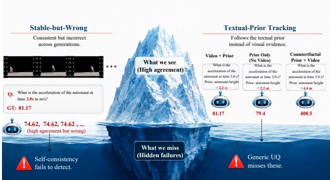
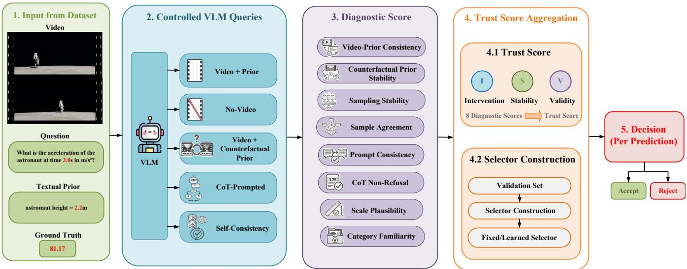
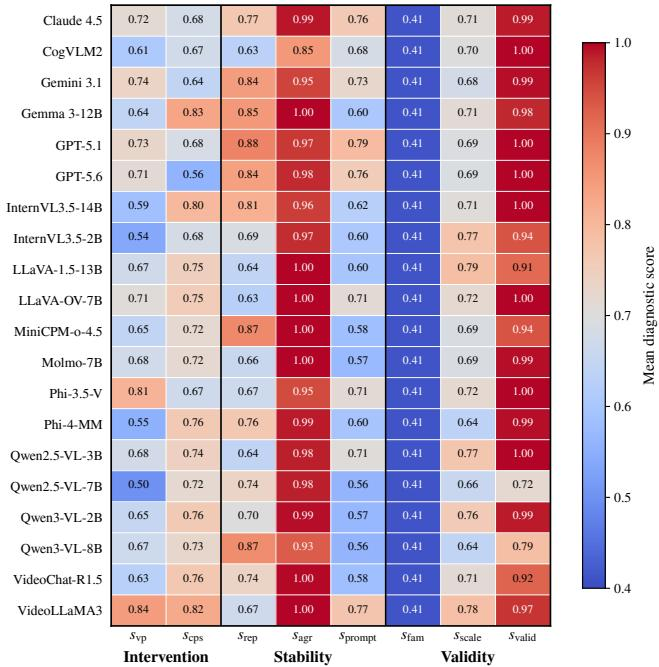
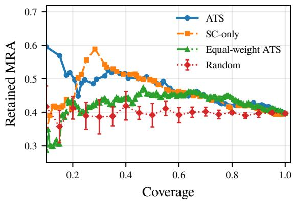

# Answer-Level Trust Selection for Physical Vision-Language Reasoning

Rongyu Yu1, Ke Niu2, Fengxiang He1

1University of Edinburgh

2Fudan University

v1ryu33@ed.ac.uk, 22110240103@m.fudan.edu.cn, F.He@ed.ac.uk

## Abstract

Vision-language models (VLMs) can estimate physical quantities such as duration, speed, and acceleration from visual observations, but existing benchmarks primarily assess overall model performance against annotated ground truth. In deployment, a key question is whether an individual prediction can be trusted when its ground truth is unavailable. Self-consistency alone may fail to capture important failure modes: a VLM may produce stable-but-wrong estimates or rely on textual priors rather than visual evidence. We formulate answer-level selective prediction for quantitative physical reasoning and propose Answer-Level Trust Selection (ATS), a post-hoc, modelagnostic framework for accepting or rejecting individual VLM predictions. ATS requires no fine-tuning, auxiliary verifier, or access to the model’s internal logits. Instead, it aggregates eight interpretable behavioral diagnostic scores derived from repeated queries and controlled interventions into a unified trust score. We evaluate ATS in depth on Qwen2.5-VL-7B and across 20 VLM backbones, examining selective performance, diagnostic behavior, and targeted failure modes. Our results show that intervention-based diagnostics help identify stable-but-wrong and prior-tracking predictions that repeated agreement alone may miss. However, improved failure-case rejection can come at the cost of lower retention of correct predictions. ATS therefore complements model-level capability evaluation with answer-level reliability assessment for quantitative VLM predictions. Code will be released upon publication.

## Introduction

Vision-language models (VLMs) are increasingly used as perception and reasoning modules in systems that interact with the physical world (Chow et al. 2025; Puyin et al. 2026). Beyond object recognition and scene description, these models are now expected to reason about measurable physical quantities such as size, duration, speed, and acceleration (Chow et al. 2025; Puyin et al. 2026). Their numerical predictions may serve as interfaces between visual perception and downstream planning, monitoring, measurement, and decision-support systems. This shift makes quantitative physical reasoning an important test of whether VLM outputs are not only semantically plausible but also suficiently reliable for downstream use. Recent benchmarks such as QuantiPhy (Puyin et al. 2026) evaluate whether VLMs can infer physical quantities of moving objects from visual observations, extending VLM evaluation from scene description to numerically grounded visual reasoning.

  
Figure 1: Hidden failure modes in physical VLM reasoning. Repeated agreement can conceal stable-but-wrong answers, while predictions may also follow perturbed textual priors rather than remain stable under fixed visual evidence.

However, existing benchmarks for quantitative VLM reasoning primarily evaluate model-level performance by comparing predictions with annotated ground truth and averaging accuracy over a dataset. Although such evaluation is essential for measuring overall capability, deployment raises a more actionable question: once a VLM produces a particular numerical estimate, is that specific answer suficiently trustworthy to retain? As illustrated in Figure 1, numerical VLMs may exhibit hidden answer-level failures. A model can be stable but wrong, repeatedly producing similar numerical estimates that remain far from the ground truth. It may also be highly sensitive to textual numerical priors: when the visual input is held fixed but the prior is perturbed, its prediction may shift toward the altered prior. Average benchmark performance cannot identify which individual answers exhibit these behaviors at deployment time, while agreement across repeated outputs may also fail to expose them.

These limitations motivate a complementary perspective on evaluating the reliability of numerical VLM predictions. Building on the principle of selective prediction, an answerlevel selection mechanism should retain a prediction only when its estimated reliability is suficient and otherwise abstain from using it. Unlike conventional model-level evalu ation, which characterizes overall capability using aggregate benchmark metrics, this answer-level perspective focuses on whether a particular prediction should be accepted or rejected when its ground truth is unavailable at deployment time. The two perspectives are complementary: model-level evaluation measures how well a VLM performs on average, whereas answer-level selection supports operational decisions about individual outputs. This distinction directly addresses the practical need to separate numerical answer generation from post-hoc accept-or-reject decisions.

We propose Answer-Level Trust Selection (ATS), a posthoc, black-box selective trust framework for quantitative physical reasoning with VLMs. ATS ofers two practical advantages. First, it is model-agnostic and minimally invasive: it requires no fine-tuning of the VLM, no additional neural verifier, no access to internal logits, and no modification or replacement of the original answer. Second, ATS provides an interpretable basis for answer-level selection. It evaluates each prediction using eight behavior-based diagnostic scores, each capturing a distinct aspect of the model’s predictive behavior, and aggregates them into a unified trust score for accepting or rejecting the original answer. We conduct an in-depth analysis of ATS using Qwen2.5-VL-7B as the primary model, examining its selective performance and the contribution of each diagnostic component. To further characterize the current state of quantitative physical reasoning, we additionally benchmark 20 VLMs, providing a broad comparison of their numerical reasoning capabilities.

Our main contributions are summarized as follows:

• We formulate answer-level selective prediction for quantitative physical reasoning with VLMs, focusing on whether to accept or reject individual answers in real-world deployment.

• We propose Answer-Level Trust Selection (ATS), a posthoc, black-box framework. ATS is model-agnostic and minimally invasive, while providing an interpretable basis for answer selection.

• We evaluate ATS in depth on Qwen2.5-VL-7B and analyze its performance. We further benchmark 20 representative VLMs to characterize their capabilities in quantitative physical reasoning.

## Quantitative Physical Reasoning in VLMs

Visual physical reasoning benchmarks evaluate models’ understanding of object interactions, dynamics, causal relations, and latent physical properties. CLEVRER (Yi et al. 2020) and Physion (Bear et al. 2021) study collision reasoning and physical scene evolution, while ComPhy (Chen et al. 2022) and CRIPP-VQA (Patel et al. 2022) require inference of properties such as mass, charge, friction, and initial velocity from observed motion and interactions. More recent benchmarks extend this evaluation to general-purpose VLMs. PhysBench (Chow et al. 2025) covers physical properties, relations, and dynamics, whereas QuantiPhy (Puyin et al. 2026) focuses on video-based numerical estimation with explicit textual physical priors. This setting aligns directly with ATS, which studies answer-level selective trust for numerical predictions and uses controlled prior interventions to probe prediction reliability. Unlike benchmark-level accuracy evaluation, our focus is whether an estimate produced by a fixed VLM should be retained or rejected without revising its value.

## Behavioral Reliability Estimation

Black-box reliability methods estimate uncertainty from model behavior rather than internal confidence. Repeatedsampling approaches use answer agreement (Wang et al. 2023), response inconsistency (Manakul, Liusie, and Gales 2023), or uncertainty over semantic response clusters (Kuhn, Gal, and Farquhar 2023). Although broadly applicable, these signals may assign high confidence to consistently repeated but numerically incorrect answers. Multimodal methods additionally measure reliability under visual or textual perturbations (Zhang, Zhang, and Zheng 2024), compare referencefree hallucination signals (Li et al. 2024), or incorporate cross-modal interventions into uncertainty calibration (Padhi et al. 2025). ATS builds on this behavioral perspective but introduces diagnostics tailored to quantitative physical reasoning, including a counterfactual probe of numerical-prior sensitivity. Selective prediction converts reliability estimates into accept-or-abstain decisions characterized by the risk– coverage trade-of (El-Yaniv and Wiener 2010). Prior work has studied post-hoc and jointly learned rejection in classification (Geifman and El-Yaniv 2017, 2019), as well as learned or calibrated abstention in VQA (Whitehead et al. 2022; Dancette et al. 2023; Eisenschlos et al. 2024). In contrast, ATS performs post-hoc selective prediction for numerical VLM outputs using only black-box behavioral diagnostics.

## Problem Formulation

We study answer-level selective prediction for quantitative physical reasoning with vision-language models (VLMs). Each example is represented as

$$
x _ { i } = ( v _ { i } , q _ { i } , p _ { i } ) ,
$$

where $v _ { i }$ denotes the visual observation, qi the question, and $p _ { i }$ the textual context containing a numerical prior. Given $x _ { i }$ a VLM f produces an original numerical prediction

$$
{ \hat { y } } _ { i } = f ( v _ { i } , q _ { i } , p _ { i } ) ,
$$

whose ground-truth physical quantity is denoted by $y _ { i }$

Our objective is not to modify the underlying VLM or correct its original prediction. Instead, we perform posthoc selection to determine whether $\hat { y } _ { i }$ should be accepted or rejected. Specifically, a selection method assigns each prediction a trust score

$$
s _ { i } = S ( x _ { i } , { \hat { y } } _ { i } ; f ) ,
$$

where $S$ may obtain additional behavioral evidence through black-box queries to $f ,$ but does not use $y _ { i }$ at inference time. Given a selection threshold $\tau ,$ the corresponding selector is

$$
\begin{array} { r } { g _ { \tau } ( x _ { i } , \hat { y } _ { i } ) = \mathbb { I } [ s _ { i } \geq \tau ] , } \end{array}
$$

where $g _ { \tau } = 1$ indicates acceptance and $g _ { \tau } = 0$ indicates rejection. Varying τ yields diferent trade-ofs between the fraction of retained answers and their predictive quality.

  
Figure 2: Overview of ATS. Controlled VLM queries produce 8 diagnostic scores capturing intervention sensitivity, output stability, and response validity. These scores are aggregated into a trust score, and a selector constructed on the validation set accepts or rejects each original numerical prediction.

We measure numerical prediction quality using Mean Relative Accuracy (MRA) (Puyin et al. 2026). Let

$$
\mathcal { C } = \{ 0 . 1 , 0 . 2 , \ldots , 0 . 9 , 0 . 9 5 \} ,
$$

and let $\epsilon _ { y } > 0$ be a small constant for denominator stabilization. The per-example MRA of prediction $\hat { y } _ { i }$ is defined as

$$
\mathrm { M R A } ( \hat { y } _ { i } , y _ { i } ) = \frac { 1 } { | \mathcal { C } | } \sum _ { \theta \in \mathcal { C } } \mathbb { I } \left[ \frac { | \hat { y } _ { i } - y _ { i } | } { \operatorname* { m a x } \{ | y _ { i } | , \epsilon _ { y } \} } < 1 - \theta \right] .
$$

This metric averages prediction correctness across multiple relative-error tolerances, assigning higher values to estimates that are closer to the ground truth.

For a test set of N examples, the coverage of $g _ { \tau }$ is the fraction of accepted predictions:

$$
\mathrm { C o v } ( \tau ) = \frac { 1 } { N } \sum _ { i = 1 } ^ { N } g _ { \tau } ( x _ { i } , \hat { y } _ { i } ) .
$$

For any threshold with nonzero coverage, the retained-answer MRA is

$$
\mathrm { M R A } _ { \mathrm { r e t } } ( \tau ) = \frac { \sum _ { i = 1 } ^ { N } \mathrm { M R A } ( \hat { y } _ { i } , y _ { i } ) g _ { \tau } ( x _ { i } , \hat { y } _ { i } ) } { \sum _ { i = 1 } ^ { N } g _ { \tau } ( x _ { i } , \hat { y } _ { i } ) } .
$$

The corresponding selective risk is

$$
R ( \tau ) = 1 - \mathrm { M R A _ { r e t } } ( \tau ) .
$$

A reliable selector should achieve lower selective risk at a given coverage, or equivalently higher coverage at a given risk level.

## Methods

## Overview

As illustrated in Figure 2, ATS is a post-hoc framework for answer-level selective trust in numerical physical reasoning.

For each example, the VLM is evaluated under five controlled conditions: Video + Prior, Prior Only, Video + Counterfactual Prior, CoT-Prompted, and Self-Consistency Sampling. The resulting responses are converted into eight behavioral diagnostic scores and aggregated into an overall trust score. The validation set is then used to construct an answer-level selector that determines whether the original numerical prediction should be accepted for downstream use.

## Controlled VLM Probing

ATS constructs answer-level diagnostic scores by probing the VLM under five controlled query settings. For each example $\boldsymbol { x } = ( v , q , p )$ , we first obtain the standard Video+Prior prediction

$$
\hat { y } _ { \mathrm { f u l l } } = f ( v , q , p ) ,
$$

which serves as the original numerical answer to be assessed.

We then obtain a prior-only prediction without visual input,

$$
\hat { y } _ { \mathrm { p r i o r } } = f ( \emptyset , q , p ) ,
$$

and a counterfactual-prior prediction,

$$
\hat { y } _ { \mathrm { c f } } = f ( \boldsymbol { v } , \boldsymbol { q } , \boldsymbol { p } ^ { \mathrm { c f } } ) ,
$$

where $p ^ { \mathrm { c f } }$ changes only the numerical value in the textual prior while preserving the video, question, and target physical quantity. The intervention is designed as a diagnostic perturbation rather than a new task instance: the original prediction remains the answer under assessment, and the perturbed query is used only to measure whether the model is excessively attracted to the altered textual cue.

To assess prompt sensitivity, we additionally query the VLM using a chain-of-thought prompt,

$$
\hat { y } _ { \mathrm { c o t } } = f ( v , q , p ; \pi _ { \mathrm { c o t } } ) ,
$$

where $\pi _ { \mathrm { c o t } }$ denotes the chain-of-thought prompting instruction.

Finally, to assess sampling stability, we draw M stochastic generations from the standard Video+Prior input,

$$
\hat { y } _ { \mathrm { s c } } ^ { ( m ) } \sim f ( v , q , p ; \xi _ { m } ) , \qquad m = 1 , \ldots , M ,
$$

where $\xi _ { m }$ denotes the sampling randomness. These repeated outputs are summarized by their median,

$$
\tilde { y } _ { \mathrm { s c } } = \mathrm { m e d i a n } _ { m = 1 , \dots , M } \hat { y } _ { \mathrm { s c } } ^ { ( m ) } ,
$$

and their dispersion, which is later used to compute the sampling stability score.

## Diagnostic Score Construction

A single numerical prediction is insuficient to determine whether an answer should be trusted. ATS therefore probes the same VLM through a set of controlled black-box queries. By comparing the model outputs across these conditions, ATS constructs eight complementary diagnostic scores. Each score describes a specific behavioral phenomenon rather than a calibrated probability of correctness. Instead, the scores provide complementary answer-level evidence that is subsequently aggregated into an overall trust score.

The video-prior consistency score compares the standard video-conditioned prediction with the prior-only prediction in log-magnitude space, where $\ell ( z ) \doteq \log ( \operatorname* { m a x } \dot { \{ | z | , \epsilon _ { \mathrm { l o g } } \} } )$ and $\epsilon _ { \mathrm { l o g } } > 0 $

$$
s _ { \mathrm { v p } } = \frac { 1 } { 1 + \vert \ell ( \hat { y } _ { \mathrm { f u l l } } ) - \ell ( \hat { y } _ { \mathrm { p r i o r } } ) \vert } .
$$

A larger $s _ {  { \mathrm { v p } } }$ indicates closer agreement in log magnitude between the Video + Prior and Prior-Only predictions.

The counterfactual prior stability score tests whether the prediction remains close to the original video-conditioned answer when the textual prior is perturbed. Let

$$
\rho = { \frac { \mathrm { n u m } ( p ^ { \mathrm { c f } } ) } { \mathrm { n u m } ( p ) } }
$$

denote the numerical scale ratio between the counterfactual and original priors. We compare the counterfactual prediction against both the original video-conditioned prediction and an idealized prior-tracking reference:

$$
\begin{array} { r l } & { d _ { \mathrm { { r e f } } } = \left. \ell ( \hat { y } _ { \mathrm { { c f } } } ) - \ell ( \hat { y } _ { \mathrm { { f u l l } } } ) \right. , } \\ & { d _ { \mathrm { { t r a c k } } } = \left. \ell ( \hat { y } _ { \mathrm { { c f } } } ) - \ell ( \rho \hat { y } _ { \mathrm { { f u l l } } } ) \right. . } \end{array}
$$

The counterfactual prior stability score is

$$
s _ { \mathrm { c p s } } = \frac { d _ { \mathrm { t r a c k } } } { \operatorname* { m a x } \{ \zeta , d _ { \mathrm { t r a c k } } + d _ { \mathrm { r e f } } \} } ,
$$

where $\zeta > 0$ is a denominator floor. A larger $s _ { \mathrm { c p s } }$ indicates that the counterfactual prediction remains closer to the original video-conditioned prediction than to the idealized prior-tracking reference.

For self-consistency sampling, let $\{ \hat { y } ^ { ( m ) } \} _ { m = 1 } ^ { M }$ denote the repeated numerical generations, and let

$$
\mathcal { V } = \left\{ m \in \{ 1 , \dots , M \} : \hat { y } ^ { ( m ) } \in \mathbb { R } _ { > 0 } \right\}
$$

denote the set of valid positive predictions.

The sampling stability score measures the log-space dispersion of these valid repeated predictions:

$$
\sigma _ { \log } = \mathrm { S t d } \Bigg ( \bigg \{ \ell \Big ( \hat { y } ^ { ( m ) } \Big ) \bigg \} _ { m \in \mathcal { V } } \bigg ) , \qquad s _ { \mathrm { r e p } } = \frac { 1 } { 1 + \sigma _ { \log } } .
$$

A larger $s _ { \mathrm { r e p } }$ indicates that the valid repeated predictions are more tightly concentrated in log space.

The sample agreement score measures the proportion of repeated generations that produce a valid positive numerical prediction:

$$
a _ { \mathrm { v a l i d } } = \frac { 1 } { M } \sum _ { m = 1 } ^ { M } \mathbb { I } \Big [ \hat { y } ^ { ( m ) } \in \mathbb { R } _ { > 0 } \Big ] , \qquad s _ { \mathrm { a g r } } = a _ { \mathrm { v a l i d } } .
$$

A larger ${ \boldsymbol { s } } _ { \mathrm { a g r } }$ indicates that a greater proportion of repeated generations produce valid positive numerical predictions. Thus, ${  { s } } _ { \mathrm { a g r } }$ represents a valid-output rate rather than agreement around a dominant numerical value.

The prompt consistency score measures the numerical consistency across the Prior-Only, Video + Prior, and CoT-Prompted conditions. Let $\hat { y } _ { \mathrm { c o t } }$ denote the numerical prediction extracted from the CoT-Prompted response. We define

$$
\begin{array} { l } { \displaystyle \sigma _ { \mathrm { p r o m p t } } = \mathrm { S t d } ( \ell ( \hat { y } _ { \mathrm { p r i o r } } ) , \ell ( \hat { y } _ { \mathrm { f u l l } } ) , \ell ( \hat { y } _ { \mathrm { c o t } } ) ) , } \\ { \displaystyle s _ { \mathrm { p r o m p t } } = \frac { 1 } { 1 + \sigma _ { \mathrm { p r o m p t } } } . } \end{array}
$$

A larger $s _ { \mathrm { p r o m p t } }$ indicates greater numerical consistency across these query conditions.

The scale-plausibility score measures whether the original video-conditioned prediction has an extreme log-magnitude:

$$
s _ { \mathrm { s c a l e } } = \exp \left( - \frac { | \ell ( \hat { y } _ { \mathrm { f u l l } } ) | } { \kappa _ { \mathrm { s c a l e } } } \right) ,
$$

where $\kappa _ { \mathrm { s c a l e } } > 0$ is a fixed scale constant. We set $\kappa _ { \mathrm { s c a l e } } = 5$ in all experiments. A larger $s _ { \mathrm { s c a l e } }$ indicates that the prediction has a less extreme log-magnitude under this scale heuristic.

The category familiarity score measures how frequently the event family of an example occurs in a fixed reference pool. Let $h _ { i }$ denote the event family of example i, let $c _ { h . }$ denote its empirical count in the reference pool, and let N denote the pool size. We first define the frequency-based event-family novelty risk as

$$
r _ { i , \mathrm { u n k } } = 1 - \frac { \log ( 1 + c _ { h _ { i } } ) } { \log ( 1 + N ) } ,\tag{1}
$$

and convert it into positive familiarity evidence:

$$
s _ { i , \mathrm { f a m } } = 1 - r _ { i , \mathrm { u n k } } .
$$

A larger $s _ { i , \mathrm { f a m } }$ indicates that the corresponding event family occurs more frequently in the fixed reference pool.

The CoT non-refusal score measures whether the CoT-Prompted response avoids a predefined set of refusal patterns:

$$
s _ { \mathrm { v a l i d } } = \mathbb { I } [ R _ { \mathrm { c o t } } \notin \mathcal { R } _ { \mathrm { r e f u s a l } } ] ,
$$

where $R _ { \mathrm { c o t } }$ is the CoT-Prompted response and $\mathcal { R } _ { \mathrm { r e f u s a l } }$ is the predefined set of refusal patterns. A larger $s _ { \mathrm { v a l i d } }$ indicates that the CoT-Prompted response does not match a predefined refusal pattern. Specifically, $s _ { \mathrm { v a l i d } } = 1$ denotes non-refusal and $s _ { \mathrm { v a l i d } } = 0$ denotes refusal.

## Trust-Score Aggregation

The diagnostic scores capture complementary behavioral evidence about each prediction. ATS organizes the eight scores into three groups: intervention-related, stability-related, and validity-related scores:

$$
\begin{array} { r } { \begin{array} { r l } & { \mathbf { s } _ { \mathrm { i n t } , i } = \left[ s _ { \mathrm { v p } , i } , s _ { \mathrm { c p s } , i } \right] ^ { \top } , } \\ & { \mathbf { s } _ { \mathrm { s t a b } , i } = \left[ s _ { \mathrm { r e p } , i } , s _ { \mathrm { a g r } , i } , s _ { \mathrm { p r o m p t } , i } \right] ^ { \top } , } \\ & { \mathbf { s } _ { \mathrm { v a l } , i } = \left[ s _ { \mathrm { f a m } , i } , s _ { \mathrm { s c a l e } , i } , s _ { \mathrm { v a l i d } , i } \right] ^ { \top } . } \end{array} } \end{array}\tag{2}
$$

The intervention-related scores characterize how predictions respond to controlled changes in the textual prior. The stabilityrelated scores measure consistency across stochastic generations and prompting conditions. The validity-related scores provide complementary evidence concerning event familiarity, numerical scale, and response validity. After clipping each score to the interval [0, 1], ATS computes the aggregate trust score as

$$
\boldsymbol { \tau } _ { i } = \mathbf { w } _ { \mathrm { i n t } } ^ { \top } \mathbf { s } _ { \mathrm { i n t } , i } + \mathbf { w } _ { \mathrm { s t a b } } ^ { \top } \mathbf { s } _ { \mathrm { s t a b } , i } + \mathbf { w } _ { \mathrm { v a l } } ^ { \top } \mathbf { s } _ { \mathrm { v a l } , i } .\tag{3}
$$

We evaluate three aggregation strategies. Prior-weighted ATS, our default setting, uses a set of manually specified weights. These weights are specified heuristically and fixed before test evaluation. Equal-weight ATS assigns the same weight to all eight scores, providing a control without manually specified priorities. Learned ATS uses a lightweight logisticregression model to learn the score combination from the validation set. Finally, we conduct a weight-sensitivity analysis by perturbing the prior-weighted weights and recomputing retained-answer MRA at fixed coverage levels and AURC. This analysis examines whether ATS remains stable under moderate changes to the aggregation weights. Complete analysis are provided in the supplementary material.

## Selector Construction

ATS converts the diagnostic trust score into an answer-level accept/reject rule using the validation set. The main implementation uses event-conditional selection rules. Let H denote the set of event families, and let $h _ { i } = H ( x _ { i } ) \in \mathcal { H }$ denote the event family assigned to example i, as determined by its physical inference type and video type. For each event family h and candidate trust threshold $\lambda \in \bar { \Lambda } _ { h }$ , define the candidate rule parameters

$$
\gamma _ { h , \lambda } = ( \alpha _ { h , \lambda } , \beta _ { h , \lambda } , \eta _ { h , \lambda } , \lambda ) .
$$

The validation procedure selects $\widehat { \lambda } _ { h } \in \Lambda _ { h }$ , the corresponding family-specific rule is

$$
\widehat { \gamma } _ { h } = \big ( \widehat { \alpha } _ { h } , \widehat { \beta } _ { h } , \widehat { \eta } _ { h } , \widehat { \lambda } _ { h } \big ) .
$$

The deployed selector for example i is

$$
\begin{array} { r l } & { g _ { \widehat { \gamma } _ { h _ { i } } } ( x _ { i } , \widehat { y } _ { i } ) = \mathbb { I } \Bigl [ s _ { i , \mathrm { v p } } \geq \widehat { \alpha } _ { h _ { i } } \ \wedge \ s _ { i , \mathrm { c p s } } \geq \widehat { \beta } _ { h _ { i } } } \\ & { \qquad \ \wedge \ r _ { i , \mathrm { u n k } } \leq \widehat { \eta } _ { h _ { i } } \ \wedge \ \tau _ { i } \geq \widehat { \lambda } _ { h _ { i } } \Bigr ] . } \end{array}\tag{4}
$$

In the practical empirical procedure, candidate operating points are evaluated on the validation split using empirical coverage and selective risk, where selective risk is defined as one minus the mean per-example MRA among accepted examples. Let $\Lambda _ { h }$ denote the finite set of candidate operating points for event family h, and let

$$
K = \sum _ { h \in \mathcal H } | \Lambda _ { h } |
$$

denote the total number of candidates. We additionally compute the Hoefding-style upper-confidence screening statistic

$$
\overline { { R } } _ { h } ( \gamma _ { h , \lambda } ) = \widehat { R } _ { h } ( \gamma _ { h , \lambda } ) + \sqrt { \frac { \log ( K / \delta ) } { 2 n _ { h , \lambda } } } ,
$$

where $n _ { h , \lambda } > 0$ denotes the number of accepted validation examples and $\delta \in ( 0 , 1 )$ is the family-wise failure probability. In practice, candidate rules are evaluated on the validation set using empirical coverage, empirical selective risk, and the Hoefding-style screening statistic, which penalizes rules supported by few accepted examples. The selected rule is then fixed before test evaluation, where its coverage and selective risk are reported as empirical performance measures. The theoretical development, proof, and additional analyses are provided in the supplementary material.

## Test-Time Selection

During validation procedure, ATS uses the validation set to construct one selector for each event family. Each selector contains family-specific acceptance thresholds and is fixed before test evaluation. For each test example, ATS applies the selector corresponding to its event family to the original numerical prediction. The prediction is accepted only if all prespecified selection conditions are satisfied. Otherwise, it is rejected. No test labels are used, and ATS neither revises nor replaces the original prediction.

## Theoretical Motivations

ATS is primarily an empirical answer-selection framework. This subsection provides two analytical observations that motivate its design: a fixed-rule concentration result explaining the sample-size penalty used during validation, and a monotonicity property explaining the construction of the counterfactual-prior stability score. Because the practical ATS rules are constructed and evaluated using the same validation split, these observations are not presented as finite sample guarantees for the experimental procedure.

We first characterize the selective risk of a finite collection of prespecified event-conditional accept/reject rules. Let $L ( \hat { y } , y ) \dot { = } \hat { 1 } \mathrm { - M R A } ( \hat { y } , y ) \in [ 0 , 1$ ] denote the bounded numerical loss. For each event family $h ,$ let $\Gamma _ { h } = \{ \gamma _ { h , 1 } , \dotsc , \gamma _ { h , K _ { h } } \}$ be a finite family of complete accept/reject rules. Each rule specifies all diagnostic-score definitions, aggregation weights, thresholds, event-family structure, and acceptance conditions. For $\gamma \in \Gamma _ { h }$ , define the conditional selective risk as

$$
R _ { h } ( \gamma ) = \mathbb { E } \Big [ L ( \hat { Y } , Y ) \mid g _ { \gamma } ( X , \hat { Y } ) = 1 , \ H ( X ) = h \Big ] .
$$

Let $\widehat { R } _ { h } ( \gamma )$ denote the corresponding empirical selective risk computed over $n _ { h , \gamma } ~ > ~ 0$ accepted examples in the riskcalibration sample.

Proposition 1 (Conditional finite-class selective-risk bound). Assume that calibration units are conditionally i.i.d. within each event family and that the finite family of complete candidate rules $\Gamma \stackrel { \cdot } { = } \bigcup _ { h \in \mathcal { H } } \Gamma _ { h }$ is fixed independently of the risk-calibration sample. Then, with probability at least $1 - \delta ,$ simultaneouslyfor every candidate with $n _ { h , \gamma } > 0$

$$
R _ { h } ( \gamma ) \leq \widehat { R } _ { h } ( \gamma ) + \sqrt { \frac { \log ( K / \delta ) } { 2 n _ { h , \gamma } } } .
$$

Hence, any data-dependent selectionfrom this prespecified family inherits its corresponding simultaneous upper bound.

If each $\lambda \in \Lambda _ { h }$ indexes a prespecified complete rule, then $\begin{array} { r } { K = \sum _ { h \in \mathcal { H } } \left| \Lambda _ { h } \right| } \end{array}$ , matching the finite-class correction used in the practical screening statistic. The proposition controls average loss among accepted examples, not answer-specific correctness or a prediction interval. In the practical two-way procedure, some acceptance thresholds are derived adaptively from the same validation data used to evaluate empirical selective risk. The resulting rule is fixed before test evaluation, but the proposition’s independence condition is not satisfied. We therefore interpret the Hoefding-style quantity (Hoefding 1963) as a conservative screening statistic and the test results as empirical selective-trust evidence rather than a formal finite-sample guarantee. Further analysis is provided in the supplementary material.

Proposition 2 (Monotonicity of counterfactual prior stability). Assume $\rho > 0 , \rho \neq 1 ,$ , and that all relevant magnitudes exceed the logfloor $\epsilon _ { \mathrm { l o g } } .$ . Consider $\hat { y } _ { \mathrm { c f } } = \rho ^ { \alpha } \hat { y } _ { \mathrm { f u l l } } , \ : \hat { \alpha ^ { } } \in [ 0 , 1 ]$ where $\alpha = 0$ corresponds to reference stability and $\alpha = 1$ corresponds tofull prior tracking. Let $A = \log { \dot { \rho } } \neq 0 .$ . Then

$$
s _ { \mathrm { c p s } } ( \alpha ) = \frac { ( 1 - \alpha ) | A | } { \operatorname* { m a x } \{ \zeta , | A | \} } .
$$

Thus $s _ { \mathrm { c p s } } ( \alpha )$ decreases strictly with the degree of prior tracking, with $s _ { \mathrm { c p s } } ( 0 ) = | A | /$ max{ζ, |A|} and $s _ { \mathrm { c p s } } ( 1 ) = 0 .$

## Experiments

## Dataset and task

We evaluate ATS on the oficial validation split of QuantiPhy (Puyin et al. 2026). Following the original benchmark, we measure numerical answer quality using Mean Relative Accuracy (MRA) (Puyin et al. 2026). Beyond evaluating numerical estimation itself, we consider an answer-level selective-prediction setting in which ATS determines whether each VLM prediction should be accepted or rejected. To the best of our knowledge, no other publicly available video benchmark directly combines real-world physical-quantity estimation with the annotations required for this evaluation. We therefore focus our experiments on QuantiPhy.

## Baselines

We compare Prior-weighted ATS with SC-only, three Generic UQ baselines, Equal-weight ATS, Learned ATS, and Oracle ranking. SC-only ranks predictions by agreement across repeated generations (Wang et al. 2023). Generic UQ uses only srep, sagr, and $s _ { \mathrm { p r o m p t } } .$ : the mean and rank-fusion variants aggregate these scores directly, whereas Learned Generic UQ fits a standardized logistic-regression aggregator on the validation set using a binary pseudo-correctness target indicating whether the per-example MRA is at least 0.4. Equalweight ATS assigns uniform weights to the full diagnostic set. Learned ATS fits the same aggregator using all diagnostic scores. Oracle ranking orders predictions by ground-truth answer quality and serves as an unattainable upper bound.

  
Figure 3: Cross-backbone diagnostic profiles across 20 VLMs. Each cell reports the mean value of an answer-level diagnostic score. The figure shows how intervention-, stability-, and validity-related scores vary across backbones.

<table><tr><td></td><td colspan="2">Stable-but-wrong</td><td colspan="2">Prior tracking</td></tr><tr><td>Selector</td><td>Reject ↑</td><td>Correct retain ↑</td><td>Wrong reject ↑</td><td>Correct retain ↑</td></tr><tr><td>SC-only</td><td>0.013</td><td>0.986</td><td>0.654</td><td>0.491</td></tr><tr><td>Generic UQ</td><td>0.271</td><td>0.830</td><td>0.638</td><td>0.523</td></tr><tr><td>Equal-weight ATS</td><td>0.424</td><td>0.723</td><td>0.906</td><td>0.248</td></tr><tr><td>Prior-weighted ATS</td><td>0.409</td><td>0.727</td><td>0.958</td><td>0.111</td></tr><tr><td>Learned ÀTS</td><td>0.379</td><td>0.777</td><td>0.574</td><td>0.512</td></tr></table>

Table 1: Failure-case rejection and correct-case retention at 50% coverage, averaged across 20 backbones.

## Experiment Results

This section presents the main results on ATS’s selective performance. The supplementary material provides further evaluation protocols, cross-backbone and failure-mode analyses, diagnostic studies, ablations, robustness checks, statistical tests, calibration results, and computational-cost analyses.

  
Figure 4: Coverage-retained-MRA curves on Qwen2.5-VL-7B.

## Cross-backbone Diagnostic Profiles

Figure 3 summarizes the 8 ATS scores across 20 VLM backbones. Repeated-output stability and validity-related scores are generally high, whereas intervention- and prompt-related scores, particularly $s _ { \mathrm { v p } } , s _ { \mathrm { c p s } } ,$ , and $s _ { \mathrm { p r o m p t } }$ , show greater crossbackbone variation. We use these profiles as descriptive behavioral evidence to motivate the targeted failure-mode analysis, rather than as a direct performance comparison. More detailed analyses are provided in the supplementary material.

## Cross-backbone Selective Comparison

Across the 20 backbones, Prior-weighted ATS has mean paired efects of +0.0192, +0.0023, and −0.0037 in MRA at 30%, 50%, and 70% coverage, respectively, relative to SC-only. For AURC, where a positive diference favours ATS, the mean efect is +0.0133, with positive efects on 14 of 20 backbones. We therefore treat the aggregate comparison as a descriptive cross-backbone consistency check rather than evidence of universal superiority. AURC shows the most consistent positive direction, whereas fixed-coverage efects remain small and backbone dependent. More analyses of the cross-backbone experiments are provided in the supplementary material.

## Targeted Failure-mode Analysis

Overall selective-ranking metrics do not reveal whether a selector identifies predictions that remain consistent but numerically wrong. Table 1 evaluates rejection of stable-butwrong and prior-tracking cases at 50% coverage, together with retention of matched correct cases. Equal-weight and Prior-weighted ATS reject 42.4% and 40.9% of stable-butwrong cases, compared with 27.1% for Generic UQ and 1.3% for SC-only. Prior-weighted ATS also rejects 95.8% of wrong prior-tracking cases. In the table, bold indicates the best deployable result in each column, while underlining marks the second-highest stable-but-wrong rejection rate. These rejection gains come with lower correct-case retention and must therefore be interpreted as rejection-retention trade-ofs rather than unqualified improvements. Nevertheless, they show that controlled interventions reveal answer-level behavioral evidence that self-consistency alone may not capture.

<table><tr><td>Method</td><td>@30%</td><td>@50%</td><td>@70%</td><td>AURC↓</td></tr><tr><td colspan="5">Trust-score baselines</td></tr><tr><td>SC-only</td><td>0.5429</td><td>0.4989</td><td>0.4426</td><td>0.5338</td></tr><tr><td>Equal-weight ATS</td><td></td><td>0.43740.4441</td><td>0.4444</td><td>0.5655</td></tr><tr><td>Prior-weighted ATS</td><td>0.5187</td><td>0.4889</td><td>0.4476</td><td>0.5300</td></tr><tr><td>Learned ATS</td><td>0.4069</td><td>0.4120</td><td>0.4028</td><td>0.5977</td></tr><tr><td>Prior-weighted ATS w/o  ${ \mathit { s } } _ { { \mathit { v p } } }$ </td><td>0.4879</td><td>0.4734</td><td>0.4352</td><td>0.5406</td></tr><tr><td>Prior-weighted ATS w/o  $s _ { c p s }$ </td><td>0.4780</td><td>0.4886</td><td>0.4671</td><td>0.5308</td></tr><tr><td colspan="5">Generic uncertainty baselines</td></tr><tr><td>Generic UQ mean</td><td>0.4677</td><td>0.4526</td><td>0.4533</td><td>0.5151</td></tr><tr><td>Generic UQ rank fusion</td><td>0.4909</td><td>0.4709</td><td>0.4504</td><td>0.5125</td></tr><tr><td>Learned Generic UQ</td><td>0.5063</td><td>0.4605</td><td>0.4387</td><td>0.5593</td></tr><tr><td colspan="5">Weight sensitivity</td></tr><tr><td>Random perturb. mean</td><td>0.5192</td><td>0.4881</td><td>0.4492</td><td>0.5306</td></tr><tr><td>Random perturb. 10th pct.</td><td></td><td></td><td>0.51090.48040.4437</td><td>0.5363</td></tr></table>

Table 2: Comparison of selective-ranking baselines, ATS variants, score ablations, and weight perturbations on Qwen2.5- VL-7B.

## Representative Qwen2.5-VL-7B Results

Figure 4 and Table 2 summarize the Qwen2.5-VL-7B results. The curves show how ATS and the main baseline selectors perform across diferent coverage level. SC-only performs best at 30% and 50% coverage, while Generic UQ rank fusion achieves the lowest AURC. Prior-weighted ATS remains com petitive across operating points and changes only modestly under random weight perturbations. Removing $s _ { \mathrm { v p } }$ reduces MRA@50 from 0.4889 to 0.4734 and increases AURC from 0.5300 to 0.5406, suggesting that the $s _ {  { \mathrm { v p } } }$ contributes to ATS performance on this backbone. Together with Table 1, these results show that ATS provides intervention-based evidence beyond that captured by Generic UQ, particularly to detect stable-but-wrong and prior-tracking failures.

## Conclusion

We presented ATS, a post-hoc framework for answer-level selective prediction in quantitative physical reasoning with VLMs. ATS integrates complementary behavioral evidence from controlled interventions, repeated-generation stability, and response validity, without requiring access to model internals or additional fine-tuning. Across 20 VLM backbones, SC-only and Generic UQ remain strong baselines on aggregate selective-ranking metrics. Targeted analyses show that ATS rejects substantially more stable-but-wrong and prior-tracking cases, two failure modes that self-consistency sampling or generic uncertainty estimation alone may not fully capture. These gains come with reduced retention of matched correct predictions and therefore represent a rejection–retention trade of rather than a uniform improvement. Overall, our results position intervention-based diagnostics as a complementary source of answer-level uncertainty evidence and motivate future selectors that better leverage such diagnostic scores to improve aggregate selective performance.

## References

Bear, D. M.; Wang, E.; Mrowca, D.; Binder, F. J.; Tung, H.-Y. F.; Pramod, R.; Holdaway, C.; Tao, S.; Smith, K.; Sun, F.-Y.; et al. 2021. Physion: Evaluating physical prediction from vision in humans and machines. arXiv preprint arXiv:2106.08261.

Chen, Z.; Yi, K.; Li, Y.; Ding, M.; Torralba, A.; Tenenbaum, J. B.; and Gan, C. 2022. Comphy: Compositional physical reasoning of objects and events from videos. arXiv preprint arXiv:2205.01089.

Chow, W.; Mao, J.; Li, B.; Seita, D.; Campagnolo Guizilini, V.; and Wang, Y. 2025. Physbench: Benchmarking and enhancing vision-language models for physical world understanding. In International Conference on Learning Representations, volume 2025, 97959–98108.

Dancette, C.; Whitehead, S.; Maheshwary, R.; Vedantam, R.; Scherer, S.; Chen, X.; Cord, M.; and Rohrbach, M. 2023. Improving Selective Visual Question Answering by Learning from Your Peers. arXiv preprint arXiv:2306.08751.

Eisenschlos, J. M.; Maina, H.; Ivetta, G.; and Benotti, L. 2024. Selectively Answering Visual Questions. arXiv preprint arXiv:2406.00980.

El-Yaniv, R.; and Wiener, Y. 2010. On the Foundations of Noise-Free Selective Classification. Journal of Machine Learning Research, 11: 1605–1641.

Geifman, Y.; and El-Yaniv, R. 2017. Selective Classification for Deep Neural Networks. In Advances in Neural Information Processing Systems, volume 30.

Geifman, Y.; and El-Yaniv, R. 2019. SelectiveNet: A Deep Neural Network with an Integrated Reject Option. In Proceedings of the 36th International Conference on Machine Learning, volume 97 of Proceedings of Machine Learning Research, 2151–2159. PMLR.

Hoefding, W. 1963. Probability inequalities for sums of bounded random variables. Journal ofthe American statistical association, 58(301): 13–30.

Kuhn, L.; Gal, Y.; and Farquhar, S. 2023. Semantic Uncertainty: Linguistic Invariances for Uncertainty Estimation in Natural Language Generation. In International Conference on Learning Representations.

Li, Q.; Geng, J.; Lyu, C.; Zhu, D.; Panov, M.; and Karray, F. 2024. Reference-free hallucination detection for large vision-language models. In Findings ofthe Associationfor Computational Linguistics: EMNLP 2024, 4542–4551.

Manakul, P.; Liusie, A.; and Gales, M. J. F. 2023. SelfCheck-GPT: Zero-Resource Black-Box Hallucination Detection for Generative Large Language Models. In Proceedings of the 2023 Conference on Empirical Methods in Natural Language Processing.

Padhi, T.; Kaur, R.; Cobb, A. D.; Acharya, M.; Roy, A.; Samplawski, C.; Matejek, B.; Berenbeim, A. M.; Bastian, N. D.; and Jha, S. 2025. Calibrating Uncertainty Quantification of Multi-Modal LLMs Using Grounding. arXiv preprint arXiv:2505.03788.

Patel, M.; Gokhale, T.; Baral, C.; and Yang, Y. 2022. Crippvqa: Counterfactual reasoning about implicit physical properties via video question answering. In Proceedings of the 2022 Conference on Empirical Methods in Natural Language Processing, 9856–9870.

Puyin, L.; Xiang, T.; Mao, E.; Wei, S.; Chen, X.; Masood, A.; Fei-Fei, L.; and Adeli, E. 2026. Quantiphy: A quantitative benchmark evaluating physical reasoning abilities of vision-language models. In Proceedings of the IEEE/CVF Conference on Computer Vision and Pattern Recognition, 33174–33184.

Wang, X.; Wei, J.; Schuurmans, D.; Le, Q.; Chi, E. H.; Narang, S.; Chowdhery, A.; and Zhou, D. 2023. Self-Consistency Improves Chain of Thought Reasoning in Language Models. In International Conference on Learning Representations.

Whitehead, S.; Petryk, S.; Shakib, V.; Gonzalez, J.; Darrell, T.; Rohrbach, A.; and Rohrbach, M. 2022. Reliable Visual Question Answering: Abstain Rather Than Answer Incorrectly. arXiv preprint arXiv:2204.13631.

Yi, K.; Gan, C.; Li, Y.; Kohli, P.; Wu, J.; Torralba, A.; and Tenenbaum, J. B. 2020. CLEVRER: CoLlision Events for Video REpresentation and Reasoning. In International Conference on Learning Representations.

Zhang, R.; Zhang, H.; and Zheng, Z. 2024. VL-Uncertainty: Detecting Hallucination in Large Vision-Language Model via Uncertainty Estimation. arXiv preprint arXiv:2411.11919.