# Auditing Cross-Lingual Fairness in Language Model Watermarking

Alexander Nemecek, Osama Zafar, Debargha Ganguly, Vikash Singh,

Vipin Chaudhary, Erman Ayday

Case Western Reserve University

{ajn98,oxz23,dxg512,vxs465,vxc204,exa208}@case.edu

## Abstract

Watermarking schemes for large language model output are evaluated almost exclusively on English text using each scheme's detection threshold and a narrow set of quality measurements. Multilingual deployment exposes evaluation-design choices that are inconsequential on English but determine conclusions cross-lingually. We propose an evaluation framework with four components: detection thresholds calibrated empirically per deployment context, a threshold-independent companion measurement that distinguishes calibration failures from detection failures, three disjoint quality measurement paradigms (distributional, paired-semantic, and reference-perplexity), and a generalized-entropy decomposition of cross-language disparity over a typological family partition. Applied to six watermarking schemes, three open-weight generators, eleven languages spanning four scripts and eight typological families, and both base and instruction-tuned regimes, the framework reveals failure modes that single-language single-paradigm evaluation cannot surface. Across detection and quality, observed disparity is predominantly between-family on the typological partition, indicating that cross-lingual fairness gaps in watermarking are structural to language properties rather than idiosyncratic to particular languages.

## 1 Introduction

Recent advances in large language models (LLMs) have made AI-generated text difficult to distinguish from human-authored writing. This raises concerns about misinformation, the erosion of trust in online content, and model collapse, in which the performance of models trained on partially machinegenerated data degrades over successive generations [1, 24, 22]. The misinformation concern in particular is not hypothetical. NewsGuard has identified over 3,000 AI-generated news and information sites publishing in 16 languages, often under legitimate-sounding names and with little to no human oversight [20].

Text watermarking offers one mitigation by embedding a recoverable statistical signature into model output. A watermarking scheme modifies the generation process in a key-dependent way, most commonly by biasing the next-token distribution toward a pseudorandomly selected vocabulary subset [10, 15, 2]. A paired detector then tests a candidate text against this signature and returns a score, which is thresholded to yield a detection decision [6]. Schemes are typically evaluated on detectability, generation quality (fluency, coherence, and distributional similarity to unwatermarked output), and robustness to downstream perturbations [18, 25, 12].

These evaluations, however, are conducted almost exclusively on English prompts and English generated text. The implicit assumption is that a scheme which detects reliably and preserves quality on English will do the same on other languages, but this assumption has not been empirically tested at scale. This gap matters in practice, because watermarking is already deployed in settings where users prompt and generate in dozens of languages [2, 14], and the multilingual misinformation ecosystem flagged above is precisely the threat surface that motivates the technology in the first place.

Our work. We present the first systematic audit of cross-lingual fairness in LLM text watermarking. Our contribution is methodological and empirical: an evaluation framework that treats multilingual fairness as a first-class object of measurement rather than an after-the-fact slice of an English-centric benchmark, and a characterization of how current schemes behave under it.

\- Framework. We propose four evaluation components designed for cross-lingual settings: empirically calibrated detection thresholds, a threshold-independent companion measurement that distinguishes calibration failures from detection failures, three disjoint quality paradigms (distributional, paired-semantic, and reference-perplexity), and a generalized-entropy decomposition of disparity over a pre-registered typological partition.

\- Audit. We apply the framework to six watermarking schemes, three open-weight generators, eleven languages spanning four scripts and eight typological families, and two generation regimes (parallel continuation and native-speaker instruction), yielding ≈ 200,000 matched watermarked/unwatermarked generations on shared prompts.

\- Findings. Cross-language disparity is large, scheme-specific, and predominantly between-family on the typological partition rather than idiosyncratic to particular languages, on both detection and quality. Per-scheme rankings depend on which evaluation choice (threshold, paradigm, prompt regime) is taken as canonical, and we identify failure modes invisible to single-language, singleparadigm evaluation.

## 2 Related Work

Watermarking schemes. Two design families organize recent work on LLM text watermarking. The green-list logit-bias family biases the next-token distribution toward a pseudorandomly selected vocabulary subset, with variants differing in how the partition is constructed: per-position from a sliding window of preceding tokens [10], statically across the entire vocabulary [29], or via a cross-lingual semantic-cluster lookup intended to preserve detectability under translation [7]. The distortion-free family aims to leave the marginal next-token distribution unchanged in expectation, intervening at sampling time through permutation reparameterization [26], key-conditioned tournament sampling [2], or inverse transform sampling against a pseudo-random uniform stream [11].

Watermark evaluation. Existing watermark evaluation frameworks share a methodological template: detection is reported at each scheme's default threshold targeting a theoretical false-positive rate, quality is reported under a single paradigm, and prompts and generations are English. MarkMyWords [18] and WaterBench [25] instantiate this template at benchmark scale, and dedicated robustness studies extend it to adversarial perturbations while retaining the same threshold and quality conventions [12]. Recent work has identified this gap, calling for cross-lingual and demographic disaggregation [16]. These choices are inconsequential on English under single-paradigm reporting, and become consequential cross-lingually. Prior cross-lingual evaluation of watermarking has addressed translation robustness, asking whether a signal embedded in one language survives a translation pass, rather than whether detection and quality are preserved across languages of original generation [7].

Fairness methodology. A watermark detector is a binary classifier and a quality measurement is a real-valued performance score, so per-language detection and quality vectors are the watermarking analog of per-group performance vectors in classical fair-ML evaluation. We import three tools from that literature. Operating-point calibration, which sets detection thresholds per group rather than globally to expose calibration-driven disparity [5]. The four-fifths rule, which thresholds pergroup performance ratios against the maximum to flag disparate impact [3]. Generalized-entropy decomposition, which splits a per-group dispersion statistic into within-partition and between-partition components against a registered partition of the groups [21]. Each tool transfers directly with language as the group attribute and typological family as the partition.

## 3 Experimental Grid

We evaluate every cell of a 11 languages × 6 schemes × 3 generators × 2 regimes grid at n = 500 matched pairs per cell (one watermarked, one unwatermarked, on a shared prompt). The grid's axes are chosen so that the typological decomposition of §4.4 is well-posed (multiple languages per script and morphological class), so that base-versus-instruct sensitivity is identifiable (every generator appears in both regimes), and so that scheme-family effects are not confounded with any single tokenizer (every scheme is run on three independent vocabularies).

Languages: The eleven evaluation languages span four scripts, eight typological families, and two Joshi et al. resource tiers [8]; Table 1 enumerates the assignments. The set is the minimal configuration in which the between-family component of the generalized-entropy decomposition (§4.4) is identifiable on more than one non-singleton family: Germanic and Romance both carry within-family signal, and the remaining six families enter as singletons.

<table><tr><td>ISO 639-3</td><td>Language</td><td>Script</td><td>Typological family</td><td>Joshi et al. tier</td></tr><tr><td>eng</td><td>English</td><td>Latin</td><td>Germanic</td><td>5</td></tr><tr><td>nld</td><td>Dutch</td><td>Latin</td><td>Germanic</td><td>4</td></tr><tr><td>fra</td><td>French</td><td>Latin</td><td>Romance</td><td>5</td></tr><tr><td>spa</td><td>Spanish</td><td>Latin</td><td>Romance</td><td>5</td></tr><tr><td>por</td><td>Portuguese</td><td>Latin</td><td>Romance</td><td>4</td></tr><tr><td>tur</td><td>Turkish</td><td>Latin</td><td>Turkic</td><td>4</td></tr><tr><td>vie</td><td>Vietnamese</td><td>Latin</td><td>Austroasiatic</td><td>4</td></tr><tr><td>hin</td><td>Hindi</td><td>Devanagari</td><td>Indic</td><td>4</td></tr><tr><td>arb</td><td>Arabic</td><td>Arabic</td><td>Semitic</td><td>5</td></tr><tr><td>zho</td><td>Chinese</td><td>Han</td><td>Sinitic</td><td>5</td></tr><tr><td>jpn</td><td>Japanese</td><td>Han + Kana</td><td>Japonic</td><td>5</td></tr></table>

Table 1: The eleven evaluation languages with script, typological family, and Joshi resource tier.

Watermarking schemes: We evaluate six schemes covering the two design families introduced in §2. From the green-list logit-bias family: KGW [10] (per-position sliding window), Unigram [29] (static green list), and XSIR [7] (cross-lingual semantic-cluster lookup, designed to preserve detectability under translation). From the distortion-free family: DIP [26] (permutation reparameterization), SynthID-Text [2] (key-conditioned tournament sampling), and EXPEdit [11] (inverse transform sampling). For EXPEdit we use the published fast-path detector, which replaces the original permutation test with a closed-form score; we validate the fast path against the slow path. Together the six schemes vary along the axes whose interaction with cross-lingual generation is the object of study per-position versus static green-list construction, logit-bias versus sampling-time intervention, and English-trained versus cross-lingual partitioning.

Generators and regimes: We use three open-weight generator families with distinct tokenizers and meaningful coverage of our eleven languages: Mistral-NeMo-12B [13], Gemma-3-4B [4], and Qwen2.5-7B [27]. Each is run in both its base and instruction-tuned variant. The two generation regimes are designed to control different sources of cross-lingual confound. The base regime feeds each base generator a sentence from FLORES+ devtest [17] as continuation prompt; FLORES+ provides parallel translations of the same source sentences across all eleven languages, so prompt content is held constant across languages and any cross-lingual variation in detection or quality cannot be attributed to prompt-content variation. The instruct regime feeds each instruction-tuned generator native-speaker prompts from the AYA dataset [23] (original-annotations subset only no machine translations); AYA provides linguistically natural prompt distributions written by speakers of the target language, so cross-lingual variation reflects realistic deployment input. Reporting both regimes lets us check whether cross-lingual disparities are robust across content-controlled continuation by base models, and in-language instruction-following by their tuned counterparts or are localized to one.

Generation protocol and LID gating: For every cell we generate n = 500 watermarked outputs and an additional n = 500 unwatermarked outputs sharing the same prompts and seeds, fixing temperature = 0.7, max\_new\_tokens = 200, and min\_new\_tokens = 100. The unwatermarked baseline is shared across the six schemes within each $( l , m , r )$ triple, so detection comparisons within a cell are matched-prompt. Every generation is passed through GlotLID-v3 [9] to assign a language identifier; the headline rollups in §5 are computed on subset = al1 (no LID filtering) to avoid post-hoc selection effects on the disparity statistics, with on-target and off-target slices reported in

Appendix B. Cells with fewer than 200 LID-passing unwatermarked generations are excluded from quantile calibration at $\alpha = 0 . 0 1$ (100 at $\alpha = 0 . 0 5 )$ ; paired-set quality measurements require at least 100 samples per side.

## 4 Evaluation Framework

We propose a four-component framework: empirically calibrated detection thresholds (§4.1), a threshold-independent companion that distinguishes calibration failures from detection failures (§4.2), three disjoint quality paradigms (§4.3), and a generalized-entropy decomposition of cross-language disparity over a typological partition (§4.4). §4.5 specifies four disparity measurements (M1-M4) applied symmetrically to both detection and quality sides.

## 4.1 Empirical FPR Threshold Calibration

We index each evaluation cell as $c = ( l , s , m , r )$ : language, scheme, generator, regime. Each scheme s defines a score $S _ { s } : \mathcal { T }  \mathbb { R }$ with watermarked text receiving systematically larger scores than unwatermarked, and within c we observe a watermarked set $\mathcal { X } _ { c } ^ { + }$ and a matched-prompt unwatermarked set $\mathcal { X } _ { c } ^ { - }$ . Each of the six schemes ships a hardcoded threshold targeting a theoretical FPR under an IID-token null that cross-lingual generation does not satisfy, and in $\ S 5$ we exhibit a scheme-language pair where the null tail saturates at the score cap so no watermarked text can clear the default. We calibrate empirically instead: at level $\alpha \in ( 0 , 1 )$

$$
\tau _ { c } ( \alpha ) : = \mathrm { Q u a n t i l e } _ { 1 - \alpha } \big ( \{ S _ { s } ( x ) : x \in \mathcal { X } _ { c } ^ { - } \} , \mathrm { l o w e r } \big ) ,
$$

the largest cutoff with realised FPR on $\mathcal { X } _ { c } ^ { - }$ at most α. A per-language threshold $\tau _ { c } ^ { \mathrm { l a n g } } ( \alpha )$ models deployment with a separate detector per language; a global threshold $\tau _ { ( s , m , r ) } ^ { \mathrm { g l o b a l } } ( \alpha )$ calibrated from the pooled null $\begin{array} { r l } { \bigcup _ { l } \mathcal { X } _ { ( l , s , m , r ) } ^ { - } } \end{array}$ models cross-lingual deployment with a single detector and is our headline for the deployment-realistic analog of operating-point calibration in fair classification [5]. Cells with insufficient null samples are excluded from disparity rollups; sample-size floors are stated in $\ S 3$

## 4.2 Threshold-Independent Companion Measurement

The TPR at $\tau _ { c } ( \alpha )$ can collapse to zero from null-tail saturation even when the watermarked and unwatermarked' score distributions are well separated in the body. To diagnose this we report a threshold-independent companion,

$$
\mathrm { A U C } _ { c } = \mathrm { P r } \bigl ( S _ { s } ( x ^ { + } ) > S _ { s } ( x ^ { - } ) \bigr ) , \quad x ^ { + } \in \mathcal { X } _ { c } ^ { + } , x ^ { - } \in \mathcal { X } _ { c } ^ { - } ,
$$

estimated by the Mann-Whitney U statistic with average-rank tie handling. The TPR-AUC gap separates a calibration failure $( \mathrm { T P R } { \approx } 0 , \mathrm { A U C } \gg 0 . 5 )$ from a detection failure (TPR ≈ 0, AUC ≈ 0.5); §5 exhibits a concrete instance where this distinction reverses the diagnosis.

## 4.3 Three Quality Paradigms

Quality preservation is conceptually multi-faceted, and a single metric cannot adjudicate it. We measure preservation under three paradigms chosen so that none subsumes another.

Distributional (MAUVE). We compute MAUVE [19] between $\mathcal { X } _ { c } ^ { + }$ and $\mathcal { X } _ { c } ^ { - }$ on mean-pooled XLM-R-large embeddings. MAUVE captures aggregate distributional shift but is insensitive to per-prompt semantic deviation.

Paired-semantic (BERTScore). For each watermarked generation we compute BERTScore F1 [28] against the matched-prompt unwatermarked completion, with per-language baselines estimated from FLORES non-pairs for rescaling. BERTScore captures per-prompt semantic preservation but is insensitive to systematic distributional shift.

Reference perplexity. For a held-out reference LM R (XGLM-7.5B as primary, mGPT-1.3B as cross-reference), let log $\mathrm { P P L } _ { R } ( \mathcal { X } )$ denote the macro-averaged log-perplexity of generations in X under R. We report the cell preservation score

$$
\mathrm { P P L - p r e s e r v a t i o n } _ { c } = \exp \left( - \left| \log \mathrm { P P L } _ { R } ( \mathcal { X } _ { c } ^ { + } ) - \log \mathrm { P P L } _ { R } ( \mathcal { X } _ { c } ^ { - } ) \right| \right) \in ( 0 , 1 ] .
$$

PPL captures per-token likelihood preservation under an external reference but inherits that reference's biases.

The three paradigms can disagree on which schemes are least distorting (§5); we therefore report all three rather than pick one

## 4.4 Generalized-Entropy Decomposition

Given a per-language vector $y = ( y _ { 1 } , \dotsc , y _ { L } )$ of detection or quality scores, we measure crosslanguage disparity by the generalized entropy index at $\alpha = 2 , \bar { \mathrm { G E _ { 2 } } } ( y ) \dot { = } ( 2 L ) ^ { - 1 } \sum _ { i } \bigl [ ( y _ { i } / \bar { y } ) ^ { 2 } - 1 \bigr ]$ which equals half the squared coefficient of variation. Under a partition of languages into typological families $\mathcal { F } , \mathrm { G E _ { 2 } }$ admits the standard within/between decomposition $\mathrm { G E } _ { 2 } ( y ) = \mathrm { G E } _ { 2 } ^ { \mathrm { w i t h i n } } ( y ) +$ $\mathrm { G E _ { 2 } ^ { b e t w e e n } } ( y )$ [21]. The between-family share quantifies whether disparity is structural to typology (script, morphology, tokenizer interactions) or idiosyncratic; we register the typological partition (Germanic, Romance, Indic, Semitic, Sinitic, Japonic, Turkic, Austroasiatic) before analysis and report a script-based partition as a robustness check.

## 4.5 Disparity Measurements (M1-M4)

Each per-cell measurement applies to both detection (per-language $\mathrm { T P R } _ { c } ( \alpha ) )$ and to each quality paradigm (per-language preservation, §4.3): M1, the per-language vector; M2, its mean and minimum across languages; M3, the four-fifths disparate-impact count, equal to the number of languages with value below 0.8 × max [3]; and M4, $\mathrm { G E _ { 2 } }$ with within/between-family decomposition (§4.4).

## 5 Findings

## 5.1 Detection

Table 2 summarizes detection across both regimes. The base-FLORES panel shows that four of six schemes (KGW, SynthID, EXPEdit, DIP) attain mean TPR above 0.93 in every generator cell at $\tau _ { g } ,$ with no per-language minimum below 0.798. Within this regime, Unigram and XSIR carry the analytically interesting failure modes; the instruct-AYA panel inverts the picture, so the two regimes warrant separate discussion

Calibration versus detection failure. Two cells in the base regime would, under single-threshold reporting, read as outright detection failures: Unigram-Gemma (mean TPR 0.000, all eleven languages at zero) and XSIR-Qwen (mean TPR 0.215, ten of eleven languages flagged for disparate impact). The AUC companion contradicts that classification. Unigram-Gemma's mean AUC is 0.986 with minimum 0.910, and XSIR-Qwen's mean AUC is 0.978; the watermark signal is present in both cells, and the global threshold simply sits above the unwatermarked-pool support. Per-language recalibration recovers mean TPR to 0.799 and 0.794 respectively, producing the two largest |∆| values of 0.799 and 0.579 in the grid and the diagnostic signature for cells where single-detector deployment is the wrong operating-point choice. Without the threshold-independent companion of §4.2, both cells would have been mis-attributed to the watermark rather than to the calibration regime.

Instruction-tuning collapses detection. The instruct-AYA panel shows mean TPR below 0.7 in 16 of 18 cells and $\mathrm { D I } _ { < . 8 } \geq \bar { 8 }$ in 12 of 18, with non-SynthID cells dropping by roughly 0.17 to 0.78 in mean TPR relative to their base counterparts. SynthID is the only partial exception: SynthID-Mistral and SynthID-Qwen retain mean TPR above 0.9, and SynthID-Gemma at 0.602 is the strongest Gemma instruct cell across all six schemes, though still well below its base value of 1.000. AUC nonetheless remains above the chance baseline of 0.5 in 197 of 198 cell-language entries in the instruct panel (the sole exception is EXPEdit-Gemma on Japanese at 0.462). The instruct collapse is therefore predominantly calibrational: the elevated entropy of instruction-tuned generation under native-speaker prompts compresses the watermarked and unwatermarked score distributions together but does not erase their separation. The base-versus-instruct axis is itself a substantial fairness disparity, comparable in magnitude to the cross-language gaps motivating the framework, and it generalizes across five of six scheme families.

Structural rather than idiosyncratic disparity. For cells with $\mathrm { G E _ { 2 } }$ above the $1 0 ^ { - 3 }$ floor, the between-family share sits between 61.3% and 99.9% with median above 90% across both regimes.

<table><tr><td></td><td></td><td colspan="2">AUC</td><td colspan="5">TPR at  $\tau _ { g }$  (global)</td><td colspan="2">TPR at τl (per-lang)</td></tr><tr><td>Scheme</td><td>Gen.</td><td>Mean</td><td>Min</td><td>Mean TPR</td><td>Min TPR</td><td> $\mathrm { D I } _ { < . 8 }$ </td><td> $\mathrm { G E _ { 2 } }$ </td><td>Btw. %</td><td>Mean TPR</td><td> $\Delta$ </td></tr><tr><td colspan="9">Base regime (FLORES+ continuation prompts)</td><td></td></tr><tr><td>KGW</td><td>Mistral Gemma</td><td>0.999 0.997</td><td>0.997 0.991</td><td>0.992 [0.987, 0.996] 0.969 [0.959, 0.979]</td><td>0.978 0.934</td><td>0 0</td><td>&lt;0.001 &lt;0.001</td><td>83.6 72.4</td><td>0.991 0.974</td><td>+0.001 -0.005</td></tr><tr><td></td><td>Qwen Mistral</td><td>0.996 0.996</td><td>0.987 0.981</td><td>0.965 [0.939, 0.986] 0.868 [0.802, 0.927]</td><td>0.880 0.638</td><td>0 3</td><td>&lt;0.001 0.008</td><td>85.1 61.3</td><td>0.966 0.971</td><td>-0.001 -0.103</td></tr><tr><td>Unigram</td><td>Gemma Qwen Mistral</td><td>0.986 0.994 1.000</td><td>0.910 0.972 1.000</td><td>0.000 [0.000, 0.000] 0.898 [0.845, 0.942] 1.000 [0.999, 1.000]</td><td>0.000 0.722 0.998</td><td>11 2 0</td><td>0.004 &lt;0.001</td><td>93.8</td><td>0.799 0.949 1.000</td><td>-0.799 -0.051 -0.000</td></tr><tr><td>SynthID</td><td>Gemma Qwen Mistral</td><td>1.000 1.000 1.000</td><td>1.000 0.999</td><td>1.000 [0.999, 1.000] 0.997 [0.995, 0.999]</td><td>0.998 0.990</td><td>0 0</td><td>&lt;0.001 &lt;0.001</td><td>100.0 97.5</td><td>1.000 0.998</td><td>+0.000 -0.000</td></tr><tr><td>EXPEdit</td><td>Gemma Qwen Mistral</td><td>1.000 0.998 0.997</td><td>0.998 0.998 0.993</td><td>0.999 [0.999, 1.000] 1.000 [0.999, 1.000] 0.991 [0.982, 0.997]</td><td>0.996 0.998 0.946</td><td>0 0 0</td><td>&lt;0.001 &lt;0.001 &lt;0.001</td><td>88.0 100.0 99.2</td><td>1.000 1.000 0.992</td><td>-0.000 +0.000 -0.001</td></tr><tr><td>DIP</td><td>Gemma Qwen</td><td>0.992 0.992</td><td>0.989 0.965 0.977</td><td>0.975 [0.966, 0.984] 0.963 [0.947, 0.977] 0.931 [0.891, 0.968]</td><td>0.938 0.914 0.798</td><td>0 0 0</td><td>&lt;0.001 &lt;0.001 0.003</td><td>92.6 99.5 94.7</td><td>0.975 0.965 0.929</td><td>+0.000 -0.002 +0.002</td></tr><tr><td>XSIR</td><td>Mistral Gemma Qwen</td><td>0.981 0.984 0.978</td><td>0.962 0.977 0.930</td><td>0.784 [0.743, 0.821] 0.766[0.712, 0.817] 0.215 [0.118, 0.362]</td><td>0.672 0.588 0.050</td><td>2 4 10</td><td>0.004 0.006 0.493</td><td>91.5 96.0 98.9</td><td>0.833 0.829 0.794</td><td>-0.049 -0.063 -0.579</td></tr><tr><td colspan="9">Instruct regime (AYA native-speaker prompts)</td></tr><tr><td>KGW</td><td>Mistral Gemma Qwen</td><td>0.953 0.900 0.966</td><td>0.909 0.848 0.937</td><td>0.626 [0.540, 0.707] 0.389 [0.325, 0.463] 0.689 [0.628, 0.753]</td><td>0.386 0.222 0.510</td><td>7 10 8</td><td>0.026 0.053 0.011</td><td>95.3 82.4 78.6</td><td>0.632 0.411 0.723</td><td>-0.005 -0.022 -0.034</td></tr><tr><td>Unigram</td><td>Mistral Gemma Qwen</td><td>0.909 0.851 0.943</td><td>0.865 0.790 0.880</td><td>0.311 [0.171, 0.453] 0.037 [0.023, 0.052] 0.546 [0.455, 0.621]</td><td>0.022 0.010 0.210</td><td>6 10 4</td><td>0.297 0.226 0.032</td><td>99.8 81.2</td><td>0.450 0.151</td><td>-0.139 -0.113</td></tr><tr><td>SynthID</td><td>Mistral Gemma Qwen</td><td>0.991 0.946 0.993</td><td>0.982 0.902 0.977</td><td>0.905 [0.865, 0.940] 0.602 [0.530, 0.675] 0.941 [0.906, 0.971]</td><td>0.782 0.422</td><td>1 10</td><td>0.003 0.020 0.002</td><td>77.7 79.7</td><td>0.903 0.597</td><td>+0.002 +0.005</td></tr><tr><td>EXPEdit</td><td>Mistral Gemma Qwen</td><td>0.918 0.621 0.839</td><td>0.782 0.462 0.683</td><td>0.577 [0.454, 0.698] 0.225 [0.179, 0.275] 0.496 [0.379, 0.620]</td><td>0.238 0.084 0.174</td><td>6 10</td><td>0.067 0.071</td><td>80.0 84.2</td><td>0.591 0.237</td><td>-0.014 -0.012 -0.012</td></tr><tr><td>DIP</td><td>Mistral Gemma</td><td>0.913 0.823</td><td>0.865</td><td>0.455 [0.364, 0.546] 0.196 [0.154, 0.247]</td><td>0.264 0.110</td><td>9 9</td><td>0.058</td><td>99.5</td><td>0.477</td><td>-0.022</td></tr><tr><td>XSIR</td><td>Qwen Mistral</td><td>0.924 0.864 0.770</td><td>0.770 0.866</td><td>0.513 [0.434, 0.593]</td><td>0.296</td><td>10 8</td><td>0.084 0.035</td><td>91.6 99.6</td><td>0.205 0.521</td><td>-0.010 -0.007</td></tr></table>

Table 2: Detection fairness by scheme, generator, and regime, subset al1, $\alpha = 0 . 0 1$ . Mean TPR shown with 95% bootstrap CIs $( B = 1 0 0 0$ resamples of the 11-language vector). Min TPR is the realized minimum. $\mathrm { D I } _ { < . 8 }$ counts languages with $\mathrm { T } \bar { \mathrm { P } } \mathrm { R } _ { l } < 0 . 8 \cdot \mathrm { m a x } _ { l } \bar { \mathrm { T } } \mathrm { P } \bar { \mathrm { R } } _ { l } . \mathrm { G } \mathrm { E } _ { 2 }$ uses the typological partition (Germanic, Romance, Indic, Semitic, Sinitic, Japonic, Turkic, Austroasiatic); Btw. % is its between-family share. $\Delta = \mathrm { m e a n T P R } ( \tau _ { g } ) - \mathrm { m e a n T P R } ( \tau _ { l } )$ . Values below $1 0 ^ { - 3 }$ reported as $< 0 . 0 0 1$ ; entries marked are undefined when the per-language mean is zero.

Cross-language disparity is therefore concentrated at the typological-family level rather than scattering across individual languages. The family-versus-script partition robustness check (Table 12) sharpens this: the family partition captures more between-group variance than the script partition for every cell with non-trivial total disparity, with the sole near-tie being XSIR-Qwen instruct, where Hindi is a singleton in both partitions and the structural component is therefore invariant to the choice. The XSIR-Qwen instruct cell, with $\mathrm { G E _ { 2 } } = 3 . 7 8 7$ , is an order of magnitude beyond any other entry in the grid; its 99.9% between-family share localizes the extreme dispersion to a small number of typological families rather than to any singular linguistic outlier.

## 5.2 Quality

Figures 1 and 2 show the per-language preservation landscape and its typological decomposition under three paradigms; per-cell aggregates appear in Appendix D.1. Four findings organize the discussion.

Distortion-free schemes are the most distorting empirically. EXPEdit and SynthID (the two distortion-free schemes) sit at the bottom of the quality ranking under every paradigm in the base regime. EXPEdit-Gemma collapses to MAUVE 0.01-0.06 and PPL preservation 0.08-0.21 across the row; SynthID-Gemma sits at MAUVE 0.03-0.42 and PPL 0.19-0.37; on BERTScore both schemes show distortion an order of magnitude beyond any logit-bias scheme. The marginal-distribution distortion-freeness these schemes provide in expectation does not translate to preservation under finitesample distributional, paired-semantic, or reference-perplexity measurement. The four logit-bias schemes (KGW, Unigram, DIP, XSIR) all preserve quality substantially better.

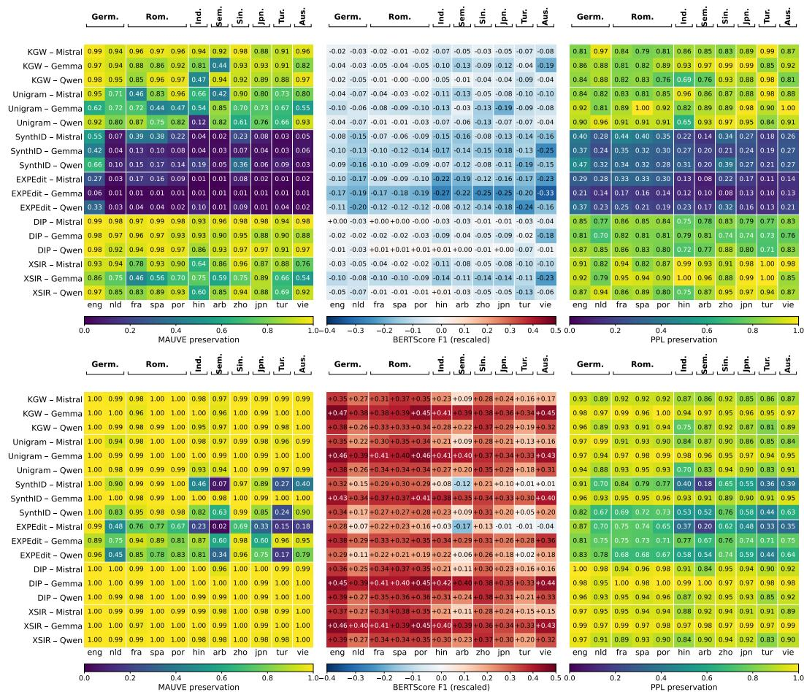  
Figure 1: Per-language quality preservation under three paradigms, base-FLORES (top) and instruct-AYA (bottom); n = 500 matched pairs per cell. Left: MAUVE on mean-pooled XLM-R-large embeddings (1.0 identical, 0.0 fully separable). Center: BERTScore F1, rescaled against per-language FLORES non-pair baselines (negative: paired generations less similar than random non-pairs). Right: PPL preservation under XGLM-7.5B, exp(−| log PPLR(χ+) − log PPLR(X−)|) ∈ (0, 1]. Rows: (scheme, generator) cells; columns: eleven languages grouped by typological family.

Instruct regime compression. All three measurements compress upward in the instruct regime: MAUVE saturates above 0.95 on KGW, Unigram, DIP, and XSIR; BERTScore-rescaled values flip to large positive (the non-pair baseline drops because AYA prompts force tighter content overlap among non-pairs); PPL preservation rises above 0.90 on DIP and XSIR cells and above 0.88 on KGW and Unigram. The compression parallels the detection-side compression of §5.1 but does not erase cross-scheme separation: SynthID and EXPEdit remain the most distorting, with SynthID-Mistral on Arabic at MAUVE 0.07 and EXPEdit-Mistral on Arabic at MAUVE 0.02. Within schemes the compression tracks the detection-collapse pattern where the watermark detects weakly (e.g., SynthID-Gemma instruct, TPR 0.602) show near-perfect quality preservation, consistent with the watermark having less effect on the generation distribution.

Disparity is structural across paradigms. Figure 2 reports $\mathrm { G E _ { 2 } }$ over the per-language preservation vector, averaged across the three generators per scheme, with the typological-partition decomposition shown by stacking. Two findings track. First, SynthID and EXPEdit dominate cross-language disparity on MAUVE (GE2 peaks at 0.66 for EXPEdit base) and PPL (≈0.053), an order of magnitude beyond any logit-bias scheme on the same paradigm; they are the most distorting schemes both on average and disparately across languages. Second, the typological partition captures the dominant share of cross-language disparity across the grid: between-family $\ge ~ 7 0 \%$ in 32 of 36 (scheme, paradigm, regime) cells, with median≈ 85%, supporting the structural-disparity claim from §5.1 on the quality side; the four sub-70% cells are all on MAUVE and split between high-GE2 rows (SynthID/EXPEdit base, where within-family dispersion registers more in absolute terms) and very-$\mathrm { { l o w { \mathrm { - } G E _ { 2 } } } }$ rows (DIP/Unigram instruct, where the ratio is noisy).

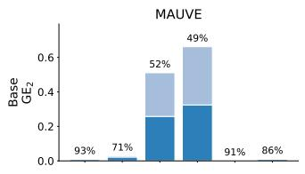

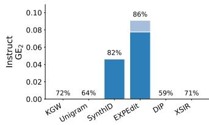

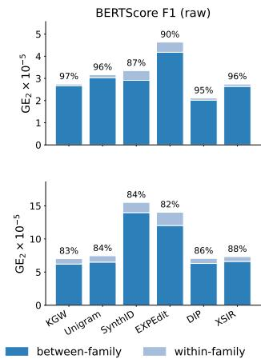

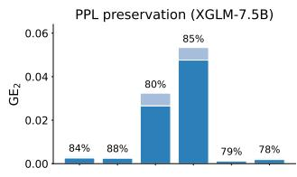

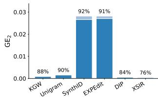  
Figure 2: Per-scheme disparity decomposition under three quality paradigms, base-FLORES (top) and instruct-AYA (bottom). Bar height is $\mathrm { G E _ { 2 } }$ over the per-language preservation vector, averaged across the three generators per scheme. Stacking shows the typological-partition decomposition into between-family (dark) and within-family (light) components; the percentage above is the betweenfamily share. Absolute disparity is orders of magnitude smaller than under MAUVE or PPL but the between-family pattern persists. Y-axes differ across panels.

Cross-paradigm rank agreement. Table 3 quantifies cross-paradigm rank inversion. Pooled across the grid, no paradigm pair clears $\rho = 0 . 6 \colon$ MAUVE-vs-BERTScore averages +0.58, MAUVE-vs-PPL +0.38, and $\mathrm { B E R T S c o r e - v s \mathrm { - } P P L \mathrm { + } 0 . 3 7 }$ The disagreement splits cleanly by intervention site. The two sampling-time distortion-free schemes (SynthID, EXPEdit) sit at $\rho \in [ 0 . 6 8 , 0 . 8 1 ]$ across all three pairs with strictly positive cell-level minima: their per-language preservation vectors are monotone-equivalent under all three paradigms. The three green-list schemes (KGW, Unigram, XSIR) sit at PPL-vs-embedding mean correlations of $\leq + 0 . 2 0$ with cell-level minima between —0.39 and —0.80, locating cells where reference perplexity and the embedding-based paradigms produce opposite per-language orderings. DIP, distortion-free in design but logit-side in implementation, falls in between at $\rho \in [ 0 . 4 3 , 0 . 5 0 ]$ . The split is a local-fluency-vs-distributional-shift effect: where the watermark intervenes at the logit level, PPL captures fluency under a held-out reference while MAUVE and BERTScore capture divergence from the unwatermarked set, so the per-language orderings can come apart. Hindi is the cleanest cell-level instance: KGW, Unigram, and XSIR all preserve Hindi PPL at $\geq 0 . 6 5$ under both XGLM and mGPT references (Appendix D.2) while MAUVE flags outliers on the same cells (Unigram-Qwen 0.12, KGW-Qwen 0.47).

<table><tr><td>Scheme</td><td> $\mathbf { M A U V E }  \mathbf { B S }$ </td><td> $\mathbf { M A U V E }  \mathbf { P P L }$ </td><td> $\mathrm { B S }  \mathrm { P P L }$ </td></tr><tr><td>KGW</td><td> $+ 0 . 6 1 \ ( + 0 . 4 5 )$ </td><td> $+ 0 . 0 3 \left( - 0 . 8 0 \right)$ </td><td> $+ 0 . 0 3 \left( - 0 . 7 6 \right)$ </td></tr><tr><td>Unigram</td><td> $+ 0 . 5 6 \left( + 0 . 2 3 \right)$ </td><td> $+ 0 . 1 4 \left( - 0 . 3 9 \right)$ </td><td> $+ 0 . 2 0 \left( - 0 . 6 7 \right)$ </td></tr><tr><td>SynthID</td><td> $+ 0 . 7 6 \ : ( + 0 . 4 7 )$ </td><td> $+ 0 . 8 1 \ ( + 0 . 2 7 )$ </td><td> $+ 0 . 7 7 \left( + 0 . 4 5 \right)$ </td></tr><tr><td>EXPEdit</td><td> $+ 0 . 6 8 \ ( + 0 . 2 6 )$ </td><td> $+ 0 . 7 5 \ : ( + 0 . 3 9 )$ </td><td> $+ 0 . 7 0 \left( + 0 . 4 6 \right)$ </td></tr><tr><td>DIP</td><td> $+ 0 . 4 6 \left( - 0 . 0 3 \right)$ </td><td> $+ 0 . 4 3 \ \stackrel { \cdot } { ( + 0 . 0 5 ) }$ </td><td> $+ 0 . 5 0 \left( - 0 . 0 5 \right)$ </td></tr><tr><td>XSIR</td><td> $+ 0 . 4 2 \left( - 0 . 0 9 \right)$ </td><td> $+ 0 . 1 0 \left( - 0 . 7 1 \right)$ </td><td> $+ 0 . 0 0 \left( - 0 . 7 6 \right)$ </td></tr><tr><td>All schemes</td><td> $+ 0 . 5 8 \left( - 0 . 0 9 \right)$ </td><td> $+ 0 . 3 8 \left( - 0 . 8 0 \right)$ </td><td> $+ 0 . 3 7 \left( - 0 . 7 6 \right)$ </td></tr></table>

Table 3: Cross-paradigm rank agreement: per-cell Spearman ρ between per-language preservation vectors, mean across (model, regime) cells with per-cell minimum in parentheses (subset=al1; $n = 6$ cells per scheme, $n = 3 6$ pooled). Pairs use BERTScore F1 (rescaled) and PPL preservation under XGLM-7.5B; BS-raw gives nearly identical rankings $( \rho _ { \mathrm { B S - r a w }  \mathrm { B S - r e s c a l e d } } = + 0 . 8 7 )$ . Negative minima identify cells where two paradigms produce opposite per-language orderings.

## 5.3 Joint detection-quality

The detection and quality axes of §5.1-§5.2 do not determine the joint shape: a scheme balanced on each axis separately can still be unfair if its detection wins and quality wins fall on different language subsets. Figure 3 reports per-language $( \mathrm { T P R } \ @ \tau _ { g } , \mathrm { M A U V E } )$ pairs per scheme with the per-regime spread s, the mean pairwise Euclidean distance over the 33 points (11 languages × 3 generators), annotated.

Low spread is consistent with opposite topologies. DIP base $( s _ { B } { = } 0 . 0 6 6 )$ and EXPEdit base $( s _ { B } { = } 0 . 0 7 0 )$ carry near-identical scalar spread but cluster in opposite corners: DIP top-right (detect-and-preserve), EXPEdit bottom-right (detect-everywhere, preserve-nowhere). XSIR instruct $\scriptstyle ( s _ { I } = 0 . 1 5 9 )$ is a third low-spread topology: top-left under uniform detection collapse. The scalar must be read with the panel.

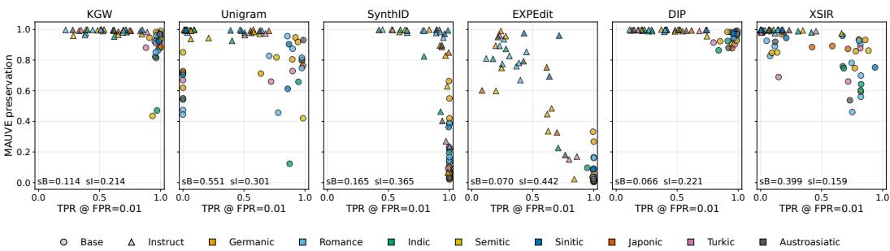  
Figure 3: Joint per-language detection-quality landscape, MAUVE paradigm. Markers: per-language (TPR @ $\tau _ { g } , \mathrm { M A U V E } )$ pairs at $\alpha { = } 0 . 0 1$ . Circles: base-FLORES. Triangles: instruct-AYA. Color: typological family. Annotations $s _ { B } ,$ $s _ { I } \colon$ mean pairwise Euclidean distance within each regime. BERTScore and PPL-preservation companion panels in Appendix E.

Spread is regime-dependent. Base-regime spread is dominated by detection-side calibration failure: Unigram $( s _ { B } { = } 0 . 5 5 1 )$ and XSIR $\left( s _ { B } { = } 0 . 3 9 9 \right)$ scatter horizontally with quality intact, reproducing the §5.1 calibration-gap diagnosis in joint form, while the four other base panels are tight clusters $( s _ { B } \leq 0 . 1 6 5 )$ . Instruction tuning swaps the ranking: EXPEdit $\scriptstyle ( s _ { I } = 0 . 4 4 2 )$ , SynthID $\left( s _ { I } { = } 0 . 3 6 5 \right)$ and Unigram $( s _ { I } { = } 0 . 3 0 1 )$ lead under instruct as detection collapse induces vertical scatter on a typology-structured language subset. Base-vs-instruct shifts the topology of joint unfairness, not its magnitude.

## 6 Discussions

Limitations: Two limitations bound our claims. Our eleven languages span four scripts and eight typological families, but many of the world's languages remain outside this set. Our six schemes cover the dominant green-list and distortion-free design families but are not exhaustive of an actively growing literature.

Societal impacts: Watermarking is a scalable mitigation for AI-generated text currently being deployed, much of which is multilingual. A detection gap structural to typological family rather than idiosyncratic to a single language means the same scheme offers materially weaker protection to speakers of some language families than others, and quality disparities mean the cost of being watermarked is unequally borne. Because these gaps are between-family rather than per-language, they are unlikely to close by scaling data for individual languages and instead implicate architectural choices, such as tokenizer construction or partition design, that operate at the family level.

## 7 Conclusion

In this work, we introduce the first systematic cross-lingual fairness audit of LLM text watermarking: a four-component evaluation framework comprising empirical FPR calibration, a threshold-independent AUC companion, three disjoint quality paradigms, and a generalized-entropy decomposition over a typological partition. We apply this framework to six schemes, three open-weight generators, and eleven languages across four scripts and eight typological families, under two generation regimes. The audit surfaces failure modes that single-language, single-paradigm evaluation cannot, including calibration failures misread as detection failures, distortion-free schemes that are empirically the most distorting, cross-paradigm rank inversion, and disparity dominated by between-family variation. Our work promotes further research toward fairness in LLM watermarking.

## References

[1] C. Chen and K. Shu. Combating misinformation in the age of llms: Opportunities and challenges. AI Magazine, 45(3):354–368, 2024.

[2] S. Dathathri, A. See, S. Ghaisas, P.-S. Huang, R. McAdam, J. Welbl, V. Bachani, A. Kaskasoli, R. Stanforth, T. Matejovicova, et al. Scalable watermarking for identifying large language model outputs. Nature, 634(8035):818–823, 2024.

[3] M. Feldman, S. A. Friedler, J. Moeller, C. Scheidegger, and S. Venkatasubramanian. Certifying and removing disparate impact. In proceedings of the 21th ACM SIGKDD international conference on knowledge discovery and data mining, pages 259–268, 2015.

[4] Gemma Team, Google DeepMind. Gemma 3 technical report. Technical report, Google DeepMind, 2025.

[5] M. Hardt, E. Price, and N. Srebro. Equality of opportunity in supervised learning. Advances in neural information processing systems, 29, 2016.

[6] H. He, S. Xu, A. Nemecek, J. Li, E. Ayday, and G. Cheng. Optimal watermark generation under type i and type ii errors. Biometrika, page asag049, 2026.

[7] Z. He, B. Zhou, H. Hao, A. Liu, X. Wang, Z. Tu, Z. Zhang, and R. Wang. Can watermarks survive translation? on the cross-lingual consistency of text watermark for large language models. In Proceedings of the 62nd Annual Meeting of the Association for Computational Linguistics (Volume 1: Long Papers), pages 4115–4129, 2024.

[8] P. Joshi, S. Santy, A. Budhiraja, K. Bali, and M. Choudhury. The state and fate of linguistic diversity and inclusion in the nlp world. In Proceedings of the 58th annual meeting of the association for computational linguistics, pages 6282–6293, 2020.

[9] A. H. Kargaran, A. Imani, F. Yvon, and H. Schuetze. Glotlid: Language identification for low-resource languages. In Findings of the Association for Computational Linguistics: EMNLP 2023, pages 6155–6218, 2023.

[10] J. Kirchenbauer, J. Geiping, Y. Wen, J. Katz, I. Miers, and T. Goldstein. A watermark for large language models. In International conference on machine learning, pages 17061–17084. PMLR, 2023.

[11] R. Kuditipudi, J. Thickstun, T. Hashimoto, and P. Liang. Robust distortion-free watermarks for language models. arXiv preprint arXiv:2307.15593, 2023.

[12] J. Liang, Z. Wang, S. Hong, S. Ji, and T. Wang. Watermark under fire: A robustness evaluation of llm watermarking. arXiv preprint arXiv:2411.13425, 2024.

[13] Mistral AI team. Mistral NeMo, jul 2024. Accessed: 2026-05-05.

[14] A. Nemecek, Y. Jiang, and E. Ayday. Watermarking without standards is not ai governance. arXiv preprint arXiv:2505.23814, 2025.

[15] A. Nemecek, Y. Jiang, and E. Ayday. Topic-based watermarks for large language models. In M. Liakata, V. P. Moreira, J. Zhang, and D. Jurgens, editors, Findings of the Association for Computational Linguistics: ACL 2026, pages 24372–24402, San Diego, California, United States, July 2026. Association for Computational Linguistics.

[16] A. Nemecek, O. Zafar, Y. Xu, W. Li, and E. Ayday. Who gets flagged? the pluralistic evaluation gap in ai content watermarking. arXiv preprint arXiv:2604.13776, 2026.

[17] NLLB Team, M. R. Costa-jussà, J. Cross, O. Çelebi, M. Elbayad, K. Heafield, K. Heffernan, E. Kalbassi, J. Lam, D. Licht, J. Maillard, A. Sun, S. Wang, G. Wenzek, A. Youngblood, B. Akula, L. Barrault, G. M. Gonzalez, P. Hansanti, J. Hoffman, S. Jarrett, K. R. Sadagopan, D. Rowe, S. Spruit, C. Tran, P. Andrews, N. F. Ayan, S. Bhosale, S. Edunov, A. Fan, C. Gao, V. Goswami, F. Guzmán, P. Koehn, A. Mourachko, C. Ropers, S. Saleem, H. Schwenk, and J. Wang. Scaling neural machine translation to 200 languages. Nature, 630(8018):841–846, 2024.

[18] J. Piet, C. Sitawarin, V. Fang, N. Mu, and D. Wagner. Markmywords: Analyzing and evaluating language model watermarks. In 2025 IEEE Conference on Secure and Trustworthy Machine Learning (SaTML), pages 68–91. IEEE, 2025.

[19] K. Pillutla, S. Swayamdipta, R. Zellers, J. Thickstun, S. Welleck, Y. Choi, and Z. Harchaoui. Mauve: Measuring the gap between neural text and human text using divergence frontiers. Advances in Neural Information Processing Systems, 34:4816–4828, 2021.

[20] M. Sadeghi, D. Dimitriadis, V. Padovese, G. Pozzi, S. Badilini, C. Vercellone, N. Huet, Z. Fishman, L. Pfaller, and N. Adams. Tracking AI-enabled misinformation: 3,006 AI content farm sites (and counting), plus the top false claims generated by artificial intelligence tools. https://www.newsguardtech.com/special-reports/ai-tracking-center/, Mar. 2026. NewsGuard Technologies, Inc. Last updated March 17, 2026. Accessed: May 4, 2026.

[21] A. F. Shorrocks. The class of additively decomposable inequality measures. Econometrica: Journal of the Econometric Society, pages 613–625, 1980.

[22] I. Shumailov, Z. Shumaylov, Y. Zhao, N. Papernot, R. Anderson, and Y. Gal. Ai models collapse when trained on recursively generated data. Nature, 631(8022):755–759, 2024.

[23] S. Singh, F. Vargus, D. Dsouza, B. F. Karlsson, A. Mahendiran, W.-Y. Ko, H. Shandilya, J. Patel, D. Mataciunas, L. OMahony, M. Zhang, R. Hettiarachchi, J. Wilson, M. Machado, L. S. Moura, D. Krzemiński, H. Fadaei, I. Ergün, I. Okoh, A. Alaagib, O. Mudannayake, Z. Alyafeai, V. M. Chien, S. Ruder, S. Guthikonda, E. A. Alghamdi, S. Gehrmann, N. Muennighoff, M. Bartolo, J. Kreutzer, A. Üstün, M. Fadaee, and S. Hooker. Aya dataset: An open-access collection for multilingual instruction tuning, 2024.

[24] G. Spitale, N. Biller-Andorno, and F. Germani. Ai model gpt-3 (dis) informs us better than humans. Science Advances, 9(26):eadh1850, 2023.

[25] S. Tu, Y. Sun, Y. Bai, J. Yu, L. Hou, and J. Li. Waterbench: Towards holistic evaluation of watermarks for large language models. In Proceedings of the 62nd Annual Meeting of the Association for Computational Linguistics (Volume 1: Long Papers), pages 1517–1542, 2024.

[26] Y. Wu, Z. Hu, J. Guo, H. Zhang, and H. Huang. A resilient and accessible distribution-preserving watermark for large language models. arXiv preprint arXiv:2310.07710, 2023.

[27] A. Yang, B. Yang, B. Zhang, B. Hui, B. Zheng, B. Yu, C. Li, D. Liu, F. Huang, H. Wei, et al. Qwen2.5 technical report. arXiv preprint arXiv:2412.15115, 2024.

[28] T. Zhang, V. Kishore, F. Wu, K. Q. Weinberger, and Y. Artzi. Bertscore: Evaluating text generation with bert. arXiv preprint arXiv:1904.09675, 2019.

[29] X. Zhao, P. Ananth, L. Li, and Y.-X. Wang. Provable robust watermarking for ai-generated text. arXiv preprint arXiv:2306.17439, 2023.

## A Compute

Compute. All generation and evaluation runs were conducted on a mix of NVIDIA H100 and A100 GPUs.

## B Generation Preprocessing

## B.1 Language adherence

Table 4 reports per-cell on-target rates from GlotLID-v3 for nowatermark generations (NWM%) and the mean shift across the six watermarked schemes (∆, percentage points). Baseline adherence varies systematically: generator-mean rates run from 80.9% (Mistral instruct) to 96.5% (Mistral base), with cell-level minima at Qwen-Turkish base (57.2%) and Mistral-Hindi instruct (52.2%). Instruction-tuning does not uniformly raise adherence; Mistral and Qwen lose ground on several non-Latin-script cells while Gemma remains roughly stable.

Watermark-induced shifts are modest in base (2 of 33 cells exceed $| \bar { \Delta } | = 5 \mathrm { p p } )$ and larger in instruct (12 of 33), concentrated on Mistral and Qwen non-Latin cells while Gemma instruct stays close to its baseline $( \bar { \Delta } = - 0 . 4$ pp on average). Three instruct cells lose more than 13 points: Mistral-Arabic (—15.6), Qwen-Arabic $( - 1 5 . 0 )$ , and Qwen-Turkish (—13.5). These are the cells where the on-target subset thins toward the $n = 2 0 0$ sample-size floor for $\alpha = 0 . 0 1$ calibration and produce the largest subset-al1-vs-on-target gaps in the detection robustness analysis.

<table><tr><td></td><td colspan="6">Base regime (FLORES+ continuation prompts)</td><td colspan="6">Instruct regime (AYA native-speaker prompts)</td></tr><tr><td></td><td colspan="2">Mistral</td><td colspan="2">Gemma</td><td colspan="2">Qwen</td><td colspan="2">Mistral</td><td colspan="2">Gemma</td><td colspan="2">Qwen</td></tr><tr><td>Lang</td><td>NWM%</td><td>Δ</td><td>NWM%</td><td>Δ</td><td>NWM%</td><td>Δ</td><td>NWM%</td><td>Δ</td><td>NWM%</td><td>Δ</td><td>NWM%</td><td>Δ</td></tr><tr><td>eng</td><td>99.6</td><td>-0.3</td><td>98.8</td><td>-2.0</td><td>98.4</td><td>-0.6</td><td>92.6</td><td>-0.9</td><td>80.6</td><td>-1.7</td><td>93.2</td><td>-2.0</td></tr><tr><td>fra</td><td>99.2</td><td>-1.1</td><td>97.6</td><td>-4.0</td><td>89.2</td><td>-0.2</td><td>91.4</td><td>+0.5</td><td>86.2</td><td>-1.7</td><td>94.8</td><td>-4.9</td></tr><tr><td>spa</td><td>100.0</td><td>-1.4</td><td>96.8</td><td>-2.6</td><td>91.2</td><td>+1.1</td><td>95.2</td><td>-1.3</td><td>62.6</td><td>+2.7</td><td>92.0</td><td>-5.0</td></tr><tr><td>por</td><td>99.2</td><td>-0.5</td><td>96.8</td><td>-1.0</td><td>98.2</td><td>-0.8</td><td>96.2</td><td>-2.0</td><td>70.6</td><td>+3.0</td><td>96.4</td><td>-4.3</td></tr><tr><td>nld</td><td>96.2</td><td>-7.0</td><td>95.8</td><td>+1.6</td><td>80.8</td><td>-4.6</td><td>73.2</td><td>-3.1</td><td>89.2</td><td>-0.4</td><td>90.4</td><td>-5.8</td></tr><tr><td>zho</td><td>97.6</td><td>-1.8</td><td>92.8</td><td>-1.2</td><td>96.4</td><td>-4.2</td><td>89.0</td><td>-7.9</td><td>95.6</td><td>-0.4</td><td>98.4</td><td>-0.6</td></tr><tr><td>jpn</td><td>96.8</td><td>-3.3</td><td>95.6</td><td>-1.6</td><td>99.8</td><td>-3.3</td><td>71.0</td><td>-10.7</td><td>94.0</td><td>-1.9</td><td>98.4</td><td>-7.4</td></tr><tr><td>arb</td><td>89.2</td><td>-3.0</td><td>87.6</td><td>-3.8</td><td>87.8</td><td>+2.9</td><td>67.6</td><td>-15.6</td><td>84.2</td><td>-1.2</td><td>81.0</td><td>-15.0</td></tr><tr><td>hin</td><td>96.2</td><td>-9.1</td><td>88.2</td><td>-2.3</td><td>98.8</td><td>-3.9</td><td>52.2</td><td>-6.5</td><td>83.8</td><td>-1.4</td><td>83.2</td><td>+0.1</td></tr><tr><td>tur</td><td>89.0</td><td>+1.3</td><td>96.8</td><td>-4.3</td><td>57.2</td><td>-1.1</td><td>81.8</td><td>-8.1</td><td>92.8</td><td>-0.6</td><td>95.6</td><td>-13.5</td></tr><tr><td>vie</td><td>98.6</td><td>-4.7</td><td>77.0</td><td>+4.7</td><td>99.0</td><td>-1.0</td><td>79.2</td><td>-7.3</td><td>98.8</td><td>-0.6</td><td>95.2</td><td>-6.4</td></tr><tr><td>mean</td><td>96.5</td><td>-2.8</td><td>93.1</td><td>-1.5</td><td>90.6</td><td>-1.4</td><td>80.9</td><td>-5.7</td><td>85.3</td><td>-0.4</td><td>92.6</td><td>-5.9</td></tr></table>

Table 4: Per-cell language adherence on the eleven evaluation languages, base-FLORES (left) and instruct-AYA (right). NWM% is the GlotLID-v3 on-target rate for nowatermark generations; Δ is the mean shift in percentage points across the six watermarked schemes. mean rows are unweighted means across the eleven languages.

## B.2 Generation length statistics

Generations sit close to the maximum-token cap in the base regime where language-mean lengths are 196.7 ± 16.2 (Mistral), $1 9 6 . 6 \pm 1 6 . 8$ (Gemma), and $1 8 7 . 3 \pm 2 6 . 6$ (Qwen) tokens and shift to shorter, more dispersed distributions under instruction tuning $( 1 6 7 . 7 \pm 3 7 . 8 ,$ 174.6 ± 39.4, $1 8 0 . 2 \pm 3 2 . 0 $ respectively). Per-cell variation is largest on Mistral instruct, where mean lengths range from 152.2 tokens (Portuguese) to 183.2 (English).
<table><tr><td>Regime</td><td>Subset</td><td>n kept</td><td>n skipped</td><td>Mean</td><td>Median</td><td>Min</td><td>Max</td></tr><tr><td>Base</td><td>on_target_only</td><td>231</td><td>0</td><td>1.003</td><td>1.000</td><td>0.996</td><td>1.081</td></tr><tr><td>Base</td><td>off_target_only</td><td>8</td><td>223</td><td>0.929</td><td>0.908</td><td>0.859</td><td>1.023</td></tr><tr><td>Instruct</td><td>on_target_only</td><td>231</td><td>0</td><td>1.000</td><td>1.000</td><td>0.964</td><td>1.057</td></tr><tr><td>Instruct</td><td>off_target_only</td><td>26</td><td>205</td><td>1.025</td><td>1.017</td><td>0.947</td><td>1.119</td></tr></table>

Table 5: Length-distribution similarity between LID subsets and the all-subset baseline. Each row is a (regime, subset) pair; ratio=subset-mean length/all-subset mean length, computed per (regime, model, language, watermark) cell and summarized across cells. Cells require $n \geq 1 0 0$ in both subsets to enter the summary; n skipped counts cells that fail this floor (typically off\_target on high-adherence cells).

Table 5 reports the ratio of subset-conditioned mean length to all-subset mean length, computed per (regime, model, language, watermark) cell with $n \geq 1 0 0$ in both subsets. On-target subset lengths are within 0.5% of all-subset means in aggregate (median ratio 1.000 in both regimes; per-cell range

0.964-1.081), so the on-target stratification used downstream is not confounded by systematic length differences. The off-target subset clears the $n \geq 1 0 0$ floor on only 8 of 231 base cells and 26 of 231 instruct cells. This is a consequence of high baseline adherence outside the cells flagged in §B.1 but where measurable its mean lengths track all-subset means within $\sim 7 \%$

## B.3 Categorization robustness

The on-target categorization depends on two thresholds: a GlotLID per-sentence confidence floor (conf\_floor) and a per-text on-target sentence fraction $\left( \mathsf { o n \_ t a r g e t \_ r a t i o } \right)$ . Table 6 sweeps these on a $3 \times 3$ grid and reports Spearman rank-correlation against the default-config per-cell adherence vector. Rank-correlation $\mathrm { s t a y s } \geq 0 . 8 6$ across all eight alternatives, and the mean on-target rate across cells moves by at most 7.3 pp (82.5% at the strictest config to 92.0% at the most permissive). The cell-level adherence patterns that drive §B.1 are not knife-edge sensitive to the threshold choice.

<table><tr><td>conf_floor</td><td>on_target_ratio</td><td>ρ vs default</td><td>Mean on-target %</td><td>Mean |∆| (pp)</td><td>Max  $| \Delta | \left( \mathrm { p p } \right)$ </td></tr><tr><td>0.3</td><td>0.7</td><td>0.9347</td><td>92.0</td><td>2.19</td><td>13.60</td></tr><tr><td>0.3</td><td>0.8</td><td>0.9468</td><td>90.7</td><td>0.91</td><td>13.00</td></tr><tr><td>0.3</td><td>0.9</td><td>0.8627</td><td>86.3</td><td>4.87</td><td>31.00</td></tr><tr><td>0.5</td><td>0.7</td><td>0.9910</td><td>91.1</td><td>1.26</td><td>11.80</td></tr><tr><td>0.5†</td><td>0.8</td><td>1.0000</td><td>89.8</td><td>0.00</td><td>0.00</td></tr><tr><td>0.5</td><td>0.9</td><td>0.9317</td><td>85.4</td><td>4.43</td><td>31.20</td></tr><tr><td>0.7</td><td>0.7</td><td>0.9486</td><td>87.9</td><td>3.76</td><td>24.60</td></tr><tr><td>0.7</td><td>0.8</td><td>0.9627</td><td>86.8</td><td>3.04</td><td>24.80</td></tr><tr><td>0.7</td><td>0.9</td><td>0.9385</td><td>82.5</td><td>7.36</td><td>31.80</td></tr></table>

Table 6: LID categorization robustness: per-cell adherence under a $3 \times 3$ sweep of the GlotLID per-sentence confidence floor (conf\_floor) and the per-text on-target sentence fraction (on\_target\_ratio). $\rho$ is the Spearman rank-correlation between the per-cell on-target-rate vector under each configuration and the default (†). Mean on-target $\%$ is the unweighted mean across the 462 cells of the evaluation grid. Mean/Max |∆| are the mean and maximum absolute per-cell shift in on-target rate (pp) relative to default.

## C Detection: Per-Language Detail and Robustness

This appendix supplies the detection-side material that the main text's headline summary (Table 2) and §5.1 collapse or defer. It is organized around four questions, each answered by one or two tables. First, what does the per-language vector behind each headline cell actually look like (Figures 4a and 4b, Table 7)? Second, do the calibration-failure cells flagged in §5.1 survive alternative operating choices on the FPR target and the language-adherence subset (Tables 8, 9)? Third, do the per-cell disparity statistics depend on the choice of anchor language for DI and on whether Min TPR is read as a single-language outlier or a small low-performing cluster (Table 10)? Fourth, does the structural-disparity claim of §5.1 survive swapping the inequality measure $( \mathrm { { G E } _ { 2 }  { G E _ { 0 } } ) }$ or the typological partition (family → script) used in the decomposition (Tables 11, 12)? Each table's caption carries the cell-specific findings; the prose below signposts which group a given table belongs to and what it adjudicates.

## C.1 Per-language detail

Figures 4a and 4b render the per-language TPR and AUC vectors for both regimes. The heatmap is the visual entry point to every cell-language pattern that the headline table's mean, min, and $\mathrm { G E _ { 2 } }$ statistics collapse: the Unigram-Gemma all-zero row under base, the XSIR-Qwen Hindi outlier, the EXPEdit-Gemma broad AUC degradation under instruct. Table 7 then shows the per-language $\Delta _ { l } = \mathrm { T P R } _ { l } ( \tau _ { l } ) - \mathrm { T P R } _ { l } ( \tau _ { g } )$ matrix, decomposing the headline $\Delta$ column into its per-language sources. Together the two items establish that calibration locality is doing structurally different work in different cells: a near-noise correction of order ±0.03 on strong-detection cells, a near-total recovery on the base Unigram-Gemma row, and a smaller-scale broad recovery across most instruct cells.

<table><tr><td></td><td></td><td colspan="2">Germanic</td><td colspan="3">Romance</td><td>Indic</td><td>Semitic</td><td>Sinitic</td><td>Japonic</td><td>Turkic</td><td>Aus.</td></tr><tr><td>Scheme</td><td>Gen.</td><td>eng</td><td>nld</td><td>fra</td><td>spa</td><td>por</td><td>hin</td><td>arb</td><td>zho</td><td>jpn</td><td>tur</td><td>vie</td></tr><tr><td colspan="9">Base regime (FLORES+ continuation prompts)</td><td rowspan="3"></td></tr><tr><td rowspan="3">KGW</td><td rowspan="8">Mistral Gemma</td><td>0.000</td><td>+0.004</td><td>+0.002</td><td>0.000</td><td>-0.008</td><td>0.000</td><td>-0.006</td><td>0.000</td><td>-0.004</td><td>+0.002</td></tr><tr><td>+0.006</td><td>+0.004 +0.030</td><td>+0.008</td><td>+0.016</td><td>+0.038</td><td>-0.020</td><td>+0.044</td><td>-0.010</td><td>-0.064</td><td>0.000 +0.010</td></tr><tr><td>+0.028</td><td>+0.018</td><td>-0.002</td><td>-0.002</td><td>+0.002</td><td>-0.008</td><td>0.000</td><td>+0.008</td><td>0.000</td><td>-0.030</td></tr><tr><td rowspan="10">Unigram Mistral</td><td>+0.074</td><td>+0.354</td><td></td><td>+0.292</td><td>+0.142</td><td></td><td></td><td></td><td></td><td></td><td>0.000</td></tr><tr><td>+0.996</td><td>+0.992</td><td>+0.218 +0.968</td><td>+0.990</td><td>+0.960</td><td>-0.062 0.000</td><td>+0.004 +0.958</td><td>+0.064</td><td>-0.018</td><td>+0.074</td><td>-0.012</td></tr><tr><td>Gemma Qwen +0.024</td><td>+0.034</td><td></td><td></td><td>+0.022</td><td></td><td></td><td>+0.976</td><td>+0.984 -0.008</td><td>+0.960 +0.092</td><td>0.000 -0.034</td></tr><tr><td></td><td></td><td>-0.040</td><td>+0.002</td><td></td><td>+0.106</td><td>+0.230</td><td>+0.134</td><td></td><td></td><td></td></tr><tr><td>Mistral Gemma</td><td>0.000 0.000</td><td>0.000 0.000</td><td>0.000</td><td>0.000 0.000</td><td>0.000</td><td>0.000</td><td>0.000</td><td>+0.002 0.000</td><td>0.000</td><td>0.000</td></tr><tr><td rowspan="10">Qwen</td><td>0.000</td><td>0.000</td><td>0.000 0.000</td><td>0.000</td><td>0.000 0.000</td><td>0.000 +0.002</td><td>0.000 0.000</td><td>0.000 +0.006</td><td>0.000 0.000</td><td>0.000 -0.004</td><td>0.000 0.000</td></tr><tr><td>0.000</td><td>+0.002</td><td></td><td></td><td></td><td></td><td></td><td></td><td></td><td></td><td></td></tr><tr><td>Mistral Gemma 0.000</td><td>0.000</td><td>0.000</td><td>0.000</td><td>0.000</td><td>0.000</td><td>0.000</td><td>0.000</td><td>0.000</td><td>0.000</td><td>0.000</td></tr><tr><td>Qwen +0.002</td><td>-0.006</td><td>0.000 0.000</td><td>0.000 0.000</td><td>0.000 0.000</td><td>0.000 +0.012</td><td>0.000 0.000</td><td>0.000 0.000</td><td>0.000 0.000</td><td>0.000 +0.002</td><td>0.000 0.000</td></tr><tr><td>Mistral</td><td>0.000</td><td></td><td></td><td></td><td></td><td></td><td></td><td></td><td></td><td></td></tr><tr><td rowspan="10">Gemma Qwen</td><td></td><td>0.000 -0.004</td><td>+0.002</td><td>+0.002 0.000</td><td>+0.002 +0.002</td><td>+0.002</td><td>0.000</td><td>-0.014</td><td>0.000</td><td>+0.004 -0.010</td><td>0.000</td></tr><tr><td>0.000 0.000</td><td>-0.008</td><td>+0.002 +0.004</td><td>+0.008</td><td>-0.004</td><td>+0.010</td><td>+0.004</td><td>+0.004</td><td>+0.018</td><td></td><td>0.000</td></tr><tr><td></td><td></td><td></td><td></td><td></td><td>-0.004</td><td>+0.002</td><td>+0.010</td><td>0.000</td><td>-0.028</td><td>+0.002</td></tr><tr><td>Mistral +0.024</td><td>-0.054</td><td>+0.166</td><td>+0.106</td><td>+0.086</td><td>-0.022</td><td>-0.066</td><td>+0.092</td><td>+0.014</td><td>+0.014</td><td>+0.178</td></tr><tr><td>Gemma</td><td>+0.028 +0.054</td><td>+0.054</td><td>+0.114</td><td>+0.026</td><td>+0.146</td><td>+0.056</td><td>-0.042</td><td>+0.168</td><td>+0.122</td><td>-0.030</td></tr><tr><td rowspan="10">Qwen</td><td>+0.516</td><td>+0.774</td><td>+0.770</td><td>+0.802</td><td>+0.912</td><td>-0.286</td><td>+0.684</td><td>+0.638</td><td>+0.464</td><td>+0.360</td><td>+0.732</td></tr><tr><td>Instruct regime (AYA native-speaker prompts)</td><td></td><td></td><td></td><td></td><td></td><td></td><td></td><td></td><td></td><td></td></tr><tr><td>Mistral +0.112</td><td>+0.032 +0.030 -0.070</td><td>-0.250</td><td>+0.028</td><td>+0.118</td><td>-0.016</td><td>+0.014</td><td>+0.030</td><td>-0.018</td><td>+0.012</td><td>-0.004</td></tr><tr><td>Gemma Qwen</td><td>+0.012</td><td>+0.108</td><td>+0.046</td><td>+0.112 +0.110</td><td>-0.038</td><td>0.000</td><td>-0.036</td><td>-0.082</td><td>+0.134</td><td>+0.034</td></tr><tr><td rowspan="10">Unigram Mistral</td><td></td><td>+0.014</td><td>-0.036</td><td>-0.058</td><td></td><td>-0.106</td><td>+0.138</td><td>+0.016</td><td>+0.084</td><td>+0.058</td><td>+0.140</td></tr><tr><td>+0.340 Gemma +0.024</td><td>+0.380 -0.054</td><td>+0.090</td><td>+0.282</td><td>+0.316</td><td>-0.106</td><td>0.000 -0.036</td><td>+0.070</td><td>-0.178</td><td>+0.282</td><td>+0.052</td></tr><tr><td>Qwen</td><td>+0.084 -0.018</td><td>+0.174 -0.108</td><td>+0.178 -0.012</td><td>+0.056 +0.078</td><td>-0.070 +0.128</td><td>+0.438</td><td>+0.376 +0.352</td><td>+0.276 +0.094</td><td>+0.272 +0.088</td><td>+0.050</td></tr><tr><td>Mistral</td><td></td><td></td><td></td><td></td><td></td><td></td><td></td><td></td><td></td><td>-0.132</td></tr><tr><td>Gemma</td><td>+0.056 +0.050</td><td>+0.020 -0.030</td><td>-0.026</td><td>-0.034</td><td>-0.048</td><td>+0.016</td><td>0.000</td><td>0.000</td><td>-0.022</td><td>0.000 +0.016</td></tr><tr><td rowspan="10"></td><td></td><td></td><td>+0.046</td><td>-0.022</td><td></td><td>-0.020</td><td>-0.022</td><td>-0.124 +0.038</td><td>-0.102</td><td>+0.094</td><td>+0.036</td></tr><tr><td>Qwen</td><td>+0.018</td><td>-0.002 +0.010</td><td>-0.022</td><td>-0.002</td><td>+0.016</td><td>0.000</td><td>0.000</td><td>0.000</td><td>0.000</td><td>0.000</td></tr><tr><td>Mistral</td><td>-0.030</td><td>+0.062</td><td>-0.080</td><td>+0.028</td><td>+0.130</td><td>-0.012</td><td>+0.006</td><td>+0.004</td><td></td><td>+0.016</td></tr><tr><td>Gemma</td><td>+0.002</td><td>+0.042</td><td>-0.040</td><td>0.000</td><td>-0.018</td><td>-0.022 +0.046</td><td>+0.066</td><td>+0.028 +0.066</td><td>+0.002</td><td>-0.002 -0.014</td></tr><tr><td>Qwen</td><td>+0.046</td><td>-0.002</td><td>-0.072</td><td>-0.006</td><td>+0.050</td><td>+0.048</td><td>+0.032</td><td>0.000</td><td>+0.004</td><td>-0.020 +0.056</td></tr><tr><td>Mistral</td><td>-0.042</td><td>+0.026</td><td>-0.016</td><td>+0.002</td><td>+0.008</td><td>+0.058</td><td>+0.048</td><td>+0.046</td></table>

Table 7: Per-language calibration gap $\Delta _ { l } = \mathrm { T P R } _ { l } ( \tau _ { l } ) - \mathrm { T P R } _ { l } ( \tau _ { g } )$ , base-FLORES (top) and instruct-AYA (bottom), subset a11, $\alpha = 0 . 0 1$ . Positive: per-language calibration recovers detection. Negative: per-language calibration worsens detection. Zero: detection insensitive to calibration locality. Row means equal —1× the $\Delta$ column of Table 2.

## C.2 Detection-threshold robustness

The calibration-failure diagnoses in §5.1 depend on two operating choices: the FPR target α and the LID-adherence subset on which the null is calibrated. Table 8 repeats the headline summary at $\alpha = 0 . 0 5$ , and Table 9 restricts the unwatermarked null to LID-passing on-target generations. The first table addresses whether the score-cap saturation underlying Unigram-Gemma at $\alpha = 0 . 0 1$ persists at a looser FPR target; the second addresses whether that saturation is driven by off-target generations contaminating the calibration pool. Read together, the two robustness checks distinguish two distinct base-regime failure modes: Unigram-Gemma is an off-target-mixture artifact that dissolves under either operating change, while XSIR-Qwen is a deeper threshold misalignment that persists across both.

## C.3 Floor-statistic robustness

The headline table reports Min TPR as a worst-language floor, which is sensitive to isolated singlelanguage outliers. Table 10 replaces Min TPR with the mean of the bottom two languages (the bottom quintile at $L = 1 1 )$ , testing whether the headline minima are driven by isolated outliers or by low-performing clusters. The bottom-quintile mean and Min TPR identify the same worst-performing cells in both regimes, with the bottom-quintile values typically within 0.05 of Min TPR on cells where the floor is genuine and substantially higher only on the handful of cells where a single language sits well below the rest. The check supports the headline floor statistic rather than displacing it.

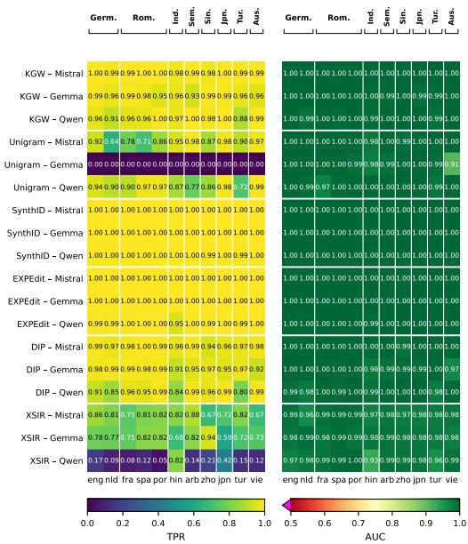  
(a) Base-FLORES regime.

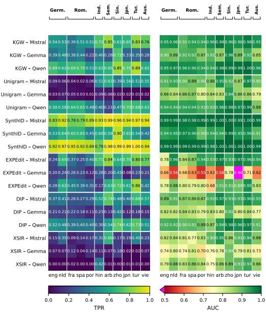  
(b) Instruct-AYA regime.  
Figure 4: Per-language detection diagnostics, subset al1, $\alpha = 0 . 0 1$ . Within each panel, left: TPR at the global empirical-FPR threshold $\tau _ { g } ;$ right: threshold-free AUC. Rows are (scheme, generator) cells; columns are the eleven evaluation languages, grouped by typological family.

## C.4 Decomposition robustness

The structural-disparity claim of §5.1 rests on a single decomposition: $\mathrm { G E _ { 2 } }$ over the typologicalfamily partition. Table 11 repeats it under $\mathrm { G E _ { 0 } }$ (mean log deviation, more sensitive to inequality at the low end of the per-language vector), and Table 12 repeats it under a script-based partition. Between-family share remains the dominant component (>65% in every well-defined cell) under both inequality measures across both regimes. The family partition consistently captures more between-group variance than the script partition for cells with non-trivial total disparity, locating the structural component at the typology level rather than the writing-system level.

<table><tr><td></td><td></td><td colspan="5">TPR at  $\tau _ { g }$  (global)</td><td colspan="2">TPR at τl (per-lang)</td></tr><tr><td>Scheme</td><td>Gen.</td><td>Mean TPR</td><td>Min TPR</td><td> $\mathrm { D I } _ { < . 8 }$ </td><td> $\mathrm { G E _ { 2 } }$ </td><td>Btw. %</td><td>Mean TPR</td><td>∆</td></tr><tr><td colspan="9">Base regime (FLORES+ continuation prompts)</td></tr><tr><td>KGW</td><td>Mistral</td><td>0.997</td><td>0.992</td><td>0</td><td>&lt;0.001</td><td>61.1</td><td>0.997</td><td>+0.000</td></tr><tr><td></td><td>Gemma</td><td>0.991 0.987</td><td>0.980 0.952</td><td>0 0</td><td>&lt;0.001 &lt;0.001</td><td>93.2 57.8</td><td>0.993 0.986</td><td>-0.002 +0.000</td></tr><tr><td></td><td>Qwen</td><td></td><td></td><td></td><td></td><td></td><td></td><td></td></tr><tr><td>Unigram</td><td>Mistral</td><td>0.977</td><td>0.920</td><td>0</td><td>&lt;0.001</td><td>54.9</td><td>0.988</td><td>-0.011</td></tr><tr><td></td><td>Gemma Qwen</td><td>0.988 0.961</td><td>0.976 0.860</td><td>0 0</td><td>&lt;0.001 0.001</td><td>55.9 86.3</td><td>0.898 0.979</td><td>+0.089 -0.018</td></tr><tr><td></td><td></td><td></td><td></td><td></td><td></td><td></td><td></td><td></td></tr><tr><td>SynthID</td><td>Mistral</td><td>1.000</td><td>0.998</td><td>0</td><td>&lt;0.001</td><td>100.0</td><td>1.000</td><td>+0.000</td></tr><tr><td></td><td>Gemma Qwen</td><td>1.000 0.999</td><td>0.998 0.996</td><td>0 0</td><td>&lt;0.001 &lt;0.001</td><td>100.0 74.3</td><td>1.000 0.999</td><td>+0.000 +0.000</td></tr><tr><td></td><td></td><td></td><td></td><td></td><td></td><td></td><td></td><td></td></tr><tr><td>EXPEdit</td><td>Mistral</td><td>1.000 1.000</td><td>0.996 0.998</td><td>0 0</td><td>&lt;0.001 &lt;0.001</td><td>100.0 100.0</td><td>1.000</td><td>+0.000 +0.000</td></tr><tr><td></td><td>Gemma Qwen</td><td>0.995</td><td>0.966</td><td>0</td><td>&lt;0.001</td><td>99.2</td><td>1.000 0.995</td><td>-0.000</td></tr><tr><td></td><td></td><td></td><td></td><td></td><td></td><td></td><td></td><td></td></tr><tr><td>DIP</td><td>Mistral</td><td>0.990</td><td>0.972 0.942</td><td>0 0</td><td>&lt;0.001</td><td>94.7</td><td>0.989</td><td>+0.001</td></tr><tr><td></td><td>Gemma Qwen</td><td>0.981 0.966</td><td>0.896</td><td>0</td><td>&lt;0.001 0.001</td><td>97.9 91.6</td><td>0.981 0.966</td><td>-0.001 +0.000</td></tr><tr><td></td><td></td><td></td><td></td><td></td><td></td><td></td><td></td><td></td></tr><tr><td>XSIR</td><td>Mistral</td><td>0.924</td><td>0.868</td><td>0 0</td><td>0.001</td><td>83.3</td><td>0.935</td><td>-0.011</td></tr><tr><td></td><td>Gemma Qwen</td><td>0.929 0.503</td><td>0.840 0.276</td><td>9</td><td>0.001 0.076</td><td>92.8 94.6</td><td>0.944 0.919</td><td>-0.015 -0.416</td></tr><tr><td></td><td></td><td></td><td></td><td></td><td></td><td></td><td></td><td></td></tr><tr><td colspan="9">Instruct regime (AYA native-speaker prompts)</td></tr><tr><td>KGW</td><td>Mistral</td><td>0.801 0.616</td><td>0.622 0.474</td><td>2 10</td><td>0.006 0.015</td><td>85.0 79.7</td><td>0.813 0.617</td><td>-0.012 -0.001</td></tr><tr><td></td><td>Gemma Qwen</td><td>0.860</td><td>0.740</td><td>1</td><td>0.003</td><td>78.1</td><td>0.869</td><td>-0.009</td></tr><tr><td></td><td></td><td></td><td></td><td></td><td></td><td></td><td></td><td></td></tr><tr><td>Unigram</td><td>Mistral Gemma</td><td>0.517 0.380</td><td>0.090 0.154</td><td>5 5</td><td>0.149 0.050</td><td>95.8 80.3</td><td>0.659 0.408</td><td>-0.143 -0.028</td></tr><tr><td></td><td>Qwen</td><td>0.727</td><td>0.366</td><td>4</td><td>0.018</td><td>93.8</td><td>0.790</td><td>-0.063</td></tr><tr><td></td><td></td><td></td><td></td><td></td><td></td><td></td><td></td><td></td></tr><tr><td>SynthID</td><td>Mistral</td><td>0.967</td><td>0.926</td><td>0</td><td>&lt;0.001</td><td>77.8</td><td>0.969</td><td>-0.002 +0.005</td></tr><tr><td></td><td>Gemma Qwen</td><td>0.791 0.971</td><td>0.662 0.898</td><td>4 0</td><td>0.005 &lt;0.001</td><td>75.9 95.7</td><td>0.785 0.973</td><td>-0.002</td></tr><tr><td></td><td></td><td></td><td></td><td></td><td></td><td></td><td></td><td></td></tr><tr><td>EXPEdit</td><td>Mistral</td><td>0.665</td><td>0.354</td><td>4</td><td>0.036</td><td>76.7</td><td>0.682</td><td>-0.017</td></tr><tr><td></td><td>Gemma</td><td>0.341</td><td>0.126</td><td>10</td><td>0.049</td><td>83.3</td><td>0.339</td><td>+0.002 -0.013</td></tr><tr><td></td><td>Qwen</td><td>0.583</td><td>0.230</td><td>9</td><td>0.050</td><td>82.5</td><td>0.596</td><td></td></tr><tr><td>DIP</td><td>Mistral</td><td>0.666</td><td>0.478</td><td>6</td><td>0.017</td><td>98.8</td><td>0.672</td><td>-0.006</td></tr><tr><td></td><td>Gemma</td><td>0.410</td><td>0.302</td><td>10</td><td>0.031</td><td>93.0</td><td>0.416</td><td>-0.007</td></tr><tr><td></td><td>Qwen</td><td>0.698</td><td>0.510</td><td>7</td><td>0.012</td><td>99.7</td><td>0.700</td><td>-0.002</td></tr><tr><td>XSIR</td><td>Mistral</td><td>0.510</td><td>0.256</td><td>9</td><td>0.051</td><td>86.4</td><td>0.523</td><td>-0.013</td></tr><tr><td></td><td>Gemma</td><td>0.267</td><td>0.072</td><td>10</td><td>0.092</td><td>94.3</td><td>0.300</td><td>-0.033</td></tr><tr><td></td><td>Qwen</td><td>0.169</td><td>0.024</td><td>10</td><td>0.811</td><td>97.5</td><td>0.513</td><td>-0.344</td></tr></table>

Table 8: Detection fairness summary at $\overline { { \alpha = 0 . 0 5 } } .$ base-FLORES (top) and instruct-AYA (bottom), subset al1. Format mirrors Table 2; AUC columns are omitted (threshold-independent, identical to Table 2) and bootstrap CIs on Mean TPR are omitted for compactness. $L = 1 1$ throughout. Values below $1 0 ^ { - 3 }$ reported as $< 0 . 0 0 1$

<table><tr><td></td><td></td><td colspan="4">Base regime (FLORES+ continuation)</td><td colspan="4">Instruct regime (AYA native-speaker)</td></tr><tr><td>Scheme</td><td> $\mathrm { G e n . }$ </td><td>Mean TPR</td><td>Min TPR</td><td> $\mathrm { D I } _ { < . 8 }$ </td><td>∆ vs. all</td><td>Mean TPR</td><td>Min TPR</td><td> $\mathrm { D I } _ { < . 8 }$ </td><td>∆ vs. all</td></tr><tr><td>KGW</td><td>Mistral</td><td>0.995</td><td>0.983</td><td>0</td><td>+0.003</td><td>0.681</td><td>0.425</td><td>6</td><td>+0.055</td></tr><tr><td></td><td>Gemma</td><td>0.973</td><td>0.939</td><td>0</td><td>+0.004</td><td>0.426</td><td>0.264</td><td>10</td><td>+0.037</td></tr><tr><td></td><td>Qwen</td><td>0.987</td><td>0.963</td><td>0</td><td>+0.022</td><td>0.697</td><td>0.520</td><td>8</td><td>+0.008</td></tr><tr><td>Unigram</td><td>Mistral</td><td>0.885</td><td>0.654</td><td>2</td><td>+0.017</td><td>0.388</td><td>0.011</td><td>7</td><td>+0.077</td></tr><tr><td></td><td>Gemma</td><td>0.987</td><td>0.974</td><td>0</td><td>+0.987</td><td>0.020</td><td>0.000</td><td>9</td><td>-0.017</td></tr><tr><td></td><td>Qwen</td><td>0.925</td><td>0.762</td><td>1</td><td>+0.027</td><td>0.547</td><td>0.176</td><td>4</td><td>+0.001</td></tr><tr><td>SynthID</td><td>Mistral</td><td>1.000</td><td>0.998</td><td>0</td><td>0.000</td><td>0.924</td><td>0.774</td><td>1</td><td>+0.019</td></tr><tr><td></td><td>Gemma</td><td>1.000</td><td>0.998</td><td>0</td><td>0.000</td><td>0.610</td><td>0.426</td><td>10</td><td>+0.008</td></tr><tr><td></td><td>Qwen</td><td>0.999</td><td>0.996</td><td>0</td><td>+0.002</td><td>0.941</td><td>0.764</td><td>1</td><td>0.000</td></tr><tr><td>EXPEdit</td><td>Mistral</td><td>1.000</td><td>1.000</td><td>0</td><td>+0.001</td><td>0.675</td><td>0.234</td><td>5</td><td>+0.098</td></tr><tr><td></td><td>Gemma</td><td>1.000</td><td>0.997</td><td>0</td><td>0.000</td><td>0.232</td><td>0.091</td><td>10</td><td>+0.007</td></tr><tr><td></td><td>Qwen</td><td>0.994</td><td>0.941</td><td>0</td><td>+0.003</td><td>0.508</td><td>0.059</td><td>10</td><td>+0.012</td></tr><tr><td>DIP</td><td>Mistral</td><td>0.980</td><td>0.952</td><td>0</td><td>+0.005</td><td>0.488</td><td>0.266</td><td>9</td><td>+0.033</td></tr><tr><td></td><td>Gemma</td><td>0.977</td><td>0.954</td><td>0</td><td>+0.014</td><td>0.198</td><td>0.105</td><td>10</td><td>+0.002</td></tr><tr><td></td><td>Qwen</td><td>0.957</td><td>0.848</td><td>0</td><td>+0.026</td><td>0.507</td><td>0.200</td><td>8</td><td>-0.006</td></tr><tr><td>XSIR</td><td>Mistral</td><td>0.799</td><td>0.688</td><td>2</td><td>+0.015</td><td>0.296</td><td>0.081</td><td>10</td><td>+0.030</td></tr><tr><td></td><td>Gemma</td><td>0.793</td><td>0.600</td><td>3</td><td>+0.027</td><td>0.092</td><td>0.019</td><td>10</td><td>+0.011</td></tr><tr><td></td><td>Qwen</td><td>0.207</td><td>0.047</td><td>10</td><td>-0.008</td><td>0.047</td><td>0.000</td><td>10</td><td>+0.004</td></tr></table>

Table 9: Detection summary on the on-target subset, $\alpha = 0 . 0 1$ , global threshold $\tau _ { g } .$ base-FLORES (left) and instruct-AYA (right). Thresholds re-calibrated on each cell's on-target unwatermarked pool; $L = 1 1$ throughout. The off-target subset is omitted: in the base regime no cell meets the $n _ { \mathrm { n { e g } } } \geq 2 0 0$ inclusion floor, and in the instruct regime only six (Mistral-generator) cells pass the relaxed $\alpha = 0 . 0 5$ floor with $L \leq 3 ,$ insufficient for the fairness aggregates this appendix reports. The $\Delta$ vs. al1 columns report change in Mean TPR relative to subset al1 (Table 2).

<table><tr><td rowspan="2">Scheme</td><td rowspan="2"> $\mathbf { G e n . }$ </td><td colspan="3">Base regime (FLORES+)</td><td colspan="3">Instruct regime (AYA)</td></tr><tr><td>Min TPR</td><td>Bot.-q mean</td><td>Bot.-q langs</td><td>Min TPR</td><td>Bot.-q mean</td><td>Bot.-q langs</td></tr><tr><td rowspan="3">KGW</td><td>Mistral</td><td>0.978</td><td>0.979</td><td>zho, hin</td><td>0.386</td><td>0.447</td><td>fra, por</td></tr><tr><td>Gemma</td><td>0.934</td><td>0.943</td><td>arb, por</td><td>0.222</td><td>0.251</td><td>por, vie</td></tr><tr><td>Qwen</td><td>0.880</td><td>0.894</td><td>tur, nld</td><td>0.510</td><td>0.564</td><td>por, nld</td></tr><tr><td rowspan="3">Unigram</td><td>Mistral</td><td>0.638</td><td>0.672</td><td>nld, spa</td><td>0.022</td><td>0.029</td><td>spa, fra</td></tr><tr><td>Gemma</td><td>0.000</td><td>0.000</td><td>eng, fra</td><td>0.010</td><td>0.010</td><td>por, tur</td></tr><tr><td>Qwen</td><td>0.722</td><td>0.744</td><td>tur, arb</td><td>0.210</td><td>0.306</td><td>arb, hin</td></tr><tr><td rowspan="3">SynthID</td><td>Mistral</td><td>0.998</td><td>0.998</td><td>zho, tur</td><td>0.782</td><td>0.788</td><td>fra, spa</td></tr><tr><td>Gemma</td><td>0.998</td><td>0.999</td><td>vie, eng</td><td>0.422</td><td>0.437</td><td>vie, por</td></tr><tr><td>Qwen</td><td>0.990</td><td>0.992</td><td>tur, zho</td><td>0.792</td><td>0.842</td><td>hin, por</td></tr><tr><td rowspan="3">EXPEdit</td><td>Mistral</td><td>0.996</td><td>0.997</td><td>zho, nld</td><td>0.238</td><td>0.244</td><td>eng, spa</td></tr><tr><td>Gemma</td><td>0.998</td><td>0.998</td><td>jpn, vie</td><td>0.084</td><td>0.101</td><td>jpn, por</td></tr><tr><td>Qwen</td><td>0.946</td><td>0.968</td><td>hin, nld</td><td>0.174</td><td>0.226</td><td>hin, eng</td></tr><tr><td rowspan="3">DIP</td><td>Mistral</td><td>0.938</td><td>0.950</td><td>zho, jpn</td><td>0.264</td><td>0.265</td><td>fra, spa</td></tr><tr><td>Gemma</td><td>0.914</td><td>0.917</td><td>hin, vie</td><td>0.110</td><td>0.115</td><td>por, jpn</td></tr><tr><td>Qwen</td><td>0.798</td><td>0.819</td><td>tur, hin</td><td>0.296</td><td>0.345</td><td>hin, fra</td></tr><tr><td rowspan="3">XSIR</td><td>Mistral</td><td>0.672</td><td>0.673</td><td>zho, vie</td><td>0.088</td><td>0.116</td><td>fra, spa</td></tr><tr><td>Gemma</td><td>0.588</td><td>0.635</td><td>jpn, hin</td><td>0.016</td><td>0.019</td><td>tur, jpn</td></tr><tr><td>Qwen</td><td>0.050</td><td>0.064</td><td>por, fra</td><td>0.000</td><td>0.000</td><td>nld, vie</td></tr></table>

Table 10: Bottom-quintile-mean Rawlsian floor as a stability companion to Min TPR (Table 2), base-FLORES (left) and instruct-AYA (right), subset al1, $\alpha = 0 . 0 1$ , global threshold $\tau _ { g } .$ With $L = 1 1$ evaluation languages the bottom quintile is [0.2 · 11] = 2 languages; the columns report the mean TPR of the two worst-performing languages per cell, with the languages listed minimum first (arbitrary tie-breaking). The Unigram-Gemma base cell is degenerate (all eleven per-language TPRs are zero); its bottom-quintile language identities are reported but uninformative.

<table><tr><td colspan="2"></td><td colspan="4">Base regime (FLORES+)</td><td colspan="4">Instruct regime (AYA)</td></tr><tr><td></td><td></td><td colspan="2">GE2</td><td colspan="2">GE0</td><td colspan="2">GE2</td><td colspan="2">GE0</td></tr><tr><td>Scheme</td><td>Gen.</td><td>Total</td><td>Btw. %</td><td>Total</td><td>Btw. %</td><td>Total</td><td>Btw. %</td><td>Total</td><td>Btw. %</td></tr><tr><td>KGW</td><td>Mistral</td><td>&lt;0.001</td><td>83.6</td><td>&lt;0.001</td><td>83.7</td><td>0.026</td><td>95.3</td><td>0.027</td><td>91.4</td></tr><tr><td></td><td>Gemma</td><td>&lt;0.001</td><td>72.4</td><td>&lt;0.001</td><td>72.7</td><td>0.053</td><td>82.4</td><td>0.046</td><td>73.3</td></tr><tr><td></td><td>Qwen</td><td>0.001</td><td>85.1</td><td>0.001</td><td>85.1</td><td>0.011</td><td>78.6</td><td>0.011</td><td>72.5</td></tr><tr><td>Unigram</td><td>Mistral</td><td>0.008</td><td>61.3</td><td>0.009</td><td>55.7</td><td>0.297</td><td>99.8</td><td>0.556</td><td>94.8</td></tr><tr><td></td><td>Gemma</td><td></td><td></td><td>&lt;0.001†</td><td>100.0†</td><td>0.226</td><td>81.2</td><td>0.243</td><td>73.9</td></tr><tr><td></td><td>Qwen</td><td>0.004</td><td>93.8</td><td>0.005</td><td>94.6</td><td>0.032</td><td>91.7</td><td>0.046</td><td>94.6</td></tr><tr><td>SynthID</td><td>Mistral</td><td>&lt;0.001</td><td>100.0</td><td>&lt;0.001</td><td>100.0</td><td>0.003</td><td>77.7</td><td>0.003</td><td>75.6</td></tr><tr><td></td><td>Gemma</td><td>&lt;0.001</td><td>100.0</td><td>&lt;0.001</td><td>100.0</td><td>0.020</td><td>79.7</td><td>0.019</td><td>75.6</td></tr><tr><td></td><td>Qwen</td><td>&lt;0.001</td><td>97.5</td><td>&lt;0.001</td><td>97.5</td><td>0.002</td><td>91.9</td><td>0.002</td><td>92.2</td></tr><tr><td>EXPEdit</td><td>Mistral</td><td>&lt;0.001</td><td>88.0</td><td>&lt;0.001</td><td>88.1</td><td>0.067</td><td>80.0</td><td>0.087</td><td>68.2</td></tr><tr><td></td><td>Gemma</td><td>&lt;0.001</td><td>100.0</td><td>&lt;0.001</td><td>100.0</td><td>0.071</td><td>84.2</td><td>0.077</td><td>79.0</td></tr><tr><td></td><td>Qwen</td><td>&lt;0.001</td><td>99.2</td><td>&lt;0.001</td><td>99.2</td><td>0.080</td><td>84.4</td><td>0.093</td><td>81.4</td></tr><tr><td>DIP</td><td>Mistral</td><td>&lt;0.001</td><td>92.6</td><td>&lt;0.001</td><td>92.8</td><td>0.058</td><td>99.5</td><td>0.059</td><td>99.2</td></tr><tr><td></td><td>Gemma</td><td>&lt;0.001</td><td>99.5</td><td>&lt;0.001</td><td>99.5</td><td>0.084</td><td>91.6</td><td>0.068</td><td>84.4</td></tr><tr><td></td><td>Qwen</td><td>0.003</td><td>94.7</td><td>0.003</td><td>94.6</td><td>0.035</td><td>99.6</td><td>0.035</td><td>99.6</td></tr><tr><td>XSIR</td><td>Mistral</td><td>0.004</td><td>91.5</td><td>0.004</td><td>92.1</td><td>0.185</td><td>91.8</td><td>0.160</td><td>83.4</td></tr><tr><td></td><td>Gemma</td><td>0.006</td><td>96.0</td><td>0.007</td><td>96.3</td><td>0.175</td><td>76.5</td><td>0.220</td><td>81.1</td></tr><tr><td></td><td>Qwen</td><td>0.493</td><td>98.9</td><td>0.326</td><td>92.5</td><td>3.787</td><td>99.9</td><td>3.244</td><td>79.0</td></tr></table>

Table 11: Robustness of the generalized-entropy decomposition to choice of inequality measure: GE2 (half the squared coefficient of variation, more sensitive to inequality at the top of the per-language TPR distribution) versus $\mathrm { G E _ { 0 } }$ (mean log deviation, more sensitive to inequality at the bottom). Base-FLORES (left) and instruct-AYA (right), subset al1, $\alpha = 0 . 0 1$ , global threshold $\tau _ { g } ;$ typological partition as in Table 2. Total values below $1 0 ^ { - 3 }$ reported $\mathrm { a s < 0 . 0 0 1 }$ . The Unigram-Gemma base $\mathrm { \bar { G } E _ { 0 } }$ entry is obtained by replacing zero TPRs with a small € (per the strict-positivity requirement of $\operatorname { G E } _ { 0 } ) ;$ the resulting $\mathrm { T o t a l } \stackrel { - } { = } 0$ and Btw. $\% = 1 0 0 . 0$ are regularization artifacts, marked †.

<table><tr><td></td><td></td><td colspan="3">Base regime (FLORES+)</td><td colspan="3">Instruct regime (AYA)</td></tr><tr><td></td><td></td><td></td><td colspan="2">Btw. %</td><td></td><td colspan="2">Btw. %</td></tr><tr><td>Scheme</td><td>Gen.</td><td> $\mathrm { G E _ { 2 } }$ </td><td>Family</td><td>Script</td><td> $\mathrm { G E _ { 2 } }$ </td><td>Family</td><td>Script</td></tr><tr><td>KGW</td><td>Mistral</td><td>&lt;0.001</td><td>83.6</td><td>46.2</td><td>0.026</td><td>95.3</td><td>32.8</td></tr><tr><td></td><td>Gemma</td><td>&lt;0.001</td><td>72.4</td><td>62.2</td><td>0.053</td><td>82.4</td><td>29.8</td></tr><tr><td></td><td>Qwen</td><td>0.001</td><td>85.1</td><td>26.2</td><td>0.011</td><td>78.6</td><td>26.7</td></tr><tr><td>Unigram</td><td>Mistral</td><td>0.008</td><td>61.3</td><td>28.8</td><td>0.297</td><td>99.8</td><td>46.3</td></tr><tr><td></td><td>Gemma</td><td></td><td></td><td></td><td>0.226</td><td>81.2</td><td>61.7</td></tr><tr><td></td><td>Qwen</td><td>0.004</td><td>93.8</td><td>26.1</td><td>0.032</td><td>91.7</td><td>75.0</td></tr><tr><td>SynthID</td><td>Mistral</td><td>&lt;0.001</td><td>100.0</td><td>17.1</td><td>0.003</td><td>77.7</td><td>33.0</td></tr><tr><td></td><td>Gemma</td><td>&lt;0.001</td><td>100.0</td><td>5.7</td><td>0.020</td><td>79.7</td><td>47.1</td></tr><tr><td></td><td>Qwen</td><td>&lt;0.001</td><td>97.5</td><td>7.5</td><td>0.002</td><td>91.9</td><td>79.3</td></tr><tr><td>EXPEdit</td><td>Mistral</td><td>&lt;0.001</td><td>88.0</td><td>31.7</td><td>0.067</td><td>80.0</td><td>30.2</td></tr><tr><td></td><td>Gemma</td><td>&lt;0.001</td><td>100.0</td><td>17.1</td><td>0.071</td><td>84.2</td><td>8.5</td></tr><tr><td></td><td>Qwen</td><td>&lt;0.001</td><td>99.2</td><td>95.8</td><td>0.080</td><td>84.4</td><td>41.6</td></tr><tr><td>DIP</td><td>Mistral</td><td>&lt;0.001</td><td>92.6</td><td>69.3</td><td>0.058</td><td>99.5</td><td>38.9</td></tr><tr><td></td><td>Gemma</td><td>&lt;0.001</td><td>99.5</td><td>48.2</td><td>0.084</td><td>91.6</td><td>25.2</td></tr><tr><td></td><td>Qwen</td><td>0.003</td><td>94.7</td><td>32.5</td><td>0.035</td><td>99.6</td><td>53.4</td></tr><tr><td>XSIR</td><td>Mistral</td><td>0.004</td><td>91.5</td><td>54.8</td><td>0.185</td><td>91.8</td><td>64.7</td></tr><tr><td></td><td>Gemma</td><td>0.006</td><td>96.0</td><td>12.7</td><td>0.175</td><td>76.5</td><td>7.6</td></tr><tr><td></td><td>Qwen</td><td>0.493</td><td>98.9</td><td>93.5</td><td>3.787</td><td>99.9</td><td>99.8</td></tr></table>

Table 12: Robustness of the GE2 between-share to choice of partition: typological family (8 groups: Germanic, Romance, Indic, Semitic, Sinitic, Japonic, Turkic, Austroasiatic, with 5 of 11 languages in non-singleton groups) vs. script (4 groups: Latin pooling eng, nld, fra, spa, por, tur, vie; Devanagari=hin; Arabic=arb; Han pooling zho, jpn; with 9 of 11 languages in non-singleton groups). Base-FLORES (left) and instruct-AYA (right), subset al1, $\alpha = 0 . 0 1$ , global threshold $\tau _ { g } .$ $\mathrm { \bar { G } E _ { 2 } }$ Total depends only on the per-language vector and is partition-independent (shown once per regime). Totals below $\mathrm { i 0 ^ { - 3 } }$ reported as $< 0 . 0 0 1$ ; for these cells the between-share values involve ratios of near-zero variance components and should not be over-interpreted.

## D Quality: Per-Paradigm Detail and Robustness

## D.1 Per-cell quality fairness summary

<table><tr><td rowspan="2">Scheme Gen</td><td rowspan="2">1</td><td colspan="4">MAUVE</td><td colspan="2">BERTScore F1 (rescaled)</td><td colspan="4">PPL preservation (XGLM-7.5B)</td></tr><tr><td>1 mean (min)</td><td> $\mathrm { D I } < . 8$ </td><td> $\mathrm { G E _ { 2 } }$ </td><td> $\mathrm { B t w , \% }$ </td><td></td><td>mean (min)</td><td>mean (min)</td><td> $\mathrm { D I } < . 8$ </td><td> $\mathrm { G E _ { 2 } }$ </td><td>Btw. %</td></tr><tr><td colspan="10">Base regime (FLORES+ continuation)</td></tr><tr><td></td><td></td><td> $0 . 9 4 7 \ ( 0 . 8 7 9 ) ^ { \mathrm { j p n } }$ </td><td>0</td><td>0.001</td><td>86.0</td><td> $- 0 . 0 4 1 \ ( - 0 . 0 7 9 ) ^ { \mathrm { v i e } }$ </td><td> $0 . 8 6 6 ( 0 . 7 9 3 ) ^ { \mathrm { s p a } }$ </td><td></td><td>0.002</td><td></td><td></td></tr><tr><td>KGW</td><td>Mistral</td><td> $0 . 8 5 5 ( 0 . 4 3 5 ) ^ { \mathrm { a r b } }$ </td><td>1</td><td>0.013</td><td>98.9</td><td></td><td> $- 0 . 0 8 1 \ ( - 0 . 1 9 4 ) ^ { \mathrm { v i e } }$ </td><td> $0 . 8 9 9 ( 0 . 8 1 2 ) ^ { \mathrm { f r a } }$ </td><td>0 0</td><td>0.002</td><td>66.4 91.0</td></tr><tr><td>KGW KGW</td><td>Gemma</td><td> $0 . 8 8 9 ( 0 . 4 7 1 ) ^ { \mathrm { h i n } }$ </td><td>1</td><td>0.012</td><td>95.6</td><td></td><td> $- 0 . 0 3 4 \ : ( - 0 . 0 9 1 ) ^ { \mathrm { t u r } }$   $0 . 8 3 4 ~ ( 0 . 6 8 6 ) ^ { \mathrm { h i n } }$ </td><td></td><td>3 0.005</td><td></td><td>94.0</td></tr><tr><td>Unigram</td><td>Qwen Mistral</td><td> $0 . 7 4 7 \ ( 0 . 4 2 0 ) ^ { \mathrm { a r b } }$ </td><td>5</td><td>0.026</td><td>49.5</td><td></td><td> $- 0 . 0 7 0 \ : ( - 0 . 1 3 4 ) ^ { \mathrm { a r b } }$ </td><td> $0 . 8 7 2 ( 0 . 8 1 1 ) ^ { \mathrm { s p a } }$ </td><td>0 0.002</td><td></td><td>96.4</td></tr><tr><td>Unigram</td><td>Gemma</td><td> $0 . 6 3 8 ( 0 . 4 4 4 ) ^ { \mathrm { s p a } }$ </td><td>6</td><td>0.017</td><td>67.8</td><td></td><td> $- 0 . 0 9 8 \ ( - 0 . 1 9 1 ) ^ { \mathrm { j p n } }$ </td><td> $0 . 9 1 1 ( 0 . 8 1 5 ) ^ { \mathrm { n l d } }$ </td><td>0</td><td>0.002</td><td>68.3</td></tr><tr><td>Unigram</td><td>Qwen</td><td> $0 . 7 3 4 ( 0 . 1 2 3 ) ^ { \mathrm { h i n } }$ </td><td>3</td><td>0.043</td><td>97.2</td><td></td><td> $- 0 . 0 5 5 \ : ( - 0 . 1 2 8 ) ^ { \mathrm { z h o } }$ </td><td> $0 . 8 9 6 ( 0 . 6 4 7 ) ^ { \mathrm { h i n } }$ </td><td>1</td><td>0.005</td><td>98.0</td></tr><tr><td>SynthID</td><td>Mistral</td><td> $0 . 1 8 7 \ : ( 0 . 0 2 0 ) ^ { \mathrm { a r b } }$ </td><td>10</td><td>0.435</td><td>59.0</td><td></td><td> $- 0 . 1 1 5 \ : ( - 0 . 1 6 3 ) ^ { \mathrm { v i e } }$ </td><td> $0 . 2 9 9 ( 0 . 1 4 5 ) ^ { \mathrm { a r b } }$ </td><td>7</td><td>0.048</td><td>88.4</td></tr><tr><td>SynthID</td><td>Gemma</td><td> $0 . 0 9 5 ( 0 . 0 2 9 ) ^ { \mathrm { t u r } }$ </td><td>10</td><td>0.641</td><td>43.0</td><td></td><td> $- 0 . 1 4 6 \ ( - 0 . 2 5 4 ) ^ { \mathrm { v i e } }$ </td><td> $0 . 2 6 9 ( 0 . 1 9 5 ) ^ { \mathrm { t u r } }$ </td><td>7</td><td>0.021</td><td>73.2</td></tr><tr><td>SynthID</td><td>Qwen</td><td> $0 . 1 8 3 ( 0 . 0 3 5 ) ^ { \mathrm { v i e } }$ </td><td>10</td><td>0.455</td><td>53.0</td><td></td><td> $- 0 . 1 1 2 \ : ( - 0 . 1 8 8 ) ^ { \mathrm { t u r } }$ </td><td> $0 . 3 0 8 ( 0 . 2 0 3 ) ^ { \mathrm { a r b } }$ </td><td>9</td><td>0.028</td><td>78.2</td></tr><tr><td>EXPEdit</td><td>Mistral</td><td> $0 . 0 7 9 ( 0 . 0 0 6 ) ^ { \mathrm { a r b } }$ </td><td>10</td><td>0.536</td><td>57.1</td><td></td><td> $- 0 . 1 4 9 \ : ( - 0 . 2 2 8 ) ^ { \mathrm { v i e } }$ </td><td> $0 . 2 1 8 ( 0 . 0 7 9 ) ^ { \mathrm { a r b } }$ </td><td>6</td><td>0.085</td><td>99.1</td></tr><tr><td>EXPEdit</td><td>Gemma</td><td> $0 . 0 1 3 ( 0 . 0 0 6 ) ^ { \mathrm { j p n } }$ </td><td>10</td><td>0.574</td><td>43.4</td><td></td><td> $- 0 . 2 2 0 ( - 0 . 3 3 3 ) ^ { \mathrm { v i e } }$ </td><td> $0 . 1 3 5 ( 0 . 0 7 6 ) ^ { \mathrm { z h o } }$ </td><td>9</td><td>0.033</td><td>82.7</td></tr><tr><td>EXPEdit</td><td>Qwen</td><td> $0 . 0 6 7 ( 0 . 0 1 3 ) ^ { \mathrm { a r b } }$ </td><td>10</td><td>0.874</td><td>47.9</td><td></td><td> $- 0 . 1 4 5 \ : ( - 0 . 2 4 5 ) ^ { \mathrm { t u r } }$ </td><td> $0 . 2 2 4 ( 0 . 1 3 5 ) ^ { \mathrm { t u r } }$ </td><td>9</td><td>0.042</td><td>74.6</td></tr><tr><td>DIP</td><td>Mistral</td><td> $0 . 9 7 3 ( 0 . 9 3 3 ) ^ { \mathrm { h i n } }$ </td><td>0</td><td>0.000</td><td>95.6</td><td></td><td> $- 0 . 0 1 5 \ : ( - 0 . 0 4 0 ) ^ { \mathrm { v i e } }$ </td><td> $0 . 8 0 9 ( 0 . 7 5 0 ) ^ { \mathrm { h i n } }$ </td><td>0</td><td>0.001</td><td>77.6</td></tr><tr><td>DIP</td><td>Gemma</td><td> $0 . 9 3 2 ( 0 . 8 7 8 ) ^ { \mathrm { j p n } }$ </td><td>0</td><td>0.001</td><td>94.7</td><td></td><td> $- 0 . 0 5 3 \ : ( - 0 . 1 8 3 ) ^ { \mathrm { v i e } }$ </td><td> $0 . 7 7 4 ( 0 . 7 0 2 ) ^ { \mathrm { n l d } }$ </td><td>0</td><td>0.001</td><td>68.0</td></tr><tr><td>DIP</td><td>Qwen</td><td> $0 . 9 4 7 ~ ( 0 . 8 6 4 ) ^ { \mathrm { h i n } }$ </td><td>0</td><td>0.001</td><td>81.6</td><td></td><td> $- 0 . 0 0 8 \ ( - 0 . 0 7 1 ) ^ { \mathrm { t u r } }$ </td><td> $0 . 8 1 1 ( 0 . 7 1 4 ) ^ { \mathrm { t u r } }$ </td><td>0</td><td>0.002</td><td>92.7</td></tr><tr><td>XSIR</td><td>Mistral</td><td> $0 . 8 5 9 ( 0 . 6 4 2 ) ^ { \mathrm { h i n } }$ </td><td>2</td><td>0.006</td><td>86.6</td><td></td><td> $- 0 . 0 6 2 \ : ( - 0 . 1 1 0 ) ^ { \mathrm { h i n } }$ </td><td> $0 . 9 2 2 ( 0 . 8 1 6 ) ^ { \mathrm { n l d } }$ </td><td>0</td><td>0.002</td><td>73.2</td></tr><tr><td>XSIR</td><td>Gemma</td><td> $0 . 6 8 3 ( 0 . 4 6 1 ) ^ { \mathrm { f r a } }$ </td><td>6</td><td>0.018</td><td>80.9</td><td></td><td> $- 0 . 1 2 3 \ : ( - 0 . 2 2 6 ) ^ { \mathrm { v i e } }$ </td><td> $0 . 9 2 5 ( 0 . 7 8 5 ) ^ { \mathrm { n l d } }$ </td><td>1</td><td>0.002</td><td>75.8</td></tr><tr><td>XSIR</td><td>Qwen</td><td> $0 . 8 5 0 ( 0 . 6 0 3 ) ^ { \mathrm { h i n } }$ </td><td>2</td><td>0.008</td><td>89.9</td><td></td><td> $- 0 . 0 4 2 \ : ( - 0 . 1 2 9 ) ^ { \mathrm { t u r } }$ </td><td> $0 . 8 8 3 ( 0 . 7 4 5 ) ^ { \mathrm { h i n } }$ </td><td>1 0.003</td><td></td><td>86.4</td></tr><tr><td colspan="10">Instruct regime (AYA native-speaker)</td></tr><tr><td>KGW</td><td>Mistral</td><td> $0 . 9 8 9 ( 0 . 9 7 0 ) ^ { \mathrm { a r b } }$ </td><td>0</td><td>0.000</td><td>58.9</td><td></td><td> $0 . 2 5 5 ( 0 . 0 8 8 ) ^ { \mathrm { a r b } }$ </td><td> $0 . 8 9 2 ( 0 . 8 5 3 ) ^ { \mathrm { j p n } }$ </td><td>0</td><td>0.001</td><td>91.0</td></tr><tr><td>KGW</td><td>Gemma</td><td> $0 . 9 9 0 ( 0 . 9 5 9 ) ^ { \mathrm { a r b } }$ </td><td>0</td><td>0.000</td><td></td><td>65.3</td><td> $0 . 3 9 7 ( 0 . 3 3 8 ) ^ { \mathrm { t u r } }$ </td><td> $0 . 9 6 7 ( 0 . 9 4 1 ) ^ { \mathrm { h i n } }$ </td><td>0</td><td>0.000</td><td>80.0</td></tr><tr><td>KGW</td><td>Qwen</td><td> $0 . 9 8 7 ( 0 . 9 5 4 ) ^ { \mathrm { h i n } }$ </td><td>0</td><td>0.000</td><td>90.8</td><td></td><td> $0 . 3 0 0 ( 0 . 1 9 2 ) ^ { \mathrm { t u r } }$ </td><td> $0 . 8 8 5 ( 0 . 7 4 9 ) ^ { \mathrm { h i n } }$ </td><td>1</td><td>0.002</td><td>92.5</td></tr><tr><td>Unigram</td><td>Mistral</td><td> $0 . 9 8 1 ( 0 . 9 3 8 ) ^ { \mathrm { n l d } }$ </td><td>0</td><td>0.000</td><td>40.3</td><td></td><td> $0 . 2 4 0 ( 0 . 0 8 7 ) ^ { \mathrm { a r b } }$ </td><td> $0 . 8 9 7 ( 0 . 8 3 5 ) ^ { \mathrm { h i n } }$ </td><td>0</td><td>0.001</td><td>97.4</td></tr><tr><td>Unigram</td><td>Gemma</td><td> $0 . 9 9 6 ( 0 . 9 9 1 ) ^ { \mathrm { j p n } }$ </td><td>0</td><td>0.000</td><td>54.1</td><td></td><td> $0 . 4 0 0 ( 0 . 3 2 9 ) ^ { \mathrm { t u r } }$ </td><td> $0 . 9 6 5 ( 0 . 9 4 1 ) ^ { \mathrm { n l d } }$ </td><td>0</td><td>0.000</td><td>78.0</td></tr><tr><td>Unigram</td><td>Qwen</td><td> $0 . 9 8 0 ( 0 . 9 2 7 ) ^ { \mathrm { h i n } }$ </td><td>0</td><td>0.000</td><td>97.7</td><td></td><td> $0 . 2 9 7 \ : ( 0 . 1 8 4 ) ^ { \mathrm { t u r } }$ </td><td> $0 . 8 8 5 ~ ( 0 . 7 0 0 ) ^ { \mathrm { h i n } }$ </td><td>1</td><td>0.003</td><td>95.9</td></tr><tr><td>SynthID</td><td>Mistral</td><td> $0 . 7 2 1 ~ ( 0 . 0 6 6 ) ^ { \mathrm { a r b } }$ </td><td>4</td><td>0.107</td><td>99.6</td><td></td><td> $0 . 1 4 9 ( - 0 . 1 1 7 ) ^ { \mathrm { a r b } }$ </td><td> $0 . 5 9 5 ( 0 . 1 8 5 ) ^ { \mathrm { a r b } }$ </td><td>7</td><td>0.070</td><td>95.4</td></tr><tr><td>SynthID</td><td>Gemma</td><td> $0 . 9 9 4 \ : ( 0 . 9 7 9 ) ^ { \mathrm { f r a } }$ </td><td>0</td><td>0.000</td><td>50.0</td><td></td><td> $0 . 3 6 5 \ : ( 0 . 2 9 6 ) ^ { \mathrm { t u r } }$ </td><td> $0 . 9 3 1 \ : ( 0 . 8 8 5 ) ^ { \mathrm { z h o } }$ </td><td>0</td><td>0.000</td><td>90.0</td></tr><tr><td>SynthID</td><td>Qwen</td><td> $0 . 8 3 3 ( 0 . 2 3 7 ) ^ { \mathrm { t u r } }$ </td><td>2</td><td>0.033</td><td>97.1</td><td></td><td> $0 . 2 1 9 ( 0 . 0 4 7 ) ^ { \mathrm { t u r } }$ </td><td> $0 . 6 4 5 ( 0 . 4 4 2 ) ^ { \mathrm { t u r } }$ </td><td>5</td><td>0.014</td><td>90.7</td></tr><tr><td>EXPEdit</td><td>Mistral</td><td> $0 . 4 8 0 ( 0 . 0 2 3 ) ^ { \mathrm { a r b } }$ </td><td>10</td><td>0.198</td><td>86.6</td><td></td><td> $0 . 0 8 2 \ : ( - 0 . 1 6 9 ) ^ { \mathrm { a r b } }$ </td><td> $0 . 5 4 9 ( 0 . 1 9 8 ) ^ { \mathrm { a r b } }$ </td><td>7</td><td>0.070</td><td>95.7</td></tr><tr><td>EXPEdit</td><td>Gemma</td><td> $0 . 8 4 0 ( 0 . 5 9 8 ) ^ { \mathrm { a r b } }$ </td><td>3</td><td>0.012</td><td>90.0</td><td></td><td> $0 . 3 1 9 ( 0 . 2 6 5 ) ^ { \mathrm { j p n } }$ </td><td> $0 . 7 4 2 \ : ( 0 . 6 6 9 ) ^ { \mathrm { a r b } }$ </td><td>0</td><td>0.001</td><td>78.7</td></tr><tr><td>EXPEdit</td><td>Qwen</td><td> $0 . 6 9 9 ( 0 . 1 7 0 ) ^ { \mathrm { t u r } }$ </td><td>4</td><td>0.063</td><td>80.6</td><td></td><td> $0 . 1 7 4 \ : ( 0 . 0 1 6 ) ^ { \mathrm { t u r } }$ </td><td> $0 . 6 5 1 ( 0 . 4 3 7 ) ^ { \mathrm { t u r } }$ </td><td>5</td><td>0.014</td><td>99.1</td></tr><tr><td>DIP</td><td>Mistral</td><td> $0 . 9 9 2 ( 0 . 9 5 6 ) ^ { \mathrm { a r b } }$ </td><td>0</td><td>0.000</td><td></td><td>96.6</td><td> $0 . 2 5 9 ( 0 . 1 0 8 ) ^ { \mathrm { a r b } }$ </td><td> $0 . 9 3 7 ( 0 . 8 3 6 ) ^ { \mathrm { a r b } }$ </td><td>0</td><td>0.001</td><td>94.6</td></tr><tr><td>DIP</td><td>Gemma</td><td> $0 . 9 9 7 \ : ( 0 . 9 9 1 ) ^ { \mathrm { f r a } }$ </td><td>0</td><td>0.000</td><td>28.0</td><td>52.2</td><td> $0 . 4 0 3 ( 0 . 3 2 8 ) ^ { \mathrm { t u r } }$   $0 . 3 1 8 ( 0 . 2 1 0 ) ^ { \mathrm { t u r } }$ </td><td> $0 . 9 8 2 ( 0 . 9 4 6 ) ^ { \mathrm { n l d } }$   $0 . 9 2 5 ( 0 . 8 5 3 ) ^ { \mathrm { t u r } }$ </td><td>0 0 0.001</td><td>0.000</td><td>61.7 94.6</td></tr><tr><td>DIP</td><td>Qwen</td><td> $0 . 9 9 4 \ : ( 0 . 9 8 5 ) ^ { \mathrm { f r a } }$ </td><td>0  $0 . 9 9 1 ~ ( 0 . 9 7 5 ) ^ { \mathrm { a r b } }$ </td><td>0.000</td></table>

Table 13: Quality fairness summary by scheme, generator, regime, and measurement, subset a11. Each row reports mean per-language preservation with the per-cell minimum and floor language (ISO 639-3 superscript) in parentheses. $\bar { \mathrm { D I } } { < } . 8$ counts languages with per-language preservation below $0 . 8 \times \mathrm { m a x } _ { l }$ $\mathrm { G E _ { 2 } }$ uses the typological partition (Germanic, Romance, Indic, Semitic, Sinitic, Japonic, Turkic, Austroasiatic); Btw. % is its between-family share. BERTScore mean (min) is reported on rescaled F1 [28]; DI<.8 and $\mathrm { G E _ { 2 } }$ are omitted for BERTScore because neither registers signal on the bounded raw scale and both behave pathologically on the rescaled scale (§5.2).

Table 13 reports the per-(scheme, generator, regime) quality-fairness summary that the heatmaps in Figure 1 and the per-scheme decomposition in Figure 2 aggregate over. Three quantities are recoverable here that are not directly readable from those figures: the per-cell minimum-language identity (ISO 639-3 superscript on each mean-min pair), the four-fifths disparate-impact count $\mathrm { D I } { < } . 8$ against the per-cell maximum, and the $\mathrm { G E _ { 2 } }$ total with its between-family share at the (scheme, generator) granularity rather than the per-scheme generator-averaged values plotted in Figure 2. The BERTScore $\mathrm { D I } { < } . 8$ and $\mathrm { G E _ { 2 } }$ columns are omitted: raw F1 has insufficient dynamic range to register either statistic, and the rescaled F1 used elsewhere is unbounded below and produces pathological ratios under both the four-fifths anchor and the squared-coefficient-of-variation normalization (§5.2).

The cell-level numbers support three observations that the main-text aggregates state at the scheme level. First, the floor-language column shows that the worst-preserved language within a cell is not constant across (scheme, generator): Arabic, Hindi, Turkish, Vietnamese, and Japanese each appear as floor language in at least four cells across the grid, while English never does. Second, the DI<.8 column localizes the distortion-free collapse of §5.2 to its cell-level extent: all six SynthID and EXPEdit base cells flag ≥ 6 languages on MAUVE, while all six DIP base cells flag zero. Third, the per-cell $\mathrm { G E _ { 2 } }$ values expose within-scheme generator variation that the per-scheme bars in Figure 2 smooth over, the largest case being EXPEdit on MAUVE in the base regime, where Qwen (0.874) sits substantially above Mistral (0.536) and Gemma (0.574) despite all three being labelled “EXPEdit base" in the headline plot.

## D.2 PPL preservation under mGPT cross-reference

The cross-scheme ranking is invariant to reference choice. Per-scheme means across the 33 base cells: XSIR (0.93 mGPT, 0.91 XGLM), Unigram (0.92, 0.89), KGW (0.86, 0.87), DIP (0.81, 0.80), SynthID (0.32, 0.29), EXPEdit (0.22, 0.19). Per-cell agreement is close throughout the grid. The Hindi-on-PPL pattern flagged in §5.2 reproduces under mGPT: KGW, Unigram, and XSIR all preserve Hindi at $\bar { \geq } 0 . 7 5$ under both references despite weaker BERTScore and MAUVE preservation in the same cells. The largest single-cell shift between references is SynthID-Mistral on Hindi (0.22 XGLM → 0.42 mGPT); the second-largest is EXPEdit-Qwen on Hindi (0.23 → 0.44). Both shifts are toward higher preservation under mGPT and are concentrated on the schemes already flagged as most distorting, so the cross-reference comparison reinforces rather than weakens the per-scheme conclusions of §5.2. Two-reference agreement supports the §4 design choice of treating PPL as a single paradigm with one primary and one cross-reference reading.

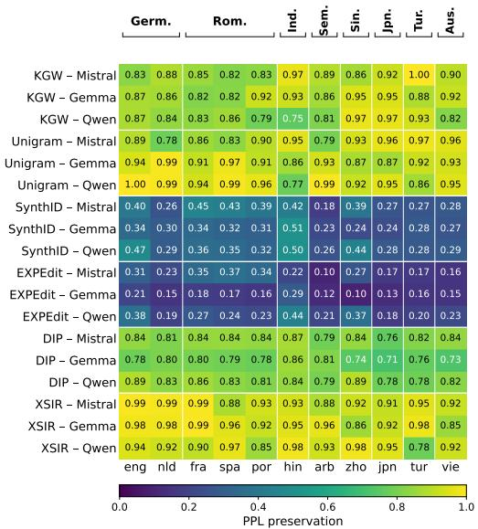  
(a) Base-FLORES regime.

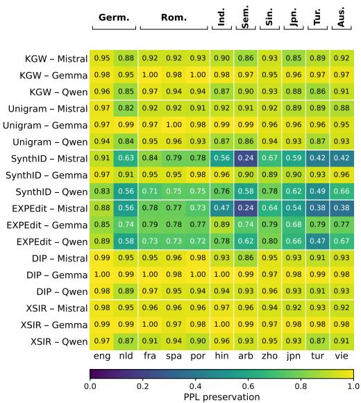  
(b) Instruct-AYA regime.  
Figure 5: PPL preservation under mGPT-1.3B cross-reference. Format and color scale match Figure 1.

## D.3 On-target vs. all-subset stratification

The headline quality reporting in §5.2 is computed on subset =al1 per the pre-registration. Figure 6 reports the per-cell shift $\Delta = \mathrm { p r e s e r v a t i o n } _ { \mathrm { o n - t a r g e t } } - \mathrm { p r e s e r v a t i o n } _ { \mathrm { a l l } }$ across the three paradigms in both regimes.

In base, shifts fall within ±0.05 for the vast majority of cells, with isolated MAUVE exceptions on Unigram-Gemma, XSIR-Gemma, and XSIR-Qwen that do not displace the cross-scheme rankings of §5.2. In instruct, shifts concentrate on the most-distorting schemes (SynthID, EXPEdit) and the lowest-adherence cells flagged in Table 4 (Mistral and Qwen on Arabic, Hindi, Turkish, Vietnamese).

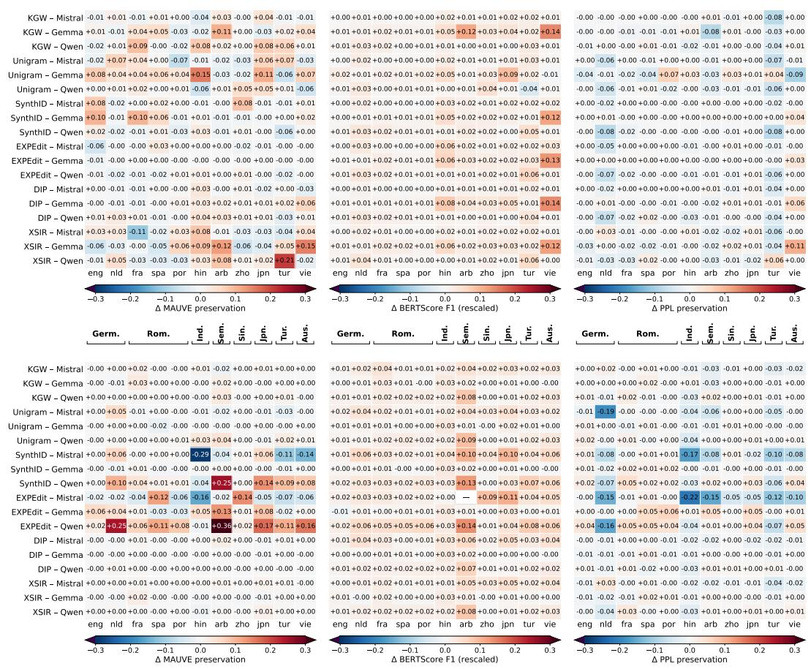  
Figure 6: On-target minus all-subset preservation, base-FLORES regime (top) and instruct-AYA regime (bottom). Each cell is $\Delta = \mathrm { p r e s e r v a t i o n } _ { \mathrm { o n - t a r g e t } } - \mathrm { p r e s e r v a t i o n } _ { \mathrm { a l l } }$ for the indicated paradigm; rows are (scheme, generator), columns are languages. Positive (red): on-target restriction raises preservation; negative (blue): on-target restriction lowers it. Color scale fixed at $[ - 0 . 3 , + 0 . 3 ]$ ; values outside this range saturate. The EXPEdit-Mistral, Arabic, BERTScore F1 entry in the instruct panel is omitted (—) because the on-target sample size falls below the $n \geq 1 0 0$ paired-set floor.

Two opposing patterns recur on these cells: MAUVE shifts are large and positive (on-target restriction raises apparent preservation, indicating that off-target generations are distributionally far from baseline), while PPL preservation shifts are predominantly negative (on-target generations are distributionally closer to baseline but exhibit lower fluency under the held-out reference). The bidirectionality reflects that off-target removal trades distributional similarity against referenceperplexity fluency in opposite directions on these cells, consistent with the green-list/sampling-time mechanism split. The four logit-bias schemes show shifts within ±0.05 on the great majority of entries in both regimes.

With the single exception of the EXPEdit-Mistral, Arabic, BERTScore entry (omitted for falling below the n ≥ 100 paired-set floor), the conclusions of §5.2 survive on-target restriction: SynthID and EXPEdit remain the most distorting, the cross-paradigm disagreement pattern persists, and the typological structure of cross-language disparity is unchanged.

## E Joint Detection-Quality: Full Paradigm Grid

Figure 7 reports the BERTScore-rescaled and PPL-XGLM companion panels to Figure 3. The topology of §5.3 carries through on both paradigms. Unigram and XSIR retain the highest baseregime spread on every paradigm (Unigram $s _ { B } \in [ 0 . 4 8 4 , 0 . 5 5 1 ]$ ; XSIR $s _ { B } \in [ 0 . 3 5 4 , 0 . 3 9 9 ] \rangle$ ), with the four remaining schemes at $s _ { B } \leq 0 . 1 9 5$ . EXPEdit, SynthÍD, and Unigram lead the instructregime spread on every paradigm, and XSIR carries the lowest instruct spread on every paradigm $( s _ { I } \in [ 0 . 1 8 1 , 0 . 2 4 1 ] )$ . The opposite-corner low-spread topologies of §5.3 (DIP top-right, EXPEdit bottom-right) reproduce on the BERTScore and PPL panels: DIP base $s _ { B } \leq 0 . 1 2 7$ across paradigms, EXPEdit base $s _ { B } \leq 0 . 1 9 5$ . The headline finding is that joint disparity is regime-shaped rather than scheme-uniform is therefore not specific to MAUVE.

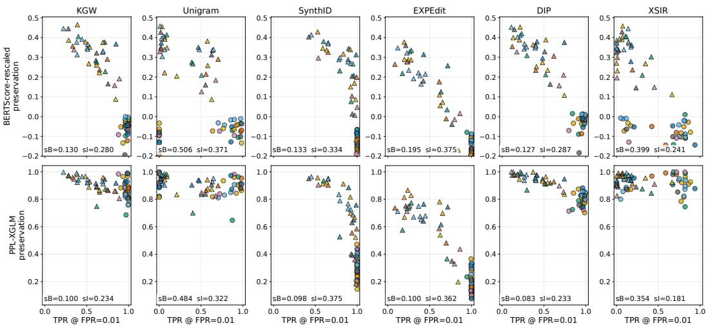  
O Base ΔInstructGermanicRomanceIndicSemiticSiniticJaponicTurkic Austroasiatic  
Figure 7: Joint per-language detection-quality landscape, BERTScore-rescaled (top) and PPL-XGLM (bottom) paradigms. Format matches Figure 3: markers are per-language (TPR @ $\tau _ { g } , \mathrm { q u a l i t y } )$ pairs at $\alpha { = } 0 . 0 1 , n { = } 3 3$ per regime (11 languages $\times 3$ generators); circles are base-FLORES, triangles are instruct-AYA; color encodes typological family; $s _ { B } , s _ { I }$ are mean pairwise Euclidean distance within each regime.

## F Mechanism Regression

The decompositions of §5.1-§5.3 establish that disparity is typology-structured but do not identify which structural variable does the work. This appendix reports per-language OLS fits of detection TPR and quality preservation on four candidate covariates: tokenizer fertility (tokens per FLORES-devtest sentence), unwatermarked-generation surprisal under XGLM-7.5B, a Latin-script indicator, and language-adherence rate (NWM% from Table 4). Tables 14 and 15 report per-regime single-covariate $R ^ { 2 }$ over 33 (language, generator) points; §F.1 repeats the quality-side analysis on BERTScore-rescaled and PPL-XGLM as paradigm-stability checks on the MAUVE headline.

Detection and quality have different mechanisms. In base, adherence is the dominant detection predictor for KGW, SynthID, and DIP $( R ^ { 2 }$ between $0 . 4 1 ^ { * * }$ and $0 . 6 0 ^ { * * } )$ ; fertility is dominant for the distortion-free schemes (EXPEdit 0.83\*\*, DIP 0.24\*\*). On quality, fertility predicts the greenlist schemes (KGW 0.39\*\*, Unigram $0 . 2 5 ^ { * * } , \mathrm { D I P ~ 0 . 2 3 ^ { * * } ) }$ , and adherence registers only for the distortion-free schemes under instruct. The covariate that drives detectability is not the one that drives preservation.

Instruction tuning collapses detection-side structure. Detection $R ^ { 2 }$ falls below significance for five of six schemes under instruct (XSIR adherence $0 . 2 9 ^ { * * }$ excepted), consistent with the calibrational instruct collapse of §5.1. Quality-side fertility persists for the green-list family. Latin script and NWM surprisal clear $p \ < \ 0 . 0 5$ in 6 of 48 cells combined; both correlate with the typological partition but neither carries enough non-collinear signal at $n { = } 3 3$ to compete. Pooling across regimes (results omitted) dilutes the regime-specific detection mechanisms while preserving the regime-stable quality-side fertility effect, corroborating the asymmetry.

<table><tr><td>Covariate</td><td>KGW</td><td>Unigram</td><td>SynthID</td><td>EXPEdit</td><td>DIP</td><td>XSIR</td></tr><tr><td colspan="7">Base regime (FLORES+ continuation,  $n = 3 3 )$ </td></tr><tr><td>Fertility (tokens/sent.)</td><td>0.016</td><td>0.052</td><td>0.008</td><td> $0 . 8 3 4 ^ { * * }$ </td><td> $0 . 2 3 8 ^ { \ast \ast }$ </td><td>0.001</td></tr><tr><td>NWM surprisal (XGLM)</td><td>0.066</td><td>0.074</td><td>0.058</td><td> $0 . 2 6 1 ^ { \ast \ast }$ </td><td>0.156*</td><td>0.003</td></tr><tr><td>Latin script</td><td>0.029</td><td>0.001</td><td>0.005</td><td>0.051</td><td>0.009</td><td>0.019</td></tr><tr><td>NWM adherence</td><td> $0 . 6 0 0 ^ { * * }$ </td><td>0.006</td><td> $0 . 4 1 5 ^ { * * }$ </td><td>0.001</td><td> $0 . 4 6 1 ^ { * * }$ </td><td>0.091</td></tr><tr><td colspan="7">Instruct regime (AYA native-speaker,  $n = 3 3 )$ </td></tr><tr><td>Fertility (tokens/sent.)</td><td>0.017</td><td>0.046</td><td>0.009</td><td>0.001</td><td>0.000</td><td>0.107</td></tr><tr><td>NWM surprisal (XGLM)</td><td>0.024</td><td>0.003</td><td>0.009</td><td>0.040</td><td>0.017</td><td>0.011</td></tr><tr><td>Latin script</td><td>0.046</td><td>0.014</td><td>0.035</td><td>0.049</td><td>0.040</td><td>0.058</td></tr><tr><td>NWM adherence</td><td>0.000</td><td>0.000</td><td>0.003</td><td>0.047</td><td>0.000</td><td>0.291**</td></tr></table>

Table 14: Single-covariate $\overline { { R ^ { 2 } } }$ for per-language detection TPR at $\tau _ { g } , \alpha { = } 0 . 0 1$ , subset all. Each fit regresses the per-language outcome vector on a single covariate over 33 (language, generator) points. Stars from the slope p-value: $^ { * } p < 0 . 0 5 , ^ { * * } p < 0 . 0 1$

<table><tr><td>Covariate</td><td>KGW</td><td>Unigram</td><td>SynthID</td><td>EXPEdit</td><td>DIP</td><td>XSIR</td></tr><tr><td colspan="7">Base regime (FLORES+ continuation,  $n = 3 3 )$ </td></tr><tr><td>Fertility (tokens/sent.)</td><td> $0 . 3 9 2 ^ { \ast \ast }$ </td><td> $0 . 2 4 9 ^ { * * }$ </td><td>0.027</td><td>0.005</td><td> $0 . 2 3 4 ^ { \ast \ast }$ </td><td>0.093</td></tr><tr><td>NWM surprisal (XGLM)</td><td>0.026</td><td>0.023</td><td>0.018</td><td>0.001</td><td>0.007</td><td>0.009</td></tr><tr><td>Latin script</td><td>0.136*</td><td>0.036</td><td>0.062</td><td>0.052</td><td>0.083</td><td>0.000</td></tr><tr><td>NWM adherence</td><td>0.031</td><td>0.007</td><td>0.101</td><td>0.074</td><td> $0 . 2 1 9 ^ { * * }$ </td><td>0.072</td></tr><tr><td colspan="7">Instruct regime (AYA native-speaker,  $n = 3 3 )$ </td></tr><tr><td>Fertility (tokens/sent.)</td><td> $0 . 3 4 6 ^ { \ast \ast }$ </td><td> $0 . 4 6 4 ^ { * * }$ </td><td>0.027</td><td>0.016</td><td>0.019</td><td>0.168*</td></tr><tr><td>NWM surprisal (XGLM)</td><td>0.008</td><td> $0 . 1 5 2 ^ { * }$ </td><td>0.022</td><td>0.052</td><td>0.005</td><td>0.002</td></tr><tr><td>Latin script</td><td>0.122*</td><td>0.051</td><td>0.018</td><td>0.041</td><td>0.052</td><td>0.082</td></tr><tr><td>NWM adherence</td><td>0.076</td><td>0.099</td><td>0.153*</td><td> $0 . 2 3 0 ^ { * * }$ </td><td>0.053</td><td>0.047</td></tr></table>

Table 15: Single-covariate $\overline { { R ^ { 2 } } }$ for per-language MAUVE preservation. Each fit regresses the perlanguage outcome vector on a single covariate over 33 (language, generator) points. Stars from the slope p-value: $^ { * } p < 0 . 0 5 , ^ { * * } p < 0 . 0 1$ . BERTScore-rescaled and PPL-XGLM paradigm-stability tables in §F.1.

## F.1 Paradigm-stability check

Tables 16 and 17 repeat the single-covariate quality-side regression with BERTScore-rescaled and PPL-XGLM as the outcome. PPL-XGLM corroborates and strengthens the MAUVE story: fertility is the dominant predictor for the green-list family on both regimes, with the largest $R ^ { 2 ^ { \bullet } }$ values in the entire mechanism analysis appearing under instruct (KGW 0.446\*\*, Unigram 0.559\*\*, XSIR $0 . 3 4 0 ^ { * * } )$ . BERTScore-rescaled diverges: adherence, not fertility, is the dominant predictor in base for five of six schemes $( R ^ { 2 }$ between 0.188\* and $0 . 3 7 8 ^ { \ast \ast } ,$ . The divergence is consistent with the narrow-dynamic-range observation of §5.2: BERTScore-rescaled F1 is sensitive to the per-language LID-baseline that goes into rescaling, so its single-covariate $R ^ { 2 }$ captures adherence rather than the fertility-driven distributional shift that MAUVE and PPL-XGLM register. The fertility-on-green-list mechanism is therefore paradigm-stable across the two paradigms that measure distributional or reference-likelihood divergence directly.

<table><tr><td>Covariate</td><td>KGW</td><td>Unigram</td><td>SynthID</td><td>EXPEdit</td><td>DIP</td><td>XSIR</td></tr><tr><td colspan="7">Base regime (n = 33)</td></tr><tr><td>Fertility (tokens/sent.)</td><td>0.000</td><td>0.013</td><td>0.024</td><td>0.054</td><td>0.039</td><td>0.095</td></tr><tr><td>NWM surprisal (XGLM)</td><td>0.036</td><td>0.016</td><td>0.000</td><td>0.032</td><td>0.039</td><td>0.094</td></tr><tr><td>Latin script</td><td>0.068</td><td>0.207**</td><td>0.004</td><td>0.022</td><td>0.003</td><td>0.008</td></tr><tr><td>NWM adherence</td><td> $0 . 2 3 9 ^ { \ast \ast }$ </td><td>0.004</td><td> $0 . 3 7 8 ^ { \ast \ast }$ </td><td> $0 . 2 5 9 ^ { * * }$ </td><td> $0 . 2 9 8 ^ { * * }$ </td><td>0.188*</td></tr><tr><td colspan="7">Instruct regime  $( n = 3 3 )$ </td></tr><tr><td>Fertility (tokens/sent.)</td><td>0.072</td><td>0.069</td><td>0.043</td><td>0.026</td><td>0.047</td><td>0.051</td></tr><tr><td>NWM surprisal (XGLM)</td><td>0.034</td><td>0.034</td><td>0.030</td><td>0.021</td><td>0.037</td><td>0.026</td></tr><tr><td>Latin script</td><td>0.046</td><td>0.045</td><td>0.042</td><td>0.037</td><td>0.044</td><td>0.056</td></tr><tr><td>NWM adherence</td><td>0.096</td><td>0.095</td><td>0.119*</td><td>0.125*</td><td>0.123*</td><td>0.110</td></tr></table>

Table 16: Single-covariate $\overline { { R ^ { 2 } } }$ for BERTScore-rescaled preservation. Stars from the slope p-value: $^ { * } p < 0 . 0 5 , ^ { * * } \bar { p } < 0 . 0 1$

<table><tr><td>Covariate</td><td>KGW</td><td>Unigram</td><td>SynthID</td><td>EXPEdit</td><td>DIP</td><td>XSIR</td></tr><tr><td>Base regime  $( n = 3 3 )$ </td><td></td><td></td><td></td><td></td><td></td><td></td></tr><tr><td>Fertility (tokens/sent.)</td><td>0.191*</td><td>0.327**</td><td>0.013</td><td>0.000</td><td>0.121*</td><td>0.148*</td></tr><tr><td>NWM surprisal (XGLM)</td><td>0.003</td><td>0.179*</td><td>0.017</td><td>0.018</td><td>0.094</td><td>0.183*</td></tr><tr><td>Latin script</td><td>0.022</td><td>0.001</td><td>0.126*</td><td>0.105</td><td>0.052</td><td>0.056</td></tr><tr><td>NWM adherence</td><td>0.186*</td><td>0.014</td><td> $0 . 1 6 4 ^ { * }$ </td><td>0.123*</td><td>0.109</td><td>0.015</td></tr><tr><td>Instruct regime  $( n = 3 3 )$ </td><td></td><td></td><td></td><td></td><td></td><td></td></tr><tr><td>Fertility (tokens/sent.)</td><td>0.446**</td><td>0.559**</td><td>0.119*</td><td>0.070</td><td>0.225**</td><td>0.340**</td></tr><tr><td>NWM surprisal (XGLM)</td><td>0.044</td><td>0.029</td><td>0.010</td><td>0.000</td><td>0.047</td><td>0.016</td></tr><tr><td>Latin script</td><td>0.086</td><td>0.077</td><td>0.070</td><td>0.084</td><td>0.046</td><td>0.012</td></tr><tr><td>NWM adherence</td><td>0.020</td><td>0.024</td><td>0.096</td><td> $0 . 2 1 7 ^ { * * }$ </td><td>0.023</td><td>0.006</td></tr></table>

Table 17: Single-covariate $\overline { { R ^ { 2 } } }$ for PPL-XGLM preservation. Stars from the slope p-value: ${ ^ { * } p } < 0 . 0 5 .$ $^ { * * } p < 0 . 0 1$