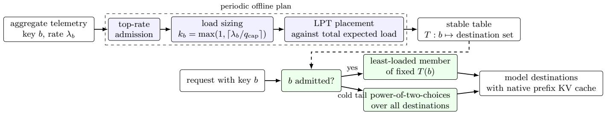
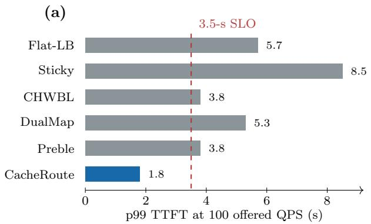
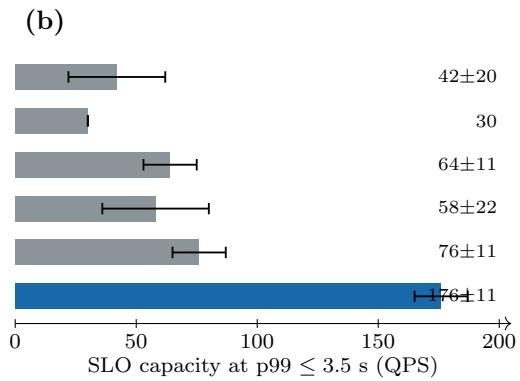

# CacheRoute: Planned Prefix-Afinity Routing for Large-Scale LLM Serving

Huang Cheng Meta, Menlo Park, California, USA huangcheng@meta.com

August 2026

## Abstract

Prefix caching avoids prefill only when a repeated request returns to a server that still holds the prefix KV. Cache-blind balancing disperses that reuse; fixed afinity preserves it but can overload a server. CacheRoute resolves this tradeof with a periodic routing plan. It admits high-rate keys to a stable warm set and places their assignments by expected load. Hot keys may use more than one destination, although every key in our primary semi-synthetic aggregate uses exactly one. On Llama-3.3-70B in fp8 across 60 H100 GPUs, CacheRoute sustains 176±11 QPS at a 3.5-s p99 SLO, 2.3× the strongest of five baselines. Served KV-cache hit rate rises from 64.1±1.3% under cache-blind balancing to 93.2±0.5%. A second semi-synthetic aggregate and controlled 8B and burst experiments separate the efects of afinity and placement. Two 32B workloads provide the counterexamples: when afinity recovers too little KV work, its residual load skew reduces or erases the improvement. We therefore recommend gating any deployment with a shadow replay rather than enabling afinity from workload statistics alone.

Keywords: LLM serving; prefix caching; request routing; request scheduling.

## 1 Introduction

Prefix caching is now standard in LLM serving engines [Kwon et al.(2023), Zheng et al.(2024)], but the cache cannot control where a request lands. A cacheblind balancer spreads a recurring prefix across many destinations and lengthens the return time to each cache. Pinning a key to one destination restores locality, but maps key skew directly onto server queues. Cacheaware routers instead react to current cache and load state [Srivatsa et al.(2024), Yuan et al.(2026)]; once a destination fills, however, spilling the next request also forfeits the warm prefix.

This problem arises in multi-tenant conversational assistants—for example, customer-support chatbots— where each business carries a stable, reusable context across a multi-turn conversation. Such skewed, prefixreusing serving is common across LLM serving systems and not specific to any one provider. A stable per-business context recurs across conversations, while the default balancer often sends successive requests to diferent model servers. Request rates also vary sharply across businesses, which rules out simple stickiness. The router must keep reusable prefixes local without creating a server whose queue sets the fleet-wide p99.

CacheRoute builds a routing table from measured perkey rates. It admits the highest-rate keys under a warmprefix slot allocation, gives an overloaded key enough destinations to cap its expected load per destination, and places the resulting assignments with longest-processingtime-first (LPT) list scheduling. Unadmitted trafic falls back to cache-blind power-of-two choices. The table remains fixed for a control interval, favoring cache stability over per-request remapping.

Assignment and replication play diferent roles. In the primary distribution, even the hottest key falls below the single-destination load target; every assignment count is one. The 70B result therefore measures planned singlecopy afinity, top-rate admission, and balanced placement. Only the controlled 8B experiments inject keys hot enough to exercise replication.

The main experiment serves Llama-3.3-70B in fp8 on 30 tensor-parallel-2 destinations (60 H100 GPUs). Across five paired runs, CacheRoute sustains 176 ±11 QPS at p99≤ 3.5 s; the strongest baseline, Preble, sustains 76±11 QPS. At 100 ofered QPS, CacheRoute’s p99 is 1.8 s, compared with 3.8–8.5 s for the five baselines. On a second distribution, the advantage is 1.6× at the wider active set. The 8B ablation explains the gap: afinity raises KV hit rate, and LPT placement reduces imbalance from 3.46× to 1.24×, moving the measured SLO knee from 240 to at least 500 QPS.

We make three contributions:

• a prefix-afinity router that plans cache locality and expected load together;

• a six-policy hardware evaluation centered on a 70B model and 60 H100 GPUs, with paired runs, a second workload distribution, and burst experiments; and

• a measured operating envelope that includes loss and tie regimes, plus evidence for using shadow replay instead of an analytic residency predictor.

Top-rate admission and LPT are established techniques; we do not claim a new scheduling primitive. The contribution lies in the routing design, its large-scale measurements, and the conditions under which operators should leave the ordinary load balancer in place.

## 2 Workload and Failure Mode

## 2.1 Semi-synthetic aggregate workload

The workload models a multi-tenant conversationalassistant service (e.g., customer-support chatbots), where each business carries a stable, reusable context. Our evaluation uses a semi-synthetic workload: a synthetic request stream designed to mimic aggregate workload characteristics—per-key rates, inter-arrival gaps, and popularity distribution—derived from de-identified operational serving telemetry. No raw requests, conversation content, user data, or business identifiers are used. The primary summary contains 128,824 opaque business keys and has a Gini coeficient of 0.756. Roughly 4% of keys account for 47% of requests, yet no key contributes more than 0.3%. The median per-key inter-arrival coeficient of variation is 1.93, and 80.8% of requests belong to multiturn threads.

Prompts average about 1.2K input tokens, 90% of which precede the current turn. Most of those tokens are not a routing opportunity. The global template is common to all businesses and warms on every destination; a retrieved few-shot block changes often enough to break the exact prefix in 67% of consecutive request pairs. The reusable, key-specific segment is the per-business context, about 180 tokens or 15% of the prompt. We route on the business key and benefit only when that segment returns before eviction.

We evaluate two independently derived semi-synthetic aggregates and several explicitly labeled synthetic workloads. The aggregates retain only replay statistics, including opaque-key rates and inter-arrival gaps. Neither the paper nor its artifacts contain request text, user content, business names, or business identifiers. We reserve synthetic trafic for mechanism and boundary tests, where controlling skew, burstiness, or prefix reuse matters more than matching a full workload.

## 2.2 Why balancing and stickiness both fail

For a business with rate $\lambda _ { b }$ sprayed uniformly across R destinations, the mean time between visits to one destination scales as $R / \lambda _ { b }$ . Increasing the fleet can thus make a prefix colder even though total cache capacity grows. If this revisit time exceeds the efective eviction time, every request repeats prefill work.

Pure afinity moves to the other extreme. A consistent hash keeps a prefix local, but the busiest hash bucket inherits the workload skew. Tail latency then follows the hottest destination rather than the fleet average. Bounded hashing and reactive reuse-versus-load policies reduce this problem, but may spill a request to a cold destination after a cap binds. The practical need is a stable many-key assignment computed with the rate distribution in view.

Deployment turns on a measurable tradeof: whether the recoverable hit-rate increase outweighs the residual load skew. Model size, precision, prefix length, ofered load, active-set breadth, and cache size all shift that balance. As Section 5.3 shows, a higher cache-hit rate can still accompany lower capacity.

## 3 CacheRoute

## 3.1 Planning objective

Let businesses $b \in B$ have estimated rates $\lambda _ { b }$ , and let the serving deployment have R destinations. A destination is one independently routable model-server group; in the 70B deployment it is a tensor-parallel-2 pair. The planner produces a table $T ( b )$ for a fixed control interval.

Load-based assignment count. We calibrate $q _ { \mathrm { c a p } }$ from a single destination’s latency/load knee. A selected business receives

$$
k _ { b } = \operatorname* { m a x } \left( 1 , \lceil \lambda _ { b } / q _ { \mathrm { c a p } } \rceil \right)\tag{1}
$$

destinations, making its expected load per assignment at most $q _ { \mathrm { c a p } }$ . This is a load-control rule, not an eviction threshold or a cache-residency guarantee.

Warm-set admission. The stable per-business prefixes are similar in size, so the planner represents cache allocation as $C = R W$ prefix slots, with W slots per destination. It considers keys in decreasing $\lambda _ { b }$ and admits them while $\sum k _ { b } \leq C$ . This equal-slot model does not cover workloads with heterogeneous reusable-prefix sizes; those require byte-aware measurements and admission.

Placement and dispatch. Each admitted key contributes $k _ { b }$ jobs of size $\lambda _ { b } / k _ { b }$ . After initializing destinations with their expected cold-tail share, the planner visits admitted keys in decreasing-rate order and assigns each job to the least-loaded eligible destination. The procedure follows classic LPT scheduling [Graham(1969)], but the standard approximation bound does not apply to our split jobs and distinct-destination constraint. During the control interval, admitted trafic chooses the least-loaded member of its fixed $T ( b ) ;$ other trafic uses power-of-two choices across the fleet [Mitzenmacher et al.(2001)].

  
Figure 1: CacheRoute separates a periodic, rate-aware assignment from fast request dispatch. The main distribution has $k _ { b } = 1$ for every key, so its 70B improvement comes from admission, stable single-copy afinity, and balanced placement; multiple destinations are exercised only in the synthetic-whale mechanism study. Cache residency is measured, not guaranteed by the plan.

Algorithm 1 Periodic routing-table construction   
Require: rates $\{ \lambda _ { b } \} , R , q _ { \mathrm { c a p } } ,$ slot allocation C   
1: for each key b do   
2: $k _ { b } \gets \operatorname* { m a x } ( 1 , \lceil \lambda _ { b } / q _ { \mathrm { c a p } } \rceil )$   
3: end for   
4: sort keys by decreasing $\lambda _ { b } ;$ admit while $\sum k _ { b } \leq C$   
5: initialize $\dot { L [ r ] }$ with expected cold-tail load, $r \in [ 1 , R ]$   
6: for each admitted b in decreasing $\lambda _ { b }$ do   
7: $T ( b ) \gets k _ { b }$ distinct destinations with smallest L   
8: for each $r \in T ( b )$ do   
9: $L [ r ] \gets L [ r ] + \lambda _ { b } / k _ { b }$   
10: end for   
11: end for   
12: dispatch admitted b within $T ( b )$ ; otherwise use flat-LB

The planner runs in $\begin{array} { r } { O ( | B | \log | B | + \sum _ { b } k _ { b } \log R ) } \end{array}$ and runs of the request path. Measured construction time is 345 ms at $R = 3 0$ for 128,824 businesses. The serving path is a table lookup followed by a load comparison within a small assignment set.

## 3.2 Operational semantics

The table stays fixed within a control interval. Stability avoids per-request cap thrashing, but drift can make the assignment stale. Installing a replacement table also starts some assignments cold. Section 5.4 measures both efects.

Admitted and cold-tail prefixes share the engine’s native cache and eviction policy. CacheRoute neither reserves nor migrates KV blocks and ofers no analytic residency guarantee. Before enabling a table, we shadow-replay it and measure served token-weighted KV hit and latency.

For the primary distribution, maxb $\lambda _ { b } < q _ { \mathrm { c a p } }$ and therefore $k _ { b } ~ = ~ 1$ for every business. Algorithm 1 reduces to top-rate admission followed by balanced, single-copy placement. Replication remains available for overload protection but does not contribute to the main 70B result.

## 4 Experimental Method

Implementation. Our client-side routing harness bypasses the serving deployment’s aggregate load balancer and sends each request according to one policy. An experiment identifier in request metadata attributes served, token-weighted KV-cache hits to the correct run. Policies use the same serving stack, request stream, warm-up exclusion, ofered-load ladder, and health criteria. The routing layer neither changes model execution nor reserves cache capacity.

Testbeds. The flagship system is Llama-3.3-70B in fp8, served by 30 tensor-parallel-2 destinations on 60 H100 GPUs. Each destination exposes 40,071 measured KV blocks (about 641K tokens). The mechanism testbed is Llama-3.1-8B-Instruct in bf16 on 30 single-H100 destinations. We use a 70B fp16 run only as supporting cache-pressure evidence, not for the capacity headline.

Workloads. The main replay draws opaque keys from a semi-synthetic peak-hour aggregate distribution. A second, independently collected semi-synthetic aggregate distribution tests distribution shift. Poisson, CV-matched Gamma, and moving-block-bootstrap arrival processes test burst sensitivity. The 8B study uses a semi-synthetic aggregate distribution except where we explicitly inject synthetic whales.

Policies. We compare against Flat-LB (power-of-two-choices), sticky consistent hashing [Karger et al.(1997)], consistent hashing with bounded loads (CHWBL) [Mirrokni et al.(2018)], a DualMap-style two-candidate cache/load policy [Yuan et al.(2026)], and a Preble-style prefix-history and live-load policy [Srivatsa et al.(2024)]. The latter three are reimplemented in our harness under a common interface; our absolute results should not be read as reproductions of their original systems. CHWBL uses $\epsilon = 0 . 2 5$ , selected by an ofline sweep, and the Preble-style policy uses a 1.5 load-cap factor.

Table 1: Llama-3.3-70B fp8, 30 TP2 destinations (60 H100), primary distribution, top-K128, five paired seeds. Capacity is QPS at the SLO knee; KV-hit is served and token-weighted.
<table><tr><td>Policy</td><td>KV hit</td><td>Cap.@3.5s</td><td>Cap.@5s</td><td>p99@100</td></tr><tr><td>FLAT-LB</td><td>64.1±1.3%</td><td>42±20</td><td>80</td><td>5.7s</td></tr><tr><td>Sticky</td><td>87.3±2.4%</td><td>30</td><td>42±20</td><td>8.5s</td></tr><tr><td>CHWBL</td><td>75.6±0.8%</td><td>64±11</td><td>128±14</td><td>3.8s</td></tr><tr><td>DualMap</td><td>88.7±1.9%</td><td>58±22</td><td>84±32</td><td>5.3s</td></tr><tr><td>Preble</td><td>72.0±0.7%</td><td>76±11</td><td>140</td><td>3.8s</td></tr><tr><td>CACHEROUTE 93.2±0.5%</td><td></td><td>176±11</td><td>180</td><td>1.8s</td></tr></table>

Metrics and statistics. SLO capacity is the highest ofered-QPS ladder point with p99 latency at or below the stated threshold and failure rate at most 5%. We compute the threshold independently per run and report its mean; a value at the ladder maximum is rightcensored. The flagship top-K128 result uses five paired seeds {2, 3, 4, 5, 6} and reports mean ± 95% Student-t confidence intervals. The top-K256 confirmation uses eight seeds. The secondary-distribution and 8B studies use three paired seeds unless stated otherwise; their wider intervals warrant interpreting small diferences as noise. KV-hit is served and token-weighted, not a simulator prediction.

## 5 Evaluation

We begin with the large-scale capacity result, then isolate the mechanism, examine workloads where afinity loses or ties, and derive the measurements required before enabling a routing plan.

## 5.1 70B on 60 H100 GPUs

Table 1 is the primary result; Figure 2 visualizes the common-load p99 and the primary SLO-capacity knee. At p99≤ 3.5 s, CacheRoute sustains 176±11 QPS, 2.3× Preble’s 76±11 and 4.2× Flat-LB’s 42±20. At a looser 5-s SLO, the gap narrows to 1.3× over Preble (180 versus 140 QPS). At a tight 2-s SLO, CacheRoute is the only policy to pass any tested load and sustains 120 QPS; all five baselines are left-censored below the 30-QPS minimum.

Cache and queue measurements explain the capacity gap. CacheRoute records a 93.2% served KV-hit rate, 29.1 points above Flat-LB. Sticky and DualMap also recover substantial reuse, but their p99s at 100 ofered QPS are 8.5 and 5.3 s; locality alone does not help once a queue dominates the tail. Preble and CHWBL keep the queues more even, but their cache-hit rates fall to 72.0% and 75.6%. CacheRoute occupies the useful middle: high reuse without a comparable hot spot.

With a top-K256 active set, a dedicated eight-seed run places the 3.5-s knees at 80 QPS for CacheRoute and 60 QPS for DualMap (1.33×); at 5 s they are 120 and

Table 2: SLO capacity $\left( \mathrm { p 9 9 } \leq 3 . 5 \mathrm { s } \right)$ on the second distribution, 70B fp8/60 H100, three paired seeds.
<table><tr><td>Policy</td><td>top-K128</td><td>top-K256</td></tr><tr><td>FLAT-LB</td><td>30</td><td>30</td></tr><tr><td>Sticky</td><td>30</td><td>60</td></tr><tr><td>CHWBL</td><td>100</td><td>60</td></tr><tr><td>DualMap</td><td>100</td><td>100</td></tr><tr><td>Preble</td><td>60</td><td>60</td></tr><tr><td>CACHEROUTE</td><td>100</td><td>160</td></tr></table>

Table 3: 8B SLO capacity $\mathrm { ( p 9 9 \leq 3 . 5 s ) }$ , 30 H100, three paired seeds. “500” is right-censored.
<table><tr><td>top-K</td><td>FLAT-LB</td><td>Sticky</td><td>CHWBL</td><td>DualMap</td><td>Preble</td><td>CACHEROUTE</td></tr><tr><td>16</td><td>500</td><td>100</td><td>500</td><td>100</td><td>500</td><td>500</td></tr><tr><td>32</td><td>500</td><td>100</td><td>360</td><td>100</td><td>360</td><td>500</td></tr><tr><td>64</td><td>500</td><td>160</td><td>360</td><td>160</td><td>360</td><td>500</td></tr><tr><td>128</td><td>240</td><td>240</td><td>360</td><td>360</td><td>360</td><td>500</td></tr><tr><td>256</td><td>160</td><td>240</td><td>240</td><td>360</td><td>360</td><td>500</td></tr><tr><td>2000</td><td>100</td><td>360</td><td>160</td><td>360</td><td>160</td><td>360</td></tr></table>

100 QPS. Their KV-hit rates are 82% and 60%, respectively. Failure rates at passing points remain between 0.8% and 1.4%. An earlier high-failure observation did not reproduce in this confirmation run.

Second semi-synthetic distribution. Table 2 repeats the experiment with an independently collected aggregate key-rate distribution on the same 70B fp8 fleet. When top-K128 fits within the warm allocation, the three balanced cache-aware policies tie at 100 QPS. Expanding to top-K256 separates them: CacheRoute sustains 160 QPS, compared with 100 QPS for the best baseline. The comparison is useful precisely because it does not reproduce every cell of Table 1; the advantage appears only after the active set outgrows the warm allocation.

## 5.2 What creates the improvement?

The 8B testbed reaches saturation with less load and separates locality from balance. Across the tested activeset sizes, CacheRoute never falls below Flat-LB’s measured SLO capacity (Table 3). Several results at top-$K \in \{ 1 6 , 3 2 , 6 4 \}$ hit the 500-QPS sweep ceiling; those ties are right-censored, not evidence of equal capacity. The largest resolved six-policy advantage is 1.39× at top-K128 and 256. At top-K2000, the warm allocation covers a smaller trafic share and CacheRoute’s measured knee falls to 360 QPS, still tied for the best result.

Table 4 adds the components one at a time under a controlled synthetic-whale workload. Afinity raises KV hit from 56% to 88%, but also raises imbalance to 3.46×; capacity stays at 240 QPS. Load-proportional replication reduces imbalance to 2.60×, yet random placement again leaves the knee unchanged. Only after LPT placement brings imbalance down to 1.24× does capacity reach the 500-QPS ceiling. Afinity recovers the cached work, while placement makes that recovery usable at saturation. The injected whales are the only reason replication appears in this ablation, so the row does not explain the primary result.

  
Figure 2: Primary 70B fp8 result on 30 TP2 destinations (60 H100), top-K128, five paired seeds. (a) Measured p99 TTFT at the common 100-QPS operating point; only CacheRoute is below the primary 3.5-s SLO. (b) Per-seed SLO-capacity knees (mean and reported 95% Student-t CI); CacheRoute reaches 176±11 QPS, 2.3× the strongest baseline.

Table 4: 8B component ablation, synthetic whales, top-K128, three seeds. Capacity 500 is right-censored.
<table><tr><td>Configuration</td><td>KV hit</td><td>Imbalance</td><td>Capacity</td></tr><tr><td>FLAT-LB</td><td>56±1.9%</td><td>1.00×</td><td>240</td></tr><tr><td>+ affinity</td><td>88±1.5%</td><td>3.46×</td><td>240</td></tr><tr><td>+ replication</td><td>88±1.6%</td><td>2.60×</td><td>240</td></tr><tr><td>+ LPT (full)</td><td>90±1.0%</td><td>1.24×</td><td>500</td></tr></table>

Table 5: Measured operating regimes. Capacity multiplier is CacheRoute/Flat-LB; the 8B range is a singlewindow synthetic mechanism result, while both 32B rows use semi-synthetic aggregate distributions.
<table><tr><td>Regime</td><td></td><td></td><td>Flat hit Aff. hit Cap. mult. Result</td></tr><tr><td>8B synthetic whales</td><td>9.3%</td><td>77.0%</td><td>2–6× win</td></tr><tr><td>Aggregate A-32B</td><td>1.1%</td><td></td><td>11.8% 0.50-0.67× lose</td></tr><tr><td>Aggregate B-32B</td><td>0.8%</td><td>8.5%</td><td>1.0× tie</td></tr></table>

## 5.3 Operating envelope and negative results

Table 5 shows why afinity cannot be enabled unconditionally. The 8B synthetic-whale workload ofers many recoverable misses and favors CacheRoute. For 32B aggregate workload A, afinity moves KV hit only from 1.1% to 11.8%. That improvement does not outweigh the remaining skew, and capacity falls to 0.50–0.67× Flat-LB. Aggregate workload B reaches 8.5% afinity hit and ties Flat-LB at the 5-s SLO. The two 32B workloads are de-identified semi-synthetic aggregates run with a diferent model configuration from the positive 70B case. Model size by itself does not distinguish these outcomes.

We use a short shadow replay as the deployment gate. It preserves the candidate assignment without returning its responses to users. The replay compares served KV hit, per-destination load, and p99 against Flat-LB at one load below and one load near the current knee. A cache-hit increase is not enough; the plan is enabled only when p99 or capacity improves. We repeat the gate after changes to model, precision, context length, batching, cache allocation, or the active-set distribution.

## 5.4 Burstiness and replanning

Arrival burstiness. On 70B fp8/top-K128, a Gamma arrival process matched to the workload’s marginal CV=1.9 reduces CacheRoute’s 3.5-s capacity by one ladder step, from 180 to 160 QPS, while KV-hit moves from 94% to 90%. Flat-LB remains at 30 QPS. In a separate, single-sweep comparison, a moving-block bootstrap of 22,639 measured inter-arrival gaps from semi-synthetic aggregate workload A (block length 50, empirical CV=2.73) leaves CacheRoute at 180 QPS and 93% hit, while Flat-LB becomes left-censored below 30 QPS. These are twopolicy, one-active-set sensitivities, not claims about all baselines. They show that the main improvement does not require smoothed arrivals.

Rate drift and remapping. We perturb the primary rate vector over six intervals with a lognormal random walk (σ = 0.3) and compare fresh and one-interval-stale plans at 160 QPS. Recomputing LPT from scratch changes 94.5% of key-to-destination sets, although only 1.1% of keys change assignment count. The stale plan loses 1.0 percentage point of KV hit and 192 ms of p99 on average; the worst transition loses 3.0 points and 858 ms. Installing the fresh plan, meanwhile, produces a transient 13.6- point KV-hit drop during rewarming. A deployment should therefore preserve placements until the measured staleness penalty exceeds the warm-up penalty. We have not implemented a churn-aware replanner.

Why we do not predict residency analytically. We also tested a single-characteristic-time occupancy model against the 70B fp8 engine. Component-level instrumentation passed seven isolation checks, and each TP2 destination exposed 40,071 measured KV blocks. Prediction still missed served hit rate by 14.3 percentage points at the median and 44.7 points at p90. The observed curve drops sharply and then plateaus, a shape outside the tested model family. We neither size deployments with this model nor assign the shape to an engine mechanism without direct evidence. This failure is why shadow replay remains part of the deployment procedure.

## 6 Discussion and Limitations

What generalizes. The planner requires a stable routing key, a reusable key-specific prefix, and rate estimates that remain useful for at least one cache-warming interval. Another routing key—a tenant, a document collection, an agent, or an application—could replace the business key used here. Because the router changes placement rather than model execution, it does not depend on a particular model architecture or cache implementation.

What does not yet generalize. Equal-slot admission assumes roughly uniform stable-prefix sizes. We did not measure a byte-aware value function for heterogeneous long contexts and make no byte-knapsack or optimal admission claim. Cold-tail trafic shares the native cache and can evict admitted prefixes. The aggregate replays preserve key popularity and, for the burst experiment, short-range gap correlation; they do not preserve exact per-key timestamps. Finally, two distributions cannot represent every market or application.

Preble, DualMap, and CHWBL are common-harness reimplementations, not the original codebases. They compare routing behavior under matched hardware but do not reproduce the published systems end to end. Several 8B knees are right-censored at 500 QPS, so we report ratios only when the sweep resolves them. The three-seed studies also have wide t intervals; the five-seed flagship and eight-seed confirmation provide the stronger evidence.

Deployment checklist. An operator adopting CacheRoute would begin with aggregate key rates and a single-destination measurement of $q _ { \mathrm { c a p } }$ . After choosing a conservative warm-slot allocation, they would shadowreplay the plan and Flat-LB at matched loads, comparing served KV hit, imbalance, p99, and failures. Canary trafic would follow only if the plan wins, and the router would fall back to Flat-LB when the active set or measured p99 leaves that envelope. None of these steps requires request content.

## 7 Related Work

PagedAttention/vLLM and SGLang make prefix KV reuse eficient within one serving engine [Kwon et al.(2023), Zheng et al.(2024)]. CacheRoute instead decides which destination receives the request.

Preble scores prefix reuse against live load, while DualMap combines static and dynamic mappings [Srivatsa et al.(2024), Yuan et al.(2026)]. Consistent hashing and CHWBL provide stable afinity with explicit load control [Karger et al.(1997), Mirrokni et al.(2018)]. CacheRoute constructs one global, rate-based table for a control interval. Admission and LPT are established heuristics; the new evidence concerns their use in a prefix-afinity plan and the workloads on which that plan helps.

GeoCover studies a diferent form of resourceconstrained placement [Cheng et al.(2015)]: it selects roadside units for spatial network coverage, whereas CacheRoute assigns recurring prefixes to model destinations under serving load. The algorithms and guarantees do not transfer between the two problems. Their common ground is the allocation of limited infrastructure under skewed demand.

Mooncake and MemServe move or pool KV state across servers rather than preserve it through ingress afinity [Hu et al.(2024), Qin et al.(2025)]. Llumnix migrates requests to repair imbalance [Sun et al.(2024)]; DistServe and Splitwise separate prefill and decode placement [Zhong et al.(2024), Patel et al.(2024)]. These systems can still use an ingress plan to avoid prefill that routing would otherwise repeat.

## 8 Conclusion

CacheRoute plans prefix afinity and expected load once per control interval. On a 70B fp8 model across 60 H100 GPUs, it reaches 93.2% served KV hit and 2.3× the capacity of the strongest baseline at a 3.5-s p99 SLO. The negative workloads set an equally important boundary: afinity can reduce capacity when the recoverable prefix work is small. Any real deployment would therefore measure its own boundary with shadow replay.

## Supplementary Material

The supplement records experiment provenance, secondary runs, and negative results. It adds no headline claims. Each result is labeled as multi-run hardware, single-window hardware, or calibrated simulation.

## A Workload Detail

## A.1 Semi-synthetic aggregate statistics

The routing key is an opaque business identifier, and the planner reads aggregate counts rather than request text. Table 6 reports de-identified summaries derived from operational serving telemetry and distinguishes overall prompt structure from the segment whose residency the router can afect.

Table 6: Primary workload characteristics. “Positional prefix” is not the same as the business-specific routing lever.
<table><tr><td>Property</td><td>Measured value</td></tr><tr><td>Distinct business keys</td><td>128,824</td></tr><tr><td>Traffic Gini coefficient</td><td>0.756</td></tr><tr><td>Top-key share</td><td>&lt; 0.3%</td></tr><tr><td>Top 4% share</td><td>≈ 47%</td></tr><tr><td>Multi-turn request share</td><td>80.8%</td></tr><tr><td>Mean requests per thread</td><td>2.64</td></tr><tr><td>Median per-key inter-arrival CV</td><td>1.93</td></tr><tr><td>Mean input length</td><td>≈ 1.2K tokens</td></tr><tr><td>Tokens preceding current turn</td><td>≈ 90%</td></tr><tr><td>Stable per-business context Pairs whose exact prefix breaks at RAG</td><td>≈ 180 tokens (15%) 67%</td></tr></table>

Each prompt contains a global template, stable perbusiness context, retrieved few-shot block, and current turn. The shared template warms regardless of routing. Changes to the retrieved block often truncate exact reuse, leaving the per-business context as the stable routingspecific segment. Another application would need to identify its own stable segment before using the same design.

## A.2 Data handling

The workload inputs are aggregate per-key rates, promptlength statistics, served cache counters, and inter-arrival gaps. Raw requests, text, user content, names, and business identifiers are absent from both the paper and its artifacts. The planner needs only $\left\{ \left( b , \lambda _ { b } \right) \right\}$ and live destination load; b may be salted or ephemeral. Synthetic workloads are labeled separately, and infrastructure measurements are reported only at experiment level, without host identifiers or per-request records.

## B Experiment Provenance and Statistics

## B.1 Study matrix

Table 7 lists the replication unit for each study. Every seed defines a separate ofered-load realization and warm-up exclusion. Policies within a row share seeds and request distributions, so their capacity comparisons are paired.

## B.2 Threshold construction

For each run and policy, capacity is the largest oferedload point whose p99 meets the SLO and whose failure rate is at most 5%. Reported capacity is the mean of these per-run knees, rather than a confidence interval around one latency measurement. A run that fails at the lowest load is left-censored; one that passes at the maximum is right-censored. The primary 70B ladder is {30, 60, 80, 100, 120, 140, 160, 180, 220, 300} QPS, and the 8B ladder is {30, 60, 100, 160, 240, 360, 500} QPS.

Continuous measurements use the sample mean and a two-sided 95% Student-t interval. With $n = 3 , t _ { 0 . 9 7 5 , 2 } =$ 4.303, so those intervals are necessarily wide; with $n = 5 ,$ $t _ { 0 . 9 7 5 , 4 } = 2 . 7 7 6$ . Experiments, not individual requests, are the replication units.

## C Additional 70B Results

## C.1 fp16 cache-pressure run

Table 8 checks locality under greater KV pressure. No policy meets the fp8 study’s 3.5-s SLO, so this run supplies no capacity multiplier and is not combined with the fp8 headline.

Table 8: 70B fp16, 30 TP2 destinations/60 H100, top-K128, three seeds. Capacity is zero because all policies miss the fp8 study’s 3.5-s SLO.
<table><tr><td>Policy</td><td>Served KV hit Capacity@3.5s</td></tr><tr><td>FLAT-LB</td><td> $1 9 . 5 \pm 2 . 1 \%$ </td></tr><tr><td>Sticky</td><td>0  $7 7 . 3 \pm 0 . 7 \%$  0</td></tr><tr><td>CACHEROUTE</td><td> $7 6 . 4 \pm 0 . 5 \%$ </td></tr></table>

At top-K256, KV-hit is approximately 10% for Flat-LB and 77% for CacheRoute. The comparison measures the efect of scattering at model scale; it does not show a cache-hit advantage over sticky routing.

## C.2 Top-K256 confirmation

An earlier five-seed top-K256 sweep showed failures unrelated to load. A dedicated eight-seed confirmation on the same fp8 fleet and a finer ladder did not reproduce them: failure rates for all CacheRoute seeds are 0.8–1.4% at 30 and 60 QPS, comparable with both baselines. Table 9 reports the confirmation. We retain the earlier anomaly in the provenance but do not treat it as a repeatable policy reversal.

Table 7: Experiment provenance. “HW” denotes real H100 execution; “sim” denotes the calibrated ofline simulator. The synthetic-whale and calibrated-simulation results are supporting mechanism evidence, not broad generalization evidence.
<table><tr><td>Study</td><td>Model/precision</td><td>Destinations</td><td>Workload</td><td>Repetitions</td><td>Evidence class</td></tr><tr><td>Primary six-policy</td><td>Llama-3.3-70B/fp8</td><td>30 TP2 (60 H100)</td><td>primary aggregate, top-K128</td><td>seeds 2−6 (n = 5)</td><td> $\mathrm { H W / c o r e }$ </td></tr><tr><td>Wide active set</td><td>Llama-3.3-70B/fp8</td><td>30 TP2 (60 H100)</td><td>primary aggregate, top-K256</td><td>seeds 2–9 (n = 8)</td><td>HW/core</td></tr><tr><td>Second distribution</td><td>Llama-3.3-70B/fp8</td><td>30 TP2 (60 H100)</td><td>independent aggregate,  $K \in \{ 1 2 8 \}$ </td><td>seeds 2-4</td><td>HW/core</td></tr><tr><td>Precision pressure</td><td> $\mathrm { L l a m a { - } 3 . 3 { - } 7 0 B \mathrm { \ ' / f p 1 6 } }$ </td><td>30 TP2 (60 H100)</td><td>primary aggregate</td><td>seeds 2-4</td><td>HW/supporting</td></tr><tr><td>8B six-policy/ablation</td><td>Llama-3.1-8B/bf16</td><td>30 MP1 (30 H100)</td><td>aggregate or injected whales</td><td>seeds 2–4</td><td>HW/mechanism</td></tr><tr><td>Burst-Gamma</td><td>Llama-3.3-70B/fp8</td><td>30 TP2 (60 H100)</td><td>marginal CV=1.9</td><td>seeds 2–6</td><td>HW/sensitivity</td></tr><tr><td>Burst-trace blocks</td><td>Llama-3.3-70B/fp8</td><td>30 TP2 (60 H100)</td><td>22,639 gaps, block 50</td><td>seeds 2-6</td><td>HW/sensitivity</td></tr><tr><td>Drift/replan</td><td>Llama-3.3-70B/fp8</td><td>30 TP2 (60 H100)</td><td>six perturbed intervals</td><td>seeds 2-4</td><td>HW/sensitivity</td></tr><tr><td>32B negative regimes</td><td>Qwen3-32B/bf16</td><td>30 MP2 (60 H100)</td><td>two semi-synthetic aggregates</td><td>matched runs</td><td>HW/negative</td></tr><tr><td>Outer-boundary sweep</td><td>8B-calibrated</td><td>R = 30</td><td>synthetic prefix fraction/load</td><td>seeds 2-4</td><td>sim/supporting</td></tr></table>

Table 9: Dedicated 70B fp8/top-K256 confirmation $( n =$ 8).
<table><tr><td>Policy</td><td>KV hit</td><td>Cap.@3.5s</td><td>Cap.@5s</td></tr><tr><td>DualMap</td><td>60%</td><td>60</td><td>100</td></tr><tr><td>CACHEROUTE</td><td>82%</td><td>80</td><td>120</td></tr></table>

## D Arrival-Process Sensitivity

The two arrival studies were run separately. Table 10 compares fixed-rate and marginal-CV-matched Gamma arrivals; Table 11 adds a moving-block bootstrap in a new sweep. Their Poisson knees difer (30 versus 60 QPS), so ratios are computed only within each table.

Table 10: Gamma sensitivity, 70B fp8/top-K128, five seeds. Capacity is at p99≤ 3.5 s.
<table><tr><td rowspan="2">Arrival</td><td colspan="2">FLAT-LB</td><td colspan="2">CACHEROUTE</td></tr><tr><td>Cap.</td><td>KV</td><td>Cap.</td><td>KV</td></tr><tr><td>Poisson</td><td>30</td><td>64%</td><td>180</td><td>94%</td></tr><tr><td>Gamma,  $\mathrm { { C V } = 1 . 9 }$ </td><td>30</td><td>63%</td><td>160</td><td>90%</td></tr></table>

Table 11: Self-contained block-bootstrap sweep, 70B fp8/top-K128, five seeds. The block trace has empirical $\mathrm { C V = 2 . 7 3 }$ . Zero is left-censored below 30 QPS.
<table><tr><td rowspan="2">Arrival</td><td colspan="2">FLAT-LB</td><td colspan="2">CACHEROUTE</td></tr><tr><td>Cap.</td><td>KV</td><td>Cap.</td><td>KV</td></tr><tr><td>Poisson</td><td>60</td><td>66%</td><td>180</td><td>93%</td></tr><tr><td>Gamma,  $\mathrm { { C V } = 1 . 9 }$ </td><td>60</td><td>66%</td><td>180</td><td>93%</td></tr><tr><td>Trace blocks, CV=2.73</td><td>0</td><td>67%</td><td>180</td><td>93%</td></tr></table>

The bootstrap draws contiguous blocks of 50 from 22,639 measured inter-arrival gaps. It retains shortrange gap correlation, but neither the original global order nor each key’s exact timestamp sequence. We leave timestamp-exact replay to future work.

## E Replanning Under Drift

We evolve each key’s rate for six intervals with a lognormal random walk $( \sigma = 0 . 3$ per step) around the primary distribution. Churn uses all five transitions; the 160-QPS hardware comparison uses three transitions with paired seeds.

Table 12: Detailed replan measurements. Cache-churn is 1−Jaccard of consecutive assignment sets; count-churn is the fraction whose $k _ { b }$ changes. Stale losses compare the previous plan with a freshly computed plan.
<table><tr><td>Transition Cache churn Count churn KV loss p99 loss Warmup dip</td><td></td><td></td><td>(points) (ms)</td><td>(points)</td></tr><tr><td>0 → 1</td><td>92.5%</td><td>1.6%</td><td>0.1 -119</td><td>15.6</td></tr><tr><td>2 → 3</td><td>94.5%</td><td>0.0%</td><td>3.0 +858</td><td>11.4</td></tr><tr><td> $4  5$ </td><td>98.0%</td><td>1.6%</td><td>-0.1 -162</td><td>13.8</td></tr><tr><td>Mean</td><td>94.5%</td><td>1.1%</td><td>1.0 +192</td><td>13.6</td></tr></table>

Recomputing LPT from scratch accounts for the high cache churn: a key may keep the same assignment count but move to another equally loaded destination. Placement hysteresis could avoid such moves, although we have not evaluated a churn-aware algorithm. For now, installing a new table should depend on whether the measured stale-plan penalty exceeds the measured warm-up penalty.

## F 8B Sensitivity and Replication Scope

## F.1 Load target and skew

Table 13 varies the load target and injected head share on the 8B testbed. Under the base (non-whale) distribution, every key remains below even the smallest $q _ { \mathrm { c a p } } ,$ so $k _ { b } = 1$ throughout the sweep. The unchanged result is a sanity check, not evidence that replication is insensitive to its load target.

Table 13: 8B sensitivity, R = 30, top-K128, three seeds. Capacities are ladder knees at p99≤ 3.5 s; 500 is rightcensored.
<table><tr><td>Axis</td><td>Setting</td><td>KV (CR/flat)</td><td>CR cap.</td><td>Mult.</td></tr><tr><td>qcap</td><td>50 QPS</td><td> $8 9 \pm 0 . 9 \% / 5 7 \%$ </td><td></td><td>3601.50×</td></tr><tr><td>qcap</td><td>100 QPS</td><td>91 ± 3.1%/57%</td><td>360 1.50×</td><td></td></tr><tr><td>qcap</td><td>200 QPS</td><td>91 ± 3.2%/57%</td><td></td><td>3601.50×</td></tr><tr><td>qcap</td><td>500 QPS</td><td>91 ± 3.1%/57%</td><td>3601.50×</td><td></td></tr><tr><td>Injected skew 5% head</td><td></td><td>89 ± 1.1%/56%</td><td></td><td>500 3.12×</td></tr><tr><td></td><td></td><td>Injected skew 15% head 89 ± 1.0%/56%</td><td></td><td>500 2.08×</td></tr><tr><td></td><td></td><td>Injected skew 25% head 89 ± 1.1%/57%</td><td></td><td>500 2.08×</td></tr><tr><td></td><td></td><td>Injected skew 45% head 89 ± 1.1%/59%</td><td></td><td>500 2.08×</td></tr></table>

## F.2 Fleet size under fixed absolute load

Fleet size produces a non-monotonic result in the synthetic-whale sweep (Table 14). Because absolute QPS stays fixed, increasing R lowers the repeat rate seen by each destination; at $R = 6 0$ , even targeted prefixes become cold. A deployment whose load scales with fleet size may behave diferently.

Table 14: Synthetic-whale fleet-size sweep. The $R = 8$ ramp has no passing capacity point; R = 60 has no winning scenario.
<table><tr><td>R</td><td>Representative scenario KV (CR/flat)</td><td></td><td>Result</td></tr><tr><td>8</td><td>2 whales@3.0</td><td></td><td>45%/12%tail/KV only</td></tr><tr><td>30</td><td>8 whales@3.0</td><td>70%/14%</td><td>4.44×</td></tr><tr><td>60</td><td>16 whales@3.0</td><td>32%/24%</td><td>no win</td></tr></table>

## G Negative Hardware Regimes

The two negative regimes use Qwen3-32B in bf16 on 30 MP2 destinations (60 H100), de-identified semi-synthetic aggregates, and no injected whales. They are separate workloads from the positive 70B fp8 case. Table 15 reports measured knees rather than only ratios.

Table 15: Negative and neutral hardware regimes. A dash denotes an unreported threshold, not zero.
<table><tr><td rowspan="2">Regime</td><td colspan="2">KV hit</td><td colspan="2">Capacity@3.5s</td><td rowspan="2">Cap.@5s flat/CR</td></tr><tr><td>flat</td><td>affinity</td><td>flat</td><td>CR</td></tr><tr><td>Aggregate A-32B</td><td>1.1%</td><td>11.8%</td><td>20</td><td>10</td><td>30/20</td></tr><tr><td>Aggregate B-32B</td><td>0.8%</td><td>8.5%</td><td>一</td><td>一</td><td>20/20</td></tr></table>

On aggregate A–32B, CacheRoute reaches 0.50× Flat-LB’s capacity at 3.5 s and 0.67× at 5 s. The policies tie on aggregate B–32B at 5 s. Afinity adds only 8–11 percentage points of cache hit in these workloads, too little to ofset modest skew. This reversal motivates the shadow-replay gate used in the main paper.

## H Analytic Residency Model: Negative Result

Each TP2 destination in the 70B fp8 engine exposes 40,071 physical KV blocks, or approximately 641K tokens. An earlier configuration note used 30,000 blocks; the ratio between the values is 1.34×. Our results use the measured block count, not that ratio, as the relevant configuration.

Component instrumentation passes seven isolation tests, and the business-hit crossover remains stable across the eviction sweep (coeficient of variation 0.038 over 24 cells). A single-characteristic-time occupancy model nevertheless misses served hit rate by 14.3 percentage points at the median and 44.7 points at p90; its rank agreement also falls below the deployment target. The measured residency curve drops sharply and then plateaus, outside the tested model family. We lack direct evidence to attribute that shape to batching, block quantization, or another engine mechanism.

Physical block capacity and aggregate rates are therefore insuficient for pre-deployment sizing on this engine. The deployment interface includes a shadow replay that measures served KV hit and p99 for the candidate assignment.

Claim-to-evidence map. The main claims map to the following evidence:

• The 2.3× headline is supported by the 70B fp8, 60- H100, top-K128, five-seed hardware study; it is not a universal multiplier.

• The wider-active-set result is a separate eight-seed confirmation and is smaller (1.33× at 3.5 s).

• The second distribution ties at top-K128 and reaches 1.6× only at top-K256.

• The 8B ablation supports the afinity/placement decomposition; only synthetic whales exercise replication, while the primary workload has $k _ { b } = 1$

• Burst robustness is a two-policy, one-active-set sensitivity and is not extrapolated to the other four baselines.

• The 32B loss/tie workloads establish a deployment gate, and the failed analytic predictor supports measuring residency rather than asserting a microarchitectural cause.

## References

[Kwon et al.(2023)] Woosuk Kwon, Zhuohan Li, Siyuan Zhuang, Ying Sheng, Lianmin Zheng, Cody Hao Yu, Joseph E. Gonzalez, Hao Zhang, and Ion Stoica. Eficient memory management for large language model serving with PagedAttention. In Proceedings

of the 29th ACM Symposium on Operating Systems Principles (SOSP), pages 611–626, 2023.

[Zheng et al.(2024)] Lianmin Zheng, Liangsheng Yin, Zhiqiang Xie, Chuyue Sun, Jef Huang, Cody Yu, Shiyi Cao, Christos Kozyrakis, Ion Stoica, Joseph E. Gonzalez, Clark Barrett, and Ying Sheng. SGLang: Eficient execution of structured language model programs. In Advances in Neural Information Processing Systems (NeurIPS), pages 62557–62583, 2024.

[Srivatsa et al.(2024)] Vikranth Srivatsa, Zijian He, Reyna Abhyankar, Dongming Li, and Yiying Zhang. Preble: Eficient distributed prompt scheduling for LLM serving. arXiv:2407.00023, 2024.

[Yuan et al.(2026)] Ying Yuan, Pengfei Zuo, Bo Wang, Zhangyu Chen, Zhipeng Tan, and Zhou Yu. DualMap: Enabling both cache afinity and load balancing for distributed LLM serving. arXiv:2602.06502, 2026.

[Graham(1969)] Ronald L. Graham. Bounds on multiprocessing timing anomalies. SIAM Journal on Applied Mathematics, 17(2):416–429, 1969.

[Mitzenmacher et al.(2001)] Michael Mitzenmacher, Andr´ea W. Richa, and Ramesh K. Sitaraman. The power of two random choices: A survey of techniques and results. In Handbook of Randomized Computing, pages 255–312. Springer, 2001.

[Karger et al.(1997)] David Karger, Eric Lehman, Tom Leighton, Matthew Levine, Daniel Lewin, and Rina Panigrahy. Consistent hashing and random trees: Distributed caching protocols for relieving hot spots on the World Wide Web. In Proceedings of the 29th ACM Symposium on Theory of Computing (STOC), pages 654–663, 1997.

[Mirrokni et al.(2018)] Vahab Mirrokni, Mikkel Thorup, and Morteza Zadimoghaddam. Consistent hashing with bounded loads. In Proceedings of the 29th ACM– SIAM Symposium on Discrete Algorithms (SODA), pages 587–604, 2018.

[Cheng et al.(2015)] Huang Cheng, Xin Fei, Azzedine Boukerche, and Mohammed Almulla. GeoCover: An eficient sparse coverage protocol for RSU deployment over urban VANETs. Ad Hoc Networks, 24:85–102, 2015. doi:10.1016/j.adhoc.2014.07.022.

[Qin et al.(2025)] Ruoyu Qin, Zheming Li, Weiran He, Jialei Cui, Heyi Tang, Feng Ren, Teng Ma, Shangming Cai, Yineng Zhang, Mingxing Zhang, Yongwei Wu, Weimin Zheng, and Xinran Xu. Mooncake: A KVCache-centric disaggregated architecture for LLM serving. ACM Transactions on Storage, 2025. doi:10.1145/3773772.

[Hu et al.(2024)] Cunchen Hu, Heyang Huang, Junhao Hu, Jiang Xu, Xusheng Chen, Tao Xie, Chenxi

Wang, Sa Wang, Yungang Bao, Ninghui Sun, and Yizhou Shan. MemServe: Context caching for disaggregated LLM serving with elastic memory pool. arXiv:2406.17565, 2024.

[Sun et al.(2024)] Biao Sun, Ziming Huang, Hanyu Zhao, Wencong Xiao, Xinyi Zhang, Yong Li, and Wei Lin. Llumnix: Dynamic scheduling for large language model serving. In Proceedings of the 18th USENIX Symposium on Operating Systems Design and Implementation (OSDI), pages 173–191, 2024.

[Zhong et al.(2024)] Yinmin Zhong, Shengyu Liu, Junda Chen, Jianbo Hu, Yibo Zhu, Xuanzhe Liu, Xin Jin, and Hao Zhang. DistServe: Disaggregating prefill and decoding for goodput-optimized large language model serving. In Proceedings of the 18th USENIX Symposium on Operating Systems Design and Implementation (OSDI), pages 193–210, 2024.

[Patel et al.(2024)] Pratyush Patel, Esha Choukse, Chaojie Zhang, Aashaka Shah, I˜nigo Goiri, Saeed Maleki, and Ricardo Bianchini. Splitwise: Eficient generative LLM inference using phase splitting. In Proceedings of the 51st ACM/IEEE International Symposium on Computer Architecture (ISCA), pages 118–132, 2024.