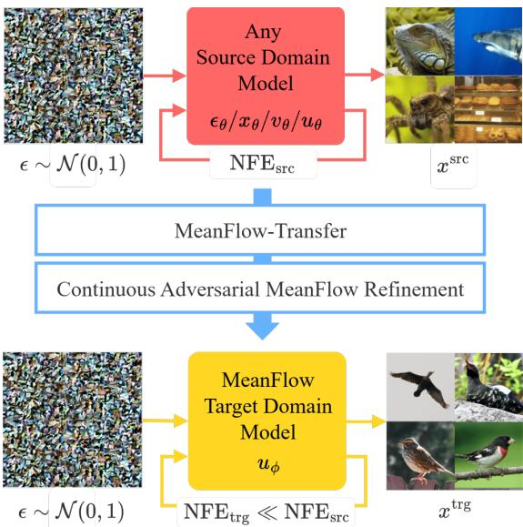
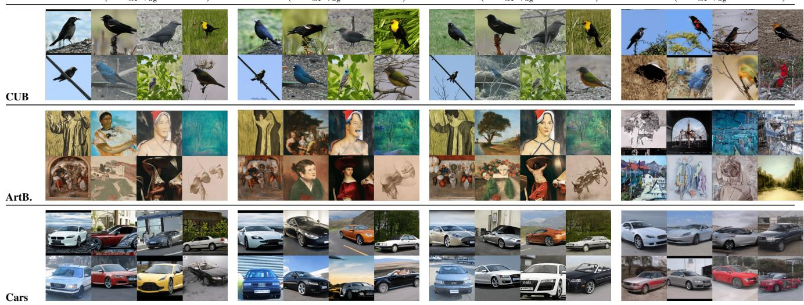
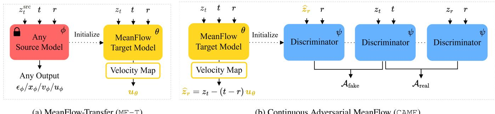
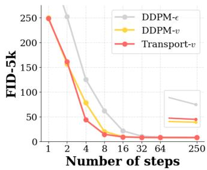
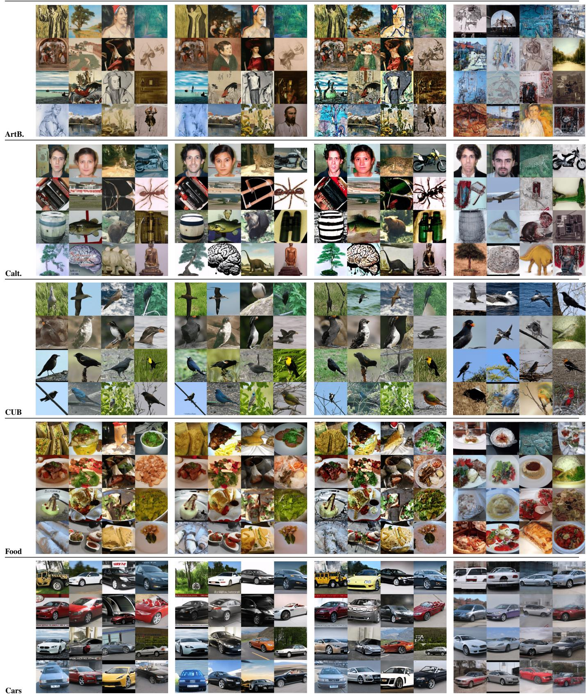

# Continuous Adversarial MeanFlow Transfer

# Yara Bahram<sup>∗</sup>, Zahra Dehghani<sup>∗</sup>, Mélodie Desbos, Eric Granger, Pablo Piantanida, Mohammadhadi Shateri

LIVIA, ILLS, ETS Montreal, Canada

yara.mohammadi-bahram@livia.etsmtl.ca, {mohammadhadi.shateri, eric.granger}@etsmtl.ca

## Abstract

Training fast generators on new domains with limited data remains challenging for two reasons. First, adapting a pretrained difusion or flow model to a new domain leaves its costly multi-step sampling unaddressed, and existing acceleration methods are tied to the source parameterization–ϵ, x, v, or u–leaving heterogeneous pretrained models with no common acceleration target. Second, while adversarial refinement is proven efective for few-step quality, it is formulated only for instantaneous-velocity flows, not for the finite-interval average velocities that MeanFlow (MF) models predict. We address both problems. We propose MeanFlow-Transfer (MF-T), which maps heterogeneous source outputs into a shared velocity representation, uses it to initialize an MF generator from the source weights, and optimizes an MF objective on the target domain. This unifies adaptation and acceleration in a single training loop across a broad range of pretrained models. We then introduce Continuous Adversarial MeanFlow (CAMF), a post-training stage that extends continuous adversarial flow models from instantaneous velocities to MF’s finite-interval average velocities. CAMF contrasts changes in a learned potential between real and predicted interval endpoints, recovering fine detail that MF regression averages away, and reduces to the instantaneous criterion in the vanishing-interval limit. Adapting four ImageNet-based source models–DiT (ϵ), SiT (v), JiT (x), iMF (u)–to five target domains, MF-T with CAMF matches or exceeds the fine-tuned teacher in FID and FDD at up to 125× fewer Neural Function Evaluations (NFEs), while CAMF improves MF-T’s few-step FID by 29% on average<sup>1</sup>.

## 1 Introduction

Pretrained difusion and flow-based generators provide strong generic priors for image synthesis, making them attractive source models for transfer to new domains under limited data (Ouyang et al. 2024; Cao and Gong 2024; Moon et al. 2022; Xie et al. 2023; Zhong et al. 2025; Bahram, Shateri, and Granger 2026; Zhong et al. 2024; Bahram et al. 2026). Yet, adaptation leaves the source generator’s multistep procedure intact, limiting use in applications that require fast and interactive generation. In parallel, few-step generation has advanced rapidly, but these methods are typically standalone generation paradigms rather than recipes for transferring a pretrained model to a new domain (Salimans and Ho 2022; Song et al. 2023; Yin et al. 2024b; Sauer et al.

  
Figure 1: MF-T + CAMF adapts a source-domain difusion or flow model with any output parameterization into a highquality few-step MeanFlow (MF) generator in a target domain with $\mathrm { N F E _ { t r g } } \ll \mathrm { N F E _ { s r c } } \ ( \mathrm { N F E _ { t r g } } \sim \mathrm { N F E _ { s r c } }$ if source model is MF). Source and target domains: ImageNet (Deng et al. 2009) and Birds (Wah et al. 2011).

2024b; Geng et al. 2025a). Thus, acceleration and adaptation have been pursued separately, and where combined only within a single fixed source parameterization (Bahram et al. 2026). This exposes the first obstacle to transfer across models: pretrained generators are not expressed in a common prediction parameterization–they may predict the input x, noise ϵ, instantaneous velocity v, or mean velocity u–so no single accelerate-and-adapt procedure applies across model families. This leaves open how to obtain a fast, high-quality target-domain generator from heterogeneous pretrained models under limited data.

Meeting this need calls for a transfer interface that maps heterogeneous source parameterizations into a shared representation while producing a fast target-domain model. The MeanFlow (MF) family is a natural fit: by modeling average rather than instantaneous velocity, it attains high-quality generation in only a few steps (Geng et al. 2025a,b). Decoupled

  
Figure 2: Target-domain generated images using MF-T+CAMF initialized from diferent source models. Images are uncurated.

MeanFlow (DMF) further post-trains a flow-matching model into a few-step MF generator (Lee, Yu, and Shin 2026), while remaining in the same parameterization and domain.

A second obstacle is intrinsic to few-step generation itself. When each sampling step is a large transport jump, regression-based difusion and flow models tend to average over plausible outputs, producing blurred, less faithful results (Sauer et al. 2024b,a). MF is no exception, and we empirically see this efect intensify under the limited data of transfer. Adversarial post-training is a strong solution for such models, and continuous adversarial flow models (CAFMs) deliver it as a lightweight stage to refine an already-trained flow model at fixed sampling cost (Lin et al. 2026). However, applying adversarial post-training to MF faces a representational gap: CAFMs discriminate an instantaneous velocity, whereas MF predicts finite-interval average velocities. Therefore, a continuous adversarial criterion on MF requires discriminating, at inference, its model’s finite-interval transport, not an instantaneous velocity it never uses.

In this work, we propose MeanFlow-Transfer (MF-T), together with an adversarial post-training stage, Continuous Adversarial MeanFlow (CAMF), addressing both obstacles (Fig. 1). MF-T maps a source model’s output into a shared instantaneous-velocity representation, providing a common interface for source models that predict x, ϵ, v, or u. It then initializes an MF generator from the source weights and fine-tunes on target-domain data with the improved-MF (iMF) objective (Geng et al. 2025b). This unifies adaptation and acceleration in a single loop across a broad range of pretrained models. Crucially, we map parameterizations rather than align schedules: Dif2Flow-style schedule alignment (Schusterbauer et al. 2025) destabilizes training under domain shift and low Neural Function Evaluations (NFEs), whereas our velocity mapping remains stable and improves quality in both scenarios. Then, CAMF refines the adapted MF model by extending continuous adversarial learning from the instantaneous velocities of CAFM (Lin et al. 2026) to the finite-interval average velocity of MF generators. CAMF compares changes in a learned potential between real and predicted interval endpoints, recovering fine detail that MF regression averages away. We further prove that it reduces to the instantaneous criterion in the vanishing-interval limit.

We evaluate MF-T on ImageNet-pretrained DiT (ϵ), SiT (v), JiT (x), iMF (u) models–spanning all four source parameterizations–adapted to five target domains. On its own, MF-T already turns each pretrained source into a fewstep target-domain generator that substantially outperforms standard few-step fine-tuning in FID and FDD. CAMF improves MF-T’s few-step FID by 29% on average, surpassing prior adversarial methods. Used together, MF-T+CAMF match or exceed fine-tuned source model in FID and FDD at up to 125× fewer NFEs.

Contributions. (i) MeanFlow-Transfer (MF-T), a training recipe that adapts a pretrained source model and compresses it into a few-step MF generator through a shared instantaneous-velocity interface for x, ϵ, v, and u parameterizations. We show that mapping parameterizations, rather than aligning schedules, is what makes transfer into MF stable. (ii) Continuous Adversarial MeanFlow (CAMF), an adversarial post-training objective that extends continuous adversarial learning from instantaneous velocities to the finiteinterval average velocities an MF generator predicts, and we prove it reduces to CAFM in the instantaneous limit. (iii) Across four source models spanning x, ϵ, v, and u parameterizations and five target domains, MF-T surpasses standard few-step fine-tuning, and CAMF post-training pushes quality further than prior adversarial methods–matching and often exceeding the fine-tuned source model at 125× fewer NFEs.

## 2 Related Work

Accelerating Difusion and Flow Models. Recent work has devoted substantial efort to accelerating the sampling speed of difusion and flow models. Distillation-based approaches compress a pretrained many-step sampler into a one-step or few-step generator while preserving sample quality (Salimans and Ho 2022; Yin et al. 2024b; Sauer et al. 2024b). Consistency Models (Song et al. 2023) instead learn fewstep generators by enforcing self-consistency along denoising trajectories, either by distillation from a pretrained model or by training from scratch. This idea has been further extended to flow maps, which model transitions between arbitrary timestep pairs (Kim et al. 2024; Bofi, Albergo, and Vanden-Eijnden 2025; Sabour, Fidler, and Kreis 2025). MF is one such formulation, parameterizing the average velocity between timestep pairs (Geng et al. 2025a). Subsequent work improves this framework: Improved MeanFlow (iMF) reformulates the training objective for greater stability (Geng et al. 2025b), while DMF distills flow-matching models into MF generators by conditioning late network blocks on a second timestep (Lee, Yu, and Shin 2026). These accelerated models, however, remain confined to their training domain, and their distillation procedures are typically tied to a specific architecture and prediction parameterization. Consequently, their flexibility for model-agnostic domain transfer is limited.

(a) MeanFlow-Transfer (MF-T)  
  
(b) Continuous Adversarial MeanFlow (CAMF)  
Figure 3: Overview of our two-stage framework. (a) MF-T: a pretrained source generator with an arbitrary output parameterization is mapped to a shared velocity representation and adapted into a target-domain MeanFlow (MF) model that predicts the finite-interval average velocity $u _ { \theta } .$ . (b) CAMF: the MF model transports $z _ { t }$ to the predicted endpoint ${ \widehat { z } } _ { r } = z _ { t } - ( t - r ) u _ { \theta }$ , and the discriminator compares the average change of the potential $D _ { \psi }$ along the real and model-predicted target-domain transport segments, through $\mathcal { A } _ { \mathrm { r e a l } }$ and $\mathcal { A } _ { \mathrm { f a k e } }$

Adaptation and the Acceleration Gap. Pretrained difusion and flow models transfer well to new domains under limited data, motivating extensive work that controls how source priors are forgotten, retained, or re-injected during target-domain adaptation (Ouyang et al. 2024; Hur et al. 2024; Zhong et al. 2024, 2025). Early works emphasize data-eficient transfer (Zhu et al. 2025; Cao and Gong 2024; Wang et al. 2024; Ruiz et al. 2023), and parameter-eficient fine-tuning (PEFT) (Moon et al. 2022; Han et al. 2023; Xie et al. 2023). However, most of these approaches still rely on multi-step sampling at inference, leaving the sampling cost of adapted generators unaddressed. In response, recent work explores the intersection of adaptation and acceleration (Miao et al. 2025; Chadebec et al. 2025; Yin et al. 2024a; Hsiao et al. 2024; Luo et al. 2023): Uni-DAD unifies the two in a single framework (Bahram et al. 2026), and DogFit uses domain-guided fine-tuning for eficient target-domain sampling (Bahram, Shateri, and Granger 2026). Yet these methods remain confined to specific distillation pipelines through tailored guidance mechanisms or source models. None simultaneously achieves fast sampling, high target-domain fidelity, and compatibility across heterogeneous pretrained difusion and flow generators.

Adversarial Learning. Adversarial objectives recover perceptual quality lost under aggressive few-step distillation. Adversarial Difusion Distillation and its latent variant pair an adversarial loss with distillation from a frozen teacher (Sauer et al. 2024b,a), while later methods drop the teacher and rely on the adversarial signal alone (Lin et al. 2025a; Novack et al. 2025). More recent work targets the flow transport process itself: Adversarial Flow Models (AFMs) (Lin et al. 2025b) learn discrete few-step flow maps with an optimal-transport regularizer, and CAFMs (Lin et al. 2026) judge the instantaneous velocity of a continuous-time flow via derivatives of a learned scalar potential. However, none provides a solution for finite-interval average velocity both remain confined to instantaneous velocity models.

Prediction and loss spaces. A recent line of work decouples a model’s output parameterization from its training objective: JiT predicts the clean sample x directly in pixel space while training under a velocity objective (Li and He 2025), and pMF extends this prediction/loss decoupling to the MF formulation (Lu et al. 2026). Dif2Flow post-trains a difusion model with a flow-matching objective by mapping both the output parameterization and noise schedule, showing that naive flow-matching fine-tuning underperforms without this explicit mapping (Schusterbauer et al. 2025). We adopt its parameterization mapping but discard the schedule alignment, as under domain transfer and low NFE, we find that schedule alignment destabilizes training.

## 3 Proposed Method

We address the source-to-target adaptation of pretrained generative models under heterogeneous source parameterizations. A pretrained source generator with parameters ϕ may be an $x \mathrm { - } , \epsilon \mathrm { - } , v -$ , or u-predictor, producing samples $x ^ { \mathrm { s r c } }$ from a source distribution $p _ { \mathrm { s r c } }$ . Given limited target-domain data from $p _ { \mathrm { t r g } } .$ , our goal is to obtain a few-step target generator u with parameters θ that is both adapted to $p _ { \mathrm { t r g } }$ and fast. Our framework reaches this goal in two stages: MeanFlow-Transfer (MF-T) maps any of the four source parameterizations into a shared velocity space and adapts the source into a few-step MF generator on the target domain, and Continuous Adversarial MeanFlow (CAMF) refines that generator with a learned adversarial criterion (See Fig. 3). In what follows, we give background in Sec. 3.1, then present CAMF in Sec. 3.2, and finally describe MF-T in Sec. 3.3.

## 3.1 Background

Flow Matching (FM). FM (Lipman et al. 2023; Liu, Gong, and Liu 2023; Albergo and Vanden-Eijnden 2023) learns a time-dependent velocity field transporting a Gaussian prior $\epsilon \sim \mathcal { N } ( 0 , I )$ to data $x \sim p _ { \mathrm { d a t a } }$ . Let $z _ { t }$ be an intermediate state on a probability path between x and $\epsilon ,$ with instantaneous velocity $\begin{array} { r } { v _ { t } = \frac { d z _ { t } } { d t } } \end{array}$ . FM targets the marginal velocity $v ( z , t ) = \mathbb { E } _ { p _ { t } ( v _ { t } \mid z _ { t } ) } \left[ v _ { t } \right] ^ { * } ,$ , which is not directly accessible. For the linear path $z _ { t } = ( 1 - t ) x + t \epsilon$ , the conditional velocity is $v ^ { * } ( x , \epsilon , t ) \bar { } = \epsilon - x .$ , and a network $v _ { \theta }$ is trained by regression:

$$
\mathcal { L } _ { \mathrm { F M } } = \mathbb { E } _ { t , x , \epsilon } \big [ | v _ { \theta } ( z _ { t } , t ) - v ^ { * } ( x , \epsilon , t ) | ^ { 2 } \big ] ,\tag{1}
$$

whose minimizer recovers the marginal field $v ( z , t )$ (Lipman et al. 2023). The formulation applies unchanged to both conditional (c) and unconditional (∅) generation. We omit the t and c and write $v ( z _ { t } )$ when clear.

MeanFlow (MF). While FM learns the instantaneous velocity $v ( z _ { t } )$ , MF (Geng et al. 2025a) models the average velocity over an interval [r, t]:

$$
u ( z _ { t } , r , t ) \triangleq \frac { 1 } { t - r } \int _ { r } ^ { t } v ( z _ { \tau } ) d \tau .\tag{2}
$$

We write $\boldsymbol { u } ( \boldsymbol { z } _ { t } )$ when $( r , t )$ is clear from context. This integral is intractable to supervise directly, so MF instead uses the MF identity (Geng et al. 2025a), which links the instantaneous and average velocities:

$$
u ( z _ { t } ) = v ( z _ { t } ) - ( t - r ) \frac { d } { d t } u ( z _ { t } ) .\tag{3}
$$

The total derivative is a Jacobian–vector product<sup>2</sup> (JVP) where $\begin{array} { r } { \frac { d } { d t } u ( z _ { t } ) = \mathrm { J V P } _ { z _ { t } , r , t } ( u _ { \theta } ; v , 0 , 1 ) = \partial _ { z } u v + \partial _ { t } u } \end{array}$ . This lets the regression objective be rewritten for a u-predictor. iMF (Geng et al. 2025b) defines the compound velocity:

$$
V _ { \theta } ( z _ { t } ) \triangleq u _ { \theta } ( z _ { t } ) + ( t - r ) s \mathrm { g } \big ( \mathtt { J V P } _ { z _ { t } , r , t } ( u _ { \theta } ; v _ { \theta } , 0 , 1 ) \big ) ,\tag{4}
$$

where sg is stop-gradient and the $\mathrm { J V P }$ uses the model’s predicted instantaneous velocity $v _ { \theta }$ . To allow classifierfree guidance (CFG) (Ho and Salimans 2021) at sampling time, iMF regresses a guided target velocity $v _ { \mathrm { g } } ^ { * } : =$ $v ^ { * } + w \big ( v _ { \theta } ( z _ { t } , c ) - v _ { \theta } ( z _ { t } , \mathcal { O } ) \big )$ where w is the guidance scale (Tang et al. 2025). The model is then trained with an FM-like regression objective:

$$
\mathcal { L } _ { \mathrm { i M F } } = \mathbb { E } _ { t , r , x , \epsilon , w } \left[ \left| \left| V _ { \theta } ( z _ { t } , w ) - s \mathrm { g } ( v _ { g } ^ { * } ) \right| \right| ^ { 2 } \right] ,\tag{5}
$$

where we omit the w dependence when clear. After training, iMF supports few-step sampling by evaluating $u _ { \theta }$ over a coarse sequence of time intervals. Specifically, one-step sampling is achieved via $x = \epsilon - u _ { \theta } ( \epsilon , 0 , 1 )$ ).

Continuous Adversarial Flow Models (CAFMs). Adversarial Flow Models (AFMs) (Lin et al. 2025b) replace FM’s regression target with a learned adversarial criterion. Their generator is a flow map $G _ { \theta } ( z _ { s } , s , t )$ that transports a state $z _ { s }$ to a lower-time state $z _ { t } ,$ , and a discriminator $D _ { \psi } ( \cdot , t )$ scores the generated endpoint state $G _ { \theta } ( z _ { s } , s , t )$ against the real state $z _ { t }$ . Because this raw-endpoint objective becomes ill-conditioned as the interval $s - t$ shrinks, AFMs rely on gradient penalties, discriminator augmentation, and resets for a stable training.

CAFMs (Lin et al. 2026) instead score a diference of a learned potential, and pass to continuous time. They introduce a scalar potential $\dot { \boldsymbol { D } } _ { \psi } ( z _ { t } , t ) : \mathbb { R } ^ { n } \times [ 0 , 1 ] $ R and read a velocity through its directional derivative along the flow, where $\begin{array} { r } { \frac { d } { d t } D _ { \psi } ( z _ { t } , \bar { t } ) = \mathbb { J } \nabla \mathbb { P } _ { z _ { t } , t } ( D _ { \psi } ; v , 1 ) = \partial _ { z } D _ { \psi } \bar { v } + \partial _ { t } D _ { \psi } } \end{array}$ Contrasting the target velocity $v ^ { * }$ against the model velocity v<sub>θ</sub> with a least-squares game $\dot { f } _ { \mathrm { l s } } ( a , \breve { b } ) = ( a - 1 ) ^ { 2 } + ( b + 1 ) ^ { \bar { 2 } }$ the generator and discriminator are trained on reversed pairs:

$$
\begin{array} { r l r } & { \mathcal L _ { \mathrm { C A F M } } ^ { G } = \mathbb E \big [ f _ { \mathrm { l s } } \big ( \mathbb { J } \nabla \mathbb { P } _ { z _ { t } , t } ( D _ { \psi } ; v _ { \theta } , 1 ) , \mathbb { J } \nabla \mathbb { P } _ { z _ { t } , t } ( D _ { \psi } ; v ^ { * } , 1 ) \big ) \big ] , } & \\ & { \mathcal L _ { \mathrm { C A F M } } ^ { D } = \mathbb E \big [ f _ { \mathrm { l s } } \big ( \mathbb { J } \nabla \mathbb { P } _ { z _ { t } , t } ( D _ { \psi } ; v ^ { * } , 1 ) , \mathbb { J } \nabla \mathbb { P } _ { z _ { t } , t } ( D _ { \psi } ; v _ { \theta } , 1 ) \big ) \big ] } & \\ & { + \lambda _ { \mathrm { c p } } \mathbb E \big [ D _ { \psi } ( z _ { t } , t ) ^ { 2 } \big ] . } & { ( 6 ) } & \end{array}
$$

The last term is a centering penalty (CP): as the criterion depends only on diferences and derivatives of $D _ { \psi } .$ , its absolute value can drift, and penalizing $\mathbb { E } [ D _ { \psi } ^ { 2 } ]$ fixes this gauge. Crucially, $\mathrm { J V P } _ { z _ { t } , t } ( D _ { \psi } ; v , 1 )$ scores an instantaneous tangent–a velocity an MF generator never executes, as each of its steps is a finite jump of size $t - r$ . This motivates the MF-compatible formulation introduced next.

## 3.2 Continuous Adversarial MeanFlow Model

Few-step MF training uses a regression objective that aligns average velocities only locally and does not explicitly enforce distribution-level realism of the transport–a limitation most acute under scarce target data. We therefore introduce an adversarial post-training stage that replaces this pointwise criterion with a learned one, initialized from a target-domain MF checkpoint. Following CAFM, we use a scalar discriminator potential $D _ { \psi }$ . Given a target-domain sample $x \sim p _ { \mathrm { t r g } } ,$ noise $\epsilon \sim \mathcal { N } ( 0 , \dot { I } )$ , and two times $0 \leq r < t \leq 1$ , the states on the target interpolation path are $z _ { t } = ( 1 - t ) x + t \epsilon$ and $z _ { r } = ( 1 - r ) x + r \epsilon$ . The MF generator predicts an average velocity over $[ r , t ]$ and induces the lower-time model endpoint:

$$
\widehat { z } _ { r } = z _ { t } - ( t - r ) u _ { \theta } ( z _ { t } , w ) .\tag{7}
$$

The adversarial criterion contrasts these two lower-time endpoints, driving the model endpoints toward the real targetdomain endpoints. We define a finite-interval discriminator score:

$$
\mathcal { A } _ { \psi } ( z _ { t } , z _ { r } ; t , r ) = \frac { D _ { \psi } ( z _ { t } , t ) - D _ { \psi } ( z _ { r } , r ) } { t - r } .\tag{8}
$$

The scores of the real and model-predicted endpoints are contrasted with a least-squares game $f _ { \mathrm { l s } }$ (Lin et al. 2026):

$$
\mathcal { L } _ { \mathtt { C A M F } } ^ { G } = \mathbb { E } _ { x , \epsilon , t , r } \Big [ f _ { \mathrm { l s } } \big ( \mathcal { A } _ { \psi } ( z _ { t } , \widehat { z } _ { r } ; t , r ) , \mathcal { A } _ { \psi } ( z _ { t } , z _ { r } ; t , r ) \big ) \Big ] ,\tag{9}
$$

where only the fake score depends on the generator while the real score is generator-independent. During the discriminator update, $\widehat { z } _ { r }$ is detached from the generator’s computation graph, and the discriminator optimizes the reversed pair:

$$
\begin{array} { r l } & { \mathcal { L } _ { \mathtt { C a M F } } ^ { D } = \mathbb { E } _ { x , \epsilon , t , r } \Big [ f _ { \mathrm { l s } } \big ( \mathcal { A } _ { \psi } ( z _ { t } , z _ { r } ; t , r ) , \mathcal { A } _ { \psi } ( z _ { t } , \widehat { z } _ { r } ; t , r ) \big ) \Big ] } \\ & { \quad \quad + \lambda _ { \mathrm { c p } } \mathbb { E } _ { x , \epsilon , r , t } \Big [ D _ { \psi } ( z _ { t } , t ) ^ { 2 } + D _ { \psi } ( z _ { r } , r ) ^ { 2 } + D _ { \psi } ( \widehat { z } _ { r } , r ) ^ { 2 } \Big ] . } \end{array}\tag{10}
$$

where we extend the CAFM’s centering penalty to regularize all absolute potential values. Unlike AFM’s raw endpoint logit, $\mathcal { A } _ { \psi }$ scores an increment of the potential measured from the common value $D _ { \psi } ( z _ { t } , t )$ normalized by $t - r ;$ this normalization grants shift-invariance and reduction to CAFM as $t  r$ (Prop. 1). The centering penalty keeps the score well-conditioned in face of amplified fluctuations caused by the $1 / ( t - r )$ factor of $D _ { \psi } \left( \mathrm { T a b } . 3 \right)$ . Finally, we set $\lambda _ { \mathrm { o t } } = 0$ as even in presence of distribution shift, starting from a MF generator that already realizes a low-cost transport renders a transport-norm regularizer unnecessary and detrimental in performance (Lin et al. 2025b, 2026) (Tab. 4).

Proposition 1 (Consistency with CAFM). Fix $( z _ { t } , t )$ and let $\Delta = t - r .$ . Let $D _ { \psi }$ be diferentiable, let the real endpoint $z _ { r }$ satisfy $z _ { t } - z _ { r } = \Delta v ^ { * }$ , and let the predicted endpoint be $\widehat { z } _ { r } = z _ { t } - \Delta u _ { \theta } ( z _ { t } , r , t , c , w )$ . Then:

$$
\begin{array} { r l } & { \mathcal { A } _ { \psi } ( z _ { t } , z _ { r } ; t , r ) \xrightarrow [ r \to t ] { } \mathcal { I } V P _ { z _ { t } , t } \bigl ( D _ { \psi } ; v ^ { * } , 1 \bigr ) , } \\ & { \mathcal { A } _ { \psi } ( z _ { t } , \widehat { z } _ { r } ; t , r ) \xrightarrow [ r \to t ] { } \mathcal { I } V P _ { z _ { t } , t } \bigl ( D _ { \psi } ; v _ { \theta } , 1 \bigr ) , } \\ & { \qquad v _ { \theta } = u _ { \theta } ( z _ { t } , t , t , c , w ) . } \end{array}\tag{11}
$$

Thus, as the interval vanishes, the CAMF game $( \mathcal { A } _ { \mathrm { r e a l } } , \mathcal { A } _ { \mathrm { f a k e } } )$ converges to the CAFM game, with the model’s (guided) instantaneous velocity $v _ { \theta }$ in place ofCAFM’s instantaneous generator velocity (proofin Appx. A.2).

Proposition 1 shows our criterion strictly generalizes CAFM: it recovers the CAFM game as $r  t ,$ while for $r < t$ it scores the finite-interval average velocity an MF generator actually executes. So CAMF inherits CAFM’s potentialbased formulation and trains without the gradient penalties, discriminator augmentation, or resets that raw-endpoint adversarial flow models require (Lin et al. 2025b). CAMF is guidance-aware: the generator and discriminator share a sampled CFG scale w, so both the regression target and the generated endpoints are taken at the same guided operating point. Sampling is unchanged from MF, as the discriminator is used only during training. The complete CAMF post-training procedure is given in Appx. A.4 Alg. 3.

## 3.3 MeanFlow-Transfer

The adversarial stage of Sec. 3.2 operates on a MF generator. We now describe how MF-T obtains that generator under limited target data in a single stage. Pretrained sources predict in diferent spaces–x,ϵ,v, or u. Our starting point is that, on a fixed interpolation path, any such prediction inverts to the same underlying velocity: on the linear path $z _ { t } = ( 1 - t ) x +$ $t \epsilon .$ we recover v from each parameterization consistently (Tab. 1). This recovered velocity initializes the target MF generator u that is fine-tuned on target data with the iMF objective (Sec. 3.1). For single-timestep sources (non-flowmap x-, ϵ-, or v-predictors), we follow DMF (Lee, Yu, and Shin 2026) and add a second timestep input to the same architecture, so that the source model can be transformed into a MF model. The initialization and complete MF-T training procedure are provided in Alg. 1 and 2 in Appx. A.4.

Table 1: MF-T initialization from any source parameterization. Under the linear interpolation path, $\mathrm { M E - T }$ recovers a consistent instantaneous velocity from each prediction space and uses it to initialize the target MeanFlow model $u _ { \theta } .$
<table><tr><td colspan="3">Source prediction space</td></tr><tr><td>x</td><td>€ v</td><td>u</td></tr><tr><td colspan="3">Source prediction</td></tr><tr><td> $x _ { \phi } ( z _ { t } )$ </td><td> $\epsilon _ { \phi } \mathopen { } \mathclose \bgroup \left( z _ { t } \aftergroup \egroup \right)$   $v _ { \phi } \big ( z _ { t } \big )$ </td><td> $u _ { \phi } ( z _ { t } )$ </td></tr><tr><td>Recovered instantaneous velocity vψ(zt)</td><td></td><td></td></tr><tr><td> $\underline { { z _ { t } - x _ { \phi } ( z _ { t } ) } }$ </td><td></td><td> $u _ { \phi } \mathopen { } \mathclose \bgroup \left( z _ { t } , t , t \aftergroup \egroup \right) ^ { \dagger }$ </td></tr><tr><td>t</td><td> $\frac { \epsilon _ { \phi } ( z _ { t } ) - z _ { t } } { 1 - t }$   $v _ { \phi } \big ( z _ { t } \big )$ </td><td></td></tr><tr><td colspan="3">MeanFlow-Transfer initialization</td></tr><tr><td> $u _ { \theta }  v _ { \phi }$ </td><td> $u _ { \theta }  v _ { \phi }$ </td><td> $u _ { \theta }  v _ { \phi }$   $u _ { \theta } \gets u _ { \phi }$ </td></tr></table>

We use the v head when available (e.g., iMF (Geng et al. 2025b)), or recover it via u.

Velocity mapping over schedule alignment. A natural alternative reconciles the source and target schedules, as in Dif2Flow (Schusterbauer et al. 2025). We compare both on a frozen ImageNet DiT (Peebles and Xie 2023) trained with a DDPM schedule (Ho, Jain, and Abbeel 2020) to predict $\epsilon \left( \mathrm { D D P M } \mathrm { - } \epsilon \right)$ . Keeping the DDPM trajectory and only converting the predicted noise to its induced velocity (DDPMv) changes the parameterization alone, yet ${ \mathrm { F i g . } }$ 4a shows it already inherits few-step eficiency with no fine-tuning. Additionally mapping the schedule onto a linear path following Dif2Flow (Transport-v) still preserves these gains. Under domain transfer, however, the two behave oppositely: Fig. 4b shows that the schedule alignment of Transport-v destabilizes training under domain shift and low NFE, while the mere velocity re-parameterization of DDPM-v improves generalization. The schedule alignment is even more catastrophic under the $\mathbf { D i T }  \mathbf { M F } \mathrm { - T }$ objective. We hypothesize this to stem from the $\mathrm { J V P } ^ { \bullet } \mathrm { s }$ brittleness in the MF identity. We therefore only adopt velocity mapping, avoiding schedule alignment (more details in Appx. A.1).

## 4 Results and Discussion

## 4.1 Experimental Setup

As source models, we use ImageNet generators spanning all four prediction parameterizations: DiT/XL-2 (Peebles and Xie 2023) $( \epsilon ) ,$ SiT/XL-2 (Ma et al. 2024) (v), JiT/H-16 (Li and He 2025) (x), and iMF/XL-2 (Geng et al. 2025b) $( u )$ . We adapt each to a diverse set of labeled target domains: ArtBench (ArtB.) (Liao et al. 2022), Caltech (Calt.) (Grifin et al. 2007), CUB-Birds (CUB) (Wah et al. 2011), Food (Bossard, Guillaumin, and Van Gool 2014), and

Table 2: Quantitative comparison with baselines across four ImageNet-initialized models and five target datasets. We report FID and FDD across diferent NFEs after adaptation to target-domain. AFM and CAMF as stand-alone methods are only tested on iMF/XL-2 where the initial model is MF-based (with MF-T ≈ FT on iMF). Bold: best average result under each model initialization and NFE. Underlined: best average result under each model initialization across all NFEs.
<table><tr><td rowspan=2 colspan=14>FID↓                                          FDD↓ImageNet Init.   Method       NFE ArtB. Calt. CUB Food  Cars  Avg.</td></tr><tr><td rowspan=1 colspan=6>ArtB. Calt. CUB Food Cars Avg.</td></tr><tr><td rowspan=1 colspan=8>AFM           4   15.8455.97 9.86 11.86 12.3921.18</td><td rowspan=1 colspan=6>290.571007.22570.89 476.94 440.94 557.31</td></tr><tr><td rowspan=1 colspan=1></td><td rowspan=1 colspan=1>CAMF          4</td><td rowspan=1 colspan=1>10.80</td><td rowspan=1 colspan=1>44.42</td><td rowspan=1 colspan=2>9.34 10.60</td><td rowspan=1 colspan=2>11.1917.27</td><td rowspan=1 colspan=1>221.40</td><td rowspan=1 colspan=3>812.31 367.57 409.74</td><td rowspan=1 colspan=1>293.50</td><td rowspan=1 colspan=1>420.90</td></tr><tr><td rowspan=1 colspan=1></td><td rowspan=1 colspan=2>MF-T          4   10.60</td><td rowspan=1 colspan=1>27.54</td><td rowspan=1 colspan=1>7.26</td><td rowspan=1 colspan=1>10.58</td><td rowspan=1 colspan=2>9.69 13.13</td><td rowspan=1 colspan=1>273.28</td><td rowspan=1 colspan=3>471.09 310.62 465.38</td><td rowspan=1 colspan=1>276.53</td><td rowspan=1 colspan=1>359.38</td></tr><tr><td rowspan=1 colspan=1></td><td rowspan=1 colspan=2>MF-T + AFM    4   8.67</td><td rowspan=1 colspan=1>22.19</td><td rowspan=1 colspan=1>3.01</td><td rowspan=1 colspan=1>7.03</td><td rowspan=1 colspan=2>4.13 9.01</td><td rowspan=1 colspan=1>180.29</td><td rowspan=1 colspan=1>371.61</td><td rowspan=1 colspan=1>75.72</td><td rowspan=1 colspan=1>298.54</td><td rowspan=1 colspan=1>141.25</td><td rowspan=1 colspan=1>213.48</td></tr><tr><td rowspan=1 colspan=1>iMF/XL-2</td><td rowspan=1 colspan=1>MF-T + CAMF  4</td><td rowspan=1 colspan=1>6.71</td><td rowspan=1 colspan=1>22.10</td><td rowspan=1 colspan=1>2.88</td><td rowspan=1 colspan=1>4.65</td><td rowspan=1 colspan=2>3.07 7.88</td><td rowspan=1 colspan=1>146.40</td><td rowspan=1 colspan=1>378.09</td><td rowspan=1 colspan=1>84.24</td><td rowspan=1 colspan=1>239.28</td><td rowspan=1 colspan=1>102.37</td><td rowspan=1 colspan=1>190.08</td></tr><tr><td rowspan=1 colspan=1>(Geng et al. 2025b)</td><td rowspan=1 colspan=1>AFM           1</td><td rowspan=1 colspan=1>82.14</td><td rowspan=1 colspan=1>71.62</td><td rowspan=1 colspan=1>23.76</td><td rowspan=1 colspan=1>30.06</td><td rowspan=1 colspan=2>25.2746.57</td><td rowspan=1 colspan=1>814.40</td><td rowspan=1 colspan=1>1133.85</td><td rowspan=1 colspan=1>773.17</td><td rowspan=1 colspan=1>817.06</td><td rowspan=1 colspan=1>648.57</td><td rowspan=1 colspan=1>837.41</td></tr><tr><td rowspan=1 colspan=1></td><td rowspan=1 colspan=1>CAMF          1</td><td rowspan=1 colspan=1>31.75</td><td rowspan=1 colspan=1>91.44</td><td rowspan=1 colspan=1>32.00</td><td rowspan=1 colspan=1>33.20</td><td rowspan=1 colspan=2>59.8349.64</td><td rowspan=1 colspan=1>359.07</td><td rowspan=1 colspan=1>1230.20</td><td rowspan=1 colspan=1>775.99</td><td rowspan=1 colspan=1>706.52</td><td rowspan=1 colspan=1>826.35</td><td rowspan=1 colspan=1>779.63</td></tr><tr><td rowspan=1 colspan=1></td><td rowspan=1 colspan=1>MF-T          1</td><td rowspan=1 colspan=1>11.21</td><td rowspan=1 colspan=1>34.92</td><td rowspan=1 colspan=1>11.74</td><td rowspan=1 colspan=1>12.20</td><td rowspan=1 colspan=2>15.41 17.10</td><td rowspan=1 colspan=1>268.85</td><td rowspan=1 colspan=2>611.91 423.50</td><td rowspan=1 colspan=1>521.62</td><td rowspan=1 colspan=1>403.39</td><td rowspan=1 colspan=1>445.85</td></tr><tr><td rowspan=1 colspan=1></td><td rowspan=1 colspan=1>MF-T + AFM    1</td><td rowspan=1 colspan=1>26.89</td><td rowspan=1 colspan=1>29.08</td><td rowspan=1 colspan=1>6.03</td><td rowspan=1 colspan=1>16.61</td><td rowspan=1 colspan=1>8.51</td><td rowspan=1 colspan=1>17.42</td><td rowspan=1 colspan=1>361.46</td><td rowspan=1 colspan=1>513.52</td><td rowspan=1 colspan=1>192.51</td><td rowspan=1 colspan=1>452.02</td><td rowspan=1 colspan=1>267.58</td><td rowspan=1 colspan=1>357.42</td></tr><tr><td rowspan=1 colspan=1></td><td rowspan=1 colspan=1>MF-T + CAMF  1</td><td rowspan=1 colspan=1>10.12</td><td rowspan=1 colspan=1>29.07</td><td rowspan=1 colspan=1>5.40</td><td rowspan=1 colspan=1>8.87</td><td rowspan=1 colspan=2>15.5113.79</td><td rowspan=1 colspan=1>190.04</td><td rowspan=1 colspan=1>502.99</td><td rowspan=1 colspan=1>179.49</td><td rowspan=1 colspan=1>333.72</td><td rowspan=1 colspan=1>352.35</td><td rowspan=1 colspan=1>311.72</td></tr><tr><td rowspan=1 colspan=1></td><td rowspan=1 colspan=1>FT          250×2</td><td rowspan=1 colspan=1>10.21</td><td rowspan=1 colspan=1>24.20</td><td rowspan=1 colspan=1>4.19</td><td rowspan=1 colspan=1>6.81</td><td rowspan=1 colspan=2>6.93 10.47</td><td rowspan=1 colspan=1>205.05</td><td rowspan=1 colspan=1>399.26</td><td rowspan=1 colspan=1>111.66</td><td rowspan=1 colspan=1>343.67</td><td rowspan=1 colspan=1>185.82</td><td rowspan=1 colspan=1>249.09</td></tr><tr><td rowspan=1 colspan=1></td><td rowspan=1 colspan=1>FT           4×2</td><td rowspan=1 colspan=1>36.11</td><td rowspan=1 colspan=1>33.26</td><td rowspan=1 colspan=1>14.33</td><td rowspan=1 colspan=1>22.22</td><td rowspan=1 colspan=2>34.8328.15</td><td rowspan=1 colspan=1>457.69</td><td rowspan=1 colspan=1>543.04</td><td rowspan=1 colspan=1>310.21</td><td rowspan=1 colspan=1>620.82</td><td rowspan=1 colspan=1>624.10</td><td rowspan=1 colspan=1>511.17</td></tr><tr><td rowspan=1 colspan=1>SiT/XL-2</td><td rowspan=1 colspan=1>MF-T          4</td><td rowspan=1 colspan=1>14.56</td><td rowspan=1 colspan=1>25.80</td><td rowspan=1 colspan=1>5.25</td><td rowspan=1 colspan=1>9.44</td><td rowspan=1 colspan=1>4.77</td><td rowspan=1 colspan=1>11.96</td><td rowspan=1 colspan=1>274.67</td><td rowspan=1 colspan=1>474.45</td><td rowspan=1 colspan=1>205.34</td><td rowspan=1 colspan=1>431.78</td><td rowspan=1 colspan=1>178.80</td><td rowspan=1 colspan=1>313.01</td></tr><tr><td rowspan=1 colspan=1>(Ma et al. 2024)</td><td rowspan=1 colspan=1>MF-T + CAMF  4</td><td rowspan=1 colspan=1>12.74</td><td rowspan=1 colspan=1>24.02</td><td rowspan=1 colspan=1>3.91</td><td rowspan=1 colspan=1>7.48</td><td rowspan=1 colspan=1>3.33</td><td rowspan=1 colspan=1>10.30</td><td rowspan=1 colspan=1>238.46</td><td rowspan=1 colspan=1>413.38</td><td rowspan=1 colspan=1>133.85</td><td rowspan=1 colspan=1>311.51</td><td rowspan=1 colspan=1>108.73</td><td rowspan=1 colspan=1>241.19</td></tr><tr><td rowspan=1 colspan=1></td><td rowspan=1 colspan=1>FT†          1×2</td><td rowspan=1 colspan=1>459.70</td><td rowspan=1 colspan=1>279.79</td><td rowspan=1 colspan=1>301.13</td><td rowspan=1 colspan=1>275.52</td><td rowspan=1 colspan=1>327.76</td><td rowspan=1 colspan=1>328.78</td><td rowspan=1 colspan=1>3263.97</td><td rowspan=1 colspan=1>2918.49</td><td rowspan=1 colspan=1>3468.16</td><td rowspan=1 colspan=1>2900.06</td><td rowspan=1 colspan=1>3589.74</td><td rowspan=1 colspan=1>3228.04</td></tr><tr><td rowspan=1 colspan=1></td><td rowspan=1 colspan=1>MF-T          1</td><td rowspan=1 colspan=1>21.79</td><td rowspan=1 colspan=1>55.21</td><td rowspan=1 colspan=1>13.72</td><td rowspan=1 colspan=1>19.93</td><td rowspan=1 colspan=1>14.47</td><td rowspan=1 colspan=1>25.02</td><td rowspan=1 colspan=1>424.89</td><td rowspan=1 colspan=1>878.25</td><td rowspan=1 colspan=1>503.24</td><td rowspan=1 colspan=1>868.71</td><td rowspan=1 colspan=1>476.18</td><td rowspan=1 colspan=1>630.25</td></tr><tr><td rowspan=1 colspan=1></td><td rowspan=1 colspan=1>MF-T + CAMF  1</td><td rowspan=1 colspan=1>18.35</td><td rowspan=1 colspan=1>46.53</td><td rowspan=1 colspan=1>8.68</td><td rowspan=1 colspan=1>15.10</td><td rowspan=1 colspan=1>9.60</td><td rowspan=1 colspan=1>19.65</td><td rowspan=1 colspan=1>375.82</td><td rowspan=1 colspan=1>738.91</td><td rowspan=1 colspan=1>361.83</td><td rowspan=1 colspan=1>665.75</td><td rowspan=1 colspan=1>343.27</td><td rowspan=1 colspan=1>497.12</td></tr><tr><td rowspan=1 colspan=1></td><td rowspan=1 colspan=1>FT          250×2</td><td rowspan=1 colspan=1>11.90</td><td rowspan=1 colspan=1>24.47</td><td rowspan=1 colspan=1>7.75</td><td rowspan=1 colspan=1>9.26</td><td rowspan=1 colspan=1>5.95</td><td rowspan=1 colspan=1>11.87</td><td rowspan=1 colspan=1>211.02</td><td rowspan=1 colspan=1>394.66</td><td rowspan=1 colspan=1>167.75</td><td rowspan=1 colspan=1>277.95</td><td rowspan=1 colspan=1>164.10</td><td rowspan=1 colspan=1>243.10</td></tr><tr><td rowspan=1 colspan=1></td><td rowspan=1 colspan=1>FT           8×2</td><td rowspan=1 colspan=1>142.86</td><td rowspan=1 colspan=1>67.94</td><td rowspan=1 colspan=1>61.16</td><td rowspan=1 colspan=1>89.77</td><td rowspan=1 colspan=1>99.02</td><td rowspan=1 colspan=1>92.15</td><td rowspan=1 colspan=1>991.02</td><td rowspan=1 colspan=1>812.76</td><td rowspan=1 colspan=1>738.70</td><td rowspan=1 colspan=1>1284.66</td><td rowspan=1 colspan=1>1141.83</td><td rowspan=1 colspan=1>993.79</td></tr><tr><td rowspan=1 colspan=1></td><td rowspan=1 colspan=1>MF-T          8</td><td rowspan=1 colspan=1>33.48</td><td rowspan=1 colspan=1>32.17</td><td rowspan=1 colspan=1>8.27</td><td rowspan=1 colspan=1>33.44</td><td rowspan=1 colspan=1>9.83</td><td rowspan=1 colspan=1>23.44</td><td rowspan=1 colspan=1>325.72</td><td rowspan=1 colspan=1>475.90</td><td rowspan=1 colspan=1>222.81</td><td rowspan=1 colspan=1>614.30</td><td rowspan=1 colspan=1>259.65</td><td rowspan=1 colspan=1>379.68</td></tr><tr><td rowspan=1 colspan=1>DiT/XL-2</td><td rowspan=1 colspan=1>MF-T + CAMF  8</td><td rowspan=1 colspan=1>10.62</td><td rowspan=1 colspan=1>31.18</td><td rowspan=1 colspan=1>3.70</td><td rowspan=1 colspan=1>6.46</td><td rowspan=1 colspan=1>3.90</td><td rowspan=1 colspan=1>11.17</td><td rowspan=1 colspan=1>162.34</td><td rowspan=1 colspan=1>477.88</td><td rowspan=1 colspan=1>100.97</td><td rowspan=1 colspan=1>201.57</td><td rowspan=1 colspan=1>115.86</td><td rowspan=1 colspan=1>211.72</td></tr><tr><td rowspan=1 colspan=1>(Peebles and Xie 2023)</td><td rowspan=1 colspan=1>FT          4×2</td><td rowspan=1 colspan=1>194.80</td><td rowspan=1 colspan=1>123.03</td><td rowspan=1 colspan=1>147.18</td><td rowspan=1 colspan=1>199.16</td><td rowspan=1 colspan=1>196.13</td><td rowspan=1 colspan=1>172.06</td><td rowspan=1 colspan=1>1726.58</td><td rowspan=1 colspan=1>1309.74</td><td rowspan=1 colspan=1>1874.65</td><td rowspan=1 colspan=1>2295.54</td><td rowspan=1 colspan=1>2053.23</td><td rowspan=1 colspan=1>1851.95</td></tr><tr><td rowspan=1 colspan=1></td><td rowspan=1 colspan=1>MF-T          4</td><td rowspan=1 colspan=1>47.26</td><td rowspan=1 colspan=1>48.64</td><td rowspan=1 colspan=1>22.38</td><td rowspan=1 colspan=1>57.86</td><td rowspan=1 colspan=1>40.68</td><td rowspan=1 colspan=1>43.36</td><td rowspan=1 colspan=1>608.87</td><td rowspan=1 colspan=1>609.80</td><td rowspan=1 colspan=1>512.50</td><td rowspan=1 colspan=1>1026.30</td><td rowspan=1 colspan=1>629.40</td><td rowspan=1 colspan=1>677.37</td></tr><tr><td rowspan=1 colspan=1></td><td rowspan=1 colspan=1>MF-T + CAMF  4</td><td rowspan=1 colspan=1>43.60</td><td rowspan=1 colspan=1>48.30</td><td rowspan=1 colspan=1>5.33</td><td rowspan=1 colspan=1>31.82</td><td rowspan=1 colspan=1>17.54</td><td rowspan=1 colspan=1>29.32</td><td rowspan=1 colspan=2>478.56608.64</td><td rowspan=1 colspan=1>172.63</td><td rowspan=1 colspan=1>543.18</td><td rowspan=1 colspan=1>277.29</td><td rowspan=1 colspan=1>416.06</td></tr><tr><td rowspan=1 colspan=1></td><td rowspan=1 colspan=1>FT          50×2</td><td rowspan=1 colspan=1>15.27</td><td rowspan=1 colspan=1>35.72</td><td rowspan=1 colspan=1>5.68</td><td rowspan=1 colspan=1>12.47</td><td rowspan=1 colspan=2>15.7016.97</td><td rowspan=1 colspan=2>359.10 602.10</td><td rowspan=1 colspan=1>278.70</td><td rowspan=1 colspan=1>425.08</td><td rowspan=1 colspan=1>332.44</td><td rowspan=1 colspan=1>399.48</td></tr><tr><td rowspan=1 colspan=1>JiT/H-16</td><td rowspan=1 colspan=1>FT           4×2</td><td rowspan=1 colspan=1>44.03</td><td rowspan=1 colspan=1>66.05</td><td rowspan=1 colspan=1>25.03</td><td rowspan=1 colspan=1>37.60</td><td rowspan=1 colspan=2>40.9842.74</td><td rowspan=1 colspan=1>599.80</td><td rowspan=1 colspan=1>939.96</td><td rowspan=1 colspan=1>524.17</td><td rowspan=1 colspan=1>820.81</td><td rowspan=1 colspan=1>767.51</td><td rowspan=1 colspan=1>730.45</td></tr><tr><td rowspan=1 colspan=1>(Li and He 2025)</td><td rowspan=1 colspan=1>MF-T          4</td><td rowspan=1 colspan=1>24.07</td><td rowspan=1 colspan=1>60.98</td><td rowspan=1 colspan=1>14.65</td><td rowspan=1 colspan=1>24.80</td><td rowspan=1 colspan=2>21.2229.14</td><td rowspan=1 colspan=1>360.67</td><td rowspan=1 colspan=1>913.56</td><td rowspan=1 colspan=1>417.14</td><td rowspan=1 colspan=1>768.58</td><td rowspan=1 colspan=1>619.10</td><td rowspan=1 colspan=1>615.81</td></tr><tr><td rowspan=1 colspan=1></td><td rowspan=1 colspan=1>MF-T + CAMF  4</td><td rowspan=1 colspan=1>19.62</td><td rowspan=1 colspan=1>53.02</td><td rowspan=1 colspan=1>7.29</td><td rowspan=1 colspan=1>18.07</td><td rowspan=1 colspan=2>12.5522.11</td><td rowspan=1 colspan=1>317.47</td><td rowspan=1 colspan=1>770.15</td><td rowspan=1 colspan=1>311.59</td><td rowspan=1 colspan=1>589.29</td><td rowspan=1 colspan=1>380.78</td><td rowspan=1 colspan=1>473.86</td></tr></table>

<sup>†</sup> At the corresponding NFE settings, FT produces samples that are perceptually indistinguishable from noise.

Stanford-Cars (Cars) (Krause et al. 2013), chosen to span diverse semantic domains and domain-shift magnitudes, following prior transfer studies (Bahram, Shateri, and Granger 2026; Zhong et al. 2025; Xie et al. 2023). We evaluate MF-T and CAMF both separately and combined, comparing against standard fine-tuning (FT) and the adversarial baseline AFM (Lin et al. 2025b). We report quality at 1, 4, 8, and 250 NFE using FID, FD<sub>DINOv2</sub> (FDD), and IS, computed between 10K generated samples and the full target dataset, at 256 × 256 resolution. For FT, CFG-based generation efectively doubles the NFE (e.g., 250×2). All training uses a single H100 GPU. MF-T and FT are trained for 30K steps (40K for JiT); CAMF and AFM run for 30K generator steps when applied after MF-T (e.g., MF-T+CAMF) and 60K otherwise. All models converge within these budgets, and results use the best 4-step-FID checkpoint. CAMF uses a 5K-step discriminator-only warm-up, then 4 discriminator updates per generator update. Our MF-T code builds on iMF and our CAMF code on CAFM. Full hyperparameters and per-backbone details, along with computational cost analysis are in Appx. A.3.

## 4.2 Main Results

CAMF refinement pairs with MF-T better than raw source. We first isolate the adversarial stage on an iMF/XL-2 source, whose MF parameterization lets CAMF and AFM be applied either directly to the source-domain model or as post-training on top of MF-T (Tab. 2). Applied cold to the source model, both adversarial criteria are weak and worse than MF-T alone (13.13). Used instead as a post-training stage on the MF-T checkpoint, CAMF improves markedly to 7.88 (and 13.79 at 1 NFE), the best result in every setting. It also outperforms AFM as the post-trainer (9.01 at 4 NFE). CAMF refinement thus delivers its gains hand-in-hand with MF-T, which supplies the adapted, low-cost transport map it builds on. IS results in Appx A.6 Tab. 6 show similar trends.



<table><tr><td></td><td></td><td></td><td colspan="4">FID ↓</td><td colspan="4">FDD↓</td></tr><tr><td>Transformation</td><td>Objective</td><td>NFE</td><td>ArtB.</td><td>CUB</td><td>Cars</td><td>Avg.</td><td>ArtB.</td><td>CUB</td><td>Cars</td><td>Avg.</td></tr><tr><td rowspan="6">DiT → SiT</td><td>DDPM-€</td><td>250×2</td><td>11.00</td><td>4.36</td><td>5.23</td><td>6.87</td><td>227.2</td><td>112.8</td><td>167.5</td><td>169.2</td></tr><tr><td>DDPM-v</td><td>250×2</td><td>15.29</td><td>4.35</td><td>9.12</td><td>9.59</td><td>258.1</td><td>121.2</td><td>257.8</td><td>212.4</td></tr><tr><td>Transport-v</td><td>250×2</td><td>12.49</td><td>5.14</td><td>6.48</td><td>8.03</td><td>244.8</td><td>113.9</td><td>166.5</td><td>175.1</td></tr><tr><td>DDPM-€</td><td>4×2</td><td>46.37</td><td>16.09</td><td>18.98</td><td>27.14</td><td>494.8</td><td>296.5</td><td>412.1</td><td>401.1</td></tr><tr><td>DDPM-v</td><td>4×2</td><td>37.48</td><td>13.44</td><td>27.49</td><td>26.14</td><td>464.4</td><td>300.1</td><td>540.2</td><td>434.9</td></tr><tr><td>Transport-v</td><td>4×2</td><td>43.57</td><td>73.07</td><td>88.88</td><td>68.51</td><td>538.0</td><td>852.4</td><td>1156.6</td><td>849.0</td></tr><tr><td rowspan="3">DiT → MF-T</td><td>DDPM-€</td><td>4</td><td>108.86</td><td>47.07</td><td>51.42</td><td>69.12</td><td>812.6</td><td>625.6</td><td>772.0</td><td>736.7</td></tr><tr><td>DDPM-v</td><td>4</td><td>44.52</td><td>17.22</td><td>24.97</td><td>28.90</td><td>577.4</td><td>437.2</td><td>472.4</td><td>495.7</td></tr><tr><td>Transport-v</td><td>4</td><td>200.73</td><td>244.58</td><td>298.71</td><td>248.00</td><td>2138.2</td><td>2839.2</td><td>3213.7</td><td>2730.4</td></tr></table>

(a) Source-domain FID.  
(b) Target-domain FID after fine-tuning (best result within 30K steps).  
Figure 4: Comparison of DDPM-ϵ, DDPM-v, and Transport-v for DiT → SiT and DiT → MF-T transformation under domain shift. Source domain and model are ImageNet and DiT/XL-2.

MF-T+CAMF transfers across any source at few steps. We next apply the full pipeline to all four source parameterizations (Tab. 2). Regardless of the source prior, MF-T+CAMF yields high-quality few-step target-domain generation, and consistently improves over both few-step FT and MF-T alone: average FID at 4 NFE drops from 28.15 (FT) and 11.96 (MF-T) to 10.30 on SiT, from 42.74/29.14 to 22.11 on JiT, and from 172.06/47.26 to 29.32 on DiT. Most notably, the refined few-step model matches or exceeds its own many-step teacher at a fraction of the cost: SiT reaches 10.30 FID at 4 NFE versus the 250-step teacher’s 10.47, and DiT reaches 10.62 at 8 NFE versus 11.87 at 250 steps–a 30× reduction in sampling steps at equal or better quality. CAMF achieves this gain by providing an adversarial, distribution-level targetdomain signal unavailable to MF’s pointwise regression, thereby compensating for scarse target data.

Centering-Penalty Ablation. Tab. 3 compares alternative formulations of the centering penalty used to control the absolute magnitude of the discriminator potential. Our independently centered formulation often achieves the best performance. We therefore use this formulation in all main experiments.

Table 3: $\mathcal { L } _ { \mathrm { c p } }$ ablation on iMF/XL-2 MF-T+CAMF (NFE = 4, best result within 30K + 30K training steps, $D _ { z _ { t } } : D _ { \psi } ( z _ { t } )$ $D _ { z _ { r } } : D _ { \psi } ( z _ { r } ) , D _ { \widehat { z } _ { r } } : D _ { \psi } ( \widehat { z } _ { r } ) \rangle$ ). Rows are ordered from least to most complex centering penalty.
<table><tr><td></td><td colspan="3">FID↓</td><td colspan="3">FDD ↓</td></tr><tr><td>Centering penalty  $\mathcal { L } _ { \mathrm { c p } }$ </td><td>ArtB.</td><td>CUB</td><td>Cars</td><td>ArtB.</td><td>CUB</td><td>Cars</td></tr><tr><td>∅</td><td>7.49</td><td>2.85</td><td>3.13</td><td>160.24</td><td>86.10</td><td>111.71</td></tr><tr><td> $D _ { z _ { t } } ^ { 2 }$ </td><td>7.81</td><td>2.79</td><td>3.24</td><td>157.70</td><td>82.70</td><td>125.14</td></tr><tr><td> $D _ { z _ { t } } ^ { 2 } + D _ { z _ { r } } ^ { 2 }$ </td><td>6.88</td><td>2.80</td><td>3.36</td><td>151.95</td><td>84.60</td><td>128.25</td></tr><tr><td> $D _ { z _ { t } } ^ { 2 } + D _ { z _ { r } } ^ { 2 }$ </td><td>8.11</td><td>2.85</td><td>3.24</td><td>170.76</td><td>83.89</td><td>104.18</td></tr><tr><td> $( D _ { z _ { t } } + D _ { \hat { z } _ { r } } ) ^ { 2 }$ </td><td>7.68</td><td>2.77</td><td>3.27</td><td>159.88</td><td>82.37</td><td>123.60</td></tr><tr><td> $( D _ { z _ { t } } + D _ { z _ { r } } + D _ { \widehat { z } _ { r } } ) ^ { 2 }$ </td><td>7.58</td><td>2.70</td><td>3.53</td><td>154.68</td><td>80.63</td><td>118.21</td></tr><tr><td> $D _ { z _ { t } } ^ { 2 } + D _ { z _ { r } } ^ { 2 } + D _ { \hat { z } _ { r } } ^ { 2 }$  (ours)</td><td>6.71</td><td>2.88</td><td>3.07</td><td>146.40</td><td>84.24</td><td>102.37</td></tr></table>

Optimal-transport regularization. Tab. 4 evaluates an additional OT loss term for CAMF in two settings: applied directly to the ImageNet-pretrained iMF checkpoint, and as post-training on an MF-T model. In both, disabling OT consistently improves FID and FDD. We therefore omit OT from all main experiments.

Table 4: ${ \mathcal L } _ { \mathrm { o t } }$ ablation on iMF/XL-2 (NFE = 4, best result within 30K + 30K training steps for MF-T + CAMF and 30K for CAMF).
<table><tr><td rowspan="2">Method</td><td rowspan="2"> $\underline { { \lambda _ { \mathrm { o t } } } }$ </td><td colspan="3">FID ↓</td><td colspan="3">FDD ↓</td></tr><tr><td>ArtB.</td><td>Calt.</td><td>CUB</td><td>ArtB.</td><td>Calt.</td><td>CUB</td></tr><tr><td>CAMF</td><td>4</td><td>12.18</td><td>59.80</td><td>12.52</td><td>231.13</td><td>974.38</td><td>454.71</td></tr><tr><td>CAMF</td><td>0</td><td>10.80</td><td>44.42</td><td>9.34</td><td>221.40</td><td>812.31</td><td>367.57</td></tr><tr><td>MF-T + CAMF</td><td>4</td><td>7.59</td><td>24.02</td><td>3.23</td><td>159.11</td><td>408.27</td><td>98.86</td></tr><tr><td>MF-T + CAMF</td><td>0</td><td>6.71</td><td>22.10</td><td>2.88</td><td>146.4</td><td>378.09</td><td>84.24</td></tr></table>

## 5 Conclusion

We present MeanFlow-Transfer (MF-T), a unified framework for transferring a broad range of pretrained difusion and flow models into a high-quality, few-step generator on a new domain under limited data. MF-T maps a source’s x-, ϵ-, v-, or u-prediction into a shared instant-velocity representation, then adapts and compresses it into a target MF generator within a single training loop. To further improve quality, we introduce Continuous Adversarial MeanFlow (CAMF), a post-training stage that contrasts a learned scalar potential between real and predicted interval endpoints. We prove it strictly generalizes continuous adversarial flow models, recovering the instantaneous-velocity discriminator as the interval vanishes. Across four pretrained sources and five target domains, MF-T with CAMF matches or exceeds the many-step fine-tuned teacher at up to 125× fewer function evaluations, with CAMF reducing MF-T’s few-step FID by 29% on average. Overall, MF-T+CAMF provides a unified framework for adapting pretrained generators of any parameterization into high-quality, sample-eficient target-domain generators under a single framework.

Future work. While MF-T and CAMF substantially accelerate each source to 4 steps, they do not recover the oneto two-step quality that MF models attain in their data-rich source domain. Therefore, high-fidelity single-step generation under limited data remains an open challenge. Further, we focus on class-conditioned image generation at 256×256. Extending MF-T to higher resolutions and to text-to-image or video generators is a natural next step.

## 6 Acknowledgments

This research was supported by the Natural Sciences and Engineering Research Council of Canada, and the Digital Research Alliance of Canada.

## References

Albergo, M. S.; and Vanden-Eijnden, E. 2023. Building normalizing flows with stochastic interpolants. ICLR.

Bahram, Y.; Desbos, M.; Shateri, M.; and Granger, E. 2026. Uni-DAD: Unified Distillation and Adaptation of Difusion Models for Few-step Few-shot Image Generation. In CVPR.

Bahram, Y.; Shateri, M.; and Granger, E. 2026. Dogfit: Domain-guided fine-tuning for eficient transfer learning of difusion models. In Proceedings ofthe AAAI Conference on Artificial Intelligence, volume 40, 2345–2353.

Bofi, N. M.; Albergo, M. S.; and Vanden-Eijnden, E. 2025. Flow map matching with stochastic interpolants: A mathematical framework for consistency models. Transactions on Machine Learning Research.

Bossard, L.; Guillaumin, M.; and Van Gool, L. 2014. Food-101–mining discriminative components with random forests. In Computer vision–ECCV2014: 13th European conference, zurich, Switzerland, September 6-12, 2014, proceedings, part VI 13, 446–461. Springer.

Cao, Y.; and Gong, S. 2024. Few-shot image generation by conditional relaxing difusion inversion. In European Conference on Computer Vision, 20–37. Springer.

Chadebec, C.; Tasar, O.; Benaroche, E.; and Aubin, B. 2025. Flash difusion: Accelerating any conditional difusion model for few steps image generation. In Proceedings of the AAAI Conference on Artificial Intelligence, volume 39, 15686– 15695.

Deng, J.; Dong, W.; Socher, R.; Li, L.-J.; Li, K.; and Fei-Fei, L. 2009. Imagenet: A large-scale hierarchical image database. In 2009 IEEE conference on computer vision and pattern recognition, 248–255. Ieee.

Geng, Z.; Deng, M.; Bai, X.; Kolter, J. Z.; and He, K. 2025a. Mean flows for one-step generative modeling. NeurIPS.

Geng, Z.; Lu, Y.; Wu, Z.; Shechtman, E.; Kolter, J. Z.; and He, K. 2025b. Improved mean flows: On the challenges of fastforward generative models. arXiv preprint arXiv:2512.02012.

Grifin, G.; Holub, A.; Perona, P.; et al. 2007. Caltech-256 object category dataset. Technical report, Technical Report 7694, California Institute of Technology Pasadena.

Han, L.; Li, Y.; Zhang, H.; Milanfar, P.; Metaxas, D.; and Yang, F. 2023. Svdif: Compact parameter space for difusion fine-tuning. In Proceedings of the IEEE/CVF international conference on computer vision, 7323–7334.

Ho, J.; Jain, A.; and Abbeel, P. 2020. Denoising Difusion Probabilistic Models. In Advances in Neural Information Processing Systems, volume 33, 6840–6851.

Ho, J.; and Salimans, T. 2021. Classifier-Free Difusion Guidance. In NeurIPS 2021 Workshop on Deep Generative Models and Downstream Applications.

Hsiao, Y.-T.; Khodadadeh, S.; Duarte, K.; Lin, W.-A.; Qu, H.; Kwon, M.; and Kalarot, R. 2024. Plug-and-play difusion distillation. In Proceedings of the IEEE/CVF Conference on Computer Vision and Pattern Recognition, 13743–13752.

Hur, J.; Choi, J.; Han, G.; Lee, D.-J.; and Kim, J. 2024. Expanding expressiveness of difusion models with limited data via self-distillation based fine-tuning. In Proceedings of the IEEE/CVF Winter Conference on Applications of Computer Vision, 5028–5037.

Kim, D.; Lai, C.-H.; Liao, W.-H.; Murata, N.; Takida, Y.; Uesaka, T.; He, Y.; Mitsufuji, Y.; and Ermon, S. 2024. Consistency trajectory models: Learning probability flow ode trajectory of difusion. ICLR.

Krause, J.; Stark, M.; Deng, J.; and Fei-Fei, L. 2013. 3d object representations for fine-grained categorization. In Proceedings ofthe IEEE international conference on computer vision workshops, 554–561.

Lee, K.; Yu, S.; and Shin, J. 2026. Decoupled meanflow: Turning flow models into flow maps for accelerated sampling. In International Conference on Learning Representations, volume 2026, 64555–64583.

Li, T.; and He, K. 2025. Back to basics: Let denoising generative models denoise. arXiv preprint arXiv:2511.13720.

Liao, P.; Li, X.; Liu, X.; and Keutzer, K. 2022. The artbench dataset: Benchmarking generative models with artworks. arXiv preprint arXiv:2206.11404.

Lin, S.; Xia, X.; Ren, Y.; Yang, C.; Xiao, X.; and Jiang, L. 2025a. Difusion Adversarial Post-Training for One-Step Video Generation. In Forty-second International Conference on Machine Learning.

Lin, S.; Yang, C.; Lin, Z.; Chen, H.; and Fan, H. 2025b. Adversarial flow models. In Forty-third International Conference on Machine Learning.

Lin, S.; Yang, C.; Lin, Z.; Chen, H.; and Fan, H. 2026. Continuous Adversarial Flow Models. arXiv preprint arXiv:2604.11521.

Lipman, Y.; Chen, R. T.; Ben-Hamu, H.; Nickel, M.; and Le, M. 2023. Flow matching for generative modeling. ICLR.

Liu, X.; Gong, C.; and Liu, Q. 2023. Flow straight and fast: Learning to generate and transfer data with rectified flow. ICLR.

Lu, Y.; Lu, S.; Sun, Q.; Zhao, H.; Jiang, Z.; Wang, X.; Li, T.; Geng, Z.; and He, K. 2026. One-step Latent-free Image Generation with Pixel Mean Flows. arXiv preprint arXiv:2601.22158.

Luo, S.; Tan, Y.; Patil, S.; Gu, D.; Von Platen, P.; Passos, A.; Huang, L.; Li, J.; and Zhao, H. 2023. Lcm-lora: A universal stable-difusion acceleration module. arXiv preprint arXiv:2311.05556.

Ma, N.; Goldstein, M.; Albergo, M. S.; Bofi, N. M.; Vanden-Eijnden, E.; and Xie, S. 2024. SiT: Exploring Flow and Difusion-Based Generative Models with Scalable Interpolant Transformers. In European Conference on Computer Vision.

Miao, Z.; Yang, Z.; Lin, K.; Wang, Z.; Liu, Z.; Wang, L.; and Qiu, Q. 2025. Tuning Timestep-Distilled Difusion Model

Using Pairwise Sample Optimization. International Conference on Learning Representations.

Moon, T.; Choi, M.; Lee, G.; Ha, J.-W.; and Lee, J. 2022. Fine-tuning difusion models with limited data. In NeurIPS 2022 Workshop on Score-Based Methods.

Novack, Z.; Evans, Z.; Zukowski, Z.; Taylor, J.; Carr, C.; Parker, J.; Al-Sinan, A.; Iodice, G. M.; McAuley, J.; Berg-Kirkpatrick, T.; et al. 2025. Fast text-to-audio generation with adversarial post-training. In 2025 IEEE Workshop on Applications of Signal Processing to Audio and Acoustics (WASPAA), 1–5. IEEE.

Ouyang, Y.; Xie, L.; Zha, H.; and Cheng, G. 2024. Transfer learning for difusion models. Advances in Neural Information Processing Systems, 37: 136962–136989.

Peebles, W.; and Xie, S. 2023. Scalable difusion models with transformers. In Proceedings ofthe IEEE/CVF international conference on computer vision, 4195–4205.

Ruiz, N.; Li, Y.; Jampani, V.; Pritch, Y.; Rubinstein, M.; and Aberman, K. 2023. Dreambooth: Fine tuning text-toimage difusion models for subject-driven generation. In Proceedings ofthe IEEE/CVF conference on computer vision and pattern recognition, 22500–22510.

Sabour, A.; Fidler, S.; and Kreis, K. 2025. Align Your Flow: Scaling Continuous-Time Flow Map Distillation. In The Thirty-ninth Annual Conference on Neural Information Processing Systems.

Salimans, T.; and Ho, J. 2022. Progressive Distillation for Fast Sampling of Difusion Models. In International Conference on Learning Representations.

Sauer, A.; Boesel, F.; Dockhorn, T.; Blattmann, A.; Esser, P.; and Rombach, R. 2024a. Fast high-resolution image synthesis with latent adversarial difusion distillation. In SIG-GRAPH Asia 2024 Conference Papers, 1–11.

Sauer, A.; Lorenz, D.; Blattmann, A.; and Rombach, R. 2024b. Adversarial difusion distillation. In European Conference on Computer Vision, 87–103. Springer.

Schusterbauer, J.; Gui, M.; Fundel, F.; and Ommer, B. 2025. Dif2flow: Training flow matching models via diffusion model alignment. In Proceedings of the Computer Vision and Pattern Recognition Conference, 28347–28357.

Song, Y.; Dhariwal, P.; Chen, M.; and Sutskever, I. 2023. Consistency Models. In International Conference on Machine Learning, 32211–32252.

Tang, Z.; Bao, J.; Chen, D.; and Guo, B. 2025. Difusion models without classifier-free guidance. arXiv preprint arXiv:2502.12154.

Wah, C.; Branson, S.; Welinder, P.; Perona, P.; and Belongie, S. 2011. The Caltech-UCSD Birds-200-2011 Dataset. Technical Report CNS-TR-2011-001, California Institute of Technology, Pasadena, CA, USA.

Wang, X.; Lin, B.; Liu, D.; Chen, Y.-C.; and Xu, C. 2024. Bridging data gaps in difusion models with adversarial noise-based transfer learning. In Forty-first International Conference on Machine Learning.

Xie, E.; Yao, L.; Shi, H.; Liu, Z.; Zhou, D.; Liu, Z.; Li, J.; and Li, Z. 2023. Diffit: Unlocking transferability of large

difusion models via simple parameter-eficient fine-tuning. In Proceedings of the IEEE/CVF International Conference on Computer Vision, 4230–4239.

Yin, T.; Gharbi, M.; Park, T.; Zhang, R.; Shechtman, E.; Durand, F.; and Freeman, W. T. 2024a. Improved distribution matching distillation for fast image synthesis. Advances in neural information processing systems, 37: 47455–47487.

Yin, T.; Gharbi, M.; Zhang, R.; Shechtman, E.; Durand, F.; Freeman, W. T.; and Park, T. 2024b. One-step difusion with distribution matching distillation. In Proceedings of the IEEE/CVF conference on computer vision and pattern recognition, 6613–6623.

Zhong, J.; Guo, X.; Dong, J.; and Long, M. 2024. Difusion tuning: Transferring difusion models via chain of forgetting. Advances in Neural Information Processing Systems, 37: 114574–114600.

Zhong, J.; Zhang, X.; Wang, J.; and Long, M. 2025. Domain Guidance: A Simple Transfer Approach for a Pre-trained Difusion Model. In The Thirteenth International Conference on Learning Representations.

Zhu, J.; Ma, H.; Chen, J.; and Yuan, J. 2025. Domain-Studio: Fine-Tuning Difusion Models for Domain-Driven Image Generation Using Limited Data: J. Zhu et al. International Journal ofComputer Vision, 133(10): 7012–7036.

## A Appendix / supplemental material

## Table of Contents

A.1 Difusion to Flow-Matching . . 10   
A.2 Proof of Proposition 1. . . 10   
A.3 Hyperparameters . . 11   
A.4 Training Algorithms . 11   
A.5 Computational Cost . 11   
A.6 Additional Results . . 11   
Inception Score. . . 11   
Additional Qualitative Results . 11

## A.1 Difusion to Flow-matching

Source models are pretrained under a variety of noise schedules and prediction targets. For example, a DiT (Peebles and Xie 2023) uses a DDPM-based noise schedule and noise prediction target ϵ. Using the common difusion interpolant:

$$
z _ { \tau } = \alpha _ { \tau } x + \sigma _ { \tau } \epsilon , \qquad \epsilon \sim { \mathcal N } ( 0 , I ) ,\tag{12}
$$

where α and σ denote noise schedules. We consider three ways ofsampling from this model: the native discrete reversedifusion sampler (DDPM-ϵ), the same ϵ-model reinterpreted as a velocity on the difusion path (DDPM-v), and the same ϵ-model transported onto a linear flow-matching path (Transport-v; same as Dif2Flow (Schusterbauer et al. 2025)).

DDPM-ϵ: This is the original difusion model without any change to its output parameterization or noise schedule. The model predicts noise, and its sampling follows a discrete reverse difusion chain. We have:

$$
\hat { \epsilon } _ { \theta } = \epsilon _ { \theta } ( z _ { \tau } , \tau ) , \qquad \hat { x } = \frac { z _ { \tau } - \sigma _ { \tau } \hat { \epsilon } _ { \theta } } { \alpha _ { \tau } } .\tag{13}
$$

DDPM-v: This is still an ϵ model with it’s output parameterization mapped into difusion-path velocity v. We have:

$$
v _ { \tau } = \frac { d z _ { \tau } } { d \tau } = \dot { \alpha } _ { \tau } x + \dot { \sigma } _ { \tau } \epsilon .\tag{14}
$$

Using the same ϵ-based model:

$$
\hat { x } = \frac { z _ { \tau } - \sigma _ { \tau } \hat { \epsilon } _ { \theta } } { \alpha _ { \tau } } , \hat { v } _ { \tau } \approx \dot { \alpha } _ { \tau } \hat { x } + \dot { \sigma } _ { \tau } \hat { \epsilon } _ { \theta } .\tag{15}
$$

Using finite diferences, the new noise schedule can be written as:

$$
\dot { \alpha } _ { \tau } \approx \frac { \alpha _ { \tau ^ { \prime } } - \alpha _ { \tau } } { \tau ^ { \prime } - \tau } , \qquad \dot { \sigma } _ { \tau } \approx \frac { \sigma _ { \tau ^ { \prime } } - \sigma _ { \tau } } { \tau ^ { \prime } - \tau } ,\tag{16}
$$

where $\tau ^ { \prime }$ is the next time-step after τ . Then, sampling can use an Euler update as:

$$
z _ { \tau ^ { \prime } } = z _ { \tau } + ( \tau ^ { \prime } - \tau ) \hat { v } _ { \tau } .\tag{17}
$$

Transport-v: This follows the same ϵ model, but sampled on a linear flow-matching path after Dif2Flow-style time and state alignment (Schusterbauer et al. 2025). We use the linear flow-matching path:

$$
z _ { t } = t x + ( 1 - t ) \epsilon , \qquad v _ { t } = \frac { d z _ { t } } { d t } = x - \epsilon .\tag{18}
$$

Using Dif2Flow-style alignment, we align the difusion state and time (noise schedule alignment):

$$
t = \frac { \alpha _ { \tau } } { \alpha _ { \tau } + \sigma _ { \tau } } , \qquad z _ { \tau } = ( \alpha _ { \tau } + \sigma _ { \tau } ) z _ { t } .\tag{19}
$$

Then we query the ϵ model on the aligned noise schedule and map the output parameterization to v:

$$
\hat { x } = \frac { z _ { \tau } - \sigma _ { \tau } \hat { \epsilon } _ { \theta } } { \alpha _ { \tau } } , \hat { v } _ { t } = \hat { x } - \hat { \epsilon } _ { \theta } .\tag{20}
$$

Sampling then can use Euler updates:

$$
z _ { t ^ { \prime } } = z _ { t } + t ^ { \prime } \hat { v } _ { t } .\tag{21}
$$

Time-parameterization convention. For readability we omit time reparameterization from the figures and derivations, but it is applied throughout. Source models do not share a time convention: DiT indexes discrete steps from 999 down to 0 (Peebles and Xie 2023), whereas SiT and the flow-matching families use continuous $t \in [ 0 , 1 ]$ increasing toward data (Ma et al. 2024). When initializing from a source model we compose the necessary afine map – a flip and a rescaling in the DiT case – so that the target generator receives times on the scale the source network was trained to expect. Omitting this map leaves the initialized model evaluating its own weights far outside their training range.

## A.2 Proof of Proposition 1

CAMF scores a generated sample through the finiteinterval quantity $\mathcal { A } _ { \psi } \big ( z _ { t } , \widehat { z } _ { r } ; t , r \big )$ and a real sample through $\mathcal { A } _ { \psi } \big ( z _ { t } , z _ { r } ; t , r \big )$ , where both are built from the same potential $D _ { \psi }$ and the same upper-time anchor $( z _ { t } , t )$ . The proposition asserts that both scores are first-order-consistent approximations of the instantaneous velocity-space score of CAFM – the generated one at the student velocity, the real one at the ground-truth velocity – and that each recovers its instantaneous counterpart exactly as $r  t$

$$
\Delta = t - r > 0 , \mathrm { s o } r = t - \Delta .
$$

Generated branch. The predicted endpoint is $\widehat { z } _ { r } = z _ { t } -$ $\Delta u _ { \theta } ( z _ { t } , r , t )$ . A first-order Taylor expansion of $D _ { \psi }$ about $( z _ { t } , t )$ gives:

$$
\begin{array} { r l } & { D _ { \psi } ( \widehat { z } _ { r } , r ) = D _ { \psi } \big ( z _ { t } - \Delta u _ { \theta } , t - \Delta \big ) } \\ & { \qquad = D _ { \psi } ( z _ { t } , t ) - \Delta \partial _ { z } D _ { \psi } u _ { \theta } - \Delta \partial _ { t } D _ { \psi } + \mathcal { O } ( \Delta ^ { 2 } ) . } \end{array}\tag{22}
$$

Substituting into the finite-interval score and dividing by ∆,

$$
\begin{array} { r l } {  { \mathcal { A } _ { \psi } ( z _ { t } , \widehat { z } _ { r } ; t , r ) = \frac { D _ { \psi } ( z _ { t } , t ) - D _ { \psi } ( \widehat { z } _ { r } , r ) } { \Delta } } } \\ & { = \partial _ { z } D _ { \psi } u _ { \theta } + \partial _ { t } D _ { \psi } + \mathcal { O } ( \Delta ) } \\ & { = \mathrm { J V P } _ { z _ { t } , t } \big ( D _ { \psi } ; u _ { \theta } , 1 \big ) + \mathcal { O } ( \Delta ) . } \end{array}\tag{23}
$$

Real branch. The real endpoint is not predicted but read of the interpolant. Under the linear path $z _ { t } = t \epsilon + ( 1 - t )$ x the trajectory is straight, so its velocity $v ^ { \star } = \epsilon - x$ is constant for any t and the average velocity over any interval [r, t] coincides with it. Consequently:

$$
z _ { r } = z _ { t } - \Delta v ^ { \star } ,\tag{24}
$$

exactly, with no discretization error. The real branch difers from the generated branch only in which velocity displaces the anchor. Expanding $D _ { \psi }$ about the same point $( z _ { t } , t )$

$$
\begin{array} { r l } {  { \mathcal { A } _ { \psi } ( z _ { t } , z _ { r } ; t , r ) = \frac { D _ { \psi } ( z _ { t } , t ) - D _ { \psi } ( z _ { r } , r ) } { \Delta } } } \\ & { = \partial _ { z } D _ { \psi } v ^ { \star } + \partial _ { t } D _ { \psi } + \mathcal { O } ( \Delta ) } \\ & { = \mathrm { J V P } _ { z _ { t } , t } \big ( D _ { \psi } ; v ^ { \star } , 1 \big ) + \mathcal { O } ( \Delta ) . } \end{array}\tag{25}
$$

Limit. As $r  \ t$ the $\mathcal { O } ( \Delta )$ remainders vanish and $u _ { \theta } ( z _ { t } , r , t ) \ \to \ u _ { \theta } ( z _ { t } , t , t ) \ = \ v _ { \theta }$ , so Eq. (23) converges to $\mathrm { J V P } _ { z _ { t } , t } ( D _ { \psi } ; v _ { \theta } , 1 )$ and Eq. (25) to $\bar { \mathrm { J V P } } _ { z _ { t } , t } ( D _ { \psi } ; v ^ { \star } , \bar { 1 } )$ These are exactly the instantaneous velocity-space scores CAFM assigns to the generated and real velocity fields at $( z _ { t } , t )$ , which establishes the claim. □

Remark (conditional versus marginal velocity). The velocity $v ^ { \star } = \epsilon - x$ in Eq. (24) is conditional: it depends on the specific pair $( x , \epsilon )$ that produced $z _ { t } ,$ not on $z _ { t }$ alone. This mirrors flow matching, where the network regresses the same conditional target, whose expectation $\mathbb { E } [ \epsilon - { x } \mid z _ { t } ]$ is the marginal velocity field (Lipman et al. 2023). Our generated branch is therefore similarly trained to match the marginal field using the conditional velocity.

Remark (role of the anchor). Subtracting Eq. (25) from Eq. (23) cancels both the anchor potential $\bar { D } _ { \psi } ( z _ { t } , t )$ and the time-derivative term:

$$
A _ { \psi } ( z _ { t } , \widehat { z } _ { r } ; t , r ) - A _ { \psi } ( z _ { t } , z _ { r } ; t , r ) = \partial _ { z } D _ { \psi } , ( u _ { \theta } - v ^ { \star } ) + { \mathcal O } ( \Delta ) .\tag{26}
$$

The discriminator’s signal is thus the velocity error $u _ { \theta } - v ^ { \star }$ projected onto $\partial _ { z } D _ { \psi }$ . However, the anchor does not cancel: the two scores enter through separate squared terms rather than through their diference, so $D _ { \psi } ( z _ { t } , \bar { t } )$ shifts each score relative to its target and thereby scales the gradient the generator receives–unlike a raw endpoint logit. Finally, since $\mathcal { A } _ { \psi }$ depends only on diferences of $D _ { \psi }$ , it is invariant to a constant shift of the potential, whose absolute value can therefore drift during training. The centering penalty (Sec. 4.2) removes this freedom by penalizing $D _ { \psi }$ at the three evaluated states $z _ { t }$ $z _ { r }$ , and $\widehat { z } _ { r }$

## A.3 Hyperparameters

Tab. 7 summarizes the hyperparameter settings and model configurations used for training FT, CAMF, and MF-T starting from all possible source models.

## A.4 Training Algorithms

We provide the pseudocode for the complete MF-T and CAMF pipeline. Algorithm 1 describes the initialization of the target MF model from pretrained source models with heterogeneous prediction parameterizations, mapping each source output space to a common instantaneous velocity under an aligned time parameterization. Algorithm 2 presents the $\mathrm { M E - T }$ mid-training procedure, which jointly adapts the model to the target domain and enables few-step generation. Finally, Algorithm 3 describes the CAMF adversarial post-training stage used to further refine the target-domain generator, alternating between the discriminator and generator updates detailed in Algorithms 4 and 5. All reported CAMF results use the pure-adversarial regime, $\lambda _ { \mathrm { o t } } = 0$

## A.5 Computational Cost

Tab. 5 reports training and inference cost side by side on CUB-200. All runs use a single NVIDIA H100 80GB SXM GPU. Latent-space families (iMF, SiT, DiT) additionally pre-encode the target dataset with the frozen VAE, a one-time cost excluded from the per-stage numbers. Training wallclock includes periodic in-training evaluation, which we state explicitly because it accounts for a non-trivial fraction of the total.

## A.6 Additional Results

Inception Score. Tab. 6 reports Inception Score (IS) as a complementary measure of sample quality and diversity. All scores are computed from the same evaluation setting used for the FID and FDD evaluations in the main body. The IS results generally support the trends observed with FID and FDD. Since IS biased towards ImageNet-like distributions, it should be treated only as a supporting metric, and not a replacement to FID and FDD.

Additional Qualitative Results. Fig. 5 presents additional uncurated samples produced by MF-T+CAMF across the four source-model families and five target datasets. The samples show that the framework transfers across heterogeneous source parameterizations while preserving targetdomain structure and fine-grained visual details at low NFE.

Table 5: Computational cost on CUB-200, single NVIDIA H100 80GB SXM. “Updates” counts generator optimizer steps. GPUhours include periodic in-training evaluation (once each 2.5K training steps generating 10K samples for four-step evaluation). Latency is the forward sampling time at batch 32, warmup-then-timed and amortized per image.
<table><tr><td rowspan="2">Family</td><td rowspan="2">Stage</td><td colspan="3">Training</td><td colspan="3">Inference</td></tr><tr><td>Updates</td><td>Batch</td><td>GPU-h</td><td>NFE</td><td>TFLOPs/img</td><td>Latency (ms)</td></tr><tr><td rowspan="2">iMF</td><td>MF-T</td><td>40k</td><td>32</td><td>12.85</td><td>4</td><td>0.337</td><td>17.48</td></tr><tr><td>+CAMF</td><td>30k</td><td>2</td><td>12.88</td><td>4</td><td>0.337</td><td>17.48</td></tr><tr><td rowspan="3">SiT</td><td>FT (baseline)</td><td>30k</td><td>32</td><td>1.54</td><td>500</td><td>33.33</td><td>735.0</td></tr><tr><td>MF-T</td><td>30k</td><td>32</td><td>3.32</td><td>4</td><td>0.267</td><td>5.88</td></tr><tr><td>+CAMF</td><td>30k</td><td>2</td><td>6.99</td><td>4</td><td>0.267</td><td>5.88</td></tr><tr><td rowspan="3">DiT</td><td>FT (baseline)</td><td>30k</td><td>32</td><td>1.56</td><td>500</td><td>33.33</td><td>735.0</td></tr><tr><td>MF-T</td><td>30k</td><td>32</td><td>4.25</td><td>4</td><td>0.267</td><td>5.88</td></tr><tr><td>+CAMF</td><td>30k</td><td>2</td><td>7.24</td><td>4</td><td>0.267</td><td>5.88</td></tr><tr><td rowspan="3">JiT</td><td>FT (baseline)</td><td>40k</td><td>16</td><td>5.78</td><td>100</td><td>0.799</td><td>341.4</td></tr><tr><td>MF-T</td><td>40k</td><td>16</td><td>5.78</td><td>4</td><td>0.032</td><td>13.64</td></tr><tr><td>+CAMF</td><td>30k</td><td>2</td><td>8.12</td><td>4</td><td>0.032</td><td>13.64</td></tr></table>

Table 6: Quantitative comparison with baselines across four ImageNet-initialized models and five target datasets. We report Inception Score (IS) across diferent NFEs after adaptation to target-domain. AFM and CAMF as stand-alone methods are only tested on iMF/XL-2 where the initial model is MF-based (with $\mathrm { M E - T } \approx \mathrm { F T }$ on iMF). Bold: best average result under each model initialization and NFE. Underlined: best average result under each model initialization across all relevant NFEs.
<table><tr><td rowspan="2"></td><td rowspan="2"></td><td rowspan="2"></td><td colspan="6">IS ↑</td></tr><tr><td>ArtB.</td><td>Calt.</td><td>CUB</td><td>Food</td><td>Cars</td><td>Avg.</td></tr><tr><td rowspan="10">iMF/XL-2 (Geng et al. 2025b)</td><td>AFM</td><td>4</td><td>6.98</td><td>17.27</td><td>5.14</td><td>4.16</td><td>3.33</td><td>7.38</td></tr><tr><td>CAMF</td><td>4</td><td>7.94</td><td>23.54</td><td>6.16</td><td>5.28</td><td>3.66</td><td>9.32</td></tr><tr><td>MF-T</td><td>4</td><td>7.36</td><td>31.46</td><td>6.08</td><td>6.37</td><td>3.41</td><td>10.94</td></tr><tr><td>MF-T + AFM</td><td>4</td><td>7.62</td><td>36.69</td><td>5.67</td><td>5.47</td><td>3.36</td><td>11.76</td></tr><tr><td>MF-T + CAMF</td><td>4</td><td>8.03</td><td>36.16</td><td>5.69</td><td>5.76</td><td>3.23</td><td>11.77</td></tr><tr><td>AFM</td><td>1</td><td>6.27</td><td>14.49</td><td>5.41</td><td>5.66</td><td>3.5</td><td>7.07</td></tr><tr><td>CAMF</td><td>1</td><td>9.41</td><td>14.44</td><td>6.62</td><td>8.35</td><td>4.91</td><td>8.75</td></tr><tr><td>MF-T</td><td>1</td><td>7.70</td><td>28.43</td><td>6.37</td><td>6.31</td><td>3.43</td><td>10.45</td></tr><tr><td>MF-T + AFM</td><td>1</td><td>6.77</td><td>32.34</td><td>6.02</td><td>5.39</td><td>3.19</td><td>10.74</td></tr><tr><td>MF-T + CAMF</td><td>1</td><td>7.69</td><td>32.45</td><td>6.04</td><td>5.70</td><td>3.05</td><td>10.99</td></tr><tr><td rowspan="7">SiT/XL-2 (Ma et al. 2024)</td><td>FT</td><td>250×2</td><td>6.94</td><td>35.23</td><td>6.03</td><td>5.45</td><td>3.39</td><td>11.41</td></tr><tr><td>FT</td><td>4×2</td><td>5.45</td><td>31.99</td><td>6.96</td><td>5.35</td><td>3.52</td><td>10.65</td></tr><tr><td>MF-T</td><td>4</td><td>7.56</td><td>33.21</td><td>6.14</td><td>6.03</td><td>3.50</td><td>11.29</td></tr><tr><td>MF-T + CAMF</td><td>4</td><td>7.59</td><td>34.69</td><td>5.83</td><td>5.97</td><td>3.45</td><td>11.51</td></tr><tr><td>FT†</td><td>1×2</td><td>1.82</td><td>2.76</td><td>2.52</td><td>1.77</td><td>1.97</td><td>2.17</td></tr><tr><td>MF-T</td><td>1</td><td>6.34</td><td>23.64</td><td>6.42</td><td>5.80</td><td>3.15</td><td>9.07</td></tr><tr><td>MF-T + CAMF</td><td>1</td><td>6.10</td><td>25.28</td><td>5.91</td><td>5.52</td><td>3.14</td><td>9.19</td></tr><tr><td rowspan="7">DiT/XL-2 (Peebles and Xie 2023)</td><td>FT</td><td>250×2</td><td>7.15</td><td>34.91</td><td>6.52</td><td>5.96</td><td>3.45</td><td>11.60</td></tr><tr><td>FT</td><td>8×2</td><td>5.34</td><td>23.27</td><td>6.45</td><td>4.28</td><td>4.80</td><td>9.31</td></tr><tr><td>MF-T</td><td>8</td><td>8.55</td><td>33.02</td><td>6.07</td><td>7.19</td><td>3.40</td><td>11.65</td></tr><tr><td>MF-T + CAMF</td><td>8</td><td>7.42</td><td>33.54</td><td>5.84</td><td>5.80</td><td>3.42</td><td>11.20</td></tr><tr><td>FT</td><td>4×2</td><td>3.10</td><td>12.79</td><td>6.12</td><td>4.77</td><td>5.18</td><td>6.39</td></tr><tr><td>MF-T</td><td>4</td><td>6.03</td><td>26.33</td><td>6.41</td><td>5.80</td><td>4.14</td><td>9.74</td></tr><tr><td>MF-T + CAMF</td><td>4</td><td>4.69</td><td>26.79</td><td>5.93</td><td>4.97</td><td>2.96</td><td>9.07</td></tr><tr><td rowspan="4">JiT/H-16 (Li and He 2025)</td><td>FT</td><td>50×2</td><td>7.43</td><td>28.18</td><td>6.10</td><td>5.57</td><td>3.35</td><td>10.13</td></tr><tr><td>FT</td><td>4×2</td><td>6.75</td><td>18.47</td><td>5.80</td><td>4.51</td><td>3.84</td><td>7.88</td></tr><tr><td>MF-T</td><td>4</td><td>6.37</td><td>18.43</td><td>5.46</td><td>5.36</td><td>3.14</td><td>7.75</td></tr><tr><td>MF-T 十</td><td>CAMF 4</td><td>6.52</td><td>20.31</td><td>5.70</td><td>4.97</td><td>3.11</td><td>8.12</td></tr></table>

Table 7: Backbone configurations and hyperparameters. All models are ImageNet-based and utilize a $2 5 6 \times 2 5 6$ resolution. Reference NFE for SiT and DiT is $2 5 0 \times 2$ because the standard reported results use 250 denoising steps with classifier-free guidance. Batch sizes are efective (per-device batch × gradient accumulation).
<table><tr><td></td><td>iMF-XL/2</td><td>SiT-XL/2</td><td>DiT-XL/2</td><td>JiT-H/16</td></tr><tr><td colspan="5">Source model</td></tr><tr><td>Parameters</td><td>610M</td><td> $6 7 5 \mathbf { M } + 4 9 \mathbf { M }$ </td><td> $6 7 5 \mathbf { M } + 4 9 \mathbf { M }$ </td><td>953M</td></tr><tr><td>Reference NFE</td><td>1/2</td><td> $2 5 0 \times 2$ </td><td> $2 5 0 \times 2$ </td><td>50 × 2</td></tr><tr><td>Reference FID</td><td>1.72/1.54</td><td>2.06</td><td>2.27</td><td>1.86</td></tr><tr><td>Prediction space</td><td>u</td><td>v</td><td>€</td><td>x</td></tr><tr><td>Loss space</td><td>U</td><td>v</td><td>€</td><td>v</td></tr><tr><td>Sampling space</td><td>latent</td><td>latent</td><td>latent</td><td>pixel</td></tr><tr><td colspan="5">Fine-tuning baseline (FT)</td></tr><tr><td>Learning rate</td><td></td><td>1e-4</td><td>1e-4</td><td>3e-6</td></tr><tr><td>Batch size (eff.)</td><td></td><td>32</td><td>32</td><td>32</td></tr><tr><td>Training steps</td><td></td><td>30K</td><td>30K</td><td>40K</td></tr><tr><td>Adam  $\beta _ { 2 }$ </td><td></td><td>0.999</td><td>0.999</td><td>0.95</td></tr><tr><td>EMA</td><td></td><td></td><td></td><td>0.9998</td></tr><tr><td colspan="5">MeanFlow transfer (MF−T)</td></tr><tr><td>Velocity map</td><td>一</td><td>一</td><td>√</td><td>√</td></tr><tr><td>Time flip / scale</td><td> $- / -$ </td><td> $- / -$ </td><td> $\checkmark / 9 9 9$ </td><td>-1-</td></tr><tr><td>Learning rate</td><td>1e-4</td><td>1e-4</td><td>1e-4</td><td>1e-5</td></tr><tr><td>Batch size</td><td>32</td><td>32</td><td>32</td><td>16</td></tr><tr><td>Training steps</td><td>40K</td><td>30K</td><td>30K</td><td>40K</td></tr><tr><td>Adam β2</td><td>0.95</td><td>0.95</td><td>0.95</td><td>0.95</td></tr><tr><td>Gradient clip</td><td></td><td></td><td>V</td><td>√</td></tr><tr><td>Guidance w</td><td>[1, 8]</td><td>1.5</td><td>1.5</td><td>2.2</td></tr><tr><td colspan="5">Continuous Adversarial MeanFlow (CAMF)</td></tr><tr><td>Generator / disc. LR</td><td> $_ { 1 \mathrm { e } - 5 }$   $2$ </td><td>1e-5</td><td>1e-5</td><td>1e-6</td></tr><tr><td>Batch size</td><td></td><td>2</td><td> $2$ </td><td>2</td></tr><tr><td>Generator updates Discriminator updates</td><td>30K</td><td>30K</td><td>30K</td><td>30K</td></tr><tr><td colspan="5">4× per generator update (+5K warm-up)</td></tr><tr><td> $\lambda _ { \mathrm { a d v } }$ </td><td>1.0</td><td>1.0</td><td>1.0</td><td>1.0 0</td></tr><tr><td> $\lambda _ { \mathrm { o t } }$ </td><td>0</td><td>0</td><td>0</td><td>0.001</td></tr><tr><td> $\lambda _ { \mathrm { c p } }$  Interval €</td><td>0.001 0.001</td><td>0.001 0.001</td><td>0.001 0.001</td><td>0.001</td></tr><tr><td>Adam</td><td>0.0</td><td>0.0</td><td>0.0</td><td>0.0</td></tr><tr><td> $\beta _ { 1 }$  Adam</td><td></td><td></td><td>0.95</td><td>0.95</td></tr><tr><td> $\beta _ { 2 }$ </td><td>0.95</td><td>0.95</td><td></td><td>0</td></tr><tr><td>Weight decay</td><td>0</td><td>0</td><td>0</td><td></td></tr><tr><td>EMA decay</td><td>0.9999</td><td>0.9999</td><td>0.9999</td><td>0.9999</td></tr><tr><td>Class dropout</td><td>0.1</td><td>0.1</td><td>0.1</td><td>0.1</td></tr><tr><td>Guidance w</td><td>[1,8]</td><td>1.5</td><td>1.5</td><td>2.2</td></tr><tr><td colspan="5">Evaluation operating point</td></tr><tr><td>Sampling ω</td><td>7.5</td><td>1.5</td><td>1.5</td><td>2.2 [0.1, 1.0]</td></tr><tr><td>Sampling interval</td><td>[0.4, 0.65]</td><td>[0, 1]</td><td>[0, 1]</td><td></td></tr><tr><td>Sampled NFE</td><td>1/2/4</td><td>1/2/4</td><td>4/8</td><td>4</td></tr></table>

iMF-XL/2 (4 NFE)  
SiT-XL/2 (4 NFE)  
DiT-XL/2 (4 NFE)  
JiT-H/16 (4 NFE)  


```python
Algorithm 1: MF-T initialization.
# src: pretrained source model
# param_type: one of {x, eps, v, u}
# T, flip: source time convention
def map_time(t):
# flow time -> source time
return ((1 - t) if flip else t) T
class VelocityWrapper(src, param_type):
def forward(z, t, c):
s = map_time(t)
if param_type == "x":
x_hat = src(z, s, c)
return (z - x_hat) / t
elif param_type == "eps":
eps_hat = src(z, s, c)
return (eps_hat - z) / (1 - t)
elif param_type == "v":
return src(z, s, c)
elif param_type == "u":
return src(z, s, s, c)
# or use velocity head
src = VelocityWrapper(src, param_type)
tgt = deep_copy(src)
tgt = add_r_w_c_inputs(tgt)
```

## Algorithm 2: MF-T mid-training.

# src: velocity-wrapped source model   
# tgt: target MeanFlow model   
# x: target-domain training batch   
# c: condition batch   
t, r, w = sample\_t\_r\_cfg()   
e = randn\_like(x)   
v\_star = e - x   
z = (1 - t) <sub>\*</sub> x + t <sub>\*</sub> e   
v\_c = tgt(z, t, t, w, c)   
v\_u = tgt(z, t, t, w, None)   
# DogFit variant: v\_u = src(z, t, None)   
v\_g = stopgrad(v\_star + k <sub>\*</sub> (v\_c - v\_u))   
c = cond\_drop(c)   
f = lambda z, t, r: tgt(z, t, t - r, w, c)   
(u, v), dudt = jvp(f, (z, t, r),   
(stopgrad(v\_c), 1, 0))   
V = u + (t - r) <sub>\*</sub> stopgrad(dudt)   
loss = adp(sq(V - v\_g)) + adp(sq(v - v\_g))   
loss = adp(sq(V - v\_g)) + adp(sq(v - v\_g))   
# adp: Adaptive loss weighting, sq: Squared   
g = grad(loss, tgt)   
g = clip\_norm(g, c\_max) # DiT, JiT   
tgt = optimizer\_step(tgt, g)

Algorithm 3: CAMF post-training: alternating schedule.

```ini
# G_theta: target-adapted MeanFlow generator # D_phi: continuous discriminator potential
# p_tgt: target-domain data distribution # lambda_adv, lambda_cp >= 0
# N_D: disc. updates per generator update # N_warm: discriminator-only warmup
step = 0
while not converged:
# Sample a target-domain transport interval
y, x0 = sample_target(p_tgt)
x1 = sample_normal_like(x0)
r, t = sample_interval() # 0 <= r <= t - eps
delta = t - r
xt = (1 - t) <sub>*</sub> x0 + t <sub>*</sub> x1
xr = (1 - r) <sub>*</sub> x0 + r <sub>*</sub> x1
batch = (xt, xr, r, t, delta, y)
if step < N_warm or (step - N_warm) % (N_D + 1) < N_D:
phi = DiscriminatorUpdate(batch, phi) # Alg. 4
else:
theta = GeneratorUpdate(batch, theta) # Alg. 5
step = step + 1
```

Algorithm 4: DiscriminatorUpdate.

# Freeze G; update the potential D\_phi   
def DiscriminatorUpdate(batch, phi):   
xt, xr, r, t, delta, y = batch   
u\_pred = stopgrad( G\_theta(xt, r, t,   
condition=y) )   
xhat\_r = xt - delta <sub>\*</sub> u\_pred   
D\_xt = D\_phi(xt, t, r, t, cond=y)   
D\_xr = D\_phi(xr, r, r, t, cond=y)   
D\_xhat = D\_phi(xhat\_r, r, r, t, cond=y)   
a\_real = (D\_xt - D\_xr) / delta   
a\_fake = (D\_xt - D\_xhat) / delta   
L\_D\_adv = mean( (a\_real - 1) <sub>\*\*</sub> 2   
+ (a\_fake + 1) <sub>\*\*</sub> 2 )   
L\_D\_cp = mean( D\_xt <sub>\*\*</sub> 2 + D\_xr <sub>\*\*</sub> 2   
+ D\_xhat 2 )   
L\_D = L\_D\_adv + lambda\_cp <sub>\*</sub> L\_D\_cp   
return optimizer\_D( phi, grad(L\_D, phi) )

Algorithm 5: GeneratorUpdate.   
# Freeze D; update the generator G\_theta   
def GeneratorUpdate(batch, theta):   
xt, \_, r, t, delta, y = batch   
u\_pred = G\_theta(xt, r, t, condition=y)   
xhat\_r = xt - delta <sub>\*</sub> u\_pred   
D\_xt = D\_phi(xt, t, r, t, cond=y)   
D\_xhat = D\_phi(xhat\_r, r, r, t, cond=y)   
a\_fake = (D\_xt - D\_xhat) / delta   
L\_G\_adv = mean( (a\_fake - 1) <sub>\*\*</sub> 2 )   
L\_G = lambda\_adv <sub>\*</sub> L\_G\_adv   
# The general objective also carries   
# lambda\_ot <sub>\*</sub> mean(u <sub>\*\*</sub> 2);   
# we use the pure-adversarial regime,   
# lambda\_ot = 0.   
return optimizer\_G( theta,   
grad(L\_G, theta) )