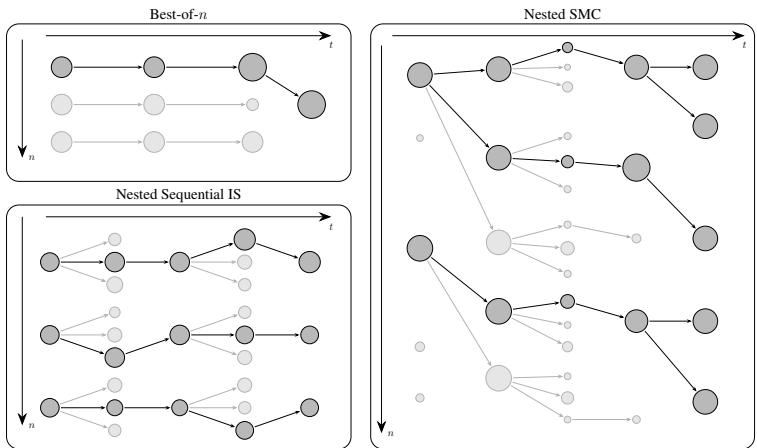
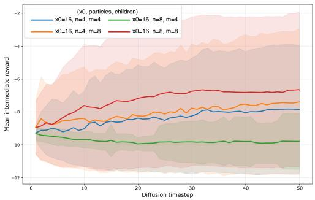
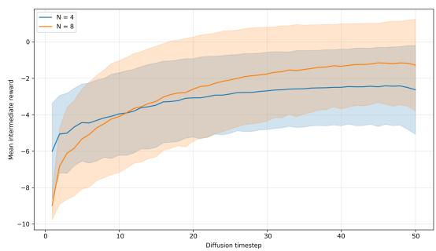
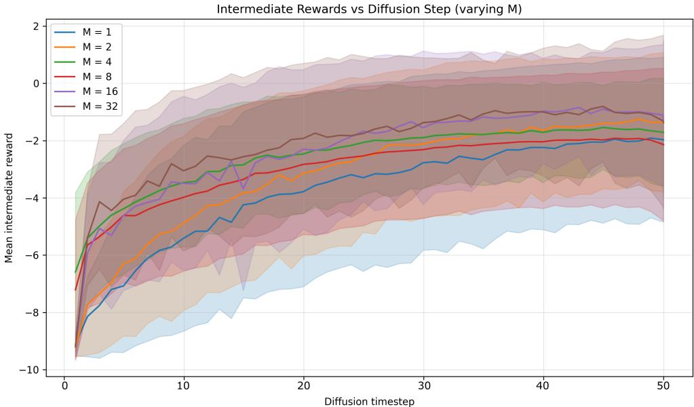

# DISCRETE DIFFUSION INFERENCE-TIME CONTROL WITH NESTED SEQUENTIAL MONTE CARLO

Lohithsai Yadala Chanchu, Hany Abdulsamad, Christian A. Naesseth University ofAmsterdam

## ABSTRACT

We study inference-time control for text generation in discrete diffusion language models, where the goal is to steer sampling toward sequence-level rewards without retraining. Prior work in this domain has focused on particle-based methods such as best-of-n sampling and bootstrap sequential Monte Carlo, which may suffer from overoptimism and weight degeneracy, respectively. We address these limitations using nested sequential Monte Carlo methods. We formulate nested SMC (NSMC) and fully-adapted nested SMC (FA-NSMC) for Feynman–Kac steering, identifying and correcting errors in prior formulations that lead to biased final estimates. We evaluate these methods on toxicity and fluency steering tasks, showing that NSMC and FA-NSMC consistently outperform best-of-n and bootstrap SMC.

## 1 INTRODUCTION

Diffusion-based generative models have achieved remarkable success across continuous modalities, producing state-of-the-art results in image synthesis (Song et al., 2021), video generation (Ho et al., 2022), and protein design (Gruver et al., 2023). While autoregressive (AR) models have long dominated the landscape of text generation, the diffusion paradigm has recently expanded to the discrete domain of natural language processing (Sahoo et al., 2024; Ye et al., 2025; Shi et al., 2024), offering a compelling alternative. Unlike standard autoregressive models that generate text token by token in a fixed left-to-right order, discrete diffusion language models (DDLMs) (Austin et al., 2021; Sahoo et al., 2024; Shi et al., 2024) generate data through an iterative denoising process. Models such as the masked diffusion language model (MDLM) (Sahoo et al., 2024) learn a reverse-time Markov chain that progressively refines a sequence from a maximally corrupted degenerate state into coherent text, enabling bidirectional context integration and allowing the model to attend to information from all positions simultaneously to produce more globally consistent outputs.

Despite these architectural advantages, the capability to generate coherent text does not inherently ensure alignment with human intent or safety standards. In practice, we aim to generate samples that optimize specific downstream objectives, such as minimizing toxicity, while preserving the diversity and naturalness of the pre-trained model. Relying solely on the base model is often insufficient, as pre-trained models may reproduce undesirable biases found in their training data. Furthermore, while training-time alignment methods like reinforcement learning from human feedback (RLHF) (Ouyang et al., 2022) are effective, they are computationally intensive, prone to mode collapse (Kirk et al., 2024), and rigidly couple the model to a single reward function. This motivates inference-time steering mechanisms that can flexibly guide discrete diffusion models toward user-specified reward without the overhead of retraining. Broadly, existing approaches fall into two families:

• Gradient-based methods, such as classifier guidance (Dhariwal & Nichol, 2021), modify the denoising drift using gradient information. These methods rely on differentiable reward functions, which significantly limits their applicability in discrete domains.

• Gradient-free methods, including best-of-n sampling, rejection sampling (Na et al., 2024), and particle-based rare-event simulations (Naesseth et al., 2019b; Uehara et al., 2025; Li et al., 2024; Singhal et al., 2025), do not require differentiability and therefore apply more generally, though they are often computationally intensive.

These limitations motivate the need for more efficient steering mechanisms that can flexibly guide discrete diffusion models toward arbitrary user-specified rewards. A promising framework is sequential Monte Carlo (SMC) (Naesseth et al., 2019b; Chopin & Papaspiliopoulos, 2020), first studied for continuous diffusion models by Wu et al. (2023); Trippe et al. (2023); Cardoso et al. (2024); Dou & Song (2024). SMC is a family of flexible probabilistic algorithms used to sample from complex sequences of distributions. At a high level, SMC maintains a population of particles, each representing a potential partial text generation trajectory, that evolves over time. Through a process of mutation (proposing new tokens) and selection (reweighting and resampling based on the reward), SMC methods steer the population toward a modified version of the model’s original distribution that favors desirable properties encoded by the reward function.

  
Figure 1: Illustration of different particle-based steering strategies. (Left) Best-of-n: independent proposals with selection based on exponentiated rewards. (Middle) Nested sequential importance sampling: particles propagate sequentially with weight updates but no resampling. (Right) Nested SMC: particle filtering approach where each outer particle spawns an inner SMC, approximating the locally optimal proposal distribution for improved effective sample size.

The quality of SMC samples depends critically on the proposal distribution, the mechanism used to mutate particles across time steps. In inference-time steering, the central challenge is that poor proposals are unlikely to generate samples associated with high-reward regions of the discrete text space, causing most particles to accrue low weights and degenerate rapidly. This leads to wasted computation and ineffective steering (Naesseth et al., 2019b). Recent attempts to adapt SMC to discrete diffusion models face persistent difficulties stemming from proposal design.

Singhal et al. (2025) formulate Feynman–Kac (FK) steering, and use bootstrap proposals in practice where new particle candidates are generated using the pretrained base model. While straightforward to implement, this proposal is agnostic to the reward, leaving undesirable particles to be filtered only through subsequent reweighting. This method often exhibits low statistical efficiency and struggles to discover rare, high-reward paths. Soft value-based decoding (SVDD) (Li et al., 2024) takes a dif ferent approach by casting steering as nested sequential importance sampling (SIS). However, this method inherits the well-known pathologies of (nested) SIS methods, including weight degeneracy and high variance over long horizons (Naesseth et al., 2019b). Alternatively, Ou et al. (2026) construct improved proposals by leveraging gradient information of the reward function. In discrete text domains, this typically requires continuous relaxations, which may introduce approximation error.

To address these limitations, we propose leveraging nested SMC (NSMC) methods (Naesseth et al., 2015; 2019a), which introduce an internal SMC sampler to approximate the locally optimal proposal and the associated normalizing constants when these quantities are not available in closed form. NSMC runs an inner SMC procedure for each outer particle to estimate the optimal proposal; the inner sampler produces (i) a properly weighted sample used to draw the child state, and (ii) an unbiased Monte Carlo estimate of the predictive normalizing constant required for the correct outer weight update. The fully-adapted NSMC (FA-NSMC) method further refines this idea by using estimated predictive weights to resample parents before propagation, increasing particle diversity.

Although NSMC is well-established in computational statistics, it has not been applied to steering in modern discrete diffusion language models. A recent tutorial on diffusion-guidance by Uehara et al. (2025) which, building on Li et al. (2024), presents an algorithm labeled “nested $\mathrm { { \bf S M C } } ^ { \mathrm { { \bf \Lambda } } }$ . However, its weighting scheme does not correspond to a properly weighted NSMC algorithm, leading to systematic bias even in the infinite-particle limit. We resolve this by developing correctly weighted NSMC variants, implementing them for a discrete diffusion language model, and evaluating them on toxicity and perplexity steering tasks, which provide controlled environments for understanding how SMC variants behave in practice.

We summarize our contributions as follows:

• We develop properly weighted nested SMC and fully-adapted NSMC updates for Feynman–Kac steering in discrete diffusion language models.

• We empirically compare NSMC and FA-NSMC against bootstrap SMC baselines on toxicity and perplexity steering tasks, characterizing when nested methods improve sample efficiency and controllability.

## 2 BACKGROUND

We start by introducing the notation for discrete diffusions, the tilted path measures that correspond to the aligned sampling targets, the corresponding Feynman–Kac model, and the SMC algorithm.

Diffusion Models. Let V be a finite vocabulary of tokens and $\mathcal { X } = \mathcal { V } ^ { L }$ be the state space of a sequence of length L. We consider a diffusion process over token sequences, discretized into $T + 1$ time steps $t \in \{ 0 , \ldots , T \}$ . Here, $t = T$ represents the maximally corrupted, fully masked state, and $t = 0$ represents the clean generated sequence. Given a pre-trained reverse-time generative base model, the prior path measure over trajectories $x _ { 0 : T } : = ( \dot { x } _ { 0 } , \dots , x _ { T } ) \in \mathcal { X } ^ { T + 1 }$ , conditioned on a context or prompt $c ,$ factorizes as:

$$
p ( \boldsymbol { x } _ { 0 : T } \mid \boldsymbol { c } ) = \mu ( \boldsymbol { x } _ { T } ) \prod _ { t = 1 } ^ { T } f ( \boldsymbol { x } _ { t - 1 } \mid \boldsymbol { x } _ { t } , \boldsymbol { c } ) ,\tag{1}
$$

where $\mu ( \cdot )$ is the fixed distribution at $t = T$ of fully masked sequences and $f ( \cdot \mid x _ { t } , c )$ denotes the reverse transition kernel used to denoise the sequence from step t to $t - 1$ . For notational simplicity, we omit the dependence on c hereafter and write $p ( x _ { 0 : T } )$ and ${ \bar { f } } ( \cdot \mid x _ { t } )$

Target Distribution. We want to sample from a distribution aligned with a scalar reward $r : \mathcal { X } $ R evaluated on the terminal state $x _ { 0 }$ . For $\lambda > 0$ , we define the reward-tilted terminal distribution

$$
p _ { \lambda } ( x _ { 0 } ) = \frac { p ( x _ { 0 } ) \exp \left( \lambda r ( x _ { 0 } ) \right) } { Z _ { \lambda } } , \quad \mathrm { w h e r e } \quad Z _ { \lambda } : = \mathbb { E } _ { x _ { 0 } \sim p } \big [ \exp \left( \lambda r ( x _ { 0 } ) \right) \big ] .\tag{2}
$$

To sample from $p _ { \lambda } ( x _ { 0 } )$ , we define the unnormalized target path measure $\gamma _ { 0 } ( x _ { 0 : T } )$ by weighting the prior path measure by the terminal reward:

$$
\gamma _ { 0 } ( x _ { 0 : T } ) = \left\{ \mu ( x _ { T } ) \prod _ { t = 1 } ^ { T } f ( x _ { t - 1 } \mid x _ { t } ) \right\} \exp \left( \lambda r ( x _ { 0 } ) \right) .\tag{3}
$$

Feynman–Kac. We frame the problem of sampling from $\gamma _ { 0 } ( x _ { 0 : T } )$ in terms of a Feynman–Kac model (Del Moral, 2004). A FK model is characterized by the transition kernel $f ( \cdot \mid \bar { x _ { t } } )$ and a set of nonnegative potential functions $G _ { t - 1 } \colon \mathcal { X } \times \mathcal { X } \to \mathbb { R } ^ { + }$ . The induced path measure is:

$$
\pi ( x _ { 0 : T } ) \propto \mu ( x _ { T } ) G _ { T } ( x _ { T } ) \left\{ \prod _ { t = 1 } ^ { T } f ( x _ { t - 1 } \mid x _ { t } ) G _ { t - 1 } ( x _ { t - 1 } , x _ { t } ) \right\} .\tag{4}
$$

To recover our specific target $\gamma _ { 0 } ( x _ { 0 : T } )$ , the potentials must telescope to reproduce the desired tilt, satisfying $\begin{array} { r } { G _ { T } ( x _ { T } ) \prod _ { t = 1 } ^ { T } G _ { t - 1 } ( x _ { t - 1 } , x _ { t } ) \ = \ \exp \left( \lambda r ( x _ { 0 } ) \right) \quad } \end{array}$ While one could set $G _ { 0 } ( \cdot ) \ =$ $\exp \left( \lambda r ( x _ { 0 } ) \right)$ and $\textstyle \left\{ G _ { t } \right\} _ { t > 0 } ^ { - \cdot } \dot { = } 1$ , this choice yields an inefficient sampling procedure that suffers from path degeneracy and high-variance weights at $t = 0$ . Since intermediate potentials provide no signal with regard to high-reward regions, samples are propagated under the base dynamics and only receive their reward-dependent weighting at the last step.

Sequential Monte Carlo. SMC (Naesseth et al., 2019b; Chopin & Papaspiliopoulos, 2020) is a sampling method designed to approximate a sequence of intermediate unnormalized targets $\gamma _ { t } ( \boldsymbol { x } _ { t : T } )$ , with corresponding normalized targets $\pi _ { t } ~ \propto ~ \gamma _ { t }$ . To approximate $\pi _ { t } .$ , SMC uses a set of weighted samples, or particles, $\{ ( w _ { t } ^ { ( i ) } , x _ { t : T } ^ { ( i ) } ) \} _ { i = 1 } ^ { N }$

$$
\pi _ { t } ( x _ { t : T } ) \approx \sum _ { i = 1 } ^ { N } w _ { t } ^ { ( i ) } \delta _ { x _ { t : T } ^ { ( i ) } } ,
$$

where $\delta _ { X }$ is the Dirac measure at $X$ . The particle system is then updated from time t to $t - 1$ by repeating the following for each particle i:

1. Resampling, $a \sim \mathrm { C a t } \left( w _ { t } ^ { 1 : N } \right)$

2. Propagation, $x _ { t - 1 } ^ { ( i ) } \sim q _ { t - 1 } ( x _ { t - 1 } | x _ { t } ^ { ( a ) } )$

3. Weighting, $\begin{array} { r } { w _ { t - 1 } ^ { ( i ) } \propto \frac { \gamma _ { t - 1 } ( \{ x _ { t - 1 } ^ { ( i ) } , x _ { t : T } ^ { ( a ) } \} ) } { \gamma _ { t } ( x _ { t : T } ^ { ( a ) } ) q _ { t - 1 } ( x _ { t - 1 } ^ { ( i ) } | x _ { t } ^ { ( a ) } ) } . } \end{array}$

The key design variables are the intermediate targets $\gamma _ { t }$ and the proposals $q _ { t } .$ . Bootstrap SMC for the FK model in Algorithm 3 is obtained by setting $q _ { t - 1 } ( x _ { t - 1 } | x _ { t } ) = f ( x _ { t - 1 } | x _ { t } )$ and $\gamma _ { t - 1 } ( x _ { t - 1 : T } ) =$ $\gamma _ { t } ( \boldsymbol { x } _ { t : T } ) f ( \boldsymbol { x } _ { t - 1 } | \boldsymbol { x } _ { t } ) G _ { t - 1 } ( \boldsymbol { x } _ { t - 1 } , \boldsymbol { x } _ { t } )$

Optimal Twisting. To provide intermediate guidance, we construct the targets $\gamma _ { t }$ by twisting the prior path measure $p ( x _ { t : T } )$ ) with a set of positive potential functions $\psi _ { t } : \mathcal { X } \overset { } {  } \mathbb { R } ^ { + }$ that look ahead and tilt the intermediate targets toward high-reward regions $\gamma _ { t } ( x _ { t : T } ) : = p ( x _ { t : T } ) \psi _ { t } ( x _ { t } )$ . Naesseth et al. (2019b); Whiteley & Lee (2014); Guarniero et al. $( 2 0 1 7 ) ;$ Heng et al. (2020) identify the optimal twisting functions, which minimize the variance of the incremental weights, as the conditional expectation of the future reward:

$$
\psi _ { t } ^ { \star } ( x _ { t } ) : = \mathbb { E } _ { p } { \big [ } \exp { \big ( } \lambda r ( x _ { 0 } ) { \big ) } \mid x _ { t } { \big ] } , \quad t = 0 , \ldots , T .\tag{5}
$$

At the terminal step $t = 0$ , this definition recovers the exact reward tilt $\psi _ { 0 } ^ { \star } ( x _ { 0 } ) = \exp { ( \lambda r ( x _ { 0 } ) ) }$

Optimal Proposals. The optimal twisting functions naturally induce a sequence of corresponding optimal proposal kernels that realize the transition between the intermediate targets:

$$
q _ { t - 1 } ^ { \star } ( x _ { t - 1 } \mid x _ { t } ) \propto \frac { \gamma _ { t - 1 } ( x _ { t - 1 : T } ) } { \gamma _ { t - 1 } ( x _ { t : T } ) } = \frac { f ( x _ { t - 1 } \mid x _ { t } ) \psi _ { t - 1 } ^ { \star } ( x _ { t - 1 } ) } { \psi _ { t } ^ { \star } ( x _ { t } ) } , \qquad t = 1 , \ldots , T ,\tag{6}
$$

while at time $t = T$ , the optimal proposal is given by: ${ q } _ { T } ^ { \star } ( x _ { T } ) \propto \mu ( x _ { T } ) \psi _ { T } ^ { \star } ( x _ { T } )$ . This in turn allows us to identify the optimal potential functions $\{ G _ { t } ^ { \star } \} _ { t \geq 0 }$ as the ratios of successive twists:

$$
G _ { t - 1 } ^ { \star } ( x _ { t - 1 } , x _ { t } ) = \psi _ { t - 1 } ^ { \star } ( x _ { t - 1 } ) / \psi _ { t } ^ { \star } ( x _ { t } ) , \qquad G _ { T } ^ { \star } ( x _ { T } ) = \psi _ { T } ^ { \star } ( x _ { T } ) .\tag{7}
$$

Appendices B and C provide details and show that the cumulative product of these optimal potentials telescopes to recover the required terminal reward tilt. In contrast, the “nested $\mathrm { S M C ^ { , } }$ algorithm in Uehara et al. (2025) uses only the numerator $\psi _ { t - 1 } ^ { \star } ( x _ { t - 1 } )$ in its weighting scheme, omitting the normalization by $\psi _ { t } ^ { \star } ( x _ { t } )$ implied by $G _ { t - 1 } ^ { \star }$ , and therefore fails to target the correct tilted distribution.

## 3 NESTED SEQUENTIAL MONTE CARLO

Nested sequential Monte Carlo (NSMC) (Naesseth et al., 2015; 2019a) is a class of particle algorithms that lets us derive practical algorithms for optimal twisting and proposal distributions.

First, recall that the optimal proposal is given by:

$$
q _ { t - 1 } ^ { \star } ( x _ { t - 1 } \mid x _ { t } ) = \frac { 1 } { \nu _ { t - 1 } ( x _ { t } ) } \frac { \gamma _ { t - 1 } ( x _ { t - 1 : T } ) } { \gamma _ { t } ( x _ { t : T } ) } \propto \frac { \gamma _ { t - 1 } ( x _ { t - 1 : T } ) } { \gamma _ { t - 1 } ( x _ { t : T } ) }\tag{8}
$$

where $\nu _ { t - 1 } ( x _ { t } )$ is the predictive normalizing constant:

$$
\nu _ { t - 1 } ( x _ { t } ) : = \sum _ { x _ { t - 1 } \in \mathcal { V } ^ { L } } \frac { \gamma _ { t - 1 } \left( x _ { t - 1 : T } \right) } { \gamma _ { t } \left( x _ { t : T } \right) } = \mathbb { E } _ { x _ { t - 1 } \sim f ( \cdot | x _ { t } ) } \Big [ G _ { t - 1 } ^ { \star } ( x _ { t - 1 } , x _ { t } ) \Big ] .\tag{9}
$$

Under $q _ { t - 1 } ^ { \star }$ , the incremental importance weights $w _ { t - 1 }$ are equal to this normalizing constant: $w _ { t - 1 } = \gamma _ { t - 1 } ( x _ { t - 1 : T } ) / ( q _ { t - 1 } ^ { \star } ( x _ { t - 1 } \mid x _ { t } ) \gamma _ { t } ( x _ { t : T } ) ) \equiv \nu _ { t - 1 } ( x _ { t } )$ This means it does not depend on the particular sample of $x _ { t - 1 }$ . This is the key variance-reduction property of optimal proposals: conditional on the parents $x _ { t } ,$ the incremental weights $w _ { t - 1 }$ are uniform and their incremental variance is zero.

Computing the predictive normalizer $\nu _ { t - 1 } ( x _ { t } )$ is generally intractable in high-dimensional spaces, as it requires summing over all $| \mathcal { V } | ^ { L }$ possible sequences at every step. NSMC resolves this intractability by replacing $\nu _ { t - 1 } ( x _ { t } )$ with an inner Monte Carlo estimate.

For each parent particle $\boldsymbol { x } _ { t } ^ { ( i ) }$ , where $i \in \{ 1 , \ldots , N \}$ , we propose M candidate states from the base transition kernel $x _ { t - 1 } ^ { ( i , j ) } \sim f ( \cdot \mid x _ { t } ^ { ( i ) } )$ , for $j = 1 , \dots , M$ . For each candidate, we compute an inner importance weight $v _ { t - 1 } ^ { ( i , j ) }$ by evaluating the optimal twisting potential functions:

$$
v _ { t - 1 } ^ { ( i , j ) } : = \frac { \gamma _ { t - 1 } ( x _ { t - 1 : T } ^ { ( i , j ) } ) } { \gamma _ { t } ( x _ { t : T } ^ { ( i ) } ) f ( x _ { t - 1 } ^ { ( i , j ) } \mid x _ { t } ^ { ( i ) } ) } = G _ { t - 1 } ^ { \star } ( x _ { t - 1 } ^ { ( i , j ) } , x _ { t } ^ { ( i ) } )\tag{10}
$$

where $\boldsymbol { x } _ { t - 1 : T } ^ { ( i , j ) } = ( x _ { t - 1 } ^ { ( i , j ) } , x _ { t : T } ^ { ( i ) } )$ . The predictive normalizing constant is then approximated by the average of the inner weights $\begin{array} { r } { \hat { \nu } _ { t - 1 } ( x _ { t } ^ { ( i ) } ) : = 1 / M \sum _ { j = 1 } ^ { M } v _ { t - 1 } ^ { ( i , j ) } \approx \nu _ { t - 1 } ( x _ { t } ^ { ( i ) } ) } \end{array}$

To approximate sampling from the optimal proposal $q ^ { \star } ( \cdot \mid x _ { t } )$ , NSMC selects a single candidate trajectory for the next step by resampling from the candidates based on their inner weights:

$$
b ^ { ( i ) } \sim \mathrm { C a t } \left( \left\{ \frac { v _ { t - 1 } ^ { ( i , j ) } } { \sum _ { k } v _ { t - 1 } ^ { ( i , k ) } } \right\} _ { j = 1 } ^ { M } \right) ,\tag{11}
$$

and setting $x _ { t - 1 } ^ { ( i ) }  x _ { t - 1 } ^ { ( i , \ell ) }$ , where $\ell = b ^ { ( i ) }$ . This nested approach ensures that the outer incremental importance weights $w _ { t - 1 } ^ { ( i ) } = \hat { \nu } _ { t - 1 } ( x _ { t } ^ { ( i ) } )$ remain unbiased estimates of the true normalizing constants. Algorithm 1 provides an overview of the nested proposal procedure.

By contrast, a standard bootstrap SMC, Algorithm 3, uses a single candidate proposal per parent without incorporating reward information, leading to resampling decisions based on a noisy onesample estimate of future potential. NSMC reduces this noise by averaging over M candidates to estimate the predictive normalizer $\nu _ { t - 1 }$ and uses the inner weights to bias candidate selection toward promising regions of future high reward. Algorithm 2 provides a detailed recipe for NSMC.

Finally, the fully-adapted NSMC (FA-NSMC) procedure incorporates lookahead information into the parent resampling mechanism. In this scheme, we estimate the future potential of all particles before committing to the resampling step. We perform the same lookahead procedure as in NSMC to generate M candidates and estimate the predictive normalizer for every parent $\hat { \nu } _ { t - 1 } ( x _ { t } ^ { ( i ) } )$

Unlike standard NSMC, which resamples parents based solely on their accumulated weights $w _ { t } ^ { ( i ) }$ FA-NSMC resamples parent indices $a ^ { ( i ) }$ proportional to $w _ { t } ^ { ( i ) } \cdot \hat { \nu } _ { t - 1 } ( x _ { t } ^ { ( i ) } )$ . Once the parent $k = a ^ { ( i ) }$ is selected, we sample $x _ { t - 1 } ^ { ( i ) }$ from that parent’s candidates using the inner weights $v _ { t - 1 } ^ { ( k , \cdot ) }$

Crucially, this reordering enhances sample diversity. If a high-potential parent $\boldsymbol { x } _ { t } ^ { ( i ) }$ is selected multiple times, we can draw multiple distinct children from its set of promising candidates. In contrast, the standard resampling scheme would simply replicate the same parent state multiple times. This fully-adapted procedure is described in Algorithm 4.

## 4 NUMERICAL EVALUATION

We evaluate the performance of several inference-time sampling algorithms for reward-tilted generation within the framework of discrete diffusion language models. Specifically, we benchmark our proposed nested SMC (NSMC) and fully-adapted nested SMC (FA-NSMC) against two baselines: Best-of-N (BoN) and Bootstrap SMC. Beyond measuring the terminal reward, we analyze: (i) the effect of steering on longer texts, (ii) the influence of population sizes N and M, (iii) intermediate reward evolution under the weighting scheme presented in Uehara et al. (2025), and (iv) the impact of the number of samples K used to approximate the optimal potentials.

Algorithm 1 Nested Proposal   
procedure NESTEDPROPOSAL $( x _ { t } , f , G ^ { \star } )$   
Sample candidates $x _ { t - 1 } ^ { ( j ) } \sim f ( \cdot \mid x _ { t } )$ , for $j = 1 , \dots , M$   
Compute weights $v ^ { ( j ) } \gets G _ { t - 1 } ^ { \star } ( x _ { t - 1 } ^ { ( j ) } , x _ { t } )$   
Estimate normalizer $\textstyle { \hat { \nu } } \gets 1 / M \sum _ { j = 1 } ^ { M } v ^ { ( j ) }$   
return $x _ { t - 1 } ^ { 1 : M } , v ^ { 1 : M } , \hat { \nu }$   
end procedure   
Algorithm 2 Nested SMC   
Require: Base kernel $f ,$ potentials $\big \{ G _ { t } ^ { \star } \big \} _ { t \geq 0 } ,$ population sizes N, M   
Set $w _ { T } ^ { ( i ) }  1 / N , \mathrm { f o r } i = 1 , . . . , N$   
Sample $x _ { T } ^ { ( i ) } \sim \mu ( x _ { T } ) G _ { T } ^ { \star } ( x _ { T } )$   
for $t = T$ to 1 do   
for $i = 1$ to N do   
Resample $a \sim \mathrm { C a t } ( w _ { t } ^ { 1 : N } )$   
$x _ { t - 1 } ^ { ( i , \cdot ) } , \bar { v } ^ { ( i , \cdot ) } , \hat { \nu } ^ { ( i ) } \gets$ NESTEDPROPOSAL $( x _ { t } ^ { ( a ) } , f , G _ { t - 1 } ^ { \star } )$   
Sample $b \sim C$ at $\textstyle { \left( v ^ { ( i , \cdot ) } / \sum _ { k } v ^ { ( i , k ) } \right) }$   
Set $x _ { t - 1 } ^ { ( i ) }  x _ { t - 1 } ^ { ( i , b ) } , \tilde { w } _ { t - 1 } ^ { ( i ) }  \hat { \nu } ^ { ( i ) }$   
end for   
Normalize $w _ { t - 1 } ^ { ( i ) }  \tilde { w } _ { t - 1 } ^ { ( i ) } / \sum _ { k = 1 } ^ { N } \tilde { w } _ { t - 1 } ^ { ( k ) }$   
end for   
return $\{ ( x _ { 0 } ^ { ( i ) } , w _ { 0 } ^ { ( i ) } ) \} _ { i = 1 } ^ { N }$

## 4.1 EXPERIMENTAL SETUP

All algorithms above assume access to a terminal reward $r ( x _ { 0 } )$ and the ideal twisting functions and potentials defined in equation 5 and equation 7. In practice, we approximate the conditional expectations with a tractable surrogate, estimating the future reward using the model’s single-step prediction $\scriptstyle { \hat { x } } _ { 0 }$ at each state. The particle-based algorithms themselves are unchanged, and the theoretical guarantees for $t = 0$ remain valid.

Our experimental validation focuses on two distinct steering objectives:

• Toxicity steering: We define $r ( x _ { 0 } ) = r _ { \mathrm { t o x } } ( x _ { 0 } )$ using a toxicity classifier, encouraging the generation of toxic content to test alignment.

• Fluency steering: We define $r ( x _ { 0 } ) = - r _ { \mathrm { p p l } } ( x _ { 0 } )$ , penalizing high perplexity to encourage the generation of fluent text.

We maintain a consistent algorithmic framework across these tasks, varying only the scalar reward function used to define the exponential tilt $\exp ( \lambda r ( x _ { 0 } ) )$ .

Base Model. We steer the publicly released MDLM (Sahoo et al., 2024) discrete diffusion model checkpoint, a DiT-style architecture with 12 transformer blocks, 12 attention heads, and 768 hidden units trained on OpenWebText with a GPT-2 tokenizer. Unless otherwise stated, generations are produced using $T = 5 0$ diffusion steps. Following Han et al. (2023), we use 15 controllablegeneration prompts $( \mathrm { e . g . }$ , “Once upon a time”, “The book”, “The year is 1910.”). For each prompt and configuration, we sample 10 independent continuations and report metrics averaged over the resulting $\overline { { 1 } } 5 \times 1 0 = 1 5 0$ generations.

Table 1: Toxicity and fluency steering $( N = 4 ,$ M = 8, K = 4, λ = 10). PPL via GPT-2-XL.
<table><tr><td>Method</td><td>Toxic ↑</td><td>PPL↓</td></tr><tr><td>Base (MDLM)</td><td>0.003</td><td>85.3</td></tr><tr><td>BoN</td><td>0.022</td><td>55.5</td></tr><tr><td>SMC (bootstrap)</td><td>0.25</td><td>49.0</td></tr><tr><td>NSMC</td><td>0.39</td><td>42.3</td></tr><tr><td>FA-NSMC</td><td>0.40</td><td>42.9</td></tr></table>

Table 2: Effect of reward window length on toxicity rate (N = 8, M = 8, K = 4).
<table><tr><td>Length</td><td>SMC</td><td>NSMC</td><td>FA-NSMC</td></tr><tr><td>50</td><td>0.57</td><td>0.70</td><td>0.68</td></tr><tr><td>100</td><td>0.40</td><td>0.50</td><td>0.51</td></tr><tr><td>300</td><td>0.29</td><td>0.30</td><td>0.47</td></tr></table>

Generation Protocol and Resampling Schedule. We generate 100-token continuations and resample at every diffusion step, unless stated otherwise. For ablations that vary the reward window length, we generate sufficiently long continuations, such that the reward window is well-defined.

Toxicity Reward. For toxicity steering, we use an off-the-shelf RoBERTa toxicity classifier1 (Logacheva et al., 2022) and define $r _ { \mathrm { t o x } } ( x _ { 0 } )$ as the log-softmax score of the toxic class (no clipping/normalization). We fix the steering strength parameter λ = 10 for all toxicity experiments. During steering, rewards are computed on a fixed continuation suffix length (reward window). For evaluation, we concatenate the full prompt and continuation and additionally report toxicity rates under a holdout classifier2 (Dementieva et al., 2024), to assess robustness.

Perplexity Reward. For perplexity-based rewards (used only in the perplexity-steering task), we use GPT-2-XL (Radford et al., 2019) to score intermediate $x _ { 0 }$ reconstructions.

Intermediate Potentials via $x _ { 0 }$ Reconstructions. The described particle methods require intermediate potentials that approximate the remaining terminal reward. At resampling time t, for each particle state $\boldsymbol { x } _ { t } ^ { ( i ) }$ , we draw K samples $\{ \hat { x } _ { 0 } ^ { ( i , k ) } \} _ { k = \bar { . } } ^ { K }$ and form the estimator

$$
\widehat { \psi } _ { t } ( x _ { t } ^ { ( i ) } ) = \frac { 1 } { K } \sum _ { k = 1 } ^ { K } \exp \big ( \lambda r ( \widehat { x } _ { 0 } ^ { ( i , k ) } ) \big ) ,\tag{12}
$$

which enters the importance weights at resampling. We compare $K \in \{ 4 , 1 6 \}$ to ablate the effect of the reconstruction count. We also log $\widehat { \psi } _ { t }$ over t to study how reward information propagates along the reverse chain. Additional plots are provided in Appendix D. Replacing the true potential with an unbiased estimator still results in a properly weighted SMC algorithm (Naesseth et al., 2019b, Section 4.3).

Compute Budgets. We match compute by the number of forward passes per diffusion step. With N outer particles, bootstrap SMC, NSMC, and FA-NSMC each require N diffusion-model evaluations per step. For (FA-)NSMC, the M inner proposals are drawn by categorical sampling from already-computed logits (no additional transformer evaluations). Reward model calls are also typically cheaper than diffusion forward passes, so we treat N as the primary hyperparameter and vary (N, M, K) under this constraint. For BoN, we match compute by setting N so that the total number of diffusion-model evaluations matches the particle methods, similar to Singhal et al. (2025).

Metrics. We report: (i) toxicity rates under a binary toxicity classifier and a separate holdout binary toxicity classifier, (ii) perplexity as a fluency proxy, and (iii) output diversity via Distinct-1/Distinct-2 (Tevet & Berant, 2021) (see Appendix 5). Perplexity is not optimized in toxicity steering.

## 4.2 RESULTS AND DISCUSSION

Steering Results for Toxicity and Fluency Tasks (Table 1). Table 1 compares BoN, bootstrap SMC, NSMC, and FA-NSMC. Nested methods substantially improve the toxicity rate over both BoN and bootstrap SMC, with FA-NSMC slightly outperforming NSMC. The base MDLM rarely produces toxic continuations, reflecting the rarity of toxicity under the base model. Best-of-n yields only a marginal increase, because it selects from a small set of fully sampled $x _ { 0 }$ candidates offering limited leverage when high-reward outcomes are rare. In contrast, bootstrap SMC achieves a much larger increase by reallocating computation toward partial trajectories whose intermediate reconstructions already score highly under the reward.

Table 3: Effect of population size M (N=8, K=4).
<table><tr><td>Method</td><td>M</td><td>Tox ↑</td><td>Hold ↑</td></tr><tr><td>NSMC</td><td>1</td><td>.57</td><td>.48</td></tr><tr><td>NSMC</td><td>2</td><td>.61</td><td>.44</td></tr><tr><td>NSMC</td><td>4</td><td>.59</td><td>.56</td></tr><tr><td>NSMC</td><td>8</td><td>.71</td><td>.56</td></tr><tr><td>NSMC</td><td>16</td><td>.71</td><td>.62</td></tr><tr><td>NSMC</td><td>32</td><td>.70</td><td>.55</td></tr><tr><td>FA-NSMC</td><td>1</td><td>.54</td><td>.47</td></tr><tr><td>FA-NSMC</td><td>2</td><td>.58</td><td>.49</td></tr><tr><td>FA-NSMC</td><td>4</td><td>.62</td><td>.55</td></tr><tr><td>FA-NSMC</td><td>8</td><td>.68</td><td>.60</td></tr><tr><td>FA-NSMC</td><td>16</td><td>.74</td><td>.66</td></tr><tr><td>FA-NSMC</td><td>32</td><td>.71</td><td>.51</td></tr></table>

Table 4: Results over 10 repititions (λ=10).
<table><tr><td rowspan="2">N</td><td rowspan="2">Method</td><td rowspan="2">M</td><td colspan="3"> $K = 4$ </td><td colspan="3"> $K = 1 6$ </td></tr><tr><td>Tox ↑</td><td>Hold ↑</td><td>PPL↓</td><td>Tox ↑</td><td>Hold ↑</td><td>PPL↓</td></tr><tr><td rowspan="5">4</td><td>SMC</td><td>一</td><td>.25</td><td>.19</td><td>49</td><td>.31</td><td>.36</td><td>44</td></tr><tr><td>NSMC</td><td>4</td><td>.29</td><td>.21</td><td>39</td><td>.46</td><td>.44</td><td>47</td></tr><tr><td>NSMC</td><td>8</td><td>.39</td><td>.31</td><td>42</td><td>.45</td><td>.40</td><td>42</td></tr><tr><td>FA-NSMC</td><td>4</td><td>.36</td><td>.38</td><td>38</td><td>.48</td><td>.44</td><td>41</td></tr><tr><td>FA-NSMC</td><td>8</td><td>.40</td><td>.39</td><td>43</td><td>.45</td><td>.43</td><td>40</td></tr><tr><td rowspan="5">8</td><td>SMC</td><td>一</td><td>.57</td><td>.48</td><td>47</td><td>.67</td><td>.59</td><td>41</td></tr><tr><td>NSMC</td><td>4</td><td>.70</td><td>.56</td><td>36</td><td>.71</td><td>.64</td><td>36</td></tr><tr><td>NSMC</td><td>8</td><td>.70</td><td>.56</td><td>38</td><td>.74</td><td>.59</td><td>38</td></tr><tr><td>FA-NSMC</td><td>4</td><td>.62</td><td>.55</td><td>33</td><td>.70</td><td>.61</td><td>37</td></tr><tr><td>FA-NSMC</td><td>8</td><td>.68</td><td>.60</td><td>39</td><td>.74</td><td>.59</td><td>32</td></tr></table>

Nested methods improve outcomes by reducing the discrepancy between the proposal and the reward-tilted target. Intermediate potentials provide a lookahead estimate of future reward, yielding more informative resampling and reduced weight degeneracy. In this configuration, the difference between NSMC and FA-NSMC is small. The effect is more pronounced for perplexity steering, where nested methods show a larger gain over bootstrap SMC relative to BoN.

Reward Window Length Sensitivity (Table 2). Table 2 sweeps the length of the continuation suffix used by the reward model at fixed N = 8 and M = 8. As the reward window grows, performance degrades across methods. This is expected: longer suffixes make toxicity rarer and noisier to predict, increase the chance of drifting away from toxic content, and introduce greater long-horizon uncertainty early in the reverse process. As a result, intermediate potentials become less informative— reconstruction-based reward estimates have higher variance and are less predictive of the terminal reward—reducing the effectiveness of resampling and increasing particle impoverishment.

The notable exception is FA-NSMC at reward length 300. Full adaptation is most beneficial when lookahead is hardest: with long reward windows, accounting for future reward contributions at the proposal stage is more effective than relying on noisy weight corrections. When reward information is strongly delayed, better adaptation yields larger gains.

Intermediate NSMC Rewards with Biased Potential (Figure 2). We notice that intermediate expected rewards, $\mathbb { E } _ { p } \left[ \left( r ( x _ { 0 } ) \right) \vert x _ { t } \right]$ , improve over time for NSMC and FA-NSMC when using the correct potentials $G _ { t - 1 } ^ { \star } ( x _ { t - 1 } , x _ { t } )$ , as shown in Figure 2b. In contrast, Figure 2a shows that the potential proposed by Uehara et al. (2025), which omits the denominator term, fails to target the correct distribution $p _ { \lambda } ( x _ { 0 } ) \propto p _ { \theta } ( x _ { 0 } ) \exp ( \lambda r ( x _ { 0 } ) )$ ). As a result, rewards do not increase over time under this biased potential. A full sweep of toxicity rates along N, M, K with Uehara et al. (2025)’s implementation is found in Appendix F.

Scaling with $( N , M , K )$ and Robustness (Tables 3 and 4). Table 3 sweeps M for NSMC and FA-NSMC at fixed $N = 8 , K = 4$ . Table 4 reports toxicity metrics over a broader sweep, averaged over 10 repetitions. Three trends stand out. First, the number of outer particles N dominates performance: increasing N yields the largest gains, reflecting reduced Monte Carlo error. Second, increasing the number of reconstructions K improves guidance, especially at small N. This is consistent with the role of K in reducing the variance of $\widehat { \psi _ { t } } .$ , which helps preserve high-reward trajectories early. Third, increasing the number of inner proposals M yields gains that saturate quickly, indicating diminishing returns once the proposal is “good enough”. The external toxicity rates and perplexity provide a useful sanity check against reward-model overfitting.

## 5 CONCLUSION AND LIMITATIONS

This work provides initial evidence that nested sequential Monte Carlo methods can improve inference-time steering for discrete diffusion language models. We show that nested methods, including fully adapted variants, achieve higher rewards than bootstrap SMC at fixed N, highlighting the value of better proposals and more informative intermediate potentials. FA-NSMC is the most robust variant in the most challenging regimes: it degrades less as the reward window grows and often improves external toxicity at comparable internal toxicity, suggesting improved robustness to reward-model idiosyncrasies. Furthermore, our experiments show that compute allocation matters: the number of outer particles N is the primary factor, while increasing the number of reconstructions K and inner proposals M provides additional gains with diminishing returns.

  
(a) Average intermediate toxic reward for the biased NSMC variant in Uehara et al. (2025).

  
(b) Average intermediate toxic reward with N outer particles according to Algorithm 2  
Figure 2: Comparison of intermediate rewards for toxicity steering.

Our evaluation has clear limitations. We study only two reward settings, toxicity and perplexity, on a single base checkpoint, leaving open the question of how consistently these gains transfer across models and domains. In addition, our intermediate potentials rely on approximate $x _ { 0 }$ reconstructions and off-the-shelf reward models, which can be noisy and introduce substantial variance.

A key next step is broader validation on established controllable-generation and safety benchmarks, including bias/fairness suites (BOLD, HolisticBias) (Dhamala et al., 2021; Smith et al., 2022), truthfulness (TruthfulQA) (Lin et al., 2022), standardized red-teaming (HarmBench) (Mazeika et al., 2024), and instruction-following evaluations (MT-Bench, AlpacaEval) (Zheng et al., 2023; Dubois et al., 2024), ideally within broader suites such as HELM (Liang et al., 2023). Future work can also test generalizability on larger discrete diffusion models such as Dream-7B (Ye et al., 2025) or LLaDA (Nie et al., 2025). Another interesting avenue for future work is to apply the methods to sampling problems similar to Wu et al. (2025) and exploring image steering (Singhal et al., 2025).

## REFERENCES

Jacob Austin, Daniel D. Johnson, Jonathan Ho, Daniel Tarlow, and Rianne van den Berg. Structured denoising diffusion models in discrete state-spaces. In A. Beygelzimer, Y. Dauphin, P. Liang, and J. Wortman Vaughan (eds.), Advances in Neural Information Processing Systems, 2021. URL https://openreview.net/forum?id=h7-XixPCAL.

Gabriel Cardoso, Yazid Janati el idrissi, Sylvain Le Corff, and Eric Moulines. Monte Carlo guided denoising diffusion models for Bayesian linear inverse problems. In The Twelfth International Conference on Learning Representations, 2024.

Nicolas Chopin and Omiros Papaspiliopoulos. An Introduction to Sequential Monte Carlo, volume 4. Springer, 2020.

Pierre Del Moral. Feynman-kac formulae. In Feynman-Kac Formulae: Genealogical and Interacting Particle Systems with Applications, pp. 47–93. Springer, 2004.

Daryna Dementieva, Daniil Moskovskiy, Nikolay Babakov, Abinew Ali Ayele, Naquee Rizwan, Florian Schneider, Xintong Wang, Seid Muhie Yimam, Dmitry Ustalov, Elisei Stakovskii, Alisa Smirnova, Ashraf Elnagar, Animesh Mukherjee, and Alexander Panchenko. Overview of the multilingual text detoxification task at PAN 2024. CEUR Workshop Proceedings, 3740:2432– 2461, 2024.

Jwala Dhamala, Tony Sun, Varun Kumar, Satyapriya Krishna, Yada Pruksachatkun, Kai-Wei Chang, and Rahul Gupta. BOLD:Dataset and metrics for measuring biases in open-ended language generation. In Proceedings of the 2021 ACM Conference on Fairness, Accountability, and Transparency, FAccT ’21, pp. 862–872. ACM, March 2021. URL http://dx.doi.org/10. 1145/3442188.3445924.

Prafulla Dhariwal and Alex Nichol. Diffusion models beat gans on image synthesis. In Proceedings of the 35th International Conference on Neural Information Processing Systems, NeurIPS ’21. Curran Associates Inc., 2021.

Zehao Dou and Yang Song. Diffusion posterior sampling for linear inverse problem solving: A filtering perspective. In The Twelfth International Conference on Learning Representations, 2024.

Yann Dubois, Percy Liang, and Tatsunori Hashimoto. Length-controlled alpacaeval: A simple debiasing of automatic evaluators. In First Conference on Language Modeling, 2024. URL https://openreview.net/forum?id=CybBmzWBX0.

Nate Gruver, Samuel Don Stanton, Nathan C. Frey, Tim G. J. Rudner, Isidro Hotzel, Julien Lafrance-Vanasse, Arvind Rajpal, Kyunghyun Cho, and Andrew Gordon Wilson. Protein design with guided discrete diffusion. In Thirty-seventh Conference on Neural Information Processing Sys tems, 2023. URL https://openreview.net/forum?id=MfiK69Ga6p.

Pieralberto Guarniero, Adam M Johansen, and Anthony Lee. The iterated auxiliary particle filter. Journal of the American Statistical Association, 112(520):1636–1647, 2017.

Xiaochuang Han, Sachin Kumar, and Yulia Tsvetkov. SSD-LM: Semi-autoregressive simplex-based diffusion language model for text generation and modular control. In Anna Rogers, Jordan Boyd-Graber, and Naoaki Okazaki (eds.), Proceedings ofthe 61st Annual Meeting ofthe Associationfor Computational Linguistics (Volume 1: Long Papers), pp. 11575–11596. Association for Computational Linguistics, July 2023. URL https://aclanthology.org/2023.acl-long. 647/.

Jeremy Heng, Adrian N Bishop, George Deligiannidis, and Arnaud Doucet. Controlled sequential monte carlo. The Annals ofStatistics, 48(5):2904–2929, 2020.

Jonathan Ho, Tim Salimans, Alexey Gritsenko, William Chan, Mohammad Norouzi, and David J Fleet. Video diffusion models. arXiv:2204.03458, 2022.

Robert Kirk, Ishita Mediratta, Christoforos Nalmpantis, Jelena Luketina, Eric Hambro, Edward Grefenstette, and Roberta Raileanu. Understanding the effects of RLHF on LLM generalisation and diversity. In The Twelfth International Conference on Learning Representations, 2024. URL https://openreview.net/forum?id=PXD3FAVHJT.

Xiner Li, Yulai Zhao, Chenyu Wang, Gabriele Scalia, Gokcen Eraslan, Surag Nair, Tommaso Biancalani, Shuiwang Ji, Aviv Regev, Sergey Levine, and Masatoshi Uehara. Derivative-free guidance in continuous and discrete diffusion models with soft value-based decoding, August 2024.

Percy Liang, Rishi Bommasani, Tony Lee, Dimitris Tsipras, Dilara Soylu, Michihiro Yasunaga, Yian Zhang, Deepak Narayanan, Yuhuai Wu, Ananya Kumar, Benjamin Newman, Binhang Yuan, Bobby Yan, Ce Zhang, Christian Cosgrove, Christopher D Manning, Christopher Re, Diana Acosta-Navas, Drew A. Hudson, Eric Zelikman, Esin Durmus, Faisal Ladhak, Frieda Rong, Hongyu Ren, Huaxiu Yao, Jue WANG, Keshav Santhanam, Laurel Orr, Lucia Zheng, Mert Yuksekgonul, Mirac Suzgun, Nathan Kim, Neel Guha, Niladri S. Chatterji, Omar Khattab, Peter Henderson, Qian Huang, Ryan Andrew Chi, Sang Michael Xie, Shibani Santurkar, Surya Ganguli, Tatsunori Hashimoto, Thomas Icard, Tianyi Zhang, Vishrav Chaudhary, William Wang, Xuechen Li, Yifan Mai, Yuhui Zhang, and Yuta Koreeda. Holistic evaluation of language models. Transactions on Machine Learning Research, 2023. URL https://openreview.net/forum? id=iO4LZibEqW.

Stephanie Lin, Jacob Hilton, and Owain Evans. TruthfulQA: Measuring how models mimic human falsehoods. In Smaranda Muresan, Preslav Nakov, and Aline Villavicencio (eds.), Proceedings of the 60th Annual Meeting of the Association for Computational Linguistics (Volume 1: Long Papers), pp. 3214–3252. Association for Computational Linguistics, May 2022. URL https: //aclanthology.org/2022.acl-long.229/.

Varvara Logacheva, Daryna Dementieva, Sergey Ustyantsev, Daniil Moskovskiy, David Dale, Irina Krotova, Nikita Semenov, and Alexander Panchenko. ParaDetox: Detoxification with parallel data. In Smaranda Muresan, Preslav Nakov, and Aline Villavicencio (eds.), Proceedings of the 60th Annual Meeting of the Association for Computational Linguistics (Volume 1: Long Papers), pp. 6804–6818. Association for Computational Linguistics, May 2022. URL https://aclanthology.org/2022.acl-long.469/.

Mantas Mazeika, Long Phan, Xuwang Yin, Andy Zou, Zifan Wang, Norman Mu, Elham Sakhaee, Nathaniel Li, Steven Basart, Bo Li, David Forsyth, and Dan Hendrycks. HarmBench: A standardized evaluation framework for automated red teaming and robust refusal. In Proceedings of the 41st International Conference on Machine Learning, ICML’24. JMLR.org, 2024.

Byeonghu Na, Yeongmin Kim, Minsang Park, Donghyeok Shin, Wanmo Kang, and Il-Chul Moon. Diffusion rejection sampling. In Proceedings of the 41st International Conference on Machine Learning, ICML’24. JMLR.org, 2024.

Christian Naesseth, Fredrik Lindsten, and Thomas Schon. Nested sequential Monte Carlo methods. In Francis Bach and David Blei (eds.), Proceedings of the 32nd International Conference on Machine Learning, volume 37 of Proceedings of Machine Learning Research, pp. 1292–1301. PMLR, 07–09 Jul 2015. URL https://proceedings.mlr.press/v37/ naesseth15.html.

Christian A Naesseth, Fredrik Lindsten, and Thomas B Schon. High-dimensional filtering using ¨ nested sequential Monte Carlo. IEEE Transactions on Signal Processing, 67(16):4177–4188, 2019a.

Christian A. Naesseth, Fredrik Lindsten, and Thomas B. Schon. Elements of sequential Monte¨ Carlo. Found. Trends Mach. Learn., 12(3):307–392, November 2019b.

Shen Nie, Fengqi Zhu, Zebin You, Xiaolu Zhang, Jingyang Ou, Jun Hu, JUN ZHOU, Yankai Lin, Ji-Rong Wen, and Chongxuan Li. Large language diffusion models. In The Thirty-ninth Annual Conference on Neural Information Processing Systems, 2025. URL https://openreview. net/forum?id=KnqiC0znVF.

Zijing Ou, Chinmay Pani, and Yingzhen Li. Inference-time scaling of discrete diffusion models via importance weighting and optimal proposal design. In The Fourteenth International Conference on Learning Representations, 2026. URL https://openreview.net/forum?id= 7wbrFQvfdH.

Long Ouyang, Jeffrey Wu, Xu Jiang, Diogo Almeida, Carroll Wainwright, Pamela Mishkin, Chong Zhang, Sandhini Agarwal, Katarina Slama, Alex Gray, John Schulman, Jacob Hilton, Fraser Kelton, Luke Miller, Maddie Simens, Amanda Askell, Peter Welinder, Paul Christiano, Jan Leike, and Ryan Lowe. Training language models to follow instructions with human feedback. In Alice H. Oh, Alekh Agarwal, Danielle Belgrave, and Kyunghyun Cho (eds.), Advances in Neural Information Processing Systems, 2022. URL https://openreview.net/forum?id= TG8KACxEON.

Alec Radford, Jeff Wu, Rewon Child, David Luan, Dario Amodei, and Ilya Sutskever. Language models are unsupervised multitask learners. 2019. URL https://api. semanticscholar.org/CorpusID:160025533.

Subham Sekhar Sahoo, Marianne Arriola, Aaron Gokaslan, Edgar Mariano Marroquin, Alexander M Rush, Yair Schiff, Justin T Chiu, and Volodymyr Kuleshov. Simple and effective masked diffusion language models. In The Thirty-eighth Annual Conference on Neural Information Processing Systems, 2024. URL https://openreview.net/forum?id=L4uaAR4ArM.

Jiaxin Shi, Kehang Han, Zhe Wang, Arnaud Doucet, and Michalis Titsias. Simplified and generalized masked diffusion for discrete data. In The Thirty-eighth Annual Conference on Neural Information Processing Systems, 2024. URL https://openreview.net/forum?id= xcqSOfHt4g.

Raghav Singhal, Zachary Horvitz, Ryan Teehan, Mengye Ren, Zhou Yu, Kathleen McKeown, and Rajesh Ranganath. A general framework for inference-time scaling and steering of diffusion models. In Forty-second International Conference on Machine Learning, 2025.

Eric Michael Smith, Melissa Hall, Melanie Kambadur, Eleonora Presani, and Adina Williams. “I’m sorry to hear that”: Finding new biases in language models with a holistic descriptor dataset. In Yoav Goldberg, Zornitsa Kozareva, and Yue Zhang (eds.), Proceedings of the 2022 Conference on Empirical Methods in Natural Language Processing, pp. 9180–9211. Association for Computational Linguistics, December 2022. URL https://aclanthology.org/2022. emnlp-main.625/.

Yang Song, Jascha Sohl-Dickstein, Diederik P Kingma, Abhishek Kumar, Stefano Ermon, and Ben Poole. Score-based generative modeling through stochastic differential equations. In International Conference on Learning Representations, 2021. URL https://openreview.net/ forum?id=PxTIG12RRHS.

Guy Tevet and Jonathan Berant. Evaluating the evaluation of diversity in natural language generation. In Paola Merlo, Jorg Tiedemann, and Reut Tsarfaty (eds.), Proceedings of the 16th Conference of the European Chapter of the Association for Computational Linguistics: Main Volume, pp. 326–346. Association for Computational Linguistics, April 2021. URL https: //aclanthology.org/2021.eacl-main.25/.

Brian L. Trippe, Jason Yim, Doug Tischer, David Baker, Tamara Broderick, Regina Barzilay, and Tommi S. Jaakkola. Diffusion probabilistic modeling of protein backbones in 3d for the motifscaffolding problem. In The Eleventh International Conference on Learning Representations, 2023.

Masatoshi Uehara, Yulai Zhao, Chenyu Wang, Xiner Li, Aviv Regev, Sergey Levine, and Tommaso Biancalani. Inference-time alignment in diffusion Models with reward-guided generation: Tutorial and review, January 2025.

Nick Whiteley and Anthony Lee. Twisted particle filters. The Annals of Statistics, 42(1):115 – 141, 2014.

Luhuan Wu, Brian Trippe, Christian Naesseth, David Blei, and John P Cunningham. Practical and asymptotically exact conditional sampling in diffusion models. Advances in Neural Information Processing Systems, 36:31372–31403, 2023.

Luhuan Wu, Yi Han, Christian Naesseth, and John P Cunningham. Reverse diffusion sequential Monte Carlo samplers. Advances in Neural Information Processing Systems, 38, 2025.

Jiacheng Ye, Zhihui Xie, Lin Zheng, Jiahui Gao, Zirui Wu, Xin Jiang, Zhenguo Li, and Lingpeng Kong. Dream 7B: Diffusion large language models, 2025. URL https://arxiv.org/abs/ 2508.15487.

Lianmin Zheng, Wei-Lin Chiang, Ying Sheng, Siyuan Zhuang, Zhanghao Wu, Yonghao Zhuang, Zi Lin, Zhuohan Li, Dacheng Li, Eric P. Xing, Hao Zhang, Joseph E. Gonzalez, and Ion Stoica. Judging LLM-as-a-judge with MT-bench and chatbot arena. In Proceedings of the 37th International Conference on Neural Information Processing Systems, NeurIPS ’23. Curran Associates Inc., 2023.

## A COMPARING SMC ALGORITHMS

Algorithm 3 Bootstrap SMC   
Require: Base kernel $f ,$ potentials $\left\{ G _ { t } ^ { \star } \right\} _ { t \geq 0 } ,$ , population sizes N, M   
Set $w _ { T } ^ { ( i ) }  1 / N .$ , for $i = 1 , \ldots , N$   
Sample $x _ { T } ^ { ( i ) } \sim \mu ( x _ { T } ) G _ { T } ^ { \star } ( x _ { T } )$   
for $t = T$ to 1 do   
for $i = 1$ to N do   
Resample $a \sim \mathrm { C a t } ( w _ { t \dots } ^ { ( 1 : N ) } )$   
Sample $x _ { t - 1 } ^ { ( i ) } \sim f ( \cdot \cdot | \overset { \cdot } { x _ { t } ^ { ( a ) } } )$   
Compute $\tilde { w } _ { t - 1 } ^ { ( i ) }  G _ { t - 1 } ^ { \star } ( x _ { t - 1 } ^ { ( i ) } , x _ { t } ^ { ( a ^ { i } ) } )$   
end for   
Normalize $w _ { t - 1 } ^ { ( i ) }  \tilde { w } _ { t - 1 } ^ { ( i ) } / \sum _ { k = 1 } ^ { N } \tilde { w } _ { t - 1 } ^ { ( k ) }$   
end for   
return $\{ ( x _ { 0 } ^ { ( i ) } , w _ { 0 } ^ { ( i ) } ) \} _ { i = 1 } ^ { N }$

Algorithm 4 Fully-Adapted Nested SMC   
Require: Base kernel f, potentials $\left\{ G _ { t } ^ { \star } \right\} _ { t \geq 0 } ,$ population sizes N, M   
Set $w _ { T } ^ { ( i ) }  1 / N , \mathrm { f o r } i = 1 , . . . , N$   
Sample $x _ { T } ^ { ( i ) } \sim \mu ( x _ { T } ) G _ { T } ^ { \star } ( x _ { T } )$   
for $t = T$ to 1 do   
for $i = 1$ to N do   
$x _ { t - 1 } ^ { ( i , \cdot ) } , v ^ { ( i , \cdot ) } , \hat { \nu } ^ { ( i ) } \gets \mathbb { I }$ NESTEDPROPOSAL $( x _ { t } ^ { ( i ) } , f , G _ { t - 1 } ^ { \star } )$   
end for   
Compute $\Omega ^ { ( i ) } \propto w _ { t } ^ { ( i ) } \cdot \hat { \nu } ^ { ( i ) }$ , for $i = 1 , \ldots , N$   
for $i = 1$ to N do   
Resample $a \sim \mathrm { C a t } ( \Omega ^ { 1 : N } )$   
Sample b ∼ Cat $\left( v ^ { ( a , \cdot ) } / \sum _ { k } v ^ { ( a , k ) } \right)$   
Set $x _ { t - 1 } ^ { ( i ) }  x _ { t - 1 } ^ { ( a , b ) } , w _ { t - 1 } ^ { ( i ) }  1 / N$   
end for   
end for   
return $\{ ( x _ { 0 } ^ { ( i ) } , w _ { 0 } ^ { ( i ) } ) \} _ { i = 1 } ^ { N }$

## B DERIVATION OF OPTIMAL POTENTIALS

We now examine the ratio defining the optimal proposal $q _ { t - 1 } ^ { \star } ( x _ { t - 1 } \mid x _ { t } )$ , which targets the intermediate distribution $\gamma _ { t - 1 } \big ( x _ { t - 1 : T } \big )$ :

$$
q _ { t - 1 } ^ { \star } ( x _ { t - 1 } \mid x _ { t } ) = \frac { \gamma _ { t - 1 } ( x _ { t - 1 : T } ) } { \gamma _ { t } ( x _ { t : T } ) } = \frac { p ( x _ { t - 1 : T } ) \psi _ { t - 1 } ^ { \star } ( x _ { t - 1 } ) } { p ( x _ { t : T } ) \psi _ { t } ^ { \star } ( x _ { t } ) } .\tag{13}
$$

Using the Markov factorization of the prior path measure $p ( x _ { t - 1 : T } ) = f ( x _ { t - 1 } \mid x _ { t } ) p ( x _ { t : T } )$ , this expression simplifies to:

$$
\frac { \gamma _ { t - 1 } ( x _ { t - 1 : T } ) } { \gamma _ { t } ( x _ { t : T } ) } = f ( x _ { t - 1 } \mid x _ { t } ) \frac { \psi _ { t - 1 } ^ { \star } ( x _ { t - 1 } ) } { \psi _ { t } ^ { \star } ( x _ { t } ) } = f ( x _ { t - 1 } \mid x _ { t } ) G _ { t - 1 } ^ { \star } ( x _ { t - 1 } , x _ { t } ) ,\tag{14}
$$

where we identify the ideal Feynman–Kac potential $G _ { t - 1 } ^ { \star }$ as the ratio of expected future rewards:

$$
G _ { t - 1 } ^ { \star } ( x _ { t - 1 } , x _ { t } ) : = \frac { \mathbb { E } _ { p } \left[ \exp \left( \lambda r ( x _ { 0 } ) \right) \mid x _ { t - 1 } \right] } { \mathbb { E } _ { p } \left[ \exp \left( \lambda r ( x _ { 0 } ) \right) \mid x _ { t } \right] } .\tag{15}
$$

## C TELESCOPING PROPERTY

Recall the optimal twisting functions $\psi _ { t } ^ { \star } ( x _ { t } ) = \mathbb { E } _ { p } \left[ \exp ( \lambda r ( x _ { 0 } ) ) \mid x _ { t } \right]$ and the induced potential $G _ { t - 1 } ^ { \star } ( x _ { t - 1 } , x _ { t } ) = \psi _ { t - 1 } ^ { \star } ( x _ { t - 1 } ) / \psi _ { t } ^ { \star } ( x _ { t } )$ . Taking the product of these potentials over the full reversetime trajectory from $t = T$ down to 1 yields a telescoping ratio:

$$
\begin{array} { r l r } {  { \prod _ { t = 1 } ^ { T } G _ { t - 1 } ^ { \star } ( x _ { t - 1 } , x _ { t } ) = \prod _ { t = 1 } ^ { T } \frac { \psi _ { t - 1 } ^ { \star } ( x _ { t - 1 } ) } { \psi _ { t } ^ { \star } ( x _ { t } ) } } } \\ & { } & { = \frac { \psi _ { 0 } ^ { \star } ( x _ { 0 } ) } { \psi _ { T } ^ { \star } ( x _ { T } ) } = \frac { \exp ( \lambda r ( x _ { 0 } ) ) } { \mathbb E _ { p } [ \exp ( \lambda r ( x _ { 0 } ) ) \mid x _ { T } ] } . } \end{array}\tag{16}
$$

The numerator is exactly the terminal tilt required by the target distribution $p _ { \lambda } ( x _ { 0 } )$ . The denominator depends only on the initial noise state xT and serves as the global normalizing constant. Consequently, weighting the prior path measure by this product recovers the correct target:

$$
p ( x _ { 0 : T } ) \prod _ { t = 1 } ^ { T } G _ { t - 1 } ^ { \star } ( x _ { t - 1 } , x _ { t } ) \propto p ( x _ { 0 : T } ) \exp ( \lambda r ( x _ { 0 } ) ) = \gamma _ { 0 } ( x _ { 0 : T } ) .\tag{17}
$$

This demonstrates that the cumulative product of the optimal potentials correctly recovers the reward-tilted posterior distribution.

## D INTERMEDIATE REWARD PLOTS

  
Figure 3: Intermediate rewards under toxicity steering increase over time, with higher population size M, yielding better rewards but diminishing returns and a largely stable ranking across time steps.

## E DIVERSITY

Output Diversity. We measure the diversity of the generations using Distinct-n (Tevet & Berant, 2021). Table 5 shows broadly comparable diversity across particle-based methods, with BoN slightly higher in this setting.

Table 5: Output diversity on the toxicity task (Distinct-n; higher is more diverse) with $N = 8 ,$ $K = 4 , \lambda = \dot { 1 } 0$
<table><tr><td>Method</td><td>Distinct-1 ↑ Distinct-2 ↑</td></tr><tr><td>BoN 0.29</td><td>0.74</td></tr><tr><td>SMC</td><td>0.26 0.71</td></tr><tr><td>NSMC</td><td>0.26 0.70</td></tr><tr><td>FA-NSMC</td><td>0.26 0.71</td></tr></table>

Diversity (Table 5). Distinct-n is broadly similar across particle-based methods, with BoN slightly higher. This is consistent with resampling-induced duplication in SMC-style samplers, which can modestly reduce diversity (Naesseth et al., 2019b). However, the reverse diffusion transitions still inject substantial randomness, so we do not observe strong mode collapse in this setting despite large gains in reward attainment.

## F BIASED NESTED ABLATION

Table 6 reports the average toxicity accuracy (and external toxicity accuracy) over 10 runs for the “biased nested” variant discussed in the main text. Configurations vary the number of outer particles, inner proposals, and number of $x _ { 0 }$ samples used for intermediate potentials; all runs use $\lambda = 1 0$

Table 6: Toxicity rates for biased NSMC implementation according to Uehara et al. (2025) averaged over 10 repetitions (λ = 10).
<table><tr><td> $x _ { 0 }$  samples</td><td>Particles</td><td>Inner particles</td><td>Toxic acc</td><td>Ext toxic acc</td></tr><tr><td>4</td><td>4</td><td>4</td><td>0.13</td><td>0.13</td></tr><tr><td>4</td><td>4</td><td>8</td><td>0.17</td><td>0.17</td></tr><tr><td>4</td><td>8</td><td>4</td><td>0.03</td><td>0.01</td></tr><tr><td>4</td><td>8</td><td>8</td><td>0.20</td><td>0.16</td></tr><tr><td>16</td><td>4</td><td>4</td><td>0.16</td><td>0.13</td></tr><tr><td>16</td><td>4</td><td>8</td><td>0.26</td><td>0.20</td></tr><tr><td>16</td><td>8</td><td>4</td><td>0.03</td><td>0.01</td></tr><tr><td>16</td><td>8</td><td>8</td><td>0.30</td><td>0.20</td></tr></table>