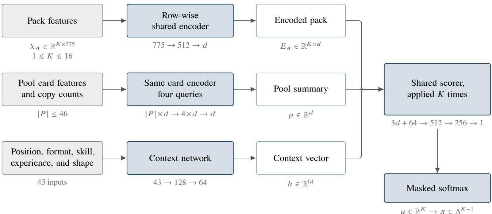
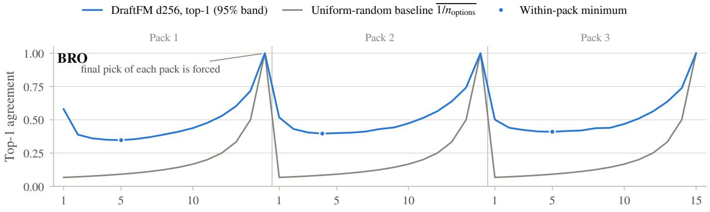
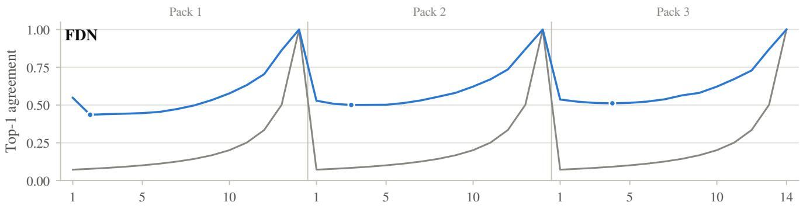
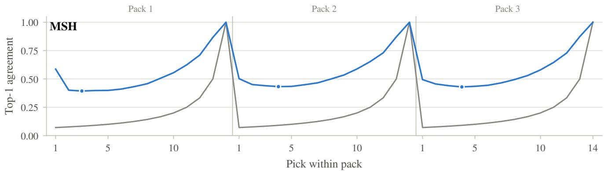
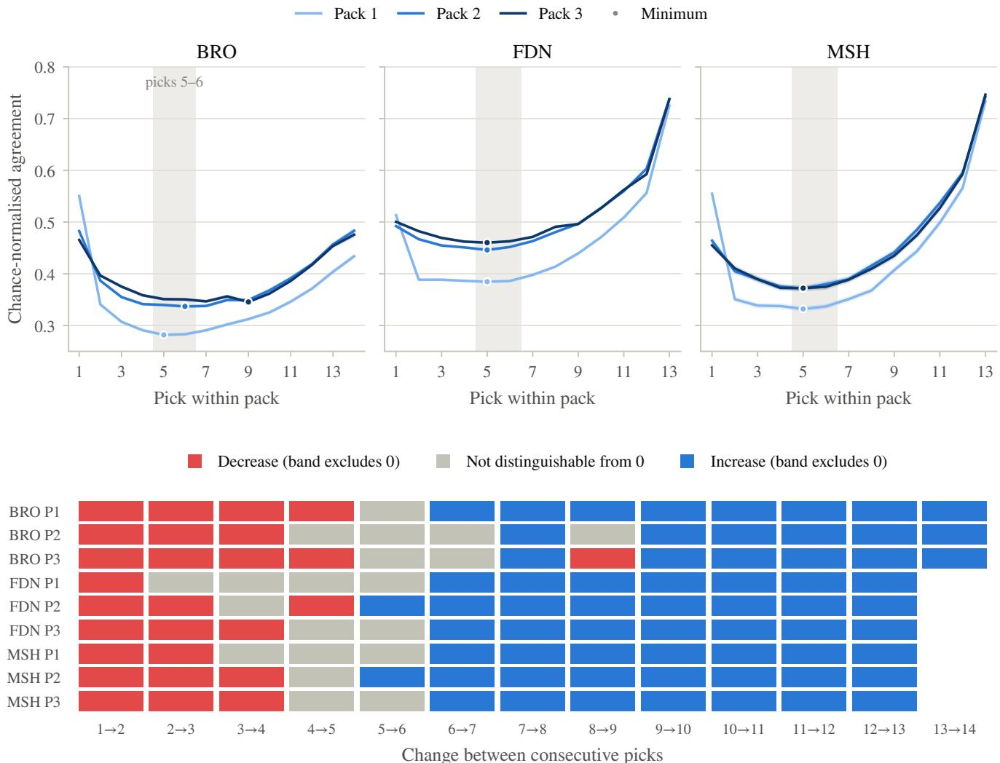
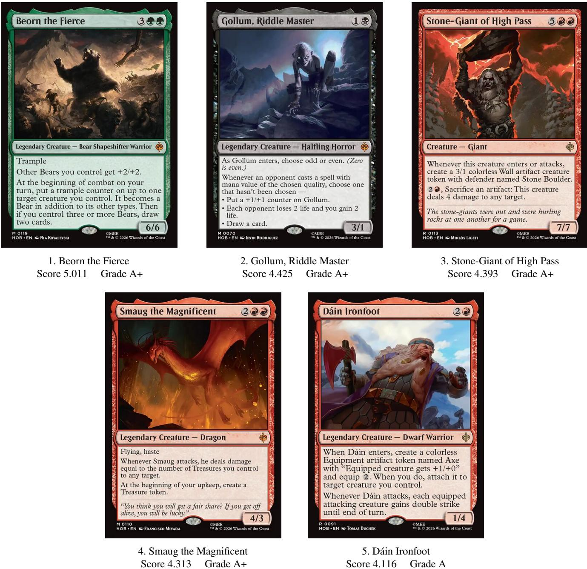
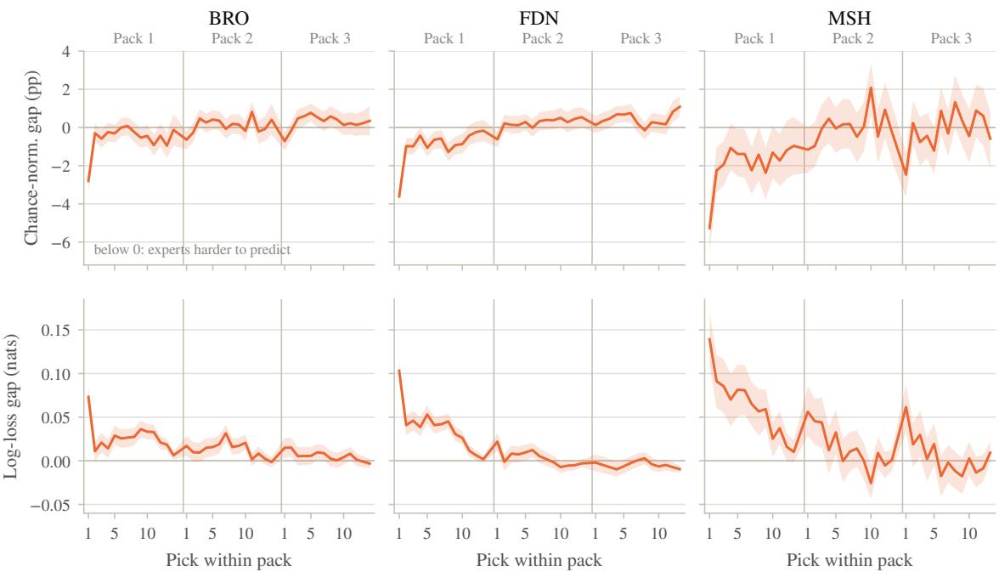
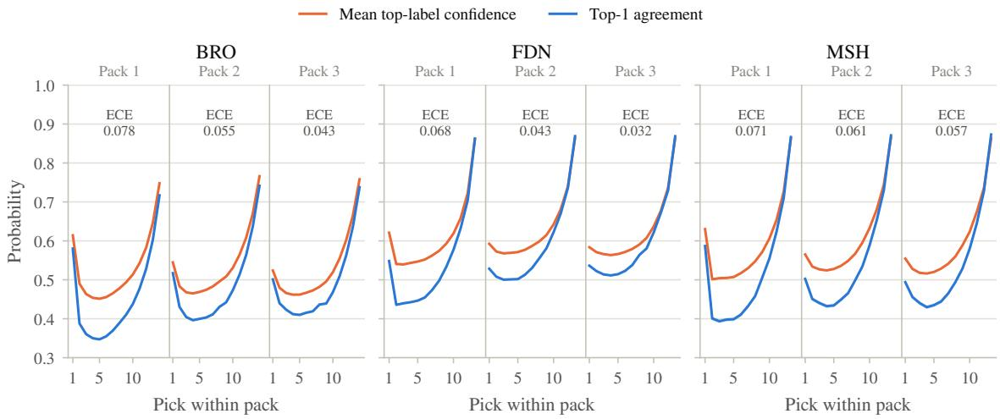

# DraftFM: A Foundation Model for Day-Zero Drafting in Magic: The Gathering

Brian Ward Independent Researcher brian.ward.92@gmail.com

August 10, 2026

## Abstract

Drafting a new Magic: The Gathering expansion begins before any pick from it has been observed: the complete card list is public, but the draft logs that supervised pick models train on do not yet exist. We study this day-zero regime directly. DraftFM is a discrete-choice policy that scores exactly the cards available in the current pack, conditioned on the drafted pool and the state of the draft. Every card enters as a frozen 775-dimensional function of its public card record, structured features and a fixed text embedding, with no card identities, set identities, or usage statistics anywhere in the model, so an unseen card is scored by the same machinery as a familiar one. A 1.6-million-parameter network fitted on 149 million human picks from 29 expansions predicts held-out picks in three expansions withheld in their entirety, reaching 50.8%, 60.4%, and 56.7% top-1 agreement, where uniform chance at the opening pick is about 7%. Refitted on all 32 observed expansions, the same architecture produced a card ranking for the then-unreleased set The Hobbit, sealed with its complete cryptographic provenance and published roughly 36 hours before the set became draftable on MTG Arena. The sealed ranking agrees with six independent expert reviewers roughly as much as those reviewers agree with one another. Evaluation against realized outcomes is committed to a follow-on note, whatever it shows.

Keywords: drafting, discrete choice, foundation models, behavioral prediction, out-of-sample generalization

## Contents

1 Introduction 3   
2 Data and Modeling Setup 4   
2.1 Data Sources 4   
2.2 DraftFM . 6   
2.2.1 Behavioral Prediction, Transfer, and Prior Work . 6   
2.2.2 Card Representation, Neural Architecture, and Fitting . 7   
3 Development Evaluation 11   
3.1 Design . . 11   
3.1.1 Whole-Expansion Development Comparison 11   
3.1.2 Measures and Width Decision 12   
3.1.3 Final Refit and Forecast Protocol . 13   
3.2 Width Comparison Results 14   
3.3 Predictive Behavior Across the Draft . 16   
4 Prospective HOB Forecast 16   
4.1 Forecast and Evaluation Timeline . 16   
4.2 Comparison with Content Creators 20   
4.3 Five Cards the Model Likes . 22   
5 Conclusion 23   
A Public Artifact and Reproducibility Record 24   
B Additional Results 25   
B.1 Complete Development Results . 25   
B.2 Positional Behavior 25

## 1 Introduction

Drafting in Magic: The Gathering is a sequential game of imperfect information. Eight players open packs of cards and pass them around the table, each privately assembling a deck one pick at a time. Every few months a new set of several hundred cards is released, and drafters must learn it from scratch. For a data-driven assistant this creates a day-one problem: supervised pick models train on public draft logs, and those logs appear on a delay of roughly two weeks after a set’s release (Brooks, 2024). The players who most want help with a new set are the ones no trained model can yet serve.

On release day, the state of the art is human judgment. Draftsim publishes hand-tuned ratings written by human experts (Draftsim, 2026), and drafters consult them because nothing learned is available. The learned literature is a within-set literature. It begins with Ward et al. (2021), who compare drafting agents on Core Set 2019: a random agent takes the human’s card 22% of the time, a bot driven by expert-tuned ratings 44.5%, and a neural network trained on human drafts 48.7%. Its successors define the deployed state of the art. The statistical-drafting models of Brooks (2024), multilayer perceptrons trained per set, reach roughly 70% pick agreement, and the puder transformer of Czerner (2025) reports 71%. All of these models encode cards as vocabulary indices. Each learns from picks made in the one set it serves, so none can score an unseen set, and none can exist until the two-week data lag has passed.

Large language models look like a way around the lag, because they can read a new card’s rules text the day it is published. Bertram (2025) tests this directly. Zero-shot GPT-4o agrees with human picks 43% of the time on Kamigawa: Neon Dynasty, below the expert-tuned ratings above, and supplying each card’s full rules text in the prompt lowers its accuracy further. Open 7 to 8B models fail to pick legal cards at all until they are tuned on a million picks from the target set, after which they still trail small supervised multilayer perceptrons at far higher inference cost. Even the 43% figure carries a caveat: the set was released years before the model’s training cutof, so post-release discussion of its strategy cannot be ruled out of the pretraining corpus, a leak a frozen feature-only encoder cannot have. The design lesson we take is to use a frozen text embedding as a feature, not a language model as the policy.

This paper goes further to ask how far pure transfer can go, and it isolates the day-zero question by construction. DraftFM is a single pick model trained across public 17Lands draft data. To DraftFM, a card is nothing but a frozen vector of public information: structured features parsed from its Scryfall record, plus a sentence embedding of its rules text. The model has no set-identity parameters and no per-card weights. Whatever it knows about a set it must infer from the cards in the pack and the drafter’s accumulating pool, and that inference transfers to a set released tomorrow, which a memorized card vocabulary cannot.

The nearest prior work is Bertram et al. (2024a), who established the problem of drafting a set the model never trained on and showed that multi-set pretraining, not the representation alone, is what buys transfer. Pretrained on thirteen sets and evaluated on held-out The Brothers’ War, their best representation reaches 55.4% pick agreement. That representation includes a block of post-release usage statistics computed from human play, so 55.4% is an anchor for generalizing across cards rather than for day-one deployment. Their day-one-feasible representation, features only, reaches 33.6% to 35.6% on unseen sets under single-set training, and no multi-set, features-only number was published. Filling that gap is this paper’s first contribution. We provide a feature-only policy trained on 29 expansions and evaluated zero-shot on three held-out and pre-selected expansions. Our feature set include no usage statistics from the target set, providing a day-zero draft advisor. To compare to existing literature, we chose The Brothers’ War as in Bertram et al. (2024a), as well as the recent Marvel Super Heroes set, and Magic: Foundations, which was released roughly at the midpoint of BRO and MSH’s release dates and carries some of the core themes and mechanics of MTG.

The second contribution is a forecast that could not be fitted after the fact. We sealed and publicly published a complete pack-1-pick-1 ranking of a new set before it was playable on MTG Arena, with the digests of its inputs, its model, and its outputs, and we commit in advance to the evaluation that will score it once the draft logs appear. The third is a comparison against the only forecasts that exist at that moment: the pre-release set reviews published by Limited content creators, placed on a common ladder and compared to each other and to the model on the same footing.

Table 1: The two data sources used by DraftFM.
<table><tr><td>Source</td><td>Unit</td><td>Information used</td></tr><tr><td>17Lands</td><td>One observed draft pick</td><td>The cards offered in the pack, the cards already drafted, the selected card, the pick&#x27;s location in the draft, and available drafter and event information</td></tr><tr><td>Scryfall</td><td>One card printing</td><td>Card identity, mana cost and value, colors, rarity, type line, rules text, numerical characteristics, layout and card-face structure, and set metadata</td></tr></table>

These numbers should not be read across regimes. A within-set model with access to its target set’s own picks is solving an easier problem than a model that has never seen the set, and the gap between the two is the subject of thi paper rather than a defect in either. Our own in-distribution validation agreement is 68.6%, squarely inside the 66–71% band the within-set literature reports, and that figure is not comparable to our zero-shot results. The 55.4% zero-shot figure above is likewise not a target we are trying to beat, because it uses human-usage statistics that do not exist on day zero. The development numbers we report on three whole expansions answer a diferent question: what a policy can do on a set for which nothing has yet been observed beyond its contents?

The rest of the paper is organized as follows. Section 2 describes the two data sources, the card representation, and the model. Section 3 gives the evaluation design, compares three model widths on three whole held-out expansions, and analyzes how predictive behavior varies across the draft. Section 4 reports the sealed pre-release forecast, its publication record, and the comparison with content creators. Section 5 concludes. Appendices cover the public artifact and the complete development results.

## 2 Data and Modeling Setup

## 2.1 Data Sources

DraftFM uses two public data sources. 17Lands supplies observed human choices and the state of the draft in which each choice was made. Scryfall supplies the printed characteristics of the cards. Table 1 gives this division of labor.

17Lands collects MTG Arena logs from players who opt in through its tracker and publishes anonymized bulk datasets for research and community analysis.1 We use its draft\_data files. Each row records one card selected by a tracked drafter. It includes the chosen card, the pack and pick numbers, draft and event identifiers, rank, and available outcome fields. It also includes two groups of card-count columns. A pack\_card\_<NAME> column says how many copies of that card were in the current pack. A pool\_<NAME> column says how many copies the player had already drafted. Together these columns record the choice set, the pool at the time of the choice, and the card taken. Unless otherwise noted, 17Lands publishes these files under the Creative Commons Attribution 4.0 International license. We attribute them as “Data from 17Lands.com (CC BY 4.0).”

For each set and draft format, we download the gzip-compressed CSV published in the 17Lands public Amazon S3 bucket. Files are fetched once, following the 17Lands usage guidelines for bulk downloads, and kept together with their source metadata and a content hash, which lets us identify the exact input used in an experiment. The acquisition step records source metadata and a content hash for every downloaded file, and a later step freezes those hashes into a manifest that subsequent stages verify against.

Our working collection contains 60 set-format files from 32 draft sets. It begins with Strixhaven: School of Mages (STX in April 2021) and extends through Marvel Super Heroes (MSH in June 2026). 17Lands publishes Premier and Traditional Draft as separate files, so most sets contribute two. Four do not: AFR, MID, MSH, and VOW have no Traditional Draft file in the collection. The 60 files are therefore 32 Premier Draft files, one per set, and 28 Traditional Draft files. Together they contain 169,932,378 observed picks. After combining formats within each expansion, the mean is 5.31 million picks per set, the sample standard deviation is 2.48 million, and the median is 4.84 million. Individual sets contribute between 1.07 and 10.60 million picks. BRO, FDN, and MSH are withheld in their entirety as whole-set development environments for zero-shot model comparison. They contain 12,571,237 picks that are never used for fitting or within-training validation. The remaining 29 sets contain 157,361,141 picks. A deterministic split by draft identifier assigns 149,483,436 of them to fitting and 7,877,705 to internal validation. The experimental-design section gives the complete protocol. HOB is not part of the observed-pick collection. At forecast time, HOB contributes only its public Scryfall records and the predictions sealed from them.

Table 2: Scryfall fields used for identity resolution and card features.
<table><tr><td>Record</td><td>Field group</td><td>Fields</td></tr><tr><td>Card printing</td><td>Identity resolution</td><td>Scryfall identifier, name, set code, digital status</td></tr><tr><td>Card printing</td><td>Card features</td><td>Mana cost, mana value, colors, color identity</td></tr><tr><td>Card printing</td><td>Card features</td><td>Rarity, type line, rules text, keywords, layout</td></tr><tr><td>Card printing</td><td>Card features</td><td>Power, toughness, loyalty</td></tr><tr><td>Card face</td><td>Card features</td><td>Face index, name, mana cost, type line, rules text, colors, power, toughness, loyalty</td></tr><tr><td>Set</td><td>Printing selection</td><td>Set code, release date</td></tr></table>

The raw 17Lands files are wide tables, with a separate pack and pool column for every card in a file’s vocabulary. Their metadata schema changed during the observation period. Early files use match-based skill-bucket names, some intermediate files call the rank field user\_rank, and modern files use game-based bucket names and rank. We map equivalent fields into one canonical schema, leave their recorded values unchanged, and insert typed nulls when an optional field did not yet exist. We then store the tables as compressed Parquet. This makes the same information readable in the same way across all 32 sets.

We also save the ordered card vocabulary defined by the pack\_card\_ columns and encode the card named in pick as its zero-based index in that vocabulary. This pick\_index identifies the card selected by the drafter. Draft position remains in pack\_number and pick\_number. These operations standardize storage. They neither construct model features nor alter the observed pack, pool, or choice.

Scryfall is a community-maintained MTG card database with a public $\mathrm { A P I . } ^ { 2 }$ We use its all\_cards bulk object for card identities and publicly observable card attributes, not for human choices or draft outcomes. The acquisition step queries the bulk-data endpoint, selects that object, follows the download URL supplied by the API, and retains a timestamped snapshot. The present endpoint supplies a gzip-compressed JSON Lines file with one JSON object per printing. The downloader also accepts the earlier JSON-array representation. Retaining the complete dated snapshot allows every run to use the same card information after Scryfall itself is updated. The snapshot used in this study was retrieved on August 8, 2026 at 13:35:59 EDT and stored as all\_cards\_20260808133559.json. Its SHA-256 digest is 4a60c20e800c5d55d2459e8edc19355bee794873fc84d653999a145fe9ac130f.

We keep the English-language records and write the three Parquet tables cards.parquet, card\_faces.parquet, and sets.parquet. Table 2 lists the fields used either to resolve a 17Lands card name to one reproducible Scryfall printing or to construct its semantic representation. Identity and release fields control that join. They do not enter the network as numerical card features. Image and price fields are retained for other applications but are not DraftFM inputs. Section 2.2.2 describes the transformations from these source fields to model features.

17Lands identifies cards by name, whereas Scryfall may contain several records for the same card because it has been reprinted or issued with diferent art. We normalize the 17Lands name and choose the corresponding Scryfall printing, preferring the printing from the same expansion. Full, front-face, and back-face names are recognized for multi-face cards. If a name cannot be matched, processing stops so that the missing card can be corrected. The result gives every card in a 17Lands pack or pool one Scryfall description.

## 2.2 DraftFM

## 2.2.1 Behavioral Prediction, Transfer, and Prior Work

A draft pick is a choice among the cards remaining in the pack. The choice is conditioned on the cards already drafted, the location of the pick, the event format, and the drafter’s observed experience. DraftFM estimates the probability that a human drafter selects each available card under those conditions. It is therefore a flexible discrete-choice model. The neural network replaces the linear utility function of a conventional conditional logit model, while the output remains a softmax over exactly the cards that were available (McFadden, 1974).

This target is behavioral. Agreement with a held-out pick tells us whether the model anticipated the action of a human drafter. It does not, by itself, show that the predicted card maximizes win rate or that the human pick was correct. DraftFM is trained on picks from players at diferent observed skill and experience levels and includes those quantities as conditioning variables. For deployed recommendations, we set these variables to describe a high-skill drafter. The resulting policy estimates choices associated with stronger drafters, but it remains a model of observed behavior rather than an “optimal draft model.”

Ward et al. (2021) established the modern behavioral benchmark for MTG drafting. The task is to predict the card a human selected from the available pack and current pool. They collected 107,949 simulated human drafts of M19, trained and tested within that single expansion, and compared random, rarity-based, expert-tuned, Bayesian, and neural agents. Their neural agent achieved 48.67% top-1 agreement, the strongest result in the comparison. It encoded the pool as a 265-dimensional vector of M19 card counts, scored all 265 card identities, and only then masked the scores to the current pack. Its per-pick analysis also established an important measurement fact. Raw agreement is highest near the beginning and end of each pack and lower in the middle. Pack size and consensus therefore change together over a draft, so an aggregate accuracy alone cannot establish that an agent is using context well.

DraftFM keeps their behavioral target but replaces the two fixed coordinate systems that prevent transfer. Those systems are the identity-indexed pool and identity-indexed output. Every pooled and ofered card is instead represented by shared features and processed by the same learned functions. The output softmax therefore has one entry per available card, not one entry per card identity in a particular set. One fitted policy can evaluate cards that did not exist during training.

Bertram et al. (2021) supplied the next essential step by making pool context part of the learned representation. Their contextual preference ranking model learns that the observed pick is a better addition to the current pool than each rejected card. That study still used one coordinate per M19 card. Their later work replaces those identitie with generalized representations assembled from structured card attributes, text, images, and human-usage statistics (Bertram et al., 2024a,b). They show decisively that semantic representations are required to score unseen cards meaningfully and that training across sets improves transfer. Their multi-set model, trained on 75 million picks, reached 55.44% top-1 agreement on the single withheld expansion BRO.

That result is the closest predecessor to DraftFM, but it does not isolate the day-zero multi-set question. The reported multi-set model combines card features and images with sixteen statistics derived from human use, including pick and game outcomes. Those statistics do not exist before a set is played. The paper tests a feature-only representation in a model trained solely on NEO, but does not report a feature-only model trained across multiple sets and evaluated zero-shot on a whole expansion. DraftFM isolates exactly that experiment. It trains one policy without target-set picks or performance statistics and evaluates it on three expansions withheld in their entirety.

Recent systems reinforce the distinction between specialization and transfer. The statistical-drafting models are refreshed from a new set’s 17Lands data, while the puder transformer learns tokens for a fixed historical card vocabulary.3 Both can achieve strong in-distribution agreement, but neither can assign a learned token to a genuinely unseen card on day zero. UrzaGPT instead expresses the pack and pool as language and fine-tunes a 7–8 billion parameter language model. It reaches 66.2% agreement after training on one million NEO picks, while its author explicitly leaves cross-expansion generalization open (Bertram, 2025). This demonstrates that language is a viable card interface. It does not test a learned policy on a new expansion. Cardsformer reaches the analogous conclusion in Hearthstone, using language representations so a game-playing policy can act on unseen cards (Xia et al., 2023).

Draft outcome models address a complementary question. Rigaux and Kashima (2026) use set-contextualized card embeddings and the full pick sequence to predict the eventual deck’s win rate, rather than the drafter’s next choice. Their results show that a draft sequence contains information about downstream performance. DraftFM models the choices that create that sequence. Among the published systems above, it is the first to combine multi-expansion behavioral training, semantic card inputs, explicit pool context, and multiple whole-expansion zero-shot evaluations without target-set usage statistics.

The FM in DraftFM stands for foundation model. A foundation model is trained broadly and reused across downstream applications (Bommasani et al., 2021). DraftFM is a foundation model for MTG drafting because one policy is trained across many draft environments and reused when the available card set changes. Its foundation role is operational. The same fitted model supplies P1P1 card ratings, context-dependent pick probabilities, and controlled analyses of how predicted behavior changes with the state of a draft. Target-set fitting is a separate and easier regime because it adds live information that is unavailable at release. We evaluate it separately rather than weakening the day-zero test.

Here, day zero means that the complete public card list is available but no picks from the target set are used. The prediction is therefore independent of the target set’s live pick counts, win rates, usage statistics, community ratings, and fitted card-identity parameters. This is the distinction that permits the sealed HOB forecast.

“Unseen” describes the set, not every card in it. A held-out expansion’s packs include some ordinary reprints, mostly staples and basic lands, that also appear in the fitting corpus under other sets. This confers no advantage under the contract above, because a reprint has no memorized identity to exploit, only the same frozen feature vector any novel card with identical features would receive. It does mean that set-level and card-level novelty are not the same claim.

Context also separates DraftFM from a static set review. At P1P1 the drafted pool is empty, so querying all cards under the same conditions produces a general card ranking. At later picks the pool encoder can change a card’s score in response to colors, repeated efects, curve requirements, and other learned card interactions. The accumulating pool therefore gives the model a progressively richer input. Later analyses test whether the model extracts predictive value from that information beyond the mechanical increase in raw agreement caused by shrinking packs.

Because the target is observational, the behavioral analyses in this paper are descriptive. For example, holding a pack fixed and varying the pool or skill condition can reveal an association learned by the model. It does not identify the causal efect of possessing a card or becoming a stronger player. We use held-out prediction and controlled model queries to distinguish what the model has learned without giving those comparisons a causal interpretation.

## 2.2.2 Card Representation, Neural Architecture, and Fitting

Each 17Lands row becomes one supervised choice problem. The cards with positive pack\_card\_ counts form the available alternatives. The pool\_ counts describe the state before the choice. The recorded pick is the target. Card are joined by name to Scryfall and then replaced by frozen feature vectors. Consequently, the training target come only from 17Lands, while the description of every candidate and pooled card comes only from Scryfall.

Every card is represented by 775 numbers. Of these, 391 are structured features and 384 form a text embedding. Table 3 gives the structured blocks. The design favors ordinary card properties that have the same meaning across expansions. It contains no card-identity, set-identity, artist, price, image, or post-release performance feature.

Two data-dependent vocabularies occur in this representation. The architecture reserves 128 subtype slots and 166 keyword slots, but a fitted manifest may populate fewer than the reserved number. The populated entries are selected from training-set cards and then frozen. Any unfilled reserved columns remain zero. In the final all-data manifest described in Section 3.1.3, the subtype vocabulary is populated to capacity, filling 128 of its 128 reserved slots, while the keyword vocabulary populates 145 of its 166 reserved slots and leaves the remaining 21 keyword columns permanently zero. The reserved counts in Table 3 are therefore the fixed width of the representation, not a count of distinct subtypes or keywords the model has seen. Unrecognized subtypes and keywords in a held-out set contribute to unmatched counts rather than creating new fitted columns. Numeric values are scaled and clipped, and an unavailable or unparseable characteristic receives an explicit missing indicator rather than silently becoming a meaningful zero. For multi-face cards, the numerical blocks describe the front face and explicit features record the presence and broad type of the back face.

Table 3: The structured component of the DraftFM card representation.
<table><tr><td>Feature block</td><td>Dimensions</td><td>Contents</td></tr><tr><td>Mana value</td><td>10</td><td>Scaled value and buckets from zero through eight or more</td></tr><tr><td>Mana cost</td><td>10</td><td>Colored and colorless pips, generic mana, and indicators for X, hybrid, and Phyrexian costs</td></tr><tr><td>Color</td><td></td><td>Five colors, number of colors, colorless, and multicolored</td></tr><tr><td>Color identity</td><td></td><td>WUBRG color-identity indicators</td></tr><tr><td>Supertypes and types</td><td>12</td><td>Legendary, snow, basic, and nine card types</td></tr><tr><td>Creature subtypes</td><td>129</td><td>Up to 128 reserved vocabulary slots and an unmatched count</td></tr><tr><td>Numerical characteristics</td><td>9</td><td>Scaled power, toughness, and loyalty with missing and</td></tr><tr><td>Rarity</td><td>5</td><td>variable-value indicators Common, uncommon, rare, mythic, and other</td></tr><tr><td>Keyword abilities</td><td>167</td><td>Up to 166 reserved vocabulary slots and an unmatched</td></tr><tr><td>Layout</td><td>10</td><td>count Layout class and double-faced-card indicators</td></tr><tr><td>Rules-text shape</td><td>26</td><td>Text length, line count, and fixed indicators for common functional patterns</td></tr><tr><td>Total</td><td>391</td><td></td></tr></table>

The remaining 384 values are an $L _ { 2 } { \mathrm { - n o r m a l i z e d } }$ embedding of the card’s type line and rules text from the frozen BAAI/bge-small-en-v1.5 sentence encoder, which is described by Xiao et al. (2023). A card’s own name is replaced before embedding so that a known proper noun cannot act as a hidden card identifier. Reminder text is retained because it may be the only definition available for a new mechanic, and the back face is appended when one exists. The sentence encoder is not fitted on draft picks. Its output is computed once per card and then held fixed during DraftFM training.

These exclusions define the transfer experiment as much as the included features do. A per-card parameter can memorize that a particular rare is strong. A target-set pick-rate feature can summarize thousands of people discovering the same fact. DraftFM receives neither. It must learn reusable relationships between observable card descriptions and human choices. New-set prediction is possible because a Scryfall record produces the same 775 inputs whether or not that card appeared in the training corpus.

Let � denote the cards actually available in the current pack and let $K = | A |$ . The candidate input is a matrix $X _ { A } \in \mathbb { R } ^ { K \times 7 7 5 }$ , not one flattened vector with a fixed number of columns. A 14-card P1P1 pack therefore contains $1 4 \times 7 7 5 = 1 0 { , } 8 5 0$ scalar values arranged as 14 instances of the same 775-feature representation. After one card is removed, a 13-card P1P2 pack contains $1 3 \times 7 7 5 = 1 0 , 0 7 5$ such values. There is no requirement that every choice supply at least 10,850 values.

The same card encoder $f _ { \mathrm { c a r d } }$ is applied row by row, with shared weights for every card and every pack position. It maps each raw vector through a $7 7 5 - 5 1 2 - d$ multilayer perceptron to a learned representation $e _ { i } \in \mathbb { R } ^ { d }$ . Thus the encoded pack has shape $K \times d .$ . This is a supervised representation learned for pick prediction, not an autoencoder. The network is never asked to reconstruct the 775 inputs. In the implementation the complete card list for a set is encoded once per homogeneous training batch, after which the pack simply indexes the appropriate rows of that shared table.

Rectangular tensors are used only to batch packs eficiently. Each row has 16 storage positions, enough for the largest supported pack, and positions beyond the � real candidates carry a PAD marker. A padded position is not a null card and does not contribute a learned feature vector. Its output score is masked to −∞ before normalization and its choice probability is exactly zero. The padding pattern is not passed to the card encoder or candidate scorer as a predictive feature. Pack and pick number enter separately through the context pathway described below.

  
Figure 1: The geometry of DraftFM for one observed pick. Each of the � real pack cards begins as the same 775-feature representation and becomes one �-dimensional row. The pool is compressed to one �-vector, the observed draft state becomes one 64-vector, and the scorer receives 3� + 64 values for each candidate. Its � scalar outputs form a probability vector over exactly the real cards in the pack. Batch and storage padding are omitted because they do not enter the scorer.

The network separately summarizes the accumulated pool � and combines that summary with the state of the draft. For a real candidate $i \in A$ , the computation can be written as

$$
e _ { i } = f _ { \mathrm { c a r d } } ( x _ { i } ) ,\tag{2.1}
$$

$$
p = f _ { \mathrm { p o o l } } \left( \{ ( e _ { j } , q _ { j } ) : j \in P \} \right) ,\tag{2.2}
$$

$$
h = f _ { \mathrm { c o n t e x t } } ( \mathrm { p o s i t i o n } , \mathrm { f o r m a t } , \mathrm { s k i l l } , \mathrm { s h a p e } ) ,\tag{2.3}
$$

$$
u _ { i } = f _ { \mathrm { s c o r e } } ( [ e _ { i } ; p ; e _ { i } \odot p ; h ] ) ,\tag{2.4}
$$

$$
\operatorname* { P r } ( Y = i \mid A , P , h ) = { \frac { \exp ( u _ { i } ) } { \sum _ { k \in A } \exp ( u _ { k } ) } } .\tag{2.5}
$$

Here $q _ { j }$ is the number of copies of pooled card �, ⊙ is an elementwise product, and $u _ { i }$ is the candidate’s unnormalized score. The same card encoder and scorer are used for every expansion. The scorer emits one scalar $u _ { i }$ for each of the � real candidates. Softmax normalization across those � scores produces a length-� vector of choice probabilities, and the observed pick identifies the target entry of that vector. Candidates are not concatenated into a single pack feature vector.

The card encoder applies layer normalization before the first linear layer and after the final GELU activation. The pool store reserves 46 distinct-card slots. That figure is an architectural capacity, not an observed count: the largest pool anywhere in the collection holds 44 distinct cards, and a row that needed more than the reserved 46 would abort the build rather than be silently truncated. Each card embedding is augmented by a learned count embedding, with counts capped at eight. Four learned queries summarize this unordered collection through four-head cross-attention. This construction does not assign meaning to the order in which the pool happens to be stored and is closely related to attention-based models for set-valued inputs (Lee et al., 2019). A learned null token represents the empty P1P1 pool.

The context pathway embeds the drafter’s observed game win-rate bucket, number of games bucket, and event format. 17Lands buckets both covariates for privacy and does not publicly document their precise computation window, so we use them as given, as a per-event skill signal rather than a calibrated skill estimate. It also receives seven functions of pack number, pick number, and current pool size, together with four public shape descriptors. These are normalized card-list size and indicators for 13-, 14-, or 15-pick packs. A small multilayer perceptron reduces these inputs to 64 dimensions. The candidate scorer concatenates the candidate embedding, pool summary, their elementwise interaction, and this context. A 512–256 multilayer perceptron then emits one score. A softmax over the valid cards in the pack turns those scores into choice probabilities. Candidates do not attend directly to one another in the width-comparison models. Pack composition determines which candidate scores enter the softmax.

Table 4: Fixed fitting recipe used for every model width.
<table><tr><td>Component</td><td>Setting</td><td>Role</td></tr><tr><td>Optimizer</td><td>AdamW with  $\beta _ { 1 } = 0 . 9$  and  $\beta _ { 2 } = 0 . 9 8$ </td><td>Adaptive stochastic optimization with decoupled weight shrinkage</td></tr><tr><td>Learning rate</td><td>Peak  $1 0 ^ { - 3 }$  with 2,000-step linear warmup, then cosine decay to a floor of 1% of peak</td><td>Stable initial updates followed by progressively smaller steps</td></tr><tr><td>Batch construction</td><td>8,192 picks with shard  $n _ { s } ^ { 0 . 5 }$  probability proportional to</td><td>Balance large-set coverage against domination by the largest files</td></tr><tr><td>Regularization</td><td>Weight decay 0.01, dropout 0.10 in the candidate scorer only, and label smoothing 0.05</td><td>Discourage brittle weights and overconfident probabilities</td></tr><tr><td>Gradient control</td><td>Global gradient norm capped at 1.0</td><td>Prevent an isolated large update from destabilizing fitting</td></tr><tr><td>Stopping rule</td><td>At most four corpus-equivalent passes, validation every 2,000 steps, and patience of three checks</td><td>Retain the strongest unseen-draft checkpoint instead of the final update</td></tr><tr><td>Random seed</td><td>17</td><td>Make initialization and sampling reproducible</td></tr></table>

The implementation also permits an attention tower over the complete card list of a set. A development comparison found that the simpler version without that tower performed better, so the width comparison keeps that tower of. Every candidate is still compared with the current pack through the final softmax. The three widths contain 979,823, 1,637,999, and 3,740,783 fitted parameters, respectively. None contains a card or set embedding. Their only set-relative information comes from observable card features, the cards accumulated in the pool, the cards currently ofered, and the four shape descriptors above.

We compared card widths � ∈ {128, 256, 512} under the fixed recipe of Table 4, evaluated zero-shot on the three development expansions. Diferences were small at the aggregate: the three-set mean top-1 spread was 0.2 percentage points, with set-level variation and no width best on every set. We selected the middle width, $d = 2 5 6 .$ which achieved the best three-set mean, was at least as accurate as the smaller model on every set within sampling uncertainty, and uses 44% of the largest model’s parameters and 43% of its training time. These three expansion are development sets; Section 3.1.1. Per-set results for every width and measure appear in Appendix B.

The model used for the prospective forecast is a separate run at that width, refit from fresh weights on all 32 sets under the same recipe. It carries the same 1,637,999 fitted parameters as the $d = 2 5 6$ development model and is identified by the checkpoint digest 9442f1de. . . Section 3.1.3 gives its protocol and provenance.

Training minimizes cross-entropy between the softmax distribution and the observed 17Lands pick. All picks from a draft remain together. A deterministic hash of the draft identifier assigns 95% of drafts from the 29 fitting sets to training and 5% to internal validation. This produces 149,483,436 fitting picks and 7,877,705 reserved validation picks. Internal validation selects the checkpoint within each run. The internal-validation data exclude all three development environments. Each check evaluates at most 200,000 reserved picks distributed approximately evenly across set-format shards.

These are conventional, fixed optimization controls. The peak learning rate and weight decay equal the defaults of PyTorch’s torch.optim.AdamW.4 The $\beta _ { 2 } = 0 . 9 8$ moment coeficient and dropout rate 0.10 follow standard attention-model practice (Vaswani et al., 2017). Weight decay gently shrinks fitted weights. Dropout randomly suppresses 10% of the activations in the candidate scorer’s first hidden layer during training and is applied nowhere else in the network. Label smoothing trains against a mixture of 95% of the observed-pick target and 5% of a uniform distribution over the valid pack. That last choice is especially natural for behavioral data, where the recorded selection is an observation rather than a uniquely correct answer.

Every constant in Table 4 is held fixed across the width comparison. The sole search dimension is the learned card width $d \in \{ 1 2 8 , 2 5 6 , 5 1 2 \}$ . The purpose is to compare representational capacity under one ordinary, stable recipe, not to optimize a separate training recipe around each development set. No substantive conclusion depends on treating these routine constants as uniquely optimal.

Skill conditions the scorer rather than the card representation. All available players can contribute examples during fitting, while inference can hold the skill variables at a prespecified deployment value. A P1P1 rating is obtained by using the empty-pool state and scoring all cards under that same fixed condition. During an actual draft, the identical model instead scores the cards in the current pack against the cards already selected. Section 3.1 will specify how the model width and deployment condition are chosen.

## 3 Development Evaluation

## 3.1 Design

## 3.1.1 Whole-Expansion Development Comparison

The comparison in this paper follows one protocol, fixed in writing before any comparison number was produced.5 Changing a definition in it after seeing results would invalidate the comparison. An earlier protocol, in which BRO, TMT, and SOS were development sets and MSH was a frozen single-use test set, describes a diferent experiment. That document and its code are preserved unchanged as a historical artifact and are not used here.

BRO, FDN, and MSH are whole-set development environments. They contributed neither observed picks nor feature-vocabulary entries to any of the three candidate models: the card-feature manifest and all three width variants were fit on the remaining 29 sets. They are inspected, compared across widths, and used to inform the architecture choice. No set here is a frozen test set, and a set code is a filter argument and nothing more.

The consequence is stated once, here, and plainly. BRO, FDN, and MSH are development sets: they selected the model width. Every number this paper reports on them is development evidence, and it reads optimistic relative to a never-inspected holdout. The paper has no never-inspected holdout. Later sections point back to this paragraph instead of restating it.

The evaluation population is every scored pick in the three sets. There is no sampling, and no skill filter is applied to the population itself. Table 5 gives the counts. MSH has no Traditional Draft shard, so its per-set numbers are Premier Draft only; per-format rows are reported beside the pooled per-set rows so that this asymmetry is visible rather than buried in an average. Rows are read from the same memmapped store the training loop reads. Because these sets were never trained on, the train and validation split recorded inside a shard carries no meaning here and is not applied, so all rows are evaluated. Population identity across models is exact: all three widths score the same rows of the same shards in the same order, which makes every cross-width comparison paired.

Scoring uses the training and serving forward path unchanged. The model runs in evaluation mode with dropout disabled and gradients switched of. Each pick is scored from its own observed context, meaning the pool the drafter actually held and the pack they actually saw; nothing is rolled forward from the model’s own earlier predictions. Conditioning in this comparison is human mode: every pick is scored with the drafter’s own observed win-rate and games-played bucket, exactly as training-time validation does. Deployment-mode conditioning, in which the skill variables are held at a prespecified value, is a serving question and belongs to the forecast protocol of Section 3.1.3 rather than to this comparison.

Table 5: Evaluation population for the whole-expansion development comparison. Every scored pick in each set is evaluated, with no sampling.
<table><tr><td>Set</td><td>Formats</td><td>Picks</td><td>Drafts</td></tr><tr><td>BRO</td><td>Premier, Traditional</td><td>4,616,619</td><td>104,676</td></tr><tr><td>FDN</td><td>Premier, Traditional</td><td>6,346,832</td><td>152,968</td></tr><tr><td>MSH</td><td>Premier only</td><td>1,607,786</td><td>38,580</td></tr><tr><td>Total</td><td></td><td>12,571,237</td><td>296,224</td></tr></table>

Before any pick is scored, the rail verifies and aborts on mismatch that the on-disk feature manifest’s content hash equals the expected value, that every run record and every checkpoint carries that same manifest hash, and that each checkpoint file’s SHA-256 equals the digest recorded when it was written. A feature width supplied by a shard that does not match the width a checkpoint expects is refused rather than silently truncated.

Execution is two-phase, which separates inference from reporting. Phase A runs each checkpoint once over each set and format and writes one prediction file per combination, holding one row per scored pick with its rank, probabilities, log loss, and the drafter’s skill fields. Phase B derives every table, curve, and figure in this paper from those cached files and never loads a network. Re-deriving a reported number therefore requires no accelerator, and every number in Section 3.2 and Appendix B traces to a cached file whose digest is recorded alongside the run.

Uncertainty is computed at the level of the draft, not the pick, because picks within one draft are not independent. The rebuild store carries the shard data but not the original draft identifier, so a draft key is derived from the shard itself: a draft’s picks are contiguous and strictly increasing in pack and pick number, so a new draft is declared when that key fails to increase or when the stored split hash of the draft identifier changes. Neither rule can split one true draft in two, and two adjacent drafts merge only if the pick key increases across their boundary and they also collide in a 1000-way hash, which is expected to happen fewer than once per shard against 13,000 to 133,000 drafts. This is a documented approximation, and it afects only the width of a confidence interval, never a point estimate.

## 3.1.2 Measures and Width Decision

Let � be the number of real candidates in the pack and let the target rank be one plus the number of candidates the model scores strictly above the card the human took. Four measures are reported.

Top-1 agreement is the primary behavioral measure. It is the fraction of picks whose target rank is one, that is, the fraction of picks on which the model’s most probable card is the card the human selected. Using the rank rather than the argmax means an exact score tie with the human’s card counts as agreement; the two definitions can difer only on exact floating-point ties, and the rail measures and reports that disagreement count as a diagnostic. Top-3 agreement is the fraction of picks whose target rank is at most three. Mean log loss is the mean of − log � over picks, in nats, where � is the probability the softmax over the pack’s real candidates assigns to the card the human took. Top-label expected calibration error asks whether the model’s stated confidence in its own recommendation is warranted: confidence is the probability of the model’s argmax candidate, accuracy is whether that argmax matched the human pick, and the two are compared within 15 equal-mass bins, each holding the same number of picks rather than spanning the same probability width, and averaged with weights proportional to bin size.

Aforced pick is a pack with exactly one real candidate.6 It is scored trivially, because the rank is always one and the probability is always one, so forced picks inflate top-1 and deflate both log loss and calibration error. Forced picks are the final pick of each pack almost without exception. We therefore report every metric twice, once over all picks and once over non-forced picks only, and treat neither as the sole headline.

The natural reference point for agreement is the 1/� baseline, the agreement a uniform-random picker would achieve on the same picks. It is computed per draft position as the mean of $1 / n$ over the picks in that position, which is a mean of reciprocals rather than the reciprocal of a mean pack size. Because a pack loses one card per pick, this baseline rises steeply over a pack and reaches one at the forced final pick, so raw agreement and pack size move together. Where that mechanical component must be removed we report chance-normalized agreement, $( \operatorname { a c c } - b ) / ( 1 - b )$ with � the position’s baseline, excluding forced picks where $b = 1$ leaves the quantity undefined.

Each measure is also reported on an expert slice as well as on all drafters. The expert slice is high win rate and high experience together, a game win-rate bucket of at least 0.55 and a games-played bucket of at least 100, which is the same definition the earlier protocol used.

All intervals reported in this paper are 95% percentile cluster bootstraps with the draft as the resampling unit and $B = 1 0 0 0$ resamples at a fixed seed. Drafts are drawn with replacement, � from �, the statistic is recomputed on the resampled collection of whole drafts, and the 2.5th and 97.5th percentiles form the interval. All measures share identical resamples, so their intervals are mutually consistent, and chance-normalized statistics are recomputed inside each resample rather than transformed from a raw interval. Calibration error is not a mean over picks, so it uses a separate kernel in which the bin edges are held fixed at their full-sample equal-mass values instead of being recomputed in each resample. That fixed-edge choice is the single approximation in the interval machinery. The calibration point estimate is unafected, and the run’s self-test measures the resulting interval discrepancy against the literal estimator on a subsample and fails if it exceeds $2 \times 1 0 ^ { - 3 }$

The draft is the resampling unit because picks are not independent. The picks of one draft share a drafter, an evolving pool, and the packs passed around a pod, so resampling whole drafts captures arbitrary dependence within a draft by construction. Independence is then assumed across drafts, not across picks. Two residual layers are not captured. The same anonymous player contributes multiple drafts, and player identity is absent from the public data, so player-level clustering is not possible. Tracked drafters also occasionally share a pod, so a small fraction of nominally distinct drafts saw the same physical packs. Both would, if anything, widen the intervals rather than narrow them. At the level of a single pack-and-pick cell the question does not arise, because each draft contributes at most one pick there and the cluster bootstrap coincides with the simple binomial interval.

Results are displayed by set before any average. The unweighted three-set mean is printed after the per-set rows as a summary and is not a winner rule: a width that leads on the mean while losing on an individual set must have that reversal stated explicitly, and equal predictive performance at materially lower size and runtime is a legitimate reason to prefer a smaller width. The width decision is made by the author after reviewing predictive performance, parameter count, and training time together, and the decision rule was fixed before the numbers were seen.

## 3.1.3 Final Refit and Forecast Protocol

The model that produces the prospective forecast is not the development checkpoint under a new name. After the width decision was made, a fresh feature manifest was built over all 32 sets and a new model was fit at $d = 2 5 6$ from randomly initialized weights, with no initialization from any width-comparison checkpoint. It is a separate run, trained from a clean tree at repository revision 7c113e1. Every constant in Table 4 is unchanged, including the random seed 17. The only diferences from a width-comparison run are the corpus, which now includes BRO, FDN, and MSH, and the feature manifest, which is rebuilt over that corpus.

The corpus is the complete 60-shard collection of 169,932,378 observed picks described in Section 2.1. The same deterministic split by draft identifier assigns 161,428,453 picks to fitting and 8,503,925 to internal validation, and internal validation again selects the checkpoint within the run. MSH contributes its Premier Draft shard only, because no Traditional Draft file exists for it. Fitting reached its best internal-validation top-1 agreement of 68.34% at step 34,000 of 78,822 planned steps, and the run took two hours and 42 minutes of wall-clock time. The fitted model has 1,637,999 parameters, and its selected checkpoint has SHA-256 digest 9442f1de. . . . Because these development sets are now inside the fitting corpus, this internal-validation figure is not comparable to the zero-sho development numbers in Section 3.2, and no zero-shot claim is made for this model on any set.

Table 6: The frozen 13-level letter ladder. Each band is a percentage of the scored card universe, assigned by rank. The percentages sum to 100.
<table><tr><td>Grade</td><td>A+</td><td>A</td><td>A-</td><td>B+</td><td>B</td><td>B-</td><td> $\mathbf { C } +$ </td><td>C</td><td>C-</td><td>D+</td><td>D</td><td>D-</td><td>F</td></tr><tr><td>Share (%)</td><td>2</td><td>3</td><td>5</td><td>8</td><td>12</td><td>12</td><td>13</td><td>15</td><td>12</td><td>8</td><td>5</td><td>3</td><td>2</td></tr></table>

The rebuilt manifest has content hash 793b9db7. . . and populates its two data-dependent vocabularies from the 32 fitting sets. The creature-subtype vocabulary reaches its reserved capacity, filling all 128 slots. The keyword vocabulary fills 145 of its 166 reserved slots. HOB contributes nothing to either vocabulary, and this is a verified property rather than an intention: a control manifest rebuilt with the HOB card records made available to the vocabulary selector produces a byte-identical content hash, which is only possible if no HOB card introduced a vocabulary entry. All 321 HOB expansion records nevertheless encode successfully to the standard 775 finite features, so no HOB card is missing a representation. HOB introduces exactly one keyword that the vocabulary does not contain, Mountaincycling, and it is counted in the unmatched channel described in Section 2.2.2 rather than receiving a fitted column of its own. HOB therefore contributes public card descriptions and nothing else. It supplies no picks, no outcomes, no community ratings, and no fitted vocabulary entries.

Serving artifacts were exported from the selected checkpoint and checked against the training forward path on real held-out picks. The largest absolute discrepancy between the training implementation and the exported serving graph was $3 . 6 \times 1 0 ^ { - 6 }$ , and the two agreed on the recommended card for all 1,536 picks checked. The reported forecast is therefore a property of the fitted model, not of a serving path that drifted from it.

The forecast condition is a fixed P1P1 query. The format is Premier Draft, the pool is empty, the position is pack one, pick one, and the pack shape is the 14-pick shape, which is the shape the two most recent sets in our collection use and the shape HOB uses, since HOB has no bonus sheet. Skill and experience are held at the threshold pair that defines the expert slice of Section 3.1.2, recorded in the seal manifest as win-rate bucket identifier 28, a game win-rate bucket of at least 0.55, and games-played bucket identifier 4, a bucket of at least 100 games. The exported serving artifacts carry a diferent default, a 0.66 win-rate bucket and the 1,000-game bucket, so the sealed ratings are deliberately not identical to what a deployed assistant returns under its own defaults. No sensitivity scan over the conditioning is performed; the condition is chosen once and frozen.

The card universe is every one of the 321 HOB expansion records in the frozen Scryfall snapshot, which is the complete oficial card list as that snapshot mirrors it. Scores are published as a ranking over the 193 unique card names, identical printings share a score under a documented deduplication rule, and basic lands are flagged as display-only. This universe is a verified superset of the 188 non-basic draftable cards that every content-creator source covers, so no comparison is limited by the model’s coverage.

The raw score, rank, and percentile are the statistical forecast. A letter grade is a presentation layer on top of them, and its rule is frozen before any comparison statistic is computed. The ladder has 13 levels: every letter from A to D carries a plus and a minus variant and F is unsigned, giving A+, A, A−, B+, B, B−, C+, C, C−, D+, D, D−, and F. Letters are assigned by fixed percentile bands of the scored universe, not by fixed score cutofs, so the distribution of DraftFM letters is fixed by construction. Table 6 gives the bands.

## 3.2 Width Comparison Results

Table 7 gives the primary result: top-1 agreement on each development expansion for each of the three card widths, over the full population of 12,571,237 picks in 296,224 drafts. Per-set rows come first, and the unweighted three-set mean is printed after them as a summary rather than as a decision rule. Top-3 agreement, mean log loss, and top-label calibration error appear in Appendix B; the expert-slice and per-format values accompany the artifact data.

The three widths land close together. Across the whole population the largest per-set diference between any two widths is 0.94 percentage points, on BRO, and the three-set mean spans only 0.21 points from best to worst. Level diferences between the sets themselves are far larger than diferences between widths: BRO sits near 50%, MSH near 57%, and FDN near 60% at every width. A set’s dificulty, not the model’s capacity, dominates this table.

Table 7: Top-1 agreement (%) on the three whole-expansion development sets, all drafters, formats pooled. The three-set mean is unweighted and is a summary, not a winner rule. Point estimates are shown; the 95% percentile cluster-bootstrap intervals resampling drafts $( B = 1 0 0 0 )$ have half-widths of at most ±0.09 percentage points on these values, and complete intervals accompany the artifact data.
<table><tr><td colspan="4">Card width d</td></tr><tr><td>Set Picks</td><td>Drafts</td><td>128</td><td>256</td><td>512</td></tr><tr><td>All picks</td></tr><tr><td>BRO 4,616,619</td><td>104,676</td><td>50.63</td><td>50.83 49.89</td></tr><tr><td>FDN</td><td>6,346,832</td><td>152,968 60.15</td><td>60.37</td></tr><tr><td>MSH</td><td>1,607,786</td><td>38,580 56.71</td><td>60.56 56.67 56.79</td></tr><tr><td>Mean</td><td>12,571,237</td><td>296,224 55.83</td><td>55.96 55.75</td></tr><tr><td colspan="4">Non-forced picks</td></tr><tr><td>BRO</td><td>4,309,696 104,663</td><td>47.11</td><td>47.33 46.32</td></tr><tr><td>FDN</td><td>5,892,768 152,941</td><td>57.08</td><td>57.32 57.52</td></tr><tr><td>MSH 1,492,957</td><td>38,571</td><td>53.38</td><td>53.34 53.47</td></tr><tr><td>Mean 11,695,421</td><td>296,175</td><td>52.52 52.66</td><td>52.44</td></tr></table>

Table 8: Size and cost of the three widths. Training time is wall clock on the same device; evaluation throughput is measured over the full 12,571,237-pick development population. Internal-validation top-1 is measured on reserved drafts from the 29 fitting sets and is not a development-set result.
<table><tr><td>Width d</td><td>Parameters</td><td>Share of d=512</td><td>Train (h)</td><td>Eval (picks/s)</td><td>Internal val. top-1</td></tr><tr><td>128</td><td>979,823</td><td>26%</td><td>2.35</td><td>230,496</td><td>68.59%</td></tr><tr><td>256</td><td>1,637,999</td><td>44%</td><td>3.02</td><td>129,494</td><td>68.56%</td></tr><tr><td>512</td><td>3,740,783</td><td>100%</td><td>6.99</td><td>53,458</td><td>68.62%</td></tr></table>

No width wins everywhere, and the reversals are explicit. On BRO the middle width leads and the largest width is last, 0.94 points behind it with disjoint intervals. On FDN and MSH the ordering flips and the largest width leads. On FDN it leads its runner-up, $d = 2 5 6$ , by 0.19 points. On MSH it stands 0.12 points above $d = 2 5 6$ , but $d = 2 5 6$ is last there and the runner-up is $d = 1 2 8$ , over which the lead is 0.08 points with overlapping intervals. The pattern is identical on non-forced picks and on the expert slice, so it is not an artifact of the forced-pick rule or of the population’s skill mix. Because the mean-best width is not the set-best width on two of three sets, the mean is reported as a summary and the reversals are stated rather than averaged away.

We selected $d = 2 5 6$ . It achieves the best three-set mean on all four slice-by-policy combinations. Against the smaller width it is at least as accurate on every set: it leads on BRO and FDN with disjoint intervals, and on MSH the two are indistinguishable, with intervals that overlap over most of their length. Against the largest width it gives up 0.19 points on FDN and 0.12 points on MSH and gains 0.94 points on BRO. What it buys is compression. Table 8 gives the cost side: the selected model holds 1,637,999 parameters, which is 44% of the largest model’s 3,740,783, and it trained in 3.02 hours against 6.99, or 43% of the time. It also scores about 2.4 times as many picks per second at evaluation. Paying 2.3 times the parameters and 2.3 times the training time to move a three-set mean by −0.21 points, while losing nearly a full point on one of the three sets, is not a trade we take. Equal predictive performance at materially lower size and runtime was fixed in the protocol as a legitimate reason to prefer a smaller width, and that is the case here.

Two limits on this table should be carried forward. First, these are development sets; Section 3.1.1. Second, the internal-validation column of Table 8 separates the three widths by 0.06 percentage points and orders them $5 1 2 > 1 2 8 > 2 5 6 .$ , which is not the order any width takes on BRO or FDN. Held-out drafts from sets the model has already seen do not substitute for a whole unseen expansion, which is the reason the whole-set comparison exists.

## 3.3 Predictive Behavior Across the Draft

Aggregate top-1 agreement conceals a strong positional structure. Following Ward et al. (2021), we report agreement in each pack-and-pick cell beside the agreement a uniform-random picker would achieve there, the mean of 1/� over the picks in that cell (Figure 2). Their pattern reproduces on all three development sets. Agreement is highest at the first pick of a pack, between 0.49 and 0.59, falls to a minimum within the first five picks, between 0.35 and 0.51, and then climbs to between 0.72 and 0.87 at the last non-forced pick before the forced final pick trivially reaches one. Because a pack loses one card per pick, the random baseline climbs over the same span from 0.067 to 0.50. Pack size and agreement move together, so the aggregate number cannot by itself be read as evidence about how the model uses context. We therefore also report chance-normalized agreement, (acc − �)/(1 − �) with � the cell’s baseline, excluding the forced final pick where � = 1 leaves the quantity undefined (Figure 3).

Normalizing removes the mechanical component but not the positional structure. The normalized curve declines over the opening picks of every pack, turns at pick 5 or 6, and rises thereafter, gaining between +0.125 and +0.401 from that turn to the last non-forced pick. On eight of the nine pack-by-set curves the turn is also the curve’s lowest point. The exception is BRO pack 3, whose minimum falls at pick 9, 0.345 against 0.351 at pick 5 and 0.350 at pick 6, and that is where Figure 3 places that curve’s minimum marker. Measured from the true minima rather than from the turn, the gains run from +0.130 to +0.401. We tested whether the rise is monotone from an early pick, as an earlier reading of these curves had suggested, and it is not. Taking pick 3 as the start, none of the nine curves is monotone and ten pick-to-pick decreases have 95% intervals excluding zero; from pick 4, four remain, three of them at the step into pick 5. The turn itself is clean: at picks 5 and 6 no curve shows a band-supported decrease, and from pick 6 onward the increase is band-supported at essentially every step. The sole exception after pick 5 is that same BRO pack 3 step from pick 8 to 9, a decrease of 0.011 with a 95% interval of [−0.016, −0.006]. The rise also does not generally restore the pack’s opening level. It does not in BRO packs 1 and 2: pack 1 never returns to its pick-1 value, and pack 2’s final pick clears that value by 0.0005, far inside the intervals. It does in BRO pack 3, where pick 14 reaches 0.476 [0.470, 0.481] against 0.465 [0.462, 0.469] at pick 1, and in FDN and MSH, where the pick-1 value is exceeded from pick 9 to 12 onward. The description we carry forward is therefore that normalized agreement declines over the first four or five picks, turns at pick 5 or 6, and rises at essentially every later step. These are descriptive statements about the fitted policy’s predictions. Nothing here attributes the pattern to the pool encoder or to any other component, which would require an identifying comparison this design does not supply.

Two further positional results are reported in Appendix B rather than here. Picks by experienced, high-win-rate drafters are harder to predict than the population, and that gap is concentrated at the very beginning of the draft, reaching −2.8, −3.6, and −5.3 normalized percentage points at the first pick on BRO, FDN, and MSH before becoming indistinguishable from zero across most of pack 3 (Figure 5). Over the same span the model is overconfident everywhere and progressively less so, with mean top-label confidence exceeding top-1 agreement by 0.068 to 0.078 in pack 1 and by 0.032 to 0.057 in pack 3 (Figure 6).

The by-position shape is a property of the model family rather than of the selected width. Paired diferences between widths on the normalized curve are small against a curve that spans 0.28 to 0.75, and the between-width Pearson correlation of the curves is at least 0.996, so the shape is width-invariant even where a level diference is resolvable. Those paired diferences are bootstrapped directly, since all three widths scored identical pick populations.

## 4 Prospective HOB Forecast

## 4.1 Forecast and Evaluation Timeline

The release of a Magic: The Gathering set occurs over several stages rather than on a single date. Wizards of the Coast begins by previewing individual cards through oficial articles and participating content creators. It then publishes a complete card image gallery before the set becomes widely available for play. This creates a short interval during which the complete public card list is available but no large-scale digital draft data yet exist.

  
Figure 2: Top-1 agreement against draft position on the three development sets, with the uniform-random baseline, the mean of $1 / n ,$ at each position. DraftFM � = 256, all drafters, all picks, formats pooled. Agreement is highest at the first pick of each pack, falls to a minimum, marked, within the first five picks, and rises to the end of the pack, where the final pick is forced and agreement is one by construction. The baseline rises with the same geometry, so pack size and agreement move together. Shaded bands are 95% percentile cluster-bootstrap intervals resampling drafts (� = 1000); they are narrower than the plotted line at most positions, with a median width of 0.006.

For Magic: The Gathering | The Hobbit (HOB), the preview season began on July 18, 2026, and the complete card image gallery became available on July 31, 2026.7 The set was first playable at pre-Prerelease events at Gen Con from July 30 through August 2. Local game store (LGS) Prerelease events began on August 7, HOB was scheduled to become available on MTG Arena on August 11, and its global tabletop release was scheduled for August 14.8 Table 9 summarizes this chronology. Date ranges are ordered first by their starting date and then by their ending date.

  
Figure 3: Chance-normalized agreement, (acc − �)/(1 − �) with � the mean of 1/� at that position, against pick within pack, by pack. Forced final picks are excluded because � = 1 makes the statistic undefined. Top: the curve declines over the opening picks, turns at pick 5 or 6, shaded, and rises to the end of the pack. Bottom: the sign of every pick-to-pick change, classified by whether its 95% interval excludes zero. Bands and step classifications are 95% percentile cluster bootstraps resampling drafts (� = 1000), with the normalized statistic recomputed inside each resample and � re-derived there. DraftFM � = 256, all drafters, formats pooled.

During this interval, Limited-focused content creators publish set reviews in which they evaluate the cards before acquiring substantial experience with the completed draft format. These reviews commonly assign ordinal letter grades, sometimes including plus and minus modifiers, grade ranges, or a separate “build-around” designation.9 Because a review may be distributed across several videos or podcast episodes, we record both the first and last publication dates represented by each source. Table 10 records the HOB material available as of August 9, 2026. Sources are ordered by the left endpoint of their publication interval and then by the right endpoint.

Nizzahon’s six-part review covered multicolored and colorless cards followed by the five colors in WUBRG order. The series began on July 31 and concluded on August 3.10 Card Game Base published the earliest full-coverage written tier list, a single-author A-to-F grading of all 188 draftable non-basic cards by Anže Mlakar on August 1.11 Draftsim’s set review by Andrew Quinn, published August 3, graded the same 188-card universe on a 0–10 numeric scale;12 Limited Resources episode 865, published August 3, covered every HOB common and uncommon.13 Limited Level-Ups released a three-part video guide on August 5–6 with a companion tier list, maintained by co-host Marc Anderson, whose pre-Prerelease state (last updated 2026-08-05) grades the full 188-card universe.14 As of the August 9 cutof, the Limited Resources feed contained no corresponding HOB rare-and-mythic episode.15 NicolaiBolas’s full per-card tier list was transcribed on August 9 from his 17lands tier-list export and is included in the comparisons below; his file carries a retrieval date rather than a publication date, and republication permission for the complete grade table is still pending, so we report agreement statistics rather than his grades. If a source later provides separate ratings from multiple hosts, those ratings will be preserved separately. If the hosts publish a single consensus grade, the podcast will be treated as one forecast source.

Table 9: Release chronology for Magic: The Gathering | The Hobbit.
<table><tr><td>Event</td><td>Start</td><td>End</td></tr><tr><td>Official preview season</td><td>2026-07-18</td><td>2026-07-31</td></tr><tr><td>Gen Con pre-Prerelease events</td><td>2026-07-30</td><td>2026-08-02</td></tr><tr><td>Complete card image gallery</td><td>2026-07-31</td><td>2026-07-31</td></tr><tr><td>Local game store Prerelease events</td><td>2026-08-07</td><td>2026-08-13</td></tr><tr><td>MTG Arena release</td><td>2026-08-11</td><td>2026-08-11</td></tr><tr><td>Global tabletop release</td><td>2026-08-14</td><td>2026-08-14</td></tr></table>

Table 10: Pre-Arena expert HOB set-review sources available as of August 9, 2026. \*Retrieved date; the source carries no publication date.
<table><tr><td>Source</td><td>Rater or raters</td><td>Medium</td><td>Publication interval</td><td>Coverage</td></tr><tr><td>Nizzahon Magic</td><td>Nizzahon</td><td>YouTube</td><td>2026-07-31-2026-08-03</td><td>Full set in six videos</td></tr><tr><td>Card Game Base</td><td>Anže Mlakar</td><td>Website</td><td>2026-08-01</td><td>Full draftable set (188 cards)</td></tr><tr><td>Draftsim</td><td>Andrew Quinn</td><td>Website</td><td>2026-08-03</td><td>Full draftable set (188 cards)</td></tr><tr><td>Limited Resources</td><td>Marshall Sutcliffe and Luis Podcast Scott-Vargas</td><td></td><td>2026-08-03</td><td>Commons and uncommons</td></tr><tr><td>Limited Level-Ups</td><td>Marc Anderson</td><td>YouTube and website</td><td>2026-08-05</td><td>Full draftable set (188 cards)</td></tr><tr><td>NicolaiBolas</td><td>NicolaiBolas</td><td>17lands tier list (via patron link)</td><td>2026-08-09*</td><td>Full draftable set (188 cards)</td></tr></table>

The letter systems these creators use are informal but remarkably consistent conventions rather than ad hoc labels. Introducing the Limited Resources review, Luis Scott-Vargas described the scale as “A through F with two subgrades,” where the A’s are “the bombs and game-winners, cards that are good in many situations, especially when behind,” the B’s “actively pull you towards their colors,” the C’s are playable and interchangeable—“they’re the pawns of Limited”—the D’s are cards “you’re unhappy to run,” and the F’s are “basically just straight up unplayable”; the two subgrades mark sideboard cards and build-arounds, “cards that by themselves don’t do anything, but in the right deck, they can be your best card.”16 This shared vocabulary is what makes cross-creator comparison meaningful: every source in Table 10 publishes per-card ordinal evaluations on either this letter convention or an explicit numeric scale, and each was released before large-scale play of the completed format was possible.

Table 11: Files in the published seal and their SHA-256 digests. Each file was re-downloaded from the published tag and re-hashed; every digest matched the value recorded at generation time.
<table><tr><td>File</td><td>SHA-256</td><td>Contents</td></tr><tr><td>hob_p1p1_forecast.csv</td><td>a16c34767aa382e7703f480207f84804 84e29ad22bbab2142aa2195e9b9a94a9</td><td>Rank, name, score, percentile, and grade for all 321 records</td></tr><tr><td>hob_p1p1_forecast.parquet</td><td>4c539b9cd78d669c8b9d9b79745d8009 f0fc65dc592cc6007bbba91767e20e25</td><td>The same table in columnar form</td></tr><tr><td>seal_manifest.json</td><td>f7832e79f918bd5b0f04daf0c280a264 4941a78f7a74a4a1b7496924b9d7b553</td><td>Conditioning, universe, ladder definition, and the full provenance chain</td></tr><tr><td>README.md</td><td>a6fa0399cb0be38f0a9ebdd3495a53fc 2692e57f7e552b00bfdc00cb1d54e48c</td><td>Plain-language description of the artifact and its limits</td></tr></table>

We use the interval between publication of the complete gallery and the August 11 MTG Arena release to establish a verifiable pre-Arena forecast milestone.

That milestone has been met. The forecast was generated at 2026-08-09T23:33:45Z and published at https://github.com/brianward92/draftfm under the annotated tag draftfm-v1.0, whose server-side tagger date is 2026-08-09T23:56:16Z, with the accompanying release published one second later. Both timestamps precede the scheduled August 11 MTG Arena release by roughly 36 hours.

The published artifact contains scores, ranks, percentiles, and the frozen presentation grades for all 321 HOB expansion records, together with the manifest that identifies everything used to produce them. Table 11 gives the SHA-256 digest of each published file. The forecast was produced by checkpoint 9442f1de. . . under feature manifest 793b9db7. . . , trained at repository revision 7c113e1 and scored at revision eb27b8c; the manifest also records the card-list and printing-list digests and the full Scryfall source chain, and Appendix A reproduces that chain.

Two properties make the seal checkable rather than merely asserted. Scoring is CPU-only and reads no clock, hostname, or random number generator, and it was executed four times in total, twice under the committed scoring revision, with byte-identical CSV and Parquet output on every run. Independently of that, all four published files were downloaded again from the tag after publication and re-hashed, and each digest matched.

The milestone is specifically a pre-Arena forecast. It is not a claim that no person had previously played with HOB cards. Limited human play had already occurred at Gen Con and at local game store Prerelease events. The timestamps establish the narrower claim that the reported DraftFM ratings existed before HOB became available for large-scale drafting on MTG Arena.

The prospective artifact does not use HOB draft outcomes from 17Lands and does not claim that DraftFM is more accurate than any expert reviewer. The out-of-sample outcome evaluation begins when 17Lands first publishes a suficiently complete HOB draft dataset. We will freeze that dataset by retrieval time and cryptographic hash and publish a follow-on note comparing the sealed DraftFM predictions head-to-head with the pre-Arena expert forecasts. Every forecast will be evaluated on the same set of matched cards and against the same realized HOB outcomes. The follow-on comparison will be reported regardless of which forecast performs best.

## 4.2 Comparison with Content Creators

As the model is intended to be a pick predictor, we obtain an abstract card rating by scoring every card under the fixed P1P1 conditions defined above. The raw numerical score, rank, and percentile constitute the statistical forecast. A score-to-letter mapping, frozen before examining the HOB comparisons, is included only as a presentation layer that makes the model output readable alongside the content creators’ grades.

The deployment conditioning that defines those P1P1 conditions, and the score-to-letter rule that turns a score into a grade, are both stated in Section 3.1.3 and were frozen before any comparison statistic was computed.

Comparing sources requires one common scale. Every source is placed on the same 13-level letter ladder used for DraftFM’s own grades, running A+, A, A−, B+, B, B−, C+, C, C−, D+, D, D−, and F. Sources that already publish letters map directly onto it, and a plus or a minus is simply its own level rather than a decoration on the letter beside it. A source that publishes a numeric scale is converted by rank: its cards are ordered by their published numbers and cut at the same fixed band percentages that produce DraftFM’s letters (Table 6), so no comparison depends on how one reviewer’s 0-to-10 scale happens to line up with another’s letters. Where a source publishes a numeric score, rank statistics use the raw numbers rather than the letters derived from them, which avoids discarding resolution the source actually provided.

Two mechanical consequences of that conversion should be read with the step-based statistics. DraftFM’s own letters are apportioned to the frozen percentages by largest remainder, while a numeric source is cut at the cumulative band boundaries. The target percentages are identical, but the two rules can realize a given band with one more or one fewer card. Separately, a coarse integer scale cannot always realize the bands at all: Draftsim’s review puts 47 of its 188 cards on the single grade 4, a quarter of the set and wider than any band, which leaves its C+ and D− bands holding no cards. Draftsim’s exact-match and within-one-step rates are therefore coarse projections of a scale with fewer distinguishable levels than the ladder has rungs. The rank statistics use the raw numbers and are unafected by both points.

Three rules govern awkward grades, and all three were fixed before any statistic was computed. A grade written as a range or a pair contributes its primary grade only. A separate build-around or sideboard designation is recorded with the card but is not used in any statistic, because it describes a condition for playing the card rather than a position in the ordering.17 A card a source did not grade is missing, not bad: it is dropped from every pair involving that source and is never imputed, and in particular an ungraded rare is never treated as a low grade. Sources difer in coverage, most visibly where a review covers commons and uncommons but not rares and mythics, so every statistic is computed on the cards the two sources share and the number of shared cards is reported with it.

On that common footing we report five quantities for each pair of sources, ordered from the most directly interpretable to the least. First, the exact match rate: the share of shared cards on which the two sources assign the identical grade. Second, the within-one-step rate: the share on which they are identical or one rung apart, so that B+ against B counts as agreement and B+ against B− does not. Third, the rank correlation: how closely the two orderings track one another overall, computed as the tie-corrected Spearman coeficient. Fourth, a rank agreement coeficient that counts the pairs of cards the two sources order the same way against the pairs they order oppositely, with a correction for the many ties letter grades produce.18 Fifth, top-10 overlap: the number of cards appearing in both sources’ top ten. Because letters tie heavily at the top, a source’s top ten is taken as every card at or above the grade of its tenth card, which can hold more than ten cards; the reported figure is the size of the intersection.

These are measures of agreement among pre-Arena forecasts. None of them is a measure of predictive accuracy, and none can become one before HOB outcome data exist.

Table 12 reports these quantities for every pair of human sources, and then for DraftFM against each of them. The DraftFM rows were computed only after the forecast was sealed and published, so no comparison statistic could have influenced the model output.

The spread in that table is the context DraftFM will be read against. No two human reviewers assign the same grade to even a third of the cards they both covered, and the best-agreeing pair matches exactly on 30.8% of shared cards. Allowing one rung of slack raises agreement to between 0.57 and 0.72, and the ordering statistics sit between 0.49 and 0.79 for rank correlation and between 0.41 and 0.67 for rank agreement. Expert forecasts of a new Limited format disagree substantially with one another before the format is played, which is the baseline any single forecast, including ours, should be judged against.

Against that baseline, DraftFM sits inside the human spread on the ordering measures and outside it on the step measures. Its rank agreement with four of the six creators falls within the range the creators span with one another, though toward the lower part of it, and it agrees most with Nizzahon Magic at 0.495. No DraftFM pair exceeds the creator maximum on any of the five statistics. The clearest separation is the within-one-step rate, where five of the six DraftFM pairs fall below the lowest value any creator pair reaches: when DraftFM and a creator disagree, the disagreement tends to land farther down the ladder than creators’ disagreements land from each other. These remain measures of agreement among forecasts, and none of them says which forecast is right.

Table 12: Pairwise agreement among the pre-Arena forecasts, human and model, on the common 13-level ladder. Statistics use only the cards a pair shares, and � is that count. Rows are ordered by exact match rate within each block; the lower block holds the sealed DraftFM forecast against each human source. Two notes on construction. The sealed letters were banded over all 193 HOB card names, basic lands included, and all five basics landed in D, so on the shared 188-card comparison set DraftFM’s D band holds 5 cards, 2.7% against the 5% the band targets; that is an artifact of banding a universe wider than the comparison set, not a defect in the forecast. And a source’s top ten is inclusive of every card tied with its tenth, so the intersected sets are not all the same size: DraftFM is the only tie-free source and contributes exactly ten cards, while the creators’ inclusive sets run as large as 27, for Limited Resources. The overlap column is not a measure of selectivity.
<table><tr><td>Pair</td><td>n</td><td>Exact</td><td>Within one</td><td>Spearman</td><td>Rank agr.</td><td>Top-10</td></tr><tr><td>Limited Resources vs. Nizzahon Magic</td><td>120</td><td>0.308</td><td>0.683</td><td>0.583</td><td>0.497</td><td>8</td></tr><tr><td>Card Game Base vs. NicolaiBolas</td><td>188</td><td>0.303</td><td>0.723</td><td>0.748</td><td>0.631</td><td>11</td></tr><tr><td>Card Game Base vs. Nizzahon Magic</td><td>188</td><td>0.303</td><td>0.569</td><td>0.684</td><td>0.577</td><td>12</td></tr><tr><td>Card Game Base vs. Limited Level-Ups</td><td>187</td><td>0.294</td><td>0.668</td><td>0.785</td><td>0.667</td><td>10</td></tr><tr><td>Draftsim vs. Limited Resources</td><td>120</td><td>0.283</td><td>0.617</td><td>0.610</td><td>0.501</td><td>14</td></tr><tr><td>Limited Resources vs. NicolaiBolas</td><td>120</td><td>0.275</td><td>0.675</td><td>0.570</td><td>0.472</td><td>14</td></tr><tr><td>Card Game Base vs. Draftsim</td><td>188</td><td>0.271</td><td>0.575</td><td>0.675</td><td>0.565</td><td>10</td></tr><tr><td>Card Game Base vs. Limited Resources</td><td>120</td><td>0.250</td><td>0.642</td><td>0.494</td><td>0.409</td><td>8</td></tr><tr><td>Limited Level-Ups vs. Limited Resources</td><td>119</td><td>0.244</td><td>0.605</td><td>0.536</td><td>0.430</td><td>8</td></tr><tr><td>Draftsim vs. Limited Level-Ups</td><td>187</td><td>0.241</td><td>0.599</td><td>0.678</td><td>0.555</td><td>5</td></tr><tr><td>Limited Level-Ups vs. Nizzahon Magic</td><td>187</td><td>0.235</td><td>0.578</td><td>0.664</td><td>0.554</td><td>8</td></tr><tr><td>Draftsim vs. NicolaiBolas</td><td>188</td><td>0.234</td><td>0.628</td><td>0.693</td><td>0.594</td><td>7</td></tr><tr><td>NicolaiBolas vs. Nizzahon Magic</td><td>188</td><td>0.234</td><td>0.606</td><td>0.744</td><td>0.623</td><td>9</td></tr><tr><td>Limited Level-Ups vs. NicolaiBolas</td><td>187</td><td>0.198</td><td>0.620</td><td>0.641</td><td>0.535</td><td>8</td></tr><tr><td>Draftsim vs. Nizzahon Magic</td><td>188</td><td>0.175</td><td>0.569</td><td>0.698</td><td>0.590</td><td>7</td></tr><tr><td>DraftFM vs. Nizzahon Magic</td><td>188</td><td>0.261</td><td>0.532</td><td>0.635</td><td>0.495</td><td>6</td></tr><tr><td>Card Game Base vs. DraftFM</td><td>188</td><td>0.186</td><td>0.415</td><td>0.437</td><td>0.320</td><td>7</td></tr><tr><td>DraftFM vs. Draftsim</td><td>188</td><td>0.181</td><td>0.484</td><td>0.581</td><td>0.439</td><td>5</td></tr><tr><td>DraftFM vs. NicolaiBolas</td><td>188</td><td>0.175</td><td>0.479</td><td>0.596</td><td>0.446</td><td>3</td></tr><tr><td>DraftFM vs. Limited Resources</td><td>120</td><td>0.150</td><td>0.583</td><td>0.594</td><td>0.461</td><td>6</td></tr><tr><td>DraftFM vs. Limited Level-Ups</td><td>187</td><td>0.118</td><td>0.455</td><td>0.399</td><td>0.289</td><td>3</td></tr></table>

In the follow-on paper, once 17Lands data are available, DraftFM can be evaluated in its natural pick-prediction domain. To compare it with a content creator, we induce a static pick policy from that creator’s letter grades. The policy selects a card with the highest grade in the observed pack. If � cards share the highest grade and the human drafter selects one of them, the creator policy receives 1/� expected agreement for that pick. Equivalently, the policy chooses uniformly among all tied highest-grade cards.

This rule can be applied to any pick for which the creator graded every candidate. DraftFM, by contrast, is context-dependent and receives features describing the pool drafted so far. We therefore hypothesize that static creator policies will lose agreement relative to DraftFM after P1P1 because they cannot observe color commitment, card synergy, or the existing pool. P1P1 and later-pick results will be reported separately. We treat this comparison a a stylized horse race. The creator grades were published as general card evaluations, not as fully context-dependent draft policies.

## 4.3 Five Cards the Model Likes

In my opinion, these line up with my expectations as great cards. Beorn is a must-kill if you have other creatures and with one or two other bears in your deck, the draw-two will occur often enough. Gollum is a great two-drop that

  
Figure 4: The five highest-rated HOB cards in the sealed DraftFM forecast. Scores are the model’s raw P1P1 scores under the frozen conditioning of Section 3.1.3, and grades come from the fixed percentile bands of Table 6. Both are taken from the sealed artifact and were fixed before the set was playable on MTG Arena. Card images are copyright Wizards of the Coast and are reproduced here at reduced size for scholarly commentary; images are served by Scryfall.

gives great value. And finally ranks 3 through 5 suggest red will be very strong and this combination of rares in a sealed pool would be excellent.

## 5 Conclusion

DraftFM demonstrates that a single feature-based policy, fitted across many draft environments, predicts human draft choices in whole expansions that contributed nothing to its training. On three expansions withheld in their entirety, one 1.6-million-parameter network reaches 50.8%, 60.4%, and 56.7% top-1 agreement, and the positional structure of that agreement reproduces and sharpens the pattern first reported for single-set models: raw agreement is governed by pack geometry, and once chance is removed the curve declines over the opening picks, turns at pick 5 or 6, and rises at essentially every later step. The model is uniformly overconfident, less so as drafts progress, and the picks of expert drafters are hardest to predict exactly where a set review matters most, at the first pick of the draft.

The second contribution is procedural. The HOB forecast was scored under frozen conditions, exported byte-identically, hashed, and published with its complete provenance chain roughly 36 hours before the set became draftable on MTG Arena. Against six independent pre-release reviewers, the sealed ranking agrees with each of them roughly as much as reviewers agree with one another on most measures, sitting toward the lower part of that range and never above it, and its near-misses land farther down the grade ladder than theirs do. The paper claim no predictive accuracy for the forecast. Before outcome data exist, agreement among forecasts is all that can be measured, and it is reported as exactly that.

The commitment stands regardless of outcome. When 17Lands publishes a suficiently complete HOB draft dataset, we will freeze it by retrieval time and cryptographic hash and report the evaluation of every pre-Arena forecast, ours and the reviewers’, on the same matched cards and the same realized outcomes. Day zero is not a corner case; it is the permanent condition of any model deployed into an environment that keeps inventing new pieces. Drafting merely makes it measurable.

## Acknowledgments

Data from 17Lands.com (CC BY 4.0) and card data from Scryfall. Many thanks to the content-creators whose public pre-release evaluations are analyzed in Section 4: Nizzahon, Andrew Quinn, Anže Mlakar, Marc Anderson, Marshall Sutclife, Luis Scott-Vargas, and NicolaiBolas. The software implementation, statistical analyses, and manuscript preparation were carried out with assistance from AI tools, OpenAI’s Codex and Anthropic’s Claude Code. All scientific decisions and the final prose are the author’s, and responsibility for the results rests with the author alone. Magic: The Gathering and its card images are property of Wizards of the Coast LLC; this independent research is not afiliated with or endorsed by Wizards of the Coast.

I would also like to thank my wife, Sara, who has supported me on every journey in life, no matter how big or small.

## A Public Artifact and Reproducibility Record

The sealed forecast, its manifest, and a plain-language README are published at https://github.com/ brianward92/draftfm under the annotated tag draftfm-v1.0, whose server-side tagger date is 2026-08- 09T23:56:16Z, with the accompanying release published one second later. The manifest, SHA-256 f7832e79. . . , is the authoritative reproducibility record: it carries the complete hash chain from the raw Scryfall bulk snapshot through the processed card tables, the feature manifest, the model checkpoint, the training and scoring code revisions, and the digests of both output files, together with the conditioning, the letter-ladder definition, and the determinism records. Readers who want to verify any link in that chain should read the published manifest rather than this appendix, which prints only the digests the paper itself cites: raw Scryfall snapshot 4a60c20e. . . , feature manifest 793b9db7. . . , model checkpoint 9442f1de. . . , and the manifest above. Table 11 gives the published files and their full digests.

The pipeline runs in seven stages: acquire the 17Lands draft files and a dated Scryfall snapshot and freeze their hashes; curate the wide source files into one canonical columnar schema; build the frozen card feature table and its manifest, holding out from vocabulary fitting any set the experiment must not see; shard the picks into memory-mapped training stores; fit; evaluate under the versioned protocol; and export and seal. Software versions were Python 3.12.13, PyTorch 2.12.1, and ONNX Runtime 1.28.0, with the frozen sentence encoder run once in a separate environment on PyTorch 2.13.0 and sentence-transformers 5.7.0. Training and development evaluation used an Apple Silicon GPU; export and forecast scoring are CPU-only.

Two checks support the seal. Serving artifacts exported from the selected checkpoint were compared against the training forward path on real held-out picks: the largest absolute discrepancy was $3 . 6 \times 1 0 ^ { - 6 }$ , and the two agreed on the recommended card for all 1,536 picks checked, so the reported forecast is a property of the fitted model and not of a serving path that drifted from it. Separately, forecast scoring reads no clock, hostname, or random number generator; it was executed four times in total, twice under the committed scoring revision, and produced byte-identical CSV and Parquet output on every run. After publication all four files were downloaded again from the tag and re-hashed, and every digest matched.

  
Figure 5: Expert minus all-drafters diference across the draft, in chance-normalized agreement (percentage points) and mean log loss (nats). Experts are a win-rate bucket of at least 0.55 and a games-played bucket of at least 100, per Section 3.1.2. Negative values mean expert picks are harder to predict. The diference is largest at the first pick of the draft and is no longer distinguishable from zero across most of pack 3. Bands are 95% paired cluster-bootstrap intervals on the diference, resampling drafts (� = 1000), with expert and all-drafter statistics recomputed within the same resample.

## B Additional Results

## B.1 Complete Development Results

Table 13 gives every measure the rebuild protocol defines, for every width, on all three development sets, under both forced-pick policies, with formats pooled. Section 3.2 reports the top-1 column for all drafters; the remaining columns are reported here without further commentary. Calibration error in particular is reported plainly: it is a diagnostic of the model’s stated confidence, it was not part of the width decision, and no claim in this paper rests on it.

The expert slice does not change which width leads. Across all four measures, both pick policies, every set, and each format taken separately, the best-scoring width under the expert slice is the same as under all drafters in 70 of 72 cells; the two exceptions are log loss on BRO Traditional Draft, where the two smaller widths exchange places. Expert-slice and per-format values accompany the artifact data.

## B.2 Positional Behavior

Two figures support sentences in Section 3.3: Figure 5 the expert gap and Figure 6 the calibration behavior. Each caption states what its figure shows and the prose is not repeated here.

Table 13: Complete development results, all drafters, Premier and Traditional Draft pooled. Top-1 and top-3 are percentages; the mean is the unweighted three-set summary. Point estimates are shown. The 95% percentile cluster-bootstrap intervals resampling drafts (� = 1000) have half-widths of at most ±0.09 percentage points on top-1, ±0.07 on top-3, ±0.002 nats on log loss, and ±0.0008 on calibration error; complete intervals accompany the artifact data.
<table><tr><td>Set</td><td>Picks</td><td>d</td><td>Top-1</td><td>Top-3</td><td>Log loss</td><td>ECE</td></tr><tr><td>BRO</td><td>All picks</td><td>128</td><td>50.63</td><td>83.66</td><td>1.3167</td><td>0.0515</td></tr><tr><td></td><td></td><td>256</td><td>50.83</td><td>83.58</td><td>1.3135</td><td>0.0546</td></tr><tr><td></td><td></td><td>512</td><td>49.89</td><td>83.35</td><td>1.3231</td><td>0.0459</td></tr><tr><td></td><td>Non-forced</td><td>128</td><td>47.11</td><td>82.49</td><td>1.4104</td><td>0.0552</td></tr><tr><td></td><td></td><td>256</td><td>47.33</td><td>82.41</td><td>1.4071</td><td>0.0585</td></tr><tr><td></td><td></td><td>512</td><td>46.32</td><td>82.16</td><td>1.4173</td><td>0.0492</td></tr><tr><td>FDN</td><td>All picks</td><td>128</td><td>60.15</td><td>90.80</td><td>1.0407</td><td>0.0464</td></tr><tr><td></td><td></td><td>256</td><td>60.37</td><td>91.13</td><td>1.0320</td><td>0.0444</td></tr><tr><td></td><td></td><td>512</td><td>60.56</td><td>91.10</td><td>1.0230</td><td>0.0275</td></tr><tr><td></td><td>Non-forced</td><td>128</td><td>57.08</td><td>90.09</td><td>1.1209</td><td>0.0499</td></tr><tr><td></td><td></td><td>256</td><td>57.32</td><td>90.45</td><td>1.1115</td><td>0.0479</td></tr><tr><td></td><td></td><td>512</td><td>57.52</td><td>90.41</td><td>1.1018</td><td>0.0296</td></tr><tr><td>MSH</td><td>All picks</td><td>128</td><td>56.71</td><td>88.04</td><td>1.1352</td><td>0.0536</td></tr><tr><td></td><td></td><td>256</td><td>56.67</td><td>88.22</td><td>1.1352</td><td>0.0586</td></tr><tr><td></td><td></td><td>512</td><td>56.79</td><td>88.15</td><td>1.1249</td><td>0.0435</td></tr><tr><td></td><td>Non-forced</td><td>128</td><td>53.38</td><td>87.12</td><td>1.2225</td><td>0.0577</td></tr><tr><td></td><td></td><td>256</td><td>53.34</td><td>87.31</td><td>1.2225</td><td>0.0631</td></tr><tr><td></td><td></td><td>512</td><td>53.47</td><td>87.24</td><td>1.2114</td><td>0.0469</td></tr><tr><td>Mean</td><td>All picks</td><td>128</td><td>55.83</td><td>87.50</td><td>1.1642</td><td>0.0505</td></tr><tr><td></td><td></td><td>256</td><td>55.96</td><td>87.65</td><td>1.1602</td><td>0.0525</td></tr><tr><td></td><td></td><td>512</td><td>55.75</td><td>87.53</td><td>1.1570</td><td>0.0390</td></tr><tr><td></td><td>Non-forced</td><td>128</td><td>52.52</td><td>86.57</td><td>1.2513</td><td>0.0543</td></tr><tr><td></td><td></td><td>256</td><td>52.66</td><td>86.73</td><td>1.2470</td><td>0.0565</td></tr><tr><td></td><td></td><td>512</td><td>52.44</td><td>86.60</td><td>1.2435</td><td>0.0419</td></tr></table>

  
Figure 6: Mean top-label confidence against top-1 agreement by draft position, non-forced picks, DraftFM $d = 2 5 6 ,$ , all drafters. The vertical gap is the model’s overconfidence. The annotated per-pack calibration error, 15 equal-mass bins, coincides with that gap to within 0.0004, so the model is overconfident in every bin rather than mixing over- and under-confidence. Overconfidence falls from pack 1 to pack 3 in all three sets. Bands are 95% percentile cluster-bootstrap intervals resampling drafts (� = 1000).

## References

Timo Bertram. UrzaGPT: LoRA-tuned large language models for card selection in collectible card games. arXiv:2508.08382, 2025. URL https://arxiv.org/abs/2508.08382.

Timo Bertram, Johannes Fürnkranz, and Martin Müller. Predicting human card selection in Magic: The Gathering with contextual preference ranking. arXiv:2105.11864, 2021. URL https://arxiv.org/abs/2105.11864.

Timo Bertram, Johannes Fürnkranz, and Martin Müller. Learning with generalised card representations for Magic: The Gathering. In Proceedings of the IEEE Conference on Games (CoG), 2024a. URL https: //arxiv.org/abs/2407.05879.

Timo Bertram, Johannes Fürnkranz, and Martin Müller. Contrastive learning of preferences with a contextual InfoNCE loss. arXiv:2407.05898, 2024b. URL https://arxiv.org/abs/2407.05898.

Rishi Bommasani et al. On the opportunities and risks of foundation models. arXiv:2108.07258, 2021. URL https://arxiv.org/abs/2108.07258.

Daniel J. Brooks. statistical-drafting: Neural-network draft models for Magic: the Gathering. https://github. com/danieljbrooks/statistical-drafting, 2024. Deployed at https://statisticaldrafting.com; MIT license.

Philipp Czerner. puder: A neural network drafting Magic: the Gathering. https://nicze.de/philipp/articles/ puder/, 2025. Code: https://github.com/suyjuris/puder.

Draftsim. Draftsim card ratings. https://draftsim.com/ratings/, 2026. Initial set ratings are hand-made by human experts.

Juho Lee et al. Set transformer: A framework for attention-based permutation-invariant neural networks. arXiv:1810.00825, 2019. URL https://arxiv.org/abs/1810.00825.

Daniel McFadden. Conditional logit analysis of qualitative choice behavior. In Paul Zarembka, editor, Frontiers in Econometrics, pages 105–142. Academic Press, 1974. URL https://eml.berkeley.edu/\~mcfadden/dlmcv10. html.

Tomas Rigaux and Hisashi Kashima. Predicting drafted deck strength for Magic: the Gathering. arXiv:2607.04782, 2026. URL https://arxiv.org/abs/2607.04782.

Ashish Vaswani et al. Attention is all you need. arXiv:1706.03762, 2017. URL https://arxiv.org/abs/1706. 03762.

Henry N. Ward, Daniel J. Brooks, Dan Troha, Bobby Mills, and Arseny S. Khakhalin. AI solutions for drafting in Magic: the Gathering. arXiv:2009.00655, 2021. URL https://arxiv.org/abs/2009.00655.

Wannian Xia, Yiming Yang, Jingqing Ruan, Dengpeng Xing, and Bo Xu. Cardsformer: Grounding language to learn a generalizable policy in Hearthstone. In ECAI 2023 – 26th European Conference on Artificial Intelligence, pages 2720–2727, 2023. URL https://doi.org/10.3233/FAIA230581.

Shitao Xiao, Zheng Liu, Peitian Zhang, and Niklas Muennighof. C-Pack: Packaged resources to advance general Chinese embedding. arXiv:2309.07597, 2023. URL https://arxiv.org/abs/2309.07597.