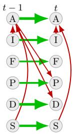
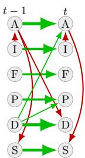
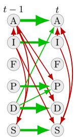
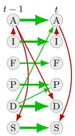
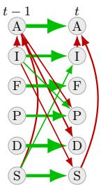
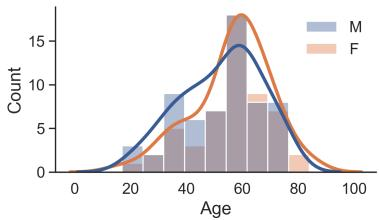

# Dynamic Structural Causal Modeling for Sleep

Ranveer Singh1⋆, Saurabh Mathur2⋆, Pranuthi Tenali1, Arun Badi3, and Sriraam Natarajan1

1 The University of Texas at Dallas, Richardson, USA

{ranveer.singh, pranuthi.tenali, sriraam.natarajan}@utdallas.edu

2 TU Darmstadt, Germany

saurabh.mathur@tu-darmstadt.de

3 ENT & Sleep Medicine of Dallas, Dallas, USA arun.badi@gmail.com

Abstract. The causal dynamics of sleep-disordered breathing are complex and vary across patient populations, hindering the development of targeted interventions. We learn dynamic causal graphs of sleep-disordered breathing from Home Sleep Apnea Test (HSAT) recordings, revealing systematic diferences in causal structure across sex and age subcohorts. We do so using the PCMCI+ algorithm on windowed fractional variables derived from 105 HSAT recordings, exploiting domain knowledge via edge blacklisting and employing bootstrap aggregation to address small subcohort sizes. The learned graphs show that temporal self-dependencies and the apnea-desaturation relationship persist across all cohorts, while other relationships vary substantially.

Keywords: Dynamic Structural Causal Models · Sleep Study

## 1 Introduction

Sleep-disordered breathing (SDB) is characterized by repeated disruptions to normal respiration during sleep, contributing to cardiovascular morbidity as well as metabolic dysfunction and daytime impairment [18]. Moreover, sleep and SDB are dynamic; the respiratory and cardiovascular mechanisms underlying sleep vary throughout a single night and across nights, and the physiological mechanisms underlying SDB can difer among patients [7,8,24]. These characteristics motivate the development of Dynamic Data-Driven Application Systems (DDDAS [5]) for sleep that adapt according to the evolving physiological state of a patient during sleep.

However, such systems require a model of the causal mechanisms governing interactions between respiratory events in sleep. Further, these mechanisms could difer across diferent subpopulations, potentially rendering a single populationlevel model inadequate [7]. Therefore, understanding the causal dynamics across diferent subpopulations is critical for developing reliable DDDAS systems for clinical decision support.

  
(a) All

  
(b) Male

  
(c) Female

  
(d) Old

  
(e) Young  
Fig. 1: The Average Time Series Causal Graph across the diferent subcohorts and the entire cohort learnt using PCMCI+. The color of the edges indicates the sign of the Momentary Conditional Independence (MCI), with green being positive and red being negative. The thickness of the edge indicates the magnitude of MCI, with greater thickness corresponding to a larger magnitude.

Learning such causal models for sleep is complicated by the high cost of polysomnography (PSG) tests, which are considered the gold standard. Home Sleep Apnea Tests (HSAT) ofer a more accessible alternative, enabling patients to be tested at home at a lower cost and with less disruption. However, HSAT recordings have been used primarily for diagnostic scoring rather than for learning mechanistic models of sleep dynamics [4].

To this end, we consider the task of identifying the diferences in causal dynamics of sleep-disordered breathing across subcohorts stratified by age and sex. We do so by combining a small dataset of 105 HSAT recordings with domain knowledge in the form of potential causal relations and bootstrap aggregation to learn dynamic causal graphs. Specifically, we make the following key contributions: (1) we learn dynamic causal graphs of sleep-disordered breathing from HSAT recordings, showing that convenient at-home recordings can be used for causal modeling and serve as a component for a future DDDAS system, and (2) we perform a sex- and age-stratified dynamic causal analysis of SDB physiological signals, revealing meaningful structural diferences across subpopulations, demonstrating the need to account for diferent subpopulations when developing causal models to serve as components for future DDDAS systems.

## 2 Background

The problem of learning dynamic causal models for reliable Dynamic Data-Driven Application Systems is related to the following areas.

## 2.1 Dynamic Structural Causal Models

A Dynamic Structural Causal Model (DSCM [3]) is a model for learning temporal causal dynamics. It is an extension of a structural causal model or an

  
Fig. 2: Age distribution for the patients based on sex

SCM, which is a mathematical framework for modeling the underlying datagenerating process by capturing the causal relationships among the variables in a system [17]. An SCM, M, is descibed as a tuple $\langle \mathbf { U } , \mathbf { V } , { \mathcal { F } } , P ( \mathbf { U } ) \rangle$ where U is a set of exogenous variables, V is the set of endogenous variables determined by other variables in the model U ∪ V, F is a a set of structural equations $f _ { i } : U _ { i } , V _ { P a _ { i } }  V _ { i }$ where $P a _ { i } \subseteq \mathbf { V } \backslash V _ { i }$ , and $P ( \mathbf { U } )$ is a probability distribution [1]. The structural equations of an SCM induce a graph $G = ( { \bf V } , { \bf E } )$ where an edge $X  Y \in \mathbf { E }$ if $X \in P a _ { Y }$

A DSCM [3] extends SCMs to temporally evolving processes. Formally, a DSCM is defined $\mathcal { M } _ { d } = \langle \mathbf { U } , \mathbf { V } , \mathcal { T } , \mathcal { F } , \mathbf { P ( \mathbf { U } ) } \rangle$ where U and V are now sets of time indexed exogeneous and endogeneous processes respectively, $\mathcal { T } \subseteq \mathbb { R }$ is the time domain of the processes, $\mathcal { F }$ is a set of structural equations $f _ { i } : V _ { P a _ { i } } , U _ { i }  V _ { i }$ mapping to endogeneous processes in V with temporal causality enforcing that $V _ { i } ^ { t }$ depends only on values at time $t ^ { \prime } \leq t .$ , and $P ( \mathbf { U } )$ is a probability measure over the trajectory of exogenous processes.

The structural equations $\mathcal { F }$ and probability distribution P(U) of DSCMs generally cannot be identified from observational data alone, which is often the only type of data available. Therefore, we may need to make assumptions such as the causal Markov condition (each variable is independent of its non-descendants given its parents), faithfulness (the distribution does not entail additional independencies beyond the graph), causal suficiency (there are no hidden confounders), and stationarity (the distribution of the process doesn’t change over time), to learn a causal graph induced by a DSCM. When time is discretized and sampled, a time-series graph over lagged and contemporaneous dependencies is induced. Formally, we define such causal graphs as $G = ( { \bf V } , { \bf E } , \mathcal { T } )$ where $\tau$ is the discrete time domain, V is a set of time indexed observed variables with $V _ { i } ^ { t }$ indicating value of variable $V _ { i }$ at time $t \in \tau$ , and E is a set of edges which are either contemporous $V _ { i } ^ { t }  V _ { j } ^ { t }$ where $j \neq i ,$ or lagged $V _ { i } ^ { t - \tau }  V _ { k } ^ { t }$ where $\tau > 0$ These graphs can be learned using algorithms such as $\mathrm { P C M C I + \ [ 1 9 ] }$

## 2.2 Domain Knowledge as Constraints

Even though it is possible to learn causal graphs from observational data, these models will only be learned up to a Markov Equivalence class [17], i.e, a set of graphs learned from the observational data with many edge directions (direction of causality) unresolved. Therefore, background knowledge such as forbidden and required edges [16] provided either by a domain expert or a Large Language Model (LLM) [15] is essential to orient such edges and learn an unambiguous causal graph. Additionally, in a temporal setting, domain knowledge about timescales, known causal mechanisms, and contemporaneous relationships among features can be used to learn a causal model [20].

## 2.3 Discovering Higher-Order Interaction

Causal discovery is dificult in domains such as medicine, where acquiring interventional data is dificult or unethical, and observational data is scarce due to the high cost of acquisition [12]. In such a low-data setting, the causal graphs learned are highly unstable and susceptible to noise. One way to mitigate this issue is through data bootstrapping, where data is sampled with replacement, and the resulting graphs are aggregated using techniques such as total weight averaging (TWA) to generate a final causal graph with confidence estimates for the causal edges [6,9,22]. However, in a complex domain such as medicine, where multiple variables act together, aggregation that only considers the edges is insuficient. Local structures such as colliders, forks, and chains are more stable and meaningful, and aggregating across such structures can allow us to learn better and more stable causal graphs for such domains [25].

## 3 Learning Causal Dynamics for Sleep

We consider the task of learning causal dynamics for sleep using the dataset of HSAT recordings. We formalize the task as follows

Given: A temporal dataset D over $\{ X _ { 1 } , X _ { 2 } , \ldots , X _ { n } \}$ , where $X _ { i } ^ { j } ( t )$ denotes   
the value of feature $j$ for patient i at time $t ,$ and domain knowledge $\kappa$ in   
the form of the set of forbidden causal edges.   
To Do: Learn a time-series causal graph G modelling the contemporaneous   
and lagged dependencies between variables derived from the data.

In the subsequent subsections, we present the construction of the windowed dataset over which the model will be learned, followed by model construction and comparison of the models across diferent subcohorts1.

## 3.1 Dataset

We consider the HSAT dataset provided by our clinical expert. The dataset provided consisted of 105 recordings, each at least 2 hours long, with the following features: Snoring, Pulse, Oxygen Saturation, Efort, and Flow. The patients are split 58 males to 47 females based on sex, with the overall age distribution shown

Table 1: Constructed Windowed Features as a fraction of the analysis window
<table><tr><td>Feature</td><td>Description (Fraction of the analysis window)</td></tr><tr><td>Apnea Hypopnea Events (A) Desaturation (D) Flow Limitation (I)</td><td>Occupied by Apnea and Hypopnea events [14] Spent in Oxygen Desaturation episodes [23] Exhibiting inspiratory flow-limited breathing [10]</td></tr><tr><td>Flow Limited Respiratory Effort (F)</td><td>[Characterized by Flow-limited breathing with elevated respiratory effort</td></tr><tr><td>Pulse Activation (P) [Snoring Burden (S)</td><td>Transient pulse-rate elevations Sustained snoring activity [13]</td></tr></table>

Table 2: Average value of the fractional features across the diferent cohorts
<table><tr><td>Feature</td><td>All</td><td>Male</td><td>Female</td><td>Old</td><td>Young</td></tr><tr><td rowspan="5">A D F  $( \times 1 0 ^ { - 5 } )$  I P</td><td>0.02±0.06</td><td>0.02±0.06</td><td>0.02±0.06</td><td>0.02±0.05</td><td>0.03±0.07</td></tr><tr><td>0.02±0.02</td><td>0.02±0.03</td><td>0.01±0.02</td><td>0.01±0.02</td><td>0.02±0.03</td></tr><tr><td>1.36±7.47</td><td>2.43±9.89</td><td>0.00±0.00</td><td>1.30±7.61</td><td>1.61±7.36</td></tr><tr><td>0.29±0.12</td><td>0.28±0.13</td><td>0.30±0.10</td><td>|0.30±0.11|</td><td>|0.24±0.12</td></tr><tr><td>0.03±0.03</td><td>0.04±0.03</td><td>0.03±0.02</td><td>0.03±0.03</td><td>0.03±0.03</td></tr><tr><td>S</td><td>0.25±0.14</td><td>0.25±0.12</td><td>0.26±0.16</td><td>0.25±0.14</td><td>0.25±0.15</td></tr></table>

in Figure 2. Furthermore, males aged under 40 and females aged under 50 are considered young; otherwise, they are considered old. To learn causal models, we constructed a windowed dataset with fractional variables computed over 10- second windows [2]. The variables are presented in Table 1 with the average values2 across the diferent subcohorts shown in Table 2.

## 3.2 Model Construction

To learn causal dynamics for sleep, we consider a framework that combines timeseries causal discovery with aggregation over higher-order local causal structures to handle the noise inherent in small data settings and to learn stable, more meaningful causal graphs.

Algorithm 1 describes the overall pipeline for the task. First, we sample patient trajectories from the dataset with replacement b times. We then use the PCMCI+ algorithm with a partial correlation test to learn initial time-series causal graphs for each bootstrap, considering only edges consistent with the background knowledge K, removing any edges with a Momentary Conditional Independence (MCI [20]) below the threshold m, to obtain the graphs G. Next, we construct the final graph using General Model Averaging (GMA [25]). For each graph, we obtain the higher-order structure by selecting all subgraphs induced by each vertex and its lagged and contemporaneous edges with its parents $( V _ { j } , E _ { \phi _ { V _ { j } } } )$ . We compute the posterior over these structures as their normalized counts over the diferent bootstraps. We remove any structures with a posterior value below the threshold $\alpha ,$ and get a sorted list of the structures in descending order of their posterior value. We construct the final dynamic causal graph by adding edges for each structure in the sorted list in order, skipping any structure if it violates the acyclicity constraint.

Algorithm 1 Learning Causal Dynamics with Aggregation over Higher-Order   
Structures   
Require: Dataset $\mathcal { D } ,$ prior knowledge $\kappa ,$ number of bootstraps $b ,$ threshold $\alpha ,$ MCI   
threshold $m ,$ maximum temporal lag τmax   
Ensure: The final causal graph $\mathcal { G } ^ { * }$   
$/ /$ Step 1: Bootstrapped Time Series Causal Discovery   
Initialize the set of graphs $\mathbf { G } = \{ \}$   
for all $i \in { 1 }$ to b do   
$\mathcal { D } _ { i } $ Sample $| \mathcal D |$ patient trajectories with replacement from $\mathcal { D }$   
$\mathcal { G } _ { i } \gets$ LearnTimeSeriesGraph $\left( \mathcal { D } _ { i } , \mathcal { K } , \tau _ { \operatorname* { m a x } } , m \right)$   
$\mathbf { G }  \mathbf { G } \cup \{ \mathcal { G } _ { i } \}$   
end for   
$/ /$ Step 2: Extract Higher-Order Structures   
Initialize structure count map $\varPhi = \{ \}$   
for all $\mathcal { G } _ { i } \in \mathbf { G }$ do   
for all $V _ { j } \in \mathbf { V }$ do   
$E _ { \phi _ { V _ { j } } } \gets \{ e _ { V _ { k } V _ { j } } \ : | \ : V _ { k } \in \varPi _ { V _ { j } } ^ { i } \}$ {//Edge set incident on $V _ { j }$ from its parents in $\mathcal { G } _ { i } \}$   
$\phi _ { V _ { j } } \mathbf { \bar { \Omega } }  ( V _ { j } , \ E _ { \phi _ { V _ { j } } } )$   
$\varPhi [ \phi _ { V _ { j } } ] \gets \varPhi [ \phi _ { V _ { j } } ] ^ { ' } + 1$   
end for   
end for   
$/ /$ Step 3: Generalized Model Averaging (GMA)   
Normalize Φ to obtain local posterior estimates: $\begin{array} { r } { P ( \phi _ { V _ { i } } \mid \mathcal { D } ) = \frac { \mathcal { P } [ \phi _ { V _ { i } } ] } { \sum _ { \phi } \mathcal { P } [ \phi ] } } \end{array}$   
$\tilde { \phi }  \{ \phi { _ V } _ { i } \mid P ( \phi { _ V } _ { i } \mid \mathcal D ) > \alpha \}$ {// Apply threshold}   
Sort Φ˜ by decreasing $P ( \phi _ { V _ { i } } \mid \mathcal { D } )$   
$/ /$ Step 4: Greedy Acyclic Graph Construction   
$\dot { \mathcal { G } } ^ { * }  ( \mathbf { V } , \emptyset )$   
for all $\phi _ { V _ { i } } \in \tilde { \varPhi }$ do   
$\mathcal { G } ^ { \prime }  ( \dot { \mathbf { V } } , \ E _ { \mathcal { G } ^ { * } } \cup E _ { \phi _ { V _ { i } } } )$   
if IsAcyclic(G′) then   
${ \mathcal { G } } ^ { * }  { \mathcal { G } } ^ { \prime }$   
end if   
end for   
return $\mathcal { G } ^ { * }$

## 3.3 Results

We consider the diferent subcohorts from the dataset defined in 3.1, and the algorithm defined in 3.2, using PCMCI+ [19] as the underlying time-series causal learning algorithm. We elicited background knowledge in the form of forbidden and allowed edges from a domain expert and incorporated it as constraints into the causal discovery process. The parameters $\begin{array} { r } { \tau _ { \operatorname* { m a x } } = 1 , \alpha = \frac { 1 } { | V | - 1 } = 0 . 0 9 , b = } \end{array}$ 100, and $m = 0 . 0 3$ were either provided by the domain expert or adopted from the original works [11,25]. The diferent time-series causal graphs learnt across the diferent subcohorts are shown in Figure 1.

When considering the subcohorts based on sex, one diference between the male and female subcohorts is the relationship between Snoring (S) and Inspiratory Flow Limit (I) in the same window, with such a relationship present in females but not in males. Specifically, the structure $\mathrm { S } _ { t - 1 } \right. \mathrm { S } _ { t } \left. \mathrm { I } _ { t - 1 }$ is present in the female subcohort with a posterior value of 0.1, but the same structure had a posterior of 0.04 for males and was rejected. Additionally, the male subcohort has the structure $\mathrm { S } _ { t - 1 } \right. \mathrm { S } _ { t } \left. \mathrm { A } _ { t }$ with a posterior of 0.24. Meanwhile, the same structure was rejected in the female subcohort due to having a posterior of 0.04. Finally, While the male subcohort has a dependency across time for F, with the structure $\mathrm { F } _ { t - 1 }  \mathrm { F } _ { t }$ , having a posterior of 0.96, the value of the feature for the female subcohort was 0 across the board, leading to no structure with node F. This complete absence of flow-limited respiratory efort (F) in the female subcohort might be due to the low sensitivity of feature construction to small values.

Meanwhile, when considering the age-based subcohorts, the key diference between them is the causal relationship between Apnea Hypopnea Events (A) and Snoring (S) in the same window. For the older cohort, the causal direction is from A to S, with the direction reversed for the young. This is due to the diferent structures admitted in the two cases. The structure $\mathrm { A } _ { t } \right. \mathrm { S } _ { t } \left. \mathrm { S } _ { t - 1 }$ is admitted for the older cohort, with a posterior of 0.35. The same structure had a posterior of 0.14 for the young subcohort, but the structure with a higher posterior of 0.24, $\mathrm { A } _ { t - 1 } \right. \mathrm { A } _ { t } \left. \mathrm { S } _ { t }$ was admitted instead.

Finally, when we consider the diferent subcohorts as well as a time-series causal model trained across the entire cohort, we find that the temporal dependencies between consecutive windows for the same feature are the most prominent. Moreover, the dependency between Apnea Hypopnea Events and Desaturation persisted in all cases. However, other relationships may vary greatly across subcohorts, with some causal relationships reversed and others completely absent, indicating possible diferences in sleep dynamics across subcohorts.

## 4 Discussion

We considered the task of modeling the causal dynamics of sleep-disordered breathing using data from a home sleep apnea test (HSAT). Such causal models are necessary for building reliable DDDAS systems for clinical decision support. We combined the PCMCI+ dynamic causal discovery algorithm with bootstrap aggregation based on higher-order structure to learn time-series causal graphs from a small dataset. We compared the structures learned from age- and sex-stratified subcohorts, finding that temporal self-dependencies and apneadesaturation relationships persist across subcohorts while several substructures difer substantially, including a reversal in the causal direction between apnea and snoring across age groups.

There are several directions for future work. First, expanding the analysis to include additional features would be important future work, since HSAT recordings do not capture all physiologically relevant variables, such as sleep stage and arousal. Second, non-stationary causal discovery methods, such as RPCMCI [21], would better account for the fact that sleep dynamics shift throughout the night as the patient cycles through sleep stages. Finally, incorporating additional background knowledge of higher-order structures could yield more accurate models for sleep dynamics.

## References

1. Bareinboim, E.: Causal Artificial Intelligence: A Roadmap for Building Causally Intelligent Systems (2025), https://causalai-book.net/

2. Berry, R.B., et al.: Rules for scoring respiratory events in sleep: update of the 2007 aasm manual for the scoring of sleep and associated events: deliberations of the sleep apnea definitions task force of the american academy of sleep medicine. Journal of Clinical Sleep Medicine 8(5), 597–619 (2012)

3. Boeken, P., Mooij, J.M.: Dynamic structural causal models (2024), https:// arxiv.org/abs/2406.01161

4. Cushman, P., et al.: Modified scoring criteria to improve the accuracy of the home sleep apnea test. Sleep and Breathing 30(1), 52 (2026)

5. Darema, F.: Dynamic data driven applications systems: A new paradigm for application simulations and measurements. In: International conference on computational science. pp. 662–669. Springer (2004)

6. Debeire, K., Gerhardus, A., Runge, J., Eyring, V.: Bootstrap aggregation and confidence measures to improve time series causal discovery. In: Causal Learning and Reasoning. pp. 979–1007. PMLR (2024)

7. Eckert, D.J., et al.: Defining phenotypic causes of obstructive sleep apnea. identification of novel therapeutic targets. American journal of respiratory and critical care medicine 188(8), 996–1004 (2013)

8. Eiseman, N.A., et al.: The impact of body posture and sleep stages on sleep apnea severity in adults. Journal of Clinical Sleep Medicine 8(6), 655–666 (2012)

9. Friedman, N., Goldszmidt, M., Wyner, A.: Data analysis with bayesian networks: a bootstrap approach. In: UAI 2019. p. 196–205 (1999)

10. Guevarra, et al.: Immediate physiological responses to inspiratory flow limited events in mild obstructive sleep apnea. Ann Am Thorac Soc 19(1), 99–108 (2022)

11. Liao, Z., Duan, J., Beek, P.v.: On identifying significant edges for structure learning in Bayesian networks. CAIAC (2022)

12. Liu, Z., Luo, T., et al.: Causal discovery in observational medical research: Scoping review. JMIR Medical Informatics 14, e82499 (2026)

13. Maimon, N., Hanly, P.J.: Does snoring intensity correlate with the severity of obstructive sleep apnea? Journal of clinical sleep medicine 6(5), 475–478 (2010)

14. Malhotra, R.K.: Aasm scoring manual 3: a step forward for advancing sleep care for patients with obstructive sleep apnea. JCSM 20(5), 835–836 (2024)

15. Mathur, S., Singh, R., et al.: Llm-guided causal bayesian network construction for pediatric patients on ecmo. In: AIME 2025. p. 255–260 (2025)

16. Meek, C.: Causal inference and causal explanation with background knowledge. In: UAI. pp. 403–410 (1995)

17. Pearl, J.: Causality. Cambridge university press (2009)

18. Punjabi, N.M., Cafo, B.S., et al.: Sleep-disordered breathing and mortality: a prospective cohort study. PLoS medicine 6(8), e1000132 (2009)

19. Runge, J.: Discovering contemporaneous and lagged causal relations in autocorrelated nonlinear time series datasets. In: UAI. pp. 1388–1397. Pmlr (2020)

20. Runge, J., Nowack, P., et al.: Detecting and quantifying causal associations in large nonlinear time series datasets. Science advances 5(11) (2019)

21. Saggioro, E., de Wiljes, J., Kretschmer, M., Runge, J.: Reconstructing regimedependent causal relationships from observational time series. Chaos 30(11) (2020)

22. Scutari, M., Nagarajan, R.: Identifying significant edges in graphical models of molecular networks. Artificial Intelligence in Medicine 57(3), 207–217 (2013)

23. Temirbekov, et al.: The ignored parameter in the diagnosis of obstructive sleep apnea syndrome: the oxygen desaturation index. Turk Arch Otorhinolaryngol (2018)

24. Tschopp, S., et al.: Night-to-night variability in obstructive sleep apnea using peripheral arterial tonometry: a case for multiple night testing. Journal of Clinical Sleep Medicine 17(9), 1751–1758 (2021)

25. Zanga, A., et al.: Causal discovery on higher-order interactions. arXiv preprint arXiv:2511.14206 (2025)