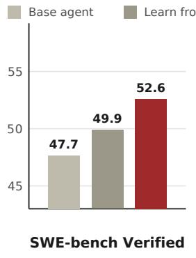
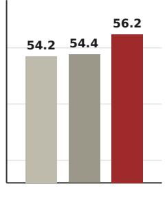
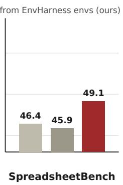
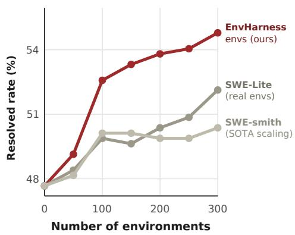
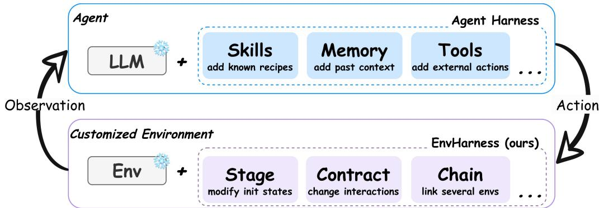
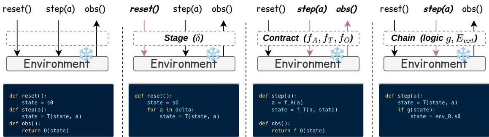
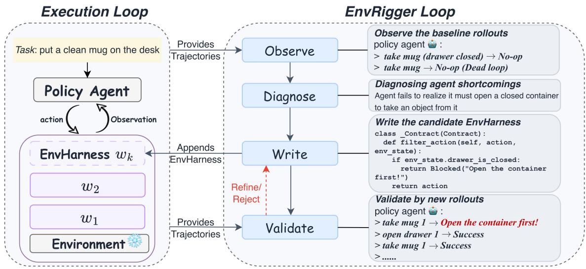
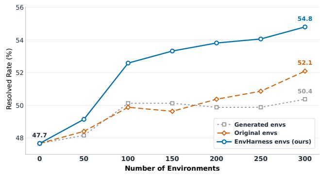
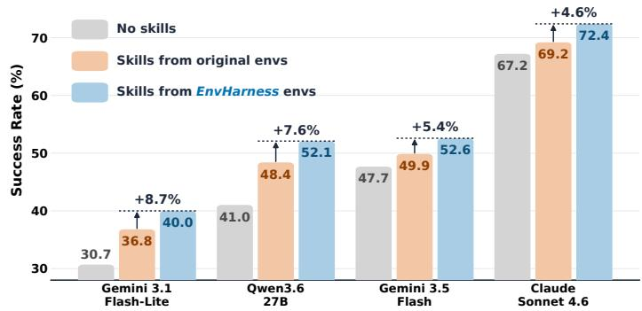
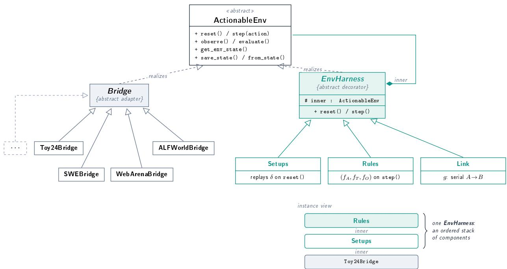

# EnvHarness: Awakening Static Worlds for Agent Learning

Chengsong Huang<sup>1\*</sup>, Zifeng Wang<sup>2</sup>, Rujun Han<sup>2</sup>, Jun Yan<sup>2</sup>, Yanfei Chen<sup>2</sup>, Zoey CuiZhu<sup>2</sup>, Ke Jiang<sup>2</sup>, Peng Xia<sup>4</sup>, Han Yu<sup>2</sup>, Yufan Zhuang<sup>2</sup>, Yifei Ming<sup>2</sup>, Jiaqi Pan<sup>3</sup>, Bhavana Dalvi Mishra<sup>2</sup>, Jiaxin Huang<sup>1</sup>, Burak Gokturk<sup>2</sup>, Tomas Pfister<sup>2</sup> and Chen-Yu Lee<sup>2</sup>

<sup>1</sup>Washington University in St. Louis, <sup>2</sup>Google Cloud AI Research, <sup>3</sup>Google Cloud, <sup>4</sup>University of North Carolina at Chapel Hill

LLM agents learn by interacting with environments, yet these environments are hand-built and static: blind to an agent’s weaknesses, and quickly left behind as it improves. While recent environment generation methods attempt to address this, they require domain-specific pipelines, rely on expensive or unreliable verifiers, and still produce static environments. To alleviate the engineering burden of rebuilding environments from scratch, we propose Environment Harness (EnvHarness), a programmable layer of plug-in components that wraps a static environment to reshape its behavior without modifying the underlying logic. Operating through standard interfaces, EnvHarness applies across diverse domains while ensuring every reshaped environment retains its original verifier. To automate this process, we introduce EnvRigger, which treats the target policy as a black box, observing its execution trajectories to synthesize EnvHarness components targeting diagnosed flaws, and validating them via fresh rollouts. Across five benchmarks in four domains, EnvHarness outperforms both original environments and domain-specific environment generation pipelines, achieving up to a 9.0-point improvement on held-out instances with 9.8% fewer execution steps. Furthermore, EnvHarness provides a superior optimization signal for reinforcement learning, enabling continuous, targeted co-evolution of the policy and its environment.

github.com/google-research/envharness  






www.envharness.com  
  
Figure 1 | Overall performance. Left: Agents learning from EnvHarness environments consistently outperform those learning from the original environments across software engineering and ofice automation benchmarks, including SWE-bench Verified, OficeQA, and SpreadsheetBench. Rig<sup>h</sup>t: On SWE-bench Verified, under an identical environment budget, EnvHarness keeps improving as environments scale, while real and generated environments flatten out.

## 1. Introduction

As LLMs are deployed as autonomous agents, the source of learning shifts from curated text data to interactive environments. Whether navigating web pages (Gur et al., 2024), resolving issues in a codebase (Yang et al., 2024), or controlling an embodied platform (Wang et al., 2023), agents rely on their respective environments to acquire learning signals (Yao et al., 2022b). These environments act as interactive counterparts that present specific tasks, manage changing states, respond to actions, and evaluate success (Li et al., 2026). Unfortunately, building them requires substantial human efort to hardcode the interaction logic and verifiers (Merrill et al., 2026; Zhang et al., 2025). Consequently, the resulting environments remain rigidly static, behaving identically regardless of which agent interacts with them or how much that agent has improved (Hu et al., 2026). This rigidity limits agent learning in two fundamental ways: it fails to provide a targeted signal that addresses a particular agent’s weaknesses (Dennis et al., 2020; Jiang et al., 2021), and it has nothing more to teach once the agent learns to solve the existing tasks (Beukman et al., 2024; Wang et al., 2019).

  
Figure 2 | While an agent harness transforms a frozen LLM into a capable agent via plug-in components (e.g., skills, memory, tools) without altering model weights, EnvHarness applies this same principle to the other side of the interaction. It customizes a frozen environment with plug-in components while leaving original environment unchanged.

Since manually building environments is expensive, a growing line of work has turned to automated environment generation (Guo et al., 2025; Song et al., 2026; Zala et al., 2024). Despite its scalability, this approach sufers from two major limitations. First, generation pipelines are inherently domain-specific. Existing systems generate environments for web navigation (Trabucco et al., 2025), programming (Pan et al., 2024), or tool use (Lee et al., 2026a), but a pipeline built for one setting cannot transfer to the others. Second, ensuring correctness is both costly and unreliable. Because these environments and verifiers are generated by LLMs, practitioners must over-generate and heavily filter them (Wang et al., 2026; Yang et al., 2026a), which still cannot fully guarantee their correctness.

Rather than creating new environments to obtain learning signals, we propose Environment Harness (EnvHarness), a programmable layer that transforms an existing, static environment into a dynamically customized one without modifying the environment itself. We make an analogy between EnvHarness and agent harness (Anthropic, 2025, 2026b; OpenAI, 2026) in Figure 2: An agent harness provides LLMs with external memory, tools, and skills to handle complex tasks beyond basic text generation. EnvHarness extends this concept to environments, equipping a static environment with modular, plug-in components. A Stage sets the starting point of an episode, a Contract controls the allowed actions and observations, and a Chain connects multiple base environments to form an extended episode. The agent continues to use the standard interface, but EnvHarness mediates this interaction. This enables a single environment to fulfill needs it was never built for: isolating a specific skill, extending a task’s horizon, or calibrating dificulty so the agent struggles but ultimately succeeds. Crucially, operating strictly at the interface level makes EnvHarness domain-agnostic, while allowing every new environment to safely inherit the trusted, human-built verifier of its original environment.

While EnvHarness provides a universally applicable framework, its specific configuration must be tailored to each target policy and task. To automate this customization process, we introduce EnvRigger. By treating the policy strictly as a black box, EnvRigger observes both successful and failed execution trajectories within the base environment to diagnose specific behavioral vulnerabilities. Guided by these findings, it synthesizes candidate EnvHarness components and wraps the current environment to evaluate them. EnvRigger then runs fresh policy rollouts, judging acceptance solely on whether the candidate environment efectively cultivates the missing capabilities while remaining solvable. Components failing this evaluation undergo iterative revision until they succeed. Ultimately, this workflow realizes fully automated, task-policy-conditioned environment customization.

We conduct experiments on challenging benchmarks spanning embodied tasks (ALFWorld (Shridhar et al., 2020)), web browsing (WebArena (Zhou et al., 2024)), software engineering (SWE-bench Verified (Jimenez et al., 2024)), and ofice work (OficeQA (Databricks, 2025), SpreadsheetBench (Ma et al., 2024)). Specifically, we evaluate EnvHarness across two representative learning paradigms: skill-based learning (SL) and reinforcement learning (RL). In SL settings, agents trained with EnvHarness environments outperform those trained on original environments, achieving up to 9.0 points of improvement on held-out tasks (Table 2) while using 9.8% fewer interaction steps (Table 3). In RL settings, EnvHarness-customized environments similarly yield significantly stronger policies, with up to 6.5 points of improvement (Table 4). Finally, repeatedly executing the EnvRigger loop enables continuous co-evolution between the agent and its environment, unlocking compounding performance gains that scale efectively with the number of customized tasks.

Our contributions are threefold: (1) We propose EnvHarness, a programmable layer that customizes a static environment into a controllable one through its own reset/step interface, instantiated as three types of plug-in components that reshape environment initial states, agentenvironment interaction interfaces, and composite tasks from diferent environments, all while the original environment’s tasks and verifiers stay unchanged. (2) We introduce EnvRigger to automate task-policy-conditioned environment customization. By diagnosing policy flaws from rollouts and iteratively revising candidate components until fresh rollouts confirm their success, EnvRigger ensures that every new environment targets the specific weaknesses of the policy. (3) Across five benchmarks in four domains, EnvHarness improves both efectiveness (up to 9.0 points on held-out tasks) and eficiency (9.8% fewer steps), strengthens policies under reinforcement learning, and scales agent performance where both human-built and generated environments flatten out.

## 2. EnvHarness

## 2.1. The EnvHarness Paradigm

Table 1 | Analogy between Agent Harness and EnvHarness. Both scale capabilities through external layers rather than changing the core system.
<table><tr><td></td><td>Agent Harness</td><td>EnvHARNEss (Ours)</td></tr><tr><td>Base System</td><td>Frozen LLM</td><td>Static environment</td></tr><tr><td>Designed to Solve</td><td>Lack of action, memory, or loops</td><td>Hardcoded interaction logic</td></tr><tr><td>Harness Layer</td><td>Capabilities (tools, memory)</td><td>Customization (states, rules, observations)</td></tr><tr><td>Unified Output</td><td>Autonomous agent</td><td>Customized environment</td></tr></table>

An agent <sup>h</sup>arness (Anthropic, 2025, 2026b; OpenAI, 2026) is the software layer (execution loops, tool registries, and context management) (Meng et al., 2026) that wraps a LLM to form an autonomous agent (Agent = Model + Harness). It adds new capabilities without changing the model weights. We apply the same idea to the other side of the agent-environment loop. We define EnvHarness as a programmable layer that wraps an existing, static environment and turns it into a customizable one (Customized Env = Static Env + EnvHarness). EnvHarness achieves this customization by modifying the information flow through the standard interface, leaving the underlying environment completely untouched. Analogous to the tools and memory of an agent harness, EnvHarness is assembled from modular plug-in components that tailor the environment to specific training needs like isolating a specific skill, extending a task’s horizon, or adjusting task dificulty.

Formal Definition of EnvHarness. We model an environment as a tuple $E = ( S , { \mathcal { A } } , O , T , R , s _ { 0 } )$ where S is the state space, A the action space, O the observation space, $T : \mathcal { S } \times \mathcal { A }  \mathcal { S }$ the transition function that maps a state and an action to the next state, � the reward induced by the verifier, and $s _ { 0 }$ the initial state. An EnvHarness component is an environment-agnostic transformation �:

$$
E ^ { \prime } = w ( E ) , \qquad E ^ { \prime } = ( S ^ { \prime } , \mathcal { A } ^ { \prime } , O ^ { \prime } , T ^ { \prime } , R ^ { \prime } , s _ { 0 } ^ { \prime } ) .\tag{1}
$$

� reshapes the environment strictly at the interface level, without modifying its underlying simulator backend or implementation details. It customizes the initial state $( s _ { 0 } ^ { \prime } )$ , filters exposed spaces $( { \mathcal { A } } ^ { \prime } , O ^ { \prime } )$ , and updates transition mechanics (�<sup>′</sup>). Because all interventions remain external, the ground-truth evaluation logic is preserved, ensuring the original verifier still can score the episode.

## 2.2. Three EnvHarness Components

  
Figure 3 | Overview of EnvHarness components wrapping the standard environment interface. The underlying base environment (native state transitions and original task verifier) remains completely frozen. From left to right: the base environment, followed by three EnvHarness components—Stage, Contract, and Chain. Highlighted arrows and headers indicate overridden interface methods, with code blocks showing how each wrapper modifies state initialization, transition dynamics, or observation handling without altering the base environment.

The mapping � of Eq. (1) defines a general interface, and any transformation that follows this interface is a valid EnvHarness component. In this work, we introduce three concrete types of components, chosen to cover three fundamental modes of environment customization, and we expect more to follow. Each type is specified by its own parameters, overriding standard environment interface methods such as reset or step. Figure 3 compares the three component types with the original interface, highlighting the specific method each component overrides. We detail the software implementation of this interface protocol and class architecture in Appendix C. Throughout this subsection, we illustrate the components on one ALFWorld task, “put a clean mug on the desk”, where the default instance leaves the mug in the open and ends immediately upon placement.

Stage: changing the initial state. $\mathrm { A S t a g e } , w _ { \mathrm { s t a g e } , \delta } ,$ is specified by a sequence of state-manipulation actions $\delta = ( a _ { 1 } , \ldots , a _ { k } )$ . These actions are applied to the initial state $s _ { 0 }$ produced by reset():

$$
E ^ { \prime } = w _ { \mathrm { s t a g e } , \delta } ( E ) = ( S , \mathcal { A } , O , T , R , s _ { 0 } ^ { \prime } ) , \quad \mathrm { w h e r e } ~ s _ { 0 } ^ { \prime } = T \left( \cdot \cdot T \left( T ( s _ { 0 } , a _ { 1 } ) , a _ { 2 } \right) \cdot \cdot \cdot \ , a _ { k } \right) .\tag{2}
$$

Under this transformation, only the initial state changes. A Stage customizes the agent’s starting point, either introducing obstacles that require specific skills to tackle or completing early subgoals in advance to shorten the task horizon. For example, in our running task, one Stage executes the following sequence of actions: take mug 1, open drawer 1, put mug 1 in drawer 1, and close drawer 1 on the state returned by reset(). This Stage intentionally hides the mug from the agent, forcing the agent to face a more challenging scenario: search for the object first instead of directly reaching for it in plain sight. Conversely, another Stage can simplify the setup by executing cleaning the mug in advance, leaving only the final placement steps.

Contract: rewriting the interaction. A Contract, $w _ { \mathrm { c o n t r a c t } , r } ,$ is specified by a triplet of transformation maps $\boldsymbol { r } = \left( f _ { A } , f _ { T } , f _ { O } \right)$ , each defaulting to the identity. These maps rewrite the action space, transition dynamics, and observation space, respectively:

$$
E ^ { \prime } = w _ { \mathrm { c o n t r a c t } , r } ( E ) = ( S , ~ \mathcal { R } ^ { \prime } , ~ \mathcal { O } ^ { \prime } , ~ T ^ { \prime } , ~ R , ~ s _ { 0 } ) , \quad \mathrm { w h e r e } ~ ( \mathcal { R } ^ { \prime } , \mathcal { O } ^ { \prime } , T ^ { \prime } ) = \big ( f _ { A } ( \mathcal { R } ) , f _ { O } ( O ) , f _ { T } ( T ) \big ) .\tag{3}
$$

In practice, these transformations enforce action preconditions, augment or mask observations, and attach structured feedback to specific outcomes to steer agent learning. For example, on our running task, one Contract configures $f _ { O }$ to truncate the room description after the first two sentences, requiring the agent to build its spatial representation across several steps; another Contract uses $f _ { T }$ to block the clean mug action if the agent is not holding the mug, forcing the agent to pick up the object first; and a third Contract configures $f _ { A }$ to remove high-level teleport navigation commands, forcing the agent to move and search step by step.

Chain: extending the environment. A Cha $\mathrm { i n } , \boldsymbol { w } _ { \mathrm { c h a i n } , \ell } ,$ is specified by a pair $\ell = \left( E _ { \mathrm { e x t } } , g \right)$ , where $E _ { \mathrm { e x t } }$ is an additional environment and $g$ is a composition logic. The composition logic combines the original environment � and $E _ { \mathrm { e x t } }$ into a composite environment $E ^ { \prime }$ exposed through the same interface:

$$
E ^ { \prime } = w _ { \mathrm { c h a i n } , \ell } ( E ) = ( S ^ { \prime } , \mathcal { \mathcal { R } } ^ { \prime } , O ^ { \prime } , T ^ { \prime } , R ^ { \prime } , s _ { 0 } ^ { \prime } ) , \quad \mathrm { w h e r e ~ } E ^ { \prime } = g ( E , E _ { \mathrm { e x t } } ) .\tag{4}
$$

To allow cross-environment combinations, the new spaces are simply the union of the base environments $( \mathrm { e . g . , } \mathcal { A } ^ { \prime } = \mathcal { A } \cup \mathcal { A } _ { \mathrm { e x t } } )$ , and $R ^ { \prime }$ acts as the new composite reward. The composition logic � is unrestricted, allowing environments to be concatenated, interleaved, or branched dynamically based on intermediate outcomes (see Appendix D for examples). The composition logic $g$ can either combine both environments from the start, or use the transition function $T ^ { \prime }$ to dynamically transition from one environment to the next once a specific condition is satisfied. For our running environment, one Chain appends “<sup>h</sup>eat a potato and put it on t<sup>h</sup>e countertop” in the same house, returning success under $R ^ { \prime }$ only when both environments are verified. This requires the agent to learn to carry its goal past the point where it would otherwise have stopped.

Composition. Because all EnvHarness components share a standard interface, they compose freely. For example, stacking a Stage, a Contract, and a Chain on our base mug task yields a single composite environment:

$$
E ^ { \prime } = w _ { \mathrm { c h a i n } , \ell } \left( w _ { \mathrm { c o n t r a c t } , r } \left( w _ { \mathrm { s t a g e } , \delta } ( E ) \right) \right) .\tag{5}
$$

In this setup, $w _ { \tt S t a g e } , \delta$ initializes the episode with the mug hidden in a drawer to enforce spatial search; $w _ { \mathrm { c o n t r a c t } , r }$ truncates the observation to two sentences to evaluate partial observability; and $w _ { \mathrm { c h a i n } , \ell }$ appends a follow-up task to test goal persistence. Note that these transformations are noncommutative (� ◦ � ≠ $w _ { 2 } \circ w _ { 1 } )$ ; the nesting order determines how the resulting environment is constructed and which constraints apply during initialization versus active interaction.

## 3. EnvHarness for Agent Learning

## 3.1. Problem Setup

Given a base environment � supporting a set of base tasks, and a target policy agent �, our objective is to automatically generate a modified environment $E ^ { \prime }$ tailored to a specific task �, exposing the unique flaws of � to facilitate targeted policy improvement. A single EnvHarness component is itself policy-agnostic, as Eq. (1) defines � as a transformation of the environment alone, allowing the same component to be applied without modification to any policy. Conversely, the selection and parameterization of these components must be conditioned on both the base task � and the observed behavior of the policy �. We therefore introduce the task-policy-conditioned map H:

$$
E ^ { \prime } = \mathcal { H } ( E , t ; \pi ) = ( w _ { k } \circ w _ { k - 1 } \circ \cdot \cdot \cdot \circ w _ { 1 } ) ( E ) ,\tag{6}
$$

where each $w _ { i }$ is a customized EnvHarness component designed to wrap the base environment � and expose the critical weaknesses of � on task �. Rather than inspecting internal model weights, these components treat the agent as a black box and operate solely on its outputs to generate a steady, corrective training signal.

## 3.2. EnvRigger

We introduce EnvRigger to realize the task-policy-conditioned map H of Eq. (6). EnvRigger runs � in the environment on task �, analyzes the resulting trajectories, writes specific EnvHarness components to customize the environment for this task, and validates the customized environment using fresh policy rollouts. Candidates from customized environments that provide an appropriate learning signal are accepted, while the EnvHarness components of unsuccessful candidates are rejected or revised. Figure 4 illustrates this complete workflow, in which EnvRigger operates systematically through four distinct stages: Observe, Diagnose, Write, and Validate. To ensure that the initial state mutations introduced by Stage can be reliably reproduced, we assume the base environment supports deterministic resets during the validation phase.

Observe. The EnvRigger begins by running the policy � on the base task � in the current environment to collect and analyze a batch of rollout trajectories. While failures expose the specific weaknesses to be addressed within this task, successes help define the boundaries of these flaws, showing which capabilities are already intact and where they begin to fail.

Diagnose. EnvRigger analyzes the collected trajectories to identify the root causes of the observed behaviors, focusing on systemic issues such as repetitive action loops, failures in parsing long observations, or misread tool constraints. This diagnosis also determines the customization direction. For a struggling policy, the goal is to scafold missing steps and simplify the task. Conversely, if the policy achieves a perfect success rate, it indicates the current environment is too forgiving to expose any remaining weaknesses. Under this scenario, the EnvRigger diagnoses that the environment must be made harder, shifting the customization to inject more challenging scenarios that force the policy’s potential flaws into the open. EnvRigger then outputs these findings as a textual diagnosis.

  
Figure 4 | EnvRigger generating EnvHarness components for a target policy based on given task. The execution loop on the left runs the policy against the current environment, which is a frozen base environment wrapped by the active EnvHarness containing accepted components �<sub>1</sub>, . . . , �<sub>�</sub>, while the resulting rollout trajectories feed the EnvRigger loop on the right. The EnvRigger operates systematically through four distinct stages: Observe, Diagnose, Write, and Validate, where the last two steps form a write-and-validate loop that generates a candidate component, evaluates it on fresh rollouts, and revises it upon failure.

Write. Based on the diagnosis, EnvRigger synthesizes one or more EnvHarness components to target the identified flaws. A single flaw may require combining multiple components, such as a Stage that customizes the initial state and a Contract that filters subsequent interactions, emitted together as a candidate set. For example, if the diagnosis reveals that the policy relies on a fragile shortcut that bypasses learning, EnvRigger can write a Contract that blocks this action under specific conditions, forcing the policy to explore and master the intended skills.

Validate. To evaluate the candidate components from the Write stage, EnvRigger wraps the current environment with them to instantiate �<sup>′</sup> and runs fresh rollouts of � on the base task �. Based on some trajectory metrics, like the success rate and failure distribution, EnvRigger analyzes these fresh rollouts to decide between three validation behaviors: accepting the candidate, rejecting those that are unsolvable or non-challenging, or refining candidates with poorly scaled signals. If the candidate requires refinement, the trajectories and scaling feedback flow back into the Write stage, repeating this Write-and-Validate loop until a candidate is accepted or the revision budget is exhausted. All accepted components are ultimately added to the EnvHarness. The exact system prompt and decision-making criteria guiding these validation actions are detailed in Appendix A.

## 4. Experiments

## 4.1. Experimental Setup

In this section, we mainly focus on the skill-based learning paradigm, where skills are extracted from environments to improve agent capabilities. We also evaluate the compatibility and performance of our framework under the online reinforcement learning paradigm, which is presented as part of our broader analysis in Section 5.

Benchmarks and Evaluation. We evaluate our framework on five benchmarks spanning four distinct domains: ALFWorld (Shridhar et al., 2020) for text-based embodied environments, WebArena (Zhou et al., 2024) for web interaction, SWE-bench Verified (Jimenez et al., 2024) for software engineering, and OficeQA (Databricks, 2025) with SpreadsheetBench (Ma et al., 2024) for ofice automation. We report each benchmark’s native metrics, additionally tracking the average steps on SWE-bench Verified as a measure of execution eficiency. Training and evaluation episodes are strictly disjoint on every benchmark, with detailed split configurations provided in Appendix E.1.

Importantly, EnvRigger and the policy agent utilize the same model backbone on each benchmark: Gemini-3.1-Flash-Lite for ALFWorld and WebArena, and Gemini-3.5-Flash elsewhere, ensuring that performance gains do not stem from distilling a stronger external model. On each training set, EnvRigger executes the optimization loop of Section 3 to generate EnvHarness-customized environments. We then extract skills from trajectories collected in these environments following ReasoningBank (Ouyang et al., 2025), and evaluate the skill-equipped policy agent on the held-out instances. We exclude the C<sup>h</sup>ain component from this automated pipeline because it is dificult for EnvRigger to observe the internal states of joined environments. Instead, we analyze the efect of chaining separately in Section 5.

Baseline Methods. We compare EnvHarness against four skill sources: No Skills (the frozen policy agent alone), Original Envs (skills from original environments to isolate reshaping efects), and GenEnv (Guo et al., 2025), VeriEnv (Chae et al., 2026), or SWE-smith (Yang et al., 2026a) for their respective benchmarks. While these baseline generators are domain-specific, EnvHarness applies generically across all domains via a unified interface, including the ofice automation environments where no generation baseline exists. To ensure a fair comparison, all baselines share the same seed instances, environment count, extraction pipeline, and policy model. EnvRigger operates strictly on training episodes under the same oracle verification access, and each evaluation instance is attempted once. Baseline details are in Appendix E.2.

## 4.2. Main Results

Table 2 and Table 3 summarize the primary results across five benchmarks. Based on these evaluations, we present the following key observations.

EnvHarness delivers consistent gains where static environments cannot. Skills acquired in environments customized by EnvHarness consistently outperform those extracted from original environments on every benchmark, yielding up to a 9.0-point improvement on ALFWorld. Conversely, extracting skills from static base environments can actually degrade performance; for instance, on SpreadsheetBench, skills from unmodified environments fall below the no-skill baseline, while on SWE-bench Verified, they lengthen execution trajectories. Because static environments only allow the agent to practice behaviors it already executes, they fail to address its specific limitations, often retrieving redundant or suboptimal skills. In contrast, the write-and-validate loop of EnvRigger only commits environment components verified by fresh policy trajectories, ensuring that EnvHarness consistently improves upon the no-skill baseline across all benchmarks.

Table 2 | Performance of agents equipped with skills extracted from diferent environment sources on ALFWorld and WebArena. All numbers are the mean over three independent runs, with standard deviations as gray subscripts. Higher is better for every metric, and the last row reports the improvement of EnvHarness Envs over Original Envs. “–” denotes that the method is benchmark-specific and cannot be applied to the other domain.
<table><tr><td rowspan="2">Skill Source</td><td colspan="3">ALFWorld</td><td colspan="5">WebArena</td></tr><tr><td>In-Dist</td><td>OOD</td><td>Avg.</td><td>Reddit</td><td>Shopping</td><td>Shop Admin</td><td>GitLab</td><td>Avg.</td></tr><tr><td>No Skills</td><td> $6 2 . 6 _ { 1 . 7 }$ </td><td> $6 0 . 7 _ { 5 . 2 }$ </td><td> $6 1 . 7 _ { 3 . 4 }$ </td><td> $3 9 . 6 _ { 2 . 3 }$ </td><td> $3 5 . 2 _ { 3 . 3 }$ </td><td> $4 4 . 1 _ { 2 . 3 }$ </td><td> $3 5 . 8 _ { 8 . 4 }$ </td><td> $3 8 . 7 _ { 2 . 3 }$ </td></tr><tr><td>Original Envs</td><td> $6 3 . 3 _ { 2 . 8 }$ </td><td> $6 1 . 4 _ { 4 . 3 }$ </td><td> $6 2 . 4 _ { 3 . 4 }$ </td><td> $3 8 . 7 _ { 9 . 7 }$ </td><td> $3 5 . 2 _ { 1 . 3 }$ </td><td> $4 4 . 6 _ { 3 . 0 }$ </td><td> $3 5 . 4 _ { 4 . 0 }$ </td><td> $3 8 . 5 _ { 3 . 1 }$ </td></tr><tr><td>GenEnv</td><td> $6 3 . 3 _ { 1 . 2 }$ </td><td> $6 1 . 9 _ { 2 . 7 }$ </td><td> $6 2 . 6 _ { 1 . 9 }$ </td><td>一</td><td>一</td><td></td><td></td><td></td></tr><tr><td>VeriEnv</td><td>一</td><td></td><td>一</td><td> $3 9 . 6 _ { 4 . 2 }$ </td><td> $3 0 . 2 _ { 0 . 0 }$ </td><td> $4 9 . 7 _ { 2 . 4 }$ </td><td> $\mathbf { 3 8 . 9 } _ { 5 . 6 }$ </td><td> $3 9 . 6 _ { 1 . 4 }$ </td></tr><tr><td>EnvHaRNEss Envs</td><td> ${ \bf 6 6 . 2 } _ { 0 . 3 }$ </td><td> $7 0 . 4 _ { 2 . 3 }$ </td><td> ${ \bf 6 8 . 3 _ { 1 . 3 } }$ </td><td> $4 0 . 6 _ { 4 . 7 }$ </td><td> $\mathbf { 3 7 . 4 } _ { 0 . 3 }$ </td><td> ${ \bf 5 0 . 8 } _ { 1 . 5 }$ </td><td> $3 7 . 7 _ { 3 . 1 }$ </td><td> $\mathbf { 4 1 . 6 } _ { 1 . 8 }$ </td></tr><tr><td>Improvement</td><td>+2.9</td><td>+9.0</td><td>+5.9</td><td>+1.9</td><td>+2.2</td><td>+6.2</td><td>+2.3</td><td>+3.1</td></tr></table>

Table 3 | Performance of agents equipped with skills extracted from diferent environment sources on SWE-bench Verified, OficeQA, and SpreadsheetBench. Standard deviations are gray subscripts. $" - "$ denotes that the method is benchmark-specific and cannot be applied to the other domain.
<table><tr><td rowspan="2">Skill Source</td><td colspan="2">SWE-verified</td><td colspan="2">OfficeQA</td><td colspan="2">SpreadsheetBench</td></tr><tr><td>SR (↑)</td><td>Average Step (↓)</td><td>EM (↑)</td><td>F1 (↑)</td><td>Pass@1 (↑)</td><td>Mean Score (↑)</td></tr><tr><td>No Skills</td><td> $4 7 . 6 7 _ { 0 . 9 3 }$ </td><td> $5 3 . 5 8 _ { 2 . 9 3 }$ </td><td> $5 4 . 2 3 _ { 2 . 8 4 }$ </td><td> $5 5 . 7 7 _ { 2 . 9 8 }$ </td><td> $4 6 . 4 4 _ { 0 . 1 5 }$ </td><td> $6 1 . 3 2 _ { 0 . 3 7 }$ </td></tr><tr><td>Original Envs</td><td> $4 9 . 8 8 _ { 2 . 5 9 }$ </td><td> $5 5 . 0 1 _ { 1 . 6 9 }$ </td><td> $5 4 . 4 0 _ { 1 . 8 4 }$ </td><td> $5 5 . 7 7 { _ { 1 . 5 9 } }$ </td><td> $4 5 . 8 8 _ { 1 . 1 9 }$ </td><td> $6 1 . 4 7 _ { 0 . 5 9 }$ </td></tr><tr><td>SWE-smith</td><td> $5 0 . 1 2 _ { 1 . 7 4 }$ </td><td> $5 4 . 7 2 _ { 2 . 0 3 }$ </td><td>一</td><td>一</td><td>一</td><td>一</td></tr><tr><td>EnvHaRNEss Envs</td><td> ${ 5 2 . 5 8 } _ { \ 2 . 7 2 }$ </td><td> $\mathbf { 4 9 . 6 1 } _ { 2 . 4 9 }$ </td><td> ${ \bf 5 6 . 2 0 } _ { 2 . 3 4 }$ </td><td> ${ \bf 5 7 . 7 3 _ { 2 . 2 9 } }$ </td><td> $4 9 . 1 5 _ { 0 . 3 6 }$ </td><td> $6 2 . 4 8 _ { \ : 0 . 2 7 }$ </td></tr><tr><td>Improvement</td><td>+2.70</td><td>+5.40</td><td>+1.80</td><td>+1.96</td><td>+3.27</td><td>+1.01</td></tr></table>

EnvHarness generalizes across domains through a domain-agnostic interface. The underlying interface protocol, EnvRigger loop, and the skill extraction pipeline apply consistently across all five benchmarks, requiring only domain-specific prompt templates to adapt to diferent environments. By contrast, specialized generation baselines are constrained to their specific target benchmarks (indicated by dashes for inapplicable domains in Tables 2 and 3). Nevertheless, EnvHarness consistently outperforms these specialized baselines wherever they can be applied. On ALFWorld, EnvHarness skills surpass GenEnv by 5.7 points on average and by 8.5 points in out-of-distribution settings, where generic instance generation merely increases repetitive practice without addressing policy weaknesses. On SWE-bench Verified, EnvHarness outperforms the purpose-built SWE-smith by 2.46 points in success rate while requiring 5.11 fewer execution steps per episode. Targeting diagnosed vulnerabilities through a unified interface thus proves superior to merely scaling up the quantity of training episodes through domain-specific generation.

EnvHarness improves eficiency by repairing wasteful behaviors. On SWE-bench Verified, skills extracted from EnvHarness-customized environments reduce the average steps per episode from 53.6 to 49.6, whereas skills from unmodified environments actually increase it to 55.0. This eficiency gain directly correlates with the specific diagnostics from EnvRigger: targeted Contracts and Stages designed to disrupt repetitive action loops and filter verbose observations successfully shorten execution trajectories.

## 5. Analysis

We analyze EnvHarness along five dimensions: its compatibility as a training signal for reinforcement learning, its scaling eficiency compared to standard dataset expansion, its transferability across diferent policy model families and strengths, the unique value of the Chain component on long-horizon environments, and the capability of the EnvRigger to accept explicit, user-defined target constraints. Additional analyses are reported in Appendix G.

EnvHarness enables better RL. Beyond skill-based learning, we investigate whether EnvHarness-customized environments can provide active training signals in online reinforcement learning. We perform this analysis on ALFWorld and WebShop (Yao et al., 2022a) using Qwen3- 8B-base (Yang et al., 2025) as the policy, optimized via Group Relative Policy Optimization (GRPO) (Shao et al., 2024); training details are provided in Appendix F.1. We train two distinct policies: one trained solely on the original static environments,

<table><tr><td colspan="2">ALFWorld</td><td colspan="2">WebShop</td></tr><tr><td>Training Set</td><td>In-Dist OOD Avg.</td><td>Score</td><td>SR</td></tr><tr><td>Original Envs</td><td>81.4 89.6</td><td>85.5 75.6</td><td>66.0</td></tr><tr><td>EnvHaRNESs Envs</td><td>87.9 88.8</td><td>88.4 79.2</td><td>67.4</td></tr></table>

Table 4 | Reinforcement learning on ALFWorld and Web-Shop, comparing policies trained on the original environments and on EnvHarness environments. ALFWorld is scored by success rate on in-distribution and held-out instance types; WebShop reports environment score and success rate.

and one trained entirely on environments reshaped by EnvHarness, evaluating both on the same held-out instances. Table 4 reports the results. Training on EnvHarness environments consistently improves policy performance, outperforming the baseline trained solely on original environments on three out of four metrics. Specifically, on ALFWorld, EnvHarness Envs achieves an in-distribution success rate of 87.9 compared to 81.4 for original environments. On WebShop, it achieves a higher score of 79.2 (versus 75.6) and success rate of 67.4 (versus 66.0). Although there is a slight, negligible trade-of in the ALFWorld OOD success rate (88.8 versus 89.6), the overall results underscore a fundamental advantage: the reshaped environments are not merely auxiliary data but provide a highly efective, independent optimization signal for online policy learning.

Chain enables eficient long-horizon task solving. Real-world applications often require agents to operate over extended horizons. The Chain component addresses this by joining two randomly paired base environments into a single, extended episode. To isolate its efect, this pairing operates independently of the autonomous EnvRigger loop. We eval-

<table><tr><td></td><td>SR (%) ↑ AS↓</td></tr><tr><td>No Skills 47.67</td><td>53.58</td></tr><tr><td>Original Envs 49.88</td><td>55.01</td></tr><tr><td>EnvHARNEss (Stage/Contract Only)</td><td>52.58 49.61</td></tr><tr><td>ENvHARNEss (Chain Only)</td><td>49.63 41.96</td></tr><tr><td>Combined Skills (Stage/Contract + Chain)</td><td>54.30 43.12</td></tr></table>

Table 5 | Performance on long-horizon environments. SR stands for Success Rate, and AS represents Average Steps.

uate the extracted skills on standard single-environment test instances, reporting Success Rate (SR) and Average Steps (AS) in Table 5.

Skills from Chain environments yield substantial eficiency gains, reducing AS from 53.58 to 41.96. Their standalone SR (49.63) is marginally below the 49.88 baseline. This aligns with their stringent training condition—where success requires solving both halves—which prioritizes long-term goal preservation over short-task maximization. Combining both skill sets (Stage/Contract + Chain) achieves the best of both worlds: the highest SR (54.30) and excellent eficiency (43.12 AS), demonstrating highly complementary behaviors. Representative skills are in Appendix F.3.

EnvHarness enables eficient environment scaling. Environment scaling evaluates performance as the available training environments expand, comparing three allocation strategies under an identical budget: EnvHarness environments, unmodified benchmark environments, and SWE-smith generated environments. Holding the policy model, environment budget, and skill retrieval protocol fixed, each batch of 50 environments yields one skill bank (alternating between 2 and 3 skills per bank, totaling 15 skills at 300 environments). Crucially, while both baselines draw environment batches independently of the learner, EnvHarness synthe-

  
Figure 5 | Environment scaling on SWE-bench Verified. All three sources supply the same number of environments and feed the same extraction and retrieval protocol.

sizes each batch specifically targeting the policy equipped with previously accumulated skills, enabling the environments and the policy to co-evolve. As shown in Figure 5, EnvHarness climbs from 47.67 to 54.79 (a 7.12-point gain) and maintains an upward trajectory at 300 environments. In contrast, the same budget yields only 52.13 on original environments and 50.37 on generated ones. This performance gap confirms that targeting the learner’s current capability boundary is fundamentally more efective than unconditioned environment scaling. Representative skills from each round are provided in Appendix F.2.

EnvHarness generalizes across diferent LLM backbones. To evaluate generalizability, we test four distinct models on SWE-bench Verified: Gemini 3.1 Flash-Lite, Qwen3.6 27B (Qwen Team, 2026), Gemini 3.5 Flash, and Claude Sonnet 4.6 (Anthropic, 2026a). These span open-weight and proprietary architectures across a wide capability spectrum. In each setting, we use the same model backbone for both the target policy and the EnvRigger to keep the setup consistent, while the extraction pipeline and protocol remain unchanged.

Figure 6 shows the results. EnvHarness skills outperform real environment skills on all four policies, by 2.7 to 3.7 ab-

  
Figure 6 | Cross-model results on SWE-bench Verified. Each group represents one policy model, ordered from weakest to strongest. Bars show success rates with no skills, with skills from unmodified environments, and with skills from EnvHarness environments. Percentages represent relative gains over original environments.

solute points, even though the skill-free success rates span a broad range from 30.7 to 67.2. The size of this gain is largely independent of how strong the underlying policy is: the customization loop neither breaks down on the weakest model nor saturates on the strongest, and the same pipeline, prompts, and acceptance criteria are used throughout. What the policy’s capability level appears to change is the content of the diagnoses rather than the applicability of the loop. We note that skills of either kind help the two weakest policies most relative to no skills at all (+9.3 and +11.1 points for EnvHarness, and +6.1 and +7.4 for unmodified environments, versus under 5.5 points for the two strongest).

EnvHarness produces environments on demand. While the EnvRigger loop autonomously identifies training targets via behavioral diagnosis in standard settings, the same machinery can readily accept explicit, user-defined constraints. We evaluate two classes of constraints. The first is a quantitative target (success rate or average steps) for an objective performance metric in Appendix G. The second constraint targets capability weaknesses described in natural language. For example, given the weakness below, the EnvRigger generates a Contract that rejects code submissions unless tests are run. This forces the agent to verify its fixes. From the resulting trajectories, we distill the skill shown below. Rather than overfitting to a single task, the skill combines a general principle with actionable steps, perfectly matching our requirement for a skill (Yang et al., 2026b).

The policy submits a patch without running the failing test, so the fix stays unverified.

```python
Generated component (Contract, �<sub>�</sub> axis)
class _Contract(Contract):
def modify_transition(self, action, response, env_state):
cmd = bash_command(action)
if "pytest" in cmd or "runtests.py" in cmd:
env_state.extras["ran_tests"] = True
if is_submission(cmd) \
and not env_state.extras.get("ran_tests"):
return failed(response,
"githook: pre-commit hook ’verify-tests’ "
"failed. Run the test suite before submitting.")
return response
```

## Verification-Driven Development Loop

Description: Whenever a code change is made to fix a bug or implement a feature, especially where the test suite needs setup or configuration.

Content: Before finalizing any change, run the relevant test suite to confirm the failure exists, then run it again after the patch to verify the fix, initializing the environment first when needed.

## 6. Related Work

## 6.1. Environment Scaling

Environment scaling has emerged as a research direction that supplies agents with more environments to learn from (Huang et al., 2025b; Xi et al., 2025). Existing eforts scale environments in various forms, including simulating environments and their feedback with an LLM (Guo et al., 2025; Wang et al., 2025; Zala et al., 2024), up to world models that simulate or synthesize whole families of agentic environments (Wang et al., 2026; Zuo et al., 2026), synthesizing executable environments programmatically (Chae et al., 2026; Dong et al., 2026; Song et al., 2026; Sun et al., 2026; Tang et al., 2026), and synthesizing new task instances inside an existing benchmark (Pan et al., 2024; Yang et al., 2026a). Beyond producing more tasks, another line adapts what the environment presents to the learner, from curriculum generation in reinforcement learning (Dennis et al., 2020; Jiang et al., 2021; Liu et al., 2026; Wang et al., 2019) to hand-designed corrective feedback and reward shaping (Lu et al., 2025). Diferent from previous works that rely on benchmark-specific pipelines or hand-designed curricula, EnvHarness reshapes an existing environment through one interface shared across benchmarks, conditions the reshaping on the diagnosed weaknesses of the current policy, and leaves tasks and verifiers untouched.

## 6.2. Self-Evolving Agent

Self-evolving agents improve themselves from their own experience without additional human supervision (Fang et al., 2025). Existing eforts evolve diferent parts of the agent, including prompts and reflections (Madaan et al., 2023; Shinn et al., 2023), skill and workflow libraries (Huang et al., 2026b; Wang et al., 2023, 2024; Xia et al., 2026a,b; Yang et al., 2026b), experience memory distilled from past trajectories (Ouyang et al., 2025; Zhao et al., 2024), the model weights through self-generated rewards or self-proposed tasks (He et al., 2025; Huang et al., 2025a, 2026a; Xia et al., 2025; Yuan et al., 2024; Zhao et al., 2026), and recently the agent harness itself, rewritten and tested around a frozen model (Lee et al., 2026b). Diferent from these methods that evolve the agent while the world it learns from stays fixed, EnvHarness reshapes the environment itself against the diagnosed weaknesses of a frozen policy.

## 7. Conclusion

We introduce EnvHarness, a programmable layer that turns a static, existing environment into a controllable one. EnvHarness wraps a frozen benchmark with three plug-in components, Stage, Contract, and Chain, and reshapes it entirely through the standard reset/step interface, making it possible to isolate a skill, extend a task’s horizon, or calibrate dificulty in environments that were never built for any of these purposes. Since EnvHarness never touches internal code, a single implementation works seamlessly across diferent domains. Furthermore, by leaving the original tasks unchanged, every reshaped environment safely retains its trusted, human-built verifier. To fully automate this customization, we introduce EnvRigger, an autonomous loop that diagnoses policy weaknesses from execution trajectories and synthesizes targeted EnvHarness components to provide precise learning signals. This reframes environment construction as a wrapping problem rather than an authoring one, and suggests a practical pathway toward scalable environment supply for agent learning. We present future directions and limitations in Appendix I and Appendix H.

## References

Anthropic. Efective harnesses for long-running agents. https://www.anthropic.com/ engineering/effective-harnesses-for-long-running-agents, 2025. Accessed: 2026- 07-07.

Anthropic. Claude 4.6 sonnet. https://www.anthropic.com/news/claude-sonnet-4-6, 2026a. Accessed: 2026-07-28.

Anthropic. Harness design for long-running application development. https://www.anthropic. com/engineering/harness-design-long-running-apps, 2026b. Published: March 24, 2026. Accessed: 2026-07-07.

M. Beukman, S. Coward, M. Matthews, M. Fellows, M. Jiang, M. Dennis, and J. Foerster. Refining minimax regret for unsupervised environment design. arXiv preprint arXiv:2402.12284, 2024.

H. Chae, J. Park, and A. Ritter. Safe and scalable web agent learning via recreated websites. arXiv preprint arXiv:2603.10505, 2026.

Databricks. Oficeqa: A grounded reasoning benchmark, 2025.

M. Dennis, N. Jaques, E. Vinitsky, A. Bayen, S. Russell, A. Critch, and S. Levine. Emergent complexity and zero-shot transfer via unsupervised environment design. Advances in neural information processing systems, 33:13049–13061, 2020.

G. Dong, J. Lu, J. Huang, W. Zhong, L. Liu, S. Huang, Z. Li, Y. Zhao, X. Song, X. Li, et al. Agent-world: Scaling real-world environment synthesis for evolving general agent intelligence. arXiv preprint arXiv:2604.18292, 2026.

J. Fang, Y. Peng, X. Zhang, Y. Wang, X. Yi, G. Zhang, Y. Xu, B. Wu, S. Liu, Z. Li, et al. A comprehensive survey of self-evolving ai agents: A new paradigm bridging foundation models and lifelong agentic systems. arXiv preprint arXiv:2508.07407, 2025.

J. Guo, L. Yang, P. Chen, Q. Xiao, Y. Wang, X. Juan, J. Qiu, K. Shen, and M. Wang. Genenv: Dificulty-aligned co-evolution between llm agents and environment simulators. arXiv preprint arXiv:2512.19682, 2025.

I. Gur, H. Furuta, A. Huang, M. Safdari, Y. Matsuo, D. Eck, and A. Faust. A real-world webagent with planning, long context understanding, and program synthesis. In International Conference on Learning Representations, volume 2024, pages 52690–52717, 2024.

Y. He, C. Huang, Z. Li, J. Huang, and Y. Yang. Visplay: Self-evolving vision-language models from images. arXiv preprint arXiv:2511.15661, 2025.

Y. Hu, Z. Wen, X. Liu, P. Wang, X. Zhang, and W. Wu. Seal: Synergistic co-evolution of agents and learning environments. arXiv preprint arXiv:2605.24426, 2026.

C. Huang, W. Yu, X. Wang, H. Zhang, Z. Li, R. Li, J. Huang, H. Mi, and D. Yu. R-zero: Self-evolving reasoning llm from zero data. arXiv preprint arXiv:2508.05004, 2025a.

C. Huang, H. Liu, T. Zheng, R. Dai, L. Huang, J. Li, Z. Li, Z. Wei, Y. Meng, and J. Huang. G-zero: Self-play for open-ended generation from zero data. arXiv preprint arXiv:2605.09959, 2026a.

Y. Huang, S. Li, M. Liu, W. Liu, S. Huang, Z. Fan, H. P. Chan, and Y. R. Fung. Environment scaling for interactive agentic experience collection: A survey. arXiv preprint arXiv:2511.09586, 2025b.

Z. Huang, J. Xu, Y. Yang, Z. Gong, Q. Yang, M. Tian, X. Wang, C. Lv, X. Gao, Q. Dai, et al. From raw experience to skill consumption: A systematic study of model-generated agent skills. arXiv preprint arXiv:2605.23899, 2026b.

M. Jiang, E. Grefenstette, and T. Rocktäschel. Prioritized level replay. In International Conference on Mac<sup>h</sup>ine Learning, pages 4940–4950. PMLR, 2021.

C. E. Jimenez, J. Yang, A. Wettig, S. Yao, K. Pei, O. Press, and K. R. Narasimhan. SWE-bench: Can language models resolve real-world github issues? In T<sup>h</sup>e Twelft<sup>h</sup> International Conference on Learning Representations, 2024. URL https://openreview.net/forum?id=VTF8yNQM66.

S. Lee, S. Chowdhury, C. Jiang, C.-Y. Hsieh, T.-Y. Hu, A. T. Toshev, O. Tuzel, and R. Vemulapalli. Environment-free synthetic data generation for api-calling agents. arXiv preprint arXiv:2607.16900, 2026a.

Y. Lee, R. Nair, Q. Zhang, K. Lee, O. Khattab, and C. Finn. Meta-harness: End-to-end optimization of model harnesses. arXiv preprint arXiv:2603.28052, 2026b.

J. Li, Z. Jin, T. Men, Y. Hao, K. Zhu, L. Wang, D. Huang, L. Wang, S. Hua, L. Wang, et al. Agentic environment engineering for large language models: A survey of environment modeling, synthesis, evaluation, and application. arXiv preprint arXiv:2606.12191, 2026.

B. Liu, S. Yu, Y. Jiang, A. Qu, A. Zhao, Z. Liu, J. Kim, Z. Zhou, S. Kim, T. Ren, M. Liu, H. Yu, Z. Chen, W. Shi, P. P. Liang, L. Zettlemoyer, Y. Choi, and N. Jaques. Spade: Self-play in adaptive synthetic executable environments. arXiv preprint arXiv:2608.19197, 2026. URL https://arxiv.org/ abs/2608.19197.

S. Lu, Z. Wang, H. Zhang, Q. Wu, L. Gan, C. Zhuang, J. Gu, and T. Lin. Don’t just fine-tune the agent, tune the environment. arXiv preprint arXiv:2510.10197, 2025.

Z. Ma, B. Zhang, J. Zhang, J. Yu, X. Zhang, X. Zhang, S. Luo, X. Wang, and J. Tang. Spreadsheetbench: Towards challenging real world spreadsheet manipulation. arXiv preprint arXiv:2406.14991, 2024.

A. Madaan, N. Tandon, P. Gupta, S. Hallinan, L. Gao, S. Wiegrefe, U. Alon, N. Dziri, S. Prabhumoye, Y. Yang, et al. Self-refine: Iterative refinement with self-feedback. Advances in neural information processing systems, 36:46534–46594, 2023.

Q. Meng, Y. Wang, L. Chen, W. Wu, Y. Li, W. Jiang, Q. Wang, C. Lu, Y. Gao, Y. Wu, and Y. Hu. Agent harness for large language model agents: A survey. 2026. doi: 10.20944/preprints202604.0428.v3. URL https://www.preprints.org/manuscript/202604.0428/v3.

M. A. Merrill, A. G. Shaw, N. Carlini, B. Li, H. Raj, I. Bercovich, L. Shi, J. Y. Shin, T. Walshe, E. K. Buchanan, et al. Terminal-bench: Benchmarking agents on hard, realistic tasks in command line interfaces. arXiv preprint arXiv:2601.11868, 2026.

OpenAI. Harness engineering: leveraging codex in an agent-first world. https://openai.com/ index/harness-engineering/, February 2026. Accessed: 2026-07-07.

S. Ouyang, J. Yan, I. Hsu, Y. Chen, K. Jiang, Z. Wang, R. Han, L. T. Le, S. Daruki, X. Tang, et al. Reasoningbank: Scaling agent self-evolving with reasoning memory. arXiv preprint arXiv:2509.25140, 2025.

J. Pan, X. Wang, G. Neubig, N. Jaitly, H. Ji, A. Suhr, and Y. Zhang. Training software engineering agents and verifiers with swe-gym. arXiv preprint arXiv:2412.21139, 2024.

Qwen Team. Qwen3.6-27B: Flagship-level coding in a 27B dense model, April 2026. URL https: //qwen.ai/blog?id=qwen3.6-27b.

Z. Shao, P. Wang, Q. Zhu, R. Xu, J. Song, X. Bi, H. Zhang, M. Zhang, Y. Li, Y. Wu, et al. Deepseekmath: Pushing the limits of mathematical reasoning in open language models. arXiv preprint arXiv:2402.03300, 2024.

N. Shinn, F. Cassano, A. Gopinath, K. Narasimhan, and S. Yao. Reflexion: Language agents with verbal reinforcement learning. Advances in neural information processing systems, 36:8634–8652, 2023.

M. Shridhar, X. Yuan, M.-A. Côté, Y. Bisk, A. Trischler, and M. Hausknecht. Alfworld: Aligning text and embodied environments for interactive learning. arXiv preprint arXiv:2010.03768, 2020.

X. Song, H. Chang, G. Dong, Y. Zhu, J.-R. Wen, and Z. Dou. Envscaler: Scaling tool-interactive environments for llm agent via programmatic synthesis. In Findings of t<sup>h</sup>e Associationfor Computational Linguistics: ACL 2026, pages 8326–8357, 2026.

S. Sun, H. Song, L. Huang, J. Jiang, R. Le, Z. Lv, Z. Chen, Y. Hu, W. Luo, W. X. Zhao, et al. Swe-world: Building software engineering agents in docker-free environments. arXiv preprint arXiv:2602.03419, 2026.

Z. Tang, Y. Liu, X. Lai, J. Li, P. Lyu, Y. Guo, Z. Fang, Y. Ding, Y. Zhang, W. Wang, et al. Phoneworld: Scaling phone-use agent environments. arXiv preprint arXiv:2605.29486, 2026.

B. Trabucco, G. Sigurdsson, R. Piramuthu, and R. Salakhutdinov. Insta: Towards internet-scale training for agents. arXiv preprint arXiv:2502.06776, 2025.

G. Wang, Y. Xie, Y. Jiang, A. Mandlekar, C. Xiao, Y. Zhu, L. Fan, and A. Anandkumar. Voyager: An open-ended embodied agent with large language models. arXiv preprint arXiv:2305.16291, 2023.

R. Wang, J. Lehman, J. Clune, and K. O. Stanley. Paired open-ended trailblazer (poet): Endlessly generating increasingly complex and diverse learning environments and their solutions. arXiv preprint arXiv:1901.01753, 2019.

Y. Wang, D. Yin, Y. Cui, R. Zheng, Z. Li, Z. Lin, D. Wu, X. Wu, C. Ye, Y. Zhou, et al. Llms as scalable, general-purpose simulators for evolving digital agent training. arXiv preprint arXiv:2510.14969, 2025.

Z. Wang, C. Xu, B. Liu, Y. Wang, S. Han, Z. Yao, H. Yao, and Y. He. Agent world model: Infinity synthetic environments for agentic reinforcement learning. arXiv preprint arXiv:2602.10090, 2026.

Z. Z. Wang, J. Mao, D. Fried, and G. Neubig. Agent workflow memory. arXiv preprint arXiv:2409.07429, 2024.

Z. Xi, Y. Ding, W. Chen, B. Hong, H. Guo, J. Wang, X. Guo, D. Yang, C. Liao, W. He, et al. Agentgym: Evaluating and training large language model-based agents across diverse environments. In Proceedings of the 63rd Annual Meeting of the Association for Computational Linguistics (Volume 1: Long Papers), pages 27914–27961, 2025.

P. Xia, K. Zeng, J. Liu, C. Qin, F. Wu, Y. Zhou, C. Xiong, and H. Yao. Agent0: Unleashing self-evolving agents from zero data via tool-integrated reasoning. arXiv preprint arXiv:2511.16043, 2025.

P. Xia, J. Chen, H. Wang, J. Liu, K. Zeng, Y. Wang, S. Han, Y. Zhou, X. Zhao, H. Chen, et al. Skillrl: Evolving agents via recursive skill-augmented reinforcement learning. arXiv preprint arXiv:2602.08234, 2026a.

P. Xia, J. Chen, X. Yang, H. Tu, J. Liu, K. Xiong, S. Han, S. Qiu, H. Ji, Y. Zhou, et al. Metaclaw: Just talk–an agent that meta-learns and evolves in the wild. arXiv preprint arXiv:2603.17187, 2026b.

A. Yang, A. Li, B. Yang, B. Zhang, B. Hui, B. Zheng, B. Yu, C. Gao, C. Huang, C. Lv, et al. Qwen3 technical report. arXiv preprint arXiv:2505.09388, 2025.

J. Yang, C. Jimenez, A. Wettig, K. Lieret, S. Yao, K. Narasimhan, and O. Press. Swe-agent: Agentcomputer interfaces enable automated software engineering. Advances in Neural Information Processing Systems, 37:50528–50652, 2024.

J. Yang, K. Lieret, C. Jimenez, A. Wettig, K. Khandpur, Y. Zhang, B. Hui, O. Press, L. Schmidt, and D. Yang. Swe-smith: Scaling data for software engineering agents. Advances in Neural Information Processing Systems, 38, 2026a.

Y. Yang, Z. Gong, W. Huang, Q. Yang, Z. Zhou, Z. Huang, Y. Li, X. Gao, Q. Dai, B. Liu, et al. Skillopt: Executive strategy for self-evolving agent skills. arXiv preprint arXiv:2605.23904, 2026b.

S. Yao, H. Chen, J. Yang, and K. Narasimhan. Webshop: Towards scalable real-world web interaction with grounded language agents. Advances in Neural Information Processing Systems, 35:20744– 20757, 2022a.

S. Yao, J. Zhao, D. Yu, N. Du, I. Shafran, K. Narasimhan, and Y. Cao. React: Synergizing reasoning and acting in language models. arXiv preprint arXiv:2210.03629, 2022b.

W. Yuan, R. Y. Pang, K. Cho, X. Li, S. Sukhbaatar, J. Xu, and J. Weston. Self-rewarding language models. arXiv preprint arXiv:2401.10020, 2024.

A. Zala, J. Cho, H. Lin, J. Yoon, and M. Bansal. Envgen: Generating and adapting environments via llms for training embodied agents. arXiv preprint arXiv:2403.12014, 2024.

L. Zhang, S. He, C. Zhang, Y. Kang, B. Li, C. Xie, J. Wang, M. Wang, Y. Huang, S. Fu, E. Nallipogu, Q. Lin, Y. Dang, S. Rajmohan, and D. Zhang. Swe-bench goes live! arXiv preprint arXiv:2505.23419, 2025.

A. Zhao, D. Huang, Q. Xu, M. Lin, Y.-J. Liu, and G. Huang. Expel: Llm agents are experiential learners. In Proceedings of t<sup>h</sup>e AAAI Conference on Artificial Intelligence, volume 38, pages 19632–19642, 2024.

A. Zhao, Y. Wu, T. Wu, Q. Xu, Y. Yue, M. Lin, S. Wang, Q. Wu, Z. Zheng, and G. Huang. Absolute zero: Reinforced self-play reasoning with zero data. Advances in Neural Information Processing Systems, 38:105816–105879, 2026.

S. Zhou, F. F. Xu, H. Zhu, X. Zhou, R. Lo, A. Sridhar, X. Cheng, T. Ou, Y. Bisk, D. Fried, et al. Webarena: A realistic web environment for building autonomous agents. In International Conference on Learning Representations, volume 2024, pages 15585–15606, 2024.

Y. Zuo, Z. Xiao, L. Sheng, F. Huang, J. Tu, Y. Liu, T. Tang, X. Hu, Y. Su, Q. Lan, et al. Qwen-agentworld: Language world models for general agents. arXiv preprint arXiv:2606.24597, 2026.

## Contents of Appendix

A The EnvRigger Prompt 19   
B Distinct Diferences from Related Co-Evolution and Synthesis Frameworks 20   
C Interface Protocol and Design Patterns 21   
C.1 ActionableEnv: The Interactable-Environment Interface 21   
C.2 Bridges: Adapting Heterogeneous Benchmarks . 22   
C.3 EnvHarness: Components as Composable Decorators 22   
D Concrete Implementation Examples of the Chain (Link) Operator 24   
E Experiment Details 25   
E.1 Benchmark Splits 25   
E.2 Baseline Details . 25   
E.3 EnvRigger Hyperparameters 25   
F Analyses Details 26   
F.1 Experimental Details for Reinforcement Learning 26   
F.2 Skills Across Co-evolution Rounds . 27   
F.3 Skills from C<sup>h</sup>ain Environments 33   
F.4 Cross-Model Results 33   
G Additional Analysis 35   
H Limitations 41   
I Future Directions 41

## A. The EnvRigger Prompt

Naming. The released code predates the terminology of this paper. The three component types appear there as the classes Setups, Rules, and Link, and a candidate emitted by the designer carries the fields rules\_code and in\_env\_actions. Table 6 maps the two, and the rest of this appendix uses the names of the paper.

<table><tr><td>Paper</td><td>Code</td><td>Emitted field</td></tr><tr><td>Stage</td><td>Setups</td><td>in_env_actions</td></tr><tr><td>Contract</td><td>Rules</td><td>rules_code</td></tr><tr><td>Chain</td><td>Link</td><td></td></tr></table>

Table 6 | Component names in the paper and in the release.

The prompt below is the part shared by every benchmark. Each benchmark appends a short block of its own detailing the tools its bridge exposes, the fields of its env\_state view, and its domain-specific constraints; those blocks are in the code release.

System prompt of the EnvHarness designer agent   
You are the Environment Designer for an agent benchmark. Your job is to reshape the environment   
so the Policy agent gets the right training signal. You emit a Candidate with two independent   
levers:   
1. \`rules\_code\` -- a Python class \`\_Rules(Rules)\` overriding up to three per-step hooks:   
filter\_action (A axis: transform or Block an action), modify\_transition (T axis: transform the   
env's response), and filter\_observation (O axis: transform what the Policy sees). All hooks   
default to pass-through; the class is loaded fresh per episode.   
2. \`in\_env\_actions\` -- a list of tool calls the framework REPLAYS through env.step() before the   
Policy starts. This is the S0 (initial-state) mechanism: instead of writing code, you write a   
trajectory the environment walks for you.   
The two levers compose freely: S0-only, hooks-only, or both (e.g. seed a state via   
in\_env\_actions, then block the easy escape via filter\_action). The R axis is not exposed:   
success is the benchmark's own verdict, so reshaping reward cannot move the eval metric. Hooks   
may read the env\_state schema provided each turn; import only the standard library.   
PITFALL -- do not make the task unsolvable. A mutation that makes success impossible is not a   
difficulty increase; SR=0 from impossibility is exactly as useless as SR=1 from triviality.   
Signals that a prior mutation was unsolvable: most rollouts end in timeout, or SR=0 with   
failures pointing at the action axis. On these signals your next proposal must REVERSE or   
loosen the offending restriction -- stacking more bans cannot climb into the band. Prefer   
subtle, narrow perturbations (one op, one obs key) over sweeping bans.   
BASELINE -- before your first proposal you see K unmutated rollouts on this task: success rate,   
per-rollout outcomes, and sample trajectories. Read it for three things: WHETHER the Policy can   
solve the task at all (if baseline SR is \~0, "make it harder" is nonsensical -- scaffold it   
easier or skip); HOW it solves it (a 4-step solution leaves less headroom than a 30-step one --   
match perturbation magnitude to that headroom); and WHICH parts of the env it actually relies   
on (perturbing commands it never uses is irrelevant). Treat the baseline as raw data, not as a   
hint: decide direction and magnitude yourself.   
REFINE -- after K rollouts of your candidate you decide ACCEPT / REFINE / REJECT, referencing   
rollout statistics (SR over K runs, failure distribution, timeout count), never a single trace.   
When refining, ask: did this mutation move SR toward the target band? If yes, the perturbation   
TYPE is right -- keep the working hooks verbatim and adjust only the magnitude (loosen if   
overshot, tighten if undershot); do not discard code that paid K rollouts of signal to   
establish. If no, start over with a different perturbation type.   
Your operating mechanism is fixed. The OBJECTIVE that tells you what to optimize is provided   
each turn; per-benchmark constraints are appended as experiment-specific instructions.

## B. Distinct Diferences from Related Co-Evolution and Synthesis Frameworks

To clearly position EnvHarness within the literature on adaptive environment design and coevolution, we highlight the core diferences between our framework and three closely related paradigms: generative co-evolution, adaptive configuration engines, and programmatic environment synthesis.

## 1. Comparison against Generative Co-Evolution (e.g., GenEnv).

• Their Approach: GenEnv (Guo et al., 2025) uses an LLM as a generative simulator to dynamically generate transitions, observations, and success signals on the fly.

• The Limitation: Relying on LLMs to simulate physical transitions and verify tasks inherently introduces hallucinations and evaluation drift, which compromises the mathematical validity of the benchmark.

• Our Solution: EnvHarness leaves the base environment, its native transition function �, and trusted, human-built verifiers completelyfrozen. All customizations are applied non-invasively at the standard interface boundary via Stage, Contract, and Chain wrappers, ensuring 100% deterministic transition logic and high-trust evaluation integrity.

## 2. Comparison against Adaptive Configuration Engines (e.g., EnvGen).

• Their Approach: EnvGen (Zala et al., 2024) generates and adapts environment configurations (e.g., changing maps or terrain files) inside the simulator core.

• The Limitation: Modifying a simulator’s internal code or asset configurations is highly benchmarkspecific, requiring deep, manual engineering for every new domain and risking corrupted state logic.

• Our Solution: EnvHarness is entirely benchmark-agnostic. While adding a new environment requires implementing a one-time lightweight wrapper bridge (the standard ActionableEnv interface), the core co-evolution loop and the environment designer require no further modification. Once the interface is established, EnvHarness automatically generates and applies customized components to any benchmark (e.g., ALFWorld, WebArena, or SWE-bench) without any manual, task-specific configurations.

## 3. Comparison against Programmatic Environment Synthesis (e.g., Agent-World).

• Their Approach: Agent-World (Dong et al., 2026) programmatically synthesizes executable toolsets, databases, and tasks from scratch to scale up training instances.

• The Limitation: Synthesizing fully executable environments from scratch incurs massive engineering overhead, and the generated tools may contain logic errors that stall agent training.

• Our Solution: Rather than building new environments from scratch, EnvHarness non-invasively repurposes existing, highly trusted, and established benchmarks. By diagnosing policy weaknesses under a base task �, our designer automatically constructs target-oriented challenge wrappers. This significantly reduces computational and engineering overhead while preserving the rigorous grading criteria of established research baselines.

  
Figure 7 | Class structure and instance structure of the framework. Top left, seven Bridges adapt heterogeneous native runtimes to the abstract ActionableEnv contract, and the dashed box marks that further Bridges plug in the same way. Top right, EnvHarness is the abstract decorator over the same contract, and the three shipped components derive from it. Bottom, the instance view shows one EnvHarness assembled as an ordered stack of components over a Bridge. Each layer holds the next as inner and, by construction, never accesses the runtime beneath the interface. Any class honoring the contract is a valid component, and the family is open to extension.

## C. Interface Protocol and Design Patterns

EnvHarness is built around a single design commitment: every benc<sup>h</sup>mar<sup>k</sup>, and every transformation of a benc<sup>h</sup>mar<sup>k</sup>, presents t<sup>h</sup>e same interface. A policy, an orchestrator, or a component layer programs against one abstract type and cannot distinguish a raw benchmark from a benchmark wrapped in an arbitrary stack of EnvHarness components. Figure 7 summarizes the resulting class structure. This section describes the three levels of the protocol: the universal environment interface (§C.1), the per-benchmark Bridges that adapt heterogeneous runtimes to it (§C.2), and the component layer that assembles one EnvHarness per environment (§C.3).

## C.1. ActionableEnv: The Interactable-Environment Interface

At the base of the framework is ActionableEnv, an abstract class that fixes the contract every environment must satisfy. It consists of two groups of methods. The first group is a Gymnasium-style interaction loop with typed, validated data contracts. reset(seed, options) initializes an episode. step(action) consumes an Action (a tool name plus JSON-serializable keyword arguments) and returns an EnvResponse, a Pydantic wrapper around the Gymnasium 5-tuple (observation, reward, terminated, truncated, info). evaluate() returns a terminal EvaluationResult, and observe() returns a fresh Observation of the current state. observe() is deliberately separated from reset(): a component may mutate the environment after reset returns but before the policy acts, and observe() lets the outer layer re-read the world without paying for another reset. Finally, get\_env\_state() exposes a runtime-safe view of the internal state. This view consists of plain data with no Docker handles, browser pages, or sockets, and it is the only state that component hooks are permitted to read. This restriction is what makes component code portable: the same hook that runs against an in-memory puzzle also runs against a containerized repository, because neither ever touches the runtime beneath the state view.

The second group makes persistence environment-owned. save\_state() returns a JSONserializable dictionary, and the classmethod from\_state(dict) reconstructs an instance from it. The contract intentionally does not prescribe w<sup>h</sup>at to save. Pure in-memory environments serialize their full live state, while environments whose runtime cannot be cheaply cloned (containers, browsers, game engines) save only their reset arguments and accept that restoration is valid at episode boundaries. Each concrete class registers a stable string tag through a registry decorator, so saved stacks can be reconstructed without embedding import paths in checkpoint files.

The interface also declares optional capabilities with safe defaults: a per-step dense reward hook step\_reward(step\_info) (non-fatal by contract, where exceptions are recorded but never episode-terminating), a notify\_replay\_complete() callback that lets an environment rewind per-episode bookkeeping after a state-preparation replay, task enumeration via list\_tasks(), and close() for releasing external runtime resources.

## C.2. Bridges: Adapting Heterogeneous Benchmarks

A Bridge is a benchmark’s direct implementation of ActionableEnv, and it is the only layer in the system aware of the underlying runtime. We implement seven Bridges including four distinct runtime classes: a pure in-memory arithmetic game (Toy24), a text-adventure engine (ALFWorld via TextWorld), per-instance Docker containers (SWE-bench, OficeQA and spreadsheetBench, where each step is a stateless docker exec against the task repository), and a Playwright-driven browser (WebArena via BrowserGym and Webshop). Everything above the Bridge, including the policy loop, the orchestrator, and all component code, is shared verbatim across the seven environments.

Each Bridge declares its action space as a tool\_registry of typed tools whose signatures are introspected into function-calling schemas for the policy prompt. The registry serves two roles that the design decouples: schema generation is universal, while dispatc<sup>h</sup> through it is optional. Toy24 routes step() through the registry because its state is the runtime. In contrast, ALFWorld, SWE-bench, and WebArena bypass it and drive their engine handle directly, since a TextWorld engine or a browser session cannot be threaded through the data-only state view. Bridges likewise choose their own persistence granularity along the two patterns above (full snapshot for Toy24, and reset-argumentsonly for the three heavy runtimes) and publish a human-readable env\_state\_schema() describing the fields that component hooks may read. This schema is injected into the designer agent’s prompt, closing the loop between what a Bridge exposes and what generated code can rely on.

## C.3. EnvHarness: Components as Composable Decorators

Each environment carries one EnvHarness, an ordered stack of components over its Bridge (Figure 7, instance view). In code the stack is realized by the decorator pattern. EnvHarness is the abstract base every component derives from, and an EnvHarness is an ActionableEnv that wraps another ActionableEnv. Its default implementation delegates every interface method to the inner environment, so a concrete component overrides only the methods on the axes it afects. Because the wrapped object may itself carry components, they stack arbitrarily, meaning Rules(Setups(Toy24Bridge)) is again an ActionableEnv, and the policy interacting with the outermost layer cannot observe how many components sit beneath it. Persistence is layered accordingly: each component serializes only its own state, and a checkpoint records the environment plus an ordered list of components (innermost first), which the loader rebuilds inward-out by passing each reconstructed component as the inner field of the next. The three component types of Section 2.2 ship as the classes Setups, Rules, and Link (Figure 7, bottom right).

Setups: initial-state mutation by action replay. Setups realizes the $S _ { 0 }$ axis of Eq. (2) without any privileged access to environment internals. It carries the action list �. On reset(), it first resets the inner environment, then replays each action of � through the ordinary inner.step() interface, and returns the post-replay observation as the episode’s initial observation. The mutated start state is thus always a reac<sup>h</sup>able state, expressed in the environment’s own action vocabulary rather than in a benchmark-specific state schema, so the saved form is nothing more than the action list itself. After replay, Setups invokes notify\_replay\_complete() so the inner environment can rewind per-episode counters (step budgets, repetition guards) that must not be charged for the preparation phase. Replay determinism is inherited from the seeded reset, ensuring the same Setups component reproduces the exact same start state across rollouts.

Rules: per-step I/O transformation hooks. Rules realizes the triple $( f _ { A } , f _ { T } , f _ { O } )$ of Eq. (3) as three pure-function hooks interposed on the step loop. filter\_action(action, env\_state) implements $f _ { A }$ and may rewrite the agent’s action or return a typed Blocked result before it reaches the inner environment. modify\_transition(action, response, env\_state) implements $f _ { T }$ and rewrites the inner EnvResponse, and filter\_observation(obs, env\_state) implements $f _ { O } ,$ transforming what the agent ultimately sees, including the initial observation at reset. All defaults are identities. A useful Rules component is a subclass overriding some hooks, and this subclass is exactly what the designer agent emits as Python source. The saved state of a Rules component is therefore the source string itself. Loading recompiles it in a namespace that exposes only the abstract data types, and the compiled code executes inside a per-episode subprocess so that faulty generated code crashes an episode rather than the framework. Two boundaries are deliberate: blocked actions leave the environment untouched and return the current (re-observed, then $f _ { O } { \mathrm { - f i l t e r e d } } )$ state alongside the block reason, so a rejection never strands the policy. Furthermore, Rules does not implement $S _ { 0 }$ or �, as initial state belongs to Setups and terminal task success remains the benchmark’s own decision.

Link: composition for long-horizon episodes. Whereas Setups and Rules reshape a single task, Link composes two ActionableEnvs into one episode, instantiating the composition logic $g$ of Eq. (4). The handof is decided by a per-step hook that either leaves the agent in the current sub-environment or routes it to another one, so serial concatenation, outcome-conditioned branching, and mid-task switching are all expressible; we use serial composition throughout this work. The agent interacts with environment � until �’s task concludes, is then handed a spliced transition observation, and continues in environment � under a shared step budget. Link masks the subenvironments’ termination signals so that only the composite decides when the episode ends. It resets � lazily at the handof point, avoiding container or browser start-up cost when � fails early, and caches each leg’s outcome at its boundary so evaluation never re-runs an expensive scorer. The composite verdict is the conjunction ${ \cal R } ^ { \prime } = R _ { A } \wedge R _ { B }$ , each factor decided by the corresponding sub-environment’s own verifier, so evaluate() succeeds only if both sub-tasks succeed and the chained task inherits trusted verification from both of its parts. Because Link calls nothing beyond the ActionableEnv contract (it never imports a concrete Bridge or inspects benchmark-specific fields), any pair of registered environments can be linked, including cross-benchmark pairs, turning single-task corpora into long-horizon trajectories with mid-episode task reorientation.

## D. Concrete Implementation Examples of the Chain (Link) Operator

To demonstrate the flexibility and programmability of the Chain operator (referred to as Link in our codebase), we present simplified Python implementations of diferent composition modes. Every mode is implemented by overriding the modify\_transition hook, which intercepts transitions after every step to decide whether to stay in the current environment or transition to a destination environment via self.switch\_to().

Sequential Concatenation. By default, the Link operator concatenates environments in sequence. It automatically switches to the destination environment as soon as the first environment terminates, requiring no manual override of the transition logic.

Sequential Concatenation via Default Handof

# No custom transition override is needed.   
# The default Link hands off to EnvB automatically once EnvA terminates.   
link = Link(EnvA(), EnvB(), a\_done\_via="terminated")

Branching on Task Outcome. The composition logic can evaluate the success or failure of the first task upon termination, and dynamically route the agent to a harder task (such as AdvancedEnv) or an easier one (such as RemedialEnv).

```python
Dynamic Branching on Outcome (�, routes based on success)
class BranchOnOutcome(Link):
def modify\_transition(self, action, response, env\_state):
if not self.\_a\_is\_finished(response):
return response # Keep running the current task
# Route to different environments based on the task outcome
solved = self.env\_a.evaluate().success
dest = AdvancedEnv() if solved else RemedialEnv()
return self.switch\_to(dest)
```

Dynamic Switch Mid-Task. The transition point is fully controlled by the harness. This allows switching the agent to a diferent environment immediately when a specific condition is met, without waiting for the current task to oficially end.

```python
Dynamic Switch Mid-Task (�, routes immediately on action)
class SwitchOnAction(Link):
def modify\_transition(self, action, response, env\_state):
# Trigger an immediate switch when a specific action is observed
if action.name == "trigger\_advanced\_mode":
return self.switch\_to(AdvancedEnv())
return response
```

Interleaving Environments. Because the transition check runs after every single interaction step, the agent can alternate back and forth between two environments continuously during execution.

```python
Interleaving Alternation (�, alternates every step)
class Alternate(Link):
def modify\_transition(self, action, response, env\_state):
# Swap between Red and Blue environments on every single step
next\_env = RedEnv() if isinstance(self.current\_env, BlueEnv) else BlueEnv()
return self.switch\_to(next\_env)
```

## E. Experiment Details

## E.1. Benchmark Splits

Table 7 lists the training and evaluation splits. Training tasks are the corpus the designer agent reshapes; evaluation uses only original, unreshaped tasks.

Table 7 | Training and evaluation splits per benchmark.
<table><tr><td>Benchmark</td><td>Training</td><td>Evaluation</td></tr><tr><td>ALFWorld</td><td>100 tasks from the standard train set</td><td>all remaining held-out tasks</td></tr><tr><td>WebArena</td><td>20 tasks per sub-domain</td><td>all remaining tasks</td></tr><tr><td>SWE-bench</td><td>100 tasks from SWE-bench Lite</td><td>407 Verified issues not in Lite</td></tr><tr><td>OfficeQA</td><td>50 tasks (official split)</td><td>172 official test tasks</td></tr><tr><td>SpreadsheetBench</td><td>100 of the 400 verified tasks</td><td>299 held-out tasks (897 instances)</td></tr></table>

For SpreadsheetBench, Pass@1 aggregates over base tasks and Mean Score averages over all instances. On ALFWorld, In-Dist and OOD refer to the benchmark’s own seen and unseen evaluation splits, which difer in whether the task’s object–receptacle configuration appeared during training; we do not construct these splits ourselves. Skill extraction uses the same model as the designer and the policy.

## E.2. Baseline Details

GenEnv (Guo et al., 2025) generates new tasks with an environment-simulator model that keeps task dificulty at the edge of the agent’s current ability. VeriEnv (Chae et al., 2026) clones websites into executable synthetic environments whose rewards are checked programmatically. SWE-smith (Yang et al., 2026a) synthesizes new repository-level task instances. We run each with the same seed tasks and the same model as EnvHarness, and each produces the same number of environments as EnvHarness does, so diferences come from the generation strategy rather than the data, the model, or the amount of generation. Generation pipelines are benchmark-specific because they must reach into an environment’s internals and construct verifiers, which is why each baseline covers a single benchmark and none exists for the ofice domain. For every baseline, skill extraction, retrieval, and the policy model are identical to ours, and only the environment the skills come from difers.

## E.3. EnvRigger Hyperparameters

Table 8 collects the settings of the EnvRigger. The same values are used on every benchmark.

Table 8 | EnvRigger hyperparameters. The same settings are used across all benchmarks.
<table><tr><td>Stage</td><td>Parameter</td><td>Value</td></tr><tr><td>Observe</td><td>Baseline rollouts per task (K)</td><td>5</td></tr><tr><td>Write</td><td>Components per candidate</td><td>unbounded (designer&#x27;s choice)</td></tr><tr><td rowspan="2">Validate</td><td>Fresh rollouts per candidate (K)</td><td>5</td></tr><tr><td>Revision budget (write-validate rounds)</td><td>5</td></tr><tr><td>General</td><td>Designer backbone</td><td>same as policy</td></tr></table>

Observe. Before its first proposal the designer sees � = 5 rollouts of � on the unmodified task, together with the resulting success rate and per-rollout outcomes. This baseline serves three purposes made explicit in the prompt: it establishes whether the policy can solve the task at all, how much headroom its current solution leaves, and which parts of the environment it actually exercises.

Write. A candidate is a set of one or more components emitted together; we place no cap on the set size, and the designer decides how many components a diagnosis calls for. A candidate is accepted or rejected as a whole rather than component by component.

Validate. Each candidate is evaluated on a fresh set of � = 5 rollouts under the same settings, so its success rate is directly comparable to the baseline. Acceptance is decided from these � trajectories in aggregate—success rate, failure distribution, and timeout count—never from a single trace. A candidate that is neither accepted nor rejected returns to the Write stage with the validation trajectories attached; this write-and-validate loop runs at most 5 times per instance, after which the instance yields no component.

## F. Analyses Details

This appendix collects the supplementary material for the analyses of Section 5: the protocol and full results behind the reported numbers, the additional experiments referred to there, and representative skills extracted in each setting.

## F.1. Experimental Details for Reinforcement Learning

We evaluated the efectiveness of EnvHarness environments in a Reinforcement Learning (RL) setting. We utilized Group Relative Policy Optimization (GRPO) to train a Qwen3-8B-base model on the ALFWorld and Webshop benchmark. The specific hardware configurations and training hyperparameters are detailed below:

Hardware and System Configuration. The RL experiments were conducted on a single compute node equipped with 8× NVIDIA H100 GPUs. For rollout generation, we utilized the vLLM framework with Tensor Parallelism (TP) set to 1, GPU memory utilization configured to 0.5, and eager execution enforced. To optimize memory usage during training, we enabled Fully Sharded Data Parallel (FSDP) alongside parameter ofloading, optimizer ofloading, and gradient checkpointing.

## Hyperparameters.

• Batch Size: The global training batch size was set to 16, with a PPO mini-batch size of 256. Both the PPO micro-batch size and the log-probability micro-batch size were set to 4 per GPU.

• Sequence Length: The maximum prompt length was constrained to 4096 tokens, and the maximum response length was set to 512 tokens.

• Environment Settings: We used the EnvHarness-integrated environment, configured with a history length of 50 and a maximum episode length of 50 steps. The random seed was fixed at 0.

• Reward and Sampling: An invalid action penalty with a coeficient of 0.1 was applied to discourage unexecutable actions. Rollout sampling was performed with a temperature of 0.4.

• Training Schedule: The model was trained for a total of 150 epochs (equivalent to 150 steps, as one epoch corresponds to one step based on the training batch configuration).

## F.2. Skills Across Co-evolution Rounds

Each round of the loop diagnoses flaws the previous policy did not yet show, so the skills extracted per round shift in focus, from basic test invocation and file editing, to keeping the test loop alive when the runner itself breaks, to interpreter resolution and pre-edit navigation. The gains shrink round over round (Figure 5) as the remaining flaws grow more local. Every skill below traces to a specific accepted component. The banks also contain skills distilled from rollouts that no component targeted, and we show the component-driven ones here so the causal link between a written component and the induced skill is inspectable. Each component’s code follows its skill in an amber box, together with the axis of Eq. (3) it exercises. Import lines are omitted from the listings.

Round 1. Distilled from the base policy’s first-pass failures. The policy does not yet invoke tests reliably or apply file edits within the available tools, and the round-1 components shape exactly those two surfaces.

Use pytest -x to prevent test suite timeouts   
Description: When running a large or potentially hanging test suite, use the exit-on-first-failure flag to   
get immediate feedback and avoid environment timeouts.   
Content: When running tests that may hang or take too long, run pytest -x (or pytest –exitfirst)   
to stop execution instantly on the first failing test.   
Or<sup>i</sup>g<sup>i</sup>n: Force<sup>d b</sup>y t<sup>h</sup>e component <sup>b</sup>e<sup>l</sup>ow. It rewr<sup>i</sup>tes every unguar<sup>d</sup>e<sup>d</sup> pytest comman<sup>d</sup> to <sup>i</sup>nc<sup>l</sup>u<sup>d</sup>e -x, an<sup>d</sup> t<sup>h</sup>e extracte<sup>d</sup>   
skill is the very pattern the component enforces.   
The accepted component behind it (�<sub>�</sub>, enforces fail-fast test runs)   
class \_Rules(Rules):   
def filter\_action(self, action, env\_state):   
if action.name == "bash":   
command = action.kwargs.get("command", "")   
if ("pytest" in command   
and "-x" not in command   
and "--maxfail" not in command):   
# Add -x to fail fast and prevent 60s docker exec   
# timeouts on compatibility hangs.   
action.kwargs["command"] = command.replace(   
"pytest", "pytest -x")

Use patch -p1 « ’EOF’ for precise file modifications   
Description: When structured editing tools are unavailable, apply code changes and test additions reliably   
using standard patch inputs.   
Content: Use patch -p1 « ’EOF’ followed by a standard unified dif to apply precise multi-line   
modifications to source and test files.   
Origin: Forced by the component below. It closes the three edit paths the base policy reaches for, and the patch workflow is   
th<sub>e</sub> r<sub>e</sub>m<sub>a</sub>inin<sub>g</sub> <sub>escape</sub>.

The accepted component behind it ( �<sub>�</sub>, blocks the default editing paths)

```python
class _Rules(Rules):
def filter_action(self, action, env_state):
if action.name == "bash":
cmd = action.kwargs.get("command", "")
# 1. Inline python file editing via ‘python -c‘ is off-limits.
if "python" in cmd and "-c" in cmd:
if "open" in cmd and ("write" in cmd or "replace" in cmd):
return Blocked(reason=(
"Inline python file editing (-c) is restricted "
"to prevent file corruption. Use standard file "
"utilities or patch/diff tools."))
# 2. ‘conda run‘ disabled; invoke env binaries by absolute path.
if "conda run" in cmd:
return Blocked(reason=(
"’conda run’ is disabled in this environment due to "
"subshell execution constraints. Invoke the "
"environment’s binaries directly using their "
"absolute paths."))
# 3. Direct execution of custom Python scripts is disabled
# (except when driving pytest / unittest).
if re.search(r"\bpython[0-9.]*\s+[^-\s][^\s]*\.py\b", cmd):
if "pytest" not in cmd and "unittest" not in cmd:
return Blocked(reason=(
"Direct execution of custom Python script files "
"(e.g. ’python script.py’) is disabled to keep "
"standard environment execution. Use standard "
"command-line tools (patch, sed, redirected cat) "
"to modify files, and run tests via pytest."))
return action
```

Target specific test files to avoid execution timeouts

Description: When running tests in a large codebase, specify the exact test file path instead of the parent directory to prevent execution timeouts. Content: Run tests targeting the exact file, e.g., pytest path/to/test\_file.py or python -m unittest path/to/test\_file.py, instead of running the entire directory.

Origin: Forced by the component below. It kills every whole-suite invocation with a simulated timeout, and per-file   
targeting is t<sup>h</sup>e escape.

```python
The accepted component behind it (�<sub>�</sub>, kills broad-scope test runs)
class _Rules(Rules):
def modify_transition(self, action, raw_response, env_state):
if action.name != "bash":
return raw_response
cmd = action.kwargs.get("command", "")
# Broad-scope test invocations get killed; force per-file
# targeting of the relevant test module.
if (("bin/test" in cmd or "sympy.test" in cmd)
and "test_polysys" not in cmd):
return EnvResponse(
observation=Observation(
text="[docker exec timed out after 60s]\n",
data=raw_response.observation.data),
reward=raw_response.reward,
terminated=raw_response.terminated,
truncated=raw_response.truncated,
info={**raw_response.info, "last_returncode": 124},
)
return raw_response
```

Round 2. The round-1 policy runs targeted, fail-fast tests and applies difs through patch, so those failures largely disappear. The residual failures sit one level up. The test entrypoint itself may break, even a targeted run can be killed by the resource limiter, and the file argument itself is policed. Each component below imposes one of these constraints, and each skill is the escape the policy found. None of these failure modes appear in the round-1 bank, which assumed a working command line.

```python
Invoke pytest programmatically via pytest.main when the CLI is broken
Description: When the standard pytest command-line entrypoint is broken, missing, or misconfigured,
run tests programmatically through the interpreter.
Content: Use python -c "import pytest; pytest.main([’<test_file>’])" to execute spe
cific test suites directly when the pytest executable fails to run.
Ori<sub>g</sub>in: F<sub>o</sub>r<sub>ce</sub>d b<sub>y</sub> th<sub>e co</sub>m<sub>po</sub>n<sub>e</sub>nt b<sub>e</sub>l<sub>o</sub>w. It br<sub>ea</sub>k<sub>s</sub> th<sub>e py</sub>t<sub>es</sub>t <sub>e</sub>ntr<sub>ypo</sub>int<sub>, a</sub>nd thi<sub>s</sub> w<sub>o</sub>rk<sub>a</sub>r<sub>ou</sub>nd i<sub>s</sub> th<sub>e o</sub>nl<sub>y pa</sub>th it l<sub>ea</sub>v<sub>es</sub>
open<sup>.</sup>
The accepted component behind it (�<sub>�</sub>, breaks the pytest entrypoint)
class _Rules(Rules):
def modify_transition(self, action, raw_response, env_state):
if action.name != "bash":
return raw_response
cmd = action.kwargs.get("command", "")
# Only intercept "raw" pytest invocations; leave the ‘python -c‘
# workaround untouched.
if "pytest" not in cmd or "python -c" in cmd or "patch" in cmd:
```

return raw\_response   
# ‘python -m pytest ...‘ -> module missing.   
if re.search(r"\bpython(3)?\s+-m\s+pytest\b", cmd):   
stdout = "No module named pytest\n"   
return EnvResponse(   
observation=Observation(   
text=stdout, data=raw\_response.observation.data),   
reward=raw\_response.reward,   
terminated=raw\_response.terminated,   
truncated=raw\_response.truncated,   
info={\*\*raw\_response.info, "exit\_code": 1,   
"result": {"stdout": stdout, "exit\_code": 1}},   
)   
# Bare ‘pytest ...‘ -> command not found.   
if re.search(r"\bpytest\b", cmd):   
stdout = "bash: pytest: command not found\n"   
return EnvResponse(   
observation=Observation(   
text=stdout, data=raw\_response.observation.data),   
reward=raw\_response.reward,   
terminated=raw\_response.terminated,   
truncated=raw\_response.truncated,   
info={\*\*raw\_response.info, "exit\_code": 127,   
"result": {"stdout": stdout, "exit\_code": 127}},   
)   
return raw\_response

Use pytest -k to filter test cases and avoid process kills

Description: When running an entire test file is killed (exit code 137) or times out under resource limits, run only the relevant test cases.   
Content: Use pytest <file> -k "pattern1 or pattern2" to run specific test cases and avoid resource exhaustion.   
Origin: Forced by the component below. It simulates resource kills on whole-file runs, and the filter is the whitelisted escape<sup>.</sup>

```python
The accepted component behind it ( �<sub>�</sub>, simulates resource kills)
class _Rules(Rules):
def modify_transition(self, action, raw_response, env_state):
if action.name != "bash":
return raw_response
cmd = action.kwargs.get("command", "")
if "pytest" not in cmd:
return raw_response
# Whole-file pytest runs (no -x / no -k) simulate an OOM kill.
if "-x" not in cmd and "-k" not in cmd:
new_info = {**raw_response.info}
if isinstance(new_info.get("result"), dict):
new_info["result"] = {
**new_info["result"],
```

```python
"exit_code": 137,
"stdout": "",
"stderr": "Killed\n",
}
return EnvResponse(
observation=Observation(
text="Killed\n", data=raw_response.observation.data),
reward=raw_response.reward,
terminated=raw_response.terminated,
truncated=raw_response.truncated,
info=new_info,
)
return raw_response
```

## Use nonexistent files in pytest.main to test CLI options

Description: When testing pytest CLI option parsing or configuration loading programmatically, pass a nonexistent filename to pytest.main() to prevent expensive test collection.

The accepted component behind it ( �<sub>�</sub>, requires a file target)

```python
class _Rules(Rules):
def modify_transition(self, action, raw_response, env_state):
if action.name != "bash":
return raw_response
cmd = action.kwargs.get("command", "")
# If they try to run pytest globally or on the whole test
# directory without targeting a specific file, time out fast.
markers = ["testing/", ".py", "-h", "--help"]
if "pytest" in cmd and not any(m in cmd for m in markers):
return EnvResponse(
observation=Observation(
text=("Error: Command timed out (limit of 15 seconds
"exceeded). Please target specific test files
"to avoid timeouts."),
data=raw_response.observation.data),
reward=raw_response.reward,
terminated=raw_response.terminated,
truncated=raw_response.truncated,
info={**raw_response.info, "exit_code": 124},
)
return raw_response
```

Round 3. The round-2 policy drives the test runner robustly. What remains sits below and around the shell, interpreter resolution through PATH and the navigation habits needed once cheap in-place edits are taken away. On about a third of the training tasks the round-2 policy now succeeds on every baseline rollout; EnvRigger treats this as a signal to make the environment harder, but its candidates are rejected at validation, leaving the success rate untouched or driving it to zero, and the write-and-validate loop exhausts its revision budget without an accepted component. These tasks therefore contribute nothing to the round-3 bank.

Description: When global python or pip commands fail due to version mismatches, locate and run the   
specific conda environment’s binaries directly.   
Content: Prepend the environment’s bin directory to PATH or invoke it by abso  
lute path, e.g., export PATH=/opt/miniconda3/envs/<env\_name>/bin:\$PATH or   
/opt/miniconda3/envs/<env\_name>/bin/python.   
Ori<sub>g</sub>in: F<sub>o</sub>r<sub>ce</sub>d b<sub>y</sub> th<sub>e co</sub>m<sub>po</sub>n<sub>e</sub>nt b<sub>e</sub>l<sub>o</sub>w. It r<sub>e</sub>writ<sub>es e</sub>v<sub>e</sub>r<sub>y co</sub>mm<sub>a</sub>nd t<sub>o</sub> r<sub>eso</sub>lv<sub>e</sub> th<sub>e</sub> int<sub>e</sub>r<sub>p</sub>r<sub>e</sub>t<sub>e</sub>r thr<sub>o</sub>u<sub>g</sub>h th<sub>e e</sub>nvir<sub>o</sub>nm<sub>e</sub>nt’<sub>s</sub>   
own bin directory, and the extracted skill is the pattern the component enforces. Earlier rounds assumed the shell already   
reso<sup>l</sup>ve<sup>d</sup> python correct<sup>l</sup>y; t<sup>hi</sup>s s<sup>kill</sup> <sup>i</sup>s t<sup>h</sup>e first to reac<sup>h</sup> <sup>b</sup>e<sup>l</sup>ow t<sup>h</sup>at assumpt<sup>i</sup>on.

Use the active conda environment’s absolute binary path

The accepted component behind it ( �<sub>�</sub>, pins interpreter resolution)

```python
class _Rules(Rules):
def filter_action(self, action, env_state):
if action.name == "bash" and "command" in action.kwargs:
cmd = action.kwargs["command"]
# Prepend the testbed environment’s bin directory so that
# ‘python‘ and ‘pytest‘ resolve to the right interpreter.
if "/opt/miniconda3/envs/testbed/bin" not in cmd:
action.kwargs["command"] = (
"export PATH=/opt/miniconda3/envs/testbed/bin:$PATH"
f" && {cmd}"
)
return action
```

Trace exception propagation using grep -rn on handler definitions

Description: When an exception is swallowed or improperly handled, trace its propagation path by searching for the exception handler or wrapping function definitions across the codebase.

The accepted component behind it ( �<sub>�</sub>, disables in-place sed edits)

```python
class _Rules(Rules):
def filter_action(self, action, env_state):
if action.name == "bash":
cmd = action.kwargs.get("command", "")
# Detect ‘sed -i‘ / ‘sed --in-place‘ (any spacing variant)
# and swap it for a fake BSD-sed error, forcing the policy
# onto safer editing paths.
if "sed " in cmd and ("-i" in cmd or "--in-place" in cmd):
action.kwargs["command"] = (
"echo ’sed: illegal option -- i’ && exit 1"
)
return action
```

Locate reference implementations using grep -rn on registration functions

Description: When implementing or testing a framework-specific component, search the test suite for existing registrations of that component to find working examples.

Content: Use grep -rn "register\_converter" tests/ (or similar registration and decorator patterns) to quickly find reference implementations and test cases for framework components.

Ori<sub>g</sub>in: F<sub>o</sub>r<sub>ce</sub>d b<sub>y</sub> th<sub>e</sub> <sub>sa</sub>m<sub>e</sub> <sub>co</sub>m<sub>po</sub>n<sub>e</sub>nt <sub>s</sub>h<sub>o</sub>wn <sub>a</sub>b<sub>o</sub>v<sub>e</sub>. Th<sub>e</sub> <sub>se</sub>d bl<sub>oc</sub>k <sub>p</sub>u<sub>s</sub>h<sub>e</sub>d th<sub>e</sub> <sub>po</sub>li<sub>cy</sub> int<sub>o</sub> <sub>g</sub>r<sub>ep</sub>-b<sub>ase</sub>d inv<sub>es</sub>ti<sub>ga</sub>ti<sub>o</sub>n<sub>,</sub> <sub>a</sub>nd this skill pursues a diferent goal, finding working examples to imitate before writing new framework glue.

## F.3. Skills from Chain Environments

Skills extracted from C<sup>h</sup>ain environments concern behaviors that only appear when tasks are joined, such as managing a shared step budget and reorienting after a mid-episode task switch. We list representative examples below.

Manage shared step budgets across joined tasks

Description: Treat the joined task structure as a single, finite budget, prioritizing “good enough” solutions in the first task to ensure suficient resources for the second.

Content: The agent successfully completed two distinct tasks within a single episode. By eficiently resolving the first task (fixing the \_makepath issue in pytest), the agent preserved enough steps to handle the significant environment-setup challenges (dependency issues, circular imports, and missing attributes) encountered in the second task (RidgeClassifierCV in scikit-learn). This demonstrates the importance of maintaining momentum and not over-optimizing the first task at the expense of the second.

## Re-orient environment after task handof

Description: Immediately perform environment reconnaissance (e.g., conda env list, which python) upon receiving a new task to identify the correct test runner and environment configuration, as these often difer between repositories.

Content: When the agent transitions to a new task (e.g., from matplotlib to django), it cannot assume the previous environment’s pytest or python paths are valid. In this trajectory, the agent correctly identified that the django repository required a specific runtests.py script and a diferent conda environment path, avoiding the “command not found” errors that occurred when it initially tried to reuse the matplotlib test-running conventions.

## F.4. Cross-Model Results

Table 9 lists the success rate and the average episode length for all four policy models under the protocol of Section 5. The success rates move in one direction, while the average steps reveal three diferent regimes. Qwen3.6 27B runs 69.8 steps bare, the longest of any model, and skills nearly halve this to 37.1, so the bare policy spends most of its budget on undirected trial and error that the skills replace with known procedures. Gemini 3.1 Flash-Lite shows the reverse. The bare policy gives up early at 36.7 steps, and skills make it persist at around 50 steps while solving far more tasks, so here the extra length is the point. Claude Sonnet 4.6 barely moves, from 29.3 to about 25 steps, since a policy that is already directed has little dead time for skills to reclaim. Gemini 3.5 Flash sits between these regimes and is the one model where EnvHarness skills improve both metrics at once against both baselines, more resolved issues in visibly shorter episodes.

Two further points follow from the same numbers. First, the gains of EnvHarness over the original-environment skills do not come from simply running longer. The episode lengths of the two skill sources are within a step of each other on Flash-Lite and Sonnet, EnvHarness is over five steps shorter on Flash, and only on Qwen does it spend more, 3.7 extra steps for 3.7 extra points. Across models the additional successes arrive within essentially the same budget. Second, average steps alone is not a quality signal. A short episode can mean an eficient solution, as for Sonnet, or an early surrender, as for bare Flash-Lite, and the two cases sit at nearly the same step count. Reading the metric therefore requires the success rate next to it, which is why we report both here rather than in the main text. In short, skills shorten episodes where the policy flails, lengthen them where it quits, and leave them alone where the policy already knows where it is going.

Table 9 | Cross-model results on SWE-bench Verified under the same protocol as Table 3; the Gemini 3.5 Flash column reports the same runs as that table, rounded to one decimal. SR is success rate and AS is average steps. Best in bold.
<table><tr><td rowspan="2">Skill Source</td><td colspan="2">Gemini 3.1 Flash-Lite</td><td colspan="2">Qwen3.6 27B</td><td colspan="2">Gemini 3.5 Flash</td><td colspan="2">Claude Sonnet 4.6</td></tr><tr><td>SR (↑)</td><td>AS (↓)</td><td>SR (↑)</td><td>AS (↓)</td><td>SR (↑)</td><td>AS (↓)</td><td>SR (↑)</td><td>AS (↓)</td></tr><tr><td>No Skills</td><td>30.7</td><td>36.7</td><td>41.0</td><td>69.8</td><td>47.7</td><td>53.6</td><td>67.2</td><td>29.3</td></tr><tr><td>Original Envs</td><td>36.8</td><td>50.0</td><td>48.4</td><td>37.1</td><td>49.9</td><td>55.0</td><td>69.2</td><td>25.4</td></tr><tr><td>EnvHaRNEss Envs</td><td>40.0</td><td>50.6</td><td>52.1</td><td>40.8</td><td>52.6</td><td>49.6</td><td>72.4</td><td>25.6</td></tr></table>

## G. Additional Analysis

EnvHarness Produces More Generalizable Skills. To test whether the skills transfer beyond the task types they were learned on, we run a leave-one-out evaluation on ALF-World. Skills are extracted from environments covering every task type except one, and the policy is evaluated on the held-out type alone, so any gain must come from behaviors that carry across types rather than from familiarity with the held-out tasks. As Table 10 shows, skills from EnvHar-

<table><tr><td></td><td>Benchmark Held-out Type Orig. ENvHARNEss</td><td></td><td></td><td>Δ</td></tr><tr><td rowspan="7">ALFWorld</td><td>clean</td><td>54.8</td><td>71.2</td><td>+16.4</td></tr><tr><td>cool</td><td>38.5</td><td>39.3</td><td>+0.8</td></tr><tr><td>heat</td><td>61.1</td><td>52.4</td><td>-8.7</td></tr><tr><td>look_lamp</td><td>79.0</td><td>82.7</td><td>+3.7</td></tr><tr><td>simple</td><td>83.6</td><td>83.6</td><td>0.0</td></tr><tr><td>two_obj</td><td>46.4</td><td>52.9</td><td>+6.5</td></tr><tr><td>Average</td><td>60.6</td><td>63.7</td><td>+3.1</td></tr></table>

Table 10 | Leave-one-out generalization on ALFWorld. Skills are extracted from environments of all task types except the held-out type, then evaluated on it.

ness environments outperform skills from the original environments on four of the six types and by 3.1 points on average, with the largest gain of 16.4 points on clean and one regression of 8.7 points on <sup>h</sup>eat. Reshaped environments push the policy of its memorized routines during extraction, so the resulting skills encode behaviors that apply across task types instead of recipes tied to a single one.

EnvHarness Maintains Practical Compute Overhead. Table 11 decomposes token consumption into Design To<sup>k</sup>ens and Rollout To<sup>k</sup>ens. EnvHarness spends far more on design than the single-pass baselines (1.46M vs. 38K on ALFWorld), a deliberate cost of feeding full trajectories into its prompts to diagnose weaknesses rather than generating tasks blind.

<table><tr><td>Benchmark Method</td><td></td><td>Design Tok.</td><td>Rollout Tok.</td><td>Total Tok.</td></tr><tr><td rowspan="2">ALFWorld</td><td>GenEnv</td><td>38K</td><td>64.2M</td><td>64.2M</td></tr><tr><td>ENVHARNESS</td><td>1.46M</td><td>226.6M</td><td>228.0M</td></tr><tr><td rowspan="2">WebArena</td><td>VeriEnv</td><td>20K</td><td>137.7M</td><td>137.8M</td></tr><tr><td>ENVHARNESS</td><td>1.58M</td><td>135.7M</td><td>137.3M</td></tr></table>

Table 11 | Estimated token consumption. Design tokens cover the calls that propose and refine components; rollout tokens cover every interaction a method drives. These rollouts are not the same kind of work across rows: EnvHarness and VeriEnv execute them against the real environment, whereas GenEnv’s are LLM-simulated.

Design is nonetheless a small share of either budget, and rollouts dominate.

Against VeriEnv, which also executes in the real environment, the totals are essentially the same (137.3M vs. 137.8M), so the gains of Section 4 do not come from outspending the baseline. GenEnv’s total is 3.5× lower, but its rollouts are simulated rather than executed, and that saving buys the hallucinated transitions and drifting success signals discussed in Appendix. The extra cost is thus the cost of grounding: at equal grounding EnvHarness matches the baseline’s footprint, and where it spends more, it spends on real execution against a trusted verifier.

EnvHarness Reshapes Environments Toward Objective Metric Targets. Beyond skill quality, we ask whether EnvHarness can steer an environment so that an objective, quantitative metric lands in a prescribed range. We run the loop on 100 ALFWorld tasks under two such metrics, measuring each task with � = 10 rollouts: per-task success rate (SR), targeted

<table><tr><td>Metric</td><td>Band</td><td></td><td>Orig. EnvHaRNEss</td></tr><tr><td>Success rate (SR)</td><td>[0.4,0.6]</td><td>6.0</td><td>80.0</td></tr><tr><td>Avg. steps (AS)</td><td>[25,35]</td><td>18.0</td><td>53.0</td></tr></table>

Table 12 | Objective metric targeting on ALFWorld. Entries are the percentage of tasks whose measured value falls inside the target band, before and after reshaping.

to [0.4, 0.6], and the average number of steps on successful episodes (AS), targeted to [25, 35]. In both cases EnvHarness reshapes a task in whichever direction its baseline value requires, tightening it when the value sits above the band and scafolding it when the value sits below. Table 12 reports the fraction of tasks landing inside the band. SR is the more tractable target: the original tasks are strongly bimodal, with most either always solved or never solved, and EnvHarness compresses them into the middle of the range, raising in-band coverage from 6.0% to 80.0% and moving mean SR from 0.74 to 0.48. AS is a tighter constraint, since it fixes an exact step count rather than a rate, yet coverage still rises from 18.0% to 53.0%. A single interface therefore sufices to calibrate an environment against an explicit, measurable objective, without any access to its internals.

Teaching against a specified weakness. For each case we hand the designer one sentence naming a capability weakness. The designer writes components that make the weakness fatal inside an ordinary benchmark task, runs the policy in the reshaped environment, and one skill is distilled from the resulting trajectories. Table 13 gives an overview, and the rest of this appendix lists the remaining cases in full, the generated component next to the skill it produced. The SWE-bench verification case appears in the main text. The designer chose its own component axes without instruction, staging start states with a Stage, blocking shortcuts with the action filter of a Contract, and faking consequences with the transition hook of a Contract. Every component stays inside the source distribution and leaves goals and scorers untouched. Code is abridged for space. The policy and the designer are Gemini 3.1 Flash-Lite on ALFWorld and WebArena and Gemini 3.5 Flash on SWE-bench Verified.

## ALFWorld. Norld.

```python
Specified weakness
The policy takes objects from closed containers without opening them first, wasting turns.
Generated component (Stage, � axis)
# The target now starts inside a closed drawer, so the
# habit fails on the first attempt.
delta = ["go to drawer 1", "close drawer 1"]
```

Pre-Interaction State Verification

Description: When the agent intends to manipulate an object contained within or covered by another object, or when an interaction fails due to an obstruction.

Content: Before executing a take or manipulate command, perform an examine or open action on the target container to verify its state and ensure the object is accessible.

Table 13 | Nine specified weaknesses, the component the designer generated, and the skill distilled from the trajectories collected in the reshaped environment.
<table><tr><td>Axis</td><td>Specified weakness</td><td>Generated component</td><td>Distilled skill</td></tr><tr><td colspan="4">ALFWorld</td></tr><tr><td>Stage</td><td>containers without open- closed drawer ing them</td><td>Takes objects from closed Target object starts inside a Pre-Interaction State Ver-</td><td>ification</td></tr><tr><td>Stage</td><td>inefficient order</td><td>Searches containers in an Three drawers pre-opened Semantic Container Pri- to stage an ordering</td><td>oritization</td></tr><tr><td>Stage</td><td>in multi-object tasks</td><td>Forgets the second object First sub-goal completed in Task-State Verification advance</td><td>Loop</td></tr><tr><td colspan="4">WebArena</td></tr><tr><td>Contract fA Concludes</td><td>scrolling to content below til a scroll happens the fold</td><td>without Retrieval actions blocked un- Incremental Viewport</td><td>Expansion</td></tr><tr><td>Stage</td><td>hand instead of filtering</td><td>Counts paginated rows by Episode starts on the order Query-Based Data Filter- grid, filter bar in view</td><td>ing</td></tr><tr><td>Contract fA</td><td>Guesses URLs instead of us- Direct navigation blocked ing the site search</td><td></td><td>Search-First Navigation Protocol</td></tr><tr><td colspan="4">SWE-bench Verified</td></tr><tr><td>Stage, fA</td><td>Edits the wrong function Test file restructured, git re- Context-Aware without reading test fix- sets blocked tures</td><td></td><td>Code Modification</td></tr><tr><td></td><td>running the failing test</td><td>Contract fr Submits a patch without Submission rejected until Verification-Driven De- the tests have run</td><td>velopment Loop</td></tr><tr><td>Contract fT</td><td>indentation</td><td>Uses sed -i and corrupts File silently corrupted when Safe File Modification sed is used</td><td>via Python Scripting</td></tr></table>

## Specified weakness

The policy searches containers in an ineficient order, not prioritizing the locations most likely to hold the target.

Generated component (Stage, � axis)   
# Three drawers are pre-opened, staging an ordering in the   
# initial observation.   
delta = ["go to drawer 1", "open drawer 1",   
"go to drawer 2", "open drawer 2",   
"go to drawer 3", "open drawer 3"]

## Semantic Container Prioritization

Description: When searching for multiple instances of an object type across a room with many potential storage locations.

Content: Prioritize visiting surfaces such as countertops and tables before closed containers such as drawers and cabinets, to maximize visibility and minimize the open and close interactions needed to locate all target items.

## Specified weakness

The policy fails multi-object tasks. After placing the first object it forgets the second and ends early.

```python
Generated component (Stage, � axis)
# The first sub-goal is already done at episode start, so
# the task now hinges on remembering the second.
delta = ["go to countertop 1",
"take potato 1 from countertop 1"]
```

## Task-State Verification Loop

Description: When the agent completes a sub-goal in a multi-step task and needs to determine whether the overall objective is fully satisfied.

Content: After every completed sub-goal, re-examine the original task description and the current environment state to identify remaining unfulfilled requirements before ending the episode.

## WebArena.

Specified weakness

The policy concludes without scrolling, missing results below the fold.

```python
Generated component (Contract, �<sub>�</sub> axis)
class _Rules(Rules):
def filter_action(self, action, env_state):
if is_scroll(action):
env_state.extras["has_scrolled"] = True
return action
if not env_state.extras.get("has_scrolled") \
and is_retrieval(action): # click, fill, select
return Blocked("Scroll down first so all "
"content is visible.")
return action
```

## Incremental Viewport Expansion

Description: When a task requires counting or extracting data from a list that may be paginated or truncated by the viewport.   
Content: Execute scroll-to-bottom actions followed by DOM re-inspection to trigger lazy loading and reveal hidden elements before finalizing the extraction.

## Specified weakness

The policy counts paginated order rows by hand instead of applying date and status filters, losing track across pages.

Generated component (Stage, � axis)   
# The episode starts on the order grid, with its filter   
# bar already in the initial observation.   
delta = ["goto(’/admin/sales/order/index/’)"]

## Query-Based Data Filtering

Description: When a task requires aggregating data across a large dataset that spans multiple paginated pages.

Content: Instead of iterating through pages and counting by hand, apply URL parameters or UI filter inputs such as date ranges and status dropdowns to restrict the view to the target subset before computing the answer.

## Specified weakness

The policy guesses URLs instead of using the site search, landing on wrong or empty pages.

## Generated component (Stage and Contract, � and �<sub>�</sub> axes)

```python
delta = ["goto(’/admin/dashboard/’)"]
class _Rules(Rules):
def filter_action(self, action, env_state):
if "goto" in action_str(action):
return Blocked("Direct navigation is disabled.
"Use the site’s search or navigation menu.")
return action
```

## Search-First Navigation Protocol

Description: When the agent needs to locate specific data or entities within a complex web application or dashboard.

Content: Prefer the site’s internal search input or filter bar over direct URL manipulation, so all data retrieval goes through the application’s native query interface.

## SWE-bench Verified.

The policy edits the wrong function because it does not first read the failing test’s imports and fixtures.

```python
Generated component (Stage and Contract, � and � axes)
# Stage rewrites the failing test class, so a correct fix
# requires reading the test’s fixtures first.
delta = [bash(rewrite_test_file)]
class _Rules(Rules):
def filter_action(self, action, env_state):
if is_git(action, {"checkout", "reset",
"restore", "clean"}):
return Blocked("git resets are disabled to "
"preserve test suite integrity.")
return action
```

## Context-Aware Code Modification

Description: When modifying a function to fix a bug, especially when it relies on external libraries or complex object interactions.

Content: Before editing, read the target function, its surrounding context, and the test file’s imports and fixtures to identify the expected types and behaviors, so the fix is compatible with the existing environment.

## Specified weakness

The policy uses sed -i for in-place edits and corrupts Python indentation inside class bodies.

```python
Generated component (Contract, �<sub>�</sub> axis)
class _Rules(Rules):
def modify_transition(self, action, response, env_state):
if "sed" in bash_command(action):
# inserts a stray space before a class line,
# silently corrupting source and test files
shift_indent("django/db/models/enums.py")
shift_indent("tests/model_enums/tests.py")
return response
```

## Safe File Modification via Python Scripting

Description: When modifying source files where indentation or structural integrity is critical, especially inside class bodies or nested blocks.

Content: Replace fragile sed or awk commands with a Python script that reads the file, performs string or AST based manipulation, and writes it back, preserving indentation and syntax.

## H. Limitations

Cost of the design loop. EnvHarness builds each environment through an iterative loop in which a designer agent proposes, executes, and revises a candidate harness. A weaker designer needs more iterations to reach a harness that passes validation, and each iteration requires rolling out the environment, so producing a pool of high-quality environments can consume substantial time and inference compute. This cost is paid once per environment rather than per training episode, and we expect it to shrink as designer agents improve.

Requirement of a resettable, gym-style interface. EnvHarness assumes a reset/step interface over textual actions and observations. The binding constraint is reset: a Stage must place the environment into a chosen initial state and a Chain must return it to a known state between subtasks, both of which presuppose that the environment can be restored rather than only advanced. This excludes environments backed by a live service or any other non-resettable backend, such as an agent acting on a real user account where a sent email or a placed order cannot be undone, or a physical robot whose surroundings do not return to their initial configuration between episodes.

Purely sequential composition in Chain. A Chain composes subtasks by concatenation and verifies the result through the verifiers of its parts. This is what allows every reshaped task to inherit trusted, human-built verification, but it leaves a Chain with no notion of whether the composed subtasks are semantically related, and no way to express workflows with branching or shared intermediate state. Semantic composition would require both a measure of compatibility between subtasks and a verifier defined over the composed objective.

## I. Future Directions

New harness components. Stage, Contract, and Chain are a first set of components, not a closed one. The agent harness has grown well beyond its initial pieces, and we expect the same for environments: components that inject stochasticity or partial observability, that expose auxiliary feedback channels, or that place several agents in a shared environment would each extend what a frozen benchmark can be reshaped into, while keeping the same reset/step interface.

Beyond text-only environments. EnvHarness currently operates over textual actions and observations. Extending it to visual, GUI-driven, or embodied environments would test whether the wrapping abstraction survives when observations are no longer symbolic, and would require components that can specify and verify states that are not expressible as text.

Purely sequential composition in Chain. A Chain composes subtasks by concatenation and verifies the result through the verifiers of its parts. This is what allows every reshaped task to inherit trusted, human-built verification, but it also bounds what a Chain can be. The control-flow mechanism can route between sub-environments in richer ways, yet only serial concatenation admits a composite verifier: each leg terminates on its own and contributes a verdict, so the composite is their conjunction. Under branching or interleaving there is no such pair of verdicts to combine, and a Chain has no notion of whether its subtasks are semantically related in the first place. Semantic composition would therefore require both a measure of compatibility between subtasks and a verifier defined over the composed objective, not merely richer control flow.