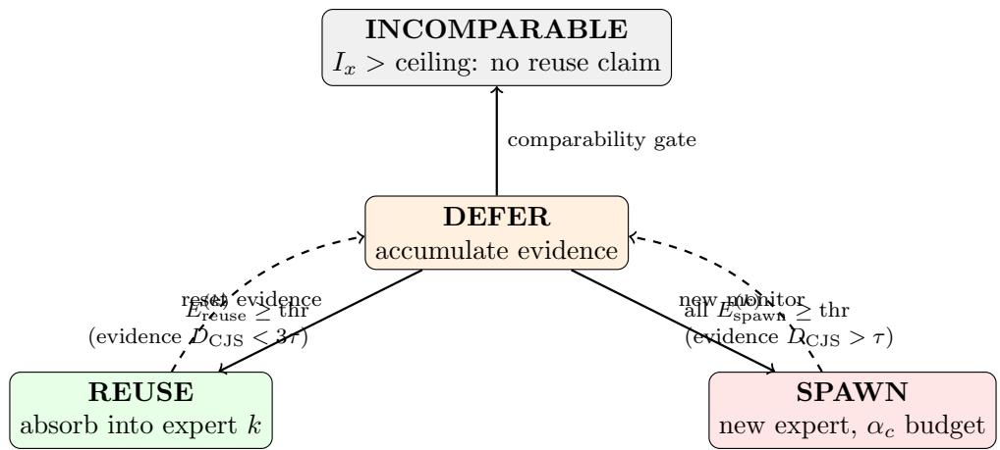
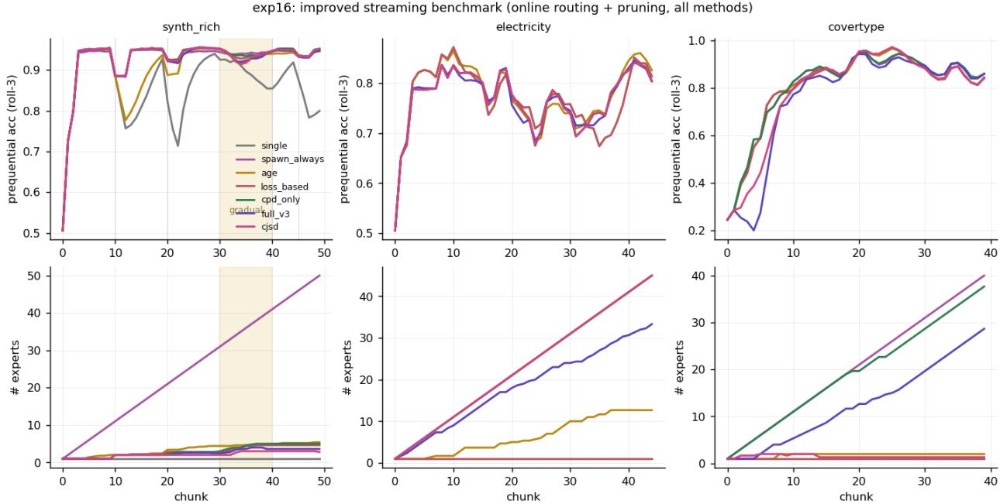
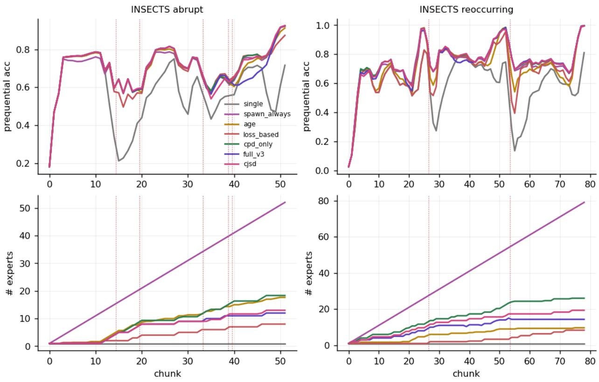
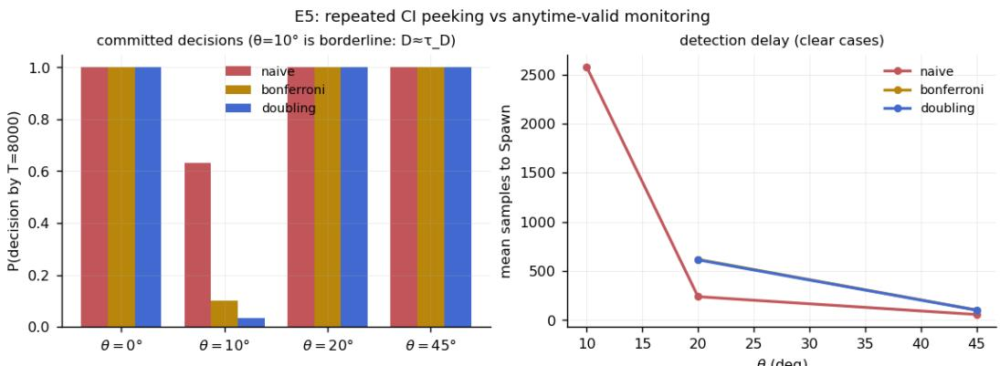

# Evidence Before Expansion: Reuse, Spawn, or Defer in Lifelong Expert Pools

Kentaro Oda Center for Management of Information Technologies, Kagoshima University odaken@cc.kagoshima-u.ac.jp

## Abstract

Continual-learning systems have treated uncertainty about a new batch as a nuisance to be resolved immediately; this paper makes “do not decide yet” a statistically defined action. Defer is not a heuristic: it is exactly the region between accumulated evidence for reuse and accumulated evidence for spawn. Systems that maintain a pool of expert models over a nonstationary stream must repeatedly decide whether an incoming batch should be absorbed by an existing expert, spawn a new one, or wait for more evidence. We present a complete decision layer built on a twoaxis task comparison (the conditional Jensen–Shannon discrepancy and its covariate companion) with three system contributions. (1) Decision semantics: reuse/spawn tests are posed as onesided sequential hypotheses separated by an indiference zone [τ, 3τ]; defer is the state in which neither betting e-process has accumulated enough evidence, giving the abstention a precise statistical meaning. (2) Sequential evidence: per-expert betting e-processes on per-point lossdiference increments scored by predictable (frozen-before-use) discriminators gate the decisions; we prove finite-time anytime validity for the observable surrogate discrepancy of the predictable discriminator sequence, and an unconditional one-sided transfer to the population quantity (each side’s slack is the excess risk of a single discriminator; a stated downward-bias regularity, observed throughout, makes the spawn side exactly conservative); the deployed evidence process is a restarted e-detector: a bank of unwindowed supermartingales with geometrically spaced restarts and the level spent over restart instances, giving bounded-memory recency inside a lifetime anytime-validity guarantee (a single unwindowed process mis-reuses at rate 0.5 after concept switches; the restarted bank at 0.00, with the best accuracy of any evidence variant on recurrenceheavy streams). (3) Systems mechanics: expert shortlisting by recent loss bounds per-chunk cost; mini-batch test-then-train routing removes the switch lag that otherwise dominates accuracy diferences; merge closes the loop for recurring concepts. On a four-regime synthetic stream the batch gate attains zero false spawns and zero missed concepts with the ideal expert count, and the default streaming configuration (restarted e-detector + spending) holds false-spawn 0.00 / false-reuse 0.00; on INSECTS (documented drifts) it exploits recurrence to hold 13 experts where exchange-based decisions hold 18–52; on covertype it correctly maintains 1–2 experts. We characterize the regimes where expert pools pay of (discrete, recurring concepts) and where they cannot (continuous drift), and release all code.

## 1 Introduction

Adaptive systems answer nonstationarity with one of three primitive actions: adapt an existing model, create a new one, or wait. Existing criteria collapse this decision into a scalar trigger—input novelty (AGE/SEMA-style), loss jumps (DDM-style), or model-exchange regret (CLS-style)—each of which confounds at least two of the three underlying situations (covariate shift, mechanism change, insuficient evidence). This paper treats the decision layer itself as the object of design and evaluation.

  
Figure 1: The decision layer as a state machine. Every chunk starts in defer; the two betting e-processes must earn a transition (threshold $K _ { \mathrm { m a x } } / \alpha$ or the $\alpha _ { c }$ spending schedule), the indiference zone [τ, 3τ] separates the two exits, and the comparability gate blocks reuse claims when supports barely overlap.

We build on the conditional Jensen–Shannon discrepancy (CJSD), which decomposes task discrepancy exactly into a covariate axis $I _ { x }$ and a functional axis $D _ { \mathrm { C J S } }$ , both estimated from two discriminators; a companion paper develops its theory. Here we contribute the system: sequential decision semantics, streaming validity, and the mechanics that make the layer run at stream rate, together with a benchmark across four stream regimes and seven decision policies.

## 2 The decision layer

Setting. Chunks $( X _ { t } , y _ { t } )$ arrive; a pool of experts $\{ E _ { k } \}$ each hold a training reservoir, a held-out reservoir, and a model. Prequential accuracy is measured before learning. Figure 1 summarizes the layer.

Two-axis gate. For a candidate chunk and expert k, estimate $( I _ { x } ^ { ( k ) } , D _ { \mathrm { C J S } } ^ { ( k ) } )$ with confidence intervals. If $I _ { x } ^ { ( k ) }$ exceeds a comparability bound the pair is vacuous (the functional axis is honestly zero of-overlap) and cannot justify reuse. The batch and sequential gates test the same two hypotheses, $H _ { 0 } ^ { \mathrm { s p } } : D _ { \mathrm { C J S } } \leq \tau$ (against spawn) and $H _ { 0 } ^ { \mathrm { r e } } : D _ { \mathrm { C J S } } \geq 3 \tau$ (against reuse), separated by the indiference zone $[ \tau , 3 \tau ] ;$ ; the batch gate is their single-look version: spawn when every comparable expert has $L ( D _ { \mathrm { C J S } } ) > \tau$ , reuse when some expert has $U ( D _ { \mathrm { C J S } } ) < 3 \tau \mathrm { - } \mathrm { o u r }$ implementation uses the stricter cut $U ( D _ { \mathrm { C J S } } ) \leq \tau$ , which rejects $H _ { 0 } ^ { \mathrm { r e } }$ a fortiori and only makes reuse more conservative—and defer otherwise.

Indiference zone and e-processes. Sequentially, reuse and spawn are one-sided tests of $H _ { 0 } ^ { \mathrm { s p } } : D _ { \mathrm { C J S } } \leq \tau$ and $H _ { 0 } ^ { \mathrm { r e } } : D _ { \mathrm { C J S } } \geq 3 \tau$ . Per expert we maintain two betting e-processes on the per-point increments $u _ { i } .$ , scored by discriminators frozen before the chunk arrives (a predictable scoring rule; the increments themselves are the new randomness): $E _ { \mathrm { s p a w n } }$ bets upward, $E _ { \mathrm { r e u s e } }$ downward; an action fires at threshold $K _ { \mathrm { m a x } } / \alpha$ , where $K _ { \mathrm { m a x } }$ is a declared design capacity on the number of simultaneously monitored experts, enforced by the merge/prune layer (we use $K _ { \operatorname* { m a x } } = 1 6 ;$ observed pools stay below it). The union bound must be over $K _ { \mathrm { m a x } } .$ , not the data-dependent pool size: a threshold that grows with each spawn does not control the family level when experts are created indefinitely. Two caveats delimit what $K _ { \mathrm { m a x } } / \alpha$ buys: it bounds simultaneous monitors, so if experts are pruned and replaced without limit, the lifetime family of tested hypotheses can exceed $K _ { \mathrm { m a x } }$ . For unbounded lifetimes we implement an α-spending variant: the c-th created expert receives $\alpha _ { c } = 6 \alpha / ( \pi ^ { 2 } c ^ { 2 } )$ (so $\textstyle \sum _ { c } \alpha _ { c } = \alpha )$ , split across its two one-sided processes, giving valid familywise control over arbitrarily many creation events with no capacity cap. Re-running the full stream benchmark under spending, lifetime validity turns out to cost nothing measurable: decision quality is unchanged (false-spawn 0.02 vs 0.01, false-reuse 0.00), pools stay comparable $( 6 . 3  7 . 0 $ experts on INSECTS-reoccurring), and prequential accuracy is equal or slightly higher on every stream $( 0 . 8 6  0 . 8 8$ synthetic, $0 . 7 7  0 . 7 9$ Covertype)—early experts face lower thresholds than $K _ { \mathrm { m a x } } / \alpha$ and the quadratically growing late thresholds never bind at the pool sizes these streams induce. We therefore recommend spending as the default whenever expert lifetimes are unbounded; combined with the restarted e-detector of the next paragraph, the entire deployed configuration—recency, multiplicity, and unbounded lifetimes—now sits inside the validity guarantee.

Sensitivity (ablation of the retired windowed variant). On the synthetic stream a $W \times \tau$ grid $( W \in \{ 4 , 8 , 1 6 , 3 2 \} , \tau \in \{ 0 . 0 1 , 0 . 0 3 , 0 . 0 5 , 0 . 1 0 \} , 3 \mathrm { ~ s e e d s } )$ localizes the sensitivity entirely in τ: at $\tau = 0 . 0 1$ the system holds false-spawn+false-reuse at 0.01 with 1.3 experts, while $\tau \geq 0 . 0 3$ widens the indiference zone $\left[ { \tau , 3 \tau } \right]$ past the concept gap and mis-reuses the new concept in half the runs (combined error 0.50, single-expert collapse). The window length is inert across the entire [4, 32] range (identical numbers to three decimals): decisive evidence accumulates within $\leq 4$ chunks here, so W binds only through the post-switch recency mechanism of Sec. 3. Practical guidance: set τ below the smallest drift mass worth reacting to; W is not a tuning burden. The zone $\left[ { \tau , 3 \tau } \right]$ makes the reuse-side test well posed (without it the reuse boundary is statistically unreachable). Defer is exactly the state where neither process has crossed.

What the e-process actually tests. The increments are computed from learned discriminators, so the guarantee must be stated for the observable score, not assumed for the population quantity. The pair scoring chunk $t , \ ( T _ { 1 , t } , T _ { 2 , t } )$ , is predictable: updated only between chunks and frozen before the chunk arrives, so an e-process that survives several chunks is scored by a predictable, possibly time-varying sequence of pairs (incremental discriminators are covered; within each chunk the pair is fixed). Define the surrogate discrepancy of the pair scoring chunk t,

$$
\widetilde { D } _ { t } \ = \ \mathbb { E } [ \ell _ { 1 } ( T _ { 1 , t } ; X , Z ) - \ell _ { 2 } ( T _ { 2 , t } ; X , Y , Z ) | \mathcal { G } _ { t - 1 } ] \ = \ D _ { \mathrm { C J S } } + \varepsilon _ { 1 , t } - \varepsilon _ { 2 , t } ,
$$

the conditional population log-loss gap achieved by the pair scoring chunk t, where $\mathcal { G } _ { t - 1 }$ is the σ-field of everything observed before chunk t (which fixes $\left( T _ { 1 , t } , T _ { 2 , t } \right) )$ and $\varepsilon _ { j , t } \geq 0$ are the pair’s (conditional) excess risks. Let $\mathcal { F } _ { i - 1 }$ be the σ-field generated by everything observed before point i (including the pair scoring i and the bets). The discriminators and $\lambda _ { i }$ are $\mathcal { F } _ { i - 1 }$ -measurable (predictable); the increment $u _ { i } = ( ( \ell _ { 1 , i } - \ell _ { 2 , i } ) + B ) / 2 B \in [ 0 , 1 ]$ is the newly observed quantity, and what the null delivers is the conditional-mean inequality $\mathbb { E } [ u _ { i } \mid { \mathcal { F } } _ { i - 1 } ] \leq m _ { 0 }$ (spawn side; $\geq m _ { 0 }$ for reuse). Throughout, τ denotes the normalized threshold, so the surrogate null reads $\widetilde { D } _ { t } / \ln 2 \leq \tau$ and $m _ { 0 } ^ { \mathrm { s p } } = ( \tau \ln 2 + B ) / 2 B$ is dimensionally consistent (the reuse side uses $m _ { 0 } ^ { \mathrm { r e } } = ( 3 \tau \ln 2 + B ) / 2 B )$

Proposition 1 (Finite-time validity for the observable score). Under clipping (bounded losses), for any betting strategy with $\lambda _ { i } \ F _ { i }$ −1-measurable, $\lambda _ { i } \geq 0$ , and the capital constraint $1 + \lambda _ { i } \sigma ( u _ { i } - m _ { 0 } ) \geq 0$ (a negative $\lambda _ { i }$ would reverse the defining inequality), the process $\begin{array} { r } { E _ { n } = \prod _ { i < n } \bigl ( 1 + \lambda _ { i } \sigma ( u _ { i } - m _ { 0 } ) \bigr ) } \end{array}$ is a nonnegative supermartingale with respect to $( \mathcal { F } _ { i } )$ whenever the surrogate null holds pointwise over the process’ lifetime—for every chunk t whose increments enter the product—namely $\widetilde { D } _ { t } / \ln 2 \leq \tau$ for the spawn side with $m _ { 0 } ^ { \mathrm { s p } } = ( \tau \ln 2 + B ) / 2 B , ~ \sigma = + 1$ , and $\widetilde { D } _ { t } / \ln 2  \geq 3 \tau$ for the reuse side with $m _ { 0 } ^ { \mathrm { r e } } = ( 3 \tau \ln 2 + B ) / 2 B , \sigma = - 1$ (a composite null over the predictable pair sequence), and Ville’s inequality gives $\operatorname* { P r } [ \operatorname* { s u p } _ { n } E _ { n } \geq K _ { \operatorname* { m a x } } / \alpha ] _ { \bullet } \leq \alpha / K _ { \operatorname* { m a x } }$ at any stopping time. The guarantee is unconditional and finite-time—but its null is $D _ { t } ,$ not $D _ { \mathrm { C J S } }$

Proposition 2 (One-sided transfer to the population quantity). Unconditionally—for any frozen pair, however misspecified—the excess risks bound one direction each: $D _ { \mathrm { C J S } } - \varepsilon _ { 2 , t } \leq \bar { D } _ { t } \leq D _ { \mathrm { C J S } } + \varepsilon _ { 1 , t }$ (companion paper, one-sided misspecification control). Hence a spawn-side rejection of $\widetilde { D } _ { t } / \ln 2 \leq \tau$ certifies DCJS/ ln $2 > \tau - \varepsilon _ { 1 , t } /$ ln 2 with no condition on $T _ { 2 } ,$ , and a reuse-side rejection certifies $D _ { \mathrm { C J S } } / \ln 2 < 3 \tau + \varepsilon _ { 2 , t } /$ ln 2 with no condition on $T _ { 1 }$ . If moreover the pair satisfies the downward-bias regularity $\varepsilon _ { 1 , t } \leq \varepsilon _ { 2 , t } ~ ( i . e . ~ \widetilde D _ { t } \leq { \cal D } _ { \mathrm { C J S } } )$ , the spawn slack vanishes—a rejection certifies $D _ { \mathrm { C J S } } / \ln 2 > \tau$ outright—and the reuse slack sharpens to $( \varepsilon _ { 2 , t } - \varepsilon _ { 1 , t } ) / \ln { 2 }$

The unconditional part shifts what must be controlled: slack-aware population transfer on the spawn side involves only $\varepsilon _ { 1 , t ^ { - } }$ —the excess risk of the simple x-discriminator, the quantity that held-out model selection already minimizes and that admits standard approximation-plus-complexity bounds (companion paper, Prop. 4)—not a sign comparison between the two discriminators. Exact level-τ population conservativeness follows either by inflating the surrogate spawn threshold by a valid high-probability upper bound on $\varepsilon _ { 1 , t } /$ ln 2 (on that bound’s $1 - \delta$ event; the sequential level α and the bound’s δ compose additively), or, as the zero-slack special case, under the downward-bias regularity. That regularity is an empirical refinement: it held in every lifecycle benchmark reported in this paper (the companion paper exhibits an engineered misspecified-marginal exception, within the proven slack), and it sharpens the slacks but no longer carries the validity claim. The reuse-side slack $\varepsilon _ { 2 , t }$ is further limited in practice by the comparability gate, which excludes low-overlap comparisons, one important regime in which $\varepsilon _ { 2 , t }$ grows. In one sentence: surrogate-level sequential validity is exact; population-CJSD decisions inherit one-sided, discriminator-specific slacks unconditionally, and exact zero-slack conservativeness is the special case obtained either by threshold correction with a valid excess-risk bound or under the empirically observed downward-bias regularity. The deployed recency mechanism (next paragraph) sits inside these guarantees.

Recency without windows: a restarted e-detector. An e-process accumulated over a long stationary stretch can absorb a concept switch: the stale product outvotes fresh contradicting evidence and mis-fires reuse (measured mis-reuse rate 0.5). A sliding window of the last W per-chunk factors with a freshness guard restores correct behavior (mis-reuse 0.1)—but truncating the product breaks the supermartingale property, so the windowed heuristic sits outside the validity theorem. We resolve this with a restarted e-detector: each monitor keeps a bank of unwindowed betting processes with geometrically spaced restart times (slot j holds the surviving process of age $\approx 2 ^ { j }$ chunks; $O ( \log t )$ memory). The error budget must be spent over restart instances, not over active slots: unboundedly many distinct processes successively occupy the same S slots over an unbounded stream, so a slot-only union bound would not control the lifetime error. The r-th restart instance created over the monitor’s lifetime therefore receives budget $\alpha _ { r } = \alpha _ { \mathrm { s i d e } } \cdot 6 / ( \pi ^ { 2 } r ^ { 2 } )$ and alarms only above its own threshold $1 / \alpha _ { r } ;$ discarded instances can no longer alarm and consume no memory.

Proposition 3 (Lifetime validity of the restarted bank). Each restart instance is a nonnegative supermartingale under the surrogate null from its own restart time (Proposition 1 applies verbatim from that time), and $\begin{array} { r } { \sum _ { r \geq 1 } \alpha _ { r } \leq \alpha _ { \mathrm { s i d e } } , } \end{array}$ so the union bound over all instances ever created preserves the family level at every time; the construction is anytime-valid with O(log t) memory. Recency is structural: after a switch the youngest instances contain no pre-switch evidence, and the geometric grid keeps some restart within a factor 2 of the switch point. The price of the instance accounting is logarithmic: instance $r ' s$ log-threshold exceeds the uniform one by 2 ln $r { + } O ( 1 )$ , an $O ( \log r )$ additional evidence requirement recovered in $O ( \log r / g )$ chunks under any alternative with log-evidence growth rate $g > 0$

  
Figure 2: Improved streaming benchmark: all seven policies share online routing and pruning; a gradual-drift phase (shaded) and recurrences are included. Bottom: expert counts.

Empirically the correct accounting costs almost nothing: re-running the full benchmark with the instance-accounted bank (spending multiplicity) gives post-switch mis-reuse 0.00 and false-spawn 0.00 on the synthetic stream, prequential accuracy within one point of the windowed heuristic there (0.846 vs 0.856) and equal or better everywhere else—including the best accuracy of any evidence variant on the recurrence-heavy stream $( 0 . 6 1 6  0 . 6 7 5$ on INSECTS-reoccurring) and on Covertype $( 0 . 7 7 0  0 . 7 9 0 )$ . The windowed heuristic is therefore retired from the default configuration: the deployed system and the guarantee now coincide.

Mechanics. Shortlisting: only the top-k experts by error on the previous chunk are compared, so candidate selection is predictable and does not touch the labels that subsequently enter the evidence (5.9× speedup on 33-dimensional INSECTS with no measured decision change). Routing: mini-batch test-then-train (labels used only for routing) cuts the switch lag from one chunk to one mini-batch and lifts every adaptive policy to the same accuracy ceiling, isolating decision quality as the diferentiator. Merge: expert pairs with high overlap and mutually low $D _ { \mathrm { C J S } }$ are merged; reservoir recency caps prevent regime pollution, which we identify as the true cause of over-spawning on fast-mixing streams.

## 3 Benchmark

Policies. single, spawn-always, input-novelty (AGE/SEMA-style), loss-jump (DDM-style), exchange score (CLS-style), CPD-family gate, CJSD gate (batch and e-process variants). Streams. A four-regime synthetic stream (abrupt switches, a covariate-only phase, gradual drift, recurrences; ground-truth mapping ids); Electricity; Covertype; INSECTS abrupt and incremental-reoccurring (documented change points).

  
Figure 3: INSECTS (abrupt and reoccurring): prequential accuracy (top) and expert counts (bottom) per decision policy; dotted lines mark documented change points.

Findings. (1) With routing equalized, accuracy diferences between adaptive policies nearly vanish (synthetic: 0.939–0.945); the true diferentiators are decision quality and expert economy, where the CJSD gate is the only policy with zero false spawns and zero missed concepts at the ideal expert count. (2) The gradual phase separates policies sharply: spawn rates during gradual drift are 0.10 (CJSD) vs 0.16–0.22 (loss/CPD) vs 1.0 (spawn-always). (3) On INSECTS the pair-level anatomy shows segments $0 \approx 2 \approx 5$ recur; the CJSD gate exploits this (13 experts vs 18–52) and its non-spawn at recurrent change points is correct reuse, not a miss (Fig. 3). (4) On continuous-drift Electricity no expert pool helps (all 0.74–0.78): a boundary of applicability, diagnosed by the same machinery (reservoir-vs-chunk $D _ { \mathrm { C J S } }$ stays permanently high). (5) The streaming-native variant in its default configuration (incremental discriminators + restarted e-detector + α-spending) is the most conservative policy in the pool: false-spawn 0.00 and false-reuse 0.00 on the synthetic stream at 1.0 experts, with accuracy 0.85 there (batch gate: 0.91; the gap is the explicit price of family-level error control) and the best accuracy of all evidence variants on the recurrence-heavy INSECTS stream (0.675).

  
Figure 4: Repeated CI peeking commits 64% of borderline cases to a near-coin-flip decision; anytimevalid monitoring keeps them deferred and pays only ∼2× delay on clear cases.

## 4 Sequential validity in isolation

On a controlled drift boundary $( D _ { \mathrm { C J S } } \approx \tau )$ , naive repeated confidence intervals commit $6 4 \%$ of runs to a decision that is efectively a coin flip; valid schemes defer 90–97% of them, while on clear cases they pay a delay factor of only 1.8–2.6 (Fig. 4). The e-process variant adds a false-alarm rate of 0.00 at detection delays 20% above the (invalid) naive monitor.

## 5 Related work

Expert/adapter expansion by input novelty (SEMA), loss-based drift response and model merging in federated streams (FedDrift), continual learning of mixed task sequences (CAT), and drift detectors (ADWIN, DDM) each implement a one-axis trigger; exchange-based scores (CLS) confound covariate shift with mechanism change. Our layer difers in (i) the two-axis gate, (ii) the indiference-zone sequential semantics of defer, and (iii) validity under continuous monitoring.

## 6 Limitations

Continuous-drift streams remain out of scope for any discrete-concept pool; discriminator cost, though bounded by shortlisting, exceeds loss-trigger baselines by ∼3×. Bounded-memory recency is now provided inside the validity guarantee by the restarted e-detector with restart-instance spending (Proposition 3); what remains open is sharper-than-union-bound multiplicity (mixture e-values) and the finite-sample theory of the underlying estimator (companion paper).

## References

[1] K. Oda. Separating covariate shift from mechanism change with two discriminators. Preprint, 2026 (companion paper, posted concurrently).

[2] S. Sun, H. H. Zhang, J. C. Watkins. Quantifying data similarity using cross learning. arXiv:2510.10866, 2025.

[3] W. Wang et al. Self-expansion of pre-trained models with mixture of adapters for continual learning. CVPR 2025.

[4] E. Jothimurugesan et al. Federated learning under distributed concept drift. AISTATS 2023.

[5] Z. Ke, B. Liu, X. Huang. Continual learning of a mixed sequence of similar and dissimilar tasks. NeurIPS 2020.

[6] V. Souza et al. Challenges in benchmarking stream learning algorithms with real-world data. DMKD 2020.