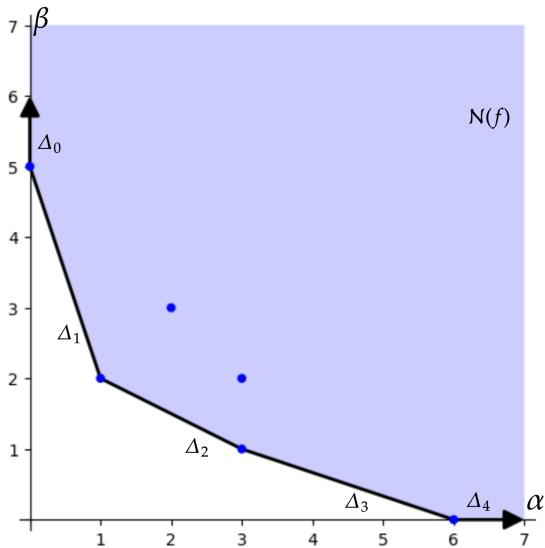
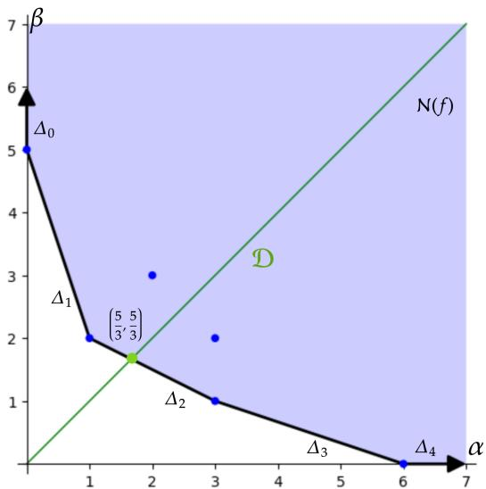

# Exact Algebraic Computation of Learning Coefficients for Two-Dimensional Singular Models

Gregoire Sergeant-Perthuis CQSB, Sorbonne Université gregoire.sergeant-perthuis@sorbonne-universite.fr

Elias Tsigaridas Ouragan team, Inria Paris elias.tsigaridas@inria.fr

Jules Tsukahara Ouragan team, Inria Paris jules.tsukahara@inria.fr

## Abstract

Classical information criteria such as the Bayesian Information Criterion (BIC) rely on regularity assumptions that break down for singular models, leading to incorrect model selection in settings such as deep learning. The Widely Applicable Bayesian Information Criterion (WBIC) relies on local learning coefficients λ, which in the analytic case coincides with local Real Log Canonical Thresholds (RLCT) of the Kullback-Leibler divergence of the model, to capture correct marginal likelihood asymptotics. Exact computation of the learning coefficients has been limited to special cases, and only sampling-based estimation methods are generally applicable. We present the first deterministic algorithm that computes local RLCTs exactly for any two-dimensional model whose Kullback-Leibler distance is contact equivalent to a polynomial, derive a bound on its complexity, and demonstrate its effectiveness for a broad class of models, with applications including polynomial neural networks. Beyond providing ground truth to calibrate sampling-based estimators, exact computation reveals algebraic structure in learning coefficients that sampling cannot and out-speeds it in the shallow regime.

## 1 Introduction

Information criteria (IC): IC are model selection methods in statistics and machine learning [Konishi and Kitagawa, 2008]. They aim to strike a balance between prediction accuracy and model complexity. They are ubiquitous in diverse domains, ranging from statistics [Zhang et al., 2023], especially in the presence of structured learning [Barber and Drton, 2015, De Campos and Ji, 2011], and dimensionality reduction [Sclove, 2021, Tomarchio and Punzo, 2025], to biology [Susko and Roger, 2020], neuroscience [Penny, 2012], and dynamical systems [Thanasutives et al., 2024]. In particular, for regular models, for which the smoothness in the parameter space implies identifiability and the existence of the Fisher information metric [Liu and Suzuki, 2025], the celebrated Bayesian information criterion (BIC) asymptotically approximates the log marginal likelihood and thus carries statistical meaning for posterior inference. Through the Laplace approximation [Schwarz, 1978], the BIC has an explicit formula we can compute directly from the input data.

Singular models: Regularity assumptions are generically violated in deep learning due to the overparameterization of modern architectures [Wei et al., 2022, Liu and Suzuki, 2025]. Hence, for non-regular models, the various statistical quantities are estimated using approximate and costly methods such as sampling [Liu and Suzuki, 2025, Newman, 2026, Lau et al., 2025]. The real log canonical threshold (RLCT) is a key quantity from algebraic geometry that characterizes the asymptotic behavior of the log marginal likelihood for non-regular models, generalizing the role of model dimension in the BIC [Watanabe, 2009]. Unlike the explicit BIC formula, computing the RLCT requires resolving singularities in the parameter space; a very challenging computational and mathematical problem.

Polynomial neural networks and identifiability: A class of neural networks whose activation functions are monomials $\sigma ( x ) = x ^ { r }$ , coined polynomial neural networks (PNNs), are gaining interest for their theoretical properties. Their appeal stems from the fact that a PNN defines an algebraic map from weights to functions: the composition of monomial activations and linear layers is a polynomial, so the full machinery of algebraic geometry applies. This structure makes it possible to characterize expressivity via algebraic dimension [Kileel et al., 2019] and degree [Kubjas et al., 2024], and gives rise to a rich theory of identifiability [Usevich et al., 2025, Shahverdi et al., 2025]. In particular, the asymptotic behavior of the log marginal likelihood, and hence the identifiability of the model under Bayesian inference, is entirely governed by the RLCT [Watanabe, 2009].

Our Contribution: We propose, to our knowledge, the first deterministic algorithm that exactly computes the RLCT for any polynomial of two variables, and derive an upper bound on its arithmetic complexity (Prop. 2.7, Thm. 2.11, and Thm. 2.12). As an application, we compute exact RLCT for polynomial neural networks (PNNs) with repeated weights of increasing depth. We show that the effective model complexity, as measured by the RLCT, can counter-intuitively decrease with the number of layers, implying that already in the two-dimensional case, this gives rise to a non-trivial theory of identifiability. We advocate that such exact algorithms are new tools for the study of loss landscapes in learning theory.

Notation Let K be a field of characteristic zero. We let K¯ be the algebraic closure of K. We denote by K[x, y] the ring of polynomials in two variables. We let $\mathbb { K } [ [ x ] ]$ be the ring of formal power series, $\check { \mathbb { K } } ( ( x ) )$ the field of Laurent series and $\mathbb { K } \langle \langle x \rangle \rangle$ ⟩ the field of Puiseux series with coefficients in K. For an integer n and a subset $S \subset \mathbb { R } ^ { n }$ , we let $\mathrm { \dot { C } o n v } ( S )$ be the convex hull of S. For any two subsets $A \subseteq \mathbb { R } ^ { \overline { { n } } }$ and $B \subseteq \mathbb { R } ^ { n }$ , we let A $\iota \oplus B : = \{ a + b \mid { \overset { } { a } } \in A , b \in B \}$ be their Minkowski sum. For any $n \in  { \mathbb { N } } _ { > 0 }$ , we let $[ n ] = \{ 1 , \dots , n \}$ . We use bold roman lowercase letters for vectors in $\mathbb { R } ^ { 2 }$

## 1.1 Background

Information Criteria for Model Selection Information criteria are model selection methods in statistics and machine learning that balance predictive accuracy against model complexity. A celebrated example of such a criterion is the Bayesian information criterion (BIC) [Schwarz, 1978], which emanates from the asymptotic behavior of log marginal likelihoods under regularity assumptions on the models. Concretely, consider a family of parametric probability distributions $P ( { \bar { X _ { 1 } } } , \ldots , X _ { N } \mid \theta , M )$ , one for each parameter value $\dot { \theta _ { \mathbf { \lambda } } } \in \bar { \Theta _ { M } }$ , with possible values in a Borel subset $\Theta _ { M } \subseteq \mathbb { R } ^ { d _ { M } } ;$ ; each family of model M therefore provides the likelihood of a collection of N samples $X _ { 1 } , \ldots , X _ { N }$ . For a given prior $\pi _ { M } ( \theta )$ over the parameter space $\Theta _ { M }$ , the marginal likelihood of the data under model M is $\begin{array} { r } { P ( x _ { 1 } , \dots , x _ { N } \mid M ) = \int P ( x _ { 1 } , \dots , x _ { N } , | \theta , M ) \pi _ { M } ( \bar { \theta } ) } \end{array}$ dθ. Under appropriate regularity assumptions [Schwarz, 1978, Konishi and Kitagawa, 2008], we can approximate that integral, for large sample size $n ,$ as follows:

$$
- \log P ( x _ { 1 } , \dots , x _ { N } \mid M ) \approx - \log P ( x _ { 1 } , \dots , x _ { N } \mid \hat { \theta } _ { M } , M ) + \frac { d _ { M } } { 2 } \log N ,\tag{BIC}
$$

where ${ \hat { \theta } } _ { M }$ is the maximum-likelihood estimator (MLE) under model M. The right hand side of Eq. BIC is the expression of the celebrated Bayesian Information Criterion (BIC); it penalizes model complexity (larger $d _ { M } )$ ) while rewarding goodness of fit. Several other criteria that balance model fit and model complexity are available, such as the Akaike Information Criterion (AIC), the Generalized Information Criterion (GIC), and the Takeuchi Information Criterion (TIC), as well as Bayesian extensions like Akaike’s Bayesian Information Criterion (ABIC).

However, regularity conditions are not satisfied for deep learning architectures [Wei et al., 2022, Watanabe, 2009]. A false asymptotic estimate of the log marginal likelihood, and more generally of the posterior, given a prior on models, can lead to erroneous decisions in model selection [Drton and Plummer, 2017], and so corrections to the BIC have been proposed. The widely applicable Bayesian information criterion (WBIC) relies on the correct asymptotics of the log marginal likelihood,

$$
- \log P ( x _ { 1 } , \dots , x _ { N } \mid M ) \approx - \log P ( x _ { 1 } , \dots , x _ { N } \mid \hat { \theta } , M ) + \lambda \log N ,\tag{WBIC}
$$

where λ is called the learning coefficient. The WBIC is asymptotically consistent in selecting the most parsimonious model [Drton and Plummer, 2017].

From Regular to Singular Models To understand when the BIC is sufficient and when WBIC is needed, we formalize the notion of regularity. The asymptotic expansion of the log marginal likelihood requires it to be re-expressed as follows,

$$
P ( x _ { 1 } , \dots , x _ { N } \mid M ) = \int e ^ { N \cdot { \frac { 1 } { N } } \sum _ { i } \ln P ( x _ { i } \mid \theta , M ) } \pi _ { M } ( \theta ) \mathrm { d } \theta .
$$

When the sample size N tends to infinity, we get

$$
{ \frac { 1 } { N } } \sum _ { i = 1 } ^ { N } \ln P ( x _ { i } \mid \theta , M ) \xrightarrow [ N  \infty ] { } \mathbb { E } _ { X \sim P } { \big [ } \ln P ( X \mid \theta , M ) { \big ] } \quad P { \mathrm { ~ a . s . } } ,
$$

where $P$ is the distribution from which we draw the iid samples $x _ { 1 } , \ldots , x _ { N }$ and $X \sim P .$ . Up to a term that does not depend on θ, the previous limit is the negative of the Kullback Leibler divergence,

$$
D _ { K L } ( P \| P _ { \theta } ) = - \mathbb { E } _ { X \sim P } \left[ \ln P ( X \mid \theta , M ) \right] + \mathbb { E } _ { X \sim P } [ \ln P ( X ) ]
$$

If there exists $\rho \in \Theta$ such that $P ( X ) = P ( X \mid \rho , M )$ , then the function $g \colon \theta \mapsto D _ { \mathrm { K L } } ( P _ { \rho } \| P _ { \theta } )$ is minimized at $\theta ^ { * } = \rho$ with $g ( \theta ^ { * } ) = 0 ;$ we say that such a model is realizable. If the map $\Theta _ { M } \ni \theta \mapsto P ( X _ { 1 } , \ldots , X _ { N } \mid \theta , M )$ is injective, then we say that the model is identifiable. Moreover, if the Hessian of g at θ is positive definite at every $\theta \in \Theta _ { M }$ , we say that the model itself is positive definite. To make it simple, if a model is injective and positive definite, it is said to be regular. In the regular case, BIC provides the correct asymptotic expansion of the log marginal likelihood under standard regularity conditions. If a model is not regular, then it is called singular. In the singular case, WBIC is the correct expression. In this setting the learning coefficient is the RLCT, as we will explain just after. We now introduce the RLCT and review state-of-the-art methods and assumptions for its computation, which stem from the study of singularities of analytic functions.

Real Log Canonical Threshold If the log-likelihood is a real analytic function, the learning coefficient coincides with the real log canonical threshold (RLCT) of the Kullback–Leibler divergence at the realizable model, i.e., the true model that generated the samples. The RLCT is a purely algebraic quantity that is well-studied in singularity theory.

In statistical learning, the RLCT of the Kullback-Leibler divergence of a model-truth-prior triplet is the learning coefficient, and its local version is the local learning coefficient (LLC). The global learning coefficient determines the asymptotic behavior of the log marginal likelihood, while the local learning coefficient characterizes the learning dynamics near specific parameter configurations [Lau et al., 2025]. We now give a formal definition.

Definition 1.1 (Real Log Canonical Threshold). Let $f : \mathbb { R } ^ { n }  \mathbb { R }$ be a real analytic function defined on an open set $O \subset \mathbb { R } ^ { n }$ . Let C be a compact subset of O. Then, for each $x \in { \dot { C } }$ such that $f ( x ) = 0$ there exists, by Theorem $\mathbf { A } . 1 , W \subseteq \mathbb { R } ^ { n }$ , an open set containing 0, an n-dimensional real analytic manifold U, and a real analytic map $\rho : U \to W$ , such that:

$$
f ( \rho ( u ) ) - x ) = \pm u _ { 1 } ^ { k _ { 1 } } \cdot \cdot \cdot u _ { n } ^ { k _ { n } } , \qquad \mathrm { a n d } \qquad \operatorname { J a c } ( \rho ) = b ( u ) u _ { 1 } ^ { h _ { 1 } } \cdot \cdot \cdot u _ { n } ^ { h _ { n } } .
$$

The local real log canonical threshold at x is given by:

$$
\mathrm { R L C T } _ { x } ( f ) = \operatorname* { m i n } _ { 1 \leq i \leq n } \frac { h _ { i } + 1 } { k _ { i } } .
$$

The global RLCT is the minimum local RLCT over all points of $C ,$ that is to say,

$$
\operatorname { R L C T } ( f ) : = \operatorname* { m i n } _ { x \in C } \operatorname { R L C T } _ { x } ( f ) .
$$

Note that the RLCT is a rational number. The RLCT is defined using a real analytic birational map, called the resolution of singularities, which, roughly speaking, represents f locally as a normal crossing function. The existence of such a map for real analytic functions was famously proved by

Hironaka [1964]. We recall this theorem in Appendix A. Although the literature on RLCTs remains sparse, as opposed to that of its complex counterpart, the log canonical threshold (LCT) [Mustata, 2012], its algebraic properties have been studied in [Lin, 2011, Chapter 4] and Saito [2007], and were used to classify real hyperplane singularities in Kosta and Windisch [2024]. While Hironaka’s theorem guarantees the existence of a resolution of singularities, computing this resolution explicitly is notoriously difficult and generally impractical [Bierstone et al., 2011]. Our work is motivated by this computational bottleneck.

## 1.2 Prior Work

The computation of learning coefficients (RLCTs of the Kullback-Leibler divergence for a given sample, model, and generating distribution) remains an active area of research. We review three main categories of work related to this problem: model-specific theoretical results, sampling-based estima tion, and algebraic methods for computing RLCTs, with a particular focus on the two-dimensional case where models are parameterized by two real numbers $\bar { \boldsymbol { \theta } } \in \mathbb { R } ^ { 2 }$

Learning coefficients have been computed exactly for a range of statistical models through dedicated theoretical analysis. These include mixture models [Yamazaki and Watanabe, 2003], three-layered neural perceptrons [Aoyagi et al., 2005], restricted Boltzmann machines [Aoyagi, 2013], as well as Bayesian networks [Rusakov and Geiger, 2005]. More recently, learning coefficients for deep linear networks of arbitrary depth [Aoyagi, 2024] and factor analysis models [Drton et al., 2025] have also been calculated. Lin [2011] used a Newton polygon based method to compute local learning coefficients, when the Newton polygon satisfies strong geometric constraints. Our work removes these restrictions for the two-dimensional case, providing a general algorithm for arbitrary 2D polynomials.

When exact theoretical results are unavailable, the local learning coefficient can be estimated via sampling methods. Lau et al. [2025] introduced a scalable estimator $\hat { \lambda } ^ { \mathrm { S G L D } } ( \theta ^ { * } )$ for the LLC, based on stochastic gradient Langevin dynamics (SGLD) [Welling and Teh, 2011] sampling of the posterior distribution and on Watanabe’s widely applicable Bayesian Information Criterion (WBIC) [Watanabe, 2013]. While SGLD-based estimation has shown empirical success, it provides no theoretical guarantees for sampler convergence [Hitchcock and Hoogland, 2025]. In the absence of known values of the learning coefficient, measuring the convergence of SGLD chains can be difficult and calibrating their hyperparameters can be costly [Vehtari et al., 2021].

For analytic functions in two variables, a line of work beginning with Varchenko [1976] and continuing through Phong et al. [1999] and Collins [2018] established that the local RLCT of a polynomial $f ( x , y )$ can be computed using the geometry of the Newton polygons of certain transformations $\tilde { f } ( x , y )$ of $f ( x , y )$ (see Appendix C). [Paemurru, 2024, Remark 3.11] proposes an algorithmic method, based on Boehm et al. [2020], but it does not terminate for certain polynomial classes (see Section) and lacks complexity bounds where it does. We resolve these issues by adapting the proofs of Phong et al. [1999], Collins [2018] to show that finitely many transformations of $\bar { f } ( x , \bar { y } )$ suffice to compute the local RLCT of any bivariate polynomial. Our Algorithm 1 computes the exact local RLCT and terminates for any $f ( x , y )$ , with an explicit upper bound on the number of steps.

## 2 Theoretical results

In this section, we present our main theoretical results. We present an algorithm (Algorithm 1) to compute the local RLCT of a bivariate polynomial at the origin and we also give a quadratic bound (Theorem 2.12) on its arithmetic complexity, depending on its degree. We sketch the proofs of the various results that support the correctness and the complexity bound of the algorithm. The full proofs appear in the Appendix F. The algorithm combines geometric and algebraic techniques and is based on properties of the Newton polygon of a bivariate polynomial (Appendix C).

## 2.1 Preliminaries: Newton Polygons and RLCTs

Computing the resolution of singularities of a given analytic function or polynomial is notoriously expensive [Bierstone et al., 2011]. Thus it is desirable to find alternative ways to compute the RLCT. In Varchenko [1976], Varchenko introduced a method to compute the local RLCT of an analytic function $f : \mathbb { R } ^ { 2 }  \mathbb { R }$ at an isolated singularity, based on the geometry of its Newton polygon $\mathcal { N } ( f )$ . This method was later generalized to arbitrary singularities [Phong et al., 1999, Theorem 5].

A modern treatment is given in Collins [2018]. The core idea of the above results is to construct an RLCT-preserving automorphism $\Phi : \mathbb { K } \{ x , y \}  \mathbb { K } \{ x , y \}$ , such that the RLCT of an analytic function $f ( x , y )$ can be read on the Newton polygon $\mathcal { N } ( \Phi ( f ) )$ . The main theoretical contribution of our work is to make Varchenko’s method effective. Indeed, in some cases, Varchenko’s method may not terminate.

We circumvent this issue by identifying precisely the cases where Varchenko’s method fails to terminate, and handle them separately. We first define the Newton polygon of a function $f$ and its corresponding Newton distance $\delta _ { f }$

Definition 2.1 (Newton Polygon [Casas-Alvero, 2000]). Let K be a field of characteristic zero. Let $f \in \mathbb { K } [ [ x , y ] ]$ be a formal power series in two variables:

$$
f ( x , y ) = \sum _ { \alpha , \beta = 0 } ^ { \infty } c _ { \alpha \beta } x ^ { \alpha } y ^ { \beta } \in \mathbb { K } [ x , y ] .
$$

Let $D ( f ) = \{ ( \alpha , \beta ) \mid c _ { \alpha \beta } \neq 0 \} \subseteq \mathbb { N } ^ { 2 }$ be the support of $f .$ . The Newton polygon, $\mathcal { N } ( f )$ , is obtained by attaching a copy of the positive quadrant $\mathbb { R } _ { > 0 } ^ { 2 }$ to each point of $D ( f )$ and considering the convex hull of the union; that is $\mathcal { N } ( f ) : = C o n v ( D ( f ) \overline { { \oplus \mathbb { R } _ { \geq 0 } ^ { 2 } } } )$ , where ⊕ denotes the Minkowski sum.

The Newton distance is a positive rational number associated to the Newton polygon $\mathcal { N } ( f )$ of $f ( x , y )$ which measures how far the Newton polygon is from the origin.

Definition 2.2 (Main face and Newton distance). The face $\Delta$ at which the diagonal $\mathcal { D } \{ ( \alpha , \beta ) \in$ $\mathbb { R } _ { > 0 } ^ { 2 } \mid \alpha = \beta \}$ intersects the boundary $\partial \mathcal { N } ( f )$ of the Newton polygon is called the main face of $f ( x , y )$ . Let $\pmb { p } = ( \delta , \delta ) \in \mathbb { Q } _ { > 0 } ^ { 2 }$ be the point of intersection of $\mathcal { D }$ with $\partial \mathcal { N } ( f )$ . Then, $\delta _ { f } : = \delta \in \mathbb { Q } _ { \geq 0 }$ is the Newton distance of $f$

We remind the reader of the notion of right equivalence of power series.

Definition 2.3 (Right equivalence of power series). Let $f , g \in \mathbb { K } [ [ x , y ] ]$ be formal power series. We say that f and g are right-equivalent if there exists an isomorphism $\dot { \Phi } : \mathbb { K } [ [ x , y ] ] \stackrel { \cdot } {  } \mathbb { K } [ [ x , y ] ]$ , such that $f \circ \Phi = g$

Next, we state the normalization condition on the Newton polygon $\mathcal { N } ( f )$ of $f ( x , y )$ . If a polynomial or analytic function $f ( x , y )$ satisfies the normalization condition, then RL $\begin{array} { r } { \dot { \mathbf { \mathcal { C } } } \mathbf { T } _ { 0 } ( f ) = \frac { 1 } { \delta _ { f } } } \end{array}$

Definition 2.4 (Normalization condition Phong et al. [1999], Collins [2018]). Let $f ( x , y ) \in \mathbb { R } \{ x , y \}$ and let $\mathcal { N } ( f )$ be its Newton polygon. Let $\Delta _ { i }$ for $i \in \left[ K \right]$ be the facets of $\mathcal { N } ( f )$ . Let $F _ { \Delta _ { i } } ( z )$ be its facet polynomials and let $a _ { i j }$ and $m _ { i j }$ for $j \in [ r _ { i } ]$ be its distinct roots, and their corresponding multiplicities, respectively. We say that $\Delta _ { i }$ is normalized if $\delta _ { f } \geq m _ { i j }$ for all $j \in [ r _ { i } ]$ We say that $f ( x , y )$ is normalized if the facet $\Delta _ { i }$ of its Newton polygon $\check { \mathcal { N } } ( f )$ is normalized for all $i \in [ K ]$

Proposition 2.5 (Collins [2018]). Let $f \in \mathbb { K } \{ x , y \} . \ I f f ( x , y )$ is right equivalent to a normalized power series $g ( x , y )$ , then $\begin{array} { r } { \mathrm { R L C T } _ { 0 } ( f ) \dot { = } \frac { 1 } { \delta _ { g } } } \end{array}$

The following proposition plays an important role in our work. The version that we present appears in [Phong et al., 1999, Theorem 5] and [Collins, 2018, Theorem 1.4]; a first version for real isolated plane curve singularities appears in [Varchenko, 1976, Theorem 0.6]. It guarantees that for any bivariate analytic function $f ,$ one can construct a right equivalence Φ, such that $f$ is normalized. For completeness, we present a self-contained proof in the Appendix E.1, where we also show that $P _ { f } ( x )$ or $Q _ { f } ( y )$ are truncations of Puiseux roots of $f ( x , y )$

Proposition 2.6 (Phong et al. [1999], Collins [2018]). Any analyticfunction $f \in \mathbb { K } \{ x , y \}$ is right equivalent to a normalized power series. Moreover, this right equivalence is given by a change of variable $\Phi : \mathbb { K } [ x , y ] \to \dot { \mathbb { K } } [ x , y ] , ( x , y ) \mapsto ( x , y - P _ { f } ( x ) \bar { ) } \ o r \ \dot { \Phi } : \mathbb { K } [ x , y ] \to \mathbb { K } [ x , \dot { y ] } , ( x , y ) \ \ddot { \mapsto }$ $( x - Q _ { f } ( y ) , y )$ , where $P _ { f } ( x )$ and $Q _ { f } ( y )$ are power series of strictly positive order in $\mathbb { \bar { K } } [ [ x ] ]$ ] and $\mathbb { \bar { K } } [ [ y ] ]$ respectively.

Proposition 2.6 suggests that the local RLCT of $f ( x , y )$ is computable up to arbitrary precision, but it is not effective, as $\breve { P } _ { f } ( x )$ can have infinitely many terms. Our work resolves this issue.

## 2.2 Main Results

In this work, we show that it is sufficient to compute $P _ { f } ( x )$ up to a finite degree in order to compute the local RLCT of a polynomial $f ( x , y )$ at 0. We obtain a computable bound on this degree, and thus on the maximum number of iterations necessary for computing the local RLCT. We then provide an exact, effective algorithm, which takes as input any polynomial $f ( x , y ) \in \mathbb { Q } [ x , y ]$ and outputs $\mathrm { R L C T } _ { 0 } ( f ) \in \mathbb { Q }$ . Without loss of generality, we henceforth focus only on the situation where $\bar { P _ { f } } ( x )$ gives the required right equivalence. Otherwise, one can consider the change of variable $x \mapsto y$ $y \mapsto x$ . We show that if $\dot { P _ { f } } ( x ) \in \mathbb { K } [ [ x ] ]$ is such that $f ( x , y - P _ { f } ( x ) )$ is normalized, then $P _ { f } ( x )$ is unique. Furthermore, if the coefficients of $f ( x , y )$ are rational, then so are the coefficients of ${ \dot { P } } _ { f } ( x )$ The proof of the following lemma in Appendix F.1.

Proposition 2.7. For any unnormalized analyticfunction $f ( x , y ) \in \mathbb { K } \{ x , y \}$ , the power series $P _ { f } ( x )$ computed in the proof of Prop. 2.6 is unique. Moreover, $i f \mathbb { K } = \mathbb { Q } ,$ , then $P _ { f } \mathbf { \bar { ( } } x \mathbf { ) } \in \mathbb { Q } [ [ x ] ]$

We can thus speak of the normalizing power series of a bivariate polynomial.

Definition 2.8 (Normalizing power series). Let $f ( x , y )$ be an analytic function. We call a power series $P _ { f } ( x )$ the normalizing power series of $f ( x , y )$ $\tilde { f } ( x , y ) = f ( x , y - P _ { f } ( x ) )$ is normalized. Remark 2.9. Recall that a y-root of $f ( x , y )$ is an element $\phi ( x )$ of the algebraic closure of $\mathbb { K } [ x ]$ , such that $f ( x , \phi ( x ) ) = 0$ (see Appendix D). In the course of the proof of Proposition 2.6, it is shown that $P _ { f } ( x )$ corresponds either:

(1) to a finite truncation of some Puiseux root of strictly positive order of $f ( x , y ) , \mathrm { o r } ,$

(2) to a power series of strictly positive order $\phi ( x ) \in \bar { \mathbb { K } } [ [ x ] ] \setminus \mathbb { K } [ x ]$ which is a y-root of $f ( x , y )$

Using the Newton-Puiseux algorithm, $P _ { f } ( x )$ can thus be computed entirely, in the first case, or up to an arbitrary number of terms in the second case.

We first define the finite part $P _ { f } ^ { f i n } ( x )$ of $P _ { f } ( x )$ , where we use the notion of singular parts of Puiseux series (Definition D.3). For the remainder of the section, we let $\mathbb { K } = \mathbb { Q }$

Definition 2.10 (Finite part of a normalizing power series). Let $f ( x , y ) \in \mathbb { Q } [ x , y ]$ , with normalizing power series $P _ { f } ( x )$ . If there exists a y-root $\phi ( x )$ of $f ( x , y )$ , such that $\bar { P _ { f } } ( x ) \bar { } = \phi ( x )$ , then we define the finite part $P _ { f } ^ { \mathrm { f i n } } ( x )$ of $P _ { f } ( x )$ to be the singular part (Definition D.3) of $P _ { f } ( x )$ ; that is $P _ { f } ^ { \mathrm { f i n } } ( x ) : = S _ { P _ { f } } ( x )$ . Otherwise, we let $P _ { f } ^ { \mathrm { f i n } } ( x ) : = P _ { f } ( x )$

The following result justifies the algorithm we propose in the next section. It establishes that a finite part of $P _ { f } ( x )$ , which distinguishes it from all the other Puiseux roots $\phi ( x )$ of strictly positive order, is sufficient to compute the local RLCT of a polynomial $f ( x , y )$

Theorem 2.11. Let $f ( x , y ) \in \mathbb { Q } [ x , y ] ;$ , with normalizing power series $P _ { f } ( x ) \in \mathbb { Q } [ [ x ] ]$ . Let $P _ { f } ^ { \hbar n } ( x )$ be its finite part. Let $\tilde { f } ( x , y ) = f ( x , y - P _ { f } ^ { f n } ( x ) )$ . Let ∆ be the mainface of $\operatorname { \mathcal { N } } ( f )$ $I f { \tilde { f } }$ is normalized, then $\begin{array} { r } { \mathrm { R L C T } _ { 0 } ( f ) = \frac { 1 } { \delta _ { \tilde { f } } } } \end{array}$ . If not, $\begin{array} { r } { \mathrm { R L C T } _ { 0 } ( \dot { f } ) = \frac { 1 } { m } } \end{array}$ , where m $> \delta _ { f }$ is the largest multiplicity ofthe roots of $\tilde { F } _ { \Delta } ( z )$

Proof. This theorem follows from the unicity of $P _ { f } ( x )$ , and from the maximality of the degree of singular parts of Puiseux roots of polynomials. We defer the detailed proof to Appendix F.2. □

This result tells us precisely under which conditions Varchenko’s method fails to terminate, and recovers the RLCT even in those pathological cases. Our second theoretical result generalizes a univariate root separation bound [Tsigaridas and Emiris, 2008], to an upper bound on the degree of $P _ { f } ^ { \mathrm { f i n } } ( x )$ . This allows us to define a stopping criterion for our algorithm and thus is also a bound on the number of steps that our algorithm takes before terminating.

Theorem 2.12. Let $f ( x , y ) \in \mathbb { Q } [ x , y ]$ , such that degy $f = d _ { y }$ and degx $f = d _ { x } .$ . Consider the finite part of its normalizing power series, $P _ { f } ^ { \hbar n } ( x )$ . Let d be the degree of $P _ { f } ^ { \hbar n } ( x )$ . Then $\begin{array} { r } { d < ( d _ { y } + \frac { 1 } { 2 } ) d _ { x } } \end{array}$

Sketch ofProof. The proof in full detail can be found in Appendix F.3. Suppose that the finite part $P _ { f } ^ { \mathrm { f i n } } ( x )$ is shared by at least two Puiseux roots of $f ( x , y )$ , say $\phi ( x )$ and $\psi ( x )$ . The order of the difference between ϕ and $\psi , \mathrm { o r d } ( \phi ( x ) - \psi ( x ) )$ is an upper bound on the degree of $P _ { f } ^ { \mathrm { f i n } } ( x )$ . We are thus interested in finding upper bounds on the order of the differences of the roots of $f ( x , y )$ , based on the degree in x and y of $f ( x , y )$ . This is analogous to the root separation problem in the univariate case: finding a lower bound on the absolute difference between the roots of a given polynomial $f ( z )$ . We generalize the approach of Tsigaridas and Emiris [2008], which lower bounds the root separation of a polynomial $\mathbf { \hat { \boldsymbol { g } } } ( \boldsymbol { z } ) \in \mathbb { Z } [ \boldsymbol { z } ]$ , using the discriminant of $g .$ We argue that the degree in x of the discriminant of $f ( x , y )$ gives a similar upper bound in the bivariate case. □

Theorem 2.12 provides a bound on the number of steps necessary to implement the check in Theorem 2.11. Combining Theorem 2.11 and Theorem 2.12, we are now ready to construct our algorithm.

## 3 An exact algorithm to compute the RLCT of 2D polynomials

Algorithm 1: ComputeRLCT2D   
Input: A polynomial $f ( x , y ) \in \mathbb { Q } [ x , y ]$   
Output: $\operatorname { R L C T } _ { 0 } ( f )$   
1 $d _ { y } \gets \deg _ { y } f$   
2 $d _ { x }  \deg _ { x } { f }$   
3 $B  ( d _ { y } + \textstyle { \frac { 1 } { 2 } } ) d _ { x }$   
4 $d \gets 0$   
5 while $B > 0$ do   
6 Compute the Newton polygon $\mathcal { N } ( f )$ of $f$   
7 Compute the Newton distance $\delta _ { f }$ of f   
8 if Normalized $( f , \mathcal { N } ( f ) , \delta _ { f } ) = \dot { }$ True then   
9 return $\frac { 1 } { \delta _ { f } }$   
10 else if Normalized $( f , \mathcal { N } ( f ) , \delta _ { f } ) = ( b , p , m )$ then   
11 $f ( x , y ) \gets f ( x , \dot { y } - b \dot { x } ^ { p } )$   
12 $B  B - ( p - d )$   
13 $d \gets p$   
14 end   
15 end   
16 if Normalized $( f , \mathcal { N } ( f ) , \delta _ { f } )$ = True then   
17 return $\frac { 1 } { \delta _ { f } }$   
18 else if Normalize $\mathtt { d } ( f , \mathcal { N } ( f ) , \delta _ { f } ) = ( b , p , m )$ then   
19 return $\textstyle { \frac { 1 } { m } }$   
20 end

In this section, we propose an algorithm for computing the local RLCT at the origin of any polynomial $f \in \mathbb { Q } [ x , y ]$ (Algorithm 1). This algorithm implements the constructive proof of the existence of a normalizing power series, as described in Phong et al. [1999], Collins [2018], but includes a stopping criterion derived from Theorem 2.12, such that the normalizing power series is only computed up to $P _ { f } ^ { \mathrm { f i n } } ( x )$ . By Theorem 2.11, this is sufficient to compute $\mathrm { R L C T } _ { 0 } \dot { ( } f )$ . The definition is self-contained, except for the Normalized subroutine, which checks if a polynomial $f$ satisfies the normalization condition (Definition 2.4). The definition of the Normalized subroutine is deferred to Appendix H. We prove the correctness of Algorithm 1. The proof is deferred to Appendix G.1.

Theorem 3.1 (Correctness). Let $f ( x , y ) \in \mathbb { Q } [ x , y ]$ . Then Algorithm 1 computes the real log canonical threshold at the origin of $f ( x , y )$

We obtain upper bounds on the number of iterations required to compute the RLCT using Algorithm 1. Corollary 3.2. Let $f ( x , y ) \in \mathbb { Q } [ x , y ]$ , such that degy $f = d _ { y }$ and $\deg _ { x } f = d _ { x } .$ . Then, Algorithm 1 computes the $\operatorname { R L C T } _ { 0 } ( f )$ in less than $( d _ { y } + \frac { 1 } { 2 } ) d _ { x }$ iterations.

Proof. Theorem 3.1 asserts that Algorithm 1 computes the $\operatorname { R L C T } _ { 0 } ( f )$ . The number of iterations of the while loop (lines 14-15) is upper bounded by $\begin{array} { r } { B = ( d _ { y } + \frac { 1 } { 2 } ) d _ { x } } \end{array}$ □

## 4 Application to polynomial models

We demonstrate the applicability of our algorithm by computing local learning coefficients of biparametric models. We define an equivalence relation on the space of real functions which allows us to apply our algorithm, even when the Kullback-Leibler distance of the considered model is not polynomial. We illustrate this for Polynomial Neural Networks in Section 4.1.

## 4.1 Polynomial Neural Networks

Polynomial neural networks (PNNs) are a class of neural network models whose activations are monomial functions, which recently have shown state-of-the-art performance on a variety of tasks, from image generation and classification [Chrysos et al., 2020, Huang et al., 2003], to trading signals forecasting [Ghazali et al., 2011], signal representation [Yang et al., 2022] and to the resolution of inverse problems in physics [Bu and Karpatne, 2021], among others.

Definition 4.1 (Polynomial Neural Network [Kubjas et al., 2024]). A (bias-less) polynomial neural network $f _ { \theta }$ , with architecture $d = ( d _ { 0 } , \ldots , d _ { L } )$ is a function $f _ { \pmb { \theta } } : \mathbb { R } ^ { d _ { 0 } }  \mathbb { R } ^ { d _ { L } }$ , defined as:

$$
f _ { \pmb \theta } = W _ { L } \circ \sigma _ { L - 1 } \circ W _ { L - 1 } \circ \sigma _ { L - 2 } \circ \cdots \circ \sigma _ { 1 } \circ W _ { 1 } ,
$$

where $W _ { i } \in \mathbb { R } ^ { d _ { i } \times d _ { i } }$ −1 are linear maps, and the monomial activation functions $\sigma _ { i } : \mathbb { R } ^ { n }  \mathbb { R } ^ { n }$ act component-wise and are given by:

$$
\sigma _ { i } ( x ) = ( x _ { 1 } ^ { r } , \ldots , x _ { n } ^ { r } ) .
$$

The integer r is called the activation degree of the network. The parameters θ are given by the entries of the matrices (or weights) $W _ { 1 } , \ldots , \bar { W } _ { L }$

As PNNs define an algebraic map from weights to polynomials, their polynomial nature makes them particularly amenable to the tools of algebraic geometry. For example, authors have used algebraic dimensions [Kileel et al., 2019], algebraic degrees [Kubjas et al., 2024], singularity theory [Shahverdi et al., 2025], and low-rank tensor decompositions [Usevich et al., 2025], to study the expressivity of PNNs, to bound their number of learnable functions, characterize subnetworks and analyze their identifiability, respectively. In this section, we apply Algorithm 1 to a regression model induced from a PNN with repeated weights, and compute its local learning coefficient at the origin.

## 4.2 Experimental Setup

We consider PNNs of varying depth L, with parameters $\theta = ( \theta _ { 1 } , \theta _ { 2 } ) \in \Theta \subset \mathbb { R } ^ { 2 }$ and repeat L times the weight

$$
W = \left( { \small p _ { 1 1 } } ( \theta _ { 1 } , \theta _ { 2 } ) \quad p _ { 1 2 } ( \theta _ { 1 } , \theta _ { 2 } ) \right) \in \mathbb { Q } [ \theta _ { 1 } , \theta _ { 2 } ] ^ { 2 \times 2 } .
$$

We fix the activation degree of the network to be $r = 2$ , such that:

$$
f _ { \boldsymbol { \theta } } ( x _ { 1 } , x _ { 2 } ) = W \circ \sigma _ { L - 1 } \circ W \circ \sigma _ { L - 2 } \circ \cdot \cdot \cdot \circ \sigma _ { 1 } \circ W ( x _ { 1 } , x _ { 2 } ) .\tag{1}
$$

Write $\boldsymbol { x } = \left( x _ { 1 } , x _ { 2 } \right)$ . We will furthermore require that, for any polynomial entry of the weight $p _ { i j } ( \theta _ { 1 } , \theta _ { 2 } )$ , that $p _ { i j } ( 0 , 0 ) = 0$ . Letting $\theta ^ { * } = ( 0 , 0 )$ , we observe that $f _ { \theta ^ { * } } ( x ) = ( 0 , 0 )$

As in [Wei et al., 2022, Aoyagi, 2024], we focus on the regression task. We consider the family of models:

$$
\forall y , x \in \mathbb { R } ^ { 2 } \quad p ( y \mid x , \theta ) = \frac { 1 } { 2 \pi } \exp ( - \frac 1 2 \| y - f _ { \theta } ( x ) \| ^ { 2 } ) .
$$

Let the parameter space Θ be a compact subset of $\mathbb { R } ^ { 2 }$ , containing the origin. Let $q ( y \mid x )$ be the true generating distribution of the data. Assume that a continuous distribution $q ( x )$ on $\mathrm { \overline { { \mathbb { R } } } ^ { 2 } }$ is fixed, with respect to which $p ( x , y ) = p ( y | x ) q ( x )$ and $q ( x , y ) = q ( y | x ) q ( x )$ . We assume that $p ( \boldsymbol { y } \mid \boldsymbol { x } , \boldsymbol { \theta } )$ is a realizable model, that is to say, the set $\Theta _ { 0 } \overset { \cdot } { = } \{ \theta \in \Theta \vert \overset { \cdot } { p } ( y \vert \overset { \cdot } { x } , \overset { \cdot } { \theta } ) = q ( y \vert x ) \}$ is non-empty. Furthermore, let us assume that $( 0 , 0 ) = \theta ^ { * } \in \Theta _ { 0 }$ . We let $K ( \theta ) = \mathbb { E } _ { q ( x ) } \left[ D _ { K L } ( p ( y \mid x , \theta ) \parallel q ( y \mid x ) ) \right]$ Then, by straightforward calculations [Wei et al., 2022, Appendix A.1],

$$
K ( \theta ) = \int _ { X } \| f _ { \theta } ( x ) - f _ { \theta ^ { * } } ( x ) \| ^ { 2 } q ( x ) d x = \int _ { X } \| f _ { \theta } ( x ) \| ^ { 2 } q ( x ) d x .
$$

Recall that the local learning coefficient at $\theta _ { 0 }$ of $p ( \boldsymbol { y } \mid \boldsymbol { x } , \boldsymbol { \theta } _ { 0 } )$ is none other than the local real log canonical threshold of $\check { K ( \theta ) }$ at $\theta _ { 0 } .$ . However, $K ( { \dot { \theta } } )$ is not a polynomial, and we cannot apply Algorithm 1. This is resolved by considering an auxiliary "contact-equivalent" polynomial $\bar { H ( \theta ) }$ whose local RLCT at the origin is equal to that of $K ( \theta )$ (Proposition B.3). Appendix B discusses contact equivalence and how to compute contact equivalent polynomials. Proposition B.5 is readily applicable to $K ( \theta )$

## 4.3 Examples

Let $W = \left( \begin{array} { c c } { { \theta _ { 1 } + \theta _ { 2 } } } & { { \theta _ { 1 } ^ { 2 } } } \\ { { \theta _ { 1 } ^ { 2 } } } & { { \theta _ { 2 } ^ { 2 } } } \end{array} \right)$ . For each $1 \le L \le 5$ and $2 \leq r \leq 4$ , we compute $H _ { L , r } ( \theta )$ , the sum-ofsquares polynomial contact equivalent to $K _ { L , r } ( \theta )$ , the Kullback–Leibler distance of the depth- $. L ,$ activation-r PNN $f _ { \theta }$ of Equation 1. The $H _ { L , r } ( \theta )$ are not normalized, so Algorithm 1 takes at least one step before outputting $\mathrm { \bar { \lambda } } _ { L , r } = \mathrm { R L C T } _ { 0 } ( \dot { H } _ { L , r } )$ ; such degenerate polynomials lie outside the reach of prior Newton polygon methods like [Lin, 2011, Section 4.2.1].

Table 1: Local RLCT at the origin of $H _ { L , r } ( \theta )$ : exact rationals $\lambda _ { L , \tau }$ from Algorithm 1 (SageMath, Intel Core Ultra 7) versus SGLD estimates $\hat { \lambda } ^ { \mathrm { S G L D } }$ (absolute error in parentheses; $\gamma = 1 , \epsilon = 1 0 ^ { - 5 }$ $C = 5$ chains, $T = 1 0 { , } 0 0 0$ ; Google Colab, 2 vCPUs). Exp is the time to expand $H _ { L , r } ( \theta ) ; \mathtt { A l g }$ is Algorithm 1 alone. NaN marks numerical instability; >1 hr marks runs that did not finish for Algorithm 1.

<table><tr><td rowspan=1 colspan=1></td><td rowspan=1 colspan=1></td><td rowspan=1 colspan=1>L = 1</td><td rowspan=1 colspan=1>L = 2</td><td rowspan=1 colspan=1>L = 3</td><td rowspan=1 colspan=1>L = 4</td><td rowspan=1 colspan=1>L = 5</td></tr><tr><td rowspan=3 colspan=1>r = 2</td><td rowspan=2 colspan=1>λL,rExp $\mathtt { A l g . ~ 1 }$  $\tt T o t a l$ </td><td rowspan=2 colspan=1>3/40.001s0.045s0.047s</td><td rowspan=2 colspan=1>1/40.004s0.059s0.063s</td><td rowspan=1 colspan=1>3/280.031s</td><td rowspan=2 colspan=1>1/202.09s3.17s5.26s</td><td rowspan=2 colspan=1>3/124153.7s66.4s220.2s</td></tr><tr><td rowspan=1 colspan=1>0.271s0.302s</td></tr><tr><td rowspan=1 colspan=1> $\overline { { \lambda ^ { \mathrm { S G L D } } } }$ Time (SGLD)</td><td rowspan=1 colspan=1>.677 (.072)461s</td><td rowspan=1 colspan=1>.154(.095)430s</td><td rowspan=1 colspan=1>.038 (.068)421s</td><td rowspan=1 colspan=1>.014(.035)473s</td><td rowspan=1 colspan=1>.006(.017)581s</td></tr><tr><td rowspan=2 colspan=1> $r = 3$ </td><td rowspan=1 colspan=1> $\overline { { \lambda _ { L , r } } }$ Exp $\mathtt { A l g . ~ 1 }$  $\mathtt { T o t a 1 }$ </td><td rowspan=1 colspan=1>3/40.001s0.045s0.047s</td><td rowspan=1 colspan=1>3/160.007s0.141s0.148s</td><td rowspan=1 colspan=1>3/521.92s2.73s4.65s</td><td rowspan=1 colspan=1>3/160868s304s1173s</td><td rowspan=1 colspan=1>&gt;1 hr一一</td></tr><tr><td rowspan=1 colspan=1> $\overline { { \lambda ^ { \mathrm { S G L D } } } }$ Time (SGLD)</td><td rowspan=1 colspan=1>.677(.072)576s</td><td rowspan=1 colspan=1>.081 (.106)474s</td><td rowspan=1 colspan=1>.025 (.033)485s</td><td rowspan=1 colspan=1>.007(.011)495s</td><td rowspan=1 colspan=1>NaN</td></tr><tr><td rowspan=2 colspan=1>r = 4</td><td rowspan=1 colspan=1> $\lambda _ { L , r }$ Exp $\mathtt { A 1 g . ~ 1 }$ Total</td><td rowspan=1 colspan=1>3/40.001s0.045s0.047s</td><td rowspan=1 colspan=1>3/200.004s0.079s0.083s</td><td rowspan=1 colspan=1>1/286.13s12.5s18.6s</td><td rowspan=1 colspan=1>&gt;1 hr一一</td><td rowspan=1 colspan=1>&gt;1 hr1一</td></tr><tr><td rowspan=1 colspan=1>λSGLDTime (SGLD)</td><td rowspan=1 colspan=1>.677(.072)456s</td><td rowspan=1 colspan=1>.093 (.142)431s</td><td rowspan=1 colspan=1>.019(.017)443s</td><td rowspan=1 colspan=1>NaN一</td><td rowspan=1 colspan=1>NaN一</td></tr></table>

The pre-processing step of expanding $H _ { L , r } ( \theta )$ becomes the computational bottleneck at greater depth and activation degree, but is independent of the RLCT computation itself, which remains competitive against SGLD sampling and requires no hyperparameter tuning. The local learning coefficients decrease as a function of the depth $L$ and the activation degree $r ,$ suggesting that PNNs with repeated weights get more degenerate when the number of layers is increased: this is likely because repeated weights increase the multiplicity of the origin as a zero of $K _ { L , r } ( \theta )$ . As the number of layers increase, so does the degree and the size of the coefficients $H _ { L , r } ( \theta )$ , leading to increased wall-clock time. To run our SGLD experiments, we used Timaeus’ DevInterp library Snell et al. [2026].

## 5 Discussion

Towards exact algorithms for the learning theory of low-dimensional models: We developed an effective algorithm that computes exactly the real log canonical threshold of any input polynomial $f ( x , y ) \in { \bar { \mathbb { Q } } } [ x , y ]$ in a number of steps quadratic in deg $f ,$ although the tightness of this bound remains open. The algorithm is model-agnostic, broadening the class of two-dimensional models for which local learning coefficients can be computed.

We demonstrated it by computing local learning coefficients of PNNs with repeated weights of increasing depth. Exact values are crucial for model selection in smaller models and can be used to calibrate sampling-based estimators [Lau et al., 2025] for larger models. Effective model complexity, as measured by the RLCT, can decrease with depth - revealing non-trivial identifiability structure already in the two-dimensional case.

Limitations and beyond: Algorithm 1 is limited to biparametric models. As observed in [Phong et al., 1999, Section III], in dimensions > 2 we still do not know how to characterize good coordinate systems with respect to Newton diagrams. A promising approach is that of [Collins et al., 2013], where the normalizing changes of variables are given by multivariate fractional power series. A second limitation is locality: the assumption in this work is that a singular point of K(θ) is given. For practical applications, such as internal model selection (see Chen et al. [2023]), it would require a stratification of the singular locus of $f ,$ whose effective computation is studied in e.g. [Helmer and Nanda, 2023].

## References

Miki Aoyagi. Learning coefficient in bayesian estimation of restricted boltzmann machine. Journal ofAlgebraic Statistics, 4(1), 2013.

Miki Aoyagi. Consideration on the learning efficiency of multiple-layered neural networks with linear units. Neural Networks, 172:106132, 2024.

Miki Aoyagi, Sumio Watanabe, et al. Resolution of singularities and the generalization error with bayesian estimation for layered neural network. IEICE Trans, 88(10):2112–2124, 2005.

Cyril Banderier and Michael Drmota. Coefficients of algebraic functions: formulae and asymptotics. Discrete Mathematics & Theoretical Computer Science, DMTCS Proceedings vol. AS, 25th International Conference on Formal Power Series and Algebraic Combinatorics (FPSAC 2013):90, Jan 2013. ISSN 1365-8050. doi: 10.46298/dmtcs.2366. URL https://dmtcs.episciences. org/2366.

Rina Foygel Barber and Mathias Drton. High-dimensional ising model selection with bayesian information criteria. Electronic Journal ofStatistics, 9(1):567–607, 2015. doi: 10.1214/15-EJS1012. URL https://doi.org/10.1214/15-EJS1012.

Edward Bierstone, Dima Grigoriev, Pierre Milman, and Jarosław Włodarczyk. Effective Hironaka resolution and its complexity. Asian Journal ofMathematics, 15(2):193 – 228, 2011.

Carles Bivià-Ausina and Toshizumi Fukui. Mixed łojasiewicz exponents and log canonical thresholds of ideals. Journal ofPure and Applied Algebra, 220(1):223–245, 2016.

Janko Boehm, Magdaleen S Marais, and Gerhard Pfister. Classification of complex singularities with non-degenerate newton boundary. arXiv preprint arXiv:2010.10185, 2020.

Jie Bu and Anuj Karpatne. Quadratic residual networks: A new class of neural networks for solving forward and inverse problems in physics involving pdes. In Proceedings of the 2021 SIAM International Conference on Data Mining (SDM), pages 675–683. SIAM, 2021.

Eduardo Casas-Alvero. Singularities ofplane curves, volume 276. Cambridge University Press, 2000.

Zhongtian Chen, Edmund Lau, Jake Mendel, Susan Wei, and Daniel Murfet. Dynamical versus bayesian phase transitions in a toy model of superposition. arXiv preprint arXiv:2310.06301, 2023.

Grigorios G Chrysos, Stylianos Moschoglou, Giorgos Bouritsas, Yannis Panagakis, Jiankang Deng, and Stefanos Zafeiriou. P-nets: Deep polynomial neural networks. In Proceedings ofthe IEEE/CVF Conference on Computer Vision and Pattern Recognition, pages 7325–7335, 2020.

Tristan C. Collins. Log-canonical thresholds in real and complex dimension 2. Annales de l’Institut Fourier, 68(7):2883–2900, 2018. doi: 10.5802/aif.3229. URL https://numdam.org/articles/ 10.5802/aif.3229/.

Tristan C Collins, Allan Greenleaf, and Malabika Pramanik. A multi-dimensional resolution of singularities with applications to analysis. American Journal ofMathematics, 135(5):1179–1252, 2013.

David Cox, John Little, Donal O’shea, and Moss Sweedler. Ideals, varieties, and algorithms. Springer, 1997.

David A Cox, John Little, and Donal O’shea. Using algebraic geometry. Springer, 1998.

Cassio P De Campos and Qiang Ji. Efficient structure learning of bayesian networks using constraints. The Journal ofMachine Learning Research, 12:663–689, 2011.

Mathias Drton and Martyn Plummer. A bayesian information criterion for singular models. Journal ofthe Royal Statistical Society Series B: Statistical Methodology, 79(2):323–380, 2017.

Mathias Drton, Elizabeth Gross, Dimitra Kosta, Anton Leykin, Seth Sullivant, and Daniel Windisch. Singular learning theory for factor analysis. arXiv preprint arXiv:2511.15419, 2025.

Dominique Duval. Rational puiseux expansions. Compositio mathematica, 70(2):119–154, 1989.

Shuhong Gao. Absolute irreducibility of polynomials via newton polytopes. Journal of Algebra, 237 (2):501–520, 2001.

Rozaida Ghazali, Abir Jaafar Hussain, and Panos Liatsis. Dynamic ridge polynomial neural network: Forecasting the univariate non-stationary and stationary trading signals. Expert Systems with Applications, 38(4):3765–3776, 2011.

Martin Helmer and Vidit Nanda. Effective whitney stratification of real algebraic varieties. arXiv preprint arXiv:2307.05427, 2023.

Heisuke Hironaka. Resolution of singularities of an algebraic variety over a field of characteristic zero: 2. Annals ofMathematics, 79(2):205–326, 1964.

Rohan Hitchcock and Jesse Hoogland. From global to local: A scalable benchmark for local posterior sampling. arXiv preprint arXiv:2507.21449, 2025.

Lin-Lin Huang, Akinobu Shimizu, Yoshihiro Hagihara, and Hidefumi Kobatake. Face detection from cluttered images using a polynomial neural network. Neurocomputing, 51:197–211, 2003.

Joe Kileel, Matthew Trager, and Joan Bruna. On the expressive power of deep polynomial neural networks. Advances in neural information processing systems, 32, 2019.

Sadanori Konishi and Genshiro Kitagawa. Information criteria and statistical modeling. Springer, 2008.

Dimitra Kosta and Daniel Windisch. Classification of real hyperplane singularities by real log canonical thresholds. arXiv preprint arXiv:2411.13392, 2024.

Kaie Kubjas, Jiayi Li, and Maximilian Wiesmann. Geometry of polynomial neural networks. Algebraic Statistics, 15(2):295–328, 2024.

Edmund Lau, Zach Furman, George Wang, Daniel Murfet, and Wei, Susan. The local learning coefficient: A singularity-aware complexity measure. In The 28th International Conference on Artificial Intelligence and Statistics, 2025. URL https://openreview.net/forum?id= 1av51ZlsuL.

Shaowei Lin. Algebraic methods for evaluating integrals in Bayesian statistics. PhD thesis, University of California, Berkeley, 2011.

Lirui Liu and Joe Suzuki. Learning under singularity: an information criterion improving wbic and sbic. Japanese Journal ofStatistics and Data Science, 8(1):145–160, 2025.

Mircea Mustata. Impanga lecture notes on log canonical thresholds. Contributions to algebraic geometry, EMS Ser. Congr. Rep, pages 407–442, 2012.

MEJ Newman. Fast sampling and model selection for bayesian mixture models. Statistics and Computing, 36(1):8, 2026.

Alexander M Ostrowski. On multiplication and factorization of polynomials, i. lexicographic orderings and extreme aggregates of terms. aequationes mathematicae, 13(3):201–228, 1975.

Erik Paemurru. Reading the log canonical threshold of a plane curve singularity from its newton polyhedron. ANNALI DELL’UNIVERSITA’DI FERRARA, pages 1–14, 2024.

William D Penny. Comparing dynamic causal models using aic, bic and free energy. Neuroimage, 59 (1):319–330, 2012.

Duong H Phong, Elias M Stein, and Jacob A Sturm. On the growth and stability of real-analytic functions. American Journal ofMathematics, 121(3):519–554, 1999.

Adrien Poteaux and Martin Weimann. Computing puiseux series: a fast divide and conquer algorithm. Annales Henri Lebesgue, 4:1061–1102, 2021.

Maria Aparecida Soares Ruas. Basics on lipschitz geometry. Introduction to Lipschitz Geometry ofSingularities: Lecture Notes ofthe International School on Singularity Theory and Lipschitz Geometry, Cuernavaca, June 2018, pages 111–155, 2020.

Dmitry Rusakov and Dan Geiger. Asymptotic model selection for naive bayesian networks. In Journal ofMachine Learning Research, pages 1–35, 2005.

Morihiko Saito. On real log canonical thresholds. arXiv preprint arXiv:0707.2308, 2007.

Rolf Schneider. Convex bodies: the Brunn–Minkowski theory, volume 151. Cambridge university press, 2013.

Gideon Schwarz. Estimating the dimension of a model. The annals of statistics, pages 461–464, 1978.

Stanley L. Sclove. Using Model Selection Criteria to Choose the Number of Principal Components. Journal of Statistical Theory and Applications, 20(3):450–461, September 2021. ISSN 2214- 1766. doi: 10.1007/s44199-021-00002-4. URL https://link.springer.com/10.1007/ s44199-021-00002-4.

Vahid Shahverdi, Giovanni Luca Marchetti, and Kathlén Kohn. Learning on a razor’s edge: the singularity bias of polynomial neural networks. arXiv preprint arXiv:2505.11846, 2025.

William Snell, Johan Sokrates Wind, Billy Snikkers, Sandy Fraser, Adam Newgas, Jesse Hoogland, George Wang, Andrew Gordon, William Zhou, and Stan van Wingerden. Devinterp. https: //github.com/timaeus-research/devinterp, 2026.

Edward Susko and Andrew J Roger. On the Use of Information Criteria for Model Selection in Phylogenetics. Molecular Biology and Evolution, 37(2):549–562, February 2020. ISSN 0737-4038, 1537-1719. doi: 10.1093/molbev/msz228. URL https://academic.oup.com/mbe/article/ 37/2/549/5613171.

Pongpisit Thanasutives, Takashi Morita, Masayuki Numao, and Ken-Ichi Fukui. Adaptive Uncertainty-Penalized Model Selection for Data-Driven PDE Discovery. IEEE Access, 12:13165–13182, 2024. ISSN 2169-3536. doi: 10.1109/ACCESS.2024.3354819. URL https://ieeexplore.ieee. org/document/10401233/.

Salvatore D Tomarchio and Antonio Punzo. On the number of components for matrix-variate mixtures: A comparison among information criteria. International Statistical Review, 2025.

Elias P Tsigaridas and Ioannis Z Emiris. On the complexity of real root isolation using continued fractions. Theoretical Computer Science, 392(1-3):158–173, 2008.

Konstantin Usevich, Ricardo Augusto Borsoi, Clara Dérand, and Marianne Clausel. Identifiability of deep polynomial neural networks. In The Thirty-ninth Annual Conference on Neural Information Processing Systems, 2025. URL https://openreview.net/forum?id=MrUsZfQ9pC.

Alexander N Varchenko. Newton polyhedra and estimation of oscillating integrals. Functional analysis and its applications, 10(3):175–196, 1976.

Aki Vehtari, Andrew Gelman, Daniel Simpson, Bob Carpenter, and Paul-Christian Bürkner. Ranknormalization, folding, and localization: An improved Rˆ for assessing convergence of mcmc (with discussion). Bayesian analysis, 16(2):667–718, 2021.

Peter Walsh. A polynomial-time complexity bound for the computation of the singular part of a puiseux expansion of an algebraic function. Mathematics of Computation, 69(231):1167–1182, 2000.

Sumio Watanabe. Almost all learning machines are singular. IEEE Symposium on Foundations of Computational Intelligence, pages 383–388, 2007.

Sumio Watanabe. Algebraic geometry and statistical learning theory, volume 25. Cambridge university press, 2009.

Sumio Watanabe. A widely applicable bayesian information criterion. The Journal of Machine Learning Research, 14(1):867–897, 2013.

Susan Wei, Daniel Murfet, Mingming Gong, Hui Li, Jesse Gell-Redman, and Thomas Quella. Deep learning is singular, and that’s good. IEEE Transactions on Neural Networks and Learning Systems, 2022.

Max Welling and Yee W Teh. Bayesian learning via stochastic gradient langevin dynamics. In Proceedings ofthe 28th international conference on machine learning (ICML-11), pages 681–688, 2011.

Keisuke Yamazaki and Sumio Watanabe. Singularities in mixture models and upper bounds of stochastic complexity. Neural networks, 16(7):1029–1038, 2003.

Guandao Yang, Sagie Benaim, Varun Jampani, Kyle Genova, Jonathan Barron, Thomas Funkhouser, Bharath Hariharan, and Serge Belongie. Polynomial neural fields for subband decomposition and manipulation. Advances in Neural Information Processing Systems, 35:4401–4415, 2022.

Jiawei Zhang, Yuhong Yang, and Jie Ding. Information criteria for model selection. Wiley Interdisciplinary Reviews: Computational Statistics, 15(5):e1607, 2023.

## A Hironaka’s Resolution of Singularities

Here we recall the statement of Hironaka’s resolution of singularities, following Watanabe [2007].

Theorem A.1 (Resolution of singularities, [Hironaka, 1964]). Let $f : \mathbb { R } ^ { n } $ R be a non-constant real analytic function, such that $f ( { \bf 0 } ) = 0 .$ . Let $V ( f ) = \{ x \in \mathbb { R } ^ { n } \mid f ( x ) = 0 \}$ . Then there exists $W \subseteq \mathbb { R } ^ { n }$ an open set containing 0, U an n-dimensional real analytic manifold and $\rho : U \to W$ is a real analytic map, such that the triplet $( W , U , \rho )$ satisfies thefollowing conditions:

1. ρ is a proper map.

2. Writing $W _ { 0 } = V ( f ) \cap W$ and $U _ { 0 } = V ( f \circ \rho ) \cap U , \rho : U \setminus U _ { 0 } \to W \setminus W _ { 0 }$ is a real analytic isomorphism.

3. For any $p \in U _ { 0 }$ , there exists a local coordinate $\left( u _ { 1 } , \ldots , u _ { n } \right)$ of U in which p is the origin and

$$
f ( \rho ( u ) ) = S u _ { 1 } ^ { k _ { 1 } } \cdot \cdot \cdot u _ { n } ^ { k _ { n } }
$$

where $S = 1 o r S = - 1$ is a constant, $k _ { 1 } , \ldots , k _ { n }$ are non-negative integers, and the Jacobian ofρ satisfies

$$
J a c ( \rho ) = b ( u ) u _ { 1 } ^ { h _ { 1 } } \cdot \cdot \cdot u _ { n } ^ { h _ { n } } ,
$$

where $b ( u ) \neq 0$ is a real analytic function not vanishing at p and $h _ { 1 } , \ldots , h _ { n }$ are nonnegative integers.

## B Polynomial Contact Equivalence

In this section, a more analytic definition of the local RLCT will be particularly useful.

Definition B.1 (Analytic definition of the real log canonical threshold [Collins, 2018]). Let $f : \mathbb { R } ^ { n } $ R be a real analytic function. The local real log canonical threshold at x is defined as:

$$
\mathrm { R L C T } _ { x } ( f ) = \operatorname* { s u p } \left\{ s \in \mathbb { R } _ { \geq 0 } \mid \exists \epsilon > 0 \mathrm { s . t . } \int _ { B _ { \epsilon } ( x ) } \vert f ( x ) \vert ^ { - s } d x < \infty \right\}
$$

Recall that (Section 1.1) the local learning coefficient of a parametric model $p ( x \mid \theta )$ at a parameter $\theta ^ { * }$ is the local RLCT of the Kullback-Leibler distance $K ( \theta ) \dot { = } D _ { K L } ( p ( x | \theta ) | | \dot { q } ( x ) )$ at $\theta ^ { * }$ , where $q ( x )$ is the true data generating distribution. $K ( \theta )$ is not necessarily a polynomial function, and we cannot directly apply Algorithm 1. A workaround is to find a polynomial $\dot { H } ( \theta ) \in \mathbb { R } [ \theta ]$ , equivalent to $K ( \theta )$ in the following sense.

Definition B.2 (Contact equivalence [Ruas, 2020, Definition 5.6.5]). Two real functions $f , g : \mathbb { R } ^ { n } $ R are contact equivalent a point $x _ { 0 } \in \mathbb { R } ^ { n }$ if there exists a neighbourhood $\mathcal { U } _ { x _ { 0 } }$ of $x _ { 0 }$ in $\mathbb { R } ^ { n }$ such that, there exists positive constants $c _ { 1 } , c _ { 2 } > 0 .$ , such that for all $x \in \mathcal { U } _ { x _ { 0 } }$ , we have:

$$
c _ { 1 } | g ( x ) | \leq | f ( x ) | \leq c _ { 2 } | g ( x ) |
$$

and $f ( x ) g ( x ) \geq 0$ . We write $f ( x ) \sim g ( x )$

Contact equivalence at a point $x _ { 0 }$ preserves the local real log canonical threshold at $x _ { 0 } .$

Proposition B.3. Let $f , g : \mathbb { R } ^ { n }  \mathbb { R } s . t . ~ f \sim g a t x _ { 0 } . ~ T h e n , { \mathrm { R L C T } } _ { x _ { 0 } } ( f ) = { \mathrm { R L C T } } _ { x _ { 0 } } ( g )$

Proof. For simplicity, let $x _ { 0 } = 0$ be the origin in $\mathbb { R } ^ { n }$ and let $f , g : \mathbb { R } ^ { n }  \mathbb { R }$ be positive functions such that $f \sim g$ . Let $\mathrm { R L C T } _ { 0 } ( f ) = \lambda$ . Since $f \sim g$ , there exists a positive constant c such that $f ( x ) \leq c { \dot { g } } ( x )$ for all $x$ in some neighborhood of the origin. For all $s \in ( 0 , \lambda )$ , there exists $\epsilon > 0$ sufficiently small such that ∞ $\begin{array} { r } { \mathrm { ~ } > c ^ { s ^ { } } \int _ { B _ { \epsilon } ( 0 ) } f ( x ) ^ { - s } d x \ge \bar { \int } _ { B _ { \epsilon } ( 0 ) } g ( x ) ^ { - s } d x } \end{array}$ x and $\overset { \cdot } { g } ( x ) ^ { - s }$ is integrable. Therefore,

$$
\left\{ s \in \mathbb { R } _ { \geq 0 } \mid \exists \epsilon > 0 \mathrm { s . t . } \int _ { B _ { \epsilon } ( 0 ) } f ( x ) ^ { - s } d x < \infty \right\} \subseteq \left\{ s \in \mathbb { R } _ { \geq 0 } \mid \exists \epsilon > 0 \mathrm { s . t . } \int _ { B _ { \epsilon } ( 0 ) } g ( x ) ^ { - s } d x < \infty \right\}
$$

and hence $\mathrm { R L C T } _ { 0 } ( f ) \le \mathrm { R L C T } _ { 0 } ( g )$ . Now, using the left side inequality of the equivalence relation, we find in the same fashion that $\mathrm { R L C T } _ { 0 } ( f ) \ge \bar { \mathrm { R L C T } } _ { 0 } ( g )$ , therefore they must be equal. □

Remark B.4. The real log canonical threshold is an invariant of a broader type of equivalence of functions, namely bi-Lipschitz K equivalence [Bivià-Ausina and Fukui, 2016, Theorem 7.3]. Two function germs $( \mathrm { i . e . }$ . defined locally around the origin) $f , g : ( \mathbb { R } ^ { n } , 0 ) \to ( \mathbb { R } , 0 )$ are said to be bi-Lipschitz K equivalent if there exists a bi-Lipschitz homeomorphism $\varphi : ( \dot { \mathbb R } ^ { n } , \dot { 0 } ) \to ( \mathbb R ^ { n } , 0 )$ and a bi-Lipschitz homeomorphism $\Phi : ( \mathbb { R } ^ { n } \times \mathbb { R } , \hat { 0 } )  ( \mathbb { R } ^ { n } \times \mathbb { R } , 0 ) , \overset { \cdot } { ( } x , y ) \mapsto ( \varphi ( x ) , \phi ( x , y ) )$ , such that $\Phi ( \mathbb { R } ^ { \hat { n } } \times \{ 0 \} ) = \mathbb { R } ^ { n } \times \hat { \{ 0 \} }$ and $\phi ( x , f ( x ) ) = g ( \varphi ( x ) )$ ) for all x in a neighbourhood of the origin. A weaker equivalence is that of bi-Lipschitz C equivalence, which requires that $\varphi = \mathrm { i d }$ . In [Ruas, 2020, Theorem 5.6.7], it is shown that two Lipschitz functions are of the same contact if and only if they are bi-Lipschitz C equivalent.

The following proposition will be used to construct a polynomial equivalent to the Kullback-Leibler distance of the model, when the latter can be written in a specific form.

Proposition B.5 (Aoyagi [2024], Theorem 1). Let $x \in \mathbb { R } ^ { n }$ and let $w \in \mathbb { R } ^ { m }$ . Using multi-index notation, write $x ^ { \alpha } = \hat { x } _ { 1 } ^ { \alpha _ { 1 } } \cdot . . . \cdot \hat { x } _ { n } ^ { \alpha _ { n } }$ . Let

$$
h ( x , w ) = \sum _ { 0 \leq | \alpha | \leq H } \tilde { h } _ { \alpha } ( w ) x ^ { \alpha }
$$

be a polynomial in x, where the coefficients $\tilde { h } _ { \alpha } ( w )$ are continuousfunctions. $L e t q ( x )$ be a positive, continuousfunction on $X \subset \mathbb { R } ^ { n }$ , such that $\begin{array} { r } { \int _ { X } q ( x ) d x > 0 . } \end{array}$ . Define

$$
K ( w ) = \int _ { X } h ^ { 2 } ( x , w ) q ( x ) d x .
$$

Then $K ( w )$ is contact equivalent to the sum of the squared coefficients of $\bar { h } ( x , w )$

$$
K ( w ) \sim H ( w ) = \sum _ { 0 \leq | \alpha | \leq H } \tilde { h } _ { \alpha } ^ { 2 } ( w ) .
$$

## C Geometry of the Newton polygon

In this section, $\mathbb { K }$ is a field of characteristic zero. We give a short presentation of Newton polygons and Puiseux series; we closely follow [Casas-Alvero, 2000, Chapter 1], where we also refer the reader for further details. Consider a polynomial $\begin{array} { r } { f ( x , y ) = { \sum _ { \alpha , \beta = 0 } ^ { \infty } } { { c _ { \alpha \beta } } x ^ { \alpha } y ^ { \beta } } \in { \mathbb { K } } [ x , y ] } \end{array}$ , such that $d _ { y } = \deg _ { y } f$ and $d _ { x } = \deg _ { x } f .$ . By convention, we define the degree of the zero polynomial to be deg $0 = - \infty . \mathrm { ~ A ~ }$ term of $f ( x , y )$ is a monomial scaled by a non-zero constant, such as $c _ { \alpha \beta } x ^ { \alpha } y ^ { \beta }$ . An exponent of $f ( x , y )$ is a tuple $( { \dot { \alpha } } , \beta )$ such that $c _ { \alpha \beta } \neq 0$ . We associate to $f$ a convex polygon, $\mathcal { N } ( f )$ that encodes geometric information about the exponents that occur in $f .$

Definition C.1. (Newton Polygon) Let $D ( f ) = \{ ( \alpha , \beta ) \mid c _ { \alpha \beta } \neq 0 \} \subseteq \mathbb { N } ^ { 2 }$ be the Newton diagram of $f ( x , y )$ . We obtain the Newton polygon, $\dot { \mathcal { N } } ( f )$ , of f by attaching a copy of the positive quadrant $\mathbb { R } _ { \geq 0 } ^ { 2 ^ { \cdot } }$ to each point of $D ( f )$ and considering the convex hull of the union. In particular, we have

$$
\begin{array} { r } { \mathcal { N } ( f ) : = \mathrm { C o n v } \big ( D ( f ) \oplus \mathbb { R } _ { \geq 0 } ^ { 2 } \big ) . } \end{array}
$$

Let $p _ { i } = ( \alpha _ { i } , \beta _ { i } ) , i \in [ K + 1 ]$ be the vertices of $\mathcal { N } ( f )$ , ordered from left to right. Let $\Delta _ { j } ,$ , for $0 \leq j \leq K + 1$ , denote the facets of $\mathcal { N } ( f )$ , ordered from left to right; then, $\Delta _ { 0 }$ and $\Delta _ { K + 1 }$ are the two non-compact facets (in our case, half-lines) of $\mathcal { N } ( f )$ . Let $\Delta _ { i } \bar { = } \left( \pmb { p } _ { i } , \pmb { p } _ { i + 1 } \right) , i \in \left[ K \right]$ be the compact facets (in our case, segments) of $\mathcal { N } ( f )$ with vertices $\mathbf { \nabla } p _ { i }$ and $p _ { i + 1 }$ . For a compact facet $\Delta _ { i } ,$ the height and the width are $h _ { i } = \beta _ { i - 1 } - \dot { \beta _ { i } }$ and $w _ { i } = \alpha _ { i } - \alpha _ { i - 1 } ,$ , respectively. The slope of $\Delta _ { i }$ is given by $\begin{array} { r } { s _ { i } = - \frac { q _ { i } } { p _ { i } } } \end{array}$ , for $p _ { i }$ and $q _ { i }$ two co-prime positive integers. We call $w t _ { i } = ( p _ { i } , q _ { i } )$ the weight of a compact facet $\Delta _ { i }$ . The length of a compact facet $\Delta _ { i }$ is the integer $\begin{array} { r } { l _ { i } = \frac { h _ { i } } { q _ { i } } = \frac { w _ { i } } { p _ { i } } } \end{array}$ . For the non-compact facets, we set $l _ { 0 } = l _ { K + 1 } = \infty$ . Finally, let α¯ be the largest integer such that $x ^ { \bar { \alpha } }$ divides $f ( x , y )$ and $\bar { \beta }$ be the largest integer such that $y ^ { \bar { \beta } }$ divides $f ( x , y )$ . Then, the height and the width of the Newton polygon of $f$ are $h _ { f } = \beta _ { 0 } - \bar { \beta }$ and $w _ { f } = \alpha _ { k } - \bar { \alpha }$ , respectively. An illustration of the Newton polygon of a given polynomial is given in Figure 1.

  
Figure 1: Newton polygon $\mathcal { N } ( f )$ of $f ( x , y ) = y ^ { 5 } + y ^ { 2 } x + y x ^ { 3 } + x ^ { 6 } + y ^ { 2 } x ^ { 3 } + y ^ { 3 } x ^ { 2 }$ , with $K = 3$ compact faces.

For each compact facet $\Delta _ { i }$ i of weight $w t _ { i } = ( p _ { i } , q _ { i } )$ , we can consider the restriction of $f ( x , y )$ to this facet:

$$
f _ { \Delta _ { i } } ( x , y ) : = \sum _ { ( \alpha , \beta ) \in D ( f ) \cap \Delta _ { i } } c _ { \alpha \beta } x ^ { \alpha } y ^ { \beta } \in \mathbb { K } [ x , y ] .\tag{2}
$$

The exponents $( \alpha , \beta )$ of the restriction $f _ { \Delta _ { i } }$ , all lie on the lattice points of the segment supporting $\Delta _ { i }$ Hence, we have that $\alpha p _ { i } + \beta q _ { i } = k _ { i }$ , for some integer $k _ { i }$ , where $- { \frac { q _ { i } } { p _ { i } } }$ is the slope of $\Delta _ { i }$ . In other words, it is a $( p _ { i } , q _ { i } )$ -weighted homogeneous polynomial. Therefore, $\bar { f } _ { \Delta }$ corresponds to a univariate polynomial, which we call thefacet polynomial of $\Delta _ { i }$ :

Definition C.2 (Facet polynomial). Let $f ( x , y ) \in \mathbb { K } [ x , y ]$ , with Newton polygon $\mathcal { N } ( f )$ . Take a compact facet $\Delta _ { i }$ of weight $( p _ { i } , q _ { i } )$ and length $l _ { i }$ . Consider the restriction $f _ { \Delta _ { i } } ( x , y ) \ =$ $\textstyle \sum _ { ( \alpha , \beta ) \in D ( f ) \cap \Delta _ { i } } c _ { \alpha \beta } x ^ { \alpha } y ^ { \beta }$ as above. Then,

$$
f _ { \Delta _ { i } } ( x , y ) = x ^ { \alpha _ { i + 1 } } y ^ { \beta _ { i + 1 } } \sum _ { t = 0 } ^ { l _ { i } } c _ { t } ( x ^ { - p _ { i } } y ^ { q _ { i } } ) ^ { t } ,
$$

where $c _ { t } = c _ { \alpha \beta }$ for $( \alpha , \beta ) = ( \alpha _ { i + 1 } - p _ { i } t , \beta _ { i + 1 } + q _ { i } t )$ . We call the polynomial

$$
F _ { \Delta _ { i } } ( z ) : = \sum _ { t = 0 } ^ { l _ { i } } c _ { t } z ^ { t } ,
$$

the facet polynomial of $\Delta _ { i }$ in $\mathcal { N } ( f )$ . Note that if $\Delta$ is a non-compact facet then $f _ { \Delta } ( x , y ) = x ^ { \bar { \alpha } } a ( y )$ or $f _ { \Delta } ( x , y ) = y ^ { \bar { \beta } } b ( y )$ , when $\Delta$ is a vertical or horizontal facet, respectively. In this case, we let $F _ { \Delta } ( z ) = z ^ { \bar { \alpha } }$ or $F _ { \Delta } ( z ) = z ^ { \bar { \beta } }$ , respectively.

$$
\Delta _ { i }
$$

$$
F _ { \Delta _ { i } } ( z ) ) = l _ { i }
$$

$$
\mathcal { N } ( f ) , F _ { \Delta _ { i } } ( z ) \ \in \ \mathbb { K } [ z ]
$$

$$
\Delta _ { i }
$$

$$
r _ { i }
$$

$$
\Delta _ { i }
$$

$$
a _ { i j } , \mathrm { f o r } j \in [ r _ { i } ]
$$

$$
F _ { \Delta _ { i } }
$$

$$
m _ { i j }
$$

$$
F _ { \Delta _ { i } }
$$

$$
j \in [ r _ { i } ]
$$

Definition C.3 (Main face). Let $\mathcal { D } = \{ ( \alpha , \beta ) \in \mathbb { R } _ { > 0 } ^ { 2 } \mid \alpha = \beta \}$ be the diagonal of the quadrant $\mathbb { R } _ { \geq 0 } ^ { 2 } .$ The mainface of $f$ is the face of the boundary $\partial \mathcal { N } ( f )$ of the Newton polygon, intersected by $\mathcal { D }$

Definition C.4 (Newton distance). Let $\pmb { p } = ( \delta , \delta ) \in \mathbb { Q } _ { > 0 } ^ { 2 }$ be the point of intersection of D with $\partial \mathcal { N } ( f )$ . Then, $\delta _ { f } : = \delta \in \mathbb { Q } _ { \geq 0 }$ is the Newton distance of ${ \bar { f } } .$

For any $f ( x , y ) \in \mathbb { K } [ x , y ]$ , the main face of $f$ is either a vertex, a compact facet or a non-compact facet; the latter are a segment or a half-line, respectively. In Fig. $2 , \Delta _ { 2 }$ is the main face; in this case a segment. The Newton distance is $\frac { 5 } { 3 }$

  
Figure 2: Newton polygon $\mathcal { N } ( f )$ of $f ( x , y ) = y ^ { 5 } + y ^ { 2 } x + y x ^ { 3 } + x ^ { 6 } + y ^ { 2 } x ^ { 3 } + y ^ { 3 } x ^ { 2 }$ , with $K = 3$ compact faces. The main face of $\mathcal { N } ( f )$ is $\Delta _ { 2 }$ , and the Newton distance of $f$ is $\begin{array} { r } { \delta _ { f } = \frac { 5 } { 3 } } \end{array}$

If a polynomial factors, then its Newton polygon is related to the Newton polygons of its factors, through the Minkowski sum operation. The following classical lemma illustrate this.

Lemma C.5. Let $f _ { 1 } , f _ { 2 }$ and f be polynomials in $\mathbb { K } [ x , y ]$ such that $f = f _ { 1 } f _ { 2 }$ . Then, $\textstyle { \mathcal { N } } ( f ) =$ $\mathcal { N } ( f _ { 1 } ) \oplus \mathcal { N } ( f _ { 2 } )$ . Furthermore, $\mathcal { N } ( \dot { f } ) \subseteq \mathcal { N } ( f _ { i } )$ and $\bar { \delta f _ { i } } \leq \bar { \delta f } f o r i = 1 , 2$

Proof. This result for the convex hull of the Newton diagram goes back to Ostrowski [1975]. A simple proof can be found in [Gao, 2001, Lemma 2.1]. To adapt it to the lower convex hull case, notice that Minkowski addition is associative and commutative (from the associativity and commutativity of Euclidean vector addition). Notice also that $\mathbb { R } _ { \ge 0 } ^ { 2 } \oplus \mathbb { R } _ { \ge 0 } ^ { 2 } = \mathbb { R } _ { \ge 0 } ^ { 2 }$ and recall that for any sets $A \subseteq \mathbb { R } ^ { n }$ and $B \subseteq \mathbb { R } ^ { n } , \mathbf { C o n v } ( A \oplus B ) = \mathbf { C o n v } ( A ) \oplus \mathbf { C o n v } ( B )$ . Then, we have:

$$
\begin{array} { r l } & { \mathcal { N } ( f ) = \mathrm { C o n v } ( D ( f ) \oplus \mathbb { R } _ { \ge 0 } ^ { 2 } ) } \\ & { \quad \quad \quad = \mathrm { C o n v } ( D ( f _ { 1 } f _ { 2 } ) \oplus \mathbb { R } _ { \ge 0 } ^ { 2 } ) } \\ & { \quad \quad \quad = \mathrm { C o n v } ( D ( f _ { 1 } f _ { 2 } ) ) \oplus \mathbb { R } _ { \ge 0 } ^ { 2 } } \\ & { \quad \quad \quad = ( \mathrm { C o n v } ( D ( f _ { 1 } ) ) \oplus \mathrm { C o n v } ( D ( f _ { 2 } ) ) ) \oplus \mathbb { R } _ { \ge 0 } ^ { 2 } } \\ & { \quad \quad = ( \mathrm { C o n v } ( D ( f _ { 1 } ) \oplus \mathbb { R } _ { \ge 0 } ^ { 2 } ) \oplus ( \mathrm { C o n v } ( D ( f _ { 2 } ) \oplus \mathbb { R } _ { \ge 0 } ^ { 2 } ) ) } \\ & { \quad \quad \quad = \mathcal { N } ( f _ { 1 } ) \oplus \mathcal { N } ( f _ { 2 } ) . } \end{array}\tag{3}
$$

For the second part of the lemma, consider a point $\pmb { p } \in \mathcal { N } ( f )$ . Then, there exists $p _ { 1 } \in \mathcal { N } ( f _ { 1 } )$ and $p _ { 2 } \in \mathcal { N } ( f _ { 2 } )$ such that ${ \pmb p = \pmb p _ { 1 } + \pmb p _ { 2 } }$ . Since $p _ { i } \in \mathbb R _ { > 0 } ^ { 2 }$ for $i = 1 , 2$ , we have that $\begin{array} { r } { \pmb { p } \in \pmb { p } _ { i } \oplus \mathbb { R } _ { > 0 } ^ { 2 } \subseteq } \end{array}$ $\mathcal { N } ( f _ { i } )$ for $i = 1 , 2 .$ . Since $\mathcal { N } ( f ) \subseteq \mathcal { N } ( f _ { i } ) , \mathcal { D } \cap \bar { \mathcal { N } } ( f ) \subseteq \mathcal { D } \cap \mathcal { N } ( f _ { i } )$ , and hence $\delta _ { f _ { i } } ~ \leq ~ \delta _ { f }$ , for $i = 1 , 2$

The following lemma relates the Newton distance of $f$ with the Newton distance of $f ^ { m }$ , for some positive integer m.

Lemma C.6. Let $f ( x , y ) \in \mathbb { K } [ x , y ]$ and $m \in \mathbb { N } _ { > 0 }$ . Then, $\delta _ { f ^ { m } } = m \delta _ { f }$

Proof. It holds $\begin{array} { r } { \mathcal { N } ( f ^ { m } ) = \bigoplus _ { i = 1 } ^ { m } \mathcal { N } ( f ) = m \mathcal { N } ( f ) } \end{array}$ , where the first equality is from Lemma C.5. For the second equality, see, for example, [Schneider, 2013, Section 3.1]. Suppose that D intersects $\partial \mathcal { N } ( f )$ at the point $\mathbf { \boldsymbol { p } } = \left( \delta , \delta \right)$ . Then, D intersects $\mathcal { N } ( f ^ { m } )$ at the point m $\pmb { p } = ( m \delta , m \delta )$ . Therefore, $\delta _ { f ^ { m } } = m \delta _ { f }$ as required. □

## D Puiseux series

The classical theory of Newton-Puiseux expansions relates the geometry of Newton polygon to the roots of $f ( x , y ) ~ \in ~ \mathbb { K } [ x , y ]$ , when considered as a polynomial in y (resp. x), with coefficients in $\mathbb { K } [ x ]$ (resp. K[y]). Without loss of generality, we consider in the sequel that polynomials in $\mathbb { K } [ x , y ]$ are polynomials in y with coefficients in K[x]. That is to say, we write $\begin{array} { r } { f ( x , y ) = \sum _ { \alpha , \beta = 0 } ^ { \infty } ( c _ { \alpha \beta } x ^ { \alpha } ) y ^ { \beta } \in ( \mathbb { K } [ x ] ) [ y ] } \end{array}$ . A y-root of $f ( x , y )$ is an element $\phi ( x )$ of the algebraic closure of K[x], such that $f ( x , \phi ( x ) ) = 0$ . It is not sufficient for $\phi ( x )$ to be an element of the field of Laurent series $\bar { \mathbb { K } } ( ( x ) )$ . For example, the polynomial $f ( x , y ) \stackrel { } { = } y ^ { 2 } + x \in \mathbb { K } [ x , y ]$ has two y-roots $\phi _ { \pm } ( x ) = \pm \sqrt { x } = \pm x ^ { \frac { 1 } { 2 } }$ , none of which have a Taylor expansion at the origin. Instead, y-roots are series which admit fractional exponents. The Puiseux Theorem [Casas-Alvero, 2000, Theorem 1.5.4] asserts that the algebraic closure of $\mathbb { K } ( ( x ) )$ is contained in the field of Puiseux series $\begin{array} { r } { \bar { \mathbb { K } } \langle \langle x \rangle \rangle = \bigcup _ { n \in \mathbb { N } _ { > 0 } } \bar { \mathbb { K } } ( ( x ^ { \frac { 1 } { n } } ) ) } \end{array}$ . The field of Puiseux series is the union of all Laurent series over K¯ with fractional exponents of bounded denominator.

Let $\begin{array} { r } { \phi ( x ) = \sum _ { i > l } b _ { i } x ^ { \frac { i } { n } } } \end{array}$ be a Puiseux series. Similarly to the case of general power series, we define the order of $\phi ( x )$ to be $\begin{array} { r } { \mathrm { o r d } ( \phi ( x ) ) = \frac { 1 } { n } \mathrm { m i n } \{ i | b _ { i } \neq 0 \} . \mathrm { I f } \phi ( x ) \in \bar { \mathbb { K } } \langle \langle x \rangle \rangle } \end{array}$ has finitely many terms, we define the degree of $\phi ( x )$ to be deg $\begin{array} { r } { \phi ( x ) = \frac { 1 } { n } \mathrm { m a x } \{ i | b _ { i } \neq 0 \} } \end{array}$ . By convention, we define the order of the zero series to be ord $0 = + \infty$ . Equipped with the order, the field of Puiseux series is a valuation ring.

If $\phi ( x )$ is a y-root of $f ( x , y )$ of strictly positive order, then we can compute its terms inductively (up to an arbitrary number of terms) by exploiting the geometry of the Newton polygon, following

the Newton-Puiseux algorithm [Casas-Alvero, 2000, Section 1.4]. The Newton polygon $\mathcal { N } ( f )$ characterizes the first order terms of the y-roots of strictly positive order of $f ( x , y )$ in the following way. Suppose that $\mathcal { N } ( f )$ has K compact faces. Let $\Delta _ { i }$ be a face of $\mathcal { N } ( f )$ of weight $w t _ { i } = ( p _ { i } , q _ { i } )$ and let $a _ { i j }$ be a root of $\dot { F } _ { \Delta _ { i } } ( z )$ of multiplicity $m _ { i j }$ (see Definition C.2). Let $\zeta _ { q _ { i } }$ be a $q _ { i } { \cdot } \mathrm { t h }$ root of unity. Then, for all $( i , j , k ) \in [ \dot { K } ] \times [ r _ { i } ] \times [ \dot { q _ { i } } ]$ , there exist $m _ { i j } \ y { \mathrm { - r o o t s } } \ \phi ( x )$ of strictly positive order, such p   
that $\phi ( x ) = ( \zeta _ { q _ { i } } ) ^ { k } a _ { i j } x ^ { \frac { r _ { i } } { q _ { i } } } + . . . .$ . Moreover, there exist $\begin{array} { r } { m _ { i } = h _ { i } = q _ { i } \sum _ { i = 1 } ^ { r _ { i } } m _ { i j } = q _ { i } l _ { i } } \end{array}$ y-roots $\phi ( x )$ of strictly positive order, such that or $\begin{array} { r } { \mathrm { l } ( \phi ) = \frac { p _ { i } } { q _ { i } } } \end{array}$ . In total, there are $\begin{array} { r } { m = \sum _ { i = 1 } ^ { K } m _ { i } = \sum _ { i = 1 } ^ { K } h _ { i } = h _ { f } } \end{array}$ y-roots of strictly positive order.

The largest denominator n of the exponents of $\phi ( x )$ is called the ramification index of $\phi ( x )$ . Let $\zeta _ { n }$ be an n-th root of unity. Then, the map $\sigma _ { \zeta _ { n } } : \mathbb { K } ( ( x ^ { \frac { 1 } { n } } ) ) \to \mathbb { K } ( ( x ^ { \frac { 1 } { n } } ) ) , x ^ { \frac { 1 } { n } } \mapsto \zeta _ { n } x ^ { \frac { 1 } { n } }$ is an automorphism of $\bar { \mathbb { K } } ( ( x ^ { \frac { 1 } { n } } ) )$ over $\bar { \mathbb { K } } ( ( x ) )$ . Therefore, any Puiseux series $\phi ( x )$ of ramification index n has n conjugates of the form $\begin{array} { r } { \sigma _ { ( \zeta _ { n } ) ^ { j } } ( \phi ( x ) ) = \sum _ { i > l } b _ { i } ( \zeta _ { n } ) ^ { i j } x ^ { \frac { i } { n } } } \end{array}$ for $j \in [ n ]$

A consequence of the Puiseux Theorem is the unique factorization of a polynomial $f ( x , y )$ over $\bar { \mathbb { K } } ( ( x ) )$ and K¯ $\langle \langle x \rangle \rangle$ ⟩ [Casas-Alvero, 2000, Corollaries 1.5.5 and 1.5.6]. For a set of conjugate y-roots $\{ \stackrel {  } { \phi _ { i j } } ( x ) \} _ { i = 1 } ^ { n _ { j } }$ of ramification index $n _ { j }$ , we let $\begin{array} { r } { f _ { j } ( x , y ) = \prod _ { i = 1 } ^ { n _ { j } } ( y - \phi _ { i j } ( x ) ) \in \bar { \mathbb { K } } ( ( x ) ) \bar { [ y ] } } \end{array}$ . Note that $\deg _ { y } f _ { j } = n _ { j }$ . Let $f ( x , y )$ be a polynomial of y-degree d. Let $n _ { 1 } , \ldots , n _ { l }$ be the set of ramification indices of the conjugacy classes of its $y \cdot$ -roots. Then, there exists a unit $u \in \mathbb { K } ( ( x , y ) )$ , such that $f ( x , y )$ factors as:

$$
f ( x , y ) = u x ^ { r } \prod _ { j = 1 } ^ { l } f _ { j } ( x , y ) = u x ^ { r } \prod _ { i = 1 } ^ { d } ( y - \phi _ { i } ( x ) ) ,
$$

where the first equality corresponds to irreducible elements of $\bar { \mathbb { K } } ( ( x ) ) [ y ]$ , and the second to the linear elements of $\mathbb { K } \langle \langle \dot { x } \rangle \rangle [ y ]$ . In addition, the sum of the ramification indices of the y-roots of $f$ equals the y-degree of $f$ , that is to say, $n _ { 1 } + \cdots + n _ { l } = d _ { y }$

## D.1 Truncated Puiseux series

For our purposes, we need to introduce a truncation of Puiseux series, which plays a central role in the analysis of Puiseux expansions of polynomials [Walsh, 2000, Poteaux and Weimann, 2021]. We use notation from Poteaux and Weimann [2021].

Definition D.1 (Truncation of Puiseux series). Let $\begin{array} { r } { \phi ( x ) = \sum _ { i = k } ^ { \infty } b _ { i } x ^ { \frac { i } { n } } \in \bar { \mathbb { K } } \langle \langle x \rangle \rangle } \end{array}$ ⟩ be a Puiseux series and let $\tau \geq k$ . Then, the truncation of $\phi ( x )$ at $\begin{array} { r } { \tau \neq \infty \mathrm { i s } \lceil \phi ( x ) \rceil ^ { \tau } : = \sum _ { i \leq \tau } b _ { i } x ^ { \frac { i } { n } } . \mathrm { I f } \tau = \infty } \end{array}$ , then $\lceil \phi ( x ) \rceil ^ { \infty } = \phi ( x )$

The singular part of a y-root $\phi ( x )$ of a polynomial $f ( x , y )$ is a truncation that contains the necessary information to characterize the singular locus at the origin. The computation of singular parts of the y-roots and its complexity have been discussed in several articles, e.g. Duval [1989], Walsh [2000], Poteaux and Weimann [2021].

Definition D.2 (Generalized multiplicity [Phong et al., 1999, Proof of Theorem 5]). Let $f ( x , y ) \in$ $\mathbb { K } [ x , y ]$ be a polynomial of degree de $\operatorname { g } _ { y } f = d .$ Let $\phi ( x ) \in \bar { \mathbb { K } } \langle \langle x \rangle \rangle$ . Let $R _ { f } = \{ \phi _ { i } ( \boldsymbol { x } ) \} _ { i = 1 } ^ { d }$ be the set of all (not necessarily distinct) y-roots of $f ,$ counted with multiplicity. We say that $\phi ( x )$ has generalized multiplicity $e \leq { \dot { a } }$ with respect to $R _ { f }$ , if there exists exactly e y-roots $\{ \phi _ { i _ { 1 } } , \ldots , \phi _ { i _ { e } } \} \subseteq$ $R _ { f }$ such that $\phi ( x ) = \smash { \dot { \ } } \dot { \phi } _ { i _ { 1 } } ( x )  { \vert \tau \vert } = \ldots  { \stackrel { \cdot } { = } } \lceil \phi _ { i _ { e } } ( x )  { \rceil } ^ { \tau }$ for some $\tau \in \mathbb { Z } \cup { \dot { \{ \infty \} } }$

Note that if $\tau = \infty$ then, $f ( x , y )$ has a y-root $\phi ( x )$ of multiplicity $m _ { \phi } = e $

Definition D.3 (Singular part of a y-root [Walsh, 2000, Section 2]). Let $f ( x , y ) \in \mathbb { K } [ x , y ]$ . Let $\phi ( x ) \in R _ { f }$ be a y-root of $f ( x , y )$ . Then, the singular part $S _ { \phi } ( x )$ of $\phi ( x )$ is the truncation

$$
S _ { \phi } ( x ) = \lceil \phi ( x ) \rceil ^ { \tau ^ { * } } ,
$$

where $\tau ^ { * }$ is such that

$$
\begin{array} { r } { \tau ^ { * } = \operatorname* { m a x } \{ \tau \in \mathbb { Z } \mid \exists \tilde { \phi } ( x ) \neq \phi ( x ) \in R _ { f } \mathrm { s . t . } \lceil \tilde { \phi } ( x ) \rceil ^ { \tau } = \lceil \phi ( x ) \rceil ^ { \tau } \} . } \end{array}
$$

We call $\tau ^ { * }$ the regularity index of $\phi ( x )$

In other words, the regularity index $\tau ^ { * }$ is the smallest truncation order which distinguishes $\phi ( x )$ from the other distinct y-roots of $f ( x , y )$

Example D.4. Singular parts of y-roots can have fractional exponents. As an example, consider the Puiseux series $\phi ( x ) = x + x ^ { \frac { 3 } { 2 } } + x ^ { \frac { 7 } { 4 } }$ . The 4-th roots of unity are $\zeta ^ { 0 } = 1 , \zeta ^ { 1 } = i , \zeta ^ { 2 } = - 1$ and $\zeta ^ { 3 } = - i$ . We let $\phi _ { i } = \sigma _ { \zeta ^ { i } } ( \phi ( x ) )$ . Then, $\begin{array} { r } { f ( x , y ) = \prod _ { i = 0 } ^ { 3 } ( y - \phi _ { i } ( x ) ) } \end{array}$ is a polynomial in $\mathbb { K } [ x , y ]$ . The singular parts of this polynomial are $S _ { \phi _ { 0 } } ( x ) = S _ { \phi _ { 3 } } ( x ) = x + x ^ { \frac { 3 } { 2 } }$ and $S _ { \phi _ { 1 } } ( x ) = S _ { \phi _ { 2 } } ( x ) = x - x ^ { \frac { 3 } { 2 } }$ and their regularity indices are equal to 6.

We introduce a further subdivision of the singular part, which only retains the initial terms of the singular part with integer exponents.

Definition D.5 (Polynomial part of a y-root). Let $\phi ( x )$ be a y-root of $f ( x , y )$ and let $S _ { \phi }$ be its singular part. The polynomial part $P _ { \phi } ( x )$ of $\phi ( x )$ is the largest polynomial contained in its singular part. That is

$$
P _ { \phi } ( x ) = \lceil S _ { \phi } ( x ) \rceil ^ { d } ,
$$

where $d = \operatorname* { m a x } \{ \tau \in \mathbb { Z } \mid \lceil S _ { \phi } ( x ) \rceil ^ { \tau } \in \mathbb { K } [ x , y ] \}$ is the degree of the polynomial part of $P _ { \phi } ( x )$ . If $d = 0$ , then $P _ { \phi } ( x )$ is the zero polynomial.

Example D.6. The polynomials parts of the y-roots of $f ( x , y )$ in Example D.4 are $P _ { \phi _ { i } } ( x ) = x$ for $0 \leq i \leq 3 .$

## E Deferred Proofs of Subsection 2.1

## E.1 Proof of Proposition 2.6

Proof. We follow the proof of Collins [2018] and the proof of Phong et al. [1999]. Let $f ( x , y )$ be an analytic function. Suppose that $\Delta _ { i }$ is to the $r i g h t$ of the main face. Let $a _ { i j }$ be a root of $F _ { \Delta _ { i } } ( z )$ of multiplicity $m _ { i j }$ . Then, by Section D, we have that $\delta _ { f } \geq h _ { i } \geq m _ { i j }$ . Now suppose that $\phi ( x ) = a _ { i j } x ^ { \frac { p _ { i } } { q _ { i } } } + . . .$ . is a y-root of $f ( x , y )$ , such that $a _ { i j }$ is a root of multiplicity $m _ { i j }$ of $F _ { \Delta _ { i } } ( z )$ and that $p _ { i }$ and $q _ { i }$ are coprime integers. Let $\zeta _ { q _ { i } }$ be a $q _ { i }$ -th root of unity. Then, all the $q _ { i }$ conjugates $\sigma _ { \zeta _ { q _ { i } } ^ { 0 } } ( \phi ( x ) ) , \ldots , \sigma _ { \zeta _ { q _ { i } } ^ { q _ { i } - 1 } } ( \phi ( x ) )$ are also y-roots of $f ( x , y )$ . Therefore, $\begin{array} { r } { m _ { i j } \ \leq \ \frac { h _ { i } } { q _ { i } } } \end{array}$ . Furthermore, $\begin{array} { r } { \frac { h _ { i } } { w _ { i } } = \frac { q _ { i } } { p _ { i } } } \end{array}$ . This implies that $h _ { i } \geq q _ { i } m _ { i j }$ and $w _ { i } \geq p _ { i } m _ { i j }$ . Now if $\Delta _ { i }$ is to the left of the main face, we have that $\delta _ { f } \geq w _ { i } \geq m _ { i j }$ . Therefore, facets to the left and to the right of the main face satisfy the normalization condition.

If the main face is a vertex, we are done - since all facets satisfy the normalization condition. Moreover, if the main face is a non-compact facet $\Delta .$ , with facet polynomial $F _ { \Delta } ( z ) = z ^ { m }$ , for some m $\in  { \mathbb { N } } _ { > 0 }$ . But $\delta _ { f } = m$ , and so $\Delta$ is normalized. Suppose now that the main face is a compact facet. Let $\Delta _ { i }$ be this facet and let $\begin{array} { r } { s _ { i } = - \frac { q _ { i } } { p _ { i } } } \end{array}$ be its slope. Then, the equation of the line cutting out $\Delta _ { i }$ is given by

$$
L ( \alpha , \beta ) = \frac { q _ { i } \alpha + p _ { i } \beta } { p _ { i } + q _ { i } } - \delta _ { f } = 0 .
$$

Note that $\begin{array} { r } { L ( 0 , h _ { i } ) = \frac { h _ { i } p _ { i } } { p _ { i } + q _ { i } } - \delta _ { f } \leq \delta _ { f } ( \frac { p _ { i } } { p _ { i } + q _ { i } } - 1 ) \leq 0 . } \end{array}$ . Hence,

$$
\delta _ { f } \geq \frac { h _ { i } p _ { i } } { p _ { i } + q _ { i } } \geq m _ { i j } \frac { p _ { i } q _ { i } } { p _ { i } + q _ { i } } .\tag{4}
$$

If $m _ { i j } > \delta _ { f }$ then, $p _ { i } + q _ { i } > p _ { i } q _ { i }$ . If $p _ { i } > 1$ and $q _ { i } > 1$ , then $p _ { i } + q _ { i } < 2 \operatorname* { m a x } ( p _ { i } , q _ { i } ) \leq p _ { i } q _ { i }$ Therefore, either $p _ { i }$ or $q _ { i }$ is equal to 1. Without loss of generality, we assume that $q _ { i } = 1$ . Recalling from Section D that $m _ { i j }$ corresponds to the number of y-roots of $f ( x , y )$ with a given initial term $a _ { i j } x ^ { \frac { p _ { i } } { q _ { i } } }$ and since $q _ { i } = 1$ , we have that $f ( x , y )$ has $m _ { i j } > \delta _ { f }$ y-roots of the form $\phi ( x ) = a _ { i j } x ^ { p _ { i } } + . . . .$ Let $P _ { f } ( x ) \in \mathbb { K } [ [ x ] ]$ be a power series such that $P _ { f } ( x )$ has initial term $a _ { i j } x ^ { p _ { i } }$ . Let $P _ { f } ( x )$ of maximal degree (possibly infinite) such that the generalized multiplicity of $P _ { f } ( \bar { x } )$ is $e > \delta _ { f }$ . Then, consider the right equivalence Φ : $( x , y ) \mapsto ( x , y - P _ { f } ( x ) )$ . Let $\tilde { f } = f \circ \Phi$

Then,

$$
\partial \mathcal { N } ( f ) \cap \partial \mathcal { N } ( \tilde { f } ) = \{ ( \alpha , \beta ) \mid ( \alpha , \beta ) \in \partial \mathcal { N } ( f ) \mathrm { s . t . } \beta \geq e \} .
$$

If $P _ { f } ( x )$ lies in the set $\mathbb { K } [ [ x ] ] \setminus \mathbb { K } [ x ]$ then, $\phi ( x ) = 0$ is a y-root of multiplicity e of $\tilde { f } .$ . Therefore, $\delta _ { \tilde { f } } = e$ , since D intersects a non-compact horizontal facet of $\partial \mathcal { N } ( \tilde { f } )$ ).

Otherwise, $P _ { f } ( x )$ is polynomial, and the main facet $\tilde { \Delta } _ { i }$ of $\tilde { f }$ has a finite slope $\tilde { s } _ { i } < 0$ . If $\begin{array} { r } { \tilde { s } _ { i } = - \frac { \tilde { q } _ { i } } { \tilde { p } _ { i } } } \end{array}$ with $\tilde { p } _ { i } \geq 2$ and $\tilde { q } _ { i } ~ \geq ~ 2$ then, $\tilde { F } _ { \tilde { \Delta } _ { i } }$ has no root of multiplicity $\tilde { m } _ { i j }$ greater than $\delta _ { \tilde { f } }$ . Otherwise, if, without loss of generality, $\begin{array} { r } { \tilde { s } _ { i } = - \frac { 1 } { \tilde { p } _ { i } } } \end{array}$ and $\tilde { f } _ { \Delta }$ has a factor of multiplicity greater than $\delta _ { \tilde { f } } .$ , the maximality assumption on the degree of $P _ { f } ( x )$ is contradicted. Therefore, $\tilde { f }$ is normalized, and $\tilde { f } = f \circ \Phi$ is right equivalent to $f .$

Corollary E.1. Let $f ( x , y ) \in \mathbb { K } [ x , y ]$ and let $\phi ( x ) \ \in \ \mathbb { K } [ [ x ] ] \ \backslash \ \mathbb { K } [ x ]$ be a y-root of $f ( x , y )$ of multiplicity $m > \delta _ { f }$ . Then, $\begin{array} { r } { \mathrm { R L C T } _ { 0 } ( f ) = \frac { 1 } { m } . } \end{array}$

Proof. This follows from the last part of the proof of Proposition 2.6.

## F Deferred Proofs of Main Results

## F.1 Proof of Proposition 2.7

First, we show two auxiliary lemmas used in the proof of Proposition 2.7.

Lemma F.1. Suppose that $f ( x , y ) \in \mathbb { K } \{ x , y \}$ is an unnormalized analyticfunction. Let $\Delta _ { i }$ be its main face and $m _ { i j }$ be the multiplicity of some root of the univariate facet polynomial $F _ { \Delta _ { i } } ( z )$ , such that $m _ { i j } > \delta _ { f }$ . Let $m _ { i } = \deg \hat { F } _ { \Delta _ { i } } ( z )$ . Then, $\begin{array} { r } { m _ { i j } > \frac { m _ { i } } { 2 } } \end{array}$

Proof. Let $f ( x , y ) \in \mathbb { K } \{ x , y \}$ be any unnormalized analytic function. Then, $\mathcal { N } ( f )$ has a main face $\Delta _ { i }$ of slope $\begin{array} { r } { s _ { i } = - \frac { 1 } { p _ { i } } } \end{array}$ , such that the facet polynomial $F _ { \Delta _ { i } } ( z )$ has a root of multiplicity $m _ { i j } > \delta _ { f }$ We have seen in the course of the proof of Proposition 2.6, Equation 4, that $\begin{array} { r } { \delta _ { f } \ge \frac { p _ { i } m _ { i } } { 1 + p _ { i } } } \end{array}$ . Since $p _ { i } \geq 2$ we have that $\begin{array} { r } { m _ { i j } > \delta _ { f } \ge \frac { m _ { i } } { 2 } } \end{array}$ which implies that $\begin{array} { r } { m _ { i j } > \frac { m _ { i } } { 2 } } \end{array}$ □

Lemma F.2. $I f f ( x , y ) \in \mathbb { Q } \{ x , y \}$ , then the normalizing power series $P _ { f } ( x )$ of $f ( x , y )$ lies in $\mathbb { Q } [ [ x ] ]$

Proof. Suppose that $f ( x , y ) \in \mathbb { Q } \{ x , y \}$ and is unnormalized. Suppose that $P _ { f } ( x ) = a x ^ { p }$ . Then, the main face of $\mathcal { N } ( f )$ being $\Delta _ { i } ,$ of weight $w t _ { i } = ( p _ { i } , 1 )$ , we have $p = p _ { i }$ i and $a = a _ { i j }$ , a root of the facet polynomial $F _ { \Delta _ { i } } ( z )$ . Then, the generalized multiplicity of $P _ { f } ( x ) { \mathrm { ~ i s ~ } } e = m _ { i j }$ , the multiplicity of $a _ { i j }$ as a root of $F _ { \Delta _ { i } } ( z ) \in \mathbb { Q } [ z ]$ . Suppose that $a _ { i j }$ is algebraic over $\mathbb { Q }$ . Then, there exists at least one algebraic conjugate $a _ { i j ^ { \prime } }$ of $a _ { i j }$ , such that $a _ { i j ^ { \prime } }$ is a root of $F _ { \Delta _ { i } } ( z )$ . Moreover, $m _ { i j ^ { \prime } } = m _ { i j }$ . But, by Lemma F.1, we have that $m _ { i j } + m _ { i j ^ { \prime } } > m _ { i } ,$ , which is a contradiction. Therefore, $a = a _ { i j }$ is not algebraic over $\mathbb { Q }$ and $P _ { f } ( x ) \in \tilde { \mathbb { Q } } [ [ x ] ]$ ]. The statement follows by induction on the number of terms of $P _ { f } ( x )$ □

Now we proceed to the proof of Proposition 2.7.

Proof. Suppose that $f ( x , y ) \in \mathbb { K } \{ x , y \}$ is an unnormalized analytic function, and consider $P _ { f } ( x ) \in$ $\mathbb { K } \{ x \}$ such that $\tilde { f } ( x , y ) = f ( x , y - P _ { f } ( x ) )$ is normalized. Suppose that there exists a power series $P _ { f } ^ { \prime } ( x ) \neq \dot { P _ { f } } \dot { ( x ) }$ whose generalized multiplicity $e ^ { \prime }$ is greater than or equal to the generalized multiplicity e of $P _ { f } ( x )$ and whose degree is equal to that of $P _ { f } ( x )$ . Then, there exists a truncation $P _ { f } ^ { \prime \prime } ( x )$ of $P _ { f } ( x )$ and $P _ { f } ^ { \prime } ( x )$ such that $\tilde { f } ( x , y ) : = f ( x , y - P _ { f } ^ { \prime \prime } ( x ) )$ is an unnormalized power series, with main face $\tilde { \Delta } _ { i } .$ . Let $\tilde { F } _ { \tilde { \Delta } _ { i } } ( z )$ be the facet polynomial associated to $\tilde { \Delta } _ { i }$ . Let $\tilde { m } _ { i }$ be its degree, and let $\delta _ { \tilde { f } }$ be the Newton distance of $\mathcal { N } ( f )$ . Then $\tilde { F } _ { \tilde { \Delta } _ { i } } ( z )$ has two roots of multiplicity e and $e ^ { \prime } { \mathrm { . } }$ , such that $e ^ { \prime } \geq e > \delta _ { \tilde { f } }$ . By definition, $e + e ^ { \prime } \le \tilde { m } _ { i }$ . But by Lemma $\begin{array} { r } { \mathrm { F . 1 } , e + e ^ { \prime } > \frac { \tilde { m } _ { i } } { 2 } + \frac { \tilde { m } _ { i } } { 2 } = \tilde { m } _ { i } } \end{array}$ , which is a contradiction. Hence, $P _ { f } ( x )$ must be unique. Rationality of $P _ { f } ( x )$ follows from Lemma F.2.

Remark F.3. By Lemma F.2, if we seek to compute the local RLCT of a polynomial $f ( x , y )$ with rational coefficients, we do not need to work over algebraic field extensions of $\dot { \mathbb { Q } } .$ . At each iteration of the algorithm, we only need to care about the unique (by Proposition 2.7) rational root of $F _ { \Delta _ { i } } ( z )$ of multiplicity $m _ { i j } > \delta _ { f }$ . This means that we do not need a full factorization of $F _ { \Delta _ { i } } ( z )$ at each step, merely a square-free factorization.

## F.2 Proof of Theorem 2.11

Since $P _ { f } ( x ) \in \mathbb { Q } [ [ x ] ]$ , it follows that $P _ { f } ^ { \mathrm { f i n } } ( x ) \in \mathbb { Q } [ x ]$ . The following Lemma explains how to compute the local RLCT at the origin of $f ( x , y )$ using a right equivalence defined in terms of $P _ { f } ^ { \mathrm { f i n } } ( x )$

Proof. Let $f ( x , y ) \in \mathbb { Q } [ x , y ]$ , with normalizing power series $P _ { f } ( x ) \in \mathbb { Q } [ x ]$ . Let $P _ { f } ^ { \mathrm { f i n } } ( x )$ be as above, and construct $\tilde { f } ( x , y ) = f ( x , y - P _ { f } ^ { \mathrm { f n } } ( x ) )$ ). If $\tilde { f }$ is normalized, then $P _ { f } ^ { \mathrm { f i n } } ( x ) = P _ { f } ( x )$ , by Proposition 2.7. Then, by Proposition 2.5, we have that $\begin{array} { r } { \mathrm { R L C T } _ { 0 } ( f ) = \frac { 1 } { \delta _ { \tilde { f } } } } \end{array}$ . Otherwise, $\tilde { f }$ is not normalized. Then, it must be that $P _ { f } ( x )$ is a y-root of $f ( x , y )$ and $P _ { f } ^ { \mathrm { f i n } } ( x )$ is its singular part. Let $\Delta$ be the main face of $\mathcal { N } ( \tilde { f } )$ . Let $\begin{array} { r } { \tilde { s } = \frac { - 1 } { p } } \end{array}$ be its slope. Let $a \in \mathbb { Q }$ be the root of $\tilde { F } _ { \Delta }$ , such that the multiplicity m of a is maximal, and $\bar { m } > \delta _ { f }$ . By the maximality assumption on the degree of singular parts (see Definition D.3), there exists a y-root $\tilde { \phi } ( x )$ of $\tilde { f }$ of multiplicity $m _ { : }$ , such that the initial term of $\tilde { \phi } ( x )$ is $a x ^ { p }$ . Then $P _ { f } ( x ) = P _ { f } ^ { \mathrm { f n } } ( x ) + \tilde { \phi } ( x )$ ) is the normalizing power series of $f ( x , y )$ and it corresponds to a y-root of $f ( x , y )$ of order m. Therefore, RL $\begin{array} { r } { { \cal { C } } \mathrm { T } _ { 0 } ( f ) = \frac { 1 } { m } } \end{array}$ □

## F.3 Proof of Theorem 2.12

An upper bound on the degree d of the finite part $P _ { f } ^ { \mathrm { f i n } } ( x )$ of the normalizing power series $P _ { f } ( x )$ of $f ( x , y )$ , is an upper bound on the number of iterations of Algorithm 1. Consider two y-roots $\phi _ { 1 } ( x ) = P _ { f } ^ { \mathrm { f n } } ( x ) + \widetilde { \phi } _ { 1 } ( x )$ and $\phi _ { 2 } ( x ) = P _ { f } ^ { \mathrm { f i n } } ( x ) + \tilde { \phi } _ { 2 } ( x )$ , such that $\tilde { \phi } _ { 1 } ( x )$ and $\tilde { \phi } _ { 2 } ( x )$ are not necessarily distinct Puiseux series and ord $\ddot { \phi } _ { i } ( x ) > d ,$ , for $i = 1 , 2$ . Then, $\mathrm { o r d } ( \phi _ { 1 } ( x ) - \phi _ { 2 } ( x ) ) =$ min $\{ \mathrm { o r d } \tilde { \phi } _ { 1 } ( x )$ , ord $\tilde { \phi } _ { 2 } ( x ) \} > d .$ . Therefore, finding an upper bound on the order of the differences of y-roots of $f ( x , y )$ provides an upper bound on d. A natural approach is to consider the discriminant in y of $f ( x , y )$

Before deriving upper bounds on the complexity of our algorithms, we remind the reader of some basic notions. We recall the definitions and basic properties of resultants and discriminants, as well as the definition of the square-free factorization of a polynomial. A classical reference for the former can be found in Cox et al. [1997], Chapter 3.

Definition F.4 (Sylvester matrix, [Cox et al., 1997, Chapter 3, Section 6, Definition 2]). Let R be an integral domain. Let $f ( z ) = a _ { m } z ^ { m } + \ldots + a _ { 1 } z + a _ { 0 } $ and $g ( z ) = b _ { n } z ^ { n } + \ldots + b _ { 1 } z + b _ { 0 }$ be two polynomials in $R [ z ]$ of degree m and n respectively, such that $a _ { m } \neq 0$ and $b _ { n } \neq 0$ . The Sylvester matrix $\operatorname { S y l } ( f , g )$ of $\bar { \boldsymbol { f } }$ and $g$ is the $( m + n ) \times ( m + n )$ matrix defined as

$$
\operatorname { S y l } ( f , g ) = { \left( \begin{array} { l l l l l l l l } { a _ { 0 } } & { a _ { 1 } } & { \cdots } & { a _ { m - 1 } } & { a _ { m } } & { 0 } & { \cdots } & { 0 } \\ { 0 } & { a _ { 0 } } & { a _ { 1 } } & { \cdots } & { a _ { m - 1 } } & { a _ { m } } & { \cdots } & { 0 } \\ { \vdots } & { } & { \ddots } & { \ddots } & { } & { \ddots } & { \ddots } & { \vdots } \\ { 0 } & { \cdots } & { } & { 0 } & { a _ { 0 } } & { \cdots } & { a _ { m - 1 } } & { a _ { m } } \\ { b _ { 0 } } & { b _ { 1 } } & { \cdots } & { b _ { n - 1 } } & { b _ { n } } & { 0 } & { \cdots } & { 0 } \\ { 0 } & { b _ { 0 } } & { b _ { 1 } } & { \cdots } & { b _ { n - 1 } } & { b _ { n } } & { \cdots } & { 0 } \\ { \vdots } & { } & { \ddots } & { \ddots } & { } & { \ddots } & { \ddots } & { \vdots } \\ { 0 } & { \cdots } & { } & { 0 } & { b _ { 0 } } & { \cdots } & { b _ { n - 1 } } & { b _ { n } } \end{array} \right) } \in R ^ { ( m + n ) \times ( m + n ) } .
$$

Definition F.5 (Resultant, [Cox et al., 1997, Chapter 3, Section 6, Definition 2]). The resultant $\operatorname { r e s } ( f , g )$ of f and $g$ is the determinant of their Sylvester matrix:

$$
\operatorname { r e s } ( f , g ) = \operatorname* { d e t } ( \operatorname { S y l } ( f , g ) ) .
$$

Proposition F.6. Let $f ( z )$ and $g ( z )$ be as above. Then, the resultant of f and g can be expressed as:

$$
r e s ( f , g ) = a _ { m } ^ { n } b _ { n } ^ { m } \prod _ { i , j } ( x _ { i } - y _ { j } )
$$

where $x _ { 1 } , \ldots , x _ { m }$ and $y _ { 1 } , \ldots , y _ { n }$ are the roots of f and g respectively, counted with multiplicity, lying in the algebraic closure $\bar { F o f F } = F r a c { ( R ) }$

Proof. See [Cox et al., 1998, Chapter 3, Section 1].

Note that, by Proposition $\operatorname { F } . 6 , f$ and g have a common root if and only if $\operatorname { r e s } ( f , g ) = 0$

Definition F.7 (Discriminant [Cox et al., 1998, Chapter 3, Section 6, Exercise 16]). The discriminant disc(f) is defined as

$$
\operatorname { d i s c } ( f ) = ( - 1 ) ^ { \frac { n ( n - 1 ) } { 2 } } \frac { 1 } { a _ { n } } \mathrm { r e s } ( f , f ^ { \prime } ) = ( - 1 ) ^ { \frac { n ( n - 1 ) } { 2 } } a _ { n } ^ { 2 n - 2 } \prod _ { i < j } ( x _ { i } - x _ { j } ) ^ { 2 } ,
$$

where $x _ { 1 } , \ldots x _ { n }$ are roots of $f ( z )$

Note that f has a multiple root if and only if disc $( f ) = 0$

We give an upper bound on the number of iterations of Algorithm 1 given a polynomial $f ( x , y ) \in$ $\mathbb { Q } [ x , y ]$ , by bounding the degree d of $P _ { f } ^ { \mathrm { f i n } } ( x ) \in \mathbb { Q } [ x ]$ . In the following, we denote by $| \cdot | = e ^ { - \mathrm { o r d } ( \cdot ) }$ $\mathbb { C } \langle \langle x \rangle \rangle \mapsto \mathbb { R } _ { > 0 }$ the absolute value induced by the valuation ord(·) on $\mathbb { C } \langle \langle x \rangle \rangle$

Proposition F.8 (Root separation for rational bivariate polynomials). Let $f ( x , y ) = a _ { d _ { u } } ( x ) y ^ { d _ { y } } +$ $\dotsb + a _ { 1 } ( x ) y + a _ { 0 } ( x ) \in \mathbb { Q } [ x , y ]$ be a square-free polynomial, such that de $\operatorname { \Sigma } _ { y } f = d _ { y }$ and d $\deg _ { x } f = d _ { x }$ $L e t 0 < | \phi _ { 1 } | \leq | \phi _ { 2 } | \leq . . . \leq | \phi _ { d _ { \eta } } |$ be the y-roots of $f ( x , y )$ . Let Ω be any set of k pair of indices $( i , j )$ , such that $1 \leq i < j \leq d _ { y }$ . Then,

$$
\sum _ { ( i , j ) \in \Omega } \mathrm { o r d } ( \phi _ { i } - \phi _ { j } ) \leq ( d _ { y } + k - \frac { 1 } { 2 } ) d _ { x } .
$$

Proof. We adapt the proof of [Tsigaridas and Emiris, 2008, Theorem 7], from univariate polynomial with integer coefficients to bivariate polynomials with rational coefficients. Consider the multiset $\bar { \Omega } = \{ j \ | ^ { \cdot } ( i , j ) \in \Omega \}$ of cardinality $| \bar { \Omega } | \doteq k$ . We denote the order of the leading term of $f ( x , y )$ by $h = \mathrm { o r d } ( a _ { d _ { y } } ( x ) )$ . We begin by observing that, for any $i \in [ d _ { y } ]$

$$
- h \leq \mathrm { o r d } ( \phi _ { i } ) \leq d _ { x } \iff e ^ { - d _ { x } } \leq | \phi _ { i } | \leq e ^ { h } .\tag{5}
$$

Next, we obtain a bound on the absolute value of the product of the roots of $f ( x , y )$ . Note that

$$
| \phi _ { i } | \geq 1 \iff \mathrm { o r d } \phi _ { i } \leq 0 .
$$

Let $d _ { y } ^ { - } \leq d _ { y }$ be the number of y-roots of order $\leq 0$ , and denote by $\{ \phi _ { i } ^ { - } \} _ { i = 1 } ^ { d _ { y } ^ { - } }$ the roots of negative order. We have the following relation between h and the y-roots of negative order,

$$
- h = \sum _ { i = 1 } ^ { d _ { y } ^ { - } } \operatorname { o r d } \phi _ { i } ^ { - } \iff e ^ { h } = \exp ( - \sum _ { i = 1 } ^ { d _ { y } ^ { - } } \operatorname { o r d } \phi _ { i } ^ { - } ) = \prod _ { i = 1 } ^ { d _ { y } ^ { - } } | \phi _ { i } ^ { - } | .
$$

Thus,

$$
\prod _ { i = 1 } ^ { d _ { y } } | \phi _ { i } | \leq \prod _ { i = 1 } ^ { d _ { y } } \operatorname* { m a x } \{ | \phi _ { i } | , 1 \} = \prod _ { i = 1 } ^ { d _ { y } ^ { - } } | \phi _ { i } ^ { - } | = e ^ { h } .\tag{6}
$$

Furthermore, since the absolute value $| \cdot |$ is induced by a valuation, it satisfies the ultrametric inequality:

$$
\forall \phi , \phi ^ { \prime } \in \mathbb { C } \langle \langle x \rangle \rangle , \ | \phi - \phi ^ { \prime } | \leq \operatorname* { m a x } \{ | \phi | , | \phi ^ { \prime } | \} .\tag{7}
$$

Recall, by Definition F.7, that disc $\begin{array} { r } { f = ( - 1 ) ^ { \frac { d _ { y } ( d _ { y } - 1 ) } { 2 } } a _ { d _ { y } } ( x ) ^ { 2 d _ { y } - 2 } \prod _ { i < j } ( \phi _ { i } - \phi _ { j } ) ^ { 2 } } \end{array}$ . Therefore,

$$
\begin{array} { l } { | \operatorname { d i s c } f | = ( e ^ { - h } ) ^ { 2 d _ { y } - 2 } \displaystyle \prod _ { i < j } | \phi _ { i } - \phi _ { j } | ^ { 2 } } \\ { \displaystyle = ( e ^ { - h } ) ^ { 2 d _ { y } - 2 } \displaystyle \prod _ { ( i , j ) \in \Omega } | \phi _ { i } - \phi _ { j } | ^ { 2 } \displaystyle \prod _ { ( i , j ) \notin \Omega } | \phi _ { i } - \phi _ { j } | ^ { 2 } . } \end{array}
$$

We consider the product $\prod _ { ( i , j ) \notin \Omega } \left| \phi _ { i } - \phi _ { j } \right|$ and apply $\binom { d _ { y } } { 2 } - k$ times the ultrametric inequality 7. Thus,

$$
\begin{array} { r l } {  { \prod _ { ( i , j ) \notin \Omega } | \phi _ { i } - \phi _ { j } | \le | \phi _ { 1 } | ^ { 0 } | \phi _ { 2 } | ^ { 1 } \cdot \cdot \cdot | \phi _ { d _ { y } } | ^ { d _ { y } - 1 } ( \prod _ { j \in \bar { \Omega } } | \phi _ { j } | ) ^ { - 1 } } } \\ & { \le ( \prod _ { i = 1 } ^ { d _ { y } ^ { - } } | \phi _ { i } ^ { - } | ) ^ { d _ { y } - 1 } ( \prod _ { j \in \bar { \Omega } } | \phi _ { j } | ) ^ { - 1 } } \\ & { \le e ^ { h ( d _ { y } - 1 ) } e ^ { k d _ { x } } , } \end{array}
$$

where we used Inequalities 6 and 5. Then,

$$
\begin{array} { l } { \displaystyle \prod _ { ( i , j ) \in \Omega } | \phi _ { i } - \phi _ { j } | = e ^ { h ( d _ { y } - 1 ) } ( \ \prod _ { ( i , j ) \notin \Omega } | \phi _ { i } - \phi _ { j } | ) ^ { - 1 } \sqrt { | \operatorname { d i s c } ( f ) | } } \\ { \displaystyle \qquad \geq e ^ { - k d _ { x } } \sqrt { | \operatorname { d i s c } ( f ) | } } \end{array}
$$

Now, by expressing disc $f$ in terms of the determinant of the $( 2 d _ { y } - 1 ) \times ( 2 d _ { y } - 1 )$ matrix $\operatorname { S y l } ( f , f ^ { \prime } )$ we obtain the following upper bound on the order of disc f:

$$
\operatorname { o r d } ( \operatorname { d i s c } f ) \leq \deg _ { x } ( \operatorname { d i s c } f ) \leq ( 2 d _ { y } - 1 ) d _ { x } .
$$

Altogether,

$$
\prod _ { ( i , j ) \in \Omega } | \phi _ { i } - \phi _ { j } | \geq e ^ { - k d _ { x } } e ^ { - ( d _ { y } - \frac { 1 } { 2 } ) d _ { x } } = e ^ { - ( d _ { y } + k - \frac { 1 } { 2 } ) d _ { x } } .
$$

Finally, we get:

$$
\sum _ { ( i , j ) \in \Omega } \mathrm { o r d } ( \phi _ { i } - \phi _ { j } ) \leq ( d _ { y } + k - \frac { 1 } { 2 } ) d _ { x } .
$$

Now we can prove Theorem 2.12.

Proof. Given a polynomial $f ,$ consider its square-free factorization, ${ \tilde { f } } .$ This is a polynomial of degree $\deg _ { y } \tilde { f } \leq d _ { y }$ and $\deg _ { x } \tilde { f } \leq d _ { x }$ . Since taking the square-free part of $f$ does not affect the finite part of its normalizing power series, $P _ { \tilde { f } } ^ { \mathrm { f i n } } ( x ) = P _ { f } ^ { \mathrm { f i n } } ( x )$ . If $\tilde { f }$ has a single y-root of strictly positive order, then $P _ { \tilde { f } } ^ { \mathrm { f i n } } ( x ) = 0$ , therefore deg $P _ { \tilde { f } } ^ { \mathrm { f i n } } ( x ) = - \infty$ and the corollary follows trivially. Now suppose that $P _ { \tilde { f } } ^ { \mathrm { f i n } } ( x )$ has generalized multiplicity $e \geq 2 .$ . Let $d = \deg P _ { \tilde { f } } ^ { \mathrm { f n } } ( x )$ . Then, there exist $\phi _ { i _ { 1 } } ( x ) , \ldots , \phi _ { i _ { e } } ( x )$ y-roots such that $\lceil \phi _ { i _ { j } } ( x ) \rceil ^ { d } = \lceil \phi _ { i _ { j ^ { \prime } } } ( x ) \rceil ^ { d } ,$ , for all $( j , j ^ { \prime } ) \in [ e ] ^ { 2 }$ . Since $\tilde { f }$ is square-free, at least 2 of the e y-roots are distinct. Let $\phi _ { i _ { j } } ( x )$ and $\phi _ { i _ { j ^ { \prime } } } ( x )$ be such roots. Then, $\begin{array} { r } { ( d _ { y } + \frac { 1 } { 2 } ) d _ { x } \geq \mathrm { o r d } ( \phi _ { i _ { j } } - \phi _ { i _ { j ^ { \prime } } } ) > d , } \end{array}$ by Proposition F.8. □

## G Deferred Proofs of Algorithmic Results

Consider the while loop defined by lines 5-14 of Algorithm 1. By construction, this loop runs for at most $\begin{array} { r } { B = ( d _ { y } + \frac { 1 } { 2 } ) \dot { d } _ { x } } \end{array}$ . Fix an input $f \in \mathbb { Q } [ x , y ]$ . Let $I \leq B$ be the total number of iterations ran by the algorithm before exiting the while loop, for input $f ( x , y )$ . Let $f ^ { ( 0 ) } ( x , y ) = f ( x , y )$ Let $( \bar { b } ^ { ( 0 ) } , p ^ { ( 0 ) } ) = ( 0 , 0 )$ For $i \in [ I ]$ , let $( b ^ { ( i ) } , p ^ { ( i ) } , m ^ { ( i ) } )$ be the triplet computed in line 10. Let $f ^ { ( i + 1 ) } ( x , y ) = f ^ { ( i ) } ( x , y - b ^ { ( i ) } x ^ { p ^ { ( i ) } } )$ be the change of variables in line 11, and let $B ^ { ( i + 1 ) } = B ^ { ( i ) } -$ $( p ^ { ( i ) } - p ^ { ( i - 1 ) } )$ ). Observe that $B ^ { ( i ) } = B - p ^ { ( i ) }$ . Finally, let $\begin{array} { r } { P ^ { ( i ) } ( x ) = \sum _ { j = 0 } ^ { i } b ^ { ( j ) } x ^ { p ^ { ( j ) } } } \end{array}$ . Furthermore, denote by $\Delta ^ { ( i ) }$ the main face of $\mathcal { N } ( f ^ { ( i ) } )$

Lemma G.1. Let $f ( x , y ) \in \mathbb { Q } [ x , y ]$ be an input ofAlgorithm 1. $P _ { f } ( x ) \in \mathbb { Q } [ [ x ] ] \setminus \mathbb { Q } [ x ]$ if and only if there exists $N \in  { \mathbb { N } } _ { > 0 } ,$ , such that $f ^ { ( N ) }$ is not normalized and $B ^ { ( N ) } \leq 0$

Proof. Let $f ( x , y ) \in \mathbb { Q } [ x , y ]$ be an un-normalized polynomial, such that de $\operatorname { \Sigma } _ { y } f = d _ { y }$ and $\deg _ { x } f =$ $d _ { x } .$ . Let $B = ( d _ { y } + \textstyle { \frac { 1 } { 2 } } ) d _ { x }$ . Suppose that such an N exists. Let $\phi _ { 1 } ( x ) , \ldots , \phi _ { n } ( x )$ be the y-roots of strictly positive orders, whose initial coefficients are roots of $F _ { \Delta ^ { ( 0 ) } } . { \mathrm { ~ L e t ~ } } m _ { 1 } \geq . ~ . ~ \geq m _ { n }$ be their multiplicities as Puiseux y-roots of $f ( x , y )$ . Then $\begin{array} { r } { n \leq \deg _ { z } F _ { \Delta ^ { ( 0 ) } } = \sum _ { i = 1 } ^ { n } m _ { i } : = m } \end{array}$ . Now let $m ^ { ( 0 ) } = m _ { 1 } ^ { ( 0 ) } \geq . . . \geq m _ { r ^ { ( 0 ) } } ^ { ( 0 ) }$ , for $r ^ { ( 0 ) } \leq n$ be the multiplicities of the distinct roots of $F _ { \Delta ^ { ( 0 ) } } ( z )$ Likewise, $\begin{array} { r } { m = \sum _ { j = 1 } ^ { r ^ { ( 0 ) } } m _ { j } ^ { ( 0 ) } } \end{array}$ . Now, since $B ^ { ( N ) } \leq 0$ , it must be that deg $P ^ { ( N ) } ( x ) = p ^ { ( N ) } \ge B$ . By Proposition F.8, there exist no two distinct y-roots $\phi _ { i } ( x )$ and $\phi _ { j } ( x )$ as above, such that $\begin{array} { r l r } {  { \lceil \phi _ { i } ( x ) \rceil ^ { p ^ { ( N ) } } = } } \end{array}$ $\lceil \phi _ { j } ( x ) \rceil ^ { p ^ { ( N ) } }$ . In other words, all the y-roots are separated, and $F _ { \Delta ^ { ( N ) } } ( z )$ has $r ^ { ( N ) } = n$ distinct roots, each with multiplicity $m _ { i } ^ { ( N ) } = m _ { i } , \mathrm { f o r } i \in [ n ]$ . Since $f ^ { ( N ) }$ is not yet normalized, we have that $m _ { 1 } > \delta _ { f ^ { ( N ) } }$ . So $\phi _ { 1 } ( x ) \in \bar { \mathbb { Q } } \langle \langle x \rangle \rangle$ is a y-root of $f ( x , y )$ of multiplicity $m _ { 1 } > \delta _ { f }$ . Now, Lemma F.1 implies that $m _ { 1 } > m _ { i }$ for all $1 < i \leq n$ Therefore, let $g ( x , y )$ be the minimal polynomial of $\phi _ { 1 } ( x )$ . Then, $f ( x , y ) = g ( x , y ) ^ { m _ { 1 } } h ( x , y )$ , for some polynomial $h ( x , y ) \in \mathbb { Q } [ x , y ]$ . By Lemma C.5 and Lemma $\mathrm { C } . 6$ , we have that $\delta _ { g } < 1$ . With this geometric constraint, $\dot { \mathcal { N } } ( g )$ must be spanned by a single facet $\Delta = \left( p _ { 0 } , p _ { 1 } \right)$ , where $\pmb { p } _ { 0 } = ( 0 , 1 )$ and ${ \pmb p } _ { 1 } = ( a , 0 )$ , for some $a \in \mathbb { N } .$ Then, $g ( x , y )$ has a single y-root of strictly positive order $\phi _ { 1 } ( x )$ . By [Banderier and Drmota, 2013, Theorem 1], we have that $\phi _ { 1 } ( x ) \in \mathbb { Q } [ [ x ] ] \setminus \mathbb { Q } [ x ]$ . Moreover, the generalized multiplicity m1 of $P _ { f } ( x )$ is greater than $\delta _ { f }$ . Therefore $\bar { P } _ { f } ( x ) \bar { = } \bar { \phi } _ { 1 } ( x )$ . Now suppose that $P _ { f } ( x ) \in \mathbb { Q } [ [ x ] ] ^ { \cdot } \backslash \mathbb { Q } [ x _ { - }$ ]. Then, for all $i \in \mathbb { N } _ { > 0 }$ , we have that $m ^ { ( i ) } \stackrel { \cdot } { > } \delta _ { f ^ { ( i ) } }$ , and therefore $f ^ { ( i ) }$ is not normalized. □

## G.1 Proof of Theorem 3.1

Proof. Suppose that $P _ { f } ( x ) \in \mathbb { Q } [ x ]$ . By Lemma G.1, there exists $N \in  { \mathbb { N } } _ { > 0 }$ such that $f ^ { ( N ) }$ is normalized and $B ^ { ( N ) } > 0$ . By Proposition $2 . 7 , P ^ { ( N ) } ( x )$ is the normalizing power series of $f ( x , y )$ and the algorithm returns the correct output. Suppose that $P _ { f } ( x ) \in \mathbb { Q } [ [ x ] ] \stackrel { \smile } { \mathbb { Q } } [ x ]$ . By Corollary E.1, $\begin{array} { r } { \mathrm { R L C T } _ { 0 } ( f ) = \frac { 1 } { m } } \end{array}$ . Then, for any finite truncation $P ( x )$ of $P _ { f } ( x ) , \tilde { f } ( x , y ) = f ( x , y - P ( x ) )$ is not normalized. Therefore, Algorithm 1 exits the while loop defined by lines 5-14 and correctly outputs $\mathrm { R L C T } _ { 0 } ( f )$ . □

## H Auxiliary Algorithms

Here, we present the Normalized algorithm (Algorithm 2), a necessary sub-routine of Algorithm 1. This algorithm takes as input a polynomial $f ( x , y ) \in \mathbb { Q } [ x , y ]$ ], and returns True if the polynomial is normalized or a triple of integers $( b , p , m )$ , where b is the root of maximal multiplicity m of the facet polynomial $F _ { \Delta }$ of the main face ∆, and $( p , q )$ is the weight of $\Delta$ . This triple is then used to define the change of variables in Algorithm 1.

Note that since we know that $P _ { f } ( x ) \in \mathbb { Q } [ [ x ] ]$ by Lemma F.2, it is sufficient to compute a square-free factorization of $F _ { \Delta _ { i } } ( z ) \in \mathbb { Q }$ , as opposed to a full factorization in $\bar { \mathbb { Q } }$

Algorithm 2: Normalized   
Input: A polynomial $f ( x , y ) \in \mathbb { Q } [ x , y ]$ , its Newton polygon $\mathcal { N } ( f )$ , and its Newton distance $\delta _ { f }$   
Output: True if the main facet $\Delta$ of $\tilde { \mathcal { N } } ( f )$ is normalized; otherwise a tuple   
$( b , p , m ) \in \mathbb { Q } \times \mathbb { N } \times \mathbb { N } .$   
1 Identify the main face $\Delta$ of $\mathcal { N } ( f )$   
2 Compute $F _ { \Delta } ( z )$   
3 if $\bar { F _ { \Delta } ( z ) }$ is a single term then   
4 return True   
5 else   
6 Compute the weight $w t = ( p , q )$ of $\Delta$   
7 if $q \neq 1$ then   
8 return True   
9 else   
10 Compute the square-free factorization $\begin{array} { r } { F _ { \Delta } ( z ) = \prod _ { i = 1 } ^ { m } ( F _ { \Delta , i } ( z ) ) ^ { i } } \end{array}$   
11 if m $\le \delta _ { f }$ then   
12 return True   
13 else   
14 Let $F _ { \Delta , m } ( z ) = ( z - b )$   
15 return $( b , p , m )$   
16 end   
17 end   
18 end