# FAR-DPO: Feasibility-Aware and Robust Direct Preference Optimization for Cyclic Peptide Design

Guofeng Zhang∗1,2, Rong Han∗3, Xiaoyu Wang2, Zhiyun Li1,2, Zongbo Han1, Xiaohong Liu†2, Guangyu Wang†1

1Beijing University of Posts and Telecommunications, Beijing, China

2Shenzhen University, Shenzhen, China

3Tsinghua University, Beijing, China

Corresponding authors: xhliu17@gmail.com, guangyu.wang24@gmail.com

## Abstract

Cyclic peptides are emerging as promising molecular scaffolds in drug discovery due to their high binding afinity and structural stability. However, extending generative models from linear to cyclic peptide design remains challenging, as cyclization sharply restricts the feasible design space through coupled geometric and biophysical constraints. Moreover, limited training data has led existing approaches to rely largely on zero-shot generation or post hoc filtering, resulting in low yields of feasible designs and limited control over multi-objective trade-ofs. To address these limitations, we propose FAR-DPO (Feasibility-Aware and Robust Direct Preference Optimization), an architecture-agnostic framework that steers generative models toward structurally and biophysically feasible cyclic peptide designs, particularly for challenging targets. FAR-DPO integrates feasibility-aware preference construction with dificulty-aware group-robust optimization. Specifically, it constructs within-target preference pairs through feasibility-gated multi-objective dominance and adaptively reweights predefined dificulty groups according to their current preference losses. On the CPSea LNR benchmark, under a fixed generation budget, FAR-DPO increases overall success rate from 46.89% to 57.79% on PepGLAD and from 47.96% to 49.57% on PepFlow. These gains also extend to the hardest target quartile and are accompanied by more favorable best-per-target binding scores. Together, these results demonstrate FAR-DPO’s efectiveness in improving feasibility and target-wise robustness.

## 1 Introduction

Cyclic peptides are attracting notable interest as potential therapeutics, particularly due to their unique ability to modulate protein-protein interactions that are often dificult to target with conventional drugs (Dougherty, Sahni, and Pei 2019; Villar et al. 2014). By constraining the peptide backbone into a closed-ring architecture via terminal or side-chain covalent linkages, cyclization significantly restricts conformational flexibility. This rigidified structure stabilizes bioactive conformations, improves target-binding afinity, and significantly improves resistance to proteolytic degradation (Zorzi, Deyle, and Heinis 2017).

Recent difusion- and flow-based generative models can directly co-design peptide sequences and three-dimensional

structures conditioned on a target structure (Kong et al. 2024; Li et al. 2024), opening new avenues for target-specific cyclic peptide design. However, the generative distributions learned by these models are not explicitly aligned with the coupled structural and biophysical requirements of cyclic peptides. A practically viable design must combine favorable binding with valid ring-closure geometry, correct stereochemistry, favorable interaction energetics, and reasonable steric geometry (Bhardwaj et al. 2016; Hosseinzadeh et al. 2017; Yang et al. 2025). A candidate that performs well on an individual binding metric may therefore still be invalid or unfavorable along other essential dimensions. The central challenge is not merely to recover a few high-scoring candidates through extensive sampling, but to shift the generative distribution toward designs that are jointly feasible and favorable across multiple quality dimensions under a fixed generation budget. Existing approaches improve cyclic peptide design through architecture-specific modeling and multi-stage computational filtering (Rettie et al. 2025a,b), while recent training-time alignment methods primarily target specific geometric constraints such as ring closure (Zhang et al. 2026a). Despite these advances, a general approach for aligning target-conditioned generators with multiple structural and biophysical objectives while maintaining robust performance across heterogeneous targets remains underexplored.

To mitigate this bottleneck, recent eforts have largely followed two distinct paradigms. One line of research incorporates cyclization requirements into generation through specialized architectures or geometric conditioning (Rettie et al. 2025a,b; Jiang et al. 2025). Another line of research uses inference-time guidance, property optimization, or post hoc filtering to improve candidate quality (Tang, Zhang, and Chatterjee 2025; Wang et al. 2025; Zhang et al. 2026a). Although these approaches have advanced cyclic peptide generation, they are often tied to a particular generative architecture or cyclization mechanism and primarily optimize individual properties or specific structural constraints. When cyclization feasibility, structural quality, and target binding must all be satisfied, an improvement in any single metric does not necessarily translate into a higher yield of jointly feasible candidates (Jin, Barzilay, and Jaakkola 2020; Ren, He, and Zhang 2025). Moreover, the design dificulty varies substantially across targets, so better aggregate performance does not guarantee consistent gains across targets (Duch and Namkoong 2021; Sagawa et al. 2020). Training-time alignment methods, including reward-based fine-tuning and direct preference optimization, ofer a complementary way to reshape the generative distribution using scalar rewards or pairwise preferences (Olivecrona et al. 2017; Rafailov et al. 2023; Wallace et al. 2024). Nevertheless, a systematic solution is still lacking for aligning a model with multiple feasibility requirements while maintaining robust performance across heterogeneous targets, without relying on a particular generative architecture.

To this end, we propose FAR-DPO, a Feasibility-Aware and Robust Direct Preference Optimization algorithm. Through training-time preference alignment, FAR-DPO shifts a model’s generative distribution toward cyclic peptides that combine structural feasibility with better binding afinity. Our main contributions are as follows:

• Feasibility-aware preference data construction strategy for cyclic peptides. From the same balanced set of 12,000 CPCore pockets, the frozen CPSea-trained PepGLAD and PepFlow base models each generate 16 candidates per pocket, yielding 192,000 candidates per backbone. Using structural feasibility screening and within-pocket multi-objective comparison, we construct 90,408 and 92,099 preference pairs for PepGLAD and PepFlow, respectively (Appendix A).

• Dificulty-aware robust preference optimization. For each backbone, we further estimate pocket dificulty from its own frozen reference-model generations and assign fixed dificulty-group labels to the resulting preference pairs. We then introduce a group-robust objective into direct preference optimization. The objective dynamically adjusts the optimization weights of dificulty groups according to their current preference losses, placing greater emphasis on high-loss groups to reduce the risk that aggregate objectives obscure performance disparities across targets.

• Validity across generative backbones. We evaluate FAR-DPO across two cyclic peptide design backbones, PepGLAD and PepFlow. Under a fixed generation budget, FAR-DPO increases feasible-candidate outcome across both methods while improving binding quality, supporting its applicability across distinct generative architectures.

## 2 Related Work

## 2.1 Cyclic Peptide Generation

Physics-based sampling and design enabled stable constrained peptides before deep generative models (Bhardwaj et al. 2016; Hosseinzadeh et al. 2017). Recently, PepGLAD (Kong et al. 2024), PepFlow (Li et al. 2024), and PPFlow (Lin et al. 2024) have generated target-conditioned peptide sequences and structures using geometric difusion or flow matching for linear peptide generation. Af-CycDesign (Rettie et al. 2025a) instead adapts positional encodings, whereas RFpeptides (Rettie et al. 2025b) and CPSDE (Zhou et al. 2025) generate full-atom macrocycles.

DifPepBuilder (Wang et al. 2024) adds disulfide bonds after generation, CP-Composer (Jiang et al. 2025) composes geometric constraints, and APCyc (Zhao, Qin, and Chen 2026) selects cyclization types and sites. CYC\_BUILDER (Wang et al. 2025) uses search and reinforcement learning for fragment assembly, whereas GeoCycler (Zhang et al. 2026a) uses reward-based fine-tuning for closure constraints. FAR-DPO also leaves the generator unchanged, but uses preferencebased post-training to increase the number of candidates that jointly satisfy structural and biophysical requirements.

## 2.2 Preference Alignment for Generative Models

Likelihood-based training does not guarantee specific design objectives, motivating reinforcement learning, multiobjective search, and guided generation (Olivecrona et al. 2017; Jin, Barzilay, and Jaakkola 2020; Tang, Zhang, and Chatterjee 2025). These approaches often require explicit rewards, property predictors, or online sampling. Instead, Direct Preference Optimization (DPO) learns from relative comparisons without a separate reward model (Rafailov et al. 2023). Difusion-DPO and Linear-DPO extend this principle to difusion and flow-matching generators (Wallace et al. 2024; Li et al. 2026). Preference alignment has also been applied to antibodies (Zhou et al. 2024; Ren, He, and Zhang 2025), structure-based drug design (Cheng et al. 2025; Huang and Zhang 2025), and peptides (Tang, Zhang, and Chatterjee 2025; Zhang et al. 2026b). Most such methods target a particular representation, model family, or property. FAR-DPO instead combines feasibility-gated, multiobjective preferences pairs within each pocket and employs a dificulty-aware objective for optimization across targets.

## 2.3 Group-Robust Optimization

Average-loss training can mask persistent errors in dificult groups. DRO optimizes risk under an adversarial distribution (Duchi and Namkoong 2021); Group DRO dynamically em phasizes high-loss predefined groups (Sagawa et al. 2020), while TERM uses exponential tilting to balance average and tail performance (Li et al. 2021). These methods have been studied mainly in supervised learning. In contrast, FAR-DPO defines groups by pocket dificulty and applies group-robust weighting during preference-based post-training for targetconditioned generation.

## 3 Method

## 3.1 Problem Formulation and Method Overview

Given a protein binding pocket $P ,$ a pretrained pocketconditioned reference generator $\pi _ { \mathrm { r e f } } ( x \mid P )$ generates cyclic peptide candidates x, each comprising a peptide sequence and its full-atom structure. Without modifying the underlying generative architecture, FAR-DPO post-trains the model using ofline preference pairs to obtain a policy $\pi _ { \boldsymbol { \theta } } ( \boldsymbol { x } \mid P )$ that favors preferred candidates over dispreferred ones relative to the frozen reference model.

As illustrated in Figure 1, FAR-DPO consists of three stages. First, we apply eligibility filters to the ofline candidates generated from the reference generators for each pocket and construct multi-objective preference pairs within that pocket. Second, we define pocket dificulty from the reference model’s generation performance and assign each preference pair a fixed dificulty-group label. Third, we constrain policy updates with the frozen $\pi _ { \mathrm { r e f } }$ and dynamically adjust training weights according to the current preference loss of each dificulty group. The resulting preference dataset is $\mathcal { D } _ { \mathrm { p r e f } } = \{ ( P _ { i } , x _ { i } ^ { + } , \bar { x } _ { i } ^ { - } , \bar { g } _ { i } ) \} _ { i = 1 } ^ { N }$ , where $x _ { i } ^ { + }$ and $\boldsymbol { x } _ { i } ^ { - }$ denote the preferred and dispreferred candidates, respectively, and $g _ { i }$ is the dificulty group of their pocket.

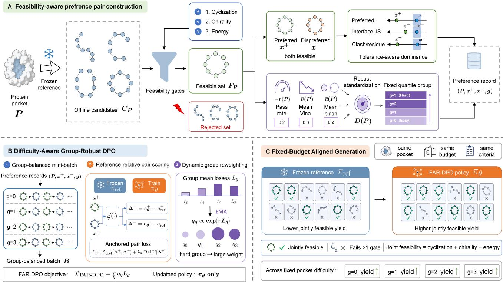  
Figure 1: Overview of FAR-DPO. (A) Feasibility gates filter generated candidates to form an ofline feasible pool. Within each pocket, tolerance-aware dominance is used to construct preference pairs, and frozen pocket-dificulty groups provide their group labels. (B) FAR-DPO is trained on these pairs using group-balanced sampling, reference-relative pair scoring with preferredcandidate anchoring, and loss-adaptive group reweighting. (C) Under identical pockets, sampling budget, and feasibility criteria, the aligned policy increases jointly feasible yield across target-dificulty groups.

## 3.2 Feasibility-Aware Preference Construction

Ofline candidates and feasibility gating. To construct ofline data for preference-based post-training, we independently sample $\dot { K }$ candidates for each protein binding pocket $P$ from the frozen reference model $\pi _ { \mathrm { r e f } }$ and denote the resulting set by $\mathcal { C } _ { P }$ . The candidate pool spans 12,000 pockets, with $K = 1 6$ , and contains 192,000 candidate complexes in total. Details of the pocket sources, generation settings, and data-processing pipeline are provided in Appendix A.

Before defining preferences among candidates, we apply three eligibility gates covering cyclization geometry, residue chirality, and interaction energy. Candidates passing all three gates form the feasible set

$$
{ \mathcal { F } } _ { P } = \{ x \in { \mathcal { C } } _ { P } : G _ { \mathrm { c y c } } ( x ) G _ { \mathrm { c h i r } } ( x ) G _ { \mathrm { e n e } } ( x ) = 1 \} .\tag{1}
$$

Here, $G _ { \mathrm { c y c } } , G _ { \mathrm { c h i r } } ,$ , and $G _ { \mathrm { e n e } }$ are binary indicators for cyclization geometry, residue chirality, and interaction energy, respectively. Following the CPSea evaluation protocol (Yang et al. 2025), we use whether the $C _ { \beta } { - } C _ { \beta }$ distance between the N- and C-terminal residues lies in [3, 8] Å as a proxy for cyclization geometry, while the chirality gate requires every residue to have the correct chirality. The energy gate requires Rosetta $\Delta G < 0$ (Alford et al. 2017).

Interface-quality evaluation. For each $x \in { \mathcal { F } } _ { P } $ , we characterize interface quality using the Vina docking score $v ( x )$ interface non-nativeness $j ( x )$ , and atomic clashes normalized by peptide length $c ( x )$

$$
{ \bf m } ( x ) = \big ( v ( x ) , j ( x ) , c ( x ) \big ) .\tag{2}
$$

The Vina score is computed using AutoDock Vina (Trott and Olson 2010). Hydrophobic contacts, hydrogen bonds, and salt bridges at each candidate interface are identified using PLIP (Salentin et al. 2015), and the interface nonnativeness score $j ( x )$ is the Jensen–Shannon distance between the candidate’s interface-interaction composition and a fixed natural-reference composition, as detailed in Appendix B (Lin 1991). All three metrics are minimized: lower v(x), $j ( x )$ , and $c ( x )$ indicate more favorable binding, an interaction composition closer to the natural reference, and fewer atomic clashes per peptide residue, respectively. Preferences are defined only among candidates in $\mathcal { F } _ { P }$ using m(x).

Scale-aware within-pocket dominance. The three metrics have diferent units and numerical ranges, so comparisons based directly on raw diferences would make preferences depend on metric scale. Let $\textstyle { \mathcal { F } } = \bigcup _ { P } { \mathcal { F } } _ { P }$ . We estimate a robust global scale for the k-th metric from all feasible candidates:

$$
\sigma _ { k } = 1 . 4 8 2 6 \operatorname* { m e d i a n } _ { x \in \mathcal { F } } \left| m _ { k } ( x ) - \operatorname* { m e d i a n } _ { x ^ { \prime } \in \mathcal { F } } m _ { k } ( x ^ { \prime } ) \right| .\tag{3}
$$

Here, $m _ { k } ( x )$ is the k-th component of $\mathbf { m } ( x )$ . The factor 1.4826 makes the median absolute deviation a robust scale estimate consistent with the standard deviation under a Gaussian distribution (Rousseeuw and Croux 1993). Following the Pareto dominance principle in multi-objective optimization (Deb et al. 2002), we use $\sigma _ { k }$ to define a tolerance-aware dominance relation within pocket $P 3$

$$
\begin{array} { r l } & { x ^ { + } \succ _ { P } x ^ { - } \iff \left[ \forall k : m _ { k } ( x ^ { + } ) - m _ { k } ( x ^ { - } ) \leq \kappa \sigma _ { k } \right] } \\ & { \hphantom { x ^ { + } } \wedge \left[ \exists k : m _ { k } ( x ^ { + } ) - m _ { k } ( x ^ { - } ) < - \kappa \sigma _ { k } \right] . } \end{array}\tag{4}
$$

We set $\kappa = 0 . 5$ . Thus, $x ^ { + }$ cannot be worse than $x ^ { - }$ by more than the tolerance on any metric and must outperform it by more than the tolerance on at least one metric. Al comparisons are restricted to the same pocket, preventing diferences in pocket-level dificulty from being mistaken for diferences in candidate quality. We rank pairs satisfying Eq. (4) by their standardized advantage beyond the tolerance and retain up to eight of the highest-ranked preference pairs per pocket.

## 3.3 Dificulty-Aware Pocket Grouping

Pocket-level dificulty features. Pockets vary in design dificulty for the reference model. To construct fixed group labels for group-robust training, we estimate the dificulty of each pocket from ofline generations of the frozen reference model. For every pocket $P$ that admits at least one preference pair, we compute pocket-level features describing structural feasibility, binding afinity, and steric clashes. Specifically, $r ( P )$ is the fraction of candidates in $\mathcal { C } _ { P }$ that satisfy both the cyclization-geometry and residue-chirality gates, while $\bar { v } ( P )$ and $\bar { c } ( P )$ are the mean Vina score and normalized clash count, respectively, over $\mathcal { F } _ { P }$

Robust standardization and dificulty aggregation. The three features have diferent numerical scales. For $f \in$ $\{ - r , { \bar { v } } , { \bar { c } } \}$ , we apply MAD-based robust standardization across all pockets that admit preference pairs (Rousseeuw and Croux 1993):

$$
z _ { f } ( P ) = \mathrm { c l i p } \left( { \frac { f ( P ) - \mathrm { m e d i a n } _ { P ^ { \prime } } f ( P ^ { \prime } ) } { 1 . 4 8 2 6 ~ \mathrm { M A D } _ { P ^ { \prime } } ( f ( P ^ { \prime } ) ) } } , - 4 , 4 \right) .\tag{5}
$$

Here, $P ^ { \prime }$ ranges over all pockets that admit preference pairs. Clipping $\mathrm { t o ~ } [ - 4 , 4 ]$ limits the influence of extreme pockets on the dificulty score. We then aggregate the standardized features into a pocket-dificulty score:

$$
D ( P ) = 0 . 2 z _ { - r } ( P ) + 0 . 6 z _ { \bar { v } } ( P ) + 0 . 2 z _ { \bar { c } } ( P ) .\tag{6}
$$

Dificulty-group assignment. A larger $D ( P )$ indicates greater pocket design dificulty. We partition pockets by quartiles of $D ( P )$ into four predefined dificulty groups, $\mathsf { \bar { g } } ( P ) \in \{ 0 , 1 , 2 , 3 \}$ }, where groups 0 and 3 correspond to the easiest and hardest quartiles, respectively. All preference pairs from the same pocket share the same $g ( P )$ . Dificulty groups are fixed in advance from the ofline candidate pool and remain unchanged throughout training. In the evaluation, Q1–Q4 denote analogous easiest-to-hardest quartiles constructed and frozen separately for each generator.

After assigning dificulty groups, we split each backbonespecific dataset into training and validation sets by pocket, ensuring that no pocket appears in both splits. The resulting datasets contain 90,408 preference pairs for PepGLAD and 92,099 preference pairs for PepFlow.

## 3.4 Group-Robust Direct Preference Optimization

Error surrogate and reference-relative change. The diffusion and flow-matching generators considered here do not provide tractable conditional log-likelihoods in the form required by standard DPO. Following Difusion-DPO, FAR-DPO therefore constructs a preference-optimization surrogate from the native prediction error of each generative backbone (Wallace et al. 2024). Let $e _ { \theta } ( x ; \xi )$ and $e _ { \mathrm { r e f } } ( x ; \xi )$ denote the prediction errors of the policy and frozen reference model, respectively, for candidate x under stochastic training variables $\dot { \xi } ,$ which include the timestep and random noise. The precise form of the error is backbone-specific and is provided in Appendix C. We define the policy’s referencerelative error change as

$$
\begin{array} { r } { \Delta _ { \theta } ( x ; \xi ) = e _ { \theta } ( x ; \xi ) - e _ { \mathrm { r e f } } ( x ; \xi ) . } \end{array}\tag{7}
$$

For a given candidate, the policy and reference model share the same $\xi .$ The coupling of stochastic variables between the two candidates is backbone-specific, as detailed in $\mathbf { A } _ { \mathbf { l } }$ ppendix C. A negative $\Delta _ { \theta } ( x ; \xi )$ indicates that the policy reduces the candidate’s prediction error relative to the reference model.

Pairwise preference and anchoring. For preference pair $i = ( x _ { i } ^ { + } , \bar { x } _ { i } ^ { - } )$ , let $\xi _ { i } ^ { + }$ and $\xi _ { i } ^ { - }$ denote the stochastic training variables associated with its two candidates. The pairwise preference loss is

$$
\begin{array} { r } { \delta _ { i } = \Delta _ { \theta } ( x _ { i } ^ { + } ; \xi _ { i } ^ { + } ) - \Delta _ { \theta } ( x _ { i } ^ { - } ; \xi _ { i } ^ { - } ) , } \\ { \mathcal { L } _ { \mathrm { p r e f } } ^ { ( i ) } = - \log \mathrm { s i g m o i d } ( - \beta \delta _ { i } ) . } \end{array}\tag{8}
$$

where $\beta$ controls the strength of the pairwise preference signal. To prevent the relative margin from improving by allowing $x _ { i } ^ { + }$ itself to deteriorate relative to the reference model, let $\Delta _ { \theta } ^ { \mathrm { a n c } }$ denote the reference-relative change in the backbonespecific anchoring error. We augment the preference loss with

$$
\ell _ { i } = \mathcal { L } _ { \mathrm { p r e f } } ^ { ( i ) } + \lambda _ { \mathrm { a } } \operatorname { R e L U } \left( \Delta _ { \theta } ^ { \mathrm { a n c } } ( x _ { i } ^ { + } ; \xi _ { i } ^ { + } ) \right) ,\tag{9}
$$

where $\lambda _ { \mathrm { a } }$ controls the anchoring strength. The backbonespecific anchoring errors are detailed in Appendix C.

<table><tr><td>Group</td><td>Metric</td><td>CP-C</td><td>DPB</td><td></td><td>PF FAR-PF</td><td>PG</td><td>FAR-PG</td></tr><tr><td>Success</td><td>Cyclization (%) ↑</td><td>70.34</td><td>92.54</td><td>93.71</td><td>94.04</td><td>81.50</td><td>90.23</td></tr><tr><td></td><td>Chirality (%) ↑</td><td>64.32</td><td>74.60</td><td>78.37</td><td>79.60</td><td>81.44</td><td>85.49</td></tr><tr><td></td><td>Energy pass (%) ↑</td><td>49.72</td><td>75.07</td><td>63.20</td><td>64.81</td><td>70.35</td><td>74.38</td></tr><tr><td></td><td>Final Success (%) ↑</td><td>24.16</td><td>52.21</td><td>47.96</td><td>49.57</td><td>46.89</td><td>57.79</td></tr><tr><td>Affinity</td><td>Rosetta dG best/target ↓</td><td>-18.50</td><td>-23.30</td><td>-20.71</td><td>-21.07</td><td>-23.01</td><td>-23.26</td></tr><tr><td></td><td>Vina best/target ↓</td><td>-5.10</td><td>-5.90</td><td>-6.77</td><td>-6.82</td><td>-6.30</td><td>-6.74</td></tr><tr><td>Interface</td><td>Interface JS ↓</td><td>0.1842</td><td>0.1662</td><td>0.1812</td><td>0.1777</td><td>0.1596</td><td>0.1425</td></tr><tr><td></td><td>Clash/residue ↓</td><td>0.3943</td><td>0.3418</td><td>0.2770</td><td>0.2637</td><td>0.3420</td><td>0.2592</td></tr><tr><td>Rama.</td><td>Allowed (%) ↑</td><td>73.8</td><td>86.9</td><td>83.4</td><td>83.1</td><td>72.6</td><td>71.5</td></tr><tr><td></td><td>Favored (%) ↑</td><td>41.6</td><td>65.4</td><td>58.9</td><td>58.4</td><td>40.7</td><td>40.1</td></tr><tr><td>scRMSD</td><td>Mainchain  $( \mathring { \mathrm { A } } ) \downarrow$ </td><td>2.78</td><td>2.31</td><td>2.37</td><td>2.38</td><td>2.68</td><td>2.75</td></tr><tr><td></td><td>Disulfide (Å) ↓</td><td>2.60</td><td>2.34</td><td>2.74</td><td>2.73</td><td>2.63</td><td>2.59</td></tr><tr><td>Physicochem.</td><td> $\mathrm { G R A V Y } < 0 ( \% ) \uparrow$ </td><td>57.8</td><td>83.9</td><td>60.8</td><td>61.3</td><td>78.7</td><td>75.3</td></tr><tr><td></td><td> $\mathrm { l o g P > - 6 ( \% ) \uparrow }$ </td><td>55.3</td><td>92.3</td><td>46.8</td><td>46.0</td><td>67.5</td><td>68.0</td></tr><tr><td>Distribution</td><td>Diversity ↑</td><td>0.759</td><td>0.337</td><td>0.573</td><td>0.565</td><td>0.596</td><td>0.607</td></tr><tr><td></td><td>Novelty↑</td><td>0.122</td><td>0.120</td><td>0.137</td><td>0.140</td><td>0.121</td><td>0.127</td></tr></table>

Table 1: Overall performance on the 56-target LNR benchmark. CP-C: CP-Composer (head-to-tail); DPB: DifPepBuilder; PF: PepFlow; FAR-PF: FAR-DPO–PepFlow; PG: PepGLAD; FAR-PG: FAR-DPO–PepGLAD.

Dificulty-group losses and dynamic weighting. Motivated by the emphasis on high-loss groups in Group DRO (Sagawa et al. 2020), each mini-batch is constructed by balanced sampling across the four dificulty groups. Let $B _ { g }$ denote the preference pairs from dificulty group g in the current batch. Their mean group loss is

$$
L _ { g } ( \theta ) = \frac { 1 } { | B _ { g } | } \sum _ { i \in B _ { g } } \ell _ { i } .\tag{10}
$$

To reduce mini-batch variance, we maintain an exponential moving average of each group loss with decay coeficient $\rho \colon$

$$
\bar { L } _ { g }  \rho \bar { L } _ { g } + ( 1 - \rho ) L _ { g } .\tag{11}
$$

We then solve for a KL-regularized adversarial group distribution based on $\bar { L } _ { g }$ (Duchi and Namkoong 2021):

$$
\begin{array} { c } { { { \bf q } ^ { \star } = \displaystyle \arg \operatorname* { m a x } _ { { \bf q } \in \Delta _ { 4 } } \left[ \sum _ { g = 0 } ^ { 3 } q _ { g } \bar { L } _ { g } - \frac { 1 } { \tau } \mathrm { K L } ( { \bf q } \parallel { \bf u } ) \right] , } } \\ { { q _ { g } ^ { \star } = \displaystyle \frac { \exp ( \tau \bar { L } _ { g } ) } { \sum _ { h = 0 } ^ { 3 } \exp ( \tau \bar { L } _ { h } ) } . } } \end{array}\tag{12}
$$

Here, $\Delta _ { 4 }$ is the probability simplex over the four dificulty groups, $\mathbf { u } = ( 1 / 4 , \dots , 1 / 4 )$ is the uniform prior, and τ controls how strongly the group weights concentrate. The final training objective aggregates the current group losses using these dynamic weights:

$$
\mathcal { L } _ { \mathrm { F A R - D P O } } ( \boldsymbol { \theta } ) = \sum _ { g = 0 } ^ { 3 } \boldsymbol { q } _ { g } ^ { \star } L _ { g } ( \boldsymbol { \theta } ) .\tag{13}
$$

## 4 Experiments

We evaluate FAR-DPO with PepGLAD and PepFlow to determine whether it improves feasible-candidate amount, the yield of jointly qualified candidates, performance on challenging targets, and performance under low sampling budgets. We further analyze the contribution of diferent optimization choices.

## 4.1 Experimental Setup

Data and baselines. We follow the LNR benchmark and standard evaluation protocol of CPSea (Yang et al. 2025). For each method, we evaluate 100 candidates for each of 56 protein targets, designing 5,600 candidates per method. We apply FAR-DPO separately to PepGLAD (Kong et al. 2024) and PepFlow (Li et al. 2024), and primarily compare each base model with its FAR-DPO counterpart. DifPep-Builder (Wang et al. 2024) and CP-Composer (Jiang et al. 2025) are included as baselines. For CP-Composer, we evaluate its head-to-tail cyclization condition with a classifier-free guidance weight of $w = 5 . 0$ , because this mode is directly compatible with the terminal-geometry-based CPSea postprocessing protocol. Its stapled, disulfide, and bicycle conditions would require topology-specific validation and are outside the scope of this matched-budget comparison.

Evaluation metrics. We use the standard CPSea metrics and additionally report Interface JS, Clash/residue, JQ/MAD yield, Q4 Final, and Raw@10 performance. A jointly qualified (JQ) candidate must pass the Final screen, have Vina and Interface JS values no higher than the corresponding base medians for the same backbone and target, and exhibit no inter-chain heavy-atom clashes. A MAD-qualified candidate improves at least one of Vina, Interface JS, and Clash/residue beyond tolerance without degrading another beyond tolerance. Hits/target are per-target means; rates in Final are pooled over the respective evaluable Final pools. Q4 Final is hardest-quartile Final Success, and Raw@10 is the conditional expected-best score under 10 raw generations.

<table><tr><td>Metric</td><td>PF FAR-PF</td><td>PG FAR-PG</td></tr><tr><td>JQ hits/target ↑</td><td>10.29</td><td>11.00 8.70</td></tr><tr><td>Joint-qualified rate in Final (%) ↑ 21.46</td><td></td><td>22.22 18.61 28.73</td></tr><tr><td>MAD hits/target ↑</td><td>14.27 15.43 13.95</td><td>24.54</td></tr><tr><td>MAD rate in Final (%) ↑</td><td>29.8 31.2 29.8</td><td>42.6</td></tr></table>

Table 2: Jointly qualified yield and MAD robustness. PF: PepFlow; FAR-PF: FAR-DPO–PepFlow; PG: PepGLAD; FAR-PG: FAR-DPO–PepGLAD.

Full definitions are provided in Appendix B.

Grouping and statistics. Q1–Q4 are constructed separately for each base generator from its cyclization, chirality, Vina, and clash performance and then held fixed; each contains 14 targets, with Q4 hardest. Pass@K is the probability of at least one Final candidate within K samples. Afinity, interface, Q4, Pass@K, Raw@10, and hits/target are targetmacro; stage and candidate-quality metrics are pooled; diversity and novelty are global; and JQ/MAD rates are pooled over evaluable Final candidates. Confidence intervals use target-level bootstrap resampling (Efron 1979). Details are provided in Appendix C.

## 4.2 Overall Performance and Joint Quality

To determine whether FAR-DPO improves feasiblecandidate yield across generative backbones and to examine its efects on other quality dimensions, we compare the base models with their FAR-DPO counterparts, as shown in Table 1. FAR-DPO–PepGLAD increases Final Success from 46.89% to 57.79%, while FAR-DPO–PepFlow increases it from 47.96% to 49.57%. Cyclization, chirality, and energy pass rates improve for both backbones. Vina best/target improves from −6.30 and −6.77 to −6.74 and −6.82, respectively, and Rosetta dG also improves further. In addition, FAR-DPO reduces Interface JS and Clash/residue for both backbones, while changes in conformational, physicochemical, and generative-distribution metrics are generally modest. These results demonstrate that FAR-DPO improves feasiblecandidate yield and binding quality across diferent generative backbones under a fixed generation budget, with limited trade-ofs in several secondary quality dimensions.

To further determine whether the increase in Final Success translates into higherjoint quality, we evaluate both qualifiedcandidate yield and multi-objective quality (Table 2). FAR-DPO–PepGLAD increases JQ hits/target from 8.70 to 16.54, JQ rate in Final from 18.61% to 28.73%, MAD hits/target from 13.95 to 24.54, and MAD rate in Final from 29.8% to 42.6%. FAR-DPO–PepFlow likewise improves these four metrics from 10.29, 21.46%, 14.27, and 29.8% to 11.00, 22.22%, 15.43, and 31.2%, respectively. Thus, FAR-DPO raises both counts and pooled rates in the Final pools.

## 4.3 Target Dificulty and Low-Budget Sampling

To determine whether the overall gains extend across target dificulty, particularly to the hardest targets, we compare Final Success across the four frozen dificulty groups defined separately for the two generative backbones (Figure 2). FAR-DPO improves Final Success in all four dificulty groups for both generators. In Q4, FAR-DPO–PepGLAD improves Final Success from 40.00% to 50.36%, while FAR-DPO– PepFlow improves it from 44.14% to 46.29%. These results show that the gains span the full dificulty range and extend to the most challenging targets for both models.

<table><tr><td>Base PG</td><td>X FAR-PG</td><td>B</td><td>Base PF</td></tr><tr><td>FAR-PF</td><td>日 DPB</td><td>田</td><td>CP-C</td></tr></table>

(a) PepGLAD-defined groups  
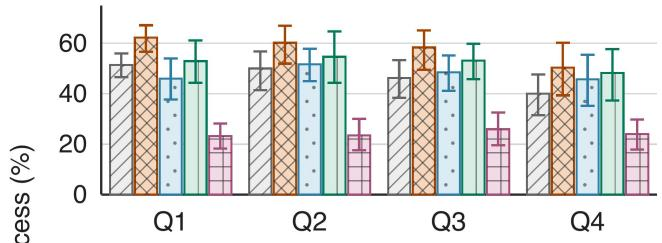

(b) PepFlow-defined groups  
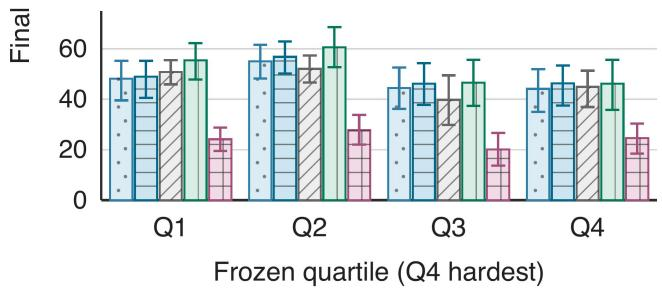  
Figure 2: Final Success across frozen dificulty groups. The panels use PepGLAD- (top) and PepFlow-defined (bottom) groups; Bars show target-macro results over 14 targets per group, with 95% bootstrap confidence intervals.

Because practical design campaigns often operate under limited generation budgets, we further examine the probability of obtaining at least one Final candidate at different sampling budgets (Figure 3). The Pass@K curves shift upward for both generative backbones. FAR-DPO– PepGLAD increases Pass@1 from 46.89% to 57.79% and Pass@5 from 91.52% to 94.92%; FAR-DPO–PepFlow increases Pass@1 from 47.96% to 49.57% and Pass@5 from 91.63% to 92.54%. The advantage is most pronounced in the low-budget regime, indicating that FAR-DPO produces feasible designs with fewer generations and thereby improves practical sampling eficiency.

## 4.4 Analysis of Optimization Variants

FAR-DPO combines group-balanced sampling, Group DRO aggregation, and preferred-candidate anchoring. We compare diferent training configurations to examine how these design choices afect performance (Table 3). IID DPO achieves a Final Success of 46.14%. Group-balanced sampling, group-balanced sampling with anchoring, and Group DRO without anchoring reach 49.21%, 50.32%, and 52.77%, respectively. Within the evaluated configurations, full FAR-DPO achieves the highest overall and Q4 Final Success (57.79% and 50.36%), suggesting that group-robust optimization and reference anchoring are complementary.

<table><tr><td>-O- Base PG</td><td> FAR-PG</td><td>·Base PF</td></tr><tr><td>FAR-PF</td><td> DPB</td><td>-Δ- CP-C</td></tr></table>

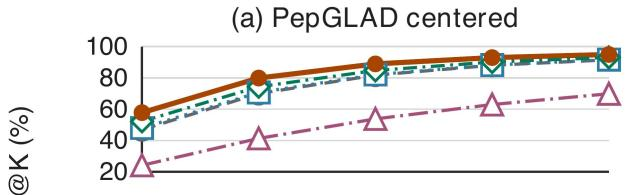

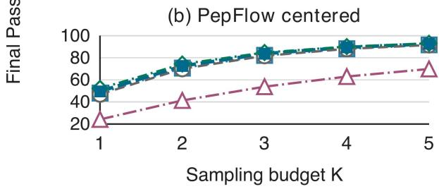  
Figure 3: Low-budget Final Pass@K for PepGLAD (top) and PepFlow (bottom). Pass@K is the target-macro probability of obtaining at least one Final candidate among K samples, evaluated over 56 targets.

Table 3 is an analysis of training configurations rather than a strict full-factorial ablation of every component. Additional R4 IID DPO results and paired confidence intervals for Final Success are provided in Appendix D.

## 4.5 Three-Dimensional Case Studies

Figure 4 compares independently generated Final-pass designs from each model and its FAR-DPO counterpart. Under 100 generations per model, FAR-DPO–PepGLAD increases the number of Final candidates for 5LM1 from 34 to 55; the representative designs have Vina scores of −4.59 and −6.61 and interface-contact counts of 9 and 11, respectively. For 3BRH, FAR-DPO–PepFlow increases the number of Final candidates from 47 to 53, while the representative Vina score and Rosetta dG improve from −4.35 to −4.58 and from −9.72 to −13.13. These cases illustrate improvements in feasible-candidate yield and representative predicted binding quality across both backbones and cyclization topologies.

## 5 Conclusion

We introduced FAR-DPO, an architecture-agnostic, preference-based method for target-specific cyclic peptide generation that aims to increase the yield of candidates satisfying multiple structural and biophysical constraints under limited sampling budgets. FAR-DPO constructs reliable preferences through feasibility gates and tolerance-aware, within-pocket multi-objective comparisons, and combines dificulty-aware group-robust DPO with preferred-candidate anchoring to place greater emphasis on high-loss dificulty groups during optimization. Experiments with PepGLAD and PepFlow show higher jointly feasible candidate yield for both backbones, with gains extending to challenging targets and low-budget sampling while retaining competitive binding quality. Within the evaluated configurations, the variant analysis supports complementary roles for robust optimization and anchoring. Overall, these results suggest that preference-based post-training can improve joint feasibility and robustness across targets without requiring changes to the underlying generative architecture, providing a general approach to multi-constraint biomolecular generation.

<table><tr><td>Config.</td><td>Final ↑</td><td>↑</td><td>Q4Raw@10 Raw@10 Vina ↓</td><td>dG↓</td><td>JS ↓</td><td>Clash</td></tr><tr><td></td><td></td><td>46.8940.00</td><td>-5.123</td><td>-16.8300.1596 0.3420</td><td></td><td>↓</td></tr><tr><td>PepGLAD R1: IID/ERM/046.14 37.43</td><td></td><td></td><td>-5.604</td><td>-16.7550.14240.2805</td><td></td><td></td></tr><tr><td>R2: GB/ERM/049.21 43.86</td><td></td><td></td><td>-5.669</td><td>-17.5540.14370.2844</td><td></td><td></td></tr><tr><td>R3: GB/ERM/.250.3243.14</td><td></td><td></td><td>-5.578</td><td>-17.6380.14290.2832</td><td></td><td></td></tr><tr><td>R5: GB/ GDRO/0</td><td>52.7746.71</td><td></td><td>-5.726</td><td>-16.9540.14290.2549</td><td></td><td></td></tr><tr><td>FAR-DPO</td><td>57.79 50.36</td><td></td><td></td><td>-5.579-17.3830.14250.2592</td><td></td><td></td></tr></table>

Table 3: Optimization variants on PepGLAD. Final and Q4 are percentages. Raw@10 Vina and Raw@10 dG denote the target-macro conditional expected-best dG scores, respectively. Configurations use sampler/aggregation/anchor: GB denotes group-balanced sampling and GDRO denotes Group DRO. All preference variants use DPO.

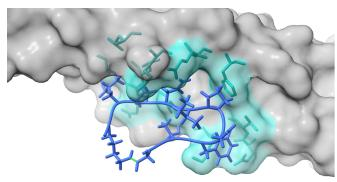  
(a)

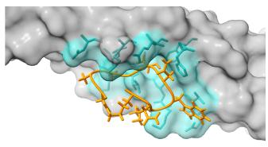  
(b)

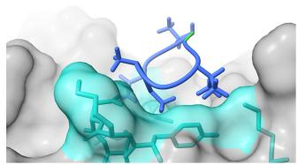  
(c)

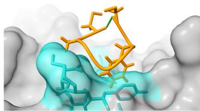  
(d)  
Figure 4: Independent Final-pass designs for 5LM1: (a) PepGLAD, (b) FAR-DPO–PepGLAD; and 3BRH: (c) PepFlow, (d) FAR-DPO–PepFlow. Base/FAR peptides are blue/orange; receptors gray; 4 Å interface residues cyan; cyclization bonds green. Fixed topology-wise best-Vina selection was used.

## References

Alford, R. F.; Leaver-Fay, A.; Jeliazkov, J. R.; O’Meara, M. J.; DiMaio, F. P.; Park, H.; Shapovalov, M. V.; Renfrew, P. D.; Mulligan, V. K.; Kappel, K.; Labonte, J. W.; Pacella, M. S.; Bonneau, R.; Bradley, P.; Dunbrack, R. L., Jr.; Das, R.; Baker, D.; Kuhlman, B.; Kortemme, T.; and Gray, J. J. 2017. The Rosetta All-Atom Energy Function for Macromolecular Modeling and Design. Journal of Chemical Theory and Computation, 13(6): 3031–3048.

Bhardwaj, G.; Mulligan, V. K.; Bahl, C. D.; Gilmore, J. M.; Harvey, P. J.; Cheneval, O.; Buchko, G. W.; Pulavarti, S. V. S. R. K.; Kaas, Q.; Eletsky, A.; Huang, P.-S.; Johnsen, W. A.; Greisen, P. J.; Rocklin, G. J.; Song, Y.; Linsky, T. W.; Watkins, A.; Rettie, S. A.; Xu, X.; Carter, L. P.; Bonneau, R.; Olson, J. M.; Coutsias, E.; Correnti, C. E.; Szyperski, T.; Craik, D. J.; and Baker, D. 2016. Accurate De Novo Design of Hyperstable Constrained Peptides. Nature, 538(7625): 329–335.

Cheng, X.; Zhou, X.; Yang, Y.; Bao, Y.; and Gu, Q. 2025. Decomposed Direct Preference Optimization for Structure-Based Drug Design. Transactions on Machine Learning Research.

Deb, K.; Pratap, A.; Agarwal, S.; and Meyarivan, T. 2002. A Fast and Elitist Multiobjective Genetic Algorithm: NSGA-II. IEEE Transactions on Evolutionary Computation, 6(2): 182–197.

Dougherty, P. G.; Sahni, A.; and Pei, D. 2019. Understanding Cell Penetration of Cyclic Peptides. Chemical Reviews, 119(17): 10241–10287.

Duchi, J. C.; and Namkoong, H. 2021. Learning Models with Uniform Performance via Distributionally Robust Optimization. The Annals ofStatistics, 49(3): 1378–1406.

Efron, B. 1979. Bootstrap Methods: Another Look at the Jackknife. The Annals ofStatistics, 7(1): 1–26.

Craven, T. W.; Pardo-Avila, F.; Rettie, S. A.; Kim, D. E.; Silva, D.- A.; Ibrahim, Y. M.; Webb, I. K.; Cort, J. R.; Adkins, J. N.; Varani, G.; and Baker, D. 2017. Comprehensive Computational Design of Ordered Peptide Macrocycles. Science, 358(6369): 1461–1466.

Huang, J.; and Zhang, D. 2025. MolFORM: Multi-modal Flow Matching for Structure-Based Drug Design. arXiv:2507.05503.

Jiang, D.; Kong, X.; Han, J.; Li, M.; Jiao, R.; Huang, W.; Ermon, S.; Ma, J.; and Liu, Y. 2025. Zero-Shot Cyclic Peptide Design via Composable Geometric Constraints. In Proceedings of the 42nd International Conference on Machine Learning, volume 267 of Proceedings ofMachine Learning Research, 27553–27568. PMLR.

Jin, W.; Barzilay, R.; and Jaakkola, T. 2020. Multi-Objective Molecule Generation using Interpretable Substructures. In Proceedings of the 37th International Conference on Machine Learning, volume 119 of Proceedings of Machine Learning Research, 4849–4859. PMLR.

Kong, X.; Jia, Y.; Huang, W.; and Liu, Y. 2024. Full-Atom Peptide Design with Geometric Latent Difusion. In Advances in Neural Information Processing Systems, volume 37, 74808–74839.

Li, J.; Cheng, C.; Wu, Z.; Guo, R.; Luo, S.; Ren, Z.; Peng, J.; and Ma, J. 2024. Full-Atom Peptide Design based on Multi-modal Flow Matching. In Proceedings of the 41st International Conference on Machine Learning, volume 235 of Proceedings ofMachine Learning Research, 27615–27640. PMLR.

Li, K.; Xu, Y.; Tseng, K.-k.; Lu, W.; Liu, K.; and Lan, T. 2026. Linear-DPO: Linear Direct Preference Optimization for Difusion and Flow-Matching Generative Models. arXiv:2605.21123.

Li, T.; Beirami, A.; Sanjabi, M.; and Smith, V. 2021. Tilted Empirical Risk Minimization. In International Conference on Learning Representations.

Lin, H.; Zhang, O.; Zhao, H.; Jiang, D.; Wu, L.; Liu, Z.; Huang, Y.; and Li, S. Z. 2024. PPFLOW: Target-Aware Peptide Design with Torsional Flow Matching. In Proceedings of the 41st International Conference on Machine Learning, volume 235 of Proceedings of Machine Learning Research, 30510–30528. PMLR.

Lin, J. 1991. Divergence Measures Based on the Shannon Entropy. IEEE Transactions on Information Theory, 37(1): 145–151.

Olivecrona, M.; Blaschke, T.; Engkvist, O.; and Chen, H. 2017. Molecular De-Novo Design through Deep Reinforcement Learning. Journal ofCheminformatics, 9: 48.

Rafailov, R.; Sharma, A.; Mitchell, E.; Manning, C. D.; Ermon, S.; and Finn, C. 2023. Direct Preference Optimization: Your Language Model Is Secretly a Reward Model. In Advances in Neural Information Processing Systems, volume 36, 53728–53741.

Ren, M.; He, Z.; and Zhang, H. 2025. Multi-Objective Antibody Design with Constrained Preference Optimization. In International Conference on Learning Representations.

Rettie, S. A.; Campbell, K. V.; Bera, A. K.; Kang, A.; Kozlov, S.; Flores Bueso, Y.; De La Cruz, J.; Ahlrichs, M.; Cheng, S.; Gerben, S. R.; Lamb, M.; Murray, A.; Adebomi, V.; Zhou, G.; DiMaio, F.; Ovchinnikov, S.; and Bhardwaj, G. 2025a. Cyclic Peptide Structure Prediction and Design Using AlphaFold2. Nature Communications, 16: 4730.

Rettie, S. A.; Juergens, D.; Adebomi, V.; Flores Bueso, Y.; Zhao, Q.; Leveille, A. N.; Liu, A.; Bera, A. K.; Wilms, J. A.; Üfing, A.; Kang, A.; Brackenbrough, E.; Lamb, M.; Gerben, S. R.; Murray, A.; Levine, P. M.; Schneider, M.; Vasireddy, V.; Ovchinnikov, S.; Weiergräber, O. H.; Willbold, D.; Kritzer, J. A.; Mougous, J. D.; Baker, D.; DiMaio, F.; and Bhardwaj, G. 2025b. Accurate De Novo Design of High-Afinity Protein-Binding Macrocycles Using Deep Learning. Nature Chemical Biology, 21(12): 1948–1956.

Rousseeuw, P. J.; and Croux, C. 1993. Alternatives to the Median Absolute Deviation. Journal of the American Statistical Association, 88(424): 1273–1283.

Sagawa, S.; Koh, P. W.; Hashimoto, T. B.; and Liang, P. 2020. Distributionally Robust Neural Networks for Group Shifts: On the Importance of Regularization for Worst-Case Generalization. In International Conference on Learning Representations.

Salentin, S.; Schreiber, S.; Haupt, V. J.; Adasme, M. F.; and Schroeder, M. 2015. PLIP: Fully Automated Protein–Ligand Interaction Profiler. Nucleic Acids Research, 43(W1): W443–W447.

Tang, S.; Zhang, Y.; and Chatterjee, P. 2025. PepTune: De Novo Generation of Therapeutic Peptides with Multi-Objective-Guided Discrete Difusion. In Proceedings of the 42nd International Conference on Machine Learning, volume 267 of Proceedings ofMachine Learning Research, 59017–59065. PMLR.

Trott, O.; and Olson, A. J. 2010. AutoDock Vina: Improving the Speed and Accuracy of Docking with a New Scoring Function, Eficient Optimization, and Multithreading. Journal of Computational Chemistry, 31(2): 455–461.

Villar, E. A.; Beglov, D.; Chennamadhavuni, S.; Porco, J. A., Jr.; Kozakov, D.; Vajda, S.; and Whitty, A. 2014. How Proteins Bind Macrocycles. Nature Chemical Biology, 10(9): 723–731.

Wallace, B.; Dang, M.; Rafailov, R.; Zhou, L.; Lou, A.; Purushwalkam, S.; Ermon, S.; Xiong, C.; Joty, S.; and Naik, N. 2024. Difusion Model Alignment Using Direct Preference Optimization. In Proceedings of the IEEE/CVF Conference on Computer Vision and Pattern Recognition, 8228–8238.

Wang, F.; Wang, Y.; Feng, L.; Zhang, C.; and Lai, L. 2024. Target-Specific De Novo Peptide Binder Design with DifPepBuilder. Journal ofChemical Information and Modeling, 64(24): 9135–9149.

Wang, F.; Zhang, T.; Zhu, J.; Zhang, X.; Zhang, C.; and Lai, L. 2025. Reinforcement Learning-Based Target-Specific De Novo Design of Cyclic Peptide Binders. Journal of Medicinal Chemistry, 68(16): 17287–17302.

Yang, Z.; Xie, H.; Jia, Y.; Kong, X.; Zheng, J.; Zhang, Z.; Liu, Y.; Liu, L.; and Lan, Y. 2025. CPSea: Large-Scale Cyclic Peptide– Protein Complex Dataset for Machine Learning in Cyclic Peptide Design. In Advances in Neural Information Processing Systems, volume 38. Datasets and Benchmarks Track.

Zhang, J.; Cao, H.; Shi, H.; He, M.; Wang, Y.; Gao, Z.; Wu, F.; Yao, X.; Hsieh, C.-Y.; Pan, S. J.; Chatterjee, P.; Gu, C.; and Heng, P.-A. 2026a. GeoCycler: Reward-Aligned 3D Difusion for Constraint Conditioned Cyclic Peptide Design. arXiv:2605.23407.

Zhang, J.; Yi, S.; Ju, W.; and Gu, Z. 2026b. PepALD: Macrocyclic Peptide Generation via Autoregressive Latent Difusion. arXiv:2606.14510.

Zhao, Y.; Qin, L.; and Chen, J. 2026. APCyc: Property-Informed Design of Cyclic Peptides via Automated Cyclization. Accepted at the 32nd ACM SIGKDD Conference on Knowledge Discovery and Data Mining; forthcoming, arXiv:2606.12991.

Zhou, X.; Li, M.; Xiao, Y.; Li, J.; Xue, D.; Zheng, Z.; Ma, J.; and Gu, Q. 2025. Designing Cyclic Peptides via Harmonic SDE with Atom-Bond Modeling. In Proceedings of the 42nd International Conference on Machine Learning, volume 267 of Proceedings of Machine Learning Research, 78827–78858. PMLR.

Zhou, X.; Xue, D.; Chen, R.; Zheng, Z.; Wang, L.; and Gu, Q. 2024. Antigen-Specific Antibody Design via Direct Energy-Based Preference Optimization. In Advances in Neural Information Processing Systems, volume 37, 120861–120891.

Zorzi, A.; Deyle, K.; and Heinis, C. 2017. Cyclic Peptide Therapeutics: Past, Present and Future. Current Opinion in Chemical Biology, 38: 24–29.

## A Data Sources, Candidate Generation, and Processing

The protein binding pockets used for ofline candidate generation were obtained from CPCore (Yang et al., 2025). We first balanced the available complexes by cyclization type and native peptide length, and then partitioned the selected pockets into non-overlapping subsets. This study used three of these subsets, each containing 4,000 pockets, for a total of 12,000 pockets. During data preparation, chain R in each CPCore complex was treated as the receptor, chain L as the native peptide, and receptor residues within 10 Å of the native peptide were used to define the conditioning pocket.

We separately used the PepGLAD and PepFlow base models trained on CPSea data to generate ofline candidates. Both generative backbones used the same peptide length as the corresponding native peptide and independently generated 16 candidates for each pocket, yielding 192,000 candidate complexes per backbone.

The outputs of the two generative backbones first underwent their respective coordinate and structure-format conversions, after which each generated peptide was reconstructed with its corresponding receptor into a complete complex. Cyclic or linear constraints were then imposed according to terminal geometry, followed by structural relaxation. $\mathrm { C y - }$ clization, chirality, Rosetta $\Delta G ,$ , Vina, interface-interaction composition, and atomic clashes were computed on the relaxed complexes. Preference pairs were constructed only between candidates from the same generative backbone and the same pocket.

The preference data were split by pocket into nonoverlapping training and validation sets, ensuring that no pocket appeared in both subsets. The final dataset sizes are shown in Table 4.

## B Extended Evaluation Metric Definitions

## B.1 Evaluation Set and Basic Metrics

Following the CPSea evaluation protocol (Yang et al., 2025), the main evaluation used the LNR56 subset, which excludes 2B1N, 3ASK, 3V7D, and 5GR9 from the standard 60-target LNR set. For each method, 100 candidates were evaluated on each of the remaining 56 targets, for a total of 5,600 candidates. Final Success requires the terminal $C _ { \beta } – C _ { \beta }$ distance to lie in [3, 8] Å, every residue to have the correct chirality, and Rosetta $\bar { \Delta } G < 0$

Interface JS is based on the counts of hydrophobic contacts, hydrogen bonds, and salt bridges identified by PLIP. Following the interface-interaction definition of CPSea (Yang et al., 2025), let the three interaction counts of candidate x be ${ \bf n } ( x ) = ( n _ { 1 } ( x ) , n _ { 2 } ( x ) , n _ { 3 } ( x ) )$ ), whose components correspond to hydrophobic contacts, hydrogen bonds, and salt bridges, respectively, and let the fixed natural-reference count vector be $\mathbf { r } = ( 4 2 . 0 , 4 6 . 3 , 9 . 0 )$ . After applying plusone smoothing and normalization to the candidate and reference vectors, we define

$$
p _ { k } ( x ) = { \frac { n _ { k } ( x ) + 1 } { \sum _ { \ell = 1 } ^ { 3 } \left( n _ { \ell } ( x ) + 1 \right) } } , \qquad k \in \{ 1 , 2 , 3 \} .\tag{14}
$$

$$
q _ { k } = \frac { r _ { k } + 1 } { \sum _ { \ell = 1 } ^ { 3 } \left( r _ { \ell } + 1 \right) } , \qquad k \in \{ 1 , 2 , 3 \} .\tag{15}
$$

$$
s _ { k } ( x ) = { \frac { p _ { k } ( x ) + q _ { k } } { 2 } } , \qquad k \in \{ 1 , 2 , 3 \} .\tag{16}
$$

$$
\begin{array} { l } { { \displaystyle j ( x ) = \left[ \frac { 1 } { 2 } \sum _ { k = 1 } ^ { 3 } p _ { k } ( x ) \log _ { 2 } \frac { p _ { k } ( x ) } { s _ { k } ( x ) } \right. } } \\ { { \displaystyle \left. \qquad + \frac { 1 } { 2 } \sum _ { k = 1 } ^ { 3 } q _ { k } \log _ { 2 } \frac { q _ { k } } { s _ { k } ( x ) } \right] ^ { 1 / 2 } . } } \end{array}\tag{17}
$$

Here, $j ( x )$ is Interface JS, defined as the square root of the base-2 Jensen–Shannon divergence. A lower value indicates that the interface-interaction composition of the candidate is closer to the fixed natural reference.

Atomic clashes are computed using Bondi van der Waals radii. Let $\mathcal { A } _ { L } ^ { ( t ) } ( x )$ and $\mathcal { A } _ { R } ^ { ( t ) } ( x )$ denote the atom sets of candidate peptide chain L and receptor chain R, respectively, where $\bar { t } \doteq \{ \mathrm { a l l } , \mathrm { h e a v y } \}$ ; all denotes all atoms in the PDB ATOM records, and heavy denotes their heavy-atom subset. If $\rho _ { a }$ is the Bondi van der Waals radius of atom a and $d _ { a b } ( x )$ is the distance between inter-chain atom pair a, b, then

$$
\begin{array} { r l r } {  { C _ { t } ( x ) = } } \\ & { } & { \displaystyle \sum _ { a \in \mathcal { A } _ { L } ^ { ( t ) } ( x ) } \sum _ { b \in \mathcal { A } _ { R } ^ { ( t ) } ( x ) } } \\ & { } & { \ I [ \rho _ { a } + \rho _ { b } - d _ { a b } ( x ) \geq 0 . 4 0 \mathring { \mathbb { A } } ] , } \\ & { } & { t \in \{ \mathrm { a l l } , \mathrm { h e a v y } \} . } \\ & { } & { \quad c ( x ) = \frac { C _ { \mathrm { a l l } } ( x ) } { N _ { \mathrm { r e s } } ( x ) } . } \end{array}\tag{18}
$$

(19)

Here, $N _ { \mathrm { r e s } } ( x )$ is the number of residues in the generated peptide, and $c ( x )$ is Legacy Clash/residue. The JQ criterion requires no inter-chain heavy-atom clashes, that is, $C _ { \mathrm { h e a v y } } ( x ) = 0$

## B.2 Joint Quality and Multi-Objective Robustness

The following definitions are computed within each generative backbone, separately for Base and FAR-DPO. Let $\mathcal { P }$ be the set of 56 LNR56 targets, and let M denote the method being evaluated. The multi-objective quality vector of candidate x is

$$
{ \bf m } ( x ) = \big ( v ( x ) , j ( x ) , c ( x ) \big ) ,\tag{20}
$$

where all three metrics are minimized. For target $P ,$ , let $\mathcal { R } _ { P }$ be the set of Final candidates from the corresponding base model for which Vina, Interface JS, and Legacy

<table><tr><td>Backbone</td><td>Generated candidates</td><td>Final preference pairs</td><td>Training preference pairs</td><td>Validation preference pairs</td></tr><tr><td>PepGLAD</td><td>192,000</td><td>90,408</td><td>85,912</td><td>4,496</td></tr><tr><td>PepFlow</td><td>192,000</td><td>92,099</td><td>87,494</td><td>4,605</td></tr></table>

Table 4: Preference dataset sizes for the two generative backbones.

Clash/residue are all valid. For $k \in \{ v , j , c \}$ , the samebackbone, same-target base median reference is

$$
r _ { P , k } = { \mathrm { m e d i a n } } _ { x \in { \mathcal { R } } _ { P } } m _ { k } ( x ) .\tag{21}
$$

This gives $\mathbf { r } _ { P } = \left( r _ { P , v } , r _ { P , j } , r _ { P , c } \right)$ ; FAR-DPO candidates are not used to estimate the reference. Let $\mathcal { E } _ { M , P } ^ { \mathrm { J Q } }$ be the set of Final candidates from method M on target $P$ for which Vina, Interface JS, and inter-chain heavy-atom clashes are all evaluable. A jointly qualified (JQ) candidate is defined by

$$
\begin{array} { r l } & { Q _ { \mathrm { J Q } , M , P } ( x ) = \mathbb { I } \left[ x \in \mathcal { E } _ { M , P } ^ { \mathrm { J Q } } \land v ( x ) \le r _ { P , v } \right. } \\ & { ~ \quad \quad \left. \land j ( x ) \le r _ { P , j } \land C _ { \mathrm { h e a v y } } ( x ) = 0 \right] . } \end{array}\tag{22}
$$

JQ hits/target. The number of JQ candidates is first counted for each target and then averaged over the 56 targets:

$$
H _ { \mathrm { J Q } } ( M ) = \frac { 1 } { | \mathcal { P } | } \sum _ { P \in \mathcal { P } } \sum _ { x \in \mathcal { E } _ { M , P } ^ { \mathrm { J Q } } } Q _ { \mathrm { J Q } , M , P } ( x ) .\tag{23}
$$

Under a fixed budget of 100 generated candidates per target, $H _ { \mathrm { J Q } }$ is the average number of Final and jointly qualified candidates obtained per target, and therefore reflects both Final yield and the joint quality of deliverable candidates.

Joint-qualified rate in Final (%). All JQ-evaluable Final candidates from the 56 targets are pooled, and the proportion of JQ candidates is computed as

$$
R _ { \mathrm { J Q } } ( M ) = \frac { \sum _ { P \in \mathcal { P } } \sum _ { x \in \mathcal { E } _ { M , P } ^ { \mathrm { J Q } } } Q _ { \mathrm { J Q } , M , P } ( x ) } { \sum _ { P \in \mathcal { P } } \left| \mathcal { E } _ { M , P } ^ { \mathrm { J Q } } \right| } \times 1 0 0 \%\tag{24}
$$

$R _ { \mathrm { J Q } }$ measures the joint-quality purity of the Final candidate pool under the binding, interface, and no inter-chain heavy-atom clash requirements. It is a proportion over the pooled candidate set rather than the average of per-target JQ proportions. Together with JQ hits/target, it indicates whether an increase in the number of JQ candidates is driven mainly by expansion of the Final pool or by a higher proportion of jointly qualified candidates.

The fixed tolerances are obtained from the three ofline training subsets used for preference construction and are frozen before LNR56 evaluation. Let $\mathcal { F } _ { \mathrm { t r a i n } }$ denote all feasible candidates in these subsets. The robust scale is

$$
\sigma _ { k } = 1 . 4 8 2 6 \mathrm { ~ M A D } _ { x \in \mathcal { F } _ { \mathrm { t r a i n } } } \big ( m _ { k } ( x ) \big ) , \qquad k \in \{ v , j , c \} ,\tag{25}
$$

where MAD denotes the median absolute deviation. Let $\pmb { \sigma } = ( \sigma _ { v } , \sigma _ { j } , \sigma _ { c } )$ and set κ = 0.5, giving

$$
\pmb { \tau } = \kappa \pmb { \sigma } = ( 0 . 5 7 5 8 7 1 , 0 . 0 4 5 0 9 6 , 0 . 0 8 8 2 5 0 ) .\tag{26}
$$

The LNR56 test results are not used to re-estimate τ during evaluation. Let $\mathcal { E } _ { M , P } ^ { \mathrm { M A D } }$ be the set of Final candidates from the current method on target $P$ for which all three components of m(x) are valid. A MAD-qualified candidate is defined by

$$
\begin{array} { r l } { Q _ { \mathrm { M A D } , M , P } ( x ) ~ { = } ~ } & { } \\ & { ~ \mathbb { I } \Big [ x \in \mathcal { E } _ { M , P } ^ { \mathrm { M A D } } } \\ & { ~ \land \left( \forall k \in \{ v , j , c \} , \right. } \\ & { ~ \left. m _ { k } ( x ) \leq r _ { P , k } + \tau _ { k } \right) ~ } \\ & { ~ \land \left( \exists k \in \{ v , j , c \} , \right. } \\ & { ~ \left. m _ { k } ( x ) < r _ { P , k } - \tau _ { k } \right) \Big ] . } \end{array}\tag{27}
$$

MAD hits/target. The number of MAD-qualified candidates is first counted for each target and then averaged over the 56 targets:

$$
H _ { \mathrm { M A D } } ( M ) = \frac { 1 } { | \mathcal { P } | } \sum _ { P \in \mathcal { P } } \sum _ { x \in \mathcal { E } _ { M , P } ^ { \mathrm { M A D } } } Q _ { \mathrm { M A D } , M , P } ( x ) .\tag{28}
$$

$H _ { \mathrm { M A D } }$ is the average number of MAD-qualified candidates obtained per target and measures the yield of candidates with non-compensatory multi-objective robust improvement under a fixed generation budget.

MAD rate in Final (%). All Final candidates from the 56 targets for which Vina, Interface JS, and Legacy Clash/residue are valid are pooled, and the proportion of MAD-qualified candidates is computed as

$$
R _ { \mathrm { M A D } } ( M ) = \frac { \sum _ { P \in \mathcal { P } } \sum _ { x \in \mathcal { E } _ { M , P } ^ { \mathrm { M A D } } } Q _ { \mathrm { M A D } , M , P } ( x ) } { \sum _ { P \in \mathcal { P } } \left| \mathcal { E } _ { M , P } ^ { \mathrm { M A D } } \right| } \times 1 0 0 \%\tag{29}
$$

$R _ { \mathrm { M A D } }$ is the proportion of MAD-qualified candidates in the Final candidate pool for which all three quality metrics are evaluable. Together with MAD hits/target, it indicates whether an increase in their number is driven mainly by expansion of the Final pool or by a higher proportion of robustly improved candidates.

Overall, both hits/target metrics are target-level macro averages, whereas both rates in Final are candidate-level proportions over their respective evaluable Final candidate pools.

## B.3 Low-Budget and Matched-N Metrics

Let $\mathcal { P }$ be the set of LNR56 targets, and let M denote the method being evaluated. If $s _ { M , P }$ of the 100 candidates generated by method M on target $P \in { \mathcal { P } }$ are Final candidates, then the probability of obtaining at least one Final candidate when sampling K candidates without replacement is

$$
\mathrm { P a s s @ } K ( M , P ) = 1 - { \frac { { \binom { 1 0 0 - s _ { M } , P } { K } } } { { \binom { 1 0 0 } { K } } } } , 1 \leq K \leq 1 0 0 .\tag{30}
$$

Overall Pass@K is the macro average of these target-level probabilities:

$$
\operatorname { P a s s @ } K ( M ) = { \frac { 1 } { | { \mathcal { P } } | } } \sum _ { P \in { \mathcal { P } } } \operatorname { P a s s @ } K ( M , P ) .\tag{31}
$$

Pass@K is the average probability of obtaining at least one Final candidate under a budget of K raw generations. It measures low-budget success but does not evaluate the binding quality of the successful candidates.

Raw@10. Raw@10 is computed separately for Vina and Rosetta $\Delta G$ . For each method and target, all 100 raw candidates are used as the sampling population. We perform 10,000 uniform samples without replacement, drawing 10 candidates in each trial. Let $g$ denote the quality metric, and let $\mathcal { H } _ { M , F } ^ { ( g ) }$ denote the set of hit trials in which the sampled set contains at least one Final candidate with a valid value of $g .$ For hit trial $^ { r , }$ let $b _ { M , P , i } ^ { ( g ) }$ be the minimum $g$ value among its valid Final candidates. Lower values are better for both Vina and Rosetta $\Delta G$

Raw@10 on target $P$ is the conditional mean of the best values over hit trials:

$$
\mathrm { R a w @ 1 0 } _ { g } ( M , P ) = \frac { 1 } { \left| \mathcal { H } _ { M , P } ^ { ( g ) } \right| } \sum _ { r \in \mathcal { H } _ { M , P } ^ { ( g ) } } b _ { M , P , r } ^ { ( g ) } .\tag{32}
$$

It is then macro-averaged over the 56 targets:

$$
\mathrm { R a w @ 1 0 } _ { g } ( M ) = \frac { 1 } { | \mathcal { P } | } \sum _ { P \in \mathcal { P } } \mathrm { R a w @ 1 0 } _ { g } ( M , P ) .\tag{33}
$$

Missed trials are not assigned a penalty or zero value and do not enter the conditional mean in Eq. (32). Therefore, Pass@K measures whether a successful candidate can be obtained, whereas Raw@10 measures the conditional best quality after a successful hit. Raw@10 is not an unconditional low-budget metric and cannot replace Pass@K.

Matched-N. To control for the extreme-value selection advantage caused by diferent Final candidate-pool sizes between Base and FAR-DPO, Matched-N comparisons are performed within each generative backbone. For a fixed N and quality metric $^ { g , }$ only common targets on which both Base and FAR-DPO have at least N Final candidates with valid values of g are retained; their set is denoted by $\mathcal { P } _ { N } ^ { ( g ) }$ . On each retained target, N candidates are sampled uniformly without replacement from the valid Final candidate pool of each method, and expected-best is defined as

$$
B _ { M , P } ^ { ( g ) } ( N ) = \mathbb { E } \left[ \operatorname* { m i n } _ { x \in S _ { M , P } ^ { ( N ) } } g ( x ) \right] ,\tag{34}
$$

where ${ \mathcal { S } } _ { M , P } ^ { ( N ) }$ is a random sample of size N. Figure 6 reports the FAR-DPO-minus-Base diference for $N \in$ {1, 2, 3, 5, 10, 20}:

$$
\begin{array} { c } { { \Delta _ { \mathrm { M a t c h e d } , g } ( N ) \ = \displaystyle \frac { 1 } { \left| \mathcal { P } _ { N } ^ { ( g ) } \right| } \sum _ { P \in \mathcal { P } _ { N } ^ { ( g ) } } [ } } \\ { { B _ { \mathrm { F A R - D P O } , P } ^ { ( g ) } ( N ) \left. - B _ { \mathrm { B a s e } , P } ^ { ( g ) } ( N ) \right] . } } \end{array}\tag{35}
$$

Because lower values are better for both Vina and Rosetta $\Delta G ,$ , a negative diference favors FAR-DPO. Matched-N compares quality after matching the number of valid Final candidates between the two methods. As N increases, fewer common targets can be included; the exact numbers are given in Figure 6. Pass@K and Raw@10 instead describe the probability of success under a fixed raw-generation budget and the conditional best quality after a hit, respectively, and therefore provide complementary information to Matched-N.

## C Backbone-Specific Implementation and Statistical Details

## C.1 PepGLAD Difusion Preference Optimization

PepGLAD uses the sequence-latent and structure-latent losses of the base model to construct the per-complex error:

$$
e _ { \theta } ^ { \mathrm { P G } } ( x ; \xi ) = w _ { H } \ell _ { H , \theta } ( x ; \xi ) + \ell _ { X , \theta } ( x ; \xi ) ,\tag{36}
$$

where $\ell _ { H , \theta }$ and $\ell _ { X , \theta }$ are the sequence-latent and structurelatent losses, respectively, and $w _ { H }$ follows the base PepGLAD model.

## C.2 PepFlow Flow-Matching Preference Optimization

PepFlow uses the translation and rotation flow-matching errors to construct the per-candidate error surrogate:

$$
e _ { \theta } ^ { \mathrm { P F } } ( x ; \xi ) = \frac { 1 } { 2 } \ell _ { \mathrm { t r a n s } , \theta } ( x ; \xi ) + \frac { 1 } { 2 } \ell _ { \mathrm { r o t } , \theta } ( x ; \xi ) .
$$

Let

$$
\delta _ { m } ( x ) = \ell _ { m , \theta } ( x ) - \ell _ { m , \mathrm { r e f } } ( x ) , \qquad m \in \{ \mathrm { t r a n s , r o t } \} .\tag{37}
$$

The PepFlow preference margin is

$$
M _ { \mathrm { P F } } = \frac { \delta _ { \mathrm { t r a n s } } ( x ^ { - } ) - \delta _ { \mathrm { t r a n s } } ( x ^ { + } ) } { 2 } + \frac { \delta _ { \mathrm { r o t } } ( x ^ { - } ) - \delta _ { \mathrm { r o t } } ( x ^ { + } ) } { 2 } .\tag{38}
$$

PepFlow shares the complete stochastic state across the policy model, reference model, and both endpoints of each preference pair, and averages the losses over two independent stochastic states. The preferred-candidate anchor uses the following six training errors:

$$
\begin{array} { r } { e _ { \theta } ^ { \mathrm { b a s e } } = 0 . 5 \ell _ { \mathrm { t r a n s } , \theta } + 0 . 5 \ell _ { \mathrm { r o t } , \theta } + 0 . 2 5 \ell _ { \mathrm { b b } , \theta } } \\ { + \ell _ { \mathrm { s e q } , \theta } + \ell _ { \mathrm { a n g l e } , \theta } + 0 . 5 \ell _ { \mathrm { t o r s i o n } , \theta } . } \end{array}\tag{39}
$$

The corresponding preference loss is

$$
\begin{array} { r } { \mathrm { \mathcal { L } _ { P F } } ~ = ~ \mathrm { s o f t p l u s } ( - \beta M _ { \mathrm { P F } } ) ~ } \\ { ~ + ~ \lambda _ { \mathrm { a n c } } \mathrm { R e L U } \left( e _ { \theta } ^ { \mathrm { b a s e } } ( x ^ { + } ) - e _ { \mathrm { r e f } } ^ { \mathrm { b a s e } } ( x ^ { + } ) \right) ~ } \end{array}\tag{40}
$$

## C.3 Training Settings

Table 5 summarizes the main training settings for PepGLAD and PepFlow in terms of error surrogates, random-state coupling, and optimization hyperparameters.

## C.4 Backbone-Specific LNR56 Dificulty Groups

The evaluation dificulty groups for PepGLAD and PepFlow are constructed separately from the generation results of their corresponding Base models. For backbone $b \in$ {PepGLAD, PepFlow} and target P, define

$p _ { \mathrm { g a t e } , b } ( P )$ as the proportion of candidates that pass both the cyclization and chirality gates among candidates for which both gates are evaluable;

$\bar { v } _ { b } ( P )$ as the mean Vina score of Final candidates from the corresponding Base model;

$\bar { c } _ { b } ( P )$ as the mean Legacy Clash/residue of Final candidates from the corresponding Base model.

If a continuous feature is missing for a target, it is imputed with the feature median over the remaining LNR56 targets for the same backbone. For $f \in \{ - p _ { \mathrm { g a t e } , b } , \bar { v } _ { b } , \bar { c } _ { b } \}$ , we use

$$
z _ { f } ( P ) = \mathrm { c l i p } \left( { \frac { f ( P ) - \mathrm { m e d i a n } _ { P ^ { \prime } } f ( P ^ { \prime } ) } { 1 . 4 8 2 6 ~ \mathrm { M A D } _ { P ^ { \prime } } ( f ( P ^ { \prime } ) ) } } , - 4 , 4 \right) ,\tag{41}
$$

and compute

$$
D _ { \mathrm { e v a l } } ^ { ( b ) } ( P ) = 0 . 2 z _ { - p _ { \mathrm { g a t e } , b } } ( P ) + 0 . 6 z _ { \bar { v } _ { b } } ( P ) + 0 . 2 z _ { \bar { c } _ { b } } ( P ) .\tag{42}
$$

For each backbone, targets are sorted in ascending order of $D _ { \mathrm { e v a l } } ^ { ( b ) } ( P )$ and divided into Q1–Q4. Each group contains 14 targets, with Q1 easiest and Q4 hardest. The groups are determined only by the corresponding Base-model results and are fixed before comparing Base and FAR-DPO; FAR-DPO evaluation results are therefore not used to construct the dificulty groups. The PepGLAD and PepFlow panels in Figure 2 use the fixed groups defined by Base PepGLAD and Base PepFlow, respectively. These evaluation groups are independent of the training-stage dificulty labels.

## C.5 Statistical Procedures

Diferent metrics are aggregated according to their statistical units. Afinity and interface metrics (Vina, Rosetta $\Delta G ,$ , Interface JS, and Clash/residue), Q4 Final, Pass@K, Raw@10, and JQ/MAD hits/target are first computed within each target and then macro-averaged across targets. Stage pass rates and candidate-quality metrics, including Rama, scRMSD, GRAVY, and logP, are pooled over their respective evaluable candidate sets. JQ rate in Final and MAD rate in Final are computed over their respective Final candidate pools satisfying the metric-completeness requirements, with the denominators defined in Appendix B.2. Diversity and Novelty are computed globally over the complete evaluation candidate set and are not converted to target means.

Confidence intervals are computed using 10,000 targetlevel bootstrap resamples, with the 2.5th and 97.5th percentiles of the bootstrap distribution forming the 95% confidence interval. For target-macro metrics, the target mean is recomputed after each resample. For candidate-pool proportions, targets are resampled as clusters, and the proportion is recomputed on the resulting candidate pool. Within each backbone, Base and FAR-DPO reuse the same targetresampling indices for comparison. Dificulty-group analyses resample only within the 14 targets of the corresponding group.

Except for the within-backbone median imputation used to construct the fixed dificulty groups in Appendix C.4, missing values of continuous metrics are not imputed. Missing entries do not contribute to the corresponding continuous metric, and the denominators and included sets follow the definition of each metric.

## D Optimization Configuration Ablations and Extended Robustness Evaluation

This section compares diferent optimization configurations and examines training-parameter sensitivity on PepGLAD, while reporting low-budget and Matched-N robustness results on both PepGLAD and PepFlow.

## D.1 Comparison of Optimization Configurations

To distinguish the roles of diferent optimization components, Base denotes the PepGLAD base model without preference post-training. R1–R5 and full FAR-DPO use the same PepGLAD backbone and dominance preference data, and differ only in the preference objective, dificulty-group sampling and loss aggregation, and anchor setting. The configurations are defined as follows:

• R1: Basic DPO configuration. Preference pairs are sampled IID from the full preference dataset, losses are aggregated by empirical risk minimization (ERM), and no anchor is used. This configuration serves as the basic DPO post-training reference.

• R2: Group-balanced sampling. R2 adds groupbalanced sampling (GB) to R1, so that each batch contains a balanced number of preference pairs from the four training dificulty groups, to examine the efect of dificultygroup sampling balance. Losses are still aggregated by ERM, and no anchor is used.

<table><tr><td>Setting</td><td>PepGLAD</td><td>PepFlow</td></tr><tr><td>Preference error surrogate</td><td>Sequence latent + structure latent</td><td>Translation + rotation</td></tr><tr><td>Stochastic repeats per preference pair</td><td>1</td><td>2</td></tr><tr><td> $\beta / \lambda _ { \mathrm { a n c } }$ </td><td> $1 5 / 0 . 2$ </td><td> $1 / 0 . 1$ </td></tr><tr><td>Optimizer / learning rate</td><td> $\mathrm { A d a m W } / 1 \times 1 0 ^ { - 5 }$ </td><td> $\mathrm { A d a m } / 1 \times 1 0 ^ { - 5 }$ </td></tr><tr><td>Adam  $\beta _ { 1 } / \beta _ { 2 } / \epsilon$ </td><td> $0 . 9 / 0 . 9 9 9 / 1 \times 1 0 ^ { - 8 }$ </td><td> $0 . 9 / 0 . 9 9 9 / 1 \times 1 0 ^ { - 8 }$ </td></tr><tr><td>Weight decay</td><td>0.01</td><td>0</td></tr><tr><td>Microbatch pairs</td><td>4</td><td>4</td></tr><tr><td>Gradient accumulation</td><td>1 4</td><td>2</td></tr><tr><td>Effective pairs per parameter update</td><td></td><td>8</td></tr><tr><td>Trainable parameters / total parameters</td><td>1,113,156 /4,700,153</td><td>1,093,196 / 6,880,353</td></tr></table>

Table 5: Training settings for PepGLAD and PepFlow.

• R3: Anchor under ERM. R3 retains the GB/ERM configuration of R2 and adds a preferred-candidate anchor with $\lambda _ { \mathrm { a n c } } = 0 . 2$ to examine the efect of the anchor under ERM.

• R4: IPO sensitivity configuration. This configuration uses GB/ERM/0 and replaces DPO with Identity Preference Optimization (IPO) to examine sensitivity to the preference-optimization objective; IID/ERM/0 + DPO corresponds to R1.

• R5: Robust loss aggregation. R5 retains DPO and groupbalanced sampling from R2, but replaces ERM with dynamic Group DRO (GDRO), which adjusts the aggregation weights according to the current loss of each dificulty group. No anchor is used.

• Full FAR-DPO. Full FAR-DPO adds a preferredcandidate anchor with $\lambda _ { \mathrm { a n c } } = 0 . 2$ to R5, thereby combining group-balanced sampling, dynamic Group DRO, and anchoring.

Figure 5 further reports Final Success for each configuration across the fixed dificulty groups and compares Base and FAR-DPO on the PepFlow backbone.

## D.2 Low-Budget and Matched-N

Final Pass@K. Figure 6(a) compares the probability of obtaining at least one Final candidate under a fixed raw-generation budget. On PepGLAD, FAR-DPO improves Pass@1 and Pass@5 by 10.89 percentage points (95% CI [8.45, 13.27]) and 3.40 percentage points ([1.19, 5.64]), respectively; both confidence intervals are above zero. On PepFlow, Pass@1 increases from 47.96% to 49.57%, a gain of 1.61 percentage points ([0.14, 3.05]), while Pass@5 increases from 91.63% to 92.54%, a gain of 0.91 percentage points ([−0.09, 1.94]); the latter confidence interval crosses zero.

Raw@10. The following quality diferences are defined as FAR-DPO minus Base. Lower values are better for both Vina and Rosetta ∆G, so negative values favor FAR-DPO. On PepGLAD, the Raw@10 Vina and Rosetta ∆G differences are −0.4558 (95% CI [−0.5516, −0.3533]) and −0.5523 ([−1.0251, −0.0801]), respectively; both intervals are below zero. On PepFlow, the corresponding differences are +0.0169 ([−0.0338, 0.0678]) and +0.0242 ([−0.2474, 0.3047]), respectively; both intervals cross zero.

Fixed Matched-N. Figures 6(b–c) compare expected-best quality after matching the number of valid Final candidates for $\dot { N ^ { \mathrm { ~ } } } \in \{ 1 , 2 , 3 , 5 , 1 \bar { 0 } , 2 0 \}$ . On PepGLAD, the Vina diferences are negative for all six values of N, with all 95% confidence intervals below zero, whereas all confidence intervals for Rosetta ∆G cross zero. On PepFlow, the confidence intervals for both Vina and Rosetta ∆G cross zero under all six values of N. This shows that the Vina improvement on PepGLAD is not solely due to FAR-DPO producing more Final candidates.

## D.3 Training-Parameter Sensitivity

To examine sensitivity to the main training parameters, we separately vary the learning rate η, Group-DRO temperature τ, and preferred-candidate anchor weight $\lambda _ { \mathrm { a n c } }$ on PepGLAD. Models within each parameter block use the same training progress and hold all settings other than the parameter being examined fixed. Table 7 should therefore be compared only within each parameter block. All models generate 100 candidates per target on LNR56 and use the same evaluation pipeline as the main text.

In the learning-rate experiments, Final remains between 50.88% and 51.46%, Vina remains between −6.80 and −6.75, and Rama allowed and scRMSD Mainchain also change only slightly. When varying the Group-DRO temperature, Final remains between 52.64% and 53.12%, and Vina remains between −6.95 and $- 6 . 9 2 ; \tau = 2 . 0$ gives the lowest Rosetta $\Delta G$ and scRMSD Mainchain within this parameter block. Increasing $\lambda _ { \mathrm { a n c } }$ from 0.1 to 0.2 raises Final from 53.23% to 54.86%, while Vina, Rosetta $\Delta G ,$ , and scRMSD Mainchain are maintained or improved. Overall, the main performance metrics remain stable over the parameter ranges examined, indicating that FAR-DPO is robust to these training parameters.

## E Generative AI Use and Ethics Compliance Statements

## E.1 Generative AI Use Disclosure

During the preparation of the paper and supplementary material, the authors used generative AI tools to assist with language polishing, translation, format checking, and the organization and presentation of technical content. All methods, experimental results, figures, tables, citations, and conclusions were checked and finalized by the authors, who take responsibility for all content.

<table><tr><td>-0 - Base</td><td>-中R1</td><td>YR2 -ΔR3</td></tr><tr><td>-V R4</td><td>+ R5</td><td>Full FAR-DPO</td></tr></table>

<table><tr><td>Method</td><td>Final ↑</td><td>Q4↑</td><td>Raw↓</td><td>JS↓</td><td>Clash ↓</td></tr><tr><td>Base</td><td>46.89</td><td>40.00</td><td>-5.123</td><td>0.1596</td><td>0.3420</td></tr><tr><td>R1</td><td>46.14</td><td>37.43</td><td>-5.604</td><td>0.1424</td><td>0.2805</td></tr><tr><td>R2</td><td>49.21</td><td>43.86</td><td>-5.669</td><td>0.1437</td><td>0.2844</td></tr><tr><td>R3</td><td>50.32</td><td>43.14</td><td>-5.578</td><td>0.1429</td><td>0.2832</td></tr><tr><td>R4 (IPO)</td><td>52.18</td><td>46.79</td><td>-5.173</td><td>0.1595</td><td>0.3349</td></tr><tr><td>R5</td><td>52.77</td><td>46.71</td><td>-5.726</td><td>0.1429</td><td>0.2549</td></tr><tr><td>Full FAR-DPO</td><td>57.79</td><td>50.36</td><td>-5.579</td><td>0.1425</td><td>0.2592</td></tr></table>

Table 6: PepGLAD optimization configurations and main results. Final and Q4 are percentages; Raw denotes Raw@10 Vina, JS denotes Interface JS, and Clash denotes Legacy Clash/residue.

(a) PepGLAD optimization variants  
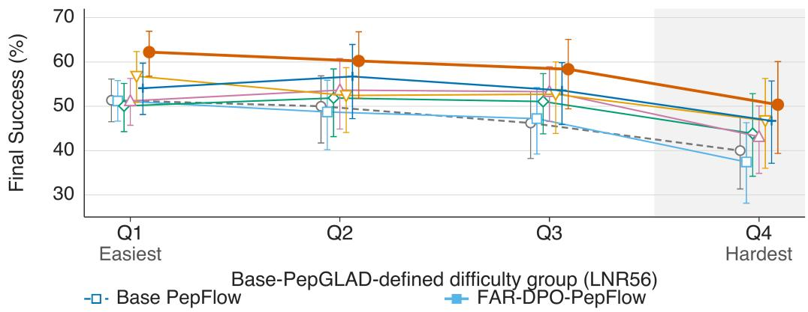

(b) PepFlow Base vs FAR-DPO  
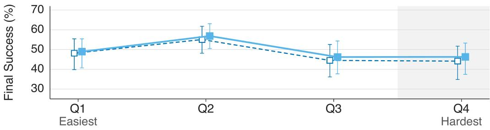  
Base-PepFlow-defined difficulty group (LNR56)  
Figure 5: (a) Final Success of the PepGLAD optimization variants on Q1–Q4 defined by Base PepGLAD; (b) Base PepFlow and FAR-DPO–PepFlow Final Success on Q1–Q4 defined by Base PepFlow. Points are target-macro means, and error bars are 95% target-bootstrap confidence intervals.

## E.2 Ethics and Submission Compliance Statement

This study is computational research based on public data and models and does not involve human participants, private personal data, or animal experiments. The generated cyclic peptides are computational candidates whose biological activity and safety require experimental validation. The authors confirm that this manuscript follows applicable research ethics and preprint dissemination policies.

<table><tr><td>-o- Base PG</td><td>IT FAR-PG</td><td>· Base PF</td></tr><tr><td>IT FAR-PF</td><td>-·DPB</td><td>-Δ- CP-C</td></tr></table>

(a) Final Pass @K  
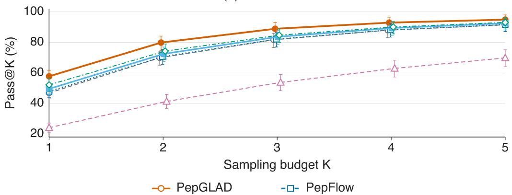

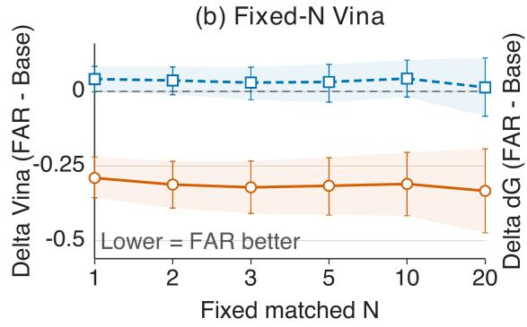

(c) Fixed-N Rosetta dG  
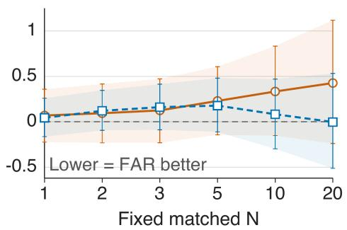

Figure 6: (a) Final Pass@K under fixed budgets on LNR56; (b–c) fixed-N Matched-N analysis within the PepGLAD and PepFlow backbones. The vertical axes show FAR-DPO-minus-Base diferences in expected-best Vina and Rosetta $\bar { \Delta } G ;$ negative values favor FAR-DPO. The analysis uses 56 common targets for $N = 1 , 2 , 3 ,$ 55 for $N = 5 ,$ , and 54 for $N = 1 0 ;$ for $N = 2 0 .$ PepGLAD and PepFlow use 51 and 52 targets, respectively.
<table><tr><td></td><td></td><td></td><td></td><td>Rosetta</td><td>Rama</td><td>scRMSD</td><td></td><td></td></tr><tr><td>Parameter</td><td>Value</td><td>Final ↑ Vina ↓</td><td></td><td> $\Delta G \downarrow$ </td><td></td><td>allowed ↑ Mainchain ↓ Diversity ↑ Novelty ↑</td><td></td><td></td></tr><tr><td rowspan="3">Learning rate η</td><td> $3 \times 1 0 ^ { - 6 }$ </td><td>51.09</td><td>-6.75</td><td>-23.61</td><td>72.9</td><td>2.71</td><td>0.626</td><td>0.122</td></tr><tr><td> $5 \times 1 0 ^ { - 6 }$ </td><td>51.46</td><td>-6.75</td><td>-23.35</td><td>72.5</td><td>2.74</td><td>0.615</td><td>0.123</td></tr><tr><td> $7 \times 1 0 ^ { - 6 }$ </td><td>50.88</td><td>-6.80</td><td>-23.24</td><td>72.2</td><td>2.74</td><td>0.616</td><td>0.123</td></tr><tr><td rowspan="3">Group-DRO temperature τ 0.5</td><td></td><td>53.12</td><td>-6.95</td><td>-23.26</td><td>70.1</td><td>2.63</td><td>0.610</td><td>0.124</td></tr><tr><td>2.0</td><td>52.89</td><td>-6.93</td><td>-23.89</td><td>69.3</td><td>2.60</td><td>0.629</td><td>0.124</td></tr><tr><td>3.0</td><td>52.64</td><td>-6.92</td><td>-23.65</td><td>69.7</td><td>2.61</td><td>0.615</td><td>0.122</td></tr><tr><td rowspan="2">Anchor weight  $\lambda _ { \mathrm { a n c } }$ </td><td>0.1</td><td>53.23</td><td>-7.00</td><td>-23.20</td><td>70.6</td><td>2.65</td><td>0.627</td><td>0.125</td></tr><tr><td>0.2</td><td>54.86</td><td>-7.01</td><td>-23.65</td><td>69.7</td><td>2.64</td><td>0.608</td><td>0.124</td></tr><tr><td>Main-text final model (reference)</td><td> $\eta = 1 \times 1 0 ^ { - 5 } , \tau = 1 . 5 ,$   $\lambda _ { \mathrm { a n c } } = 0 . 2$ </td><td>57.79</td><td>-6.74</td><td>-23.26</td><td>71.5</td><td>2.75</td><td>0.607</td><td>0.127</td></tr></table>

Table 7: PepGLAD training-parameter sensitivity. Final and Rama allowed are percentages, and scRMSD Mainchain is measured in Å. The remaining metrics follow the definitions in the main text. Lower values are better for Vina, Rosetta $\Delta G ,$ and scRMSD; higher values are better for the other metrics. The final model from the main text is included only as a reference to the main experimental result and is not part of the controlled comparison within each parameter block.