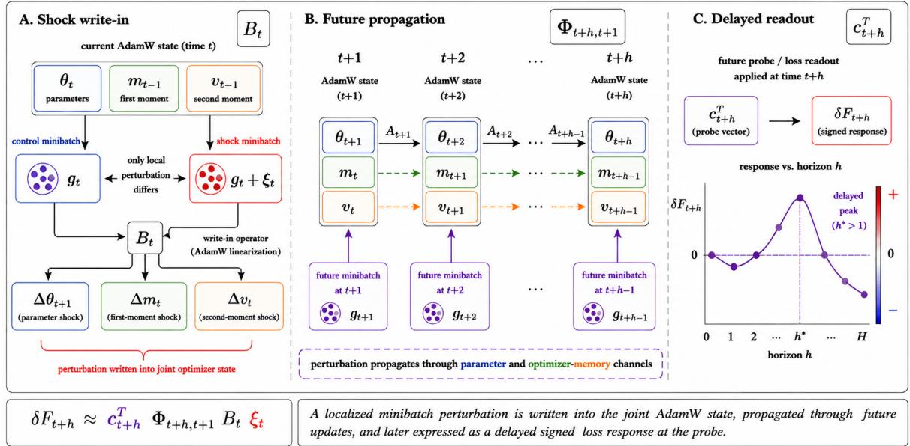

# Finite-Horizon Input–Output Dynamics of Minibatch Perturbations in AdamW

Kang Liu 1 Suyan Li 2

## Abstract

A minibatch can influence training beyond the update at which it is observed because AdamW stores past gradient information in its optimizer states. We study this delayed effect through paired trajectories that differ only in one gradient update and share the same subsequent training sequence. We formulate AdamW as a finitehorizon input–state–output (ISO) system whose state contains the model parameters and first- and second-moment estimates. Linearizing the joint dynamics yields a signed response operator that maps a localized gradient perturbation to its future loss effects, revealing how optimizer memory shapes their magnitude, timing, and sign. We further derive an exact multistep error decomposition and establish first-order finite-horizon accuracy under local smoothness and controlled activation switching. Experiments validate the response mechanism and optimizer-state effects, while repeated-future analyses reveal substantial prospective structure in delayed influence that can be partially recovered from ISO approximations. Code is available at https://github.com/ Kanyooo/Loss\_ISO.

## 1. Introduction

Modern neural networks are trained through a sequence of stochastic minibatch updates. With adaptive optimizers such as AdamW, however, the effect of a minibatch is not confined to the step at which it is observed. Its gradient changes not only the model parameters, but also the firstand second-moment estimates that determine subsequent updates. As a result, the effect of one minibatch can persist for several training steps and may become visible in the loss only later. This temporal dependence is particularly relevant to transient training instabilities, including loss spikes.

Sharp local geometry and large-step training dynamics have been linked to transient loss excursions (Zhu et al., 2024). Small-scale proxies further show that local training statistics can anticipate large-scale Transformer instabilities (Wortsman et al., 2024). More recent work attributes another class of spikes to abnormal stochastic gradients and motivates spike-aware momentum treatment (Huang et al., 2025).

Existing analyses characterize Adam through local geometry, adaptive preconditioning, and optimizer dynamics (Das et al., 2024; Ahn et al., 2024). Recent influence studies further show that training-data effects depend on their position along the optimization trajectory (Wang et al., 2025b), and that AdamW-aware attribution must propagate perturbations through both parameter and moment states (Deng et al., 2026). Optimizer memory can also make minibatch ordering a first-order source of finite-window variation (Sweeney, 2026). These results establish that optimizer state and trajectory matter, but they do not provide a signed, horizonresolved account ofhow a localized minibatch perturbation is stored, propagated, and expressed in future loss.

We study the delayed effect of minibatch perturbations in AdamW by comparing paired training trajectories that differ only at one update and share the same subsequent training sequence. This construction isolates how a localized perturbation evolves over a finite future horizon.

The central idea is to formulate AdamW as a finite-horizon input–state–output (ISO) system, with the model parameters and optimizer moments forming the joint state. We derive a tangent model that maps an initial gradient perturbation to its future loss response through the intervening AdamW dynamics, revealing how optimizer memory shapes the magnitude, timing, and sign of delayed effects. We further characterize the finite-horizon approximation error, including nonlinear dynamics and activation-pattern changes. Beyond pathwise analysis, we ask whether delayed influence retains structure before the future training sequence is realized. Repeated-future experiments show substantial prospective structure, while its recoverability from present-time ISO approximations depends on the underlying dynamics. Figure 1 summarizes the ISO mechanism.

Our contributions are threefold:

1. We formulate localized minibatch influence as a signed, finite-horizon response under paired AdamW trajectories, isolating the effect of a single gradient perturbation under a shared future realization.

  
Figure 1. Finite-horizon ISO view of delayed minibatch influence in AdamW.

2. We derive a joint parameter–moment ISO operator that decomposes the response into perturbation write-in, optimizer-state propagation, and loss readout, thereby characterizing how AdamW memory can delay or transiently amplify a minibatch’s effect.

3. We establish an exact multistep error decomposition that separates write-in nonlinearity, smooth propagation error, and activation switching, and prove fixedhorizon first-order accuracy.

## 2. Related Work

Training-data influence has gradually moved from static, endpoint-based attribution toward trajectory-aware descriptions of how individual training examples affect learning. Classical influence functions characterize infinitesimal reweighting around a trained solution (Koh & Liang, 2017), while subsequent work has improved their scalability and applicability to modern deep networks and large models (Schioppa et al., 2022; Grosse et al., 2023; Park et al., 2023; Kwon et al., 2024; Xia et al., 2024). A parallel line instead follows the optimization path, from retracing SGD updates and propagating hypergradients (Hara et al., 2019; Pruthi et al., 2020; Chen et al., 2021) to approximate unrolling and trajectory-specific influence (Bae et al., 2024; Wang et al., 2025b). Recent work further shows that faithful trajectory attribution under AdamW requires accounting for its parameter and moment states (Deng et al., 2026). These developments establish that training order and intermediate optimization states matter. The object studied here is more local and dynamical: we perturb one realized minibatch gradient and track its signed response over a finite horizon, making the temporal response itself the quantity of interest.

For AdamW, this distinction is important because the optimizer carries information across updates through its firstand second-moment states. Existing work has characterized Adam and AdamW through convergence, preconditioning, implicit geometry, and dynamical behavior (Kingma & Ba, 2015; Reddi et al., 2018; Loshchilov & Hutter, 2019; Ma et al., 2022; Ahn et al., 2024; Lin et al., 2024; Xie & Li, 2024). Closely related studies of training instability show that adaptive preconditioning, gradient statistics, and optimizer-state dynamics can shape short-time behavior and transient loss spikes (Wortsman et al., 2024; Zhu et al., 2024; Huang et al., 2025; Wang et al., 2025a; Bai et al., 2025). Optimizer memory can also make minibatch ordering a first-order source of finite-window variation (Sweeney, 2026). These results motivate treating the optimizer state as part of the perturbation dynamics rather than as an implementation detail. Our formulation treats parameters and AdamW moments as a joint state, explicitly separating perturbation write-in, state propagation, and loss readout. This finite-horizon ISO view provides a signed, horizon-resolved account of how a localized minibatch perturbation is stored in optimizer state and later expressed in future loss.

## 3. Finite-Horizon Minibatch Influence

## 3.1. Overview and Time Convention

We model the effect of a gradient perturbation as a finitehorizon input–state–output process:

$$
\begin{array} { r } { \xi _ { t } \xrightarrow { B _ { t } } \delta x _ { t + 1 } \xrightarrow { \Phi _ { t + h , t + 1 } } \delta x _ { t + h } \xrightarrow { c _ { t + h } ^ { \top } } \delta F _ { t + h } . } \end{array}
$$

Here, $\xi _ { t }$ denotes the perturbation applied at step $t , B _ { t }$ maps it into the joint AdamW state, $\Phi _ { t + h , t + 1 }$ propagates the resulting state deviation through subsequent updates, and $c _ { t + h } ^ { \top }$ maps the propagated deviation to the probe-loss response.

Throughout, $x _ { s }$ denotes the joint state immediately before minibatch s is processed. Since the perturbation is applied during update t, horizon $h = 1$ corresponds to the first post-perturbation state $x _ { t + 1 }$

## 3.2. Paired Trajectories and Joint AdamW State

For minibatch $\boldsymbol { B } _ { s } ,$ , define $g _ { s } ( \theta ) : = \nabla _ { \theta } \ell ( \theta ; B _ { s } ) \in \mathbb { R } ^ { d }$ . Immediately before processing minibatch $s ,$ the joint AdamW state is $x _ { s } : = [ \theta _ { s } , m _ { s - 1 } , v _ { s - 1 } ] ^ { \top } \in \mathbb { R } ^ { 3 d }$ , where $\theta _ { s }$ is the model parameter, $m _ { s - 1 }$ is the first-moment state, and $v _ { s - 1 }$ is the second-moment state. Under AdamW (Loshchilov & Hutter, 2019), the first- and second-moment estimates evolve as

$$
\begin{array} { c } { { m _ { s } = \beta _ { 1 } m _ { s - 1 } + ( 1 - \beta _ { 1 } ) g _ { s } ( \theta _ { s } ) , } } \\ { { { } } } \\ { { v _ { s } = \beta _ { 2 } v _ { s - 1 } + ( 1 - \beta _ { 2 } ) g _ { s } ( \theta _ { s } ) ^ { \odot 2 } . } } \end{array}
$$

Let $\rho _ { 1 , s } : = 1 - \beta _ { 1 } ^ { s }$ and $\rho _ { 2 , s } : = 1 - \beta _ { 2 } ^ { s }$ , and define the corrected moments $\widehat { m } _ { s } : = m _ { s } / \rho _ { 1 , s }$ and $\widehat { v } _ { s } : = v _ { s } / \rho _ { 2 , s } .$ The parameter update is written as

$$
\theta _ { s + 1 } = D _ { s } \theta _ { s } + q _ { s } ( m _ { s } , v _ { s } ) , D _ { s } : = I - \eta _ { s } \Lambda _ { s } ,
$$

where Λs denotes decoupled weight decay and

$$
q _ { s } ( m , v ) : = - \eta _ { s } \left( m / \rho _ { 1 , s } \right) \oslash \left( { \sqrt { v / \rho _ { 2 , s } } } + \epsilon \mathbf { 1 } \right)
$$

is evaluated coordinatewise.

Paired trajectories. We compare a control trajectory and a shock trajectory initialized from the same state: $x _ { t } ^ { \mathrm { s } } =$ $\boldsymbol { x } _ { t } ^ { \mathrm { c } } = \boldsymbol { x } _ { t } . \mathrm { A t }$ the shock step, their gradients satisfy $g _ { t } ^ { \mathrm { s } } = g _ { t } ^ { \mathrm { c } } +$ $\xi _ { t } ,$ where $\xi _ { t }$ is the realized minibatch-gradient perturbation. From step t + 1 onward, the two trajectories use the same minibatches, stochastic realizations, learning-rate schedule, and optimizer configuration.

Define the paired state deviation $\delta x _ { s } : = x _ { s } ^ { \mathrm { s } } - x _ { s } ^ { \mathrm { c } }$ . Let $\{ F _ { s } : \mathbb { R } ^ { d }  \mathbb { R } \}$ be a sequence of probe objectives shared by the paired trajectories, and define

$$
\delta F _ { s } : = F _ { s } ( \theta _ { s } ^ { \mathrm { s } } ) - F _ { s } ( \theta _ { s } ^ { \mathrm { c } } ) .
$$

A fixed probe corresponds to the special case ${ \cal F } _ { s } \equiv F$ Alternatively, taking

$$
F _ { s } ( \theta ) : = \ell ( \theta ; B _ { s } )
$$

gives the response of the realized future minibatch loss under the shared future sequence. Because the probe and future random sequence are shared, $\delta F _ { s }$ isolates the pathwise effect of the gradient difference introduced at step $t .$ The response is signed: $\delta F _ { s } > 0$ means that the shock raises the probe loss relative to the control, whereas $\delta F _ { s } < 0$ means that it lowers the probe loss.

The control gradient $g _ { t } ^ { \mathrm { c } }$ may be the gradient of another realized minibatch, as in the paired experimental protocol. Alternatively, taking it to be the conditional mean gradient,

$$
{ \bar { g } } _ { t } : = \mathbb { E } [ g _ { t } \mid { \mathcal { F } } _ { t } ] , \ \xi _ { t } : = g _ { t } - { \bar { g } } _ { t } ,
$$

gives a conditional stochastic interpretation of the perturbation, where $\mathcal { F } _ { t }$ denotes the training history available before sampling the minibatch at step t.

## 3.3. Minibatch Shock Write-In

We first derive how the perturbation $\xi _ { t }$ enters the three blocks of the joint AdamW state. Unless stated otherwise, all quantities in this subsection are evaluated along the control trajectory. Define the sensitivities of the adaptive parameter update to the moment states:

$$
M _ { s } : = \frac { \partial q _ { s } } { \partial m _ { s } } , \enspace V _ { s } : = \frac { \partial q _ { s } } { \partial v _ { s } } .
$$

Writing $d _ { s } : = \sqrt { \widehat { v } _ { s } } + \epsilon \mathbf { 1 }$ , these sensitivities are diagonal:

$$
\begin{array} { l } { { \displaystyle M _ { s } = - \frac { \eta _ { s } } { \rho _ { 1 , s } } \mathrm { D i a g } ( d _ { s } ^ { - 1 } ) } , } \\ { { \displaystyle V _ { s } = \eta _ { s } \mathrm { D i a g } \left( \frac { \widehat { m } _ { s } } { 2 \rho _ { 2 , s } \sqrt { \widehat { v } _ { s } } \odot d _ { s } ^ { \odot 2 } } \right) } . } \end{array}
$$

Derivatives with respect to the second-moment state are evaluated at coordinates where $\widehat { v } _ { s , i } > 0$ . The matrix $M _ { s }$ is negative diagonal, while the sign of each diagonal entry of $V _ { s }$ follows the corresponding first-moment coordinate. Define the effective gradient-to-parameter Jacobian

$$
\Gamma _ { s } : = ( 1 - \beta _ { 1 } ) M _ { s } + 2 ( 1 - \beta _ { 2 } ) V _ { s } \mathrm { D i a g } ( g _ { s } ^ { \mathrm { c } } ) .
$$

Its two terms correspond to the paths $g  m  \theta$ and $g  v  \theta ,$ respectively.

At the shock step, direct subtraction of the two moment updates gives

$$
\begin{array} { r l r } & { \delta m _ { t } = ( 1 - \beta _ { 1 } ) \xi _ { t } , } & \\ & { \delta v _ { t } = 2 ( 1 - \beta _ { 2 } ) \operatorname * { D i a g } ( g _ { t } ^ { \mathrm { c } } ) \xi _ { t } + ( 1 - \beta _ { 2 } ) \xi _ { t } ^ { \odot 2 } . } & \end{array}
$$

Thus, the first-moment write-in is exactly linear, whereas the second-moment write-in contains both linear and quadratic components.

Define the composite gradient-to-parameter map

$$
\psi _ { t } ( g ) : = q _ { t } { \Big ( } \beta _ { 1 } m _ { t - 1 } + ( 1 - \beta _ { 1 } ) g , \ \beta _ { 2 } v _ { t - 1 } + ( 1 - \beta _ { 2 } ) g ^ { { \odot } 2 } { \Big ) } .
$$

Then $\Gamma _ { t } = D \psi _ { t } ( g _ { t } ^ { \mathrm { c } } )$ , and

$$
\delta \theta _ { t + 1 } = \Gamma _ { t } \xi _ { t } + r _ { \theta , t } ( \xi _ { t } ) ,
$$

where

$$
r _ { \theta , t } ( \xi _ { t } ) : = \psi _ { t } ( g _ { t } ^ { \mathrm { c } } + \xi _ { t } ) - \psi _ { t } ( g _ { t } ^ { \mathrm { c } } ) - \Gamma _ { t } \xi _ { t } .
$$

If $D \psi _ { t }$ is $\kappa _ { \boldsymbol { \theta } , t } – \mathrm { I }$ ipschitz along the segment joining $g _ { t } ^ { \mathrm { c } }$ and $g _ { t } ^ { \mathrm { c } } + \xi _ { t }$ , then

$$
\| r _ { \theta , t } ( \xi _ { t } ) \| \le \frac { \kappa _ { \theta , t } } { 2 } \| \xi _ { t } \| ^ { 2 } .
$$

Stacking the three state blocks yields

$$
\delta \boldsymbol { x } _ { t + 1 } = \boldsymbol { B } _ { t } \xi _ { t } + \boldsymbol { r } _ { B , t } ( \xi _ { t } ) ,
$$

where

$$
B _ { t } : = \left[ \begin{array} { c } { \Gamma _ { t } } \\ { ( 1 - \beta _ { 1 } ) I } \\ { 2 ( 1 - \beta _ { 2 } ) \mathrm { D i a g } ( g _ { t } ^ { \mathrm { c } } ) } \end{array} \right] , r _ { B , t } ( \xi _ { t } ) : = \left[ \begin{array} { c } { r _ { \theta , t } ( \xi _ { t } ) } \\ { 0 } \\ { ( 1 - \beta _ { 2 } ) \xi _ { t } ^ { \odot 2 } } \end{array} \right] .\tag{1}
$$

The remainder contains two distinct nonlinear effects: the intrinsic quadratic write-in to the second-moment state and the nonlinearity of the adaptive parameter update. The current weight-decay term does not appear in $B _ { t }$ because the two trajectories share the same pre-shock parameter $\theta _ { t } ;$ weight decay instead enters subsequent transitions through $D _ { s } = I - \eta _ { s } \Lambda _ { s }$

## 3.4. Joint-State Propagation and Loss Readout

Let $f _ { s }$ denote the exact state transition under future minibatch $B _ { s }$ . For a smooth network, set $\widetilde { f _ { s } } : = f _ { s }$ . For a piecewise-smooth network, let $\widetilde { f } _ { s }$ denote the smooth extension associated with the activation pattern of the control trajectory at $\boldsymbol { x } _ { s } ^ { \mathrm { c } }$ . The tangent transition matrix is

$$
A _ { s } : = D \widetilde { f _ { s } } ( x _ { s } ^ { \mathrm { c } } ) .
$$

Although the paired trajectories use the same future minibatch, their gradients generally differ once their parameters diverge. Let $\widetilde { g } _ { s }$ denote the gradient map within the controlregion smooth extension, and define

$$
H _ { s } ^ { \mathrm { t r } } : = D \widetilde { g } _ { s } ( \theta _ { s } ^ { \mathrm { c } } ) .
$$

When the loss is twice differentiable in this region,

$$
H _ { s } ^ { \mathrm { t r } } = \nabla _ { \theta } ^ { 2 } \ell ( \theta _ { s } ^ { \mathrm { c } } ; B _ { s } ) .
$$

The corresponding first-order gradient variation is

$$
\widetilde { g } _ { s } ( \theta _ { s } ^ { \mathrm { c } } + \delta \theta _ { s } ) - \widetilde { g } _ { s } ( \theta _ { s } ^ { \mathrm { c } } ) = H _ { s } ^ { \mathrm { t r } } \delta \theta _ { s } + o ( \| \delta \theta _ { s } \| ) .
$$

Define

$$
S _ { s } : = 2 ( 1 - \beta _ { 2 } ) \operatorname { D i a g } ( g _ { s } ^ { \mathrm { c } } ) H _ { s } ^ { \mathrm { t r } } .
$$

The tangent transition of the joint parameter–moment state is

$$
A _ { s } = \left[ \begin{array} { c c c } { { D _ { s } + \Gamma _ { s } H _ { s } ^ { \mathrm { t r } } } } & { { \beta _ { 1 } M _ { s } } } & { { \beta _ { 2 } V _ { s } } } \\ { { ( 1 - \beta _ { 1 } ) H _ { s } ^ { \mathrm { t r } } } } & { { \beta _ { 1 } I } } & { { 0 } } \\ { { S _ { s } } } & { { 0 } } & { { \beta _ { 2 } I } } \end{array} \right] .\tag{2}
$$

The off-diagonal blocks capture the two feedback paths

$$
\theta  g  m  \theta , \theta  g ^ { \odot 2 }  v  \theta .
$$

Hence, the persistence parameters $\beta _ { 1 }$ and $\beta _ { 2 }$ describe memory within the individual moment states but do not by themselves determine the stability or finite-horizon gain of the coupled system.

For indices $a \geq b ,$ define the ordered propagator

$$
\Phi _ { a , b } : = { \left\{ \begin{array} { l l } { I , } & { a = b , } \\ { A _ { a - 1 } A _ { a - 2 } \cdot \cdot \cdot A _ { b } , } & { a > b . } \end{array} \right. }
$$

In particular,

$$
\Phi _ { t + h , t + 1 } = A _ { t + h - 1 } \cdot \cdot \cdot A _ { t + 1 } , \ h \geq 2 ,
$$

with $\Phi _ { t + 1 , t + 1 } = I$ . The matrices $A _ { s }$ vary along the future training trajectory and generally do not commute.

Define the probe readout vector

$$
\begin{array} { r } { c _ { s } : = \left[ \begin{array} { c } { \nabla F _ { s } ( { \boldsymbol { \theta } } _ { s } ^ { \mathrm { c } } ) } \\ { 0 } \\ { 0 } \end{array} \right] \in \mathbb { R } ^ { 3 d } . } \end{array}
$$

The probe loss depends directly only on the parameter block, so a deviation stored in the moment states affects the probe loss only after it is converted into parameter motion.

Theorem 3.1 (Finite-horizon directional response). Consider the scaled perturbation

$$
g _ { t } ^ { \mathrm { s } } ( \alpha ) = g _ { t } ^ { \mathrm { c } } + \alpha \xi _ { t } .
$$

Suppose that the control trajectory lies in the interior of the smooth regions used to define ${ \widetilde { f } } _ { s } ,$ , that the corresponding AdamW transitions are differentiable along the trajectory, and that $F _ { s }$ is differentiable at the relevant control states. In particular, the second-moment coordinates involved in the derivatives satisfy $\widehat { v } _ { s , i } ^ { \mathrm { c } } > 0 .$ . Let $\delta x _ { t + h } ( \alpha )$ and $\delta F _ { t + h } ( \alpha )$

denote the resulting paired state and probe-loss responses. Then, for every fixed $h \geq 1$

$$
\begin{array} { r l } & { \frac { \mathrm { d } } { \mathrm { d } \alpha } \delta x _ { t + h } ( \alpha ) \bigg | _ { \alpha = 0 } = \Phi _ { t + h , t + 1 } B _ { t } \xi _ { t } , } \\ & { \frac { \mathrm { d } } { \mathrm { d } \alpha } \delta F _ { t + h } ( \alpha ) \bigg | _ { \alpha = 0 } = c _ { t + h } ^ { \top } \Phi _ { t + h , t + 1 } B _ { t } \xi _ { t } . } \end{array}
$$

Define the horizon-h input–output operator

$$
\mathcal { G } _ { t , h } : = c _ { t + h } ^ { \top } \Phi _ { t + h , t + 1 } B _ { t } .
$$

Then

$$
\delta F _ { t + h } ( \alpha ) = \alpha \mathcal { G } _ { t , h } \xi _ { t } + o ( \alpha ) , \ \alpha \to 0 .
$$

The complete proof is given in Appendix B. Theorem 3.1 gives the central ISO decomposition: a perturbation first enters the joint AdamW state through $B _ { t }$ , is propagated by the intervening dynamics through $\Phi _ { t + h , t + 1 }$ , and is finally observed through the loss readout $c _ { t + h } ^ { \top }$ . The future response therefore depends on the interaction of perturbation direction, optimizer dynamics, and future loss sensitivity rather than on any one of these quantities alone.

Remark 3.2. A second-order analysis of the one-step response and the coordinate-invariance property of the ISO operator are provided in Appendix B.4 and Appendix B.5, respectively.

Finite-horizon response summaries. For a horizon H, we summarize the response by its largest magnitude, its timing, and its sign:

$$
M _ { t , H } : = \operatorname* { m a x } _ { 1 \leq h \leq H } | \delta F _ { t + h } | , \ h _ { t , H } ^ { \star } : = \operatorname* { m i n } \arg \operatorname* { m a x } _ { 1 \leq h \leq H } | \delta F _ { t + h } | ,
$$

and

$$
\begin{array} { r } { s _ { t , H } ^ { \star } : = \mathrm { s i g n } \left( \delta F _ { t + h _ { t , H } ^ { \star } } \right) . } \end{array}
$$

Their tangent counterparts are obtained by replacing $\delta F _ { t + h }$ with $\mathcal { G } _ { t , h } \xi _ { t }$ . A delayed extremal response corresponds to $h _ { t , H } ^ { \star } > 1$

When only adverse loss increases are of interest, we additionally use

$$
P _ { t , H } ^ { + } : = \operatorname* { m a x } _ { 1 \leq h \leq H } [ \delta F _ { t + h } ] _ { + } , \ : \ : [ a ] _ { + } : = \operatorname* { m a x } ( a , 0 ) .
$$

This distinction is important for loss spikes: a large absolute response need not correspond to an increase in loss.

Relation to loss spikes. When $F _ { t + h }$ is chosen as the realized future minibatch loss, let $T _ { t + h }$ denote the corresponding spike threshold and suppose

$$
F _ { t + h } ( \theta _ { t + h } ^ { \mathrm { c } } ) \leq T _ { t + h } .
$$

The perturbed trajectory crosses the threshold at horizon h exactly when

$$
\delta F _ { t + h } > T _ { t + h } - F _ { t + h } ( \theta _ { t + h } ^ { \mathrm { c } } ) .
$$

Thus, a positive finite-horizon response contributes to a loss spike only when it exceeds the remaining margin to the threshold.

## 3.5. Delayed Expression Through AdamW Memory

To isolate the role of optimizer memory, consider a scalar frozen-coefficient approximation of the joint AdamW dynamics over a short horizon:

$$
z _ { h + 1 } = \overline { { { A } } } z _ { h } , \ \overline { { { A } } } : = \left[ \begin{array} { c c c } { { a } } & { { b _ { m } } } & { { b _ { v } } } \\ { { d _ { m } } } & { { \beta _ { 1 } } } & { { 0 } } \\ { { d _ { v } } } & { { 0 } } & { { \beta _ { 2 } } } \end{array} \right] ,
$$

where

$$
z _ { h } : = \left[ \delta \theta _ { h } , \delta m _ { h - 1 } , \delta v _ { h - 1 } \right] ^ { \top } .
$$

The coefficients are the scalar counterparts of the blocks in Equation (2):

$$
\begin{array} { r } { a : = D + \Gamma H ^ { \mathrm { t r } } , b _ { m } : = \beta _ { 1 } M , b _ { v } : = \beta _ { 2 } V , } \\ { d _ { m } : = ( 1 - \beta _ { 1 } ) H ^ { \mathrm { t r } } , d _ { v } : = 2 ( 1 - \beta _ { 2 } ) g H ^ { \mathrm { t r } } . } \end{array}
$$

Here, $b _ { m }$ and $b _ { v }$ convert moment-state deviations into parameter motion, whereas $d _ { m }$ and $d _ { v }$ feed parameter-induced gradient changes back into the two moment states.

To study how a perturbation stored in either memory channel becomes expressed in the parameter state, let

$$
\begin{array} { r } { e _ { \theta } : = [ 1 , 0 , 0 ] ^ { \top } , e _ { m } : = [ 0 , 1 , 0 ] ^ { \top } , e _ { v } : = [ 0 , 0 , 1 ] ^ { \top } , } \end{array}
$$

and define

$$
r _ { k } ( h ) : = e _ { \theta } ^ { \top } { \overline { { A } } } ^ { h - 1 } e _ { k } , k \in \{ m , v \} .
$$

A nonzero scalar probe sensitivity can be applied afterward as an output scaling; the analysis below concerns the magnitude and timing of the memory-to-parameter response.

Proposition 3.3 (Finite-horizon memory-channel response). For $k \in \{ m , v \}$ ,

$$
\begin{array} { r } { r _ { m } ( 1 ) = 0 , \quad r _ { m } ( 2 ) = b _ { m } , \quad r _ { m } ( 3 ) = b _ { m } ( a + \beta _ { 1 } ) , } \\ { r _ { v } ( 1 ) = 0 , \quad r _ { v } ( 2 ) = b _ { v } , \quad r _ { v } ( 3 ) = b _ { v } ( a + \beta _ { 2 } ) , } \end{array}
$$

and

$$
r _ { k } ( 4 ) = b _ { k } \Big ( a ^ { 2 } + a \beta _ { k } + \beta _ { k } ^ { 2 } + b _ { m } d _ { m } + b _ { v } d _ { v } \Big ) .\tag{3}
$$

$I f b _ { k } \ne 0$ and

$$
| a + \beta _ { k } | > 1 ,\tag{4}
$$

then

$$
| r _ { k } ( 3 ) | > | r _ { k } ( 2 ) | .
$$

If, in addition,

$$
\begin{array} { r } { \big | { a } ^ { 2 } + a \beta _ { k } + \beta _ { k } ^ { 2 } + b _ { m } { d } _ { m } + b _ { v } { d } _ { v } \big | > | a + \beta _ { k } | , } \end{array}\tag{5}
$$

then

$$
| r _ { k } ( 4 ) | > | r _ { k } ( 3 ) | .
$$

Thesefinite-horizon amplification conditions can hold even when $\rho ( { \overline { { A } } } ) < 1$ , so asymptotic stability does not preclude transient growth in the response.

The complete proof and spectral characterization of the frozen system are given in Appendix C.

Proposition 3.3 makes the delay mechanism explicit. A perturbation stored entirely in m or v is initially absent from the parameter output and becomes visible only after the corresponding memory state feeds back into the parameter update. Its subsequent magnitude depends on both memory persistence and the return terms $b _ { m } d _ { m } + b _ { v } d _ { v }$ . In particular, the second-moment feedback depends on the current momentum, gradient, and local curvature, so it can reinforce or oppose the evolving parameter deviation.

The frozen model therefore illustrates how delayed and transiently amplified responses can arise from AdamW memory even when the local dynamics are asymptotically stable. The full ISO operator

$$
c _ { t + h } ^ { \top } \Phi _ { t + h , t + 1 } B _ { t }
$$

extends this mechanism to the high-dimensional, anisotropic, and time-varying dynamics of an actual training trajectory.

## 3.6. Approximation Error in Smooth and Piecewise-Smooth Networks

The finite-horizon tangent model linearizes a nonlinear, time-varying training trajectory. Its approximation error has two sources: the smooth Taylor remainder within the local control region and, for piecewise-smooth networks, the defect caused by activation-pattern changes.

Using the control-region extension ${ \widetilde { f } } _ { s } ,$ define

$$
\begin{array} { r l } & { r _ { s } ^ { \mathrm { s m } } : = \widetilde { f } _ { s } ( x _ { s } ^ { \mathrm { c } } + \delta x _ { s } ) - \widetilde { f } _ { s } ( x _ { s } ^ { \mathrm { c } } ) - A _ { s } \delta x _ { s } , } \\ & { r _ { s } ^ { \mathrm { s w } } : = f _ { s } ( x _ { s } ^ { \mathrm { c } } + \delta x _ { s } ) - \widetilde { f } _ { s } ( x _ { s } ^ { \mathrm { c } } + \delta x _ { s } ) . } \end{array}
$$

Since $f _ { s }$ and $\widetilde { f } _ { s }$ agree at the control state, the exact perturbation recursion is

$$
\delta x _ { s + 1 } = A _ { s } \delta x _ { s } + r _ { s } ^ { \mathrm { s m } } + r _ { s } ^ { \mathrm { s w } } .\tag{6}
$$

For smooth networks, $r _ { s } ^ { \mathrm { s w } } = 0$ . More generally, it also vanishes whenever the paired states remain in the same activation region.

Let the tangent prediction satisfy

$$
\widehat { \delta x } _ { t + 1 } : = B _ { t } \xi _ { t } , \widehat { \delta x } _ { s + 1 } : = A _ { s } \widehat { \delta x } _ { s } .\tag{7}
$$

Theorem 3.4 (Finite-horizon error decomposition). Let $e _ { s } : = \delta x _ { s } - \widehat { \delta x } _ { s }$ . Then, for every $h \geq 1$

$$
\begin{array} { r l } { e _ { t + h } = \Phi _ { t + h , t + 1 } r _ { B , t } ( \xi _ { t } ) } & { } \\ { \displaystyle + \sum _ { j = t + 1 } ^ { t + h - 1 } \Phi _ { t + h , j + 1 } \left( r _ { j } ^ { \mathrm { s m } } + r _ { j } ^ { \mathrm { s w } } \right) . } \end{array}\tag{8}
$$

If $D \widetilde { f } _ { j }$ is $L _ { j }$ -Lipschitz along the segment joining $\boldsymbol { x } _ { j } ^ { \mathrm { c } }$ and $x _ { j } ^ { \mathrm { c } } + \delta x _ { j }$ , then

$$
\begin{array} { l } { \displaystyle \| e _ { t + h } \| \leq \| \Phi _ { t + h , t + 1 } \| \| r _ { B , t } ( \xi _ { t } ) \| } \\ { \displaystyle + \sum _ { j = t + 1 } ^ { t + h - 1 } \| \Phi _ { t + h , j + 1 } \| \left( \frac { L _ { j } } { 2 } \| \delta x _ { j } \| ^ { 2 } + \| r _ { j } ^ { \mathrm { s w } } \| \right) . } \end{array}\tag{9}
$$

If, in addition, $F _ { t + h }$ has an $L _ { F , t + h }$ -Lipschitz gradient along the segmentjoining $\theta _ { t + h } ^ { \mathrm { c } }$ and $\theta _ { t + h } ^ { \mathrm { s } } ,$ , then

$$
\begin{array} { r l } & { \left| { \delta F _ { t + h } - c _ { t + h } ^ { \top } \Phi _ { t + h , t + 1 } B _ { t } \xi _ { t } } \right| \leq \| c _ { t + h } \| \| e _ { t + h } \| } \\ & { \qquad + \frac { L _ { F , t + h } } { 2 } \| { \delta \theta _ { t + h } } \| ^ { 2 } . } \end{array}\tag{10}
$$

Theorem 3.4 shows that the same propagators that carry the first-order perturbation also propagate the approximation defects introduced at each step. Large finite-horizon gain can therefore amplify both the response of interest and the error of its tangent approximation.

Corollary 3.5 (Fixed-horizon first-order accuracy). Consider the scaled perturbation $\alpha \xi _ { t }$ and a fixed horizon H. Suppose that, in a neighborhood of the control trajectory, $D \psi _ { t }$ and $D \widetilde { f } _ { s }$ are locally Lipschitz, the finite-horizon propagators are uniformly bounded, the probe objectives have locally Lipschitz gradients, and the switching defects satisfy

$$
\| r _ { s } ^ { \mathrm { s w } } \| \leq C _ { s } ^ { \mathrm { s w } } \| \delta x _ { s } \| ^ { 2 } , 1 \leq s - t < H .
$$

Then, for every $1 \leq h \leq H$

$$
\delta F _ { t + h } ( \alpha ) = \alpha c _ { t + h } ^ { \top } \Phi _ { t + h , t + 1 } B _ { t } \xi _ { t } + O ( \alpha ^ { 2 } ) , \ \alpha \to 0 .
$$

The $O ( \alpha ^ { 2 } )$ constant may depend on thefixed horizon and control trajectory but not on α.

For smooth networks the switching condition holds with $C _ { s } ^ { \mathrm { s w } } = 0$ . For piecewise-smooth networks, a sufficient activation-margin condition under which the aggregate switching defect is quadratic is given in Appendix D. The appendix also provides the complete proofs and a recursive error envelope.

## 4. Experiments

Our experiments address two questions. First, does the proposed joint-state ISO model capture the finite-horizon response mechanism across increasingly realistic training systems? Second, although the pathwise ISO conditions on a realized future training sequence, does delayed influence retain structure that is already identifiable before that future unfolds?

For mechanism validation, a control and a shock trajectory start from the same AdamW state, differ only in the gradient applied at step t, and then process the same future minibatches. With a fixed probe objective F, we write

$$
d _ { i , h } = F ( \theta _ { i , t + h } ^ { \mathrm { s } } ) - F ( \theta _ { t + h } ^ { \mathrm { c } } ) , \widehat { d } _ { i , h } = c _ { t + h } ^ { \top } \Phi _ { t + h , t + 1 } B _ { t } \xi _ { i } ,\tag{11}
$$

and summarize magnitude by $M _ { i } = \operatorname* { m a x } _ { 1 \leq h \leq H } | d _ { i , h } |$ . We evaluate trajectory fidelity, sign agreement, and withinsystem Spearman correlation with $M _ { i }$ . Candidates and horizons are nested observations: the controlled and neuralnetwork studies aggregate within independent training systems, whereas the language-model study is reported descriptively over fixed model–dataset conditions. The second experiment holds the present state–shock pair fixed and instead resamples unseen future continuations. Complete protocols, estimators, and additional results are provided in Appendix E.

## 4.1. Experiment 1: Finite-Horizon Mechanism Validation

Controlled quadratic systems. We begin with quadratic minibatch losses

$$
\ell _ { s } ( \theta ) = \frac 1 2 \theta ^ { \top } D _ { s } \theta + \frac { 1 } { 2 r } \| \boldsymbol { U } _ { s } ^ { \top } \theta \| _ { 2 } ^ { 2 } + q _ { s } ^ { \top } \theta ,\tag{12}
$$

with $d = 5 1 2 .$ , rank $r = 1 6$ , temporally correlated minibatches, and three curvature regimes. Four seeds with eight independently generated systems each give 32 systems. After 40 burn-in updates, each system uses four reference minibatches, 16 candidate shocks, a common future of length $H = 3 2$ , and both a standard and an anisotropic probe. A separate rotating-readout probe is used only in the exactone-step-matched stress test.

We vary $\alpha \in \{ 1 / 3 2 , 1 / 1 6 , 1 / 8 , 1 / 4 , 1 / 2 , 1 \}$ . Table 1 shows that the tangent trajectory remains accurate over the local range. $\mathrm { A t } \alpha \ : = \ : 1 / 8$ , median NRMSE is 0.0483 for the standard probe and 0.0719 for the anisotropic probe, with perfect median sign agreement. Fitting $\lvert d _ { h } ( \alpha ) - \alpha \widehat { d } _ { h } \rvert$ ∝ $\alpha ^ { p _ { h } }$ over $\alpha \leq 1 / 4$ gives $p _ { h } \approx 2$ throughout the horizon, with median $R ^ { 2 } > 0 . 9 9 9 9 8$ , matching the quadratic local remainder predicted by the theory.

To separate future propagation from the immediate response, we construct shocks whose exact $| d _ { i , 1 } |$ values are matched without using any response at $h > 1$ . The resulting withinsystem CV of $| d _ { 1 }$ | is $1 . 1 0 \times 1 0 ^ { - 1 2 }$ for the standard probe and $6 . 7 0 \times 1 0 ^ { - 1 2 }$ for the rotating-readout probe, while the CV of future M remains 0.092 and 0.459. Full ISO recovers this future ordering with median Spearman correlations 0.993 and 1.000 (Table 2). Exact state interventions further separate the parameter, first-moment, and second-moment time scales, whose isolated responses peak near horizons $6 ,$ $^ { 1 6 , }$ , and 26, respectively. Matched-first-displacement sweeps move the extremum later as $\beta _ { 1 }$ or $\beta _ { 2 }$ increases. These controls isolate delayed state propagation from the immediate parameter write.

Table 1. Representative signed-trajectory fidelity in the controlled stage of Experiment 1. Entries are medians over 32 independent systems after candidate aggregation.
<table><tr><td>Probe</td><td>α</td><td>NRMSE</td><td>Rel. M err.</td><td>Sign acc.</td></tr><tr><td rowspan="3">Standard</td><td>1/32</td><td>0.0117</td><td>0.0052</td><td>1.000</td></tr><tr><td> $1 / 8$ </td><td>0.0483</td><td>0.0216</td><td>1.000</td></tr><tr><td> $1 / 4$ </td><td>0.1007</td><td>0.0445</td><td>1.000</td></tr><tr><td rowspan="3">Anisotropic 1/32</td><td></td><td>0.0173</td><td>0.0071</td><td>1.000</td></tr><tr><td> $1 / 8$ </td><td>0.0719</td><td>0.0289</td><td>1.000</td></tr><tr><td> $1 / 4$ </td><td>0.1473</td><td>0.0606</td><td>1.000</td></tr></table>

Nonconvex neural networks. We next apply the same paired-trajectory protocol to CIFAR-10 (Krizhevsky, 2009) using a 94,538-parameter CNN–ReLU and an 855,050- parameter MLP–GELU. Each architecture contributes 16 independently trained systems, with 12 candidate shocks per system and $H = 1 2$ after 100 burn-in updates. At $\alpha = 0 . 0 6 2 5$ , median trajectory NRMSE is 0.0458 for CNN– ReLU and 0.0377 for MLP–GELU; at $\alpha = 0 . 2 5$ it is 0.1097 and 0.1530. The MLP error exponent remains 2.001–2.005 across horizons, whereas the CNN exponent decreases from $2 . 0 1 7$ at $h = 1$ to 1.120 at $h = 1 2$ as activation-pattern differences increase, consistent with the switching term in the finite-horizon error decomposition.

At full scale, Full ISO ranks future magnitude with correlations 0.888 and 0.762, compared with 0.545 and 0.566 for the exact one-step response. State interventions again show an early parameter response and a later first-moment response; increasing $\beta _ { 1 }$ from 0.5 to 0.99 multiplies accumulated response by 14.17 and 11.96 in the two architectures. Among the 96 exact intervention trajectories used for the signed-response diagnostic, 57 extrema are positive and 39 are negative.

Pretrained language models. Finally, we evaluate Pythia-410M, Pythia-1B, and Pythia-1.4B (Biderman et al., 2023) on WikiText-103 (Merity et al., 2016), OpenWebText (Gokaslan & Cohen, 2019), and CodeParrot (CodeParrot, 2022). Each of the nine model–dataset systems is continued for 500 AdamW updates before measurement, producing nontrivial first- and second-moment states. Each condition then uses two reference minibatches, eight candidate shocks, seven common-future minibatches, and $H = 8 .$

Table 2. Within-system Spearman correlation with future magnitude M during mechanism validation. The controlled rows use exact-onestep-matched candidates; the neural rows use natural candidates. The one-step score is tied in the matched controlled stress test.
<table><tr><td>Setting</td><td>Full ISO</td><td>Exact 1-step</td><td>No propagation</td><td>Gradient norm</td></tr><tr><td>Quadratic, standard probe</td><td>0.993</td><td></td><td>0.354</td><td>-0.062</td></tr><tr><td>Quadratic, rotating-readout probe</td><td>1.000</td><td></td><td>0.806</td><td>0.776</td></tr><tr><td>CNN-ReLU</td><td>0.888</td><td>0.545</td><td>0.755</td><td>0.535</td></tr><tr><td>MLP-GELU</td><td>0.762</td><td>0.566</td><td>0.668</td><td>0.336</td></tr></table>

Table 3. Language-model scaling results in Experiment 1. Local metrics pool the three datasets and $\alpha \leq 0 . 2 5 ;$ rank correlations are medians over the three fixed data-domain conditions at each model size.
<table><tr><td>Scale</td><td>Local NRMSE</td><td>Cosine</td><td>ISO-FD  $\rho$ </td></tr><tr><td>0.41B</td><td>0.1090</td><td>0.99918</td><td>0.714</td></tr><tr><td>1.0B</td><td>0.0519</td><td>0.99995</td><td>0.833</td></tr><tr><td>1.4B</td><td>0.0567</td><td>0.99994</td><td>0.762</td></tr></table>

At this scale we estimate the end-to-end ISO directional response numerically using centered finite differences of the probe logits, followed by the exact cross-entropy differential; we denote this quantity by ISO TANGENT (FD). All 72 candidates pass the adjacent-scale consistency test, with median consistency NRMSE 0.00378. Trajectory NRMSE is 0.0387, 0.0477, and 0.0946 at α = 0.0625, 0.125, and 0.25, respectively, with median trajectory cosine above 0.9998 and perfect sign accuracy over this local range.

Across model sizes, local NRMSE is 0.1090, 0.0519, and 0.0567 (Table 3), while trajectory cosine remains above 0.999. ISO TANGENT (FD) has positive rank correlation in all nine model–dataset conditions, with median correlations 0.714, 0.833, and 0.762 across the three model sizes. It also recovers the full-scale extremum sign for 65 of 72 candidates. These results show that the signed finite-horizon tangent response remains locally accurate and informative across model scale and data domain.

## 4.2. Experiment 2: Prospective Structure Under Unknown Futures

The pathwise operator $c _ { t + h } ^ { \top } \Phi _ { t + h , t + 1 } B _ { t }$ depends on the realized future training sequence and is therefore not, by itself, a present-time predictor. We ask a more basic question: if the current AdamW state and initiating shock are held fixed, does their finite-horizon effect remain candidate-specific when the unseen future minibatches are resampled?

For each fixed system and candidate $i ,$ we draw $K = 3 2$ independent future continuations $\omega _ { k } .$ , while sharing each continuation between its control and shock trajectory. Let

$$
M _ { i , k } : = \operatorname* { m a x } _ { 1 \leq h \leq H } | d _ { i , h } ( \omega _ { k } ) | , \ \mu _ { i } : = \frac { 1 } { K } \sum _ { k = 1 } ^ { K } M _ { i , k } .\tag{13}
$$

Within each system we summarize repeated-future structure by

$$
\Pi _ { H } : = \frac { \operatorname { V a r } _ { i } ( \mu _ { i } ) } { \operatorname { V a r } _ { i } ( \mu _ { i } ) + \mathbb { E } _ { i } [ \operatorname { V a r } _ { k } ( M _ { i , k } ) ] } .\tag{14}
$$

This is a protocol-specific variance ratio, not an informationtheoretic fraction of predictable risk. We also report the median Spearman correlation between each branch ranking and the conditional-mean ranking. To test whether the structure can be extracted without observing any sampled future branch, we compare the exact one-step response, gradient norm, parameter-write norm, a present-frozen ISO that repeatedly applies one current reference-derived Jacobian with the $h = 1$ probe readout frozen, and a reference-surrogate ISO that deterministically rolls out only the current reference minibatches. Neither prospective ISO score uses future minibatches.

Controlled repeated futures. In the standard quadratic regime, natural candidates give $\Pi _ { 3 2 } = 0 . 8 0 1$ , but their exact one-step response already correlates 0.801 with $\mu _ { i } .$ . We therefore repeat the analysis after exact one-step matching. The matched $| d _ { 1 } |$ has median within-system CV $1 . { \overset { - } { 0 } } 7 \times 1 0 ^ { - 1 2 }$ , yet $\Pi _ { 3 2 }$ remains 0.730 and the median singlebranch ranking correlation with $\mu _ { i }$ is 0.909. Thus the delayed response retains substantial candidate-specific structure after immediate magnitude is removed. However, this structure is not recovered by the simplest present-time compressions in the controlled system: correlations with $\mu _ { i }$ are 0.049 for gradient norm, −0.057 for parameter-write norm, and −0.066 for present-frozen ISO. The anisotropic-probe results show the same qualitative separation and are reported in Appendix E.3.1.

Neural-network repeated futures. The same construction is applied to the fixed post-burn-in CIFAR-10 systems. Exact one-step matching succeeds for every candidate, with median $\mathrm { C V 3 . \dot { 5 } 7 \times 1 0 ^ { - 1 3 } }$ for MLP–GELU and $1 . 3 6 \times 1 0 ^ { - 1 2 }$ for CNN–ReLU. After matching, prospective structure remains strong: $\Pi _ { 1 2 } = 0 . 9 2 1$ for MLP–GELU and 0.700 for CNN–ReLU. Unlike the controlled setting, present-time

Table 4. Prospective structure under 32 independently resampled future continuations. $\Pi _ { H }$ is defined in $\operatorname { E q . }$ (14); branch $\rho$ is the median single-future Spearman correlation with the conditional-mean candidate ranking. Present-score correlations target $\mu _ { i }$ . All entries are medians over independent systems.
<table><tr><td>System</td><td>Candidates</td><td> $\Pi _ { H }$ </td><td>Branch  $\rho$ </td><td> $1 \mathrm { - s t e p } \rho$ </td><td> $\mathrm { F r o z e n } \mathrm { I S O } \rho$ </td><td>Ref.-surrogate  $\rho$ </td></tr><tr><td rowspan="2">Quadratic, standard</td><td>Natural</td><td>0.801</td><td>0.919</td><td>0.801</td><td>0.659</td><td>0.372</td></tr><tr><td>Matched</td><td>0.730</td><td>0.909</td><td></td><td>-0.066</td><td>-0.021</td></tr><tr><td rowspan="2">MLP-GELU</td><td>Natural</td><td>0.771</td><td>0.862</td><td>0.661</td><td>0.734</td><td>0.262</td></tr><tr><td>Matched</td><td>0.921</td><td>0.955</td><td></td><td>0.941</td><td>0.752</td></tr><tr><td rowspan="2">CNN-ReLU</td><td>Natural</td><td>0.716</td><td>0.855</td><td>0.619</td><td>0.752</td><td>0.601</td></tr><tr><td>Matched</td><td>0.700</td><td>0.872</td><td></td><td>0.755</td><td>0.811</td></tr></table>

support reliable training-time warning or control.

ISO scores now recover much of the conditional-mean ordering. Present-frozen ISO reaches median correlations 0.941 and 0.755, compared with gradient-norm correlations 0.066 and 0.500 for MLP–GELU and CNN–ReLU, respectively. The reference-surrogate ISO reaches 0.752 and 0.811. The stronger frozen-ISO agreement in the smooth MLP is consistent with the greater local tangent coherence observed in Experiment 1.

Remark 4.1 (Why quadratic systems perform worse). The quadratic system is globally smooth, yet its frozen ISO performs poorly after one-step matching. A more plausible factor is how well the current local dynamics represent the future time-varying propagation. Longer horizons, transition and readout drift, and activation switching can all reduce this coherence.

Taken together, Experiment 1 establishes the pathwise finitehorizon mechanism, whereas Experiment 2 shows that its delayed effects are not created entirely by the subsequently realized minibatches: substantial candidate-specific structure can already be present at the perturbation time. Whether that structure admits an accurate present-time representation is regime-dependent, as illustrated by the contrast between the controlled, MLP–GELU, and CNN–ReLU results. Characterizing the conditions for such prospective identifiability is distinct from the pathwise mechanism studied here.

## 5. Conclusion and Discussion

We studied delayed minibatch influence in AdamW through a finite-horizon input–state–output formulation that tracks how perturbations enter optimizer state, propagate through future updates, and appear in later losses. The resulting tangent model is supported across controlled systems, neural networks, and pretrained language models, while repeatedfuture experiments show that delayed influence can also contain prospective structure. The main limitations are that the exact ISO is pathwise and its present-time approximation may degrade under nonlinear dynamics, activation switching, and future dynamical drift. Future work should characterize when such prospective influence is identifiable from the current optimizer state, ideally through necessary and sufficient conditions, and determine whether this can

## Acknowledgments

We gratefully acknowledge Hongqian Huang for providing the computational resources used in this work.

## References

Ahn, K., Zhang, Z., Kook, Y., and Dai, Y. Understanding Adam optimizer via online learning of updates: Adam is FTRL in disguise. In Proceedings of the 41st International Conference on Machine Learning, volume 235 of Proceedings of Machine Learning Research, pp. 619–640. PMLR, 2024. URL https://proceedings.mlr. press/v235/ahn24b.html.

Bae, J., Lin, W., Lorraine, J., and Grosse, R. B. Training data attribution via approximate unrolling. In Advances in Neural Information Processing Systems, volume 37, pp. 66647–66686, 2024. URL https://openreview. net/forum?id=3NaqGg92KZ.

Bai, Z., Zhou, Z., Zhao, J., Li, X., Li, Z., Xiong, F., Yang, H., Zhang, Y., and Xu, Z.-Q. J. Adaptive preconditioners trigger loss spikes in adam. arXiv preprint arXiv:2506.04805, 2025. URL https://arxiv. org/abs/2506.04805.

Biderman, S., Schoelkopf, H., Anthony, Q. G., Bradley, H., O’Brien, K., Hallahan, E., Khan, M. A., Purohit, S., Prashanth, U. S., Raff, E., Skowron, A., Sutawika, $\mathrm { L . , }$ and Van Der Wal, O. Pythia: A suite for analyzing large language models across training and scaling. In Proceedings ofthe 40th International Conference on Machine Learning, volume 202, pp. 2397–2430. PMLR, 2023. URL https://proceedings.mlr.press/ v202/biderman23a.html.

Chen, Y., Li, B., Yu, H., Wu, P., and Miao, C. Hy-DRA: Hypergradient data relevance analysis for interpreting deep neural networks. In Proceedings of the AAAI Conference on Artificial Intelligence, volume 35, pp. 7081–7089, 2021. URL https://ojs.aaai.org/ index.php/AAAI/article/view/16871.

CodeParrot. Codeparrot clean. https:// huggingface.co/datasets/codeparrot/ codeparrot-clean, 2022. Hugging Face dataset.

Das, R., Agarwal, N., Sanghavi, S., and Dhillon, I. S. Towards quantifying the preconditioning effect of Adam. arXiv preprint arXiv:2402.07114, 2024. URL https: //arxiv.org/abs/2402.07114.

Deng, J., Hu, P., Jin, S., Lu, H., Wang, J. T., Zhang, S., and Ma, J. W. How faithful is trajectory-based data attribution? error sources, remedies, and practical guidelines. arXiv preprint arXiv:2605.18814, 2026. URL https://arxiv.org/abs/2605.18814.

Gokaslan, A. and Cohen, V. Openwebtext corpus. https://skylion007.github.io/ OpenWebTextCorpus/, 2019.

Grosse, R., Bae, J., Anil, C., Elhage, N., Tamkin, A., Tajdini, A., Steiner, B., Li, D., Durmus, E., Perez, E., Hubinger, E., Lukosiˇ ut¯ e, K., Nguyen, K., Joseph, N., Mc-˙ Candlish, S., Kaplan, J., and Bowman, S. R. Studying large language model generalization with influence functions. arXiv preprint arXiv:2308.03296, 2023. URL https://arxiv.org/abs/2308.03296.

Hara, S., Nitanda, A., and Maehara, T. Data cleansing for models trained with SGD. In Advances in Neural Information Processing Systems, volume 32, 2019. URL https://proceedings. neurips.cc/paper/2019/hash/ 5f14615696649541a025d3d0f8e0447f-Abstra html.

Huang, T., Zhu, Z., Jin, G., Liu, L., Wang, Z., and Liu, S. SPAM: Spike-aware Adam with momentum reset for stable LLM training. arXiv preprint arXiv:2501.06842, 2025. URL https://arxiv. org/abs/2501.06842.

Kingma, D. P. and Ba, J. Adam: A method for stochastic optimization. In International Conference on Learning Representations, 2015. URL https://arxiv.org/ abs/1412.6980.

Koh, P. W. and Liang, P. Understanding black-box predictions via influence functions. In Proceedings of the 34th International Conference on Machine Learning, volume 70 of Proceedings of Machine Learning Research, pp. 1885–1894. PMLR, 2017. URL https:// proceedings.mlr.press/v70/koh17a.html.

Krizhevsky, A. Learning multiple layers of features from tiny images. Technical report, University of Toronto, 2009. URL https://www.cs.toronto.edu/ kriz/learning-features-2009-TR.pdf.

Kwon, Y., Wu, E., Wu, K., and Zou, J. DataInf: Efficiently estimating data influence in LoRA-tuned LLMs and diffusion models. In The Twelfth International Conference on Learning Representations, 2024. URL https: //openreview.net/forum?id=9m02ib92Wz.

Lin, W., Dangel, F., Eschenhagen, R., Bae, J., Turner, R. E., and Makhzani, A. Can we remove the square-root in adaptive gradient methods? a second-order perspective. In Proceedings ofthe 41st International Conference on Machine Learning, volume 235 of Proceedings of Machine Learning Research, pp. 29949–29973. PMLR, 2024. URL https://proceedings.mlr.press/ v235/lin24e.html.

Loshchilov, I. and Hutter, F. Decoupled weight decay regularization. In International Conference on Learning Representations, 2019. URL https://openreview. net/forum?id=Bkg6RiCqY7.

Ma, C., Wu, L., and E, W. A qualitative study of the dynamic behavior for adaptive gradient algorithms. In Proceedings of the 2nd Mathematical and Scientific Machine Learning Conference, volume 145 of Proceedings of Machine Learning Research, pp. 671–692. PMLR, 2022. URL https://proceedings.mlr.press/ v145/ma22a.html.

Merity, S., Xiong, C., Bradbury, J., and Socher, R. Pointer sentinel mixture models. arXiv preprint arXiv:1609.07843, 2016. URL https://arxiv. org/abs/1609.07843.

Park, S. M., Georgiev, K., Ilyas, A., Leclerc, G., and Madry, A. TRAK: Attributing model behavior at scale. In Proceedings of the 40th International Conference on Machine Learning, volume 202 of Proceedings of Machine Learning Research, pp. 27074–27113. PMLR, 2023. URL https://proceedings.mlr.press/ v202/park23c.html.

Pruthi, G., Liu, F., Kale, S., and Sundararajan, M. Estimating training data influence by tracing gradient descent. In Advances in Neural Information Processing Systems, volume 33, pp. 19920– 19930, 2020. URL https://proceedings. neurips.cc/paper/2020/hash/ e6385d39ec9394f2f3a354d9d2b88eec-Abstract. html.

Reddi, S. J., Kale, S., and Kumar, S. On the convergence of adam and beyond. In International Conference on Learning Representations, 2018. URL https: //openreview.net/forum?id=ryQu7f-RZ.

Schioppa, A., Zablotskaia, P., Vilar, D., and Sokolov, A. Scaling up influence functions. In Proceedings of the

AAAI Conference on Artificial Intelligence, volume 36, pp. 8179–8186, 2022. URL https://arxiv.org/ abs/2112.03052.

Sweeney, J. Optimizer memory makes shuffle order a first-order source of fine-tuning noise. arXiv preprint arXiv:2606.29554, 2026. URL https://arxiv. org/abs/2606.29554.

Wang, G., Li, S., Chen, C., Zeng, J., Yang, J., Sun, T., Ma, Y., Yu, D., and Shen, L. AdaGC: Improving training stability for large language model pretraining. arXiv preprint arXiv:2502.11034, 2025a. URL https:// arxiv.org/abs/2502.11034.

Wang, J. T., Song, D., Zou, J., Mittal, P., and Jia, R. Capturing the temporal dependence of training data influence. In The Thirteenth International Conference on Learning Representations, 2025b. URL https: //openreview.net/forum?id=uHLgDEgiS5.

Wortsman, M., Liu, P. J., Xiao, L., Everett, K. E., Alemi, A. A., Adlam, B., Co-Reyes, J. D., Gur, I., Kumar, A., Novak, R., Pennington, J., Sohl-Dickstein, J., Xu, K., Lee, J., Gilmer, J., and Kornblith, S. Small-scale proxies for large-scale transformer training instabilities. In The Twelfth International Conference on Learning Representations, 2024. URL https://openreview.net/ forum?id=d8w0pmvXbZ.

Xia, M., Malladi, S., Gururangan, S., Arora, S., and Chen, D. LESS: Selecting influential data for targeted instruction tuning. In Proceedings ofthe 41st International Conference on Machine Learning, volume 235 of Proceedings ofMachine Learning Research, pp. 54104–54132. PMLR, 2024. URL https://proceedings.mlr.press/ v235/xia24c.html.

Xie, S. and Li, Z. Implicit bias of AdamW: $\ell _ { \infty }$ -norm constrained optimization. In Proceedings of the 41st International Conference on Machine Learning, volume 235 of Proceedings of Machine Learning Research, pp. 54488– 54510. PMLR, 2024. URL https://proceedings. mlr.press/v235/xie24e.html.

Zhu, L., Liu, C., Radhakrishnan, A., and Belkin, M. Catapults in SGD: Spikes in the training loss and their impact on generalization through feature learning. In Proceedings of the 41st International Conference on Machine Learning, volume 235 of Proceedings of Machine Learning Research, pp. 62476–62509. PMLR, 2024. URL https://proceedings.mlr.press/ v235/zhu24h.html.

## A. Detailed Derivation of the Minibatch Shock Write-In

This appendix derives the input operator $B _ { t } ,$ its nonlinear remainder, and the second-order gradient-to-parameter map used in the one-step output expansion.

## A.1. AdamW Update as a State Transition

For a fixed step s, define

$$
\rho _ { 1 , s } : = 1 - \beta _ { 1 } ^ { s } , \enspace \rho _ { 2 , s } : = 1 - \beta _ { 2 } ^ { s } .
$$

Following AdamW (Loshchilov & Hutter, 2019), given the pre-update state

$$
x _ { s } = \left[ \begin{array} { c c c } { \theta _ { s } } \\ { m _ { s - 1 } } \\ { v _ { s - 1 } } \end{array} \right] ,
$$

and an input gradient $g \in \mathbb { R } ^ { d }$ , the moment states after the update are

$$
m _ { s } ( g ) : = \beta _ { 1 } m _ { s - 1 } + ( 1 - \beta _ { 1 } ) g ,\tag{15}
$$

$$
v _ { s } ( g ) : = \beta _ { 2 } v _ { s - 1 } + ( 1 - \beta _ { 2 } ) g ^ { \odot 2 } .\tag{16}
$$

The bias-corrected moments are

$$
\widehat { m } _ { s } ( g ) : = \frac { m _ { s } ( g ) } { \rho _ { 1 , s } } , \widehat { v } _ { s } ( g ) : = \frac { v _ { s } ( g ) } { \rho _ { 2 , s } } ,
$$

and the adaptive parameter displacement is

$$
q _ { s } ( m , v ) : = - \eta _ { s } \left( \frac { m } { \rho _ { 1 , s } } \right) \oslash \left( \sqrt { \frac { v } { \rho _ { 2 , s } } } + \epsilon \mathbf { 1 } \right) .
$$

Define the composite gradient-to-parameter map

$$
\psi _ { s } ( g ) : = q _ { s } ( m _ { s } ( g ) , v _ { s } ( g ) ) .
$$

At the shock step,

$$
\begin{array} { r } { \theta _ { t + 1 } ( g ) = D _ { t } \theta _ { t } + \psi _ { t } ( g ) . } \end{array}
$$

Because the control and shock trajectories share the same pre-update parameter $\theta _ { t } ,$ the term $D _ { t } \theta _ { t }$ cancels from their difference.

All derivatives below are evaluated along the control trajectory. Whenever a derivative with respect to the raw secondmoment state is used, we assume

$$
\widehat { v } _ { s , i } ^ { \mathrm { c } } > 0
$$

for the corresponding coordinates.

## A.2. Moment-State Sensitivities

Write

$$
d _ { s } : = \sqrt { \widehat { v } _ { s } ^ { \mathrm { c } } } + \epsilon \mathbf { 1 } .
$$

Since the adaptive map is coordinate-separable, its derivatives with respect to m and v are diagonal.

For coordinate $i ,$

$$
q _ { s , i } ( m _ { i } , v _ { i } ) = - \eta _ { s } \frac { m _ { i } / \rho _ { 1 , s } } { \sqrt { v _ { i } / \rho _ { 2 , s } } + \epsilon } .
$$

Differentiating with respect to $m _ { i }$ gives

$$
\frac { \partial q _ { s , i } } { \partial m _ { i } } = - \frac { \eta _ { s } } { \rho _ { 1 , s } d _ { s , i } } .
$$

Hence

$$
M _ { s } = \frac { \partial q _ { s } } { \partial m _ { s } } = - \frac { \eta _ { s } } { \rho _ { 1 , s } } \operatorname { D i a g } ( d _ { s } ^ { - 1 } ) .\tag{17}
$$

For the derivative with respect to $v _ { i }$ , define

$$
r _ { s , i } : = \widehat { v } _ { s , i } ^ { \mathrm { c } } = \frac { v _ { s , i } ^ { \mathrm { c } } } { \rho _ { 2 , s } } .
$$

Using

$$
\frac { \partial \sqrt { v _ { i } / \rho _ { 2 , s } } } { \partial v _ { i } } = \frac { 1 } { 2 \rho _ { 2 , s } \sqrt { r _ { s , i } } } ,
$$

we obtain

$$
\begin{array} { r l r } & { \frac { \partial q _ { s , i } } { \partial v _ { i } } = \eta _ { s } \frac { m _ { s , i } ^ { \mathrm { c } } / \rho _ { 1 , s } } { 2 \rho _ { 2 , s } \sqrt { r _ { s , i } } \left( \sqrt { r _ { s , i } } + \epsilon \right) ^ { 2 } } } & \\ & { } & { = \eta _ { s } \frac { \widehat { m } _ { s , i } ^ { \mathrm { c } } } { 2 \rho _ { 2 , s } \sqrt { \widehat { v } _ { s , i } ^ { \mathrm { c } } } d _ { s , i } ^ { 2 } } . } \end{array}
$$

Therefore

$$
V _ { s } = \frac { \partial q _ { s } } { \partial v _ { s } } = \eta _ { s } \mathrm { D i a g } \left( \frac { \widehat { m } _ { s } ^ { \mathrm { c } } } { 2 \rho _ { 2 , s } \sqrt { \widehat { v } _ { s } ^ { \mathrm { c } } } \odot d _ { s } ^ { \odot 2 } } \right) .\tag{18}
$$

Equation (17) shows that $M _ { s }$ is negative diagonal. The sign of the ith diagonal entry of $V _ { s }$ is the sign of $\widehat { m } _ { s , i } ^ { \mathrm { c } }$

## A.3. Gradient-to-Parameter Jacobian

The derivatives of the moment maps in Equations (15)–(16) are

$$
\begin{array} { r l } & { D m _ { s } ( g ) [ u ] = ( 1 - \beta _ { 1 } ) u , } \\ & { D v _ { s } ( g ) [ u ] = 2 ( 1 - \beta _ { 2 } ) \operatorname { D i a g } ( g ) u . } \end{array}
$$

Applying the chain rule to $\psi _ { s } ( g ) = q _ { s } ( m _ { s } ( g ) , v _ { s } ( g ) )$ gives

$$
\begin{array} { r l } & { D \psi _ { s } ( g _ { s } ^ { \mathrm { c } } ) [ u ] = M _ { s } D m _ { s } ( g _ { s } ^ { \mathrm { c } } ) [ u ] + V _ { s } D v _ { s } ( g _ { s } ^ { \mathrm { c } } ) [ u ] } \\ & { \qquad = \Big [ ( 1 - \beta _ { 1 } ) M _ { s } + 2 ( 1 - \beta _ { 2 } ) V _ { s } \mathrm { D i a g } ( g _ { s } ^ { \mathrm { c } } ) \Big ] u . } \end{array}
$$

Thus

$$
\Gamma _ { s } : = D \psi _ { s } ( g _ { s } ^ { \mathrm { c } } ) = ( 1 - \beta _ { 1 } ) M _ { s } + 2 ( 1 - \beta _ { 2 } ) V _ { s } \mathrm { D i a g } ( g _ { s } ^ { \mathrm { c } } ) .\tag{19}
$$

The two terms correspond to the differential paths

$$
g  m  \theta , g  v  \theta .
$$

## A.4. Exact Shock-Step State Difference

At the shock step,

$$
\boldsymbol { g } _ { t } ^ { \mathrm { s } } = \boldsymbol { g } _ { t } ^ { \mathrm { c } } + \boldsymbol { \xi } _ { t } .
$$

Subtracting the first-moment updates gives

$$
\begin{array} { r l } & { \delta m _ { t } = m _ { t } ^ { \mathrm { s } } - m _ { t } ^ { \mathrm { c } } } \\ & { \qquad = ( 1 - \beta _ { 1 } ) \left( g _ { t } ^ { \mathrm { s } } - g _ { t } ^ { \mathrm { c } } \right) } \\ & { \qquad = ( 1 - \beta _ { 1 } ) \xi _ { t } . } \end{array}\tag{20}
$$

For the second moment,

$$
\begin{array} { r l } & { \delta v _ { t } = ( 1 - \beta _ { 2 } ) \left[ ( g _ { t } ^ { \mathrm { c } } + \xi _ { t } ) ^ { \odot 2 } - ( g _ { t } ^ { \mathrm { c } } ) ^ { \odot 2 } \right] } \\ & { \qquad = 2 ( 1 - \beta _ { 2 } ) g _ { t } ^ { \mathrm { c } } \odot \xi _ { t } + ( 1 - \beta _ { 2 } ) \xi _ { t } ^ { \odot 2 } } \\ & { \qquad = 2 ( 1 - \beta _ { 2 } ) \operatorname * { D i a g } ( g _ { t } ^ { \mathrm { c } } ) \xi _ { t } + ( 1 - \beta _ { 2 } ) \xi _ { t } ^ { \odot 2 } . } \end{array}\tag{21}
$$

The parameter difference is

$$
\begin{array} { r l } & { \delta \theta _ { t + 1 } = \psi _ { t } ( g _ { t } ^ { \mathrm { c } } + \xi _ { t } ) - \psi _ { t } ( g _ { t } ^ { \mathrm { c } } ) } \\ & { ~ = \Gamma _ { t } \xi _ { t } + r _ { \theta , t } ( \xi _ { t } ) , } \end{array}\tag{22}
$$

where

$$
r _ { \theta , t } ( \boldsymbol { \xi } ) : = \psi _ { t } ( g _ { t } ^ { \mathrm { c } } + \boldsymbol { \xi } ) - \psi _ { t } ( g _ { t } ^ { \mathrm { c } } ) - \Gamma _ { t } \boldsymbol { \xi } .
$$

Stacking Equations (20), (21), and (22) gives

$$
\delta \boldsymbol { x } _ { t + 1 } = \boldsymbol { B } _ { t } \xi _ { t } + \boldsymbol { r } _ { B , t } ( \xi _ { t } ) ,
$$

where

$$
B _ { t } : = \left[ \begin{array} { c } { \Gamma _ { t } } \\ { ( 1 - \beta _ { 1 } ) I } \\ { 2 ( 1 - \beta _ { 2 } ) \operatorname { D i a g } ( g _ { t } ^ { \mathrm { c } } ) } \end{array} \right]
$$

and

$$
r _ { B , t } ( \xi ) : = \left[ \begin{array} { c } { { r _ { \theta , t } ( \xi ) } } \\ { { 0 } } \\ { { ( 1 - \beta _ { 2 } ) \xi ^ { \odot 2 } } } \end{array} \right] .
$$

If $D \psi _ { t }$ is $\kappa _ { \boldsymbol { \theta } , }$ t-Lipschitz in a neighborhood containing the segment

$$
\left\{ g _ { t } ^ { \mathrm { c } } + \tau \xi _ { t } : 0 \le \tau \le 1 \right\} ,
$$

Taylor’s theorem gives

$$
\| r _ { \theta , t } ( \xi _ { t } ) \| \le \frac { \kappa _ { \theta , t } } { 2 } \| \xi _ { t } \| ^ { 2 } .
$$

Moreover,

$$
\| \xi ^ { \odot 2 } \| _ { 2 } = \left( \sum _ { i } \xi _ { i } ^ { 4 } \right) ^ { 1 / 2 } \le \sum _ { i } \xi _ { i } ^ { 2 } = \| \xi \| _ { 2 } ^ { 2 } .
$$

Consequently,

$$
\| r _ { B , t } ( \xi _ { t } ) \| _ { 2 } \leq \left( \frac { \kappa _ { \theta , t } } { 2 } + 1 - \beta _ { 2 } \right) \| \xi _ { t } \| _ { 2 } ^ { 2 } .\tag{23}
$$

For a scaled perturbation $\alpha \xi _ { t }$ , Equation (23) implies

$$
\| r _ { B , t } ( \alpha \xi _ { t } ) \| = O ( \alpha ^ { 2 } ) .
$$

## A.5. Second Derivative of the Gradient-to-Parameter Map

For completeness, we derive

$$
\begin{array} { r } { \mathcal { Q } _ { t } : = D ^ { 2 } \psi _ { t } ( g _ { t } ^ { \mathrm { c } } ) , } \end{array}
$$

which is used in the one-step second-order output expansion.

Let

$$
a _ { 1 } : = 1 - \beta _ { 1 } , ~ a _ { 2 } : = 1 - \beta _ { 2 } .
$$

The moment maps satisfy

$$
\begin{array} { c } { { D m _ { t } ( g ) [ u ] = a _ { 1 } u , } } \\ { { { } } } \\ { { D ^ { 2 } m _ { t } ( g ) [ u , w ] = 0 , } } \\ { { { } } } \\ { { D v _ { t } ( g ) [ u ] = 2 a _ { 2 } \mathrm { D i a g } ( g ) u , } } \\ { { { } } } \\ { { D ^ { 2 } v _ { t } ( g ) [ u , w ] = 2 a _ { 2 } ( u \odot w ) . } } \end{array}
$$

Because $q _ { t }$ is coordinate-separable, $\mathcal { Q } _ { t }$ is also coordinateseparable. Define

$$
s _ { t , i } : = \sqrt { \widehat { v } _ { t , i } ^ { \mathrm { c } } } , d _ { t , i } : = s _ { t , i } + \epsilon .
$$

The nonzero second derivatives of $q _ { t , i }$ are

$$
\begin{array} { r l r } & { } & { q _ { m v , t , i } : = \frac { \partial ^ { 2 } q _ { t , i } } { \partial m _ { i } \partial v _ { i } } = \frac { \eta _ { t } } { 2 \rho _ { 1 , t } \rho _ { 2 , t } s _ { t , i } d _ { t , i } ^ { 2 } } , } \\ & { } & { q _ { v v , t , i } : = \frac { \partial ^ { 2 } q _ { t , i } } { \partial v _ { i } ^ { 2 } } = - \frac { \eta _ { t } \widehat m _ { t , i } ^ { \mathrm { c } } ( 3 s _ { t , i } + \epsilon ) } { 4 \rho _ { 2 , t } ^ { 2 } s _ { t , i } ^ { 3 } d _ { t , i } ^ { 3 } } . } \end{array}
$$

Also,

$$
q _ { v , t , i } = [ V _ { t } ] _ { i i } .
$$

The second-order chain rule gives

$$
\begin{array} { r l } & { \mathcal { Q } _ { t } [ u , w ] = D _ { m v } ^ { 2 } q _ { t } \left[ D m _ { t } [ u ] , D v _ { t } [ w ] \right] } \\ & { \qquad + D _ { v m } ^ { 2 } q _ { t } \left[ D v _ { t } [ u ] , D m _ { t } [ w ] \right] } \\ & { \qquad + D _ { v v } ^ { 2 } q _ { t } \left[ D v _ { t } [ u ] , D v _ { t } [ w ] \right] } \\ & { \qquad + V _ { t } D ^ { 2 } v _ { t } [ u , w ] . } \end{array}
$$

Coordinatewise,

$$
[ \mathcal { Q } _ { t } [ u , w ] ] _ { i } = \chi _ { t , i } u _ { i } w _ { i } ,
$$

where

$$
\begin{array} { r l } & { \chi _ { t , i } : = 4 a _ { 1 } a _ { 2 } g _ { t , i } ^ { \mathrm { c } } q _ { m v , t , i } } \\ & { \qquad + \ 4 a _ { 2 } ^ { 2 } ( g _ { t , i } ^ { \mathrm { c } } ) ^ { 2 } q _ { v v , t , i } + 2 a _ { 2 } [ V _ { t } ] _ { i i } . } \end{array}
$$

Therefore, for a scaled perturbation $\alpha \xi _ { t }$

$$
\delta \theta _ { t + 1 } ( \alpha ) = \alpha \Gamma _ { t } \xi _ { t } + \frac { \alpha ^ { 2 } } { 2 } \mathcal { Q } _ { t } [ \xi _ { t } , \xi _ { t } ] + o ( \alpha ^ { 2 } ) .\tag{24}
$$

## B. Proof of the Finite-Horizon Directional Response

This appendix derives the joint AdamW transition Jacobian, proves Theorem 3.1, and records several properties of the resulting input–output operator.

## B.1. Control-Region State Transition

Let $f _ { s }$ denote the exact AdamW transition under future minibatch $B _ { s }$

$$
x _ { s + 1 } = f _ { s } ( x _ { s } ) .
$$

For a smooth network, define $\widetilde { f } _ { s } : = f _ { s }$ . For a piecewisesmooth network, let $\widetilde { f } _ { s }$ denote the smooth extension associated with the activation pattern of the control trajectory at $x _ { s } ^ { \mathrm { c } }$

The control-region tangent matrix is

$$
A _ { s } : = D \widetilde { f _ { s } } ( x _ { s } ^ { \mathrm { c } } ) .
$$

All quantities in the following block derivation are evaluated at the control state and its corresponding future minibatch.

Let $\widetilde { g } _ { s } ( \theta )$ denote the gradient map induced by the same control-region smooth extension, and define

$$
H _ { s } ^ { \mathrm { t r } } : = D \widetilde { g } _ { s } ( \theta _ { s } ^ { \mathrm { c } } ) .
$$

When the loss is twice differentiable in the control region,

$$
H _ { s } ^ { \mathrm { t r } } = \nabla _ { \theta } ^ { 2 } \ell ( \theta _ { s } ^ { \mathrm { c } } ; B _ { s } ) .
$$

## B.2. Blockwise Derivation of the Joint Jacobian

For a generic state

$$
x = \left[ \theta , m _ { - } , v _ { - } \right] ^ { \top } ,
$$

the control-region transition has components

$$
\begin{array} { r l } & { m ^ { + } = \beta _ { 1 } m _ { - } + ( 1 - \beta _ { 1 } ) \widetilde { g } _ { s } ( \theta ) , } \\ & { ~ v ^ { + } = \beta _ { 2 } v _ { - } + ( 1 - \beta _ { 2 } ) \widetilde { g } _ { s } ( \theta ) ^ { \odot 2 } , } \\ & { ~ \theta ^ { + } = D _ { s } \theta + q _ { s } ( m ^ { + } , v ^ { + } ) . } \end{array}
$$

The derivatives of the first-moment update are

$$
\begin{array} { r l r } & { \displaystyle \frac { \partial m ^ { + } } { \partial \theta } = ( 1 - \beta _ { 1 } ) H _ { s } ^ { \mathrm { t r } } , } & \\ & { \displaystyle \frac { \partial m ^ { + } } { \partial m _ { - } } = \beta _ { 1 } I , } & \\ & { \displaystyle \frac { \partial m ^ { + } } { \partial v _ { - } } = 0 . } & \end{array}
$$

For the second moment,

$$
D \left[ \widetilde { g } _ { s } ( \boldsymbol { \theta } ) ^ { \odot 2 } \right] = 2 \operatorname { D i a g } \left( \widetilde { g } _ { s } ( \boldsymbol { \theta } ) \right) D \widetilde { g } _ { s } ( \boldsymbol { \theta } ) ,
$$

so

$$
\begin{array} { r l } & { \frac { \partial v ^ { + } } { \partial \theta } = 2 ( 1 - \beta _ { 2 } ) \operatorname { D i a g } ( g _ { s } ^ { \mathrm { c } } ) H _ { s } ^ { \mathrm { t r } } : = S _ { s } , } \\ & { \frac { \partial v ^ { + } } { \partial m _ { - } } = 0 , } \\ & { \frac { \partial v ^ { + } } { \partial v _ { - } } = \beta _ { 2 } I . } \end{array}
$$

For the parameter update,

$$
\begin{array} { l } { { \displaystyle { \frac { \partial \theta ^ { + } } { \partial \theta } = D _ { s } + M _ { s } \frac { \partial m ^ { + } } { \partial \theta } + V _ { s } \frac { \partial v ^ { + } } { \partial \theta } } } } \\ { { \displaystyle ~ = D _ { s } + ( 1 - \beta _ { 1 } ) M _ { s } H _ { s } ^ { \mathrm { t r } } } } \\ { { \displaystyle ~ + 2 ( 1 - \beta _ { 2 } ) V _ { s } \mathrm { D i a g } ( g _ { s } ^ { \mathrm { c } } ) H _ { s } ^ { \mathrm { t r } } } } \\ { { \displaystyle ~ = D _ { s } + \Gamma _ { s } H _ { s } ^ { \mathrm { t r } } } . } \end{array}
$$

Similarly,

$$
\frac { \partial \theta ^ { + } } { \partial m _ { - } } = \beta _ { 1 } M _ { s } ,
$$

$$
\frac { \partial \theta ^ { + } } { \partial v _ { - } } = \beta _ { 2 } V _ { s } .
$$

Combining the nine blocks gives

$$
A _ { s } = \left[ \begin{array} { c c c } { D _ { s } + \Gamma _ { s } H _ { s } ^ { \mathrm { t r } } } & { \beta _ { 1 } M _ { s } } & { \beta _ { 2 } V _ { s } } \\ { ( 1 - \beta _ { 1 } ) H _ { s } ^ { \mathrm { t r } } } & { \beta _ { 1 } I } & { 0 } \\ { S _ { s } } & { 0 } & { \beta _ { 2 } I } \end{array} \right] .\tag{25}
$$

For later use, recall the general propagator convention

$$
\Phi _ { a , b } : = { \left\{ \begin{array} { l l } { I , } & { a = b , } \\ { A _ { a - 1 } A _ { a - 2 } \cdot \cdot \cdot A _ { b } , } & { a > b . } \end{array} \right. }
$$

## B.3. Proof of Theorem 3.1

Consider

$$
g _ { t } ^ { \mathrm { s } } ( \alpha ) = g _ { t } ^ { \mathrm { c } } + \alpha \xi _ { t } .
$$

At $\alpha = 0$ , the shock and control trajectories coincide.

By assumption, the control states lie in the interior of the smooth regions used to define the transitions $\widetilde { f } _ { t + 1 } , \ldots , \widetilde { f } _ { t + h - 1 }$ . For a fixed horizon, continuity of the trajectory implies that there exists $\alpha _ { 0 } ~ > ~ 0$ such that, for sufficiently small $| { \boldsymbol { \alpha } } | < \alpha _ { 0 }$ , the perturbed trajectory follows the same sequence of local smooth extensions. The differentiability assumptions on the AdamW transition, including the required positivity of the second-moment coordinates, ensure that the Jacobians used below are well defined.

Define

$$
\dot { x } _ { s } : = \left. \frac { \mathrm { d } } { \mathrm { d } \alpha } \delta x _ { s } ( \alpha ) \right| _ { \alpha = 0 } .
$$

By Appendix A,

$$
\dot { x } _ { t + 1 } = B _ { t } \xi _ { t } .
$$

For every future step $s \geq t + 1$

$$
x _ { s + 1 } ^ { \mathrm { s } } ( \alpha ) = \widetilde { f } _ { s } \left( x _ { s } ^ { \mathrm { s } } ( \alpha ) \right) ,
$$

while

$$
x _ { s + 1 } ^ { \mathrm { c } } = \widetilde { f } _ { s } \left( x _ { s } ^ { \mathrm { c } } \right) .
$$

Differentiating at $\alpha = 0$ yields

$$
\dot { x } _ { s + 1 } = D \widetilde { f } _ { s } ( x _ { s } ^ { \mathrm { c } } ) \dot { x } _ { s } = A _ { s } \dot { x } _ { s } .\tag{26}
$$

Repeated application gives

$$
\begin{array} { l } { { \dot { x } _ { t + h } = A _ { t + h - 1 } A _ { t + h - 2 } \cdot \cdot \cdot A _ { t + 1 } B _ { t } \xi _ { t } } } \\ { { \qquad = \Phi _ { t + h , t + 1 } B _ { t } \xi _ { t } . } } \end{array}
$$

For $h = 1 , \Phi _ { t + 1 , t + 1 } = I .$

The probe function at horizon $t + h$ is shared by the paired trajectories, so

$$
\delta F _ { t + h } ( \alpha ) = F _ { t + h } \left( \theta _ { t + h } ^ { \mathrm { s } } ( \alpha ) \right) - F _ { t + h } \left( \theta _ { t + h } ^ { \mathrm { c } } \right) .
$$

Differentiating at $\alpha = 0$ gives

$$
\begin{array} { r l } & { \mathrel { \phantom { = } } \frac { \mathrm { d } } { \mathrm { d } \alpha } \delta F _ { t + h } ( \alpha ) \bigg | _ { \alpha = 0 } = \nabla F _ { t + h } \left( \theta _ { t + h } ^ { \mathrm { c } } \right) ^ { \top } \dot { \theta } _ { t + h } } \\ & { \qquad = c _ { t + h } ^ { \top } \dot { x } _ { t + h } } \\ & { \qquad = c _ { t + h } ^ { \top } \Phi _ { t + h , t + 1 } B _ { t } \xi _ { t } . } \end{array}
$$

This proves both directional identities in Theorem 3.1. The first-order expansion

$$
\delta F _ { t + h } ( \alpha ) = \alpha c _ { t + h } ^ { \top } \Phi _ { t + h , t + 1 } B _ { t } \xi _ { t } + o ( \alpha )
$$

follows directly from differentiability at $\alpha = 0$

## B.4. Complete One-Step Second-Order Output Expansion

We now recover the one-step second-order geometry that is omitted from the main text.

From Equation (24),

$$
\delta \theta _ { t + 1 } ( \alpha ) = \alpha p _ { t } + \frac { \alpha ^ { 2 } } { 2 } u _ { t } + o ( \alpha ^ { 2 } ) ,
$$

where

$$
p _ { t } : = \Gamma _ { t } \xi _ { t } , u _ { t } : = \mathcal { Q } _ { t } [ \xi _ { t } , \xi _ { t } ] .
$$

Assume that $F _ { t + 1 }$ is twice differentiable in the relevant local region and define

$$
H _ { t + 1 } ^ { F } : = \nabla ^ { 2 } F _ { t + 1 } \left( \theta _ { t + 1 } ^ { \mathrm { c } } \right) .
$$

Taylor expansion around $\theta _ { t + 1 } ^ { \mathrm { c } }$ gives

$$
\begin{array} { r l } & { \delta F _ { t + 1 } ( \alpha ) = \nabla F _ { t + 1 } \left( \theta _ { t + 1 } ^ { \mathrm { c } } \right) ^ { \top } \delta \theta _ { t + 1 } ( \alpha ) } \\ & { \qquad + \frac { 1 } { 2 } \delta \theta _ { t + 1 } ( \alpha ) ^ { \top } H _ { t + 1 } ^ { F } \delta \theta _ { t + 1 } ( \alpha ) } \\ & { \qquad + o \left( \| \delta \theta _ { t + 1 } ( \alpha ) \| ^ { 2 } \right) . } \end{array}
$$

The linear output contribution is

$$
\begin{array} { r l } & { \nabla F _ { t + 1 } ^ { \top } \delta \theta _ { t + 1 } ( \alpha ) = \alpha \nabla F _ { t + 1 } ^ { \top } p _ { t } } \\ & { \qquad + \frac { \alpha ^ { 2 } } { 2 } \nabla F _ { t + 1 } ^ { \top } u _ { t } + o ( \alpha ^ { 2 } ) , } \end{array}
$$

where the gradients are evaluated at $\theta _ { t + 1 } ^ { \mathrm { c } }$ . The quadratic output contribution satisfies

$$
\frac { 1 } { 2 } \delta \theta _ { t + 1 } ( \alpha ) ^ { \top } H _ { t + 1 } ^ { F } \delta \theta _ { t + 1 } ( \alpha ) = \frac { \alpha ^ { 2 } } { 2 } p _ { t } ^ { \top } H _ { t + 1 } ^ { F } p _ { t } + o ( \alpha ^ { 2 } ) .
$$

Therefore

$$
\begin{array} { l } { \displaystyle \delta F _ { t + 1 } ( \alpha ) = \alpha \nabla F _ { t + 1 } \left( \theta _ { t + 1 } ^ { \mathrm { c } } \right) ^ { \top } \Gamma _ { t } \xi _ { t } } \\ { \displaystyle \quad + \frac { \alpha ^ { 2 } } { 2 } \Big [ ( \Gamma _ { t } \xi _ { t } ) ^ { \top } H _ { t + 1 } ^ { F } ( \Gamma _ { t } \xi _ { t } ) } \\ { \displaystyle \qquad + \nabla F _ { t + 1 } \left( \theta _ { t + 1 } ^ { \mathrm { c } } \right) ^ { \top } \mathcal { Q } _ { t } [ \xi _ { t } , \xi _ { t } ] \Big ] } \\ { \displaystyle \qquad + o ( \alpha ^ { 2 } ) . } \end{array}\tag{27}
$$

The first second-order term in Equation (27) is the probecurvature contribution induced by the first-order parameter displacement. Equivalently, it is generated by the effective curvature operator

$$
\Gamma _ { t } ^ { \top } H _ { t + 1 } ^ { F } \Gamma _ { t } .
$$

The second term is the output effect of the nonlinear AdamW write-in itself. The training-batch Hessian $H _ { s } ^ { \mathrm { t r } }$ governs the subsequent state propagation, whereas $H _ { s } ^ { F }$ describes curvature of the probe output. Neither curvature term by itself determines the sign of the response.

## B.5. Coordinate Invariance of the Input–Output Operator

Let

$$
\widetilde { x } _ { s } : = T _ { s } x _ { s }
$$

for invertible matrices $T _ { s }$ . The transformed state transition is

$$
\begin{array} { r } { \widetilde { A } _ { s } : = T _ { s + 1 } A _ { s } T _ { s } ^ { - 1 } . } \end{array}
$$

Hence

$$
\begin{array} { r l } & { \widetilde { \Phi } _ { t + h , t + 1 } = \widetilde { A } _ { t + h - 1 } \cdot \cdot \cdot \widetilde { A } _ { t + 1 } } \\ & { \qquad = T _ { t + h } A _ { t + h - 1 } T _ { t + h - 1 } ^ { - 1 } \cdot \cdot \cdot T _ { t + 2 } A _ { t + 1 } T _ { t + 1 } ^ { - 1 } } \\ & { \qquad = T _ { t + h } \Phi _ { t + h , t + 1 } T _ { t + 1 } ^ { - 1 } . } \end{array}
$$

The input and output maps transform as

$$
\widetilde { B } _ { t } = T _ { t + 1 } B _ { t } , \widetilde { c } _ { t + h } ^ { \top } = c _ { t + h } ^ { \top } T _ { t + h } ^ { - 1 } .
$$

Therefore

$$
\begin{array} { r l } & { \widetilde { c } _ { t + h } ^ { \top } \widetilde { \Phi } _ { t + h , t + 1 } \widetilde { B } _ { t } = c _ { t + h } ^ { \top } T _ { t + h } ^ { - 1 } T _ { t + h } \Phi _ { t + h , t + 1 } T _ { t + 1 } ^ { - 1 } T _ { t + 1 } B _ { t } } \\ & { \qquad = c _ { t + h } ^ { \top } \Phi _ { t + h , t + 1 } B _ { t } . } \end{array}
$$

Thus the finite-horizon input–output operator is invariant under invertible state reparameterization. Internal state-gain quantities can depend on the relative scaling chosen for the parameter and moment blocks, whereas the signed scalar input–output response does not.

## B.6. Additional Finite-Horizon Response Summaries

The main text uses the maximum response magnitude, its timing, its sign, and the largest positive excursion as the primary finite-horizon summaries. We record additional cumulative and direction-specific quantities here.

The accumulated absolute response is

$$
\mathrm { A R E } _ { t , H } : = \sum _ { h = 1 } ^ { H } | \delta F _ { t + h } | .
$$

While $M _ { t , H }$ measures the largest deviation over the horizon, $\mathrm { A R E } _ { t , H }$ measures the total magnitude accumulated along the response trajectory.

The largest negative excursion is

$$
P _ { t , H } ^ { - } : = \operatorname* { m a x } _ { 1 \leq h \leq H } [ - \delta F _ { t + h } ] + \cdot
$$

Together, $P _ { t , H } ^ { + }$ and $P _ { t , H } ^ { - }$ distinguish the largest positive and negative deviations from the control trajectory.

Their accumulated counterparts are

$$
\mathrm { A E L } _ { t , H } ^ { + } : = \sum _ { h = 1 } ^ { H } [ \delta F _ { t + h } ] _ { + } , \mathrm { A E L } _ { t , H } ^ { - } : = \sum _ { h = 1 } ^ { H } [ - \delta F _ { t + h } ] _ { + } .
$$

The corresponding tangent quantities are obtained by replacing $\delta F _ { t + h }$ with $\mathcal { G } _ { t , h } \xi _ { t }$ . For example,

$$
\widehat { \mathrm { A R E } } _ { t , H } : = \sum _ { h = 1 } ^ { H } | \mathcal G _ { t , h } \xi _ { t } | ,
$$

and

$$
\widehat { P } _ { t , H } ^ { - } : = \operatorname* { m a x } _ { 1 \leq h \leq H } [ - \mathcal { G } _ { t , h } \xi _ { t } ] + \cdot
$$

These quantities are secondary summaries of the same signed finite-horizon response rather than separate dynamical objects.

## C. Frozen AdamW Memory-Channel Analysis

This appendix proves Proposition 3.3 and gives spectral, transfer-function, and feedback-loop characterizations of the frozen three-state model.

## C.1. Short-Horizon Responses

Consider

$$
\overline { { { A } } } = \left[ \begin{array} { c c c } { { a } } & { { b _ { m } } } & { { b _ { v } } } \\ { { d _ { m } } } & { { \beta _ { 1 } } } & { { 0 } } \\ { { d _ { v } } } & { { 0 } } & { { \beta _ { 2 } } } \end{array} \right] ,
$$

with normalized parameter readout

$$
\begin{array}{c} e _ { \theta } : = { \begin{array} { l } { \left[ { 1 } \\ { 0 } \\ { 0 } \end{array} \right]}  } \end{array}  ,
$$

and memory-channel basis vectors

$$
e _ { m } : = { \left[ \begin{array} { l } { 0 } \\ { 1 } \\ { 0 } \end{array} \right] } \ , \ e _ { v } : = { \left[ \begin{array} { l } { 0 } \\ { 0 } \\ { 1 } \end{array} \right] } \ .
$$

For $k \in \{ m , v \}$ , define

$$
r _ { k } ( h ) : = e _ { \theta } ^ { \top } \overline { { A } } ^ { h - 1 } e _ { k } .
$$

If the scalar probe sensitivity at the frozen operating point is $\gamma _ { F } \neq 0$ , then the corresponding first-order probe-loss response is $\gamma _ { F } r _ { k } ( h )$ . Thus, $r _ { k } ( h )$ isolates the timing and amplification produced by the memory-to-parameter dynamics, while the probe readout supplies the final output scaling and sign.

$$
\mathrm { A t } h = 1 ,
$$

$$
r _ { m } ( 1 ) = r _ { v } ( 1 ) = 0 .
$$

At h = 2,

$$
\begin{array} { r } { \overline { { A } } e _ { m } = \left[ \begin{array} { c } { b _ { m } } \\ { \beta _ { 1 } } \\ { 0 } \end{array} \right] , \overline { { A } } e _ { v } = \left[ \begin{array} { c } { b _ { v } } \\ { 0 } \\ { \beta _ { 2 } } \end{array} \right] , } \end{array}
$$

so

$$
r _ { m } ( 2 ) = b _ { m } , r _ { v } ( 2 ) = b _ { v } .
$$

Applying A again,

$$
\overline { { { A } } } ^ { 2 } e _ { m } = \left[ \begin{array} { c } { { b _ { m } ( a + \beta _ { 1 } ) } } \\ { { b _ { m } d _ { m } + \beta _ { 1 } ^ { 2 } } } \\ { { b _ { m } d _ { v } } } \end{array} \right] ,
$$

and

$$
\overline { { { A } } } ^ { 2 } e _ { v } = \left[ \begin{array} { c } { { b _ { v } ( a + \beta _ { 2 } ) } } \\ { { b _ { v } d _ { m } } } \\ { { b _ { v } d _ { v } + \beta _ { 2 } ^ { 2 } } } \end{array} \right] .
$$

Hence

$$
r _ { m } ( 3 ) = b _ { m } ( a + \beta _ { 1 } ) , r _ { v } ( 3 ) = b _ { v } ( a + \beta _ { 2 } ) .
$$

A third multiplication gives

$$
\begin{array} { c } { { r _ { m } ( 4 ) = a b _ { m } ( a + \beta _ { 1 } ) + b _ { m } ( b _ { m } d _ { m } + \beta _ { 1 } ^ { 2 } ) + b _ { v } b _ { m } d _ { v } } } \\ { { = b _ { m } \left( a ^ { 2 } + a \beta _ { 1 } + \beta _ { 1 } ^ { 2 } + b _ { m } d _ { m } + b _ { v } d _ { v } \right) , } } \end{array}
$$

and

$$
\begin{array} { c } { { r _ { v } ( 4 ) = a b _ { v } ( a + \beta _ { 2 } ) + b _ { m } b _ { v } d _ { m } + b _ { v } ( b _ { v } d _ { v } + \beta _ { 2 } ^ { 2 } ) } } \\ { { { } } } \\ { { = b _ { v } \left( a ^ { 2 } + a \beta _ { 2 } + \beta _ { 2 } ^ { 2 } + b _ { m } d _ { m } + b _ { v } d _ { v } \right) . } } \end{array}
$$

Therefore,

$$
r _ { k } ( 4 ) = b _ { k } \left( a ^ { 2 } + a \beta _ { k } + \beta _ { k } ^ { 2 } + b _ { m } d _ { m } + b _ { v } d _ { v } \right) .
$$

If $b _ { k } \neq 0 ,$ , then

$$
| r _ { k } ( 3 ) | > | r _ { k } ( 2 ) |
$$

is equivalent to

$$
| a + \beta _ { k } | > 1 .
$$

Likewise,

$$
| r _ { k } ( 4 ) | > | r _ { k } ( 3 ) |
$$

holds whenever

$$
\left| a ^ { 2 } + a \beta _ { k } + \beta _ { k } ^ { 2 } + b _ { m } d _ { m } + b _ { v } d _ { v } \right| > \left| a + \beta _ { k } \right| .
$$

These are finite-horizon algebraic conditions and do not require asymptotic stability. When they hold together with

$$
\rho ( { \overline { { A } } } ) < 1 ,
$$

the response grows over the corresponding short horizon even though

$$
{ \overline { { A } } } ^ { h } \to 0 { \mathrm { ~ a s ~ } } h \to \infty .
$$

This is the transient amplification regime described in the main text.

## C.2. Characteristic Polynomial

The characteristic polynomial is

$$
\begin{array} { r l } & { p ( \lambda ) : = \operatorname* { d e t } ( \lambda I - \overline { { A } } ) } \\ & { \qquad = ( \lambda - a ) ( \lambda - \beta _ { 1 } ) ( \lambda - \beta _ { 2 } ) } \\ & { \qquad - b _ { m } d _ { m } ( \lambda - \beta _ { 2 } ) - b _ { v } d _ { v } ( \lambda - \beta _ { 1 } ) . } \end{array}\tag{28}
$$

The two loop gains $b _ { m } d _ { m }$ and $b _ { v } d _ { v }$ shift the poles of the joint system away from the uncoupled values $a , \beta _ { 1 } , \beta _ { 2 }$ . The frozen system is asymptotically stable when every root of Equation (28) lies strictly inside the unit disk.

## C.3. Memory-to-Parameter Transfer Functions

For a complex variable z outside the spectrum of ${ \overline { { A } } } ,$ , define

$$
\mathcal { H } _ { m } ( z ) : = e _ { \theta } ^ { \top } ( z I - \overline { { A } } ) ^ { - 1 } e _ { m } ,
$$

and

$$
\mathcal { H } _ { v } ( z ) : = e _ { \theta } ^ { \top } ( z I - \overline { { A } } ) ^ { - 1 } e _ { v } .
$$

Using the corresponding cofactors,

$$
\begin{array} { c } { { \mathcal { H } _ { m } ( z ) = \displaystyle \frac { b _ { m } ( z - \beta _ { 2 } ) } { p ( z ) } , } } \\ { { \mathcal { H } _ { v } ( z ) = \displaystyle \frac { b _ { v } ( z - \beta _ { 1 } ) } { p ( z ) } . } } \end{array}
$$

Both channels share the poles of the complete joint system. Their numerators differ because the momentum input bypasses the v state, whereas the second-moment input bypasses the m state.

## C.4. Modal Decomposition and Nonnormal Residues

Suppose $\overline { { A } }$ is diagonalizable over $\mathbb { C } \mathrm { : }$

$$
\overline { { { A } } } = V \Lambda V ^ { - 1 } ,
$$

where

$$
V = \left[ v _ { 1 } \quad v _ { 2 } \quad v _ { 3 } \right] , \ V ^ { - 1 } = \left[ { \begin{array} { l } { w _ { 1 } ^ { * } } \\ { w _ { 2 } ^ { * } } \\ { w _ { 3 } ^ { * } } \end{array} } \right] ,
$$

and

$$
w _ { i } ^ { * } v _ { j } = \delta _ { i j } .
$$

Then

$$
\overline { { { A } } } ^ { h - 1 } = \sum _ { i = 1 } ^ { 3 } \lambda _ { i } ^ { h - 1 } v _ { i } w _ { i } ^ { * } .
$$

Therefore

$$
\begin{array} { l } { { r _ { k } ( h ) = e _ { \theta } ^ { \top } \overline { { { A } } } ^ { h - 1 } e _ { k } } } \\ { { \ = \displaystyle \sum _ { i = 1 } ^ { 3 } \left( e _ { \theta } ^ { \top } v _ { i } \right) ( w _ { i } ^ { * } e _ { k } ) \lambda _ { i } ^ { h - 1 } } . } \end{array}\tag{29}
$$

For a real matrix, complex eigenvalues and residues occur in conjugate pairs, so Equation (29) remains real.

The modal expansion implies

$$
\left| r _ { k } ( h ) \right| \leq \sum _ { i = 1 } ^ { 3 } \left| e _ { \theta } ^ { \top } v _ { i } \right| \left| w _ { i } ^ { * } e _ { k } \right| \left| \lambda _ { i } \right| ^ { h - 1 } .
$$

A coarser matrix-norm bound is

$$
\begin{array} { r l } & { | r _ { k } ( h ) | \leq \| e _ { \theta } ^ { \top } V \| _ { 2 } \| \Lambda ^ { h - 1 } \| _ { 2 } \| V ^ { - 1 } e _ { k } \| _ { 2 } } \\ & { ~ \leq \kappa _ { 2 } ( V ) \rho ( \overline { { A } } ) ^ { h - 1 } , } \end{array}
$$

where

$$
\kappa _ { 2 } ( V ) : = \| V \| _ { 2 } \| V ^ { - 1 } \| _ { 2 } .
$$

For a normal matrix, $V$ can be chosen unitary and $ \kappa _ { 2 } ( V ) =$ 1. For a nonnormal matrix, the eigenvector condition number and individual input–output residues can be much larger. Nonnormality can therefore enlarge the finitehorizon memory-to-parameter response even when all eigenmodes are asymptotically decaying.

The finite-horizon peak

$$
h _ { k } ^ { \star } : = \operatorname* { m i n } \arg \operatorname* { m a x } _ { h \ge 1 } | r _ { k } ( h ) |
$$

depends jointly on the modal decay rates, oscillatory phases, and input–output residues. Multiple decaying modes can interfere constructively at intermediate horizons, placing the largest response after the initial memory-to-parameter conversion. The sign of the corresponding probe-loss response additionally depends on the scalar probe readout.

## C.5. Signs of the Two Feedback Loops

In the scalar restriction,

$$
b _ { m } = \beta _ { 1 } M , d _ { m } = ( 1 - \beta _ { 1 } ) H ^ { \mathrm { t r } } .
$$

Since $M < 0 ,$

$$
\mathrm { s i g n } ( b _ { m } d _ { m } ) = - \mathrm { s i g n } ( H ^ { \mathrm { t r } } ) .
$$

Thus, positive local curvature gives a negative momentumloop return gain, which can contribute to oscillatory or signchanging parameter responses.

For the second-moment loop,

$$
b _ { v } = \beta _ { 2 } V , ~ d _ { v } = 2 ( 1 - \beta _ { 2 } ) g H ^ { \mathrm { t r } } .
$$

Since the sign of $V$ follows the sign of the current firstmoment state,

$$
\mathrm { s i g n } ( b _ { v } d _ { v } ) = \mathrm { s i g n } \left( m g H ^ { \mathrm { t r } } \right) .
$$

The second-moment feedback can therefore reinforce or oppose the evolving parameter response depending on the local operating point.

## C.6. Weight Decay and Bias Correction

For scalar weight decay $\lambda _ { \mathrm { w d } }$

$$
a = 1 - \eta \lambda _ { \mathrm { w d } } + \Gamma H ^ { \mathrm { t r } } .
$$

Weight decay therefore modifies the direct parameterretention term and, through $^ { a , }$ changes the short-horizon response coefficients and their interaction with the two moment-memory channels.

Bias correction enters through

$$
\rho _ { 1 , s } = 1 - \beta _ { 1 } ^ { s } , \rho _ { 2 , s } = 1 - \beta _ { 2 } ^ { s } ,
$$

and hence through $M _ { s } , V _ { s }$ , and $\Gamma _ { s }$ . In the full AdamW dynamics these quantities are time dependent. The frozen model treats their values at the selected operating point as fixed over the local analysis window. Bias correction therefore changes the numerical coefficients of the frozen system without changing its parameter–moment coupling structure.

## D. Finite-Horizon Approximation Error

This appendix proves Theorem 3.4 and Corollary 3.5. It also gives a sufficient activation-margin condition for quadratic switching error, a recursive error envelope, and the pathwise interpretation under future training randomness.

## D.1. Exact Smooth–Switching Decomposition

Let

$$
x _ { s } ^ { \mathrm { s } } : = x _ { s } ^ { \mathrm { c } } + \delta x _ { s } .
$$

The exact paired state difference after one future update is

$$
\delta x _ { s + 1 } = f _ { s } \left( x _ { s } ^ { \mathrm { c } } + \delta x _ { s } \right) - f _ { s } \left( x _ { s } ^ { \mathrm { c } } \right) .
$$

By construction,

$$
f _ { s } ( x _ { s } ^ { \mathrm { c } } ) = \widetilde { f } _ { s } ( x _ { s } ^ { \mathrm { c } } ) .
$$

Adding and subtracting $\widetilde { f } _ { s } ( \boldsymbol { x } _ { s } ^ { \mathrm { c } } + \delta \boldsymbol { x } _ { s } )$ gives

$$
\begin{array} { r l } & { \delta x _ { s + 1 } = \widetilde { f } _ { s } \left( x _ { s } ^ { \mathrm { c } } + \delta x _ { s } \right) - \widetilde { f } _ { s } \left( x _ { s } ^ { \mathrm { c } } \right) } \\ & { \qquad + f _ { s } \left( x _ { s } ^ { \mathrm { c } } + \delta x _ { s } \right) - \widetilde { f } _ { s } \left( x _ { s } ^ { \mathrm { c } } + \delta x _ { s } \right) . } \end{array}
$$

Using

$$
\begin{array} { r l } & { r _ { s } ^ { \mathrm { s m } } : = \widetilde { f } _ { s } \left( \boldsymbol { x } _ { s } ^ { \mathrm { c } } + \delta \boldsymbol { x } _ { s } \right) - \widetilde { f } _ { s } \left( \boldsymbol { x } _ { s } ^ { \mathrm { c } } \right) - A _ { s } \delta \boldsymbol { x } _ { s } , } \\ & { r _ { s } ^ { \mathrm { s w } } : = f _ { s } \left( \boldsymbol { x } _ { s } ^ { \mathrm { c } } + \delta \boldsymbol { x } _ { s } \right) - \widetilde { f } _ { s } \left( \boldsymbol { x } _ { s } ^ { \mathrm { c } } + \delta \boldsymbol { x } _ { s } \right) , } \end{array}
$$

we obtain

$$
\delta x _ { s + 1 } = A _ { s } \delta x _ { s } + r _ { s } ^ { \mathrm { s m } } + r _ { s } ^ { \mathrm { s w } } .\tag{30}
$$

If $D \widetilde { f } _ { s }$ is $L _ { s } .$ -Lipschitz along

$$
\mathcal { L } _ { s } = \left\{ x _ { s } ^ { \mathrm { c } } + \tau \delta x _ { s } : 0 \leq \tau \leq 1 \right\} ,
$$

the integral remainder formula gives

$$
r _ { s } ^ { \mathrm { s m } } = \int _ { 0 } ^ { 1 } \Big [ D \widetilde { f } _ { s } \left( x _ { s } ^ { \mathrm { c } } + \tau \delta x _ { s } \right) - D \widetilde { f } _ { s } ( x _ { s } ^ { \mathrm { c } } ) \Big ] \delta x _ { s } \mathrm { d } \tau .
$$

Therefore

$$
\begin{array} { l } { \displaystyle \| r _ { s } ^ { \mathrm { s m } } \| \leq \int _ { 0 } ^ { 1 } L _ { s } \tau \| \delta x _ { s } \| ^ { 2 } \mathrm { d } \tau } \\ { \displaystyle = \frac { L _ { s } } { 2 } \| \delta x _ { s } \| ^ { 2 } . } \end{array}\tag{31}
$$

For a smooth network, $r _ { s } ^ { \mathrm { s w } } = 0$ . The same holds in a piecewise-smooth network whenever the paired states remain in the same activation region.

## D.2. Proof of the Multistep State-Error Identity

The tangent approximation is initialized by

$$
\widehat { \delta x } _ { t + 1 } : = B _ { t } \xi _ { t }
$$

and propagated according to

$$
\widehat { \delta x } _ { s + 1 } : = A _ { s } \widehat { \delta x } _ { s } .
$$

Define

$$
e _ { s } : = \delta x _ { s } - \widehat { \delta x } _ { s } .
$$

At the first post-shock state,

$$
\begin{array} { r l } & { e _ { t + 1 } = \delta x _ { t + 1 } - \widehat { \delta x } _ { t + 1 } } \\ & { ~ = B _ { t } \xi _ { t } + r _ { B , t } ( \xi _ { t } ) - B _ { t } \xi _ { t } } \\ & { ~ = r _ { B , t } ( \xi _ { t } ) . } \end{array}\tag{32}
$$

For a future step, subtracting the tangent recursion from Equation (30) gives

$$
\begin{array} { c } { { e _ { s + 1 } = A _ { s } \delta x _ { s } + r _ { s } ^ { \mathrm { s m } } + r _ { s } ^ { \mathrm { s w } } - A _ { s } \widehat { \delta x } _ { s } } } \\ { { = A _ { s } e _ { s } + r _ { s } ^ { \mathrm { s m } } + r _ { s } ^ { \mathrm { s w } } . } } \end{array}
$$

Repeated substitution yields

$$
\begin{array} { r l } { \displaystyle e _ { t + h } = \Phi _ { t + h , t + 1 } r _ { B , t } ( \boldsymbol { \xi } _ { t } ) } & { } \\ { \displaystyle + \sum _ { j = t + 1 } ^ { t + h - 1 } \Phi _ { t + h , j + 1 } \left( r _ { j } ^ { \mathrm { s m } } + r _ { j } ^ { \mathrm { s w } } \right) . } \end{array}\tag{33}
$$

For $h = 1$ , the sum is empty and Equation (33) reduces to Equation (32).

Taking norms gives

$$
\begin{array} { r l } & { \| e _ { t + h } \| \le \| \Phi _ { t + h , t + 1 } \| \| r _ { B , t } ( \xi _ { t } ) \| } \\ & { \qquad + \displaystyle \sum _ { j = t + 1 } ^ { t + h - 1 } \| \Phi _ { t + h , j + 1 } \| \left( \| r _ { j } ^ { \mathrm { s m } } \| + \| r _ { j } ^ { \mathrm { s w } } \| \right) . } \end{array}
$$

Using Equation (31) proves the state-error bound in Theorem 3.4.

## D.3. Probe-Output Error

Let

$$
\begin{array} { r } { \Pi _ { \theta } : = \left[ I \begin{array} { c c c } { 0 } & { 0 } & { 0 } \end{array} \right] } \end{array}
$$

denote projection onto the parameter block. Then

$$
\delta \theta _ { t + h } = \Pi _ { \theta } \delta x _ { t + h } .
$$

The exact paired probe response is

$$
\delta F _ { t + h } = F _ { t + h } \left( \theta _ { t + h } ^ { \mathrm { c } } + \delta \theta _ { t + h } \right) - F _ { t + h } \left( \theta _ { t + h } ^ { \mathrm { c } } \right) .
$$

If $\nabla F _ { t + h }$ is $L _ { F , t + h }$ -Lipschitz along the connecting segment, then

$$
\delta F _ { t + h } = c _ { t + h } ^ { \top } \delta x _ { t + h } + r _ { F , t + h } ,
$$

where

$$
| r _ { F , t + h } | \leq \frac { L _ { F , t + h } } { 2 } \| \delta \theta _ { t + h } \| ^ { 2 } .\tag{34}
$$

The tangent output prediction is

$$
\begin{array} { r l } & { \widehat { \delta F } _ { t + h } = c _ { t + h } ^ { \top } \widehat { \delta x } _ { t + h } } \\ & { \qquad = c _ { t + h } ^ { \top } \Phi _ { t + h , t + 1 } B _ { t } \xi _ { t } . } \end{array}
$$

Therefore

$$
\begin{array} { c } { \delta F _ { t + h } - \widehat { \delta F } _ { t + h } = c _ { t + h } ^ { \top } \left( \delta x _ { t + h } - \widehat { \delta x } _ { t + h } \right) + r _ { F , t + h } } \\ { = c _ { t + h } ^ { \top } e _ { t + h } + r _ { F , t + h } . } \end{array}
$$

Taking absolute values yields

$$
\begin{array} { r l } & { \left| \delta F _ { t + h } - c _ { t + h } ^ { \top } \Phi _ { t + h , t + 1 } B _ { t } \xi _ { t } \right| \leq \| c _ { t + h } \| \| e _ { t + h } \| } \\ & { \qquad + \frac { L _ { F , t + h } } { 2 } \| \delta \theta _ { t + h } \| ^ { 2 } , } \end{array}
$$

which proves the output-error bound in Theorem 3.4.

## D.4. A Sufficient Activation-Margin Condition

We now give a sufficient condition under which the aggregate switching defect satisfies the quadratic bound required by Corollary 3.5.

Let $ { \boldsymbol { S } } _ { s }$ denote the set of activation gates whose states differ between the paired trajectories during transition s. For multiple simultaneous switches, the total switching defect can be decomposed by a telescoping construction.

Choose an arbitrary ordering

$$
\begin{array} { r } { S _ { s } = \{ j _ { 1 } , \dotsc , j _ { q } \} . } \end{array}
$$

For $r = 0 , \ldots , q ,$ let $f _ { s } ^ { ( r ) }$ denote the local transition map that uses the shock activation state for gates $j _ { 1 } , \dots , j _ { r }$ and the control activation state for the remaining switched gates. At the perturbed state,

$$
f _ { s } ^ { \left( 0 \right) } = \widetilde { f } _ { s } , f _ { s } ^ { \left( q \right) } = f _ { s } .
$$

Define

$$
\begin{array} { r l } & { r _ { s , j _ { r } } ^ { \mathrm { s w } } : = f _ { s } ^ { ( r ) } \left( x _ { s } ^ { \mathrm { c } } + \delta x _ { s } \right) } \\ & { \quad \quad - f _ { s } ^ { ( r - 1 ) } \left( x _ { s } ^ { \mathrm { c } } + \delta x _ { s } \right) . } \end{array}
$$

The total switching defect telescopes:

$$
r _ { s } ^ { \mathrm { s w } } = \sum _ { r = 1 } ^ { q } r _ { s , j _ { r } } ^ { \mathrm { s w } } .
$$

Assume that each local switch satisfies

$$
\begin{array} { r } { \| r _ { s , j } ^ { \operatorname { s w } } \| \leq K _ { s , j } \| \delta x _ { s } \| . } \end{array}\tag{35}
$$

Let $a _ { s , j } ^ { \mathrm { c } }$ denote the control pre-activation of gate j, and let $\delta \boldsymbol { a } _ { s , j }$ denote its change between the paired states. A gate can switch only if

$$
| a _ { s , j } ^ { \mathrm { c } } | \leq | \delta a _ { s , j } | .
$$

Assume

$$
\begin{array} { r } { | \delta a _ { s , j } | \leq L _ { a , s , j } \| \delta x _ { s } \| , L _ { a , s , j } \leq \overline { { L } } _ { a , s } . } \end{array}
$$

Every switched unit therefore satisfies

$$
\begin{array} { r } { | a _ { s , j } ^ { \mathrm { c } } | \leq \overline { { L } } _ { a , s } \| \delta x _ { s } \| , } \end{array}
$$

and hence

$$
\begin{array} { r } { S _ { s } \subseteq \left\{ j : | a _ { s , j } ^ { \mathrm { c } } | \leq \overline { { L } } _ { a , s } \Vert \delta x _ { s } \Vert \right\} . } \end{array}\tag{36}
$$

Suppose further that, for all sufficiently small $u > 0 ,$ , the weighted mass of units near the activation boundary satisfies

$$
\sum _ { j : | a _ { s , j } ^ { \mathrm { c } } | \leq u } K _ { s , j } \leq \rho _ { s } u .\tag{37}
$$

Using Equations (35) and (36),

$$
\begin{array} { l } { \displaystyle \| r _ { s } ^ { \mathrm { s w } } \| \leq \sum _ { j \in { \cal S } _ { s } } \| r _ { s , j } ^ { \mathrm { s w } } \| } \\ { \displaystyle \leq \| \delta x _ { s } \| \sum _ { j \in { \cal S } _ { s } } K _ { s , j } } \\ { \displaystyle \leq \| \delta x _ { s } \| \sum _ { j : | a _ { s , j } ^ { \mathrm { c } } | \leq \overline { { { \cal L } } } _ { a , s } \| \delta x _ { s } \| } K _ { s , j } . } \end{array}
$$

Applying Equation (37) with

$$
u = \overline { { L } } _ { a , s } \Vert \delta x _ { s } \Vert
$$

gives

$$
\| r _ { s } ^ { \mathrm { s w } } \| \leq \rho _ { s } \overline { { L } } _ { a , s } \| \delta x _ { s } \| ^ { 2 } .\tag{38}
$$

Thus the activation-margin condition provides the quadratic switching bound used by the fixed-horizon accuracy result.

## D.5. Proof of Fixed-Horizon First-Order Accuracy

Consider the scaled perturbation $\alpha \xi _ { t }$ and a fixed horizon H.

Local Lipschitz continuity of $D \psi _ { t }$ gives, from Equation (23),

$$
\| r _ { B , t } ( \alpha \xi _ { t } ) \| \le C _ { B , t } \alpha ^ { 2 } \| \xi _ { t } \| ^ { 2 }
$$

for sufficiently small α.

Local Lipschitz continuity of $D \widetilde { f } _ { s }$ gives

$$
\| r _ { s } ^ { \mathrm { s m } } \| \leq \frac { L _ { s } } { 2 } \| \delta x _ { s } \| ^ { 2 } .
$$

Under the switching assumption in Corollary 3.5,

$$
\| r _ { s } ^ { \mathrm { s w } } \| \leq C _ { s } ^ { \mathrm { s w } } \| \delta x _ { s } \| ^ { 2 } .
$$

Hence

$$
\| r _ { s } ^ { \mathrm { s m } } \| + \| r _ { s } ^ { \mathrm { s w } } \| \leq C _ { s } \| \delta x _ { s } \| ^ { 2 } , C _ { s } : = \frac { L _ { s } } { 2 } + C _ { s } ^ { \mathrm { s w } } .\tag{39}
$$

At the first post-shock state,

$$
\begin{array} { r l } & { \| \delta x _ { t + 1 } ( \alpha ) \| \leq | \alpha | \| B _ { t } \xi _ { t } \| + C _ { B , t } \alpha ^ { 2 } \| \xi _ { t } \| ^ { 2 } } \\ & { \qquad = O ( | \alpha | ) . } \end{array}
$$

Suppose inductively that

$$
\lVert \delta x _ { s } ( \alpha ) \rVert = O ( | \alpha | )
$$

for some $t + 1 \le s < t + H$ . The local derivatives are bounded on the relevant neighborhood, so $\| A _ { s } \|$ is bounded. Using Equation (30),

$$
\begin{array} { r l } & { \| \delta x _ { s + 1 } ( \alpha ) \| \leq \| A _ { s } \| \| \delta x _ { s } ( \alpha ) \| + C _ { s } \| \delta x _ { s } ( \alpha ) \| ^ { 2 } } \\ & { \qquad = O ( | \alpha | ) + O ( \alpha ^ { 2 } ) } \\ & { \qquad = O ( | \alpha | ) . } \end{array}
$$

By induction,

$$
\| \delta x _ { t + h } ( \alpha ) \| = O ( | \alpha | )
$$

for every fixed $1 \leq h \leq H$

The exact multistep error identity now gives

$$
\begin{array} { r l } & { \| e _ { t + h } ( \alpha ) \| \le \| \Phi _ { t + h , t + 1 } \| O ( \alpha ^ { 2 } ) } \\ & { \qquad + \displaystyle \sum _ { j = t + 1 } ^ { t + h - 1 } \| \Phi _ { t + h , j + 1 } \| O ( \alpha ^ { 2 } ) . } \end{array}
$$

Since H is fixed and the finite-horizon propagators are uniformly bounded,

$$
\| e _ { t + h } ( \alpha ) \| = O ( \alpha ^ { 2 } ) , \ 1 \le h \le H .
$$

The probe objectives have locally Lipschitz gradients, and $\| \delta \theta _ { t + h } ( \alpha ) \| = O ( | \alpha | )$ , so Equation (34) gives

$$
| r _ { F , t + h } ( \alpha ) | = O ( \alpha ^ { 2 } ) .
$$

Therefore

$$
\begin{array} { r l } & { \delta F _ { t + h } ( \alpha ) = c _ { t + h } ^ { \top } \widehat { \delta x } _ { t + h } ( \alpha ) + O ( \alpha ^ { 2 } ) } \\ & { \qquad = \alpha c _ { t + h } ^ { \top } \Phi _ { t + h , t + 1 } B _ { t } \xi _ { t } + O ( \alpha ^ { 2 } ) , } \end{array}
$$

for every $1 \leq h \leq H$ . The constants may depend on the fixed control trajectory and horizon H but not on α. This proves Corollary 3.5.

When the sufficient activation-margin condition of $\mathsf { A p - }$ pendix D.4 holds, Equation (39) can be instantiated with

$$
C _ { s } ^ { \mathrm { s w } } = \rho _ { s } \overline { { L } } _ { a , s } .
$$

## D.6. Recursive Error Envelope

The structural error bound contains the true deviations $\delta x _ { s }$ A recursive envelope can instead be expressed in terms of the tangent trajectory and previously accumulated error bounds.

Suppose

$$
\| e _ { s } \| \leq \varepsilon _ { s } .
$$

Since

$$
\delta x _ { s } = \widehat { \delta x } _ { s } + e _ { s } ,
$$

we have

$$
\lVert \delta x _ { s } \rVert \leq \lVert \widehat { \delta x } _ { s } \rVert + \varepsilon _ { s } .
$$

Using the error recursion,

$$
\begin{array} { l } { \displaystyle \| e _ { s + 1 } \| \leq \| A _ { s } \| \| e _ { s } \| + \| r _ { s } ^ { \mathrm { s m } } \| + \| r _ { s } ^ { \mathrm { s w } } \| } \\ { \displaystyle \leq \| A _ { s } \| \varepsilon _ { s } + \frac { L _ { s } } { 2 } \left( \| \widehat { \delta x } _ { s } \| + \varepsilon _ { s } \right) ^ { 2 } + \| r _ { s } ^ { \mathrm { s w } } \| . } \end{array}
$$

Thus the recursion

$$
\begin{array} { l } { \displaystyle \varepsilon _ { s + 1 } : = \| A _ { s } \| \varepsilon _ { s } } \\ { \displaystyle + \frac { L _ { s } } { 2 } \left( \| \widehat { \delta x } _ { s } \| + \varepsilon _ { s } \right) ^ { 2 } + \| r _ { s } ^ { \mathrm { s w } } \| } \end{array}\tag{40}
$$

preserves

$$
\| e _ { s + 1 } \| \leq \varepsilon _ { s + 1 } .
$$

Initializing with

$$
\varepsilon _ { t + 1 } : = \| r _ { B , t } ( \xi _ { t } ) \|
$$

therefore gives an envelope for all subsequent states.

If a quadratic switching bound

$$
\lVert r _ { s } ^ { \mathrm { s w } } \rVert \leq C _ { s } ^ { \mathrm { s w } } \lVert \delta x _ { s } \rVert ^ { 2 }
$$

is available, then

$$
\| r _ { s } ^ { \mathrm { s w } } \| \leq C _ { s } ^ { \mathrm { s w } } \left( \| \widehat { \delta x } _ { s } \| + \varepsilon _ { s } \right) ^ { 2 } .
$$

The envelope becomes

$$
\begin{array} { r l } & { \varepsilon _ { s + 1 } : = \| A _ { s } \| \varepsilon _ { s } } \\ & { \qquad + \left( \cfrac { L _ { s } } { 2 } + C _ { s } ^ { \mathrm { s w } } \right) \left( \| \widehat { \delta x } _ { s } \| + \varepsilon _ { s } \right) ^ { 2 } . } \end{array}\tag{41}
$$

Under the activation-margin sufficient condition,

$$
C _ { s } ^ { \mathrm { s w } } = \rho _ { s } \overline { { L } } _ { a , s } .
$$

The same transition dynamics therefore govern both the desired first-order response and the accumulation of approximation error: large finite-horizon gain amplifies the propagated perturbation as well as nonlinear defects introduced along the trajectory.

## D.7. Pathwise Conditioning and Distributional Extension

Let ω denote a realized future random sequence, including future minibatches, dropout masks, data augmentation, and other stochastic training operations. Conditional on ω and the pre-shock history, the future operators are deterministic:

$$
A _ { s } ( \omega ) , \Phi _ { t + h , t + 1 } ( \omega ) , c _ { t + h } ( \omega ) .
$$

When the probe sequence is itself defined from the future minibatches, such as

$$
F _ { s } ( \theta ) = \ell ( \theta ; B _ { s } ) ,
$$

the probe functions are also fixed after conditioning on ω.

The corresponding pathwise input–output operator is

$$
\mathcal { G } _ { t , h } ( \omega ) = c _ { t + h } ( \omega ) ^ { \top } \Phi _ { t + h , t + 1 } ( \omega ) B _ { t } .
$$

All directional-response identities and error decompositions above apply separately to each realized common-future sequence. Averaging a pathwise quantity over independently sampled futures yields its corresponding distributional version. For example,

$$
\mathbb { E } _ { \omega } \left[ \delta F _ { t + h } ( \omega ) \right]
$$

describes the mean paired response at horizon h, while

$$
\mathbb { E } _ { \omega } \left[ \mathcal { G } _ { t , h } ( \omega ) \xi _ { t } \right]
$$

gives the corresponding first-order mean response whenever the expectation and local expansion may be interchanged.

The common-future construction retains the same future realization for the control and perturbed trajectories within each pair. It therefore isolates the pathwise propagation associated with the perturbation at step t, while repetition across different future realizations characterizes variability of that response.

## E. Detailed Experimental Protocols and Results

This appendix gives the complete protocols and the additional numerical results supporting Section 4. The experiments are organized by scientific question rather than by model class. Experiment 1 validates the finite-horizon mechanism across controlled quadratic systems, nonconvex neural networks, and pretrained language models. Experiment 2 then asks whether the resulting delayed response retains candidate-specific structure when the future training sequence is unknown and independently resampled.

For the controlled and neural-network mechanismvalidation stages, horizon $h = 1$ denotes the first post-shock

state and

$$
\begin{array} { r } { d _ { i , h } ( \alpha ) : = F ( \theta _ { i , t + h } ^ { \mathrm { s } } ( \alpha ) ) - F ( \theta _ { t + h } ^ { \mathrm { c } } ) , } \end{array}\tag{42}
$$

$$
\widehat { d } _ { i , h } : = { c } _ { t + h } ^ { \top } \Phi _ { t + h , t + 1 } B _ { t } { \xi } _ { i } ,\tag{43}
$$

$$
\widehat { d } _ { i , h } ( \alpha ) : = \alpha \widehat { d } _ { i , h } .\tag{44}
$$

We use

$$
M _ { i } ( \alpha ) = \operatorname* { m a x } _ { h } | d _ { i , h } ( \alpha ) | , \qquad \mathrm { A R E } _ { i } ( \alpha ) = \sum _ { h } | d _ { i , h } ( \alpha ) | ,\tag{45}
$$

$$
h _ { i } ^ { \star } = \operatorname* { m i n } \arg \operatorname* { m a x } _ { h } | d _ { i , h } | , \qquad s _ { i } ^ { \star } = \mathrm { s i g n } ( d _ { i , h _ { i } ^ { \star } } ) .\tag{46}
$$

The primary trajectory error is

$$
\mathrm { N R M S E } _ { i , \alpha } = \left( \frac { \sum _ { h } ( d _ { i , h } ( \alpha ) - \alpha \widehat { d } _ { i , h } ) ^ { 2 } } { \sum _ { h } d _ { i , h } ( \alpha ) ^ { 2 } } \right) ^ { 1 / 2 } .\tag{47}
$$

For the analytic controlled and neural-network tangents, the horizon-wise symmetric relative error is

$$
e _ { i , h } ( \alpha ) = \frac { | d _ { i , h } ( \alpha ) - \alpha \widehat { d } _ { i , h } | } { | d _ { i , h } ( \alpha ) | + | \alpha \widehat { d } _ { i , h } | + 1 0 ^ { - 3 0 } } .\tag{48}
$$

The empirical validity radius is defined on the tested scale grid by

$$
\alpha _ { i } ^ { \mathrm { v a l i d } } = \operatorname* { m a x } \left\{ \alpha : \mathrm { m e d i a n } _ { 1 \le h \le H } e _ { i , h } ( \alpha ) \le 0 . 2 \right\} ,\tag{49}
$$

with value zero when the set is empty. Candidate radii are aggregated within each system before system-level summaries are formed. The language-model stage reports the corresponding valid-candidate fraction at every tested scale.

Candidates, scales, horizons, and future branches are always treated as nested observations. The controlled and neural-network studies first aggregate candidate-level quantities within independently generated training systems. The Pythia study is a single-seed scaling analysis: its nine model– dataset systems are fixed conditions rather than independent random replications, and its statistics are descriptive. Experiment 2 preserves these system units while introducing 32 independently resampled future continuations per fixed state–shock pair.

## E.1. Common Baselines and Tangent Ablations

The controlled and neural-network stages of Experiment 1 explicitly construct the initial AdamW tangent

$$
\delta x _ { i , 1 } : = B _ { t } \xi _ { i } = { \left[ \begin{array} { l } { \delta \theta _ { i , t + 1 } } \\ { \delta m _ { i , t } } \\ { \delta v _ { i , t } } \end{array} \right] }\tag{50}
$$

and recursively propagate $\delta x _ { i , h + 1 } ~ = ~ A _ { t + h } \delta x _ { i , h }$ Let $P _ { \theta } \delta x = \delta \theta$ and use the local shorthand $\delta \theta _ { i , h } : = P _ { \theta } \delta x _ { i , h }$ Define the parameter-space probe gradient

$$
\bar { c } _ { h } : = \nabla F ( \theta _ { t + h } ^ { \mathrm { c } } ) , \qquad c _ { t + h } = P _ { \theta } ^ { \top } \bar { c } _ { h } .\tag{51}
$$

Every trajectory score below is the maximum absolute predicted response over $1 \leq h \leq H$

Full ISO. The complete analytic/JVP trajectory and its score are

$$
r _ { i , h } ^ { \mathrm { I S O } } = \bar { c } _ { h } ^ { \top } P _ { \theta } \Phi _ { t + h , t + 1 } B _ { t } \xi _ { i } , \qquad S _ { i } ^ { \mathrm { I S O } } = \operatorname* { m a x } _ { h } | r _ { i , h } ^ { \mathrm { I S O } } | .\tag{52}
$$

Temporal ablations. The implementations used in both mechanism-validation stages are

$$
\begin{array} { r } { r _ { i , h } ^ { \mathrm { n o - p r o p } } = \bar { c } _ { h } ^ { \top } \delta \theta _ { i , 1 } , } \end{array}\tag{53}
$$

$$
\boldsymbol { r } _ { i , h } ^ { \mathrm { i n i t } - \theta } = \bar { c } _ { h } ^ { \top } P _ { \theta } \boldsymbol { \Phi } _ { t + h , t + 1 } P _ { \theta } ^ { \top } \delta \theta _ { i , 1 } ,\tag{54}
$$

$$
r _ { i , h } ^ { \mathrm { c l a m p - } \theta } = \bar { c } _ { h } ^ { \top } \left( \prod _ { s = t + 1 } ^ { t + h - 1 } [ A _ { s } ] _ { \theta \theta } \right) \delta \theta _ { i , 1 } ,\tag{55}
$$

$$
\begin{array} { r } { r _ { i , h } ^ { \mathrm { f r o z e n - d y n } } = \bar { c } _ { h } ^ { \top } P _ { \theta } A _ { t + 1 } ^ { h - 1 } \delta x _ { i , 1 } , } \end{array}\tag{56}
$$

$$
\begin{array} { r } { r _ { i , h } ^ { \mathrm { f r o z e n - r e a d o u t } } = \bar { c } _ { 1 } ^ { \top } \delta \theta _ { i , h } . } \end{array}\tag{57}
$$

Here, NO PROPAGATION reuses the initial parameter write at every horizon. INITIAL PARAMETER ONLY removes the two moment components of $\delta x _ { i , 1 }$ once and then applies the complete time-varying dynamics. CLAMPED PARAMETER STATE sets the moment tangent blocks to zero before and after every transition, retaining only $[ A _ { s } ] _ { \theta \theta }$ . FROZEN DY-NAMICS repeatedly applies the first future Jacobian, and FROZEN READOUT applies $\bar { c } _ { 1 }$ to the correctly propagated parameter tangent at every horizon.

Scalar baselines. The exact immediate-response oracle and the static scores are

$$
S _ { i } ^ { \mathrm { 1 s t e p } } = | d _ { i , 1 } ( 1 ) | , \qquad S _ { i } ^ { \mathrm { g r a d } } = \| { \xi } _ { i } \| _ { 2 } ,\tag{58}
$$

$$
S _ { i } ^ { \mathrm { w r i t e } } = \| \delta \theta _ { i , 1 } \| _ { 2 } , \qquad S _ { i } ^ { \mathrm { c u r v } } = | \xi _ { i } ^ { \top } H _ { \mathrm { r e f } } \xi _ { i } | ,\tag{59}
$$

$$
S _ { i } ^ { \mathrm { n o r m } } = \operatorname* { m a x } _ { h } \| \bar { c } _ { h } \| _ { 2 } \| \delta \theta _ { i , h } \| _ { 2 } ,\tag{60}
$$

$$
H _ { \mathrm { r e f } } = \frac { 1 } { R } \sum _ { r = 1 } ^ { R } \nabla ^ { 2 } \ell ( \theta _ { t } ; B _ { r } ^ { \mathrm { r e f } } ) .\tag{61}
$$

The curvature score therefore uses the shock direction in the average reference-minibatch Hessian. The norm-product baseline removes directional alignment while retaining the horizon-wise state and readout norms. For the readout-order null, one shared permutation π is applied to all candidates in a system and

$$
S _ { i , \pi } ^ { \mathrm { s h u f f e } } = \operatorname* { m a x } _ { h } | \bar { c } _ { \pi ( h ) } ^ { \top } \delta \theta _ { i , h } | .\tag{62}
$$

We use 100 independently drawn permutations per system.

## E.2. Experiment 1: Finite-Horizon Mechanism Validation

## E.2.1. CONTROLLED QUADRATIC SYSTEMS

Systems and protocol. Each minibatch loss is

$$
\ell _ { s } ( \theta ) = \frac { 1 } { 2 } \theta ^ { \top } D _ { s } \theta + \frac { 1 } { 2 r } \| \boldsymbol { U } _ { s } ^ { \top } \theta \| _ { 2 } ^ { 2 } + q _ { s } ^ { \top } \theta ,\tag{63}
$$

where $D _ { s }$ is positive diagonal, $U _ { s } \in \mathbb { R } ^ { d \times r } , d = 5 1 2$ , and $r = 1 6$ . For condition multiplier $\kappa \in \{ 1 , 4 , 1 6 \}$ , independent innovations are sampled as

$$
\begin{array} { r } { \widetilde { D } _ { s , j } \sim \mathrm { U n i f } ( 0 . 0 5 , 0 . 2 5 \kappa ) , } \end{array}\tag{64}
$$

$$
\begin{array} { r } { \widetilde { U } _ { s , j k } \sim { \mathcal N } ( 0 , 1 / d ) , } \end{array}\tag{65}
$$

$$
\widetilde { q } _ { s , j } \sim \mathcal { N } ( 0 , 0 . 0 5 ^ { 2 } ) .\tag{66}
$$

Writing $\rho = 0 . 8 5$ , the temporally correlated sequence is generated by

$$
D _ { s } = \rho D _ { s - 1 } + ( 1 - \rho ) \widetilde { D } _ { s } ,\tag{67}
$$

$$
U _ { s } = \rho U _ { s - 1 } + \sqrt { 1 - \rho ^ { 2 } } \widetilde { U } _ { s } ,\tag{68}
$$

$$
q _ { s } = \rho q _ { s - 1 } + \sqrt { 1 - \rho ^ { 2 } } \widetilde { q } _ { s } ,\tag{69}
$$

with the first batch equal to its innovation. The condition multiplier cycles through {1, 4, 16} with the system index, and $\theta _ { 0 } \sim \mathcal { N } ( 0 , 0 . 1 ^ { 2 } I )$ . AdamW uses

$$
\begin{array} { c c } { { \eta = 2 \times 1 0 ^ { - 3 } , ~ \beta _ { 1 } = 0 . 9 , ~ \beta _ { 2 } = 0 . 9 9 9 , } } \\ { { \epsilon = 1 0 ^ { - 8 } , ~ \lambda = 0 . 0 1 . } } \end{array}\tag{70}
$$

All calculations use double precision. Each independently initialized system is advanced for 40 burn-in steps. Four reference minibatches define the control gradient, 16 candidate minibatches define shocks, and a shared future sequence is followed for $H = 3 2$ . Four seeds and eight systems per seed give 32 independent base systems. Standard and anisotropic probes are paired views of each base system and are not counted as separate replications.

Probe constructions. The main controlled experiment uses two paired probes. The standard probe is sampled independently from the same quadratic family, with linear standard deviation 0.02. The anisotropic probe starts from that draw, sets its linear term to zero, and replaces its diagonal by

$$
D _ { F } ^ { \mathrm { a n i s o } } = D _ { F } \operatorname { D i a g } ( w ) ,\tag{71}
$$

$$
\{ w _ { j } \} _ { j = 1 } ^ { d } = \mathrm { p e r m } \left( \left\{ 3 2 ^ { ( j - 1 ) / ( d - 1 ) } \right\} _ { j = 1 } ^ { d } \right) ,\tag{72}
$$

while retaining the sampled low-rank factor. This is the readout active regime in the code.

The exact-one-step-matched supplement uses the standard probe and a separate rotating-readout probe. Let $\theta _ { h _ { m } } ^ { \mathrm { c } }$ and $\theta _ { h _ { m } + 1 } ^ { \mathrm { c } }$ be the two central states of the H-step common control trajectory and set

$$
\mu = \frac { 1 } { 2 } \left( \theta _ { h _ { m } } ^ { \mathrm { c } } + \theta _ { h _ { m } + 1 } ^ { \mathrm { c } } \right) ,\tag{73}
$$

$$
W = \mathrm { D i a g } \left( \mathrm { p e r m } \left( \left\{ 3 2 ^ { ( j - 1 ) / ( d - 1 ) } \right\} _ { j = 1 } ^ { d } \right) \right) .\tag{74}
$$

The fixed probe is

$$
F _ { \mathrm { r o t } } ( \theta ) = \frac { 1 } { 2 } ( \theta - \mu ) ^ { \top } W ( \theta - \mu ) , \qquad \bar { c } _ { h } = W ( \theta _ { h } ^ { \mathrm { c } } - \mu ) .\tag{75}
$$

It depends only on the common control trajectory. Centering it between the two middle states makes the readout direction change as the control trajectory passes the probe center. The standard, anisotropic, and rotating-readout probes are therefore three distinct constructions.

Local fidelity and finite-scale error. We use $\alpha \in$ $\{ 1 / 3 2 , 1 / 1 6 , 1 / 8 , 1 / 4 , 1 / 2 , 1 \}$ Table 5 reports systemlevel medians. At the smallest scale, NRMSE is 0.0117 under the standard probe and 0.0173 under the anisotropic probe. The median local trajectory NRMSE pooled across the prespecified local range is 0.0450, and median horizonwise sign agreement is one. The median empirical validity radius is 0.5. Fitting

$$
\log \left| d _ { i , h } ( \alpha ) - \alpha \widehat { d } _ { i , h } \right| = a _ { i , h } + p _ { i , h } \log \alpha\tag{76}
$$

over the local scales yields an approximately quadratic remainder, with system-level $R ^ { 2 }$ values essentially one. The independently evaluated recursive state-error identity has maximum residual $3 . 1 1 \times 1 0 ^ { - 1 7 }$ , providing an implementation audit of the recursive decomposition.

Table 5. Controlled-stage signed-trajectory fidelity in Experiment 1. Entries are medians over 32 independent systems after candidate-level aggregation.
<table><tr><td>Probe</td><td>α</td><td>NRMSE</td><td>Rel. M err.</td><td>Sign acc.</td></tr><tr><td>Standard</td><td>1/32</td><td>0.0117</td><td>0.0052</td><td>1.000</td></tr><tr><td></td><td> $1 / 8$ </td><td>0.0483</td><td>0.0216</td><td>1.000</td></tr><tr><td></td><td> $1 / 2$ </td><td>0.2256</td><td>0.0945</td><td>1.000</td></tr><tr><td></td><td>1</td><td>0.5538</td><td>0.2006</td><td>0.938</td></tr><tr><td>Anisotropic</td><td>1/32</td><td>0.0173</td><td>0.0071</td><td>1.000</td></tr><tr><td></td><td> $1 / 8$ </td><td>0.0719</td><td>0.0289</td><td>1.000</td></tr><tr><td></td><td> $1 / 2$ </td><td>0.3445</td><td>0.1300</td><td>0.938</td></tr><tr><td></td><td>1</td><td>0.9512</td><td>0.2681</td><td>0.875</td></tr></table>

Natural candidate ranking. For unmodified candidate minibatches, Full ISO reaches median Spearman correlation 0.835 for the standard probe and 0.762 for the anisotropic probe. The corresponding exact one-step correlations are

0.774 and 0.734. Their difference is modest because natural immediate and future responses can be strongly correlated. Static gradient, parameter-write, and curvature summaries attain correlations in the approximate range 0.33–0.48.

Exact-one-step matching. Let a be the one-step tangent functional satisfying $a ^ { \top } \xi = \bar { c } _ { 1 } ^ { \top } P _ { \theta } B _ { t } \xi$ . In the implementation, the diagonal write-in map is recovered by applying $B _ { t }$ to the all-ones direction, so $a = \bar { c } _ { 1 } \odot P _ { \theta } B _ { t } { \bf 1 }$ . For natural residual $r _ { i } = g _ { i } - \bar { g }$ , define

$$
z _ { i } = r _ { i } - a \frac { a ^ { \top } r _ { i } } { \Vert a \Vert _ { 2 } ^ { 2 } } ,\tag{77}
$$

$$
b _ { i } = s _ { i } \mu _ { 1 } { \frac { a } { \| a \| _ { 2 } ^ { 2 } } } , \qquad s _ { i } = ( - 1 ) ^ { i } ,\tag{78}
$$

$$
\widetilde { z } _ { i } = \left\{ \begin{array} { l l } { 4 \| b _ { i } \| _ { 2 } z _ { i } / \| z _ { i } \| _ { 2 } , } & { \| z _ { i } \| _ { 2 } > 0 , } \\ { 0 , } & { \mathrm { o t h e r w i s e } , } \end{array} \right.\tag{79}
$$

$$
\widetilde { \xi } _ { i } = b _ { i } + \widetilde { z } _ { i } .\tag{80}
$$

The common target is

$$
\mu _ { 1 } = 0 . 2 5 \mathrm { m e d i a n } _ { j } | a ^ { \top } r _ { j } | .\tag{81}
$$

Thus a $\intercal \widetilde { \xi _ { i } } = s _ { i } \mu _ { 1 }$ , while the candidate-specific component lies in the nullspace of the immediate output functional and has four times the norm of the common component.

We then calibrate one scalar $\gamma _ { i } \geq 0$ per candidate using the exact nonlinear AdamW update: Let $\Theta ^ { + } ( x , g )$ denote the parameter component after one exact AdamW update from state x with gradient $g .$ . The calibration equation is

$$
F \Big ( \Theta ^ { + } ( x _ { t } , \bar { g } + \gamma _ { i } \widetilde { \xi } _ { i } ) \Big ) - F \big ( \Theta ^ { + } ( x _ { t } , \bar { g } ) \big ) = s _ { i } \mu _ { 1 } .\tag{82}
$$

Starting with [0, 1], the upper endpoint is doubled until the target is bracketed, up to $\gamma = 6 4 ;$ 64 bisection iterations are then applied. A match is accepted when the signed residual is at most $5 \times 1 0 ^ { - 8 } \mu _ { 1 }$ . All candidates across the 64 system–probe instances (32 systems evaluated under two probe constructions) are successfully calibrated. This procedure uses the control state, the one-step functional, and natural residual directions, but no response at $h > 1$

Table 6 shows that the matched immediate response is numerically constant whereas future magnitudes remain heterogeneous. The median ratio $M _ { i } / | d _ { i , 1 } |$ is 6.21 under the standard probe and 4.54 under the rotating-readout probe; corresponding parameter transient gains are approximately 7.7.

Readout controls. The standard readout remains close to its initial direction, with median minimum cosine 0.914. The rotating-readout probe produces substantial horizondependent rotation while keeping a fixed scalar probe objective. We additionally apply 100 common permutations to the readout sequence while preserving the propagated states. Correct temporal alignment places Full ISO at the maximum observed percentile of the shuffled-readout null in both regimes. This control distinguishes directional state–readout alignment from a product of state and readout norms.

Table 6. Controlled-stage exact-one-step-matched stress test in Experiment 1. CV is computed over 16 candidates within a system; entries are medians across 32 independent systems, with IQRs shown for the matching diagnostics.
<table><tr><td>Quantity</td><td>Standard</td><td>Rotating-readout</td></tr><tr><td></td><td></td><td>Calibration success 1.000 [1.000, 1.000] 1.000 [1.000, 1.000]</td></tr><tr><td>CV of  $\left| d _ { 1 } \right|$ </td><td> $1 . \dot { 1 0 } \times 1 0 ^ { - 1 2 }$ </td><td> $6 . { \dot { 7 } } 0 \times 1 0 ^ { - 1 2 }$ </td></tr><tr><td>CV of future M</td><td></td><td>0.092 [0.064, 0.114]0.459 [0.292, 0.530]</td></tr><tr><td> $M / | d _ { 1 } |$ </td><td>6.21 [5.69, 7.86]</td><td>4.54 [3.38, 5.08]</td></tr><tr><td>Parameter gain</td><td>7.71 [7.10, 8.90]</td><td>7.69 [7.06, 8.83]</td></tr></table>

Table 7. Median Spearman correlation under exact-one-step matching. The one-step score is tied by construction.
<table><tr><td>Method</td><td>Standard</td><td>Rotating-readout</td></tr><tr><td>Full ISO</td><td>0.993</td><td>1.000</td></tr><tr><td>No propagation</td><td>0.354</td><td>0.806</td></tr><tr><td>Frozen dynamics</td><td>0.788</td><td>0.969</td></tr><tr><td>Initial parameter only</td><td>0.137</td><td>0.788</td></tr><tr><td>Clamped parameter state</td><td>0.254</td><td>0.793</td></tr><tr><td>Frozen readout</td><td>0.371</td><td>0.831</td></tr><tr><td>Gradient norm</td><td>-0.062</td><td>0.776</td></tr><tr><td>Parameter-write norm</td><td>-0.025</td><td>0.647</td></tr><tr><td>Curvature</td><td>0.044</td><td>0.738</td></tr><tr><td>Norm product</td><td>0.041</td><td>0.790</td></tr></table>

State-channel dependence and persistence. Let the exact post-shock joint-state deviation be

$$
\Delta x _ { t + 1 } = ( \Delta \theta _ { t + 1 } , \Delta m _ { t } , \Delta v _ { t } ) .\tag{83}
$$

For $( a , b , c ) \in \{ 0 , 1 \} ^ { 3 }$ , we form

$$
x _ { t + 1 } ^ { a b c } = x _ { t + 1 } ^ { \mathrm { c } } + \left( a \Delta \theta _ { t + 1 } , b \Delta m _ { t } , c \Delta v _ { t } \right)\tag{84}
$$

and follow the common future exactly. Parameter-only interventions peak early, first-moment interventions peak later and usually carry the largest isolated response, and secondmoment deviations strongly modulate the response when coupled with m. These hybrid counterfactuals can lie away from states reached by ordinary AdamW; we use them to measure channel dependence and interaction.

In matched-first-displacement sweeps, the first future parameter displacement is held fixed while $\beta _ { 1 }$ or $\beta _ { 2 }$ is varied. Increasing $\beta _ { 1 }$ from 0.5 to 0.99 moves the momentumchannel extremum from approximately horizon 5 toward the end of the measured interval and substantially increases ARE. A horizon-128 extension confirms the ordering of time scales: parameter deviations act earliest, momentum dominates intermediate delays, and second-moment effects persist longest. This rules out a purely larger first-update explanation for the memory effect.

## E.2.2. NONCONVEX NEURAL NETWORKS

Models, data, and replication. We use CIFAR-10 with a two-hidden-layer width-256 MLP with GELU activations (855,050 parameters) and a three-layer width-32 CNN with ReLU activations (94,538 parameters). Training batches contain 128 examples and fixed test probes contain 256 examples. Images use standard CIFAR-10 channel normalization. AdamW uses learning rate $2 \times 1 0 ^ { - 4 } , \beta _ { 1 } = 0 . 9$ $\beta _ { 2 } = 0 . 9 9 9 , \epsilon = 1 0 ^ { - 8 }$ , and weight decay 0.01; state and tangent calculations use double precision.

For each architecture, four top-level seeds (2026–2029) and four independent initializations per seed give 16 independent systems, or 32 total. Each system receives 100 burn-in updates, four reference batches, 12 candidate batches, 11 common-future batches, and one fixed probe, giving $H = 1 2$ and 384 candidate shocks. We use $\alpha \in \{ 0 . 0 6 2 5 , 0 . 1 2 5 , 0 . 2 5 , 0 . 5 , 1 \}$

Trajectory fidelity. Table 10 gives the complete finitescale curve for the neural-network stage. The pooled median local NRMSE is 0.0678 and median local sign agreement is one. The median empirical validity radius is 0.75 for CNN–ReLU (IQR [0.5, 1]) and 0.5 for MLP–GELU (IQR [0.375, 0.5]). The recursive state-error identity has maximum residual $9 . 3 3 \times 1 0 ^ { - 1 7 }$

Finite-scale error behavior. The local absolute-error exponent is fitted over $\alpha \in \{ 0 . 0 6 2 5 , 0 . 1 2 5 , 0 . 2 5 \}$ . For MLP– GELU, its median remains in [2.001, 2.005] at all horizons, with $R ^ { 2 } \approx 1$ . For CNN–ReLU, the median exponent is 2.017, 1.916, 1.573, and 1.120 at horizons 1, 4, 8, and 12. ReLU activation-sign differences are nonzero and increase with scale (at $h = 8 ,$ their median rises from $1 . 7 9 \times 1 0 ^ { - 4 }$ at $\alpha = . 0 6 2 5$ to $2 . 8 2 \times 1 0 ^ { - 3 } \mathrm { a t } \alpha = 1 )$ . The degradation coincides with increasing activation-pattern changes, consistent with a growing switching defect at later horizons.

Ranking future absolute influence. Within each system, we rank candidates by $M _ { i } = \operatorname* { m a x } _ { h } | d _ { i , h } ( 1 )$ |. Table 11 reports the main ablations for the neural-network stage. Full ISO obtains pooled median Spearman 0.832. It exceeds the exact one-step oracle and static norms in both architectures, whereas frozen dynamics preserves much of the ordering over the short $H = 1 2$ horizon. Paired Wilcoxon tests use the independent system as the unit and Holm correction within each architecture. For CNN–ReLU, Full ISO significantly exceeds all alternatives except frozen dynamics. For MLP–GELU, its advantages over exact one-step, gradient norm, parameter write, curvature, norm product, and frozen readout survive correction; its differences from the

Table 8. Complete post-shock state-channel intervention in the controlled stage of Experiment 1. Entries are medians after first aggregating selected candidates within each of the 32 independent systems. Channel order is $( \theta , m , v )$
<table><tr><td></td><td colspan="4">Standard probe</td><td colspan="4">Anisotropic probe ARE</td></tr><tr><td>Channels</td><td>State</td><td colspan="2">M</td><td>ARE</td><td> $h ^ { \star }$ </td><td colspan="2">M</td><td> $h ^ { \star }$ </td></tr><tr><td>None</td><td>000</td><td>0</td><td></td><td>1.00</td><td></td><td></td><td>0</td><td>1.00</td></tr><tr><td>θ</td><td>100</td><td> $1 . 8 0 \times 1 0 ^ { - 4 }$ </td><td> $3 . 7 5 \times 1 0 ^ { - 3 }$ </td><td>6.50</td><td> $1 . 4 3 \times 1 0 ^ { - 3 }$ </td><td></td><td> $2 . 9 5 \times 1 0 ^ { - 2 }$ </td><td>6.00</td></tr><tr><td>m</td><td>010</td><td> $8 . 6 0 \times 1 0 ^ { - 4 }$ </td><td> $1 . 9 1 \times 1 0 ^ { - 2 }$ </td><td>15.75</td><td> $8 . 9 0 \times 1 0 ^ { - 3 }$ </td><td></td><td> $1 . 7 1 \times 1 0 ^ { - 1 }$ </td><td>16.25</td></tr><tr><td>v</td><td>001</td><td> $2 . 7 3 \times 1 0 ^ { - 4 }$ </td><td> $4 . 7 9 \times 1 0 ^ { - 3 }$ </td><td>25.25</td><td> $2 . 4 7 \times 1 0 ^ { - 3 }$ </td><td></td><td> $4 . 8 6 \times 1 0 ^ { - 2 }$ </td><td>27.25</td></tr><tr><td> $\theta , m$ </td><td>110</td><td> $9 . 9 8 \times 1 0 ^ { - 4 }$ </td><td> $2 . 1 9 \times 1 0 ^ { - 2 }$ </td><td>14.25</td><td></td><td> $9 . 7 2 \times 1 0 ^ { - 3 }$ </td><td> $1 . 9 4 \times 1 0 ^ { - 1 }$ </td><td>15.00</td></tr><tr><td> $\theta , v$ </td><td>101</td><td> $2 . 7 4 \times 1 0 ^ { - 4 }$ </td><td> $4 . 8 5 \times 1 0 ^ { - 3 }$ </td><td>18.75</td><td></td><td> $2 . 6 4 \times 1 0 ^ { - 3 }$ </td><td> $4 . 4 0 \times 1 0 ^ { - 2 }$ </td><td>22.50</td></tr><tr><td> $m , v$ </td><td>011</td><td> $8 . 2 9 \times 1 0 ^ { - 4 }$ </td><td> $1 . 6 8 \times 1 0 ^ { - 2 }$ </td><td>14.50</td><td></td><td> $6 . 7 0 \times 1 0 ^ { - 3 }$ </td><td> $1 . 3 0 \times 1 0 ^ { - 1 }$ </td><td>17.50</td></tr><tr><td> $\theta , m , v$ </td><td>111</td><td> $9 . 2 3 \times 1 0 ^ { - 4 }$ </td><td> $1 . 9 6 \times 1 0 ^ { - 2 }$ </td><td>14.00</td><td></td><td> $7 . 5 9 \times 1 0 ^ { - 3 }$ </td><td> $1 . 4 8 \times 1 0 ^ { - 1 }$ </td><td>14.50</td></tr></table>

Table 9. Controlled-stage matched-first-displacement persistence sweep in Experiment 1. The first future parameter displacement is held fixed within each channel.
<table><tr><td rowspan="2">Channel</td><td rowspan="2">Decay</td><td colspan="3">Standard probe</td><td colspan="3">Anisotropic probe</td></tr><tr><td>M</td><td>ARE</td><td> $h ^ { \star }$ </td><td>M</td><td>ARE</td><td> $h ^ { \star }$ </td></tr><tr><td>m</td><td>0.5</td><td> $6 . 5 8 \times 1 0 ^ { - 5 }$ </td><td> $1 . 0 8 \times 1 0 ^ { - 3 }$ </td><td>5.25</td><td> $5 . 7 5 \times 1 0 ^ { - 4 }$ </td><td> $1 . 0 8 \times 1 0 ^ { - 2 }$ </td><td>6.25</td></tr><tr><td>m</td><td>0.8</td><td> $1 . 4 4 \times 1 0 ^ { - 4 }$ </td><td> $2 . 7 4 \times 1 0 ^ { - 3 }$ </td><td>9.75</td><td> $1 . 3 3 \times 1 0 ^ { - 3 }$ </td><td> $2 . 6 1 \times 1 0 ^ { - 2 }$ </td><td>11.75</td></tr><tr><td>m</td><td>0.9</td><td> $2 . 6 6 \times 1 0 ^ { - 4 }$ </td><td> $5 . 9 6 \times 1 0 ^ { - 3 }$ </td><td>16.75</td><td> $2 . 5 9 \times 1 0 ^ { - 3 }$ </td><td> $5 . 4 6 \times 1 0 ^ { - 2 }$ </td><td>17.75</td></tr><tr><td>m</td><td>0.95</td><td> $7 . 1 6 \times 1 0 ^ { - 4 }$ </td><td> $1 . 4 7 \times 1 0 ^ { - 2 }$ </td><td>30.50</td><td> $5 . 6 2 \times 1 0 ^ { - 3 }$ </td><td> $1 . 2 0 \times 1 0 ^ { - 1 }$ </td><td>28.75</td></tr><tr><td>m</td><td>0.99</td><td> $4 . 6 5 \times 1 0 ^ { - 3 }$ </td><td> $7 . 2 3 \times 1 0 ^ { - 2 }$ </td><td>32.00</td><td> $3 . 4 1 \times 1 0 ^ { - 2 }$ </td><td> $5 . 3 4 \times 1 0 ^ { - 1 }$ </td><td>32.00</td></tr><tr><td>v</td><td>0.9</td><td> $7 . 8 2 \times 1 0 ^ { - 6 }$ </td><td> $1 . 4 1 \times 1 0 ^ { - 4 }$ </td><td>9.00</td><td> $7 . 3 1 \times 1 0 ^ { - 5 }$ </td><td> $1 . 4 2 \times 1 0 ^ { - 3 }$ </td><td>10.50</td></tr><tr><td>v</td><td>0.99</td><td> $1 . 3 7 \times 1 0 ^ { - 5 }$ </td><td> $2 . 8 7 \times 1 0 ^ { - 4 }$ </td><td>17.75</td><td> $1 . 3 3 \times 1 0 ^ { - 4 }$ </td><td> $2 . 7 4 \times 1 0 ^ { - 3 }$ </td><td>17.50</td></tr><tr><td>v</td><td>0.999</td><td> $4 . 6 4 \times 1 0 ^ { - 5 }$ </td><td> $8 . 1 3 \times 1 0 ^ { - 4 }$ </td><td>24.75</td><td> $4 . 3 1 \times 1 0 ^ { - 4 }$ </td><td> $8 . 2 9 \times 1 0 ^ { - 3 }$ </td><td>26.75</td></tr><tr><td>v</td><td>0.9999</td><td> $1 . 2 6 \times 1 0 ^ { - 4 }$ </td><td> $2 . 2 4 \times 1 0 ^ { - 3 }$ </td><td>31.25</td><td> $1 . 2 1 \times 1 0 ^ { - 3 }$ </td><td> $1 . 8 3 \times 1 0 ^ { - 2 }$ </td><td>31.75</td></tr></table>

remaining propagation ablations are positive in median but not significant after correction.

Readout order and signed extrema. Under 100 shared permutations of future readout order, CNN–ReLU Full ISO decreases from 0.888 to median 0.776 $( p = 0 . 0 0 1 9 )$ , with the true score at the median 99th percentile of the systemspecific null. For MLP–GELU, the corresponding values are 0.762 and 0.713 $( p = 0 . 1 9 1 )$ ; its nearby readouts are sufficiently similar that permutation preserves much of the ordering. Across the 96 exact intervention trajectories included in this diagnostic, 57 extrema are positive and 39 are negative. A one-sided positive-response analysis would therefore omit 40.6% of these extremal events.

Matched-displacement persistence. Holding the first future parameter displacement fixed, increasing $\beta _ { 1 }$ from 0.5 to 0.99 multiplies M by 8.47 (CNN) and 10.80 (MLP), and multiplies ARE by 14.17 and 11.96. The median extremum moves from approximately $h = 3 . 5 – 4$ to $h = 1 2 .$ Increasing $\beta _ { 2 }$ from 0.9 to 0.9999 multiplies ARE by 4.24 and 2.75, respectively. Since the first displacement is matched, these differences isolate persistence from immediate update magnitude.

State-channel dependence. Table 12 reports exact hybridstate interventions in the neural-network stage. The parameter-only response peaks early, while the firstmoment-only response peaks later and has substantially greater accumulated magnitude. The second-moment-only response is small, but adding v to (θ, m) slightly reduces the median response in both architectures. The conditional v contrast is negative in 15 of 16 CNN systems and 13 of 16 MLP systems. This is evidence that v modulates a coupled parameter–moment state, not that it has a uniquely defined negative additive contribution.

## E.2.3. PRETRAINED LANGUAGE MODELS

Models, domains, and warm optimizer state. We use Pythia-410M, Pythia-1B, and Pythia-1.4B with WikiText-103, OpenWebText, and CodeParrot, giving nine model– dataset systems. From each domain we prepare 2,048 token sequences of length 129. The training batch size is one and the fixed probe contains two sequences. AdamW uses learning rate $1 0 ^ { - 5 } , \beta _ { 1 } = 0 . 9 , \beta _ { 2 } = 0 . 9 9 9 , { \epsilon } = 1 0 ^ { - 8 }$ , and weight decay 0.01. Starting from pretrained weights, every system is first continued for 500 updates. This creates a nontrivial trained AdamW moment state and prevents a zero-moment cold start from dominating the derivative. The intervention uses two reference batches, eight candidate shocks, seven common-future batches, and H = 8. We evaluate $\alpha \in \{ 0 . 0 6 2 5 , 0 . 1 2 5 , 0 . 2 5 , 0 . 5 , 1 \}$ under seed 2026.

Table 10. Neural-network finite-horizon tangent fidelity in Experiment 1. Entries are medians over independent systems after aggregating candidates within systems.
<table><tr><td>Architecture</td><td>α</td><td>NRMSE</td><td> $\mathrm { S i g n }$  agr.</td><td>Rel. M err.</td><td>Rel. ARE err.</td><td>Extremum-sign acc.</td></tr><tr><td>CNN-ReLU</td><td>0.0625</td><td>0.0458</td><td>1.000</td><td>0.0113</td><td>0.0115</td><td>1.000</td></tr><tr><td></td><td>0.125</td><td>0.0610</td><td>1.000</td><td>0.0160</td><td>0.0185</td><td>1.000</td></tr><tr><td></td><td>0.25</td><td>0.1097</td><td>1.000</td><td>0.0299</td><td>0.0307</td><td>1.000</td></tr><tr><td></td><td>0.5</td><td>0.1959</td><td>1.000</td><td>0.0587</td><td>0.0632</td><td>1.000</td></tr><tr><td></td><td>1</td><td>0.3854</td><td>0.958</td><td>0.1094</td><td>0.1126</td><td>1.000</td></tr><tr><td>MLP-GELU</td><td>0.0625</td><td>0.0377</td><td>1.000</td><td>0.0116</td><td>0.0140</td><td>1.000</td></tr><tr><td></td><td>0.125</td><td>0.0759</td><td>1.000</td><td>0.0230</td><td>0.0276</td><td>1.000</td></tr><tr><td></td><td>0.25</td><td>0.1530</td><td>1.000</td><td>0.0462</td><td>0.0566</td><td>1.000</td></tr><tr><td></td><td>0.5</td><td>0.2980</td><td>1.000</td><td>0.1002</td><td>0.1191</td><td>1.000</td></tr><tr><td></td><td>1</td><td>0.6294</td><td>0.917</td><td>0.1698</td><td>0.2270</td><td>1.000</td></tr></table>

Table 11. Median within-system Spearman correlation with future magnitude in the neural-network stage of Experiment 1.
<table><tr><td colspan="3">Method CNN-ReLU MLP-GELU</td></tr><tr><td>Full ISO</td><td>0.888</td><td>0.762</td></tr><tr><td>Frozen dynamics</td><td>0.843</td><td>0.671</td></tr><tr><td>Clamped parameter state</td><td>0.818</td><td>0.661</td></tr><tr><td>No propagation</td><td>0.755</td><td>0.668</td></tr><tr><td>Initial parameter only</td><td>0.734</td><td>0.720</td></tr><tr><td>Frozen readout</td><td>0.713</td><td>0.507</td></tr><tr><td>Exact one-step</td><td>0.545</td><td>0.566</td></tr><tr><td>Gradient norm</td><td>0.535</td><td>0.336</td></tr><tr><td>Parameter write norm</td><td>0.490</td><td>0.283</td></tr><tr><td>Curvature</td><td>0.559</td><td>0.248</td></tr><tr><td>Norm product</td><td>0.241</td><td>0.224</td></tr></table>

Table 12. Neural-network exact state-channel interventions in Experiment 1. Values are median ARE relative to the full 111 intervention; bit order is $( \theta , m , v )$
<table><tr><td>State</td><td>CNN ARE</td><td>CNN h*</td><td>MLP ARE</td><td>MLP h*</td></tr><tr><td>100</td><td>0.216</td><td>2.5</td><td>0.250</td><td>1.5</td></tr><tr><td>010</td><td>0.821</td><td>9.0</td><td>0.827</td><td>7.5</td></tr><tr><td>001</td><td>0.030</td><td>10.0</td><td>0.015</td><td>9.5</td></tr><tr><td>110</td><td>1.025</td><td>9.0</td><td>1.010</td><td>6.5</td></tr><tr><td>101</td><td>0.214</td><td>3.0</td><td>0.237</td><td>1.5</td></tr><tr><td>011</td><td>0.812</td><td>9.0</td><td>0.818</td><td>7.5</td></tr><tr><td>111</td><td>1.000</td><td>9.0</td><td>1.000</td><td>7.0</td></tr></table>

Numerical ISO directional response. Directly differencing nearly equal scalar cross-entropies is inaccurate at this scale. For candidate i, horizon h, and probe example n, we therefore compute the centered logit derivative

$$
\delta z _ { i , h , n } ( \varepsilon ) = \frac { z _ { i , h , n } ^ { + } ( \varepsilon ) - z _ { i , h , n } ^ { - } ( \varepsilon ) } { 2 \varepsilon }\tag{85}
$$

and apply the exact control cross-entropy differential

$$
\widehat { d } _ { i , h } ( \varepsilon ) = \frac { 1 } { N _ { \mathrm { t o k } } } \sum _ { n } \left. \mathrm { s o f t m a x } ( z _ { h , n } ^ { 0 } ) - e _ { y _ { n } } , \delta z _ { i , h , n } ( \varepsilon ) \right. .\tag{86}
$$

The resulting trajectory estimates the directional response

$$
{ \frac { d } { d \alpha } } F ( \theta _ { i , t + h } ( \alpha ) ) \bigg | _ { \alpha = 0 } ,\tag{87}
$$

which equals $c _ { t + h } ^ { \top } \Phi _ { t + h , t + 1 } B _ { t } \xi _ { i }$ under the theorem’s local conditions. We denote this numerical quantity by ISO TANGENT (FD). Unlike the controlled and neuralnetwork stages above, this stage estimates the end-toend tangent response without separately materializing $B _ { t }$ , every $A _ { s } ,$ and the readout $c _ { t + h }$ The exact finitescale target remains the FP64-reduced difference between the shock and control probe losses. We test $\varepsilon \_ { \in }$ {.5, .25, .125, .0625, .03125, .015625}. Adjacent derivative trajectories are compared with the symmetric NRMSE

$$
E _ { \mathrm { F D } } ( \varepsilon , \varepsilon / 2 ) = \frac { \| \widehat { d } ( \varepsilon ) - \widehat { d } ( \varepsilon / 2 ) \| _ { 2 } } { \frac { 1 } { 2 } ( \| \widehat { d } ( \varepsilon ) \| _ { 2 } + \| \widehat { d } ( \varepsilon / 2 ) \| _ { 2 } ) + 1 0 ^ { - 3 0 } } .\tag{88}
$$

The smaller scale in the most consistent adjacent pair is selected, and a candidate is identifiable when the selected discrepancy is at most 0.25. All 72 candidates pass. Median selected consistency is 0.00378 and the maximum accepted value is 0.22765. Selected smaller scales .25, .125, .0625, .03125, and .015625 occur for 35, 15, 14, 4, and 4 candidates.

Finite-scale fidelity and validity. Table 13 reports all shock scales. The empirical validity criterion is the median horizon-wise symmetric relative error at most 0.2. Valid fractions are 93.1%, 97.2%, 87.5%, 73.6%, and 55.6% from the smallest to the largest scale. The slight first-pair nonmonotonicity reflects numerical variation around small responses. The result characterizes the finite-scale range over which the local mechanism provides accurate pointwise predictions.

Table 13. Language-model finite-scale trajectory fidelity in Experi ment 1 over 72 candidates.
<table><tr><td>α</td><td>NRMSE</td><td>75% NRMSE</td><td>Cosine</td><td>Rel. M</td><td>Sign acc.</td></tr><tr><td>0.0625</td><td>0.0387</td><td>0.1664</td><td>0.99990</td><td>0.0224</td><td>1.000</td></tr><tr><td>0.125</td><td>0.0477</td><td>0.1906</td><td>0.99993</td><td>0.0263</td><td>1.000</td></tr><tr><td>0.25</td><td>0.0946</td><td>0.2095</td><td>0.99983</td><td>0.0524</td><td>1.000</td></tr><tr><td>0.5</td><td>0.2105</td><td>0.4431</td><td>0.99938</td><td>0.1081</td><td>0.986</td></tr><tr><td>1</td><td>0.3902</td><td>0.7867</td><td>0.99668</td><td>0.2235</td><td>0.903</td></tr></table>

Model- and domain-scale behavior. Table 14 shows no systematic local degradation from 410M to 1.4B. Pooling scales, local NRMSE is 0.0426 on CodeParrot, 0.1094 on OpenWebText, and 0.1161 on WikiText-103. $\mathbf { A t } \alpha = 1 ,$ 87.5%, 37.5%, and 41.7% of the candidates in these domains satisfy the validity criterion, demonstrating that finite-scale range varies more by domain than by model size in these conditions. The overall median fitted local error exponent is 1.921. Per-system exponents are (1.878, 1.089, 0.658) at 410M, (1.988, 1.916, 1.936) at 1B, and (1.992, 1.951, 2.025) at 1.4B for CodeParrot, Open-WebText, and WikiText-103, respectively. Thus, the overall local trend is near quadratic, with the main deviations concentrated in the 410M OpenWebText and WikiText-103 conditions.

Table 14. Language-model scaling summary in Experiment 1. Ranking correlations are medians over the three data-domain conditions at each scale.
<table><tr><td>Scale</td><td>Local NRMSE</td><td>Cosine</td><td>Valid 0.25</td><td>Valid 1</td><td>ISO-FD  $\rho$ </td></tr><tr><td>0.41B</td><td>0.1090</td><td>0.99918</td><td>0.958</td><td>0.417</td><td>0.714</td></tr><tr><td>1.0B</td><td>0.0519</td><td>0.99995</td><td>0.792</td><td>0.667</td><td>0.833</td></tr><tr><td>1.4B</td><td>0.0567</td><td>0.99994</td><td>0.875</td><td>0.583</td><td>0.762</td></tr></table>

Ranking at full shock scale. The exact one-step baseline is

$$
S _ { i } ^ { \mathrm { 1 s t e p } } = | d _ { i , 1 } ( 1 ) | ,\tag{89}
$$

which executes the complete nonlinear shock and control updates and evaluates both on the fixed probe, but sees no subsequent common-future propagation. It is therefore a strong counterfactual oracle that directly observes the immediate fixed-probe effect. Table 15 reports the systemwise results. ISO TANGENT (FD) is positive in all nine conditions and exceeds gradient and parameter-write norms in eight. It exceeds exact one-step in five conditions, while exact one-step is higher in four; their medians are equal. The two statistics capture complementary information: one-step observes the immediate output, whereas ISO TANGENT (FD) represents the propagated signed trajectory.

As a descriptive secondary analysis, ranks normalized within each condition give pooled correlations 0.791 for onestep and 0.733 for ISO-FD. After linearly controlling onestep rank, the partial ISO-FD–target correlation is 0.310; adding ISO-FD rank raises descriptive $R ^ { 2 }$ from 0.626 to 0.662. Because candidates are nested within nine fixed conditions, these values are descriptive and are not treated as 72 independent replications.

The exact one-step response is a strong baseline in the pretrained-language-model setting and exceeds ISO-FD in several conditions. This does not contradict the finitehorizon mechanism: the one-step-matched controlled experiments show that immediate response is not sufficient in general, while the present scaling experiment tests whether the ISO tangent remains faithful at larger model scale.

Signed extrema. At full scale, 51 of 72 candidate extrema are positive and 21 are negative. ISO-FD recovers the extremum sign for 65 candidates (90.3%). Counts by domain are (24, 0) for CodeParrot, (13, 11) for OpenWebText, and (14, 10) for WikiText-103, where each pair is (positive, negative). This domain dependence reinforces the signed formulation: positive loss excursions are one subclass of the broader finite-horizon response.

State-channel interactions. For the single candidate selected per system in this diagnostic, we evaluate the same eight post-shock hybrid states used in the smaller experiments. The most striking behavior occurs on WikiText-103: injecting m without its matched v produces maximum absolute responses 50.322, 8.5748, and 26.339 at 410M, 1B, and 1.4B, whereas injecting the coupled (m, v) deviations gives 0.01084, 0.00886, and 0.00847. Full-state responses are similarly of order $1 0 ^ { - 2 }$ . These extreme isolated-momentum hybrids demonstrate strong cross-channel coupling and offtrajectory sensitivity. We therefore interpret the intervention family jointly as an interaction probe.

Computational cost and scope. Median complete runtime per system, including 500 continuation updates, eight shocks, the finite-difference grid, exact trajectories, and channel interventions, is approximately 464 seconds at 410M, 645 seconds at 1B, and 941 seconds at 1.4B. The nine measured runtimes sum to approximately 5,849 seconds and were parallelized over four GPUs. With one seed, this experiment provides a descriptive scaling comparison over three sizes of the Pythia family and three data domains. Multiseed replication of the same mechanism is provided by the controlled and neural-network stages of Experiment 1.

## E.3. Experiment 2: Prospective Structure Under Unknown Futures

Repeated-future construction. Experiment 1 conditions on one realized common future. Experiment 2 instead holds the pre-shock history, post-burn-in AdamW state, reference minibatches, candidate shock, fixed probe, optimizer configuration, and horizon fixed, and resamples only the unseen future minibatches. For each candidate i and future branch $k \in \{ 1 , \ldots , K \}$ , the control and shock trajectories share the same branch, so that

$$
d _ { i , h } ^ { ( k ) } = F ( \theta _ { i , t + h } ^ { \mathrm { s } , ( k ) } ) - F ( \theta _ { t + h } ^ { \mathrm { c } , ( k ) } )\tag{90}
$$

continues to isolate the response to the initiating shock within that branch. We use $K = 3 2$ throughout.

In the controlled systems, the original burn-in state, four reference minibatches, 16 candidates, probes, and $H = 3 2$ are unchanged. The latent state of the correlated quadratic process immediately before the future is held fixed and each branch resamples only subsequent innovations. One branch is shared across all candidates and both probe views in a base system. The standard and readout active results below correspond to the standard and anisotropic probes from Experiment 1; the rotating-readout probe is not used in this repeated-future experiment.

Table 15. Language-model within-system Spearman correlation in Experiment 1 with $M _ { i } = \operatorname* { m a x } _ { h } \left| d _ { i , h } ( 1 ) \right|$ . Each condition contains eight candidates.
<table><tr><td>Model</td><td>Dataset</td><td>ISO tangent (FD)</td><td>Exact 1-step</td><td>Gradient norm</td><td>Parameter write</td></tr><tr><td>410M</td><td>CodeParrot</td><td>0.857</td><td>0.643</td><td>-0.286</td><td>-0.262</td></tr><tr><td>410M</td><td>OpenWebText</td><td>0.548</td><td>0.738</td><td>0.571</td><td>0.595</td></tr><tr><td>410M</td><td>WikiText-103</td><td>0.714</td><td>0.643</td><td>0.571</td><td>0.619</td></tr><tr><td>1B</td><td>CodeParrot</td><td>0.952</td><td>0.905</td><td>-0.167</td><td>-0.048</td></tr><tr><td>1B</td><td>OpenWebText</td><td>0.333</td><td>0.929</td><td>0.071</td><td>-0.286</td></tr><tr><td>1B</td><td>WikiText-103</td><td>0.833</td><td>0.762</td><td>-0.214</td><td>0.048</td></tr><tr><td>1.4B</td><td>CodeParrot</td><td>0.976</td><td>0.905</td><td>-0.167</td><td>-0.167</td></tr><tr><td>1.4B</td><td>OpenWebText</td><td>0.762</td><td>0.929</td><td>0.429</td><td>0.405</td></tr><tr><td>1.4B</td><td>WikiText-103</td><td>0.619</td><td>0.667</td><td>-0.119</td><td>0.190</td></tr><tr><td>Median</td><td>一</td><td>0.762</td><td>0.762</td><td>-0.119</td><td>0.048</td></tr></table>

In the neural systems, the original CIFAR-10 architecture, initialization, 100-step burn-in state, four reference minibatches, 12 candidates, fixed test probe, AdamW configuration, and $H = 1 2$ are unchanged. Each future branch independently resamples the subsequent CIFAR-10 training minibatches and is shared across candidates and candidate modes within a system.

Candidate families and response summaries. Both settings evaluate the original natural gradient residuals and an exact-one-step-matched family. The matched family reuses the construction in Eq. (82): the common tangent target is 0.25 times the median natural one-step magnitude, the candidate-specific component is placed in the nullspace of the immediate output functional with four times the norm of the common component, and one nonnegative scalar per candidate is calibrated through the exact nonlinear AdamW update. No response at $h > 1$ and no resampled future branch is used in this construction. All candidates calibrate successfully. Table 18 shows that the resulting exact $\left| d _ { 1 } \right|$ values are constant to numerical precision.

For each candidate–branch pair we record

$$
M _ { i , k } : = \operatorname* { m a x } _ { h } | d _ { i , h } ^ { ( k ) } | ,\tag{91}
$$

$$
P _ { i , k } ^ { + } : = \operatorname* { m a x } _ { h } [ d _ { i , h } ^ { ( k ) } ] + ,\tag{92}
$$

$$
A _ { i , k } : = \sum _ { h } | d _ { i , h } ^ { ( k ) } | .\tag{93}
$$

Magnitude M is the primary response used in the main text; $P ^ { + }$ and A are secondary checks. For a generic summary

$R _ { i , k } .$ , define

$$
\mu _ { i } ^ { R } : = \frac { 1 } { K } \sum _ { k = 1 } ^ { K } R _ { i , k } ,\tag{94}
$$

and the within-system prospective-structure ratio

$$
\Pi _ { H } ( R ) = \frac { \operatorname { V a r } _ { i } ( \mu _ { i } ^ { R } ) } { \operatorname { V a r } _ { i } ( \mu _ { i } ^ { R } ) + \mathbb { E } _ { i } [ \operatorname { V a r } _ { k } ( R _ { i , k } ) ] } .\tag{95}
$$

The implementation uses population normalization within the finite candidate and branch grids. $\Pi _ { H }$ is therefore a protocol-specific variance decomposition: it compares candidate-specific variation in the repeated-future mean with variation induced by resampling the future, and is not an information-theoretic percentage or a universal fraction of predictable risk. We additionally compute

$$
\rho _ { \mathrm { b r a n c h } } : = { \mathrm { m e d i a n } } _ { k } { \mathrm { S p e a r m a n } } ( R _ { \cdot , k } , \mu ^ { R } ) ,\tag{96}
$$

which measures the stability of candidate ordering across individual future branches.

Present-time scores. The ranking target for a presenttime score is the repeated-future conditional mean $\mu _ { i } ^ { M }$ The scalar baselines are the exact one-step absolute response, gradient norm, and initial parameter-write norm from $\operatorname { E q . }$ (58). We add two ISO-based scores that are computed without accessing any sampled future branch. The present-frozen ISO evaluates one local transition Jacobian $\overline { { A } } _ { t }$ at the first post-control state using only the current reference minibatches, freezes the $h = 1$ probe readout $\bar { c } _ { 1 }$ , and uses

$$
S _ { i } ^ { \mathrm { P F } } = \operatorname* { m a x } _ { 1 \leq h \leq H } \left| \bar { c } _ { 1 } ^ { \top } P _ { \theta } \overline { { A } } _ { t } ^ { h - 1 } B _ { t } \xi _ { i } \right| .\tag{97}
$$

The reference-surrogate ISO instead constructs a deterministic future using only the current reference-minibatch mean (controlled systems) or the current reference minibatches (neural systems), updates the resulting surrogate control state, readout, and tangent along that deterministic rollout, and takes the maximum absolute predicted response. The distinction from the pathwise Full ISO in Experiment 1 is essential: neither prospective score uses a realized or resampled future minibatch.

## E.3.1. CONTROLLED REPEATED FUTURES

Table 16 reports the primary magnitude results. Under the standard probe, natural candidates have median $\Pi _ { 3 2 } ( M ) =$ 0.801, but the exact one-step response already correlates 0.801 with $\mu _ { i } ^ { M }$ . After exact one-step matching, $\Pi _ { 3 2 } ( M ) =$ 0.730 and the median branch-ranking correlation remains 0.909, despite the one-step magnitude being tied to numerical precision. The anisotropic probe gives the same qualitative conclusion, with matched $\Pi _ { 3 2 } ( M ) \ = \ 0 . 6 0 3$ and branch correlation 0.895. In contrast, the simple presenttime scores do not recover the matched conditional-mean ordering in this controlled setting: present-frozen ISO correlations are −0.066 and 0.031 for the standard and anisotropic probes.

## E.3.2. NEURAL-NETWORK REPEATED FUTURES

The neural results preserve the same protocol while replacing the controlled quadratic process by independently resampled CIFAR-10 future minibatches. Matched MLP– GELU yields $\operatorname { I } _ { 1 2 } ( M ) = 0 . 9 2 1$ with branch-ranking correlation 0.955; matched CNN–ReLU yields 0.700 and 0.872. Present-time ISO scores are substantially more informative here than in the controlled systems. Present-frozen ISO correlates 0.941 with $\mu _ { i } ^ { M }$ for MLP–GELU and 0.755 for CNN–ReLU, while reference-surrogate ISO reaches 0.752 and 0.811. These results establish prospective relevance under the measured protocols, but they do not by themselves identify the conditions that make a present-time representation accurate.

The combined result is deliberately narrower than an onlineprediction claim. Repeated futures show that candidate identity can remain a strong source of finite-horizon variation even after the immediate output magnitude is matched, while the success of a particular present-time ISO representation varies substantially across systems. Experiment 2 therefore motivates prospective identifiability as a separate question without assuming that the pathwise ISO itself is deployable before the future trajectory is observed.

Table 16. Primary repeated-future magnitude results in Experiment 2. Each cell reports the median across independent systems; brackets give the system-level IQR. Branch $\rho$ is the within-system median correlation between an individual future-branch ranking and the repeated-future mean ranking.
<table><tr><td>System</td><td>Candidates</td><td colspan="2"> $\Pi _ { H } ( M )$ </td><td colspan="2">Branch ρ</td></tr><tr><td>Quadratic, standard</td><td>Natural</td><td></td><td>0.801 [0.709, 0.877]</td><td></td><td>0.919 [0.866, 0.949]</td></tr><tr><td rowspan="2">Quadratic, anisotropic</td><td>Matched</td><td></td><td>0.730 [0.594, 0.845]</td><td></td><td>0.909 [0.839, 0.941]</td></tr><tr><td>Natural</td><td></td><td>0.718 [0.602, 0.825]</td><td>0.899</td><td>[0.846, 0.943]</td></tr><tr><td rowspan="2">MLP-GELU</td><td>Matched</td><td></td><td>0.603 [0.501, 0.727]</td><td>0.895</td><td>[0.844, 0.931]</td></tr><tr><td>Natural</td><td></td><td>0.771 [0.621, 0.844]</td><td>0.862</td><td>[0.795, 0.914]</td></tr><tr><td rowspan="2">CNN-ReLU</td><td>Matched</td><td></td><td>0.921 [0.885, 0.951]</td><td>0.955</td><td>[0.937, 0.959]</td></tr><tr><td>Natural</td><td></td><td>0.716 [0.649, 0.758]</td><td></td><td>0.855 [0.823, 0.900]</td></tr><tr><td></td><td>Matched</td><td></td><td>0.700 [0.595, 0.771]</td><td></td><td>0.872 [0.855, 0.892]</td></tr></table>

Table 17. Present-time Spearman correlation with the repeated-future mean magnitude $\mu _ { i } ^ { M }$ in Experiment 2. The exact one-step score is tied in the matched family and its correlation is therefore undefined.
<table><tr><td>System</td><td>Candidates</td><td>Exact 1-step</td><td>Grad. norm</td><td>Write norm</td><td>Frozen ISO</td><td>Ref.-surrogate ISO</td></tr><tr><td rowspan="2">Quadratic, standard</td><td>Natural</td><td>0.801</td><td>0.212</td><td>0.253</td><td>0.659</td><td>0.372</td></tr><tr><td>Matched</td><td></td><td>0.049</td><td>-0.057</td><td>-0.066</td><td>-0.021</td></tr><tr><td rowspan="2">Quadratic, anisotropic</td><td>Natural</td><td>0.790</td><td>0.394</td><td>0.374</td><td>0.562</td><td>0.490</td></tr><tr><td>Matched</td><td></td><td>0.272</td><td>0.025</td><td>0.031</td><td>0.025</td></tr><tr><td rowspan="2">MLP-GELU</td><td>Natural</td><td>0.661</td><td>0.318</td><td>0.325</td><td>0.734</td><td>0.262</td></tr><tr><td>Matched</td><td></td><td>0.066</td><td>0.339</td><td>0.941</td><td>0.752</td></tr><tr><td rowspan="2">CNN-ReLU</td><td>Natural</td><td>0.619</td><td>0.538</td><td>0.510</td><td>0.752</td><td>0.601</td></tr><tr><td>Matched</td><td></td><td>0.500</td><td>0.500</td><td>0.755</td><td>0.811</td></tr></table>

Table 18. Exact-one-step matching audit for Experiment 2. CV is computed within each candidate family; entries are medians with IQRs. Calibration success is 1.000 in every condition.
<table><tr><td>Condition</td><td>CV of  $\left| d _ { 1 } \right|$ </td></tr><tr><td>Quadratic, standard</td><td> $1 . 0 7 \times 1 0 ^ { - 1 2 }$   $[ 7 . 9 7 \times 1 0 ^ { - 1 3 } , 1 . 7 5 \times 1 0 ^ { - 1 2 } ]$ </td></tr><tr><td>Quadratic, anisotropic</td><td> $1 . 3 3 \times 1 0 ^ { - 1 2 }$   $\left\lceil 6 . 5 0 \times 1 0 ^ { - 1 3 } , 1 . 8 4 \times 1 0 ^ { - 1 2 } \right\rceil$ </td></tr><tr><td>MLP-GELU</td><td> $3 . 5 7 \times 1 0 ^ { - 1 3 }$   $\left\lceil 2 . 7 9 \times 1 0 ^ { - 1 3 } , 5 . 7 3 \times 1 0 ^ { - 1 3 } \right\rceil$ </td></tr><tr><td>CNN-ReLU</td><td> $1 . 3 6 \times 1 0 ^ { - 1 2 }$   $\left[ 1 . 0 8 \times 1 0 ^ { - 1 2 } , 2 . 0 2 \times 1 0 ^ { - 1 2 } \right]$ </td></tr></table>

Table 19. Absolute variance components for the matched primary magnitude. Values are medians of the system-specific quantities in Eq. (95); the ratio of the two medians need not equal the median of the system-specific ratios.
<table><tr><td>Condition</td><td>Between-candidate variance</td><td>Mean within-future variance</td></tr><tr><td>Quadratic, standard</td><td> $9 . 9 2 \times 1 0 ^ { - 1 0 }$ </td><td> $2 . 3 9 \times 1 0 ^ { - 1 0 }$ </td></tr><tr><td>Quadratic, anisotropic</td><td> $4 . 2 5 \times 1 0 ^ { - 8 }$ </td><td> $2 . 3 5 \times 1 0 ^ { - 8 }$ </td></tr><tr><td>MLP-GELU</td><td> $4 . 3 1 \times 1 0 ^ { - 8 }$ </td><td> $5 . 4 5 \times 1 0 ^ { - 9 }$ </td></tr><tr><td>CNN-ReLU</td><td> $2 . 0 2 \times 1 0 ^ { - 8 }$ </td><td> $1 . 1 3 \times 1 0 ^ { - 8 }$ </td></tr></table>

Table 20. Prospective-structure ratio for the primary magnitude and two secondary response summaries. $P ^ { + }$ is sign-sensitive; because the matched construction enforces alternating signed one-step targets, the positive-peak column is reported only as a descriptive robustness check and is not used to support the main prospective-identifiability claim.
<table><tr><td>System</td><td>Candidates</td><td> $\Pi _ { H } ( M )$ </td><td> $\Pi _ { H } ( A )$ </td><td> $\Pi _ { H } ( P ^ { + } )$ </td></tr><tr><td rowspan="2">Quadratic, standard</td><td>Natural</td><td>0.801</td><td>0.817</td><td>0.704</td></tr><tr><td>Matched</td><td>0.730</td><td>0.729</td><td>0.995</td></tr><tr><td rowspan="2">Quadratic, anisotropic</td><td>Natural</td><td>0.718</td><td>0.722</td><td>0.570</td></tr><tr><td>Matched</td><td>0.603</td><td>0.603</td><td>0.990</td></tr><tr><td rowspan="2">MLP-GELU</td><td>Natural</td><td>0.771</td><td>0.816</td><td>0.807</td></tr><tr><td>Matched</td><td>0.921</td><td>0.887</td><td>0.995</td></tr><tr><td rowspan="2">CNN-ReLU</td><td>Natural</td><td>0.716</td><td>0.738</td><td>0.787</td></tr><tr><td>Matched</td><td>0.700</td><td>0.791</td><td>0.940</td></tr></table>