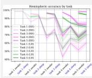

## Graphical Abstract

In Two Minds about Lifelong Learning: Exploring Hemispheric Redundancy and Specialisation in Neural Models

Benjamin Smith, Levin Kuhlmann, Kaushik Roy, Gideon Kowadlo

Latent spaces with synthetic sample confidence measures

In Two Minds about Lifelong Learning

Exploring Hemispheric Redundancy and Specialisation in Neural Models

Modelling biological features of memory consolidation:   
hippocampal replay, REM sleep, and bilateral redundancy

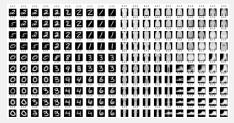  
The problem: catastrophic forgetting

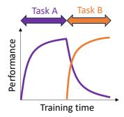  
Training on new data while awake; selftraining consolidation during sleep  
Effective protection against forgetting Split-MNIST: 96.2% Split-Fashion-MNIST: 80.2%  
Emergent behaviour of hemispheric specialisation (Novelty vs Routinisation)

# In Two Minds about Lifelong Learning: Exploring Hemispheric Redundancy and Specialisation in Neural Models

Benjamin Smitha,\*, Levin Kuhlmanna, Kaushik Royc, Gideon Kowadlo1,b

aData Science and AI, Monash University, Wellington Road, Clayton, 3800, Victoria, Australia bCerenaut, Victoria, Australia cCSIRO Robotics, CSIRO, Australia

## Abstract

Persistent intelligent systems require the ability to learn continually, but current machine learning approaches face significant challenges in this area compared to biological learning systems. Machine learning algorithms typically trade off retention of previously learned information and adaptation to new or changing data patterns. When continual learning capabilities are absent, algorithms must undergo retraining using the entire data set, an approach that becomes impractical when original training data are unavailable due to storage constraints, financial or computational costs, or privacy restrictions. However, biological animals can learn continually, without experiencing catastrophic forgetting. This paper attempts to build a high-level framework for how animals learn and preserve knowledge by modelling neural components and states that are known to be related to memory consolidation. We focus on three concepts: experience replay, REM sleep, and bilaterality. We propose 4MAS (4 Module Awake/Sleep), a novel macroarchitecture demonstrating how machine learning models might benefit from asymmetric hemispheres, each with their own long- and short-term memory mechanisms, and how a period of sleep between incremental learning tasks might benefit memory consolidation. Finally, we present results showing that our architecture achieves competitive results on the Split-MNIST, Split-Fashion-MNIST and Split-CIFAR-100 datasets, with 98.3%, 84.9%, and 29.29% accuracy re-

spectively.

Keywords: Continual Learning, Lifelong Learning, Experience Replay, Bilateral Deep Learning

## 1. Introduction

Contemporary artificial neural networks suffer from catastrophic forgetting (or catastrophic interference) [1, 2], where learning new tasks rapidly erodes previously acquired skills. While standard training assumes independent, identically distributed (i.i.d.) data, real-world applications present sequentially correlated distributions where class presentation frequencies vary arbitrarily.

This forgetting stems from the stability-plasticity dilemma: adapting weights to new data modifies parameters that are critical for earlier tasks [3, 4]. Joint training across all data streams is fundamentally impossible in continual learning settings where future data are unavailable and past data are restricted by storage or privacy constraints. Naive sequential fine-tuning, while feasible, suffers from severe catastrophic forgetting. Continual learning algorithms seek to resolve this dilemma without full dataset retraining.

In contrast, biological brains mitigate forgetting through specialised neural architectures and consolidation states. The mammalian hippocampus uses experience replay to weave together recent and distant memories, transferring knowledge to the neocortex during sleep [5, 6, 7]. Furthermore, sleep phases like rapid-eye-movement (REM) sleep exhibit highly coordinated bilateral (inter-hemispheric) activity, which contrasts with the unihemispheric states of slow-wave sleep [8, 9]. Finally, there is evidence that biological brains leverage two lateralised cortical hemispheres that acquire distinct representations, with the right hemisphere handling novel information and the left hemisphere optimised for stable routine tasks [10, 11].

Existing generative replay methods such as Generative Replay struggle to scale because a single generator must capture all historical distributions, leading to compounding representational drift [12]. To address these limitations, we propose 4MAS (4 Module Awake/Sleep), a novel continual learning macroarchitecture that implements two asymmetric hemispheres—each with dedicated short- and long-term memory modules—and an explicit offline sleep phase for cross-hemispheric consolidation; representing hippocampus and neocortex respectively. By distributing replay across two specialised generators and anchoring the latent space during sleep, 4MAS minimises representational drift.

Our main contributions are:

• We propose a dual-hemisphere continual learning architecture (4MAS) that splits generative replay across specialised exploratory and conservative models, mimicking biological lateralisation.

• We introduce an explicit wake-sleep training cycle that uses crosshemispheric consolidation (mutual fine-tuning during a simulated sleep phase) to stabilise latent spaces and prevent representational drift.

• We demonstrate that 4MAS achieves competitive Class-IL accuracies on Split-MNIST (98.3%), Split-Fashion-MNIST (84.9%), and Split-CIFAR-100 (29.29%); while displaying extremely low representational drift across tasks.

## 1.1. Biological motivation

Inspired by this neurobiological template, 4MAS employs two generative long-term memories as an asymmetrical ensemble: one retains plasticity for novel task acquisition, while the other stabilises historical patterns. Generative memories are paired with short-term memory buffers, allowing for rehearsal akin to hippocampal replay. Training follows an ultradian-inspired cycle, alternating between a unihemispheric awake phase for task learning and a bilateral sleep phase for cross-hemispheric memory harmonisation.

## 2. Background and related work

Continual learning is typically evaluated under three scenarios [13] of increasing difficulty:

• Task-IL (Task Incremental Learning): The model learns a sequence of tasks with distinct data distributions and separate output spaces. The task identity is explicitly provided during both training and inference, allowing the model to select task-specific parameters or heads.

• Domain-IL (Domain Incremental Learning): The model is exposed to a sequence of tasks with varying input distributions that share a common output space. The task identity is never provided, requiring the model to adapt to changing domains without contextual routing.

• Class-IL (Class Incremental Learning): The most challenging paradigm, where both input distributions and output spaces vary across tasks. No task identifiers are available at training or inference. The model must classify inputs across all classes seen so far, making it highly susceptible to catastrophic forgetting.

When evaluating these models, performance is typically benchmarked against fine-tuning (sequential training without forgetting mitigation; lower bound) and joint-training (simultaneous training on all data; upper bound). To bridge the gap to joint-training under Class-IL constraints, algorithms are commonly grouped into regularisation, parameter isolation, and rehearsal.

## 2.1. Regularisation

Regularisation methods restrict gradient updates to protect parameters that are critical for prior tasks. Early approaches froze lower layers of a network after training on a task [14]. Modern algorithms estimate parameter importance by calculating contribution to loss reduction (e.g., Synaptic Intelligence [15]), approximating Bayesian inference (e.g., Elastic Weight Consolidation [4]), or evaluating output function sensitivity (e.g., Memory Aware Synapses [16]). Recent methods perform geometric analysis to locate stable flat minima in the distribution manifold [17, 18] or approximate prior losses using the Hessian matrix eigenvalues [19].

While regularisation is highly effective in Task-IL, it struggles in Class-IL [20]. The strict constraints designed to protect existing knowledge prevent the model from adapting to novel classes, leading to representational paralysis as constraints accumulate over sequential tasks [18].

## 2.2. Parameter isolation

Parameter isolation limits training to a subset of parameters or dynamically expands the network structure. A common design adds task-specific output heads to a pretrained feature-extractor backbone [21, 22]. Under network expansion, the network freezes historical weights and adds new neurons or columns for each task [23, 24]. Another branch of research leverages Adaptive Resonance Theory to dynamically create category nodes as new distributions appear [25].

However, these approaches struggle in Class-IL settings because they require task identity during inference to route data to the appropriate subnetwork. Without explicit task identifiers, the model lacks an intrinsic mechanism for choosing the correct task pathway. Although sparse neural activation in large networks can mitigate routing issues [26], parameter isolation remains difficult to scale without introducing capacity exhaustion or inference-routing failures [27, 28].

## 2.3. Rehearsal: replay and generative replay

Rehearsal techniques interleave historical data with new task inputs. Experience replay stores a memory buffer of real samples from earlier tasks, and Gradient Episodic Memory (GEM) uses those stored examples as inequality constraints on each update so the loss on previous tasks does not increase which reduces forgetting while still allowing positive backward transfer [29]. Maximally Interfered Retrieval (MIR) instead keeps a finite replay memory, estimates the parameter update from the current batch, and then replays the buffered samples whose losses would increase the most under that update, making it distinct from GEM because it prioritises most-interfered samples rather than enforcing explicit gradient constraints [30]. AdaER further adapts replay by using Contextually-Cued Memory Recall to select memories based on both data-conflicting and task-conflicting cues, and it also updates the buffer with Entropy-Balanced Reservoir Sampling to keep a more balanced, informative memory, distinguishing it from MIR's interference-only retrieval and GEM's constraint-based updates [31].

While buffer-based replay is effective, it scales poorly because representing complex, high-dimensional distributions requires a prohibitive number of stored samples [32].

Generative replay avoids storing real data by training a generative model to synthesise historical inputs [33]. To scale beyond simple datasets, models reconstruct latent feature representations rather than raw training samples. For example, Generative Feature Replay (GFR) uses a feature extractor to train a generator on latent distributions [34], mimicking biological systems where memory replay occurs at representational rather than raw sensory levels [35]. Brain-Inspired Replay (B-IR) combines generative replay with parameter isolation to achieve state-of-the-art results [12]. Nonetheless, generative models suffer from representational drift as the feature extractor updates over time, requiring distillation constraints or frozen features to anchor the latent space [36].

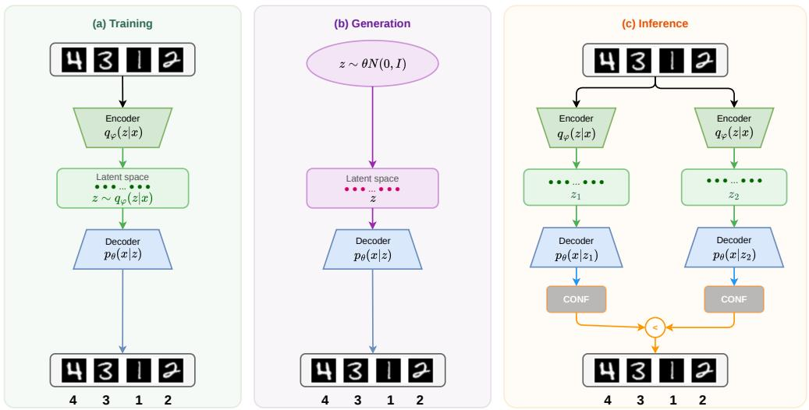  
Figure 1: Long-term memory inputs and outputs: (a) LTM training on image-label pairs. (b) Synthetic sample generation with temperature τ. (c) Inference confidence-based selection.

## 3. Methods

We present 4MAS (4 Module Awake/Sleep), a macroarchitecture for continual learning designed to model biological memory consolidation processes. As illustrated in Figure 1, the system consists of two lateralised hemispheres. Each hemisphere contains:

1. A generative Long-Term Memory (LTM) representing the neocortex, which learns task distributions and classifies incoming data.

2. A Short-Term Memory (STM) buffer representing the hippocampus, which stores a small set of episodic exemplars.

The architecture restricts data flow to a biologically inspired model where task acquisition is unihemispheric and offline consolidation is bilateral, facilitating knowledge transfer and specialisation.

## 3.1. Benchmarks and experimental design

To evaluate 4MAS under the Class-IL constraint, we employ Split-MNIST [37, 38] and Split-Fashion-MNIST [39, 40], shown in Figure 2. The standard 10-class datasets are split into 5 sequential tasks of 2 classes each, presented without task identifiers at both training and inference. Hyperparameter tuning and initial method development were conducted primarily on these two MNIST variants. To test scalability and out-of-the-box generalizability, we then expanded evaluation to the more challenging Split-CIFAR-100 dataset [38]. Unless otherwise stated, each configuration is run for 10 random seeds, and we report the mean and standard error of the mean of each metric across seeds. The model trains for 10 epochs per class, with a synthetic epoch length of 10,000 samples. Ablation studies disentangle the contributions of the STM buffers, the dual-hemisphere ensemble, and the sleep phase.

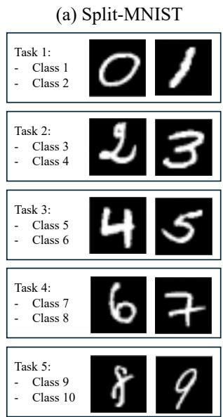

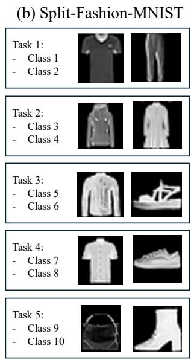  
Figure 2: Class-IL datasets: (a) Split-MNIST, (b) Split-Fashion-MNIST.

## 3.2. Sleep/wake phases

The training cycle alternates between a unihemispheric “awake" phase and a bilateral "sleep" phase for each task, Figure 3. During the awake phase, Algorithm 1, each LTM hemisphere is trained on three randomly interleaved sources: new task data, exemplars stored in the ipsilateral STM from prior tasks, and self-generated synthetic samples. After training, the LTM evaluates the training data and updates its STM buffer with samples that meet the selection criteria (Section 3.4).

During the sleep phase, Algorithm 2, LTMs undergo fine-tuning on contralateral representations (generations from the opposite LTM and exemplars from the opposite STM) during a period where no new training data are available. To allow subtle adjustments to internal representations without destroying learned task-specific parameters, the sleep learning rate is scaled down by a multiplier $\lambda \ : = \ : 0 . 1$ , mimicking the lower firing rates observed across brain regions during REM sleep [41].

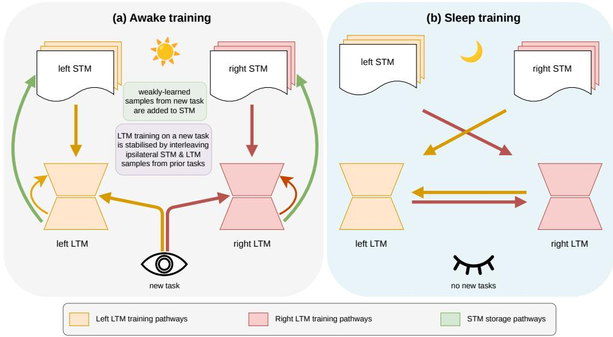  
Figure 3: Awake/sleep training phases: (a) Awake training: LTMs learn new task data interleaved with STM samples. (b) Sleep training: LTMs are fine-tuned on contralateral representations.

Algorithm 1 Incremental task – awake phase   
1: Input: Task $t \in [ 1 , \infty )$ , learning rate $\alpha ,$ model parameters $\theta _ { l e f t } , \ \theta _ { r i g h t } .$   
memories $\mathcal { M } _ { l e f t } , \mathcal { M } _ { r i g h t }$ , classes seen $C ,$ memory capacity $M$   
2: for $h \in \{ l e f t , r i g h t \}$ do   
3: $w  \{ w _ { i } \} _ { i = 1 } ^ { C }$ where $w _ { i } = 1 / C$   
4: for $e = 1 \ldots E _ { a w a k e }$ do   
5: Draw batch $\beta _ { t }$ from $\mathcal { D } _ { t } .$   
6: if $t > 1$ then generate replay $\mathcal { G } _ { h } \sim p _ { \theta _ { h } } ( x | z )$ and set $\beta  \beta _ { t } \cup \mathcal { G } _ { h } \cup$   
$\mathcal { M } _ { h }$ else $\beta \gets \beta _ { t }$   
7: $\beta \gets$ class\_weighted\_rebalance $( \beta , w )$   
8: $\theta _ { h } \gets \theta _ { h } - \alpha \nabla _ { \theta } \mathcal { L } ( \theta _ { h } ; \beta )$   
9: $g $ bincount $\big ( \mathop { \mathrm { a r g } } \mathop { \mathrm { m a x } } _ { c } \hat { y } ( \mathcal { G } _ { h } ) \big )$   
10: $w  \{ 1 / ( g _ { i } + \stackrel { \cdot } { \varepsilon } ) \} _ { i = 1 } ^ { C }$   
11: end for   
12: for $i = 1 \ldots C$ do   
13: $\mathcal { P } _ { h , i }  \mathrm { O v e r s a m p l e } ( \mathcal { D } _ { t , i } \cup \mathcal { M } _ { h , i } )$ Expand candidate pool for   
class i   
14: $\mathcal { M } _ { h , i } \gets \mathrm { T o p K } _ { \lfloor M / C \rfloor } \Big ( \mathcal { P } _ { h , i } , C O N F ( \hat { y } ) \Big )$ Select top-k highest   
confidence   
15: end for   
16: $\textstyle \mathcal { M } _ { h } \gets \bigcup _ { i = 1 } ^ { C } \mathcal { M } _ { h , i }$   
17: end for

Algorithm 2 Incremental task – sleep phase   
1: Input: Task $t \in [ 1 , \infty )$ , learning rate α, models $\theta _ { l e f t } , \ \theta _ { r i g h t }$ , memories   
$\mathcal { M } _ { l e f t } , \mathcal { M } _ { r i g h t }$ , sleep learning multiplier $\lambda = 0 . 1$   
2: for h in $\{ l e f t , r i g h t \}$ do   
3: $w  \{ w _ { i } \} _ { i = 1 } ^ { C }$ where $w _ { i } = 1 / C$   
4: for $e = 1 : E _ { s l e e p }$ do   
5: $\beta  \theta _ { h } ( z ) \cup \mathcal { M } _ { h }$   
6: $\tau _ { h } \gets \theta _ { h } - \lambda \alpha \nabla _ { \tau } \mathcal { L } ( \theta _ { h } ; \beta )$   
7： end for   
8: end for

## 3.3. Long-term memories

Each LTM is both a generator and a classifier within a single variational auto-encoder (VAE). The classification vector is appended to the input image, and the model is trained to reconstruct the joint vector $x \frown y$ This joint parameter space ensures that synthetic images and labels are tightly coupled. Let $\hat { y }$ denote the reconstructed label channel, normalised over the $C$ classes seen so far. We define prediction confidence as the negative cross-entropy of $\hat { y }$ against its own arg-max class:

$$
\boldsymbol { C O N F } ( \hat { \boldsymbol { y } } ) = - \mathcal { L } _ { \boldsymbol { C E } } \big ( \hat { \boldsymbol { y } } , \mathrm { o n e h o t } ( \arg \operatorname* { m a x } _ { c } \hat { \boldsymbol { y } } _ { c } ) \big ) = \log \operatorname* { m a x } _ { c } \hat { \boldsymbol { y } } _ { c }\tag{1}
$$

CON $F \in ( - \infty , 0 ]$ , with larger values indicating higher confidence. Since $\mathcal { L } _ { C E }$ is the same term the VAE minimises on the label channel, Equation 1 doubles as a measure of reconstruction quality and requires no separate discriminative head, providing stability when learning new tasks [42]. Confidence is used in three places: rejecting low-confidence generations during replay, ranking candidates for STM storage (Section 3.4), and arbitrating between hemispheres at inference.

Standard VAE latent sampling $z \sim \mathcal { N } ( 0 , I )$ can suffer from posterior collapse, producing low-variance synthetic samples that degrade replay quality over sequential tasks. To resolve this, we apply a temperature gain $\tau$ to the latent coordinates during sampling: $ { \boldsymbol { z } } = \tau  { \boldsymbol { X } } ,  { \boldsymbol { X } } \sim  { \boldsymbol { \mathcal { N } } } ( 0 , I )$ [43]. Setting $\tau > 1$ expands the explored region of the latent space, generating sharper and more diverse samples, Figure 4. During replay, low-confidence generations near class boundaries are rejected to avoid interpolating between classes. At inference, inputs are processed by both LTMs, and the class prediction from the hemisphere with higher confidence is selected. To maintain class balance during replay, generation frequencies are weighted inversely to generation counts Algorithm 1, line 10, biased linearly by task age.

## 3.4. Short-term memories and lateralisation

Each STM acts as a memory buffer storing 50 exemplars. We evaluate two buffer storage selection mechanisms:

1. Comparative Confidence Selection (CCS): Samples from the task and prior STM are passed through the post-training LTM and ranked by confidence. In symmetric configurations, moderate-confidence quantile range samples $( \sim 5 0 \% )$ are selected in both hemispheres to represent distribution boundaries while retaining discernibility. Under asymmetric configurations, STM storage selection is also lateralised: the Left Hemisphere selects high-confidence anchor samples to reinforce representations against drift, while the Right Hemisphere selects moderate-confidence samples to explore decision boundaries. Specifically, we filter replay samples using the raw probability maxc $\hat { y } _ { c } =$ $\exp ( C O N F ( \hat { y } ) ) ~ \in ~ [ 0 , 1 ]$ , retaining candidates within the moderateconfidence quantile range $\{ L , R \} = \{ 0 . 1 , 0 . 5 \}$ . This design helps avoid VAE posterior collapse and representational drift.

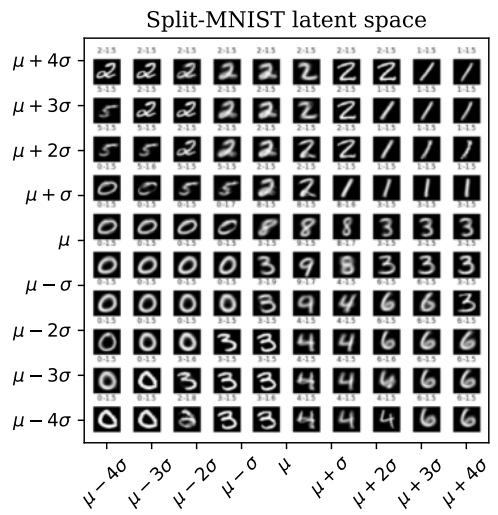

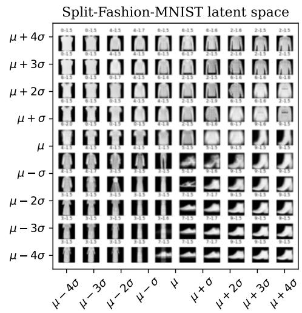  
Figure 4: 2-dimensional mapping of the LTM's latent space after training. τ scales the sampling radius in units of the prior standard deviation. High temperature τ > 1 increases the diversity of output representations (16 latent dimensions used in final configurations)

2. Latent Space Cluster Centroids (LSCC): We apply K-Means clustering in the VAE latent space across task and STM samples, retaining exemplars closest to the centroids. This grounds representations and further prevents representational drift.

To model biological hemispheric lateralisation (stability vs. plasticity), we configure hyperparameter asymmetry. The Left Hemisphere (LH) is configured for stability and routine processing (lower generator temperature τ and task-age bias favouring older tasks). The Right Hemisphere (RH) is configured for plasticity and exploration (higher generator temperature τ and no age bias), enabling rapid adaptation to novel distributions.

## 4. Results and discussion

Our results show that 4MAS achieves competitive Class-IL accuracies across all benchmarks: $9 8 . 3 \pm 0 . 0 \%$ on Split-MNIST, $8 4 . 9 \pm 0 . 3 \%$ on Split-Fashion-MNIST, and $2 9 . 2 9 \pm 0 . 2 9 \%$ on Split-CIFAR-100 (Table 1). These results are competitive with other recent Class-IL methods, such as B-IR (93.5%, 74.6%, and 27.85% accuracy) [38] and AdaER (89.6% and 74.0% accuracy) [31]. As shown in Table 1, 4MAS demonstrates strong resilience to catastrophic forgetting. On Split-MNIST, 4MAS achieves 98.3% accuracy, closely matching the Joint training ceiling of 98.0%. On Split-Fashion-MNIST, our method achieves $8 4 . 9 \pm 0 . 3 \%$ , representing a significant advancement over B-IR $( 7 4 . 6 \pm 0 . 4 \% )$ and GR $( 7 1 . 3 \pm 0 . 3 \% )$ . This performance boost is directly tied to our low Forgetting scores (1.0% on Split-MNIST, 10.6% on Split-Fashion-MNIST) and exceptionally low representational drift (1.2 and 1.0, respectively, compared to GR's 215.0 and 48.5). This demonstrates that the dual-hemisphere and sleep-phase architecture stabilises internal latent representations, preventing the drift that typically destabilises singlegenerator networks.

On the challenging Split-CIFAR-100 dataset and when scaling each architecture to 140M trainable parameters, 4MAS improves on the unilateral B-IR baseline $( 2 7 . 8 5 \pm 0 . 5 5 \% )$ and significantly outperforms other generative replay methods. The performance gap relative to Joint training $( 5 1 . 9 \pm 0 . 4 \% )$ is primarily due to the expressive capacity of the standard flat VAE decoder, which struggles to reconstruct high-frequency details for 100 complex classes.

## 4.1. Backward and Forward Transfer Analysis

To evaluate how sequence learning affects historical and future task performance, we analyze Backward Transfer (BWT) and Forward Transfer (FWT), as defined in [29]:

$$
\mathrm { B W T } = \frac { 1 } { T - 1 } \sum _ { i = 1 } ^ { T - 1 } ( R _ { T , i } - R _ { i , i } ) , \quad \mathrm { F W T } = \frac { 1 } { T - 1 } \sum _ { i = 2 } ^ { T } ( R _ { i - 1 , i } - \bar { b } _ { i } )\tag{2}
$$

where $R _ { T , i }$ represents test accuracy on task i after training on task $T .$ and ${ \bar { b } } _ { i }$ denotes random baseline performance for task i.

Table 1: Class-IL evaluation across Split-MNIST, Split-Fashion-MNIST, and Split-CIFAR-100 benchmarks. Accuracy metrics report final task performance after learning all tasks.
<table><tr><td>Dataset</td><td>Method</td><td>Final Acc (%)</td><td>Forgetting (%)</td><td>BWT (%)</td><td>FWT (%)</td><td>Compute (x)</td></tr><tr><td rowspan="9">Split-MNIST</td><td>Joint</td><td>98.5 ± 0.0</td><td>1.0</td><td>-1.0</td><td>0.0</td><td>1.0</td></tr><tr><td>4MAS (Our method)</td><td>98.3 ± 0.0</td><td>1.2</td><td>-1.2</td><td>0.0</td><td>1.0</td></tr><tr><td>B-IR</td><td>93.5 ± 0.2</td><td>6.4 ± 0.2</td><td>−6.4 ± 0.2</td><td>0.2 ± 0.0</td><td>0.2 ± 0.0</td></tr><tr><td>GR</td><td>91.2 ± 0.4</td><td>8.9 ± 0.4</td><td>−8.9 ± 0.4</td><td>0.3 ± 0.0</td><td>42.1 ± 1.8</td></tr><tr><td>LwF</td><td>24.2 ± 0.4</td><td>0.1</td><td>0.1</td><td>0.0</td><td>15.2</td></tr><tr><td>EWC</td><td>19.9 ± 0.0</td><td>79.2</td><td>-79.2</td><td>0.0</td><td>61.3</td></tr><tr><td>oEWC</td><td>19.9 ± 0.0</td><td>79.2</td><td>-79.2</td><td>0.0</td><td>58.1</td></tr><tr><td>SI</td><td>19.9 ± 0.0</td><td>79.3</td><td>-79.3</td><td>0.0</td><td>33.5</td></tr><tr><td>Fine-Tuning</td><td>19.7 ± 0.1</td><td>79.5 ± 0.1</td><td>−79.5 ± 0.1</td><td>0.3 ± 0.0</td><td>84.2 ± 2.8</td></tr><tr><td rowspan="9">Split-Fashion-MNIST</td><td>Joint</td><td>88.3 ± 0.2</td><td>7.5 ± 0.2</td><td>−7.5 ± 0.2</td><td>0.0</td><td>1.0</td></tr><tr><td>4MAS (Our method)</td><td>84.9 ± 0.3</td><td>10.6</td><td>-10.6</td><td>0.0</td><td>1.0</td></tr><tr><td>B-IR</td><td>74.6 ± 0.4</td><td>30.2 ± 0.3</td><td>−30.2 ± 0.3</td><td>0.5 ± 0.0</td><td>0.2 ± 0.0</td></tr><tr><td>GR</td><td>71.3 ± 0.3</td><td>25.4 ± 0.3</td><td>−25.4 ± 0.3</td><td>0.6 ± 0.1</td><td>48.5 ± 2.3</td></tr><tr><td>LwF</td><td>20.1 ± 0.2</td><td>0.3</td><td>0.3</td><td>0.0</td><td>12.9</td></tr><tr><td>EWC</td><td>19.9 ± 0.0</td><td>79.2</td><td>-79.2</td><td>0.0</td><td>55.5</td></tr><tr><td>oEWC</td><td>19.8 ± 0.4</td><td>79.2</td><td>-79.2</td><td>0.0</td><td>50.3</td></tr><tr><td>SI</td><td>19.9 ± 0.0</td><td>79.3</td><td>-79.3</td><td>0.0</td><td>30.4</td></tr><tr><td>Fine-Tuning</td><td>20.0 ± 0.0</td><td>79.4 ± 0.0</td><td>−79.4 ± 0.0</td><td>0.5 ± 0.1</td><td>77.3 ± 2.3</td></tr><tr><td rowspan="8">Split-CIFAR-100</td><td>Joint</td><td>51.9 ± 0.4</td><td>16.2 ± 0.4</td><td>−16.2 ± 0.4</td><td>0.0</td><td>2.4</td></tr><tr><td>4MAS (Our method, 140M)</td><td>29.29 ± 0.29</td><td>25.8 ± 1.2</td><td>−25.8±1.2</td><td>0.0</td><td>0.43 ± 0.07</td></tr><tr><td>GR</td><td>7.9 ± 0.1</td><td>66.1 ± 0.5</td><td>−66.1 ± 0.5</td><td>0.0</td><td>10.3</td></tr><tr><td>B-IR (140M)</td><td>27.85 ± 0.55</td><td>52.9</td><td>-52.9</td><td>0.0</td><td>5.1</td></tr><tr><td>LwF</td><td>10.8 ± 0.2</td><td>4.6 ± 0.3</td><td>−3.9 ± 0.3</td><td>0.0</td><td>1.9</td></tr><tr><td>EWC</td><td>8.1 ± 0.1</td><td>81.6 ± 0.4</td><td>−81.6 ± 0.4</td><td>0.0</td><td>4.2</td></tr><tr><td>SI</td><td>9.2 ± 0.2</td><td>79.8 ± 0.4</td><td>−79.8 ± 0.4</td><td>0.0</td><td>3.1</td></tr><tr><td>Fine-Tuning</td><td>8.1 ± 0.1</td><td>81.3 ± 0.4</td><td>−81.3 ± 0.4</td><td>0.0</td><td>3.6</td></tr></table>

Backward Transfer Dynamics.. Table 1 demonstrates that 4MAS consistently minimises negative BWT compared to existing baselines. On Split-MNIST, Split-Fashion-MNIST, and Split-CIFAR-100, 4MAS achieves BWT scores of -1.2%, -10.6%, and —25.8% respectively, significantly outperforming competitive memory and replay methods (B-IR and GR). 4MAS tracks closely with the offline Joint Training baseline (e.g., -25.8% vs. -16.2% on CIFAR-100), confirming that our approach effectively freezes and preserves past decision boundaries during new class assimilation.

Forward Transfer Limitations in Class-IL.. Across all methods, FWT remains near 0.0%. This behaviour is characteristic of Class-IL benchmarks evaluated from scratch: without a shared pre-trained feature extractor, feature representations learned on early tasks do not inherently transfer zeroshot accuracy to orthogonal class boundaries in subsequent tasks. Thus, performance superiority in 4MAS is driven almost entirely by backward stability rather than forward inductive bias.

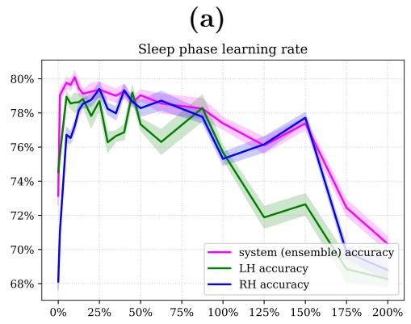

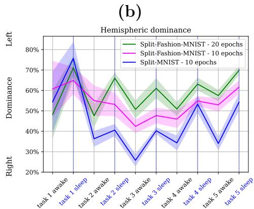  
Figure 5: (a) Performance variation with sleep phase learning rates (LR) as a percentage of awake phase LR, Split-Fashion-MNIST. (b) Memory consolidation during sleep phase increased LH dominance, while new task learning during awake phase increased RH dominance; produced by lateralisation techniques (class representation bias by age in LH and asymmetric generator temperatures)

## 4.2. Sleep tuning

We evaluated sleep phase learning rates (LR) ranging from 0% to 200% of the awake phase rate (Figure 5a). On Split-Fashion-MNIST a reduced sleep rate of $5 – 1 0 \% ( \approx 2 \times 1 0 ^ { - 5 } )$ performed best $( 8 4 . 9 \pm 0 . 3 \% )$ , while removing sleep $( L R = 0 \% )$ yielded $7 4 . 0 \pm 0 . 5 9 \%$ . Larger learning rates degraded performance, confirming that low sleep learning rates enable fine-tuning on the contralateral representation without overwriting specialised features.

Furthermore, average ensemble accuracy exceeded either isolated hemisphere. This gain stems from effective confidence-based routing between specialised hemispheres rather than standard ensemble variance reduction; indeed, without sleep-phase consolidation, the ensemble fails to outperform the strongest individual hemisphere (Section 4.6). Hemispheric dominance shifted dynamically: wake training on new tasks increased RH dominance, while sleep consolidation restored LH dominance (Figure 5b). This shift aligns with Goldberg's Novelty-Routine hypothesis, reflecting a transition from initial RH-driven processing of novel representations to consolidated, routinised LH schemas.

## 4.3. Lateralisation

Figure 6a shows that the LH accuracy decays slowly, maintaining stability, while the RH learns new tasks quickly but forgets faster, supporting the stability-plasticity lateralisation described in the Novelty-Routine hypothesis [44]. Lateralising the generator temperature (τ) significantly improved performance (Table 2, Figure 6b). Symmetrical temperatures $( \tau = 1 \mathrm { o r } \tau = 2$ for both) caused degraded performance or limited sleep benefits, whereas asymmetrical configurations $( \tau = 1$ for LH, $\tau \in [ 2 , 4 ]$ for RH) showed consistent performance gains after each sleep phase. This indicates that specialisation, elicited by asymmetrical parameterisation, provides an advantage and better use of total resources.

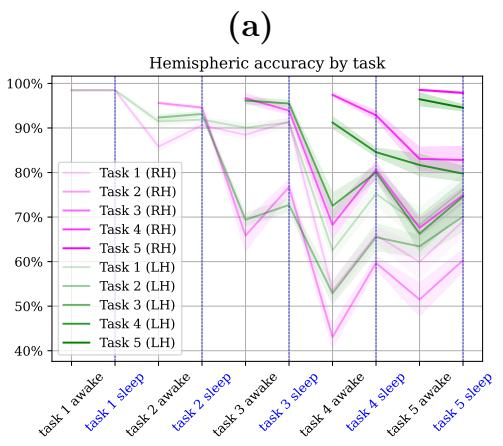

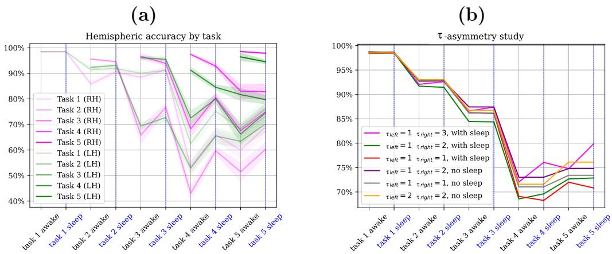

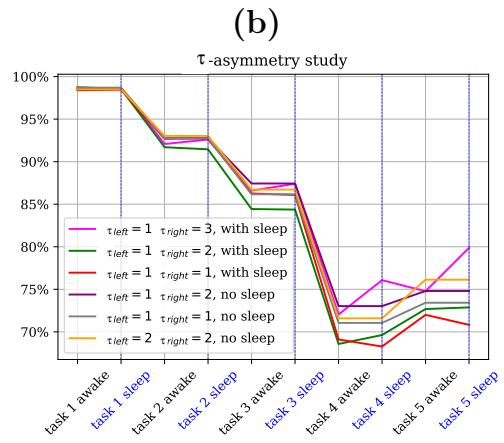

Figure 6: Fashion-MNIST: (a) Hemispheric accuracy for each task. (b) τ-asymmetry results, with and without sleep training phase.
<table><tr><td rowspan=2 colspan=2></td><td rowspan=1 colspan=5>τ - right</td></tr><tr><td rowspan=1 colspan=1>1</td><td rowspan=1 colspan=1>2</td><td rowspan=1 colspan=1>3</td><td rowspan=1 colspan=1>4</td><td rowspan=1 colspan=1>5</td></tr><tr><td rowspan=5 colspan=1>T-- - t</td><td rowspan=1 colspan=1>1</td><td rowspan=1 colspan=1>0.6301</td><td rowspan=1 colspan=1>0.7122</td><td rowspan=1 colspan=1>0.7445</td><td rowspan=1 colspan=1>0.7132</td><td rowspan=1 colspan=1>0.6984</td></tr><tr><td rowspan=1 colspan=1>2</td><td rowspan=1 colspan=1>0.7021</td><td rowspan=1 colspan=1>0.6895</td><td rowspan=1 colspan=1>0.6662</td><td rowspan=1 colspan=1>0.6342</td><td rowspan=1 colspan=1>0.6178</td></tr><tr><td rowspan=1 colspan=1>3</td><td rowspan=1 colspan=1>0.6768</td><td rowspan=1 colspan=1>0.6116</td><td rowspan=1 colspan=1>0.5907</td><td rowspan=1 colspan=1>0.5595</td><td rowspan=1 colspan=1>0.5504</td></tr><tr><td rowspan=1 colspan=1>4</td><td rowspan=1 colspan=1>0.6593</td><td rowspan=1 colspan=1>0.6128</td><td rowspan=1 colspan=1>0.5561</td><td rowspan=1 colspan=1>0.5551</td><td rowspan=1 colspan=1>0.5233</td></tr><tr><td rowspan=1 colspan=1>5</td><td rowspan=1 colspan=1>0.6453</td><td rowspan=1 colspan=1>0.576</td><td rowspan=1 colspan=1>0.5417</td><td rowspan=1 colspan=1>0.555</td><td rowspan=1 colspan=1>0.5148</td></tr></table>

Table 2: LH and RH generator temperature vs Split-Fashion-MNIST accuracy. Degraded performance observed for symmetrical temperatures.

Applying a task-age class representation bias to the LH only (biasing training toward older tasks) improved the retention of earlier tasks by 15-26% (Figure 7a), allowing the ensemble to retain stability in LH while maintaining plasticity in RH.

<table><tr><td rowspan=2 colspan=2></td><td rowspan=1 colspan=7>Confidence - RH</td></tr><tr><td rowspan=1 colspan=1>90%</td><td rowspan=1 colspan=1>70%</td><td rowspan=1 colspan=1>50%</td><td rowspan=1 colspan=1>30%</td><td rowspan=1 colspan=1>10%</td><td rowspan=1 colspan=1>0%</td><td rowspan=1 colspan=1>K-Means</td></tr><tr><td rowspan=7 colspan=1>Coe  nH</td><td rowspan=1 colspan=1>90%</td><td rowspan=1 colspan=1>0.7562</td><td rowspan=1 colspan=1>0.7662</td><td rowspan=1 colspan=1>0.7668</td><td rowspan=1 colspan=1>0.7668</td><td rowspan=1 colspan=1>0.7536</td><td rowspan=1 colspan=1>0.7505</td><td rowspan=1 colspan=1>0.7656</td></tr><tr><td rowspan=1 colspan=1>70%</td><td rowspan=1 colspan=1>0.7618</td><td rowspan=1 colspan=1>0.7724</td><td rowspan=1 colspan=1>0.7753</td><td rowspan=1 colspan=1>0.7725</td><td rowspan=1 colspan=1>0.7607</td><td rowspan=1 colspan=1>0.7589</td><td rowspan=2 colspan=1>0.77960.7779</td></tr><tr><td rowspan=1 colspan=1>50%</td><td rowspan=1 colspan=1>0.7695</td><td rowspan=1 colspan=1>0.7706</td><td rowspan=1 colspan=1>0.7733</td><td rowspan=1 colspan=1>0.7667</td><td rowspan=1 colspan=1>0.7648</td><td rowspan=1 colspan=1>0.7573</td></tr><tr><td rowspan=1 colspan=1>30%</td><td rowspan=1 colspan=1>0.7703</td><td rowspan=1 colspan=1>0.7718</td><td rowspan=1 colspan=1>0.7758</td><td rowspan=1 colspan=1>0.7627</td><td rowspan=1 colspan=1>0.7565</td><td rowspan=1 colspan=1>0.7247</td><td rowspan=1 colspan=1>0.7799</td></tr><tr><td rowspan=1 colspan=1>10%</td><td rowspan=1 colspan=1>0.7673</td><td rowspan=1 colspan=1>0.7704</td><td rowspan=1 colspan=1>0.7675</td><td rowspan=1 colspan=1>0.7509</td><td rowspan=1 colspan=1>0.7351</td><td rowspan=1 colspan=1>0.727</td><td rowspan=1 colspan=1>0.7757</td></tr><tr><td rowspan=1 colspan=1>0%</td><td rowspan=1 colspan=1>0.7547</td><td rowspan=1 colspan=1>0.7726</td><td rowspan=1 colspan=1>0.7613</td><td rowspan=1 colspan=1>0.7470</td><td rowspan=1 colspan=1>0.7285</td><td rowspan=1 colspan=1>0.7205</td><td rowspan=1 colspan=1>0.7662</td></tr><tr><td rowspan=1 colspan=1>K-Means</td><td rowspan=1 colspan=1>0.7748</td><td rowspan=1 colspan=1>0.7776</td><td rowspan=1 colspan=1>0.7799</td><td rowspan=1 colspan=1>0.7764</td><td rowspan=1 colspan=1>0.7607</td><td rowspan=1 colspan=1>0.7588</td><td rowspan=1 colspan=1>0.776</td></tr></table>

Table 3: Comparison of mechanisms for selecting memories for STM buffer storage. Storing latent space centroids via K-Means clustering produced the most consistent results on Split-Fashion-MNIST, whereas highly asymmetric confidence selection $( L = 0 . 1 / R = 0 . 5 )$ achieved peak performance on the more complex Split-CIFAR-100 benchmark.

## 4.4. STM buffer selection

Evaluating CCS and LSCC selection mechanisms (Table 3) showed that storing moderate-confidence samples (\~ 50%) under CCS performed best, whereas selecting low-confidence outliers led to VAE posterior collapse. Storing latent space cluster centroids via K-Means (LSCC) yielded the best and most consistent results across MNIST and Fashion-MNIST tasks, indicating that the STM buffer is most effective when its primary role is grounding the latent space against representational drift rather than importing weaklylearned outliers. This aligns with neurobiological evidence showing that offline memory reactivation helps to preserve multiday representational stability [45].

The robust performance of the asymmetric threshold configuration $( L =$ $0 . 1 , R = 0 . 5 )$ on CIFAR-100 is explained by a functional division of labour. The left hemisphere, operating at a low generator temperature $( \tau = 1 )$ , behaves as a stable anchor that preserves core, high-confidence representations. By setting a very conservative threshold $( L = 0 . 1 )$ , we prevent representational drift during consolidation. Conversely, the right hemisphere, operating at a high generator temperature $( \tau = 3 )$ , acts as a flexible explorer. Storing intermediate-confidence boundary samples $( R = 0 . 5 )$ allows it to explore variations and refine task boundaries, leading to significantly enhanced ensemble consolidation.

## 4.5. Capacity and architectural scaling

To evaluate how model capacity influences continual learning performance, we systematically compared the parameter scaling behaviour of 4MAS against the unilateral B-IR baseline across Split-MNIST, Split-Fashion-MNIST, and Split-CIFAR-100 (Figure 8).

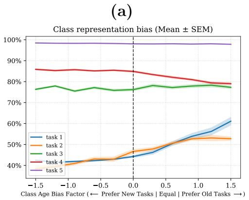

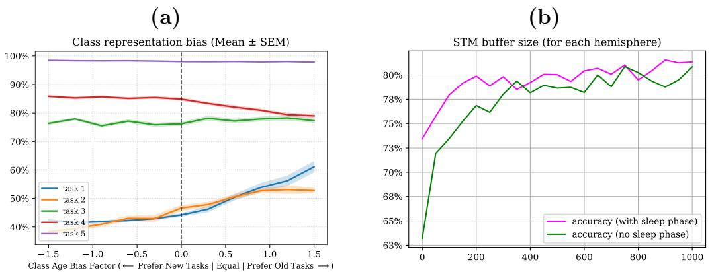

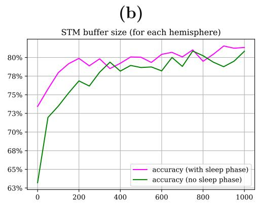  
Figure 7: (a) Biasing class representation by recency; weighting training heavily toward older classes significantly boosts early-class accuracy with only minor performance degradation on recent classes. (b) Effect of STM memory buffer size on accuracy; gains from larger buffers plateau after 200 samples, while also diminishing the relative impact of the sleep phase.

At lower parameter ranges $( \mathrm { e . g . } , \mathrm { < 3 0 M }$ parameters), monolithic generative models demonstrate superior sample and parameter efficiency. This is primarily because 4MAS splits its total parameter budget across two distinct hemispheric models (LH and RH) and requires sleep-phase crossreplay to consolidate knowledge, introducing an architectural capacity overhead. When the overall parameter budget is highly constrained, the splithemisphere bottleneck limits the representation capacity of the individual generators.

However, 4MAS demonstrates superior scalability as model capacity increases. Unilateral networks typically suffer from severe representational drift and catastrophic interference when forced to represent a large number of conflicting class distributions in a single unified latent space [38]. Consequently performance of B-IR (and other unilateral models) plateaus or degrades at larger scales. In contrast, 4MAS's bilateral hemispheric partitioning and stability-plasticity division of labour mitigate representational drift, enabling monotonic scaling. At larger parameter scales (≥ 70 M parameters), 4MAS consistently outperforms B-IR on the more complex Fashion-MNIST benchmark and approaches parity on the CIFAR-100 benchmark.

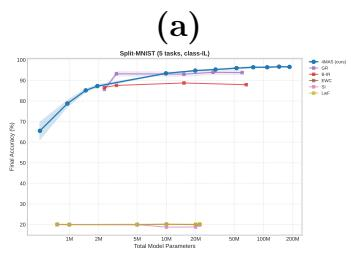

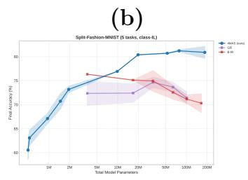

(c)  
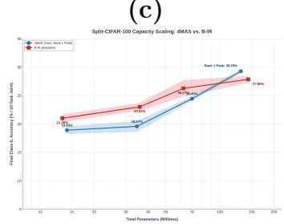  
Figure 8: Capacity scaling curves comparing our bilateral 4MAS architecture against the unilateral B-IR baseline across (a) Split-MNIST, (b) Split-Fashion-MNIST, and (c) Split-CIFAR-100. The plots show final accuracy as a function of total model parameters (in millions).

## 4.6. Ablation studies

To evaluate the contribution of each component, we performed ablations on the STM buffer size, the sleep phase, and the dual-hemisphere structure. Varying the unilateral STM buffer size from 0 to 1,000 samples (Figure 7b) showed diminishing gains beyond 200 samples, improving Split-Fashion-MNIST accuracy from 73.4% (fully ablated STM) to 81.3%. In the absence of a sleep phase, small buffer sizes severely degraded performance (63.2% at size 0), while larger buffers offset this loss, narrowing the sleep phase benefit $\mathrm { t o } < 1 \%$

Ablation comparisons (Figure 9) show that configurations including the sleep phase consistently perform best on both datasets. Without sleep, the ensemble accuracy matches its single best-performing hemisphere, confirming that sleep-based cross-replay is crucial for bilateral knowledge integration. In particular, the comparative confidence levels of each hemisphere are aligned during sleep training, allowing for system accuracy to exceed either hemisphere's individual accuracy.

## 5. Limitations and future work

Generative models in this study were standard non-convolutional VAEs, chosen to evaluate task-agnostic macroarchitectures. Future research should scale generators to convolutional VAEs, GANs, or diffusion models to handle more complex image distributions. Additionally, regularisation mechanisms (e.g., EWC or SI) could be integrated in tandem with our replay structure to further boost stability, as demonstrated in hybrid models like B-IR [12].

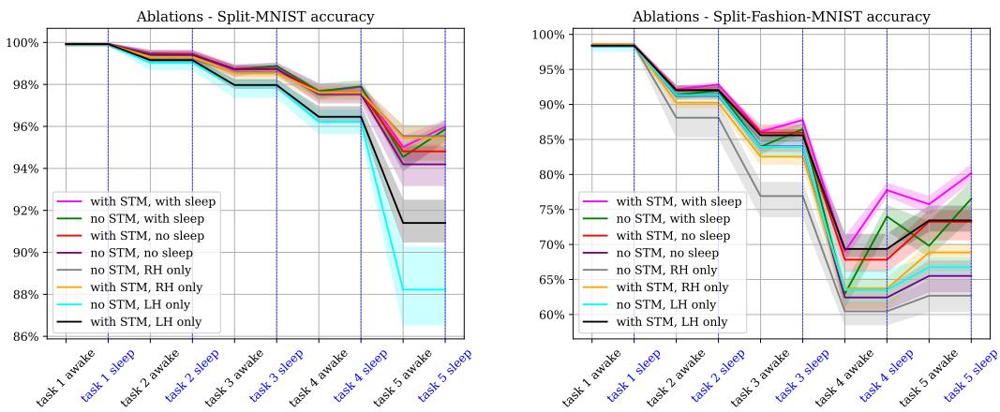  
Figure 9: Ablation performance for Split-MNIST and Split-Fashion-MNIST. Configurations including the sleep phase consistently perform best on both datasets, where sleep informed hemispheric confidence levels lead to system accuracy exceeding individual hemisphere accuracies.

While we evaluated 4MAS up to a 50-task Split-CIFAR-100 benchmark, autonomous agents in the real world require handling longer task horizons. Subsequent work should test 4MAS under unbounded dynamic streams, explore diverse forms of hemispheric asymmetry, and investigate additional biological mechanisms, such as slow-wave sleep modelling, to enhance persistent lifelong learning.

## 6. Conclusion

Lifelong learning in artificial networks remains constrained by catastrophic forgetting. Addressing this challenge, this paper introduced 4MAS, a novel continual learning macroarchitecture derived from biological memory consolidation. By modelling experience replay, bilateral sleep consolidation, and inter-hemispheric lateralisation, 4MAS employs two asymmetric LTM/STM hemispheres that coordinate via a consolidation sleep phase. Our empirical results on Split-MNIST, Split-Fashion-MNIST, and CIFAR-100 demonstrate competitive performance and robust knowledge retention against representational drift. our analysis reveals that functional specialisation is essential to these gains: while symmetrical configurations degraded performance or restricted sleep benefits, asymmetrical parameterisation consistently produced post-sleep performance enhancements, demonstrating that lateralised specialisation improves overall resource utilisation.

This work illustrates how system-level neurobiological structures can be abstracted to manage the stability-plasticity trade-off. Moving beyond local weight-level constraints, system-level bilateral consolidation offers a promising path toward persistent and adaptable artificial intelligence.

## References

[1] B. Wickramasinghe, G. Saha, K. Roy, Continual Learning: A Review of Techniques, Challenges, and Future Directions, IEEE Transactions on Artificial Intelligence 5 (6) (2024) 2526–2546. doi:10.1109/TAI.2023. 3339091. URL https://ieeexplore.ieee.org/document/10341211

[2] M. McCloskey, N. J. Cohen, Catastrophic Interference in Connectionist Networks: The Sequential Learning Problem, in: G. H. Bower (Ed.), Psychology of Learning and Motivation, Vol. 24, Academic Press, 1989, pp. 109-165. doi:10.1016/S0079-7421(08)60536-8. URL https://www.sciencedirect.com/science/article/pii/ S0079742108605368

[3] R. Kemker, M. McClure, A. Abitino, T. Hayes, C. Kanan, Measuring Catastrophic Forgetting in Neural Networks (Nov. 2017). doi: 10.48550/arXiv.1708.02072. URL http://arxiv.org/abs/1708.02072

[4] J. Kirkpatrick, R. Pascanu, N. Rabinowitz, J. Veness, G. Desjardins, A. Rusu, K. Milan, J. Quan, T. Ramalho, A. Grabska-Barwinska, D. Hasabis, C. Clopath, D. Kumaran, R. Hadsell, Overcoming catastrophic forgetting in neural networks (2017). doi:10.1073/pnas. 1611835114. URL https://www.pnas.org/doi/10.1073/pnas.1611835114

[5] S. Corkin, What's new with the amnesic patient H.M.?, Nature Reviews Neuroscience 3 (2) (2002) 153–160. doi:10.1038/nrn726. URL https://www.nature.com/articles/nrn726

[6] B. Giri, H. Miyawaki, K. Mizuseki, S. Cheng, K. Diba, Hippocampal Reactivation Extends for Several Hours Following Novel Experience, The Journal of Neuroscience 39 (5) (2019) 866–875. doi:10.1523/JNEUR0SCI.1950-18.2018.

URL https://www.jneurosci.org/1ookup/doi/10.1523/ JNEUROSCI.1950-18.2018

[7] T. L. Hayes, G. P. Krishnan, M. Bazhenov, H. T. Siegelmann, T. J. Sejnowski, C. Kanan, Replay in Deep Learning: Current Approaches and Missing Biological Elements, Neural Computation (2021) 1- 44doi:10.1162/neco\_a\_01433. URLhttps://direct.mit.edu/neco/article/doi/10.1162/neco\_ a\_01433/107071/Replay-in-Deep-Learning-Current-Approaches-and

[8] M. Tamaki, J. Bang, T. Watanabe, Y. Sasaki, Night Watch in One Brain Hemisphere during Sleep Associated with the First-Night Effect in Humans, Current Biology 26 (9) (2016) 1190–1194. doi:10.1016/j.cub.2016.02.063. URL https://linkinghub.elsevier.com/retrieve/pii/ S0960982216301749

[9] M. Ghosh, F.-C. Yang, S. P. Rice, V. Hetrick, A. L. Gonzalez, D. Siu, E. K. Brennan, T. T. John, A. M. Ahrens, O. J. Ahmed, Running speed and REM sleep control two distinct modes of rapid interhemispheric communication, Cell Reports 40 (1) (2022) 111028. doi:10.1016/j.celrep.2022.111028. URL https://linkinghub.elsevier.com/retrieve/pii/ S2211124722008221

[10] L. F. Koziol, The Novelty-Routinization Principle of Brain Organization, in: L. F. Koziol (Ed.), The Myth of Executive Functioning: Missing Elements in Conceptualization, Evaluation, and Assessment, Springer International Publishing, Cham, 2014, pp. 27–31. doi: 10.1007/978-3-319-04477-4\_8. URL https://doi.org/10.1007/978-3-319-04477-4\_8

[11] C. S. Prat, J. Gallée, B. L. Yamasaki, Getting language right: Relating individual differences in right hemisphere contributions to language learning and relearning, Brain and Language 239 (2023) 105242. doi:10.1016/j.band1.2023.105242. URL https://www.sciencedirect.com/science/article/pii/ S0093934X23000214

[12] G. M. van de Ven, H. T. Siegelmann, A. S. Tolias, Brain-inspired replay for continual learning with artificial neural networks, Nature Communications 11 (1) (2020) 4069. doi:10.1038/s41467-020-17866-2. URL https://www.nature.com/articles/s41467-020-17866-2

[13] G. M. v. d. Ven, A. S. Tolias, Three scenarios for continual learning (Apr. 2019). doi:10.48550/arXiv.1904.07734. URL http://arxiv.org/abs/1904.07734

[14] S. Gutstein, O. Fuentes, E. Freudenthal, Knowledge transfer in deep convolutional neural nets, International Journal on Artificial Intelligence Tools 17 (03) (2008) 555–567. doi:10.1142/S0218213008004059. URL https://www.worldscientific.com/doi/abs/10.1142/ S0218213008004059

[15] F. Zenke, B. Poole, S. Ganguli, Continual Learning Through Synaptic Intelligence, Proceedings of machine learning research (2017).

[16] R. Aljundi, F. Babiloni, M. Elhoseiny, M. Rohrbach, T. Tuytelaars, Memory Aware Synapses: Learning what (not) to forget, in: Proceedings of the European conference on computer vision (ECCV), 2018, pp. 139-154. URLhttps://openaccess.thecvf.com/content\_ECCV\_2018/html/ Rahaf\_Aljundi\_Memory\_Aware\_Synapses\_ECCV\_2018\_paper.html

[17] S. I. Mirzadeh, M. Farajtabar, R. Pascanu, H. Ghasemzadeh, Understanding the Role of Training Regimes in Continual Learning, Advances in Neural Information Processing Systems 33 (2020) 7308–7320. URL https://proceedings.neurips.cc/paper/2020/hash/ 518a38cc9a0173d0b2dc088166981cf8-Abstract.html?ref=https: //githubhelp.com

[18] G. Shi, J. Chen, W. Zhang, L.-M. Zhan, X.-M. Wu, Overcoming Catastrophic Forgetting in Incremental Few-Shot Learning by Finding Flat Minima, Advances in neural information processing systems 34 (2021).

[19] Y. Kong, L. Liu, H. Chen, J. Kacprzyk, D. Tao, Overcoming Catastrophic Forgetting in Continual Learning by Exploring Eigenvalues of Hessian Matrix, IEEE Transactions on Neural Networks and Learning Systems 35 (11) (2024) 16196–16210. doi:10.1109/TNNLS.2023.

3292359. URL https://ieeexplore.ieee.org/document/10190202

[20] M. D. Lange, R. Aljundi, M. Masana, S. Parisot, X. Jia, A. Leonardis, G. Slabaugh, T. Tuytelaars, A continual learning survey: Defying forgetting in classification tasks, IEEE Transactions on Pattern Analysis and Machine Intelligence (2021) 1-1ArXiv:1909.08383 [cs]. doi: 10.1109/TPAMI.2021.3057446. URL http://arxiv.org/abs/1909.08383

[21] A. S. Razavian, H. Azizpour, J. Sullivan, S. Carlsson, CNN Features off-the-shelf: an Astounding Baseline for Recognition (May 2014). doi: 10.48550/arXiv.1403.6382. URL http://arxiv.org/abs/1403.6382

[22] J. Donahue, Y. Jia, O. Vinyals, J. Hoffman, N. Zhang, E. Tzeng, T. Darrell, DeCAF: A Deep Convolutional Activation Feature for Generic Visual Recognition (Oct. 2013). doi:10.48550/arXiv.1310.1531. URL http://arxiv.org/abs/1310.1531

[23] A. V. Terekhov, G. Montone, J. K. O'Regan, Knowledge Transfer in Deep Block-Modular Neural Networks, in: S. P. Wilson, P. F. Verschure, A. Mura, T. J. Prescott (Eds.), Biomimetic and Biohybrid Systems, Springer International Publishing, Cham, 2015, pp. 268–279. doi:10. 1007/978-3-319-22979-9\_27.

[24] A. A. Rusu, N. C. Rabinowitz, G. Desjardins, H. Soyer, J. Kirkpatrick, K. Kavukcuoglu, R. Pascanu, R. Hadsell, Progressive Neural Networks (Oct. 2022). doi:10.48550/arXiv.1606.04671. URL http://arxiv.org/abs/1606.04671

[25] S. Grossberg, Adaptive Resonance Theory: How a brain learns to consciously attend, learn, and recognize a changing world, Neural Networks 37 (2013) 1-47. doi:10.1016/j.neunet.2012.09.017. URL https://www.sciencedirect.com/science/article/pii/ S0893608012002584

[26] N. Shazeer, A. Mirhoseini, K. Maziarz, A. Davis, Q. Le, G. Hinton, J. Dean, Outrageously Large Neural Networks: The Sparsely-Gated Mixture-of-Experts Layer (Jan. 2017). doi:10.48550/arXiv.1701.

06538. URL http://arxiv.org/abs/1701.06538

[27] Z. Chen, A. Wuerkaixi, S. Cui, H. Li, D. Li, J. Zhang, B. Han, G. Niu, H. Liu, Y. Yang, S. Yang, C. Zhang, T. Ren, Learning without Isolation: Pathway Protection for Continual Learning, arXiv:2505.18568 [cs] (May 2025). doi:10.48550/arXiv.2505.18568. URL http://arxiv.org/abs/2505.18568

[28] N. Omi, S. Sen, A. Farhadi, Load Balancing Mixture of Experts with Similarity Preserving Routers, arXiv:2506.14038 [cs] (Oct. 2025). doi: 10.48550/arXiv.2506.14038. URL http://arxiv.org/abs/2506.14038

[29] D. Lopez-Paz, M. A. Ranzato, Gradient Episodic Memory for Continual Learning, Advances in Neural Information Processing Systems 30 (2017). URL https://proceedings.neurips.cc/paper/2017/hash/ f87522788a2be2d171666752f97ddebb-Abstract.html

[30] R. Aljundi, E. Belilovsky, T. Tuytelaars, L. Charlin, M. Caccia, M. Lin, L. Page-Caccia, Online Continual Learning with Maximal Interfered Retrieval, Advances in Neural Information Processing Systems 32 (2019). URL https://proceedings.neurips.cc/paper/2019/hash/ 15825aee15eb335cc13f9b559f166ee8-Abstract.html

[31] X. Li, B. Tang, H. Li, AdaER: An adaptive experience replay approach for continual lifelong learning, Neurocomputing 572 (2024) 127204. doi:10.1016/j.neucom.2023.127204. URL https://www.sciencedirect.com/science/article/pii/ S0925231223013279

[32] Y. Balaji, M. Farajtabar, D. Yin, A. Mott, A. Li, The Effectiveness of Memory Replay in Large Scale Continual Learning (Oct. 2020). doi: 10.48550/arXiv.2010.02418. URL http://arxiv.org/abs/2010.02418

[33] H. Shin, J. K. Lee, J. Kim, J. Kim, Continual Learning with Deep Generative Replay (Dec. 2017). doi:10.48550/arXiv.1705.08690. URL http://arxiv.org/abs/1705.08690

[34] X. Liu, C. Wu, M. Menta, L. Herranz, B. Raducanu, A. D. Bagdanov, S. Jui, J. v. d. Weijer, Generative Feature Replay For Class-Incremental Learning (Apr. 2020). doi:10.48550/arXiv.2004.09199. URL http://arxiv.org/abs/2004.09199

[35] E. T. Rolls, X. Yan, G. Deco, Y. Zhang, V. Jousmaki, J. Feng, A ventromedial visual cortical 'Where' stream to the human hippocampus for spatial scenes revealed with magnetoencephalography, Communications Biology 7 (1) (2024)1–16. doi:10.1038/s42003-024-06719-z. URL https://www.nature.com/articles/s42003-024-06719-z

[36] V. Khan, S. Cygert, K. Deja, T. Trzcinski, B. Twardowski, Looking Through the Past: Better Knowledge Retention for Generative Replay in Continual Learning, IEEE Access 12 (2024) 45309–45317. doi:10. 1109/ACCESS.2024.3379148. URL https://ieeexplore.ieee.org/document/10474374

[37] Y. Lecun, L. Bottou, Y. Bengio, P. Haffner, Gradient-based learning applied to document recognition, Proceedings of the IEEE 86 (11) (1998) 2278-2324. doi:10.1109/5.726791. URL https://ieeexplore.ieee.org/document/726791/

[38] G. M. Van De Ven, T. Tuytelaars, A. S. Tolias, Three types of incremental learning, Nature Machine Intelligence 4 (12) (2022) 1185–1197. doi:10.1038/s42256-022-00568-3. URL https://www.nature.com/articles/s42256-022-00568-3

[39] H. Xiao, K. Rasul, R. Vollgraf, Fashion-MNIST: a Novel Image Dataset for Benchmarking Machine Learning Algorithms (Sep. 2017). doi:10. 48550/arXiv.1708.07747. URL http://arxiv.org/abs/1708.07747

[40] G. Sokar, D. C. Mocanu, M. Pechenizkiy, SpaceNet: Make Free Space For Continual Learning, Neurocomputing 439 (2021) 1-11, arXiv:2007.07617 [cs]. doi:10.1016/j.neucom.2021.01.078. URL http://arxiv.org/abs/2007.07617

[41] N. Niethard, M. Hasegawa, T. Itokazu, C. N. Oyanedel, J. Born, T. R. Sato, Sleep-Stage-Specific Regulation of Cortical Excitation and Inhibition, Current Biology 26 (20) (2016) 2739–2749.

doi:10.1016/j.cub.2016.08.035.   
URL https://www.cell.com/current-biology/abstract/ S0960-9822(16)30979-4

[42] P. Skierś, K. Deja, Joint Diffusion models in Continual Learning (Oct. 2025). doi:10.48550/arXiv.2411.08224. URL http://arxiv.org/abs/2411.08224

[43] F. Zhou, T. Zhao, L. V. Nguyen, Z. Yao, A Parallel Gumbel-Softmax VAE Framework with Performance-Based Tuning, in: ECAI 2024, IOS Press, 2024, pp. 1784–1791. doi:10.3233/FAIA240689. URL https://ebooks.iospress.nl/doi/10.3233/FAIA240689

[44] E. Goldberg, A New Look at the Old Riddle : Novelty, Routines and the Evolution of the Bicameral Brain 20 (3) (2018).

[45] A. D. Grosmark, F. T. Sparks, M. J. Davis, A. Losonczy, Reactivation predicts the consolidation of unbiased long-term cognitive maps, Nature Neuroscience 24 (11) (2021) 1574–1585. doi:10.1038/ s41593-021-00920-7. URL https://www.nature.com/articles/s41593-021-00920-7

## Appendix A. Hyperparameter Searches and Optimisation

This appendix provides detail on the hyperparameter tuning sweeps conducted to optimise the 4MAS architecture across the three benchmarks: Split-MNIST, Split-Fashion-MNIST, and Split-CIFAR-100. These searches cover the grid-search sweeps logged in the main project database (comprising 4,328 unique trials) as well as the sequential Bayesian optimisation sweeps conducted using the Optuna framework. Hyperparameter sweeps reported in this Appendix are single runs.

## Appendix A.1. Split-MNIST and Split-Fashion-MNIST Grid Searches

For both Split-MNIST and Split-Fashion-MNIST, we ran systematic parameter grids to evaluate the interaction of model size, latent representation dimensions, and generator capacity under our bilateral sleep-consolidation model.

The range of hyperparameters explored in these grid searches is summarised in Table A.4.

Table A.4: Hyperparameter search space for Split-MNIST and Split-Fashion-MNIST.
<table><tr><td>Hyperparameter</td><td>Explored Values</td></tr><tr><td>Model Capacity (Parame-2 ters)</td><td>248K, 477K, 736K, 970K, 4.9M, 9.9M, 11.8M, 16.0M, 26.3M, 39.2M, 54.5M, 72.4M, 92.7M</td></tr><tr><td> $\left( N _ { s t m } \right)$ </td><td>Short-Term Memory Size 50 per hemisphere (10 samples per class)</td></tr><tr><td></td><td>VAE Generator Dimension 140, 250, 360, 450, 1450, 2250, 2500, 3000, 4000, 5000, 6000, 7000, 8000</td></tr><tr><td>VAE Latent Space Dimen- 16, 32, 64, 128, 256 sion</td><td></td></tr><tr><td>Awake-Phase Learning Rate  $\left( L R _ { a w a k e } \right)$ </td><td> $2 \times 1 0 ^ { - 4 }$  (Adam)</td></tr><tr><td>Sleep-Phase Learning Rate  $( L R _ { s l e e p } )$ </td><td> $2 \times 1 0 ^ { - 5 }$  (Adam)</td></tr><tr><td>Awake-Phase Gating End- 10.0 Weight</td><td></td></tr><tr><td>Left Generator Tempera- 1.0 ture  $\left( \tau _ { L } \right)$ </td><td></td></tr><tr><td>Right Generator Tempera- 3.0</td><td></td></tr><tr><td>ture  $\left( \tau _ { R } \right)$  Oversampling Factor (O) 10, 50</td><td></td></tr></table>

Large model capacity paired with a larger VAE dimension and low latent dimensionality (16) consistently yielded optimal Class-IL accuracy by preserving high-fidelity reconstructions without latent-space drift.

## Appendix A.2. Split-CIFAR-100 Optuna Optimisation Sweeps

Due to the increased complexity of CIFAR-100, we executed 14 distinct optimisation sweeps using the Optuna framework, focusing on architectural changes, pre-training steps, and latent alignment strategies. The bestperforming trial configuration for each sweep is documented in Table A.5.

## Appendix A.3. Split-CIFAR-100 Architectural Grid Search

To clarify the contribution of supervised contrastive loss, left-hemisphere parameter freezing, and bilateral sleep-consolidation (BSS) active gating, we conducted a 16-configuration grid search on Split-CIFAR-100. The complete experimental results of this grid search are summarised in Table A.6.

## Appendix A.4. Split-CIFAR-100 Ablation and Asymmetry Trials

To systematically investigate the roles of comparative confidence selection (CCS), latent space cluster centroids (LSCC), pre-training tasks (1 vs. 5), and synaptic intelligence (SI) regularisation on the Split-CIFAR-100 benchmark, we evaluated several design configurations. The results are summarised in Table A.7.

## Appendix A.5. Split-CIFAR-100 Architecture Capacity and Parameter Scaling

To investigate the capacity limits and scaling robustness of 4MAS relative to B-IR, we evaluated both architectures across a range of total parameter capacities (from 14M to 140M parameters). The comparative results are summarized in Table A.8.

As shown in Table A.8, when properly initialized with pre-trained convolutional features (using the -pre-convE flag), the B-IR baseline scales robustly and monotonically with parameter capacity, rising from 21.0% (13.3M scale) to 27.85% (143.8M scale). Similarly, 4MAS scales monotonically and robustly across all parameter scales, rising from 13.16% (14M scale) to 18.41% (35M scale), $2 4 . 4 5 \pm 0 . 3 2 \%$ (70M scale), and achieving a peak accuracy of 29.26% at 130.8M capacity (fb=1.0, mb=20.0, bg=0.90) under strict single-task pre-training constraints, outperforming the unilateral B-IR baseline as well as the 147.8M v5 configuration (29.01%) which utilized multi-task pre-training. This breakthrough is achieved by resolving representation anchoring bottlenecks at scale via an expanded rehearsal buffer (stmsize = 4000). Importantly, 4MAS maintains significantly lower forgetting (25.8 ± 1.2% at 70M scale and 23.4% at 140M scale) than B-IR $( 5 2 . 8 2 \pm 1 . 9 7 \%$ and 52.92%), verifying that bilateral sleep consolidation consistently provides superior retention of past task knowledge across all capacity scales.

## Appendix A.6. VAE Hyperparameter Seed Replications and Task Trajectories

To verify the statistical consistency and trajectory stability of top-performing VAE hyperparameter configurations and Quality-Gated rehearsal regimes, multiple random seed replications were evaluated across all 10 tasks on Split-CIFAR-100. Figure A.10 illustrates the post-REM joint accuracy trajectory as a function of class scale (10 to 100 classes) with standard deviation error bars.

Continual Learning Trajectory: Post-REM Accuracy vs. Number of Classes  
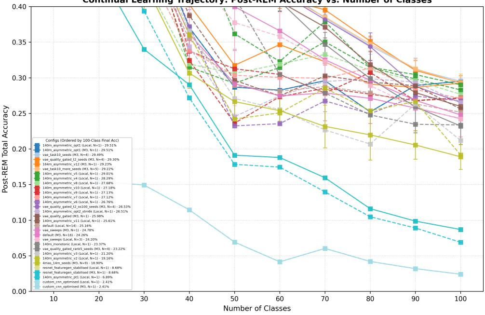  
Figure A.10: Continual learning post-REM accuracy trajectories across class scale (10 to 100 classes) for top VAE configurations and Quality-Gated replay regimes, showing mean performance and standard deviation error bars across random seeds.

Table A.5: Best configurations and parameters across Split-CIFAR-100 Optuna sweeps.
<table><tr><td>Optuna Study Name</td><td>Trials</td><td>Best Class-IL (%)</td><td>Key Parameters and Configurations</td></tr><tr><td>fourmas cifar100 v1</td><td>89</td><td>0.00</td><td>Default VAE, latent dim 64, LR 0.0014, SGD</td></tr><tr><td>fourmas_cifar100_v2</td><td>34</td><td>28.82</td><td>Task-IL scenario, latent dim 128,</td></tr><tr><td>fourmas cifar100 v3</td><td>10</td><td>4.11</td><td>buffer 2000, Adam Class-IL, buffer 5000, VAE temp</td></tr><tr><td>fourmas_cifar100_v4</td><td>26</td><td>7.63</td><td>1.15 (LH) / 1.54 (RH) Class-IL, buffer 5000, SWS/REM epochs 75/50,</td></tr><tr><td>fourmas_cifar100_ multi arch</td><td>4</td><td>3.77</td><td>LR 0.0022 Pre-trained tap layer 2 feature</td></tr><tr><td>fourmas cifar100 scratch sota</td><td>15</td><td>6.85</td><td>extractor, latent dim 64 Scratch training (no ImageNet),</td></tr><tr><td>fourmas_cifar100_ novel designs</td><td>24</td><td>9.54</td><td>buffer 10000, latent dim 128 Evaluated classifier freezing poli-</td></tr><tr><td>fourmas_cifar100</td><td>17</td><td>9.49</td><td>cies, distill weight 0.16 VAE dim 400, latent dim 64, gat-</td></tr><tr><td>refined sota fourmas_cifar100</td><td>25</td><td>9.56</td><td>ing end-weight 2.0 Optimised lr 0.0023, REM/SWS</td></tr><tr><td>final sota fourmas cifar100 fixed sota</td><td>13</td><td>9.99</td><td>epochs 150/100 Cross-entropy loss function, lin-</td></tr><tr><td>fourmas cifar100 sota_push</td><td>34</td><td>11.06</td><td>ear classifier, LR 0.0018 Latent dim 192, gating end-</td></tr><tr><td>fourmas cifar100 sota breakthrough v2</td><td>25</td><td>9.56</td><td>weight 1.5, LR 0.0019 VAE dim 800, latent dim 192, gating end-weight 1.0</td></tr><tr><td>fourmas_cifar100_ pretrain multi task</td><td>16</td><td>12.25</td><td>Bootloadedmulti-task pre- training (1 task), latent dim 192</td></tr><tr><td>fourmas_cifar100_ vqvae</td><td>62</td><td>10.35</td><td>Vector Quantized VAE, gating end-weight 2.0, LR 0.0017</td></tr><tr><td>fourmas_cifar100_ vqvae_high_cap</td><td>32</td><td>9.47</td><td>High capacity VQ-VAE, code- book size 2048, latent dim 128</td></tr></table>

Table A.6: Grid search performance over generative model types, supervised contrastive (SupCon) weights, left-hemisphere parameter freezing, and BSS active gating.
<table><tr><td>ID</td><td>Model Type</td><td>SupCon Weight</td><td>LH Freeze</td><td>BSS Active</td><td>Class-IL (%)</td><td>Task-IL (%)</td></tr><tr><td>1</td><td>vae</td><td>0.0</td><td>False</td><td>False</td><td>1.52</td><td>12.04</td></tr><tr><td>2</td><td>vae</td><td>0.0</td><td>False</td><td>True</td><td>1.02</td><td>9.61</td></tr><tr><td>3</td><td>vae</td><td>0.0</td><td>True</td><td>False</td><td>1.19</td><td>11.17</td></tr><tr><td>4</td><td>vae</td><td>0.0</td><td>True</td><td>True</td><td>1.13</td><td>9.26</td></tr><tr><td>5</td><td>vae</td><td>0.5</td><td>False</td><td>False</td><td>2.13</td><td>17.33</td></tr><tr><td>6</td><td>vae</td><td>0.5</td><td>False</td><td>True</td><td>2.01</td><td>14.90</td></tr><tr><td>7</td><td>vae</td><td>0.5</td><td>True</td><td>False</td><td>1.03</td><td>10.32</td></tr><tr><td>8</td><td>vae</td><td>0.5</td><td>True</td><td>True</td><td>1.06</td><td>10.51</td></tr><tr><td>9</td><td>vqvae</td><td>0.0</td><td>False</td><td>False</td><td>1.41</td><td>10.31</td></tr><tr><td>10</td><td>vqvae</td><td>0.0</td><td>False</td><td>True</td><td>1.07</td><td>14.19</td></tr><tr><td>11</td><td>vqvae</td><td>0.0</td><td>True</td><td>False</td><td>1.11</td><td>10.45</td></tr><tr><td>12</td><td>vqvae</td><td>0.0</td><td>True</td><td>True</td><td>1.08</td><td>9.38</td></tr><tr><td>13</td><td>vqvae</td><td>0.5</td><td>False</td><td>False</td><td>1.52</td><td>12.41</td></tr><tr><td>14</td><td>vqvae</td><td>0.5</td><td>False</td><td>True</td><td>1.00</td><td>10.87</td></tr><tr><td>15</td><td>vqvae</td><td>0.5</td><td>True</td><td>False</td><td>1.04</td><td>10.47</td></tr><tr><td>16</td><td>vqvae</td><td>0.5</td><td>True</td><td>True</td><td>1.01</td><td>9.96</td></tr></table>

Table A.7: Split-CIFAR-100 performance across selection strategies (CCS, LSCC, Hybrid) pre-training task horizons, and local SI regularisation.
<table><tr><td colspan="6"></td></tr><tr><td>Selection Strategy (LH / RH)</td><td>Left Centroid (L)</td><td>Right Centroid (R)</td><td>Pre-training Tasks</td><td>Synaptic Intelligence (SI)</td><td>Class-IL Acc (%)</td></tr><tr><td>CCS (Symmetric Baseline)</td><td>0.5</td><td>0.5</td><td>1</td><td>No</td><td>21.38</td></tr><tr><td>CCS (Symmetric)</td><td>0.5</td><td>0.5</td><td>2</td><td>No</td><td>25.34</td></tr><tr><td>CCS (Symmetric)</td><td>0.5</td><td>0.5</td><td>3</td><td>No</td><td>29.18</td></tr><tr><td>CCS (Symmetric)</td><td>0.5</td><td>0.5</td><td>4</td><td>No</td><td>30.46</td></tr><tr><td>CCS (Symmetric)</td><td>0.5</td><td>0.5</td><td>5</td><td>No</td><td>29.01</td></tr><tr><td>CCS (Left-Skewed)</td><td>0.7</td><td>0.3</td><td>1</td><td>No</td><td>21.78</td></tr><tr><td>CCS (Right-Skewed)</td><td>0.3</td><td>0.7</td><td>1</td><td>No</td><td>23.80</td></tr><tr><td>CCS (Asymmetric Champion)</td><td>0.1</td><td>0.5</td><td>1</td><td>No</td><td>25.97</td></tr><tr><td>CCS (Asymmetric Low</td><td>0.1</td><td>0.1</td><td>1</td><td>No</td><td>22.96</td></tr><tr><td>CCS (Asymmetric High)</td><td>0.2</td><td>0.8</td><td>1</td><td>No</td><td>22.34</td></tr><tr><td>CCS (Sweeter Spot)</td><td>0.05</td><td>0.55</td><td>1</td><td>No</td><td>25.63</td></tr><tr><td>CCS (Asymmetric + LH SI)</td><td>0.1</td><td>0.5</td><td>1</td><td>Yes</td><td>16.27</td></tr><tr><td>LSCC (Symmetric K-Means)</td><td>K-Means</td><td>K-Means</td><td>1</td><td>No</td><td>8.79</td></tr><tr><td>LSCC (Symmetric K-Means)</td><td>K-Means</td><td>K-Means</td><td>5</td><td>No</td><td>10.39</td></tr><tr><td>Hybrid (LSCC /CCS Asymmetric)</td><td>K-Means</td><td>0.5</td><td>1</td><td>No</td><td>13.20</td></tr><tr><td>Hybrid (LSCC CCS Asymmetric)</td><td>K-Means</td><td>0.5</td><td>23</td><td>No</td><td>17.58</td></tr><tr><td>Hybrid (LSCC CCS Asymmetric)</td><td>K-Means</td><td>0.5</td><td></td><td>No</td><td>20.09</td></tr><tr><td>Hybrid (LSCC / CCS Asymmetric)</td><td>K-Means</td><td>0.5</td><td>4</td><td>No</td><td>18.72</td></tr><tr><td>Hybrid (LSCC CCS Asymmetric)</td><td>K-Means</td><td>0.5</td><td>5</td><td>No</td><td>22.75</td></tr><tr><td>Hybrid (LSCC CCS, Seed 1001)</td><td>K-Means</td><td>0.5</td><td>5</td><td>No</td><td>20.14</td></tr></table>

Table A.8: Split-CIFAR-100 Class-IL performance across parameter capacity scales.
<table><tr><td>Model Size</td><td>Architecture</td><td>Total Parameters</td><td>Class-IL Acc (%)</td><td>Forgetting (%)</td></tr><tr><td rowspan="2">14M Scale</td><td>4MAS (Ours, Scaled-down)</td><td>14.1M</td><td>13.16</td><td>25.8</td></tr><tr><td>B-IR (Standard Baseline)*</td><td>13.3M</td><td>21.0</td><td>61.1</td></tr><tr><td rowspan="2">35M Scale</td><td>4MAS (Ours, Scaled-down)</td><td>34.5M</td><td>18.41</td><td>25.8</td></tr><tr><td>B-IR (Ours, Scaled-down)</td><td>35.8M</td><td>23.01</td><td>58.9</td></tr><tr><td rowspan="2">70M Scale</td><td>4MAS (Ours, Champion)</td><td>70.0M</td><td> $2 4 . 4 5 \pm 0 . 3 2$ </td><td> $2 5 . 8 \pm 1 . 2$ </td></tr><tr><td>B-IR (Ours, Scaled)</td><td>62.7M</td><td> $2 6 . 2 7 \pm 1 . 3 7$ </td><td> $5 2 . 8 2 \pm 1 . 9 7$ </td></tr><tr><td rowspan="4">140M Scale</td><td>4MAS (Ours, Rank 1 Peak)</td><td>130.8M</td><td> $2 9 . 2 9 \pm 0 . 2 9$ </td><td>25.8</td></tr><tr><td>4MAS (Ours, Peak v5)*</td><td>147.8M</td><td>29.01</td><td>23.4</td></tr><tr><td>4MAS (Ours, v10)</td><td>130.8M</td><td>27.18</td><td>73.7</td></tr><tr><td>4MAS (Ours, v9)</td><td>130.8M</td><td>27.13</td><td>51.0</td></tr><tr><td></td><td>B-IR (Òurs, Scaled)</td><td>143.8M</td><td>27.85</td><td>52.92</td></tr></table>