# Gravitational-wave parameter estimation with machine-learning generated surrogate waveforms

Suyog Garg∗ and Kipp Cannon

Department of Physics, The University of Tokyo, Bunkyo-ku, Tokyo 113-0033 JAPAN and Research Center for Early Universe, The University of Tokyo, Bunkyo-ku, Tokyo 113-0033 JAPAN (Dated: August 21, 2026)

The worldwide network of gravitational-wave detectors have detected more than 350 binary coalescence events till date. Future third-generation detectors, like Einstein telescope, are expected to detect orders-of-magnitude more signals from sources with more complicated characteristics, including eccentric orbits and high-mass ratio binaries. It is well-established that the computational cost of parameter estimation for signals from these kinds of sources will be extremely high. In particular, the process could be sped-up if generating theoretical waveform predictions, used for likelihood calculation becomes faster. Recently, various machine-learning techniques has been proposed to this end. In this work, we propose a two-stage deterministic conditional-autoencoder model for generating four-parameter SEOBNRv4 waveforms. The first-stage of the model generates amplitude and phase series of the waveform, while the second-stage calibrates the residual error in the predictions. Our model achieves a median mismatch of around 10−2 with the target polarization waveforms, while the calibrated amplitude/phase series achieve 10−6 level cosine distance error. We then propose a waveform conditioning step to enable use of these surrogate waveforms for downstream parameter estimation tasks. Finally, we perform extensive parameter estimation tests, with ML and EOB waveform injections and try to recover posterior estimates for the source parameters. We find that when ML waveforms are used to recover EOB target parameter estimates, the inferred posterior have some systematic bias. This inherent bias can be estimated and corrected for, and then importance reweighting of posterior samples can enable use of low-accuracy surrogate waveforms at low SNRs.

## I. INTRODUCTION

The direct detection of gravitational-wave (GW) in 2015 by the LIGO–Virgo–KAGRA (LVK) collaboration ushered in the era of GW astronomy [1]. Since then, the number of successfully detected GW events has reached more than 350 compact binary coalescence (CBC) detections, in the five Gravitational-Wave Transient Catalogs (GWTCs) released till date [2–6]. In the near-future this number is expected to further increase, with the commissioning of third-generation ground-based detectors like the Einstein telescope [7] and Cosmic Explorer [8], and space-borne detectors, LISA [9], Taiji [10, 11] and TianQin [12, 13].

The detectable GW signals for these third-generation detectors, and even in future observation runs of the current GW detector network, will originate from sources with more complicated orbital characteristics, for instance, eccentric and precessing system [14, 15]. It is well-established that probing these orbital characteristics from the GW signal morphology, can shed light on the population-level distribution of the binaries and lead to other astrophysical implications [16]. Now, full parameter estimation of signals with relatively complicated source characteristics and signal morphology, than compared to, say, a dominant-mode quasi-circular binary black hole (BBH) waveform, is computationally expensive. One leading cause for this is the waveform generation time [17].

There can be two basic ways to speed-up the parameter estimation process, either having faster waveform generation models for likelihood calculation, or direct estimation of parameter posterior, without having to calculate the likelihood explicitly. More eficient sampling algorithms [18], relative-binning with a reference waveform on a coarser frequency grid [19– 24], and other techniques [25–31], can then be combined with these to have an overall speed-up in the parameter estimation process. In particular, faster waveform generation methods are not only helpful for parameter estimation, but also for other applications, like tests of gravity, template-bank generation and other theoretical studies.

Recently there has been a significant progress on development of machine-learning (ML) methods for gravitational waveform modelling [32–34]. These include surrogate waveform models of limited accuracy, to high-accuracy surrogates for some specific waveform approximants [17, 35–50]. People have also tried parameter estimation with these surrogate models by inferencing source parameter for few significant events from the catalog [33, 47, 49, 51]. A comprehensive parameter estimation analysis with machine-learning surrogate waveforms, characterizing any inherent inference bias in these surrogate waveforms, is currently lacking. In this work we try to accomplish this and show that just the accuracy criteria of surrogate waveform output alone is not suficient to imply its use for downstream parameter estimation tasks.

Garg et al. [17] introduced a conditional variational autoencoder (CVAE) model for fast generation of efective one-body (EOB) SEOBNRv4 [52–54] gravitational waveforms from aligned-spin binary black hole sources. This model achieves batched-graphics processing unit (GPU) waveform generation speed of $\mathcal { \bar { O } } ( 1 0 ^ { 4 } )$ waveforms in $\acute { \mathcal { O } } ( 1 0 ^ { - 1 } )$ s, however, the generated waveforms come at the cost of a lowered accuracy at $\mathcal { O } ( 1 0 ^ { - 2 } )$ mismatch. This model is also stochastic in nature due to the latent space been a learned normal distribution, and thus has an additional $\mathcal { O } \big ( 1 0 ^ { - 2 } \big )$ uncertainty in the reconstructed waveforms.

In this work, we introduce an alternative set-up with a conditional autoencoder (CAE) [55, 56] waveform generation model which removes the uncertainty in the generated outputs arising due to the stochastic nature of a variational model. We further perform a calibration of the machine-learning generated outputs by predicting the residual error with a second-stage calibrator model. This calibration stage improves the accuracy of the machine-learning model outputs by around two ordersof-magnitude, although the accuracy of the reconstructed waveform polarizations remain on-par or only slightly better than Garg et al. [17]. We then posit waveform conditioning as a necessary intermediate step before downstream use of surrogate waveforms. Finally, we perform extensive parameter estimation test with the conditioned waveform outputs of the two-stage waveform generation and calibration model.

Results presented in this work demonstrate that even low-accuracy machine-learning model based surrogate waveforms can be used for gravitationalwave parameter estimation applications, although the estimated posteriors tend to have some inherent inherence bias. We propose that this bias can be corrected, following which, an importance-reweighting of the posterior samples can lead to much better posterior estimates [57, 58].

## II. DATA PREPROCESSING

The parameter ranges for our priors are set as,

• Mass: $m _ { 1 } , m _ { 2 } \in [ 5 , 7 5 ] \ \mathrm { M } _ { \odot }$ , with $m _ { 2 } / m _ { 1 } < 1 0 ~ \mathrm { M _ { \odot } }$

• Aligned-spins: $\chi _ { 1 } ( z ) , \chi _ { 2 } ( z ) \in [ - 0 . 9 9 , 0 . 9 9 ]$ For each set of parameters from the priors, we obtain our target waveforms for the EOB approximant SEOBNRv4 from the LALSuite library [59] via PyCBC [60] and SwigLAL [61] interfaces. These waveforms serve as the target data for training, validation and testing of outputs generated by our machine-learning waveform model.

Similar to Garg et al. [17], all the waveforms in our dataset are sampled at a sampling rate of 8192 Hz with a fixed-duration of 1 s. However, the duration of the gravitational-wave signal from sources with diferent parameters is not constant at a fixed lower frequency cutof $( f _ { \mathrm { l o w } } )$ . Specifically, time to coalescence is proportional to the binary mass, tc ∝ $f _ { \mathrm { l o w } } ^ { - 8 / 3 } / \mathcal { M } ^ { - 5 / 3 }$ , where $\mathcal { M } =$ $( m _ { 1 } m _ { 2 } ) ^ { 3 / 5 } / ( m _ { 1 } + m _ { 2 } ) ^ { 1 / 5 }$ is the chirp mass. Thus, to obtain fixed-duration signals for diferent source parameters, we apply a dynamic lower frequency cut-of, similar to Garg et al. [17]. The final waveforms used in our analysis have a $f _ { \mathrm { l o w } }$ range of 11–60.

In this work, we only consider the dominant $h _ { 2 2 }$ mode of the gravitational waveform, and decompose the real-valued polarization time-series $h _ { + } ( t )$ and $h _ { \times } ( t )$ into amplitude and phase as follows,

$$
\begin{array} { r l } & { A ( t ) = \sqrt { h _ { + } ^ { 2 } + h _ { \times } ^ { 2 } } } \\ & { \phi ( t ) = \operatorname * { u n w r a p } \left[ \arctan ( h _ { + } , h _ { \times } ) \right] . } \end{array}\tag{1}
$$

These amplitude and phase series are the inputs and the targets for our machine-learning waveform model. We further normalize the inputs as, $x _ { \mathrm { n o r m } } = ( x - \mu ) / ( \sigma +$ $\epsilon )$ , where $\mu$ and σ are respectively the mean and the standard deviation, and ϵ is a small random number to compensate for divide-by-zero errors. The target amplitude and phase series are kept unnormalized.

## III. METHODOLOGY

Our machine-learning waveform model consists of two stages: 1) waveform generation stage, and 2) residual calibration stage. This two-stage FlexCAEPhase framework separates the problem of fast waveform generation from the problem of correcting systematic model errors. In practice, this improves the reconstructed waveform in the regions where the firststage approximation is less accurate, especially near the late inspiral and merger where small phase and amplitude errors can have a larger efect on the waveform mismatch.

Both the waveform generation model and the calibration model are trained for 100 epochs on a Nvidia A100 80GB GPU using PyTorch [62] and CUDA [63]. Both stages use the ADAM [64] optimization with learning-rate scheduling, and the final calibration model is selected according to a low validation loss value. To reduce computational cost, the calibration inputs and residual targets are precomputed and stored in HDF files [65], so that the second-stage model trains directly from disk without repeatedly evaluating the waveform generator.

## A. Waveform generation model

In the first stage, the waveform generation model takes in the source parameters as the input and outputs a two-channel $[ A ( t ) , \phi ( t ) ]$ series. Contrary to Garg et al. [17], we now do not work with a variational model, in which the learned latent space is distribution. Instead, our waveform generation model maps the inputs to a latent space consisting of discrete latent vectors. This requirement removes the stochasticity in the model generated outputs, as was observed in Garg et al. [17].

For the aligned-spin configuration considered in this work, the input parameter vector is written as $\begin{array} { c c l } { \theta } & { = } & { \left[ m _ { 1 } , m _ { 2 } , \chi _ { 1 } ( z ) , \chi _ { 2 } ( z ) \right] } \end{array}$ , where $m _ { 1 }$ and m2 are the component masses and $\chi _ { 1 } ( z ) , \quad \chi _ { 2 } ( z )$ are the dimensionless spin components aligned with the orbital angular momentum. The model predicts an intermediate waveform representation, namely the normalized amplitude and instantaneous phase,

$$
\widehat { \mathbf { y } } _ { \mathrm { M L } } = [ \widehat { A } _ { \mathrm { M L } } ( t ) , \widehat { \phi } _ { \mathrm { M L } } ( t ) ] .\tag{2}
$$

This representation is then converted into the two gravitational-wave polarizations, $\widehat { h } _ { + } ^ { \mathrm { M L } } ( t ) , \widehat { h } _ { \times } ^ { \mathrm { M L } } ( t )$ through the usual trigonometric decomposition of the strain.

The specific model architecture for training the waveform generation model, otherwise, remains the same as in Garg et al. [17]. During training, the model consists of 2 encoders, 2 conditional-prior encoders and 1 decoder. One encoder encodes the target waveforms into latent representations, while the other encodes the normalization parameters. The two conditional-prior encoders likewise encode the source parameter labels $[ m _ { 1 } , m _ { 2 } , \chi _ { 1 } ( z ) , \chi _ { 2 } ( z ) ]$ , into latent vectors corresponding to each of the main encoders. The decoder then takes these discrete encoded latent vectors and tries to decode back the target waveforms from them. The training process aims to minimize the sum of the reconstruction error, i.e. the mean squared diference between the generated output and the target, and the cosine diference between the pairs of encoded latent vectors.

Once the model has trained, it has in efect learned the mapping from the source parameters to some latent vectors which decode back to a close approximation of the original target waveforms. On passing, we note that this learned latent vector space could be interpreted to find correlations between between distinct latent vectors and the mismatch between the corresponding waveform under identical noise conditions. To use the trained model for waveform generation, we simply pass in the source parameter labels to the conditional-prior encoders and obtain reconstructed waveform outputs.

## B. Residual calibration model

Although the first-stage model provides a fast approximation to the target waveform family, small errors in amplitude and phase can lead to nonnegligible mismatch in the final polarizations. To reduce these systematic errors, a second-stage residual calibration network is introduced. This calibration model is trained after the first-stage model has been fixed. The inputs to the second-stage model consist of the predicted machine-learning waveform and the corresponding physical parameters,

$$
\begin{array} { r } { \mathbf { x } _ { \mathrm { c a l } } ^ { ( 2 ) } = \left[ \widehat { A } _ { \mathrm { M L } } ( t ) , \widehat { f } _ { \mathrm { M L } } ( t ) , m _ { 1 } , m _ { 2 } , \chi _ { 1 } ( z ) , \chi _ { 2 } ( z ) \right] , } \end{array}\tag{3}
$$

where the scalar parameters are repeated along the time dimension so that the complete input can be treated as a multi-channel one-dimensional sequence. The target for the second-stage model is the residual between the reference waveform representation and the first-stage prediction,

$$
{ \bf r } ^ { ( 2 ) } ( t ) = { \bf y } _ { \mathrm { t r u e } } ( t ) - \widehat { \bf y } _ { \mathrm { M L } } ( t ) ,\tag{4}
$$

with $\begin{array} { r l r } { { \bf y } } & { { } = } & { \left[ { \cal A } , { f } \right] . } \end{array}$ The calibrated amplitude-phase representation is then obtained as

$$
\widehat { \mathbf { y } } _ { \mathrm { c a l } } ( t ) = \widehat { \mathbf { y } } _ { \mathrm { M L } } ( t ) + \widehat { \mathbf { r } } ^ { ( 2 ) } ( t ) ,\tag{5}
$$

where $\widehat { \mathbf { r } } ^ { ( 2 ) } ( t )$ is the residual predicted by the calibration network.

The calibration model is trained using a mergeramplitude weighted loss function, that penalizes errors at merger time high-amplitude region more heavily in comparison to elsewhere.

$$
\begin{array} { r } { \mathcal { T } _ { \mathrm { m w M S E } } = \frac { \sum _ { j = 1 } ^ { N } w _ { j } \left( r _ { j } - \hat { r } _ { j } \right) ^ { 2 } } { \sum _ { j = 1 } ^ { N } w _ { j } } , \quad } \\ { w _ { j } = w _ { \mathrm { m i n } } + \left( 1 - w _ { \mathrm { m i n } } \right) \left( \frac { \left| A _ { j } ^ { \mathrm { M L } } \right| } { \operatorname* { m a x } _ { k } \left| A _ { k } ^ { \mathrm { M L } } \right| + \epsilon } \right) ^ { \gamma } , } \end{array}\tag{6}
$$

In this merger-weighted mean squared error (MSE) loss function, the residual at each time sample is weighted by the normalized amplitude of the machine-learning waveform, so that points near the high-amplitude merger region receive larger penalties than points in the lowamplitude inspiral. A small floor value $w _ { \mathrm { m i n } }$ is retained so that the early inspiral still contributes to the training objective, while the exponent $\gamma$ controls how sharply the weighting concentrates around the merger. This choice encourages the calibration model to focus on the physically most important part of the waveform, where small residual errors can have a disproportionately large efect on the overall waveform mismatch.

## IV. RESULTS FOR WAVEFORM GENERATION AND CALIBRATION

Similar to Garg et al. [17], we evaluate the performance of our machine-learning waveform model using a reserved test dataset the model has not yet seen. The twostage waveform generator first produces the normalized amplitude and phase evolution using the deterministic FlexCAEPhase model, and then applies a calibration stage to reduce the remaining systematic reconstruction error. The calibration network is trained to learn the residual correction between the original waveform representation and the reconstructed waveform, thereby improving the agreement in both the amplitude and phase channels before converting the result to the gravitational-wave polarizations. Figure 2 shows a representative calibration result for normalized machinelearning model outputs. The reconstructed amplitude closely follows the original waveform over the full duration, including the inspiral and the rapid mergerringdown transition. The phase reconstruction is also accurate over most of the signal, with the largest visible deviations appearing only close to the endpoint, where small errors accumulate most strongly because of rapid phase evolution.

TABLE I. Details of the network architecture used in the waveform generation first-stage of the FlexCAEPhase model.
<table><tr><td>Component</td><td>layers</td><td>Notes</td></tr><tr><td rowspan="3">XEncoder</td><td>pre-FC layers None</td><td>Conv1D  $\mathrm { ( i n { = } 2 , o u t { = } 3 2 , k { = } 6 , d { = } 1 ) + G E L U + M a x P o o l { \ ( k { = } 4 ) } , }$ </td></tr><tr><td>CNN layers</td><td>Conv1D  $\mathrm { ( i n { = } 3 2 , o u t { = } 3 2 , k { = } 6 , d { = } 1 ) + G E L U + M a x P o o l { \ ( k { = } 4 ) } }$ </td></tr><tr><td></td><td>post-FC layers Linear (16324,256) + GELU, Linear (256,256) + GELU, Linear  $\mathrm { ( 2 5 6 , 4 8 ) + G E L U }$  Encodes inputs shape (2, 8191) to latent dimension  $d _ { \mathrm { X } } = 2 4 .$ </td></tr><tr><td rowspan="2">KeyEncoder </td><td>pre-FC layers Linear</td><td> $( 8 , 5 0 0 ) \ + \ \mathrm { G E L U }$  , Linear  $( 5 0 0 , 5 0 0 ) \ + \ \mathrm { G E L U }$  Linear  $( 5 0 0 , 8 ) + \mathrm { I d e n t i t y }$ </td></tr><tr><td>CNN layers post-FC layers None</td><td>None</td></tr><tr><td rowspan="2"></td><td>XConditional pre-FC layers Linear</td><td>Encodes keys shape (2, 2) to latent dimension  $d _ { \mathrm { k e y } } = 4 .$   $( 4 , 1 2 8 ) \ + \ \mathrm { G E L U } .$  Linear  $\mathrm { ( 1 2 8 , 2 5 6 )  { \mathrm { ~ + ~ } } G E L U }$  Linear</td></tr><tr><td>CNN layers post-FC layers None</td><td>(256,128) + GELU, Linear  $( \mathrm { { 1 2 8 , 4 8 } ) + G E L U } ,$  None</td></tr><tr><td></td><td>KeyConditional pre-FC layers Linear (4,128) + GELU Linear CNN layers</td><td>Conditional prior network for the waveform latent vector.  $( \mathrm { 1 2 8 , 2 5 6 } ) \ + \ \mathrm { G E L U } ,$  Linear (256,128) + GELU, Linear  $( 1 2 8 , 8 ) + \mathrm { G E L U }$  None</td></tr><tr><td rowspan="3">Decoder</td><td>post-FC layers None</td><td>Conditional prior network for the key latent vector.</td></tr><tr><td>pre-FC layers Linear CNN layers</td><td> $( 3 2 , 8 0 0 )  { \mathrm { ~ + ~ } }  { \mathrm { I d e n t i t y } }$  Conv1D  $\mathrm { ( i n { = } i , o u t { = } 6 4 , k { = } 5 , d { = } 3 ) + G E L U + M a x P o o l { \ ( k { = } 4 ) } , }$ </td></tr><tr><td></td><td>Conv1D  $\mathrm { ( i n \mathrm { = } 6 4 , o u t \mathrm { = } 6 4 , k \mathrm { = } 5 , d \mathrm { = } 3 ) + G E L U + M a x P o o l ( k \mathrm { = } 4 ) _ { \mathrm { : } } }$  Conv1D  $\mathrm { ( i n { = } 6 4 , o u t { = } 6 4 , k { = } 5 , d { = } 3 ) + G E L U + M a x P o o l { \ ( k { = } 4 ) } }$  post-FC layers Linear (512,256) + GELU, Linear  $\mathrm { ( 2 5 6 , 1 6 3 8 2 ) + G E L U }$ </td></tr></table>

Note: The model uses GELU activations, batch size 1024, starting learning rate $5 \times 1 0 ^ { - 4 }$ . The target representation is amplitude-phase, with normalized inputs and unnormalized targets. The total number of trainable parameters is $9 , 0 7 2 , 6 4 6 .$ The four conditioning labels correspond to the intrinsic binary parameters $[ m _ { 1 } , m _ { 2 } , \chi _ { 1 } ( z ) , \chi _ { 2 } ( z ) ]$ . The notation $d _ { \mathrm { X } }$ and $d _ { \mathrm { k e y } }$ denotes the latent dimensionality of the waveform and key representations, respectively. For the layer architecture, ‘k’ and ‘d’ denote the kernel-size and the dilation respectively.

TABLE II. Architecture of the residual calibration network used in the second-stage of the FlexCAEPhase model. The model takes a 6-channel input consisting of first-stage output amplitude/phase and the four normalized source parameters, and predicts two residual channels.
<table><tr><td>Layers</td><td>Configuration</td><td>Output shape</td></tr><tr><td>Input projection</td><td> $\overline { { \mathrm { C o n v 1 D } ( \mathrm { i n { = } 6 , \mathrm { o u t } { = } 1 2 8 , \mathrm { k } { = } 7 , \mathrm { p } { = } 3 ) } } }$ </td><td> $1 2 8 \times N$ </td></tr><tr><td>Residual layers</td><td> $5 \times$   $\mathrm { \Delta [ C o n v 1 D ( i n = 1 2 8 , o u t = 1 2 8 , k = 7 ) }$   $ \mathrm { G r o u p N o r m } ( \mathrm { n } { = } 8 )$   $ \mathrm { G E L U }  \mathrm { D r o p o u t } ( 0 )$ </td><td> $1 2 8 \times N$ </td></tr><tr><td>Output projection</td><td> $ \mathrm { G r o u p N o r m } ( \mathrm { n } { = } 8 )$   $ \mathrm { s k i p - c o n n e c t i o n }  \mathrm { G E L U } \mid$   $\mathrm { C o n v 1 D } ( \mathrm { i n } \mathrm { = } 1 2 8 , \mathrm { o u t } \mathrm { = } 2 , \mathrm { k } \mathrm { = } 7 , \mathrm { p } \mathrm { = } 3 ) ; ~ 2 \times N$  initialized to zero</td><td></td></tr></table>

Total trainable parameters: 1,158,018. ‘p’ denotes the padding size in the convolution layer.

The mismatch distributions after calibration are shown in Figure 1. The calibrated amplitude and phase reconstructions achieve very low cosine distance errors, with median values of $3 . 2 2 \times 1 0 ^ { - 5 }$ and $2 . 2 5 \times 1 0 ^ { - 6 }$ respectively. The corresponding mean cosine distance between the output and the target are $1 . 6 2 \times 1 0 ^ { - 4 }$ for amplitude and $4 . 4 2 \times 1 0 ^ { - 6 }$ for phase, indicating that the two-stage model substantially improves the internal amplitude-phase representation. After conversion to the physical polarizations, the median polarization mismatches become $1 . 3 3 \times 1 0 ^ { - 2 }$ for $h _ { + }$ and $\mathrm { { 1 . 8 6 \times 1 0 ^ { - 2 } } }$ for $h _ { \times }$ , with mean values of $1 . 9 0 \times 1 0 ^ { - 2 }$ and $1 . 8 6 \times 1 0 ^ { - 2 }$ respectively. These results show that the calibration stage is efective at reducing waveform-representation errors, although the polarization mismatch remains more sensitive to small residual phase and amplitude errors, particularly near high-amplitude merger region.

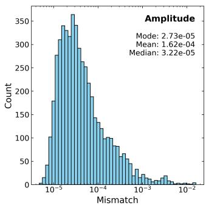

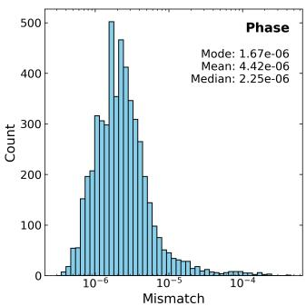

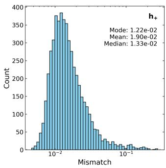

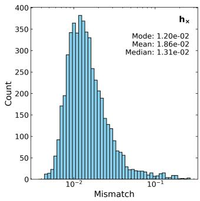  
FIG. 1. (Top) Distribution of the cosine distance of the machine-learning model generated and calibrated amplitude and phase series outputs from the target. (Bottom) Distribution of the mismatch values for the polarization waveforms reconstructed from the calibrated machinelearning model outputs. All distributions are shown for data in the test dataset.

## V. WAVEFORM CONDITIONING

Now, it turns out, directly using the machine-learning model output waveforms for parameter estimation tasks and other applications is not a good idea. Crucially, the following should be taken care of:

• All waveforms output by the machine-learning model should ideally have the merger occuring at the same time within the data segment, i.e. to say that the merger time of the gravitational-wave signal should be aligned appropriately.

• Waveform amplitude should start and end at zero within the frequency band of interest.

• A data segment used for injection in parameter estimation runs should smoothly enter and leave the detector frequency band.

• This data segment containing a signal should also be of suficient duration, so as to mitigate the edge efects occuring during Fourier transformations.

Gravitational-wave parameter estimation with gravitational waveform approximations assumes that in the frequency-domain, all frequency-bins are well approximated as independent Gaussian random variables. The above conditioning requirements for the machine-learning output waveforms and injection data segments, ensure that frequency-domain edge efects at the start and end of the signal do not invalidate this assumption, by causing correlations in the frequency-bins. Suficient data segment duration is required so that the frequency-bins are not corrupted due to these edge efects.

For our machine-learning generated waveforms, we perform the waveform conditioning in the following manner. Before transforming the reconstructed timedomain polarizations to the frequency domain, each 1 s waveform segment is embedded into a longer fixed-duration data segment. This conditioning step is necessary because the discrete Fourier transform implicitly assumes that the finite time series is periodically continued outside the analysed interval. If the time-domain waveform starts or terminates abruptly at the boundaries of the segment, this periodic continuation introduces artificial discontinuities, which in turn produce spectral leakage and edge artefacts in the Fourier-domain waveform. To reduce these efects, the generated signal is smoothly tapered at both ends and then placed at the centre of an 8 s long zero-padded array. The resulting time series therefore has negligible strain at the boundaries of the full data segment, while preserving the physical inspiral-merger-ringdown morphology in the central signal region.

Let $h ( t )$ denote either of the two polarization waveforms, sampled over a 1 s interval. The conditioned waveform is constructed by multiplying $h ( t )$ by a smooth window $w ( t )$ , where the beginning of the signal is tapered with a sin2 turn-on and the end of the signal is tapered with a cos2 turn-of. The start taper extends over one gravitational-wave cycle of duration $T _ { \mathrm { c y c } }$ , and the end taper extends over a duration $T _ { \mathrm { e n d } }$ , which we choose to be 10% of the post-merger portion of the signal. Schematically, the tapering window can be written as

$$
w ( t ) = \left\{ \begin{array} { l l } { \sin ^ { 2 } \left[ \displaystyle \frac { \pi } { 2 } \frac { t - t _ { \mathrm { s t a r t } } } { T _ { \mathrm { c y c } } } \right] , } & { t _ { \mathrm { s t a r t } } \leq t < t _ { \mathrm { s t a r t } } + T _ { \mathrm { c y c } } , } \\ { 1 , } & { t _ { \mathrm { s t a r t } } + T _ { \mathrm { c y c } } \leq t < t _ { \mathrm { e n d } } - T _ { \mathrm { e n d } } } \\ { \displaystyle \cos ^ { 2 } \left[ \displaystyle \frac { \pi } { 2 } \frac { t - \left( t _ { \mathrm { e n d } } - T _ { \mathrm { e n d } } \right) } { T _ { \mathrm { e n d } } } \right] , } & { t _ { \mathrm { e n d } } - T _ { \mathrm { e n d } } \leq t \leq t _ { \mathrm { e n d } } . } \end{array} \right.\tag{7}
$$

The tapered waveform is then

$$
h _ { \mathrm { t a p } } ( t ) = w ( t ) h ( t ) .\tag{8}
$$

The $\sin ^ { 2 }$ factor ensures that the signal rises smoothly from zero at the beginning of the segment, while the $\cos ^ { 2 }$ factor smoothly suppresses the residual postmerger/ringdown tail towards zero at the end of the waveform. This avoids introducing a sharp jump between the signal and the surrounding zero padding.

After tapering, $h _ { \mathrm { t a p } } ( t )$ is inserted into the middle of an 8 s array $H ( t )$ , with zeros before and after the 1 s signal region. If $T _ { \mathrm { s e g } } = 8 \mathrm { s }$ and $T _ { \mathrm { s i g } } = 1 { \mathrm { s } }$ , the signal is placed such that its midpoint coincides with the midpoint of the full segment. Equivalently, the nonzero waveform occupies the interval

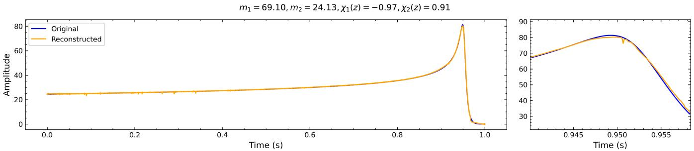

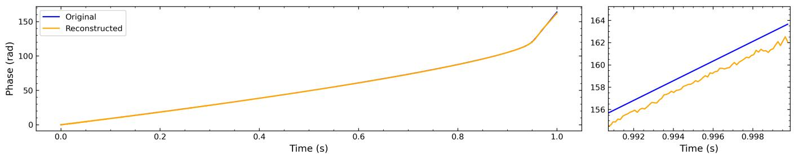  
FIG. 2. An example overplot of the calibration result for the two-stage waveform generator model. The machine-learning model outputs are normalized amplitude and phase.

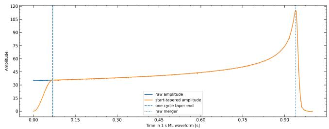

FIG. 3. Schematic showing waveform conditioning performed by applying $\mathrm { a } \sin ^ { 2 } ( t )$ taper at the start of the amplitude series output by the machine-learning model.  
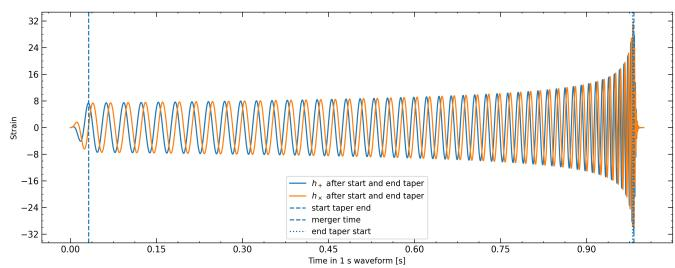  
FIG. 4. An example overplot of the gravitational-wave polarization strain with the waveform conditioning applied to the outputs of the two-stage waveform generation and calibration model.

$$
\left[ \frac { T _ { \mathrm { s e g } } - T _ { \mathrm { s i g } } } { 2 } , \frac { T _ { \mathrm { s e g } } + T _ { \mathrm { s i g } } } { 2 } \right] ,\tag{9}
$$

inside the full data segment. The final conditioned strain

time series is therefore

$$
H ( t ) = \left\{ \begin{array} { l l } { h _ { \mathrm { t a p } } \left( t - \frac { T _ { \mathrm { s e g } } - T _ { \mathrm { s i g } } } { 2 } \right) , } & { \frac { T _ { \mathrm { s e g } } - T _ { \mathrm { s i g } } } { 2 } \leq t \leq \frac { T _ { \mathrm { s e g } } + T _ { \mathrm { s i g } } } { 2 } , } \\ { 0 , } & { \mathrm { o t h e r w i s e } . } \end{array} \right.\tag{10}
$$

This 8 s conditioned time-domain data segment is then Fourier transformed to the frequency-domain, before any use for parameter estimation analysis. The longer segment also sets the discrete frequency spacing to $\Delta f =$ $1 / T _ { \mathrm { s e g } } = 0 . 1 2 5 \mathrm { H }$ z, while the tapering primarily controls the edge behaviour of the finite-duration signal before the Fourier-domain analysis.

## VI. RESULTS WITH CONDITIONED WAVEFORMS

We next evaluate the performance of the conditionedoutput waveform-generation model after reconstructing the time-domain waveform representation, applying the start–end tapering procedure and embedding the 1 s waveform into an 8 s zero-padded data segment. The resulting mismatch distributions are shown in Figure 5. The amplitude and phase representations are reconstructed with substantially smaller errors than the final polarization waveforms. For the amplitude reconstruction, the histogram-bin mode, mean, and median mismatches are $2 . 7 3 \times 1 0 ^ { - 5 } , \ 1 . 6 2 \times 1 0 ^ { - 4 }$ , and $3 . 2 2 \times 1 0 ^ { - 5 }$ , respectively. For the phase reconstruction, the corresponding values are $1 . 6 7 \times 1 0 ^ { - 6 } , \ 4 . 4 2 \times 1 0 ^ { - 6 }$ and $2 . 2 5 \times 1 0 ^ { - 6 }$ These small representation-level mismatches indicate that the conditioned-output model continues to learn the smooth amplitude and phase structure of the waveform accurately. As expected, the accuracy diminishes after reconstructing the oscillatory polarizations $h _ { + }$ and $h _ { \times }$ , since small residual errors in amplitude and phase can accumulate to coherent mismatch errors when mapped back to strain. The conditioned polarization waveforms have comparable mismatch distributions for the two polarizations: for $h _ { + }$ , the histogram-bin mode, mean, and median are $8 . 9 4 \times 1 0 ^ { - 3 } , 1 . 6 \mathrm { { 3 } \times 1 0 ^ { - 2 } }$ , and $1 . 1 7 \times 1 0 ^ { - 2 }$ , while for $h _ { \times }$ they are $1 . 0 5 \times 1 0 ^ { - 2 } , 1 . 6 3 \times 1 0 ^ { - 2 }$ , and 1.1 $5 \times 1 0 ^ { - 2 }$ . The close agreement between the $h _ { + }$ and $h _ { \times }$ statistics suggests that the conditioning procedure does not preferentially degrade one polarization relative to the other.

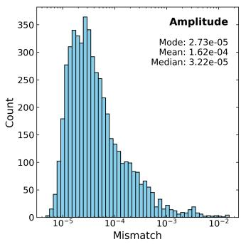

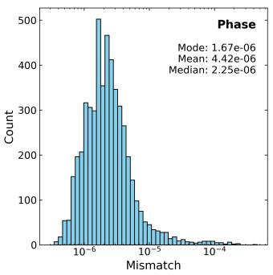

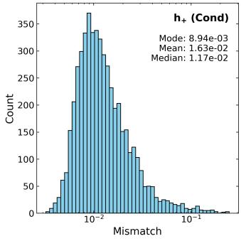

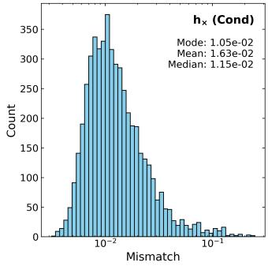  
FIG. 5. (Top) Distribution of the cosine distance for the conditioned amplitude and phase series outputs from the twostage waveform generation and calibration model. (Bottom) Distribution of the mismatch values for the polarization waveforms reconstructed from conditioned outputs. All distributions are shown for data in the test dataset.

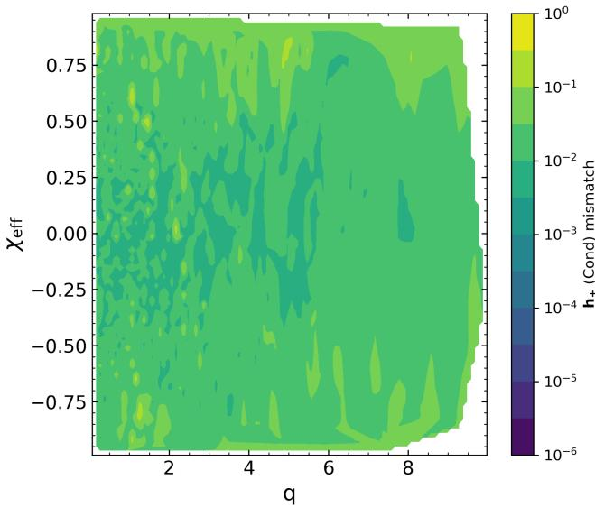  
FIG. 6. Contour plot of the mismatch values for $h _ { + }$ reconstruction from conditioned wavefrom outputs of the two-stage waveform generation and calibration model. Full parameter space is used, i.e. $\chi _ { \mathrm { e f f } } \in [ - 0 . 9 9 , 0 . 9 9 ]$

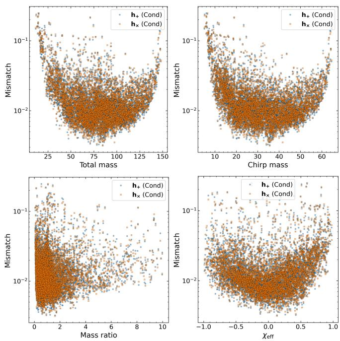  
FIG. 7. Mismatch values as a function of total mass (top left), chirp mass (top right), mass ratio (bottom left), and efective spin (bottom right) for conditioned waveform outputs from the two-stage waveform generation and calibration model, for all data in the test dataset. Full parameter space is used, i.e. χef $\in [ - 0 . 9 9 , 0 . 9 9 ]$

The dependence of the polarization mismatch for conditioned waveforms on the source parameters is shown in Figure 7. The scatter plots against chirp mass and total mass show a characteristic U-shaped trend, with the smallest mismatches concentrated in the central part of the mass range and larger mismatches appearing near the lower- and higher-mass boundaries. This behaviour is consistent with the fact that the morphology and duration of the time-domain signal change substantially across the mass range: lowmass systems contain longer inspiral structure within the fixed signal window, while high-mass systems are more merger–ringdown dominated. The mismatch also increases for more asymmetric systems, as seen in the mass-ratio dependence. Most samples remain clustered around $\mathfrak { M } \ \sim \ 1 0 ^ { - 2 }$ , but the high-mass-ratio region contains a larger fraction of high-mismatch outliers. $\mathrm { A }$ similar boundary efect is visible in the efectivespin dependence, where the lowest mismatches are generally obtained near moderate $\chi _ { \mathrm { e f f } }$ , while larger errors appear more frequently towards large positive or negative aligned efective spin. The two-dimensional mismatch map in the $( q , \chi _ { \mathrm { e f f } } )$ plane (Figure 6) shows the same broad trend: the model is most stable over the densely populated central parameter region, while the mismatch becomes more variable near the edges of the training domain.

Overall, the conditioned-output waveform model achieves accurate reconstruction at the amplitude–phase representation level, with typical mismatches between $1 0 ^ { - 6 }$ and $1 0 ^ { - 4 }$ , while the final polarization mismatches are typically of $\mathcal { O } ( 1 0 ^ { - 2 } )$ The conditioning and tapering procedure successfully produces finite-duration waveforms suitable for Fourier-domain analysis, but it does not by itself remove the dominant residual mismatch in the reconstructed polarizations. The persistence of $\mathcal { O } \big ( 1 0 ^ { - 2 } \big )$ polarization mismatch, despite the much smaller amplitude and phase representation errors, suggests that the main remaining limitation is the sensitivity of the reconstructed strain to small coherent amplitude–phase residuals, particularly near the boundaries of the physical parameter space.

## VII. PARAMETER INFERENCE WITH MACHINE LEARNING SURROGATE: DISCUSSION AND RESULTS

In this section, we now use the conditioned waveforms outputs from the two-stage waveform generation and calibration model (described in Section V) for parameter estimation tests. Parameter estimation with our machine-learning waveforms can be performed by adding a custom waveform Python class to Bilby [66]. Due to constaint that the duration of the machine-learning generated waveforms is fixed at 1 s, for parameter estimation analysis we use a restricted mass prior range of $m _ { 1 } , m _ { 2 } \in$ Uniform[30, 75]. The two spin components are uniform in the range [−0.80, 0.80]. All machinelearning model generated waveforms are also scaled to be at diferent luminosity distances as required during the parameter estimation runs.

Let C[·] denote the conditioning operation, consisting of fixed merger-time alignment, tapering, and embedding in the longer 8 s data segment. The conditioned machinelearning waveform is then

$$
h _ { \mathrm { M L } } ^ { C } ( t ; \theta ) = C [ h _ { \mathrm { M L } } ( t ; \theta ) ] ,\tag{11}
$$

and the corresponding conditioned EOB reference waveform is

$$
h _ { \mathrm { E O B } } ^ { C } ( t ; \theta ) = C [ h _ { \mathrm { E O B } } ( t ; \theta ) ] .\tag{12}
$$

In particular, the EOB injection waveforms are processed using the same merger-time alignment, tapering, and embedding procedure as the machinelearning waveforms. This ensures that all comparisons are performed within the waveform domain actually learned by the surrogate model. For the parameter estimation analysis in this work, we will inject waveforms to Gaussian noise data generated with the aLIGOZeroDetunedHighPower power spectral density from LalSuite [59]. For parameter sampling we use the nessai sampler [67] backend in Bilby in all our analysis. Depending on which waveforms are used for injections and which are used for parameter recovery, we have two diferent parameter estimation cases: ML2ML and EOB2ML, while the EOB2EOB is the parameter estimation without using any machine learning surrogates.

## A. Posterior-predictive probability-probability validation

To assess the statistical calibration of the parameter estimation pipeline, we use probability-probability (PP) plots constructed from a set of parameter estimation analysis results for diferent simulated injections. For each injection i, the true source parameters $\boldsymbol { \theta } _ { i } ^ { \mathrm { i n j } }$ are known. After performing Bayesian inference, the sampler returns posterior samples from $P ( \pmb { \theta } | | d _ { i } )$ where $d _ { i }$ denotes the simulated detector data for the i-th injection. For a given parameter $\theta ,$ we compute the posterior credible level at which the injected value is recovered,

$$
c _ { i , \theta } = P ( \theta < \theta _ { i } ^ { \mathrm { i n j } } \mid d _ { i } ) \simeq \frac { 1 } { N _ { i } } \sum _ { j = 1 } ^ { N _ { i } } \mathbf { 1 } \left( \theta _ { i j } < \theta _ { i } ^ { \mathrm { i n j } } \right) ,\tag{13}
$$

where $\theta _ { i j }$ denotes the j-th posterior sample for parameter θ in injection $i , N _ { i }$ is the number of posterior samples, and $\mathbf { 1 } ( \cdot )$ is the indicator function.

If the parameter estimation analysis is unbiased, the probability distribution for the parameters will have the correct coverage, meaning the relative frequency of occurence of the true value of each parameter within some interval will equal the integral of the posterior probability distribution within that interval. If we conduct $N _ { \mathrm { i n j } }$ trials, drawing each test case from the prior distribution density, and select a credible interval, $\stackrel { - } { c _ { i , \theta _ { i = 1 } } } ^ { N _ { \mathrm { i n j } } }$ , from the posterior distribution density for some parameter θ, then the fraction of test cases whose true values for that parameter are within that credible interval is expected to equal that credible interval’s probability. By plotting the fraction of simulations found within a credible interval as a function of the size of the credible interval we can empirically confirm the coverage of the posterior probability distribution function. The definition of the credible interval is irrelevant. Recall that this is called the PP-plot, for the following function,

$$
\widehat F _ { \theta } ( x ) = \frac { 1 } { N _ { \mathrm { i n j } } } \sum _ { i = 1 } ^ { N _ { \mathrm { i n j } } } \mathbf { 1 } \left( c _ { i , \theta } < x \right) , \qquad 0 \le x \le 1 .\tag{14}
$$

In a perfect unbiased analysis, ${ \widehat { F } } _ { \theta } ( x ) = x .$ so the PP curve follows the diagonal line. Deviations from the diagonal indicate imperfect posterior calibration. For example, systematic deviations may indicate biased parameter recovery, while overly steep or shallow curves can indicate posterior intervals that are respectively too broad or too narrow. Because of the finite number of trials, random deviations from the diagonal are expected, but we can predict the size of the deviations that we expect using the binomial distribution.

In this work, all PP plots are generated using the Bilby result utilities. The horizontal axis denotes the nominal credible interval x, while the vertical axis denotes the fraction of injections whose true parameter value lies below that posterior credible level. For each parameter, Bilby computes the injected credible levels and applies a one-sample Kolmogorov-Smirnov test against the uniform distribution on [0, 1]. The Kolmogorov-Smirnov statistic is

$$
D _ { \theta } = \operatorname* { s u p } _ { 0 \leq x \leq 1 } \left| { \widehat F } _ { \theta } ( x ) - x \right| ,\tag{15}
$$

and the associated p-value quantifies the probability, under the null hypothesis of calibrated posteriors, of obtaining a deviation at least as large as the observed one. Small p-values therefore indicate that the credible levels are unlikely to have been drawn from a uniform distribution, suggesting a calibration failure or a systematic bias in the inference setup.

When multiple parameters are tested, Bilby also reports a combined p-value obtained from the individual parameter-wise p-values. This provides a compact diagnostic of the global PP-plot consistency. However, since source parameters such as $m _ { 1 } , m _ { 2 } , \chi _ { 1 }$ , and χ2 are generally correlated, the combined p-value should be interpreted as a useful summary statistic rather than as a fully independent hypothesis test.

In the present analysis, the PP-plot is used primarily as a posterior-level self-consistency test of the waveform model and inference pipeline. For the ML2ML case, a diagonal PP-plot indicates that injections generated with the machine-learning waveform model are statistically recovered by the same model. In contrast, systematic deviations in the EOB2ML case would quantify the impact of waveform-systematic diferences between the EOB injection waveforms and the ML recovery waveforms.

## B. ML2ML parameter inference with conditioned waveforms

We first do a parameter estimation run with likelihood evaluations using machine-learning generated waveforms for machine-learning waveform injections. These parameter estimation runs act as a validator for the use of machine-learning waveforms with parameter estimation pipeline, and isolate the parameter sampling and inference procedures from machine-learning waveform accuracy errors. This ML2ML case is ideally expected to work well, since whatever accuracy error the machinelearning generated waveforms may have, remains identical for both the injections and for the waveforms against which the likelihood is evaluated in this case. Besides, as opposed to the stochastic output of the variational model in Garg et al. [17], the outputs of our machine-learning waveform model are fullydeterministic, and thus, lead to the same likelihood value if the same set of parameter is sampled twice.

For the ML2ML parameter estimation case, the injected signal is generated using the conditioned ML waveform model as,

$$
\begin{array} { r } { d _ { \mathrm { M L } } ( t ) = h _ { \mathrm { M L } } ^ { C } ( t ; \theta _ { \mathrm { i n j } } ) + n ( t ) , } \end{array}\tag{16}
$$

where $n ( t )$ is a Gaussian noise realization and $\theta _ { \mathrm { i n j } }$ denotes the injected parameter values. The same conditioned waveform model is then used for likelihood calculations. The ML likelihood is written schematically as

$$
\begin{array} { r l } & { \log \mathcal { L } _ { \mathrm { M L } } \left( d _ { \mathrm { M L } } \middle | \theta \right) } \\ & { = - \frac { 1 } { 2 } \left( d _ { \mathrm { M L } } - h _ { \mathrm { M L } } ^ { C } ( \theta ) \middle | d _ { \mathrm { M L } } - h _ { \mathrm { M L } } ^ { C } ( \theta ) \right) + \mathrm { c o n s t . } , } \end{array}\tag{17}
$$

where $( a | b )$ denotes the usual detector-noise-weighted inner product. Since the same waveform family is used for injection and recovery, the likelihood is expected to peak near the injected parameters, up to statistical fluctuations due to detector noise. The corresponding posterior is

$$
P _ { \mathrm { M L } } ( \theta | d _ { \mathrm { M L } } ) = \frac { \pi ( \theta ) \mathcal { L } _ { \mathrm { M L } } ( d _ { \mathrm { M L } } | \theta ) } { Z _ { \mathrm { M L } } } ,\tag{18}
$$

where $\pi ( \theta )$ is the prior and $Z _ { \mathrm { M L } }$ is the evidence.

Now, recall that for each injection k, we compute the percentile value

$$
p _ { k } ^ { ( \theta ) } = \int _ { - \infty } ^ { \theta _ { \mathrm { i n j } , k } } P _ { \mathrm { M L } } \left( \theta \mid d _ { \mathrm { M L } , k } \right) d \theta\tag{19}
$$

for each parameter $\theta \in [ m _ { 1 } , m _ { 2 } , \chi _ { 1 } , \chi _ { 2 } ]$ . If the posterior is calibrated, the set of percentile values $\{ p _ { k } ^ { ( \theta ) } \}$ should be uniformly distributed on [0, 1]. Therefore, the PP-plot should follow the diagonal within the expected binomial confidence region.

Figure 8 shows the posterior for one randomly selected injection for the ML2ML parameter estimation case, while Figure 9 shows the corresponding $\mathrm { P P - p l o t }$ All parameter estimation runs are set to terminate when the threshold of d log $Z \ = \ 0 . 2$ is reached, whereas a lower threshold of around 0.05 maybe recommended to allow the sampler to contrain a narrower posterior region around the injection value. We observe that the ML2ML PP-plot obtained using the conditioned waveform outputs is consistent with the diagonal. This confirms that the parameter estimation pipeline, prior implementation, mass ordering, time alignment, waveform conditioning, and likelihood evaluation are internally self-consistent when the injection and recovery waveform families are the same. In particular, the ML2ML result shows that our parameter estimation current implementation is capable of recovering injected signals when the data-generating and recovery waveform families are identical. Therefore, any systematic deviation observed in the EOB2ML case occuring now, cannot be attributed solely to the sampler or to the basic Bilby likelihood calculation setup.

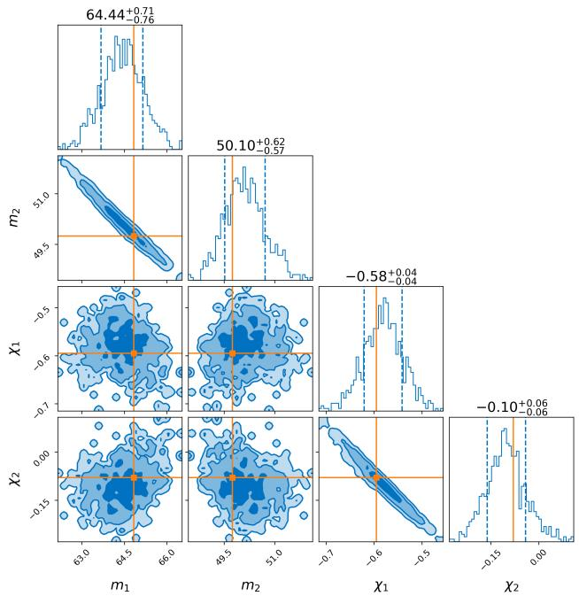  
FIG. 8. Posterior distributions recovered for a ML2ML parameter estimation run with conditioned waveform outputs. The injection parameters are $m _ { 1 } ~ = ~ 6 4 . 8 2 \mathrm { M _ { \odot } }$ $m _ { 2 } ~ = ~ 4 9 . 7 5 \mathrm { M } _ { \odot } , ~ \chi _ { 1 } ( z ) ~ = ~ - 0 . 5 9 5 , ~ \chi _ { 2 } ( z ) ~ = ~ - 0 . 0 8 , ~ d _ { L } ~ = ~$ 400 Mpc. SNR of the injected signal is about 107.12. Other parameters are fixed at: $\begin{array} { l c l } { { \theta _ { \mathrm { j n } } } } & { { = } } & { { 0 . 4 , \psi } } \end{array} = \begin{array} { l c l } { { 2 . 6 5 9 , \phi _ { c } } } & { { = } } \end{array}$ $1 . 3 , t _ { c } = 1 1 2 6 2 5 9 6 4 2 . 4 1 3 , \mathrm { r a } = 1 . 3 7 5$ , and dec = −1.2108. The marginalized posterior histograms show the probability density for diferent posterior samples, alongwith the 1σ credible interval. The 2D joint posteriors show the 2D 1σ, 2σ and 3σ credible regions. Each column header denotes the median value of the parameter and the 1σ credible range around it.

## C. EOB2ML parameter inference with conditioned waveforms

We next perform the EOB2ML parameter estimation tests. In this case, the injected data are generated using the conditioned EOB waveform,

$$
\begin{array} { r } { d _ { \mathrm { E O B } } ( t ) = h _ { \mathrm { E O B } } ^ { C } ( t ; \theta _ { \mathrm { i n j } } ) + n ( t ) , } \end{array}\tag{20}
$$

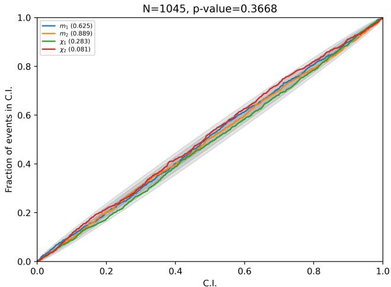  
FIG. 9. PP-plot for the ML2ML recovery experiment with 1045 injections using conditioned waveforms. The luminosity distance for the injections is set at $d _ { L } ~ = ~ 4 0 0 \mathrm { M p c }$ The diagonal curve points that there is no systematic error in the parameter estimation set-up now. All other injection parameters values and other parameter estimation settings remain the same as in Figure 8.

while the recovery likelihood is still evaluated using the conditioned machine-learning waveform model,

$$
\begin{array} { r l } & { \log \mathcal { L } _ { \mathrm { M L } } \left( d _ { \mathrm { E O B } } \mid \pmb { \theta } \right) } \\ & { = - \cfrac { 1 } { 2 } \left( d _ { \mathrm { E O B } } - h _ { \mathrm { M L } } ^ { C } ( \pmb { \theta } ) \big | d _ { \mathrm { E O B } } - h _ { \mathrm { M L } } ^ { C } ( \pmb { \theta } ) \right) + \mathrm { c o n s t . } } \end{array}\tag{21}
$$

The corresponding EOB2ML posterior is

$$
P _ { \mathrm { E O B 2 M L } } \left( \pmb { \theta } \mid d _ { \mathrm { E O B } } \right) = \frac { \pi ( \pmb { \theta } ) \mathcal { L } _ { \mathrm { M L } } \left( d _ { \mathrm { E O B } } \mid \pmb { \theta } \right) } { Z _ { \mathrm { E O B 2 M L } } } .\tag{22}
$$

Now, the EOB2ML likelihood may not necessarily be maximized at $\theta _ { \mathrm { i n j } }$ , because the waveform family used for recovery difers from the waveform family used to generate the data. The sampler therefore searches for the parameter value $\theta _ { \mathrm { M L } } ^ { \star }$ for which the ML waveform best approximates the EOB injection:

$$
\theta _ { \mathrm { M L } } ^ { \star } = \arg \operatorname* { m a x } _ { \theta } \mathcal { L } _ { \mathrm { M L } } ( d _ { \mathrm { E O B } } | \theta ) .\tag{23}
$$

If $h _ { \mathrm { M L } } ( \theta _ { \mathrm { i n j } } )$ difers appreciably from $h _ { \mathrm { E O B } } ( \theta _ { \mathrm { i n j } } )$ the maximum-likelihood point $\theta _ { \mathrm { M L } } ^ { \star }$ can be systematically displaced from $\theta _ { \mathrm { i n j } }$ This displacement will a waveform-systematic bias rather than arising from any discrepancies in the parameter estimation or sampler setups, provided that the ML2ML parameter estimation case is properly calibrated (has a diagonal PP-plot), as we have already seen.

The importance of the waveform-systematic bias, inherent in the parameter estimation (PE) process, depends on both the waveform error and the SNR ratio. For a waveform mismatch M, the likelihood penalty induced by waveform error scales approximately as

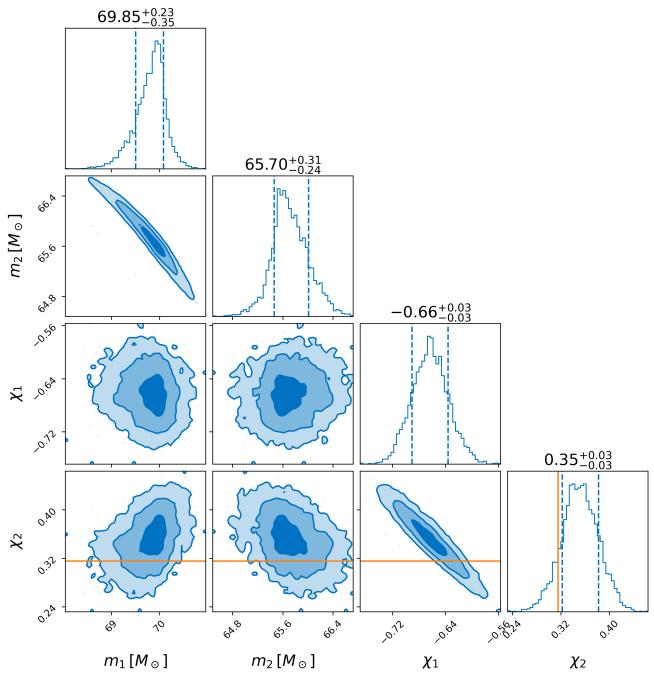  
FIG. 10. Posterior distributions recovered for a EOB2ML parameter estimation run with conditioned waveform outputs. The injection parameters are $m _ { 1 } ~ = ~ 7 4 . 0 9 \mathrm { M _ { \odot } }$ $m _ { 2 } = 7 0 . 3 1 \mathrm { M } _ { \odot } , \chi _ { 1 } ( z ) = - 0 . 3 2 , \chi _ { 2 } ( z ) = 0 . 3 1 , d _ { L } = 4 0 0 \mathrm { M p c }$ SNR of the injected signal is about 139.45. Other parameters and parameter estimation settings remain the same as in Figure 8.

$$
\Delta \log \mathcal { L } \sim \rho ^ { 2 } \mathfrak { M } ,\tag{24}
$$

where $\rho$ is the network SNR ratio. Thus, even a mismatch that appears small in a waveform-reconstruction metric can produce a large posterior bias at high SNR. A rough condition for waveform errors to be subdominant to statistical uncertainty is

$$
\rho ^ { 2 } \mathfrak { M } \lesssim 1 .\tag{25}
$$

For example, if M $\sim 1 0 ^ { - 2 }$ , this condition requires $\rho \lesssim 1 0$ If $\mathfrak { M } \sim 1 0 ^ { - 4 }$ , the same condition allows $\rho \lesssim 1 0 0$ . This illustrates why waveform accuracy requirements become more stringent as the signal becomes louder.

In contrast to the ML2ML case, the EOB2ML posteriors (e.g. Figures 10 and 12) show systematic deviations from the injected values for a subset of injections. Direct likelihood scans for the EOB2ML posterior demonstrate that the ML likelihood evaluated on EOB injections is often larger at shifted parameter values than at the true injected parameters. The resulting PP-plots are not perfectly diagonal and show a characteristic non-uniform structure (Figures 11 and 13). This indicates that, although the conditioned machinelearning waveform model gives a self-consistent likelihood when used for both injection and recovery, it does not always reproduce the conditioned EOB likelihood surface with the required accuracy. The observed deviation can therefore be interpreted as a waveform-family mismatch between $h _ { \mathrm { E O B } } ^ { C } ( \pmb { \theta } )$ and $h _ { \mathrm { M L } } ^ { C } ( \pmb { \theta } )$ under otherwise identical data-analysis conventions.

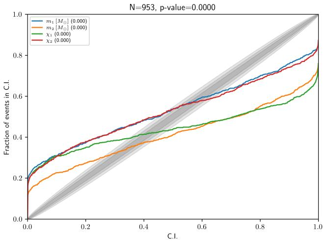  
FIG. 11. PP-plot for the EOB2ML parameter estimation experiment with 953 injections using conditioned waveforms. Some inherent systematic bias is seen. The luminosity distance for the injections is set at $d _ { L } = 4 0 0 \mathrm { M p c }$ . All other injection parameters values (apart from the four parameter shown) and other parameter estimation settings remain the same as in Figure 8.

For a given injection, the EOB2ML posterior may still contain the injected value within a one-dimensional credible interval for some parameters, even when the full four-dimensional posterior is biased. Therefore, we should quantify the inherred bias directly using the inferred one-dimensional posterior summaries.

## D. Bias in EOB2ML parameter inference

For each injection k and each parameter $\theta ,$ we define a one-dimensional posterior summary

$$
\hat { \theta } _ { k } = \mathrm { m o d e } \left[ P _ { \mathrm { E O B 2 M L } } \left( \theta \mid d _ { \mathrm { E O B } , k } \right) \right] ,\tag{26}
$$

where the mode is computed from the one-dimensional marginalized posterior. In some comparisons we also use the posterior median,

$$
\tilde { \theta } _ { k } = \mathrm { m e d i a n } \left[ P _ { \mathrm { E O B 2 M L } } \left( \theta \mid d _ { \mathrm { E O B } , k } \right) \right] .\tag{27}
$$

The posterior mode is used as a point estimate of the peak of the marginalized posterior, while the median is used as a robust central estimate. However, the full posterior distribution, rather than any single point estimate, remains the primary parameter estimation result.

For positive-valued mass parameters, we quantify the

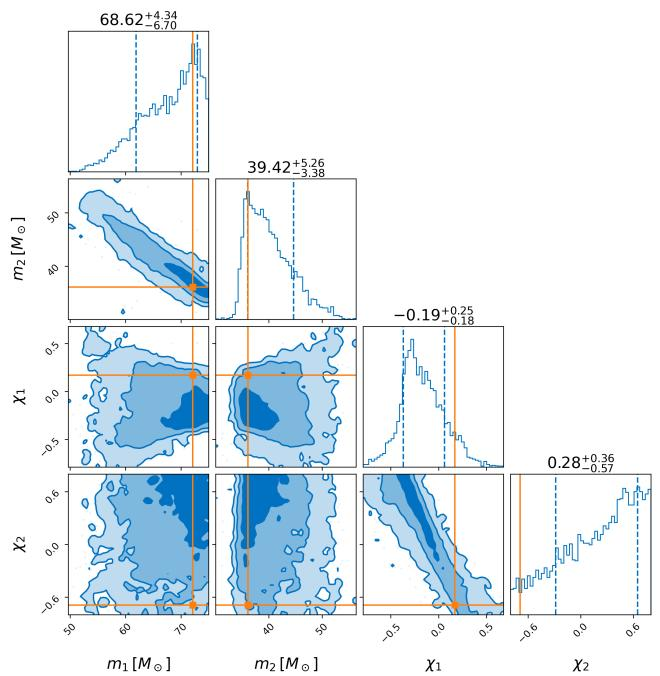  
FIG. 12. Posterior distributions recovered for a EOB2ML parameter estimation run with conditioned waveform outputs. The injection parameters are $m _ { 1 } = 7 2 . 1 2 \mathrm { M } _ { \odot } , m _ { 2 } =$ $3 6 . 0 8 \mathrm { { M } _ { \odot } , \ \chi _ { 1 } ( } z ) \ = \ 0 . 1 7 , \ \chi _ { 2 } ( z ) \ = \ - 0 . 6 9 , \ d _ { L } \ = \ 4 0 0 0 \mathrm { { M p c } }$ SNR of the injected signal is about 9.95. Other parameters and parameter estimation settings remain the same as in Figure 8.

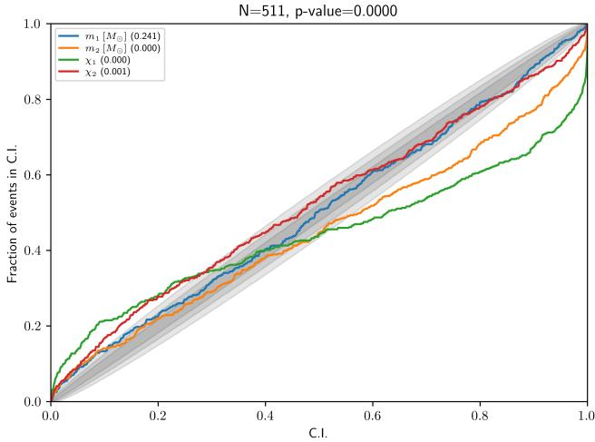  
FIG. 13. $\mathrm { P P - p l o t }$ for the EOB2ML parameter estimation experiment with 511 injections using conditioned waveforms. The luminosity distance for the injections is set at $d _ { L } \ =$ 4000 Mpc. The SNR of the signal scales inversely with the luminosity distance to the source. Thus, in comparison to Figure 11, we find that there is some improvements in the inherent systematic bias at lower SNR. All other injection parameters values (apart from the four parameter shown) and other parameter estimation settings remain the same as in Figure 8.

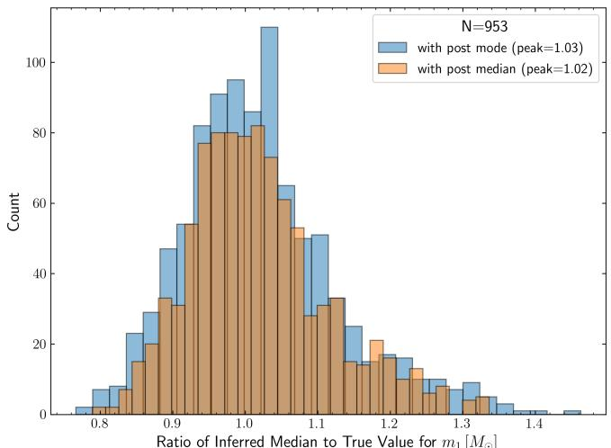

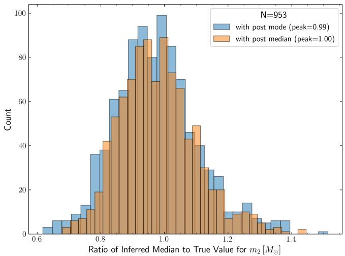  
FIG. 14. Distribution of the ratio of the inferred posterior mode and median value for the primary (top) and secondary (bottom) mass parameters calculated from the EOB2ML parameter estimation runs results for injections described in Figure 11.

multiplicative bias using the ratio

$$
R _ { \theta , k } = { \frac { \hat { \theta } _ { k } } { \theta _ { \operatorname * { i n j } , k } } } , \qquad \theta \in \{ m _ { 1 } , m _ { 2 } \} .\tag{28}
$$

A value $R _ { \theta , k } = 1$ corresponds to an unbiased marginalmode estimate. Values above or below unity indicate a systematic over-estimation or under-estimation of the parameter. We also consider the additive residual

$$
\Delta \theta _ { k } = \hat { \theta } _ { k } - \theta _ { \mathrm { i n j } , k } ,\tag{29}
$$

which is especially useful for spin parameters, because $\chi _ { 1 }$ and $\chi _ { 2 }$ can be negative or close to zero.

The empirical distribution of $R _ { \theta , k }$ and $\Delta \theta _ { k }$ over the injection set provides a direct measure of the EOB2ML bias (Figures 14 and 15). For example, a systematic shift of the primary-mass posterior median by approximately 10 $M _ { \odot }$ relative to the injected value indicates a coherent surrogate-induced bias in the inferred mass posterior.

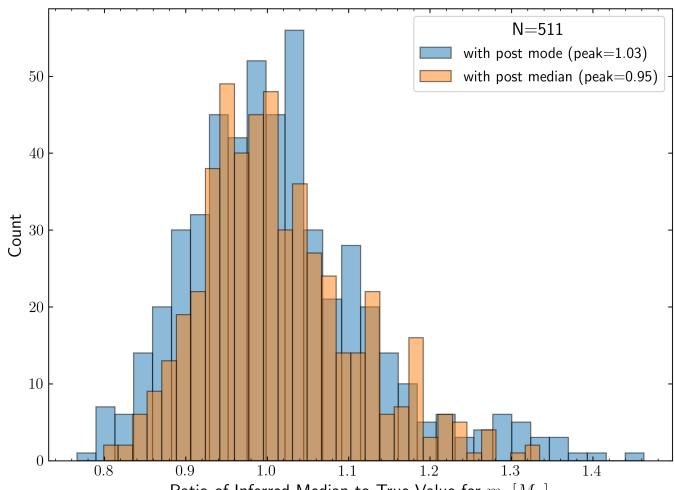  
Ratio of Inferred Median to True Value for m1 [M]

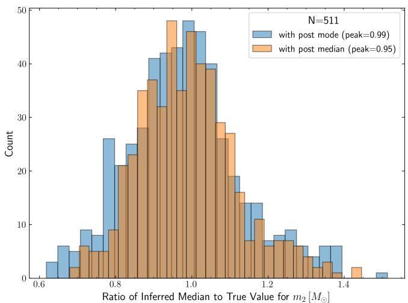  
FIG. 15. Distribution of the ratio of the inferred posterior mode and median value for the primary (top) and secondary (bottom) mass parameters calculated from the EOB2ML parameter estimation runs results for injections described in Figure 13.

To test whether the EOB2ML bias is coherent and approximately correctable, we construct an empirical one-dimensional bias correction method for each parameter. For each parameter θ, we can fit a linear relation between the measured bias ratio and the inferred posterior mode,

$$
R _ { \theta , k } = a _ { \theta } + b _ { \theta } \hat { \theta } _ { k } + \epsilon _ { \theta , k } ,\tag{30}
$$

where $a _ { \theta }$ and $b _ { \theta }$ are the fitted intercept and slope, and $\epsilon _ { \theta , k }$ denotes the residual scatter. The fitted bias factor evaluated at the inferred mode is therefore

$$
B _ { \theta , k } = a _ { \theta } + b _ { \theta } \hat { \theta } _ { k } .\tag{31}
$$

For each injection k, the one-dimensional marginalized posterior samples for parameter θ can then be corrected by dividing by this fitted bias factor,

$$
\displaystyle \theta _ { k , j } ^ { \mathrm { c o r r } } = \frac { \theta _ { k , j } } { B _ { \theta , k } } ,\tag{32}
$$

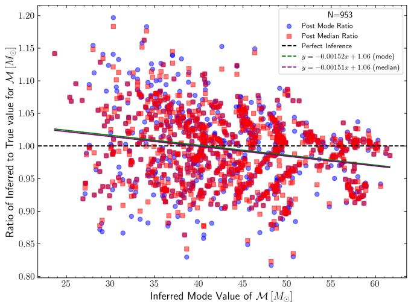

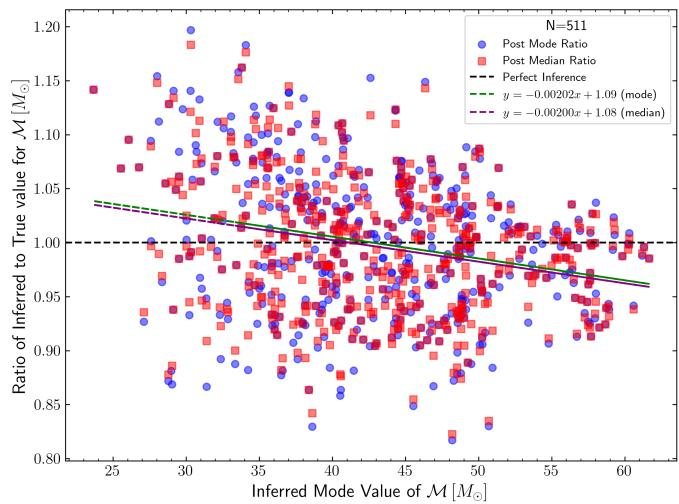  
FIG. 16. Inferred posterior mode versus ratio of inferred to true value for the chirp mass, calculated from the distributions shown in Figure 14 for $d _ { L } = 4 0 0 \mathrm { M p c }$ . EOB2ML parameter estimation case (top), and in Figure 15 for $d _ { L } = 4 0 0 0 \mathrm { M p c }$ (bottom). The linear regression fit lines are also plotted. The ratio with the inferred posterior median is shown for completeness sake.

where $\theta _ { k , j }$ denotes the j-th posterior sample of parameter θ for injection k. Equivalently, the corrected onedimensional marginalized posterior is

$$
p _ { \mathrm { c o r r } } \left( \theta \mid d _ { \mathrm { E O B } , k } \right) = B _ { \theta , k } \ : P _ { \mathrm { E O B 2 M L } } \left( B _ { \theta , k } \theta \mid d _ { \mathrm { E O B } , k } \right) ,\tag{33}
$$

where the prefactor preserves normalization under the change of variables.

For spin parameters, when a multiplicative ratio is not stable, an additive calibration can instead be used,

$$
\Delta \theta _ { k } = a _ { \theta } + b _ { \theta } \hat { \theta } _ { k } + \epsilon _ { \theta , k } ,\tag{34}
$$

with the corrected samples given by

$$
\theta _ { k , j } ^ { \mathrm { c o r r } } = \theta _ { k , j } - \left( a _ { \theta } + b _ { \theta } \hat { \theta } _ { k } \right) .\tag{35}
$$

This procedure is basically a post-hoc correction of the one-dimensional marginalized EOB2ML posteriors.

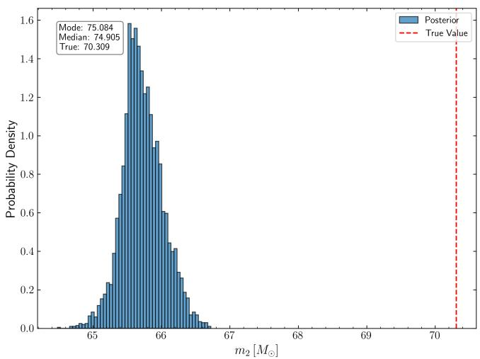

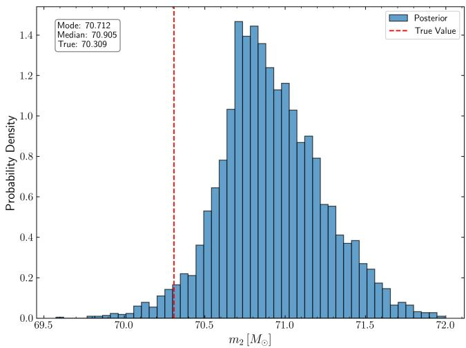  
FIG. 17. Biased (top) and bias-corrected (bottom) onedimensional marginalized posteriors for the secondary mass for EOB2ML parameter estimation run for the injection described in Figure 10.

Thus, it does not, in any way imply that the original ML likelihood is fully EOB-faithful. Rather, it tests whether the observed EOB2ML bias is coherent enough to be empirically modeled and partially removed.

The derived parameter, chirp mass, is usually better constrained in parameter estimation analysis. As Figure 16 shows, we find that the inferred posterior mode ratio for the chirp mass of the binary is systematically dependent, and is inversely proportional to the mass of the binary. Figure 17 shows an illustration of the bias correction procedure described in this section for the marginalized posterior for the secondary mass in the EOB2ML parameter estimation test in Figure 10. We see that the inherent bias in EOB2ML parameter estimation is systematic and can be easily corrected for.

## E. Importance reweighting EOB2ML proposal to EOB2EOB target

The EOB2ML posterior can also be interpreted as a proposal distribution for importance reweighting. The proposal posterior is

$$
q ( \theta ) = P _ { \mathrm { M L } } ( \theta | d _ { \mathrm { E O B } } ) \propto \pi ( \theta ) \mathcal { L } _ { \mathrm { M L } } ( d _ { \mathrm { E O B } } | \theta ) ,\tag{36}
$$

whereas the desired target posterior is

$$
p ( \theta ) = P _ { \mathrm { E O B } } ( \theta | d _ { \mathrm { E O B } } ) \propto \pi ( \theta ) \mathcal { L } _ { \mathrm { E O B } } ( d _ { \mathrm { E O B } } | \theta ) .\tag{37}
$$

Existence of an overlap in the true EOB posterior for EOB injections and the EOB2ML posterior, obtained using faster likelihood calculations with the ML waveforms, is necessary to ensure that at least some samples lie within the desired credible region around the injection parameter. For a posterior sample $\theta _ { i }$ drawn from the EOB2ML proposal distribution, the corresponding importance weight can be calculated as the ratio between the target and the proposal densities. If the priors are identical, the prior factors cancel in the importance ratio. The unnormalized importance weight assigned to a proposal sample $\theta _ { i } \sim q ( \theta )$ is therefore

$$
w _ { i } \propto \frac { { \mathcal { L } } _ { \mathrm { E O B } } ( d _ { \mathrm { E O B } } | \theta _ { i } ) } { { \mathcal { L } } _ { \mathrm { M L } } ( d _ { \mathrm { E O B } } | \theta _ { i } ) } .\tag{38}
$$

In practice, it is better to perform this in the log form,

$$
\begin{array} { r } { \log w _ { i } = \log \mathcal { L } _ { \mathrm { E O B } } ( d _ { \mathrm { E O B } } | \theta _ { i } ) - \log \mathcal { L } _ { \mathrm { M L } } ( d _ { \mathrm { E O B } } | \theta _ { i } ) . } \end{array}\tag{39}
$$

and with weight normalization,

$$
\bar { w } _ { i } = \frac { w _ { i } } { \sum _ { j = 1 } ^ { N } w _ { j } } .\tag{40}
$$

If the ML likelihood is narrowly peaked far from the true value, then the EOB2ML proposal can instead be generated from a tempered likelihood as,

$$
q _ { \alpha } ( \theta ) \propto \pi ( \theta ) \mathcal { L } _ { \mathrm { M L } } ( d _ { \mathrm { E O B } } | \theta ) ^ { \alpha } , \qquad 0 < \alpha \leq 1 ,\tag{41}
$$

and then the correct importance weights become

$$
\begin{array} { r } { \log { w _ { i } } = \log \mathcal { L } _ { \mathrm { E O B } } ( d _ { \mathrm { E O B } } | \theta _ { i } ) - \alpha \log \mathcal { L } _ { \mathrm { M L } } ( d _ { \mathrm { E O B } } | \theta _ { i } ) . } \end{array}\tag{42}
$$

The role of the tempering parameter is to broaden the proposal posterior. Smaller values of α correspond to a higher efective temperature and can increase overlap with the EOB target posterior.

The EOB posterior expectation of a function f(θ) is then approximated by

$$
\mathbb { E } _ { \mathrm { E O B } } [ f ( \theta ) ] \simeq \sum _ { i = 1 } ^ { N } \bar { w } _ { i } f ( \theta _ { i } ) .\tag{43}
$$

The quality of the weighted sample is quantified by the efective sample size

$$
N _ { \mathrm { e f f } } = \frac { 1 } { \sum _ { i = 1 } ^ { N } \bar { w } _ { i } ^ { 2 } } .\tag{44}
$$

If all samples have equal weights, then $N _ { \mathrm { e f f } } ~ = ~ N$ If a single sample dominates the weight, then $N _ { \mathrm { e f f } } \ \approx \ 1$ Therefore, $N _ { \mathrm { e f f } } / N$ is a direct diagnostic of proposaltarget overlap. A small efective sample fraction will indicate that the ML proposal does not suficiently cover the EOB target posterior, and an equal-weight reweighted posterior obtained by rejection or resampling will be unreliable. We applied the importancereweighting method for some of the posteriors from our EOB2ML parameter estimation run, however, we find that the suficient posterior overlap only occurs at low SNRs. In the next section, we discuss this behaviour in more detail.

## VIII. DISCUSSION ON PARAMETER ESTIMATION WITH INJECTION AT DIFFERENT SNR

## A. Expected one-dimensional likelihood comparison as a function of SNR

A useful diagnostic is to compare the one-dimensional likelihood profiles in a single parameter, for example $m _ { 1 }$ while fixing over the remaining parameters. Let

$$
\ell _ { \mathrm { E O B } } ( m _ { 1 } ) = \log \mathcal { L } _ { \mathrm { E O B } } ( d _ { \mathrm { E O B } } | m _ { 1 } , \hat { \boldsymbol { \theta } } _ { \setminus m _ { 1 } } )\tag{45}
$$

and

$$
\ell _ { \mathrm { M L } } ( m _ { 1 } ) = \log \mathcal { L } _ { \mathrm { M L } } ( d _ { \mathrm { E O B } } | m _ { 1 } , \hat { \theta } _ { \backslash m _ { 1 } } ) ,\tag{46}
$$

where $\hat { \theta } _ { \backslash m _ { 1 } }$ denotes either fixed injected values or locally optimized values of the remaining parameters. In the ideal case, both likelihoods peak at the same value of $m _ { 1 }$ . If the ML waveform is biased relative to the EOB waveform, the ML likelihood peak is shifted away from the EOB peak.

At high SNR, the likelihood is narrow, and even a small separation between the EOB and ML likelihood maxima can produce negligible posterior overlap. At lower SNR, the likelihood broadens, and the proposal posterior obtained from the EOB2ML run may overlap more strongly with the true EOB2EOB posterior. This improved overlap makes importance reweighting more likely to produce a finite and useful efective sample size.

This behavior can be understood using a simple Gaussian approximation. Suppose that the EOB target and ML proposal in one dimension are approximately

$$
\begin{array} { r l } & { p ( m _ { 1 } ) = \mathcal { N } ( m _ { 1 } ; \mu _ { \mathrm { E O B } } , \sigma ^ { 2 } ) , } \\ & { q ( m _ { 1 } ) = \mathcal { N } ( m _ { 1 } ; \mu _ { \mathrm { M L } } , \sigma ^ { 2 } ) , } \end{array}\tag{47}
$$

with a mean displacement $\Delta m _ { 1 } = \mu _ { \mathrm { M L } } - \mu _ { \mathrm { E O B } }$ . Since statistical uncertainty typically scales as $\sigma ( \rho ) \propto \rho ^ { - 1 }$ , the separation in units of posterior width grows as

$$
\frac { | \Delta m _ { 1 } | } { \sigma ( \rho ) } \propto \rho | \Delta m _ { 1 } | .\tag{48}
$$

Thus, even if the absolute parameter bias is approximately fixed, its significance increases with SNR. In this simplified case, the efective sample fraction for importance weighting decreases approximately exponentially with the squared separation:

$$
\frac { N _ { \mathrm { e f f } } } { N } \sim \exp \left[ - \frac { \Delta m _ { 1 } ^ { 2 } } { \sigma ( \rho ) ^ { 2 } } \right] .\tag{49}
$$

It should be noted though that this is not an exact prediction for the full multidimensional gravitationalwave posterior, but it captures the expected trend: proposal-target overlap is largest at low SNR and rapidly decreases as the signal becomes louder.

The SNR value at which importance reweighting becomes useful depends on the waveform mismatch and on the size of the waveform-induced parameter bias. A rough waveform-accuracy criterion is given by Equation (25). For our current surrogate waveform model that has $\mathfrak { M } \ \sim \ 1 0 ^ { - 2 }$ one expects unbiased or strongly overlapping EOB2ML proposals only at relatively low SNR, roughly $\rho \lesssim 1 0$ . For a more accurate surrogate with $\mathfrak { M } \sim 1 0 ^ { - 4 }$ , the same heuristic suggests that useful overlap may persist up to $\rho \sim 1 0 0$ . However, since the actual behavior depends on the local structure of the likelihood and on correlations among masses and spins, these values are only approximate.

## B. Cost-based metric for the usefulness of the EOB2ML proposal

A practical motivation for EOB2ML sampling followed by EOB reweighting is to reduce the number of expensive EOB likelihood evaluations. We can define a EOBlikelihood cost factor as

$$
\mathcal { R } _ { \mathrm { c o s t } } = \frac { N _ { \mathrm { M L } } ^ { \mathrm { r w } } } { N _ { \mathrm { E O B } } ^ { \mathrm { d i r e c t } } } ,\tag{50}
$$

where $N _ { \mathrm { E O B } } ^ { \mathrm { r w } }$ is the number of EOB likelihood evaluations required to reweight samples from the ML proposal, and $N _ { \mathrm { E O B } } ^ { \mathrm { d i r e c t } }$ is the number of EOB likelihood evaluations required for a direct EOB2EOB parameter estimation run. Values $\mathcal { R } _ { \mathrm { c o s t } } ~ < ~ 1$ indicate that the reweighting approach is cheaper in terms of EOB likelihood calls. The corresponding likelihood speedup is

$$
S _ { \mathrm { M L } } = \frac { 1 } { \mathcal { R } _ { \mathrm { c o s t } } } = \frac { N _ { \mathrm { E O B } } ^ { \mathrm { d i r e c t } } } { N _ { \mathrm { M L } } ^ { \mathrm { r w } } } .\tag{51}
$$

However, a low cost factor is meaningful only if the reweighted posterior is accurate. We should therefore impose a usefulness criterion based on the efective sample size and posterior agreement:

$$
N _ { \mathrm { e f f } } \geq N _ { \mathrm { e f f } } ^ { \mathrm { m i n } } , \qquad D \left( P _ { \mathrm { r w } } ( \theta ) , P _ { \mathrm { E O B } } ( \theta ) \right) \leq \epsilon ,\tag{52}
$$

where D is a posterior-distance measure, such as a Kolmogorov-Smirnov distance in one-dimensional marginals, or a diference in credible intervals. If these conditions are not satisfied, the reweighting result should not be considered useful, regardless of the nominal cost factor.

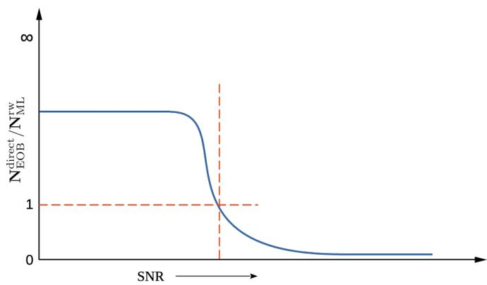  
FIG. 18. Schematic sketch showing the expected trend in likelihood speedup gain, given by the ratio of number of likelihood evaluations required in an EOB2EOB parameter estimation run over the number of likelihood evaluations required when reweighting samples from the EOB2ML proposal distribution. At low SNR, the EOB2ML proposal posterior is broad and may overlap significantly with the EOB2EOB target posterior, enabling eficient importance reweighting. At high SNR, waveform-systematic bias becomes more significant relative to the statistical uncertainty, the efective sample fraction decreases, and the cost of likelihood evaluation increases. The reweighting strategy is useful only when it satisfies both a likelihood speedup condition, SML > $^ { 1 , }$ and an accuracy condition, such as $\bar { N _ { \mathrm { e f f } } } \overset { \mathbf { \bar { \mathbf { \theta } } } } { \underset { \mathbf { \theta } } { \geq } } \bar { N _ { \mathrm { e f f } } ^ { \mathrm { m i n } } }$

Let the efective sample fraction be $f _ { \mathrm { e f f } } ~ = ~ N _ { \mathrm { e f f } } / N$ Then the number of proposal samples needed to achieve a target efective sample size is approximately, $N _ { \mathrm { M L } } ^ { \mathrm { r w } }$ ≃ $N _ { \mathrm { e f f } } ^ { \mathrm { m i n } } / f _ { \mathrm { e f f } }$ , and therefore,

$$
\mathcal { R } _ { \mathrm { c o s t } } \simeq \frac { N _ { \mathrm { e f f } } ^ { \mathrm { m i n } } } { f _ { \mathrm { e f f } } N _ { \mathrm { E O B } } ^ { \mathrm { d i r e c t } } } .\tag{53}
$$

This equation shows explicitly that the eficiency of the method is controlled by the proposal-target overlap. At low SNR, where the EOB and ML posteriors are broad and overlapping, $f _ { \mathrm { e f f } }$ may be large and the advantage factor can be much smaller than unity. At high SNR, $f _ { \mathrm { e f f } }$ can become extremely small, causing the reweighting cost to approach or exceed the cost of a direct EOB2EOB run.

Figure 18 shows the expected qualitative behavior of the proposal usefulness as a function of SNR. At low SNR, the posterior width is large and even a biased ML likelihood can retain overlap with the EOB target posterior. As SNR increases, the posterior narrows approximately as $\rho ^ { - 1 }$ , while waveform-systematic error shifts become increasingly significant in units of the width of the posterior. Therefore, the efective sample fraction decreases, resulting in a decrease in the likelihood speedup gained.

## C. Expected improvement from a more accurate waveform model

The results above suggest a clear route for improvement. The EOB2ML posterior bias arises because the current ML waveform model is not accurate enough to reproduce the EOB waveform family at the level required for unbiased parameter estimation. Improving the waveform accuracy should reduce the separation between the EOB and ML likelihood maxima, $| \theta _ { \mathrm { M L } } ^ { \star } - \theta _ { \mathrm { E O B } } ^ { \star } |$ , and should increase the overlap between the ML proposal posterior and the EOB target posterior. This, in turn, should increase $N _ { \mathrm { e f f } } / N$ and reduce the EOB-likelihood advantage factor in Equation (53).

The mismatch–SNR criterion in Equation (25) provides a useful target. As we have seen, if a machinelearning waveform model has typical mismatch M ∼ $1 0 ^ { - 2 }$ , it is expected to show waveform-induced posterior bias for moderate and high-SNR signals. A model with M $\sim 1 0 ^ { - 4 }$ would be expected to remain useful up to substantially higher SNRs. Therefore, improving the machine-learning waveform model accuracy by one to two orders of magnitude can qualitatively change the behavior of EOB2ML parameter estimation and make importance reweighting a practical correction strategy.

This motivates the development of a higher-accuracy surrogate or a residual-corrected waveform model. In such a model, the surrogate waveform can be written schematically as

$$
h _ { \mathrm { c o r r } } ( \theta ) = h _ { \mathrm { M L } } ( \theta ) + \Delta h _ { \mathrm { r e s } } ( \theta ) ,\tag{54}
$$

where $\Delta h _ { \mathrm { r e s } }$ is a learned correction to the residual between the baseline ML waveform and the EOB waveform. If the corrected waveform reduces the mismatch suficiently, then the true EOB2ML proposal posterior should become closer to the EOB2EOB posterior, the importance weights should become less concentrated, and the efective sample size should increase.

## IX. SUMMARY

In this work, we developed a CAE waveform generation model for SEOBNRv4 aligned-spin gravitational waveforms, following along the lines of Garg et al. [17]. However, in contrast to their model, our model is fully-deterministic and learns a fixed latent-space vector for each set of input source parameters and the associated waveform. This model is trained to predict the amplitude and phase series as a function of time. These outputs of the waveform generation are calibrated with a second-stage residual calibration model, bringing the final waveform polarization mismatch to $\mathcal { O } \big ( 1 0 ^ { - 2 } \big )$

We then introduced a waveform conditioning step, which tapers the start and end of the reconstructed waveforms, and embeds these 1 s long signals into 8 s long data segment. This conditioning step is necessary to ensure that no frequency-domain edge efects afect the frequency bins of the data once the time-domain data segment is converted to frequency-domain via Fourier transformation in downstream parameter estimation tasks. Finally, with these conditioned-waveforms we perform extensive parameter estimation tests, quantify the parameter estimation bias for the case when ML waveforms are used to infer properties of EOB target waveforms, and propose strategies to correct this bias.

The conditioned-waveform ML2ML parameter estimation analysis produces a diagonal PP-plot, showing that the inference machinery is internally calibrated when the injection and recovery waveform families are identical. On the other hand, the EOB2ML study addresses the following question: how posteriors change when data generated by an EOB waveform model are recovered using the ML waveform model. The conditioned-waveform EOB2ML analysis shows biased posteriors and a non-diagonal PP-plot, indicating that the conditioned ML surrogate does not exactly reproduce the conditioned EOB likelihood surface. We quantify this posterior bias using the distribution of ratios or residuals between inferred posterior summaries and injected parameter values.

We find that a simple empirical correction based on a linear fit to the bias ratio as a function of the inferred posterior mode can partially correct the one-dimensional marginalized posteriors. This post-hoc correction is useful as a diagnostic because it shows that the EOB2ML bias has a coherent structure. However, it is not a replacement for improving the waveform model. A fully reliable EOB2ML likelihood surrogate should reduce the bias at the waveform level, such that the raw EOB2ML posteriors are calibrated without requiring an empirical posterior correction.

We also discussed importance reweighting as a possible correction strategy for cases where ML2ML parameter estimation runs give diagonal PP-plots, but the EOB2ML runs do not. In this approach, samples from the ML posterior are reweighted using the ratio between the EOB and ML likelihoods. The success of this strategy depends on the overlap between the ML proposal posterior and the EOB target posterior. This overlap can be quantified by the efective sample size Nef. If the EOB2ML posterior is too far from the EOB2EOB target posterior, the importance weights collapse and the reweighted posterior is unreliable. Conversely, at low enough SNR, or for suficiently accurate ML waveforms, the two posteriors may overlap and reweighting can recover the EOB posterior using fewer EOB likelihood evaluations than a direct EOB2EOB run. A future production-ready implementation of our methods can aim to reweight the EOB2ML results, allowing further interpretation of posterior overlaps, waveform-systematic biases, and proposal eficiencies.

Finally, we introduced a cost-based metric for evaluating the usefulness of EOB2ML proposals. The relevant quantity is the ratio between the number of EOB likelihood evaluations required for reweighting over the number required for a direct EOB2EOB analysis. This metric must be considered together with an accuracy criterion, such as a minimum efective sample size or agreement with EOB2EOB posterior marginals. The expected behavior is that the reweighting approach is most useful at low SNR, where the posteriors are broad and overlapping, and becomes less eficient at high SNR, where waveform-systematic biases are resolved by the likelihood.

Thus, in summary, this work establishes both the feasibility of integrating machine-learning surrogate waveforms into the Bilby parameter estimation framework and the need for careful posterior-level validation before using such models as production-level waveform surrogates or proposal distributions for full parameter estimation runs. The ML2ML results with conditioned waveform outputs show that fast ML waveforms can be incorporated into a Bayesian parameter estimation pipeline. The EOB2ML results show that bias correction remains a requirement before the surrogate waveforms can be used as an unbiased replacement for EOB target waveforms, especially at high-SNR data.

This work further motivates the development of a higher-accuracy or residual-corrected models in future. If the accuracy of reconstructed waveforms itself can be increased, say by incorporating a third fine-tuning stage, the downstream parameter estimation analysis will get better automatically. This will be one of the aims of our follow-up works. However, in this work we have shown that the parameter inference bias arising due to slightly less-accurate waveform model is coherent and can be properly estimated and corrected for. Still, our present work focuses on relatively simple dominant mode SEOBNRv4 waveforms, and creating machine-learning surrogate waveform models for more complicated waveforms, for e.g. those from eccentric binary sources, can another of our next targets.

## ACKNOWLEDGMENTS

We would like to thank Feng-Li Lin, Yuta Michimura, Hideyuki Tagoshi, Masaki Ando, Naoki Yoshida, Michiko Fuji, and Takahiro S. Yamamoto for useful discussions. S.G. is grateful to Alvin Li and the Croucher foundation for their supporting in funding visits to Hong Kong, during which a part of this work was performed. S.G. would also like to thank Kavli-IPMU for the CD3- Google seed fund grant, and Soichiro Morasaki and Kipp Cannon for funding through the JSPS KAKENHI research grant number 23H04893. We acknowledge computational resources made available at the LDG-CIT cluster in Caltech and at the RESCEU-BBC cluster in UTokyo.

[1] LIGO Scientific Collaboration and Virgo Collaboration, Physical Review Letters 116, 061102 (2016).

[2] LIGO Scientific Collaboration and Virgo Collaboration, Physical Review X 9, 031040 (2019).

[3] LIGO Scientific Collaboration and Virgo Collaboration, Physical Review X 11, 021053 (2021).

[4] T. L. S. Collaboration, Physical Review X 13, 041039 (2023), arXiv:2111.03606 [gr-qc].

[5] The LIGO Scientific Collaboration, GWTC-4.0: Updating the Gravitational-Wave Transient Catalog with Observations from the First Part of the Fourth LIGO-Virgo-KAGRA Observing Run (2025).

[6] The LIGO Scientific Collaboration, The Virgo Collaboration, and The KAGRA Collaboration, arXiv e-prints (2026), arXiv:2605.27225.

[7] A. Abac, R. Abramo, S. Albanesi, A. Albertini, A. Agapito, M. Agathos, C. Albertus, N. Andersson, T. Andrade, I. Andreoni, F. Angeloni, M. Antonelli, J. Antoniadis, F. Antonini, M. A. Sedda, M. C. Artale, S. Ascenzi, P. Auclair, M. Bachetti, C. Badger, B. Banerjee, D. Barba-Gonzalez, D. Barta, N. Bartolo, A. Bauswein, A. Begnoni, F. Beirnaert, M. Bejger, E. Belgacem, N. Bellomo, L. Bernard, M. G. Bernardini, S. Bernuzzi, C. P. L. Berry, E. Berti, G. Bertone, D. Bettoni, M. Bezares, S. Bhagwat, S. Bisero, M. A. Bizouard, J. J. Blanco-Pillado, S. Blasi, A. Bonino, A. Borghese, S. Borhanian, E. Bortolas, M. T. Botticella, M. Branchesi, M. Breschi, R. Brito, E. Brocato, F. S. Broekgaarden, T. Bulik, A. Buonanno, F. Burgio, A. Burrows, G. Calcagni, S. Canevarolo, E. Cappellaro, G. Capurri, C. Carbone, R. Casadio, R. Cayuso, P. Cerda-Duran, P. Char, S. Chaty, T. Chiarusi, M. Chruslinska, F. Cireddu, P. Cole, A. Colombo, M. Colpi, G. Compere, C. Contaldi, M. Corman, F. Crescimbeni, S. Cristallo, E. Cuoco, G. Cusin, T. D. Canton, G. Dalya, P. D’Avanzo, N. Davari, V. D. Luca, V. D. Renzis, M. D. Valle, W. D. Pozzo, F. D. Santi, A. L. D. Santis, T. Dietrich, E. Dimastrogiovanni, G. Domenech, D. Doneva, M. Drago, U. Dupletsa, H. Duval, I. Dvorkin, N. Elias-Rosa, S. Fairhurst, et al., The Science of the Einstein Telescope (2025), arXiv:2503.12263 [gr-qc].

[8] E. D. Hall, K. Kuns, J. R. Smith, Y. Bai, C. Wipf, S. Biscans, R. X. Adhikari, K. Arai, S. Ballmer, L. Barsotti, Y. Chen, M. Evans, P. Fritschel, J. Harms, B. Kamai, J. G. Rollins, D. Shoemaker, B. J. J. Slagmolen, R. Weiss, and H. Yamamoto, Physical Review D 103, 122004 (2021).

[9] M. Colpi, K. Danzmann, M. Hewitson, K. Holley-Bockelmann, P. Jetzer, G. Nelemans, A. Petiteau, D. Shoemaker, C. Sopuerta, R. Stebbins, N. Tanvir, H. Ward, W. J. Weber, I. Thorpe, A. Daurskikh, A. Deep, I. F. N´u˜nez, C. G. Marirrodriga, M. Gehler, J.-P. Halain, O. Jennrich, U. Lammers, J. Larra˜naga, M. Lieser, N. L¨utzgendorf, W. Martens, L. Mondin, A. P. Ni˜no, P. Amaro-Seoane, M. A. Sedda, P. Auclair, S. Babak, Q. Baghi, V. Baibhav, T. Baker, J.-B. Bayle, C. Berry, E. Berti, G. Boileau, M. Bonetti, R. Brito, R. Buscicchio, G. Calcagni, P. R. Capelo, C. Caprini, A. Caputo, E. Castelli, H.-Y. Chen, X. Chen, A. Chua, G. Davies, A. Derdzinski, V. F.

Domcke, D. Doneva, I. Dvorkin, J. M. Ezquiaga, J. Gair, Z. Haiman, I. Harry, O. Hartwig, A. Hees, A. Hefernan, S. Husa, D. Izquierdo, N. Karnesis, A. Klein, V. Korol, N. Korsakova, T. Kupfer, D. Laghi, A. Lamberts, S. Larson, M. L. Jeune, M. Lewicki, T. Littenberg, E. Madge, A. Mangiagli, S. Marsat, I. M. Vilchez, A. Maselli, J. Mathews, M. van de Meent, M. Muratore, G. Nardini, P. Pani, M. Peloso, M. Pieroni, A. Pound, H. Quelquejay-Leclere, A. Ricciardone, E. M. Rossi, A. Sartirana, E. Savalle, L. Sberna, A. Sesana, D. Shoemaker, J. Slutsky, T. Sotiriou, L. Speri, M. Staab, et al., LISA Definition Study Report (2024), arXiv:2402.07571 [astro-ph].

[10] Z. Luo, Z. Guo, G. Jin, Y. Wu, and W. Hu, Results in Physics 16, 102918 (2020).

[11] Z. Luo, Y. Wang, Y. Wu, W. Hu, and G. Jin, Progress of Theoretical and Experimental Physics 2021, 05A108 (2021).

[12] J. Luo, L.-S. Chen, H.-Z. Duan, Y.-G. Gong, S. Hu, J. Ji, Q. Liu, J. Mei, V. Milyukov, M. Sazhin, C.-G. Shao, V. T. Toth, H.-B. Tu, Y. Wang, Y. Wang, H.-C. Yeh, M.-S. Zhan, Y. Zhang, V. Zharov, and Z.-B. Zhou, Classical and Quantum Gravity 33, 035010 (2016).

[13] E.-K. Li, S. Liu, A. Torres-Orjuela, X. Chen, K. Inayoshi, L. Wang, Y.-M. Hu, P. Amaro-Seoane, A. Askar, C. Bambi, P. R. Capelo, H.-Y. Chen, A. J. K. Chua, E. Cond´es-Bre˜na, L. Dai, D. Das, A. Derdzinski, H.- M. Fan, M. Fujii, J. Gao, M. Garg, H. Ge, M. Giersz, S.-J. Huang, A. Hypki, Z.-C. Liang, B. Liu, D. Liu, M. Liu, Y. Liu, L. Mayer, N. R. Napolitano, P. Peng, Y. Shao, S. Shashank, R. Shen, H. Tagawa, A. Tanikawa, M. Toscani, V. V´azquez-Aceves, H.-T. Wang, H. Wang, S.-X. Yi, J.-d. Zhang, X.-T. Zhang, L. Zhu, L. Zwick, S. Huang, J. Mei, Y. Wang, Y. Xie, J. Zhang, and J. Luo, Reports on Progress in Physics 88, 056901 (2025).

[14] Z. Xuan, S. Naoz, and X. Chen, Physical Review D 107, 043009 (2023), arXiv:2210.03129 [astro-ph].

[15] I. Gupta, C. Afle, K. G. Arun, A. Bandopadhyay, M. Baryakhtar, S. Biscoveanu, S. Borhanian, F. Broekgaarden, A. Corsi, A. Dhani, M. Evans, E. D. Hall, O. A. Hannuksela, K. Kacanja, R. Kashyap, S. Khadkikar, K. Kuns, T. G. F. Li, A. L. Miller, A. H. Nitz, B. J. Owen, C. Palomba, A. Pearce, H. Phurailatpam, B. Rajbhandari, J. Read, J. D. Romano, B. S. Sathyaprakash, D. H. Shoemaker, D. Singh, S. Vitale, L. Barsotti, E. Berti, C. Cahillane, H.-Y. Chen, P. Fritschel, C.-J. Haster, P. Landry, G. Lovelace, D. McClelland, B. J. J. Slagmolen, J. Smith, M. Soares-Santos, L. Sun, D. Tanner, H. Yamamoto, and M. Zucker, Characterizing Gravitational Wave Detector Networks: From A\$ˆ\sharp\$ to Cosmic Explorer (2024), arXiv:2307.10421 [gr-qc].

[16] T. L. S. Collaboration, GWTC-4.0: Population Properties of Merging Compact Binaries (2025), arXiv:2508.18083 [astro-ph].

[17] S. Garg, F. L. Lin, and K. Cannon, Physical Review D 10.1103/h92m-k44j (2026).

[18] V. Tiwari, C. Hoy, S. Fairhurst, and D. MacLeod, Physical Review D 108, 023001 (2023).

[19] B. Zackay, L. Dai, and T. Venumadhav, Relative Binning and Fast Likelihood Evaluation for Gravitational Wave

Parameter Estimation (2018), arXiv:1806.08792 [astroph].

[20] L. Dai, T. Venumadhav, and B. Zackay, Parameter Estimation for GW170817 using Relative Binning (2018), arXiv:1806.08793 [gr-qc].

[21] N. Leslie, L. Dai, and G. Pratten, Physical Review D 104, 123030 (2021).

[22] K. Krishna, A. Vijaykumar, A. Ganguly, C. Talbot, S. Biscoveanu, R. N. George, N. Williams, and A. Zimmerman, Accelerated parameter estimation in Bilby with relative binning (2023), arXiv:2312.06009 [grqc].

[23] H. Narola, J. Janquart, Q. Meijer, K. Haris, and C. V. D. Broeck, Relative binning for complete gravitationalwave parameter estimation with higher-order modes and precession, and applications to lensing and thirdgeneration detectors (2023), arXiv:2308.12140 [gr-qc].

[24] H. Narola, J. Janquart, Q. Meijer, K. Haris, and C. Van Den Broeck, Physical Review D 110, 084085 (2024).

[25] S. Vinciguerra, J. Veitch, and I. Mandel, Classical and Quantum Gravity 34, 115006 (2017), arXiv:1703.02062 [gr-qc].

[26] H. Xia, L. Shao, J. Zhao, and Z. Cao, Physical Review D 103, 024040 (2021), arXiv:2011.04418 [astro-ph].

[27] M. Dax, S. R. Green, J. Gair, J. H. Macke, A. Buonanno, and B. Sch¨olkopf, Physical Review Letters 127, 241103 (2021), arXiv:2106.12594 [gr-qc].

[28] H. Gabbard, C. Messenger, I. S. Heng, F. Tonolini, and R. Murray-Smith, Nature Physics 18, 112 (2022), arXiv:1909.06296 [astro-ph].

[29] M. Dax, Physical Review Letters 130, 10.1103/PhysRevLett.130.171403 (2023).

[30] A. H. Nitz, Physical Review D 112, 023032 (2025).

[31] Z. Peng and F. Zhang, Mathematics 13, 4014 (2025).

[32] E. Cuoco, J. Powell, M. Cavagli\`a, K. Ackley, M. Bejger, C. Chatterjee, M. Coughlin, S. Coughlin, P. Easter, R. Essick, H. Gabbard, T. Gebhard, S. Ghosh, L. Haegel, A. Iess, D. Keitel, Z. M´arka, S. M´arka, F. Morawski, T. Nguyen, R. Ormiston, M. P¨urrer, M. Razzano, K. Staats, G. Vajente, and D. Williams, Machine Learning: Science and Technology 2, 011002 (2020).

[33] E. Cuoco, M. Cavagli\`a, I. S. Heng, D. Keitel, and C. Messenger, Living Reviews in Relativity 28, 2 (2025).

[34] T. Zhao, R. Shi, Y. Zhou, Z. Cao, and Z. Ren, arXiv e-prints (2025), version updated in 2025, arXiv:2311.15585.

[35] J. Blackman, S. E. Field, M. A. Scheel, C. R. Galley, D. A. Hemberger, P. Schmidt, and R. Smith, Physical Review D 95, 104023 (2017).

[36] C.-H. Liao and F.-L. Lin, Physical Review D 103, 124051 (2021).

[37] J. Lee, S. H. Oh, K. Kim, G. Cho, J. J. Oh, E. J. Son, and H. M. Lee, Physical Review D 103, 11 (2021), arXiv:2101.05685 [astro-ph].

[38] S. Khan and R. Green, Physical Review D 103, 064015 (2021).

[39] A. J. K. Chua, M. L. Katz, N. Warburton, and S. A. Hughes, Physical Review Letters 126, 051102 (2021).

[40] S. Schmidt, M. Breschi, R. Gamba, G. Pagano, P. Rettegno, G. Riemenschneider, S. Bernuzzi, A. Nagar, and W. Del Pozzo, Physical Review D 103, 043020 (2021).

[41] L. M. Thomas, G. Pratten, and P. Schmidt, Physical Review D 106, 104029 (2022).

[42] R. Shi, Y. Zhou, T. Zhao, Z. Ren, and Z. Cao, arXiv e-prints 10.48550/arXiv.2411.14893 (2024).

[43] T. Grimbergen, S. Schmidt, C. Kalaghatgi, and C. van den Broeck, Physical Review D 109, 104065 (2024).

[44] C. Chatterjee and K. Jani, The Astrophysical Journal 969, 25 (2024), arXiv:2403.01559 [gr-qc].

[45] B. Gadre, M. P¨urrer, S. E. Field, S. Ossokine, and V. Varma, Physical Review D 110, 124038 (2024).

[46] M. Sun, J. Wu, J. Li, B. Mccane, N. Yang, X. Ma, B. Wang, and M. Zhang, Conditional Autoencoder for Generating BNS Waveforms with Tidal and Precession Efects (2025), arXiv:2503.19512 [astro-ph].

[47] S. Garg, in Proceedings of 39th International Cosmic Ray Conference—PoS (ICRC2025)(Sissa Medialab, Geneva, Switzerland, 2023), Vol. 501 (SISSA Medialab, 2025) p. 927.

[48] O. G. Freitas, A. Theodoropoulos, N. Villanueva, T. Fernandes, S. Nunes, J. A. Font, A. Onofre, A. Torres-Forn´e, and J. D. Martin-Guerrero, Physical Review D 112, 043026 (2025), arXiv:2412.06946 [gr-qc].

[49] C. Whittall and G. Pratten, Fast neural network surrogate for multimodal efective-one-body gravitational waveforms from generically precessing compact binaries (2026), arXiv:2604.14270 [gr-qc].

[50] A. Theodoropoulos, N. Villanueva, O. G. Freitas, T. Fernandes, S. Nunes, A. Torres-Forne, J. A. Font, A. Onofre, and J. D. Martin-Guerrero, An autoencoderbased surrogate waveform model for quasi-circular binary-black-hole mergers (2026), arXiv:2602.00203 [astro-ph].

[51] J. Tissino, G. Carullo, M. Breschi, R. Gamba, S. Schmidt, and S. Bernuzzi, Physical Review D 107, 084037 (2023).

[52] A. Buonanno and T. Damour, Physical Review D 59, 084006 (1999), arXiv:gr-qc/9811091.

[53] T. Damour and A. Nagar, The Efective One Body description of the Two-Body problem (2009), arXiv:0906.1769 [gr-qc].

[54] A. Nagar, S. Bernuzzi, W. D. Pozzo, G. Riemenschneider, S. Akcay, G. Carullo, P. Fleig, S. Babak, K. W. Tsang, M. Colleoni, F. Messina, G. Pratten, D. Radice, P. Rettegno, M. Agathos, E. Fauchon-Jones, M. Hannam, S. Husa, T. Dietrich, P. Cerda-Duran, J. A. Font, F. Pannarale, P. Schmidt, and T. Damour, Physical Review D 98, 104052 (2018), arXiv:1806.01772 [gr-qc].

[55] D. P. Kingma and M. Welling, Foundations and Trends® in Machine Learning 12, 307 (2019), arXiv:1906.02691 [cs].

[56] D. P. Kingma and M. Welling, Auto-Encoding Variational Bayes (2022), arXiv:1312.6114 [stat].

[57] E. Veach, ROBUST MONTE CARLO METHODS FOR LIGHT TRANSPORT SIMULATION, Ph.D. thesis, Stanford University (1997).

[58] V. Elvira, L. Martino, D. Luengo, and M. F. Bugallo, Statistical Science 34, 10.1214/18-STS668 (2019), arXiv:1511.03095 [stat.CO].

[59] LIGO Scientific Collaboration, Virgo Collaboration, and KAGRA Collaboration, LVK algorithm library - LALSuite, Free software (GPL) (2018).

[60] A. Nitz, I. Harry, D. Brown, C. M. Biwer, J. Willis, T. D. Canton, C. Capano, T. Dent, L. Pekowsky, G. S. C. Davies, S. De, M. Cabero, S. Wu, A. R. Williamson, B. Machenschalk, D. Macleod, F. Pannarale, P. Kumar, S. Reyes, dfinstad, S. Kumar, M. T´apai, L. Singer,

P. Kumar, veronica-villa, maxtrevor, B. U. V. Gadre, S. Khan, S. Fairhurst, and A. Tolley, Gwastro/pycbc: V2.3.3 release of PyCBC, Zenodo (2024).

[61] K. Wette, SoftwareX 12, 100634 (2020), arXiv:2012.09552 [astro-ph].

[62] A. Paszke, S. Gross, F. Massa, A. Lerer, J. Bradbury, G. Chanan, T. Killeen, Z. Lin, N. Gimelshein, L. Antiga, A. Desmaison, A. K¨opf, E. Yang, Z. DeVito, M. Raison, A. Tejani, S. Chilamkurthy, B. Steiner, L. Fang, J. Bai, and S. Chintala, PyTorch: An Imperative Style, High-Performance Deep Learning Library (2019), arXiv:1912.01703 [cs].

[63] J. Nickolls, I. Buck, M. Garland, and K. Skadron, Queue 6, 40 (2008).

[64] D. P. Kingma and J. Ba, Adam: A Method for Stochastic Optimization (2017), arXiv:1412.6980 [cs].

[65] The HDF Group, Hierarchical Data Format, version 5 (2026).

[66] G. Ashton, M. Huebner, P. D. Lasky, C. Talbot, K. Ackley, S. Biscoveanu, Q. Chu, A. Divarkala, P. J. Easter, B. Goncharov, F. H. Vivanco, J. Harms, M. E. Lower, G. D. Meadors, D. Melchor, E. Payne, M. D. Pitkin, J. Powell, N. Sarin, R. J. E. Smith, and E. Thrane, The Astrophysical Journal Supplement Series 241, 27 (2019), arXiv:1811.02042 [astro-ph].

[67] M. J. Williams, J. Veitch, and C. Messenger, Physical Review D 103, 103006 (2021).