# Information on trajectories: martingales and random times

Akshay Balsubramani

akshay@vac.bio

## Abstract

Accounting for information flow on the path space of trajectories of a nonnegative martingale yields exact variational identities for it, even at arbitrary random times. This recovers the widely used classical concentration inequalities, from Ville to PAC-Bayes, and measures what each one discards. The tail a bound controls is itself a relative entropy, resolved by the chain rule into per-step conditional divergences. The discarded slack has a closed form in each of three geometries: the crossing itself for Ville’s inequality and for pooled tests, a Gibbs tilt for the Azuma–Hoefding and PAC-Bayes bounds, and a dominating certificate for the Lp maximal bound. On a path-time space, the same identity gains one factor that measures anticipation: an arbitrary random time incurs an e-process “peeking penalty.” The partition function can be read as a coalescent—a prefix-sharing probability of independent copies—and geometric mixtures of test martingales gain a pooling benefit for multi-model safe testing.

## 1 Introduction

A martingale concentration inequality is proved by dropping nonnegative terms, thereby discarding information. This paper accounts for that information. An identity of relative entropy, placed on the path space of a nonnegative martingale, names what each of the classical bounds treated here throws away. The tail a bound controls is itself a relative entropy, of which the bound captures one part and discards the rest (Figure 1); the discarded part is written in closed form for the bounds from Ville’s inequality through the Azuma–Hoefding and PAC-Bayes families to Doob’s Lp maximal bound.

The mixed coincidence identity [5] is an elementary manipulation of relative entropy: the logarithm of a mixed partition function, built from products of powers of nonnegative factors, equals a variational optimum over distributions, and the gap at any candidate distribution is its relative entropy to the Gibbs optimizer. Every nonnegative martingale of unit mean is a product of one-step conditional likelihood ratios. Placing the mixed coincidence identity on the path space of such a martingale therefore turns it into a sequential variational equality for the martingale’s Rényi moments. The log of an arbitrary product of powers of the one-step ratios equals an explicit supremum over path measures, with residual the relative entropy to a Gibbs path-tilt, and the chain rule resolves that residual into per-step conditional divergences. Every concentration bound, line-crossing inequality, PAC-Bayes statement, and random-time peeking penalty below is Theorem 3.2 read at a particular choice of factors: the path-space calculus states equalities where the classical theory gives one-sided bounds.

The bounds this covers are standard tools of concentration and statistical inference, anytime-valid and fixed-sample alike—Ville’s maximal inequality, Azuma–Hoefding, the variance-sensitive Bennett–Bernstein–Freedman family, parametermixture boundaries, PAC-Bayes—each classically proved by its own ad hoc argument, and all recovered here by the same route [5]. Doob’s Lp maximal inequality is the exception, and gets its own residual in the geometry of power means $\| X \| _ { p } = \mathbb { E } [ | X | ^ { p } ] ^ { 1 / p }$ , where the extremal object is a dominating certificate function in place of a Gibbs tilt. The same residual then measures the two phenomena a static bound cannot see: the anticipation carried by a random time, and the disagreement within a pool of competing tests.

## 1.1 Main contributions

Placed on filtered path spaces, the mixed coincidence identity becomes a sequential variational equality for the Rényi moments of likelihood-ratio martingales (Theorem 3.3). It is a reading of the finite-measure Donsker–Varadhan formula on path space (Theorem 3.2), and every inequality below descends from it. For integer exponents its partition function has a literal probabilistic meaning, the probability that independent copies share a common path prefix; that free energy decomposes into one-step predictive-coincidence costs, and for finite-state Markov families its growth rate is a Perron– Frobenius spectral radius.

(a) PAC-Bayes: pathwise slack  
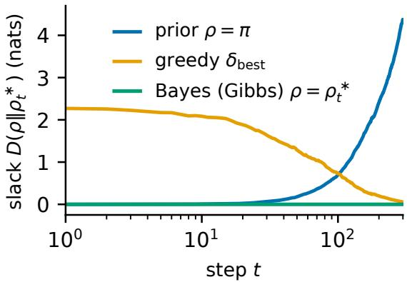

(b) Sequential test: price of a look  
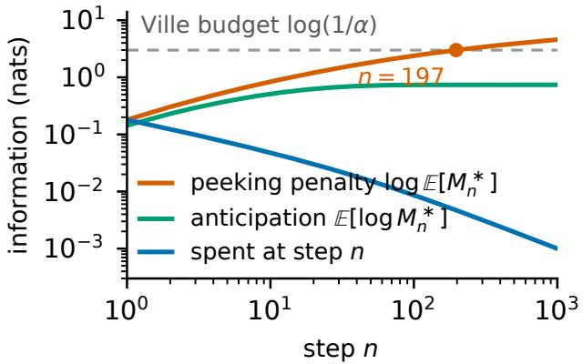

(c) Doob Lp: unspent budget  
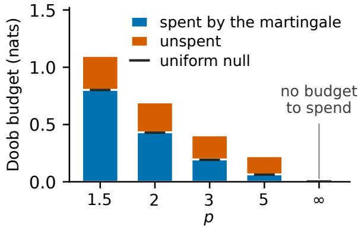

(d) Pooling: coincidence boost  
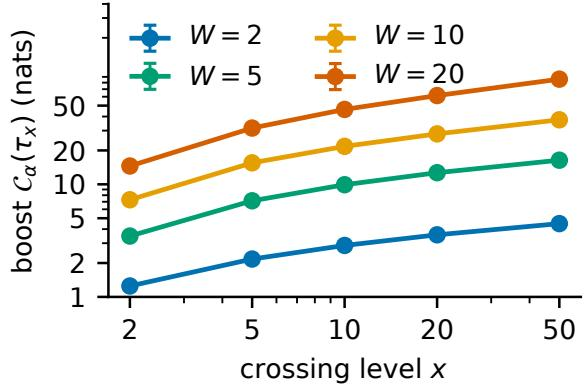  
Figure 1: Each classical inequality leaves a residual the path-space calculus names and measures. All four residuals are drawn in nats on a common axis. The pathwise PAC-Bayes slack (a) is the divergence $\mathrm { D } ( \rho \| \rho _ { t } ^ { * } )$ to the running Gibbs tilt: identically zero at the Bayes posterior at every step, growing for a prior-anchored posterior as the tilt departs the prior, and decaying for a greedy one as the tilt concentrates. A Gaussian test martingale evaluated at the time of its running maximum $M _ { n } ^ { * } : = \operatorname* { m a x } _ { t \leq n } M _ { t }$ incurs the peeking penalty log $\mathbb { E } [ M _ { n } ^ { * } ]$ (b). It passes the entire Ville budget log $( 1 / \alpha ) = 2 . 9 9 6$ nats at $\alpha = 0 . 0 5$ by step 197 and keeps growing, while the anticipation it measures saturates at 0.739 nats—below the one nat a continuous path would incur, short by the overshoot of a discrete walk. Taking logarithms through Doob’s $L ^ { p }$ inequality (c) turns its sharp constant into an additive budget of log $\frac { p } { p - 1 }$ nats. The martingale spends the logarithm of its maximal-to-terminal norm ratio and leaves the rest; the budget vanishes as $p  \infty$ . This is the one residual here that is not a relative entropy, and Section 5 resolves it. Pooling $W$ test martingales (d) tightens Ville’s bound by the crossing form of the multi-way coincidence divergence, $\mathcal { C } _ { \alpha } ^ { \mathrm { c r o s s } } ( x ) = \log [ ( 1 / x ) / \mathbb { P } ( \tau _ { x } ^ { ( \alpha ) } < \infty ) ]$ , with $\tau _ { x } ^ { ( \alpha ) }$ the first time the pooled process reaches x. It grows in both the crossing level x and the bettor count W (logarithmic axes), reaching tens of nats as independent disagreement accumulates. Bootstrap 95% intervals lie within the markers except in the deepest tail.

The classical tails then become equalities. Ville’s and the Azuma–Hoefding tails are relative-entropy equalities, the latter resolved by the chain rule into a sum of per-step conditional divergences of the conditioned law. The gap to each classical bound is then attributed: the mean overshoot at first passage (Theorem 4.7) for Ville, and for Azuma–Hoefding the event relaxation, the sub-optimality of the exponential tilt, and the cumulant majorant. One master identity stands behind them. The exponential martingale of the running conditional log-CGF obeys an exact entropic equality (Theorem 4.1). Replacing the exact cumulant by a predictable majorant—the supermartingale relaxation (Proposition 4.2)—accounts for the replacement exactly, and yields the entropic inequality behind Ville, Azuma–Hoefding, Bennett–Bernstein–Freedman, parameter-mixture boundaries and PAC-Bayes. The PAC-Bayes bound is itself an identity, discarding exactly the divergence from the posterior to the Gibbs tilt the loss induces [5], and the remaining families follow as the entropic inequality specialized to their cumulant bounds. The same accounting crosses a boundary of arbitrary form. The discrete-time crossing law (Theorem 4.9) leaves a quadrature residual and an overshoot that continuous time sets to zero, and the classical continuous statement is that identity with both vanishing.

Doob’s $L ^ { p }$ inequality is the exception treated here, its residual a power-mean quantity sharpened in that geometry. The role the Gibbs tilt plays there is played by the Azéma–Yor family of certificates indexed by an arbitrary concave function. Each member is afine in the running value and is flat to first order when the running maximum advances, and its optional-stopping deficit resolves step by step into Bregman divergences between consecutive records (Proposition 5.1), the second-order remainder the smooth fit leaves. Specialized to the conjugate power and combined with Hölder’s inequality, the family writes Doob’s slack exactly as three pieces: a Hölder deficit, an optional-stopping deficit, and the initial value $M _ { 0 } ^ { p } / ( p - 1 )$ (Corollary 5.2). The per-step resolution the chain rule supplies in the entropic geometry is therefore available in the power-mean geometry too, with a Bregman divergence in place of a relative entropy. Each classical inequality thus belongs to whichever of the three geometries—Gibbs, power-mean, optional stopping—makes its extremizer the optimizer.

Disagreement among several tests is itself evidence. A geometric mixture of test martingales is a supermartingale whose Ville bound is tightened by the multi-way coincidence divergence, a dynamical benefit of model disagreement. Set that benefit beside the mass that never reaches the level and the overshoot at the crossing, and the inequality goes. The pooled crossing probability is then closed form (Corollary 6.2).

The cost of a random time closes the account. An arbitrary random time splits into a hazard clock the history already determines and a martingale factor that absorbs everything it does not (Theorem 7.1). That factor is trivial exactly for stopping times, and more generally for pseudo-stopping times, so it is the sole carrier of anticipation; expectations at the random time are expectations against the hazard clock, reweighted by it. On path-time space the identity gains exactly one further factor, and that factor measures the anticipation (Theorem 7.5). Reading any evidence process at an arbitrary random time then costs a peeking penalty in nats (Theorem 7.6). The penalty is at most zero at a stopping time and exactly zero at a pseudo-stopping time for uniformly integrable martingales, while a time that looks ahead can incur an unbounded one. Between those ends the worst case over e-processes has an exact value, the supremum norm of the time’s anticipation index (Theorem 7.12), and it is zero precisely on the pseudo-stopping class.

## 2 Information-theoretic preliminaries

Every information quantity used below is a reading of the mixed coincidence identity [5]; this section fixes notation and recalls the identity and the specializations the path-space sections use.

## 2.1 Entropies and divergences

Let $( \mathcal { X } , \mathcal { B } , \nu )$ be a σ-finite measure space. A distribution on X is a probability measure P absolutely continuous with respect to ν; we write $p : = \mathrm { d } P / \mathrm { d } \nu$ for its density. More generally, a nonnegativefactor (or unnormalized density) π is a measurable map $\pi \colon \mathcal { X }  [ 0 , \infty )$ ) with $\begin{array} { r } { 0 < \| \pi \| _ { 1 } : = \int \pi \mathrm { d } \nu < \infty } \end{array}$

For a distribution $P$ with density p and a strictly positive factor π, the entropy and cross-entropy are $H ( p ) : =$ $- \mathbb { E } _ { X \sim P } [ \log p ( X ) ]$ and $H ( p , \pi ) : = - \mathbb { E } _ { X \sim P } [ \log \pi ( X ) ]$ . The relative entropy of p relative to π, written $\mathrm { D } ( p \Vert \pi )$ , is $\begin{array} { r } { \mathrm { D } ( p \| \pi ) : = H ( p , \pi ) - H ( p ) = \mathbb { E } _ { X \sim P } \left[ \log \frac { p ( X ) } { \pi ( X ) } \right] } \end{array}$ . When π is itself a probability density, $\mathrm { D } ( p \| \pi ) \geq 0$ , with equality if and only if $p = \pi \nu$ -almost everywhere (Gibbs’ inequality).

Relative entropy is also needed against a finite positive measure that need not be a probability. For $\mu \textbf { a }$ finite positive measure on (X, B) and $Q \mathfrak { a }$ probability measure on (X, B) with $Q \ll \mu ,$

$$
\mathrm { D } ( Q \| \mu ) : = \int _ { \mathcal { X } } \log \left( \frac { \mathrm { d } Q } { \mathrm { d } \mu } \right) \mathrm { d } Q \ \in \ [ - \log \mu ( \mathcal { X } ) , + \infty ]\tag{2.1}
$$

and $\operatorname { D } ( Q \| \mu ) : = + \infty { \mathrm { ~ i f ~ } } Q \not \ll \mu$

This is the usual relative entropy shifted by $- \log \mu ( \mathcal { X } )$ , reducing to the probability-measure case when $\mu ( \mathcal { X } ) = 1 ;$ it is the form needed against the path law $P | _ { \mathcal { F } _ { T } } ,$ , of total mass 1, and against the path-time measure $\widehat { P }$ of Section 7, of total mass at most one and in general strictly less.

For $\alpha > 0 , \alpha \neq 1$ , and distributions $P _ { 1 } , P _ { 2 }$ with densities $p _ { 1 } , p _ { 2 }$ , the Rényi entropy and Rényi divergence are

$$
H _ { \alpha } ( p ) : = \frac { 1 } { 1 - \alpha } \log \int _ { \mathcal { X } } p ( x ) ^ { \alpha } \mathrm { d } \nu ( x )\tag{2.2}
$$

$$
D _ { \alpha } ( p _ { 1 } \| p _ { 2 } ) : = { \frac { 1 } { \alpha - 1 } } \log \int _ { \mathcal { X } } p _ { 1 } ( x ) ^ { \alpha } p _ { 2 } ( x ) ^ { 1 - \alpha } \mathrm { d } \nu ( x )\tag{2.3}
$$

In the limit $\alpha  1 , H _ { \alpha } ( p )  H ( p )$ and $D _ { \alpha } ( p _ { 1 } \| p _ { 2 } )  \mathrm { D } ( p _ { 1 } \| p _ { 2 } )$ . The Rényi entropy is nonincreasing in $\alpha ;$ the Rényi divergence is nondecreasing in $\alpha ,$ nonnegative, and satisfies the data-processing inequality: $D _ { \alpha } ( P _ { 1 } K \parallel P _ { 2 } K ) \le$ $D _ { \alpha } ( P _ { 1 } \Vert P _ { 2 } )$ for any Markov kernel K.

## 2.2 The mixed coincidence identity

The identity below is due to [5]; it is recalled in the notation the path-space sections use, and the path-space identity of the next section is this one placed on a filtered space. The name coincidence marks the free energy and the variational problem coinciding; a distinct sense of the word surfaces on path space, where the coincidence divergence of the coalescent reading (Proposition 3.6) measures the probability that independent copies share a common path prefix. Stating the identity for a mixture of factors raised to arbitrary powers lets one statement specialize to Donsker–Varadhan, Rényi, and PAC-Bayes alike.

Fix nonnegative factors $\pi _ { 1 } , \ldots , \pi _ { W }$ on $( \mathcal X , \nu )$ and an exponent vector $\alpha = ( \alpha _ { 1 } , \dots , \alpha _ { W } ) \in \mathbb { R } ^ { W }$ . The mixed partition function is

$$
Z ( \alpha ) : = \int _ { \mathcal { X } } \prod _ { i = 1 } ^ { W } \pi _ { i } ( x ) ^ { \alpha _ { i } } \ \mathrm { d } \nu ( x ) = \mathbb { E } _ { X \sim \nu } \left[ \prod _ { i = 1 } ^ { W } \pi _ { i } ( X ) ^ { \alpha _ { i } } \right] ,\tag{2.4}
$$

assumed to satisfy $0 < Z ( \alpha ) < \infty$ . The geometric-mixture density is

$$
p _ { \alpha } ^ { * } ( x ) : = \frac { \prod _ { i = 1 } ^ { W } \pi _ { i } ( x ) ^ { \alpha _ { i } } } { Z ( \alpha ) } .\tag{2.5}
$$

Write $\textstyle { \bar { \alpha } } : = \sum _ { i = 1 } ^ { W } \alpha _ { i }$ and, when $\bar { \alpha } > 0 , \widetilde { \alpha } : = \alpha / \bar { \alpha } \in \Delta ( [ W ] )$ for the normalized weights.

Sequential settings reuse this object with $\pi _ { i }$ replaced by one-step likelihood ratios and the exponents by a time-indexed vector; that is the bridge to martingale theory.

Theorem 2.1 (Mixed coincidence identity [5]). Let $\pi _ { 1 } , \ldots ,$ πW be nonnegative factors on $( { \mathcal { X } } , \nu )$ , let $\alpha \in \mathbb { R } ^ { W }$ satisfy $0 < Z ( \alpha ) < \infty f o r Z o f ( 2 . 4 ) .$ , and let $p _ { \alpha } ^ { * }$ be as in (2.5). For every distribution p on $( \mathcal X , \nu )$ with $\mathbb { E } _ { p } [ \log \pi _ { i } ( X ) ]$ finite for all $i ,$

$$
- \log { \cal Z } ( \alpha ) + { \mathrm { D } } ( p \| p _ { \alpha } ^ { * } ) = \sum _ { i = 1 } ^ { W } \alpha _ { i } ~ { \mathrm { D } } ( p \| \pi _ { i } ) + \left( \bar { \alpha } - 1 \right) H ( p ) .\tag{2.6}
$$

Consequently,

$$
\log Z ( \alpha ) = \operatorname* { m a x } _ { p \in \Delta ( \mathcal { X } ) } \left[ H ( p ) - \sum _ { i = 1 } ^ { W } \alpha _ { i } H ( p , \pi _ { i } ) \right] = - \operatorname* { m i n } _ { p \in \Delta ( \mathcal { X } ) } \left[ \sum _ { i = 1 } ^ { W } \alpha _ { i } \ \mathrm { D } ( p \| \pi _ { i } ) + ( \bar { \alpha } - 1 ) H ( p ) \right] ,\tag{2.7}
$$

with unique optimum $p = p _ { \alpha } ^ { * }$

Equation (2.6) is an equality at every distribution $p ,$ including the non-optimal ones: there the gap $\mathrm { D } ( p \| p _ { \alpha } ^ { * } )$ is the information cost of using p instead of the optimal geometric mixture.

## 2.3 Donsker–Varadhan, Rényi and multi-prior specializations

Each classical information-theoretic object below is Theorem 2.1 read at a particular choice of factors and exponents, and each reappears on path space later. The consequence used most, and the one the peeking penalty of Section 7 rests on, is the following.

Corollary 2.2 (Donsker–Varadhan / finite-measure Gibbs formula[5]). Let µ be afinite positive measure on $( { \mathcal { X } } , { \mathcal { B } } )$ and let $g \colon { \mathcal { X } }  [ 0 , \infty )$ be measurable with $\textstyle 0 < \int g \mathrm { d } \mu < \infty$ . Let $Q ^ { \star }$ be the Gibbs measure $\mathrm { d } Q ^ { \star } / \mathrm { d } \mu = g / \int g \mathrm { d } \mu ,  { \varepsilon }$ probability measure supported on $\{ g > 0 \}$ . Then for every probability measure $Q \ll \mu$ with $Q ( \{ g = 0 \} ) = 0 .$

$$
\log \int g \mathrm { d } \mu = \mathbb { E } _ { Q } [ \log g ] - \mathrm { D } ( Q \| \mu ) + \mathrm { D } ( Q \| Q ^ { \star } ) .\tag{2.8}
$$

Consequently,

$$
\log \int g \mathrm { d } \mu = \operatorname* { s u p } _ { Q \ll \mu } \big \{ \mathbb { E } _ { Q } [ \log g ] - \mathrm { D } ( Q \| \mu ) \big \} ,\tag{2.9}
$$

with unique maximizer $Q = Q ^ { \star } ( a \ Q$ charging $\{ g = 0 \}$ has $\mathbb { E } _ { Q } [ \log g ] = - \infty$ and is never optimal, so the supremum is unchanged by restricting to $Q \ll Q ^ { \star } )$

Corollary 2.2 is the “one-factor” specialization of Theorem 2.1: take $\nu = \mu , W = 1 , \pi _ { 1 } = g , \alpha _ { 1 } = 1$ . The strictly positive case $g \colon { \mathcal { X } }  ( 0 , \infty )$ is recovered when $\{ g = 0 \}$ is $\mu { \mathrm { - } } \mathrm { \ n u l l }$ ; the indicator case $g = \mathbf { 1 } _ { A }$ (with $\mu ( A ) > 0 )$ recovers the conditional form log $\mu ( A ) = \mathrm { s u p } _ { Q : Q ( A ) = 1 } \{ - \mathrm { D } ( Q \| \mu ) \}$ }, optimized by $Q ^ { \star } = \mu ( \cdot \mid A )$ . It is the DV principle for finite measures, so every downstream result in this paper can be viewed as an application of the DV formula to a carefully chosen $( \mu , g )$ on path space.

Two named Rényi quantities are the same identity read at a diferent exponent. One density at a free power gives $\begin{array} { r } { Z ( \alpha ) = \int p ^ { \alpha } } \end{array}$ dν and the Rényi entropy $H _ { \alpha } ( p ) = ( 1 - \alpha ) ^ { - 1 } \log Z ( \alpha )$ , whose variational form $- ( 1 - \alpha ) H _ { \alpha } ( p ) =$ $\begin{array} { r } { \operatorname* { m i n } _ { w } \{ \alpha \stackrel { \mathrm { { \textstyle ~ \sim ~ } } } { \mathrm { D } } ( w \| p ) + ( \alpha - 1 ) H ( w ) \} } \end{array}$ is minimized by the escort distribution $w _ { \alpha } ^ { \ast } \propto p ^ { \alpha }$ . Two densities at complementary powers $( \alpha , 1 - \alpha )$ give the Rényi divergence as a relative-entropy barycenter — the distribution minimizing a weighted sum of divergences to the given ones $\begin{array} { r } { -- ( \alpha - 1 ) D _ { \alpha } ( p _ { 1 } \| p _ { 2 } ) = \operatorname* { m i n } _ { w } \{ \alpha \mathrm { D } ( w \| p _ { 1 } ) + ( 1 - \alpha ) \mathrm { D } ( w \| p _ { 2 } ) \} } \end{array}$ , minimized by $w ^ { * } \propto p _ { 1 } ^ { \alpha } p _ { 2 } ^ { 1 - \alpha } \left[ 5 \right]$

Proposition 2.3 (Multi-prior PAC-Bayes / multi-way coincidence[5]). Let $\pi _ { 1 } , \ldots , \pi _ { W }$ be probability distributions and $\alpha \in \Delta ( [ W ] )$ . Define the multi-way coincidence divergence $\begin{array} { r } { \mathfrak { C } _ { \alpha } ( \pi _ { 1 : W } ) : = - \log Z ( \alpha ) = \operatorname* { m i n } _ { p } \sum _ { i = 1 } ^ { W } \alpha _ { i } \mathrm { D } ( p \| \pi _ { i } ) } \end{array}$ . Then for any $\begin{array} { r } { \rho \colon \mathrm { D } ( \rho \| p _ { \alpha } ^ { * } ) = \sum _ { i = 1 } ^ { W } \alpha _ { i } \ \mathrm { D } ( \rho \| \pi _ { i } ) - \mathcal { C } _ { \alpha } ( \pi _ { 1 : W } ) } \end{array}$

The last specialization runs the other way: a relative-entropy budget determines how far a change of measure can move a mean. For Z integrable under a reference $P$ and a convex ϕ dominating its centered cumulant, log $\begin{array} { r } { \mathbb { E } _ { P } [ e ^ { \lambda ( Z - \mathbb { E } _ { P } [ Z ] ) } ] \le } \end{array}$ $\phi ( \lambda ) \ \mathrm { o n } \ ( 0 , b )$ , the transportation lemma reads $\mathbb { E } _ { Q } [ Z ] - \mathbb { E } _ { P } [ Z ] \le \phi ^ { \bar { * } , - 1 } ( \mathrm { D } ( Q \| P ) )$ for every $Q \ll P ,$ with $\phi ^ { * }$ the convex conjugate and $\phi ^ { * , - 1 }$ its generalized inverse; in the sub-Gaussian case $\phi ( \lambda ) = v \lambda ^ { 2 } / 2$ this is ${ \sqrt { 2 v \ D ( Q \| P ) } } \left[ 5 \right]$

## 3 The path-space mixed coincidence identity

The identity of the previous section is static—it lives on one measure space and knows nothing of time. The focus of this paper, however, is dynamic: nonnegative martingales, the supermartingales that certify sequential tests, and the random times at which one might stop and look. Placing the identity on path space is a matter of choosing the right substrate among them; no new machinery is required. The machinery that zeros in on the time of evaluation—optional stopping, first passage, the value at the ultimate maximum—enters with the inequalities of Section 4; up to that point everything is algebra that holds at any fixed time.

We work throughout in discrete time. Fix a filtered probability space $( \Omega , \mathcal { F } , ( \mathcal { F } _ { t } ) _ { t \in \mathbb { N } _ { 0 } } , P )$ with $\mathcal { F } _ { 0 } \subseteq \mathcal { F } _ { 1 } \subseteq \cdots \subseteq \mathcal { F }$ All processes are real-valued and adapted unless stated otherwise, and a process is predictable when its value at time t is $\mathcal { F } _ { t - 1 } { \mathrm { - m e a s u r a b l e } } ,$ , so that the history strictly before t determines it. Notation is collected in Appendix A.

An adapted process $( M _ { t } ) _ { t \in  { \mathbb { N } } _ { \mathrm { C } } }$ is a martingale if $\mathbb { E } [ | M _ { t } | ] < \infty$ and $\mathbb { E } [ M _ { t } \ | \ \mathcal { F } _ { t - 1 } ] = M _ { t - 1 }$ for all $t \geq 1 ;$ a supermartingale if $\mathbb { E } [ M _ { t } \mid \mathcal { F } _ { t - 1 } ] \le M _ { t - 1 } ;$ a nonnegative supermartingale or test supermartingale if additionally $M _ { t } \geq 0 \mathrm { a } . s . \mathrm { A }$ nonnegative martingale with $M _ { 0 } = 1$ 1 is a test martingale (or likelihood-ratio martingale).

A random variable $\tau \colon \Omega  \mathbb { N } \cup \{ \infty \}$ is a stopping time (for (F )) if $\{ \tau \leq t \} \in \mathcal { F } _ { t }$ for all t. A random time is any positive-integer-valued random variable (not necessarily adapted to $( \mathcal { F } _ { t } ) )$ ). A pseudo-stopping time [31] is a random time at which every bounded martingale keeps its initial mean, $\mathbb { E } [ B _ { \tau } ] = \mathbb { E } [ \dot { B } _ { 0 } ]$ ; the stopping times are the familiar instance, and Section 7.1 identifies the class exactly.

Two ingredients extend the static identity of Section 2.2 to path space:

• Path-space substrate. Take $( \mathfrak { X } , \nu ) = ( \Omega , P | _ { \mathcal { F } _ { T } } )$ itself, the path measure. Now “factors” $\Pi _ { i , T }$ are $\mathcal { F } _ { T }$ -measurable random variables on the path space.

• Likelihood-ratio factors. In the sequential setting the natural choice is $\Pi _ { t , T } = R _ { t }$ , the one-step likelihood ratio of an alternative path measure against $P$ at time t. Taking exponents $\alpha _ { t }$ indexed by time produces, by the chain rule, the identity for the cumulative likelihood ratio raised to a time-dependent power.

A one-step example. Take $T = 1 , W = 1$ , exponent $\alpha = 1$ , with binary state space $\{ \omega _ { + } , \omega _ { - } \} , P ( \omega _ { + } ) = P ( \omega _ { - } ) =$ $1 / 2 ,$ , and $Q$ with $Q ( \omega _ { + } ) = 2 / 3 , Q ( \omega _ { - } ) = 1 / 3 ,$ so the likelihood ratio $R _ { 1 } = \mathrm { d } Q / \mathrm { d } P$ takes values $4 / 3$ and $2 / 3$ and $\mathbb { E } _ { P } [ R _ { 1 } ] = 1$ . The static identity (Theorem 2.1) with $\pi _ { 1 } = R _ { 1 } , \alpha _ { 1 } = 1$ reads log $\begin{array} { r } { \mathbb { E } _ { P } [ R _ { 1 } ] = 0 = \operatorname* { s u p } _ { p \in \Delta ( \mathfrak { X } ) } \left\{ \mathbb { E } _ { p } [ \log R _ { 1 } ] - \right. } \end{array}$ $\mathrm { D } ( p \Vert P ) \}$ . The supremum is attained at $p ^ { * } = Q$ , where $\mathbb { E } _ { Q }$ [log $R _ { 1 } ] { - } \mathrm { D } ( Q \| P ) = 0$ since $\mathbb { E } _ { Q } [ \log ( \mathrm { d } Q / \mathrm { d } P ) ] = \mathrm { D } ( Q \| P )$ The form of the variational problem matters: the optimal tilt is the alternative measure $Q ,$ , and the supremum value 0 records the fact that $Q$ is normalized. Placed on a path space of length $T$ with i.i.d. binary increments and one-step likelihood ratios $R _ { t }$ (Section $3 ) ,$ the same identity decomposes additively in t via the chain rule, producing per-step variational tradeofs. Each step’s tradeof is the input to one of the concentration bounds proved later.

## 3.1 Path measures and likelihood ratios

Fix a horizon $T \in \mathbb { N } . \mathrm { A }$ path is $\omega = ( x _ { 1 } , \dots , x _ { T } )$ ; the law of the path under $P$ has density $\begin{array} { r } { p ( \omega ) = \prod _ { t = 1 } ^ { T } p _ { t } ( x _ { t } \mid x _ { 1 : t - 1 } ) } \end{array}$ with respect to the product reference measure $\nu ^ { \otimes T } : = \nu _ { 1 } \otimes \cdot \cdot \cdot \otimes \nu _ { T }$ , where $p _ { t } ( \cdot \mid x _ { 1 : t - 1 } )$ is the conditional density of $X _ { t }$ given the history under $P .$

For an alternative path measure $Q \ll P$ with conditional densities $q _ { t } ( \cdot \mid x _ { 1 : t - 1 } )$ , the one-step likelihood ratio at time t is

$$
R _ { t } ( \omega ) : = \frac { q _ { t } ( x _ { t } \mid x _ { 1 : t - 1 } ) } { p _ { t } ( x _ { t } \mid x _ { 1 : t - 1 } ) } ,\tag{3.1}
$$

and the cumulative likelihood ratio is $\begin{array} { r } { L _ { T } : = \prod _ { t = 1 } ^ { T } R _ { t } = \mathrm { d } Q / \mathrm { d } P } \end{array}$ on $\mathcal { F } _ { T }$ . The process $( L _ { t } ) _ { t = 0 } ^ { T }$ with $L _ { 0 } ~ = ~ 1$ is a nonnegative unit-mean P-martingale (the Radon–Nikodym martingale).

Conversely, any nonnegative martingale $( M _ { t } )$ with $M _ { 0 } = 1$ and $\mathbb { E } _ { P } [ M _ { T } ] = 1$ defines an absolutely continuous measure $Q \mathsf { o n } \mathcal { F } _ { T }$ via $\mathrm { d } Q / \mathrm { d } P | _ { \mathcal { F } _ { T } } = M _ { T }$ , with one-step ratios $R _ { t } = M _ { t } / M _ { t - 1 }$ . The path-space theory below therefore applies to all nonnegative unit-mean martingales. Throughout, M denotes a generic such martingale; the particular martingale attached to a random time $\tau$ in Section 7.1 is written $A ^ { \tau }$ , naming the time it is built from.

Lemma 3.1 (Chain rule for relative entropy). For path measures $Q \ll P o n \left( \Omega , \mathcal { F } _ { T } \right)$ ,

$$
\mathrm { D } ( Q \| P ) = \sum _ { t = 1 } ^ { T } \mathbb { E } _ { Q } \left[ \mathrm { D } \big ( Q _ { t } ( \cdot | X _ { 1 : t - 1 } ) \| P _ { t } ( \cdot | X _ { 1 : t - 1 } ) \big ) \right] = \sum _ { t = 1 } ^ { T } \mathbb { E } _ { Q } \left[ \log R _ { t } \right] .
$$

## 3.2 The path-space partition function and identity

For a horizon $T ,$ strictly positive $\mathcal { F } _ { T }$ -measurable factors $\Pi _ { 1 , T } , \ldots , \Pi _ { W , T }$ , and an exponent vector $\alpha = ( \alpha _ { 1 } , \dots , \alpha _ { W } ) \in$ $\mathbb { R } ^ { W }$ , define

$$
Z _ { T } ( \alpha ) : = \mathbb { E } _ { P } \left[ \prod _ { i = 1 } ^ { W } \Pi _ { i , T } ^ { \alpha _ { i } } \right] ,\tag{3.2}
$$

assumed to satisfy $0 < Z _ { T } ( \alpha ) < \infty$ . In the likelihood-ratio case, taking $\Pi _ { t , T } = R _ { t }$ and an exponent vector $\alpha \in \mathbb { R } ^ { T }$ indexed by time yields

$$
Z _ { T } ( \alpha ) : = \mathbb { E } _ { P } \left[ \prod _ { t = 1 } ^ { T } R _ { t } ^ { \alpha _ { t } } \right] = \mathbb { E } _ { P } \big [ L _ { T } ^ { ( \alpha ) } \big ] , \qquad L _ { T } ^ { ( \alpha ) } : = \prod _ { t = 1 } ^ { T } R _ { t } ^ { \alpha _ { t } } .\tag{3.3}
$$

The free energy log $Z _ { T } ( \alpha )$ is readable from every path measure at once. Each candidate $Q$ reads it as a tilted expectation of the factors net of the entropy cost of using $Q$ in place of $P ,$ and the amount by which that reading falls short is the relative entropy separating $Q$ from the Gibbs path law.

Theorem 3.2 (Path-space mixed coincidence identity). For $Z _ { T }$ of (3.2) with $0 < Z _ { T } ( \alpha ) < \infty$ , for every horizon $T ,$ every collection ofpositive $\mathcal { F } _ { T }$ -measurable factors $( \Pi _ { i , T } ) _ { i = 1 } ^ { W } ,$ , and every path measure $Q \ll P | _ { \mathcal { F } _ { T } }$

$$
\log Z _ { T } ( \alpha ) = \sum _ { i = 1 } ^ { W } \alpha _ { i } \mathbb { E } _ { Q } [ \log \Pi _ { i , T } ] - \mathrm { D } ( Q \| P | _ { \mathcal { F } _ { T } } ) + \mathrm { D } ( Q \| Q _ { T } ^ { \alpha } ) ,\tag{3.4}
$$

where $Q _ { T } ^ { \alpha }$ is the Gibbs law

$$
\frac { \mathrm { d } Q _ { T } ^ { \alpha } } { \mathrm { d } P | _ { \mathcal { F } _ { T } } } = \frac { \prod _ { i = 1 } ^ { W } \Pi _ { i , T } ^ { \alpha _ { i } } } { Z _ { T } ( \alpha ) } .\tag{3.5}
$$

The residual $\mathrm { D } ( Q \| Q _ { T } ^ { \alpha } ) \geq 0$ vanishes if and only if $Q = Q _ { T } ^ { \alpha }$ , so the identity is equivalent to the variational form log $Z _ { T } ( \alpha ) =$ $\begin{array} { r } { \operatorname* { s u p } _ { Q \ll P | _ { \mathcal { F } _ { T } } } \left\{ \sum _ { i } \alpha _ { i } \mathbb { E } _ { Q } [ \log \Pi _ { i , T } ] - \mathrm { D } ( Q \| P | _ { \mathcal { F } _ { T } } ) \right\} } \end{array}$ , attained uniquely at $Q _ { T } ^ { \alpha }$

## 3.3 The sequential identity

The sequential case is this theorem read at one particular choice of factors: take $W = T$ factors $\Pi _ { t , T } : = R _ { t }$ , the one-step likelihood ratios, with exponents $\alpha \in \mathbb { R } ^ { T }$ indexed by time. Then $\begin{array} { r } { \prod _ { t } \Pi _ { t , T } ^ { \alpha _ { t } } = L _ { T } ^ { ( \alpha ) } } \end{array}$ , and the Gibbs law $Q _ { T } ^ { \alpha }$ of (3.5) is the tilt $R _ { \alpha } ^ { * }$ with $\mathrm { d } R _ { \alpha } ^ { * } / \mathrm { d } P = L _ { T } ^ { ( \alpha ) } / Z _ { T } ( \alpha )$

Theorem 3.3 (Sequential mixed coincidence identity). Let the one-step likelihood ratios $R _ { 1 } , \ldots , R _ { T }$ be strictly positive, and let $\alpha \in \mathbb { R } ^ { T }$ satisfy $0 < Z _ { T } ( \alpha ) < \infty$ for $Z _ { T }$ of (3.3). Then for every path measure $\widetilde Q \ll P | _ { \mathcal F _ { T } } ,$

$$
; Z _ { T } ( \alpha ) = \sum _ { t = 1 } ^ { T } \alpha _ { t } \mathbb { E } _ { \widetilde { Q } } [ \log R _ { t } ] - \mathrm { D } ( \widetilde { Q } \| P | _ { \mathcal { F } _ { T } } ) + \mathrm { D } ( \widetilde { Q } \| R _ { \alpha } ^ { * } ) \ = \ \operatorname* { m a x } _ { \widetilde { Q } \ll P } \Big \{ \sum _ { t = 1 } ^ { T } \alpha _ { t } \mathbb { E } _ { \widetilde { Q } } [ \log R _ { t } ] - \mathrm { D } ( \widetilde { Q } \| P | _ { \mathcal { F } _ { T } } ) \Big \} ,\tag{3.6}
$$

the maximum attained uniquely at $\widetilde Q = R _ { \alpha } ^ { * }$

Read at T factors, the identity resolves a martingale’s Rényi moments into an exact per-step trade of likelihood-ratio gain against information cost; the concentration theory of Section 4 onward reads the same identity at the single factor $\mathcal { E } _ { t } ( \lambda )$

## 3.4 Conditional decomposition and one-step Gibbs tilts

The identity of the previous subsection accounts for a whole trajectory at once, through a single divergence $\mathrm { D } ( \widetilde { Q } \| P )$ on $\mathcal { F } _ { T \cdot } \mathrm { A }$ sequential problem needs that accounting step by step, and the chain rule supplies it: the path-space divergence is the sum of one conditional divergence per time step. The per-step form that results turns the path-space accounting into a sequential one.

Corollary 3.4 (Conditional form).

$$
\log Z _ { T } ( \alpha ) = \operatorname* { m a x } _ { \widetilde { Q } \ll P } \left\{ \sum _ { t = 1 } ^ { T } \mathbb { E } _ { \widetilde { Q } } \Big [ \alpha _ { t } \log R _ { t } - \mathrm { D } ( \widetilde { Q } _ { t } \| P _ { t } ) \Big ] \right\}\tag{3.7}
$$

where $\widetilde Q _ { t } = \widetilde Q _ { t } ( \cdot \mid X _ { 1 : t - 1 } )$ and $P _ { t } = P _ { t } ( \cdot \mid X _ { 1 : t - 1 } )$ . The maximizer $R _ { \alpha } ^ { * }$ has one-step conditional densities

$$
r _ { \alpha , t } ^ { * } ( \boldsymbol { x } _ { t } \mid \boldsymbol { x } _ { 1 : t - 1 } ) \propto p _ { t } ( \boldsymbol { x } _ { t } \mid \boldsymbol { x } _ { 1 : t - 1 } ) R _ { t } ( \boldsymbol { x } _ { t } ; \boldsymbol { x } _ { 1 : t - 1 } ) ^ { \alpha _ { t } } h _ { t } ( \boldsymbol { x } _ { 1 : t } ) , \qquad h _ { t } ( \boldsymbol { x } _ { 1 : t } ) : = \mathbb { E } _ { P } \Big [ \prod _ { s > t } R _ { s } ^ { \alpha _ { s } } \Big | \mathcal { F } _ { t } \Big ] ,\tag{3.8}
$$

where $h _ { t }$ is the forward factor.

The per-step summand $\alpha _ { t }$ log $R _ { t } { - } \mathrm { D } ( \widetilde Q _ { t } \Vert P _ { t } )$ of the conditional identity (Corollary 3.4) is a sequential likelihood-ratio gain net of an information cost. Its optimizer $R _ { \alpha } ^ { * }$ tilts each conditional law toward the alternative in the proportion $\alpha _ { t } ,$ up to the forward h-transform factor of Corollary 3.4—absent when the tilted increments are conditionally independent. That is the Neyman–Pearson tradeof resolved one step at a time: the sequential identity supplies as an exact per-step accounting what the sequential-probability-ratio test and the likelihood-ratio martingales of Wald and Robbins state as an inequality, identifying $R _ { \alpha } ^ { * }$ as the sequentially Neyman–Pearson-optimal alternative for the exponent schedule α.

The forward factor keeps the one-step conditional from being local. Reweighting the transitions of a process by a nonnegative function of the current state, and renormalizing, yields another Markov process; when the weight is the conditional probability of some future event, the reweighted process is that process conditioned on the event. This reweighting is the Doob h-transform, and h is the harmonic function that folds the future back into the present transition. Here $h _ { t }$ is the conditional expectation of the tilt still to come, $\Pi _ { s > t } R _ { s } ^ { \alpha _ { s } }$ , so the optimal step at time t already anticipates what the later exponents will ask of the path

When $h _ { t }$ does not depend on $x _ { t } { - } \mathrm { i n }$ particular when the tilted increments are conditionally independent, so that $\begin{array} { r } { \mathbb { E } _ { P } [ \prod _ { s > t } R _ { s } ^ { \alpha _ { s } } \mid \mathcal { F } _ { t } ] \mathrm { i } s \mathcal { F } _ { t - 1 } } \end{array}$ -measurable—the forward factor is constant in $x _ { t } ,$ and the normalization in (3.8) absorbs it, leaving $r _ { \alpha , t } ^ { * } \propto p _ { t } R _ { t } ^ { \alpha _ { i } }$ t. Substituting the one-step likelihood ratio $R _ { t } = q _ { t } / p _ { t }$ of (3.1) gives $r _ { \alpha , t } ^ { * } \propto p _ { t } ^ { 1 - \alpha _ { t } } q _ { t } ^ { \alpha _ { t } }$ t , the local $\alpha _ { t } - \pmb { \mathrm { i } }$ geometric mixture of the null conditional $P _ { t }$ and the alternative conditional $Q _ { t }$ . The law being mixed is $Q _ { t } ;$ the variational $\bar { Q } _ { t }$ of (3.7) has already been resolved by the maximization.

When the exponents $\alpha _ { t }$ are positive integers, the likelihood-ratio partition function $\begin{array} { r } { Z _ { T } ( \alpha ) = \mathbb { E } _ { P } [ \prod _ { t } { R _ { t } ^ { \alpha _ { t } } } ] } \end{array}$ of (3.3) is a moment functional of the step likelihood ratios (Rényi or $\chi ^ { 2 } \cdot \mathrm { { t y p e } ) } .$ , and routinely exceeds one (already $\mathbb { E } _ { P } [ R _ { t } ^ { 2 } ] =$ $1 + \chi ^ { 2 } ( Q _ { t } \Vert P _ { t } ) \geq 1$ at one step). The genuine step-by-step coincidence probability is instead carried by the probabilityfactor normalization $\Pi _ { t , T } = P _ { t } ^ { ( i ) }$ of Proposition 3.6. There $Z _ { t } ( \alpha )$ is the probability that, at each time $t , \alpha _ { i }$ independent copies drawn from $P _ { t } ^ { ( i ) }$ realize the same prefix, a temporal coalescent that decomposes additively by time. Under the probability-factor normalization, − log $Z _ { t } ( \alpha )$ is a nonnegative quantity, the coalescent free energy.

The chain rule splits the single path-space divergence into one conditional divergence per step, so the sum over t here plays the part the sum over priors plays in the static identity (Theorem 2.1): each step contributes a gain $\alpha _ { t }$ log $R _ { t }$ against a cost $\mathrm { D } ( \widetilde { Q } _ { t } \| P _ { t } )$ .

## 3.5 Barycentric and convex forms

Two readings of the same identity round out its geometry. Applied to a family of tilted path laws in place of raw factors, it takes a barycentric form; as a function of the exponents it inherits the convexity of classical log-partition functions.

Against a family of tilted path laws $P _ { T } ^ { ( 1 ) } , \dots , P _ { T } ^ { ( W ) }$ on $\mathcal { F } _ { T }$ dominated by $\displaystyle P | _ { \mathcal { F } _ { T } }$ , with $\Lambda _ { i , T } : = \mathrm { d } P _ { T } ^ { ( i ) } / \mathrm { d } P | _ { \mathcal { F } _ { \tau } }$ and $\bar { \alpha } : = \textstyle \sum _ { i } \alpha _ { i } ,$ the identity is a barycenter: log $\begin{array} { r } { Z _ { T } ( \alpha ) \ = \ - \operatorname* { i n f } _ { Q \ll P | \mathcal { F } _ { T } } \{ \sum _ { i } \alpha _ { i } \mathrm { D } ( Q \| P _ { T } ^ { ( i ) } ) - ( \bar { \alpha } - 1 ) \mathrm { D } ( Q \| P | \mathcal { F } _ { T } ) \} } \end{array}$ which at $\alpha \in \Delta ( [ W ] )$ reduces to − log $\begin{array} { r } { Z _ { T } ( \alpha ) = \operatorname* { i n f } _ { Q } \sum _ { i } \alpha _ { i } \operatorname { D } ( Q \| P _ { T } ^ { ( i ) } ) } \end{array}$ with minimizer $Q _ { T } ^ { \alpha }$ of (3.5), the path-space reading of the multi-way coincidence divergence. It follows from Theorem 3.2 on expanding each $\mathrm { D } ( Q \| P _ { T } ^ { ( i ) } ) =$ $\mathrm { D } ( Q \| P | _ { \mathcal { F } _ { T } } ) - \mathbb { E } _ { Q } [ \log \Lambda _ { i , T } ]$ and collecting terms.

Proposition 3.5 (Gradient and Hessian). Assume diferentiation under the integral is justified. Set $\Phi _ { T } ( \alpha ) : = \log Z _ { T } ( \alpha )$ Then $\Phi _ { T }$ is convex on its domain, and

$$
\frac { \partial \Phi _ { T } } { \partial \alpha _ { i } } ( \alpha ) = \mathbb { E } _ { Q _ { T } ^ { \alpha } } [ \log \Pi _ { i , T } ] , \qquad \frac { \partial ^ { 2 } \Phi _ { T } } { \partial \alpha _ { i } \partial \alpha _ { j } } ( \alpha ) = \mathrm { C o v } _ { Q _ { T } ^ { \alpha } } ( \log \Pi _ { i , T } , \log \Pi _ { j , T } ) .\tag{3.9}
$$

## 3.6 Coalescent interpretation and predictive decomposition

The path-space partition function has a direct coincidence meaning. Let S be a countable state space and $P _ { t } ^ { ( 1 ) } , \dots , P _ { t } ^ { ( W ) }$ path laws on $S ^ { t + 1 }$ with integer exponents.

Proposition 3.6 (Mixed prefix-coalescence probability). Let $\alpha _ { 1 } , \ldots , \alpha _ { W } \in \mathbb { N } .$ . Then $Z _ { t } ( \alpha ) : = \sum _ { \gamma \in S ^ { t + 1 } } \prod _ { i = 1 } ^ { W } P _ { t } ^ { ( i ) } ( \gamma ) ^ { \alpha _ { i } }$ is the probability that, for each $i , \alpha _ { i }$ independent copies sampled from $P _ { t } ^ { ( i ) }$ all realize the same common prefix γ up to time t.

The coalescent free energy of these prefix laws is $\mathcal { C } _ { \alpha } ( t ) : = - \log Z _ { t } ( \alpha )$ , and it decomposes additively by time.

Theorem 3.7 (Predictive coincidence decomposition). Let $\alpha _ { i } \geq 0$ for all i with $\begin{array} { r } { \bar { \alpha } : = \sum _ { i = 1 } ^ { W } \alpha _ { i } \geq 1 } \end{array}$ , let $Q _ { t } ^ { \alpha } ( \gamma ) : =$ $\begin{array} { r } { \prod _ { i } P _ { t } ^ { ( i ) } ( \gamma ) ^ { \alpha _ { i } } / Z _ { t } ( \alpha ) } \end{array}$ be the Gibbs law on prefixes, and let

$$
\kappa _ { t } ^ { \alpha } ( \gamma ) : = \sum _ { x \in S } \prod _ { i = 1 } ^ { W } P \big ( X _ { t + 1 } = x \mid X _ { 0 : t } = \gamma ; P ^ { ( i ) } \big ) ^ { \alpha _ { i } }\tag{3.10}
$$

be the one-step predictive coincidence kernel. Then

$$
Z _ { t + 1 } ( \alpha ) = Z _ { t } ( \alpha ) \mathbb { E } _ { Q _ { t } ^ { \alpha } } [ \kappa _ { t } ^ { \alpha } ] ,\tag{3.11}
$$

$$
\begin{array} { r } { \mathcal { C } _ { \alpha } ( t + 1 ) - \mathcal { C } _ { \alpha } ( t ) = - \log \mathbb { E } _ { Q _ { t } ^ { \alpha } } [ \kappa _ { t } ^ { \alpha } ] \geq 0 . } \end{array}\tag{3.12}
$$

The increment $\mathcal { C } _ { \alpha } ( t + 1 ) - \mathcal { C } _ { \alpha } ( t )$ is the one-step predictive-coincidence cost, the per-step growth of the coalescent free energy, and its nonnegativity makes $\mathcal { C } _ { \alpha } ( t )$ nondecreasing in t.

For Markov families the free energy has a closed asymptotic form, read of a single matrix. A nonnegative matrix that is irreducible (every state reaches every other) and aperiodic has, by the Perron–Frobenius theorem [44], a largest eigenvalue that is real, positive, simple, and strictly larger in modulus than every other eigenvalue, with positive left and right eigenvectors. That eigenvalue is the spectral radius r, and it governs growth: iterating the matrix multiplies any positive vector by r per step, up to a factor that converges. Here the matrix is the tilted transition kernel, so its spectral radius is the per-step growth rate of the partition function.

Proposition 3.8 (Transfer-operator representation for Markov families). Let S befinite and, for each $i = 1 , \ldots , W _ { }$ , let $P ^ { ( i ) }$ be the law of a Markov chain on S with initial distribution $\mu _ { i }$ and transition matrix $K _ { i } .$ . Define $\textstyle \mu _ { \alpha } ( x ) : = \prod _ { i } \mu _ { i } ( x ) ^ { \alpha _ { i } }$ and $\begin{array} { r } { T _ { \alpha } ( x , y ) : = \prod _ { i } K _ { i } ( x , y ) ^ { \alpha _ { i } } } \end{array}$ . Then

$$
Z _ { t } ( \alpha ) = \sum _ { x _ { 0 } , \ldots , x _ { t } } \mu _ { \alpha } ( x _ { 0 } ) \prod _ { s = 0 } ^ { t - 1 } T _ { \alpha } ( x _ { s } , x _ { s + 1 } ) = \langle \mu _ { \alpha } , T _ { \alpha } ^ { t } \mathbf { 1 } \rangle .
$$

$I f T _ { \alpha }$ is irreducible and aperiodic (e.g., Perron–Frobenius applies) and $\mu _ { \alpha } \neq 0$ (the weighted initial supports overlap, i.e.   
$Z _ { 0 } ( \alpha ) > 0 ) ,$ , then lim $\begin{array} { r } { \mathsf { \Omega } ^ { \mathsf { i } } t \to \infty \frac { 1 } { t } \log Z _ { t } ( \alpha ) = \log r ( T _ { \alpha } ) . } \end{array}$ , where $r ( T _ { \alpha } )$ is the Perron–Frobenius spectral radius.

The coalescent free energy therefore grows at the logarithm of a positive-kernel spectral radius per step. Figure 2 draws this coincidence tree and its free-energy staircase, read from the completions of a real language model.

## 4 Martingale inequalities from the coincidence calculus

The path-space identity yields concentration theory: a wide range of classical martingale tails, including every one treated in this section, is the master entropic identity read at a single exponential process, built from the cumulants of the increments. Fix an adapted $Y = ( Y _ { t } ) _ { t \geq 0 }$ with $Y _ { 0 } = 0$ and increments $d _ { t } : = Y _ { t } - Y _ { t - 1 }$ , and fix λ at which the conditional cumulant generating function of every increment is a.s. finite. The running conditional log-CGF is the predictable process

$$
\Psi _ { t } ( \lambda ) : = \sum _ { s = 1 } ^ { t } \psi _ { s } ( \lambda ) , \qquad \psi _ { s } ( \lambda ) : = \log \mathbb { E } \big [ e ^ { \lambda d _ { s } } \mid \mathcal { F } _ { s - 1 } \big ] ,\tag{4.1}
$$

and the exponential process it normalizes,

$$
\mathcal { E } _ { t } ( \lambda ) : = \exp \bigl ( \lambda Y _ { t } - \Psi _ { t } ( \lambda ) \bigr ) ,\tag{4.2}
$$

known as the Doléans exponential of $\lambda Y$ , is a nonnegative martingale with $\mathcal { E } _ { 0 } ( \lambda ) = 1$ and $\mathbb { E } _ { P } [ \mathcal { E } _ { t } ( \lambda ) ] = 1$ at every t: each one-step factor $e ^ { \lambda d _ { s } ^ { \star } - \psi _ { s } ( \lambda ) }$ has conditional mean one by construction. The log-expectation of this martingale is a Donsker–Varadhan free energy pinned at zero, and reading that normalization against every alternative path measure at once is an exact entropic equality (Figure 3).

Theorem 4.1 (Entropic martingale identity). For $\Psi _ { t }$ the running conditional log-CGF (4.1), the exponential martingale (4.2) has log $\mathbb { E } _ { P } [ \mathcal { E } _ { t } ( \lambda ) ] = 0 f o r$ every $t \geq 0 ,$ , and for every $Q \ll P | _ { \mathcal { F } _ { t } }$ ,

$$
\lambda \mathbb { E } _ { Q } [ Y _ { t } ] - \mathbb { E } _ { Q } [ \Psi _ { t } ( \lambda ) ] + \mathrm { D } ( Q \| Q _ { t } ^ { \star } ) = \mathrm { D } ( Q \| P | _ { \mathcal { F } _ { t } } ) ,\tag{4.3}
$$

where $\mathrm { d } Q _ { t } ^ { \star } / \mathrm { d } P \ \propto \ \mathcal { E } _ { t } ( \lambda )$ is the Gibbs tilt. Dropping the nonnegative residual $\mathrm { D } ( Q \| Q _ { t } ^ { \star } )$ gives the variational form $\begin{array} { r } { \operatorname* { s u p } _ { Q \ll P | _ { \mathcal { F } _ { t } } } \left\{ \lambda \mathbb { E } _ { Q } [ Y _ { t } ] - \mathbb { E } _ { Q } [ \Psi _ { t } ( \lambda ) ] - \mathrm { D } ( Q \| P | _ { \mathcal { F } _ { t } } ) \right\} = 0 , } \end{array}$ attained at ${ Q } _ { t } ^ { \star }$

Every term of (4.3) is exact, and the statement is algebra at the fixed time t: no stopping rule, no crossing event, and no property of the path beyond its cumulants enters. The classical bounds depart from it in one move—they replace the exact cumulant, which is rarely computable, by a computable predictable majorant—and the gap that replacement opens is itself exact.

Proposition 4.2 (Supermartingale relaxation). For an adapted $\overline { { \Psi } } _ { t } ( \lambda )$ , set

$$
E _ { t } ( \lambda ) : = \exp \bigl ( \lambda Y _ { t } - \overline { { \Psi } } _ { t } ( \lambda ) \bigr ) .\tag{4.4}
$$

(i) $I f \overline { { \Psi } } _ { t } ( \lambda ) = \Psi _ { t } ( \lambda ) + D _ { t } ( \lambda )$ with $D ( \boldsymbol { \lambda } )$ predictable and nondecreasing, $D _ { 0 } ( \lambda ) = 0$ , then $E _ { t } ( \lambda ) = \mathcal { E } _ { t } ( \lambda ) e ^ { - D _ { t } ( \lambda ) }$ is a nonnegative supermartingale with $E _ { 0 } ( \lambda ) = 1$ , and its mean measures the discarded cumulant gap exactly:

$$
\mathbb { E } _ { P } [ E _ { t } ( \lambda ) ] = \mathbb { E } _ { Q _ { t } ^ { \star } } \big [ e ^ { - D _ { t } ( \lambda ) } \big ] \le 1 .\tag{4.5}
$$

prompt: “The opposite of hot is cold. The opposite of up is down. The opposite of hard $i s ^ { \prime \prime }$ Qwen/Qwen2.5-0.5B, W = 2000 independent completions at temperature 1

(a) the coincidence tree: a path read left to right is one completion  
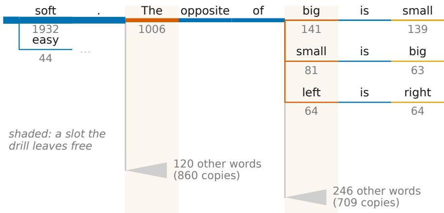

(b) the coincidence free energy of the same tree  
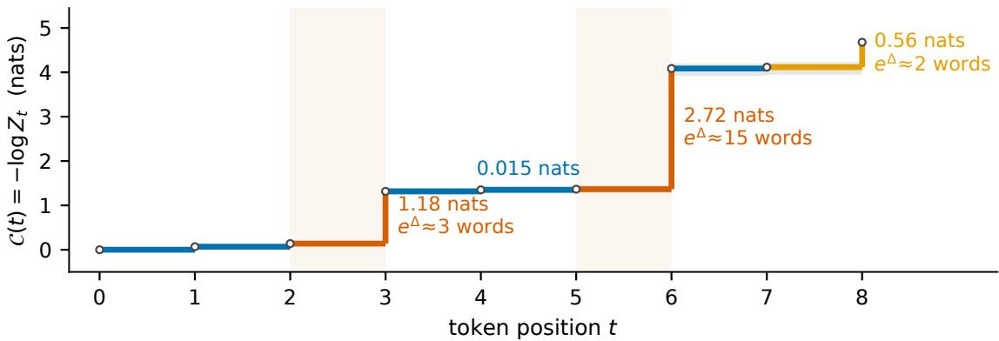  
Figure 2: The free energy rises exactly where the antonym exercise leaves a choice. It is flat through every slot the exercise determines. The $W = 2 0 0 0$ completions of a small open-weights language model (Qwen2.5-0.5B) stay coincident through the determined slots and branch at the free ones. Both panels describe that one run on a shared token axis. (a) The coincidence tree: a path read left to right is one completion, and edge width tracks the number of copies sharing that prefix. The posed item is answered near-unanimously—1932 copies take soft and 44 the second admissible sense easy—and the frame tokens $" _ { 0 } \mathrm { f ^ { \prime \prime } }$ and $" \mathrm { i } s "$ are taken by every surviving copy. The two shaded slots are the ones the exercise leaves free: the continuation after the answer, and the next word to ask about. A lineage that picks a word is then determined again by its own choice, giving big→small, small→big and $l e f t {  } r i g h t ;$ the remaining continuations at each contested slot are folded into a wedge. (b) The coincidence free energy $\mathcal { C } ( t ) = - \log Z _ { t }$ of the same tree, the $\alpha = ( 1 , 1 )$ case of Proposition $3 . 6 ,$ where $Z _ { t }$ is the probability that two independent copies share the prefix at t, estimated over all prefixes by the unbiased pair-collision estimator with a 95% bootstrap interval over completions (band). Its two risers are exactly the two shaded slots of $( \mathsf { a } ) ,$ , costing 1.18 and 2.72 nats, while the determined slots cost between 0.015 and 0.069; the exponential of a riser is the efective number of equally likely words at that slot. Color grades each slot by what its token costs, from committed to contested.

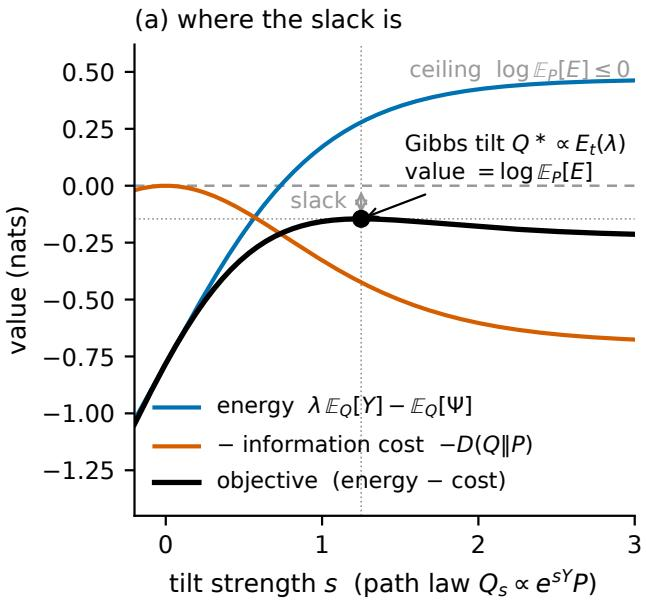

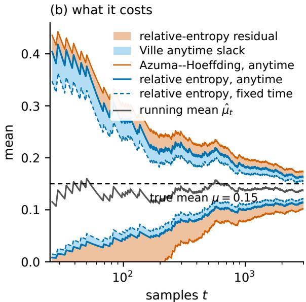  
Figure 3: The master identity sits at the peak of a free-energy landscape, and every classical relaxation steps down from it by an amount that widens a confidence band. (a) The identity (4.3) drawn as a Donsker–Varadhan free-energy landscape. Along the exponential-tilt family $\begin{array} { r } { Q _ { s } \propto e ^ { s Y } P } \end{array}$ the variational objective, energy minus relative-entropy cost, is unimodal in the tilt and attains its supremum at the Gibbs tilt. The value there equals the log-expectation of the exponential process: zero for the exact conditional log-CGF (4.2), and below zero by exactly the cumulant gap (4.5) under a majorant. Shown for a Rademacher increment under the Hoefding cumulant at $\lambda = 5 / 4$ , with dotted guides at the maximizing tilt and the value it attains. (b) What those steps cost, on a Bernoulli stream with true mean 0.15 read at level $\delta = 0 . 0 5$ . Four running-mean envelopes at one level: the exact relative-entropy tail inverted at a single pre-specified time (dashed) and uniformly over all times (solid blue), and the range-based Azuma–Hoefding tail inverted uniformly (orange). The two shaded rings are the paper’s two named residuals, and they are orthogonal. The inner ring is the Ville anytime slack, the width that holding at every time costs over holding at one, 21% of the band at $t = 1 0 0$ and 28% at $t = 1 0 0 0$ . The outer ring is the relative-entropy residual, what a range-based reading discards against the exact tail, 34% and 31% at the same two horizons. The asymmetry of the exact envelopes is the variance-awareness the range-based reading throws away.

(ii) In the setting of (i), for every $Q \ll P | _ { \mathcal { F } _ { t } }$ t the entropic equality (4.3) relaxes to the entropic inequality

$$
\lambda \mathbb { E } _ { Q } [ Y _ { t } ] - \mathbb { E } _ { Q } [ \overline { { \Psi } } _ { t } ( \lambda ) ] \leq \mathrm { D } ( Q \| P | _ { \mathcal { F } _ { t } } ) ,\tag{4.6}
$$

with slack exactly $\mathrm { D } ( Q \| Q _ { t } ^ { \star } ) + \mathbb { E } _ { Q } [ D _ { t } ( \lambda ) ]$

(iii) If (4.4) is a nonnegative supermartingale with $E _ { 0 } ( \lambda ) \leq 1$ for an arbitrary adapted $\overline { { \Psi } } _ { t }$ —no exact-cumulant hypothesis— then log $\mathbb { E } _ { P } [ E _ { t } ( \lambda ) ] \le 0 _ { \mathrm { { \small i \alpha } } }$ , and (4.6) holds with slack $\mathrm { D } ( Q \| \overline { { Q } } _ { t } ^ { \star } ) - \log \mathbb { E } _ { P } [ E _ { t } ( \lambda ) ] \ge 0 , f o r ~ \mathrm { d } \overline { { Q } } _ { t } ^ { \star } / \mathrm { d } P \propto E _ { t } ( \lambda )$

The relaxation moves the entropic statement from an equality to an inequality by an exactly known amount. Against any Q the slack splits into the tilt sub-optimality $\mathrm { D } ( Q \| Q _ { t } ^ { \star } )$ , already present in the identity, plus the Q-expected cumulant gap $\mathbb { E } _ { Q } [ D _ { t } ( \lambda ) ]$ ; the mean deficit (4.5) is the same gap read under the Gibbs tilt, and the two accountings agree because $\mathrm { D } ( Q \| \overline { { Q } } _ { t } ^ { \star } ) = \mathrm { D } ( Q \| Q _ { t } ^ { \star } ) + \mathbb { E } _ { Q } [ D _ { t } ( \lambda ) ] + \log \mathbb { E } _ { P } [ E _ { t } ( \lambda ) ]$ ]. The construction (4.4) is standard [22, 36]; typical majorants are the Hoefding $\begin{array} { r } { ( \overline { { \Psi } } _ { t } ( \lambda ) = \frac { \lambda ^ { 2 } } { 2 } \sum c _ { s } ^ { 2 } } \end{array}$ , from the range of the increments) and Bernstein $\begin{array} { r } { ( \overline { { \Psi } } _ { t } ( \lambda ) = \frac { \lambda ^ { 2 } } { 2 ( 1 - \lambda b / 3 ) } \langle Y \rangle _ { t } } \end{array}$ , for ⟨Y ⟩ the predictable variance) processes. Part (iii) is the working form when the increments have no finite exact cumulant, and it is the hypothesis under which every named bound below—from Ville to PAC-Bayes—is derived, each a specialization through a diferent $E _ { t }$ and event A.

Corollary 4.3 (Event identity). In the setting of Proposition 4.2(iii), for $A \in { \mathcal { F } } _ { t }$ with $P ( A ) > 0 ,$

$$
- \log \mathbb { P } ( A ) = \lambda \mathbb { E } [ Y _ { t } \mid A ] - \mathbb { E } [ \overline { { \Psi } } _ { t } ( \lambda ) \mid A ] + \operatorname { D } \big ( P ( \cdot \mid A ) \big \| \overline { { Q } } _ { t } ^ { \star } \big ) - \log \mathbb { E } _ { P } [ E _ { t } ( \lambda ) ] ,\tag{4.7}
$$

for $\mathrm { d } \overline { { Q } } _ { t } ^ { \star } / \mathrm { d } P \propto E _ { t } ( \lambda )$ . Both residuals are nonnegative, and discarding them gives the event bound

$$
\mathbb { P } ( A ) \le \exp \bigl ( - \lambda \mathbb { E } [ Y _ { t } \mid A ] + \mathbb { E } [ \overline { { \Psi } } _ { t } ( \lambda ) \mid A ] \bigr ) ;\tag{4.8}
$$

if in addition $\lambda \geq 0$ and on A one has $Y _ { t } \geq x$ and $\overline { { \Psi } } _ { t } ( \lambda ) \leq c ,$ , then $\mathbb { P } ( A ) \leq e ^ { - \lambda x + c }$ , at the further cost of the event relaxation $\lambda ( \mathbb { E } [ Y _ { t } \mid A ] - x ) + ( c - \mathbb { E } [ \overline { { \Psi } } _ { t } ( \lambda ) \mid A ] )$ . Since $E _ { t } ( \lambda ) > 0$ a.s., thefirst residual is strictly positive whenever $\mathbb { P } ( A ) < 1 .$ equality in (4.8) holds only $i f \mathbb { P } ( A ) = 1$ and $\lambda Y _ { t } = \overline { { \Psi } } _ { t } ( \lambda )$ a.s.

For any $\operatorname { e v e n t , } - \log \mathbb { P } ( A ) = \operatorname { D } ( P ( \cdot \mid A ) \| P )$ is its information, and (4.7) resolves that information into a tilted-energy part and two named residuals: the sub-optimality of the tilt at $Q = P ( \cdot \mid A )$ , and the cumulant relaxation paid for replacing the exact log-CGF by a majorant. Every named tail bound below is this divergence relaxed; the informative content is the slack the tightness results pin down—the per-step decomposition of Theorem B.4 and the no-overshoot equality of Theorem 4.6.

The identity and its relaxation are read at a fixed time; the crossing statements below read them at a stopping time, and one theorem licenses that passage .

Stopping a nonnegative supermartingale cannot increase its mean. A martingale preserves its mean under either of two further hypotheses, and integrability of the stopped value is not one of them, because mass can escape to the event that the time is infinite.

## 4.1 Classical concentration inequalities as specializations

A wide range of classical martingale concentration inequalities are the entropic inequality (4.6) of the supermartingale relaxation (Proposition 4.2)—equivalently its event identity Corollary 4.3—specialized to a particular cumulant majorant $\overline { { \Psi } } _ { t }$ and then optimized over λ; only the majorant changes from one member to the next. The same crossing event read through the Donsker–Varadhan identity (Corollary 2.2) returns the exact tail as a relative-entropy equality, of which each bound is the exponential-tilt relaxation.

Table 1 does this for every member of the classical family at once: the identity each bound relaxes, what it discards to reach its bound, and the geometry in which that discard is the deficit of an optimizer. Its lower segment lists the power-mean certificate family of Section 5 in the same form.

The object a bound is about fixes which of the table’s three geometries it lives in. An inequality about an exponential moment has a Gibbs tilt for its extremizer, so its residual is a relative entropy; the whole cumulant family falls here. An inequality about a power mean has for its extremizer the point at which a certificate function meets the quantity it dominates, so its residual is the deficit of a function afine in the running value. Doob’s $L ^ { p }$ maximal inequality is that instance, its residual written R against the running maximum $M ^ { * } : = \operatorname* { s u p } _ { t < T } M _ { t }$ at the conjugate exponent $q = p / ( p - 1 )$ the certificate rows occupy the lower segment, developed in Section 5. The crossing results occupy the third. Their residuals are optional-stopping quantities—a mean overshoot, a shed compensator, a quadrature residual—governed by where the path first exceeds a level, with neither a tilt nor a contact entering.

The exponential process itself is the first specialization.

Corollary 4.4 (Ville’s inequality). Let $( E _ { t } ) _ { t \geq 0 }$ be a nonnegative supermartingale with $E _ { 0 } \leq 1$ . Then for every $x > 0 ,$ $\begin{array} { r } { \mathbb { P } \big ( \operatorname* { s u p } _ { t > 0 } E _ { t } \geq e ^ { x } \big ) \leq e ^ { - x } } \end{array}$ . Consequently, if (4.4) is a nonnegative supermartingale with $E _ { 0 } ( \lambda ) \leq 1$ (Proposition 4.2(iii)), $\mathbb { P } ( \operatorname* { s u p } _ { t } \{ \lambda Y _ { t } - \overline { { \Psi } } _ { t } ( \lambda ) \} \geq x ) \leq e ^ { - x }$

The Donsker–Varadhan reading of the same crossing event sharpens Ville’s inequality to the exact tail probability, a relative-entropy equality.

Theorem 4.5 (Ville’s inequality as an exact-tail identity). Let $( M _ { t } ) _ { t \geq 0 }$ be a nonnegative supermartingale with $M _ { 0 } = 1$ . For every $\lambda > 0$ with $\mathbb { P } ( \operatorname* { s u p } _ { t } M _ { t } \geq \lambda ) > 0$ , the first-passage tail is a relative-entropy equality,

$$
- \log \mathbb { P } \biggl ( \operatorname* { s u p } _ { t } M _ { t } \geq \lambda \biggr ) = \operatorname { D } \biggl ( P ( \cdot | \operatorname* { s u p } _ { t } M _ { t } \geq \lambda ) \| P \biggr ) ,\tag{4.9}
$$

and optional stopping bounds this residual below by log λ, which is Ville’s inequality $\begin{array} { r } { \mathbb { P } \big ( \operatorname* { s u p } _ { t \geq 0 } M _ { t } \geq \lambda \big ) \leq \frac { 1 } { \lambda } } \end{array}$ , itself valid at every $\lambda > 0$

The gap between the residual $\mathrm { D } ( P ( \cdot | A ) | | P )$ and log λ measures how much tighter the true tail is than Ville’s bound; Theorem 4.7 closes it exactly for a vanishing martingale, in terms of the mean overshoot; for a general supermartingale the gap also includes the predictable loss and the never-crossing mass.

Table 1: The standard bounds as identities with named residuals, across the three geometries. Upper segment: the classical statement, the identity it relaxes, what it discards to get there, and the geometry in which that discard is the deficit of an optimizer; every entry points at the result that develops it. Lower segment (the power-mean certificate family of Section 5): each row is an inequality $\mathbb { E } [ \Gamma ] \le C \mathbb { E } [ \Xi ]$ proved by a certificate U dominating $\Gamma - C \Xi$ and supermartingale along the path. The certificate form (5.7) names the discarded quantities—a majorization deficit, an optional-stopping deficit, and an initial value—and “Evaluated” records whether this paper computes those quantities or only names them. The Burkholder–Davis–Gundy row is evaluated on a second axis, the cost of moving from a stopping time to a random time; in that row Φ is a moderate convex function—increasing, vanishing at the origin, and with $\Phi ( 2 x )$ bounded by a constant multiple of $\Phi ( x )$ $M _ { T } ^ { * } : = \operatorname* { s u p } _ { t \leq T } M _ { t } ; \langle M \rangle _ { T } ^ { 1 / 2 }$ is the square function.
<table><tr><td>Classical statement</td><td>Identity it relaxes</td><td>What it discards</td><td>Geometry</td></tr><tr><td>Ville</td><td>first-passage identity (Thm. 4.7)</td><td>the mean overshoot at the crossing; for a supermartingale also the predictable loss and the never-crossing mass</td><td>optional stopping</td></tr><tr><td>Azuma-Hoeffding</td><td>per-step relative-entropy sum (B.2)</td><td>the event relaxation, the tilt&#x27;s sub- optimality, and the range-based cumulant majorant (4.13)</td><td>Gibbs / entropic</td></tr><tr><td>Bennett-Bernstein- Freedman</td><td>the same identity at a variance- aware cumulant</td><td>the same three, the majorant gap now keep- ing a proxy for the higher cumulants</td><td>Gibbs / entropic</td></tr><tr><td>Parameter mixtures (method of mixtures)</td><td>pathwise mixture identity, tail ex- act (Prop. B.8)</td><td>the overshoot at the crossing and the set on which the mixture crosses while the certifi- cate never fires</td><td>Gibbs / entropic</td></tr><tr><td>Curved boundary of any form</td><td>discrete crossing law (Thm. 4.9)</td><td>a quadrature residual and an overshoot, optional stopping both zero in continuous time and com- putable in advance</td><td></td></tr><tr><td>PAC-Bayes (martingale form)</td><td>pathwise Gibbs-tilt identity (Prop. B.8)</td><td>the divergence  $\mathrm { D } ( \rho \| \rho _ { t } ^ { * } )$  to the running tilt, zero at the Bayes posterior, then the Ville relaxation</td><td>Gibbs / entropic</td></tr><tr><td>Pooled Ville over W tests</td><td>exact crossing probability (Cor. 6.2), on the crossing-mass identity (Prop. C.2)</td><td>the compensator shed before the crossing, optional stopping the below-threshold mass, and the over- shoot</td><td></td></tr><tr><td>Inequality</td><td>Target Γ vs. comparand Certificate  $\Xi$ </td><td>Discarded</td><td>Evaluated</td></tr><tr><td>Doob  $L ^ { p }$  maximal,  $p > 1$  (Theorem B.2) as</td><td> $( M _ { T } ^ { * } ) ^ { p }$  against  $M _ { T } ^ { p }$  at  $C = q ^ { p } , q = p / ( p - 1 ) ;$  an identity,  $\| M ^ { * } \| _ { p } = q \| M _ { T } \| _ { p } - \mathcal { R }$ </td><td> $U ( x , y ) ~ = ~ y ^ { p } - q y ^ { p - 1 } x ,$  Hölder deficit (5.4); affine in the running optional-stopping value, smooth fit on the diago- deficit  $\delta _ { \mathrm { B } } ,$  nal; the Azéma-Yor process at value  $M _ { 0 } ^ { p } / ( p - 1 )$   $\Phi ( y ) = - y ^ { p } / ( p - 1 )$ </td><td> $\delta _ { \mathrm { H } } ,$  yes, Corol- lary 5.2; δB per initial step, Proposi- tion 5.1</td></tr><tr><td>Maximal identity at con- cave Φ (Proposition 5.1)</td><td> $\Phi ( M _ { T } ^ { * } )$  against  $\Phi ( M _ { 0 } )$  and the terminal gap  $( M _ { T } ^ { * } - M _ { T } ) \Phi ^ { \prime } ( M _ { T } ^ { * } )$  cave Φ</td><td>the Azéma-Yor process  $A ^ { \Phi }$  of (5.1), one member per con- gence  $D _ { - \Phi }$  nothing else</td><td>one Bregman diver- yes, exactly; no per ad- Hölder step and vance of the run- no constant ning maximum, and</td></tr><tr><td>Burkholder-Davis- Gundy, including the  $p = 1$  Davis endpoint [7] Burkholder-Rosenthal,</td><td>Φ(MT)  $\Phi \dot { ( } \langle M \rangle _ { T } ^ { 1 / 2 } ) ,$  each di- given Φ [7, 33] rection separately</td><td>against a Burkholder function for the factor</td><td>named by (5.7) once deficits no; a Φ-certificate is at a random fixed; at a random time yes,  $\mathrm { A p \mathrm { - } }$  time, an inflation pendix E.2</td></tr><tr><td> $p \geq 2 [ 6 ]$  Sharp martingale-</td><td> $| M _ { T } | ^ { p }$  against the conditional-variance and per-step moment terms the transform against the</td><td>distribution-function and good-λ inequalities [6] certificate Burkholder&#x27;s explicit special</td><td>named by (5.7) per no  $\delta _ { \mathrm { { M } } } \mathrm { ~  ~ { ~ \sigma ~ } ~ } = \mathrm { ~  ~ { ~ 0 ~ } ~ a t ~ \mathrm { ~ a ~ } ~ }$  no</td></tr><tr><td>transform and square- martingale in function bounds [33]</td><td> $L ^ { p } ,$  at the sharp constant supplies the equality</td><td>function; the obstacle bound- sharpcertificate, ary of the Bellman function leaving the optional- stopping deficit and the initial value</td><td></td></tr></table>

## 4.2 Ville tightness at the ultimate maximum

The random-time divergences later in the paper all trace to one extreme object: the value a vanishing martingale takes at its own global maximum.

For a nonnegative martingale $( M _ { t } )$ with $M _ { 0 } = 1$ and $\begin{array} { r } { \operatorname* { l i m } _ { t  \infty } M _ { t } = 0 } \end{array}$ a.s., the ultimate-maximum time is

$$
\tau ^ { \star } : = \operatorname* { m i n } \\bigl \{ t \geq 1 : M _ { t } = \operatorname* { s u p } _ { s \geq 1 } M _ { s } \bigr \}\tag{4.10}
$$

Under ${ M } _ { t }  0 ,$ , the supremum is a.s. attained, so $\tau ^ { \star }$ is a.s. finite and positive-integer-valued, as a random time requires; it is not a stopping time, because identifying that t achieves the global maximum requires seeing all future values. Since $\begin{array} { r } { \mathbb E [ \operatorname* { s u p } _ { t > 0 } M _ { t } ] \leq 1 + \mathbb E [ \operatorname* { s u p } _ { t > 1 } M _ { t } ] } \end{array}$ , restricting the index to $t \geq 1$ leaves the non-integrability of Lemma 7.8 unafected.

Ville’s classical inequality [22, 36, 41] bounds the probability that a nonnegative unit-mean martingale ever exceeds x by $1 / x$ . When the martingale converges to 0 and crosses each level without overshoot—the continuous-path idealization— that bound is attained. The equality combines the upper bound already carried by Ville’s inequality with a matching lower bound from Doob’s maximal identity, under which the running maximum is distributed as $1 / U$ for $U$ uniform on [0, 1]. The resulting heavy Pareto-type $1 / x$ tail of $M _ { \tau ^ { \star } }$ is the source of the divergences in the random-time peeking penalties below; the estimation of such running extrema is itself possible [4].

Theorem 4.6 (Doob’s maximal identity / Ville tightness). Let $( M _ { t } )$ be a nonnegative martingale with $M _ { 0 } = 1$ and ${ M } _ { t }  0$ $a . s . ,$ let $\tau ^ { \star }$ be its ultimate-maximum time of (4.10), andfix a level $x > 1$ . Then

$$
\mathbb { P } ( M _ { \tau ^ { \star } } \geq x ) = \mathbb { P } \bigg ( \operatorname* { s u p } _ { t \geq 0 } M _ { t } \geq x \bigg ) \leq \frac { 1 } { x } ,
$$

with equality at that level exactly when x is crossed without overshoot: writing $\sigma _ { x } : = \operatorname* { i n f } \{ t : M _ { t } \geq x \}$ for the first passage 1 $\ o x , M _ { \sigma _ { x } } = x a . s .$ on $\{ \sigma _ { x } < \infty \} ,$ ; the deficit is the mean overshoot of Theorem 4.7, divided by the level. A continuous-time vanishing martingale with continuous paths crosses every level without overshoot, and its running maximum is then exactly $P a r e t o ( 1 ) \ [ 3 2 ] .$ No discrete-time vanishing martingale attains equality at every level at once: absence of overshoot at every $x \geq 1 f o r c e s \operatorname* { s u p } _ { t } M _ { t } \leq 1 a . s .$ ., and a nonnegative martingale with $M _ { 0 } = 1$ bounded by 1 is constant. The Pareto(1) law is the continuous-time idealization that the discrete-time tail approaches from below, level by level, as the overshoot vanishes

Theorem 4.6 reads the ultimate maximum from the start of the path. The same accounting holds from every stopping time onward, with the current value in place of M0. Equality is attained in the continuous-path regime, and the conditional form of the maximal identity lives there as well, so Proposition B.3 — that form, read at a stopping time and against a level already attained — is stated in continuous time; the discrete-time convention of the paper applies elsewhere.

At $\tau = 0$ and $m = 1$ , part (ii) reduces to part (i), which is the Pareto(1) law of Theorem 4.6. On the logarithmic scale that law is a standard exponential, so $\mathbb { E } [ \log M _ { \infty } ^ { * } ] = 1$ : the ultimate maximum stands one nat above the starting value in expectation. Part (ii) says the same nat is available from every stopping time onward, at the same value and whatever the path has done so far. The anticipation an observer could still collect by holding out for the global maximum does not deplete along the trajectory; it renews at every moment the observer is entitled to recognize, and the elapsed history contains no information about how much of it remains. The comparison with Lemma 7.8 and Proposition 7.9 is a matter of scale: the same object has $\mathbb { E } [ M _ { \infty } ^ { * } ] = \infty$ and E[log $M _ { \infty } ^ { * } ] = 1$ , so the peeking penalty diverges while the anticipation budget it measures stays at one nat.

Each hypothesis supplies part of the statement. Positivity and $M _ { \infty } = 0$ place the whole mass of $M _ { \infty } ^ { * }$ on $[ m , \infty )$ with the Pareto scaling; continuity of $M ^ { * }$ is the no-overshoot condition, under which the level a is met at $M _ { \sigma _ { a } } = a .$ . The absence of positive jumps in (ii) makes the same no-overshoot property hold from every stopping time onward, at levels below the running record as well. The discrete-time limitation of Theorem 4.6 binds here too, and Proposition B.3 is the continuous-path idealization of that limit, at every stopping time simultaneously.

The deficit in Ville’s bound has a closed form: for a vanishing martingale the first-passage probability falls below the bound by exactly the mean overshoot divided by the level.

Theorem 4.7 (Discrete-time first-passage identity). Let $( M _ { t } ) _ { t \geq 0 }$ be a nonnegative martingale with $M _ { 0 } = 1$ and ${ M } _ { t }  0$ a.s. For $x \geq 1$ let $\sigma _ { x } : = \operatorname* { i n f } \{ t : M _ { t } \geq x \}$ and, on $\{ \sigma _ { x } < \infty \}$ , the overshoot $J _ { x } : = M _ { \sigma _ { x } } - x \ge 0 .$ . Then the optional-stopping mass is conserved

$$
\mathbb { E } [ M _ { \sigma _ { x } } \mathbf { 1 } \{ \sigma _ { x } < \infty \} ] = 1 ,\tag{4.11}
$$

and the first-passage probability satisfies the identity

$$
\mathbb P \Big ( \operatorname* { s u p } _ { t > 0 } M _ { t } \geq x \Big ) = \mathbb P ( \sigma _ { x } < \infty ) = \frac 1 x \Big ( 1 - \mathbb E [ J _ { x } \mathbf { 1 } \{ \sigma _ { x } < \infty \} ] \Big ) .\tag{4.12}
$$

The named slack is the deficit $\mathbb { E } [ J _ { x } \mathbf { 1 } \{ \sigma _ { x } < \infty \} ] / x$ . Equality with the $P a r e t o ( 1 )$ law of Theorem 4.6 holds if $J _ { x } = 0$ a.s. (no overshoot). The overshoot law depends on the increment distribution, so no universal closed form for $\mathbb { E } [ J _ { x } ]$ exists beyond the overshoot-free extreme; the identity (4.12) accounts for the slack in every case.

The mass the identity conserves is exactly the quantity a sample cannot reach. The same partition function that produced the crossing statements, read at the wealth itself, says how large a sample would have to be.

Proposition 4.8 (Rényi spectrum of a test martingale). Let $( M _ { t } )$ be a nonnegative martingale with $M _ { 0 } = 1$ . Taking the single factor $\Pi = M$ in Theorem 3.2 gives the wealth cumulan $\Phi _ { T } ( s ) = \log \mathbb { E } _ { P } [ M _ { T } ^ { s } ]$ , convex in s, with

$$
\Phi _ { T } ( 1 ) = 0 , \qquad \Phi _ { T } ^ { \prime } ( 0 ) = \mathbb { E } _ { P } [ \log M _ { T } ] = - \mathrm { D } ( P \| Q _ { M } ) , \qquad \Phi _ { T } ^ { \prime } ( 1 ) = \mathbb { E } _ { P } [ M _ { T } \log M _ { T } ] = \mathrm { D } ( Q _ { M } \| P ) ,
$$

for $\mathrm { d } Q _ { M } / \mathrm { d } P : = M _ { T }$ . The separation between the typical value and the mass-holding one is $\Phi _ { T } ^ { \prime } ( 1 ) - \Phi _ { T } ^ { \prime } ( 0 ) = \operatorname { D } ( Q _ { M } \Vert P ) +$ $\mathrm { D } ( P \| Q _ { M } )$ . For a likelihood-ratio stream $\begin{array} { r } { M _ { T } = \prod _ { t < T } R _ { t } , } \end{array}$ , at any s where the conditional one-step cumulants log $\mathbb { E } _ { P } [ R _ { t } ^ { s }$ $\mathcal { F } _ { t - 1 } ]$ are all deterministic — independent steps being the canonical case — the spectrum is their sum, $\begin{array} { r } { \Phi _ { T } ( s ) = \sum _ { t < T } \log \mathbb { E } _ { P } [ R _ { t } ^ { s } ] _ { } } \end{array}$ evaluated term by term without simulating a single path.

The two halves of the spectrum answer diferent questions about the same process. Its slope at 0 is the almost-sure decay that drives $M _ { t }$ to zero, and its slope at 1 is the improbability of the paths that keep the mean at one; the Jefreys separation between them measures how far a sample mean falls short of the mass.

Dependence between the steps breaks the term-by-term sum away from s = 1: the conditional cumulants become $\mathcal { F } _ { t - 1 } -$ measurable random variables, their realized sum varies from path to path, and the deterministic sum $\begin{array} { r } { \sum _ { t < T } \log \mathbb { E } _ { P } [ R _ { t } ^ { s } ] } \end{array}$ need no longer equal $\Phi _ { T } ( s )$ . The slope at 1 still decomposes: the chain rule (Lemma 3.1) resolves $\Phi _ { T } ^ { \prime } ( 1 ) = { \sf D } ( Q _ { M } \| P )$ into the sum $\begin{array} { r } { \sum _ { t < T } \mathbb { E } _ { Q _ { M } } [ \mathrm { D } ( Q _ { t } ( \cdot  { | } \bar { X } _ { 1 : t - 1 } )  { | } | P _ { t } ( \cdot  { | } \bar { X _ { 1 : t - 1 } } ) ) ] } \end{array}$ ] of per-step conditional divergences averaged under $Q _ { M } .$ For an i.i.d. stream — one-step ratios $R _ { t } = q ( X _ { t } ) / p ( X _ { t } )$ with the $X _ { t }$ drawn from p under $P$ and $\mathrm { D } ( q \| p )$ finite — the spectrum grows linearly, $\Phi _ { T } ( s ) = T \log \mathbb { E } _ { P } [ R _ { 1 } ^ { s } ]$ . The mass then acquires an asymptotic shape: $T ^ { - 1 }$ log $M _ { T }$ concentrates at $\mathrm { D } ( q \| p )$ under $Q _ { M }$ by the law of large numbers. The change of measure $\mathrm { d } P = M _ { T } ^ { - 1 } \ \mathrm { d } Q _ { M }$ on $\{ M _ { T } > 0 \}$ therefore places the concentration set at P-probability $e ^ { - \Phi _ { T } ^ { \prime } ( 1 ) + o ( T ) }$ . Estimating $\mathbb { E } _ { P } [ M _ { T } ] = 1$ by averaging n independent draws under $P$ therefore requires log $n \gtrsim \Phi _ { T } ^ { \prime } ( 1 )$ , and below that the sample mean is exponentially small. The mechanism is the truncated-mean identity $\mathbb { E } _ { P } [ M _ { T } \mathbf { 1 } \bar { \{ \log M _ { T } \leq u \} } ] = Q _ { M } ( \log M _ { T } \leq u )$ , whose right-hand side collapses once the ceiling u ≈ log n that a size-n sample resolves falls below the concentration point. The two routes to the mass diverge exactly here: the identity $\Phi _ { T } ( 1 ) = 0$ returns $\mathbb { E } _ { P } [ M _ { T } ] = 1$ for every test martingale, while a sample mean of $M _ { T }$ reaches that same 1 only once n passes the size $\Phi _ { T } ^ { \prime } ( 1 )$ ) sets.

Other sharpenings. In concurrent and independent work, de la Peña and Klass [10] establish an exact identity for the first-passage probability of a nonnegative supermartingale $\left( M _ { n } \right)$ with $M _ { 0 } = 1$ . Writing $T _ { b }$ for the first time M reaches a level $b > 1$ , they show $\mathbb { P } ( T _ { b } < \infty ) = ( 1 - D _ { b } - R _ { b } ) / ( b + J _ { b } )$ ), where $J _ { b }$ is the expected overshoot at crossing, $D _ { b }$ the cumulative predictable loss accrued before crossing, and $R _ { b }$ the residual mass on paths that never cross. Their decomposition splits the slack in Ville’s inequality into three mechanisms that collapse, for a vanishing martingale, to the single overshoot term of Theorem 4.7. The overshoot $J _ { b }$ is that identity’s deficit conditioned on crossing, the two difering by the crossing probability, while the predictable-loss and survival terms account for the stopping defect and the never-crossing paths that the martingale case suppresses. Both first-passage identities are conservation statements read of optional stopping. A separate line sharpens those same tails by a complementary route: the randomized and exchangeable refinements of Markov’s, Chebyshev’s, and Chernof’s inequalities [35] add external randomization to tighten the bound itself, whereas the present account leaves the bound in place and measures its information cost. The two are orthogonal—randomization sharpens the inequality, while the relative-entropy residual of this paper explains it.

The identity names a residual; which parameter governs it is a separate question, settled by measurement. Ville tightness is a statement about the first-passage ratio x $\mathbb { P } ( \operatorname* { s u p } _ { t } M _ { t } \geq x )$ , which sits at the continuous-path value 1 minus the mean overshoot of Theorem 4.7; the corresponding residual of Theorem 4.5 is its logarithm, $- \log \left( x \mathbb { P } ( \operatorname* { s u p } _ { t } M _ { t } \geq x ) \right)$ . The deficit there is set by the increment scale and not by the horizon, so it is a property of the increment law at the crossing and does not wash out as the horizon grows (Section F.3).

## 4.3 Cumulant majorants and intrinsic time

How much of the tail entropy a bound keeps depends on the bound as much as on the law. The range-matched and the variance-aware bound are both Chernof bounds that replace the increment’s cumulant generating function by a quadratic upper bound (majorant) $\lambda ^ { 2 } v / 2 ,$ , difering only in the proxy v they use, and both are surrogates for one tilt-dependent quantity. Matching on variance is legitimate only for laws that are $\scriptstyle { \dot { \sigma } } ^ { 2 } ,$ -sub-Gaussian; for a skewed or heavy-tailed law it is not, and there the variance-aware bound of Proposition B.6 supplies the correction. Neither closes the gap. The residual persists under both and remains largest where the increments are heaviest, and the identity of Section 4 names it in either case.

A bounded-increment cumulant bound turns the same master inequality into Azuma–Hoefding, and states the exact tail alongside it. That bound is the conditional Hoefding lemma: for a sub-σ-field $\mathcal { G }$ and a random variable $X$ with $a \leq X \leq l$ a.s. and $\mathbb { E } [ X \mid { \mathfrak { G } } ] = 0 , \mathbb { E } [ e ^ { \lambda X } \mid { \mathfrak { G } } ] \leq \exp \left( \lambda ^ { 2 } ( { \overset { . } { b } } - a ) ^ { 2 } / 8 \right)$

The bound that results is the Azuma–Hoefding tail (Theorem B.4).

The Azuma bound sits above the exact tail (B.2) by three relaxations. Writing $\begin{array} { r } { Q : = P ( \cdot \mid \sum _ { s } d _ { s } \geq x ) } \end{array}$ and $\overline { { Q } } ^ { \star }$ for the law tilted by the Hoefding exponential (4.4) at the optimal $\lambda ^ { * }$

$$
\begin{array} { r } { - \log P \Big ( \sum _ { s } d _ { s } \geq x \Big ) - \sum _ { s } ^ { 2 x ^ { 2 } } ( { b } _ { s } - { a } _ { s } ) ^ { 2 } = \underbrace { \lambda ^ { * } \big ( \mathbb { E } [ \sum _ { s } d _ { s } \mid Q ] - x \big ) } _ { \mathrm { c v e n t r e l a x a t i o n } } + \underbrace { \mathrm { D } ( Q \| \overline { { Q } } ^ { \star } ) } _ { \mathrm { t i l t s u b - o p t i m a l i t y } } + \underbrace { \big ( - \log \mathbb { E } [ E _ { t } ( \lambda ^ { * } ) ] \big ) } _ { \mathrm { c u m u l a n t r e l a x a t i o n } } . } \end{array}\tag{4.13}
$$

This display is the event identity (4.7) read at the optimizing tilt $\lambda ^ { * }$ , with its event relaxation split of: the tilt sub-optimality and the cumulant relaxation are the corollary’s two residuals, and the first term is the cost of passing from E $\smash { \prime [ \sum _ { s } d _ { s } \mid Q ] }$ to the threshold x. Only the third is the Hoefding cumulant, and how the three compare depends on how tightly the range bounds the increment. $\mathrm { F o r } \pm c _ { s }$ Rademacher increments the cumulant relaxation is $\mathrm { t i g h t - a t } t = 8 , x = 3$ it contributes 0.013 of a 1.372 gap, against 0.578 for the event relaxation and 0.781 for the tilt $- \ : s 0$ the combined gap is most of the exact tail. When the range badly overstates the variance the ordering changes: for increments uniform on $[ - 1 , 1 ]$ , at $t = 1 2 , x = 4$ , the three terms are 0.233, 2.459 and 0.445, so the cumulant is no longer the smallest.

Replacing the bounded-increment cumulant with a variance-aware one gives the Bennett–Bernstein–Freedman family. Let $\begin{array} { r } { \langle M \rangle _ { t } : = \sum _ { s = 1 } ^ { t } \mathbb { E } [ d _ { s } ^ { 2 } \mid \mathcal { F } _ { s - 1 } ] } \end{array}$ denote the predictable variance process.

The one-step Bernstein bound (Lemma B.5) is the majorant behind the variance-sensitive members.

Substituting it gives the Freedman–Bernstein line-crossing bound (Proposition B.6). The proxy v is a single function of the tilt, so these two members approximate the same object. Write the intrinsic time of an increment d at tilt λ as

$$
v ( \lambda ) : = \frac { 2 \Psi ( \lambda ) } { \lambda ^ { 2 } } , \qquad \Psi ( \lambda ) = \log \mathbb { E } \bigl [ e ^ { \lambda d } \bigr ] ,\tag{4.14}
$$

the variance proxy a Chernof bound must use to majorize the cumulant by the quadratic $\lambda ^ { 2 } v / 2$ . Since $\Psi ( \lambda ) = \lambda ^ { 2 } \sigma ^ { 2 } / 2 +$ $\kappa _ { 3 } \lambda ^ { 3 } / 6 + O ( \lambda ^ { 4 } )$ for a mean-zero law whose cumulant generating function is finite near the origin, $v ( \lambda ) \to \sigma ^ { 2 }$ as $\lambda  0 \colon$ the variance is the small-tilt limit $o f$ intrinsic time. The name records that $v ( \lambda )$ is the variance of the Gaussian increment whose cumulant matches $\Psi$ at that tilt, and on the Brownian clock variance and elapsed time coincide. The bounded increments of this section meet that condition, and the two classical proxies are then surrogates for one quantity. Azuma–Hoefding uses $R ^ { 2 } / 4 ,$ , flat in $\lambda ;$ Bennett–Bernstein–Freedman uses $\sigma ^ { 2 } / ( 1 - \lambda b / 3 )$ , which meets the intrinsic time at $\lambda = 0$ and grows thereafter. Neither proxy dominates the other: which is tighter depends on the deviation being tested at, and the crossing has a closed form in that deviation. Over $T$ steps a Chernof bound on the quadratic majorant captures $x ^ { 2 } / ( 2 T v )$ nats at deviation x, so the variance-aware proxy is the tighter of the two exactly while

$$
x \ < \ x ^ { \dagger } \ : = \ { \frac { 3 T { \bigl ( } R ^ { 2 } / 4 - \sigma ^ { 2 } { \bigr ) } } { b } } .
$$

Popoviciu’s inequality makes the numerator nonnegative, $\operatorname { s o } x ^ { \dagger }$ is well defined for every bounded law and vanishes exactly at $R = 2 \sigma ;$ a variance small enough against the range makes the variance-aware bound the sharper one at every reachable deviation [43]. The simplest mean-zero martingale that is not symmetric—two atoms, $+ 2$ with probability $1 / 3 -$ has $\sigma ^ { 2 } = 2 , R = 3 \mathrm { a n d } b = 2 , \mathord { \mathrm { s o } } x ^ { \dag } = 0 . 3 7 5 T$ and the two bounds cross at a deviation a run of length $T$ can reach.

## 4.4 Parameter mixtures and curved boundaries

A single exponential supermartingale $E _ { t } ( \lambda )$ certifies a bound only at the parameter λ fixed in advance, yet the analyst rarely knows the right λ before seeing the data. Averaging the whole family over a prior $\mu$ on Λ yields one supermartingale valid simultaneously for every $\lambda ,$ at the cost of a relative-entropy penalty for whichever posterior the data end up favoring. This is the method of mixtures, and it is how a fixed-parameter tail bound becomes a single time-uniform curved boundary.

That construction is the pathwise mixture bound (Proposition B.7).

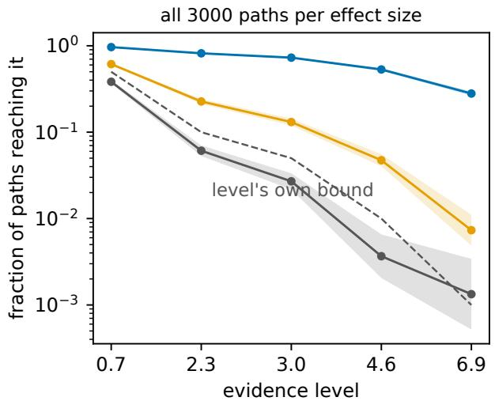

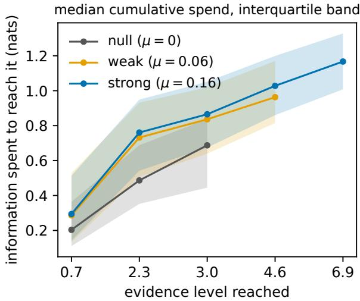  
Figure 4: What evidence costs, in nats, along realized paths. A Gaussian stream read through the mixture of Proposition B.7 over a grid of tilts; the spend on a step is $\mathrm { D } ( \rho _ { t } ^ { * } \| \rho _ { t + 1 } ^ { * } )$ between consecutive optimal posteriors, and a milestone is the first crossing of log( $1 / \alpha )$ by log $\overline { { E } } _ { t }$ . Both panels are read against the same evidence level $\log ( 1 / \alpha )$ , so the pair gives what a level costs beside how often it is reached. Left: the fraction of all 3000 paths per efect size reaching each level, with 95% Wilson intervals, against the level’s own bound. The null arm tracks below that bound throughout: crossing rates 0.383, 0.061, 0.027, 0.0037 and 0.0013 against 0.5, 0.1, 0.05, 0.01 and 0.001, the last being four crossings where three are expected. Right: the cumulative spend to first reach each level, median and interquartile band, so the rise between two ticks is the information that next factor of evidence requires. Each level is drawn only where at least 30 paths reached it, and the statistics are conditional on arrival, which is why the null and weak curves stop early: reaching a deep level under a weak signal selects the paths that moved fastest, and too few remain to summarize. The efect size decides how often a level is reached and barely touches what reaching it costs. At the deepest level the three arms difer 210-fold in the fraction arriving, while their median total spend difers by a factor of 1.66: 0.77 nats under the null, 0.96 at the weak efect and 1.28 at the strong one.

Markov’s inequality reaches (B.8) in one step and leaves no record of what that step cost. In fact, two quantities are discarded in passing from (B.7) to (B.8), and Proposition B.8 restores both. On path space the same passage is an equality once its two residuals are named: the mass on which the mixture crosses the level while the posterior’s divergence from the running tilt exceeds the margin, and the deficit at the crossing itself.

Its exact form (Proposition B.8) evaluates both of the discarded quantities.

On $\mathcal { V } _ { x } \ \backslash \ A _ { x }$ the mixture crosses the level but the certificate never fires; at the Bayes posterior, that set is empty.

The posterior $\rho _ { t } ^ { * }$ moves as data arrive, and the relative entropy between consecutive posteriors is the information the path spends on that step. Accumulating it puts information on an axis against which each first crossing of an evidence level can be located, so what the next factor of evidence requires is the information accumulated between consecutive crossings (Figure 4).

## 4.5 Exact crossing of a curved boundary

A sequential test that spends its error level along a curved boundary is calibrated by one integral of that boundary in the continuous-path idealization, and the calibration fails once the test is run on a discrete clock. On a symmetric ±1 walk read through its running maximum, a boundary set to spend $\alpha = 1 - e ^ { - 1 / 2 } \approx 0 . 3 9 4$ spends about 0.442 instead—an eighth over its nominal level. Theorem 4.9 locates that overrun in two computable terms.

The instance to hold in view is the drawdown of a martingale below its own running maximum: the boundary caps how far the path may fall from its record, and the record itself is the clock the boundary is read against. Drawdown limits in sequential monitoring have exactly this form. Posing the question needs no continuum—a boundary $\varphi ,$ a clock A, and the event $\{ \exists t : X _ { t } > \varphi ( A _ { t } ) \}$ make sense on any filtration—and the closed form below comes from one function-indexed family of martingales sharing a single increasing process, whose continuous-path member is the classical law (Appendix D).

Call $X = N + A$ a discrete class-(Σ) process when $X \geq 0$ is adapted with $X _ { 0 } = 0 , N$ is a martingale with $N _ { 0 } = 0 ,$ , A is adapted and nondecreasing with $A _ { 0 } = 0 ;$ , and $\Delta A _ { t } > 0$ only at times with $X _ { t } = 0$ . The drawdown just described is one such process, with A the running maximum itself.

Theorem 4.9 (Discrete-time crossing of a curved boundary). Let $X = N + A$ be a discrete class-(Σ) process and let $\varphi \colon \mathbb { R } _ { + } \to ( 0 , \infty ]$ be Borel with $\begin{array} { r } { I : = \stackrel { \textstyle \cdot \infty } { \int _ { 0 } ^ { \infty } \varphi ( x ) ^ { - 1 } \mathrm { d } x < \infty } . } \end{array}$ . Write $\begin{array} { r } { w ( x ) : = \exp \bigl ( - \int _ { x } ^ { \infty } \varphi ( z ) ^ { - 1 } \mathrm { d } z \bigr ) , \zeta : = 1 - w } \end{array}$ and $h : = w / \varphi$ , so that $w ^ { \prime } = h$ and $\zeta ^ { \prime } = - \check { h } ,$ , and assume h is bounded. Then $M _ { t } : = \zeta ( A _ { t } \bar { ) } + h ( A _ { t } ) X _ { t }$ is nonnegative with $M _ { 0 } = 1 - e ^ { - I }$ , the crossing event is exactly

$$
\left\{ \exists t : X _ { t } > \varphi ( A _ { t } ) \right\} = \left\{ \operatorname* { s u p } _ { t } M _ { t } > 1 \right\} ,\tag{4.15}
$$

and M decomposes pathwise as

$$
M _ { t } = M _ { 0 } + \sum _ { s \leq t } h ( A _ { s - 1 } ) \Delta N _ { s } + \sum _ { s \leq t } R _ { s } , \qquad R _ { s } : = h ( A _ { s - 1 } ) \Delta A _ { s } - \bigl ( w ( A _ { s } ) - w ( A _ { s - 1 } ) \bigr ) ,\tag{4.16}
$$

the first sum a martingale and $\begin{array} { r } { R _ { s } = \int _ { A _ { \mathrm { s } - 1 } } ^ { A _ { s } } \left( h ( A _ { s - 1 } ) - h ( z ) \right) } \end{array}$ dz the quadrature residual of h across the jump of A. If in addition h hasfinite total variation var(h) on $\mathbb { R } _ { + } ,$ the jumps of A are uniformly bounded, $A _ { t } \to \infty ,$ , and ${ M } _ { t }  0$ of the crossing event, then with $T : = \operatorname* { i n f } \{ t : X _ { t } > \varphi ( A _ { t } ) \}$ } and overshoot $J : = M _ { T } - 1 \ge 0$

$$
\mathbb { P } \big ( \exists t : X _ { t } > \varphi ( A _ { t } ) \big ) = 1 - e ^ { - I } + \mathbb { E } \Big [ \sum _ { s \leq T } R _ { s } \Big ] - \mathbb { E } \big [ J \mathbf { 1 } \{ T < \infty \} \big ] .\tag{4.17}
$$

The event identity (4.15) is the geometric content, and it is pointwise: the transform is a change of the vertical coordinate that maps the boundary, and with it every level set of $M ,$ onto a horizontal line (Figure 5).

Each correction is controlled by one feature of the path, and each vanishes in the continuum. The quadrature residual obeys $\begin{array} { r } { \sum _ { s } | R _ { s } | \le \| \Delta A \| _ { \infty } } \end{array}$ var(h), with $\mathrm { v a r } ( h )$ the total variation of h on $\mathbb { R } _ { + }$ , equal to $h ( 0 ) = e ^ { - I } / \varphi ( 0 )$ when h is monotone; it shrinks as the jumps of A refine and is identically zero when A is continuous, since $R _ { s } = 0$ whenever $\Delta A _ { s } = 0 .$ . The overshoot vanishes when X has no positive jumps, the hypothesis of Theorem D.2 in continuous time and generally false in discrete time. Setting both to zero returns (D.2) exactly: a continuous clock spends its whole budget $\stackrel { \sim } { \int _ { 0 } ^ { \infty } } \varphi ^ { - 1 }$ without skipping, and a continuous path meets the boundary without passing it.

The practical consequence is a level, and a schedule for committing it. For a target $\alpha \in \mathsf { \Gamma } ( 0 , 1 )$ , any boundary with $\begin{array} { r } { \int _ { 0 } ^ { \infty } \varphi ( x ) ^ { - 1 } \mathrm { d } x \ = \ \dot { \ } - \log ( 1 - \alpha ) } \end{array}$ is crossed with probability α in the continuous-path limit, and $u \mapsto 1 -$ exp $\begin{array} { r l } {  { \bigl ( - \int _ { 0 } ^ { u } \varphi ( x ) ^ { - 1 } \mathrm { d } x \bigr ) } } \end{array}$ reports how much of α has been committed once the clock reaches u; the form of $\varphi$ redistributes the level along the clock while leaving the total fixed. On a discrete clock the realized probability is instead the nominal α plus the quadrature residual, minus the overshoot, and on a coarse clock both terms are non-trivial. At $\varphi ( x ) = 2 ( 1 + x ) ^ { 2 }$ on the ±1 walk the residual contributes 0.134 and the overshoot 0.086, placing the realized level at 0.442. A direct count of crossings climbs toward that value from below as the horizon grows—0.355 at $2 \times 1 0 ^ { 2 }$ steps, 0.404 at $5 \times 1 0 ^ { 3 } , 0 . 4 1 3$ at $1 . 2 5 \times 1 0 ^ { 5 }$ —since the identity asks for $A _ { t } \to \infty$ . The shortfall at any finite horizon is exactly the mass of M left on the paths that have not yet crossed. A boundary calibrated by the continuum integral alone is therefore anticonservative in practice. Both corrections contain the factor $h = w / \varphi ,$ so the discrepancy shrinks as the boundary is set further from the record in units of the clock’s own step, and a boundary only a few steps out is where calibrating by the integral alone costs most. Both corrections can be computed before any data arrive—the residual from $\varphi$ and the clock’s jump sizes, the overshoot from the increment law at the boundary—so the budget can be set against the level the discrete rule actually attains.

The law is checked in Section F.2 against a closed form built from gambler’s ruin, which never mentions the martingale that proves it, and the horizon a discrete clock needs to approach it is measured there.

The continuous-time construction behind the limit—the class-(Σ) family of function-indexed local martingales, the closed-form crossing law for arbitrary Borel boundaries, and the Brownian drawdown instance in which the law is Knight’s—is collected in Appendix D.

## 4.6 PAC-Bayes martingale inequalities

Reading the mixture parameter as a model index turns the same inequality into a PAC-Bayes bound: it holds simultaneously for every data-dependent posterior over a space of models, with the relative entropy from prior to posterior as the complexity term. It inherits the exact form of Proposition B.8: the slack against $e ^ { - x }$ resolves into the same two residuals, with the model mixture in place of the parameter mixture.

Theorem 4.10 (PAC-Bayes martingale inequality). The exponential case $E _ { t } ^ { \theta } = \exp ( \lambda Y _ { t } ^ { \theta } - \overline { { \Psi } } _ { t } ^ { \theta } ( \lambda ) )$ of Proposition B.7, with prior π on Θ and any adapted posterior $\rho _ { t } \ll \pi ,$ , is the PAC-Bayes martingale inequality

$$
\mathbb { P } \Big ( \exists t : \lambda \mathbb { E } _ { \rho _ { t } } [ Y _ { t } ^ { \theta } ] - \mathbb { E } _ { \rho _ { t } } [ \overline { { \Psi } } _ { t } ^ { \theta } ( \lambda ) ] - \mathrm { D } ( \rho _ { t } \| \pi ) \geq x \Big ) \leq e ^ { - x } .\tag{4.18}
$$

Theorem 4.10 is the PAC-Bayes martingale mechanism of [42], deployed there as a proof device and read here as a literal mixed coincidence identity on parameter space. The identity holds already of the path. Writing $\pi _ { \lambda } \propto \pi e ^ { \lambda \ell }$ for the Gibbs tilt a loss ℓ induces on the prior, $\lambda \mathbb { E } _ { \rho } [ \ell ] = \mathrm { D } ( \rho \| \pi ) - \mathrm { D } ( \rho \| \pi _ { \lambda } ) + \log \mathbb { E } _ { \pi } [ e ^ { \lambda \ell } ]$ at every posterior $\rho \ll \pi$ , so the usual bound discards exactly $\mathrm { D } ( \rho \| \pi _ { \lambda } )$ , the divergence from the posterior to that tilt [5]. The martingale form inherits that deficit. The prior’s anchor then decides whether the certificate says anything at all, while the mechanism behind it does not change. At deep-net scale, holding the data, the classifier and the martingale fixed and varying only the anchor, an uninformed prior returns a vacuous anytime-valid certificate where a prior at the pretrained weights returns a tight one (Section F.4).

A whole family of priors sheds the multi-way coincidence divergence of Proposition 2.3, a geometric mixture of $\pi _ { 1 } , \ldots , \pi _ { W }$ costing less than the weighted average of the individual penalties by exactly $\mathcal { C } _ { \alpha } ( \pi _ { 1 : W } )$ . That identity transfers to path space unchanged, with the priors read as whole models over trajectories, and the sequential setting resolves its coincidence divergence one step at a time (Proposition B.9). On the back of the path-time identity of Section 7 it holds at random evaluation times as well as at a fixed horizon.

## 5 Exact residuals in the power-mean geometry

Doob’s $L ^ { p }$ maximal inequality also has an exact residual, carried by a second geometry: its slack is a Hölder deficit, an optional-stopping deficit and an initial value, and the same accounting reads of the slack of any bound proved by exhibiting a dominating certificate. The certificate that supplies it is one member of the Azéma–Yor family, which replaces the exponent by an arbitrary concave function and resolves the optional-stopping deficit step by step. That second geometry is needed because the entropy method does not sharpen this inequality, which is stated in its classical form as Theorem B.2. (The matching lower bound behind Theorem 4.6 is Doob’s maximal identity, a separate classical result.)

The coincidence calculus sharpens a classical bound into a relative-entropy equality when the bound’s extremizer is a Gibbs tilt, so that its slack is a relative entropy (Theorems 4.5, 4.1). Doob’s $L ^ { p }$ inequality resists this for a structural reason. Its natural entropy extremal is the no-overshoot vanishing martingale of Theorem 4.6, whose running maximum is Pareto(1). For it the layer-cake integral is $\begin{array} { r } { \mathbb E [ ( \operatorname* { s u p } _ { t } M _ { t } ) ^ { p } ] = 1 + \bar { \int _ { 1 } ^ { \infty } } p x ^ { \bar { p } - 2 } } \end{array}$ d $\ d s = + \infty ,$ while the almost-sure limit has $\mathbb { E } [ M _ { \infty } ^ { p } ] = 0$ . The ratio degenerates to $\infty / 0$ in the limit; it does not approach the finite constant $\textstyle { \left( { \frac { p } { p - 1 } } \right) } ^ { p }$ . At each finite $T$ both sides are finite and Doob’s inequality holds as stated; $\mathbb { E } [ M _ { T } ^ { p } ]$ does not vanish, being at least $M _ { 0 } ^ { p } \mathrm { b y }$ Jensen’s inequality. The sharp constant is attained instead by exhibiting a function that dominates the target and is a supermartingale along the process, the method of Burkholder’s special functions and of the Bellman functions of the associated obstacle problem; the dynamic-programming object of the same name is unrelated. That is an $L ^ { p }$ (power-mean) convex geometry disjoint from the relative-entropy geometry of this paper. There the constant has its own certificate—the Bellman function is an equality whose obstacle boundary yields the inequality—so Doob’s inequality has an identity of its own, in a diferent calculus. Corollary 5.2 states that identity.

The power-mean geometry supplies a residual decomposition of exactly the same form as the entropic one, with two named nonnegative deficits in place of a relative entropy. The role the Gibbs tilt plays in the entropic geometry is played here by a family of certificate processes indexed by an arbitrary concave function. For $C ^ { 1 }$ concave Φ, the Azéma–Yor process of $M$ with respect to Φ [2, 4] reads the record $M _ { t } ^ { * }$ through Φ and subtracts the gap $M _ { t } ^ { * } - M _ { t }$ at $\Phi ^ { \prime } s$ slope there. Every member is afine in $M _ { t }$ below the running maximum and meets the diagonal with matching slope, since Φ enters only through its value and first derivative at $M _ { t } ^ { * }$ . As a function of the current value, each certificate is the tangent extension of Φ at the record—the tangent line of Φ at $M _ { t } ^ { * }$ below the record and Φ itself above—so it is $C ^ { 1 }$ and concave, and nonincreasing whenever Φ is. That smooth fit is flat to first order when the running maximum advances, and reading the certificate step by step resolves its optional-stopping deficit exactly.

Proposition 5.1 (Azéma–Yor certificates and the per-step form of the optional-stopping deficit). Let $( M _ { t } ) _ { t = 0 } ^ { T }$ be a nonnegative martingale with deterministic $M _ { 0 }$ and $M _ { t } ^ { * } : = \operatorname* { m a x } _ { s \leq t } M _ { s }$ , let Φ be $C ^ { 1 }$ and concave on $( 0 , \infty )$ , and set

$$
{ \cal A } _ { t } ^ { \Phi } : = \Phi ( M _ { t } ^ { * } ) - ( M _ { t } ^ { * } - M _ { t } ) \Phi ^ { \prime } ( M _ { t } ^ { * } ) , \qquad { \cal D } _ { - \Phi } ( a , b ) : = \Phi ( b ) - \Phi ( a ) + ( a - b ) \Phi ^ { \prime } ( b ) \geq 0 ,\tag{5.1}
$$

with $D _ { - \Phi }$ the Bregman divergence of the convex function −Φ. Assume every expectation below is finite.

(i) $A ^ { \Phi }$ is a supermartingale with an exact increment:

$$
A _ { t } ^ { \Phi } - A _ { t - 1 } ^ { \Phi } = \left( M _ { t } - M _ { t - 1 } \right) \Phi ^ { \prime } ( M _ { t - 1 } ^ { * } ) - D _ { - \Phi } \left( M _ { t } ^ { * } , M _ { t - 1 } ^ { * } \right) .\tag{5.2}
$$

(ii) The record obeys the exact identity

$$
\mathbb { E } \big [ \Phi ( M _ { T } ^ { * } ) \big ] \ = \ \Phi ( M _ { 0 } ) \ + \ \mathbb { E } \big [ ( M _ { T } ^ { * } - M _ { T } ) \Phi ^ { \prime } ( M _ { T } ^ { * } ) \big ] \ - \ \mathbb { E } \Big [ \sum _ { t = 1 } ^ { T } D _ { - \Phi } \big ( M _ { t } ^ { * } , M _ { t - 1 } ^ { * } \big ) \Big ] .\tag{5.3}
$$

(iii) For $p > 1$ and its conjugate exponent $\begin{array} { r } { q : = \frac { p } { p - 1 } , a t \Phi ( y ) = - y ^ { p } / ( p - 1 ) } \end{array}$ the process $A _ { t } ^ { \Phi } i s U ( M _ { t } , M _ { t } ^ { * } )$ for the certificate function

$$
U ( x , y ) : = y ^ { p } - q y ^ { p - 1 } x , \qquad 0 < x \leq y ,\tag{5.4}
$$

and the optional-stopping deficit $A _ { 0 } ^ { \Phi } - \mathbb { E } \left[ A _ { T } ^ { \Phi } \right]$ is the record’s Bregman sum $\begin{array} { r l } { \mathbb { E } \left[ \sum _ { t = 1 } ^ { T } D _ { - \Phi } ( M _ { t } ^ { * } , M _ { t - 1 } ^ { * } ) \right] } \end{array}$

For a nonnegative submartingale and Φ in addition nonincreasing, wh $\displaystyle i c h - y ^ { p } / ( p - 1 )$ is, (i) holds verbatim and $A ^ { \Phi }$ is again a supermartingale, while the optional-stopping deficit $A _ { 0 } ^ { \Phi } - \mathbb { E } \big | A _ { T } ^ { \Phi } \big |$ exceeds the Bregman sum of (iii) $b y - \mathbb { E } \big [ \sum _ { t } ( M _ { t } -$ $M _ { t - 1 } ) \Phi ^ { \prime } ( M _ { t - 1 } ^ { * } ) \big ] \geq 0 ,$ , the drift weighted by the certificate’s slope.

A step that leaves the running maximum where it was contributes nothing. Equation (5.2) values a step that advances it at one Bregman divergence between consecutive records, the second-order remainder the smooth fit leaves: $D _ { - \Phi } ( y + h , y ) =$ $\textstyle { \frac { 1 } { 2 } } ( - \Phi ) ^ { \bar { \prime \prime } } ( y ) h ^ { 2 } + o \bar { ( } h ^ { 2 } )$ , so an advance costs nothing to first order and the exact cost is quadratic in the advance. Continuous paths advance the maximum only infinitesimally, which is why $A ^ { \Phi }$ is a local martingale there and strictly a supermartingale on a discrete clock. The entropic residuals of Section 4 resolve by the relative-entropy chain rule into per-step conditional divergences, and the optional-stopping deficit resolves by telescoping into per-step Bregman divergences of the record process. The divergence difers; the per-step resolution does not.

The family also reaches past the p-powers, which fix the exponent as the only free parameter: $\Phi = \log , \Phi = \sqrt { \cdot }$ and any bounded concave Φ each give (5.3) for the corresponding functional of the record. For nondecreasing concave Φ the sign of $\Phi ^ { \prime }$ reverses, and the middle term of (5.3) adds to the initial value instead of subtracting from it; the identity then estimates the ultimate record, which is the use made of it in [4]. Doob’s inequality is recovered from the decreasing branch by one further step, and that step is where the exponent re-enters: Hölder converts $\mathbb { E } [ ( M ^ { * } ) ^ { p - 1 } M _ { T } ]$ into $\| M ^ { * } \| _ { p } ^ { p - 1 } \| M _ { T } \| _ { p } ,$ and no such conversion is available at general Φ. The certificate identity and the Hölder conversion together price Doob’s inequality exactly. The certificate (5.4) is afine in the running value x with slope $- q y ^ { p - 1 }$ and, by the smooth fit $\partial _ { y } U ( y , y ) = 0$ , is flat to first order when the running maximum advances. Its tangent extension at the record y is afine below y and equals $- x ^ { p } / ( p - 1 )$ ) above, the two branches meeting in value and slope ${ \mathrm { a t } } x = y ,$ , with both slopes strictly negative.

Corollary 5.2 (Doob’s $L ^ { p }$ slack is an exact three-term residual). Let $( M _ { t } ) _ { t = 0 } ^ { T }$ be a nonnegative submartingale with deterministic $M _ { 0 } > 0$ and $\begin{array} { r } { M ^ { * } : = \operatorname* { s u p } _ { t \leq T } M _ { t } , l e t p > 1 } \end{array}$ and $q = p / ( p - 1 )$ with $\mathbb { E } [ M _ { T } ^ { p } ] < \infty ,$ and let U be as in (5.4).

(i) $U ( M _ { t } , M _ { t } ^ { * } )$ is a supermartingale and the optional-stopping deficit

$$
\delta _ { \mathrm { B } } : = U ( M _ { 0 } , M _ { 0 } ) - \mathbb { E } \big [ U ( M _ { T } , M _ { T } ^ { * } ) \big ] \ = \ q \mathbb { E } \big [ ( M ^ { * } ) ^ { p - 1 } M _ { T } \big ] - \mathbb { E } \big [ ( M ^ { * } ) ^ { p } \big ] - \frac { M _ { 0 } ^ { p } } { p - 1 }\tag{5.5}
$$

is nonnegative: it is the Bregman record sum of Proposition 5.1(iii), plus the nonnegative drift term of the submartingale form.

(ii) With the Hölder deficit $\delta _ { \mathrm { H } } : = \mathbb { E } [ ( M ^ { * } ) ^ { p } ] ^ { ( p - 1 ) / p } \mathbb { E } [ M _ { T } ^ { p } ] ^ { 1 / p } - \mathbb { E } [ ( M ^ { * } ) ^ { p - 1 } M _ { T } ] \geq 0 ,$

$$
\begin{array} { r } { \big \| M ^ { * } \big \| _ { p } = q \big \| M _ { T } \big \| _ { p } - \mathcal { R } , \qquad \mathcal { R } = \frac { q \delta _ { \mathrm { H } } + \delta _ { \mathrm { B } } + M _ { 0 } ^ { p } / ( p - 1 ) } { \mathbb { E } [ ( M ^ { * } ) ^ { p } ] ^ { ( p - 1 ) / p } } \geq 0 . } \end{array}\tag{5.6}
$$

Doob’s inequality (Theorem B.2) is the statement $\mathcal { R } \geq 0$ . Substituting the two deficits into the numerator of (5.6) cancels the cross term $\mathbb { E } [ ( M ^ { * } ) ^ { p - 1 } M _ { T } ]$ against itself and the initial value against itself, leaving $\mathcal { R } = q \| M _ { T } \| _ { p } - \| M ^ { * } \| _ { p }$ exactly, so the inequality and the nonnegativity of R are one statement. The decomposition supplies the source of that nonnegativity, in three interpretable pieces: the Hölder deficit, which vanishes exactly when $M _ { T }$ is proportional to $M ^ { * }$ ; the optional-stopping deficit of $U ,$ which vanishes exactly when $U ( M _ { t } , M _ { t } ^ { * } )$ is a true martingale; and the initial value. The residual is an identity: (5.6) holds with both deficits nonnegative, and both vanish simultaneously on the constant martingale, where $M _ { T } = M ^ { * }$ . The initial-value term nonetheless keeps R strictly positive there and everywhere: $\Re \ge M _ { 0 } ^ { p } / \big ( ( p - 1 ) \mathbb { E } [ ( M ^ { * } ) ^ { p } ] ^ { ( p - 1 ) / p } \big ) > 0 ,$ , so the sharp constant $( p / ( p - 1 ) ) ^ { p }$ is approached but never attained by a nonnegative martingale with $M _ { 0 } > 0$ and $\mathbb { E } [ M _ { T } ^ { p } ] < \infty$ . The decomposition also locates the obstruction that stops the entropy method at Doob quantitatively. The entropy-natural extremal is the vanishing martingale, and it is exactly the configuration that inflates $\delta _ { \mathrm { B } } \colon$ on the two-point family that sends $M _ { T }$ to zero with probability r, the optional-stopping leg of R grows 0, 0.098, 0.511, 2.453 as r runs over 0, 0.3, 0.6, 0.9 at $p = 2$ . Where the entropic geometry is tight, the power-mean geometry loses the most; the two are complementary.

Nothing in the three-term decomposition of Corollary 5.2 is special to Doob’s inequality. Any $L ^ { p }$ bound proved by exhibiting a certificate function — a Burkholder or Bellman function that dominates the target and is a supermartingale along the process — discards exactly two nonnegative quantities plus an initial value, and which two they are is read of the certificate. That is the content of the certificate method as developed in [6, 7] and systematized in [33]. Proposition 5.3 states the accounting once, for an arbitrary certificate. Value is discarded in exactly three places: between the certificate and the target it dominates, between the certificate’s start and its stopped end, and at the start itself.

Proposition 5.3 (Certificate form of a power-mean inequality). Let $\Gamma , \Xi \geq 0$ be integrable and $\mathcal { F } _ { T }$ -measurable, let $C > 0$ and let $( U _ { t } ) _ { t = 0 } ^ { T }$ be an integrable adapted process — the certificate read along the path — with $U _ { 0 }$ deterministic and

(i) $U _ { T } ~ \ge ~ \Gamma - C \Xi$ almost surely, and

(ii) $( U _ { t } ) _ { t \leq T }$ a supermartingale.

Write $\delta _ { \mathrm { M } } : = \mathbb { E } [ U _ { T } - \Gamma + C \Xi ] \geq 0$ for the majorization deficit and $\delta _ { \mathrm { { S } } } : = U _ { 0 } - \mathbb { E } [ U _ { T } ] \geq 0 .$ for the optional-stopping deficit. Then

$$
C \mathbb { E } [ \Xi ] - \mathbb { E } [ \Gamma ] \ = \ \delta _ { \mathrm { M } } + \delta _ { \mathrm { S } } - U _ { 0 } ,\tag{5.7}
$$

and the inequality $\mathbb { E } [ \Gamma ] \leq C \mathbb { E } [ \Xi ]$ is the statement that the right side is nonnegative, which holds whenever $U _ { 0 } \leq 0 .$

Corollary 5.2 is this accounting read at the certificate (5.4), in two steps. At the bilinear comparand— $- \Gamma = ( M ^ { \ast } ) ^ { p }$ against $\Xi = ( M ^ { * } ) ^ { p - 1 } M _ { T }$ at $C = q$ —the Azéma–Yor certificate satisfies $U _ { T } = \Gamma - C \Xi$ identically, so the majorization deficit vanishes. The certificate is sharp against this target, (5.7) is exactly (5.5), and $\delta _ { \mathrm { { S } } } = \delta _ { \mathrm { { B } } }$ with initial value $- U _ { 0 } = M _ { 0 } ^ { p } / ( p - 1 )$ . Hölder then converts the bilinear comparand into the power mean $\| M ^ { * } \| _ { p } ^ { p - 1 } \| M _ { T } \| _ { p }$ losing $\delta _ { \mathrm { H } }$ , the one step particular to Doob: against the power-mean target itself, pointwise majorization fails wherever $0 < q M _ { T } < M ^ { * }$ , and the Hölder deficit stands in expectation where the majorization deficit $\delta _ { \mathrm { M } }$ would stand pointwise. Whenever a member of the Burkholder–Davis–Gundy or Burkholder–Rosenthal family is certified this way, (5.7) names what it discards withou evaluating it: the two deficits are computable only once a certificate is written down, and none is written down here at general $p .$ A certificate that is not sharp also inflates $\delta _ { \mathrm { M } }$ by its own sub-optimality, so the decomposition is relative to the certificate chosen and not to the process alone.

The power-mean segment of Table 1 collects the members of the family this section reaches, beside the upper segment’s entropic and crossing rows. The two segments share a pattern and not a mechanism: a classical inequality is an identity minus named nonnegative deficits in both, but those deficits are relative entropies to a Gibbs tilt in one case and certificate deficits in the other.

The last row of that segment is where the method’s sharpness is visible: a certificate that attains the constant drives its majorization deficit to zero, so the whole of the slack sits in the optional-stopping deficit and the initial value. Doob’s inequality, whose constant is approached but never attained by a nonnegative martingale with $M _ { 0 } > 0$ , keeps a strictly positive initial-value leg for that reason. Doob’s maximal identity is not a row of the segment: it is already an equality, and it enters this paper through Theorem 4.6 in the optional-stopping geometry. All three geometries state a classical inequality in the same form, an identity minus named nonnegative deficits, and difer only in which optimizer supplies them: the Gibbs tilt, the dominating certificate, and the crossing itself.

## 6 Pooling benefit for multi-model safe testing

The classical bounds of Section 4 each used a single test martingale. Pooling several at once closes the crossing probability entirely. Corollary 6.2 writes it with no inequality left in it, as the Ville baseline minus three named quantities: the compensator shed before the crossing, the mass that never reaches the threshold, and the overshoot at it. The two inequalities in common use are that decomposition with terms removed, and what they discard is the disagreement among the pooled tests, which is itself evidence. Let $M ^ { ( 1 ) } , \ldots , M ^ { ( W ) }$ be W nonnegative unit-mean test martingales adapted to $( \mathcal F _ { t } )$ on a common probability space.

Write $\begin{array} { r } { M _ { t } ^ { ( \alpha ) } : = \prod _ { i = 1 } ^ { W } \big ( M _ { t } ^ { ( i ) } \big ) ^ { \alpha _ { i } } } \end{array}$ for the geometric mixture at weights $\alpha \in \Delta ( [ W ] )$ . Weighted arithmetic–geometricmean comparison makes it a nonnegative supermartingale of unit initial value (Lemma C.1), so with $Z _ { t } ( \alpha ) : = \mathbb { E } _ { P } [ M _ { t } ^ { ( \alpha ) } ]$ the coincidence divergence at these factors is

$$
\mathcal { C } _ { \alpha } ( t ) : = - \log Z _ { t } ( \alpha ) \geq 0\tag{6.1}
$$

This coincidence divergence is the coalescent free energy of Section 3.6, read at the test-martingale factors $M ^ { ( i ) }$ ; since each $M ^ { ( i ) }$ is the density of a path law, it is equally the barycentric form of Section 3.5 at those laws.

In the testing-by-betting reading each member is a bettor wagering against the null, and the one-step gap of Lemma C.1 removes a slice of mass equal to the bettors’ one-step disagreement. When they disagree the mixture is therefore a strict supermartingale, shedding mass before crossing any level. So $\mathcal { C } _ { \alpha }$ is the running total of that disagreement along the path, growing the faster the more the $M ^ { ( i ) }$ diverge under $P { : }$ without bound when the mass vanishes, $\mathbb { E } _ { P } [ M _ { t } ^ { ( \alpha ) } ]  0$ and to a finite limit when only finite mass is lost. This is the sequential counterpart of the static multi-way coincidence divergence [5]. A test gains something else, and the level indexes it: the mass $g _ { x } ( \alpha ) \leq 1$ the mixture still retains when it first reaches x, whose deficit $1 - g _ { x } ( \alpha )$ is the disagreement accumulated by that moment.

Corollary 6.1 (Coincidence-adjusted Ville bound / pooling benefit). For $\alpha \in \Delta ( [ W ] )$ and $x > 1$ , let $\tau _ { x } ^ { ( \alpha ) } : = \operatorname* { i n f } \{ t :$ $M _ { t } ^ { ( \alpha ) } \geq x \}$ and write $g _ { x } ( \alpha ) : = \mathbb { E } \big [ M _ { \tau _ { x } ^ { ( \alpha ) } } ^ { ( \alpha ) } \mathbf { 1 } \{ \tau _ { x } ^ { ( \alpha ) } < \bar { \infty } \} \big ]$ for the mass the geometric mixture retains across level x. Then

$$
\mathbb { P } ( \tau _ { x } ^ { ( \alpha ) } < \infty ) = \mathbb { P } \Bigg ( \exists t : \prod _ { i } \bigl ( M _ { t } ^ { ( i ) } \bigr ) ^ { \alpha _ { i } } \geq x \Bigg ) \leq \frac { g _ { x } ( \alpha ) } { x } \leq \frac { 1 } { x } ,\tag{6.2}
$$

and the improvement over the plain Ville bound is the mass deficit $1 - g _ { x } ( \alpha ) \geq 0 ,$ , strictly positive whenever the bettors disagree along the path.

Disagreement is suficient but not necessary: optional-stopping leakage can leave $g _ { x } ( \alpha ) < 1$ without any pathwise disagreement, a distinction the evaluation below has to control for.

Neither inequality need be there. The Doob decomposition of the mixture accounts for the second (Proposition C.2) and the overshoot at the crossing for the first, which leaves the pooled crossing probability in closed form where Markov’s inequality gives only an upper bound.

Corollary 6.2 (Exact pooled crossing probability). In the setting of Corollary 6.1, let A be the predictable nondecreasing part of the mixture’s Doob decomposition, so that $\begin{array} { r } { A _ { \tau _ { r } ^ { ( \alpha ) } } = \sum _ { t = 1 } ^ { \tau _ { x } ^ { ( \alpha ) } } \big ( M _ { t - 1 } ^ { ( \alpha ) } - \mathbb { E } [ M _ { t } ^ { ( \alpha ) } \mid \mathcal { F } _ { t - 1 } ] \big ) } \end{array}$ is the disagreement shed by the crossing (Proposition $C . 2 ) ,$ and write $J _ { x } ^ { ( \alpha ) } : = M _ { \tau _ { x } ^ { ( \alpha ) } } ^ { ( \alpha ) } - x \ge 0 .$ for the overshoot at it. The crossing probability bounded in (6.2) is

$$
\mathbb { P } ( \tau _ { x } ^ { ( \alpha ) } < \infty ) = \frac { 1 } { x } \Big ( 1 - \underbrace { \mathbb { E } [ A _ { \tau _ { x } ^ { ( \alpha ) } } ] } _ { s h e d b e f o r \tau _ { x } ^ { ( \alpha ) } } - \underbrace { \mathbb { E } \big [ M _ { \infty } ^ { ( \alpha ) } \mathbf { 1 } \{ \tau _ { x } ^ { ( \alpha ) } = \infty \} \big ] } _ { n e v e r r e a c h e s \ x } - \underbrace { \mathbb { E } \big [ J _ { x } ^ { ( \alpha ) } \mathbf { 1 } \{ \tau _ { x } ^ { ( \alpha ) } < \infty \} \big ] } _ { o v e r b o o t a t \tau _ { x } ^ { ( \alpha ) } } \Big ) .\tag{6.3}
$$

Thefirst inequality of (6.2) discards the third subtracted term, and the second inequality discards thefirst two subtracted terms. Each is an equality exactly when its own terms vanish, so the pooled bound is attained only by a mixture that crosses x without overshoot, sheds nothing before $\tau _ { x } ^ { ( \alpha ) }$ , and leaves nothing below the threshold. At $W = 1$ the mixture is a martingale and the shed term is absent; if in addition $M _ { t } ^ { ( 1 ) }  0 a . s .$ . the below-threshold term is absent too, and (6.3) is the first-passage identity (4.12).

The mass the mixture retains at the crossing and the realized tightening of Ville’s bound are two readings of the same deficit, difering by the overshoot; Appendix C separates them.

The benefit is not confined to synthetic bettors, and a paired single-bettor control separates it from leakage on trained vision models: with one bettor’s crossing mass at 1.005 the leakage is negligible, so the deficit at larger ensemble sizes is the mixture’s. That deficit is positive in every multi-member cell, with bootstrap intervals excluding zero in both pools at every ensemble size. At matched accuracy and ensemble sizes four and eight the architecturally diverse pool sheds more mass than the recipe-diverse one (Appendix F.5), which the matched accuracy attributes to composition and not to model quality.

The bound has a betting reading of its own. Its partition function is the wealth of a Kelly bettor splitting stake by the weights α across the $W$ strategies, and $\mathcal { C } _ { \alpha }$ is the accumulated log-wealth disagreement among them. The pooling benefit is the growth a rebalanced portfolio earns from that disagreement, the sequential and entropic form of the diversification behind universal-portfolio growth. $\mathcal { C } _ { \alpha }$ measures disagreement and is blind to membership, so W identical bettors give zero at every W and it need not grow like the log W regret of the arithmetic-mixture portfolio.

## 7 Path-time identities and peeking penalties

Everything up to this point is defined on path space, where a trajectory is drawn and every quantity is read of at a fixed horizon or at a stopping time—a moment whose arrival the process itself can recognize. The phenomena that remain—evaluating an e-process at an arbitrary random time, measuring the advantage of a well-chosen observation rule, quantifying anticipation—all depend on when one looks. The setting for all of them is the path-time space $\Omega \times \mathbb { N } ,$ , whose points are a trajectory paired with one instant at which it might be read. Choosing when to look is then part of the sample point itself, and the mixed coincidence identity transfers to it essentially unchanged. The freedom to choose the moment of observation enters there as one new factor, the anticipation martingale of the random time, which isolates the part of the time a process cannot foresee and measures that freedom in nats.

The object being evaluated is an e-process: a nonnegative process $( E _ { t } ) _ { t \in  { \mathbb { N } } _ { 0 } }$ with $E _ { 0 } = 1 \mathrm { a n d } \mathbb { E } _ { P } [ E _ { \tau } ] \leq 1$ at every $( \mathcal { F } _ { t } )$ -stopping time τ , possibly infinite; equivalently [36], one dominated by a nonnegative supermartingale. The reciprocal $1 / E _ { \tau }$ is a valid p-value at every stopping time, which makes sequential inference on it safe; the penalties below measure the departure from one.

## 7.1 The anticipation martingale

We isolate the anticipation martingale of an arbitrary discrete random time—the martingale factor of the time’s occurrence density that measures anticipation in the peeking penalty below, equal to 1 for stopping times. Everything below is read of the time’s conditional survival and hazard.

Let τ be a positive-integer-valued random variable on $( \Omega , \mathcal { F } , ( \mathcal { F } _ { t } ) , P )$ . The conditional survival process and conditional hazard process are

$$
S _ { t } : = P ( \tau > t \mid \mathcal { F } _ { t } ) , \qquad H _ { t } : = \frac { P ( \tau = t \mid \mathcal { F } _ { t } ) } { P ( \tau \geq t \mid \mathcal { F } _ { t } ) } ,\tag{7.1}
$$

with the convention $0 / 0 : = 0$ . When τ is oblivious (independent of $\mathcal { F } _ { \infty } ) , S _ { t }$ and $H _ { t }$ are deterministic; when τ is a stopping time, $H _ { t } = \mathbf { 1 } \{ \tau = t \}$ on $\{ \tau \geq t \}$

The hazard resolves the time into two multiplicative parts: a hazard clock that the observed history determines, and a martingale factor that absorbs whatever the history cannot. Neither displays τ in its defining formula the way the survival and hazard of (7.1) do, and both are built from τ alone, so both take it as a superscript.

Define the hazard clock $F ^ { \tau }$ and the martingale factor $A ^ { \tau }$ by

$$
F _ { T } ^ { \tau } : = 1 - \prod _ { t = 1 } ^ { T } ( 1 - H _ { t } ) , \qquad A _ { T } ^ { \tau } : = \prod _ { t = 1 } ^ { T } \frac { P ( \tau \geq t \mid \mathcal F _ { t } ) } { P ( \tau \geq t \mid \mathcal F _ { t - 1 } ) } ,\tag{7.2}
$$

with $F _ { 0 } ^ { \tau } : = 0$ and $A _ { 0 } ^ { \tau } : = 1$ , and with each factor read as 1 on the event $\{ P ( \tau \geq t \mid \mathcal { F } _ { t - 1 } ) = 0 \}$ , where the numerator vanishes almost surely as well. The convention matters after a stopping time has exhausted its support: without it the factor would read 0 where the convention gives 1, and $A ^ { \tau }$ would leave the value it has already settled at.

The two facts about this decomposition that the rest of the paper uses are the product form itself and the mass identity $P ( \tau = t \mid \mathcal { F } _ { t } ) = A _ { t } ^ { \tau } \Delta F _ { t } ^ { \tau }$ , proved as Theorem 7.1(v). The hazard $H _ { t }$ of (7.1) is $\mathcal { F } _ { t }$ -measurable, so $F _ { t } ^ { \tau }$ is adapted but not in general predictable $( \mathcal { F } _ { t - 1 }$ -measurable); none of the arguments below requires predictability, and the name records what the object is built from: the hazard $H _ { t }$

The martingale factor $A _ { T } ^ { \tau }$ is the anticipation martingale: it encodes the anticipatory part of $\tau ,$ and every departure from a stopping time is confined to it, while the hazard clock $1 - F _ { T } ^ { \tau }$ records what the history determines. For stopping times, $A ^ { \tau } \equiv 1$ and the hazard clock holds all the information; the construction is unconditional, requiring no integrability or finite-τ hypothesis. $F ^ { \tau }$ and $A ^ { \tau }$ are built from τ alone: one hazard clock and one anticipation martingale per random time. Under a null $P$ that is itself in question the construction is repeated measure by measure, giving $A ^ { \bar { \tau } , P }$ (Theorem 7.10).

Theorem 7.1 (The anticipation martingale). For the survival and hazard of (7.1) and the hazard clock and martingale factor of (7.2), the processes $F ^ { \tau }$ and $A ^ { \tau }$ satisfy:

$F ^ { \tau }$ is nondecreasing with $F _ { 0 } ^ { \tau } = 0$ and $F _ { T } ^ { \tau } \in [ 0 , 1 ] ,$

(ii) $A ^ { \tau }$ is a nonnegative P-martingale with $A _ { 0 } ^ { \tau } = 1 ;$

(iii) the conditional survival satisfies $S _ { T } = \left( 1 - F _ { T } ^ { \tau } \right) A _ { T } ^ { \tau } .$

(iv) the incremental relations are $\begin{array} { r } { ( F _ { t } ^ { \tau } - F _ { t - 1 } ^ { \tau } ) / ( 1 - F _ { t - 1 } ^ { \tau } ) = H _ { t } a n d A _ { t } ^ { \tau } / A _ { t - 1 } ^ { \tau } = P ( \tau \geq t | \mathcal { F } _ { t } ) / P ( \tau \geq t | \mathcal { F } _ { t - 1 } ) ; } \end{array}$

$$
( \nu ) ~ P ( \tau = t \mid \mathcal { F } _ { t } ) = A _ { t } ^ { \tau } \cdot ( F _ { t } ^ { \tau } - F _ { t - 1 } ^ { \tau } ) .
$$

The factorization delivers the identity the peeking calculus runs on: an expectation taken at the random time $\tau ,$ rewritten on the fixed time grid with each instant weighted by $A _ { t } ^ { \tau } \Delta F _ { t } ^ { \tau }$

Theorem 7.2 (Representation at random times). For any adapted process $( V _ { t } ) _ { t \geq 1 }$ with $\begin{array} { r } { \mathbb { E } \big [ \sum _ { t \geq 1 } | V _ { t } | P ( \tau = t \mid \mathcal F _ { t } ) \big ] < \infty . } \end{array}$

$$
\mathbb { E } [ V _ { \tau } ] = \mathbb { E } \left[ \sum _ { t \geq 1 } V _ { t } A _ { t } ^ { \tau } \left( F _ { t } ^ { \tau } - F _ { t - 1 } ^ { \tau } \right) \right] .\tag{7.3}
$$

Read pathwise on the index $\{ 1 , 2 , \ldots \}$ with counting measure, the two summand factors $V _ { t }$ and $A _ { t } ^ { \tau } \Delta F _ { t } ^ { \tau }$ are themselves nonnegative factors. For strictly positive $V$ the realized sum in (7.3) is therefore an instance of Theorem 2.1, whose optimizer $w ^ { * } ( t ) \propto V _ { t } A _ { t } ^ { \tau } \Delta F _ { t } ^ { \tau }$ is the typical-time distribution along that path.

Two classes of random time have zero anticipation $( A _ { t } ^ { \tau } \equiv 1 )$ , so the peeking penalty below degenerates for both: stopping times, whose hazard clock $F ^ { \tau }$ stays at 0 until τ and then jumps to 1; and pseudo-stopping times [9, 31], whose martingale factor is $A _ { t } ^ { \tau } \equiv 1$ pointwise (under $P ( \tau < \infty ) = 1 )$ . Equivalently, the random-time evaluation acts as if it were a stopping time on every bounded test martingale, though the time itself need not be one. Only $A _ { t } ^ { \tau } \equiv 1$ is used below.

Beyond this dichotomy the anticipation martingale has a full Rényi spectrum, of which the peeking calculus uses only the extremes.

Proposition 7.3 (Rényi spectrum of anticipation). Taking the single factor $\Pi = A ^ { \tau }$ in the path-space partition function of Theorem 3.2 gives the anticipation cumulant $\Phi _ { T } ( \alpha ) = \log Z _ { T } ( \alpha ) = \log \mathbb { E } [ ( A _ { T } ^ { \tau } ) ^ { \alpha } ]$ , convex in α (Proposition 3.5), with

$$
\begin{array} { r } { \Phi _ { T } ( 1 ) = 0 , \qquad \Phi _ { T } ( 0 ) = \log P ( A _ { T } ^ { \tau } > 0 ) \le 0 , \qquad \Phi _ { T } ^ { \prime } ( 1 ) = \mathbb { E } [ A _ { T } ^ { \tau } \log A _ { T } ^ { \tau } ] = \mathrm { D } ( Q _ { A } \| P | _ { \mathcal { F } _ { T } } ) , \quad \frac { \mathrm { d } Q _ { A } } { \mathrm { d } P } : = A _ { T } ^ { \tau } , } \end{array}
$$

the last the total marginal anticipation of τ in nats. Here $\Phi _ { T } \equiv 0 \ o { i } { \cal { f } } A ^ { \tau } \equiv 1$ , i.e. τ is a stopping or pseudo-stopping time (Section $7 . 1 ) .$ More generally $\Phi _ { T }$ is afine exactly when $A _ { T } ^ { \tau } = \mathbf { 1 } _ { B } / P ( B ) f$ or some event B with $P ( B ) > 0$ — the all-or-nothing peek, of which $P ( B ) = 1$ is the case $A ^ { \tau } \equiv 1$ above — and is strictly convex otherwise. A fuller classification of the intermediate anticipation classes by the form of ΦT lies beyond the present scope.

## 7.2 The path-time identity

To price the choice of time itself, move from path space to the path-time space that pairs each trajectory with the instant at which it is examined. Define $\widehat { \Omega } : = \Omega \times \mathbb { N }$ with σ-field generated by $A \times \{ t \} , A \in \mathcal { F } _ { t }$ , and the finite positive measure

$$
\widehat { P } ( A \times \{ t \} ) : = \mathbb { E } [ \mathbf { 1 } _ { A } \Delta F _ { t } ^ { \tau } ] ,\tag{7.4}
$$

together with the probability measure

$$
R ( A \times \{ t \} ) : = \mathbb { P } ( A \cap \{ \tau = t \} ) .\tag{7.5}
$$

Lemma 7.4 (Random-time path-time law). $\mathrm { d } R / \mathrm { d } \widehat { P } ( \omega , t ) = A _ { t } ^ { \tau } ( \omega )$ on each time-slice. Equivalently, for every nonnegative adapted process $\begin{array} { r } { V , \mathbb { E } [ V _ { \tau } ] = \int _ { \widehat { \Omega } } V _ { t } ( \omega ) A _ { t } ^ { \tau } ( \omega ) \widehat { P } ( \mathrm { d } \omega , \mathrm { d } t ) } \end{array}$

On this substrate the mixed coincidence identity acquires one extra factor of log $A _ { t } ^ { \tau }$ beyond the path-space form, and that factor is the information, in nats, that moving the factors $\Pi _ { i , t }$ from a deterministic horizon to the random time τ requires.

Theorem 7.5 (Path-time mixed coincidence identity). Let $\Pi _ { 1 , t } , \ldots , \Pi _ { W , t }$ be strictly positive adapted factors with $0 <$ $\begin{array} { r } { Z _ { \tau } ( \alpha ) : = \mathbb { E } \big [ \prod _ { i } \Pi _ { i , \tau } ^ { \alpha _ { i } } \big ] < \infty } \end{array}$ . Then for every $Q \ll { \widehat { P } }$ with $\begin{array} { r } { Q ( \{ A _ { t } ^ { \tau } \prod _ { i } \Pi _ { i , t } ^ { \alpha _ { i } } = 0 \} ) = 0 } \end{array}$

$$
\log Z _ { \tau } ( \alpha ) = \sum _ { i = 1 } ^ { W } \alpha _ { i } \mathbb { E } _ { Q } [ \log \Pi _ { i , t } ] + \mathbb { E } _ { Q } [ \log A _ { t } ^ { \tau } ] - \mathrm { D } ( Q \| \widehat { P } ) + \mathrm { D } ( Q \| Q _ { \tau } ^ { \alpha } ) ,\tag{7.6}
$$

where the optimizer is

$$
\frac { \mathrm { d } Q _ { \tau } ^ { \alpha } } { \mathrm { d } \widehat { P } } ( \omega , t ) = \frac { A _ { t } ^ { \tau } ( \omega ) \prod _ { i } \Pi _ { i , t } ( \omega ) ^ { \alpha _ { i } } } { Z _ { \tau } ( \alpha ) } .\tag{7.7}
$$

Dropping the nonnegative residual $\mathrm { D } ( Q \| Q _ { \tau } ^ { \alpha } )$ recovers the variational form (a supremum over $Q \ll { \widehat { P } } ) ,$ , attained at $Q _ { \tau } ^ { \alpha } .$

For stopping times $_ { ( 7 . 6 ) }$ reduces to the path-space identity on $\mathcal { F } _ { \tau }$ , and for anticipatory times the correction $\mathbb { E } _ { Q }$ [log $A _ { t } ^ { \tau } ]$ becomes the peeking penalty of Theorem $7 . 6$

## 7.3 Peeking penalties

Evaluating an e-process (or any nonnegative supermartingale) at an arbitrary random time τ inflates its expectation by log $\mathbb { E } [ E _ { \tau } ]$ relative to the deterministic-time bound $\mathbb { E } [ E _ { t } ] \le 1$ . This is the peeking penalty: what the analyst incurs, in nats, for looking at the process at a moment that depends on the trajectory in ways the process itself cannot foresee. It measures, in nats, the efect behind optional-stopping bias—the downward bias in a p-value reported at a data-dependen moment, and the estimation of the running extrema that such peeking tracks [4]. As a logarithm of an expectation it is an information-theoretic quantity, on the same nat scale as the relative entropies of the identity that produces it. It admits an identity—a Donsker–Varadhan free energy that holds at every path-time measure $Q ,$ the non-optimal ones included, and gains one extra additive term $\mathbb { E } _ { Q } [ \log A _ { t } ^ { \tau } ]$ that vanishes precisely when $A ^ { \tau } \equiv 1 - \mathsf { s o }$ the penalty is the path-time relative-entropy discrepancy the anticipation martingale makes explicit, with no additional slack.

Read directly against the reference measure, before the path-time refinement that exposes the anticipation factor, the penalty is already a Donsker–Varadhan free energy.

For an e-process $\left( E _ { t } \right)$ and a random time τ with $0 < \mathbb { E } [ E _ { \tau } ] < \infty$ , that reading is Corollary 2.2 at $g = E _ { \tau }$ : for every $Q \ll P$ charging no $\{ E _ { \tau } = 0 \} , \log \mathbb { E } [ E _ { \tau } ] = \mathbb { E } _ { Q } [ \log E _ { \tau } ] - \mathrm { D } ( Q \| P ) + \mathrm { D } ( Q \| P _ { E _ { \tau } } )$ with $\mathrm { d } P _ { E _ { \tau } } / \mathrm { d } P \propto E _ { \tau }$ , so dropping the residual gives log $\begin{array} { r } { \mathbb { E } [ E _ { \tau } ] = \operatorname* { s u p } _ { Q \ll P } \{ \mathbb { E } _ { Q } [ \log E _ { \tau } ] - \mathrm { D } ( Q \| P ) \} } \end{array}$ . The path-time refinement below keeps the equality and splits the first term, exposing the anticipation factor the reference measure alone cannot see.

Refining the substrate from Ω to path-time resolves that free energy one step further, separating the anticipation the time contributes from the tilt the process supplies.

Theorem 7.6 (Random-time peeking penalty). Let $E _ { t } ( \lambda ) = \exp ( \lambda Y _ { t } - \overline { { \Psi } } _ { t } ( \lambda ) )$ be a nonnegative supermartingale with $E _ { 0 } ( \lambda ) \leq 1 $ , as in Proposition 4.2(iii). Define the peeking penalty $\mathcal { P } _ { \tau } ( \lambda ) : = \log \mathbb { E } [ E _ { \tau } ( \lambda ) ]$ ], and assume $0 < \mathbb { E } [ E _ { \tau } ( \lambda ) ] < \infty$ Then for every $Q \ll { \widehat { P } }$ with $Q ( \{ A _ { t } ^ { \tau } = 0 \} ) = 0 ,$

$$
\mathcal { P } _ { \tau } ( \lambda ) = \lambda \mathbb { E } _ { Q } [ Y _ { t } ] - \mathbb { E } _ { Q } [ \overline { { \Psi } } _ { t } ( \lambda ) ] + \mathbb { E } _ { Q } [ \log A _ { t } ^ { \tau } ] - \mathrm { D } ( Q \| \widehat { P } ) + \mathrm { D } ( Q \| Q _ { \tau } ^ { \star } ) ,\tag{7.8}
$$

where $\mathrm { d } Q _ { \tau } ^ { \star } / \mathrm { d } \widehat { P } \propto A _ { t } ^ { \tau } E _ { t } ( \lambda ) .$ ; dropping the residual $\mathrm { D } ( Q \| Q _ { \tau } ^ { \star } ) \geq 0$ gives the variational (supremum) form. For $\lambda > 0$ and any $A \in \sigma ( \tau , { \mathcal { F } } _ { \tau } )$ such that on A one has $Y _ { \tau } \geq x$ and $\overline { { \Psi } } _ { \tau } ( \lambda ) \leq c , \mathbb { P } ( A ) \leq \exp \bigl ( - \lambda x + c + \mathcal { P } _ { \tau } ( \lambda ) \bigr )$

Proposition 7.7 (When the penalty vanishes). Let $E _ { t }$ be a nonnegative supermartingale with $E _ { 0 } \leq 1$

(a) $I f \tau$ is a stopping time and $E _ { \tau }$ is integrable, $\mathcal { P } _ { \tau } = \log \mathbb { E } [ E _ { \tau } ] \leq 0 .$

$I f \tau$ is a pseudo-stopping time and $( E _ { t } )$ is a uniformly integrable martingale with $\mathbb { E } [ E _ { 0 } ] = 1 , \mathcal { P } _ { \tau } = 0 .$

The pseudo-stopping class admits a further description in these terms: it is exactly the class of times whose anticipation index is identically one (Corollary 7.13).

At the opposite extreme the penalty is unbounded, and the mechanism is the non-integrability of a vanishing martin gale’s running supremum.

Lemma 7.8 (Vanishing martingales have non-integrable suprema). Let $( E _ { t } ) _ { t \in  { \mathbb { N } } _ { 0 } }$ be a nonnegative martingale with $E _ { 0 } = 1$ and $E _ { t } \to 0 a . s .$ . Then $\mathbb { E } [ \operatorname { s u p } _ { t } E _ { t } ] = \infty$

Proposition 7.9 (Fully anticipatory times yield infinite penalty). Let $\left( E _ { t } \right)$ be a nonnegative martingale with $E _ { 0 } = 1$ and $E _ { t } \to 0 a . s .$ , and let $\tau ^ { \star }$ be its ultimate-maximum time of (4.10). Then $\mathbb { E } [ E _ { \tau ^ { \star } } ] = \infty$ , hence $\begin{array} { r } { \operatorname { \mathcal { P } } _ { \tau ^ { \star } } = \infty } \end{array}$

Proposition 7.9 shows that there is no universal finite correction for evaluating arbitrary e-processes at arbitrary non-stopping times: the peeking penalty at the ultimate-maximum time can be infinite. This is the random-time analogue of the classical warning that peeking can destroy sequential validity; it is quantified here by the path-time partition function.

The penalty extends from a simple null to a composite one as an upper envelope over the null: each measure has its own anticipation factor.

Theorem 7.10 (Composite random-time peeking, upper-expectation form). Let $\mathcal { P } _ { 0 }$ be a set of measures and $E = \left( E _ { t } \right)$ a nonnegative process that is a P-supermartingale for every $P \in \mathcal { P } _ { 0 }$ with $E _ { 0 } \leq 1$ . For a random time $\tau ,$ let $A ^ { \tau , P }$ and $\hat { P } _ { P }$ be the anticipation martingale and clock measure of τ under P (Theorem 7.1). Writing $\begin{array} { r } { \overline { { \mathbb { E } } } _ { \mathcal { P } _ { 0 } } [ \cdot ] : = \operatorname* { s u p } _ { P \in \mathcal { P } _ { 0 } } \mathbb { E } _ { P } [ \cdot ] , } \end{array}$ the composite peeking penalty $\overline { { \mathcal { P } } } _ { \tau } : = \log \overline { { \mathbb { E } } } _ { \mathcal { P } _ { 0 } } [ E _ { \tau } ]$ is the upper envelope $\overline { { \mathcal { P } } } _ { \tau } = \operatorname* { s u p } _ { P \in \mathcal { P } _ { 0 } } \mathcal { P } _ { \tau } ^ { P }$ of the simple penalties $\begin{array} { r } { \mathcal { P } _ { \tau } ^ { P } : = \log \mathbb { E } _ { P } [ E _ { \tau } ] . } \end{array}$ , each of which is itself an identity: for every $P \in \mathcal { P } _ { 0 }$ with $0 < \mathbb { E } _ { P } [ E _ { \tau } ] <$ ∞ and every $Q \ll { \widehat { P } } _ { P }$ with ${ \cal Q } ( \{ A _ { t } ^ { \tau , P } E _ { t } = 0 \} ) = 0 \mathrm { \large ~ \Omega }$

$$
\mathcal { P } _ { \tau } ^ { P } = \mathbb { E } _ { Q } [ \log E _ { t } ] + \mathbb { E } _ { Q } [ \log A _ { t } ^ { \tau , P } ] - \mathrm { D } ( Q \| \widehat { P } _ { P } ) + \mathrm { D } ( Q \| Q _ { P } ^ { \star } ) ,\tag{7.9}
$$

with $\mathrm { d } Q _ { P } ^ { \star } / \mathrm { d } \widehat { P } _ { P } \propto A _ { t } ^ { \tau , P } E _ { t }$ . Hence $\begin{array} { r } { \overline { { \mathbb { E } } } _ { \mathcal { P } _ { 0 } } [ E _ { \tau } ] \leq \exp \bigl ( \operatorname* { s u p } _ { P \in \mathcal { P } _ { 0 } } \mathcal { P } _ { \tau } ^ { P } \bigr ) } \end{array}$ , each simple penalty with its own correction $\mathbb { E } _ { Q }$ [log $A _ { t } ^ { \tau , P } ]$ that vanishes if τ is a (pseudo-)stopping time under P (Proposition 7.7).

When $\mathcal { P } _ { 0 }$ is composite in the general sense—E merely dominated by a $P \cdot$ -specific supermartingale $\widetilde E ^ { P } \left( E \leq \widetilde E ^ { P } \right)$ —the same argument gives the upper bound $\overline { { \mathcal { P } } } _ { \tau } \leq \operatorname* { s u p } _ { P \in \mathcal { P } _ { 0 } } \mathcal { P } _ { \tau } ^ { P , \widetilde { E } ^ { P } }$ , with slack the domination gap $\mathbb { E } _ { P } [ \widetilde { E } _ { \tau } ^ { P } - E _ { \tau } ] \ge 0$ evaluated at τ; equality holds if the dominating supermartingale is tight at the random time.

When $P$ is invariant under a group action—permutations of an exchangeable stream, rotations of a symmetric design—the nonnegative supermartingales that respect the symmetry are exactly the invariant test martingales, and they generate group-symmetric e-processes [27, 34, 37]. The peeking penalty (Theorem 7.6) then inherits an equivariant form, because the anticipation an invariant random time can exploit is confined to the information the group action leaves free. The residual log $A _ { t } ^ { \tau }$ is measured against the invariant hazard clock alone, connecting the random-time calculus to the conformal-martingale tests of exchangeability

## 7.4 The worst-case peeking complexity

The entropic and power-mean geometries both attach a quantity to a random time, and the two accounts agree at the ends and difer between them. In the entropic geometry that quantity is the peeking penalty, and its extremal form over a class of times is a constrained Donsker–Varadhan program indexed by a relative entropy on path-time. In the power-mean geometry it is an inflation factor on the Burkholder–Davis–Gundy comparison, and there it has a closed-form law. This subsection identifies the index that supports a finite interpolation between the ends—a supremum norm of the anticipation the class allows—and shows that the two weaker readings of the same anticipation, a logarithmic average and a finite moment, both fail.

The worst-case peeking complexity

$$
\mathfrak { C } _ { \mathcal { T } } ( E ) : = \operatorname* { s u p } _ { \tau \in \mathcal { T } } \log \mathbb { E } [ E _ { \tau } ]\tag{7.10}
$$

of an e-process E against a class T of random times has two settled extremes. It is at most 0 when T holds only stopping times—the defining property of an e-process—and, for uniformly integrable martingales, when it holds pseudo-stopping times as well (Proposition $7 . 7 ) .$ It is +∞ the moment T admits the ultimate-maximum time $\tau ^ { \star }$ of a vanishing martingale (Proposition $7 . 9 ) ,$ whose Pareto-tailed $E _ { \tau }$ ⋆ makes $\mathbb { E } [ E _ { \tau ^ { \star } } ]$ diverge. Between the two extremes sits a family of classes, indexed by how much anticipation each allows. The first candidate index is the expected log-anticipation, which cuts out the bounded-anticipation classes

$$
\begin{array} { r } { \mathcal { T } _ { B } : = \{ \tau : \mathbb { E } [ \log A _ { \tau } ^ { \tau } ] \leq B \} , } \end{array}\tag{7.11}
$$

with $A ^ { \tau }$ the martingale factor of $\tau .$ . The quantity B caps, E[log Aτ], is the anticipation budget of τ , and it is a relative entropy.

Proposition 7.11 (The anticipation budget is a relative entropy). For any random time τ with path-time law $R \left( 7 . 5 \right)$ and clock measure $\widehat { P } \left( 7 . 4 \right) .$ , the anticipation budget is a relative entropy,

$$
\operatorname { \mathbb { E } } [ \log A _ { \tau } ^ { \tau } ] = \operatorname { \mathbb { E } } _ { R } \left[ \log { \frac { \mathrm { d } R } { \mathrm { d } { \widehat { P } } } } \right] = \operatorname { D } ( R \parallel { \widehat { P } } ) ,
$$

so $\mathcal { T } _ { B } = \{ \tau : \mathrm { D } ( R \| \widehat { P } ) \leq B \}$ is a divergence ball in the path-time law, and $\mathfrak { C } _ { \mathfrak { T } _ { B } } ( E ) = \log V ( B )$ with the linear-objective value $V ( B ) : = \operatorname* { s u p } \{ \mathbb { E } _ { R } [ E _ { t } ] : R$ a path-time law with Ω-marginal $P , \ \mathrm { D } ( R \| \widehat { P } ( R ) ) \leq B \}$ .

The log budget fails, because it reads the wrong functional of the anticipation martingale: E[log $A _ { \tau } ^ { \tau } ]$ is a logarithmic average, where the complexity is a supremum norm of a linear one. One example shows that the failure is complete—the complexity of $\mathcal { T } _ { B }$ is infinite at every positive budget. Take $E _ { t } = 2 ^ { t } \mathbf { 1 } \{ X _ { 1 } = \cdot \cdot \cdot = X _ { t } = 1 \}$ on i.i.d. fair bits. At the ultimate-maximum time $\begin{array} { r } { A ^ { \tau ^ { \star } } = \frac { 1 } { 2 } E \stackrel { \cdot } { \mathrm { o n } } \left\{ X _ { 1 } = 1 \right\} } \end{array}$ and $A ^ { \tau ^ { \star } } \equiv 1 \mathrm { o n } \{ X _ { 1 } = 0 \}$ , so the budget E[log Aτ⋆τ⋆ ] is 1 log 2 while

$\mathbb { E } [ E _ { \tau ^ { \star } } ] = \infty$ . Truncating to $\tau _ { K } : = \tau ^ { \star }$ on $\{ \tau ^ { \star } \geq K \}$ and 1 elsewhere drives the budget to 0 and leaves $\mathbb { E } [ E _ { \tau _ { K } } ]$ infinite.   
So ${ \mathfrak { C } } _ { { \mathcal { T } } _ { B } } ( E ) = + \infty$ at every $B > 0 ,$ , and the class $\mathcal { T } _ { B }$ supports no finite interpolation.

A budget that controls the complexity must read a moment of $A _ { \tau } ^ { \tau }$ itself. In the same example $A _ { \tau ^ { \star } } ^ { \tau ^ { \star } }$ is half the divergent $E _ { \tau ^ { \star } }$ on $\{ X _ { 1 } = 1 \}$ , so even a first-moment budget excludes $\tau ^ { \star }$ . Such a budget cuts out classes on which the peeking complexity (7.10) is finite, interpolating the endpoint values 0 and $+ \infty ,$ and on such a class Theorem 7.6 reads as a constrained Donsker–Varadhan program with the budget an additive Lagrangian term.

A Lagrangian treatment of $V ( B )$ would need the budget functiona $R \mapsto \mathrm { D } ( R \| { \widehat { P } } ( R ) )$ to be convex, and it is not: the multiplicative hazard clock $F ^ { \tau } = 1 - \prod ( 1 - H )$ makes $R \mapsto { \widehat { P } } ( R )$ nonlinear, so convexity is not inherited from the additive compensator. On afixed path-time reference $\widehat { P }$ the constraint $Q \mapsto \operatorname { D } ( Q \| { \widehat { P } } )$ is convex and the anticipation is capped against a hazard clock the time cannot move, so the Lagrangian collapses and $B \mapsto { \mathfrak { C } } _ { \mathfrak { T } _ { B } }$ is concave and non-decreasing. That case speaks to neither the self-referential map $R \mapsto { \widehat { P } } ( R )$ nor the interpolation below, which is exact and needs no Lagrangian.

The budget that succeeds reads the same anticipation against its own hazard clock, and in $L ^ { \infty }$ . Write

$$
\mathfrak { A } ^ { \tau } : = \sum _ { t \geq 1 } P ( \tau = t \mid \mathcal { F } _ { t } ) = \sum _ { t \geq 1 } A _ { t } ^ { \tau } \Delta F _ { t } ^ { \tau }\tag{7.12}
$$

for the anticipation index of $\tau ,$ the second equality being the mass identity of Theorem $7 . 1 ( \mathrm { \mathbf { v } ) }$ . It is $\mathcal { F } _ { \infty }$ -measurable with $\begin{array} { r } { \mathbb { E } [ \mathfrak { A } ^ { \tau } ] = \dot { \sum _ { t > 1 } } \mathbb { P } ( \tau = t ) = 1 } \end{array}$ , so $\mathfrak { A } ^ { \tau }$ is a probability density against $P ,$ and it is the quantity the worst case over e-processes reads.

Theorem 7.12 (The worst case over e-processes). Let τ be an almost surely finite random time. Then

$$
\operatorname* { s u p } _ { \varepsilon } \mathbb { E } [ E _ { \tau } ] \ = \ \mathrm { e s s } \mathrm { s u p } \mathfrak { U } ^ { \tau } ,\tag{7.13}
$$

the supremum running over nonnegative supermartingales E with $E _ { 0 } \leq 1$

Corollary 7.13 (The interpolating classes). For $\beta \geq 1 l e t \Upsilon _ { \beta } ^ { 2 1 } : = \{ \tau : \mathrm { e s s s u p } \mathfrak { U } ^ { \tau } \leq \beta \}$ . Then $\mathfrak { C } _ { \mathfrak { T } _ { \beta } ^ { 3 } } ( E ) \le \log \beta f o r$ every nonnegative supermartingale $E$ with $E _ { 0 } \leq 1 $ , and $\begin{array} { r } { \operatorname* { s u p } _ { E } \mathfrak { C } _ { \mathcal { T } _ { \beta } ^ { 2 1 } } ( E ) = \log \beta } \end{array}$ whenever the class contains a time attaining $\beta .$ Moreover $\mathfrak { A } ^ { \tau } \equiv 1$ almost surely if and only if τ is a pseudo-stopping time, and since $\mathbb { E } [ \mathfrak { A } ^ { \tau } ] = 1$ the class $\mathcal { T } _ { 1 } ^ { 2 1 }$ is exactly that one, where the penalty is 0.

A finite moment of the index is not enough either. At the ultimate-maximum time of the same example $\mathfrak { A } ^ { \tau ^ { \star } }$ is half the number of leading ones, and 1 when there are none, so every moment $\mathbb { E } [ ( \mathfrak { A } ^ { \tau ^ { \star } } ) ^ { s } ]$ with $s < \infty$ is finite while ess sup $\mathfrak { A } ^ { \tau ^ { \star } } = \infty$ and the complexity is already +∞. Mixing $\tau ^ { \star }$ with a stopping time on an independent coin drives any one of those moments to its floor of 1 and changes neither the essential supremum nor the complexity.

The peeking identity carries over verbatim to continuous time, where the anticipation martingale plays the part of the exponential density in a Girsanov change of measure and no quadratic-variation term enters (Appendix E). In the power-mean geometry the Burkholder–Davis–Gundy comparison meets the same question, agreeing with the peeking penalty at both extremes and supplying a closed-form inflation law between them.

## 8 Related work

Variational principles. The Donsker–Varadhan variational principle [12] and the Gibbs variational formula are classical tools in large deviations [11] and statistical mechanics; the large-deviations route to the free energies and Legendre–Fenchel duals that recur throughout is surveyed in [47]. The mixed coincidence identity generalizes these by allowing multiple nonnegative factors with arbitrary real exponents, and by upgrading the usual inequality into an equality with an explicit relative-entropy residual [5]. The same functional fixes the value of a robust optimization. For a difusion whose region and instantaneous covariation are known but whose drift is not, the admissible models are those whose occupancy-time measures converge to a prescribed density. The best asymptotic growth rate attainable against that whole class equals the Donsker–Varadhan occupancy-time rate function at the density, and one explicit strategy attains it under every model in the class [26].

Classical martingale concentration. The line-crossing and time-uniform Bernstein bounds recovered in Section 4 specialize the classical Freedman tail bound [16]; the method of mixtures (Proposition B.7) supplies the anytime / curved boundary forms of the confidence-sequence literature [22]. The sharper one-sided Hoefding-type inequalities with explicit conditional-variance dependence [15] follow by the same route, on substituting the corresponding conditional-variance cu mulant majorant in the entropic inequality of Proposition 4.2. The same exponential-supermartingale construction—a running sum of conditional log-moment-generating functions controlled by Ville’s inequality—underlies the data-dependent concentration bounds for sequential prediction [54], which convert online mistake bounds into batch generalization guarantees; Theorem 4.1 records the relative-entropy equality behind that exponential step.

Certificate functions and sharp constants. The sharp constant in Doob’s $L ^ { p }$ maximal inequality, and in the wider family of martingale transform and square-function bounds, is reached by exhibiting a function that dominates the target and is a supermartingale along the process—Burkholder’s special functions [6, 7], systematized through the associated obstacle problems in [33]. Section 5 reads that construction as a residual identity: a bound proved this way discards a majorization deficit, an optional-stopping deficit and an initial value, and which two deficits they are is read of the certificate.

Rényi divergences. Rényi divergences and their variational characterizations have been studied extensively [39, 48]. The sequential decomposition of Rényi divergences into per-step conditional terms via the chain rule appears implicitly in the information-theoretic literature but has not previously been connected to a master identity acting on multiple factors. Our usage of unnormalized factors, outside standard probability distributions, does follow an initial theme of Rényi divergences [5, 39, 40].

Random times and survival analysis. The survival-analytic framework for random times draws on the classical theory of Azéma supermartingales [1], their multiplicative decomposition [32], the pseudo-stopping time characterization [31], the hazard-process approach [9], and the behavior of optional processes up to random times [25]. The enlargement-offiltrations and hazard-process theory underlying these constructions is collected in [24]. Two strands of that theory run in the opposite direction to Theorem 7.1, and together they delimit what the factorization records. The first is the inverse problem. Every [0, 1]-valued càdlàg submartingale with terminal value 1 is the conditional-distribution process of some random time, built from a multiplicative system in Meyer’s sense, and the correspondence is onto without being injective [29]. The predictable and the optional multiplicative system attached to one Azéma supermartingale have diferent conditional laws, with uniqueness restored under a cocycle hypothesis on the conditional-survival field together with predictability [29]. The hazard clock and anticipation martingale of (7.2) therefore determine the conditional survival and the diagonal masses, and nothing past them: two times sharing both may still difer in law. The second strand concerns the dependence on $P$ that Theorem 7.10 asserts, and it is realized exactly in continuous time [17]. For a strictly positive local martingale N with $N _ { 0 } = 1$ and a continuous hazard Λ with $N e ^ { - { \dot { \Lambda } } } \leq 1 ,$ a random time and an equivalent measure Q agreeing with $P$ on $( \mathcal F _ { t } )$ exist whose Azéma supermartingale under $Q \operatorname { i s } N e ^ { - \Lambda }$ . One time then has an anticipation factor equal to 1 under P and to N under $Q ,$ so the per-measure factors of Theorem 7.10 genuinely difer even across measures that agree on the base filtration. The hazard fixes the behavior before the time; the conditional law after it is recovered only from the full density $P ( \tau \in \mathrm { d } \theta \mid \mathcal { F } _ { t } )$ , of which the intensity is the diagonal [13]. Our discrete-time construction specializes these results to a setting where every step can be made algebraically explicit.

E-processes and safe anytime-valid inference. E-processes and safe anytime-valid inference have been developed by [18, 22, 36, 41], against a backdrop of testing-by-betting and the e-value calibration framework [45, 50], including the data-driven significance levels that e-values license beyond the Neyman–Pearson paradigm [19] and the online testing of randomness and exchangeability via conformal martingales [49, 51]. Recent betting-based confidence-sequence work [46, 53], the game-theoretic synthesis of [38], and the universal-inference literature [28, 52] are particularly close in spirit; these constructions implicitly use the variational equality exhibited here. PAC-Bayes martingale inequalities originate with [42]; recent unified treatments [8, 23] likewise reduce to specific instantiations of the path-space mixed coincidence identity. In particular, the unified recipe for deriving time-uniform PAC-Bayes bounds from supermartingale constructions [8] formally specializes to Theorem 4.10 when the supermartingale is exponential. Our pathwise mixture bound (Proposition B.7) and PAC-Bayes martingale inequality (Theorem 4.10) recover these developments as path-space mixed coincidence identities.

Random-time taxonomy and multifractal analysis. The anticipation martingale $A ^ { \tau }$ of Section 7.1 has a Rényi spectrum of anticipation, a temporal analogue of the classical spatial multifractal formalism [3, 14, 20, 21], recorded in Proposition 7.3

Scope of the entropy side. The coincidence calculus covers the entropy side of martingale concentration, the bounds that depend on Gibbs factors, partition functions and relative entropy: exponential concentration, large deviations, linecrossing bounds, change of measure, PAC-Bayes, and the thermodynamic formalism of path overlaps. The complementary family—the sharp Lp inequalities of Burkholder–Davis–Gundy, Davis, and Burkholder–Rosenthal type—lives in a diferent convex geometry, carried by Burkholder functions and deterministic pathwise inequalities, and Section 5 makes its accounting exact as well (Proposition 5.3). A bound in any of the three geometries supplies the quantity that measures its slack—a relative entropy in the Gibbs geometry, a pair of deficits in the power-mean one, and an optional-stopping quantity at the crossing.

# Appendices to “Information on trajectories: martingales and random times”

## A Notation

D denotes the relative and Rényi divergences, written with their two arguments, while $D _ { t } ( \lambda )$ is the cumulant gap of the supermartingale relaxation. R is the path-time law of $\tau ,$ a measure on $\widehat \Omega$ used only from Section $7$ onward. $R _ { t }$ is the one-step likelihood ratio and $R _ { \alpha } ^ { * }$ its tilted optimizer, and $R _ { s }$ is the quadrature residual of the discrete crossing law. The letter also writes the range of a bounded law throughout Section 4.3. S is the state space of a Markov family, $S _ { t }$ the conditional survival of $\tau ,$ and $S _ { \alpha } ( p )$ an efective support size. $Z ( \alpha ) , Z _ { T } ( \alpha )$ and $Z _ { t } ( \alpha )$ are partition functions, $Z _ { t }$ the Azéma supermartingale of Section E.1, and the integrand $Z$ of the transportation lemma at the close of Section 2 is local to that paragraph. $\tau , \tau ^ { \star } , \tau ^ { \mathrm { c e r t } }$ and $\tau _ { x } ^ { ( \alpha ) }$ are random times.

## Spaces and laws

<table><tr><td>Symbol</td><td>Meaning (first occurrence)</td></tr><tr><td> $( \mathcal { X } , \mathcal { B } , \nu ) ; ( \Omega , \mathcal { F } , ( \mathcal { F } _ { t } ) , P )$ </td><td>base measurable space and reference measure (Sec. 2); filtered probability space (Sec. 3)</td></tr><tr><td> $P | _ { \mathcal { F } _ { T } ; Q , \widetilde { Q } }$ </td><td>path law at horizon  $T ,$  and an alternative or variational path law (Thm. 3.2)</td></tr><tr><td> $\widehat \Omega = \Omega \times \mathbb N ; \widehat P$ </td><td>path-time space and its clock measure,  $( 7 . 4 ) ;$   $\widehat { P } _ { P }$  under a null  $P$  (Thm. 7.10)</td></tr><tr><td>R</td><td>path-time law of  $\tau , ( 7 . 5 )$ </td></tr><tr><td> $\mu , \pi$ </td><td>prior on the parameter space (Prop. B.7) and on the model space (Thm. 4.10)</td></tr><tr><td> $\rho _ { t } , \rho _ { t } ^ { * }$ </td><td>adapted posterior and running Gibbs tilt, (B.7)</td></tr></table>

## Information quantities

<table><tr><td>Symbol</td><td>Meaning (first occurrence)</td></tr><tr><td> $H ( p ) , H ( p , \pi ) , H _ { \alpha } , S _ { \alpha }$ </td><td>entropy and cross-entropy (Sec. 2); Rényi entropy of order  $\alpha , ( 2 . 2 ) ;$  the effective  $\begin{array} { r } { S _ { \alpha } ( p ) : = \exp ( H _ { \alpha } ( p ) ) = \left( \int p ^ { \alpha } \mathrm { d } \nu \right) ^ { 1 / ( 1 - \alpha ) } } \end{array}$  support size</td></tr><tr><td> $\mathrm { D } ( \cdot \| \cdot ) , D _ { \alpha }$ </td><td>two divergences, both set as  $D$  and separated by their arguments: relative entropy, including the finite-measure version (2.1); and Rényi divergence of</td></tr><tr><td> $\mathcal { C } _ { \alpha }$ </td><td>order α, (2.3) coincidence divergence — log io  $Z ( \alpha ) _ { i }$  and − log  $Z _ { t } ( \alpha )$  on path space, (6.1); its mass and crossing forms at a crossing are written  $\mathcal { C } _ { \alpha } ^ { \mathrm { m a s s } } , \mathcal { C } _ { \alpha } ^ { \mathrm { c r o s s } }$ </td></tr><tr><td> $\mathscr { P } _ { \tau } ( \lambda )$ </td><td> $\mathbb { E } [ E _ { \tau } ( \lambda ) ]$  (Thm.  $7 . 6 ) ; \mathcal { P } _ { \tau } ^ { P } , \overline { { \mathcal { P } } } _ { \tau }$  peeking penalty log composite (Thm. 7.10)</td></tr></table>

## Partition functions and tilts

<table><tr><td>Symbol</td><td>Meaning (first occurrence)</td></tr><tr><td> $\pi _ { 1 } , \ldots , \pi _ { W } ; \alpha , \bar { \alpha }$ </td><td>factors, exponent vector and its sum (Sec. 2.2)</td></tr><tr><td> $Z ( \alpha ) ; \Pi _ { i , T } , Z _ { T } ( \alpha ) ; Z _ { \tau } ( \alpha )$ </td><td>mixed partition function (2.4); the path-space factors and partition function (3.2); its path-time form (Thm. 7.5)</td></tr><tr><td> $p _ { \alpha } ^ { * } , Q _ { T } ^ { \alpha } , R _ { \alpha } ^ { * } ; \pi _ { \lambda }$ </td><td>the Gibbs optimizer of each, (2.5), (3.5); and the tilt of a PAC-Bayes prior by the loss (Sec. 4.6)</td></tr><tr><td> $\Phi _ { T } ( \alpha )$ </td><td>log-partition function, convex in α (Prop. 3.5)</td></tr><tr><td> $\Psi ( \lambda ) ; v ( \lambda )$ </td><td>cumulant generating function of an increment and the intrinsic time  $2 \Psi ( \lambda ) / \lambda ^ { 2 }$  it sets, (4.14)</td></tr><tr><td> $T _ { \alpha } , r ( T _ { \alpha } )$ </td><td>transfer operator and its spectral radius (Prop. 3.8)</td></tr></table>

Processes, times and crossings
<table><tr><td>Symbol</td><td>Meaning (first occurrence)</td></tr><tr><td> $M _ { t } ; M ^ { ( i ) } , M ^ { ( \alpha ) } ; M ^ { * }$ </td><td>a nonnegative unit-mean martingale (Sec. 3); pooled test martingales and their geometric mixture (Lem.  $\mathrm { C } . 1 \rangle ;$  the running maximum  $\mathrm { s u p } _ { t \leq T } M _ { t }$  (Cor. 5.2)</td></tr><tr><td> $d _ { t } , \langle M \rangle _ { t }$ </td><td>martingale increment  $M _ { t } - M _ { t - 1 }$  and predictable variance (Sec. 4.1)</td></tr><tr><td> $R _ { t } , L _ { T }$ </td><td> $L _ { T } ^ { ( \alpha ) }$  one-step and cumulative likelihood ratio, (3.1); its tilted product, (3.3) running conditional log-CGF (4.1) and its exponential martingale (Thm. 4.1)</td></tr><tr><td> $\Psi _ { t } ( \lambda ) , \mathcal { E } _ { t } ( \lambda )$   $\overline { { \Psi } } _ { t } ( \lambda ) , D _ { t } ( \lambda ) , E _ { t } ( \lambda ) ; \overline { { E } } _ { t }$ </td><td>cumulant majorant, its gap  $\overline { { \Psi } } _ { t } - \Psi _ { t }$  , and the exponential supermartingale</td></tr><tr><td> $N , A _ { t }$ </td><td>(Prop. 4.2); the mixture  $\textstyle \int E _ { t } ~ \mathrm { d } \mu ( \mathrm { P r o p . } \mathrm { B . } 7 )$  martingale part and predictable compensator of a Doob decomposition</td></tr><tr><td></td><td>(Prop. C.2) Doob certificate  $( 5 . 4 ) ;$  a certificate read along the path (Prop. 5.3)</td></tr><tr><td> $U ( x , y ) ; U _ { t }$   $\delta _ { \mathrm { H } } , \delta _ { \mathrm { B } } , \mathcal { R } ; p , q = p / ( p - 1 )$ </td><td>Hölder deficit, optional-stopping deficit and total Doob residual (Cor. 5.2); the</td></tr><tr><td> $\tau ; \tau ^ { \star }$ </td><td>conjugate exponents ((5.4)) random time, a stopping time when adapted (Sec. 3); the ultimate-maximum</td></tr><tr><td></td><td>time, (4.10) first passage of a single martingale to level x (Thm. 4.7); the overshoot  $M _ { \sigma _ { x } } \mathrm { ~ - ~ } x$ </td></tr><tr><td> $\sigma _ { x } ; J _ { x }$   $\tau _ { x } ^ { ( \alpha ) } ; J _ { x } ^ { ( \alpha ) } ; g _ { x } ( \alpha )$ </td><td>there  ${ \cal M } ^ { ( \alpha ) }$   $M _ { \tau _ { r } ^ { ( \alpha ) } } ^ { ( \alpha ) } - x$  first passage of the geometric mixture to level  $x ,$  its overshoot</td></tr><tr><td></td><td>there, and the mass the mixture retains across the level (Cor. 6.1); each depends on both the level and the weights</td></tr><tr><td> $S _ { t } , H _ { t } ; Z _ { t }$ </td><td>conditional survival and hazard of  $\tau , ( 7 . 1 ) ;$  the Azéma supermartingale, their continuous-time form (Thm. E.1)  $P$ </td></tr><tr><td> $F _ { t } ^ { \tau } , A _ { t } ^ { \tau }$ </td><td>hazard clock and anticipation martingale of  $\tau , ( 7 . 2 ) ; A ^ { \tau , P }$  under a null (Thm. 7.10)</td></tr><tr><td> $\varphi , A _ { u } ^ { - 1 }$ </td><td>boundary read against the increasing process, and the right-continuous inverse of A (Thm. D.2) majorization deficit and optional-stopping deficit of a certificate function</td></tr><tr><td> $\delta _ { \mathrm { M } } , \delta _ { \mathrm { S } }$ </td><td>(Prop. 5.3); the power-mean counterparts of  $\delta _ { \mathrm { H } } , \delta _ { \mathrm { B } }$ </td></tr><tr><td> ${ \mathfrak { C } } _ { \mathcal { T } } ( E ) ; { \mathcal { T } } _ { B }$ </td><td>worst-case peeking complexity of an e-process over a class of times, and the class whose anticipation budget is at most  $B \ : ( \mathrm { S e c . } \ : 7 . 4 )$ </td></tr><tr><td> $\mathfrak { A } ^ { \tau }$ </td><td>anticipation index of τ, the hazard-clock average  $\textstyle \sum _ { t } A _ { t } ^ { \tau } \Delta F _ { t } ^ { \tau }$  of its anticipation martingale, (7.12)</td></tr><tr><td> $I _ { \tau } , \Upsilon _ { \tau }$ </td><td>running infimum of the Azéma supermartingale before an honest time, and the logarithmic factor it enters through (Prop. E.4)</td></tr></table>

## B Classical specializations

Each statement below is the formal form of a specialization the body describes and puts to work; the entropic accounting that produces it is Theorem 4.1 with Proposition 4.2.

The first is a standard result, included because the crossing statements depend on its exact hypotheses. Which of them a martingale satisfies decides whether its mass is conserved at the time or leaks away, so the precise statement is worth having in one place.

Theorem B.1 (Optional stopping for nonnegative supermartingales). Let $( M _ { t } )$ be a nonnegative supermartingale and $\tau \ a$ stopping time (possibly infinite, with $M _ { \infty } : = \operatorname* { l i m } \operatorname* { i n f } _ { t \to \infty } M _ { t } ) .$ . Then

$$
\mathbb { E } [ M _ { \tau } ] \leq M _ { 0 } .
$$

$I f \left( M _ { t } \right)$ is a nonnegative martingale, the matching equality $\mathbb { E } [ M _ { \tau } ] = M _ { 0 }$ holds in each of the following cases. (a) τ is bounded. (b) The stopped family $\{ M _ { \tau \wedge n } \} _ { n \geq 0 }$ is uniformly integrable (in particular when $( M _ { t } )$ is closed by an integrable terminal variable, or τ is a.s. finite and $( M _ { t } )$ is uniformly integrable). Integrability of $M _ { \tau }$ alone does not sufice: a nonnegative martingale can leak mass to $\{ \tau = \infty \}$ , so that $\dot { \mathbb { E } } [ M _ { \tau } ] < \dot { M _ { 0 } }$ even though $\mathbb { E } [ M _ { \tau } ] < \infty$

Theorem B.2 (Doob’s $L ^ { p }$ maximal inequality). Let $( M _ { t } ) _ { t = 0 } ^ { T }$ be a nonnegative submartingale and $p > 1$ . Then $\mathbb { E } \left[ \operatorname { s u p } _ { t \leq T } M _ { t } ^ { p } \right] \leq$ $\left( \frac { p } { p - 1 } \right) ^ { p } \mathbb { E } [ M _ { T } ^ { p } ]$

Proposition B.3 (Conditional maximal identity [30]). Let $( M _ { t } ) _ { t \geq 0 }$ be a nonnegative continuous-time local martingale — a martingale up to each of a sequence of stopping times increasing to infinity — with $M _ { 0 } = m > 0$ and $\begin{array} { r } { \operatorname* { l i m } _ { t  \infty } M _ { t } = 0 \ : a . s . } \end{array}$ whose running supremum $M _ { t } ^ { * } : = \operatorname* { s u p } _ { u \leq t } M _ { u }$ has continuous paths, and write $M _ { \infty } ^ { * } : = \operatorname* { s u p } _ { u \geq 0 } M _ { u }$

(i) For every a $\begin{array} { r } { > 0 , \mathbb { P } \big ( M _ { \infty } ^ { * } > a \big ) = \frac { m } { a } \wedge \frac { \cdot } { \cdot } } \end{array}$ 1, and m $/ M _ { \infty } ^ { * }$ is uniform on $( 0 , 1 )$

(ii) Suppose in addition that M is strictly positive with no positive jumps, and let τ be an a.s. finite stopping time. Write $M _ { \geq \tau } ^ { * } : = \operatorname* { s u p } _ { u \geq \tau } M _ { u }$ for the future supremum from $\tau .$ Then for every $a > 0 ,$

$$
\mathbb { P } \big ( M _ { \geq \tau } ^ { * } > a \big | \mathcal { F } _ { \tau } \big ) = \frac { M _ { \tau } } { a } \wedge 1 \qquad a . s .\tag{B.1}
$$

The ratio $M _ { \tau } / M _ { > \tau } ^ { * }$ is uniform on (0, 1) and independent of $\mathcal { F } _ { \tau }$ , and $\log ( M _ { \geq \tau } ^ { * } / M _ { \tau } )$ is a standard exponential variable independent of $\overline { { \mathcal { F } _ { \tau } } } ^ { - }$

Theorem B.4 (Azuma–Hoefding, exact tail and its bound). Let $( M _ { t } ) _ { t \geq 0 }$ be a martingale with increments $d _ { t } = M _ { t } - M _ { t - 1 }$ satisfying $a _ { t } \leq d _ { t } \leq b _ { t }$ a.s. and $\mathbb { E } [ d _ { t } \mid \mathcal { F } _ { t - 1 } ] = 0 .$ , where $a _ { t } , b _ { t }$ are deterministic. Then for every $t \geq 1$ and every $x > 0$ with $\mathbb { P } ( M _ { t } - M _ { 0 } \geq x ) > 0$ the tail is a per-step relative-entropy sum,

$$
- \log \mathbb { P } ( M _ { t } - M _ { 0 } \ge x ) = \sum _ { s = 1 } ^ { t } \mathbb { E } _ { P ^ { * } } [ \mathrm { D } ( P _ { s } ^ { * } \| P _ { s } ) ] ,\tag{B.2}
$$

where $P ^ { * } = P ( \cdot \mid M _ { t } - M _ { 0 } \geq x )$ , and relaxing each conditional relative entropy to the Hoefding cumulant gives the Azuma–Hoefding tail and line-crossing bounds

$$
\mathbb { P } ( M _ { t } - M _ { 0 } \geq x ) \leq \exp \left( - \frac { 2 x ^ { 2 } } { \sum _ { s = 1 } ^ { t } ( b _ { s } - a _ { s } ) ^ { 2 } } \right) ,\tag{B.3}
$$

$$
\mathbb { P } \Bigg ( \operatorname* { s u p } _ { 1 \leq s \leq t } \left( M _ { s } - M _ { 0 } \right) \geq x \Bigg ) \leq \exp \left( - \frac { 2 x ^ { 2 } } { \sum _ { s = 1 } ^ { t } ( b _ { s } - a _ { s } ) ^ { 2 } } \right) .\tag{B.4}
$$

Lemma B.5 (One-step Bernstein bound). Let X satisfy $\mathbb { E } [ X \mid { \mathcal { G } } ] = 0$ and $X \leq b a . s .$ Then for every $0 \leq \lambda < 3 / b ,$

$$
\mathbb { E } [ e ^ { \lambda X } \mid { \mathfrak { G } } ] \leq \exp \left( { \frac { \lambda ^ { 2 } } { 2 ( 1 - \lambda b / 3 ) } } \mathbb { E } [ X ^ { 2 } \mid { \mathfrak { G } } ] \right) .\tag{B.5}
$$

Proposition B.6 (Freedman–Bernstein line-crossing). $I f \left( M _ { t } \right)$ is a martingale with increments $d _ { t } \leq b a . s .$ , then for each $0 \leq \lambda < 3 / b ,$

$$
E _ { t } ( \lambda ) : = \exp \bigg ( \lambda ( M _ { t } - M _ { 0 } ) - \frac { \lambda ^ { 2 } } { 2 ( 1 - \lambda b / 3 ) } \langle M \rangle _ { t } \bigg )
$$

is a nonnegative supermartingale. Consequently, for all $x , v > 0$

$$
\mathbb { P } ( \exists t : M _ { t } - M _ { 0 } \geq x , \langle M \rangle _ { t } \leq v ) \leq \exp \left( - \frac { x ^ { 2 } } { 2 ( v + b x / 3 ) } \right) .\tag{B.6}
$$

Proposition B.7 (Mixture supermartingales). Suppose that for every $\lambda \in \Lambda$ (a measurable parameter space), $E _ { t } ( \lambda )$ is a nonnegative supermartingale with $E _ { 0 } ( \lambda ) \leq 1$ . Let µ be a prior probability measure on Λ and define $\begin{array} { r } { \overline { { E } } _ { t } : = \int E _ { t } ( \lambda ) \mu ( \mathrm { d } \lambda ) } \end{array}$ Then $\hat { ( E _ { t } ) }$ is a nonnegative supermartingale. Moreover, for every adapted posterior $\rho _ { t } \ll \mu$ (possibly data-dependent) with $\rho _ { t } \big ( \{ \lambda : E _ { t } ( \lambda ) = 0 \} \big ) = 0 ,$ , the mixture log-wealth is a Donsker–Varadhan identity,

$$
\log \overline { { E } } _ { t } = \int _ { \Lambda } \log E _ { t } ( \lambda ) \rho _ { t } ( \mathrm { d } \lambda ) - \mathrm { D } ( \rho _ { t } \| \mu ) + \mathrm { D } ( \rho _ { t } \| \rho _ { t } ^ { * } )\tag{B.7}
$$

with $\mathrm { d } \rho _ { t } ^ { * } / \mathrm { d } \mu \propto E _ { t } ( \cdot ) ,$ ; dropping the nonnegative residual $\mathrm { D } ( \rho _ { t } \| \rho _ { t } ^ { * } )$ gives the PAC-Bayes lower bound log $\overline { { E } } _ { t } \geq \int _ { \Lambda }$ log $E _ { t } ( \lambda ) \rho _ { t } ( \mathrm { d } \lambda ) -$ $\mathrm { D } ( \rho _ { t } \| \mu )$ . In particular, if $E _ { t } ( \lambda ) = \exp ( \lambda Y _ { t } - \overline { { \Psi } } _ { t } ( \lambda ) )$ ),

$$
\mathbb { P } \bigg ( \exists t : \int _ { \Lambda } [ \lambda Y _ { t } - \overline { { \Psi } } _ { t } ( \lambda ) ] \rho _ { t } ( \mathrm { d } \lambda ) - \mathrm { D } ( \rho _ { t } \| \mu ) \geq x \bigg ) \leq e ^ { - x } .\tag{B.8}
$$

Proposition B.8 (Exact form of the mixture tail). In the setting of Proposition $B . 7 , f i x \ x > 0$ and an adapted posterior $\left( \rho _ { t } \right)$ with $\rho _ { t } \ll \mu ,$ and set

$$
\mathcal A _ { x } : = \Big \{ \exists t : \int _ { \Lambda } \log E _ { t } ( \lambda ) \rho _ { t } ( \mathrm { d } \lambda ) - \mathrm { D } ( \rho _ { t } \| \mu ) \geq x \Big \} , \qquad \mathcal V _ { x } : = \{ \exists t : \overline { E } _ { t } \geq e ^ { x } \} ,
$$

so that $\mathcal { A } _ { x }$ is the event of (B.8) in the exponential case $E _ { t } ( \lambda ) = \exp ( \lambda Y _ { t } - \overline { { \Psi } } _ { t } ( \lambda ) )$ . Then $\mathcal { A } _ { x } \subseteq \mathcal { V } _ { x }$ and

$$
\mathbb { P } ( \mathcal { A } _ { x } ) = \mathbb { P } ( \mathcal { V } _ { x } ) - \mathbb { P } \big ( \mathcal { V } _ { x } \setminus \mathcal { A } _ { x } \big ) , \qquad \mathcal { V } _ { x } \setminus \mathcal { A } _ { x } = \mathcal { V } _ { x } \cap \big \{ \forall t : \mathrm { D } ( \rho _ { t } \| \rho _ { t } ^ { * } ) > \log \overline { { E } } _ { t } - x \big \} ,
$$

the second event being read at those t with $\overline { { E } } _ { t } > 0$ , the only ones at which either event can occur. It vanishes when $\rho _ { t } \equiv \rho _ { t } ^ { * }$ , at which $\mathcal { A } _ { x } = \mathcal { V } _ { x } . \ : I f \bar { E }$ is a martingale with $\overline { { E } } _ { 0 } = 1$ and $\overline { { E } } _ { t } \to 0 a . s .$ , then Theorem 4.7 at level $e ^ { x }$ evaluates $\mathbb { P } ( \mathcal { V } _ { x } )$ and

$$
\mathbb { P } ( \mathcal { A } _ { x } ) = e ^ { - x } \Big ( 1 - \mathbb { E } \big [ J \mathbf { 1 } \{ \sigma < \infty \} \big ] \Big ) - \mathbb { P } \big ( \mathcal { V } _ { x } \setminus \mathcal { A } _ { x } \big ) ,\tag{B.9}
$$

with $\sigma : = \operatorname* { i n f } \{ t : \overline { { E } } _ { t } \geq e ^ { x } \}$ and $J : = \overline { { E } } _ { \sigma } - e ^ { x } \geq 0$ the overshoot. Under those hypotheses equality holds in (B.8) exactly when $\mathbb { P } ( \mathcal { V } _ { x } \setminus \mathcal { A } _ { x } ) = 0$ and $J = 0$ a.s. on $\{ \sigma < \infty \}$ . For a mixture that is a strict supermartingale thefirst-passage term includes, beyond the overshoot, the predictable loss shed before the crossing and the mass that never crosses.

Proposition B.9 (Per-step form of the multi-prior coincidence divergence). Let $\pi _ { 1 } , \ldots , \pi _ { W }$ be path priors on $\Omega _ { T } ~ ( d i f f e r e n t$ models, time scales, or modalities), let $\rho$ be a posterior path measure, and let $\alpha \in \Delta ( [ W ] )$ . Proposition 2.3 holds verbatim fo these path measures, and its coincidence divergence resolves by time:

$$
\mathcal { C } _ { \alpha } ( \pi _ { 1 : W } ) = - \log \mathbb { E } _ { Q ^ { * } } \Big [ \prod _ { t = 1 } ^ { T } z _ { t } \Big ] \ \leq \ \sum _ { t = 1 } ^ { T } \mathbb { E } _ { Q ^ { * } } \Bigg [ \operatorname* { m i n } _ { \tilde { q } _ { t } } \sum _ { w } \alpha _ { w } \ \mathrm { D } ( \widetilde { q } _ { t } \| \pi _ { w , t } ) \Bigg ] ,\tag{B.10}
$$

where $\pi _ { w , t }$ is the conditional $o f \pi _ { w }$ at time $\begin{array} { r } { t , z _ { t } ( x _ { 1 : t - 1 } ) = \int \prod _ { w } \pi _ { w , t } ^ { \alpha _ { w } } } \end{array}$ is the local normalizer (so that the per-step minimum $e q u a l s - \log z _ { t } ) ,$ , and $\begin{array} { r } { Q ^ { * } = \prod _ { t } \bigl ( \prod _ { w } \pi _ { w , t } ^ { \alpha _ { w } } / z _ { t } \bigr ) } \end{array}$ is the sequential geometric-mixture path measure. The inequality is Jensen ${ \bf \chi } _ { s , \ Z } ^ { \prime }$ so it is tight exactly when $\textstyle \prod _ { t = 1 } ^ { T } z _ { t } \ i s \ Q ^ { * }$ -almost surely constant; it sufices that each $z _ { t }$ be free of the history, which holds whenever every prior is a product measure over time, $\pi _ { w } = \bigotimes _ { t = 1 } ^ { T } \pi _ { w , t }$ with $\pi _ { w , t }$ not depending on $x _ { 1 : t - 1 }$ . In that case $\begin{array} { r } { \mathfrak { C } _ { \alpha } ( \pi _ { 1 : W } ) = \sum _ { t = 1 } ^ { T } \mathfrak { C } _ { \alpha } ( \pi _ { 1 : W , t } ) } \end{array}$

## C Pooling: the mixture and its decomposition

Section 6 reads the pooling benefit of a geometric mixture of test martingales. Collected here are the supermartingale property the mixture rests on, the Doob decomposition that resolves the mass it sheds, and the two readings of that mass which the section distinguishes but does not need side by side.

Lemma C.1 (Geometric mixture is a supermartingale). For $\alpha \in \Delta ( [ W ] )$ (probability weights) the geometric mixture $\begin{array} { r } { M _ { t } ^ { ( \alpha ) } : = \prod _ { i = 1 } ^ { W } \big ( M _ { t } ^ { ( i ) } \big ) ^ { \alpha _ { i } } } \end{array}$ is a nonnegative supermartingale with $M _ { 0 } ^ { ( \alpha ) } = 1 a n d \mathbb { E } [ M _ { t } ^ { ( \alpha ) } ] \leq 1$

The pooling benefit accumulates that supermartingale’s compensator.

Proposition C.2 (Pooling-benefit decomposition). Let $M ^ { ( \alpha ) } = N - A$ be the Doob decomposition of the geometric-mixture supermartingale (Lemma C.1) into a nonnegative martingale $N \left( N _ { 0 } = 1 \right)$ ) and a predictable nondecreasing A $( A _ { 0 } = 0 )$ , so that $A _ { t } - A _ { t - 1 } = M _ { t - 1 } ^ { ( \alpha ) } - \mathbb { E } [ M _ { t } ^ { ( \alpha ) } \mid \mathcal { F } _ { t - 1 } ] \geq 0$ is the one-step weighted arithmetic–geometric-mean gap and $\mathbb { E } [ A _ { t } ] =$ $1 - Z _ { t } ( \alpha ) = 1 - e ^ { - \mathcal { C } _ { \alpha } ( t ) } f o r \mathcal { C } _ { \alpha }$ of (6.1). With $\tau _ { x } ^ { ( \alpha ) }$ and $g _ { x } ( \alpha ) = \mathbb { E } [ M _ { \tau _ { x } ^ { ( \alpha ) } } ^ { ( \alpha ) } \mathbf { 1 } \{ \tau _ { x } ^ { ( \alpha ) } < \infty \} ]$ as in Corollary 6.1, the pooling boost obeys the identity

$$
1 - g _ { x } ( \alpha ) = \underbrace { { \mathbb { E } } \Big [ { \pmb { A } } _ { \tau _ { x } ^ { ( \alpha ) } } \Big ] } _ { c o i n c e : s t e d t e f _ { \tau _ { x } ^ { ( \alpha ) } } } + \underbrace { { \mathbb { E } } \Big [ M _ { \infty } ^ { ( \alpha ) } \mathbf { 1 } \{ \tau _ { x } ^ { ( \alpha ) } = \infty \} \Big ] } _ { m a s ~ n e w e r e a t i n g x } , \qquad { A } _ { \tau _ { x } ^ { ( \alpha ) } } = \sum _ { t = 1 } ^ { \tau _ { x } ^ { ( \alpha ) } } \bigl ( M _ { t - 1 } ^ { ( \alpha ) } - { \mathbb { E } } [ M _ { t } ^ { ( \alpha ) } \mid \mathcal { F } _ { t - 1 } ] \bigr ) .\tag{C.1}
$$

The boost is thus the multi-way coincidence divergence accumulated up to the first-passage time, plus the below-threshold leakage; its dominant term $\mathbb { E } [ A _ { \tau _ { x } ^ { ( \alpha ) } } ]$ is the running coincidence divergence $\mathcal { C } _ { \alpha }$ sampled at $\tau _ { x } ^ { \left( \alpha \right) }$ . No deterministic-time closed form $1 - g _ { x } ( \alpha ) = f ( \mathcal { C } _ { \alpha } ( t ) )$ ) exists, because $\tau _ { x } ^ { ( \alpha ) }$ is path-dependent; (C.1) is the exact object.

Two readings of the same disagreement at the crossing must be distinguished. The mass form $\mathcal { C } _ { \alpha } ^ { \mathrm { m a s s } } ( \tau _ { x } ^ { ( \alpha ) } ) : =$ $- \log g _ { x } ( \alpha )$ is the partition function read at the first-passage time; the crossingform $\mathfrak { C } _ { \alpha } ^ { \mathrm { c r o s s } } ( x ) : = - \log \bigl ( x  { \mathbb { P } } ( \tau _ { x } ^ { ( \alpha ) } < \infty ) \bigr )$ is the realized tightening of the plain Ville bound. Since x $\mathbb { P } ( \tau _ { x } ^ { ( \alpha ) } < \infty ) \leq g _ { x } ( \alpha )$ , the crossing form dominates the mass form, the diference being the overshoot at the crossing (Corollary $6 . 2 ) ;$ the two coincide exactly when the mixture crosses x without overshoot. Both are read at the random crossing time $\tau _ { x } ^ { ( \alpha ) }$ , so neither equals the running coincidence divergence $\mathcal { C } _ { \alpha } ( t )$ of (6.1), which is indexed by a fixed horizon. That divergence reaches them only through the compensator $\mathbb { E } [ A _ { \tau _ { x } ^ { ( \alpha ) } } ]$ it has accumulated by the crossing (Proposition C.2).

## D The continuous-time crossing construction

(a) a curved boundary, and the level sets of M  
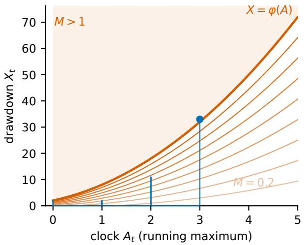

(b) the same level sets, straightened  
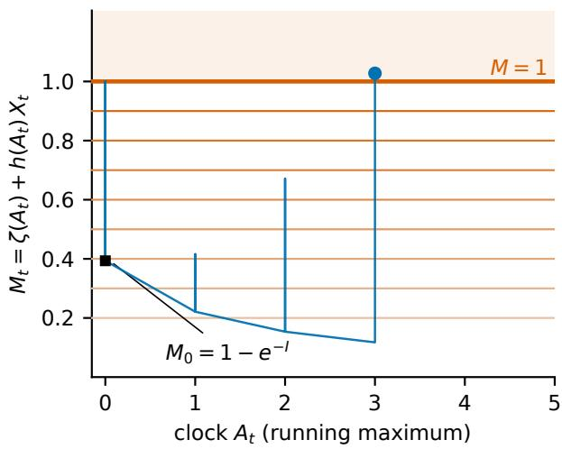  
Figure 5: A boundary that moves in the natural coordinates is a flat level after the transform. (a) The drawdown $X _ { t }$ of a symmetric ±1 walk below its running maximum $A _ { t } ,$ against the boundary $\varphi ( A ) = 2 ( 1 + A ) ^ { 2 }$ (heavy) and the level sets $M = 0 . 2 , \ldots , 0 . 9$ foliating the region beneath it; crossing is entry into the shaded region. (b) The same level sets after the transform $M = \zeta ( A ) + h ( A ) X$ , drawn at the same abscissae: each one is horizontal, and the boundary is the level $M = 1$ . The clock advances only while the drawdown is at zero, so a path meets the boundary in one vertical probe per record. The marked point is the path’s first crossing, which lands on the boundary in (a) and on $M = 1 \mathrm { i n } ( \mathrm { b } )$ and the path starts at the level $M _ { 0 } = 1 - e ^ { - I }$ the continuous-path idealization spends. The path drawn is one that crosses late; at this boundary most crossings happen at the first record, where the boundary sits only two steps above it.

Work on $( \Omega , \mathcal { F } , ( \mathcal { F } _ { t } ) _ { t \geq 0 } , \mathbb { P } )$ under the usual conditions (i.e., completeness and right-continuity). A nonnegative local submartingale X with decomposition $X = N + A$ is of class (Σ) when

• N is a càdlàg local martingale with $N _ { 0 } = 0 ;$

• A is continuous, adapted and nondecreasing with $A _ { 0 } = 0 ;$

• the measure dA is carried by the zero set $\{ t : X _ { t } = 0 \}$

When N is continuous as well the class is written $\left( \Sigma _ { c } \right)$ . In particular $X _ { 0 } = 0 _ { : }$ , and A is the increasing process of X. The two letters follow the Doob decomposition of Proposition C.2, with the sign of A reversed because X is a submartingale.

Lemma D.1 (Function-indexed martingales of a class-(Σ) process [30]). Let $X = N { + } A$ be ofclass (Σ) and let $f \colon  { \mathbb { R } } _ { + } \to$ R be Borel and locally bounded. Then

$$
\int _ { 0 } ^ { A _ { t } } f ( z ) ~ \mathrm { d } z - f ( A _ { t } ) X _ { t } ~ = ~ - \int _ { 0 } ^ { t } f ( A _ { u } ) ~ \mathrm { d } N _ { u }\tag{D.1}
$$

so the left-hand side is a local martingale null at 0. Conversely, let X be a nonnegative local submartingale with $X _ { 0 } = 0$ and let C be a continuous adapted nondecreasing process with $C _ { 0 } = 0$ such that $\begin{array} { r } { \int _ { 0 } ^ { C _ { t } } \dot { f } ( z ) ~ \mathrm { d } z - f ( C _ { t } ) X _ { t } } \end{array}$ is a local martingale for every locally bounded Borel $f .$ . Then X is of class (Σ) and $C = A$

One class-(Σ) process therefore yields one local martingale per locally bounded Borel $f ,$ every member driven by the same dN through the integrand $f ( A _ { u } )$ and every member reading the path only through the pair $( A _ { t } , X _ { t } )$ . The converse says the family characterizes the class, and identifies the process against which the functions are composed. Choosing $f$ so that the member is nonnegative and normalizing by its initial value produces a test martingale; the crossing law below is the member picked out by one particular choice.

For a boundary read against the increasing process, that member gives the crossing probability in closed form.

Theorem D.2 (Crossing law for a curved boundary [30]). Let $X = N + A$ be of class (Σ) with only negative jumps and $\begin{array} { r } { \operatorname* { l i m } _ { t  \infty } A _ { t } = \infty a . s . _ { , } } \end{array}$ , and let $\varphi : \mathbb { R } _ { + } \to ( 0 , \infty ]$ be Borel, with the convention $1 / \infty : = 0 .$ . Then

$$
\mathbb { P } \big ( \exists t \ge 0 : \ X _ { t } > \varphi ( A _ { t } ) \big ) = 1 - \exp \Big ( - \int _ { 0 } ^ { \infty } \varphi ( x ) ^ { - 1 } \mathrm { d } x \Big )\tag{D.2}
$$

and for every $u > 0$

$$
\mathbb { P } \big ( \exists t \ge 0 : A _ { t } < u , X _ { t } > \varphi ( A _ { t } ) \big ) = 1 - \exp \Big ( - \int _ { 0 } ^ { u } \varphi ( x ) ^ { - 1 } \mathrm { d } x \Big )\tag{D.3}
$$

each right-hand side being read as 1 when its integral diverges.

Equation (D.3) is indexed by the level the increasing process has reached; no time enters it. Writing $A _ { u } ^ { - 1 } : = \operatorname* { i n f } \{ t \geq$ $0 : A _ { t } > u \}$ for the right-continuous inverse of A, the event there is $\left\{ \exists t \leq A _ { u } ^ { - 1 } : X _ { t } > \varphi ( A _ { t } ) \right\}$ whenever $A _ { t } < u$ for every $t < A _ { u } ^ { - 1 }$ , that is, whenever A does not pause at the level u before passing it. The levels at which a continuous nondecreasing process pauses form a countable set, so this holds for Lebesgue-almost every u, and at every fixed u in the Brownian instance below.

Table 1 reads each classical statement as an identity with a named residual removed. Theorem D.2 is the degenerate case of that reading: the residual is zero for every Borel boundary. The criterion is the one Proposition B.3(i) supplies. The crossing event is $\{ \operatorname* { s u p } _ { t } M _ { t } > 1 \}$ for a nonnegative local martingale M assembled from $X$ and φ (Appendix G); X has no positive jumps and A is continuous, so M has no positive jumps either, its running supremum is continuous, and the level 1 is met without overshoot. Since the level is met without overshoot, that maximal identity evaluates the crossing probability as $M _ { 0 } ,$ the whole of the bound $M _ { 0 } / x \mathrm { a t } x = 1$ . The boundary is arbitrary and the increasing process is the one X supplies, so the closed form is a property of the class and holds for every $\varphi .$

Brownian motion supplies the worked instance. For a standard Brownian motion B with running supremum $\begin{array} { r } { B _ { t } ^ { * } : = \operatorname* { s u p } _ { u < t } B _ { u } , } \end{array}$ put $X _ { t } : = B _ { t } ^ { * } - B _ { t }$ and $A _ { t } : = B _ { t } ^ { * }$ . Then $X = ( - B ) + B ^ { * }$ is of class $\left( \Sigma _ { c } \right)$ : the process −B is a continuous local martingale null at $0 , B ^ { * }$ is continuous, adapted and nondecreasing with $B _ { 0 } ^ { * } = 0$ , and $\mathrm { d } B ^ { * }$ is carried by $\{ B ^ { * } = B \} = \{ X = 0 \}$ . The paths are continuous and $B _ { \infty } ^ { * } = \infty { \sf a . s . } ,$ and $A _ { u } ^ { - 1 }$ is the first time B reaches u. Theorem D.2 therefore gives, in complementary form,

$$
\mathbb { P } \big ( \forall t \ge 0 : B _ { t } ^ { * } - B _ { t } \le \varphi ( B _ { t } ^ { * } ) \big ) = \exp \Big ( - \int _ { 0 } ^ { \infty } \varphi ( x ) ^ { - 1 } \mathrm { d } x \Big )\tag{D.4}
$$

and, with the horizon at the first passage of B to level $x ,$

$$
\mathbb { P } \big ( \forall t \leq A _ { x } ^ { - 1 } : B _ { t } ^ { * } - B _ { t } \leq \varphi ( B _ { t } ^ { * } ) \big ) = \exp \Big ( - \int _ { 0 } ^ { x } \varphi ( y ) ^ { - 1 } \mathrm { d } y \Big )
$$

The drawdown of Brownian motion below its own running maximum stays under an arbitrary curved envelope with a probability determined by $\int \varphi ^ { - 1 }$ alone. Knight obtained (D.4) by excursion theory; the route through Lemma D.1 recovers it as one member of the function-indexed family [30].

## E Random times in continuous time

## E.1 The continuous-time case

The peeking identity carries over verbatim to continuous time. The random-time calculus is ultimately a change of filtration. Reading $\widehat \Omega = \Omega \times \mathbb N$ as an enlargement of the base filtration and $A _ { t } ^ { \tau } = \mathrm { d } R / \mathrm { d } \widehat { P } ( \mathrm { I }$ Lemma 7.4) as the density linking the two, the anticipation martingale plays the part of the exponential density in a Girsanov change of measure. The hazard clock $1 - F ^ { \tau }$ is the finite-variation compensator the base filtration already predicts, and $A ^ { \tau }$ is the martingale residual that only the enlarged filtration sees. The mass identity $P ( \tau = t \mid \mathcal { F } _ { t } ) = A _ { t } ^ { \tau } \Delta F _ { t } ^ { \tau }$ that measures peeking in discrete time is the discrete image of the multiplicative decomposition of the Azéma supermartingale [9, 31, 32], which is the conditional survival $\mathbb { P } ( \tau > t \mid \mathcal { F } _ { t } )$ of $( 7 . 1 )$ read in continuous time. The same log $A _ { t } ^ { \tau }$ term measures anticipation there once that process, written $Z _ { t } ^ { \tau }$ , is read against the finite-variation hazard clock of the decomposition, with $\widehat { P }$ its clock measure and log $A _ { t } ^ { \tau }$ its local-martingale density. The path-time identity then carries over with no quadratic-variation input. A random time is quasi-left-continuous when it lands with positive probability on no predictable time—one the filtration can announce before it arrives. That property makes its hazard clock continuous and puts the survival factor in the exponential-hazard form used below. The filtration is assumed throughout to satisfy the usual conditions: it is right-continuous and contains the P-null sets.

Theorem E.1 (Continuous-time path-time identity). Let τ be afinite, quasi-left-continuous random time on $( \Omega , \mathcal { F } , ( \mathcal { F } _ { t } ) _ { t \geq 0 } , P )$ under the usual conditions, with Azéma supermartingale $Z _ { t } : = P ( \tau > t \mid \mathcal { F } _ { t } )$ and multiplicative decomposition $Z _ { t } ~ =$ $A _ { t } ^ { \tau } ( 1 - F _ { t } ^ { \tau } )$ on $\{ Z _ { - } > 0 \}$ , where $1 - F ^ { \tau }$ is the predictable decreasing part of that decomposition (the hazard clock, $F _ { 0 } ^ { \tau } = 0 )$ and $A ^ { \tau }$ the anticipation local martingale $( A _ { 0 } ^ { \tau } = 1 ) .$ . Quasi-left-continuity makes the hazard clock continuous, $1 - F _ { t } ^ { \tau } = e ^ { - \Lambda _ { t } }$ with Λ the continuous predictable hazard, and licenses the disintegration below: a time charging a predictable instant separates the predictable hazard clock from the adapted one, and the density statement fails there. Let $\widehat { P } ( A \times \mathrm { d } t ) : = \mathbb { E } [ \mathbf { 1 } _ { A } \mathrm { ~ d } F _ { t } ^ { \tau } ]$ be the clock measure on $\Omega \times \mathbb { R } _ { + }$ , so $\mathrm { d } R / \mathrm { d } \widehat { P } = A _ { t } ^ { \tau }$ for $R ( A \times \mathrm { d } t ) : = P ( A \cap \{ \tau \in \mathrm { d } t \} )$ and $\mathbb { E } [ V _ { \tau } ] = \mathbb { E } _ { \widehat { P } } [ V _ { t } A _ { t } ^ { \tau } ] f o r$ adapted V. Then for strictly positive adapted factors Π with $\begin{array} { r } { 0 < Z _ { \tau } ( \alpha ) : = \mathbb { E } [ \prod _ { i } \Pi _ { i , \tau } ^ { \alpha _ { i } } ] < \infty } \end{array}$ and every $Q \ll { \widehat { P } }$ with $\begin{array} { r } { Q ( \{ A _ { t } ^ { \tau } \prod _ { i } \Pi _ { i , t } ^ { \alpha _ { i } } = 0 \} ) = 0 , } \end{array}$

$$
\begin{array} { r } { \log Z _ { \tau } ( \alpha ) = \sum _ { i } \alpha _ { i } \mathbb { E } _ { Q } [ \log \Pi _ { i , t } ] + \mathbb { E } _ { Q } [ \log A _ { t } ^ { \tau } ] - \mathrm { D } ( Q \| \widehat { P } ) + \mathrm { D } ( Q \| Q _ { \tau } ^ { \alpha } ) , } \end{array}\tag{E.1}
$$

with optimizer $\begin{array} { r } { \mathrm { d } Q _ { \tau } ^ { \alpha } / \mathrm { d } \widehat { P } = A _ { t } ^ { \tau } \prod _ { i } \Pi _ { i , t } ^ { \alpha _ { i } } / Z _ { \tau } ( \alpha ) } \end{array}$ ; dropping $\mathrm { D } ( Q \| Q _ { \tau } ^ { \alpha } ) \geq 0$ recovers the supremum form.

Equation (E.1) is the discrete identity (Theorem 7.5) read on the continuum clock measure, the variational step being measure-space-agnostic. The per-step sums integrate against the predictablefinite-variation hazard Λ, and the predictable quadratic variation does not enter; the peeking term stays $\mathbb { E } _ { Q } [ \log A _ { t } ^ { \tau } ]$ , and a quadratic-variation term appears only at second order in log $\begin{array} { r } { A _ { t } ^ { \tau } = \int _ { 0 } ^ { t } ( A _ { s - } ^ { \tau } ) ^ { - 1 } \mathrm { d } A _ { s } ^ { \tau } - \frac { 1 } { 2 } \int _ { 0 } ^ { t } ( A _ { s - } ^ { \tau } ) ^ { - 2 } \mathrm { d } [ A ^ { \tau } ] _ { s } ^ { c } + \sum _ { s \leq t } \big ( \log { \frac { A _ { s } ^ { \tau } } { A _ { s - } ^ { \tau } } } - \frac { \Delta A _ { s } ^ { \tau } } { A _ { s - } ^ { \tau } } \big ) } \end{array}$

The anticipation martingale is the change-of-measure counterpart of the classical reduction of a random time to a randomized stopping time, which incurs no distributional loss for optional processes observed up to the time [25]; that reduction extends the peeking calculus to continuous time.

## E.2 Moment inequalities at a random time

The peeking penalty measures what a random time does to an e-process evaluated there. The Burkholder–Davis–Gundy comparison of a martingale’s maximal function against its square function meets the same question, agrees with the peeking penalty at the two extremes, and supplies a closed-form inflation factor between them. The imported statements below are continuous-time where their hypotheses say so, and they settle the random-time behavior of the Burkholder–Davis–Gundy row of Table 1.

A random time τ is honest for $( \mathcal F _ { t } )$ when for every t it agrees on $\{ \tau < t \}$ with an $\mathcal { F } _ { t }$ -measurable random variable. Equivalently, within the multiplicative-system description, a random time is honest precisely when it is $\mathcal { F } _ { \infty }$ -measurable and its conditional-survival field is a multiplicative cocycle [29]. It avoids $( \mathcal { F } _ { t } )$ stopping times when $\mathbb { P } ( \tau = \sigma < \infty ) = 0$ for every $( \mathcal { F } _ { t } )$ stopping time σ. Conditions (A) and (C) of [30] are avoidance and continuity of every $( \mathcal F _ { t } )$ martingale, and (CA) is both; a Brownian filtration satisfies (C). Avoidance is stronger than quasi-left-continuity: every predictable time is a stopping time, so a time satisfying (A) is in particular quasi-left-continuous, and a finite such time falls within Theorem E.1’s hypotheses. Throughout, $Z _ { t } : = \mathbb { P } ( \tau > t \mid \mathcal { F } _ { t } )$ is the Azéma supermartingale of Theorem E.1, whose multiplicative decomposition $Z _ { t } = A _ { t } ^ { \tau } ( 1 - F _ { t } ^ { \tau } )$ supplies the anticipation martingale this paper measures.

An unrestricted random time admits no comparison at all, by a two-point argument that needs nothing beyond the definitions.

Proposition E.2 (No maximal-to-square-function constant at a general random time). Let $( M _ { t } ) _ { t \geq 0 }$ be a martingale with $M _ { 0 } = 0$ , increments $d _ { t } = M _ { t } - M _ { t - 1 }$ and predictable variance process $\begin{array} { r } { \langle M \rangle _ { t } = \sum _ { s < t } \mathbb { E } [ d _ { s } ^ { 2 } \mid \mathcal { F } _ { s - 1 } ^ { - } ] } \end{array}$ . Suppose $C < \infty$ satisfies $\mathbb { E } [ | M _ { \tau } | ] \le C \mathbb { E } \big [ \langle M \rangle _ { \tau } ^ { 1 / 2 } \big ]$ for every $\{ 0 , 1 \}$ -valued F-measurable random time τ. Then $\left. M _ { 1 } \right. \le C \left. M \right. _ { 1 } ^ { 1 / 2 }$ almost surely.

The conclusion is unattainable as soon as the first increment is unbounded at fixed conditional variance: for ${ \mathcal { F } } _ { 0 }$ trivial and $d _ { 1 }$ standard Gaussian, $\langle M \rangle _ { 1 } = 1$ and no finite C bounds $\lvert M _ { 1 } \rvert$ . The maximal form falls with the terminal one, since $\begin{array} { r } { | M _ { \tau } | \leq \operatorname* { s u p } _ { s < \tau } | M _ { s } | } \end{array}$ . Padding M with a null first step makes the ofending τ positive-integer-valued, so the failure does not depend on admitting the value 0. The continuous-time original takes $\tau = \mathbf { 1 } _ { A }$ against Brownian motion, where $\mathbb { E } [ | B _ { \tau } | ] \leq C \mathbb { E } [ \sqrt { \tau } ]$ ] collapses to $\mathbb { E } [ | B _ { 1 } | \mathbf { 1 } _ { A } ] \leq C \mathbb { P } ( A )$ for every A and forces $| B _ { 1 } |$ to be bounded [30].

Theorem E.3 (Burkholder–Davis–Gundy at a pseudo-stopping time [30]). Let $( \mathcal F _ { t } ) _ { t \ge 0 }$ satisfy the usual conditions, let $p > 0$ let $( M _ { t } ) _ { t \geq 0 }$ be a continuous $( \mathcal F _ { t } )$ local martingale with $M _ { 0 } = 0$ (so that $\langle M \rangle = [ M ] )$ , and let $\tau$ be an $( \mathcal F _ { t } )$ pseudo-stopping time. Then

$$
\begin{array} { r } { c _ { p } \mathbb { E } \big [ \langle M \rangle _ { \tau } ^ { p / 2 } \big ] \ \leq \ \mathbb { E } \big [ \big ( \operatorname* { s u p } _ { s \leq \tau } \lvert M _ { s } \rvert \big ) ^ { p } \big ] \ \leq \ C _ { p } \mathbb { E } \big [ \langle M \rangle _ { \tau } ^ { p / 2 } \big ] } \end{array}\tag{E.2}
$$

with $c _ { p }$ and $C _ { p }$ the constants of the Burkholder–Davis–Gundy inequalities at stopping times, depending on $p$ alone.

Transport preserves the constants themselves: their dependence on $p ,$ and their asymptotics as $p$ grows, are those of the classical inequalities [30]. A pseudo-stopping time is therefore free in the power-mean geometry exactly as it is free in the entropic one, where the peeking penalty vanishes (Proposition $7 . 7 ( \mathrm { b } ) )$ ).

An honest time is not free. Under conditions (CA) the unmodified inequalities fail at honest times [30], and a corrected comparison with one extra factor takes their place.

Proposition E.4 (Corrected maximal inequality at an honest time [30]). Let $( \mathcal F _ { t } ) _ { t \ge 0 }$ be thefiltration of a standard Brownian motion $( B _ { t } ) _ { t \geq 0 }$ and let τ be an honest time for it, with Azéma supermartingale $Z _ { t } ,$ running infimum $I _ { \tau } : = \mathrm { i n f } _ { u < \tau } Z _ { u }$ , and $\begin{array} { r } { \Upsilon _ { \tau } : = \left( 1 + \log \frac { 1 } { I _ { \tau } } \right) ^ { 1 / 2 } } \end{array}$ . Then $\mathbb { E } [ | B _ { \tau } | ] \le C \mathbb { E } \big [ \Upsilon _ { \tau } \sqrt { \tau } \big ]$ for a universal constant $C .$

The inflation factor has an exact law once the time also avoids stopping times.

Corollary E.5 (Law of the honest-time inflation factor). In the setting of Proposition $E . 4 ,$ suppose in addition that τ avoids every $( \mathcal { F } _ { t } )$ stopping time. Then $\log ( 1 / I _ { \tau } )$ is standard exponential, $\Upsilon _ { \tau }$ has the law of $( 1 + \varepsilon ) ^ { 1 / 2 }$ with ε standard exponential, and $\mathbb { E } [ \Upsilon _ { \tau } ^ { 2 } ] = 2 .$

At a stopping time $Z _ { u } = { \bf 1 } \{ \tau > u \}$ , so $I _ { \tau } = 1$ and $\Upsilon _ { \tau } = 1$ , and the corrected comparison reduces to the classical one. Without avoidance the exact law weakens to a stochastic ordering, E $[ f ( \Upsilon _ { \tau } ) ] \le \mathbb { E } [ f ( ( 1 + \varepsilon ) ^ { 1 / 2 } ) ]$ ] for every continuous increasing $f : \mathbb { R } _ { + } \to \mathbb { R } _ { + } \left[ 3 0 \right] , { \mathrm { s o } } \left( 1 + \varepsilon \right) ^ { 1 / 2 }$ dominates the worst honest time

The correction is denominated in the units the rest of the paper counts in. The quantity $\log ( 1 / I _ { \tau } )$ is the surprisal — the negative logarithm of a probability, in nats — of the lowest level the time’s Azéma supermartingale reaches before $\tau ,$ and Corollary E.5 fixes its mean at one nat; the moment inequality is inflated by the square root of one plus that surprisal. The classes of Section 7.1 are ordered by what they cost, and that ordering has a counterpart in the power-mean geometry. Stopping and pseudo-stopping times are free in both: the peeking penalty is at most zero at stopping times and exactly zero at pseudo-stopping times for uniformly integrable martingales (Proposition 7.7), and the Burkholder–Davis–Gundy constants are untouched (Theorem E.3). An unrestricted time admits no finite quantity in either: the peeking penalty at the ultimate-maximum time is infinite (Proposition 7.9), and no maximal-to-square-function constant exists (Proposition E.2). At the classes between them both supply one: the power-mean geometry an inflation factor with a closed-form law, the entropic one the exact complexity log $\beta$ of Corollary 7.13.

The two ladders run over diferent functionals that have the same law. The anticipation budget log $A _ { \tau } ^ { \tau }$ measures the time against its own hazard clock, while $\log ( 1 / I _ { \tau } )$ is read of the running infimum of its Azéma supermartingale, and neither determines the other pathwise. In the setting of Corollary E.5 the time is the ultimate-maximum time of a continuous vanishing local martingale N with $N _ { 0 } = 1$ , whose Azéma supermartingale is $Z _ { t } = N _ { t } / N _ { t } ^ { * } \left[ 3 2 \right]$ . Since $1 / N ^ { * }$ is continuous and decreasing, that product is the multiplicative decomposition of $Z ,$ so $A ^ { \tau } = N$ and $1 - F ^ { \tau } = 1 / N ^ { * }$ ; at the ultimate maximum $A _ { \tau } ^ { \tau } = N _ { \infty } ^ { * }$ , and Proposition B.3(i) makes log $A _ { \tau } ^ { \tau }$ standard exponential. The surprisal that inflates the moment inequality has the same law (Corollary E.5), so at the honest-time class the two ladders are calibrated to one another: each stands one nat above its reference in expectation.

The interpolating budget of §7.4 is a separate object: this measures one inequality on one class of times. The three statements above settle the second axis of that row, the cost of moving from a stopping time to a random time.

## F Empirical evaluation supplement

The evaluations below measure what the theory does not state: how large a named residual is, what governs it, and where a natural reading of it fails. Each has a negative or a scope demarcation of its own, and each is introduced here, so that a reader arriving at a section already knows its subject. The identities themselves are established by the theorems and illustrated in Figure 1, which reads of four decompositions, two measured on moderate-scale data and two computed exactly; three resolve into relative entropies and Doob’s into a Hölder deficit, an optional-stopping deficit and an initial value. Nothing below re-derives them

Section F.1 puts the first-passage identity on a deployed e-process, where the wealth jumps and Ville’s inequality is loose in consequence. Dividing each prediction by the crossing rate observed turns that looseness into a multiplicative factor: the bound overstates by as much as 2.4×, and the overshoot term recovers almost all of it. The levels where it does not are the sparsest crossings, where the observed rate is itself the noisy quantity, and the conserved mass is not estimable at any feasible replicate count, so it is not used as a check.

Section F.2 checks the discrete curved-boundary law against a closed form built from gambler’s ruin, which never mentions the martingale that proves it. The two agree exactly, and the event identity holds on every one of $1 . 2 5 \times 1 0 ^ { 6 }$ simulated paths. The asymptotic level is out of reach of any attainable horizon; the shortfall is not an error term but the mass of the martingale left on paths that have not yet crossed, and it is measured directly.

Section F.3 asks which parameter closes the first-passage deficit. The horizon does not: the ratio is unmoved across a factor-of-40 sweep. The increment scale does, the deficit falling as a power law in $\sqrt { d t }$ on both a Gaussian and a lattice increment law, which is the discrete-time tail approaching $\mathrm { P a r e t o } ( 1 )$ from below in the parameter that governs it. The two families are reported separately, the lattice one reading a shallower slope that a single power law describes less well.

Section F.4 takes the anytime-valid certificate to deep-net scale. It is vacuous under a prior anchored at the origin, at 41.7 against a held-out risk of 0.078, and tight under one anchored at the trained weights, at 0.153; the 273× tightening sits entirely in the anchor and not in the optimizer.

Section F.5 separates the pooling benefit from optional-stopping leakage with a paired single-bettor arm on trained vision models. The excess deficit is positive in every multi-member cell, and at matched accuracy the architecturally diverse pool sheds more mass than the recipe-diverse one. The corruption is a single family at one severity, and the ensembles are public checkpoints not trained for this purpose, so public training recipes bound the disagreement on ofer.

## F.1 The first-passage identity on a real e-process

Theorem 4.6’s Pareto(1) law is exact for continuous paths, and a deployed e-process jumps. Theorem 4.7 says what the jump costs: in discrete time the first-passage probability is $\begin{array} { r } { \mathbb { P } ( \operatorname* { s u p } _ { t } M _ { t } \geq x ) = \frac { 1 } { r } ( 1 - \mathbb { E } [ J _ { x } \mathbf { 1 } \{ \sigma _ { x } < \infty \} ] ) } \end{array}$ ) with $J _ { x }$ the overshoot at the crossing, an equality where Ville’s inequality gives only $1 / x$

The substrate is the sequential likelihood ratio of a held-out classifier against the label-marginal null, on WDBC breast cancer $( T = 2 8 5 )$ and Pima diabetes $( T = 3 8 4 )$ ), with 60 000 null replicates per stream. Labels are redrawn independently from the measured marginal, which makes each factor exactly mean-one and the wealth an exact martingale; drawing them by permutation instead would fix the single-draw marginal but leave the draws dependent, and a product of dependent mean-one factors does not have mean one. The bet is left uncapped, since Theorem 4.7 is stated for a martingale. Anytime validity holds on both streams: $1 / M ^ { * }$ is a conservative p-value, and its largest excursion below the uniform is $2 \times 1 0 ^ { - 5 }$ on WDBC and $3 \times 1 0 ^ { - 5 }$ on Pima.

A large multiplicative factor separates the bound from the identity. Figure 6 divides each prediction by the crossing rate actually observed, so 1 is exact and the height above it is the shortfall. Ville’s $1 / x$ overstates the crossing rate by as much as 2.4×, and the overshoot term recovers almost all of it: read forward from the measured overshoot, the identity lands inside the observed binomial interval at 41 of the 44 levels, where the bound lands inside it at 1. Taken against the rate observed, the median relative gap the identity leaves is 0.009 on WDBC and 0.028 on Pima, against 0.402 and 0.243 for the bound at the same levels.

One check is out of scope. The optional-stopping mass $\mathbb { E } [ M _ { \sigma _ { x } } \mathbf { 1 } \{ \sigma _ { x } < \infty \} ]$ equals 1 exactly when the identity holds, but it is a sample mean of a wealth that tends to zero almost surely while keeping mean one, so it is not estimable at any feasible replicate count and is not used as a check here.

The resolution of the comparison itself is set the same way. In the ratio the figure plots, the interval on the observed rate has width $2 z \sqrt { ( 1 - p ) / n _ { x } }$ at a level crossed $n _ { x }$ times, so it depends on the level only through that count; the deepest level plotted is the one 0.1% of replicates reach, whatever process is simulated. Only more replicates narrow it; a diferent process does not. Past a point they stop helping too. The identity’s departure from the observed rate is exactly the conserved mass’s departure from one, divided by x times the observed crossing rate, so a tighter interval resolves that estimate’s error before it resolves the identity.

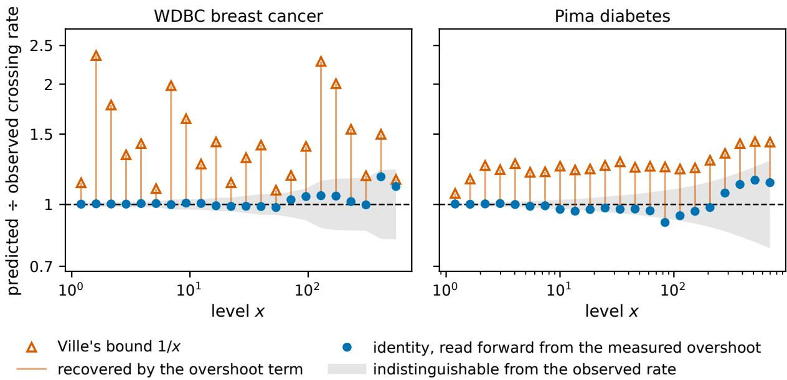  
Figure 6: The overshoot term recovers almost all of what Ville’s bound gives away. Each prediction of the crossing rate, divided by the rate observed on 60 000 null replicates of a sequential likelihood ratio against the label-marginal null; 1 is exact, and height above it is the multiplicative shortfall. At every level the two predictions are joined: the triangle is Ville’s $1 / x ,$ which overstates by up to 2.4×, the circle is the identity read forward from the measured overshoot, and the connector between them is the part the overshoot term recovers. The identity sits on 1 at 41 of the 44 levels, inside the shaded interval on the observed rate; the bound sits outside that interval at 43 of them. One panel per stream, since the two level grids share no positions. The interval widens with the level because its width in this ratio is set by the number of crossings alone, and the deepest level plotted is the one 0.1% of replicates reach.

## F.2 The discrete crossing law at a finite horizon

Theorem 4.9 is checked on the instance Section 4.5 quotes, by an independent route that does not use the martingale the theorem is proved with. The object throughout is the drawdown of a symmetric ±1 walk against the boundary $\varphi ( x ) = 2 ( 1 + x ) ^ { 2 } ;$ ; there is no dataset, and every rate below is either a closed form or a frequency over simulated walks. On this walk the record advances by exactly one, so the residual sum is a deterministic function of the record reached. Within an excursion the record is fixed, so the boundary is constant there and the excursion maximum obeys the gambler’s-ruin law. Both sides of (4.17) are then convergent series over record levels, the left-hand side assembled from gambler’s ruin alone.

The two routes agree exactly. $\operatorname { A t } \varphi ( x ) = 2 ( 1 + x ) ^ { 2 }$ the nominal level is 0.3935, the quadrature residual contributes 0.1343 and the overshoot 0.08571, placing the right-hand side at 0.4421, which is the crossing probability the excursion decomposition returns. Truncating the series stops moving the level at six figures. The realized level exceeds the nominal by 12.35%.

Equation (4.17) equates two events, so it can be tested on each path. Across $1 . 2 5 \times 1 0 ^ { 6 }$ simulated paths at five horizons, $\{ \exists t : X _ { t } > \varphi ( A _ { t } ) \}$ and $\{ \operatorname* { s u p } _ { t } M _ { t } > 1 \}$ agreed on every one, and the pathwise decomposition (4.16) reproduced $M _ { t }$ at every time step.

A finite horizon leaves a substantial shortfall, and the identity says exactly how much. The law asks for $A _ { t } \to \infty ,$ and the running maximum of $\mathbf a \pm 1$ walk grows like $\sqrt { T } ,$ , so no reachable horizon attains it: at $1 . 2 5 \times 1 0 ^ { 5 }$ steps the realized rate is still 0.029 short. The shortfall is not an error term but a quantity that can be measured directly, since optional stopping at $T \wedge T _ { \mathrm { m a x } }$ closes exactly with one further term $\mathbb { E } [ M _ { T _ { \mathrm { { m a x } } } } \mathbf { 1 } \{ \mathrm { n o ~ c r o s s } \} ]$ ], the mass of M left on paths that have not yet crossed. Figure 7 adds that mass back. Across a 625-fold range of horizons the identity’s finite-horizon prediction tracks the simulated rate, and the residual separating them — a mean-zero quantity, being a stopped martingale sum — covers zero at every horizon.

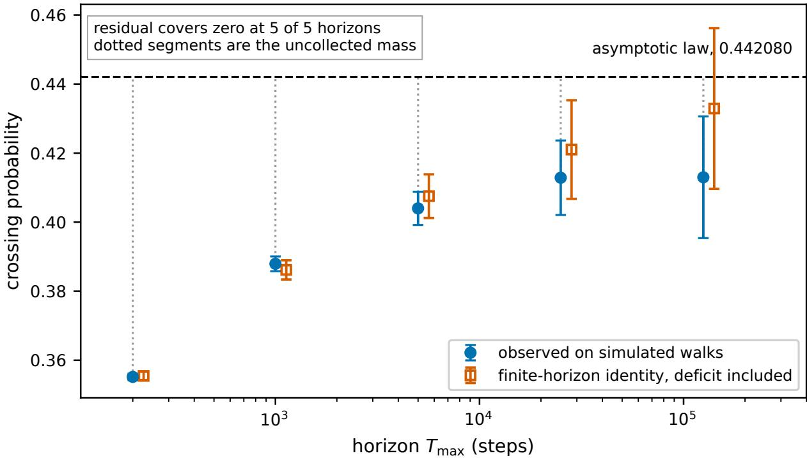  
Figure 7: A finite horizon falls short of the asymptotic crossing rate by exactly the mass still sitting on paths that have not crossed. Simulated drawdowns of a symmetric ±1 walk against $\varphi ( x ) = 2 ( 1 + x ) ^ { 2 }$ , at five horizons from 200 to $1 . 2 5 \times 1 0 ^ { 5 }$ steps. Circles are the crossing rate observed on those walks; squares give the finite-horizon identity’s prediction once the uncrossed mass is included, ofset slightly in the horizon for legibility. The dotted segments are that uncollected mass, closing as the horizon grows. Intervals are 95%: on the observed rate its own binomial interval, and on the prediction the interval of the residual, which is the uncertainty the comparison actually incurs. The residual is mean-zero and covers zero at every horizon.

The size of the correction depends on the boundary. Take the family $\varphi ( x ) \ = \ \varphi _ { 0 } { \left( 1 + x / ( \varphi _ { 0 } I ) \right) } ^ { 2 }$ , which has $\textstyle \int _ { 0 } ^ { \infty } \varphi ^ { - 1 } = I$ for every $\varphi _ { 0 }$ and contains the instance above at $\begin{array} { r } { \varphi _ { 0 } = 2 . \operatorname { A t } I = \frac { 1 } { 2 } } \end{array}$ the same closed form puts the excess over nominal at 12.35%, 7.66%, 4.90%, 2.29% and 1.31% as $\varphi ( 0 )$ runs over 2, 4, 8, 20 and 32, each satisfying the law. Both corrections contain the factor $h = w / \varphi ,$ so a boundary set only a few steps above the record is misread most. The instance above is the tightest member of the family, and it places 0.566 of its crossings at record $0 ,$ before the clock has moved at all — where the boundary’s shape does least work and the discrete correction is largest.

## F.3 The first-passage deficit is the overshoot

Theorem 4.7 makes the first-passage ratio $R ( x ) : = x \mathbb { P } ( \operatorname* { s u p } _ { t } M _ { t } \geq x )$ equal to $1 - \mathbb { E } [ J _ { x } \mathbf { 1 } \{ \sigma _ { x } < \infty \} ]$ , so it reaches the continuous-path Pareto(1) value of Theorem 4.6 exactly when the crossing has no overshoot. Two parameters could close the gap: the horizon, if the running maximum were merely truncated, or the step, which sets the increment scale and with it the overshoot. This evaluation separates them on two exponential martingales with $M _ { 0 } = 1$ and $M _ { t } \to 0 { \mathsf { a . s . { \mathrm { - } } a } }$ Doléans exponential with Gaussian increments, and a two-point likelihood ratio whose increments are lattice-valued in log $M \mathrm { - a t } \theta \in \{ 0 . 3 , 0 . 5 , 0 . 8 \}$ and $x \in \{ 2 , 5 , 1 0 , 2 0 \}$

The horizon leaves the deficit untouched. The horizon sweep runs $T$ over {500, 1000, 2000, 4000, 8000, 20000} at unit step on the Gaussian family, read of nested prefixes of the same 300 000 paths so the comparison is within-path. Across that factor of 40, R(5) moves by $1 0 ^ { - 4 } \mathrm { a t } \theta = 0 . 3$ and not at all in the fourth decimal at $\theta = 0 . 5$ and $\theta = 0 . 8 ;$ the ratio sits at 0.8416, 0.7504 and 0.6326 throughout.

Refining the step closes it, at the rate the increment scale sets. On the Gaussian family the deficit at $x = 5$ falls from 0.16–0.37 at unit step to $0 . 0 0 5 5 { - } 0 . 0 1 4 8$ at $d t = 1 / 1 0 2 4 _ { \mathrm { { z } } }$ , and the fitted log-log slope against $\sqrt { d t }$ is $0 . 9 7 6 , 0 . 9 6 3$ and 0.936 at the three tilts, with $R ^ { 2 } \geq 0 . 9 9 9$ on six steps. The ratio clears 0.95 at every one of the 24 (family, tilt, level) cells at the finest step, spanning 0.9525 to 1.031; Theorem 4.6 caps the ratio at 1, so the cells above unity are sampling error. This is the approach from below that Theorem 4.6 describes, in the parameter that governs it.

The two-point family behaves diferently, and the diference is the one Theorem 4.7 anticipates when it records that the overshoot law depends on the increment distribution. Its deficit also vanishes monotonically in the step, but a single power law describes it less well and reads a shallower slope: 0.921, 0.901 and 0.862 at the three tilts, with $R ^ { 2 }$ falling to 0.966 in the $\theta = 0 . 8$ cell against 0.999 or better on the Gaussian side. The two families are therefore reported separately and not pooled.

The conserved mass of (4.11) is the substantive check on the identity itself, $\sigma _ { x }$ being unbounded and M not uniformly integrable. Across the 24 cells at unit step, at 400 000 paths each, the estimate $\widehat { \mathbb E } [ M _ { \sigma _ { x } } \mathbf { 1 } ]$ has median absolute deviation 0.0024 from 1 and worst 0.0096; its bias-corrected and accelerated bootstrap 95% interval covers 1 in 23. The single exclusion (two-point, $\theta = 0 . 5 , x = 2 )$ reads 1.004 with interval [1.001, 1.008], a departure of four parts in a thousand on a heavy-tailed mean whose interval under-covers at these path counts. The quantity itself does not sit away from 1. Given a sample the two sides of (4.12) difer by exactly $\widehat { \mathbb { E } } [ M _ { \sigma _ { x } } \mathbf { 1 } ] - 1$ , so the split of the ratio into $x \widehat { \mathbb { P } } ( \sigma _ { x } < \infty )$ and $1 - \widehat { \mathbb { E } } [ J _ { x } \mathbf { 1 } ]$ is bookkeeping and introduces no second estimate.

Figure 8 separates the two candidate parameters. The ratio is unmoved by the horizon, and step refinement drives it to the continuous-path limit.

(a) the horizon leaves the deficit  
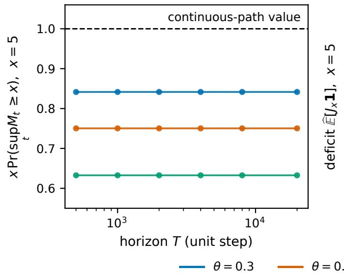

(b) the step closes it, at the increment scale  
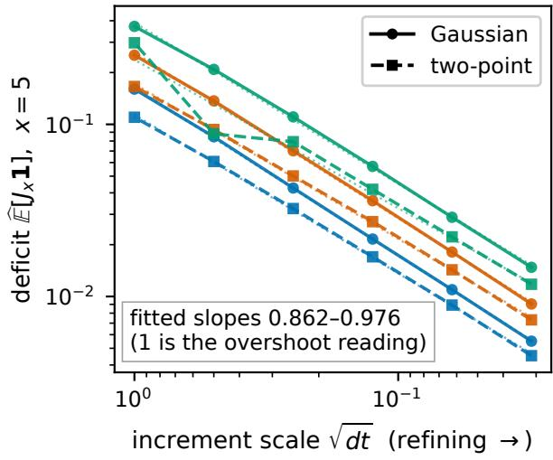  
Figure 8: The horizon leaves the first-passage deficit where it is; refining the step closes it, at the rate the increment scale sets. (a) sweeping the horizon at unit step leaves $x \mathbb { P } ( \operatorname* { s u p } _ { t } M _ { t } \geq x )$ unmoved across a factor of 40, at every tilt; this sweep is run on the Gaussian family. (b) the deficit ${ \widehat { \mathbb E } } [ J _ { x } \mathbf { 1 } ]$ against the increment scale ${ \sqrt { d t } } ,$ on log-log, where it is a power law: dotted lines are the fitted decays, and a slope of 1 is the overshoot reading. The Gaussian family sits on its fit at every tilt; the two-point family reads a shallower slope and, at $\theta = 0 . 8$ , departs visibly from a single power law — the increment-distribution dependence Theorem 4.7 records, which is why the two families are reported separately and not pooled. Both panels are read at $x = 5$

## F.4 At deep-net scale the prior anchor separates a vacuous certificate from a tight one

At deep-net scale the anytime-valid certificate of Theorem 4.10 is a generalization bound that holds at every t at once, and so at any random time. A Gaussian prior π and posterior ρ over the last-linear weights, run through the parameter-mixture

Freedman supermartingale of Proposition B.7, invert Ville’s inequality into

$$
R ( \rho ) \ \leq \ { \widehat R } _ { t } ( \rho ) + \frac { \mathrm { D } ( \rho \| \pi ) + \log ( 1 / \delta ) } { \lambda t } + \frac { 1 } { 2 } \frac { \lambda { \widehat V } _ { t } } { 1 - \lambda / 3 } ,
$$

minimized over a λ-grid. A frozen CIFAR ResNet-20 (held-out 92.2%) supplies the feature map, the posterior is the pretrained last-linear head (650 weights) lightly smoothed, and the stream is the held-out CIFAR-10 test set. Write $\tau ^ { \mathrm { c e r t } }$ for the time at which the certificate is largest over the run. That choice looks ahead over the whole run and is not a stopping time; the uniform-in-t guarantee covers it all the same. Only the prior anchor is varied.

Anchored at the origin, $\pi = N ( 0 , \sigma _ { \pi } ^ { 2 } I )$ at $\sigma _ { \pi } = 0 . 0 1$ , the certificate is vacuous: the mean bound at $\tau ^ { \mathrm { c e r t } }$ is 41.7 against a held-out risk of 0.078. The vacuity is entirely the complexity term, since anchoring at the origin makes $\mathrm { D } ( \rho \| \pi ) = \| \theta _ { \mathrm { p r e } } \| ^ { 2 } / ( 2 \sigma _ { \pi } ^ { 2 } ) + 2 0 6 . 8 \approx 3 . 3 \times 1 0 ^ { 5 }$ swamp the empirical risk. Anchored at the trained weights instead, $\pi = N ( \theta _ { \mathrm { p r e } } , \sigma _ { \pi } ^ { 2 } I )$ under identical data and martingale, the certificate at $\tau ^ { \mathrm { c e r t } }$ equals 0.153 (five seeds) against the same held-out risk 0.078. There $\mathrm { D } ( \rho \| \pi ) = 2 0 6 . 8 $ is the variance-mismatch term alone, so the tightening against the originanchored bound is 273× and sits entirely in the anchor. The martingale mechanism is correct in both legs; an uninformed prior simply incurs a divergence no amount of data can ofset, even for a classifier that generalizes well. The construction governs the bound, and the optimizer that reaches the weights leaves it unchanged.

The slack that separates the two is the computable divergence the identity names: the usual bound gives up exactly $\mathrm { D } ( \rho \| \pi _ { \lambda } )$ against the Gibbs tilt, and the gulf between a vacuous and a tight certificate is the anchor.

## F.5 The pooling benefit survives a paired single-bettor control

Two controls separate the pooling benefit of Corollary 6.1 from optional-stopping leakage and from diferences in model quality, on trained vision models.

The first is a single-bettor arm. Every ensemble is run alongside $W = 1$ on the same resampled paths, bet sizes and levels, so the reported quantity is the paired diference $\Delta = \widehat { g } _ { 1 } - \widehat { g } _ { W }$ , zero by construction when pooling does nothing and positive only when the mixture sheds mass a single bettor does not. The second is a panel of two disjoint pools of twelve checkpoints: twelve ResNet-50 checkpoints difering only in training recipe, and twelve distinct architecture families. Twelve members allow $W \in \{ 1 , 2 , 4 , 8 \}$ to be drawn without replacement inside each pool, so the two ensembles are genuinely diferent draws. The pools are matched on clean accuracy to 0.013 (means 0.686 and 0.699), so a diference between them is not a diference in model quality. A third arm draws its members from the union of the two pools. It enters the cell counts and the pooled masses reported below, and is excluded from Table 2, which contrasts the two disjoint pools.

The stream is the 5,000-image ImageNet-100 validation split; the alternative is the same images under a fixed corruption. Each checkpoint bets its per-image predictive log-likelihood ratio against its own clean-stream calibration. Across the panel, clean top-1 is 0.692 and corrupted top-1 is 0.252, and the least confident model still places 0.425 of its softmax mass on the true class, so every bettor is reading a real signal. Twenty stream orderings per cell, across 240 cells.

A single bettor’s crossing mass is $\widehat { g } _ { 1 } = 1 . 0 0 5 \colon$ at this bet size optional-stopping leakage is negligible, so the deficit at larger W is attributable to the mixture; it is not inherited from the stopping rule. The mixture’s mass falls monotonically with ensemble size, 0.739 at $W = 2 , 0 . 5 9 0$ at $W = 4 , 0 . 5 1 4$ at $W = 8 ,$ and $\Delta$ is positive in every one of the 180 multi-member cells, with bootstrap intervals excluding zero in both pools at every W (Table 2).

At matched W and matched accuracy the architecturally diverse pool sheds more mass than the recipe-diverse one: +0.086 at W = 4 (95% CI [0.047, 0.124]) and +0.123 at $W = 8 \left( \mathrm { C I } \left[ 0 . 0 9 5 , 0 . 1 5 1 \right] \right)$ , which are the two ensemble sizes at which the contrast was specified in advance.

Table 2: Both pools show a pooling benefit; the architecturally diverse pool shows more of it at $W \geq 4 .$ . Paired excess deficit $\Delta = \widehat { g } _ { 1 } - \widehat { g } _ { W }$ by pool and ensemble size, 20 stream orderings per cell, 95% bootstrap intervals. The $W = 1$ row is the control and is zero by construction.
<table><tr><td>W</td><td>within-family</td><td>cross-family</td><td>difference</td></tr><tr><td>1</td><td>0 (control)</td><td>0 (control)</td><td></td></tr><tr><td>2</td><td>0.241 [0.217, 0.265]</td><td>0.279 [0.247, 0.315]</td><td>+0.039 [-0.002, 0.081]</td></tr><tr><td>4</td><td>0.363 [0.340, 0.385]</td><td>0.448 [0.416, 0.480]</td><td>+0.086 [0.047, 0.124]</td></tr><tr><td>8</td><td>0.424 [0.400, 0.449]</td><td>0.547 [0.532, 0.562]</td><td>+0.123 [0.095, 0.151]</td></tr></table>

At $W = 1$ the geometric mixture of a single test martingale is that martingale, so the shed term $\mathbb { E } [ A _ { \tau _ { r } ^ { ( \alpha ) } } ]$ of $( \mathrm { C } . 1 )$ is identically zero. A member’s increments are positive and have exact unit mean under the resampling null — the clean stream itself, resampled — so the member is a nonnegative martingale started at 1. The increments also vary, so the member has strictly negative expected log-increment and decays to 0 along almost every path. Theorem 4.7 asks for a nonnegative martingale started at 1 that decays to 0, and (4.11) then fixes the single-bettor crossing mass at $g _ { 1 } = 1$ . That mass is read at the value the path attains at the crossing, overshoot included, so the overshoot sits inside the conserved quantity. The single-bettor arm estimates that mass at 1.005 on average, so it is read here as establishing that leakage is negligible and not as a check on the bound itself. The corruption is a single fixed family at one severity, and the ensembles are public checkpoints that were not trained for this purpose, so public training recipes bound the disagreement available here.

## G Deferred proofs

This appendix proves every result stated in the body and in Appendices C and D, with one exception: Proposition E.4, which is quoted from the literature at the citation given with it. Proofs are grouped by the machinery they share, which in several places departs from the order in which the body states them; each proof still follows every result it draws on.

Proof of Theorem 2.1. Starting from the definition of relative entropy,

$$
\begin{array} { r l } {  { \mathrm { D } ( p \| p _ { \alpha } ^ { * } ) = \mathbb { E } _ { X \sim p } [ \log p ( X ) - \log p _ { \alpha } ^ { * } ( X ) ] } } \\ & { = \mathbb { E } _ { X \sim p } \Bigg [ \log p ( X ) - \sum _ { i } \alpha _ { i } \log \pi _ { i } ( X ) + \log Z ( \alpha ) \Bigg ] } \\ & { = - H ( p ) + \sum _ { i } \alpha _ { i } H ( p , \pi _ { i } ) + \log Z ( \alpha ) . } \end{array}
$$

Rearranging and using $H ( p , \pi _ { i } ) = \mathrm { D } ( p \| \pi _ { i } ) + H ( p )$ yields (2.6). The variational form (2.7) follows because $\mathrm { D } ( p \| p _ { \alpha } ^ { * } ) \geq 0$ with equality if ${ \ v { p } } = { \ v { p } } _ { \alpha } ^ { * }$ □

Proof of Corollary 2.2. The Gibbs measure $Q ^ { \star }$ is a probability measure because $\textstyle 0 < \int g \mathrm { d } \mu < \infty$ , and is supported on $\{ g > 0 \}$ . For any probability $Q \ll \mu$ with $Q ( \{ g = 0 \} ) = 0 ( \mathrm { s o } Q \ll Q ^ { \star } )$

$$
\mathrm { D } ( Q \| Q ^ { \star } ) = \mathbb { E } _ { Q } \left[ \log \frac { \mathrm { d } Q / \mathrm { d } \mu } { g / \int g ~ \mathrm { d } \mu } \right] = \mathrm { D } ( Q \| \mu ) - \mathbb { E } _ { Q } [ \log g ] + \log \int g ~ \mathrm { d } \mu .
$$

Rearranging yields (2.8). Nonnegativity of $\mathrm { D } ( Q \| Q ^ { \star } )$ with equality if $Q = Q ^ { \star }$ gives (2.9); a Q with $Q ( \{ g = 0 \} ) > 0$ has $\mathbb { E } _ { Q } [ \log g ] = - \infty$ and so does not attain the supremum. □

Proof of Proposition 2.3. Set $\bar { \alpha } = 1$ in (2.6); the entropy term vanishes.

Proof of Theorem B.1. For each $n \geq 0 ,$ the stopped process $( M _ { \tau \wedge t } ) _ { \bar { \imath } }$ is a nonnegative supermartingale with $\mathbb { E } [ M _ { \tau \wedge n } ] \leq$ $M _ { 0 }$ (discrete-time optional stopping at the bounded stopping time $\tau \wedge n )$ . Since $M \geq 0$ , Fatou’s lemma gives $\mathbb { E } [ M _ { \tau } ] =$ $\begin{array} { r } { \mathbb E [ \operatorname* { l i m } \operatorname* { i n f } _ { n  \infty } M _ { \tau \wedge n } ] \leq \operatorname* { l i m } \operatorname* { i n f } _ { n } \mathbb E [ M _ { \tau \wedge n } ] \leq M _ { 0 } , } \end{array}$ the stated inequality.

For the equality cases assume $( M _ { t } )$ is a martingale, so $\mathbb { E } [ M _ { \tau \wedge n } ] = M _ { 0 }$ for every n. In case $( { \mathsf { a } } ) , \tau \wedge n = \tau$ for n large, so $\mathbb { E } [ M _ { \tau } ] = M _ { 0 }$ directly. In case (b), uniform integrability of $\{ M _ { \tau \wedge n } \} _ { n }$ upgrades the a.s. convergence $M _ { \tau \wedge n } \to M _ { \tau }$ to convergence in $L ^ { 1 }$ , from which $\begin{array} { r } { \mathbb { E } [ M _ { \tau } ] = \operatorname* { l i m } _ { n } \mathbb { E } [ M _ { \tau \wedge n } ] = M _ { 0 } } \end{array}$ . Finiteness of $\mathbb { E } [ M _ { \tau } ]$ does not by itself furnish this uniform integrability: for the martingale $M _ { t } = 2 ^ { t } \mathbf { 1 } \{ X _ { 1 } = \cdot \cdot \cdot = X _ { t } = 1 \}$ on i.i.d. fair bits, $\mathbb { E } [ M _ { t } ] = 1$ for all t but $M _ { t } \ \to \ 0 \ { \mathsf { a . s . } }$ , so the deterministic time $\tau = \infty$ has $\mathbb { E } [ M _ { \tau } ] \ : = \ : 0 \ : < \ : 1 = \ : M _ { 0 }$ with $M _ { \tau }$ integrable; here li $\mathrm { n } _ { n } \mathbb { E } [ M _ { \tau \wedge n } ] = 1 \neq 0 = \mathbb { E } [ M _ { \tau } ]$ , exhibiting the failure of uniform integrability. Downstream arguments that need equality (not merely ≤) invoke one of the suficient conditions above; the equality is never used for a martingale that can leak mass to $\{ \tau = \infty \}$ □

Proof of Theorem 7.1. Write $G _ { t } : = P ( \tau \geq t \mid \mathcal { F } _ { t } )$ , so $H _ { t } = P ( \tau = t \mid \mathcal { F } _ { t } ) / G _ { t }$ and $P ( \tau \geq t \mid \mathcal { F } _ { t - 1 } ) = S _ { t - 1 }$ (since $\{ \tau \geq t \} = \{ \tau > t - 1 \} )$ ). Parts (i) and $( \mathrm { i } \mathbf { v } )$ are immediate from (7.2). Every ratio below is taken on $\{ S _ { t - 1 } > 0 \} ;$ on the complement $\{ S _ { t - 1 } = 0 \}$ the numerator $G _ { t }$ vanishes almost surely as well, and (7.2) reads the factor as 1, so both sides of each displayed identity are unchanged there and the divisions are legitimate. (ii) The one-step ratio $R _ { t } ^ { \tau } : = G _ { t } / S _ { t - 1 }$ satisfies E $\gimel [ R _ { t } ^ { \tau } \mid \mathcal { F } _ { t - 1 } ] = \mathbb { E } [ G _ { t } \mid \mathcal { F } _ { t - 1 } ] / S _ { t - 1 } = 1$ by the tower property, so $A _ { t } ^ { \tau } = A _ { t - 1 } ^ { \tau } R _ { t } ^ { \tau }$ is a nonnegative $P \cdot$ martingale with $A _ { 0 } ^ { \tau } = 1$ . (iii) Since $1 - H _ { t } = P ( \tau > t \mid \mathcal { F } _ { t } ) / G _ { t } = S _ { t } / G _ { t } ,$ we have $\begin{array} { r } { 1 - F _ { T } ^ { \tau } = \prod _ { t < T } S _ { t } / G _ { t } } \end{array}$ , from which

$$
\left( 1 - F _ { T } ^ { \tau } \right) A _ { T } ^ { \tau } = \prod _ { t = 1 } ^ { T } \frac { S _ { t } } { G _ { t } } \cdot \frac { G _ { t } } { S _ { t - 1 } } = \prod _ { t = 1 } ^ { T } \frac { S _ { t } } { S _ { t - 1 } } = \frac { S _ { T } } { S _ { 0 } } = S _ { T } ,
$$

using $S _ { 0 } = P ( \tau \geq 1 | \mathcal { F } _ { 0 } ) = 1 . ( \nu ) \mathrm { A s } F _ { t } ^ { \tau } - F _ { t - 1 } ^ { \tau } = ( 1 - F _ { t - 1 } ^ { \tau } ) H _ { t }$ and, by (iii) at $t - 1 , ( 1 - F _ { t - 1 } ^ { \tau } ) A _ { t } ^ { \tau } = S _ { t - 1 } R _ { t } ^ { \tau } = G _ { t } ,$ the mass identity is $A _ { t } ^ { \tau } ( F _ { t } ^ { \tau } - F _ { t - 1 } ^ { \tau } ) = G _ { t } H _ { t } = P ( \tau = t \mid \mathcal { F } _ { t } )$ □

Proof of Theorem 7.2. By the tower property and the mass identity of Theorem 7.1(v),

$$
\mathbb { E } [ V _ { \tau } ] = \mathbb { E } \left[ \sum _ { t } V _ { t } \mathbf { 1 } \{ \tau = t \} \right] = \mathbb { E } \left[ \sum _ { t } V _ { t } P ( \tau = t \mid \mathcal { F } _ { t } ) \right] = \mathbb { E } \left[ \sum _ { t } V _ { t } A _ { t } ^ { \tau } ( F _ { t } ^ { \tau } - F _ { t - 1 } ^ { \tau } ) \right] .
$$

Proof of Theorem 4.6. The first equality holds because $M _ { \tau ^ { \star } } = \operatorname* { s u p } _ { s > 1 } M _ { s }$ by definition of $\tau ^ { \star }$ , and s $\begin{array} { r } { \operatorname { l p } _ { t \geq 0 } M _ { t } = \operatorname* { m a x } ( 1 , \operatorname* { s u p } _ { s \geq 1 } M _ { s } ) } \end{array}$ exceeds a level $x > 1$ exactly when su $\mathrm { l p } _ { s > 1 } M _ { s }$ does. For the second, optional stopping of the nonnegative martingale $M$ at $\sigma _ { x } \wedge \mathrm { : }$ n with $\sigma _ { x } : = \operatorname* { i n f } \{ t : M _ { t } \geq \bar { x } \}$ gives the upper bound $\mathbb { P } ( \sigma _ { x } < \infty ) \le 1 / x$ in general, the deficit being the mean overshoot $M _ { \sigma _ { x } } - x \ge 0$ . The no-overshoot hypothesis $M _ { \sigma _ { x } } = x$ upgrades this to the equality $\mathbb { P } ( \sigma _ { x } < \infty ) = 1 / x$ (the classical Doob maximal identity, in which the running maximum is $M _ { 0 } / U$ with $U \sim$ Uniform(0, 1), Pareto(1) $[ 1 , 3 2 ] )$ . For the last statement, apply the no-overshoot hypothesis at rational levels only, and discard the countable union of the corresponding null sets. Of that null set, suppose supt $M _ { t } ~ > ~ 1$ and let $t ^ { * } : = \operatorname* { m i n } \{ t \geq 1 : M _ { t } > 1 \}$ ; then ma $\begin{array} { r } { \mathsf { u x } _ { s < t ^ { * } } M _ { s } = 1 } \end{array}$ , so every rational $x \in ( 1 , M _ { t ^ { * } } )$ has $\sigma _ { x } = t ^ { * }$ and hence $M _ { t ^ { * } } = x ,$ , impossible for two distinct rationals. Therefore sup $_ t \ M _ { t } \leq 1 { \mathsf { a . s . } } ;$ with $\mathbb { E } [ M _ { t } ] = 1$ and $M _ { t } \geq 0$ this forces $M \equiv 1$ , contradicting $M _ { t } \to 0$ □

Proof of Proposition $B . 3 . ~ ( i )$ Fix $a > m$ and let $\sigma _ { a } : = \operatorname* { i n f } \{ u \ge 0 : M _ { u } \ge a \}$ . Continuity of $M ^ { * }$ gives ${ \cal M } _ { \sigma _ { a } } = a$ on $\{ \sigma _ { a } < \infty \}$ and $M _ { u } \le a$ for $u \leq \sigma _ { a } ,$ so the stopped process $M ^ { \sigma _ { a } }$ is a bounded local martingale, hence a uniformly integrable martingale, and $\mathbb { E } [ M _ { \sigma _ { a } \wedge n } ] = m$ for every $n .$ Bounded convergence and $M _ { \infty } = 0$ send the left side to $a \mathbb { P } ( \sigma _ { a } < \infty ) + \mathbb { E } [ M _ { \infty } \mathbf { 1 } \{ \sigma _ { a } = \infty \} ] = a \mathbb { P } ( \sigma _ { a } < \infty )$ , so $\mathbb { P } ( M _ { \infty } ^ { * } \ge a ) = \mathbb { P } ( \sigma _ { a } < \infty ) = m / a$ . The right side is continuous in $^ { a , }$ so $\begin{array} { r } { { \mathbb P } ( M _ { \infty } ^ { * } > a ) = \operatorname* { l i m } _ { b \downarrow a } { \mathbb P } ( M _ { \infty } ^ { * } \ge b ) = m / a . } \end{array}$ . For $a \leq m$ the same limit along $b \downarrow$ m gives $\mathbb { P } ( M _ { \infty } ^ { * } > m ) = 1$ , and M∗∞ ≥ m $\geq a$ then gives $\mathbb { P } ( M _ { \infty } ^ { * } > a ) = 1$ , which is the first claim. For $v \in \mathsf { ( 0 , 1 ) }$ $\mathbb { P } ( m / M _ { \infty } ^ { * } < v ) = \mathbb { P } ( M _ { \infty } ^ { * } > m / v ) = v , \operatorname { s o } m / M _ { \infty } ^ { * }$ is uniform on (0, 1).

(ii) Set $\widetilde { M } _ { u } : = M _ { \tau + u }$ and $ { \widetilde { \mathcal { F } } } _ { u } : =  { \mathcal { F } } _ { \tau + u }$ for $u \geq 0 .$ . Since $\tau < \infty \mathsf { a . s . } , \widetilde { M }$ is a strictly positive local martingale for $( \widetilde { \mathcal { F } } _ { u } ) _ { u \geq 0 }$ with $\tilde { M } _ { 0 } = M _ { \tau } > 0$ and $M _ { u } \to 0 { \mathsf { a . s . ; s i n c e } } M$ has no positive jumps, neither does $\widetilde { M }$ , so its running supremum $\begin{array} { r } { \tilde { M } _ { u } ^ { * } = \operatorname* { s u p } _ { v \leq u } M _ { \tau + v } } \end{array}$ is continuous, with ultimate value $M _ { \geq \tau } ^ { * }$ . Continuity of the global $M ^ { * }$ alone would not sufice: a positive jump of M below the standing record leaves $M ^ { * }$ continuous but makes $\widetilde { M } ^ { * }$ jump. Running the argument of part (i) on $\overset { \sim } { M }$ with every expectation taken conditionally on $ { \widetilde { \mathcal { F } } } _ { 0 } = \mathcal { F } _ { \tau }$ replaces m by $M _ { \tau }$ and gives (B.1) for every $a > 0$ . Hence the conditional law of $M _ { \geq \tau } ^ { * } \mathrm { g i v e n } \mathcal { F } _ { \tau }$ is that of $M _ { \tau } / U$ with $U$ uniform on $( 0 , 1 )$ , so $M _ { \tau } / M _ { > \tau } ^ { * } = U$ has conditional law uniform on $( 0 , 1 ) ;$ a conditional law free of the conditioning field is independence of it. Taking logarithms, lo $\wp ( M _ { \geq \tau } ^ { \ast } / M _ { \tau } ) = - \log U$ is standard exponential and independent of ${ \mathcal { F } } _ { \tau } ,$ , with mean 1. □

Proof of Theorem 4.7. Optional stopping at the bounded time $\sigma _ { x } \wedge 1$ n gives $\mathbb { E } [ M _ { \sigma _ { x } \wedge n } ] = 1 , \mathrm { i . e . } \ \mathbb { E } [ M _ { \sigma _ { x } } { \bf 1 } \{ \sigma _ { x } \leq n \} ] +$ $\mathbb { E } [ M _ { n } \mathbf { 1 } \{ \sigma _ { x } > n \} ] = 1$ . The first term increases to $\mathbb { E } [ M _ { \sigma _ { x } } \mathbf { 1 } \{ \sigma _ { x } < \infty \} ]$ by monotone convergence. For the second, $M _ { n } < x$ on $\{ \sigma _ { x } > n \}$ and $M _ { n } { \bf 1 } \{ \sigma _ { x } = \infty \}  M _ { \infty } = 0 \mathrm { a } . \mathrm { : }$ s. dominated by x, so it tends to 0; (4.11) follows. Writing $M _ { \sigma _ { x } } = x + J _ { x }$ in (4.11) gives x $: \mathbb { P } ( \sigma _ { x } < \infty ) + \mathbb { E } [ J _ { x } \mathbf { 1 } \{ \sigma _ { x } < \infty \} ] = 1$ , which is (4.12). □

Proof of Lemma $\begin{array} { r } { \mathrm { 3 } . \mathrm { { \mathrm { I } } } \mathrm { \ D } ( Q \| P ) = \mathbb { E } _ { Q } [ \mathrm { l o g } ( \mathrm { d } Q / \mathrm { d } P ) ] = \mathbb { E } _ { Q } [ \sum _ { t } \mathrm { l o g } \mathrm { \ } R _ { t } ] = \sum _ { t } \mathbb { E } _ { Q } [ \mathrm { l o g } R _ { t } ] } \end{array}$ . Conditioning on $X _ { 1 : t - 1 }$ EQ[log $R _ { t } \mid X _ { 1 : t - 1 } \mid = \operatorname { D } ( Q _ { t } \mid \mid P _ { t } )$ evaluated at the realized history, from which the conditional-divergence form. □

Proof of Theorem 3.2. Apply Corollary 2.2 (finite-measure DV) with $\mu = P | _ { \mathcal { F } _ { T } }$ and $\begin{array} { r } { g = \prod _ { i } \Pi _ { i , T } ^ { \alpha _ { i } } ; \log g = \sum _ { i } \alpha _ { i } \log \Pi _ { i , T } } \end{array}$ and its $\mathrm { D } ( Q \| Q ^ { \star } )$ term is $\mathrm { D } ( Q \| Q _ { T } ^ { \alpha } )$ , giving the identity (3.4) for every Q; the optimizer is the Gibbs law (3.5). □

Proof of Theorem 3.3. The substitution $\Pi _ { t , T } = R _ { t }$ in Theorem 3.2 is admissible, the $R _ { t }$ being strictly positive and ${ \mathcal { F } } _ { T ^ { - } }$ measurable, and log $L _ { T } ^ { ( \alpha ) } = \sum _ { t } { \alpha _ { t } }$ log $R _ { t }$ identifies the linear term. □

Proof of Corollary 3.4. Substitute Lemma 3.1 into the variational form of $( 3 . 6 ) ;$ the conditional form of $R _ { \alpha } ^ { * }$ follows from $\mathrm { d } R _ { \alpha } ^ { * } / \mathrm { d } P \propto \prod _ { t } ( q _ { t } / p _ { t } ) ^ { \alpha _ { t } }$ □

Proof of Proposition 3.5. Diferentiating $\begin{array} { r } { Z _ { T } ( \alpha ) = \mathbb { E } _ { P } [ \exp ( \sum _ { k } \alpha _ { k } \log \Pi _ { k , T } ) ] } \end{array}$ gives the expectation identity under the tilted measure $Q _ { T } ^ { \alpha } \mathrm { ; }$ a second diferentiation gives the covariance. Positive semidefiniteness of covariance implies convexity. □

Proof of Proposition 3.6. For each i, let $\{ X _ { i } ^ { ( m ) } \} _ { m = 1 } ^ { \alpha _ { i } }$ be independent samples from $P _ { t } ^ { ( i ) }$ , independent also across i. The event $\cap _ { i } \cap _ { m } \{ X _ { i } ^ { ( m ) } = \gamma \}$ has probability $\Pi _ { i } { \cal P } _ { t } ^ { ( i ) } ( \gamma ) ^ { \alpha _ { i } }$ ; summing over γ gives the result. □

Proof of Theorem 3.7. Extending a prefix γ by one state x,

$$
Z _ { t + 1 } ( \alpha ) = \sum _ { \gamma } \prod _ { i } P _ { t } ^ { ( i ) } ( \gamma ) ^ { \alpha _ { i } } \sum _ { x } \prod _ { i } P ( X _ { t + 1 } = x \mid \gamma ; P ^ { ( i ) } ) ^ { \alpha _ { i } } = Z _ { t } ( \alpha ) \sum _ { \gamma } Q _ { t } ^ { \alpha } ( \gamma ) \kappa _ { t } ^ { \alpha } ( \gamma ) ,
$$

giving (3.11). For nonnegativity of $\mathcal { C } _ { \alpha } ( t + 1 ) - \mathcal { C } _ { \alpha } ( t )$ , observe that with $\bar { \alpha } = \textstyle \sum _ { i } \alpha _ { i } \geq 1$ and ${ \widetilde { \alpha } } _ { i } = \alpha _ { i } / { \bar { \alpha } } ,$ and $\begin{array} { r } { p _ { i } ( x ) \in [ 0 , 1 ] , \prod _ { i } p _ { i } ( x ) ^ { \alpha _ { i } } = \left( \prod _ { i } p _ { i } ( x ) ^ { \widetilde { \alpha } _ { i } } \right) ^ { \widetilde { \alpha } } \le \prod _ { i } p _ { i } ( x ) ^ { \widetilde { \alpha } _ { i } } } \end{array}$ . By Hölder on the simplex, $\begin{array} { r } { \kappa _ { t } ^ { \alpha } ( \gamma ) \leq \sum _ { x } \prod _ { i } p _ { i } ( x ) ^ { \bar { \alpha } _ { i } } \leq } \end{array}$ $\begin{array} { r } { \prod _ { i } ( \sum _ { x } p _ { i } ( x ) ) ^ { \alpha _ { i } } = 1 } \end{array}$ . Taking logs yields (3.12). □

Proof of Proposition 3.8. Multiplying Markov densities yields the first identity. For the asymptotic, Perron–Frobenius gives positive left/right eigenvectors u, v with eigenvalue $r ( T _ { \alpha } ) > 0$ and $T _ { \alpha } ^ { t } = r ( T _ { \alpha } ) ^ { t } ( v u ^ { \top } + o ( 1 ) )$ . Since $\mu _ { \alpha }$ and 1 are nonnegative and nonzero, $\langle \mu _ { \alpha } , v \rangle > 0$ and $\langle u , \mathbf { 1 } \rangle > 0 , \ : \mathrm { s o } \ : Z _ { t } ( \alpha ) = r ( T _ { \alpha } ) ^ { t } ( \langle \mu _ { \alpha } , v \rangle \langle u , \mathbf { 1 } \rangle + o ( 1 ) )$ ; dividing by t and taking logs gives the stated spectral-radius limit □

Proof of Theorem 4.1. Each one-step factor of (4.2) has conditional mean one: $\psi _ { s } ( \lambda ) \mathrm { i } s \mathcal { F } _ { s - 1 }$ -measurable, so $\mathbb { E } [ e ^ { \lambda d _ { s } - \psi _ { s } ( \lambda ) } \mid$ $\mathcal { F } _ { s - 1 } \big | = e ^ { - \psi _ { s } ( \lambda ) } \mathbb { E } [ e ^ { \lambda d _ { s } } ~ | ~ \mathcal { F } _ { s - 1 } ] = 1$ . Hence $\mathbb { E } [ \mathcal { E } _ { t } ( \lambda ) ~ \vert ~ \mathcal { F } _ { t - 1 } ] = \mathcal { E } _ { t - 1 } ( \lambda )$ , and iterating from $\mathcal { E } _ { 0 } ( \lambda ) = 1$ gives $\mathbb { E } _ { P } [ \mathcal { E } _ { t } ( \lambda ) ] = 1$ , i.e. log $\mathbb { E } _ { P } [ \mathcal { E } _ { t } ( \lambda ) ] = 0$ . Apply Theorem 3.2 (equivalently Corollary 2.2) on $( \Omega , \mathcal { F } _ { t } , P )$ with the single factor $\Pi _ { t } = { \mathcal E } _ { t } ( \lambda )$ : for every $Q \ll P | _ { \mathcal { F } _ { t } } , \log \mathbb { E } _ { P } [ \mathcal { E } _ { t } ( \lambda ) ] = \lambda \mathbb { E } _ { Q } [ Y _ { t } ] - \mathbb { E } _ { Q } [ \Psi _ { t } ( \lambda ) ] - \mathrm { D } ( Q \| P | _ { \mathcal { F } _ { t } } ) + \mathrm { D } ( Q \| Q _ { t } ^ { \star } )$ with $\mathrm { d } Q _ { t } ^ { \star } / \mathrm { d } P \propto \mathcal { E } _ { t } ( \lambda )$ . The left-hand side is zero, which is (4.3). □

Proof of Proposition 4.2. (i) With $\Delta D _ { t } ( \lambda ) : = D _ { t } ( \lambda ) - D _ { t - 1 } ( \lambda ) \geq 0$ predictable, $\mathbb { E } [ E _ { t } ( \lambda ) \mid \mathcal { F } _ { t - 1 } ] = E _ { t - 1 } ( \lambda ) e ^ { - \Delta D _ { t } ( \lambda ) } \mathbb { E } [ e ^ { \lambda d _ { t } - \psi _ { t } ( \lambda ) } \mid $ $\mathcal { F } _ { t - 1 } \big | = E _ { t - 1 } ( \lambda ) e ^ { - \Delta D _ { t } ( \lambda ) } \leq E _ { t - 1 } ( \lambda )$ , so $E ( \lambda )$ is a nonnegative supermartingale with $E _ { 0 } ( \lambda ) = 1$ . Since $\mathrm { d } Q _ { t } ^ { \star } / \mathrm { d } P =$ $\mathcal { E } _ { t } ( \lambda )$ (unit mean by Theorem $4 . 1 ) , \mathbb { E } _ { P } [ E _ { t } ( \lambda ) ] = \mathbb { E } _ { P } [ \mathcal { E } _ { t } ( \lambda ) \overset {  } { e } ^ { - D _ { t } ( \lambda ) } ] ^ { \cdot } = \mathbb { E } _ { Q _ { \neq } ^ { \star } } [ \overset {  } { e ^ { - D _ { t } ( \lambda ) } } ] \leq 1$ , which is (4.5).

$$
\mathbb { E } _ { Q } [ \overline { { \Psi } } _ { t } ( \lambda ) ] = \mathbb { E } _ { Q } [ \Psi _ { t } ( \lambda ) ] + \mathbb { E } _ { Q } [ D _ { t } ( \lambda ) ]
$$

$$
\begin{array} { r } { \mathrm { D } ( Q \| P | _ { \mathcal F _ { t } } ) - \left( \lambda \mathbb { E } _ { Q } [ Y _ { t } ] - \mathbb { E } _ { Q } [ \overline { { \Psi } } _ { t } ( \lambda ) ] \right) = } \end{array}
$$

$$
\begin{array} { r } { \mathrm { D } ( Q \| Q _ { t } ^ { \star } ) + \mathbb { E } _ { Q } [ D _ { t } ( \boldsymbol { \lambda } ) ] \geq 0 , } \end{array}
$$

(iii) Apply Corollary 2.2 on $( \Omega , \mathcal { F } _ { t } , P )$ with $g = E _ { t } ( \lambda )$ : log $\mathbb { E } _ { P } [ E _ { t } ( \lambda ) ] = \lambda \mathbb { E } _ { Q } [ Y _ { t } ] - \mathbb { E } _ { Q } [ \Psi _ { t } ( \lambda ) ] - \mathrm { D } ( Q \| P | _ { \mathcal { F } _ { t } } ) +$ $\mathrm { D } ( Q \| \overline { { Q } } _ { t } ^ { \star } )$ for every $Q \ \ll \ P | _ { \mathcal { F } _ { t } }$ , with $\mathrm { d } \overline { { Q } } _ { t } ^ { \star } / \mathrm { d } P \ \propto \ E _ { t } ( \lambda )$ . The supermartingale property and $E _ { 0 } ( \lambda ) ~ \leq ~ 1$ give $\mathbb { E } _ { P } [ E _ { t } ( \lambda ) ] \le 1$ , so the left-hand side $\mathrm { i } s \leq 0$ and (4.6) follows with slack $\mathrm { D } ( Q \| \overline { { Q } } _ { t } ^ { \star } ) - \log \mathbb { E } _ { P } [ E _ { t } ( \lambda ) ]$ □

Proof of Corollary 4.3. Apply Corollary 2.2 on $( \Omega , \mathcal { F } _ { t } , P )$ with $g = E _ { t } ( \lambda )$ , which is strictly positive, and $Q = P ( \cdot | A )$ Then $\mathbb { E } _ { Q } [ \log g ] = \lambda \mathbb { E } [ Y _ { t } \mid A ] - \mathbb { E } [ \overline { { \Psi } } _ { t } ( \lambda ) \mid A ]$ and $\mathrm { D } ( Q \| P | _ { \mathcal { F } _ { t } } ) = - \log P ( A )$ , and (2.8) rearranges to (4.7). The first residual is nonnegative because it is a relative entropy, the second because $\mathbb { E } _ { P } [ E _ { t } ( \lambda ) ] \le 1$ by the supermartingale property with $E _ { 0 } ( \lambda ) \leq 1 ;$ discarding both gives (4.8). □

Proof of Corollary 4.4. Set $\tau _ { x } : = \operatorname* { i n f } \{ t \geq 0 : E _ { t } \geq e ^ { x } \}$ . Optional stopping at $\tau _ { x } \wedge r$ gives $\mathbb { E } [ E _ { \tau _ { x } \wedge n } ] \leq E _ { 0 } \leq 1$ . On $\{ \tau _ { x } \leq n \} , E _ { \tau _ { x } \wedge n } \geq e ^ { x }$ , so $e ^ { x } \mathbb { P } ( \tau _ { x } \leq n ) \leq 1 $ , and $n  \infty$ gives $\mathbb { P } ( \tau _ { x } < \infty ) \le e ^ { - x }$ . Since $\left\{ \operatorname* { s u p } _ { t } E _ { t } \geq e ^ { x } \right\} \subseteq \left\{ \tau _ { y } < \right.$ $\infty \}$ for the same construction at every level $e ^ { y }$ with $y \ < \ x ,$ , letting y ↑ x gives Ville’s inequality. The line-crossing consequence is immediate. □

Proof of the conditional Hoefding lemma of Section 4.3. Since $\mathbb { E } [ X \mid { \mathcal { G } } ] = 0$ and $a \leq X \leq b { \mathrm { } } \mathsf { a } . s$ ., necessarily $a \leq 0 \leq b$ By convexity of $x \mapsto e ^ { \lambda x }$

$$
e ^ { \lambda X } \leq \frac { b - X } { b - a } e ^ { \lambda a } + \frac { X - a } { b - a } e ^ { \lambda b } .
$$

Taking ${ \mathcal { G } } .$ -conditional expectations and using $\mathbb { E } [ X \mid { \mathcal { G } } ] = 0 ,$

$$
\mathbb { E } [ e ^ { \lambda X } \mid \mathcal { G } ] \leq \frac { b } { b - a } e ^ { \lambda a } - \frac { a } { b - a } e ^ { \lambda b } .
$$

Set $h : = \lambda ( b - a )$ and u $: = - a / ( b - a ) \in [ 0 , 1 ]$ ; the right-hand side becomes $( 1 - u ) e ^ { - u h } + u e ^ { ( 1 - u ) h }$ . Define $f ( h ) : = \log \big ( ( 1 - u ) e ^ { - u h } + u e ^ { ( 1 - u ) h } \big )$ . A direct computation gives $f ( 0 ) = f ^ { \prime } ( 0 ) = 0$ and

$$
f ^ { \prime \prime } ( h ) = \frac { u ( 1 - u ) e ^ { h } } { \left( \left( 1 - u \right) + u e ^ { h } \right) ^ { 2 } } \leq \frac { 1 } { 4 } ,
$$

using $x / ( 1 + x ) ^ { 2 } \leq 1 / 4$ for $x \ge 0$ . Taylor’s theorem gives $f ( h ) \leq h ^ { 2 } / 8 ,$ , and exponentiating yields $\mathbb { E } [ e ^ { \lambda X } \mid \mathcal { G } ] \leq$ $\exp ( \lambda ^ { 2 } ( b - a ) ^ { 2 } / 8 )$ □

Proof of Theorem B.4. Write $\begin{array} { r } { U _ { t } : = \frac { 1 } { 8 } \sum _ { s < t } ( b _ { s } - a _ { s } ) ^ { 2 } } \end{array}$ . The conditional Hoefding lemma gives the cumulant majorant $\overline { { \Psi } } _ { t } ( \lambda ) = \lambda ^ { 2 } U _ { t } ,$ so the bound branch (4.8) of Corollary 4.3 on $A = \{ M _ { t } - M _ { 0 } \geq x \}$ yields $\mathbb { P } ( A ) \le \exp ( - \lambda x + \lambda ^ { 2 } U _ { t } ) ;$ optimizing at $\lambda ^ { * } = x / ( 2 U _ { t } )$ ) gives (B.3), and the same tilt in Corollary 4.4 gives the line-crossing form (B.4). The exact form (B.2) is Corollary 2.2 with $g = \mathbf { 1 } _ { A }$ (so log $P ( A ) = - \operatorname { D } ( P ( \cdot | A ) | | P ) )$ ) followed by the chain rule for relative entropy (Lemma 3.1). □

Proof of Lemma B.5. We first prove the scalar inequality

$$
e ^ { u } \leq 1 + u + \frac { u ^ { 2 } } { 2 ( 1 - u / 3 ) } , \qquad u < 3 .\tag{G.1}
$$

Since $1 - u / 3 > 0$ throughout $u \ < \ 3 ,$ multiplying (G.1) through by it leaves an equivalent inequality, $T ( u ) : =$ $\begin{array} { r } { 1 + \frac { 2 u } { 3 } + \frac { u ^ { 2 } } { 6 } - ( 1 - u / 3 ) e ^ { u } \geq 0 . } \end{array}$ . Here $T ( 0 ) = T ^ { \prime } ( 0 ) = 0$ and $\begin{array} { r } { T ^ { \prime \prime } ( u ) = \frac { 1 } { 3 } \big ( 1 - ( 1 - u ) e ^ { u } \big ) \geq 0 } \end{array}$ at every real u, since $( 1 - \dot { u } ) e ^ { u } \leq 1 \mathrm { ~ }$ ; thus $T$ is convex with a global minimum of 0 at the origin, and (G.1) holds on the whole range. Now apply (G.1) with $u = \lambda X$ ; since $X \leq b$ and $0 \leq \lambda < 3 / b , \lambda X < 3$ a.s., so

$$
e ^ { \lambda X } \leq 1 + \lambda X + \frac { \lambda ^ { 2 } X ^ { 2 } } { 2 ( 1 - \lambda X / 3 ) } \leq 1 + \lambda X + \frac { \lambda ^ { 2 } X ^ { 2 } } { 2 ( 1 - \lambda b / 3 ) } .
$$

Conditional expectations and $\begin{array} { r } { \mathbb { E } [ X \mid \mathcal { G } ] = 0 \mathrm { g i v e } \mathbb { E } [ e ^ { \lambda X } \mid \mathcal { G } ] \leq 1 + \frac { \lambda ^ { 2 } } { 2 ( 1 - \lambda b / 3 ) } \mathbb { E } [ X ^ { 2 } \mid \mathcal { G } ] } \end{array}$ ; finally $1 + z \le e ^ { z }$ yields (B.5).

Proof of Proposition $B . 6 .$ Lemma B.5 gives the conditional cumulant majorant $\begin{array} { r } { \overline { { \Psi } } _ { t } ( \lambda ) = \frac { \lambda ^ { 2 } } { 2 ( 1 - \lambda b / 3 ) } \mathbb { E } [ d _ { t } ^ { 2 } \mid \mathcal { F } _ { t - 1 } ] , } \end{array}$ , so $E _ { t } ( \lambda )$ is a nonnegative supermartingale and, on $A _ { x , v } ,$ Corollary 4.4 bounds $\mathbb { P } ( A _ { x , v } )$ by $\begin{array} { r } { \exp ( - \lambda x + \frac { \lambda ^ { 2 } } { 2 ( 1 - \lambda b / 3 ) } v ) ; } \end{array}$ ; evaluating at the classical tilt $\lambda ^ { \star } = x / ( v + b x / 3 )$ , admissible since ${ \lambda ^ { \star } < 3 / b , }$ , yields (B.6). □

Proof of Proposition $B . 7 .$ The supermartingale property follows from Tonelli’s theorem. Applying the one-factor finitemeasure DV identity (Corollary 2.2) on $( \Lambda , \mu ) \mathrm { t o } \lambda \mapsto E _ { t } ( \lambda , \omega )$ pointwise in ω gives the identity (B.7) with $\mathrm { d } \rho _ { t } ^ { * } / \mathrm { d } \mu \propto$ $E _ { t } ( \cdot , \omega )$ ; dropping $\mathrm { D } ( \rho _ { t } \| \rho _ { t } ^ { * } ) \geq 0$ gives the lower bound, and Ville’s inequality applied to $\overline { { E } } _ { t }$ yields (B.8). □

Proof of Proposition B.8. Fix t. If $\overline { { E } } _ { t } ~ = ~ 0$ then $E _ { t } ( \lambda ) = 0$ for µ-almost every $\lambda ,$ hence for $\rho _ { t }$ -almost every λ since $\begin{array} { r } { \rho _ { t } \ll \mu , s _ { 0 } \int _ { \Lambda } } \end{array}$ log $E _ { t } ~ \mathrm { d } \rho _ { t } = - \infty$ and the defining inequality of $\mathcal { A } _ { x }$ fails at that t; the same t is excluded from $\mathcal { V } _ { x }$ because $e ^ { x } > 1 > 0$ . At every t with $\overline { { E } } _ { t } > 0 ,$ , rearranging (B.7) give

$$
\int _ { \Lambda } \log E _ { t } ( \lambda ) \rho _ { t } ( \mathrm { d } \lambda ) - \mathrm { D } ( \rho _ { t } \| \mu ) = \log \overline { { E } } _ { t } - \mathrm { D } ( \rho _ { t } \| \rho _ { t } ^ { * } ) ,
$$

so the defining inequality of $\mathcal { A } _ { x }$ at t reads log $\overline { { E } } _ { t } - \mathrm { D } ( \rho _ { t } \| \rho _ { t } ^ { * } ) \geq x$ . Since $\mathrm { D } ( \rho _ { t } \| \rho _ { t } ^ { * } ) \geq 0$ that forces $\overline { { E } } _ { t } \geq e ^ { x }$ , from which $\mathcal { A } _ { x } \subseteq \mathcal { V } _ { x } ;$ ; negating the same inequality at every t gives the displayed form of $\mathcal { V } _ { x } \backslash \mathcal { A } _ { x } ,$ and $\mathbb { P } ( \mathcal { A } _ { x } ) = \mathbb { P } ( \mathcal { V } _ { x } ) - \mathbb { P } ( \mathcal { V } _ { x } \backslash \mathcal { A } _ { x } )$ is additivity on the disjoint union $\mathcal { V } _ { x } = \mathcal { A } _ { x } \sqcup \left( \mathcal { V } _ { x } \setminus \mathcal { A } _ { x } \right)$ . When $\rho _ { t } \equiv \rho _ { t } ^ { * }$ the residual $\mathrm { D } ( \rho _ { t } \| \rho _ { t } ^ { * } )$ vanishes identically and the two events coincide. Under the added hypotheses $\overline { E }$ is a nonnegative martingale with $\overline { { E } } _ { 0 } = 1$ and $\overline { { E } } _ { t }  0$ a.s., so $\mathcal { V } _ { x } = \{ \sigma < \infty \}$ for the first passage $\sigma$ to the level $e ^ { x } \mathrm { ~ > ~ } 1$ , and Theorem $4 . 7$ at that level gives $\mathbb { P } ( \mathcal { V } _ { x } ) =$ $e ^ { - x } \bigl ( 1 - \mathbb { E } [ J \mathbf { 1 } \bar { \{ \sigma < \infty \} } ] \bigr )$ , which is (B.9). Both residuals are nonnegative, and $\mathbb { E } [ J \mathbf { 1 } \{ \sigma < \infty \} ] = 0$ with $J \geq 0$ forces $J = 0$ a.s. on $\{ \sigma < \infty \}$ , so equality in (B.8) holds exactly when each vanishes. □

Proof of Lemma D.1. Take first $f \in C ^ { 1 }$ . Integration by parts for the product of the continuous finite-variation process $f ( A _ { t } )$ with the semimartingale $X = N + A$ gives

$$
f ( A _ { t } ) X _ { t } = \int _ { 0 } ^ { t } f ( A _ { u } ) \mathrm { d } N _ { u } + \int _ { 0 } ^ { t } f ( A _ { u } ) \mathrm { d } A _ { u } + \int _ { 0 } ^ { t } f ^ { \prime } ( A _ { u } ) X _ { u } \mathrm { d } A _ { u }
$$

there being no bracket term because $f \circ A$ is continuous of finite variation. The measure dA is carried by $\{ X = 0 \}$ , so the third integral vanishes. Change of variables along the continuous nondecreasing A with $A _ { 0 } = 0$ evaluates the second as $\textstyle \int _ { 0 } ^ { A _ { t } } f ( z )$ dz. Rearranging gives $( \mathrm { D } . 1 ) ,$ , whose right-hand side is a stochastic integral of a locally bounded progressively measurable integrand against a local martingale, hence a local martingale null at 0. Both sides of (D.1) are linear in $f$ and stable under bounded pointwise convergence with uniformly bounded primitives, and the $C ^ { 1 }$ functions generate the locally bounded Borel functions under such limits, so a monotone class argument extends the identity to every locally bounded Borel f [30].

For the converse, take f ≡ 1: then $C _ { t } - X _ { t }$ is a local martingale, so C is the increasing process of the Doob–Meyer decomposition of X and $C = A$ . Take next $f ( z ) = 2 z$ , so that $A _ { t } ^ { 2 } - 2 A _ { t } X _ { t }$ is a local martingale. Integration by parts and $\operatorname { d } ( A ^ { 2 } ) = 2 A \operatorname { d } A \operatorname { g i }$ ve

$$
A _ { t } ^ { 2 } - 2 A _ { t } X _ { t } = 2 \int _ { 0 } ^ { t } A _ { u } \left( \mathrm { d } A _ { u } - \mathrm { d } X _ { u } \right) - 2 \int _ { 0 } ^ { t } X _ { u } \mathrm { d } A _ { u }
$$

whose first term is already a local martingale, since d $A - \mathrm { d } X = - \mathrm { d } N .$ . Hence $\textstyle \int _ { 0 } ^ { t } X _ { u } \ \mathrm { d } A _ { u }$ is a continuous nondecreasing local martingale null at $0 ,$ so it vanishes identically, and dA is carried by $\{ X = { \overset { \vartriangle } { 0 } } \} [ 3 0 ]$ □

Proof of Theorem D.2. Reduction. For Borel $\psi \geq \varphi$ pointwise, the crossing event for ψ is contained in the crossing event for φ. For $\epsilon > 0$ and $n \in \mathbb { N }$ let $\varphi _ { \epsilon , n } : = \varphi \vee \epsilon \mathrm { o n } [ 0 , n )$ and $: = + \infty$ on $[ n , \infty )$ , so that $1 / \varphi _ { \epsilon , n } \leq 1 / \epsilon$ is bounded and $\begin{array} { r } { \int _ { 0 } ^ { \infty } \varphi _ { \epsilon , n } ( x ) ^ { - 1 } \mathrm { d } x \leq n / \epsilon } \end{array}$ is finite. These functions decrease to $\varphi \mathrm { a s } \epsilon \downarrow 0$ and $n  \infty ,$ , so the crossing events increase; their union is the crossing event for $\varphi ,$ because $X _ { t } > \varphi ( A _ { t } ) > 0$ forces $\varphi _ { \epsilon , n } ( A _ { t } ) = \varphi ( A _ { t } ) \vee \epsilon < X _ { t }$ once $\epsilon < X _ { t }$ and $n > A _ { t }$ . Monotone convergence of probabilities on the left and of $1 / \varphi _ { \epsilon , n } \uparrow 1 / \varphi$ on the right, the latter sending the divergent case to the value 1, reduce (D.2) to the case in which $1 / \varphi$ is bounded with $\displaystyle \int _ { 0 } ^ { \infty } { \varphi ( x ) ^ { - 1 } }$ dx finite. Assume that from here on.

The martingale. Set

$$
\zeta ( x ) : = 1 - \exp \Bigl ( - \int _ { x } ^ { \infty } \varphi ( z ) ^ { - 1 } \mathrm { d } z \Bigr ) , \qquad f ( x ) : = - \varphi ( x ) ^ { - 1 } \bigl ( 1 - \zeta ( x ) \bigr )
$$

Then $\zeta$ is continuous and nonincreasing with values in $[ 0 , 1 )$ , has Lebesgue derivative $f ,$ satisfies $\zeta ( x ) \to 0 \mathrm { a s } x \to \infty ,$ and obeys the pointwise relation $- f ( x ) \varphi ( x ) = 1 - \zeta ( x )$ . The function $f$ is Borel with $| f | \le 1 / \varphi$ bounded, so Lemma D.1 applies with $\begin{array} { r } { \int _ { 0 } ^ { A _ { t } } f ( z ) \ \mathrm { d } z = \zeta ( A _ { t } ) - \zeta ( 0 ) } \end{array}$ and

$$
M _ { t } : = \zeta ( A _ { t } ) - f ( A _ { t } ) X _ { t } = \zeta ( A _ { t } ) + X _ { t } \varphi ( A _ { t } ) ^ { - 1 } \big ( 1 - \zeta ( A _ { t } ) \big )
$$

is a local martingale with $\begin{array} { r } { M _ { 0 } = \zeta ( 0 ) = 1 - \exp \bigl ( - \int _ { 0 } ^ { \infty } \varphi ( x ) ^ { - 1 } \mathrm { d } x \bigr ) \in ( 0 , 1 ] } \end{array}$ . Every term on the right is nonnegative, so $M \geq 0$

The running supremum of M is continuous. By (D.1), $\begin{array} { r } { M _ { t } = M _ { 0 } - \int _ { 0 } ^ { t } f ( A _ { u } ) ~ \mathrm { d } N _ { u } , \thinspace \thinspace \mathrm { s o } ~ \Delta M _ { t } = - f ( A _ { t } ) \Delta N _ { t } } \end{array}$ at every t. The process A is continuous, so $\Delta N _ { t } = \Delta X _ { t } \le 0$ by hypothesis, and $- f \geq 0 ;$ hence $\Delta M _ { t } \le 0 . \mathrm { A }$ càdlàg process with no positive jumps has a continuous running supremum. The argument uses only the sign of $f$ and the continuity of $A ,$ so no regularity of $\varphi$ beyond measurability enters.

$M _ { \infty } = 0 .$ . Since $A _ { t }  \infty ,$ , the inverse $A _ { u } ^ { - 1 } : = \operatorname* { i n f } \{ t : A _ { t } > u \}$ is finite for every u and increases to ∞. Continuity of A gives $A _ { A _ { u } ^ { - 1 } } = u ,$ and for $t _ { n } \downarrow A _ { u } ^ { - 1 }$ with $A _ { t _ { n } } >$ u the measure dA charges $( A _ { u } ^ { - 1 } , t _ { n } ] ,$ , so that interval meets $\{ X = 0 \}$ right-continuity of X then gives $X _ { A _ { * } ^ { - 1 } } = 0$ and $M _ { A _ { a } ^ { - 1 } } = \zeta ( u )$ . A nonnegative local martingale is a supermartingale and converges a.s., and $\zeta ( u ) \to 0 ,$ , so the limit is $M _ { \infty } = 0$

The crossing event. Fix $t . \mathrm { I f } X _ { t } > \varphi ( A _ { t } )$ then $\varphi ( A _ { t } ) < \infty$ , hence $f ( A _ { t } ) < 0$ , and ${ M _ { t } > \zeta ( A _ { t } ) - f ( A _ { t } ) \varphi ( A _ { t } ) = }$ $\zeta ( A _ { t } ) + \left( 1 - \zeta ( A _ { t } ) \right) = 1$ . Conversely, if $M _ { t } > 1$ then $f ( A _ { t } ) \neq 0 ,$ , since $f ( A _ { t } ) = 0$ would give $M _ { t } = \zeta ( A _ { t } ) \leq 1 \quad$ dividing $\dot { - } f ( A _ { t } ) X _ { t } > 1 - \zeta ( A _ { t } ) = - f ( A _ { t } ) \varphi ( A _ { t } ) \mathrm { b y } - f ( A _ { t } ) > 0 \mathrm { g i v e s } X _ { t } > \varphi ( A _ { t } )$ . Therefore $\left\{ \exists t \geq 0 : X _ { t } > \right.$ $\varphi ( A _ { t } ) \} = \{ \operatorname* { s u p } _ { t } M _ { t } > 1 \}$

Evaluation. The process M is a nonnegative local martingale with $M _ { 0 } > 0 , M _ { \infty } = 0$ and continuous running supremum, so Proposition B.3(i) at the level $a = 1 \geq M _ { 0 }$ gives $\mathbb { P } ( \operatorname* { s u p } _ { t } M _ { t } > 1 ) = ( M _ { 0 } / 1 ) \land 1 = M _ { 0 }$ , which is (D.2).

The clock-indexed form. Fix $u > 0$ and put $\varphi _ { u } : = \varphi \mathrm { o n } \left[ 0 , u \right)$ and $\varphi _ { u } : = + \infty \mathrm { o n } \left[ u , \infty \right)$ , a Borel function with $\begin{array} { r } { \int _ { 0 } ^ { \infty } \varphi _ { u } ( x ) ^ { - 1 } \mathrm { d } x = \int _ { 0 } ^ { \overline { { u } } } \varphi ( x ) ^ { - 1 } } \end{array}$ dx. Since $X _ { t } > \varphi _ { u } ( A _ { t } )$ forces $A _ { t } < u ,$ the crossing event for $\varphi _ { u }$ is the event of (D.3), and applying (D.2) to $\varphi _ { u }$ gives (D.3). □

Proof of Theorem 4.9. The process and the crossing event. Since $I < \infty$ the function w takes values in $( 0 , 1 ] , s _ { 0 } \zeta = 1 - w$ takes values in [0, 1) and $h = w / \varphi \geq 0 ;$ hence $M _ { t } = \zeta ( A _ { t } ) + h ( A _ { t } ) X _ { t } \geq 0 ,$ , and $A _ { 0 } = X _ { 0 } = 0$ gives $M _ { 0 } = \zeta ( 0 ) =$

$1 - e ^ { - I } .$ . Fix t with $\varphi ( A _ { t } ) < \infty , s \circ h ( A _ { t } ) > 0 .$ . Then $M _ { t } > 1 \mathrm { i f } h ( A _ { t } ) X _ { t } > 1 - \zeta ( A _ { t } ) = w ( A _ { t } ) $ , and dividing by $h ( A _ { t } )$ gives $X _ { t } > w ( A _ { t } ) / h ( A _ { t } ) = \varphi ( A _ { t } )$ . Where $\varphi ( A _ { t } ) = \infty$ neither side can hold, since there $h ( A _ { t } ) = 0$ and $M _ { t } = \zeta ( A _ { t } ) \leq 1$ . This is (4.15), pointwise: no hypothesis on the increments enters.

The decomposition. Write $\iota : = A _ { s - 1 } . \operatorname { I f } \Delta A _ { s } = 0$ then $A _ { s } = a \mathrm { a n d } \Delta X _ { s } = \Delta N _ { s } , \mathrm { s o } \Delta M _ { s } = h ( a ) \Delta X _ { s } = h ( a ) \Delta N _ { s }$ while $R _ { s } = h ( a ) \cdot 0 - ( w ( a ) - w ( a ) ) = 0 . { \mathrm { I f } } \Delta A _ { s } > 0$ then $X _ { s } = 0$ by the class-(Σ) hypothesis, so, using $\zeta = 1 - w$

$$
\Delta M _ { s } = \bigl ( \zeta ( A _ { s } ) - \zeta ( a ) \bigr ) - h ( a ) X _ { s - 1 } = - \bigl ( w ( A _ { s } ) - w ( a ) \bigr ) - h ( a ) X _ { s - 1 } .
$$

On the other side $\Delta N _ { s } = \Delta X _ { s } - \Delta A _ { s } = - X _ { s - 1 } - \Delta A _ { s } ,$ so

$$
h ( a ) \Delta N _ { s } + R _ { s } = - h ( a ) X _ { s - 1 } - h ( a ) \Delta A _ { s } + h ( a ) \Delta A _ { s } - \bigl ( w ( A _ { s } ) - w ( a ) \bigr ) ,
$$

the two $h ( a ) \Delta A _ { s }$ s terms canceling to leave the same quantity. Summing gives (4.16). Each $h ( A _ { s - 1 } )$ is $\mathcal { F } _ { s - 1 }$ -measurable and bounded, and N is a martingale, so each summand is integrable and the first sum is a martingale. Since $w ^ { \prime } = h ,$ $\begin{array} { r } { R _ { s } = h ( a ) \Delta A _ { s } - \int _ { a } ^ { A _ { s } } h ( z ) \mathrm { d } z = \int _ { a } ^ { A _ { s } } \big ( h ( a ) - h ( z ) \big ) } \end{array}$ dz, from which $| R _ { s } | \leq \Delta A _ { s } \operatorname* { s u p } _ { z \in [ a , A _ { s } ] } | h ( a ) - h ( z ) |$ , bounded by $\Delta A _ { s }$ times the variation of h on $[ a , A _ { s } ]$ . Those intervals are adjacent and disjoint, so their variations sum to at most var(h), giving $\begin{array} { r } { \sum _ { s } | R _ { s } | \leq \| \Delta A \| _ { \infty } \operatorname { v a r } ( h ) } \end{array}$

The law. Optional stopping on the martingale part of (4.16) at the bounded time $T \wedge r$ n gives $\mathbb { E } [ M _ { T \wedge n } ] = M _ { 0 } +$ $\mathbb { E } \big [ \sum _ { s < T \wedge n } R _ { s } \big ]$ . Before the crossing $X _ { t } ~ \le ~ \varphi ( A _ { t } )$ , so $h ( A _ { t } ) X _ { t } \leq w ( A _ { t } )$ and $M _ { t } \le \zeta ( A _ { t } ) + w ( A _ { t } ) = 1$ ; with $\bar { C : = \| \Delta A \| _ { \infty } \operatorname { v a r } ( h ) < \infty }$ the stopped identity splits as $\mathbb { E } [ ( 1 + J ) \mathbf { 1 } \{ T \leq n \} ] + \mathbb { E } [ M _ { n } \mathbf { 1 } \{ T > n \} ] \leq M _ { 0 } + C$ , and since the second term is nonnegative, monotone convergence makes $J { \bf 1 } \{ T < \infty \}$ integrable. Let $n  \infty \colon$ the first term increases to $\mathbb { P } ( T < \infty ) + \mathbb { E } [ J \mathbf { 1 } \{ T < \infty \} ]$ , the second vanishes by dominated convergence $( M _ { n } \leq 1 \mathrm { o n } \{ T > n \}$ and $M _ { n } \to 0$ on $\{ T = \infty \} )$ , and the right side converges to $\begin{array} { r } { M _ { 0 } + \mathbb { E } \left[ \sum _ { s < T } R _ { s } \right] } \end{array}$ by dominated convergence with dominator $\textstyle \sum _ { s } | R _ { s } | \leq C$ . Hence $\begin{array} { r } { \mathbb { P } ( T < \infty ) + \mathbb { E } [ J \mathbf { 1 } \{ T < \infty \} ] = M _ { 0 } + \mathbb { E } \left[ \sum _ { s < T } ^ { - } R _ { s } \right] } \end{array}$ , which rearranges to (4.17). □

Proof of Theorem 4.10. Apply Proposition B.7 with parameter space Θ, prior $\mu = \pi ,$ , and $E _ { t } ( \theta ) = \exp ( \lambda Y _ { t } ^ { \theta } - \overline { { \Psi } } _ { t } ^ { \theta } ( \lambda ) )$ at the fixed λ: each $E _ { t } ( \theta )$ is a nonnegative supermartingale with $\begin{array} { r } { E _ { 0 } ( \theta ) \leq 1 , \ : s \circ \overline { { E } } _ { t } = \int _ { \Theta } E _ { t } ( \theta ) \pi ( \mathrm { d } \theta ) } \end{array}$ is one as well. Dropping the nonnegative residual in (B.7) at the adapted posterior $\rho _ { t }$ gives log $\overline { { E } } _ { t } \geq \lambda \mathbb { E } _ { \rho _ { t } } [ Y _ { t } ^ { \theta } ] - \mathbb { E } _ { \rho _ { t } } [ \overline { { \Psi } } _ { t } ^ { \theta } ( \lambda ) ] - \mathrm { D } ( \rho _ { t } \Vert \pi )$ so the event in (4.18) is contained in $\{ \exists t : \overline { { E } } _ { t } \geq e ^ { x } \}$ , whose probability Ville’s inequality (Corollary 4.4) bounds by $e ^ { - x }$ □

Proof of Theorem 4.5. Let $A : = \{ \operatorname* { s u p } _ { t } M _ { t } \geq \lambda \}$ . Applying Corollary 2.2 with $g = \mathbf { 1 } _ { A }$

$$
\log P ( A ) = \operatorname* { m a x } _ { Q : Q ( A ) = 1 } \{ - \operatorname { D } ( Q \| P ) \} = - \operatorname* { m i n } _ { Q : Q ( A ) = 1 } \mathrm { D } ( Q \| P ) ,
$$

with minimizer $Q ^ { * } = P ( \cdot \mid A ) ;$ ; this is (4.9).

For the inequality $P ( A ) \leq 1 / \lambda$ , the classical route proceeds independently of the DV variational identity. Fix $\mu < \lambda$ and define the stopping time $\sigma _ { \mu } : = \operatorname* { i n f } \{ t : M _ { t } \geq \mu \}$ ; then $A \subseteq \{ \sigma _ { \mu } < \infty \}$ , a supremum of at least λ exceeding µ at some finite time. Optional stopping (Theorem B.1) on the nonnegative supermartingale M at $\sigma _ { \mu } \wedge n$ gives $\mathbb { E } [ M _ { \sigma _ { \mu } \wedge n } ] \leq M _ { 0 } = 1 ;$ since $M \geq 0$ and $M _ { \sigma _ { \mu } } \geq \mu \mathrm { o n } \left\{ \sigma _ { \mu } \leq n \right\}$ ,

$$
\mu \mathbb { P } ( \sigma _ { \mu } \leq n ) \leq \mathbb { E } [ M _ { \sigma _ { \mu } } \mathbf { 1 } \{ \sigma _ { \mu } \leq n \} ] \leq \mathbb { E } [ M _ { \sigma _ { \mu } \wedge n } ] \leq 1 .
$$

Sending $n \to \infty { \mathrm { ~ g i v e s ~ } } \mathbb { P } ( A ) \leq \mathbb { P } ( \sigma _ { \mu } < \infty ) \leq 1 / \mu ,$ and letting $\mu \uparrow \lambda \mathrm { y i e l d s } \mathbb { P } ( A ) \leq 1 / \lambda$ . Combined with (4.9), this gives the quantitative information bound $\operatorname { D } ( P ( \cdot | A ) \| P ) \geq$ log λ (with equality if the classical Ville bound is tight).

Proof of Theorem B.2. This is the classical Doob Lp maximal inequality; we record the route. With $M ^ { * } : = \operatorname* { s u p } _ { t < T } M _ { t }$ Doob’s maximal lemma $\mathbb { P } ( M ^ { * } \geq \lambda ) \leq \lambda ^ { - 1 } \mathbb { E } [ M _ { T } \mathbf { 1 } \{ M ^ { * } \geq \lambda \} ]$ (optional stopping at inf $\{ t : M _ { t } \geq \lambda \} )$ and the layer-cake formula give $\begin{array} { r } { \mathbb { E } [ ( M ^ { * } ) ^ { p } ] \leq \frac { p } { p - 1 } \mathbb { E } [ M _ { T } ( M ^ { * } ) ^ { p - 1 } ] } \end{array}$ ; Hölder with exponents p and $p / ( p - 1 )$ then yields the bound of Theorem B.2. □

Proof of Proposition 5.1. (i) Fix t and write $y : = M _ { t - 1 } ^ { * }$ , so that $M _ { t } ^ { * } = \operatorname* { m a x } ( y , M _ { t } ) . \operatorname { I f } M _ { t } \leq y$ the running maximum does not move, $M _ { t } ^ { * } = y ,$ and D ${ \bf \Phi } _ { - \Phi } ( y , y ) = 0$ , while $A _ { t } ^ { \Phi } - A _ { t - 1 } ^ { \Phi } = \left[ \bar { \Phi } ( y ) - ( y - M _ { t } ) \Phi ^ { \prime } ( y ) \right] - \left[ \Phi ( y ) - ( y - M _ { t - 1 } ) \Phi ^ { \prime } ( y ) \right] =$ $( M _ { t } - M _ { t - 1 } ) \Phi ^ { \prime } ( y )$ , which is (5.2) with the Bregman term absent. If $M _ { t } > y$ the maximum advances to $M _ { t } , s o M _ { t } ^ { * } = { \mathbf { \bar { \rho } } } M _ { t }$ and $A _ { t } ^ { \Phi } = \Phi ( M _ { t } )$ ; expanding the right side of (5.2) gives $( M _ { t } - M _ { t - 1 } ) \Phi ^ { \prime } ( y ) - \Phi ( y ) + \Phi ( M _ { t } ) - ( M _ { t } - y ) \Phi ^ { \prime } ( y ) =$ $\Phi ( M _ { t } ) - \Phi ( y ) + ( y - M _ { t - 1 } ) \Phi ^ { \prime } ( y )$ , which is $A _ { t } ^ { \Phi } - A _ { t - 1 } ^ { \Phi }$ . The two cases exhaust the step, so (5.2) holds pathwise; no continuity of the maximum is used, only that a discrete-time maximum advances by taking the current value. For the supermartingale property take $\mathbb { E } [ \cdot \ | \ \mathcal { F } _ { t - 1 } ]$ in (5.2): the process $M _ { t - 1 } ^ { * } \mathrm { i s } \mathcal { F } _ { t - 1 }$ -measurable, so the first term has conditional expectation $\Phi ^ { \prime } ( M _ { t - 1 } ^ { * } ) \mathbb { E } [ M _ { t } - M _ { t - 1 } \mid \mathcal { F } _ { t - 1 } ]$ , which vanishes for a martingale, and the second is nonnegative because $- \Phi$ is convex.

(ii) Sum (5.2) over $t = 1 , \dots , T$ and take expectations. The transform term drops by the display above, $A _ { 0 } ^ { \Phi } = \Phi ( M _ { 0 } )$ since $M _ { 0 } ^ { * } = M _ { 0 }$ , and $A _ { T } ^ { \Phi } = \Phi ( M _ { T } ^ { * } ) - ( M _ { T } ^ { * } - M _ { T } ) \Phi ^ { \prime } ( M _ { T } ^ { * } )$ ; rearranging gives (5.3).

(iii) $\operatorname { A t } \Phi ( y ) = - y ^ { p } / ( p - 1 )$ one has $\Phi ^ { \prime } ( y ) = - q y ^ { p - 1 }$ , so $\Phi ( y ) - ( y - x ) \Phi ^ { \prime } ( y ) = - y ^ { p } / ( p - 1 ) + q y ^ { p } - q y ^ { p - 1 } x =$ $y ^ { p } - q y ^ { p - 1 } x ,$ , using $q - 1 / ( p - 1 ) = 1 ;$ ; this is $U ( x , y )$ of (5.4), so $A _ { t } ^ { \Phi } = U ( M _ { t } , M _ { t } ^ { * } )$ . Rearranging (5.3), the optionalstopping deficit $A _ { 0 } ^ { \Phi } - \mathbb { E } [ A _ { T } ^ { \Phi } ]$ is the Bregman sum.

For a submartingale with Φ nonincreasing, $\Phi ^ { \prime } \le 0$ and $\mathbb { E } [ M _ { t } - M _ { t - 1 } \mid \mathcal { F } _ { t - 1 } ] \ge 0$ make the conditional expectation of the transform term nonpositive, so $A ^ { \Phi }$ remains a supermartingale and $\begin{array} { r } { \dot { A } _ { 0 } ^ { \Phi } - \dot { \mathbb { E } } [ A _ { T } ^ { \Phi } ] = \mathbb { E } \big [ \sum _ { t } D _ { - \Phi } ( M _ { t } ^ { * } , \bar { M } _ { t - 1 } ^ { * } ) \big ] - } \end{array}$ $\begin{array} { r l } { \mathbb E \big [ \sum _ { t } \big ( M _ { t } - M _ { t - 1 } \big ) \Phi ^ { \prime } \big ( M _ { t - 1 } ^ { * } \big ) \big ] } \end{array}$ , the subtracted term being nonpositive. □

Proof of Corollary 5.2. (i) The function $\Phi ( y ) ~ = ~ - y ^ { p } / ( p - 1 )$ is $C ^ { 1 }$ , concave, and nonincreasing on $( 0 , \infty )$ , so the submartingale form of Proposition 5.1 applies; every expectation involved is finite because $\mathbb { E } [ ( M ^ { * } ) ^ { p } ] \leq q ^ { p } \mathbb { E } [ M _ { T } ^ { p } ] < \infty$ by Theorem B.2. By part (iii) the certificate process is $A _ { t } ^ { \Phi } = U ( M _ { t } , M _ { t } ^ { * } )$ , a supermartingale, and its optional-stopping deficit is the Bregman record sum plus the nonnegative drift term $\begin{array} { r } { - \mathbb { E } \left[ \sum _ { t } ( M _ { t } - M _ { t - 1 } ) \Phi ^ { \prime } ( M _ { t - 1 } ^ { * } ) \right] } \end{array}$ ; in particular $\delta _ { \mathrm { B } } = U ( M _ { 0 } , M _ { 0 } ) - \mathbb { E } [ U ( M _ { T } , M _ { T } ^ { * } ) ] = A _ { 0 } ^ { \Phi } - \mathbb { E } [ A _ { T } ^ { \Phi } ] \geq 0$ . Evaluating U at the endpoints— $- U ( M _ { 0 } , M _ { 0 } ) \stackrel { - } { = } - M _ { 0 } ^ { p } / ( p - 1 )$ and $U ( M _ { T } , M _ { T } ^ { * } ) = ( M ^ { * } ) ^ { p } - q ( M ^ { * } ) ^ { p - 1 } M _ { T } \mathrm { - g i }$ ves the displayed form of $\delta _ { \mathrm { B } } . ( \mathrm { i i } )$ Solving (5.5) for $\mathbb { E } [ ( M ^ { * } ) ^ { p } ]$ , substituting ${ \mathbb E } [ ( M ^ { * } ) ^ { p - 1 } \dot { M _ { T } } ] = { \dot { \mathbb E } } [ ( M ^ { * } ) ^ { p } ] ^ { ( p - 1 ) / p } { \mathbb E } [ M _ { T } ^ { p } ] ^ { 1 / \bar { p } } - \delta _ { \mathrm H }$ , and dividing by $\mathbb { E } [ ( M ^ { \ast } ) ^ { p } ] ^ { ( p - 1 ) / p }$ gives $( 5 . 6 ) ; \delta _ { \mathrm { H } } \ge 0$ is Hölder with exponents q and p applied to $( M ^ { * } ) ^ { \bar { p } - \bar { 1 } }$ and $M _ { T }$ □

Proof of Proposition 5.3. Hypothesis (i) makes $\delta _ { \mathrm { M } }$ the expectation of a nonnegative random variable, and (ii) with $U _ { 0 }$ deterministic gives $\mathbb { E } [ U _ { T } ] \leq U _ { 0 } ,$ , so $\delta _ { \mathrm { { S } } } \geq 0$ . Adding the definitions of $\delta _ { \mathrm { M } }$ and $\delta _ { \mathrm { { S } } }$

$$
\delta _ { \mathrm { M } } + \delta _ { \mathrm { S } } = \left( { \mathbb E } [ U _ { T } ] - { \mathbb E } [ \Gamma ] + C { \mathbb E } [ \Xi ] \right) + \left( U _ { 0 } - { \mathbb E } [ U _ { T } ] \right) = C { \mathbb E } [ \Xi ] - { \mathbb E } [ \Gamma ] + U _ { 0 } ,
$$

which rearranges to (5.7). Both deficits being nonnegative, the right side of (5.7) is nonnegative as soon as $U _ { 0 } \leq 0$ □

Proof of Lemma C.1. By the conditional weighted AM–GM / Hölder inequality, $\begin{array} { r } { \mathbb { E } [ \prod _ { i } ( M _ { t } ^ { ( i ) } ) ^ { \alpha _ { i } } \mid \mathcal { F } _ { t - 1 } ] \leq \prod _ { i } ( \mathbb { E } [ M _ { t } ^ { ( i ) } \mid } \end{array}$ $\begin{array} { r } { \mathcal { F } _ { t - 1 } \big ] ) ^ { \alpha _ { i } } = \prod _ { i } ( M _ { t - 1 } ^ { ( i ) } ) ^ { \alpha _ { i } } = M _ { t - 1 } ^ { ( \alpha ) } } \end{array}$ □

Proof of Corollary 6.1. By Lemma $\mathrm { C } . 1 , M ^ { ( \alpha ) }$ is a nonnegative supermartingale with $M _ { 0 } ^ { ( \alpha ) } = 1$ . Optional stopping at the bounded time $\tau _ { x } ^ { \left( \alpha \right) } \wedge$ n gives $\mathbb { E } [ M _ { \tau _ { x } ^ { ( \alpha ) } \wedge n } ^ { ( \alpha ) } ] \leq 1$ . On $\{ \tau _ { x } ^ { ( \alpha ) } \leq n \}$ one has $M _ { \tau _ { x } ^ { ( \alpha ) } } ^ { ( \alpha ) } \geq x ,$ , so

$$
x \mathbb { P } ( \tau _ { x } ^ { ( \alpha ) } \leq n ) \leq \mathbb { E } \big [ M _ { \tau _ { x } ^ { ( \alpha ) } } ^ { ( \alpha ) } \mathbf { 1 } \{ \tau _ { x } ^ { ( \alpha ) } \leq n \} \big ] ;
$$

letting $n \to \infty$ (monotone convergence on the right) yields x $\mathbb { P } ( \tau _ { x } ^ { ( \alpha ) } < \infty ) \leq g _ { x } ( \alpha )$ , i.e. the first inequality of (6.2). The second follows from $g _ { x } ( \alpha ) \leq \mathbb { E } [ M _ { \tau _ { r } ^ { ( \alpha ) } \wedge n } ^ { ( \alpha ) } ] \leq 1$ . When the $M ^ { ( i ) }$ never disagree pathwise, $M ^ { ( \alpha ) }$ is an exact martingale and the bound reduces to Ville’s $1 / x ,$ with $g _ { x } ( \alpha ) = 1$ when the stopped mixture is uniformly integrable. Pathwise disagreement makes ${ \cal M } ^ { ( \alpha ) }$ a strict supermartingale that sheds mass before $\tau _ { x } ^ { ( \alpha ) } , s o g _ { x } ( \alpha ) < 1$ and the bound is strictly sharper. Optional-stopping leakage can leave $g _ { x } ( \alpha ) < 1$ on its own. □

Proof of Proposition C.2. Optional stopping on N at $\tau _ { x } ^ { \left( \alpha \right) } \wedge$ n gives $1 = \mathbb { E } [ M _ { \tau _ { x } ^ { ( \alpha ) } \wedge n } ^ { ( \alpha ) } ] + \mathbb { E } [ A _ { \tau _ { x } ^ { ( \alpha ) } \wedge n } ]$ . Let $n  \infty { : }$ $\mathbb { E } [ M _ { \tau _ { - } ^ { ( \alpha ) } } ^ { ( \alpha ) } \mathbf { 1 } \{ \tau _ { x } ^ { ( \alpha ) } \leq n \} ] \uparrow g _ { x } ( \alpha )$ (monotone convergence); $\mathbb { E } [ M _ { n } ^ { ( \alpha ) } \mathbf { 1 } \{ \tau _ { x } ^ { ( \alpha ) } > n \} ]  \mathbb { E } [ M _ { \infty } ^ { ( \alpha ) } \mathbf { 1 } \{ \tau _ { x } ^ { ( \alpha ) } = \infty \} ]$ (there x $M _ { n } ^ { ( \alpha ) } < x$ , dominated); and $\mathbb { E } [ A _ { \tau _ { r } ^ { ( \alpha ) } \wedge n } ] \uparrow \mathbb { E } [ A _ { \tau _ { r } ^ { ( \alpha ) } } ]$ . Rearranging gives (C.1). □

Proof of Corollary 6.2. On $\{ \tau _ { x } ^ { ( \alpha ) } < \infty \}$ one has $M _ { \tau _ { x } ^ { ( \alpha ) } } ^ { ( \alpha ) } \geq x , \mathbf { s o } M _ { \tau _ { x } ^ { ( \alpha ) } } ^ { ( \alpha ) } = x + J _ { x } ^ { ( \alpha ) }$ with $J _ { x } ^ { ( \alpha ) } \geq 0$ there and

$$
\begin{array} { r } { g _ { x } ( \alpha ) = \mathbb { E } \big [ M _ { \tau _ { x } ^ { ( \alpha ) } } ^ { ( \alpha ) } \mathbf { 1 } \{ \tau _ { x } ^ { ( \alpha ) } < \infty \} \big ] = x \mathbb { P } ( \tau _ { x } ^ { ( \alpha ) } < \infty ) + \mathbb { E } \big [ J _ { x } ^ { ( \alpha ) } \mathbf { 1 } \{ \tau _ { x } ^ { ( \alpha ) } < \infty \} \big ] . } \end{array}
$$

Substituting $g _ { x } ( \alpha ) = 1 - \mathbb { E } [ A _ { \tau ^ { ( \alpha ) } } ] - \mathbb { E } [ M _ { \infty } ^ { ( \alpha ) } \mathbf { 1 } \{ \tau _ { x } ^ { ( \alpha ) } = \infty \} ]$ from (C.1) and dividing by x gives (6.3). Each subtracted term is nonnegative, so each vanishes exactly where the corresponding inequality of (6.2) is an equality. At $W = 1$ the geometric mixture is $M ^ { ( 1 ) }$ itself, a martingale, so its compensator A vanishes identically; adding $M _ { t } ^ { ( 1 ) } \to 0 \mathsf { a } . s .$ . kills $M _ { \infty } ^ { ( 1 ) }$ and leaves $\mathbb { P } ( \tau _ { x } ^ { ( \alpha ) } < \infty ) = \big ( 1 - \mathbb { E } [ J _ { x } ^ { ( \alpha ) } \mathbf { 1 } \{ \tau _ { x } ^ { ( \alpha ) } < \infty \} ] \big ) / x$ , which is (4.12). □

Proof of Proposition 7.3. Take the single factor $\Pi _ { 1 , T } = A _ { T } ^ { \tau }$ in (3.2), so $Z _ { T } ( \alpha ) = \mathbb { E } [ ( A _ { T } ^ { \tau } ) ^ { \alpha } ]$ and $\Phi _ { T } = \log Z _ { T }$ is convex by Proposition 3.5. At $\alpha = 1 , A ^ { \tau }$ is a nonnegative martingale with $A _ { 0 } ^ { \tau } = 1$ (Theorem $7 . 1 ( \mathrm { i i } ) )$ , so $Z _ { T } ( 1 ) = 1$ and $\Phi _ { T } ( 1 ) = 0 . \mathrm { A t } \alpha = 0 ,$ , with $0 ^ { 0 } : = 0 , Z _ { T } ( 0 ) = P ( A _ { T } ^ { \tau } > 0 ) \leq 1$ . Diferentiating by $( 3 . 9 ) \mathrm { a t } \alpha = 1$ , where the Gibbs law has density $\mathrm { d } Q _ { A } / \mathrm { d } P = A _ { T } ^ { \tau } / Z _ { T } ( 1 ) = A _ { T } ^ { \tau }$ , gives $\Phi _ { T } ^ { \prime } ( 1 ) = \mathbb { E } _ { Q _ { A } } [ \log A _ { T } ^ { \tau } ] = \mathbb { E } [ A _ { T } ^ { \tau } \log A _ { T } ^ { \tau } ] = \mathrm { D } ( Q _ { A } \| P | _ { \mathcal { F } _ { T } } )$ If $\Phi _ { T } \equiv 0$ then $\Phi _ { T } ^ { \prime } ( 1 ) = 0 , \mathrm { s o } \mathrm { D } ( Q _ { A } \| P | _ { \mathcal { F } _ { T } } ) = 0$ and $A _ { T } ^ { \tau } = 1$ almost surely; the converse is immediate. Finally $\Phi _ { T } ^ { \prime \prime } ( \alpha ) = \mathrm { V a r } _ { Q _ { T } ^ { \alpha } } ( \log A _ { T } ^ { \tau } )$ by $( 3 . 9 ) ,$ , so $\Phi _ { T }$ is afine exactly when log $A _ { T } ^ { \tau }$ is $Q _ { T } ^ { \alpha } { \cdot } \mathsf { a } . s$ . constant for every $\alpha .$ Each $Q _ { T } ^ { \alpha }$ is equivalent to $\dot { P }$ restricted to $B : = \{ A _ { T } ^ { \tau } > 0 \}$ , so this says $A _ { T } ^ { \tau } = c \mathbf { 1 } _ { B }$ for a constant $c ,$ and $\mathbb { E } [ A _ { T } ^ { \tau } ] = 1$ forces $c = 1 / P ( B ) ;$ ; otherwise $\Phi _ { T } ^ { \prime \prime } > 0$ and $\Phi _ { T }$ is strictly convex. □

Proof of Proposition 4.8. Take the single factor $\Pi _ { 1 , T } = M _ { T }$ in (3.2), so $Z _ { T } ( s ) = \mathbb { E } _ { P } [ M _ { T } ^ { s } ]$ and $\Phi _ { T } = \log Z _ { T }$ is convex by Proposition 3.5. At $s = 1$ the martingale property with $M _ { 0 } = 1$ gives $Z _ { T } ( 1 ) = 1$ and $\Phi _ { T } ( 1 ) = 0 $ , so the Gibbs law at $s = 1$ has density $\mathrm { d } Q _ { M } / \mathrm { d } P = M _ { T } / Z _ { T } ( 1 ) = M _ { T } ,$ , and (3.9) gives $\Phi _ { T } ^ { \prime } ( 1 ) = \mathbb { E } _ { Q _ { M } } [ \log M _ { T } ] = \mathbb { E } _ { P } [ M _ { T }$ log $M _ { T } ] =$ $\operatorname { D } ( Q _ { M } \| P ) . { \mathrm { ~ A t ~ } } s = 0$ the Gibbs law is $P$ itself on $\{ M _ { T } \ > \ 0 \}$ , so $\Phi _ { T } ^ { \prime } ( 0 ) \ = \ \mathbb { E } _ { P } [ \log M _ { T } ]$ , which $\mathrm { i } s - \mathrm { D } ( P \Vert Q _ { M } )$ because $\mathrm { d } P / \mathrm { d } Q _ { M } = 1 / M _ { T }$ there. Subtracting the two gives $\Phi _ { T } ^ { \prime } ( 1 ) - \bar { \Phi _ { T } ^ { \prime } } ( 0 ) = \mathrm { D } ( Q _ { M } \| P ) + \mathrm { D } ( P \| Q _ { M } )$ , the Jefreys divergence between the two laws. For a likelihood-ratio stream $\begin{array} { r } { M _ { T } = \prod _ { t < T } R _ { t } } \end{array}$ , peel one step at a time: $\begin{array} { r } { \mathbb { E } _ { P } [ \prod _ { t < T } R _ { t } ^ { s } ] = } \end{array}$ $\begin{array} { r } { \mathbb E _ { P } \left[ \prod _ { t < T - 1 } R _ { t } ^ { s } \mathbb E _ { P } [ R _ { T } ^ { s } \mid \mathcal F _ { T - 1 } ] \right] } \end{array}$ by the tower rule, and when the conditional cumulant at s is deterministic the inner factor is the constant $\mathbb { E } _ { P } [ R _ { T } ^ { s } ]$ and pulls out of the expectation; iterating over t gives $\begin{array} { r } { Z _ { T } ( s ) = \prod _ { t < T } \mathbb { E } _ { P } [ R _ { t } ^ { s } ] } \end{array}$ , the additivity claimed. □

Proof of Lemma 7.4. For $\begin{array} { r } { A \in \mathcal { F } _ { t } , R ( A \times \{ t \} ) = \mathbb { E } [ { \bf 1 } _ { A } P ( \tau = t \mid \mathcal { F } _ { t } ) ] = \mathbb { E } [ { \bf 1 } _ { A } A _ { t } ^ { \tau } \Delta F _ { t } ^ { \tau } ] = \int _ { A \times \{ t \} } A _ { t } ^ { \tau } \ \mathrm { d } \hat { F } } \end{array}$ , using Theorem 7.1(v). Integrating $V _ { t }$ against R recovers (7.3). □

Proof of Theorem 7.5. By Lemma $\begin{array} { r } { 7 . 4 , Z _ { \tau } ( \alpha ) = \int _ { \widehat { \Omega } } A _ { t } ^ { \tau } ( \omega ) \prod _ { i } \Pi _ { i , t } ( \omega ) ^ { \alpha _ { i } } \widehat { P } ( \mathrm { d } \omega , \mathrm { d } t ) } \end{array}$ . Apply Corollary 2.2 on $( \widehat \Omega , \widehat P )$ with $\begin{array} { r } { g ( \omega , t ) = A _ { t } ^ { \tau } ( \omega ) \prod _ { i } \Pi _ { i , t } ( \omega ) ^ { \alpha _ { i } } ; \log g = \log A _ { t } ^ { \tau } \overset { \sim } { + } \sum _ { i } \alpha _ { i } \log \Pi _ { i , t } \mathrm { y i e l d s } \left( 7 . 6 \right) . } \end{array}$ □

Proof of Theorem 7.6. Equation (7.8) is Theorem 7.5 with one factor $\Pi _ { t } = E _ { t } ( \lambda )$ . For the tail bound, Markov’s inequality applied to $\begin{array} { r } { \exp ( \lambda Y _ { \tau } - \overline { { \Psi } } _ { \tau } ( \lambda ) ) \mathrm { g i v e s } P ( A ) \leq e ^ { - \lambda x + c } \mathbb { E } [ e ^ { \lambda Y _ { \tau } - \overline { { \Psi } } _ { \tau } ( \lambda ) } ] = e ^ { - \lambda x + c + \mathcal { P } _ { \tau } ( \lambda ) } } \end{array}$ □

Proof of Proposition $7 . 7 .$ (a) Optional stopping: $\mathbb { E } [ E _ { \tau } ] \le E _ { 0 } \le 1 , s _ { 0 } \mathcal { P } _ { \tau } \le 0 . ( b )$ Pseudo-stopping time satisfies $\mathbb { E } [ B _ { \tau } ] =$ $\mathbb { E } [ B _ { 0 } ]$ for every bounded martingale $B ;$ by uniform integrability the same holds for $E _ { t }$ , so $\mathbb { E } [ E _ { \tau } ] = \mathbb { E } [ E _ { 0 } ] = 1$ and $\mathcal { P } _ { \tau } = 0$ □

Proof of Lemma $7 . 8 .$ The martingale converges a.s. to $E _ { \infty } = 0 , s _ { 0 } \mathbb { E } [ E _ { \infty } ] = 0 \neq 1 = E _ { 0 }$ and $\left( E _ { t } \right)$ is not closed, hence not uniformly integrable. Were $\mathbb { E } [ \operatorname { s u p } _ { t } E _ { t } ]$ finite, $\left( E _ { t } \right)$ would be dominated by the integrable variable $\operatorname { s u p } _ { t } E _ { t }$ and therefore uniformly integrable—a contradiction. Hence $\mathbb { E } [ \operatorname { s u p } _ { t } E _ { t } ] = \infty$ . No no-overshoot or continuity hypothesis is needed: the tail bound $\mathbb { P } ( \operatorname* { s u p } _ { t } E _ { t } \geq x ) \leq 1 / x$ of Theorem 4.6 is an upper bound and does not by itself force divergence, but the failure of uniform integrability does. □

Proof of Proposition 7.9. Since $\begin{array} { r } { E _ { \tau ^ { \star } } = \operatorname* { s u p } _ { t > 1 } E _ { t } \geq \operatorname* { s u p } _ { t > 0 } E _ { t } - 1 } \end{array}$ , Lemma 7.8 gives $\mathbb { E } [ E _ { \tau ^ { \star } } ] = \infty$ and hence $\mathcal { P } _ { \tau ^ { \star } } =$ $\infty .$ In the continuous-path idealization, under the no-overshoot hypothesis of Theorem $4 . 6 , E _ { \tau }$ ⋆ is Pareto(1) and $\textstyle { \int _ { 1 } ^ { \infty } x ^ { - 1 } \ d x = \infty }$ gives the divergence directly; the lemma shows it persists for every discrete-time anticipatory time, where only $\mathbb { P } ( E _ { \tau ^ { \star } } \geq x ) \leq 1 / x$ is available. □

Proof of Theorem 7.10. For each $P \in \mathcal { P } _ { 0 } , \mathbb { E } _ { P } [ E _ { \tau } ] = \mathbb { E } _ { \widehat { P } _ { p } } [ E _ { t } A _ { t } ^ { \tau , P } ]$ (Theorem 7.2), and Theorem 7.6 rewrites log $\mathbb { E } _ { P } [ E _ { \tau } ] =$ $\mathcal { P } _ { \tau } ^ { P }$ as the identity (7.9). Taking sup $P { \in } \mathcal { P } _ { \mathrm C }$ of both sides gives the upper envelope. □

Proof of Proposition B.9. Proposition 2.3 applies verbatim with X the path space $\Omega _ { T }$ . Decomposition (B.10) follows from the chain rule (Lemma 3.1) applied to each relative-entropy term and swapping sums (the pointwise minimizer at step t depends only on the step-t conditionals).

For the equality case, factor $\begin{array} { r } { \prod _ { w } \pi _ { w , t } ^ { \alpha _ { w } } = z _ { t } ( x _ { 1 : t - 1 } ) q _ { t } ^ { * } ( x _ { t } \mid x _ { 1 : t - 1 } ) } \end{array}$ , in which $q _ { t } ^ { * }$ is a probability density by the definition of $z _ { t } . { \mathrm { M u l t i p l y i n g } }$ over t and integrating gives $Z ( \alpha ) = \mathbb { E } _ { Q ^ { * } } \left[ \prod _ { t = 1 } ^ { T } z _ { t } \right]$ , so the left side of $\begin{array} { r l } { \quad } & { { } ( \mathrm { B } . 1 0 ) \mathrm { i } \mathrm { s } - \log \mathbb { E } _ { Q ^ { * } } \left[ \prod _ { t = 1 } ^ { T } z _ { t } \right] } \end{array}$ and the right side is $\begin{array} { r } { \mathbb { E } _ { Q ^ { * } } \left[ - \log \prod _ { t = 1 } ^ { T } z _ { t } \right] } \end{array}$ . The two are related by Jensen’s inequality for the strictly convex − log, which holds with equality exactly when $\textstyle \prod _ { t = 1 } ^ { T } z _ { t } { \mathrm { ~ i s ~ } } Q ^ { * }$ -almost surely constant. If each $\pi _ { w }$ is a product measure over time then $z _ { t }$ does not depend on $x _ { 1 : t - 1 }$ and the product is constant, from which $\begin{array} { r } { \mathfrak { C } _ { \alpha } ( \pi _ { 1 : W } ) = \sum _ { t = 1 } ^ { T } ( - \log z _ { t } ) \ = \ } \end{array}$ $\textstyle \sum _ { t = 1 } ^ { T } { \mathcal { C } } _ { \alpha } ( \pi _ { 1 : W , t } )$ □

Proof of Proposition $7 . 1 1 .$ By Lemma 7.4, $\mathrm { d } R / \mathrm { d } \widehat { P } = A _ { t } ^ { \tau }$ on the path-time space and $\mathbb { E } [ V _ { \tau } ] = \mathbb { E } _ { R } [ V _ { t } ]$ for every adapted V for which either side is defined. Taking $V _ { t } = \log A _ { t } ^ { \tau }$ , E[log $A _ { \tau } ^ { \tau } \big ] = \mathbb { E } _ { R } [ \log A _ { t } ^ { \tau } ] = \mathbb { E } _ { R } [ \log ( \mathrm { d } R / \mathrm { d } \widehat { P } ) ] = \mathrm { D } ( R \| \widehat { P } )$ , the last equality being (2.1) applied to the finite measure ${ \widehat { P } } .$ Hence $\mathcal { T } _ { B }$ is the set of random times whose path-time law lies in the B-ball around ${ \widehat { P } } ,$ , and $\begin{array} { r } { \mathfrak { C } _ { \mathcal { T } _ { B } } ( E ) = \operatorname* { s u p } _ { \tau \in \mathcal { T } _ { B } } \log \mathbb { E } [ E _ { \tau } ] = \log \operatorname* { s u p } _ { \tau \in \mathcal { T } _ { B } } \mathbb { E } _ { R } [ E _ { t } ] = \log V ( B ) } \end{array}$ , the supremum being over exactly the path-time laws the constraint admits. □

Proof of Theorem 7.12. Write $\pi _ { t } : = P ( \tau = t \mid \mathcal F _ { t } )$ , so that $\begin{array} { r } { \mathbb E [ E _ { \tau } ] = \sum _ { t > 1 } \mathbb E [ E _ { t } \pi _ { t } ] , } \end{array}$ . Let $E = M - C$ be the Doob decomposition, with $C$ predictable, increasing and $C _ { 0 } = 0 ;$ then $M \stackrel { - } { = } E + C$ is a nonnegative martingale with $M _ { 0 } = E _ { 0 } \leq 1$ and $E \le M$ pointwise. Each $\pi _ { t }$ is $\mathcal { F } _ { t }$ -measurable, so $\mathbb { E } [ M _ { t } \pi _ { t } ] = \mathbb { E } [ M _ { T } \pi _ { t } ]$ for $t \leq T$ , and therefore

$$
\sum _ { t \leq T } \mathbb { E } [ E _ { t } \pi _ { t } ] \leq \mathbb { E } \Big [ M _ { T } \sum _ { t \leq T } \pi _ { t } \Big ] \leq \mathbb { E } [ M _ { T } ] \mathrm { e s s s u p } \mathfrak { A } ^ { \tau } \leq \mathrm { e s s u p } \mathfrak { A } ^ { \tau } .
$$

and letting $T \to \infty$ gives $\mathbb { E } [ E _ { \tau } ] \leq$ ess sup $\mathfrak { A } ^ { \tau }$ . For the reverse, fix $\varepsilon > 0 ,$ , let $S : = \{ \mathfrak { A } ^ { \tau } >$ ess sup $\mathfrak { A } ^ { \tau } - \varepsilon \}$ , which has positive probability, and take $E _ { t } : = P ( S \mid \mathcal { F } _ { t } ) / P ( S )$ , a nonnegative martingale with $E _ { 0 } = 1$ . Then $\mathbb { E } [ E _ { \tau } ] =$ $\begin{array} { r } { \sum _ { t > 1 } \mathbb { E } [ \mathbf { 1 } _ { S } \pi _ { t } ] / P ( S ) = \mathbb { E } [ \mathfrak { A } ^ { \tau } \mathbf { 1 } _ { S } ] / P ( S ) \ge } \end{array}$ ess sup $\mathfrak { A } ^ { \tau } - \varepsilon$ □

Proof of Corollary 7.13. The first claim is (7.13) read through the logarithm; the second is the same supremum evaluated at a time of the class with ess sup $\mathfrak { A } ^ { \tau } = \beta$ . For the third, $A ^ { \tau } \equiv 1$ gives $\begin{array} { r } { \mathfrak { A } ^ { \tau } = \sum _ { t > 1 } \Delta F _ { t } ^ { \tau } = 1 } \end{array}$ , since $1 - F _ { T } ^ { \tau } = S _ { T } =$ $P ( \tau > T \mid \mathcal { F } _ { T } )$ decreases to 0 for a finite time. Conversely ess sup $\mathfrak { A } ^ { \tau } = 1$ makes $\mathbb { E } [ E _ { \tau } ] \le 1$ for every nonnegative martingale with $E _ { 0 } = 1 ;$ ; applied to ${ \cal E } = 1 + c { \cal N }$ for a bounded martingale $N$ with $N _ { 0 } = 0$ and |c| small enough that $1 + c N \ge 0 ,$ , at both signs of c, this forces $\mathbb { E } [ N _ { \tau } ] = 0$ □

Proof of Theorem E.1. By the Azéma multiplicative decomposition $S _ { t } = ( 1 - F _ { t } ^ { \tau } ) A _ { t } ^ { \tau }$ and $\mathrm { d } R / \mathrm { d } \widehat { P } = A _ { t } ^ { \tau }$ , so $\mathbb { E } [ g _ { \tau } ] =$ $\mathbb { E } _ { \widehat { P } } [ A _ { t } ^ { \tau } g _ { t } ]$ for adapted g. For a finite random time $\widehat { P }$ is a finite positive measure of total mass $\mathbb { E } [ F _ { \infty } ^ { \tau } ] \leq 1 _ { : }$ , so the finitemeasure Donsker–Varadhan formula (Corollary 2.2) applies to the nonnegative factor $\begin{array} { r } { g _ { t } = A _ { t } ^ { \tau } \prod _ { i } \Pi _ { i , t } ^ { \alpha _ { i } } } \end{array}$ , whose logarithm is log $\begin{array} { r } { A _ { t } ^ { \tau } + \sum _ { i } \alpha _ { i } \log \Pi _ { i , t } ; } \end{array}$ the supremum runs over $Q \ll { \widehat { P } }$ with $Q ( \{ g _ { t } = 0 \} ) = 0$ , and $\begin{array} { r } { \int g _ { t } ~ \mathrm { d } \widehat { P } = \mathbb { E } _ { \widehat { P } } [ A _ { t } ^ { \tau } \prod _ { i } \Pi _ { i , t } ^ { \alpha _ { i } } ] = } \end{array}$ $\mathbb { E } [ \prod _ { i } \Pi _ { i , \tau } ^ { \alpha _ { i } } ] = Z _ { \tau } ( \alpha )$ gives (E.1). The factor $A _ { t } ^ { \tau }$ may vanish on a ${ \widehat { P } } .$ -positive set, which is the case Corollary 2.2 is stated to cover. □

Proof of Proposition E.2. Fix $A \in { \mathfrak { F } }$ and take $\tau : = { \bf 1 } _ { A }$ . Since $M _ { 0 } = 0$ and $\langle M \rangle _ { 0 } = 0 , M _ { \tau } = M _ { 1 } \mathbf { 1 } _ { A }$ and $\langle M \rangle _ { \tau } ^ { 1 / 2 } =$ $\left. M \right. _ { 1 } ^ { 1 / 2 } \mathbf { 1 } _ { A } ,$ , so the hypothesis reads $\mathbb { E } \big [ ( | M _ { 1 } | - C \langle M \rangle _ { 1 } ^ { 1 / 2 } ) \mathbf { 1 } _ { A } \big ] \leq 0$ . Taking $A = \{ | M _ { 1 } | > C \left. M \right. _ { 1 } ^ { 1 / 2 } \}$ forces $\mathbb { P } ( A ) =$ 0. □

Proof of Theorem E.3. In the progressive enlargement $\mathcal { G } _ { t } = \mathcal { F } _ { t } \vee \sigma ( \tau \wedge t )$ the pseudo-stopping property makes $( M _ { t \wedge \tau } ) _ { t \geq 0 }$ a G-local martingale, τ is a G-stopping time, and the quadratic variation is unchanged by the enlargement. The classical inequalities applied in G at the stopping time τ give (E.2) with their own constants [30]. □

Proof of Corollary E.5. The Brownian filtration satisfies (C), so with avoidance the hypotheses are (CA), under which Z is continuous and $I _ { \tau } = \mathrm { i n f } _ { u \le \tau } Z _ { u }$ . For an honest time under (CA) that infimum is uniform on $[ 0 , 1 ] [ 3 0 ]$ , and $- \log U$ is standard exponential for $U$ uniform. Hence $\Upsilon _ { \tau } ^ { 2 } = 1 + \log ( 1 / I _ { \tau } )$ has mean 2. □

## Acknowledgments

Large language models were used in producing this work, for which the author is solely responsible.

## References

[1] Jacques Azéma. Quelques applications de la théorie générale des processus, I. Inventiones Mathematicae, 18(3):293–336, 1972. doi: 10.1007/BF01389817.

[2] Jacques Azéma and Marc Yor. Une solution simple au problème de skorokhod. In Séminaire de Probabilités XIII, volume 721 of Lecture Notes in Mathematics, pages 90–115. Springer, 1979. doi: 10.1007/BFb0070852.

[3] Emmanuel Bacry, Jean Delour, and Jean-François Muzy. Multifractal random walk. Physical review E, 64(2):026103, 2001. doi: 10.1103/physreve.64.026103.

[4] Akshay Balsubramani. p-value peeking and estimating extrema. arXiv preprint arXiv:2011.01343, 2020.

[5] Akshay Balsubramani. Information from coincidences. arXiv preprint arXiv:2606.25042, 2026.

[6] D. L. Burkholder. Distribution function inequalities for martingales. The Annals of Probability, 1(1):19–42, 1973. doi: 10.1214/aop/1176997023.

[7] D. L. Burkholder, B. J. Davis, and R. F. Gundy. Integral inequalities for convex functions of operators on martingales. In Proceedings of the Sixth Berkeley Symposium on Mathematical Statistics and Probability, Volume 2: Probability Theory, pages 223–240. University of California Press, 1972.

[8] Ben Chugg, Hongjian Wang, and Aaditya Ramdas. A unified recipe for deriving (time-uniform) pac-bayes bounds. Journal of Machine Learning Research, 24(372):1–61, 2023.

[9] Delia Coculescu and Ashkan Nikeghbali. Hazard processes and martingale hazard processes. Mathematical Finance, 22(3):519–537, 2012.

[10] Victor H. de la Peña and Michael J. Klass. The exact Ville identity: From the absorbing case to the general law with an application to E-values. arXiv preprint arXiv:2607.04620, 2026.

[11] Amir Dembo and Ofer Zeitouni. Large Deviations Techniques and Applications. Springer, 2nd edition, 1998. doi: 10.1007/978-1-4612-5320-4.

[12] Monroe D Donsker and SR Srinivasa Varadhan. Asymptotic evaluation of certain markov process expectations for large time, i. Communications on Pure and Applied Mathematics, 28(1):1–47, 1975. doi: 10.1002/cpa.3160280102.

[13] Nicole El Karoui, Monique Jeanblanc, and Ying Jiao. What happens after a default: the conditional density approach. Stochastic Processes and their Applications, 120(7):1011–1032, 2010. doi: 10.1016/j.spa.2010.02.003.

[14] Kenneth Falconer. Fractal Geometry: Mathematical Foundations and Applications. Wiley, 3 edition, 2014.

[15] Xiequan Fan, Ion Grama, and Quansheng Liu. Exponential inequalities for martingales with applications. Electronic Journal of Probability, 20, 2015. doi: 10.1214/ejp.v20-3496.

[16] David A. Freedman. On tail probabilities for martingales. The Annals of Probability, 3(1):100–118, 1975. doi: 10.1214/aop/1176996452.

[17] Pavel V. Gapeev, Monique Jeanblanc, Libo Li, and Marek Rutkowski. Constructing random times with given survival processes and applications to valuation of credit derivatives. In Carl Chiarella and Alexander Novikov, editors, Contemporary Quantitative Finance: Essays in Honour of Eckhard Platen, pages 255–280. Springer, 2010. doi: 10.1007/978-3-642-03479-4\_14.

[18] Peter Grünwald, Rianne de Heide, and Wouter Koolen. Safe testing. Journal of the Royal Statistical Society Series B: Statistical Methodology, 86(5):1091–1128, 2024. doi: 10.1093/jrsssb/qkae011.

[19] Peter D. Grünwald. Beyond Neyman–Pearson: E-values enable hypothesis testing with a data-driven alpha. Proceedings of the National Academy of Sciences, 121(39):e2302098121, 2024. doi: 10.1073/pnas.2302098121.

[20] Thomas C. Halsey, Mogens H. Jensen, Leo P. Kadanof, Itamar Procaccia, and Boris I. Shraiman. Fractal measures and their singularities: The characterization of strange sets. Physical Review A, 33(2):1141–1151, 1986. doi: 10.1103/ PhysRevA.33.1141.

[21] H George E Hentschel and Itamar Procaccia. The infinite number of generalized dimensions of fractals and strange attractors. Physica D: Nonlinear Phenomena, 8(3):435–444, 1983. doi: 10.1016/0167-2789(83)90235-x.

[22] Steven R. Howard, Aaditya Ramdas,Jon McAulife, andJasjeet Sekhon. Time-uniform, nonparametric, nonasymptotic confidence sequences. The Annals of Statistics, 49(2):1055–1080, 2021. doi: 10.1214/20-AOS1991.

[23] Kyoungseok Jang, Kwang-Sung Jun, Ilja Kuzborskij, and Francesco Orabona. Tighter pac-bayes bounds through coin-betting. In The Thirty Sixth Annual Conference on Learning Theory, pages 2240–2264. PMLR, 2023.

[24] Monique Jeanblanc, Marc Yor, and Marc Chesney. Mathematical Methods for Financial Markets. Springer Finance. Springer London, 2009. doi: 10.1007/978-1-84628-737-4.

[25] Constantinos Kardaras. On the stochastic behaviour of optional processes up to random times. The Annals of Applied Probability, 25(2):429–464, 2015. doi: 10.1214/13-aap976.

[26] Constantinos Kardaras and Scott Robertson. Ergodic robust maximization of asymptotic growth. The Annals of Applied Probability, 31(4):1787–1819, 2021. doi: 10.1214/20-AAP1634.

[27] Tyron Lardy and Muriel Felipe Pérez-Ortiz. Anytime-valid tests of group invariance through conformal prediction. In Proceedings of the Fourteenth Symposium on Conformal and Probabilistic Prediction with Applications, volume 266 of Proceedings of Machine Learning Research, pages 645–665. PMLR, 2025.

[28] Martin Larsson, Aaditya Ramdas, and Johannes Ruf. The numeraire e-variable and reverse information projection. The Annals of Statistics, 2025. In press.

[29] Libo Li and Marek Rutkowski. Random times and multiplicative systems. Stochastic Processes and their Applications, 122:2053–2077, 2012. doi: 10.1016/j.spa.2012.02.011.

[30] Ashkan Nikeghbali. An essay on the general theory of stochastic processes. Probability Surveys, 3:345–412, 2006. doi: 10.1214/154957806000000104.

[31] Ashkan Nikeghbali and Marc Yor. A definition and some characteristic properties of pseudo-stopping times. The Annals of Probability, 33(5):1804–1824, 2005. doi: 10.1214/009117905000000297.

[32] Ashkan Nikeghbali and Marc Yor. Doob’s maximal identity, multiplicative decompositions and enlargements of filtrations. Illinois Journal of Mathematics, 50(1-4):791–814, 2006. doi: 10.1215/ijm/1258059492.

[33] Adam Osękowski. Sharp Martingale and Semimartingale Inequalities, volume 72 of Monografie Matematyczne. Birkhäuser, Basel, 2012. ISBN 978-3-0348-0369-4. doi: 10.1007/978-3-0348-0370-0.

[34] Muriel Felipe Pérez-Ortiz, Tyron Lardy, Rianne de Heide, and Peter D. Grünwald. E-statistics, group invariance and anytime-valid testing. The Annals of Statistics, 52(4):1410–1432, 2024. doi: 10.1214/24-AOS2394.

[35] Aaditya Ramdas and Tudor Manole. Randomized and exchangeable improvements of Markov’s, Chebyshev’s and Chernof’s inequalities. Statistical Science, 41(1):121–142, 2026.

[36] Aaditya Ramdas, Johannes Ruf, Martin Larsson, and Wouter Koolen. Admissible anytime-valid sequential inference must rely on nonnegative martingales. arXiv preprint arXiv:2009.03167, 2020.

[37] Aaditya Ramdas, Johannes Ruf, Martin Larsson, and Wouter M Koolen. Testing exchangeability: Fork-convexity, supermartingales and e-processes. International Journal ofApproximate Reasoning, 141:83–109, 2022.

[38] Aaditya Ramdas, Peter Grünwald, Vladimir Vovk, and Glenn Shafer. Game-theoretic statistics and safe anytime-valid inference. Statistical Science, 38(4):576–601, 2023. doi: 10.1214/23-STS894.

[39] Alfréd Rényi. On measures of entropy and information. In Proceedings of the Fourth Berkeley Symposium on Mathematical Statistics and Probability, Volume 1: Contributions to the Theory of Statistics, pages 547–561. University of California Press, 1961.

[40] Alfréd Rényi. On the foundations of information theory. Revue de l’Institut International de Statistique, pages 1–14, 1965. doi: 10.2307/1401301.

[41] Johannes Ruf, Martin Larsson, Wouter M Koolen, and Aaditya Ramdas. A composite generalization of Ville’s martingale theorem using e-processes. Electronic Journal of Probability, 28:1–21, 2023. doi: 10.1214/23-ejp1019.

[42] Yevgeny Seldin, François Laviolette, Nicolo Cesa-Bianchi, John Shawe-Taylor, and Peter Auer. Pac-bayesian inequalities for martingales. IEEE Transactions on Information Theory, 58(12):7086–7093, 2012. doi: 10.1109/tit.2012.2211334.

[43] Lesia Semenova, Harry Chen, Ronald Parr, and Cynthia Rudin. A path to simpler models starts with noise. In Advances in Neural Information Processing Systems 36 (NeurIPS 2023), 2023.

[44] E. Seneta. Non-negative Matrices and Markov Chains. Springer Series in Statistics. Springer, New York, 2 edition, 2006. ISBN 978-0-387-29765-1. doi: 10.1007/0-387-32792-4. Revised printing of the 1981 second edition.

[45] Glenn Shafer. Testing by betting: a strategy for statistical and scientific communication. Journal of the Royal Statistical Society: Series A, 184(2):407–431, 2021. doi: 10.1111/rssa.12647.

[46] Shubhanshu Shekhar and Aaditya Ramdas. On the near-optimality of betting confidence sets for bounded means. arXiv preprint arXiv:2310.01547, 2023.

[47] Hugo Touchette. The large deviation approach to statistical mechanics. Physics Reports, 478(1-3):1–69, 2009. doi: 10.1016/j.physrep.2009.05.002.

[48] Tim van Erven and Peter Harremoës. Rényi divergence and Kullback–Leibler divergence. IEEE Transactions on Information Theory, 60(7):3797–3820, 2014. doi: 10.1109/TIT.2014.2320500.

[49] Vladimir Vovk. Testing randomness online. Statistical Science, 36(4):595–611, 2021.

[50] Vladimir Vovk and Ruodu Wang. E-values: calibration, combination and applications. The Annals of Statistics, 49(3): 1736–1754, 2021. doi: 10.1214/20-AOS2020.

[51] Vladimir Vovk, Alexander Gammerman, and Glenn Shafer. Algorithmic learning in a random world. Springer, 2005. doi: 10.1007/978-3-031-06649-8.

[52] Larry Wasserman, Aaditya Ramdas, and Sivaraman Balakrishnan. Universal inference. Proceedings of the National Academy of Sciences, 117(29):16880–16890, 2020. doi: 10.1073/pnas.1922664117.

[53] Ian Waudby-Smith and Aaditya Ramdas. Estimating means of bounded random variables by betting. Journal of the Royal Statistical Society Series B: Statistical Methodology, 86(1):1–27, 2024. doi: 10.1093/jrsssb/qkad009.

[54] Tong Zhang. Data dependent concentration bounds for sequential prediction algorithms. In Learning Theory: 18th Annual Conference on Learning Theory (COLT 2005), volume 3559 of Lecture Notes in Computer Science, pages 173–187. Springer, 2005. doi: 10.1007/11503415\_12.