# Kähler landscapes for complex neural network descents and guarantees including a search and destroy of the Calabi-Yau manifold

Andrew Gracyk

Department of Mathematics Purdue University West Lafayette, IN 47907, USA agracyk@purdue.edu

## Abstract

We study landscapes for complex-parameterized networks. Our approach is motivated with an information-theoretic manifold perspective of the parameter and via classical optimization guarantees although of complex geometric variety such as through Dolbeault asymptotics. The descent path admits a Kähler information metric under a cross-entropy via the Wirtinger Hessian on the loglikelihood potential. We restrict attention to a descent update rule with natural gradient descent via a diferentiated loss scaled by the inverse metric, so the descent path remains in the holomorphic tangent bundle. We emphasize Calabi-Yau information manifolds which profane theoretical guarantees via an ill-curvature-conditioned landscape. Under a Calabi-Yau metric, specifically in a non-compact setting with a global potential so defined geometrically rather than invoking the topological requirements of the Calabi conjecture, a wedged nowhere-vanishing holomorphic form is the top exterior product of the Kähler form up to constants, yielding a constant determinant condition. Under a fixed determinant, a metric almost low rank up to an eigenvalue tolerance implies a blow-up efect. Moreover, it has been discovered that negative curvature subverts the loss landscape, specifically sectional curvature, so we expand on this and draw interconnections to negative-definite Ricci curvature. Our arguments primarily exist in a geometric analytic modality, although we establish roots in deep learning theory such as through asymptotics at initialization and connections through failure modes of neural network guarantees under vanishing and negative Ricci curvature.

Key words. information geometry, complex geometry, Kähler manifold, Kähler geometry, Calabi-Yau manifold, Dolbeault, Monge-Ampère, Chern curvature, strong convexity, Polyak-Łojasiewicz, Dirichlet energy, negative curvature, Ricci curvature, canonical line bundle, sheaf of sections, de Rham cohomology

AMS MSC Classifications (2020): 53B35, 53B12, 53Z50, 90C25

## Contents

1 Introduction 2   
2 Related work 3   
3 Neural network setup 4   
4 Geometric setup 5   
4.1 The Kähler descent landscape and its information geometry 5   
4.2 Calabi-Yau descents 6   
4.3 Corrupted geometries under neural networks and eigenvalue collapse 8   
5 Theoretical results 11   
5.1 Second derivative results 12   
5.2 Initialization results 12   
5.3 Convexity results . 13   
5.4 First derivative results and results relating to negative Ricci curvature 14   
6 Conclusions 16   
7 Main notations 22   
8 Second derivative results 22   
8.1 Complex Hessian background 22   
8.2 Dolbeault Hessian bounds . 23   
8.3 Dolbeault covariant bound . 25   
8.4 Spectral $C ^ { 2 }$ estimate 28   
8.5 $\bar { \nabla } _ { \omega } ^ { 2 , 0 } f$ bounds . 30   
9 Initialization results 32   
10 Convexity results 35   
10.1 β-smoothness 37   
10.2 Dynamic Kähler Polyak-Łojasiewicz condition 38   
10.3 Convergence . . 39   
10.4 Calabi-Yau induced oscillation 40   
10.5 Failure of the Kähler Polyak-Łojasiewicz condition under Calabi-Yau metrics 41   
10.6 Regret bounds 42   
11 First derivative norm bounds and roles of negative curvature 43   
11.1 Dirichlet energy bounds 43   
11.2 Trajectory bounds 46   
11.3 Gradient flux searches 52   
12 Additional results with negative curvature 55   
12.1 Asymptotic variance 55   
12.2 Minimal eigenvalue collapse under negative Ricci curvature 58   
12.3 Regions of some but not almost everywhere bad curvature and its linear bounds in K 62

## 1 Introduction

We attempt to lay foundations of optimization twofold: (1) for the complex-parametered neural network Trabelsi et al. (2018), and (2) under information manifolds Lawson et al. (2023). Complex neural networks attempt to remedy a parameterization bottleneck, and can achieve various levels of performance gains and dominion over real counterparts Abdalla (2023). We possess roots in deep learning theory with relevant asymptotics, but our underlying mechanisms and strategies will be conducted via geometric analysis. Loss landscapes admit geometric structure via information manifolds Amari (1998), so our work is motivated by this perspective.

A primary focus of our work is in Dolbeault asymptotics. Banerjee et al. (2023) establishes a modern Hessian bound, which we reinforce both theoretically and empirically in our work, in which Hessian takes on desirable asymptotic scaling for suficiently nice regions pertaining space encompassed under spectral norms and cosine similarity, which in turn allow convexity arguments to take place. Existing asymptotics exist for real-valued neural networks, and are for Euclidean gradient descent methods that are unaccommodating for manifold information-theoretic structure. Our work addresses these qualities through a Kähler geometric analysis.

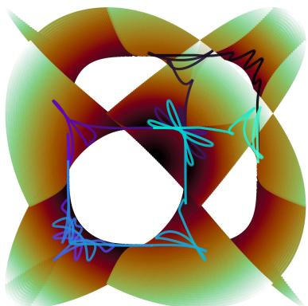  
Figure 1: We plot a cross-section and a curve corresponding to a descent path along a Calabi-Yau manifold. Our slice corresponds to the Fermat equation $\mathbf { \check { Z } } _ { 1 } ^ { N } + \mathbf { \check { Z } } _ { 2 } ^ { N } = 1$ , N = 12. The surface is projected onto the real plane by taking the real components $( \mathrm { R e } ( Z _ { 1 } ) \bar { , } \mathrm { R e } ( \bar { Z _ { 2 } } ) )$ . This figure is somewhat toy because in a descending landscape scenario, the manifold is much more high-dimensional.

Under a Boreal measure on the training data that corresponds to a suficiently smooth Radon-Nikodym derivative that is disattached from neural network parameter dependence, the parameter landscape admits a cross-entropy metric, reminscent of a Fisher metric although not exactly because of the parameter invariance, that is moreover a mixed Wirtinger derivative of a potential since the derivatives commute with the iterated integral. The potential, for example in the quadratic case, is plurisubharmonic. Therefore, under this potential, the admitted information manifold is Kähler. Under further restriction of (weak) equivalency conditions such as

$$
i ^ { K ^ { 2 } } \Omega \wedge \overline { { { \Omega } } } - \mathrm { c o n s t a n t } \cdot \frac { \omega ^ { K } } { K ! } \equiv 0 ,\tag{1.1}
$$

or vanishing Ricci curvature, the geometry is Calabi-Yau for a specific Kähler class. We will attempt to investigate the pitfalls of Calabi-Yau metrics on information landscapes. We study these circumstances solely afected in the Calabi-Yau scenario via 10.4, 10.5, but also draw connections in 10.6, 11.1, 11.2, 12.1, 12.2, which are sections that discuss roles of curvature in general. In our analyses, the Ricci curvature, further tethered to metric eigenvalues that both diminish and blow-up due to a constant determinant condition1, have interconnections to our theory. As we will see, optimization arguments are not immune to structures profaned in curvature.

Pitfalls are not unique to Calabi-Yau metrics, and can be properties of curvature in general. In Appendices 11.1, 11.2, 12.1, 12.2, we demonstrate that Ricci curvature itself can mar the learning landscape. In fact, in some results, the severity of the efect of curvature can be in exact proportion to the magnitude of the curvature, so Calabi-Yau metrics are merely a threshold as to where adverse efects can start. Nonetheless, we also demonstrate pitfalls unique to Calabi-Yau metrics in 10.4, 10.5.

## 2 Related work

Connections to more traditional deep learning theory. Our work possesses foundations in deep learning theory, namely at initialization. Literature that establish to varying levels neural network derivative bounds including use of Feynmann diagrams are Banerjee et al. (2023) Dyer and Gur-Ari (2019) Zhu et al. (2022) Shem-Ur and $\mathrm { O z }$ (2024) Aitken and Gur-Ari (2020). Bounding a Hessian norm can also be found in Cisneros-Velarde et al. (2025). Additional work relevant to deep learning theory and the roles of width in asymptotics include Hanin (2023) Andreassen and Dyer (2020) Cirone et al. (2025) and especially pertaining to the neural tangent kernel Guillen et al. (2026) Huang and Yau (2019) Liu et al. (2021a). Much of our work also pertains to optimization through a geometric and analytic lens. Relevant work from a more real-analytic lens include Javanmard et al. (2019) Zhang et al. (2022) with connections to Wasserstein geometry Daneshmand et al. (2023). Optimization literature focusing specifically on (Riemannian) geometric analysis include ichi Amari et al. (2018) Zavatone-Veth et al. (2025) Poole et al. (2016) Tron et al. (2024) Kaul and Lall (2019), so our work has high interconnections to these among those mentioned.

Connections to negative sectional curvature. The role of Ricci curvature in an optimization landscape has been studied Gigli (2017) Lott and Villani (2009) Ambrosio et al. (2015), but these works are mostly separate from a deep learning theory perspective, i.e. neglect commentary on width, etc. Li and Montúfar (2020) does study how positive Ricci curvature positively afects convergence, therefore Ricci flat and negatively-curved metrics lack this. On the other hand, Criscitiello and Boumal (2022) shows that for many manifolds including Hadamard manifolds and hyperbolic spaces, i.e. with constant negative sectional curvature, gradient descent experiences pitfalls due to to the curvature. Criscitiello and Boumal (2023) shows that, primarily under hyperbolic spaces, convexity results often worsen due to the curvature efects. Our work is reminiscent of these works, while our work emphasizes Ricci curvature and eigenvalues specifically. The constant determinant implies very large eigenvalues is unique to complex manifolds under Calabi-Yau metrics, therefore many of our results are lost in translation to Riemannian manifolds, since Ricci curvature being the log determinant of the metric is unique to Kähler manifolds. We build upon these works by examining the Ricci-flat scenario. In particular, our methods will also experience pitfalls under negative curvature as well, and so we also consider

$$
\operatorname { R i c } ( v , v ) < 0 ,\tag{2.1}
$$

and sometimes the Calabi-Yau manifold is simply the transition from the better to worse cases. In general, in suficiently high dimensions, Ricci flatness is a weaker condition than a sectional curvature condition, since

$$
\operatorname { R i c } ( X , X ) = \operatorname { T r } _ { h } \mathrm { R m } ( X , \cdot , X , \cdot ) = \sum _ { i } K ( X , e _ { i } ) \equiv 0 \quad \implies \quad K ( X , Y ) \equiv 0 .\tag{2.2}
$$

Since the eigenvalue explosion, on the other hand, is unique to our situation, our Calabi-Yau results particularly often go hand-in-hand with violating β-smoothness.

## 3 Neural network setup

Consider training data $\{ z _ { i } , y _ { i } \} _ { i } , z _ { i } \in \mathcal { Z } \subseteq \mathbb { C } ^ { d } , y _ { i } \in \mathcal { Y } \subseteq \mathbb { R }$ (without loss of generality, we can restrict the imaginary component of y to be 0 if necessary, thus we maintain representations as generalized as possible), where $\boldsymbol { y } \sim p ( \boldsymbol { y } | \boldsymbol { x } , \boldsymbol { \theta } ) = N ( f ( \boldsymbol { \theta } ; \boldsymbol { x } ) , \sigma ^ { 2 } )$ follows a data distribution. Here, $\theta \in \Theta$ is the total collection of complex-valued weights and biases. Consider a fully-connected complex neural network of the form Banerjee et al. (2023)

$$
\alpha ^ { ( 0 ) } ( z ) = z\tag{3.1}
$$

$$
h ^ { ( l ) } ( z ) = \frac { 1 } { \sqrt { m } } W ^ { ( l ) } \alpha ^ { ( l - 1 ) } ( z )\tag{3.2}
$$

$$
\alpha ^ { ( l ) } ( z ) = \phi \left( h ^ { ( l ) } ( z ) , \overline { { h ^ { ( l ) } ( z ) } } \right) , \quad l \in [ L ]\tag{3.3}
$$

$$
f ( \theta ; z , \overline { { { z } } } ) = \alpha ^ { ( L + 1 ) } ( z ) = \frac { 1 } { \sqrt { m _ { L } } } v ^ { \dagger } \alpha ^ { ( L ) } ( z ) ,\tag{3.4}
$$

where $W$ is a linear operator over the field of complex numbers $\mathbb { C } ,$ and $\phi : \mathbb { C } \to \mathbb { C }$ is a non-holomorphic activation. Here, $\theta \in  { \Theta } \subseteq \mathbb { C } ^ { \sum _ { k } m _ { k } m _ { k + 1 } + m _ { L } } : = \mathbb { C } ^ { K }$ . For simplicity, assume $m _ { l } = m$ for all l.

## 4 Geometric setup

## 4.1 The Kähler descent landscape and its information geometry

Construct a probability measure such that $y _ { i } \sim q ( y | z )$ . Notice $q$ does not depend on $\theta .$ This is not unusual per se, although sometimes $q$ is parameterized. We can note a density of this forms "violates injectivity" since the output of $y$ varies across single z. More specifically, q is a Markov kernel $z \mapsto \mathbb { P } _ { Y \mid Z = z }$ Fritz (2020). The cross-entropy information metric is defined as

$$
h _ { i \overline { { j } } } ( \theta ) = \mathbb { E } _ { z \sim p _ { \mathrm { d a t a } } } \left[ \mathbb { E } _ { y \sim q ( y | z ) } \left[ - \frac { \partial ^ { 2 } \log p ( y | z , \theta ) } { \partial \theta ^ { i } \partial \overline { { \theta } } ^ { j } } \right] \right] ,\tag{4.1}
$$

which defines a Kähler manifold loss landscape $( M , \omega ) , \omega \in \Omega ^ { 1 , 1 } ( M )$ under a preconditioned loss, or natural gradient descent where the descent update is scaled in accordance with the inverse information metric. In the above, $p$ is taken to be the loss. The above metric is Kähler since the Wirtinger derivatives commute with the integral under complex-valued Lebesgue dominated convergence Ziemer (2017), so

$$
\begin{array} { r } { h _ { i \overline { { j } } } ( \theta ) = \partial _ { i } \partial _ { \overline { { j } } } \Phi : = \partial _ { i } \partial _ { \overline { { j } } } \mathrm { ~ p o t e n t i a l , ~ p o t e n t i a l } \in \mathrm { S P S H } ( U ) , } \end{array}\tag{4.2}
$$

by taking $\Phi = \mathbb { E } _ { z } \mathbb { E } _ { q } [ - \log p ]$ . We can note the Wirtinger derivatives commute under $L ^ { 1 }$ decay via dominated convergence

$$
\partial _ { \theta ^ { i } } \partial _ { \theta ^ { \bar { j } } } \underbrace { \int _ { \mathcal { Z } } \int _ { \mathcal { Y } } - \log p ( y | z , \theta ) q ( y | z ) p _ { \mathrm { d a t a } } ( z ) d y d z } _ { : = \Phi } = \int _ { \mathcal { Z } } \int _ { \mathcal { Y } } - \partial _ { \theta ^ { i } } \partial _ { \theta ^ { \bar { j } } } \log p ( y | z , \theta ) q ( y | z ) p _ { \mathrm { d a t a } } ( z ) d y d z .\tag{4.3}
$$

It is crucial to note we have removed the dependence on $\theta$ in the latter static $p .$ Therefore, the above is more closely related to a cross-entropy Hessian rather than a true Fisher metric. When $p$ is an exponential likelihood, the negative log likelihood is quadratic, which is SPSH. In particular, a quadratic cost submits to a quadratic form $\begin{array} { r } { \Phi ( \theta ) = \frac { 1 } { 2 } \theta ^ { \dagger } A \theta + b ^ { \dagger } \theta + \theta ^ { \dagger } c + d } \end{array}$ without an expected value. To bridge the gap between convexity and the Wirtinger derivatives, the Hessian coheres to

$$
( H _ { \mathbb { C } } ) _ { j \overline { { k } } } = \frac { 1 } { 4 } \left( \frac { \partial ^ { 2 } \Phi } { \partial u _ { j } \partial u _ { k } } + \frac { \partial ^ { 2 } \Phi } { \partial v _ { j } \partial v _ { k } } + i \left( \frac { \partial ^ { 2 } \Phi } { \partial u _ { j } \partial v _ { k } } - \frac { \partial ^ { 2 } \Phi } { \partial v _ { j } \partial u _ { k } } \right) \right) .\tag{4.4}
$$

Here, $\theta = u + i v$ . Substituting in the expected quadratic cost, we get the quadratic form is greater than zero and so Φ is SPSH. As a last remark, we can note the expectation operator preserves a quadratic property since for a probability $( \Omega , \mathcal { F } , \mathbb { P } )$ be a probability space with random vector $z \in L ^ { 2 } ( \Omega ; \mathbb { C } ^ { n } )$

$$
\mathbb { E } [ z ^ { \dagger } A z ] = \mathbb { E } [ \mathrm { T r } ( z ^ { \dagger } A z ) ] = \mathbb { E } [ \mathrm { T r } ( A z z ^ { \dagger } ) ]\tag{4.5}
$$

$$
= \operatorname { T r } ( A \mathbb { E } [ z z ^ { \dag } ] ) = \operatorname { T r } ( A \Sigma ) + \mu ^ { \dag } A \mu .\tag{4.6}
$$

Denote $\mathcal { L } ( \boldsymbol { \theta } , \overline { { \boldsymbol { \theta } } } )$ the loss function under a complex parameter, so it dependent on the parameter itself and its complex conjugate. Under a traditional neural network trajectory, the gradient descent updates obey $\partial _ { t } \theta ^ { \alpha } ( t ) \ = \ - \partial \mathcal { L } \vert \partial \overline { { { \theta } } } ^ { \alpha }$ For this work, we consider the geometrically-preconditioned backpropagated loss Shrestha (2023)

$$
\frac { d \theta ^ { i } ( t ) } { d t } = - h ^ { i \bar { j } } \frac { \partial \mathcal { L } } { \partial \overline { { \theta } } ^ { j } } ,\tag{4.7}
$$

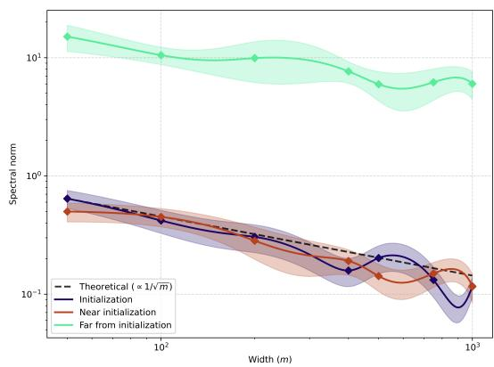  
Figure 2: We plot $\lVert i \partial \overline { { \partial } } f \rVert _ { 2 }$ asymptotics corresponding to 8.2 on 20 instances, corresponding to exactly initialization, near initialization (perturbation $\epsilon = 0 . 1 )$ , and far from initialization $( \epsilon = 2 )$

where $d \theta ^ { i } / d t$ lives in $T ^ { 1 , 0 } ( M )$ , Moreover, $h \in \Gamma ( T ^ { * 1 , 0 } M \otimes T ^ { * 0 , 1 } M )$ is a section, so $h ^ { - 1 } \in \Gamma ( T ^ { 1 , 0 } M \otimes T ^ { 0 , 1 } M )$ and the inverse information metric acts such that $\sharp : T ^ { * 0 , 1 } M \to T ^ { 1 , 0 } M$ . Under this trajectory, the parameter obeys the information manifold Kähler structure, which serves as a loss landscape. We can

note the descent trajectory is just one direction in the span of the holomorphic tangent bundle, and it is in the direction of steepest descent. In particular, $d \theta \bar { / } d t \in T _ { \theta ( t ) } ^ { 1 , 0 }$ M and we get for some unimportant orthogonal complement W

$$
T _ { \theta ( t ) } ^ { 1 , 0 } M = \operatorname { s p a n } _ { \mathbb { C } } \left\{ \frac { d \theta } { d t } \right\} \oplus _ { h } \mathcal { W } .\tag{4.8}
$$

Let us verify our parameter update in the complex case indeed decreases the loss under 4.7. Consider the total loss diferential $\begin{array} { r } { d \mathcal { L } = \frac { \partial \mathcal { L } } { \partial \theta ^ { i } } d \theta ^ { i } + \frac { \partial \mathcal { L } } { \partial \overline { { \theta } } ^ { j } } d \overline { { \theta } } ^ { j } } \end{array}$ . Because the loss is real-valued, we have $\begin{array} { r } { \overline { { \left( \frac { \partial \mathcal { L } } { \partial \theta ^ { i } } \right) } } = \frac { \partial \mathcal { L } } { \partial \overline { { \theta } } ^ { i } } } \end{array}$ Using our preconditioned trajectory, the parameter diferential and its conjugate are $\begin{array} { r } { d \theta ^ { i } = - \eta h ^ { i \bar { j } } \frac { \partial \mathcal { L } } { \partial \overline { { \theta } } ^ { j } } } \end{array}$ and $\begin{array} { r } { d \overline { { \theta } } ^ { j } = - \eta h ^ { i \overline { { j } } } \frac { \partial \mathcal { L } } { \partial \theta ^ { i } } } \end{array}$ , where we use the fact that the metric is Hermitian. Into the total diferential, we see

$$
d \mathcal { L } = \frac { \partial \mathcal { L } } { \partial \theta ^ { i } } \left( - \eta h ^ { i \bar { j } } \frac { \partial \mathcal { L } } { \partial \bar { \theta } ^ { j } } \right) + \frac { \partial \mathcal { L } } { \partial \overline { { \theta } } ^ { j } } \left( - \eta h ^ { i \bar { j } } \frac { \partial \mathcal { L } } { \partial \theta ^ { i } } \right) = - 2 \eta h ^ { i \bar { j } } \frac { \partial \mathcal { L } } { \partial \theta ^ { i } } \frac { \partial \mathcal { L } } { \partial \overline { { \theta } } ^ { j } } .\tag{4.9}
$$

Because the information metric h is positive definite, the quadratic form $h ^ { i \overline { { j } } } \frac { \partial \mathcal { L } } { \partial \theta ^ { i } } \frac { \partial \mathcal { L } } { \partial \overline { { \theta } } ^ { j } }$ is real and positive, guaranteeing $d \mathcal { L }$ is real and negative.

Definition 1. Let $( M , \omega )$ be a Kähler information manifold representing the parameter space, where ω is the Kähler form induced by the information potential. A smooth, real-valued loss function $L : M \to \mathbb { R }$ is said to satisfy µ-(complex) strong convexity if, for any $z ^ { \prime } \in S$ and a reference $z \in M$ , we have

$$
L ( \theta ^ { \prime } ) \ge L ( \theta ) + 2 \mathrm { R e } \langle \partial L _ { \theta } , \exp _ { \theta } ^ { - 1 } ( \theta ^ { \prime } ) ^ { 1 , 0 } \rangle + \frac { \mu } { 2 } d _ { \omega } ( \theta , \theta ^ { \prime } ) ^ { 2 } .\tag{4.10}
$$

with $\mu > 0$ . Here, $d _ { \omega }$ is the geodesic distance. This condition is a bridge to the classical (Dolbeault) Hessian bound $i \partial { \overline { { \partial } } } L ( z ) \succeq \mu \omega$

## 4.2 Calabi-Yau descents

Definition 2. We say the Kähler manifold M that admits metric h is Calabi-Yau if its Ricci curvature is zero, i.e.

$$
\begin{array} { l } { \displaystyle \mathrm { R i c } _ { i \overline { { j } } } = - \partial _ { i } \partial _ { \overline { { j } } } \log \operatorname* { d e t } ( h ) } \\ { \displaystyle \quad \quad = - \partial _ { i } \partial _ { \overline { { j } } } \log \operatorname* { d e t } \left( \mathbb { E } _ { z \sim p _ { \mathrm { d a t a } } } \left[ \mathbb { E } _ { y \sim q ( y | z ) } \left[ - \frac { \partial ^ { 2 } \log p ( y | z , \theta ) } { \partial \theta ^ { i } \partial \overline { { \theta } } ^ { \overline { { j } } } } \right] \right] \right) \equiv 0 . } \end{array}\tag{4.11}
$$

(4.12)

This definition has topological and geometric nuance, so we elaborate. We adopt this geometric definition. Generally, to invoke the Calabi conjecture Yau (1977), we require compactness of M, or at least of the submanifold in which the optimization trajectory exists. We remark this is slightly nonrigorous because the Calabi conjecture requires the manifold to be closed without boundary, and a compact submanifold would contain a boundary with Dirichlet or Neumann boundary conditions. This is problematic for us because our metric is defined via a Kähler potential, and by the maximum principle, a globally defined strictly plurisubharmonic function on a compact manifold must be constant Demailly (2012). This completely destroys our defined metric, at least globally but not locally. Topologically, the manifold is governed by the vanishing of the first real Chern class, $c _ { 1 } ( M ; \mathbb { R } ) = 0$ . While stronger algebraic definitions exist, such as requiring the canonical line bundle to be trivial, which equips M with a nowhere-vanishing holomorphic K-form, the condition $c _ { 1 } ( M ; \mathbb { R } ) = 0$ is the, albeit weaker, requirement for Calabi-Yau manifolds. Therefore, we bypass the Chern class requirement of Yau’s theorem, and we define the Calabi-Yau manifold entirely geometrically rather than topologically by equipping it with a nowhere-vanishing holomorphic form Ω and ensuring it is Ricci-flat. We remark the title of this work is also allusive to a search of the Ricci flat metric within a Kähler class, but since we relaxed compactness, this is not rigorous.

We can note the global Ricci form $\rho = - i \partial { \overline { { \partial } } } \log \operatorname* { d e t } ( h )$ is, up to a constant, the curvature 2-form $F ^ { \nabla }$ of the induced Chern connection on the anti-canonical line bundle $K _ { \scriptscriptstyle M } ^ { - 1 } = \bar { \Lambda ^ { K } } T ^ { 1 , 0 } M$ over the parameter space, so we get the Calabi-Yau condition $\mathrm { R i c } \equiv 0 \iff \rho \equiv 0 \iff { \vec { F } } ^ { \nabla } \equiv 0$ and

$$
F ^ { \nabla } = \overline { { { \partial } } } \partial \log \left( \frac { \omega ^ { K } K ! ^ { - 1 } } { c _ { K } \Omega \wedge \overline { { { \Omega } } } } \right) \equiv 0\tag{4.13}
$$

for a nowhere-vanishing holomorphic volume form $\Omega \in$ $H ^ { 0 } ( M , K _ { M } )$ , so the Dolbeault operators vanish the log of the geometric volume form and the algebraic volume form ratio. As a remark, note that

$$
F ^ { \nabla } = \rho = i \mathrm { T r } ( \Theta _ { h } ) .\tag{4.14}
$$

Here, $\Theta _ { h }$ is the Chern curvature form. A Calabi-Yau manifold will fail our CRSC results because of the following scenario:

Equivalently, we will work with the Calabi-Yau condition as a Monge–Ampère equation with constant determinant condition for constant κ for manifold dimension K

$$
( i \partial { \overline { { \partial } } } \Phi ) ^ { K } = \kappa d V _ { 0 } { } ^ { 2 } .\tag{4.15}
$$

This is a constant determinant condition since $\omega =$ $\begin{array} { r } { i \sum _ { j , k = 1 } ^ { K } \left( \partial _ { j } \partial _ { \overline { { k } } } \Phi \right) d \theta ^ { j } \wedge d \overline { { \theta } } ^ { k } , d V _ { 0 } = \left( \frac { i } { 2 } \right) ^ { K } d \theta ^ { 1 } \wedge d \overline { { \theta } } ^ { 1 } \wedge \cdot \cdot \cdot \wedge } \end{array}$ $d \theta ^ { K } \wedge d \overline { { \theta } } ^ { K }$ , and substituting into 4.15,

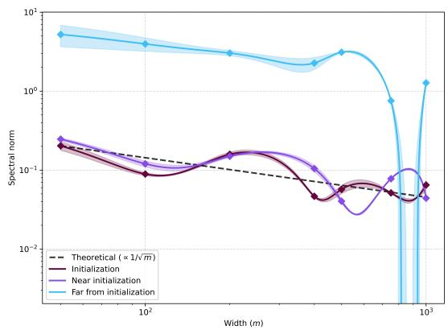  
Figure 3: We plot asymptotics on the (2,0)- Hessian of $\| \mathcal { H } ^ { \bar { 2 } , 0 } \| _ { 2 }$ corresponding to 8.5 on 2 instances using an SVD power iteration approach, noting $H _ { 2 , 0 } ~ = ~ \frac { 1 } { 4 } ( H _ { x x } - H _ { y y } ) +$ $\begin{array} { r } { \frac { i } { 4 } ( H _ { x y } + H _ { y x } ) } \end{array}$

$$
i ^ { K } K ! \operatorname * { d e t } \left( \partial _ { j } \partial _ { \cal k } \bar { \Phi } \right) d \theta { } ^ { 1 } \wedge d \bar { \theta } { } ^ { 1 } \wedge \cdot \cdot \cdot \wedge d \theta ^ { K } \wedge d \bar { \theta } { } ^ { K } = \kappa \left( \frac i 2 \right) ^ { K } d \theta { } ^ { 1 } \wedge d \bar { \theta } { } ^ { 1 } \wedge \cdot \cdot \cdot \wedge d \theta ^ { K } \wedge d \bar { \theta } { } ^ { K } .\tag{4.16}
$$

which yields det $\begin{array} { r } { \left( \partial _ { j } \partial _ { \overline { { k } } } \Phi \right) = \frac { \kappa } { K ! 2 ^ { K } } } \end{array}$ solving for the determinant. Equivalently, 4.15 can be written

$$
\frac { 1 } { K ! } ( i \partial \overline { { { \partial } } } \Phi ) ^ { K } = ( - 1 ) ^ { \frac { K ( K - 1 ) } { 2 } } \left( \frac { i } { 2 } \right) ^ { K } \kappa \Omega \wedge \overline { { { \Omega } } }\tag{4.17}
$$

for nowhere-vanishing holomorphic K-form Ω. A Calabi-Yau manifold has vanishing Ricci curvature, forcing the Monge-Ampère condition det $( h ) = \mathrm { c o n s t a n t } > 0$ . When the neural network landscape naturally encounters regions corresponding to regions where some $\lambda _ { k }$ drop, the Calabi-Yau volume-preservation constraint forces opposing eigenvalues to spike to compensate since it is true that

$$
\operatorname * { l i m } _ { \theta  \theta ^ { * } } \operatorname * { d e t } ( h ) = \operatorname * { l i m } _ { \theta  \theta ^ { * } } \prod _ { i \in \mathcal { X } _ { \infty } } \lambda _ { i } ( \theta ) \cdot \prod _ { j \in \mathcal { Z } _ { 0 } } \lambda _ { j } ( \theta ) \cdot \prod _ { j \in \mathcal { Z } _ { B } } \lambda _ { j } ( \theta ) \equiv c > 0 ,\tag{4.18}
$$

i.e. a divergence of some in a diverging set $\scriptstyle { \mathcal { T } } _ { \infty }$ implies collapse of some in a collapsing set $\mathcal { T } _ { 0 }$ and a suficiently bounded, neutral set $\mathcal { T } _ { B }$ . To frame this alternatively, the explosion of eigenvalues force a collapse of eigenvalues into an asymptotic regime

$$
\prod _ { j \in \mathcal { T } _ { 0 } } \lambda _ { j } ( \theta ) \asymp \left( \prod _ { i \in \mathcal { T } _ { \infty } } \lambda _ { i } ( \theta ) \right) ^ { - 1 } \xrightarrow [ \theta \to \theta ^ { * } ] { } 0\tag{4.19}
$$

to ensure an exact inverse scaling between the eigenvalue split at its value endpoints. If $\lambda _ { \operatorname* { m i n } }  0 .$ the constant determinant condition forces at least one other eigenvalue to blow up to compensate, so $\lambda _ { \operatorname* { m a x } }  \infty$ . We require an upper bound on curvature $i \partial \overline { { \partial } } \mathcal { L } \preceq \beta \omega$ . If an eigenvalue goes to infinity, the $\beta$ parameter blows up, destroying the smoothness guarantee.

Calabi-Yau manifolds can also ofer advantages over negatively-curved spaces, but not as much as positivelycurved spaces. We elaborate more on efects of curvature in general in 5.4. Under a continuous-time stochastic natural gradient descent, the trajectory variance under a stochastic Jacobi equation

$$
\frac { d } { d t } \mathbb { E } \left[ \Vert J _ { t } \Vert _ { h } ^ { 2 } \right] = - 2 \mathbb { E } \left[ \nabla _ { \omega } ^ { 1 , 1 } \mathcal { L } ( J _ { t } , \overline { { J } } _ { t } ) \right] - \mathbb { E } \left[ \operatorname { R i c } ( J _ { t } , \overline { { J } } _ { t } ) \right] + \operatorname { T r } _ { h } ( \Sigma ) .\tag{4.20}
$$

The Ricci curvature vanishes under a Calabi-Yau manifold, but in a largely negatively curved space

$( \operatorname { R i c } \ll 0 )$ , the Ricci curvature term $- \mathbb { E } \left[ \operatorname { R i c } ( J _ { t } , \overline { { J } } _ { t } ) \right]$ becomes positive and large, inducing high variance.

## 4.3 Corrupted geometries under neural networks and eigenvalue collapse

It is not immediately guaranteed the loss landscape encounters a split in eigenvalue behavior; however, it is a realistic neural network scenario if the Calabi-Yau manifold exists.

Theorem 1. Let there exist K neural network parameters and real-data constraints $N \times k$ . In the overparameterization regime, then there exist eigenvalues $\lambda _ { \operatorname* { m i n } } = 0$

Remark. It is not possible for a Calabi-Yau manifold to be low rank (except on a set of measure zero). By definition, a Kähler metric must be positive-definite. Not only this, but a non-invertible metric completely destroys our application of natural gradient descent.

Proof. In the overparameterization regime, so m is large, the metric h is ${ \mathrm { ~ a ~ } } K \times K$ matrix efectively of rank at most k. The maximum possible rank of h is min{ $\left[ K , N \times k \right]$ , if K is taken $K \gg N \times k$ , for example $f ( z ; \theta ) \in \mathbb { R } ^ { k }$ with a dataset of size N, h becomes rank deficient Sun and Nielsen (2025) Bakeer (2026) Dong and Cheng (2026). The kernel of h has dimension at least $K - N k > 0$ . Therefore, there are zero eigenvalues, forcing $\lambda _ { \operatorname* { m i n } } = 0 . \ \boxed { \begin{array} { r l } \end{array} }$

Regularization and Calabi-Yau bounded eigenvalues. It can be noted in the case of at least one degenerate eigenvalue for suficiently large width threshold $m ^ { * }$ , somewhat informally

$$
\log \operatorname* { d e t } ( h ) = - \infty \quad \forall m > m ^ { * }\tag{4.21}
$$

$$
\mathrm { R i c } _ { i \overline { { { j } } } } = - \partial _ { i } \partial _ { \overline { { { j } } } } ( - \infty ) = \mathrm { D N E } .\tag{4.22}
$$

This will corrupt our information manifolds. It can be noted Banerjee et al. (2023) is not a work in information geometry and does not use a metric, therefore their work is allowed to focus on restricted strong convex regimes and this work largely ignores volume collapse. Since our approach is geometric, we cannot ignore corrupted geometries. To reconcile this inconsistency, we can assume our loss is regularized as

$$
\widetilde { \mathcal { L } ( \boldsymbol { \theta } ) } = \mathcal { L } ( \boldsymbol { \theta } ) + \lambda \boldsymbol { \theta } ^ { \dagger } \boldsymbol { \theta } : = - \log p ( \boldsymbol { y } | \boldsymbol { z } , \boldsymbol { \theta } ) + \lambda \boldsymbol { \theta } ^ { \dagger } \boldsymbol { \theta } .\tag{4.23}
$$

This will in turn allow a bound on a minimum eigenvalue, since h will take the form $\widetilde { h } _ { i \overline { { { j } } } } ( \theta ) = h _ { i \overline { { { j } } } } ( \theta ) + \lambda \delta _ { i \overline { { { j } } } } .$ In Appendix 10, we derive a result that is reminiscent of this although is not a global bound, but 10 contradicts our geometric setup as discussed due to the eigenvalue singularity. Indeed, this proof is valid under the low-width regime, and is not immune to metric collapse. Therefore, in much of our work, we will typically work with the Calabi-Yau condition where a subset of eigenvalues are either really small or really large

$$
\begin{array} { r } { ( M ^ { * } , \omega ^ { * } ) \in \Bigg \{ ( M , \omega ) \Bigg | \mathrm { R i c } \equiv 0 \iff ( i \partial \overline { { \partial } } \Phi ) ^ { K } - \kappa d V _ { 0 } = 0 , 0 \lesssim \mu < \lambda _ { \mathrm { m i n } } \ll 1 , \lambda _ { \mathrm { m a x } } \leq \lambda _ { \gg 1 } ^ { * } < \infty \Bigg \} . } \end{array}\tag{4.24}
$$

Convexity assumptions. From this theorem, it follows that the eigenvalue collapse is a consequence of overparameterization and not the Calabi-Yau artifact. The eigenvalue explosion is the consequence of the Calabi-Yau feature. Strong convexity necessitates $\nabla _ { \omega } ^ { 2 } L = J ^ { \dagger } J + \mathcal { H } _ { \mathrm { n e t } } \succeq \mu I$ where $J ^ { \dag } J$ is the contribution from the metric, and ${ \mathcal { H } } _ { \mathrm { n e t } }$ is intrinsic contribution from the network. A nondegenerate metric is not suficient to ensure strong convexity. Therefore, it is most reasonable for us to assume the regularized Fisher metric (in all cases, not just the Calabi-Yau)

$$
\mathcal { F } _ { \mathrm { r e g } } = \mathcal { F } + \lambda I , \quad \lambda _ { \mathrm { m i n } } ( \mathcal { F } _ { \mathrm { r e g } } ) \ge \mu > 0\tag{4.25}
$$

has eigenvalues bounded below by a positive value (see Dufort-Labbé et al. (2026) Cayci (2025) for relevant literature), which derives from $\nabla _ { \omega } ^ { 1 , 1 } \mathcal { L } ( \theta ) + \lambda \dot { \nabla } _ { \omega } ^ { 1 , 1 } \theta ^ { \dagger } \theta$ . This equation is a direct consequence of 4.23. We will employ this assumption in Appendix 10 rather than assuming strong convexity. In general, $i \partial { \overline { { \partial } } } L \succeq \mu I$ is considered unreasonable in deep learning theory globally. Banerjee et al. (2023) does not assume a static $i \partial \overline { { { \partial } } } \mathcal { L } \succeq \mu I$ result and this is a consequence of their restricted strong convexity. In Appendix 10, we will prove a convexity result.

Rank deficiencies and suficiencies in cohomology, and relations to Theorem 1. Consider the overparameterization regime and a low-rank metric, and moreover consider the network’s prediction as a morphism of sheaves. Let $\mathcal { E } _ { M } ^ { \oplus K }$ be the sheaf of smooth complex-valued sections3 of the trivial vector bundle of all parameters; and $\bar { \mathcal { E } } _ { M } ^ { \oplus N k }$ be the sheaf of sections of the trivial bundle of network outputs over the dataset, i.e. redundant efects of f on the data. The complexified network Jacobian $J = \partial f ( z ; \theta )$ is a morphism of sheaves

$$
J : \mathcal { E } _ { M } ^ { \oplus K } \longrightarrow \mathcal { E } _ { M } ^ { \oplus N k } ,\tag{4.26}
$$

since the Jacobian has a linear/matrix representation mapping from $\mathcal { E } _ { M } ^ { \oplus K }$ to $\mathcal { E } _ { M } ^ { \oplus N k }$ . On the zero-loss manifold, J is surjective because of overparameterization. This gives us a short exact sequence of sheaves $0 \longrightarrow \mathcal { V } \stackrel { \iota } { \to } \mathcal { E } _ { M } ^ { \oplus K } \stackrel { J } { \to } \mathrm { I m } ( J ) \longrightarrow 0$ , where Im $( J ) \subseteq \mathcal { E } _ { M } ^ { \oplus N k }$ . Here, $\nu = \ker ( J )$ is the subsheaf that defines the flat minima. Physically, the fibers of the associated vector bundle represent the flat minima, being the directions in parameter space where the information metric $h = \mathbb { E } [ J ^ { \dagger } J ]$ has zero eigenvalues. In particular, a fiber is the vector space

$$
V _ { \theta } = \{ \delta \theta \in \mathbb { C } ^ { K } \mid \mathbb { E } \parallel J _ { \theta } \delta \theta \parallel ^ { 2 } = 0 \} .\tag{4.27}
$$

h takes this form since $\begin{array} { r } { - \log p ( y | z , \theta ) = \frac { 1 } { 2 } \sum _ { k } ( f _ { k } ( z ; \theta ) - y _ { k } ) \overline { { ( f _ { k } ( z ; \theta ) - y _ { k } ) } } + C } \end{array}$ . Expanding the second derivative yields $\partial _ { i } \partial _ { \overline { { j } } } \left[ ( f - y ) \overline { { ( f - y ) } } \right] = ( \partial _ { i } f ) ( \partial _ { \overline { { j } } } \overline { { f } } ) + ( \partial _ { \overline { { j } } } f ) ( \partial _ { i } \overline { { f } } ) + ( f - y ) \partial _ { i } \partial _ { \overline { { j } } } \overline { { f } } + \overline { { ( f - y ) } } \partial _ { i } \partial _ { \overline { { j } } } f .$ . When taking the expectation over $y \sim q ( y | z )$ , the residual $( f - y )$ is mean-zero, causing the second-order derivative terms to vanish. Therefore, $h _ { i \overline { { { j } } } } ( \theta ) = \mathbb { E } _ { z \sim p _ { \mathrm { d a t a } } } \left\lceil \mathbb { E } _ { y \sim q ( y | z ) } \left\lceil ( J ^ { \dagger } J ) _ { i \overline { { { j } } } } \right\rceil \right\rceil$ . The fiber as in 4.27 corresponds to a minima since for a specific eigenvector $v \in \bar { V _ { \theta } } , h v = \bar { \mathbb { E } } \bar { [ \boldsymbol { J } ^ { \dag } \boldsymbol { J } ] } v = \bar { \mathbb { E } } [ \boldsymbol { J } ^ { \dag } ( \boldsymbol { J } v ) ] = \mathbb { E } [ 0 ] = 0$ . In other words, since the prediction does not change, it is a minima.

Since the network’s prediction over the dataset $f = \left( f _ { 1 } , \ldots , f _ { N k } \right) : M \to \mathbb { R } ^ { N k }$ is a smooth, real-valued map as in $^ { 3 , }$ it is not holomorphic. Therefore, the real diferential acts as a bundle map on the real tangent bundle $T _ { \mathbb { R } } M$ , which has rank 2K

$$
d f : T _ { \mathbb { R } } M \longrightarrow \underline { { \mathbb { R } } } ^ { N k } , \qquad d f _ { \theta } ( v ) = \big ( ( d f _ { 1 } ) _ { \theta } ( v ) , \dots , ( d f _ { N k } ) _ { \theta } ( v ) \big ) .\tag{4.28}
$$

Assuming $d f$ maintains constant rank $r = N k$ across the zero-loss locus due to overparameterization, the flat directions form a smooth real vector subbundle $\mathcal { V } : = \ker _ { \mathbb { R } } ( d f ) \subseteq T _ { \mathbb { R } } M$ . Taking the sheaf of smooth sections ${ \mathcal { E } } _ { M }$ , we obtain a short exact sequence of sheaves of smooth real vector bundles

$$
0 \longrightarrow { \mathcal E } _ { M } ( \mathscr { V } ) \longrightarrow { \mathcal E } _ { M } ( T _ { \mathbb { R } } M ) \stackrel { d f } { \longrightarrow } { \mathcal E } _ { M } ( \underline { { \mathbb { R } } } ^ { N k } ) \longrightarrow 0 .\tag{4.29}
$$

The sheaf of smooth sections of any real vector bundle admits partitions of unity. In sheaf theory, this property makes $\mathcal { E } _ { M }$ a fine sheaf Bennequin et al. (2020), and fine sheaves are acyclic Zein and Tu (2014), meaning $H ^ { i } ( M ; \mathcal { E } _ { M } ( \cdot ) ) = 0$ for all $i > 0$ . Because $H ^ { 1 } ( M ; { \mathcal { E } } _ { M } ( \mathcal { V } ) ) = 0$ automatically, the long exact sequence in cohomology splits trivially. This yields a surjective map on the global sections with no connecting homomorphism or higher cohomological obstructions Deligne P. and Morgan (1975) Mishra and Tan (2025)

$$
\overset { 0 } { \longleftrightarrow } \underset { H ^ { i \geq 1 } ( M ; \mathcal { E } _ { M } ( \cdot ) ) = 0 } { \longrightarrow } H ^ { 0 } ( M ; \mathcal { E } _ { M } ( T _ { \mathbb { R } } M ) ) \overset { d f _ { \sharp } } { \longrightarrow } H ^ { 0 } ( M ; \mathcal { E } _ { M } ( \underline { { \mathbb { R } } } ^ { N k } ) ) \overset { } { \longrightarrow } \longrightarrow \quad 
$$

Locally, the subsheaf $\mathcal { V } = \ker ( J )$ captures two distinct sources of degeneracy: from overparameterization and from symmetries belonging to neural network architectures. For example, modReLU networks with activations $f ( z ) = \sigma ( | z | ) ^ { 4 } e ^ { i \arg ( z ) }$ (ReLU has no canonical existence in the complex numbers, although complex ReLU can be defined) have an equivariance quality

$$
f ( c z ) = f ( e ^ { i \phi } z ) = \sigma ( | e ^ { i \phi } z | ) e ^ { i \arg ( e ^ { i \phi } z ) } = \sigma ( | z | ) e ^ { i ( \arg ( z ) + \phi ) } = e ^ { i \phi } \big ( \sigma ( | z | ) e ^ { i \arg ( z ) } \big ) = c f ( z ) .\tag{4.30}
$$

We will elaborate more on why this is useful in the context of de Rham cohomology. Moreover, the existence of the non-trivial subsheaf V provides the basis for Theorem 1. The unregularized information metric is constructed via $h = \mathbb { E } J ^ { \dagger } J$ and is degenerate along the fibers associated to V. This degeneracy prevents h from being positive-definite, and recall from the remark of Theorem 1 it therefore cannot be Calabi-Yau.

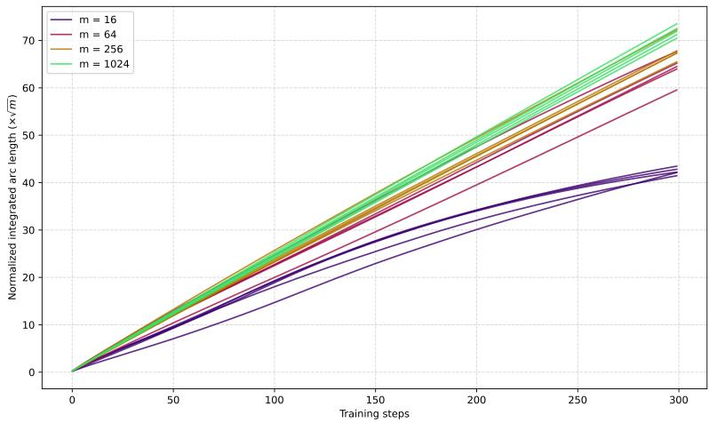  
Figure 4: We plot the integrated arc length $\int \mathbb { E } \| \dot { \theta } \| _ { h } d s$ times $\sqrt { \mathrm { w i d t h } }$ versus training steps across 5 trajectories per width with a high learning rate of $\gamma = 0 . 3 5$ . We can note the narrowly-parameterized networks dissipate in high training steps, while wide networks stay straight. This demonstrates an efect of feature learning: large m is in the neural tangent kernel regime, or the $" \mathrm { l a z y } " $ regime Karkada (2024), and the narrow networks are underparameterized and in the process of feature learning, or the $" \mathrm { r i c h } "$ regime. The narrow networks fall of because they adapt their features to finding a more eficient minima.

Near-zero spectral gap under regularization. The cohomological vanishing in 4.3 is exact and unconditional; it holds because $\mathcal { E } _ { M } ( \nu )$ is a fine sheaf, independent of any metric. Regularization does not modify this: for every $\lambda > 0 , H ^ { 1 } ( M ; { \mathcal { E } } _ { M } ( \mathcal { V } ) ) = 0$ still holds by the same argument. What regularization changes is not the cohomology but the fiberwise eigenvalue spectrum of the information metric, which we make precise here. Note M is non-compact, as we outlined in the beginning of section 4.2, and no Hodge-theoretic argument is available or needed. The statements below are pointwise.

Denote $\delta$ on $\mathcal { E } _ { M } ^ { \oplus K }$ the non-degenerate baseline, i.e. oftentimes the flat Euclidean metric under the loss of 4.23, so

$$
h _ { \lambda } ( \theta ) : = h ( \theta ) + \lambda \delta ( \theta ) , \quad \lambda > 0 .\tag{4.31}
$$

Since δ is positive-definite and h corresponds to that unregularized and is positive semi-definite, $h _ { \lambda }$ is positive-definite for every $\lambda > 0$ , and $h _ { \lambda }  h$ as $\lambda  0$ . Since $V _ { \theta } = \ker h ( \theta )$ and $h ( \theta )$ is Hermitian positive semi-definite, the orthogonal projector Πθ onto $V _ { \theta }$ satisfies $h ( \theta ) \Pi _ { \theta } = \Pi _ { \theta } h ( \theta ) = 0 , \mathrm { i . e . } \ h ( \theta ) = \Pi _ { \theta } ^ { \perp } h ( \theta ) \Pi _ { \theta } ^ { \perp }$ where $\Pi _ { \theta } ^ { \perp } \ = \ I - \Pi _ { \theta }$ . Writing $h _ { \lambda } ( \theta )$ in block form with respect to the orthogonal decomposition $\mathbb { C } ^ { K } = V _ { \theta } \oplus V _ { \theta } ^ { \perp }$ ，

$$
\begin{array} { r } { h _ { \lambda } ( \theta ) = \left( \begin{array} { l l } { \lambda \Pi _ { \theta } \delta ( \theta ) \Pi _ { \theta } } & { \lambda \Pi _ { \theta } \delta ( \theta ) \Pi _ { \theta } ^ { \perp } } \\ { \lambda \Pi _ { \theta } ^ { \perp } \delta ( \theta ) \Pi _ { \theta } } & { h ( \theta ) \vert _ { V _ { \theta } ^ { \perp } } + \lambda \Pi _ { \theta } ^ { \perp } \delta ( \theta ) \Pi _ { \theta } ^ { \perp } } \end{array} \right) _ { V _ { \theta } \oplus V _ { \theta } ^ { \perp } } . } \end{array}\tag{4.32}
$$

At each θ on the zero-loss manifold, both are Hermitian forms on the same finite-dimensional fiber $\mathbb { C } ^ { K }$ so we may compare their eigenvalues directly via the Courant-Fischer minimax characterization Meng and Zhang (2025). Writing $\lambda _ { 1 } ( \theta ) \leq \cdots \leq \lambda _ { K } ( \theta )$ for the eigenvalues of $h ( \theta )$ and $\lambda _ { 1 } ^ { \lambda } ( \theta ) \leq \cdots \leq \lambda _ { K } ^ { \lambda } ( \theta )$ for those of $h _ { \lambda } ( \theta )$ , Weyl’s inequality gives

$$
\lambda _ { i } ( \theta ) \leq \lambda _ { i } ^ { \lambda } ( \theta ) \leq \lambda _ { i } ( \theta ) + \lambda \| \delta ( \theta ) \| _ { 2 } .\tag{4.33}
$$

Recall from 4.27 that $V _ { \theta } = \ker h ( \theta )$ has dimension $d ( \theta ) : = \dim _ { \mathbb { C } } V _ { \theta }$ , so $\lambda _ { 1 } ( \theta ) = \cdot \cdot \cdot = \lambda _ { d ( \theta ) } ( \theta ) = 0$ . The inequality above then forces

$$
0 < \lambda _ { i } ^ { \lambda } ( \theta ) \leq \lambda \| \delta ( \theta ) \| _ { 2 } \quad \mathrm { f o r ~ } i = 1 , \ldots , d ( \theta ) ,\tag{4.34}
$$

so the bottom $d ( \theta )$ eigenvalues of $h _ { \lambda }$ vanish linearly in $\lambda ,$ uniformly on any compact subset of $M .$

Parameter holes and connections to de Rham cohomology. As illustrated in 4.30, neural networks can possess intrinsic qualities and symmetries. Specifically, incoming and outgoing weights can be rotated by a phase without altering the network’s output or the loss. Because this equivalence holds for any phase angle ϕ, the symmetry space forms the group $\overline { { U ( 1 ) } } \cong S ^ { 1 }$ . If we consider the parameter plane of a complex weight, the origin where the phase becomes undefined acts as a puncture. De Rham cohomology is a tool to detect holes in the space Petrov (2024), since integrating an exact form around a closed path is zero. Let $\varphi$ represent the angular coordinate wrapping around this puncture. While $d \varphi$ is closed $( d ^ { 2 } \varphi = 0 )$ , it is not exact, generating a non-trivial cohomology class $[ d \varphi ] \in H _ { d R } ^ { 1 } ( M ; \mathbb { R } )$ , and so we develop

$$
\begin{array} { r } { \underbrace { 0 \longrightarrow H _ { \mathrm { d R } } ^ { 0 } ( M ; \mathbb { R } ) \longrightarrow H _ { \mathrm { d R } } ^ { 0 } ( U _ { 1 } ; \mathbb { R } ) \oplus H _ { \mathrm { d R } } ^ { 0 } ( U _ { 2 } ; \mathbb { R } ) \xrightarrow { \mathrm { r e s } } H _ { \mathrm { d R } } ^ { 0 } ( U _ { 1 } \cap U _ { 2 } ; \mathbb { R } ) } _ { \displaystyle H _ { \mathrm { d R } } ^ { 1 } ( M ; \mathbb { R } ) \longrightarrow H _ { \mathrm { d R } } ^ { 1 } ( U _ { 1 } ; \mathbb { R } ) \oplus H _ { \mathrm { d R } } ^ { 1 } ( U _ { 2 } ; \mathbb { R } ) = 0 } \underbrace { \longrightarrow H _ { \mathrm { d R } } ^ { 0 } ( U _ { 1 } \cap U _ { 2 } ; \mathbb { R } ) } _ { \displaystyle H _ { \mathrm { d R } } ^ { 0 } ( M ; \mathbb { R } ) \longrightarrow H _ { \mathrm { d R } } ^ { 1 } ( U _ { 1 } ; \mathbb { R } ) \oplus H _ { \mathrm { d R } } ^ { 1 } ( U _ { 2 } ; \mathbb { R } ) = 0 } } \end{array}
$$

for two overlapping, simply connected open sets $U _ { 1 }$ and $U _ { 2 } , U _ { 1 } \cap U _ { 2 }$ disconnected. By contrast, applying the Hodge star maps the angular form to the exact radial form $\star d \varphi = - d ( \log r )$ . Therefore, integrating over a loop $\gamma$ and a closed contour Σ enclosing the singularity yields

$$
\oint _ { \gamma } d \varphi = 2 \pi \neq 0 , \quad \oint _ { \Sigma } \star d \varphi = \oint _ { \Sigma } - d ( \log r ) = 0 .\tag{4.35}
$$

Sectional curvature collapse under metric collapse. When this metric collapses $h _ { \epsilon } , \epsilon \to 0$ , induced is a lower bound on sectional curvature $K _ { \epsilon } ( u , v ) = h _ { \epsilon } ( R _ { \epsilon } ( u , v ) v , u ) ( h _ { \epsilon } ( u , u ) h _ { \epsilon } ( v , v ) - h _ { \epsilon } ( u , v ) ^ { 2 } ) ^ { - 1 }$ with respect to a quotient space $X _ { \infty } = M / \sim . \quad \stackrel { \prime } { \cdot }$ The quotient space $X _ { \infty }$ becomes an Alexandrov space Alexander et al. (2023) with a lower bound on sectional curvature $K _ { \epsilon } \geq \kappa$ . We can note given a Kähler form $\omega _ { \epsilon } = i h _ { \epsilon , k \overline { { j } } } d \theta ^ { k } \wedge d \overline { { \theta } } ^ { j }$ with $\mathrm { R i c } ( \omega _ { \epsilon } ) = - i \partial \overline { { { \partial } } } \log \operatorname* { d e t } ( h _ { \epsilon , k \overline { { { j } } } } ) \equiv 0$ , the sectional curvature $K _ { \epsilon }$ does not necessarily vanish.

Connections to PSH collapse. Non-strictly PSH(U) potentials are acceptable because the collapse is local, i.e. a set of measure zero, not global, when the strict preservation fails. In an overparameterization, the collapse may be for all neural network input, hence global not local.

Additional remarks. Under an overparameterization collapse, The geodesic distance along a direction in the nullspace $\mathcal { N } _ { h } = \{ v \in T _ { p } M \vert h ( v , v ) = 0 \}$ will maintain identically vanishing geodesic distance, so a geodesic ball region collapses with respect to dimension. The inverse of the exponential map $\exp _ { p } ^ { - 1 }$ possesses similar properties, and will collapse in norm, so the cosine similarity is ill-defined. The spectral norm $\| h \| _ { 2 } ,$ , on the other hand, is immune to rank deficiency and is immune to collapse.

Regularizing and resolving profaned curvature. To regularize the loss landscape and support well-behaved curvature, we can penalize the loss further with

$$
\widehat { \mathcal { L } } = \mathcal { L } + \lambda \theta ^ { \dagger } \theta - \alpha \log \operatorname* { d e t } ( h ( \theta ) ) \quad \iff \quad \alpha \rho \succeq - ( i \partial \overline { { \partial } } \mathcal { L } + \lambda \omega _ { \mathrm { H a t } } ) ,\tag{4.36}
$$

since the Hessian of the loss $\succeq 0$ at a local minima. Again, we set the loss to be the negative log-likelihood of $p , \mathrm { { s o \mathrm { ~ - ~ } l o g } } p $ . Here, $\rho$ is the Ricci form. We can control the positive-definieness of the Ricci form based on $\alpha , \lambda$ , and the loss, therefore regularizing the Ricci curvature of the manifold with the log det penalty. We can note the negative sign in 4.36 provides a lower bound as in 4.36 and facilitates positive curvature.

## 5 Theoretical results

In our theoretical results, we will typically make the following assumptions (unless stated otherwise).

I. $( M , \omega )$ is the Kähler information manifold of 4.1 of dimension K with metric h.

II. The parameter descent obeys natural gradient descent $\dot { \theta } ^ { i } = - h ^ { i \bar { j } } \partial _ { \bar { i } } \mathcal { L }$

III. h is full rank by the regularized loss of 4.23. Moreover, the minimum eigenvalue is bounded below $\lambda _ { \operatorname* { m i n } } > \mu$ . In order for the nuclear norm to not pick up a factor of dimension, which we need in Theorem 2, we assume $\mu = \mathcal { O } ( 1 / K ^ { 2 } )$ when necessary. To enforce this, we can consider $\begin{array} { r } { \widetilde { \mathcal { L } ( \theta ) } = \mathcal { L } ( \theta ) + \frac { \lambda _ { 0 } } { K ^ { 2 } } \theta ^ { \dagger } \theta . } \end{array}$

IV. The Calabi-Yau constant determinant condition $( i \partial \overline { { { \partial } } } \Phi ) ^ { K } = \kappa d V _ { 0 }$ , i.e. det $( \partial _ { i } \partial _ { \bar { i } } \Phi ) \equiv$ constant is with respect to a constant suficiently large, so not all of the eigenvalues via det $\begin{array} { r } { ( \tilde { \partial _ { i } } \partial _ { \ - j } \Phi ) = \prod _ { i } \lambda _ { i } } \end{array}$ are very small.

V. S is a (compact) geodesic ball on the Kähler manifold suficiently close to initialization.

VI. The manifold M is not compact (S still exists even if M is not compact).

VII. The maximum eigenvalue of a Calabi-Yau metric can be assumed to follow $\begin{array} { r } { \lambda _ { \operatorname* { m a x } } ( h ) = \Omega \left( \frac { \kappa } { \mu ^ { \widetilde K - 1 } } \right) } \end{array}$ where κ is a determinant constant and $\mu$ is a lower bound of the minimum metric eigenvalue and $0 \ll \widetilde K \leq K$ is some constant.

## 5.1 Second derivative results

Theorem 2. Let M be a Kähler manifold with dimension K and Kähler metric ω with h full rank. Let $f ( \theta ; z ) : M \to \mathbb { R }$ be a function such that the deformed metric $\omega _ { f } = \omega + i \partial { \overline { { \partial } } } f > 0$ . Assume that the spectral norms $\| \partial ^ { 3 } f \| _ { 2 }$ and $\| i \widetilde { \partial \partial } f \| _ { 2 } ^ { 2 }$ are O(1) o $\cdot \mathcal { O } ( m ^ { - \alpha } ) , \alpha \geq 0$ . Assume the hypotheses of Lemma 1 and Lemma 2 hold. Assume the nuclear norm $\| \cdot \| _ { 1 } \leq$ constant · $\| \cdot \| _ { 2 }$ does not pick up a factor of dimension K due to rapid eigenvalue decay. Then the spectral norm of the Dolbeault Hessian on $s$ is bounded by

$$
\operatorname* { s u p } _ { \theta \in S } \| i \partial ^ { \overline { { \partial } } } f \| _ { 2 } = \mathcal { O } \left( { \frac { 1 } { \sqrt { m } } } \right) .\tag{5.1}
$$

Theorem 2 is one of our main results, and is consistent with the scaling of Banerjee et al. (2023). To the best of our knowledge, this bound is sharp, consistent with Figure 2. This result is unique since it is specifically for Dolbeault asymptotics and complex networks. Sketch of proof. The proof is an application of the Mean Value Theorem applied to a logarithmic volume ratio. The remainder of the proof primarily follows from applications of Lemma 1, Lemma 2, and a Taylor expansion.

Lemma 1. Let $f ( \theta ; z ) : M \to$ R be as in 8.2. Assume the $( 2 , 0 )$ Hessian obeys a bound with respect to the (1,1) Hessian $\| \partial _ { k i } ^ { 2 } f \| _ { 2 } \leq C ^ { \prime } \| i \partial \overline { { \partial } } f \| _ { 2 }$ . Then the Dolbeault Hessian obeys the property

$$
\operatorname* { s u p } _ { \| \boldsymbol { v } \| _ { 2 } = 1 } \| \nabla _ { \boldsymbol { v } } ( i \partial \overline { { \partial } } f ) \| _ { 2 } \leq \| \partial ^ { 3 } f \| _ { 2 } + C \| i \partial \overline { { \partial } } f \| _ { 2 } \operatorname* { s u p } _ { \theta \in \cal S } \| i \partial \overline { { \partial } } f \| _ { 2 } ,\tag{5.2}
$$

where $\| \partial ^ { 3 } f \| _ { 2 } : = \operatorname* { s u p } _ { \| v \| _ { 2 } = 1 } \| v ^ { k } \partial _ { k } \mathcal { H } \| _ { 2 }$

Lemma 2. Assume the maximum eigenvalue of the Hessian $\mathcal { H } ( \theta ) = i \partial \overline { { \partial } } f ( \theta )$ is finite over S. Suppose for test function $v ( \theta _ { t } , t ) = \log ( \lambda _ { \operatorname* { m a x } } ( \mathcal { H } ( \theta _ { t } ) ) ) - \Psi ( \theta _ { t } )$ , the operator satisfies $( \partial _ { t } - \Delta _ { \widetilde { \omega } } ) v < 0$ on S. Given the initialization bound $\begin{array} { r } { \| \mathcal { H } ( \theta _ { 0 } ) \| _ { 2 } \le \frac { C _ { \mathrm { i n i t } } } { \sqrt { m } } } \end{array}$ , there exists a geometric constant $C _ { \mathrm { g e o m } } > 0$ such that the spectral norm of the Hessian obeys

$$
\operatorname* { s u p } _ { \theta \in S } \| \mathcal { H } \| _ { 2 } \leq C _ { \mathrm { g e o m } } \| \mathcal { H } ( \theta _ { 0 } ) \| _ { 2 } \exp \left( \operatorname* { s u p } _ { S } \Psi - \operatorname* { i n f } _ { S } \Psi \right) .\tag{5.3}
$$

Lemma 3. Assume the (1, 1) Hessian satisfies $\| \mathcal { H } ^ { 1 , 1 } \| _ { 2 } \leq \widetilde { C } \| \mathcal { H } ^ { 2 , 0 } \| _ { 2 }$ , and the (2, 0) Hessian obeys the covariant bound

$$
\| \nabla _ { \omega } \mathcal { H } ^ { 2 , 0 } \| _ { 2 } \leq C _ { 1 } \| \partial ^ { 3 } f \| _ { 2 } + C _ { 2 } \operatorname* { s u p } _ { \theta \in S } \| \mathcal { H } ^ { 2 , 0 } \| _ { 2 } ^ { 2 } .\tag{5.4}
$$

If the spectral norm of the initial (2, 0) Hessian $\| \mathcal { H } ^ { 2 , 0 } ( \theta _ { 0 } ) \| _ { 2 }$ is $\begin{array} { r l } { \mathcal { O } \left( \frac { 1 } { \sqrt { m } } \right) } \end{array}$ and the third derivative $A =$ $\operatorname { s u p } _ { \theta \in { \cal S } } \| \partial ^ { 3 } f \| _ { 2 }$ is $\mathcal { O } ( m ^ { - k } )$ where $\begin{array} { r } { k \geq \frac { 1 } { 2 } } \end{array}$ , then the spectral norm of the (2, 0) Hessian over the geodesic ball is bounded by

$$
\operatorname* { s u p } _ { \theta \in S } \| \mathcal { H } ^ { 2 , 0 } \| _ { 2 } = \mathcal { O } \left( \frac { 1 } { \sqrt { m } } \right) .\tag{5.5}
$$

## 5.2 Initialization results

Theorem 3. Let $f ( \theta _ { 0 } ; z )$ be the output of the L-layer neural network of width m as in 3 exactly at initialization, parameterized by $\theta _ { 0 } = \{ \dot { W } ^ { ( 1 ) } , \dots , \dot { W } ^ { ( L ) } , v \}$ where the weights are drawn i.i.d. from a standard complex Gaussian distribution $\mathcal { C N } ( 0 , 1 )$ . Assume the base inputs are bounded such that $\| \alpha ^ { ( 0 ) } \| _ { \infty } = \mathcal { O } ( 1 )$ , the activation function $\phi ( h , \overline { { h } } )$ has bounded first and second Wirtinger derivatives, and the forward Jacobians have bounded operator norms. Then, with high probability over the initialization, the spectral norm of the (1, 1) parameter Hessian H of $f ( \theta _ { 0 } )$ is bounded $b y$

$$
\| \mathcal { H } ( \theta _ { 0 } ) \| _ { 2 } = \mathcal { O } \left( \frac { 1 } { \sqrt { m } } \right) .\tag{5.6}
$$

Corollary. This result can be modified slightly to give the result for the (2,0)-Hessian as well.

## 5.3 Convexity results

Theorem 4 and Lemma are very close to results found in Banerjee et al. (2023) in the end result, but the proofs of each are diferent in spirit, since we are now relying on geometric structure and complex data to complete the proof.

Theorem 4 (convexity). Let M be Kähler. Consider the loss $\begin{array} { r } { L ( \theta ) = \frac { 1 } { n } \sum _ { i = 1 } ^ { n } \ell _ { i } ( y _ { i } , f _ { i } ( \theta ) ) } \end{array}$ parameterized by $\theta \in M$ . Assume the following regularity conditions locally: (i) the loss function satisfies $\ell _ { i } ^ { \prime \prime } \geq a$ for some constant $\begin{array} { r } { a > 0 ; ~ ( i i ) ~ \mathcal { F } _ { t } ( v ) = \frac { 2 } { n } \sum _ { i = 1 } ^ { n } \left( \operatorname { R e } \left( \nabla _ { \omega } f _ { i } ( \theta _ { t } ) v \right) \right) ^ { 2 } } \end{array}$ is bounded by $\mu \| v \| _ { \omega } ^ { 2 } \leq \mathcal { F } _ { t } ( v ) \leq \rho \| v \| _ { \omega } ^ { 2 }$ for some $\mu > 0$ and maximum eigenvalue bound $\rho ; \mathbf { \Gamma } ( i i i )$ the full Hessian norm is bounded by $C _ { \mathcal { H } } \| v \| _ { \omega } ^ { 2 } / \sqrt { m }$ where m is the network width parameter. Then we have

$$
\begin{array} { r } { \nabla _ { \omega } ^ { 2 } L ( \widetilde { \theta } _ { t } ) ( v , v ) \geq \Gamma \left( a , \mu , \rho , C _ { \mathcal { H } } , \{ \ell _ { i } ^ { \prime } ( f _ { i } ( \widetilde { \theta } _ { t } ) ) \} _ { i } , m , v \right) \| v \| _ { \omega } ^ { 2 } , } \end{array}\tag{5.7}
$$

where $\Gamma = \Gamma \left( a , \mu , \rho , C _ { \mathcal { H } } , L ( \widetilde { \theta } _ { t } ) , m , v \right)$ is defined as

$$
\Gamma : = a \mu - \frac { 2 a \sqrt { \rho } C \varkappa \| v \| _ { \omega } + C \varkappa \sqrt { \frac { 1 } { n } \sum _ { i = 1 } ^ { n } ( \ell _ { i } ^ { \prime } ( f _ { i } ( \widetilde { \theta } _ { t } ) ) ) ^ { 2 } } } { \sqrt { m } } .\tag{5.8}
$$

Theorem 5 (β-smoothness). Let M be Kähler ω. Consider the loss $\begin{array} { r } { L ( \theta ) = \frac { 1 } { n } \sum _ { i = 1 } ^ { n } \ell _ { i } ( y _ { i } , f _ { i } ( \theta ) ) } \end{array}$ denote the empirical loss. Assume the regularity condition that the first-order Jacobian quadratic form is bounded by $\rho _ { J } > 0$ , such that $\begin{array} { r } { \frac { 2 } { n } \sum _ { i = 1 } ^ { n } \ell _ { i } ^ { \prime \prime } \left( \mathrm { \tilde { R e } } \left( \boldsymbol { \nabla } _ { \omega } f _ { i } \boldsymbol { v } \right) \right) ^ { 2 } \leq \rho _ { J } \| \boldsymbol { v } \| _ { \omega } ^ { 2 } } \end{array}$ . Assume the results of 5.1 hold. Then we have

$$
\frac { 1 } { 2 } \nabla _ { \omega } ^ { 2 } L ( \widetilde { \theta } _ { t } ) ( v , v ) \leq \left( \rho _ { J } + \frac { C _ { \mathcal { H } } } { \sqrt { m } } \sqrt { \frac { 1 } { n } \sum _ { i = 1 } ^ { n } ( \ell _ { i } ^ { \prime } ( f _ { i } ( \widetilde { \theta } _ { t } ) ) ) ^ { 2 } } \right) \| v \| _ { \omega } ^ { 2 } .\tag{5.9}
$$

Lemma 4. Let $U \subseteq S$ be a local coordinate chart equipped with the Kähler metric $h _ { i { \bar { j } } } ,$ and let $\theta ^ { * } \in U$ be a minima of the loss function L. Define the dynamic strong convexity parameter along a geodesic $\gamma _ { t }$ as

$$
\Gamma _ { t } : = \operatorname* { i n f } _ { s \in [ 0 , 1 ] } \lambda _ { \operatorname* { m i n } } \left( h ^ { i \overline { { k } } } \big ( \gamma _ { t } ( s ) \big ) \mathcal H _ { k \overline { { j } } } \big ( \gamma _ { t } ( s ) \big ) \right) ,\tag{5.10}
$$

where $\mathcal { H } _ { k \overline { { j } } }$ is the Wirtinger Hessian block, $\gamma _ { t } ( s ) = \exp _ { \theta _ { t } } ( s v )$ , and $v = \dot { \gamma } _ { t } ( 0 ) = \exp _ { \theta _ { t } } ^ { - 1 } ( \theta ^ { * } ) ^ { 1 , 0 }$ is an initial holomorphic tangent vector. Then $\Gamma _ { t }$ is guaranteed to satisfy a strong convexity condition by the result of Appendix 10. Moreover, $i f \Gamma _ { t } > 0$ , then L satisfies the dynamic Kähler Polyak-Łojasiewicz condition

$$
\operatorname* { i n f } _ { \theta \in U } L ( \theta ) \geq L ( \theta _ { t } ) - \frac { 1 } { \Gamma _ { t } } \left\| \nabla _ { h } ^ { 1 , 0 } L ( \theta _ { t } ) \right\| _ { h } ^ { 2 } .\tag{5.11}
$$

Lemma 6. Let $( M , \omega )$ be a Kähler information manifold with the regularized loss of $4 \cdot 2 3 ,$ and let the metric eigenvalues be bounded below by $\lambda _ { \operatorname* { m i n } } \geq \mu > 0$ . Assume the maximum eigenvalue of the metric obeys $\begin{array} { r } { \lambda _ { \operatorname* { m a x } } ( h ) = \Omega \left( \frac { \kappa } { \mu ^ { K - 1 } } \right) } \end{array}$ . Under the Calabi-Yau condition det $( h ) \equiv \kappa$ , the $C _ { \mathcal { H } }$ constant of 10 scales as $C _ { \mathcal { H } } = \Omega \left( \kappa \mu ^ { - ( K + 1 ) } \dot { m } ^ { - 1 / 2 } \right)$ . Consequently, the smoothness parameter $\beta \to \infty$ , and for any learning rate $\eta _ { t } = \Omega ( \mu ^ { K + 1 } )$ , the loss does not descend monotonically (oscillates).

Lemma 7. Let h be a Calabi-Yau metric satisfying $\textstyle \prod _ { j = 1 } ^ { K } \lambda _ { j } = \kappa$ such that its maximum eigenvalue exhibits $\lambda _ { \operatorname* { m a x } } ( h ) = \Omega \left( \kappa / \mu ^ { K - 1 } \right)$ . Define the Kähler Polyak-Łojasiewicz parameter along a path $\gamma _ { t } ( s )$ for $s \in [ 0 , 1 ]$ as $\begin{array} { r } { \Gamma _ { t } : = \operatorname* { i n f } _ { s \in [ 0 , 1 ] } \lambda _ { \operatorname* { m i n } } \big ( h ^ { i \overline { { k } } } ( \gamma _ { t } ( s ) ) \mathcal H _ { k \overline { { j } } } ( \gamma _ { t } ( s ) ) \big ) } \end{array}$ . Then $\Gamma _ { t }$ is bounded above by $\Gamma _ { t } \leq \mathcal { O } \left( \frac { \mu ^ { K - 1 } } { \kappa \sqrt { m } } \right)$

Remark. Lemmas 6, 7 are our primary results that are restricted to Calabi-Yau manifolds alone. The results in 5.4 also applicable to Calabi-Yau manifolds, but are moreso for manifolds of a range of Ricci curvature. Lemma 11 in 11.3 is also a failure mode of Calabi-Yau manifolds specifically.

Lemma 8. Let θ∗ denote the optimal parameter. Assume $\theta _ { t }$ evolves according to stochastic natural gradient descent $d \theta _ { t } = - \nabla _ { h } \mathcal { L } ( \theta _ { t } ) d t + \sqrt { \eta } d W _ { t }$ . Define the expected regret along $\theta _ { t }$ over interval [0, T] as

$$
\mathbb { E } [ \mathcal { R } ( T ) ] = \mathbb { E } _ { \theta _ { 0 } } \mathbb { E } _ { W } \left[ \int _ { 0 } ^ { T } \mathrm { R e } \langle \nabla _ { h } \mathcal { L } ( \theta _ { t } ) , \mathrm { e x p } _ { \theta _ { t } } ^ { - 1 } ( \theta ^ { * } ) ^ { 1 , 0 } \rangle _ { h } d t \right] .\tag{5.12}
$$

Then the regret obeys the lower bound $\begin{array} { r } { \mathbb { E } [ \mathcal { R } ( T ) ] \geq \mathbb { E } [ \delta ( \theta _ { T } ) ] - \delta ( \theta _ { 0 } ) - \eta K T - \mathbb { E } [ \mathcal { E } _ { \mathrm { R i c } } ] } \end{array}$ . where the term $\mathcal { E } _ { \mathrm { R i c } }$ is modulated by the Ricci curvature. Because $\operatorname { R i c } \equiv 0$ on the Calabi-Yau manifold, the $\mathcal { E } _ { \mathrm { R i c } }$ term provides no negative-curvature contribution, forcing the regret to scale with respect to parameter locations and parameter dimension only.

## 5.4 First derivative results and results relating to negative Ricci curvature

Lemma 9 (Dirichlet energy). Suppose the regularized loss of $4 . 2 3$ holds, and suppose the gap $( \mu - \lambda )$ scales as $\mathcal { O } ( N / K )$ . Then, the total Dirichlet energy of the network over the dataset, defined for each data point as $\begin{array} { r } { E ( f _ { \alpha } ) = \frac { 1 } { \mathrm { V o l } _ { \omega } ( S ) } \int _ { S } i \partial f _ { \alpha } \wedge \overline { { \partial } } f _ { \alpha } \wedge \frac { \omega ^ { K - 1 } } { ( K - 1 ) ! } } \end{array}$ , is bounded above and below by

$$
( \mu - \lambda ) \mathrm { V o l } _ { \omega } ( S ) \leq \sum _ { \alpha = 1 } ^ { N } E ( f _ { \alpha } ) \leq \mathcal O ( N K + { \frac { N K } { \sqrt { m } } } ) ,\tag{5.13}
$$

where N is the number of data points in the loss.

Lemma 10 (variation of the traversed parameter). Let M be Kähler with metric h full rank. Consider the natural gradient flow $\dot { \theta } ^ { i } = - h ^ { i \overline { { j } } } \partial _ { \overline { { i } } } \mathcal { L }$ . Let $v ( t ) = \| \nabla _ { h } \mathcal { L } \| _ { h } ^ { 2 }$ denote the gradient norm, and $\dot { V } ( t ) = \mathbb { E } _ { \rho _ { t } } [ v ( t ) ]$ denote its expectation over compact Ω. Define the uniform Hessian bounds $H ( t ) \ = \ \operatorname* { s u p } _ { \theta \in \Omega } \| \nabla _ { \omega } ^ { 2 , 0 } \mathcal { L } \| _ { h }$ and $\mu ( t ) \ =$ ${ \mathrm { i n f } } _ { \theta \in \Omega } \lambda _ { \operatorname* { m i n } } ( \nabla _ { \omega } ^ { 1 , 1 } { \mathcal { L } } )$ . Assumee the Hessians are locally $L -$ Lipschitz with respect to the Kähler metric connection, and holomorphic bisectional curvature is bounded below by $\kappa > 0$ We have

$$
V ( t ) \leq V ( 0 ) \exp \left( 2 t \cdot \mathcal { O } ( \frac { 1 } { \sqrt { m } } ) \right) ;\tag{5.14}
$$

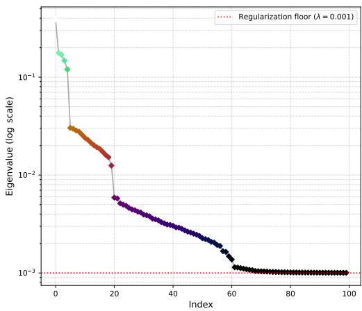

the material derivative of the minimum eigenvalue of the (1, 1) Hessian obeys

$$
\frac { d } { d t } \mu ( t ) \geq \mu ( t ) ^ { 2 } + \| N ( X , \cdot ) \| _ { h } ^ { 2 } + \kappa v ( t ) - X ^ { i } X ^ { \overline { { j } } } \nabla _ { i \overline { { j } } } ( \| \nabla \mathcal { L } \| ^ { 2 } ) ;\tag{5.15}
$$

Figure 5: We plot the top 100 eigenvalues corresponding to a regularized metric with the loss of 4.23 in a real scenario, which means that the metric takes the form $\tilde { h } _ { i \overline { { { j } } } } =$ $h _ { i \overline { { { j } } } } + \lambda \delta _ { i \overline { { { j } } } }$

and the trajectory satisfies the upper bound

$$
V ( t ) \leq V ( 0 ) \exp \left( 2 \int _ { 0 } ^ { t } H ( s ) d s + c _ { K } \sqrt { t \left( \Delta \mathbb { E } [ \Delta _ { \overline { { \partial } } } \mathcal { L } ] _ { t } - \int _ { 0 } ^ { t } \mathcal { G } ( s ) d s \right) } \right) ,\tag{5.16}
$$

where $c _ { K } = 2 \sqrt { 2 / K } , \Delta \mathbb { E } [ \Delta _ { \overline { { \partial } } } \mathcal { L } ] _ { t }$ t denotes the net change in the expected Laplacian from time 0 to $t ,$ and $\begin{array} { r } { \mathcal { G } ( s ) = \kappa ( s ) V ( s ) - \frac { 1 } { 2 } \mathbb { E } \left\lceil \frac { \Delta _ { \overline { { \partial } } } \rho _ { s } } { \rho _ { s } } v ( s ) \right\rceil } \end{array}$

Lemma 11 (integrated gradient flux). Let $( M , \omega )$ be Kähler. Denote $\mathcal { W } ( \epsilon )$ the quantity as in 11.72. Then $\mathcal { W } ( \epsilon )$ obeys with some shorthand

$$
\begin{array} { r } { \mathcal { W } ( \epsilon ) = \mathcal { O } \left( \Delta _ { 0 } \mathcal { L } \epsilon ^ { 2 K + 1 } + \left[ \left. \operatorname { R i c } , \mathcal { H } _ { \mathcal { L } } \right. - R \Delta _ { 0 } \mathcal { L } \right] \epsilon ^ { 2 K + 3 } + \epsilon ^ { 2 K + 5 } \right) . } \end{array}\tag{5.17}
$$

When $( M , \omega )$ is Calabi-Yau, then the second term vanishes. Moreover, $\mathcal { W } ( \epsilon ) > \mathcal { W } _ { C Y } ( \epsilon )$ when the manifold is negatively-curved, where $\mathcal { W } _ { C Y } ( \epsilon )$ corresponds to W in the Calabi-Yau case, meaning the nonzero curvature case has greater escape at initialization than that of vanishing curvature.

Remark. In $\mathcal { W } ( \epsilon )$ , we are interested in the quantity of the flux across radii $\begin{array} { r } { \int _ { 0 } ^ { \epsilon } \left( \oint _ { \partial B _ { r } ( \theta _ { 0 } ) } d ^ { c } \mathcal { L } \wedge \omega ^ { K - 1 } \right) d r } \end{array}$ as described in Appendix 11.3. This formulation has connections to the flux under the Riemannian divergence theorem

$$
\oint _ { \partial B _ { r } } \langle \overline { { { \nabla } } } \mathcal { L } , n \rangle _ { h } d A = \int _ { B _ { r } } \overline { { { \mathrm { d i v } } } } ( \overline { { { \nabla } } } \mathcal { L } ) \frac { \omega ^ { K } } { K ! } = \int _ { B _ { r } } \left( \Delta _ { \overline { { { \partial } } } } \mathcal { L } \right) \frac { \omega ^ { K } } { K ! } .\tag{5.18}
$$

The above says that the gradient of the flux across the boundary is governed by the Dolbeault Laplacian.

Lemma 12 (variance of the parameter). Let $U \subseteq M$ be an open subset. Let ${ \mathcal { L } } ( \theta ) : U \to$ R be a smooth loss (not necessarily quadratic) with a local minimum at the critical point $\theta ^ { * }$ . Assume a stochastic natural gradient descent update on the parameter with learning rate $\eta > 0$ over U. Furthermore, assume the system reaches a steady-state probability measure (via Fokker-Planck; steady with respect to the gradient descent) given by

$$
\rho _ { \infty } ( \theta ) = \frac { 1 } { \mathcal { Z } } e ^ { - \frac { 2 } { \eta } \mathcal { L } ( \theta ) } ,\tag{5.19}
$$

where $\mathcal { Z }$ is the normalization constant over the volume form $\frac { \omega ^ { K } } { K ! }$ . Then, the asymptotic variance $V _ { \infty } = \mathbb { E } \left[ \lVert { \boldsymbol { \theta } } - { \boldsymbol { \theta } } ^ { * } \rVert _ { h } ^ { 2 } \right]$ in a local neighborhood of the critical point $\theta ^ { * }$ is given by

$$
V _ { \infty } = \frac { \eta } { 2 } \mathrm { T r } _ { h } \left( \left[ \nabla _ { \omega } ^ { 1 , 1 } \mathcal { L } + \frac { \eta } { 2 } \mathrm { R i c } - \overline { { \nabla _ { \omega } ^ { 2 , 0 } } } \mathcal { L } \left( \overline { { \nabla _ { \omega } ^ { 1 , 1 } } } \mathcal { L } + \frac { \eta } { 2 } \overline { { \mathrm { R i c } } } \right) ^ { - 1 } \nabla _ { \omega } ^ { 2 , 0 } \mathcal { L } \right] ^ { - 1 } \right) \Bigg \vert _ { \theta ^ { * } } + \mathcal { O } ( \eta ^ { 2 } ) .\tag{5.20}
$$

Remark. We can note the linear algebra fact

$$
\{ A + B - { \overline { { C } } } ( { \overline { { A } } } + { \overline { { B } } } ) ^ { - 1 } C \succeq A - { \overline { { C A } } } ^ { - 1 } C\tag{5.21}
$$

In this theorem, from the interior tensor in 12.13, we have positive Ricci curvature acts a restoring force to help the optimization with lower variance. Global positivity on the Ricci curvature is nontrivially restrictive. Instead, we can formulate this condition via a "weak restoring force" by evaluating the positivity of the holomorphic tangent bundle. We say the landscape provides a suficient restoring force at $\theta \in M$ if Popovici (2026)

$$
\left\{ ( i \Theta _ { h } ( T ^ { 1 , 0 } M ) \wedge \omega ^ { q - 1 } \wedge \Omega ) u , u \right\} _ { h } \geq 0 ,\tag{5.22}
$$

for $u \in T ^ { 1 , 0 } M _ { \theta }$ , integer $1 \leq q \leq K$ , and a nowhere-vanishing form $\Omega \in \Lambda ^ { K - q , K - q } T _ { \theta } ^ { * } M$ with $\Omega > 0$ (metrically weakly). Here, $i \Theta _ { h } ( T ^ { 1 , 0 } M )$ , an End(T1,0M)-valued (1, 1)-form, represents the Chern curvature form of the tangent bundle. Because the Ricci form is the trace of this Chern curvature, an ω-q-semipositive parameter landscape guarantees that the metric geometry prevents high variance in 12.13 in high negative curvature regimes, even if the manifold is locally Calabi-Yau or exhibits minor eigenvalue collapse. In particular, the landscape is allowed to have areas and directions of bad curvature that adversely afect 12.13, but the net efective curvature, when weighted against the specific metric structure of Ω in the relevant dimensions $q ,$ remains non-negative. This discussion ties into Lemma 14.

Lemma 13 (minimum eigenvalues of the Witten Laplacian). Let $U \subseteq M$ be an open subset of a Kähler manifold and $K \subseteq U$ a compact subset. Consider the deformed Laplacian $\Delta _ { \eta } = \overline { { { \partial } } } _ { \eta } \overline { { { \partial } } } _ { \eta } ^ { \dagger } + \overline { { { \partial } } } _ { \eta } ^ { \dagger } \overline { { { \partial } } } _ { \eta } ,$ where $\begin{array} { r } { \overline { { \partial } } _ { \eta } = \overline { { \partial } } + \frac { 1 } { \eta } \overline { { \partial } } \mathcal { L } \wedge } \end{array}$ . Assume the Ricci curvature is bounded above such that $\mathrm { R i c } ( \nabla \mathcal { L } , \overline { { \nabla } } \mathcal { L } ) \leq - \kappa \| \nabla \mathcal { L } \| _ { h } ^ { 2 }$ for some constant $\kappa > 0$ . Define $\begin{array} { r } { \beta _ { 1 , 1 } = \operatorname* { s u p } _ { \theta \in U } \| \nabla _ { \omega } ^ { 1 , 1 } \mathcal { L } \| _ { 2 } , M _ { \eta } \leq \frac { C _ { 0 } } { \eta \mathrm { T r } \big ( g \cdot \mathrm { H e s s } \mathcal { L } ( \theta _ { 0 } ) \big ) } } \end{array}$ , where g is the realification of $h ,$ and $C _ { 0 }$ is some constant. Denote $\theta _ { 0 }$ a unique minimum of U. Then, the minimal eigenvalue $\lambda _ { 1 }$ of $\Delta _ { \eta }$ is bounded by

$$
\lambda _ { 1 } \leq \frac { ( 2 + K ) \beta _ { 1 , 1 } } { \eta } - \kappa + M _ { \eta } .\tag{5.23}
$$

Remark. The above dividies by η and picks up a factor of K due to a trace, which are not ideal. Moreover, it is possible to redo the proof of Lemma 13 requiring a division on a gradient term, but this definitely diverges with an extrema in the set of interest. We find the above to be a better result. The purpose of the lemma is that an upper bound dictates the maximum possible size of a spectral gap. By showing this bound, we establish a decay rate. It establishes a "speed limit" on convergence, which proves the existence of a bottleneck, since the larger the smallest eigenvalue, the faster the convergence. A wide spectral gap, or large $\lambda _ { 1 }$ , means the landscape is steep and desirable, or a small gap means the landscape is adverse. As we can also see, the more negative the Ricci curvature, the smaller the gap. Therefore, negative curvature adversely afects the spectral gap.

Remark. The choice of the Witten Laplacian is meaningful because it incorporates the loss L itself into the geometric object. The Witten Laplacian Michel (2019) was first interested by Witten Witten (1982) to study Morse inequalities, but it applies to our context here too. We examine the minimum eigenvalue of the Witten Laplacian. Our Witten Laplacian is $\Delta _ { \eta } = \overline { { { \partial } } } _ { \eta } \overline { { { \partial } } } _ { \eta } ^ { \dagger } + \overline { { { \partial } } } _ { \eta } ^ { \dagger } \overline { { { \partial } } } _ { \eta } ,$ , where $\begin{array} { r } { \overline { { \partial } } _ { \eta } = \overline { { \partial } } + \frac { 1 } { \eta } \overline { { \partial } } \mathcal { L } \wedge } \end{array}$ . The eigenvalues of this operator determine a rate of convergence. To understand this, we must turn to the kernel of the diferential operator, since a steady state corresponds to both an optimal state and the kernel of the operator.

Lemma 14 (divergence and difusion bounds with semi-nice curvature). Let M be a Kähler manifold of complex dimension $K$ with Kähler form ω. Let $\mathcal { L }$ be with the natural gradient descent vector field given by $V = - \nabla _ { h } ^ { 1 , 0 } \mathcal { L } _ { \ }$ , and let $\Theta = \operatorname { d i v } _ { h } ( V )$ denote its divergence. Suppose M satisfies the ω − q-semi-positivity hypothesis with respect to a positive form Ω such that

$$
\left\{ ( i \Theta _ { h } ( T ^ { 1 , 0 } M ) \wedge \omega ^ { q - 1 } \wedge \Omega ) V , V \right\} _ { h } \geq 0 .\tag{5.24}
$$

Then, the material derivative of the divergence, bounded by difusion and expansion, satisfy the inequalities

$$
- \mathcal { O } \left( \frac { 1 } { m } \right) + \kappa _ { \mathrm { m a x } } \dot { \mathcal { V } } \leq \dot { \Theta } + \frac { 1 } { 2 } \Delta _ { h } \dot { \mathcal { V } } \leq - \| \nabla _ { \omega } ^ { 1 , 1 } \mathcal { L } \| _ { h } ^ { 2 } - \| \nabla _ { \omega } ^ { 2 , 0 } \mathcal { L } \| _ { h } ^ { 2 } + \frac { K } { M _ { q , \Omega } } \mathcal { P } _ { q , \Omega } ( V ) ,\tag{5.25}
$$

where $\dot { \mathcal { V } } = - \| V \| _ { h } ^ { 2 } , M _ { q , \Omega } = \star ( \omega ^ { q } \wedge \Omega ) , \mathcal { P } _ { q , \Omega } ( V ) = \star ( \Theta _ { V , \mathrm { p r i m } } \wedge \omega ^ { q - 1 } \wedge \Omega )$ is the primitive curvature term. Furthermore, as $K  \infty ,$ this upper bound diverges to +∞ since the primitive curvature term scales linearly in K, Ω(1). Consequently, in high-dimensional spaces, the parameter flow has potential to "disperse," as the guarantee of convergence is lost.

## 6 Conclusions

We studied information cross-entropy manifolds in a complex geometric lens for optimization. We focused on results based in Banerjee et al. (2023) and adapted and significantly changed these results for arguments of a greater geometric flavor, which use a deep learning theory base via the result of 9. We have expanded upon these results and considered diverse setups, namely through a dynamic Kähler Polyak-Łojasiewicz condition. We discussed failure modes of Calabi-Yau manifolds and modes pertaining to small and Ricci negative curvature in general. These results are notable because standard literature results are for sectional curvature Criscitiello and Boumal (2022), not Ricci curvature, at least in a deep learning context: we remark Ricci curvature involvement in optimization exists in literature in general Lott and Villani (2009). One limitation of our methods is that in practice it is nontrivial to compute our geometric structures such as local neighborhoods of the Kähler manifold corresponding to the cross-entropy metric of 4.1. Moreover, in order to perform natural gradient descent, the metric must be computed, but the expectations can be approximated so this is more of an inconvenience and not a limitation. In general, natural gradient descent is standard Shrestha (2023). Our work is mostly theoretical, yet confirmable with some experiments, as we saw in Figures 2, 3, 4, 5, 6, 7, 8, 9, 10, 11.

## References

Rayyan Abdalla. Complex-valued neural networks – theory and analysis, 2023. URL https://arxiv. org/abs/2312.06087.

Kyle Aitken and Guy Gur-Ari. On the asymptotics of wide networks with polynomial activations, 2020. URL https://arxiv.org/abs/2006.06687.

Stephanie Alexander, Vitali Kapovitch, and Anton Petrunin. Alexandrov geometry: foundations, 2023. URL https://arxiv.org/abs/1903.08539.

Shun-ichi Amari. Natural gradient works eficiently in learning. Neural Computation, 10(2):251–276, 02 1998. ISSN 0899-7667. doi: 10.1162/089976698300017746. URL https://doi.org/10.1162/ 089976698300017746.

Luigi Ambrosio, Nicola Gigli, and Giuseppe Savaré. Bakry–Émery curvature-dimension condition and riemannian ricci curvature bounds. The Annals of Probability, 43(1), February 2015. ISSN 0091-1798. doi: 10.1214/14-aop907. URL http://dx.doi.org/10.1214/14-AOP907.

Anders Andreassen and Ethan Dyer. Asymptotics of wide convolutional neural networks, 2020. URL https://arxiv.org/abs/2008.08675.

Cristian Anghel. Aksz descent on manifolds with ordinary corners, 2026. URL https://arxiv.org/abs/ 2608.02928.

Tammam Bakeer. Local information operators for spatial identifiability in distributed-parameter inverse problems in computational mechanics, 2026. URL https://arxiv.org/abs/2605.28601.

Arindam Banerjee, Pedro Cisneros-Velarde, Libin Zhu, and Misha Belkin. Restricted strong convexity of deep learning models with smooth activations. In The Eleventh International Conference on Learning Representations, 2023. URL https://openreview.net/forum?id=PINRbk7h01.

Daniel Bennequin, Olivier Peltre, Grégoire Sergeant-Perthuis, and Juan Pablo Vigneaux. Extra-fine sheaves and interaction decompositions, 2020. URL https://arxiv.org/abs/2009.12646.

Semih Cayci. A riemannian optimization perspective of the gauss-newton method for feedforward neural networks, 2025. URL https://arxiv.org/abs/2412.14031.

Nicola Muca Cirone, Jad Hamdan, and Cristopher Salvi. Genus expansion for non-linear random matrix ensembles with applications to neural networks, 2025. URL https://arxiv.org/abs/2407.08459.

Pedro Cisneros-Velarde, Zhijie Chen, Sanmi Koyejo, and Arindam Banerjee. Optimization and generalization guarantees for weight normalization. Transactions on Machine Learning Research, 2025. ISSN 2835-8856. URL https://openreview.net/forum?id=gpHOtQQPJG.

Christopher Criscitiello and Nicolas Boumal. Negative curvature obstructs acceleration for strongly geodesically convex optimization, even with exact first-order oracles. In Po-Ling Loh and Maxim Raginsky, editors, Proceedings of Thirty Fifth Conference on Learning Theory, volume 178 of Proceedings of Machine Learning Research, pages 496–542. PMLR, 02–05 Jul 2022. URL https://proceedings. mlr.press/v178/criscitiello22a.html.

Christopher Criscitiello and Nicolas Boumal. Curvature and complexity: Better lower bounds for geodesically convex optimization. In Gergely Neu and Lorenzo Rosasco, editors, Proceedings of Thirty Sixth Conference on Learning Theory, volume 195 of Proceedings of Machine Learning Research, pages 2969–3013. PMLR, 12–15 Jul 2023. URL https://proceedings.mlr.press/v195/criscitiello23a. html.

Hadi Daneshmand, Jason D. Lee, and Chi Jin. Eficient displacement convex optimization with particle gradient descent, 2023. URL https://arxiv.org/abs/2302.04753.

Grifiths P. Deligne P. and J. Morgan. Real homotopy theory of kähler manifolds. Inventiones mathematicae, 29:245–274, 1975. URL http://eudml.org/doc/142341.

Lorenzo Dello Schiavo, Jan Maas, and Francesco Pedrotti. Local conditions for global convergence of gradient flows and proximal point sequences in metric spaces. Transactions of the American Mathematical Society, April 2024. ISSN 1088-6850. doi: 10.1090/tran/9156. URL http://dx.doi. org/10.1090/tran/9156.

Jean-Pierre Demailly. Complex analytic and diferential geometry. Manuscript, Université de Grenoble, 2012. URL https://people.math.harvard.edu/\~demarco/Math274/Demailly\_ ComplexAnalyticDiffGeom.pdf.

Hang-Cheng Dong and Pengcheng Cheng. Quotient geometry, efective curvature, and implicit bias in simple shallow neural networks, 2026. URL https://arxiv.org/abs/2603.21502.

Simon Dufort-Labbé, Mehrab Hamidi, Razvan Pascanu, Ioannis Mitliagkas, Damien Scieur, and Aristide Baratin. Navigating potholes with geometry-aware sharpness minimization, 2026. URL https: //arxiv.org/abs/2605.16134.

Ethan Dyer and Guy Gur-Ari. Asymptotics of wide networks from feynman diagrams, 2019. URL https://arxiv.org/abs/1909.11304.

Matthias J Ehrhardt, Erlend S Riis, Torbjørn Ringholm, and Carola-Bibiane Schönlieb. A geometric integration approach to smooth optimization: foundations of the discrete gradient method. IMA Journal of Numerical Analysis, 45(3):1269–1299, 2024. ISSN 1464-3642. doi: 10.1093/imanum/drae037. URL http://dx.doi.org/10.1093/imanum/drae037.

Jiaxuan Fang, Zhiyao Xiong, and Xiaokui Yang. Laplacian comparison theorems on complete kähler manifolds and applications, 2025. URL https://arxiv.org/abs/2510.01548.

Tobias Fritz. A synthetic approach to markov kernels, conditional independence and theorems on suficient statistics. Advances in Mathematics, 370:107239, August 2020. ISSN 0001-8708. doi: 10.1016/j.aim.2020.107239. URL http://dx.doi.org/10.1016/j.aim.2020.107239.

Nicola Gigli. Nonsmooth diferential geometry– an approach tailored for spaces with ricci curvature bounded from below. Memoirs of the American Mathematical Society, 251(1196), November 2017. ISSN 0065-9266. doi: 10.1090/memo/1196. URL http://dx.doi.org/10.1090/memo/1196.

Alejandro Gil-García. Torsion parallel pure spinors on neutral manifolds, 2026. URL https://arxiv. org/abs/2607.06358.

Emmanuel Gnandi. Construction of exponential families from statistical manifolds, 2026. URL https: //arxiv.org/abs/2511.23444.

Phillip A. Grifiths and Joe W. Harris. Principles of algebraic geometry. 1978. URL https://api. semanticscholar.org/CorpusID:118963833.

Max Guillen, Philipp Misof, and Jan E. Gerken. Finite-width neural tangent kernels from feynman diagrams, 2026. URL https://arxiv.org/abs/2508.11522.

Boris Hanin. Random fully connected neural networks as perturbatively solvable hierarchies, 2023. URL https://arxiv.org/abs/2204.01058.

Daniel Hauer and José M. Mazón. Kurdyka–Łojasiewicz–simon inequality for gradient flows in metric spaces. Trans. Amer. Math. Soc., 372:4917–4976, 2019. doi: 10.1090/tran/7801. URL https: //doi.org/10.1090/tran/7801.

Marc Herzlich. Refined kato inequalities in riemannian geometry. In Journées Équations aux dérivées partielles, pages 1–11. Journées Équations aux dérivées partielles, 2000. URL https://www.numdam. org/item/10.5802/jedp.570.pdf.

Hamid Hezari, Casey Kelleher, Shoo Seto, and Hang Xu. Asymptotic expansion of the bergman kernel via perturbation of the bargmann–fock model. The Journal of Geometric Analysis, 26(4): 2602–2638, 10 2016. ISSN 1559-002X. doi: 10.1007/s12220-015-9641-3. URL https://doi.org/10. 1007/s12220-015-9641-3.

Jiaoyang Huang and Horng-Tzer Yau. Dynamics of deep neural networks and neural tangent hierarchy, 2019. URL https://arxiv.org/abs/1909.08156.

Shun ichi Amari, Ryo Karakida, and Masafumi Oizumi. Statistical neurodynamics of deep networks: Geometry of signal spaces, 2018. URL https://arxiv.org/abs/1808.07169.

Adel Javanmard, Marco Mondelli, and Andrea Montanari. Analysis of a two-layer neural network via displacement convexity, 2019. URL https://arxiv.org/abs/1901.01375.

Dhruva Karkada. The lazy (ntk) and rich (µp) regimes: a gentle tutorial, 2024. URL https://arxiv. org/abs/2404.19719.

Piyush Kaul and Brejesh Lall. Riemannian curvature of deep neural networks. IEEE Transactions on Neural Networks and Learning Systems, 31:1410–1416, 06 2019. doi: 10.1109/TNNLS.2019.2919705.

Diederik P. Kingma and Jimmy Ba. Adam: A method for stochastic optimization, 2017. URL https: //arxiv.org/abs/1412.6980.

Brodie A. J. Lawson, Kevin Burrage, Kerrie Mengersen, and Rodrigo Weber dos Santos. The fisher geometry and geodesics of the multivariate normals, without diferential geometry, 2023. URL https: //arxiv.org/abs/2306.01278.

Wuchen Li and Guido Montúfar. Ricci curvature for parametric statistics via optimal transport. Information Geometry, 3(1):89–117, 2020. ISSN 2511-249X. doi: 10.1007/s41884-020-00026-2. URL https://doi.org/10.1007/s41884-020-00026-2.

Chaoyue Liu, Libin Zhu, and Mikhail Belkin. On the linearity of large non-linear models: when and why the tangent kernel is constant, 2021a. URL https://arxiv.org/abs/2010.01092.

Chaoyue Liu, Libin Zhu, and Mikhail Belkin. Loss landscapes and optimization in over-parameterized non-linear systems and neural networks, 2021b. URL https://arxiv.org/abs/2003.00307.

John Lott and Cédric Villani. Ricci curvature for metric-measure spaces via optimal transport. Annals of Mathematics, 169(3):903–991, 2009. doi: 10.4007/annals.2009.169.903. URL https://doi.org/10. 4007/annals.2009.169.903.

Flavien Léger and François-Xavier Vialard. A geometric laplace method. Pure and Applied Analysis, 5 (4):1041–1080, December 2023. ISSN 2578-5893. doi: 10.2140/paa.2023.5.1041. URL http://dx.doi. org/10.2140/paa.2023.5.1041.

Jefery D. McNeal and Dror Varolin. L2 estimates for the ∂¯ operator. Bulletin of Mathematical Sciences, 5(2):179–249, 07 2015. ISSN 1664-3615. doi: 10.1007/s13373-015-0068-8. URL https: //doi.org/10.1007/s13373-015-0068-8.

Zijun Meng and Dong Zhang. Combinatorial courant-fischer-weyl minimax principle on cheeger k-constants of weighted forests, 2025. URL https://arxiv.org/abs/2510.06301.

Laurent Michel. About small eigenvalues of the witten laplacian. Pure and Applied Analysis, 1(2):149–204, 2019. doi: 10.2140/paa.2019.1.149. URL https://msp.org/paa/2019/1-2/paa-v1-n2-p01-p.pdf.

Challenger Mishra and Justin Tan. Hermitian yang–mills connections on general vector bundles: geometry and physical yukawa couplings, 2025. URL https://arxiv.org/abs/2512.10907.

Yurii V. Mukhin and Nataliya D. Kundikova. Cauchy-like criterion for diferentiability of functions of several variables, 2021. URL https://arxiv.org/abs/2107.13524.

Michael Murray, Hui Jin, Benjamin Bowman, and Guido Montufar. Characterizing the spectrum of the ntk via a power series expansion, 2023. URL https://arxiv.org/abs/2211.07844.

Yi-Shuai Niu. On the convergence analysis of dca, 2022. URL https://arxiv.org/abs/2211.10942.

Yi-Shuai Niu. Continuous-time dynamics of the diference-of-convex algorithm, 2026. URL https: //arxiv.org/abs/2604.06926.

Alice Petrov. The essence of de rham cohomology, 2024. URL https://arxiv.org/abs/2411.06296.

Ben Poole, Subhaneil Lahiri, Maithra Raghu, Jascha Sohl-Dickstein, and Surya Ganguli. Exponential expressivity in deep neural networks through transient chaos. In D. Lee, M. Sugiyama, U. Luxburg, I. Guyon, and R. Garnett, editors, Advances in Neural Information Processing Systems, volume 29. Curran Associates, Inc., 2016. URL https://proceedings.neurips.cc/paper\_files/paper/2016/ file/148510031349642de5ca0c544f31b2ef-Paper.pdf.

Dan Popovici. m-positive stability of holomorphic vector bundles and moduli spaces, 2026. URL https://arxiv.org/abs/2607.17203.

Erlend S. Riis, Matthias J. Ehrhardt, G. R. W. Quispel, and Carola-Bibiane Schönlieb. A geometric integration approach to nonsmooth, nonconvex optimisation, 2018. URL https://arxiv.org/abs/ 1807.07554.

Torbjørn Ringholm, Jasmina Lazić, and Carola-Bibiane Schönlieb. Variational image regularization with euler’s elastica using a discrete gradient scheme, 2018. URL https://arxiv.org/abs/1712.07386.

Wei-Dong Ruan. Canonical coordinates and bergman metrics. Communications in Analysis and Geometry, 6(3), 1998. URL https://intlpress.com/site/pub/files/\_fulltext/journals/cag/1998/0006/ 0003/CAG-1998-0006-0003-a005.pdf.

Lorenz Schwachhöfer, Nihat Ay, Jürgen Jost, and Hông Vân Lê. Congruent families and invariant tensors, 2017. URL https://arxiv.org/abs/1705.11014.

Ori Shem-Ur and Yaron Oz. Weak correlations as the underlying principle for linearization of gradientbased learning systems, 2024. URL https://arxiv.org/abs/2401.04013.

Rajesh Shrestha. Natural gradient methods: Perspectives, eficient-scalable approximations, and analysis, 2023. URL https://arxiv.org/abs/2303.05473.

Ovidiu Cristinel Stoica. Chiral asymmetry in the weak interaction via cliford algebras, 2020. URL https://arxiv.org/abs/2005.08855.

Ke Sun and Frank Nielsen. A geometric modeling of occam’s razor in deep learning. Information Geometry, 8(S1):233–273, 2025. ISSN 2511-249X. doi: 10.1007/s41884-025-00167-2. URL http: //dx.doi.org/10.1007/s41884-025-00167-2.

Hossein Taheri, Christos Thrampoulidis, and Arya Mazumdar. Sharper guarantees for learning neural network classifiers with gradient methods, 2024. URL https://arxiv.org/abs/2410.10024.

Luen-Fai Tam and Chengjie Yu. Some comparison theorems for kähler manifolds. Manuscripta Mathematica, 137(3):483–495, 03 2012. ISSN 1432-1785. doi: 10.1007/s00229-011-0477-2. URL https://doi.org/10.1007/s00229-011-0477-2.

Chiheb Trabelsi, Olexa Bilaniuk, Ying Zhang, Dmitriy Serdyuk, Sandeep Subramanian, João Felipe Santos, Soroush Mehri, Negar Rostamzadeh, Yoshua Bengio, and Christopher J Pal. Deep complex networks, 2018. URL https://arxiv.org/abs/1705.09792.

Eliot Tron, Rita Fioresi, Nicolas Couëllan, and Stéphane Puechmorel. Cartan moving frames and the data manifolds. Information Geometry, 7(S2):883–912, November 2024. ISSN 2511-249X. doi: 10.1007/s41884-024-00159-8. URL http://dx.doi.org/10.1007/s41884-024-00159-8.

Zuoqin Wang. Lecture 20: The index form. Lecture notes for Riemannian Geometry, University of Science and Technology of China, 2024. URL http://staff.ustc.edu.cn/\~wangzuoq/Courses/ 24S-RiemGeom/Notes/Lec20.pdf.

R. O. Wells. Diferential Analysis on Complex Manifolds. Graduate Texts in Mathematics. Springer New York, 2 edition, 1980. ISBN 978-1-4757-3946-6. doi: 10.1007/978-1-4757-3946-6. URL https: //link.springer.com/book/10.1007/978-1-4757-3946-6.

Edward Witten. Supersymmetry and morse theory. Journal of Diferential Geometry, 17(4):661–692, December 1982. ISSN 0022-040X. doi: 10.4310/jdg/1214437492.

Sho Yaida. Meta-principled family of hyperparameter scaling strategies, 2022. URL https://arxiv. org/abs/2210.04909.

Shing-Tung Yau. Calabi’s conjecture and some new results in algebraic geometry. Proceedings of the National Academy of Sciences, 74(5):1798–1799, 1977. doi: 10.1073/pnas.74.5.1798. URL https: //doi.org/10.1073/pnas.74.5.1798.

Jacob A. Zavatone-Veth, Sheng Yang, Julian A. Rubinfien, and Cengiz Pehlevan. How does training shape the riemannian geometry of neural network representations?, 2025. URL https://arxiv.org/ abs/2301.11375.

Fouad El Zein and Loring W. Tu. From sheaf cohomology to the algebraic de rham theorem, 2014. URL https://arxiv.org/abs/1302.5834.

Jingwei Zhang, Xunpeng Huang, and Jincheng Yu. Mean-field analysis of two-layer neural networks: Global optimality with linear convergence rates, 2022. URL https://arxiv.org/abs/2205.09860.

Libin Zhu, Parthe Pandit, and Mikhail Belkin. A note on linear bottleneck networks and their transition to multilinearity, 2022. URL https://arxiv.org/abs/2206.15058.

William P. Ziemer. Modern Real Analysis. Graduate Texts in Mathematics. Springer International Publishing, Cham, 2 edition, 2017. ISBN 978-3-319-64628-2. doi: 10.1007/978-3-319-64629-9. URL https://link.springer.com/book/10.1007/978-3-319-64629-9.

## 7 Main notations

<table><tr><td>Symbol</td><td>Description</td></tr><tr><td>Φ</td><td>Kähler potential</td></tr><tr><td> $h$ </td><td>Kähler information metric</td></tr><tr><td> $\mathrm { R i c } _ { i \overline { { j } } }$ </td><td>Complex Ricci curvature</td></tr><tr><td>Ω</td><td>Nowhere-vanishing holomorphic form</td></tr><tr><td>∂,∂</td><td>Dolbeault operators</td></tr><tr><td>H</td><td>Dolbeault Hessian (i∂∂f)</td></tr><tr><td>z</td><td>Neural network input</td></tr><tr><td></td><td>Neural network output</td></tr><tr><td> $\frac { \omega ^ { K } } { K ! }$ </td><td>Volume form</td></tr><tr><td>θ</td><td>Complex neural network parameters</td></tr><tr><td> $\mathcal { L }$ </td><td>Loss function</td></tr><tr><td> $m$ </td><td>Network width</td></tr><tr><td> $K$ </td><td>Parameter dimension</td></tr><tr><td> $\Delta _ { \overline { { \partial } } }$ </td><td>Dolbeault Laplacian</td></tr><tr><td> $\Theta _ { h }$ </td><td>Chern curvature form</td></tr><tr><td> $\nabla _ { \omega } ^ { 1 , 1 }$ </td><td>(1, 1)-Hessian</td></tr><tr><td> $\nabla _ { \omega } ^ { 2 , 0 }$ </td><td>(2,0)-Hessian</td></tr><tr><td> $\nabla _ { \omega } ^ { 0 , 2 }$ </td><td>(0, 2)-Hessian</td></tr><tr><td> $\| \cdot \| _ { 2 }$ </td><td>Spectral norm</td></tr><tr><td> $\nabla _ { k }$ </td><td>Covariant derivative with respect to k</td></tr><tr><td>κ</td><td>Determinant of h</td></tr><tr><td> $\lambda$ </td><td>Loss regularization coefficient</td></tr></table>

## 8 Second derivative results

## 8.1 Complex Hessian background

In this section, we discuss our strategies for connecting the types of complex Hessians.

We first note the complexified cotangent bundle splits $T ^ { * } X \otimes \mathbb { C } = T ^ { 1 , 0 * } X \oplus T ^ { 0 , 1 * } X$ , and the second derivative splits

$$
\begin{array} { r } { \nabla _ { \omega } ^ { 2 } f = \nabla _ { \omega } ^ { 2 , 0 } f + \nabla _ { \omega } ^ { 1 , 1 } f + \nabla _ { \omega } ^ { 0 , 2 } f . } \end{array}\tag{8.1}
$$

In local holomorphic coordinates, the holomorphic tangent bundle itself decomposes

$$
T ^ { 1 , 0 } M = \bigoplus _ { i = 1 } ^ { K } \mathbb { C } { \frac { \partial } { \partial z _ { i } } } .\tag{8.2}
$$

We will attempt to bound various versions of the complex Hessian. For example, we will attempt to bound the section of $T ^ { * } X \otimes T ^ { * } X$ in local holomorphic coordinates

$$
\nabla _ { \omega } ^ { 1 , 1 } f = \frac { \partial ^ { 2 } f } { \partial \theta ^ { i } \partial { \overline { { \theta } } } ^ { j } } d \theta ^ { i } \otimes d { \overline { { \theta } } } ^ { j } .\tag{8.3}
$$

This is most closely related to the (1,1)-form

$$
i \partial { \overline { { \partial } } } f = i \sum _ { i j } { \frac { \partial ^ { 2 } f } { \partial \theta ^ { i } \partial { \overline { { \theta } } } ^ { j } } } d \theta ^ { i } \wedge d { \overline { { \theta } } } ^ { j } .\tag{8.4}
$$

The (2,0) part has the closed form

$$
\nabla _ { \omega } ^ { 2 , 0 } f = \sum _ { i j } \frac { \partial ^ { 2 } f } { \partial \theta ^ { i } \partial \theta ^ { j } } d \theta ^ { i } \otimes d \theta ^ { j } ,\tag{8.5}
$$

therefore this requires a diferent bound. One approach could be to bound two terms simultaneously, although we find the approach to bound the terms individually more straightforward in practice. If we take the Kähler metric as $\omega = i h _ { i \overline { { { i } } } } d \theta ^ { i } \wedge d \overline { { { \theta } } } ^ { j }$ , we can take the trace (the dual Lefschetz operator Λ) of the (1, 1)-form $\begin{array} { r } { i \partial { \overline { { \partial } } } f = i \frac { \partial ^ { 2 } f } { \partial z ^ { i } \partial { \overline { { z } } } ^ { j } } d \theta ^ { i } \wedge d \overline { { \theta } } ^ { j } } \end{array}$ , giving

$$
\star \left( i \partial \overline { { { \partial } } } f \wedge \frac { \omega ^ { K - 1 } } { ( K - 1 ) ! } \right) = \Lambda ( i \partial \overline { { { \partial } } } f ) = h ^ { i \overline { { { j } } } } \frac { \partial ^ { 2 } f } { \partial z ^ { i } \partial \overline { { { z } } } ^ { j } } = \Delta _ { \overline { { { \partial } } } } f .\tag{8.6}
$$

which we will use in 8.2.

We can note the decomposition in the bilinear form case is

$$
\frac { 1 } { 2 } \nabla ^ { 2 } L ( v , v ) = \mathrm { R e } ( \nabla _ { \omega } ^ { 2 , 0 } L ( v , v ) ) + \nabla _ { \omega } ^ { 1 , 1 } L ( v , \overline { { v } } ) ,\tag{8.7}
$$

which is the holomorphic part and its conjugate, and the Hermitian part.

## 8.2 Dolbeault Hessian bounds

In this section, we will provide a bound on $i \partial { \overline { { \partial } } } f .$ which is connected to the (1,1) Hessian $\nabla _ { \omega } ^ { 1 , 1 } f$ . We will draw a connection between these two terms, which will help us in the following sections.

Proof of Theorem 2. Let $f ( \theta ; z ) : M \to \mathbb { R }$ , where $\theta \in M$ is a parameter along the Kähler manifold M with Kähler metric ω. Define the deformed form

$$
\omega _ { f } = \omega + i \partial { \overline { { \partial } } } f ,\tag{8.8}
$$

where f is not necessarily SPSH but we have $\omega + i \partial { \overline { { \partial } } } f > 0 .$

The spectral norm of the Hessian in Banerjee et al. (2023) is analogous to the maximum eigenvalue of i∂∂f for us, so we will attempt to bound

$$
\| i \partial { \overline { { \partial } } } f \| _ { 2 } ,\tag{8.9}
$$

where $\| \cdot \| _ { 2 }$ is the spectral norm. Let us define $\Psi : M \to \mathbb { R }$ as the logarithmic volume ratio

$$
\Psi : = \log \left( \frac { ( \omega + i \partial \overline { { \partial } } f ) ^ { K } } { \omega ^ { K } } \right) ,\tag{8.10}
$$

(observe it exists) which immediately implies the complex Monge-Ampère equation

$$
( \omega + i \partial { \overline { { \partial } } } f ) ^ { K } = e ^ { \Psi } \omega ^ { K } .\tag{8.11}
$$

where K is the integer such that $\begin{array} { r } { \Theta \subseteq \mathbb { C } ^ { \sum _ { k } m _ { k } m _ { k + 1 } + m _ { L } } : = \mathbb { C } ^ { K } } \end{array}$ , and we use notation $\textstyle \bigwedge _ { k = 1 } ^ { K } \omega = \omega ^ { K }$

Our proof strategy for the next step will be to apply the Mean Value Theorem and then bound the gradient of Ψ term. It is nontrivial to bound $\| i \partial { \overline { { \partial } } } f \| _ { 2 }$ directly, but instead we will show a relation to a bound $\| \nabla _ { \omega } i \partial \overline { { \partial } } f \| _ { 2 }$ . Let us examine the oscillation, or supremum and infimum diference, and examine the geodesic ball diameter. By the Mean Value Theorem,

$$
\operatorname* { s u p } _ { \mathcal { S } } \Psi - \operatorname* { i n f } _ { \mathcal { S } } \Psi \leq \left( \operatorname* { s u p } _ { \theta \in \mathcal { S } } \| \nabla _ { \omega } \Psi \| _ { \omega } \right) \times \mathrm { d i a m } ( \mathcal { S } ) ,\tag{8.12}
$$

where $s$ is the geodesic ball $S = B _ { \omega } ( \theta _ { 0 } , R ) = \{ \theta \in M | d _ { \omega } ( \theta _ { 0 } , \theta ) \leq R \}$ . R is fixed, so diam(S) is O(1).   
The above norm is the ω-dual norm.

Let us examine

$$
\operatorname* { d e t } ( I + \omega ^ { - 1 } i \partial { \overline { { \partial } } } f ) = e ^ { \Psi } .\tag{8.13}
$$

This is true since $( A \omega ) \wedge ( A \omega ) \wedge \cdots \wedge ( A \omega ) = \operatorname* { d e t } ( A ) ( \omega \wedge \omega \wedge \cdots \wedge \omega )$ , and

$$
( \omega + i \partial { \overline { { \partial } } } f ) ^ { K } = \operatorname* { d e t } ( I + \omega ^ { - 1 } i \partial { \overline { { \partial } } } f ) \omega ^ { K } .\tag{8.14}
$$

In particular, via eigenvalues

$$
\omega = i \sum _ { j = 1 } ^ { K } d \theta ^ { j } \wedge d \overline { { { \theta } } } ^ { j } , \quad i \partial \overline { { { \partial } } } f = i \sum _ { j = 1 } ^ { K } \lambda _ { j } d \theta ^ { j } \wedge d \overline { { { \theta } } } ^ { j } .\tag{8.15}
$$

The volume element obeys

$$
\omega ^ { K } = K ! i ^ { K } d \theta ^ { 1 } \wedge d \overline { { { \theta } } } ^ { 1 } \wedge \cdot \cdot \cdot \wedge d \theta ^ { K } \wedge d \overline { { { \theta } } } ^ { K } ,\tag{8.16}
$$

so the deformed metric follows

$$
\omega + i \partial { \overline { { { \partial } } } } f = i \sum _ { j = 1 } ^ { K } ( 1 + \lambda _ { j } ) d \theta ^ { j } \wedge d \overline { { { \theta } } } ^ { j } .\tag{8.17}
$$

Therefore, taking the K-th wedge power, the combinatorial rules follow and

$$
( \omega + i \partial \overline { { { \partial } } } f ) ^ { K } = K ! \left( \prod _ { j = 1 } ^ { K } ( 1 + \lambda _ { j } ) \right) i ^ { K } d \theta ^ { 1 } \wedge d \overline { { { \theta } } } ^ { 1 } \wedge \cdots \wedge d \theta ^ { K } \wedge d \overline { { { \theta } } } ^ { K } .\tag{8.18}
$$

By definition, the product of eigenvalues is the determinant, so we can match the above product term to the determinant and

$$
( \omega + i \partial { \overline { { \partial } } } f ) ^ { K } = \operatorname* { d e t } ( I + \omega ^ { - 1 } i \partial { \overline { { \partial } } } f ) \omega ^ { K } .\tag{8.19}
$$

Since Ψ is the ratio, we get

$$
e ^ { \Psi } = \operatorname * { d e t } ( I + \omega ^ { - 1 } i \partial \overline { { { \partial } } } f ) \Longrightarrow \Psi = \log \operatorname * { d e t } ( I + \omega ^ { - 1 } i \partial \overline { { { \partial } } } f ) .\tag{8.20}
$$

Now,

$$
\nabla _ { k } \Psi = \nabla _ { k } \log \operatorname* { d e t } ( I + \omega ^ { - 1 } i \partial \overline { { \partial } } f ) = \frac { 1 } { \operatorname* { d e t } ( I + \omega ^ { - 1 } i \partial \overline { { \partial } } f ) } \nabla _ { k } \operatorname* { d e t } ( I + \omega ^ { - 1 } i \partial \overline { { \partial } } f ) .\tag{8.21}
$$

Using Jacobi’s formula,

$$
\nabla _ { k } \operatorname* { d e t } ( I + \omega ^ { - 1 } i \partial \overline { { \partial } } f ) = \operatorname* { d e t } ( I + \omega ^ { - 1 } i \partial \overline { { \partial } } f ) \mathrm { T r } \Big ( ( I + \omega ^ { - 1 } i \partial \overline { { \partial } } f ) ^ { - 1 } \nabla _ { k } ( I + \omega ^ { - 1 } i \partial \overline { { \partial } } f ) \Big ) .\tag{8.22}
$$

Therefore,

$$
\nabla _ { k } \Psi = \frac { \operatorname * { d e t } ( I + \omega ^ { - 1 } i \partial \overline { { \partial } } f ) } { \operatorname * { d e t } ( T + \omega ^ { - 1 } i \partial \overline { { \partial } } f ) } \mathrm { T r } ( ( I + \omega ^ { - 1 } i \partial \overline { { \partial } } f ) ^ { - 1 } \omega ^ { - 1 } \nabla _ { k } ( i \partial \overline { { \partial } } f ) ) .\tag{8.23}
$$

We have set $A = I + \omega ^ { - 1 } i \partial { \overline { { \partial } } } f$ . The trace is not necessarily $\mathcal O ( K )$ , it is instead a sum upon $K$ terms.   
Therefore, with suitable geometric assumptions such as decay, the factor of K can be prevented.

Now, let us assume bounded curvature $\| i \partial \overline { { \partial } } f ( \theta _ { 0 } ) \| _ { 2 } \leq C , \| \nabla _ { k } i \partial \overline { { \partial } } f ( \theta _ { 0 } ) \| _ { 2 } \leq C _ { M }$ independent of parameter dimension K. We note nuclear norm $\lVert M \rVert _ { 1 } \leq \lVert M \rVert _ { 2 }$ with the absence of K. K is a worst-case bound, and is omitted due to spectral decay. We get

$$
\begin{array} { r } { | \nabla _ { k } \Psi | \leq \| A ^ { - 1 } \omega ^ { - 1 } \| _ { 2 } \| \nabla _ { k } ( i \partial \overline { { \partial } } f ) \| _ { 1 } \leq \| A ^ { - 1 } \| _ { 2 } \| h _ { \mathrm { c r o s s - e n t r o p y } } ^ { - 1 } \| _ { 2 } \| \nabla _ { k } ( i \partial \overline { { \partial } } f ) \| _ { 2 } . } \end{array}\tag{8.24}
$$

Note that $\| h _ { \mathrm { c r o s s - e n t r o p y } } ^ { - 1 } \| _ { 2 } = \| A ^ { - 1 } \| _ { 2 } = \mathcal { O } ( 1 )$ . Therefore, evaluating the ω-dual norm

$$
\| \nabla _ { \omega } \Psi \| _ { \omega } ^ { 2 } = h ^ { i \bar { j } } \nabla _ { i } \Psi \nabla _ { \bar { j } } \Psi \leq \| h _ { \mathrm { c r o s s - e n t r o p y } } ^ { - 1 } \| _ { 2 } \sum _ { k = 1 } ^ { K } | \nabla _ { k } \Psi | ^ { 2 } \leq \widetilde C \| \nabla _ { \omega } ( i \partial \overline { { \partial } } f ) \| _ { 2 } ^ { 2 } .\tag{8.25}
$$

Now, our result in 8.3 is similar to the recursion rules as in Yaida (2022) Guillen et al. (2026). Hence, we use

$$
\operatorname* { s u p } _ { \| v \| _ { 2 } = 1 } \| \nabla _ { v } ( i \partial \overline { { \partial } } f ) \| _ { 2 } \leq \| \partial ^ { 3 } f \| _ { 2 } + C _ { 2 } \| i \partial \overline { { \partial } } f \| _ { 2 } \operatorname* { s u p } _ { \theta \in S } \| i \partial \overline { { \partial } } f \| _ { 2 } .\tag{8.26}
$$

Substituting the recursive bound of Lemma 2,

$$
\| \nabla _ { \omega } \Psi \| _ { \omega } \leq \widetilde { C } \left( \| \partial ^ { 3 } f \| _ { 2 } + C \operatorname* { s u p } _ { \theta \in S } \| i \partial \overline { { \partial } } f \| _ { 2 } ^ { 2 } \right) .\tag{8.27}
$$

Returning to the Mean Value Theorem setup,

$$
\operatorname* { s u p } _ { S } \Psi - \operatorname* { i n f } _ { S } \Psi \leq \widetilde { C } \left( \operatorname* { s u p } _ { \theta \in S } ( \| \partial ^ { 3 } f \| _ { 2 } + C \| i \partial \overline { { \partial } } f \| _ { 2 } ^ { 2 } ) \right) \dim _ { \omega } ( S ) .\tag{8.28}
$$

Yau’s maximum principle ensures the spectral norm of the complex Hessian is bounded by the oscillation

$$
\operatorname* { s u p } _ { \theta \in S } \| i \partial \overline { { \partial } } f \| _ { 2 } \leq \frac { C _ { 0 } } { \sqrt { m } } \exp \left( \operatorname* { s u p } _ { S } \Psi - \operatorname* { i n f } _ { S } \Psi \right) .\tag{8.29}
$$

$\mathrm { B y }$ the Yau estimate in 8.4, we obtain a transcendental inequality

$$
\operatorname* { s u p } _ { \theta \in S } \| i \partial \overline { { \partial } } f \| _ { 2 } \leq \frac { \widetilde { C } } { \sqrt { m } } \exp \left( D \operatorname* { s u p } _ { \theta \in S } ( \| \partial ^ { 3 } f \| _ { 2 } + C \| i \partial \overline { { \partial } } f \| _ { 2 } ^ { 2 } ) \right) .\tag{8.30}
$$

Under a Taylor expansion,

$$
\operatorname* { s u p } _ { \theta \in S } \| i \partial \overline { { \partial } } f \| _ { 2 } \leq \frac { \widetilde { C } } { \sqrt { m } } \left\{ 1 + \sum _ { j = 1 } ^ { \infty } \frac { 1 } { j ! } \left( D \operatorname* { s u p } _ { \theta \in S } ( \| \partial ^ { 3 } f \| _ { 2 } + C \| i \partial \overline { { \partial } } f \| _ { 2 } ^ { 2 } ) \right) ^ { j } \right\}\tag{8.31}
$$

Under assumption $\| \partial ^ { 3 } f \| _ { 2 } , \| i \partial { \overline { { \partial } } } f \| _ { 2 } ^ { 2 }$ are $\mathcal { O } ( m ^ { - \alpha } ) , \alpha \geq 0$ , we have

$$
\operatorname* { s u p } _ { \theta \in \mathcal { S } } \| i \partial \overline { { \partial } } f \| _ { 2 } \leq \frac { \widetilde { C } } { \sqrt { m } } \left( 1 + \mathcal { O } ( ( g ( m ) ) _ { \mathrm { d e g r e e } ( g ) \leq 0 } ) + \mathcal { O } ( ( g ( m ) ) _ { \mathrm { d e g r e e } ( g ) \leq 0 } ) \right) = \mathcal { O } ( \frac { 1 } { \sqrt { m } } ) .\tag{8.32}
$$

We remark this argument is an a priori estimate since we only need $\mathcal { O } ( 1 )$ in the above, which is reasonable and less restrictive than our result. We refer to the end of Appendix 8.3 for references that the above is reasonable.

□

## 8.3 Dolbeault covariant bound

Proof of Lemma 1. We apply the covariant derivative to the Hessian compatible with the Kähler metric. Because the manifold is Kähler, the connection is holomorphic so the mixed symbols such as ${ \Gamma _ { k \overline { { i } } } } ^ { l }$ vanish. The Levi-Civita connection on the Hessian yields a (0,3) tensor

$$
\nabla _ { k } \partial _ { i } \partial _ { \bar { j } } f = \partial _ { k } \partial _ { i } \partial _ { \bar { j } } f - \Gamma _ { k i } { } ^ { l } \partial _ { l } \partial _ { \bar { j } } f\tag{8.33}
$$

and

$$
\nabla _ { \overline { { { k } } } } \partial _ { i } \partial _ { \overline { { { j } } } } f = \partial _ { \overline { { { k } } } } \partial _ { i } \partial _ { \overline { { { j } } } } f - \overline { { { \Gamma _ { k j } } ^ { l } } } \partial _ { i } \partial _ { \overline { { { l } } } } f .\tag{8.34}
$$

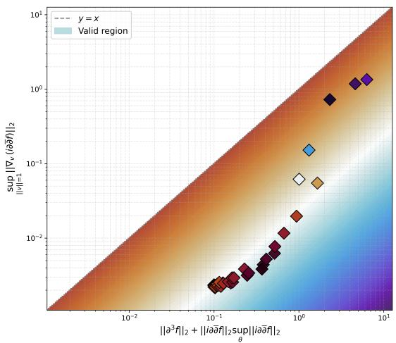  
Figure 6: We illustrate that Lemma 1 holds, where the shaded region represents a valid upper bound, the background color representing the bound gap. Here, we choose constant $C = 1$ . The x-axis is the right-hand side of 5.2 and the y-axis the left-hand side.

By the triangle inequality on the operator norm, and denoting ${ \mathcal { H } } _ { i { \overline { { j } } } } = \partial _ { i } \partial _ { \overline { { j } } } f ,$

$$
\begin{array} { r } { \| \nabla _ { \omega } \mathcal { H } \| _ { 2 } \leq \| \partial ^ { 3 } f \| _ { 2 } + \| \Gamma \cdot \mathcal { H } \| _ { 2 } . } \end{array}\tag{8.35}
$$

We can note the Christofel symbols are governed by ${ \Gamma _ { k i } } ^ { l } = h ^ { l m } \partial _ { k } h _ { i } \overline { { m } }$ . Our proof strategy will be to show the third derivative term is at least of equivalent order as the covariant derivative term, and the Christofel symbol term is $\scriptstyle { \mathcal { O } } ( { \frac { 1 } { \sqrt { m } } } )$ , therefore we have the recursive relationship.

The probabilistic model p obeys $p ( y | z , \theta ) = \mathcal { C N } ( f ( \theta ; z ) , \sigma ^ { 2 } )$ . We get the log likelihood log $\begin{array} { r } { p = - \frac { 1 } { \sigma ^ { 2 } } | y - } \end{array}$ $\begin{array} { r } { f ( \theta ; z ) | ^ { 2 } + C = - \frac { 1 } { \sigma ^ { 2 } } ( y - f ) ( \overline { { y } } - \overline { { f } } ) + C } \end{array}$ . Denote the loss residua $\epsilon = y - f$ . The derivative of the log likelihood w.r.t. θ is

$$
\partial _ { i } \log p = \frac { 1 } { \sigma ^ { 2 } } \left( \mp \partial _ { i } f + \epsilon \partial _ { i } \overline { { { f } } } \right) .\tag{8.36}
$$

In information geometry, the derivative of the Fisher metric follows the Amari-Chentsov tensor Schwachhöfer et al. (2017) Gnandi (2026), although recall from section 4.1 our metric is more closely a cross-entropy one. Therefore, we can drop this term and we get

$$
\partial _ { k } h _ { i \overline { { { m } } } } = \mathbb { E } _ { q } \left[ \frac { \partial ^ { 2 } \log p } { \partial \theta ^ { k } \partial \theta ^ { i } } \frac { \partial \log p } { \partial \overline { { { \theta } } } ^ { m } } \right] + \mathbb { E } _ { q } \left[ \frac { \partial \log p } { \partial \theta ^ { i } } \frac { \partial ^ { 2 } \log p } { \partial \theta ^ { k } \partial \overline { { { \theta } } } ^ { m } } \right] - \mathbb { E } _ { q } \left[ \partial _ { k } \left( \frac { \partial _ { i } \partial _ { \overline { { m } } } p } { p } \right) \right] .\tag{8.37}
$$

This partially follows from

$$
- \partial _ { i } \partial _ { m } \log p = \partial _ { i } \log p \partial _ { m } \log p - \frac { \partial _ { i } \partial _ { m } p } { p }\tag{8.38}
$$

and diferentiating. Let us examine the first term. Diferentiating log p again,

$$
\partial _ { k i } ^ { 2 } \log p = \frac { 1 } { \sigma ^ { 2 } } \left( - \partial _ { k } \overline { { f } } \partial _ { i } f + \overline { { \epsilon } } \partial _ { k i } ^ { 2 } f - \partial _ { k } f \partial _ { i } \overline { { f } } + \epsilon \partial _ { k i } ^ { 2 } \overline { { f } } \right) .\tag{8.39}
$$

Evaluating the first term of $\partial _ { k } h _ { i \overline { { { m } } } }$

$$
\mathbb { E } _ { q } \left[ \partial _ { k i } ^ { 2 } \log p \partial _ { \overline { { m } } } \log p \right] = \frac { 1 } { \sigma ^ { 4 } } \mathbb { E } _ { q } \left[ \left( \overline { { \epsilon } } \partial _ { k i } ^ { 2 } f + \epsilon \partial _ { k i } ^ { 2 } \overline { { f } } - \partial _ { k } \overline { { f } } \partial _ { i } f - \partial _ { k } f \partial _ { i } \overline { { f } } \right) \left( \overline { { \epsilon } } \partial _ { \overline { { m } } } f + \epsilon \partial _ { \overline { { m } } } \overline { { f } } \right) \right] .\tag{8.40}
$$

By Wick’s theorem, isolated terms in ϵ, ϵ vanish and what remains is $\mathbb { E } _ { q } [ \epsilon \overline { { \epsilon } } ] = \sigma ^ { 2 }$ . The surviving

components are

$$
\mathbb { E } _ { q } \bigg [ \partial _ { k i } ^ { 2 } \log p \partial _ { m } \log p \bigg ] = \frac { 1 } { \sigma ^ { 2 } } \mathbb { E } _ { q } \bigg [ \partial _ { k i } ^ { 2 } f \partial _ { m } \overline { { f } } + \partial _ { k i } ^ { 2 } \overline { { f } } \partial _ { \overline { { m } } } f \bigg ] .\tag{8.41}
$$

A similar argument for the third term of $\partial _ { k } h _ { i \overline { { { m } } } }$ yields

$$
\mathbb { E } _ { q } \bigg [ \partial _ { i } \log p \partial _ { k \overline { { m } } } ^ { 2 } \log p \bigg ] = \frac { 1 } { \sigma ^ { 2 } } \mathbb { E } _ { q } \bigg [ \partial _ { i } f \partial _ { k \overline { { m } } } ^ { 2 } \overline { { f } } + \partial _ { i } \overline { { f } } \partial _ { k \overline { { m } } } ^ { 2 } f \bigg ] .\tag{8.42}
$$

Evaluating the third term,

$$
- \mathbb { E } _ { q } \left[ \partial _ { k } \left( \frac { \partial _ { i } \partial _ { m } p } { p } \right) \right] = \frac { 1 } { \sigma ^ { 2 } } \mathbb { E } _ { q } \left[ \partial _ { k } \overline { { f } } \partial _ { i m } ^ { 2 } f + \partial _ { k } f \partial _ { i \overline { { m } } } ^ { 2 } \overline { { f } } \right] .\tag{8.43}
$$

Consolidating the terms, we scale by K to align with the normalized metric $h = K \widetilde { h }$ from 8.2, or $\begin{array} { r } { h ^ { - 1 } = \frac { 1 } { K } \widetilde { h } ^ { - 1 } } \end{array}$ ，

$$
\partial _ { k } h _ { i \overline { { { m } } } } = \frac { K } { \sigma ^ { 2 } } \mathbb { E } _ { q } \left[ \mathcal { H } _ { k i } \partial _ { \overline { { { m } } } } \overline { { { f } } } + \partial _ { k i } ^ { 2 } \overline { { f } } \partial _ { \overline { { { m } } } } f + \partial _ { i } f \mathcal { H } _ { k \overline { { { m } } } } ^ { \dagger } + \partial _ { i } \overline { { { f } } } \mathcal { H } _ { k \overline { { { m } } } } + \partial _ { k } \overline { { { f } } } \mathcal { H } _ { i \overline { { { m } } } } + \partial _ { k } f \mathcal { H } _ { i \overline { { { m } } } } ^ { \dagger } \right] .\tag{8.44}
$$

Taking the norm, by Jensen’s inequality, and taking the supremum it follows

$$
\| \partial h \| _ { 2 } \leq \frac { K } { \sigma ^ { 2 } } \mathbb { E } _ { q } \left[ 2 \| \partial ^ { 2 , 0 } f \| _ { 2 } \| \partial f \| _ { 2 } + 4 \| \partial f \| _ { 2 } \| \mathcal { H } \| _ { 2 } \right] .\tag{8.45}
$$

By definition, the Dolbeault Hessian norm is exactly $\| \mathcal { H } \| _ { 2 } = \| i \partial \overline { { \partial } } f \| _ { 2 } = \| \partial _ { k \overline { { m } } } ^ { 2 } f \| _ { 2 }$ . We will allow the spectral norm of the (2,0) derivative to be bounded proportionally by the Dolbeault Hessian, meaning there exists a constant $C ^ { \prime } > 0$ such that $\| \partial _ { k i } ^ { 2 } f \| _ { 2 } \leq C ^ { \prime } \| \mathcal { H } \| _ { 2 }$ . Taking the norm and a supremum to account for the expectation,

$$
\| \partial _ { k } h _ { i \overline { { { m } } } } \| _ { 2 } \leq K C \operatorname* { s u p } _ { \theta \in S } \| \mathcal { H } \| _ { 2 } \| \partial f \| _ { 2 } .\tag{8.46}
$$

Recall the Christofel symbols are defined via ${ \Gamma _ { k i } } ^ { l } = h ^ { l m } \partial _ { k } h _ { i \overline { { { m } } } }$ . We can note Christofel symbols are invariant to constant rescalings of the metric, so $( c ^ { - 1 } h ^ { l m } ) \partial _ { k } ( c \cdot h _ { i \overline { { { m } } } } ) = h ^ { l \overline { { { m } } } } \partial _ { k } h _ { i \overline { { { m } } } }$ . The operator norm of the inverse metric is bounded ${ \mathcal { O } } ( K ^ { - 1 } )$ . Therefore,

$$
\operatorname* { s u p } _ { \| \boldsymbol { v } \| _ { 2 } = 1 } \| \Gamma ( \boldsymbol { v } , \cdot ) \| _ { 2 } \leq K \cdot \frac { 1 } { K } \| h ^ { - 1 } \| _ { 2 } \operatorname* { s u p } _ { \theta \in \mathcal { S } } \| \partial _ { k } h _ { i m } \| _ { 2 } \leq C \| h ^ { - 1 } \| _ { 2 } \operatorname* { s u p } _ { \theta \in \mathcal { S } } \| \partial f \| _ { 2 } \| \mathcal { H } \| _ { 2 } .\tag{8.47}
$$

It immediately follows from the neural network definition the Jacobian of $f$ extracts an $\mathcal { O } ( 1 )$ scaling factor, thus we conclude the bound on the Christofel symbols

$$
\operatorname* { s u p } _ { \| v \| _ { 2 } = 1 } \| \Gamma ( v , \cdot ) \| _ { 2 } \leq C _ { 1 } \operatorname* { s u p } _ { \theta \in S } \| \mathcal { H } \| _ { 2 } .\tag{8.48}
$$

Returning to the triangle inequality, we have

$$
\| \Gamma \cdot \mathcal { H } \| _ { 2 } \leq \operatorname* { s u p } _ { \| v \| _ { 2 } = 1 } \| \Gamma ( v , \cdot ) \| _ { 2 } \| \mathcal { H } \| _ { 2 } \leq C _ { 1 } \| \mathcal { H } \| _ { 2 } \operatorname* { s u p } _ { \theta \in S } \| \mathcal { H } \| _ { 2 } .\tag{8.49}
$$

Next, we address the third derivative term $\| \partial ^ { 3 } f \| _ { 2 }$ . It sufices to show $\| \partial ^ { 3 } f \|$ is lower than $\mathcal { O } ( 1 )$ . By Banerjee et al. (2023) we have the real Hessian is $\scriptstyle { \mathcal { O } } ( { \frac { 1 } { \sqrt { m } } } )$ and a neural network will not increase the order to $\mathcal { O } ( \sqrt { m } )$ . This phenomenon is known to be true such as in Aitken and Gur-Ari (2020) Hanin (2023) Dyer and Gur-Ari (2019) Hanin (2023) Guillen et al. (2026) Huang and Yau (2019) Andreassen and Dyer (2020) Cirone et al. (2025).

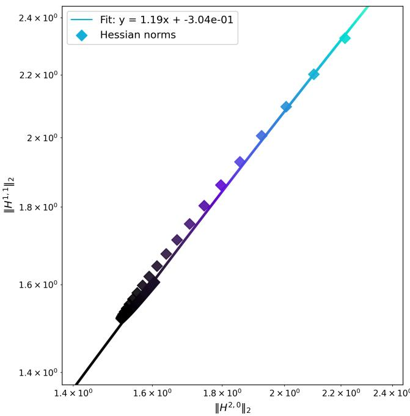  
Figure 7: We illustrate a proportion relationship between the (1,1) and (2,0)-Hessians. We plot $\| \bar { \mathcal { H } } ^ { 1 , 1 } \| _ { 2 } , \| \mathcal { H } ^ { 2 , 0 } \| _ { 2 }$ exactly without the constant. The line is the best fit line. We evaluate at 80 distinct parameter points.

Remark. If we consider the deformed metric $\omega _ { f } = \omega + i \partial { \overline { { \partial } } } f .$ , construct a tensor representing the diference between the Chern connections of the deformed metric and the base metric. We get a diference formula

$$
\Psi _ { i j } ^ { k } = \Psi _ { i j } ^ { k } ( \omega _ { f } , \omega ) : = \Gamma ( \omega _ { f } ) _ { i j } ^ { k } - \Gamma ( \omega ) _ { i j } ^ { k } = ( \omega _ { f } ) ^ { k \bar { l } } \nabla _ { i } ^ { \omega } ( \omega _ { f } ) _ { j \bar { l } } .\tag{8.50}
$$

Because the base metric is covariantly constant with respect to its own connection, we can write

$$
\nabla _ { i } ^ { \omega } ( \omega _ { f } ) _ { j \bar { l } } = \nabla _ { i } ^ { \omega } ( \omega _ { j \bar { l } } + \mathcal { H } _ { j \bar { l } } ) = \nabla _ { i } ^ { \omega } \mathcal { H } _ { j \bar { l } } .\tag{8.51}
$$

Therefore, we can see

$$
\Psi _ { i j } ^ { k } = ( \omega + \mathcal { H } ) ^ { k \bar { l } } \nabla _ { i } ^ { \omega } \mathcal { H } _ { j \bar { l } } .\tag{8.52}
$$

Taking the norm, and using 5.2 from the lemma

$$
\| \Psi \| _ { 2 } \leq \| ( \omega + \mathcal { H } ) ^ { - 1 } \| _ { 2 } \cdot \| \nabla _ { \omega } \mathcal { H } \| _ { 2 }\tag{8.53}
$$

$$
\leq \| ( \omega + \mathcal { H } ) ^ { - 1 } \| _ { 2 } \left( \| \partial ^ { 3 } f \| _ { 2 } + C \| \mathcal { H } \| _ { 2 } \operatorname* { s u p } _ { \theta \in S } \| \mathcal { H } \| _ { 2 } \right) .\tag{8.54}
$$

## 8.4 Spectral $C ^ { 2 }$ estimate

Let us use the fact that the scaling limit of $\mathcal { H } ( \theta _ { 0 } ) = i \partial \overline { { \partial } } f ( \theta _ { 0 } )$ obeys at initialization a pointwise bound Banerjee et al. (2023) Liu et al. (2021b) Taheri et al. (2024) Liu et al. (2021a)

$$
\| { \mathcal { H } } ( \theta _ { 0 } ) \| _ { 2 } \leq { \frac { C _ { \mathrm { i n i t } } } { \sqrt { m } } } .\tag{8.55}
$$

This is a localized fact, and the burden of the proof is shifted to showing that the Monge-Ampère dynamics prevent the Hessian from escaping this scale globally as θ moves across S.

We avoid use of the trace functional since trace is afected by K, thus our final bound would involve $K$ which is undesirable. We need only work with the spectral norm. Therefore, we find a maximum principle applicable for us.

Proof of Lemma 2. Define the test function

$$
v ( \theta , t ) = \log ( \lambda _ { \operatorname* { m a x } } ( \mathcal { H } ( \theta _ { t } ) ) ) - \Psi ( \theta _ { t } ) .\tag{8.56}
$$

We can note $\theta _ { t }$ depends on time since it is along a path, but the manifold does not depend on time. Let $( \theta ^ { * } , t ^ { * } )$ be the point in $S \times [ 0 , T ]$ where the test function attains its global maximum. We want to prove v is highest at $t = 0 .$ We proceed by contradiction. Assume that the maximum occurs after initialization, such that $t ^ { * } > 0$ . At this interior maximum, we must have $\partial _ { t } v ( \theta ^ { * } , t ^ { * } ) \geq 0$ and $\Delta _ { \widetilde { \omega } } v ( \theta ^ { * } , t ^ { * } ) \leq 0$ . Consequently, at $( \theta ^ { * } , t ^ { * } )$ , we must have

$$
( \partial _ { t } - \Delta _ { \widetilde { \omega } } ) v \ge 0 ,\tag{8.57}
$$

which contradicts our assumption. This shows $v ( \theta _ { t } , t ) \leq v ( \theta _ { 0 } , 0 )$

From the contradiction,

$$
\log ( \lambda _ { \operatorname* { m a x } } ( \mathcal { H } ( \theta _ { t } ) ) ) - \Psi ( \theta _ { t } ) \leq \operatorname* { s u p } _ { \theta _ { 0 } \in { \mathcal S } } \left( \log ( \lambda _ { \operatorname* { m a x } } ( \mathcal { H } ( \theta _ { 0 } ) ) ) - \Psi ( \theta _ { 0 } ) \right) .\tag{8.58}
$$

We can rewrite

$$
\log ( \lambda _ { \operatorname* { m a x } } ( \mathcal H ( \theta _ { t } ) ) ) \leq \operatorname* { s u p } _ { \theta _ { 0 } \in \mathcal S } \log ( \lambda _ { \operatorname* { m a x } } ( \mathcal H ( \theta _ { 0 } ) ) ) + \Psi ( \theta _ { t } ) - \operatorname* { i n f } _ { \theta _ { 0 } \in \mathcal S } \Psi ( \theta _ { 0 } ) .\tag{8.59}
$$

$\mathrm { B y }$ definition of the spectral norm and exponentiating,

$$
\| \mathcal { H } ( \theta _ { t } ) \| _ { 2 } \leq \left( \operatorname* { s u p } _ { \theta _ { 0 } \in S } \| \mathcal { H } ( \theta _ { 0 } ) \| _ { 2 } \right) \exp \left( \Psi ( \theta _ { t } ) - \operatorname* { i n f } _ { S } \Psi \right) .\tag{8.60}
$$

Taking the supremum over all $\theta _ { t } \in S$ on both sides yields as desired

$$
\operatorname* { s u p } _ { \theta \in S } \| \mathcal { H } \| _ { 2 } \leq \operatorname* { s u p } _ { \theta _ { 0 } \in S } \| \mathcal { H } ( \theta _ { 0 } ) \| _ { 2 } \exp \left( \operatorname* { s u p } _ { S } \Psi - \operatorname* { i n f } _ { S } \Psi \right) .\tag{8.61}
$$

□

Remark. We can find a lower bound on the maximum eigenvalue. Because $\theta ^ { * }$ is a maximum for this function, its first derivative vanishes, meaning $\nabla ( \log \mathcal { H } _ { 1 \overline { { 1 } } } - \Psi ) = 0$ , which yields

$$
\frac { \nabla \mathcal { H } _ { 1 \bar { 1 } } } { \mathcal { H } _ { 1 \bar { 1 } } } = \nabla \Psi .\tag{8.62}
$$

By the maximum principle,

$$
0 \geq \Delta _ { \widetilde { \omega } } \left( \log ( \mathcal { H } _ { 1 \overline { { 1 } } } ) - \Psi \right) .\tag{8.63}
$$

Under the complex Monge-Ampère dynamics log det $( \omega + \mathcal { H } ) = \Psi$ , we diferentiate the equation twice in the direction of this maximum eigenvector. Because our background metric $\omega _ { \mathrm { H a t } }$ is flat, the covariant derivatives commute, yielding a diferential inequality

$$
\Delta _ { \widetilde { \omega } } \mathcal { H } _ { 1 \overline { { 1 } } } \geq \partial _ { 1 } \partial _ { \overline { { 1 } } } \Psi \Big | _ { \theta ^ { * } } .\tag{8.64}
$$

The above is on a single component rather than a trace, so it is unafected by parameter dimension. The above is closely an elliptic diferential inequality. Now, via chain rule

$$
\Delta _ { \widetilde { \omega } } \log ( \mathcal { H } _ { 1 \bar { 1 } } ) = \frac { \Delta _ { \widetilde { \omega } } \mathcal { H } _ { 1 \bar { 1 } } } { \mathcal { H } _ { 1 \bar { 1 } } } - \frac { \| \nabla \mathcal { H } _ { 1 \bar { 1 } } \| _ { \widetilde { \omega } } ^ { 2 } } { \mathcal { H } _ { 1 \bar { 1 } } ^ { 2 } } .\tag{8.65}
$$

Substituting our gradient equality and diferential inequality,

$$
\Delta _ { \widetilde { \omega } } \log ( \mathcal { H } _ { 1 \overline { { 1 } } } ) \geq \frac { \partial _ { 1 } \partial _ { \overline { { 1 } } } \Psi } { \mathcal { H } _ { 1 \overline { { 1 } } } } - \| \nabla \Psi \| _ { \widetilde { \omega } } ^ { 2 } > - \infty .\tag{8.66}
$$

Rearranging gives a lower bound on $\mathcal { H } _ { \mathrm { 1 \bar { 1 } } }$

## 8.5 $\nabla _ { \omega } ^ { 2 , 0 } f$ bounds

Proof of Lemma 3. As before, let us begin with the property

$$
\| \nabla _ { \omega } \mathcal { H } ^ { 2 , 0 } \| _ { 2 } \leq C _ { 1 } \| \partial ^ { 3 } f \| _ { 2 } + C _ { 2 } \operatorname* { s u p } _ { \theta \in S } \| \mathcal { H } ^ { 2 , 0 } \| _ { 2 } ^ { 2 } .\tag{8.67}
$$

This bound follows similarly to 8.3, but we can note

$$
\partial _ { k } h _ { i \overline { { { m } } } } = \frac { 1 } { \sigma ^ { 2 } } \mathbb { E } _ { q } \left[ \mathcal { H } _ { k i } ^ { 2 , 0 } \partial _ { \overline { { { m } } } } \overline { { { f } } } + \partial _ { k i } ^ { 2 } \overline { { { f } } } \partial _ { \overline { { { m } } } } f + \partial _ { i } f \mathcal { H } _ { k \overline { { { m } } } } ^ { 1 , 1 \dagger } + \partial _ { i } \overline { { { f } } } \mathcal { H } _ { k \overline { { { m } } } } ^ { 1 , 1 } \right] ,\tag{8.68}
$$

and

$$
\| \partial _ { k } h _ { i m } \| _ { 2 } \leq \frac { 2 } { \sigma ^ { 2 } } \mathbb { E } _ { q } \left[ \| \mathcal { H } _ { k i } ^ { 2 , 0 } \| _ { 2 } \| \partial _ { m } f \| _ { 2 } + \| \partial _ { i } f \| _ { 2 } \| \mathcal { H } _ { k \overline { { m } } } ^ { 1 , 1 } \| _ { 2 } \right] .\tag{8.69}
$$

Moreover, we assume $\| \mathcal { H } ^ { 1 , 1 } \| _ { 2 } \leq \widetilde { C } \| \mathcal { H } ^ { 2 , 0 } \| _ { 2 }$ , and the remainder of the proof is identical, so we omit the details.

Let us consider a geodesic along the Kähler manifold within the geodesic ball $S = B _ { \omega } ( \theta _ { 0 } , R )$ . Let us denote the diameter $D = 2 R$ . We can note the absolute derivative is equal to the covariant derivative along the tangent vector $\begin{array} { r } { \frac { D } { d t } \mathcal { H } ^ { 2 , 0 } = \nabla _ { \dot { \gamma } ( t ) } \mathcal { H } ^ { 2 , 0 } } \end{array}$ . Now, we can note

$$
\left| { \frac { d } { d t } } \| { \mathcal { H } } ^ { 2 , 0 } ( \gamma ( t ) ) \| _ { 2 } \right| \leq \| \nabla _ { { \dot { \gamma } } ( t ) } { \mathcal { H } } ^ { 2 , 0 } \| _ { 2 }\tag{8.70}
$$

$$
\leq \| \nabla _ { \omega } \mathcal { H } ^ { 2 , 0 } \| _ { 2 } \| \dot { \gamma } ( t ) \| _ { \omega }\tag{8.71}
$$

$$
\mathbf { \Psi } = \| \nabla _ { \omega } \mathcal { H } ^ { 2 , 0 } \| _ { 2 }\tag{8.72}
$$

$$
\leq C _ { 1 } \| \partial ^ { 3 } f \| _ { 2 } + C _ { 2 } \operatorname* { s u p } _ { \theta \in S } \| \mathcal { H } ^ { 2 , 0 } \| _ { 2 } ^ { 2 } .\tag{8.73}
$$

The first inequality is by a geometric Kato inequality Herzlich (2000), the second inequality follows from properties of 2-norms on the covariant derivative, and the equality follows from the fact that the curve is unit speed. Let us denote $\begin{array} { r } { A = \operatorname* { s u p } _ { \theta \in S } \| \partial ^ { 3 } f \| _ { 2 } , S = \operatorname* { s u p } _ { \theta \in S } \| \mathcal { H } ^ { 2 , 0 } \| _ { 2 } } \end{array}$ 2 for short.

The (2, 0) Hessian at initialization obeys $\scriptstyle { \mathcal { O } } ( { \frac { 1 } { \sqrt { m } } } )$ scaling, and the third derivative obeys at least as high scaling. We integrate the ordinary diferential equation

$$
\frac { d } { d t } \| \mathcal { H } ^ { 2 , 0 } ( \gamma ( t ) ) \| _ { 2 } \leq C _ { 1 } A + C _ { 2 } S ^ { 2 } .\tag{8.74}
$$

Integrating this from $t = 0$ to $t \leq D$ gives the bound

$$
\begin{array} { r } { \| \mathcal { H } ^ { 2 , 0 } ( \gamma ( t ) ) \| _ { 2 } \leq \| \mathcal { H } ^ { 2 , 0 } ( \theta _ { 0 } ) \| _ { 2 } + D ( C _ { 1 } A + C _ { 2 } S ^ { 2 } ) . } \end{array}\tag{8.75}
$$

Therefore, we can note

$$
S \leq \| \mathcal { H } ^ { 2 , 0 } ( \theta _ { 0 } ) \| _ { 2 } + D C _ { 1 } A + D C _ { 2 } S ^ { 2 } .\tag{8.76}
$$

Rearranging,

$$
( D C _ { 2 } ) S ^ { 2 } - S + \left( \| \mathcal { H } ^ { 2 , 0 } ( \theta _ { 0 } ) \| _ { 2 } + D C _ { 1 } A \right) \geq 0 .\tag{8.77}
$$

For the inequality to hold, $S$ must lie outside the roots of the corresponding parabola. Let $K =$ $\Vert \mathcal { H } ^ { 2 , 0 } ( \theta _ { 0 } ) \Vert + \mathbf { \bar { \ * { D } } } C _ { 1 } \mathbf { \bar { \ * { A } } }$ . By assumption, both the initial Hessian and A scale as $\begin{array} { r } { \mathcal { O } ( \frac { 1 } { \sqrt { m } } ) } \end{array}$ , therefore $\begin{array} { r } { K = \mathcal { O } ( \frac { 1 } { \sqrt { m } } ) } \end{array}$ The roots of the quadratic $D C _ { 2 } S ^ { 2 } - S + K = 0$ are given by

$$
S _ { \pm } = \frac { 1 \pm \sqrt { 1 - 4 D C _ { 2 } K } } { 2 D C _ { 2 } } .\tag{8.78}
$$

$\mathrm { B y }$ continuity of the Hessian with respect to the initial scaling, S must remain on the lower branch

$S \leq S _ { - }$ . Applying the identity $\textstyle 1 - { \sqrt { 1 - x } } = { \frac { x } { 1 + { \sqrt { 1 - x } } } }$ , we find

$$
S _ { - } = \frac { 1 - \sqrt { 1 - 4 D C _ { 2 } K } } { 2 D C _ { 2 } }\tag{8.79}
$$

$$
2 D C _ { 2 } ( 1 + \sqrt { 1 - 4 D C _ { 2 } K } )\tag{8.80}
$$

$$
= { \frac { - \cdots } { 1 + { \sqrt { 1 - 4 D C _ { 2 } K } } } } .\tag{8.81}
$$

Since $\sqrt { 1 - 4 D C _ { 2 } K } \geq 0$ , the denominator is bounded below by 1, which gives the upper bound $S _ { - } \leq 2 K$ We arrive at

$$
\operatorname* { s u p } _ { \theta \in S } \| \mathcal { H } ^ { 2 , 0 } \| _ { 2 } = \mathcal { O } \left( \frac { 1 } { \sqrt { m } } \right) .\tag{8.82}
$$

□

Remark. The application of the geometric Kato inequality follows since

$$
\frac { d } { d t } \| \mathcal { H } ^ { 2 , 0 } \| _ { 2 } ^ { 2 } = \frac { d } { d t } \langle \mathcal { H } ^ { 2 , 0 } , \mathcal { H } ^ { 2 , 0 } \rangle = 2 \langle \nabla _ { \dot { \gamma } ( t ) } \mathcal { H } ^ { 2 , 0 } , \mathcal { H } ^ { 2 , 0 } \rangle .\tag{8.83}
$$

It also follows from the chain rule

$$
\frac { d } { d t } \| \mathcal { H } ^ { 2 , 0 } \| _ { 2 } ^ { 2 } = 2 \| \mathcal { H } ^ { 2 , 0 } \| _ { 2 } \frac { d } { d t } \| \mathcal { H } ^ { 2 , 0 } \| _ { 2 } .\tag{8.84}
$$

Equating the two,

$$
\| \mathcal { H } ^ { 2 , 0 } \| _ { 2 } \frac { d } { d t } \| \mathcal { H } ^ { 2 , 0 } \| _ { 2 } = \langle \nabla _ { \dot { \gamma } ( t ) } \mathcal { H } ^ { 2 , 0 } , \mathcal { H } ^ { 2 , 0 } \rangle .\tag{8.85}
$$

Applying the absolute value and the Cauchy-Schwarz inequality,

$$
\| \mathcal { H } ^ { 2 , 0 } \| _ { 2 } \left| \frac { d } { d t } \| \mathcal { H } ^ { 2 , 0 } \| _ { 2 } \right| = \big | \langle \nabla _ { \dot { \gamma } ( t ) } \mathcal { H } ^ { 2 , 0 } , \mathcal { H } ^ { 2 , 0 } \rangle \big | \leq \| \nabla _ { \dot { \gamma } ( t ) } \mathcal { H } ^ { 2 , 0 } \| _ { 2 } \| \mathcal { H } ^ { 2 , 0 } \| _ { 2 } .\tag{8.86}
$$

Dividing by $\| \mathcal { H } ^ { 2 , 0 } \| _ { 2 }$ recovers what we desire.

Corollary. Given the bound su $\begin{array} { r } { \operatorname { p } _ { \theta \in S } \| \mathcal { H } ^ { 2 , 0 } \| _ { 2 } = \mathcal { O } ( \frac { 1 } { \sqrt { m } } ) } \end{array}$ , the spectral norm of the (0, 2) Hessian over the geodesic ball is similarly bounded

$$
\operatorname* { s u p } _ { \theta \in S } \| \mathcal { H } ^ { 0 , 2 } \| _ { 2 } = \mathcal { O } \left( \frac { 1 } { \sqrt { m } } \right) .\tag{8.87}
$$

Proof. Because the $f$ output is real-valued, i.e. $f : M \to \mathbb { R }$ , the function is equal to its complex conjugate, $f = { \overline { { f } } }$ . On a Kähler manifold, the Levi-Civita connection is compatible with the complex structure, meaning the only non-vanishing Christofel symbols are of type ${ \Gamma _ { i j } } ^ { k }$ and their conjugates $\Gamma _ { \overline { { i  j } } } ^ { \overline { { k } } } = \overline { { \Gamma _ { i j } } } ^ { k }$ The (2, 0) covariant Hessian in local coordinates is given by

$$
\nabla _ { i } \nabla _ { j } f = \partial _ { i } \partial _ { j } f - \Gamma _ { i j } { } ^ { k } \partial _ { k } f .\tag{8.88}
$$

Taking the complex conjugate of this expression and applying the reality of $f ,$ we obtain

$$
\overline { { \nabla _ { i } \nabla _ { j } f } } = \partial _ { \overline { { i } } } \partial _ { \overline { { j } } } \overline { { f } } - \overline { { \Gamma _ { i j } { } ^ { k } } } \partial _ { \overline { { k } } } \overline { { f } } = \partial _ { \overline { { i } } } \partial _ { \overline { { j } } } f - \Gamma _ { \overline { { i } } \overline { { j } } } ^ { \overline { { k } } } \partial _ { \overline { { k } } } f = \nabla _ { \overline { { i } } } \nabla _ { \overline { { j } } } f .\tag{8.89}
$$

This demonstrates that the (0, 2) Hessian is exactly the complex conjugate of the (2, 0) Hessian, $\mathcal { H } ^ { 0 , 2 } =$ $\overline { { \mathcal { H } ^ { 2 , 0 } } }$ . For any linear operator represented in coordinates, the spectral norm induced by the localized metric h is invariant under complex conjugation. The nonzero eigenvalues of A†A are real by the Spectral theorem since $( A ^ { \dagger } A ) ^ { \dagger } = A ^ { \dagger } ( A ^ { \dagger } ) ^ { \dagger } = A ^ { \dagger } A$ , and thus $\lambda _ { \operatorname* { m a x } } ( A ^ { \dagger } A ) = \lambda _ { \operatorname* { m a x } } ( \overline { { { A } } } ^ { \dagger } \overline { { { A } } } )$ . Therefore, the operator

norms coincide

$$
\lVert \mathcal { H } ^ { 0 , 2 } \rVert _ { 2 } = \lVert \overline { { \mathcal { H } ^ { 2 , 0 } } } \rVert _ { 2 } = \lVert \mathcal { H } ^ { 2 , 0 } \rVert _ { 2 } .\tag{8.90}
$$

Applying the supremum over the geodesic ball S and substituting the result of 8.82, we conclude

$$
\operatorname* { s u p } _ { \theta \in S } \| \mathcal { H } ^ { 0 , 2 } \| _ { 2 } = \operatorname* { s u p } _ { \theta \in S } \| \mathcal { H } ^ { 2 , 0 } \| _ { 2 } = \mathcal { O } \left( \frac { 1 } { \sqrt { m } } \right) .\tag{8.91}
$$

□

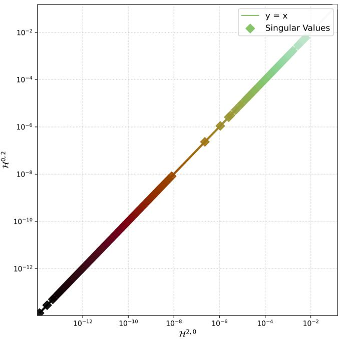  
Figure 8: We plot the corollary of Lemma 2, and that the singular values of $\mathcal { H } ^ { 2 , 0 }$ and $\mathcal { H } ^ { 0 , 2 }$ match. We plot all 2,750 singular values of Hessian matrices of the same dimension. We choose network width $m = 5 0$ and input dimension $d = 4 .$ , where input z is sampled randomly. Here, color indicates value.

## 9 Initialization results

Proof of Theorem 3. Assume, by induction forward on the layers, that the previous layer’s squared activations satisfy $| \alpha _ { j } ^ { ( l - 1 ) } | ^ { 2 } = \mathcal { O } ( 1 )$ which holds with probability at least $1 - \delta _ { 1 }$ . Certainly the base case $\alpha ^ { ( 0 ) } = z$ is $\mathcal { O } ( 1 )$ . At initialization, the entries of the weight matrix $W ^ { ( l ) }$ are drawn i.i.d. from a standard complex Gaussian distribution, $\mathcal { C N } ( 0 , 1 )$ with mean zero and unit variance. The variance of the pre-activation is then

$$
\mathrm { V a r } \left( h _ { i } ^ { ( l ) } \right) = \mathrm { V a r } \left( \frac { 1 } { \sqrt { m } } \sum _ { j = 1 } ^ { m } W _ { i j } ^ { ( l ) } \alpha _ { j } ^ { ( l - 1 ) } \right) = \frac { 1 } { m } \sum _ { j = 1 } ^ { m } \mathrm { V a r } \left( W _ { i j } ^ { ( l ) } \right) \left| \alpha _ { j } ^ { ( l - 1 ) } \right| ^ { 2 } = \frac { 1 } { m } \sum _ { j = 1 } ^ { m } \left| \alpha _ { j } ^ { ( l - 1 ) } \right| ^ { 2 } ,\tag{9.1}
$$

where the last equality uses $\mathrm { V a r } ( W _ { i j } ^ { ( l ) } ) = 1$ . As an average of m terms each of $\mathcal { O } ( 1 )$ , this variance is itself $\mathcal { O } ( 1 )$ , so the magnitude of $h _ { i } ^ { ( l ) }$ is $\mathcal { O } ( 1 )$ as well with probability at least $1 - \delta _ { 2 }$ . Provided the activation function ϕ as in 3 is suficiently well-behaved, the resulting activation $\alpha _ { i } ^ { ( l ) } = \phi \big ( h _ { i } ^ { ( l ) } , \overline { { h _ { i } ^ { ( l ) } } } \big )$ remains $\mathcal { O } ( 1 )$ Consequently, the squared norm of the layer’s activation vector scales linearly with width,

$$
\left. \alpha ^ { ( l ) } \right. _ { \ell ^ { 2 } } ^ { 2 } = \sum _ { j = 1 } ^ { m } \left| \alpha _ { j } ^ { ( l ) } \right| ^ { 2 } = \mathcal { O } ( m ) .\tag{9.2}
$$

This proves the forward induction, since this is equivalent to each component being $\mathcal { O } ( 1 )$

We now turn to the backward pass. We assume for the sake of induction backward on the layers $| \delta _ { j } ^ { ( l + 1 ) } | ^ { 2 } = \mathcal { O } ( { \textstyle \frac { 1 } { m } } )$ with probability at least $1 - \delta _ { 3 }$ . The base case follows immediately from the definition of $f$ in 3. Define the complex error signal at layer l as the Wirtinger derivative of the network output with respect to the conjugate pre-activation via $^ { 3 , }$

$$
\delta ^ { ( l ) } : = \nabla _ { \overline { { h } } ^ { ( l ) } } f ( \theta _ { 0 } ) .\tag{9.3}
$$

For the final layer $L ,$ recalling that $\begin{array} { r } { f = \frac { 1 } { \sqrt { m } } \boldsymbol { v } ^ { \dagger } \alpha ^ { ( L ) } } \end{array}$ , the chain rule gives

$$
\delta _ { i } ^ { ( L ) } = \frac { 1 } { \sqrt { m } } \partial _ { \overline { { { h } } } } \phi \left( h _ { i } ^ { ( L ) } , \overline { { { h _ { i } ^ { ( L ) } } } } \right) \overline { { { v _ { i } } } } .\tag{9.4}
$$

Since $h _ { i } ^ { ( L ) }$ is $\mathcal { O } ( 1 )$ , we take the derivative $\partial _ { h } \phi$ to be $\mathcal { O } ( 1 )$ as well. As the weights $v _ { i }$ are initialized in the same manner as $W _ { : }$ , the initial error signal scales as

$$
\delta _ { i } ^ { ( L ) } = \mathcal { O } \left( \frac { 1 } { \sqrt { m } } \right)\tag{9.5}
$$

with probability at least $1 - \delta _ { 4 }$ . Defining $\epsilon ^ { ( l ) } : = \nabla _ { h ^ { ( l ) } } f ( \theta _ { 0 } )$ , recursively, the multivariable Wirtinger chain rule gives an update rule via pre-activation definition 9.3

$$
\begin{array} { l } { { \displaystyle \delta _ { i } ^ { ( l ) } = \sum _ { j = 1 } ^ { m } \left( \frac { \partial f } { \partial h _ { j } ^ { ( l + 1 ) } } \frac { \partial h _ { j } ^ { ( l + 1 ) } } { \partial \overline { { h _ { i } ^ { ( l ) } } } } + \frac { \partial f } { \partial \overline { { h _ { j } ^ { ( l + 1 ) } } } } \frac { \partial \overline { { h _ { j } ^ { ( l + 1 ) } } } } { \partial \overline { { h _ { i } ^ { ( l ) } } } } \right) } } \\ { { \displaystyle = \frac { 1 } { \sqrt { m } } \sum _ { j = 1 } ^ { m } \left( \epsilon _ { j } ^ { ( l + 1 ) } W _ { j i } ^ { ( l + 1 ) } \partial _ { \overline { { h } } } \phi \big ( h _ { i } ^ { ( l ) } , \overline { { h _ { i } ^ { ( l ) } } } \big ) + \delta _ { j } ^ { ( l + 1 ) } \overline { { W _ { j i } ^ { ( l + 1 ) } } } \overline { { \partial _ { h } \phi \big ( h _ { i } ^ { ( l ) } , \overline { { h _ { i } ^ { ( l ) } } } \big ) } } \right) . } } \end{array}\tag{9.6}
$$

(9.7)

Because the weights W and $\overline { W }$ are independent of the backpropagated errors, the variance of the sum is the sum of the variances. Using the inductive step that $| \delta _ { j } ^ { ( \bar { l } + 1 ) } | ^ { 2 }$ and $| \epsilon _ { j } ^ { ( l + 1 ) } | ^ { 2 }$ are $\begin{array} { r } { \mathcal { O } ( \frac { 1 } { m } ) } \end{array}$ , the sum of the 2m such terms is $\mathcal { O } ( 1 )$ . The $1 / m$ scaling from the variance and moving outside $1 / \sqrt { m }$ scaling ensures that $\mathrm { V a r } ( \delta _ { i } ^ { ( l ) } ) = \mathcal { O } ( \textstyle { \frac { 1 } { m } } )$ . Since the variance scales with the square, we can square root each component (observe previously in the proof we examined the square of $\mathcal { O } ( 1 )$ terms, which is $\mathcal { O } ( 1 ) )$ . Consequently, with probability at least $1 - \delta _ { 5 }$

$$
\| \delta ^ { ( l ) } \| _ { \infty } = \mathcal { O } \left( \frac { 1 } { \sqrt { m } } \right) .\tag{9.8}
$$

Moreover, the square on a single element is therefore $\begin{array} { r } { \mathcal { O } ( \frac { 1 } { m } ) } \end{array}$ , which proves the backward induction.

Now we compute the (1, 1) parameter Hessian and examine the diagonal blocks. Notice for a parameter perturbation $X$

$$
\begin{array} { r } { \left\{ \begin{array} { l l } { { \mathcal H } _ { W ^ { ( l ) } \overline { { W } } ^ { ( l ) } } ( X ) = \frac { 1 } { m } D ^ { ( l ) } X \alpha ^ { ( l - 1 ) } \big ( \alpha ^ { ( l - 1 ) } \big ) ^ { \dagger } , } \\ { D ^ { ( l ) } = \mathrm { d i a g } \left( \delta ^ { ( l ) } \circ \partial _ { h } \partial _ { \overline { { h } } } \phi \big ( h ^ { ( l ) } , \overline { { h ^ { ( l ) } } } \big ) \right) . } \end{array} \right. } \end{array}\tag{9.9}
$$

The spectral norm is governed by

$$
\left\| \mathcal { H } _ { W ^ { ( l ) } \overline { { { W } } } ^ { ( l ) } } \right\| _ { 2 } \leq \left\| D ^ { ( l ) } \right\| _ { 2 } \left\| \frac { 1 } { m } \alpha ^ { ( l - 1 ) } \big ( \alpha ^ { ( l - 1 ) } \big ) ^ { \dagger } \right\| _ { 2 } .\tag{9.10}
$$

We evaluate both terms independently. The operator norm of the diagonal matrix $D ^ { ( l ) }$ is its maximum absolute entry. Assuming the second Wirtinger derivative of $\phi$ is bounded, and given our backward induction result $\| \delta ^ { ( l ) } \| _ { \infty } = \mathcal { O } ( \textstyle { \frac { 1 } { \sqrt { m } } } )$ from 9.8, we obtain

$$
\left. D ^ { ( l ) } \right. _ { 2 } = \operatorname* { m a x } _ { i } \left. D _ { i i } ^ { ( l ) } \right. = \mathcal { O } \left( \frac { 1 } { \sqrt { m } } \right) ,\tag{9.11}
$$

with probability $1 - \delta _ { 6 }$ . The second term of 9.10 is a rank-1 matrix scaled by $1 / m$ . Its unique non-zero eigenvalue is exactly $\textstyle { \frac { 1 } { m } } \left\| \alpha ^ { ( l - 1 ) } \right\| _ { 2 } ^ { 2 }$ . Since we established by the forward induction that $\lVert \alpha ^ { ( l - 1 ) } \rVert _ { 2 } ^ { 2 } = \mathcal { O } ( m )$ this operator norm cancels the width dependence,

$$
\left\| \frac { 1 } { m } \alpha ^ { ( l - 1 ) } \big ( \alpha ^ { ( l - 1 ) } \big ) ^ { \dagger } \right\| _ { 2 } = \mathcal { O } ( 1 ) .\tag{9.12}
$$

Therefore, the spectral norm of the diagonal Hessian block is bounded by $\begin{array} { r } { \mathcal { O } ( \frac { 1 } { \sqrt { m } } ) } \end{array}$

Evaluating the remaining components, the output weight block $\mathcal { H } _ { v \overline { { { v } } } } = 0$ since $f$ is linear in $v ^ { \dagger }$ . Now we examine the of-diagonal blocks. Because the Hessian block is a bilinear form, its spectral norm can be analyzed via a unit-norm perturbation X at layer l. Let the gradient matrix at layer k be

$$
E ^ { ( k ) } : = \nabla _ { \overline { { W } } ^ { ( k ) } } f ( \theta _ { 0 } ) = \frac { 1 } { \sqrt { m } } \delta ^ { ( k ) } { \left( \alpha ^ { ( k - 1 ) } \right) } ^ { \dagger } .\tag{9.13}
$$

We desire to bound $\begin{array} { r } { \left\| \mathcal { H } _ { W ^ { ( l ) } \overline { { W } } ^ { ( k ) } } \right\| _ { 2 } = \operatorname* { s u p } _ { \| X \| _ { 2 } = 1 } \left\| \Delta _ { X } E ^ { ( k ) } \right\| _ { 2 } } \end{array}$ , where $\Delta _ { X }$ is the directional derivative $\partial _ { W ^ { ( l ) } } [ \cdot ] ( \boldsymbol { X } )$ . It is nontrivial to bound this directly due to a lack of symmetry between backward and forward layers, therefore we will analyze the of-diagonal scenario on a case-by-case basis.

Case 1. Assume $l > k$ . Then $\alpha ^ { ( k - 1 ) }$ has no dependence on $W ^ { ( l ) }$ . Therefore, its variation with respect to X is identically zero. Hence,

$$
\Delta _ { X } E ^ { ( k ) } = \frac { 1 } { \sqrt { m } } \big ( \Delta _ { X } \delta ^ { ( k ) } \big ) \big ( \alpha ^ { ( k - 1 ) } \big ) ^ { \dagger } .\tag{9.14}
$$

We proved earlier $\| \alpha ^ { ( l ) } \| _ { 2 } ^ { 2 }$ is $\mathcal { O } ( m )$ in 9.2, or equivalently $\| \alpha ^ { ( k - 1 ) } \| _ { 2 }$ is $\mathcal { O } ( \sqrt { m } )$ . Moreover, we proved the rule on $| \delta _ { j } ^ { ( k - 1 ) } | ^ { 2 } = \mathcal { O } ( \textstyle { \frac { 1 } { m } } )$ . It follows from the work we did earlier that $\| \delta ^ { ( l ) } \| _ { 2 } = \mathcal { O } ( 1 )$ . We use Cauchy-Schwarz, but the unit-norm perturbation does not preserve order (note Mukhin and Kundikova (2021) discusses unit directional derivatives and notes analyzing unit-norm directions can miss uniform behavior), so $\begin{array} { r } { \| \Delta _ { X } \delta ^ { ( k ) } \| _ { 2 } = \mathcal { O } ( \frac { 1 } { \sqrt { m } } ) } \end{array}$ , or more rigorously which follows since $\begin{array} { r } { \| \Delta _ { X } \delta ^ { ( l - 1 ) } \| _ { 2 } \leq \frac { 1 } { \sqrt { m } } \| \mathrm { d i a g } ( \phi ^ { \prime } ) \| _ { 2 } \| X \| _ { 2 } \| \delta ^ { ( \dot { l } ) } \| _ { 2 } . } \end{array}$ the three of which are $\mathcal { O } ( 1 )$ . Therefore, it immediately follows $\begin{array} { r } { \| \Delta _ { X } E ^ { ( k ) } \| _ { 2 } = \overset { \cdot } { \mathcal { O } } ( \frac { 1 } { \sqrt { m } } ) } \end{array}$ by using 9.2.

Case 2. Assume $l < k$ . When the perturbed layer l precedes layer $k ,$ both the error signal and the forward activations depend on $W ^ { ( l ) }$ . Applying the product rule,

$$
\Delta _ { X } E ^ { ( k ) } = \frac { 1 } { \sqrt { m } } \left[ \left( \Delta _ { X } \delta ^ { ( k ) } \right) \left( \alpha ^ { ( k - 1 ) } \right) ^ { \dagger } + \delta ^ { ( k ) } \Delta _ { X } \left( \alpha ^ { ( k - 1 ) \dagger } \right) \right] .\tag{9.15}
$$

The first term is exactly Case 1 of 9.14. Examining the second term, we first note the perturbation at layer l is $\begin{array} { r } { \Delta _ { X } h ^ { ( l ) } = \frac { 1 } { \sqrt { m } } \tilde { X } \alpha ^ { ( l - 1 ) } } \end{array}$ , giving

$$
\left\| \Delta _ { X } h ^ { ( l ) } \right\| _ { 2 } \leq \frac { 1 } { \sqrt { m } } \left\| X \right\| _ { 2 } \left\| \alpha ^ { ( l - 1 ) } \right\| _ { 2 } = \frac { 1 } { \sqrt { m } } \times \mathcal { O } ( 1 ) \times \mathcal { O } ( \sqrt { m } ) = \mathcal { O } ( 1 ) .\tag{9.16}
$$

The order of $\| \alpha ^ { ( l - 1 ) } \| _ { 2 }$ follows from earlier in the proof by taking the square root of 9.2. To evaluate the variation at layer $k - 1$ , we use the Jacobian of the forward pass, and we can note $\Delta _ { X } \alpha ^ { ( k - 1 ) } =$ $\frac { \partial \alpha ^ { ( k - 1 ) } } { \partial h ^ { ( l ) } } \Delta _ { X } h ^ { ( l ) }$ . Because the intermediate Jacobians are assumed to have bounded operator norms at initialization with probability $1 - \delta _ { 7 }$ , the perturbation at layer $k - 1$ shares this bound, meaning $\| \Delta _ { X } \alpha ^ { ( k - 1 ) } \| _ { 2 } = \mathcal { O } ( 1 )$ . Since $\| \delta ^ { ( k ) } \| _ { 2 } = \mathcal { O } ( 1 )$ , we can put the results together and, using the scaling out front, we see $\begin{array} { r } { \| \Delta _ { X } \dot { E ^ { ( k ) } } \| _ { 2 } = \mathcal { O } ( \frac { 1 } { \sqrt { m } } ) } \end{array}$ in this case too. We put everything together. The diagonal and of-diagonal scenarios, including both cases, are all $\scriptstyle { \mathcal { O } } ( { \frac { 1 } { \sqrt { m } } } )$ , and this completes the proof.

Corollary. The proof for the (2,0)-Hessian is almost identical, with a few changes. The diagonal matrix of $D ^ { ( l ) }$ must now be

$$
D _ { ( 2 , 0 ) } ^ { ( l ) } = \mathrm { d i a g } \left( \delta ^ { ( l ) } \circ \partial _ { h } ^ { 2 } \phi \bigl ( h ^ { ( l ) } , \overline { { { h ^ { ( l ) } } } } \bigr ) \right)\tag{9.17}
$$

The outer product must be changed to

$$
\mathcal { H } _ { W ^ { ( l ) } W ^ { ( l ) } } ( X ) = \frac { 1 } { m } D _ { ( 2 , 0 ) } ^ { ( l ) } X \alpha ^ { ( l - 1 ) } \big ( \alpha ^ { ( l - 1 ) } \big ) ^ { T } .\tag{9.18}
$$

We can note $\left\| \alpha ^ { ( l - 1 ) } \left( \alpha ^ { ( l - 1 ) } \right) ^ { T } \right\| _ { 2 } { \mathrm { ~ i s ~ } } \left\| \alpha ^ { ( l - 1 ) } \right\| _ { 2 } ^ { 2 }$ . By forward induction, $\left\| \alpha ^ { ( l - 1 ) } \right\| _ { 2 } ^ { 2 } = \mathcal { O } ( m )$ , so the $1 / m$ scaling cancels out, leaving the block bounded by $\mathcal { O } ( 1 / \sqrt { m } )$ . Moreover, we can redefine

$$
E ^ { ( k ) } : = \nabla _ { W ^ { ( k ) } } f ( \theta _ { 0 } ) ,\tag{9.19}
$$

and the application of the product rule in case 2, and it follows we have the unit-norm directional   
derivative bounds $\left\| \Delta _ { X } h ^ { ( l ) } \right\| _ { 2 } ^ { - } = \mathcal { O } ( 1 )$ and $\left\| \Delta _ { X } \alpha ^ { ( k - 1 ) } \right\| _ { 2 } = \mathcal { O } ( 1 )$   
□

## 10 Convexity results

Proof of Theorem $\it 4 .$ Denote $\begin{array} { r } { L ( \theta ) = \frac { 1 } { n } \sum _ { i = 1 } ^ { n } \ell _ { i } ( y _ { i } , f ( \theta ; z _ { i } ) ) } \end{array}$ . Consider the second-order Riemannian Taylor expansion along the geodesic $\gamma ( s )$ connecting $\theta _ { t }$ to $\theta _ { 0 }$

$$
L ( \theta _ { 0 } ) = L ( \theta _ { t } ) + 2 \mathrm { R e } \langle \nabla _ { \omega } L ( \theta _ { t } ) , \mathrm { e x p } _ { \theta _ { t } } ^ { - 1 } ( \theta _ { 0 } ) \rangle _ { \omega } + \frac { 1 } { 2 } \nabla _ { \omega } ^ { 2 } L ( \widetilde { \theta } _ { t } ) ( v , v ) ,\tag{10.1}
$$

where $\widetilde { \theta } _ { t }$ is an intermediary point on the geodesic, $v = \exp _ { \theta _ { t } } ^ { - 1 } ( \theta _ { 0 } )$ , and $\nabla _ { \omega } ^ { 2 }$ denotes the covariant Riemannian Hessian with respect to the Kähler metric ω.

Let us bound the Hessian terms. On a Kähler manifold, the covariant Hessian decomposes. The mixed Christofel symbols vanish. We have the decomposition

$$
\frac { 1 } { 2 } \nabla _ { \omega } ^ { 2 } L ( \widetilde { \theta } _ { t } ) ( v , v ) = \underbrace { \mathrm { R e } \left( v ^ { T } \left( \nabla _ { \omega } ^ { 2 , 0 } L ( \widetilde { \theta } _ { t } ) \right) v \right) } _ { = A _ { 1 } } + \underbrace { v ^ { \dagger } \left( \nabla _ { \omega } ^ { 1 , 1 } L ( \widetilde { \theta } _ { t } ) \right) v } _ { = A _ { 2 } } .\tag{10.2}
$$

Applying the covariant chain rule to the composite loss, we observe

$$
A _ { 1 } = \mathrm { R e } \left\{ \frac { 1 } { n } \sum _ { i = 1 } ^ { n } \left[ \underbrace { \ell _ { i } ^ { \prime \prime } ( f _ { i } ( \widetilde { \theta } _ { t } ) ) \left( \nabla _ { \omega } f _ { i } ( \widetilde { \theta } _ { t } ) \boldsymbol { v } \right) ^ { 2 } } _ { = B _ { 1 } } + \underbrace { \ell _ { i } ^ { \prime } ( f _ { i } ( \widetilde { \theta } _ { t } ) ) \left( \boldsymbol { v } ^ { T } \nabla _ { \omega } ^ { 2 , 0 } f _ { i } ( \widetilde { \theta } _ { t } ) \boldsymbol { v } \right) } _ { = B _ { 2 } } \right] \right\} ,\tag{10.3}
$$

and

$$
A _ { 2 } = \frac { 1 } { n } \sum _ { i = 1 } ^ { n } \left[ \ell _ { i } ^ { \prime \prime } ( f _ { i } ( \widetilde { \theta } _ { t } ) ) \left| \nabla _ { \omega } f _ { i } ( \widetilde { \theta } _ { t } ) \upsilon \right| ^ { 2 } + \ell _ { i } ^ { \prime } ( f _ { i } ( \widetilde { \theta } _ { t } ) ) \left( \upsilon ^ { \dagger } \nabla _ { \omega } ^ { 1 , 1 } f _ { i } ( \widetilde { \theta } _ { t } ) \upsilon \right) \right] .\tag{10.4}
$$

Let us examine the $B _ { 1 }$ of 10.3 term and the Jacobian term of $A _ { 2 }$

$$
\mathrm { R e } ( B _ { 1 } ) + A _ { 2 , \mathrm { J a c } } = \frac { 2 } { n } \sum _ { i = 1 } ^ { n } \ell _ { i } ^ { \prime \prime } ( f _ { i } ( \widetilde { \theta } _ { t } ) ) \left( \mathrm { R e } \left( \nabla _ { \omega } f ( \widetilde { \theta } _ { t } ; z _ { i } ) v \right) \right) ^ { 2 } .\tag{10.5}
$$

Using a lower bound $\ell _ { i } ^ { \prime \prime } \geq a$ on the loss, we perform the Taylor expansion along the geodesic $\gamma ( s )$ for the intermediary $\widetilde { \theta }$

$$
\mathrm { R e } ( B _ { 1 } ) + A _ { 2 , \mathrm { J a c } } \geq \frac { 2 a } { n } \sum _ { i = 1 } ^ { n } \left( \mathrm { R e } \left( \nabla _ { \omega } f ( \theta _ { t } ; z _ { i } ) v \right) + \mathrm { R e } \left( \int _ { 0 } ^ { 1 } \nabla _ { \omega } ^ { 2 } f _ { i } ( \gamma ( s ) ) ( v , v ) d s \right) \right) ^ { 2 }\tag{10.6}
$$

$$
\geq \frac { 2 a } { n } \sum _ { i = 1 } ^ { n } \left( \operatorname { R e } \left( \nabla _ { \omega } f _ { i } ( \theta _ { t } ) v \right) \right) ^ { 2 } - \frac { 4 a } { n } \sum _ { i = 1 } ^ { n } | \operatorname { R e } \left( \nabla _ { \omega } f _ { i } ( \theta _ { t } ) v \right) | \left| \operatorname { R e } \left( \int _ { 0 } ^ { 1 } \nabla _ { \omega } ^ { 2 } f _ { i } ( \gamma ( s ) ) ( v , v ) d s \right) \right| .\tag{10.7}
$$

We have used the fact that $( X + Y ) ^ { 2 } \geq X ^ { 2 } - 2 | X | | Y |$ and that the covariant Hessian is a bilinear form. Let $\begin{array} { r } { \mathcal { F } _ { t } ( v ) = \frac { 2 } { n } \sum _ { i = 1 } ^ { n } \left( \operatorname { R e } \left( \nabla _ { \omega } f _ { i } ( \theta _ { t } ) v \right) \right) ^ { 2 } } \end{array}$ be the quadratic form of the empirical Fisher information. Applying the Cauchy-Schwarz inequality to 10.6

$$
\mathrm { R e } ( B _ { 1 } ) + A _ { 2 , \mathrm { J a c } } \geq a \mathcal { F } _ { t } ( v ) - 2 a \sqrt { \mathcal { F } _ { t } ( v ) } \sqrt { \frac { 1 } { n } \sum _ { i = 1 } ^ { n } \left( \int _ { 0 } ^ { 1 } \nabla _ { \omega } ^ { 2 } f _ { i } ( \gamma ( s ) ) ( v , v ) d s \right) ^ { 2 } } .\tag{10.8}
$$

Assume that the loss landscape satisfies strong convexity in the local neighborhood S with parameter $\mu > 0$ , such that the Fisher quadratic form is bounded below by $\mathcal { F } _ { t } ( v ) \geq \mu \| v \| _ { \omega } ^ { 2 }$ . Let the constant $C _ { \mathcal { H } }$ be such that the full covariant Hessian norm is bounded by $C _ { \mathcal { H } } \Vert v \Vert _ { \omega } ^ { 2 } / \sqrt { m }$ , since the Hessian bound picks up a factor of $m ^ { - \frac { 1 } { 2 } }$ . Further, letting $\rho$ bound the maximum eigenvalue of the Fisher matrix such that $\mathcal { F } _ { t } ( v ) \leq \rho \| v \| _ { \omega } ^ { 2 }$ , we arrive at the bound

$$
\mathrm { R e } ( B _ { 1 } ) + A _ { 2 , \mathrm { J a c } } \geq \left( a \mu - { \frac { 2 a { \sqrt { \rho } } C _ { \mathcal { H } } \| v \| _ { \omega } } { \sqrt { m } } } \right) \| v \| _ { \omega } ^ { 2 } .\tag{10.9}
$$

Now, let us consider the $B _ { 2 }$ term with the Hessian term of $A _ { 2 }$

$$
\operatorname { R e } ( B _ { 2 } ) + A _ { 2 , \mathrm { H e s } } = \frac { 1 } { n } \sum _ { i = 1 } ^ { n } \ell _ { i } ^ { \prime } ( f _ { i } ( \widetilde { \theta } _ { t } ) ) \left( \operatorname { R e } \left[ v ^ { T } \nabla _ { \omega } ^ { 2 , 0 } f _ { i } ( \widetilde { \theta } _ { t } ) v \right] + v ^ { \dagger } \nabla _ { \omega } ^ { 1 , 1 } f _ { i } ( \widetilde { \theta } _ { t } ) v \right)\tag{10.10}
$$

$$
\mathrm { C a u c h y ~ S c h w a r z }  \\  \geq - \sqrt { \frac { 1 } { n } \sum _ { i = 1 } ^ { n } ( \ell _ { i } ^ { \prime } ( f _ { i } ( \widetilde { \theta } _ { t } ) ) ) ^ { 2 } } \sqrt { \frac { 1 } { n } \sum _ { i = 1 } ^ { n } \left| \mathrm { R e } \left[ v ^ { T } \nabla _ { \omega } ^ { 2 , 0 } f _ { i } ( \widetilde { \theta } _ { t } ) v \right] + v ^ { \dagger } \nabla _ { \omega } ^ { 1 , 1 } f _ { i } ( \widetilde { \theta } _ { t } ) v \right| ^ { 2 } } .\tag{10.11}
$$

Since we proved in Appendix 8.2 and Appendix 8.5 the Hessians scale $\begin{array} { r } { \mathcal { O } ( \frac { 1 } { \sqrt { m } } ) } \end{array}$ ，

$$
\mathrm { R e } ( B _ { 2 } ) + A _ { 2 , \mathrm { H e s } } \geq - \sqrt { \frac { 1 } { n } \sum _ { i = 1 } ^ { n } ( \ell _ { i } ^ { \prime } ( f _ { i } ( \widetilde { \theta } _ { t } ) ) ) ^ { 2 } } \frac { C _ { \mathcal { H } } } { \sqrt { m } } \| v \| _ { \omega } ^ { 2 } .\tag{10.12}
$$

Combining the bounds

$$
\nabla _ { \omega } ^ { 2 } L ( \widetilde { \theta _ { t } } ) ( v , v ) \geq \underbrace { \left( a \mu - \frac { 2 a \sqrt { \rho } C _ { \mathcal { H } } \| v \| _ { \omega } + C _ { \mathcal { H } } \sqrt { \frac { 1 } { n } \sum _ { i = 1 } ^ { n } ( \ell _ { i } ^ { \prime } ( f _ { i } ( \widetilde { \theta _ { t } } ) ) ) ^ { 2 } } } { \sqrt { m } } \right) } _ { : = \Gamma \left( a , \mu , \rho , C _ { \mathcal { H } } , \{ \ell _ { i } ^ { \prime } ( f _ { i } ( \widetilde { \theta _ { t } } ) ) \} _ { i } , m , v \right) } \| v \| _ { \omega } ^ { 2 } .\tag{10.13}
$$

Note that $\theta _ { 0 }$ lies within a local geodesic ball of radius D centered at $\theta _ { t } ,$ meaning $\theta _ { 0 } \in B _ { \omega } ^ { D } ( \theta _ { t } )$ . Therefore,   
the geodesic distance is bounded $\| v \| _ { \omega } = \| \exp _ { \theta _ { t } } ^ { - 1 } ( \theta _ { 0 } ) \| _ { \omega } \leq D$   
□

Under a metric collapse, since the collapse implies $\lambda _ { \operatorname* { m i n } } = 0$ , we get

$$
\nabla _ { \omega } ^ { 2 } L ( \widetilde { \theta } _ { t } ) ( v , v ) \ge \operatorname* { l i m i n f } _ { \stackrel { { \scriptstyle \kappa  0 } } { c _ { { \scriptscriptstyle \mathscr { M } } }  \infty } } \operatorname* { i n f } _ { \stackrel { { \scriptstyle \rho  \infty } } { c _ { { \scriptscriptstyle \mathscr { M } } }  \infty } } \Gamma ( a , \mu | _ { \mu = 0 } , \rho , C _ { { \mathscr { H } } } , \{ \ell _ { i } ^ { \prime } ( f _ { i } ( \widetilde { \theta } _ { t } ) ) \} _ { i } , m , v ) \| v \| _ { \omega } ^ { 2 } = - \infty ,\tag{10.14}
$$

which destroys the possibility of a finite lower bound. The divergence of constants is because the covariant Hessian relies on the Levi-Civita connection (under choice of connection) and the inverse metric, and a singular metric implies its inverse diverges (under real analytic conventions so that it exists, for example take the limit if appropriate). With a regularized metric, this is not as feasible. In the scenario of a Calabi-Yau manifold, and when $m  \infty ,$ we get

$$
\nabla _ { \omega } ^ { 2 } L ( \widetilde { \theta _ { t } } ) ( v , v ) \geq \operatorname* { l i m i n f } _ { m  \infty } \operatorname* { l i m i n f } _ { \mu  0 } \operatorname* { l i m i n f } _ { \rho  r < \infty } \ \Gamma ( a , \mu , \rho , C _ { { \mathcal { H } } } , \{ \ell _ { i } ^ { \prime } ( f _ { i } ( \widetilde { \theta } _ { t } ) ) \} _ { i } , m , v ) \| v \| _ { \omega } ^ { 2 } > - \infty .\tag{10.15}
$$

We are slightly informal in our use of the lim inf, since we are not particularly examining if the limit exists.

## 10.1 β-smoothness

Proof of Theorem 5. By the second-order Riemannian Taylor expansion about $\theta _ { t }$ along the geodesic $\gamma ( s )$ we have

$$
L ( \theta _ { 0 } ) = L ( \theta _ { t } ) + 2 \mathrm { R e } \langle \nabla _ { \omega } ^ { 1 , 0 } L ( \theta _ { t } ) , v \rangle _ { \omega } + \frac { 1 } { 2 } \nabla _ { \omega } ^ { 2 } L ( \widetilde { \theta } _ { t } ) ( v , v ) ,\tag{10.16}
$$

where $v = \exp _ { \theta _ { t } } ^ { - 1 } ( \theta _ { 0 } ) ^ { 1 , 0 }$ . Let us bound the Hessian term. On a Kähler manifold, the covariant Hessian decomposes. The mixed Christofel symbols vanish. We have the decomposition

$$
\frac { 1 } { 2 } \nabla _ { \omega } ^ { 2 } L ( \widetilde { \theta } _ { t } ) ( v , v ) = \underbrace { \mathrm { R e } \left( v ^ { T } \left( \nabla _ { \omega } ^ { 2 , 0 } L ( \widetilde { \theta } _ { t } ) \right) v \right) } _ { = A _ { 1 } } + \underbrace { v ^ { \dagger } \left( \nabla _ { \omega } ^ { 1 , 1 } L ( \widetilde { \theta } _ { t } ) \right) v } _ { = A _ { 2 } } .\tag{10.17}
$$

As before, decompose

$$
A _ { 1 } = \mathrm { R e } \left\{ \frac { 1 } { n } \sum _ { i = 1 } ^ { n } \left[ \underbrace { \ell _ { i } ^ { \prime \prime } ( f _ { i } ( \widetilde { \theta } _ { t } ) ) \left( \nabla _ { \omega } f _ { i } ( \widetilde { \theta } _ { t } ) \boldsymbol { v } \right) ^ { 2 } } _ { = B _ { 1 } } + \underbrace { \ell _ { i } ^ { \prime } ( f _ { i } ( \widetilde { \theta } _ { t } ) ) \left( \boldsymbol { v } ^ { T } \nabla _ { \omega } ^ { 2 , 0 } f _ { i } ( \widetilde { \theta } _ { t } ) \boldsymbol { v } \right) } _ { = B _ { 2 } } \right] \right\} ,\tag{10.18}
$$

and

$$
A _ { 2 } = \frac { 1 } { n } \sum _ { i = 1 } ^ { n } \left[ \ell _ { i } ^ { \prime \prime } ( f _ { i } ( \widetilde { \theta } _ { t } ) ) \left| \nabla _ { \omega } f _ { i } ( \widetilde { \theta } _ { t } ) \upsilon \right| ^ { 2 } + \ell _ { i } ^ { \prime } ( f _ { i } ( \widetilde { \theta } _ { t } ) ) \left( \upsilon ^ { \dagger } \nabla _ { \omega } ^ { 1 , 1 } f _ { i } ( \widetilde { \theta } _ { t } ) \upsilon \right) \right] .\tag{10.19}
$$

Let us regroup these terms into first-order and second-order terms. Let us examine the $B _ { 1 }$ term and the Jacobian term of $A _ { 2 }$

$$
\mathrm { R e } ( B _ { 1 } ) + A _ { 2 , \mathrm { J a c } } = \frac { 2 } { n } \sum _ { i = 1 } ^ { n } \ell _ { i } ^ { \prime \prime } ( f _ { i } ( \widetilde { \theta } _ { t } ) ) \left( \mathrm { R e } \left( \nabla _ { \omega } f _ { i } ( \widetilde { \theta } _ { t } ) \boldsymbol { v } \right) \right) ^ { 2 } .\tag{10.20}
$$

For the square loss, $\ell _ { i } ^ { \prime \prime } = 2$ . The gradient term is reminiscent of a quadratic form via the empirical Fisher information. Assuming a suficiently nice bound on the gradient ${ \mathbf { } } S .$ , and since it is quadratic in $v ,$ we assume there exists $\rho _ { J }$ so that

$$
\begin{array} { r } { \mathrm { R e } ( B _ { 1 } ) + A _ { 2 , \mathrm { J a c } } \leq \rho _ { J } \| v \| _ { \omega } ^ { 2 } . } \end{array}\tag{10.21}
$$

Now, let us consider the $B _ { 2 }$ term with the Hessian term of $A _ { 2 } { \mathrm { : } }$

$$
\mathrm { R e } ( B _ { 2 } ) + A _ { 2 , \mathrm { H e s } } = \frac { 1 } { n } \sum _ { i = 1 } ^ { n } \ell _ { i } ^ { \prime } ( f _ { i } ( \widetilde { \theta } _ { t } ) ) \left( \mathrm { R e } \left[ v ^ { T } \nabla _ { \omega } ^ { 2 , 0 } f _ { i } ( \widetilde { \theta } _ { t } ) v \right] + v ^ { \dagger } \nabla _ { \omega } ^ { 1 , 1 } f _ { i } ( \widetilde { \theta } _ { t } ) v \right) .\tag{10.22}
$$

Applying Cauchy-Schwarz,

$$
\mathrm { R e } ( B _ { 2 } ) + A _ { 2 , \mathrm { H e s } } \leq \sqrt { \frac { 1 } { n } \sum _ { i = 1 } ^ { n } ( \ell _ { i } ^ { \prime } ( f _ { i } ( \widetilde { \theta } _ { t } ) ) ) ^ { 2 } } \sqrt { \frac { 1 } { n } \sum _ { i = 1 } ^ { n } \left| \mathrm { R e } \left[ v ^ { T } \nabla _ { \omega } ^ { 2 , 0 } f _ { i } ( \widetilde { \theta } _ { t } ) \right] + v ^ { \dagger } \nabla _ { \omega } ^ { 1 , 1 } f _ { i } ( \widetilde { \theta } _ { t } ) \right| ^ { 2 } } .\tag{10.23}
$$

Again invoking the established an asymptotic bound on the (1,1)-Hessian in $\mathrm { A p } _ { \mathrm { { f } } }$ endix $8 . 2$ and (2,0)-Hessian in Appendix 8.5. Due to the squaring, the above is quadratic in v, and we can rewrite

$$
\mathrm { R e } ( B _ { 2 } ) + A _ { 2 , \mathrm { H e s } } \leq \sqrt { \frac { 1 } { n } \sum _ { i = 1 } ^ { n } ( \ell _ { i } ^ { \prime } ( f _ { i } ( \widetilde { \theta } _ { t } ) ) ) ^ { 2 } \| v \| _ { \omega } ^ { 2 } } .\tag{10.24}
$$

Combining what we have,

$$
\frac { 1 } { 2 } \nabla _ { \omega } ^ { 2 } L ( \widetilde { \theta _ { t } } ) ( v , v ) \leq \left( \rho _ { J } + \frac { C _ { \mathcal { H } } \sqrt { \frac { 1 } { n } \sum _ { i = 1 } ^ { n } ( \ell _ { i } ^ { \prime } ( f _ { i } ( \widetilde { \theta _ { t } } ) ) ) ^ { 2 } } } { \sqrt { m } } \right) \| v \| _ { \omega } ^ { 2 } .\tag{10.25}
$$

Since $d _ { \omega } ( \theta _ { 0 } , \theta _ { t } ) ^ { 2 } = 2 \| v \| _ { \omega } ^ { 2 }$ , we can also rewrite the above with this. This completes the proof. □

In the Calabi-Yau scenario, assuming the minimum eigenvalues have no strict lower bound, we can note the following. Consider the constants in the bound: $\rho _ { J } .$ , which bounds the first-order Jacobian quadratic form; and $C _ { \mathcal { H } }$ , which bounds the covariant Hessian norm. In a Calabi-Yau constant determinant condition, both of these will diverge, or at least become very large. Assuming overparameterization and insuficient regularization, we get the divergence case

$$
\operatorname* { l i m } _ { \lambda _ { \operatorname* { m a x } }  \infty } \beta = \operatorname* { l i m } _ { \rho , \gamma  \infty } \operatorname* { l i m } _ { C _ { \mathcal { H } }  \infty } ( \rho _ { J } + \frac { C _ { { \mathcal { H } } } \sqrt { \frac { 1 } { n } \sum _ { i = 1 } ^ { n } ( \ell _ { i } ^ { \prime } ( f _ { i } ( \widetilde { \theta _ { t } } ) ) ) ^ { 2 } } } { \sqrt { m } } ) = \infty\tag{10.26}
$$

due to the eigenvalue explosion. If we cohere more closely to the suficiently regularized loss of 4.23, we will assume a lower bound on the minimum eigenvalues, although very small. In this case,

$$
\operatorname* { l i m s u p } _ { \lambda _ { \mathrm { m i n } }  \mu _ { * 1 } > 0 } \operatorname* { l i m s u p } _ { \lambda _ { \mathrm { m a x } }  \lambda ^ { * } \gg 1 } \beta = \operatorname* { l i m s u p } _ { \rho , \gamma  \mathrm { v e r y ~ l a r g e } } \operatorname* { l i m s u p } _ { c _ { n }  \mathrm { v e r y ~ l a r g e } } ( \rho _ { J } + \frac { C _ { \mathcal { H } } \sqrt { \frac { 1 } { n } \sum _ { i = 1 } ^ { n } ( \ell _ { i } ^ { \prime } ( f _ { i } ( \widetilde { \theta } _ { t } ) ) ) ^ { 2 } } } { \sqrt { m } } ) \gg 1 .\tag{10.27}
$$

Therefore, we get

$$
\frac { 1 } { 2 } \nabla _ { \omega } ^ { 2 } L ( \widetilde { \theta } _ { t } ) ( v , v ) \leq \frac { 1 } { 2 } \mathrm { ( e x p l o s i v e ~ v a l u e ) } d _ { \omega } ( \theta _ { 0 } , \theta _ { t } ) ^ { 2 } ,\tag{10.28}
$$

and the $\beta \mathrm { . }$ -smoothness result will be destroyed.

## 10.2 Dynamic Kähler Polyak-Łojasiewicz condition

Proof of Lemma $\it 4 .$ Let $U \subseteq S$ be a local coordinate chart equipped with the Kähler metric $h _ { i \overline { { j } } }$ . Let $\theta ^ { * }$ , be a minima, and let $\gamma ( s ) = \exp _ { \theta _ { t } } ( s v )$ for $s \in [ 0 , 1 ]$ be the geodesic connecting $\theta _ { t }$ to $\theta ^ { * }$ , with initial holomorphic tangent vector $v = \dot { \gamma } ( 0 ) \stackrel { \cdot } { = } \exp _ { \theta _ { t } } ^ { - 1 } ( \theta ^ { * } ) ^ { 1 , 0 }$ . The second-order Taylor expansion of the loss L along this geodesic is

$$
L ( \theta ^ { * } ) = L ( \theta _ { t } ) + 2 \mathrm { R e } \langle \nabla _ { h } ^ { 1 , 0 } L ( \theta _ { t } ) , v \rangle _ { h } + 2 \int _ { 0 } ^ { 1 } ( 1 - s ) \mathcal { H } _ { i \overline { { { j } } } } ( \gamma ( s ) ) \dot { \gamma } ^ { i } ( s ) \overline { { { \dot { \gamma } ^ { j } ( s ) } } } d s .\tag{10.29}
$$

Define a dynamic $\Gamma _ { t }$ that behaves similarly to the Γ of 10 corresponding to the minimum eigenvalue of the Hessian with respect to the metric that continually updates

$$
\Gamma _ { t } : = \operatorname* { i n f } _ { s \in [ 0 , 1 ] } \lambda _ { \operatorname* { m i n } } \left( h ^ { i \overline { { k } } } ( \gamma _ { t } ( s ) ) \mathcal { H } _ { k \overline { { j } } } ( \gamma _ { t } ( s ) ) \right) , \quad \mathrm { w h e r e } \quad \gamma _ { t } ( s ) = \exp _ { \theta _ { t } } ( s v ) .\tag{10.30}
$$

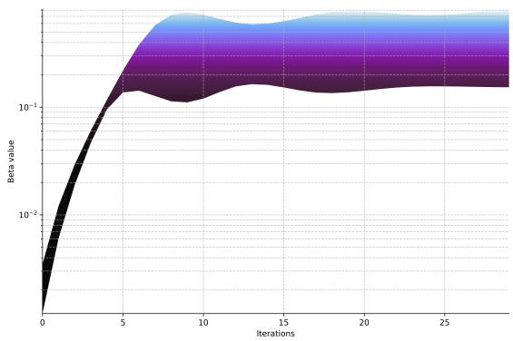  
Figure 9: We plot $\beta \mathrm { . }$ -smoothness coeficient, $\begin{array} { r } { \left( \rho _ { J } + \frac { C \mathcal { H } \sqrt { \frac { 1 } { n } \sum _ { i = 1 } ^ { n } ( \ell _ { i } ^ { \prime } ( f _ { i } ( \widetilde { \theta } _ { t } ) ) ) ^ { 2 } } } { \sqrt { m } } \right) } \end{array}$ , across a spectrum of paths ranging from $m = 5 0$ (the upper bound) and $\dot { m } = 8 0 0 \ ( \mathrm { t h e \ l o w e r \ b o u n d } )$

We know $\Gamma _ { t }$ is guaranteed to satisfy a strong convexity result by the result of Appendix $^ { 1 0 , }$ and since we can always at least take

$$
\Gamma _ { t } \geq \Gamma ,\tag{10.31}
$$

and attain Γ to guarantee it holds. $\gamma$ is contained in $U ,$ and the result holds for all points (up to smoothness) in $U _ { : }$ , so Γ is a worst-case bound. It is not clear that the definition of $\Gamma _ { t }$ can be connected to the result of 10 from definition alone, since the definition looks dissimilar to the definition of Γ we had in 10. Instead, we can notice both are subsidiary of the fact that we examine $L ( \theta ^ { * } ) \geq$ $L ( \theta _ { t } ) + 2 \mathrm { R e } \langle \boldsymbol { \nabla } _ { h } ^ { 1 , 0 } L ( \theta _ { t } ) , \boldsymbol { v } \rangle _ { h } +$ term to be bounded. In both cases, we are finding the a suficient bound on the remaining term, therefore $\Gamma _ { t } , \Gamma$ have the same role in a strong convexity argument. Therefore, we can bound

$$
2 \int _ { 0 } ^ { 1 } ( 1 - s ) \mathcal { H } _ { i \overline { { j } } } \dot { \gamma } ^ { i } \overline { { \dot { \gamma } ^ { j } } } d s \geq 2 \int _ { 0 } ^ { 1 } ( 1 - s ) \Gamma _ { t } h _ { i \overline { { j } } } \dot { \gamma } ^ { i } \overline { { \dot { \gamma } ^ { j } } } d s = \Gamma _ { t } \| v \| _ { h } ^ { 2 } ,\tag{10.32}
$$

since definition a geodesic has constant speed $\| \dot { \gamma } ( s ) \| _ { h } ^ { 2 } = \| \dot { \gamma } ( 0 ) \| _ { h } ^ { 2 }$ . Substituting back into 10.29,

$$
\widehat { L } _ { \theta _ { t } } ( v ) \geq L ( \theta _ { t } ) + 2 \mathrm { R e } \big ( \nabla _ { h } ^ { 1 , 0 } L ( \theta _ { t } ) _ { i } v ^ { i } \big ) + \Gamma _ { t } h _ { i \overline { { j } } } v ^ { i } \overline { { v } } ^ { j } .\tag{10.33}
$$

Taking the Wirtinger derivative with respect to the complex conjugate $\overline { { v } } ^ { j }$ and setting it to zero yields the minimizing tangent vector $\begin{array} { r } { \widehat { v } ^ { i } = - \frac { 1 } { \Gamma _ { t } } \bigl ( \nabla _ { h } ^ { 1 , 0 } L ( \theta _ { t } ) \bigr ) ^ { i } } \end{array}$ . Substituting vb back in establishes the dynamic Kähler-PL condition

$$
\operatorname* { i n f } _ { \theta \in U } L ( \theta ) \geq L ( \theta _ { t } ) - \frac { 1 } { \Gamma _ { t } } \left\| \nabla _ { h } ^ { 1 , 0 } L ( \theta _ { t } ) \right\| _ { h } ^ { 2 } .\tag{10.34}
$$

□

Remark. We can achieve a similar efect using a Kähler Polyak-Łojasiewicz condition but with lesser restriction, drawing connections to 5.22. The definition of $\Gamma _ { t }$ relies on the eigenvalue of the Hessian being positive, but since $\mathcal { H }$ is with respect to $f ,$ this is not the same as strong convexity. Instead, we examine

$$
\Gamma _ { t } ^ { ( m ) } : = \operatorname* { i n f } _ { s \in [ 0 , 1 ] } \operatorname* { i n f } _ { \Omega > 0 } \frac { \left\{ ( i \Theta _ { e ^ { - L } } ( \mathcal { L } ) \wedge \omega ^ { m - 1 } \wedge \Omega ) \dot { \gamma } _ { t } ( s ) , \dot { \gamma } _ { t } ( s ) \right\} } { \| \dot { \gamma } _ { t } ( s ) \| _ { h } ^ { 2 } d V _ { \omega } } ,\tag{10.35}
$$

where the metric is written $e ^ { - L }$ is a Hermitian metric on the fibers of a trivial complex line bundle $\mathcal { L } = M \times \mathbb { C }$ constructed over M and the Chern curvature form $i \Theta _ { e ^ { - L } } ( \mathcal { L } ) = i \partial \overline { { { \partial } } } L = i \nabla _ { \omega } ^ { 1 , 1 } L$ . We can note

$$
i \Theta = - \partial \overline { { { \partial } } } \log H \quad \Longleftrightarrow \quad i \Theta _ { e ^ { - L } } ( \mathcal { L } ) = - \partial \overline { { { \partial } } } \log ( e ^ { - L } ) = \partial \overline { { { \partial } } } L .\tag{10.36}
$$

From this definition of $\Gamma _ { t } ^ { ( m ) }$ , we have that for $\mathcal { T } = \mathrm { s p a n } _ { \mathbb { C } } \{ \dot { \gamma } _ { t } \}$ defining the rank-1 descent subsheaf, $\Gamma _ { t } ^ { ( m ) } > 0$ along $\tau$ will satisfy a PL condition. We can relax the condition for $\Gamma _ { t }$ to exist, and as long as curvature is suficiently nice along the geodesic path, we get the same result. We can note the definition of $\Gamma _ { t } ^ { ( m ) }$ has connections to ω-m-semi-positivity since this is by definition

$$
\left\{ ( i \Theta \wedge \omega ^ { m - 1 } \wedge \Omega ) u , u \right\} _ { h } \geq 0 .\tag{10.37}
$$

We are interested in net curvature being positive along the geodesic.

## 10.3 Convergence

Proof of Lemma 5. We now analyze the forward step on the loss to guarantee it descends. Let $v _ { t } = - \eta _ { t } \nabla _ { h } ^ { 1 , 0 } L ( \theta _ { t } )$ be a first derivative step with adjustable learning rate $\eta _ { t } .$ , moving along the geodesic $\sigma ( s ) = \exp _ { \theta _ { t } } ( s v _ { t } )$ to the next parameter state $\theta _ { t + 1 }$ . The expansion of the loss at the updated parameters

is

$$
L ( \theta _ { t + 1 } ) = L ( \theta _ { t } ) + 2 \mathrm { R e } \langle \nabla _ { h } ^ { 1 , 0 } L ( \theta _ { t } ) , v _ { t } \rangle _ { h } + 2 \int _ { 0 } ^ { 1 } ( 1 - s ) \mathcal { H } _ { i \overline { { j } } } ( \sigma ( s ) ) \dot { \sigma } ^ { i } ( s ) \overline { { \dot { \sigma } ^ { j } ( s ) } } d s .\tag{10.38}
$$

Similarly to $\Gamma _ { t }$ , define continually-updated β-smoothness parameter via spectral norm

$$
\beta _ { t } : = \operatorname* { s u p } _ { s \in [ 0 , 1 ] } \left\| h ^ { i \overline { { k } } } ( \sigma ( s ) ) \mathcal { H } _ { k \overline { { j } } } ( \sigma ( s ) ) \right\| _ { 2 } .\tag{10.39}
$$

Again, $\beta _ { t }$ is guaranteed to satisfy a β-smoothness condition because we can always take a worst-case bound

$$
\beta _ { t } \leq \beta ,\tag{10.40}
$$

and attain $\beta$ to guarantee the condition, where $\beta$ is as in 10.1. We can note the geodesic σ exists in the $U$ in which $\beta$ is defined, and $\beta$ must hold (almost) everywhere in this region. Bounding the integral term of 10.38,

$$
2 \int _ { 0 } ^ { 1 } ( 1 - s ) \mathcal { H } _ { i \overline { { j } } } \dot { \sigma } ^ { i } \overline { { \dot { \sigma } ^ { j } } } \leq \beta _ { t } \| v _ { t } \| _ { h } ^ { 2 } d s = \beta _ { t } \eta _ { t } ^ { 2 } \| \nabla _ { h } ^ { 1 , 0 } L ( \theta _ { t } ) \| _ { h } ^ { 2 } .\tag{10.41}
$$

For the linear term, we use the definition of v

$$
2 \mathrm { R e } \langle \nabla _ { h } ^ { 1 , 0 } L ( \theta _ { t } ) , - \eta _ { t } \nabla _ { h } ^ { 1 , 0 } L ( \theta _ { t } ) \rangle _ { h } = - 2 \eta _ { t } \| \nabla _ { h } ^ { 1 , 0 } L ( \theta _ { t } ) \| _ { h } ^ { 2 } .\tag{10.42}
$$

Substituting everything back into 10.38,

$$
L ( \theta _ { t + 1 } ) \leq L ( \theta _ { t } ) - \eta _ { t } ( 2 - \beta _ { t } \eta _ { t } ) \| \nabla _ { h } ^ { 1 , 0 } L ( \theta _ { t } ) \| _ { h } ^ { 2 } .\tag{10.43}
$$

With the Kähler-PL condition of 10.2, we get

$$
L ( \theta _ { t + 1 } ) - L ( \theta ^ { * } ) \leq \left( 1 - \Gamma _ { t } \eta _ { t } ( 2 - \beta _ { t } \eta _ { t } ) \right) \left( L ( \theta _ { t } ) - L ( \theta ^ { * } ) \right) .\tag{10.44}
$$

## 10.4 Calabi-Yau induced oscillation

Proof of Lemma 6. Let $( M , \omega )$ be a Kähler information manifold under the regularized loss of 4.23, so the metric is full rank, with metric eigenvalues bounded below by $\lambda _ { \operatorname* { m i n } } \geq \mu > 0$ . As in Appendix 10.1, we have by definition

$$
C _ { \mathcal { H } } = \operatorname* { s u p } _ { \| u \| _ { \omega } = 1 } \left| \nabla _ { \omega } ^ { 2 , 0 } f ( u , u ) \right| = \operatorname* { s u p } _ { \| u \| _ { \omega } = 1 } \left| \partial ^ { 2 } f ( u , u ) - \Gamma ( u , u ) ^ { m } \partial _ { m } f \right| .\tag{10.45}
$$

We can note the norm $\| u \| _ { \omega } ^ { 2 } = u ^ { \dagger } h u = 1$ , and moreover the Euclidean norm obeys

$$
\| u \| _ { 2 } ^ { 2 } \leq \frac { 1 } { \lambda _ { \operatorname* { m i n } } ( h ) } \leq \frac { 1 } { \mu } .\tag{10.46}
$$

Therefore, borrowing from our results in 8.2, 8.5, we obtain

$$
\big | \partial ^ { 2 } f ( u , u ) \big | \leq \| u \| _ { 2 } ^ { 2 } \| \partial ^ { 2 } f \| _ { 2 } \leq \mathcal { O } \left( \frac { 1 } { \mu \sqrt { m } } \right) .\tag{10.47}
$$

Now we lower bound the Christofel term of 10.45. We can note

$$
\Gamma ( u , u ) ^ { m } \partial _ { m } f = u ^ { i } u ^ { k } h ^ { m \bar { l } } \partial _ { i } h _ { k \bar { l } } \partial _ { m } f .\tag{10.48}
$$

$\mathrm { B y }$ the Calabi-Yau constant determinant condition, $\textstyle \prod _ { j = 1 } ^ { K } \lambda _ { j } = \kappa$ . Therefore, we assume

$$
\lambda _ { \operatorname* { m a x } } ( h ) = \frac { \kappa } { \prod _ { j = 1 } ^ { K - 1 } \lambda _ { j } } = \Omega \left( \frac { \kappa } { \mu ^ { \widetilde { K } - 1 } } \right) .\tag{10.49}
$$

Here $\widetilde { K }$ is some value such that $\widetilde K \le K$ . In particular, we want to avoid an $\mathcal { O } ( \cdot )$ bound since this will disrupt our final result because the final result holds with an "at least" bound, not an "at most" bound. However, since $\lambda \geq \mu$ for all λ, keeping the bound in terms of K uses an $\mathcal { O } ( \cdot )$ bound, therefore we must "cut $\mathrm { o f f " }$ extra powers to establish an $\Omega ( \cdot )$ bound. Recall from section 4.3 the metric follows $h \approx \mathbb { E } [ ( \partial f ) ^ { \dagger } \partial f ] + \mu I$ , so we have $\lambda _ { \operatorname* { m a x } } ( h ) \approx \| \partial f \| _ { 2 } ^ { 2 } + \mu$ . Therefore, the singular value can be deduced as $\lVert \partial \bar { f } \rVert _ { 2 } \sim \sqrt { \lambda _ { \operatorname* { m a x } } } = \Omega ( \sqrt { \kappa } \mu ^ { - ( K - 1 ) / 2 } )$ . The additional $\mu$ is dropped since its subdominant in the asymptotics. Recall from Appendix 8.3 (equation 8.37) the derivative of the metric scales in proportion to $\mathcal { O } ( \| \partial ^ { 2 } f \| _ { 2 } \| \partial f \| _ { 2 } )$ . Therefore, we can note

$$
\left| u ^ { i } u ^ { k } h ^ { m \bar { l } } \partial _ { i } h _ { k \bar { l } } \partial _ { m } f \right| = \Omega \left( \| u \| _ { 2 } ^ { 2 } \cdot \| h ^ { - 1 } \| _ { 2 } \cdot \| \partial ^ { 2 } f \| _ { 2 } \cdot \| \partial f \| _ { 2 } ^ { 2 } \right)\tag{10.50}
$$

$$
= \Omega \left( \frac { 1 } { \mu } \cdot \frac { 1 } { \mu } \cdot \frac { 1 } { \sqrt { m } } \cdot \left( \sqrt { \kappa } \mu ^ { - ( \widetilde { K } - 1 ) / 2 } \right) ^ { 2 } \right)\tag{10.51}
$$

$$
= \Omega \left( \frac { \kappa } { \sqrt { m } } \mu ^ { - ( \widetilde { K } + 1 ) } \right) .\tag{10.52}
$$

Returning to $C _ { \mathcal { H } }$

$$
{ \cal C } _ { \mathcal { H } } \geq | \Gamma ( u , u ) ^ { m } \partial _ { m } f | - \left| \partial ^ { 2 } f ( u , u ) \right| = \Omega \left( \frac { \kappa } { \sqrt { m } } \mu ^ { - ( \widetilde { K } + 1 ) } \right) .\tag{10.53}
$$

It immediately follows substituting this into the $\beta \mathrm { . }$ -smoothness scalar

$$
\beta = \rho _ { J } + \frac { 2 C \mathcal { H } \sqrt { L ( \widetilde { \theta } _ { t } ) } } { \sqrt { m } } = \Omega \left( \frac { \kappa } { m } \mu ^ { - ( \widetilde { K } + 1 ) } \sqrt { L ( \widetilde { \theta } _ { t } ) } \right) .\tag{10.54}
$$

From Appendix 10.3, we desire

$$
L ( \theta _ { t + 1 } ) - L ( \theta ^ { * } ) \leq \left( 1 - 2 \mu \eta _ { t } + \mu \beta \eta _ { t } ^ { 2 } \right) \left( L ( \theta _ { t } ) - L ( \theta ^ { * } ) \right) .\tag{10.55}
$$

Because $\beta \sim \Omega ( \mu ^ { - ( \widetilde { K } + 1 ) } )$ , the suficient threshold to counteract this is $\mathcal { O } ( \mu ^ { \widetilde K + 1 } )$ . For viable learning rate $\eta _ { t }$ the quadratic penalty $\mu \beta \eta _ { t } ^ { 2 }$ dominates.   
□

## 10.5 Failure of the Kähler Polyak-Łojasiewicz condition under Calabi-Yau metrics

In this section, we demonstrate the failure of the results of 10.2 via an eigenvalue blow-up efect of Calabi-Yau manifolds. This result is unique to eigenvalue blow-up, hence Calabi-Yau metrics, and not inherent to negative curvature.

Proof of Lemma 7. Recall from Appendix 10.2 we defined

$$
\Gamma _ { t } : = \operatorname* { i n f } _ { s \in [ 0 , 1 ] } \lambda _ { \operatorname* { m i n } } \big ( h ^ { i \overline { { k } } } \big ( \gamma _ { t } ( s ) \big ) \mathcal { H } _ { k \overline { { j } } } \big ( \gamma _ { t } ( s ) \big ) \big ) .\tag{10.56}
$$

Let us note the following property from linear algebra. For any Hermitian positive-definite matrix A and Hermitian matrix $B ,$ the minimum eigenvalue of their product is upper-bounded by the product of their respective eigenvalues such that $\lambda _ { \operatorname* { m i n } } ( A B ) \leq \lambda _ { \operatorname* { m i n } } ( A ) \lambda _ { \operatorname* { m a x } } ( B )$ . Therefore, we get

$$
\Gamma _ { t } \leq \lambda _ { \operatorname* { m i n } } ( h ^ { - 1 } ) \lambda _ { \operatorname* { m a x } } ( \mathcal { H } ) = \frac { \lambda _ { \operatorname* { m a x } } ( \mathcal { H } ) } { \lambda _ { \operatorname* { m a x } } ( h ) } .\tag{10.57}
$$

Under the Calabi-Yau constant determinant condition where $\begin{array} { r } { \prod _ { j = 1 } ^ { K } \lambda _ { j } = \kappa , } \end{array}$ , we established in Appendix 10.4 the explosion of the maximum eigenvalue assumption

$$
\lambda _ { \operatorname* { m a x } } ( h ) = \Omega \left( \frac { \kappa } { \mu ^ { K - 1 } } \right) .\tag{10.58}
$$

Furthermore, by our previous bound in 8.2, we have sup $\begin{array} { r } { \mathfrak { \ d } _ { \theta \in \mathcal { S } } \| \mathcal { H } \| _ { 2 } = \mathcal { O } \left( \frac { 1 } { \sqrt { m } } \right) } \end{array}$ . Therefore,

$$
\Gamma _ { t } \leq \frac { \mathcal { O } \left( m ^ { - 1 / 2 } \right) } { \Omega \left( \kappa \mu ^ { - \left( K - 1 \right) } \right) } = \mathcal { O } \left( \frac { \mu ^ { K - 1 } } { \kappa \sqrt { m } } \right) .\tag{10.59}
$$

By the regularized loss of 4.23, $0 ~ < ~ \mu ~ \ll ~ 1$ is small but $\mu \ \nrightarrow \ 0$ and K is large, especially in the overparameterization regime (also note the division by $\sqrt { m } )$ , so $\Gamma _ { t }$ is very small, and in fact converging to 0 as K grows but not because $\mu$ goes to 0. Therefore, when examining

$$
L ( \theta _ { t + 1 } ) - L ( \theta ^ { * } ) \leq ( 1 - \Gamma _ { t } \eta _ { t } ( 2 - \beta _ { t } \eta _ { t } ) ) ( L ( \theta _ { t } ) - L ( \theta ^ { * } ) ) ,\tag{10.60}
$$

the constant on the right-hand side is 0.9999999. . . for large $K ,$ and so the convergence guarantee is diminished in efect.

□

## 10.6 Regret bounds

In this section, we examine regret bounds. In Kingma and Ba (2017), they examine an upper bound on regret. The primary goal of this work is to show their algorithm succeeds. Our work is motivated by the opposite: it is in our interest to show the Calabi-Yau scenario fails. This motivates us to find a lower bound. As we will see, our proof depends on parameter dimension K, which is closely related to width. Thus, our results are consistent with the goals of 8.2, 8.5.

Proof of Lemma 8. We can note $\left\| \exp _ { \theta _ { t } } ^ { - 1 } ( \theta ^ { * } ) ^ { 1 , 0 } \right\| _ { h }$ is the geodesic distance $d _ { \omega } ( \theta _ { t } , \theta ^ { * } )$ . Let us denote

$$
\delta ( \theta ) : = \frac { 1 } { 2 } d _ { \omega } ( \theta , \theta ^ { * } ) ^ { 2 } .\tag{10.61}
$$

The Riemannian gradient can be computed as

$$
\begin{array} { r } { \nabla _ { h } \delta ( \theta ) = - \exp _ { \theta } ^ { - 1 } ( \theta ^ { * } ) ^ { 1 , 0 } . } \end{array}\tag{10.62}
$$

Under stochastic natural gradient descent, the parameter updates as $d \theta _ { t } = - \nabla _ { h } \mathcal { L } ( \theta _ { t } ) d t + \sqrt { \eta } d W _ { t }$ . By Itô’s lemma, the diferential of S can be written as

$$
d \delta ( \theta _ { t } ) = \mathrm { R e } \langle \nabla _ { h } \delta ( \theta _ { t } ) , d \theta _ { t } \rangle _ { h } + \eta \Delta _ { \overline { { \partial } } } \delta ( \theta _ { t } ) d t .\tag{10.63}
$$

Substituting in 10.62 and the parameter update rule,

$$
\begin{array} { r l } & { \mathrm { R e } \langle \nabla _ { h } \delta ( \theta _ { t } ) , d \theta _ { t } \rangle _ { h } = \mathrm { R e } \Big \langle - \mathrm { e x p } _ { \theta _ { t } } ^ { - 1 } ( \theta ^ { * } ) ^ { 1 , 0 } , - \nabla _ { h } \mathcal { L } ( \theta _ { t } ) d t + \sqrt { \eta } d W _ { t } \Big \rangle _ { h } } \\ & { \quad \quad \quad \quad \quad \quad \quad \quad \quad \quad \mathrm { l i n e } { \underline { { \mathrm { a r i t y } } } } _ { \mathrm { R e } } \langle \nabla _ { h } \mathcal { L } ( \theta _ { t } ) , \mathrm { e x p } _ { \theta _ { t } } ^ { - 1 } ( \theta ^ { * } ) ^ { 1 , 0 } \rangle _ { h } d t - \sqrt { \eta } \mathrm { R e } \langle \mathrm { e x p } _ { \theta _ { t } } ^ { - 1 } ( \theta ^ { * } ) ^ { 1 , 0 } , d W _ { t } \rangle _ { h } . } \end{array}\tag{10.64}
$$

(10.65)

The first term here is found in the regret term of 5.12. Integrating,

$$
\begin{array} { r l } & { \delta ( \theta _ { T } ) - \delta ( \theta _ { 0 } ) = \underbrace { \int _ { 0 } ^ { T } \mathrm { R e } \langle \nabla _ { h } \mathcal { L } ( \theta _ { t } ) , \mathrm { e x p } _ { \theta _ { t } } ^ { - 1 } ( \theta ^ { * } ) ^ { 1 , 0 } \rangle _ { h } d t } _ { = \mathcal { R } ( T ) } } \\ & { - \underbrace { \displaystyle \int _ { 0 } ^ { T } \sqrt { \eta } \mathrm { R e } \langle \mathrm { e x p } _ { \theta _ { t } } ^ { - 1 } ( \theta ^ { * } ) ^ { 1 , 0 } , d W _ { t } \rangle _ { h } } _ { \Longrightarrow \mathrm { E } \left[ \int _ { 0 } ^ { T } \sqrt { \eta } \mathrm { R e } \langle \mathrm { e x p } _ { \theta _ { t } } ^ { - 1 } ( \theta ^ { * } ) ^ { 1 , 0 } , d W _ { t } \rangle _ { h } \right] = 0 } + \eta \int _ { 0 } ^ { T } \Delta _ { \overline { { \partial } } } \delta ( \theta _ { t } ) d t . } \end{array}\tag{10.66}
$$

(10.67)

Because an Itô integral with respect to Brownian motion is a martingale, we get a vanishing term with respect to the Brownian filtration. Simplifying and rearranging, we get a decomposition

$$
\int _ { U } \int _ { \Omega } \mathcal { R } ( T ) d \overline { { \mathbb { W } } } ( \omega ) p ( \theta _ { 0 } ) \frac { \omega ^ { K } } { K ! } = \int _ { U } \int _ { \Omega } \delta ( \theta _ { T } ) d \overline { { \mathbb { W } } } ( \omega ) p ( \theta _ { 0 } ) \frac { \omega ^ { K } } { K ! } - \delta ( \theta _ { 0 } ) - \eta \int _ { U } \int _ { \Omega } \Delta _ { \overline { { \theta } } } \delta ( \theta _ { t } ) d t d \overline { { \mathbb { W } } } ( \omega ) p ( \theta _ { 0 } ) \frac { \omega ^ { K } } { K ! } .\tag{10.68}
$$

Now, by the Laplacian comparison theorem and the claim (see Fang et al. (2025) Tam and $\mathrm { Y u }$ (2012) for relevant literature, although this exact equation is not given), for a Kähler manifold of complex dimension $K _ { i }$ , the Laplacian of the squared distance function is bounded along the minimizing geodesic $\gamma ( s )$ parameterized by arc length $s \in [ 0 , d _ { \omega } ( \theta _ { t } , \theta ^ { * } ) ]$ via

$$
\Delta _ { \overline { { \partial } } } \delta ( \theta _ { t } ) \leq K - \frac { 1 } { 2 d _ { \omega } ( \theta _ { t } , \theta ^ { * } ) } \int _ { 0 } ^ { d _ { \omega } ( \theta _ { t } , \theta ^ { * } ) } s ^ { 2 } \mathrm { R i c } \big ( \dot { \gamma } ( s ) , \dot { \gamma } ( s ) \big ) d s .\tag{10.69}
$$

Define the defect term

$$
\mathbb { E } [ \mathcal { E } _ { \mathrm { R i c } } ] : = - \frac { \eta } { 2 d _ { \omega } ( \theta _ { t } , \theta ^ { * } ) } \mathbb { E } \int _ { 0 } ^ { d _ { \omega } ( \theta _ { t } , \theta ^ { * } ) } s ^ { 2 } \mathrm { R i c } \big ( \dot { \gamma } ( s ) , \dot { \gamma } ( s ) \big ) d s .\tag{10.70}
$$

Into our regret bound,

$$
\begin{array} { r } { \mathbb { E } [ \mathcal { R } ( T ) ] \geq \mathbb { E } [ \delta ( \theta _ { T } ) ] - \delta ( \theta _ { 0 } ) - \eta K T - \mathbb { E } [ \mathcal { E } _ { \mathrm { R i c } } ] . } \end{array}\tag{10.71}
$$

□

Claim. We prove equation 10.69, which is nontrivial and challenging to find in literature. Let $( M , \omega )$ be a Kähler manifold of complex dimension K. For any θ where δ is smooth, let $\gamma ( s )$ be the unit-speed minimizing geodesic from $\theta ^ { * }$ to $\theta$ parameterized by arc length $s \in [ 0 , r ]$ , where $r = d _ { \omega } ( \theta , \theta ^ { \ast } )$ . Now, we first use the real Riemannian Laplacian $\Delta _ { d }$ . The Laplacian of the distance function $r ( \theta )$ can be bounded using the index form of the second variation of arc length. Let $E _ { 1 } ( s ) , \dots , E _ { 2 K - 1 } ( s )$ be an orthonormal frame of parallel vector fields along $\gamma$ that are orthogonal to $\dot { \gamma } .$ Construct the Jacobi test fields $\begin{array} { r } { Y _ { i } ( s ) = \frac { s } { r } E _ { i } ( s ) } \end{array}$ The index lemma Wang (2024) provides the upper bound

$$
\Delta _ { d } r ( \theta ) \leq \sum _ { i = 1 } ^ { 2 K - 1 } I ( Y _ { i } , Y _ { i } ) = \int _ { 0 } ^ { r } \sum _ { i = 1 } ^ { 2 K - 1 } \left( \| \nabla _ { \dot { \gamma } } Y _ { i } \| _ { h } ^ { 2 } - \langle R ( Y _ { i } , \dot { \gamma } ) \dot { \gamma } , Y _ { i } \rangle _ { h } \right) d s\tag{10.72}
$$

Because the frame $E _ { i }$ is parallel, the covariant derivative simplifies to $\begin{array} { r } { \nabla _ { \dot { \gamma } } Y _ { i } = \frac { 1 } { r } E _ { i } } \end{array}$ , meaning the first term sums to $\textstyle { \frac { 2 K - 1 } { r ^ { 2 } } }$ . For the curvature term, substituting $Y _ { i } ( s )$ pulls out a factor of $\frac { s ^ { 2 } } { r ^ { 2 } }$ . Summing the Riemann tensor over the orthonormal frame recovers Ricci curvature

$$
\sum _ { i = 1 } ^ { 2 K - 1 } \langle R ( E _ { i } , \dot { \gamma } ) \dot { \gamma } , E _ { i } \rangle _ { h } = \mathrm { R i c } ( \dot { \gamma } , \dot { \gamma } ) .\tag{10.73}
$$

Integrating over [0, r] gives

$$
\Delta _ { d } r ( \theta ) \leq \frac { 2 K - 1 } { r } - \frac { 1 } { r ^ { 2 } } \int _ { 0 } ^ { r } s ^ { 2 } \mathrm { R i c } ( \dot { \gamma } ( s ) , \dot { \gamma } ( s ) ) d s .\tag{10.74}
$$

We transition to the squared distance $\textstyle { \delta = { \frac { 1 } { 2 } } r ^ { 2 } }$ . By the chain rule, $\Delta _ { d } \delta = r \Delta _ { d } r + \| \nabla r \| ^ { 2 }$ . Since $\| \nabla r \| ^ { 2 } = 1$ we multiply our bound by r and add 1

$$
\Delta _ { d } \delta ( \theta ) \leq 2 K - \frac { 1 } { r } \int _ { 0 } ^ { r } s ^ { 2 } \mathrm { R i c } ( \dot { \gamma } ( s ) , \dot { \gamma } ( s ) ) d s .\tag{10.75}
$$

Finally, on a Kähler manifold, the real Laplacian and the complex Dolbeault Laplacian acting on functions are related by $\Delta _ { d } = 2 \Delta _ { \overline { { \partial } } }$ . Dividing by 2 completes the proof.

## 11 First derivative norm bounds and roles of negative curvature

## 11.1 Dirichlet energy bounds

In this section, we examine a Dirichlet asymptotic scaling for suficient set S. Dirichlet bounds are relevant in optimization literature Riis et al. (2018) Ehrhardt et al. (2024) Ringholm et al. (2018) Niu (2026) Niu (2022) Hauer and Mazón (2019) Dello Schiavo et al. (2024) for measuring sensitivity of the neural network with respect to its weights. This has connections to how fast the parameter descends since the squared norm of parameter gradient is the trace of the neural tangent kernel (NTK), and recall a trace is the sum of eigenvalues. The eigenvalues of the NTK are often intertwined with the learning process such as through convergence speed and spectral bias Murray et al. (2023).

Proof of Lemma $g .$ Since $f$ is real-valued, we get a split $d f = \partial f + { \overline { { \partial } } } f$ . Let us begin with the (form variety) of the Dirichlet energy

$$
E ( f ) = { \frac { 1 } { \mathrm { V o l } _ { \omega } ( S ) } } \int _ { S } i \partial f \wedge \overline { { { \partial } } } f \wedge { \frac { \omega ^ { K - 1 } } { ( K - 1 ) ! } } .\tag{11.1}
$$

The goal is to shift the Dolbeault operator of of $\partial f$ to establish a Hessian formulation. We use the exterior derivative $d = \partial + { \overline { { \partial } } }$ and apply the Leibniz rule to the $( 2 K - 1 ) – \mathrm { f o r m } \ f \overline { { \partial } } f \wedge \omega ^ { K - 1 }$ , which gives

$$
d \left( f \overline { { { \partial } } } f \wedge \omega ^ { K - 1 } \right) = d f \wedge \overline { { { \partial } } } f \wedge \omega ^ { K - 1 } + f d \left( \overline { { { \partial } } } f \right) \wedge \omega ^ { K - 1 } + f \overline { { { \partial } } } f \wedge d \left( \omega ^ { K - 1 } \right) .\tag{11.2}
$$

$d \omega = 0$ since the manifold is Kähler. Expanding $d f = \partial f + { \overline { { \partial } } } f .$ , we note that $\overline { { { \partial } } } f \wedge \overline { { { \partial } } } f = 0$ , leaving only $\partial f \wedge { \overline { { \partial } } } f$ . Furthermore, $d ( \overline { { { \partial } } } f ) = ( \partial + \overline { { { \partial } } } ) \overline { { { \partial } } } f = \partial \overline { { { \partial } } } f$ . Substituting in, and scaling by a constant,

$$
d \left( i f \overline { { { \partial } } } f \wedge \frac { \omega ^ { K - 1 } } { ( K - 1 ) ! } \right) = \underbrace { i \partial f \wedge \overline { { { \partial } } } f \wedge \frac { \omega ^ { K - 1 } } { ( K - 1 ) ! } } _ { \mathrm { D i r i c h l e t ~ i n t e g r a n d } } + f \left( i \partial \overline { { { \partial } } } f \wedge \frac { \omega ^ { K - 1 } } { ( K - 1 ) ! } \right) .\tag{11.3}
$$

Notice the middle term is the integrand of 11.1. Integrating, and by Stokes’ theorem,

$$
\frac { 1 } { \mathrm { V o l } _ { \omega } ( \mathcal { S } ) } \oint _ { \partial \mathcal { S } } i f \overline { { \partial } } f \wedge \frac { \omega ^ { K - 1 } } { ( K - 1 ) ! } = E ( f ) + \frac { 1 } { \mathrm { V o l } _ { \omega } ( \mathcal { S } ) } \int _ { \mathcal { S } } f \left( i \partial \overline { { \partial } } f \wedge \frac { \omega ^ { K - 1 } } { ( K - 1 ) ! } \right) .\tag{11.4}
$$

Observe the identity

$$
i \partial { \overline { { \partial } } } f \wedge { \frac { \omega ^ { K - 1 } } { ( K - 1 ) ! } } = ( \Delta _ { \overline { { \partial } } } f ) { \frac { \omega ^ { K } } { K ! } } .\tag{11.5}
$$

Therefore, we get

$$
\frac { 1 } { \mathrm { V o l } _ { \omega } ( S ) } \oint _ { \partial S } i f \overline { { { \partial } } } f \wedge \frac { \omega ^ { K - 1 } } { ( K - 1 ) ! } = E ( f ) + \frac { 1 } { \mathrm { V o l } _ { \omega } ( S ) } \int _ { S } f ( \Delta _ { \overline { { { \partial } } } } f ) \frac { \omega ^ { K } } { K ! } ,\tag{11.6}
$$

and so the Dirichlet energy can be written as

$$
E ( f ) = - \frac { 1 } { \mathrm { V o l } _ { \omega } ( \mathcal { S } ) } \int _ { \mathcal { S } } f ( \Delta _ { \widetilde { \partial } } f ) \frac { \omega ^ { K } } { K ! } + \frac { 1 } { \mathrm { V o l } _ { \omega } ( \mathcal { S } ) } \oint _ { \partial \mathcal { S } } i f \overline { { \partial } } f \wedge \frac { \omega ^ { K - 1 } } { ( K - 1 ) ! } \leq \| f \| _ { L ^ { 2 } } \| \Delta _ { \widetilde { \partial } } f \| _ { L ^ { 2 } } + | \mathcal { B } _ { \partial \mathcal { S } } ( f ) | .\tag{11.7}
$$

We can note $\| f \| _ { L ^ { 2 } }$ is O(1) since

$$
\Vert f \Vert _ { L ^ { 2 } ( \mathcal { S } ) } = \left( \frac { 1 } { \mathrm { V o l } _ { \omega } ( \mathcal { S } ) } \int _ { \mathcal { S } } | f ( z ) | ^ { 2 } \frac { \omega ^ { K } } { K ! } \right) ^ { 1 / 2 } \leq \mathcal { O } ( 1 ) \frac { \sqrt { \mathrm { V o l } _ { \omega } ( \mathcal { S } ) } } { \sqrt { \mathrm { V o l } _ { \omega } ( \mathcal { S } ) } } = \mathcal { O } ( 1 ) .\tag{11.8}
$$

We previously established

$$
\operatorname* { s u p } _ { \theta \in S } \| i \partial \overline { { \partial } } f \| _ { 2 } = \mathcal { O } ( \frac { 1 } { \sqrt { m } } )\tag{11.9}
$$

for suficient ball $s ,$ , but the norms here difer, and so the above has greater connections to the Laplacian term of 11.7. Note the identity $\Delta _ { \overline { { \partial } } } f = \mathrm { T r } _ { \omega } ( i \partial \overline { { \partial } } f )$ . Therefore, it follows

$$
\| \Delta _ { \overline { { \partial } } } f \| _ { L ^ { 2 } ( \mathcal { S } ) } \leq \left( \frac { 1 } { \mathrm { V o l } _ { \omega } ( \mathcal { S } ) } \int _ { \mathcal { S } } \mathcal { O } \left( \frac { K ^ { 2 } } { m } \right) \frac { \omega ^ { K } } { K ! } \right) ^ { 1 / 2 } = \mathcal { O } \left( \frac { K } { \sqrt { m } } \right) .\tag{11.10}
$$

Turning to the boundary term, we can restrict the $L ^ { 2 }$ norm over a subset of the domain. Moreover, we

can bound

$$
| \mathcal { B } _ { \partial \mathcal { S } } ( f ) | \leq \underbrace { \operatorname { V o l } _ { \omega } ( \partial \mathcal { S } ) } _ { = \mathcal { O } ( K ) } \underbrace { \left( \operatorname* { s u p } _ { \theta \in \partial \mathcal { S } } | f ( \theta ) | \right) } _ { = \mathcal { O } ( 1 ) } \underbrace { \left( \operatorname* { s u p } _ { \theta \in \partial \mathcal { S } } \| \overline { { \partial } } f ( \theta ) \| _ { \omega } \right) } _ { = \mathcal { O } ( 1 ) } = \mathcal { O } ( K ) .\tag{11.11}
$$

We have used the ω norm $\| \overline { { \partial } } f \| _ { \omega } ^ { 2 } = h ^ { j \overline { { k } } } ( \overline { { \partial } } f ) _ { \overline { { k } } } \overline { { ( \overline { { \partial } } f ) _ { \overline { { j } } } } } .$ . Therefore, around initialization,

$$
E ( f ) \le \mathcal { O } ( 1 ) \times \underbrace { \mathcal { O } ( \frac { K } { \sqrt { m } } ) } _ { \Vert \Delta _ { \overline { { \partial } } } f \Vert _ { L ^ { 2 } ( s ) } } + \mathcal { O } ( K ) = \mathcal { O } ( K + \frac { K } { \sqrt { m } } ) .\tag{11.12}
$$

The Dirichlet energy is across a single data point, therefore summing across N data points

$$
\sum _ { \alpha = 1 } ^ { N } E ( f _ { \alpha } ) \leq \sum _ { \alpha = 1 } ^ { N } \left( \mathcal { O } ( 1 ) \times \underbrace { \mathcal { O } \left( \frac { K } { \sqrt { m } } \right) } _ { \| \Delta _ { \overline { { \partial } } } f _ { \alpha } \| _ { L ^ { 2 } ( s ) } } + \mathcal { O } ( K ) \right) = \mathcal { O } ( N K + \frac { N K } { \sqrt { m } } ) .\tag{11.13}
$$

For a lower bound, define the unregularized (empirical) Fisher metric $\begin{array} { r } { \mathcal { F } = \sum _ { \alpha = 1 } ^ { N } \partial f _ { \alpha } \wedge \overline { { \partial } } f _ { \alpha } } \end{array}$ . We instilled a Fisher eigenvalue condition $\mathcal { F } _ { \mathrm { r e g } } = \mathcal { F } + \lambda I , \lambda _ { \mathrm { m i n } } ( \mathcal { F } _ { \mathrm { r e g } } ) \geq \mu > 0$ . Now, the trace of the unregularized Fisher metric with respect to ω is the sum of the squared gradient norms, which coincides with the trace of the Neural Tangent Kernel (NTK)

$$
\mathrm { T r } ( \mathcal { F } ) = \sum _ { \alpha = 1 } ^ { N } \| \partial f ( \boldsymbol { z } _ { \alpha } ) \| _ { \omega } ^ { 2 } = \mathrm { T r } ( K _ { \mathrm { N T K } } )\tag{11.14}
$$

By taking the trace of our regularized Fisher metric, we get

$$
\mathrm { T r } ( \mathcal { F } _ { \mathrm { r e g } } ) = \mathrm { T r } ( \mathcal { F } ) + \mathrm { T r } ( \lambda I ) = \mathrm { T r } ( K _ { \mathrm { N T K } } ) + \lambda K .\tag{11.15}
$$

Because we assumed $\lambda _ { \mathrm { m i n } } ( \mathcal { F } _ { \mathrm { r e g } } ) \geq \mu _ { \mathrm { m } }$ , the trace is bounded below by the sum of its minimal eigenvalues across all K dimensions

$$
\operatorname { T r } ( { \mathcal { F } } _ { \mathrm { r e g } } ) \geq \mu K .\tag{11.16}
$$

Isolating the trace of the NTK, using 11.15, we get

$$
\mathrm { T r } ( K _ { \mathrm { N T K } } ) = \sum _ { \alpha = 1 } ^ { N } \| \partial f ( z _ { \alpha } ) \| _ { \omega } ^ { 2 } \geq K ( \mu - \lambda ) .\tag{11.17}
$$

Our total Dirichlet energy of the network over the dataset is the integral of this NTK trace over the set $s$

$$
\sum _ { \alpha = 1 } ^ { N } E ( f ( z _ { \alpha } ) ) = \frac { 1 } { \operatorname { V o l } _ { \omega } ( \mathcal { S } ) } \int _ { \mathcal { S } } \operatorname { T r } ( K _ { \operatorname { N T K } } ) \frac { \omega ^ { K } } { K ! } \geq \frac { 1 } { \operatorname { V o l } _ { \omega } ( \mathcal { S } ) } \int _ { \mathcal { S } } K ( \mu - \lambda ) \frac { \omega ^ { K } } { K ! } .\tag{11.18}
$$

Integrating this constant bound yields

$$
\sum _ { \alpha = 1 } ^ { N } E ( f ( z _ { \alpha } ) ) \geq K ( \mu - \lambda ) .\tag{11.19}
$$

This formulation maintains consistency with the upper bound. The unregularized Fisher $\mathcal { F }$ is constructed as a sum over N outer products. Because we are summing N terms, the trace scales with the dataset size. To maintain the validity of ${ \mathcal { F } } + \lambda I \succeq \mu I$ as $N$ grows, the gap $( \mu - \lambda )$ must scale as $\mathcal { O } ( N / K )$ . Thus, the $\mu$ parameter contains a dependence on N.

## 11.2 Trajectory bounds

In this section, we analyze the asymptotic regime of the descent path of the parameter. Let us begin by first proving a claim.

Claim. We have $\begin{array} { r } { \int _ { 0 } ^ { t } \mathbb { E } [ \| \dot { \theta } _ { s } \| _ { h } ] d s = \mathcal { O } ( \frac { 1 } { \sqrt { m } } ) } \end{array}$ near initialization.

Proof. Under natural gradient descent, we have $\dot { \theta } _ { s } = - h ^ { - 1 } \nabla \mathcal { L } ( \theta _ { s } )$ . From discussion in earlier sections such as 3 and 9, we define $\begin{array} { r } { f ( \theta ) = \frac { 1 } { \sqrt { m } } v ^ { \dagger } \alpha ^ { ( L ) } } \end{array}$ and we note $\begin{array} { r } { \| \delta ^ { ( l ) } \| _ { \infty } = \mathcal { O } ( \frac { 1 } { \sqrt { m } } ) } \end{array}$ . We have $\begin{array} { r } { \| \nabla f ( \theta ) \| _ { 2 } = \mathcal { O } ( \frac { 1 } { \sqrt { m } } ) } \end{array}$ Since under quadratic loss $\nabla { \mathcal { L } } ( \theta ) = ( f ( \theta ) - y ) \nabla f ( \theta )$ , we get $\begin{array} { r } { \| \nabla \mathcal { L } ( \dot { \theta _ { 0 } } ) \| _ { 2 } = \mathcal { O } ( \frac { 1 } { \sqrt { m } } ) } \end{array}$ . Now, we can note the norm on $\dot { \theta } _ { s }$ obeys

$$
\| \dot { \theta } _ { s } \| _ { h } = \sqrt { ( \nabla \mathcal { L } ( \theta _ { s } ) ) ^ { \dagger } h ^ { - 1 } ( \nabla \mathcal { L } ( \theta _ { s } ) ) } .\tag{11.20}
$$

Under the regularized loss assumption of 4.23 $h _ { \mathrm { r e g } } = h + \lambda I$ , the minimum eigenvalue is bounded away from zero, $\lambda _ { m i n } ( h ) \geq \mu > 0$ . Therefore, the spectral norm of the inverse metric follows $\begin{array} { r } { \| h ^ { - 1 } \| _ { 2 } \le \frac { 1 } { \mu } = \mathcal { O } ( 1 ) } \end{array}$ By Cauchy-Schwarz,

$$
\| \dot { \theta } _ { 0 } \| _ { h } \leq \sqrt { \| h ^ { - 1 } \| _ { 2 } } \| \nabla \mathcal { L } ( \theta _ { 0 } ) \| _ { 2 } = \mathcal { O } ( \frac { 1 } { \sqrt { m } } ) .\tag{11.21}
$$

Via Fundamental Theorem of Calculus (we have suficient smoothness), and applying an inequality,

$$
\| \nabla _ { h } \mathcal { L } ( \theta _ { s } ) \| _ { h } \leq \| \nabla _ { h } \mathcal { L } ( \theta _ { 0 } ) \| _ { h } + \int _ { 0 } ^ { s } \| \nabla _ { h } ^ { 2 } \mathcal { L } ( \theta _ { \tau } ) \| _ { h } \| \dot { \theta } _ { \tau } \| _ { h } d \tau .\tag{11.22}
$$

Since $\dot { \theta } _ { s } = - h ^ { - 1 } \nabla \mathcal { L } ( \theta _ { s } )$ , we can relate 11.22 to this and we get

$$
\| \dot { \theta } _ { s } \| _ { h } \leq \| \dot { \theta } _ { 0 } \| _ { h } + \mathcal { O } ( \frac { 1 } { \sqrt { m } } ) \int _ { 0 } ^ { s } \| \dot { \theta } _ { \tau } \| _ { h } d \tau ,\tag{11.23}
$$

again noting the inverse metric is $\mathcal { O } ( 1 )$ . This line is nontrivial because 11.22 is with a diferent norm than the spectral norm, which our original result used; however, this is salvageable and correct because the spectral norm and the h-norm can be related via a maximum eigenvalue. $\lambda _ { \mathrm { m a x } }$ is O(1), and so is the condition number. Therefore $\begin{array} { r } { \| \nabla ^ { 2 } \mathcal { L } \| _ { h } \leq \mathcal { O } ( 1 ) \| \nabla ^ { 2 } \mathcal { L } \| _ { 2 } = \mathcal { O } ( 1 ) \cdot \mathcal { O } \left( \frac { 1 } { \sqrt { m } } \right) = \mathcal { O } \left( \frac { 1 } { \sqrt { m } } \right) } \end{array}$ . Moreover, we have noted the Hessian results of 8.5, 8.2. Via Grönwall’s inequality, $\begin{array} { r } { \| \dot { \theta } _ { s } \| _ { h } \leq \| \dot { \theta } _ { 0 } \| _ { h } \exp \Big ( \mathcal { O } ( \frac { 1 } { \sqrt { m } } ) s \Big ) } \end{array}$ . Therefore, we conclude

$$
\int _ { 0 } ^ { t } \mathbb { E } [ \| \dot { \theta } _ { s } \| _ { h } ] d s \leq \int _ { 0 } ^ { t } \mathbb { E } \left[ \mathcal { O } ( \frac { 1 } { \sqrt { m } } ) \right] d s = \mathcal { O } ( \frac { 1 } { \sqrt { m } } ) ,\tag{11.24}
$$

since $\begin{array} { r } { \| \dot { \theta } _ { 0 } \| _ { h } = \mathcal { O } ( \frac { 1 } { \sqrt { m } } ) } \end{array}$

□

Proof of Lemma 10. Under natural gradient descent, $\dot { \theta } ^ { i } = - h ^ { i \overline { { { j } } } } \partial _ { \overline { { { j } } } } \mathcal { L }$ . We define the gradient norm $v ( t ) = \| \nabla _ { h } \mathcal { L } \| _ { h } ^ { 2 }$ . Diferentiating yields

$$
\frac { d } { d t } v ( t ) = - 2 \mathrm { R e } ( \nabla _ { h } \mathcal { L } ^ { T } \nabla _ { \omega } ^ { 2 , 0 } \mathcal { L } \nabla _ { h } \mathcal { L } ) - 2 \nabla _ { h } \mathcal { L } ^ { \dagger } \nabla _ { \omega } ^ { 1 , 1 } \mathcal { L } \nabla _ { h } \mathcal { L } .\tag{11.25}
$$

We define uniform bounds over Ω at time t

$$
H ( t ) = \operatorname* { s u p } _ { \theta \in \Omega } \| \nabla _ { \omega } ^ { 2 , 0 } \mathcal { L } \| _ { h } \quad \mathrm { a n d } \quad \mu ( t ) = \operatorname* { i n f } _ { \theta \in \Omega } \lambda _ { \mathrm { m i n } } ( \nabla _ { \omega } ^ { 1 , 1 } \mathcal { L } ) .\tag{11.26}
$$

Applying Cauchy-Schwarz to the (2, 0) term and taking the expectation $\mathbb { E } _ { \rho _ { t } } [ \cdot ]$ over Ω, which we denote $V .$ , we obtain the inequality using 11.25

$$
\frac { d } { d t } V ( t ) \leq 2 H ( t ) V ( t ) - 2 \mu ( t ) V ( t ) .\tag{11.27}
$$

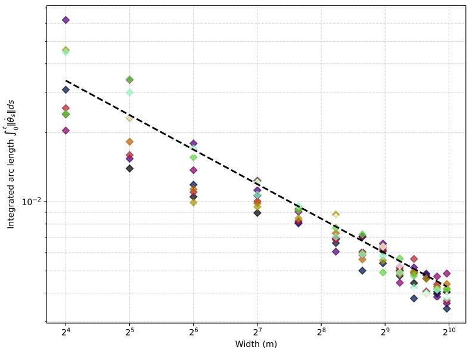  
Figure 10: We plot the asymptotics of $\int \mathbb { E } \| \dot { \theta } \| _ { h } d$ s near initialization across 10 · (number of widths) distinct calculations. We use batch size 64, learning rate 0.01, and 15 steps. The line is the $\textstyle { \frac { 1 } { \sqrt { m } } }$ asymptotic line. The neural network is consistent with 3.

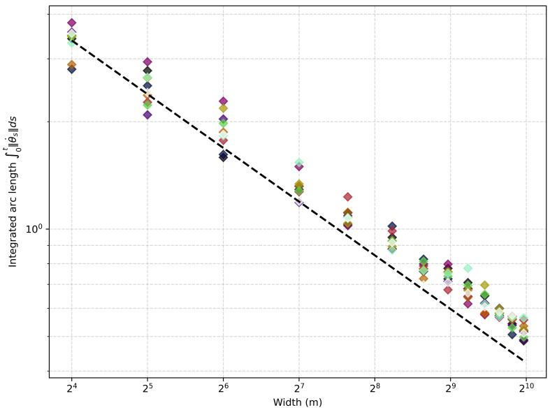  
Figure 11: We plot the asymptotics of $\int \mathbb { E } \| \dot { \theta } \| _ { h } d s$ near initialization across 10 · (number of widths) distinct calculations. We use batch size 64, learning rate 0.5, and 50 steps, meaning we deviate from initialization much further than 10. The line is consistent with Figure 10, and the network consistent with 3.

By Grönwall’s inequality, we bound the trajectory

$$
V ( t ) \leq V ( 0 ) \exp \left( 2 \int _ { 0 } ^ { t } H ( s ) d s - 2 \int _ { 0 } ^ { t } \mu ( s ) d s \right) .\tag{11.28}
$$

We are given the initialization bounds at $t = 0$ using the results of 8.2

$$
H ( 0 ) = \mathcal { O } ( \frac { 1 } { \sqrt { m } } ) \quad \mathrm { a n d } \quad \mu ( 0 ) = \mathcal { O } ( \frac { 1 } { \sqrt { m } } ) .\tag{11.29}
$$

We assume the Hessians are locally Lipschitz with respect to the Kähler metric connection with constant L. We can note via Fundamental Theorem of Calculus (take absolute continuity)

$$
\| \nabla _ { \omega } ^ { 2 , 0 } \mathcal { L } ( \theta _ { t } ) \| _ { h } - \| \nabla _ { \omega } ^ { 2 , 0 } \mathcal { L } ( \theta _ { t } ) | _ { t = 0 } \| _ { h } = \int _ { 0 } ^ { t } \frac { d } { d s } \| \nabla _ { \omega } ^ { 2 , 0 } \mathcal { L } ( \theta _ { s } ) \| _ { h } d s\tag{11.30}
$$

and moreover via chain rule

$$
\frac { d } { d s } \| \nabla _ { \omega } ^ { 2 , 0 } \mathcal { L } ( \theta _ { t } ) \| _ { h } \leq \| \nabla _ { h } ( \nabla _ { \omega } ^ { 2 , 0 } \mathcal { L } ( \theta _ { s } ) ) \| _ { h } \| \dot { \theta } _ { s } \| _ { h } \leq L \| \dot { \theta } _ { s } \| _ { h } ,\tag{11.31}
$$

so under a Lipschitz condition, we see

$$
H ( t ) \leq H ( 0 ) + L \int _ { 0 } ^ { t } \mathbb { E } [ \| \dot { \theta } _ { s } \| _ { h } ] d s .\tag{11.32}
$$

Similarly,

$$
\mu ( t ) \geq \mu ( 0 ) - L \int _ { 0 } ^ { t } \mathbb { E } [ \| \dot { \theta } _ { s } \| _ { h } ] d s .\tag{11.33}
$$

Since $\begin{array} { r } { \int _ { 0 } ^ { t } \mathbb { E } [ \| \dot { \theta } _ { s } \| _ { h } ] d s = \mathcal { O } ( \frac { 1 } { \sqrt { m } } ) } \end{array}$ , we can substitute this into our Lipschitz bounds, so

$$
H ( t ) = \mathcal { O } ( \frac { 1 } { \sqrt { m } } ) + L \cdot \mathcal { O } ( \frac { 1 } { \sqrt { m } } ) = \mathcal { O } ( \frac { 1 } { \sqrt { m } } ) ,\tag{11.34}
$$

and moreover,

$$
\mu ( t ) = \mathcal { O } ( \frac { 1 } { \sqrt { m } } ) - L \cdot \mathcal { O } ( \frac { 1 } { \sqrt { m } } ) = \mathcal { O } ( \frac { 1 } { \sqrt { m } } ) .\tag{11.35}
$$

We return to the Grönwall bound established previously. Using what we found

$$
V ( t ) \leq V ( 0 ) \exp \left( 2 \int _ { 0 } ^ { t } \mathcal { O } ( \frac { 1 } { \sqrt { m } } ) d s - 2 \int _ { 0 } ^ { t } \mathcal { O } ( \frac { 1 } { \sqrt { m } } ) d s \right)\tag{11.36}
$$

$$
\leq V ( 0 ) \exp \left( 2 t \cdot \mathcal { O } ( \frac { 1 } { \sqrt { m } } ) \right) .\tag{11.37}
$$

The constants do not cancel, which holds almost surely.

To guarantee convergence for finite m, we bound the integral of $\mu ( s )$ via a lower bound. This shows $\mu$ and its integral are suficiently large and therefore the exponential with this negative integral in its exponent are dissipative, giving a convergence result. Let us establish an eigenvalue dissipation rate geometrically. Let $M _ { i \overline { { { j } } } } = \nabla _ { i \overline { { { j } } } } \mathcal { L }$ denote the (1, 1) Hessian, and let $N _ { i j } = \nabla _ { i j } { \mathcal { L } }$ denote the $( 2 , 0 )$ Hessian. Let us consider the natural gradient flow $\dot { \theta } ^ { i } = - h ^ { i \overline { { j } } } \partial _ { \overline { { i } } } \mathcal { L } = - \nabla ^ { i } \mathcal { L }$ as in 4.1. Since the parameter is a function of time, we can perform the chain rule

$$
\partial _ { t } \mathcal { L } = \frac { d } { d t } \mathcal { L } ( \theta ( t ) , \overline { { { \theta } } } ( t ) ) = \sum _ { p } \frac { \partial \mathcal { L } } { \partial \theta ^ { p } } \dot { \theta } ^ { p } + \sum _ { q } \frac { \partial \mathcal { L } } { \partial \overline { { { \theta } } } ^ { q } } \dot { \overline { { { \theta } } } } ^ { q } .\tag{11.38}
$$

We compute the material derivative

$$
\frac { D } { d t } M _ { i \overline { { { j } } } } = \dot { \theta } ^ { p } \nabla _ { p } M _ { i \overline { { { j } } } } + \dot { \overline { { { \theta } } } } ^ { q } \nabla _ { \overline { { { q } } } } M _ { i \overline { { { j } } } } .\tag{11.39}
$$

Substituting our gradient flow,

$$
\frac { D } { d t } M _ { i \overline { { { j } } } } = - \nabla ^ { p } \mathcal { L } \nabla _ { p } ( \nabla _ { i \overline { { { j } } } } \mathcal { L } ) - \nabla ^ { \overline { { { q } } } } \mathcal { L } \nabla _ { \overline { { { q } } } } ( \nabla _ { i \overline { { { j } } } } \mathcal { L } ) .\tag{11.40}
$$

Since the metric is Kähler, $\nabla _ { i \overline { { { j } } } p } \mathcal { L } = \nabla _ { p i \overline { { { j } } } } \mathcal { L }$ , using notation $\nabla _ { i \overline { { { j } } } p } \mathcal { L } = \nabla _ { i } \nabla _ { \overline { { { j } } } } \nabla _ { p } \mathcal { L }$ . For the anti-holomorphic commutativity, we can note using Riemannian curvature

$$
\nabla _ { \overline { { { q } } } i \overline { { { j } } } } \mathcal { L } = \nabla _ { i \overline { { { j } } } \overline { { { q } } } } \mathcal { L } - R _ { i \overline { { { j } } } p \overline { { { q } } } } \nabla ^ { p } \mathcal { L } .\tag{11.41}
$$

Substituting back in, the material derivative obeys

$$
\frac { D } { d t } M _ { i \bar { j } } = - \nabla ^ { p } \mathcal { L } \nabla _ { i \bar { j } p } \mathcal { L } - \nabla ^ { \bar { q } } \mathcal { L } ( \nabla _ { i \bar { j } \bar { q } } \mathcal { L } - R _ { i \bar { j } p \bar { q } } \nabla ^ { p } \mathcal { L } )\tag{11.42}
$$

$$
= - ( \nabla ^ { p } \mathcal { L } \nabla _ { i \overline { { { j } } } p } \mathcal { L } + \nabla ^ { \overline { { { q } } } } \mathcal { L } \nabla _ { i \overline { { { j } } } \overline { { { q } } } } \mathcal { L } ) + R _ { i \overline { { { j } } } p \overline { { { q } } } } \nabla ^ { p } \mathcal { L } \nabla ^ { \overline { { { q } } } } \mathcal { L } .\tag{11.43}
$$

Now, we analyze the spatial Hessian of the squared gradient norm, $F = \| \nabla \mathcal { L } \| _ { h } ^ { 2 } = h ^ { p \overline { { q } } } \nabla _ { p } \mathcal { L } \nabla _ { \overline { { q } } } \mathcal { L }$ . Applying the covariant derivative $\nabla _ { i \overline { { j } } }$ and the product rule generates four terms

$$
\nabla _ { i \overline { { \tilde { \jmath } } } } ( \| \nabla { \cal { L } } \| ^ { 2 } ) = h ^ { p \overline { { \boldsymbol { q } } } } ( \nabla _ { i \overline { { \tilde { \jmath } } } p } { \cal { L } } ) \nabla _ { \overline { { \boldsymbol { q } } } } { \cal { L } } + h ^ { p \overline { { \boldsymbol { q } } } } \nabla _ { p } { \cal { L } } ( \nabla _ { i \overline { { \tilde { \jmath } } } \overline { { \boldsymbol { q } } } } { \cal { L } } ) + h ^ { p \overline { { \boldsymbol { q } } } } \nabla _ { i p } { \cal { L } } \nabla _ { \overline { { \tilde { \jmath } } } \overline { { \boldsymbol { q } } } } { \cal { L } } + h ^ { p \overline { { \boldsymbol { q } } } } \nabla _ { \overline { { \tilde { \jmath } } } p } { \cal { L } } \nabla _ { i \overline { { \boldsymbol { q } } } } { \cal { L } } .\tag{11.44}
$$

We can rewrite using our definitions

$$
\begin{array} { r } { \nabla _ { i \overline { { j } } } ( \| \nabla \mathcal { L } \| ^ { 2 } ) = \nabla ^ { p } \mathcal { L } \nabla _ { i \overline { { j } } p } \mathcal { L } + \nabla ^ { \overline { { q } } } \mathcal { L } \nabla _ { i \overline { { j } } \overline { { q } } } \mathcal { L } + N _ { i p } N _ { \overline { { j } } } ^ { p } + M _ { i \overline { { k } } } M _ { \overline { { j } } } ^ { \overline { { k } } } . } \end{array}\tag{11.45}
$$

Rearranging,

$$
- ( \nabla ^ { p } \mathcal { L } \nabla _ { i \bar { j } p } \mathcal { L } + \nabla ^ { \bar { q } } \mathcal { L } \nabla _ { i \bar { j } \bar { q } } \mathcal { L } ) = - \nabla _ { i \bar { j } } ( \| \nabla \mathcal { L } \| ^ { 2 } ) + M _ { i \overline { { k } } } M _ { \bar { j } } ^ { \overline { { k } } } + N _ { i p } N _ { \bar { j } } ^ { p } .\tag{11.46}
$$

Substituting back into 11.42,

$$
\frac { D } { d t } M _ { i \overline { { { j } } } } = M _ { i \overline { { { k } } } } M _ { \overline { { { j } } } } ^ { \overline { { { k } } } } + N _ { i p } N _ { \overline { { { j } } } } ^ { p } + R _ { i \overline { { { j } } } p \overline { { { q } } } } \nabla ^ { p } \mathcal { L } \nabla ^ { \overline { { { q } } } } \mathcal { L } - \nabla _ { i \overline { { { j } } } } ( \| \nabla \mathcal { L } \| ^ { 2 } ) .\tag{11.47}
$$

For normalized eigenvector $X .$ , we have the minimum eigenvalue equation of the Hessian (in a geometric sense, so scaled by the metric) can be calculated via the standard eigenvalue equation

$$
M _ { i \overline { { { j } } } } X ^ { i } = \mu ( t ) h _ { i \overline { { { j } } } } X ^ { i } .\tag{11.48}
$$

We can contract with $X ^ { j }$ and under a normalized, unit eigenvector property $h _ { i \overline { { { j } } } } X ^ { i } X ^ { \overline { { { j } } } } = 1$ , we get the eigenvalue follows under these two equations

$$
\mu ( t ) = M _ { i \overline { { { j } } } } X ^ { i } X ^ { \overline { { { j } } } } .\tag{11.49}
$$

Diferentiating,

$$
\frac { d } { d t } \mu ( t ) = ( \frac { D } { d t } M _ { i \overline { { { j } } } } ) X ^ { i } X ^ { \overline { { { j } } } } .\tag{11.50}
$$

Contracting with simplified 11.42,

$$
\frac { d } { d t } \mu ( t ) = M _ { i \overline { { k } } } M _ { \bar { j } } ^ { \overline { { k } } } X ^ { i } X ^ { \overline { { j } } } + N _ { i p } N _ { \overline { { j } } } ^ { p } X ^ { i } X ^ { \overline { { j } } } + R _ { i \overline { { j } } p \overline { { q } } } X ^ { i } X ^ { \overline { { j } } } \nabla ^ { p } \mathcal { L } \nabla ^ { \overline { { q } } } \mathcal { L } - X ^ { i } X ^ { \overline { { j } } } \nabla _ { i \overline { { j } } } ( \| \nabla \mathcal { L } \| ^ { 2 } ) .\tag{11.51}
$$

Because X is an eigenvector,

$$
M _ { i \overline { { k } } } M _ { \overline { { j } } } ^ { \overline { { k } } } X ^ { i } X ^ { \overline { { j } } } = ( M _ { i \overline { { k } } } X ^ { i } ) ( \overline { { M _ { j \overline { { l } } } X ^ { j } } } ) = ( \mu ( t ) X _ { \overline { { k } } } ) ( \mu ( t ) X ^ { \overline { { k } } } ) = \mu ( t ) ^ { 2 } .\tag{11.52}
$$

The above commutes since the contraction makes it scalar. Moreover, we can note

$$
N _ { i p } N _ { \bar { j } } ^ { p } X ^ { i } X ^ { \overline { { j } } } = \| N ( X , \cdot ) \| _ { h } ^ { 2 } .\tag{11.53}
$$

Putting everything together, we conclude

$$
\frac { d } { d t } \mu ( t ) \geq - \mu ( t ) ^ { 2 } - \| N ( X , \cdot ) \| _ { h } ^ { 2 } + R _ { i \overline { { j } } p \overline { { q } } } X ^ { i } X ^ { \overline { { j } } } \nabla ^ { p } \mathcal { L } \nabla ^ { \overline { { q } } } \mathcal { L } .\tag{11.54}
$$

Assuming the holomorphic bisectional curvature is positive and bounded below by a constant $\kappa > 0$ , we have $R _ { i \bar { j } p \overline { { { q } } } } X ^ { i } X ^ { \overline { { { j } } } } \nabla ^ { p } \mathcal { L } \nabla ^ { \overline { { { q } } } } \mathcal { L } \geq \kappa v ( t )$ , where $v ( t ) = \| \nabla \mathcal { L } \| _ { h } ^ { 2 }$ . We can rewrite

$$
\frac { d } { d t } \mu ( t ) \geq \mu ( t ) ^ { 2 } + \| N ( X , \cdot ) \| _ { h } ^ { 2 } + \kappa v ( t ) - X ^ { i } X ^ { \overline { { j } } } \nabla _ { i \overline { { j } } } ( \| \nabla \mathcal { L } \| ^ { 2 } ) .\tag{11.55}
$$

We can also find an upper bound on the minimum eigenvalue. This shows dependence on the loss landscape, and it moreover shows the exponential does not blow-up in finite time, giving a stability result. By Cauchy-Schwarz in time, $\begin{array} { r } { - \int _ { 0 } ^ { t } \mu ( s ) d s \leq \sqrt { t } \left( \int _ { 0 } ^ { t } \mu ( s ) ^ { 2 } d s \right) ^ { 1 / 2 } } \end{array}$ . We control this $L ^ { 2 }$ norm via the complex Bochner-Weitzenböck identity (we see this identity again in 12.3 and a variant in 12.1)

$$
\frac { 1 } { 2 } \Delta _ { \overline { { \partial } } } v = \| \nabla _ { \omega } ^ { 1 , 1 } \mathcal { L } \| _ { h } ^ { 2 } + \| \nabla _ { \omega } ^ { 2 , 0 } \mathcal { L } \| _ { h } ^ { 2 } + \operatorname { R i c } ( \nabla _ { h } \mathcal { L } , \overline { { \nabla } } _ { h } \mathcal { L } ) + \operatorname { R e } \langle \nabla _ { h } \mathcal { L } , \nabla _ { h } ( \Delta _ { \overline { { \partial } } } \mathcal { L } ) \rangle _ { h } .\tag{11.56}
$$

Using the identity $\begin{array} { r } { \frac { d } { d t } ( \Delta _ { \overline { { \partial } } } \mathcal { L } ) = - \mathrm { R e } \langle \nabla _ { h } \mathcal { L } , \nabla _ { h } ( \Delta _ { \overline { { \partial } } } \mathcal { L } ) \rangle _ { h } } \end{array}$ , we bound the (1, 1) Hessian trace from below by ${ \frac { K } { 2 } } \mu ( t ) ^ { 2 }$ , and define $\kappa ( t ) = \operatorname* { i n f } _ { \Omega } \lambda _ { \operatorname* { m i n } } ( \operatorname { R i c } )$ . Taking expectation by integrating and applying integration, assuming vanishing boundaries, and rearranging

$$
\frac { d } { d t } \mathbb { E } [ \Delta _ { \overline { { \partial } } } \mathcal { L } ] \geq \frac { K } { 2 } \mu ( t ) ^ { 2 } + \kappa ( t ) V ( t ) - \frac { 1 } { 2 } \mathbb { E } \left[ \frac { \Delta _ { \overline { { \partial } } } \rho _ { t } } { \rho _ { t } } v ( t ) \right] .\tag{11.57}
$$

The $\mu$ term corresponds to the (1,1)-Hessian term, the V term corresponds to $\operatorname { R i c } ( \nabla _ { h } \mathcal { L } , \overline { { \nabla } } _ { h } \mathcal { L } )$ , and the (2,0)-Hessian term is dropped. The $\begin{array} { r } { \frac { 1 } { 2 } \Delta _ { \overline { { \partial } } } v , \operatorname { R e } \langle \nabla _ { h } \mathcal { L } , \nabla _ { h } ( \Delta _ { \overline { { \partial } } } \mathcal { L } ) \rangle } \end{array}$ terms swap sides. Integrating over [0, T] isolates the $L ^ { 2 }$ bound on the minimum eigenvalue

$$
\sqrt { \int _ { 0 } ^ { T } \mu ( t ) ^ { 2 } d t } \leq \sqrt { \frac { 2 } { K } \left( \mathbb { E } [ \Delta _ { \ni } \mathcal { L } ( T ) ] - \mathbb { E } [ \Delta _ { \ni } \mathcal { L } ( 0 ) ] - \int _ { 0 } ^ { T } \left( \kappa ( t ) V ( t ) - \frac { 1 } { 2 } \mathbb { E } \left[ \frac { \Delta _ { \partial } \rho _ { t } } { \rho _ { t } } v ( t ) \right] \right) d t \right) } .\tag{11.58}
$$

Therefore,

$$
V ( t ) \leq V ( 0 ) \exp \left( 2 \int _ { 0 } ^ { t } H ( s ) d s + 2 \sqrt { t } \| \mu \| _ { L ^ { 2 } ( [ 0 , t ] ) } \right) ,\tag{11.59}
$$

and simplifying gives a stability result, since the exponential does not blow-up in finite time. Let us try to be convinced this is suficiently bounded and away from infinity. L does not obey a maximum principle. For $\Delta _ { \overline { { { \partial } } } } \mathcal { L }$ to admit a maximum principle, $\mathcal { L }$ would need to be subharmonic or superharmonic, which is unrealistic in a deep learning setting. With a compact parameter space and suficiently nice activations, the expected Dolbealt Laplacians on the loss are finite. Of course, the Hessians of interest in our primarily results are on $f$ which are interconnected with $\mathcal { L }$ although not the same exactly since the loss is in terms of neural network output. The $\rho _ { s } ^ { - 1 }$ is ostensibly the most problematic term, as it is a density with potentially a vanishing quality, although the expectation re-adds the measure across the complex manifold, thereby canceling.

Remark. Let us return to 11.25. We will rewrite it using physics notation since this is compatible and standard with Rayleigh quotients. Denote $| \Psi ( t ) \rangle : = | \nabla _ { h } L ( t ) \rangle$ . We get

$$
\frac { d } { d t } \langle \Psi | \Psi \rangle _ { h } = - 2 \mathrm { R e } \langle \overline { { \Psi } } | \nabla _ { \omega } ^ { 2 , 0 } L | \Psi \rangle _ { h } - 2 \langle \Psi | \nabla _ { \omega } ^ { 1 , 1 } L | \Psi \rangle _ { h } .\tag{11.60}
$$

Factoring out $v ( t ) = \langle \Psi | \Psi \rangle _ { h }$

$$
\frac { d } { d t } v ( t ) = - \left[ 2 \frac { \mathrm { R e } \langle \overline { { \Psi } } | \nabla _ { \omega } ^ { 2 , 0 } L | \Psi \rangle _ { h } } { \langle \Psi | \Psi \rangle _ { h } } + 2 \frac { \langle \Psi | \nabla _ { \omega } ^ { 1 , 1 } L | \Psi \rangle _ { h } } { \langle \Psi | \Psi \rangle _ { h } } \right] v ( t ) .\tag{11.61}
$$

We can notice in the interior there are two Rayleigh quotients. Define two scaled Hessians such that $\begin{array} { r } { \nabla _ { \omega } ^ { 2 , 0 } L = \frac { 1 } { \sqrt { m } } \widetilde { H } ^ { 2 , 0 } , \nabla _ { \omega } ^ { 1 , 1 } L = \frac { 1 } { \sqrt { m } } \widetilde { H } ^ { 1 , 1 } } \end{array}$ . We can observe

$$
\frac { d } { d t } v ( t ) = - \frac { 1 } { \sqrt { m } } \left[ 2 \frac { \mathrm { R e } \langle \overline { { \Psi } } | \widetilde { H } ^ { 2 , 0 } | \Psi \rangle _ { h } } { \langle \Psi | \Psi \rangle _ { h } } + 2 \frac { \langle \Psi | \widetilde { H } ^ { 1 , 1 } | \Psi \rangle _ { h } } { \langle \Psi | \Psi \rangle _ { h } } \right] v ( t ) .\tag{11.62}
$$

In Rayleigh quotient notation

$$
\langle \mathcal { T } _ { \mathrm { d e f } } ( t ) \rangle _ { \Psi } : = 2 \frac { \mathrm { R e } \langle \overline { { \Psi } } | \widetilde { H } ^ { 2 , 0 } | \Psi \rangle _ { h } } { \langle \Psi | \Psi \rangle _ { h } } + 2 \frac { \langle \Psi | \widetilde { H } ^ { 1 , 1 } | \Psi \rangle _ { h } } { \langle \Psi | \Psi \rangle _ { h } } .\tag{11.63}
$$

Therefore, we can note a reformulation with 12.31

$$
\frac { d } { d t } v ( t ) + \frac { 1 } { \sqrt { m } } \langle \mathcal { T } _ { \mathrm { d e f } } ( t ) \rangle _ { \Psi } v ( t ) = 0 .\tag{11.64}
$$

Via power series

$$
\left( \frac { d } { d t } + \frac { 1 } { \sqrt { m } } \langle \mathcal { T } _ { \mathrm { d e f } } ( t ) \rangle _ { \Psi } \right) \left( v _ { 0 } ( t ) + \frac { 1 } { \sqrt { m } } v _ { 1 } ( t ) + \frac { 1 } { m } v _ { 2 } ( t ) + \ldots \right) = 0 .\tag{11.65}
$$

Permit m to be variable. In reality, m is fixed, but say in an asymptotic limit $m  \infty$ , m is nonconstant. We will show the constants are zero. Denote $\epsilon _ { i } = 1 / \sqrt { m _ { i } }$ for short. We can write this as a system

$$
\left\{ \begin{array} { l l } { \mathcal { E } _ { 0 } ( t ) + \epsilon _ { 1 } \mathcal { E } _ { 1 } ( t ) + \epsilon _ { 1 } ^ { 2 } \mathcal { E } _ { 2 } ( t ) + \cdot \cdot \cdot + \epsilon _ { 1 } ^ { N - 1 } \mathcal { E } _ { N - 1 } ( t ) = 0 } \\ { \mathcal { E } _ { 0 } ( t ) + \epsilon _ { 2 } \mathcal { E } _ { 1 } ( t ) + \epsilon _ { 2 } ^ { 2 } \mathcal { E } _ { 2 } ( t ) + \cdot \cdot \cdot + \epsilon _ { 2 } ^ { N - 1 } \mathcal { E } _ { N - 1 } ( t ) = 0 } \\ { \quad \vdots } \\ { \mathcal { E } _ { 0 } ( t ) + \epsilon _ { N } \mathcal { E } _ { 1 } ( t ) + \epsilon _ { N } ^ { 2 } \mathcal { E } _ { 2 } ( t ) + \cdot \cdot \cdot + \epsilon _ { N } ^ { N - 1 } \mathcal { E } _ { N - 1 } ( t ) = 0 . } \end{array} \right.\tag{11.66}
$$

For particular choice,

$$
\left[ \begin{array} { c c c c c c } { 1 } & { \epsilon _ { 1 } } & { \epsilon _ { 1 } ^ { 2 } } & { \ldots } & { \epsilon _ { 1 } ^ { N - 1 } } \\ { 1 } & { \epsilon _ { 2 } } & { \epsilon _ { 2 } ^ { 2 } } & { \ldots } & { \epsilon _ { 2 } ^ { N - 1 } } \\ { \vdots } & { \vdots } & { \vdots } & { \ddots } & { \vdots } \\ { 1 } & { \epsilon _ { N } } & { \epsilon _ { N } ^ { 2 } } & { \ldots } & { \epsilon _ { N } ^ { N - 1 } } \end{array} \right] \left[ \begin{array} { c } { \mathcal { E } _ { 0 } ( t ) } \\ { \mathcal { E } _ { 1 } ( t ) } \\ { \vdots } \\ { \mathcal { E } _ { N - 1 } ( t ) } \end{array} \right] = \left[ \begin{array} { c } { 0 } \\ { 0 } \\ { \vdots } \\ { 0 } \end{array} \right] ,\tag{11.67}
$$

which is Vandermonde and invertible, and writing $V { \mathcal { E } } ( t ) = 0$ , this has determinant

$$
\operatorname* { d e t } ( V ) = \prod _ { 1 \leq i < j \leq N } ( \epsilon _ { j } - \epsilon _ { i } ) .\tag{11.68}
$$

Use shorthand $\begin{array} { r } { \mathcal { D } _ { 0 } : = \frac { d } { d t } } \end{array}$ denote the time derivative linear evolution operator infinite-width, and we have

$$
\mathcal { D } _ { 0 } v _ { 1 } ( t ) = - \langle \mathcal { T } _ { \mathrm { d e f } } ( t ) \rangle _ { \Psi } v _ { 0 } ( t ) ,\tag{11.69}
$$

or equivalently,

$$
v _ { k } ( t ) = - \int _ { 0 } ^ { t } \langle \mathcal { T } _ { \mathrm { d e f } } ( \tau ) \rangle _ { \Psi } v _ { k - 1 } ( \tau ) d \tau .\tag{11.70}
$$

What this primarily shows is that parameter evolution retains a "memory" of previous states, and that subsequent states are largely determined by their previous states, geometrically speaking. In general, a

Rayleigh quotient takes the form

$$
\mathrm { R a y l e i g h } ( M , x ) = \frac { x ^ { \dagger } M x } { x ^ { \dagger } x } ,\tag{11.71}
$$

which is a way to stretch the space in the direction of x. Moreover, $\begin{array} { r } { \lambda _ { \operatorname* { m i n } } \le \frac { x ^ { \dagger } M x } { x ^ { \dagger } x } \le \lambda _ { \operatorname* { m a x } } } \end{array}$ for eigenvalues of M.

## 11.3 Gradient flux searches

In this section, we attempt to characterize the total amount of flexibility across gradients in an ϵ-ball around initialization. The motivation for this is we will examine the flux across varying radii via

$$
\int _ { 0 } ^ { \epsilon } \left( \oint _ { \partial B _ { r } ( \theta _ { 0 } ) } d ^ { c } \mathcal { L } \wedge \omega ^ { K - 1 } \right) d r .\tag{11.72}
$$

and attempt to quantify this flux value. Generally, a larger value is more desirable. This implies there is greater variability for trajectory paths, and greater ability to escape the ϵ-ball in a quickly-descending descent path. In particular, we will try to characterize descent behavior pathologically using descent rules and the gradients. For example, we examine a ball around initialization via flux around the boundary with Stokes’ theorem

$$
\oint _ { \partial B _ { \epsilon } ( \theta _ { 0 } ) } d ^ { c } \mathcal { L } \wedge \omega ^ { K - 1 } = \int _ { B _ { \epsilon } ( \theta _ { 0 } ) } i \partial \overline { { { \partial } } } \mathcal { L } \wedge \omega ^ { K - 1 } \propto \int _ { B _ { \epsilon } ( \theta _ { 0 } ) } ( \Delta _ { \overline { { { \partial } } } } \mathcal { L } ) \frac { \omega ^ { K } } { K ! } .\tag{11.73}
$$

The left-hand side corresponds to the gradients on the loss since $\begin{array} { r } { d ^ { c } = - \frac { i } { 2 } ( \partial - \overline { { \partial } } ) } \end{array}$ , and we can link it to the Laplacian proportionally. Under a well-curvature-conditioned landscape, the Laplacian is positive and behaves nicely. This translates to robust gradient flux. If the gradient of the loss behaves nicely, so do the descent directions. In a profaned-curvature landscape, the eigenvalue blowup is characterized with anisotropy and Laplacian contributions from distorted directions are afected, and overall descent paths are afected too. Ill-conditioned gradients on the loss afect learning negatively. We can note $\bar { d } ( d ^ { c } { \mathcal { L } } \wedge \omega ^ { K - 1 } ) = d d ^ { c } { \mathcal { L } } \wedge \omega ^ { K - 1 } = i \partial \overline { { \partial } } { \mathcal { L } } \wedge \omega ^ { K - 1 }$ and the Hessian of the loss is an exact 2-form. In de Rham cohomology, all exact forms are trivial; however, this is not to say the result of manipulating 11.73 is not afected by Ricci curvature, which it is. We prove this in Appendix 11.3, therefore this result is afected whether or not the manifold is Calabi-Yau.

Proof of Lemma 11. We find the flux across the ball around initialization and accumulate it across radii by by integrating the (2K − 1)-form over the boundary $\partial B _ { r } ( \theta _ { 0 } )$ and pulling it across the radius r

$$
\mathcal { W } ( \epsilon ) = \int _ { 0 } ^ { \epsilon } \left( \oint _ { \partial B _ { r } ( \theta _ { 0 } ) } d ^ { c } \mathcal { L } \wedge \omega ^ { K - 1 } \right) d r .\tag{11.74}
$$

We apply Stokes’ theorem. As we saw earlier in 11.73, but including constants, and using the relation between the Kähler form and the Laplacian,

$$
\oint _ { \partial B _ { r } ( \theta _ { 0 } ) } d ^ { c } \mathcal { L } \wedge \omega ^ { K - 1 } = \int _ { B _ { r } ( \theta _ { 0 } ) } i \partial \overline { { \partial } } \mathcal { L } \wedge \omega ^ { K - 1 } = \frac { 1 } { K } \int _ { B _ { r } ( \theta _ { 0 } ) } ( \Delta _ { \overline { { \partial } } } \mathcal { L } ) \omega ^ { K } .\tag{11.75}
$$

The local expansion of the Kähler form in a local coordinate chart ξ up to fourth order is Hezari et al. (2016) Ruan (1998)

$$
\Phi ( \xi , \overline { { { \xi } } } ) = \sum _ { i = 1 } ^ { d } \xi ^ { i } \overline { { { \xi } } } ^ { i } - \frac { 1 } { 4 } R _ { i \overline { { { j } } } k \overline { { { l } } } } \xi ^ { i } \overline { { { \xi } } } ^ { j } \xi ^ { k } \overline { { { \xi } } } ^ { l } + { \mathcal O } ( \| \xi \| ^ { 5 } ) .\tag{11.76}
$$

This is a local property of a Kähler manifold under a fixed gauge. Diferentiating since the metric is the Wirtinger Hessian of the potential,

$$
h _ { i \overline { { { j } } } } ( \xi ) = \delta _ { i \overline { { { j } } } } - R _ { i \overline { { { j } } } k \overline { { { l } } } } \xi ^ { k } \overline { { { \xi } } } ^ { l } + \mathcal { O } ( \| \xi \| ^ { 3 } ) .\tag{11.77}
$$

Let $\begin{array} { r } { \omega _ { 0 } = \frac { i } { 2 } \delta _ { i \overline { { j } } } d \theta ^ { i } \wedge d \overline { { \theta } } ^ { j } } \end{array}$ be the standard flat Kähler form. The volume expansion can be written

$$
\frac { \omega ^ { K } } { K ! } = \left( 1 - \mathrm { R i c } _ { k \bar { l } } \xi ^ { k } \overline { { { \xi } } } ^ { l } + { \mathcal O } ( \| \xi \| ^ { 3 } ) \right) \frac { \omega _ { 0 } ^ { K } } { K ! } .\tag{11.78}
$$

Let us take the inverse h,

$$
h ^ { i \overline { { j } } } ( \xi ) = \delta ^ { i \overline { { j } } } + { R ^ { i \overline { { j } } } } _ { k \overline { { l } } } \xi ^ { k } \overline { { \xi } } ^ { l } + \mathcal { O } ( \| \xi \| ^ { 3 } ) .\tag{11.79}
$$

Therefore, contracting the inverse metric with the mixed Hessian

$$
\Delta _ { \overline { { { \partial } } } } \mathcal { L } = \left( \delta ^ { i \overline { { { j } } } } + R _ { k \overline { { { l } } } } ^ { i \overline { { { j } } } } \xi ^ { k } \overline { { { \xi } } } ^ { l } + \mathcal { O } ( \| \xi \| ^ { 3 } ) \right) \partial _ { i } \overline { { { \partial } } } _ { j } \mathcal { L } .\tag{11.80}
$$

Multiplying by the volume form as in 11.78,

$$
\begin{array} { r l } & { ( \Delta _ { \overline { { \partial } } } \mathcal { L } ) \frac { \omega ^ { K } } { K ! } = \left[ \Delta _ { 0 } \mathcal { L } + R ^ { i _ { \overline { { j } } } ^ { \overline { { j } } } } { } _ { k \overline { { i } } } \xi ^ { k } \overline { { \xi } } ^ { \overline { { i } } } \partial _ { i } \overline { { \partial } } _ { j } \mathcal { L } + \mathcal { O } ( \| \xi \| ^ { 3 } ) \right] \left[ 1 - \mathrm { R i c } _ { m \overline { { n } } } \xi ^ { m } \overline { { \xi } } ^ { n } + \mathcal { O } ( \| \xi \| ^ { 3 } ) \right] \frac { \omega _ { 0 } ^ { K } } { K ! } } \\ & { \quad \quad \quad \quad = \left[ \delta ^ { i _ { \overline { { j } } } ^ { \overline { { j } } } } \partial _ { i } \overline { { \partial } } _ { j } \mathcal { L } + \left( R ^ { i _ { \overline { { j } } } ^ { \overline { { j } } } } { } _ { k \overline { { i } } } \partial _ { i } \overline { { \partial } } _ { j } \mathcal { L } - \mathrm { R i c } _ { k \overline { { i } } } ( \Delta _ { 0 } \mathcal { L } ) \right) \xi ^ { k } \overline { { \xi } } ^ { l } + \mathcal { O } ( \| \xi \| ^ { 3 } ) \right] \frac { \omega _ { 0 } ^ { K } } { K ! } . } \end{array}\tag{11.81}
$$

(11.82)

Let us examine the integrand term

$$
\left( R _ { k \bar { l } } ^ { i \bar { j } } \partial _ { i } \bar { \partial } _ { j } \mathcal { L } - \operatorname { R i c } _ { k \bar { l } } ( \Delta _ { 0 } \mathcal { L } ) \right) \xi ^ { k } \overline { { \xi } } ^ { l } \frac { \omega _ { 0 } ^ { K } } { K ! }\tag{11.83}
$$

Under a Taylor expansion,

$$
\partial _ { i } \overline { { \partial } } _ { j } \mathcal { L } ( \xi ) = \partial _ { i } \overline { { \partial } } _ { j } \mathcal { L } ( 0 ) + \operatorname { R e } \left( c _ { i \overline { { j } } m } \xi ^ { m } \right) + O ( \Vert \xi \Vert ^ { 2 } ) .\tag{11.84}
$$

When we contract with the $\xi ^ { k } \overline { { \xi } } ^ { l }$ , we get a constant term $R _ { k \bar { l } } ^ { i \overline { { j } } } ( 0 ) \cdot \partial _ { i } \overline { { \partial } } _ { j } \mathcal { L } ( 0 ) \cdot \xi ^ { k } \overline { { \xi } } ^ { l }$ , an odd power term involving $\xi ^ { k } \overline { { \xi } } ^ { l } \xi ^ { m }$ , and a higher order term. Because we are integrating a symmetric ball, the odd powers vanish due to symmetry. Therefore, let us examine the curvature constant tensor

$$
C _ { k \bar { l } } = R _ { ~ k \bar { l } } ^ { i \bar { j } } ( 0 ) \partial _ { i } \bar { \partial } _ { j } \mathcal { L } ( 0 ) - \mathrm { R i c } _ { k \bar { l } } ( 0 ) \Delta _ { 0 } \mathcal { L } ( 0 ) ,\tag{11.85}
$$

and we must evaluate this with the contraction, the form, and the integral added

$$
\int _ { B _ { r } } C _ { k \bar { l } } \xi ^ { k } \overline { { { \xi } } } ^ { l } \frac { \omega _ { 0 } ^ { K } } { K ! } = C _ { k \bar { l } } \int _ { B _ { r } } \xi ^ { k } \overline { { { \xi } } } ^ { l } \frac { \omega _ { 0 } ^ { K } } { K ! } .\tag{11.86}
$$

Let us examine two cases of the above. The first is that we assume $k \neq l .$ In polar coordinates $\theta ^ { k } = \rho _ { k } e ^ { i \phi _ { k } }$ the integral portion includes $\begin{array} { r } { \int _ { 0 } ^ { 2 \pi } e ^ { i \phi _ { k } } d \phi _ { k } \int _ { 0 } ^ { 2 \pi } e ^ { - i \phi _ { l } } d \phi _ { l } } \end{array}$ . This integral vanishes to exactly 0. Let us examine the diagonal case $k = l .$ . The integral of the squared magnitude of one coordinate is the same as any other coordinate by symmetry. From this, we can note

$$
\sum _ { m = 1 } ^ { K } \int _ { B _ { r } } \| z ^ { m } \| ^ { 2 } d V _ { 0 } = \int _ { B _ { r } } \| z \| ^ { 2 } d V _ { 0 }\tag{11.87}
$$

$$
K \int _ { B _ { r } } \| z ^ { k } \| ^ { 2 } d V _ { 0 } = \int _ { B _ { r } } \| z \| ^ { 2 } d V _ { 0 } \Longrightarrow \int _ { B _ { r } } \| z ^ { k } \| ^ { 2 } d V _ { 0 } = { \frac { 1 } { K } } \int _ { B _ { r } } \| z \| ^ { 2 } d V _ { 0 } .\tag{11.88}
$$

Combining the two cases, we can develop

$$
\int _ { B _ { r } } \xi ^ { k } \overline { { { \xi } } } ^ { l } \frac { \omega _ { 0 } ^ { K } } { K ! } = \delta ^ { k \bar { l } } \frac { 1 } { K } \int _ { B _ { r } } \| \xi \| ^ { 2 } \frac { \omega _ { 0 } ^ { K } } { K ! } = \delta ^ { k \bar { l } } \frac { \pi ^ { K } r ^ { 2 K + 2 } } { K ! ( K + 1 ) } .\tag{11.89}
$$

The last equality is the evauluation of the integral, i.e. using polar coordinates. Therefore, returning to

11.86, we can contract the curvature term with a Kronecker delta

$$
C _ { k \bar { l } } \delta ^ { k \bar { l } } = R ^ { i \bar { j } } { } _ { k \bar { l } } ( 0 ) \delta ^ { k \bar { l } } \partial _ { i } \overline { { { \partial } } } _ { j } \mathcal { L } ( 0 ) - \mathrm { R i c } _ { k \bar { l } } ( 0 ) \delta ^ { k \bar { l } } \Delta _ { 0 } \mathcal { L } ( 0 ) .\tag{11.90}
$$

By definition $R _ { \ k \bar { l } } ^ { i \overline { { j } } } \delta ^ { k \overline { { l } } } = \mathrm { R i c } ^ { i \overline { { j } } }$ and $\mathrm { R i c } _ { k \bar { l } } \delta ^ { k \bar { l } } = R .$ . Putting everything together, namely returning to the integral of $1 1 . 7 5$ , the first term being the Kronecker contraction and the interior using 11.90

$$
\int _ { B _ { r } ( \theta _ { 0 } ) } ( \Delta _ { \bar { \theta } } \mathcal { L } ) \frac { \omega _ { 0 } ^ { K } } { K ! } = \Delta _ { 0 } \mathcal { L } ( 0 ) \frac { \pi ^ { K } r ^ { 2 K } } { K ! } + \left[ \mathrm { R i c } ^ { i \bar { j } } ( 0 ) \partial _ { i } \overline { { \partial } } _ { j } \mathcal { L } ( 0 ) - R \Delta _ { 0 } \mathcal { L } ( 0 ) \right] \frac { \pi ^ { K } r ^ { 2 K + 2 } } { K ! ( K + 1 ) } + \mathcal { O } ( r ^ { 2 K + 4 } ) .\tag{11.91}
$$

The first term includes the integral of the volume form with identity coeficient integrand. Multiplying through the factorial term,

$$
\int _ { B _ { \tau } ( \theta _ { 0 } ) } ( \Delta _ { \bar { \partial } } \mathcal { L } ) \omega ^ { K } = \Delta _ { 0 } \mathcal { L } ( 0 ) \pi ^ { K } r ^ { 2 K } + \left[ \mathrm { R i c } ^ { i \bar { j } } ( 0 ) \partial _ { i } \overline { { \partial } } _ { j } \mathcal { L } ( 0 ) - R \Delta _ { 0 } \mathcal { L } ( 0 ) \right] \frac { \pi ^ { K } r ^ { 2 K + 2 } } { K + 1 } + \mathcal { O } ( r ^ { 2 K + 4 } ) .\tag{11.92}
$$

Returning to our Stokes’ theorem identity in 11.75,

$$
\begin{array} { l } { { \displaystyle \oint _ { \partial B _ { r } ( \theta _ { 0 } ) } d ^ { c } \mathcal { L } \wedge \omega ^ { K - 1 } = \frac { 1 } { K } \int _ { B _ { r } ( \theta _ { 0 } ) } ( \Delta _ { \ \overline { { { \partial } } } } \mathcal { L } ) \omega ^ { K } } } \\ { { = \displaystyle \frac { \pi ^ { K } } { K } \Delta _ { 0 } \mathcal { L } ( 0 ) r ^ { 2 K } + \frac { \pi ^ { K } } { K ( K + 1 ) } \left[ \mathrm { R i c } ^ { i \overline { { { \ j } } } } ( 0 ) \partial _ { i } \overline { { { \partial } } } _ { j } \mathcal { L } ( 0 ) - R \Delta _ { 0 } \mathcal { L } ( 0 ) \right] r ^ { 2 K + 2 } + \mathcal { O } ( r ^ { 2 K + 4 } ) . } } \end{array}\tag{11.93}
$$

(11.94)

Lastly, integrating over the ball,

$$
\begin{array} { l } { \displaystyle \mathcal { W } ( \epsilon ) = \int _ { 0 } ^ { \epsilon } \left( \oint _ { \partial B _ { r } ( \theta _ { 0 } ) } d ^ { c } \mathcal { L } \wedge \omega ^ { K - 1 } \right) d r } \\ { = \int _ { 0 } ^ { \epsilon } \left( \frac { \pi ^ { K } } { K } \Delta _ { 0 } \mathcal { L } ( 0 ) r ^ { 2 K } + \frac { \pi ^ { K } } { K ( K + 1 ) } \left[ \mathrm { R i c } ^ { i \overline { { j } } } ( 0 ) \partial _ { i } \overline { { \partial } } _ { j } \mathcal { L } ( 0 ) - R \Delta _ { 0 } \mathcal { L } ( 0 ) \right] r ^ { 2 K + 2 } + \mathcal { O } ( r ^ { 2 K + 4 } ) \right) d r . } \end{array}\tag{11.95}
$$

(11.96)

Finishing the integration, we have the final result

$$
\mathcal { W } ( \epsilon ) = \frac { \pi ^ { K } } { K ( 2 K + 1 ) } \Delta _ { 0 } \mathcal { L } ( 0 ) \epsilon ^ { 2 K + 1 } + \frac { \pi ^ { K } } { K ( K + 1 ) ( 2 K + 3 ) } \left[ \mathrm { R i c } ^ { \bar { i } } \bar { \partial } ( 0 ) \partial _ { i } \bar { \partial } _ { j } \mathcal { L } ( 0 ) - R \Delta _ { 0 } \mathcal { L } ( 0 ) \right] \epsilon ^ { 2 K + 3 } + \mathcal { O } ( \epsilon ^ { 2 K + 5 } ) .\tag{11.97}
$$

Shorthand, this becomes

$$
\begin{array} { r } { \mathcal { W } ( \epsilon ) = \mathcal { O } \left( \Delta _ { 0 } \mathcal { L } \epsilon ^ { 2 K + 1 } + \left[ \left. \mathrm { R i c } , \mathcal { H } _ { \mathcal { L } } \right. - R \Delta _ { 0 } \mathcal { L } \right] \epsilon ^ { 2 K + 3 } + \mathcal { O } ( \epsilon ^ { 2 K + 5 } ) \right) . } \end{array}\tag{11.98}
$$

Let us tailor to our context. Under a quadratic cost $\begin{array} { r } { \mathcal { L } ( z ) = \sum _ { \alpha } ( f _ { \alpha } ( z ) - y _ { \alpha } ) ^ { 2 } } \end{array}$ , and since $\begin{array} { r } { \| \boldsymbol { i } \partial { \overline { { \partial } } } \boldsymbol { f } \| _ { 2 } = \mathcal { O } ( \frac { 1 } { \sqrt { m } } ) } \end{array}$ we can note via chain rule

$$
\partial _ { i } \overline { { { \partial } } } _ { j } \mathcal { L } ( 0 ) = 2 \sum _ { \alpha } \partial _ { i } f _ { \alpha } ( 0 ) \overline { { { \partial } } } _ { j } f _ { \alpha } ( 0 ) + { \mathcal O } ( \frac { 1 } { \sqrt { m } } ) .\tag{11.99}
$$

Contracting with the flat metric, since we have defined $\Delta _ { 0 }$ this way,

$$
\Delta _ { 0 } \mathscr { L } ( 0 ) = 2 \sum _ { \alpha } \| \partial f _ { \alpha } ( 0 ) \| ^ { 2 } + \mathcal { O } ( \frac { K } { \sqrt { m } } ) .\tag{11.100}
$$

Substituting back into our integrated flux of 11.97, we recover the quantity. In the Calabi-Yau case, the second term vanishes, leaving us with

$$
\mathcal { W } _ { C Y } ( \epsilon ) = \frac { 2 \pi ^ { K } } { K ( 2 K + 1 ) } \left( \sum _ { \alpha } \| \partial f _ { \alpha } ( 0 ) \| ^ { 2 } \right) \epsilon ^ { 2 K + 1 } + \mathcal { O } \left( \frac { \epsilon ^ { 2 K + 1 } } { ( 2 K + 1 ) \sqrt { m } } \right) + \mathcal { O } \left( \epsilon ^ { 2 K + 5 } \right) .\tag{11.101}
$$

This middle term can be reduced in the negatively curved scenario to

$$
- c \| \partial f _ { \alpha } ( 0 ) \| ^ { 2 } - ( - c K ) \| \partial f _ { \alpha } ( 0 ) \| ^ { 2 } = c ( K - 1 ) \| \partial f _ { \alpha } ( 0 ) \| ^ { 2 }\tag{11.102}
$$

since the trace picks up a dimension, and this total term is positive. We can deduce $\mathcal { W } ( \epsilon )$ is larger in the non-Calabi-Yau case, which means that the accumulated flux is higher. This means that gradients are stronger in that region, and there is greater escape of initialization.   
□

## 12 Additional results with negative curvature

## 12.1 Asymptotic variance

Proof of Lemma 12. Let us examine the steady state of the Fokker-Planck equation on the manifold in the limit $t \to \infty$

$$
\rho _ { \infty } ( \theta ) = \frac { 1 } { \mathcal { Z } } e ^ { - \frac { 2 } { \eta } \mathcal { L } ( \theta ) } , \quad \mathcal { Z } = \int _ { U } e ^ { - \frac { 2 } { \eta } \mathcal { L } ( \theta ) } \frac { \omega ^ { K } } { K ! } ,\tag{12.1}
$$

which follows from the Fokker-Planck equation when the time derivative vanishes, hence the distribution stabilizes, in the limit $\begin{array} { r } { 0 = \nabla _ { h } \cdot \left( \rho _ { \infty } ( \theta ) \nabla _ { h } \mathcal { L } ( \theta ) + \frac { \eta } { 2 } \nabla _ { h } \rho _ { \infty } ( \theta ) \right) } \end{array}$ . This can be reformulated to yield an exponential using the log derivative definition and $\begin{array} { r } { \nabla _ { h } ( \log \rho _ { \infty } ( \theta ) ) = - \frac { 2 } { \eta } \nabla _ { h } \mathcal { L } ( \theta ) } \end{array}$ . Define the Wittendeformed Dolbeault operator acting on (0, 1)-forms as

$$
\overline { { { \partial } } } _ { \eta } = \overline { { { \partial } } } + \frac { 1 } { \eta } \overline { { { \partial } } } \mathcal { L } \wedge .\tag{12.2}
$$

Here, η is the learning rate. The above extension of the Dolbeault operator takes into account the loss and it is built in, whereas $\overline { { \partial } }$ and its associated Laplacian $\Delta _ { \overline { { { \partial } } } } = \overline { { { \partial \partial } } } ^ { \dagger } + \overline { { { \partial } } } ^ { \dagger } \overline { { { \partial } } }$ are with respect to the manifold’s geometry but unassociated with the loss function. We will need to work with the Laplacian, but the kernel of the Laplacian, i.e. a scalar harmonic function, are functions that are holomorphic. On a compact Kähler manifold, Liouville’s theorem dictates that the only globally holomorphic functions are constants. Therefore, to incorporate the efects of learning, we introduce the loss into the operator. Acting on a form α,

$$
\overline { { { \partial } } } _ { \eta } \alpha = \overline { { { \partial } } } \alpha + \frac { 1 } { \eta } \overline { { { \partial } } } \mathcal { L } \wedge \alpha ,\tag{12.3}
$$

so a gradient term is built into the operator. It is the "opposite of a directional derivative" since by $\overline { { { \partial } } } \mathcal { L } \wedge \overline { { { \partial } } } \mathcal { L } = 0$ . The division by η is meant to match the definition of $\rho _ { \infty }$ in 12.1. We can note the form variety of 12.3 has an equivalent formulation

$$
\overline { { { \partial } } } _ { \eta } \alpha = e ^ { - \mathcal { L } / \eta } \overline { { { \partial } } } \left( e ^ { \mathcal { L } / \eta } \alpha \right) .\tag{12.4}
$$

This follows since $\overline { { { \partial } } } ( f \alpha ) = ( \overline { { { \partial } } } f ) \wedge \alpha + f \overline { { { \partial } } } c$ and choose particular $f = e ^ { \mathcal { L } / \eta }$ . Via chain rule, $\overline { { { \partial } } } \left( e ^ { \mathcal { L } / \eta } \right) =$ $\begin{array} { r } { e ^ { \mathcal { L } / \eta } \overline { { \partial } } \left( \frac { \mathcal { L } } { \eta } \right) = \frac { 1 } { \eta } e ^ { \mathcal { L } / \eta } \overline { { \partial } } \mathcal { L } } \end{array}$ . Therefore, we can see

$$
\overline { { { \partial } } } \left( e ^ { \mathcal { L } / \eta } \alpha \right) = \left( \frac { 1 } { \eta } e ^ { \mathcal { L } / \eta } \overline { { { \partial } } } \mathcal { L } \right) \wedge \alpha + e ^ { \mathcal { L } / \eta } \overline { { { \partial } } } \alpha .\tag{12.5}
$$

and simplifying and canceling the exponential gives us 12.3. Now, the corresponding deformed Dolbeault Laplacian is $\Delta _ { \eta } = \overline { { { \partial } } } _ { \eta } \overline { { { \partial } } } _ { \eta } ^ { \dagger } + \overline { { { \partial } } } _ { \eta } ^ { \dagger } \overline { { { \partial } } } _ { \eta }$ . Using the complex Bochner-Weitzenböck identity (with an operator formulation), this deformed Laplacian expands into

$$
\Delta _ { \eta } = \Delta _ { \overline { { { \partial } } } } + \frac 1 { \eta ^ { 2 } } \| \overline { { { \partial } } } \mathcal L \| _ { h } ^ { 2 } + \frac 1 \eta \nabla _ { \omega } ^ { 1 , 1 } \mathcal L + \mathrm { R i c } .\tag{12.6}
$$

Now, we can notice the kernel of the Witten Laplacian corresponds to a steady-state of the Fokker-Planck equation.

Claim. Among all $\Psi \in \ker \Delta _ { \eta }$ satisfying $\begin{array} { r } { | \Psi | ^ { 2 } = \rho _ { \infty } ( \theta ) : = \frac { 1 } { \mathcal { Z } } e ^ { - 2 \mathcal { L } / \eta } } \end{array}$ pointwise, the solution is unique up to a constant unit-modulus phase, and it is given by $\Psi _ { 0 } = \frac { \mathrm { \tilde { ~ } } _ { 1 } } { \sqrt { z } } e ^ { - \mathcal { L } / \eta }$

Proof of claim. $\mathrm { B y }$ definition $\Delta _ { \eta } = \overline { { \partial } } _ { \eta } \overline { { \partial } } _ { \eta } ^ { \dagger } + \overline { { \partial } } _ { \eta } ^ { \dagger } \overline { { \partial } } _ { \eta }$ . Let Ψ be a smooth (0, 0)-form. Because there are no diferential forms of negative degree, the adjoint applied to any (0, 0)-form vanishes, meaning $\overline { { \partial } } _ { \eta } ^ { \dagger } \Psi = 0$ Consequently,

$$
\Delta _ { \eta } \Psi = \overline { { { \partial } } } _ { \eta } ^ { \dag } \overline { { { \partial } } } _ { \eta } \Psi .\tag{12.7}
$$

To find the kernel, we must examine $\Delta _ { \eta } \Psi _ { 0 } = 0$ . Let us examine the inner product

$$
\langle \Psi _ { 0 } , \Delta _ { \eta } \Psi _ { 0 } \rangle _ { h } = \langle \Psi _ { 0 } , \overline { { { \partial } } } _ { \eta } ^ { \dagger } \overline { { { \partial } } } _ { \eta } \Psi _ { 0 } \rangle _ { h } .\tag{12.8}
$$

$\mathrm { B y }$ definition of the adjoint,

$$
\langle \Psi _ { 0 } , \Delta _ { \eta } \Psi _ { 0 } \rangle _ { h } = \langle \overline { { \partial } } _ { \eta } \Psi _ { 0 } , \overline { { \partial } } _ { \eta } \Psi _ { 0 } \rangle _ { h } = \| \overline { { \partial } } _ { \eta } \Psi _ { 0 } \| _ { h } ^ { 2 } .\tag{12.9}
$$

We can note $\Vert \overline { { \partial } } _ { \eta } \Psi _ { 0 } \Vert _ { h } ^ { 2 } = 0$ if and only if $\overline { { { \partial } } } _ { \eta } \Psi _ { 0 } = 0$ . By what we saw in 12.4, we can rewrite

$$
e ^ { - \mathcal { L } / \eta } \overline { { \partial } } \left( e ^ { \mathcal { L } / \eta } \Psi _ { 0 } \right) = 0 ,\tag{12.10}
$$

and by positivity of the exponential, we must require $\overline { { { \partial } } } \left( e ^ { \mathcal { L } / \eta } \Psi _ { 0 } \right) = 0$ . This implies that the scalar function $F ( \theta ) = e ^ { \mathcal { L } / \eta } \Psi _ { 0 }$ is holomorphic.

Now, we impose the defining condition of an exact pointwise match to $\rho _ { \infty }$

$$
| \Psi ( \theta ) | ^ { 2 } = \rho _ { \infty } ( \theta ) = { \frac { 1 } { \mathcal { Z } } } e ^ { - 2 \mathcal { L } ( \theta ) / \eta } \quad \mathrm { f o r ~ a l l ~ } \theta \in U ,\tag{12.11}
$$

we obtain for the magnitude of $F ( \theta )$

$$
| F ( \theta ) | = \Big | e ^ { \mathcal { L } / \eta } \Psi ( \theta ) \Big | = e ^ { \mathcal { L } / \eta } | \Psi ( \theta ) | = e ^ { \mathcal { L } / \eta } \cdot \frac { 1 } { \sqrt { \mathcal { Z } } } e ^ { - \mathcal { L } / \eta } = \frac { 1 } { \sqrt { \mathcal { Z } } } ,\tag{12.12}
$$

which is a constant independent of θ. Thus, F is holomorphic on $U$ with a constant modulus. By the open mapping theorem (since a non-constant holomorphic function on a connected domain maps open sets to open sets, its image cannot lie entirely on a circle $| w | = 1 / \sqrt { \mathcal { Z } } )$ , F must be a constant function, $F ( \theta ) \equiv C$ with $| \dot { C } | = 1 / \sqrt { \mathcal { Z } }$ . This proves the claim.

Hence,

$$
V _ { \infty } = \mathbb { E } \left[ \lVert \theta - \theta ^ { * } \rVert _ { h } ^ { 2 } \right]\tag{12.13}
$$

$$
= \int _ { U } \| \theta - \theta ^ { * } \| _ { h } ^ { 2 } \rho _ { \infty } ( \theta ) { \frac { \omega ^ { K } } { K ! } }\tag{12.14}
$$

$$
= \int _ { U } \| \theta - \theta ^ { * } \| _ { h } ^ { 2 } | \Psi _ { 0 } | ^ { 2 } \frac { \omega ^ { K } } { K ! } .\tag{12.15}
$$

Now we attempt to evaluate the integral. Via the normal coordinates trick of 11.3, we arrive at again

$$
\frac { \omega ^ { K } } { K ! } = \left( 1 - \mathrm { R i c } _ { k \bar { l } } \xi ^ { k } \overline { { { \xi } } } ^ { l } + \mathcal { O } ( \| \xi \| ^ { 3 } ) \right) \frac { \omega _ { 0 } ^ { K } } { K ! }\tag{12.16}
$$

for $\xi = \theta - \theta ^ { * }$ . Via Taylor expansion, and since $\theta ^ { * }$ is critical,

$$
\begin{array} { r } { \implies \mathcal { L } ( \xi ) = \mathcal { L } ( 0 ) + \nabla _ { i \overline { { j } } } ^ { 1 , 1 } \mathcal { L } ( 0 ) \xi ^ { i } \overline { { \xi } } ^ { j } + \mathrm { R e } \left( \nabla _ { i j } ^ { 2 , 0 } \mathcal { L } ( 0 ) \xi ^ { i } \xi ^ { j } \right) + \mathcal { O } ( \| \xi \| ^ { 3 } ) } \end{array}\tag{12.17}
$$

$$
\times - \frac { 2 } { \eta } \stackrel { \mathrm { a n d ~ e x p } } { \Longrightarrow } e ^ { - \frac { 2 } { \eta } \mathcal { L } ( \xi ) } = e ^ { - \frac { 2 } { \eta } \mathcal { L } ( 0 ) } \exp \left( - \frac { 2 } { \eta } \nabla _ { i \bar { j } } ^ { 1 , 1 } \mathcal { L } ( 0 ) \xi ^ { i } \bar { \xi } ^ { j } - \frac { 2 } { \eta } \mathrm { R e } \left( \nabla _ { i j } ^ { 2 , 0 } \mathcal { L } ( 0 ) \xi ^ { i } \xi ^ { j } \right) \right) + \mathcal { O } ( \| \xi \| ^ { 3 } ) .\tag{12.18}
$$

Combining with the volume forms of 12.16,

$$
\begin{array} { r l } & { e ^ { - \frac { 2 } { \eta } \mathcal { L } ( \xi ) } \frac { \omega ^ { K } } { K ! } = e ^ { - \frac { 2 } { \eta } \mathcal { L } ( 0 ) } } \\ & { \qquad \times \underbrace { \exp \left( - \frac { 2 } { \eta } \nabla _ { i \bar { 1 } } ^ { 1 , 1 } \mathcal { L } ( 0 ) \xi ^ { i } \bar { \xi } ^ { j } - \frac { 2 } { \eta } \mathrm { R e } \left( \nabla _ { i j } ^ { 2 , 0 } \mathcal { L } ( 0 ) \xi ^ { i } \xi ^ { j } \right) \right) \left( 1 - \mathrm { R i c } _ { i \bar { j } } ( 0 ) \xi ^ { i } \bar { \xi } ^ { j } \right) } _ { = \exp \left( - \left[ \frac { 2 } { \eta } \nabla _ { i \bar { j } } ^ { 1 , 1 } \mathcal { L } ( 0 ) + \mathrm { R i c } _ { i \bar { j } } ( 0 ) \right] \xi ^ { i } \bar { \xi } ^ { j } - \frac { 2 } { \eta } \mathrm { R e } \left( \nabla _ { i j } ^ { 2 , 0 } \mathcal { L } ( 0 ) \xi ^ { i } \xi ^ { j } \right) + \mathcal { O } ( \| \xi \| ^ { 4 } ) \right) } \frac { \omega _ { 0 } ^ { K } } { K ! } + \mathcal { O } ( \| \xi \| ^ { 3 } ) . } \end{array}\tag{12.19}
$$

(12.20)

We have used $1 - x = e ^ { - x } + \mathcal { O } ( x ^ { 2 } )$ . Define the vector $\widetilde { \xi } = \left[ \frac { \xi } { \xi } \right]$ . Using the identity $\operatorname { R e } ( z ) = { \textstyle { \frac { 1 } { 2 } } } ( z + { \overline { { z } } } )$ , we can rewrite the exponential argument as a canonical quadratic form $- \textstyle { \frac { 1 } { 2 } } { \widetilde { \xi } } ^ { \dagger } { \mathcal { P } } \widetilde { \xi } ,$ where the augmented block precision matrix $\mathcal { P }$ is given by

$$
\mathcal { P } = \frac { 2 } { \eta } \left[ \begin{array} { c c } { \nabla _ { \omega } ^ { 1 , 1 } \mathcal { L } ( \theta ^ { * } ) + \frac { \eta } { 2 } \mathrm { R i c } ( \theta ^ { * } ) } & { \overline { { \nabla ^ { 2 , 0 } } } \mathcal { L } ( \theta ^ { * } ) } \\ { \nabla _ { \omega } ^ { 2 , 0 } \mathcal { L } ( \theta ^ { * } ) } & { \overline { { \nabla ^ { 1 , 1 } } } \mathcal { L } ( \theta ^ { * } ) + \frac { \eta } { 2 } \overline { { \mathrm { R i c } } } ( \theta ^ { * } ) } \end{array} \right] .\tag{12.21}
$$

Returning to 12.13, we can note the asymptotic equivalence over $U$

$$
V _ { \infty } = \frac { \int _ { U } \| \xi \| _ { h } ^ { 2 } \exp \left( - \frac 1 2 \widetilde { \xi } ^ { \dagger } \mathcal { P } \widetilde { \xi } \right) \frac { \omega _ { 0 } ^ { K } } { K ! } } { \int _ { U } \exp \left( - \frac 1 2 \widetilde { \xi } ^ { \dagger } \mathcal { P } \widetilde { \xi } \right) \frac { \omega _ { 0 } ^ { K } } { K ! } } + \mathcal { O } ( \eta ^ { 2 } ) .\tag{12.22}
$$

The numerator is equivalent to evaluating $\Sigma _ { \mathrm { e f f } } = \mathbb { E } [ \xi \xi ^ { \dagger } ]$ , and the denominator is a normalization constant. To make the distribution to be represented via an expected value, we can absorb this denominator into the expected value implicitly. We have the relation $\mathbb { E } [ \widetilde { \xi \xi ^ { \dagger } } ] = \mathcal { P } ^ { - 1 } = \Sigma _ { \mathrm { a u g } } .$ , since

$$
\Sigma _ { \mathrm { a u g } } = \mathbb { E } \left[ \left[ \frac { \xi } { \xi } \right] \left[ \xi ^ { \dagger } \quad \xi ^ { T } \right] \right] = \left[ \mathbb { E } [ \xi \xi ^ { \dagger } ] \quad \mathbb { E } [ \xi \xi ^ { T } ] \right] .\tag{12.23}
$$

By definition of $V _ { \infty } .$ , we are only interested in the top-left block. This means the numerator evaluation corresponds to the top-left $K \times K$ block of the augmented covariance matrix $\Sigma _ { \mathrm { a u g } } = \mathcal { P } ^ { - 1 }$ . By inverting ${ \mathcal { P } } _ { : }$ , we find this top-left block to be $( A - B D ^ { - 1 } C ) { \bar { - } } ^ { 1 }$ , which is

$$
\Sigma _ { \mathrm { e f f } } = \frac { \eta } { 2 } \left[ \left( \nabla _ { \omega } ^ { 1 , 1 } \mathcal { L } ( \theta ^ { * } ) + \frac { \eta } { 2 } \mathrm { R i c } ( \theta ^ { * } ) \right) - \overline { { \nabla _ { \omega } ^ { 2 , 0 } } } \mathcal { L } ( \theta ^ { * } ) \left( \overline { { \nabla _ { \omega } ^ { 1 , 1 } } } \mathcal { L } ( \theta ^ { * } ) + \frac { \eta } { 2 } \overline { { \mathrm { R i c } } } ( \theta ^ { * } ) \right) ^ { - 1 } \nabla _ { \omega } ^ { 2 , 0 } \mathcal { L } ( \theta ^ { * } ) \right] ^ { - 1 } .\tag{12.24}
$$

The expected value of $\| \xi \| _ { h } ^ { 2 }$ under the (local) metric is the trace of this covariance matrix, $\mathbb { E } [ \| \xi \| _ { h } ^ { 2 } ] =$ $\mathrm { T r } _ { h } ( \Sigma _ { \mathrm { e f f } } )$ . Therefore, we conclude

$$
V _ { \infty } = \frac { \eta } { 2 } \mathrm { T r } _ { h } \left( \left[ \nabla _ { \omega } ^ { 1 , 1 } \mathcal { L } + \frac { \eta } { 2 } \mathrm { R i c } - \overline { { \nabla _ { \omega } ^ { 2 , 0 } } } \mathcal { L } \left( \overline { { \nabla _ { \omega } ^ { 1 , 1 } } } \mathcal { L } + \frac { \eta } { 2 } \overline { { \mathrm { R i c } } } \right) ^ { - 1 } \nabla _ { \omega } ^ { 2 , 0 } \mathcal { L } \right] ^ { - 1 } \right) \Bigg \vert _ { \theta ^ { * } } + \mathcal { O } ( \eta ^ { 2 } ) .\tag{12.25}
$$

□

Remark. In the Calabi-Yau case, we get

$$
V _ { \infty , \mathrm { C Y } } = \frac { \eta } { 2 } \mathrm { T r } _ { h } \left( \left[ \nabla _ { \omega } ^ { 1 , 1 } \mathcal { L } - \overline { { \nabla _ { \omega } ^ { 2 , 0 } } } \mathcal { L } \left( \overline { { \nabla _ { \omega } ^ { 1 , 1 } } } \mathcal { L } \right) ^ { - 1 } \nabla _ { \omega } ^ { 2 , 0 } \mathcal { L } \right] ^ { - 1 } \right) \bigg \vert _ { \theta ^ { * } } + \mathcal { O } ( \eta ^ { 2 } ) .\tag{12.26}
$$

Moreover, we also get simplifications in the proof $\begin{array} { r } { \frac { \omega ^ { K } } { K ! } = \frac { \omega _ { 0 } ^ { K } } { K ! } + { \mathcal { O } } ( \| \xi \| ^ { 3 } ) } \end{array}$ and

$$
\mathcal { P } = \frac { 2 } { \eta } \left[ \begin{array} { l l } { \nabla _ { \omega } ^ { 1 , 1 } \mathcal { L } ( \theta ^ { * } ) } &  \overline { { \nabla ^ { 2 , 0 } } } \mathcal { L } ( \theta ^ { * } ) \right] . \end{array}\tag{12.27}
$$

Generally, high variance, meaning high $V _ { \infty }$ is undesirable, since we more closely desire convergence to the

local minima. If we define,

$$
\left\{ \begin{array} { l l } { \mathcal { A } _ { \mathrm { g e n e r a l } } = \nabla _ { \omega } ^ { 1 , 1 } \mathcal { L } + \frac { \eta } { 2 } \mathrm { R i c } - \overline { { \nabla _ { \omega } ^ { 2 , 0 } } } \mathcal { L } \left( \overline { { \nabla _ { \omega } ^ { 1 , 1 } } } \mathcal { L } + \frac { \eta } { 2 } \overline { { \mathrm { R i c } } } \right) ^ { - 1 } \nabla _ { \omega } ^ { 2 , 0 } \mathcal { L } } \\ { \mathcal { A } _ { \mathrm { C Y } } = \nabla _ { \omega } ^ { 1 , 1 } \mathcal { L } - \overline { { \nabla _ { \omega } ^ { 2 , 0 } } } \mathcal { L } \left( \overline { { \nabla _ { \omega } ^ { 1 , 1 } } } \mathcal { L } \right) ^ { - 1 } \nabla _ { \omega } ^ { 2 , 0 } \mathcal { L } } \end{array} \right.\tag{12.28}
$$

and we can see the relation

$$
\mathcal { A } _ { \mathrm { g e n e r a l } } \succ \mathcal { A } _ { \mathrm { C Y } } \quad \mathrm { w h e n ~ R i c } \succ 0 .\tag{12.29}
$$

We can note via matrix inversion $\boldsymbol { A } ^ { - 1 }$ decreases trace as $\mathcal { A }$ increases trace. A positive Ricci curvature acts as a "restoring force" that helps the descent path more closely fall into the optimum. From this, we can note a positive Ricci curvature is most desirable. In the Ricci-flat scenario, $\rho _ { \infty }$ is determined solely by the Hessians, and there is no contribution to the trace. Even more so, we can note a negatively curved space contributes most adversely to this trace value, and results in the highest variance. Thus, a Calabi-Yau manifold sits at the interface of the more and less desirable cases.

## 12.2 Minimal eigenvalue collapse under negative Ricci curvature

Proof of Lemma 13. Let $U \subseteq M$ be an open set and $K \subseteq U$ a compact subset. Denote $\Delta _ { \eta } = \overline { { { \partial } } } _ { \eta } \overline { { { \partial } } } _ { \eta } ^ { \dagger } + \overline { { { \partial } } } _ { \eta } ^ { \dagger } \overline { { { \partial } } } _ { \eta }$ as in Appendix 12.1. We bound the minimum eigenvalue $\lambda _ { \mathrm { m i n } }$ . The minimum eigenvalue follows a Rayleigh quotient over all valid forms by the min-max theorem, or Rayleigh principle. Let us define the test form

$$
\alpha = \chi \overline { { { \partial } } } c e ^ { - \mathcal { L } / \eta } .\tag{12.30}
$$

where $\chi \in C ^ { \infty }$ is a smooth bump function similar to a compactly-supported mollifier, and $\chi | _ { K } = 1 , \chi = 0$ outside of $U ,$ and $0 < \chi ( x ) < 1$ in the annular region $U \backslash K$ . Since α is not necessarily optimal, we get the inequality

$$
\lambda _ { 1 } \leq \frac { \langle \alpha , \Delta _ { \eta } \alpha \rangle _ { h } } { \| \alpha \| _ { h } ^ { 2 } } .\tag{12.31}
$$

Claim. A modified Bochner identity gives

$$
\langle \alpha , \Delta _ { \eta } \alpha \rangle _ { \hbar } = \int _ { U } \left( \| \nabla ^ { 1 , 0 } \alpha \| _ { \hbar } ^ { 2 } + \frac { 1 } { \eta ^ { 2 } } \| \bar { \partial } \mathcal { L } \| _ { \hbar } ^ { 2 } \| \alpha \| _ { \hbar } ^ { 2 } + \mathrm { R i c } ( \alpha , \bar { \alpha } ) + \frac { 1 } { \eta } \langle \alpha , ( 2 \nabla _ { \omega } ^ { 1 , 1 } \mathcal { L } - \Delta _ { \bar { \partial } } \mathcal { L } ) \alpha \rangle _ { \hbar } \right) \frac { \omega ^ { K } } { K ! } .\tag{12.32}
$$

We will prove the claim after our main result. Using our test form $\alpha = \chi \overline { { { \partial } } } \mathcal { L } e ^ { - \mathcal { L } / \eta }$ , and since Ricci curvature is a bilinear form, Ric $( \nabla \mathcal { L } , \overline { { \nabla } } \mathcal { L } ) \leq - \kappa \| \nabla \mathcal { L } \| _ { h } ^ { 2 }$ . Here, we have assumed negative and bounded Ricci curvature. Therefore, the numerator of the Rayleigh quotient 12.31 is bounded by

$$
\langle \alpha , \Delta _ { \eta } \alpha \rangle _ { h } \leq \int _ { U } \chi ^ { 2 } e ^ { - 2 \mathcal { L } / \eta } \left( \| \nabla ^ { 1 , 0 } ( \overline { { \partial } } \mathcal { L } ) - \frac { 1 } { \eta } \partial \mathcal { L } \otimes \overline { { \partial } } \mathcal { L } \| _ { h } ^ { 2 } \right.\tag{12.33}
$$

$$
+ \frac { 1 } { \eta ^ { 2 } } \| \nabla \mathcal { L } \| _ { h } ^ { 4 } + \frac { 1 } { \eta } \langle \alpha , ( 2 \nabla _ { \omega } ^ { 1 , 1 } \mathcal { L } - \Delta _ { \overline { { \partial } } } \mathcal { L } ) \alpha \rangle _ { h } - \kappa \| \nabla \mathcal { L } \| _ { h } ^ { 2 } \bigg ) \frac { \omega ^ { K } } { K ! } + \mathcal { E } ( \nabla \chi ) .\tag{12.34}
$$

Here $\mathcal { E } ( \nabla \chi )$ is an annular gradient term. The denominator of the Rayleigh quotient 12.31 is

$$
\| \alpha \| _ { h } ^ { 2 } = \int _ { U } \chi ^ { 2 } e ^ { - 2 \mathcal { L } / \eta } \| \nabla \mathcal { L } \| _ { h } ^ { 2 } \frac { \omega ^ { K } } { K ! } .\tag{12.35}
$$

The integral of the last term cancels

$$
\begin{array} { r l } & { \frac { \int _ { U } \chi ^ { 2 } e ^ { - 2 \mathcal { L } / \eta } ( - \kappa \| \nabla \mathcal { L } \| _ { h } ^ { 2 } ) \frac { \omega ^ { K } } { K ! } } { \int _ { U } \chi ^ { 2 } e ^ { - 2 \mathcal { L } / \eta } \| \nabla \mathcal { L } \| _ { h } ^ { 2 } \frac { \omega ^ { K } } { K ! } } = - \kappa \frac { \int _ { U } \chi ^ { 2 } e ^ { - 2 \mathcal { L } / \eta } \| \nabla \mathcal { L } \| _ { h } ^ { 2 } \frac { \omega ^ { K } } { K ! } } { \int _ { U } \chi ^ { 2 } e ^ { - 2 \mathcal { L } / \eta } \| \nabla \mathcal { L } \| _ { h } ^ { 2 } \frac { \omega ^ { K } } { K ! } } = - \kappa . } \end{array}\tag{12.36}
$$

We bound the middle term. The quadratic form of the (1,1)-Hessian acting on the gradient is bounded

by its maximum eigenvalue

$$
\langle \overline { { \partial } } \mathcal { L } , ( \nabla _ { \omega } ^ { 1 , 1 } \mathcal { L } ) \overline { { \partial } } \mathcal { L } \rangle _ { h } \leq \| \nabla _ { \omega } ^ { 1 , 1 } \mathcal { L } \| _ { 2 } \| \overline { { \partial } } \mathcal { L } \| _ { h } ^ { 2 } .\tag{12.37}
$$

Let $\beta _ { 1 , 1 } = \operatorname* { s u p } _ { \theta \in U } \| \nabla _ { \omega } ^ { 1 , 1 } \mathcal { L } \| _ { 2 }$ 2. Therefore, we examine the middle term and since $\Delta _ { \overline { { \partial } } } \mathcal { L } = \mathrm { T r } ( \nabla _ { \omega } ^ { 1 , 1 } \mathcal { L } )$

$$
\frac { 1 } { \eta } \frac { \int _ { U } \chi ^ { 2 } e ^ { - 2 \mathcal { L } / \eta } \langle \overline { { \partial } } \mathcal { L } , ( 2 \nabla _ { \omega } ^ { 1 , 1 } \mathcal { L } - \Delta _ { \overline { { \theta } } } \mathcal { L } ) \overline { { \partial } } \mathcal { L } \rangle _ { h } \frac { \omega ^ { K } } { K ! } } { \int _ { U } \chi ^ { 2 } e ^ { - 2 \mathcal { L } / \eta } \| \nabla \mathcal { L } \| _ { h } ^ { 2 } \frac { \omega ^ { K } } { K ! } } \leq \frac { ( 2 + K ) \beta _ { 1 , 1 } } { \eta } \frac { \int _ { U } \chi ^ { 2 } e ^ { - 2 \mathcal { L } / \eta } \| \nabla \mathcal { L } \| _ { h } ^ { 2 } \frac { \omega ^ { K - } } { K ! } } { \int _ { U } \chi ^ { 2 } \overline { { e ^ { - 2 \mathcal { L } / \eta } } } \| \nabla \mathcal { L } \| _ { h } ^ { 2 } \frac { \omega ^ { K } } { K ! } } = \frac { ( 2 + K ) \beta _ { 1 , 1 } } { \eta } .\tag{12.38}
$$

Now we examine the $\begin{array} { r } { \| \nabla ^ { 1 , 0 } ( \overline { { \partial } } \mathcal { L } ) - \frac { 1 } { \eta } \partial \mathcal { L } \otimes \overline { { \partial } } \mathcal { L } \| _ { h } ^ { 2 } + \frac { 1 } { \eta ^ { 2 } } \| \nabla \mathcal { L } \| _ { h } ^ { 4 } } \end{array}$ term,

$$
\begin{array} { r l } & { \frac { \int _ { U } \chi ^ { 2 } e ^ { - 2 \mathcal { L } / \eta } ( \| \nabla ^ { 1 , 0 } ( \overline { { \partial } } \mathcal { L } ) - \frac { 1 } { \eta } \partial \mathcal { L } \otimes \overline { { \partial } } \mathcal { L } \| _ { h } ^ { 2 } + \frac { 1 } { \eta ^ { 2 } } \| \nabla \mathcal { L } \| _ { h } ^ { 4 } ) \frac { \omega ^ { K } } { K ! } } { \int _ { U } \chi ^ { 2 } e ^ { - 2 \mathcal { L } / \eta } \| \nabla \mathcal { L } \| _ { h } ^ { 2 } \frac { \omega ^ { K } } { K ! } } , } \end{array}\tag{12.39}
$$

which is nontrivial to bound. We will use Laplace’s method

$$
\int h ( x ) e ^ { M g ( x ) } d x \approx \left( { \frac { 2 \pi } { M } } \right) ^ { n / 2 } { \frac { 1 } { \sqrt { | \operatorname* { d e t } \nabla ^ { 2 } g ( x _ { 0 } ) | } } } h ( x _ { 0 } ) e ^ { M g ( x _ { 0 } ) } .\tag{12.40}
$$

The above is not manifold-valued. Instead, we can shrink the domain and locally use a flat approximation via the above. Laplace’s method is an asymptotic localizer that ignored the topology and local curvature of the space, reducing the problem to flat Euclidean or Hermitian geometry on the tangent space Léger and Vialard (2023). By the triangle inequality, and noting that $\| \partial \mathcal { L } \otimes \overline { { \partial } } \dot { \mathcal { L } } \| _ { h } = \| \partial \mathcal { L } \| _ { h } \| \overline { { \partial } } \mathcal { L } \| _ { h } = \| \nabla \mathcal { L } \| _ { h } ^ { 2 }$ we bound

$$
\left\| \nabla ^ { 1 , 0 } ( \overline { { \partial } } \mathcal { L } ) - \frac { 1 } { \eta } \partial \mathcal { L } \otimes \overline { { \partial } } \mathcal { L } \right\| _ { h } \leq \| \nabla ^ { 1 , 0 } ( \overline { { \partial } } \mathcal { L } ) \| _ { h } + \frac { 1 } { \eta } \| \nabla \mathcal { L } \| _ { h } ^ { 2 } .\tag{12.41}
$$

Attempting to bound via evaluating suprema will result in a diverging bound around a critical bound. Instead, we examine the $\begin{array} { r } { \| \nabla ^ { 1 , 0 } ( \overline { { \partial } } \mathcal { L } ) - \frac { 1 } { \eta } \partial \mathcal { L } \otimes \overline { { \partial } } \mathcal { L } \| _ { h } ^ { 2 } + \frac { 1 } { \eta ^ { 2 } } \| \nabla \mathcal { L } \| _ { h } ^ { 4 } } \end{array}$ term via Laplace asymptotics, using 12.40. Assume $\mathcal { L }$ has a unique minimum $\theta _ { 0 } \stackrel { \cdot } { \in } U$ , with $\theta _ { 0 } \in K$ so that $\chi ( \theta _ { 0 } ) = 1$ , and let $H : = \mathrm { H e s s } \mathcal { L } ( \theta _ { 0 } ) \succ 0$ denote the real Hessian of dimension $2 K \times 2 K$ . With the integrals in 12.39, we will utilize Taylor expansions.

Denote g the $2 K \times 2 K$ realification of h. In normal coordinates $\widetilde { \xi } = \theta - \theta _ { 0 } \in \mathbb { C } ^ { K } , \xi = \left( \frac { \widetilde { \xi } } { \widetilde { \xi } } \right) \in \mathbb { C } ^ { 2 K }$

$$
\begin{array} { r } { \mathcal { L } ( \theta _ { 0 } + \xi ) = \mathcal { L } ( \theta _ { 0 } ) + \frac { 1 } { 2 } \xi ^ { T } H \xi + \mathcal { O } ( \| \xi \| ^ { 3 } ) , } \end{array}\tag{12.42}
$$

$$
= \mathcal { L } ( \theta _ { 0 } ) + \frac { 1 } { 2 } \left( \frac { \widetilde { \xi } } { \widetilde { \xi } } \right) ^ { \dagger } \left( \frac { \partial ^ { 2 } \mathcal { L } } { \partial \theta \partial \theta } \quad \begin{array} { l } { \frac { \partial ^ { 2 } \mathcal { L } } { \partial \overline { { \theta } } ^ { 2 } } } \\ { \frac { \partial ^ { 2 } \mathcal { L } } { \partial \theta \partial \overline { { \theta } } } } \end{array} \right) \left( \frac { \widetilde { \xi } } { \widetilde { \xi } } \right) + \mathcal { O } ( \Vert \xi \Vert ^ { 3 } )\tag{12.43}
$$

$$
e ^ { - 2 \mathcal { L } ( \theta _ { 0 } + \xi ) / \eta } = e ^ { - 2 \mathcal { L } ( \theta _ { 0 } ) / \eta } e ^ { - \xi ^ { T } H \xi / \eta } \big ( 1 + O ( \| \xi \| ) \big ) .\tag{12.44}
$$

Let us examine the denominator of 12.39. Since $\nabla \mathcal { L } ( \theta _ { 0 } + \xi ) = H \xi + \mathcal { O } ( \| \xi \| ^ { 2 } )$ ,

$$
\begin{array} { r } { \| \nabla \mathcal { L } ( \theta _ { 0 } + \xi ) \| _ { h } ^ { 2 } = \xi ^ { T } Q \xi + \mathcal { O } ( \| \xi \| ^ { 3 } ) , \quad Q : = H ^ { \dagger } g ^ { - 1 } H . } \end{array}\tag{12.45}
$$

We can use 12.45 and via Laplace’s method we can translate the manifold-valued integral to something in terms of Lebesgue measure $\begin{array} { r } { \int _ { U } \| \nabla \mathcal { L } \| _ { h } ^ { 2 } e ^ { - 2 \mathcal { L } / \eta } \frac { \omega ^ { K } } { K ! } \approx e ^ { - 2 \mathcal { L } ( \theta _ { 0 } ) / \eta } \int _ { \mathbb { R } ^ { 2 K } } ( \xi ^ { T } Q \xi ) e ^ { - \xi ^ { T } ( H / \eta ) \xi } d \xi } \end{array}$ . Applying the Gaussian second-moment identity $\begin{array} { r } { \int \xi ^ { T } Q \xi e ^ { - \xi ^ { T } A \xi } d \xi = \frac { \pi ^ { K } } { 2 \sqrt { \operatorname* { d e t } A } } \mathrm { T r } ( A ^ { - 1 } Q ) } \end{array}$ with $A = H / \eta$ , and using $H ^ { - 1 } Q = g ^ { - 1 } H$ 2

$$
\int _ { U } \chi ^ { 2 } e ^ { - 2 \mathcal { L } / \eta } \| \nabla \mathcal { L } \| _ { h } ^ { 2 } \frac { \omega ^ { K } } { K ! } = e ^ { - 2 \mathcal { L } ( \theta _ { 0 } ) / \eta } \eta ^ { K + 1 } \frac { \pi ^ { K } } { 2 \sqrt { \operatorname* { d e t } H } } \mathrm { T r } ( g ^ { - 1 } H ) \big ( 1 + \mathcal { O } ( \sqrt { \eta } ) \big ) .\tag{12.46}
$$

We are using a real-Gaussian second moment on complexified variables treated as independent. We can note integrating against $\frac { \omega ^ { K } } { K ! }$ is the equivalent of Lebesgue measure along the complex manifold weighted by the metric, so the identity holds fiberwise. Instead, Laplace’s method allows us to turn the

manifold-valued quantity to one on a flat space, then we use the identity. Now we examine the numerator of 12.39. Write $H _ { 0 } : = \nabla ^ { 1 , 0 } ( \overline { { \partial } } \mathcal { L } ) ( \theta _ { 0 } )$ . Since ∂L ⊗ $\overline { { \partial } } \mathcal { L } = \mathcal { O } ( \Vert \xi \Vert ^ { 2 } )$ and $\| \nabla { \mathcal { L } } \| _ { h } ^ { 4 } = { \mathcal { O } } ( \| \xi \| ^ { 4 } )$ ),

$$
\left\| \nabla ^ { 1 , 0 } ( \overline { { \partial } } \mathcal { L } ) - \frac { 1 } { \eta } \partial \mathcal { L } \otimes \overline { { \partial } } \mathcal { L } \right\| _ { h } ^ { 2 } + \frac { 1 } { \eta ^ { 2 } } \| \nabla \mathcal { L } \| _ { h } ^ { 4 }\tag{12.47}
$$

$$
= \| H _ { 0 } \| _ { h } ^ { 2 } - \frac { 2 } { \eta } \mathrm { R e } \langle H _ { 0 } , \partial \mathcal { L } \otimes \overline { { \partial } } \mathcal { L } \rangle _ { h } + \frac { 1 } { \eta ^ { 2 } } \| \partial \mathcal { L } \otimes \overline { { \partial } } \mathcal { L } \| _ { h } ^ { 2 } + \frac { 1 } { \eta ^ { 2 } } \| \nabla \mathcal { L } \| _ { h } ^ { 4 } + \mathcal { O } ( \| \xi \| ) .\tag{12.48}
$$

Under the Laplace localization scaling $\xi = \sqrt { \eta } y$ , we note that $\partial \mathcal { L } \otimes \overline { { \partial } } \mathcal { L } = \mathcal { O } ( \eta \| y \| ^ { 2 } )$ and $\Vert \nabla \mathcal { L } \Vert _ { h } ^ { 4 } =$ $\mathcal { O } ( \eta ^ { 2 } \lVert y \rVert ^ { 4 } )$ . The $1 / \eta$ and $1 / \eta ^ { 2 }$ coeficients balance this, meaning all terms in the expansion contribute to the leading-order Gaussian integral. Let $C _ { 0 } > 0$ be the constant denote the sum of these $\mathcal { O } ( 1 )$ Gaussian moments

$$
\int _ { U } \chi ^ { 2 } e ^ { - 2 \mathcal { L } / \eta } \left( \left. \nabla ^ { 1 , 0 } ( \overline { { \partial } } \mathcal { L } ) - \frac { 1 } { \eta } \partial \mathcal { L } \otimes \overline { { \partial } } \mathcal { L } \right. _ { \dot { h } } ^ { 2 } + \frac { 1 } { \eta ^ { 2 } } \left. \nabla \mathcal { L } \right. _ { \dot { h } } ^ { 4 } \right) \frac { \omega ^ { K } } { K ! } = e ^ { - 2 \mathcal { L } ( \theta _ { 0 } ) / \eta } \eta ^ { K } \frac { \pi ^ { K } } { \sqrt { \operatorname* { d e t } H } } C _ { 0 } \left( 1 + \mathcal { O } ( \sqrt { \eta } ) \right) .\tag{12.49}
$$

The factors $\eta ^ { K } ( \operatorname* { d e t } H ) ^ { - 1 / 2 } \pi ^ { K } e ^ { - 2 \mathcal L ( \theta _ { 0 } ) / \eta }$ cancel, leaving

$$
\begin{array} { r } { \int _ { U } \chi ^ { 2 } e ^ { - 2 \mathcal { L } / \eta } \left( \| \nabla ^ { 1 , 0 } ( \overline { { \partial } } \mathcal { L } ) - \frac { 1 } { \eta } \partial \mathcal { L } \otimes \overline { { \partial } } \mathcal { L } \| _ { h } ^ { 2 } + \frac { 1 } { \eta ^ { 2 } } \| \nabla \mathcal { L } \| _ { h } ^ { 4 } \right) \frac { \omega ^ { K } } { K ! } } \end{array}
$$

$$
\begin{array} { r l } {  { \int _ { U } \chi ^ { 2 } e ^ { - 2 \mathcal { L } / \eta } \| \nabla \mathcal { L } \| _ { h } ^ { 2 } \frac { \omega ^ { K } } { K ! } } } \end{array}\tag{12.50}
$$

$$
= \underbrace { \frac { \eta ^ { K } ( \operatorname* { d e t } H ) ^ { - 1 / 2 } \pi ^ { K } e ^ { - 2 \mathcal { L } ( \theta _ { 0 } ) / \eta } } { \eta ^ { K } ( \operatorname* { d e t } H ) ^ { - 1 / 2 } \pi ^ { K } e ^ { - 2 \mathcal { L } ( \theta _ { 0 } ) / \eta } } } _ { = : M _ { \eta } } \cdot \underbrace { C _ { 0 } } _ { = : M _ { \eta } } \left( 1 + \mathcal { O } ( \sqrt { \eta } ) \right) , \eta \to 0 ^ { + } .\tag{12.51}
$$

We will let $C _ { 0 }$ absorb all constants. Since Hess $\mathcal { L } ( \theta _ { 0 } ) \succ 0$ and $h \succ 0 ,$ , the trace $\operatorname { T r } ( g ^ { - 1 }$ · Hess $\mathcal { L } ( \theta _ { 0 } ) )$ is positive, so $M _ { \eta }$ is finite for $\eta$ bounded below positively and well-defined. Combining (12.50) with (12.36) and (12.38), the eigenvalue bound becomes

$$
\lambda _ { 1 } \le \frac { ( 2 + K ) \beta _ { 1 , 1 } } { \eta } - \kappa + M _ { \eta } + \frac { \mathcal { E } ( \nabla \chi ) } { \mathrm { e x p a n s i v e \ t e r m } } .\tag{12.52}
$$

Finally, we examine the error term E. We get under consideration of the larger space

$$
\operatorname* { l i m } _ { R  \infty } \frac { \mathcal { E } ( \nabla \chi _ { R } ) } { \| \alpha _ { R } \| _ { h } ^ { 2 } } = 0 .\tag{12.53}
$$

We remark the above is slightly non-rigorous, although suficient for our purposes. This completes the proof.

Proof of claim. We have defined $\begin{array} { r } { \overline { { \partial } } _ { \eta } = \overline { { \partial } } + \frac { 1 } { \eta } \overline { { \partial } } \mathcal { L } \wedge } \end{array}$ and notice this has adjoint

$$
\overline { { \partial } } _ { \eta } ^ { \dagger } = \overline { { \partial } } ^ { \dagger } + \frac { 1 } { \eta } i _ { \overline { { \nabla } } \mathcal { L } } .\tag{12.54}
$$

Under an integral inner product $\begin{array} { r } { \langle \alpha , \Delta _ { \eta } \alpha \rangle _ { h } = \int _ { U } ( \alpha , \Delta _ { \eta } \alpha ) _ { h } \frac { \omega ^ { K } } { K ! } } \end{array}$ . Therefore, under integration by parts with decay (recall we have defined χ with decay)

$$
\langle \alpha , \Delta _ { \eta } \alpha \rangle _ { h } = \| \overline { { \partial } } _ { \eta } \alpha \| _ { h } ^ { 2 } + \| \overline { { \partial } } _ { \eta } ^ { \dag } \alpha \| _ { h } ^ { 2 } .\tag{12.55}
$$

Expanding the inner products and using the definitions,

$$
| | \overline { { { \partial } } } _ { \eta } \alpha | | _ { h } ^ { 2 } = | | \overline { { { \partial } } } \alpha + \frac { 1 } { \eta } \overline { { { \partial } } } \mathcal { L } \wedge \alpha | | _ { h } ^ { 2 } = | | \overline { { { \partial } } } \alpha | | _ { h } ^ { 2 } + \frac { 1 } { \eta ^ { 2 } } | | \overline { { { \partial } } } \mathcal { L } \wedge \alpha | | _ { h } ^ { 2 } + \frac { 2 } { \eta } \mathrm { R e } \langle \overline { { { \partial } } } \alpha , \overline { { { \partial } } } \mathcal { L } \wedge \alpha \rangle _ { h }\tag{12.56}
$$

$$
| | \overline { { \partial } } _ { \eta } ^ { \dagger } \alpha | | _ { h } ^ { 2 } = | | \overline { { \partial } } ^ { \dagger } \alpha + \frac { 1 } { \eta } i _ { \overline { { \nabla } } \mathcal { L } } \alpha | | _ { h } ^ { 2 } = | | \overline { { \partial } } ^ { \dagger } \alpha | | _ { h } ^ { 2 } + \frac { 1 } { \eta ^ { 2 } } | | i _ { \overline { { \nabla } } \mathcal { L } } \alpha | | _ { h } ^ { 2 } + \frac { 2 } { \eta } \mathrm { R e } \langle \overline { { \partial } } ^ { \dagger } \alpha , i _ { \overline { { \nabla } } \mathcal { L } } \alpha \rangle _ { h } .\tag{12.57}
$$

On a Kähler manifold, the Weitzenböck/Bochner-Kodaira-Morrey-Kohn identity McNeal and Varolin (2015) is

$$
\langle \alpha , \Delta _ { \overline { { \partial } } } \alpha \rangle _ { h } = \int _ { U } \left( \| \nabla ^ { 1 , 0 } \alpha \| _ { h } ^ { 2 } + \operatorname { R i c } ( \alpha , \overline { { \alpha } } ) \right) \frac { \omega ^ { K } } { K ! } .\tag{12.58}
$$

We can note the generalized relation of the interior product/insertion operator on a product of p anti-holomorphic basis generators Anghel (2026)

$$
i \frac { k } { \nabla \mathcal { L } } ( d \overline { { { \theta } } } ^ { a _ { 1 } } \wedge \cdot \cdot \cdot \wedge d \overline { { { \theta } } } ^ { a _ { p } } ) = k ! \sum _ { \stackrel { S \subseteq \{ 1 , \ldots , p \} } { | S | = k } } \bigwedge ^ { p } ( \overline { { { \nabla \mathcal { L } } } } ) ^ { a _ { j } } , \quad j \in S\tag{12.59}
$$

For our $( 0 , 1 )$ -test form, we have $p = 1$ , and any iteration $k \geq 2$ annihilates the form entirely. Applying $k = 1$ leads us to the $1 / \eta ^ { 2 }$ terms

$$
\frac { 1 } { \eta ^ { 2 } } \left( \| \overline { { \partial } } \mathcal { L } \wedge \alpha \| _ { h } ^ { 2 } + \| i _ { \overline { { \nabla } } \mathcal { L } } \alpha \| _ { h } ^ { 2 } \right) = \frac { 1 } { \eta ^ { 2 } } \| \overline { { \partial } } \mathcal { L } \| _ { h } ^ { 2 } \| \alpha \| _ { h } ^ { 2 } ,\tag{12.60}
$$

which is consistent with the fundamental relation for a Cliford algebra, diferential forms, $\beta \wedge i _ { \beta ^ { \sharp } } + i _ { \beta ^ { \sharp } } \beta \wedge =$ $\| \beta \| _ { \omega } ^ { 2 }$ Stoica (2020) Gil-García (2026). Examining the real term,

$$
\frac { 2 } { \eta } \mathrm { R e } \left( \langle \overline { { \partial } } \alpha , \overline { { \partial } } \mathcal L \wedge \alpha \rangle _ { h } + \langle \overline { { \partial } } ^ { \dagger } \alpha , i _ { \overline { { \nabla } } \mathcal L } \alpha \rangle _ { h } \right) .\tag{12.61}
$$

Via integration by parts,

$$
= \frac { 1 } { \eta } \langle \alpha , \left( \overline { { \partial } } ^ { \dagger } ( \overline { { \partial } } \mathcal { L } \wedge \cdot ) + \overline { { \partial } } \mathcal { L } \wedge \overline { { \partial } } ^ { \dagger } + \overline { { \partial } } i _ { \overline { { \nabla } } \mathcal { L } } + i _ { \overline { { \nabla } } \mathcal { L } } \overline { { \partial } } \right) \alpha \rangle _ { h } .\tag{12.62}
$$

We can note the inside operator is the sum of two anticommutators

$$
T = \{ \overline { { \partial } } ^ { \dagger } , \overline { { \partial } } \mathcal L \wedge \} + \{ \overline { { \partial } } , i _ { \overline { { \nabla } } \mathcal L } \} .\tag{12.63}
$$

In local coordinates, the second term in 12.63 evaluates to

$$
\{ \overline { { \partial } } , i _ { \overline { { \nabla } } \mathcal { L } } \} \alpha = ( \nabla ^ { 1 , 1 } \mathcal { L } ) \alpha + \nabla _ { \overline { { \nabla } } \mathcal { L } } \alpha .\tag{12.64}
$$

The first anticommutator, $\{ \overline { { { \partial } } } ^ { \dagger } , \overline { { { \partial } } } \mathcal { L } \Lambda \}$ , is the adjoint of the second, and from 12.63, we get

$$
\{ \bar { \partial } ^ { \dag } , \bar { \partial } \mathcal { L } \wedge \} \alpha = ( \nabla ^ { 1 , 1 } \mathcal { L } ) \alpha - ( \Delta _ { \overline { { \partial } } } \mathcal { L } ) \alpha - \nabla _ { \nabla } \mathcal { L } \alpha .\tag{12.65}
$$

On a Kähler manifold acting on a (0, 1)-form, the first-order covariant diferential terms components of these two anticommutators are skew-adjoint relative to each other. When summed, these covariant terms annihilate, leaving only

$$
\frac { 1 } { \eta } \langle \alpha , T \alpha \rangle _ { h } = \frac { 1 } { \eta } \langle \alpha , ( 2 \nabla _ { \omega } ^ { 1 , 1 } \mathcal { L } - \Delta _ { \overline { { \partial } } } \mathcal { L } ) \alpha \rangle _ { h } .\tag{12.66}
$$

Gathering all terms, we see

$$
\langle \alpha , \Delta _ { \eta } \alpha \rangle _ { h } = \int _ { U } \left( \| \nabla ^ { 1 , 0 } \alpha \| _ { h } ^ { 2 } + \frac { 1 } { \eta ^ { 2 } } \| \bar { \partial } \mathcal { L } \| _ { h } ^ { 2 } \| \alpha \| _ { h } ^ { 2 } + \mathrm { R i c } ( \alpha , \overline { { \alpha } } ) + \frac { 1 } { \eta } \langle \alpha , ( 2 \nabla _ { \omega } ^ { 1 , 1 } \mathcal { L } - \Delta _ { \overline { { \partial } } } \mathcal { L } ) \alpha \rangle _ { h } \right) \frac { \omega ^ { K } } { K ! } .\tag{12.67}
$$

This proves the claim.

□

## 12.3 Regions of some but not almost everywhere bad curvature and its linear bounds in K

Proof of Lemma 14. Let the parameter obey the natural gradient descent vector field $V = - \nabla _ { h } ^ { 1 , 0 } \mathcal { L }$ . Define the (1, 1)-form curvature $\Theta _ { V } = i \langle \Theta _ { h } ( T ^ { 1 , 0 } M ) V , V \rangle _ { h }$ . Writing the Riemann curvature as $R _ { i k \overline { { j l } } } .$ , we have in local holomorphic coordinates

$$
\Theta _ { V } = i R _ { i k \overline { { { j l } } } } V ^ { i } \overline { { { V } } } ^ { j } d \theta ^ { k } \wedge d \overline { { { \theta } } } ^ { l } .\tag{12.68}
$$

Applying the dual Lefschetz operator $\Lambda _ { \omega }$ on this (1, 1)-form yields the Ricci curvature, i.e. $\Lambda _ { \omega } \Theta _ { V } =$ $h ^ { k \bar { l } } R _ { i k \overline { { { j l } } } } V ^ { i } \overline { { { V } } } ^ { j } = \operatorname { R i c } ( V , \overline { { { V } } } )$

By the complex Lefschetz decomposition theorem on Kähler manifolds, any (1, 1)-form decomposes into a trace component proportional to the Kähler form and a primitive component Wells (1980) Grifiths and Harris (1978). Decomposing $\Theta _ { V } .$ , we have

$$
\Theta _ { V } = \frac { 1 } { K } ( \Lambda _ { \omega } \Theta _ { V } ) \omega + \Theta _ { V , \mathrm { p r i m } } = \frac { \mathrm { R i c } ( V , \overline { { V } } ) } { K } \omega + \Theta _ { V , \mathrm { p r i m } } ,\tag{12.69}
$$

where $\Theta _ { V , \mathrm { p r i m } }$ is primitive, i.e., $\Lambda _ { \omega } \Theta _ { V , \mathrm { p r i m } } = 0$ Wells (1980). By ω − q-semi-positivity hypothesis, which $\mathrm { i s } \left\{ ( i \Theta _ { h } ( T ^ { 1 , 0 } M ) \wedge \omega ^ { q - 1 } \wedge \Omega ) V , V \right\} _ { h } \geq 0 ,$ we get

$$
\left( \frac { \operatorname { R i c } ( V , \overline { { V } } ) } { K } \omega + \Theta _ { V , \mathrm { p r i m } } \right) \wedge \omega ^ { q - 1 } \wedge \Omega \geq 0 .\tag{12.70}
$$

The inner product $\{ \cdot , \cdot \} _ { h }$ is absorbed into the definition of $\Theta _ { V }$ since

$$
\left\{ ( i \Theta _ { h } ( T ^ { 1 , 0 } M ) \wedge \omega ^ { q - 1 } \wedge \Omega ) V , V \right\} _ { h } = i \left\{ \Theta _ { h } ( T ^ { 1 , 0 } M ) V , V \right\} _ { h } \wedge \omega ^ { q - 1 } \wedge \Omega ,\tag{12.71}
$$

so $\Theta _ { V } = i \left\{ \Theta _ { h } ( T ^ { 1 , 0 } M ) V , V \right\}$ . Now, recall the Hodge star operator ⋆ maps a $( K , K )$ -form to a $( 0 , 0 ) \mathrm { - f o r m }$ h   
a scalar function. Applying the Hodge star and distributing in 12.70,

$$
\frac { \mathrm { R i c } ( V , \overline { { V } } ) } { K } \star ( \omega ^ { q } \wedge \Omega ) + \star ( \Theta _ { V , \mathrm { p r i m } } \wedge \omega ^ { q - 1 } \wedge \Omega ) \geq 0 .\tag{12.72}
$$

By applying the Hodge star, we have successfully pulled the Ricci curvature out of the wedge product and what remains is a scalar function. Denote $M _ { q , \Omega } = \star ( \omega ^ { q } \wedge \Omega )$ , which is positive since both ω and Ω are positive forms, and let $\mathcal { P } _ { q , \Omega } ( V ) = \star ( \Theta _ { V , \mathrm { p r i m } } \wedge \omega ^ { q - 1 } \wedge \Omega )$ denote the primitive curvature term for short. The Ricci curvature term follows by rearranging 12.72

$$
\operatorname { R i c } ( V , { \overline { { V } } } ) \geq - { \frac { K } { M _ { q , \Omega } } } { \mathcal { P } } _ { q , \Omega } ( V ) .\tag{12.73}
$$

We have kept track of signs to make sure the inequality is valid. Let us turn to what we defined as the divergence in the lemma statement. We set $\Theta = \operatorname { d i v } _ { h } ( V )$ . From the complex Bochner-Weitzenböck identity (this identity is reminiscent of the one we saw in 12.2, although taking a diferent form),

$$
\dot { \Theta } = - \frac 1 2 \Delta _ { h } \dot { \gamma } - \| \nabla _ { \omega } ^ { 1 , 1 } \mathcal { L } \| _ { h } ^ { 2 } - \| \nabla _ { \omega } ^ { 2 , 0 } \mathcal { L } \| _ { h } ^ { 2 } - \operatorname { R i c } ( V , \overline { { V } } ) .\tag{12.74}
$$

Recall $\dot { \mathcal { V } } = - \| V \| _ { h } ^ { 2 }$ . Substituting in 12.73,

$$
\dot { \Theta } + \frac 1 2 \Delta _ { h } \dot { \gamma } \le - \| \nabla _ { \omega } ^ { 1 , 1 } \mathcal { L } \| _ { h } ^ { 2 } - \| \nabla _ { \omega } ^ { 2 , 0 } \mathcal { L } \| _ { h } ^ { 2 } + \frac { K } { M _ { q , \Omega } } \mathcal { P } _ { q , \Omega } ( V ) .\tag{12.75}
$$

In particular, the left-hand side is bounded by two subtracted squared norms and a primitive curvature term that scales linearly in K. The left-hand side represents an expansion term, which is the divergence, with

difusion, which is the Laplacian. Since V is a velocity, the material derivative $\dot { \Theta }$ is an acceleration. Hence, we lose a guarantee of convergence. We can note the upper bound diverges $- \| \nabla _ { \omega } ^ { 1 , 1 } \mathcal { L } \| _ { h } ^ { 2 } - \| \nabla _ { \omega } ^ { 2 , 0 } \mathcal { L } \| _ { h } ^ { 2 } =$ $\scriptstyle - { \mathcal { O } } ( { \frac { 1 } { m } } )$ and

$$
\begin{array} { r } { \operatorname* { l i m } _ { \phantom { - } \operatorname* { s u p } } \biggl \operatorname* { l i m } _ { \phantom { - } \sum _ { k } m _ { k } m _ { k + 1 } + m _ { L } = K \to \infty } \biggl [ - \mathcal { O } ( \frac { 1 } { m } ) + K \cdot \Omega ( 1 ) \biggr ] = + \infty . } \end{array}\tag{12.76}
$$

The $\textstyle { \frac { 1 } { m } }$ follows from the results from 8.2 and 8.5 and since the norms are squared. We have noted the primitive curvature term scales in Ω(1) and not $\mathcal { O } ( 1 )$ , so it is at minimum a constant. If it were $\mathcal { O } ( 1 )$ the bound may not hold, since it could be ideally scale more slowly, for example since $\begin{array} { r } { \frac { 1 } { K } \le \mathcal { O } ( 1 ) } \end{array}$ . The lower bound follows almost immediately by noting $- \mathrm { R i c } ( V , \overline { { V } } ) \geq - \kappa _ { \operatorname* { m a x } } \| V \| _ { h } ^ { 2 }$ , and since the two Hessian terms in 12.74 are $\begin{array} { r } { \mathcal { O } ( \frac { 1 } { m } ) } \end{array}$ , we get

$$
\dot { \Theta } + \frac { 1 } { 2 } \Delta _ { h } \dot { \mathcal { V } } \geq - \mathcal { O } \left( \frac { 1 } { m } \right) + \kappa _ { \operatorname* { m a x } } \dot { \mathcal { V } } ,\tag{12.77}
$$

as before noting $\frac { 1 } { m }$ and not $\frac { 1 } { \sqrt { m } }$ due to the square. □