# Learning deterministic and stochastic forced Hamiltonian systems

Benedikt Brantner∗1,2 and Tomasz M. Tyranowski†2,3

1Max-Planck-Institut für Plasmaphysik Boltzmannstraße 2, 85748 Garching, Germany

2Technische Universität München, Zentrum Mathematik Boltzmannstraße 3, 85748 Garching, Germany

3University of Twente, Department of Applied Mathematics PO Box 217, 7500AE Enschede, The Netherlands

## Abstract

We develop a geometric framework for learning deterministic and stochastic forced Hamiltonian systems with neural networks. Motivated by the Lagrange-d’Alembert principle and the theory of variational integrators, we introduce the notion of a Lagrange-d’Alembert map and establish a Cr convergence theorem for first-order one-step methods. Building on these results, we propose Generalized Forced Hamiltonian Neural Networks (GFHNNs), a class of structurepreserving neural networks obtained by concatenating Lagrange-d’Alembert-Euler maps, and prove a universal approximation theorem for this architecture. We further extend the framework to parameter-dependent systems, leading to Parametric Generalized Forced Hamiltonian Neural Networks (PGFHNNs). By interpreting the multiple Stratonovich integrals appearing in the Stratonovich-Taylor expansion as parameters, the same framework can be applied to stochastic forced Hamiltonian systems whenever information about the underlying Wiener process is available. Our numerical experiments demonstrate that the proposed geometric architectures provide significantly improved long-time stability and accuracy compared to non-geometric residual neural networks, while requiring substantially less training data to achieve a comparable level of performance.

## 1 Introduction

Forced Hamiltonian systems arise naturally in many areas of science and engineering, including robotics, plasma physics, control, and molecular dynamics. In contrast to conservative Hamiltonian systems, forced systems exchange energy with their environment through external inputs and dissipative efects. Preserving the underlying geometric structure of such systems is often essential for obtaining accurate long-time numerical simulations. The main goal of this work is to design a structure-preserving neural network architecture for learning the flow of a parametric forced Hamiltonian system

$$
\dot { q } = \frac { \partial H } { \partial p } ( q , p ; \mu ) , \qquad \dot { p } = - \frac { \partial H } { \partial q } ( q , p ; \mu ) + f ( q , p ; \mu ) ,\tag{1.1}
$$

defined on the cotangent bundle $T ^ { * } Q \ \simeq \ \mathbb { R } ^ { n } \times \mathbb { R } ^ { n }$ of the configuration space $Q \ \simeq \ \mathbb { R } ^ { n }$ , where $H = H ( q , p ; \mu )$ and $f = f ( q , p ; \mu )$ are the parameter-dependent Hamiltonian and external forcing functions, respectively. More broadly, we propose a geometric framework for learning parameterdependent Lagrange-d’Alembert maps

$$
\varphi _ { \mu } : T ^ { * } Q \longrightarrow T ^ { * } Q ,\tag{1.2}
$$

which arise as time-T maps of parametric forced Hamiltonian systems (see Definition 2.5).

The use of neural networks for modeling solutions of diferential equations dates back to the late 1980s and early 1990s. The potential of neural networks as function approximators was already recognized in [52]. In [64] and [51], the authors demonstrated how the flow of ordinary diferential equations (ODEs) can be approximated using feedforward neural networks, while [11] provided a more theoretical treatment of neural-network-based methods for solving diferential equations.

Around the same time, eforts emerged to incorporate structural properties into neural-network architectures. An early example is [19], where volume preservation and symplecticity are discussed. Since then, a wide variety of geometric and physical structures have been considered, leading to the development of Hamiltonian Neural Networks (HNNs, [27]), Symplectic ODE-Nets (SympODENs, [92]), Lagrangian Neural Networks (LNNs, [18]), Symplectic Neural Networks (SympNets, [43]), port-Hamiltonian Neural Networks (pHNNs, [20]), Dissipative Hamiltonian Neural Networks (D-HNNs, [78]), Generalized Hamiltonian Neural Networks (GHNNs, [38]), Generalized Lagrangian Neural Networks (GLNNs, [90]), Discrete Forced Lagrangian Neural Networks (DFLNNs, [32]), Parametric Generalized Hamiltonian Neural Networks (PGHNNs, [36, 37]), Stochastic Generating Function Neural Networks (SGFNNs, [9]), as well as approaches for learning non-canonical Hamiltonian systems [12, 17], among many others.

In the following, we review the most relevant literature in greater detail. The purpose is to provide a brief overview of existing neural-network-based integration schemes and to identify the gaps that remain to be addressed.

## 1.1 Non-geometric neural network integrators

Multilayer perceptrons (MLPs) are a class of neural networks that have been used for solving ordinary diferential equations (ODEs) by approximating the solution as a neural network output (see, e.g., [11] for an early example). By virtue of the universal approximation theorem, MLPs can approximate continuous functions to arbitrary accuracy [40]. However, like traditional numerical integrators [28], these methods are generally non-geometric and do not preserve geometric structures, such as symplecticity, that may be present in Hamiltonian systems. Consequently, they may exhibit poor long-time behavior and fail to accurately reproduce important qualitative features of the underlying dynamics [27].

## 1.2 Learning the governing equations: Hamiltonian Neural Networks

The success of geometric integrators in preserving qualitative features of Hamiltonian dynamics over long time intervals (see [28, 63, 75] and the references therein) naturally motivates the incorporation of similar geometric principles into data-driven modeling. In recent years, the development of neural network architectures that preserve geometric structure while learning governing equations from data has emerged as a highly active area of research.

One of the earliest and most influential examples is the Hamiltonian Neural Network (HNN) architecture introduced in [27]. HNNs use data consisting of phase-space coordinates and their time derivatives to learn an approximation of the underlying Hamiltonian function. The governing equations are then reconstructed through Hamilton’s equations, ensuring that the learned vector field is Hamiltonian. During inference, trajectories are generated by integrating the learned Hamiltonian system, typically with a symplectic integrator.

## 1.3 Learning the symplectic flow map

Similarly to HNNs, Symplectic Neural Networks (SympNets, [43]) are designed to learn Hamiltonian dynamics from data. Unlike HNNs, however, they do not learn the governing equations, i.e. the underlying vector field, but instead learn the flow map directly. More precisely, given data consisting of pairs $( ( q _ { k } , p _ { k } ) , ( q _ { k + 1 } , p _ { k + 1 } ) )$ generated by a Hamiltonian system, the neural network aims to learn the discrete flow map

$$
F _ { \Delta t } : T ^ { * } Q \longrightarrow T ^ { * } Q , \qquad ( q _ { k } , p _ { k } ) \longmapsto ( q _ { k + 1 } , p _ { k + 1 } ) ,\tag{1.3}
$$

for a fixed time step $\Delta t .$

Hénon Neural Networks (HénonNets, [5]) follow a closely related philosophy. Rather than learning the governing equations, HénonNets learn the flow map directly through compositions of elementary Hénon-like symplectic transformations. This construction yields an explicit symplectic architecture that is well suited for approximating Hamiltonian flows. Although SympNets and HénonNets were originally introduced from diferent perspectives, [38] showed that both architectures can be interpreted within the framework of Generalized Hamiltonian Neural Networks (GHNNs) (see Figure 3.1). More precisely, SympNets and HénonNets arise as particular compositions of symplectic integrators associated with separable Hamiltonians. This observation provides a unified geometric interpretation of several structure-preserving neural network architectures and establishes a direct connection between geometric numerical integration and machine learning.

It is also worth mentioning that the “scheme learning” approach proposed in [17] can be interpreted from the same perspective. In that work, a non-canonical Hamiltonian system is learned through a prescribed structure-preserving numerical scheme.

## 1.4 The extension to parametric systems: Parametric Generalized Hamiltonian Neural Networks

Starting from GHNNs, the extension to parameter-dependent systems is straightforward [36, 37]. The resulting architecture is known as a Parametric Generalized Hamiltonian Neural Network (PGHNN) and is illustrated in Figure 4.1. The parameters are incorporated by augmenting the inputs of the neural networks. Consequently, the separable Hamiltonian used in GHNNs,

$$
\tilde { H } ( q , p ) = \tilde { T } ( p ) + \tilde { U } ( q ) ,\tag{1.4}
$$

is replaced by the parameter-dependent Hamiltonian

$$
\tilde { H } ( q , p , \mu ) = \tilde { T } ( p , \mu ) + \tilde { U } ( q , \mu ) ,\tag{1.5}
$$

where $\boldsymbol { \mu } \in \mathbb { R } ^ { l }$ denotes a vector of parameters, and $\tilde { T } , \tilde { U } : \mathbb { R } ^ { n + l } $ R are feedforward neural networks.

## 1.5 The extension to forced systems

Various approaches to constructing structure-preserving neural network architectures for learning forced and dissipative systems have been proposed in the literature. Many of these methods were designed for the Lagrangian counterpart of Equation (1.1), namely the forced Euler-Lagrange equations on the tangent bundle T Q.

Generalized Lagrangian Neural Networks (GLNNs) were proposed in [90] as an extension of Lagrangian Neural Networks [18] to non-conservative systems. By replacing the Euler-Lagrange equations with generalized Euler-Lagrange equations, GLNNs allow dissipative and externally forced dynamics to be represented within a Lagrangian framework. In contrast to the present work, GLNNs learn the governing equations by approximating a Lagrangian function and an external force with neural networks. Our approach instead learns Lagrange-d’Alembert maps directly through compositions of explicit structure-preserving numerical integrators. Consequently, GFHNNs (Section 3) and PGFHNNs (Section 4) learn flow maps directly rather than the underlying diferential equations and are naturally rooted in the Lagrange-d’Alembert principle.

Approaches utilizing the Lagrange-d’Alembert principle are described in [32] and [33]. Discrete Forced Lagrangian Neural Networks (DFLNNs, [32]) are based on the discrete Lagrange-d’Alembert principle and the forced discrete Euler-Lagrange equations. Their method learns a discrete Lagrangian and a discrete forcing term from data and is trained by minimizing the residual of the forced discrete Euler-Lagrange equations. Trajectories are subsequently generated by numerically solving the learned discrete Euler-Lagrange equations. By contrast, our approach represents the dynamics directly through compositions of explicit Lagrange-d’Alembert-Euler maps, avoiding the need to solve learned discrete Euler-Lagrange equations during prediction.

Forced Variational Integrator Networks (FVINs) were proposed in [33] as an extension of Variational Integrator Networks [74] to non-conservative mechanical systems, and were further extended to Lagrangian systems on Lie groups [23]. Based on the discrete d’Alembert principle, FVINs employ Verlet-type variational integrators and neural-network approximations of the potential energy and forcing terms to learn forced mechanical dynamics. Similar to the present work, FVINs are rooted in forced variational mechanics. However, FVINs assume a prescribed mechanical structure in which the kinetic energy is quadratic in the velocities with a constant mass matrix, and are based on a single variational-integrator update, whereas GFHNNs and PGFHNNs learn the kinetic energy, potential energy, and forcing functions directly and are constructed as arbitrary compositions of Lagrange-d’Alembert-Euler blocks, which considerably increases their expressive power and enables the development of universal approximation results for general forced Hamiltonian systems.

On the Hamiltonian side, Dissipative Hamiltonian Neural Networks (D-HNNs) were proposed in [78] as an extension of Hamiltonian Neural Networks to dissipative systems. D-HNNs learn both a Hamiltonian function and a Rayleigh dissipation function, thereby separating the conservative and dissipative components of the dynamics. Like HNNs, however, D-HNNs learn the governing diferential equations rather than the flow map itself. In contrast, GFHNNs and PGFHNNs are flow-map-based models constructed from structure-preserving numerical integrators and naturally incorporate general forcing terms within the Lagrange-d’Alembert framework. Forced systems have also been studied from a port-Hamiltonian perspective in [20, 92, 93].

## 1.6 The extension to stochastic Hamiltonian systems

While neural networks have been applied to stochastic diferential equations (see [13, 22, 21, 56, 47, 88, 91, 94] and the references therein), structure-preserving learning of stochastic geometric systems remains largely unexplored. To the best of our knowledge, the existing results are limited to stochastic Hamiltonian systems without forcing.

A quadrature-based extension of HNNs to stochastic Hamiltonian systems was proposed in [14]. Their approach learns the drift and difusion Hamiltonians directly from data by combining neuralnetwork approximations with numerical quadrature and moment-based denoising. In contrast, the present work does not learn the governing Hamiltonians. Instead, we learn Lagrange-d’Alembert maps directly through compositions of structure-preserving numerical integrators.

Recently, Stochastic Generating Function Neural Networks (SGFNNs) for learning stochastic Hamiltonian systems from observational data were introduced in [9]. Their approach learns a stochastic generating function whose associated flow map is symplectic by construction and employs an autoencoder architecture to infer latent random variables corresponding to the unobservable noise. While both SGFNNs and the present work aim to learn structure-preserving flow maps, the underlying geometric frameworks are fundamentally diferent. SGFNNs rely on stochastic generating functions and recover the flow map through generating-function relations, resulting in an implicit symplectic map. Consequently, trajectory generation requires solving nonlinear equations during inference, similarly to implicit geometric integrators. In contrast, our approach is based on the Lagrange-d’Alembert principle and on approximating Lagrange-d’Alembert maps through compositions of explicit Lagrange-d’Alembert-Euler maps. As a result, GFHNNs and PGFHNNs learn the flow map directly and can generate trajectories using only forward evaluations of the network architecture, without the need for iterative nonlinear solvers.

## 1.7 Outline of the paper

The remainder of this paper is organized as follows.

In Section 2, we review forced Hamiltonian systems and the Lagrange-d’Alembert principle, and introduce the notion of a Lagrange-d’Alembert map. We further review Lagrange-d’Alembert integrators and establish the approximation results that form the mathematical foundation of the proposed neural network architectures.

In Section 3, we introduce Generalized Forced Hamiltonian Neural Networks (GFHNNs) and establish a universal approximation theorem for this architecture.

Section 4 extends the construction to parameter-dependent systems through Parametric Generalized Forced Hamiltonian Neural Networks (PGFHNNs) and proves a corresponding universal approximation theorem.

Section 5 discusses the application of the PGFHNN framework to time-dependent and stochastic forced Hamiltonian systems.

Numerical experiments for autonomous, time-dependent, and stochastic forced Hamiltonian systems are presented in Section 6.

Finally, Section 7 summarizes the main findings and outlines directions for future research.

## 2 Forced Hamiltonian systems and Lagrange-d’Alembert maps

We begin by reviewing forced Hamiltonian systems, their flows, and Lagrange-d’Alembert integrators, and by establishing several results needed later in the paper. In particular, we introduce the notion of a Lagrange-d’Alembert map, prove a $C ^ { r }$ convergence theorem for first-order one-step methods, and extend the framework to parametric forced Hamiltonian systems.

## 2.1 Time-dependent forced Hamiltonian systems

For simplicity, in this work we assume that the configuration space $Q \simeq \mathbb { R } ^ { n }$ of the systems under consideration is a vector space. The evolution of a time-dependent (non-autonomous) forced Hamiltonian system takes place on the cotangent bundle $T ^ { * } Q \simeq \mathbb { R } ^ { n } \times \mathbb { R } ^ { n }$ and is governed by the diferential equations

$$
\dot { q } = \frac { \partial H } { \partial p } ( q , p , t ) , \qquad \dot { p } = - \frac { \partial H } { \partial q } ( q , p , t ) + f ( q , p , t ) ,\tag{2.1}
$$

where $H : T ^ { * } Q \times \mathbb { R } \longrightarrow \mathbb { R }$ is the Hamiltonian function and $f _ { H } : T ^ { * } Q \times \mathbb { R } \longrightarrow T ^ { * } Q$ is a fiber-preserving mapping representing external non-conservative forcing, given in coordinates by $f _ { H } ( q , p , t ) = ( q , f ( q , p , t ) )$ (see [59, 61]). The corresponding flow $F _ { t , t _ { 0 } } : T ^ { * } Q \longrightarrow T ^ { * } Q$ depends on both the final time t and the initial time $t _ { 0 }$ . We refer to the flows of forced Hamiltonian systems as Lagrange-d’Alembert flows. In order to guarantee the existence, uniqueness, and suitable regularity of the flow $F _ { t , t _ { 0 } }$ , the Hamiltonian and the external force have to satisfy appropriate conditions.

Assumption 2.1 (Standing assumptions on the forced Hamiltonian system). Let $T > 0$ and let $r \geq 0$ be an integer. Throughout this work, we consider a forced Hamiltonian system with the Hamiltonian $H : T ^ { * } Q \times [ 0 , T ] \longrightarrow \mathbb { R }$ and the forcing term $f : T ^ { * } Q \times [ 0 , T ] \longrightarrow \mathbb { R } ^ { n }$ , and assume that the following conditions hold:

(i) $H \in C ^ { r + 2 } ( T ^ { * } Q \times [ 0 , T ] )$ and $f \in C ^ { r + 1 } ( T ^ { * } Q \times [ 0 , T ] , \mathbb { R } ^ { n } )$ ;

(ii) H is hyperregular, that is, for all $t \in [ 0 , T ]$ , the fiber derivative

$$
\mathbb { F } H ( \cdot , \cdot , t ) : T ^ { * } Q \ni ( q , p ) \longmapsto \left( q , \frac { \partial H } { \partial p } ( q , p , t ) \right) \in T Q
$$

is a difeomorphism;

(iii) For every $( q _ { 0 } , p _ { 0 } ) \in T ^ { * } Q$ and every $t _ { 0 } \in [ 0 , T ]$ , the solution of (2.1) with the initial condition $( q ( t _ { 0 } ) , p ( t _ { 0 } ) ) = ( q _ { 0 } , p _ { 0 } )$ exists on the entire interval [0, T]. Equivalently, the associated flow map

$$
F _ { t , t _ { 0 } } : T ^ { * } Q \longrightarrow T ^ { * } Q
$$

is well defined for all $t , t _ { 0 } \in [ 0 , T ]$

Assumption 2.1 (i) guarantees the local existence and uniqueness of solutions to Equation (2.1), with the flow $F _ { t , t _ { 0 } }$ being jointly $C ^ { r + 1 }$ in all variables $( t , t _ { 0 } , q , p )$ (for a proof, see, e.g., [15, 30]). While this assumption is suficient for the purposes of the present work, it could be relaxed if necessary. In particular, some applications may require less regularity in t. In that case, additional conditions must be imposed, for instance, a Lipschitz condition in $( q , p )$ that is uniform in time on $\begin{array} { r } { \frac { { \partial } H } { { \partial } q } , \frac { { \partial } H } { { \partial } p } } \end{array}$ , and f. Assumption 2.1 (ii) is imposed for simplicity and clarity of exposition, ensuring that Equation (2.1) admits an equivalent Lagrangian formulation and that type-I generating functions exist (see Section 2.2). This assumption can also be relaxed if necessary; however, for degenerate Hamiltonians one must verify which boundary conditions are admissible and choose an appropriate type of generating function. Assumption 2.1 (iii) is imposed to guarantee that solutions with initial conditions in a compact set remain in a compact set over the time interval [0, T]. This property will be required later in the proof of the universal approximation theorem.

## 2.2 Lagrange-d’Alembert principle

Unlike for canonical Hamiltonian systems, the flow $F _ { t , t _ { 0 } } : T ^ { * } Q \longrightarrow T ^ { * } Q$ for Equation (2.1) is in general not symplectic. However, forced Hamiltonian systems have an underlying variational principle, the so-called Lagrange-d’Alembert principle. Denote by $C ^ { 1 } ( [ t _ { a } , t _ { b } ] , T ^ { * } Q )$ the space of all $C ^ { 1 }$ paths in $T ^ { * } Q$ , and define the phase space action functional $\begin{array} { r } { B : C ^ { 1 } ( [ t _ { a } , t _ { b } ] , T ^ { * } Q ) \longrightarrow \mathbb { R } } \end{array}$ by

$$
\mathcal { B } [ \boldsymbol { q } ( \cdot ) , \boldsymbol { p } ( \cdot ) ] = \int _ { t _ { a } } ^ { t _ { b } } \big ( \boldsymbol { p } ( t ) \cdot \dot { \boldsymbol { q } } ( t ) - H ( \boldsymbol { q } ( t ) , \boldsymbol { p } ( t ) , t ) \big ) d t .\tag{2.2}
$$

The Lagrange-d’Alembert principle states that a curve $( q ( t ) , p ( t ) )$ in $T ^ { * } Q$ satisfies Equation (2.1) for $t \in [ t _ { a } , t _ { b } ]$ if and only if it satisfies the variational equation

$$
\delta B [ q ( \cdot ) , p ( \cdot ) ] + \int _ { t _ { a } } ^ { t _ { b } } f ( q ( t ) , p ( t ) , t ) \cdot \delta q ( t ) d t = 0\tag{2.3}
$$

for all variations $\delta q ( t )$ with fixed endpoints, $\delta q ( t _ { a } ) = \delta q ( t _ { b } ) = 0$ , and all variations $\delta p ( t )$ . This result was proved, for example, in [59] and [61]. The Lagrange-d’Alembert principle generalizes Hamilton’s principle for canonical Hamiltonian systems, and provides the intrinsic geometric structure of forced Hamiltonian systems. It can be further used to define the so-called type-I generating function S and the type-I exact discrete forces $f ^ { \pm }$ as

$$
S ( q _ { a } , q _ { b } ; t _ { a } , t _ { b } ) = \int _ { t _ { a } } ^ { t _ { b } } \left( \bar { p } ( t ) \cdot \dot { \bar { q } } ( t ) - H ( \bar { q } ( t ) , \bar { p } ( t ) , t ) \right) d t ,\tag{2.4a}
$$

$$
f ^ { + } ( q _ { a } , q _ { b } ; t _ { a } , t _ { b } ) = \int _ { t _ { a } } ^ { t _ { b } } f ( \bar { q } ( t ) , \bar { p } ( t ) , t ) \cdot \frac { \partial \bar { q } ( t ) } { \partial q _ { b } } d t ,\tag{2.4b}
$$

$$
f ^ { - } ( q _ { a } , q _ { b } ; t _ { a } , t _ { b } ) = \int _ { t _ { a } } ^ { t _ { b } } f ( \bar { q } ( t ) , \bar { p } ( t ) , t ) \cdot \frac { \partial \bar { q } ( t ) } { \partial q _ { a } } d t ,\tag{2.4c}
$$

where $( \bar { q } ( t ; q _ { a } , q _ { b } , t _ { a } , t _ { b } ) , \bar { p } ( t ; q _ { a } , q _ { b } , t _ { a } , t _ { b } ) ) = F _ { t , t _ { a } } ( q _ { a } , p _ { a } )$ is the trajectory of Equation (2.1) satisfying the boundary conditions $\bar { q } ( t _ { a } ; q _ { a } , q _ { b } , t _ { a } , t _ { b } ) = q _ { a }$ and $\bar { q } ( t _ { b } ; q _ { a } , q _ { b } , t _ { a } , t _ { b } ) = q _ { b }$ . Local existence of these functions, for $q _ { b }$ suficiently close to $q _ { a }$ and $t _ { b }$ suficiently close to $t _ { a } ,$ is guaranteed by [59, Corollary 7.4.6]. Instead of specifying the motion directly in terms of positions and momenta, the generating function and exact discrete forces capture the relationship between the initial and final states $\left( q _ { b } , p _ { b } \right) = F _ { t _ { b } , t _ { a } } \left( q _ { a } , p _ { a } \right)$ via the equations

$$
p _ { a } = - D _ { 1 } S ( q _ { a } , q _ { b } ; t _ { a } , t _ { b } ) - f ^ { - } ( q _ { a } , q _ { b } ; t _ { a } , t _ { b } ) , \qquad p _ { b } = D _ { 2 } S ( q _ { a } , q _ { b } ; t _ { a } , t _ { b } ) + f ^ { + } ( q _ { a } , q _ { b } ; t _ { a } , t _ { b } ) .\tag{2.5}
$$

This result was proved in [61, Lemma 1.6.2] and [61, Section 3.2.4], and together with an application of the implicit function theorem as in [59, Theorem 7.4.5], guarantees the diferentiability of $S ( q _ { a } , q _ { b } ; t _ { a } , t _ { b } )$ and $\bar { q } ( t ; q _ { a } , q _ { b } , t _ { a } , t _ { b } )$ with respect to $q _ { a }$ and $q _ { b }$ . A similar result for stochastic forced Hamiltonian systems was proved in [48].

## 2.3 Lagrange-d’Alembert maps

A Hamiltonian map is a (symplectic) difeomorphism of the phase space $T ^ { * } Q$ that arises as the time-t evolution map of the flow of a canonical Hamiltonian system (see, e.g., [62, 71]). In a similar spirit, we introduce the following definition.

Definition 2.2 (Lagrange-d’Alembert map). Let $r \geq 0$ be an integer. A difeomorphism $\varphi :$ $T ^ { * } Q \longrightarrow T ^ { * } Q$ is called a Lagrange-d’Alembert map of class $C ^ { r + 1 }$ if there exists a time-dependent forced Hamiltonian system (2.1) satisfying Assumption 2.1 for some $T > 0$ , with the associated Lagrange-d’Alembert flow $F _ { t , t _ { 0 } }$ , such that $\varphi = F _ { T , 0 }$ . The set of all Lagrange-d’Alembert maps of class $C ^ { r + 1 }$ on $T ^ { * } Q$ is denoted by $L d A ^ { r + 1 } ( T ^ { * } Q )$

Remark. Note that a Lagrange-d’Alembert map does not uniquely determine its generating forced Hamiltonian system, since diferent forcing terms and Hamiltonian functions (e.g., up to additive time-dependent terms or reparametrizations) can generate the same flow map. Furthermore, in light of Definition 2.2, a Lagrange-d’Alembert map $\varphi$ can also be expressed in terms of a type-I generating function and type-I exact discrete forces (2.4).

## 2.4 Lagrange-d’Alembert integrators

Geometric numerical integration provides structure-preserving discretizations of dynamical systems. Among such methods, variational integrators occupy a central role. These numerical schemes are based on discrete variational principles and provide a natural framework for the discretization of Lagrangian systems, including forced, dissipative, or constrained ones. These methods have the advantage that they are symplectic when applied to systems without forcing, and in the presence of symmetries, they satisfy a discrete version of Noether’s theorem. For an overview of variational integration see [61, 31, 45, 53, 54, 68, 73, 85]. Variational integrators were introduced in the context of finite-dimensional mechanical systems, but were later generalized to Lagrangian field theories [60] and applied in a wide range of computational settings, for example in elasticity, electrodynamics, or fluid dynamics; see [55, 69, 79, 84].

A class of variational integrators derived from a discrete version of the Lagrange-d’Alembert principle (2.3) are the so-called Lagrange-d’Alembert integrators [61]. These integrators are constructed by specifying a discrete Lagrangian $L _ { d }$ ≈ S that approximates the exact generating function, together with discrete forces $f _ { d } ^ { \pm } ~ \approx ~ f ^ { \pm }$ that approximate the exact discrete forces. For a given time step $\Delta t .$ an approximate flow of the forced Hamiltonian system, $\widehat { F } _ { t _ { k + 1 } , t _ { k } } : \left( q _ { k } , p _ { k } \right) \longmapsto$ $( q _ { k + 1 } , p _ { k + 1 } )$ , is implicitly given by the equations

$$
\begin{array} { r l r } & { } & { p _ { k } = - D _ { 1 } L _ { d } \big ( q _ { k } , q _ { k + 1 } ; t _ { k } , t _ { k + 1 } \big ) - f _ { d } ^ { - } \big ( q _ { k } , q _ { k + 1 } ; t _ { k } , t _ { k + 1 } \big ) , } \\ & { } & { p _ { k + 1 } = \phantom { - } D _ { 2 } L _ { d } \big ( q _ { k } , q _ { k + 1 } ; t _ { k } , t _ { k + 1 } \big ) + f _ { d } ^ { + } \big ( q _ { k } , q _ { k + 1 } ; t _ { k } , t _ { k + 1 } \big ) . } \end{array}\tag{2.6}
$$

An integrator derived in this way generates a discrete trajectory $( ( q _ { 0 } , p _ { 0 } ) , ( q _ { 1 } , p _ { 1 } ) , . . . )$ in $T ^ { * } Q$ The discrete equations (2.6) also follow from a discrete counterpart of the Lagrange-d’Alembert principle (2.3). Let $t _ { k } = t _ { a } + k \Delta t$ for $k = 0 , 1 , \ldots , N$ with $\Delta t = ( t _ { b } - t _ { a } ) / N$ , and define the discrete action functional

$$
\mathcal { B } _ { d } [ \{ q _ { k } \} _ { k = 0 , . . . , N } ] = \sum _ { k = 0 } ^ { N - 1 } L _ { d } \big ( q _ { k } , q _ { k + 1 } ; t _ { k } , t _ { k + 1 } \big ) .\tag{2.7}
$$

The discrete Lagrange-d’Alembert principle states that the discrete system follows the trajectory $\{ q _ { k } \} _ { k = 0 , . . . , N }$ that satisfies

$$
\delta \mathcal { B } _ { d } + \sum _ { k = 0 } ^ { N - 1 } \left( f _ { d } ^ { - } \big ( q _ { k } , q _ { k + 1 } ; t _ { k } , t _ { k + 1 } \big ) \cdot \delta q _ { k } + f _ { d } ^ { + } \big ( q _ { k } , q _ { k + 1 } ; t _ { k } , t _ { k + 1 } \big ) \cdot \delta q _ { k + 1 } \right) = 0 ,\tag{2.8}
$$

for all variations $\{ \delta \boldsymbol { q } _ { k } \} _ { k = 0 , . . . , N }$ vanishing at the endpoints, that is, $\delta q _ { 0 } = \delta q _ { N } = 0$ . This is equivalent to the system of equations

$$
\begin{array} { r } { D _ { 2 } L _ { d } \big ( q _ { k - 1 } , q _ { k } ; t _ { k - 1 } , t _ { k } \big ) + D _ { 1 } L _ { d } \big ( q _ { k } , q _ { k + 1 } ; t _ { k } , t _ { k + 1 } \big ) + f _ { d } ^ { + } \big ( q _ { k - 1 } , q _ { k } ; t _ { k - 1 } , t _ { k } \big ) + f _ { d } ^ { - } \big ( q _ { k } , q _ { k + 1 } ; t _ { k } , t _ { k + 1 } \big ) = 0 , } \end{array}\tag{2.9}
$$

for $k = 1 , \ldots , N - 1$ , which can be recast as the system (2.6) by introducing auxiliary momentum variables $p _ { k }$ (see [61, Section 3.2] for more details). Two Lagrange-d’Alembert integrators can be composed, and in this way one obtains a new Lagrange-d’Alembert integrator. Let $\widehat { F } _ { 1 } : ( q _ { k } , p _ { k } ) \longmapsto$ $( q _ { k + 1 } , p _ { k + 1 } )$ be generated by $L _ { 1 } ( q _ { k } , q _ { k + 1 } )$ and $f _ { 1 } ^ { \pm } ( q _ { k } , q _ { k + 1 } )$ , and let $\widehat { F } _ { 2 } : ( q _ { k } , p _ { k } ) \longmapsto ( q _ { k + 1 } , p _ { k + 1 } )$ be generated by $L _ { 2 } ( q _ { k } , q _ { k + 1 } )$ and $f _ { 2 } ^ { \pm } ( q _ { k } , q _ { k + 1 } )$ , respectively, where we omit the time arguments for brevity. Then the composition ${ \overline { { \widehat { F } } } } = { \widehat { F } } _ { 2 } \circ { \widehat { F } } _ { 1 }$ is also a Lagrange-d’Alembert integrator, with the discrete Lagrangian $L _ { d }$ and discrete forces $f _ { d } ^ { \pm }$ given by (see [61, Example 3.2.4] and [89, Example 4.3] for details)

$$
\begin{array} { l } { { L _ { d } \big ( q _ { k } , q _ { k + 1 } ; t _ { k } , t _ { k + 1 } \big ) = L _ { 1 } \big ( q _ { k } , q _ { c } \big ) + L _ { 2 } \big ( q _ { c } , q _ { k + 1 } \big ) , } } \\ { { \ } } \\ { { f _ { d } ^ { + } \big ( q _ { k } , q _ { k + 1 } ; t _ { k } , t _ { k + 1 } \big ) = f _ { 2 } ^ { + } \big ( q _ { c } , q _ { k + 1 } \big ) + \big ( f _ { 1 } ^ { + } \big ( q _ { k } , q _ { c } \big ) + f _ { 2 } ^ { - } \big ( q _ { c } , q _ { k + 1 } \big ) \big ) \cdot \frac { \partial q _ { c } } { \partial q _ { k + 1 } } , } } \\ { { \ } } \\ { { f _ { d } ^ { - } \big ( q _ { k } , q _ { k + 1 } ; t _ { k } , t _ { k + 1 } \big ) = f _ { 1 } ^ { - } \big ( q _ { k } , q _ { c } \big ) + \big ( f _ { 1 } ^ { + } \big ( q _ { k } , q _ { c } \big ) + f _ { 2 } ^ { - } \big ( q _ { c } , q _ { k + 1 } \big ) \big ) \cdot \frac { \partial q _ { c } } { \partial q _ { k } } , } } \end{array}\tag{2.10}
$$

where the point $q _ { c } = q _ { c } { \left( q _ { k } , q _ { k + 1 } \right) }$ is determined by the condition

$$
D _ { 2 } L _ { 1 } ( q _ { k } , q _ { c } ) + D _ { 1 } L _ { 2 } ( q _ { c } , q _ { k + 1 } ) + f _ { 1 } ^ { + } ( q _ { k } , q _ { c } ) + f _ { 2 } ^ { - } ( q _ { c } , q _ { k + 1 } ) = 0 .\tag{2.11}
$$

The simplest example of a Lagrange-d’Alembert integrator is an extension of the symplectic Euler scheme,

$$
\begin{array} { l } { { \displaystyle q _ { k + 1 } = q _ { k } + \Delta t \frac { \partial H } { \partial p } ( q _ { k + 1 } , p _ { k } , t _ { k } ) , } } \\ { { \displaystyle p _ { k + 1 } = p _ { k } + \Delta t \Biggl [ - \frac { \partial H } { \partial q } ( q _ { k + 1 } , p _ { k } , t _ { k } ) + f ( q _ { k + 1 } , p _ { k } , t _ { k } ) \Biggr ] , } } \end{array}\tag{2.12}
$$

which we will call the Lagrange-d’Alembert-Euler scheme and denote by $\Phi _ { t _ { k + 1 } , t _ { k } } ^ { H , f } : ( q _ { k } , p _ { k } ) \longmapsto$ $( q _ { k + 1 } , p _ { k + 1 } )$ . The forced Hamiltonian system (2.1) can also be solved by applying a splitting method. In this approach, the associated vector field is decomposed into a conservative Hamiltonian component and a non-conservative forcing component, namely,

$$
\begin{array} { r } { \left\{ \begin{array} { l l } { \displaystyle \dot { q } = } & { \displaystyle \frac { \partial H } { \partial p } ( q , p , t ) , } \\ { \displaystyle \dot { p } = - \frac { \partial H } { \partial q } ( q , p , t ) , } \end{array} \right. \qquad \mathrm { a n d } \qquad \left\{ \begin{array} { l l } { \displaystyle \dot { q } = 0 , } \\ { \displaystyle \dot { p } = f ( q , p , t ) . } \end{array} \right. } \end{array}\tag{2.13}
$$

Applying the Lagrange-d’Alembert-Euler method to these subsystems yields the discrete flows $\boldsymbol { \Phi } _ { t _ { k + 1 } , t _ { k } } ^ { \tilde { H } } \equiv \boldsymbol { \Phi } _ { t _ { k + 1 } , t _ { k } } ^ { H , 0 }$ and $\overline { { \Phi } } _ { t _ { k + 1 } , t _ { k } } ^ { f } \equiv \Phi _ { t _ { k + 1 } , t _ { k } } ^ { 0 , f }$ , respectively. The Lie-Trotter splitting method [28] is then defined by composition,

$$
\Phi _ { t _ { k + 1 } , t _ { k } } ^ { L T } = \Phi _ { t _ { k + 1 } , t _ { k } } ^ { f } \circ \Phi _ { t _ { k + 1 } , t _ { k } } ^ { H } .\tag{2.14}
$$

Since both component flows are Lagrange-d’Alembert integrators, their composition is again a Lagrange-d’Alembert integrator.

Both the Lagrange-d’Alembert-Euler method and the Lie-Trotter method are first-order accurate. It is a standard result in numerical analysis that such methods are therefore convergent of order one. However, for our purposes, we require convergence in the strong $C ^ { r }$ topology on compact sets in order to formulate a universal approximation theorem for our neural networks in Section 3.3.

Theorem 2.3 $( C ^ { r }$ convergence of first-order one-step methods). Let $r \geq 0$ be an integer and let $g \in C ^ { r + 1 } ( \mathbb { R } ^ { d } \times [ 0 , T ] , \mathbb { R } ^ { d } )$ . Consider the initial value problem

$$
{ \dot { x } } ( t ) = g ( x ( t ) , t ) , \qquad x ( 0 ) = x .\tag{2.15}
$$

Denote by $F _ { t , t _ { 0 } } : \mathbb { R } ^ { d } \longrightarrow \mathbb { R } ^ { d }$ the associated flow, and assume that it is defined for all $t , t _ { 0 } \in [ 0 , T ]$ Let $\hat { F } _ { t + \Delta t , t } : \mathbb { R } ^ { \check { d } } \longrightarrow \mathbb { R } ^ { d }$ be a one-step method of class $C ^ { r }$ with respect to x and with time step $\Delta t$ and define

$$
x _ { k + 1 } = \hat { F } _ { t _ { k + 1 } , t _ { k } } ( x _ { k } ) , \qquad t _ { k } = k \Delta t , \qquad x _ { 0 } = x ,\tag{2.16}
$$

and $\Phi _ { \Delta t } ^ { k } : = \hat { F } _ { t _ { k } , t _ { k - 1 } } \circ . . . \circ \hat { F } _ { t _ { 1 } , t _ { 0 } }$ . Assume that for each compact $K \subset \mathbb { R } ^ { d }$ the following stability and consistency conditions hold:

(i) There exists a constant $M _ { K } > 0$ such that

$$
\operatorname* { s u p } _ { ( x , t ) \in K \times \lbrack 0 , T - \Delta t \rbrack } \left. D ^ { l } \hat { F } _ { t + \Delta t , t } ( x ) - D ^ { l } F _ { t + \Delta t , t } ( x ) \right. \leq M _ { K } \Delta t ^ { 2 } , \qquad l = 0 , \ldots , r ,\tag{2.17}
$$

where $D ^ { l }$ denotes the l-th derivative with respect to the x variable;

(ii) There exists a constant $L _ { K } > 0$ such that

$$
\operatorname* { s u p } _ { ( x , t ) \in K \times [ 0 , T - \Delta t ] } \left\| D \hat { F } _ { t + \Delta t , t } ( x ) \right\| \leq 1 + L _ { K } \Delta t .\tag{2.18}
$$

Then for every compact $K \subset \mathbb { R } ^ { d }$ there exists a constant $C _ { K } > 0$ such that

$$
\operatorname* { m a x } _ { 0 \le k \le \lfloor T / \Delta t \rfloor } \left\| \Phi _ { \Delta t } ^ { k } - F _ { t _ { k } , 0 } \right\| _ { C ^ { r } ( K ) } \le C _ { K } \Delta t .\tag{2.19}
$$

Proof. We only indicate the steps that go beyond the standard results from the theory of one-step methods. Let $K \subset \mathbb { R } ^ { d }$ be compact, and let $\Delta t > 0$ be suficiently small.

a) By the classical convergence theory of one-step methods $( \mathrm { s e e } , \mathrm { e . g . } , [ 2 9 , \mathrm { C h . \ I I } ] )$ , consistency (i) and stability (ii) imply that there exists a constant $C _ { K , 0 } > 0$ such that

$$
\operatorname* { m a x } _ { 0 \le k \le \lfloor T / \Delta t \rfloor } \operatorname* { s u p } _ { x \in K } \left| \Phi _ { \Delta t } ^ { k } ( x ) - F _ { t _ { k } , 0 } ( x ) \right| \le C _ { K , 0 } \Delta t\tag{2.20}
$$

for all suficiently small $\Delta t$

b) Since $g \in C ^ { r + 1 }$ , the flow $F _ { t , t _ { 0 } }$ is jointly of class $C ^ { r + 1 }$ in the variables $( t , t _ { 0 } , x )$ , and therefore the set

$$
K _ { T } : = \{ F _ { t , 0 } ( x ) \mid t \in [ 0 , T ] , x \in K \}\tag{2.21}
$$

is compact. Moreover, in view of the $C ^ { 0 }$ estimate (2.20), there exists a compact set $\bar { K } _ { T }$ such that $K _ { T } \subset \bar { K } _ { T }$ and $x _ { k } \in K _ { T }$ for $k = 0 , 1 , \ldots , \lfloor T / \Delta t \rfloor$ and all suficiently small $\Delta t > 0$ . In other words, both the exact and the numerical trajectories starting in the compact set K remain in the compact set $\bar { K } _ { T }$

c) In addition, the derivatives of $F _ { t , t _ { 0 } }$ with respect to x satisfy variational equations [29, §I.14]. In particular, all derivatives $D ^ { l } F _ { t , t _ { 0 } } ( x )$ for $l = 0 , 1 , \ldots , r$ are bounded on compact sets.

d) Let $J _ { k } ( x ) : = D \Phi _ { \Delta t } ^ { k } ( x )$ and $J ( x , t ) : = D F _ { t , 0 } ( x )$ . Using the chain rule, we obtain

$$
J _ { k + 1 } ( x ) = D \hat { F } _ { t _ { k + 1 } , t _ { k } } ( x _ { k } ) J _ { k } ( x ) ,\tag{2.22}
$$

and

$$
J ( x , t _ { k + 1 } ) = D F _ { t _ { k + 1 } , t _ { k } } \big ( F _ { t _ { k } , 0 } ( x ) \big ) J ( x , t _ { k } ) .\tag{2.23}
$$

Define the error after k steps by

$$
E _ { k } ( x ) : = J _ { k } ( x ) - J ( x , t _ { k } ) , \qquad { \mathrm { f o r ~ } } k = 1 , 2 , \ldots ,\tag{2.24}
$$

with $E _ { 0 } ( x ) : = 0$ . Using Equation (2.22), Equation (2.23), and Equation (2.24), and adding and subtracting suitable intermediate terms, we obtain

$$
\begin{array} { r l } & { E _ { k + 1 } ( x ) = \underbrace { D \hat { F } _ { t _ { k + 1 } , t _ { k } } ( x _ { k } ) E _ { k } ( x ) } _ { ( A _ { 1 } ) } + \underbrace { \big ( D \hat { F } _ { t _ { k + 1 } , t _ { k } } ( x _ { k } ) - D F _ { t _ { k + 1 } , t _ { k } } ( x _ { k } ) \big ) J ( x , t _ { k } ) } _ { ( A _ { 2 } ) } } \\ & { \qquad + \underbrace { \bigg ( D F _ { t _ { k + 1 } , t _ { k } } ( x _ { k } ) - D F _ { t _ { k + 1 } , t _ { k } } \big ( F _ { t _ { k } , 0 } ( x ) \big ) \bigg ) J ( x , t _ { k } ) } _ { ( A _ { 3 } ) } . } \end{array}\tag{2.25}
$$

The term $\left( A _ { 1 } \right)$ can be bounded using the stability assumption (ii) on the set $\bar { K } _ { T }$ . The term $\left( A _ { 2 } \right)$ can be bounded using the consistency assumption (i) on the set $\bar { K } _ { T }$ together with the boundedness of $\boldsymbol { J } ( \boldsymbol { x } , t )$ on $K \times [ 0 , T ]$ , yielding $( A _ { 2 } ) = O ( \Delta t ^ { 2 } )$ . To bound the term $\left( A _ { 3 } \right)$ , note that

$$
D F _ { t _ { k + 1 } , t _ { k } } ( x ) = I + \Delta t D _ { x } g ( x , t _ { k } ) + O ( \Delta t ^ { 2 } ) ,\tag{2.26}
$$

where I is the identity matrix. Since $\boldsymbol { J } ( \boldsymbol { x } , t )$ is bounded on $K \times \lceil 0 , T \rceil$ and $D _ { x } g$ is of class $C ^ { r }$ on $\bar { K } _ { T } \times [ 0 , T ]$ , the $C ^ { 0 }$ error estimate (2.20) implies that $( A _ { 3 } ) = O ( \Delta t ^ { 2 } )$ . Altogether, we have

$$
\| E _ { k + 1 } ( x ) \| \le \left( 1 + L _ { \bar { K } _ { T } } \Delta t \right) \| E _ { k } ( x ) \| + B _ { K } \Delta t ^ { 2 } , \qquad \mathrm { f o r ~ } k = 0 , 1 , . . . ,\tag{2.27}
$$

where $B _ { K } > 0$ is a constant. A discrete Grönwall argument then gives

$$
\left\| E _ { k + 1 } ( x ) \right\| \leq e ^ { k L _ { \bar { K } _ { T } } \Delta t } \left\| E _ { 0 } ( x ) \right\| + C _ { K , 1 } \Delta t , \qquad \mathrm { w i t h ~ } C _ { K , 1 } = \frac { e ^ { L _ { \bar { K } _ { T } } T } - 1 } { L _ { \bar { K } _ { T } } } B _ { K } .\tag{2.28}
$$

Consequently, we get the $C ^ { 1 }$ error estimate

$$
\operatorname* { m a x } _ { 0 \leq k \leq \lfloor T / \Delta t \rfloor } \operatorname* { s u p } _ { x \in K } \left. D \Phi _ { \Delta t } ^ { k } ( x ) - D F _ { t _ { k } , 0 } ( x ) \right. \leq C _ { K , 1 } \Delta t .\tag{2.29}
$$

e) In order to estimate the error of higher-order derivatives, we argue by induction on $l \leq r$ . Let $J _ { k } ^ { ( l ) } ( x ) : = D ^ { l } \Phi _ { \Delta t } ^ { k } ( x )$ and $J ^ { ( l ) } ( x , t ) : = D ^ { l } F _ { t , 0 } ( x )$ , and let

$$
E _ { k } ^ { ( l ) } ( \boldsymbol { x } ) : = J _ { k } ^ { ( l ) } ( \boldsymbol { x } ) - J ^ { ( l ) } ( \boldsymbol { x } , t _ { k } ) , \qquad \mathrm { f o r } \ k = 1 , 2 , \ldots ,\tag{2.30}
$$

with $E _ { 0 } ^ { ( l ) } : = 0$ . We proceed as in (2.22) and (2.23). By repeated diferentiation and the Faà di Bruno formula (see [29, Lemma II.2.8] and [16]), both $\bar { D } ^ { l } \Phi _ { \Delta t } ^ { k }$ and $D ^ { l } F _ { t , 0 }$ satisfy recursion formulas of the form

$$
\begin{array} { r l } & { J ^ { ( l ) } ( x , t _ { k + 1 } ) = D F _ { t _ { k + 1 } , t _ { k } } \big ( F _ { t _ { k } , 0 } ( x ) \big ) J ^ { ( l ) } ( x , t _ { k } ) + \mathcal { P } _ { l } , } \\ & { \qquad J _ { k + 1 } ^ { ( l ) } ( x ) = D \hat { F } _ { t _ { k + 1 } , t _ { k } } ( x _ { k } ) J _ { k } ^ { ( l ) } ( x ) + \mathcal { \hat { P } } _ { l } , } \end{array}\tag{2.31}
$$

where $\mathcal { P } _ { l }$ and $\hat { \mathcal { P } } _ { l }$ depend only on derivatives of order $< l .$ Subtracting the two recursions and using the consistency (i) and stability (ii) assumptions as in Equation (2.25), yields

$$
\left\| E _ { k + 1 } ^ { ( l ) } ( x ) \right\| \le \left( 1 + L _ { \bar { K } _ { T } } \Delta t \right) \left\| E _ { k } ^ { ( l ) } ( x ) \right\| + B _ { K , l } \Delta t ^ { 2 } , \qquad \mathrm { f o r ~ } k = 0 , 1 , . . . , N _ { t }\tag{2.32}
$$

where the induction hypothesis controls the lower-order terms. Applying discrete Grönwall gives

$$
\left\| E _ { k + 1 } ^ { ( l ) } ( x ) \right\| \le C _ { K , l } \Delta t .\tag{2.33}
$$

Consequently, we get the $C ^ { l }$ error estimate

$$
\operatorname* { m a x } _ { 0 \leq k \leq \lfloor T / \Delta t \rfloor } \operatorname* { s u p } _ { x \in K } \left\| D ^ { l } \Phi _ { \Delta t } ^ { k } ( x ) - D ^ { l } F _ { t _ { k } , 0 } ( x ) \right\| \leq C _ { K , l } \Delta t .\tag{2.34}
$$

f) Combining the estimates (2.20), (2.29), and (2.34) for all $l \leq r$ yields the claim with $C _ { K } =$ max $\{ C _ { K , 0 } , \dotsc , C _ { K , r } \}$

Remark. Using the implicit function theorem, it is straightforward to verify that under Assumption 2.1 and for a suficiently small time step $\Delta t$ , both the Lagrange-d’Alembert-Euler (2.12) and Lie-Trotter (2.14) integrators satisfy the assumptions of Theorem 2.3.

## 2.5 Parametric time-dependent forced Hamiltonian systems

In many practical applications in physics and engineering, the Hamiltonian $H : T ^ { * } Q \times \mathbb { R } \times I \longrightarrow$ R and external forcing function $f _ { H } : T ^ { * } Q \times \mathbb { R } \times I \longrightarrow T ^ { * } Q$ may depend on a parameter $\mu \in I ,$ where I is an open subset of $\mathbb { R } ^ { l }$ . The evolution of such a system is governed by the equations

$$
\dot { q } = \frac { \partial H } { \partial p } ( q , p , t , \mu ) , \qquad \dot { p } = - \frac { \partial H } { \partial q } ( q , p , t , \mu ) + f ( q , p , t , \mu ) ,\tag{2.35}
$$

and its flow $F _ { t , t _ { 0 } } : T ^ { * } Q { \times } I \longrightarrow T ^ { * } Q$ is parameter-dependent. We will refer to such flows as parametric Lagrange-d’Alembert flows. In order to guarantee the existence, uniqueness, and suitable regularity of the parametric flow $F _ { t , t _ { 0 } }$ , the conditions in Assumption 2.1 must also account for regularity with respect to the parameter.

Assumption 2.4 (Standing assumptions on parametric forced Hamiltonian systems). Let $T > 0$ , let $r \geq 0$ be an integer, and let $I \subset \mathbb { R } ^ { l }$ be open. Throughout this work, the parameterdependent Hamiltonian $H : T ^ { * } Q \times [ 0 , T ] \times I \longrightarrow \mathbb { R }$ and the forcing term $f : T ^ { * } Q \times [ 0 , T ] \times I \longrightarrow \mathbb { R } ^ { n }$ satisfy:

(i) $H \in C ^ { r + 2 } ( T ^ { * } Q \times [ 0 , T ] \times I )$ and $f \in C ^ { r + 1 } ( T ^ { * } Q \times [ 0 , T ] \times I , \mathbb { R } ^ { n } )$ ;

(ii) H is hyperregular, that $i s ,$ for all $t \in [ 0 , T ]$ and $\mu \in I$ , the fiber derivative

$$
\mathbb { F } H ( \cdot , \cdot , t , \mu ) : T ^ { * } Q \ni ( q , p ) \longmapsto \left( q , \frac { \partial H } { \partial p } ( q , p , t , \mu ) \right) \in T Q
$$

is a difeomorphism;

(iii) For every $( q _ { 0 } , p _ { 0 } , \mu ) \in T ^ { * } Q \times I$ and every $t _ { 0 } \in [ 0 , T ]$ , the solution of (2.35) with the initial condition $( q ( t _ { 0 } ) , p ( t _ { 0 } ) ) = ( q _ { 0 } , p _ { 0 } )$ exists on the entire interval $[ 0 , T ]$ . Equivalently, the associated flow map

$$
F _ { t , t _ { 0 } } : T ^ { * } Q \times I \longrightarrow T ^ { * } Q
$$

is well defined for all $t , t _ { 0 } \in [ 0 , T ]$

Assumption 2.4 guarantees the existence and uniqueness of the parametric flow $F _ { t , t _ { 0 } ; }$ which is jointly $C ^ { r + 1 }$ in all variables $\left( t , t _ { 0 } , q , p , \mu \right) \ \left( \mathrm { s e e , ~ e . g . , ~ } \left[ 1 5 , 3 0 \right] \right)$ . Moreover, all results from Sections 2.1-2.3 extend naturally to the parametric setting. In particular, we adopt the following definition.

Definition 2.5 (Parametric Lagrange-d’Alembert map). Let $r \geq 0$ be an integer. A map $\varphi : T ^ { * } Q \times I \longrightarrow T ^ { * } Q$ is called a parametric Lagrange-d’Alembert map of class $C ^ { r + 1 }$ if there exists a parametric time-dependent forced Hamiltonian system (2.35) satisfying Assumption 2.4 for some $T > 0$ , with the associated parametric Lagrange-d’Alembert flow $F _ { t , t _ { 0 } . }$ , such that $\varphi = F _ { T , 0 }$ . The set of all parametric Lagrange-d’Alembert maps of class $C ^ { r + 1 }$ on $T ^ { * } Q \times I$ is denoted by $L d A ^ { r + 1 } ( T ^ { * } Q , I )$

The Lagrange-d’Alembert-Euler integrator (2.12) becomes parameter-dependent and can be applied independently for each fixed values of $\mu \in I$ . Furthermore, $C ^ { r }$ convergence of first-order parameter-dependent one-step methods $x _ { k + 1 } = \hat { F } _ { t _ { k + 1 } , t _ { k } } ( x _ { k } , \mu )$ for the parametric initial value problem

$$
\dot { x } ( t ) = g ( x ( t ) , t , \mu ) , \qquad x ( 0 ) = x ,\tag{2.36}
$$

on compact subsets $K \subset T ^ { * } Q \times I$ can be established by applying Theorem 2.3 to the augmented non-parametric system

$$
\begin{array} { r } { \begin{array} { r l } { \int \dot { x } ( t ) = g \big ( x ( t ) , t , \mu ( t ) \big ) , } & { { } \qquad \mathrm { w i t h } \qquad \ d t \left\{ x ( 0 ) = x , \right. } \\ { \dot { \mu } ( t ) = 0 , } & { { } } \end{array} } \end{array}\tag{2.37}
$$

and the augmented first-order one-step scheme $( x _ { k + 1 } , \mu _ { k + 1 } ) = ( \hat { F } _ { t _ { k + 1 } , t _ { k } } ( x _ { k } , \mu _ { k } ) , \mu _ { k } )$

## 3 Generalized Forced Hamiltonian Neural Networks

In this section, we consider autonomous forced Hamiltonian systems and propose a general structurepreserving neural network architecture designed to learn their flow.

## 3.1 Autonomous forced Hamiltonian systems

The evolution of an autonomous forced Hamiltonian system is governed by the diferential equations

$$
\dot { q } = \frac { \partial H } { \partial p } ( q , p ) , \qquad \dot { p } = - \frac { \partial H } { \partial q } ( q , p ) + f ( q , p ) ,\tag{3.1}
$$

where $H : T ^ { * } Q \longrightarrow \mathbb { R }$ is the Hamiltonian function and $f _ { H } : T ^ { * } Q \longrightarrow T ^ { * } Q , f _ { H } ( q , p ) = ( q , f ( q , p ) )$ is the external forcing. For autonomous systems, neither H nor f explicitly depend on time.

Consequently, the Lagrange-d’Alembert flow $F _ { t , t _ { 0 } }$ depends only on the diference $t - t _ { 0 } ,$ and will therefore be denoted by $F _ { t }$ . Similarly, the generating function and exact discrete forces (2.4) depend on the diference $t _ { b } - t _ { a }$ rather than the general times $t _ { a }$ and $t _ { b }$ . After fixing a time step $\Delta t .$ , the map $F _ { \Delta t }$ is a Lagrange-d’Alembert map in the sense of Definition 2.2. Our goal is to design a structurepreserving neural network that approximates $F _ { \Delta t }$ using discrete data sampled from trajectories of the system (3.1).

For separable and time-independent Hamiltonians $H ( q , p ) = T ( p ) \substack { + } U ( q )$ , the Lagrange-d’Alembert-Euler integrator (2.12) becomes explicit. In particular, setting $\Delta t = 1$ , we obtain mappings of the form

$$
\begin{array} { l } { q _ { k + 1 } = q _ { k } + \displaystyle \frac { \partial T } { \partial p } ( p _ { k } ) , } \\ { p _ { k + 1 } = p _ { k } - \displaystyle \frac { \partial U } { \partial q } ( q _ { k + 1 } ) + f \big ( q _ { k + 1 } , p _ { k } \big ) , } \end{array}\tag{3.2}
$$

which we refer to as Lagrange-d’Alembert-Euler maps, and denote them by the shorthand $L D E _ { T , U , f } ( q _ { k } , p _ { k } )$ We further denote by

$$
L D E ^ { r } ( T ^ { * } Q ) = \left\{ L D E _ { T , U , f } \Big | T , U \in C ^ { r + 1 } ( \mathbb { R } ^ { n } ) , f \in C ^ { r } ( \mathbb { R } ^ { 2 n } , \mathbb { R } ^ { n } ) \right\}\tag{3.3}
$$

the set of all such mappings of class $C ^ { r }$ . The Lagrange-d’Alembert-Euler map (3.2) will serve as a building block of our structure-preserving neural network.

## 3.2 Structure-preserving neural network architecture

A structure-preserving neural network for autonomous forced Hamiltonian systems can be constructed by extending the architecture of Generalized Hamiltonian Neural Networks (GHNNs), which were proposed in [38] and defined as a concatenation of symplectic integrators. For each stage of these symplectic integrators, the Hamiltonian is constrained to be separable, $H ( q , p ) =$ $T ( p ) + U ( q )$ , and the kinetic and potential components, $T ( p )$ and $U ( q )$ , are modeled by neural networks $\tilde { T } ( p ; \theta _ { 1 } )$ and $\tilde { U } \big ( q ; \theta _ { 2 } \big )$ , respectively, that is,

$$
\tilde { H } ( \boldsymbol { q } , \boldsymbol { p } ; \boldsymbol { \theta } _ { 1 } , \boldsymbol { \theta } _ { 2 } ) = \tilde { T } ( \boldsymbol { p } ; \boldsymbol { \theta } _ { 1 } ) + \tilde { U } ( \boldsymbol { q } ; \boldsymbol { \theta } _ { 2 } ) ,\tag{3.4}
$$

where $\theta _ { 1 }$ and $\theta _ { 2 }$ denote the trainable parameters of $\tilde { T }$ and $\tilde { U }$ , respectively. Throughout this work, neural network approximations are denoted by a tilde, and the dependence on trainable parameters is omitted whenever it is not relevant. In the simplest case, $\tilde { T }$ and $\tilde { U }$ are modeled using multilayer perceptrons [26]. GHNNs are visualized in Figure 3.1. In this sense, GHNNs provide a unifying perspective encompassing other structure-preserving architectures, including SympNets [43] and HénonNets [5].

We propose a Generalized Forced Hamiltonian Neural Network (GFHNN) architecture, defined as a concatenation of Lagrange-d’Alembert-Euler maps (3.2). Each map includes a separable Hamiltonian and a forcing term, where the kinetic and potential energies, as well as the forcing term, are parametrized by multilayer perceptrons. Using notation similar to that in [38], a GFHNN can be expressed as

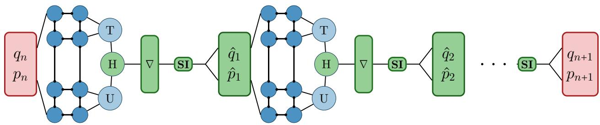  
Figure 3.1: Schematic representation of a Generalized Hamiltonian Neural Network (GHNN). The architecture consists of a concatenation of symplectic integrator blocks, where each stage is parameterized by separable Hamiltonians with learned kinetic and potential energy components. This figure has been reconstructed to match [38].

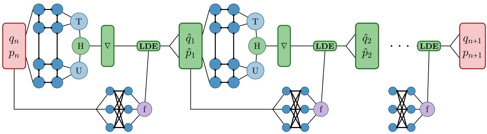  
Figure 3.2: Schematic representation of a Generalized Forced Hamiltonian Neural Network (GFHNN), extending the GHNN architecture (see Figure 3.1) to incorporate external forcing. The model combines learned Hamiltonian dynamics with additional terms representing non-conservative forces.

$$
G F H N N ( q , p ; \theta ) = L D E _ { \tilde { T } _ { m } ( \cdot ; \vartheta _ { m } ) , \tilde { U } _ { m } ( \cdot ; \psi _ { m } ) , \tilde { f } _ { m } ( \cdot ; \chi _ { m } ) } \circ \cdot . . . \circ L D E _ { \tilde { T } _ { 1 } ( \cdot ; \vartheta _ { 1 } ) , \tilde { U } _ { 1 } ( \cdot ; \psi _ { 1 } ) , \tilde { f } _ { 1 } ( \cdot , \cdot ; \chi _ { 1 } ) } ( q , p ) ;\tag{3.5}
$$

where $\theta = \left( \vartheta _ { 1 } , \psi _ { 1 } , \chi _ { 1 } , \vartheta _ { 2 } , \psi _ { 2 } , \chi _ { 2 } , . . . \right)$ collects all the trainable parameters $\vartheta _ { i } , \psi _ { i } , \chi _ { i }$ of the neural networks $\tilde { T _ { i } } , \tilde { U _ { i } } , \tilde { f _ { i } } ,$ , respectively, for $i = 1 , \ldots , m$ . A schematic representation of a GFHNN is shown in Figure 3.2. Given a set of training data $( ( q _ { i } ^ { a } , p _ { i } ^ { a } ) , ( q _ { i } ^ { b } , p _ { i } ^ { b } ) )$ for $i = 1 , \ldots , d$ such that $( q _ { i } ^ { b } , p _ { i } ^ { b } ) = F _ { \Delta t } ( q _ { i } ^ { a } , p _ { i } ^ { a } )$ , the neural network (3.5) can be trained by minimizing the mean squared loss,

$$
\operatorname { L o s s } ( \theta ) = \frac { 1 } { 2 n d } \sum _ { i = 1 } ^ { d } \big \| ( q _ { i } ^ { b } , p _ { i } ^ { b } ) - G F H N N ( q _ { i } ^ { a } , p _ { i } ^ { a } ; \theta ) \big \| ^ { 2 } ,\tag{3.6}
$$

using a suitable optimization algorithm.

## 3.3 Universal approximation theorem for GFHNNs

We now establish a universal approximation theorem for the GFHNN architecture, demonstrating that it can approximate the flow map $F _ { \Delta t }$ arbitrarily well in the strong $C ^ { r }$ topology on compact sets. We begin by showing the following two propositions.

Proposition 3.1. Given a Lagrange-d’Alembert map $\varphi \in L d A ^ { r + 1 } ( T ^ { * } Q )$ for some integer $r \geq 0$ 2 there exists a time-dependent forced Hamiltonian system satisfying Assumption $\it 2 . 1$ for some $T > 0$ such that for every compact set $K \subset T ^ { * } Q$ and every $\epsilon > 0$ , there exists $N \in \mathbb { N }$ such that

$$
\begin{array} { r } { \left. \varphi - \Phi _ { t _ { N } , t _ { N - 1 } } ^ { L T } \circ \cdots \circ \Phi _ { t _ { 1 } , t _ { 0 } } ^ { L T } \right. _ { C ^ { r } ( K ) } < \epsilon , } \end{array}\tag{3.7}
$$

where $\Phi _ { t _ { k + 1 } , t _ { k } } ^ { L T }$ denotes the Lie-Trotter integrator (2.14) with $t _ { k } = k \Delta t$ and $\Delta t = T / N$

Proof. By Definition 2.2, we have $\varphi = F _ { T , 0 }$ , where $F _ { t , t _ { 0 } }$ is the flow of a time-dependent forced Hamiltonian system satisfying Assumption 2.1. The Lie-Trotter integrator (2.14) is first-order accurate $( \mathrm { s e e } , \mathrm { e . g . } , [ 2 8 ] )$ , and as noted in Section 2.4, it satisfies the assumptions of Theorem 2.3. Let $\epsilon > 0$ and let $K \subset T ^ { * } Q$ be compact. Then the estimate (2.19) holds. Define

$$
N : = \left\lceil \frac { C _ { K } T } { \epsilon } \right\rceil + 1 \qquad \mathrm { a n d } \qquad \Delta t : = \frac { T } { N } .\tag{3.8}
$$

Then the estimate (2.19) implies (3.7).

Proposition 3.2. Given a Lagrange-d’Alembert map $\varphi \in L d A ^ { r + 1 } ( T ^ { * } Q )$ for some integer $r \geq 0$ , for every compact set $K \subset T ^ { * } Q$ and every $\epsilon > 0$ , there exists a finite sequence of maps $L D E _ { T _ { i } , U _ { i } , f _ { i } } \in$ $L D E ^ { r + 1 } ( T ^ { * } Q ) , i = 1 , \dots , m$ , such that

$$
\left\| \varphi - L D E _ { T _ { m } , U _ { m } , f _ { m } } \circ \cdots \circ L D E _ { T _ { 1 } , U _ { 1 } , f _ { 1 } } \right\| _ { C ^ { r } ( K ) } < \epsilon .\tag{3.9}
$$

Proof. Let $\varphi \in L d A ^ { r + 1 } ( T ^ { * } Q )$ . By Proposition 3.1, $\varphi$ can be approximated on compact sets with arbitrary accuracy by finite compositions of Lie-Trotter integrators $\Phi _ { t _ { k + 1 } , t _ { k } } ^ { L T } = \Phi _ { t _ { k + 1 } , t _ { k } } ^ { f } \circ \Phi _ { t _ { k + 1 } , t _ { k } } ^ { H }$ , as in (3.7). Note that

$$
\Phi _ { t _ { k + 1 } , t _ { k } } ^ { f } = L D E _ { 0 , 0 , \Delta t f ( \cdot , \cdot , t _ { k } ) } \in L D E ^ { r + 1 } ( T ^ { * } Q ) ,\tag{3.10}
$$

therefore it sufices to show that the symplectic Euler integrators $\Phi _ { t _ { k + 1 } , t _ { k } } ^ { H }$ can be approximated on compact sets with arbitrary accuracy by finite compositions of maps in $L D E ^ { r + 1 } ( T ^ { * } Q )$ . Since $\Phi _ { t _ { k + 1 } , t _ { k } } ^ { H }$ is symplectic and of class $C ^ { r + 1 }$ , [81, Theorem $2 ]$ (see also [43, Lemma $^ { 4 ] ) }$ implies that, for every compact set $K \subset T ^ { * } Q$ and every $\epsilon > 0$ there exist functions $V _ { 1 } , \ldots , V _ { m ^ { \prime } } \in C ^ { r + 2 } ( \mathbb { R } ^ { n } )$ such that

$$
\bigl \| \Phi _ { t _ { k + 1 } , t _ { k } } ^ { H } - \mathcal { H } _ { V _ { m ^ { \prime } } } \circ . . . \circ \mathcal { H } _ { V _ { 1 } } \bigr \| _ { C ^ { r } ( K ) } < \epsilon ,\tag{3.11}
$$

where

$$
{ \mathcal { H } } _ { V } ( q , p ) = \left( - p + { \frac { \partial V } { \partial q } } ( q ) , q \right)\tag{3.12}
$$

is a Hénon-like map. Finally, we observe that a Hénon-like map can be represented exactly as a composition of Lagrange-d’Alembert-Euler maps [43],

$$
\mathcal { H } _ { V } = L D E _ { V , 0 , 0 } \circ L D E _ { 0 , - \frac { 1 } { 2 } \parallel q \parallel ^ { 2 } , 0 } \circ L D E _ { - \frac { 1 } { 2 } \parallel p \parallel ^ { 2 } , 0 , 0 } \circ L D E _ { 0 , - \frac { 1 } { 2 } \parallel q \parallel ^ { 2 } , 0 } ,\tag{3.13}
$$

which completes the proof.

Proposition 3.2 justifies why using Lagrange-d’Alembert-Euler maps in the architecture (3.5) is a natural choice. It remains to show that parametrizing the kinetic $T ,$ potential $U _ { : }$ , and forcing $f$ terms with neural networks $\tilde { \cal T } , \tilde { U } .$ , and ${ \tilde { f } } ,$ respectively, allows one to approximate any map in $L D E ^ { r } ( T ^ { * } Q )$ . We denote by $\mathcal { N } _ { \sigma } ^ { r } ( \mathbb { R } ^ { n } , \mathbb { R } ^ { m } )$ the set of all multilayer perceptrons of class $C ^ { r }$ , that is,

$$
\mathcal N _ { \sigma } ^ { r } ( \mathbb R ^ { n } , \mathbb R ^ { m } ) : = \Big \{ \tilde { f } : \mathbb R ^ { n } \longrightarrow \mathbb R ^ { m } \Big | \tilde { f } \mathrm { ~ i s ~ a ~ m u l t i l a y e r ~ p e r c e p t r o n ~ w i t h ~ a c t i v a t i o n ~ } \sigma \in \mathcal A ^ { r } \Big \} ,\tag{3.14}
$$

where $\mathcal { A } ^ { r }$ denotes the set of all activation functions $\sigma : \mathbb { R } \longrightarrow \mathbb { R }$ of class $C ^ { r }$ , which are bounded and non-constant. As shown in [39] (see also [40, 41]), multilayer perceptrons are universal approximators of $C ^ { r }$ functions. In fact, the subset of $\mathcal { N } _ { \sigma } ^ { r } ( \mathbb { R } ^ { n } , \mathbb { R } ^ { m } )$ consisting of neural networks with a single hidden layer is already uniformly r-dense on compacta in $C ^ { r } ( \mathbb { R } ^ { n } , \mathbb { R } ^ { m } )$ . We further define

$$
L D E _ { { \mathcal N } _ { \sigma } } ^ { r } ( T ^ { * } Q ) = \Big \{ L D E _ { \tilde { T } , \tilde { U } , \tilde { f } } \Big | \tilde { T } , \tilde { U } \in  { \mathcal N } _ { \sigma } ^ { r + 1 } (  { \mathbb { R } } ^ { n } ,  { \mathbb { R } } ) \mathrm { ~ a n d ~ } \tilde { f } \in  { \mathcal N } _ { \sigma } ^ { r } (  { \mathbb { R } } ^ { 2 n } ,  { \mathbb { R } } ^ { n } ) \Big \} ,\tag{3.15}
$$

where, for simplicity, we assume that the same activation function $\sigma \in { \mathcal { A } } ^ { r + 1 }$ is used for all three neural networks $\tilde { T } , \tilde { U }$ , and $\tilde { f } .$ . We now prove the following proposition.

Proposition 3.3. The set $L D E _ { \mathcal { N } _ { \sigma } } ^ { r } ( T ^ { * } Q )$ is uniformly r-dense on compacta in $L D E ^ { r } ( T ^ { * } Q )$ for all integer $r \geq 0$ N. That is, for every Lagrange-d’Alembert-Euler map $L D E _ { T , U , f } \in L D E ^ { r } ( T ^ { * } Q )$ , for

every compact set $K \subset T ^ { * } Q$ , and every $\epsilon > 0$ , there exists a map $L D E _ { \tilde { T } , \tilde { U } , \tilde { f } } \in L D E _ { \mathcal { N } _ { \sigma } } ^ { r } ( T ^ { * } Q )$ such that

$$
\Bigl \| L D E _ { T , U , f } - L D E _ { \tilde { T } , \tilde { U } , \tilde { f } } \Bigl \| _ { C ^ { r } ( K ) } < \epsilon .\tag{3.16}
$$

Proof. We note that

$$
L D E _ { T , U , f } = L D E _ { T , 0 , 0 } \circ L D E _ { 0 , U , f } ,\tag{3.17}
$$

therefore it sufices to prove the proposition separately for Lagrange-d’Alembert-Euler maps of the forms $L D E _ { T , 0 , 0 }$ and $L D E _ { 0 , U , f }$ . First, consider $L D E _ { T , 0 , 0 }$ for $T \in C ^ { r + 1 } ( \mathbb { R } ^ { n } )$ . Let $\epsilon > 0$ and let $K \subset T ^ { * } Q$ be compact. The set

$$
K _ { p } = \{ p \in \mathbb { R } ^ { n } | \exists q \in \mathbb { R } ^ { n } : ( q , p ) \in K \}\tag{3.18}
$$

is the projection of K onto the p-coordinates and is therefore compact in $\mathbb { R } ^ { n }$ . By Theorem 3 in [39], there exists $\tilde { T } \in \mathcal { N } _ { \sigma } ^ { r + 1 } ( \mathbb { R } ^ { n } , \mathbb { R } )$ such that

$$
\big \| T - \tilde { T } \big \| _ { C ^ { r + 1 } ( K _ { p } ) } < \epsilon .\tag{3.19}
$$

We will show that $L D E _ { \tilde { T } , 0 , 0 } \in L D E _ { \mathcal { N } _ { \sigma } } ^ { r } ( T ^ { * } Q )$ approximates $L D E _ { T , 0 , 0 }$ with the required accuracy. NIndeed, by Equation (3.2) and the properties of the $C ^ { r }$ norm,

$$
\left\| L D E _ { T , 0 , 0 } - L D E _ { \tilde { T } , 0 , 0 } \right\| _ { C ^ { r } ( K ) } = \left\| \frac { \partial T } { \partial p } - \frac { \partial \tilde { T } } { \partial p } \right\| _ { C ^ { r } ( K _ { p } ) } \leq \left\| T - \tilde { T } \right\| _ { C ^ { r + 1 } ( K _ { p } ) } < \epsilon .\tag{3.20}
$$

Next, consider now $L D E _ { 0 , U , f }$ for $U \in C ^ { r + 1 } ( \mathbb { R } ^ { n } )$ and $f \in C ^ { r } ( \mathbb { R } ^ { 2 n } , \mathbb { R } ^ { n } )$ . Let $\epsilon > 0$ and let $K \subset T ^ { * } Q$ be compact. The set

$$
K _ { q } = \left\{ q \in \mathbb { R } ^ { n } | \exists p \in \mathbb { R } ^ { n } : ( q , p ) \in K \right\}\tag{3.21}
$$

is the projection of K onto the q-coordinates and is therefore compact in $\mathbb { R } ^ { n }$ . By Theorem 3 in [39], there exist $\tilde { U } \in \mathcal { N } _ { \sigma } ^ { r + 1 } ( \mathbb { R } ^ { n } , \mathbb { R } )$ and $\tilde { f } \in \mathcal { N } _ { \sigma } ^ { r } ( \mathbb { R } ^ { 2 n } , \mathbb { R } ^ { n } )$ such that

$$
\bigl \| U - \tilde { U } \bigr \| _ { C ^ { r + 1 } ( K _ { q } ) } < \frac { \epsilon } { 2 } \qquad \mathrm { a n d } \qquad \bigl \| f - \tilde { f } \bigr \| _ { C ^ { r } ( K ) } < \frac { \epsilon } { 2 } .\tag{3.22}
$$

We will show that $L D E _ { 0 , \tilde { U } , \tilde { f } } \in L D E _ { \mathcal { N } _ { \sigma } } ^ { r } ( T ^ { * } Q )$ approximates $L D E _ { 0 , U , f }$ with the required accuracy. We have

$$
\begin{array} { r l } { \Bigl \| L D E _ { 0 , U , f } - L D E _ { 0 , \tilde { U } , \tilde { f } } \Bigr \| _ { C ^ { r } ( K ) } = \left\| - \Bigl ( \frac { \partial U } { \partial q } - \frac { \partial \tilde { U } } { \partial q } \Bigr ) + f - \tilde { f } \right\| _ { C ^ { r } ( K ) } } & { } \\ { \leq \left\| \frac { \partial U } { \partial q } - \frac { \partial \tilde { U } } { \partial q } \right\| _ { C ^ { r } ( K _ { q } ) } + \left\| f - \tilde { f } \right\| _ { C ^ { r } ( K ) } } & { } \\ { \leq \left\| U - \tilde { U } \right\| _ { C ^ { r + 1 } ( K _ { q } ) } + \left\| f - \tilde { f } \right\| _ { C ^ { r } ( K ) } } & { } \\ { < \frac { \epsilon } { 2 } + \frac { \epsilon } { 2 } = \epsilon , } & { } \end{array}\tag{3.23}
$$

which completes the proof.

The following universal approximation theorem follows directly from Proposition 3.2 and Proposition 3.3.

Theorem 3.4 (Universal approximation theorem for GFHNNs). Let $r \geq 0$ be an integer and let $\varphi \in L d A ^ { r + 1 } ( T ^ { * } Q )$ . Then, for every compact set $K \subset T ^ { * } Q$ and every $\epsilon > 0$ , there exists a finite sequence of maps $L D E _ { \tilde { T } _ { i } , \tilde { U } _ { i } , \tilde { f } _ { i } } \in L D E _ { \mathcal { N } _ { \sigma } } ^ { r + 1 } ( T ^ { * } Q ) , i = 1 , . . . , m$ , such that

$$
\left\| \varphi - L D E _ { \tilde { T } _ { m } , \tilde { U } _ { m } , \tilde { f } _ { m } } \circ \dots \circ L D E _ { \tilde { T } _ { 1 } , \tilde { U } _ { 1 } , \tilde { f } _ { 1 } } \right\| _ { C ^ { r } ( K ) } < \epsilon .\tag{3.24}
$$

## 4 Parametric Generalized Forced Hamiltonian Neural Networks

In this section we consider parametric autonomous forced Hamiltonian systems and propose a general structure-preserving neural network architecture designed to learn their parameter-dependent flow.

## 4.1 Parametric autonomous forced Hamiltonian systems

The evolution of a parametric autonomous forced Hamiltonian system is governed by the diferential equations (1.1), where the parameter-dependent Hamiltonian $H : T ^ { * } Q { \times } I \longrightarrow \mathbb { R }$ and external forcing $f _ { H } : T ^ { * } Q \times I \longrightarrow T ^ { * } Q$ , given by $f _ { H } ( q , p , \mu ) = ( q , f ( q , p , \mu ) )$ , do not depend explicitly on time. Consequently, the parametric Lagrange-d’Alembert flow $F _ { t , t _ { 0 } }$ depends only on the diference $t - t _ { 0 }$ and will therefore be denoted by $F _ { t }$ . For a fixed value of $\mu ,$ numerical integration of the system (1.1) can be performed by using the scheme (2.12). The Lagrange-d’Alembert-Euler map (3.2) becomes parameter-dependent through the parameter-dependent functions $T = T ( q , p , \mu ) , U = U ( q , p , \mu )$ and $f = f ( q , p , \mu )$ . Let us introduce the augmented Lagrange-d’Alembert-Euler map,

$$
L D E _ { T , U , f } ^ { \mathrm { a u g } } ( q , p , \mu ) = \Big ( L D E _ { T ( \cdot , \mu ) , U ( \cdot , \mu ) , f ( \cdot , \cdot , \mu ) } ( q , p ) , \mu \Big ) ,\tag{4.1}
$$

which applies the Lagrange-d’Alembert-Euler map corresponding to the parameter value $\mu$ to the $( q , p )$ variables and leaves the parameter $\mu$ unchanged. Analogously to (3.3), we define the set of all augmented Lagrange-d’Alembert-Euler maps of class $C ^ { r }$ as

$$
\begin{array} { r } { L D E ^ { r } ( T ^ { * } Q , I ) = \Big \{ L D E _ { T , U , f } ^ { \mathrm { a u g } } \Big | T , U \in C ^ { r + 1 } ( \mathbb { R } ^ { n } \times I ) , f \in C ^ { r } ( \mathbb { R } ^ { 2 n } \times I , \mathbb { R } ^ { n } ) \Big \} . } \end{array}\tag{4.2}
$$

## 4.2 Parametric structure-preserving neural network architecture

A class of neural networks called Parametric Generalized Hamiltonian Neural Networks (PGHNNs), suitable for learning parametric canonical Hamiltonian systems, was introduced in [36, 37] as an extension of GHNNs (see Figure 4.1). In the same spirit, we propose Parametric Generalized Forced Hamiltonian Neural Networks (PGFHNNs), which allow parameter dependence in the architecture of GFHNNs introduced in Section 3.2. We define a PGFHNN as a concatenation of augmented

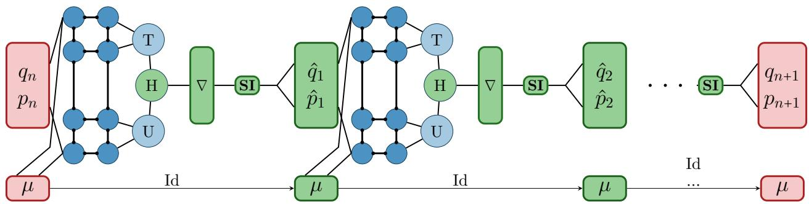  
Figure 4.1: Schematic representation of a Parametric Generalized Hamiltonian Neural Network (PGHNN). The architecture extends the GHNN framework to parameter-dependent Hamiltonian systems through an additional parameter input. Each stage consists of a symplectic integrator block parameterized by separable Hamiltonians with learned kinetic and potential energy components. This figure has been reconstructed to match [36, 37].

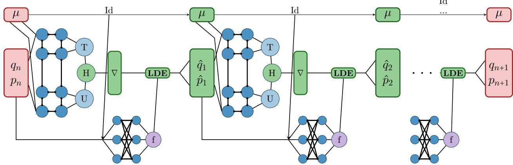  
Figure 4.2: Schematic representation of a Parametric Generalized Forced Hamiltonian Neural Network (PGFHNN), extending the PGHNN architecture (see Figure 4.1) to incorporate external forcing. The model combines parameter-dependent Hamiltonian dynamics with additional terms representing non-conservative forces.

Lagrange-d’Alembert-Euler maps (4.1) in which the kinetic and potential energies, together with the forcing term, are represented by multilayer perceptrons that take as input both the dynamic variables q and $p ,$ as well as the parameter $\mu .$ Using notation similar to that in [36, 37], a PGFHNN can be expressed as

$$
P G F H N N ( q , p , \mu ; \theta ) = L D E _ { \tilde { T } _ { m } ( \cdot , \cdot ; \vartheta _ { m } ) , \tilde { U } _ { m } ( \cdot , \cdot ; \vartheta _ { m } ) , \tilde { f } _ { m } ( \cdot , \cdot ; \chi _ { m } ) } ^ { \mathrm { a u g } } \circ \cdot \cdot \cdot \circ L D E _ { \tilde { T } _ { 1 } ( \cdot ; \vartheta _ { 1 } ) , \tilde { U } _ { 1 } ( \cdot , \cdot ; \psi _ { 1 } ) , \tilde { f } _ { 1 } ( \cdot , \cdot ; \chi _ { 1 } ) } ^ { \mathrm { a u g } } ( q , p , \mu ) _ { \smash { \Bigg \{array} . }\tag{4.3}
$$

where $\theta = \left( \vartheta _ { 1 } , \psi _ { 1 } , \chi _ { 1 } , \vartheta _ { 2 } , \psi _ { 2 } , \chi _ { 2 } , . . . \right)$ collects all the trainable parameters $\vartheta _ { i } , \psi _ { i } , \chi _ { i }$ of the neural networks $\tilde { T _ { i } } , \tilde { U _ { i } } , \tilde { f _ { i } } .$ , respectively, for $i = 1 , \ldots , m$ . A schematic representation of a PGFHNN is shown in Figure 4.2. Given a set of training data $( ( q _ { i } ^ { a } , p _ { i } ^ { a } ) , ( q _ { i } ^ { b } , p _ { i } ^ { b } ) , \mu _ { i } )$ for $i = 1 , \ldots , d$ such that $( q _ { i } ^ { b } , p _ { i } ^ { b } ) = F _ { \Delta t } ( q _ { i } ^ { a } , p _ { i } ^ { a } , \mu _ { i } )$ , the neural network (4.3) can be trained by minimizing the mean squared

loss,

$$
\operatorname { L o s s } ( \theta ) = \frac { 1 } { 2 n d } \sum _ { i = 1 } ^ { d } \big \| ( q _ { i } ^ { b } , p _ { i } ^ { b } , \mu _ { i } ) - P G F H N N ( q _ { i } ^ { a } , p _ { i } ^ { a } , \mu _ { i } ; \theta ) \big \| ^ { 2 } ,\tag{4.4}
$$

using a suitable optimization algorithm.

## 4.3 Universal approximation theorem for PGFHNNs

A universal approximation theorem for PGFHNNs can be established by following the same steps as in Section 3.3. First, in view of the discussion in Section 2.5, Proposition 3.1 extends naturally to the parametric setting and allows us to approximate parametric Lagrange-d’Alembert maps by parameter-dependent Lie-Trotter integrators in the $C ^ { r }$ topology on compact sets $K \subset$ $T ^ { * } Q \times I$ . Moreover, Proposition 3.2 extends naturally to approximations by augmented Lagranged’Alembert-Euler maps. Here we use the fact that [81, Theorem 2] was proved for parameterdependent symplectic difeomorphisms. Analogously to (3.15), we define

$$
L D E _ { { \mathcal N } _ { \sigma } } ^ { r } ( T ^ { * } Q , I ) = \Bigl \{ L D E _ { \tilde { T } , \tilde { U } , \tilde { f } } ^ { \mathrm { a u g } } \Big | \tilde { T } , \tilde { U } \in \mathcal { N } _ { \sigma } ^ { r + 1 } ( \mathbb { R } ^ { n } \times I , \mathbb { R } ) \mathrm { ~ a n d ~ } \tilde { f } \in \mathcal { N } _ { \sigma } ^ { r } ( \mathbb { R } ^ { 2 n } \times I , \mathbb { R } ^ { n } ) \Bigr \} .\tag{4.5}
$$

It is then straightforward to extend Proposition 3.3 and show that $L D E _ { \mathcal { N } _ { \sigma } } ^ { r } ( T ^ { * } Q , I )$ is uniformly $r _ { - }$ dense on compacta in $L D E ^ { r } ( T ^ { * } Q , I )$ N. Combining all these results, we obtain the following theorem.

Theorem 4.1 (Universal approximation theorem for PGFHNNs). Let $r \geq 0$ be an integer and let $\varphi \in L d A ^ { r + 1 } ( T ^ { * } Q , I )$ . Then, for every compact set $K \subset T ^ { * } Q \times I$ and every $\epsilon > 0$ , there exists a finite sequence of maps $L D E _ { \tilde { T } _ { i } , \tilde { U } _ { i } , \tilde { f } _ { i } } ^ { \mathrm { a u g } } \in L D E _ { \mathcal { N } _ { \sigma } } ^ { r + 1 } ( T ^ { * } Q , I ) , i = 1 , \ldots , m$ , such that

$$
\left\| \varphi - \pi \circ L D E _ { \tilde { T } _ { m } , \tilde { U } _ { m } , \tilde { f } _ { m } } ^ { \mathrm { a u g } } \circ \dots \circ L D E _ { \tilde { T } _ { 1 } , \tilde { U } _ { 1 } , \tilde { f } _ { 1 } } ^ { \mathrm { a u g } } \right\| _ { C ^ { r } ( K ) } < \epsilon ,\tag{4.6}
$$

where $\pi : T ^ { * } Q \times I \longrightarrow T ^ { * } Q$ denotes the projection onto $T ^ { * } Q$

## 5 Learning time-dependent and stochastic systems

In this section, we show how time-dependent and stochastic systems can be reformulated so that the PGFHNNs developed in Section 4 can be used to learn their flows.

## 5.1 Time-dependent systems

Consider the time-dependent forced Hamiltonian system (2.1). Fix a time step $\Delta t > 0$ . Then the flow $F _ { t + \Delta t , t }$ can be viewed as a parametric Lagrange-d’Alembert map in the sense of Definition 2.5, with time t playing the role of a parameter. Indeed, define a parameter-dependent Hamiltonian $\tilde { H } : T ^ { * } Q \times [ 0 , \Delta t ] \times \mathbb { R } \longrightarrow \mathbb { R }$ and a parameter-dependent force $\tilde { f } : T ^ { * } Q \times [ 0 , \Delta t ] \times \mathbb { R } \longrightarrow \mathbb { R }$ by

$$
\tilde { H } ( q , p , \tau , \mu ) = H ( q , p , \tau + \mu ) , \qquad \tilde { f } ( q , p , \tau , \mu ) = f ( q , p , \tau + \mu ) , \qquad \mathrm { f o r ~ } \tau \in [ 0 , \Delta t ] ,\tag{5.1}
$$

and let $\tilde { F } _ { \tau , \tau _ { 0 } } : T ^ { * } Q \times \mathbb { R } \longrightarrow T ^ { * } Q$ denote the corresponding parametric Lagrange-d’Alembert flow. We then have $F _ { t + \Delta t , t } ( q , p ) = \tilde { F } _ { \Delta t , 0 } ( q , p , t )$ . Therefore, the technique proposed in Section 4 can be used to learn $F _ { t + \Delta t , t }$ from data.

## 5.2 Stochastic systems

Stochastic diferential equations (SDEs) play an important role in modeling dynamical systems subject to internal or external random fluctuations [2, 42, 46, 50, 65]. Within this class of problems, we are interested in stochastic forced Hamiltonian systems (see [48] and the references therein), which take the form

$$
\begin{array} { l } { { \displaystyle d _ { t } q = \frac { \partial H _ { 0 } } { \partial p } d t + \sum _ { i = 1 } ^ { m } \frac { \partial H _ { i } } { \partial p } \circ d W ^ { i } ( t ) } , } \\ { { \displaystyle d _ { t } p = \left[ - \frac { \partial H _ { 0 } } { \partial q } + f _ { 0 } ( q , p ) \right] d t + \sum _ { i = 1 } ^ { m } \left[ - \frac { \partial H _ { i } } { \partial q } + f _ { i } ( q , p ) \right] \circ d W ^ { i } ( t ) } , } \end{array}\tag{5.2}
$$

where $H _ { i } = H _ { i } ( q , p )$ for $i = 0 , \ldots , m$ are the Hamiltonian functions, $f _ { i } = f _ { i } ( q , p )$ are the forcing terms, $W ( t ) = ( W ^ { 1 } ( t ) , \dots , W ^ { m } ( t ) )$ is the standard m-dimensional Wiener process, and ○ denotes Stratonovich integration. We use $d _ { t }$ to denote the stochastic diferential of stochastic processes (other than the Wiener process $W ( t ) )$ to avoid confusion with the exterior derivative d of diferential forms. The system (5.2) can be formally regarded as a time-dependent forced Hamiltonian system (2.1) with the randomized Hamiltonian given by $\begin{array} { r } { H ( q , p , t ) = H _ { 0 } ( q , p ) + \sum _ { i = 1 } ^ { m } H _ { i } ( q , p ) \circ \dot { W } ^ { i } ( t ) } \end{array}$ , and the randomized forcing given by $\begin{array} { r } { f ( q , p , t ) = f _ { 0 } ( q , p ) + \sum _ { i = 1 } ^ { m } f _ { i } ( q , p ) \circ \dot { W } ^ { i } ( t ) } \end{array}$ , where $H _ { 0 } ( q , p )$ and $f _ { 0 } ( q , p )$ are the deterministic Hamiltonian and forcing, respectively, and $H _ { i } ( q , p ) , \ f _ { i } ( q , p )$ represent the intensity of the noise. Such systems can serve to model, for instance, mechanical systems afected by uncertainty or error, which are presumed to result from random forcing, limited precision of experimental measurements, or unresolved physical processes on which the Hamiltonian of the underlying deterministic system might otherwise depend. Applications can be found in a wide range of models in physics, chemistry, and biology. Particular examples include molecular dynamics [76], dissipative particle dynamics [70, 72], and collisional kinetic plasmas [48, 57, 77, 82].

The stochastic flow $F _ { t , t _ { 0 } } : \Omega _ { s } { \times } T ^ { * } Q \longrightarrow T ^ { * } Q$ for Equation (5.2) is time-dependent due to the fact that it is driven by the Wiener process $W ( t )$ , where $\Omega _ { s }$ denotes the sample space of the underlying probability space. As shown in [48], the stochastic system (5.2) has an underlying stochastic variational principle which generalizes the Lagrange-d’Alembert principle (2.3). This means that the map $F _ { t , t _ { 0 } }$ is a stochastic Lagrange-d’Alembert flow, and the stochastic forced Hamiltonian system (5.2) can be numerically approximated in a structure-preserving way by using stochastic Lagrange-d’Alembert integrators which are defined by Equation (2.6) with a stochastic discrete Lagrangian $L _ { d } : \Omega _ { s } \times Q \times Q \longrightarrow \mathbb { R } ^ { n }$ and stochastic discrete forces $f _ { d } ^ { + } , f _ { d } ^ { - } : \Omega _ { s } \times Q \times Q \longrightarrow \mathbb { R } ^ { n }$ . One example of such an integrator is the stochastic implicit midpoint method,

$$
\begin{array} { r l } & { \displaystyle q _ { k + 1 } = q _ { k } + \frac { \partial H _ { 0 } } { \partial p } \bigg ( \frac { q _ { k } + q _ { k + 1 } } { 2 } , \frac { p _ { k } + p _ { k + 1 } } { 2 } \bigg ) \Delta t + \sum _ { i = 1 } ^ { m } \frac { \partial H _ { i } } { \partial p } \bigg ( \frac { q _ { k } + q _ { k + 1 } } { 2 } , \frac { p _ { k } + p _ { k + 1 } } { 2 } \bigg ) \Delta W ^ { i } , } \\ & { \displaystyle p _ { k + 1 } = p _ { k } + \Bigg [ - \frac { \partial H _ { 0 } } { \partial q } \bigg ( \frac { q _ { k } + q _ { k + 1 } } { 2 } , \frac { p _ { k } + p _ { k + 1 } } { 2 } \bigg ) + f _ { 0 } \bigg ( \frac { q _ { k } + q _ { k + 1 } } { 2 } , \frac { p _ { k } + p _ { k + 1 } } { 2 } \bigg ) \Bigg ] \Delta t } \\ & { \displaystyle \qquad + \sum _ { i = 1 } ^ { m } \Bigg [ - \frac { \partial H _ { i } } { \partial q } \bigg ( \frac { q _ { k } + q _ { k + 1 } } { 2 } , \frac { p _ { k } + p _ { k + 1 } } { 2 } \bigg ) + f _ { i } \bigg ( \frac { q _ { k } + q _ { k + 1 } } { 2 } , \frac { p _ { k } + p _ { k + 1 } } { 2 } \bigg ) \Bigg ] \Delta W ^ { i } , } \end{array}\tag{5.3}
$$

which defines a stochastic discrete flow $\widehat { F } _ { t _ { k + 1 } , t _ { k } } : \Omega _ { s } \times T ^ { * } Q \ni \left( q _ { k } , p _ { k } \right) \longmapsto \left( q _ { k + 1 } , p _ { k + 1 } \right) \in T ^ { * } Q$ , where $\Delta t = t _ { k + 1 } - t _ { k }$ is the time step, and $\Delta W = W ( t _ { k + 1 } ) - W ( t _ { k } )$ is the increment of the Wiener process. As demonstrated in [48], the scheme (5.3) is a stochastic Lagrange-d’Alembert integrator with the stochastic discrete Lagrangian and discrete forces given by

$$
\begin{array} { l } { { { \displaystyle { \cal L } _ { d } ( q _ { k } , q _ { k + 1 } ) = \Delta t \biggl [ p _ { c } \frac { \partial H _ { 0 } } { \partial p } ( q _ { c } , p _ { c } ) - H _ { 0 } ( q _ { c } , p _ { c } ) \biggr ] + \sum _ { i = 1 } ^ { m } \Delta W ^ { i } \biggl [ p _ { c } \frac { \partial H _ { i } } { \partial p } ( q _ { c } , p _ { c } ) - H _ { i } ( q _ { c } , p _ { c } ) \biggr ] } , } } \\ { { { \displaystyle f _ { d } ^ { - } ( q _ { k } , q _ { k + 1 } ) = \frac { 1 } { 2 } \Delta t f _ { 0 } ( q _ { c } , p _ { c } ) + \frac { 1 } { 2 } \sum _ { i = 1 } ^ { m } \Delta W ^ { i } f _ { i } ( q _ { c } , p _ { c } ) } , } } \\ { { { \displaystyle f _ { d } ^ { + } ( q _ { k } , q _ { k + 1 } ) = \frac { 1 } { 2 } \Delta t f _ { 0 } ( q _ { c } , p _ { c } ) + \frac { 1 } { 2 } \sum _ { i = 1 } ^ { m } \Delta W ^ { i } f _ { i } ( q _ { c } , p _ { c } ) } , } } \end{array}\tag{5.4}
$$

with $q _ { c } = ( q _ { k } + q _ { k + 1 } ) / 2 , p _ { c } = ( p _ { k } + p _ { k + 1 } ) / 2$ , where $p _ { k }$ and $p _ { k + 1 }$ are understood as functions of $q _ { k }$ and $q _ { k + 1 }$ , implicitly defined by Equation (5.3). Note that stochasticity and time-dependence enter the definition of $\widehat { F } _ { t _ { k + 1 } , t _ { k } }$ via the Wiener process increments $\Delta W ^ { i } \sim N ( 0 , \Delta t )$ , which are normally distributed random variables. Let us instead consider the deterministic parameter-dependent Lagrange-d’Alembert map $\varphi : T ^ { * } Q \times \mathbb { R } ^ { m } \ni \left( q _ { k } , p _ { k } , \mu \right) \longmapsto \left( q _ { k + 1 } , p _ { k + 1 } \right) \in T ^ { * } Q$ defined implicitly by the equations

$$
\begin{array} { l } { \displaystyle q _ { k + 1 } = q _ { k } + \frac { \partial H _ { 0 } } { \partial p } \bigg ( \frac { q _ { k } + q _ { k + 1 } } { 2 } , \frac { p _ { k } + p _ { k + 1 } } { 2 } \bigg ) \Delta t + \sum _ { i = 1 } ^ { m } \frac { \partial H _ { i } } { \partial p } \bigg ( \frac { q _ { k } + q _ { k + 1 } } { 2 } , \frac { p _ { k } + p _ { k + 1 } } { 2 } \bigg ) \mu ^ { i } , } \\ { \displaystyle p _ { k + 1 } = p _ { k } + \Bigg [ - \frac { \partial H _ { 0 } } { \partial q } \bigg ( \frac { q _ { k } + q _ { k + 1 } } { 2 } , \frac { p _ { k } + p _ { k + 1 } } { 2 } \bigg ) + f _ { 0 } \bigg ( \frac { q _ { k } + q _ { k + 1 } } { 2 } , \frac { p _ { k } + p _ { k + 1 } } { 2 } \bigg ) \Bigg ] \Delta t } \\ { \displaystyle \qquad + \sum _ { i = 1 } ^ { m } \Bigg [ - \frac { \partial H _ { i } } { \partial q } \bigg ( \frac { q _ { k } + q _ { k + 1 } } { 2 } , \frac { p _ { k } + p _ { k + 1 } } { 2 } \bigg ) + f _ { i } \bigg ( \frac { q _ { k } + q _ { k + 1 } } { 2 } , \frac { p _ { k } + p _ { k + 1 } } { 2 } \bigg ) \Bigg ] \mu ^ { i } , } \end{array}\tag{5.5}
$$

which is generated by the deterministic parameter-dependent discrete Lagrangian and forces

$$
\begin{array} { l } { \displaystyle \bar { L } _ { d } ( q _ { k } , q _ { k + 1 } ; \mu ) = \Delta t \biggl [ p _ { c } \frac { \partial H _ { 0 } } { \partial p } ( q _ { c } , p _ { c } ) - H _ { 0 } ( q _ { c } , p _ { c } ) \biggr ] + \displaystyle \sum _ { i = 1 } ^ { m } \mu ^ { i } \biggl [ p _ { c } \frac { \partial H _ { i } } { \partial p } ( q _ { c } , p _ { c } ) - H _ { i } ( q _ { c } , p _ { c } ) \biggr ] , } \\ { \displaystyle \bar { f } _ { d } ^ { - } ( q _ { k } , q _ { k + 1 } ; \mu ) = \frac { 1 } { 2 } \Delta t f _ { 0 } ( q _ { c } , p _ { c } ) + \frac { 1 } { 2 } \displaystyle \sum _ { i = 1 } ^ { m } \mu ^ { i } f _ { i } ( q _ { c } , p _ { c } ) , } \\ { \displaystyle \bar { f } _ { d } ^ { + } ( q _ { k } , q _ { k + 1 } ; \mu ) = \frac { 1 } { 2 } \Delta t f _ { 0 } ( q _ { c } , p _ { c } ) + \frac { 1 } { 2 } \displaystyle \sum _ { i = 1 } ^ { m } \mu ^ { i } f _ { i } ( q _ { c } , p _ { c } ) . } \end{array}\tag{5.6}
$$

It is straightforward to see that then we have

$$
\widehat { F } _ { t _ { k + 1 } , t _ { k } } ( \omega , q , p ) = \varphi \big ( q , p , W ( \omega , t _ { k + 1 } ) - W ( \omega , t _ { k } ) \big ) ,\tag{5.7}
$$

where we explicitly stated the sample space argument $\omega \in \Omega _ { s }$ . The map $\varphi _ { \mu }$ can be learnt from data using the technique developed in Section 4 if information about the discrete Wiener process paths $W ( t _ { 0 } ) , W ( t _ { 1 } ) , . .$ . is also available. Such situations arise naturally in applications where largescale Monte Carlo simulations of SDEs are performed repeatedly for diferent parameter values, for example in uncertainty quantification. In these settings, the realizations of the Wiener process are available and can be used directly as inputs to the learning procedure.

The stochastic midpoint method (5.3) uses only time increments $J _ { 0 } \equiv \Delta t$ and Wiener process increments $J _ { i } \equiv \Delta W ^ { i } { \mathrm { ~ f o r ~ } } i = 1 , \dots , m$ , and it is therefore strongly convergent of order $1 / 2$ in general, and of order 1 in the case of commutative noise [66, 48]. In order to achieve a higher order of convergence, a numerical scheme must involve higher-order multiple Stratonovich integrals [46]

$$
J _ { i _ { 1 } , \dots , i _ { l } } = \int _ { t _ { k } } ^ { t _ { k + 1 } } \dots \int _ { t _ { k } } ^ { s _ { 2 } } \circ d Z ^ { i _ { 1 } } ( s _ { 1 } ) \dots \circ d Z ^ { i _ { l } } ( s _ { l } ) ,\tag{5.8}
$$

for $0 \leq i _ { 1 } , \ldots , i _ { l } \leq m$ , where $Z = ( Z ^ { 0 } , Z ^ { 1 } , \dots , Z ^ { m } )$ with $Z ^ { 0 } ( t ) = t$ and $Z ^ { i } ( t ) = W ^ { i } ( t )$ for $i = 1 , \ldots , m$ For instance, a scheme of order $3 / 2$ must involve $J _ { i }$ and ${ J } _ { i , 0 } \ [ 3 5 , 6 6 ]$ , therefore the corresponding parameter-dependent Lagrange-d’Alembert map $\varphi _ { \mu }$ will use a higher-dimensional parameter $\mu =$ $( J _ { i } , J _ { j , 0 } )$ . Formally speaking, the exact stochastic flow $F _ { t _ { k + 1 } , t _ { k } }$ can be viewed as parametrized by the infinite sequence $\boldsymbol { \mu } = ( J _ { i } , J _ { i , j } , J _ { i , j , l } , \dots )$ that appears in the Stratonovich-Taylor expansion of the solution $( q ( t ) , p ( t ) )$ of Equation (5.2) [46].

## 6 Numerical experiments

In this section, we present the results of numerical experiments in which we tested the neura network architectures introduced in Sections 3 and 4, and compared their performance with that of non-geometric residual neural networks (ResNets, [10, 34]). The experiments were implemented using the GeometricMachineLearning.jl package [4]. In all experiments, the hyperbolic tangent activation function (tanh) was used, and all networks were trained using the Adam optimizer.

## 6.1 Linearly damped harmonic oscillator

As the first example we consider the linearly damped harmonic oscillator, which is a system of the form (3.1) with

$$
H ( q , p ) = \frac { 1 } { 2 } p ^ { 2 } + \frac { 1 } { 2 } q ^ { 2 } , f ( q , p ) = - \nu p ,\tag{6.1}
$$

where $\nu$ is the friction coeficient. For this system an analytic solution is available and is given by

$$
\begin{array} { l l } { \bar { q } ( t ) = \bar { q } _ { 0 } e ^ { - \frac { \nu } { 2 } t } \cos \omega t + \displaystyle \frac { 1 } { \omega } \Big ( \bar { p } _ { 0 } + \frac { \nu } { 2 } \bar { q } _ { 0 } \Big ) e ^ { - \frac { \nu } { 2 } t } \sin \omega t , } \\ { \bar { p } ( t ) = \bar { p } _ { 0 } e ^ { - \frac { \nu } { 2 } t } \cos \omega t - \displaystyle \frac { 1 } { \omega } \Big ( \bar { q } _ { 0 } + \frac { \nu } { 2 } \bar { p } _ { 0 } \Big ) e ^ { - \frac { \nu } { 2 } t } \sin \omega t , } \end{array}\tag{6.2}
$$

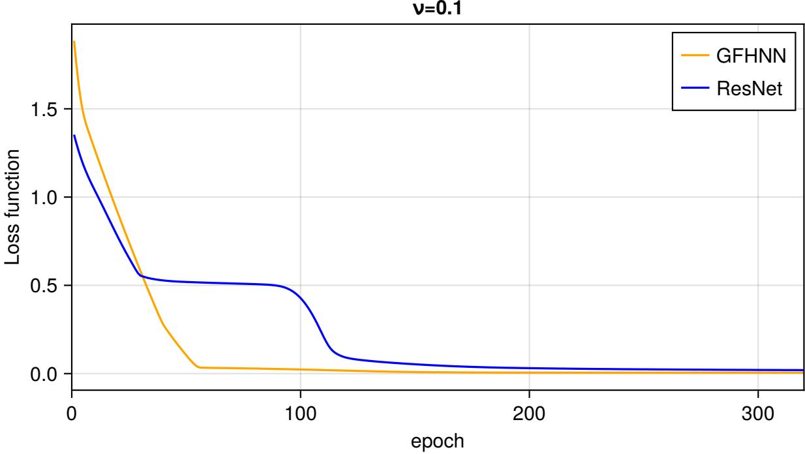  
Figure 6.1: Convergence of the training loss for a representative training run using data generated from the linearly damped harmonic oscillator with damping parameter $\nu = 0 . 1$

where $\bar { q } _ { 0 }$ and $\bar { p } _ { 0 }$ denote the initial conditions, the angular frequency is $\begin{array} { r } { \omega = \frac { 1 } { 2 } \sqrt { 4 - \nu ^ { 2 } } } \end{array}$ , and we assume the underdamped case $0 \leq \nu < 2$ . The training data for our numerical experiments were created by sampling the exact solution (6.2) for $0 \leq t \leq T$ with the final time $T = 1 3$ , time step $\Delta t = 0 . 1 3$ , and $N _ { \mathrm { t r a i n } } = 4 0 0$ initial conditions $( \bar { q } _ { 0 } , \bar { p } _ { 0 } )$ uniformly distributed in the square $- 1 \leq q , p \leq 1$ in the phase space, that is,

$$
\bar { q } _ { 0 } ^ { i , j } = - 1 + \frac { 2 ( i - 1 ) } { \sqrt { N _ { \mathrm { t r a i n } } } - 1 } , \qquad \bar { p } _ { 0 } ^ { i , j } = - 1 + \frac { 2 ( j - 1 ) } { \sqrt { N _ { \mathrm { t r a i n } } } - 1 } , \qquad \mathrm { f o r ~ } i , j = 1 , \dots , \sqrt { N _ { \mathrm { t r a i n } } } .\tag{6.3}
$$

A total of 6 training data sets were created for diferent values of the friction coeficient $\nu ,$ namely,

$$
\nu = 0 . 5 , \quad 0 . 1 , \quad 0 . 0 5 , \quad 0 . 0 1 , \quad 0 . 0 0 5 , \quad 0 . 0 0 1 .\tag{6.4}
$$

Using each data set, a GFHNN and a ResNet network were trained for 10,000 epochs with the Adam optimizer in order to learn the flow map $F _ { \Delta t }$ of the autonomous system (3.1). To make the comparison fair, the networks were chosen to have comparable numbers of trainable parameters, namely, 74 for the GFHNN (consisting of 3 LDE blocks with $\tilde { T _ { i } } , \tilde { U _ { i } }$ , and $\tilde { f } _ { i }$ each having one hidden layer of width 4) and 72 for the ResNet. Figure 6.1 reports the loss evolution for a representative training run using data corresponding to $\nu = 0 . 1$ . All other runs exhibited comparable convergence behavior.

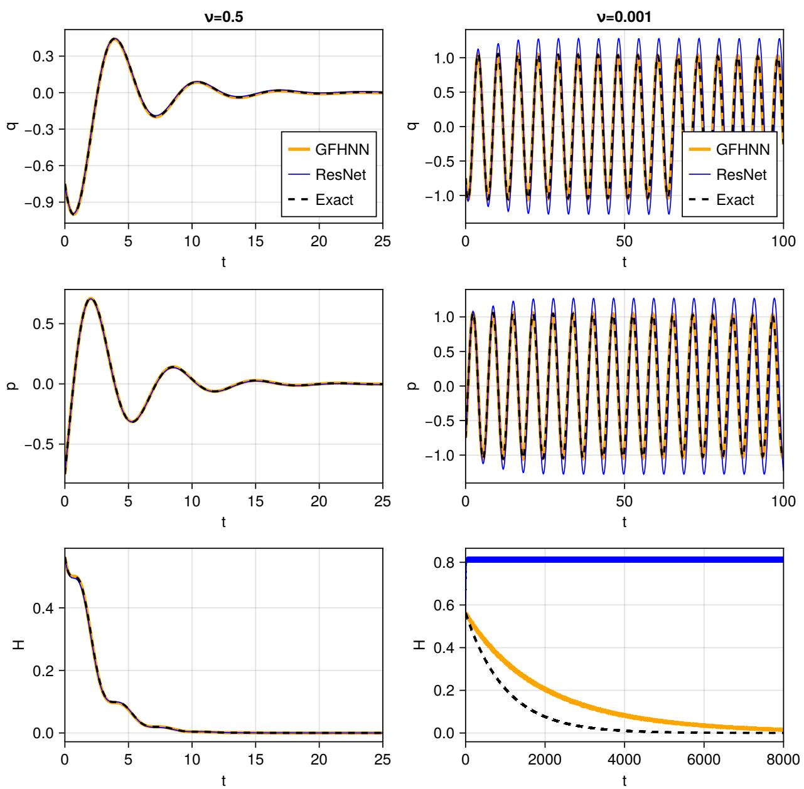  
Figure 6.2: Comparison of trajectories generated by the GFHNN and ResNet flows for the linearly damped harmonic oscillator. The left column corresponds to the case $\nu = 0 . 5$ , while the right column shows the case $\nu = 0 . 0 0 1$ . In both cases, trajectories are generated from the same initial condition $\left( \bar { q } _ { 0 } , \bar { p } _ { 0 } \right) = \left( - 0 . 7 5 , - 0 . 7 5 \right)$ . The first row displays the position $q ( t )$ , the second row the momentum $p ( t )$ , and the third row the Hamiltonian $H ( t )$ evaluated along the corresponding trajectories.

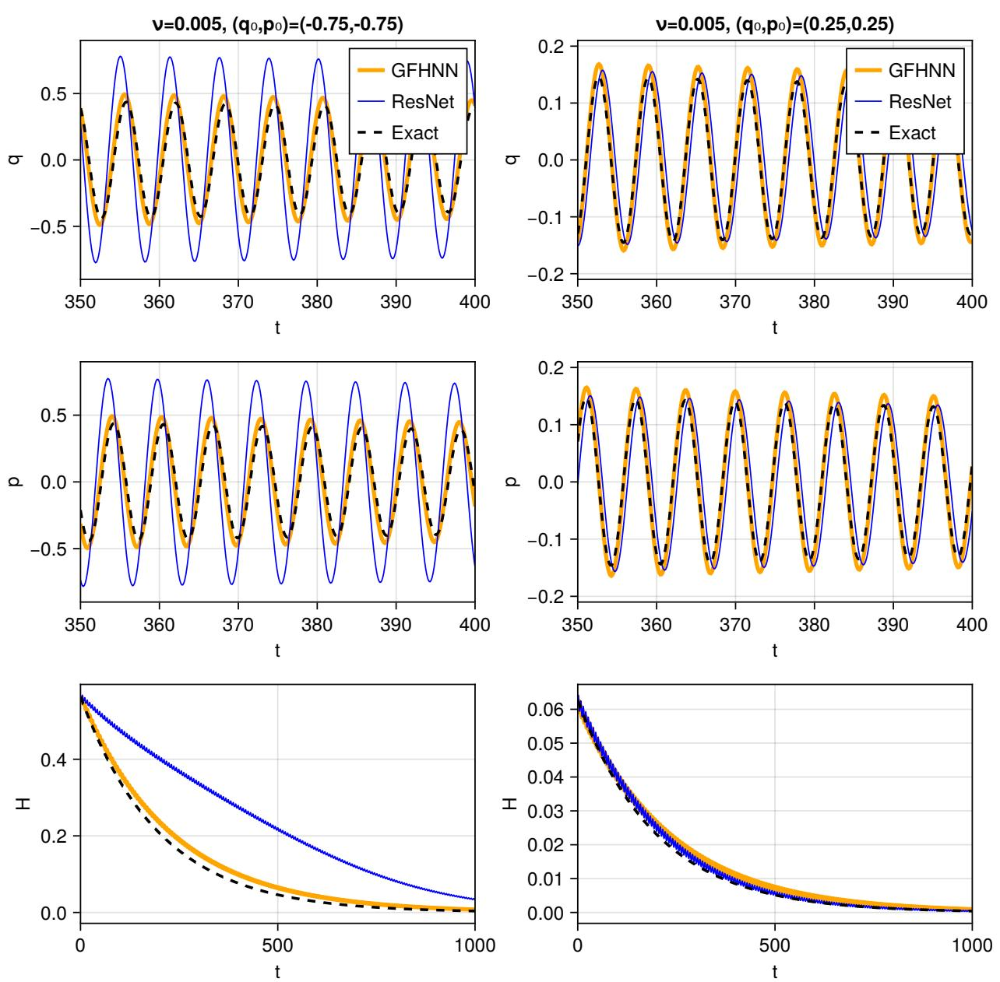  
Figure 6.3: Comparison of trajectories generated by the GFHNN and ResNet flows for the linearly damped harmonic oscillator with $\nu = 0 . 0 0 5$ . The left column corresponds to the initial condition $\left( \bar { q } _ { 0 } , \bar { p } _ { 0 } \right) \ : = \ : \left( - 0 . 7 5 , - 0 . 7 5 \right)$ , while the right column corresponds to $\left( \bar { q } _ { 0 } , \bar { p } _ { 0 } \right) \ = \ \left( 0 . 2 5 , 0 . 2 5 \right)$ . In both cases, the first row displays the position $q ( t )$ , the second row the momentum $p ( t )$ , and the third row the Hamiltonian $H ( t )$ evaluated along the corresponding trajectories.

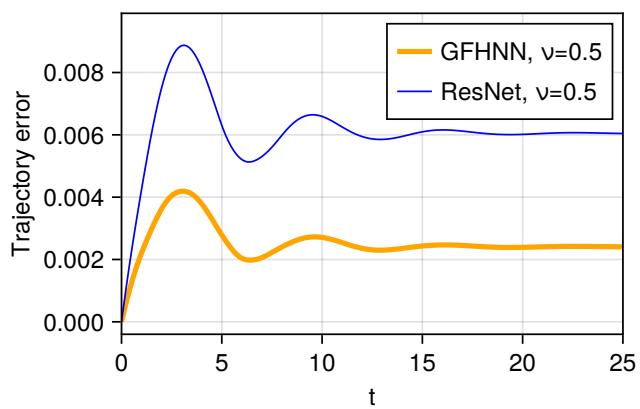

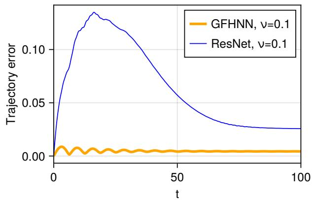

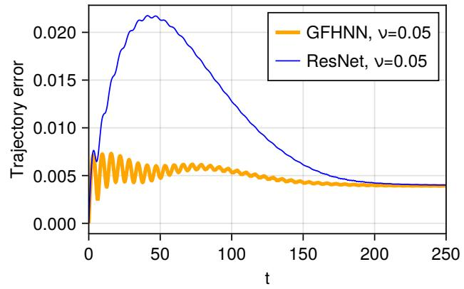

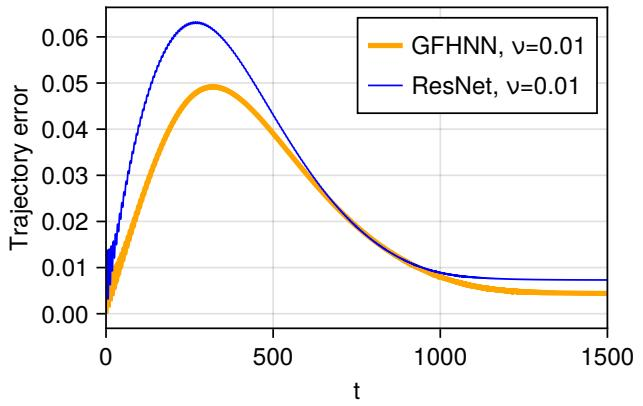

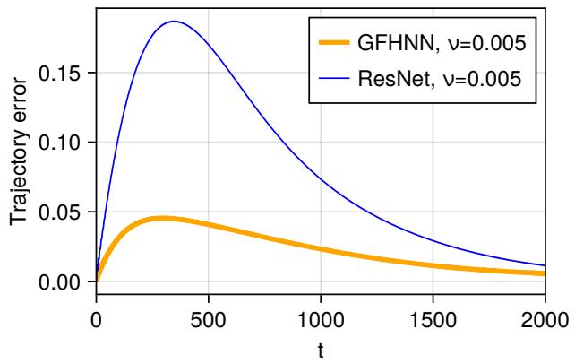

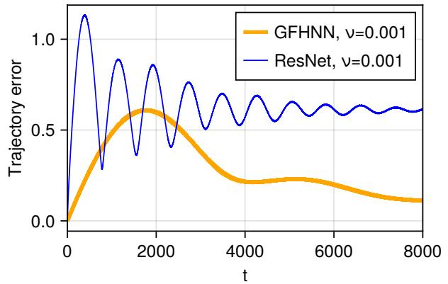  
Figure 6.4: Averaged trajectory error $\epsilon _ { \mathrm { t r a j } } ( t )$ for trajectories generated by the GFHNN and ResNet flows for the linearly damped harmonic oscillator. For each value of the damping coeficient ν, the error is computed by averaging over 49 test initial conditions distributed in the square $- 1 \leq q , p \leq 1$ in phase space, none of which were used during training. Each subplot corresponds to a distinct value of $\nu ,$ as indicated in the legend.

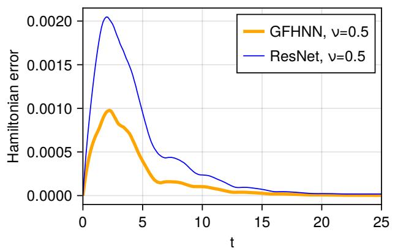

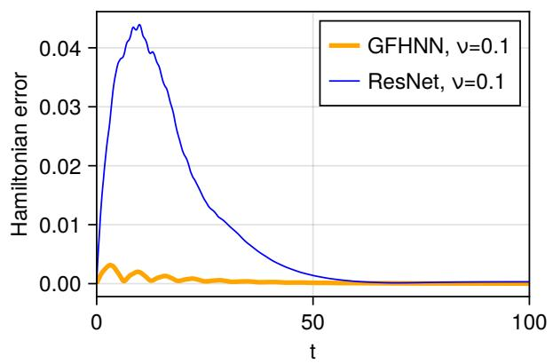

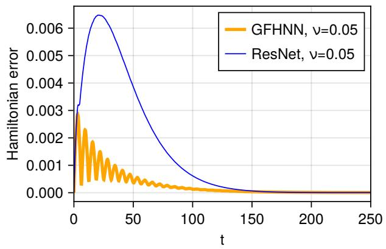

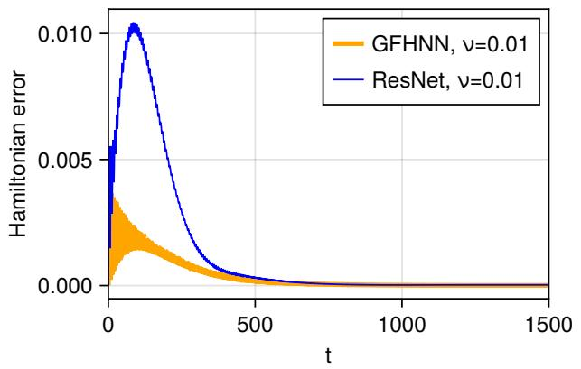

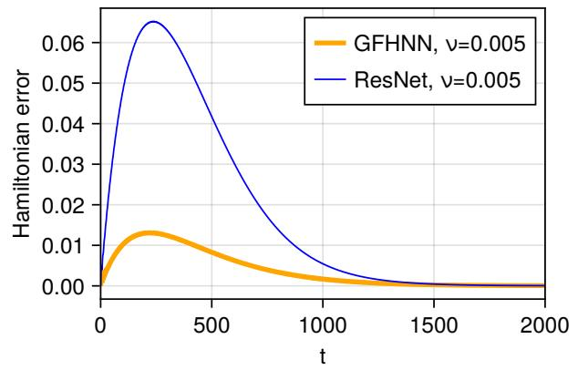

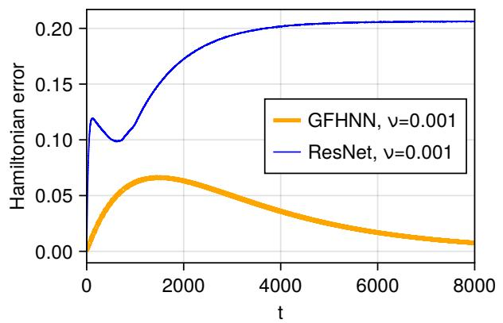  
Figure 6.5: Averaged Hamiltonian error $\epsilon _ { H } ( t )$ for trajectories generated by the GFHNN and ResNet flows for the linearly damped harmonic oscillator. The error is computed by averaging over the same set of 49 test initial conditions used in Figure 6.4. Each subplot corresponds to a distinct value of the damping coeficient ν, as indicated in the legend.

The learned flow was then used to generate trajectories from arbitrary initial conditions. We observed that the GFHNN flow outperformed the ResNet flow in terms of accuracy and stability, especially when generating trajectories over time intervals significantly longer than the characteristic time scale $t _ { \mathrm { s c a l e } } = 2 \pi / \omega$ of the damped system (6.1). An illustrative example is shown in Figure 6.2, where GFHNN and ResNet trajectories starting from the same initial condition $\left( \bar { q } _ { 0 } , \bar { p } _ { 0 } \right) = \left( - 0 . 7 5 , - 0 . 7 5 \right)$ , together with the evolution of the Hamiltonian along these trajectories, are compared for the cases $\nu = 0 . 5$ and $\nu = 0 . 0 0 1$ . In the first case, the solution is damped very rapidly compared to $t _ { \mathrm { s c a l e } } = 6 . 4 9$ , and both the GFHNN and ResNet flows reproduce the exact behavior accurately. In contrast, in the second case the decay of the solution occurs over time intervals severa orders of magnitude longer than the corresponding $t _ { \mathrm { s c a l e } } = 6 . 2 8$ , and the geometric GFHNN flow captures the evolution of the exact solution significantly better than the non–structure-preserving ResNet flow.

However, the behavior of the neural-network–generated trajectories was also observed to depend on the choice of the initial condition. An illustrative example is shown in Figure 6.3, where GFHNN and ResNet trajectories for the case $\nu = 0 . 0 0 5$ are compared for two diferent initial conditions, namely $\left( \bar { q } _ { 0 } , \bar { p } _ { 0 } \right) = \left( - 0 . 7 5 , - 0 . 7 5 \right)$ and $\left( \bar { q } _ { 0 } , \bar { p } _ { 0 } \right) = \left( 0 . 2 5 , 0 . 2 5 \right)$ . In the former case, the GFHNN trajectory outperforms the ResNet trajectory, whereas in the latter case the ResNet exhibits slightly better agreement with the reference solution. To account for this dependence, we considered a set of $N _ { \mathrm { t e s t } } = 4 9$ test initial conditions distributed over the square $- 1 \leq q , p \leq 1$ in phase space,

$$
q _ { 0 } ^ { i , j } = - \frac { 3 } { 4 } + \frac { 1 } { 4 } \bigl ( i - 1 \bigr ) , \qquad \quad p _ { 0 } ^ { i , j } = - \frac { 3 } { 4 } + \frac { 1 } { 4 } \bigl ( j - 1 \bigr ) , \qquad \mathrm { f o r ~ } i , j = 1 , \ldots , 7 ,\tag{6.5}
$$

none of which belonged to the set of initial conditions (6.3) used to generate the training data. For each initial condition, we generated a trajectory $( q ^ { i , j } ( t ) , p ^ { i , j } ( t ) )$ and computed the averaged trajectory and Hamiltonian errors, defined respectively as

$$
\begin{array} { l } { { \displaystyle \epsilon _ { \mathrm { t r a j } } ( t ) = \frac { 1 } { 4 9 } \sum _ { i , j = 1 } ^ { 7 } \left\| \left( { \boldsymbol q } ^ { i , j } ( t ) \right) - \left( { \boldsymbol \bar { q } } ^ { i , j } ( t ) \right) \right\| _ { 2 } , } } \\ { { \displaystyle \epsilon _ { H } ( t ) = \frac { 1 } { 4 9 } \sum _ { i , j = 1 } ^ { 7 } \left| H \big ( { \boldsymbol q } ^ { i , j } ( t ) , { \boldsymbol p } ^ { i , j } ( t ) \big ) - H \big ( { \boldsymbol \bar { q } } ^ { i , j } ( t ) , { \boldsymbol \bar { p } } ^ { i , j } ( t ) \big ) \right| } , } \end{array}\tag{6.6}
$$

where $( \bar { q } ^ { i , j } ( t ) , \bar { p } ^ { i , j } ( t ) )$ denotes the exact solution (6.2) corresponding to the initial condition (6.5). The resulting errors are shown in Figure 6.4 and Figure 6.5, respectively, for all values of the damping coeficient listed in (6.4). As is evident from all plots, the geometric GFHNN flow demonstrates superior performance in all cases.

## 6.2 Quadratically damped pendulum

As the second example, we consider the quadratically damped pendulum, which is again a system of the form (3.1) with

$$
H ( q , p ) = \frac { 1 } { 2 } p ^ { 2 } + \cos ( q ) , f ( q , p ) = - \nu \cdot | p | p ,\tag{6.7}
$$

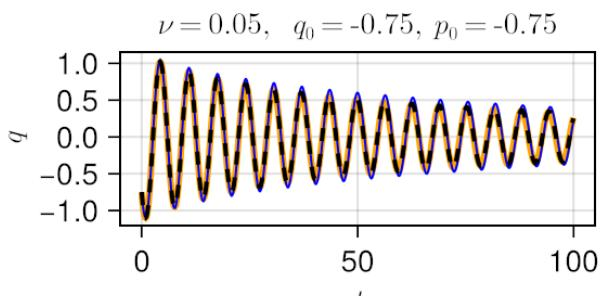

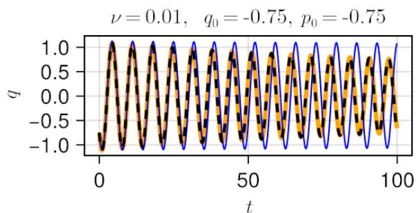

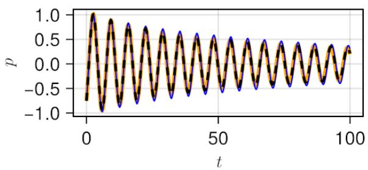

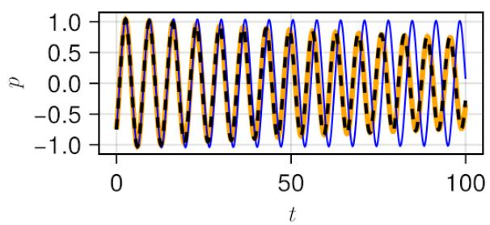

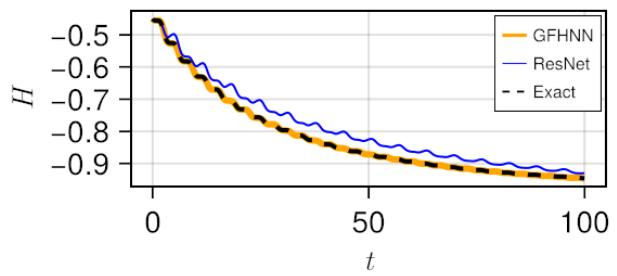

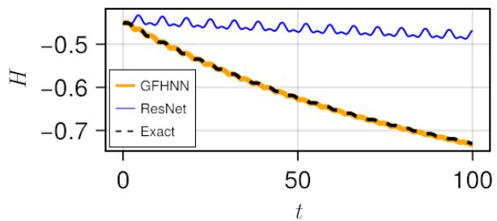  
Figure 6.6: Comparison of trajectories generated by the GFHNN and ResNet flows for the quadratically damped pendulum. The left column corresponds to the case $\nu = 0 . 0 5$ , while the right column shows the case $\nu = 0 . 0 1$ . In both cases, trajectories are generated from the same initial condition $\left( \bar { q } _ { 0 } , \bar { p } _ { 0 } \right) = \left( - 0 . 7 5 , - 0 . 7 5 \right)$ . The first row displays the position $q ( t )$ , the second row the momentum $p ( t )$ , and the third row the Hamiltonian $H ( t )$ evaluated along the corresponding trajectories.

where $\nu$ is the friction coeficient. Unlike the linearly damped harmonic oscillator considered in Section 6.1, this system does not admit a closed-form analytical solution. Therefore, we generate reference trajectories using the implicit midpoint method. The training data for our numerical experiment were created by integrating the system $0 \leq t \leq T$ with the final time $T = 1 3$ , the time step $\Delta t = 0 . 1 3$ , and for 400 initial conditions $( \bar { q } _ { 0 } , \bar { p } _ { 0 } )$ uniformly distributed in the square $- 1 \leq q , p \leq 1$ in the phase space (see (6.3)). A total of 6 training data sets were created for diferent values of the friction coeficient $\nu ,$ namely,

$$
\nu = 0 . 5 , \quad 0 . 1 , \quad 0 . 0 5 , \quad 0 . 0 1 , \quad 0 . 0 0 5 , \quad 0 . 0 0 1 .\tag{6.8}
$$

Similarly to the experiments for the linearly damped harmonic oscillator, a GFHNN and a ResNet were trained for 10 000 epochs using the Adam optimizer in order to learn the flow $F _ { \Delta t }$ . All training runs exhibited convergence behavior comparable to that shown in Figure 6.1.

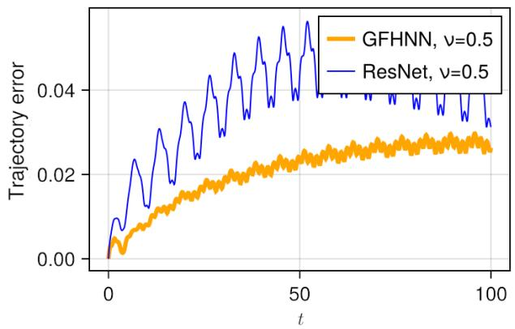

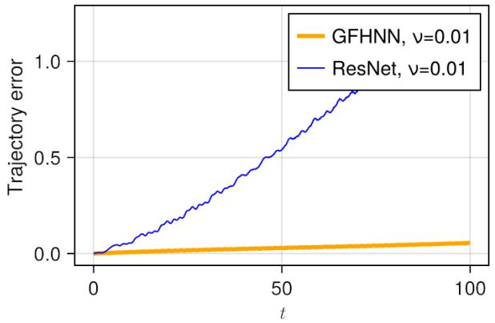

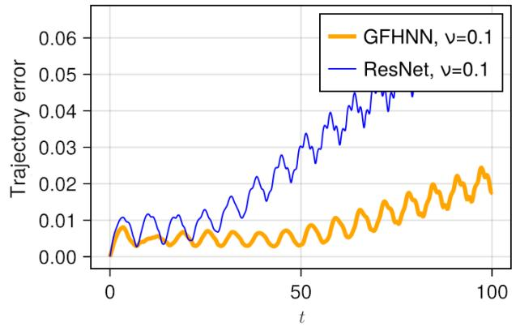

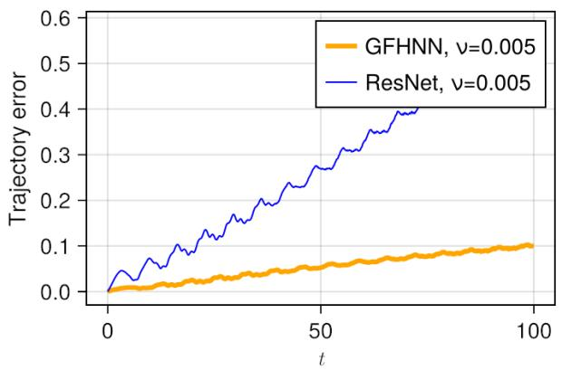

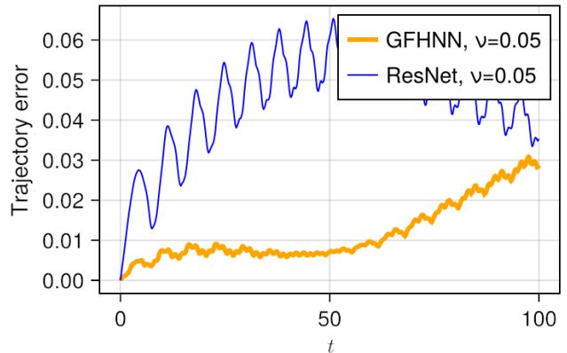

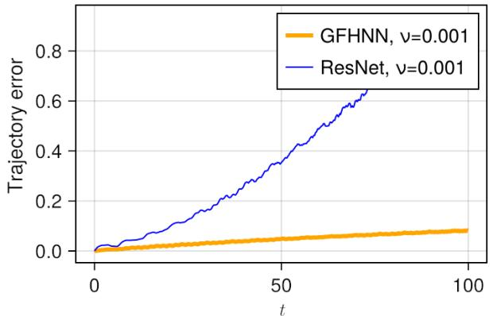  
Figure 6.7: Averaged trajectory error $\epsilon _ { \mathrm { t r a j } } ( t )$ for trajectories generated by the GFHNN and ResNet flows for the quadratically damped pendulum. For each value of the damping coeficient ν, the error is computed by averaging over 49 test initial conditions distributed in the square $- 0 . 7 5 \leq q , p \leq 0 . 7 5$ in phase space, none of which were used during training. Each subplot corresponds to a distinct value of $\nu ,$ as indicated in the legend.

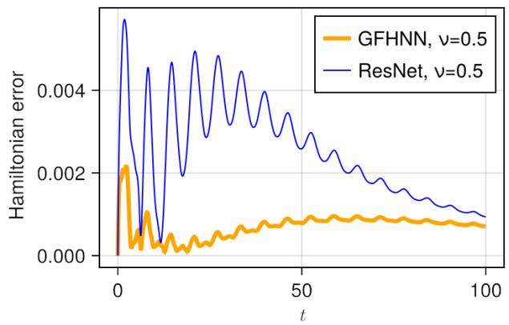

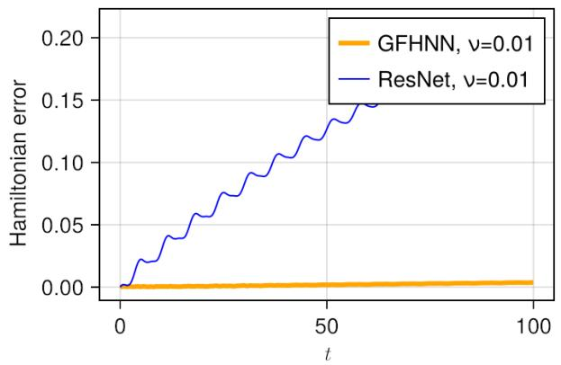

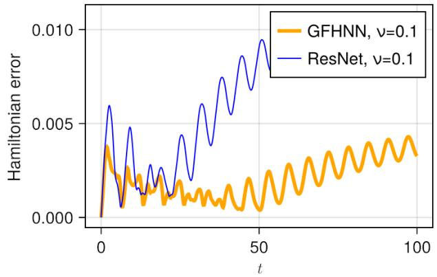

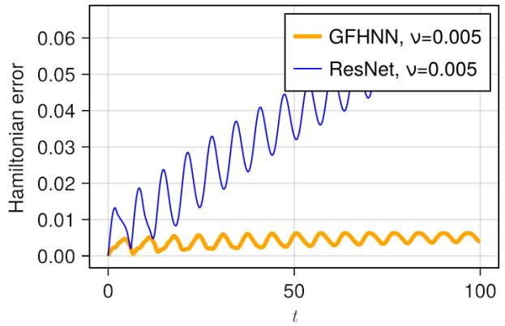

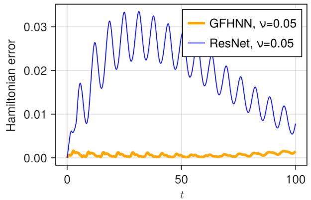

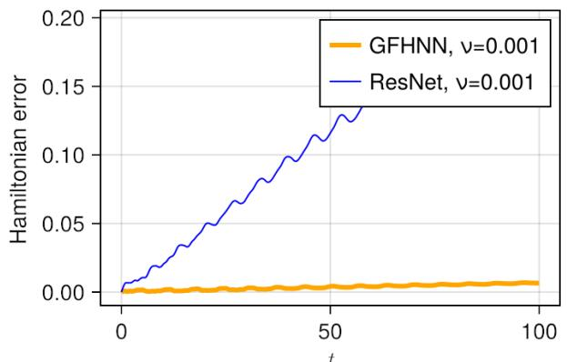  
Figure 6.8: Averaged Hamiltonian error $\epsilon _ { H } ( t )$ for trajectories generated by the GFHNN and ResNet flows for the quadratically damped pendulum. The error is computed by averaging over the same set of 49 test initial conditions used in Figure 6.7. Each subplot corresponds to a distinct value of the damping coeficient $\nu ,$ as indicated in the legend. Also compare this to the case of the linearly damped harmonic oscillator in Figure 6.5.

In Figure 6.6, we compare representative trajectories generated by the trained GFHNN and ResNet models. More precisely, we compare the evolution of the position $q ( t )$ , the momentum $p ( t )$ , and the Hamiltonian $H ( t )$ for two diferent values of the damping coeficient, namely $\nu = 0 . 0 5$ and $\nu = 0 . 0 1$ , using the same initial condition $\left( \bar { q } _ { 0 } , \bar { p } _ { 0 } \right) = \left( - 0 . 7 5 , - 0 . 7 5 \right)$ . In both cases, the GFHNN produces more accurate trajectories than the ResNet. This diference is particularly pronounced for $\nu = 0 . 0 1$ , where the ResNet appears unable to accurately reproduce the dissipative behavior of the system.

To account for the dependence on the initial condition, we again consider a set of 49 test initial conditions distributed over the square $- 0 . 7 5 \leq q , p \leq 0 . 7 5$ in phase space (see (6.5)). None of these initial conditions belonged to the set of initial conditions (6.3) used to generate the training data. As before, we generated a trajectory $( q ^ { i , j } ( t ) , p ^ { i , j } ( t ) )$ for every initial condition and computed the averaged trajectory and Hamiltonian errors defined in Equation (6.6). The resulting errors are shown in Figures 6.7 and 6.8, respectively, for all values of the damping coeficient listed in (6.8). The plots show that the geometric GFHNN flow consistently achieves lower errors than the ResNet in all cases.

## 6.3 Time-dependent damped harmonic oscillator

In order to test the applicability of the proposed PGFHNN architecture to learning time-dependent flows, we consider the time-dependent forced Hamiltonian system (2.1) with

$$
H ( q , p , t ) = \frac { 1 } { 2 } p ^ { 2 } + \frac { 1 } { 2 } q ^ { 2 } - V _ { 0 } q \sin \Omega t , \mathrm { ~ f } ( q , p ) = - \nu p ,\tag{6.9}
$$

where the Hamiltonian H contains a time-periodic potential force with amplitude $V _ { 0 }$ and angular frequency Ω, and the system is damped by a non-conservative friction force with friction coeficient ν. For this system an analytic solution is available and is given by

$$
\begin{array} { r l } & { \bar { q } ( t ) = A e ^ { - \frac { \nu } { 2 } t } \sin \omega t + B e ^ { - \frac { \nu } { 2 } t } \cos \omega t + \gamma V _ { 0 } \bigl ( 1 - \Omega ^ { 2 } \bigr ) \sin \Omega t - \gamma V _ { 0 } \nu \Omega \cos \Omega t , } \\ & { \bar { p } ( t ) = \Bigl ( - \frac { \nu } { 2 } A - \omega B \Bigr ) e ^ { - \frac { \nu } { 2 } t } \sin \omega t + \Bigl ( \omega A - \frac { \nu } { 2 } B \Bigr ) e ^ { - \frac { \nu } { 2 } t } \cos \omega t + \gamma V _ { 0 } \nu \Omega ^ { 2 } \sin \Omega t + \gamma V _ { 0 } \Omega \bigl ( 1 - \Omega ^ { 2 } \bigr ) \cos \Omega t , } \end{array}\tag{6.10}
$$

with

$$
\gamma = \frac { 1 } { ( 1 - \Omega ^ { 2 } ) ^ { 2 } + \nu ^ { 2 } \Omega ^ { 2 } } , \qquad A = \frac { 1 } { \omega } \Biggl ( \bar { p } _ { 0 } + \frac { \nu } { 2 } \bar { q } _ { 0 } + \gamma V _ { 0 } \Omega \Bigl ( \Omega ^ { 2 } + \frac { \nu ^ { 2 } } { 2 } - 1 \Bigr ) \Biggr ) , \qquad B = \bar { q } _ { 0 } + \gamma V _ { 0 } \nu \Omega ,\tag{6.11}
$$

where $\bar { q } _ { 0 }$ and $\bar { p } _ { 0 }$ denote the initial conditions, the damped natural angular frequency is $\begin{array} { r } { \omega = \frac { 1 } { 2 } \sqrt { 4 - \nu ^ { 2 } } } \end{array}$ and we assume the underdamped case $0 \leq \nu < 2$ . The flow map $F _ { t , t _ { 0 } }$ associated with this system is time-dependent. Since the Hamiltonian is periodic in time with period $T _ { \mathrm { p } } = 2 \pi / \Omega$ , one can easily verify that $F _ { t + T _ { \mathrm { p } } , t _ { 0 } + T _ { \mathrm { p } } } = F _ { t , t _ { 0 } }$

The training data for our numerical experiments were created by choosing $V _ { 0 } = 1 , \Omega = 3 . 5$ , and $\nu = 0 . 2 5 .$ , and sampling the exact solution (6.2) for $0 \leq t \leq T$ with the final time $T = 5 T _ { \mathrm { p } } \approx 8 . 9 8$ , time step $\Delta t = T / 1 0 0 \approx 0 . 0 8 9 8$ , and $N _ { \mathrm { t r a i n } } = 6 2 5$ initial conditions $( \bar { q } _ { 0 } , \bar { p } _ { 0 } )$ defined in (6.3). Using this data set, a PGFHNN and a parametric ResNet, the latter obtained by augmenting the network input with the parameter, were trained for 300 epochs with the Adam optimizer to learn the timedependent flow map $F _ { t + \Delta t , t }$ of the system (2.1), with time t treated as a parameter. To make the comparison fair, the networks were chosen to have comparable numbers of trainable parameters, namely, 186 for the PGFHNN (consisting of 3 LDE blocks with $\tilde { T _ { i } } , \ \tilde { U _ { i } }$ , and $\tilde { f } _ { i }$ each having 2 hidden layers of width 2) and 180 for the parametric ResNet. Since the ResNet turned out to yield significantly worse predictions than the PGFHNN, an additional ResNet was trained using a substantially larger training data set with $N _ { \mathrm { t r a i n } } = 4 7 6 1$

The learned flow was then used to generate trajectories from arbitrary initial conditions. Because the neural networks were trained only on the interva $t \in [ 0 , T ]$ , direct evaluation for $t > T$ results in substantial errors. To mitigate this issue, we periodically extended the learned models beyond [0, T], consistent with the time periodicity of the exact flow map. An illustrative example is shown in Figure 6.9, where PGFHNN and ResNet trajectories are compared for two diferent initial conditions, namely $\left( \bar { q } _ { 0 } , \bar { p } _ { 0 } \right) = \left( - 0 . 7 5 , - 0 . 7 5 \right)$ and $\left( \bar { q } _ { 0 } , \bar { p } _ { 0 } \right) \ : = \ : \left( 0 . 2 5 , 0 . 2 5 \right)$ . One may observe that, when trained on the same data set with $N _ { \mathrm { t r a i n } } = 6 2 5$ , the ResNet yields a less accurate evolution than the PGFHNN. In fact, in order to reach the level of accuracy of the PGFHNN, the ResNet required a larger training data set with $N _ { \mathrm { t r a i n } } = 4 7 6 1$ . To further investigate this behavior, we calculated the trajectory and Hamiltonian errors (6.6), averaged over 49 trajectories with the test initial conditions (6.5). The results are depicted in Figure 6.10, and they clearly show that, due to the lack of structure preservation, the ResNet needs more training data to achieve precision comparable to that of the PGFHNN.

## 6.4 Forced Kubo oscillator

As a final example, we present the results of our numerical experiments for stochastic systems. We consider the forced Kubo oscillator, which is a stochastic forced Hamiltonian system of the form (5.2) with the Hamiltonians and forcing terms, respectively,

$$
\begin{array} { l } { { H _ { 0 } ( q , p ) = p ^ { 2 } / 2 + q ^ { 2 } / 2 , } } \\ { { H _ { 1 } ( q , p ) = \beta ( p ^ { 2 } / 2 + q ^ { 2 } / 2 ) , } } \end{array}
$$

$$
\begin{array} { l } { { f _ { 0 } \left( q , p \right) = - \nu p , \hfill } } \\ { { \hfill f _ { 1 } \left( q , p \right) = - \beta \nu p , \hfill } } \end{array}\tag{6.12}
$$

where ν is the damping coeficient, and $\beta$ is the noise intensity. It is an example of an oscillator with a fluctuating frequency and it was first introduced in the context of line-shape theory [1, 49]. It has since found numerous applications in mechanical systems, turbulence, laser theory, and wave propagation [87], magnetic resonance spectroscopy and nonlinear spectroscopy [67], single molecule spectroscopy [44], and stochastic resonance [6, 7, 8, 25]. The Kubo oscillator also serves as a prototype for multiplicative stochastic processes, and since its solutions can be calculated analytically, it is frequently used to validate numerical algorithms [24, 58, 66, 80]. It is straightforward to verify that the exact solution is given by

$$
\bar { q } ( t ) = \bar { q } _ { 0 } e ^ { - \frac { \nu } { 2 } ( t + \beta W ( t ) ) } \cos \omega \big ( t + \beta W ( t ) \big ) + \frac { 1 } { \omega } \big ( \bar { p } _ { 0 } + \frac { \nu } { 2 } \bar { q } _ { 0 } \big ) e ^ { - \frac { \nu } { 2 } ( t + \beta W ( t ) ) } \sin \omega \big ( t + \beta W ( t ) \big ) ,
$$

$$
\bar { p } ( t ) = \bar { p } _ { 0 } e ^ { - \frac { \nu } { 2 } ( t + \beta W ( t ) ) } \cos \omega \big ( t + \beta W ( t ) \big ) - \frac { 1 } { \omega } \big ( \bar { q } _ { 0 } + \frac { \nu } { 2 } \bar { p } _ { 0 } \big ) e ^ { - \frac { \nu } { 2 } ( t + \beta W ( t ) ) } \sin \omega \big ( t + \beta W ( t ) \big ) ,\tag{6.13}
$$

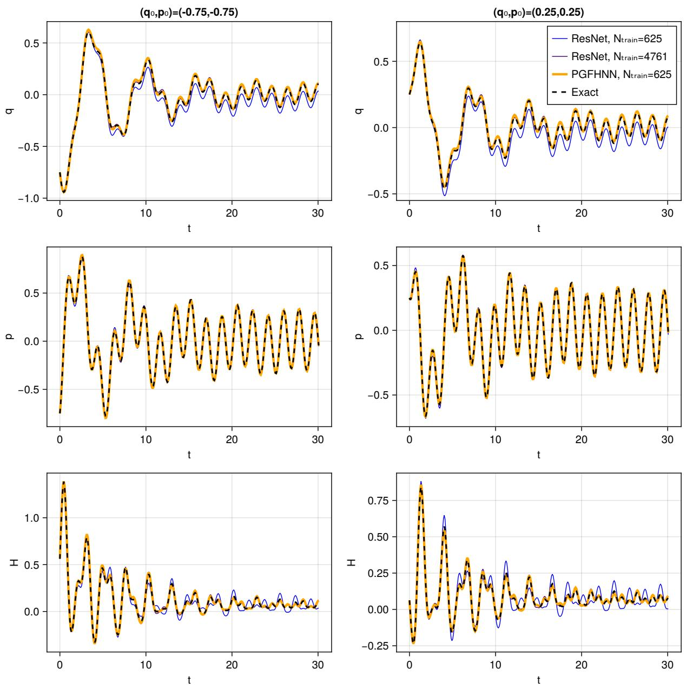  
Figure 6.9: Comparison of trajectories generated by the PGFHNN and parametric ResNet flows for the time-dependent damped harmonic oscillator with $V _ { 0 } = 1 , \Omega = 3 . 5$ , and $\nu = 0 . 2 5$ . The left column corresponds to the initial condition $\left( \bar { q } _ { 0 } , \bar { p } _ { 0 } \right) = \left( - 0 . 7 5 , - 0 . 7 5 \right)$ , while the right column corresponds to $\left( \bar { q } _ { 0 } , \bar { p } _ { 0 } \right) = \left( 0 . 2 5 , 0 . 2 5 \right)$ . In both cases, the first row displays the position $q ( t )$ , the second row the momentum $p ( t )$ , and the third row the Hamiltonian $H ( t )$ evaluated along the corresponding trajectories. Note that the plots corresponding to the ResNet with $N _ { \mathrm { t r a i n } } = 4 7 6 1$ and the PGFHNN overlap very closely and are therefore nearly indistinguishable in the figure.

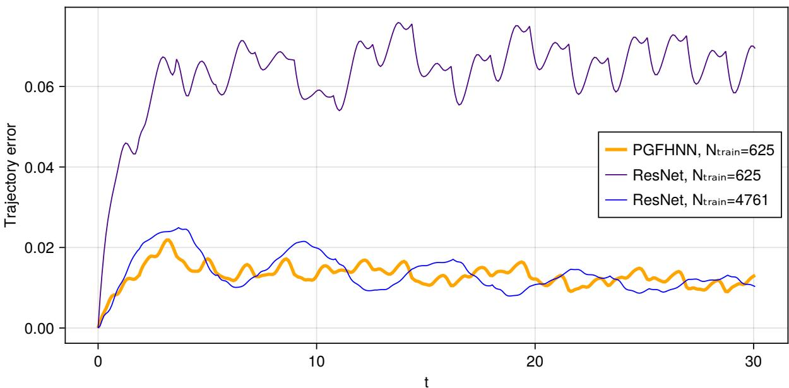

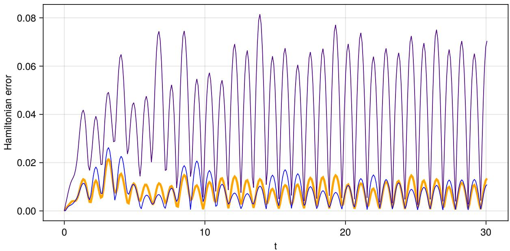  
Figure 6.10: Averaged trajectory $\epsilon _ { \mathrm { { t r a j } } } ( t )$ (Top) and Hamiltonian $\epsilon _ { H } ( t )$ (Bottom) errors for trajec tories generated by the PGFHNN and parametric ResNet flows for the time-dependent damped harmonic oscillator with $V _ { 0 } = 1 , \Omega = 3 . 5$ , and $\nu = 0 . 2 5$ . The errors are computed by averaging over 49 test initial conditions distributed in the square $- 1 \leq q , p \leq 1$ in phase space, none of which were used during training. In order to reach a comparable accuracy, the non-structure-preserving ResNet needed a 7.6-times larger training data set than the geometric PGFHNN.

where $\bar { q } _ { 0 }$ and $\bar { p } _ { 0 }$ denote the initial conditions, the angular frequency is $\begin{array} { r } { \omega = \frac { 1 } { 2 } \sqrt { 4 - \nu ^ { 2 } } } \end{array}$ , and we assume the underdamped regime $0 \leq \nu < 2 ;$ see [48]. Note that (6.13) coincides with the solution of the deterministic damped harmonic oscillator (6.2), with the time argument shifted by $\beta W ( t )$

The training data for our experiment were generated by choosing $\beta = 0 . 5$ and sampling the exact solution (6.13) for $0 \leq t \leq T$ , with final time $T = 7$ and time step $\Delta t = 0 . 0 7$ . We used $N _ { \mathrm { t r a i n } } = 1 0 0$ initial conditions $( \bar { q } _ { 0 } , \bar { p } _ { 0 } )$ defined in (6.3), and $M _ { \mathrm { t r a i n } } = 1 0$ independent sample paths of the Wiener process. Two training data sets were created for diferent values of the friction coeficient $\nu ,$ namely,

$$
\nu = 0 . 2 5 , \qquad \mathrm { a n d } \qquad \nu = 0 . 0 1 .\tag{6.14}
$$

Using these data sets, a PGFHNN and a parametric ResNet were trained for 300 epochs with the Adam optimizer to learn the parameter-dependent Lagrange-d’Alembert map $\varphi _ { \mu }$ underlying the stochastic flow $F _ { t + \Delta t , t }$ of the system (5.2), as in (5.7), with the increment of the Wiener process $\Delta W$ treated as a parameter. To make the comparison fair, the networks were chosen to have comparable numbers of trainable parameters, namely, 186 for the PGFHNN (consisting of 3 LDE blocks with $\tilde { T _ { i } } , \tilde { U _ { i } }$ , and $\tilde { f } _ { i }$ each having 2 hidden layers of width 2) and 180 for the parametric ResNet.

The learned flow was then used to generate trajectories from arbitrary initial conditions, and for arbitrary sample paths of the Wiener process. Illustrative examples are shown in Figure 6.11 and Figure 6.12, where PGFHNN and ResNet trajectories are compared for the $\nu = 0 . 2 5$ and $\nu = 0 . 0 1$ data sets, respectively, in each case for two diferent initial conditions. One may observe that the quality of the ResNet trajectories deteriorates faster than that of the PGFHNN trajectories, especially in the $\nu = 0 . 0 1$ case, where the damping of the solution occurs over a longer time interval. To further investigate this behavior, we calculated the trajectory and Hamiltonian errors (6.6), averaged over $N _ { \mathrm { t e s t } } \cdot M _ { \mathrm { t e s t } } = 2 4 0 1$ trajectories, corresponding to $N _ { \mathrm { t e s t } } = 4 9$ initial conditions (6.5) and $M _ { \mathrm { t e s t } } = 4 9$ independent sample paths of the Wiener process. The results are depicted in Figure 6.13, and they clearly show that, due to the lack of structure preservation, the ResNet generates less accurate solutions than the PGFHNN.

## 7 Summary

In this work, we developed a geometric framework for learning deterministic and stochastic forced Hamiltonian systems with neural networks. Our construction is motivated by the Lagranged’Alembert principle and the theory of variational integrators, which provide a natural geometric description of mechanical systems subject to external forcing. We reviewed forced Hamiltonian systems and Lagrange-d’Alembert integrators, introduced the notion of a Lagrange-d’Alembert map, and established a $C ^ { r }$ convergence theorem for first-order one-step methods. These results provide a mathematical foundation for approximating forced Hamiltonian flows by compositions of geometric numerical integrators.

Using this foundation, we proposed Generalized Forced Hamiltonian Neural Networks (GFHNNs), a class of structure-preserving neural networks obtained by concatenating Lagrange-d’Alembert-Euler maps whose kinetic and potential energies, together with the forcing term, are represented by neural networks. We proved a universal approximation theorem showing that GFHNNs are dense in the space of Lagrange-d’Alembert maps in the $C ^ { r }$ topology on compact sets. We further extended the theory to parameter-dependent forced Hamiltonian systems and introduced Parametric Generalized Forced Hamiltonian Neural Networks (PGFHNNs), together with a corresponding

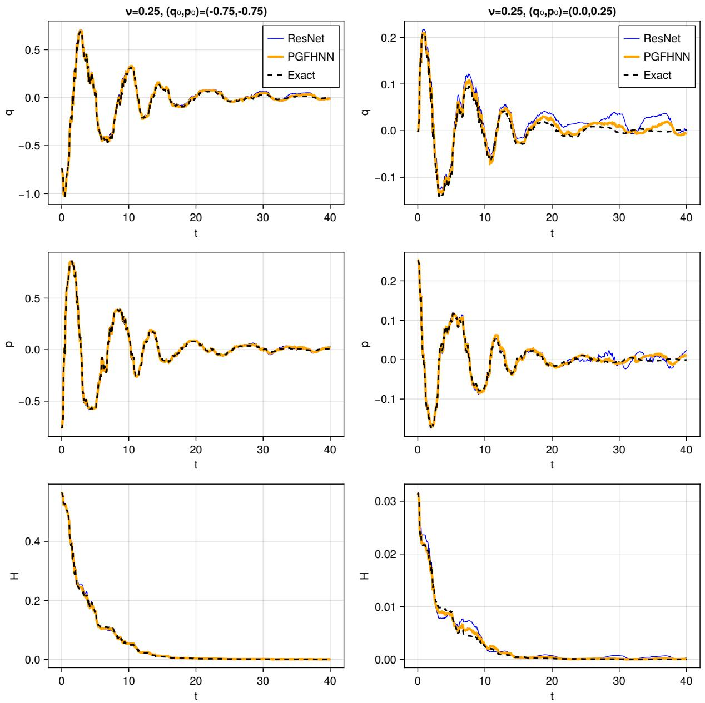  
Figure 6.11: Comparison of trajectories generated by the PGFHNN and parametric ResNet flows for the forced Kubo oscillator with $\beta = 0 . 5$ and $\nu = 0 . 2 5$ . The left column corresponds to the initial condition $\left( \bar { q } _ { 0 } , \bar { p } _ { 0 } \right) = \left( - 0 . 7 5 , - 0 . 7 5 \right)$ , while the right column corresponds to $\left( \bar { q } _ { 0 } , \bar { p } _ { 0 } \right) = \left( 0 , 0 . 2 5 \right)$ . In both cases, the first row displays the position $q ( t )$ , the second row the momentum $p ( t )$ , and the third row the Hamiltonian $H ( t )$ evaluated along the corresponding trajectories.

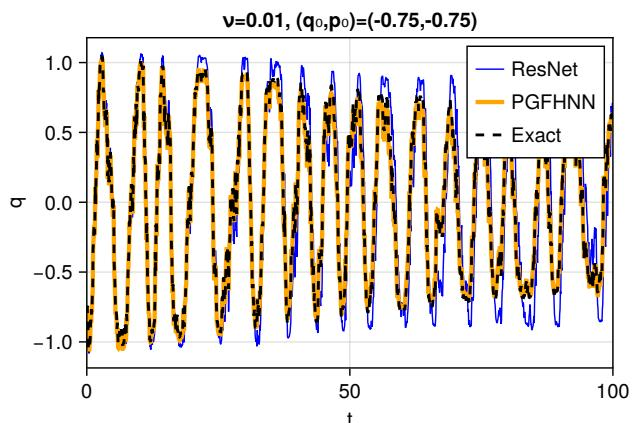

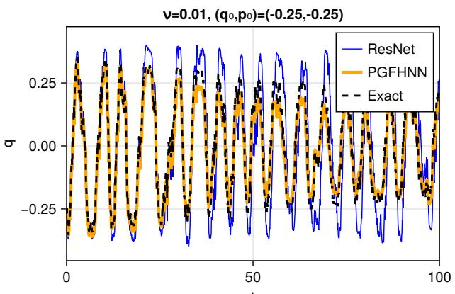

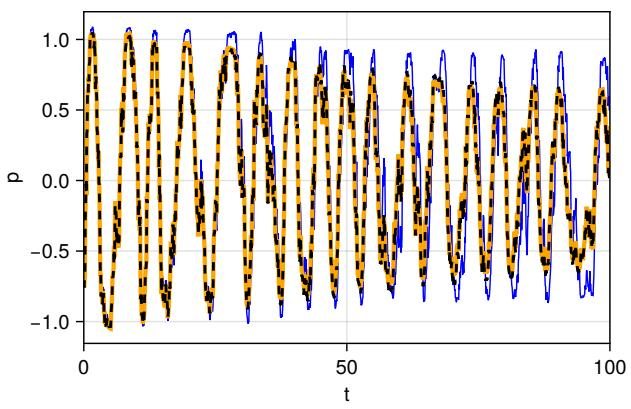

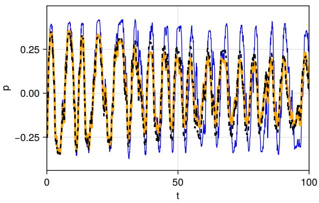

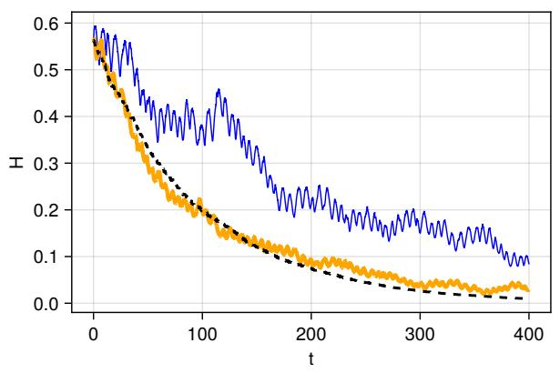

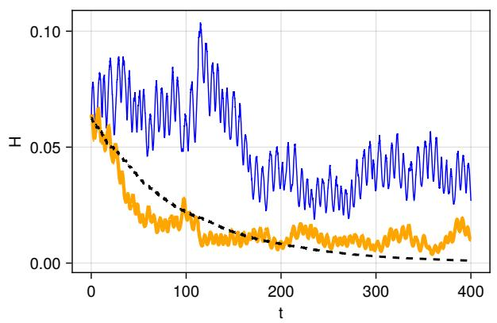  
Figure 6.12: Comparison of trajectories generated by the PGFHNN and parametric ResNet flows for the forced Kubo oscillator with $\beta = 0 . 5$ and $\nu = 0 . 0 1$ . The left column corresponds to the initial condition $\left( \bar { q } _ { 0 } , \bar { p } _ { 0 } \right) = \left( - 0 . 7 5 , - 0 . 7 5 \right)$ , while the right column corresponds to $\left( \bar { q } _ { 0 } , \bar { p } _ { 0 } \right) = \left( - 0 . 2 5 , - 0 . 2 5 \right)$ In both cases, the first row displays the position $q ( t )$ , the second row the momentum $p ( t )$ , and the third row the Hamiltonian $H ( t )$ evaluated along the corresponding trajectories.

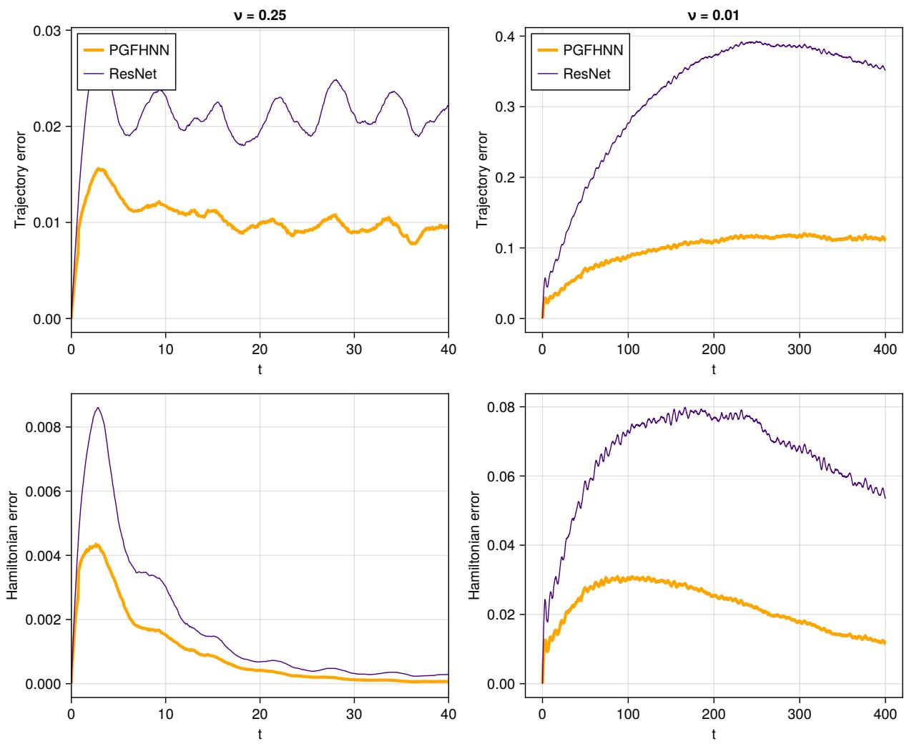  
Figure 6.13: Averaged trajectory $\epsilon _ { \mathrm { t r a j } } ( t )$ (Top) and Hamiltonian $\epsilon _ { H } ( t )$ (Bottom) errors for trajectories generated by the PGFHNN and parametric ResNet flows for the forced Kubo oscillator with $\beta = 0 . 5$ . The left column corresponds to the friction coeficient $\nu = 0 . 2 5$ , while the right column corresponds to $\nu = 0 . 0 1$ . In both cases, the errors are computed by averaging over 49 test initial conditions distributed in the square $- 1 \leq q , p \leq 1$ in phase space, and 49 independent sample paths of the Wiener process, none of which were used during training.

universal approximation theorem.

We also considered stochastic forced Hamiltonian systems. By treating the multiple Stratonovich integrals appearing in the Stratonovich–Taylor expansion as parameters, stochastic Lagranged’Alembert flows can be viewed as parameter-dependent Lagrange-d’Alembert maps. This allows PGFHNNs to be applied directly to stochastic forced Hamiltonian systems whenever information about the underlying Wiener process is available, thereby extending the approximation framework developed for deterministic systems to this stochastic setting.

The proposed architectures were evaluated on several benchmark problems involving deterministic and stochastic forced Hamiltonian systems. The numerical results demonstrate that incorporating geometric structure through variational principles and Lagrange-d’Alembert integrators yields models with significantly improved long-time stability and accuracy. In particular, the proposed geometric architectures consistently outperform non-geometric residual neural networks in long-time simulations. We also observed that residual neural networks require substantially larger training datasets to achieve a comparable level of accuracy.

Several directions for future research remain open. A natural extension of the present work is the development of analogous architectures on manifolds, in particular on Lie groups, with potential applications in robotics [23, 74]. Another promising area of application is computational plasma physics. Particle discretizations of collisional Vlasov equations possess the structure of stochastic forced Hamiltonian systems [48, 57, 82], and many practical applications require repeated simulations using expensive high-fidelity stochastic numerical methods with millions of particles and varying input parameters. In such settings, the underlying Wiener process is known, and the proposed neural network architecture could significantly reduce computational costs by providing a cheaper surrogate for the stochastic flow. This approach could be particularly efective when combined with structure-preserving model reduction techniques [3, 83, 86]. Finally, our approach to learning stochastic flows could be combined with denoising techniques, such as the autoencoderbased methods developed in [9, 91], to infer latent random variables. This would make it possible to apply the proposed framework to engineering problems in which the underlying Wiener process is not directly observable.

## Acknowledgments

We would like to thank Philipp Horn for useful comments and references. We further thank Michael Kraus for useful comments and a thorough review of the code that was used to produce the results presented here. This publication is part of the project Stochastic Geometric Integrators for Dynamical Systems with file number OCENW.M.24.105 of the research programme Open Competition Domain Science-M Package 24-2, which is (partly) financed by the Dutch Research Council (NWO) under grant DOI https://doi.org/10.61686/PIDBU22657.

## References

[1] P. Anderson. A mathematical model for the narrowing of spectral lines by exchange or motion. Journal of the Physical Society of Japan, 9(3):316–339, 1954.

[2] L. Arnold. Stochastic Diferential Equations: Theory and Applications. Dover Books on Mathematics. Dover Publications, 2013.

[3] B. Brantner and M. Kraus. Symplectic autoencoders for model reduction of Hamiltonian systems. Preprint arXiv:2312.10004, 2023.

[4] B. Brantner and M. Kraus. GeometricMachineLearning.jl: v0.5.0, Aug. 2026. https://doi.org/10.5281/zenodo.19677961.

[5] J. W. Burby, Q. Tang, and R. Maulik. Fast neural Poincaré maps for toroidal magnetic fields. Plasma Physics and Controlled Fusion, 63(2):024001, dec 2020.

[6] J. R. Chaudhuri and S. Chattopadhyay. Microscopic realization of Kubo oscillator. Chemical Physics Letters, 480(1):140 – 143, 2009.

[7] J. R. Chaudhuri and S. Chattopadhyay. Kubo oscillator and its application to stochastic resonance: A microscopic realization. In R. K. Chaudhuri, M. Mekkaden, A. V. Raveendran, and A. Satya Narayanan, editors, Recent Advances in Spectroscopy, pages 75–83, Berlin, Heidelberg, 2010. Springer Berlin Heidelberg.

[8] J. R. Chaudhuri, P. Chaudhury, and S. Chattopadhyay. Harmonic oscillator in presence of nonequilibrium environment. The Journal of Chemical Physics, 130(23):234109, 2009.

[9] C. Chen, L. Wang, Y. Cao, and X. Cheng. Learning stochastic Hamiltonian systems via stochastic generating function neural network. arXiv preprint, arXiv:2507.14467, 2025.

[10] R. T. Q. Chen, Y. Rubanova, J. Bettencourt, and D. K. Duvenaud. Neural ordinary diferential equations. In S. Bengio, H. Wallach, H. Larochelle, K. Grauman, N. Cesa-Bianchi, and R. Garnett, editors, Advances in Neural Information Processing Systems, volume 31. Curran Associates, Inc., 2018.

[11] T. Chen and H. Chen. Universal approximation to nonlinear operators by neural networks with arbitrary activation functions and its application to dynamical systems. IEEE transactions on neural networks, 6(4):911–917, 1995.

[12] Y. Chen, T. Matsubara, and T. Yaguchi. Neural symplectic form: Learning Hamiltonian equations on general coordinate systems. Advances in Neural Information Processing Systems, 34:16659–16670, 2021.

[13] Y. Chen and D. Xiu. Learning stochastic dynamical system via flow map operator. Journal of Computational Physics, 508:112984, 2024.

[14] X. Cheng, L. Wang, and Y. Cao. Quadrature based neural network learning of stochastic Hamiltonian systems. Mathematics, 12(16), 2024.

[15] E. A. Coddington and N. Levinson. Theory of Ordinary Diferential Equations. International Series in Pure and Applied Mathematics. McGraw-Hill, New York, 1955.

[16] G. M. Constantine and T. H. Savits. A multivariate Faà di Bruno formula with applications. Transactions of the American Mathematical Society, 348(2):503–520, 1996.

[17] C. Courtès, E. Franck, M. Kraus, L. Navoret, and L. Trémant. Neural non-canonical Hamiltonian dynamics for long-time simulations. arXiv preprint arXiv:2510.01788, 2025.

[18] M. Cranmer, S. Greydanus, S. Hoyer, P. Battaglia, D. Spergel, and S. Ho. Lagrangian neural networks. arXiv preprint arXiv:2003.04630, 2020.

[19] G. Deco and W. Brauer. Nonlinear higher-order statistical decorrelation by volume-conserving neural architectures. Neural Networks, 8(4):525–535, 1995.

[20] S. A. Desai, M. Mattheakis, D. Sondak, P. Protopapas, and S. J. Roberts. Port-Hamiltonian neural networks for learning explicit time-dependent dynamical systems. Physical Review E, 104(3):034312, 2021.

[21] F. Dietrich, A. Makeev, G. Kevrekidis, N. Evangelou, T. Bertalan, S. Reich, and I. G. Kevrekidis. Learning efective stochastic diferential equations from microscopic simulations: Linking stochastic numerics to deep learning. Chaos: An Interdisciplinary Journal of Nonlinear Science, 33(2):023121, 02 2023.

[22] N. Dridi, L. Drumetz, and R. Fablet. Learning stochastic dynamical systems with neural networks mimicking the Euler-Maruyama scheme. In 2021 29th European Signal Processing Conference (EUSIPCO), pages 1990–1994, 2021.

[23] V. Duruisseaux, T. P. Duong, M. Leok, and N. Atanasov. Lie group forced variational integrator networks for learning and control of robot systems. In N. Matni, M. Morari, and G. J. Pappas, editors, Proceedings of The 5th Annual Learning for Dynamics and Control Conference, volume 211 of Proceedings of Machine Learning Research, pages 731–744. PMLR, 15–16 Jun 2023.

[24] R. Fox, R. Roy, and A. Yu. Tests of numerical simulation algorithms for the Kubo oscillator. Journal of Statistical Physics, 47:477–487, 1987.

[25] M. Gitterman. Harmonic oscillator with fluctuating damping parameter. Phys. Rev. E, 69:041101, Apr 2004.

[26] I. Goodfellow, Y. Bengio, A. Courville, and Y. Bengio. Deep learning, volume 1. MIT press Cambridge, 2016.

[27] S. Greydanus, M. Dzamba, and J. Yosinski. Hamiltonian neural networks. Advances in neural information processing systems, 32, 2019.

[28] E. Hairer, C. Lubich, and G. Wanner. Geometric Numerical Integration: Structure-Preserving Algorithms for Ordinary Diferential Equations. Springer Series in Computational Mathematics. Springer, New York, 2002.

[29] E. Hairer, S. Nørsett, and G. Wanner. Solving Ordinary Diferential Equations I: Nonstif Problems, volume 8 of Springer Series in Computational Mathematics. Springer, 2nd edition, 1993.

[30] J. K. Hale. Ordinary Diferential Equations. Wiley-Interscience, New York, 1969.

[31] J. Hall and M. Leok. Spectral variational integrators. Numer. Math., 130(4):681–740, Aug 2015.

[32] M. D. Hansen, E. Celledoni, and B. K. Tapley. Learning mechanical systems from realworld data using discrete forced Lagrangian dynamics. arXiv preprint, 2025. Available at https://arxiv.org/abs/2505.20370.

[33] A. Havens and G. Chowdhary. Forced variational integrator networks for prediction and control of mechanical systems. In A. Jadbabaie, J. Lygeros, G. J. Pappas, P. A. Parrilo, B. Recht, C. J. Tomlin, and M. N. Zeilinger, editors, Proceedings of the 3rd Conference on Learning for Dynamics and Control, volume 144 of Proceedings of Machine Learning Research, pages 1142–1153. PMLR, 07 – 08 June 2021.

[34] K. He, X. Zhang, S. Ren, and J. Sun. Deep residual learning for image recognition. In Proceedings of the IEEE Conference on Computer Vision and Pattern Recognition (CVPR), pages 770–778, 2016.

[35] D. D. Holm and T. M. Tyranowski. Stochastic discrete Hamiltonian variational integrators. BIT Numerical Mathematics, 58(4):1009–1048, 2018.

[36] P. Horn. Structure-Preserving Neural Networks for Hamiltonian Systems. Phd thesis, Eindhoven University of Technology, Eindhoven, 2026.

[37] P. Horn and B. Koren. Parametric generalized Hamiltonian neural networks, 2026. SSRN preprint.

[38] P. Horn, V. Saz Ulibarrena, B. Koren, and S. Portegies Zwart. A generalized framework of neural networks for Hamiltonian systems. Journal of Computational Physics, 521:113536, 2025.

[39] K. Hornik. Approximation capabilities of multilayer feedforward networks. Neural Networks, 4(2):251–257, 1991.

[40] K. Hornik, M. Stinchcombe, and H. White. Multilayer feedforward networks are universal approximators. Neural networks, 2(5):359–366, 1989.

[41] K. Hornik, M. Stinchcombe, and H. White. Universal approximation of an unknown mapping and its derivatives using multilayer feedforward networks. Neural Networks, 3(5):551–560, 1990.

[42] N. Ikeda and S. Watanabe. Stochastic Diferential Equations and Difusion Processes. Kodansha scientific books. North-Holland, 1989.

[43] P. Jin, Z. Zhang, A. Zhu, Y. Tang, and G. E. Karniadakis. SympNets: Intrinsic structurepreserving symplectic networks for identifying Hamiltonian systems. Neural Networks, 132:166–179, 2020.

[44] Y. Jung, E. Barkai, and R. J. Silbey. A Stochastic Theory of Single Molecule Spectroscopy, chapter 4, pages 199–266. John Wiley & Sons, Ltd, 2003.

[45] C. Kane, J. E. Marsden, M. Ortiz, and M. West. Variational integrators and the Newmark algorithm for conservative and dissipative mechanical systems. International Journal for Numerical Methods in Engineering, 49(10):1295–1325, 2000.

[46] P. Kloeden and E. Platen. Numerical Solution of Stochastic Diferential Equations. Applications of Mathematics : Stochastic Modelling and Applied Probability. Springer, 1995.

[47] L. Kong, J. Sun, and C. Zhang. SDE-Net: equipping deep neural networks with uncertainty estimates. In Proceedings of the 37th International Conference on Machine Learning, ICML’20. JMLR.org, 2020.

[48] M. Kraus and T. M. Tyranowski. Variational integrators for stochastic dissipative Hamiltonian systems. IMA Journal of Numerical Analysis, 41(2):1318–1367, 2020.

[49] R. Kubo. Note on the stochastic theory of resonance absorption. Journal of the Physical Society of Japan, 9(6):935–944, 1954.

[50] H. Kunita. Stochastic Flows and Stochastic Diferential Equations. Cambridge Studies in Advanced Mathematics. Cambridge University Press, 1997.

[51] I. E. Lagaris, A. Likas, and D. I. Fotiadis. Artificial neural networks for solving ordinary and partial diferential equations. IEEE transactions on neural networks, 9(5):987–1000, 1998.

[52] H. Lee and I. S. Kang. Neural algorithm for solving diferential equations. Journal of computational physics, 91(1):110–131, 1990.

[53] M. Leok and T. Shingel. General techniques for constructing variational integrators. Frontiers of Mathematics in China, 7(2):273–303, 2012.

[54] M. Leok and J. Zhang. Discrete Hamiltonian variational integrators. IMA Journal of Numerical Analysis, 31(4):1497–1532, 2011.

[55] A. Lew, J. E. Marsden, M. Ortiz, and M. West. Asynchronous variational integrators. Archive for Rational Mechanics and Analysis, 167(2):85–146, 2003.

[56] X. Liu, T. Xiao, S. Si, Q. Cao, S. Kumar, and C.-J. Hsieh. Neural SDE: Stabilizing neural ODE networks with stochastic noise. Unpublished, arXiv:1906.02355, 2019.

[57] Z. Lu, G. Meng, T. Tyranowski, and A. Chankin. High-order stochastic integration schemes for the Rosenbluth-Trubnikov collision operator in particle simulations. Journal of Computational Physics, 527:113811, 2025.

[58] Q. Ma and X. Ding. Stochastic symplectic partitioned Runge-Kutta methods for stochastic Hamiltonian systems with multiplicative noise. Appl. Math. Comput., 252(C):520–534, Feb. 2015.

[59] J. Marsden and T. Ratiu. Introduction to Mechanics and Symmetry, volume 17 of Texts in Applied Mathematics. Springer Verlag, 1994.

[60] J. E. Marsden, G. W. Patrick, and S. Shkoller. Multisymplectic geometry, variational integrators, and nonlinear PDEs. Communications in Mathematical Physics, 199(2):351–395, 1998.

[61] J. E. Marsden and M. West. Discrete mechanics and variational integrators. Acta Numerica, 10(1):357–514, 2001.

[62] D. McDuf and D. Salamon. Introduction to Symplectic Topology. Oxford University Press, 2017.

[63] R. I. McLachlan and G. R. W. Quispel. Geometric integrators for ODEs. Journal of Physics A: Mathematical and General, 39(19):5251–5285, 2006.

[64] A. J. Meade Jr and A. A. Fernandez. The numerical solution of linear ordinary diferential equations by feedforward neural networks. Mathematical and computer modelling, 19(12):1–25, 1994.

[65] G. Milstein. Numerical Integration of Stochastic Diferential Equations. Mathematics and Its Applications. Springer Netherlands, 1995.

[66] G. N. Milstein, Y. M. Repin, and M. V. Tretyakov. Numerical methods for stochastic systems preserving symplectic structures. SIAM J. Numer. Anal., 40(4):1583 – 1604, 2002.

[67] S. Mukamel. Principles of nonlinear optical spectroscopy. Oxford series in optical and imaging sciences. Oxford University Press, 1995.

[68] S. Ober-Blöbaum. Galerkin variational integrators and modified symplectic Runge-Kutta methods. IMA Journal of Numerical Analysis, 37(1):375–406, 2017.

[69] D. Pavlov, P. Mullen, Y. Tong, E. Kanso, J. E. Marsden, and M. Desbrun. Structure-preserving discretization of incompressible fluids. Physica D: Nonlinear Phenomena, 240(6):443–458, 2011.

[70] L. Peng, N. Arai, and K. Yasuoka. A stochastic Hamiltonian formulation applied to dissipative particle dynamics. Appl. Math. Comput., 426(C), 2022.

[71] L. Polterovich. The Geometry of the Group of Symplectic Difeomorphisms. Lectures in Mathematics, ETH Zürich. Birkhäuser Basel, 2001.

[72] M. Ripoll, M. H. Ernst, and P. Español. Large scale and mesoscopic hydrodynamics for dissipative particle dynamics. The Journal of Chemical Physics, 115(15):7271–7284, 2001.

[73] C. W. Rowley and J. E. Marsden. Variational integrators for degenerate Lagrangians, with application to point vortices. In Decision and Control, 2002, Proceedings of the 41st IEEE Conference on, volume 2, pages 1521–1527. IEEE, 2002.

[74] S. Saemundsson, A. Terenin, K. Hofmann, and M. Deisenroth. Variational integrator networks for physically structured embeddings. In S. Chiappa and R. Calandra, editors, Proceedings of the Twenty Third International Conference on Artificial Intelligence and Statistics, volume 108 of Proceedings of Machine Learning Research, pages 3078–3087. PMLR, 26–28 Aug 2020.

[75] J. M. Sanz-Serna. Symplectic integrators for Hamiltonian problems: an overview. Acta Numerica, 1:243–286, 1992.

[76] R. D. Skeel. Integration schemes for molecular dynamics and related applications. In M. Ainsworth, J. Levesley, and M. Marletta, editors, The Graduate Student’s Guide to Numerical Analysis ’98: Lecture Notes from the VIII EPSRC Summer School in Numerical Analysis, pages 119–176. Springer Berlin Heidelberg, Berlin, Heidelberg, 1999.

[77] E. Sonnendrücker, A. Wacher, R. Hatzky, and R. Kleiber. A split control variate scheme for PIC simulations with collisions. Journal of Computational Physics, 295:402 – 419, 2015.

[78] A. Sosanya and S. Greydanus. Dissipative Hamiltonian neural networks: Learning dissipative and conservative dynamics separately. arXiv preprint arXiv:2201.10085, 2022.

[79] A. Stern, Y. Tong, M. Desbrun, and J. E. Marsden. Variational integrators for Maxwell’s equations with sources. PIERS Online, 4(7):711–715, 2008.

[80] L. Sun and L. Wang. Stochastic symplectic methods based on the Padé approximations for linear stochastic Hamiltonian systems. Journal of Computational and Applied Mathematics, 2016. http://dx.doi.org/10.1016/j.cam.2016.08.011.

[81] D. Turaev. Polynomial approximations of symplectic dynamics and richness of chaos in nonhyperbolic area-preserving maps. Nonlinearity, 16(1):123–135, 2002.

[82] T. M. Tyranowski. Stochastic variational principles for the collisional Vlasov-Maxwell and Vlasov-Poisson equations. Proceedings of the Royal Society A: Mathematical, Physical and Engineering Sciences, 477(2252):20210167, 2021.

[83] T. M. Tyranowski. Data-driven structure-preserving model reduction for stochastic Hamiltonian systems. Preprint arXiv:2201.13391, 2022.

[84] T. M. Tyranowski and M. Desbrun. R-adaptive multisymplectic and variational integrators. Mathematics, 7(7), 2019.

[85] T. M. Tyranowski and M. Desbrun. Variational partitioned Runge-Kutta methods for Lagrangians linear in velocities. Mathematics, 7(9), 2019.

[86] T. M. Tyranowski and M. Kraus. Symplectic model reduction methods for the Vlasov equation. Contributions to Plasma Physics, page e202200046, 2022.

[87] N. Van Kampen. Stochastic diferential equations. Physics Reports, 24(3):171 – 228, 1976.

[88] Y. Wang and S. Yao. Neural stochastic diferential equations with neural processes family members for uncertainty estimation in deep learning. Sensors, 21(11), 2021.

[89] M. West. Variational Integrators. PhD thesis, California Institute of Technology, 2004.

[90] S. Xiao, J. Zhang, and Y. Tang. Generalized Lagrangian neural networks. arXiv preprint, 2024. Available at https://arXiv.org/abs/2401.03728.

[91] Z. Xu, Y. Chen, Q. Chen, and D. Xiu. Modeling unknown stochastic dynamical system via autoencoder. Journal of Machine Learning for Modeling and Computing, 5(3):87–112, 2024.

[92] Y. D. Zhong, B. Dey, and A. Chakraborty. Symplectic ode-net: Learning hamiltonian dynamics with control. arXiv preprint arXiv:1909.12077, 2019. Published as a conference paper at ICLR 2020.

[93] Y. D. Zhong, B. Dey, and A. Chakraborty. Dissipative SymODEN: Encoding Hamiltonian dynamics with dissipation and control into deep learning. arXiv preprint arXiv:2002.08860, 2020. Published at ICLR 2020 Workshop on Integration of Deep Neural Models and Diferential Equations (DeepDifEq).

[94] A. Zhu and Q. Li. DynGMA: A robust approach for learning stochastic diferential equations from data. Journal of Computational Physics, 513:113200, 2024.