# MileGPO: Milestone Inference with Local Evidence for Graph-Based Policy Optimization of Long-Horizon LLM Agents

Bo Qian, Yuting Wu\*, Shuang Zeng, Huaiyu Wan, Dalin Zhang and Jiqiang Liu

Beijing Jiaotong University, China

{ytwu1,hywan,dalin,jqliu}@bjtu.edu.cn bobo1398861921@gmail.com, zengs@pku.edu.cn

## Abstract

Credit assignment is challenging in longhorizon agentic reinforcement learning, where supervision often comes only from final rewards. Existing methods refine trajectorylevel signals into step-level credits through step grouping or graph-based advantage estima tion, but can overlook meaningful intermediate milestones. We propose MileGPO (Milestone Inference with Local Evidence for Graph-Based Policy Optimization), which derives process-level credit from grouped on-policy rollouts through three designs. Milestone Discovery identifies candidate milestones on successful rollouts and recurring traps on failed ones. Reliability-Calibrated Shaping (RCS) weights these candidates by outcome-based confidence, strengthening reliable milestones and traps while down-weighting uncertain ones. Progress-Contrastive Calibration (PCC) further tests whether a candidate reflects local progress and whether its incoming transition outperforms observed alternatives from the same state. MileGPO requires neither auxiliary models nor additional environment interaction. Experiments on ALFWorld and Web-Shop show state-of-the-art performance and a small in-distribution to out-of-distribution gap on ALFWorld. Ablations and credit diagnos tics indicate that reliability weighting, local progress, and same-state branch evidence complement milestone discovery and resolve ambiguous intermediate credit.

## 1 Introduction

In recent years, large language models (LLMs) have evolved from single-turn text generators into capable agents that can reason, invoke external tools, and execute tasks over extended horizons (Yao et al., 2023; Schick et al., 2023; Wang et al., 2023). Such agents are increasingly applied to longhorizon tasks such as web navigation and embodied instruction following (Deng et al., 2023; Zhou et al., 2024a; Shridhar et al., 2021), where successful completion depends on a coherent sequence of interdependent decisions. Reinforcement learning (RL) provides a natural framework for learning to improve such agents from final rewards at the task-level (Ouyang et al., 2022; Guo et al., 2025; Wang et al., 2025). However, when supervision is reduced to a final reward, assigning credit to intermediate decisions becomes challenging. As illustrated in Figure 1, trajectory-level methods assign the same final-reward-derived advantage to all actions in a rollout, while step-level grouping methods compare actions taken under the same state and provide finer-grained credit (Williams, 1992; Schulman et al., 2017; Feng et al., 2025). GraphGPO (Cheng et al., 2026) further organizes grouped on-policy rollouts into a task-local transition graph, where each transition represents a state–action–next-state interaction step, and propagates credit according to each state’s shortest-path distance to a successful final state. Although this graph structure provides dense intermediate supervision, final goal distance primarily captures reachability, rather than reliable progress: states with the same distance can have substantially different probabilities of leading to success, while important intermediate stages may receive weak credit simply because they remain far from the final goal.

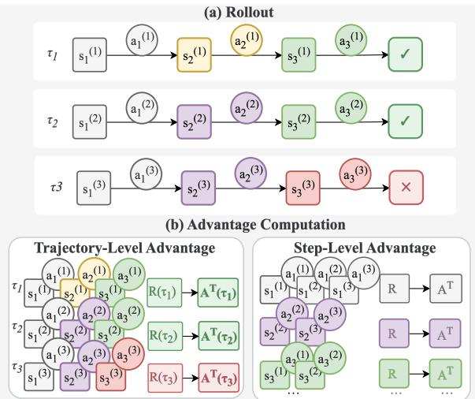  
Figure 1: Trajectory-level and same-state step-level credit for two successful rollouts and one failed rollout. Here, $\tau _ { i }$ is rollout i; $s _ { t } ^ { ( i ) } , a _ { t } ^ { ( i ) } , R ( \tau _ { i } )$ , and $A ^ { \mathrm { T } } ( \tau _ { i } )$ denote its state, action, final reward, and trajectory-level advantage. Matching colors mark the same state across rollouts.

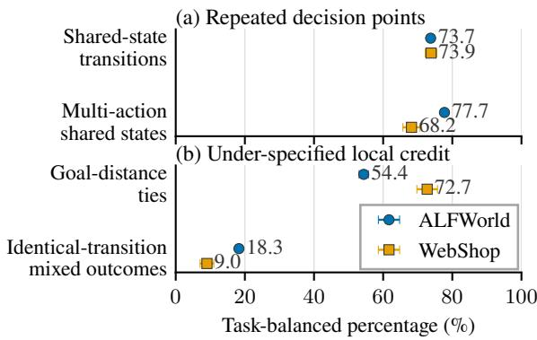  
Figure 2: Structural ambiguity in early GraphGPO rollouts. Shared states create opportunities for local branch comparison, but final-state-distance ties and mixed outcomes leave progress ambiguous.

As shown in Figure 2, in ALFWorld and Web-Shop, about 74% of the transitions originate from states shared among the rollouts, and most shared states contain multiple observed actions, providing recurring states and sibling branches from which to infer intermediate credit. However, the finalgoal distance assigns the same credit to 54.4% and 72.7% of the same-state action pairs, respectively, while identical transitions can appear in both successful and failed trajectories. Thus, the rollout graph offers useful evidence for finer credit assignment, but exploiting it raises three questions about how to discover, weight, and validate intermediate credit anchors.

To address these questions, we propose the MileGPO (Milestone Inference with Local Evidence for Graph-Based Policy Optimization), illustrated in Figure 3, with a sequence of nested credit designs: (1) Milestone Discovery (MD): Not every state on a successful trajectory marks meaningful progress. MD uses final rewards and recurring rollout structures to identify candidate milestones from successful trajectories and recurring traps from failed ones. (2) Reliability-Calibrated Shaping (RCS): Candidate anchors have unequal finalreward evidence. RCS weights their positive or negative influence by empirical reliability, strengthening well-supported candidates while suppressing uncertain ones. (3) Progress-Contrastive Calibration (PCC): Final-reward association alone cannot distinguish genuine progress from incidental correlation. PCC evaluates local advancement, while its Branch-Counterfactual Credit (BCC) component compares sibling transitions from the same state. MileGPO modifies only step-level advantage estimation and requires no external process annotations or auxiliary inference.

We evaluate MileGPO on two challenging longhorizon agent benchmarks, ALFWorld and Web-Shop. MileGPO achieves state-of-the-art performance on both benchmarks, with consistent improvements over reproduced graph-based baselines. Its ALFWorld ID–OOD gap is only 1.69 points, smaller than those of GiGPO (1.89) and GraphGPO (3.78), demonstrating stronger generalization to unseen task configurations. Further analysis shows that milestone discovery alone can introduce noisy credit, whereas reliability weighting recovers outcome-consistent preferences and local progress with the same-state branch evidence resolves distinctions obscured by final-goal distance. These findings attribute MileGPO’s gains to calibrated intermediate credit rather than to indiscriminate milestone propagation.

Our main contributions are as follows:

• Revealing unreliable intermediate credit. We reveal that final-goal-distance credit leaves many same-state branches indistinguishable and that success-visited states do not necessarily represent reliable progress.

• Proposing a rollout-native policy optimization algorithm. We introduce MileGPO, which learns from rollout graphs and onpolicy rewards without external annotations, critics, reward models, or auxiliary inference.

• Achieving strong empirical performance. MileGPO achieves state-of-the-art performance on ALFWorld and WebShop, while ablations and diagnostics validate its creditcalibration mechanism.

## 2 Related Work

## 2.1 Reinforcement Learning for LLM Agents

LLM post-training builds on policy-gradient estimators such as REINFORCE, GAE, and PPO (Williams, 1992; Schulman et al., 2018, 2017).

RLHF learns human-preference rewards (Stiennon et al., 2020; Ouyang et al., 2022; Bai et al., 2022), whereas DPO bypasses an explicit reward-model RL loop (Rafailov et al., 2024). For verifiable reasoning, RLOO, GRPO, and DAPO compare sampled responses without a value model (Kool et al., 2019; Ahmadian et al., 2024; Shao et al., 2024; Yu et al., 2025), as exemplified by DeepSeek-R1, while process supervision adds intermediate feedback (Guo et al., 2025; Lightman et al., 2024).

These objectives extend to agents that interact with search engines, websites, embodied environments, and other agents over multiple turns (Zhou et al., 2025). Reflection, search-guided collection, and hierarchical actor–critic methods use verbal memory, tree search, or learned values (Shinn et al., 2023; Putta et al., 2024; Zhou et al., 2024b), while Agent Lightning decouples agent execution from training (Luo et al., 2025). Recent methods refine credit granularity: GiGPO compares actions at recurring states, HGPO conditions comparisons on interaction history (He et al., 2026), StepPO, BiPACE, and Progress Advantage use stepaligned, action-conditioned, or policy-derived signals (Wang et al., 2026a,b; Oh et al., 2026), and graph-based methods merge grouped trajectories into task-local structures (Wang et al., 2026c).

## 2.2 Process-Level Credit Assignment

Process reward models provide step-level supervision but require process labels and may degrade under distribution shift (Lightman et al., 2024; Wang et al., 2024; Zhang et al., 2025). Annotation-light alternatives estimate intermediate values through search or derive process signals from outcome rewards (Chen et al., 2024; Cui et al., 2026). TreeRPO and TreeRL share prefixes and compare branches through tree-structured rollouts, while GraphPO merges equivalent reasoning states during structured sampling (Yang et al., 2025; Hou et al., 2025; Zhan et al., 2026). These approaches introduce auxiliary process estimation or alter rollout collection through search and branching.

## 3 Method

MileGPO adds intermediate credit to the final-goal credit used by GraphGPO. It has three steps. MD finds milestone and trap candidates from grouped on-policy rollouts. RCS weights these candidates by their scores and converts changes in graphdistance potentials into positive or negative credit.

PCC rechecks positive candidates by measuring local progress and comparing transitions from the same source state. Figure 3 shows the full procedure. All three steps reuse one rollout graph and change only the advantage estimation.

## 3.1 Preliminaries: Grouped Rollout Graph

For each task $q ,$ the current policy samples a group of K interaction trajectories $\mathcal { T } _ { q } = \{ \tau _ { i } \} _ { i = 1 } ^ { K }$ . Each trajectory $\tau _ { i } ~ = ~ ( s _ { i , 0 } , a _ { i , 0 } , \ldots , s _ { i , T _ { i } } )$ has length $T _ { i }$ and a final environment reward $R _ { i } ^ { \mathrm { e n v } }$ , and $y _ { i } ~ = ~ { \bf 1 } [ R _ { i } ^ { \mathrm { e n v } } ~ > ~ \theta _ { R } ]$ marks success under the task-specific threshold $\theta _ { R }$ . Following GraphGPO (Cheng et al., 2026), we merge all trajectories for task $q$ into a directed transition graph $\mathcal { G } _ { q } =$ $( \mathcal { V } _ { q } , \mathcal { E } _ { q } )$ whose nodes are canonicalized observations and whose edges $\boldsymbol { e } ~ = ~ ( u , v )$ are observed transitions. We write g for the successful final state and $d ( u , v )$ for the directed shortest-path distance, setting $d ( u , v ) = \infty$ when v is unreachable, in which case every distance-decayed term below is zero.

GraphGPO then assigns each observed transition a dense return according to the distance from its destination to $g \colon$

$$
r ^ { \mathrm { G } } ( u , v ) = c \gamma _ { G } ^ { d ( v , g ) } ,\tag{1}
$$

where c sets the return scale and $\gamma _ { G } \in ( 0 , 1 ]$ controls decay with distance. This return captures reachability but cannot distinguish destinations at the same graph distance; MileGPO preserves it and supplements it with intermediate credit as shown in Figure 3.

## 3.2 MD: Milestone Discovery

MD uses the outcome rewards and transition structure of the rollout group to discover two kinds of intermediate targets. A milestone candidate is a nonfinal state visited by successful trajectories. A trap candidate is a state observed only in failed trajectories that either appears across multiple failures or is revisited. MD first scores these states and then propagates every selected state with equal weight.

## 3.2.1 Finding Candidates

Let $\mathcal { T } _ { q } ^ { + } = \{ \tau _ { i } : y _ { i } = 1 \}$ and $\mathcal { T } _ { q } ^ { - } = \{ \tau _ { i } : y _ { i } = 0 \}$ be the successful and failed trajectories for task $q .$ For a node v, let $\tau ( v )$ contain the trajectories that visit v (each counted once), with ${ \cal T } ^ { + } ( v )$ and ${ \mathcal { T } } ^ { - } ( v )$ denoting its successful and failed subsets. We compute the group and node-conditional success rates

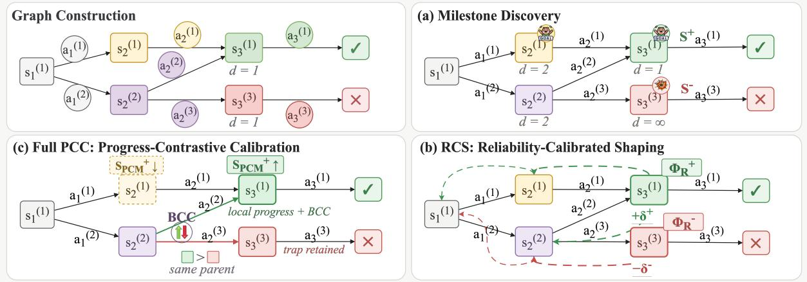  
Figure 3: Overview of MileGPO. Squares denote canonicalized states, circles denote sampled actions, and check and cross marks indicate success and failure. Here, d is directed shortest-path distance (∞ if unreachable); $S ^ { + }$ and $S ^ { - }$ are the milestone and trap sets; $\Phi _ { \mathrm { R } } ^ { + }$ and $\Phi _ { \mathrm { R } } ^ { - }$ are their score-weighted potentials; and $\delta ^ { + }$ and $\delta ^ { - }$ are the corresponding increases along a transition. MD discovers candidates, RCS weights and propagates them, and PCC adjusts positive scores using local progress and BCC comparisons between branches from the same state.

as

$$
p _ { q } ^ { + } = \frac { | \mathcal { T } _ { q } ^ { + } | } { | \mathcal { T } _ { q } | } , \qquad p ^ { + } ( v ) = \frac { | \mathcal { T } ^ { + } ( v ) | } { | \mathcal { T } ( v ) | } .\tag{2}
$$

To score a milestone candidate v, MD first compares its conditional success rate $p ^ { + } ( v )$ with the rollout-group success rate $p _ { q } ^ { + }$ . We retain only positive differences:

$$
\ell ^ { + } ( v ) = \operatorname* { m a x } \left( p ^ { + } ( v ) - p _ { q } ^ { + } , 0 \right) .\tag{3}
$$

Thus, $\ell ^ { + } ( v ) > 0$ only when trajectories visiting v have a higher success rate than the average across the rollout group. We separately measure how broadly v appears across successful trajectories:

$$
m ( v ) = \frac { \lvert T ^ { + } ( v ) \rvert } { \operatorname* { m a x } ( \lvert T _ { q } ^ { + } \rvert , 1 ) } .\tag{4}
$$

Here, $m ( v )$ is the fraction of sampled successful trajectories that visit v. We also define $C ( v )$ as the sum of the in-degree and out-degree of v in $\mathcal { G } _ { q } ^ { \mathrm { } } .$ , divided by the largest such sum over success-visited states, so that $C ( v ) \in [ 0 , 1 ]$ measures how central v is among the states that successful trajectories traverse. MD combines these three quantities into the initial milestone score:

$$
S _ { 0 } ^ { + } ( v ) = w _ { s } \ell ^ { + } ( v ) + w _ { m } m ( v ) + w _ { c } C ( v ) .\tag{5}
$$

$w _ { s } , w _ { m }$ , and $w _ { c }$ weight the success-rate difference, successful trajectory coverage, and graph connectivity, respectively.

Let $p _ { q } ^ { - } = 1 - p _ { q } ^ { + }$ be the group failure rate and let $p ^ { - } ( \dot { v } ) = | T ^ { - } ( v ) | / | T ( v ) |$ be the failure rate among trajectories that visit v. For a state that no successful trajectory visits, we keep only the amount by which this rate exceeds the group average: $\ell ^ { - } ( v ) = \operatorname* { m a x } ( p ^ { - } ( v ) - p _ { q } ^ { - } , 0 )$ . We also compute the fraction of failed trajectories that visit v as $f ^ { - } ( v ) = | T ^ { - } ( v ) | / \operatorname* { m a x } ( | T _ { q } ^ { - } | , 1 )$ . Finally, $L ( v ) \ = \ n _ { \mathrm { r e } } ( v ) / \operatorname* { m a x } ( | T ( v ) | , 1 )$ is the average number of revisits per visiting trajectory, where $n _ { \mathrm { r e } } ( v )$ counts visits to v after its first occurrence in each trajectory. MD combines these quantities into the trap score:

$$
\begin{array} { r } { S ^ { - } ( v ) = w _ { f } \ell ^ { - } ( v ) + w _ { l } f ^ { - } ( v ) L ( v ) . } \end{array}\tag{6}
$$

where $w _ { f }$ and w weight the excess failure rate and the recurrence of v in failed behavior. We denote the selected milestones and traps by $S ^ { + }$ and $S ^ { - }$ , respectively.

## 3.2.2 Uniform target propagation

MD assigns every selected state unit weight and propagates it through the graph distance. With decay $\omega \in ( 0 , 1 ]$ , the two potential maps are

$$
\begin{array} { c c l } { { \Phi _ { \mathrm { S } } ^ { + } ( s ) } } & { { = } } & { { \displaystyle \operatorname* { m a x } _ { v \in S ^ { + } } \omega ^ { d ( s , v ) } , } } \\ { { \Phi _ { \mathrm { S } } ^ { - } ( s ) } } & { { = } } & { { \displaystyle \operatorname* { m a x } _ { v \in S ^ { - } } \omega ^ { d ( s , v ) } . } } \end{array}\tag{7}
$$

Here, $\Phi _ { \mathrm { S } } ^ { + } ( s )$ and $\Phi _ { \mathrm { { S } } } ^ { - } ( s )$ measure how close s is to the nearest milestone and the nearest trap, respectively, with the maximum retaining the largest distance-decayed target value. RCS next replaces the unit weights with candidate scores.

## 3.3 RCS: Reliability-Calibrated Shaping

RCS uses the same candidates as MD but weights them by their task-wise max-normalized scores $\overline { { S } } _ { 0 } ^ { + }$ and $\overline { S } ^ { - }$ :

$$
\begin{array} { c c l } { \Phi _ { \mathrm { R } } ^ { + } ( s ) } & { = } & { \displaystyle \operatorname* { m a x } _ { v \in { \mathcal S { S } } ^ { + } } \overline { { S } } _ { 0 } ^ { + } ( v ) \omega ^ { d ( s , v ) } , } \\ { \Phi _ { \mathrm { R } } ^ { - } ( s ) } & { = } & { \displaystyle \operatorname* { m a x } _ { v \in { \mathcal S } ^ { - } } \overline { { S } } ^ { - } ( v ) \omega ^ { d ( s , v ) } . } \end{array}\tag{8}
$$

Thus $\Phi _ { \mathrm { R } } ^ { + } ( s )$ and $\Phi _ { \mathrm { R } } ^ { - } ( s )$ are the score-weighted counterparts of $\Phi _ { \mathrm { S } } ^ { + } ( s )$ and $\Phi _ { \mathrm { S } } ^ { - } ( s )$ , so that higherscoring targets produce larger potentials. We keep milestones and traps separate because their contributions have opposite signs. RCS next checks whether a transition increases either potential. Writing $\Phi ^ { + }$ and $\Phi ^ { - }$ for the positive and negative potentials in use, which are $\Phi _ { \mathrm { R } } ^ { + }$ and $\Phi _ { \mathrm { R } } ^ { - }$ here, a transition from $s _ { t }$ to $s _ { t + 1 }$ discards negative changes:

$$
\delta _ { t } ^ { + } = \operatorname* { m a x } \big ( \gamma _ { \Phi } w _ { + } \Phi ^ { + } ( s _ { t + 1 } ) - w _ { + } \Phi ^ { + } ( s _ { t } ) , 0 \big )\tag{9}
$$

$$
\delta _ { t } ^ { - } = \operatorname* { m a x } \big ( \gamma _ { \Phi } w _ { - } \Phi ^ { - } ( s _ { t + 1 } ) - w _ { - } \Phi ^ { - } ( s _ { t } ) , 0 \big )\tag{10}
$$

Here, $\delta _ { t } ^ { + }$ and $\delta _ { t } ^ { - }$ are the discounted increases in milestone and trap potential along the transition, $w _ { + }$ and $w _ { - }$ scale these changes, and $\gamma _ { \Phi }$ discounts the next-state potential. The return uses $\delta _ { t } ^ { + } - \delta _ { t } ^ { - }$ rewarding movement toward milestones and penalizing movement toward traps. This is a one-sided credit rule rather than policy-invariant potential shaping.

## 3.4 PCC: Progress-Contrastive Calibration

RCS uses group-level outcome rewards, so a state may score highly even when entering it makes little progress. PCC refines positive candidates with two transition-level scores. BCC compares transitions from the same source state, while local progress measures movement toward the goal and association with success. These scores update candidates rather than add rewards.

## 3.4.1 Branch-Counterfactual Credit (BCC)

At a source state u, grouped rollouts may contain several distinct outgoing edges. We treat each observed edge $\boldsymbol { e } = \left( u , v \right)$ as one sampled branch from u. BCC compares the success rate of this branch with those of the other branches observed from the same state. Let $\tau ( e )$ contain the trajectories that use e, with ${ \mathcal { T } } ^ { + } ( e )$ and ${ \cal T } ^ { - } ( e )$ denoting its successful and failed subsets. Their rates are

$$
p ^ { + } ( e ) = \frac { | T ^ { + } ( e ) | } { | T ( e ) | } , \qquad p ^ { - } ( e ) = \frac { | T ^ { - } ( e ) | } { | T ( e ) | } .\tag{11}
$$

Let $\boldsymbol { B } ( \boldsymbol { u } )$ contain these sampled branches. For $e _ { i } \in$ $B ( u )$ , the BCC margin is

$$
\widetilde c _ { \mathrm { b c c } } ( e _ { i } ) = p ^ { + } ( e _ { i } ) - \mu ^ { + } ( e _ { i } ) .\tag{12}
$$

Here, $\mu ^ { + } ( e _ { i } )$ is the mean success rate of the branches in $B ( u ) \setminus \{ e _ { i } \}$ , that is, of the alternatives observed at the same source state ; we set $\widetilde c _ { \mathrm { b c c } } ( e _ { i } ) = 0$ when $e _ { i }$ is the only sampled branch. We divide each margin by the largest absolute margin in task $q \mathrm { : }$

$$
c _ { \mathrm { b c c } } ( e _ { i } ) = \frac { \widetilde { c } _ { \mathrm { b c c } } ( e _ { i } ) } { \operatorname* { m a x } _ { e \in { \mathcal { E } _ { q } } } | \widetilde { c } _ { \mathrm { b c c } } ( e ) | } .\tag{13}
$$

$$
b ( v ) = \operatorname* { m a x } _ { \mathit { e } = ( u , v ) , \ : { c } _ { \mathrm { b c c } } ( \mathit { e } ) > 0 } { c } _ { \mathrm { b c c } } ( { e } ) .\tag{14}
$$

Thus, $b ( v )$ records the strongest observed branch preference leading to $v ,$ , with $b ( v ) = 0$ when no incoming transition satisfies both conditions; it is not a causal-effect estimate.

## 3.4.2 Local Progress

BCC compares branches but does not capture goal progress. For $\boldsymbol { e } ~ = ~ ( u , v )$ , we combine distance reduction $\Delta d ( e ) ~ = ~ d ( u , g ) - d ( v , g )$ , successrate gain $p ^ { + } ( v ) \ : - \ : p _ { q } ^ { + }$ , and excess failure rate $\ell ^ { - } ( e ) = \mathrm { m a x } ( p ^ { - } ( e ) \widehat { - } \mu ^ { - } ( e ) , 0 )$ , where $\mu ^ { - } ( e )$ is the mean failure rate of sibling branches in $\boldsymbol { B } ( \boldsymbol { u } )$ Thus, $\ell ^ { - } ( e )$ is the edge-level counterpart of $\ell ^ { - } ( v )$ and falls back to max $( p ^ { - } ( v ) - p _ { q } ^ { - } , 0 )$ when no sibling exists. The progress score is:

$$
\begin{array} { r } { \psi ( e ) = \alpha _ { d } \Delta d ( e ) + \alpha _ { s } \left[ p ^ { + } ( v ) - p _ { q } ^ { + } \right] - \alpha _ { f } \ell ^ { - } } \end{array}\tag{e),}
$$

(15)

where $\alpha _ { d } , \alpha _ { s }$ , and $\alpha _ { f }$ weight the three terms. Let $\mathcal { E } _ { \mathrm { p g } } ^ { + } ( v )$ contain successful incoming transitions to v with $\psi ( e ) > 0$ . PCC takes the largest score and normalizes it over the graph:

$$
\begin{array} { l } { \widetilde { \psi } ( v ) = \underset { e \in \mathcal { E } _ { \mathrm { p g } } ^ { + } ( v ) } { \operatorname* { m a x } } ~ \psi ( e ) , } \\ { \overline { { \psi } } ( v ) = \displaystyle \frac { \widetilde { \psi } ( v ) } { \operatorname* { m a x } _ { v ^ { \prime } \in \mathcal { V } _ { q } } \widetilde { \psi } ( v ^ { \prime } ) } . } \end{array}\tag{16}
$$

Here, $\widetilde { \psi } ( v )$ is the best progress score among successful incoming transitions and $\overline { { \psi } } ( v ) \in [ 0 , 1 ]$ is its task-wise max-normalized value. Undefined distance changes, empty maxima, and zero normalizers yield zero.

## 3.4.3 Updating Candidate Scores

PCC combines the branch score and the progress score:

$$
E ( v ) = w _ { \mathrm { b c } } b ( v ) + w _ { \mathrm { p g } } \overline { { \psi } } ( v ) .\tag{17}
$$

where $w _ { \mathrm { b c } }$ and $w _ { \mathrm { p g } }$ set their contributions. A retention indicator $z ( v )$ marks candidates with local support: $z ( v ) = 1$ when $\overline { { \psi } } ( v ) > 0$ , when coverage $m ( v )$ reaches a threshold $\theta _ { m } .$ , or when $\kappa _ { \mathrm { b c } } = 1$ and $b ( v ) > 0 ;$ ; otherwise, $z ( v ) = 0$ . The binary switch $\kappa _ { \mathrm { b c } }$ controls whether branch evidence alone may retain a candidate, and BCC contributes to $E ( v )$ regardless of which condition retains it. PCC updates the score as:

$$
\begin{array} { r } { S _ { \mathrm { p c c } } ^ { + } ( v ) = \left\{ \begin{array} { l l } { S _ { 0 } ^ { + } ( v ) \left[ 1 + w _ { \mathrm { p c c } } E ( v ) \right] , } & { z ( v ) = 1 , } \\ { \rho S _ { 0 } ^ { + } ( v ) , } & { z ( v ) = 0 . } \end{array} \right. } \end{array}\tag{18}
$$

Here, $w _ { \mathrm { p c c } }$ amplifies retained candidates according to $E ( v )$ , while $\rho \in [ 0 , 1 ]$ shrinks the others. Maxnormalization within task $q$ then produces $\overline { S } _ { \mathrm { p c c } } ^ { + }$

## 3.5 MileGPO Return and Policy Update

MileGPO instantiates the $\Phi ^ { + }$ of Equations 9 and 10 by inserting the PCC scores into the RCS form:

$$
\Phi ^ { + } ( s ) = \operatorname* { m a x } _ { v \in S ^ { + } } \overline { { S } } _ { \mathrm { p c c } } ^ { + } ( v ) \omega ^ { d ( s , v ) } .\tag{19}
$$

The trap potential remains $\Phi ^ { - } = \Phi _ { \mathrm { R } } ^ { - }$ from Equation 8. Using the resulting increments $\delta _ { t } ^ { \pm }$ , and suppressing the trajectory index on step-level quantities for readability, the MileGPO step return, denoted by $r _ { t } ^ { \mathrm { M } }$ , is

$$
r _ { t } ^ { \mathrm { M } } = c \gamma _ { G } ^ { d ( s _ { t + 1 } , g ) } + c \lambda \bigl ( \delta _ { t } ^ { + } - \delta _ { t } ^ { - } \bigr ) .\tag{20}
$$

The first term is the GraphGPO return, and λ scales the milestone and trap correction. Directly normalizing their sum can let a small correction dominate when GraphGPO returns are tied. We instead normalize the graph and MileGPO returns separately. Let $\mathrm { N o r m } _ { q , s _ { t } }$ normalize transitions with the same task and source state, and let $r _ { t } ^ { \mathrm { G } } = r ^ { \mathrm { G } } ( s _ { t } , s _ { t + 1 } )$

$$
\widehat { A } _ { t } ^ { \mathrm { G } } = \mathrm { N o r m } _ { q , s _ { t } } ( r _ { t } ^ { \mathrm { G } } ) , \quad \widehat { A } _ { t } ^ { \mathrm { m i x } } = \mathrm { N o r m } _ { q , s _ { t } } ( r _ { t } ^ { \mathrm { M } } ) .\tag{21}
$$

Here, $\widehat { A } _ { t } ^ { \mathrm { G } }$ is the step advantage obtained from the GraphGPO return alone, while $\widehat { A } _ { t } ^ { \mathrm { m i x } }$ is the step advantage obtained from the shaped MileGPO return. Their difference, $\widehat { A } _ { t } ^ { \mathrm { r e s } } = \widehat { A } _ { t } ^ { \mathrm { m i x } } - \widehat { A } _ { t } ^ { \mathrm { G } }$ , isolates the milestone correction. The episode-level term restores the trajectory index: let $\begin{array} { r } { Z _ { i } = \sum _ { \ell } r _ { i , \ell } ^ { \mathrm { t o k } } } \end{array}$ be the trajectory score of $\tau _ { i } .$ , summing the per-token rewards $r _ { i , \ell } ^ { \mathrm { t o k } }$ that the training framework assigns to its ℓ-th token, and let $\operatorname { N o r m } _ { q }$ normalize these scores within the rollout group of task $q .$ Each token in action $a _ { t }$ then receives:

$$
A _ { t } = w _ { \mathrm { s t e p } } \left[ \widehat { A } _ { t } ^ { \mathrm { G } } + \eta \widehat { A } _ { t } ^ { \mathrm { r e s } } \right] + w _ { \mathrm { e p i s o d e } } \mathrm { N o r m } _ { q } ( Z _ { i } ) .\tag{22}
$$

Here, $w _ { \mathrm { s t e p } }$ and $w _ { \mathrm { e p i s o d e } }$ weight step- and episodelevel advantages, and $\eta$ scales the milestone correction.

The actor uses the same clipped token-level objective and KL regularization as the group-based baselines. MD, RCS, and PCC use only the rollout graph and on-policy outcome rewards, requiring no external process annotations, critic, reward model, or auxiliary inference.

## 4 Experiments

## 4.1 Experimental Setup

## 4.1.1 Benchmarks and Evaluation

ALFWorld (Shridhar et al., 2021) requires an agent to complete household tasks through text-based navigation and object manipulation, while Web-Shop (Yao et al., 2022) requires it to search for and purchase products that satisfy natural-language instructions. They evaluate embodied planning and grounded web interaction, respectively. For ALF-World, we train on 3,553 tasks and evaluate on both the in-distribution (ID) and out-of-distribution (OOD) splits. For WebShop, we follow the repository’s evaluation protocol. GiGPO and GraphGPO serve as the primary step-group and graph-credit baselines, respectively. We report success rates on both benchmarks and WebShop task scores. For ALFWorld, we additionally include the ID–OOD gap to evaluate generalization. Most results are averaged over 3 random seeds during testing.

## 4.1.2 Implementation Details

All local runs use Qwen2.5-1.5B-Instruct (Qwen et al., 2025) and share the model, rollout, optimizer, and environment configuration. Following the shared agent protocol (Feng et al., 2025), the policy observes the two most recent interaction steps and generates reasoning within <think> tags followed by an action within <action> tags. Each iteration samples 16 task groups with eight rollouts per group. We train on two NVIDIA H20 GPUs. Since the validation curves of the original GraphGPO and GiGPO implementations under their reported configurations had not converged, we extended training for all local methods to 300 optimization steps and selected the checkpoint with the best validation performance for evaluation. We use maximum horizons of 50 steps on ALFWorld and 30 on WebShop, an actor learning rate of 10−6, a KL coefficient of 0.01, and an invalid-action penalty of 0.1. More implementation details are provided in Appendix A.

<table><tr><td rowspan="2">Method</td><td colspan="7">ALFWorld</td><td rowspan="2"></td><td colspan="2">WebShop</td></tr><tr><td>Pick</td><td>Clean</td><td>Cool</td><td>Look</td><td>Heat</td><td>Pick2</td><td>All</td><td>Score</td><td>Succ.</td></tr><tr><td colspan="10">Closed-Source Prompting</td></tr><tr><td>GPT-4o†</td><td>75.3</td><td>60.8</td><td>31.2</td><td>56.7</td><td>21.6</td><td>49.8</td><td>48.0</td><td>31.8</td><td></td><td>23.7</td></tr><tr><td>Gemini-2.5-Pro†</td><td>92.8</td><td>63.3</td><td>62.1</td><td>69.0</td><td>26.6</td><td>58.7</td><td>60.3</td><td></td><td>42.5</td><td>35.9</td></tr><tr><td colspan="9">Open-Source Prompting</td></tr><tr><td>Qwen2.5†</td><td>5.9</td><td>5.5</td><td>3.3</td><td>9.7</td><td>4.2</td><td>0.0</td><td>4.1</td><td></td><td>23.1</td><td>5.2</td></tr><tr><td>ReAct†</td><td>17.4</td><td>20.5</td><td>15.7</td><td>6.2</td><td>7.7</td><td>2.0</td><td></td><td>12.8</td><td>40.1</td><td>11.3</td></tr><tr><td>Reflexion†</td><td>35.3</td><td>22.2</td><td>21.7</td><td>13.6</td><td>19.4</td><td>3.7</td><td></td><td>21.8</td><td>55.8</td><td>21.9</td></tr><tr><td colspan="9">RL-Based Training</td></tr><tr><td>PPO†</td><td>64.8 (±3.5)</td><td>40.5 (±6.9)</td><td>57.1 (±4.9)</td><td>60.6</td><td>46.4</td><td></td><td>47.4</td><td>54.4 (±3.1)</td><td>73.8</td><td>51.5</td></tr><tr><td>RLOO†</td><td>88.3 (±3.0)</td><td>52.8 (±8.6)</td><td>71.0 (±5.9)</td><td>(±6.6) 62.8 (±8.7)</td><td>(±4.0) 66.4 (±5.5)</td><td>(±1.9) 56.9 (±4.7)</td><td></td><td>69.7 (±2.5)</td><td>(±3.0) 73.9 (±5.6)</td><td>(±2.9) 52.1 (±6.7)</td></tr><tr><td>GRPO†</td><td>82.89 (±3.6)</td><td>82.14 (±6.4)</td><td>73.86 (±6.8)</td><td>78.57 (±0.0)</td><td>77.78 (±4.5)</td><td></td><td>71.43 (±3.9)</td><td>77.86 (±1.3)</td><td>84.73 (±0.5)</td><td>71.35 (±2.1)</td></tr><tr><td>GiGPO†</td><td>98.81 (±1.7)</td><td>95.16 (±3.9)</td><td>81.46 (±0.6)</td><td>78.57 (±0.0)</td><td>94.44 (±0.0)</td><td></td><td>93.65 (±5.9)</td><td>90.88 (±1.0)</td><td>87.94 (±0.4)</td><td>73.83 (±2.3)</td></tr><tr><td>GraphGPO†</td><td>95.15 (±1.6)</td><td>100.0 (±0.0)</td><td>85.26 (±2.6)</td><td>85.71 (±5.8)</td><td>96.30 (±2.6)</td><td>93.65 (±2.2)</td><td></td><td>92.71 (±1.3)</td><td>89.29 (±1.5)</td><td>78.65 (±3.9)</td></tr><tr><td>GiGPO*</td><td>78.52 (±3.9)</td><td>87.26 (±0.7)</td><td>98.31 (±0.7)</td><td>96.24 (±1.9)</td><td>92.97 (±1.8)</td><td>92.15 (±0.4)</td><td>90.17 (±0.1)</td><td></td><td>89.81 (±0.9)</td><td>76.17 (±1.6)</td></tr><tr><td>GraphGPO*</td><td>78.96 (±3.8)</td><td>91.82 (±3.3)</td><td>98.61 (±0.3)</td><td>99.44 (±0.8)</td><td>89.31 (±1.5)</td><td>94.19 (±2.0)</td><td></td><td>91.47 (±0.5)</td><td>88.24 (±1.4)</td><td>74.80 (±2.4)</td></tr><tr><td>MileGPO</td><td>90.47 (±2.8)</td><td>93.29 (±1.3)</td><td>98.31 (±0.7)</td><td>100.00 (±0.0)</td><td>90.66 (±1.5)</td><td>98.02 (±0.6)</td><td>94.60 (±0.3)</td><td></td><td>90.29 (±0.8)</td><td>78.58 (±1.2)</td></tr></table>

Table 1: Performance (%) on ALFWorld and WebShop, grouped into closed-source prompting, open-source prompting, and RL-based training. Rows marked with † are reported by GraphGPO (Cheng et al., 2026), rows marked with ∗ are our reproduced baselines, and the unmarked row denotes MileGPO.

<table><tr><td>Method</td><td>ID↑</td><td>OOD↑</td><td>Gap ↓</td></tr><tr><td>GiGPO</td><td>92.06 (0.72)</td><td>90.17 (0.09)</td><td>1.89</td></tr><tr><td>GraphGPO</td><td>95.25 (0.60)</td><td>91.47 (0.51)</td><td>3.78</td></tr><tr><td>MileGPO</td><td>96.29 (0.55)</td><td>94.60 (0.33)</td><td>1.69</td></tr></table>

Table 2: ALFWorld success rates (%) on the ID and OOD.

<table><tr><td></td><td colspan="2">ALFWorld</td><td colspan="2">WebShop</td></tr><tr><td>Method</td><td>ID↑</td><td>OOD↑</td><td>Score ↑</td><td>Succ. ↑</td></tr><tr><td>MileGPO</td><td>96.3 (0.6)</td><td>94.6 (0.3)</td><td>90.3 (0.8)</td><td>78.6 (1.2)</td></tr><tr><td>w/o PCC</td><td>95.9 (0.5)</td><td>90.9 (0.5)</td><td>87.9 (1.9)</td><td>77.2 (2.2)</td></tr><tr><td>w/o PCC, RCS</td><td>95.3 (0.0)</td><td>89.7 (0.3)</td><td>87.4 (1.5)</td><td>73.8 (2.2)</td></tr></table>

Table 3: MileGPO ablation on ALFWorld and WebShop (%).

## 4.2 Main Results

Table 1 shows that MileGPO consistently improves over the reproduced baselines. On ALF-World, it raises overall success by 3.13 points over GraphGPO and 4.43 points over GiGPO. On WebShop, it improves success by 3.78 and 2.41 points and task score by 2.05 and 0.48 points over GraphGPO and GiGPO, respectively. The gains in both strict success and graded task score indicate better task completion as well as higher-quality partial progress.

Table 2 further shows that MileGPO reduces the ID–OOD gap to 1.69 points, compared with 3.78 for GraphGPO and 1.89 for GiGPO. This stronger generalization is consistent with MileGPO learning transferable local decision preferences: RCS suppresses milestones with weak or mixed outcome support, while PCC distinguishes competing transitions through local progress and BCC.

MileGPO also exhibits lower result variance than the reproduced GraphGPO baseline on both benchmarks. By resolving local credit ties rather than relying only on final-goal distance, MileGPO provides a more discriminative credit signal, offering a plausible explanation for its simultaneous improvements in performance, generalization, and stability.

## 4.3 Ablation Study

Table 3 evaluates PCC and RCS through cumulative removal. Each removal degrades performance across both benchmarks, while the relatively small changes on ALFWorld ID contrast with the larger losses on ALFWorld OOD and WebShop, indicating that the two components primarily improve generalization and task completion rather than fitting the in-distribution evaluation set. Removing PCC decreases ALFWorld OOD success by 3.71 points and widens the ID–OOD gap by 3.32 points, while reducing WebShop task score and success by 2.38 and 1.43 points, suggesting that local progress and branch comparisons primarily aid generalization and partial task completion. Further removing RCS causes the largest additional drop in WebShop success (3.32 points) and a 1.24-point decrease on ALFWorld OOD. PCC and RCS therefore play complementary roles: PCC sharpens local preferences and supports transfer, whereas RCS suppresses weak or inconsistent milestones and stabilizes which intermediate signals are propagated.

## 4.4 Credit-Calibration Diagnostics

To further examine how MileGPO affects the training process, we use WebShop as a representative case because it exhibits a higher rate of final-distance ties than ALFWorld. Figure 4 tracks the evolution of candidate evidence and validation performance during training, as well as whether shaped returns recover preference information obscured by GraphGPO’s final-distance credit. Panel (a) reports validation success throughout optimization, showing the training dynamics of the three methods. Panel (b) shows that RCS corrects a larger fraction of GraphGPO ties than uniform Milestone Discovery, indicating that reliability-weighted shaping recovers more outcome-consistent preferences. Panel (c) partitions success-visited candidates before PCC reweighting. The increasing local-evidence share suggests that more candidate milestones are supported by transition-level evidence. More illustrative examples of how MileGPO resolves ambiguous credit are provided in Appendix B.

## 4.5 Mechanism Analysis Across Environments

Figure 2 and Table 1 show that MileGPO benefits from resolving such ambiguity. ALFWorld and WebShop have nearly identical shared-state transition coverage (73.7% versus 73.9%), showing that both environments contain enough recurring structure to mine intermediate anchors. The decisive difference is ambiguity within that structure: final-goal distance ties 54.4% of same-state action pairs in ALFWorld but 72.7% in WebShop. Accordingly, MileGPO produces its clearest gain on WebShop, improving both success and task score. This result distinguishes the source of the gain from graph reuse alone. GraphGPO already aggregates recurring states, yet a distance-based return cannot rank actions that lead to equally distant successors. MileGPO extracts the missing signal from two relationships available in the same rollout group: whether a transition makes local progress and whether it outperforms sibling transitions from the same parent. The larger WebShop improvement, therefore, matches the mechanism precisely: the environment with more unresolved local comparisons benefits more from PCC.

## 4.6 Efficiency and Computational Cost

We reuse the rollout graph and add no environment interactions, model passes, critics, parameters, or activation caches. For a graph with |V| nodes, |E| edges, N transitions, and maximum out-degree ∆, final-distance search costs $O ( ( | \mathcal { V } | + | \mathcal { E } | ) \log | \mathcal { V } | )$ candidate statistics cost $O ( N )$ , and sibling comparisons cost $O ( | \mathcal { E } | \Delta )$ . The two target potentials add $O ( | \mathcal { V } | + | \mathcal { E } | )$ storage, leaving model-scale and rollout complexity unchanged. Figure 5(a) compares post-rollout graph processing with the substantially larger rollout and policy-update costs, while Figure 5(b) reports single-thread CPU replay results on WebShop and ALFWorld. Across both analyses, MileGPO’s post-rollout computation remains lightweight relative to model-level training costs.

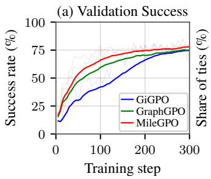

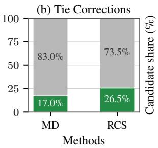

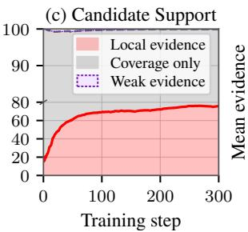

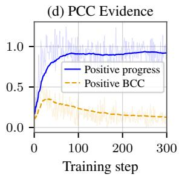  
Figure 4: WebShop credit-calibration diagnostics. (a) Validation success compares three locally trained methods. (b) Tie-correction rate measures the fraction of opposite-outcome transition pairs with equal GraphGPO credit, where shaped returns rank successful transitions higher. (c) Candidate support partitions success-visited candidates into those with local evidence (positive progress or BCC), successful-path coverage only, and weak candidates. (d) PCC evidence separates positive progress from positive sibling-branch contrast.

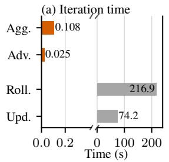

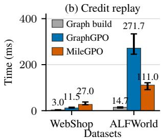  
Figure 5: Efficiency analysis. (a) Published GraphGPO iteration times; Agg., Adv., Roll., and Upd. denote graph aggregation, graph advantage, rollout, and policy update, respectively. (b) Median single-thread CPU replay time with IQRs over five stored batches; graph construction is shared.

These results show that MileGPO improves the existing credit signal without additional environment interactions or model inference, while confining its overhead to graph processing.

## 5 Conclusion

We study a central limitation of graph-based credit assignment for long-horizon LLM agents: finalgoal distance captures reachability but can leave locally competing actions indistinguishable and cannot determine whether a success-visited state represents reliable progress. We introduce MileGPO, which extracts intermediate credit from grouped on-policy rollouts through milestone and trap discovery, reliability-calibrated shaping, and progresscontrastive calibration with same-state branch evidence, requiring no additional supervision, auxiliary models, or environment interaction. Across ALFWorld and WebShop, MileGPO achieves stateof-the-art performance. Ablations show that milestone discovery alone is insufficient, whereas reliability weighting and local progress and branch evidence provide complementary improvements.

Credit-calibration diagnostics and replay profiling further show that these gains align with resolving local credit ambiguity while confining the added computation to lightweight post-rollout graph processing. These results demonstrate that existing rollout groups contain sufficient local evidence to provide useful process-level credit.

## References

Arash Ahmadian, Chris Cremer, Matthias Gallé, Marzieh Fadaee, Julia Kreutzer, Olivier Pietquin, Ahmet Üstün, and Sara Hooker. 2024. Back to basics: Revisiting reinforce-style optimization for learning from human feedback in llms. In Proceedings ofthe 62nd Annual Meeting ofthe Associationfor Computational Linguistics (Volume 1: Long Papers), pages 12248–12267.

Yuntao Bai, Andy Jones, Kamal Ndousse, Amanda Askell, Anna Chen, Nova DasSarma, Dawn Drain, Stanislav Fort, Deep Ganguli, Tom Henighan, et al. 2022. Training a helpful and harmless assistant with reinforcement learning from human feedback. Preprint, arXiv:2204.05862.

Guoxin Chen, Minpeng Liao, Chengxi Li, and Kai Fan. 2024. Alphamath almost zero: Process supervision without process. In Advances in Neural Information Processing Systems 37: Annual Conference on Neural Information Processing Systems 2024, NeurIPS 2024, Vancouver, BC, Canada, December 10 - 15, 2024.

Xin Cheng, Shuo He, Lang Feng, HaiYang Xu, Ming Yan, Lei Feng, and Bo An. 2026. Beyond trajectorylevel attribution: Graph-based credit assignment for agentic reinforcement learning. In Forty-third International Conference on Machine Learning.

Ganqu Cui, Lifan Yuan, Zefan Wang, Hanbin Wang, Yuchen Zhang, Jiacheng Chen, Wendi Li, Bingxiang He, Yuchen Fan, Tianyu Yu, Qixin Xu, Weize Chen, Jiarui Yuan, Huayu Chen, Kaiyan Zhang, Xingtai Lv, Shuo Wang, Yuan Yao, Xu Han, and 6 others.

2026. Process reinforcement through implicit rewards. Trans. Mach. Learn. Res., 2026.

Xiang Deng, Yu Gu, Boyuan Zheng, Shijie Chen, Samual Stevens, Boshi Wang, Huan Sun, and Yu Su. 2023. Mind2web: Towards a generalist agent for the web. In Advances in Neural Information Processing Systems 36: Annual Conference on Neural Information Processing Systems 2023, NeurIPS 2023, New Orleans, LA, USA, December 10 - 16, 2023.

Lang Feng, Zhenghai Xue, Tingcong Liu, and Bo An. 2025. Group-in-group policy optimization for llm agent training. Preprint, arXiv:2505.10978.

Daya Guo, Dejian Yang, Haowei Zhang, Junxiao Song, Peiyi Wang, Qihao Zhu, Runxin Xu, Ruoyu Zhang, Shirong Ma, Xiao Bi, et al. 2025. Deepseek-r1 incentivizes reasoning in llms through reinforcement learning. Nature, 645(8081):633–638.

Shuo He, Lang Feng, Qi Wei, Xin Cheng, Lei Feng, and Bo An. 2026. Hierarchy-of-groups policy optimization for long-horizon agentic tasks. Preprint, arXiv:2602.22817.

Zhenyu Hou, Ziniu Hu, Yujiang Li, Rui Lu, Jie Tang, and Yuxiao Dong. 2025. Treerl: LLM reinforcement learning with on-policy tree search. In Proceedings of the 63rd Annual Meeting of the Association for Computational Linguistics (Volume 1: Long Papers), ACL 2025, Vienna, Austria, July 27 - August 1, 2025, pages 12355–12369. Association for Computational Linguistics.

Wouter Kool, Herke van Hoof, and Max Welling. 2019. Buy 4 REINFORCE samples, get a baseline for free! In Deep Reinforcement Learning Meets Structured Prediction, ICLR 2019 Workshop, New Orleans, Louisiana, United States, May 6, 2019. OpenReview.net.

Hunter Lightman, Vineet Kosaraju, Yuri Burda, Harrison Edwards, Bowen Baker, Teddy Lee, Jan Leike, John Schulman, Ilya Sutskever, and Karl Cobbe. 2024. Let’s verify step by step. In The Twelfth International Conference on Learning Representations, ICLR 2024, Vienna, Austria, May 7-11, 2024. Open-Review.net.

Xufang Luo, Yuge Zhang, Zhiyuan He, Zilong Wang, Siyun Zhao, Dongsheng Li, Luna K. Qiu, and Yuqing Yang. 2025. Agent lightning: Train any ai agents with reinforcement learning. Preprint, arXiv:2508.03680.

Changdae Oh, Wendi Li, Seongheon Park, Samuel Yeh, Tanwi Mallick, and Sharon Li. 2026. Neglected free lunch from post-training: Progress advantage for llm agents. Preprint, arXiv:2606.26080.

Long Ouyang, Jeff Wu, Xu Jiang, Diogo Almeida, Carroll L Wainwright, Pamela Mishkin, Chong Zhang, Sandhini Agarwal, Katarina Slama, Alex Ray, et al. 2022. Training language models to follow instructions with human feedback.

Pranav Putta, Edmund Mills, Naman Garg, Sumeet Motwani, Chelsea Finn, Divyansh Garg, and Rafael Rafailov. 2024. Agent q: Advanced reasoning and learning for autonomous ai agents. Preprint, arXiv:2408.07199.

Qwen, :, An Yang, Baosong Yang, Beichen Zhang, Binyuan Hui, Bo Zheng, Bowen Yu, Chengyuan Li, Dayiheng Liu, Fei Huang, Haoran Wei, Huan Lin, Jian Yang, Jianhong Tu, Jianwei Zhang, Jianxin Yang, Jiaxi Yang, Jingren Zhou, and 25 others. 2025. Qwen2.5 technical report. Preprint, arXiv:2412.15115.

Rafael Rafailov, Archit Sharma, Eric Mitchell, Stefano Ermon, Christopher D. Manning, and Chelsea Finn. 2024. Direct preference optimization: Your language model is secretly a reward model. Preprint, arXiv:2305.18290.

Timo Schick, Jane Dwivedi-Yu, Roberto Dessì, Roberta Raileanu, Maria Lomeli, Eric Hambro, Luke Zettlemoyer, Nicola Cancedda, and Thomas Scialom. 2023. Toolformer: Language models can teach themselves to use tools. In Advances in Neural Information Processing Systems 36: Annual Conference on Neural Information Processing Systems 2023, NeurIPS 2023, New Orleans, LA, USA, December 10 - 16, 2023.

John Schulman, Philipp Moritz, Sergey Levine, Michael Jordan, and Pieter Abbeel. 2018. High-dimensional continuous control using generalized advantage estimation. Preprint, arXiv:1506.02438.

John Schulman, Filip Wolski, Prafulla Dhariwal, Alec Radford, and Oleg Klimov. 2017. Proximal policy optimization algorithms.

Zhihong Shao, Peiyi Wang, Qihao Zhu, Runxin Xu, Junxiao Song, Xiao Bi, Haowei Zhang, Mingchuan Zhang, Y. K. Li, Y. Wu, and Daya Guo. 2024. Deepseekmath: Pushing the limits of mathematical reasoning in open language models. Preprint, arXiv:2402.03300.

Noah Shinn, Federico Cassano, Ashwin Gopinath, Karthik Narasimhan, and Shunyu Yao. 2023. Reflexion: language agents with verbal reinforcement learning. In Advances in Neural Information Processing Systems 36: Annual Conference on Neural Information Processing Systems 2023, NeurIPS 2023, New Orleans, LA, USA, December 10 - 16, 2023.

Mohit Shridhar, Xingdi Yuan, Marc-Alexandre Côté, Yonatan Bisk, Adam Trischler, and Matthew J. Hausknecht. 2021. Alfworld: Aligning text and embodied environments for interactive learning. In 9th International Conference on Learning Representations, ICLR 2021, Virtual Event, Austria, May 3-7, 2021. OpenReview.net.

Nisan Stiennon, Long Ouyang, Jeffrey Wu, Daniel M. Ziegler, Ryan Lowe, Chelsea Voss, Alec Radford, Dario Amodei, and Paul F. Christiano. 2020. Learning to summarize with human feedback. In Advances

in Neural Information Processing Systems 33: Annual Conference on Neural Information Processing Systems 2020, NeurIPS 2020, December 6-12, 2020, virtual.

Daoyu Wang, Qingchuan Li, Mingyue Cheng, Jie Ouyang, Shuo Yu, Qi Liu, and Enhong Chen. 2026a. Steppo: Step-aligned policy optimization for agentic reinforcement learning. Preprint, arXiv:2604.18401.

Guanzhi Wang, Yuqi Xie, Yunfan Jiang, Ajay Mandlekar, Chaowei Xiao, Yuke Zhu, Linxi Fan, and Anima Anandkumar. 2023. Voyager: An openended embodied agent with large language models. Preprint, arXiv:2305.16291.

Hanyang Wang, Weijieying Ren, Yuxiang Zhang, Ding Cao, Zhizhao Zeng, Ke Zeng, and Tianxiang Zhao. 2026b. Bipace: Bisimulation-guided policy optimization with action counterfactual estimation for llm agents. Preprint, arXiv:2606.25556.

Peiyi Wang, Lei Li, Zhihong Shao, Runxin Xu, Damai Dai, Yifei Li, Deli Chen, Yu Wu, and Zhifang Sui. 2024. Math-shepherd: Verify and reinforce llms stepby-step without human annotations. In Proceedings of the 62nd Annual Meeting of the Association for Computational Linguistics (Volume 1: Long Papers), ACL 2024, Bangkok, Thailand, August 11-16, 2024, pages 9426–9439. Association for Computational Linguistics.

Yunan Wang, Minghui Song, Zihan Zhang, Shaohan Huang, Haizhen Huang, Furu Wei, Weiwei Deng, Feng Sun, and Qi Zhang. 2026c. Group-graph policy optimization for long-horizon agentic reinforcement learning. Preprint, arXiv:2606.22995.

Zihan Wang, Kangrui Wang, Qineng Wang, Pingyue Zhang, Linjie Li, Zhengyuan Yang, Xing Jin, Kefan Yu, Minh Nhat Nguyen, Licheng Liu, Eli Gottlieb, Yiping Lu, Kyunghyun Cho, Jiajun Wu, Li Fei-Fei, Lijuan Wang, Yejin Choi, and Manling Li. 2025. Ragen: Understanding self-evolution in llm agents via multi-turn reinforcement learning. Preprint, arXiv:2504.20073.

Ronald J. Williams. 1992. Simple statistical gradientfollowing algorithms for connectionist reinforcement learning. Mach. Learn., 8:229–256.

Zhicheng Yang, Zhijiang Guo, Yinya Huang, Xiaodan Liang, Yiwei Wang, and Jing Tang. 2025. Treerpo: Tree relative policy optimization. arXiv preprint arXiv:2506.05183.

Shunyu Yao, Howard Chen, John Yang, and Karthik Narasimhan. 2022. Webshop: Towards scalable realworld web interaction with grounded language agents. In Advances in Neural Information Processing Systems 35: Annual Conference on Neural Information Processing Systems 2022, NeurIPS 2022, New Orleans, LA, USA, November 28 - December 9, 2022.

Shunyu Yao, Jeffrey Zhao, Dian Yu, Nan Du, Izhak Shafran, Karthik R. Narasimhan, and Yuan Cao. 2023.

React: Synergizing reasoning and acting in language models. In The Eleventh International Conference on Learning Representations, ICLR 2023, Kigali, Rwanda, May 1-5, 2023. OpenReview.net.

Qiying Yu, Zheng Zhang, Ruofei Zhu, Yufeng Yuan, Xiaochen Zuo, Yu Yue, Weinan Dai, Tiantian Fan, Gaohong Liu, Juncai Liu, Lingjun Liu, Xin Liu, Haibin Lin, Zhiqi Lin, Bole Ma, Guangming Sheng, Yuxuan Tong, Chi Zhang, Mofan Zhang, and 17 others. 2025. DAPO: an open-source LLM reinforcement learning system at scale. In Advances in Neural Information Processing Systems 38: Annual Conference on Neural Information Processing Systems 2025, NeurIPS 2025, San Diego, CA, USA, December 2-7, 2025 / Mexico City, Mexico, November 30 - December 5, 2025.

Yuliang Zhan, Xinyu Tang, Jian Li, Dandan Zheng, Weilong Chai, Jingdong Chen, Jun Zhou, Ge Wu, Wenyue Tang, and Hao Sun. 2026. Graphpo: Graphbased policy optimization for reasoning models. Preprint, arXiv:2606.18954.

Zhenru Zhang, Chujie Zheng, Yangzhen Wu, Beichen Zhang, Runji Lin, Bowen Yu, Dayiheng Liu, Jingren Zhou, and Junyang Lin. 2025. The lessons of developing process reward models in mathematical reasoning. In Findings ofthe Associationfor Computational Linguistics, ACL 2025, Vienna, Austria, July 27 - August 1, 2025, volume ACL 2025 of Findings of ACL, pages 10495–10516. Association for Computational Linguistics.

Shuyan Zhou, Frank F Xu, Hao Zhu, Xuhui Zhou, Robert Lo, Abishek Sridhar, Xianyi Cheng, Tianyue Ou, Yonatan Bisk, Daniel Fried, et al. 2024a. Webarena: A realistic web environment for building autonomous agents. In International Conference on Learning Representations, volume 2024, pages 15585–15606.

Yifei Zhou, Song Jiang, Yuandong Tian, Jason Weston, Sergey Levine, Sainbayar Sukhbaatar, and Xian Li. 2025. Sweet-rl: Training multi-turn llm agents on collaborative reasoning tasks. Preprint, arXiv:2503.15478.

Yifei Zhou, Andrea Zanette, Jiayi Pan, Sergey Levine, and Aviral Kumar. 2024b. Archer: Training language model agents via hierarchical multi-turn rl. Preprint, arXiv:2402.19446.

## A Implementation and Reproducibility Details

## A.1 Training Procedure

Algorithm 1 summarizes how MileGPO is inserted into the grouped-rollout training pipeline. The rollout and graph-construction stages are shared with GraphGPO; MileGPO changes the computation between graph construction and the policy update. In particular, MD, RCS, and PCC are all computed from the current task-local rollout graph and its observed outcomes. They do not invoke the environment or an auxiliary model.

The separate normalization in line 10 is important when several outgoing transitions are tied under final-goal distance: it prevents a numerically small potential correction from replacing the scale of the graph return. The policy update instead adds the normalized residual between the shaped and graph-only advantages, as defined in the main method section.

## A.2 Shared Training and Evaluation Configuration

All locally evaluated methods use Qwen2.5-1.5B-Instruct as the policy. Each training iteration samples 16 task groups with eight rollouts per group. The agent retains the two most recent interaction steps and is limited to 50 environment steps on ALFWorld and 30 on WebShop. We train for 300 optimization steps with an actor learning rate of $1 0 ^ { - 6 }$ , a KL coefficient of 0.01, and an invalidaction penalty of 0.1. Validation uses stochastic decoding at temperature 0.4.

Shared model, rollout, optimizer, and environment settings are held fixed across the local comparisons. Method-specific return discounts follow the corresponding baseline and MileGPO recipes. Advantage normalization is a recipe-level setting: ALFWorld uses mean–standard-deviation normalization, whereas WebShop uses mean-only normalization. For each reported method, we run three test evaluations with seeds 123, 456, and 789, and report their mean and population standard deviation. WebShop evaluation uses 512 examples per seed from the official-small split; ALFWorld evaluation uses the full out-of-distribution split of 134 tasks.

Table 4 lists settings shared by both environments. The environment-specific settings are 128/256 training-time validation examples, 50/30 maximum environment steps, mean–standarddeviation versus mean-only advantage normalization, 256/64 PPO mini-batch sizes, and 64/4 actor and rollout/reference micro-batch sizes per GPU for ALFWorld/WebShop, respectively.

## A.3 Baseline Alignment and Checkpoint Selection

The locally reproduced GiGPO and GraphGPO baselines use the same policy model, task data, prompt construction, rollout group size, interaction horizon, optimizer settings, validation interval, and hardware allocation as MileGPO. The comparison therefore changes the credit estimator while preserving the agent–environment interface and modellevel training workload. We retain method-specific return definitions and recipe-level normalization conventions rather than forcing them into a common estimator. Results marked as reproduced in the main table come from these aligned local runs; results explicitly marked as reported are transcribed from the corresponding source paper and are not treated as controlled local comparisons.

Algorithm 1 MileGPO training procedure   
Require: Policy $\pi _ { \theta } ,$ task distribution $p ( q )$ , group   
size $K ,$ maximum horizon $T ,$ graph discount   
$\gamma _ { G }$ , shaping coefficient $\lambda ,$ residual correction   
coefficient η   
1: for each training iteration do   
2: Set the rollout policy to the current policy   
3: Sample task groups $q \sim p ( q )$ and collect K   
trajectories per task   
4: Canonicalize observations and construct one   
directed rollout graph $G _ { q }$ per task   
5: Compute final-goal distances and   
GraphGPO returns $\mathbf { \nabla } _ { r ^ { \mathrm { G } } }$   
6: Mine candidate milestones and traps from   
visitation and outcome statistics (MD)   
7: Weight positive and negative candidates and   
construct the two target potentials (RCS)   
8: Compute local-progress and same-parent   
branch evidence; retain, amplify, or shrink   
milestone candidates (PCC)   
9: Form the shaped step returns $r ^ { \mathrm { M } }$ from $r ^ { \mathrm { G } }$   
and the potential increments   
10: Normalize $r ^ { \mathrm { G } }$ and $r ^ { \mathrm { M } }$ within each task–   
source-state group   
11: Combine the graph, residual milestone, and   
episode-level advantages   
12: Update θ with the clipped policy objective   
and KL regularization   
13: end for

All aligned local methods are trained for 300 optimization steps because their validation curves had not converged under the shorter reported schedule. We evaluate the checkpoint with the highest training-time validation success rate. ALFWorld ID and OOD use separate evaluation splits, while WebShop uses the official-small protocol.

<table><tr><td>Group</td><td>Hyperparameter</td><td>ALFWorld</td><td>WebShop</td></tr><tr><td>Model and data</td><td>Policy model Training task groups / iteration Rollouts per task group (K)</td><td>Qwen2.5-1.5B-Instruct 16 8</td><td>Qwen2.5-1.5B-Instruct 16 8</td></tr><tr><td>Optimization</td><td>Maximum prompt / response tokens History length Actor learning rate KL loss coefficient / type</td><td>4096 / 512 2  $1 \times 1 0 ^ { - 6 }$  0.01 / low-variance KL</td><td>4096 / 512 2  $1 \times 1 0 ^ { - 6 }$  0.01 / low-variance KL</td></tr><tr><td></td><td></td><td></td><td></td></tr><tr><td></td><td></td><td></td><td></td></tr><tr><td></td><td></td><td></td><td></td></tr><tr><td></td><td>Invalid-action penalty coefficient</td><td>0.1</td><td>0.1</td></tr><tr><td></td><td></td><td>300 / 5</td><td>300 / 5</td></tr><tr><td></td><td>Optimization steps / validation interval</td><td></td><td></td></tr><tr><td></td><td></td><td>2</td><td>2</td></tr><tr><td>Rollout and evaluation Tensor model parallel size</td><td></td><td>0.40</td><td>0.40</td></tr><tr><td></td><td>vLLM GPU memory utilization</td><td></td><td></td></tr><tr><td></td><td>Validation decoding</td><td>temperature 0.4, sampling enabled temperature 0.4, sampling enabled</td><td></td></tr><tr><td></td><td>Training seed</td><td>0</td><td>0</td></tr><tr><td></td><td>Test seeds</td><td>123, 456, 789</td><td>123, 456, 789</td></tr><tr><td></td><td>Checkpoint selection</td><td>best validation success rate</td><td>best validation success rate</td></tr></table>

Table 4: Training and evaluation hyperparameters shared by the reported local Qwen2.5-1.5B-Instruct runs on ALFWorld and WebShop. The two environment columns are shown separately for direct comparison.

## A.4 Agent Prompt Templates

The prompts are shared by MileGPO and the locally reproduced baselines. At each interaction step, placeholders are filled with the task, the two most recent observation–action pairs, the current observation, and the admissible actions. The reasoning and executable action are enclosed by <think> and <action> tags, respectively.

## A.5 MileGPO Hyperparameters

For MileGPO, we use $c = 1 0 , \omega = 0 . 2 0 , \gamma _ { \Phi } = 1$ and $\lambda ~ = ~ 0 . 2 5$ , with $\gamma _ { G } ~ = ~ 0 . 2 0$ in both environments. The milestone and trap weights are $w _ { + } = 1$ and $w _ { - } = 0 . 2 5$ . Candidate mining uses $w _ { s } = w _ { m } = w _ { f } = 1 , w _ { c } = w _ { l } = 0 . 2 5$ , a minimum node support of one trajectory, and a trap threshold of 0.1 with at least two failed-trajectory visits unless a revisit is observed. The PCC stage sets $\alpha _ { d } = \alpha _ { s } = \alpha _ { f } = w _ { \mathrm { b c } } = w _ { \mathrm { p g } } = w _ { \mathrm { p c c } } = 1$ in both environments. The policy update uses $w _ { \mathrm { s t e p } } = w _ { \mathrm { e p i s o d e } } = 1$ . ALFWorld uses the selected strict configuration with $\theta _ { m } = 1 . 1 , \rho = 0$ $\eta = 0 . 2 0$ , and progress-only candidate eligibility $( \kappa _ { \mathrm { b c } } = 0 )$ . Because $m ( v ) \leq 1$ , this configuration requires positive progress evidence to retain a milestone; BCC calibrates its strength but cannot establish eligibility by itself. The WebShop run reported in the main table uses $\theta _ { m } = 0 . 5 , \rho = 0 . 5$ , and $\eta = 1$ , together with the full progress-or-branch eligibility rule $( \kappa _ { \mathrm { b c } } = 1 )$ for its more ambiguous shopping-state graph. These are environment-level recipe parameters; the MileGPO mechanism itself is unchanged.

Table 5 gives the MileGPO configuration used in the local comparisons. Symbols follow the definitions in the method section.

## B Theoretical Properties of MileGPO

This section establishes three properties of the MileGPO credit estimator on a fixed on-policy rollout graph. The results concern the credit transformation computed from one sampled batch; they do not require assumptions about future rollouts or the environment dynamics. Let the step-level component of the token advantage in Equation 22 be

$$
\begin{array} { r l } & { { \cal B } _ { t } = { \cal A } _ { t } - w _ { \mathrm { e p i s o d e } } \mathrm { N o r m } _ { q } ( Z _ { i } ) } \\ & { \quad = w _ { \mathrm { s t e p } } \left[ \widehat { A } _ { t } ^ { \mathrm { G } } + \eta \widehat { A } _ { t } ^ { \mathrm { r e s } } \right] . } \end{array}\tag{23}
$$

We assume $w _ { \mathrm { s t e p } } \geq 0$ and $\eta \in [ 0 , 1 ]$ , as in the reported configuration. All normalized advantages below are computed within the same task–sourcestate group.

Proposition 1 (Controlled residual interpolation). Define the GraphGPO and fully shaped step components as $B _ { t } ^ { \mathrm { G } } = w _ { \mathrm { s t e p } } \widehat { A } _ { t } ^ { \mathrm { G } }$ and $B _ { t } ^ { \mathrm { M } } = w _ { \mathrm { s t e p } } \widehat { A } _ { t } ^ { \mathrm { m i x } } .$ respectively. Then MileGPO satisfies

$$
B _ { t } = ( 1 - \eta ) B _ { t } ^ { \mathrm { G } } + \eta B _ { t } ^ { \mathrm { M } } ,\tag{24}
$$

and its deviation from the GraphGPO step component is

$$
| B _ { t } - B _ { t } ^ { \mathrm { G } } | = w _ { \mathrm { s t e p } } \eta | \widehat { A } _ { t } ^ { \mathrm { m i x } } - \widehat { A } _ { t } ^ { \mathrm { G } } | .\tag{25}
$$

Consequently, $\eta = 0$ recovers the GraphGPO step component, $\eta = 1$ recovers the normalized shaped step component, and intermediate values provide a convex interpolation between them.

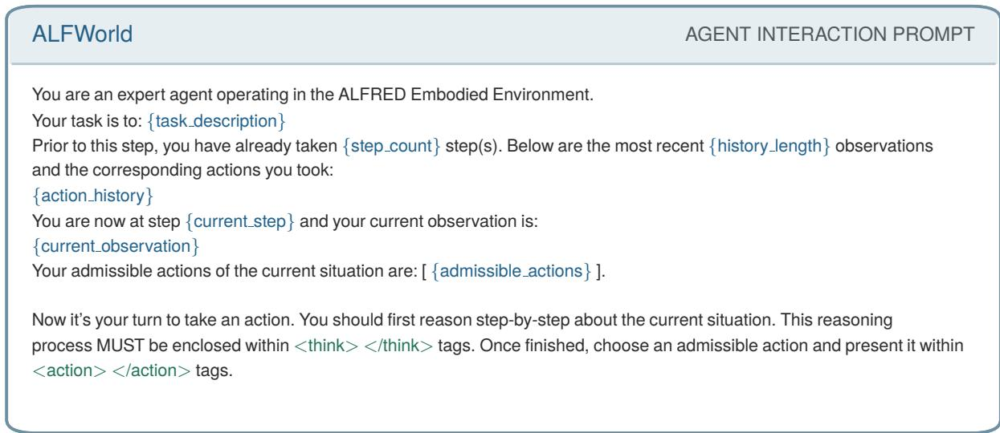  
Figure 6: ALFWorld prompt template. Runtime placeholders are blue and output tags are green.

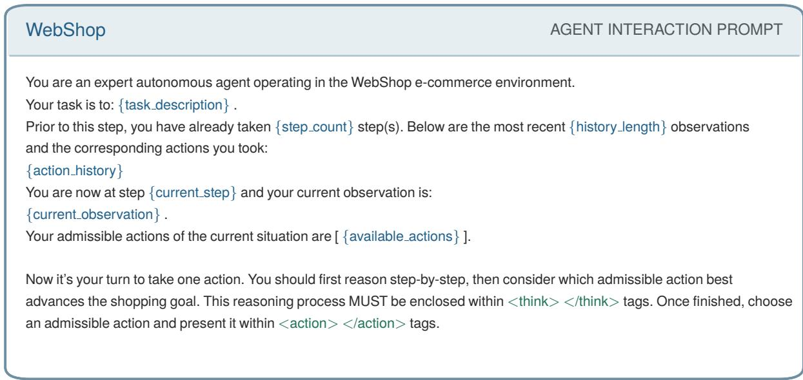  
Figure 7: WebShop prompt template. Runtime placeholders are blue and output tags are green.

Proof. By definition, $\widehat { A } _ { t } ^ { \mathrm { r e s } } = \widehat { A } _ { t } ^ { \mathrm { m i x } } - \widehat { A } _ { t } ^ { \mathrm { G } }$ . Substituting this identity into Equation 23 gives

$$
\begin{array} { l l l } { { { \cal B } _ { t } } } & { { = } } & { { w _ { \mathrm { s t e p } } \big [ \widehat { A } _ { t } ^ { \mathrm { G } } + \eta ( \widehat { A } _ { t } ^ { \mathrm { m i x } } - \widehat { A } _ { t } ^ { \mathrm { G } } ) \big ] } } \\ { { } } & { { = } } & { { ( 1 - \eta ) B _ { t } ^ { \mathrm { G } } + \eta B _ { t } ^ { \mathrm { M } } . } } \end{array}\tag{26}
$$

Subtracting $B _ { t } ^ { \mathrm { G } }$ and taking absolute values yields Equation 25. Since $\eta \in [ 0 , 1 ]$ , the two coefficients in Equation 24 are nonnegative and sum to one.

Proposition 2 (Resolution of graph-distance ties). Consider two observed transitions $e _ { 1 } = ( s , a _ { 1 } , s _ { 1 } ^ { \prime } )$ and $e _ { 2 } = ( s , a _ { 2 } , s _ { 2 } ^ { \prime } )$ in the same task–source-state normalization group. IfGraphGPO assigns them equal step advantages, then

$$
B ( e _ { 1 } ) - B ( e _ { 2 } ) = w _ { \mathrm { s t e p } } \eta \left[ \widehat { A } ^ { \mathrm { m i x } } ( e _ { 1 } ) - \widehat { A } ^ { \mathrm { m i x } } ( e _ { 2 } ) \right] .\tag{27}
$$

Thus, for $w _ { \mathrm { s t e p } } \eta > 0 ,$ , any strict ordering produced by the normalized shaped advantage becomes the strict ordering of the MileGPO step-level credit. In particular, equal destination-to-goal distances imply equal GraphGPO returns and hence satisfy the premise.

Proof. Applying Equation 24 to the two transitions and taking their difference gives the expression below, where $\Delta _ { \mathrm { G } } = \widehat { A } ^ { \mathrm { G } } ( e _ { 1 } ) - \widehat { A } ^ { \mathrm { G } } ( e _ { 2 } )$ and

<table><tr><td>Stage</td><td>Parameter</td><td>Role</td><td>ALFWorld</td><td>WebShop</td></tr><tr><td>Graph return</td><td>C</td><td>Return scale</td><td>10</td><td>10</td></tr><tr><td></td><td> $\gamma _ { G }$ </td><td>Graph-distance discount</td><td>0.20</td><td>0.20</td></tr><tr><td></td><td> $\gamma _ { \Phi }$ </td><td>Potential discount</td><td>1.00</td><td>1.00</td></tr><tr><td></td><td> $\lambda$ </td><td>Shaping coefficient</td><td>0.25</td><td>0.25</td></tr><tr><td>MD and RCS</td><td> $w _ { + } , w _ { - }$ </td><td>Positive / negative potential weights</td><td>1.00 / 0.25</td><td>1.00 / 0.25</td></tr><tr><td></td><td> $w _ { s } , w _ { m } , w _ { f }$ </td><td>Success, coverage, failure weights</td><td>1/1/1</td><td>1/1/1</td></tr><tr><td></td><td> $w _ { c } , w _ { l }$ </td><td>Centrality and revisit weights</td><td>0.25 / 0.25</td><td>0.25 / 0.25</td></tr><tr><td></td><td>Minimum node support</td><td>Distinct trajectory count</td><td>1</td><td>1</td></tr><tr><td></td><td>Minimum trap visits</td><td>Failed-trajectory support</td><td>2</td><td>2</td></tr><tr><td></td><td>Minimum trap score</td><td>Trap admission threshold</td><td>0.10</td><td>0.10</td></tr><tr><td></td><td>ω</td><td>Milestone/trap propagation discount</td><td>0.20</td><td>0.20</td></tr><tr><td></td><td>return_mode</td><td>Graph and potential composition</td><td>graph_plus_potential</td><td></td></tr><tr><td>PCC</td><td> $\alpha _ { d } , \alpha _ { s } , \alpha _ { f }$ </td><td>Distance, success, failure terms</td><td>1/1/1</td><td>1/1/1</td></tr><tr><td></td><td> $w _ { \mathrm { b c } } , w _ { \mathrm { p g } }$ </td><td>BCC and progress evidence</td><td>1/1</td><td>1/1</td></tr><tr><td></td><td> $w _ { \mathrm { p c c } }$ </td><td>PCC reweighting strength</td><td>1</td><td>1</td></tr><tr><td></td><td> $\theta _ { m }$ </td><td>Coverage retention threshold</td><td>1.1</td><td>0.5</td></tr><tr><td></td><td> $\kappa _ { \mathrm { b c } }$ </td><td>Branch-only retention switch</td><td>0</td><td>1</td></tr><tr><td></td><td> $\rho$ </td><td>Shrink factor for weak candidates</td><td>0</td><td>0.5</td></tr><tr><td>Policy update</td><td> $w _ { \mathrm { s t e p } } , w _ { \mathrm { e p i s o d e } }$ </td><td>Step / episode advantage weights</td><td>1/1</td><td>1/1</td></tr><tr><td></td><td>η</td><td>Residual milestone correction weight</td><td>0.20</td><td>1.00</td></tr></table>

Table 5: MileGPO hyperparameters. MD denotes milestone discovery, RCS denotes reliability-calibrated shaping, and PCC denotes progress-contrastive calibration. The environment-specific PCC controls are fixed during training and evaluation, as are the policy-update weights.

$$
\begin{array} { r l } & { \Delta _ { \mathrm { m i x } } = \widehat { A } ^ { \mathrm { m i x } } ( e _ { 1 } ) - \widehat { A } ^ { \mathrm { m i x } } ( e _ { 2 } ) \colon } \\ & { } \\ & { B ( e _ { 1 } ) - B ( e _ { 2 } ) = ( 1 - \eta ) w _ { \mathrm { s t e p } } \Delta _ { \mathrm { G } } + \eta w _ { \mathrm { s t e p } } \Delta _ { \mathrm { m i x } } . } \end{array}\tag{28}
$$

The first difference is zero by the premise, which proves Equation 27. Moreover, the GraphGPO return is $c \gamma _ { G } ^ { d ( s ^ { \prime } , g ) }$ ; therefore $d ( s _ { 1 } ^ { \prime } , g ) = d ( s _ { 2 } ^ { \prime } , g )$ gives equal raw graph returns. Applying the same normalization to equal values in the same group preserves equality. □

Proposition 3 (Bounded raw shaping correction). Assume the task-wise normalized candidate scores lie in $[ 0 , 1 ] , \omega , \gamma _ { \Phi } \in ( 0 , 1 ]$ , and $c , \lambda , w _ { + } , w _ { - } \geq 0 .$ Then the one-sided potential increments obey

$$
0 \leq \delta _ { t } ^ { + } \leq w _ { + } , \qquad 0 \leq \delta _ { t } ^ { - } \leq w _ { - } ,\tag{29}
$$

and the raw MileGPO return differs from the GraphGPO return by at most

$$
- c \lambda w _ { - } \leq r _ { t } ^ { \mathrm { M } } - r _ { t } ^ { \mathrm { G } } \leq c \lambda w _ { + } .\tag{30}
$$

For the reported values $c ~ = ~ 1 0 , ~ \lambda ~ = ~ 0 . 2 5$ $w _ { + } = 1$ , and w− = 0.25, the correction lies in [−0.625, 2.5].

Proof. Each positive or negative potential is the maximum of terms of the form $\overline { { S } } \bar { ( } v ) \omega ^ { d ( s , v ) }$ . The normalized score, distance decay, and their product all lie in $[ 0 , 1 ]$ , so $0 \leq \Phi ^ { + } ( s ) , \Phi ^ { - } ( s ) \leq 1$ . From Equations 9 and 10,

$$
\begin{array} { l c l } { { 0 \leq \delta _ { t } ^ { + } } } & { { \leq } } & { { \gamma _ { \Phi } w _ { + } \Phi ^ { + } ( s _ { t + 1 } ) \leq w _ { + } , } } \\ { { 0 \leq \delta _ { t } ^ { - } } } & { { \leq } } & { { \gamma _ { \Phi } w _ { - } \Phi ^ { - } ( s _ { t + 1 } ) \leq w _ { - } . } } \end{array}\tag{31}
$$

Finally, Equation 20 gives $r _ { t } ^ { \mathrm { M } } - r _ { t } ^ { \mathrm { G } } = c \lambda ( \delta _ { t } ^ { + } - \delta _ { t } ^ { - } )$ Substituting the increment bounds proves Equation 30; substituting the reported hyperparameters gives the stated numerical interval. □

## B.1 Full WebShop Training Dynamics

Together, these propositions show that MileGPO adds a tunable, tie-resolving, and bounded correction to graph-distance credit on each sampled rollout graph.

Figure 8 reports the complete optimization trajectories of the aligned GiGPO, GraphGPO, and MileGPO WebShop runs. MileGPO improves more rapidly during the early and middle stages in both the training and validation views, while the curves become closer near the end of training. These trajectories characterize optimization dynamics rather than final performance; the endpoint comparisons in the main paper follow the independent evaluation protocol described in Section 4.

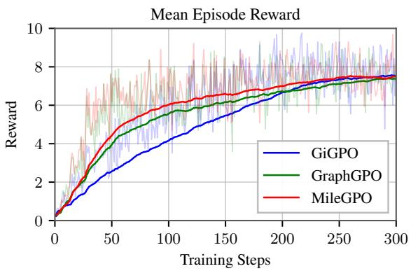

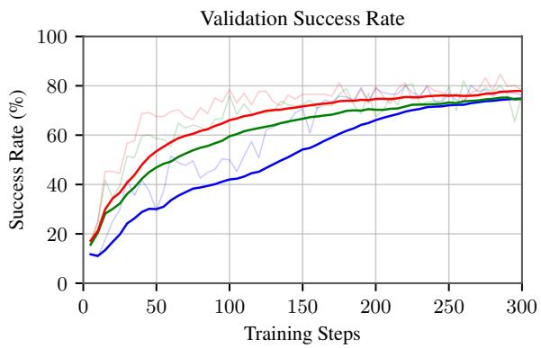  
Figure 8: WebShop training dynamics of the aligned GiGPO, GraphGPO, and MileGPO runs. From left to right, the panels show mean episode reward and validation success rate. Faint lines show per-checkpoint measurements, and solid lines show the smoothed training trends.

## C Additional Experimental Analyses

## C.1 Checkpoint-Wise Replay of Distance Ties

Figure 9 expands the pooled replay result in Figure 4 by resolving it across checkpoints. We identify sibling transitions that share a parent state, have opposite episode outcomes, and are tied under GraphGPO’s final-state-distance advantage. On the same GraphGPO trajectories, RCS ranks the successful transition above the failed one for 26.5% of the 569 eligible pairs, compared with 17.0% for uniform MD. Figure 9 shows where these corrections occur across checkpoints and also reveals that the number of eligible ties decreases later in training. Because the comparison replays alternative shaping on fixed trajectories, it should be interpreted as descriptive mechanism evidence rather than a causal training ablation.

We group transitions by task and canonicalized parent state, label a transition as successful when its trajectory-level episode return is positive, and declare a GraphGPO advantage tie at an absolute difference of at most 10−6. Both replay variants use the same RCS-mined candidate set. Uniform MD assigns unit weight to every mined milestone and trap, whereas RCS retains the mined reliability weights; PCC is disabled in both variants. The replay uses $\gamma _ { G } = 0 . 2 0 , \omega = 0 . 2 0$ , and $\lambda = 0 . 2 5$ matching the reported WebShop recipe.

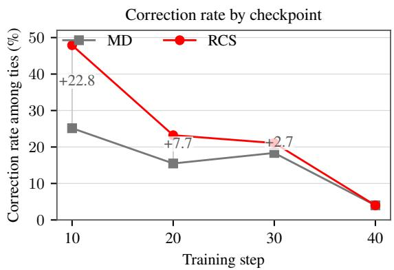  
Figure 9: Offline replay on the same GraphGPO Web-Shop rollout traces We compare success/failure transitions sharing a parent state and tied under GraphGPO’s final-state-distance advantage. We report the correction rate, $N _ { \mathrm { c o r r e c t e d } } / N _ { \mathrm { t i e } } .$ , at each checkpoint with eligible pairs; a correction means that replayed shaping orders the successful transition above the failed one. Step 50 is omitted because it contains no eligible ties. This is a descriptive offline replay, not a causal intervention or a retrained ablation.

<table><tr><td>Branch</td><td>Agent action</td><td>Environment feedback / observation</td><td>rt</td></tr><tr><td>Successful</td><td>0 search[machine wash men&#x27;s dress shirts with polyester heathers, heathers cotton, cotton heather, needle sleeve, classic fit with color: kelly green, and fit type:</td><td>Results page 1 (50 products); B09P39QN2W, priced at $16.99, is listed.</td><td></td></tr><tr><td></td><td>than 40.00 dollars] 1 click[b09p39qn2w]</td><td>Product page for B09P39QN2W; fit-type, color,</td><td>0</td></tr><tr><td></td><td>2 click[kelly green]</td><td>and size options are shown. Confirms kelly green; product page remains</td><td>0</td></tr><tr><td></td><td>3 click[x-small]</td><td>open. Confirms x-smal1; selected options are kelly</td><td>0</td></tr><tr><td></td><td>4 click[classic fit]</td><td>green and x-small. Product page unchanged; the requested</td><td></td></tr><tr><td></td><td></td><td>attribute is not an offered button. Product page unchanged; the requested</td><td></td></tr><tr><td>5</td><td>click[needle sleeve]</td><td>attribute is not an offered button.</td><td></td></tr><tr><td></td><td>6 click[classic fit] 7 click[youth]</td><td>Product page unchanged. Confirms youth; selected options are youth,</td><td></td></tr><tr><td></td><td>8 click[x-small]</td><td>kelly green, and x-small. Product page unchanged; x-small remains</td><td></td></tr><tr><td></td><td></td><td>selected. Product page unchanged; the three valid</td><td></td></tr><tr><td></td><td>9 click[polyester]; click[heathers]; click[cotton]; click[needle sleeve]; click[classic fit]; click[men];</td><td>selections remain active.</td><td></td></tr><tr><td></td><td>click[price lower than 40.00 dollars]</td><td></td><td></td></tr><tr><td></td><td>10 click[x-small]</td><td>Product page unchanged.</td><td></td></tr><tr><td></td><td>11 click[needle sleeve]</td><td>Product page unchanged.</td><td></td></tr><tr><td></td><td>12 click[needle sleeve]</td><td>Product page unchanged.</td><td></td></tr><tr><td></td><td>13 click[classic fit]; click[needle sleeve]</td><td>Product page unchanged.</td><td></td></tr><tr><td></td><td>14 click[kelly green]; click[40.00] 15 click[polyester heathers]; click[heathers</td><td>Product page unchanged.</td><td></td></tr><tr><td></td><td>cotton]; click[cotton heathers];</td><td>Product page unchanged.</td><td></td></tr><tr><td></td><td>click[lower than 40.00]</td><td></td><td></td></tr><tr><td></td><td>16 click[polyester heathers]</td><td>Product page unchanged. Product page unchanged.</td><td></td></tr><tr><td></td><td>17 click[x-small] 18 click[classic fit]; click[price lower</td><td>Product page unchanged.</td><td></td></tr><tr><td></td><td>than 40.00]</td><td></td><td></td></tr><tr><td></td><td>19 click[x-small]</td><td>Product page unchanged.</td><td></td></tr><tr><td></td><td>20 click[classic fit] 21 click[x-small]</td><td>Product page unchanged. Product page unchanged.</td><td></td></tr><tr><td></td><td>22 click[kelly green]</td><td>Product page unchanged.</td><td></td></tr><tr><td></td><td>23 click[x-smali]</td><td>Product page unchanged.</td><td></td></tr><tr><td></td><td>24 click[classic fit]</td><td>Product page unchanged.</td><td></td></tr><tr><td></td><td>25 click[kelly green]</td><td>Product page unchanged.</td><td></td></tr><tr><td></td><td>26 click[youth]</td><td>Product page unchanged.</td><td></td></tr><tr><td></td><td>27 click[buy now]</td><td>success; purchase accepted.</td><td>10</td></tr><tr><td>Failed</td><td>0 search[kelly green, machine wash,</td><td>Results page 1 (50 products); B09P39QN2W,</td><td></td></tr><tr><td></td><td>polyester heathers, heathers cotton, cotton heathers, needle sleeve, classic fit, youth, x-small, price:</td><td>priced at $16.99, is listed.</td><td></td></tr><tr><td></td><td>$40.00-$50.00] 1 click[b09p39qn2w]</td><td>Product page for B09P39QN2W; fit-type, color,</td><td></td></tr><tr><td></td><td></td><td>and size options are shown. Confirms kelly green; product page remains</td><td></td></tr><tr><td></td><td>2 click[kelly green]</td><td>open.</td><td></td></tr><tr><td></td><td>3 click[x-small]</td><td>Confirms x-smal1; selected options are kelly</td><td></td></tr><tr><td></td><td></td><td>green and x-small. Purchase response reports task score 0.9 but no</td><td></td></tr></table>

Table 6: Complete paired WebShop rollout for the representative price-constraint correction at training step 30. Both branches share the task and initial observation; all 28 successful and five failed transitions are shown.

## C.2 Representative Credit-Assignment Corrections

Table 6 makes the aggregate tie correction in Figure 9 concrete through a complete paired trace. The two rollouts start from the same task and exactly the same initial observation, but issue different search actions. The successful branch preserves the requested price ceiling, whereas the failed branch searches in an incompatible price interval. GraphGPO assigns the two first transitions the same advantage $( \Delta _ { \mathrm { G } } = 0 . 0 0 0 )$ , while RCS favors the successful branch by $\Delta _ { \mathrm { R C S } } = + 1 . 5 3 3$ Every environment transition in both rollouts is shown. The feedback column reports state changes and denotes repeated product-page observations as “product page unchanged.” This case illustrates the complementary roles of MD and RCS. MD exposes intermediate states as candidate credit anchors, allowing the successful and failed branches to receive distinct intermediate shaping before terminal success is observed. RCS then calibrates these anchors by their outcome support, assigning higher credit to the action that preserves the task constraint. Across all eligible ties, this calibration raises the correction rate from 17.0% with uniform MD to 26.5%.

Two additional same-state corrections exhibit the same pattern. On a product page, choosing the listed option click[xnj-tshirt342-black] instead of emitting text outside the action grammar changes the RCS margin by +0.803. On a compatible loafer page, selecting the requested size with click[12] instead of retreating with click[< prev] changes it by +0.562.

PCC is disabled in this replay and is therefore not illustrated by these paired traces. Its contribution is evaluated separately by the cumulative ablation in Table 3 and the candidate-evidence diagnostics in Figure 4. Adding PCC to RCS increases WebShop success from 77.2% to 78.6% and task score from 87.9% to 90.3%, while the diagnostics show how local progress and same-parent branch evidence are used to retain, strengthen, or suppress candidate milestones.