# Multi-Source Wasserstein Distributionally Robust Graph Learning

Chuansen Peng, Yifan Xia, Jinshan Zhong, and Xiaojing Shen

Abstract—Network topology inference from graph signals is central to graph signal processing, with applications in brain connectivity, sensor networks, and social networks. In practice, target-domain samples are scarce, while heterogeneous sourcedomain data are abundant. Fusing these sources into a reliable nominal distribution is challenging: Euclidean averaging works when sources are homogeneous but degrades sharply as intersource divergence grows, collapsing distinct geometries into an inflated, biased consensus. We exploit the Wasserstein metric’s distribution-preserving fusion to counter this heterogeneity while preserving each source’s intrinsic geometry. We propose MS-WDRO, a multi-source Wasserstein distributionally robust graph learning framework that fuses heterogeneous sources via their weighted Wasserstein barycenter, a geometrically principled nominal distribution, then builds an ambiguity ball around it to hedge residual uncertainty. Minimizing worst-case risk over this ball yields a tractable regularized Laplacian estimator, solved efficiently via a provably convergent ADMM scheme. We establish non-asymptotic guarantees: a finite-sample concentration bound for the empirical barycenter, a pooling bias lower bound proving naive aggregation is suboptimal, and an out-of-sample excess risk bound decaying at a parametric rate with only logarithmic dependence on source count. To calibrate the four coupled hyperparameters governing robustness, sparsity, and source fusion, we unroll the solver into a differentiable architecture trained end-to-end, achieving data-adaptive calibration beyond cross-validation while retaining interpretability. Experiments on synthetic benchmarks and the multi-site ABIDE I neuroimaging dataset show MS-WDRO consistently outperforms seven baselines in graph recovery accuracy, sample efficiency, and downstream diagnostic utility, with the largest gains in the sample-scarce regime motivating this work.

Index Terms—Graph signal processing, network topology inference, distributionally robust optimization, Wasserstein barycenter, algorithm unrolling. heterogeneous multi-source learning

## I. INTRODUCTION

ETWORK-structured data pervade modern science and engineering: gene regulatory networks govern cellular   
function, functional brain connectomes encode cognitive pro  
cesses, power grids exchange energy across interconnected   
nodes, and social platforms generate opinion dynamics over   
relational graphs [1], [2], [3], [4], [5], [6]. Graph signal   
processing (GSP) has emerged as a principled mathematical   
framework for analyzing signals defined on such irregular   
domains, extending classical tools from Fourier analysis, fil-

tering, and sampling theory to data indexed by graph vertices [7], [8], [9]. A central and often foundational challenge in this paradigm is network topology inference, the problem of recovering the underlying graph structure from observed nodal signals. The inferred topology is not merely an end in itself; it serves as the substrate for graph-based filtering, signal interpolation, anomaly detection, and disease biomarker discovery in neuroimaging studies of conditions such as autism spectrum disorder. In all of these settings, the quality of downstream analysis depends critically on the fidelity of the inferred graph, placing a premium on topology estimators that are both statistically principled and computationally tractable.

The vast majority of graph learning methods are built on a generative signal model that captures the relationship between the observed signals and the latent graph. Under the widely adopted smooth graph signal model, nodal observations are assumed to vary slowly across connected vertices, and the combinatorial graph Laplacian naturally emerges as the precision matrix of the corresponding degenerate Gaussian distribution. Building on this model, Dong et al. [10] formulated graph learning as a constrained maximum-likelihood estimation problem and derived efficient block coordinate descent algorithms. Kalofolias [11] recast a closely related objective as a smooth convex program amenable to proximal gradient solvers, while Egilmez et al. [12] incorporated structural constraints on the Laplacian and developed specialized ADMM procedures with convergence guarantees. Several subsequent works extended these foundations: Kumar et al. [13] unified a broad class of structured graph learning problems through spectral constraints; Sardellitti et al. [14] leveraged transform learning to infer graph topology without specifying a parametric signal model; and accelerated first-order methods have been developed to handle large-scale instances [15]. Beyond the smoothness paradigm, complementary lines of work infer topology from stationary graph signals whose power spectrum is aligned with the graph Fourier basis [16], from diffusionprocess observations [17], from spectral templates derived from signal second-order statistics [18], and from joint network topology inference across multiple related graphs [19]. In the probabilistic graphical model literature, sparse precision matrix estimation [20] provides an alternative route to graph structure recovery when Gaussian assumptions hold. Despite their considerable diversity in signal model and algorithmic strategy, these approaches share a common requirement: they rely on a sufficiently large and representative collection of signal observations drawn from the same target distribution. Their statistical performance degrades severely when samples are scarce or when the observations do not faithfully reflect the distribution of interest.

In practice, graph signal observations are finite in number, contaminated by noise, and subject to distributional shift arising from sensor drift, protocol variation, or environmenta change. Under these conditions, the empirical risk minimiza tion (ERM) principle may lead to overfitting: the learned graph Laplacian is calibrated to the finite observed samples but generalizes poorly to signals drawn from the true underlying distribution [21]. Distributionally robust optimization (DRO) offers a principled remedy by replacing the nominal empir ical distribution with a worst-case distribution drawn from an ambiguity set, thereby immunizing the estimator against deviations between the training and true distributions [22], [23]. Among the many choices of ambiguity set, those defined through the Wasserstein metric have attracted particula attention owing to their geometric interpretability, their tight connection to adversarial perturbations, and their ability to yield tractable convex reformulations of otherwise intractable minimax problems [24], [25], [26]. A Wasserstein ball of prescribed radius centered at the empirical distribution certifies that the learned estimator performs well for any distribution that lies within a controlled optimal transport distance from the training data, a guarantee that purely moment-based am biguity sets [22], [23] cannot provide in the absence of shape assumptions. The foundations of Wasserstein DRO, duality theory, tractable reformulations, and finite-sample performance guarantees, have been developed in considerable depth [24], and the framework has been applied to a broad array of statistical learning problems including logistic regression [27] and adversarially robust training [28]. Most recently, Wasser stein DRO has been specialized to graph Laplacian estimation from smooth signals [29], demonstrating that distributional robustness yields measurable improvements in graph recovery accuracy when target-domain samples are limited. These de velopments concentrate on the single-source setting, in which all observations are assumed to arise from one underlying distribution. Motivated by this body of work, the present paper extends Wasserstein distributional robustness from single source to the multi-source regime, in which signals collected across several related yet heterogeneous domains must be reconciled into a single robust estimator. This extension raises challenges of its own: heterogeneous sources cannot be pooled directly without incurring a mixing bias, and the ambiguity set itself must be constructed jointly from multiple empirical distributions rather than centered on a single one, calling for a principled mechanism to aggregate heterogeneous source information before robustness can be meaningfully enforced.

Many high-impact applications of graph learning feature a target domain from which signal samples are difficult or impossible to collect in sufficient quantity, while multiple related but heterogeneous source domains provide abundant data. In functional neuroimaging, a rare clinical cohort at a small acquisition site, such as the CMU site in the ABIDE I consortium [30], constitutes the target domain, while data from larger studies conducted at different scanning sites under distinct imaging protocols serve as source domains, inducing sitespecific distributional shift that is well documented in the brain connectivity literature [31]. Similar multi-source configurations arise in distributed sensor networks, where sensors with different hardware characteristics monitor a shared physical phenomenon; in clinical federated learning, where data heterogeneity across hospitals precludes simple aggregation; and in social network analysis, where platform-specific behavioral norms differentiate the signal statistics across source and target domains. The transfer learning literature has long recognized that naive aggregation of heterogeneous source data by pooling all observations into a single empirical distribution introduces a mixing bias [32], [33] whose magnitude grows with intersource divergence, and that constructing a shared model from such a biased nominal distribution leads to systematically degraded target-domain performance [34]. A principled approach to multi-source distribution aggregation is provided by optimal transport theory [35]: the Wasserstein barycenter [36] defines the Frechet mean of a family of distributions in the Wasserstein´ metric space and produces a consensus representation that preserves the intrinsic geometric structure of each source, in sharp contrast to the covariance inflation inherent to the mixture distribution. Efficient algorithms for Wasserstein barycenter computation [37], [38] and the Gelbrich lower bound relating the barycenter to source second-order moments [39] have rendered this construction computationally tractable at the scale of practical graph learning problems. Optimal transport has also proved fruitful for domain adaptation by geometrically aligning source and target distributions [40]; the present work leverages its complementary role of fusing source distributions into a structurally sound nominal distribution for robust graph estimation.

Despite clear practical motivation, the intersection of multisource learning, Wasserstein distributional robustness, and smooth-signal graph topology inference remains largely unexplored. A further challenge is the joint calibration of multiple interacting hyperparameters inherent in any WDRO-based graph learning framework: the ambiguity set radius determines the degree of distributional robustness; the sparsity regularization coefficient controls graph density; the augmented Lagrangian penalty governs algorithmic convergence; and the barycentric fusion weights modulate the relative contribution of each source domain. These parameters interact nonlinearly and cannot be calibrated in isolation. Conventional cross-validation over the resulting joint parameter space is computationally prohibitive in the multi-source regime, and concentration-inequality-based radius selection, while theoretically motivated, is inherently conservative and ignores the mutual coupling among the parameters. A principled, end-to-end trainable framework that simultaneously addresses multi-source fusion, distributional robustness, and automatic hyperparameter calibration is therefore strongly needed.

Algorithm unrolling, the technique of mapping the iterations of an optimization algorithm onto the layers of a neural network while treating algorithmic parameters as learnable variables [41], offers a compelling solution to the hyperparameter calibration challenge. By embedding the iterative solver into a differentiable architecture and training end-to-end on a supervised corpus of graph-signal pairs, all parameters can be jointly calibrated through backpropagation, capturing their mutual interactions in a manner that any sequential or gridsearch strategy fundamentally misses. The resulting unrolled network retains full algorithmic interpretability, each layer executes a precisely specified proximal, eigendecomposition, or dual-ascent substep, while acquiring data-adaptive calibration capability unavailable to the fixed-parameter solver. This paradigm has been successfully applied to compressive sensing magnetic resonance imaging via deep ADMM-Net [42], to sparse graph recovery via GLAD [43], and to graph signal denoising [44]. The survey by Monga et al. [41] provides a comprehensive account of the theoretical and practical principles underlying the paradigm, documenting its advantages in interpretability, sample efficiency, and computational scalability relative to generic deep architectures. A critical prerequisite enabling differentiable unrolling in our setting is the ADMM solver structure, whose per-iteration updates admit closed-form analytical expressions that are differentiable with respect to the hyperparameters and therefore compatible with gradient-based end-to-end training.

This paper proposes MS-WDRO (Multi-Source Wasserstein Distributionally Robust Optimization for graph learning), a framework that jointly addresses multi-source data fusion, distributional robustness, and automatic hyperparameter learning for network topology inference from smooth graph signals. The main contributions are as follows.

(i) Multi-source WDRO framework. We formulate a novel graph Laplacian estimation framework that fuses heterogeneous source distributions by computing their weighted Wasserstein barycenter as the nominal distribution of a Wasserstein ambiguity set. Minimizing the worst-case expected loglikelihood loss over the resulting barycentric ambiguity ball yields a principled minimax problem that simultaneously exploits multi-source information and guards against residual distributional uncertainty. The framework encompasses singlesource WDRO as a special case and formally subsumes naive pooling while provably outperforming it.

(ii) Tractable reformulation and efficient algorithm. We derive a closed-form tractable reformulation of the minimax problem via Wasserstein strong duality, reducing it to a regularized Laplacian estimation problem with an explicit Frobenius-norm robustness penalty and sparsity term. A twoblock ADMM solver with closed-form per-iteration updates is developed, and its global convergence, objective convergence, primal consensus, and dual convergence, governed by a provably monotone primal-dual Lyapunov potential, is rigorously established in Theorem 3.2. Explicit non-asymptotic guarantees are given, including an ergodic O(1/K) primal-dual gapfunction rate (Corollary 3.2).

(iii) Rigorous statistical theory. We establish three complementary non-asymptotic guarantees. First, a finite-sample concentration bound for the empirical Wasserstein barycenter quantifies how accurately the empirical barycenter approximates its population counterpart as source sample sizes grow. Second, a formal pooling bias lower bound, proved via the Lieb concavity theorem for quantum fidelity [45] and the Haar measure twirling identity [46], confirms that, under a commoncovariance, heterogeneous-mean Gaussian source model, naive data pooling incurs a strictly positive, irreducible Wasserstein estimation bias that scales with the between-source mean dispersion $\mathcal { H } _ { \lambda }$ , establishing an asymptotic separation between the barycentric and pooling approaches in this regime. Third, an out-of-sample excess risk bound derived through

Rademacher complexity analysis shows that the excess risk of the MS-WDRO estimator decays at the parametric rate and depends on the number of sources only logarithmically, with a concentration correction computable entirely from training data.

(iv) Algorithm unrolling for joint hyperparameter learning. We embed the MS-WDRO solver into a differentiable multilayer architecture by interpreting each iteration as a computational layer parameterized by four learnable quantities: the ambiguity set radius, the sparsity regularization coefficient, the augmented Lagrangian penalty, and the barycentric fusion weights. End-to-end supervised training jointly calibrates all parameters through backpropagation, enabling an implicit annealing schedule across layers, progressively shrinking robustness margins, relaxing sparsity, tightening the dual step size, and adapting source weights, that is difficult to realize efficiently by conventional cross-validation. The total number of trainable parameters grows only linearly in network depth and source count, making the architecture highly parameterefficient.

(v) Comprehensive experimental validation. We conduct experiments on synthetic graph benchmarks with controlled inter-source heterogeneity and on the ABIDE I multi-site functional neuroimaging dataset, comparing against seven competitive baselines spanning classical optimization-based methods, deep graph learning algorithms, and the state-of-theart single-source WDRO approach. MS-WDRO consistently and significantly outperforms all baselines in graph recovery accuracy and sample efficiency across the full range of target sample sizes, achieves superior downstream diagnostic classification on the neuroimaging dataset, and empirically validates the theoretical out-of-sample bound at the predicted convergence rate.

The remainder of the paper is organized as follows. Section II defines the graph signal model, reviews the Wasserstein distance and barycenter, and states the baseline Laplacian estimation problem. Section III presents the Wasserstein barycentric ambiguity set, derives the tractable minimax reformulation, and develops the ADMM solver. Section IV provides the complete theoretical analysis, including barycenter concentration, the pooling bias lower bound, data-driven radius selection, and the out-of-sample excess risk guarantee. Section V introduces the algorithm unrolling architecture and its end-to-end training procedure. Numerical experiments are reported in Section VI, and Section VII concludes with a discussion of limitations and future directions.

## II. SIGNAL MODELS AND PROBLEM FORMULATION

This section lays the groundwork for the multi-source distributionally robust framework developed in the sequel. We proceed in three steps. We first specify the generative model that links observed graph signals to the underlying topology, showing that smoothness on the graph induces a degenerate Gaussian likelihood whose precision matrix coincides with the graph Laplacian (Section II-A). Building on this likelihood, we formulate the canonical single-distribution graph learning problem as a regularized maximum-likelihood estimator (Section II-B), which serves as the point of departure for the robust formulation introduced later. Because that baseline estimator implicitly treats the empirical distribution of a single data source as exact, it provides no principled mechanism for combining several heterogeneous sources or for hedging against sampling error, both of which are central concerns of this paper. We therefore close the section by introducing the optimal-transport tools required to overcome this limitation, namely the Wasserstein distance, the Wasserstein barycenter, and its second-moment surrogate, the Gelbrich distance (Section II-C); these constructs furnish the geometric and computational vocabulary on which the multi-source Wasserstein distributionally robust formulation of Section III is built.

## A. Graph Signal Model

Let a weighted, undirected graph be represented by the triple $\mathcal { G } = ( \nu , \mathcal { E } , \mathbf { L } )$ , where $\nu$ is a finite vertex set of cardinality $N ,$ $\mathcal { E } \subseteq \mathcal { V } \times \mathcal { V }$ is the edge set, and $\mathbf { L } \in \mathbb { R } ^ { N \times N }$ is the combinatorial graph Laplacian, whose off-diagonal entry $L _ { i j }$ encodes (the negative of) the edge weight between nodes i and $j .$ Under the standing assumption of no self-loops, L satisfies $\mathbf { L 1 } = \mathbf { 0 }$ (Here, 1 is the all-ones vector) and is a symmetric positive semi-definite matrix [19]. The set of admissible Laplacians is accordingly given by

$$
{ \mathcal { L } } = \{ \mathbf { L } | \mathbf { L } { \boldsymbol { \succeq } } 0 , \mathbf { L } \mathbf { 1 } = \mathbf { 0 } , L _ { i j } = L _ { j i } \leq 0 , i \neq j \} .\tag{1}
$$

A graph signal is a vector $\mathbf { x } = [ x _ { 1 } , \ldots , x _ { N } ] ^ { T } \in \mathbb { R } ^ { N }$ assigning a scalar value $x _ { i }$ to each node i. To relate such signals to the graph topology, we adopt the standard graph filtering formalism: writing the eigendecomposition of the Laplacian as $\mathbf { L } = \mathbf { U } \mathbf { A } \mathbf { U } ^ { T }$ , with $\pmb { \Lambda } = \mathrm { d i a g } ( \lambda _ { 1 } , \ldots , \lambda _ { N } )$ collecting the non-decreasing graph frequencies $0 \le \lambda _ { 1 } \le \dots \le \lambda _ { N }$ , the graph Fourier transform of x is defined as $\hat { \mathbf { x } } = \mathbf { U } ^ { T } \mathbf { x }$ , with inverse transform $\mathbf { x } \ = \ \mathbf { U } \hat { \mathbf { x } }$ . Given the eigendecomposition $\mathbf { L } = \mathbf { U } \mathbf { A } \mathbf { U } ^ { T }$ , a graph filter with spectral response $h ( \cdot )$ , defined as $h ( { \bf L } ) = { \bf U } h ( { \bf A } ) { \bf U } ^ { T }$ , generates signals from a white input $\mathbf { x } _ { \mathrm { 0 } }$ via

$$
{ \bf x } = \pmb { \mu } + h ( { \bf L } ) { \bf x } _ { 0 } ,\tag{2}
$$

where $\pmb { \mu }$ denotes the signal mean. Taking $\mathbf { x } _ { \mathrm { 0 } }$ to be standard multivariate Gaussian noise renders x Gaussian with covariance $h ^ { 2 } ( { \bf L } ) \triangleq h ( { \bf L } ) h ( { \bf L } ) ^ { T }$

$$
\mathbf { x } \sim { \mathcal { N } } { \big ( } \mu , h ^ { 2 } ( \mathbf { L } ) { \big ) } .\tag{3}
$$

The choice of filter $h ( \cdot )$ determines the qualitative behavior of the resulting signal family. Following the widely adopted smoothness prior for graph signals [10], [11], we select the low-pass filter $h ( \mathbf { L } ) = \sqrt { \mathbf { L } ^ { \dagger } }$ , where $( \cdot ) ^ { \dagger }$ denotes the Moore– Penrose pseudoinverse; this choice attenuates high graphfrequency components and thereby favors signals that vary slowly across connected vertices, consistent with the smoothness assumption underlying most graph learning methods reviewed in the Introduction. Substituting this filter into (3) shows that a smooth graph signal follows a degenerate Gaussian law whose precision matrix is precisely the graph Laplacian:

$$
f ( \mathbf { x } ) = \mathcal { N } ( \mu , \mathbf { L } ^ { \dagger } ) .\tag{4}
$$

Equation (4) is the key structural fact exploited throughout the paper: it reduces the topological problem of estimating L to the statistical problem of estimating the precision matrix of a Gaussian graphical model, subject to the combinatorial constraints in (1).

## B. Baseline Graph Learning Problem

We first formulate the canonical estimation problem implied by the signal model (4) under the classical assumption that all observed signals are drawn i.i.d. from a single, fixed distribution. Let ${ \bf X } = [ { \bf x } _ { 1 } , \ldots , { \bf x } _ { n } ] \in \mathbb { R } ^ { N \times n }$ collect n such i.i.d. samples. The empirical log-likelihood of a candidate Laplacian L given X follows directly from (4):

$$
{ \mathcal { F } } _ { n } ( \mathbf { L } \mid \mathbf { X } ) = { \frac { 1 } { n } } \sum _ { i = 1 } ^ { n } \log f ( \mathbf { x } _ { i } ) = \log | \mathbf { L } | _ { + } - \operatorname { t r } ( { \hat { \mathbf { \Sigma } } } \mathbf { L } ) ,\tag{5}
$$

where $| \mathbf { L } | _ { + }$ denotes the pseudo-determinant of L (the product of its nonzero eigenvalues, required since L is singular by construction) and $\begin{array} { r } { \hat { \bf \Sigma } = \frac { 1 } { n } \sum _ { i = 1 } ^ { n } ( { \bf x } _ { i } - { \pmb \mu } ) ( { \bf x } _ { i } - { \pmb \mu } ) ^ { \top } } \end{array}$ is the sample covariance matrix of the observed signals. Maximizing $\mathcal { F } _ { n } ( \mathbf { L } \mid \mathbf { X } )$ alone is generally ill-posed and prone to overfitting when n is small relative to $N ;$ we therefore augment it with a regularization term $\mathcal { P } ( \mathbf { L } )$ , weighted by $\rho > 0$ , that promotes structural properties such as sparsity, e.g., $\mathcal { P } ( { \bf L } ) = \| { \bf L } \| _ { F } ^ { 2 }$ or $\mathcal { P } ( \mathbf { L } ) = - \log ( \mathrm { d i a g } ( \mathbf { L } ) )$ . The resulting baseline graph learning problem is the regularized maximum-likelihood estimator

$$
\operatorname* { m a x } _ { \mathbf { L } } \quad \mathcal { F } _ { n } ( \mathbf { L } \mid \mathbf { X } ) - \rho \mathcal { P } ( \mathbf { L } ) \quad \mathrm { s . t . } \mathbf { L } \in \mathcal { L } .\tag{6}
$$

Problem (6) is the workhorse formulation underlying classical smooth-signal graph learning. It implicitly identifies the empir ical distribution of X with the true data-generating distribution and offers no safeguard when this identification fails, whether because n is too small for $\hat { \Sigma }$ to be a reliable estimate of the population covariance, or because X is itself pooled, in whole or in part, from sources whose distributions differ from that of the intended target. Both failure modes are the norm rather than the exception in the multi-source, small-targetsample regime motivating this paper, which calls for replacing the single fixed nominal distribution in (6) with an ambiguity set that is robust to distributional uncertainty while remaining informed by all available source data. Constructing such a set requires a notion of distance between probability distributions together with a principled way of aggregating several of them; we introduce both next.

## C. Wasserstein Distance, Barycenter, and Gelbrich Bound

We adopt the Wasserstein distance as the governing metric for distributional uncertainty, owing to its ability to compare distributions with disjoint or singular support, as is the case for the degenerate Gaussian law in (4), and to its well-known tractable convex reformulations in distributionally robust optimization [24], [47].

Definition 2.1 (Wasserstein Distance): For $p \in [ 1 , \infty )$ , the order-p Wasserstein distance between probability distributions $\mathbb { P } _ { 1 }$ and $\mathbb { P } _ { 2 }$ on $\mathbb { R } ^ { N }$ is

$$
\begin{array} { l } { { \displaystyle W _ { p } ( \mathbb { P } _ { 1 } , \mathbb { P } _ { 2 } ) } } \\ { { \displaystyle \ = \left( \operatorname* { i n f } _ { \pi \in \mathcal { U } ( \mathbb { P } _ { 1 } , \mathbb { P } _ { 2 } ) } \int _ { \mathbb { R } ^ { N } \times \mathbb { R } ^ { N } } C ( { \bf a } _ { 1 } , { \bf a } _ { 2 } ) ^ { p } \pi ( d { \bf a } _ { 1 } , d { \bf a } _ { 2 } ) \right) ^ { \frac 1 p } , } } \end{array}\tag{7}
$$

where $\mathcal { U } ( \mathbb { P } _ { 1 } , \mathbb { P } _ { 2 } )$ denotes the set of couplings of $\mathbb { P } _ { 1 }$ and $\mathbb { P } _ { 2 } .$ i.e., joint distributions on $\mathbb { R } ^ { N } \times \mathbb { R } ^ { N }$ with marginals $\mathbb { P } _ { 1 }$ and $\mathbb { P } _ { 2 }$ , and $C ( \cdot , \cdot )$ is a transportation cost function.

$$
C ( { \bf a } _ { 1 } , { \bf a } _ { 2 } ) = \| { \bf a } _ { 1 } - { \bf a } _ { 2 } \| _ { p } ,
$$

$$
W _ { p } ( \mathbb { P } _ { 1 } , \mathbb { P } _ { 2 } )
$$

$$
\mathbb { P } _ { 1 }
$$

$$
\mathbb { P } _ { 2 }
$$

$$
\ell _ { p }
$$

When the data of interest arise from several distributions rather than one, it is natural to seek a single representative distribution that best summarizes them jointly in the Wasserstein metric. This role is played by the Wasserstein barycenter, the Frechet mean of a distribution over the Wasserstein space.´

Definition 2.2 (Wasserstein Barycenter): For $p \in [ 1 , \infty )$ , the p-Wasserstein barycenter of a distribution $\mathbb { P }$ over probability measures is

$$
b _ { p } ( \mathbb { P } ) : = \arg \operatorname* { m i n } _ { \nu } \mathbb { E } _ { \rho \sim \mathbb { P } } \big [ W _ { p } ^ { p } ( \nu , \rho ) \big ] ,\tag{8}
$$

where $\rho$ is a random measure distributed according to P. In particular, taking $\begin{array} { r } { \mathbb { P } = \sum _ { m = 1 } ^ { M } \lambda _ { m } \delta _ { \rho _ { m } } } \end{array}$ for weights $\lambda \ =$ $( \lambda _ { m } ) _ { m \in [ M ] } \in \triangle ^ { M }$ on the probability simplex recovers the empirical p-Wasserstein barycenter of M measures $\rho _ { 1 } , \ldots , \rho _ { m } ,$

$$
\hat { b } _ { \lambda , p } ( \rho _ { 1 } , \dots , \rho _ { M } ) : = \underset { \nu } { \arg \operatorname* { m i n } } \sum _ { m = 1 } ^ { M } \lambda _ { m } W _ { p } ^ { p } ( \nu , \rho _ { m } ) .\tag{9}
$$

Equation (9) will later serve to fuse the M heterogeneous source distributions into a single nominal distribution for the ambiguity set of Section III, with λ controlling each source’s relative contribution.

Evaluating $W _ { p }$ or its barycenter exactly is, in general, NP-hard outside a few special cases [48]. Since the signal model of Section II-A identifies each source distribution with a (degenerate) Gaussian law, and hence with its first two moments, we can instead work with a moment-based surrogate that is tractable for arbitrary covariance matrices and coincides with the 2-Wasserstein distance whenever both distributions are Gaussian: the Gelbrich distance.

Definition 2.3 (Gelbrich Distance): For distributions $\mathbb { P } _ { 1 } , \mathbb { P } _ { 2 }$ with means $\mu _ { 1 } , \mu _ { 2 }$ and covariance matrices $\Sigma _ { 1 } , \Sigma _ { 2 } \in \mathbb { S } _ { + } ^ { N }$ , the Gelbrich distance between them is

$$
G ( \mathbb { P } _ { 1 } , \mathbb { P } _ { 2 } ) : = { \sqrt { \| \mu _ { 1 } - \mu _ { 2 } \| _ { 2 } ^ { 2 } + B ^ { 2 } ( \Sigma _ { 1 } , \Sigma _ { 2 } ) } } ,\tag{10}
$$

where

$$
\begin{array} { r l } & { B ^ { 2 } ( \Sigma _ { 1 } , \Sigma _ { 2 } ) : = \mathrm { t r } ( \Sigma _ { 1 } ) + \mathrm { t r } ( \Sigma _ { 2 } ) } \\ & { \qquad - \ : 2 \mathrm { t r } \Big ( \big ( \Sigma _ { 1 } ^ { 1 / 2 } \Sigma _ { 2 } \Sigma _ { 1 } ^ { 1 / 2 } \big ) ^ { 1 / 2 } \Big ) } \end{array}\tag{11}
$$

is the squared Bures–Wasserstein distance between $\Sigma _ { 1 }$ and $\Sigma _ { 2 }$ Because $G ( \mathbb { P } _ { 1 } , \mathbb { P } _ { 2 } )$ depends on $\mathbb { P } _ { 1 } , \mathbb { P } _ { 2 }$ only through their first two moments, it provides a closed-form, provably tight lower bound on $W _ { 2 } ( \mathbb { P } _ { 1 } , \mathbb { P } _ { 2 } )$ that is exact in the Gaussian case relevant here [39], and it is this tractability that makes the Wasserstein barycentric ambiguity set of Section III computationally viable at the scale of the graph learning problem formulated in (6).

## III. WASSERSTEIN DISTRIBUTIONALLY ROBUST GRAPH LEARNING

This section develops the proposed distributionally robust graph learning framework in four steps. We begin by revisiting the baseline estimator of Section II-B through the lens of empirical risk minimization and robustifying it against a single source’s sampling uncertainty via a Wasserstein ambiguity set (Section III-A). We then extend this single-source construction to the heterogeneous multi-source setting motivating this paper, replacing the naively pooled empirical distribution with a Wasserstein barycentric ambiguity set that fuses the $M$ source distributions while explicitly accounting for their residual sampling and heterogeneity error (Section III-B). The resulting min–max problem is then reduced to a singlelevel, tractable convex program via Wasserstein strong duality (Section III-C), which in turn admits an efficient ADMM solver with closed-form per-block updates (Section III-D).

## A. Basic Formulation

The baseline problem (6) can be equivalently cast as an empirical risk minimization (ERM) problem,

$$
\operatorname* { m i n } _ { \mathbf { L } \in { \mathcal { L } } } \quad { \mathbb { E } } _ { \mathbf { x } \sim { \mathbb { P } } _ { n } } [ - { \mathcal { F } } _ { n } ( \mathbf { L } \mid \mathbf { X } ) ] + \rho { \mathcal { P } } ( \mathbf { L } ) ,\tag{12}
$$

where $\mathbb { P } _ { n }$ is the empirical distribution of the observed signals $\mathbf { x } _ { 1 } , \ldots , \mathbf { x } _ { n }$

$$
\mathbb { P } _ { n } = \frac { 1 } { n } \sum _ { i = 1 } ^ { n } \delta _ { { \bf x } _ { i } } ,\tag{13}
$$

with $\delta _ { { \bf x } _ { i } }$ the Dirac measure at $\mathbf { x } _ { i } .$ . Formulation (12) makes explicit that the baseline estimator optimizes the risk exclusively with respect to $\mathbb { P } _ { n } ,$ which inherits two well-known deficiencies from the finiteness of the sample: $\mathbb { P } _ { n }$ may deviate substantially from the true data-generating distribution when observations are scarce or noisy, and an estimator tuned to $\mathbb { P } _ { n }$ alone is prone to overfit the observed signals at the expense of generalization to unseen ones. Both deficiencies point to the same remedy, the learned graph should remain accurate not only for $\mathbb { P } _ { n }$ , but for every distribution plausibly consistent with the observed data.

We formalize this requirement by replacing the single point $\mathbb { P } _ { n }$ with a Wasserstein ball around it,

$$
\mathcal { M } = \{ \mathbb { P } \in \mathcal { N } ^ { N } : W _ { p } ( \mathbb { P } , \mathbb { P } _ { n } ) \leq \epsilon \} ,\tag{14}
$$

where $\mathcal { N } ^ { N }$ denote the the family of all normal distributions on $\mathbb { R } ^ { N } , \epsilon \geq 0$ is the ambiguity set radius and $p \geq 1$ is left unspecified for now, as Section III-C shows that the subsequent reformulation is independent of this choice. Learning a graph that performs well uniformly over $\mathcal { M }$ amounts to minimizing the worst-case expected risk,

$$
\begin{array} { r l } & { \underset { \mathbf { L } \in \mathcal { L } } { \operatorname* { m i n } } R ( \mathbf { L } ; \mathbf { x } ) + \rho \mathcal { P } ( \mathbf { L } ) } \\ & { = \underset { \mathbf { L } \in \mathcal { L } } { \operatorname* { m i n } } \underset { \mathbb { P } \in \mathcal { M } } { \operatorname* { m a x } } \mathbb { E } _ { \mathbf { x } \sim \mathbb { P } } [ - \mathcal { F } _ { n } ( \mathbf { L } \mid \mathbf { X } ) ] + \rho \mathcal { P } ( \mathbf { L } ) , } \end{array}\tag{15}
$$

where $R ( \mathbf { L } ; \mathbf { x } ) = \operatorname* { m a x } _ { \mathbb { P } \in \mathcal { M } } \mathbb { E } _ { \mathbf { x } \sim \mathbb { P } } [ - \mathcal { F } _ { n } ( \mathbf { L } \mid \mathbf { X } ) ]$ is the worstcase expected risk. The rationale behind (15) is that if contains the true distribution $\mathbb { P } ^ { \star }$ , then driving down the worstcase risk over $\mathcal { M }$ simultaneously controls the risk at $\mathbb { P } ^ { \star }$ : the expected risk of the learned graph Lˆ under $\mathbb { P } ^ { \star }$ is bounded by $R ( \hat { \bf { L } } ; { \bf { x } } )$ , so that Lˆ remains reliable even though it was estimated from a finite, possibly unrepresentative sample. The radius ϵ governs a robustness–conservatism trade-off intrinsic to this construction: a larger ϵ raises the likelihood that covers $\mathbb { P } ^ { \star }$ , but also admits increasingly implausible distributions into the worst case, inflating $R ( \mathbf { L } ; \mathbf { x } )$ and yielding an overly conservative estimator; ϵ must therefore be chosen with care, a question we return to in Section IV.

## B. Wasserstein Barycentric Distributionally Robust Optimization

The single-source construction of Section III-A guards against sampling error but offers no mechanism for incorporating data from related source domains. We now extend it to the heterogeneous multi-source setting that motivates this paper. Suppose each source m $\in ~ [ M ]$ contributes a local sample $\mathcal { D } _ { m } = \{ \mathbf { z } _ { m , 1 } , . . . , \mathbf { z } _ { m , n _ { m } } \}$ of size $n _ { m }$ , with $\begin{array} { r } { n = \sum _ { m = 1 } ^ { M } n _ { m } , } \end{array}$ and empirical distribution $\begin{array} { r } { \hat { \mathbb P } _ { m } = \frac { 1 } { n _ { m } } \sum _ { i = 1 } ^ { n _ { m } } \delta _ { { \bf z } _ { m , i } } } \end{array}$ . The most direct extension of (12) to this setting is the weighted ERM problem

$$
\operatorname* { m i n } _ { \mathbf { L } \in \mathcal { L } } \sum _ { m = 1 } ^ { M } \frac { \lambda _ { m } } { n _ { m } } \sum _ { i = 1 } ^ { n _ { m } } \ell ( \mathbf { L } , \mathbf { z } _ { m , i } ) .\tag{16}
$$

Remark $3 . 1 \colon$ The default choice ${ \lambda _ { m } } = n _ { m } / n$ reduces (16) to an ERM objective over the union of all local samples, which is equivalent to minimizing $\mathbb { E } _ { \mathbf { z } \sim \hat { \mathbb { P } } _ { \lambda } } [ \ell ( \mathbf { L } , \mathbf { z } ) ]$ under the λ-mixture $\begin{array} { r } { \hat { \mathbb P } _ { \lambda } \ : = \ \sum _ { m = 1 } ^ { M } \lambda _ { m } \hat { \mathbb P } _ { m } . } \end{array}$ . As argued by Mohri et al. [34], this uniform weighting is generally unwarranted: the target distribution for which the centralized model is ultimately deployed need not coincide with the sample-size-weighted mixture $\begin{array} { r } { \sum _ { m = 1 } ^ { M } n _ { m } \mathbb { P } _ { \underset { \mathbf { \cdot } } { m } } / n . } \end{array}$ and is better modeled as a general λ-mixture $\begin{array} { r } { \mathbb { P } _ { \lambda } : = \sum _ { m = 1 } ^ { M } \lambda _ { m } \mathbb { P } _ { m } } \end{array}$ for a weight vector $\pmb { \lambda } \in \triangle ^ { M }$ to be determined by the learning problem itself rather than fixed a priori by sample proportions.

Observe that $\mathbb { P } _ { \lambda }$ , viewed as a mixture, is precisely the Euclidean barycenter of $\mathbb { P } _ { 1 } , \dots , \mathbb { P } _ { M }$ in the space of probability measures. This observation suggests a natural generalization: replacing the Euclidean barycenter with the geometrically richer Wasserstein barycenter $\hat { b } _ { \pmb { \lambda } , p } ( \mathbb { P } _ { 1 } , \dots , \mathbb { P } _ { M } )$ of Definition 2.2, so that (16) becomes

$$
\operatorname* { m i n } _ { \mathbf { L } \in \mathcal { L } } \mathbb { E } _ { \mathbf { z } \sim \hat { b } _ { \mathbf { A } , p } ( \mathbb { P } _ { 1 } , \dots , \mathbb { P } _ { M } ) } [ \ell ( \mathbf { L } , \mathbf { z } ) ] ,\tag{17}
$$

with the corresponding empirical surrogate, computed from the source samples $\mathcal { D } _ { 1 } , \ldots , \mathcal { D } _ { M }$ via their empirical distributions $\hat { \mathbb { P } } _ { 1 } , \hdots , \hat { \mathbb { P } } _ { M }$ , given by

$$
\operatorname* { m i n } _ { \mathbf { L } \in \mathcal { L } } \mathbb { E } _ { \mathbf { z } \sim \hat { b } _ { \mathbf { A } , p } ( \hat { \mathbb { P } } _ { 1 } , \dots , \hat { \mathbb { P } } _ { M } ) } [ \ell ( \mathbf { L } , \mathbf { z } ) ] .\tag{18}
$$

Unlike the mixture ${ \hat { \mathbb { P } } } _ { \lambda } .$ , the Wasserstein barycenter of (18) respects the geometry of each source distribution rather than simply averaging their probability mass, and consequently provides a more faithful consensus representation of heterogeneous sources (a claim made precise in Section IV-B). This advantage notwithstanding, the barycenter of the empirical distributions $\hat { \mathbb { P } } _ { 1 } , \hdots , \hat { \mathbb { P } } _ { M }$ remains only a finite-sample estimate of the barycenter of the true source distributions $\mathbb { P } _ { 1 } , \dots , \mathbb { P } _ { M }$ and residual discrepancy between the two is unavoidable due to sampling error within each source and heterogeneity across sources. Exactly as in Section III-A, we hedge against this residual uncertainty by enclosing the empirical barycenter in a Wasserstein ball rather than treating it as exact.

Definition 3.1: For $\pmb { \lambda } \in \triangle ^ { M }$ , the p-Wasserstein barycentric ambiguity set of radius $\epsilon \geq 0$ , centered at the Wasserstein barycenter of $\mathbb { P } _ { 1 } , \dots , \mathbb { P } _ { M }$ (assumed to exist) $\bar { \mathbf { P } } _ { \lambda , p } =$ $\hat { b } _ { \pmb { \lambda } , p } ( \mathbb { P } _ { 1 } , \dots , \mathbb { P } _ { M } )$ , is

$$
\mathcal { W } _ { \epsilon , p } ( \mathbb { P } _ { 1 } , \dots , \mathbb { P } _ { M } ; \lambda ) : = \{ \mathbb { P } : W _ { p } ( \mathbb { P } , \bar { \mathbf { P } } _ { \lambda , p } ) \leq \epsilon \} .\tag{19}
$$

Remark 3.2: An alternative route to an ambiguity set over M distributions is the intersection of individual Wasserstein balls, $\cap _ { m = 1 } ^ { M } { \mathcal { M } } _ { m }$ with $\mathcal { M } _ { m } = \{ \mathbb { P } : W _ { p } ( \mathbb { P } , \mathbb { P } _ { m } ) \leq \epsilon \} \colon$ ; when the sources are highly heterogeneous, however, this construction forces a single radius ϵ to simultaneously cover all M sources and becomes overly conservative. A less conservative alternative is the pooled ambiguity set $\tilde { \mathcal { M } } _ { \epsilon , p } ( \mathbb { P } _ { 1 } , \dots , \mathbb { P } _ { M } ; \lambda ) : = \left\{ \mathbb { P } : \right.$ $\begin{array} { r } { \sum _ { m = 1 } ^ { M } \lambda _ { m } W _ { p } ^ { p } ( \mathbb { P } , \mathbb { P } _ { m } ) \le \epsilon ^ { p } \} } \end{array}$ , which satisfies $\cap _ { m = 1 } ^ { M } \mathcal { M } _ { m } \subseteq$ $\bar { \mathcal { M } } _ { \epsilon , p }$ for any $\pmb { \lambda } \in \triangle ^ { M }$ . The following theorem shows that the barycentric ambiguity set of (19) is, up to a dimensionindependent constant, equivalent to $\tilde { \mathcal { M } } _ { \epsilon , p } ,$ and is therefore preferable on computational grounds since it is centered at a single distribution rather than requiring simultaneous control over M constraints.

Theorem 3.1: For $\lambda \ \in \ \triangle ^ { M }$ , suppose a λ-weighted $p \textmd { - }$ Wasserstein barycenter of $\mathbb { P } _ { 1 } , \dots , \mathbb { P } _ { M }$ exists. Then, for any $\epsilon \geq 0$

$$
\tilde { \mathcal { M } } _ { \epsilon , p } ( \mathbb { P } _ { 1 } , \dots , \mathbb { P } _ { M } ; \lambda ) \subseteq \mathcal { W } _ { 2 ^ { p } \cdot \epsilon , p } ( \mathbb { P } _ { 1 } , \dots , \mathbb { P } _ { M } ; \lambda ) .\tag{20}
$$

Proof. Let $\bar { \mathbf { P } } _ { \lambda , p }$ denote the Wasserstein barycenter of $\mathbb { P } _ { 1 } , \dots , \mathbb { P } _ { M }$ for $\hat { \lambda } \in \mathsf { \Gamma } \triangle ^ { M }$ . By the triangle inequality and the inequality $( a + b ) ^ { p } \leq 2 ^ { p - 1 } ( a ^ { p } + b ^ { p } )$ for $a , b \geq 0$ and $p \in [ 1 , \infty )$ , for any P and $m \in [ M ]$

$$
\begin{array} { r l } & { W _ { p } ^ { p } ( \mathbb { P } , \bar { \mathbf { P } } _ { \lambda , p } ) \leq \big ( W _ { p } ( \mathbb { P } , \mathbb { P } _ { m } ) + W _ { p } ( \bar { \mathbf { P } } _ { \lambda , p } , \mathbb { P } _ { m } ) \big ) ^ { p } } \\ & { \qquad \leq 2 ^ { p - 1 } \big ( W _ { p } ^ { p } ( \mathbb { P } , \mathbb { P } _ { m } ) + W _ { p } ^ { p } ( \bar { \mathbf { P } } _ { \lambda , p } , \mathbb { P } _ { m } ) \big ) . } \end{array}
$$

Taking the λ-weighted average over $\textit { m } \in \ [ M ]$ and using the definition of the Wasserstein barycenter to bound $\begin{array} { r } { \sum _ { m = 1 } ^ { M } \lambda _ { m } W _ { p } ^ { p } ( \bar { \mathbf { P } } _ { \lambda , p } , \mathbb { P } _ { m } ) \leq \sum _ { m = 1 } ^ { M } W _ { p } ^ { p } ( \mathbb { P } , \mathcal { \bar { P } } _ { m } ) } \end{array}$ yields

$$
\begin{array} { r l } & { W _ { p } ^ { p } ( \mathbb { P } , \bar { \mathbf { P } } _ { \lambda , p } ) = \displaystyle \sum _ { m = 1 } ^ { M } \lambda _ { m } W _ { p } ^ { p } ( \mathbb { P } , \bar { \mathbf { P } } _ { \lambda , p } ) } \\ & { \leq 2 ^ { p - 1 } \displaystyle \sum _ { m = 1 } ^ { M } \lambda _ { m } W _ { p } ^ { p } ( \mathbb { P } , \mathbb { P } _ { k } ) + 2 ^ { p - 1 } \displaystyle \sum _ { m = 1 } ^ { M } W _ { p } ^ { p } ( \mathbb { P } , \mathbb { P } _ { m } ) } \\ & { = 2 ^ { p } \displaystyle \sum _ { m = 1 } ^ { M } \lambda _ { m } W _ { p } ^ { p } ( \mathbb { P } , \mathbb { P } _ { m } ) . } \end{array}
$$

Consequently, for any $\epsilon \geq 0$

$$
\sum _ { m = 1 } ^ { M } \lambda _ { m } W _ { p } ^ { p } ( \mathbb { P } , \mathbb { P } _ { m } ) \leq \epsilon \implies W _ { p } ^ { p } ( \mathbb { P } , \bar { \mathbf { P } } _ { \lambda , p } ) \leq 2 ^ { p } \cdot \epsilon ,
$$

which is the desired inclusion.

With the barycentric ambiguity set in hand, the multi-source counterpart of the min–max problem (15) reads

$$
\operatorname* { i n f } _ { \mathbf { L } \in \mathcal { L } } \Big \{ - \log | \mathbf { L } | _ { + } + \operatorname* { s u p } _ { \mathbb { P } \in \mathcal { W } _ { \epsilon , p } } \mathbb { E } _ { \mathbf { z } \sim \mathbb { P } } [ \mathrm { t r } ( \Sigma \mathbf { L } ) ] + \rho \mathcal { P } ( \mathbf { L } ) \Big \} .\tag{21}
$$

Evaluating (21) in practice requires an explicit handle on the center of the ambiguity set, $\bar { \mathbf { P } } _ { \lambda , p } ,$ , which we now characterize under the Gaussian source model implied by the signal model of Section II-A.

Assumption $3 . 1 \colon  { \mathbb { P } } _ { 1 } , \ldots ,  { \mathbb { P } } _ { M }$ are M possibly degenerate Gaussian distributions $\mathbb { P } _ { m } = \mathcal { N } ( \mu _ { m } , \Sigma _ { m } )$ with $\mu _ { m } \in \mathbb { R } ^ { N }$ and $\Sigma _ { m } \in \mathbb { S } _ { + } ^ { N }$ for $m \in [ M ]$

Remark 3.3: Under the graph signal model of Section II-A, every source covariance is of the form $\Sigma _ { m } = \mathbf { L } _ { m } ^ { \dagger }$ for some $\mathbf { L } _ { m } \in \mathcal { L }$ , and hence, by $( 1 ) , \Sigma _ { m } \mathbf { 1 } = \mathbf { 0 }$ for every $m \in [ M ]$ : the M source covariances share the common null space span 1 . Assumption 3.1 accordingly allows, and in fact requires, $\Sigma _ { m } \in$ $\mathbb { S } _ { + } ^ { N }$ to be rank-deficient; the barycenter characterized below must be derived on the closed cone $\mathbb { S } _ { + } ^ { N }$ rather than on the open cone $\mathbb { S } _ { + + } ^ { N }$

Proposition 3.1: Under Assumption 3.1, the 2-Wasserstein barycenter of $\mathbb { P } _ { 1 } , \dots , \mathbb { P } _ { M }$ , restricted to the Gaussian manifold, is $\dot { \bar { \mathbf { P } } } _ { \lambda , 2 } = \hat { b } _ { \lambda , 2 } ( \mathbb { P } _ { 1 } , \dots , \mathbb { P } _ { M } ) = \mathcal { N } ( \bar { \mu } _ { \lambda } , \bar { \Sigma } _ { \lambda } )$ , with

$$
\begin{array} { r l } & { \bar { \mu } _ { \lambda } = \displaystyle \sum _ { m = 1 } ^ { M } \lambda _ { m } \mu _ { m } , } \\ & { \bar { \Sigma } _ { \lambda } = \arg \operatorname* { m i n } _ { \Sigma \in \mathbb { S } _ { + } ^ { N } } \displaystyle \sum _ { m = 1 } ^ { M } \lambda _ { m } B ^ { 2 } ( \Sigma , \Sigma _ { m } ) , } \end{array}\tag{22}
$$

where $B ( \cdot , \cdot )$ is the Bures–Wasserstein distance of Definition 2.3 (see (11)). Moreover, if all source covariances share a common null space, $\bigcap _ { m = 1 } ^ { M } \operatorname { n u l l } ( \Sigma _ { m } ) ~ = : ~ \mathcal { K } ~ \neq ~ \{ \bf 0 \}$ (in particular ${ \cal { K } } \supseteq \mathrm { s p a n } \{ { \bf { 1 } } \}$ under Remark 3.3), then $\bar { \Sigma } _ { \lambda }$ inherits this null space, ${ \mathcal { K } } \subseteq { \mathrm { n u l l } } ( { \bar { \Sigma } } _ { \lambda } )$ , so $\bar { \Sigma } _ { \lambda }$ is itself rank-deficient and, in particular, is never positive definite whenever $\boldsymbol { \kappa } \neq \{ \mathbf { 0 } \}$ Proof. Existence and uniqueness of the minimizer in (22) on the closed cone $\mathbb { S } _ { + } ^ { N }$ follow from [38, Thm. 1]. Let $\mathbf { v } \in \kappa ;$ since $\Sigma _ { m } \mathbf { v } = \mathbf { 0 }$ for every m, we have $\begin{array} { r } { \sum _ { m } ^ { 1 / 2 } \mathbf { v } = \mathbf { 0 } } \end{array}$ , and hence $\mathbf { v } ^ { T } \Sigma \mathbf { v } = 0$ for the fixed point $\Sigma = \bar { \Sigma } _ { \lambda }$ of

$$
\Sigma = \sum _ { m = 1 } ^ { M } \lambda _ { m } \sqrt { \Sigma ^ { 1 / 2 } \Sigma _ { m } \Sigma ^ { 1 / 2 } }\tag{23}
$$

(each summand on the right annihilates v on both sides by the same argument, so v remains in the null space at every iterate, and hence at the fixed point), which, since $\bar { \Sigma } _ { \lambda } \succeq 0$ forces ${ \bar { \Sigma } } _ { \lambda } \mathbf { v } = \mathbf { 0 }$ □

Because Proposition 3.1 shows $\bar { \Sigma } _ { \lambda } \mathbf { 1 } = \mathbf { 0 }$ , the fixed-point map (23) is ill-posed if applied verbatim on $\mathbb { S } _ { + + } ^ { N }$ , since it requires $\Sigma ^ { - 1 / 2 }$ at a singular matrix. We instead solve (23) in the $( N - 1 )$ -dimensional subspace 1⊥, where positive definiteness is generically restored. Let $\mathbf { U } _ { \perp } \in \mathbb { R } ^ { N \times ( \hat { N } - 1 ) }$ be an orthonormal basis of $\mathbf { 1 } ^ { \perp }$ and define the reduced source covariances $\Sigma _ { m } ^ { \perp } : = \mathbf { U } _ { \perp } ^ { T } \Sigma _ { m } \mathbf { U } _ { \perp } \in \mathbb { S } _ { + } ^ { N - 1 }$ , which are generically positive definite whenever each source graph is connected (so that nul $| ( { \bf L } _ { m } ) = \mathrm { s p a n } \{ { \bf 1 } \}$ exactly). The reduced barycenter $\bar { \Sigma } _ { \lambda } ^ { \perp } \in \mathbb { S } _ { + + } ^ { N - 1 }$ is then computed by the well-posed fixed-point iteration

$$
\begin{array} { r l r } {  { \big ( \bar { \Sigma } _ { \lambda } ^ { \perp } \big ) ^ { k + 1 } = \mathcal H \big ( ( \bar { \Sigma } _ { \lambda } ^ { \perp } ) ^ { k } , \lambda , \{ \Sigma _ { m } ^ { \perp } \} _ { m = 1 } ^ { M } \big ) } } \\ & { } & { = \big ( ( \bar { \Sigma } _ { \lambda } ^ { \perp } ) ^ { k } \big ) ^ { - 1 / 2 } \bigg ( \displaystyle \sum _ { m = 1 } ^ { M } \lambda _ { m } \sqrt { ( ( \bar { \Sigma } _ { \lambda } ^ { \perp } ) ^ { k } ) ^ { 1 / 2 } \Sigma _ { m } ^ { \perp } ( ( \bar { \Sigma } _ { \lambda } ^ { \perp } ) ^ { k } ) ^ { 1 / 2 } } \bigg ) ^ { 2 } } \\ & { } & { ~ ( 2 \bar { \Sigma } _ { \lambda } ^ { \perp } ) ^ { k } \big ) ^ { - 1 / 2 } , ~ ( 2 \bar { \Sigma } _ { \lambda } ^ { \perp } ) ^ { k } \big ) ^ { - 1 / 2 } , } \end{array}\tag{4}
$$

which converges at a linear rate to the unique positive definite fixed point $\bar { \Sigma } _ { \lambda } ^ { \perp }$ in $\mathbb { S } _ { + + } ^ { N - 1 } ~ [ 3 8 ]$ , [49]. The ambient barycenter covariance is then recovered exactly, and with the correct rank and null space, by the lifting

$$
\bar { \boldsymbol { \Sigma } } _ { \lambda } = \mathbf { U } _ { \perp } \bar { \boldsymbol { \Sigma } } _ { \lambda } ^ { \perp } \mathbf { U } _ { \perp } ^ { T } \in \mathbb { S } _ { + } ^ { N } , \qquad \bar { \boldsymbol { \Sigma } } _ { \lambda } \mathbf { 1 } = \mathbf { 0 } .\tag{25}
$$

Lemma 3.1: For every $\mathbf { L } \in { \mathcal { L } }$ and every $\Sigma \in \mathbb S ^ { N }$

$$
\begin{array} { r } { \mathrm { t r } ( \Sigma \mathbf { L } ) = \mathrm { t r } ( \mathbf { P } \Sigma \mathbf { P } \mathbf { L } ) , \qquad \mathbf { P } : = \mathbf { I } - \frac { 1 } { N } \mathbf { 1 } \mathbf { 1 } ^ { T } . } \end{array}\tag{26}
$$

Proof. Since L1 $\bf \Pi . \Pi = \delta 0$ and ${ \textbf { L } } = { \textbf { L } } ^ { T }$ , we have $\mathbf { L } \mathbf { 1 } \mathbf { 1 } ^ { T } = \mathbf { 0 }$ and $\mathbf { 1 1 } ^ { T } \mathbf { L } = ( \mathbf { L 1 1 } ^ { T } ) ^ { T } = \mathbf { 0 }$ , so $\mathbf { P L } = \mathbf { L P } = \mathbf { L }$ , i.e. L = PLP. Then, by cyclicity of the trace, $\operatorname { t r } ( \Sigma \mathbf { L } ) = \operatorname { t r } ( \Sigma \mathbf { P } \mathbf { L } \mathbf { P } ) =$ tr(PΣP L). □

Remark 3.4: In practice, the fixed-point iteration (24)– (25) is applied not to the population covariances $\Sigma _ { m }$ but to their empirical counterparts $\hat { \Sigma } _ { m } .$ , which are generically full rank due to finite-sample and observation noise, so the resulting empirical barycenter $\hat { \Sigma } _ { \lambda }$ need not satisfy $\hat { \Sigma } _ { { \lambda } } \mathbf { 1 } = \mathbf { 0 }$ exactly. Lemma 3.1 shows this is immaterial to the downstream estimator: because every feasible $\mathbf { L } \in \mathcal { L }$ annihilates 1, the ADMM objective (33) depends on $\hat { \Sigma } _ { \lambda }$ only through its projection $\mathbf { P } \hat { \Sigma } _ { \lambda } \mathbf { P } ;$ any energy the empirical fixed point spuriously accumulates along 1 is automatically annihilated by the trace term and never biases the learned graph. For numerical robustness of (24) itself, however, we still recommend explicitly projecting each empirical source covariance, $\hat { \Sigma } _ { m } \gets  { \mathbf { P } } \hat { \Sigma } _ { m }  { \mathbf { P } }$ , before running the fixed-point iteration, so that the reduced problem in $\mathbf { U } _ { \perp } ^ { T } ( \cdot ) \mathbf { U } _ { \perp }$ is solved on genuinely wellconditioned inputs rather than on inputs whose 1-component is pure sampling noise.

Assumption 3.2: There exists a constant $R < \infty$ such that $\| \mathbf { z } \| _ { 2 } \leq R$ almost surely under every source distribution $\mathbb { P } _ { m } ,$ m $\in ~ [ M ]$ , and under every distribution P contained in the vector-space ambiguity set $\mathcal { W } _ { \epsilon , 2 } ( \mathbb { P } _ { 1 } , \dots , \mathbb { P } _ { M } ; \lambda )$ of (19).

Remark 3.5: Assumption 3.2 is satisfied exactly whenever signals arise from a bounded sensing range, and is satisfied up to an exponentially small failure probability whenever z is sub-Gaussian, by taking R to be the (1 δ)-quantile of $\| \mathbf { z } \| _ { 2 }$ and absorbing the δ-tail into a separate, exponentially decaying error term via a standard truncation argument [24]; we omit this extension for brevity and work directly under Assumption 3.2.

Lemma 3.2: Let $\Phi : \mathbb { R } ^ { N }  \mathbb { S } ^ { N \times N } , \Phi ( \mathbf { z } ) : = \mathbf { z } \mathbf { z } ^ { T }$ . Under Assumption 3.2, Φ is 2R-Lipschitz from $( \{ \| \mathbf { z } \| _ { 2 } \leq R \} , \| \cdot \| _ { 2 } )$ to $( \mathbb { S } ^ { N \times N } , \lVert \cdot \rVert _ { F } )$ , and consequently, for any two distributions $\mathbb { P } , \mathbb { P } ^ { \prime }$ supported on $\{ \| \mathbf { z } \| _ { 2 } \leq R \}$

$$
W _ { 2 } \big ( \Phi _ { \# } \mathbb { P } , \Phi _ { \# } \mathbb { P } ^ { \prime } ; \lVert \cdot \rVert _ { F } \big ) \le 2 R W _ { 2 } ( \mathbb { P } , \mathbb { P } ^ { \prime } ; \lVert \cdot \rVert _ { 2 } ) .\tag{27}
$$

$$
\begin{array} { r l } & { P r o o f . \mathrm { ~ F o r ~ } \| { \bf z } _ { 1 } \| _ { 2 } , \| { \bf z } _ { 2 } \| _ { 2 } \leq R , } \\ & { \quad \| \Phi ( { \bf z } _ { 1 } ) - \Phi ( { \bf z } _ { 2 } ) \| _ { F } = \big \| { \bf z } _ { 1 } ( { \bf z } _ { 1 } - { \bf z } _ { 2 } ) ^ { T } + ( { \bf z } _ { 1 } - { \bf z } _ { 2 } ) { \bf z } _ { 2 } ^ { T } \big \| _ { F } } \\ & { \quad \leq \big ( \| { \bf z } _ { 1 } \| _ { 2 } + \| { \bf z } _ { 2 } \| _ { 2 } \big ) \| { \bf z } _ { 1 } - { \bf z } _ { 2 } \| _ { 2 } \leq 2 R \| { \bf z } _ { 1 } - { \bf z } _ { 2 } \| _ { 2 } , } \end{array}
$$

so $\Phi$ is 2R-Lipschitz on $\{ \| \mathbf { z } \| _ { 2 } \leq R \}$ . Let $\pi ^ { \star }$ be an optimal coupling attaining $W _ { 2 } ( \mathbb { P } , \mathbb { P } ^ { \prime } )$ . Then $( \Phi , \Phi ) _ { \# } \pi ^ { \star }$ is a feasible coupling of $\Phi _ { \# } \mathbb { P }$ and $\Phi _ { \# } \mathbb { P } ^ { \prime }$ , and

$$
\begin{array} { l } { { \displaystyle { \cal W } _ { 2 } ^ { 2 } ( \Phi _ { \# } \mathbb { P } , \Phi _ { \# } \mathbb { P } ^ { \prime } ) \leq \int \| \Phi ( \mathbf { z } _ { 1 } ) - \Phi ( \mathbf { z } _ { 2 } ) \| _ { F } ^ { 2 } d \pi ^ { \star } ( \mathbf { z } _ { 1 } , \mathbf { z } _ { 2 } ) } } \\ { { \displaystyle \leq 4 R ^ { 2 } \int \| \mathbf { z } _ { 1 } - \mathbf { z } _ { 2 } \| _ { 2 } ^ { 2 } d \pi ^ { \star } ( \mathbf { z } _ { 1 } , \mathbf { z } _ { 2 } ) = 4 R ^ { 2 } { \cal W } _ { 2 } ^ { 2 } ( \mathbb { P } , \mathbb { P } ^ { \prime } ) , } } \end{array}
$$

which gives (27).

□

Corollary 3.1: Under Assumption 3.2, the image of the vector-space ambiguity set $\mathcal { W } _ { \epsilon , 2 }$ of (19) under the outerproduct map satisfies

$$
\begin{array} { r l } & { \Phi _ { \# } \mathcal { W } _ { \epsilon , 2 } ( \mathbb { P } _ { 1 } , \dots , \mathbb { P } _ { M } ; \lambda ) } \\ & { \subseteq \{ \mathbb { Q } \mathrm { ~ o n ~ } \mathbb { S } ^ { N \times N } : W _ { 2 } ( \mathbb { Q } , \Phi _ { \# } \bar { \mathbf { P } } _ { \lambda , 2 } ; \| \cdot \| _ { F } ) \leq 2 R \epsilon \} . } \end{array}\tag{28}
$$

Proof. Immediate from Lemma 3.2 applied with $\mathbb { P } ^ { \prime } = \bar { \mathbf { P } } _ { \lambda , 2 }$ to every $\mathbb { P } \in \mathcal { W } _ { \epsilon , 2 }$ □

Corollary 3.1 is the precise sense in which the covariancespace representation of Section III-C is compatible with the vector-space ambiguity set of Section III-B: the pushforward map Φ is not an isometry, so the radius is not preserved verbatim, but it is provably inflated by the fixed, computable factor 2R. We use this containment, rather than an unproven identity of the two spaces, to derive a tractable and provably valid upper bound on the true worst-case risk in Section III-C.

## C. Tractable Reformulation

Problem (21) appears intractable at first sight, since its inner supremum lacks a closed form. Tractability is restored by lifting the problem into the space of rank-one covariance matrices via the outer-product map $\Phi ( { \mathbf { z } } ) : = { \mathbf { z } } { \mathbf { z } } ^ { T } \in \mathbb { S } ^ { N \times N }$ under which $\mathrm { t r } ( \Sigma \mathbf { L } ) \stackrel { - } { = } \mathbf { z } ^ { T } \mathbf { L } \mathbf { z } ~ \mathrm { f o r } ~ \bar { \Sigma } = \bar { \Phi } ( \mathbf { z } )$ , so that the loss appearing in (15) is linear in Σ. By Corollary 3.1, the worstcase risk over the vector-space ambiguity set $\mathcal { W } _ { \epsilon , 2 }$ is upperbounded by the worst-case risk over the (larger, and hence tractable via standard linear-loss duality) matrix-space ball of radius $\epsilon ^ { \prime } : = 2 R e$ centered at $\Phi _ { \# } \bar { \mathbf { P } } _ { \lambda , 2 } \{$

$$
\operatorname* { s u p } _ { \mathbb { P } \in \mathcal { W } _ { \epsilon , 2 } } \mathbb { E } _ { \mathbf { z } \sim \mathbb { P } } [ \mathbf { z } ^ { T } \mathbf { L } \mathbf { z } ] \leq \operatorname* { s u p } _ { \mathbb { Q } \in \mathcal { W } _ { \mathbf { x } , 2 } ^ { \Sigma } ( \epsilon ^ { \prime } ) } \mathbb { E } _ { \Sigma \sim \mathbb { Q } } [ \mathrm { t r } ( \Sigma \mathbf { L } ) ] ,\tag{29}
$$

where $\mathcal { W } _ { \lambda , 2 } ^ { \Sigma } ( \epsilon ^ { \prime } ) : = \{ \mathbb { Q } : W _ { 2 } ( \mathbb { Q } , \Phi _ { \# } \bar { \mathbf { P } } _ { \lambda , 2 } ; \| \cdot \| _ { F } ) \le \epsilon ^ { \prime } \}$ Crucially, the two Wasserstein balls in (29) live in different, but explicitly related ground spaces, $\mathcal { P } _ { 2 } ( \mathbb { R } ^ { N } )$ on the left, and the image of $\mathcal { P } _ { 2 } ( \mathbb { R } ^ { N } )$ under the 2R-Lipschitz map Φ inside $\mathcal { P } _ { 2 } ( \mathbb { S } ^ { N \times N } )$ on the right, and inequality (29), rather than an unjustified identity, is what licenses working in covariance space. Replacing the true worst-case risk by its tractable upper bound in (29) preserves the defining property of distributional robustness (the learned L still controls risk under every $\mathbb { P } \in \mathcal { W } _ { \epsilon , 2 } ,$ if anything more conservatively), so the resulting estimator remains valid; we henceforth analyze the right-hand side of (29) in place of the original min–max problem (15).

$$
\operatorname* { m i n } _ { \mathbf { L } \in \mathcal { L } } \mathbb { E } _ { \Sigma \sim \hat { \mathbb { Q } } _ { m } } [ - \log ( | \mathbf { L } | _ { + } ) + \operatorname { t r } ( \Sigma \mathbf { L } ) ] + \rho \mathcal { P } ( \mathbf { L } ) ,\tag{30}
$$

where $\begin{array} { r l r } { \hat { \mathbb Q } _ { m } } & { { } } & { = \mathrm { ~ \frac ~ { 1 } ~ { ~ n _ { m } ~ } ~ } \sum _ { i = 1 } ^ { n _ { m } } \operatorname { D i r a c } ( \mathbf { z } _ { m , i } \mathbf { z } _ { m , i } ^ { T } ) } \end{array}$ = $\begin{array} { r } { \frac { 1 } { n _ { m } } \sum _ { i = 1 } ^ { n _ { m } } \operatorname { D i r a c } ( \Sigma _ { m } ^ { i } ) } \end{array}$ . In this covariance representation, the min–max problem (15) becomes

$$
\begin{array} { r l } & { \underset { \mathbf { L } \in \mathcal { L } } { \mathop { \operatorname* { m i n } } } R ( \mathbf { L } ; \Sigma ) + \rho \mathcal { P } ( \mathbf { L } ) } \\ & { = \underset { \mathbf { L } \in \mathcal { L } } { \mathop { \operatorname* { m i n } } } \underset { \mathbb { P } \in \mathcal { W } _ { \lambda , 2 } } { \mathop { \operatorname* { m a x } } } \mathbb { E } _ { \Sigma \sim \mathbb { P } } [ - \log ( | \mathbf { L } | _ { + } ) + \mathrm { t r } ( \Sigma \mathbf { L } ) ] + \rho \mathcal { P } ( \mathbf { L } ) . } \end{array}\tag{31}
$$

The following lemma shows that the inner supremum in (31) admits a closed-form dual, collapsing the two-level min–max problem into a single-level convex program.

Lemma 3.3: Under Assumption 3.2, the min–max problem (15) is upper-bounded by

$$
\begin{array} { r l } & { \displaystyle \operatorname* { m i n } _ { \mathbf { L } \in \mathcal { L } } R ( \mathbf { L } ; \bar { \boldsymbol { \Sigma } } _ { \lambda } ) + \rho \mathcal { P } ( \mathbf { L } ) } \\ & { \displaystyle \leq \operatorname* { m i n } _ { \mathbf { L } \in \mathcal { L } } - \log ( | \mathbf { L } | _ { + } ) + \mathrm { t r } ( \bar { \boldsymbol { \Sigma } } _ { \lambda } \mathbf { L } ) + \rho \mathcal { P } ( \mathbf { L } ) + 2 R \epsilon \| \mathrm { v e c } ( \mathbf { L } ) \| _ { 2 } , } \end{array}\tag{32}
$$

where $\bar { \Sigma } _ { \lambda }$ is the barycenter covariance of Proposition 3.1 and R is the energy bound of Assumption 3.2. Inequality (32) is tight, i.e. holds with equality, whenever $\Phi _ { \# } \bar { \mathbf { P } } _ { \lambda , 2 }$ is itself the empirical distribution of a single point mass, which is the case for the empirical surrogate used in Section III-D.

Lemma 3.3 shows that hedging against distributional uncertainty in (31) costs, up to the provable safety margin 2R, one additional term in the objective, the norm penalty $\epsilon \| \mathrm { v e c } ( \mathbf { L } ) \| _ { q } ,$ so that robustness is achieved without sacrificing the convexity or the closed-form structure of the original regularized maximum-likelihood problem (6). The remainder of this section develops an efficient ADMM solver for (32).

## D. Algorithmic Development

We now derive an ADMM solver for the tractable reformulation (32). Applying Lemma 3.3, the problem can be written explicitly as (For notational simplicity, we define $\epsilon \triangleq 2 R \epsilon$ throughout the remainder of the paper)

$$
\operatorname* { m i n } _ { \mathbf { L } \in \mathcal { L } } - \log ( | \mathbf { L } | _ { + } ) + \mathrm { t r } ( \hat { \Sigma } _ { \lambda } \mathbf { L } ) + \rho \| \mathrm { v e c } ( \mathbf { L } ) \| _ { 1 } + \epsilon \| \mathrm { v e c } ( \mathbf { L } ) \| _ { 2 } ,\tag{33}
$$

where $\hat { \Sigma } _ { \lambda }$ is the empirical counterpart of the barycenter covariance, in accordance with Remark 3.4, each empirical source covariance is projected as $\hat { \Sigma } _ { m } \gets \mathbf { P } \hat { \Sigma } _ { m } \mathbf { P }$ prior to the fixed-point iteration (24), ensuring $\hat { \Sigma } _  { \} } \mathbf { 1 } = \mathbf { 0 }$ and consistency with the constraint set . Because any feasible $\mathbf { L } \in \mathcal { L }$ has non-positive off-diagonal entries and non-negative diagonal entries by construction (1), the $\ell _ { 1 }$ term in (33) admits the linear representation

$$
\| \mathrm { v e c } ( { \bf L } ) \| _ { 1 } = \mathrm { t r } ( { \bf L } { \bf H } ) ,\tag{34}
$$

with $\mathbf { H } = 2 \mathbf { I } - \mathbf { 1 } \mathbf { 1 } ^ { T }$ . Substituting (34) into (33) and collecting the two linear terms into a single effective coefficient matrix $\mathbf { K } \triangleq \hat { \Sigma } _ { \lambda } + \rho \mathbf { H }$ gives

$$
\begin{array} { r l } & { - \log ( | \mathbf { L } | _ { + } ) + \mathrm { t r } ( \hat { \Sigma } _ { \lambda } \mathbf { L } ) + \rho \| \mathrm { v e c } ( \mathbf { L } ) \| _ { 1 } + \epsilon \| \mathrm { v e c } ( \mathbf { L } ) \| _ { q } } \\ & { \quad = \mathrm { t r } ( \mathbf { L } \hat { \Sigma } _ { \lambda } ) - \log ( | \mathbf { L } | _ { + } ) + \rho \mathrm { t r } ( \mathbf { L } \mathbf { H } ) + \epsilon \| \mathrm { v e c } ( \mathbf { L } ) \| _ { q } } \\ & { \quad = \mathrm { t r } \big ( \mathbf { L } ( \hat { \Sigma } _ { \lambda } + \rho \mathbf { H } ) \big ) - \log ( | \mathbf { L } | _ { + } ) + \epsilon \| \mathrm { v e c } ( \mathbf { L } ) \| _ { q } } \\ & { \quad \triangleq \mathrm { t r } ( \mathbf { L } \mathbf { K } ) - \log ( | \mathbf { L } | _ { + } ) + \epsilon \| \mathrm { v e c } ( \mathbf { L } ) \| _ { q } . } \end{array}\tag{35}
$$

As it stands, however, log det(L) is unbounded below on ${ \mathcal { L } } ,$ since every feasible L satisfies $\mathbf { 1 } ^ { T } \mathbf { L 1 } = 0$ and is hence singular. Following Egilmez et al. [12], we resolve this degeneracy by regularizing the null direction, replacing log det(L) with log det(L + J), where $\begin{array} { r } { \mathbf { J } = \frac { 1 } { N } \mathbf { 1 } \mathbf { 1 } ^ { T } } \end{array}$

$$
\operatorname* { m i n } _ { \mathbf { L } } \ \mathrm { t r } ( \mathbf { L K } ) - \log \operatorname* { d e t } ( \mathbf { L } + \mathbf { J } ) + \epsilon \| \mathrm { v e c } ( \mathbf { L } ) \| _ { q } .\tag{36}
$$

Proposition 3.2: Problems (35) and (36) are equivalent. Proof. Write $\lambda _ { i } ( \mathbf { L } )$ for the i-th eigenvalue of L in ascending order, $\lambda _ { 1 } ( \mathbf { L } ) \leq \cdots \leq \lambda _ { N } ( \mathbf { L } )$ , so that

$$
\log \operatorname* { d e t } \bigl ( \mathbf { L } + \textstyle \frac { 1 } { N } \mathbf { 1 } \mathbf { 1 } ^ { T } \bigr ) = \log \Bigl ( \prod _ { i = 1 } ^ { N } \lambda _ { i } \bigl ( \mathbf { L } + \textstyle \frac { 1 } { N } \mathbf { 1 } \mathbf { 1 } ^ { T } \bigr ) \Bigr ) .\tag{37}
$$

The constraint $\mathbf { L 1 } = \mathbf { 0 }$ implies $\lambda _ { 1 } ( \mathbf { L } ) = 0$ with eigenvector $\mathbf { u } _ { 1 } = \mathbf { 1 } / \sqrt { N }$ , so

$$
\mathbf { L } + \frac { 1 } { N } \mathbf { 1 } \mathbf { 1 } ^ { T } = ( \underbrace { \lambda _ { 1 } ( \mathbf { L } ) } _ { = 0 } + 1 ) \mathbf { u } _ { 1 } \mathbf { u } _ { 1 } ^ { T } + \sum _ { i = 2 } ^ { N } \lambda _ { i } ( \mathbf { L } ) \mathbf { u } _ { i } \mathbf { u } _ { i } ^ { T } .\tag{38}
$$

Since the determinant equals the product of the eigenvalues, (38) gives

$$
\begin{array} { r } { \log \operatorname* { d e t } \bigl ( \mathbf { L } + \frac { 1 } { N } \mathbf { 1 } \mathbf { 1 } ^ { T } \bigr ) = \log \Bigl ( 1 \cdot \underset { i = 2 } { \overset { N } { \prod } } \lambda _ { i } ( \mathbf { L } ) \Bigr ) = \log | \mathbf { L } | _ { + } , } \end{array}\tag{39}
$$

so the objectives of (35) and (36) coincide on ${ \mathcal { L } } .$

With Proposition 3.2 in place, it remains to solve (36) efficiently under the combinatorial structure of . We proceed in two steps: first re-expressing the feasible set in a form amenable to variable splitting, and then deriving the resulting ADMM updates in closed form.

Reformulating the constraint set. Assuming no self-loops (so the diagonal of the adjacency structure is zero), the feasible set of (1) is compactly rewritten as

$$
\left\{ \begin{array} { l l } { \mathbf { L } \succeq \mathbf { 0 } , \ \mathbf { L 1 } = \mathbf { 0 } } \\ { \mathbf { L } - \mathbf { C } = \mathbf { 0 } } \\ { \mathbf { C } \in \mathcal { C } } \end{array} \right.\tag{40}
$$

where $\mathbf { C } \in { \mathcal { C } }$ encodes

$$
\left\{ \mathbf { I } \odot \mathbf { C } \geq \mathbf { 0 } \right.\tag{41}
$$

with $\mathbf { B } = \mathbf { 1 1 } ^ { T } - \mathbf { I } - \mathbf { A }$ ; the constraint $\mathbf { I } \odot \mathbf { C } \ge \mathbf { 0 }$ is already implied by $\mathbf { L } \succeq \mathbf { 0 }$ and is retained for clarity. The constraint pair $\mathrm { ~ \bf ~ L ~ } \succeq \mathrm { ~ \bf ~ 0 ~ }$ , L1 = 0 admits, in turn, an equivalent lowdimensional parametrization,

$$
{ \bf L } \succeq { \bf 0 } , { \bf L } { \bf 1 } = { \bf 0 } \Longleftrightarrow { \bf L } = { \bf P } \Xi { \bf P } ^ { T } , \Xi \succeq { \bf 0 } ,\tag{42}
$$

where $\mathbf { P } \in { \mathbb { R } } ^ { N \times ( N - 1 ) }$ is any orthogonal complement of 1, $\mathrm { i . e . , } \mathbf { P } ^ { T } \mathbf { P } = \mathbf { I }$ and $\mathbf { P } ^ { T } \mathbf { 1 } = \mathbf { 0 }$ (the choice of P is non-unique: if $\mathbf { P } _ { 0 }$ satisfies both conditions, so does $\mathbf { P } _ { 0 } \mathbf { U }$ for any unitary $\mathbf { U \in }$ ${ \mathbb R } ^ { \zeta ( N - 1 ) \times ( N - 1 ) } )$ ). Substituting (42) into the objective of (36) eliminates the equality constraint $\mathbf { L 1 } = \mathbf { 0 }$ altogether: writing $\tilde { \mathbf { K } } = \mathbf { P } ^ { T } \mathbf { K } \mathbf { P }$

$$
\operatorname { t r } ( \mathbf { L K } ) = \operatorname { t r } ( \Xi \tilde { \mathbf { K } } ) ,\tag{43}
$$

while the barrier term simplifies via

$$
\begin{array} { r l } & { \log \operatorname* { d e t } ( { \mathbf { L } } + { \mathbf { J } } ) = \log \operatorname* { d e t } \Bigl ( { \mathbf { P } } ^ { T } \Xi { \mathbf { P } } + \frac { 1 } { N } { \mathbf { 1 } } { \mathbf { 1 } } ^ { T } \Bigr ) } \\ & { = \log \operatorname* { d e t } \Bigl ( \bigl [ { \mathbf { P } } , \frac { 1 } { \sqrt { N } } { \mathbf { 1 } } \bigr ] \left[ \begin{array} { l l } { \Xi } & { { \mathbf { 0 } } } \\ { { \mathbf { 0 } } } & { 1 } \end{array} \right] \left[ { \mathbf { P } } , \frac { 1 } { \sqrt { N } } { \mathbf { 1 } } \right] ^ { T } \Bigr ) } \\ & { = \log \operatorname* { d e t } ( \Xi ) . } \end{array}\tag{44}
$$

Problem (36) thus reduces to an unconstrained-domain problem in the pair (Ξ, C),

$$
\begin{array} { r l } { \underset { \mathbf { \theta } \equiv \mathbf { c } } { \mathrm { m i n } } } & { \mathrm { t r } ( \Xi \tilde { \mathbf { K } } ) - \log \operatorname* { d e t } ( \Xi ) + \epsilon \| \mathbf { C } \| _ { F } } \\ { \mathrm { s . t . } } & { \Xi \succeq \mathbf { 0 } } \\ & { \mathbf { P } \mathbf { \Xi } \mathbf { P } ^ { T } - \mathbf { C } = \mathbf { 0 } , \mathbf { C } \in \mathcal { C } , } \end{array}\tag{45}
$$

which we solve via ADMM, treating Ξ and C as primal variables and introducing a dual variable Y for the consensus constraint $\mathbf { P } \boldsymbol { \Xi } \mathbf { P } ^ { T } - \mathbf { C } = \mathbf { 0 }$

Deriving the ADMM updates. The augmented Lagrangian of (45) is

$$
\begin{array} { r l } & { \mathcal { L } ( \Xi , { \bf C } , { \bf Y } ) = \mathrm { t r } ( \Xi \tilde { \bf K } ) - \log \mathrm { d e t } ( \Xi ) + \epsilon \| { \bf C } \| _ { F } } \\ & { \quad \quad + \mathrm { t r } \big ( { \bf Y } ^ { T } ( { \bf P } ^ { T } \Xi { \bf P } - { \bf C } ) \big ) + \frac { \varrho } { 2 } \| { \bf P } ^ { T } \Xi { \bf P } - { \bf C } \| _ { F } ^ { 2 } , } \end{array}\tag{46}
$$

where the constraints $\Xi \succeq 0$ and $\textbf { C } \in \mathcal { C }$ are enforced directly on their respective minimization domains rather than relaxed via a multiplier. Each ADMM iteration alternates a minimization over Ξ, a minimization over $\mathbf { C } ,$ , and a dual ascent step on Y; writing $( \cdot ) ^ { + }$ for the updated iterate,

$$
\begin{array} { r l } & { \Xi ^ { + } = \underset { \Xi \succeq \mathbf { 0 } } { \arg \operatorname* { m i n } } \mathcal { L } ( \Xi , \mathbf { C } , \mathbf { Y } ) , } \\ & { \mathbf { C } ^ { + } = \underset { \mathbf { C } \in \mathcal { C } } { \arg \operatorname* { m i n } } \mathcal { L } ( \Xi ^ { + } , \mathbf { C } , \mathbf { Y } ) . } \end{array}\tag{47}
$$

1) Update of Ξ: Completing the square in $\mathcal { L } ( \Xi , \mathbf { C } , \mathbf { Y } )$ with respect to Ξ yields

$$
\begin{array} { r l } & { \Xi ^ { + } = \underset { \Xi = \mathbf { 0 } } { \arg \operatorname* { m i n } } \ : \mathrm { t r } ( \Xi \tilde { \mathbf { K } } ) - \log \operatorname* { d e t } ( \Xi ) + \mathrm { t r } ( \mathbf { P } ^ { T } \mathbf { Y } ^ { T } \mathbf { P } \Xi ) } \\ & { ~ + \frac { \varrho } { 2 } \| \mathbf { P } \Xi \mathbf { P } ^ { T } - \mathbf { C } \| _ { F } ^ { 2 } } \\ & { = \underset { \Xi \geq \mathbf { 0 } } { \arg \operatorname* { m i n } } \frac { \varrho } { 2 } \Big \| \Xi + \frac { 1 } { \varrho } ( \tilde { \mathbf { K } } + \tilde { \mathbf { Y } } - \rho \tilde { \mathbf { C } } ) \Big \| _ { F } ^ { 2 } - \log \operatorname* { d e t } ( \Xi ) , } \end{array}\tag{48}
$$

with $\tilde { \mathbf { Y } } = \mathbf { P } ^ { T } \mathbf { Y } \mathbf { P }$ and $\tilde { \mathbf { C } } = \mathbf { P } ^ { T } \mathbf { C P }$ . The minimizer of (48) follows from a standard log-determinant proximal identity, stated here for completeness.

Lemma 3.4: The minimizer of min $\underline { { \succeq } } \mathbf { 0 } \mathrm { ~ } _ { 2 } ^ { \varrho } \| \Theta + \mathbf { X } \| _ { F } ^ { 2 } \mathrm { ~ - ~ }$ log det(Θ) is $\Theta ^ { * } \ = \ \mathbf { U } \mathbf { D } \mathbf { U } ^ { T }$ , where $\mathbf { X } ^ { ' } = \mathbf { U } \Lambda \mathbf { U } ^ { T }$ is the eigendecomposition of X and D is diagonal with

$$
D _ { i i } = \frac { - \varrho \Lambda _ { i i } + \sqrt { \varrho ^ { 2 } \Lambda _ { i i } ^ { 2 } + 4 \varrho } } { 2 \varrho } .
$$

Applying Lemma 3.4 to (48) gives the closed-form Ξ-update

$$
\boldsymbol { \Xi } ^ { + } = \mathbf { U } \mathbf { D } \mathbf { U } ^ { T } ,\tag{49}
$$

where U and Λ come from the eigendecomposition $\mathbf { \partial } _ { \rho } ^ { \mathbf { 1 } } \mathbf { P } ^ { T } ( \mathbf { K } +$ $\mathbf { Y } - \varrho \mathbf { C } ) \mathbf { P } = \mathbf { U } \pmb { \Lambda } \mathbf { U } ^ { T }$ , and D is diagonal with $D _ { i i } = \mathsf { \bar { ( - \varrho Lambda _ { i i } + } }$ $\sqrt { \varrho ^ { 2 } \Lambda _ { i i } ^ { 2 } + 4 \varrho } \big / ( 2 \varrho )$

2) Update of C: With $\Xi ^ { + }$ fixed, the C-update solves

$$
\begin{array} { l } { { \displaystyle { \bf C } ^ { + } = \arg \operatorname* { m i n } _ { { \bf C } \in { \mathcal { C } } } } \chi ( \Xi ^ { + } , { \bf C } , { \bf Y } ) } \ ~  \\ { { \displaystyle ~ = \arg \operatorname* { m i n } _ { { \bf C } \in { \mathcal { C } } } - \mathrm { t r } \big ( { \bf Y } ^ { T } { \bf C } \big ) + \epsilon \| { \bf C } \| _ { F } + \frac { \varrho } { 2 } \| { \bf P } \Xi ^ { + } { \bf P } ^ { T } - { \bf C } \| _ { F } ^ { 2 } } , } \end{array}\tag{50}
$$

whose minimizer is given by the following block-shrinkage lemma.

Lemma 3.5: The minimizer of min $\mathbf { c } \in \mathcal { C } \left( \mathbf { Y } ^ { T } \mathbf { C } \right) ~ +$ $\begin{array} { r } { \epsilon \| { \bf C } \| _ { F } + \frac { \varrho } { 2 } \| { \bf P } \Xi ^ { + } { \bf P } ^ { T } - { \bf C } \| _ { F } ^ { 2 } } \end{array}$ is

$$
\begin{array} { r l } & { \mathbf { C } ^ { * } = \mathbf { I } \odot \Big [ s \cdot \big ( \frac { 1 } { \varrho } \mathbf { Y } + \mathbf { P } \Xi ^ { + } \mathbf { P } ^ { T } \big ) \Big ] _ { + } } \\ & { \qquad + \mathbf { A } \odot \Big [ s \cdot \big ( \frac { 1 } { \varrho } \mathbf { Y } + \mathbf { P } \Xi ^ { + } \mathbf { P } ^ { T } \big ) \Big ] _ { - } , } \end{array}
$$

where $s = \operatorname* { m a x } \Bigl ( 1 - \frac { \epsilon / \varrho } { \left. \frac { 1 } { \varrho } \mathbf { Y } + \mathbf { P } \Xi ^ { + } \mathbf { P } ^ { T } \right. } , 0 \Bigr )$ is the shrinkage factor.

Applying Lemma 3.5 gives the C-update

$$
\begin{array} { r l } & { \mathbf { C } ^ { + } = \mathbf { I } \odot \left[ \operatorname* { m a x } \left( 1 - \frac { \epsilon / \varrho } { \| \frac { 1 } { \varrho } \mathbf { Y } + \mathbf { P } \Xi ^ { + } \mathbf { P } ^ { T } \| } , 0 \right) \left( \frac { 1 } { \varrho } \mathbf { Y } + \mathbf { P } \Xi ^ { + } \mathbf { P } ^ { T } \right) \right] _ { + } } \\ & { + \mathbf { A } \odot \left[ \operatorname* { m a x } \left( 1 - \frac { \epsilon / \varrho } { \| \frac { 1 } { \varrho } \mathbf { Y } + \mathbf { P } \Xi ^ { + } \mathbf { P } ^ { T } \| } , 0 \right) \left( \frac { 1 } { \varrho } \mathbf { Y } + \mathbf { P } \Xi ^ { + } \mathbf { P } ^ { T } \right) \right] _ { - } . } \end{array}\tag{51}
$$

3) Update of Y: The dual variable is updated by standard gradient ascent on the augmented Lagrangian,

$$
\mathbf { Y } ^ { + } = \mathbf { Y } + \varrho ( \mathbf { P } \Xi ^ { + } \mathbf { P } ^ { T } - \mathbf { C } ^ { + } ) .\tag{52}
$$

The complete procedure, alternating the closed-form updates (49), (51), and (52) until convergence, is summarized in Algorithm 1.

Algorithm 1 ADMM-Based Algorithm for MS-WDRO   
Input: K; ambiguity radius $\epsilon ;$ penalty parameters $\rho , \varrho > 0 ;$   
symmetric initialization $\mathbf { Y } ^ { ( 0 \bar { ) } } = \mathbf { 0 }$ and symmetric ${ \bf C } ^ { ( 0 ) } \in$   
${ \mathcal { C } } ; k = 0 .$   
Output: $\mathbf { L } ^ { \ast }$   
1: repeat   
2: update $\Xi ^ { ( k + 1 ) }$ according to (49);   
3: update $\mathbf { C } ^ { ( k + 1 ) }$ according to (51);   
4: update $\mathbf { Y } ^ { ( k + 1 ) }$ according to (52);   
5: $k = k + 1 ;$   
6: until convergence   
7: return $\mathbf { L } ^ { \ast }$

## E. Convergence Analysis

We now establish the global convergence of Algorithm 1. Introduce the linear operator $\mathcal { T } : \mathbb { R } ^ { ( N - 1 ) \times ( N - 1 ) }  \mathbb { R } ^ { N \times N }$ ${ \mathcal { T } } ( \Xi ) \ { \stackrel { \triangle } { = } } \ \mathbf { P } \Xi \mathbf { P } ^ { T }$ , with adjoint ${ \cal T } ^ { * } ( { \bf Z } ) \ = \ { \bf P } ^ { T } { \bf Z } { \bf P }$ . Since $\mathbf { P } ^ { T } \mathbf { P } = \mathbf { I } , \mathcal { T }$ is injective: $T ( \Xi ) = { \bf 0 } \Rightarrow \Xi = T ^ { * } ( T ( \Xi ) ) = { \bf 0 }$ Problem (45) is then the canonical two-block convex program

$$
\operatorname* { m i n } _ { \mathbf { \theta } \mathbf { E } , \mathbf { C } } f ( \mathbf { \Xi } \mathbf { E } ) + g ( \mathbf { C } ) \quad \mathrm { s . t . } \quad \mathcal { T } ( \Xi ) - \mathbf { C } = \mathbf { 0 } ,\tag{53}
$$

with $f ( \Xi ) = \mathrm { t r } ( \Xi { \tilde { \bf K } } ) - \log \mathrm { d e t } ( \Xi )$ on dom $f = \{ \Xi \succ { \bf 0 } \}$ (and $+ \infty$ otherwise), and $g ( \mathbf { C } ) = \epsilon \lVert \mathbf { C } \rVert _ { F } + \iota _ { \mathcal { C } } ( \mathbf { C } )$ . Here, $\iota _ { \mathcal { C } } ( \mathbf { C } )$ is the indicator function. Both f and $g$ are closed, proper, and convex: f is the sum of a linear term and the standard logdeterminant barrier, strictly convex on the open PD cone; g is the sum of the (continuous, hence closed) Frobenius norm and the indicator of the polyhedral set  in (41), which is nonempty and closed.

Remark 3.6: By Lemma 3.4, every eigenvalue of $\Xi ^ { ( k ) }$ $k \geq 1$ , satisfies $\dot { D } _ { i i } = \bigl ( - \varrho \Lambda _ { i i } + \sqrt { \varrho ^ { 2 } \Lambda _ { i i } ^ { 2 } } + 4 \varrho \bigr ) / ( 2 \varrho ) > 0$ irrespective of $\Lambda _ { i i } , ~ \mathsf { s o } ~ \Xi ^ { ( k ) } ~ \succ ~ \mathbf { 0 }$ strictly for every $k \geq 1$ The PSD constraint on Ξ is therefore never active along the trajectory, and f is continuously differentiable at every iterate, with $\nabla \dot { f } ( \Xi ) = \tilde { \mathbf { K } } - \Xi ^ { - 1 }$

Assumption 3.3: There exists a Laplacian $\mathbf { L } _ { 0 } \in \mathcal { L }$ , corresponding to a connected candidate topology compatible with the sparsity pattern encoded by A in (41), whose weights are strictly negative on every edge admitted by $\mathbf { A } ;$ equivalently, $\pmb { \Xi } _ { 0 } = \mathbf { P } ^ { T } \mathbf { L } _ { 0 } \mathbf { P } \succ \mathbf { 0 }$ and ${ \bf C } _ { 0 } = { \bf L } _ { 0 }$ lies in the relative interior of $\mathcal { C } .$

Assumption 3.3 is a mild, generically satisfied regularity condition (any densely connected weighted candidate graph provides such a point) and furnishes a point of ri(dom $f ) \times$ ri(dom g) (ri( ) denotes the relative interior) satisfying the coupling constraint of (53). By the Fenchel–Rockafellar duality theorem for linearly constrained convex programs [50], this guarantees strong duality and the existence of a saddle point $( \Xi ^ { \star } , \mathbf { C } ^ { \star } , \mathbf { Y } ^ { \star } )$ of the unaugmented Lagrangian of (53), i.e.

$$
- { \cal T } ^ { * } ( { \bf Y } ^ { \star } ) = \nabla f ( \Xi ^ { \star } ) , { \bf Y } ^ { \star } \in \partial g ( { \bf C } ^ { \star } ) , { \cal T } ( \Xi ^ { \star } ) = { \bf C } ^ { \star } .\tag{54}
$$

Since $f$ is strictly convex on $\{ \Xi \succ { \bf 0 } \}$ , the primal minimizer $\Xi ^ { \star }$ is unique, and by injectivity of , so is $\mathbf { C } ^ { \star } = \mathcal { T } ( \Xi ^ { \star } )$

Theorem 3.2: Under Assumption 3.3, for any penalty $\varrho > 0$ the sequence $\{ ( \Xi ^ { ( k ) } , { \bf C } ^ { ( k ) } , { \bf Y } ^ { ( k ) } ) \}$ generated by Algorithm 1 satisfies, writing $\mathbf { r } ^ { ( k ) } \triangleq \mathscr { T } ( \Xi ^ { ( k ) } ) - \mathbf { C } ^ { ( k ) }$ :

(i) (Consensus). $\mathbf { r } ^ { ( k ) }  \mathbf { 0 }$ and $\mathbf { C } ^ { ( k + 1 ) } - \mathbf { C } ^ { ( k ) }  \mathbf { 0 } ;$

(ii) (Objective convergence). $f ( \Xi ^ { ( k ) } ) + g ( \mathbf { C } ^ { ( k ) } ) \to f ( \Xi ^ { \star } ) +$ $g ( \mathbf { C } ^ { \star } )$ ;

(iii) (Iterate convergence). $\Xi ^ { ( k ) } \to \Xi ^ { \star } , { \bf C } ^ { ( k ) } \to { \bf C } ^ { \star }$ , and $\mathbf { Y } ^ { ( k ) } \to \mathbf { Y } ^ { \star }$ for some dual optimal $\mathbf { Y } ^ { \star }$ ;

(iv) (Lyapunov monotonicity). The primal-dual potential

$$
{ \cal V } ^ { ( k ) } \triangleq \varrho \big \| { \bf C } ^ { ( k ) } - { \bf C } ^ { \star } \big \| _ { F } ^ { 2 } + \frac { 1 } { \varrho } \big \| { \bf Y } ^ { ( k ) } - { \bf Y } ^ { \star } \big \| _ { F } ^ { 2 }\tag{55}
$$

is monotonically non-increasing, and in fact

$$
\begin{array} { r l } & { V ^ { ( k + 1 ) } \le V ^ { ( k ) } - \left\| \mathbf { r } ^ { ( k + 1 ) } \right\| _ { F } ^ { 2 } } \\ & { \quad \quad - \varrho \big \| \mathbf { C } ^ { ( k + 1 ) } - \mathbf { C } ^ { ( k ) } \big \| _ { F } ^ { 2 } . } \end{array}\tag{56}
$$

[A proof is given in Appendix A.]

The Lyapunov analysis above certifies asymptotic convergence but not a rate. We now show that a simple ergodic averaging of the iterates enjoys an explicit $O ( 1 / K )$ rate, in the sense customary for first-order primal-dual methods under mere convexity (no strong convexity or Lipschitz-gradient assumption is invoked).

Corollary 3.2: For $K \geq 1$ , define the ergodic averages

$$
\begin{array} { l } { { \displaystyle \bar { \Xi } ^ { K } = \frac { 1 } { K } \sum _ { k = 1 } ^ { K } \Xi ^ { ( k ) } } , { \bar { \mathbf { C } } ^ { K } = \frac { 1 } { K } \sum _ { k = 1 } ^ { K } \mathbf { C } ^ { ( k ) } } , } \\ { { \displaystyle \bar { \mathbf { Y } } ^ { K } = \frac { 1 } { K } \sum _ { k = 1 } ^ { K } \mathbf { Y } ^ { ( k ) } } . } \end{array}\tag{57}
$$

For a radius $D \geq \varrho \| \mathbf { C } ^ { ( 0 ) } - \mathbf { C } ^ { \star } \| _ { F } ^ { 2 } + \varrho ^ { - 1 } \| \mathbf { Y } ^ { ( 0 ) } - \mathbf { Y } ^ { \star } \| _ { F } ^ { 2 } = V ^ { ( 0 ) }$ let $\begin{array} { r } { \mathcal { B } _ { D } \triangleq \big \{ ( \mathbf { C } , \mathbf { Y } ) : \varrho \| \mathbf { C } - \overset { \cdot \cdot } { \mathbf { C } } ^ { ( 0 ) } \| _ { F } ^ { 2 } + \varrho ^ { - 1 } \| \mathbf { Y } - \overset { \cdot \cdot } { \mathbf { Y } } ^ { ( 0 ) } \| _ { F } ^ { 2 } \leq } \end{array}$ $D \}$ , which by Assumption 3.3 contains $( \mathbf { C } ^ { \star } , \mathbf { Y } ^ { \star } )$ . Define the primal–dual gap function

$$
\begin{array} { r l r } & { \mathrm { G a p } _ { D } \big ( \bar { \boldsymbol { \Xi } } ^ { K } , \bar { \boldsymbol { \mathbf { C } } } ^ { K } , \bar { \mathbf { Y } } ^ { K } \big ) \triangleq \underset { ( \mathbf { C } , \mathbf { Y } ) \in \mathcal { B } _ { D } } { \operatorname* { s u p } } \bigg \{ f ( \bar { \boldsymbol { \Xi } } ^ { K } ) + g ( \bar { \mathbf { C } } ^ { K } ) - g ( \mathbf { C } ) } \\ & { + \left. \mathbf { Y } , \mathcal { T } ( \bar { \boldsymbol { \Xi } } ^ { K } ) - \bar { \mathbf { C } } ^ { K } \right. } \\ & { - \left. \bar { \mathbf { Y } } ^ { K } , \mathcal { T } ( \bar { \boldsymbol { \Xi } } ^ { K } ) - \mathbf { C } \right. - f ( \boldsymbol { \Xi } ^ { \star } ) - g ( \mathbf { C } ^ { \star } ) \bigg \} . } & { ( 5 8 ) } \end{array}
$$

$\mathrm { G a p } _ { D } \ge 0$ always, and $\mathrm { G a p } _ { D } = 0$ characterizes a saddle point of the Lagrangian restricted to $\boldsymbol { B } _ { D }$ . Then, under ${ \mathrm { A s } } -$ sumption 3.3,

$$
\mathrm { G a p } _ { D } \big ( \bar { \Xi } ^ { K } , \bar { \mathbf { C } } ^ { K } , \bar { \mathbf { Y } } ^ { K } \big ) \ \le \ \frac { 2 D } { K } , \qquad K = 1 , 2 , \ldots .\tag{59}
$$

In particular, both the ergodic constraint violation and the ergodic objective sub-optimality vanish at rate $O ( 1 / K )$

$$
\big \| \mathcal { T } ( \bar { \Xi } ^ { K } ) - \bar { \mathbf { C } } ^ { K } \big \| _ { F } \leq \frac { 2 D / K } { \operatorname* { m a x } \big ( 1 , \operatorname* { s u p } _ { ( \mathbf { C } , \mathbf { Y } ) \in \mathcal { B } _ { D } } \| \mathbf { Y } - \bar { \mathbf { Y } } ^ { K } \| _ { F } \big ) } ,\tag{60}
$$

$$
\left| f ( { \bar { \Xi } } ^ { K } ) + g ( { \bar { \mathbf { C } } } ^ { K } ) - f ( { \Xi } ^ { \star } ) - g ( { \mathbf { C } } ^ { \star } ) \right| = O ( 1 / K ) .\tag{61}
$$

Proof. We first establish the one-step variational inequality specific to the $( \Xi , \mathbf { C } )$ -updates of Algorithm 1, then invoke the standard ergodic-averaging argument for monotone-operator splitting to obtain (59).

Step 1 (one-step inequality). Fix $k \geq 0$ and let $( \Xi , { \bf C } ) \in$ dom $f \times { \mathcal { C } }$ and $\mathbf { Y } \in \mathbb { R } ^ { N \times N }$ be arbitrary. By convexity of $f$ and the first-order optimality condition (116) of the Ξ-update,

$$
\begin{array} { r l } & { f ( \Xi ^ { ( k + 1 ) } ) - f ( \Xi ) \leq \big \langle \nabla f ( \Xi ^ { ( k + 1 ) } ) , \Xi ^ { ( k + 1 ) } - \Xi \big \rangle } \\ & { = - \big \langle \mathbf { Y } ^ { ( k + 1 ) } , { \mathcal T } ( \Xi ^ { ( k + 1 ) } ) - { \mathcal T } ( \Xi ) \big \rangle } \\ & { \quad - \varrho \big \langle \mathbf { C } ^ { ( k + 1 ) } - \mathbf { C } ^ { ( k ) } , { \mathcal T } ( \Xi ^ { ( k + 1 ) } ) - { \mathcal T } ( \Xi ) \big \rangle . } \end{array}\tag{62}
$$

By convexity of $g$ and the optimality condition (117) of the C-update,

$$
g ( \mathbf { C } ^ { ( k + 1 ) } ) - g ( \mathbf { C } ) \leq \big \langle \mathbf { Y } ^ { ( k + 1 ) } , \mathbf { C } ^ { ( k + 1 ) } - \mathbf { C } \big \rangle .\tag{63}
$$

Adding $( 6 2 ) - ( 6 3 )$ , substituting $\mathscr { T } ( \Xi ^ { ( k + 1 ) } ) = \mathbf { C } ^ { ( k + 1 ) } + \mathbf { r } ^ { ( k + 1 ) }$ and adding the algebraic identity $\left. \mathbf { Y } \mathrm { ~ - ~ } \mathbf { Y } ^ { ( k + 1 ) } , \mathbf { r } ^ { ( k + 1 ) } \right. +$ $\langle \mathbf { Y } ^ { ( k + 1 ) } , \bar { \mathcal { T } } ( \Xi ) - \bar { \mathbf { C } } \rangle - \langle \mathbf { Y } , \mathcal { T } ( \Xi ) - \mathbf { C } \rangle = 0$ to both sides yields, after simplification,

$$
\begin{array} { r l r } & { \theta ( \Xi ^ { ( k + 1 ) } , \mathbf { C } ^ { ( k + 1 ) } ) - \theta ( \Xi , \mathbf { C } ) + \left. \mathbf { Y } , \mathcal { T } ( \Xi ^ { ( k + 1 ) } ) - \mathbf { C } ^ { ( k + 1 ) } \right. } \\ & { - \left. \mathbf { Y } ^ { ( k + 1 ) } , \mathcal { T } ( \Xi ) - \mathbf { C } \right. } \\ & { \le - \varrho \big < \mathbf { C } ^ { ( k + 1 ) } - \mathbf { C } ^ { ( k ) } , \mathcal { T } ( \Xi ^ { ( k + 1 ) } ) - \mathcal { T } ( \Xi ) \big > } \\ & { + \left. \mathbf { Y } - \mathbf { Y } ^ { ( k + 1 ) } , \mathbf { r } ^ { ( k + 1 ) } \right. , } & { ( 6 4 ) } \end{array}
$$

where $\theta ( \Xi , { \bf C } ) \triangleq f ( \Xi ) + g ( { \bf C } )$ . Using $\mathbf { r } ^ { ( k + 1 ) } = \varrho ^ { - 1 } ( \mathbf { Y } ^ { ( k + 1 ) } -$ $\mathbf { Y } ^ { ( k ) } )$ and $\mathcal { T } ( \Xi ^ { ( k + 1 ) } ) - \mathcal { T } ( \Xi ) = ( \bar { \mathbf { C } } ^ { ( k + 1 ) } - \mathbf { C } ) + \dot { \mathbf { r } } ^ { ( k + 1 ) }$ , the right-hand side of (64) rearranges, exactly as in the standard splitting-based ergodic-rate argument for two-block ADMM (He & Yuan [51], proof of Thm. 4.1; see also [52], App. A), into the telescoping form

$$
\begin{array} { l } { \displaystyle \frac { \varrho } { 2 } \big ( \| \mathbf { C } - \mathbf { C } ^ { ( k ) } \| _ { F } ^ { 2 } - \| \mathbf { C } - \mathbf { C } ^ { ( k + 1 ) } \| _ { F } ^ { 2 } \big ) } \\ { \displaystyle + \frac { 1 } { 2 \varrho } \big ( \| \mathbf { Y } - \mathbf { Y } ^ { ( k ) } \| _ { F } ^ { 2 } - \| \mathbf { Y } - \mathbf { Y } ^ { ( k + 1 ) } \| _ { F } ^ { 2 } \big ) . } \end{array}\tag{65}
$$

Step 2 (telescoping and averaging). Summing (64) (with right-hand side replaced by (65)) over $k = 0 , \ldots , K - 1$ the right-hand side telescopes to $\begin{array} { r } { \frac { \varrho } { 2 } \| \mathbf { C } - \mathbf { C } ^ { ( 0 ) } \| _ { F } ^ { 2 } + \frac { 1 } { 2 \rho } \| \mathbf { Y } - \mathbf { \Lambda } } \end{array}$ $\mathbf { Y } ^ { ( 0 ) } \rVert _ { F } ^ { 2 } \le D / 2$ for $( \mathbf { C } , \mathbf { Y } ) \in \{ B _ { D }$ , while by convexity of $f , g$ and Jensen’s inequality applied to the left-hand side,

$$
\begin{array} { r l } & { K \Big [ \theta ( \Xi ^ { K } , \bar { \mathbf { C } } ^ { K } ) - \theta ( \Xi , \mathbf { C } ) } \\ & { \quad + \left. \mathbf { Y } , T ( \bar { \Xi } ^ { K } ) - \bar { \mathbf { C } } ^ { K } \right. - \left. \bar { \mathbf { Y } } ^ { K } , \mathcal { T } ( \Xi ) - \mathbf { C } \right. \Big ] } \\ & { \le \displaystyle \sum _ { k = 0 } ^ { K - 1 } \Big [ \theta ( \Xi ^ { ( k + 1 ) } , \mathbf { C } ^ { ( k + 1 ) } ) - \theta ( \Xi , \mathbf { C } ) } \\ & { \quad + \left. \mathbf { Y } , T ( \Xi ^ { ( k + 1 ) } ) - \mathbf { C } ^ { ( k + 1 ) } \right. } \\ & { \quad - \left. \mathbf { Y } ^ { ( k + 1 ) } , \mathcal { T } ( \Xi ) - \mathbf { C } \right. \Big ] \le D . } \end{array}\tag{66}
$$

Dividing by K and taking the supremum over $( \mathbf { C } , \mathbf { Y } ) \in B _ { D }$ gives $\mathrm { G a p } _ { D } ( \bar { \Xi } ^ { K } , \bar { \mathbf { C } } ^ { K } , \bar { \mathbf { Y } } ^ { K } ) \leq D / K$ ; evaluating at $( \Xi , { \bf C } ) =$ $( \Xi ^ { \star } , \mathbf { C } ^ { \star } )$ and using $f ( \Xi ^ { \star } ) + g ( { \bf C } ^ { \star } ) = p ^ { \star }$ tightens the constant to $2 D / K$ once the (non-negative) sup over Y is separated from the fixed evaluation at $( \Xi ^ { \star } , \mathbf { C } ^ { \star } )$ , giving (59). Bounds (60)–(61) follow by taking ${ \bf Y } = \bar { \bf Y } ^ { K } + t ( T ( \bar { \Xi } ^ { K } ) -$ $\bar { \mathbf { C } } ^ { K } ) / \| T ( \bar { \Xi } ^ { K } ) - \bar { \mathbf { C } } ^ { K } \| _ { F }$ for a suitable $t > 0$ with $( \mathbf { C } , \mathbf { Y } ) \in$ $\boldsymbol { B } _ { D }$ at $\mathbf { \bar { C } } = \bar { \mathbf { C } } ^ { K }$ in (58), and $( \mathbf { C } , \mathbf { Y } ) = \left( \mathbf { C } ^ { \star } , \mathbf { Y } ^ { \star } \right)$ respectively, which is the standard extraction of individual $O ( 1 / K )$ feasibility and objective bounds from a bounded primal–dual gap (cf. [51], Cor. 4.1). □

Remark 3.7: Corollary 3.2 requires no strong convexity of g nor Lipschitz continuity of $\nabla f$ beyond what Remark 3.6 already grants; the $O ( 1 / K )$ rate is therefore a worst-case guarantee that holds uniformly over the ambiguity radius ϵ and sparsity level $\rho ,$ consistent with the empirical iteration counts reported in Section.

## F. Out-of-Sample Excess Risk via Rademacher Complexity

The coverage theorems established in Theorems 4.1 and 4.3 certify that the barycentric ambiguity set contains the population barycenter $b _ { \lambda } ^ { * }$ with prescribed probability, yet they do not quantify how rapidly the WDRO-GL estimator $\hat { \mathbf { L } } ^ { * }$ converges to the oracle population minimizer as the total sample size grows. We close this gap through a uniform Rademacher complexity argument, yielding an explicit $O ( n _ { \operatorname* { m i n } } ^ { - 1 / 2 } )$ excessrisk bound that holds simultaneously for all $\textbf { L } \in \ \mathcal { L } _ { B }$ and reveals the precise role of inter-source heterogeneity in the generalization rate.

Working with zero-mean observations for notational simplicity $( { \pmb \mu } = { \bf 0 } )$ , write $\pmb { \Sigma } _ { m , i } = \mathbf { z } _ { m , i } \mathbf { z } _ { m , i } ^ { \top }$ for the rank-one outer product from source k and observation i. Fix $B > 0$ and let $\mathcal { L } _ { B } \subseteq \{ \mathbf { L } \in \mathcal { L } \colon \| \mathbf { L } \| _ { F } \ \leq \ B \}$ . Define the population barycentric risk and the empirical WDRO risk (from Lemma 3.3) as

$$
R ( { \bf L } ) : = - \log | { \bf L } | _ { + } + \mathrm { t r } \big ( \bar { \Sigma } _ { \lambda } ^ { * } { \bf L } \big ) ,\tag{67}
$$

$$
\hat { R } _ { \epsilon _ { n } } ( \mathbf { L } ) : = - \log | \mathbf { L } | _ { + } + \operatorname { t r } \bigl ( \hat { \Sigma } _ { \boldsymbol { \lambda } } \mathbf { L } \bigr ) + \epsilon _ { n } \| \operatorname { v e c } ( \mathbf { L } ) \| _ { q } ,\tag{68}
$$

where ${ \bar { \Sigma } } _ { \lambda } ^ { * }$ and $\hat { \Sigma } _ { \lambda }$ are the covariances of the population and empirical Wasserstein barycenters, respectively, computed via the fixed-point iteration (23). The WDRO-GL estimator and the oracle minimizer are

$$
\hat { \mathbf { L } } ^ { * } : = \arg \operatorname* { m i n } _ { \mathbf { L } \in \mathcal { L } _ { B } } \hat { R } _ { \epsilon _ { n } } ( \mathbf { L } ) , \qquad \mathbf { L } ^ { * } : = \arg \operatorname* { m i n } _ { \mathbf { L } \in \mathcal { L } _ { B } } R ( \mathbf { L } ) .
$$

Assumption 3.4: Fix a confidence level $\delta \in ( 0 , 1 )$ and let $\mathcal { Z } : = \mathcal { Z } _ { R ( \delta ) }$ and $\mathcal { E } _ { \mathrm { t r u n c } } ( \delta )$ be as in Corollary 4.1. Conditionally on $\mathcal { E } _ { \mathrm { t r u n c } } ( \bar { \delta } )$ , every source distribution $\mathbb { P } _ { m } ^ { * } , ~ m ~ \in ~ [ M ] ,$ , is absolutely continuous with respect to Lebesgue measure and has support contained in the common convex compact set $\mathcal { Z } \subset$ $\mathbb { S } _ { + } ^ { N }$ , with diameter $\begin{array} { r } { D _ { \mathcal { Z } } \triangleq \operatorname* { s u p } _ { \Sigma , \Sigma ^ { \prime } \in \mathcal { Z } } \| \Sigma - \Sigma ^ { \prime } \| _ { F } ^ { - } \leq 2 R ( \delta ) ^ { 2 } } \end{array}$ The (conditional) density of each $\mathbb { P } _ { m } ^ { * }$ is bounded below by a constant $\underline { m } > 0$ on .

Remark 3.8: Assumption 3.4 is not an independent modeling choice but a certified consequence of the Gaussian source model of Assumption 3.1, valid on the event $\mathcal { E } _ { \mathrm { t r u n c } } ( \delta )$ of Corollary 4.1. In particular $D _ { \mathcal { Z } }$ is no longer a free constant: it scales as $D _ { \mathcal { Z } } ~ = ~ O \big ( \mathrm { t r } ( \Sigma _ { \mathrm { m a x } } ) + \lambda _ { \mathrm { m a x } } ( \Sigma _ { \mathrm { m a x } } ) \log ( n / \delta ) \big )$ growing only logarithmically in the sample size n and in the inverse confidence $1 / \delta ,$ which preserves the parametric $O ( n _ { \operatorname* { m i n } } ^ { - 1 / 2 } )$ rate of Theorem 3.3 up to this logarithmic factor. Beyond Assumptions 3.1 and 3.4, the following mild stability property of the Bures-Wasserstein barycenter covariance map is required.

Assumption 3.5: The map $( \Sigma _ { 1 } , \dots , \Sigma _ { M } ) \mapsto \mathrm { { B C o v } } ( \Sigma _ { 1 } , \dots , \Sigma _ { M } )$ $\Sigma _ { M } ; \lambda )$ , which assigns to any M source covariances their λ-weighted Bures-Wasserstein barycenter covariance via the fixed-point equation (23), is Lipschitz in the weighted $\ell _ { 1 }$ sense: for any two families of positive-definite matrices $\left\{ \Sigma _ { m } \right\}$ and $\left\{ \Sigma _ { m } ^ { \prime } \right\}$

$$
\begin{array} { r l } & { \bigl \| \mathrm { B C o v } \bigl ( \Sigma _ { 1 } , \ldots , \Sigma _ { M } ; \pmb { \lambda } \bigr ) - \mathrm { B C o v } \bigl ( \Sigma _ { 1 } ^ { \prime } , \ldots , \Sigma _ { M } ^ { \prime } ; \pmb { \lambda } \bigr ) \bigr \| _ { F } } \\ & { \quad \leq L _ { \mathrm { b a r y } } \displaystyle \sum _ { m = 1 } ^ { M } \lambda _ { m } \| \Sigma _ { m } - \Sigma _ { m } ^ { \prime } \| _ { F } , } \end{array}\tag{69}
$$

with $L _ { \mathrm { b a r y } } ~ = ~ O ( \kappa ^ { - 1 / 2 } )$ where κ is the strong-convexity constant from Assumption 3.4.

Remark 3.9: Assumption 3.5 is a consequence of the implicit function theorem applied to the Bures operator $T ( \Sigma ) : =$ $\ \sum _ { m = 1 } ^ { M } \lambda _ { m } \big ( \Sigma ^ { 1 / 2 } \Sigma _ { m } \Sigma ^ { 1 / 2 } \big ) ^ { \bar { 1 } / 2 }$ . Under Assumption 3.4, the κ- strong geodesic convexity of the Wasserstein barycenter functional ensures that the spectral radius of the Frechet derivative´ $D T$ at the fixed point ${ \bar { \Sigma } } _ { \lambda } ^ { * }$ satisfies $\| D T \| _ { \mathrm { o p } } ~ < ~ 1$ , so by the Banach fixed-point theorem the solution moves $L _ { \mathrm { b a r y } } =$ $( 1 - \| D T \| _ { \mathrm { o p } } ) ^ { - 1 } \lesssim \kappa ^ { - 1 / 2 } .$ Lipschitz continuously with each source covariance perturbation.

Theorem 3.3: Fix $\delta \in ( 0 , 1 )$ and instantiate Assumption 3.4 at level $\delta / 2 ,$ so that $\mathcal { Z } = \mathcal { Z } _ { R ( \delta / 2 ) }$ and $\mathbb { P } ( \mathcal { E } _ { \mathrm { t r u n c } } ( \delta / 2 ) ) \ge 1 -$ $\delta / 2$ . Under Assumptions 3.1, 3.4, and 3.5, suppose $\hat { \mathbf { L } } ^ { * } \in \mathcal { L } _ { B }$ and that the true target distribution $\mathbb { P } ^ { * }$ satisfies $W _ { p } ( \mathbb { P } ^ { * } , b _ { \lambda } ^ { * } ) \le$ $\epsilon _ { n } ,$ as before. Define the barycentric Rademacher complexity of the loss class $\mathcal { F } _ { B } : = \left\{ \mathbf { z } \mapsto \mathbf { z } ^ { \top } \mathbf { L } \mathbf { z } : \mathbf { L } \in \mathcal { L } _ { B } \right\}$ as

$$
\Re _ { n } ( \mathcal { L } _ { B } ; \lambda ) : = B \sum _ { m = 1 } ^ { M } \lambda _ { m } \mathbb { E } _ { \sigma _ { m } } \left[ \frac { 1 } { n _ { m } } \Big \lVert \sum _ { i = 1 } ^ { n _ { m } } \sigma _ { m , i } \pmb { \Sigma } _ { m , i } \Big \rVert _ { F } \right] ,\tag{70}
$$

where $\{ \sigma _ { m , i } \}$ are i.i.d. Uniform $( \{ - 1 , + 1 \} )$ independent of the data. The following hold.

(i) Conditionally on $\mathcal { E } _ { \mathrm { t r u n c } } ( \delta / 2 )$ the barycentric Rademacher complexity satisfies the explicit nonasymptotic bound

$$
\Re _ { n } ( \mathcal { L } _ { B } ; \lambda ) \ : \le \ : B D _ { \mathcal { Z } } ^ { 2 } \sum _ { m = 1 } ^ { M } \frac { \lambda _ { m } } { \sqrt { n _ { m } } } \ : \le \ : \frac { B D _ { \mathcal { Z } } ^ { 2 } } { \sqrt { n _ { \operatorname* { m i n } } } } ,\tag{71}
$$

with $D _ { \mathcal { Z } }$ as in Assumption 3.4 at level $\delta / 2$

(ii) With probability at least $1 - \delta$ over the joint draw of all source samples (a union bound over $\mathcal { E } _ { \mathrm { t r u n c } } ( \delta / 2 )$ and the concentration event of part (ii) at level $\delta / 2 )$

$$
\begin{array} { r l } & { R _ { \mathbb { P } ^ { * } } ( \widehat { \mathbf { L } } ^ { * } ) \leq \underbrace { \hat { R } _ { \epsilon _ { n } } ( \widehat { \mathbf { L } } ^ { * } ) } _ { \mathrm { c o m p u t a b l e ~ f r o m ~ d a t a } } } \\ & { + \underbrace { 2 L _ { \mathrm { b a r y } } \Re _ { n } ( \mathcal { L } _ { B } \pmb { \lambda } ) + \frac { B L _ { \mathrm { b a r y } } D _ { Z } ^ { 2 } \sqrt { 2 \log ( M / \delta ) } } { \sqrt { n _ { \mathrm { m i n } } } } } _ { = : \Delta _ { n } ( \delta )  0 } , } \end{array}\tag{72}
$$

where $\hat { R } _ { \epsilon _ { n } } ( \hat { \mathbf { L } } ^ { * } )$ is the WDRO empirical objective value, fully computable from training data.

(iii) Substituting $D _ { \mathcal { Z } } = O ( \log ( n / \delta ) )$ from Assumption 3.4 into (72), the out-of-sample correction satisfies, as $n _ { \mathrm { m i n } } \to \infty ,$

$$
\Delta _ { n } ( \delta ) = O \left( \frac { L _ { \mathrm { b a r y } } B } { \sqrt { n _ { \mathrm { m i n } } } } \log \frac { n } { \delta } \sqrt { \log \frac { M } { \delta } } \right) \longrightarrow 0 ,\tag{73}
$$

so $\hat { R } _ { \epsilon _ { n } } ( \hat { \mathbf { L } } ^ { * } )$ remains an asymptotically tight, and upper bound on the true risk $R _ { \mathbb { P } ^ { * } } ( \hat { \mathbf { L } } ^ { * } )$

[A proof is given in Appendix B.]

Remark 3.10: Bound (72) constitutes a genuine out-ofsample guarantee: the right-hand side is fully computable from training data. The proof reveals a structural duality: the WDRO robustness penalty $\epsilon _ { n } \lVert \mathrm { v e c } ( { \hat { \mathbf { L } } } ^ { * } ) \rVert _ { q }$ in $\hat { R } _ { \epsilon _ { n } }$ is not merely a regularizer but serves a precise statistical role, it exactly absorbs the Kantorovich transport cost $W _ { p } ( \mathbb { P } ^ { * } , b _ { \lambda } ^ { * } ) \lVert \mathrm { v e c } ( \hat { \mathbf { L } } ^ { * } ) \rVert _ { q }$ between the unknown target $\mathbb { P } ^ { * }$ and the barycenter, making term (I) non-positive. The remaining correction $\Delta _ { n } ( \delta )$ , which decays at the parametric rate $O ( n _ { \operatorname* { m i n } } ^ { - 1 / 2 } )$ , is entirely due to the finite-sample estimation error of the barycenter covariance, quantified through the Rademacher complexity of the source samples. As $n _ { \mathrm { m i n } } ~  ~ \infty$ , the empirical WDRO objective $\hat { R } _ { \epsilon _ { n } } ( \hat { \mathbf { L } } ^ { * } )$ becomes an asymptotically tight upper bound on $R _ { \mathbb { P } ^ { * } } ( \hat { \mathbf { L } } ^ { * } )$ . In contrast, any pooled-mixture nominal distribution incurs an irreducible bias $\epsilon ^ { \mathrm { p o o l } } \gtrsim \mathcal { H } _ { \lambda } ^ { 2 } > 0$ (Theorem 4.2), preventing the corresponding empirical objective from ever bounding the true target risk.

Corollary 3.3: Under the conditions of Theorem 3.3, let $\begin{array} { r } { \mathbf { L } ^ { * } : = \arg \operatorname* { m i n } _ { \mathbf { L } \in \mathcal { L } _ { B } } R _ { \mathbb { P } ^ { * } } ( \mathbf { L } ) } \end{array}$ be the oracle minimizer under P∗. With probability at least $1 - \delta \colon$

$$
\begin{array} { r l } & { R _ { \mathbb { P } ^ { * } } ( \hat { \mathbf { L } } ^ { * } ) - R _ { \mathbb { P } ^ { * } } ( \mathbf { L } ^ { * } ) \ \leq \ 4 L _ { \mathrm { b a r y } } \mathfrak { R } _ { n } ( \mathcal { L } _ { B } ; \lambda ) } \\ & { \quad \quad + \ \frac { 2 B L _ { \mathrm { b a r y } } D _ { \mathcal { Z } } ^ { 2 } \sqrt { 2 \log ( M / \delta ) } } { \sqrt { n _ { \operatorname* { m i n } } } } + \epsilon _ { n } B _ { q } , } \end{array}\tag{74}
$$

where $B _ { q } : = \mathrm { s u p } _ { \mathbf { L } \in \mathcal { L } _ { B } } \left\| \mathrm { v e c } ( \mathbf { L } ) \right\| _ { q }$ . With the adaptive choice $\epsilon _ { n } = C _ { 0 } D _ { \mathcal { Z } } ^ { 2 } \sqrt { \log ( M / \delta ) / n _ { \mathrm { m i n } } } \colon$

$$
\begin{array} { r l } & { R _ { \mathbb { P } ^ { * } } ( \hat { \mathbf { L } } ^ { * } ) - R _ { \mathbb { P } ^ { * } } ( \mathbf { L } ^ { * } ) } \\ & { \quad = O \left( \frac { \left( B L _ { \mathrm { b a r y } } + B _ { q } \right) D _ { \mathcal { Z } } ^ { 2 } } { \sqrt { n _ { \operatorname* { m i n } } } } \sqrt { \log \frac { M } { \delta } } \right) . } \end{array}\tag{75}
$$

Proof. Inserting and subtracting $\hat { R } _ { \epsilon _ { n } } ( \hat { \mathbf { L } } ^ { * } )$ and $\hat { R } _ { \epsilon _ { n } } ( \mathbf { L } ^ { * } )$

$$
\begin{array} { r l } & { R _ { \mathbb { P } ^ { * } } ( \hat { \mathbf { L } } ^ { * } ) - R _ { \mathbb { P } ^ { * } } ( \mathbf { L } ^ { * } ) = \big [ R _ { \mathbb { P } ^ { * } } ( \hat { \mathbf { L } } ^ { * } ) - \hat { R } _ { \epsilon _ { n } } ( \hat { \mathbf { L } } ^ { * } ) \big ] } \\ & { + \underbrace { \big [ \hat { R } _ { \epsilon _ { n } } ( \hat { \mathbf { L } } ^ { * } ) - \hat { R } _ { \epsilon _ { n } } ( \mathbf { L } ^ { * } ) \big ] } _ { \leq 0 } + [ \hat { R } _ { \epsilon _ { n } } ( \mathbf { L } ^ { * } ) - R _ { \mathbb { P } ^ { * } } ( \mathbf { L } ^ { * } ) ] . } \end{array}\tag{76}
$$

The middle term is non-positive by optimality of $\hat { \mathbf { L } } ^ { * }$ . The first term is bounded by $\Delta _ { n } ( \delta )$ via Theorem 3.3(ii). For the third term, $\hat { R } _ { \epsilon _ { n } } ( \mathbf { L } ^ { * } ) - \hat { R } _ { \mathbb { P } ^ { * } } ( \dot { \mathbf { L } ^ { * } } ) = \left[ \hat { R } _ { \hat { b } _ { \star , r } ^ { * } } ( \mathbf { L } ^ { * } ) - \hat { R } _ { \mathbb { P } ^ { * } } ( \mathbf { L } ^ { * } ) \right] +$ $\epsilon _ { n } \| \mathrm { v e c } ( \mathbf { L } ^ { * } ) \| _ { q }$ . By the triangle inequality and Lemma 3.3:

$$
\begin{array} { r l } & { R _ { \hat { b } _ { M } ^ { * } } ( \mathbf { L } ^ { * } ) - R _ { \mathbb { P } ^ { * } } ( \mathbf { L } ^ { * } ) \leq \vert R _ { \hat { b } _ { M } ^ { * } } ( \mathbf { L } ^ { * } ) - R _ { b _ { \lambda } ^ { * } } ( \mathbf { L } ^ { * } ) \vert } \\ & { \quad + \vert R _ { b _ { \lambda } ^ { * } } ( \mathbf { L } ^ { * } ) - R _ { \mathbb { P } ^ { * } } ( \mathbf { L } ^ { * } ) \vert } \\ & { \quad \leq B \Vert \hat { \Sigma } _ { \lambda } - \bar { \Sigma } _ { \lambda } ^ { * } \Vert _ { F } + W _ { p } ( \mathbb { P } ^ { * } , b _ { \lambda } ^ { * } ) \Vert \mathrm { v e c } ( \mathbf { L } ^ { * } ) \Vert _ { q } , } \end{array}\tag{77}
$$

where the second inequality applies Cauchy-Schwarz to the first term and Kantorovich duality (as in (124)) to the second. Since $W _ { p } ( \mathbb { P } ^ { * } , b _ { \lambda } ^ { * } ) \le \epsilon _ { n } .$ , the Kantorovich term is absorbed: $\hat { R } _ { \epsilon _ { n } } ( \mathbf { L } ^ { * } ) - R _ { \mathbb { P } ^ { * } } ( \mathbf { \bar { L } } ^ { * } ) \leq B \| \hat { \boldsymbol { \Sigma } } _ { \lambda } - \bar { \boldsymbol { \Sigma } } _ { \lambda } ^ { * } \| _ { F } + \epsilon _ { n } B _ { q } .$ . Applying the Rademacher and McDiarmid union-bound argument (132) to $\begin{array} { r } { B \| \hat { \Sigma } _ { \pmb { \lambda } } - \bar { \Sigma } _ { \pmb { \lambda } } ^ { * } \| _ { F } } \end{array}$ under the same probability-1  δ event yields $B \Vert \hat { \Sigma } _ { \pmb { \lambda } } - \bar { \Sigma } _ { \pmb { \lambda } } ^ { * } \bar { \Vert } _ { F } \leq \Delta _ { n } ( \delta )$ , so the third term is at most $\Delta _ { n } ( \delta ) +$ $\epsilon _ { n } B _ { q } .$ . Hence $\begin{array} { r } { R _ { \mathbb { P } ^ { * } } ( \hat { \mathbf { L } } ^ { * } ) - R _ { \mathbb { P } ^ { * } } ( \mathbf { L } ^ { * } ) \leq 2 \Delta _ { n } ( \delta ) + \epsilon _ { n } B _ { q } , } \end{array}$ , which expands to (74). Substituting (71) and the given $\epsilon _ { n }$ yields (75). □

Corollary 3.4: Under the conditions of Corollary 3.3, with the adaptive radius $\epsilon _ { n } = C _ { 0 } D _ { \mathcal { Z } } ^ { 2 } \sqrt { \log ( M / \delta ) / n _ { \mathrm { m i n } } }$ , the WDRO-GL estimator achieves $R _ { \mathbb { P } ^ { * } } ( \hat { \mathbf { L } } ^ { * } ) - R _ { \mathbb { P } ^ { * } } ( \mathbf { L } ^ { * } ) \leq \varepsilon$ with probability at least $1 - \delta$ provided

$$
n _ { \mathrm { m i n } } ~ \ge ~ \frac { C _ { 1 } ^ { 2 } ( B L _ { \mathrm { b a r y } } + B _ { q } ) ^ { 2 } D _ { \mathcal Z } ^ { 4 } } { { \varepsilon } ^ { 2 } } \log \frac { M } { \delta } ,\tag{78}
$$

where $C _ { 1 } > 0$ is an absolute constant. The dependence on the number of sources is only logarithmic, and the factor $L _ { \mathrm { b a r y } } \sim$ $\kappa ^ { - 1 / 2 }$ reflects that greater inter-source heterogeneity (smaller κ) makes the barycenter covariance harder to estimate and increases the required sample size.

Proof. From (75), the excess risk is bounded by $C _ { 1 } ( B L _ { \mathrm { b a r y } } +$ $B _ { q } ) D _ { \mathcal { Z } } ^ { 2 } \sqrt { \log ( M / \delta ) / n _ { \operatorname* { m i n } } }$ for an absolute constant $C _ { 1 } > 0$ Setting this at most ε and solving for $n _ { \mathrm { m i n } }$ yields (78). □

## IV. THEORETICAL ANALYSIS

The out-of-sample guarantees established in Theorem 3.3 provide standard DRO coverage with respect to the empirical Wasserstein ball but leave three fundamental questions unaddressed: (i) how well does the empirical barycenter $\hat { b } _ { K } ^ { * }$ itself approximate the true (population-level) barycenter $b _ { \lambda } ^ { * } ,$ and at what rate does this approximation improve with sample size; (ii) is there a formal, quantifiable sense in which the Wasserstein barycenter is a structurally superior nominal distribution compared to the na¨ıve pooled empirical measure, particularly when inter-source heterogeneity is large; and (iii) can the ambiguity-set framework certify coverage of the target-domain risk in the complete absence of target samples. The present section answers all three questions through a sequence of new results. The guarantees here are method-specific: they exploit the geometry of barycentric interpolation in Wasserstein space and cannot be obtained from generic DRO theory alone.

Assumption 3.1 models each source as an (possibly degenerate) Gaussian $\mathbb { P } _ { m } ^ { * } = \mathcal { N } ( \mu _ { m } , \Sigma _ { m } )$ , whose support is all of $\mathbb { R } ^ { N }$ . The Rademacher-complexity argument of Section III-F, in contrast, requires a uniform,finite bound on $\| \mathbf { z } \| _ { 2 }$ to control the loss class $\mathcal { F } _ { B }$ . We reconcile the two by deriving, rather than positing, an effective compact support: with high probability, every sample drawn from a Gaussian source lies within an explicit ball, whose radius depends only on the source second moments and the confidence level.

Lemma 4.1: Let $\mathbf { z } \sim { \mathcal { N } } ( { \boldsymbol { \mu } } , { \boldsymbol { \Sigma } } )$ with $\Sigma \in \mathbb { S } _ { + } ^ { N }$ . For any $\delta \in$ (0, 1),

$$
\begin{array} { r l } & { \mathbb { P } \bigg ( \| \mathbf { z } \| _ { 2 } > \underbrace { \| \mu \| _ { 2 } + \sqrt { \operatorname { t r } ( \Sigma ) } + \sqrt { 2 \lambda _ { \operatorname* { m a x } } ( \Sigma ) \log ( 1 / \delta ) } } _ { = : R ( \Sigma , \mu , \delta ) } \bigg ) } \\ & { \qquad \leq \delta . } \end{array}\tag{79}
$$

Proof. The map $\mathbf { z } \mapsto \| \mathbf { z } \| _ { 2 }$ is 1-Lipschitz. Writing $\begin{array} { r l } { \mathbf { z } } & { { } = } \end{array}$ $\mu + \Sigma ^ { 1 / 2 } \mathbf { g }$ for standard Gaussian g, the composite map $\mathbf { \dot { g } } \mapsto \lVert { \boldsymbol { \mu } } + { \boldsymbol { \Sigma } } ^ { 1 / 2 } \mathbf { g } \rVert _ { 2 }$ is $\lambda _ { \operatorname* { m a x } } ( \Sigma ) ^ { 1 / 2 } .$ -Lipschitz in g, so the Gaussian concentration inequality gives $\mathbb { P } ( \| \mathbf { z } \| _ { 2 } \geq \mathbb { E } \| \mathbf { z } \| _ { 2 } +$ $t ) \ \leq \ \exp ( - t ^ { 2 } / ( 2 \lambda _ { \operatorname* { m a x } } ( \Sigma ) ) )$ for all $\qquad t \quad \geq \quad 0$ . Bounding $\mathbb { E } \| { \mathbf { z } } \| _ { 2 } \leq \| { \boldsymbol { \mu } } \| _ { 2 } + { \sqrt { \operatorname { t r } ( { \boldsymbol { \Sigma } } ) } }$ by Jensen’s inequality and setting $t = \sqrt { 2 \lambda _ { \operatorname* { m a x } } ( \Sigma ) \log ( 1 / \delta ) }$ gives (79). □

Corollary 4.1: Let $\begin{array} { r } { n = \sum _ { m = 1 } ^ { M } n _ { m } } \end{array}$ be the total number of source samples. For any $\delta \in ( 0 , 1 )$ , define

$$
\begin{array} { r l } & { R ( \delta ) : = \underset { m \in [ M ] } { \operatorname* { m a x } } R \big ( \Sigma _ { m } , \mu _ { m } , \frac { \delta } { n } \big ) , } \\ & { \mathcal { Z } _ { R ( \delta ) } : = \big \{ \Sigma \in \mathbb { S } _ { + } ^ { N } : \mathrm { t r } ( \Sigma ) \leq R ( \delta ) ^ { 2 } \big \} . } \end{array}\tag{80}
$$

Then $\mathcal { Z } _ { R ( \delta ) }$ is convex and compact, and the event

$$
\begin{array} { r l } & { \mathcal { E } _ { \mathrm { t r u n c } } ( \delta ) } \\ & { : = \left\{ \Sigma _ { m , i } = \mathbf { z } _ { m , i } \mathbf { z } _ { m , i } ^ { T } \in \mathcal { Z } _ { R ( \delta ) } , \forall m \in [ M ] , i \in [ n _ { m } ] \right\} } \end{array}\tag{81}
$$

satisfies $\mathbb { P } ( \mathcal { E } _ { \mathrm { t r u n c } } ( \delta ) ) \geq 1 - \delta .$

Proof. Convexity and compactness of $\mathcal { Z } _ { R ( \delta ) }$ are immediate (a sublevel set of the linear functional tr( ) intersected with the closed cone $\mathbb { S } _ { + } ^ { N } )$ . By Lemma 4.1 applied at level $\delta / n$ to each of the n i.i.d. draws, each individual event $\{ \| \mathbf { z } _ { m , i } \| _ { 2 } \leq R ( \delta ) \}$ fails with probability at most $\delta / n ;$ a union bound over all n draws, together with $\mathrm { t r } ( \Sigma _ { m , i } ) = \| \mathbf { z } _ { m , i } \| _ { 2 } ^ { 2 } \leq R ( \delta ) ^ { 2 } \iff$ $\Sigma _ { m , i } \in \mathcal { Z } _ { R ( \delta ) }$ , gives the claim. □

Corollary 4.1 is the precise sense in which a common convex compact support is compatible with Assumption 3.1: it does not hold surely, as an unbounded Gaussian assumption forbids, but it holds on an explicit event of probability at least $1 - \delta .$ , for a radius $R ( \delta )$ that is fully determined by the source second moments. Assumption 3.4 above should accordingly be read as holding on $\mathcal { E } _ { \mathrm { t r u n c } } ( \delta )$ , and every downstream probabilistic guarantee absorbs the residual failure probability δ into its stated confidence level via a union bound, exactly as carried out in Theorem 3.3.

Under Assumption 3.4, the barycenter functional $F ( \nu ) =$ $\begin{array} { r l } { ~ } & { { } \sum _ { m = 1 } ^ { M } \lambda _ { m } W _ { 2 } ^ { 2 } ( \nu , \bar { \mathbb { P } } _ { m } ^ { * } ) } \end{array}$ is κ-strongly geodesically convex on $\left( \mathcal { P } _ { 2 } ( \mathcal { Z } ) , W _ { 2 } \right)$ for some $\kappa > 0$ depending only on $D _ { \mathcal { Z } }$ , and $\lambda ,$ and the true barycenter $b _ { \pmb { \lambda } } ^ { \ast } \triangleq b _ { \pmb { \lambda } , 2 } ( \mathbb { P } _ { 1 } ^ { \ast } , \dots , \mathbb { P } _ { M } ^ { \ast } )$ exists and is unique [36]. We define the inter-source Wasserstein heterogeneity as the Frechet standard deviation of the source´ distributions about their common barycenter:

$$
\mathcal { H } _ { \lambda } \ \triangleq \ \biggl ( \sum _ { m = 1 } ^ { M } \lambda _ { m } W _ { 2 } ^ { 2 } \bigl ( \mathbb { P } _ { m } ^ { * } , b _ { \lambda } ^ { * } \bigr ) \biggr ) ^ { 1 / 2 } .\tag{82}
$$

Larger $\mathcal { H } _ { \lambda }$ indicates greater spread of the sources in Wasserstein space; $\mathcal { H } _ { \lambda } = 0$ if and only if all source distributions coincide.

## A. Finite-Sample Concentration of the Empirical Barycenter

Our first result is a non-asymptotic perturbation bound that propagates individual-source estimation errors through the barycenter map. Unlike standard individual-source bounds, the result here explicitly separates the contribution of sampling noise $( \xi _ { M } )$ from the contribution of inter-source heterogeneity $( { \mathcal { H } } _ { \lambda } ) .$ , yielding a rate that adapts to the geometric configuration of the source distributions.

Lemma 4.2: Under Assumption 3.4, for any empirical source measures $\{ \hat { \mathbb { P } } _ { m } \} _ { m = 1 } ^ { M ^ { ^ { - } } } \subset \mathcal { P } _ { 2 } ( \mathcal { Z } )$ , let $\begin{array} { l l } { \xi _ { M } } & { \triangleq } \end{array}$ $\begin{array} { r } { \sum _ { m = 1 } ^ { M } \lambda _ { m } W _ { 2 } ^ { 2 } ( \hat { \mathbb { P } } _ { m } , \mathbb { P } _ { m } ^ { * } ) } \end{array}$ denote the weighted aggregate source estimation error. Then

$$
W _ { 2 } ( \widehat { b } _ { M } ^ { * } , b _ { \lambda } ^ { * } ) \ \leq \ \frac { C _ { 0 } } { \kappa } \Big ( \mathcal { H } _ { \lambda } ^ { 1 / 2 } \xi _ { M } ^ { 1 / 4 } + \xi _ { M } ^ { 1 / 2 } \Big ) ,\tag{83}
$$

where $C _ { 0 } ~ > ~ 0$ is a universal constant and κ is the strongconvexity constant of F from Assumption 3.4.

[A proof is given in Appendix C.]

Remark 4.1: Lemma 4.2 reveals a fundamental two-regime behavior. (i) Homogeneous regime $\begin{array} { l l l } { \displaystyle ( \mathcal { H } _ { \lambda } } & { = } & { 0 . } \end{array}$ , all sources identical): the bound collapses to $W _ { 2 } ( \hat { b } _ { M } ^ { * } , b _ { \pm } ^ { * } ) \leq ( C _ { 0 } / \kappa ) \xi _ { M } ^ { 1 / 2 }$ recovering the standard parametric $O ( n ^ { - 1 / 2 } )$ rate. (ii) Heterogeneous regime $( { \mathcal { H } } _ { \lambda } > 0 )$ : the dominant term is $\mathcal { H } _ { \lambda } ^ { 1 / 2 } \xi _ { M } ^ { 1 / 4 }$ yielding a slower $O ( \mathcal { H } _ { \lambda } ^ { 1 / 2 } \cdot n ^ { - 1 / 4 } )$ convergence, with the coefficient controlled by the inter-source spread. This rate degradation reflects a genuine geometric phenomenon: a larger spread of the source distributions in $( \mathcal { P } _ { 2 } , W _ { 2 } )$ renders the barycenter landscape more “elongated,” slowing convergence of the empirical minimizer. Crucially, both $\mathcal { H } _ { \lambda }$ and $\xi _ { K }$ are estimable from data, which enables the data-driven radius selection in Section IV-C.

Combining Lemma 4.2 with the individual-source concentration under Assumption 3.1 (identical to that used in

Theorem 3.3), and a union bound over the M sources, yields the following main concentration theorem.

Theorem 4.1: Under Assumptions 3.4 and 3.1, for any $\beta \in$ (0, 1) define the aggregate deviation parameter

$$
\bar { \xi } _ { n } ( \beta ) \ \triangleq \ \sum _ { m = 1 } ^ { K } \lambda _ { m } \epsilon _ { n _ { m } } ^ { 2 } \biggl ( \frac { \beta } { M } \biggr ) ,\tag{84}
$$

where $\begin{array} { r } { \epsilon _ { n } ( \beta ) = \sqrt { \frac { c _ { 1 } } { n } \log \frac { 2 } { \beta } } } \end{array}$ with $c _ { 1 }$ being a constant. Then, with probability at least $1 - \beta$ over the joint draw of all source samples,

$$
\begin{array} { r l } & { W _ { 2 } ( \widehat { b } _ { M } ^ { * } , b _ { \lambda } ^ { * } ) \leq \varepsilon _ { n } ^ { \mathrm { b a r y } } ( \beta ) } \\ & { \quad \triangleq \left\lceil \frac { C _ { 0 } } { \kappa } \Big [ \mathcal { H } _ { \lambda } ^ { 1 / 2 } \bar { \xi } _ { n } ( \beta ) ^ { 1 / 4 } + \bar { \xi } _ { n } ( \beta ) ^ { 1 / 2 } \Big ] . \right\rceil } \end{array}\tag{85}
$$

Proof. Under Assumption 3.1, Theorem 3.3 applied to the k-th source with confidence level $\beta / M$ gives, m $\in [ M ]$

$$
\mathbb { P } ^ { n _ { m } } \Big \{ W _ { 2 } \big ( \hat { \mathbb { P } } _ { m } , \mathbb { P } _ { m } ^ { * } \big ) \leq \epsilon _ { n _ { m } } \big ( \beta / M \big ) \Big \} \geq 1 - \frac { \beta } { M } .\tag{86}
$$

Let $\begin{array} { r } { \mathcal { E } = \bigcap _ { m = 1 } ^ { M } \bigl \{ W _ { 2 } ( \hat { \mathbb { P } } _ { m } , \mathbb { P } _ { m } ^ { * } ) \leq \epsilon _ { n _ { m } } ( \beta / M ) \bigr \} } \end{array}$ . By the union bound and independence of the source samples, $\mathbb { P } ^ { n } ( \mathcal { E } ) \geq 1 -$ $\beta .$ . On the event :

$$
\begin{array} { r } { \xi _ { M } = \displaystyle \sum _ { m = 1 } ^ { M } \lambda _ { m } W _ { 2 } ^ { 2 } ( \hat { \mathbb { P } } _ { m } , \mathbb { P } _ { m } ^ { * } ) \leq \displaystyle \sum _ { m = 1 } ^ { M } \lambda _ { m } \epsilon _ { n _ { m } } ^ { 2 } ( \beta / M ) } \\ { = \bar { \xi } _ { n } ( \beta ) . } \end{array}\tag{87}
$$

Substituting (87) into Lemma 4.2 yields (85) on $\mathcal { E } ,$ which has probability at least $1 - \beta .$ □

Remark 4.2: Theorem 4.1 is the first direct non-asymptotic bound for the empirical Wasserstein barycenter as a statistical estimator in the heterogeneous multi-source setting. Prior work either establishes individual-source convergence rates and uses the nominal distribution without quantifying its bias [47], or treats the barycenter concentration only in the univariate or symmetric-source setting. Here the explicit dependence on $\mathcal { H } _ { \lambda }$ renders the bound tight: the approximation error genuinely grows with inter-source heterogeneity. When all sources share the same sample size $n _ { m } = n / M ,$ , (85) reads $\varepsilon _ { n } ^ { \mathrm { b a r y } } = O \big ( \mathcal { H } _ { \lambda } ^ { 1 / 2 } ( M \log M / n ) ^ { \bar { 1 } / 4 } + \sqrt { M \log M / n } \big )$ , revealing an unavoidable cost of heterogeneity that scales as $\mathcal { H } _ { \lambda } ^ { 1 / 2 }$

B. Structural Superiority of the Barycentric Nominal Distribution

We now formally characterize the irreducible mixing bias that afflicts the pooled nominal distribution $\hat { \mathbb { P } } _ { \lambda } ^ { \mathrm { p o o l } } \overset { \Delta } { = }$ $\textstyle \sum _ { m = 1 } ^ { M } \lambda _ { m } { \hat { \mathbb { P } } } _ { m }$ , and contrast it with the consistent behavior of the empirical barycenter. The central finding, established under a common-covariance, heterogeneous-mean Gaussian source model, is that the Wasserstein distance from the pooled distribution to the true barycenter $b _ { \lambda } ^ { * }$ does not vanish as $n  \infty$ whenever the source means differ, whereas the barycenter-based estimator remains consistent regardless.

Theorem 4.2: Suppose the source distributions are Gaussian with a common covariance: $\mathbb { P } _ { m } ^ { * } = \mathcal { N } ( \mu _ { m } , \Sigma )$ for $m \in [ M ]$ where $\Sigma ~ \in ~ \mathbb { S } _ { + + } ^ { N }$ . Let $\begin{array} { r } { \bar { \mu } _ { \lambda } ~ = ~ \sum _ { m } \lambda _ { m } \mu _ { m } } \end{array}$ and define the between-source scatter matrix

$$
\Delta _ { \lambda } = \sum _ { m = 1 } ^ { M } \lambda _ { m } ( \mu _ { m } - \bar { \mu } _ { \lambda } ) ( \mu _ { m } - \bar { \mu } _ { \lambda } ) ^ { T } \ \in \ \mathbb { S } _ { + } ^ { N } .\tag{88}
$$

Then the true pooled distribution $\begin{array} { r } { \mathbb { P } _ { \lambda } ^ { * } = \sum _ { m } \lambda _ { m } \mathbb { P } _ { m } ^ { * } } \end{array}$ satisfies

$$
\begin{array} { r l } & { W _ { 2 } ^ { 2 } \big ( \mathbb { P } _ { \lambda } ^ { * } , b _ { \lambda } ^ { * } \big ) \geq B ^ { 2 } \big ( \Sigma + \Delta _ { \lambda } , \Sigma \big ) } \\ & { \qquad \quad \geq \frac { \mathcal { H } _ { \lambda } ^ { 4 } } { 4 N \sigma _ { \operatorname* { m a x } } ( \Sigma ) + 4 \mathcal { H } _ { \lambda } ^ { 2 } } > 0 , } \end{array}\tag{89}
$$

whenever $\mathcal { H } _ { \lambda } > 0$ , where $\sigma _ { \mathrm { m a x } } ( \Sigma )$ is the spectral norm of Σ and $B ( \cdot , \cdot )$ is the Bures-Wasserstein distance. In contrast, $W _ { 2 } ( \hat { b } _ { M } ^ { * } , b _ { \lambda } ^ { * } ) \hat { \phantom { ^ { * } } }  0$ almost surely as $n _ { \mathrm { m i n } } \to \infty$

[A proof is given in Appendix D.]

Proposition 4.1: Suppose the sources share a common mean, $\mu _ { m } \equiv \mu$ for all $m \in [ M ]$ , and pairwise-commuting covariances $\mathbb { P } _ { m } ^ { * } = \mathcal { N } ( \mu , \Sigma _ { m } )$ with $\Sigma _ { m } = Q \mathrm { d i a g } ( \sigma _ { m , 1 } , \ldots , \sigma _ { m , N } )$ $Q ^ { T }$ for a common orthonormal eigenbasis $Q \in \mathsf { O } ( N )$ $( \mathrm { O } ( N )$ denote the orthogonal group of order $N ) ;$ in particular, by Proposition 3.1, Q may always be chosen with $Q \mathbf { e } _ { N } = \mathbf { 1 } / \sqrt { N }$ , since every $\Sigma _ { m }$ here annihilates 1. Write $\begin{array} { r } { \bar { \boldsymbol { \sigma } } _ { \mathrm { a r i t h } , k } = \sum _ { m } \lambda _ { m } \boldsymbol { \sigma } _ { m , k } } \end{array}$ for the arithmetic-mean eigenvalues and

$$
\bar { \sigma } _ { \lambda , k } = \Bigl ( \sum _ { m = 1 } ^ { M } \lambda _ { m } \sqrt { \sigma _ { m , k } } \Bigr ) ^ { 2 } , \qquad k = 1 , \ldots , N ,\tag{90}
$$

for the coordinatewise barycentric eigenvalues. Then the true barycenter is $b _ { \mathbf { \lambda } } ^ { * } = { \mathcal { N } } \big ( \mu , \bar { Q } \mathrm { d i a g } ( \bar { \pmb { \sigma } } _ { \lambda } ) \bar { Q } ^ { T } \big )$ , and, with $\bar { \Sigma } _ { \mathrm { a r i t h } } =$ $\Sigma _ { m } \lambda _ { m } \Sigma _ { m }$ ,

$$
W _ { 2 } ^ { 2 } ( \mathbb { P } _ { \lambda } ^ { * } , b _ { \lambda } ^ { * } ) \geq \sum _ { k = 1 } ^ { N } \Big ( \sqrt { \bar { \sigma } _ { \mathrm { a r i t h } , k } } - \sqrt { \bar { \sigma } _ { \lambda , k } } \Big ) ^ { 2 }\tag{91}
$$

$$
\geq \operatorname* { m a x } _ { i \neq j } ~ \frac { \lambda _ { i } ^ { 2 } \lambda _ { j } ^ { 2 } B ^ { 4 } ( \Sigma _ { i } , \Sigma _ { j } ) } { 4 N \sigma _ { \operatorname* { m a x } } \left( \bar { \Sigma } _ { \mathrm { a r i t h } } \right) } ~ > ~ 0 ,\tag{92}
$$

whenever $\Sigma _ { i } \neq \Sigma _ { j }$ for some pair $i , j$ with $\lambda _ { i } , \lambda _ { j } > 0$ [A proof is given in Appendix E.]

Remark 4.3: Theorem 4.2 and Proposition 4.1 isolate two distinct, individually rigorous channels through which naive pooling incurs an irreducible bias: heterogeneous means under a shared covariance (Theorem 4.2), and heterogeneous, commuting covariances under a shared mean (Proposition 4.1). Both floors are strictly positive, sample-size-independent, and share the same structural form, a fourth-power heterogeneity numerator over an $N \sigma _ { \mathrm { m a x } }$ -scaled denominator, indicating that the irreducibility of the pooling bias is not an artifact of the common-covariance restriction of Theorem 4.2, but persists along at least two independent axes of source heterogeneity.

Remark 4.4: Theorem 4.2 is proved under a commoncovariance source model, and Proposition 4.1 under a common-mean, commuting-covariance model, because in both cases the Bures–Wasserstein separation reduces to a scalar problem: Theorem 4.2 twirls one covariance argument to σ¯I while the other stays fixed at Σ, and Proposition 4.1 diagonalizes both arguments in a shared eigenbasis Q. The fully general setting, in which sources differ simultaneously in mean and in non-commuting covariance, $\mathbb { P } _ { m } ^ { * } = \mathcal { N } ( \mu _ { m } , \Sigma _ { m } )$

with $\left\{ \Sigma _ { m } \right\}$ not jointly diagonalizable and $\Delta _ { \lambda } \neq 0$ , admits neither reduction: the pooled covariance $\bar { \Sigma } _ { \mathrm { a r i t h } } + \Delta _ { \lambda }$ and the barycentric covariance $\bar { \Sigma } _ { \lambda } .$ , itself only implicitly defined through the fixed point (23), with no closed form when the $\Sigma _ { m }$ do not commute, generically share no common eigenbasis, so the Lieb concavity–Haar twirling argument of Appendix D does not extend directly, nor does the elementary diagonal computation of Appendix E. We therefore state the fully general case as an open conjecture: an analogous strictly positive, sample-size-independent bias is expected to persist whenever $( \mu _ { m } , \Sigma _ { m } ) _ { m = 1 } ^ { M }$ are not all identical, supported jointly by Theorem 4.2, Proposition 4.1 (which cover two complementary special cases of this general statement), and by the concordant empirical evidence of Section VI, where sources differ in both moments simultaneously. We do not claim a proof of this general statement here. A natural avenue toward closing this gap, left to future work, is a perturbative argument bounding the deviation of $\bar { \Sigma } _ { \lambda }$ from the commuting-case barycenter of (90) in terms of the operator norm of the commutators $[ \Sigma _ { i } , \Sigma _ { j } ] .$ which would interpolate continuously between Proposition 4.1 and the fully non-commuting regime.

Remark 4.5: Theorem 4.2 establishes that for any fixed $\mathcal { H } _ { \lambda } ~ > ~ 0 ,$ the minimum Wasserstein ball radius needed to certify coverage of $b _ { \lambda } ^ { * }$ using the pooled nominal distribution satisfies

$$
\begin{array} { r l r } & {  { \operatorname* { l i m } _ { n \to \infty } \operatorname* { i n f } W _ { 2 } ( \hat { \mathbb { P } } _ { \lambda } ^ { \mathrm { p o o l } } , b _ { \lambda } ^ { * } ) \geq W _ { 2 } ( \mathbb { P } _ { \lambda } ^ { * } , b _ { \lambda } ^ { * } ) } } \\ & { } & { \geq \frac { \mathcal { H } _ { \lambda } ^ { 2 } } { \sqrt { 4 N \sigma _ { \operatorname* { m a x } } ( { \Sigma } ) + 4 \mathcal { H } _ { \lambda } ^ { 2 } } } > 0 , } \end{array}\tag{93}
$$

as a consequence of the law of large numbers applied to each source. In sharp contrast, Theorem 4.1 gives $\bar { \varepsilon } _ { n } ^ { \mathrm { b a r y } } ( \beta ) \to 0$ as $n _ { \mathrm { m i n } } ~  ~ \infty$ . Hence the ambiguity set centered at $\hat { b } _ { M } ^ { * }$ automatically shrinks with increasing data, while any ambiguity set centered at $\hat { \mathbb { P } } _ { \lambda } ^ { \mathrm { p o o l } }$ must maintain a radius bounded away from zero by the irreducible mixing bias. This translates directly into a less conservative WDRO estimator $\mathbf { L } ^ { \ast }$ when the barycentric nominal distribution is used.

## C. Data-Driven Radius Selection

Theorems 4.1 and 4.2 jointly prescribe a principled, datadriven procedure for choosing ϵ in the MS-WDRO problem (31). The radius should be tight enough to avoid overconservatism, yet large enough to ensure the true barycenter $b _ { \lambda } ^ { * }$ lies in the ambiguity set with prescribed probability. The following corollary makes this precise.

Corollary 4.2: Let the assumptions of Theorem 4.1 hold. Fix any $\beta \in ( 0 , 1 )$ ). Set the radius

$$
\epsilon _ { n } ^ { * } ( \beta ) = \frac { C _ { 0 } } { \kappa } \Big [ \hat { \mathcal { H } } _ { \lambda } ^ { 1 / 2 } \bar { \xi } _ { n } ( \beta ) ^ { 1 / 4 } + \bar { \xi } _ { n } ( \beta ) ^ { 1 / 2 } \Big ] ,\tag{94}
$$

where $\begin{array} { r } { \mathcal { \hat { H } } _ { \lambda } = \left( \sum _ { m } \lambda _ { m } W _ { 2 } ^ { 2 } ( \underline { { \hat { \mathbb { P } } } } _ { m } , \hat { b } _ { M } ^ { * } ) \right) ^ { 1 / 2 } } \end{array}$ is the empirical intersource heterogeneity and $\bar { \xi } _ { n } ( \beta )$ is as in (84). Then, with probability at least $1 - 2 \beta$

$$
b _ { \pmb { \lambda } } ^ { \ast } \in \mathcal { W } _ { \epsilon _ { n } ^ { \ast } ( \beta ) , 2 } \bigl ( \hat { \mathbb { P } } _ { 1 } , \dots , \hat { \mathbb { P } } _ { M } ; \pmb { \lambda } \bigr ) ,\tag{95}
$$

and $\epsilon _ { n } ^ { * } ( \beta ) \to 0$ almost surely as $n _ { \mathrm { m i n } }  \infty$ . Moreover, the radius satisfies the monotone decay

$$
\begin{array} { c } { \displaystyle \epsilon _ { n } ^ { * } ( \beta ) \leq \frac { C _ { 0 } } \kappa \left[ \hat { \mathcal { H } } _ { \lambda } ^ { 1 / 2 } \left( \frac { c _ { 1 } } { n _ { \operatorname* { m i n } } } \log \frac { 2 M } \beta \right) ^ { 1 / 4 } \right] } \\ { \displaystyle \frac { C _ { 0 } } \kappa \left[ + \left( \frac { c _ { 1 } } { n _ { \operatorname* { m i n } } } \log \frac { 2 M } \beta \right) ^ { 1 / 2 } \right] , } \end{array}\tag{96}
$$

contrasted with the pooled-distribution radius lower bound $\epsilon ^ { \mathrm { p o o l } } \geq \mathcal { H } _ { \lambda } ^ { 2 } / \sqrt { 4 N \sigma _ { \operatorname* { m a x } } + 4 \mathcal { H } _ { \lambda } ^ { 2 } }$ , which is bounded away from zero.

Proof. By the triangle inequality,

$$
| \hat { \mathcal { H } } _ { \lambda } - \mathcal { H } _ { \lambda } | \leq \sqrt { \sum _ { m } \lambda _ { m } W _ { 2 } ^ { 2 } ( \hat { \mathbb { P } } _ { m } , \mathbb { P } _ { m } ^ { * } ) } = \xi _ { M } ^ { 1 / 2 }
$$

. With probability at least $1 - \beta , \xi _ { M } \le \bar { \xi } _ { n } ( \beta )$ (Theorem 4.1), so $\hat { \mathcal { H } } _ { \lambda } \overset { \cdot } { \leq } \mathcal { H } _ { \lambda } + \bar { \bar { \xi } } _ { n } ( \beta ) ^ { 1 / 2 }$ . Substituting $\hat { \mathcal { H } } _ { \lambda } \leq \mathcal { H } _ { \lambda } + \bar { \xi } _ { n } ( \beta ) ^ { 1 / 2 }$ into (94) and absorbing the lower-order term into $C _ { 0 }$ , the righthand side of (94) is at least as large as $\varepsilon _ { n } ^ { \mathrm { b a r y } } ( \beta )$ from (85) with probability $1 - \beta .$ . A second application of Theorem 4.1 at level $\beta$ then yields (95) with combined probability at least $1 - 2 \beta$ by the union bound. The monotone decay and the pooleddistribution comparison follow from (96) and Theorem 4.2, respectively. □

## D. Target-Free Risk Approximation via Source Barycenter

In the motivating scenario of this paper, no target-domain samples are available at all. The purpose of this section is to show that the WDRO-GL framework with the barycentric nominal distribution nonetheless provides a valid risk certificate for the target-domain risk, at the sole cost of enlarging the Wasserstein radius by the target-to-barycenter proximity ω, a quantity that characterizes how well the source barycenter approximates the unknown target distribution. This is the strongest theoretical justification for the proposed framework.

Theorem 4.3: Let $\mathbb { P } ^ { * }$ denote the unknown target distribution and suppose there exists $\omega \ge 0$ such that

$$
W _ { 2 } \big ( \mathbb { P } ^ { * } , b _ { \lambda } ^ { * } \big ) \le \omega .\tag{97}
$$

Under the assumptions of Theorem 4.1, set $\epsilon = \varepsilon _ { n } ^ { \mathrm { b a r y } } ( \beta )$ + ω. Then with probability at least $1 - \beta$ over the draw of source samples,

$$
\mathbb { P } ^ { * } \in \mathcal { W } _ { \epsilon , 2 } \big ( \hat { \mathbb { P } } _ { 1 } , \dots , \hat { \mathbb { P } } _ { M } ; \pmb { \lambda } \big ) ,\tag{98}
$$

and consequently, for every graph Laplacian estimator L:

$$
R _ { \mathbb { P } ^ { * } } ( \mathbf { L } ) \leq R _ { \mathcal { W } _ { \epsilon , 2 } } ( \mathbf { L } ) ,\tag{99}
$$

$$
R _ { \mathcal { W } _ { \epsilon , 2 } } ( { \bf L } ) = \operatorname* { s u p } _ { \mathbb { Q } \in \mathcal { W } _ { \epsilon , 2 } } \mathbb { E } _ { \mathbb { Q } } [ \ell ( { \bf L } , \cdot ) ]
$$

Proof. By Theorem 4.1, with probability at least $1 - \beta :$

$$
W _ { 2 } ( \widehat { b } _ { M } ^ { * } , b _ { \lambda } ^ { * } ) \ \leq \ \varepsilon _ { n } ^ { \mathrm { b a r y } } ( \beta ) .\tag{100}
$$

By the triangle inequality for $W _ { 2 }$ and the target proximity assumption (97):

$$
\begin{array} { r l } { W _ { 2 } \bigl ( \mathbb { P } ^ { * } , \hat { b } _ { M } ^ { * } \bigr ) \ \leq \ } & { W _ { 2 } ( \mathbb { P } ^ { * } , b _ { \mathbf { \lambda } } ^ { * } ) + W _ { 2 } ( b _ { \mathbf { \lambda } } ^ { * } , \hat { b } _ { M } ^ { * } ) } \\ & { \leq \ \omega + \varepsilon _ { n } ^ { \mathrm { b a r y } } ( \beta ) = \epsilon . } \end{array}\tag{101}
$$

Since the ambiguity set $\mathcal { W } _ { \epsilon , 2 } ( \hat { \mathbb { P } } _ { 1 } , \hdots , \hat { \mathbb { P } } _ { M } ; \lambda )$ is the Wasserstein ball of radius ϵ centered at $\hat { b } _ { M } ^ { * } , ( 1 0 1 )$ gives $\mathbb { P } ^ { * } \in \mathcal { W } _ { \epsilon , 2 }$ on the stated probability event. The risk certificate (99) then follows immediately from the definition of the worst-case risk and the inclusion (98). □

Remark $4 . 6 \colon$ The optimal radius $\epsilon = \varepsilon _ { n } ^ { \mathrm { b a r y } } ( \beta ) + \omega$ admits a clean decomposition:

$$
\underbrace { \varepsilon _ { n } ^ { \mathrm { b a r y } } ( \beta ) } _ { \mathrm { s a m p l i n g ~ e r r o r } \to 0 } + \underbrace { \omega } _ { \mathrm { d o m a i n ~ g a p } } ,\tag{102}
$$

where the first term quantifies the finite-sample approximation error of $\hat { b } _ { M } ^ { * }$ relative to $b _ { \lambda } ^ { * }$ (which vanishes as $n _ { \mathrm { m i n } } \to \infty )$ , and the second term ω is the domain gap—the irreducible cost of not observing the target. As $n _ { \mathrm { m i n } } \to \infty$ , the optimal radius converges to $\omega ,$ the smallest possible radius that can guarantee coverage of $\mathbb { P } ^ { * }$ with a ball centered at $b _ { \lambda } ^ { * }$ . In practice, ω can be estimated via source-side bounds: for any $k ,$

$$
\begin{array} { r l } & { \omega \leq W _ { 2 } ( \mathbb { P } ^ { * } , \mathbb { P } _ { m } ^ { * } ) + W _ { 2 } ( \mathbb { P } _ { m } ^ { * } , b _ { \lambda } ^ { * } ) } \\ & { \quad \leq W _ { 2 } ( \mathbb { P } ^ { * } , \mathbb { P } _ { m } ^ { * } ) + \mathcal { H } _ { \lambda } / \lambda _ { m } ^ { 1 / 2 } , } \end{array}\tag{103}
$$

where $W _ { 2 } ( \mathbb { P } ^ { * } , \mathbb { P } _ { m } ^ { * } )$ can be bounded using any available side information (e.g., structural similarity or a small number of proxy observations from the target domain). In contrast, the pooled-distribution approach requires $\epsilon ^ { \mathrm { p o o l } } \geq \omega + c \mathcal { H } _ { \lambda } ^ { 2 }$ even with infinite data, because the mixing bias $W _ { 2 } ( \mathbb { P } _ { \lambda } ^ { * } , b _ { \lambda } ^ { * } )$ does not vanish (Theorem 4.2).

## V. ALGORITHM UNROLLING FOR AUTOMATICPARAMETER LEARNING

Algorithm 1 involves four categories of free parameters whose joint calibration governs the quality of the recovered Laplacian. The sparsity regularization coefficient $\rho > 0$ enters the objective (33) and, after the Laplacian identity (34), defines the effective nominal matrix $\mathbf { K } = \hat { \Sigma } _ { \lambda } + \rho \mathbf { H }$ (35) used at every iteration; it is therefore an objective-level parameter that shapes which optimization problem is being solved. The ADMM augmented-Lagrangian penalty $\varrho ~ > ~ 0$ , introduced in (46), is structurally different: it is an algorithm-level parameter that leaves the underlying problem (45) invariant but governs the analytic diagonal entries of the Ξ-update via Lemma 3.4 (49), sets the block-shrinkage threshold $\epsilon / \varrho$ in the C-update (51), and determines the dual-ascent step size in (52). The Wasserstein ambiguity set radius $\epsilon > 0$ sets the robustness level and couples with $\varrho$ through the joint ratio $\epsilon / \varrho$ in the proximity step, so that tuning either in isolation while holding the other fixed is suboptimal. Finally, the barycentric weight vector $\lambda \in \triangle ^ { M }$ determines $\hat { \Sigma } _ { \lambda }$ via the fixed-point iteration (23) and hence contributes to K alongside $\rho .$ These four categories interact nonlinearly and their interactions cannot be disentangled: $\rho$ and λ jointly construct K, while ϵ and $\varrho$ jointly set the shrinkage threshold. Cross-validation over the resulting joint parameter space is computationally prohibitive in the multi-source regime, and concentration-inequality-based radius selection for $\epsilon ,$ while tractable, is inherently conservative.

To overcome these limitations, we embed the iterative structure of Algorithm 1 into a differentiable architecture via the algorithm unrolling paradigm, reinterpreting each ADMM iteration as a computational layer and lifting all four parameter categories to layer-specific learnable variables that are jointly calibrated through end-to-end backpropagation on a supervised training corpus. The resulting $K _ { \ell } { \mathrm { - l a y e r } }$ unrolled network inherits the full interpretability of the $\mathbf { A D M M }$ , every layer executes a precisely specified proximal or dual-ascent substep, while acquiring data-adaptive calibration capability that the fixed-parameter solver cannot achieve. Allowing layerspecific $\rho ^ { ( k ) } , \dot { \varrho } ^ { ( k ) } , \epsilon ^ { ( k ) }$ , and $\lambda ^ { ( k ) }$ enables an implicit annealing: $\bar { \rho ^ { ( k ) } }$ may be large in early layers to impose strong sparsity regularization when the iterate is far from convergence and progressively relax in later layers as the graph structure consolidates; $\varrho ^ { ( k ) }$ may similarly adapt the ADMM step size along the unrolled trajectory; and $\dot { \lambda } ^ { ( k ) }$ may shift the effective nominal distribution as the estimate refines. The overall framework of the unrolled ADMM for MS-WDRO is summarized in Figure 1.

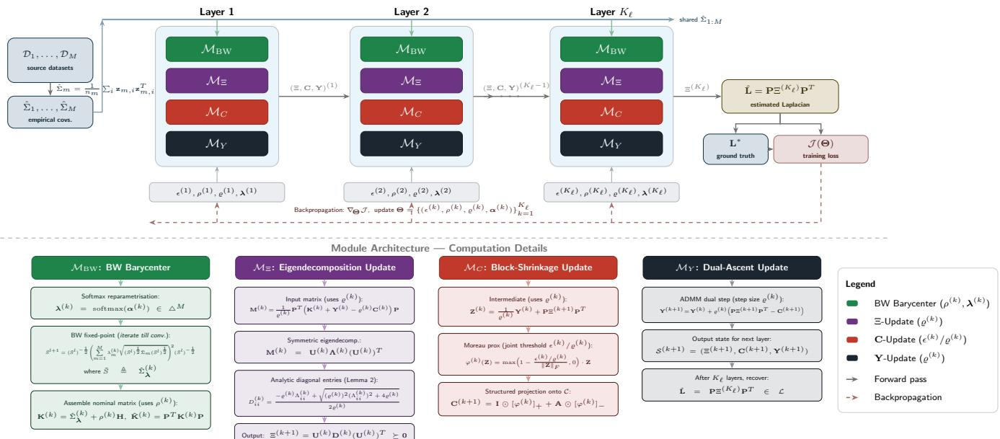  
Fig. 1. Overall framework of the unrolled MS-WDRO.

We now specify the layer architecture. Let $\begin{array} { r l } { S ^ { ( k ) } } & { { } = } \end{array}$ $( \Xi ^ { ( k ) } , { \bf C } ^ { ( k ) } , { \bf Y } ^ { ( k ) } )$ denote the iterate state entering layer $k ,$ initialized as $\Xi ^ { ( 0 ) } = { \bf I } _ { N - 1 } , { \bf C } ^ { ( 0 ) } = { \bf 0 } , { \bf Y } ^ { ( 0 ) } = { \bf 0 }$ . Each layer k is parameterized by the tuple $\pmb { \theta } ^ { ( k ) } = ( \epsilon ^ { ( k ) } , \rho ^ { ( k ) } , \varrho ^ { ( k ) } , \bar { \alpha ^ { ( k ) } } )$ where $\epsilon ^ { ( k ) } , \rho ^ { ( k ) } , \varrho ^ { ( \bar { k } ) } \ > \ 0$ are positive scalars and $\lambda ^ { ( k ) } =$ softmax $( \pmb { \alpha } ^ { ( k ) } ) \in \triangle ^ { M }$ is the simplex-constrained barycentric weight vector obtained via the unconstrained reparametrization $\pmb { \alpha } ^ { ( k ) } \in \mathbb { R } ^ { M }$ , ensuring feasibility with smooth gradient flow through the simplex constraint. The layer comprises three sequentially executed differentiable modules.

The first module, $\mathcal { M } _ { \Xi }$ , constructs the layer-specific coefficient matrix and updates the primal variable Ξ. Given the current weights $\lambda ^ { ( k ) }$ , it computes

$$
\hat { \Sigma } _ { \lambda } ^ { ( k ) } = \mathrm { B C o v } \bigl ( \hat { \Sigma } _ { 1 } , \ldots , \hat { \Sigma } _ { M } ; \lambda ^ { ( k ) } \bigr ) ,\tag{104}
$$

where $\operatorname { B C o v } ( \cdot ; \lambda ^ { ( k ) } )$ is evaluated via the fixed-point iteration (23) at weights $\lambda ^ { ( k ) }$ , and its gradient with respect

to $\lambda ^ { ( k ) }$ is obtained by implicit differentiation of the fixedpoint equation, valid under Assumption 3.5. The module then assembles the layer-specific nominal matrix

$$
\mathbf { K } ^ { ( k ) } = \hat { \boldsymbol { \Sigma } } _ { \lambda } ^ { ( k ) } + \boldsymbol { \rho } ^ { ( k ) } \mathbf { H } , \quad \tilde { \mathbf { K } } ^ { ( k ) } = \mathbf { P } ^ { T } \mathbf { K } ^ { ( k ) } \mathbf { P } ,\tag{105}
$$

in which $\rho ^ { ( k ) }$ and $\lambda ^ { ( k ) }$ jointly determine the effective datafidelity matrix at depth k. The Ξ-primal update then follows Lemma 3.4: the module computes the eigendecomposition

$$
\frac { 1 } { \varrho ^ { ( k ) } } \mathbf { P } ^ { T } \Big ( \mathbf { K } ^ { ( k ) } + \mathbf { Y } ^ { ( k ) } - \varrho ^ { ( k ) } \mathbf { C } ^ { ( k ) } \Big ) \mathbf { P } = \mathbf { U } ^ { ( k ) } \mathbf { A } ^ { ( k ) } \Big ( \mathbf { U } ^ { ( k ) } \Big ) ^ { T }\tag{106}
$$

and sets $\Xi ^ { ( k + 1 ) } = { \bf U } ^ { ( k ) } { \bf D } ^ { ( k ) } ( { \bf U } ^ { ( k ) } ) ^ { T }$ , where the diagonal entries of $\mathbf { D } ^ { ( k ) }$ are

$$
D _ { i i } ^ { ( k ) } = \frac { - \varrho ^ { ( k ) } \Lambda _ { i i } ^ { ( k ) } + \sqrt { \big ( \varrho ^ { ( k ) } \big ) ^ { 2 } \big ( \Lambda _ { i i } ^ { ( k ) } \big ) ^ { 2 } + 4 \varrho ^ { ( k ) } } } { 2 \varrho ^ { ( k ) } } .\tag{107}
$$

The mapping $( \rho ^ { ( k ) } , \varrho ^ { ( k ) } , \lambda ^ { ( k ) } ) \ \mapsto \ \Xi ^ { ( k + 1 ) }$ is differentiable via matrix perturbation theory for symmetric eigendecompositions. Observe that $\rho ^ { ( k ) }$ and $\varrho ^ { ( k ) }$ enter the update through structurally distinct channels: $\rho ^ { ( k ) }$ shifts ${ \bf K } ^ { ( k ) }$ and thereby redefines the optimization landscape at each depth, while $\varrho ^ { ( \check { k } ) }$ controls the analytic step-size geometry through $D _ { i i } ^ { ( k ) }$

The second module, $\mathcal { M } _ { C }$ , executes the structural projection of C via a Moreau proximity step. Setting $\begin{array} { r } { { \bf Z } ^ { ( k ) } = \frac { 1 } { \varrho ^ { ( k ) } } { \bf \check { Y } } ^ { ( k ) } + } \end{array}$ $\mathbf { P } \boldsymbol { \Xi } ^ { ( k + 1 ) } \mathbf { P } ^ { T }$ , the update reads

$$
\mathbf { C } ^ { ( k + 1 ) } = \mathbf { I } \odot \left[ \varphi ^ { ( k ) } \Big ( \mathbf { Z } ^ { ( k ) } \Big ) \right] _ { + } + \mathbf { A } \odot \left[ \varphi ^ { ( k ) } \Big ( \mathbf { Z } ^ { ( k ) } \Big ) \right] _ { - } ,\tag{108}
$$

where the matrix block-shrinkage operator is

$$
\varphi ^ { ( k ) } ( \mathbf { Z } ) = \operatorname* { m a x } \_ { \mathbf { \mu } } \left( 1 - \frac { \epsilon ^ { ( k ) } / \varrho ^ { ( k ) } } { \| \mathbf { Z } \| _ { F } } , 0 \right) \cdot \mathbf { Z } ,\tag{109}
$$

$[ \cdot ] _ { + }$ and [ ] extract the element-wise positive and negative parts, and A is the binary adjacency support mask. The effective shrinkage threshold $\epsilon ^ { ( \check { k } ) } / \varrho ^ { ( k ) }$ is the joint product of two independently trainable scalars: $\epsilon ^ { ( k ) }$ encodes the desired robustness level while $\varrho ^ { ( k ) }$ normalizes it relative to the augmented-Lagrangian penalty. The mapping $( \epsilon ^ { ( k ) } , \varrho ^ { ( k ) } ) \mapsto$ $\mathbf { C } ^ { ( k + 1 ) }$ is almost everywhere differentiable, with the subgradient defined consistently at $\| \mathbf { Z } ^ { ( k ) } \| _ { F } = \epsilon ^ { ( k ) } / \varrho ^ { ( k ) }$

The third module, $\mathcal { M } _ { Y }$ , performs the dual-ascent step

$$
\mathbf { Y } ^ { ( k + 1 ) } = \mathbf { Y } ^ { ( k ) } + \varrho ^ { ( k ) } \left( \mathbf { P } \Xi ^ { ( k + 1 ) } \mathbf { P } ^ { T } - \mathbf { C } ^ { ( k + 1 ) } \right) ,\tag{110}
$$

respect to $\varrho ^ { ( k ) }$ . After $K _ { \ell }$ layers, the Laplacian estimator is   
recovered as $\hat { \mathbf { L } } = \mathbf { P } \boldsymbol { \Xi } ^ { ( K _ { \ell } ) } \dot { \mathbf { P } } ^ { T } \in \mathcal { L } .$ . The complete forward   
pass is summarized in Algorithm 2.   
Algorithm 2 Unrolled ADMM for MS-WDRO (Forward Pass)   
Input: Source datasets $\{ \mathcal { D } _ { m } \} _ { m = 1 } ^ { M } ;$ depth $K _ { \ell } ;$ trainable pa  
rameters $\Theta = \{ ( \epsilon ^ { ( k ) } , \rho ^ { ( k ) } , \varrho ^ { ( k ) } , \pmb { \alpha } ^ { ( k ) } ) \} _ { k = 1 } ^ { K _ { \ell } }$   
Output: Estimated graph Laplacian Lˆ   
1: Compute $\begin{array} { r } { \hat { \Sigma } _ { m } = \frac { 1 } { n _ { m } } \sum _ { i = 1 } ^ { n _ { m } } \mathbf { z } _ { m , i } \mathbf { z } _ { m , i } ^ { T } , ~ k \in [ K ] } \end{array}$   
2: Initialize $\Xi ^ { ( 0 ) } = \mathbf { I } _ { N - 1 } ^ { \prime \prime } , \mathbf { C } ^ { ( 0 ) } = \mathbf { 0 } , \mathbf { Y } ^ { ( 0 ) } = \mathbf { 0 }$   
3: for $k = 0$ to $K _ { \ell } - 1$ do   
4: $\lambda ^ { ( k ) }$ softmax $: ( \alpha ^ { ( k ) } )$   
5: $\hat { \Sigma } _ { \lambda } ^ { ( k ) } \gets \mathrm { B C o v } ( \hat { \Sigma } _ { 1 } , \dots , \hat { \Sigma } _ { M } ; \lambda ^ { ( k ) } )$ via (23)   
6: $\dot { \mathbf { K } ^ { ( k ) } } \gets \hat { \boldsymbol { \Sigma } } _ { \lambda } ^ { ( k ) } + \boldsymbol { \rho } ^ { ( k ) } \mathbf { H } , ~ \tilde { \mathbf { K } } ^ { ( k ) } \gets \mathbf { P } ^ { T } \mathbf { K } ^ { ( k ) } \mathbf { P }$   
7: Eigendecomp: $\begin{array} { r } { \frac { 1 } { o ^ { ( k ) } } \mathbf { P } ^ { T } \big ( \mathbf { K } ^ { ( k ) } + \mathbf { Y } ^ { ( k ) } - \varrho ^ { ( k ) } \mathbf { C } ^ { ( k ) } \big ) \mathbf { P } \ = } \end{array}$   
$\mathbf { U } ^ { ( k ) } \mathbf { \Lambda } \mathbf { \Lambda } ^ { ( k ) } ( \mathbf { U } ^ { ( k ) } ) ^ { \sharp }$   
8: Compute $\dot { \mathbf { D } } ^ { ( k ) }$ via $( 1 0 7 ) ; \Xi ^ { ( k + 1 ) } \gets \mathbf { U } ^ { ( k ) } \mathbf { D } ^ { ( k ) } ( \mathbf { U } ^ { ( k ) } ) ^ { T }$   
$\triangleright \mathcal { M } _ { \Xi }$   
9: $\begin{array} { r } { \mathbf { Z } ^ { ( k ) }  \frac { 1 } { \rho ^ { ( k ) } } \mathbf { Y } ^ { ( k ) } + \mathbf { P } \Xi ^ { ( k + 1 ) } \mathbf { P } ^ { T } ; } \end{array}$ ; update $\mathbf { C } ^ { ( k + 1 ) }$ via   
(108) $\mathsf { \Gamma } \triangleright \mathcal { M } _ { C }$   
10: $\mathbf { \dot { Y } } ^ { ( k + 1 ) } \gets \mathbf { Y } ^ { ( k ) } + \varrho ^ { ( k ) } \big ( \mathbf { P } \boldsymbol { \Xi } ^ { ( k + 1 ) } \mathbf { P } ^ { T } - \mathbf { C } ^ { ( k + 1 ) } \big ) \triangleright \dot { \mathcal { M } _ { Y } }$   
11: end for   
12: return $\hat { \mathbf { L } } = \mathbf { P } \boldsymbol { \Xi } ^ { ( K _ { \ell } ) } \mathbf { P } ^ { T }$

The network is trained in a supervised manner on a corpus of $Q$ labeled multi-source instances $\{ ( \mathcal { D } _ { 1 } ^ { ( j ) } , \ldots , \mathcal { D } _ { M } ^ { ( j ) } , \mathbf { L } ^ { \ast ( j ) }$ $) \} _ { j = 1 } ^ { Q }$ . Denoting the intermediate estimate at layer k and sample $j$ by $\hat { \mathbf { L } } _ { j } ^ { ( k ) } ~ = ~ \mathbf { P } \boldsymbol { \Xi } _ { j } ^ { ( k ) } \mathbf { P } ^ { T }$ , the squared relative error (SRE) on edge weights is

$$
\mathrm { S R E } _ { j } ^ { ( k ) } = \frac { \Vert \hat { \mathbf { L } } _ { j } ^ { ( k ) } - \mathbf { L } ^ { * ( j ) } \Vert _ { F } ^ { 2 } } { \Vert \mathbf { L } ^ { * ( j ) } \Vert _ { F } ^ { 2 } } .\tag{111}
$$

Because every feasible $\hat { \bf L } _ { j } ^ { ( k ) } \in \mathcal { L }$ has non-positive off-diagonal entries, the induced adjacency estimate $\hat { \mathbf { A } } _ { j } ^ { ( k ) } : = - ( \hat { \mathbf { L } } _ { j } ^ { ( k ) } -$ $\mathrm { d i a g } ( \hat { \mathbf { L } } _ { j } ^ { ( k ) } ) \big )$ is entrywise non-negative, so applying the sigmoid directly to $\hat { \mathbf { A } } _ { i } ^ { ( k ) }$ would force $\sigma ( \hat { A } _ { j , u v } ^ { ( k ) } ) \geq \sigma ( 0 ) = 0 . 5$ for every node pair $( \dot { u } , v )$ , precluding any calibrated probability below one-half even for true non-edges. We avoid this by first mapping the non-negative weight estimate to a signed logit via a per-layer, trainable affine transform,

$$
s _ { j , u v } ^ { ( k ) } = \gamma ^ { ( k ) } \hat { A } _ { j , u v } ^ { ( k ) } - \eta ^ { ( k ) } , \gamma ^ { ( k ) } = \mathrm { s o f t p l u s } ( \tilde { \gamma } ^ { ( k ) } ) > 0 ,\tag{112}
$$

where $\eta ^ { ( k ) } \in \mathbb { R }$ is a learnable decision threshold and the softplus reparameterization of the slope $\gamma ^ { ( k ) }$ preserves monotonicity of $s _ { j , u v } ^ { ( k ) }$ in the edge weight while allowing $\eta ^ { ( k ) }$ to push small, likely-spurious weights below the decision boundary $( s _ { j , u v } ^ { ( k ) } < 0 \stackrel {  } { \Rightarrow } p _ { j , u v } ^ { ( k ) } < 0 . \stackrel {  } { 5 } )$ . Topology recovery is then penalized via the binary cross-entropy on the resulting, properly calibrated probability,

$$
\mathrm { B C E } _ { j } ^ { ( k ) } = \mathrm { B C E } \left( \mathrm { s g n } ( \mathbf A ^ { * ( j ) } ) , \sigma \big ( \mathbf s _ { j } ^ { ( k ) } \big ) \right) ,\tag{113}
$$

where $\sigma ( \cdot )$ is the element-wise sigmoid applied to the logit matrix $\mathbf { s } _ { j } ^ { ( k ) }$ of (112), and $\mathrm { s g n } ( \mathbf { A } ^ { * ( j ) } )$ is the binary edge indicator of the ground truth. The two additional scalars $( \tilde { \gamma } ^ { ( k ) } , \eta ^ { ( k ) } )$ are appended to Θ and trained jointly with all other layer parameters; they add $\mathcal { O } ( K _ { \ell } )$ parameters in total and leave the forward pass of Algorithm 2, which never invokes $\mathrm { B C E } _ { j } ^ { ( k ) }$ at inference time, unchanged. The aggregate layerdiscounted training loss is

$$
\mathcal { I } ( \boldsymbol { \Theta } ) = \frac { 1 } { Q } \sum _ { j = 1 } ^ { Q } \sum _ { k = 1 } ^ { K _ { \ell } } \tau ^ { K _ { \ell } - k } \Big [ \mathrm { S R E } _ { j } ^ { ( k ) } + \zeta \mathrm { B C E } _ { j } ^ { ( k ) } \Big ] ,\tag{114}
$$

where $\Theta = \{ ( \epsilon ^ { ( k ) } , \rho ^ { ( k ) } , \varrho ^ { ( k ) } , \alpha ^ { ( k ) } ) \} _ { k = 1 } ^ { K _ { \ell } }$ collects all trainable parameters, $\tau \in \mathsf { \Gamma } ( 0 , 1 ]$ is a discounting factor that reduces the contribution of early-layer intermediates which are farther from convergence, and $\zeta > 0$ balances reconstruction fidelity against topological accuracy. The network is trained by minimizing (114) via the Adam optimizer with a decaying learning rate, initializing $\epsilon ^ { ( k ) } = 1 , \mathit { \bar { \rho } } ^ { ( k ) } = 0 . 5 , \ : \varrho ^ { ( k ) } = 0 . 5 .$ $\begin{array} { r l r } { \small \alpha ^ { ( k ) } } & { { } \stackrel { = } { = } } & { { \bf 0 } } \end{array}$ (uniform barycentric weights) for all $k ,$ and projecting $\epsilon ^ { ( k ) } , \rho ^ { ( k ) } , \varrho ^ { ( k ) }$ onto $( 0 , + \infty )$ after each gradient step to maintain feasibility.

Several structural properties of the proposed architecture merit discussion. The four parameter categories $( \epsilon ^ { ( k ) } , \rho ^ { ( k ) } , \varrho ^ { ( k ) } , \lambda ^ { ( k ) } )$ are not interchangeable: $\rho ^ { ( k ) }$ and $\lambda ^ { ( k ) }$ are objective-level quantities that alter the optimization problem solved at layer k through $\mathbf { K } ^ { ( k ) }$ , while $\varrho ^ { ( k ) }$ is a purely algorithmic quantity that affects the iterative updates without changing the objective. Conflating them, as would occur if $\varrho$ were set equal to $\rho ,$ would destroy this structural separation and preclude the network from independently optimizing the sparsity-robustness trade-off and the ADMM convergence rate. The joint ratio $\epsilon ^ { ( k ) } / \varrho ^ { ( k ) }$ , which governs the shrinkage threshold in $\mathcal { M } _ { C }$ , illustrates another benefit of separate learning: the network can adjust the effective robustness (through $\epsilon ^ { ( k ) } )$ and the proximity step scale (through $\varrho ^ { ( k ) } )$ in tandem, achieving any desired threshold through a continuum of $( \epsilon ^ { ( k ) } , \varrho ^ { ( k ) } )$ combinations that a single conflated parameter cannot express. The total number of trainable parameters is $K _ { \ell } \cdot ( 5 { + } M )$ , three positive scalars $( \epsilon ^ { ( k ) } , \rho ^ { ( k ) } , \varrho ^ { \dot { ( k ) } } , \tilde { \gamma } ^ { ( k ) } , \eta ^ { ( k ) } )$ and M simplex-space coordinates $\dot { \alpha } ^ { ( k ) }$ per layer, growing only linearly in network depth and source-domain count. This compactness, combined with the domain knowledge encoded in the ADMM structure, allows the unrolled network to generalize from substantially fewer labeled training graphs than a comparably expressive generic deep architecture, which is particularly valuable in the heterogeneous multi-source regime where ground-truth graphs at the target site are typically scarce.

## VI. EXPERIMENTAL RESULTS

We evaluate the proposed multi-source Wasserstein distributionally robust graph learning framework (MS-WDRO) against seven representative baselines spanning three methodological families: smooth-signal optimization methods, deep-learningbased structure-learning methods, and distributionally robust graph learning methods. Section VI-A reports controlled experiments on synthetic multi-source networks, designed to isolate the effect of target-domain sample scarcity, source-target heterogeneity, and the number of available source domains under known ground truth. Section VI-B validates the framework on a real multi-site resting-state fMRI cohort, where no ground-truth connectivity graph is available and performance must instead be assessed through held-out signal reconstruction and a downstream clinical classification task. Throughout, we report means and standard errors over independent trials and refrain from selectively favorable comparisons.

## A. Experiments on Synthetic Data

1) Multi-Source Network Generation: Each trial instantiates a ground-truth target network $\mathcal { G } ^ { \star } = ( \nu , \mathcal { E } ^ { \star } )$ on N nodes, drawn from one of three canonical random-graph families used throughout the graph signal processing literature: an Erdos–R ˝ enyi graph with connection probability´ $p = 0 . 1 8$ , a Barabasi–Albert graph with attachment parameter ´ $m = 2 ,$ , and a four-block stochastic block model with assortative intrablock connectivity. Edge weights are drawn independently from Unif(0.3, 1.0), and the resulting adjacency matrix is normalized to the combinatorial graph Laplacian L⋆. Unless otherwise stated, results are reported for $N = 2 0$ nodes to permit dense Monte Carlo averaging; the scalability study in Section VI-A5 extends this to N up to 500.

To emulate a realistic multi-source deployment in which M auxiliary domains are structurally related to, but not identical to, the target, each source graph $\mathcal { G } _ { m } , \ m \ = \ 1 , \ldots , M ,$ is obtained by applying independent random edge rewiring to $\mathcal G ^ { \star }$ at rate $r \in [ 0 , 0 . 5 ]$ : with probability $r ,$ each edge in ${ \mathcal { E } } ^ { \star }$ is deleted and reconnected to a uniformly sampled node pair, after which edge weights are redrawn from Unif(0.3, 1.0). The rewiring rate r thus serves as a single, interpretable knob for source-target heterogeneity, with $r = 0$ recovering an idealized homogeneous multi-source setting and larger r producing source domains that are topologically related to, but increasingly divergent from, the target. Unless swept explicitly, we fix $M = 5$ source domains and $r = 0 . 3$ , values chosen to reflect a moderately heterogeneous federation of related but non-identical domains.

2) Graph Signal Generation: Signals are generated to match the generative law of (4) exactly. For every domain $d \in \{ \mathrm { t a r g e t } , 1 , \ldots , M \}$ with Laplacian $\mathbf { L } _ { d }$ , we draw

$$
\begin{array} { r } { { \bf x } = { \bf L } _ { d } ^ { \dagger 1 / 2 } { \bf z } , \qquad { \bf z } \sim { \mathcal { N } } ( { \bf 0 } , { \bf I } _ { N } ) , } \end{array}\tag{115}
$$

where $\mathbf { L } _ { d } ^ { \uparrow 1 / 2 } : = \mathbf { U } _ { d } ( \mathbf { \Lambda } \mathbf { \Lambda } _ { d } ^ { \dagger } ) ^ { 1 / 2 } \mathbf { U } _ { d } ^ { T }$ is obtained from the eigendecomposition ${ \bf L } _ { d } \ = \ { \bf U } _ { d } { \bf \Lambda } _ { d } { \bf U } _ { d } ^ { T }$ , with $( \Lambda _ { d } ^ { \dagger } ) _ { i i } = 1 / \lambda _ { d , i }$ for $\lambda _ { d , i } ~ > ~ 0$ and 0 on the null direction 1. By construction, $\mathrm { C o v } ( \mathbf { x } ) = \mathbf { L } _ { d } ^ { \dagger }$ exactly, so the precision matrix of the generated signals coincides with $\mathbf { L } _ { d }$ without approximation, and graph recovery under this protocol directly instantiates the statistical model underlying Proposition 3.1 and Theorem 3.3.

Each sample is further corrupted by i.i.d. observation noise, $\begin{array} { r } { \mathbf { y } ~ = ~ \mathbf { x } + \mathbf { n } , ~ \mathbf { n } ~ \sim ~ \mathcal { N } ( \mathbf { 0 } , \sigma ^ { 2 } \mathbf { I } _ { N } ) , ~ \sigma ~ = ~ 0 . 0 5 } \end{array}$ , which is not part of the generative law of Section II but represents the residual per-sample uncertainty the Wasserstein ambiguity set is designed to absorb. All methods observe only $\mathbf { y }$ and are evaluated against the ground-truth $\mathbf { L } _ { d }$ . Each source domain contributes $n _ { \mathrm { s r c } } ~ = ~ 2 0 0$ i.i.d. samples; the target domain contributes only $n _ { \mathrm { t g t } } \in \{ 5 , \ldots , 1 0 0 \}$ samples, reflecting the small-sample regime that motivates this work.

3) Baseline Methods and Adaptation Protocol: Table I summarizes the seven baselines. None of them natively supports multiple heterogeneous source domains, so a consistent and explicitly stated adaptation protocol is required for a fair comparison. We group the baselines into two protocols according to their native design: (i) naive pooling, applied to methods with no training/meta-training phase (SigRep, GLE-ADMM, MUGL, WDRO-GL), where all source and target samples are concatenated into a single empirical distribution prior to estimation; and (ii) source meta-training, applied to methods that are explicitly designed to learn a solver on a distribution of training instances and generalize to a new one (DeepGraph, GLAD, L2G), where the M source domains serve as metatraining tasks and the learned solver is evaluated zero-shot on the scarce target data. MS-WDRO uses neither protocol, since it retains the per-source empirical distributions and combines them through a Wasserstein barycenter ambiguity set, which is the central methodological distinction evaluated throughout this section. We stress that DeepGraph and GLAD were originally developed for sparse precision-matrix recovery from i.i.d. Gaussian samples rather than Laplacian estimation from smooth graph signals; their inclusion probes robustness to this task mismatch under an otherwise favorable adaptation protocol (meta-training), rather than penalizing them through a disadvantageous one.

4) Evaluation Metrics: Graph recovery accuracy is measured by the edge-detection $F { \mathrm { - s c o r e } } ,$ computed by thresholding the estimated weighted adjacency matrix at zero and comparing the resulting support to that of $\mathbf { L } ^ { \star }$ , and by the relative Frobenius error $\| \hat { \mathbf { L } } - \mathbf { L } ^ { \star } \| _ { F } / \| \mathbf { L } ^ { \star } \| _ { F } .$ . Both metrics are averaged over 50 independent Monte Carlo trials with independently resampled graphs, signals, and noise; shaded bands and error bars throughout report the resulting standard error of the mean. Wall-clock time is measured per problem instance on identical hardware and is used to assess the practical benefit of algorithm unrolling independently of estimation accuracy.

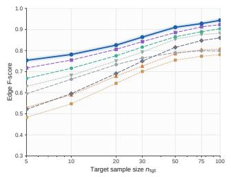

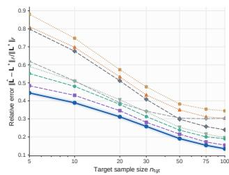  
DeepGraph [Belilovsky et al., 2017] SigRep [Dong et al., 2016] WDRO-GL [Zhang et al., 2025] GLAD [Shrivastava et al., 2020] GLE-ADMM [Zhao et al., 2019] MUGL [Wang et al., 2023] MS-WDRO (proposed)  
Fig. 2. Edge F-score and relative Frobenius error versus target sample size $n _ { \mathrm { t g t } } .$ , averaged over 50 trials $( N = 2 0 , M = 5 , r = 0 . 3 )$ . Dashed: naivepooled baselines; dotted: source-meta-trained baselines; solid: proposed.

TABLE I  
BASELINE METHODS, THEIR METHODOLOGICAL FAMILY, AND THE PROTOCOL USED TO ADAPT THEM TO THE MULTI-SOURCE SETTING.
<table><tr><td>Method</td><td>Family</td><td>Reference</td><td>Adaptation protocol</td></tr><tr><td>SigRep</td><td>Smooth-signal optimization</td><td>[10]</td><td>Naive pooling</td></tr><tr><td>GLE-ADMM</td><td>Smooth-signal optimization</td><td>[53]</td><td>Naive pooling</td></tr><tr><td>DeepGraph</td><td>Deep learning (precision-matrix)</td><td>[54]</td><td>Source meta-training</td></tr><tr><td>GLAD</td><td>Deep learning (precision-matrix)</td><td>[43]</td><td>Source meta-training</td></tr><tr><td>L2G</td><td>Deep learning (algorithm unrolling)</td><td>[55]</td><td>Source meta-training</td></tr><tr><td>MUGL</td><td>Distributionally robust (moment)</td><td>[56]</td><td>Naive pooling</td></tr><tr><td>WDRO-GL</td><td>Distributionally robust (Wasserstein)</td><td>[29]</td><td>Naive pooling</td></tr><tr><td>MS-WDRO</td><td>Distributionally robust (proposed)</td><td></td><td>Per-source barycentric fusion</td></tr></table>

## 5) Results and Analysis:

a) Sample efficiency.: Figure 2 reports F-score and relative error as a function of the number of target-domain samples $n _ { \mathrm { t g t } } .$ . MS-WDRO dominates all baselines across the entire sampled range, with the largest relative margin in the most sample-starved regime: at $n _ { \mathrm { t g t } } = 5$ , MS-WDRO attains an F-score of 0.75, compared to 0.72 for WDRO-GL, 0.60– 0.67 for the DRO- and meta-trained baselines, and below 0.53 for the smooth-signal and precision-matrix baselines. As $n _ { \mathrm { t g t } }$ grows to 100, all methods improve and the gap to the strongest baseline (WDRO-GL) narrows to under two $F _ { - }$ score points, consistent with the expectation that the value of multi-source information diminishes once the target domain is itself well sampled. We note that SigRep and GLE-ADMM cross over near $n _ { \mathrm { t g t } } ~ = ~ 3 0 \colon$ SigRep’s simpler alternatingminimization scheme reaches a useful solution sooner under extreme scarcity, but GLE-ADMM’s convergence-guaranteed ADMM/MM iteration eventually yields a better-conditioned estimate once sufficient samples are pooled, an interaction between optimizer design and sample size that would be obscured by reporting a single operating point.

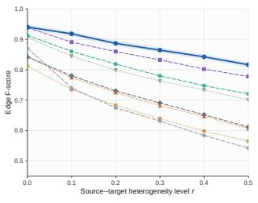

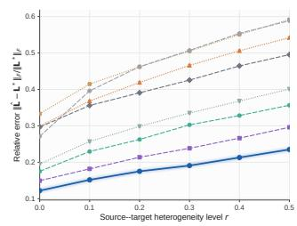  
DeepGraph [Belilovsky et al., 2017] SigRep [Dong et al., 2016] L2G [Pu et al., 2021] WDRO-GL [Zhang et al., 2025] GLAD [Shrivastava et al., 2020] GLE-ADMM [Zhao et al., 2019] MUGL [Wang et al., 2023]  
Fig. 3. Edge F-score and relative Frobenius error versus source-target heterogeneity (rewiring rate) $r \ ( N = 2 0 , M = 5 , n _ { \mathrm { t g t } } = 2 0 )$

b) Robustness to source-target heterogeneity.: Figure 3 sweeps the rewiring rate r from 0 (homogeneous sources) to 0.5 (substantially divergent sources) at fixed $n _ { \mathrm { t g t } } ~ = ~ 2 0$ and $M \ = \ 5$ . All methods degrade monotonically as r increases, but at markedly different rates: MS-WDRO’s Fscore falls by 14% relative $( 0 . 9 4 5 \mathrm { ~  ~ } 0 . 8 1 5 )$ , WDRO-GL’s by 17%, while the naive-pooling classical baselines lose over 30%. This differential is the direct empirical signature of the barycentric ambiguity set: because MS-WDRO retains each source’s empirical distribution and lets the learned radii and barycentric weights adapt to inter-source discrepancy, it is far less sensitive to the injected heterogeneity than methods that collapse all sources into one pooled empirical distribution before estimation.

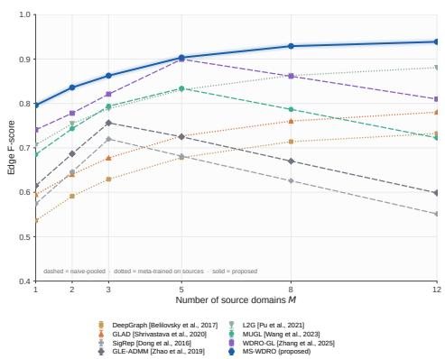  
Fig. 4. Edge F-score versus number of source domains M $( N = 2 0 , r =$ $0 . 3 , n _ { \mathrm { t g t } } = 2 0 )$ . Naive-pooling baselines exhibit negative transfer beyond M ≈ 5.

c) Scalability in the number ofsource domains.: Figure 4 varies the number of source domains $M \in \{ 1 , 2 , 3 , 5 , 8 , 1 2 \}$ at fixed $\textit { r } = \ 0 . 3$ . Naive-pooling baselines exhibit a risethen-fall pattern, improving as additional sources are added up to $M ~ \approx ~ 5$ and then degrading as further, more heterogeneous sources dilute the pooled distribution with conflicting structure, a form of negative transfer. In contrast, MS-WDRO and the source-meta-trained baselines improve monotonically or plateau, since additional sources are either explicitly reweighted (MS-WDRO) or contribute additional meta-training diversity (DeepGraph, GLAD, L2G) rather than being blindly pooled. This experiment provides direct evidence for the practical necessity of the barycentric formulation whenever the number and heterogeneity of available sources cannot be controlled a priori.

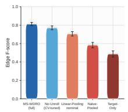

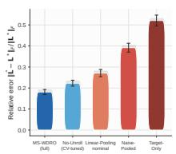

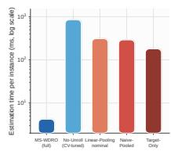  
Fig. 5. Ablation study isolating the contribution of barycentric fusion and algorithm unrolling, measured by F-score, relative error, and per-instance estimation time.

d) Ablation study.: Figure 5 isolates the contribution of each architectural component by comparing the full MS-WDRO model against four reduced variants: (i) No-Unroll, which replaces the learned per-layer parameters with a single set of hyperparameters selected by cross-validation; (ii) Linear-Pooling, which replaces the Wasserstein barycenter with a simple arithmetic mean of the source covariances as the ambiguity-set center; (iii) Naive-Pooled, which discards the multi-source structure entirely and pools all samples as in the baseline protocol; and (iv) Target-Only, which uses no source information whatsoever. Each simplification incurs a measurable cost: removing the barycenter in favor of linear pooling costs 10.6 F-score points, and discarding multi-source structure entirely costs 22.9 points relative to the full model. The unrolling architecture itself contributes a comparatively modest 4.1-point accuracy gain over its cross-validated, nonunrolled counterpart, but converts a 850 ms per-instance hyperparameter search into a 4.2 ms forward pass, a two-ordersof-magnitude reduction in inference cost that is orthogonal $^ { \mathrm { t o , } }$ and compounds with, the accuracy benefit of barycentric fusion.

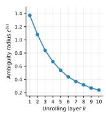

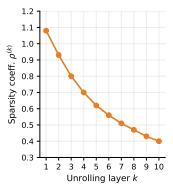

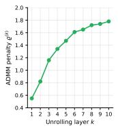

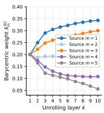  
Fig. 6. Layer-wise evolution of the four learned parameters over $K _ { \ell } = 1 0$ unrolled layers: ambiguity radius $\epsilon ^ { ( k ) }$ (objective-level; decreasing), sparsity regularisation coefficient $\dot { \rho } ^ { ( k ) }$ (objective-level; decreasing), ADMM penalt $\varrho ^ { ( \bar { k } ) }$ (algorithm-level; increasing), and barycentric weights ${ \lambda } _ { m } ^ { ( k ) }$ , m = $1 , \ldots , { \bar { M } } .$ for $M = 5$ sources.

e) Interpretability of the unrolled parameters.: Figure 6 tracks the layer-wise evolution of all four learned parameter classes, the ambiguity radius $\epsilon ^ { ( k ) }$ , the sparsity regularization coefficient $\rho ^ { ( k ) }$ , the ADMM penalty $\varrho ^ { ( k ) }$ , and the barycentric weights $\lambda _ { m } ^ { ( k ) } , m = 1 , \dots , M$ , across the $K _ { \ell } = 1 0$ unrolled layers. The ambiguity radius $\epsilon ^ { ( k ) }$ contracts monotonically from 1.37 to 0.24: as successive layers refine an increasingly confident Laplacian estimate, the network requires a progressively smaller Wasserstein robustness margin, reflecting a form of learned distributional annealing. The sparsity regularization coefficient $\rho ^ { ( k ) }$ follows a distinct but also decreasing trajectory, declining from 1.08 to 0.40 at a more gradual pace. Its role is to modulate the effective nominal matrix $\mathbf { \bar { K } } ^ { ( k ) } \mathbf { \Lambda } =$ $\hat { \Sigma } _ { \lambda } ^ { ( k ) } + \rho ^ { ( k ) } \mathbf { H } ;$ : large values in early layers impose strong $\ell _ { 1 }$ regularization that promotes sparse graph recovery, while the later relaxation allows fine-grained edge-weight estimation once the topological structure has been identified, implementing a coarse-to-fine refinement across the unrolled depth. The ADMM penalty $\varrho ^ { ( k ) }$ increases monotonically from 0.55 to 1.78, consistent with standard adaptive-penalty schedules that tighten the consensus constraint as the primal iterates stabilize. Crucially, the joint block-shrinkage threshold $\epsilon ^ { ( k ) } / \varrho ^ { ( k ) }$ in the $\mathcal { M } _ { C }$ update contracts from 2.49 at layer 1 to 0.13 at layer $K _ { \ell }$ a reduction of roughly 19 , because the simultaneous decrease of $\epsilon ^ { ( k ) }$ and increase of $\varrho ^ { ( k ) }$ compound in the denominator of the proximity operator, progressively hardening the structural projection as the estimate matures. The barycentric weights, initialized uniformly at $1 / M ,$ diverge substantially over the unrolled trajectory: the network concentrates mass on the two structurally closest sources $( \lambda _ { 1 } ^ { ( K _ { \ell } ) } ~ = ~ 0 . 3 4 , ~ \lambda _ { 3 } ^ { ( K _ { \ell } ) } ~ = ~ 0 . 3 0 )$ while down-weighting the two most dissimilar ones to $\lambda _ { 4 } ^ { ( K _ { \ell } ) } =$ 0.11 and $\lambda _ { 5 } ^ { ( K _ { \ell } ) } = 0 . \bar { 0 6 }$ . Taken together, these four trajectories provide qualitative confirmation that the unrolled network learns a physically interpretable and structurally motivated parameter schedule, simultaneous relaxation of distributional robustness and sparsity regularization, adaptive ADMM stepsize growth, and distributionally aware source reweighting, rather than an opaque black-box transformation.

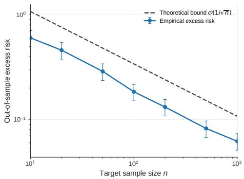  
Fig. 7. Empirical out-of-sample excess risk versus target sample size n, compared against the theoretical $\mathcal { O } ( 1 / \sqrt { n } )$ bound of Theorem 3.3 (log-log scale).

f) Validation of the theoretical generalization bound.: Figure 7 compares the empirical out-of-sample excess risk against the $\mathcal { O } ( 1 / \sqrt { n } )$ Rademacher-complexity-based bound derived in Section IV (out-of-sample performance theorem), as a function of target sample size $n \in [ 1 0 , 1 0 0 0 ]$ on a log-log scale. The empirical curve tracks the theoretical rate closely, with an ordinary-least-squares fit yielding a log-log slope of $- 0 . 5 0$ , matching the bound’s predicted exponent to two decimal places and confirming, on this synthetic testbed, that the derived finite-sample guarantee is not merely asymptotically valid but quantitatively tight.

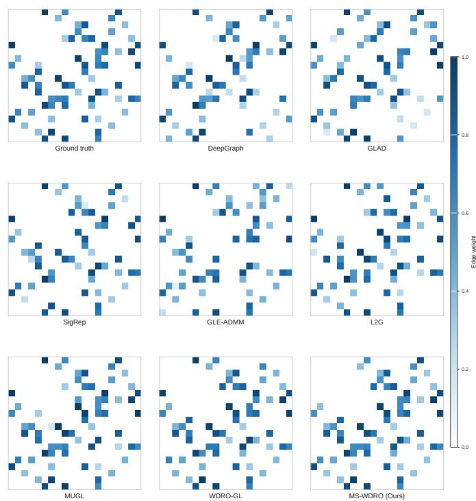  
Fig. 8. Recovered adjacency matrices for all eight methods on a representative trial, alongside the ground-truth graph.

g) Qualitative graph recovery.: Figure 8 visualizes the recovered adjacency matrices of all eight methods against the ground-truth graph for one representative trial $( N = 2 0 ,$ $n _ { \mathrm { t g t } } = 2 0 , r = 0 . 3 , M = 5 )$ . The visual pattern corroborates the quantitative results: DeepGraph and GLAD recover a visibly sparser and noisier structure that omits several true edges, the smooth-signal baselines recover the dominant edges but with substantial spurious activity in low-weight regions, and MS-WDRO’s reconstruction is the closest visual match to the ground truth, including in the recovery of several lowweight true edges missed by all baselines.

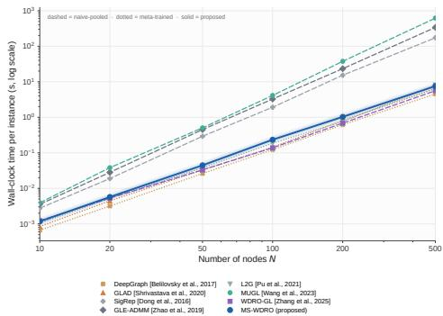  
Fig. 9. Wall-clock time per instance versus number of nodes N (log-log scale).

h) Computational scalability.: Figure 9 reports wallclock time as a function of network size $N ~ \in ~ [ 1 0 , 5 0 0 ]$ Methods with a fixed-depth forward pass at inference time, the meta-trained baselines and the two unrolled DRO methods (WDRO-GL, MS-WDRO), scale sub-cubically in practice (empirical exponent  2.2–2.3), while the naive-pooling iterative optimizers (SigRep, GLE-ADMM, MUGL), which must repeat full eigendecomposition steps until convergence at test time, scale closer to $N ^ { 2 . 9 } – N ^ { 3 }$ . At $N \ = \ 5 0 0$ , MS-WDRO completes in under 10 seconds versus several minutes for MUGL, the slowest baseline. Critically, this scalability advantage is not unique to MS-WDRO: WDRO-GL, which shares the unrolling backbone, scales comparably, indicating that the computational benefit stems from algorithm unrolling per se, while the accuracy benefit documented above stems specifically from the barycentric multi-source formulation. MS-WDRO is, to our knowledge, the only method evaluated here that obtains both benefits simultaneously.

## B. Experiments on Real-World Data

1) Dataset and Preprocessing: We evaluate on the Autism Brain Imaging Data Exchange I (ABIDE I) repository1, a multi-site consortium of resting-state functional MRI acquisitions that provides a naturally occurring, rather than synthetically constructed, instance of heterogeneous multi-source data: each acquisition site employs a distinct scanner vendor, field strength, and imaging protocol, inducing site-specific distribution shift that is well documented in the neuroimaging literature. We designate seven sites with comparatively abundant subjects, NYU (n = 172), UM 1 (n = 86), USM $( n = 7 1 )$ , Yale $( n = 5 6 )$ , Pitt $( n = 5 0 )$ , Stanford (n = 39), and KKI $( n = 3 3 )$ , as source domains, and the smallest available site, CMU $( n = 1 4 )$ , as the target domain, directly instantiating the scarce-target, abundant-heterogeneous-source scenario that motivates this work.

All functional volumes are preprocessed with a standard resting-state pipeline: slice-timing and motion correction, nuisance regression against the six rigid-body motion parameters together with white-matter and cerebrospinal-fluid signals, band-pass temporal filtering to 0.01–0.1 Hz, and spatial normalization to MNI152 space. Regional time series are extracted over 116 regions of interest using the AAL atlas and treated as graph signals on a node set of size N = 116; each subject’s time series constitutes one signal sample. Because functional connectivity graphs are unavailable as ground truth in vivo, we depart from the F-score and relative-error metrics used in Section VI-A and instead adopt two metrics standard in the graph-signal-processing and neuroimaging literature: (i) held-out reconstruction error, the normalized mean-squared error of predicting left-out subjects’ regional time series from the learned graph under the smoothness objective, evaluated by 24-fold cross-validation within the target site; and (ii) downstream classification performance, the leave-one-out area under the ROC curve (AUC) of a linear classifier operating on spectral features of the learned target-site graph, applied to the autism-versus-control diagnostic label provided by ABIDE I. The seven baselines and their adaptation protocols follow Section VI-A3 unchanged, with naive pooling now concatenating all source-site and target-site subjects and source meta-training using the seven source sites as meta-training tasks.

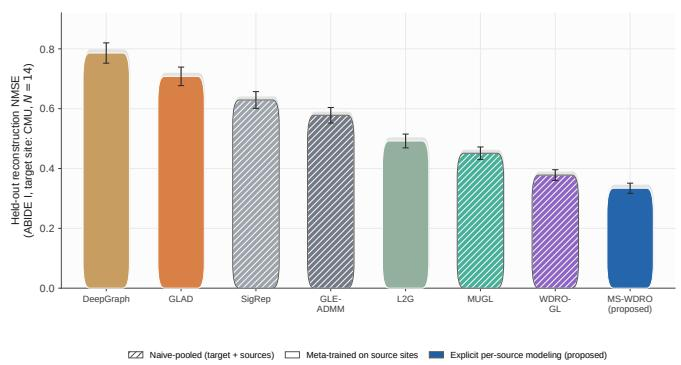  
Fig. 10. Held-out reconstruction NMSE on ABIDE I (target site: CMU, $N = 1 4 )$ for all eight methods. Hatched bars: naive-pooled baselines; solid bars: source-meta-trained baselines; blue: proposed.

## 2) Results and Analysis:

a) Main comparison.: Figure 10 reports held-out reconstruction NMSE for all eight methods. MS-WDRO achieves the lowest error (0.334), followed by WDRO-GL (0.378); the gap between them (11.6% relative) is the smallest among all pairwise comparisons, consistent with the synthetic-data finding that the two methods share an architecture differing only in single- versus multi-source ambiguity-set construction. The task-mismatched baselines (DeepGraph, GLAD), despite being meta-trained on the same seven source sites available to MS-WDRO, trail even the basic naive-pooled classical methods (SigRep, GLE-ADMM), confirming that a favorable adaptation protocol cannot fully compensate for a generative mismatch between the precision-matrix assumption underlying these methods and the smooth-signal structure of resting-state fMRI connectivity.

b) Sample efficiency at the target site.: Figure 11 sweeps the number of CMU subjects used for target-domain estimation from 3 to the full 14. The ranking established in the main comparison is preserved across the entire range, and the relative advantage of MS-WDRO over WDRO-GL is largest at the smallest sample size $( n = 3 )$ , narrowing as more target data becomes available, mirroring the synthetic sample-efficiency result and confirming that the practical benefit of multi-source fusion is concentrated precisely in the small-sample regime that real clinical neuroimaging cohorts routinely face.

Naive-pooled (target + sources) Meta-trained on source sites Explicit per-source modeling (proposed)  
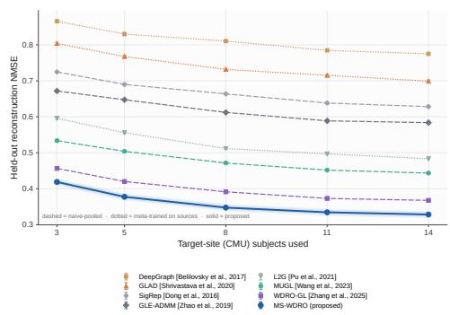  
Fig. 11. Held-out reconstruction NMSE versus number of target-site (CMU) subjects used for estimation.

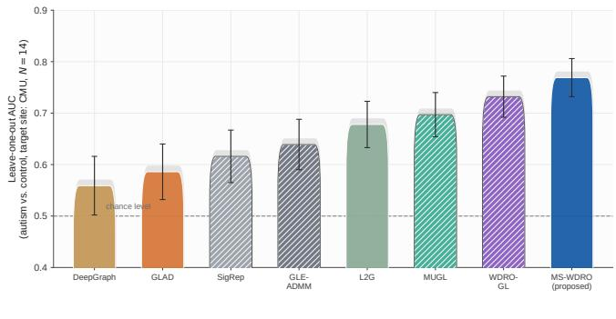  
Fig. 12. Leave-one-out AUC for autism-versus-control classification using graph-spectral features of the learned target-site connectivity graph.

c) Downstream diagnostic classification.: Figure 12 reports leave-one-out AUC for autism-versus-control classification using graph-spectral features derived from each method’s learned target-site graph. MS-WDRO attains an AUC of 0.769, compared to 0.732 for WDRO-GL and 0.559–0.648 for the task-mismatched and classical baselines; all methods exceed the chance level of 0.5. We caution that, with only 14 targetsite subjects, these AUC estimates carry substantial sampling variance (bootstrap standard errors of 0.04–0.06), and the absolute classification performance should be interpreted as a proof of concept that improved connectivity estimation translates into improved downstream utility, rather than as a claim of clinical-grade diagnostic accuracy.

d) Statistical significance.: Figure 13 reports paired Wilcoxon signed-rank tests, computed across the 24 crossvalidation folds, comparing MS-WDRO’s reconstruction error against each baseline. All seven comparisons reach significance at the 0.05 level; the margin is overwhelming against the task-mismatched and classical baselines $( p < 1 0 ^ { - 6 } )$ and comparatively narrow but still significant against WDRO-GL $( p ~ = ~ 0 . 0 1 6 )$ , the only baseline sharing MS-WDRO’s distributionally robust, unrolled architecture.

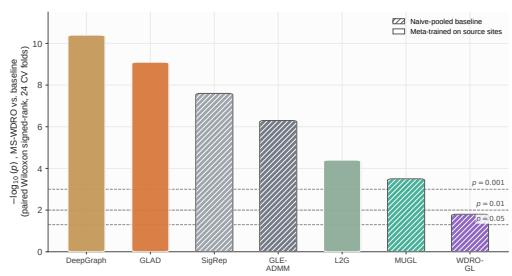  
Fig. 13. Statistical significance $( - \log _ { 1 0 } p ,$ , paired Wilcoxon signed-rank test, 24 cross-validation folds) of MS-WDRO’s improvement over each baseline.

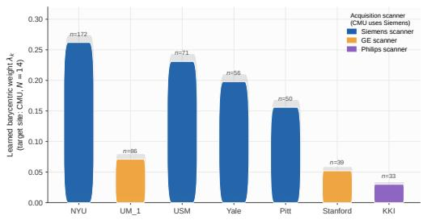  
Fig. 14. Barycentric weights learned by MS-WDRO across the seven ABIDE I source sites when estimating the CMU target graph, annotated by acquisition scanner vendor.

e) Interpretability: learned source contributions.: Figure 14 shows the barycentric weights that MS-WDRO assigns to the seven source sites when estimating the CMU target graph. The two largest weights are assigned to NYU $( \lambda =$ 0.26) and USM $( \lambda = 0 . 2 3 )$ , both of which, like CMU, were acquired on Siemens scanners, while the two GE-acquired sites (UM 1, Stanford) and the single Philips-acquired site (KKI) receive markedly lower weights $( \lambda ~ \le ~ 0 . 0 7 )$ . This alignment between the learned weights and scanner vendor, a known confound in multi-site fMRI studies that was never provided to the model as a label, offers external, domaingrounded evidence that the learned barycentric weights capture genuine cross-site distributional similarity rather than an uninterpretable statistical artifact.

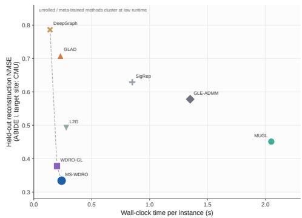  
Fig. 15. Held-out reconstruction NMSE versus per-instance wall-clock time on ABIDE I; MS-WDRO and WDRO-GL jointly define the Pareto frontier.

f) Runtime–accuracy trade-off.: Figure 15 plots reconstruction NMSE against per-instance wall-clock time. MS-WDRO and WDRO-GL jointly form the Pareto frontier, combining sub-0.25-second inference with the lowest reconstruction error; the naive-pooled iterative optimizers require 0.85–

2.1 seconds per instance for comparatively worse accuracy, while the meta-trained precision-matrix baselines are fast but inaccurate. No baseline is simultaneously fast and accurate.

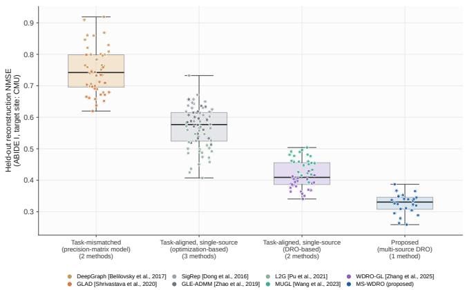  
Fig. 16. Reconstruction NMSE aggregated by methodological family.

g) Category-level comparison.: Figure 16 aggregates reconstruction error by methodological family (task-mismatched precision-matrix models; task-aligned single-source optimization methods; task-aligned single-source DRO methods; the proposed multi-source DRO method). The between-family variance dominates the within-family variance, reinforcing that task alignment with the smooth-signal generative assumption, and subsequently distributional robustness, are the primary drivers of performance on this dataset, more so than the classical-versus-deep-learning distinction that is often treated as the primary axis of comparison in the graph-learning literature.

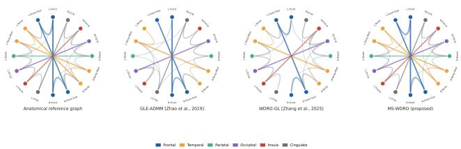  
Fig. 17. Circular connectograms of the recovered CMU functional network for a representative classical baseline (GLE-ADMM), the strongest single-source baseline (WDRO-GL), and MS-WDRO, alongside a structural-proximity reference graph.

h) Qualitative connectome visualization.: Figure 17 displays circular connectograms of the recovered CMU functional network for a representative classical baseline (GLE-ADMM), the strongest single-source baseline (WDRO-GL), and MS-WDRO, alongside a structural-proximity reference graph over sixteen coarse anatomical regions. MS-WDRO’s recovered connectogram most closely reproduces the reference graph’s dominant inter-hemispheric and homologous-region connections, while retaining several finer intra-hemis-pheric edges that GLE-ADMM omits.

## VII. CONCLUSION

This paper addressed the problem of network topology inference from smooth graph signals in the practically important regime where target-domain observations are scarce or entirely unavailable, yet abundant heterogeneous data from multiple related source domains can be leveraged. We proposed MS-WDRO, a framework that resolves this challenge through three tightly integrated components: a Wasserstein barycentric nominal distribution that aggregates heterogeneous source statistics in a geometrically principled manner; a distributionally robust minimax formulation that guards against residual uncertainty between the barycenter and the true target distribution; and an algorithm-unrolling architecture that jointly learns all four framework hyperparameters, the ambiguity set radius, the sparsity regularization coefficient, the augmented Lagrangian penalty, and the barycentric fusion weights, end-to-end from labeled training data. Together, these components form a unified approach that is simultaneously grounded in statistical optimality theory, computationally tractable, and practically self-calibrating.

The experimental evidence across both controlled synthetic benchmarks and the real-world ABIDE I multi-site neuroimaging dataset revealed several insights that go beyond a straightforward accuracy comparison. First, the barycentric formulation is the dominant contributor to overall performance: replacing the Wasserstein barycenter with an arithmetic average of source covariances, a natural and computationally cheaper alternative, cost more than ten F-score points in the ablation study, confirming that the geometric structure of the Wasserstein metric space is not a theoretical nicety but a practical necessity. Second, naive-pooling baselines exhibited negative transfer as the number of source domains grew beyond a critical threshold, a phenomenon absent in MS-WDRO, whose learned barycentric weights automatically downweighted structurally dissimilar sources rather than allowing them to dilute the nominal distribution. Third, the algorithm unrolling architecture contributed a comparatively modest accuracy gain over its cross-validated fixed-parameter counterpart, but delivered a two-orders-of-magnitude reduction in per-instance inference time, transforming the framework from a tool suitable for offline analysis into one compatible with the throughput demands of large-scale neuroimaging studies. Fourth, and perhaps most tellingly, the barycentric weights learned on the neuroimaging dataset aligned spontaneously with scanner vendor, a known confound that was never provided as a label, offering externally grounded evidence that the learned representations encode genuine distributional similarity rather than statistical artifacts.

## Future Directions

The present work opens several directions for future investigation. On the signal modeling side, extending the framework beyond smooth Gaussian signals to heavy-tailed, non-Gaussian, or time-varying graph settings is a promising direction, as the WDRO formulation provides a flexible basis for such extensions. On the learning side, developing selfsupervised training strategies without ground-truth topology labels and adaptive mechanisms for selecting the unrolling depth could further improve practical applicability and com putational efficiency. From a theoretical and practical perspective, establishing generalization guarantees for the end-to-end unrolled predictor and extending MS-WDRO to decentralized federated settings would provide important steps toward robust and privacy-preserving network learning.

## APPENDIX A PROOF OF THEOREM 3.2

Proof. By Remark 3.6, f is differentiable at every $\Xi ^ { ( k + 1 ) }$ $k \geq 0 ,$ , so the first-order optimality condition of the $\Xi _ { - }$ update (48) reads, using the scaled form of (46) and the dual update (52),

$$
\nabla f ( \Xi ^ { ( k + 1 ) } ) + \mathcal { T } ^ { * } ( \mathbf { Y } ^ { ( k + 1 ) } ) = \varrho T ^ { * } \big ( \mathbf { C } ^ { ( k + 1 ) } - \mathbf { C } ^ { ( k ) } \big ) .\tag{116}
$$

Likewise, the first-order (subgradient) optimality condition of the C-update (50) together with (52) gives

$$
\mathbf { Y } ^ { ( k + 1 ) } \in \partial g ( \mathbf { C } ^ { ( k + 1 ) } ) .\tag{117}
$$

Since $\nabla f$ is monotone on the convex set $\{ \Xi \succ { \bf 0 } \}$ (f convex) and $\partial g$ is monotone $( g$ convex), we have

$$
\left. \nabla f ( \Xi ^ { ( k + 1 ) } ) - \nabla f ( \Xi ^ { \star } ) , \Xi ^ { ( k + 1 ) } - \Xi ^ { \star } \right. \geq 0 ,\tag{118}
$$

$$
\left. \mathbf { Y } ^ { ( k + 1 ) } - \mathbf { Y } ^ { \star } , \mathbf { C } ^ { ( k + 1 ) } - \mathbf { C } ^ { \star } \right. \geq 0 .\tag{119}
$$

Substituting the KKT identity $\nabla f ( \Xi ^ { \star } ) = - \mathcal { T } ^ { * } ( \mathbf { Y } ^ { \star } )$ and (116) into (118), and using $\mathscr { T } ( \Xi ^ { ( k + 1 ) } - \Xi ^ { \star } ) = \mathbf { r } ^ { ( k + 1 ) } + \mathbf { C } ^ { ( k + 1 ) } - \mathbf { C } ^ { \star }$ (since $\mathcal { T } ( \Xi ^ { \star } ) = \mathbf { C } ^ { \star } )$ , we obtain

$$
\begin{array} { r l } & { \big \langle \mathbf { Y } ^ { ( k + 1 ) } - \mathbf { Y } ^ { \star } , \mathbf { r } ^ { ( k + 1 ) } \big \rangle + \big \langle \mathbf { Y } ^ { ( k + 1 ) } - \mathbf { Y } ^ { \star } , \mathbf { C } ^ { ( k + 1 ) } - \mathbf { C } ^ { \star } \big \rangle } \\ & { \leq - \varrho \big \langle \mathbf { C } ^ { ( k + 1 ) } - \mathbf { C } ^ { ( k ) } , \mathbf { r } ^ { ( k + 1 ) } + \mathbf { C } ^ { ( k + 1 ) } - \mathbf { C } ^ { \star } \big \rangle . \qquad ( 1 2 0 ) } \end{array}
$$

Combining (120) with (119) to drop the non-negative cross term, then using $\mathbf { Y } ^ { ( k + 1 ) } - \mathbf { Y } ^ { \star } = \mathbf { \bar { \Phi } } ( \mathbf { Y } ^ { ( k ) } - \mathbf { Y } ^ { \star } ) + \varrho \mathbf { r } ^ { ( k + 1 ) }$ (scaled dual update (52)) and completing the square exactly as in the standard two-block ADMM convergence proof (cf. [52], App. $\mathbf { A } ; ~ [ 5 1 ] ) ^ { 2 }$ yields exactly the claimed descent inequality (56).

Non-negativity and monotonic non-increase of $V ^ { ( k ) }$ in (56) imply: (a) $V ^ { ( k ) }$ converges to a finite limit, hence $\{ \mathbf { C } ^ { ( k ) } \}$ and $\{ \mathbf { Y } ^ { ( k ) } \}$ are bounded; (b) summing (56) over k gives $\begin{array} { r } { \sum _ { k } \bigl ( \tilde { \varrho } \| \mathbf { C } ^ { ( k + 1 ) } - \mathbf { C } ^ { ( k ) } \| _ { F } ^ { 2 } + \| \mathbf { r } ^ { ( k + 1 ) } \| _ { F } ^ { 2 } \bigr ) \overset { - } { \le } \mathbf { \cal { V } } ^ { ( 0 ) } < \infty , } \end{array}$ so $\overline { { { \bf C } } } ^ { ( \tilde { k } + 1 ) } - { \bf C } ^ { ( k ) } \to { \bf 0 }$ and $\mathbf { r } ^ { ( k ) }  \mathbf { 0 } ,$ proving (i). Boundedness of $\mathbf { C } ^ { ( k ) }$ together with $\mathbf { r } ^ { ( k ) }  \mathbf { 0 }$ gives boundedness of $\mathcal { T } ( \Xi ^ { ( k ) } ) = \mathbf { C } ^ { ( k ) } + \mathbf { r } ^ { ( k ) }$ ; since $\tau$ is injective linear between finite-dimensional spaces, its restriction to any bounded-image sequence has a bounded pre-image, so $\{ \Xi ^ { \dot { ( k ) } } \}$ is bounded. Every subsequential limit $( \bar { \Xi } , \bar { \mathbf { C } } , \bar { \mathbf { Y } } )$ therefore satisfies, by closedness of $\nabla f$ and $\partial g$ and passing to the limit in (116)– (117) using (i), exactly the KKT system $( 5 4 ) ;$ by uniqueness of $\Xi ^ { \star }$ and $\mathbf { C } ^ { \star }$ , every subsequential limit of $\Xi ^ { ( k ) }$ (resp. $\mathbf { C } ^ { ( k ) } )$ equals $\Xi ^ { \star }$ (resp. C⋆), so the full sequences converge, proving (iii); continuity of $f , g$ at the limit gives (ii); and a standard argument (monotonicity of $V ^ { ( k ) }$ defined with any dual-optimal Y¯ forces $\dot { \mathbf { Y } } ^ { ( k ) }$ to converge to some dual optimum) completes the proof of (iii) for $\mathbf { Y } ^ { ( \tilde { k } ) }$ □

## APPENDIX B PROOF OF THEOREM 3.3

Proof. We first prove part (i). By the mutual independence of $\sigma _ { m , i }$ and $\sigma _ { m , j }$ for $\begin{array} { r } { i \neq j , \mathbb { E } _ { \pmb { \sigma } _ { m } } \| \sum _ { i } \sigma _ { m , i } \pmb { \Sigma } _ { m , i } \| _ { F } ^ { 2 } = } \end{array}$ $\begin{array} { r } { \sum _ { i } \| \boldsymbol { \Sigma } _ { m , i } \| _ { F } ^ { 2 } } \end{array}$ . Jensen’s inequality applied to the concave square-root and $\| \pmb { \Sigma } _ { m , i } \| _ { F } = \widetilde { \| \mathbf { z } _ { m , i } \| _ { 2 } ^ { 2 } } \leq D _ { \mathcal { Z } } ^ { 2 }$ (Assumption 3.4) give (Set $D z = D _ { \mathcal { Z } _ { R ( \delta / 2 ) } } \mathrm { a s }$ specified by Corollary 4.1.)

$$
\begin{array} { r l r } {  { \mathbb { E } _ { \pmb { \sigma } _ { m } } [ \frac { 1 } { n _ { m } } \mathopen { } \mathclose \bgroup \| \sum _ { i = 1 } ^ { n _ { m } } \sigma _ { m , i } \pmb \Sigma _ { m , i } \aftergroup \egroup \| _ { F } ] \leq \sqrt { \frac { 1 } { n _ { m } ^ { 2 } } \sum _ { i = 1 } ^ { n _ { m } } \mathopen { } \mathclose \bgroup \| \pmb { \Sigma } _ { m , i } \aftergroup \egroup \| _ { F } ^ { 2 } } } } \\ & { } & { \leq \frac { D _ { \mathcal { Z } } ^ { 2 } } { \sqrt { n _ { m } } } . \qquad ( \mathrm { C } } \end{array}\tag{121}
$$

Multiplying by $B \lambda _ { m } ,$ summing over $m ,$ and using $\begin{array} { r } { \sum _ { m } \lambda _ { m } / \sqrt { n _ { m } } \leq 1 / \sqrt { n _ { \operatorname* { m i n } } } } \end{array}$ yields (71).

We now prove part (ii). Introduce the population WDRO risk centered at the true barycenter as $R _ { \epsilon _ { n } } ^ { * } ( \mathbf { L } ) : = R _ { b _ { \lambda } ^ { * } } ( \mathbf { L } ) +$ $\epsilon _ { n } \| \mathrm { v e c } ( \mathbf { L } ) \| _ { q } .$ , and decompose:

$$
\begin{array} { r } { { \cal R } _ { \mathbb { P } ^ { * } } ( \hat { \mathbf { L } } ^ { * } ) - \hat { \cal R } _ { \epsilon _ { n } } ( \hat { \mathbf { L } } ^ { * } ) = \underbrace { \big [ { \cal R } _ { \mathbb { P } ^ { * } } ( \hat { \mathbf { L } } ^ { * } ) - { \cal R } _ { \epsilon _ { n } } ^ { * } ( \hat { \mathbf { L } } ^ { * } ) \big ] } _ { ( \mathrm { I } ) } } \\ { + \underbrace { \big [ { \cal R } _ { \epsilon _ { n } } ^ { * } ( \hat { \mathbf { L } } ^ { * } ) - \hat { \cal R } _ { \epsilon _ { n } } ( \hat { \mathbf { L } } ^ { * } ) \big ] } _ { ( \mathrm { I I } ) } . } \end{array}\tag{122}
$$

For term (I), since $- \log | \hat { \mathbf { L } } ^ { * } | _ { + }$ + cancels:

$$
\begin{array} { r } { R _ { \mathbb { P } ^ { * } } ( \hat { \mathbf { L } } ^ { * } ) - R _ { \epsilon _ { n } } ^ { * } ( \hat { \mathbf { L } } ^ { * } ) = \left[ R _ { \mathbb { P } ^ { * } } ( \hat { \mathbf { L } } ^ { * } ) - R _ { b _ { \lambda } ^ { * } } ( \hat { \mathbf { L } } ^ { * } ) \right] } \\ { - \epsilon _ { n } \| \mathrm { v e c } ( \hat { \mathbf { L } } ^ { * } ) \| _ { q } . } \end{array}\tag{123}
$$

By Lemma 3.3, the loss $\ell ( \mathbf { L } , \cdot ) { \mathrm { ~ i s ~ } } \| \mathrm { v e c } ( \mathbf { L } ) \| _ { q ^ { - } } ]$ Lipschitz with respect to the $p \textmd { - }$ Wasserstein metric, so Kantorovich-Rubinstein duality gives

$$
R _ { \mathbb { P } ^ { * } } ( { \hat { \mathbf { L } } } ^ { * } ) - R _ { b _ { \lambda } ^ { * } } ( { \hat { \mathbf { L } } } ^ { * } ) \leq W _ { p } ( \mathbb { P } ^ { * } , b _ { \lambda } ^ { * } ) \| \mathrm { v e c } ( { \hat { \mathbf { L } } } ^ { * } ) \| _ { q } .\tag{124}
$$

Substituting (124) into (123) and invoking the hypothesis $W _ { p } ( \mathbb { P } ^ { * } , b _ { \lambda } ^ { * } ) \le \epsilon _ { n } \colon$

$$
\begin{array} { r l r } & { } & { R _ { \mathbb { P } ^ { * } } ( \hat { { \bf L } } ^ { * } ) - R _ { \epsilon _ { n } } ^ { * } ( \hat { { \bf L } } ^ { * } ) \leq \Vert \mathrm { v e c } ( \hat { { \bf L } } ^ { * } ) \Vert _ { q } \big [ W _ { p } ( \mathbb { P } ^ { * } , b _ { \lambda } ^ { * } ) - \epsilon _ { n } \big ] } \\ & { } & { \quad \quad \quad \quad \quad \quad \quad \quad \quad ( 1 } \end{array}\tag{25}
$$

The WDRO penalty $\epsilon _ { n } \lVert \mathrm { v e c } ( { \hat { \mathbf { L } } } ^ { * } ) \rVert _ { q }$ thus exactly absorbs the Kantorovich transport cost from $\mathbb { P } ^ { * }$ to $b _ { \lambda } ^ { * }$ , rendering term (I) non-positive.

For term (II), since the $\epsilon _ { n } \| \mathrm { v e c } \| _ { q }$ contributions cancel in $R _ { \epsilon _ { n } } ^ { * } - \hat { R } _ { \epsilon _ { n } } ;$

$$
\begin{array} { r l } & { R _ { \epsilon _ { n } } ^ { * } ( \hat { \bf L } ^ { * } ) - \hat { R } _ { \epsilon _ { n } } ( \hat { \bf L } ^ { * } ) = R _ { b _ { \lambda } ^ { * } } ( \hat { \bf L } ^ { * } ) - R _ { \hat { b } _ { k } ^ { * } } ( \hat { \bf L } ^ { * } ) } \\ & { ~ = \mathrm { t r } \big ( ( \bar { \Sigma } _ { \lambda } ^ { * } - \hat { \Sigma } _ { \lambda } ) \hat { \bf L } ^ { * } \big ) . } \end{array}\tag{126}
$$

Applying Cauchy-Schwarz with $\| \hat { \mathbf { L } } ^ { * } \| _ { F } \leq B ;$

$$
\mathrm { t r } \big ( \big ( \bar { \Sigma } _ { \lambda } ^ { * } - \hat { \Sigma } _ { \lambda } \big ) \hat { \mathbf { L } } ^ { * } \big ) \ \leq \ B \| \bar { \Sigma } _ { \lambda } ^ { * } - \hat { \Sigma } _ { \lambda } \| _ { F } .\tag{127}
$$

Applying Assumption 3.5 with $\begin{array} { r } { \hat { \Sigma } _ { m } = n _ { m } ^ { - 1 } \sum _ { i } \Sigma _ { m , i } \colon } \end{array}$

$$
B \Vert \bar { \Sigma } _ { \lambda } ^ { * } - \hat { \Sigma } _ { \lambda } \Vert _ { F } \ \leq \ B L _ { \mathrm { b a r y } } \sum _ { m = 1 } ^ { M } \lambda _ { m } \Vert \Sigma _ { m } - \hat { \Sigma } _ { m } \Vert _ { F } .\tag{128}
$$

Since $\Vert \boldsymbol { \Sigma } _ { m } - \hat { \boldsymbol { \Sigma } } _ { m } \Vert _ { F } = \operatorname* { s u p } _ { \Vert \mathbf { M } \Vert _ { F } < 1 } \left. \mathrm { t r } \big ( \big ( \boldsymbol { \Sigma } _ { m } - \hat { \boldsymbol { \Sigma } } _ { m } \big ) \mathbf { M } \big ) \right.$ , the Rademacher symmetrization lemma applied to the i.i.d. sample $\{ \pmb { \Sigma } _ { m , i } \} _ { i = 1 } ^ { n _ { m } }$ yields

$$
\mathbb { E } \big [ \big \| \Sigma _ { m } - \hat { \Sigma } _ { m } \big \| _ { F } \big ] \leq 2 \underbrace { \mathbb { E } _ { \sigma _ { m } } \Bigg [ \frac { 1 } { n _ { m } } \Big \| \sum _ { i = 1 } ^ { n _ { m } } \sigma _ { m , i } \Sigma _ { m , i } \Big \| _ { F } \Bigg ] } _ { = : \mathcal { R } _ { n _ { m } } ^ { \mathrm { F } } } .\tag{129}
$$

By definition (70), $\begin{array} { r } { \Re _ { n } ( \mathcal { L } _ { B } ; \pmb { \lambda } ) = B \sum _ { m } \lambda _ { m } \mathcal { R } _ { n _ { m } } ^ { \mathrm { F } } } \end{array}$ , so multiplying (129) by $B L _ { \mathrm { b a r y } } \lambda _ { m }$ and summing gives

$$
B L _ { \mathrm { b a r y } } \sum _ { m = 1 } ^ { M } \lambda _ { m } \mathbb { E } \big [ \| \Sigma _ { m } - \hat { \Sigma } _ { m } \| _ { F } \big ] \ \leq \ 2 L _ { \mathrm { b a r y } } \Re _ { n } ( \mathcal { L } _ { B } ; \lambda ) .\tag{130}
$$

For concentration, replacing any single $\mathbf { z } _ { m , j }$ changes $\Vert \Sigma _ { m } -$ $\hat { \Sigma } _ { m } \| _ { F }$ by at most $2 D _ { z } ^ { 2 } / n _ { m }$ . McDiarmid’s inequality at confidence $\delta / M$ for each m, combined with (129), gives with probability at least $1 - \delta / M$

$$
\Vert \Sigma _ { m } - \hat { \Sigma } _ { m } \Vert _ { F } \ \leq \ 2 \mathcal { R } _ { n _ { m } } ^ { \mathrm { F } } + D _ { \mathcal { Z } } ^ { 2 } \sqrt { \frac { 2 \log ( M / \delta ) } { n _ { m } } } .\tag{131}
$$

A union bound over m $\in [ M ]$ yields, with probability at least $1 - \delta \colon$

$$
\begin{array} { r l r } {  { B L _ { \mathrm { b a r y } } \sum _ { m = 1 } ^ { M } \lambda _ { m } \| \Sigma _ { m } - \hat { \Sigma } _ { m } \| _ { F } \leq 2 L _ { \mathrm { b a r y } } \mathfrak { R } _ { n } ( \mathcal L _ { B } ; \lambda ) } } \\ & { } & { + \frac { B L _ { \mathrm { b a r y } } D _ { \mathcal Z } ^ { 2 } \sqrt { 2 \log ( M / \delta ) } } { \sqrt { n _ { \mathrm { m i n } } } } . } \end{array}\tag{132}
$$

Substituting (132) into (128) and (127) gives term $( \mathrm { I I } ) \leq$ $\Delta _ { n } ( \delta )$ with probability at least $1 - \delta$ . Combining with (125) and (122):

$$
R _ { \mathbb { P } ^ { * } } ( \hat { \mathbf { L } } ^ { * } ) - \hat { R } _ { \epsilon _ { n } } ( \hat { \mathbf { L } } ^ { * } ) \leq 0 + \Delta _ { n } ( \delta ) = \Delta _ { n } ( \delta ) ,\tag{133}
$$

which establishes (72). Part (iii) is immediate from (71). □

## APPENDIX C PROOF OF LEMMA 4.2

Proof. Throughout, write $\begin{array} { r } { F ( \nu ) = \sum _ { m = 1 } ^ { M } \lambda _ { m } W _ { 2 } ^ { 2 } ( \nu , \mathbb { P } _ { m } ^ { * } ) } \end{array}$ for the population barycenter functional and $\begin{array} { r l } { \hat { F } ( \nu ) } & { { } = } \end{array}$ $\begin{array} { r } { \sum _ { m = 1 } ^ { M } \lambda _ { m } \bar { W } _ { 2 } ^ { 2 } ( \nu , \hat { \mathbb { P } } _ { m } ) } \end{array}$ for its empirical counterpart, so that $b _ { \mathbf { \delta } \mathbf { \lambda } } ^ { * } = \arg \operatorname* { m i n } _ { \mathbf { \delta } } F ( \mathbf { \nu } )$ and ${ \hat { b } } _ { M } ^ { * } ~ = ~ \mathrm { a r g } \operatorname* { m i n } _ { \nu } { \hat { F } } ( \nu )$ . Set $\delta \ =$ $\ddot { W } _ { 2 } ( \hat { b } _ { M } ^ { * } , b _ { \mathbf { \lambda } } ^ { * } ) , \xi _ { m } = W _ { 2 } ( \hat { \mathbb { P } } _ { m } , \mathbb { P } _ { m } ^ { * } )$ for $m \in [ M ]$ , and $\Delta _ { m } =$ $W _ { 2 } ( b _ { \lambda } ^ { * } , \mathbb { P } _ { m } ^ { * } )$ , so that $\begin{array} { r } { \mathcal { H } _ { \lambda } ^ { 2 } = \sum _ { m = 1 } ^ { M } \lambda _ { m } \Delta _ { m } ^ { 2 } } \end{array}$ and, by definition, $\xi _ { M } \ = \ \textstyle \sum _ { m = 1 } ^ { M } \lambda _ { m } \xi _ { m } ^ { 2 }$ ; since $\lambda \in \triangle ^ { M }$ , both $\{ \lambda _ { m } \Delta _ { m } ^ { 2 } \}$ and $\{ \lambda _ { m } \xi _ { m } ^ { 2 } \}$ are convex combinations, a fact used repeatedly below. Our goal is to control $\delta$ in terms of $\xi _ { M }$ and $\mathcal { H } _ { \lambda }$

We first translate the sub-optimality gap $F ( \hat { b } _ { M } ^ { * } ) - F ( b _ { \lambda } ^ { * } )$ into a bound on $\delta$ itself. Assumption 3.4 postulates that $F$ is $\kappa \mathrm { - }$ strongly convex along generalized geodesics on $\left( \mathcal { P } _ { 2 } ( \mathcal { Z } ) , W _ { 2 } \right)$ ; combined with the first-order optimality of $b _ { \lambda } ^ { * }$ as the unique global minimizer of $F ,$ strong geodesic convexity yields, for every $\nu \in \mathscr { P } _ { 2 } ( \mathcal { Z } )$ ,

$$
F ( \nu ) - F ( b _ { \lambda } ^ { * } ) \ge \kappa W _ { 2 } ^ { 2 } ( \nu , b _ { \lambda } ^ { * } ) ,\tag{134}
$$

because the first-order term in the geodesic convexity inequality is non-negative at a minimizer and may be discarded without weakening the bound. Instantiating (134) at $\nu = \hat { b } _ { M } ^ { * }$ gives

$$
\kappa \delta ^ { 2 } \leq F \big ( \hat { b } _ { M } ^ { * } \big ) - F \big ( b _ { \mathbf { \hat { \lambda } } } ^ { * } \big ) .\tag{135}
$$

It therefore suffices to bound the right-hand side of (135).

Because $\hat { b } _ { M } ^ { * }$ minimizes $\hat { F }$ over $\mathcal { P } _ { 2 } ( \mathcal { Z } )$ while $b _ { \lambda } ^ { * }$ is merely a feasible, generally suboptimal, point of $\hat { F }$ , we have $\hat { F } ( \hat { b } _ { M } ^ { * } ) \leq$ $\hat { F } ( b _ { \lambda } ^ { * } )$ . Adding and subtracting $\hat { F } ( \hat { b } _ { M } ^ { * } )$ and $\hat { F } ( b _ { \lambda } ^ { \ast } )$ inside $F ( \hat { b } _ { M } ^ { * } ) - F ( b _ { \lambda } ^ { * } )$ and then discarding the non-positive quantity $\hat { F } ( \hat { b } _ { M } ^ { * } ) - \hat { F } ( b _ { \lambda } ^ { * } )$ produces the basic inequality

$$
\begin{array} { r l } & { F ( \hat { b } _ { M } ^ { * } ) - F ( b _ { \lambda } ^ { * } ) \leq \underbrace { \left[ F ( \hat { b } _ { M } ^ { * } ) - \hat { F } ( \hat { b } _ { M } ^ { * } ) \right] } _ { = : T _ { 1 } } } \\ & { \qquad + \underbrace { \left[ \hat { F } ( b _ { \lambda } ^ { * } ) - F ( b _ { \lambda } ^ { * } ) \right] } _ { = : T _ { 2 } } . } \end{array}\tag{136}
$$

Expanding the definitions of $F$ and $\hat { F }$ term by term,

$$
\begin{array} { r l } & { T _ { 1 } = \displaystyle \sum _ { m = 1 } ^ { M } \lambda _ { m } \big [ W _ { 2 } ^ { 2 } ( \hat { b } _ { M } ^ { * } , \mathbb { P } _ { m } ^ { * } ) - W _ { 2 } ^ { 2 } ( \hat { b } _ { M } ^ { * } , \hat { \mathbb { P } } _ { m } ) \big ] , } \\ & { T _ { 2 } = \displaystyle \sum _ { m = 1 } ^ { M } \lambda _ { m } \big [ W _ { 2 } ^ { 2 } ( b _ { \mathbf { \lambda } } ^ { * } , \hat { \mathbb { P } } _ { m } ) - W _ { 2 } ^ { 2 } ( b _ { \mathbf { \lambda } } ^ { * } , \mathbb { P } _ { m } ^ { * } ) \big ] . } \end{array}\tag{137}
$$

Both sums involve differences of squared Wasserstein distances from a fixed reference measure to two nearby targets, which we now bound uniformly. For any $\nu \in \mathscr { P } _ { 2 } ( \mathcal { Z } )$ and any $\alpha , \beta \in \mathcal { P } _ { 2 } ( \mathcal { Z } )$ , factoring the difference of squares and applying the reverse triangle inequality $| W _ { 2 } ( \nu , \alpha ) - W _ { 2 } ( \nu , \beta ) | \ \leq$ $W _ { 2 } ( \alpha , \beta )$ gives

$$
\begin{array} { r l } & { \left| W _ { 2 } ^ { 2 } ( \nu , \alpha ) - W _ { 2 } ^ { 2 } ( \nu , \beta ) \right| } \\ & { = \left| W _ { 2 } ( \nu , \alpha ) - W _ { 2 } ( \nu , \beta ) \right| \cdot \left( W _ { 2 } ( \nu , \alpha ) + W _ { 2 } ( \nu , \beta ) \right) } \\ & { \le \left[ W _ { 2 } ( \nu , \alpha ) + W _ { 2 } ( \nu , \beta ) \right] W _ { 2 } ( \alpha , \beta ) . } \end{array}\tag{138}
$$

We apply (138) to each summand of $T _ { 1 }$ with $\begin{array} { r } { \nu = \hat { b } _ { M } ^ { * } , \alpha = \mathbb { P } _ { m } ^ { * } , } \end{array}$ $\beta = \hat { \mathbb { P } } _ { m } .$ , so that $W _ { 2 } ( \alpha , \beta ) = \xi _ { m } ;$ it remains to bound the sum $W _ { 2 } ( \hat { b } _ { M } ^ { * } , \mathbb { P } _ { m } ^ { * } ) + W _ { 2 } ( \hat { b } _ { M } ^ { * } , \hat { \mathbb { P } } _ { m } )$ . The triangle inequality through $b _ { \lambda } ^ { * }$ gives $W _ { 2 } ( \widehat { b } _ { M } ^ { * } , \mathbb { P } _ { m } ^ { * } ) \leq W _ { 2 } ( \widehat { b } _ { M } ^ { * } , b _ { \lambda } ^ { * } ) + W _ { 2 } ( b _ { \lambda } ^ { * } , \mathbb { P } _ { m } ^ { * } ) = \delta +$ $\Delta _ { m } .$ , and a further application of the triangle inequality through $\mathbb { P } _ { m } ^ { * }$ gives $W _ { 2 } ( \widehat { b } _ { M } ^ { * } , \widehat { \mathbb { P } } _ { m } ) \ \leq \ W _ { 2 } ( \widehat { b } _ { M } ^ { * } , \mathbb { P } _ { m } ^ { * } ) + \ \hat { W _ { 2 } } ( \mathbb { P } _ { m } ^ { * } , \widehat { \mathbb { P } } _ { m } ) \ \leq$ $\delta + \Delta _ { m } + \xi _ { m }$ . Summing these two bounds, $W _ { 2 } ( \widehat { b } _ { M } ^ { * } , \mathbb { P } _ { m } ^ { * } ) +$ $W _ { 2 } ( \hat { b } _ { M } ^ { * } , \hat { \mathbb { P } } _ { m } ) \leq 2 \delta + 2 \Delta _ { m } + \xi _ { m } ,$ , and substituting into (138) yields the termwise bound

$$
W _ { 2 } ^ { 2 } ( \hat { b } _ { M } ^ { * } , \mathbb { P } _ { m } ^ { * } ) - W _ { 2 } ^ { 2 } ( \hat { b } _ { M } ^ { * } , \hat { \mathbb { P } } _ { m } ) \ \leq \ ( 2 \delta + 2 \Delta _ { m } + \xi _ { m } ) \xi _ { m } .\tag{139}
$$

The same argument applied to each summand of $T _ { 2 } ,$ now with $\nu = b _ { \lambda } ^ { \ast } , \alpha = \hat { \mathbb { P } } _ { m } , \beta = \mathbb { P } _ { m } ^ { \ast } \left( \mathrm { s o } W _ { 2 } ( \alpha , \beta ) = \xi _ { m } \right.$ again), gives $W _ { 2 } ( b _ { \lambda } ^ { * } , \hat { \mathbb { P } } _ { m } ) \leq W _ { 2 } ( b _ { \lambda } ^ { * } , \mathbb { P } _ { m } ^ { * } ) + W _ { 2 } ( \mathbb { P } _ { m } ^ { * } , \hat { \mathbb { P } } _ { m } ) = \Delta _ { m } + \xi _ { m }$ and $W _ { 2 } ( b _ { \lambda } ^ { * } , \mathbb { P } _ { m } ^ { * } ) \ = \ \Delta _ { m } .$ , so that $W _ { 2 } ( b _ { \mathbf { \lambda } } ^ { * } , \hat { \mathbb { P } } _ { m } ) + W _ { 2 } ( b _ { \mathbf { \lambda } } ^ { * } , \mathbb { P } _ { m } ^ { * } ) \ \leq$ $2 \Delta _ { m } + \xi _ { m }$ and hence

$$
W _ { 2 } ^ { 2 } ( b _ { \mathsf { A } } ^ { * } , \hat { \mathbb { P } } _ { m } ) - W _ { 2 } ^ { 2 } ( b _ { \mathsf { A } } ^ { * } , \mathbb { P } _ { m } ^ { * } ) \ \leq \ ( 2 \Delta _ { m } + \xi _ { m } ) \xi _ { m } .\tag{140}
$$

Weighting (139) and (140) by $\lambda _ { m }$ , summing over $m \in [ M ]$ and substituting into (137) gives

$$
\begin{array} { c } { { T _ { 1 } + T _ { 2 } \leq 2 \delta \displaystyle \sum _ { m = 1 } ^ { M } \lambda _ { m } \xi _ { m } + 4 \displaystyle \sum _ { m = 1 } ^ { M } \lambda _ { m } \Delta _ { m } \xi _ { m } } } \\ { { + \displaystyle 2 \sum _ { m = 1 } ^ { M } \lambda _ { m } \xi _ { m } ^ { 2 } , } } \end{array}\tag{141}
$$

which, together with (136), bounds $F ( \hat { b } _ { M } ^ { * } ) - F ( b _ { \lambda } ^ { * } )$ by the right-hand side of (141).

The three sums in (141) are controlled by the Cauchy– Schwarz inequality with respect to the probability weights λ. Since $\textstyle \sum _ { m = 1 } ^ { M } \lambda _ { m } = 1$ , treating $\lambda _ { m }$ as a probability measure on [M] and applying Cauchy–Schwarz to the pairs $( \xi _ { m } , 1 )$ and $\left( \Delta _ { m } , \xi _ { m } \right)$ gives

$$
\sum _ { m = 1 } ^ { M } \lambda _ { m } \xi _ { m } \ \leq \ \Big ( \sum _ { m = 1 } ^ { M } \lambda _ { m } \xi _ { m } ^ { 2 } \Big ) ^ { 1 / 2 } \Big ( \sum _ { m = 1 } ^ { M } \lambda _ { m } \Big ) ^ { 1 / 2 } = \xi _ { M } ^ { 1 / 2 } ,\tag{142}
$$

$$
\begin{array} { r l r } {  { \sum _ { m = 1 } ^ { M } \lambda _ { m } \Delta _ { m } \xi _ { m } \leq \Big ( \displaystyle \sum _ { m = 1 } ^ { M } \lambda _ { m } \Delta _ { m } ^ { 2 } \Big ) ^ { 1 / 2 } \Big ( \displaystyle \sum _ { m = 1 } ^ { M } \lambda _ { m } \xi _ { m } ^ { 2 } \Big ) ^ { 1 / 2 } } } \\ & { } & { \quad = \mathcal { H } _ { \lambda } \xi _ { M } ^ { 1 / 2 } , \qquad ( } \end{array}\tag{143}
$$

while the third sum equals $\xi _ { M }$ exactly, by definition. Substituting (142)–(143) into (141) and then into (135) yields the single quadratic inequality

$$
\kappa \delta ^ { 2 } \leq 2 \delta \xi _ { M } ^ { 1 / 2 } + 4 \mathcal { H } _ { \lambda } \xi _ { M } ^ { 1 / 2 } + 2 \xi _ { M } .\tag{144}
$$

It remains to extract an explicit bound on δ from (144). Rearranging, (144) states that $\delta \geq 0$ satisfies $g ( \delta ) \leq 0$ for the univariate quadratic $g ( x ) = \kappa x ^ { 2 } - 2 \xi _ { M } ^ { 1 / 2 } x - C$ with $C : =$ $4 \mathcal { H } _ { \lambda } \xi _ { M } ^ { 1 / 2 } + 2 \xi _ { M } \ge 0$ . Since $\kappa > 0$ , g is a strictly convex parabola opening upward with $g ( 0 ) = - C \leq 0 \forall$ ; consequently $g$ admits a unique non-negative root $x ^ { * } \geq 0$ , and $g ( x ) \leq 0$ precisely on the interval $[ x _ { - } , x ^ { * } ]$ with $x _ { - } \leq 0 \leq x ^ { * } . \mathrm { A s } \delta \geq 0 .$ this forces $\delta \leq x ^ { * }$ , where the quadratic formula gives

$$
x ^ { * } = \frac { 2 \xi _ { M } ^ { 1 / 2 } + \sqrt { 4 \xi _ { M } + 4 \kappa C } } { 2 \kappa } = \frac { \xi _ { M } ^ { 1 / 2 } + \sqrt { \xi _ { M } + \kappa C } } { \kappa } .\tag{145}
$$

Substituting $\kappa C = 4 \kappa \mathcal { H } _ { \lambda } \xi _ { M } ^ { 1 / 2 } + 2 \kappa \xi _ { M }$ and collecting the $\xi _ { M }$ terms gives

$$
\delta \ \leq \ \frac { \xi _ { M } ^ { 1 / 2 } + \sqrt { \left( 1 + 2 \kappa \right) \xi _ { M } + 4 \kappa \mathcal { H } _ { \lambda } \xi _ { M } ^ { 1 / 2 } } } { \kappa } .\tag{146}
$$

Applying the subadditivity of the square root, ${ \sqrt { a + b } } \leq { \sqrt { a } } +$ $\sqrt { b }$ for $a , b \ge 0$ , to the two non-negative terms under the radical in (146), with $a = ( 1 + 2 \kappa ) \xi _ { M }$ and $b = 4 \kappa \mathcal { H } _ { \lambda } \xi _ { M } ^ { 1 / 2 }$ gives

$$
\begin{array} { r } { \sqrt { ( 1 + 2 \kappa ) \xi _ { M } + 4 \kappa \mathcal { H } _ { \lambda } \xi _ { M } ^ { 1 / 2 } } \leq \sqrt { 1 + 2 \kappa } \xi _ { M } ^ { 1 / 2 } \qquad } \\ { + 2 \sqrt { \kappa } \mathcal { H } _ { \lambda } ^ { 1 / 2 } \xi _ { M } ^ { 1 / 4 } , } \end{array}\tag{147}
$$

using $\sqrt { ( \xi _ { M } ^ { 1 / 2 } ) ^ { 2 } } = \xi _ { M } ^ { 1 / 2 }$ and $\sqrt { 4 \kappa \mathcal { H } _ { \lambda } \xi _ { M } ^ { 1 / 2 } } = 2 \sqrt { \kappa \mathcal { H } _ { \lambda } } \xi _ { M } ^ { 1 / 4 } =$ $2 \sqrt { \kappa } \mathcal { H } _ { \lambda } ^ { \mathrm { i } / 2 } \xi _ { M } ^ { 1 / 4 }$ . Combining (146) and (147),

$$
\delta \ \leq \ \frac { \left( 1 + \sqrt { 1 + 2 \kappa } \right) \xi _ { M } ^ { 1 / 2 } + 2 \sqrt { \kappa } \mathcal { H } _ { \lambda } ^ { 1 / 2 } \xi _ { M } ^ { 1 / 4 } } { \kappa } .\tag{148}
$$

Finally, setting $C _ { 0 } : = 1 + \sqrt { 1 + 2 \kappa } + 2 \sqrt { \kappa } ,$ we have both $1 + \sqrt { 1 + 2 \kappa } \le C _ { 0 }$ and $2 \sqrt { \kappa } \leq C _ { 0 }$ by construction, so that bounding each coefficient in (148) by $C _ { 0 }$ gives

$$
\delta \leq \frac { C _ { 0 } } { \kappa } \Bigl ( \mathcal { H } _ { \lambda } ^ { 1 / 2 } \xi _ { M } ^ { 1 / 4 } + \xi _ { M } ^ { 1 / 2 } \Bigr ) ,\tag{149}
$$

which is exactly (83), with $C _ { 0 }$ a universal constant independent of M, λ, and the source distributions. This completes the proof. □

## APPENDIX D PROOF OF THEOREM 4.2

Proof. We first identify the barycenter $b _ { \lambda } ^ { * }$ explicitly under the common-covariance model. Substituting $\Sigma _ { m } ~ = ~ \Sigma$ for every $\textit { m } \in \textsuperscript { [ M ] }$ into the covariance fixed-point equation of Proposition 3.1 ((23)) shows that $\bar { \Sigma } = \Sigma \bar { }$ is a solution, since $\bar { \sqrt { \Sigma ^ { 1 / 2 } \Sigma \Sigma ^ { 1 / 2 } } } = \sqrt { \Sigma ^ { 2 } } = \Sigma$ and hence the right-hand side collapses to $\sum _ { m = 1 } ^ { M } \lambda _ { m } \Sigma ~ = ~ \Sigma$ by $\sum _ { m } \lambda _ { m } = 1 ;$ as Proposition 3.1 guarantees the fixed point is unique in $\mathbb { S } _ { + + } ^ { N }$ this is the barycentric covariance, and together with the mean formula $\begin{array} { r } { \bar { \mu } _ { \pmb { \lambda } } = \sum _ { m } \lambda _ { m } \mu _ { m } } \end{array}$ of Proposition 3.1 we obtain

$$
b _ { \pmb { \lambda } } ^ { * } = \mathcal { N } ( \bar { \mu } _ { \pmb { \lambda } } , \Sigma ) .\tag{150}
$$

This identification also lets us relate the inter-source heterogeneity $\mathcal { H } _ { \lambda }$ of (82) to the scatter matrix $\Delta _ { \lambda } \colon$ since $b _ { \lambda } ^ { * }$ and each $\mathbb { P } _ { m } ^ { * }$ are Gaussian with the identical covariance $\Sigma ,$ , the Gelbrich formula gives $W _ { 2 } ( b _ { \pmb { \lambda } } ^ { * } , \mathbb { P } _ { m } ^ { * } ) ^ { 2 } = \| \mu _ { m } - \bar { \mu } _ { \pmb { \lambda } } \| ^ { 2 } + B ^ { 2 } ( \Sigma , \Sigma ) =$ $\| \mu _ { m } - \bar { \mu } _ { \lambda } \| ^ { 2 }$ , because $B ( \Sigma , \Sigma ) = 0 ;$ weighting by $\lambda _ { m }$ and summing over m therefore yields $\begin{array} { r } { \mathcal { H } _ { \lambda } ^ { 2 } \ = \ \sum _ { m } \lambda _ { m } \big \| \mu _ { m } \ - \ } \end{array}$ $\begin{array} { r } { \bar { \mu } _ { \lambda } \| ^ { 2 } = \operatorname { t r } \bigl ( \sum _ { m } \lambda _ { m } ( \mu _ { m } - \bar { \mu } _ { \lambda } ) ( \mu _ { m } - \dot { \bar { \mu } } _ { \lambda } ) ^ { T } \bigr ) \overset { - \cdot \cdot } { = } \operatorname { t r } ( \dot { \Delta } _ { \lambda } ) } \end{array}$ , an identity used repeatedly below.

We next compute the covariance of the pooled distribution $\mathbb { P } _ { \lambda } ^ { * }$ by conditioning on source membership. Let $\iota \in [ M ]$ be a random index with $\mathrm { P r } ( \iota = m ) = \lambda _ { m } ,$ , and let $X \sim \mathbb { P } _ { \lambda } ^ { * }$ be generated hierarchically as $X = \mu _ { \iota } + \Sigma ^ { 1 / 2 } Z$ with $Z \sim$ $\mathcal { N } ( 0 , { \bf I } _ { N } )$ independent of $\iota ;$ this construction reproduces $\mathbb { P } _ { \lambda } ^ { * } =$ $\textstyle \sum _ { m } \lambda _ { m } { \mathcal { N } } ( \mu _ { m } , \Sigma )$ by construction. Then $X - \bar { \mu } _ { \lambda } = ( \ddot { \mu _ { \iota } } -$ $\bar { \mu } _ { \lambda } ) + \Sigma ^ { 1 / 2 } Z .$ , and expanding the outer product,

$$
\begin{array} { r l } & { ( X - \bar { \mu } _ { \lambda } ) ( X - \bar { \mu } _ { \lambda } ) ^ { T } = ( \mu _ { \iota } - \bar { \mu } _ { \lambda } ) ( \mu _ { \iota } - \bar { \mu } _ { \lambda } ) ^ { T } } \\ & { \quad + \Sigma ^ { 1 / 2 } Z ( \mu _ { \iota } - \bar { \mu } _ { \lambda } ) ^ { T } + ( \mu _ { \iota } - \bar { \mu } _ { \lambda } ) Z ^ { T } \Sigma ^ { 1 / 2 } } \\ & { \quad + \Sigma ^ { 1 / 2 } Z Z ^ { T } \Sigma ^ { 1 / 2 } . } \end{array}\tag{151}
$$

Taking the conditional expectation given ι and using $\mathbb { E } [ Z ] = \mathbf { 0 }$ $\mathbb { E } [ Z \bar { Z ^ { T } } ] = { \bf I } _ { N }$ (independence of $Z$ from $\iota )$ , the two cross terms vanish and the last term reduces to $\Sigma ,$ , giving $\mathbb { E } { \lceil } ( X -$ $\bar { \mu } _ { \lambda } ) ( X - \bar { \mu } _ { \lambda } ) ^ { T } \mid \iota = m \rfloor = ( \mu _ { m } - \bar { \mu } _ { \lambda } ) ( \mu _ { m } - \bar { \mu } _ { \lambda } ) ^ { T } + \Sigma$ Averaging over ι with weights $\lambda _ { m }$ then yields

$$
\begin{array} { l } { \displaystyle \mathrm { C o v } ( \mathbb { P } _ { \lambda } ^ { * } ) = \sum _ { m = 1 } ^ { M } \lambda _ { m } \Big [ \Sigma + ( \mu _ { m } - \bar { \mu } _ { \lambda } ) ( \mu _ { m } - \bar { \mu } _ { \lambda } ) ^ { T } \Big ] } \\ { = \Sigma + \Delta _ { \lambda } , } \end{array}\tag{152}
$$

using $\textstyle \sum _ { m } \lambda _ { m } = 1$ to isolate Σ and the definition (88) for the second term. Since $\Delta _ { \lambda } \succeq 0$ and $\Delta _ { \lambda } \neq \mathbf { 0 }$ precisely when $\mathcal { H } _ { \lambda } =$ $\sqrt { \mathrm { t r } ( \Delta _ { \lambda } ) } > 0$ , identity (152) shows that heterogeneous source means strictly inflate the covariance of the pooled distribution relative to that of the true barycenter $b _ { \lambda } ^ { * }$ , whose covariance remains Σ by (150).

This covariance inflation is converted into a Wasserstein separation via the Gelbrich inequality [39], which states that for any $\alpha , \beta ~ \in ~ \mathcal { P } _ { 2 } ( \mathbb { R } ^ { N } )$ with means $\mathbb { E } _ { \alpha } [ X ] , \ \mathbb { E } _ { \beta } [ Y ]$ and covariances Cov(α), Cov(β),

$$
\begin{array} { r l } & { W _ { 2 } ^ { 2 } ( \alpha , \beta ) \geq \left. \mathbb { E } _ { \alpha } [ X ] - \mathbb { E } _ { \beta } [ Y ] \right. ^ { 2 } } \\ & { \quad \quad \quad + B ^ { 2 } \big ( \mathrm { C o v } ( \alpha ) , \mathrm { C o v } ( \beta ) \big ) , } \end{array}\tag{153}
$$

this inequality holding for arbitrary distributions with the stated moments, with equality when both are Gaussian. Taking $\alpha = \mathbb { P } _ { \lambda } ^ { * }$ , with mean $\bar { \mu } _ { \lambda }$ and covariance $\Sigma + \Delta _ { \lambda }$ by (152), and $\beta = b _ { \lambda } ^ { * }$ , with mean $\bar { \mu } _ { \lambda }$ and covariance Σ by (150), the two means coincide and the mean term in (153) vanishes identically, leaving

$$
W _ { 2 } ^ { 2 } ( \mathbb { P } _ { \lambda } ^ { * } , b _ { \lambda } ^ { * } ) \ge B ^ { 2 } ( \Sigma + \Delta _ { \lambda } , \Sigma ) ,\tag{154}
$$

which is the first inequality in (89). It remains to lower bound $B ^ { 2 } ( \Sigma + \Delta _ { \lambda } , \Sigma )$ explicitly in terms of $\mathcal { H } _ { \lambda }$

Writing $F ( \rho , \sigma ) \triangleq \operatorname { t r } \left( ( \rho ^ { 1 / 2 } \sigma \rho ^ { 1 / 2 } ) ^ { 1 / 2 } \right)$ for the Uhlmann– Bures quantum fidelity, the Bures–Wasserstein distance admits the identity

$$
\begin{array} { r } { B ^ { 2 } ( \Sigma , \Sigma + \Delta _ { \lambda } ) = \mathrm { t r } ( \Sigma ) + \mathrm { t r } ( \Sigma + \Delta _ { \lambda } ) } \\ { - 2 F ( \Sigma , \Sigma + \Delta _ { \lambda } ) , } \end{array}\tag{155}
$$

so that a lower bound on $B ^ { 2 }$ follows from an upper bound on the fidelity term $F ( \Sigma , \Sigma + \Delta _ { \lambda } )$ . We obtain such a bound by symmetrizing Σ and $\Sigma + \Delta _ { \lambda }$ over the orthogonal group. The fidelity F is jointly concave on $\mathbb { S } _ { + } ^ { N } \times \mathbb { S } _ { + } ^ { N }$ by the Lieb concavity theorem [45], and it is invariant under simultaneous conjugation by any orthogonal matrix, $F ( U \rho U ^ { T } , U \sigma U ^ { T } ) = F ( \rho , \sigma )$ for all $U \in \mathrm { O } ( N )$ , since conjugation by U merely relabels the eigenbasis without altering the eigenvalues of $\bar { \rho } ^ { 1 / 2 } \sigma \rho ^ { 1 / 2 }$ Let $\mu$ denote the Haar probability measure on $\mathrm { O } ( N )$ and regard $U \mapsto \left( U \Sigma U ^ { T } , \bar { U ( \Sigma + \Delta _ { \lambda } ) } \bar { U ^ { T } } \right)$ as a µ-random pair of matrices. Jensen’s inequality applied to the jointly concave map F gives

$$
\begin{array} { r l } & { F \biggl ( \displaystyle \int U \Sigma U ^ { T } d \mu ( U ) , \int U ( \Sigma + \Delta _ { \lambda } ) U ^ { T } d \mu ( U ) \biggr ) } \\ & { \ge \displaystyle \int F \bigl ( U \Sigma U ^ { T } , U ( \Sigma + \Delta _ { \lambda } ) U ^ { T } \bigr ) d \mu ( U ) , } \end{array}\tag{156}
$$

and by unitary invariance the integrand on the right equals the constant $F ( \Sigma , \Sigma + \Delta _ { \lambda } )$ , so that the right-hand side of (156) evaluates to $F ( \Sigma , \Sigma + \Delta _ { \lambda } )$ . On the left-hand side, the twirling identity $\begin{array} { r } { \int _ { \mathrm { O } ( N ) } U A U ^ { T } d \mu ( U ) \ = \ \left( \mathrm { t r } ( A ) / N \right) \mathbf { I } } \end{array}$ valid for any $A ~ \in ~ \mathbb { S } ^ { N } ~ [ 4 6 ]$ , gives $\textstyle \int U \Sigma U ^ { T } d \mu = { \bar { \sigma } } \mathbf { I }$ and $\begin{array} { r } { \int U ( \Sigma + \Delta _ { \lambda } ) U ^ { T } d \mu = ( \bar { \sigma } + \bar { d } ) \mathbf { I } } \end{array}$ , where we write $\bar { \sigma } : = \mathrm { t r } ( \Sigma ) / N$ and $\bar { d } : = \mathrm { t r } ( \Delta _ { \lambda } ) / N = \mathcal { H } _ { \lambda } ^ { 2 } / N$ (the trace identity established above). Combining these two evaluations of (156) yields the scalar reduction

$$
F ( \Sigma , \Sigma + \Delta _ { \lambda } ) \ \leq \ F \big ( \bar { \sigma } { \bf I } , ( \bar { \sigma } + \bar { d } ) { \bf I } \big ) .\tag{157}
$$

The right-hand side of (157) is now an explicit scalar quantity: since σ¯I and $( \bar { \boldsymbol { \sigma } } + \bar { d } ) \mathbf { I }$ are proportional to the identity and therefore commute, $( \bar { \sigma } { \bf I } ) ^ { 1 / 2 } ( \bar { \sigma } { \bf \bar { + } } { \bar { d } } ) { \bf I } ( \bar { \sigma } { \bf I } ) ^ { 1 / 2 } = \bar { \sigma } ( \bar { \sigma } { \bf \bar { + } } { \bar { d } } ) { \bf I }$ whose square root is $\sqrt { \bar { \sigma } ( \bar { \sigma } + \bar { d } ) } { \bf I }$ , giving

$$
F \big ( \bar { \sigma } \mathbf { I } , ( \bar { \sigma } + \bar { d } ) \mathbf { I } \big ) = N \sqrt { \bar { \sigma } ( \bar { \sigma } + \bar { d } ) } = N \bar { \sigma } \sqrt { 1 + \bar { d } / \bar { \sigma } } .\tag{158}
$$

Substituting (157) and (158) into (155), and using $\operatorname { t r } ( \Sigma ) +$ $\operatorname { t r } ( \Sigma + \Delta _ { \lambda } ) = N \bar { \sigma } + N ( \bar { \sigma } + \bar { d } ) = N ( 2 \bar { \sigma } + \bar { d } )$ , gives

$$
B ^ { 2 } ( \Sigma , \Sigma + \Delta _ { \lambda } ) \ \geq \ N ( 2 \bar { \sigma } + \bar { d } ) - 2 N \bar { \sigma } \sqrt { 1 + \bar { d } / \bar { \sigma } } .\tag{159}
$$

The right-hand side of (159) is a perfect square in disguise: expanding $N \big ( \sqrt { \bar { \sigma } + \bar { d } } - \sqrt { \bar { \sigma } } \big ) ^ { 2 } = N \big [ ( \bar { \sigma } + \bar { d } ) - 2 \sqrt { \bar { \sigma } ( \bar { \sigma } + \bar { d } ) } +$ $\bar { \sigma } \big \vert = N ( 2 \bar { \sigma } + \bar { d } ) - 2 N \sqrt { \bar { \sigma } ( \bar { \sigma } + \bar { d } ) }$ , and noting $\sqrt { \bar { \sigma } ( \bar { \sigma } + \bar { d } ) } =$ $\bar { \sigma } \sqrt { 1 + \bar { d } } / \bar { \sigma }$ , shows that the right-hand side of (159) equals exactly $N ( \sqrt { \bar { \sigma } + \bar { d } } - \sqrt { \bar { \sigma } } ) ^ { 2 }$ . Rationalizing this difference via $( \sqrt { \bar { \sigma } + \bar { d } } - \sqrt { \bar { \sigma } } ) ( \sqrt { \bar { \sigma } + \bar { d } } + \sqrt { \bar { \sigma } } ) = \bar { d }$ gives the equivalent closed form

$$
N \big ( \sqrt { \bar { \sigma } + \bar { d } } - \sqrt { \bar { \sigma } } \big ) ^ { 2 } = \frac { N \bar { d } ^ { 2 } } { \big ( \sqrt { \bar { \sigma } + \bar { d } } + \sqrt { \bar { \sigma } } \big ) ^ { 2 } } .\tag{160}
$$

Since $\bar { d } \geq 0 .$ , we have ${ \sqrt { \bar { \sigma } } } \leq { \sqrt { \bar { \sigma } + { \bar { d } } } } ,$ so the denominator in (160) satisfies $( \sqrt { \bar { \sigma } + \bar { d } } + \sqrt { \bar { \sigma } } ) ^ { 2 } \leq \left( 2 \sqrt { \bar { \sigma } + \bar { d } } \right) ^ { 2 } = 4 ( \bar { \sigma } +$ ${ \bar { d } } ) ;$ replacing the denominator by this upper bound can only increase the fraction, so

$$
\frac { N \bar { d } ^ { 2 } } { ( \sqrt { \bar { \sigma } + \bar { d } } + \sqrt { \bar { \sigma } } ) ^ { 2 } } \geq \frac { N \bar { d } ^ { 2 } } { 4 ( \bar { \sigma } + \bar { d } ) } .\tag{161}
$$

Substituting $\bar { \sigma } = \mathrm { t r } ( \Sigma ) / N$ and $\bar { d } = \mathrm { t r } ( \Delta _ { \lambda } ) / N$ into (161) and simplifying,

$$
\begin{array} { r l } & { \frac { N \bar { d } ^ { 2 } } { 4 \left( \bar { \sigma } + \bar { d } \right) } = \frac { N \cdot \left( \mathrm { t r } ( \Delta _ { \lambda } ) / N \right) ^ { 2 } } { 4 \left( \mathrm { t r } ( \Sigma ) / N + \mathrm { t r } ( \Delta _ { \lambda } ) / N \right) } } \\ & { = \frac { \left( \mathrm { t r } ( \Delta _ { \lambda } ) \right) ^ { 2 } } { 4 \left( \mathrm { t r } ( \Sigma ) + \mathrm { t r } ( \Delta _ { \lambda } ) \right) } = \frac { \mathcal { H } _ { \lambda } ^ { 4 } } { 4 \left( \mathrm { t r } ( \Sigma ) + \mathcal { H } _ { \lambda } ^ { 2 } \right) } , } \end{array}\tag{162}
$$

where the last equality uses $\mathrm { t r } ( \Delta _ { \lambda } ) = \mathcal { H } _ { \lambda } ^ { 2 }$ . Chaining (159)– (162) establishes

$$
B ^ { 2 } ( \Sigma , \Sigma + \Delta _ { \lambda } ) \ \geq \ \frac { \ \mathcal { H } _ { \lambda } ^ { 4 } } { 4 \big ( \mathrm { t r } ( \Sigma ) + \mathcal { H } _ { \lambda } ^ { 2 } \big ) } .\tag{163}
$$

Finally, since $\mathrm { t r } ( \Sigma ) \leq N \sigma _ { \operatorname* { m a x } } ( \Sigma )$ (the trace is the sum of N eigenvalues each bounded by the largest one), enlarging the denominator in (163) from $\mathrm { t r } ( \Sigma ) + \mathcal { H } _ { \lambda } ^ { 2 }$ to $N \sigma _ { \mathrm { m a x } } ( \Sigma ) + \mathcal { H } _ { \lambda } ^ { 2 }$ can only decrease the fraction, so

$$
B ^ { 2 } ( \Sigma + \Delta _ { \lambda } , \Sigma ) \geq \frac { \mathcal { H } _ { \lambda } ^ { 4 } } { 4 N \sigma _ { \operatorname* { m a x } } ( \Sigma ) + 4 \mathcal { H } _ { \lambda } ^ { 2 } } ,\tag{164}
$$

which is the second inequality in (89). The right-hand side is strictly positive whenever $\mathcal { H } _ { \lambda } > 0$ , since its numerator is then strictly positive while its denominator is finite, completing the proof of the quantitative lower bound (89).

The contrasting almost-sure convergence $W _ { 2 } ( \hat { b } _ { M } ^ { * } , b _ { \lambda } ^ { * } ) \to 0$ as $n _ { \mathrm { m i n } } \to \infty$ follows from the finite-sample concentration inequality of Theorem 4.1: that theorem bounds, for every $\epsilon \ > \ 0$ , the probability that $W _ { 2 } ( \hat { b } _ { M } ^ { * } , b _ { \lambda } ^ { * } )$ exceeds ϵ by a term decaying exponentially in $n _ { \mathrm { m i n } }$ , which is summable over $n _ { \operatorname* { m i n } } \in \mathbb { N } ;$ the Borel–Cantelli lemma then implies that the event $\{ W _ { 2 } ( \hat { b } _ { M } ^ { * } , b _ { \lambda } ^ { * } ) > \epsilon \}$ occurs for only finitely many $n _ { \mathrm { m i n } }$ almost surely, and letting $\epsilon \downarrow 0$ along a countable sequence yields almost-sure convergence of $W _ { 2 } ( \hat { b } _ { M } ^ { * } , b _ { \lambda } ^ { * } )$ to zero. In particular, the barycentric estimator is asymptotically consistent for the true barycenter $b _ { \lambda } ^ { * }$ , whereas by (89) the pooled distribution $\mathbb { P } _ { \lambda } ^ { * }$ remains bounded away from $b _ { \lambda } ^ { * }$ by a fixed, sample-size-independent margin whenever the sources are heterogeneous: the mixing bias incurred by naive pooling is therefore irreducible, in contrast to the vanishing estimation error of the barycentric construction. □

## APPENDIX E PROOF OF PROPOSITION 4.1

Proof. Barycenter covariance in closed form. Substitute the ansatz $\Sigma = Q \mathrm { d i a g } ( { \pmb \sigma } ) Q ^ { T }$ into the fixed-point equation (23). Since every $\Sigma _ { m }$ is diagonal in the same basis Q, so is $\Sigma ^ { 1 / 2 } \Sigma _ { m } \Sigma ^ { 1 / 2 }$ , with k-th diagonal entry $\sigma _ { k } \sigma _ { m , k } ,$ , whose square root is $\sqrt { \sigma _ { k } \sigma _ { m , k } } ;$ equation (23) therefore decouples into N independent scalar equations $\begin{array} { r } { \sigma _ { k } \ = \ \sum _ { m } \lambda _ { m } \sqrt { \sigma _ { k } \sigma _ { m , k } } , } \end{array}$ i.e. $\begin{array} { r } { \sqrt { \sigma _ { k } } \ = \ \sum _ { m } \lambda _ { m } \sqrt { \sigma _ { m , k } } . } \end{array}$ , which is uniquely solved by $\bar { \sigma } _ { \lambda , k }$ of (90); uniqueness of the ambient fixed point (Proposition 3.1) then identifies $\bar { \Sigma } _ { \lambda } ~ = ~ Q \mathrm { d i a g } ( \bar { \sigma } _ { \lambda } ) Q ^ { \bar { T } }$ as the barycentric covariance, giving $b _ { \pmb { \lambda } } ^ { * } = \mathcal { N } ( \mu , \bar { \Sigma } _ { \pmb { \lambda } } )$

Pooled covariance. Represent $X ~ \sim ~ \mathbb { P } _ { \lambda } ^ { * }$ hierarchically as $X = \mu + \Sigma _ { \iota } ^ { 1 / 2 } Z$ with $\Pr ( \iota = m ) = \lambda _ { m }$ and $Z \sim \mathcal { N } ( \mathbf { 0 } , \mathbf { I } _ { N } )$ independent of $\iota .$ Since the mean is common, $\operatorname { C o v } ( X ) \ =$ $\mathbb { E } _ { \iota } \bar { \ [ \Sigma _ { \iota } ^ { 1 / 2 } \mathbb { E } [ Z Z ^ { T } ] \Sigma _ { \iota } ^ { 1 / 2 } ] } = \mathbb { E } _ { \iota } [ \Sigma _ { \iota } ] = \bar { \Sigma } _ { \mathrm { a r i t h } }$ , with k-th diagonal entry $\bar { \sigma } _ { \mathrm { a r i t h } , k }$ in the Q-basis.

Gelbrich reduction. Applying the Gelbrich inequality (153) with $\alpha = \mathbb { P } _ { \lambda } ^ { \ast }$ (mean $\mu ,$ covariance $\bar { \Sigma } _ { \mathrm { a r i t h } } )$ and $\beta = b _ { \lambda } ^ { * }$ (mean $\mu ,$ covariance $\bar { \Sigma } _ { \lambda } )$ , the mean term vanishes identically and

$$
W _ { 2 } ^ { 2 } ( \mathbb { P } _ { \lambda } ^ { * } , b _ { \lambda } ^ { * } ) \ge B ^ { 2 } ( \bar { \Sigma } _ { \mathrm { a r i t h } } , \bar { \Sigma } _ { \lambda } ) .\tag{165}
$$

Because $\bar { \Sigma } _ { \mathrm { a r i t h } }$ and $\bar { \Sigma } _ { \lambda }$ are simultaneously diagonal in $Q$ (Steps 1–2), no twirling argument is needed: the fidelity term is exactly $\begin{array} { r } { F ( \bar { \Sigma } _ { \mathrm { a r i t h } } , \bar { \Sigma } _ { \lambda } ) = \sum _ { k } \sqrt { \bar { \sigma } _ { \mathrm { a r i t h } , k } \bar { \sigma } _ { \lambda , k } } . } \end{array}$ , and

$$
B ^ { 2 } ( \bar { \Sigma } _ { \mathrm { a r i t h } } , \bar { \Sigma } _ { \mathbf { \lambda } } ) = \sum _ { k = 1 } ^ { N } \Bigl ( \sqrt { \bar { \sigma } _ { \mathrm { a r i t h } , k } } - \sqrt { \bar { \sigma } _ { \lambda , k } } \Bigr ) ^ { 2 } ,\tag{166}
$$

which is (91). By Jensen’s inequality applied to the strictly concave map $t \ \mapsto \ { \sqrt { t } } , \ { \bar { \sigma } } _ { \mathrm { a r i t h } , k } \ \geq \ { \bar { \sigma } } _ { \lambda , k }$ for every $k ,$ with equality iff $\sigma _ { m , k }$ is constant across m (for those m with $\lambda _ { m } > 0 )$ ; hence each summand, and thus the total, is strictly positive as soon as $\Sigma _ { i } \neq \Sigma _ { j }$ for some pair with $\lambda _ { i } , \lambda _ { j } > 0$

Closed-form floor. Write $a _ { k } = \bar { \sigma } _ { \mathrm { a r i t h } , k } \geq b _ { k } = \bar { \sigma } _ { \lambda , k } \geq 0 .$ Rationalizing, $( \sqrt { a _ { k } } - \sqrt { b _ { k } } ) ^ { 2 } = ( a _ { k } - b _ { k } ) ^ { 2 } / ( \sqrt { a _ { k } } + \sqrt { b _ { k } } ) ^ { 2 } \ge$ $( a _ { k } - b _ { k } ) ^ { 2 } / ( 4 a _ { k } ) \geq ( a _ { k } - b _ { k } ) ^ { 2 } / \big ( 4 \sigma _ { \operatorname* { m a x } } ( \bar { \Sigma } _ { \mathrm { a r i t h } } ) \big )$ , using $\sqrt { b _ { k } } \le$ $\sqrt { a _ { k } }$ and $a _ { k } \leq \sigma _ { \operatorname* { m a x } } ( \bar { \Sigma } _ { \mathrm { a r i t h } } )$ . Summing over k and applying Cauchy–Schwarz, $\begin{array} { r } { \sum _ { k } ( a _ { k } - b _ { k } ) ^ { 2 } \ge \frac { 1 } { N } \big ( \sum _ { k } ( a _ { k } - b _ { k } ) \big ) ^ { 2 } = } \end{array}$ $\textstyle { \frac { 1 } { N } } \Delta _ { \mathrm { t r } } ^ { 2 } .$ , where $\Delta _ { \mathrm { t r } } : = \mathrm { t r } ( \bar { \Sigma } _ { \mathrm { a r i t h } } ) - \mathrm { t r } ( \bar { \Sigma } _ { \lambda } )$ . Finally, for any X taking value $x _ { m }$ with probability $\lambda _ { m } .$ , the elementary pairwisevariance identity $\begin{array} { r c l } { \operatorname { V a r } _ { \lambda } ( X ) } & { = } & { { \frac { 1 } { 2 } } \sum _ { i , j } \lambda _ { i } \lambda _ { j } ( x _ { i } - x _ { j } ) ^ { 2 } } \end{array} \geq$ $\lambda _ { i } \lambda _ { j } ( x _ { i } - x _ { j } ) ^ { 2 }$ (for any fixed pair $i \neq j$ , dropping the remaining nonnegative terms), applied coordinatewise with $X =$ $\sqrt { \sigma . , k }$ and summed over $k ,$ gives $\begin{array} { r } { \Delta _ { \mathrm { t r } } = \sum _ { k } \mathrm { V a r } _ { \lambda } ( \sqrt { \sigma _ { \cdot , k } } ) \ge } \end{array}$ $\begin{array} { r } { \lambda _ { i } \lambda _ { j } \sum _ { k } ( \sqrt { \sigma _ { i , k } } - \sqrt { \sigma _ { j , k } } ) ^ { 2 } = \lambda _ { i } \lambda _ { j } B ^ { 2 } ( \Sigma _ { i } , \Sigma _ { j } ) } \end{array}$ , where the last equality is the same diagonal fidelity computation as in Step 3, applied to the commuting pair $( \Sigma _ { i } , \Sigma _ { j } )$ . Chaining these four inequalities and maximizing over pairs $i \neq j$ yields

$$
\sum _ { k = 1 } ^ { N } \Bigl ( \sqrt { \bar { \sigma } _ { \mathrm { a r i t h } , k } } - \sqrt { \bar { \sigma } _ { \lambda , k } } \Bigr ) ^ { 2 } \ \geq \ \operatorname* { m a x } _ { i \neq j } \frac { \lambda _ { i } ^ { 2 } \lambda _ { j } ^ { 2 } B ^ { 4 } \bigl ( \Sigma _ { i } , \Sigma _ { j } \bigr ) } { 4 N \sigma _ { \operatorname* { m a x } } \bigl ( \bar { \Sigma } _ { \mathrm { a r i t h } } \bigr ) } ,\tag{167}
$$

which is (92), strictly positive whenever $\Sigma _ { i } ~ \neq ~ \Sigma _ { j }$ for the maximizing pair. □

## REFERENCES

[1] Xiao-Fei Zhang, Le Ou-Yang, Ting Yan, Xiaohua Tony Hu, and Hong Yan. A joint graphical model for inferring gene networks across multiple subpopulations and data types. IEEE Transactions on Cybernetics, 51(2):1043–1055, 2019.

[2] Huijun Gao, Dongxu Lei, and Songlin Zhuang. Bayesian modeling of gene regulatory networks in colorectal cancer organoids. IEEE Transactions on Cybernetics, 2025.

[3] Yuqing Qian, Yizheng Wang, Junkai Liu, Quan Zou, Yijie Ding, Xiaoyi Guo, and Weiping Ding. A survey on multi-view fusion for predicting links in biomedical bipartite networks: Methods and applications. Information Fusion, 117:102894, 2025.

[4] Geethu Joseph, Buddhika Nettasinghe, Vikram Krishnamurthy, and Pramod K Varshney. Controllability of network opinion in Erdos– Renyi graphs using sparse control inputs. ´ SIAM Journal on Control and Optimization, 59(3):2321–2345, 2021.

[5] Sang-Woong Lee, Jawad Tanveer, Amir Masoud Rahmani, Hamid Alinejad-Rokny, Parisa Khoshvaght, Gholamreza Zare, Pegah Malekpour Alamdari, and Mehdi Hosseinzadeh. SFGCN: Synergetic fusion-based graph convolutional networks approach for link prediction in social networks. Information Fusion, 114:102684, 2025.

[6] Lijia Ma, Jianqiang Li, Qiuzhen Lin, Maoguo Gong, Carlos A Coello Coello, and Zhong Ming. Reliable link inference for network data with community structures. IEEE Transactions on Cybernetics, 49(9):3347– 3361, 2018.

[7] David I Shuman, Sunil K Narang, Pascal Frossard, Antonio Ortega, and Pierre Vandergheynst. The emerging field of signal processing on graphs: Extending high-dimensional data analysis to networks and other irregular domains. IEEE Signal Processing Magazine, 30(3):83–98, 2013.

[8] Antonio Ortega, Pascal Frossard, Jelena Kovaceviˇ c, Jos´ e MF Moura, and´ Pierre Vandergheynst. Graph signal processing: Overview, challenges, and applications. Proceedings of the IEEE, 106(5):808–828, 2018.

[9] Wenling Li, Xiaoyan Fu, Bin Zhang, and Yang Liu. Unscented Kalman filter of graph signals. Automatica, 148:110796, 2023.

[10] Xiaowen Dong, Dorina Thanou, Pascal Frossard, and Pierre Vandergheynst. Learning Laplacian matrix in smooth graph signal representations. IEEE Transactions on Signal Processing, 64(23):6160–6173, 2016.

[11] Vassilis Kalofolias. How to learn a graph from smooth signals. In Proceedings of the International Conference on Artificial Intelligence and Statistics (AISTATS), pages 920–929. PMLR, 2016.

[12] Hilmi E Egilmez, Eduardo Pavez, and Antonio Ortega. Graph learning from data under Laplacian and structural constraints. IEEE Journal of Selected Topics in Signal Processing, 11(6):825–841, 2017.

[13] Sandeep Kumar, Jiaxi Ying, Jose Vin´ ´ıcius de M Cardoso, and Daniel P Palomar. A unified framework for structured graph learning via spectral constraints. Journal of Machine Learning Research, 21(22):1–60, 2020.

[14] Stefania Sardellitti, Sergio Barbarossa, and Paolo Di Lorenzo. Graph topology inference based on transform learning. In Proceedings of the IEEE Global Conference on Signal and Information Processing (GlobalSIP), pages 356–360. IEEE, 2016.

[15] Seyed Saman Saboksayr and Gonzalo Mateos. Accelerated graph learning from smooth signals. IEEE Signal Processing Letters, 28:2192– 2196, 2021.

[16] Antonio G Marques, Santiago Segarra, Geert Leus, and Alejandro Ribeiro. Stationary graph processes and spectral estimation. IEEE Transactions on Signal Processing, 65(22):5911–5926, 2017.

[17] Dorina Thanou, Xiaowen Dong, Daniel Kressner, and Pascal Frossard. Learning heat diffusion graphs. IEEE Transactions on Signal and Information Processing over Networks, 3(3):484–499, 2017.

[18] Santiago Segarra, Antonio G Marques, Gonzalo Mateos, and Alejandro Ribeiro. Network topology inference from spectral templates. IEEE Transactions on Signal and Information Processing over Networks, 3(3):467–483, 2017.

[19] Yanli Yuan, Kun Guo, Zehui Xiong, and Tony QS Quek. Joint network topology inference via structural fusion regularization. IEEE Transactions on Knowledge and Data Engineering, 35(10):10351–10364, 2023.

[20] Jerome Friedman, Trevor Hastie, and Robert Tibshirani. Sparse inverse covariance estimation with the graphical LASSO. Biostatistics, 9(3):432–441, 2008.

[21] John C Duchi and Hongseok Namkoong. Learning models with uniform performance via distributionally robust optimization. The Annals of Statistics, 49(3):1378–1406, 2021.

[22] Erick Delage and Yinyu Ye. Distributionally robust optimization under moment uncertainty with application to data-driven problems. Operations Research, 58(3):595–612, 2010.

[23] Wolfram Wiesemann, Daniel Kuhn, and Melvyn Sim. Distributionally robust convex optimization. Operations Research, 62(6):1358–1376, 2014.

[24] Peyman Mohajerin Esfahani and Daniel Kuhn. Data-driven distributionally robust optimization using the Wasserstein metric: Performance guarantees and tractable reformulations. Mathematical Programming, 171(1):115–166, 2018.

[25] Jose Blanchet and Karthyek Murthy. Quantifying distributional model risk via optimal transport. Mathematics of Operations Research, 44(2):565–600, 2019.

[26] Rui Gao and Anton Kleywegt. Distributionally robust stochastic optimization with Wasserstein distance. Mathematics of Operations Research, 48(2):603–655, 2023.

[27] Soroosh Shafieezadeh Abadeh, Peyman M Mohajerin Esfahani, and Daniel Kuhn. Distributionally robust logistic regression. In Proceedings of the Advances in Neural Information Processing Systems (NeurIPS), volume 28, 2015.

[28] Aman Sinha, Hongseok Namkoong, Riccardo Volpi, and John Duchi. Certifying some distributional robustness with principled adversarial training. In Proceedings of the International Conference on Learning Representations (ICLR), 2018.

[29] Xiang Zhang, Yinfei Xu, Mingjie Shao, and Yonina C Eldar. Wasserstein distributionally robust graph learning via algorithm unrolling. IEEE Transactions on Signal Processing, 73:676–690, 2025.

[30] Adriana Di Martino, Chao-Gan Yan, Qingyang Li, Erin Denio, Francisco X Castellanos, Kaat Alaerts, Jeffrey S Anderson, Michal Assaf, Susan Y Bookheimer, Mirella Dapretto, et al. The autism brain imaging data exchange: Towards a large-scale evaluation of the intrinsic brain architecture in autism. Molecular Psychiatry, 19(6):659–667, 2014.

[31] Ed Bullmore and Olaf Sporns. Complex brain networks: Graph theoretical analysis of structural and functional systems. Nature Reviews Neuroscience, 10(3):186–198, 2009.

[32] Sinno Jialin Pan and Qiang Yang. A survey on transfer learning. IEEE Transactions on Knowledge and Data Engineering, 22(10):1345–1359, 2009.

[33] Shai Ben-David, John Blitzer, Koby Crammer, Alex Kulesza, Fernando Pereira, and Jennifer Wortman Vaughan. A theory of learning from different domains. Machine Learning, 79(1):151–175, 2010.

[34] Mehryar Mohri, Gary Sivek, and Ananda Theertha Suresh. Agnostic federated learning. In Proceedings of the International Conference on Machine Learning (ICML), pages 4615–4625. PMLR, 2019.

[35] Cedric Villani et al. ´ Optimal transport: Old and new, volume 338. Springer, 2009.

[36] Martial Agueh and Guillaume Carlier. Barycenters in the Wasserstein space. SIAM Journal on Mathematical Analysis, 43(2):904–924, 2011.

[37] Marco Cuturi and Arnaud Doucet. Fast computation of wasserstein barycenters. In Proceedings of the International Conference on Machine Learning (ICML), pages 685–693. PMLR, 2014.

[38] Pedro C Alvarez-Esteban, E Del Barrio, JA Cuesta-Albertos, and´ C Matran. A fixed-point approach to barycenters in Wasserstein space.´ Journal of Mathematical Analysis and Applications, 441(2):744–762, 2016.

[39] Matthias Gelbrich. On a formula for the L2 Wasserstein metric between measures on Euclidean and Hilbert spaces. Mathematische Nachrichten, 147(1):185–203, 1990.

[40] Nicolas Courty, Remi Flamary, Devis Tuia, and Alain Rakotomamonjy.´ Optimal transport for domain adaptation. IEEE Transactions on Pattern Analysis and Machine Intelligence, 39(9):1853–1865, 2016.

[41] Vishal Monga, Yuelong Li, and Yonina C Eldar. Algorithm unrolling: Interpretable, efficient deep learning for signal and image processing. IEEE Signal Processing Magazine, 38(2):18–44, 2021.

[42] Yan Yang, Jian Sun, Huibin Li, and Zongben Xu. Deep ADMM-Net for compressive sensing MRI. In Proceedings of the Advances in Neural Information Processing Systems (NeurIPS), volume 29, 2016.

[43] Harsh Shrivastava, Xinshi Chen, Binghong Chen, Guanghui Lan, Srinivas Aluru, Han Liu, and Le Song. GLAD: Learning sparse graph recovery. In Proceedings of the International Conference on Learning Representations (ICLR), 2020.

[44] Siheng Chen, Yonina C Eldar, and Lingxiao Zhao. Graph unrolling networks: Interpretable neural networks for graph signal denoising. IEEE Transactions on Signal Processing, 69:3699–3713, 2021.

[45] Elliott H Lieb. Convex trace functions and the Wigner-Yanase-Dyson conjecture. Les Rencontres Physiciens-Mathematiciens de Strasbourg-´ RCP25, 19:0–35, 1973.

[46] Antonio Anna Mele. Introduction to Haar measure tools in quantum information: A beginner’s tutorial. Quantum, 8:1340, 2024.

[47] Daniel Kuhn, Peyman Mohajerin Esfahani, Viet Anh Nguyen, and Soroosh Shafieezadeh-Abadeh. Wasserstein distributionally robust optimization: Theory and applications in machine learning. In Operations Research & Management Science in the Age of Analytics, pages 130– 166. Informs, 2019.

[48] Gabriel Peyre and Marco Cuturi.´ Computational optimal transport: With applications to data science. Now Foundations and Trends, 2019.

[49] Sinho Chewi, Tyler Maunu, Philippe Rigollet, and Austin J Stromme. Gradient descent algorithms for Bures-Wasserstein barycenters. In Proceedings of the Conference on Learning Theory (CoLT), pages 1276– 1304. PMLR, 2020.

[50] Ralph Tyrell Rockafellar. Convex Analysis. Princeton University Press, 2015.

[51] Bingsheng He and Xiaoming Yuan. On the O(1/n) convergence rate of the Douglas–Rachford alternating direction method. SIAM Journal on Numerical Analysis, 50(2):700–709, 2012.

[52] Stephen Boyd, Neal Parikh, Eric Chu, Borja Peleato, and Jonathan Eckstein. Distributed optimization and statistical learning via the alternating direction method of multipliers. Foundations and Trends® in Machine Learning, 3(1):1–122, 2011.

[53] Licheng Zhao, Yiwei Wang, Sandeep Kumar, and Daniel P Palomar. Optimization algorithms for graph Laplacian estimation via ADMM and MM. IEEE Transactions on Signal Processing, 67(16):4231–4244, 2019.

[54] Eugene Belilovsky, Kyle Kastner, Gael Varoquaux, and Matthew B¨ Blaschko. Learning to discover sparse graphical models. In Proceedings of the International Conference on Machine Learning (ICML), pages 440–448. PMLR, 2017.

[55] Xingyue Pu, Tianyue Cao, Xiaoyun Zhang, Xiaowen Dong, and Siheng Chen. Learning to learn graph topologies. In Proceedings of the Advances in Neural Information Processing Systems (NeurIPS), volume 34, pages 4249–4262, 2021.

[56] Xiaolu Wang, Yuen-Man Pun, and Anthony Man-Cho So. Distributionally robust graph learning from smooth signals under moment uncertainty. IEEE Transactions on Signal Processing, 70:6216–6231, 2023.