# Online Test-Time Adaptation for Generalizable Dynamic Graph Anomaly Detection

Jialun Zheng , Hanchen Yang , Jiannong Cao , Fellow, IEEE, Yankai Chen , Yuanjing Feng and Philip S. Yu , Life Fellow, IEEE

Abstract—Generalizable dynamic graph anomaly detection (DGAD) enables pretrained detectors to identify anomalies in unseen target domains without costly retraining. However, existing methods often fail for two reasons. First, they mainly rely on domain-agnostic patterns and miss domain-specific patterns that keep evolving. Second, they assume access to the full target domain data, whereas in more practical online test-time adaptation settings, target data arrive sequentially in unlabeled chunks. To address these limitations, we formulate online testtime adaptation for generalizable DGAD and propose OTTA-DGAD. OTTA-DGAD first extracts dynamic prototypes, i.e., evolving representations of normal and anomalous patterns, from temporal ego-graphs and stores them in a memory buffer. The buffer selectively retains general patterns shared across the source domains used for pretraining while incorporating new patterns from the target domain. An anomaly scorer then compares incoming edge representations against these prototypes to identify both general and domain-specific anomalies. During adaptation, OTTA-DGAD updates the memory buffer using reliable pseudo-labels identified through confidence-based detection. It further enriches each target chunk with relevant representations retained from previous chunks, compensating for information loss resulting from the sequential arrival of data. Extensive experiments under strict test-then-adapt OTTA settings demonstrate state-of-the-art performance on ten realworld datasets from diverse domains.

Index Terms—Online Test-time Adaptation, Dynamic Graph Anomaly Detection, Graph Neural Networks.

## I. INTRODUCTION

RAPH anomaly detection (GAD) aims to identify un-G usual nodes or edges from their features and structural relations. It has become increasingly important in applications such as fraud detection, transaction monitoring, and social-network security [1], [2], [3]. In practice, however, many graphs are evolving rather than static [4], [5], [6], [7]. For examples, new accounts being added with existing entities update their profiles, and interactions evolve over time. These making anomalous behaviors inherently dynamic rather than fixed. This motivates dynamic graph anomaly detection (DGAD), which capture not only abnormal patterns, but also how such abnormality evolves over time [8], [9], [10], [11], [12]. Existing DGAD [2], [13] often leverage transformers,

or unsupervised methods to detect anomalies by measuring deviations from normal patterns.

However, this one-model-per-domain [14], [15], [16] paradigm generalizes poorly due to following limitations. Firstly, new domains exhibit different anomaly semantics and feature, namely domain shift [17], [18], [19]. For example, a sudden increase in transactions involving a small group of accounts may indicate suspicious collusion in a transaction network. However, a similar surge in traffic flow around a small set of locations may simply be caused by the opening of a new shopping mall rather than anomalous behavior. As a result, a detector trained on one domain may fail to generalize to another. A straightforward solution is to retrain the detector for each new domain. Nevertheless, this is costly and difficult to scale, especially in real world where new domains continuously emerge and domain shift continuously happen [7], [4]. Moreover, target data arrive continuously in chunks rather than becoming available all at once [20], [21]. Waiting for the complete data stream delays timely adaptation. On the other hand, directly updating on each chunk will cause overfit to short term patterns since a single chunk only contains limited local observations.

These limitations motivate online test-time adaptation [22], [23], [24], [25] for generalizable DGAD. Specifically, a detector pretrained on a source domain can adapt to sequentially arriving unlabeled target chunks under continuous domain shift while maintaining anomaly detection accuracy.

Under this problem, the first major challenge is anomaly pattern, such as feature space, evolving over time between and within domain as shown in Fig. 1(a) [26], [17], [18], [19]. A pattern that appears abnormal at an early stage may later become common as the target domain evolves. This makes adaptation fundamentally difficult. Methods based on temporal ego-graphs [14] can capture evolving local anomaly patterns within a domain. However, these patterns are often closely tied to the domain’s graph structure and anomaly semantics. Directly adapting them to a new domain may therefore lead to substantial mismatch and cause performance degradation. Recapturing temporal patterns for every target domain is also expensive and limits scalability. In contrast, cross-domain generalization methods retain domain agnostic pattern using prototypes [27], [28], [29], normalization, or prompts as shown in the upper part of Fig. 1(b). Although these mechanisms improve generalizability, they may fail to capture newly emerging, domain specific anomaly patterns in target domain. Therefore, model needs to preserve domain agnostic as well as specific patterns at the same time as shown

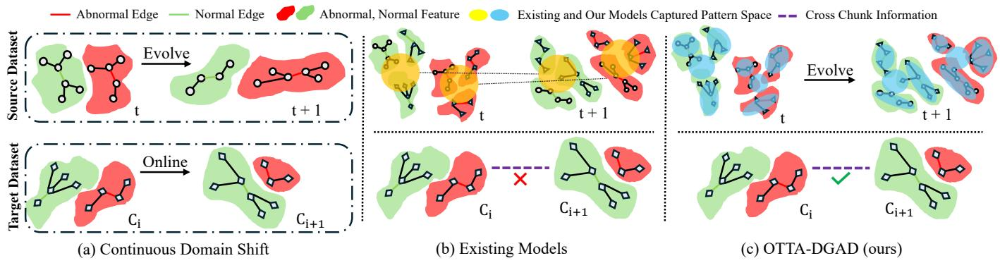  
Fig. 1. Motivating experiments. (a) Anomalous patterns change over time, chunks and cross datasets. (b) Existing generalist methods capture only domai agnostic patterns, without cross chunk information preservation. (c) Our method, OTTA-DGAD, captures both domain-agnostic and domain-specific patterns. Cross chunk information is also preserved.

in the upper part of Fig. 1(c).

Secondly, chunk-wise and unlabeled nature of the online target data stream also introduce another challenge [30], [31], [32]. In dynamic graphs, each incoming chunk only provides a partial view of the target domain as shown in the lower part of Fig. 1(b). However, many anomaly patterns depend on cross chunk interactions, historical neighbors, and evolving structural dependencies. These information are not directly observable from the current chunk [33], [34]. For example, in a social network, a user may interact with only a few accounts within one time chunk. Notwithstanding, suspicious pattern may only become evident after linking multiple chunks. Consequently, chunk-wise adaptation fail to capture temporal evolution of graph structure and feature distribution, thus lead to incorrect anomaly detection. Although OTTA can retain cross chunk information by tracking historical scores or gradients, existing methods [35], [36] are mainly designed for sequential data. Moreover, they lack an explicit module for incorporating structural information across chunks. The problem is further complicated by the absence of labels [3], [37]. Therefore, the model needs to preserve cross chunk information as shown in lower part of Fig. 1(c).

To address the aforementioned challenges, we propose Online Test-Time Adapted Generalizable Dynamic Graph Anomaly Detector (OTTA-DGAD). OTTA-DGAD is pretrained on multiple source-domain datasets to capture domain agnostic patterns. Then, it is adapted online to chunk-wise target data to incorporate target-specific patterns. Specifically, it first constructs dynamic prototypes, namely representations of normal and abnormal patterns, from spatial anomalies captured by temporal ego-graphs. These prototypes are further updated with edge-level temporal attributes, allowing them to reflect how anomalous patterns evolve over time. Prototypes collected from different source domains are stored in a memory buffer, which is then updated with prototypes from the new domain. Thus, the memory buffer preserves both domainagnostic knowledge and domain-specific knowledge for adaptation. After that, OTTA-DGAD derives normal and abnormal distributions from the buffered prototypes for anomaly scoring.

A preliminary version of this work was published in [38]. Although DP-DGAD performed well, it had three major limitations that prevent it from real world deployment. First, it cannot handle the missing information cross chunks, which we call context [39], caused by chunked target data stream. To address this issue, we preserve representations that are representative of the chunk distribution and distinct from one another in a context buffer. We measure the former using a coverage score and the latter using a difference score. These representations are later used to enhance the similar query representations in the next chunk. Moreover, DP-DGAD uses low-entropy detection pairs as confident predictions and uses their pseudo labels to update the prototypes. However, entropy alone measures only prediction certainty, not whether the prediction is structurally consistent with the graph. It can therefore select confidently incorrect samples. Moreover, selecting a fixed number of pseudo-labeled samples per class can bias prototype updates when target chunks are classimbalanced, causing errors to accumulate over time. To address these issues, we assess pseudo-label quality using two complementary signals. The first is prediction entropy, which reflects model confidence. The second is structural support, which reflects whether a node’s predicted label agrees with those of its neighbors. We combine these signals into a reliability score, and normalize the score within each pseudo-label class to ensure comparability across classes. We then rank all detections together, regardless of their predicted classes, to select the most reliable ones. This allows the number of selected normal and anomalous detections to vary naturally with the confidence distribution of each chunk. Third, DP-DGAD has not been evaluated in an OTTA setting, leaving its effectiveness under realistic online test-time adaptation unclear. Therefore, in this work, we reformulate the task under the OTTA-DGAD setting. Unlike prior evaluations that assume fully available target data, we re-run all experiments under a strict chunk-wise online adaptation protocol, covering all baselines across all ten datasets.

We propose a new and more realistic research problem, online test-time adaptation for generalizable dynamic graph anomaly detection. The pretrained DGAD model must adapt to unlabeled target dynamic graphs that arrive sequentially in chunks under continuous domain shifts.

• We equip OTTA-DGAD with two new components:

a structurally supported pseudo-labeling strategy and a cross-chunk information preserving mechanism. Together, they enable the detector to capture anomaly patterns that are both shared across chunks and specific to the current chunk under OTTA constraints.

• We conduct extensive experiments on a large-scale crossdomain benchmark containing ten real-world datasets from diverse domains. The results show that our method achieves state-of-the-art performance with improved stability and generalization.

## II. RELATED WORK

## A. Generalizable Dynamic Graph Anomaly Detection

Existing dynamic graph anomaly detection (DGAD) follow a general pipeline by modeling structural and temporal dependencies jointly. For example, TADDY [13] employs a transformer-based architecture to encode temporal evolution and spatial dependencies for anomaly detection. StrGNN and DynAnom [40], [41] focus on local subgraphs to efficiently identify structural irregularities in evolving graphs. In semisupervised settings, methods such as SAD and CoLA [42], [13] exploit limited anomaly labels to learn discriminative representations [43]. Meanwhile, unsupervised DGAD methods [14] have received increasing attention because anomaly labels are often unavailable in practical applications. These methods generally assume that the training data are dominated by normal samples and detect anomalies according to their deviations from learned normal patterns. For instance, FAL-CON [15] exploits fine-grained temporal information through enhanced sampling and representation learning, while SLADE [16] models long-term evolving interactions to characterize normal behavioral patterns. Despite their effectiveness, most existing DGAD methods are developed under a closed-world, one-model-per-domain paradigm. They assume that the source and test graphs share similar feature distributions, structural patterns, and anomaly semantics. As a result, their performance can degrade substantially when deployed on unseen domains with distribution shifts [44], [45].

To alleviate cross-domain distribution shifts, recent studies have explored generalist detection models, which aims to learn general domain agnostic patterns from multiple source domains and apply it to unseen target domains [27], [28], [29], [46]. Existing approaches typically reduce domain discrepancies through unified representation strategies, including normalization [47], [48], prototype-based modeling [49], [33], [26], and prompt-based adaptation [50]. These methods seek to preserve domain-invariant patterns shared across graphs and thereby avoid retraining a dedicated detector for every target domain. Most generalist GAD methods are designed for static graphs and primarily preserve domain agnostic pattern, making them inadequate for evolving, domain specific anomaly patterns in unseen domains. Our method addresses this limitation by maintaining dynamic prototypes from temporal ego-graphs in a memory buffer, which retains general pattern while incorporating domain specific patterns.

B. Online Test Time Adaptation for Dynamic Graph Anomaly Detection

Online test-time adaptation (OTTA) [31], [22], [23] aims to adapt a source-pretrained model to an unlabeled target stream that arrives sequentially. Unlike conventional domain adaptation [7], [4], [51], [52], OTTA performs adaptation without accessing source data or target labels. Existing OTTA methods often update selected model parameters using selfsupervised objectives on incoming target data. For example, CMF [53] filters momentum in the parameter space to stabilize continual adaptation, while TEA [21] performs adaptation by aligning target representations with class-wise energy distributions. SoTTA [20] improves robustness to noisy online streams by selecting reliable target samples and reducing the influence of noisy pseudo-labels. Protected TTA [32] further introduces online entropy matching and a statistical protection mechanism to avoid harmful self-training updates. Other methods use target-data selection, memory mechanisms, or diverse augmented views to improve adaptation stability. For instance, Universal TTA [35] combines weight ensembling, diversityaware weighting, and prior correction to improve robustness across different test-time shifts. In addition, Dual Memory Networks [54] maintain complementary memory representations to support adaptation, whereas prompt-based approaches adapt a small set of prompts or lightweight modules while retaining the pretrained backbone [55], [24]. These methods improve adaptation efficiency and mitigate domain shift. However, they lack module for dynamic graphs that both need temporal as well spatial adaptation.

For dynamic graphs, recent studies have begun to investigate test-time adaptation through lightweight prompt tuning and continual adaptation. PromptDyG [25] performs testtime prompt adaptation on dynamic graphs by keeping the pretrained backbone fixed and updating lightweight prompts to accommodate evolving patterns. ADCSD [56] retains a frozen source-pretrained backbone and refines its predictions through a short-term correction module conditioned on the current chunk’s statistics and a long-term module based on an exponential-moving-average historical state. Followed by LCoTTA [36] that maintain a queue of recent adaptation gradients, estimates their principal subspace online, and projects each current update onto this subspace before updating lightweight adaptation parameters. Notwithstanding, these methods do not explicitly preserve or retrieve cross chunk information that capture evolving structural dependencies and can suffer from suboptimal performance when required to identify anomalies in dynamic graph streams.

## III. PROBLEM FORMULATION

Definition 1. (Dynamic Graph Anomaly Detection) A dynamic graph can be denoted as ${ \mathcal { G } } = \{ G _ { 1 } , G _ { 2 } , \ldots , G _ { T } \}$ where $T$ is the number of intervals, and interval t consists of $M _ { t }$ timestamps. Specifically, $G _ { t } = ( V _ { t } , E _ { t } )$ , where $V _ { t }$ is a node set and $E _ { t }$ is an edge set, with $\overset { \cdot } { A } ^ { V _ { t } } \in \mathbb { R } ^ { N ^ { V _ { t } } \times N ^ { V _ { t } } }$ and $A ^ { E _ { t } } \in \mathbb { R } ^ { N ^ { E _ { t } } \times N ^ { E _ { t } } }$ denoting the node and edge adjacency matrices $( N ^ { V _ { t } } = | V _ { t } | , N ^ { E _ { t } } \stackrel {  } { = } | E _ { t } | )$ , and $X ^ { V _ { t } } \in \mathbb { R } ^ { \breve { N } ^ { V _ { t } } \times D ^ { \breve { V } } \times M _ { t } }$ $X ^ { E _ { t } } \in \mathbb { R } ^ { N ^ { E _ { t } } \times \overleftarrow { D } ^ { E } \times M _ { t } }$ denoting the temporal node and edge features, $D ^ { E } , D ^ { V }$ is the dimension of features, respectively. Each edge is associated with a label vector $y _ { t } \in \{ 0 , 1 \} ^ { N ^ { E _ { t } ^ { \star } } }$ partitioning $E _ { t }$ into the normal edge set $E _ { t } ^ { n }$ and the abnormal edge set $E _ { t } ^ { a }$

Following existing online test-time adaptation methods [23], we further divide $\mathcal { G }$ into $Q$ data chunks $\{ \mathcal { C } _ { 1 } , \mathcal { C } _ { 2 } , \ldots , \mathcal { C } _ { Q } \}$ for online processing. Each chunk $\mathcal { C } _ { q } = ( V _ { q } , E _ { q } )$ , aggregates $M _ { q }$ consecutive timestamps and contains a fixed number of edges $| E _ { q } | = B ~ ( \mathrm { e . g . , } ~ B = 1 2 8$ interactions). $\mathcal { C } _ { q }$ inherits the same notation as $G _ { t } ~ ( \mathrm { i . e . , ~ } A ^ { V _ { q } } , A ^ { E _ { q } } , X ^ { V _ { q } } , X ^ { E _ { q } } , E _ { q } ^ { n } , E _ { q } ^ { a } , y _ { q } )$ . The goal of dynamic graph anomaly detection is to distinguish abnormal edges from normal ones based on the evolving graph structure and temporal features.

Definition 2. (Continuous Domain Shift) Given $\{ \mathcal { G } _ { 1 } , \mathcal { G } _ { 2 } , \ldots , \mathcal { G } _ { S + K } \}$ being a collection of $( S + K )$ dynamic graphs from different domains, where $\{ \mathcal { G } _ { 1 } , \mathcal { G } _ { 2 } , \dots , \mathcal { G } _ { S } \}$ are from source domain and $\{ \mathcal { G } _ { S + 1 } , \mathcal { G } _ { S + 2 } , \dotsc , \mathcal { G } _ { S + K } \}$ are from target domains. For two dynamic graphs from different domains, $\mathcal { G } _ { i }$ and $\mathcal { G } _ { j }$ where $i \neq j ,$ , we define domain shift as a difference between their distributions of node and edge features, graph structures, such as the adjacency matrices or their mappings from edges to anomaly labels. Such domain shifts occur among any two dynamic graphs in the dataset collection $\{ \mathcal { G } _ { 1 } , \mathcal { G } _ { 2 } , \ldots , \mathcal { G } _ { S + K } \}$

Problem Definition. (Online Test-Time Adaptation for Generalizable Dynamic Graph Anomaly Detection) Given $S$ source dynamic graphs $\{ \mathcal { G } _ { 1 } , \ldots , \mathcal { G } _ { S } \}$ , we first train a source detector $\Psi _ { 0 }$ that distinguishes abnormal from normal edges on source dynamic graphs. Given an unseen target dynamic graph $\mathcal { G } _ { k }$ partitioned into $Q _ { k }$ chunks $\{ \mathcal { C } _ { 1 } , \ldots , \mathcal { C } _ { Q _ { k } } \}$ , our goal is to sequentially adapt $\Psi _ { 0 }$ into a series of detectors $\{ \Psi _ { 1 } , \ldots , \Psi _ { Q _ { k } } \}$ that minimize the anomaly detection error across all chunks of $\mathcal { G } _ { k }$ , without access to any target label. Specifically, for each chunk $\mathcal { C } _ { q } ,$ , the detector $\Psi _ { q - 1 }$ adapted via previous chunk $\mathcal { C } _ { q - 1 }$ first predicts anomaly scores on the current unlabeled chunk $\mathcal { C } _ { q }$ as:

$$
\hat { y } _ { q } = \Psi _ { q - 1 } \big ( A ^ { V _ { q } } , A ^ { E _ { q } } , X ^ { V _ { q } } , X ^ { E _ { q } } \big ) ,\tag{1}
$$

and is then updated to $\Psi _ { q }$ using only $\mathcal { C } _ { q }$ and $\hat { y } _ { q }$ , without access to $y _ { q }$ or future chunks.

## IV. METHODOLOGY

As shown in Fig. 2, OTTA-DGAD first extracts evolving patterns using dynamic prototype extraction and stores them in a memory buffer. Then, during cross-domain anomaly scoring, it retains general patterns shared among pretrained source datasets while incorporating domain-specific ones. These $\mathrm { d y } .$ namic prototypes are compared with embeddings to calculate anomaly scores. On target data, it measure detection with a reliability score that combines prediction entropy and structural support, where structural support reflects agreement between a node and its neighbors. These detections provide pseudolabels for updating the memory buffer. Besides, a context buffer stores representations is used to enrich cross chunk information. We select samples using two scores. The coverage score measures similarity to the distribution of the current chunk, while the difference score measures dissimilarity from entries already stored in the buffer. When a new chunk arrives, its query representations is enriched by cross chunk information from this buffer.

## A. Dynamic Prototype Extraction

In this section, our goal is to extract dynamic prototypes as the evolving representations of normal and anomalous patterns. Particularly, we align prototypes with both abnormal and normal patterns to fully exploit anomaly discriminability. This approach enables a more effective capture of evolving anomalous patterns over time.

For each edge $e _ { i } ,$ its anomalous pattern can be captured by the ego-graph consisting of its neighbors, thereby reflecting how it deviates from or resembles them [28]. To capture not only the anomalous pattern but also its evolution over time, temporal ego-graphs are utilized. These graphs [14] extract k-hop neighboring edges occurring on or before timestamp t around edge $e _ { i }$ and form a subgraph $G _ { e g o }$ . The temporal egograph is then input into a simple backbone model consisting of a Graph Neural Network (GNN), followed by a transformer to retrieve representations. The GNN first outputs representation $H _ { l } \in \mathbb { R } ^ { | E _ { e g o } | \times d }$ as follows:

$$
H _ { l } = \sigma ( A _ { e g o } H _ { l - 1 } W _ { 1 } ^ { l } + H _ { l - 1 } W _ { 2 } ^ { l } ) ,\tag{2}
$$

where d is the dimension of representation and l is the GNN layer index. Wl2, $W _ { 1 } ^ { l } ~ \in ~ \mathbb { R } ^ { D ^ { l - 1 } \times D ^ { l } }$ are learnable parameter matrix of layer l and $\sigma$ is the activation function. $A _ { e g o }$ refers to the edge adjacency matrix of the ego-graph. To encourage the representation to capture more domain-agnostic features, a residual module is applied here to smooth edge-specific representation $h _ { i } \in H _ { l }$ as follows:

$$
h _ { i } ^ { ' } = h _ { i } - \frac { 1 } { | E _ { e g o } | } \sum _ { e _ { j } \in E _ { e g o } } h _ { j } .\tag{3}
$$

Then, the processed $H _ { l } ^ { ' }$ is fed into a transformer. This transformer’s role is to identify the similarity between edge $e _ { i }$ and its k-hop neighbors. In this way, we encode the spatial anomalous patterns of $e _ { i }$ as they evolve over time into its embedding $z _ { i }$

$$
z _ { i } = \sum _ { h _ { j } ^ { \prime } \in { \cal H } _ { l } ^ { \prime } } \frac { e x p ( \frac { < w _ { Q } h _ { i } ^ { ' } , w _ { K } h _ { j } ^ { ' } > } { \sqrt { d _ { o u t } } } ) } { \sum _ { h _ { j } ^ { \prime } \in { \cal H } _ { l } ^ { \prime } } e x p ( \frac { < w _ { Q } h _ { i } ^ { ' } , w _ { K } h _ { j } ^ { ' } > } { \sqrt { d _ { o u t } } } ) } w _ { V } h _ { j } ^ { ' } ,\tag{4}
$$

where $< . , . , >$ denotes the dot product, $d _ { o u t }$ refers to the dimension of the output representation $z _ { i }$ of edge $e _ { i } .$ $w _ { Q } , w _ { K } , w _ { V }$ refer to the Query, Key, and Value matrix.

After obtaining the representation of each edge, we align dynamic prototypes with both the abnormal and normal edges representations. Formally, we have $p _ { n } \in \mathbb { R } ^ { d _ { p } }$ as the dynamic normal prototypes while $p _ { a } ~ \in ~ \mathbb { R } ^ { d _ { p } }$ represents the dynamic abnormal prototypes. Both for the abnormal $e _ { i }$ in $E _ { t } ^ { a }$ and that in $E _ { t } ^ { n }$ , we can obtain the ego-graph representation. We denote the representation of abnormal edges as $Z _ { a }$ and the representations of normal edges as $Z _ { n }$ . To align $p _ { a }$ and $p _ { n }$ with $Z _ { a }$ and $Z _ { n }$ , we define alignment loss function as follows:

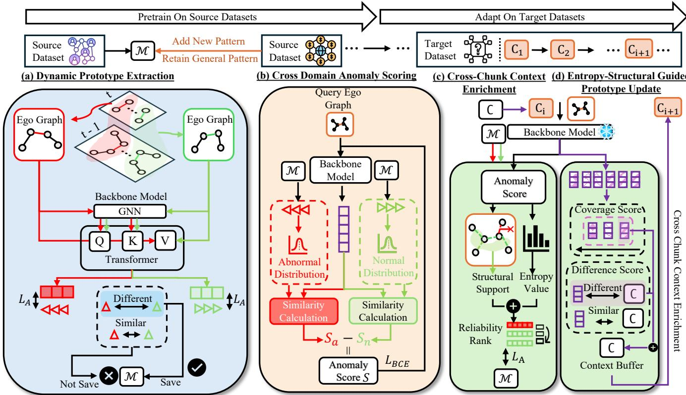  
: Abnormal Edge : Normal Edge $\pmb { \triangle }$ : Abnormal Prototype : Normal Prototype  
Fig. 2. General framework of OTTA-DGAD. (a) Starting with the first source dataset, we extract ego-graphs to capture temporal patterns and store the most distinct prototype pairs in a memory buffer. (b) As we pretrain on the following source datasets, new domain-specific patterns are added while general domain-agnostic patterns are retained. Prototype distributions are then compared with edge embeddings for anomaly scoring. (c) On target chunks, reliable detections, measured by prediction entropy and agreement with neighboring edges, provide pseudo-labels for memory updates. The buffer retains representations with high similarity to chunk distribution, which we define as coverage score and different with stored entries. These representations enrich subsequent chunks with cross-chunk context, while the generalist model remains frozen.

$$
L _ { A } = \sum _ { i = 1 } ^ { | E _ { t } | } I _ { y _ { i } = 0 } | | z _ { i } - p _ { n } | | _ { 2 } ^ { 2 } + I _ { y _ { i } = 1 } | | z _ { i } - p _ { a } | | _ { 2 } ^ { 2 } ,\tag{5}
$$

where $I _ { y _ { i } = 0 }$ represents indicator function. This function returns 1 when the condition $y _ { i } = 0$ is met, and 0 otherwise.

These aligned dynamic prototypes are further stored in the dynamic prototype buffer B that has size M, set as 10% of the training source dataset size. The buffer is updated during each iteration to capture diverse aspects of the abnormal and normal patterns as possible. Due to limitations in size and memory, we retain only the most discriminative prototypes. This is achieved by ranking all prototypes currently in the buffer in ascending order based on the distance score. The prototype pairs with the smallest distance score, indicating weak separability between normal and abnormal patterns are therefore replaced. The distance score is calculated as the mean Euclidean distance between pairs of prototypes:

$$
s _ { d } = \frac { 1 } { d _ { p } } \sum _ { m = 1 } ^ { d _ { p } } | | p _ { a } ^ { m } - p _ { n } ^ { m } | | _ { 2 } ,\tag{6}
$$

where $d _ { p }$ refer to the dimension of prototypes, $p _ { a } ^ { m } , p _ { n } ^ { m }$ refer to the corresponding dimension m’s feature in prototypes. In each training epoch, the system identifies the pair of prototypes that exhibits the highest distance score. This most distinct pair is then used to set the initial values for $p _ { n }$ and $p _ { a }$ for that specific epoch. This strategy ensures that the dynamic prototypes are continuously refined to be more distinguishable.

## B. Cross Domain Anomaly Scoring

Distribution-based anomaly scoring surpasses traditional binary classifiers in its ability to generalize across different domains. It captures higher-order statistics of data distributions by comparing data with both abnormal and normal distributions. However, our current dynamic prototypes are domainspecific, which prevents their direct application across different domains. To generalize them to new domains, we identify and save domain-agnostic ones, while adding new prototypes from new domains. Subsequently, we build anomaly scoring module to leverage these enhanced prototypes.

For identifying domain-agnostic patterns, they should already be present in the memory buffer, which stores information from previously encountered source datasets. Additionally, they should also exhibit similarity to the feature representations found in the subsequent source dataset. The similarity $s _ { e }$ is calculated as the mean Euclidean distance between the dynamic prototype pair and the representations of edges in the new domain dataset:

$$
s _ { e } = \frac { 1 } { | E _ { t } | } \sum _ { i = 1 } ^ { | E _ { t } | } | | z _ { i } - p _ { n } | | _ { 2 } + | | z _ { i } - p _ { a } | | _ { 2 } .\tag{7}
$$

Notably, the representation $z _ { i }$ is projected to the same dimension as that of the dynamic prototypes. To ensure $s _ { d }$ and $s _ { e }$ are on a comparable scale before combination, $s _ { e }$ is likewise normalized via $d _ { p }$ . A lower distance indicates higher similarity, meaning more general prototypes. This will be combined with $s _ { d }$ in the following manner:

$$
s _ { r } = \lambda _ { d } s _ { d } - \lambda _ { e } s _ { e } ,\tag{8}
$$

where $\lambda _ { d }$ and $\lambda _ { e }$ are parameters used to control the contribution of the two scores. A higher $s _ { r }$ indicates greater pairwise distance and similarity to the new source dataset, representing more general domain-agnostic patterns. For new domain patterns, we rank buffer prototypes by $s _ { r }$ in ascending order and replace the lowest-scoring pair with one from the new domain. We then initialize $p _ { n }$ and $p _ { a }$ using the highest $s _ { r }$ pairs to ensure dynamic prototypes capture both domainagnostic and domain-specific patterns.

With these dynamic prototypes in the memory buffer, we build an anomaly scoring module by measuring edge representation similarity to both normal and abnormal distributions. Top prototype pairs alone cannot fully represent distributions, so we iteratively update statistical measures (mean and covariance). Each iteration incorporates new data and existing statistics to capture evolving distributions. The mean update is as follows:

$$
\mu _ { n , t } = \alpha \mu _ { n , t - 1 } + ( 1 - \alpha ) \sum _ { i = 1 } ^ { \mathcal M } p _ { n , i } ,\tag{9}
$$

$$
\mu _ { a , t } = \alpha \mu _ { a , t - 1 } + ( 1 - \alpha ) \sum _ { i = 1 } ^ { \mathcal M } p _ { a , i } ,\tag{10}
$$

where $\mu _ { n }$ and $\mu _ { a }$ are the mean values for normal and abnormal distributions. α is a momentum parameter to control the ratio of updating based on prototypes and the existing mean value.

For covariance updates, we first calculate center embedding, which captures how individual prototypes differ from the overall average. Then, we use center embeddings to update the covariance that inherently measures how data points vary together around their mean values:

$$
C _ { n } = [ p _ { n , 1 } - \mu _ { n , t } , p _ { n , 2 } - \mu _ { n , t } , . . . , p _ { n , { \mathcal { M } } } - \mu _ { n , t } ] ^ { T } ,\tag{11}
$$

$$
C _ { a } = [ p _ { a , 1 } - \mu _ { a , t } , p _ { a , 2 } - \mu _ { a , t } , . . . , p _ { a , M } - \mu _ { a , t } ] ^ { T } ,\tag{12}
$$

$$
\Sigma _ { n , t } = \alpha \Sigma _ { n , t - 1 } + ( 1 - \alpha ) \frac { C _ { n } ^ { T } C _ { n } } { m a x ( 1 , \mathcal { M } - 1 ) } ,\tag{13}
$$

$$
\Sigma _ { a , t } = \alpha \Sigma _ { a , t - 1 } + ( 1 - \alpha ) \frac { C _ { a } ^ { T } C _ { a } } { m a x ( 1 , \mathcal { M } - 1 ) } ,\tag{14}
$$

where $C _ { n }$ and $C _ { a }$ are the center embeddings, and, $\Sigma _ { n }$ and $\Sigma _ { a }$ are the covariance values.

Then we compute a learned discriminant score between the edge representation $z _ { i }$ and each distribution using a bilinear form parameterized by $\mu$ and Σ:

$$
s _ { n , i } = z _ { i } ^ { T } \mu _ { n } - \lambda _ { n } z _ { i } ^ { T } \Sigma _ { n } z _ { i } ,\tag{15}
$$

$$
s _ { a , i } = z _ { i } ^ { T } \mu _ { a } - \lambda _ { a } z _ { i } ^ { T } \Sigma _ { a } z _ { i } ,\tag{16}
$$

where $\lambda _ { a } , \lambda _ { n }$ are learnable parameters, adjusting the relative contribution of the second-order term, that are learned during source pretraining and kept fixed throughout target-time adaptation. Next, we compute the anomaly score $s _ { i } = s _ { a , i } - s _ { n , i } ,$ which measures the similarity gap to determine if an edge is closer to the abnormal or normal distribution. This score is then converted into a probability $( p _ { i } )$ using a sigmoid function, representing the likelihood of the edge being anomalous. The overall learning objective combines binary cross-entropy loss with the previous alignment loss $( L _ { A } )$

$$
L _ { B C E } = - \frac { 1 } { | E _ { t } | } \sum _ { i = 1 } ^ { | E _ { t } | } y _ { i } \log ( p _ { i } ) + ( 1 - y _ { i } ) \log ( 1 - p _ { i } ) ,\tag{17}
$$

$$
L = \lambda _ { B C E } L _ { B C E } + \lambda _ { A } L _ { A } ,\tag{18}
$$

where $\lambda _ { A }$ and $\lambda _ { B C E }$ are parameters controlling the contribution ratio of these two losses to the final loss.

## C. Entropy-Structural Guided Prototype Update

To adapt the source-pretrained detector to an unlabeled target stream, we update the dynamic prototype memory using only reliable pseudo-labeled target edges. Unlike DP-DGAD [38], which relies solely on entropy-ranked confident detections, we add structural support as an additional criterion, and then perform class-wise memory updates to alleviate the bias caused by imbalanced confident pseudo-labels.

Given an incoming target chunk $\mathcal { C } _ { q }$ , the pretrained anomaly scorer produces an anomaly probability $p _ { i } \in [ 0 , 1 ]$ for each target edge $e _ { i }$ based on the enhanced representation $\tilde { \mathbf { z } } _ { i } .$ , together with its pseudo-label

$$
\hat { y } _ { i } = \mathbb { I } ( p _ { i } > 0 . 5 ) ,\tag{19}
$$

where $\hat { y } _ { i } = 1$ and $\hat { y } _ { i } = 0$ denote abnormal and normal pseudolabels, respectively.

We first estimate the prediction confidence using entropy:

$$
\begin{array} { r } { \mathcal { H } ( p _ { i } ) = - p _ { i } \log ( p _ { i } + \epsilon ) - ( 1 - p _ { i } ) \log ( 1 - p _ { i } + \epsilon ) , } \end{array}\tag{20}
$$

where lower entropy indicates higher prediction confidence. We further convert it into a normalized confidence score:

$$
e c _ { i } = 1 - \frac { \mathcal { H } ( p _ { i } ) } { \ln 2 } .\tag{21}
$$

However, confidence alone is insufficient under continuous domain shift. We therefore introduce a structural support score to evaluate whether the predicted class of $e _ { i }$ is supported by its local neighborhood. Let ${ \mathcal { N } } _ { i }$ denote the neighboring edges of $e _ { i }$ in its temporal ego-graph. The structural support score is defined as

$$
s s _ { i } = \left\{ \begin{array} { l l } { \displaystyle \sum _ { j \in \mathcal { N } _ { i } } ( 1 - p _ { j } ) , } & { \hat { y } _ { i } = 0 , } \\ { \displaystyle \sum _ { j \in \mathcal { N } _ { i } } p _ { j } , } & { \hat { y } _ { i } = 1 , } \end{array} \right.\tag{22}
$$

In this way, a pseudo-labeled normal edge is supported by normal-like neighbors, while a pseudo-labeled abnormal edge is supported by abnormal-like neighbors. Based on the above two criteria, we assign each target edge a raw reliability score:

$$
r _ { i } = e c _ { i } \cdot s s _ { i } .\tag{23}
$$

Since the structural support score is computed in a classconditional manner, the raw reliability scores of pseudolabeled normal and abnormal edges may be on different scales. To make the scores comparable for global ranking, we further normalize them within each pseudo-label class. Specifically, let:

$$
r _ { \operatorname* { m i n } } ^ { ( y ) } = \operatorname* { m i n } _ { \{ i | \hat { y } _ { i } = y \} } r _ { i } , \qquad r _ { \operatorname* { m a x } } ^ { ( y ) } = \operatorname* { m a x } _ { \{ i | \hat { y } _ { i } = y \} } r _ { i } ,\tag{24}
$$

where $y \in \{ 0 , 1 \}$ . The class-normalized reliability score is defined as

$$
\tilde { r } _ { i } = \frac { r _ { i } - r _ { \operatorname* { m i n } } ^ { ( \hat { y } _ { i } ) } } { r _ { \operatorname* { m a x } } ^ { ( \hat { y } _ { i } ) } - r _ { \operatorname* { m i n } } ^ { ( \hat { y } _ { i } ) } + \epsilon } .\tag{25}
$$

We then select the top $N _ { c o n }$ target edges with the highest normalized reliability scores as confident detections. According to their pseudo-labels, the selected confident detections are further divided into abnormal and normal subsets $E _ { q } ^ { a } , E _ { q } ^ { n }$ Using the selected confident detections, we construct class wise confident detection for the current chunk by normalized reliability weighted aggregation:

$$
\mathbf { z } _ { q } ^ { a } = \frac { \displaystyle \sum _ { e _ { i } \in E _ { q } ^ { a } } \tilde { r } _ { i } \tilde { \mathbf { z } } _ { i } } { \displaystyle \sum _ { e _ { i } \in E _ { q } ^ { a } } \tilde { r } _ { i } + \epsilon } , \qquad \mathbf { z } _ { q } ^ { n } = \frac { \displaystyle \sum _ { e _ { i } \in E _ { q } ^ { n } } \tilde { r } _ { i } \tilde { \mathbf { z } } _ { i } } { \displaystyle \sum _ { e _ { i } \in E _ { q } ^ { n } } \tilde { r } _ { i } + \epsilon } .\tag{26}
$$

We then align the classwise confident detections with the corresponding memory prototypes through the alignment loss $\mathcal { L } _ { A }$ . Thus, only reliable pseudo-labeled target edges contribute to memory adaptation. By normalizing the reliability scores within each pseudo-label class before global ranking, the proposed strategy reduces the scale bias across classes while still allowing the numbers of selected abnormal and normal detections to adapt to the confidence distribution of each target chunk.

## D. Cross Chunk Context Enrichment

Temporal ego-graph of a target edge, which contain temporal and structural context, may be incomplete within a single chunk. As a result, the pretrained detector may generate incorrect pseudo labels because of insufficient context. To address this issue, we introduce a Cross Chunk Context Enrichment module, which supplements the current target chunk with historical context distilled from recent chunks before reliable pseudo-label selection and memory adaptation.

To remain consistent with the online test-time adaptation setting, we do not replay or reprocess full historical target chunks. Instead, we stores only representation of ego graphs. Specifically, after processing chunk $\mathcal { C } _ { q - 1 }$ , we retain edges whose ego-graph representations representative of current chunk while remaining dissimilar to representations already stored in the buffer $\boldsymbol { B } _ { c }$ . Here, representative is measured by the extent of a certain representation similarity to other representations in the chunk. We denote this measurement coverage score and is defined as:

$$
\cos _ { i } = \frac { 1 } { | E _ { q - 1 } | - 1 } \sum _ { \stackrel { e _ { j } \in E _ { q - 1 } } { j \not = i } } \sin \left( \mathbf { z } _ { i } , \mathbf { z } _ { j } \right) ,\tag{27}
$$

where sim $( \cdot , \cdot )$ denotes a similarity function, such as cosine similarity. The difference score that measure the dissimilarity to representations that already in buffer is defined as:

$$
\mathrm { d } \mathrm { s } _ { i } = 1 - \operatorname* { m a x } _ { \mathbf { z } _ { j } \in { \mathcal { B } } _ { c } } \sin \left( \mathbf { z } _ { i } , \mathbf { z } _ { j } \right) .\tag{28}
$$

Then we multiply two score, also the temporal component being $\frac { q _ { i } } { q - 1 }$ , where $q _ { i }$ being the chunk id of specific representation. To ensure that the context buffer only contains only the most recent, representative, distinct, and informative representations, we compare each normalized multiplication score against the scores of the entries already in $\boldsymbol { B } _ { c }$ and retain the top $\mathcal { M } _ { c }$ entries. The capacity grows online by 10% of each incoming chunk’s size, up to a fixed maximum capacity $\mathcal { M } _ { \mathrm { c , m a x } } .$

Given a target edge $e _ { i }$ in chunk $\mathcal { C } _ { q }$ with representation $\mathbf { z } _ { i } ,$ we retrieve its cross chunk context from the context buffer by identifying stored representation that are semantically similar to the current edge. For each stored context representation $z _ { j } ~ \in ~ B _ { c }$ , we compute a cross chunk similarity score using above like similarity function. Top $N _ { c o n }$ representation with the highest similarity scores as the historical context of $e _ { i } .$ Based on these retrieved context representation, we construct a cross chunk context vector $c _ { i }$ by weighted aggregation via aforementioned temporal component. The $c _ { i }$ is then fused with the current edge representation to obtain a context-enhanced target representation:

$$
\begin{array} { r } { \tilde { \mathbf { z } } _ { i } = \lambda _ { c } \mathbf { z } _ { i } + ( 1 - \lambda _ { c } ) \mathbf { c } _ { i } , } \end{array}\tag{29}
$$

where $\lambda _ { c }$ is parameter controlling the proportion of enrichment. For the first target chunk, the historical context buffer is empty. Therefore, no cross chunk context is retrieved and the enhanced representation degenerates to the current representation. The enhanced representation $\tilde { \mathbf { z } } _ { i }$ is subsequently used during the target adaptation stage.

## V. EXPERIMENTS

## A. Datasets

We use 10 real-world datasets [13], [16], [57] from various domains for evaluation, and the detailed statistics of datasets are presented in Table I. For a dataset with no ground truth anomalies. We follow previous work [13] to inject anomalies in random timestamps of the dataset. Specifically, take $p$ to be the proportion of the total m number of samples in the dataset. We link $p \times m$ number of original disconnected nodes to be the injected anomalies.

TABLE I  
STATISTICS OF DATASETS
<table><tr><td>Dataset</td><td>Domain</td><td>#Nodes</td><td>#Edges</td><td>Avg. Degree</td></tr><tr><td>Wikipedia</td><td>Online Collaboration</td><td>9,227</td><td>157,474</td><td>34.13</td></tr><tr><td>Bitcoin-OTC</td><td>Transaction Network</td><td>5,881</td><td>35,588</td><td>12.10</td></tr><tr><td>Bitcoin-Alpha</td><td>Transaction Network</td><td>3,777</td><td>24,173</td><td>12.80</td></tr><tr><td>Email-DÑC</td><td>Online Communication</td><td>1,866</td><td>39,264</td><td>42.08</td></tr><tr><td>UCI Messages</td><td>Online Communication</td><td>1,899</td><td>13,838</td><td>14.57</td></tr><tr><td>AS-Topology</td><td>Autonomous Systems</td><td>34,761</td><td>171,420</td><td>9.86</td></tr><tr><td>MOOC</td><td>Online Courses</td><td>7,074</td><td>411,749</td><td>116.41</td></tr><tr><td>Synthetic-Hijack</td><td>Email Spam</td><td>986</td><td>333,200</td><td>38.11</td></tr><tr><td>TAX51</td><td>Transaction Network</td><td>132,524</td><td>467,279</td><td>7.05</td></tr><tr><td>DBLP</td><td>Citation Network</td><td>25387</td><td>119899</td><td>9.44</td></tr></table>

## B. Performance Metrics and Baselines

We adopt AUROC and AUPRC as the evaluation metrics [13], [28], [48]. Higher metric value indicates better detection performance.

Since AUROC and AUPRC are undefined when a chunk contains only one class, we exclude such chunks from chunklevel metric computation. Let ${ { \cal { K } } _ { v a l i d } }$ denote the set of valid target chunks that contain at least one normal edge and one abnormal edge. The final online evaluation results are obtained by averaging the chunk-level metrics over all valid chunks:

$$
\mathrm { A U R O C } _ { a v g } = \frac { 1 } { | \mathcal { K } _ { v a l i d } | } \sum _ { k \in \mathcal { K } _ { v a l i d } } \mathrm { A U R O C } _ { k } ,\tag{30}
$$

$$
\mathrm { A U P R C } _ { a v g } = \frac { 1 } { | \mathcal { K } _ { v a l i d } | } \sum _ { k \in \mathcal { K } _ { v a l i d } } \mathrm { A U P R C } _ { k } .\tag{31}
$$

This protocol evaluates the model in a strictly online manner, where adaptation and prediction are both performed sequentially along the target stream without revisiting full historical target chunks. In this way, the reported results reflect not only the anomaly discrimination capability of the model, but also its ability to continuously adapt to evolving target distributions under the OTTA setting. We select following baseline methods for comparison:

DP-DGAD [38]: DP-DGAD is pretrained on labeled source dynamic graphs to learn normal and anomalous prototypes, then adapts to unlabeled target streams by updating its prototype memory with high-confidence pseudo-labels. As it supports online target adaptation, we include it as an OTTA baseline.

GeneralDyG [14]: For fair comparison, we extend the GeneralDyG with a transformer module and a binary classification head, enabling it to learn discriminative temporal ego-graph representations from labeled normal and anomalous source edges. During online target adaptation, it updates target-side prototypes using only reliable pseudo-labeled edges.

• FALCON [15]: We extend the FALCON with labelaware supervision and a BCE loss, enabling it to learn discriminative temporal representations from normal and anomalous source edges. During online target adaptation, FALCON incrementally refines its temporal representation space using reliable pseudo-labeled target edges for anomaly scoring.

• SLADE [16]: We enhance SLADE with a binary classification objective to learn discriminative representations of normal and anomalous dynamic patterns from source data. During online target adaptation, it updates its temporal self-supervised objective using reliable pseudo-labeled target edges.

• SAD [42]: We combine SAD’s deviation loss with label-aware contrastive learning to separate normal and anomalous temporal structures on source data. On target dataset, reliable pseudo-labeled edges are used to update its memory bank and refine target-side representations.

TADDY [13]: Following the core idea of TADDY, we use a GNN encoder and a transformer-based temporal encoder to represent each dynamic graph chunk. The model is trained on labeled source edges with BCE loss and adapted online using reliable pseudo-label.

• ARC [27]: We extend ARC with a transformer-based temporal encoder to model dynamic graphs. It learns anomaly-aware representations from labeled source temporal neighborhoods and is adapted online using reliable pseudo-labeled target edges.

• AnomalyGFM [28]: We extend AnomalyGFM with a transformer-based temporal encoder to learn graphagnostic normal and anomalous prototypes from labeled source data. During online target adaptation, the source encoder and abnormal prototype are fixed, while the normal prototype is incrementally refined using reliable pseudo-labeled target edges.

UNPrompt [29]: We replace UNPrompt’s backbone with a GNN-transformer encoder to model temporal subgraphs in dynamic graphs. It is pretrained on source data with dynamic graph contrastive learning and adapted online by updating neighborhood prompts using reliable pseudolabeled target edges.

GraphPrompt [50]:We replace GraphPrompt’s backbone with a GNN-transformer encoder for temporal subgraph modeling. It aligns source representations with normal and anomalous prototypes and incrementally refines the prompt using reliable pseudo-labeled target edges during online adaptation.

• ADCSD [56]: We freeze the source-pretrained OTTA-DGAD backbone and replace cross chunk recovery and prototype evolution with lightweight short- and long-term score-correction modules. These modules are updated online using confident pseudo-labels to refine anomaly scores, while no cross chunk information or prototype memory is maintained.

• LCoTTA [36]: We construct LCoTTA-DGAD by freezing the source-pretrained DGAD backbone and adapting only lightweight parameters. For each target chunk, reliable pseudo-labels are used to compute adaptation gradients, which are projected onto the online tracked principal subspace of recent gradients before updating the adaptation parameters; no cross chunk recovery, prototype update, or graph-specific replay is used.

TABLE II  
OVERALL MODEL PERFORMANCE UNDER THE OTTA SETTING ACROSS EIGHT DATASETS WITH THREE ANOMALY PERCENTAGES.
<table><tr><td colspan="3" rowspan="2">Metrics Category Methods</td><td colspan="2">AS-Topology</td><td colspan="2">Bitcoin-Alpha Email-DNC</td><td>UCI Messages Bitcoin-OTC</td><td>TAX51</td><td></td><td colspan="2">DBLP</td><td>Synthetic-Hijack</td><td colspan="2"></td></tr><tr><td>1% 5%</td><td>10% 1% 5%</td><td>10% 1%</td><td>5% 10% 1%</td><td>5% 10%</td><td>1% 5% 10%</td><td>1% 5%</td><td>10%</td><td>1%</td><td>5%</td><td>10%</td><td>1%</td><td>5% 10%</td></tr><tr><td rowspan="10">AUROC</td><td></td><td>SAD</td><td>40.1643.81</td><td>43.43 57.61 55.59</td><td>60.27 50.05</td><td>54.54 52.28</td><td>56.91 58.28 59.74</td><td>70.04 69.19 74.12</td><td>42.52</td><td>43.56 46.39</td><td></td><td>43.02 42.9847.87</td><td></td><td>59.85 59.67</td></tr><tr><td></td><td>SLADE</td><td>40.47 42.21 44.42</td><td></td><td>50.37</td><td>52.11 54.64</td><td>67.34</td><td></td><td></td><td></td><td></td><td></td><td></td><td>58.14</td></tr><tr><td></td><td></td><td></td><td>60.62 59.25</td><td>62.98 47.98</td><td></td><td>55.28 58.32</td><td>66.35 70.44</td><td>46.68 48.04</td><td>49.33</td><td>42.11</td><td>41.1741.35</td><td>60.53</td><td>60.34 59.99</td></tr><tr><td>DGADS</td><td>FALCON</td><td>46.73 50.24 53.09</td><td>57.13 61.4866.76</td><td>76.81 72.71</td><td>75.02</td><td>59.36 57.05 62.22 67.37</td><td>68.43 70.16</td><td>45.27 48.79</td><td>50.28</td><td>44.41</td><td>46.3047.11</td><td>59.0660.17</td><td>65.55</td></tr><tr><td></td><td>GeneralDyG</td><td>41.99 43.51 45.80</td><td>62.2663.03</td><td>65.09 50.93</td><td>52.63 54.78 50.33</td><td>53.50 58.91</td><td>70.91 71.77 73.84</td><td>52.79 50.58</td><td>50.42</td><td>48.33</td><td>47.34 46.78</td><td>56.78</td><td>53.47 54.02</td></tr><tr><td></td><td>TADDY</td><td>40.11 42.57</td><td>41.08 43.69 45.44</td><td>42.03 50.77</td><td>53.27 56.90</td><td>49.82 50.39 56.12</td><td>44.47 50.79 48.72</td><td>40.48 42.21</td><td>46.94</td><td>40.32</td><td>40.59</td><td>42.40 58.77</td><td>60.59 62.10</td></tr><tr><td>Genrlists</td><td>GraphPrompt</td><td>48.23 50.66 52.32</td><td>46.0846.24 43.48</td><td>67.59</td><td>70.11 72.31 59.93</td><td>58.29 58.74</td><td>48.36 50.07 52.25</td><td>51.24 53.33</td><td>56.22</td><td></td><td>58.62 57.15 61.35</td><td></td><td>68.58 74.42 70.96</td></tr><tr><td></td><td>UNPrompt</td><td>50.29 52.21 56.57</td><td>43.01 46.73</td><td>48.62 68.34 71.07</td><td>72.58 56.74</td><td>58.2860.01</td><td>43.09 50.35 52.85</td><td>53.77 54.61</td><td>58.05</td><td>60.37</td><td>56.69 62.20</td><td></td><td>70.32 73.64 77.58</td></tr><tr><td></td><td>AnomalyGFM</td><td>52.13 53.90 57.84</td><td>46.2347.01</td><td>49.56 70.62</td><td>72.39 74.16 60.03</td><td>62.44 59.59</td><td>52.8051.22 50.45</td><td>54.97 55.71</td><td>56.87</td><td>60.24</td><td>57.83 59.27</td><td>72.52</td><td>78.07 76.35</td></tr><tr><td rowspan="3"></td><td>ARC</td><td></td><td>53.68 54.13 60.10</td><td>40.5942.6243.51</td><td>70.5275.1972.33</td><td>58.0560.4060.21</td><td></td><td>47.7552.8248.19</td><td>47.73 51.01</td><td>58.22</td><td>60.97 57.5962.32</td><td></td><td></td><td>73.0672.14 75.61</td></tr><tr><td>ADCSD</td><td></td><td>70.03 71.27 70.81</td><td>74.68 73.22 72.95</td><td>71.60 73.75 72.17</td><td>54.43 55.36 59.86</td><td></td><td>72.75 70.75 76.84</td><td>61.54 58.67</td><td>56.06</td><td>54.83 55.35 56.74</td><td></td><td></td><td>72.43 72.02 73.96</td></tr><tr><td>LCoTTA</td><td></td><td>69.47 71.13 72.21</td><td>73.33 71.65 71.32</td><td>69.66 73.84 72.21</td><td>54.27</td><td>55.15 59.85 70.38 69.41</td><td>68.48</td><td>61.2060.25</td><td>57.23</td><td>55.92 55.5057.32</td><td></td><td></td><td>72.36 71.97 70.66</td></tr><tr><td rowspan="10"></td><td>OTTTA</td><td>DP-DGAD (OTTA)</td><td>69.48 71.04 71.99</td><td>62.51 65.34</td><td>69.77 70.21</td><td>74.42 71.09 59.86</td><td>55.22 59.69</td><td>76.7471.3068.59</td><td>55.6860.33</td><td>57.62</td><td>60.41</td><td>54.3057.66</td><td>70.81</td><td>70.62 69.36</td></tr><tr><td></td><td>OTTA-DGAD</td><td>73.48 74.04</td><td>76.99 77.88 75.57</td><td>75.47 79.88</td><td>84.12 81.77 63.51</td><td>64.99 69.75</td><td>80.94 79.85 78.61</td><td>65.90 65.72</td><td>66.06</td><td>62.05</td><td>59.92</td><td></td><td></td></tr><tr><td>SAD</td><td></td><td>5.26 11.15 11.87</td><td>5.12 7.45</td><td></td><td>25.96 10.47 14.75</td><td>24.85 6.91</td><td></td><td></td><td></td><td></td><td>63.25</td><td></td><td>81.33 81.10 83.72</td></tr><tr><td></td><td>SLADE</td><td>5.34 10.2611.52</td><td>5.49 6.05</td><td>10.16 10.88 13.16 10.97 10.95 18.06</td><td>23.23 10.47</td><td>16.72 23.19 5.57</td><td>11.42 17.30 9.11 12.02</td><td>4.76 7.03 6.02</td><td>13.58</td><td>3.62</td><td>6.84 9.02</td><td>9.72</td><td>14.89 16.66</td></tr><tr><td>DGADS</td><td>FALCON</td><td>7.01 11.37</td><td>11.91 5.99</td><td>7.13 12.87 14.39</td><td>20.06 32.07</td><td>12.85 20.39 27.79</td><td>6.06 10.77 13.14</td><td>4.75 9.23</td><td>11.71 14.20</td><td>2.61 4.44</td><td>5.79</td><td>10.01 10.68 12.38</td><td>15.05 19.50</td></tr><tr><td></td><td>GeneralDyG</td><td>5.40 12.3019.88</td><td>5.45</td><td>4.97 10.07 11.46</td><td>13.71 29.06</td><td>12.63 18.10 20.98</td><td>7.81 12.08</td><td>17.61</td><td>8.19</td><td></td><td>7.56</td><td>8.47</td><td>16.13 20.52</td></tr><tr><td></td><td>TADDY</td><td>5.09 10.6011.17</td><td>4.38 7.03</td><td>10.55 11.48</td><td>14.39 26.56</td><td>10.55 16.37 21.25</td><td>5.09 10.17</td><td>4.66</td><td>5.04 10.10</td><td>3.30</td><td>6.54</td><td>9.55 10.21</td><td>17.99 26.61</td></tr><tr><td>Genists</td><td>GraphPrompt</td><td>10.39 11.61 19.10</td><td>7.46 10.07</td><td>11.11</td><td>35.26</td><td>17.06 21.27 26.72</td><td>11.36 5.10 10.94 15.52</td><td>5.11</td><td>8.31 10.08</td><td>3.05</td><td>7.21</td><td>9.02 8.53</td><td>14.22 21.41</td></tr><tr><td></td><td></td><td>10.54 12.77 19.26</td><td>8.01 9.27</td><td>18.18 24.32 23.94</td><td>37.32 17.65</td><td>23.87 29.09 5.01</td><td></td><td>9.97 11.02</td><td>12.18</td><td>6.58</td><td>8.18</td><td>10.03 10.25</td><td>14.33 25.85</td></tr><tr><td></td><td>UNPrompt</td><td></td><td></td><td>11.81 20.02</td><td></td><td></td><td>12.27 16.74</td><td>10.66 11.83</td><td>13.18</td><td>7.14</td><td>7.60</td><td>10.96 11.57</td><td>14.03 26.22</td></tr><tr><td rowspan="10">AURC</td><td></td><td>AnomalyGFM</td><td>11.7413.23 20.03</td><td>7.64 12.98</td><td>11.33 21.1527.43</td><td>39.54 21.01</td><td>23.99 32.89 5.14</td><td>11.63 17.97</td><td>11.12 13.73</td><td>12.28</td><td>7.36</td><td>9.67 11.09</td><td>11.4212.97</td><td>30.92</td></tr><tr><td>ARC</td><td></td><td>12.05 18.66 24.34</td><td>10.16 10.77</td><td>12.56 14.53</td><td>27.50 38.29 17.94</td><td>23.31 30.12</td><td>7.03 12.58 16.48</td><td>9.60</td><td>10.23 13.64</td><td>7.27</td><td>8.36</td><td>10.21 13.72</td><td>15.55 26.38</td></tr><tr><td>ADCSD</td><td></td><td>10.26 16.02 26.09</td><td>11.72 12.32</td><td>13.38 17.76 28.27</td><td>37.89 20.45 23.68</td><td>31.01 10.65</td><td>11.23 17.27</td><td>10.85 11.11</td><td>13.55</td><td>8.63</td><td>8.87 11.79</td><td>15.63</td><td>16.88 28.73</td></tr><tr><td>OTTTA LCoTTA</td><td></td><td>10.36 13.27 23.49</td><td>11.56 10.07</td><td>12.98 14.43 27.17</td><td>38.43 16.49 27.77</td><td>30.98 10.62</td><td>11.17 17.13</td><td>11.85 11.13</td><td>13.74</td><td>7.68</td><td>9.89 11.75</td><td>14.47 13.67</td><td>29.40</td></tr><tr><td></td><td>DP-DGAD (OTTA)</td><td>10.46 18.38 23.05</td><td>12.49 13.17</td><td>13.78 19.99 29.63</td><td>36.25 25.83</td><td>27.11 33.77</td><td>9.52 10.06 14.24</td><td>10.79 12.33</td><td>18.64 23.56</td><td>7.65 9.67</td><td>10.86</td><td>10.14 13.27 12.88 16.07 17.52 20.47 32.37</td><td>15.20 27.08</td></tr><tr><td></td><td>OTTA-DGAD</td><td>12.38 23.32 31.68</td><td>17.67</td><td>16.0815.30 23.95</td><td>36.47 40.28 30.47</td><td>30.7440.84</td><td>11.84 12.97 18.18</td><td>12.8015.07</td></table>

To evaluate models under continually evolving target distributions, we adopt an online test-time adaptation (OTTA) setting on chunked target dynamic graphs. Specifically, 1) the model is first pre-trained on multiple labeled source datasets and then adapted to an unlabeled target dataset. To comply with the OTTA setting, the source-pretrained backbone is frozen during target-time adaptation, and only lightweight adaptation modules are allowed to be updated. 2) Each target dynamic graph is chronologically divided into temporally ordered chunks, where each chunk contains a fixed number of target edges, here we set as 128. For each incoming chunk, the model first performs inference on the current chunk, and then updates using only the current chunk , without accessing any future information. 3) This test-then-adapt process is repeated sequentially over the whole target stream, and the final performance is reported by averaging over all target chunks.

## C. Experimental Settings

All methods undergo pretraining on two source datasets, Wikipedia and MOOC [13], chosen because they have available ground truth anomalies. Parameters for ego-graph extraction, GNN, and the transformer are aligned with those of GeneralDyG [14]. The number of confident detections for pseudo-labeling, $N _ { c o n } .$ , is 10% of the chunk size. $\mathcal { M } _ { \mathrm { c , m a x } }$ is set to be 10% of the bigger training source dataset, MOOC. The momentum α is set to 0.9. The value of $p$ is varied at 1%, 5%, and 10%. The loss ratios $\lambda _ { A }$ and $\lambda _ { B C E }$ are set to 0.1 and 0.9, respectively, while $\lambda _ { d }$ and $\lambda _ { e }$ are set to 0.3 and 0.7. $\lambda _ { c }$ is set to 0.5.

## D. Experiments Results

In this section, we evaluate OTTA-DGAD’s performance against three types of baselines, normal DGADs without specifically designed generalization module, generalists with specifically designed module and OTTA models that sepcifcially designed for OTTA settings. To the end, we have following observations: (1) OTTA-DGAD consistently perform better than all other baselines. DP-DGAD, can still have good performance, but sometimes fall back behind ADCSD and LCoTTA that have specific OTTA moduels designed, making them more good at adapting online. Although generalists generally perform well, they cannot effectively incorporate domain specific patterns, resulting in lower performance than OTTA models. DGADs have the worse performance, mostly due to the fact that they fall short in generalization. (2) Compared with the table in DP-DGAD, most models suffer from performance degradation, DGADs suffer most due to the continuously emerging new chunks to make model overfit. Generalist are relatively stables as aforementioned that they have generalist modules. DP-DGAD also have drop since there confident detection models overly rely on the entropy loss, not to mention the lose of information overchunks. (3) We take 10% anomaly ratio TAX51 data that have most edge numbers for better visualization chunk wise performance and the coefficient of variation over chunk and domains for stability analysis. As shown in Fig. 3(a) and (d), OTTA-DGAD consistently outperforms the other baselines. Also from Fig. 3 (b),(c),(f) and (e) that OTTA-DGAD is generally the most stable one across chunks and domains, while DP-DGAD and the other two OTTA baselines are among the next most stable methods.

In summary, from the above results, OTTA-DGAD has shown is state-of-art online performance as well as stability.

## E. Ablation Study

In this section, we conduct experiments by removing key components in OTTA-DGAD to study their effectiveness: (1) w/o DPA replaces the dynamic prototype-based anomaly (c) Cross-dataset AUPRC Coefficient of Variation

(b) Chunk-wise AUPRC Coefficient of Variation

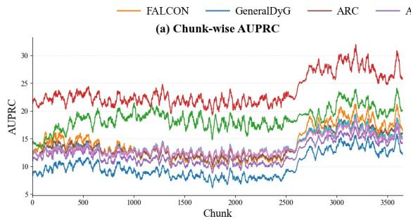

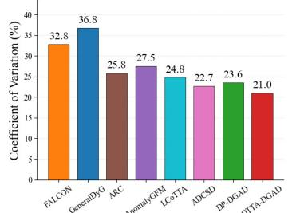  
(e) Chunk-wise AUROC Coefficient of Variation

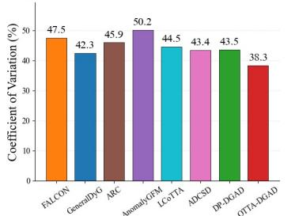  
(f) Cross-dataset AUROC Coefficient of Variation

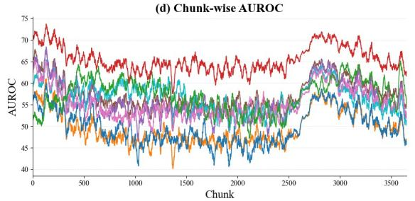

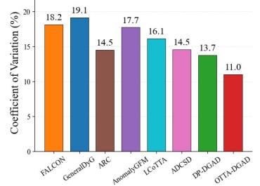

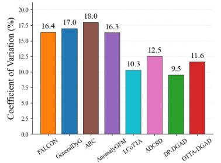  
Fig. 3. Visualization of chunk-wise metric and coefficient of variation over domain/chunks on TAX51 10% anomaly ratio.

TABLE III  
ABLATION RESULTS OF DIFFERENT VARIANTS OF OTTA-DGAD.
<table><tr><td rowspan="2">Metric</td><td rowspan="2">Variants</td><td colspan="8">Dataset</td></tr><tr><td>AS-Topology</td><td>Bitcoin-Alpha</td><td>Email-DNC</td><td>UCI Messages</td><td>Bitcoin-OTC</td><td>TAX51</td><td>DBLP</td><td>Synthetic-Hijack</td></tr><tr><td rowspan="8">AUROC</td><td>w/o DPA</td><td>53.64</td><td>62.21</td><td>66.77</td><td>58.90</td><td>70.53</td><td>44.11</td><td>49.06</td><td>60.12</td></tr><tr><td>w/o DPAD</td><td>40.10</td><td>45.03</td><td>47.82</td><td>50.41</td><td>54.74</td><td>48.09</td><td>45.09</td><td>47.22</td></tr><tr><td>w/o CDGA</td><td>63.34</td><td>69.98</td><td>72.50</td><td>60.19</td><td>74.57</td><td>60.13</td><td>55.58</td><td>70.26</td></tr><tr><td>w/o Wiki</td><td>60.01</td><td>53.16</td><td>67.21</td><td>52.83</td><td>48.04</td><td>46.32</td><td>50.28</td><td>67.97</td></tr><tr><td>w/o MOOC</td><td>55.86</td><td>60.07</td><td>53.15</td><td>60.37</td><td>62.94</td><td>56.36</td><td>46.12</td><td>58.81</td></tr><tr><td>w/o CCCE</td><td>63.38</td><td>62.53</td><td>67.04</td><td>61.13</td><td>68.76</td><td>54.25</td><td>60.84</td><td>68.71</td></tr><tr><td>w/o SGPU</td><td>66.47</td><td>67.81</td><td>70.26</td><td>63.65</td><td>69.11</td><td>60.08</td><td>60.30</td><td>73.49</td></tr><tr><td>OTTA-DGAD</td><td>76.99</td><td>75.47</td><td>81.77</td><td>69.75</td><td>78.61</td><td>66.06</td><td>63.25</td><td>83.72</td></tr><tr><td rowspan="8">AUPRC</td><td>w/o DPA</td><td>19.73</td><td>12.26</td><td>32.15</td><td>22.36</td><td>16.14</td><td>15.45</td><td>9.01</td><td>28.25</td></tr><tr><td>w/o DPAD</td><td>13.33</td><td>12.41</td><td>10.59</td><td>17.07</td><td>11.49</td><td>10.23</td><td>11.59</td><td>17.66</td></tr><tr><td>w/o CDGA</td><td>16.86</td><td>10.05</td><td>30.94</td><td>30.92</td><td>15.18</td><td>17.54</td><td>8.21</td><td>27.07</td></tr><tr><td>w/o Wiki</td><td>20.73</td><td>10.25</td><td>26.34</td><td>20.58</td><td>16.09</td><td>10.21</td><td>12.91</td><td>25.18</td></tr><tr><td>w/o MOOC</td><td>17.22</td><td>12.13</td><td>20.69</td><td>32.37</td><td>12.19</td><td>16.30</td><td>10.06</td><td>23.53</td></tr><tr><td>w/o CCCE</td><td>25.83</td><td>12.77</td><td>34.59</td><td>30.07</td><td>15.29</td><td>19.01</td><td>12.88</td><td>25.67</td></tr><tr><td>w/o SGPU</td><td>27.15</td><td>11.56</td><td>31.09</td><td>30.14</td><td>12.87</td><td>20.55</td><td>10.11</td><td>26.24</td></tr><tr><td>OTTA-DGAD</td><td>31.68</td><td>15.30</td><td>40.28</td><td>40.84</td><td>18.18</td><td>23.56</td><td>16.07</td><td>32.37</td></tr></table>

scoring with a normal binary classifier. (2) w/o DPAD sets $\lambda _ { e }$ to 0 and $\lambda _ { d }$ to 1, thereby removing the domain adaptation module from the domain adaptive anomaly scoring in OTTA-DGAD. (3) w/o CDGA removes the confident detection guided memory buffer update on the target dataset, using the model and buffer pretrained on source datasets. (4) w/o Wiki pretrains OTTA-DGAD on MOOC only. (5) w/o MOOC pretrains OTTA-DGAD on Wiki only. (6) w/o CCCE removes the cross chunk context enrichment. (7) w/o SGPU removes the structural guided prototype update, using entropy based update only.

From the above Table. III, OTTA-DGAD outperforms all ablated versions. Additionally, we have several observations: (1) The adaptation modules enable the model to better adapt to new domains while dynamic prototype updates allow it to adapt to individual chunks within each domain. Removing such module will lead to performance degradation. (2) Cross chunk information is highly important, because it helps the model generalize across chunks and prevents it from forgetting important historical pattern. (3) Removing the confident detection will lead to fail of capturing new patterns in unlabeled new domain. However, entropy based detection is not enough as w/o SGPU also suffer from perfromance dropping campred with the OTTA-DGAD.

## F. Hyperparameter Analysis

To analyze OTTA-DGAD’s sensitivity to hyperparameters, we examine four key parameters: the dynamic prototype memory buffer size $\mathcal { M }$ , the momentum α, top confident detection number $N _ { c o n }$ (Here we set it as a different proportion to the full dataset size) and the chunks size every time processed. We vary these values and observe their impact on model performance in Fig. 4. Our findings are as follows. (1) Increasing the memory buffer size generally improve performance. This is because a larger memory buffer contains more prototype pairs, thus covering broader aspects of the distribution of abnomal patterns. However, we observe an intriguing pattern on some datasets, that Larger buffer sizes actually degrade performance. This occurs because oversized buffers may include irrelevant prototype pairs, which are neither similar to nor distinct enough from the new domains. They introduce bias and interfere with anomaly scoring, which relies on buffer prototypes to extract distributions. (2) Using the top 10% most confident detections appears to be the optimal setting. On most datasets, performance improves as the top confident detection number increases. However, performance begins to drop when this percentage exceeds 10%. This decline occurs because including more than the top 10% of detections reduces reliability. These less confident detections have high entropy and introduce additional noise into the pseudo-labeling process. (3) OTTA-DGAD remains stable under different momentum. We vary the momentum value and find OTTA-DGAD remains stable across all datasets with no clear trend as momentum increases. This stability arises from the fact that the memory buffer already captures sufficient similar abnormal and normal patterns through the selection score s constraint. As a result, the extracted distributions remain stable regardless of α’s value. (4) Chunk size equal to 128 appears to be the optimal setting. This results is reason from that big chunk size such as 256 and 512 may lead to overfit to certain chunks while small chunk size may lead to unbalanced issues.

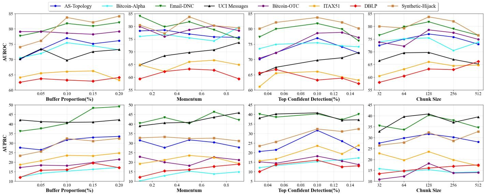  
Fig. 4. Impact of dynamic prototype memory buffer size M, momentum α, confident detection $N _ { c o n }$ and chunk size on the OTTA-DGAD performance.

## VI. VISUALIZATION

In this section, we visualize the representation enriched by cross chunk context and also the comparison between entropy only and structural support added pseduo-labeling.

It can be observed from left part of Fig. 5 that 97.6% of normal edges and 86.1% of anomalous edges move closer to the true distribution after enrichment and more nodes fall in the bottom right corner of the no change diagonal line.

Combining structural support with entropy-based confidence corrects cases where a prediction is confidently wrong but structurally inconsistent with its neighborhood. As shown in Fig. 5 right part, among the 1,654 chunks where the two criteria diverge, structural supported model wins 66.6% of the time, and McNemar’s test confirms this advantage is highly significant, rather than attributable to chance. The large number of ties is expected since many chunks have limited anomaly samples.

## VII. CONCLUSION

In this paper, we propose a generalist DGAD detector that achieves robust performance when target data arrive as online unlabeled chunks. Specifically, we aim to capture the evolving anomalous patterns that are both domain agnostic and domain specific, thereby achieving better generalizability than existing methods. To this end, we introduce OTTA-DGAD, a generalist detector that leverages dynamic prototypes extracted from temporal ego-graphs to model evolving anomalies. We further update the memory buffer using confident pseudolabels, enabling effective adaptation to an unlabeled target domain. A Cross chunk context enrichment module is added to preserve historical evolving patterns. Extensive experiments across 10 real-world datasets from diverse domains validate the effectiveness of OTTA-DGAD.

## REFERENCES

[1] L. Deng, D. Lian, Z. Huang, and E. Chen, “Graph convolutional adversarial networks for spatiotemporal anomaly detection,” IEEE Transactions on Neural Networks and Learning Systems, vol. 33, no. 6, pp. 2416–2428, 2022.

[2] H. Wang, J. Chen, Y. Wu, V. C. Leung, and D. Wang, “Epm: Evolutionary perception method for anomaly detection in noisy dynamic graphs,” IEEE Transactions on Knowledge and Data Engineering, 2025.

[3] J. Pan, Y. Liu, X. Zheng, Y. Zheng, A. W.-C. Liew, F. Li, and S. Pan, “A label-free heterophily-guided approach for unsupervised graph fraud detection,” in Proceedings of the AAAI Conference on Artificial Intelligence, vol. 39, no. 12, 2025, pp. 12 443–12 451.

Distance to True Distribution before Cross Chunk Context Enrichment

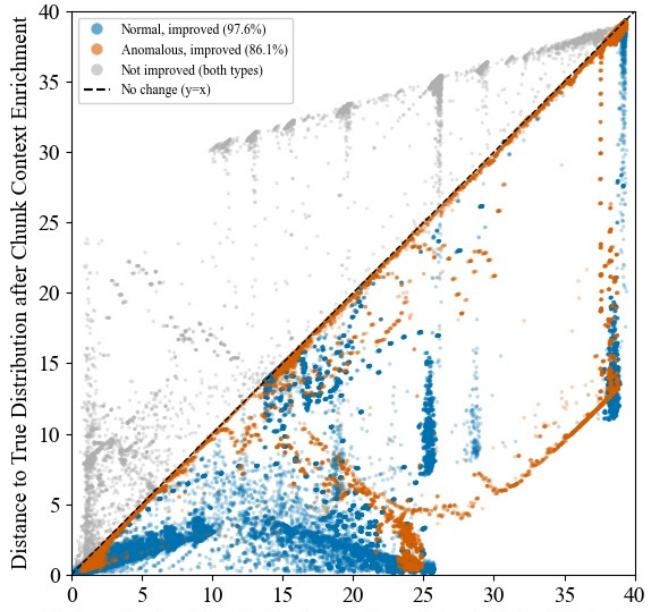

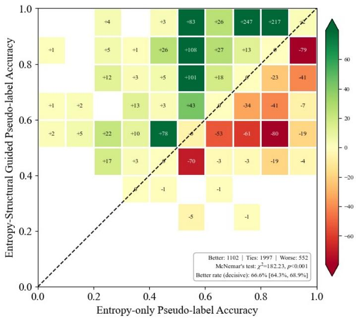

## Fig. 5. Effect of Cross-Chunk Context Enrichment and Structural-Guided Pseudo-labeling accuracy.

[4] J. Zheng, D. Saxena, J. Cao, H. Yang, and P. Ruan, “Inductive spatial temporal prediction under data drift with informative graph neural network,” in International Conference on Database Systems for Advanced Applications. Springer, 2024, pp. 169–185.

[5] D. Li, S. Kosugi, Y. Zhang, M. Okumura, F. Xia, and R. Jiang, “Revisiting dynamic graph clustering via matrix factorization,” in Proceedings of the ACM on Web Conference 2025, 2025, pp. 1342–1352.

[6] B. He, X. He, Y. Zhang, R. Tang, and C. Ma, “Dynamically expandable graph convolution for streaming recommendation,” in Proceedings of the ACM Web Conference 2023, 2023, pp. 1457–1467.

[7] J. Zheng, D. Saxena, and J. Cao, “Coin-gnn: Inductive spatial-temporal prediction for continuous distribution shifts via graph neural networks,” IEEE Transactions on Knowledge and Data Engineering, 2025.

[8] Z. Liu, X. Huang, J. Zhang, Z. Hao, L. Sun, and H. Peng, “Multivariate time-series anomaly detection based on enhancing graph attention networks with topological analysis,” in Proceedings of the 33rd ACM International Conference on Information and Knowledge Management, 2024, pp. 1555–1564.

[9] L. Kong, W. Li, H. Yang, Y. Zhang, J. Guan, and S. Zhou, “Causalformer: An interpretable transformer for temporal causal discovery,” IEEE Transactions on Knowledge and Data Engineering, 2024.

[10] H. Yang, J. Cao, W. Li, S. Wang, H. Li, J. Guan, and S. Zhou, “Spatial-temporal data mining for ocean science: Data, methodologies and opportunities,” ACM Transactions on Knowledge Discovery from Data, pp. 1–46, Jul. 2025.

[11] S. Yu, H. Huang, Y. Shen, P. Wang, Q. Zhang, K. Sun, and H. Chen, “Formulating and representing multiagent systems with hypergraphs,” IEEE Transactions on Neural Networks and Learning Systems, vol. 36, no. 3, pp. 4599–4613, 2024.

[12] H. Yang, J. Cao, W. Li, Y. Yang, X. Li, L. Kong, Y. Zhang, J. Guan, and S. Zhou, “Towards robust and interpretable spatial-temporal graph modeling for traffic prediction,” ACM Transactions on Knowledge Discovery from Data, vol. 19, no. 9, pp. 1–20, 2025.

[13] Y. Liu, S. Pan, Y. G. Wang, F. Xiong, L. Wang, Q. Chen, and V. C. Lee, “Anomaly detection in dynamic graphs via transformer,” IEEE Transactions on Knowledge and Data Engineering, vol. 35, no. 12, pp. 12 081–12 094, 2021.

[14] X. Yang, X. Zhao, and Z. Shen, “A generalizable anomaly detection method in dynamic graphs,” in Proceedings of the AAAI Conference on Artificial Intelligence, vol. 39, no. 20, 2025, pp. 22 001–22 009.

[15] D. Chen, X. Zhao, and W. Xiao, “Fine-grained anomaly detection on dynamic graphs via attention alignment,” in 2024 IEEE 40th International Conference on Data Engineering (ICDE). IEEE, 2024, pp. 3178–3190.

[16] J. Lee, S. Kim, and K. Shin, “Slade: Detecting dynamic anomalies in edge streams without labels via self-supervised learning,” in Proceedings

of the 30th ACM SIGKDD Conference on Knowledge Discovery and Data Mining, 2024, pp. 1506–1517.

[17] Z. Qiao, Q. Cai, H. Dong, J. Gu, P. Wang, M. Xiao, X. Luo, and H. Xiong, “Gcal: Adapting graph models to evolving domain shifts,” in Forty-second International Conference on Machine Learning, 2025.

[18] Y. Tian, Y. Qi, and F. Guo, “Freedyg: Frequency enhanced continuoustime dynamic graph model for link prediction,” in The twelfth international conference on learning representations, 2024.

[19] X. Zhang, B. Xu, Z. Ren, X. Wang, H. Lin, and F. Ma, “Disentangling id and modality effects for session-based recommendation,” in Proceedings of the 47th international ACM SIGIR conference on research and development in information retrieval, 2024, pp. 1883–1892.

[20] T. Gong, Y. Kim, T. Lee, S. Chottananurak, and S.-J. Lee, “Sotta: Robust test-time adaptation on noisy data streams,” Advances in Neural Information Processing Systems, vol. 36, pp. 14 070–14 093, 2023.

[21] Y. Yuan, B. Xu, L. Hou, F. Sun, H. Shen, and X. Cheng, “Tea: Test-time energy adaptation,” in 2024 IEEE/CVF Conference on Computer Vision and Pattern Recognition (CVPR). IEEE, 2024, pp. 23 901–23 911.

[22] J. Liang, R. He, and T. Tan, “A comprehensive survey on test-time adaptation under distribution shifts,” International Journal of Computer Vision, vol. 133, no. 1, pp. 31–64, 2025.

[23] Z. Wang, Y. Luo, L. Zheng, Z. Chen, S. Wang, and Z. Huang, “In search of lost online test-time adaptation: A survey,” International Journal of Computer Vision, vol. 133, no. 3, pp. 1106–1139, 2025.

[24] A. Karmanov, D. Guan, S. Lu, A. El Saddik, and E. Xing, “Efficient testtime adaptation of vision-language models,” in 2024 IEEE/CVF Conference on Computer Vision and Pattern Recognition (CVPR). IEEE, 2024, pp. 14 162–14 171.

[25] G. Ai, C. Niu, H. Yan, J. T. Zhou, Y.-S. Ong, and G. Pang, “Promptdyg: Test-time prompt adaptation on dynamic graphs,” arXiv preprint arXiv:2606.22914, 2026.

[26] G. Wan, W. Huang, and M. Ye, “Federated graph learning under domain shift with generalizable prototypes,” in Proceedings of the AAAI conference on artificial intelligence, vol. 38, no. 14, 2024, pp. 15 429– 15 437.

[27] Y. Liu, S. Li, Y. Zheng, Q. Chen, C. Zhang, and S. Pan, “Arc: a generalist graph anomaly detector with in-context learning,” in Proceedings of the 38th International Conference on Neural Information Processing Systems, 2024, pp. 50 772–50 804.

[28] H. Qiao, C. Niu, L. Chen, and G. Pang, “Anomalygfm: Graph foundation model for zero/few-shot anomaly detection,” arXiv preprint arXiv:2502.09254, 2025.

[29] C. Niu, H. Qiao, C. Chen, L. Chen, and G. Pang, “Zero-shot generalist graph anomaly detection with unified neighborhood prompts,” arXiv preprint arXiv:2410.14886, 2024.

[30] C. Fuchs, M. Zanella, and C. De Vleeschouwer, “Online gaussian test-time adaptation of vision-language models,” in 2025 IEEE/CVF Conference on Computer Vision and Pattern Recognition Workshops (CVPRW). IEEE, 2025, pp. 128–137.

[31] S. Niu, J. Wu, Y. Zhang, Z. Wen, Y. Chen, P. Zhao, and M. Tan, “Towards stable test-time adaptation in dynamic wild world,” arXiv preprint arXiv:2302.12400, 2023.

[32] Y. Bar, S. Shaer, and Y. Romano, “Protected test-time adaptation via online entropy matching: A betting approach,” Advances in Neural Information Processing Systems, vol. 37, pp. 85 467–85 499, 2024.

[33] H. Sun, L. Xu, S. Jin, P. Luo, C. Qian, and W. Liu, “Program: Prototype graph model based pseudo-label learning for test-time adaptation,” in The twelfth international conference on learning representations, 2024.

[34] Q. Cai, Z. Qiao, R. Cai, H. Liu, J. Li, X. Luo, and H. Xiong, “Continual test-time training on graphs via adaptive prompts integration,” IEEE Transactions on Pattern Analysis and Machine Intelligence, 2026.

[35] R. A. Marsden, M. Döbler, and B. Yang, “Universal test-time adaptation through weight ensembling, diversity weighting, and prior correction,” in 2024 IEEE/CVF Winter Conference on Applications of Computer Vision (WACV). IEEE, 2024, pp. 2543–2553.

[36] D. Duan, R. Xu, P. Liu, and F. Wen, “Lifelong test-time adaptation via online learning in tracked low-dimensional subspace,” Advances in Neural Information Processing Systems, vol. 38, pp. 19 024–19 053, 2026.

[37] Y. Tian, J. Li, H. Fu, L. Zhu, L. Yu, and L. Wan, “Self-mining the confident prototypes for source-free unsupervised domain adaptation in image segmentation,” IEEE Transactions on Multimedia, vol. 26, pp. 7709–7720, 2024.

[38] J. Zheng, J. Liu, J. Cao, X. Wang, H. Yang, and Y. Chen, “Dp-dgad: A generalist dynamic graph anomaly detector with dynamic prototypes,” in Proceedings of the ACM Web Conference 2026, 2026, pp. 857–868.

[39] J. Tack, J. Kim, E. Mitchell, J. Shin, Y. W. Teh, and J. R. Schwarz, “Online adaptation of language models with a memory of amortized contexts,” Advances in Neural Information Processing Systems, vol. 37, pp. 130 109–130 135, 2024.

[40] L. Cai, Z. Chen, C. Luo, J. Gui, J. Ni, D. Li, and H. Chen, “Structural temporal graph neural networks for anomaly detection in dynamic graphs,” in Proceedings of the 30th ACM international conference on Information & Knowledge Management, 2021, pp. 3747–3756.

[41] X. Guo, B. Zhou, and S. Skiena, “Subset node anomaly tracking over large dynamic graphs,” in Proceedings of the 28th ACM SIGKDD Conference on Knowledge Discovery and Data Mining, 2022, pp. 475– 485.

[42] S. Tian, J. Dong, J. Li, W. Zhao, X. Xu, B. Song, C. Meng, T. Zhang, L. Chen et al., “Sad: Semi-supervised anomaly detection on dynamic graphs,” arXiv preprint arXiv:2305.13573, 2023.

[43] Y. Chen, T. Wang, Y. Fang, and Y. Xiao, “Semi-supervised node importance estimation with informative distribution modeling for uncertainty regularization,” in Proceedings of the ACM on Web Conference 2025, 2025, pp. 3108–3118.

[44] X. Zhang, B. Xu, Y. Wu, Y. Zhong, H. Lin, and F. Ma, “Finerec: Exploring fine-grained sequential recommendation,” in Proceedings of the 47th international ACM SIGIR conference on research and development in information retrieval, 2024, pp. 1599–1608.

[45] Y. Chen, Q.-T. Truong, X. Shen, J. Li, and I. King, “Shopping trajectory representation learning with pre-training for e-commerce customer understanding and recommendation,” in Proceedings of the 30th ACM SIGKDD Conference on Knowledge Discovery and Data Mining, 2024, pp. 385–396.

[46] F. Xia, C. Peng, J. Ren, F. G. Febrinanto, R. Luo, V. Saikrishna, S. Yu, and X. Kong, “Graph learning,” Foundations and Trends® in Signal Processing, vol. 19, no. 4, pp. 371–551, 2025.

[47] H. Zhao, A. Chen, X. Sun, H. Cheng, and J. Li, “All in one and one for all: A simple yet effective method towards cross-domain graph pretraining,” in Proceedings of the 30th ACM SIGKDD Conference on Knowledge Discovery and Data Mining, 2024, pp. 4443–4454.

[48] A. Li, C. Qiu, M. Kloft, P. Smyth, M. Rudolph, and S. Mandt, “Zeroshot anomaly detection via batch normalization,” Advances in Neural Information Processing Systems, vol. 36, pp. 40 963–40 993, 2023.

[49] Y. Wang, S. Liu, T. Zheng, K. Chen, and M. Song, “Unveiling global interactive patterns across graphs: Towards interpretable graph neural networks,” in Proceedings of the 30th ACM SIGKDD Conference on Knowledge Discovery and Data Mining, 2024, pp. 3277–3288.

[50] Z. Liu, X. Yu, Y. Fang, and X. Zhang, “Graphprompt: Unifying pretraining and downstream tasks for graph neural networks,” in Proceedings of the ACM web conference 2023, 2023, pp. 417–428.

[51] X. Yu, Z. Gong, C. Zhou, Y. Fang, and H. Zhang, “Samgpt: Text-free graph foundation model for multi-domain pre-training and cross-domain adaptation,” in Proceedings of the ACM on Web Conference 2025, 2025, pp. 1142–1153.

[52] J. Li, Z. Yu, Z. Du, L. Zhu, and H. T. Shen, “A comprehensive survey on source-free domain adaptation,” IEEE Transactions on Pattern Analysis and Machine Intelligence, vol. 46, no. 8, pp. 5743–5762, 2024.

[53] J.-H. Lee and J.-H. Chang, “Continual momentum filtering on parameter space for online test-time adaptation,” in International Conference on Learning Representations, vol. 2024, 2024, pp. 53 311–53 343.

[54] Y. Zhang, W. Zhu, H. Tang, Z. Ma, K. Zhou, and L. Zhang, “Dual memory networks: A versatile adaptation approach for vision-language models,” in 2024 IEEE/CVF Conference on Computer Vision and Pattern Recognition (CVPR). IEEE, 2024, pp. 28 718–28 728.

[55] D.-C. Zhang, Z. Zhou, and Y.-F. Li, “Robust test-time adaptation for zero-shot prompt tuning,” in Proceedings of the AAAI Conference on Artificial Intelligence, vol. 38, no. 15, 2024, pp. 16 714–16 722.

[56] P. Guo, P. Jin, Z. Li, L. Bai, and Y. Zhang, “Online test-time adaptation of spatial–temporal traffic flow forecasting,” IEEE Transactions on Intelligent Transportation Systems, 2025.

[57] J. Yang and J. Leskovec, “Defining and evaluating network communities based on ground-truth,” in Proceedings of the ACM SIGKDD workshop on mining data semantics, 2012, pp. 1–8.

  
Jialun Zheng Jialun Zheng is currently a Ph.D. student with the Department of Computing, The Hong Kong Polytechnic University, Hong Kong, China. Before that, he received the B.Eng. degree from the Ohio State University in 2021. His research interests include Dynamic Graph Learning, Domain Adaptation and Spatial Temporal Data Mining.

Jiannong Cao (Fellow, IEEE) received the Ph.D. degree in computer science from Washington State University, Pullman, WA, USA, in 1990. He is currently the Otto Poon Charitable Foundation Professor of data science and the Chair Professor of distributed and mobile computing with the Department of Computing, The Hong Kong Polytechnic University (PolyU), Hong Kong, where he is also the Dean of the Graduate School, the Director of the Research Institute for Artificial Intelligence of Things, and the Director of the Internet and Mobile

Computing Laboratory. His research interests include distributed systems and blockchain, big data and machine learning, wireless sensing and networking, and mobile cloud and edge computing.

  
portation systems.

Yuanjing Feng received the M.S. degree in mechanical design and theory from Northwest A&F University, Xi’an, China, in 2001, and the Ph.D. degree in control science and engineering from Xi’an Jiaotong University, Xi’an, in 2005. He is currently the Director of the Institute of Information Processing and Automation and a Professor with the Zhejiang University of Technology, Hangzhou, China. His research interests include medical image analysis, computer vision, and data-driven modeling and optimization in the fields of intelligent trans-

Philip S. Yu (Fellow, IEEE) received the Ph.D. degree in electrical engineering from Stanford University, Stanford, CA, USA. He is currently a Distinguished Professor of computer science and holds the Wexler Chair in Information Technology with the Department of Computer Science, University of Illinois at Chicago (UIC), Chicago, IL, USA, where he is also the Editor-in-Chief of ACM Transactions on Knowledge Discovery from Data. His research interests include big data, data mining (especially graph/network mining), social networks, privacypreserving data publishing, data streams, database systems, and Internet applications and technologies.