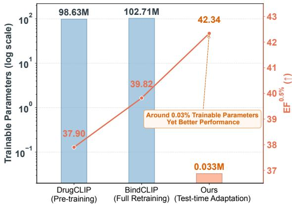
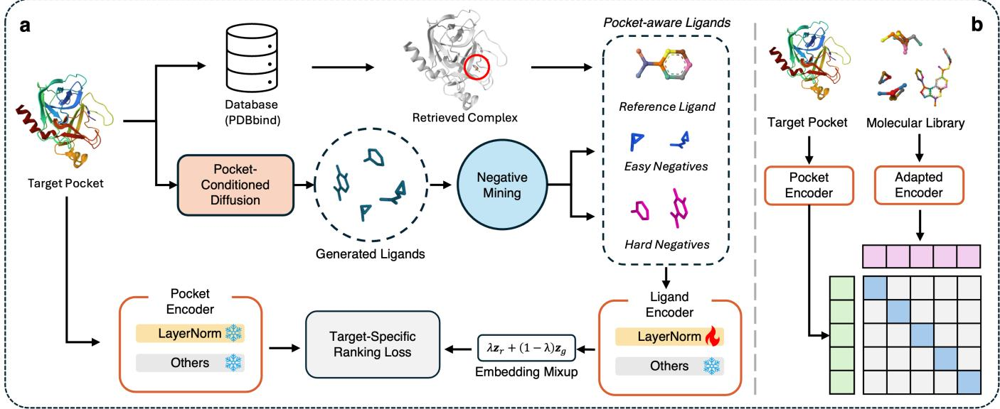
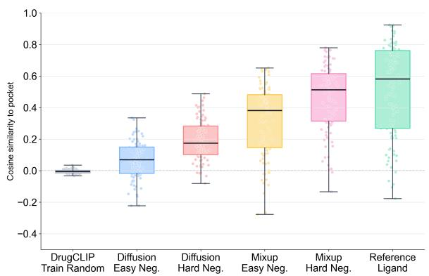
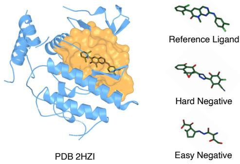
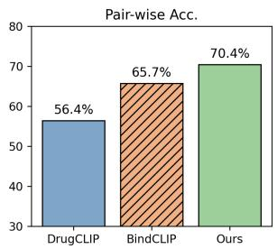
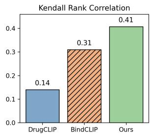
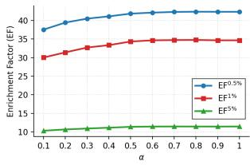
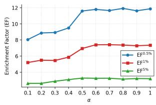

# PETA:Parameter-Eficient Test-Time Adaptation for Virtual Screening

Jia-Qi Lin1, Yinghua Yao1, Chang-Dong Wang2, Yew-Soon Ong1, Yuangang Pan1∗

1Centre for Frontier AI Research (CFAR), Agency for Science, Technology and Research (A\*STAR), Singapore 138632

2School of Computer Science and Engineering, Sun Yat-sen University, Guangzhou, China

Lin\_Jiaqi@a-star.edu.sg, Yao\_Yinghua@a-star.edu.sg,

changdongwang@hotmail.com, Ong\_Yew\_Soon@a-star.edu.sg, Pan\_Yuangang@a-star.edu.sg

## Abstract

Accurately ranking active ligands for a target protein pocket from massive chemical libraries remains a central challenge in virtual screening. DrugCLIP and its recent extensions sub- stantially accelerate this process by encoding protein pock- ets and molecules into a shared embedding space. Despite this progress, further performance improvements typically re- quire retraining the entire model, incurring substantial com- putational overhead and making target-specific customization ineficient. In this work, we formulate the specialization of pretrained virtual screening models to individual pockets as a test-time adaptation problem and propose PETA, a parameter- eficient framework that directly adapts pretrained model at test time. Given a target pocket, PETA constructs pocket- specific negatives through molecular difusion and chemical validity filtering, and further moves them toward the reference ligand retrieved from structural databases via embedding- space mixup to create more challenging ranking tasks. A ranking objective then places greater emphasis on suppressing high-scoring invalid candidates that could contaminate the top-ranked screening results, providing structured supervision for lightweight adaptation. Experiments across diverse bench- marks demonstrate that this lightweight, pocket-specific adap- tation outperforms both pretrained and fully retrained base- lines while updating only the LayerNorm parameters, which account for approximately 0.03% of the full model.

## Introduction

Advances in chemical synthesis have expanded accessible chemical libraries to billions of diverse compounds (Lyu et al. 2019). Although these libraries ofer enormous op- portunities for discovering new drug candidates, their scale makes exhaustive experimental screening impractical. Vir- tual screening (Shoichet 2004) addresses this challenge by computationally prioritizing promising compounds for ex- perimental validation and has therefore become an essential tool in early-stage drug discovery.

Existing virtual screening approaches can be broadly divided into docking-based and learning-based methods. Docking-based methods (Alhossary et al. 2015; Jia et al. 2026; Trott and Olson 2010) search for plausible binding poses between a molecule and a protein pocket and use scoring functions to estimate their binding strength. The repeated conformational sampling and scoring required for each protein–molecule pair make these methods computa- tionally expensive at scale. In contrast, learning-based ap- proaches replace iterative docking procedures with eficient neural inference, directly predicting binding poses, binding afinities, or protein–ligand compatibility from data. Early learning-based methods (Nguyen et al. 2021; Singh et al. 2023) formulated virtual screening as binding-afinity re-gression or protein–ligand interaction classification, but their reliance on carefully labeled afinity data and reliable nega- tive samples often limited generalization and performance. More recently, DrugCLIP (Jia et al. 2026) reformulates virtual screening as a retrieval problem by independently en- coding protein pockets and molecules into a shared embed- ding space, which replaces pairwise model inference with eficient vector similarity search, substantially accelerating large-scale virtual screening.

  
Figure 1: PETA enables efective and parameter-eficient adaptation for virtual screening.

Following the retrieval paradigm established by Drug- CLIP, recent studies have explored enhanced supervision and training strategies to improve virtual screening performance on downstream unseen instances (Qiao et al. 2026; Han, Hong, and Li 2025; Shen et al. 2025). Despite their efectiveness, these approaches generally require rerunning the entire training pipeline, incurring substantial computational and data-processing costs. Which raises a key question: can an existing pretrained virtual screening model be adapted to a new target without full-model retraining?

In this work, we investigate whether a pretrained virtual screening model can be efectively and eficiently adapted to an unseen target pocket at test time. The key challenge is that how to obtain reliable adaptation signals for the un- seen target pocket. To address this, we propose PETA, a parameter-eficient test-time adaptation framework that up- dates only LayerNorm parameters of pretrained model while constructing pocket-specific supervision on the fly. Specifi- cally, PETA retrieves a structurally matched reference ligand for the target pocket and uses it as a positive anchor for adaptation. It further generates pocket-conditioned candi- dates, mines chemically invalid easy and hard negatives, and applies reference-guided embedding interpolation to create more challenging local comparisons. A cost-sensitive rank- ing objective prioritizes the correction of high-scoring in-valid candidates, enabling pocket-specific adaptation by up- dating only the LayerNorm parameters. PETA updates only approximately 0.03% of the full model parameters. Despite this lightweight update, it achieves an EF0.5% of 42.34, out- performing the frozen DrugCLIP (37.90) and fully retrained BindCLIP (39.82), as shown in Figure 1. These results highlight a favorable balance between screening performance and adaptation eficiency.

Our main contributions are summarized as follows:

• We formulate Test-Time Adaptation for Virtual Screening (TTA-VS), which eficiently specializes a pretrained virtual screening model to each unseen protein pocket at inference time without binding annotations for the screen- ing library or full-model retraining.

• We propose PETA, a parameter-eficient framework that constructs target-conditioned supervision from informa- tion available at test time while updating only a small fraction of the model parameters.

• Experiments across diverse benchmarks demonstrate the efectiveness and eficiency of PETA compared with both pretrained and full-retraining baselines.

## Related Works

Drug Virtual Screening. Existing virtual screening meth-ods can generally be divided into docking-based and learning-based approaches. Docking-based methods, such as Glide-SP (Friesner et al. 2004), AutoDock Vina (Trott and Olson 2010), and Surflex Dock (Jain 2003), search for plausible binding poses of small molecules within a target pocket and estimate their binding strengths using predefined scoring functions. Despite their broad applicability, these methods require repeated conformational sampling and pose evaluation for each protein–ligand pair, making large-scale screening computationally expensive.

Learning-based methods improve screening eficiency by replacing repeated conformational search and physics-based scoring with neural inference (Jia et al. 2026). They learn protein–ligand interaction patterns from experimentally mea- sured afinities or structure-derived supervision and subse- quently assign binding scores to compounds in a screening library. However, their performance remains constrained by the quality and coverage of available training data, as experi- mentally resolved complexes, reliable afinity measurements, and confirmed non-binding pairs are costly to obtain.

DrugCLIP (Jia et al. 2026) mitigates some of these limitations by learning a shared embedding space for protein pockets and ligands through contrastive learning. Virtual screening can then be performed through eficient embed- ding similarity search, reducing the reliance on afinity an- notations and repeated pairwise model inference. Following this retrieval paradigm, AANet (Zhu et al. 2025) introduces tri-modal alignment and multi-cavity aggregation to sup- port screening with apo and predicted protein structures. DrugHash (Han, Hong, and Li 2025) learns binary repre-sentations to reduce the memory and retrieval costs of ultra- large-scale screening, while BindCLIP (Qiao et al. 2026) incorporates binding-pose generation and large-scale hard- negative mining to learn more discriminative pocket–ligand representations.

These methods primarily improve general-purpose repre- sentation learning or retrieval eficiency during ofline train- ing. Once a new target pocket is encountered, however, their scoring functions remain fixed unless the model is retrained with modified objectives or additional data. In contrast, PETA enables post-training specialization of an pretrained model to each unseen target pocket. It constructs pocket- specific ranking supervision from a retrieved reference lig- and and pocket-conditioned negative candidates at test time, while updating only a small subset of model parameters.

Test-Time Adaptation. Test-time adaptation improves a pretrained model during inference without requiring labeled target-domain data and has been widely studied in image classification, semantic segmentation, and multimodal learn- ing (Wang et al. 2021; Niu et al. 2022; Chen et al. 2024; Shu et al. 2022). However, conventional test-time adaptation methods cannot be directly transferred to virtual screening. Rather than predicting labels for individual test samples, virtual screening requires ranking a large unlabeled ligand library for a specific target pocket, with particular emphasis on the highest-ranked compounds selected for experimental validation.

Drug-TTA (Shen et al. 2025) is the most closely related work. It trains the entire model with multiple predefined aux- iliary objectives and then performs additional instance-wise optimization during inference. This requires redesigning and rerunning the training pipeline before adaptation can be ap- plied. PETA instead directly adapts an existing pretrained model by constructing pocket-specific ranking supervision on the fly and updating only its LayerNorm parameters.

## Problem Formulation

Given a target binding pocket x and a molecular screening library $\mathbf { \bar { \mathcal { M } } } = \{ m _ { i } \} _ { i = 1 } ^ { \bar { N } }$ , virtual screening aims to rank the candidate ligands according to their predicted binding compatibility with x and identify the top-K most promising compounds. Throughout this paper, ligand refers to any molecule in the screening library, regardless of whether it is experimentally confirmed to bind to the target.

  
Figure 2: Framework of PETA. (a) Given a target pocket, PETA retrieves a reference ligand from a matched holo complex, constructs pocket-aware negatives, and adapts only the LayerNorm parameters of the ligand encoder. (b) The adapted model is then used for virtual screening over the test molecular library.

DrugCLIP performs virtual screening by encoding pockets and ligands into a shared latent space. Let

$$
\begin{array} { r } { \mathbf { z _ { x } } = \mathcal { E } _ { \mathbf { x } } ( \theta _ { \mathbf { x } } , \mathbf { x } ) , \quad \mathbf { z } _ { m } = \mathcal { E } _ { m } ( \theta _ { m } , m ) , } \end{array}\tag{1}
$$

where $\mathcal { E } _ { \mathbf { x } }$ and ${ \mathcal { E } } _ { m }$ denote the pocket and ligand encoders, respectively. The predicted binding score is defined as their cosine similarity:

$$
s _ { \theta } ( \mathbf { x } , m ) = \frac { \mathbf { z } _ { \mathbf { x } } ^ { \top } \mathbf { z } _ { m } } { \| \mathbf { z } _ { \mathbf { x } } \| \| \mathbf { z } _ { m } \| } , \quad \theta = \{ \theta _ { \mathbf { x } } , \theta _ { m } \} .\tag{2}
$$

A higher score indicates stronger predicted pocket–ligand compatibility.

Although DrugCLIP is trained as a general-purpose screening model, its performance may degrade on unseen or underrepresented target pockets (Shen et al. 2025). Existing approaches typically address this issue through addi- tional objectives, datasets, and full-model retraining, which is costly and does not directly specialize the model to each new target. We therefore study test-time specialization to an unseen pocket. The main challenge is to construct reliable pocket-specific supervision without afinity measurements or binding annotations for the screening library.

## Methodology

In this section, we propose PETA, a parameter-eficient testtime adaptation framework for virtual screening on unseen protein pockets. Rather than retraining the entire virtual screening model, PETA adapts the pretrained model indepen- dently for each target pocket by constructing pocket-specific supervision at inference time while updating only a small subset (≈ 0.03%) of the model parameters. Figure 2 illustrates the overall framework.

## Test-Time Adaptation for Virtual Screening

Let $s _ { \theta _ { 0 } } ( \mathbf { x } , m )$ denote a pretrained virtual screening model with pretrained parameters $\theta _ { 0 }$ . At test time, given an unseen pocket $\mathbf { x } ^ { u }$ and a screening library $\mathcal { M } ^ { u } = \{ m _ { i } \} _ { i = 1 } ^ { N }$ the model ranks the candidate ligands according to $s _ { \theta _ { 0 } } ( \mathbf { x } ^ { u } , m _ { i } )$

We formulate Test-Time Adaptation for Virtual Screening (TTA-VS), which aims to specialize a pretrained model $s _ { \theta _ { 0 } }$ to an unseen pocket $\mathbf { x } ^ { u }$ without binding annotations for the screening library, additional afinity measurements, or full- model fine-tuning.

Reference Ligand Construction. Although $\mathbf { x } ^ { u }$ is unseen by the pretrained model, experimentally resolved complexes involving the same protein target and binding site may be available in large structural databases1. We therefore retrieve one such ligand as the reference ligand:

$$
r _ { \mathbf { x } ^ { u } } = \mathrm { R e t r i e v e } \left( \mathbf { x } ^ { u } ; \mathcal { D } _ { \mathrm { s t r u c t } } \right) ,\tag{3}
$$

where $\mathcal { D } _ { \mathrm { s t r u c t } }$ denotes a structural database.

A straightforward adaptation strategy is to maximize the similarity between the target pocket and the reference ligand:

$$
\mathcal { L } _ { \mathrm { r e f } } = - s _ { \theta } \left( \mathbf { x } ^ { u } , r _ { \mathbf { x } ^ { u } } \right) .\tag{4}
$$

However, this positive-only objective provides limited super-vision for target-specific adaptation. It may increase the score of $r _ { \mathbf x ^ { u } }$ , but fails to suppress false-positive candidates that al- ready receive high scores. A natural solution is to augment the reference ligand with negative candidates (especially pocketaware) $\mathcal { G } _ { \mathbf { x } ^ { u } }$ , thereby providing richer supervision for adapta- tion. The construction of informative negative candidates is described in detail in the following subsections.

  
Figure 3: Distributions of per-pocket average pocket–ligand cosine similarities on the DUD-E virtual screening bench- mark.

To achieve parameter-eficient adaptation, the virtual screening model is then adapted by optimizing their relative ranking while updating only a small subset of parameters:

$$
\boldsymbol { \theta } _ { a } ^ { * } = \arg \operatorname* { m i n } _ { \boldsymbol { \theta } _ { a } } \mathcal { L } \left( \mathbf { x } ^ { u } , r _ { \mathbf { x } ^ { u } } \cup \mathcal { G } _ { \mathbf { x } ^ { u } } ; \boldsymbol { \theta } _ { a } , \boldsymbol { \theta } _ { b } \right) ,\tag{5}
$$

where $\theta _ { a } \subset \theta _ { 0 }$ denotes the adaptable parameters and $\theta _ { b } =$ $\theta _ { 0 } \setminus \theta _ { a }$ remains frozen. The adapted model $\theta ^ { * } = ( \theta _ { a } ^ { * } , \theta _ { b } )$ is subsequently used to rank the screening library $\mathcal { M } ^ { u }$

## Pocket-Conditioned Adaptation Set Construction

One intuitive approach for constructing negative candidates is to randomly sample ligands from an existing molecular dataset. However, molecules sampled without considering the target pocket are generally unrelated to its local chemical environment and may already be easily distinguished by the pretrained model. To examine this issue, we randomly sample 1,000 ligands from the DrugCLIP training set and compute their cosine similarities with target pockets in DUD-E using the pretrained model. As shown in Figure 3, the resulting similarities are concentrated near zero. This indicates that most randomly sampled training ligands are already assigned low compatibility scores and therefore provide little useful gradient signal for adaptation.

We instead construct candidates using a pocket- conditioned generative model DifSBDD $G _ { \phi }$ (Schneuing et al. 2024), parameterized by fixed parameters $\phi .$ Given an unseen target pocket $\mathbf { x } ^ { u }$ , the generative model produces a candidate set:

$$
\mathcal { G } _ { \mathbf { x } ^ { u } } = \{ g _ { i } \} _ { i = 1 } ^ { B } , \quad g _ { i } \sim G _ { \phi } ( g \mid \mathbf { x } ^ { u } ) .\tag{6}
$$

Because generation is explicitly conditioned on the struc- tural and physicochemical characteristics of the target bind- ing site, the generated molecules explore a chemical space that is locally relevant to $\mathbf { x } ^ { u }$ . Compared with randomly sam- pled training ligands, these candidates are more likely to ex- hibit structural patterns and molecular properties compatible with the target pocket.

As a result, pocket-conditioned candidates tend to be more dificult for the pretrained model to distinguish from plau- sible binders. They probe the local decision boundary of the pretrained embedding space and expose potentially over- confident or misleading predictions. Such candidates pro- vide more informative gradients for pocket-specific adapta- tion than arbitrary molecules whose predicted similarities are already close to zero.

  
Figure 4: Reference ligand and pocket-conditioned candi- dates for ABL1. The crystal structure PDB 2HZI represents an experimentally resolved binding conformation of ABL1 in complex with the reference ligand PD180970. The gener- ated candidates exhibit structural similarity to the reference ligand, providing pocket-relevant samples for adaptation.

Figure 4 illustrates this property using ABL1. The gener- ated candidates structurally resemble the known active refer- ence ligand, suggesting that they occupy a chemically rele- vant neighborhood around the target pocket. However, struc- tural relevance alone does not guarantee that a generated molecule is a valid binder. Some generated candidates may violate basic chemical constraints or exploit erroneous corre- lations learned by the pretrained model while still receiving high pocket–ligand similarity scores.

These observations motivate the subsequent negative min- ing procedure, which identifies candidate negatives from $\mathcal { G } _ { \mathbf { x } ^ { u } }$ to form the final negative set $\mathcal { G } _ { \mathbf { x } ^ { u } } ^ { \mathrm { i n v } }$ . Together with the refer- ence ligand, the resulting negatives constitute a pocket-aware ligand set, enabling PETA to perform pocket-specific adap- tation for the given unseen target pocket.

## Chemical Validity-Guided Negative Mining

Pocket conditioning makes the generated ligands $\mathcal { G } _ { \mathbf { x } ^ { u } }$ more relevant to the target pocket $\mathbf { x } ^ { u }$ , but their binding activities remain unknown and some generated structures are chem- ically invalid. Generation alone therefore does not provide suficiently reliable pseudo-labels.

We exploit chemical invalidity as an annotation-free source of negative supervision. A chemically invalid struc- ture cannot represent a viable screening compound. More importantly, an invalid structure that nevertheless receives a high pocket–ligand similarity represents a high-risk false- positive prediction and provides an informative signal for adaptation.

For each generated ligand $g _ { i } \in \mathcal { G } _ { \mathbf { x } ^ { u } }$ , we assess its chemical validity using the RDKit sanitization procedure (Landrum et al. 2013). Let $\mathrm { R D } ( g _ { i } ) \in \{ 0 , 1 \}$ denote the validity indica- tor, where $\mathrm { R D } ( g _ { i } ) = 1$ indicates that $g _ { i }$ passes sanitization.

We partition the generated ligand set into:

$$
\begin{array} { r l } & { \mathcal { G } _ { \mathbf { x } ^ { u } } ^ { \mathrm { v a l } } = \left\{ g _ { i } \in \mathcal { G } _ { \mathbf { x } ^ { u } } \ | \ \mathrm { R D } ( g _ { i } ) = 1 \right\} , } \\ & { \mathcal { G } _ { \mathbf { x } ^ { u } } ^ { \mathrm { i n v } } = \left\{ g _ { i } \in \mathcal { G } _ { \mathbf { x } ^ { u } } \ | \ \mathrm { R D } ( g _ { i } ) = 0 \right\} . } \end{array}\tag{7}
$$

Chemically valid candidates $\mathcal { G } _ { \mathbf { x } ^ { u } } ^ { \mathrm { v a l } }$ are retained as plausible pocket-conditioned hypotheses, whereas invalid candidates $\mathcal { G } _ { \mathbf { x } ^ { u } } ^ { \mathrm { i n v } }$ provide reliable negative evidence.

Let $\mathbf { z } _ { \mathbf { x } ^ { u } }$ and $\mathbf { z } _ { g _ { i } }$ denote the pocket and ligand representa- tions produced by the pretrained model. The pocket–ligand similarity is:

$$
s _ { \theta _ { 0 } } ( \mathbf { x } ^ { u } , g _ { i } ) = \frac { \mathbf { z } _ { \mathbf { x } ^ { u } } ^ { \top } \mathbf { z } _ { g _ { i } } } { \left\| \mathbf { z } _ { \mathbf { x } ^ { u } } \right\| \left\| \mathbf { z } _ { g _ { i } } \right\| } .\tag{8}
$$

We then divide the invalid candidates $\mathcal { G } _ { \mathbf { x } ^ { u } } ^ { \mathrm { i n v } }$ into hard and easy negatives using the median similarity among all gener- ated ligands $\mathcal { G } _ { \mathbf { x } ^ { u } }$ , namely,

$$
\begin{array} { r l } & { \mathcal { G } _ { \mathbf { x } ^ { u } } ^ { \mathrm { i n v - h } } = \left\{ g _ { i } \in \mathcal { G } _ { \mathbf { x } ^ { u } } ^ { \mathrm { i n v } } ~ \vert ~ s _ { \theta _ { 0 } } ( \mathbf { x } ^ { u } , g _ { i } ) \geq \gamma _ { \mathbf { x } ^ { u } } \right\} , } \\ & { \mathcal { G } _ { \mathbf { x } ^ { u } } ^ { \mathrm { i n v - e } } = \left\{ g _ { i } \in \mathcal { G } _ { \mathbf { x } ^ { u } } ^ { \mathrm { i n v } } ~ \vert ~ s _ { \theta _ { 0 } } ( \mathbf { x } ^ { u } , g _ { i } ) < \gamma _ { \mathbf { x } ^ { u } } \right\} , } \end{array}\tag{9}
$$

where $\gamma _ { \mathbf { x } ^ { u } } = Q _ { 0 . 5 } \left( \left\{ s _ { \theta _ { 0 } } ( \mathbf { x } ^ { u } , g _ { i } ) \ | \ g _ { i } \in \mathcal { G } _ { \mathbf { x } ^ { u } } \right\} \right)$ is an adaptive threshold.

Easy negatives are chemically invalid structures that the pretrained model already assigns relatively low scores. In contrast, hard negatives are chemically invalid but receive scores in the upper half of the generated candidates. Al- though their geometric features may appear compatible with the pocket, they cannot represent viable ligands. Their high rankings therefore expose predictions that are particularly harmful to practical screening.

## Target-Specific Ranking Optimization

Virtual screening is inherently top-heavy: only a small frac- tion of the highest-ranked compounds are typically selected for experimental validation. Consequently, a false positive near the top of the screening list is more consequential than a negative candidate that is already ranked low. Easy negatives provide complementary discrimination, whereas hard neg- atives represent high risk ranking errors that may displace viable compounds from the experimental shortlist.

Reference-Guided Latent Mixup. Let $\mathbf { z } _ { r } = \mathcal { E } ( r _ { \mathbf { x } ^ { u } } )$ and ${ \bf z } _ { g } = \mathcal { E } ( g )$ denote the ligand representations of the reference $r _ { \mathbf x ^ { u } }$ and a generated negative ligand $g \in \mathcal { G } _ { \mathbf { x } ^ { u } } ^ { \mathrm { i n v } }$ , respectively. Some generated negatives may remain far from the reference ligand in the pretrained representation space and thus yield trivial ranking constraints. To construct more challenging lo- cal comparisons, we interpolate each negative representation with the reference representation:

$$
\begin{array} { r } { \widetilde { \mathbf { z } } _ { g } = \lambda \mathbf { z } _ { r } + ( 1 - \lambda ) \mathbf { z } _ { g } , \quad g \in \mathcal { G } _ { \mathbf { x } ^ { u } } ^ { \mathrm { i n v } } , } \end{array}\tag{10}
$$

where λ controls the interpolation strength and is set to $1 / 2$ in our experiments.

The mixed representations lie closer to the reference lig- and in the latent space, creating harder reference–negative comparisons. This prevents adaptation from relying only on trivially separable negatives and encourages the model to refine the ranking structure around the known binder.

Top-Heavy ListNet Objective. For each target pocket $\mathbf { x } ^ { u }$ we consider a candidate list consisting ofone reference ligand $\mathbf { z } _ { r }$ together with generated easy negatives and hard negatives:

$$
\mathcal { C } = \{ \mathbf { z } _ { r } \} \cup \{ \widetilde { \mathbf { z } } _ { g } : g \in \mathcal { G } _ { \mathbf { x } ^ { u } } ^ { \mathrm { i n v - e } } \} \cup \{ \widetilde { \mathbf { z } } _ { g } : g \in \mathcal { G } _ { \mathbf { x } ^ { u } } ^ { \mathrm { i n v - s } } \} .\tag{11}
$$

Motivated by the asymmetric ranking risk, we formulate a cost-sensitive objective that places greater emphasis on correcting hard negatives. We directly define the target prob- ability distribution over the reference ligand, easy negatives, and hard negatives as

$$
\begin{array} { r } { P _ { y } ( c ) = \left\{ \begin{array} { l l } { \alpha , } & { c = \mathbf { z } _ { r } , } \\ { 1 - \alpha } \\ { \overline { { | \mathcal { G } _ { \mathbf { x } ^ { u } } ^ { \mathrm { i n v - e } } | } } , } & { c = \widetilde { \mathbf { z } } _ { g } , \ g \in \mathcal { G } _ { \mathbf { x } ^ { u } } ^ { \mathrm { i n v - e } } , } \\ { 0 , } & { c = \widetilde { \mathbf { z } } _ { g } , \ g \in \mathcal { G } _ { \mathbf { x } ^ { u } } ^ { \mathrm { i n v - h } } , } \end{array} \right. } \end{array}\tag{12}
$$

where $\alpha > 0 . 5$ . The reference ligand receives the largest probability mass, while the remaining mass is uniformly dis- tributed among easy negatives. Hard negatives are assigned zero target probability, reflecting their greater risk to the top- ranked screening results.

For a candidate representation c, its pocket similarity is defined as $\begin{array} { r } { s _ { \theta } ( \mathbf { x } ^ { u } , c ) = \frac { \mathbf { z } _ { \mathbf { x } ^ { u } } ^ { \top } c } { \| \mathbf { z } _ { \mathbf { x } ^ { u } } \| \| c \| } } \end{array}$ . The predicted scores are converted into a probability distribution:

$$
P _ { \theta } ( c \mid \mathbf { x } ^ { u } ) = \frac { \exp { ( s _ { \theta } ( \mathbf { x } ^ { u } , c ) / \tau ) } } { \sum _ { c ^ { \prime } \in \mathcal { C } _ { \mathbf { x } ^ { u } } } \exp { ( s _ { \theta } ( \mathbf { x } ^ { u } , c ^ { \prime } ) / \tau ) } } ,\tag{13}
$$

where τ is the temperature parameter.

The target-specific ranking loss then defined by:

$$
\mathcal { L } _ { \mathrm { r a n k } } ( \theta _ { a } ) = - \sum _ { c \in \mathcal { C } _ { \bf x ^ { u } } } P _ { y } ( c ) \log P _ { \theta } ( c \mid \mathbf { x } ^ { u } ) .\tag{14}
$$

The gradient with respect to a candidate score is:

$$
\frac { \partial \mathcal { L } _ { \mathrm { r a n k } } } { \partial s _ { \theta } ( { \bf x } ^ { u } , c ) } = \frac { 1 } { \tau } \left[ P _ { \theta } ( c \mid { \bf x } ^ { u } ) - P _ { y } ( c ) \right] .\tag{15}
$$

A hard negative has a relatively high predicted probability but zero target probability, resulting in a strong downward cor- rection. Reference-guided embedding mixup further shifts these hard negatives toward the high-similarity region around the reference ligand, increasing their ambiguity and creating more challenging local ranking constraints. The resulting ob- jective refines the local ranking structure and improves the reliability of the top-ranked screening candidates.

## Parameter-Eficient Pocket-Specific Adaptation

For each target pocket, PETA updates only the LayerNorm of the ligand encoder, while the pocket encoder, the remain- ing ligand-encoder parameters, and the generator $G _ { \phi }$ remain frozen. We optimize Eq. (14) for thirty steps and then use the adapted model to rank all compounds in $\mathcal { M } ^ { u }$

$$
\mathrm { r a n k } \left( \left\{ s _ { \theta ^ { * } } ( \mathbf { x } ^ { u } , m _ { i } ) \right\} _ { m _ { i } \in \mathcal { M } ^ { u } } \right) ,\tag{16}
$$

where $\theta ^ { * }$ denotes the parameter of adapted model. After screening one pocket, the adaptable parameters are reset to their pretrained initialization before processing the next pocket. This episodic procedure prevents information trans- fer across target pockets and ensures that each adaptation is independently conditioned on the corresponding pocket and reference ligand. The overall procedure is summarized in Algorithm 1.

Algorithm 1: PETA for virtual screening   
Require: Pocket encoder $\mathcal { E } _ { \bf x } ( \theta _ { { \bf x } } , \cdot )$ ligand encoder   
$\mathcal { E } _ { \bf m } ( \theta _ { m } , \cdot )$ , target pocket set X.   
1: for each target pocket $\mathbf { x } ^ { u } \in \mathcal { P }$ do   
2: Retrieve the reference ligand $r _ { \mathbf x ^ { u } }$ by Eq. (3)   
3: Encode the target pocket and reference ligand: $\mathbf { z } _ { \mathbf { x } ^ { u } } , \mathbf { z } _ { r }$   
4: Generate candidate ligands $\mathcal { G } _ { \mathbf { x } ^ { u } }$ by Eq. (6).   
5: Construct invalid ligands set $\mathcal { G } _ { \mathbf { x } ^ { u } } ^ { \mathrm { i n v } } = \mathcal { \bar { G } } _ { \mathbf { x } ^ { u } } ^ { \mathrm { i n v - e } } \cup \mathcal { G } _ { \mathbf { x } ^ { u } } ^ { \mathrm { i n v - h } }$   
according to Eq. (7) and Eq. (9).   
6: for each $\mathbf { \bar { \mathbf { \rho } } } _ { g } \in \mathcal { G } _ { \mathbf { x } ^ { u } } ^ { \mathrm { i n v } }$ do   
7: Construct the mixed embedding $\widetilde { \mathbf { z } } _ { g }$ by Eq. (10).   
8: end for   
9: Update the LayerNorm of $\theta _ { m }$ with $\mathcal { L } _ { \mathrm { r a n k } }$ (Eq. (14)).   
10: Screen pocket $\mathbf { \Delta x } ^ {  }$ using the adapted model.   
11: Reset the LayerNorm of $\theta _ { m }$ to its pretrained state.   
12: end for

## Experiments

## Experimental Settings

Datasets. To comprehensively evaluate the efectiveness of our method, we conduct experiments on two widely used vir- tual screening benchmarks, namely DUD-E (Mysinger et al. 2012) and LIT-PCBA (Tran-Nguyen, Jacquemard, and Rog- nan 2020). Furthermore, following the Boltz-2 evaluation protocol, we assess fine-grained ligand ranking on the four- target FEP+ benchmark (Ross et al. 2023) comprising CDK2, TYK2, JNK1, and P38 (Hahn et al. 2022). This benchmark evaluates relative afinity ranking among structurally related ligands, requiring sensitivity to subtle chemical modifica- tions.

For reference ligands, they can be obtained from structural databases such as PDBbind (Liu et al. 2017), BioLiP2 (Zhang et al. 2024), and PLINDER (Durairaj et al. 2024). In our ex-periments, all reference ligands are retrieved from PDBbind by matching each evaluation pocket to an experimentally de- termined holo complex of the same target and binding site.

Baselines. On DUD-E, we compare with AutoDock Vina (Trott and Olson 2010) and Glide-SP (Friesner et al. 2004) as docking baselines, and RF-Score (Ballester and Mitchell 2010), Pafnucy (Stepniewska-Dziubinska, Zielenkiewicz, and Siedlecki 2017), OnionNet (Zheng, Fan, and Mu 2019), PLANET (Zhang et al. 2023), DrugCLIP (Jia et al. 2026), DrugHash (Han, Hong, and Li 2025), and Bind-CLIP (Qiao et al. 2026) as learning-based baselines. On LIT-PCBA, the baselines include Surflex (Spitzer and Jain 2012) and Glide-SP for docking, and PLANET, GNINA (McNutt et al. 2021), DeepDTA (Öztürk, Özgür, and Ozkirimli 2018), BigBind (Brocidiacono et al. 2024), DrugCLIP, DrugHash, and BindCLIP for learning-based screening. On FEP+, we compare with DrugCLIP and BindCLIP.

Evaluation Metrics. Virtual screening performance is evaluated using the area under the ROC curve (AUROC), Boltzmann-enhanced discrimination of ROC (BEDROC), and enrichment factor (EF). For the FEP+ benchmark, we evaluate fine-grained ranking using pairwise accuracy and Kendall rank correlation K. Pairwise accuracy measures the proportion of correctly ordered ligand pairs according to experimental $\Delta \Delta G$ relations, while K assesses agreement between the predicted and experimental global rankings.

## Evaluation on Benchmarks

Virtual Screening. Results on DUD-E and LIT-PCBA are reported in Tables 1 and 2, respectively. PETA achieves the best BEDROC and EF results on both benchmarks. In particular, compared with the pretrained DrugCLIP, PETA improves $\mathrm { E F ^ { 0 . 5 \% } }$ b 4.44 on DUD-E and 3.38 on LIT-PCBA. PETA also consistently outperforms the fully trained DrugHash and BindCLIP across all early-enrichment metrics, demonstrating that target-specific adaptation can provide stronger screening performance without retraining the entire model. On DUD-E, PETA further achieves the best AUROC, BEDROC, and EF values across all evalu- ated methods. On LIT-PCBA, PETA achieves an AUROC of 57.56%, which is lower than GNINA (60.93%) and BindCLIP (59.15%). Nevertheless, PETA obtains the best BEDROC of 8.84, surpassing BindCLIP (7.88) and Drug- CLIP (6.41), and also achieves the highest EF at all evalu-ated cutofs. This diference reflects the distinct focuses of the metrics: AUROC measures discrimination over the com- plete ranked library, whereas BEDROC and EF emphasize the early retrieval of active compounds. Since practical vir- tual screening typically selects only a small top-ranked frac- tion for experimental validation, early-enrichment metrics are particularly relevant. These results indicate that PETA more efectively concentrates active ligands near the top of the ranking.

Fine-Grained Ligand Ranking. Figure 5 reports results on the four-target FEP+ benchmark, comparing predicted lig- and rankings with the relative afinity orderings derived from experimental ∆∆G relations. PETA performs best on both pairwise accuracy and K, demonstrating stronger discrimi-nation among closely related ligands. PETA achieves 70.4% pairwise accuracy, exceeding BindCLIP and DrugCLIP by 4.7 and 14.0 percentage points, respectively. It also obtains a Kendall rank correlation of 0.41, compared with 0.31 and 0.14. These gains show that target-specific adaptation im- proves both pairwise afinity comparisons and globally con- sistent ranking within congeneric ligand series.

<table><tr><td>Method</td><td>AUROC</td><td>BEDROC</td><td> $\mathrm { E F ^ { 0 . 5 \% } }$ </td><td> $\mathrm { E F ^ { 1 \% } }$ </td><td> $\mathrm { E F ^ { 5 \% } }$ </td></tr><tr><td>Vina</td><td>71.60</td><td></td><td>9.13</td><td>7.32</td><td>4.44</td></tr><tr><td>Glide-SP</td><td>76.70</td><td>40.70</td><td>19.39</td><td>16.18</td><td>7.23</td></tr><tr><td>RFscore</td><td>65.21</td><td>12.41</td><td>4.90</td><td>4.52</td><td>2.98</td></tr><tr><td>Pafnucy</td><td>63.11</td><td>16.50</td><td>4.24</td><td>3.86</td><td>3.76</td></tr><tr><td>OnionNet</td><td>59.71</td><td>8.62</td><td>2.84</td><td>2.84</td><td>2.20</td></tr><tr><td>PLANET</td><td>71.60</td><td></td><td>10.23</td><td>8.83</td><td>5.40</td></tr><tr><td>DrugHash</td><td>80.05</td><td>47.22</td><td>37.28</td><td>29.57</td><td>9.37</td></tr><tr><td>DrugCLIP</td><td>79.29</td><td>47.53</td><td>37.90</td><td>30.52</td><td>10.08</td></tr><tr><td>BindCLIP Ours</td><td>80.14 82.62</td><td>49.73 53.86</td><td>39.82 42.34</td><td>32.16 34.65</td><td>10.44 11.44</td></tr><tr><td>Surflex</td><td>51.47</td><td></td><td></td><td>2.50</td><td></td></tr><tr><td>Glide-SP</td><td>53.15</td><td>4.00</td><td>3.17</td><td>3.41</td><td>2.01</td></tr><tr><td>PLANET GNINA</td><td>57.31</td><td></td><td>4.64</td><td>3.87</td><td>2.43</td></tr><tr><td></td><td>60.93</td><td>5.40</td><td>一</td><td>4.63</td><td>一</td></tr><tr><td>DeepDTA</td><td>56.27</td><td>2.53</td><td>一</td><td>1.47</td><td>一</td></tr><tr><td>BigBind</td><td>60.80</td><td></td><td></td><td>3.82</td><td></td></tr><tr><td>DrugHash</td><td>54.34</td><td>6.49</td><td>7.86</td><td>5.35</td><td>2.32</td></tr><tr><td>DrugCLIP</td><td>55.45</td><td>6.41</td><td>8.24</td><td>5.21</td><td>2.14</td></tr><tr><td>BinăCLIP</td><td>59.15</td><td>7.88</td><td>9.84</td><td>6.26</td><td>2.90</td></tr><tr><td>Ours</td><td>57.56</td><td>8.84</td><td>11.62</td><td>7.29</td><td>3.22</td></tr></table>

Table 1: Virtual screening results on DUD-E. The best results are highlighted in bold.

Table 2: Virtual screening results on LIT-PCBA. The best results are highlighted in bold.

  
Figure 5: Fine-grained ligand-ranking performance on the four-target FEP+ benchmark. Higher values indicate better performance.

## Ablation Studies

Component Ablation. We examine four components of PETA: the reference ligand $r _ { \mathbf x ^ { u } }$ , the easy negative set $\mathcal { G } _ { \mathbf { x } ^ { u } } ^ { \mathrm { i n v - e } }$ the hard negative set $\bar { \mathcal { G } } _ { \mathbf { x } ^ { u } } ^ { \mathrm { i n v - h } }$ , and embedding space mixup. To ablate the reference ligand, we replace it with a randomly selected valid candidate from $\mathcal { G } _ { \mathbf { x } ^ { u } } ^ { \mathrm { v a l } }$ , thereby removing the known-active anchor while preserving the adaptation proce- dure. To assess hierarchical negative mining, we remove the easy negative and hard negative sets individually and jointly. When neither set is used, we instead sample 50 random lig- ands from the DrugCLIP training set as negatives. To ablate mixup, we apply the ranking objective directly to the original ligand embeddings. All other experimental settings remain unchanged. Results on DUD-E and LIT-PCBA are reported in Tables 3 and 4, respectively. From these tables, we ob- serve that no partial configuration consistently performs best across both datasets. The complete configuration achieves the highest BEDROC on both DUD-E and LIT-PCBA while remaining competitive on the other metrics, demonstrating a balanced overall performance.

Efect of Target-Specific Ranking Weight. We examine the efect of α by varying it from 0.1 to 1 in increments of 0.1 in Eq. (14). Results are shown in Figure 6. From these figures, we observe that both DUD-E and LIT-PCBA exhibit a similar trend. The known active reference ligand serves as a reliable positive anchor, defining the desired target-specific optimization direction in the embedding space. When α is small, the negative candidates dominate the ranking objective, potentially steering the parameter updates away from this desired direction and degrading screening performance. As α increases, the reference ligand exerts greater influence on adaptation, bringing the parameter updates into better alignment with the desired ranking direction. Performance eventually stabilizes at moderate-to-large values of $\alpha ,$ in- dicating the importance of maintaining suficient influence from the reference ligand during adaptation.

<table><tr><td> $r _ { \mathbf { x } ^ { u } }$ </td><td> $\mathcal { G } _ { \mathbf { x } ^ { u } } ^ { \mathrm { i n v - e } }$ </td><td> $\mathcal { G } _ { \mathbf { x } ^ { u } } ^ { \mathrm { i n v - h } }$ </td><td>MIxUP</td><td>AUROC</td><td>BEDROC</td><td> $\mathrm { E F ^ { 0 . 5 \% } }$ </td><td> $\mathrm { E F ^ { 1 \% } }$ </td><td> $\mathrm { E F ^ { 5 \% } }$ </td></tr><tr><td>×</td><td>√</td><td>√</td><td>√</td><td>80.16</td><td>48.11</td><td>38.49</td><td>31.50</td><td>10.64</td></tr><tr><td>√</td><td>×</td><td>×</td><td>√</td><td>81.23</td><td>51.74</td><td>40.41</td><td>31.90</td><td>10.80</td></tr><tr><td>√</td><td>×</td><td>√</td><td>√</td><td>81.48</td><td>51.59</td><td>40.05</td><td>32.52</td><td>10.89</td></tr><tr><td>√</td><td>√</td><td>×</td><td>√</td><td>81.23</td><td>51.80</td><td>40.55</td><td>32.82</td><td>11.02</td></tr><tr><td>√</td><td>√</td><td>√</td><td>×</td><td>81.32</td><td>51.29</td><td>41.12</td><td>33.18</td><td>11.35</td></tr><tr><td>√</td><td>√</td><td>√</td><td>√</td><td>82.62</td><td>53.86</td><td>42.34</td><td>34.65</td><td>11.44</td></tr></table>

Table 3: Ablation studies on DUD-E. The best results are highlighted in bold.
<table><tr><td> $r _ { \mathbf { x } ^ { u } }$ </td><td> $\mathcal { G } _ { \mathbf { x } ^ { u } } ^ { \mathrm { i n v - e } }$ </td><td> $\mathcal { G } _ { \mathbf { x } ^ { u } } ^ { \mathrm { i n v - h } }$ </td><td>MIXUP</td><td>AUROC</td><td>BEDROC</td><td> $\mathrm { E F ^ { 0 . 5 \% } }$ </td><td> $\mathrm { E F ^ { 1 \% } }$ </td><td> $\mathrm { E F ^ { 5 \% } }$ </td></tr><tr><td>×</td><td>√</td><td>√</td><td>√</td><td>55.60</td><td>7.15</td><td>8.07</td><td>5.32</td><td>2.29</td></tr><tr><td>√</td><td>×</td><td>×</td><td>√</td><td>57.66</td><td>7.51</td><td>9.08</td><td>6.62</td><td>2.86</td></tr><tr><td>√</td><td>×</td><td>√</td><td>√</td><td>58.02</td><td>7.82</td><td>9.29</td><td>6.99</td><td>3.09</td></tr><tr><td>√</td><td>√</td><td>×</td><td>√</td><td>59.44</td><td>7.69</td><td>9.17</td><td>6.53</td><td>3.06</td></tr><tr><td>√</td><td>√</td><td>√</td><td>×</td><td>58.03</td><td>7.88</td><td>9.73</td><td>7.12</td><td>2.97</td></tr><tr><td>√</td><td>√</td><td>√</td><td>√</td><td>57.56</td><td>8.84</td><td>11.62</td><td>7.29</td><td>3.22</td></tr></table>

Table 4: Ablation studies on LIT-PCBA. The best results are highlighted in bold.

  
(a) DUD-E.

  
(b) LIT-PCBA.  
Figure 6: Ablation of α on virtual screening performance.

## Conclusion

Virtual screening plays a crucial role in modern drug dis- covery. In this work, we investigate how to specialize a pre- trained virtual screening model to individual target pockets without full-model retraining and propose PETA. Given a target pocket, PETA retrieves a reference ligand and employs pocket-conditioned difusion with validity-guided negative mining to construct pocket-aware ligands. Embedding-space mixup and a target-specific ranking objective further transform these ligands into structured supervision for adaptation. By updating only the LayerNorm parameters of the ligand en- coder while freezing the remaining model parameters, PETA enables eficient pocket-specific test-time adaptation. Exper- imental results across diverse benchmarks validate the efec- tiveness of the proposed approach.

Alhossary, A.; Handoko, S. D.; Mu, Y.; and Kwoh, C.-K. 2015. Fast, accurate, and reliable molecular docking with QuickVina 2. Bioinformatics, 31(13): 2214–2216.

Ballester, P. J.; and Mitchell, J. B. O. 2010. A machine learn- ing approach to predicting protein-ligand binding afinity with applications to molecular docking. Bioinform., 26(9): 1169–1175.

Brocidiacono, M.; Francoeur, P. G.; Aggarwal, R.; Popov, K. I.; Koes, D. R.; and Tropsha, A. 2024. BigBind: Learning from Nonstructural Data for Structure-Based Virtual Screen- ing. J. Chem. Inf. Model., 64(7): 2488–2495.

Chen, Z.; Pan, Y.; Ye, Y.; Lu, M.; and Xia, Y. 2024. Each Test Image Deserves A Specific Prompt: Continual Test-Time Adaptation for 2D Medical Image Segmentation. In CVPR, 11184–11193.

Durairaj, J.; Adeshina, Y.; Cao, Z.; Zhang, X.; Oleiniko-vas, V.; Duignan, T.; McClure, Z.; Robin, X.; Rossi, E.; Zhou, G.; et al. 2024. PLINDER: The protein-ligand inter- actions dataset and evaluation resource. In ICML Workshop ML4LMS.

Friesner, R. A.; Banks, J. L.; Murphy, R. B.; Halgren, T. A.; Klicic, J. J.; Mainz, D. T.; Repasky, M. P.; Knoll, E. H.; Shel- ley, M.; Perry, J. K.; et al. 2004. Glide: a new approach for rapid, accurate docking and scoring. 1. Method and assess- ment of docking accuracy. Journal of medicinal chemistry, 47(7): 1739–1749.

Hahn, D. F.; Bayly, C. I.; Boby, M. L.; Macdonald, H. E. B.; Chodera, J. D.; Gapsys, V.; Mey, A. S.; Mobley, D. L.; Ben- ito, L. P.; Schindler, C. E.; et al. 2022. Best practices for constructing, preparing, and evaluating protein-ligand bind- ing afinity benchmarks [article v1. 0]. Living journal of computational molecular science, 4(1): 1497.

Han, J.; Hong, Y.; and Li, W. 2025. DrugHash: Hashing Based Contrastive Learning for Virtual Screening. In AAAI, 17041–17049.

Jain, A. N. 2003. Surflex: fully automatic flexible molecular docking using a molecular similarity-based search engine. Journal ofmedicinal chemistry, 46(4): 499–511.

Jia, Y.; Gao, B.; Tan, J.; Zheng, J.; Hong, X.; Zhu, W.; Tan, H.; Xiao, Y.; Tan, L.; Cai, H.; Huang, Y.; Deng, Z.; Wu, X.; Jin, Y.; Yuan, Y.; Tian, J.; He, W.; Ma, W.; Zhang, Y.; Liu, L.; Yan, C.; Zhang, W.; and Lan, Y. 2026. Deep contrastive learning enables genome-wide virtual screening. Science, 391(6781): eads9530.

Landrum, G.; et al. 2013. RDKit: A software suite for chem- informatics, computational chemistry, and predictive model- ing. Greg Landrum, 8(31.10): 5281.

Liu, Z.; Su, M.; Han, L.; Liu, J.; Yang, Q.; Li, Y.; and Wang, R. 2017. Forging the basis for developing protein–ligand interaction scoring functions. Accounts ofchemical research, 50(2): 302–309.

Lyu, J.; Wang, S.; Balius, T. E.; Singh, I.; Levit, A.; Moroz, Y. S.; O’Meara, M. J.; Che, T.; Algaa, E.; Tolmachova, K.; et al. 2019. Ultra-large library docking for discovering new chemotypes. Nature, 566(7743): 224–229.

McNutt, A. T.; Francoeur, P. G.; Aggarwal, R.; Masuda, T.; Meli, R.; Ragoza, M.; Sunseri, J.; and Koes, D. R. 2021. GN- INA 1.0: molecular docking with deep learning. J. Cheminformatics, 13(1): 43.

Mysinger, M. M.; Carchia, M.; Irwin, J. J.; and Shoichet, B. K. 2012. Directory of useful decoys, enhanced (DUD-E): better ligands and decoys for better benchmarking. Journal ofmedicinal chemistry, 55(14): 6582–6594.

Nguyen, T.; Le, H.; Quinn, T. P.; Nguyen, T.; Le, T. D.; and Venkatesh, S. 2021. GraphDTA: predicting drug–target binding afinity with graph neural networks. Bioinformatics, 37(8): 1140–1147.

Niu, S.; Wu, J.; Zhang, Y.; Chen, Y.; Zheng, S.; Zhao, P.; and Tan, M. 2022. Eficient Test-Time Model Adaptation without Forgetting. In ICML, volume 162, 16888–16905.

Öztürk, H.; Özgür, A.; and Ozkirimli, E. 2018. DeepDTA: deep drug–target binding afinity prediction. Bioinformatics, 34(17): i821–i829.

Qiao, A.; Wang, Z.; Li, Y.; Rao, J.; and Yang, Y. 2026. BindCLIP: A Unified Contrastive-Generative Representa- tion Learning Framework for Virtual Screening. CoRR, abs/2602.15236.

Ross, G. A.; Lu, C.; Scarabelli, G.; Albanese, S. K.; Houang, E.; Abel, R.; Harder, E. D.; and Wang, L. 2023. The maximal and current accuracy of rigorous protein-ligand binding free energy calculations. Communications Chemistry, 6(1): 222.

Schneuing, A.; Harris, C.; Du, Y.; Didi, K.; Jamasb, A. R.; Igashov, I.; Du, W.; Gomes, C. P.; Blundell, T. L.; Lio, P.; Welling, M.; Bronstein, M. M.; and Correia, B. E. 2024. Structure-based drug design with equivariant difusion mod- els. Nat. Comput. Sci., 4(12): 899–909.

Shen, A.; Yuan, M.; Ma, Y.; Du, J.; Huang, Q.; and Wang, M. 2025. Drug-TTA: Test-Time Adaptation for Drug Virtual Screening via Multi-task Meta-Auxiliary Learning. In ICML, volume 267.

Shoichet, B. K. 2004. Virtual screening of chemical libraries. Nature, 432(7019): 862–865.

Shu, M.; Nie, W.; Huang, D.; Yu, Z.; Goldstein, T.; Anand- kumar, A.; and Xiao, C. 2022. Test-Time Prompt Tuning for Zero-Shot Generalization in Vision-Language Models. In NeurIPS.

Singh, R.; Sledzieski, S.; Bryson, B.; Cowen, L.; and Berger, B. 2023. Contrastive learning in protein language space pre- dicts interactions between drugs and protein targets. Proceedings of the National Academy of Sciences, 120(24): e2220778120.

Spitzer, R.; and Jain, A. N. 2012. Surflex-Dock: Dock- ing benchmarks and real-world application. Journal of computer-aided molecular design, 26(6): 687–699.

Stepniewska-Dziubinska, M. M.; Zielenkiewicz, P.; and Siedlecki, P. 2017. Pafnucy-a deep neural network for structure-based drug discovery. Bioinformatics, 1050: 19.

Tran-Nguyen, V.-K.; Jacquemard, C.; and Rognan, D. 2020. LIT-PCBA: an unbiased data set for machine learning and virtual screening. Journal of chemical information and modeling, 60(9): 4263–4273.

Trott, O.; and Olson, A. J. 2010. AutoDock Vina: Improving the speed and accuracy of docking with a new scoring func- tion, eficient optimization, and multithreading. J. Comput. Chem., 31(2): 455–461.

Wang, D.; Shelhamer, E.; Liu, S.; Olshausen, B. A.; and Dar- rell, T. 2021. Tent: Fully Test-Time Adaptation by Entropy Minimization. In ICLR.

Zhang, C.; Zhang, X.; Freddolino, L.; and Zhang, Y. 2024. BioLiP2: an updated structure database for biologically rel- evant ligand–protein interactions. Nucleic acids research, 52(D1): D404–D412.

Zhang, X.; Gao, H.; Wang, H.; Chen, Z.; Zhang, Z.; Chen, X.; Li, Y.; Qi, Y.; and Wang, R. 2023. Planet: a multi-objective graph neural network model for protein–ligand binding afin- ity prediction. Journal of chemical information and modeling, 64(7): 2205–2220.

Zheng, L.; Fan, J.; and Mu, Y. 2019. Onionnet: a multiple- layer intermolecular-contact-based convolutional neural net- work for protein–ligand binding afinity prediction. ACS omega, 4(14): 15956–15965.

Zhu, W.; Wang, J.; Gao, B.; Jia, Y.; Tan, H.; Zhang, Y.; Ma, W.; and Lan, Y. 2025. AANet: Virtual Screening under Structural Uncertainty via Alignment and Aggregation. In NeurIPS.