# Physical-Support Confidence Sets for Highly Coherent Dictionaries

Guan-Ju Peng ∗

## Abstract

Sparse pursuit after dictionary learning can yield a precise atom support even when its physical interpretation is not justified by the calibration data. This problem is acute for highly coherent dictionaries, where alternative calibration-compatible dictionaries may associate the same selected support with diferent physical elements.

We develop resolution-aware physical-support inference that accounts jointly for uncertainty in the learned dictionary and in the representation of a deployment signal. An exact cross-dictionary confidence correspondence retains calibration-compatible dictionaries and deployment-compatible sparse representations, then projects the surviving explanations onto physical-support space. For local classes of coherent atom configurations with separation scale s, once the deployment data resolve the coherent-block explanation and the atom support within that block, we show that the minimax physical resolution from N calibration signals satisfies

δopt(N, s) ≍ min s, 1√Ns2 

Equivalently, resolution relative to the coherent-block scale is governed by the orientationinformation scale $N s ^ { 6 }$ . Deployment replication can improve physical localization only when orientation changes cannot be absorbed by adjusting the active coeficients.

For computation, we introduce active endpoint bracketing (AEB), an adaptive finite-bank procedure that evaluates only candidates that can still afect the physical report. It certifies a fine conclusion only when justified by all unresolved outcomes; otherwise, it coarsens or abstains. Finite-bank experiments, including a four-region synthetic application, show that the point-valued plug-in selector can report a finer physical interpretation than is supported by exhaustive uncertainty-aware evaluation of the same bank, while AEB avoids unsupported refinement with fewer candidate evaluations.

Index Terms— dictionary learning, sparse representation, physical-support inference, highly coherent dictionaries, uncertainty quantification, resolution control

## 1 Introduction

A common sparse-representation pipeline first learns a dictionary from calibration data and then applies sparse pursuit to a deployment signal. For calibration matrix $Y _ { i }$ , a canonical formulation is

$$
( \widehat { D } , \widehat { C } ) \in \arg \operatorname* { m i n } _ { D , C } \| Y - D C \| _ { F } \quad \mathrm { s . t . } \quad \| c _ { i } \| _ { 0 } \leq k , \| d _ { j } \| _ { 2 } = 1 ,\tag{1}
$$

$$
\widehat { x } \in \arg \operatorname* { m i n } _ { x } \| Z - \widehat { D } x \| _ { 2 } \quad \mathrm { s . t . } \quad \| x \| _ { 0 } \leq k .\tag{2}
$$

The selected atoms are then interpreted as the physical elements contributing to the deployment signal. Variants of this pipeline arise in array source localization, where atoms represent candidate directions or locations; hyperspectral unmixing and Raman spectroscopy, where atoms represent materials or chemical constituents; and M/EEG source imaging, where atoms correspond to candidate cortical locations [1–4]. The coordinate support obtained under one fitted dictionary, however, need not identify the physical support: highly coherent, calibrationcompatible dictionaries may attach diferent physical meanings to the same selected atom index or support.

We address this gap through resolution-aware physical-support inference. Figure 1a summarizes the retain–project–coarsen principle: retain dictionary–support–coeficient local explanations compatible with calibration and deployment, project them through the physical mapping, and report the finest physical conclusion shared by all survivors. The result may identify individual elements, identify only a coherent group, or retain support ambiguity. We formalize this construction as an exact cross-dictionary confidence correspondence.

The general principle permits several coherent blocks and simultaneously active components. The continuous theory isolates one supplied coherent block and treats outside components as resolved and removable from the deployment signal. This oracle-favorable reduction isolates ambiguity that persists even when all other components are known.

Figure 1b separates three progressively finer distinctions: local explanation, atom support, and physical mapping. The first two are deployment-side questions; the third is limited by dictionary calibration uncertainty. Unresolved stages yield local-explanation ambiguity, support ambiguity, or group-level rather than element-level physical support.

Once the deployment-side distinctions are resolved, the optimal physical resolution for a coherent block with separation scale s and N calibration signals is

$$
\delta _ { \mathrm { o p t } } ( N , s ) \asymp s \wedge \frac { 1 } { \sqrt { N } s ^ { 2 } } .\tag{3}
$$

Equivalently,

$$
\frac { \delta _ { \mathrm { o p t } } ( N , s ) } { s } \asymp \operatorname* { m i n } \left\{ 1 , \frac { 1 } { \sqrt { N s ^ { 6 } } } \right\} ,\tag{4}
$$

so $N s ^ { 6 }$ governs whether calibration resolves physical structure within the coherent block. The sixth-order scale comes from cubic orientation sensitivity of the calibration law. Deployment replication adds orientation information only through the coeficient-profiled task secant; equal coeficients can be exactly deployment-invariant.

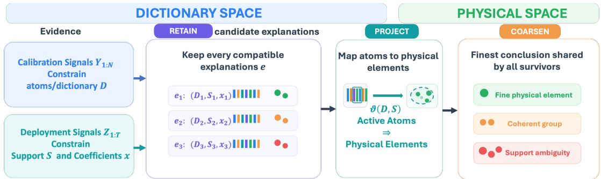  
(a) Retain–project–coarsen pipeline. Calibration and deployment data constrain joint dictionary–support– coeficient explanations, which are projected to physical-support space and coarsened to the finest conclusion shared by all survivors.

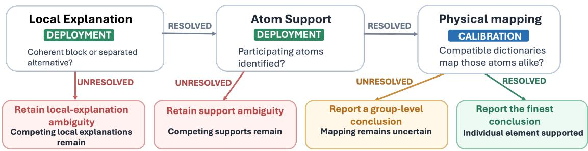  
(b) Local resolution gates and reporting consequences. Unresolved deployment information retains competing local explanations or atom supports; unresolved calibration mapping yields only a group-level conclusion; resolving all three gates supports element-level identification within the supplied coherent block.  
Figure 1: Resolution-aware physical-support inference after dictionary learning. (a) illustrates the retain–project–coarsen principle for joint dictionary–support–coeficient explanations. (b) specializes the framework to one supplied coherent block and shows how unresolved deployment and calibration uncertainty limit the attainable physical resolution.

The continuous correspondence supplies the local statistical benchmark. For computation, active endpoint bracketing (AEB) operates on a specified finite bank that may contain several simultaneously active components, adaptively queries certificate-relevant candidates, and certifies a fine, coarser, or ambiguous same-bank report, otherwise returning abstain. Its statistical validity is on-bank; the finite bank is not assumed to approximate or outer-cover the continuous parameter space.

## The main contributions are:

1. We formulate physical-support uncertainty after dictionary learning and construct an exact cross-dictionary confidence correspondence with conditional coverage in the stated fixed-dimensional model.

2. We derive the minimax law in Equation (3), identify Ns6 as the calibration orientationinformation scale, and characterize deployment information through the coeficient-profiled task secant.

3. We develop AEB, an adaptive finite-bank method with deterministic same-bank certification and on-bank statistical validity that safely coarsens or abstains when a finer report is not certified.

4. Finite-bank studies show that point-valued plug-in selection can be physically overprecise, whereas AEB recovers justified conclusions with decision-dependent query savings.

Related work falls into three categories:

• Dictionary-learning theory studies identifiability, error, sample complexity, and minimax recovery of the dictionary [5–8]; recent work also treats uncertainty for learned sparse estimators [9, 10]. We instead propagate dictionary uncertainty to the physical support of a separate deployment signal.

• Group and hierarchical inference retains coarser conclusions under collinearity [11, 12], while sparse and model confidence sets retain compatible supports [13–15]. These methods generally treat the design as known rather than propagating calibration uncertainty.

• Orbit estimation, singular models, weak identification, and set identification provide related geometric and inferential perspectives [16–19]. Here the weakly identified geometry determines physical-support resolution for a deployment signal.

## 2 Model and Cross-Dictionary Physical-Support Inference

We consider a fixed-dimensional train–test problem in which calibration data constrain a dictionary and independent deployment data constrain a sparse representation; both uncertainties are retained before projection to physical support.

## 2.1 Local calibration and deployment model

We analyze one supplied coherent block of $q$ atoms and a well-separated competing atom. For fixed $q \geq 4$ and $n = q + 1$ , write $D = ( d _ { 1 } , \dots , d _ { q } , a ) \in \mathbb { R } ^ { q \times n }$ , with unit-norm columns, coherent block $d _ { 1 } , \ldots , d _ { q }$ , and separated atom a. Matching block and ambient dimensions gives a minimal local coordinate representation and does not restrict the full dictionary size.

We use the star to denote the true parameter value. The calibration sample consists of N independent latent sparse mixtures perturbed by Gaussian noise:

$$
Y _ { i } = D _ { \star } c _ { i } + \xi _ { i } , \qquad \xi _ { i } \sim \mathcal { N } _ { q } ( 0 , \nu _ { \star } I _ { q } ) , \qquad i = 1 , \dots , N ,\tag{5}
$$

where neither $c _ { i }$ nor its support is observed and $\nu _ { \star } \in \left[ \nu _ { - } , \nu _ { + } \right] \Subset \left( 0 , \infty \right)$ . The calibration coeficients follow the Bernoulli–Gaussian model

$$
c _ { i j } = I _ { i j } G _ { i j } , \qquad I _ { i j } \stackrel { \mathrm { i i d } } { \sim } \mathrm { B e r n o u l l i } ( p _ { \star } ) , \qquad G _ { i j } \stackrel { \mathrm { i i d } } { \sim } \mathcal { N } ( 0 , 1 ) ,\tag{6}
$$

with $p _ { \star } \in \left[ p _ { - } , p _ { + } \right] \Subset \left( 0 , 1 / 2 \right)$

Components outside the supplied local subproblem are treated as resolved. Independently, $T$ deployment measurements share the same sparse mean:

$$
\begin{array} { r l } & { Z _ { \ell } \stackrel { \mathrm { i i d } } { \sim } \mathcal { N } _ { q } ( \mu _ { \star } , \sigma _ { \star } ^ { 2 } I _ { q } ) , \qquad \ell = 1 , \ldots , T , } \\ & { \qquad \sigma _ { \star } \in [ \sigma _ { - } , \sigma _ { + } ] \Subset ( 0 , \infty ) . } \end{array}\tag{7}
$$

Write $[ q ] = \{ 1 , \dots , q \}$ and fix a support size $2 \leq r \leq q - 1$ . Under the coherent-block explanation, the deployment mean is

$$
\begin{array} { r l r } { \mu _ { \star } = \displaystyle \sum _ { j \in S _ { \star } } x _ { \star j } d _ { \star j } , } & { { } } & { S _ { \star } \in { \binom { [ q ] } { r } } , } \\ { x _ { \star j } \in [ \beta _ { - } , \beta _ { + } ] , } & { { } } & { \beta _ { - } > 0 . } \end{array}\tag{8}
$$

The competing separated explanation is

$$
\mu _ { \star } = \gamma _ { \star } a _ { \star } , \qquad \gamma _ { \star } \in \Gamma _ { A } = [ \gamma _ { - } , \gamma _ { + } ] \Subset ( 0 , \infty ) ,\tag{9}
$$

denoted by $S _ { \star } = \partial$ . Deployment profiling first distinguishes this separated alternative from the coherent-block explanation and then identifies the atom support within the block; the remaining uncertainty is its physical mapping.

## 2.2 Coherence scale and physical-support target

Fix a unit reference direction $u \in \mathbb { R } ^ { q }$ , let $U = u ^ { \perp }$ , and let $v _ { 1 } , \dotsc , v _ { q } \in U$ be a fixed centered regular-simplex template. Its exact normalization identities are given in Supplementary Section S1.1.2.

For $z \in U$ with $\| z \| < 1$ , define the unit-norm atom near u by

$$
d ( z ) = { \sqrt { 1 - \| z \| ^ { 2 } } } u + z .\tag{10}
$$

An afine transformation of this template parameterizes the coherent block:

$$
z _ { j } = b + L v _ { j } , \qquad d _ { j } = d ( z _ { j } ) , \qquad j = 1 , \ldots , q ,\tag{11}
$$

where $b \in U$ is the center and invertible $L : U \to U$ controls scale, orientation, and anisotropy. For supplied separation scale $s \in ( 0 , s _ { 0 } ]$ , with $C _ { 0 } s _ { 0 } < 1$ , assume

$$
\begin{array} { c } { \displaystyle \operatorname* { m a x } _ { j } \| b + L v _ { j } \| \leq C _ { 0 } s , } \\ { \kappa _ { - } s \leq \sigma _ { \operatorname* { m i n } } ( L ) \leq \sigma _ { \operatorname* { m a x } } ( L ) \leq \kappa _ { + } s . } \end{array}\tag{12}
$$

These conditions keep the block in an $O ( s )$ neighborhood of u without directional collapse.

The simplex geometry, shell bounds, and local chart imply

$$
\| d _ { i } - d _ { j } \| _ { 2 } \asymp s , \qquad 1 - d _ { i } ^ { \top } d _ { j } = \frac 1 2 \| d _ { i } - d _ { j } \| _ { 2 } ^ { 2 } \asymp s ^ { 2 } , \qquad i \neq j ,\tag{13}
$$

so smaller s means greater coherence.

For a reference $a _ { 0 }$ separated from u by a fixed positive angle, let $P _ { a } = a a ^ { \top }$ and $P _ { a _ { 0 } } = a _ { 0 } a _ { 0 } ^ { \top }$ and require

$$
\| P _ { a } - P _ { a _ { 0 } } \| _ { \mathrm { F } } \le C _ { a } s , \qquad 0 < \nu _ { - } \le \nu \le \nu _ { + } < \infty .\tag{14}
$$

Atom sign is physically irrelevant, so a unit atom represents the projective element $[ d ] =$ span $\{ d \} \in \mathbb { R P } ^ { q - 1 }$ . Coherent-atom ordering is also irrelevant, so [D] denotes the orbit under simultaneous permutation. The sign convention and quotient metric are given in Supplementary Section S1.1.2; $\mathcal { Q } _ { q , s } ^ { D }$ denotes the resulting dictionary shell.

The coordinate support S indexes atoms in a particular dictionary, whereas our inferential target is the physical support: the set of physical elements represented by the active atoms. For a coherent-block support S, the corresponding physical-support target is

$$
\vartheta ( D , S ) = \left( 1 , \left\{ [ d _ { j } ] : j \in S \right\} \right) , \qquad \vartheta ( D , \partial ) = \left( 0 , \left\{ [ a ] \right\} \right) .\tag{15}
$$

Write $\vartheta _ { \star } = \vartheta ( D _ { \star } , S _ { \star } )$ . The binary component marks the local explanation and the set component is its physical support. The target takes values in

$$
\mathfrak { V } _ { q } = \{ 0 , 1 \} _ { \mathrm { d i s c } } \times \mathcal { K } ( \mathbb { R } \mathbb { P } ^ { q - 1 } ) ,\tag{16}
$$

where $\mathcal { K } ( E )$ denotes the nonempty compact subsets of $E ;$ the full marked metric is given in Supplementary Section S1.1.2.

For unit atoms $d , d ^ { \prime }$ , use the sign-invariant projective distance

$$
d _ { \mathrm { p r } } ( [ d ] , [ d ^ { \prime } ] ) = \sqrt { 1 - ( d ^ { \top } d ^ { \prime } ) ^ { 2 } } ,\tag{17}
$$

and let $d _ { H } ^ { \mathrm { p r } }$ be its induced Hausdorf distance. For a retained set C of targets $( m , A )$ , define the physical diameter

$$
\dim _ { \operatorname { p r } } ( C ) = \operatorname* { s u p } _ { ( m , A ) , ( m ^ { \prime } , A ^ { \prime } ) \in C } d _ { H } ^ { \operatorname { p r } } ( A , A ^ { \prime } ) .\tag{18}
$$

The full marked target-space metric is recorded in Supplementary Section S1.1.2.

Assumption 2.1 (Fixed-dimensional coherent train–test model). The calibration and deployment models satisfy Equations $( 5 ) \AA { - } ( 9 )$ ; the coherent block, separated atom, and calibration-noise variance satisfy Equations (12) and (14). The calibration coeficient law is the Bernoulli– Gaussian model in Equation (6). Deployment coeficients satisfy $x _ { j } \in [ \beta _ { - } , \beta _ { + } ]$ with $\beta _ { - } > 0$ , and $\sigma \in [ \sigma _ { - } , \sigma _ { + } ] \Subset ( 0 , \infty )$ . The ambient dimension $q ,$ support size $r ,$ compact nuisance ranges, and shell constants are fixed. The scale $s \in ( 0 , s _ { 0 } ]$ is supplied and is not estimated from the data.

Let $\mathfrak { P } _ { q , r } ^ { p } ( s )$ denote the resulting joint parameter class, including both local deployment explanations. This oracle-favorable local formulation isolates physical-resolution loss due to uncertainty in the coherent dictionary geometry.

## 2.3 Cross-dictionary confidence correspondence

Fix calibration and deployment error levels $\alpha _ { D } , \alpha _ { T } \in ( 0 , 1 )$ . For calibration parameter $\theta =$ $\left( p , \nu , \left[ D \right] \right)$ , use the estimable second moment and fourth cumulant

$$
M _ { 2 } ( \theta ) = \mathbb { E } _ { \theta } ( Y Y ^ { \top } ) , \qquad K _ { 4 } ( \theta ) = \mathrm { c u m } _ { 4 , \theta } ( Y ) .\tag{19}
$$

which constrain the local dictionary geometry under Bernoulli–Gaussian coding.

Lemma 2.2 (Population moment identifiability). Under Bernoulli–Gaussian coding with $p < 1 / 2$ the population pair $( M _ { 2 } , K _ { 4 } )$ identifies $p , \nu ,$ and the aggregate second- and fourth-order dictionary coordinates used below.

The notation, inversion formulas, and proof are given in Supplementary Sections S1.1.3 and S1.2.7. Let robust estimators $\widehat { M } _ { 2 } , \widehat { K } _ { 4 }$ and radii $\epsilon _ { 2 , N } , \epsilon _ { K , N }$ satisfy

$$
\begin{array} { l } { \displaystyle \operatorname* { i n f } _ { p , \nu , D } \mathbb { P } _ { p , \nu , D } ^ { N } \left\{ \| \widehat { M } _ { 2 } - M _ { 2 } \| _ { F } \leq \epsilon _ { 2 , N } , \| \widehat { K } _ { 4 } - K _ { 4 } \| _ { F } \leq \epsilon _ { K , N } \right\} } \\ { \geq 1 - \alpha _ { D } . } \end{array}\tag{20}
$$

Supplementary Section S1.3.1 gives an explicit coordinatewise median-of-means construction with $O ( N ^ { - 1 / 2 } )$ radii above a fixed-dimensional threshold and retains the full compact shell below it. The calibration-compatible region is

$$
\begin{array} { r } { \widehat { K } _ { q , s } ^ { p } = \left\{ \begin{array} { c } { \left( p , \nu , [ D ] \right) : } \\ { p \in [ p _ { - } , p _ { + } ] , \nu \in [ \nu _ { - } , \nu _ { + } ] , [ D ] \in Q _ { q , s } ^ { D } , } \\ { \Vert \widehat { M } _ { 2 } - M _ { 2 } ( p , \nu , D ) \Vert _ { F } \leq \epsilon _ { 2 , N } , } \\ { \Vert \widehat { K } _ { 4 } - K _ { 4 } ( p , \nu , D ) \Vert _ { F } \leq \epsilon _ { K , N } } \end{array} \right\} . } \end{array}\tag{21}
$$

On the event in Equation (20), it contains $\left( p _ { \star } , \nu _ { \star } , \left[ D _ { \star } \right] \right)$

For deployment, define the sample mean and common confidence radius

$$
\bar { Z } = \frac { 1 } { T } \sum _ { \ell = 1 } ^ { T } Z _ { \ell } , \qquad \tau _ { T , q } = \frac { \sigma _ { + } } { \sqrt { T } } \sqrt { \chi _ { q , 1 - \alpha _ { T } } ^ { 2 } } ,\tag{22}
$$

where $\chi _ { \boldsymbol { q } , 1 - \alpha _ { T } } ^ { 2 }$ is the indicated $\chi _ { q } ^ { 2 }$ quantile. Uniformly over the allowed noise range, the event

$$
\lVert \bar { Z } - \mu _ { \star } \rVert _ { 2 } \leq \tau _ { T , q }\tag{23}
$$

has probability at least $1 - \alpha _ { T }$

For retained D, profile the deployment residual over unknown coeficients:

$$
\ell _ { \mathrm { p r o f } } ( \bar { Z } , D , S ) = \operatorname* { m i n } _ { ( x _ { j } ) _ { j \in S } \in [ \beta _ { - } , \beta _ { + } ] ^ { r } } \biggl \| \bar { Z } - \sum _ { j \in S } x _ { j } d _ { j } \biggl \| _ { 2 } ,\tag{24}
$$

and for the separated alternative,

$$
\ell _ { \mathrm { p r o f } } ( \bar { Z } , D , \partial ) = \operatorname* { m i n } _ { \gamma \in \Gamma _ { A } } \| \bar { Z } - \gamma a \| _ { 2 } .\tag{25}
$$

Interpreting $( D , S )$ modulo simultaneous coherent-atom permutation, combine calibration and deployment compatibility in

$$
\mathcal { R } _ { q , r , s } ^ { p } = \left\{ \left( p , \nu , [ D , S ] \right) : \begin{array} { l } { ( p , \nu , [ D ] ) \in \widehat { K } _ { q , s } ^ { p } , } \\ { S \in { \binom { [ q ] } { \mathit { r } } } \cup \{ \partial \} , } \\ { \ell _ { \mathrm { p r o f } } ( Z , D , S ) \leq \tau _ { T , q } } \end{array} \right\} .\tag{26}
$$

All candidates use the same confidence ball for the unknown deployment mean, so this truthretention guarantee needs no multiplicity correction over dictionaries or supports.

Projecting the joint feasible explanations through ϑ gives

$$
\widehat { \mathfrak { C } } _ { q , r , s } ^ { p } = \left\{ \vartheta ( D , S ) : \exists p , \nu \mathrm { ~ s u c h ~ t h a t ~ } ( p , \nu , [ D , S ] ) \in \mathcal { R } _ { q , r , s } ^ { p } \right\} ,\tag{27}
$$

when $\mathcal { R } _ { q , r , s } ^ { p } \neq \emptyset ;$ record $F _ { \mathrm { e m p t y } } = \mathbf { 1 } \{ \mathcal { R } _ { q , r , s } ^ { p } = \emptyset \}$ otherwise. Formal totalization and measurability are given in Supplementary Section S1.3.2.

Proposition 2.3 (Truth retention of the cross-dictionary confidence correspondence). On the intersection of the calibration event in Equation (20) and the deployment event in (23), the true explanation satisfies $( p _ { \star } , \nu _ { \star } , [ D _ { \star } , S _ { \star } ] ) \in \mathcal { R } _ { q , r , s } ^ { p }$ . Consequently, we have $\vartheta _ { \star } \in \widehat { \mathfrak { C } } _ { q , r , s } ^ { p } , F _ { \mathrm { e m p t y } } = 0$

The proof and regularity details are in Supplementary Sections S1.3.2 and S1.3.4. If both local explanations survive, the local explanation is unresolved; if only the coherent-block explanation survives with several supports, atom support is ambiguous. A single surviving support can still have uncertain physical mapping across calibration-compatible dictionaries.

We use this continuous correspondence as the statistical benchmark and develop the finitebank computational procedure separately in Section 4.

## 3 Coherence, Information, and Minimax Physical Resolution

We now ask how accurately the physical support can be localized as the coherent atoms become increasingly similar. The analysis has three steps. First, we determine how the calibration information about coherent-block orientation scales with coherence. Then, we translate this information into the physical resolution of the cross-dictionary correspondence and establish a matching minimax lower bound. Finally, we determine when additional deployment measurements can improve this calibration-limited resolution.

## 3.1 Calibration information under high coherence

The main calibration bottleneck is that diferent orientations of a highly coherent block can induce nearly indistinguishable calibration distributions. To identify where orientation first appears, we use a third-order tensor representation. For a vector v, let $v ^ { \otimes 3 } = v \otimes v \otimes v$ denote the rank-one third-order tensor with entries $( v ^ { \otimes 3 } ) _ { a b c } = v _ { a } v _ { b } v _ { c }$ . We then define

$$
T _ { q } = \sum _ { j = 1 } ^ { q } v _ { j } ^ { \otimes 3 } , \qquad G _ { 2 } = L L ^ { \top } , \qquad G _ { 3 } = L ^ { \otimes 3 } T _ { q } ,\tag{28}
$$

where $L ^ { \otimes 3 } = L \otimes L \otimes L$ applies L along each tensor mode. Here, $G _ { 2 }$ describes the second-order shape of the local block, whereas $G _ { 3 }$ is the first permutation-invariant coordinate that retains its residual orientation. Because L has scale $s , G _ { 3 }$ has scale $s ^ { 3 }$

To isolate this orientation efect, we fix a unit vector $e _ { 1 } \in U$ and a constant $\lambda _ { \star } \in ( \kappa _ { - } , \kappa _ { + } ) \cap$ $( 0 , C _ { 0 } )$ , and consider the centered balanced submodel:

$$
\begin{array} { c c } { { a _ { 0 } = ( u + e _ { 1 } ) / \sqrt { 2 } , } } & { { b = 0 , } } \\ { { L = \lambda _ { \star } s R , \qquad R \in O ( U ) , } } & { { P _ { a } = P _ { a _ { 0 } } . } } \end{array}\tag{29}
$$

where $O ( U )$ is the orthogonal group on $U .$ . In this submodel, only the orientation R varies, while the remaining local geometry is left unaltered.

The cubic scaling of $G _ { 3 }$ identifies where residual orientation enters the local geometry, but it does not yet determine how strongly that orientation is visible in the calibration data. To quantify statistical distinguishability, we therefore perturb the block orientation along a local path $R _ { t } = R \exp ( t { \Omega } )$ and examine the resulting first-order change in the calibration density. The next result shows that this change in density is itself of order $s ^ { 3 }$ . Consequently, the corresponding Fisher information is of order $s ^ { 6 }$ , which is the calibration information scale governing the physical resolution derived below.

Let $f _ { s , R }$ denote the density of one calibration observation on this submodel, with all remaining calibration parameters held fixed at compact interior values, and let $f _ { 0 }$ denote the collapsed $s = 0$ calibration model.

Theorem 3.1 (Calibration information for coherent-block orientation). Under Assumption 2.1, there exist constants $0 < c < C < \infty$ such that the following statements hold. For $R _ { t } = R \exp ( t \Omega )$ with $\Omega ^ { \top } = - \Omega$

$$
\left. \frac { \partial } { \partial t } f _ { s , R _ { t } } \right| _ { t = 0 } = s ^ { 3 } g _ { R , \Omega } + O _ { L ^ { 2 } ( f _ { 0 } ^ { - 1 } ) } \left( s ^ { 4 } \| \Omega \| _ { \mathrm { F } } \right) ,\tag{30}
$$

where $g _ { R , \Omega } \neq 0$ for every nonzero orientation tangent modulo coherent-atom permutation.

More generally, let $I _ { R } ^ { \mathrm { e f f } } ( \Omega ; \theta )$ denote the eficient Fisher information for an orientation perturbation after profiling the regular nuisance parameters at calibration parameter θ. Uniformly over compact interior submodels,

$$
c s ^ { 6 } \| \boldsymbol { \Omega } \| _ { \mathrm { F } } ^ { 2 } \leq I _ { R } ^ { \mathrm { e f f } } ( \boldsymbol { \Omega } ; \theta ) \leq C s ^ { 6 } \| \boldsymbol { \Omega } \| _ { \mathrm { F } } ^ { 2 } .\tag{31}
$$

Thus one calibration observation carries only order- $s ^ { 6 }$ information about the orientation of the coherent block. With N independent calibration signals, the relevant orientation-information scale is therefore

$$
I _ { D } = N s ^ { 6 } .\tag{32}
$$

The all-pair statistical chord bounds and the inverse map from invariant coordinates to physical dictionary geometry used in the proofs are given in Supplementary Sections S1.2.1 and S1.2.4.

Orientation uncertainty is only one source of physical imprecision. Even if the dictionary has been localized to a small neighborhood, the deployment data may still be compatible with diferent atom supports or even with diferent local explanations. To determine when these ambiguities can be resolved, we need quantitative lower bounds on how far apart competing deployment means remain after allowing the dictionary to vary within quotient-dictionary radius $\rho .$

The next lemma provides these separation margins. The quantity $m _ { S } ( \rho )$ controls the separation between distinct coherent-block supports, whereas $m _ { G } ( \rho )$ controls the separation between a coherent-block explanation and the separated alternative. These margins will be compared with the deployment uncertainty radius in the coverage and resolution bound below.

Lemma 3.2 (Support and local-explanation separation across nearby dictionaries). There exist fixed constants $c _ { D } , g _ { G } ^ { 0 } , C _ { S } , C _ { G } > 0$ such that every dictionary in the supplied local shell satisfies

$$
\left. \sum _ { j = 1 } ^ { q } h _ { j } d _ { j } \right. _ { 2 } \geq c _ { D } s \Vert h \Vert _ { 2 } , \qquad h \in \mathbb { R } ^ { q } .\tag{33}
$$

For $t \in \mathbb R$ , write $[ t ] _ { + } =$ max{t, 0}. If two candidate dictionaries have quotient-dictionary distance at most $\rho _ { ; }$ , then two distinct size-r coherent-block supports are separated by at least

$$
m _ { S } ( \rho ) = \Bigl [ \sqrt { 2 } c _ { D } \beta _ { - } s - C _ { S } r \beta _ { + } \rho \Bigr ] _ { + } ,\tag{34}
$$

whereas a coherent-block mean and a separated-atom mean are separated by at least

$$
m _ { G } ( \rho ) = \Big [ g _ { G } ^ { 0 } - C _ { G } ( r \beta _ { + } + \gamma _ { + } ) \rho \Big ] _ { + } .\tag{35}
$$

The constants can be chosen so that $m _ { S } ( \rho ) > 0$ also guarantees a unique matching of the coherent atoms across the two dictionaries.

## 3.2 Coverage and physical-resolution upper bound

We now combine calibration uncertainty with the deployment separation margins to bound the physical diameter of the reported correspondence. For a joint parameter $\xi \in \mathfrak { P } _ { q , r } ^ { p } ( s )$ , we write $\vartheta ( \xi )$ for the physical-support target induced by its dictionary and deployment support.

Recall that the calibration-compatible region is controlled by the estimation errors of the second moment and fourth cumulant, with radii $\epsilon _ { 2 , N }$ and $\epsilon _ { K , N }$ , respectively. The dictionaryradius bound below depends on these two calibration errors through their joint magnitude, so we define

$$
\epsilon _ { N } = \left( \epsilon _ { 2 , N } ^ { 2 } + \epsilon _ { K , N } ^ { 2 } \right) ^ { 1 / 2 } .\tag{36}
$$

The next result establishes the two properties required for a useful physical-support confidence correspondence. First, it verifies that the reported set retains the true physical support with the prescribed calibration and deployment error probabilities. Second, it converts the calibration uncertainty summarized by $\epsilon _ { N }$ , together with the deployment separation margins from Lemma 3.2, into an explicit bound on the physical diameter of the correspondence.

Theorem 3.3 (Coverage and resolution of the cross-dictionary correspondence). Under Assumption 2.1 and the calibration coverage condition in Equation (20), the totalized correspondence ${ \widehat { \mathfrak { C } } _ { q , r , s } ^ { p } }$ is measurable, nonempty, and compact-valued. Uniformly over $\mathfrak { P } _ { q , r } ^ { p } ( s )$ ,

$$
\begin{array} { r } { \mathbb { P } _ { p _ { \star } , \nu _ { \star } , D _ { \star } } ^ { N } \left[ \mathbb { P } _ { \mu _ { \star } , \sigma _ { \star } } ^ { T } \left\{ \boldsymbol { \vartheta } _ { \star } \in \widehat { \mathfrak { C } } _ { q , r , s } ^ { p } \ \middle \vert \ Y _ { 1 : N } \right\} \geq 1 - \alpha _ { T } \right] \geq 1 - \alpha _ { D } . } \end{array}\tag{37}
$$

Consequently, by independence of the calibration and deployment experiments, with

$$
\alpha = 1 - ( 1 - \alpha _ { D } ) ( 1 - \alpha _ { T } ) ,
$$

$$
\operatorname* { i n f } _ { \xi \in \mathfrak { P } _ { q , r } ^ { p } ( s ) } \mathbb { P } _ { \xi } ^ { N , T } \left\{ \vartheta ( \xi ) \in \widehat { \mathfrak { C } } _ { q , r , s } ^ { p } \right\} \geq 1 - \alpha .\tag{38}
$$

For N above the fixed block threshold of the robust calibration-moment construction, define

$$
\rho _ { N } ( s ) = C \left[ ( s \wedge \epsilon _ { N } ) + \left( s \wedge { \frac { \epsilon _ { N } } { s } } \right) + \left( s \wedge { \frac { \epsilon _ { N } } { s ^ { 2 } } } \right) \right] .\tag{39}
$$

Any two dictionaries retained by the same nonempty calibration region have quotient-dictionary distance at most $\rho _ { N } ( s )$ ). $I f \epsilon _ { N } \le C N ^ { - 1 / 2 }$ , then

$$
\rho _ { N } ( s ) \le C \left( s \land \frac { 1 } { \sqrt { N } s ^ { 2 } } \right) .\tag{40}
$$

Below the block threshold, retaining the full compact shell yields the same order after adjustment of fixed constants.

For every realization,

$$
\begin{array} { r l } & { \mathrm { d i a m } _ { \mathrm { p r } } \left( \widehat { \mathfrak { C } } _ { q , r , s } ^ { p } \right) \leq C \rho _ { N } ( s ) } \\ & { \qquad + C s \mathbf { 1 } \left\{ 2 \tau _ { T , q } \geq m _ { S } ( \rho _ { N } ( s ) ) \right\} } \\ & { \qquad + C \mathbf { 1 } \left\{ 2 \tau _ { T , q } \geq m _ { G } ( \rho _ { N } ( s ) ) \right\} . } \end{array}\tag{41}
$$

The three terms in $\rho _ { N } ( s )$ arise from uncertainty in the local center, second-order shape, and cubic orientation coordinate, respectively. In the high-coherence regime, the orientation term produces the characteristic calibration-limited rate $s \wedge ( \sqrt { N } s ^ { 2 } )$ −1.

The diameter bound also separates the three sources of uncertainty introduced in Section 2. The two deployment-side scales follow from a common Gaussian mean-separation principle. For $T$ independent observations with noise variance $\sigma ^ { 2 }$ , two candidate means separated by distance $\Delta$ have KL divergence of order $T \Delta ^ { 2 } / \sigma ^ { 2 }$ . By Lemma 3.2, the coherent-block versus separated alternative has baseline mean separation of order $r \beta _ { - }$ , whereas two distinct coherent-block supports have separation of order $\beta _ { - } s$ . Using the worst-case deployment noise level $\sigma _ { + }$ therefore gives the first two information scales below. The third follows from Theorem 3.1, which gives order- ${ \cdot } s ^ { 6 }$ orientation information per calibration signal:

$$
I _ { G } ^ { ( r ) } = \frac { T r ^ { 2 } \beta _ { - } ^ { 2 } } { \sigma _ { + } ^ { 2 } } , \qquad I _ { S } = \frac { T \beta _ { - } ^ { 2 } s ^ { 2 } } { \sigma _ { + } ^ { 2 } } , \qquad I _ { D } = N s ^ { 6 } .\tag{42}
$$

Here $I _ { G } ^ { ( r ) }$ measures deployment information for distinguishing the coherent-block explanation from the separated alternative, $I _ { S }$ measures deployment information for distinguishing supports within the coherent block, and $I _ { D }$ measures calibration information about its physical orientation.

If the deployment data cannot distinguish the two local explanations, the physical diameter can remain on the order of one. Once the coherent-block explanation is identified, but its atom support remains unresolved, the relevant scale is order s. After both deployment-side ambiguities are resolved, the remaining physical uncertainty is governed by

$$
s \wedge \frac { 1 } { \sqrt { N } s ^ { 2 } } .\tag{43}
$$

These are distinct information requirements; the general analysis does not collapse them into a single $N T$ information scale.

## 3.3 Minimax lower bound and optimal physical resolution

The upper bound above shows the physical resolution achieved by the proposed cross-dictionary correspondence, but it does not determine whether a diferent valid confidence procedure could do better. To distinguish a limitation of the procedure from an intrinsic statistical limitation, we now derive a minimax lower bound over all uniformly valid physical-support confidence correspondences.

To compare such procedures at the same coverage level, we assume $( 1 - \alpha _ { D } ) ( 1 - \alpha _ { T } ) > 1 / 2$ and set

$$
\alpha = 1 - ( 1 - \alpha _ { D } ) ( 1 - \alpha _ { T } ) < \frac { 1 } { 2 } .
$$

We define the class of uniformly valid correspondences by

$$
\mathfrak { H } _ { \alpha } \{ \mathfrak { P } _ { q , r } ^ { p } ( s ) \} = \{ \begin{array} { c } { \widehat { C } : \operatorname* { i n f } _ { \xi \in \mathfrak { P } _ { q , r } ^ { p } ( s ) } } \\ { \mathbb { P } _ { \xi } ^ { N , T } \{ \vartheta ( \xi ) \in \widehat { C } \} \geq 1 - \alpha \} \mathrm { , } } \end{array}\tag{44}
$$

where $\widehat { C }$ ranges over measurable nonempty compact-valued correspondences. Among all such valid procedures, we measure the best achievable worst-case physical resolution by the minimax expected diameter

$$
\mathcal { R } _ { N , T } ^ { ( q , r ) } ( s ) = \operatorname* { i n f } _ { \widehat C \in \mathfrak { H } _ { \alpha } } \operatorname* { s u p } _ { \xi \in \mathfrak { P } _ { q , r } ^ { p } ( s ) } \mathbb { E } _ { \xi } \dim _ { \mathrm { p r } } ( \widehat C ) .\tag{45}
$$

The lower bound uses three two-point comparisons corresponding to the three sources of physical uncertainty identified above: the local explanation, the atom support within the coherent

block, and the physical orientation of the dictionary. A mild interior compatibility condition needed for the coherent-block versus separated comparison, together with the generic two-point diameter argument, is given in Supplementary Section S1.4.1.

The next theorem shows that the three resolution scales appearing in the upper bound are unavoidable. In particular, once the two deployment-side ambiguities are resolved, the proposed correspondence attains the optimal calibration-limited physical resolution.

Theorem 3.4 (Minimax physical-resolution lower bound and optimality). Under Assumption 2.1 and the interior compatibility condition in Supplementary Section $S 1 . 4 . 1 ,$ there exist fixed positive constants and transition thresholds such that

$$
\begin{array} { r l r } & { } & { \mathcal { R } _ { N , T } ^ { ( q , r ) } ( s ) \ge c \operatorname* { m a x } \left[ \mathbf { 1 } \{ I _ { G } ^ { ( r ) } \le c _ { G } \} , \ s \mathbf { 1 } \{ I _ { S } \le c _ { S } \} , \right. } \\ & { } & { \left. s \wedge \displaystyle \frac { 1 } { \sqrt { N } s ^ { 2 } } \right] . \qquad } \end{array}\tag{46}
$$

When $I _ { G } ^ { ( r ) }$ and $I _ { S }$ exceed their fixed resolution thresholds, the cross-dictionary correspondence of Theorem 3.3, with $\epsilon _ { N } \leq C N ^ { - 1 / 2 }$ , satisfies

$$
\operatorname* { s u p } _ { \xi \in \mathfrak { P } _ { q , r } ^ { p } ( s ) } \mathbb { E } _ { \xi } \mathrm { d i a m } _ { \mathrm { p r } } \left( \widehat { \mathfrak { C } } _ { q , r , s } ^ { p } \right) \leq C \left( s \wedge \frac { 1 } { \sqrt { N } s ^ { 2 } } \right) .
$$

Together with the lower bound, this yields

$$
\mathcal { R } _ { N , T } ^ { ( q , r ) } ( s ) \asymp s \wedge \frac { 1 } { \sqrt { N } s ^ { 2 } } .\tag{47}
$$

Thus, once the deployment data resolve the local explanation and atom support, the calibration-limited physical resolution is minimax optimal up to fixed constants:

$$
\delta _ { \mathrm { o p t } } ( N , s ) \asymp s \wedge \frac { 1 } { \sqrt { N } s ^ { 2 } } .\tag{48}
$$

Equivalently,

$$
\frac { \delta _ { \mathrm { o p t } } ( N , s ) } { s } \asymp \operatorname* { m i n } \left\{ 1 , \frac { 1 } { \sqrt { N s ^ { 6 } } } \right\} .\tag{49}
$$

This is a constant-factor result for the supplied fixed-dimensional local class, and the coherence scale s is treated as a given parameter.

The minimax theorem characterizes the optimal physical-resolution rate, but two consequences are especially useful for interpreting what this limitation means for sparse inference. First, we compare the learned-dictionary problem with the idealized case in which the dictionary is known. This isolates the loss of physical resolution caused specifically by a finite calibration sample.

Corollary 3.5 (Known- versus learned-dictionary resolution). Consider a sequence of problems for which

$$
I _ { G } ^ { ( r ) } \to \infty , \qquad I _ { S } \to \infty ,
$$

while $I _ { D } = N s ^ { 6 }$ remains bounded. If the dictionary were known, the deployment experiment would eventually separate the competing atom supports. When the dictionary is learned from finite calibration data, however, every uniformly valid physical-support confidence correspondence has worst-case expected diameter at least cs. Hence a support decision that is precise conditional on one fitted dictionary can be strictly more precise than the physical conclusion justified after dictionary uncertainty is taken into account.

The preceding comparison could still leave open whether this gap is caused by uncertainty in the deployment support, coeficients, noise levels, or other nuisance quantities rather than by dictionary orientation itself. To isolate the calibration bottleneck, we therefore consider an oracle-favorable experiment in which all such nonorientation quantities are revealed.

Corollary 3.6 (Calibration bottleneck persists with oracle side information). On the balanced orientation submodel in Equation (29), suppose an oracle reveals the coherent-block identity, the scale s, the active support, equal positive coeficients, the separated atom, the coeficient law, the noise levels, and all nonorientation nuisance parameters. Over a fixed injective local orientation path, every uniformly valid confidence correspondence still satisfies

$$
\operatorname* { i n f } _ { \widehat { C } } \operatorname* { s u p } _ { | h | \leq h _ { 0 } } \mathbb { E } _ { h } \mathrm { d i a m } _ { \mathrm { p r } } ( \widehat { C } ) \geq c \left( s \wedge \frac { 1 } { \sqrt { N } s ^ { 2 } } \right) ,\tag{50}
$$

where the infimum ranges over correspondences with marginal coverage at least $1 - \alpha , f o r$ fixed $\alpha < 1 / 2$

Thus the calibration bottleneck is intrinsic to uncertainty in coherent-block orientation: it persists even when the deployment support and all nonorientation quantities are supplied. The proof is given in Supplementary Section S1.4.2.

Remark 3.7 (Embedding in a larger dictionary). The local hard core above can be embedded isometrically into a higher-dimensional signal space and included as a submodel of a larger dictionary. All additional atoms and orthogonal coordinates may be held fixed while the coherent block follows the least-favorable orientation path. Consequently, the minimax lower bound applies to any larger dictionary model containing this local subexperiment.

## 3.4 When deployment replication adds orientation information

The preceding results identify a calibration-limited physical-resolution barrier. A natural question is whether this barrier can be reduced simply by collecting more deployment measurements after the local explanation and atom support have been resolved. The answer depends on whether a change in dictionary orientation leaves a component in the deployment mean that cannot be reproduced by changing the active coeficients.

To quantify this distinction, consider a centered coherent-block support $S$ and an interior coeficient vector $x \in ( \beta _ { - } , \beta _ { + } ) ^ { r }$ . An infinitesimal orientation perturbation changes the deployment mean through $\dot { D } _ { S } [ \Omega ] x$ , but part of this change may lie inside $\operatorname { s p a n } ( D _ { S } )$ . It can therefore be absorbed by an infinitesimal coeficient adjustment $D _ { S } { \dot { x } }$ . We measure only the component that remains after this optimal adjustment by the coeficient-profiled orientation secant

$$
\begin{array} { r l r } & { } & { \chi _ { \mathrm { t a n } } ( D , S , x ; \Omega ) = \displaystyle \frac { 1 } { s } \left. \operatorname* { i n f } _ { \dot { x } \in \mathbb { R } ^ { r } } \right\| \dot { D } _ { S } [ \Omega ] x + D _ { S } \dot { x } \Big \| _ { 2 } } \\ & { } & { \qquad = \displaystyle \frac { 1 } { s } \left\| P _ { \mathrm { s p a n } ( D _ { S } ) } ^ { \perp } \dot { D } _ { S } [ \Omega ] x \right\| _ { 2 } , } \end{array}\tag{51}
$$

where $\dot { D } _ { S } [ \Omega ]$ denotes the derivative of the active-atom matrix under the orientation tangent Ω. Thus $\chi _ { \mathrm { t a n } } = 0$ means that the local orientation change is invisible to the deployment experiment after profiling the coeficients, whereas $\chi _ { \mathrm { t a n } } > 0$ means that deployment data contain additional orientation information.

The next result converts this geometric quantity into statistical information. It answers two questions: how much orientation information is contributed by T deployment replicates, and how that information combines with the calibration information $N s ^ { 6 }$ when both sources are informative.

Theorem 3.8 (Deployment information for physical orientation). For every fixed $2 \leq r \leq q - 1$ and every interior coeficient vector $x _ { i }$ , the eficient information contributed by $T$ deployment measurements for an orientation tangent Ω is

$$
I _ { \Omega | x } ^ { \mathrm { t e s t } } = \frac { T s ^ { 2 } } { \sigma ^ { 2 } } \chi _ { \mathrm { t a n } } ^ { 2 } ( D , S , x ; \Omega ) .\tag{52}
$$

Moreover, consider a compact orientation orbit and compact interior coeficient set ${ \mathcal { X } } _ { \mathrm { o r b } }$ for which physical target separation is of order $s | \phi - \phi ^ { \prime } |$ and the coeficient-profiled deployment mean separation is of order $s \chi _ { s } | \phi - \phi ^ { \prime } |$ . Under the precise regularity conditions stated in Supplementary Section S1.5.1, the minimax physical diameter on this restricted orbit satisfies

$$
\mathcal { R } _ { N , T } ^ { \mathrm { t a s k } } ( s , \mathcal { X } _ { \mathrm { o r b } } , \sigma ) \asymp s \wedge \frac { s } { \sqrt { N s ^ { 6 } + T \chi _ { s } ^ { 2 } s ^ { 2 } / \sigma ^ { 2 } } } .\tag{53}
$$

The first part of the theorem gives the general local message: deployment replication improves orientation resolution only through the component measured by $\chi _ { \mathrm { t a n } }$ . When this component vanishes, increasing $T$ cannot overcome the calibration bottleneck. When it is nonzero, the deployment contribution adds to the calibration information. The second part makes this combination explicit on the declared restricted orientation orbit.

The secant formulation is general but somewhat abstract. To make its operational meaning transparent, we next specialize to two active coherent atoms. In this case, the informative part of the coeficient profile is the contrast: equal coeficients can completely hide the orientation change, whereas unequal coeficients expose it.

Corollary 3.9 (Two-atom coeficient contrast). Let $r = 2$ and write

$$
x _ { 1 } = \bar { \beta } + \frac { d } { 2 } , \qquad x _ { 2 } = \bar { \beta } - \frac { d } { 2 } .
$$

Fix $d _ { 0 } \neq 0$ and a sign-preserving compact coeficient set satisfying $| d - d _ { 0 } | \leq \epsilon _ { d } \leq | d _ { 0 } | / 2$ . For the orientation orbit that rotates $v _ { 1 } - v _ { 2 }$ while fixing $v _ { 1 } + v _ { 2 }$

$$
\begin{array} { r l } & { \displaystyle \operatorname* { i n f } _ { \bar { \beta } ^ { \prime } , d ^ { \prime } \in \mathbb { R } } \left\| \mu _ { \phi , \bar { \beta } , d } - \mu _ { \phi ^ { \prime } , \bar { \beta } ^ { \prime } , d ^ { \prime } } \right\| _ { 2 } } \\ & { \quad \quad = \frac { \lambda _ { \star } s | d | \| v _ { 1 } - v _ { 2 } \| _ { 2 } } { 2 } | \sin ( \phi - \phi ^ { \prime } ) | . } \end{array}\tag{54}
$$

Hence

$$
\chi _ { s } \asymp \frac { \lambda _ { \star } \| v _ { 1 } - v _ { 2 } \| _ { 2 } | d _ { 0 } | } { 2 } ,
$$

and calibration and deployment information become comparable at

$$
\left| d _ { 0 } \right| \asymp \sigma \sqrt { \frac { N } { T } } s ^ { 2 } .\tag{55}
$$

When $d = 0$ , the deployment distribution is exactly invariant along this orientation $p a t h ,$ so additional deployment replicates provide no orientation information and the resolution remains calibration-limited.

The corollary therefore gives a concrete interpretation of the general secant condition. The number of deployment replicates alone does not determine whether deployment improves physical resolution; the active coeficient profile must also reveal the orientation change. In the equalcoeficient case, it does not, whereas a suficiently large coeficient contrast allows deployment information to compete with the $N s ^ { 6 }$ calibration information.

Extension beyond Bernoulli–Gaussian coding. The $s ^ { 3 }$ orientation sensitivity underlying the calibration bottleneck was derived above under the Bernoulli–Gaussian calibration model. To check that this mechanism is not a special consequence of that particular coding law, we also analyze a fixed known exchangeable sparse Gaussian coeficient law. The same local geometry yields $s ^ { 3 }$ orientation sensitivity and $N s ^ { 6 }$ information scaling under a corresponding nondegeneracy condition. The model, moment formulas, and proofs are given in Supplementary Sections S1.1.1, S1.1.3, and S1.2.7.

## 3.5 Summary of the resolution regimes

Figure 1b summarizes the inferential hierarchy qualitatively: the data must first resolve the local explanation, then the participating atom support, and finally the physical mapping of those atoms. The results above provide the corresponding quantitative information scales:

$$
\begin{array} { r l } { I _ { G } ^ { ( r ) } } & { : \quad \mathrm { W h i c h ~ l o c a l ~ e x p l a n a t i o n } } \\ & { \mathrm { i s ~ s u p p o r t e d ? } } \\ { I _ { S } } & { : \quad \mathrm { W h i c h ~ a t o m s ~ p a r t i c i p a t e ? } } \\ { I _ { D } = N s ^ { 6 } } & { : \quad \mathrm { H o w ~ p r e c i s e l y ~ c a n ~ t h o s e ~ a t o m s } } \\ & { \quad \mathrm { b e ~ m a p p e d ~ p h y s i c a l l y ? } } \end{array}
$$

In the worst case, failure to resolve an earlier distinction prevents the later, finer conclusion from being certified. Thus unresolved local explanations can leave order-one physical uncertainty, unresolved atom support can leave uncertainty at the coherent-block scale $s ,$ and after both deployment-side ambiguities are resolved, the remaining physical resolution is governed by $s \wedge { \frac { 1 } { \sqrt { N } s ^ { 2 } } }$

The coeficient-profiled task secant does not define an additional stage in Figure 1b. It determines whether deployment replication can help with the final physical-mapping stage. When $\chi _ { \mathrm { t a n } } = 0$ , orientation changes can be absorbed by coeficient adjustment and the physical mapping remains calibration-limited. When $\chi _ { \mathrm { t a n } } > 0$ , deployment observations contribute additional orientation information of orde

$$
{ \frac { T s ^ { 2 } } { \sigma ^ { 2 } } } \chi _ { \mathrm { t a n } } ^ { 2 } .
$$

The finite-bank procedure developed next follows the same qualitative hierarchy, but it does not evaluate $I _ { G } ^ { ( r ) } , I _ { S } , I _ { D } , \mathrm { o r } \chi _ { \mathrm { t a n } }$ as online query scores. Instead, AEB determines which level can be reported from universal conditions over the remaining possible explanations and, for ambiguity statements, from opposing admissible witnesses.

## 4 Active Endpoint Bracketing for Finite-Bank Physical-Support Inference

The continuous correspondence in Sections 2 and 3 supplies the statistical benchmark. Here candidate explanations form a finite bank $\boldsymbol { B } = \{ e _ { 1 } , \ldots , e _ { M } \}$ fixed before held-out evaluation, and AEB asks whether unevaluated candidates can still change the requested physical report. Each $e = ( D , S , \eta )$ maps to an application-specific target $\varphi _ { B } ( e ) \in \mathfrak { V } _ { \mathrm { a p p } } ;$ the bank may encode several simultaneously active components and need not discretize the continuous model.

## 4.1 Physical assertions on a finite explanation bank

A truth-level assertion must hold for the represented data-generating candidate, whereas an ambiguity assertion records coexisting admissible explanations. Represent a truth-level assertion $g$ by

$$
q _ { g } : B \longrightarrow \{ 0 , 1 \} ,\tag{56}
$$

where $q _ { g } ( e ) = 1$ means that e satisfies it. For region $R ,$ active elements $\Theta _ { R } ( e )$ , fine cell $F .$ , and sector $C ,$ examples are

$$
\begin{array} { r } { q _ { \mathrm { f i n e } ( R , F ) } ( e ) = \mathbf { 1 } \{ \Theta _ { R } ( e ) \neq \emptyset , \ \Theta _ { R } ( e ) \subseteq F \} , } \\ { q _ { \mathrm { s e c t o r } ( R , C ) } ( e ) = \mathbf { 1 } \{ \Theta _ { R } ( e ) \neq \emptyset , \ \Theta _ { R } ( e ) \subseteq C \} . } \end{array}\tag{57}
$$

Thus $F \subseteq C$ permits safe coarsening from fine to sector resolution. Represented-scale absence is another truth-level predicate; its full form is given in Supplementary Section S2.2.

## 4.2 Candidate evaluation and on-bank truth retention

For held-out sample $W = ( W _ { 1 } , \dots , W _ { m } )$ , the evaluator classifies a queried candidate as

$$
\begin{array} { r } { \psi _ { W } ( e ) \in \{ \mathrm { A D M I S S I B L E } , \mathrm { R E J E C T E D } , \mathrm { I N D E T E R M I N A T E } \} , } \end{array}
$$

with indeterminate candidates retained as possible explanations.

Fix a candidate-wise error level $\alpha _ { B } \in ( 0 , 1 )$ . For a fully specified on-bank candidate $e ,$ suppose the held-out observations are independent with density $f _ { e }$ under e, and a proposal density $f _ { e } \ll f _ { e }$ is constructed using data independent of W. At a predeclared set of checkpoints $\tau ,$ , we define the likelihood-ratio process

$$
E _ { t } ( e ) = \prod _ { i = 1 } ^ { t } \frac { f _ { \widehat { e } } ( W _ { i } ) } { f _ { e } ( W _ { i } ) } , \qquad t \in \mathcal { T } , \qquad E _ { 0 } ( e ) = 1 .\tag{58}
$$

Conditional on proposal construction, $E _ { t } ( e )$ is a nonnegative mean-one martingale under $e ,$ which is rejected only after

$$
\operatorname* { m a x } _ { t \in \mathcal { T } } E _ { t } ( e ) > \frac { 1 } { \alpha { } _ { } \beta } .\tag{59}
$$

This yields the candidate-wise retention guarantee:

Corollary 4.1 (On-bank candidate retention). Suppose the candidate laws, data split, proposal construction, and evaluation checkpoints are fixed before held-out evaluation. ${ \mathit { I f a } }$ candidate is rejected only after Equation (59), then for every data-generating candidate $e _ { \star } \in B$

$$
\mathbb { P } _ { e _ { \star } } \left\{ e _ { \star } \ i s \ e v e r \ r e j e c t e d \right\} \le \alpha _ { \mathcal { B } } .\tag{60}
$$

This protects the represented true candidate, not all candidates simultaneously; implementation details are in Supplementary Section S2.2.

## 4.3 Witnessed and possible explanation sets

AEB maintains witnessed and possible sets

$$
\begin{array} { r l } & { L _ { k } = \{ e \in \mathcal { B } : e \mathrm { ~ i s ~ q u e r i e d ~ a n d ~ a d m i s s i b l e } \} , } \\ & { U _ { k } = \{ e \in \mathcal { B } : e \mathrm { ~ h a s ~ n o t ~ b e e n ~ r e j e c t e d } \} . } \end{array}\tag{61}
$$

Thus unqueried and indeterminate candidates remain in $U _ { k }$ . If

$$
\mathcal { A } _ { \mathcal { B } } ( W ) = \{ e \in \mathcal { B } : \psi _ { W } ( e ) = \mathrm { A D M I S S I B L E } \}
$$

is the exhaustive profile, every valid query prefix satisfies

$$
L _ { k } \subseteq { \mathcal { A } } _ { \beta } ( W ) \subseteq U _ { k } .\tag{62}
$$

A truth-level assertion requires

$$
q _ { g } ( e ) = 1 \qquad \mathrm { f o r ~ e v e r y ~ } e \in U _ { k } ,\tag{63}
$$

whereas ambiguity requires opposing admissible witnesses in $L _ { k }$ . With $P _ { R } ( e ) = \mathbf { 1 } \{ \Theta _ { R } ( e ) \neq \emptyset \}$ }, support ambiguity requires

$$
\exists e ^ { + } , e ^ { - } \in L _ { k } : \qquad P _ { R } ( e ^ { + } ) = 1 , \qquad P _ { R } ( e ^ { - } ) = 0 .\tag{64}
$$

The central deterministic question is whether partial evaluation can certify a conclusion without knowing the exhaustive profile. The sandwich relation makes universal assertions over $U _ { k }$ and witnesses in $L _ { k }$ valid for that profile.

Theorem 4.2 (Finite-bank certification). Assume the sandwich relation in Equation (62).

(i) If a truth-level assertion g satisfies Equation (63), then g holds for every explanation in the exhaustive finite-bank profile $A _ { B } ( W )$

(ii) If opposing ambiguity witnesses belong to $L _ { k }$ , then both belong to $A _ { B } ( W )$ , so the exhaustive finite-bank profile contains the corresponding ambiguity.

(iii) If $F \subseteq C$ , certification of a fine-cell assertion for F also certifies the corresponding sector assertion for C.

These statements hold at every reached query prefix, including a data-dependent stopping prefix.

Theorem 4.2 is deterministic. Combining it with candidate-wise retention yields a statistical false-report bound: a false truth-level report can occur only if the true on-bank candidate is first rejected.

Theorem 4.3 (On-bank validity of truth-level finite-bank reports). Suppose the reported truthlevel assertion gb is emitted only when its predicate satisfies Equation (63), and suppose the data-generating explanation $e _ { \star }$ belongs to the bank. Under Equation (60),

$$
\operatorname* { s u p } _ { e _ { \star } \in \mathcal { B } } \mathbb { P } _ { e _ { \star } } \left\{ \widehat { g } \ i s \ r e p o r t e d \ a n d \ q _ { \widehat { g } } ( e _ { \star } ) = 0 \right\} \leq \alpha g .\tag{65}
$$

Truth-level validity combines universal certification over $U _ { k }$ with retention of the on-bank truth; ambiguity instead uses witnesses in $L _ { k }$ . Proofs are in Supplementary Section S2.2.2.

## 4.4 Active endpoint bracketing

The preceding results say when a partial bank certifies a report; AEB determines which candidates to evaluate to reach such a certificate.

Fix a requested report family $\mathcal { G }$ before held-out evaluation, and let $\mathcal { O } _ { \mathcal { G } }$ denote its allowed reports. Define

$$
\mathsf { C e r t } _ { \mathcal { G } } ( L , U ) \in \mathcal { O } _ { \mathcal { G } } \cup \{ \bot \}
$$

as a deterministic rule that returns a report only when $U \neq \emptyset$ , truth-level fields are universal over $U ,$ , and ambiguity fields have their prescribed witnesses in $L ;$ otherwise it returns ⊥. A predeclared priority rule $\pi _ { \mathcal { G } } ( e ; L , U )$ orders the unqueried candidates that can still change an unresolved certificate. Both rules and their deterministic tie-breaking are fixed before held-out evaluation.

Initialize $L = \emptyset$ and $U = B$ . Until certification or the query limit, evaluate the unqueried candidate of highest predeclared priority, add an admissible candidate to $L ,$ remove a rejected candidate from $U$ , and retain an indeterminate candidate in $U$ . Recompute the certificate after each query and return it when available. An empty profile is returned if $U = \emptyset ;$ ; any other unresolved or budget-limited state returns abstain. Full pseudocode is given in Supplementary Algorithm S1.

Adaptive ordering and stopping preserve Theorem 4.2 because every emitted field satisfies the same certificate. Evaluating $Q$ candidates costs $O ( Q C _ { \mathrm { e v a l } } )$ ; no worst-case sublinear-query guarantee is claimed.

## 4.5 Scope of the finite-bank guarantee

Deterministic certification is relative to exhaustive evaluation of the same bank, and statistical validity is on-bank. No claim is made that the bank approximates or outer-covers the continuous parameter space or gives of-bank coverage. Application-specific banks, evaluators, certificates, and priorities are described in Section 5 and the supplement.

## 5 Numerical Evaluation and Discussion

We present three synthetic studies of the information mechanism, the physical consequences of dictionary uncertainty, and AEB computation.

## 5.1 Theory-guided check of the information mechanism

Design and rationale. This controlled calculation tests the predicted $s ^ { 6 }$ calibration scaling and coeficient-dependent deployment information in the balanced $q = 4 , r = 2$ Bernoulli– Gaussian submodel. Its exact 32-component calibration mixture isolates orientation without support or optimization efects; stored orientation perturbations are evaluated by balanced midpoint Monte Carlo. Equal coeficients provide the deployment-invariance control, whereas unequal coeficients expose the orientation change predicted by Theorem 3.8. This is a fixed-grid mechanism calculation, not a collection of independent coverage trials; the complete collapse diagnostic is Figure S1 in the supplement.

Results and interpretation. The Jefreys-divergence log–log slope is 5.935, with $R ^ { 2 } = 0 . 9 9 9 9 9$ and a 2,000-replicate paired-batch Monte Carlo stability range [5.925, 5.947]. The maximum equal-coeficient residual is $6 . 8 \times 1 0 ^ { - 1 6 }$ , while the unequal-coeficient analytical identity has maximum relative error $7 . 0 \times 1 0 ^ { - 1 5 }$ . Thus the calculation reproduces the sixth-order calibration mechanism and the coeficient-dependent deployment distinction. The secondary collapse spread is 0.0167, narrowly above the prespecified tolerance 0.015, so this study is used only as a mechanism illustration rather than numerical coverage evidence.

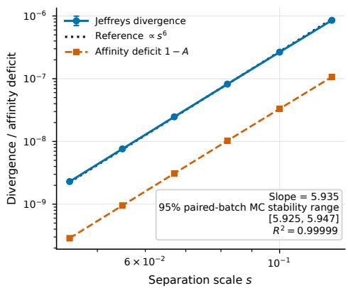

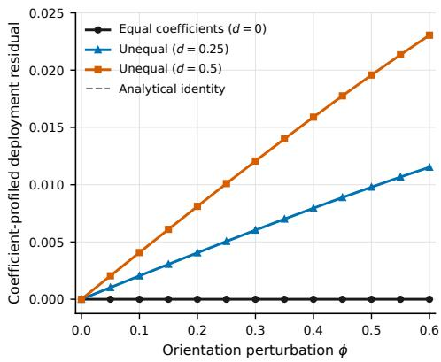  
(a) Calibration orientation scaling. Exactmixture Jefreys-divergence estimates follow the $s ^ { 6 }$ reference; the fitted slope, paired-batch Monte Carlo stability interval, and $R ^ { 2 }$ are computed on the stored scale grid.  
(b) Task-dependent deployment information. $\mathrm { A t } \ s \ = \ 0 . 1$ , the coeficient-profiled residual stays at machine precision for equal coeficients and increases with orientation perturbation for unequal coeficients. Across the full stored grid, the maximum equal-coeficient residual is $6 . 8 2 \times 1 0 ^ { - 1 6 }$ and the maximum analyticalidentity relative error is $7 . 0 1 \times 1 0 ^ { - 1 5 }$  
Figure 2: Theory-guided check of the information mechanism on the stored controlled calculation grid. This is a mechanism illustration, not a numerical coverage study for the continuous confidence correspondence.

## 5.2 Four-region application: physical consequences of dictionary uncertainty

Design and rationale. This study asks whether selecting one dictionary–support explanation can produce a physical conclusion finer than the complete finite-bank analysis. Region A is an isolated persistent fine-localization control; B is a coherent persistent group requiring group-level resolution; C is weak and optional, creating presence–absence ambiguity; and D is an optional interferer for represented-scale absence and D-present controls. AEB is compared with exhaustive evaluation of the same 216-explanation bank and with a point-valued plug-in selector that chooses one explanation before physical mapping. The full bank, data split, source scales, comparator, and query policy are in Supplementary Section S2.4.

Results and interpretation. At the primary cap $1 6 2 / 2 1 6 = 0 . 7 5$ , AEB matches the exhaustive same-bank result in $1 0 / 1 1$ A-fine profiles, $5 / 5$ B group/sector profiles, 5/5 C-ambiguity profiles, and $1 0 / 1 0$ represented-scale D-absence profiles, with $0 / 3$ false D-absence conclusions in the D-present controls. One weak-C dataset has an empty exhaustive finite-bank profile; it is excluded from truth-relative utility rates but its query cost is retained. In the five eligible completed weak-C profiles, the plug-in selector gives unsupported fine B localization in $5 / 5$ cases and unsupported definitive C-absence in $5 / 5$ cases; in the one remaining A-fine profile, AEB abstains rather than localizing incorrectly. Figure 3 shows the representative and aggregate discrepancies. These outcomes show that retaining dictionary uncertainty is not generic conservatism: it preserves fine localization and absence when supported, but prevents unsupported refinement when competing explanations remain.

<table><tr><td rowspan=1 colspan=1>Region</td><td rowspan=1 colspan=1>AEB</td><td rowspan=1 colspan=1>Exhaustivesame-bank</td><td rowspan=1 colspan=1>Point-valuedplug-in</td></tr><tr><td rowspan=1 colspan=1>A</td><td rowspan=1 colspan=1>Fine</td><td rowspan=1 colspan=1>Fine</td><td rowspan=1 colspan=1>Fine</td></tr><tr><td rowspan=1 colspan=1>B</td><td rowspan=1 colspan=1>Group /sector</td><td rowspan=1 colspan=1>Group /sector</td><td rowspan=1 colspan=1>Fine</td></tr><tr><td rowspan=1 colspan=1>C</td><td rowspan=1 colspan=1>Supportambiguity</td><td rowspan=1 colspan=1>Supportambiguity</td><td rowspan=1 colspan=1>Absent(definite)</td></tr><tr><td rowspan=1 colspan=1>D</td><td rowspan=1 colspan=1>Absent atrepresentedscale</td><td rowspan=1 colspan=1>Absent atrepresentedscale</td><td rowspan=1 colspan=1>Absent atrepresentedscale</td></tr></table>

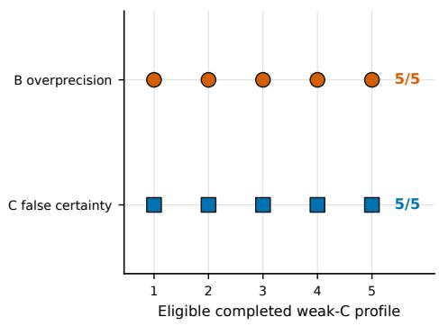  
(a) Representative weak-C physical report. AEB and exhaustive same-bank evaluation agree on a group-level conclusion in B and support ambiguity in C, whereas the point-valued plug-in selector reports fine B localization and definite C absence.  
(b) Point-valued plug-in selector discrepancies. Unsupported finer B localization and unsupported definitive C-absence occur in all five eligible completed weak-C profiles.

Figure 3: Four-region physical reports relative to the represented 216-explanation bank. The representative weak-C report shows that AEB preserves the exhaustive same-bank group/ambiguity resolution while the point-valued plug-in gives unsupported fine B localization and definite C absence; the aggregate panel shows both discrepancies in all five eligible completed weak-C profiles. The study uses 15 fresh datasets, one of which has an empty exhaustive finite-bank profile.

## 5.3 Global finite-bank study: certification fidelity and query eficiency

Design and rationale. This study asks how much of a finite bank AEB must evaluate to reproduce or safely coarsen the exhaustive same-bank report. Eighteen independent cases span low-, intermediate-, and high-information regimes, and three predeclared reporting profiles per case give 54 traces with diferent certificate obligations. Proposal data determine candidate order and policy quantities; independent held-out data determine candidate classification. Exhaustive evaluation uses the same bank and classification rule. Outcome counts use all 54 traces, with 34 ambiguity-reference and seven fine-reference traces; full settings are in Supplementary Section S2.3 and Table S2.

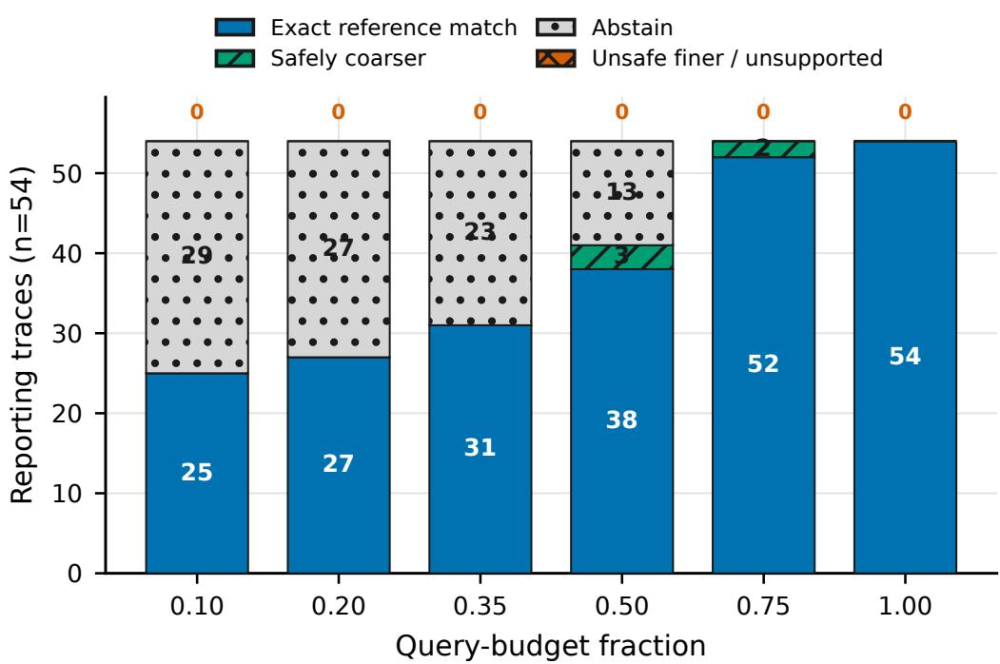  
Figure 4: Global AEB status relative to exhaustive same-bank evaluation over 18 independent cases and three predeclared profiles per case (54 reporting traces). At each of the six stored query budgets, exact-reference match, safe coarsening, abstention, and unsafe finer-than-reference counts sum to 54; the unsafe count is zero throughout.

Results and interpretation. At budget 0.50, AEB returns substantive reports in 41/54 traces, recovers 33/34 ambiguity and 0/7 fine conclusions, and gives 0/54 unsafe finer-thanreference reports. At budget 0.75, the counts are 54/54, 34/34, 5/7, and 0/54; the remaining two fine-reference cases are safely coarsened. Figure 4 shows the six stored budgets, where the four status categories sum to 54 and the unsafe category is always zero.

Ambiguity can be certified from opposing witnesses, whereas fine localization requires eliminating unresolved alternatives, so reduced computation appears as abstention or safe coarsening rather than unsupported refinement. The median queried fraction is 0.209 at both displayed budgets because most traces stop before either cap; this is decision-dependent query saving, not a worst-case sublinear-query guarantee.

## 5.4 Discussion, scope, and future directions

Together, the studies reproduce the sixth-order calibration mechanism and coeficient-dependent deployment information, show that dictionary uncertainty can replace point-valued overprecision by coherent-group or support-ambiguous conclusions without suppressing supported fine or absence statements, and show that AEB often certifies the exhaustive same-bank conclusion without evaluating the full bank while otherwise coarsening or abstaining safely.

Controlled synthetic experiments are appropriate because the claims require a known local orientation path, exact deployment invariance after coeficient profiling, and an exhaustive compatible explanation set—quantities that ordinary real-data benchmarks do not reveal. The continuous theory remains a supplied local coherent-block benchmark, and the computational results remain same-bank and on-bank rather than of-bank or worst-case sublinear guarantees. Natural extensions include continuous-certificate computation, finite-bank refinement with of-grid guarantees, application-specific bank construction, broader coherent geometries, and sequential calibration/deployment acquisition.

## 6 Conclusion

Sparse pursuit after dictionary learning can produce a precise coordinate support even when the corresponding physical interpretation remains uncertain. We addressed this gap by formulating physical-support inference jointly over calibration-compatible dictionaries and deploymentcompatible sparse representations, and by constructing a cross-dictionary confidence correspondence that propagates dictionary uncertainty into the reported physical support.

For highly coherent atom configurations with separation scale s, we showed that, once the coherent-block explanation and atom support are resolved, the minimax physical resolution from N calibration signals satisfies

$$
\delta _ { \mathrm { o p t } } ( N , s ) \asymp \operatorname* { m i n } \left\{ s , \frac { 1 } { \sqrt { N } s ^ { 2 } } \right\} .
$$

The corresponding calibration information for physical orientation scales as $N s ^ { 6 }$ . Repeated deployment measurements can improve this resolution only when an orientation change produces a signal component that cannot be absorbed by adjusting the active coeficients; otherwise the physical resolution remains calibration-limited.

For computation, we developed active endpoint bracketing (AEB), which applies the same retain–project–coarsen principle to a specified finite bank of candidate explanations. AEB reports a fine physical conclusion only when it is supported by every remaining possibility, while unresolved alternatives lead to a coarser conclusion, certified ambiguity, or abstention. In the finite-bank studies, point-valued plug-in selection could return a finer physical interpretation than exhaustive same-bank uncertainty analysis supported, whereas AEB reproduced or safely coarsened the exhaustive same-bank conclusion without necessarily evaluating the entire bank. These results provide a resolution-aware view of sparse inference: the precision of the reported physical support should be determined not only by the sparse representation selected under one fitted dictionary, but by the physical distinctions jointly supported by the calibration and deployment evidence.

## References

[1] Dmitry Malioutov, Müjdat Çetin, and Alan S. Willsky. A sparse signal reconstruction perspective for source localization with sensor arrays. IEEE Transactions on Signal Processing, 53(8):3010–3022, 2005. doi: 10.1109/TSP.2005.850882. URL https://doi.org/10.1109/TSP.2005.850882.

[2] Marian-Daniel Iordache, José M. Bioucas-Dias, and Antonio Plaza. Sparse unmixing of hyperspectral data. IEEE Transactions on Geoscience and Remote Sensing, 49(6):2014–2039, 2011. doi: 10.1109/TGRS.2010.2098413. URL https://doi.org/10.1109/TGRS.2010.2098413.

[3] Yuanchang Sun and Jack Xin. A sparse semi-blind source identification method and its application to Raman spectroscopy for explosives detection. Signal Processing, 96:332–345, 2014. doi: 10.1016/j.sigpro.2013.09.010. URL https://doi.org/10.1016/j.sigpro.2013.09.010.

[4] Alexandre Gramfort, Matthieu Kowalski, and Matti Hämäläinen. Mixed-norm estimates for the M/EEG inverse problem using accelerated gradient methods. Physics in Medicine and Biology, 57

(7):1937–1961, 2012. doi: 10.1088/0031-9155/57/7/1937. URL https://doi.org/10.1088/0031-9155/57/7/1937.

[5] Rémi Gribonval and Karin Schnass. Dictionary identification—sparse matrix-factorization via ℓ -minimization. IEEE Transactions on Information Theory, 56(7):3523–3539, 2010. doi: 10.1109/TIT.2010.2048466. URL https://doi.org/10.1109/TIT.2010.2048466.

[6] Siqi Wu and Bin Yu. Local identifiability of ℓ1-minimization dictionary learning: A suficient and almost necessary condition. Journal of Machine Learning Research, 18(168):1–56, 2018. URL https://jmlr.org/papers/v18/16-119.html.

[7] Rémi Gribonval, Rodolphe Jenatton, and Francis Bach. Sparse and spurious: Dictionary learning with noise and outliers. IEEE Transactions on Information Theory, 61(11):6298–6319, 2015. doi: 10.1109/TIT.2015.2472522. URL https://doi.org/10.1109/TIT.2015.2472522.

[8] Alexander Jung, Yonina C. Eldar, and Norbert Görtz. On the minimax risk of dictionary learning. IEEE Transactions on Information Theory, 62(3):1501–1515, 2016. doi: 10.1109/TIT.2016.2517006. URL https://doi.org/10.1109/TIT.2016.2517006.

[9] Frederik Hoppe, Claudio Mayrink Verdun, Hannah Laus, Felix Krahmer, and Holger Rauhut. Uncertainty quantification for learned ISTA. In 2023 IEEE 33rd International Workshop on Machine Learning for Signal Processing (MLSP), pages 1–6. IEEE, 2023. doi: 10.1109/MLSP55844.2023.10285912. URL https://doi.org/10.1109/MLSP55844.2023.10285912.

[10] Frederik Hoppe, Claudio Mayrink Verdun, Hannah Laus, Felix Krahmer, and Holger Rauhut. Non-asymptotic uncertainty quantification in high-dimensional learning. In Advances in Neural Information Processing Systems, volume 37, pages 122524–122555, 2024. doi: 10.52202/079017-3894. URL https://proceedings.neurips.cc/paper\_files/paper/2024/hash/ dd65d612d2ddafd54ef5eceb92f1a754-Abstract-Conference.html.

[11] Nicolai Meinshausen. Group bound: Confidence intervals for groups of variables in sparse high dimensional regression without assumptions on the design. Journal of the Royal Statistical Society: Series B (Statistical Methodology), 77(5):923–945, 2015. doi: 10.1111/rssb.12094. URL https://doi.org/10.1111/rssb.12094.

[12] Jacopo Mandozzi and Peter Bühlmann. Hierarchical testing in the high-dimensional setting with correlated variables. Journal of the American Statistical Association, 111(513):331–343, 2016. doi: 10.1080/01621459.2015.1007209. URL https://doi.org/10.1080/01621459.2015.1007209.

[13] Richard Nickl and Sara van de Geer. Confidence sets in sparse regression. The Annals of Statistics, 41(6):2852–2876, 2013. doi: 10.1214/13-AOS1170. URL https://doi.org/10.1214/13-AOS1170.

[14] Yang Li, Yuetian Luo, Davide Ferrari, Xiaonan Hu, and Yichen Qin. Model confidence bounds for variable selection. Biometrics, 75(2):392–403, 2019. doi: 10.1111/biom.13024. URL https://doi.org/10.1111/biom.13024.

[15] R. M. Lewis and H. S. Battey. Cox reduction and confidence sets of models: A theoretical elucidation. Statistical Science, 40(2):313–328, 2025. doi: 10.1214/24-STS934. URL https://doi.org/10.1214/24-STS934.

[16] Afonso S. Bandeira, Ben Blum-Smith, Joe Kileel, Amelia Perry, Jonathan Niles-Weed, and Alexander S. Wein. Estimation under group actions: Recovering orbits from invariants. Applied and Computational Harmonic Analysis, 66:236–319, 2023. doi: 10.1016/j.acha.2023.06.001. URL https://doi.org/10.1016/j.acha.2023.06.001.

[17] Nhat Ho and XuanLong Nguyen. Singularity structures and impacts on parameter estimation in finite mixtures of distributions. SIAM Journal on Mathematics of Data Science, 1(4):730–758, 2019. doi: 10.1137/18M122947X. URL https://doi.org/10.1137/18M122947X.

[18] Tetsuya Kaji. Theory of weak identification in semiparametric models. Econometrica, 89(2):733–763, 2021. doi: 10.3982/ECTA16413. URL https://doi.org/10.3982/ECTA16413.

[19] Victor Chernozhukov, Han Hong, and Elie Tamer. Estimation and confidence regions for parameter sets in econometric models. Econometrica, 75(5):1243–1284, 2007. doi: 10.1111/j.1468-0262.2007.00794.x. URL https://doi.org/10.1111/j.1468-0262.2007.00794.x.

## Supplementary Material

## S1 Proofs and Technical Details

This supplement supplies the technical steps behind the main-text results. Its organization follows the questions answered in Sections 2 and 3. We first make the local coordinate system and population-moment inversion explicit. We then show why coherent-block orientation first appears at cubic order, convert that geometry into statistical distance and Fisher information, and derive the physical dictionary-radius bounds used by the confidence correspondence. The remaining sections establish finite-sample calibration coverage, measurability, cross-dictionary separation, the minimax lower bound, and the deployment-assisted orientation result.

Technical lemmas are placed close to the proof step that needs them so that each calculation has a visible role in the argument. A fixed known exchangeable sparse Gaussian coeficient law is included only as a supplementary robustness extension; it is not required for the main-text Bernoulli–Gaussian model or its primary results.

## S1.1 Model details deferred from the main text

The main text keeps only the model ingredients needed to understand the physical target and the retain–project construction. The proofs require three additional pieces of bookkeeping: a normalized simplex coordinate system for comparing nearby dictionaries, explicit second- and fourth-order population moments for identifying those dictionaries from calibration data, and a measurable finite-sample calibration region. We record these ingredients here before using them in the later upper- and lower-bound arguments.

Section S1.1.2 fixes the simplex normalization and quotient metric, Section S1.1.3 gives the tensor notation and moment inversion, and Sections S1.3.1–S1.3.2 later provide one explicit finite-sample implementation. The known exchangeable-law extension is separated because its only purpose is to show that the cubic orientation mechanism is not specific to Bernoulli–Gaussian coding.

## S1.1.1 Supplementary fixed known exchangeable sparse Gaussian law

Let $J \subseteq [ n ]$ denote the active set and $K = | J |$ . For fixed known probabilities $( \pi _ { 0 } , \ldots , \pi _ { n } )$ and conditional active variances $( \lambda _ { 0 } , \ldots , \lambda _ { n } )$ , define

$$
\mathbb { P } ( K = k ) = \pi _ { k } , \qquad J \mid K = k \sim \operatorname { U n i f } { \binom { [ n ] } { k } } .\tag{S1}
$$

Conditional on $( J , K = k )$ , the coeficients indexed by J are independent $\mathcal { N } ( 0 , \lambda _ { k } )$ variables and all remaining coeficients are zero. For this supplementary extension, define

$$
a _ { 1 } = \frac { \mathbb { E } ( \lambda _ { K } K ) } { n } , \qquad \Delta _ { \mathcal { L } } = \frac { \mathbb { E } \{ \lambda _ { K } ^ { 2 } K ( n - K ) \} } { n ( n - 1 ) } .\tag{S2}
$$

We further assume the nondegeneracy bounds

$$
a _ { 1 } \geq a _ { \mathrm { m i n } } > 0 , ~ \Delta _ { \mathcal { L } } \geq \Delta _ { \mathrm { m i n } } > 0 .\tag{S3}
$$

These conditions exclude a vanishing second-order signal coeficient and a coeficient law whose fourth-order contrast disappears. The corresponding population moment formulas are stated in Section S1.1.3 and derived in Section S1.2.7.

## S1.1.2 Simplex normalization and quotient dictionary geometry

To compare nearby coherent dictionaries without being distracted by arbitrary atom labels, we use a normalized simplex chart and measure dictionary separation only after the best coherent-atom permutation. This is the coordinate system in which the later cubic invariant and dictionary-radius bounds are stated.

Use the decomposition

$$
\mathbb { R } ^ { q } = U \oplus \operatorname { s p a n } \{ u \} , \qquad \dim U = q - 1 ,
$$

and choose centered regular-simplex reference vectors $v _ { 1 } , \dotsc , v _ { q } \in U$ satisfying

$$
\begin{array} { r c l } { { \displaystyle \sum _ { j = 1 } ^ { q } v _ { j } = 0 , } } & { { \displaystyle v _ { i } ^ { \top } v _ { j } = - \frac { 1 } { q - 1 } } } & { { ( i \not = j ) , } } \\ { { \displaystyle \sum _ { j = 1 } ^ { q } v _ { j } v _ { j } ^ { \top } = \frac { q } { q - 1 } I _ { U } . } } & { { } } & { { } } \end{array}\tag{S4}
$$

Together with Equations (10)–(11), this normalization is only a coordinate choice. An arbitrary invertible L produces rotated and anisotropic coherent configurations, and every afinely independent local q-atom configuration admits such an afine simplex representation.

Let [D] denote the orbit of D under simultaneous permutation of the coherent atoms. For two local dictionary orbits, define

$$
\begin{array} { r l r } {  { d _ { \mathcal { Q } } ^ { D } ( [ D ] , [ D ^ { \prime } ] ) = \operatorname* { m i n } _ { \pi \in \mathfrak { S } _ { q } } } } \\ & { } & { \operatorname* { m a x } \{ \operatorname* { m a x } _ { 1 \leq j \leq q } \| z _ { j } - z _ { \pi ( j ) } ^ { \prime } \| , \| P _ { a } - P _ { a } ^ { \prime } \| _ { F } \} . } \end{array}\tag{S5}
$$

The local sign convention fixes atom signs, so simultaneous permutation is the remaining dictionary nonidentifiability. The shell in Equations (12) and (14) is compact under this quotient metric.

For completeness, atom sign is removed from the physical target by identifying a unit atom d with $[ d ] = \operatorname { s p a n } \{ d \} \in \mathbb { R P } ^ { q - 1 }$ and using

$$
d _ { \mathrm { p r } } ( [ d ] , [ d ^ { \prime } ] ) = \sqrt { 1 - ( d ^ { \top } d ^ { \prime } ) ^ { 2 } } .
$$

Let $d _ { H } ^ { \mathrm { p r } }$ be the induced Hausdorf distance and let $\kappa ( E )$ denote the nonempty compact subsets of E. The full marked target space underlying Equation (15) is

$$
\mathfrak { V } _ { q } = \{ 0 , 1 \} _ { \mathrm { d i s c } } \times \mathcal { K } ( \mathbb { R } \mathbb { P } ^ { q - 1 } ) ,\tag{S6}
$$

with metric

$$
d _ { \mathfrak { V } } \big ( ( m , A ) , ( m ^ { \prime } , A ^ { \prime } ) \big ) = | m - m ^ { \prime } | + d _ { H } ^ { \mathrm { p r } } \big ( A , A ^ { \prime } \big ) .\tag{S7}
$$

The physical-resolution loss used after the local explanation and atom support are resolved is

$$
d _ { \mathrm { p h y s } } \big ( ( m , A ) , ( m ^ { \prime } , A ^ { \prime } ) \big ) = d _ { H } ^ { \mathrm { p r } } ( A , A ^ { \prime } ) .\tag{S8}
$$

Its induced set diameter is Equation (18).

## S1.1.3 Fourth-order tensor notation and population moment inversion

The calibration step needs observable quantities that separate aggregate dictionary shape from the finer orientation information hidden by high coherence. The second moment captures the aggregate projector sum, while the fourth cumulant retains the additional atomwise information

needed for identification. We therefore make the corresponding tensor notation and population inversion explicit.

For a unit-norm atom $d _ { j }$ , write $P _ { j } = d _ { j } d _ { j } ^ { \top }$ and define

$$
\Sigma _ { 2 } ( D ) = \sum _ { j = 1 } ^ { n } P _ { j } , \qquad \Sigma _ { 4 } ( D ) = \sum _ { j = 1 } ^ { n } P _ { j } ^ { \odot 2 } .\tag{S9}
$$

For a symmetric matrix $C ,$ its symmetrized tensor square is

$$
( C ^ { \odot 2 } ) _ { i j k l } = { \frac { 1 } { 3 } } \left( C _ { i j } C _ { k l } + C _ { i k } C _ { j l } + C _ { i l } C _ { j k } \right) .\tag{S10}
$$

With this normalization, a zero-mean Gaussian vector X with covariance $C$ satisfies $\mathbb { E } ( X ^ { \otimes 4 } ) =$ $3 C ^ { \odot 2 }$ . Hence the fourth cumulant in Equation (19) is explicitly

$$
K _ { 4 } = \mathbb { E } ( Y ^ { \otimes 4 } ) - 3 M _ { 2 } ^ { \odot 2 } .
$$

Under Bernoulli–Gaussian coding,

$$
M _ { 2 } = \nu I _ { q } + p \Sigma _ { 2 } ( D ) , \qquad K _ { 4 } = 3 p ( 1 - p ) \Sigma _ { 4 } ( D ) .\tag{S11}
$$

For a fourth-order tensor $\begin{array} { r } { T = \left( T _ { i j k l } \right) } \end{array}$ , define the double contraction

$$
\mathrm { T r } _ { 2 } ( T ) = \sum _ { i = 1 } ^ { q } \sum _ { j = 1 } ^ { q } T _ { i i j j } .\tag{S12}
$$

Since $\mathrm { T r } _ { 2 } ( P _ { j } ^ { \odot 2 } ) = 1$ for a unit-norm atom,

$$
{ \frac { \mathrm { T r } _ { 2 } ( K _ { 4 } ) } { 3 n } } = p ( 1 - p ) .\tag{S13}
$$

The restriction $p < 1 / 2$ selects the identifiable branch.

For the supplementary fixed known exchangeable law, define

$$
a _ { 2 d } = \frac { \mathbb { E } ( \lambda _ { K } ^ { 2 } K ) } { n } , \qquad a _ { 2 o } = \frac { \mathbb { E } \{ \lambda _ { K } ^ { 2 } K ( K - 1 ) \} } { n ( n - 1 ) } .\tag{S14}
$$

Then

$$
\begin{array} { r } { \Delta _ { \mathcal { L } } = a _ { 2 d } - a _ { 2 o } , } \end{array}\tag{S15}
$$

and

$$
M _ { 2 } = \nu I _ { q } + a _ { 1 } \Sigma _ { 2 } ( D ) ,\tag{S16}
$$

$$
K _ { 4 } = 3 \left[ \Delta _ { \mathcal { L } } \Sigma _ { 4 } ( D ) + ( a _ { 2 o } - a _ { 1 } ^ { 2 } ) \Sigma _ { 2 } ( D ) ^ { \odot 2 } \right] .\tag{S17}
$$

Thus $\Delta \boldsymbol { c } > 0$ preserves fourth-order information beyond the aggregate second-order dictionary shape.

Under Bernoulli–Gaussian coding, set

$$
u = \frac { \mathrm { T r } _ { 2 } ( K _ { 4 } ) } { 3 n } .
$$

The population inversion summarized in Lemma 2.2 is

$$
\begin{array} { c c c } { { p = \displaystyle \frac { 1 - \sqrt { 1 - 4 u } } { 2 } , } } & { { \nu = \displaystyle \frac { \mathrm { t r } M _ { 2 } - n p } { q } , } } \\ { { \Sigma _ { 2 } ( D ) = \displaystyle \frac { M _ { 2 } - \nu I _ { q } } { p } , } } & { { \Sigma _ { 4 } ( D ) = \displaystyle \frac { K _ { 4 } } { 3 p ( 1 - p ) } . } } \end{array}\tag{S18}
$$

For sample moments, one convenient cumulant estimator is

$$
\widehat { K } _ { 4 } = \widehat { M } _ { 4 } - 3 \widehat { M } _ { 2 } ^ { \odot 2 } .\tag{S19}
$$

The explicit robust median-of-means construction and its uniform radii are provided in Section S1.3.1. The derivation of all population formulas above and the proof of Lemma 2.2 are included in Section S1.2.7.

## S1.2 Calibration geometry and orientation information

We now turn the local dictionary geometry into statistical information. The argument has four steps. First, we identify invariant coordinates whose distance is equivalent to statistical distance. Second, we expand the coherent projectors and show that orientation cancels through quadratic order. Third, we control the Taylor remainder uniformly. Finally, we invert the cubic invariant and profile the regular nuisance directions to obtain the $s ^ { 6 }$ orientation-information scale.

## S1.2.1 Invariant-coordinate distance and all-pair bounds

The main text emphasizes the $s ^ { 3 }$ orientation sensitivity and $s ^ { 6 }$ information scaling. The proofs also use all-pair bounds in the invariant coordinates. Let $f _ { p , \theta }$ denote the density of one calibration observation, $H ^ { 2 }$ the squared Hellinger distance, and KL the Kullback–Leibler divergence. For $\theta = ( D , \nu )$ , define

$$
F ( \theta ) = ( b , P _ { a } , G _ { 2 } , G _ { 3 } , \nu ) ,\tag{S20}
$$

and let $\delta _ { F }$ denote the Euclidean/Frobenius distance in these coordinates. For the Bernoulli– Gaussian model, we write

$$
F _ { p } ( p , \theta ) = ( p , F ( \theta ) ) , \qquad \delta _ { F , p } ^ { 2 } = | p - p ^ { \prime } | ^ { 2 } + \delta _ { F } ^ { 2 } ( \theta , \theta ^ { \prime } ) .
$$

Uniformly over $p , p ^ { \prime } \in [ p _ { - } , p _ { + } ]$ and over pairs in the same supplied local shell,

$$
c \delta _ { F , p } ^ { 2 } \leq H ^ { 2 } ( f _ { p , \theta } , f _ { p ^ { \prime } , \theta ^ { \prime } } ) \leq \mathrm { K L } ( f _ { p , \theta } \| f _ { p ^ { \prime } , \theta ^ { \prime } } ) \leq C \delta _ { F , p } ^ { 2 } .\tag{S21}
$$

After an optimal permutation π of the coherent atoms,

$$
\begin{array} { r l } & { \underset { j } { \operatorname* { m a x } } \ : \| z _ { j } - z _ { \pi ( j ) } ^ { \prime } \| + \| P _ { a } - P _ { a } ^ { \prime } \| _ { F } } \\ & { \qquad \leq C \left( \| b - b ^ { \prime } \| + \| P _ { a } - P _ { a } ^ { \prime } \| _ { F } \right. } \\ & { \qquad \quad \left. + s ^ { - 1 } \| G _ { 2 } - G _ { 2 } ^ { \prime } \| _ { F } + s ^ { - 2 } \| G _ { 3 } - G _ { 3 } ^ { \prime } \| _ { F } \right) . } \end{array}\tag{S22}
$$

On the centered balanced submodel, define the quotient orientation distance

$$
d _ { O ( U ) / \mathfrak { S } _ { q } } ( R , R ^ { \prime } ) = \operatorname* { m i n } _ { \pi \in \mathfrak { S } _ { q } } \| R - R ^ { \prime } \Pi _ { \pi } \| _ { F } .
$$

Then

$$
H ^ { 2 } ( f _ { s , R } , f _ { s , R ^ { \prime } } ) \asymp \mathrm { K L } ( f _ { s , R } | | f _ { s , R ^ { \prime } } ) \asymp s ^ { 6 } d _ { O ( U ) / \mathfrak { S } _ { q } } ^ { 2 } ( R , R ^ { \prime } ) .\tag{S23}
$$

These bounds provide the technical bridge from moment uncertainty to physical dictionary uncertainty used in the upper- and lower-bound proofs below.

## S1.2.2 Projector chart and exchangeable subset aggregation

The key question is why orientation is invisible at first and second order. To answer it, we expand each rank-one projector in the local atom coordinate and then average over exchangeable active subsets. The cancellations in this averaged expansion are what force the first residual orientation term to be cubic.

For $z \in U$ , write

$$
d ( z ) = c ( z ) u + z , \qquad c ( z ) = { \sqrt { 1 - \| z \| ^ { 2 } } } ,
$$

and define

$$
H ( z ) = P \{ d ( z ) \} - P _ { u } .
$$

Using

$$
c ( z ) = 1 - \frac { 1 } { 2 } \| z \| ^ { 2 } + O ( \| z \| ^ { 4 } ) ,
$$

the projector increment admits the total-degree expansion

$$
H ( z ) = A _ { 1 } ( z ) + A _ { 2 } ( z ) + A _ { 3 } ( z ) + R _ { 4 } ( z ) ,\tag{S24}
$$

with

$$
\begin{array} { r } { A _ { 1 } ( z ) = \boldsymbol { u } \boldsymbol { z } ^ { \top } + \boldsymbol { z } \boldsymbol { u } ^ { \top } , } \end{array}\tag{S25}
$$

$$
A _ { 2 } ( z ) = z z ^ { \top } - \| z \| ^ { 2 } P _ { u } ,\tag{S26}
$$

$$
A _ { 3 } ( z ) = - { \frac { 1 } { 2 } } \| z \| ^ { 2 } ( u z ^ { \top } + z u ^ { \top } ) ,\tag{S27}
$$

and, uniformly on the enlarged local cap,

$$
\| R _ { 4 } ( z ) \| _ { F } \leq C \| z \| ^ { 4 } , \qquad \| D R _ { 4 } ( z ) \| _ { \mathrm { o p } } \leq C \| z \| ^ { 3 } .\tag{S28}
$$

Fix a stratum indexed by support size k and separated-atom indicator A, let $h = k - A$ , and define

$$
C _ { 0 } = \nu I _ { q } + \lambda _ { k } ( h P _ { u } + A P _ { a } ) .
$$

Only strata with $0 \leq h \leq q$ and positive weight are retained. For a coherent-atom subset C, put

$$
X _ { m } ( C ) = \lambda _ { k } \sum _ { j \in C } A _ { m } ( z _ { j } ) , \qquad m = 1 , 2 , 3 .
$$

Let $\mathcal { D } _ { m } = D ^ { m } \gamma _ { C _ { 0 } }$ denote the mth covariance derivative of the Gaussian density at $C _ { 0 }$ . Retaining monomials by total degree in the coherent-atom coordinates gives

$$
\mathcal { P } _ { 0 , C } = \gamma _ { C _ { 0 } } ,\tag{S29}
$$

$$
{ \mathcal { P } } _ { 1 , C } = { \mathcal { D } } _ { 1 } [ X _ { 1 } ( C ) ] ,\tag{S30}
$$

$$
\mathcal { P } _ { 2 , C } = \mathcal { D } _ { 1 } [ X _ { 2 } ( C ) ] + \frac { 1 } { 2 } \mathcal { D } _ { 2 } [ X _ { 1 } ( C ) , X _ { 1 } ( C ) ] ,\tag{S31}
$$

$$
\mathcal { P } _ { 3 , C } = \mathcal { D } _ { 1 } [ X _ { 3 } ( C ) ] + \mathcal { D } _ { 2 } [ X _ { 1 } ( C ) , X _ { 2 } ( C ) ]
$$

$$
+ \frac { 1 } { 6 } { \cal D } _ { 3 } [ X _ { 1 } ( C ) , X _ { 1 } ( C ) , X _ { 1 } ( C ) ] .\tag{S32}
$$

Every omitted term has a total coherent-atom degree of at least 4.

The cancellations responsible for the cubic orientation efect appear only after averaging over exchangeable subsets. Let $H _ { 1 } , \ldots , H _ { q }$ belong to a commutative symmetric tensor algebra, we define

$$
Q _ { m } = \sum _ { j = 1 } ^ { q } H _ { j } ^ { \odot m } , \qquad X _ { C } = \sum _ { j \in C } H _ { j } , \qquad \pi _ { m } ( h ) = \frac { ( h ) _ { m } } { ( q ) _ { m } } ,
$$

and let C be uniformly distributed over the h-subsets of [q]. Partitioning ordered index tuples by equality pattern yields

$$
\mathbb { E } _ { h } X _ { C } = \pi _ { 1 } Q _ { 1 } ,\tag{S33}
$$

$$
\mathbb { E } _ { h } X _ { C } ^ { \odot 2 } = ( \pi _ { 1 } - \pi _ { 2 } ) Q _ { 2 } + \pi _ { 2 } Q _ { 1 } ^ { \odot 2 } ,\tag{S34}
$$

$$
\mathbb { E } _ { h } X _ { C } ^ { \odot 3 } = ( \pi _ { 1 } - 3 \pi _ { 2 } + 2 \pi _ { 3 } ) Q _ { 3 }
$$

$$
+ 3 ( \pi _ { 2 } - \pi _ { 3 } ) Q _ { 1 } \odot Q _ { 2 } + \pi _ { 3 } Q _ { 1 } ^ { \odot 3 } .\tag{S35}
$$

For the projector expansion, every degree-at-most-three subset aggregate reduces to the coherent-atom power sums

$$
\begin{array} { c } { { \displaystyle B _ { 1 } = \sum _ { j } z _ { j } , \qquad B _ { 2 } = \sum _ { j } z _ { j } ^ { \otimes 2 } , \qquad } } \\ { { \nonumber B _ { 3 } = \sum _ { j } z _ { j } ^ { \otimes 3 } , } } \end{array}\tag{S36}
$$

and their products. The exact afine-simplex identities are

$$
B _ { 1 } = q b ,
$$

$$
B _ { 2 } = q b ^ { \otimes 2 } + \frac { q } { q - 1 } G _ { 2 } ,\tag{S37}
$$

(S38)

$$
B _ { 3 } = q b ^ { \otimes 3 } + \frac { q } { q - 1 } \mathrm { S y m } _ { 3 } ( b \otimes G 2 ) + G _ { 3 } .\tag{S39}
$$

Hence, no residual orientation coordinate appears at degree one or two; orientation first enters through the cubic term $G _ { 3 } = L ^ { \otimes 3 } T _ { q }$

## S1.2.3 Gaussian derivative envelope and composed remainder

The cubic cancellation is useful only if the omitted fourth- and higher-order terms remain uniformly smaller. The next envelope controls derivatives of the Gaussian mixture components in the weighted $L ^ { 2 }$ norm used for Hellinger and Fisher calculations, allowing the local polynomial expansion to be composed with the mixture model without losing uniformity.

The following envelope controls all Taylor terms used in the calibration density expansion.

Lemma S1.1 (Uniform Gaussian derivative envelope). Suppose the eigenvalues of positivedefinite A lie in a fixed compact subset of (0, ∞) and

$$
\| A ^ { - 1 / 2 } ( B - A ) A ^ { - 1 / 2 } \| _ { \mathrm { o p } } \leq \rho < \frac { 1 } { 2 } .
$$

Then, for $0 \leq m \leq 5$

$$
\int \frac { | D ^ { m } \gamma _ { A } [ H _ { 1 } , \ldots , H _ { m } ] | ^ { 2 } } { \gamma _ { B } } \leq C _ { m } \prod _ { j = 1 } ^ { m } \| H _ { j } \| _ { F } ^ { 2 } .\tag{S40}
$$

Proof. Each covariance derivative is a polynomial of degree 2m in the observation times $\gamma _ { A }$ . For example,

$$
D \gamma _ { A } [ H ] ( y ) = \frac { \gamma _ { A } ( y ) } { 2 } \left\{ y ^ { \top } A ^ { - 1 } H A ^ { - 1 } y - \mathrm { t r } ( A ^ { - 1 } H ) \right\} .
$$

Moreover,

$$
2 A ^ { - 1 } - B ^ { - 1 } \succeq \left( 2 - \frac { 1 } { 1 - \rho } \right) A ^ { - 1 } \succ 0 ,
$$

so the required polynomial moments of the Gaussian quotient are uniformly finite.

Let $\mathcal { G } _ { k , A }$ denote the already support-aggregated stratum density, let ${ \mathcal { P } } _ { \leq 3 , k , A }$ be its totaldegree-three polynomial, and write

$$
R _ { \geq 4 , k , A } = \mathcal { G } _ { k , A } - \mathcal { P } _ { \leq 3 , k , A } .
$$

Integral Taylor formulas and Lemma S1.1 give

$$
\left\| \frac { D _ { z } R _ { \ge 4 , k , A } [ \dot { z } ] } { \sqrt { q _ { k , A , \theta ^ { \prime } } } } \right\| _ { 2 } \le C s ^ { 3 } \operatorname* { m a x } _ { j } \| \dot { z } _ { j } \| ,\tag{S41}
$$

$$
\left\| \frac { D _ { ( P _ { a } , \nu ) } R _ { \geq 4 , k , A } [ \dot { P } _ { a } , \dot { \nu } ] } { \sqrt { q _ { k , A , \theta ^ { \prime } } } } \right\| _ { 2 } \leq C s ^ { 4 } \left( \| \dot { P } _ { a } \| _ { F } + | \dot { \nu } | \right) .\tag{S42}
$$

Mixture aggregation introduces no inverse minimum-weight factor because, for nonnegative weights $w _ { \ell } .$

$$
\frac { \left( \sum _ { \ell } w _ { \ell } r _ { \ell } \right) ^ { 2 } } { \sum _ { \ell } w _ { \ell } q _ { \ell } } \leq \sum _ { \ell } w _ { \ell } \frac { r _ { \ell } ^ { 2 } } { q _ { \ell } } .\tag{S43}
$$

After optimal dictionary alignment,

$$
\begin{array} { r l } & { s ^ { 3 } \operatorname* { m a x } _ { j } \| \Delta z _ { j } \| \leq C \left\{ s ^ { 3 } \| \Delta b \| + s ^ { 2 } \| \Delta G _ { 2 } \| + s \| \Delta G _ { 3 } \| \right\} } \\ & { \qquad \leq C s \delta _ { F } . } \end{array}\tag{S44}
$$

Integrating the derivative bounds therefore yields

$$
\left\| \frac { R _ { \ge 4 } ( \theta ) - R _ { \ge 4 } ( \theta ^ { \prime } ) } { \sqrt { f _ { \theta ^ { \prime } } } } \right\| _ { 2 } \le C s \delta _ { F } ( \theta , \theta ^ { \prime } ) .\tag{S45}
$$

## S1.2.4 Simplex cubic and quotient inverse

For unit $x \in U$ , set $y _ { j } = v _ { j } ^ { \top } x .$ . Then

$$
\sum _ { j } y _ { j } = 0 , \qquad \sum _ { j } y _ { j } ^ { 2 } = { \frac { q } { q - 1 } } , \qquad T _ { q } [ x , x , x ] = \sum _ { j } y _ { j } ^ { 3 } .\tag{S46}
$$

The tight-frame map

$$
x \mapsto ( v _ { 1 } ^ { \top } x , \ldots , v _ { q } ^ { \top } x )
$$

is a linear isomorphism from U onto the zero-sum hyperplane. Optimizing $\textstyle \sum _ { j } y _ { j } ^ { 3 }$ under the constraints in Equation (S46) therefore reduces to an exact finite-dimensional constrained problem. At a stationary point, the coordinates take at most two values; if k coordinates take the positive value, the objective is

$$
{ \frac { q ( q - 2 k ) } { ( q - 1 ) ^ { 3 / 2 } { \sqrt { k ( q - k ) } } } } .\tag{S47}
$$

This is maximized at $k = 1$ , corresponding exactly to a simplex vertex. Hence

$$
\mathrm { S t a b } _ { O ( U ) } ( T _ { q } ) = \mathfrak { S } _ { q } .\tag{S48}
$$

The orbit diferential satisfies

$$
\| \boldsymbol { \Omega } \cdot \boldsymbol { T _ { q } } \| _ { F } ^ { 2 } = 3 \left( \frac { q } { q - 1 } \right) ^ { 3 } \| \boldsymbol { \Omega } \| _ { F } ^ { 2 } .\tag{S49}
$$

Consequently, with

$$
d _ { \mathrm { o r b } } ( [ R ] , [ R ^ { \prime } ] ) = \operatorname* { m i n } _ { \pi \in \mathfrak { S } _ { q } } \| R - R ^ { \prime } \Pi _ { \pi } \| _ { F } ,
$$

the constant-rank theorem locally and compactness globally give

$$
\begin{array} { r } { d _ { \mathrm { o r b } } ( [ R ] , [ R ^ { \prime } ] ) \leq C \Vert R ^ { \otimes 3 } T _ { q } - R ^ { \prime \otimes 3 } T _ { q } \Vert _ { F } . } \end{array}\tag{S50}
$$

For a general shell point, write the left polar decomposition

$$
{ \cal L } = P _ { L } { \cal O } _ { L } , \qquad P _ { L } = ( L L ^ { \top } ) ^ { 1 / 2 } ,
$$

and normalize the cubic invariant by

$$
W ( L ) = P _ { L } ^ { - \otimes 3 } G _ { 3 } .
$$

Square-root functional calculus gives

$$
\| P _ { L } - P _ { L } ^ { \prime } \| _ { F } \leq C s ^ { - 1 } \| G _ { 2 } - G _ { 2 } ^ { \prime } \| _ { F } ,
$$

while

$$
\begin{array} { r l } & { \| W ( L ) - W ( L ^ { \prime } ) \| _ { F } \leq C \left[ s ^ { - 3 } \| G _ { 3 } - G _ { 3 } ^ { \prime } \| _ { F } \right. } \\ & { ~ \left. ~ + s ^ { - 2 } \| G _ { 2 } - G _ { 2 } ^ { \prime } \| _ { F } \right] . } \end{array}\tag{S51}
$$

Together with Equation (S50), these estimates yield the physical quotient inverse in Equation (S22).

## S1.2.5 Collapsed moment operator and all-pair statistical chords

We next need a uniform inverse statement: if two calibration laws have nearly the same observable moments, then their invariant coordinates must also be close. The collapsed moment operator isolates the linearized contribution of the coherent block, separated atom, and noise level, while the remainder is small for the supplied local scale. This yields the all-pair statistical chords used later.

Use the separated-atom chart

$$
a ( w ) = \frac { a _ { 0 } + w } { \| a _ { 0 } + w \| } , \qquad w \in a _ { 0 } ^ { \perp } ,
$$

and write

$$
\Xi = ( B _ { 1 } , B _ { 2 } , B _ { 3 } , w , \nu ) .
$$

For $X =$ tu $+ x , x \in U$ , define

$$
{ \sf S } _ { \dot { B } } ( t , x ) = 2 t { \dot { B } } _ { 1 } [ x ] + { \dot { B } } _ { 2 } [ x , x ] - t ^ { 2 } \mathrm { t r } { \dot { B } } _ { 2 } - t { \dot { B } } _ { 3 } [ x , I _ { U } ] ,\tag{S52}
$$

$$
\mathsf Q _ { \dot { B } } ( t , x ) = 4 t ^ { 3 } \dot { B } _ { 1 } [ x ] + 6 t ^ { 2 } \dot { B } _ { 2 } [ x , x ] - 2 t ^ { 4 } \mathrm { t r } \dot { B } _ { 2 }\tag{S53}
$$

$$
+ 4 t \dot { B } _ { 3 } [ x , x , x ] - 6 t ^ { 3 } \dot { B } _ { 3 } [ x , I _ { U } ] .\tag{S54}
$$

Let

$$
H ( \dot { w } ) = a _ { 0 } \dot { w } ^ { \top } + \dot { w } a _ { 0 } ^ { \top } , \qquad h _ { 0 } ( t , x ) = \frac 1 2 ( t + e _ { 1 } ^ { \top } x ) ^ { 2 } ,
$$

and define

$$
\begin{array} { c } { { \displaystyle { \mathcal { A } } _ { q } ( \dot { B } , \dot { w } , \dot { \nu } ) = ( \dot { \nu } , { \sf S } _ { \dot { B } } + H ( \dot { w } ) [ X , X ] , } } \\ { { \displaystyle { \sf Q } _ { \dot { B } } + 2 h _ { 0 } H ( \dot { w } ) [ X , X ] ) . } } \end{array}\tag{S55}
$$

Lemma S1.2 (Injectivity of the collapsed moment operator). For every fixed $q \ge 3 , \mathcal { A } _ { q }$ is injective. Consequently there exists $\sigma _ { q } > 0$ such that

$$
\| { \mathcal { A } } _ { q } h \| \geq \sigma _ { q } \| h \| .\tag{S56}
$$

Proof. If $\mathcal { A } _ { q } ( \dot { B } , \dot { w } , \dot { \nu } ) = 0$ , then $\dot { \nu } = 0$ and

$$
H ( \dot { w } ) [ X , X ] = - \mathsf { S } _ { \dot { B } } ( t , x ) .
$$

Substitution into the fourth-order output gives

$$
\mathsf Q _ { \dot { B } } ( t , x ) = ( t + e _ { 1 } ^ { \top } x ) ^ { 2 } \mathsf S _ { \dot { B } } ( t , x ) .
$$

Comparing the coeficients of $t ^ { 4 } , t ^ { 0 } , t ^ { 2 } , t ^ { 3 } , t ^ { 1 }$ successively yields

$$
\mathrm { t r } { \dot { B } } _ { 2 } = 0 , \qquad { \dot { B } } _ { 2 } = 0 , \qquad 2 { \dot { B } } _ { 1 } - { \dot { B } } _ { 3 } [ \cdot , I _ { U } ] = 0 ,
$$

then $\dot { B } _ { 1 } = 0 , \dot { B } _ { 3 } = 0$ , and finally $H ( \dot { w } ) = 0$ . Since the separated-atom tangent map is injective on $a _ { 0 } ^ { \perp } , \dot { w } = 0$ □

The nonlinear moment map

$$
\mathcal { R } ( \theta ) = ( \nu , \Sigma _ { 2 } , \Sigma _ { 4 } )
$$

satisfies, after quotient alignment,

$$
\mathcal { R } ( \theta ) - \mathcal { R } ( \theta ^ { \prime } ) = \mathcal { A } _ { q } \{ \Xi ( \theta ) - \Xi ( \theta ^ { \prime } ) \} + \mathrm { R e m } _ { q } ( \theta , \theta ^ { \prime } ) ,\tag{S57}
$$

with

$$
\begin{array} { r } { \| \operatorname { R e m } _ { q } ( \theta , \theta ^ { \prime } ) \| \leq C _ { q } s \| \Xi ( \theta ) - \Xi ( \theta ^ { \prime } ) \| . } \end{array}\tag{S58}
$$

Choosing the supplied $s _ { 0 }$ suficiently small yields the uniform same-shell moment chord

$$
c \delta _ { F } ( \theta , \theta ^ { \prime } ) \leq \| \Delta ( \nu , \Sigma _ { 2 } , \Sigma _ { 4 } ) \| \leq C \delta _ { F } ( \theta , \theta ^ { \prime } ) .\tag{S59}
$$

For the supplementary fixed known exchangeable law, the same-shell statistical chord is

$$
c \delta _ { F } ^ { 2 } ( \theta , \theta ^ { \prime } ) \leq H ^ { 2 } ( f _ { \theta } , f _ { \theta ^ { \prime } } ) \leq \mathrm { K L } ( f _ { \theta } \| f _ { \theta ^ { \prime } } ) \leq C \delta _ { F } ^ { 2 } ( \theta , \theta ^ { \prime } ) .\tag{S60}
$$

To verify this extension, write

$$
f _ { \theta } = \sum _ { I : w _ { I } > 0 } w _ { I } \gamma _ { C _ { I } ( \theta ) } .
$$

The Gaussian envelope and remainder bounds imply, locally in the noise coordinate and in both ordered directions,

$$
\chi ^ { 2 } ( f _ { \theta } \| f _ { \theta ^ { \prime } } ) \leq C \delta _ { F } ^ { 2 } ( \theta , \theta ^ { \prime } ) .
$$

For a fixed separation in $\nu ,$ compactness and log-sum absorb the finite componentwise KL bound into $\delta _ { F } ^ { 2 }$ . For the reverse Hellinger bound, use

$$
\Psi ( Y ) = \{ \mathrm { v e c h } ( Y Y ^ { \top } ) , \mathrm { s y m v e c } ( Y ^ { \otimes 4 } ) \} .
$$

Uniform eighth moments imply

$$
\begin{array} { r } { \| \mathbb { E } _ { \theta } \Psi - \mathbb { E } _ { \theta ^ { \prime } } \Psi \| \le C H ( f _ { \theta } , f _ { \theta ^ { \prime } } ) , } \end{array}
$$

and the explicit moment inverse together with Equation (S59) gives

$$
\delta _ { F } \leq C H ( f _ { \theta } , f _ { \theta ^ { \prime } } ) .
$$

This proves the all-pair fixed-law chord in Equation (S60).

For Bernoulli coding,

$$
w _ { I } ( p ) = p ^ { | I | } ( 1 - p ) ^ { n - | I | } .
$$

The compact branch $p \in [ p _ { - } , p _ { + } ]$ gives

$$
\sum _ { I } \frac { \{ w _ { I } ( p ) - w _ { I } ( p ^ { \prime } ) \} ^ { 2 } } { w _ { I } ( p ^ { \prime } ) } \leq C | p - p ^ { \prime } | ^ { 2 } ,
$$

while Equations (S13) and (S18) give the reverse Lipschitz control. Combining the weight and fixed-law changes proves Equation (S21).

## S1.2.6 Point-adapted nuisance geometry and quadratic-mean diferentiability

The pairwise chord bounds identify the overall statistical geometry, but the main theorem also requires the information carried by an infinitesimal orientation perturbation after regular nuisance parameters are profiled out. We therefore use a point-adapted tangent chart and verify quadratic-mean diferentiability, which turns the geometric scaling into an eficient Fisher information bound.

At an interior shell point, we write

$$
L = s R G , \qquad R \in { \cal O } ( U ) , \qquad G = G ^ { \top } > 0 ,
$$

and use the point-adapted path

$$
\begin{array} { c } { { L _ { t } = R ( s G + t S ) e ^ { t \Omega } , } } \\ { { \dot { L } = R ( S + s G \Omega ) , \qquad S ^ { \top } = S , \quad \Omega ^ { \top } = - \Omega . } } \end{array}\tag{S61}
$$

Together with local Euclidean paths in $( p , \nu , b )$ and the separated-atom projector tangent, write

$$
h = ( \dot { p } , \dot { \nu } , \dot { b } , \dot { P } _ { a } , S , \Omega ) ,
$$

with $\dot { p }$ omitted for the supplementary fixed known law.

Direct diferentiation gives

$$
D G _ { 2 } [ h ] = s R ( S G + G S ) R ^ { \top } ,
$$

$$
D G _ { 3 } [ h ] = S _ { R , G , s } [ S ] + ( s R G ) ^ { \otimes 3 } ( \Omega \cdot T _ { q } ) ,\tag{S62}
$$

$$
\| S _ { R , G , s } [ S ] \| _ { F } \leq C s ^ { 2 } \| S \| _ { F } .\tag{S63}
$$

The Lyapunov map $S \mapsto S G + G S$ is uniformly coercive on the normalized compact shape class, and Equation (S49) controls the orientation component. Therefore

$$
\begin{array} { r l } & { \| D F _ { p } ( \theta ) [ h ] \| ^ { 2 } \asymp | \dot { p } | ^ { 2 } + | \dot { \nu } | ^ { 2 } + \| \dot { b } \| ^ { 2 } } \\ & { \qquad + \| \dot { P } _ { a } \| _ { F } ^ { 2 } + s ^ { 2 } \| S \| _ { F } ^ { 2 } + s ^ { 6 } \| \Omega \| _ { F } ^ { 2 } . } \end{array}\tag{S64}
$$

Let

$$
\ell _ { \theta , h } ( y ) = \frac { D f _ { \theta } [ h ] ( y ) } { f _ { \theta } ( y ) } , \qquad I _ { \theta } ( h ) = \mathbb { E } _ { \theta } \ell _ { \theta , h } ^ { 2 } .
$$

The Gaussian derivative envelope gives the upper Fisher bound, while the score–moment identity

$$
D \mathbb { E } _ { \theta } \Psi [ h ] = \mathbb { E } _ { \theta } \{ ( \Psi - \mathbb { E } _ { \theta } \Psi ) \ell _ { \theta , h } \}
$$

and the diferentiated moment chord give the reverse bound. Hence

$$
c \| h \| _ { \operatorname* { m i x } , \theta } ^ { 2 } \leq I _ { \theta } ( h ) \leq C \| h \| _ { \operatorname* { m i x } , \theta } ^ { 2 } ,\tag{S65}
$$

where the mixed norm is the right-hand side of Equation (S64).

On every compact interior subbranch, the finite Gaussian mixture is quadratic-mean differentiable in this chart. Indeed, the component weights and covariance matrices are twice continuously diferentiable, the covariance spectra are uniformly bounded above and away from zero, and the Gaussian envelope controls first and second chart derivatives in $L ^ { 2 } ( f _ { \theta } ^ { - 1 } )$ . Taylor’s theorem therefore gives

$$
\left. { \sqrt { f _ { \theta + u } } } - { \sqrt { f _ { \theta } } } - { \frac { 1 } { 2 } } { \frac { D f _ { \theta } [ u ] } { \sqrt { f _ { \theta } } } } \right. _ { 2 } = o ( \Vert u \Vert ) .
$$

Define the nuisance-profiled orientation information by

$$
I _ { R | \eta , \theta } ( \Omega ) = \operatorname* { i n f } _ { ( { \dot { p } } , { \dot { \nu } } , { \dot { b } } , { \dot { P } } _ { a } , S ) } I _ { \theta } ( { \dot { p } } , { \dot { \nu } } , { \dot { b } } , { \dot { P } } _ { a } , S , \Omega ) .\tag{S66}
$$

Taking the infimum in the lower half of Equation (S65), and setting nuisance tangents to zero for the upper half, gives

$$
c s ^ { 6 } \| \Omega \| _ { F } ^ { 2 } \leq I _ { R | \eta , \theta } ( \Omega ) \leq C s ^ { 6 } \| \Omega \| _ { F } ^ { 2 } ,\tag{S67}
$$

which establishes Equation (31).

## S1.2.7 Proof of the calibration-geometry results

The preceding ingredients now assemble directly: the moment formulas give identification, the subset expansion identifies the first orientation term, the Gaussian envelope controls the remainder, and the tangent geometry gives the profiled Fisher information.

Proof of Lemma 2.2 and Theorem 3.1. Conditional on the active set, one calibration observation is Gaussian with covariance

$$
C _ { I } = \nu I _ { q } + \lambda _ { K } \sum _ { j = 1 } ^ { n } I _ { j } P _ { j } .
$$

Exchangeability gives, for $i \neq j$

$$
\mathbb { E } ( \lambda _ { K } I _ { j } ) = a _ { 1 } , \qquad \mathbb { E } ( \lambda _ { K } ^ { 2 } I _ { j } ) = a _ { 2 d } , \qquad \mathbb { E } ( \lambda _ { K } ^ { 2 } I _ { i } I _ { j } ) = a _ { 2 o } .\tag{S68}
$$

Therefore

$$
M _ { 2 } = \nu I _ { q } + a _ { 1 } \Sigma _ { 2 } ( D )
$$

and, by the conditional Gaussian fourth-moment identity,

$$
K _ { 4 } = 3 \left\{ \mathbb { E } ( C _ { I } ^ { \odot 2 } ) - ( \mathbb { E } C _ { I } ) ^ { \odot 2 } \right\} .
$$

Separating diagonal and of-diagonal atom pairs yields

$$
\mathbb { E } \left( \lambda _ { K } \sum _ { j } I _ { j } P _ { j } \right) ^ { \odot 2 } = a _ { 2 o } \Sigma _ { 2 } ^ { \odot 2 } + ( a _ { 2 d } - a _ { 2 o } ) \Sigma _ { 4 } ,
$$

so Equations (S16)–(S17) hold and

$$
\Delta _ { \mathcal { L } } = a _ { 2 d } - a _ { 2 o } = \frac { \mathbb { E } \{ \lambda _ { K } ^ { 2 } K ( n - K ) \} } { n ( n - 1 ) } .\tag{S69}
$$

Under Equation (S3), the resulting population-moment map is uniformly invertible on the compact known-law class. For Bernoulli–Gaussian coding, $a _ { 1 } = a _ { 2 d } = p$ and $a _ { 2 o } = p ^ { 2 }$ , and Equations (S13)–(S18) give the stated identification of $p , \nu , \Sigma _ { 2 }$ , and $\Sigma _ { 4 }$ . This proves Lemma 2.2.

The remaining claims follow from the technical results immediately above. The projector expansion and exchangeable subset aggregation show that all orientation dependence through degree two cancels after support averaging, while the first residual orientation term is the cubic invariant $G _ { 3 } = L ^ { \otimes 3 } T _ { q }$ . Under Bernoulli–Gaussian coding, the leading orientation derivative on the centered balanced submodel is proportional to $p ( 1 - p ) s ^ { 3 } ( \Omega \cdot T _ { q } )$ . Because $p \in [ p _ { - } , p _ { + } ] \in$ $( 0 , 1 / 2 )$ , this coeficient is uniformly bounded away from zero, and the simplex-orbit diferential Equation (S49) makes the derivative nonzero for every nonzero quotient orientation tangent. This gives Equation (30). For the supplementary fixed known law, the same calculation replaces $p ( 1 - p )$ by $\Delta \ . c$ , which is nondegenerate under Equation (S3).

The Gaussian derivative envelope, the composed-remainder bound, and the collapsed moment operator yield the Bernoulli–Gaussian chord in Equation (S21) and, separately, the supplementary fixed-law chord in Equation (S60). The simplex cubic stabilizer and polar decomposition yield the physical quotient inverse in Equation (S22). Finally, the point-adapted tangent geometry and quadratic-mean diferentiability give

$$
\begin{array} { r l } & { \| D F _ { p } ( \theta ) [ h ] \| ^ { 2 } \asymp | \dot { p } | ^ { 2 } + | \dot { \nu } | ^ { 2 } + \| \dot { b } \| ^ { 2 } } \\ & { \qquad + \| \dot { P } _ { a } \| _ { F } ^ { 2 } + s ^ { 2 } \| S \| _ { F } ^ { 2 } + s ^ { 6 } \| \Omega \| _ { F } ^ { 2 } , } \end{array}
$$

with the $p$ term omitted for the supplementary fixed known law. Profiling over nuisance tangents therefore gives Equation (31), and the centered balanced submodel gives Equation (S23).

## S1.3 Confidence correspondence and physical-resolution upper bound

The main-text upper bound requires three distinct ingredients. We first give one explicit calibration region with uniform finite-sample coverage. We then verify that the resulting retain– project correspondence is measurable. Finally, we quantify how deployment explanations separate when the retained dictionary is known only up to a radius $\rho .$ Together these steps prove truth retention and the physical-diameter bound.

## S1.3.1 Explicit median-of-means calibration region

The main text deliberately treats calibration coverage as a modular interface. To show that this interface is nonempty and achieves the required $\bar { N } ^ { - 1 / 2 }$ scale in fixed dimension, we give one explicit robust median-of-means construction satisfying Equation (20). Use fixed orthonormal bases of $\operatorname { S y m } ^ { 2 } ( \mathbb { R } ^ { q } )$ and $\operatorname { S y m } ^ { 4 } ( \mathbb { R } ^ { q } )$ , of dimensions

$$
d _ { 2 } = { \binom { q + 1 } { 2 } } , \qquad d _ { 4 } = { \binom { q + 3 } { 4 } } .\tag{S70}
$$

Let

$$
X _ { 2 } = \mathrm { s y m v e c } _ { 2 } ( Y ^ { \otimes 2 } ) , \qquad X _ { 4 } = \mathrm { s y m v e c } _ { 4 } ( Y ^ { \otimes 4 } ) .
$$

Define

$$
\Lambda = \nu _ { + } + n \lambda _ { \operatorname* { m a x } } ,
$$

where $\lambda _ { \operatorname* { m a x } } = 1$ for the Bernoulli–Gaussian model used in the main text; for the supplementary fixed known-law extension, take $\lambda _ { \operatorname* { m a x } } = \operatorname* { m a x } _ { k } \lambda _ { k }$ . Every conditional covariance is bounded by $\Lambda I _ { q } .$ hence

$$
v _ { 2 } ^ { 2 } : = \operatorname* { s u p } _ { \theta } \mathbb { E } _ { \theta } \| Y \| ^ { 4 } \leq \Lambda ^ { 2 } q ( q + 2 ) ,\tag{S71}
$$

$$
v _ { 4 } ^ { 2 } : = \operatorname* { s u p } _ { \theta } \mathbb { E } _ { \theta } \| Y \| ^ { 8 } \leq \Lambda ^ { 4 } q ( q + 2 ) ( q + 4 ) ( q + 6 ) .\tag{S72}
$$

Choose $\alpha _ { 2 } , \alpha _ { 4 } > 0$ with $\alpha _ { 2 } + \alpha _ { 4 } \le \alpha _ { D }$ and set, for $k \in \{ 2 , 4 \}$

$$
B _ { k } = \left\lceil 8 \log \frac { 2 d _ { k } } { \alpha _ { k } } \right\rceil , \qquad m _ { k } = \left\lfloor \frac { N } { B _ { k } } \right\rfloor .\tag{S73}
$$

When $m _ { k } \ge 1$ , split the first $m _ { k } B _ { k }$ observations into deterministic blocks, compute every coordinate block mean, and take its lower median under a fixed tie rule. The scalar median-ofmeans inequality plus a coordinate union bound gives

$$
\begin{array} { r } { \mathbb { P } _ { \theta } ^ { N } \left\{ \| \widehat { M } _ { 2 } - M _ { 2 } \| _ { F } \leq \epsilon _ { 2 , N } \right\} \geq 1 - \alpha _ { 2 } , } \end{array}
$$

$$
\epsilon _ { 2 , N } = 2 v _ { 2 } \sqrt { \frac { d _ { 2 } } { m _ { 2 } } } ,\tag{S74}
$$

$$
\begin{array} { r } { \mathbb { P } _ { \theta } ^ { N } \left\{ \| \widehat { M } _ { 4 } - M _ { 4 } \| _ { F } \leq \epsilon _ { 4 , N } ^ { \mathrm { r a w } } \right\} \geq 1 - \alpha _ { 4 } , } \end{array}
$$

$$
\epsilon _ { 4 , N } ^ { \mathrm { r a w } } = 2 v _ { 4 } \sqrt { \frac { d _ { 4 } } { m _ { 4 } } } .\tag{S75}
$$

Because normalized symmetrization is an orthogonal projection,

$$
\| A \odot B \| _ { F } \le \| A \| _ { F } \| B \| _ { F } .
$$

Also

$$
\operatorname* { s u p } _ { \theta } \| M _ { 2 } ( \theta ) \| _ { F } \leq B _ { 2 } ^ { \star } : = \sqrt { q } \Lambda .
$$

Therefore

$$
\| \widehat { K } _ { 4 } - K _ { 4 } \| _ { F } \leq \epsilon _ { K , N } : = \epsilon _ { 4 , N } ^ { \mathrm { r a w } } + 3 \epsilon _ { 2 , N } \left( 2 B _ { 2 } ^ { \star } + \epsilon _ { 2 , N } \right) .\tag{S76}
$$

Thus Equation (20) holds with probability at least $1 - \alpha _ { D }$ , uniformly over the fixed-dimensional class. For fixed confidence level and fixed $q ,$ both certified radii are $O ( N ^ { - 1 / 2 } )$ once

$$
N \geq N _ { \mathrm { M o M } } : = \operatorname* { m a x } ( B _ { 2 } , B _ { 4 } ) .
$$

Below this threshold, the full compact calibration class is retained.

This construction is only one valid realization of the modular calibration coverage interface; any sharper estimator may replace it after its own uniform coverage radii are established.

## S1.3.2 Measurability of the confidence correspondence

Coverage statements for a set-valued procedure require the reported correspondence and its target-membership events to be measurable. Because the parameter space is quotiented by a finite permutation group and the deployment fit involves compact minimization, this can be verified using standard measurable-selection machinery.

Let $\widetilde { \mathcal { D } } _ { q , s }$ be the closed, canonically signed labelled dictionary shell, and define the compact quotient

$$
\mathcal { M } _ { q , r , s } ^ { p } = \frac { [ p _ { - } , p _ { + } ] \times [ \nu _ { - } , \nu _ { + } ] \times \widetilde { \mathcal { D } } _ { q , s } \times \left( \binom { [ q ] } { r } \sqcup \{ \partial \} \right) } { \mathfrak { S } _ { q } } .\tag{S77}
$$

The finite group acts simultaneously on coherent-atom labels and supports. No freeness assumption is needed.

For $m = [ p , \nu , D , S ]$ , define

$$
L ( z , m ) = \left\{ \left. \sum _ { \stackrel { x _ { j } \in [ \beta _ { - } , \beta _ { + } ] , j \in S } { \operatorname* { m i n } } } \right| \right| z - \left. \sum _ { j \in S } x _ { j } d _ { j } \right\| _ { 2 } , ~ S \neq \partial ,\tag{S78}
$$

Compact minimization shows that $L$ is jointly continuous on $\mathbb { R } ^ { q } \times \mathcal { M } _ { q , r , s } ^ { p }$ . The physical target map ϑ is likewise continuous.

For data $\boldsymbol { \omega } = ( y , z ^ { T } )$ , define

$$
\begin{array} { r } { \mathcal { R } ( \omega ) = \Big \{ m \in \mathcal { M } _ { q , r , s } ^ { p } : } \\ { \pi _ { \mathrm { t r } } ( m ) \in { \widehat { \mathcal { K } } } _ { q , s } ^ { p } ( y ) , \quad L ( \bar { z } , m ) \leq \tau _ { T , q } \Big \} . } \end{array}\tag{S79}
$$

Its graph is Borel and its sections are compact. The Arsenin–Kunugui projection theorem therefore makes all open-set hit events Borel, including the nonempty-profile event. Consequently

$$
\widehat { \mathfrak { C } } = \vartheta \{ \mathcal { R } ( \omega ) \}
$$

on the nonempty event, patched by the fixed admissible singleton on its complement, defines a Borel measurable compact-valued correspondence. The empty-profile indicator is also Borel measurable.

The target-membership relation is closed in $K ( \mathfrak { V } _ { q } ) \times \mathfrak { V } _ { q } ,$ so the conditional deploymentcoverage kernel is Borel in the calibration sample. This justifies the conditional and marginal coverage statements in Theorem 3.3.

## S1.3.3 Cross-dictionary separation constants

The retained dictionary is not known exactly, so deployment alternatives must be separated uniformly over nearby dictionaries rather than only at a fixed dictionary. The following calculations produce the two margins used in the main text: $m _ { S } ( \rho )$ for competing coherent-block supports and $m _ { G } ( \rho )$ for the coherent-block versus separated alternative.

Let

$$
c _ { u } = \sqrt { 1 - C _ { 0 } ^ { 2 } s _ { 0 } ^ { 2 } } , \qquad \lambda _ { V } = \kappa _ { - } \sqrt { \frac { q } { q - 1 } } .
$$

For $h \in \mathbb { R } ^ { q }$ , write

$$
A = { \bf 1 } ^ { \top } h , \qquad h _ { 0 } = h - \frac { A } { q } { \bf 1 } .
$$

Because the simplex frame is tight,

$$
\| V h _ { 0 } \| = \sqrt { \frac { q } { q - 1 } } \| h _ { 0 } \| .
$$

Using $\| b \| \le C _ { 0 } s$ and $\sigma _ { \mathrm { m i n } } ( L ) \geq \kappa _ { - } s$ gives a fixed constant $c _ { D } > 0$ such that

$$
\left\| \sum _ { j = 1 } ^ { q } h _ { j } d _ { j } \right\| _ { 2 } \geq c _ { D } s \| h \| _ { 2 } .\tag{S80}
$$

Hence two distinct size-r supports satisfy

$$
\operatorname* { i n f } _ { x , x ^ { \prime } } \| \mu ( D , S , x ) - \mu ( D , S ^ { \prime } , x ^ { \prime } ) \| _ { 2 } \geq \sqrt { 2 } c _ { D } \beta _ { - } s .\tag{S81}
$$

Transport across dictionary distance $\rho$ yields

$$
m _ { S } ( \rho ) = \Bigl [ \sqrt { 2 } c _ { D } \beta _ { - } s - C _ { S } r \beta _ { + } \rho \Bigr ] _ { + } ,\tag{S82}
$$

which establishes Equation (34).

For coherent-group versus separated-atom separation, use

$$
h _ { a } = \frac { u - e _ { 1 } } { \sqrt { 2 } } .
$$

The separated-atom neighborhood implies

$$
| h _ { a } ^ { \top } a | \leq C _ { a } s _ { 0 } ,
$$

while every coherent-group mean satisfies

$$
h _ { a } ^ { \top } \mu ( D , S , x ) \geq \frac { r } { \sqrt { 2 } } \{ \beta _ { - } c _ { u } - \beta _ { + } C _ { 0 } s _ { 0 } \} .
$$

After shrinking $s _ { 0 }$ if needed,

$$
g _ { G } ^ { 0 } : = \frac { r } { \sqrt 2 } \{ \beta _ { - } c _ { u } - \beta _ { + } C _ { 0 } s _ { 0 } \} - \gamma _ { + } C _ { a } s _ { 0 } > 0 .\tag{S83}
$$

Cross-dictionary transport then gives

$$
m _ { G } ( \rho ) = \left[ g _ { G } ^ { 0 } - C _ { G } ( r \beta _ { + } + \gamma _ { + } ) \rho \right] _ { + } ,\tag{S84}
$$

which establishes Equation (35).

Finally, any two retained deployment candidates have fitted means within $2 \tau _ { T , q }$ . Applying the two margins above to all candidate-pair types yields

$$
\begin{array} { r l } & { \mathrm { d i a m } _ { \mathrm { p r } } ( \widehat { \mathfrak { C } } ) \leq C \rho + C s \mathbf { 1 } \{ 2 \tau _ { T , q } \geq m _ { S } ( \rho ) \} } \\ & { \qquad + C \mathbf { 1 } \{ 2 \tau _ { T , q } \geq m _ { G } ( \rho ) \} , } \end{array}\tag{S85}
$$

which gives the deterministic diameter bound used in Theorem 3.3.

## S1.3.4 Proof of truth retention, coverage, and the physical-resolution upper bound

We now combine the three ingredients above. Calibration coverage retains the true dictionary with probability at least $1 - \alpha p$ , deployment coverage retains the true representation conditionally with probability at least $1 - \alpha _ { T }$ , and the separation margins determine how much physical coexistence can remain among the retained explanations.

Proof of Proposition 2.3 and Theorem 3.3. The explicit median-of-means construction above establishes Equation (20); below its fixed block threshold, the full compact calibration class is retained. The measurability results above show that the joint feasible set has a Borel graph with compact sections and that $\widehat { \mathfrak { C } } _ { q , r , s } ^ { p }$ can be chosen as a measurable compact-valued correspondence. This proves the structural part of Proposition 2.3.

Let

$$
E _ { D } = \left\{ ( p _ { \star } , \nu _ { \star } , [ D _ { \star } ] ) \in \widehat { \mathcal { K } } _ { q , s } ^ { p } \right\} .
$$

By Equation (20), $\mathbb { P } ( E _ { D } ) \geq 1 - \alpha _ { D }$ . Conditional on any calibration realization in $E _ { D }$

$$
\lVert \bar { Z } - \mu _ { \star } \rVert _ { 2 } \leq \tau _ { T , q }
$$

has probability at least $1 - \alpha _ { T }$ , uniformly over the allowed deployment noise levels, and retains the true support and coeficient witness. Hence

$$
\vartheta _ { \star } \in \widehat { \mathfrak { C } } _ { q , r , s } ^ { p } , \qquad F _ { \mathrm { e m p t y } } = 0
$$

on the intersection of the two truth-retention events. This proves Proposition 2.3, Equation (37), and, by independence, Equation (38).

For two members of the same nonempty calibration region, Equations (S11)–(S18) imply

$$
| p - p ^ { \prime } | + \delta _ { F } \{ ( D , \nu ) , ( D ^ { \prime } , \nu ^ { \prime } ) \} \le C \epsilon _ { N } .\tag{S86}
$$

Combining this with the physical quotient inverse gives Equation (39); the certified $\epsilon _ { N } =$ $O ( N ^ { - 1 / 2 } )$ rate gives Equation (40).

It remains to be controlled for the coexistence of retained deployment explanations. The cross-dictionary separation lemmas above provide the support margin $m _ { S } ( \rho )$ and coherentgroup/separated margin $m _ { G } ( \rho )$ . Any two retained candidates have fitted means within $2 \tau _ { T , q }$ of each other. Therefore, candidates with diferent deployment alternatives cannot coexist when $2 \tau _ { T , q } < m _ { G } ( \rho )$ , and distinct coherent-group supports cannot coexist when $2 \tau _ { T , q } < m _ { S } ( \rho )$ . When the support margin is positive, the quotient geometry also gives a unique matching of nearby coherent atoms; candidates on the same support branch then difer by $O ( \rho )$ in physical distance. Applying these cases with $\rho = \rho _ { N } ( s )$ yields Equation (41) and completes the proof. □

## S1.4 Minimax physical resolution

The upper bound shows what the proposed correspondence achieves. To prove that the rate is intrinsic, we compare any uniformly valid correspondence on carefully chosen pairs of nearby statistical models whose physical targets remain separated. The generic two-point lemma below converts such indistinguishability into a lower bound on expected physical diameter.

## S1.4.1 Interior amplitude condition and generic two-point bound

The first lower-bound pair compares the coherent-block explanation with the separated alternative. To make that comparison vary only the physical explanation rather than hit an amplitude boundary, we require the projected coherent-block mean to lie strictly inside the allowed separated-amplitude range:

$$
\left\{ \begin{array} { l } { \displaystyle a _ { 0 } ^ { \top } \sum _ { j \in S } x _ { j } d _ { j } : S \in \binom { [ q ] } { r } , \ x _ { j } \in [ \beta _ { - } , \beta _ { + } ] , } \\ { \displaystyle b = 0 , \ L = \lambda _ { \star } s R , \ R \in O ( U ) } \end{array} \right\} \subset \mathrm { i n t } ( \Gamma _ { A } ) .\tag{S87}
$$

This condition permits the two deployment alternatives to be paired without forcing either one to the boundary of its allowed amplitude range.

Lemma S1.3 (Coverage at two alternatives implies nonzero physical diameter). Let $\vartheta ( \xi _ { i } )$ = $( m _ { i } , A _ { i } ) , i = 0 , 1$ , and set

$$
d = d _ { H } ^ { \mathrm { p r } } ( A _ { 0 } , A _ { 1 } ) .
$$

If a random compact correspondence $\widehat { C }$ has coverage at least $1 - \alpha$ at both parameter values, then

$$
\begin{array} { r } { \mathbb { E } _ { \xi _ { 0 } } \operatorname { d i a m } _ { \mathrm { p r } } ( \widehat { C } ) \geq d \left[ 1 - 2 \alpha - \mathrm { T V } \left( \mathbb { P } _ { \xi _ { 0 } } ^ { N , T } , \mathbb { P } _ { \xi _ { 1 } } ^ { N , T } \right) \right] _ { + } . } \end{array}\tag{S88}
$$

## S1.4.2 Proof of the minimax lower bound and resolved optimality

The three lower-bound pairs correspond exactly to the three uncertainty sources in the main text: local explanation, atom support, and physical orientation. After proving those lower terms, we return to the upper bound and show that once the two deployment-side distinctions are resolved, only the calibration-limited orientation rate remains.

Proof of Theorem 3.4 and Corollaries 3.5–3.6. The generic two-point diameter bound is given in Lemma S1.3. We apply it to three two-point submodels.

Coherent-group versus separated alternative. On the balanced submodel, choose $x =$ $\beta _ { - } { \bf 1 } _ { S } , \sigma = \sigma _ { + }$ , and $\gamma _ { \star } = a _ { 0 } ^ { \top } \mu _ { F } \in \operatorname { i n t } ( \Gamma _ { A } )$ . The calibration laws are identical and

$$
\mathrm { K L } _ { N , T } = \frac { T } { 2 { \sigma } _ { + } ^ { 2 } } \| ( I - P _ { a _ { 0 } } ) \mu _ { F } \| _ { 2 } ^ { 2 } \leq C I _ { G } ^ { ( r ) } .\tag{S89}
$$

The physical-support components remain separated by a fixed positive amount. Equation (S88) therefore yields the order-one lower term.

Wrong-support pair. Keep the dictionary fixed, choose two supports sharing $r - 1$ atoms, and use the common coeficient $\beta _ { - } , \mathrm { ~ H ~ } i , j$ are the exchanged atoms,

$$
\| \mu _ { S } - \mu _ { S ^ { \prime } } \| _ { 2 } ^ { 2 } = 2 \beta _ { - } ^ { 2 } \lambda _ { \star } ^ { 2 } s ^ { 2 } \frac { q } { q - 1 } ,\tag{S90}
$$

so the joint KL is $O ( I _ { S } )$ , while the projective Hausdorf separation of the physical supports is $O ( s )$ and bounded below by a fixed multiple of s. This gives the order-s lower term.

Compensated orientation pair. At the centered balanced submodel with equal active coeficients, let

$$
w _ { S } = \sum _ { j \in S } v _ { j } .
$$

Choose a nonzero skew generator Ω that fixes $w _ { S }$ while moving at least one active vertex, and normalize it so that $\operatorname* { m a x } _ { j \in S } { \| \Omega v _ { j } \| } = 1$ . For suficiently small fixed $h _ { 0 }$ , the same-label matching remains optimal along $R \exp ( h \Omega )$ and

$$
c s | h | \leq d _ { \mathrm { p h y s } } \{ \vartheta ( D _ { 0 } , S ) , \vartheta ( D _ { h } , S ) \} \leq C s | h | , \qquad | h | \leq h _ { 0 } .\tag{S91}
$$

The complete deployment law is identical along this compensated path, while the calibration KL is at most $C N s ^ { 6 } h ^ { 2 }$ by Equation (S21) with $p$ held fixed. Taking

$$
| h | \asymp \operatorname* { m i n } \left\{ h _ { 0 } , ( { \sqrt { N } } s ^ { 3 } ) ^ { - 1 } \right\}
$$

and applying Equation (S88) yields

$$
s \wedge \frac { 1 } { \sqrt { N } s ^ { 2 } } .
$$

Together, the three pairs prove Equation (46).

For the matching upper bound, set

$$
R _ { D } ( s , N ) = s \wedge ( \sqrt { N } s ^ { 2 } ) ^ { - 1 } .
$$

Equation (40) gives $\rho _ { N } \leq C _ { \rho } R _ { D }$ . Choose the fixed shell radius and the resolution thresholds so that the coherent-group/separated indicator in Equation (41) vanishes whenever $I _ { G } ^ { ( r ) }$ exceeds its upper threshold. If $R _ { D }$ is a fixed fraction of s, the support term is already $O ( R _ { D } ) { : }$ ; if $R _ { D }$ is smaller, then $\rho _ { N } = o ( s )$ , the support margin is positive, and the upper threshold on $I _ { S }$ removes the support indicator. Thus the right-hand side of Equation (41) is $O ( R _ { D } )$ , proving Equation (47).

For Corollary 3.5, set the dictionary uncertainty to zero. Then $I _ { S } \to \infty$ separates the fine supports and $I _ { G } ^ { ( \bar { r } ) } \to \infty$ excludes the separated alternative, so the physical diameter tends to zero. In the learned-dictionary problem, the compensated orientation pair retains an order-s physical displacement whenever $N s ^ { 6 }$ remains bounded.

For Corollary 3.6, the same compensated path already fixes the coherent group, support, equal coeficients, separated atom, coeficient law, noise levels, and all nonorientation nuisance parameters. Hence the lower bound survives after these quantities are revealed by an oracle.

## S1.5 Deployment-assisted orientation information

The main-text secant identifies when deployment replication contains orientation information. Here we make the restricted-orbit rate precise and then work out the two-atom case, where the abstract secant reduces to a simple coeficient contrast.

## S1.5.1 Restricted orientation orbit for the matching rate

A matching rate cannot hold on an arbitrary orientation family without controlling both physical target displacement and deployment mean displacement. We therefore restrict to a compact one-dimensional orientation orbit on which both secants are uniformly comparable to $| \phi - \phi ^ { \prime } |$

For the matching finite-rate statement in Theorem 3.8, fix interior $p _ { 0 } , \nu _ { 0 }$ , the separated atom, a support $S _ { 0 }$ , all nonorientation dictionary coordinates, and known deployment noise $\sigma$ Consider the compact orientation orbit

$$
\begin{array} { c } { { D _ { \phi } = D \{ b = 0 , L = \lambda _ { \star } s R \exp ( \phi \Omega ) , P _ { a } = P _ { a _ { 0 } } \} , } } \\ { { \left| \phi \right| \leq h _ { 0 } , } } \end{array}\tag{S92}
$$

and a compact coeficient set $\mathcal { X } _ { \mathrm { o r b } } \Subset ( \beta _ { - } , \beta _ { + } ) ^ { r }$ . Assume that, uniformly on this orbit,

$$
\begin{array} { r l r } {  { c _ { V } s | \phi - \phi ^ { \prime } | \le d _ { \mathrm { p h y s } } } } \\ & { } & { \{ \vartheta ( D _ { \phi } , S _ { 0 } ) , \vartheta ( D _ { \phi ^ { \prime } } , S _ { 0 } ) \} \le C _ { V } s | \phi - \phi ^ { \prime } | , } \end{array}\tag{S93}
$$

$$
\begin{array} { l } { c s \displaystyle \chi _ { s } | \phi - \phi ^ { \prime } | \leq \operatorname* { i n f } _ { x ^ { \prime } \in \mathcal { X } _ { \mathrm { o r b } } } } \\ { \| \mu ( D _ { \phi } , S _ { 0 } , x ) - \mu ( D _ { \phi ^ { \prime } } , S _ { 0 } , x ^ { \prime } ) \| _ { 2 } } \\ { \leq C s \chi _ { s } | \phi - \phi ^ { \prime } | . } \end{array}\tag{S94}
$$

The first condition makes physical target displacement locally proportional to $s | \phi - \phi ^ { \prime } | ;$ the second defines the corresponding profiled deployment secant scale $\chi _ { s }$

## S1.5.2 Two-atom physical target secant

The general secant is easiest to interpret for two active coherent atoms. By rotating their diference while fixing their sum, equal coeficients cancel the orientation change exactly, whereas

a nonzero coeficient contrast makes the change observable. This gives the concrete formula used in the main-text corollary.

For $S = \{ 1 , 2 \}$ on the balanced submodel, write

$$
e = v _ { 1 } + v _ { 2 } , \qquad f = v _ { 1 } - v _ { 2 } .
$$

Choose $g \perp \mathrm { s p a n } \{ e , f \}$ with $\| g \| = \| f \|$ , and a skew generator Ω such that

$$
\Omega e = 0 , \qquad \exp ( h \Omega ) f = \cos ( h ) f + \sin ( h ) g .
$$

Then

$$
\Omega v _ { 1 } = \frac 1 2 g , \qquad \Omega v _ { 2 } = - \frac 1 2 g .
$$

For the coherent atoms along this orbit, a suficiently short compact chart satisfies

$$
\begin{array} { r l } & { c _ { 1 } s \vert h - h ^ { \prime } \vert \le d _ { \mathrm { p r } } ( [ d _ { j } ( h ) ] , [ d _ { j } ( h ^ { \prime } ) ] ) } \\ & { \qquad \le C _ { 1 } s \vert h - h ^ { \prime } \vert , \qquad j = 1 , 2 . } \end{array}\tag{S95}
$$

Choosing the chart short enough that cross-label matches remain separated makes the same-label matching Hausdorf-optimal, so

$$
\begin{array} { r l } & { c _ { V } s | h - h ^ { \prime } | \le d _ { H } ^ { \mathrm { p r } } \left( \{ [ d _ { 1 } ( h ) ] , [ d _ { 2 } ( h ) ] \} , \{ [ d _ { 1 } ( h ^ { \prime } ) ] , [ d _ { 2 } ( h ^ { \prime } ) ] \} \right) } \\ & { \qquad \le C _ { V } s | h - h ^ { \prime } | . } \end{array}\tag{S96}
$$

For coeficients

$$
x _ { 1 } = \bar { \beta } + \frac { d } { 2 } , \qquad x _ { 2 } = \bar { \beta } - \frac { d } { 2 } ,
$$

exact coeficient profiling yields

$$
\operatorname* { i n f } _ { \bar { \beta } ^ { \prime } , d ^ { \prime } \in \mathbb { R } } \| \mu _ { h , \bar { \beta } , d } - \mu _ { h ^ { \prime } , \bar { \beta } ^ { \prime } , d ^ { \prime } } \| _ { 2 } = \frac { \lambda _ { \star } s | d | \| f \| _ { 2 } } { 2 } | \sin ( h - h ^ { \prime } ) | .\tag{S97}
$$

On any compact sign-preserving coeficient set with $| d | \asymp | d _ { 0 } | > 0$ , this verifies the two-sided deployment secant used in Theorem 3.8. On the separate exact slice $d = 0$ , the deployment mean is invariant along the orientation orbit.

## S1.5.3 Proof of the deployment-information results

We now combine coeficient profiling with the Gaussian deployment likelihood. The projected tangent gives the eficient deployment information, calibration and deployment KL contributions add by independence on the restricted orbit, and the two-point diameter bound gives the matching lower rate.

Proof of Theorem 3.8 and Corollary 3.9. Let

$$
w _ { S , x } = \sum _ { j \in S } x _ { j } v _ { j } , \qquad \mathcal { V } _ { S } ^ { 0 } = \left\{ \sum _ { j \in S } c _ { j } v _ { j } : \sum _ { j \in S } c _ { j } = 0 \right\} .
$$

At the centered balanced submodel, an orientation tangent changes the deployment mean by

$$
{ \dot { \mu } } _ { R } = \lambda _ { \star } s R \Omega w _ { S , x } .
$$

Coeficient perturbations with zero sum span $\lambda _ { \star } s R \mathcal { V } _ { S } ^ { 0 }$ , while a nonzero coeficient sum creates an axial component and cannot cancel a pure order-s transverse orientation change. Orthogonal projection therefore gives Equation (51), and the Gaussian likelihood gives Equation (52).

For the restricted orientation orbit, two retained parameters separated by $h = \phi - \phi ^ { \prime }$ must satisfy

$$
s ^ { 3 } \vert h \vert \lesssim N ^ { - 1 / 2 }
$$

from the calibration profile and

$$
s \chi _ { s } | h | \lesssim \sigma T ^ { - 1 / 2 }
$$

from the deployment profile. The target secant therefore gives the upper rate in Equation (53). For the lower bound, we choose

$$
\vert h \vert \asymp \operatorname* { m i n } \left\{ h _ { 0 } , \left( N s ^ { 6 } + T \chi _ { s } ^ { 2 } s ^ { 2 } / \sigma ^ { 2 } \right) ^ { - 1 / 2 } \right\} .
$$

Calibration and deployment KL divergences add by independence, while the target separation is at least $c s | h |$ . The two-point diameter bound in Equation (S88) gives the matching lower rate.

For $r = 2$ , the technical secant calculation above gives

$$
\operatorname* { i n f } _ { \bar { \beta } ^ { \prime } , d ^ { \prime } \in \mathbb { R } } \| \mu _ { \phi , \bar { \beta } , d } - \mu _ { \phi ^ { \prime } , \bar { \beta } ^ { \prime } , d ^ { \prime } } \| _ { 2 } = \frac { \lambda _ { \star } s | d | \| v _ { 1 } - v _ { 2 } \| _ { 2 } } { 2 } | \sin ( \phi - \phi ^ { \prime } ) | .
$$

On the declared sign-preserving coeficient set, $| d | \asymp | d _ { 0 } |$ , which verifies the two-sided deployment secant and yields Equation (55). When $d = 0$ , the deployment mean is exactly invariant along the orientation path, so deployment replication provides no orientation information. □

## S2 Finite-Bank Implementation and Numerical Details

This section records the implementation details needed to reproduce the numerical studies in Section 5. The first part isolates the two theoretical mechanisms tested numerically: sixth-order calibration sensitivity and coeficient-dependent deployment information. The second part specifies how a finite-bank candidate is evaluated and why the held-out likelihood-ratio rule retains an on-bank truth candidate. The final parts describe the global and four-region studies, including the bank construction, data splits, query policies, denominators, and query accounting.

These calculations have deliberately diferent roles. The theory-guided diagnostic illustrates a local mechanism and does not numerically implement the continuous confidence correspondence. The AEB experiments compare adaptive evaluation with exhaustive evaluation of the same specified finite bank; the banks are not assumed to approximate or outer-cover the continuous parameter space.

## S2.1 Theory-guided numerical diagnostics

The purpose of this calculation is not to test an optimization algorithm. Instead, it asks whether the two local mechanisms derived in Section 3 are visible directly in the controlled probability model: does calibration distinguish orientation only at sixth order, and does deployment become informative only when the coeficient profile exposes the orientation change?

## S2.1.1 Balanced model and exact calibration mixture

We use the balanced $q = 4$ construction because it keeps the local geometry exactly controlled while still allowing a nontrivial orientation path. The resulting Bernoulli–Gaussian calibration law is a finite Gaussian mixture, so the distributional scaling can be evaluated without fitting a dictionary.

Let $v _ { 1 } , \ldots , v _ { 4 } \in \mathbb { R } ^ { 3 }$ be the tetrahedral vertices

$$
3 ^ { - 1 / 2 } ( 1 , 1 , 1 ) , \quad 3 ^ { - 1 / 2 } ( 1 , - 1 , - 1 ) ,
$$

$$
3 ^ { - 1 / 2 } ( - 1 , 1 , - 1 ) , \quad 3 ^ { - 1 / 2 } ( - 1 , - 1 , 1 ) .
$$

With $u = e _ { 4 }$ , define the coherent atoms along the orientation path by

$$
d _ { j } ( s , \phi ) = \sqrt { 1 - s ^ { 2 } } u + s R _ { \phi } v _ { j } ,\tag{S98}
$$

where $R _ { \phi }$ rotates about $v _ { 1 } + v _ { 2 }$ . Thus $R _ { \phi } ( v _ { 1 } + v _ { 2 } ) = v _ { 1 } + v _ { 2 }$ , and the deployment mean on $S = \{ 1 , 2 \}$ with equal coeficients is invariant. The separated atom is $( u + e _ { 1 } ) / \sqrt { 2 }$

We use

$$
s \in \{ 0 . 0 4 5 , 0 . 0 5 5 , 0 . 0 6 7 , 0 . 0 8 2 , 0 . 1 0 0 , 0 . 1 2 2 \} ,
$$

$$
p = 0 . 2 , \qquad \nu = 0 . 5 ,
$$

unit active-code variance, and path parameter $h = 0 . 2 5$ . The skew generator is normalized by

$$
\operatorname* { m a x } _ { j \in S } { \| \Omega v _ { j } \| } = 1 .
$$

For a support mask $a \in \{ 0 , 1 \} ^ { 5 }$ , let

$$
w _ { a } = p ^ { | a | } ( 1 - p ) ^ { 5 - | a | } , \qquad \Sigma _ { a } ( \phi ) = \nu I _ { 4 } + D _ { \phi } \mathrm { d i a g } ( a ) D _ { \phi } ^ { \top } .
$$

The one-observation calibration density is evaluated as the exact 32-component Gaussian mixture

$$
f _ { s , \phi } ( y ) = \sum _ { a \in \{ 0 , 1 \} ^ { 5 } } w _ { a } \varphi _ { 4 } \{ y ; 0 , \Sigma _ { a } ( \phi ) \} .\tag{S99}
$$

Hence this diagnostic uses neither a dictionary-learning optimizer nor a numerical approximation to the continuous confidence region.

## S2.1.2 Stable divergence calculation

In the highly coherent regime, the two orientation distributions are extremely close, so direct subtraction of likelihood-based divergences is numerically fragile. We therefore use midpoint identities that remain nonnegative and stable near equality, and we verify the resulting power law both by Monte Carlo and by deterministic Gauss–Hermite quadrature.

Let

$$
\begin{array} { c c } { { P = f _ { s , 0 } , } } & { { Q = f _ { s , \phi } , } } \\ { { M = \displaystyle { \frac { P + Q } { 2 } } , \quad } } & { { L = \log \displaystyle { \frac { d P } { d Q } } . } } \end{array}
$$

To avoid cancellation in the near-coherent regime, we use the nonnegative midpoint identities

$$
J ( P , Q ) = 2 \mathbb { E } _ { M } \{ L \operatorname { t a n h } ( L / 2 ) \} ,\tag{S100}
$$

$$
1 - A ( P , Q ) = \mathbb { E } _ { M } \left[ \frac { \operatorname { t a n h } ^ { 2 } ( L / 2 ) } { 1 + \operatorname { s e c h } ( L / 2 ) } \right] ,\tag{S101}
$$

where J is Jefreys divergence and $\textstyle A ( P , Q ) = \int { \sqrt { d P d Q } }$ is Hellinger afinity.

At each value of s, 128 common-random-number batches of size 8192 give $2 ^ { 2 0 }$ midpoint observations. Paired resampling across the six scales produces the reported slope interval. As an independent deterministic check, tensor Gauss–Hermite rules of orders 10 and 14 integrate every Gaussian component in Equation (S99); the order-14 all-scale fit has exponent 5.9342 and $R ^ { 2 } = 0$ .99999.

For N independent calibration observations,

$$
A ( P ^ { \otimes N } , Q ^ { \otimes N } ) = A ( P , Q ) ^ { N } .\tag{S102}
$$

For two Gaussian deployment means with common covariance $\sigma ^ { 2 } I / T$ , the afinity is

$$
\exp \left\{ - \frac { T \| \mu _ { 0 } - \mu _ { 1 } \| _ { 2 } ^ { 2 } } { 8 \sigma ^ { 2 } } \right\} .\tag{S103}
$$

Table S1: Theory-guided numerical diagnostics. Monte Carlo intervals use the 128 paired batches; quadrature and deployment checks are deterministic.
<table><tr><td>Diagnostic</td><td>Result</td><td>Interpretation</td></tr><tr><td>Jeffreys s-exponent</td><td>5.9355; central 95% paired-batch MC range [5.9249, 5.9468]</td><td>sixth-order scaling; numerical stability</td></tr><tr><td>Jeffreys log-log  $R ^ { 2 }$ </td><td>0.99999</td><td>stable scaling</td></tr><tr><td>Order-14 quadrature exponent</td><td>5.9342</td><td>independent check</td></tr><tr><td>Maximum cross-s affinity spread</td><td>0.0243</td><td>approximate collapse</td></tr><tr><td>Median transition-band spread</td><td>0.0167</td><td>finite-s drift</td></tr><tr><td>Prespecified spread tolerance</td><td>0.015</td><td>not met</td></tr><tr><td>Equal-coefficient deployment residual</td><td> $6 . 8 2 \times 1 0 ^ { - 1 6 }$ </td><td>invariant to numerical precision</td></tr><tr><td>Contrast-formula relative error</td><td> $7 . 0 1 \times 1 0 ^ { - 1 5 }$ </td><td>analytical agreement</td></tr></table>

These identities are used only to visualize the separate calibration, support-discrimination, and deployment-model information scales.

At each fixed separation scale, 128 common-random-number batches of 8192 midpoint observations—4096 from each endpoint mixture—estimate the Jefreys divergence, for $2 ^ { 2 0 }$ observations per scale. The same batch index is paired across all six fixed scales. For each of 2000 bootstrap replicates (seed 2026072202), 128 batch indices are sampled with replacement, the batch estimates are averaged within each scale, and the ordinary least-squares slope of log mean divergence against log separation scale is recomputed. The reported central 95% range is the 2.5th and 97.5th percentiles of those slopes. It is a Monte Carlo stability diagnostic conditional on the fixed mixture model and grid, not uncertainty across independent datasets. The underlying midpoint Monte Carlo seed is 2026072201; the per-scale error bars are separate Student-t intervals over the 128 batch means.

## S2.1.3 Deployment task control and robustness checks

The deployment calculation is designed to separate the efect of replication from the efect of the coeficient profile. Equal coeficients provide an exact invariance control: the orientation changes physically, but the deployment mean can remain unchanged after coeficient profiling. Nonzero contrasts provide the complementary informative cases predicted by Corollary 3.9.

For contrasts d $\in \{ 0 . 2 5 , 0 . 5 \}$ , the numerical least-squares residual is compared with

$$
{ \frac { s | d | \| v _ { 1 } - v _ { 2 } \| _ { 2 } } { 2 } } | \sin \phi | .
$$

The largest relative discrepancy over the nonzero displayed cells is $7 . 0 1 \times 1 0 ^ { - 1 5 }$ . Optimal projective matching preserves the same coherent-atom labels throughout the displayed path.

Additional robustness checks were performed after the primary calculation. The fitted h-exponent is 1.943 with $R ^ { 2 } = 0 . 9 9 9 8 3$ . Across the nine cells

$$
p \in \{ 0 . 1 , 0 . 2 , 0 . 3 5 \} , \qquad \nu \in \{ 0 . 3 , 0 . 5 , 1 . 0 \} ,
$$

every log–log $R ^ { 2 }$ exceeds 0.9999. The smallest fitted s-exponent is 5.759, occurring at the smallest activation probability and noise level. These calculations are reported as robustness diagnostics, not as a new fitted theory.

## Across-scale collapse diagnostic

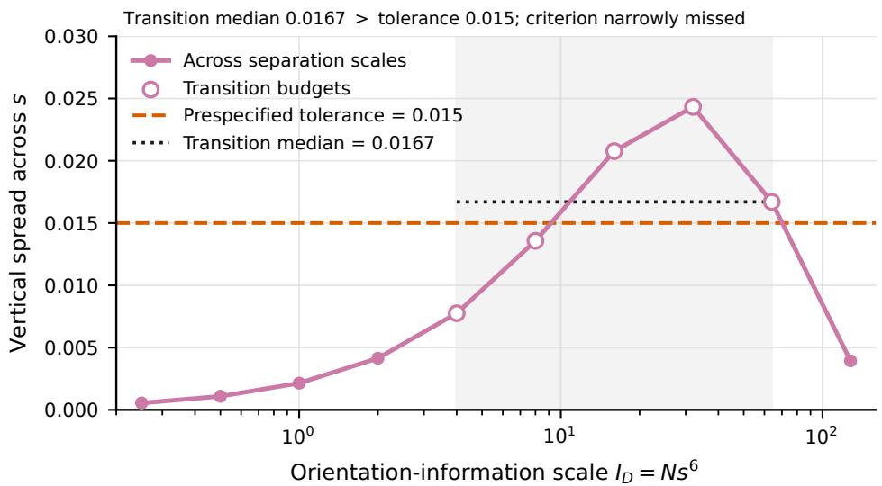  
Figure S1: Across-scale orientation-information collapse diagnostic underlying Figure 2. At each stored $I _ { D } = N s ^ { 6 }$ , the plotted vertical spread is the maximum minus the minimum product afinity across the saved separation scales. Over the prespecified transition budgets $I _ { D } \in \{ 4 , 8 , 1 6 , 3 2 , 6 4 \}$ , the median spread is 0.0167, which narrowly exceeds the prespecified tolerance 0.015. The criterion is therefore recorded as missed and is not used as evidence of numerical coverage for the continuous confidence correspondence.

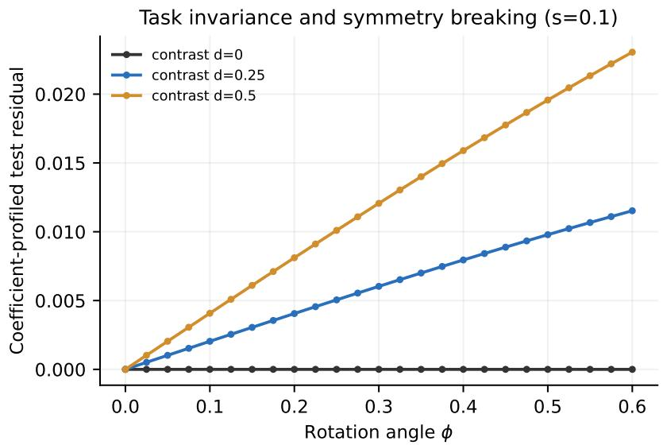  
Figure S2: Coeficient-profiled deployment residual at s = 0.1. Equal coeficients are invariant to numerical precision, whereas nonzero coeficient contrasts follow the closed form in Equation (54).

## S2.2 Finite-bank evaluator and certificate implementation

This subsection records the implementation corresponding to the finite-bank construction in Section 4. The finite bank

$$
\boldsymbol { B } = \{ e _ { 1 } , \ldots , e _ { M } \}
$$

and the requested report family are fixed before held-out candidate evaluation. Unqueried or numerically indeterminate candidates remain possible explanations throughout the adaptive run.

For the represented-scale absence fields used in the application, if $\lambda _ { R } ( e )$ is the source strength represented by candidate e in region $R ,$ the full predicate is

$$
q _ { \mathrm { a b s } ( R , b _ { R } ) } ( e ) = { \bf 1 } \{ \lambda _ { R } ( e ) < b _ { R } \} .\tag{S104}
$$

This assertion is relative to the candidate family and source-strength range represented in the finite bank.

For candidate $e ,$ let $\ell _ { t } ( e )$ denote its log likelihood-ratio e-value at checkpoint $t ,$ and define

$$
\tau _ { \alpha B } = - \log \alpha _ { B } , \qquad m ( e ) = \operatorname* { m a x } _ { t } \ell _ { t } ( e ) - \tau _ { \alpha _ { B } } .\tag{S105}
$$

After the required numerical evaluation, $m ( e ) \leq 0$ is classified admissible and $m ( e ) > 0$ is classified rejected. A queried candidate whose sign cannot be certified is indeterminate; it remains in the possible set.

After k logical queries, the implementation maintains

$$
\begin{array} { r l } & { L _ { k } = \{ e \in \mathcal { B } : e \mathrm { ~ h a s ~ b e e n ~ q u e r i e d ~ a n d ~ i s ~ a d m i s s i b l e } \} , } \\ & { U _ { k } = \{ e \in \mathcal { B } : e \mathrm { ~ h a s ~ n o t ~ b e e n ~ r e j e c t e d } \} . } \end{array}\tag{S106}
$$

If $\boldsymbol { \mathcal { A } } _ { B }$ is the exhaustive profile obtained by applying the same classification rule to the full bank, then

$$
L _ { k } \subseteq { \mathcal { A } } _ { B } \subseteq U _ { k } .\tag{S107}
$$

The deterministic certificate rule

$$
\mathsf { C e r t } _ { \mathcal { G } } ( L , U ) \in \mathcal { O } _ { \mathcal { G } } \cup \{ \bot \}
$$

implements the universal and witness conditions of Section 4. It returns a report only when $U \neq \emptyset$ , every required truth-level predicate holds for all candidates in $U ,$ and every required ambiguity field has its prescribed opposing admissible witnesses in $L ;$ otherwise it returns ⊥. The predeclared priority function $\pi _ { \mathcal { G } } ( e ; L , U )$ and deterministic tie-breaking rule order the unqueried candidates that can still change an unresolved certificate. The global and four-region policies below are concrete instances of these generic rules.

Empty profile is a separate terminal state. It is returned only when $U _ { k } = \emptyset$ , equivalently, when every bank candidate has been certified rejected. A query-limited state with no admissible witness, or a fully queried state containing an indeterminate candidate, is not interpreted as empty; it leads to abstain unless an independently valid truth-level field has already been certified.

Algorithm S1 gives the complete controller, including the early empty-profile check, terminal safeguard, and abstention return.

Algorithm S1 Active endpoint bracketing on a finite explanation bank   
Require: Finite bank B, held-out evaluator ψ , requested report family G, certificate rule   
CertG, priority rule $\pi _ { \mathcal { G } }$ , and query budget K   
1: $L \gets \emptyset , U \gets B$   
2: $Q _ { \mathrm { m a x } } \gets$ min $( K , M )$   
3: for $k = 0 , 1 , \ldots , Q _ { \mathrm { m a x } }$ do   
4: if $U = \emptyset$ then   
5: return an empty-profile status   
6: end if   
7: $o \gets \mathsf { C e r t } _ { \mathcal { G } } ( L , U )$   
8: if $o \neq \bot$ then   
9: return o together with $( L , U )$   
10: end if   
11: if $k < Q _ { \mathrm { m a x } }$ then   
12: Select the next candidate using the predeclared tie-breaking rule:   
e ∈ arg min πG(e′; L, U)   
e′∈U   
$e ^ { \prime }$ unqueried   
13: Evaluate ψW(e)   
14: if $\psi _ { W } ( e ) = \mathrm { A }$ dmissible then   
15: L ← L ∪ {e}   
16: else if $\psi _ { W } ( e ) = $ rejected then   
17: $U  U \backslash$ {e}   
18: else   
19: retain e in U   
20: end if   
21: end if   
22: end for   
23: if $U = \emptyset$ then   
24: return an empty-profile status   
25: else   
26: return abstain together with (L, U) and the incomplete certificate state   
27: end if

## S2.2.1 Conditional candidate retention

The adaptive priority rule may depend on proposal data, but the held-out observations used to reject a candidate must remain untouched by that proposal construction. Conditioning on the proposal stage therefore turns the likelihood-ratio process into an ordinary mean-one martingale under the candidate being tested, which is exactly the structure needed for Ville’s inequality.

Let ${ \mathcal { H } } _ { \mathrm { p r o p } }$ contain the data split, all proposal-stage observations, and the proposal and policy objects constructed from them. Conditional on ${ \mathcal { H } } _ { \mathrm { p r o p } }$ , the proposal density is fixed before any held-out evaluation observation is used. For the generic one-stream evaluator, let $W = ( W _ { 1 } , \dots , W _ { m } )$ denote the held-out evaluation sample. For a fully specified on-bank candidate e, assume $f _ { \widehat { e } } \ll f _ { e }$ . Then

$$
E _ { t } ( e ) = \prod _ { i \leq t } { \frac { f _ { e } ( W _ { i } ) } { f _ { e } ( W _ { i } ) } } .\tag{S108}
$$

Under $\mathbb { P } _ { e } ,$

$$
\mathbb { E } _ { e } \left[ \frac { f _ { \widehat { e } } ( W _ { t } ) } { f _ { e } ( W _ { t } ) } \Big | \mathcal { F } _ { t - 1 } , \mathcal { H } _ { \mathrm { p r o p } } \right] = 1 ,
$$

so $E _ { t } ( e )$ is a nonnegative conditional martingale. The proposal density may lie outside the finite bank; only its conditional independence from the held-out evaluation sample is required.

The four-region evaluator specializes W into independent calibration and deployment streams $Y$ and Z. For candidate $\boldsymbol { e } = ( g , S )$ ,

$$
E _ { k } ( e ) = \prod _ { i \leq n _ { k } } { \frac { f _ { \hat { g } } ^ { C } ( Y _ { i } ) } { f _ { g } ^ { C } ( Y _ { i } ) } } \prod _ { j \leq t _ { k } } { \frac { f _ { \hat { e } } ^ { D } ( Z _ { j } ) } { f _ { e } ^ { D } ( Z _ { j } ) } }\tag{S109}
$$

along the deterministic checkpoint path

$$
\begin{array} { r l } & { ( n _ { k } , t _ { k } ) \in \{ ( 1 2 8 , 0 ) , ( 2 5 6 , 0 ) , ( 5 1 2 , 0 ) , } \\ & { \quad ( 1 0 2 4 , 0 ) , ( 2 0 4 8 , 0 ) , ( 2 2 5 3 , 1 1 6 ) \} . } \end{array}\tag{S110}
$$

Conditional $\mathrm { V i l l e } ^ { \prime } \mathrm { s }$ inequality therefore gives candidate-wise rejection probability at most $\alpha _ { B }$ when rejection requires a strict crossing of $1 / \alpha _ { B }$ . This protects the represented true candidate; it is not a simultaneous nonrejection guarantee for all candidates.

The implementation evaluates likelihood-ratio scores in binary64 and re-evaluates designated near-threshold or certificate-critical candidates at 90-decimal precision. This high-precision check is not directed interval arithmetic. The formal probability statement is therefore the exact-real candidate-wise result above; the numerical implementation is documented to make the finite candidate classifications reproducible.

## S2.2.2 Proofs of the finite-bank guarantees

The three finite-bank guarantees have diferent roles. The first is statistical and controls rejection of the represented true candidate. The second is deterministic and relates the partial $( L _ { k } , U _ { k } )$ state to exhaustive same-bank evaluation. The third combines the two to control false truth-level reports.

Proof of Corollary 4.1. Conditional on ${ \mathcal { H } } _ { \mathrm { p r o p } }$ , the process $E _ { t } ( e )$ is a nonnegative mean-one martingale under candidate e. Ville’s inequality and the predeclared checkpoint set therefore give

$$
\mathbb { P } _ { e } \left\{ \operatorname* { m a x } _ { t \in \mathcal { T } } E _ { t } ( e ) > \frac { 1 } { \alpha _ { B } } \ : \Big | \ : \mathcal { H } _ { \mathrm { p r o p } } \right\} \leq \alpha _ { B } .
$$

Integrating over the proposal-stage data proves the candidate-wise rejection bound in Equation (60). □

Proof of Theorem $4 . 2 .$ The inclusion $\mathcal { A } _ { B } ( W ) \subseteq U _ { k }$ implies that every assertion holding pointwise throughout $U _ { k }$ also holds throughout the exhaustive finite-bank profile. Similarly, $L _ { k } \subseteq { \mathcal { A } } _ { B } ( W )$ implies that opposing witnesses in $L _ { k }$ both belong to the exhaustive profile. Finally, $F \subseteq C$ gives $q _ { \mathrm { f i n e } ( R , F ) } ( e ) \leq q _ { \mathrm { s e c t o r } ( R , C ) } ( e )$ for every candidate $e .$ . These are pathwise statements at each query prefix, so they remain valid at a data-dependent stopping prefix. □

Proof of Theorem $4 . 3 .$ Fix $e _ { \star } ~ \in ~ \boldsymbol { B }$ . If a reported truth-level assertion is false at $e _ { \star }$ , then $q _ { \widehat { q } } ( e _ { \star } ) = 0$ . Because every reported assertion holds throughout the possible set, this event implies $e _ { \star } \notin U _ { k }$ . Candidates leave $U _ { k }$ only when certified rejected; hence

$$
\begin{array} { r } { \mathbb { P } _ { e _ { \star } } \left\{ { \widehat { \mathcal { G } } } \operatorname { i s } \operatorname { r e p o r t e d } \operatorname { a n d } \right\} \leq \mathbb { P } _ { e _ { \star } } \left\{ e _ { \star } \operatorname { i s } \operatorname { e v e r } \operatorname { r e j e c t e d } \right\} } \\ { \mathcal { G } _ { g } ( e _ { \star } ) = 0 \qquad \quad \leq \alpha _ { \mathcal { B } } . } \end{array}
$$

Taking the supremum over $e _ { \star } \in \mathcal { B }$ proves Equation (65).

## S2.3 Global finite-bank evaluation protocol

The global study is designed to evaluate the computation–resolution tradeof of AEB independently of the application-specific regional predicates used in the four-region example. We vary the information regime and the requested report profile so that query behavior is tested under both easy and dificult certificate obligations.

The global study uses

$$
q = 4 , \qquad n = 5 , \qquad \phi _ { \mathrm { t r u t h } } = 0 , \qquad p _ { \mathrm { t r u t h } } = 0 . 2 0 ,
$$

32 calibration-mixture components and active support {0, 1}. Each dataset is split into proposal and held-out evaluation fractions 0.45 and 0.55. The global study fixes its requested report family, certificate rule, priority function, and deterministic tie-breaking order before held-out evaluation.

The proposal orientation $\widehat { \phi } _ { A }$ is retained as a fixed reference in the global diameter calculation. If S denotes the exhaustive set of surviving bank orientations, define

$$
\begin{array} { r l } & { W _ { k } ^ { + } = \{ \widehat { \phi } _ { A } \} \cup \{ \phi _ { j } \mathrm { ~ h a s ~ a ~ q u e r i e d ~ a d m i s s i b l e } \} , } \\ & { \begin{array} { r } { P _ { k } ^ { + } = \{ \widehat { \phi } _ { A } \} \cup \{ \phi _ { j } \mathrm { ~ h a s ~ n o t ~ b e e n ~ e l i m i n a t e d } \} , } \\ { S ^ { + } = \{ \widehat { \phi } _ { A } \} \cup \{ \phi _ { j } \mathrm { ~ h a s ~ n o t ~ b e e n ~ e l i m i n a t e d } \} , } \end{array} } \\ & { \begin{array} { r } { S ^ { + } = \{ \widehat { \phi } _ { A } \} \cup S . } \end{array} } \end{array}
$$

Correct candidate classifications $\mathrm { g i }$ ve

$$
\begin{array} { r l r } & { } & { W _ { k } ^ { + } \subseteq S ^ { + } \subseteq P _ { k } ^ { + } , } \\ & { } & { \mathrm { d i a m } ( W _ { k } ^ { + } ) \leq \mathrm { d i a m } ( S ^ { + } ) \leq \mathrm { d i a m } ( P _ { k } ^ { + } ) . } \end{array}
$$

Thus, this experiment evaluates a proposal-referenced global physical-resolution summary; it does not use the regional support predicates of the four-region experiment.

Table S2: Global finite-bank evaluation conditions.
<table><tr><td>Condition</td><td>N</td><td>S</td><td> $\nu _ { \mathrm { t r u t h } }$ </td><td>Bank size</td><td>Cases</td></tr><tr><td>Low information</td><td>4096</td><td>0.35</td><td>1.20</td><td>1025</td><td>6</td></tr><tr><td>Intermediate information</td><td>65536</td><td>0.50</td><td>0.90</td><td>1025</td><td>6</td></tr><tr><td>High information</td><td>131072</td><td>0.50</td><td>0.80</td><td>369</td><td>6</td></tr></table>

The data seeds are 2026080111–2026080116, 2026080121–2026080126, and 2026080131– 2026080136 for the three conditions, respectively. The corresponding split seeds are obtained by replacing the leading 2 with 9.

Each dataset is evaluated under three independently specified reporting profiles:

<table><tr><td></td><td> $\alpha _ { B }$   $\delta _ { f } / d _ { \mathrm { s h e l l } }$ </td><td> $\delta _ { s } / d _ { \mathrm { s h e l l } }$ </td></tr><tr><td>RISK-CONSERVATIVE</td><td>0.025 0.40</td><td>0.50</td></tr><tr><td>BALANCED</td><td>0.077 0.35</td><td>0.60</td></tr><tr><td>RESOLUTION-FAVORING</td><td>0.150 0.25</td><td>0.40</td></tr></table>

giving 54 controller traces from 18 independent datasets. Results are recorded at query-budget fractions

$$
\{ 0 . 1 0 , 0 . 2 0 , 0 . 3 5 , 0 . 5 0 , 0 . 7 5 , 1 . 0 0 \} .
$$

A logical query is counted whenever the controller requests a candidate classification, even if a numerical score is already cached.

After every controller trace has been fixed, the same finite bank is evaluated exhaustively using the same candidate-classification rule. The finite-bank reference therefore does not influence the adaptive query order. Near-threshold candidates and candidates afecting terminal or elimination certificates receive the high-precision re-evaluation described above.

The principal denominators in the main-text summary are 54 controller traces, 34 exhaustivebank ambiguity traces, seven exhaustive-bank fine traces, and 20 exhaustive-bank nonambiguous traces. Full-budget categorical agreement is evaluated over all 54 traces. The 54 traces arise from three reporting profiles applied to 18 independent datasets and must not be interpreted as 54 independent datasets.

Table S3 gives the complete summary at the two displayed operating points, and Figure S3 separates ambiguity and fine recovery at those budgets.

Table S3: Global AEB outcomes over 18 independent cases and 54 reporting traces, relative to exhaustive scoring of the same finite candidate bank.
<table><tr><td>Outcome relative to exhaustive same-bank reference</td><td>Budget 0.50</td><td>Budget 0.75</td></tr><tr><td>Non-abstaining (substantive) report</td><td>41/54</td><td>54/54</td></tr><tr><td>Ambiguity conclusion recovered</td><td>33/34</td><td>34/34</td></tr><tr><td>Fine conclusion recovered</td><td>0/7</td><td>5/7</td></tr><tr><td>Unsafe finer-than-reference conclusion</td><td>0/54</td><td>0/54</td></tr><tr><td>Median queried bank fraction</td><td>0.209</td><td>0.209</td></tr></table>

Note: The 54 reporting traces arise from 18 independent cases under three predeclared reporting profiles. Recovery denominators difer by the target exhaustive-bank conclusion: 34 ambiguity traces and seven fine traces. At budget 0.75, the two fine-reference conclusions not reported as fine were safely coarsened. Unsafe counts are the deterministic cross-classification of the saved budget outputs against their exhaustive same-bank labels. The trace-level explanation for the identical displayed medians is given in the supplement.

The median queried bank fraction is 0.209 at both budget 0.50 and budget 0.75. This is the median of normalized trace-specific query fractions, not raw query counts. Thirty-four terminal fractions are already at or below 0.50; the 27th and 28th order statistics are $2 0 1 / 1 0 2 5$ and 227/1025, whose average is $2 1 4 / 1 0 2 5 = 0 . 2 0 8 7 8 0 \dots$ These middle observations are therefore fixed before either displayed cap. Raising the cap changes the upper tail and fine recovery rather than the median stopping fraction.

## S2.4 Four-region application protocol

The four-region study is designed to place several kinds of physical conclusion in one controlled bank: fine localization in region A, group-level resolution in the coherent region B, presence– absence ambiguity for weak region C, and represented-scale absence with D-present controls in region D. This lets the same AEB logic be evaluated across qualitatively diferent certificate obligations.

The four-region response library contains 12 atoms, 72 dictionary states, and the support patterns AB, ABC, and ABD, giving

$$
M = 2 1 6
$$

complete candidate explanations. Figure S4 records the response library and its absolute atom-coherence structure.

The four-region study fixes its requested report family, certificate rule, priority function, and deterministic tie-breaking order before held-out evaluation. The fixed design parameters are

$$
\begin{array} { c c } { { \alpha { } \kappa = 0 . 0 7 7 , } } & { { h = 0 . 0 8 5 , } } \\ { { \tau _ { A } = 1 , } } & { { \tau _ { B } = 0 . 8 , } } \\ { { \tau _ { C } = 0 . 1 , } } & { { \tau _ { D } = 1 . 0 0 . } } \end{array}
$$

For candidate $e = ( g , S )$ ,

$$
\Sigma _ { e } = \nu _ { D } I + \sum _ { R \in S ( e ) } \tau _ { R } ^ { 2 } a _ { R } ( g ) a _ { R } ( g ) ^ { \top } .\tag{S111}
$$

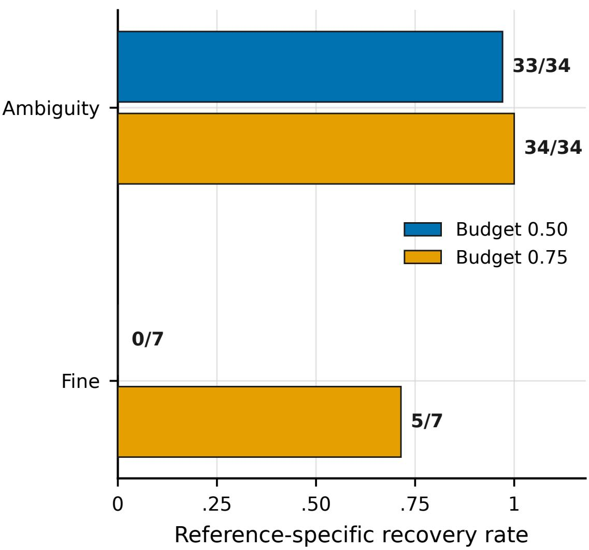  
Figure S3: Global AEB recovery at query budgets 0.50 and 0.75. The 54 reporting traces arise from three predeclared profiles applied to 18 independent cases; the recovery denominators are 34 exhaustive-bank ambiguity traces and seven exhaustive-bank fine traces.

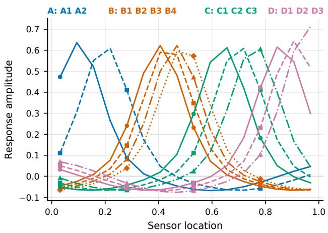  
(a) Response library. The 12 atoms are grouped into physical regions A–D; color identifies the region, and line style or marker identifies the atom within a region.

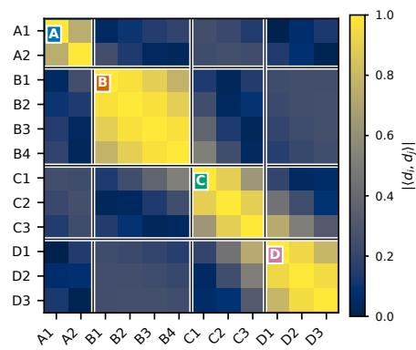  
(b) Absolute atom coherence. Region blocks expose the isolated, highly coherent, weak optional, and optional-interferer structures used in the application.  
Figure S4: Four-region finite-bank construction used for the application protocol. The library contains 12 atoms arranged into the four physical regions, and the coherence matrix shows the within- and between-region atom similarities that determine the available physical resolution.

The represented regional strength is

$$
\lambda _ { R } ( e ) = \tau _ { R } { \bf 1 } \{ R \in S ( e ) \} .
$$

Accordingly, a reported absence statement excludes the optional-region-present candidate family at the represented scale $\tau _ { R }$ . It does not assert absence over a continuum of amplitudes or arbitrarily weak of-bank sources.

Each dataset contains a $4 0 9 6 \times 1 6$ calibration array and a $1 9 2 \times 1 6$ deployment array. The proposal/evaluation partition contains 1843/2253 calibration observations and 76/116 deployment observations. The six evaluation checkpoints are exactly those in Equation (S110).

The 15 fresh datasets consist of six persistent-only cases with seeds 2026091001–2026091006, six weak-C cases with seeds 2026091011–2026091016, and three D-present controls with seeds 2026091021–2026091023.

The point-valued comparator is a proposal-split deployment maximum-likelihood selector that chooses one dictionary–support explanation and then reports the physical interpretation conditional on that choice. Among the 216 explanations, it maximizes the summed fixedcovariance Gaussian log-likelihood on the 76-observation proposal subset of the 192 deployment replicates, with the lowest canonical index breaking ties. It then uses the maximizing explanation’s dictionary state and support, reports selected regions at their fine atom locations, and declares unselected regions absent above the represented beta-min scale.

The regional policy alternates between actions that can establish opposing support witnesses and actions that can eliminate candidates, preventing a regional certificate. Its fixed proposal order is the deployment proposal dictionary, followed by the distinct calibration proposal dictionary, followed by candidate ID. For the weak-C ambiguity objective, the fixed priority order is: (i) obtain a C-absent witness, (ii) obtain a C-present witness, (iii) eliminate an alternative A location, and $( \mathrm { i v } )$ eliminate the D-present family. After each query, the regional rule $\mathsf { C e r t } _ { \mathcal { G } } ( L , U )$ is recomputed. The primary query cap is

$$
1 6 2 / 2 1 6 .
$$

The 108/216 state reported in diagnostics is a prefix of the same controller trace, not a separate run.

The double-precision rejection threshold is

$$
- \log \alpha _ { B } = - \log ( 0 . 0 7 7 ) = 2 . 5 6 3 9 4 9 8 5 7 .
$$

Provisionally admissible, near-threshold, and certificate-critical candidates receive the highprecision re-evaluation used by the exhaustive finite-bank reference. The exhaustive reference scores all 216 candidates and projects only the admissible subset to the regional physical map.

Table S4 gives the complete four-region outcome summary before the detailed denominator and empty-profile discussion below.

Table S4: Physical conclusions across 15 fresh datasets in the four-region synthetic application. Every reference conclusion is obtained by exhaustive evaluation of the same finite 216-explanation bank.
<table><tr><td>Region / phenomenon</td><td>Exhaustive finite-bank reference AEB outcome</td><td>relative to reference</td><td>Point-valued plug-in selector</td></tr><tr><td>A: isolated persistent</td><td>Fine localization in 11 eligible main profiles</td><td>Fine: 10/11</td><td></td></tr><tr><td>B: highly coherent persistent</td><td>Group/sector level in five eligible Group/sector: 5/5 Unsupported fine localization: completed weak-C profiles</td><td></td><td>5/5</td></tr><tr><td>C: weak optional</td><td>Support ambiguity in the same five eligible completed weak-C profiles</td><td>Support ambiguity: False certainty: 5/5 5/5</td><td></td></tr><tr><td>D: represented-scale absence</td><td>Absence at the represented scale Absence: 10/10 in 10 eligible main profiles</td><td></td><td></td></tr><tr><td>D-present controls</td><td>D present in all three eligible controls</td><td>False absence: 0/3</td><td></td></tr></table>

Note: Fifteen fresh datasets yielded 14 nonempty completed exhaustive profiles: 11/12 main profiles and 3/3 D-present controls. One weak-C dataset had an empty exhaustive finite-bank profile and a null physical map. Recovery denominators follow the eligibility rules in the text; the B and C point-valued plug-in selector comparisons use the same five eligible completed weak-C profiles. The empty-profile dataset is excluded from truth-relative utility rates but retained in the query-cost summary, whose median AEB cost is 148/216 queries. A dash indicates that no aggregate point-valued plug-in selector comparison was designated for that endpoint; the representative main-text panel may still display the corresponding case-level point-valued plug-in output.

Fourteen of the 15 datasets yield nonempty exhaustive profiles. The completed-profile denominators used in the main text are: 11 eligible A-fine cases, five B group/sector cases, five C-ambiguity cases, and ten represented-scale D-absence cases. The point-valued plug-in comparison uses the same five eligible weak-C cases for regions B and C. The three D-present controls provide the denominator for the false-D-absence check.

One weak-C realization produces an empty exhaustive finite profile. At the 162-query online cap, its lower set is empty, and 54 candidates remain possible, so AEB returns abstain; only subsequent exhaustive scoring shows that no candidate in the finite bank is admissible. The reported physical map is therefore null. This realization is excluded from truth-relative utility rates based on completed profiles, but its 162 queries remain in the computational summary. It is not interpreted as evidence that all physical regions are absent.

The three D-present controls also reach the primary cap without an admissible lower-set witness, although their exhaustive profiles are nonempty. Their universal regional truth-level fields may be inspected separately, but they are not counted as witnessed global nonabstaining maps. None receives the represented-scale D-absence label.

## S2.5 Query accounting, reproducibility, and scope

Because cached scores, high-precision replay, and exhaustive reference scoring can all occur outside the adaptive controller, the notion of a “query” must be fixed explicitly before interpreting the reported savings. We count only controller-requested candidate classifications and separately document the ofline work needed for reproducibility.

A logical query is one controller-requested candidate evaluation. Cache hits do not remove logical queries. Ofline exhaustive finite-bank scoring, high-precision verification, completion checks, and report generation are excluded from the adaptive query count and are not interpreted as deployment latency.

The global and four-region studies use diferent banks, report functionals, and query policies; their observations and denominators are not pooled. The publication package records the candidate laws, data splits, checkpoint grids, proposal and witness priorities, tie order, report predicates, seeds, raw numerical summaries, and figure data required to reproduce the reported experiments. For the theory-guided calculation, the Monte Carlo seed is 2026072201 and the paired-bootstrap seed is 2026072202.

The numerical evidence has deliberately limited scope. The theory-guided experiment illustrates the finite-s manifestation of the $s ^ { 6 }$ calibration geometry and deployment task symmetry. The finite-bank experiments evaluate AEB relative to exhaustive evaluation of the same specified candidate banks. They do not establish numerical coverage of the continuous confidence correspondence, completeness of the finite banks relative to the continuous model, of-bank validity, worst-case sublinear query complexity, or transfer to arbitrary real-data applications.