# Rationally Enriched Chebyshev Trunk Bases for DeepONet Surrogates of High Péclet Entrance Transport

Mingeun Choia, Satish Kumara,∗

aGeorge W. Woodruf School of Mechanical Engineering, Georgia Institute of Technology, Atlanta, 30332, GA, USA

## Abstract

This study demonstrates a rationally enriched Chebyshev (REC) trunk for deep operator network (DeepONet) surrogate models of singularly perturbed and high-Péclet transport problems whose solution profiles are characterized by thin localized boundary or wall layers. The REC trunk combines Chebyshev polynomial dictionary elements with rational dictionary elements constructed using the adaptive Antoulas–Anderson (AAA) algorithm. Over five independent training runs, the resulting REC-trunk DeepONet is evaluated against a vanilla DeepONet and a Chebyshev-trunk DeepONet whose prescribed dictionary consists only of Chebyshev polynomials across three problems whose singular perturbation parameters are difusion-to-advection ratios: a singularly perturbed scalar boundary-value problem (BVP), the thermal entrance problem with a prescribed wall temperature, and the concentration entrance problem with an absorbing wall. Across the held-out test profiles, the REC-trunk DeepONet improves over the vanilla DeepONet and remains comparable to the Chebyshev-trunk DeepONet in predicting the scalar profile, with its clearest advantage over the Chebyshev-trunk Deep-ONet appearing when the perturbation parameter lies between $1 . 0 0 \times 1 0 ^ { - 4 }$ and $1 . 7 8 \times 1 0 ^ { - 4 }$ , where it reduces the profile-error metrics by up to 19.5 % relative to the Chebyshev-trunk DeepONet. In predicting the wall-normal temperature and concentration profiles, the REC-trunk DeepONet reduces

the profile-error metrics by up to 60.2 % and 32.2 % relative to the vanilla and Chebyshev-trunk DeepONets, respectively, while suppressing artificial near-wall oscillations as the Péclet or mass-transfer Péclet number ranges from $1 0 ^ { 2 }$ to $1 0 ^ { 4 }$

Keywords: DeepONet, Rationally enriched Chebyshev trunk, High-Péclet transport

## 1. Introduction

Transport problems are formulated as partial diferential equations (PDEs), in which advection, difusion, and reaction can interact across disparate spatial and temporal scales [1]. When difusion is weak relative to advection, the associated boundary-value problem (BVP) can become singularly perturbed because the small perturbation parameter (or difusion-to-advection ratio) multiplies the highest spatial derivative. Such problems often develop boundary or interior layers whose widths are far smaller than the domain length [2]. In resolving these localized layers, standard numerical schemes sufer from spurious oscillations or require a prohibitively dense grid [2]. Thus, accurate approximation of solution profiles requires techniques such as fitted finite diferences, stabilized finite element methods, and layer-adapted meshes [2], while repeated layer-resolving simulations across parameter ranges remain computationally expensive. To reduce this burden, recent machine-learning (ML) studies have developed physics-informed neural-network (PINN)-based models for singularly perturbed problems by incorporating asymptotic decompositions, stretched variables, or parameter continuation [3–5]. However, these models rely on problem-specific structures chosen from the diferential equation, the small parameter, or the layer behavior of the target problem.

Deep operator networks (DeepONets) have emerged as alternative surrogates for singularly perturbed problems because they are designed to learn operators mapping sampled input functions and problem parameters to solution profiles through a branch–trunk representation [6, 7]. A pioneering application showed that a DeepONet can approximate sharp-gradient solutions by evaluating the training loss at layer-adapted Shishkin points, which depend on the perturbation parameter, rather than by modifying the network representation itself [8]. Subsequent studies then incorporated such layerresolving priors within the operator-learning representation. Prandtl–Van Dyke DeepONet (PVD-ONet) decomposes the solution into outer, inner, and matching components and assigns these components to multiple DeepONet modules organized by Prandtl and Van Dyke matching [9]. The enriched finite element operator network (eFEONet) augments the finite-element Galerkin ansatz with singular-perturbation corrector functions. The learned coeficients include both nodal finite-element coeficients and coeficients of the added layer-corrector basis [10]. Physics-informed adaptive-scale DeepONet (PAS-Net) augments the trunk input with prescribed or learnable locally rescaled coordinates centered at reference points, thereby changing the coordinate representation seen by the trunk [11]. However, these approaches remain problem-specific, since the solution decomposition, finite element enrichment, or coordinate rescaling must be chosen for the particular layer being represented.

Parallel eforts have sought to reduce this dependence by expressing the output through prescribed or data-derived bases and their coeficients. Proper orthogonal decomposition DeepONet (POD-DeepONet) computes POD modes from the training outputs and uses the resulting modes as the trunk, leaving the branch network to predict modal coeficients [12]. Spectral coeficient learning via operator network (SCLON) predicts coeficients in orthogonal expansions such as Fourier or Legendre bases and applies this coeficient-space formulation to parametric PDEs ranging from singularly perturbed convection-difusion equations to Navier–Stokes flows [13]. The orthogonal polynomial neural operator (OPNO) builds neural operators around orthogonal-polynomial representations on bounded domains and treats Dirichlet, Neumann, and Robin boundary conditions within that polynomial framework [14]. Spectral-embedded DeepONet (SEDONet) converts raw coordinate trunk inputs into values of Chebyshev polynomials before a trainable trunk network, improving bounded-domain DeepONet approximation for sharp gradients, boundary layers, and nonperiodic structures [15]. Nevertheless, these spectral and polynomial bases are global representations over the entire domain, and, thus, a thin localized layer can require many degrees of freedom unless the basis is enriched with dictionary elements adapted to the inner scale.

This inner-scale representation issue extends beyond idealized scalar BVPs because engineering transport often contains analogous high-Péclet convectiondifusion layer structure. In biomedical engineering, surface-based biosensors and related biofluidic capture systems involve convective delivery, difusion, and surface binding near reactive walls [16]. In chemical engineering, reactive microchannels and electrochemical chips generate wall-normal concentration fields governed by convective-difusive delivery to reactive interfaces [17, 18]. In aerospace engineering, high-speed wall-bounded flows involve wall-normal heat and mass transfer in cooled and transpiration-cooled boundary layers [19, 20], hypersonic boundary layers with strong near-wall thermal gradients [21], and reacting boundary layers with finite-rate wall chemistry [22, 23]. Across these examples, the common mathematical feature is a wall-normal temperature or concentration profile shaped by strong axial transport, transverse difusion, and, in reactive cases, surface kinetics or wall absorption. Thus, entrance heat and mass transfer provide benchmark problems that retain the relevant wallnormal layer geometry under prescribed-wall, absorbing-wall, or Robin-type surface conditions [24–28] while allowing accurate numerical reference profiles and controlled variation of Péclet number, axial location, inlet profile, and wall absorption strength. However, the use of inner-scale-enriched DeepONet trunk bases for such high-Péclet wall-normal profile reconstruction remains underexplored.

This paper introduces the rationally enriched Chebyshev (REC) trunk as a prescribed output-coordinate dictionary for DeepONet that combines Chebyshev polynomial dictionary elements with rational dictionary elements without adding trainable trunk parameters. This REC-trunk DeepONet is compared over five independent training runs with a vanilla DeepONet and a Chebyshev-trunk DeepONet, whose prescribed trunk dictionary consists only of Chebyshev polynomial dictionary elements, across three bounded-domain benchmark problems whose solution profiles contain one-sided localized layers. The first problem is the singularly perturbed scalar BVP, serving as the simplest bounded-interval formulation with an exponentially thin outflow layer [8]. The second problem is the thermal entrance problem with a prescribed wall temperature, where the temperature profile develops under hydrodynamically developed laminar duct flow [24, 25]. The third problem is the concentration entrance problem with an absorbing wall, where the concentration profile develops under the same hydrodynamically developed laminar duct flow [26, 27]. Results demonstrate that DeepONet with the REC trunk remains globally competitive on the singularly perturbed scalar BVP and delivers its clearest advantage on the thermal and concentration entrance problems, where wall-attached layers control the profile geometry, by answering the following four questions:

1. How does the REC trunk perform on the singularly perturbed scalar BVP in the small-perturbation-parameter regime?

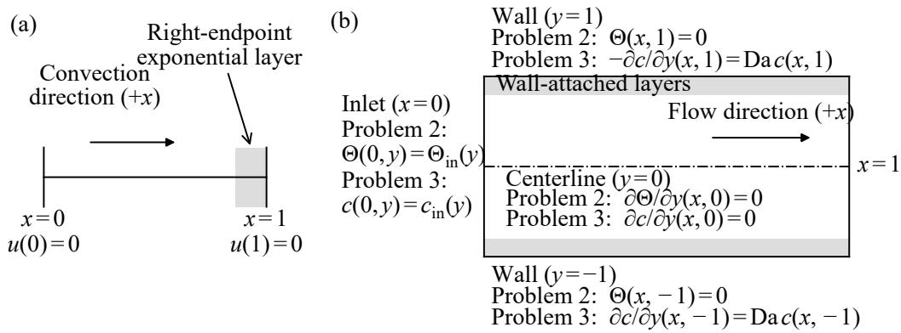  
Figure 1: Computational domains and boundary conditions for (a) Problem 1 and (b) Problems 2 and 3. The full channel shown in (b) is the symmetric extension of the half-channel computational domain $y \in [ 0 , 1 ]$

2. How does the REC trunk perform on the thermal entrance problem in the high-Péclet regime, when the learned output is a wall-normal profile at a queried axial location?

3. How does the REC trunk perform on the concentration entrance problem in the high-Péclet regime, under Robin wall kinetics and across diferent Damköhler numbers?

4. How reproducible are the gains obtained with the REC trunk across repeated training runs and previously unseen solution profiles?

## 2. Methods

## 2.1. Benchmark problems and operator-learning formulation

Figure 1 illustrates the computational domains and boundary conditions for the three benchmark problems considered in this study. Problem 1 examines the singularly perturbed scalar BVP posed on the one-dimensional domain shown in Fig. 1(a) and defined by the equation [8]

$$
- \varepsilon \frac { d ^ { 2 } u } { d x ^ { 2 } } ( x ) + \frac { d u } { d x } ( x ) + u ( x ) = q ( x ) , \qquad x \in ( 0 , 1 ) ,\tag{1}
$$

with homogeneous Dirichlet boundary conditions

$$
u ( 0 ) = u ( 1 ) = 0 .\tag{2}
$$

Here, x denotes the dimensionless spatial coordinate on the bounded interval (0,1), $u ( x )$ denotes the dimensionless scalar solution field, $q ( x )$ denotes the dimensionless randomized source term, and ε denotes the singular perturbation parameter, given by the difusion-to-advection ratio after the constant positive convective velocity is normalized to unity. The reaction coeficient is also fixed at unity. These choices allow the efects of ε and $q ( x )$ on the solution profiles to be examined without simultaneous changes in convection or reaction. Since ε multiplies the highest-order difusion term, decreasing its value weakens difusion relative to convection, producing a thinner right-endpoint exponential layer [2]. The parameter range is sampled as $\varepsilon \in [ 1 0 ^ { - 4 } , 1 0 ^ { - 2 } ]$ , isolating the strongly perturbed regime targeted throughout this study.

Problem 2 addresses the thermal entrance problem with a prescribed wall temperature, known as the Graetz problem, posed on the two-dimensional domain shown in Fig. 1(b) and governed by the equation [24, 25]

$$
w ( y ) \frac { \partial \Theta } { \partial x } ( x , y ) = \frac { 1 } { \mathrm { P e } } \frac { \partial ^ { 2 } \Theta } { \partial y ^ { 2 } } ( x , y ) , \qquad ( x , y ) \in ( 0 , 1 ] \times ( 0 , 1 ) ,\tag{3}
$$

with a parabolic velocity profile for hydrodynamically fully developed flow

$$
w ( y ) = 1 - y ^ { 2 } ,\tag{4}
$$

centerline symmetry

$$
\frac { \partial \Theta } { \partial y } ( x , 0 ) = 0 ,\tag{5}
$$

a homogeneous Dirichlet condition at the wall

$$
\Theta ( x , 1 ) = 0 .\tag{6}
$$

The inlet condition is

$$
\Theta ( 0 , y ) = \Theta _ { \mathrm { i n } } ( y ) .\tag{7}
$$

Here, x denotes the dimensionless axial coordinate along the channel, y denotes the dimensionless wall-normal coordinate across the channel halfwidth, $\Theta ( x , y )$ denotes the dimensionless temperature diference relative to the prescribed wall temperature, and $w ( y )$ denotes the prescribed dimensionless axial velocity profile. Because the boundary conditions are already defined, the surrogate directly maps the randomized inlet profile $\Theta _ { \mathrm { i n } } ( y )$ to the wall-normal temperature profile $\Theta ( x , y )$ evaluated at a queried axial location $x \in [ 0 . 0 5 , 1 . 0 ]$ The thermal Péclet number $\mathrm { P e } = U L / \alpha$ measures axial advection relative to transverse thermal difusion, where U denotes the characteristic axial velocity, L denotes the reference length scale, and α denotes the thermal difusivity. Sampling $\mathrm { P e } ^ { - 1 } \in [ 1 0 ^ { - 4 } , 1 0 ^ { - 2 } ]$ , which is the singular perturbation parameter analogous to ε in Problem 1, isolates the high-Péclet regime characterized by increasingly thin wall-attached thermal layers.

Problem 3 investigates the concentration entrance problem with an absorbing wall, posed on the same domain used in Problem 2 and expressed by the equation [26]

$$
w ( y ) \frac { \partial c } { \partial x } ( x , y ) = \frac { 1 } { \mathrm { P e } _ { m } } \frac { \partial ^ { 2 } c } { \partial y ^ { 2 } } ( x , y ) , \qquad ( x , y ) \in ( 0 , 1 ] \times ( 0 , 1 ) ,\tag{8}
$$

with the same parabolic velocity profile as in Problem 2

$$
w ( y ) = 1 - y ^ { 2 } ,\tag{9}
$$

the same centerline symmetry condition

$$
\frac { \partial c } { \partial y } ( x , 0 ) = 0 ,\tag{10}
$$

the inlet condition

$$
c ( 0 , y ) = c _ { \mathrm { i n } } ( y ) ,\tag{11}
$$

and a Robin condition at the wall [27]

$$
- \frac { \partial c } { \partial y } ( x , 1 ) = \operatorname { D a } c ( x , 1 ) .\tag{12}
$$

Here, $c ( x , y )$ denotes the dimensionless concentration field, $c _ { \mathrm { i n } } ( y )$ denotes the randomized inlet concentration profile, $\mathrm { P e } _ { m }$ denotes the mass-transfer Péclet number, and Da denotes the Damköhler number, representing the dimensionless wall-absorption strength in a partially absorbing channel [28]. Under this nondimensionalization, both spatial coordinates are scaled by the channel half-width L. The dimensionless groups are $\mathrm { P e } _ { m } = U L / D$ and $\mathrm { D a } = k L / D$ , where U denotes the characteristic axial velocity, D denotes the molecular difusivity, and k denotes a first-order surface uptake coeficient with units of velocity. Sampling $\mathrm { P e } _ { m } ^ { - 1 } \ \in \ [ 1 0 ^ { - 4 } , 1 0 ^ { - 2 } ]$ , analogous to $\mathrm { P e } ^ { - 1 }$ in Problem 2, isolates the high-Péclet mass-transfer regime characterized by increasingly thin wall-attached concentration layers. To examine the efect of wall-absorption strength, Problem 3 is evaluated at three wallabsorption strengths at $\mathrm { D a } = 0 . 1 , 1 . 0$ , and 10.0. Similar to the thermal Graetz model, the surrogate maps the randomized inlet condition to the wall-normal concentration profile $c ( x , y )$ evaluated at a queried axial location $x \in [ 0 . 0 5 , 1 . 0 ]$

## 2.2. Operator learning formulation and baseline trunks

For each benchmark problem, the learning task is to approximate a profilevalued operator

$$
\mathcal { G } ( \mathbf { s } , \mu ) = u ( \cdot ; \mathbf { s } , \mu ) ,\tag{13}
$$

where s denotes the sensor values of the problem-specific input function and $\mu$ denotes the problem parameters. In Problem 1, s contains samples of the source term $q ( x )$ , whereas in Problems 2 and 3 it contains samples of the inlet temperature profile $\Theta ( 0 , y )$ and the inlet concentration profile $c ( 0 , y )$ 2 respectively. For each query coordinate $\xi ,$ the predicted profile value is written in the standard DeepONet form

$$
\mathcal { G } ( \mathbf { s } , \mu ) ( \boldsymbol { \xi } ) \approx \widehat { u } ( \boldsymbol { \xi } ; \mathbf { s } , \mu ) = \mathbf { b } ( \mathbf { s } , \mu ) \cdot \boldsymbol { \phi } ( \boldsymbol { \xi } ) .\tag{14}
$$

Here, $\mathbf { b } ( \mathbf { s } , \mu ) = [ b _ { 1 } ( \mathbf { s } , \mu ) , \dots , b _ { p } ( \mathbf { s } , \mu ) ]$ denotes the branch coeficient vector and $\phi ( \xi ) = [ \phi _ { 1 } ( \xi ) , \ldots , \phi _ { p } ( \xi ) ]$ denotes the trunk feature vector, whose kth components are $b _ { k } ( \mathbf { s } , \mu )$ and $\phi _ { k } ( \xi )$ , respectively. Specifically, $\xi$ represents the interval coordinate x in Problem 1 and the wall-normal coordinate $y$ in Problems 2 and 3. The parameter vector $\mu$ collects the sample-dependent parameters that condition the operator output, corresponding to $\varepsilon$ in Problem 1, $( \mathrm { P e } ^ { - 1 } , x )$ in Problem 2, and $( \mathrm { P e } _ { m } ^ { - 1 } , x )$ in Problem 3. For Problem 3, separate operator surrogates are constructed for fixed values of Da instead of including the Damköhler number in $\mu$ . For notational brevity, the dependence on $( \mathbf { s } , \mu )$ is omitted below whenever the input profile and parameter value are fixed.

To isolate the efect of trunk-basis design, the surrogate models compared within each benchmark use the same branch-network architecture, namely a multilayer perceptron (MLP) with Gaussian error linear unit (GELU) activations and Xavier initialization. This MLP comprises three hidden layers of width 256, and its output dimension is fixed to $p = 1 2 9$ to match the dimension of each compared trunk. Before entering the branch network, the first component of the parameter vector $\mu$ is encoded through its base-10 logarithm, with any remaining components appended in raw form.

Within this shared framework, three distinct trunk designs are compared. The branch network provides the sample- and parameter-dependent coeficients, while the trunk representation defines the corresponding output approximation family. The first baseline model is the standard coordinate-trunk DeepONet, referred to as the Vanilla model, with a trunk MLP consisting of three hidden layers of width 128 and an output dimension of $p = 1 2 9$ [6]. Unlike the Chebyshev and REC trunks introduced in the following, this baseline uses a learned trunk MLP that takes both the profile coordinate and the encoded parameter vector as inputs. Thus, for this baseline, Eq. (14) is understood with the coordinate-only trunk vector $\phi ( \xi )$ replaced by a learned, parameter-conditioned trunk vector $\phi ^ { \mathrm { v a n } } ( \xi , \mu )$

The second baseline model is the Chebyshev-trunk DeepONet, labeled as the Chebyshev model. While prior approaches, such as SEDONet, process a Chebyshev feature vector through an additional trainable network [15], the present baseline uses the Chebyshev polynomials directly as the trunk dictionary. This formulation isolates the efect of the prescribed trunk dictionary without introducing an auxiliary trainable transformation. For this baseline, the trunk vector $\phi ( \xi )$ in Eq. (14) is the Chebyshev dictionary

$$
\begin{array} { r l } { \phi ^ { \mathrm { c h e b } } ( \xi ) = \big [ \phi _ { 1 } ^ { \mathrm { c h e b } } ( \xi ) , \dots , \phi _ { 1 2 9 } ^ { \mathrm { c h e b } } ( \xi ) \big ] ~ } & { } \\ { = \big [ T _ { 0 } ( 2 \xi - 1 ) , \dots , T _ { 1 2 8 } ( 2 \xi - 1 ) \big ] , } \end{array}\tag{15}
$$

where $T _ { j }$ denotes the Chebyshev polynomial of the first kind of degree $j .$

## 2.3. Proposed REC trunk

The proposed third model is the REC-trunk DeepONet, denoted as the REC model, motivated by rational discretizations for singularly perturbed BVPs, where layer-oriented rational mappings resolve thin layers with fewer global polynomial degrees [29]. Unlike the Chebyshev trunk in Eq. (15), whose trunk dictionary consists entirely of Chebyshev polynomial elements, the REC trunk combines a low-degree outer Chebyshev subdictionary for the smooth outer field with an inner rational subdictionary for the localized layer. The rational dictionary elements are constructed by the adaptive Antoulas– Anderson (AAA) algorithm and remain unchanged during DeepONet training [30].

The inner rational subdictionary is derived from a canonical exponentially

decaying layer family on the unit interval,

$$
\psi _ { \delta } ( \zeta ) = \exp \left( - \frac { 1 - \zeta } { \delta } \right) , \qquad \zeta \in [ 0 , 1 ] , \qquad \delta \in [ 1 0 ^ { - 4 } , 1 0 ^ { - 2 } ] ,\tag{16}
$$

where $\zeta$ denotes the dictionary coordinate and $\delta$ denotes the prototype decay parameter, whose sampled range matches the numerical range of $\varepsilon , \mathrm { P e } ^ { - 1 }$ and $\mathrm { P e } _ { m } ^ { - 1 }$ used in the three benchmark problems defined in Section 2.1. This family represents a one-sided localized layer attached to $\zeta = 1$ , corresponding to the right endpoint $x = 1$ in Problem 1 and to the wall endpoint $y = 1$ in Problems 2 and 3.

The construction proceeds by choosing $1 2 9 - N _ { \mathrm { o u t } }$ logarithmically spaced values $\delta _ { k } \in [ 1 0 ^ { - 4 } , 1 0 ^ { - 2 } ]$ , one for each rational dictionary element. For each sampled value $\delta _ { k }$ , the profile $\psi _ { \delta _ { k } }$ is evaluated on a 1025-point Chebyshev– Lobatto grid in $\zeta \in [ 0 , 1 ]$ . The AAA algorithm approximates each sampled profile by a barycentric rational function with at most 12 retained terms and tolerances of $1 0 ^ { - 8 }$ for both approximation error and support-point matching checks. The resulting rational approximant is used as one rational dictionary element and is written as

$$
r _ { k } ( \zeta ) = \frac { \sum _ { j = 1 } ^ { m _ { k } } \frac { w _ { k , j } f _ { k , j } } { \zeta - z _ { k , j } } } { \sum _ { j = 1 } ^ { m _ { k } } \frac { w _ { k , j } } { \zeta - z _ { k , j } } } ,\tag{17}
$$

where $k$ indexes the rational dictionary element associated with the sampled layer profile $\psi _ { \delta _ { k } } , ~ z _ { k , j }$ denotes the jth support point selected by AAA from the 1025 Chebyshev–Lobatto points, $f _ { k , j } = \psi _ { \delta _ { k } } ( z _ { k , j } )$ denotes the sampled layer value at $z _ { k , j } , w _ { k , j }$ denotes the corresponding barycentric weight, and $m _ { k }$ denotes the number of retained support points for the kth rational dictionary element [30]. The stored support points, sampled values, and barycentric weights define the rational dictionary elements used by the REC trunk.

When inserted into the DeepONet trunk, these rational dictionary elements are evaluated at the profile coordinate $\xi .$ . For the three benchmarks, $\xi = x$ in Problem 1 and $\xi = y$ in Problems 2 and 3, with $x , y \in [ 0 , 1 ]$ . No additional coordinate map is introduced, and the same dictionary elements are evaluated with $\zeta = \xi$ . Thus, the trunk dictionary $\phi ( \xi )$ in Eq. (14) for REC trunk can be written as

$$
\begin{array} { r l } & { \phi ^ { \mathrm { R E C } } ( \xi ) = \left[ \phi _ { 1 } ^ { \mathrm { R E C } } ( \xi ) , \ldots , \phi _ { \mathrm { 1 2 9 } } ^ { \mathrm { R E C } } ( \xi ) \right] } \\ & { \qquad = \left[ T _ { 0 } ( 2 \xi - 1 ) , \ldots , T _ { N _ { \mathrm { o u t } } - 1 } ( 2 \xi - 1 ) , r _ { 1 } ( \xi ) , \ldots , r _ { 1 2 9 - N _ { \mathrm { o u t } } } ( \xi ) \right] , } \end{array}\tag{18}
$$

where the first $N _ { \mathrm { o u t } }$ Chebyshev dictionary elements form the outer Chebyshev subdictionary, and the remaining $( 1 2 9 - N _ { \mathrm { o u t } } )$ rational dictionary elements form the inner rational subdictionary, yielding a total trunk dimension of 129. The main discussion in Section 3 focuses on the REC trunk with $N _ { \mathrm { o u t } } = 1 6$ while Section 3.5 analyzes additional REC trunks with $ { N _ { \mathrm { o u t } } } = 3 3$ , 65, and 97 to examine how the outer-inner split afects the approximation behavior. Appendix Appendix A gives an idealized representation argument for this outer-inner split. The Chebyshev expansion of $\psi _ { \delta }$ shows that decreasing $\delta$ shifts non-negligible spectral weight toward higher polynomial degrees, whereas the inner rational subdictionary provides coverage across the sampled range $\log _ { 1 0 } \delta \in [ - 4 , - 2 ]$ . Under the idealized decomposition in Eq. (A.23), the REC trunk assigns the smooth outer field and the thin boundary-attached layer to separate parts of the trunk dictionary, rather than imposing an explicit asymptotic formula.

## 2.4. Input sampling and reference profile generation

The training, validation, and test datasets are constructed by pairing sampled problem inputs with their corresponding numerical reference profiles. In Problem 1, each input consists of a randomized source term and the perturbation parameter ε. In Problems 2 and 3, each input consists of a randomized inlet profile, the inverse-Péclet-type transport parameter, and the queried axial location x. The source term in Problem 1 and the inlet profiles in Problems 2 and 3 are sampled at fixed Chebyshev–Lobatto sensor nodes, which include the interval endpoints and cluster near the boundaries. The resulting sensor vector is supplied to the branch network together with the encoded parameter values, and the corresponding reference profile is evaluated at fixed Chebyshev–Lobatto output nodes. In all three benchmarks, the source or inlet function is sampled at 129 Chebyshev–Lobatto sensor locations, which include the interval endpoints and cluster toward the boundaries. The target profile is evaluated at 257 Chebyshev–Lobatto output locations, providing denser resolution near the endpoint or wall region where the localized layer develops.

The randomized input functions are constructed as finite smooth expansions rather than taken from external data. In Problem 1, the source term is formed from four sine modes and two localized Gaussian components,

$$
q ( \boldsymbol { x } ) = \sum _ { m = 1 } ^ { 4 } a _ { m } ^ { ( q ) } \sin ( m \pi x ) + \sum _ { j = 1 } ^ { 2 } \widetilde { a } _ { j } ^ { ( q ) } \exp \left[ - \frac { 1 } { 2 } \left( \frac { x - x _ { j } ^ { ( q ) } } { \ell _ { j } ^ { ( q ) } } \right) ^ { 2 } \right] .\tag{19}
$$

The modal and Gaussian amplitudes are drawn independently according to $a _ { m } ^ { ( q ) } , \widetilde { a } _ { i } ^ { ( q ) } \sim \mathcal { N } ( 0 , 1 )$ , while the Gaussian centers and widths are sampled as $x _ { j } ^ { ( q ) } \sim \mathcal { U } ( 0 , 1 )$ and $\ell _ { j } ^ { ( q ) } \sim \mathcal { U } ( 0 . 0 3 , 0 . 2 0 )$ . The perturbation parameter is sampled by drawing $\log _ { 1 0 } \varepsilon$ uniformly from $[ - 4 , - 2 ]$

For Problems 2 and 3, the inlet function is generated from a positive baseline, four cosine modes, and two localized Gaussian components. This common inlet representation is denoted by $g _ { \mathrm { i n } } ( y )$ , where $g _ { \mathrm { i n } } = \Theta _ { \mathrm { i n } }$ for Problem 2 and $g _ { \mathrm { i n } } = c _ { \mathrm { i n } }$ for Problem 3. Before imposing the lower bound, the raw inlet function is

$$
g _ { \mathrm { r a w } } ( y ) = 1 + \sum _ { m = 1 } ^ { 4 } a _ { m } ^ { ( \mathrm { i n } ) } \cos ( ( m - 1 ) \pi y ) + \sum _ { j = 1 } ^ { 2 } \widetilde { a } _ { j } ^ { ( \mathrm { i n } ) } \exp \left[ - \frac { 1 } { 2 } \left( \frac { y - y _ { j } ^ { ( \mathrm { i n } ) } } { \ell _ { j } ^ { ( \mathrm { i n } ) } } \right) ^ { 2 } \right] .\tag{20}
$$

The cosine amplitudes are drawn according to $a _ { m } ^ { \mathrm { ( i n ) } } \sim \mathcal { N } ( 0 , 0 . 1 8 ^ { 2 } )$ , the Gaussian amplitudes as $\widetilde { a } _ { j } ^ { \mathrm { ( i n ) } } \sim \mathcal { N } ( 0 , 0 . 1 2 ^ { 2 } )$ , the Gaussian centers as $y _ { j } ^ { \mathrm { ( i n ) } } \sim \mathcal { U } ( 0 , 1 )$ , and the Gaussian widths as $\ell _ { j } ^ { \mathrm { ( i n ) } } \sim \mathcal { U } ( 0 . 0 5 , 0 . 1 8 )$ . To exclude sign-changing inlet temperature diferences in Problem 2, for which heating and cooling are equivalent up to a global sign change, and negative inlet concentrations in Problem 3, the inlet function used to generate each reference solution is defined as

$$
g _ { \mathrm { i n } } ( y ) = \operatorname* { m a x } \{ g _ { \mathrm { r a w } } ( y ) , 1 0 ^ { - 3 } \} .\tag{21}
$$

For Problems 2 and 3, the transport parameter is sampled by drawing $\log _ { 1 0 } \mathrm { P e } ^ { - 1 }$ and $\log _ { 1 0 } \mathrm { P e } _ { m } ^ { - 1 }$ , respectively, uniformly from $\lceil - 4 , - 2 \rceil$ . The queried axial location is sampled independently as $x \sim \mathcal { U } ( 0 . 0 5 , 1 . 0 )$

The target profiles are generated by problem-specific deterministic numerical solvers. Problem 1 is solved using an upwind finite-diference discretization on a piecewise-uniform Shishkin-type mesh whose transition point depends on ε and which places a finer subgrid near the outflow boundary $x = 1$ where the endpoint layer forms. For Problems 2 and 3, the entrance-transport equations are solved by marching in the axial coordinate from the randomized inlet profile to the queried location x. At each axial step, an implicit finite-diference discretization of the transverse difusion operator on a uniform grid yields a tridiagonal linear system for the updated wall-normal profile. The centerline Neumann condition is imposed at $y = 0$ , while the wall condition at $y = 1$ is imposed as a Dirichlet condition for Problem 2 and as a Robin condition for Problem 3.

For the convergence check, the same sampled source term and perturbation parameter in Problem 1 are solved on the 4096-cell Shishkin mesh used for dataset generation and an 8192-cell Shishkin mesh and compared after linear interpolation onto the same 257 Chebyshev–Lobatto output locations. For Problems 2 and 3, the same inlet profile, inverse-Péclet-type parameter, and queried axial location are solved using the dataset resolution of 257 wallnormal nodes with 400 axial steps per unit length and using 513 wall-normal nodes with 800 axial steps per unit length, again compared on the same 257 Chebyshev–Lobatto output locations. Across 32 randomly sampled checks for each benchmark problem, the mean relative diferences between the two numerical profiles are $4 . 6 0 \times 1 0 ^ { - 4 }$ for Problem 1, $1 . 9 7 \times 1 0 ^ { - 4 }$ for Problem 2, and $1 . 0 6 \times 1 0 ^ { - 4 } , 1 . 0 9 \times 1 0 ^ { - 4 }$ , and $1 . 4 3 \times 1 0 ^ { - 4 }$ for Problem 3 at $\mathrm { D a } = 0 . 1$ , 1.0, and $1 0 . 0$ , respectively. The corresponding maximum relative diferences are $9 . 3 0 \times 1 0 ^ { - 4 }$ , $6 . 6 4 \times 1 0 ^ { - 4 }$ ， $4 . 3 0 \times 1 0 ^ { - 4 }$ $4 . 5 3 \times 1 0 ^ { - 4 }$ , and $5 . 2 6 \times 1 0 ^ { - 4 }$

## 2.5. Training and evaluation

To quantify model accuracy, four profile-based error metrics are defined on the common discrete evaluation grid. Let u denote the numerical reference profile at the queried condition, let ub denote the corresponding model prediction, and define the profile error as $e = { \widehat { u } } - u$ . The relative discrete profile error is

$$
E _ { 2 } ^ { \mathrm { r e l } } = \frac { \| e \| _ { 2 } } { \| u \| _ { 2 } } ,\tag{22}
$$

and the pointwise maximum error is

$$
E _ { \infty } = \| e \| _ { \infty } .\tag{23}
$$

Here, $\| \cdot \| _ { 2 }$ denotes the Euclidean norm of the profile values on the fixed output grid, and $\| \cdot \| _ { \infty }$ denotes the maximum absolute value over the same grid.

The layer-focused maximum error measures the largest absolute discrepancy inside a problem-dependent layer strip $\Omega _ { s }$

$$
E _ { \mathrm { m a x } } ^ { \mathrm { l a y e r } } = \| e \| _ { \infty , \Omega _ { s } } .\tag{24}
$$

For Problem 1, the layer strip is the right-endpoint boundary-layer region

$$
\begin{array} { r } { \Omega _ { \ell } = \{ x _ { j } : \ x _ { j } \geq 1 - C \varepsilon | \log \varepsilon | \} , } \end{array}\tag{25}
$$

where $C$ denotes a layer-width factor. This definition selects the grid points in the interval $[ 1 - C \varepsilon | \log \varepsilon | , 1 ]$ adjacent to the outflow boundary $x = 1$ , where the outflow Dirichlet condition is satisfied through an endpoint layer under positive convection. In Problem 1, $\Omega _ { s } = \Omega _ { \ell }$ and $C = 5$ . For Problems 2 and 3, the layer strip is the near-wall region adjacent to the controlled or absorbing wall,

$$
\Omega _ { w } = \{ y _ { j } : y _ { j } \geq 1 - C \sqrt { \eta x } \} ,\tag{26}
$$

where $\eta = \mathrm { P e } ^ { - 1 }$ in Problem 2, $\eta = \mathrm { P e } _ { m } ^ { - 1 }$ in Problem 3, and $C$ denotes a layerwidth factor. In these problems, $\Omega _ { s } = \Omega _ { w }$ and $C = 4$ . The near-wall region in Problems 2 and 3 is used only to define a common near-wall error measure for comparing the three surrogates and is not intended as an asymptotic estimate of the physical Graetz-layer thickness.

The layer-aware error is defined problem-dependently to emphasize the localized layer,

$$
E _ { \mathrm { L A } } = \left\{ \begin{array} { l l } { \displaystyle { \left[ \| e \| _ { Q } ^ { 2 } + \varepsilon \left\| \frac { d e } { d x } \right\| _ { Q } ^ { 2 } + \| e \| _ { Q , \Omega _ { \ell } } ^ { 2 } \right]}  ^ { 1 / 2 } } ,  & { \mathrm { f o r ~ P r o b l e m ~ 1 } , } \\ { \displaystyle { \left[ \| u \| _ { Q } ^ { 2 } + \varepsilon \left\| \frac { d u } { d x } \right\| _ { Q } ^ { 2 } + \| u \| _ { Q , \Omega _ { \ell } } ^ { 2 } \right] } } & { , } \\ { \displaystyle { \left[ \frac { \| e \| _ { 2 , \Omega _ { w } } ^ { 2 } } { \| u \| _ { 2 , \Omega _ { w } } ^ { 2 } } \right] ^ { 1 / 2 } } , } & { \mathrm { f o r ~ P r o b l e m s ~ 2 ~ a n d ~ 3 } . } \end{array} \right.\tag{27}
$$

Here, $\| \cdot \| _ { Q }$ denotes the trapezoidal-quadrature norm on the fixed output grid. The restricted norms $\lVert \cdot \rVert _ { Q , \Omega _ { \ell } }$ and $\| \cdot \| _ { 2 , \Omega _ { w } }$ are evaluated over the corresponding layer strips. For Problem 1, the derivatives in $E _ { \mathrm { L A } }$ are evaluated on the same nonuniform output grid using one-sided two-point diferences at the endpoints and centered two-point diferences at the interior nodes, with the same rule applied to the numerical reference and all model predictions.

All three models are trained with the same mean-squared-error (MSE) objective and the same training procedure. Each model uses 3000 training samples and 500 validation samples, and performance is evaluated on 500 test profiles not used during training or validation. The Adam optimizer is used with learning rate $5 \times 1 0 ^ { - 4 }$ , batch size 64, weight decay $1 0 ^ { - 6 }$ , gradient clipping at 5.0, and an exponential learning-rate scheduler with decay factor 0.995, for at most 250 epochs. This is followed by a limited-memory Broyden– Fletcher–Goldfarb–Shanno (L-BFGS) quasi-Newton refinement with at most 80 iterations and strong-Wolfe line search. The checkpoint used for testing is selected by the lowest validation value of $E _ { \mathrm { m a x } } ^ { \mathrm { l a y e r } }$ among the models obtained during Adam optimization and after L-BFGS refinement. Each trunk design is trained in five independent runs on the same data split, with model comparisons made seed by seed. Thus, the same 500 test profiles are evaluated for each of the five trained instances, yielding 2500 error evaluations per model and benchmark.

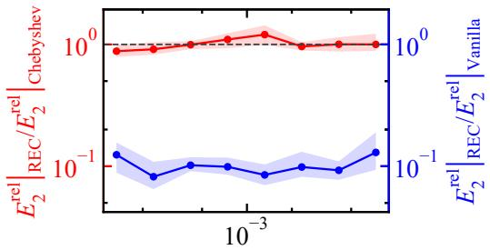  
ε

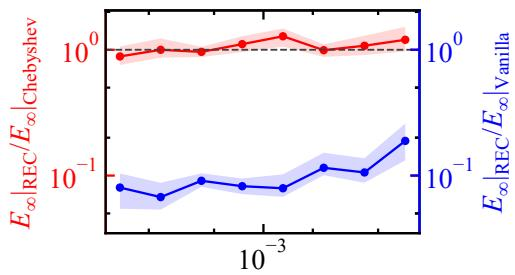  
ε

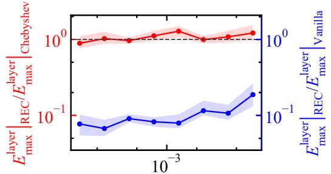  
ε

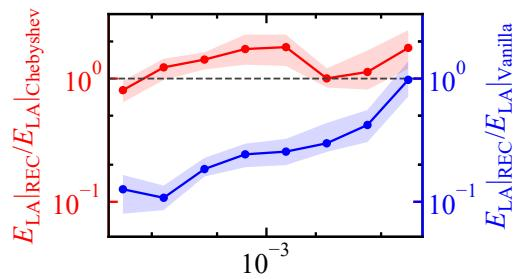  
ε  
Figure 2: Ratios of $E _ { 2 } ^ { \mathrm { r e l } }$ $E _ { \infty } , E _ { \mathrm { m a x } } ^ { \mathrm { l a y e r } }$ , and $E _ { \mathrm { L A } }$ over $\varepsilon \in [ 1 0 ^ { - 4 } , 1 0 ^ { - 2 } ]$ for the singularly perturbed scalar BVP at $\begin{array} { r } { N _ { \mathrm { o u t } } = 1 6 . } \end{array}$

## 3. Results and discussion

## 3.1. Singularly perturbed scalar BVP

Figure 2 shows the ratios of the error from the REC model to the error from the Chebyshev model and to the error from the Vanilla model over $\varepsilon \in [ 1 0 ^ { - 4 } , 1 0 ^ { - 2 } ]$ for $E _ { 2 } ^ { \mathrm { r e l } } , E _ { \infty } , E _ { \mathrm { m a x } } ^ { \mathrm { l a y e r } }$ , and $E _ { \mathrm { L A } }$ . The interval $[ 1 0 ^ { - 4 } , 1 0 ^ { - 2 } ]$ is divided into eight equal-width bins on a logarithmic scale, with nominal bin edges $1 . 0 0 \times 1 0 ^ { - 4 } , 1 . 7 8 \times 1 0 ^ { - 4 } , 3 . 1 6 \times 1 0 ^ { - 4 } , 5 . 6 2 \times 1 0 ^ { - 4 } , 1 . 0 0 \times 1 0 ^ { - 3 }$ $1 . 7 8 \times 1 0 ^ { - 3 } , 3 . 1 6 \times 1 0 ^ { - 3 } , 5 . 6 2 \times 1 0 ^ { - 3 }$ , and $1 . 0 0 \times 1 0 ^ { - 2 }$ . For each test profile in a given bin, the error from the REC model is divided by the error from the Chebyshev model or the Vanilla model for the same metric. The marker is placed at the geometric center of the bin and gives the median of these ratios. The shaded band gives the interquartile range (IQR), from the 25th to the 75th percentile. Relative to the Vanilla model, the median ratios for the REC model remain below one in all eight ε bins and for all four metrics, with the largest median value reaching 0.977 only for $E _ { \mathrm { L A } }$ in the largest-ε bin. Relative to the Chebyshev model, the median ratios remain near unity across most ε bins, whereas the smallest ε bin gives ratios below unity for all four metrics, with median values 0.880, 0.885, 0.891, and 0.805 for $E _ { 2 } ^ { \mathrm { r e l } } , E _ { \infty } , E _ { \mathrm { m a x } } ^ { \mathrm { l a y e r } }$ , and $E _ { \mathrm { L A } }$ , respectively. These trends indicate that, for the singularly perturbed scalar BVP, the REC model clearly separates from the Vanilla model across the tested parameter range, while its advantage over the Chebyshev model is concentrated where the perturbation parameter is smallest.

Table 1: Comparison of the REC model with the Vanilla and Chebyshev models for the singularly perturbed scalar BVP at $N _ { \mathrm { o u t } } = 1 6$
<table><tr><td>Metric ratio</td><td>Full test set</td><td>First three parameter bins</td><td>Seeds with lower Profiles with REC error</td><td>lower REC error</td></tr><tr><td> $\left. E _ { 2 } ^ { \mathrm { r e l } } \right. _ { \mathrm { R E C } } / \left. E _ { 2 } ^ { \mathrm { r e l } } \right. _ { \mathrm { V a n i l l a } }$ </td><td>0.107</td><td>0.110</td><td>5/5</td><td>100%</td></tr><tr><td> $E _ { \infty } | _ { \mathrm { R E C } } / \ E _ { \infty } | _ { \mathrm { V a n i l l a } }$ </td><td>0.0976</td><td>0.0821</td><td>5/5</td><td>100%</td></tr><tr><td> $E _ { \mathrm { m a x } } ^ { \mathrm { l a y e r } } | _ { \mathrm { R E C } } / E _ { \mathrm { m a x } } ^ { \mathrm { l a y e r } } | _ { \mathrm { V a n i l l a } }$ </td><td>0.0977</td><td>0.0820</td><td>5/5</td><td>99.8%</td></tr><tr><td> $\left. E _ { \mathrm { L A } } \right| _ { \mathrm { R E C } } / \left. E _ { \mathrm { L A } } \right| _ { \mathrm { V a n i l l a } }$ </td><td>0.335</td><td>0.146</td><td>5/5</td><td>92.1%</td></tr><tr><td> $E _ { 2 } ^ { \mathrm { r e l } } | _ { \mathrm { R E C } } / \left. E _ { 2 } ^ { \mathrm { r e l } } \right| _ { \mathrm { C h e b y s h e v } }$ </td><td>0.962</td><td>0.905</td><td>5/5</td><td>52.6%</td></tr><tr><td> $E _ { \infty } | _ { \mathrm { R E C } } / \ E _ { \infty } | _ { \mathrm { C h e b y s h e v } }$ </td><td>1.06</td><td>0.970</td><td>0/5</td><td>43.9%</td></tr><tr><td> $E _ { \mathrm { m a x } } ^ { \mathrm { l a y e r } } | _ { \mathrm { R E C } } / \left. E _ { \mathrm { m a x } } ^ { \mathrm { l a y e r } } \right| _ { \mathrm { C h e b y s h e v } }$ </td><td>1.06</td><td>0.977</td><td>0/5</td><td>42.2%</td></tr><tr><td> $\left. E _ { \mathrm { L A } } \right| _ { \mathrm { R E C } } / \left. E _ { \mathrm { L A } } \right| _ { \mathrm { C h e b y s h e v } }$ </td><td>1.31</td><td>1.11</td><td>0/5</td><td>32.8%</td></tr></table>

Table 1 tabulates error ratios for the singularly perturbed scalar BVP at $N _ { \mathrm { o u t } } = 1 6$ for the REC model against both the Vanilla and Chebyshev models. Here, the second column gives the ratio of mean errors over the five independent training runs, where each run error is averaged over the 500 test profiles. The third column gives the ratio of mean errors over the five independent training runs, where each run error is averaged over the first three parameter-bin means using the same parameter bins as Fig. 2. The fourth column counts how many of the five independent training runs give lower error for the REC model than for the denominator model. The fifth column gives the percentage of the 2500 profile comparisons, from the five independent training runs and 500 test profiles per run, in which the REC model has lower error than the denominator model. Relative to the Vanilla model, the second-column ratios are below 0.335 for all four metrics, and the third-column ratios decrease further to at most 0.146. The fourth and fifth columns show the same separation across all five independent training runs and at least 92.1% of the 2500 profile comparisons. Relative to the Chebyshev model, the second column remains close to unity for $E _ { 2 } ^ { \mathrm { r e l } } , E _ { \infty }$ , and $E _ { \mathrm { m a x } } ^ { \mathrm { l a y e r } }$ while $E _ { \mathrm { L A } }$ stays above unity. In the third column, however, $E _ { 2 } ^ { \mathrm { r e l } } , E _ { \infty }$ , and $E _ { \mathrm { m a x } } ^ { \mathrm { l a y e r } }$ decrease to 0.905, 0.970, and 0.977, respectively. These results indicate that, for the singularly perturbed scalar BVP, the REC model is most useful when the endpoint layer in $u ( x )$ becomes thinnest, while the Chebyshev model remains competitive when the full test set also includes larger perturbation parameters.

The REC reductions appear mainly in the first three parameter bins, while the full-test ratios relative to the Chebyshev model remain near unity or above unity, consistent with the representation argument in Appendix Appendix A. The endpoint layer in Problem 1 belongs to the same exponential family used to construct the rational dictionary elements $r _ { k }$ in Eq. (18), while the same family also admits the exact Chebyshev expansion in Eq. (A.4) with the active polynomial degree scale in Eq. (A.10). Thus, the layer alignment of the rational dictionary elements does not by itself require the REC model to reduce every metric relative to the Chebyshev model on the singularly perturbed scalar BVP.

## 3.2. Thermal entrance problem

Figure 3 illustrates the ratios of the error from the REC model to the error from the Chebyshev model and to the error from the Vanilla model for the thermal entrance problem, calculated in the same way as Fig. 2, with Pe−1 replacing ε and with the independently sampled x values retained within each $\mathrm { P e } ^ { - 1 }$ bin. Relative to the Vanilla model, the median ratios remain below unity for all eight $\mathrm { P e } ^ { - 1 }$ bins and all four metrics, with the largest median value equal to 0.810 for $E _ { \mathrm { m a x } } ^ { \mathrm { l a y e r } }$ . Relative to the Chebyshev model, the median ratios also remain below unity for all bins and metrics, with the largest median value equal to 0.918 for $E _ { \mathrm { L A } }$ . These results indicate that, for the thermal entrance problem, the REC model improves the reconstruction of the wall-normal temperature profile $\theta ( y )$ across the tested $\mathrm { P e } ^ { - 1 }$ range and sampled entrance locations x.

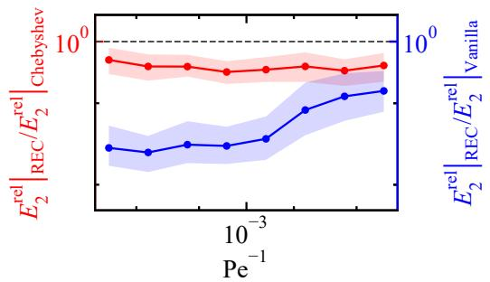

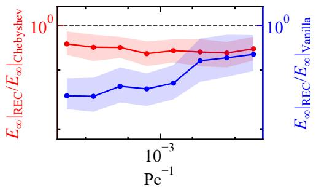

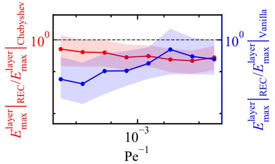

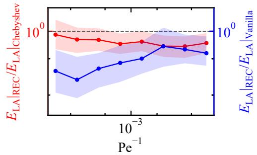  
Figure 3: Ratios of $E _ { 2 } ^ { \mathrm { r e l } } , E _ { \infty } , E _ { \mathrm { m a x } } ^ { \mathrm { l a y e r } }$ , and $E _ { \mathrm { L A } }$ over $\mathrm { P e } ^ { - 1 } \in [ 1 0 ^ { - 4 } , 1 0 ^ { - 2 } ]$ for the thermal entrance problem at $\begin{array} { r } { N _ { \mathrm { o u t } } = 1 6 . } \end{array}$

Table 2: Comparison of the REC model with the Vanilla and Chebyshev models for the thermal entrance problem at $N _ { \mathrm { o u t } } = 1 6$
<table><tr><td>Metric ratio</td><td>Full test set</td><td>First three parameter bins</td><td>Seeds with lower Profiles with REC error</td><td>lower REC error</td></tr><tr><td> $\left. E _ { 2 } ^ { \mathrm { r e l } } \right. _ { \mathrm { R E C } } / \left. E _ { 2 } ^ { \mathrm { r e l } } \right. _ { \mathrm { V a n i l l a } }$ </td><td>0.398</td><td>0.316</td><td>5/5</td><td>98.5%</td></tr><tr><td> $E _ { \infty } | _ { \mathrm { R E C } } / \ E _ { \infty } | _ { \mathrm { V a n i l l a } }$ </td><td>0.461</td><td>0.375</td><td>5/5</td><td>93.7%</td></tr><tr><td> $E _ { \mathrm { m a x } } ^ { \mathrm { l a y e r } } | _ { \mathrm { R E C } } / E _ { \mathrm { m a x } } ^ { \mathrm { l a y e r } } | _ { \mathrm { V a n i l l a } }$ </td><td>0.558</td><td>0.435</td><td>5/5</td><td>80.6%</td></tr><tr><td> $\left. E _ { \mathrm { L A } } \right| _ { \mathrm { R E C } } / \left. E _ { \mathrm { L A } } \right| _ { \mathrm { V a n i l l a } }$ </td><td>0.426</td><td>0.318</td><td>5/5</td><td>85.9%</td></tr><tr><td> $\left. E _ { 2 } ^ { \mathrm { r e l } } \right. _ { \mathrm { R E C } } / \left. E _ { 2 } ^ { \mathrm { r e l } } \right. _ { \mathrm { C h e b y s h e v } }$ </td><td>0.747</td><td>0.773</td><td>5/5</td><td>90.6%</td></tr><tr><td> $E _ { \infty } | _ { \mathrm { R E C } } / \ E _ { \infty } | _ { \mathrm { C h e b y s h e v } }$ </td><td>0.699</td><td>0.746</td><td>5/5</td><td>90.9%</td></tr><tr><td> $E _ { \mathrm { m a x } } ^ { \mathrm { l a y e r } } | _ { \mathrm { R E C } } / \left. E _ { \mathrm { m a x } } ^ { \mathrm { l a y e r } } \right| _ { \mathrm { C h e b y s h e v } }$ </td><td>0.690</td><td>0.759</td><td>5/5</td><td>81.2%</td></tr><tr><td> $\left. E _ { \mathrm { L A } } \right| _ { \mathrm { R E C } } / \left. E _ { \mathrm { L A } } \right| _ { \mathrm { C h e b y s h e v } }$ </td><td>0.725</td><td>0.731</td><td>5/5</td><td>74.7%</td></tr></table>

Table 2 summarizes error ratios for the thermal entrance problem at

$N _ { \mathrm { o u t } } ~ = ~ 1 6$ for the REC model against both the Vanilla and Chebyshev models, similar to Table 1, but with the first three parameter-bin means computed using the same parameter bins as Fig. 3. Relative to the Vanilla model, all four second-column ratios are below 0.558, and all four third-column ratios are below 0.435. The fourth column shows that the REC model gives lower mean error than the Vanilla model in all five independent training runs for every metric. The fifth column remains high as well, ranging from 80.6% to 98.5% of the 2500 profile comparisons. Relative to the Chebyshev model, all four second-column ratios and all four third-column ratios remain below unity, with values between 0.690 and 0.773. The fourth column again shows that the REC model gives lower mean error than the Chebyshev model in all five independent training runs for all four metrics, and the fifth column remains between 74.7% and 90.9%. These results indicate that, for the thermal entrance problem, the REC model provides a more reliable representation of the wall-normal temperature profile $\theta ( y )$ across sampled $\mathrm { P e } ^ { - 1 }$ values and entrance locations x, where the profile must combine a smooth outer region with a wall-attached thermal layer.

## 3.3. Concentration entrance problem

Figure 4 reports the ratios of the error from the REC model to the error from the Chebyshev model and to the error from the Vanilla model for the concentration entrance problem at Da = 0.1, 1.0, and 10.0, calculated in the same way as Fig. 2, with $\mathrm { P e } _ { m } ^ { - 1 }$ replacing ε and with the independently sampled x values retained within each $\mathrm { P e } _ { m } ^ { - 1 }$ bin. Relative to the Vanilla model, the median ratios for $E _ { 2 } ^ { \mathrm { r e l } }$ and $E _ { \infty }$ remain below unity for all three Damköhler numbers and all eight $\mathrm { P e } _ { m } ^ { - 1 }$ bins, with largest median values 0.688 and 0.745, respectively. For $E _ { \mathrm { m a x } } ^ { \mathrm { l a y e r } }$ and $E _ { \mathrm { L A } }$ , the median ratios remain below unity in all bins except the sixth $\mathrm { P e } _ { m } ^ { - 1 }$ bin at $\mathrm { D a } = 0 . 1$ and 1.0. Relative to the Chebyshev model, all median ratios remain below unity for all three Damköhler numbers, all eight bins, and all four metrics, with the largest median value equal to 0.914 for $E _ { \mathrm { L A } }$ . These results indicate that, for the concentration entrance problem, the REC model improves the reconstruction of the wall-normal concentration profile $c ( y )$ across sampled entrance locations x and across wall-absorption regimes ranging from weak uptake at $\mathrm { D a } = 0 . 1$ to stronger wall-adjacent concentration gradients at $\mathrm { D a } = 1 0 . 0$

Table 3 lists error ratios for the concentration entrance problem at $N _ { \mathrm { o u t } } =$ 16 and Da = 0.1, 1.0, and 10.0 for the REC model against both the Vanilla and Chebyshev models, similar to Table 1, but with the first three parameterbin means computed using the same parameter bins as Fig. 4. Relative to the Vanilla model, the second-column ratios are below unity for all three Damköhler numbers and all four metrics, and the third-column ratios are smaller than the corresponding second-column ratios in every row. The fourth column shows that the REC model gives lower mean error than the Vanilla model in all five independent training runs for every metric except $E _ { \mathrm { L A } }$ at Da = 0.1 and 1.0, where this occurs in four of the five independent training runs, while the fifth column remains above 63.8% across all rows. Relative to the Chebyshev model, all second-column and third-column ratios remain below unity for $\mathrm { D a } = 0 . 1$ , 1.0, and 10.0. The fourth column shows that the REC model gives lower mean error than the Chebyshev model in all five independent training runs for each of the four metrics at each tested Damköhler number, and the fifth column ranges from 65.5% to 91.6%. These results indicate that, for the concentration entrance problem, the REC model remains efective for reconstructing the wall-normal concentration profile $c ( y )$ as the absorbing-wall condition changes the near-wall layer from weakly developed to sharply localized.

Table 3: Comparison of the REC model with the Vanilla and Chebyshev models for the concentration entrance problem at $\begin{array} { r } { N _ { \mathrm { o u t } } = 1 6 . } \end{array}$
<table><tr><td>Metric ratio</td><td>Full test set</td><td>First three parameter bins</td><td>Seeds with lower Profiles with REC error</td><td>lower REC error</td></tr><tr><td colspan="5"> $\mathrm { P r o b l e m 3 } \left( \mathrm { D a } = 0 . 1 \right)$ </td></tr><tr><td> $\left. E _ { 2 } ^ { \mathrm { r e l } } \right. _ { \mathrm { R E C } } / \left. E _ { 2 } ^ { \mathrm { r e l } } \right. _ { \mathrm { V a n i l l a } }$ </td><td>0.453</td><td>0.291</td><td>5/5</td><td>94.9%</td></tr><tr><td> $E _ { \infty } | _ { \mathrm { R E C } } / \ E _ { \infty } | _ { \mathrm { V a n i l l a } }$ </td><td>0.476</td><td>0.329</td><td>5/5</td><td>90.9%</td></tr><tr><td> $E _ { \mathrm { m a x } } ^ { \mathrm { l a y e r } } | _ { \mathrm { R E C } } / E _ { \mathrm { m a x } } ^ { \mathrm { l a y e r } } | _ { \mathrm { V a n i l l a } }$ </td><td>0.799</td><td>0.585</td><td>5/5</td><td>64.2%</td></tr><tr><td> $\left. E _ { \mathrm { L A } } \right| _ { \mathrm { R E C } } / \left. E _ { \mathrm { L A } } \right| _ { \mathrm { V a n i l l a } }$ </td><td>0.827</td><td>0.578</td><td>4/5</td><td>63.8%</td></tr><tr><td> $\left. E _ { 2 } ^ { \mathrm { r e l } } \right. _ { \mathrm { R E C } } / \left. E _ { 2 } ^ { \mathrm { r e l } } \right. _ { \mathrm { C h e b y s h e v } }$ </td><td>0.761</td><td>0.683</td><td>5/5</td><td>87.7%</td></tr><tr><td> $E _ { \infty } | _ { \mathrm { R E C } } / \ E _ { \infty } | _ { \mathrm { C h e b y s h e v } }$ </td><td>0.720</td><td>0.661</td><td>5/5</td><td>90.4%</td></tr><tr><td> $E _ { \mathrm { m a x } } ^ { \mathrm { l a y e r } } | _ { \mathrm { R E C } } / \left. E _ { \mathrm { m a x } } ^ { \mathrm { l a y e r } } \right| _ { \mathrm { C h e b y s h e v } }$ </td><td>0.788</td><td>0.784</td><td>5/5</td><td>77.7%</td></tr><tr><td> $\left. E _ { \mathrm { L A } } \right| _ { \mathrm { R E C } } / \left. E _ { \mathrm { L A } } \right| _ { \mathrm { C h e b y s h e v } }$ </td><td>0.895</td><td>0.943</td><td>5/5</td><td>65.5%</td></tr><tr><td>Problem 3 (Da = 1.0)</td><td></td><td></td><td></td><td></td></tr><tr><td></td><td>0.463</td><td>0.304</td><td></td><td></td></tr><tr><td> $\left. E _ { 2 } ^ { \mathrm { r e l } } \right. _ { \mathrm { R E C } } / \left. E _ { 2 } ^ { \mathrm { r e l } } \right. _ { \mathrm { V a n i l l a } }$ </td><td>0.484</td><td>0.339</td><td>5/5</td><td>93.5% 90.8%</td></tr><tr><td> $E _ { \infty } | _ { \mathrm { R E C } } / \ E _ { \infty } | _ { \mathrm { V a n i l l a } }$ </td><td>0.757</td><td>0.564</td><td>5/5 5/5</td><td>69.3%</td></tr><tr><td> $E _ { \mathrm { m a x } } ^ { \mathrm { l a y e r } } | _ { \mathrm { R E C } } / E _ { \mathrm { m a x } } ^ { \mathrm { l a y e r } } | _ { \mathrm { V a n i l l a } }$ </td><td>0.829</td><td>0.620</td><td>4/5</td><td>68%</td></tr><tr><td> $\left. E _ { \mathrm { L A } } \right| _ { \mathrm { R E C } } / \left. E _ { \mathrm { L A } } \right| _ { \mathrm { V a n i l l a } }$ </td><td></td><td></td><td></td><td></td></tr><tr><td> $E _ { 2 } ^ { \mathrm { r e l } } | _ { \mathrm { R E C } } / \left. E _ { 2 } ^ { \mathrm { r e l } } \right| _ { \mathrm { C h e b y s h e v } }$ </td><td>0.770</td><td>0.702</td><td>5/5</td><td>87.8%</td></tr><tr><td> $E _ { \infty } | _ { \mathrm { R E C } } / \ E _ { \infty } | _ { \mathrm { C h e b y s h e v } }$ </td><td>0.720</td><td>0.670</td><td>5/5</td><td>91.6%</td></tr><tr><td> $E _ { \mathrm { m a x } } ^ { \mathrm { l a y e r } } | _ { \mathrm { R E C } } / \left. E _ { \mathrm { m a x } } ^ { \mathrm { l a y e r } } \right| _ { \mathrm { C h e b y s h e v } }$ </td><td>0.774</td><td>0.782</td><td>5/5</td><td>79.5%</td></tr><tr><td> $\left. E _ { \mathrm { L A } } \right| _ { \mathrm { R E C } } / \left. E _ { \mathrm { L A } } \right| _ { \mathrm { C h e b y s h e v } }$ </td><td>0.891</td><td>0.954</td><td>5/5</td><td>68.8%</td></tr><tr><td colspan="5">Problem 3 (Da = 10.0)</td></tr><tr><td> $\left. E _ { 2 } ^ { \mathrm { r e l } } \right. _ { \mathrm { R E C } } / \left. E _ { 2 } ^ { \mathrm { r e l } } \right. _ { \mathrm { V a n i l l a } }$ </td><td>0.433</td><td>0.307</td><td>5/5</td><td>96.1%</td></tr><tr><td> $E _ { \infty } | _ { \mathrm { R E C } } / E _ { \infty } | _ { \mathrm { V a n i l l a } }$ </td><td>0.467</td><td>0.350</td><td>5/5</td><td>92.7%</td></tr><tr><td> $E _ { \mathrm { m a x } } ^ { \mathrm { l a y e r } } | _ { \mathrm { R E C } } / E _ { \mathrm { m a x } } ^ { \mathrm { l a y e r } } | _ { \mathrm { V a n i l l a } }$ </td><td>0.584</td><td>0.388</td><td>5/5</td><td>79.3%</td></tr><tr><td> $\left. E _ { \mathrm { L A } } \right| _ { \mathrm { R E C } } / \left. E _ { \mathrm { L A } } \right| _ { \mathrm { V a n i l l a } }$ </td><td>0.652</td><td>0.518</td><td>5/5</td><td>79.2%</td></tr><tr><td> $\left. E _ { 2 } ^ { \mathrm { r e l } } \right. _ { \mathrm { R E C } } / \left. E _ { 2 } ^ { \mathrm { r e l } } \right. _ { \mathrm { C h e b y s h e v } }$ </td><td>0.760</td><td>0.754</td><td>5/5</td><td>87.9%</td></tr><tr><td> $E _ { \infty } | _ { \mathrm { R E C } } / \ E _ { \infty } | _ { \mathrm { C h e b y s h e v } }$ </td><td>0.698</td><td>0.705</td><td>5/5</td><td>90.3%</td></tr><tr><td> $\left. E _ { \mathrm { m a x } } ^ { \mathrm { l a y e r } } \right. _ { \mathrm { R E C } } / \left. E _ { \mathrm { m a x } } ^ { \mathrm { l a y e r } } \right. _ { \mathrm { C h e b y s h e v } }$ </td><td>0.678</td><td>0.681</td><td>5/5</td><td>82.9%</td></tr><tr><td> $\left. E _ { \mathrm { L A } } \right| _ { \mathrm { R E C } } / \left. E _ { \mathrm { L A } } \right| _ { \mathrm { C h e b y s h e v } }$ </td><td>0.710</td><td>0.656</td><td>5/5</td><td>72.8%</td></tr><tr><td></td><td></td><td></td><td></td><td></td></tr></table>

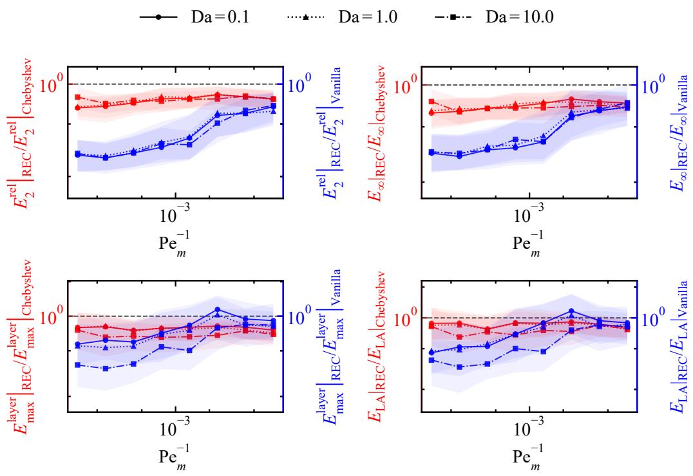  
Figure 4: Ratios of $E _ { 2 } ^ { \mathrm { r e l } }$ $E _ { \infty } , E _ { \mathrm { m a x } } ^ { \mathrm { l a y e r } }$ , and $E _ { \mathrm { L A } }$ over $\mathrm { P e } _ { m } ^ { - 1 } \in [ 1 0 ^ { - 4 } , 1 0 ^ { - 2 } ]$ for the concentration entrance problem at $N _ { \mathrm { o u t } } = 1 6$ and Da = 0.1, 1.0, and 10.0.

## 3.4. Representative profile behavior and local smoothness

Figure 5 shows representative cases selected from the held-out test profiles to visualize the profile behavior underlying the error statistics reported in Sections 3.1–3.3. The figure compares the numerical reference with solution profiles predicted by the Vanilla, Chebyshev, and REC models at $N _ { \mathrm { o u t } } = 1 6$ across the three benchmark problems introduced in Section 2.1. For Problems 1 and 2, Figs. 5(a) and 5(b) show the scalar solution $u ( x )$ over $x \in ( 0 , 1 )$ and the wall-normal temperature profile $\theta ( y )$ over $y \in ( 0 , 1 )$ , respectively, with $\varepsilon =$ $1 . 0 1 \times 1 0 ^ { - 4 }$ in $\mathrm { F i g . 5 ( a ) }$ and Pe− $^ { \cdot 1 } = 1 . 2 4 \times 1 0 ^ { - 4 }$ and $x = 6 . 7 0 \times 1 0 ^ { - 2 }$ in Fig. 5(b). In Fig. 5(a), using the REC model decreases $E _ { 2 } ^ { \mathrm { r e l } }$ from $7 . 9 0 \times 1 0 ^ { - 2 }$ with the Vanilla model and $2 . 4 9 \times 1 0 ^ { - 2 }$ with the Chebyshev model to $1 . 8 7 \times 1 0 ^ { - 2 }$ , and decreases $E _ { \infty }$ from $1 . 6 3 \times 1 0 ^ { - 1 }$ and $3 . 0 3 \times 1 0 ^ { - 2 }$ to $2 . 1 5 \times 1 0 ^ { - 2 }$ . In Fig. 5(b), $E _ { 2 } ^ { \mathrm { r e l } }$ decreases from $4 . 4 5 \times 1 0 ^ { - 2 }$ with the Vanilla model and $2 . 4 1 \times 1 0 ^ { - 2 }$ with the Chebyshev model to $1 . 6 3 \times 1 0 ^ { - 2 }$ , and $E _ { \infty }$ decreases from $1 . 5 9 \times 1 0 ^ { - 1 }$ and $8 . 0 1 \times 1 0 ^ { - 2 }$ to $5 . 9 1 \times 1 0 ^ { - 2 }$ . These reductions show that the REC model is much closer to the numerical reference than the Vanilla model and still improves over the Chebyshev model in the representative scalar and thermal entrance profiles.

For Problem 3, Figs. 5(c), 5(d), and 5(e) show the wall-normal concentration profiles $c ( y )$ over $y \in ( 0 , 1 )$ as the wall-absorption strength Da increases from 0.1 to 10.0, with $\mathrm { P e } _ { m } ^ { - 1 } = 1 . 2 4 \times 1 0 ^ { - 4 }$ and $x = 6 . 7 0 \times 1 0 ^ { - 2 }$ for $\mathrm { D a } = 0 . 1$ and $\mathrm { P e } _ { m } ^ { - 1 } = 1 . 1 5 \times 1 0 ^ { - 4 }$ and $x = 8 . 3 2 \times 1 0 ^ { - 2 }$ for $\mathrm { D a } = 1 . 0$ and 10.0. The wallendpoint drop of the numerical reference, measured by $c ( y = 0 . 9 9 ) - c ( y = 1 )$ , increases from $9 . 4 4 \times 1 0 ^ { - 4 }$ at $\mathrm { D a } = 0 . 1$ to $1 . 4 3 \times 1 0 ^ { - 2 }$ at $\mathrm { D a } = 1 . 0$ and $1 . 1 9 \times 1 0 ^ { - 1 }$ at $\mathrm { D a } = 1 0 . 0$ , showing the progressive formation of a sharper wall-adjacent concentration layer as Da increases. Relative to the Vanilla model, the REC model decreases $E _ { 2 } ^ { \mathrm { r e l } }$ from $1 . 1 3 \times 1 0 ^ { - 2 }$ 2 $2 . 7 4 \times 1 0 ^ { - 2 }$ , and $2 . 4 8 \times 1 0 ^ { - 2 }$ to $5 . 6 3 \times 1 0 ^ { - 3 }$ 2 $1 . 2 2 \times 1 0 ^ { - 2 }$ , and $1 . 8 2 \times 1 0 ^ { - 2 }$ , respectively, and decreases $E _ { \infty }$ from $2 . 3 0 \times 1 0 ^ { - 2 }$ 2 $7 . 0 0 \times 1 0 ^ { - 2 }$ , and $7 . 6 4 \times 1 0 ^ { - 2 }$ to $1 . 5 6 \times 1 0 ^ { - 2 }$ $3 . 1 0 \times 1 0 ^ { - 2 }$ , and $5 . 6 9 \times 1 0 ^ { - 2 }$ . Relative to the Chebyshev model, $E _ { 2 } ^ { \mathrm { r e l } }$ decreases from $1 . 1 7 \times 1 0 ^ { - 2 } .$ , 1 $. 8 8 \times 1 0 ^ { - 2 }$ , and $2 . 1 6 \times 1 0 ^ { - 2 }$ to the same $R E C$ values. For $\mathrm { D a } = 0 . 1$ and 1.0, $E _ { \infty }$ decreases from $2 . 8 3 \times 1 0 ^ { - 2 }$ to $1 . 5 6 \times 1 0 ^ { - 2 }$ and from $5 . 8 8 \times 1 0 ^ { - 2 }$ to $3 . 1 0 \times 1 0 ^ { - 2 }$ , while the $\mathrm { D a } = 1 0 . 0$ value remains $5 . 6 9 \times 1 0 ^ { - 2 }$ for both models. Even at $\mathrm { D a } = 0 . 1$ , where the wall-endpoint drop is weak, the Chebyshev model still introduces visible near-wall oscillation, whereas the REC model follows the nearly flat reference profile more closely. These results indicate that the REC model predicts the numerical reference substantially more accurately than the Vanilla model and also improves the prediction relative to the Chebyshev model by reducing near-wall oscillatory deviations, rather than only by resolving an extremely thin localized layer.

)y(c  
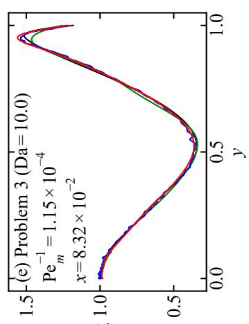  
entative solution profiles for the three problems atNout= 16. (a) Scalar profileu Temperature profileθ(y) ony∈(0,1) for Pe−1 = 1.24×10−4 andx= 6.70×10−2 . ( 0,1) for Da = 0.1, 1.0, and10.0, where the Da = 0.1 case uses Pe−1 m= 1.24×10−4

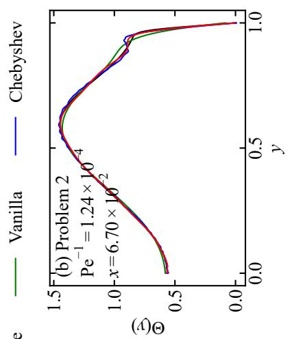

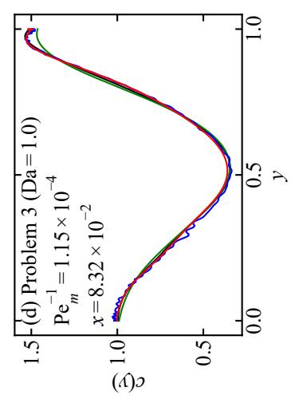

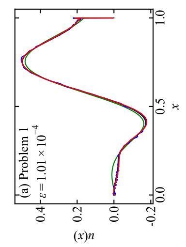

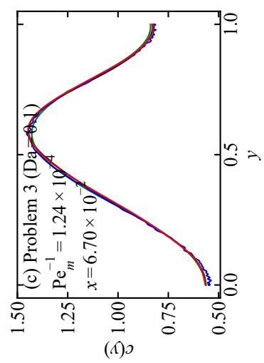

Figure 6 enlarges the right-endpoint layer in $u ( x )$ , the near-wall part of the temperature profile $\theta ( y )$ , and the near-wall part of the concentration profiles $c ( y )$ at $\mathrm { D a } = 0 . 1 , 1 . 0$ , and 10.0 for the five representative cases shown in Fig. 5. In these enlarged regions, the predictions from the Chebyshev model often retain local oscillatory deviations from the numerical reference, whereas the predictions from the REC model reduce these deviations while preserving the nearby smooth profile shape. To quantify this local oscillatory behavior, the second-diference roughness $W _ { 2 }$ is evaluated for the same representative profiles. Profiles with stronger oscillatory variation have larger second diferences, while $W _ { 2 }$ values closer to the numerical-reference value indicate closer agreement in local smoothness. For a discrete profile vector $\mathbf { v } = ( v _ { 1 } , \dots , v _ { m } )$ evaluated at the $m = 2 5 7$ Chebyshev–Lobatto output locations defined in Section 2.4, with $v _ { j } = u ( x _ { j } )$ for Problem 1, $v _ { j } = \theta ( y _ { j } )$ for Problem 2, and $v _ { j } = c ( y _ { j } )$ for Problem 3, where $j$ indexes the output locations,

$$
W _ { 2 } ( \mathbf { v } ) = \sum _ { j = 2 } ^ { m - 1 } \left| v _ { j + 1 } - 2 v _ { j } + v _ { j - 1 } \right| ,\tag{28}
$$

where | · | denotes the scalar absolute value.

Table 4 shows that the $W _ { 2 }$ values from the REC model remain closer to the numerical-reference values than the $W _ { 2 }$ values from the Chebyshev model in all five representative cases. For the thermal entrance problem, $W _ { 2 }$ decreases by 83.6% from the Chebyshev model to the REC model. For the concentration entrance problem, the corresponding decreases are 92.2%, 93.5%, and 94.1% at $\mathrm { D a } = 0 . 1 , ~ 1 . 0$ , and 10.0, respectively, giving larger decreases than in the thermal entrance problem. More importantly, for the singularly perturbed scalar BVP, although the REC model does not substantially improve the scalar-profile prediction accuracy relative to the Chebyshev model, it decreases $W _ { 2 }$ by 78.7%. In addition, for all held-out test profiles over the five independent training runs, the median $W _ { 2 }$ decreases from the Chebyshev model to the REC model by 64.0% for the singularly perturbed scalar BVP and by 81.4% for the thermal entrance problem. For the concentration entrance problem, the corresponding median decreases are 87.2%, 87.6%, and 85.9% at $\mathrm { D a } = 0 . 1 , 1 . 0$ , and 10.0, respectively. These results indicate that the REC model suppresses the artificial local reversals introduced by the Chebyshev model near the boundary or wall, thereby giving a near-boundary or near-wall profile shape closer to the numerical-reference behavior across both the five representative cases and all held-out test profiles.

)y(c  
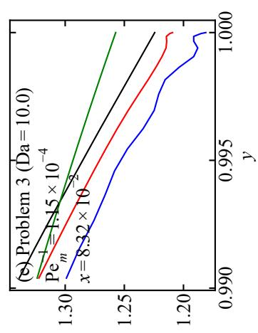

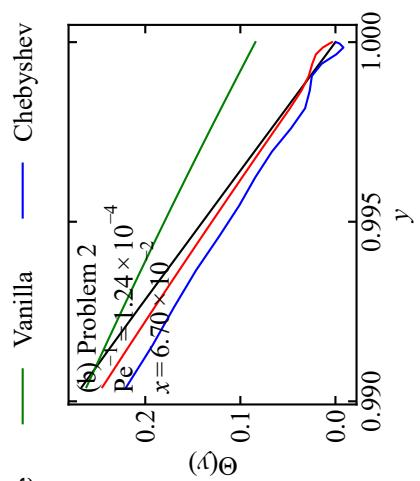

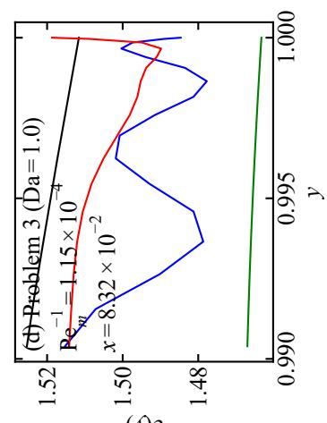  
ary and near-wall solution profiles for the three problems atNout= 16. (a) Scalar 101×10−4b)Ttfilθ)thllfP−1=124×10−4d .. ( emperaure proe (y near e wa or e  . anx sc(y) near the absorbing wall for Da = 0.1, 1.0, and 10.0, where the Da = 0.1 case use 1 while the Da = 1.0 and 10.0 cases use Pe− m= 1.15×10−4 andx = 8.32×10−2 . Each rical reference, Vanilla, Chebyshev, a  
)y(c

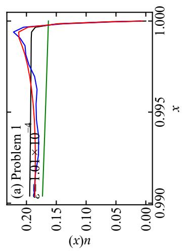

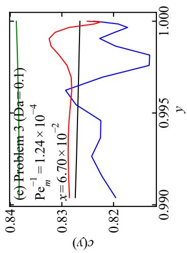

Table 4: $W _ { 2 }$ values for the numerical reference and for the predictions from the Chebyshev and REC models in the five representative cases shown in Fig. 6, computed over $x \in ( 0 , 1 )$ for Problem 1 and over $y \in ( 0 , 1 )$ for Problems 2 and 3.
<table><tr><td>Problem</td><td>Parameter</td><td> $W _ { \mathrm { 2 } } | _ { \mathrm { R e f e r e n c e } }$ </td><td> $W _ { \mathrm { 2 } } | _ { \mathrm { C h e b y s h e v } }$ </td><td> $W _ { \mathrm { 2 } } | _ { \mathrm { R E C } }$ </td></tr><tr><td>Problem 1</td><td> $\varepsilon = 1 . 0 1 \times 1 0 ^ { - 4 }$ </td><td> $1 . 8 7 \times 1 0 ^ { - 1 }$ </td><td> $9 . 7 2 \times 1 0 ^ { - 1 }$ </td><td> $2 . 0 7 \times 1 0 ^ { - 1 }$ </td></tr><tr><td>Problem 2</td><td> $\mathrm { P e } ^ { - 1 } = 1 . 2 4 \times 1 0 ^ { - 4 }$   $x = 6 . 7 0 \times 1 0 ^ { - 2 }$ </td><td> $1 . 2 9 \times 1 0 ^ { - 1 }$ </td><td> $8 . 2 3 \times 1 0 ^ { - 1 }$ </td><td> $1 . 3 5 \times 1 0 ^ { - 1 }$ </td></tr><tr><td>Problem 3  $\mathrm { ( D a = 0 . 1 ) }$ </td><td> $\mathrm { P e } _ { m } ^ { - 1 } = 1 . 2 4 \times 1 0 ^ { - 4 }$   $x = 6 . 7 0 \times 1 0 ^ { - 2 }$ </td><td> $5 . 1 5 \times 1 0 ^ { - 2 }$ </td><td> $8 . 7 1 \times 1 0 ^ { - 1 }$ </td><td> $6 . 7 8 \times 1 0 ^ { - 2 }$ </td></tr><tr><td>Problem 3  $\mathrm { ( D a = 1 . 0 ) }$ </td><td> $\mathrm { P e } _ { m } ^ { - 1 } = 1 . 1 5 \times 1 0 ^ { - 4 }$   $x = 8 . 3 2 \times 1 0 ^ { - 2 }$ </td><td> $6 . 3 9 \times 1 0 ^ { - 2 }$ </td><td> $1 . 4 3 \times 1 0 ^ { 0 }$ </td><td> $9 . 2 6 \times 1 0 ^ { - 2 }$ </td></tr><tr><td> $\mathrm { P r o b l e m \ 3 }$   $\mathrm { ( D a = 1 0 . 0 ) }$ </td><td> $\mathrm { P e } _ { m } ^ { - 1 } = 1 . 1 5 \times 1 0 ^ { - 4 }$   $x = 8 . 3 2 \times 1 0 ^ { - 2 }$ </td><td> $9 . 2 2 \times 1 0 ^ { - 2 }$ </td><td> $1 . 6 3 \times 1 0 ^ { 0 }$ </td><td> $9 . 6 3 \times 1 0 ^ { - 2 }$ </td></tr></table>

## 3.5. Dependence on outer Chebyshev subdictionary size

Sections 3.1–3.4 show that, first, compared with the Vanilla model, the REC model gives lower errors in predicting u(x), θ(y), and $c ( y )$ , even though the Vanilla model uses a learned, parameter-conditioned trunk MLP. This result indicates that the learned coordinate trunk does not by itself provide the same layer-aligned output functions as the prescribed REC dictionary for the tested bounded-domain solution profiles. Compared with the Chebyshev model, the REC model changes the prescribed trunk dictionary while keeping the branch network, trunk dimension, data splits, loss function, optimizer, training procedure, and evaluation protocol fixed, as described in Section 2. Therefore, the lower errors in the thermal and concentration entrance problems, together with the smaller $W _ { 2 }$ values in the representative profiles, support replacing part of the global Chebyshev dictionary by inner-scale rational dictionary elements in the output-coordinate representation, rather than adding trainable trunk expressivity, changing the optimization procedure, or imposing a problem-specific decomposition, rescaling, or sampling rule.

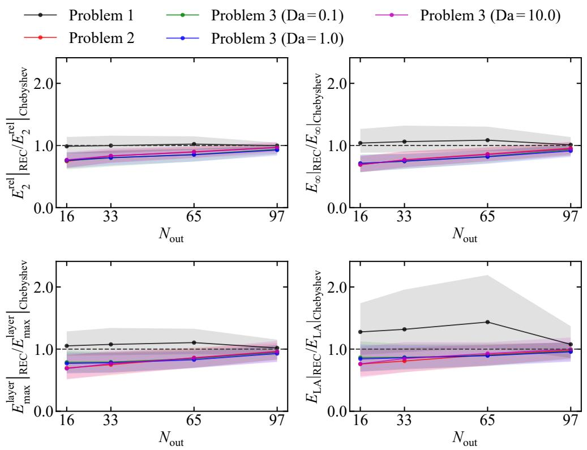  
Figure 7: Ratios of $E _ { 2 } ^ { \mathrm { r e l } }$ ， $E _ { \infty } , E _ { \mathrm { m a x } } ^ { \mathrm { l a y e r } }$ , and $E _ { \mathrm { L A } }$ from the REC model to the corresponding errors from the Chebyshev model for $N _ { \mathrm { o u t } } = 1 6$ , 33, 65, and 97.

However, the results in Sections 3.1–3.4 are obtained with the specific split $N _ { \mathrm { o u t } } = 1 6$ and do not yet show whether the lower errors in predicting $\theta ( y )$ and $c ( y )$ can be attributed to using a larger number of inner rational dictionary elements within the $p = 1 2 9$ trunk dictionary, or whether similar errors would be obtained with a larger outer Chebyshev subdictionary. They also do not show whether the lower errors relative to the Vanilla model remain when $N _ { \mathrm { o u t } }$ is increased to 33, 65, and 97.

Figures 7 and 8 accordingly compare the error from the REC model against the errors from the Chebyshev and Vanilla models as $N _ { \mathrm { o u t } }$ is varied over 16, 33, 65, and 97. For each metric and each problem, the solid line gives the median ratio over the five independent training runs and test profiles, and the shaded band gives the IQR. In Fig. 7, for the singularly perturbed scalar

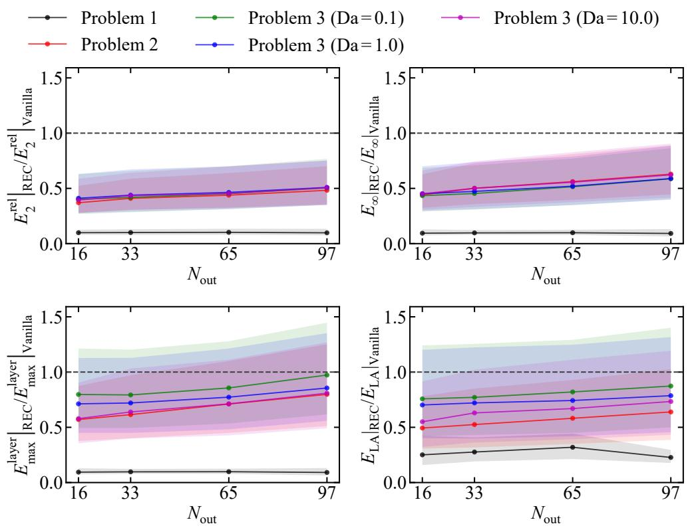  
Figure 8: Ratios of $E _ { 2 } ^ { \mathrm { r e l } } , E _ { \infty } , E _ { \mathrm { m a x } } ^ { \mathrm { l a y e r } }$ , and $E _ { \mathrm { L A } }$ from the REC model to the corresponding errors from the Vanilla model for $N _ { \mathrm { o u t } } = 1 6$ , 33, 65, and 97.

BVP, the ratios remain close to unity and can exceed unity for $E _ { \mathrm { m a x } } ^ { \mathrm { l a y e r } }$ and $E _ { \mathrm { L A } }$ consistent with Table 1, where the Chebyshev model gives lower errors than the REC model on these two metrics. For the thermal and concentration entrance problems in Fig. 7, the smallest ratios occur at $N _ { \mathrm { o u t } } = 1 6$ , and increasing $N _ { \mathrm { o u t } }$ moves the ratios toward unity. In Fig. 8, the ratios remain below unity for the thermal and concentration entrance problems and remain below unity for most singularly perturbed scalar BVP cases. Thus, the weaker improvement over the Chebyshev model at larger $N _ { \mathrm { o u t } }$ supports the interpretation that retaining more inner rational dictionary elements is more favorable for predicting $\theta ( y )$ and $c ( y )$ than increasing the number of outer Chebyshev dictionary elements. The ratios in Fig. 8 also show that the lower errors relative to the Vanilla model are retained when $N _ { \mathrm { o u t } }$ is increased.

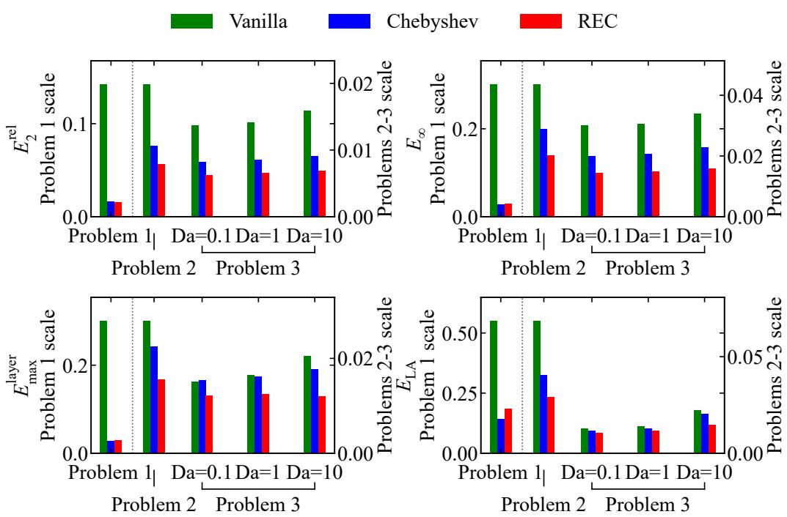  
Figure 9: Averaged values of $E _ { 2 } ^ { \mathrm { r e l } } , E _ { \infty } , E _ { \mathrm { m a x } } ^ { \mathrm { l a y e r } }$ , and $E _ { \mathrm { L A } }$ for the Vanilla, Chebyshev, and REC models at $N _ { \mathrm { o u t } } = 1 6$

## 3.6. Practical implications

Figure 9 compares the averaged values of $E _ { 2 } ^ { \mathrm { r e l } } , E _ { \infty } , E _ { \mathrm { m a x } } ^ { \mathrm { l a y e r } }$ , and $E _ { \mathrm { L A } }$ for the Vanilla, Chebyshev, and REC models at $N _ { \mathrm { o u t } } = 1 6$ . For each model and each problem, the plotted value is the corresponding error metric averaged over the five independent training runs and the test profiles. These averaged error values summarize the observations in Sections 3.1–3.4. For the singularly perturbed scalar BVP, the REC model predicts the scalar profile $u ( x )$ more accurately than the Vanilla model and remains comparable to the Chebyshev model. For the thermal and concentration entrance problems, the REC model gives more accurate predictions of the temperature profile $\theta ( y )$ and the concentration profile $c ( y )$ than both comparison models. The $N _ { \mathrm { o u t } }$ sweep in Section 3.5 further shows that, in these two entrance problems, the lower errors in predicting $\theta ( y )$ and $c ( y )$ are strengthened by using more inner rational dictionary elements within the REC dictionary. Therefore, the practical implication is clearest for REC-type trunk dictionaries in operator surrogates that predict wall-normal temperature or concentration profiles with a smooth

outer part and a near-wall layer.

This advantage is expected to be particularly relevant to high-Péclet entrance-region heat and mass transfer problems in which repeated evaluations are required as inlet profiles or wall conditions change. For example, surface-based biosensors and biosensors based on surface capture require concentration profiles governed by convection, difusion, reaction, and binding near reactive surfaces [16]. Similarly, microfluidic systems with surface reactions and microfluidic electrochemical chips with electrodes on the side walls involve concentration fields formed by laminar convective-difusive transport and electrochemical reaction at an electrode interface [17, 18]. In high-speed flow applications, high-speed boundary layers with wall transpiration, transpiration cooling through a porous wall, hypersonic transitional and turbulent boundary layers, hypersonic turbulent boundary layers with finite-rate chemical reactions, and reacting boundary layers with recombination reactions also require accurate near-wall temperature or species profiles [19–23].

## 4. Conclusion

This study examined trunk-basis design in DeepONet surrogates for singularly perturbed and high-Péclet transport operators on bounded domains, with particular emphasis on wall-normal profile reconstruction in entranceregion heat and mass transfer. The proposed REC trunk dictionary combines a low-degree outer Chebyshev subdictionary with an inner rational subdictionary constructed before DeepONet training from a canonical exponentially decaying layer family. The key conclusions are as follows:

1. On the singularly perturbed scalar BVP, the REC model gives its clearest reductions in the smallest-parameter regime, while remaining comparable to the Chebyshev model over the full test set.

2. On the thermal entrance problem, the REC model improves the reconstruction of the wall-normal temperature profile θ(y) relative to both the Vanilla and Chebyshev models across the tested high-Péclet regime and sampled entrance locations x.

3. On the concentration entrance problem, the REC model improves the reconstruction of the wall-normal concentration profile c(y) across Da = 0.1, 1.0, and 10.0, showing that the improvement persists as the absorbing-wall condition changes the near-wall layer.

4. The reductions obtained with the REC model are consistent across the five independent training runs and the held-out test profiles, indicating that the observed improvements are not restricted to a single training initialization or a small set of selected profiles.

## Acknowledgments

This work was supported by the Center for Heterogeneous Integration of Micro Electronic Systems (CHIMES), one of the seven centers sponsored by the Semiconductor Research Corporation (SRC) and the Defense Advanced Research Projects Agency (DARPA) under the Joint University Microelectronics Program 2.0 (JUMP 2.0).

## Declaration of competing interest

The authors declare that they have no known competing financial interests or personal relationships that could have appeared to influence the work presented in this paper.

## Data availability

The code and data used in this work are available upon request.

## Appendix A. Theoretical motivation for the REC trunk dictionary

This appendix develops an idealized representation argument for the REC trunk, rather than a convergence theorem for the trained DeepONet. The argument uses the canonical exponential layer family introduced in Eq. (16), whose sampled instances define the inner rational subdictionary in the REC dictionary construction before training. Treating the same family as an idealized target clarifies how polynomial and rational trunks represent a thin boundary-attached layer, and why the REC approximation space combining a low-degree outer Chebyshev subdictionary with the inner rational subdictionary is structurally compatible with the decomposition into a smooth outer solution and a one-sided layer. Define

$$
s = 2 \zeta - 1 \in [ - 1 , 1 ] , \qquad \beta = \frac { 1 } { 2 \delta } ,\tag{A.1}
$$

where $s$ denotes the shifted coordinate and $\beta$ denotes the rescaled layer parameter. Then

$$
\psi _ { \delta } ( \zeta ) = e ^ { - \beta } e ^ { \beta s } .\tag{A.2}
$$

Using the modified-Bessel Jacobi-Anger identity [31],

$$
e ^ { \beta s } = I _ { 0 } ( \beta ) + 2 \sum _ { k = 1 } ^ { \infty } I _ { k } ( \beta ) T _ { k } ( s ) ,\tag{A.3}
$$

where $I _ { k }$ denotes the modified Bessel function of the first kind of order k and $T _ { k }$ denotes the Chebyshev polynomial of the first kind of degree $k _ { : }$ , one obtains the exact Chebyshev expansion

$$
\psi _ { \delta } ( \zeta ) = e ^ { - \beta } I _ { 0 } ( \beta ) + 2 e ^ { - \beta } \sum _ { k = 1 } ^ { \infty } I _ { k } ( \beta ) T _ { k } ( 2 \zeta - 1 ) .\tag{A.4}
$$

Hence the Chebyshev coeficients are

$$
c _ { 0 } ( \delta ) = e ^ { - \beta } I _ { 0 } ( \beta ) , \qquad c _ { k } ( \delta ) = 2 e ^ { - \beta } I _ { k } ( \beta ) , \quad k \ge 1 ,\tag{A.5}
$$

where $c _ { k } ( \delta )$ denotes the coeficient of $T _ { k } ( 2 \zeta - 1 )$ . For the degree-n Chebyshev truncation

$$
S _ { n } \psi _ { \delta } ( \zeta ) = c _ { 0 } ( \delta ) + \sum _ { k = 1 } ^ { n } c _ { k } ( \delta ) T _ { k } ( 2 \zeta - 1 ) ,\tag{A.6}
$$

where n denotes the highest retained Chebyshev degree, the uniform truncation error satisfies

$$
\| \psi _ { \delta } - S _ { n } \psi _ { \delta } \| _ { \infty } \leq 2 e ^ { - \beta } \sum _ { k = n + 1 } ^ { \infty } I _ { k } ( \beta ) ,\tag{A.7}
$$

where $\| \cdot \| _ { \infty }$ denotes the supremum norm on [0,1]. This shows that, as $\delta$ decreases, appreciable Chebyshev weight shifts to higher polynomial degrees. A low-degree polynomial trunk therefore becomes progressively less well matched to this canonical boundary layer family.

A more quantitative scale estimate follows from the local central-limit asymptotic for modified Bessel functions [32],

$$
e ^ { - \beta } I _ { k } ( \beta ) \sim \frac { 1 } { \sqrt { 2 \pi \beta } } \exp ( - \frac { k ^ { 2 } } { 2 \beta } ) , \qquad \beta  \infty , \qquad \frac { k } { \sqrt { \beta } }  \gamma \in [ 0 , \infty ) ,\tag{A.8}
$$

where $\gamma$ denotes the limiting scaled polynomial degree. This identifies $k =$ $O ( \sqrt { \beta } )$ as the central coeficient scale. Since $\beta = 1 / ( 2 \delta )$ , this gives, for $k \geq 1$ 2

$$
c _ { k } ( \delta ) \sim 2 \sqrt { \frac { \delta } { \pi } } \exp ( - k ^ { 2 } \delta ) , \qquad c _ { 0 } ( \delta ) \sim \sqrt { \frac { \delta } { \pi } } .\tag{A.9}
$$

Thus, the envelope of the Chebyshev coeficients has a Gaussian scale in k. If $\rho \in ( 0 , 1 )$ denotes a fixed relative decay level of this envelope and $K _ { \rho } ( \delta )$ denotes the polynomial degree at which exp $\begin{array} { r } { \langle - k ^ { 2 } \delta \rangle = \rho , } \end{array}$ then

$$
K _ { \rho } ( \delta ) = \sqrt { \frac { | \log \rho | } { \delta } } .\tag{A.10}
$$

Therefore, the active polynomial degree scale is proportional to $\delta ^ { - 1 / 2 }$ as $\delta \to 0$ . For example, taking $\rho = e ^ { - 1 }$ gives $K _ { \rho } ( 1 0 ^ { - 4 } ) = 1 0 0$ , which explains why a degree 128 Chebyshev trunk can remain a strong baseline for the pure canonical exponential layer. The inner rational subdictionary is therefore not motivated by a claim that it must dominate a suficiently high degree Chebyshev expansion on this scalar layer alone. Rather, it is motivated as a compact layer-aligned inner rational subdictionary that can complement a low-degree outer Chebyshev subdictionary in the profile-valued entrance transport problems studied in the main text.

Next define the logarithmic parameter

$$
\theta = \log _ { 1 0 } \delta ,\tag{A.11}
$$

where θ denotes the log scaled prototype parameter. Then, with $\delta = 1 0 ^ { \theta }$ ，

$$
\partial _ { \theta } \psi _ { 1 0 ^ { \theta } } ( \zeta ) = ( \ln 1 0 ) \left( \frac { 1 - \zeta } { \delta } \right) \exp \left( - \frac { 1 - \zeta } { \delta } \right) .\tag{A.12}
$$

If

$$
t = \frac { 1 - \zeta } { \delta } \geq 0 ,\tag{A.13}
$$

where t denotes the stretched layer coordinate associated with the canonical exponential profile, then

$$
\partial _ { \theta } \psi _ { 1 0 ^ { \theta } } ( \zeta ) = ( \ln 1 0 ) t e ^ { - t } .\tag{A.14}
$$

Since te $^ { - t } \leq e ^ { - 1 }$ for all $t \geq 0$ ，

$$
\operatorname* { s u p } _ { \theta } \left\| \partial _ { \theta } \psi _ { 1 0 ^ { \theta } } \right\| _ { \infty } \leq \frac { \ln 1 0 } { e } ,\tag{A.15}
$$

where the supremum is taken over the log parameter range considered for the layer family.

Let $\{ r _ { i } \} _ { i = 1 } ^ { M }$ denote the rational dictionary elements, and let $\delta _ { i } \ : = \ : 1 0 ^ { \theta _ { i } }$ denote the prototype parameter value associated with $r _ { i }$ . Suppose that

$$
\| \psi _ { \delta _ { i } } - r _ { i } \| _ { \infty } \leq \tau _ { i } ,\tag{A.16}
$$

where $\tau _ { i }$ denotes a uniform approximation error bound for the rational dictionary element $r _ { i }$ on [0,1]. It should not be interpreted as the raw AAA stopping tolerance unless that tolerance has been separately verified to bound the uniform approximation error.

Then, for any $\delta = 1 0 ^ { \theta }$

$$
\| \psi _ { \delta } - r _ { i } \| _ { \infty } \leq \tau _ { i } + \frac { \ln 1 0 } { e } \left| \theta - \theta _ { i } \right| = \tau _ { i } + \frac { \ln 1 0 } { e } \left| \log _ { 1 0 } \delta - \log _ { 1 0 } \delta _ { i } \right| .\tag{A.17}
$$

Therefore,

$$
\operatorname* { i n f } _ { v \in \mathcal { R } _ { M } } \| \psi _ { \delta } - v \| _ { \infty } \leq \operatorname* { m i n } _ { 1 \leq i \leq M } \left( \tau _ { i } + \frac { \ln 1 0 } { e } \left| \log _ { 1 0 } \delta - \log _ { 1 0 } \delta _ { i } \right| \right) ,\tag{A.18}
$$

where

$$
\mathcal { R } _ { M } = \operatorname { s p a n } \{ r _ { 1 } , . . . , r _ { M } \} .\tag{A.19}
$$

Here, $\mathcal { R } _ { M }$ denotes the rational subspace, M denotes the number of rational dictionary elements, and v denotes a candidate approximating function in $\mathcal { R } _ { M }$

Consequently, if ${ \cal T } _ { \theta } = [ \theta _ { \mathrm { { m i n } } } , \theta _ { \mathrm { { m a x } } } ]$ denotes the sampled log parameter interval, and if

$$
h _ { \theta } = \operatorname* { s u p } _ { \theta \in \mathbb { Z } _ { \theta } } \operatorname* { m i n } _ { 1 \le i \le M } | \theta - \theta _ { i } |\tag{A.20}
$$

denotes the fill distance of the sampled log grid, then

$$
\operatorname* { i n f } _ { v \in \mathcal { R } _ { M } } \| \psi _ { 1 0 ^ { \theta } } - v \| _ { \infty } \leq \tau _ { \operatorname* { m a x } } + \frac { \ln 1 0 } { e } h _ { \theta } , \qquad \theta \in \mathcal { I } _ { \theta } ,\tag{A.21}
$$

where $\tau _ { \mathrm { m a x } } = \mathrm { m a x } _ { 1 \leq i \leq M } \tau _ { i }$ denotes the largest assumed uniform approximation error bound over the inner rational subdictionary. This is a log parameter coverage statement for the idealized layer family, not a statement about the trained DeepONet optimization error.

Finally, define

$$
\mathcal { P } _ { m - 1 } = \operatorname { s p a n } \{ T _ { 0 } ( 2 \zeta - 1 ) , \ldots , T _ { m - 1 } ( 2 \zeta - 1 ) \} , \qquad \mathcal { H } _ { m , M } = \mathcal { P } _ { m - 1 } + \mathcal { R } _ { M } ,\tag{A.22}
$$

where m denotes the number of outer Chebyshev dictionary elements and $\mathcal { H } _ { m , M }$ denotes the corresponding REC approximation space.

For the REC model used in the main comparison, $m = 1 6$ and $M = 1 1 3$ The Chebyshev trunk with the same nominal dimension corresponds to $\mathcal { P } _ { 1 2 8 }$ , which is obtained by taking $m = 1 2 9$ in the definition of $\mathcal { P } _ { m - 1 }$ . In general, $\mathcal { H } _ { 1 6 , 1 1 3 }$ and $\mathcal { P } _ { 1 2 8 }$ are diferent approximation spaces, and neither space comparison alone implies that one trained DeepONet must outperform the other. The following estimate is therefore an existence bound for the REC approximation space, not a dominance theorem relative to the full Chebyshev space.

For a target field of the form

$$
f ( \zeta ) = q ( \zeta ) + A \psi _ { \delta } ( \zeta ) ,\tag{A.23}
$$

where f denotes a target profile, q denotes a smooth outer component, and A denotes a layer amplitude, let

$$
\eta _ { m } ( q ) : = \operatorname* { i n f } _ { \pi \in { \mathcal P } _ { m - 1 } } \| q - \pi \| _ { \infty } ,\tag{A.24}
$$

where $\pi$ denotes a candidate polynomial in $\mathcal { P } _ { m - 1 }$ , and $\eta _ { m } ( q )$ denotes the best uniform approximation error of the outer component q by the outer Chebyshev subdictionary. Then

$$
\operatorname* { i n f } _ { v \in \mathcal { H } _ { m , M } } \| f - v \| _ { \infty } \leq \eta _ { m } ( q ) + | A | \operatorname* { m i n } _ { 1 \leq i \leq M } \left( \tau _ { i } + \frac { \ln { 1 0 } } { e } \left| \log _ { 1 0 } \delta - \log _ { 1 0 } \delta _ { i } \right| \right)\tag{A.25}
$$

Although this bound does not prove that the trained REC model must produce lower errors than the trained Vanilla or Chebyshev models in the comparisons of Section 3, it shows that, under the idealized decomposition $f = q + A \psi _ { \delta }$ , the REC trunk is structurally aligned with a smooth outer component and a thin boundary-attached layer, while the inner rational subdictionary provides an error estimate controlled by the spacing of the sampled prototype parameter nodes on the $\log _ { 1 0 } \delta$ axis for the canonical layer family.

The calculation also clarifies the interpretation of the singularly perturbed scalar BVP comparison in Section 3.1, where the REC model improves mainly in the first three parameter bins but does not reduce every full-test metric relative to the Chebyshev model. For the canonical exponential layer, the active polynomial degree scale is proportional to $\delta ^ { - 1 / \bar { 2 } }$ , indicating that a degree 128 Chebyshev trunk remains an efective representation for $\delta \geq 1 0 ^ { - 4 }$ Thus, the main role of the AAA-constructed inner rational subdictionary is not to replace high-degree Chebyshev approximation in this ideal scalar case, but to supply an explicitly layer-aligned component within a trunk dictionary having the same total number of dictionary elements when the target profiles combine smooth outer behavior with wall-attached transport layers.

## References

[1] R. Courant, D. Hilbert, Methods of Mathematical Physics: Partial Diferential Equations, Wiley, New York, 1989. https://doi.org/10. 1002/9783527617234.

[2] H.-G. Roos, M. Stynes, L. Tobiska, Robust Numerical Methods for Singularly Perturbed Diferential Equations: Convection-Difusion-Reaction and Flow Problems, second ed., Springer Series in Computational Mathematics, vol. 24, Springer, Berlin, 2008. https://doi.org/10.1007/ 978-3-540-34467-4.

[3] A. Arzani, K.W. Cassel, R.M. D’Souza, Theory-guided physics-informed neural networks for boundary layer problems with singular perturbation, J. Comput. Phys. 473 (2023) 111768. https://doi.org/10.1016/j.jcp. 2022.111768.

[4] L. Zhang, G. He, Multi-scale-matching neural networks for thin plate bending problem, Theor. Appl. Mech. Lett. 14 (1) (2024) 100494. https: //doi.org/10.1016/j.taml.2024.100494.

[5] F. Cao, F. Gao, X. Guo, D. Yuan, Physics-informed neural networks with parameter asymptotic strategy for learning singularly perturbed convection-dominated problem, Comput. Math. Appl. 150 (2023) 229–242. https://doi.org/10.1016/j.camwa.2023.09.030.

[6] L. Lu, P. Jin, G. Pang, Z. Zhang, G.E. Karniadakis, Learning nonlinear operators via DeepONet based on the universal approximation theorem of operators, Nat. Mach. Intell. 3 (3) (2021) 218–229. https://doi.org/ 10.1038/s42256-021-00302-5.

[7] S. Wang, H. Wang, P. Perdikaris, Learning the solution operator of parametric partial diferential equations with physics-informed DeepONets,

Sci. Adv. 7 (40) (2021) eabi8605. https://doi.org/10.1126/sciadv. abi8605.

[8] T. Du, Z. Huang, Y. Li, Approximation and Generalization of DeepONets for Learning Operators Arising from a Class of Singularly Perturbed Problems, East Asian J. Appl. Math. 14 (4) (2024) 841–873. https: //doi.org/10.4208/eajam.2023-128.051023.

[9] T. Sun, J. Zu, PVD-ONet: A Multi-scale Neural Operator Method for Singularly Perturbed Boundary Layer Problems, arXiv:2507.21437 (2025). https://doi.org/10.48550/arXiv.2507.21437.

[10] J. Lee, Y. Hong, S. Ko, J.Y. Lee, Data-free Asymptotics-Informed Operator Networks for Singularly Perturbed PDEs, arXiv:2512.22006 (2025). https://doi.org/10.48550/arXiv.2512.22006.

[11] C. Mou, Y. Zhang, X. Zhu, Q. Zhuang, PAS-Net: Physics-informed Adaptive Scale Deep Operator Network, arXiv:2511.14925 (2025). https: //doi.org/10.48550/arXiv.2511.14925.

[12] L. Lu, X. Meng, S. Cai, Z. Mao, S. Goswami, Z. Zhang, G.E. Karniadakis, A comprehensive and fair comparison of two neural operators (with practical extensions) based on FAIR data, Comput. Methods Appl. Mech. Engrg. 393 (2022) 114778. https://doi.org/10.1016/j.cma. 2022.114778.

[13] J. Choi, T. Yun, N. Kim, Y. Hong, Spectral operator learning for parametric PDEs without data reliance, Comput. Methods Appl. Mech. Engrg. 420 (2024) 116678. https://doi.org/10.1016/j.cma.2023.116678.

[14] Z. Liu, H. Wang, H. Zhang, K. Bao, X. Qian, S. Song, Render unto Numerics: Orthogonal Polynomial Neural Operator for PDEs with Nonperiodic Boundary Conditions, SIAM J. Sci. Comput. 46 (4) (2024) C323–C348. https://doi.org/10.1137/23M1556320.

[15] M. Abid, O. San, Spectral Embedding via Chebyshev Bases for Robust DeepONet Approximation, arXiv:2512.09165 (2025). https://doi.org/ 10.48550/arXiv.2512.09165.

[16] T.M. Squires, R.J. Messinger, S.R. Manalis, Making it stick: convection, reaction and difusion in surface-based biosensors, Nat. Biotechnol. 26 (4) (2008) 417–426. https://doi.org/10.1038/nbt1388.

[17] T. Gervais, K.F. Jensen, Mass transport and surface reactions in microfluidic systems, Chem. Eng. Sci. 61 (4) (2006) 1102–1121. https: //doi.org/10.1016/j.ces.2005.06.024.

[18] S. Chevalier, Semianalytical modeling of the mass transfer in microfluidic electrochemical chips, Phys. Rev. E 104 (3) (2021) 035110. https:// doi.org/10.1103/PhysRevE.104.035110.

[19] A. Sescu, R. Alaziz, M.Z. Afsar, Efect of wall transpiration and heat transfer on Görtler vortices in high speed flows, AIAA J. 57 (3) (2019) 1159–1171. https://doi.org/10.2514/1.J057330.

[20] S. Hillcoat, J.-P. Hickey, Pressure–velocity coupling in transpiration cooling, Int. J. Heat Mass Transf. 239 (2025) 126532. https://doi.org/ 10.1016/j.ijheatmasstransfer.2024.126532.

[21] D. Xu, J. Wang, S. Chen, Skin-friction and heat-transfer decompositions in hypersonic transitional and turbulent boundary layers, J. Fluid Mech. 941 (2022) A4. https://doi.org/10.1017/jfm.2022.269.

[22] D. Passiatore, L. Sciacovelli, P. Cinnella, G. Pascazio, Finite-rate chemistry efects in turbulent hypersonic boundary layers: A direct numerical simulation study, Phys. Rev. Fluids 6 (5) (2021) 054604. https://doi.org/10.1103/PhysRevFluids.6.054604.

[23] N. Perakis, O.J. Haidn, M. Ihme, Heat transfer augmentation by recombination reactions in turbulent reacting boundary layers at elevated pressures, Int. J. Heat Mass Transf. 178 (2021) 121628. https: //doi.org/10.1016/j.ijheatmasstransfer.2021.121628.

[24] R.K. Shah, A.L. London, Laminar Flow Forced Convection in Ducts: A Source Book for Compact Heat Exchanger Analytical Data, Academic Press, New York, 1978. https://doi.org/10.1016/C2013-0-06152-X.

[25] A.S. Haase, S.J. Chapman, P.A. Tsai, D. Lohse, R.G.H. Lammertink, The Graetz–Nusselt problem extended to continuum flows with finite slip, J. Fluid Mech. 764 (2015) R3. https://doi.org/10.1017/jfm.2014.733.

[26] A.S. Popel, J.F. Gross, Mass transfer in the entrance region of a circular tube, Int. J. Heat Mass Transf. 21 (8) (1978) 1133–1141. https://doi. org/10.1016/0017-9310(78)90112-6.

[27] V. Debarnot, J. Fehrenbach, F. de Gournay, L. Martire, The case of Neumann, Robin, and periodic lateral conditions for the semi-infinite generalized Graetz problem and applications, SIAM J. Appl. Math. 78 (4) (2018) 2227–2251. https://doi.org/10.1137/17M1157507.

[28] T. Aquino, Equilibrium distributions under advection–difusion in laminar channel flow with partially absorbing boundaries, J. Fluid Mech. 985 (2024) A16. https://doi.org/10.1017/jfm.2024.294.

[29] Y. Wang, S. Chen, X. Wu, A rational spectral collocation method for solving a class of parameterized singular perturbation problems, J. Comput. Appl. Math. 233 (10) (2010) 2652–2660. https://doi.org/10. 1016/j.cam.2009.11.011.

[30] Y. Nakatsukasa, O. Sète, L.N. Trefethen, The AAA Algorithm for Rational Approximation, SIAM J. Sci. Comput. 40 (3) (2018) A1494–A1522. https://doi.org/10.1137/16M1106122.

[31] NIST Digital Library of Mathematical Functions, Section 10.35: Generating Function and Associated Series for modified Bessel functions. https://dlmf.nist.gov/10.35.

[32] K.B. Athreya, Modified Bessel function asymptotics via probability, Stat. Probab. Lett. 5 (5) (1987) 325–327. https://doi.org/10.1016/ 0167-7152(87)90004-6.