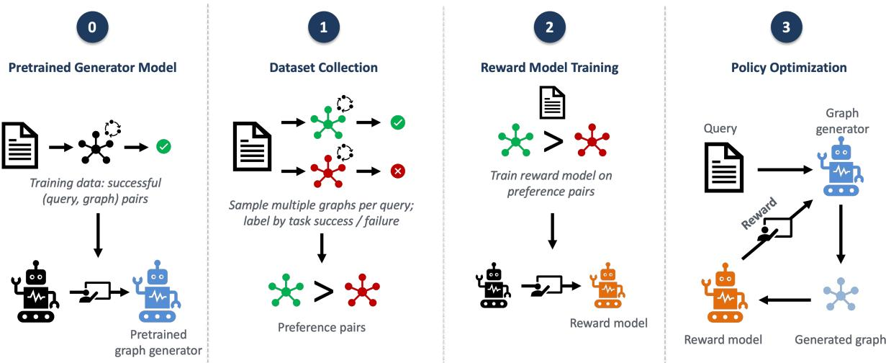

# Reward-Guided Autoregressive Graph Generation for Efficient Multi-Agent Communication Topology Design

Poomphob Suwannapichat1 Boonyarit Changaival2 Caesar Wu1 Pascal Bouvry1

1University of Luxembourg, Luxembourg

2King Mongkut’s University of Technology Thonburi, Thailand

{poomphob.suwannapichat,pascal.bouvry}@uni.lu

caesar.wu@ext.uni.lu

boonyarit.chang@kmutt.ac.th

## Abstract

LLM-based Multi-Agent Systems (MAS) achieve strong performance on complex reasoning tasks by coordinating multiple agents, but at the cost of substantial token consumption. Recent work on automatic topology design, ARG-Designer, has reframed this problem as autoregressive graph generation. However, its training objective provides no explicit incentive for the model to generate sparse and efficient topologies. We address this limitation by introducing a Reward-Guided Autoregressive Graph Generation (RGA-Designer) inspired by Reinforcement Learning from Human Feedback (RLHF). We train a reward model that jointly captures task correctness and structural compactness, and then fine-tune the pretrained graph generator using the reward model as feedback. Our method preserves task accuracy at the level of ARG-Designer while reducing token consumption by an average of 20.5%.

## 1 Introduction

Large Language Models (LLMs) have recently addressed many problems that were considered challenging in the Natural Language Processing (NLP) domain. By framing other tasks in natural language, LLMs can be adapted to a wide array of applications, frequently achieving surprisingly strong performance. Nevertheless, LLMs still make mistakes, particularly in complex tasks such as reasoning (Song et al., 2026). The reasoning capabilities of LLMs remain a subject of active debate. Because these models are fundamentally optimized for next-token prediction, it is difficult to claim that they truly reason rather than verbosely produce sequences of tokens that are likely to follow a given context (Dziri et al., 2023). Several workarounds have been proposed to mitigate this issue, including chain-of-thought prompting (Wei et al., 2022) and self-verification (Weng et al., 2023). Although these techniques do not address the root cause of the reasoning limitation, they have been shown to substantially extend the practical performance of LLMs on complex tasks.

LLM-based Multi-Agent Systems (MAS) represent another such workaround, in which multiple LLMs collaborate to solve complex problems. By assigning each LLM a specialized role, such as planner, coder, or critic, and orchestrating their interactions, MAS consistently achieve stronger performance than single-LLM baselines. However, MAS also increases inference cost as a tradeoff for the improved performance. In static MAS, even simple tasks are processed through the same multi-step pipeline as complex ones, despite often being solvable with a single LLM inference. To make MAS architecture more dynamic, many existing works start from a predefined communication topology and either prune less important components or apply modifications to optimize it for each query (Zhang et al., 2025a; Wang et al., 2025; Zhang et al., 2025b). ARG-Designer (Li et al., 2026) adopts a different perspective, employing an autoregressive graph generator that constructs topologies from scratch. This design enables the topologies to be more flexible and is not constrained by predefined templates. However, ARG-Designer trains the graph generator by maximizing the likelihood of topologies seen in the training set; under this objective, the model has no explicit incentive to favour sparser, more efficient structures.

We incorporate a reward-guided training scheme inspired by Reinforcement Learning from Human Feedback (RLHF) (Ouyang et al., 2022) which guides the graph generator toward higher-quality graphs through a learned reward model that accounts for both graph size and task correctness. With this method, the graph generator is no longer restricted to reproducing structures seen during training; instead, it is encouraged to discover sparser topologies while preserving task performance. Our main contributions are as follows:

• We apply reward-guided training schema to autoregressive MAS topology generation, addressing a limitation of likelihood-based objectives that have no incentive for structural compactness.

• We design a graph-level reward model that jointly captures task correctness and structural compactness.

• Across six benchmarks, our approach reduces token consumption by an average of 20.5% over ARG-Designer while preserving task accuracy.

## 2 Related Works

This section first reviews LLM-based multi-agent systems and the evolution of topology design from static structures to learned, task-adaptive configurations. It then introduces Reinforcement Learning from Human Feedback (RLHF), the training paradigm adapted to guide the graph generator. Finally, it discusses Graph Neural Networks (GNNs), which serve as the backbone of the reward model.

## 2.1 LLM-based Multi-Agent Systems

LLM-based Multi-Agent Systems can be formalized as a directed acyclic graph (DAG), where nodes represent LLM agents with specific roles and edges represent information shared between them. The design of the collaboration graph and the selection of agent roles are crucial for the overall performance of a Multi-Agent System.

Early work on MAS has proposed a range of static topologies, including chains, stars, and debate-style configurations (Madaan et al., 2023; Hong et al., 2024; Du et al., 2024; Chan et al., 2024; Zhuge et al., 2024). Other approaches draw inspiration from real-world workflows, such as role decomposition inspired by software development workflows (Qian et al., 2024).

Subsequent works frame the MAS design problem as query-based topology adaptation. Agent-Prune (Zhang et al., 2025a) uses a predefined template as the starting point then defines communication redundancy in MAS and performs pruning on graph edges, achieving performance comparable to dense baselines at a fraction of the inference cost.

AgentDropout (Wang et al., 2025) expands this idea by eliminating low-contribution agents (graph nodes) via adjacency matrix optimization. However, both methods start from a predefined template and learn which nodes or edges to remove. They cannot create unseen structures. Rather than pruning predefined structures, G-Designer (Zhang et al., 2025b) employs a variational graph autoencoder that encodes a template graph topology along with a task-specific virtual node then decodes a taskadaptive graph with sparsity regularization. Although G-Designer goes beyond pruning, it still optimizes within fixed template graphs. ARG-Designer (Li et al., 2026), the direct predecessor of our work, reframes MAS topology design as an autoregressive graph generation task.

The collaboration graph is generated from scratch by iteratively producing nodes and edges until a termination signal is reached. At step $i ,$ the model samples the role of the next agent $v _ { i }$ conditioned on the partial graph $\mathcal { G } _ { < i }$ before step $i ,$ the task query $q ,$ and the available role pool R:

$$
v _ { i } \sim P ( v _ { i } \mid \mathcal { G } _ { < i } , q , \mathcal { R } ) .\tag{1}
$$

If the sampled role corresponds to the special END token, generation terminates. Otherwise, $v _ { i }$ is added to the graph, and the model then determines its incoming edges by sampling the existence of an edge from each previously generated node $v _ { j }$ $( j < i ) \colon$

$$
e _ { j , i } \sim P ( e _ { j , i } \mid v _ { i } , \mathcal { G } _ { < i } , q ) .\tag{2}
$$

The graph generation model is trained using a supervised paradigm: candidate graph $\mathcal { G } _ { i }$ is executed against its training query $q _ { i }$ and only the graph and query pairs that can complete the task correctly will be included in the dataset $\mathcal { D } .$ The graph generation model was trained on the dataset $\mathcal { D }$ in order to maximize the conditional log-likelihood of the ground-truth graphs given the query:

$$
\mathcal { L } ( \theta ) = - \sum _ { ( \mathcal { G } , q ) \in \mathcal { D } } \log P _ { \theta } ( \mathcal { G } | q )\tag{3}
$$

To ensure the sparsity of graph generation, the ARG-Designer training pipeline is separated into two steps: cold start and efficiency fine-tuning. Cold start step lets the model explore diverse topologies by creating graph/query pairs candidates using various well-known structures such as complete graphs and star graphs. The efficiency finetuning step focuses on creating sparse but efficient graphs by including pruned graphs and verified efficient configurations.

## 2.2 Reinforcement Learning from Human Feedback

Reinforcement learning (RL) is a learning paradigm in which a model improves its policy by interacting with an environment and receiving rewards for the actions it takes. Historically, RL has been mostly applied in robotics and control, where an agent performs actions in a physical environment, observes the resulting reward signal, and adjusts its policy to maximize long-term return. Recently, RL has driven one of the most significant breakthroughs in language modeling: the development of ChatGPT. Beyond pre-training on a large text corpus for next-token prediction, ChatGPT incorporates human preferences to align its outputs with what users find helpful and appropriate. Human annotators are presented with pairs of candidate responses and asked to indicate which one is preferred. The resulting preference dataset is used to train a reward model, which learns to assign a score to a given response that is consistent with human judgment. The LLM is then fine-tuned via reinforcement learning, using the reward model as a proxy for human feedback to refine its output policy. This procedure is known as Reinforcement Learning from Human Feedback (RLHF) (Ouyang et al., 2022).

## 2.3 Graph Neural Networks

Graphs are widely used to represent relational data in many applications, including social network analysis, knowledge graphs, and information exchange in LLM-based Multi-Agent Systems. However, due to the nature of graph data, mapping graphs into numerical representations suitable for downstream analysis remains a challenging problem. The process of producing such numerical representations is referred to as graph embedding. Early graph embedding methods adapted objectives from word embedding in the natural language processing (NLP) domain. An embedding model is trained to predict masked nodes in node sequences obtained by traversing the graph through random walks (Perozzi et al., 2014; Grover and Leskovec, 2016). However, these approaches cannot generalize to unseen nodes without re-running the embedding procedure on the new graph.

To enable graph embedding models to generalize to unseen graph structures without retraining, the framework of Message Passing Neural Networks (MPNNs) was introduced (Gilmer et al., 2017). Each node is initialized with a feature vector, which can either be drawn at random or derived from node metadata. At each layer, every node sends a message to its direct neighbours; the receiving node then aggregates the incoming messages and uses them to update its own embedding. By stacking multiple MPNN layers, information can be propagated beyond direct neighbours to nodes that are several hops away. Building on this foundation, most modern graph embedding models are fundamentally constructed on the message-passing paradigm (Scarselli et al., 2009; Kipf and Welling, 2017; Hamilton et al., 2017).

## 3 Problem Definition

We represent a multi-agent system (MAS) as a directed acyclic graph $\mathcal { G } = ( \nu , \mathcal { E } )$ that captures the interactions between agents in the system. Each node $v _ { i } \in \mathcal V$ corresponds to an LLM-based agent augmented with a predefined role prompt $R _ { i } \in \mathcal R$ which specifies its function and expertise. A directed edge $( v _ { i } , v _ { j } ) \in \mathcal { E }$ indicates that agent $v _ { i }$ forwards its output mi as a textual message to agent $v _ { j }$ . To invoke agent $v _ { i } ,$ the input prompt is assembled using template $f _ { T }$ from three components: the role prompt $R _ { i } .$ , the user query $q ,$ and the set of messages $\{ m _ { j } \mid ( v _ { j } , v _ { i } ) \in \mathcal { E } \}$ received from its direct predecessors, as formalized in Eq. 4.

$$
m _ { i } = \mathrm { L L M } \Big ( f _ { T } ( R _ { i } , q , \{ m _ { j } | ( v _ { j } , v _ { i } ) \in \mathcal { E } \} ) \Big )\tag{4}
$$

To get the final answer of MAS, each agent $v _ { i } \in \mathcal V$ is executed in topological order of graph $\mathcal { G }$ using Eq. 4 to produce its message mi, and then aggregating the outputs of the terminal agents into a final answer:

$$
\hat { a } = \operatorname { A g g r e g a t e } ( \{ m _ { i } \mid v _ { i } \in \mathcal { V } _ { \mathrm { o u t } } \} ) ,\tag{5}
$$

where $\mathcal { V } _ { \mathrm { o u t } } \subseteq \mathcal { V }$ denotes the set of output agents. The task-completion indicator is then obtained by comparing aˆ to the ground-truth answer $a ^ { \star }$ :

$$
c ( \mathcal { G } , q ) = \left\{ \begin{array} { l l } { 1 , } & { \mathrm { i f } \hat { a } = a ^ { \star } , } \\ { 0 , } & { \mathrm { o t h e r w i s e } . } \end{array} \right.\tag{6}
$$

The goal of the MAS designer model $\pi _ { \theta }$ is to generate a graph structure ${ \mathcal { G } } \sim \pi _ { \theta } ( { \mathcal { G } } \mid q )$ from a given task query q that successfully completes the

task with the smallest possible structure as shown in following constrained objective:

$$
\begin{array} { r l } { \underset { \theta } { \operatorname* { m i n } } } & { \mathbb { E } _ { q , \mathcal { G } \sim \pi _ { \theta } ( \mathcal { G } | q ) } \bigg [ \lambda _ { \mathcal { V } } | \mathcal { V } | + \lambda _ { \mathcal { E } } | \mathcal { E } | \bigg ] } \\ & { \mathrm { s . t . } \quad c ( \mathcal { G } , q ) = 1 } \end{array}\tag{7}
$$

where $| \nu |$ and $| \mathcal { E } |$ are the number of agents and edges in ${ \mathcal { G } } ,$ and $\lambda _ { \mathcal { V } } , \lambda _ { \mathcal { E } } \ \geq \ 0$ control the relative penalty on agent count and communication links.

## 4 Method

We propose Reward-Guided Autoregressive Graph Generator (RGA-Designer), which applies the idea of RLHF to the graph generation model, guiding it to produce graphs that can complete the task while keeping the graph structure as compact as possible. Because graph quality is programmatically verifiable, we replace human feedback with explicit rule-based rewards that favor smaller, successful graphs. Our setup falls within the broader paradigm of Reinforcement Learning with Verifiable Rewards (RLVR) (Shao et al., 2024), where an automated reward signal is provided in place of human annotation.

An overview of RGA-Designer is illustrated in Figure 1. Our pipeline consists of three stages, preceded by a prerequisite pretraining stage inherited from ARG-Designer. (0) Pretrained Generator Model: following ARG-Designer, an autoregressive graph generator is trained on query/graph pairs. (1) Dataset Collection: for each task query, candidate graphs are sampled and labeled as successful or failed by executing them on the underlying MAS topology; the resulting samples are then organized into preference pairs. (2) Reward Model Training: a graph-level reward model is trained on the preference pairs, learning to assign higher scores to graphs that are both correct and compact. (3) Policy Optimization: the pretrained generator is fine-tuned with policy optimization, where the reward model guides the policy toward generating graphs with higher task success and lower structural complexity.

## 4.1 Dataset collections

We construct the dataset by executing LLMs over candidate graph structures and recording whether each structure successfully completes the task. However, we retain not only the samples that complete the task but also those that fail, since both are informative for training the reward model. Graphs are generated using the pretrained ARG-Designer model with varying sampling temperatures. Due to the autoregressive nature of ARG-Designer, multiple distinct graphs $\{ \mathcal { G } _ { 1 } ^ { ( n ) } , \mathcal { G } _ { 2 } ^ { ( n ) } , \dots , \mathcal { G } _ { M } ^ { ( \bar { n } ) } \}$ can be sampled from a single query $q ^ { ( n ) }$ . To further reduce the data collection cost, we additionally include the training samples from both the cold-start and fine-tuning stages of ARG-Designer; since these graph/query pairs have already been executed during ARG-Designer training, incorporating them into our dataset incurs no additional cost.

Each training sample $s _ { i } ^ { ( n ) }$ for the reward model is represented as a triplet $( \mathcal { G } _ { i } ^ { ( n ) } , q ^ { ( n ) } , r _ { i } ^ { ( n ) } )$ . Every graph $\mathcal { G } _ { i } ^ { ( n ) } = ( \gamma _ { i } ^ { ( n ) } , \mathcal { E } _ { i } ^ { ( n ) } )$ is executed on the agentic system with query ${ \bf \chi } _ { q } ^ { ( n ) }$ , and its output is compared against the ground truth, yielding a binary completion flag $c _ { i } ^ { ( n ) } = c ( \mathcal { G } _ { i } ^ { ( n ) } , q ^ { ( n ) } )$ . The groundtruth reward for the sample is then computed as:

$$
\begin{array} { r } { r _ { i } ^ { ( n ) } = \lambda _ { c } c _ { i } ^ { ( n ) } + \lambda \nu \operatorname* { m a x } \left( 0 , \frac { \mathcal { V } _ { \operatorname* { m a x } } - | \mathcal { V } _ { i } ^ { ( n ) } | } { \mathcal { V } _ { \operatorname* { m a x } } - 1 } \right) } \\ { + \lambda \varepsilon \mathrm { c l i p } _ { [ 0 , 1 ] } \left( \frac { \mathcal { E } _ { \operatorname* { m a x } } - | \mathcal { E } _ { i } ^ { ( n ) } | } { \mathcal { E } _ { \operatorname* { m a x } } - \mathcal { E } _ { \operatorname* { m i n } } } \right) } \end{array}\tag{8}
$$

where $\lambda _ { c } , \lambda _ { \mathcal { V } }$ , and $\lambda \varepsilon$ are hyperparameters that weight task completeness, agent count, and edge count, respectively. $\mathcal { V } _ { m a x }$ denotes the maximum number of agents allowed for each dataset (inherited from ARG-Designer), while $\mathcal { E } _ { m i n } = | \mathcal { V } | - 1$ and $\begin{array} { r } { \mathcal { E } _ { m a x } = \frac { | \mathcal { V } | ( | \mathcal { V } | - 1 ) } { 2 } } \end{array}$ correspond to the minimum and maximum possible edge counts for a connected graph of size |V|. The reward $r _ { i } ^ { ( n ) }$ is designed to lie in the range [0, 1], with the weights $\lambda _ { c } , \lambda _ { \mathcal { V } }$ , and $\lambda _ { \mathcal { E } }$ summing to 1. The choice of weights reflects a hierarchy in our design objective: task completion is treated as the dominant criterion $( \lambda _ { c } = 0 . 6 )$ while structural compactness serves as a secondary preference $( \lambda _ { \mathscr { V } } = 0 . 3 , \lambda _ { \mathscr { E } } = 0 . 1 )$ . As a result, a candidate that fails to complete the task is penalized more than a candidate that succeeds but uses an inefficient topology, ensuring that correctness is never traded for sparsity.

To train the reward model within the RLHF framework, sample pairs must be constructed. Let $S ^ { ( n ) }$ denote the set of training pairs associated with query $q ^ { ( n ) }$ . The pairs in $S ^ { ( n ) }$ are formed from all possible combinations, subject to two filtering conditions. First, at least one sample in each pair must successfully complete the task, as comparing two graphs that both fail provides little useful signal about graph quality. Second, the reward difference between the two samples must exceed a predefined margin δ (initially set to 0.05):

  
Figure 1: Overview of our reward-guided pipeline for MAS topology generation.

$$
S ^ { ( n ) } = \{ ( s _ { i } , s _ { j } ) \mid c _ { i } = 1 \land r _ { i } - r _ { j } > \delta \}\tag{9}
$$

where the indices i and $j$ range over the candidate samples collected for query $q ^ { ( n ) }$

## 4.2 Reward Model

The reward model $r _ { \theta }$ is a graph neural network that scores a candidate graph $\mathcal { G } = ( \nu , \mathcal { E } )$ conditioned on a task query $q .$ To inject both task semantic and graph structure into the encoder, we construct each node feature vector $x _ { i }$ as the concatenation of three components:

$$
x _ { i } = \left[ z _ { r _ { i } } \parallel z _ { q } \parallel \phi _ { i } \right]\tag{10}
$$

where $z _ { r _ { i } }$ is the role embedding of agent $v _ { i } , \quad z _ { q }$ is the task query embedding. Both embeddings are retrieved from sentence-transformers/all-MiniLM-L6-v2 sentence encoder, yielding $z _ { r _ { i } } , z _ { q } \in \mathbb { R } ^ { 3 8 4 } . \ \phi _ { i } \in \mathbb { R } ^ { 5 }$ is a vector of structural features comprising the graph size, edge count, generation-order position, in-degree, and out-degree. The graph is encoded by two GraphSAGE layers (Hamilton et al., 2017) with residual connections and layer normalization. For each layer $\ell \in \{ 1 , 2 \}$

$$
\begin{array} { r } { h _ { i } ^ { ( \ell ) } = \mathrm { R e L U } \Big ( \mathrm { L N } \big ( \mathrm { S A G E } ^ { ( \ell ) } ( h ^ { ( \ell - 1 ) } , \mathcal { E } ) _ { i } \big ) \Big ) } \\ { + W _ { \mathrm { r e s } } ^ { ( \ell ) } h _ { i } ^ { ( \ell - 1 ) } } \end{array}\tag{11}
$$

where $h _ { i } ^ { ( 0 ) } = x _ { i }$ , and $W _ { \mathrm { r e s } } ^ { ( \ell ) }$ is a learnable projection for the residual. A graph-level embedding is then

obtained by global mean pooling over all nodes, and a scalar reward is produced by a two-layer MLP head:

$$
r _ { \theta } ( \mathcal { G } , q ) = \mathrm { M L P } \left( \frac { 1 } { | \mathcal { V } | } \sum _ { i \in \mathcal { V } } h _ { i } ^ { ( 2 ) } \right)\tag{12}
$$

Given the preference pairs $S ^ { ( n ) }$ , the reward model is trained with the Bradley-Terry pairwise ranking objective (Bradley and Terry, 1952):

$$
\begin{array} { r } { \mathcal { L } _ { r } ^ { ( n ) } = - w _ { c , r } \log \sigma \Big ( r _ { \theta } ( \mathcal { G } _ { c } ^ { ( n ) } , q ^ { ( n ) } ) } \\ { - r _ { \theta } ( \mathcal { G } _ { r } ^ { ( n ) } , q ^ { ( n ) } ) \Big ) } \end{array}\tag{13}
$$

where ${ \mathcal G } _ { c } ^ { ( n ) }$ and ${ \mathcal G } _ { r } ^ { ( n ) }$ denote the graphs of the chosen and rejected samples, respectively, and $w _ { c , r } \in ( 0 , 1 ]$ is a per-pair weight that down-scales pairs carrying less informative signal. In particular, pairs in which both samples successfully complete the task (pass/pass pairs) convey only graph-size information, yet account for roughly 80–90% of the training data. We therefore set $w _ { c , r } = 1$ for pass/fail pairs and $w _ { c , r } = \lambda _ { p , p }$ for pass/pass pairs, where $\lambda _ { p , p }$ is initially set to 0.1.

An additional benefit of training a reward model is that its training data can be shared across datasets. Because each (query, graph) pair is encoded into a latent vector $x _ { i }$ before being scored (Eq. 10), the reward model can seamlessly accommodate samples containing unseen agent roles. In contrast, ARG-Designer’s node generator (Eq. 1) explicitly conditions on the role pool R to score role candidates, meaning that any sample introducing a new role would require extending the node generator’s classification head and retraining the model.

## 4.3 Policy optimization

Having trained reward model $r _ { \theta }$ , we then fine-tune graph generator policy $\pi _ { \theta }$ to generate graphs that produce high reward $\hat { r }$ while remaining close to the pre-trained ARG-Designer reference model $\pi _ { \mathrm { r e f } }$ We adopt an on-policy variant of Group Relative Policy Optimization (GRPO) (Shao et al., 2024) for policy optimization.

Given the group of graph rewards $\{ \hat { r } _ { 1 } ^ { ( n ) } , \dots , \hat { r } _ { G } ^ { ( n ) } \}$ for query $q ^ { ( n ) }$ , the advantage $\hat { A } _ { i } ^ { ( n ) }$ for each candidate graph is computed by normalizing its reward as shown in Eq. 14, where $\mu _ { r } ^ { ( n ) }$ is the group mean, $\sigma _ { r } ^ { ( n ) }$ is the group standard deviation. The denominator is lower-bounded by $\sigma _ { \mathrm { m i n } } = 0 . 0 1$

$$
\hat { A } _ { i } ^ { ( n ) } = \frac { \hat { r } _ { i } ^ { ( n ) } - \mu _ { r } ^ { ( n ) } } { \operatorname* { m a x } \left( { \sigma _ { r } ^ { ( n ) } , \sigma _ { \mathrm { m i n } } } \right) }\tag{14}
$$

The graph generator policy $\pi _ { \theta }$ is trained to maximize the advantage signal while constraining the generated distribution to remain close to the reference model $\pi _ { \mathrm { r e f } }$ , as defined by the following objective:

$$
\begin{array} { r } { \mathcal { L } _ { \pi } ( \mathcal { G } _ { i } , q \mid \theta ) = - \hat { A } _ { i } \cdot \log \pi _ { \theta } ( \mathcal { G } _ { i } \mid q ) } \\ { + \beta \cdot \log \frac { \pi _ { \theta } ( \mathcal { G } _ { i } \mid q ) } { \pi _ { \mathrm { r e f } } ( \mathcal { G } _ { i } \mid q ) } } \end{array}\tag{15}
$$

where $\hat { A } _ { i }$ is the group-relative advantage from Eq. 14, and $\beta$ is a hyperparameter controlling the strength of the Kullback-Leibler (KL) regularization. Since we can draw a fresh group of $\mathcal { G }$ graphs from the current policy $\pi _ { \theta }$ at every update step, the standard GRPO importance ratio $\rho _ { i }$ equals 1 when the gradient is calculated. Consequently, $\rho _ { i }$ and the GRPO clipping term can be omitted.

## 5 Experiments

We evaluate our method on the same six benchmarks (Cobbe et al., 2021; Ling et al., 2017; Roy and Roth, 2015; Patel et al., 2021; Hendrycks et al., 2021; Chen et al., 2021) used by ARG-Designer (Li et al., 2026), summarized in Table 1. Each dataset was randomly divided into training, fine-tuning, and testing sets, consisting of 15, 25, and the remaining samples (capped at 500).

To ensure the stability of our results, every experiment is repeated over 10 independent runs, and we report the mean and standard deviation across runs. We benchmark our approach against five baselines: (1) Vanilla, which relies on a single LLM call; (2) G-Designer (Zhang et al., 2025b); (3) AgentPrune (Zhang et al., 2025a); (4) Agent-Dropout (Wang et al., 2025); and (5) ARG or ARG-Designer (Li et al., 2026), the direct predecessor of our method.

Table 1: Summary of the six evaluation benchmarks used in our experiments. #Test denotes the number of test instances sampled from each dataset for evaluation.
<table><tr><td>Category</td><td>Dataset</td><td>#Test</td><td>Metric</td></tr><tr><td>Mathematical</td><td>GSM8K</td><td>500</td><td>Accuracy</td></tr><tr><td rowspan="3">reasoning</td><td>AQuA</td><td>214</td><td>Accuracy</td></tr><tr><td>MultiArith</td><td>500</td><td>Accuracy</td></tr><tr><td>SVAMP</td><td>500</td><td>Accuracy</td></tr><tr><td>General reasoning</td><td>MMLU</td><td>500</td><td>Accuracy</td></tr><tr><td>Code generation</td><td>HumanEval</td><td>121</td><td>Pass@1</td></tr></table>

Since MAS execution requires multiple LLM inferences and a long context window to support information exchange between agents, we adopt the open-source lightweight model Qwen3-4B (Yang et al., 2025) as the underlying LLM in this work. Qwen3-4B can be served on a single NVIDIA Tesla V100 GPU with 16 GB of VRAM handling long context lengths without running out of memory, making it well-suited for our multi-agent setting. We also disable Qwen3’s thinking mode to reduce the number of completion tokens generated per inference.

As our reward model can be trained on graphs containing unseen roles (Section 4.2), we train a single global reward model on a combined preference dataset from all six benchmarks. This unified reward model is then used to supervise policy optimization across every benchmark. Furthermore, to ensure that the best topology is selected at inference time, we adopt a Best-of-N (BoN) generation scheme: the policy samples N (set $N = 5$ in our experiments) candidate graphs for each task query, and the candidate with the highest reward scored by the reward model is chosen as the final topology. Note that both the sampling and scoring steps are performed by the topology designer, not by an LLM. The overhead of BoN is negligible compared to LLM calls. To assess whether our results differ significantly in terms of both accuracy and token usage, we apply Welch’s t-test (Welch, 1947), which tests for a difference in means between two distributions.

Table 2: Task accuracy (%) across six benchmarks, reported as mean ± standard deviation over 10 runs.
<table><tr><td>Benchmark</td><td>Vanilla</td><td> $\mathrm { G } { \cdot } \mathrm { D e s i g n e r }$ </td><td></td><td>AgentPrune AgentDropout</td><td>ARG</td><td>RGA (Our)</td></tr><tr><td>GSM8K</td><td> $8 2 . 6 8 { \pm } 0 . 7 2 $ </td><td> $8 6 . 9 8 { \pm } 0 . 6 5$ </td><td> $8 8 . 0 0 { \pm } 1 . 5 9 $ </td><td> $\mathbf { 8 9 . 0 8 { \pm 1 . 2 6 } }$ </td><td> $8 8 . 3 6 { \pm } 1 . 0 4 $ </td><td> $8 8 . 7 6 { \pm } 0 . 6 6$ </td></tr><tr><td>AQuA</td><td> $7 6 . 8 7 { \pm } 1 . 2 1 $ </td><td> $8 3 . 3 5 { \pm } 1 . 8 6 $ </td><td> $8 2 . 9 0 { \pm } 1 . 0 8 $ </td><td> $\mathbf { 8 3 . 4 1 \pm 1 . 8 6 }$ </td><td> $8 1 . 6 4 { \pm } 1 . 5 6$ </td><td> $8 2 . 1 0 { \pm } 3 . 8 9$ </td></tr><tr><td>MultiArith</td><td> $9 7 . 5 6 { \pm } 0 . 2 3 $ </td><td> $9 7 . 9 6 { \pm } 0 . 0 8 $ </td><td> $9 8 . 0 2 { \pm } 0 . 3 5 $ </td><td> $9 7 . 8 8 { \pm } 0 . 3 3 $ </td><td> ${ \bf 9 8 . 4 6 { \pm 0 . 1 3 } }$ </td><td> $9 8 . 4 4 { \pm } 0 . 2 3 $ </td></tr><tr><td>SVAMP</td><td> $9 0 . 2 0 { \scriptstyle \pm 0 . 2 7 }$ </td><td> $9 4 . 2 8 { \pm } 0 . 2 1 $ </td><td> $9 4 . 8 0 { \pm } 0 . 8 4 \ $ </td><td> $9 4 . 5 4 { \pm } 0 . 3 8 $ </td><td> $\mathbf { 9 4 . 9 8 { \pm } 0 . 8 5 }$ </td><td> $9 4 . 5 2 { \pm } 0 . 4 9$ </td></tr><tr><td>HumanEval</td><td> $7 3 . 2 2 { \pm } 2 . 1 4$ </td><td> $8 0 . 0 8 { \pm } 1 . 2 9 $ </td><td> $8 2 . 2 3 { \pm } 2 . 9 0 $ </td><td> $8 1 . 6 5 { \pm } 3 . 6 7$ </td><td> $8 2 . 5 6 { \pm } 1 . 7 6$ </td><td> $\mathbf { 8 3 . 2 2 \pm 1 . 9 5 }$ </td></tr><tr><td>MMLU</td><td> $7 1 . 2 8 { \pm } 0 . 7 8$ </td><td> $6 0 . 4 6 { \pm } 1 . 0 6 $ </td><td> $7 9 . 7 4 \pm 1 . 4 9$ </td><td> $\mathbf { 7 9 . 8 6 { \pm } 1 . 3 3 }$ </td><td> $7 9 . 3 2 { \pm } 0 . 9 1 $ </td><td> $7 9 . 7 8 { \pm } 1 . 2 7$ </td></tr><tr><td>Average</td><td> $8 1 . 9 7 { \pm } 0 . 5 6 $ </td><td> $8 3 . 8 5 { \pm } 0 . 5 2 $ </td><td> $8 7 . 6 1 { \pm } 0 . 6 8 $ </td><td> $8 7 . 7 4 { \pm } 0 . 6 4$ </td><td> $8 7 . 5 5 { \pm } 0 . 4 9$ </td><td> $\mathbf { 8 7 . 8 0 { \pm } 0 . 6 0 }$ </td></tr></table>

Table 3: Average tokens usage per task across six benchmarks, reported as mean ± standard deviation over 10 runs (rounded to integer). Best results among MAS methods (excluding the Vanilla baseline) are in bold.
<table><tr><td>Benchmark</td><td></td><td></td><td></td><td>Vanilla G-Designer AgentPrune AgentDropout</td><td>ARG</td><td>RGA (Our)</td></tr><tr><td>GSM8K</td><td> $2 2 4 \pm 1 0$ </td><td> $6 1 0 4 \pm 1 2$ </td><td> $5 6 9 4 \pm 1 1 8$ </td><td> $6 4 4 7 \pm 4 4 1$ </td><td> $4 5 4 6 \pm 2 7 5$ </td><td> ${ \bf 3 8 6 3 \pm 1 9 5 }$ </td></tr><tr><td>AQuA</td><td> $5 0 9 \pm 9 7$ </td><td> $9 1 3 4 \pm 6 7$ </td><td> $5 7 1 0 \pm 2 6 3$ </td><td> $5 5 3 5 \pm 2 6 6$ </td><td> $3 9 1 4 \pm 1 6 2$ </td><td> ${ \bf 2 6 3 3 \pm 1 9 1 }$ </td></tr><tr><td>MultiArith</td><td> $1 3 5 \pm 0$ </td><td> $5 3 4 7 \pm 1 0$ </td><td> $4 9 9 7 \pm 1 4 7$ </td><td> $5 6 4 4 \pm 4 5 4$ </td><td> $2 8 2 4 \pm 1 1$ </td><td> ${ \bf 2 7 5 4 } \pm { \bf 5 0 7 }$ </td></tr><tr><td>SVAMP</td><td> $1 4 2 \pm 1 0$ </td><td> $5 2 4 2 \pm 1 2$ </td><td> $4 9 2 1 \pm 8 4$ </td><td> $5 7 4 8 \pm 4 7 1$ </td><td> $3 8 1 6 \pm 2 9 0$ </td><td> $3 3 4 9 \pm 4 4 6$ </td></tr><tr><td>HumanEval</td><td> $2 6 2 \pm 1$ </td><td> $2 8 5 1 \pm 2 3$ </td><td> $3 0 4 3 \pm 1 3 3$ </td><td> $2 6 5 9 \pm 1 2 2$ </td><td> $2 2 3 8 \pm 1 1 9$ </td><td> ${ \bf 1 7 1 5 \pm 8 8 }$ </td></tr><tr><td>MMLU</td><td> $2 0 8 \pm 1 6$ </td><td> $1 0 4 9 8 \pm 4 7$ </td><td> $1 1 0 3 0 \pm 1 3 8 8$ </td><td> $8 3 5 3 \pm 1 3 5 3$ </td><td> $5 5 5 4 \pm 7 9 8$ </td><td> ${ \bf 3 8 7 5 \pm 5 3 8 }$ </td></tr><tr><td>Average</td><td> $2 4 7 \pm 1 8$ </td><td> $6 5 2 9 \pm 1 3$ </td><td> $5 8 9 9 \pm 2 5 8$ </td><td> $5 7 3 1 \pm 2 5 1$ </td><td> $3 8 1 5 \pm 1 2 4$ </td><td> ${ \bf 3 0 3 2 } \pm { \bf 2 0 5 }$ </td></tr></table>

Table 2 and Table 3 report task accuracy and token usage for each method, while Table 4 summarizes the p-values from Welch’s t-test comparing our RGA-Designer against other baselines. In terms of accuracy, RGA-Designer yields minor improvements on several benchmarks; however, Welch’s t-test indicates that most of these differences are statistically insignificant (whether improvements or degradations). According to Table 4, none of the accuracy degradation is significant. In contrast, RGA-Designer delivers a substantial reduction in token usage, as clearly shown in Table 3 and confirmed by the corresponding p-values in Table 4. Token reduction is statistically significant on every benchmark except MultiArith when compared with ARG-Designer.

(mathematical reasoning), HumanEval (code generation), and MMLU (general reasoning). The full method achieves the lowest token consumption. It also yields minor accuracy improvements on GSM8K and HumanEval, with the only exception being MMLU, where w/o BoN achieves the highest accuracy. However, this slightly higher accuracy on MMLU comes at a substantial cost in token consumption which uses 30.5% more tokens than the full method.

## 6 Conclusion and Discussion

We further investigate why MultiArith is the only benchmark that does not yield a significant token reduction. Questions in MultiArith are generated from predefined templates, with new numerical values substituted. As a result, the questions exhibit limited linguistic variation and can be solved with simple topologies, leaving little structural redundancy for RGA-Designer to compress. In contrast, the other benchmarks contain more diverse naturallanguage questions whose solutions benefit from optimal collaboration structures, providing a larger margin for RGA-Designer to optimize the topology.

Table 5 reports the ablation study on three benchmarks, one from each task category: GSM8K

In this work, we introduce RGA-Designer, a reward-guided training scheme that addresses a key limitation of ARG-Designer’s original supervised objective that has no explicit incentive for the model to generate compact topologies. Building on the autoregressive graph generation paradigm, we employ a learned reward model to provide feedback to the graph generator, optimizing it to produce graphs that are sparse but still functional.

Across all benchmarks, RGA-Designer preserved task accuracy with no statistical differences, while achieving a substantial reduction in token consumption: on average, 20.5% fewer tokens than ARG-Designer and reaching statistical significance on five of six benchmarks. The single exception, MultiArith, is a templated dataset that contains limited linguistic variation, leaving little redundancy for our method to compress. Beyond the efficiency results, our framework offers an additional benefit. Because the reward model scores graphs in embedding space, its training data can be reused across datasets without architectural changes. In contrast, ARG-Designer’s node generator conditions directly on the role pool R, so introducing new agent roles requires extending the role classification head and retraining the generator.

Table 4: Welch t-test p-values of RGA-Designer against each benchmark. Bold marks $p < 0 . 0 5$ . Arrows give the direction of the difference: for accuracy ↑ favours RGA-Designer, for token usage ↓ favours RGA-Designer.
<table><tr><td>Comparison</td><td>GSM8K</td><td>AQuA</td><td>MultiArith</td><td>SVAMP</td><td>HumanEval</td><td>MMLU</td></tr><tr><td>Accuracy</td><td></td><td></td><td></td><td></td><td></td><td></td></tr><tr><td>G-Designer</td><td>&lt;0.001↑</td><td>0.376↓</td><td>&lt;0.001↑</td><td>0.180↑</td><td>&lt;0.001↑</td><td>&lt;0.001↑</td></tr><tr><td>AgentPrune</td><td>0.188↑</td><td>0.544↓</td><td>0.006↑</td><td>0.377↓</td><td>0.384↑</td><td>0.949↑</td></tr><tr><td>AgentDropout</td><td>0.489↓</td><td>0.354↓</td><td>&lt;0.001↑</td><td>0.920↓</td><td>0.252↑</td><td>0.892↓</td></tr><tr><td>ARG-Designer</td><td>0.320↑</td><td>0.735↑</td><td>0.814↓</td><td>0.160↓</td><td>0.437↑</td><td>0.365↑</td></tr><tr><td>Token usage</td><td></td><td></td><td></td><td></td><td></td><td></td></tr><tr><td>G-Designer</td><td>&lt;0.001↓</td><td> ${ \bf < 0 . 0 0 1 } \mathrm { \downarrow }$ </td><td> ${ \bf < 0 . 0 0 1 } \downarrow$ </td><td> ${ \bf < 0 . 0 0 1 \downarrow }$ </td><td> ${ \bf < 0 . 0 0 1 \downarrow }$ </td><td> ${ \bf < 0 . 0 0 1 } \downarrow$ </td></tr><tr><td>AgentPrune</td><td> ${ \bf < 0 . 0 0 1 } \mathrm { \downarrow }$ </td><td> $\mathbf { \left. < 0 . 0 0 1 \right.}  $ </td><td>&lt;0.001↓</td><td> ${ \bf < 0 . 0 0 1 } \mathrm { \downarrow }$ </td><td>&lt;0.001↓</td><td>&lt;0.001↓</td></tr><tr><td>AgentDropout</td><td> ${ \bf < 0 . 0 0 1 } \downarrow$ </td><td> $\mathbf { < 0 . 0 0 1 } \downarrow$ </td><td> ${ \bf < 0 . 0 0 1 } \downarrow$ </td><td> ${ \bf < 0 . 0 0 1 \downarrow }$ </td><td>&lt;0.001↓</td><td> ${ \bf < 0 . 0 0 1 } \mathrm { \downarrow }$ </td></tr><tr><td>ARG-Designer</td><td> ${ \bf < 0 . 0 0 1 } \mathrm { \downarrow }$ </td><td> $\mathbf { < 0 . 0 0 1 } \mathrm { . }$ </td><td>0.673↓</td><td>0.014↓</td><td>&lt;0.001↓</td><td> ${ \bf < 0 . 0 0 1 } \mathrm { \downarrow }$ </td></tr></table>

Table 5: Ablation study on three settings. Full is our complete method; w/o RM removes the global reward model; w/o BoN removes Best-of-N selection. w/o both removes both components. Results are reported as mean ± standard deviation over 10 runs.
<table><tr><td rowspan="2"></td><td colspan="2">GSM8K</td><td colspan="2">HumanEval</td><td colspan="2">MMLU</td></tr><tr><td>Acc.↑</td><td> $\mathrm { T o k . \downarrow }$ </td><td> $\operatorname { A c c . \uparrow }$ </td><td> $\mathrm { T o k . \downarrow }$ </td><td> $\operatorname { A c c . \uparrow }$ </td><td> $\mathrm { T o k . \downarrow }$ </td></tr><tr><td>ARG-Designer</td><td> $8 8 . 3 6 \pm 1 . 0 4$ </td><td> $4 5 4 6 \pm 2 7 5$ </td><td> $8 2 . 5 6 \pm 1 . 7 6$ </td><td> $2 2 3 8 \pm 1 1 9$ </td><td> $7 9 . 3 2 \pm 0 . 9 1$ </td><td> $5 5 5 4 \pm 7 9 8$ </td></tr><tr><td>Full</td><td> ${ \bf 8 8 . 7 6 \pm 0 . 6 6 }$ </td><td> ${ \bf 3 8 6 3 \pm 1 9 5 }$ </td><td> ${ \bf 8 3 . 2 2 \pm 1 . 9 5 }$ </td><td> ${ \bf 1 7 1 5 \pm 8 8 }$ </td><td> $7 9 . 7 8 \pm 1 . 2 7$ </td><td> ${ \bf 3 8 7 5 \pm 5 3 8 }$ </td></tr><tr><td>w/o RM</td><td> $8 8 . 7 2 \pm 0 . 9 9$ </td><td> $4 1 6 6 \pm 5 2 2$ </td><td> $8 2 . 4 0 \pm 2 . 1 7$ </td><td> $1 8 3 9 \pm 1 1 6$ </td><td> $7 9 . 4 2 \pm 1 . 1 8$ </td><td> $5 2 8 8 \pm 8 8 9$ </td></tr><tr><td>w/o BoN</td><td> $8 8 . 2 8 \pm 0 . 7 6$ </td><td> $4 2 8 1 \pm 2 5 3$ </td><td> $8 1 . 4 9 \pm 2 . 4 5$ </td><td> $1 8 0 5 \pm 1 1 9$ </td><td> ${ \bf 7 9 . 8 4 \pm 0 . 9 4 }$ </td><td> $5 0 5 6 \pm 5 2 7$ </td></tr><tr><td>w/o both</td><td> $8 8 . 7 2 \pm 1 . 1 4$ </td><td> $4 2 0 7 \pm 4 5 1$ </td><td> $8 2 . 6 4 \pm 2 . 0 2$ </td><td> $1 9 0 8 \pm 9 5$ </td><td> $7 8 . 3 6 \pm 0 . 9 6$ </td><td> $5 4 2 5 \pm 4 5 9$ </td></tr></table>

## Limitations

LLM backbone. Due to resource constraints, all experiments use Qwen3-4B as the underlying LLM, and the performance of RGA-Designer against baselines may shift when applied to different models. Our data construction pipeline depends on executing candidate graphs on a specific base LLM in order to label them as successful or failed. Switching to a different base model requires reconstructing the entire training dataset, and supporting heterogeneous MAS in which different agents are powered by different LLMs remains a challenge for our approach.

Reliance on ground-truth labels. While RGA-Designer can adapt topologies on a per-query basis, training the graph generator still requires ground truth. Therefore, our method is applicable to tasks with explicit verifiable answers (e.g., code generation, multiple-choice classification). Extending the framework to open-ended tasks without verifiable ground truth is left to future work.

## Acknowledgment

We express our gratitude to Phatarapran Saraluck for providing valuable feedback for methodology design. The experiments presented in this paper were carried out using the HPC facilities of the University of Luxembourg (Varrette et al., 2022).

## References

Ralph Allan Bradley and Milton E. Terry. 1952. Rank analysis of incomplete block designs: I. the method of paired comparisons. Biometrika, 39(3/4):324– 345.

Chi-Min Chan, Weize Chen, Yusheng Su, Jianxuan Yu, Wei Xue, Shanghang Zhang, Jie Fu, and Zhiyuan Liu. 2024. Chateval: Towards better LLM-based evaluators through multi-agent debate. In The Twelfth International Conference on Learning Representations.

Mark Chen, Jerry Tworek, Heewoo Jun, Qiming Yuan, Henrique Ponde de Oliveira Pinto, Jared Kaplan, Harri Edwards, Yuri Burda, Nicholas Joseph, Greg Brockman, Alex Ray, Raul Puri, Gretchen Krueger,

Michael Petrov, Heidy Khlaaf, Girish Sastry, Pamela Mishkin, Brooke Chan, Scott Gray, and 39 others. 2021. Evaluating large language models trained on code. Preprint, arXiv:2107.03374.

Karl Cobbe, Vineet Kosaraju, Mohammad Bavarian, Mark Chen, Heewoo Jun, Lukasz Kaiser, Matthias Plappert, Jerry Tworek, Jacob Hilton, Reiichiro Nakano, Christopher Hesse, and John Schulman. 2021. Training verifiers to solve math word problems. arXiv preprint arXiv:2110.14168.

Yilun Du, Shuang Li, Antonio Torralba, Joshua B. Tenenbaum, and Igor Mordatch. 2024. Improving factuality and reasoning in language models through multiagent debate. In Proceedings ofthe 41st International Conference on Machine Learning, ICML’24. JMLR.org.

Nouha Dziri, Ximing Lu, Melanie Sclar, Xiang Lorraine Li, Liwei Jiang, Bill Yuchen Lin, Peter West, Chandra Bhagavatula, Ronan Le Bras, Jena D. Hwang, Soumya Sanyal, Sean Welleck, Xiang Ren, Allyson Ettinger, Zaid Harchaoui, and Yejin Choi. 2023. Faith and fate: limits of transformers on compositionality. In Proceedings of the 37th International Conference on Neural Information Processing Systems, NIPS ’23, Red Hook, NY, USA. Curran Associates Inc.

Justin Gilmer, Samuel S. Schoenholz, Patrick F. Riley, Oriol Vinyals, and George E. Dahl. 2017. Neural message passing for quantum chemistry. In Proceedings ofthe 34th International Conference on Machine Learning - Volume 70, ICML’17, page 1263–1272. JMLR.org.

Aditya Grover and Jure Leskovec. 2016. node2vec: Scalable feature learning for networks. In Proceedings of the 22nd ACM SIGKDD International Conference on Knowledge Discovery and Data Mining, KDD ’16, page 855–864, New York, NY, USA. Association for Computing Machinery.

William L. Hamilton, Rex Ying, and Jure Leskovec. 2017. Inductive representation learning on large graphs. In Proceedings of the 31st International Conference on Neural Information Processing Systems, NIPS’17, page 1025–1035, Red Hook, NY, USA. Curran Associates Inc.

Dan Hendrycks, Collin Burns, Steven Basart, Andy Zou, Mantas Mazeika, Dawn Song, and Jacob Steinhardt. 2021. Measuring massive multitask language understanding. In International Conference on Learning Representations.

Sirui Hong, Mingchen Zhuge, Jonathan Chen, Xiawu Zheng, Yuheng Cheng, Jinlin Wang, Ceyao Zhang, Zili Wang, Steven Ka Shing Yau, Zijuan Lin, Liyang Zhou, Chenyu Ran, Lingfeng Xiao, Chenglin Wu, and Jürgen Schmidhuber. 2024. MetaGPT: Meta programming for a multi-agent collaborative framework. In The Twelfth International Conference on Learning Representations.

Thomas N. Kipf and Max Welling. 2017. Semisupervised classification with graph convolutional networks. In International Conference on Learning Representations (ICLR).

Shiyuan Li, Yixin Liu, Qingsong Wen, Chengqi Zhang, and Shirui Pan. 2026. Assemble your crew: Automatic multi-agent communication topology design via autoregressive graph generation. In Proceedings of the AAAI Conference on Artificial Intelligence.

Wang Ling, Dani Yogatama, Chris Dyer, and Phil Blunsom. 2017. Program induction by rationale generation: Learning to solve and explain algebraic word problems. In Proceedings ofthe 55th Annual Meeting ofthe Associationfor Computational Linguistics (Volume 1: Long Papers), pages 158–167, Vancouver, Canada. Association for Computational Linguistics.

Aman Madaan, Niket Tandon, Prakhar Gupta, Skyler Hallinan, Luyu Gao, Sarah Wiegreffe, Uri Alon, Nouha Dziri, Shrimai Prabhumoye, Yiming Yang, Shashank Gupta, Bodhisattwa Prasad Majumder, Katherine Hermann, Sean Welleck, Amir Yazdanbakhsh, and Peter Clark. 2023. Self-refine: iterative refinement with self-feedback. In Proceedings of the 37th International Conference on Neural Information Processing Systems, NIPS ’23, Red Hook, NY, USA. Curran Associates Inc.

Long Ouyang, Jeff Wu, Xu Jiang, Diogo Almeida, Carroll L. Wainwright, Pamela Mishkin, Chong Zhang, Sandhini Agarwal, Katarina Slama, Alex Ray, John Schulman, Jacob Hilton, Fraser Kelton, Luke Miller, Maddie Simens, Amanda Askell, Peter Welinder, Paul Christiano, Jan Leike, and Ryan Lowe. 2022. Training language models to follow instructions with human feedback. Preprint, arXiv:2203.02155.

Arkil Patel, Satwik Bhattamishra, and Navin Goyal. 2021. Are NLP models really able to solve simple math word problems? In Proceedings of the 2021 Conference of the North American Chapter of the Associationfor Computational Linguistics: Human Language Technologies, pages 2080–2094, Online. Association for Computational Linguistics.

Bryan Perozzi, Rami Al-Rfou, and Steven Skiena. 2014. Deepwalk: online learning of social representations. In Proceedings of the 20th ACM SIGKDD international conference on Knowledge discovery and data mining, KDD ’14, page 701–710. ACM.

Chen Qian, Wei Liu, Hongzhang Liu, Nuo Chen, Yufan Dang, Jiahao Li, Cheng Yang, Weize Chen, Yusheng Su, Xin Cong, Juyuan Xu, Dahai Li, Zhiyuan Liu, and Maosong Sun. 2024. ChatDev: Communicative agents for software development. In Proceedings of the 62nd Annual Meeting of the Association for Computational Linguistics (Volume 1: Long Papers), pages 15174–15186, Bangkok, Thailand. Association for Computational Linguistics.

Subhro Roy and Dan Roth. 2015. Solving general arithmetic word problems. In Proceedings of the 2015

Conference on Empirical Methods in Natural Language Processing, pages 1743–1752, Lisbon, Portugal. Association for Computational Linguistics.

Franco Scarselli, Marco Gori, Ah Chung Tsoi, Markus Hagenbuchner, and Gabriele Monfardini. 2009. The graph neural network model. IEEE Transactions on Neural Networks, 20(1):61–80.

Zhihong Shao, Peiyi Wang, Qihao Zhu, Runxin Xu, Junxiao Song, Xiao Bi, Haowei Zhang, Mingchuan Zhang, Y. K. Li, Y. Wu, and Daya Guo. 2024. Deepseekmath: Pushing the limits of mathematical reasoning in open language models. Preprint, arXiv:2402.03300.

Peiyang Song, Pengrui Han, and Noah Goodman. 2026. Large language model reasoning failures. Preprint, arXiv:2602.06176.

S. Varrette, H. Cartiaux, S. Peter, E. Kieffer, T. Valette, and A. Olloh. 2022. Management of an Academic HPC & Research Computing Facility: The ULHPC Experience 2.0. In Proc. ofthe 6th ACM High Performance Computing and Cluster Technologies Conf. (HPCCT 2022), Fuzhou, China. Association for Computing Machinery (ACM).

Zhexuan Wang, Yutong Wang, Xuebo Liu, Liang Ding, Miao Zhang, Jie Liu, and Min Zhang. 2025. Agent-Dropout: Dynamic agent elimination for tokenefficient and high-performance LLM-based multiagent collaboration. In Proceedings ofthe 63rd Annual Meeting ofthe Associationfor Computational Linguistics (Volume 1: Long Papers), pages 24013– 24035, Vienna, Austria. Association for Computational Linguistics.

Jason Wei, Xuezhi Wang, Dale Schuurmans, Maarten Bosma, Brian Ichter, Fei Xia, Ed H. Chi, Quoc V. Le, and Denny Zhou. 2022. Chain-of-thought prompting elicits reasoning in large language models. In Proceedings ofthe 36th International Conference on Neural Information Processing Systems, NIPS ’22, Red Hook, NY, USA. Curran Associates Inc.

B. L. Welch. 1947. The generalization of ‘student’s problem when several different population variances are involved. Biometrika, 34(1-2):28–35.

Yixuan Weng, Minjun Zhu, Fei Xia, Bin Li, Shizhu He, Shengping Liu, Bin Sun, Kang Liu, and Jun Zhao. 2023. Large language models are better reasoners with self-verification. In Findings of the Association for Computational Linguistics: EMNLP 2023, pages 2550–2575, Singapore. Association for Computational Linguistics.

An Yang, Anfeng Li, Baosong Yang, Beichen Zhang, Binyuan Hui, Bo Zheng, Bowen Yu, Chang Gao, Chengen Huang, Chenxu Lv, Chujie Zheng, Dayiheng Liu, Fan Zhou, Fei Huang, Feng Hu, Hao Ge, Haoran Wei, Huan Lin, Jialong Tang, and 41 others. 2025. Qwen3 technical report. Preprint, arXiv:2505.09388.

Guibin Zhang, Yanwei Yue, Zhixun Li, Sukwon Yun, Guancheng Wan, Kun Wang, Dawei Cheng, Jeffrey Xu Yu, and Tianlong Chen. 2025a. Cut the crap: An economical communication pipeline for LLM-based multi-agent systems. In The Thirteenth International Conference on Learning Representations.

Guibin Zhang, Yanwei Yue, Xiangguo Sun, Guancheng Wan, Miao Yu, Junfeng Fang, Kun Wang, Tianlong Chen, and Dawei Cheng. 2025b. G-designer: Architecting multi-agent communication topologies via graph neural networks. In Forty-second International Conference on Machine Learning.

Mingchen Zhuge, Wenyi Wang, Louis Kirsch, Francesco Faccio, Dmitrii Khizbullin, and Jürgen Schmidhuber. 2024. Gptswarm: language agents as optimizable graphs. In Proceedings of the 41st International Conference on Machine Learning, ICML’24. JMLR.org.

## A Hyperparameter Settings

Table 6 consolidates hyperparameters used in our experiments. All values were held fixed across the ten independent runs reported in Section 5. $\mathcal { V } _ { \mathrm { m a x } }$ is inherited from ARG-Designer and varies by benchmark: 4 for GSM8K, AQuA, MultiArith, and SVAMP, 5 for HumanEval, and 6 for MMLU. The minimum number of agents is 2 for all benchmarks.

Table 6: Hyperparameter settings. Values are shared across all six benchmarks unless noted otherwise.
<table><tr><td>Symbol</td><td>Description</td><td>Value</td></tr><tr><td> $\lambda _ { c }$ </td><td>Task-completion weight</td><td>0.6</td></tr><tr><td> $\lambda \nu$ </td><td>Agent-count weight</td><td>0.3</td></tr><tr><td> $\lambda _ { \mathcal { E } }$ </td><td>Edge-count weight</td><td>0.1</td></tr><tr><td> $\nu _ { \mathrm { m a x } }$ </td><td>Maximum agents allowed</td><td> $4 / 5 / 6$ </td></tr><tr><td> ${ \mathcal { E } } _ { \operatorname* { m i n } }$ </td><td>Minimum edges</td><td> $| \nu | - 1$ </td></tr><tr><td> ${ \mathcal { E } } _ { \mathrm { m a x } }$ </td><td>Maximum edges</td><td> $\underline { | \mathscr { V } | } ( | \mathscr { V } | - 1 )$ </td></tr><tr><td>δ</td><td>Minimum reward gap per pair</td><td> $0 . 0 5 ^ { ^ { \angle } }$  2</td></tr><tr><td> $z _ { r _ { i } } , z _ { q }$ </td><td>Role / query embedding dim.</td><td>384</td></tr><tr><td> $\phi _ { i }$ </td><td>Structural feature dim.</td><td>5</td></tr><tr><td> $w _ { c , r }$ </td><td>Pair weight (pass/fail)</td><td>1.0</td></tr><tr><td> $\lambda _ { p , p }$ </td><td>Pair weight (pass/pass)</td><td>0.1</td></tr><tr><td>G</td><td>GRPO group size</td><td>4</td></tr><tr><td> $\sigma _ { \mathrm { m i n } }$ </td><td>Advantage denominator floor</td><td>0.01</td></tr><tr><td> $\beta$ </td><td>KL regularization strength</td><td>0.2</td></tr><tr><td> $\dot { N }$ </td><td>Best-of-N candidates</td><td>5</td></tr></table>