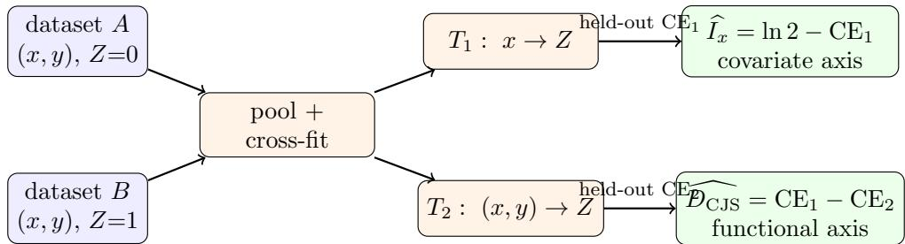
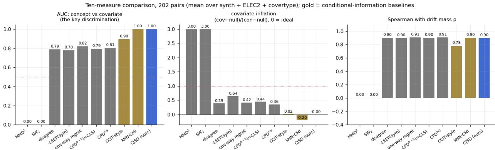
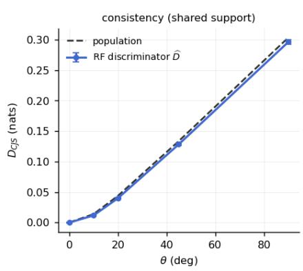
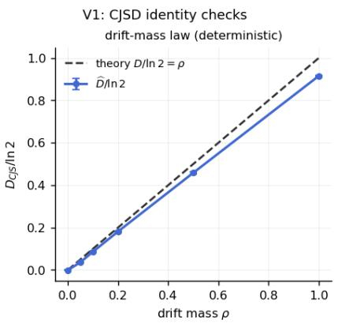
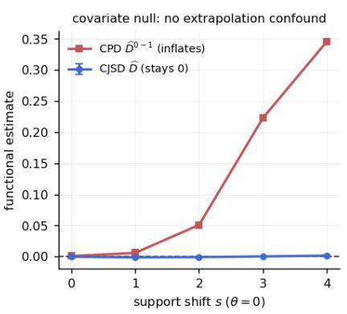
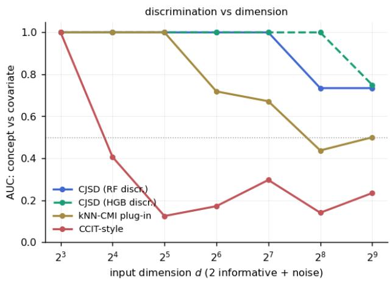
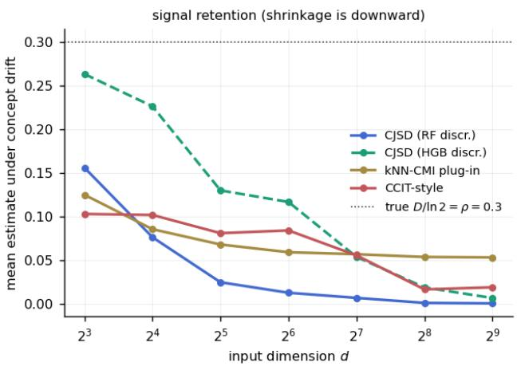
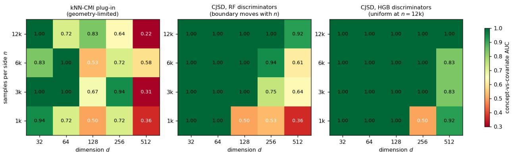
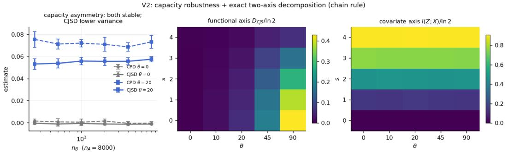
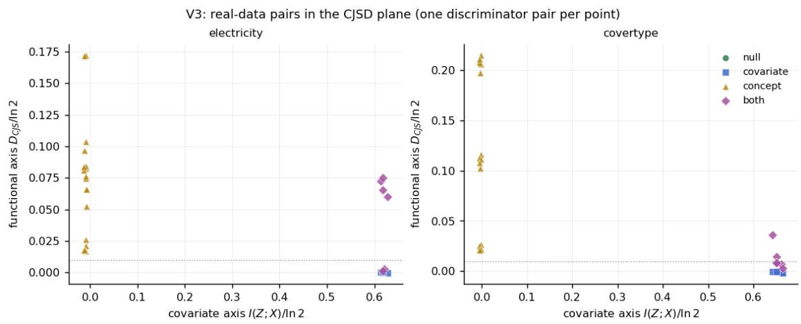

# Separating Covariate Shift from Mechanism Change with Two Discriminators

CJSD: a conditional discrepancy with an exact covariate–concept decomposition

Kentaro Oda Center for Management of Information Technologies, Kagoshima University odaken@cc.kagoshima-u.ac.jp

## Abstract

After the inputs X are known, how much additional information does the label Y carry about which dataset a sample came from? That single quantity—estimable as a diference of two discriminators’ held-out cross-entropies, $D _ { \mathrm { C J S } } = \operatorname { C E } ( Z \mid X ) - \operatorname { C E } ( Z \mid X , Y ) .$ is exactly the part of a dataset diference that covariate shift cannot explain. Deciding whether two supervised learning problems share the same input–output mechanism is the core primitive behind expert reuse in continual learning, drift-type diagnosis, and category discovery. Existing task comparisons fall into two families with complementary blind spots: input-distribution distances (MMD, Wasserstein) are blind to changes of P(Y | X), while exchange-based scores (crossevaluating models trained on each task, e.g. the Cross-Learning Score) conflate covariate shift with mechanism change because a model evaluated of its training support incurs extrapolation error. We propose the Conditional Jensen–Shannon Discrepancy (CJSD): with a task indicator Z, the chain rule $I ( Z ; X , Y ) = I ( Z ; X ) + I ( Z ; Y \mid X )$ splits total task discrepancy exactly into a covariate axis and a functional axis, and the functional axis is estimable as the diference of the held-out cross-entropies of two discriminators—one seeing x, one seeing (x, y)—without training task-specific predictors, generative models, or bootstrap surrogates. We prove a covariate-null property (the functional axis is exactly zero under pure covariate shift, however severe), a drift-mass law $\left( D _ { \mathrm { C J S } } / \ln 2 \right.$ equals the mass of the disagreement region for deterministic labels), a one-sided misspecification-control inequality (the loss-gap estimand overshoots DC S by at most the excess risk of the x-discriminator and undershoots by at most that of the (x, y)-discriminator, so each one-sided decision rests on a single excess risk), and a fixed-measure metrization: conditional distributions are identifiable from the discriminators via a likelihood-ratio identity, yielding a true metric between mechanisms under a fixed reference measure (the pair-dependent quantity itself is provably non-metric). Empirically, on a ten-measure battery over synthetic, Electricity, and Covertype pair families (202 pairs; separate experiments cover INSECTS, MNIST, and CIFAR-10), only the two conditional-information estimators—CJSD and a neighborhood plug-in CMI—separate concept from covariate shift with AUC 1.0 (all others 0.0–0.90), at equal drift-mass sensitivity; the case for CJSD is the estimator: under controlled dimensionality scaling the kNN plug-in fails from d=64 while the discriminator route holds to d=256 with a swappable classifier, and it alone yields paired per-point confidence intervals and sequential extensions from the same learned object. The same estimator audits the conditional fidelity of synthetic-data generators that marginal and joint QA metrics pass, detects annotation-guideline changes invisible to any input-space monitor, and supports null-calibrated fairness audits of conditional demographic disparity.

  
Figure 1: The whole estimator. Two ordinary classifiers predict the dataset indicator Z, one from x, one from (x, y); subtracting their held-out cross-entropies yields the functional axis—the information about Z that Y adds after X is known. Nothing is ever evaluated of its training support.

## 1 Introduction

Online systems that maintain a pool of predictive models must repeatedly answer one question: is the data now arriving governed by the same input–output mechanism as the data an existing model was trained on? Answering it wrongly in one direction wastes capacity (spawning experts for data an existing expert already explains); wrongly in the other direction corrupts experts (absorbing data whose labeling mechanism has changed). The question also underlies drift-type diagnosis (should we retrain, or reweight?), on-the-fly category discovery (is this a new category, or a new appearance of an old one?), and data-pipeline quality control (did the annotation guideline change?).

Two families of task-comparison measures dominate. Input-distribution distances (MMD, optimal transport) compare P(X) and are constitutionally blind to mechanism change. Exchange-based scores train a predictor per task and cross-evaluate: the recently proposed Cross-Learning Score (CLS) [1] symmetrizes the excess risk of swapped predictors and is, at the population level, identical to the reciprocal-regret quantity we call CPD. Exchange-based scores do respond to mechanism change, but we show they carry a structural confound: under pure covariate shift (identical $P ( Y \mid X )$ shifted P(X)), the swapped model is evaluated of its training support, and its extrapolation error masquerades as mechanism change. On a two-dimensional benchmark the exchange score inflates from 0.001 to 0.346 as the supports separate, with no change of mechanism whatsoever; sharing a deep encoder does not remove the efect (0.80 at 90◦ input rotation).

We take a diferent route. Pool the two datasets with a task indicator Z and consider how identifiable Z is. The mutual-information chain rule

$$
\begin{array} { r } { I ( Z ; X , Y ) \ = \ \underbrace { I ( Z ; X ) } _ { \mathrm { c o v a r i a t e ~ a x i s ~ } I _ { x } } \quad + \ \underbrace { I ( Z ; Y \mid X ) } _ { \mathrm { f u n c t i o n a l ~ a x i s ~ } D _ { \mathrm { C J S } } } } \end{array}\tag{1}
$$

splits total discrepancy into what the inputs explain and what only the input–output relation explains. Both terms are estimable from two discriminators: $T _ { 1 } : x \mapsto Z$ and $T _ { 2 } : ( x , y ) \mapsto Z .$ via $\widehat { D _ { \mathrm { C J S } } } = \operatorname { C E } ( Z \mid X ) - \operatorname { C E } ( Z \mid X , Y )$ on held-out data (Fig. 1). No task-specific predictor is trained, so nothing is ever evaluated of-support; no generative model or nearest-neighbor bootstrap is needed, unlike classifier-based CMI estimators [2] and conditional independence tests [3].

Contributions. (1) We define CJSD and derive its basic representation (weighted conditional Jensen–Shannon divergence) and the exact two-axis decomposition (1). (2) We prove four properties that make it suitable as a decision primitive: a covariate-null theorem (Prop. 1), a drift-mass law (Prop. 2), a one-sided misspecification-control inequality (Prop. 4: each direction of error is bounded by the excess risk of a single discriminator, with no assumption on the other), and a fixed-measure metrization with an identifiability lemma recovering both conditionals from the discriminators (Prop. 3, Lemma 2). (3) We give a simple cross-fitted estimator with paired confidence intervals, robust to sample-size asymmetry (balanced by construction), whose misspecification bias was moreover consistently downward in all main benchmark configurations (an empirical refinement that sharpens, but does not carry, the one-sided guarantees; Appendix A exhibits an engineered counterexample in which the sign reverses, within the proven slack). (4) Across ten competing measures on three pair families (with further datasets in dedicated experiments), the two conditionalinformation estimators (CJSD and a kNN CMI plug-in) alone separate concept from covariate shift cleanly $( \mathrm { A U C } 1 . 0 \ \mathrm { v s } \ 0 . 0 { - 0 . 9 0 } )$ at equal drift-mass sensitivity; CJSD’s advantage over the plug-in is practicality, not the estimand (Sec. 5); we demonstrate downstream value in synthetic-data fidelity auditing, drift-type diagnosis, annotation-drift detection, and fairness auditing.

## 2 Related work

Exchange-based and supervised task similarity. CLS [1] symmetrizes swapped excess risks; Taskonomy, LEEP, LogME estimate directed transferability; OTDD [6] transports jointly over features and labels, and Task2Vec [7] embeds tasks via Fisher information — all target transfer or global similarity rather than conditional-mechanism equality on the observable region. These quantify reuse risk of a trained model, which mixes mechanism change with support mismatch; our experiments quantify the confound. CJSD instead compares the mechanisms themselves on the region where both are observable. Input-distribution and representation distances. MMD, $\mathrm { O T / W _ { 2 } }$ , CKA compare $P ( X )$ or internal representations; they are blind to $P ( Y \mid X )$ (AUC 0.0 in our concept-vs-covariate task). Conditional two-sample testing and CMI estimation. Conditional equality of $P ( Y \mid X )$ can be tested via density-ratio reductions or conformal devices [4, 5]; CMI can be estimated with classifiers plus generative/bootstrap surrogates [2, 3]. Our estimator needs neither surrogate, and our aim difers: not a p-value but a bounded, normalized, decomposable discrepancy (metrizable in its fixed-measure form) that can gate online decisions. Drift detection. Error-stream detectors (ADWIN, DDM) implicitly assume mechanism change; input-space detectors (D3) see only covariate shift. CJSD’s two axes diagnose the type (Sec. 6).

## 3 The conditional Jensen–Shannon discrepancy

Let tasks A, B have laws $P _ { T } = P _ { T } ^ { X } \otimes \eta _ { T } ( \cdot \mid x )$ on $\mathcal { X } \times \mathcal { Y } , | \mathcal { V } | = K$ . Draw $Z \sim \mathrm { B e r n } ( 1 / 2 )$ and $( X , Y ) \mid Z = T \sim P _ { T }$ ; let $\begin{array} { r } { \tilde { \mu } = \frac { 1 } { 2 } ( P _ { A } ^ { X } + P _ { B } ^ { X } ) } \end{array}$ and $w ( x ) = P ( Z = A \mid X = x )$

Lemma 1 (Representation). $I ( Z ; X ) = \mathrm { J S } ( P _ { A } ^ { X } , P _ { B } ^ { X } )$ and $D _ { \mathrm { C J S } } : = I ( Z ; Y \mid X ) = \mathbb { E } _ { x \sim \tilde { \mu } } \bigl [ \mathrm { J S } _ { w ( x ) } \bigl ( \eta _ { A } ( \cdot \mid x ) , \eta _ { B } ( \cdot \mid x ) \bigr ) \bigr ] ,$ where $\begin{array} { r } { \mathrm { J S } _ { w } ( p , q ) = H ( w p + ( 1 - w ) q ) - w H ( p ) - ( 1 - w ) H ( q ) } \end{array}$ . Moreover (1) holds, and $0 \leq D _ { \mathrm { C J S } } \leq \ln 2$

Proposition 1 (Covariate null). $I f \eta _ { A } ( \cdot \mid x ) = \eta _ { B } ( \cdot \mid x )$ for $\tilde { \mu } { - } a . e .$ . x then $D _ { \mathrm { C J S } } ( A , B ) = 0 .$ , for arbitrary $P _ { A } ^ { X } , P _ { B } ^ { X }$ (including disjoint supports). Conversely $D _ { \mathrm { C J S } } = 0$ implies $\eta _ { A } = \eta _ { B }$ at $\tilde { \mu } { - } a . e .$ . x with $w ( x ) \in ( 0 , 1 )$

Proposition 2 (Drift-mass law). If $P _ { A } ^ { X } = P _ { B } ^ { X } = P _ { X }$ and both labels are deterministic, $\eta _ { T } ( \cdot \mid x ) =$ $\delta _ { f _ { T } ( x ) }$ , then $D _ { \mathrm { C J S } } ( A , B ) = \ln 2 \cdot P _ { X } { \big ( } f A ( X ) \neq f _ { B } ( X ) { \big ) }$

Lemma 2 (Reconstruction). Wherever w $\boldsymbol { \mathbf { \rho } } _ { ( x ) } \in ( 0 , 1 )$ , with $q _ { y } ( x ) = P ( Z { = } A \mid X { = } x , Y { = } y )$ and pooled conditional $\begin{array} { r } { m ( y \mid x ) , \rho _ { y } ( x ) : = \frac { \eta _ { A } ( y \mid x ) } { \eta _ { B } ( y \mid x ) } = \frac { q _ { y } } { 1 - q _ { y } } \cdot \frac { 1 - w } { w } } \end{array}$ , and $\begin{array} { r } { \eta _ { B } ( y \mid x ) = \frac { m ( y \mid x ) } { w ( x ) \rho _ { y } ( x ) + 1 - w ( x ) } , \eta _ { A } = \rho _ { y } \eta _ { B } } \end{array}$ Hence both conditionals are identifiable from $( T _ { 1 } , T _ { 2 } )$ plus one pooled label model, for any finite K.

Proposition 3 (Fixed-measure metrization). For a fixed reference measure $\mu , ~ d _ { \mu } ( A , B ) ~ : =$ $\sqrt { \mathbb { E } _ { { x } \sim { \mu } } \mathrm { J S } _ { 1 / 2 } ( \eta _ { A } ( \cdot \mid x ) , \eta _ { B } ( \cdot \mid x ) ) }$ is a metric on conditionals modulo µ-null sets. With pair-dependent mixtures in place of $\mu _ { ; }$ , the triangle inequality fails (numerical counterexamples in 11% of random triples with heterogeneous supports).

Anti-coupling of the axes. Since $I ( Z ; X , Y ) \leq H ( Z ) = \ln 2$ , the chain rule forces $D _ { \mathrm { C J S } } \leq$ ln $2 - I _ { x } .$ : severe covariate separability caps the observable functional signal. The axes are additive, not orthogonal; a large $I _ { x }$ means a small $D _ { \mathrm { C J S } }$ is inconclusive, and the decision layer must defer rather than conclude “no mechanism change.”

Proofs are in Appendix A. Together the propositions delimit exactly what a conditional discrepancy can honestly claim: diferences are measured where both mechanisms are observable $( w \in ( 0 , 1 ) )$ ; outside that region CJSD reports zero, not a hallucinated diference—while the covariate axis $I _ { x }$ reports how separable the inputs are, which by the anti-coupling inequality caps the functional signal that can be observed at all; the decision layer routes such cases to defer.

## 4 Estimation

Assumptions. Throughout: (A1) predicted probabilities are clipped to $[ \epsilon , 1 - \epsilon ]$ , making per-point losses bounded; (A2) estimates are cross-fitted, so each held-out loss is computed by a model not trained on that point; (A3) the task prior is Bern $( 1 / 2 )$ , enforced by balanced subsampling. Under $( \mathrm { A 1 } ) { - } ( \mathrm { A 3 } )$ , if the two discriminators are log-loss risk-consistent $( \operatorname { C E } ( T _ { 1 } ) \to H ( Z \mid X )$ $\operatorname { C E } ( T _ { 2 } ) \to H ( Z \mid X , Y )$ in probability), then ${ \widehat { D _ { \mathrm { C J S } } } } \ \to \ D _ { \mathrm { C J S } } ;$ with fixed nuisances the paired diference obeys a CLT, which is what the reported intervals track (we do not claim finite-sample coverage under model selection).

Train $T _ { 1 }$ on $\left\{ \left( x _ { i } , z _ { i } \right) \right\}$ and $T _ { 2 }$ on $\{ ( x _ { i } , y _ { i } ) , z _ { i } ) \}$ with any probabilistic classifier (cross-fitted); on held-out points compute per-point log-losses $\ell _ { i } ^ { ( 1 ) } , \ell _ { i } ^ { ( 2 ) }$ and set ${ \widehat { D _ { \mathrm { C J S } } } } = { \overline { { \ell ^ { ( 1 ) } - \ell ^ { ( 2 ) } } } } , { \widehat { I _ { x } } } = \ln 2 - { \overline { { \ell ^ { ( 1 ) } } } }$ with the paired empirical variance of $\ell _ { i } ^ { ( 1 ) } - \ell _ { i } ^ { ( 2 ) }$ giving confidence intervals; unequal task sizes are balanced by subsampling so that $Z \sim \operatorname { B e r n } ( 1 / 2 )$ holds by construction and the ln 2 normalization remains exact; a one-hot interaction map $[ x , \mathrm { o h } ( y ) , x \otimes \mathrm { o h } ( y ) ]$ sufices for linear discriminators. Three practical properties (validated in Sec. 5): (i) no capacity-asymmetry confound: unlike exchange scores no per-task model exists, so unequal task sample sizes (250 vs 8000) leave the estimate stable (Fig. 6, left); (ii) one-sided misspecification control: with achievable risks $R _ { 1 } = H ( Z \mid X ) + \epsilon _ { 1 }$ $R _ { 2 } = H ( Z \mid X , Y ) + \epsilon _ { 2 } \left( \epsilon _ { 1 } , \epsilon _ { 2 } \ge 0 \right.$ the excess log-losses of the two learned discriminators) the estimand of the loss gap is $\bar { D } = D _ { \mathrm { C J S } } + \epsilon _ { 1 } - \epsilon _ { 2 }$ , whose sign is not controlled in general—but each direction of error is controlled by a single discriminator (Prop. 4 below); in all main benchmark configurations, with $T _ { 1 }$ ’s inputs nested in $T _ { 2 }$ ’s and matched architectures, the observed bias was moreover consistently downward $( \epsilon _ { 1 } \leq \epsilon _ { 2 }$ , shrinkage toward zero), which we report as an empirical refinement rather than an assumption (the engineered exception is in Appendix A); (iii) negative empirical or surrogate values occur, through misspecification asymmetry $( \epsilon _ { 2 } - \epsilon _ { 1 } > D _ { \mathrm { C J S } }$ makes even the population-level $\widetilde { D }$ negative) as well as finite-sample noise; we never clip and instead use intervals or a null calibration (Sec. 6).

Proposition 4 (One-sided misspecification control). For any fixed discriminator pair $( T _ { 1 } , T _ { 2 } )$ however misspecified or overfit, the population loss gap $\widetilde { D } = R _ { 1 } - R _ { 2 }$ satisfies

$$
D _ { \mathrm { C J S } } - \epsilon _ { 2 } \leq \tilde { D } \leq D _ { \mathrm { C J S } } + \epsilon _ { 1 } .
$$

  
Figure 2: Ten-measure comparison over 202 pairs across three data families. Left: concept-vscovariate discrimination AUC (the two conditional-information estimators, CJSD and kNN-CMI, reach 1.0). Middle: false signal under pure covariate shift, normalized by the concept signal (0 is ideal). Right: drift-mass sensitivity is preserved.

Consequently: $( a )$ overshoot is bounded by the simple discriminator alone $\mathrm { , - } \widetilde { D } > \tau$ implies $D _ { \mathrm { C J S } } >$ $\tau - \epsilon _ { 1 }$ for any $T _ { 2 } ; ~ ( b )$ undershoot is bounded by the joint discriminator alone— $- \widetilde { D } < \tau$ implies $D _ { \mathrm { C J S } } < \tau + \epsilon _ { \mathrm { 2 } }$ for any $T _ { 1 } ; ( c ) | \widetilde { D } - D _ { \mathrm { C J S } } | \leq \operatorname* { m a x } ( \epsilon _ { 1 } , \epsilon _ { 2 } )$ . For empirical-risk minimization over a class $\mathcal { F } _ { 1 }$ with the clipped log-loss bounded by $B ,$ , standard uniform convergence gives, with probability at least $1 - \delta , \epsilon _ { 1 } \leq A _ { 1 } + O \big ( \mathfrak { R } _ { n } ( \ell \circ \mathcal { F } _ { 1 } ) + B \sqrt { \ln ( 1 / \delta ) / n } \big )$ , where $A _ { 1 }$ is the approximation error of $\mathcal { F } _ { 1 }$ for the target $P ( Z \mid x )$ and $\Re _ { n } ( \ell \circ { \mathcal { F } } _ { 1 } )$ the Rademacher complexity of the clipped-loss-composed class $[ 8 ]$ (constants absorbed in $O ( \cdot )$ ; a Lipschitz contraction converts this to the raw class)—a bound that involves only the x-discriminator, whose lower-dimensional x-only target was empirically the easier of the two to estimate. The downward-bias regularity $\epsilon _ { 1 } \leq \epsilon _ { 2 }$ is exactly the statement that the overshoot slack in $( a )$ vanishes; none of $( a ) { - } ( c )$ requires it.

The practical reading: an alarm (large $\widehat { D _ { \mathrm { C J S } } }$ , feeding spawn or drift decisions) can only be inflated by $\epsilon _ { 1 }$ , the excess risk of the marginal discriminator—the quantity held-out model selection already minimizes—no matter how badly $T _ { 2 }$ behaves; a clearance (small $\widehat { D _ { \mathrm { C J S } } }$ , feeding reuse decisions) can only be deflated by $\epsilon _ { 2 }$ . Each one-sided decision therefore rests on the quality of one learned object, and the two sides can be audited separately (a matched-null calibration empirically compensates the residual ofset $\epsilon _ { 1 } - \epsilon _ { 2 } , \mathrm { S e c . } \ 6 )$ . In one sentence: surrogate-level decisions are exact; population-level readings inherit one-sided, discriminator-specific slacks unconditionally, and exact zero-slack conservativeness is the special case obtained either by threshold correction with a valid excess-risk bound (holding on that bound’s $1 - \delta$ event, so failure budgets compose additively) or under the empirically observed downward-bias regularity. Appendix A reports direct measurements of $( \epsilon _ { 1 } , \epsilon _ { 2 } )$ on analytic mixtures: the downward direction held in every adequately capacitated cell, and an engineered misspecified-marginal counterexample produced an upward false signal that stayed within the $\epsilon _ { 1 }$ slack and disappeared under a flexible discriminator.

## 5 Experiments

Identities. On a rotation family with known $\eta ,$ the estimator tracks the population value; the drift-mass law holds exactly in population and within estimator shrinkage in finite samples; $\sqrt { \widehat { D _ { \mathrm { C J S } } } }$ violated the triangle inequality in $0 / 2 0 0$ random triples under a fixed measure (Fig. 3). The covariate null, empirically. Under pure support shift the exchange score inflates (0.051 at $s { = } 2 , \ 0 . 3 4 6 \ \mathrm { a t } \ s { = } 4 )$ while $\widehat { D _ { \mathrm { C J S } } } \in \left[ - 0 . 0 0 2 , 0 . 0 0 2 \right]$ throughout; on MNIST/CIFAR rotations the same holds with a frozen shared encoder, where deep-CLS head exchange inflates to 0.80. Tenmeasure comparison. Across synthetic, Electricity and Covertype pair batteries (202 pairs), concept-vs-covariate AUC: $\mathrm { M M D / S W _ { 2 } \ 0 . 0 ; }$ disagreement, −LEEP, one-way regret, $\mathrm { C P D ^ { 0 - 1 } ( = C L S ) }$ $\mathrm { C P D ^ { l o g } \ 0 . 7 8 – 0 . 8 2 } ;$ a CCIT-style local-permutation classifier 0.90; CJSD 1.00 at equal drift-mass rank correlation $( \rho \approx 0 . 9 )$ (Fig. 2). A neighborhood plug-in CMI baseline also attains 1.00 on this (≤ 54-dimensional) tabular battery—as expected, since it estimates the same population quantity. The contribution of CJSD is therefore not the discrimination ability of the estimand but the estimator: no nearest-neighbor geometry, paired per-point confidence intervals and sequential e-process extensions from the same learned object, and exact [0, ln 2] normalization. The next experiment makes the geometry claim concrete.

  
Figure 3: Identity checks. Left: estimator consistency against the population value. Middle: the drift-mass law $D _ { \mathrm { C J S } } / \ln 2 = \rho .$ . Right: the covariate null—the exchange-based score inflates with support separation while $\widehat { D _ { \mathrm { C J S } } }$ stays at zero.

Dimensionality scaling. We embed the same task (2 informative dimensions, drift mass $\rho = 0 . 3 , n = 6 0 0 0 \mathrm { p e r s i d e } )$ in d total dimensions, $d = 8$ to 512 (8 seeds each; the covariate condition shifts all d coordinates). Concept-vs-covariate AUC (Fig. 4): the kNN plug-in is perfect through $d = 3 2$ , degrades at $d = 6 4 \ ( 0 . 7 2 )$ , and is at chance from $d = 2 5 6 \AA$ distance concentration destroys the local neighborhoods it depends on, and it has no tunable remedy. The CCIT-style permutation classifier collapses immediately (0.41 at $d = 1 6 )$ , since its local permutations also rest on kNN geometry. The discriminator route holds AUC 1.00 through $d = 1 2 8$ with the same random-forest discriminators used everywhere else in this paper, and—the practical point—when the forest finally loses the signal at $d = 2 5 6$ , swapping the discriminator (gradient boosting, one line) restores 1.00 at $d = 2 5 6$ . Estimates shrink toward zero as d grows (downward, never inflating; Fig. 4, right), consistent with the misspecification analysis of Sec. 4.

The $n \times d$ phase diagram: geometry limits vs. sample limits. Whether a failure boundary is geometric or merely a matter of sample size is the question that decides which estimator to trust in embedding spaces. Extending the grid to $n \in \{ 1 , 3 , 6 , 1 2 \}$ k per side (6 seeds; Fig. 5) separates the two failure modes cleanly. For the discriminator route, more data moves the boundary: the RF frontier advances from d=64 at $n { = } 1 \mathrm { k }$ to d=256 at n=12k (0.92 at 512), and the HGB discriminator reaches AUC 1.00 on the entire grid at $n { = } 1 2 \mathrm { k }$ , including d=512. For the kNN plug-in, more data did not help over the tested range: it never establishes reliable discrimination beyond $d { = } 6 4$ at any n tried (0.22–0.83 across the $d \geq 1 2 8$ cells, non-monotone in n). The distinction matters because it turns the earlier scaling curve into guidance: a discriminator-based estimate that fails at the current sample size can be rescued by data or a stronger classifier; over the tested range, a neighborhood-based estimate at high d had no such lever. (One implementation note we found the hard way: sklearn’s gradient boosting silently enables early stopping above $1 0 ^ { 4 }$ samples, which destroys the subtle $T _ { 2 }$ signal; estimator configurations must be held fixed across n.) Real drifts with documented change points. On INSECTS the two axes decompose each documented drift into covariate and functional components $( I _ { x } \in [ 0 . 2 6 , 0 . 3 1 ]$ $D _ { \mathrm { C J S } } \in [ 0 . 1 3 , 0 . 2 4 ] )$ and recover, without segment supervision, the recurrence structure of the temperature cycle: the recurring segment pairs (0, 2), (0, 5), (2, 5) fall at $D _ { \mathrm { C J S } } \leq 0 . 0 3$ , clustering with the within-segment nulls. The full anatomy figure and its use for drift-type monitoring appear in the companion diagnosis paper; we cite the numbers here rather than reproduce its figure. Decisions. The two-axis gate turns these estimates into reuse/spawn/defer decisions with near-perfect quadrant accuracy; system-level results (streaming, anytime-valid e-process gating, expert pools) are developed in a companion paper.

Figure 4: Dimensionality scaling (2 informative dims + noise, $\rho = 0 . 3 { \mathrm { : } }$ , 8 seeds). Left: conceptvs-covariate AUC; kNN geometry fails from $d { = } 6 4$ , the discriminator route holds to $d { = } 1 2 8$ (RF) / d=256 (HGB). Right: mean estimate under concept drift; shrinkage is downward.  
  
Figure 5: $n \times d$ phase diagram of concept-vs-covariate AUC (6 seeds per cell). Left: the kNN plug-in is geometry-limited—no row reaches reliable discrimination past $d { = } 6 4$ . Middle/right: the discriminator route is sample-limited—the boundary moves outward with $n ,$ and HGB discriminators clear the whole grid at $n { = } 1 2 \mathrm { k }$

Figure 6: Left: robustness to sample-size asymmetry $( n _ { A } { = } 8 0 0 0 \ \mathrm { f i x e d } )$ . Middle/right: over the $s \times \theta$ grid each estimated axis responds to its own factor only (additive decomposition; note the feasible region is anti-coupled, $D _ { \mathrm { C J S } } \leq \ln 2 - I _ { x } )$  
  
Figure 7: Real-data pair batteries in the CJSD plane: the four constructed shift types occupy the four quadrants; pure covariate pairs sit at $\widehat { D _ { \mathrm { C J S } } } \approx 0$ (the exchange score places them at 0.04–0.10).

## 6 Applications

Companion-paper applications. The two-axis statistic is the decision core of a drift-type diagnosis monitor (real vs. virtual vs. incomparable alarms, benchmarked against standard detectors and WATCH) and of an embedding-space novelty separator for deep expert pools; both are developed and evaluated in their own companion papers, and we do not reproduce their results here. Annotationguideline drift. Swapping two confusable Covertype classes on a boundary region (22% mass) is invisible to every input monitor $( I _ { x } , \mathrm { M M D } \equiv 0 )$ yet detected at 9σ. On CIFAR-10H the same audit detects a 10% label-corruption positive control at $z = 3 . 3$ , while real annotator-population splits lie below the calibrated detection floor $( | \Delta D | < 1 0 ^ { - 3 } )$ —a sensitivity-floor statement, not a separation claim (Appendix). Conditional-fidelity audit of synthetic data (new, exclusive to this paper). A tabular generator is judged by whether it preserves $P ( Y \mid X )$ . We built three generators over the same bootstrap X-generator (disjoint source/evaluation halves, so all X-marginal statistics coincide by construction): faithful $( y \sim \hat { P } ( y \mid x ) )$ , shufled $( y \sim \hat { P } ( y \mid x ^ { \prime } )$ for a random other row—X- and y-marginals exactly preserved, joint destroyed), and subtle (conditional flipped on a top-decile region). On Adult and Covertype, mean per-feature KS and the marginal-y gap are blind to both corruptions, and joint MMD moves at noise level (0.0002–0.0014); $\widehat { D _ { \mathrm { C J S } } }$ reads $\leq 0 . 0 0 0 2$ for the faithful generator, 0.041–0.074 for shufled, and 0.008–0.038 for subtle $( z \approx 2 0$ on the hardest case that every marginal metric passes). Conditional fidelity is precisely the axis marginal QA suites do not measure. Fairness auditing is a further application (with Z a protected attribute, $D _ { \mathrm { C J S } }$ is conditional demographic disparity $I ( Z ; Y \mid X ) )$ ; because its interpretation raises normative questions orthogonal to the estimator, we develop it in Appendix B only.

## 7 Limitations

CJSD gates no-adaptation reuse; it does not predict fine-tuning transferability (LEEP correlates $\rho { = } 0 . 8 6$ with fine-tuned accuracy, CJSD does not, by design: diferences outside the overlap are honestly reported as zero and adaptation changes the representation). Estimates depend on discriminator calibration (in our experiments under-trained discriminators shrank the signal; the sign of the bias is uncontrolled in general, but each direction of error is bounded by a single excess risk, Prop. 4); the weighted-JS form attenuates diferences confined to low-overlap regions, which is the identifiability boundary made visible.

## Reproducibility

All experiments (46 scripts, checkpointed JSON results, figures) are included in the supplementary package.

## References

[1] S. Sun, H. H. Zhang, J. C. Watkins. Quantifying data similarity using cross learning. arXiv:2510.10866, 2025.

[2] S. Mukherjee, H. Asnani, S. Kannan. CCMI: Classifier based conditional mutual information estimation. UAI 2019.

[3] R. Sen et al. Model-powered conditional independence test. NeurIPS 2017.

[4] S. Lee, S. Cha, I. Kim. General frameworks for conditional two-sample testing. arXiv:2410.16636, 2024.

[5] X. Hu, J. Lei. A two-sample conditional distribution test using conformal prediction. arXiv:2010.07147, 2020.

[6] D. Alvarez-Melis, N. Fusi. Geometric dataset distances via optimal transport. NeurIPS 2020.

[7] A. Achille et al. Task2Vec: task embedding for meta-learning. ICCV 2019.

[8] P. L. Bartlett, S. Mendelson. Rademacher and Gaussian complexities: risk bounds and structural results. JMLR, 2002.

[9] D. M. Endres, J. E. Schindelin. A new metric for probability distributions. IEEE Trans. IT, 2003.

## A Proofs

Proof of Lemma 1. $I ( Z ; X ) = H ( Z ) - H ( Z \mid X ) = \ln 2 - \mathbb { E } _ { \tilde { \mu } } [ H ( w ( X ) ) ]$ , which is the mixture representation of $\mathrm { J S } ( P _ { A } ^ { X } , P _ { B } ^ { X } )$ . Conditionally on $X = x$ we have $Z \sim \operatorname { B e r n } ( w ( x ) )$ and $Y \mid Z { = } T \sim$ $\eta _ { T } ( \cdot \mid x )$ , so $I ( Z ; Y \mid X = x ) = H ( Y \mid X = x ) - H ( Y \mid X = x , Z ) = H ( w \eta _ { A } + ( 1 - w ) \eta _ { B } ) - w H ( \eta _ { A } ) - \bar { \eta } ,$ $( 1 - w ) H ( \eta _ { B } ) = \mathrm { J S } _ { w } ( \eta _ { A } , \eta _ { B } )$ . Taking $\mathbb { E } _ { \tilde { \mu } }$ gives the claim; the chain rule is the standard information identity, and $0 \leq \mathrm { J S } _ { w } \leq \ln 2$ gives the bounds. □

Proof of Proposition 1. $\mathrm { J S } _ { w } ( p , p ) = 0$ for every $w ,$ so the first claim follows pointwise from Lemma 1. For the converse, if $w ( x ) \in ( 0 , 1 )$ then strict concavity of H makes $\mathrm { J S } _ { w } ( p , q ) = 0 \ \mathrm { i f f } \ p = q$ At points with $w \in \{ 0 , 1 \} , \mathrm { J S } _ { w } \equiv 0$ carries no information: this is the identifiability boundary, and $D _ { \mathrm { C J S } }$ reports zero rather than an unverifiable diference. □

Proof of Proposition 2. With $w \equiv 1 / 2 \colon$ : where $f _ { A } ( x ) = f _ { B } ( x ) , \mathrm { J S } _ { 1 / 2 } ( \delta , \delta ) = 0 ;$ where they difer, $\mathrm { J S } _ { 1 / 2 } ( \delta _ { a } , \delta _ { b } ) = H ( { \scriptstyle { \frac { 1 } { 2 } } } \delta _ { a } + { \scriptstyle { \frac { 1 } { 2 } } } \delta _ { b } )$ = ln 2. Integrate over $P _ { X }$ □

Proof of Lemma 2. Bayes: $\begin{array} { r } { q _ { y } \ = \ \frac { w \eta _ { A } ( y ) } { w \eta _ { A } ( y ) + ( 1 - w ) \eta _ { B } ( y ) } } \end{array}$ , hence $\begin{array} { r } { \frac { q _ { y } } { 1 - q _ { y } } ~ = ~ \frac { w } { 1 - w } \cdot \frac { \eta _ { A } ( y ) } { \eta _ { B } ( y ) } } \end{array}$ , giving $\rho _ { y } .$ Substituting $\eta _ { A } = \rho _ { y } \eta _ { B }$ into $m = w \eta _ { A } + ( 1 - w ) \eta _ { B } = ( w \rho _ { y } + 1 - w ) \eta _ { B }$ solves for $\eta _ { B }$ □

Proof of Proposition 3. $\delta ( x ) = \sqrt { \mathrm { J S } _ { 1 / 2 } ( \eta _ { A } ( x ) , \eta _ { B } ( x ) ) }$ is, for each $x ,$ a metric between the conditional laws (Endres–Schindelin). Then $d _ { \mu } ( A , C ) = \| \delta _ { A C } \| _ { L ^ { 2 } ( \mu ) } \leq \| \delta _ { A B } + \delta _ { B C } \| _ { L ^ { 2 } ( \mu ) } \leq$ $\lVert \delta _ { A B } \rVert _ { L ^ { 2 } ( \mu ) } + \lVert \delta _ { B C } \rVert _ { L ^ { 2 } ( \mu ) }$ by the pointwise triangle inequality and Minkowski. Identity of indiscernibles follows from $d _ { \mu } = 0 \iff \mathrm { { J S } _ { 1 / 2 } = 0 \ \mu \mathrm { { - a . e } } }$ . For the pair-dependent variant we exhibit numerical violations (11% of 300 random heterogeneous-support triples, worst slack −0.19).

Proof of Proposition 4. By definition $\widetilde D = R _ { 1 } - R _ { 2 } = ( H ( Z \mid X ) + \epsilon _ { 1 } ) - ( H ( Z \mid X , Y ) + \epsilon _ { 2 } ) =$ $D _ { \mathrm { C J S } } + \epsilon _ { 1 } - \epsilon _ { 2 }$ . The population log-loss of any predictor is at least the conditional entropy of its target (Gibbs’ inequality), so $\epsilon _ { 1 } \geq 0$ and $\epsilon _ { 2 } \geq 0$ hold unconditionally, and the two-sided sandwich follows by dropping one nonnegative term at a time; $\mathrm { ( a ) - ( c ) }$ are immediate. The high-probability excess-risk bound for $\epsilon _ { 1 }$ is the standard symmetrization argument for bounded losses applied to $\ell \circ \mathcal { F } _ { 1 } \left[ 8 \right]$ , combined with $\begin{array} { r } { A _ { 1 } = \operatorname* { i n f } _ { f \in { \mathcal { F } } _ { 1 } } R _ { 1 } ( f ) - H ( Z \mid X ) } \end{array}$ □

## B Additional experimental details

Ten-measure battery (202 pairs). Synthetic rotation family $( s \times \theta$ and localized drift), Electricity and Covertype constructed pairs (null / covariate via PC-biased sampling / concept via region-restricted cyclic remap with recorded realized drift mass / both). Per-family AUCs: conceptvs-null 1.0 for every function-based measure; concept-vs-covariate: CJSD 1.000/1.000/1.000 (synthetic/Electricity/Covertype), kNN-CMI plug-in likewise 1.000 on this ≤ 54-dimensional battery, CCIT-style local-permutation classifier 0.90, best remaining competitor 0.667–1.000 with mean 0.79. Covariate inflation $( \mathrm { c o v - n u l l } ) / ( \mathrm { c o n - n u l l } )$ : CJSD −0.011–0.010; disagreement 0.39; LEEP 0.64; one-way $0 . 4 2 ; \mathrm { C P D ^ { 0 - 1 } ~ 0 . 4 4 ; \mathrm { C P D ^ { l o g } ~ 0 . 3 6 } }$

Direct measurement of the excess risks (Prop. 4). On analytic two-task Gaussian mixtures where $H ( Z \mid X ) , H ( Z \mid X , Y )$ , and $D _ { \mathrm { C J S } }$ are computable from the true posteriors, we measured $( \epsilon _ { 1 } , \epsilon _ { 2 } )$ of fitted pairs directly (six scenarios × {linear-logistic, HGB} × five seeds; 8000 fitting points, population risks on $2 \times 1 0 ^ { 5 }$ Monte-Carlo points). The sandwich of Prop. 4 held in all 60 cells (as it must; the identity $\widetilde { D } - D _ { \mathrm { C J S } } = \epsilon _ { 1 } - \epsilon _ { 2 }$ was machine-exact), and the downward direction $\epsilon _ { 1 } \leq \epsilon _ { 2 }$ held in every cell with adequate capacity—nulls with and without covariate shift, concept drifts of two masses, a label flip—with one engineered exception: a scale-only covariate shift whose $T _ { 1 }$ target is quadratic in x (unreachable for a linear-logistic $\mathcal { F } _ { 1 } )$ while y proxies exactly that quadratic statistic, producing $\epsilon _ { 1 } { = } 0 . 1 4 9 2 > \epsilon _ { 2 } { = } 0 . 1 2 5 5$ and a false conditional signal $\widetilde { D } = + 0 . 0 2 3 7$ at $D _ { \mathrm { C J S } } { = } 0$ —within the $\epsilon _ { 1 }$ slack, as the proposition requires. Replacing both discriminators with HGB restored the downward direction in the same scenario $( \tilde { D } { = } - 0 . 0 0 3 )$ The upward failure mode is therefore visible: it requires a poor marginal discriminator—and held-out $\mathrm { C E _ { 1 } }$ model selection directly targets exactly this quantity among candidate discriminators—while a matched-null calibration empirically compensates the residual ofset.

Sequential monitoring. Betting e-processes on the per-point discriminator loss diferences yield zero false alarms with +20% delay over (invalid) repeated CIs; an indiference zone $\left[ { \tau , 3 \tau } \right]$ is required for the reuse-side test to be well posed. Bounded-memory recency with a lifetime guarantee is obtained by the companion system paper’s restarted e-detector construction.

Fairness audit (Appendix B). Because a flexible $T _ { 2 }$ can be finitely biased, we audit against a fair control (labels resampled from a pooled model). Null-calibrated z-scores: COMPAS-sex 6.2, Adult-race 9.3, Adult-sex 3.9, COMPAS-race 1.7 (n.s. —dependence below detection given the other features, sharpening rather than settling the conditional-vs-marginal debate; the feature set remains a normative choice).

CIFAR-10H annotator drift. With suficient-statistic features (model softmax + one-hot label) the audit detects a 10% random-corruption positive control at $z = 3 . 3$ , while real annotatorpopulation splits $\mathrm { ( f a s t / s l o w , }$ , low/high accuracy, human vs. ground truth) lie below the calibrated detection floor $( | \Delta D | < 1 0 ^ { - 3 } )$ ; pair construction must use disjoint inputs (duplicated inputs create twin-copy memorization leakage).

Negative estimates and calibration. $\widehat { D _ { \mathrm { C J S } } } < 0$ arises from the extra features of $T _ { 2 } ;$ we report intervals or null-calibrated diferences and never clip. In our experiments, under-trained discriminators shrank $\widehat { D _ { \mathrm { C J S } } }$ toward zero in every case we ran (the sign is uncontrolled in general, Sec. 4) (e.g. CIFAR encoder at 60% accuracy yields slope 0.55 against realized drift mass); this direction is an empirical regularity under nested discriminator inputs, not a theorem (see Sec. 4).