# Systematic Evaluation of TabPFN-TS for Zero-Shot Probabilistic Heat Load Forecasting in District Heating Networks

Ben Spoek1,\*, Karim K. Ben Hicham2, Kai Derzsi1, Philipp Althaus1, Alexander Mitsos2, and Dirk Müller1

1Chair of Energy Eficient Buildings and Indoor Climate, RWTH Aachen University, Mathieustr. 10, 52074 Aachen, Germany

2Process Systems Engineering, RWTH Aachen University, Forckenbeckstr. 51, 52074 Aachen, Germany

\* Corresponding author: ben.spoek@eonerc.rwth-aachen.de

## Abstract

District heating energy hubs require reliable heat load forecasts for eficient operational scheduling. Conventional forecasting workflows usually train system-specific models on his torical data, which can become burdensome when networks change through new consumers, retrofits, or changing operating regimes. Zero-shot time-series foundation models and incontext forecasting therefore ofer a promising alternative: they can adapt at inference time from recent observations rather than by repeated retraining. This study systematically evaluates TabPFN-TS against state-of-the-art time-series foundation models and trained machinelearning baselines for probabilistic heat load forecasting in district heating networks. Unlike foundation models pretrained on large collections of real time series, TabPFN-TS relies on synthetic pretraining data, which avoids direct pretraining-test overlap but raises the question of whether the learned prior captures district heating dynamics. We analyze covariate choice, context length, temporal resolution, and prediction horizon on representative operating weeks, validate the selected configuration over a full year, and test transferability on a sec ond network. The results identify hourly 24-hour forecasting with a 12-week rolling context and ambient temperature as a parsimonious high-performing configuration; longer context windows do not improve accuracy. TabPFN-TS remains close to Chronos-2 in deterministic accuracy, reaching CVRMSE values of 13.06% versus 12.48% on the main dataset, and lies within the critical-diference threshold in the daily-rank comparison. Although Chronos-2 achieves the lowest aggregate full-year error, TabPFN-TS shows better empirical calibration. Finally, the diagnostic findings motivate a Multi-Resolution Residual-Correction Forecaster that combines a low-frequency Base Forecaster with a short-horizon Residual Forecaster to improve longer-horizon planning accuracy.

Keywords: District heating; heat load forecasting; TabPFN-TS; prior-data fitted networks; time-series foundation models; zero-shot forecasting; probabilistic forecasting

## 1 Introduction

To meet the climate targets of the European Union1, the heat supply of buildings must be decarbonized. District heating networks provide one promising pathway toward this goal2 because they enable the integration of waste heat and renewable heat sources 3. Realizing this potential requires coordinating heat sources and storage under fluctuating availability, making accurate heat-demand forecasts particularly important for cost- and emission-optimal operation 4. Heat demand in district heating networks is shaped by multiple superimposed drivers 5, including weather-dependent space-heating demand6, comparatively stochastic domestic hot water consumption7, and additional operational, daily, and seasonal variations8.

Further, district heating networks are systems that evolve continuously over time. Buildings may be connected to or disconnected from the network, renovated through improved insulation, equipped with additional heating or storage technologies, or subject to changes in occupancy and usage patterns. Such changes may not be fully known to the operator of the network. Consequently, heat load forecasting in district heating networks is challenging because it must account simultaneously for weather-driven seasonal trends, stochastic consumption components, operational efects, and gradual changes in the connected building stock, whose evolution can change the underlying demand dynamics. 9 These characteristics make heat load forecasting with conventional, manually specified models dificult, particularly when detailed and current information on the connected buildings and their operation is unavailable. Data-driven forecasting methods are therefore attractive for this task because they can directly leverage operational data, but many conventional supervised machine-learning models typically require explicit training and retraining in response to such changes. 10

Recent advances in tabular foundation models, such as TabPFN11 and TabICL12, are highly promising in this regard. These models achieve state-of-the-art performance on tabular prediction benchmarks11;12 entirely through in-context learning, i.e., without task-specific training and generally without expensive hyperparameter tuning. Moreover, time-series extensions such as TabPFN-TS13, which apply simple time-series featurization, are competitive with leading forecasting models14 despite not being pretrained on time-series data. However, because TabPFN-TS instead relies on a synthetic prior 13, it remains unclear whether this prior adequately captures the complex heat-demand dynamics of district heating networks. We therefore investigate TabPFN-TS’s suitability for heat load forecasting and assess whether it can produce accurate point predictions and calibrated predictive distributions directly from recent heat-demand observations and known future weather covariates. Chronos-215 is used as a strong benchmark from the class of time-series foundation models, while trained models serve as classical statistical, machine-learning, and deep-learning benchmarks.

The contributions of this work are as follows:

• We provide a detailed evaluation of TabPFN-TS for probabilistic heat load forecasting in district heating networks.

• We investigate how covariate choice and context length afect TabPFN-TS forecasts to identify configurations that achieve strong performance with limited input-data requirements.

• We compare hourly and 15-minute resolutions to assess whether TabPFN-TS can capture higher-frequency heat load dynamics that are relevant for district heating operation.

• We evaluate forecast horizons from 4 hours to one week to characterize horizon-dependent TabPFN-TS performance and its interaction with suitable context length.

• We compare TabPFN-TS with classical machine-learning methods and Chronos-2 as a strong reference from the class of time-series foundation models.

• Based on the empirical results, we derive a Multi-Resolution Residual-Correction Forecaster and validate it on heat load data from a district heating network.

## 2 Related Work

This section reviews the forecasting methods and foundation-model concepts relevant to the present study. It first reviews established forecasting approaches for district heating networks and

their operational challenges. It then introduces tabular Prior-Data Fitted Networks, TabPFN, and the TabPFN-TS extension. Finally, it discusses recent foundation-model benchmarks in energy forecasting.

## 2.1 Heat Load Forecasting in District Heating Networks

Heat load forecasting methods range from physically informed models to statistical, machinelearning, and deep-learning approaches.16 Physically motivated and gray-box methods incorporate knowledge of building and district-heating dynamics17;18, while engineered load-shape indicators provide a more empirical representation of operational demand patterns 19. Classical data-driven approaches formulate forecasting as supervised regression, including linear regression and autoregressive models with exogenous inputs20;21.

Machine-learning methods extend these formulations through nonlinear relationships. Common examples include support vector regression22, decision-tree models 23, and gradient-boosting methods such as XGBoost24. Neural approaches include feed-forward networks25, nonlinear ARX models26, convolutional-recurrent architectures27, recurrent neural networks28, attention-based LSTMs29, and Transformer-based models such as Informer30. Rather than replacing earlier methods, these model families provide increasingly flexible alternatives for representing heatdemand dynamics.

Most DHN load-forecasting models are fitted to a specific network and may require retraining as system dynamics change. 31 Adapting to concept drift remains challenging 32, as changes must be detected, suitable adaptation windows selected, and recurring concepts accounted for 33. Such recurrence is particularly relevant in district-heating systems, where seasonal shifts in the relative dominance of space-heating and domestic-hot-water demand create recurring regimes 5. These limitations motivate forecasting methods that can adapt through context rather than repeated parameter fitting. The following subsection introduces in-context learning for tabular prediction and its extension to time-series forecasting.

## 2.2 Tabular Prediction with TabPFN and Its Extension to Time-Series Data

TabPFN11 is a foundation model for tabular prediction based on in-context learning. It is pretrained on a large collection of fully synthetic supervised-learning tasks and, at inference time, predicts query labels from labeled context examples. In contrast to deep neural networks or gradient-boosted decision trees, this happens without requiring a conventional gradient-based training loop for each target data set. 11;12;34

More formally, the model receives both labeled context examples $D _ { c } = ( X _ { c } , y _ { c } )$ and unlabeled query examples x∗ and produces predictions y∗ in a single forward pass. In this sense, the training data of the target task become context data for the pretrained model. The Bayesian interpretation is central to Prior-Data Fitted Networks (PFNs). 35 Let $\phi$ denote a latent datagenerating task or process. The posterior predictive distribution can be written as

$$
p ( y _ { * } \mid x _ { * } , D _ { c } ) = \int p ( y _ { * } \mid x _ { * } , \phi ) p ( \phi \mid D _ { c } ) d \phi .\tag{1}
$$

Using Bayes’ rule,

$$
p ( \phi \mid D _ { c } ) = \frac { p ( D _ { c } \mid \phi ) p ( \phi ) } { p ( D _ { c } ) } ,\tag{2}
$$

so that

$$
\begin{array} { l } { { p ( y _ { * } \mid x _ { * } , D _ { c } ) = \displaystyle \frac { 1 } { p ( D _ { c } ) } \int p ( y _ { * } \mid x _ { * } , \phi ) p ( D _ { c } \mid \phi ) p ( \phi ) d \phi } } \\ { { \propto \displaystyle \int p ( y _ { * } \mid x _ { * } , \phi ) p ( D _ { c } \mid \phi ) p ( \phi ) d \phi . } } \end{array}\tag{3}
$$

Computing this integral explicitly would generally be intractable. A PFN instead amortizes the computation: it is trained to map $( D _ { c } , x _ { * } )$ directly to an approximation of the posterior predictive distribution in a forward pass. This approximation is Bayesian with respect to the synthetic pretraining prior over data-generating tasks, rather than an explicit posterior over the real-world target system. The practical consequence is that TabPFN removes the standard perdata-set gradient-based training loop in its default use. 11;34 No classical hyperparameter search is required for basic application, although inference-time ensembling, preprocessing variants, fine-tuning, or hyperparameter tuning can still be used to improve performance.

TabPFN-TS, as proposed by Hoo et al.13, can be directly used for time series forecasting by reformulating a time series as a tabular regression problem. Each time step becomes a row in a table. The feature set includes temporal features such as a running time index, cyclic calendar features, a non-cyclic year feature, automatically extracted seasonal features, and optionally timevarying covariates whose future values are known at prediction time. The historical observations form the labeled context $D _ { c } ,$ while the future time points form query rows with known features $x _ { * }$ and unknown targets $y _ { * }$ . TabPFN then outputs a probabilistic forecast for the full prediction horizon in a non-autoregressive forward pass. This is notable because the same study reports strong GIFT-Eval36 performance for TabPFN-TS, although the underlying TabPFN model was pretrained only on synthetic non-temporal tabular data. The synthetic pretraining paradigm is important for the present application: since TabPFN is pretrained on synthetic supervised prediction tasks rather than on collections of real district-heating time series, the risk of direct or indirect pretraining-test overlap with historical district-heating backtesting data is substantially reduced. In addition, the probabilistic forecast can be interpreted as an approximation to the posterior predictive distribution under the learned synthetic prior. This makes TabPFN-TS particularly interesting for heat load forecasting, where reliable uncertainty estimates are operationally relevant and where point forecasts alone do not fully describe the stochastic demand process. Hoo et al.13 report that TabPFN-TS can distinguish signal from noise, adapt its probabilistic predictions accordingly, incorporate covariates, and handle seasonal patterns, while trend recognition, especially for linear and exponential trends, remains a reported weakness.

## 2.3 Foundation-Model Benchmarks in Energy Forecasting

Recent work indicates that time-series foundation models can be useful in energy-forecasting applications. Meyer et al.37 show that foundation models can provide performance comparable to approaches trained from scratch for household electricity-demand forecasts. Koch et al. 38 study thermal-energy forecasting and compare multisource transfer-learning strategies with timeseries foundation models, including TimesFM, Toto, and Chronos-2. Chronos-2 achieves the strongest performance among the considered time-series foundation models. They further find that multisource transfer learning requires at least 16 building data sets before it outperforms time-series foundation models.

Direct TabPFN-TS benchmarks in energy forecasting provide the closest context for this study: Hertel et al.39 compare TabPFN-TS and Chronos-2 for load forecasting in electricity grids at transmission-system-operator level and use Shapley-based explanations to increase interpretability. In their study, Chronos-2 outperforms TabPFN-TS in both the univariate and covariate settings. Obermeier et al.14 benchmark several time-series foundation models on energyforecasting tasks, including Chronos-2 and TabPFN-TS in a covariate setting. The benchmark includes a data set from Flensburg’s district-heating network as part of a heat load prediction subset. For this heat load subset and overall, covariate models outperform univariate mod els. Chronos-2 again outperforms TabPFN-TS overall and on the heat load subset, although TabPFN-TS obtains some wins over Chronos-2 in the covariate setting on other subcategories and several wins overall. Chronos-215 is therefore used as a strong foundation-model benchmark.

Alkhulaifi et al. 40 show the importance of feature engineering for time-series forecasting with TabPFN. TabPFN-TS largely automates this step by embedding generic temporal and seasonal feature construction into the forecasting pipeline.

Ramachandran et al.41 compare several time-series foundation models and classical machinelearning baselines with a method that combines a continuous wavelet transform with LSTMs for heat-demand forecasting. Their proposed method outperforms the benchmark approaches. However, it is specifically engineered for the considered forecasting problem and is therefore less directly transferable than general-purpose time-series foundation model approaches.

Overall, the literature motivates the evaluation of TabPFN-TS as a zero-shot probabilistic covariate model for heat load forecasting and Chronos-2 as a strong time-series foundationmodel benchmark. Existing work does not yet establish whether TabPFN-TS is suitable for zero-shot probabilistic heat load forecasting in DHNs, which application-specific configuration is appropriate with respect to covariate choice, context length, temporal resolution, and forecast horizon, how it performs in terms of deterministic accuracy and probabilistic calibration, how it compares with Chronos-2 and trained baselines, and whether a selected setup transfers to another DHN.

## 3 Methodology

This section defines the forecasting setup and evaluation protocol. It first specifies how rolling forecasts are generated with TabPFN-TS and its benchmarks, and then describes the deterministic, probabilistic, ranking, and computational metrics used for model comparison.

## 3.1 Forecasting Models and Prediction Setup

The forecasting workflow uses rolling historical context windows comprising past heat load and observed weather variables. Known future covariates comprise weather variables over the prediction horizon and calendar features; unless stated otherwise, ambient temperature is the only weather variable. The prediction target is the future heat load. TabPFN-TS is evaluated without task-specific gradient-based training or manual data preprocessing. It produces quantile forecasts, with the 50th quantile, denoted q50, used as the deterministic prediction and the remaining quantiles used for probabilistic evaluation.

To contextualize the performance of TabPFN-TS, Chronos-2 is included as a strong pretrained time-series foundation-model benchmark for the same operational forecasting task where corresponding runs are available. The benchmark comparison uses the same input-output task, while contrasting two foundation-model approaches with diferent pretraining paradigms and inference architectures. TabPFN-TS forecasts through the tabularized time-series representation described above, whereas Chronos-2 is used directly as a pretrained time-series model. Both models receive the same future covariate values over the prediction horizon and, where permitted by model constraints, the same rolling context windows. The maximum number of context points that can be passed to Chronos-2 is 8192 time steps. If a selected context window exceeds this limit, only the most recent 8192 time steps are passed as context to Chronos-2, and results are reported at the efective context length.

Since Chronos-2 was pretrained on real-world time-series data, potential train-test contamination between the pretraining corpus and the downstream evaluation data must be considered. Based on the disclosed Chronos-2 pretraining corpus, leakage of time-series training data into the 2024 heat load forecasting data sets for the district heating networks in Munich or Flensburg appears unlikely. The real pretraining data sets listed in Appendix A of the Chronos-2 documentation are univariate time series from broad domains such as electricity, solar and wind generation, weather, transport, web, cloud operations, and simulated U.S. building energy, but no district-heating heat load data from Munich or Flensburg are reported 15. Moreover, Chronos-2’s multivariate and covariate-informed training tasks are stated to rely entirely on synthetic data.

AutoGluon TimeSeries 10;42 is used as a benchmark suite for the selected hourly day-ahead forecasting task. The benchmark contains several model families. Persistence baselines are represented by Naive and SeasonalNaive. Naive repeats the last observed heat load value over the prediction horizon. SeasonalNaive uses a seasonal period of 24 hours and therefore predicts each future hour from the corresponding observed value on the previous day. Classical statistical baselines include exponential smoothing (ETS), automatic ETS (AutoETS), and automatic autoregressive integrated moving average (AutoARIMA). Tabular machine-learning baselines include direct LightGBM (LGBM) and XGBoost (XGB) models as well as a recursive LGBM model. Neural baselines include DeepAR, TemporalFusionTransformer (TFT), SimpleFeedForward, and DLinear. AutoGluon’s weighted ensemble is reported as AG Ensemble.

The predictors are trained on 2023 target values and evaluated on rolling 24-hour forecasts in 2024. For a transfer validation on a new data set, the AutoGluon models are trained from scratch on the corresponding 2023 data before being evaluated on 2024 data. The predictors are configured with ambient temperature as a known covariate, so future ambient-temperature values are supplied over each prediction horizon. Models with native known-covariate support can use this information directly, including the direct and recursive tabular models, DeepAR, and TemporalFusionTransformer. Other models in the benchmark, such as the persistence, statistical, SimpleFeedForward, and DLinear baselines, do not use the future covariate in the same way.

The AutoGluon runs are not constrained to the same rolling context used for the selected TabPFN-TS setup. Instead, each prediction call receives the observed target history from the start of 2023 up to the respective forecast start. Individual AutoGluon model classes then use this history according to their own defaults: statistical models may truncate long series internally, neural models use model-specific context lengths, and tabular models construct lag, time, and covariate features.

In the main experiments, future ambient temperature is provided as the realized temperature over the prediction horizon. This setting can be interpreted as a perfect-weather-forecast assumption: the heat load forecasting problem is isolated from errors in numerical weather prediction, and model behavior is evaluated conditional on known future weather.

To assess the sensitivity to weather-covariate uncertainty, an additional analysis was performed using archived 24-hour-ahead temperature forecasts, i.e., weather information that would have been available before the respective valid time. The analysis uses the Munich heat load data. The archived forecasts are obtained from the Open-Meteo Previous Runs API 43 at the Munich district coordinates using the DWD ICON-D2/ICON Seamless output. The queried forecast variable represents the hourly 2 m air temperature that was predicted 24 hours before each valid timestamp. It therefore follows a rolling fixed-lead-time reference frame and is not equivalent to using the most recent complete weather forecast run available at the heat load forecast start, because the 24-hour heat load horizon is assembled from fixed-lead hourly forecast values rather than from one coherent forecast run.

Archived weather forecasts covered the period from 20 January 2024 to 30 December 2024. On this common evaluation interval, two otherwise identical settings are compared: a perfect-weather variant using realized future temperature and a forecast-weather variant using the corresponding archived temperature forecast. The heat load history, forecast starts, target values, and historical context weather are identical in both variants, so the efect of replacing realized future weather with forecasted future weather is isolated. Forecast starts with an incomplete 24-hour forecasttemperature horizon are excluded from both variants.

All experiments are run on the RWTH Aachen University HPC cluster. Per job one NVIDIA H100 GPU with 95,830 MiB memory, 8 CPU cores, and 64 GB RAM was used. Nodes are equipped with Intel Xeon Platinum 8468 CPUs, with two sockets and 48 physical cores per socket. The software environment used Python 3.12.3 and CUDA 12.6.3, with tabpfn-time-series 1.1.0, tabpfn 8.0.3, chronos-forecasting 2.2.2, and autogluon.timeseries 1.5.0.

## 3.2 Evaluation Metrics and Approach for Model Comparison

Point-forecast quality is assessed using the coeficient of variation of the root mean squared error (CVRMSE), the coeficient of determination $( R ^ { 2 } )$ , and mean absolute error (MAE). For n evaluation samples, let $y _ { t }$ denote the target value, $\hat { y } _ { t }$ the corresponding point forecast, and $\textstyle { \bar { y } } = { \frac { 1 } { n } } \sum _ { \mathit { t } = 1 } ^ { n } y _ { t }$ the mean target value of the evaluation set. In this study, $y _ { t }$ corresponds to the measured heat load.

The three metrics are defined as

$$
\mathrm { C V R M S E } = 1 0 0 \cdot \frac { \sqrt { \frac { 1 } { n } \sum _ { t = 1 } ^ { n } \left( \hat { y } _ { t } - y _ { t } \right) ^ { 2 } } } { \bar { y } } ,\tag{4}
$$

$$
R ^ { 2 } = 1 - \frac { \sum _ { t = 1 } ^ { n } \left( y _ { t } - \hat { y } _ { t } \right) ^ { 2 } } { \sum _ { t = 1 } ^ { n } \left( y _ { t } - \bar { y } \right) ^ { 2 } } ,\tag{5}
$$

$$
\mathrm { M A E } = \frac { 1 } { n } \sum _ { t = 1 } ^ { n } \left| \hat { y } _ { t } - y _ { t } \right| .\tag{6}
$$

CVRMSE normalizes the root mean squared error by the mean target value, making the error comparable across operating regimes and between the two district heating networks.

Probabilistic forecast quality is assessed from the stored quantile forecasts. Central prediction intervals are evaluated by their empirical coverage, absolute interval width, and relative interval width. Let $\mathbf { 1 } \{ \cdot \}$ denote the indicator function, which equals one if the condition in braces is true and zero otherwise. For $K$ central prediction intervals with nominal coverages $c _ { k }$ , lower bounds $l _ { k , t }$ , and upper bounds $u _ { k , t }$ , the empirical coverage of interval k is

$$
\hat { c } _ { k } = \frac { 1 } { n } \sum _ { t = 1 } ^ { n } \mathbf { 1 } \left\{ l _ { k , t } \leq y _ { t } \leq u _ { k , t } \right\} .\tag{7}
$$

Calibration over multiple central intervals is summarized by the mean absolute coverage error (MACE), which averages the absolute diferences between nominal and empirical coverage:

$$
\mathrm { M A C E } = \frac { 1 0 0 } { K } \sum _ { k = 1 } ^ { K } \left| \hat { c } _ { k } - c _ { k } \right| .\tag{8}
$$

A MACE of zero would indicate perfect empirical calibration for the evaluated intervals; higher values indicate larger coverage deviations in percentage points. Distributional forecast quality is evaluated with the continuous ranked probability score (CRPS). Let $F _ { t } ( z )$ denote the predictive cumulative distribution function for time step t, where $y _ { t }$ is the observed heat load. Using the same indicator-function notation, the CRPS is defined as

$$
\mathrm { C R P S } = \frac { 1 } { n } \sum _ { t = 1 } ^ { n } \int _ { - \infty } ^ { \infty } \left( F _ { t } ( z ) - \mathbf { 1 } \{ z \ge y _ { t } \} \right) ^ { 2 } d z .\tag{9}
$$

Since the probabilistic forecasts are stored as discrete quantiles, CRPS is approximated by trapezoidal integration of the pinball loss over the stored quantile levels. Lower MACE and CRPS values indicate better probabilistic forecasts with respect to their respective criteria.

For the full-year model comparison, daily forecast blocks are also used to compare the consistency of the algorithms over time. Each issued 24-hour forecast is treated as one block, and CVRMSE, $R ^ { 2 }$ , and MAE are computed over the 24 hourly prediction points for each model and forecast start. Models are ranked within each block, using ascending ranks for CVRMSE and MAE and descending ranks for $R ^ { 2 }$ ; ties are assigned average ranks. The reported mean ranks therefore describe how consistently a model performs well across individual forecast days, not only its aggregate full-year error. Pairwise win-rate matrices and critical-diference diagrams are based on the daily CVRMSE ranks.

To capture how forecast errors vary over time, MAE entries include $\mathrm { a \pm \ t e r m }$ . The value preceding ± denotes the aggregate MAE computed over all evaluated predictions. The value following ± denotes the standard deviation of block-level errors: one MAE value is first computed for each issued 24-hour forecast, and the standard deviation is then taken over these forecast-level MAE values. This quantity therefore reflects changes in forecast dificulty and model consistency across operating conditions, not uncertainty from repeated model training or stochastic initialization.

For experiments with overlapping forecast windows, metrics are computed after collapsing predictions to a single operational trajectory: for each target timestamp, the forecast with the latest forecast start strictly before or equal to the target timestamp is retained. Thus each realization contributes once to the error metrics.

The long-term metrics evaluate the forecast information that would be available for planning decisions over a longer look-ahead window, where the total heat energy over the next hours can be more relevant than the exact phase of short-term oscillations. For the long-term evaluation, a rolling 12-hour energy metric is used. At every hourly anchor, the forecast available in operation is integrated over the following 12 hours and compared with the realized heat energy over the same interval.

A final evaluation criterion is computational cost. To quantify it, the mean forecast-loop runtime and the operational real-time factor (RTF) are reported. The operational real-time factor is defined as the ratio between the total wall-clock computation time required to generate forecasts and the total elapsed operating time over the evaluation period $T _ { \mathrm { e v a l } }$

$$
\mathrm { R T F _ { o p } } = \frac { \sum _ { i } { t _ { \mathrm { c o m p } , i } } } { T _ { \mathrm { e v a l } } } ,\tag{10}
$$

where $t _ { \mathrm { c o m p } , i }$ denotes the computation time of forecast i. This metric captures the computational burden of a forecasting scheme in an operational setting, accounting for both the cost of individual forecasts and their update frequency. Values below one indicate that the forecast is computed faster than real time.

## 4 Case Study and Experimental Design

This section introduces two district-heating case studies with complementary forecasting challenges. The Munich system is a comparatively small and expanding network. The system dynamics are subject to ongoing change due to the expansion. Because its operational data are proprietary, we additionally consider the Flensburg system, for which openly available data enable reproducible evaluation and which represents a substantially larger network with comparatively stable system dynamics. The section then describes both systems and their operational and weather data before presenting the experimental design and a derived forecasting architecture.

## 4.1 District Heating Networks

The data used for model development and primary evaluation originate from a district-heating network serving a mixed-use urban district in Munich, Germany. The district comprises a heterogeneous building stock, including ofices, retail, hotels, restaurants, cultural and educational facilities, and industrial uses. As a result, the aggregated heat demand exhibits both weatherdependent space-heating demand and a year-round domestic hot water consumption.

Heat is supplied by a centralized energy hub connected to the district heating network. The generation portfolio includes two combined heat and power units (1111 kW thermal each), a gas boiler (1870 kW thermal), a high-temperature heat pump (1284 kW thermal), and a power-toheat unit (250 kW), supported by two 12 m3 thermal bufer storages. The system is operated using a rule-based control strategy that prioritizes combined heat and power generation, while the heat pump, gas boiler, and power-to-heat unit provide supplementary heat depending on operating conditions.

For this study, the most relevant characteristic of the district is its diverse and aggregated heat-demand profile, which combines strong seasonal weather dependence with a persistent nonweather-dependent base load. This makes the network a representative case for district heat load forecasting.

The Munich district is still expanding, and its energy system is therefore continuously changing. This expansion is accompanied by a substantial increase in annual heat demand over the complete calendar years available in the data set. The annual development is shown in Supplementary Figure S1.

The case study uses operational heat demand data from the district heating network at 15- minute resolution. Weather covariates are obtained exclusively from German Weather Service (DWD) stations and aligned with the 15-minute heat load data. Temperature, relative humidity, wind speed, and precipitation are taken from station 03379 München-Stadt.44 As this station has no solar irradiation sensor, irradiation data are obtained from station 05404 Weihenstephan-Dürnast. In 2024, these data were 99.47% complete; remaining gaps were filled using surrounding DWD stations. All weather variables are treated as known future inputs during forecasting.

Although the native temporal resolution of the heat load data is 15 minutes, large thermal bufer storages partially smooth the network demand. Consequently, this high temporal resolution is not strictly required for heat-generation scheduling. Selected experiments therefore also use hourly aggregated data to assess forecasting performance at a coarser, operationally relevant resolution.

The measured heat load signal contains occasional anomalous periods, including zero heat demand, potentially indicating maintenance or faults, and repeated identical values over several time steps, which indicate signal outages. For model development and analysis, we therefore select clean representative weeks.

Candidate weeks are restricted to complete Monday–Sunday weeks without detected heat load anomalies. Weeks containing signal outages are excluded, where a signal outage is defined as three or more consecutive identical heat load values. From the remaining weeks, three operating regimes are selected based on ambient temperature: the coldest week represents winter operation, the hottest week represents summer operation, and the week with the largest withinweek temperature variability represents transitional operation. The selected winter, transitional, and summer weeks in 2024 are January 15–21, April 22–28, and August 12–18, respectively. Their detailed ambient-temperature statistics are provided in Supplementary Table S1.

These representative weeks are used to study seasonal efects and to compare forecast horizons, context lengths, and temporal resolutions under characteristic operating conditions. In contrast, the final full-year simulations are performed without removing potentially anomalous data points. This evaluates the selected configuration under continuous operational conditions and follows a data-driven setting in which no manual preprocessing of the target signal is applied for the final assessment.

To characterize the dominant time scales in the measured heat demand, a Fourier spectrum of the full available 15-minute heat load series is shown in Figure 1. The very-long-period components above one year should not be interpreted as stationary cycles; they reflect the expansion of the Munich DHN and the associated increase in annual heat demand. Further details of this annual development are provided in Supplementary Figure S1. The spectrum also shows a dominant seasonal component close to one year, mainly attributable to space-heating demand, and a clear diurnal component around 24 h. Additional peaks at harmonics of the daily cycle, including 12 h, 8 h, 6 h, and 4 h, indicate that the diurnal load pattern contains substantial harmonic content rather than being well described by a single sinusoidal component. The pronounced 12 h component is consistent with two dominant demand periods per day, for example, morning and evening domestic-hot-water peaks. In contrast, no pronounced weekly peak is visible, suggesting that the aggregated DHN signal contains no strong strictly periodic seven-day component.

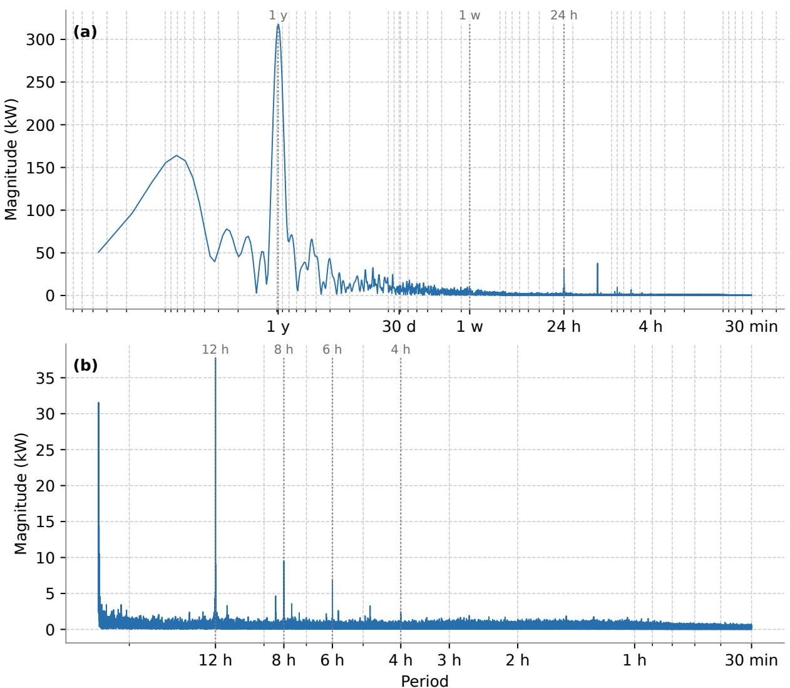  
Figure 1: Fourier magnitude spectra of the full available 15-minute heat load time series: (a) full period range and (b) periods up to one day. The x-axis is shown as period rather than frequency; marked periods indicate seasonal, weekly, daily, and sub-daily components.

The data used in the validation originate from the district heating network of Flensburg, Germany. The network has developed historically from 1969 into a city-scale district heating system with more than 700 km of district heating pipelines and a connection rate of over 90% among private households. This is the same network analyzed by Obermeier et al. 14, discussed in Section 2.3.

Heat is supplied from a central heating plant connected to the district heating network. As of 2024, the heat supply infrastructure comprises six generation units and two large thermal storage tanks.45 The measured heat load signal reflects the aggregated demand supplied by this city-scale network. Heat loads are provided at hourly resolution from January 2014 to December 2024. 46 Weather data for Flensburg are provided by DWD, using hourly air-temperature observations from station 01666 Glücksburg-Meierwik.

## 4.2 Experimental Design

The experimental design proceeds in three stages. First, configuration diagnostics on selected representative weeks are used to study how TabPFN-TS responds to context length, temporal resolution, forecast horizon, weather-covariate choice, and context-data selection. These experiments define the configuration used for the main full-year evaluation. Second, the selected configuration is evaluated over the complete year 2024 and compared with Chronos-2 and trained AutoGluon baselines; the same setup is then applied to the Flensburg data set to assess transferability. This stage also includes probabilistic forecast-quality evaluation and a sensitivity analysis with archived weather forecasts. Third, findings from the configuration diagnostics are used to derive an adapted forecasting architecture for high-resolution operation. This Multi-Resolution Residual-Correction Forecaster is introduced in the following subsection and evaluated in a separate full-year simulation.

## 4.3 Multi-Resolution Residual-Correction Forecaster

We propose a two-stage architecture called the Multi-Resolution Residual-Correction Forecaster (MRRC Forecaster). It combines a long-horizon base forecast with a short-horizon residual correction at higher temporal resolution.

In the MRRC Forecaster, the first component is referred to as the Base Forecaster. It provides the general daily load trajectory at hourly resolution needed for scheduling and storage planning. The Base Forecaster’s point forecast is linearly interpolated to the 15-minute evaluation grid. The second component is referred to as the Residual Forecaster. It forecasts the remaining high-frequency error of this baseline. The architecture aims to improve the representation of short-term dynamics while retaining an operational 24-hour forecast. The final prediction is obtained by adding the predicted residual back to the interpolated baseline.

From a boosting perspective, the setup can be interpreted as a single residual-correction step. An initial model $F ( x )$ produces the base prediction, while a second model $h ( x )$ predicts the residuals $r = y - F ( x )$ . The final prediction is then given by ${ \hat { y } } = F ( x ) + h ( x )$ . In the MRRC Forecaster, the Base Forecaster corresponds to $F ( x )$ , and the Residual Forecaster corresponds to $h ( x )$

For the Base Forecaster, the context window is chosen based on the 24-hour forecast results described in Section 5.1. The forecast horizon of the Base Forecaster is set to 24 hours and a new forecast is issued every 12 hours. Thus, at every point in time a forecast for at least the 12 hours ahead is available.

Because residual prediction difers from direct heat load forecasting, the context-window results from the main configuration experiments are not directly transferable to the Residual Forecaster. Its context window is therefore tuned separately between 2 hours and 14 days. The forecast horizon of the Residual Forecaster is set to 2 hours and a new forecast is issued every hour. Hence, at every point in time, a high-frequency forecast for at least the next hour is available. The structure of the MRRC Forecaster is illustrated in Figure 2.

A related multi-scale residual-aware forecasting setup for TSFMs has recently been proposed by Biswas et al.47.

We compare the MRRC Forecaster with two baseline setups. The first is the Base Forecaster linearly interpolated to 15-minute resolution without the residual correction. The second baseline is a direct high-frequency, high-resolution predictor: it uses 15-minute resolution, a 13-hour prediction horizon, and hourly re-issuing. This setup ensures that at least 12 hours of forecast are available at every time step while matching the short-term resolution of the MRRC Forecaster. It also has access to the same context window as the MRRC Forecaster. In the following, this setup is referred to as the High Frequency & High Resolution setup. This comparison is deliberately strict: it has the same resolution, update frequency, and context window as the MRRC Forecaster, so it tests whether the two-stage architecture adds value beyond simply forecasting directly at

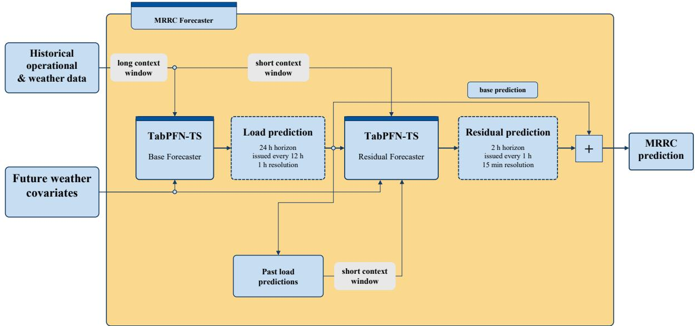  
Figure 2: Schematic structure of the Multi-Resolution Residual-Correction Forecaster.

high resolution with frequent updates.

Two sets of forecast-quality metrics are reported to reflect the diferent operational requirements. The short-term metrics assess the latest available 15-minute operational trajectory. For the hourly updated high-resolution and MRRC setups, this corresponds to the first hour after each forecast update and therefore quantifies how well the most recent forecast tracks the realized high-resolution load profile. In contrast, the long-term metrics assess the forecast information available for planning decisions. This long-term evaluation uses the rolling 12-hour energy metric described in Section 3.2.

## 5 Results

This section presents the empirical results. It first reports the configuration experiments on selected operating weeks, then evaluates the selected setup over the full year and on the transfer network. It further analyzes probabilistic forecast quality and weather sensitivity, and finally evaluates the derived MRRC Forecaster.

## 5.1 Configuration Experiments

First, the required length of historical context data was investigated for the 24-hour forecast task. Context windows of 1 day, 1 week, 4 weeks, 12 weeks, and 1 year were evaluated for both 15- minute and hourly forecast resolutions. For TabPFN-TS, a context window of 12 weeks provided the strongest CVRMSE in both time resolutions, as shown in Figure 3. The $R ^ { 2 }$ and MAE results follow the same qualitative trend. At hourly resolution, the 12-week context achieved a CVRMSE of 11.42%, an $R ^ { 2 }$ of 0.970, and an MAE of 102.6 kW; at 15-minute resolution, it achieved a CVRMSE of 15.71%, an $R ^ { 2 }$ of 0.945, and an MAE of 138.7 kW. Extending the recent context to one year did not further improve the TabPFN-TS point forecast in either resolution. This suggests that very long recent context windows can include operating regimes that are less representative of the forecast period. In this experiment Chronos-2 slightly outperforms TabPFN-TS on every metric for all resolutions and context window lengths. For Chronos-2, the best hourly result was also obtained with a 12-week context window, while the 15-minute result was best with a 4-week context window and then remained close for the longer 12-week context.

The probabilistic score follows the same main pattern as the deterministic metrics. For

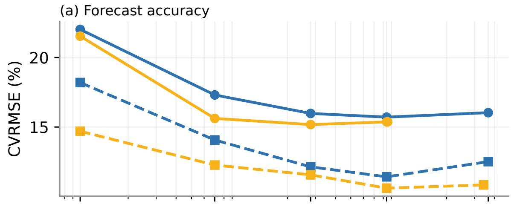

(b) Probabilistic forecast score  
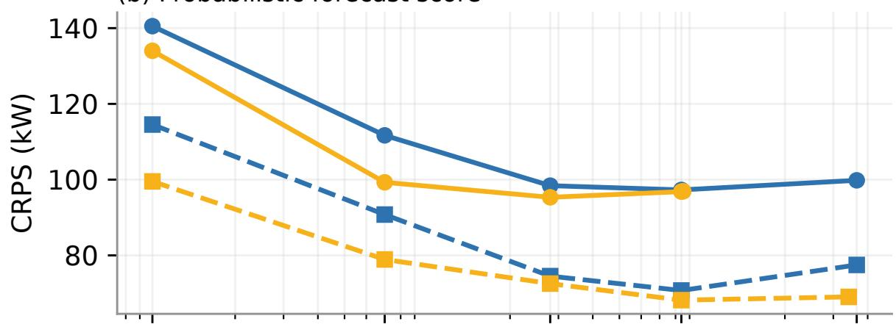

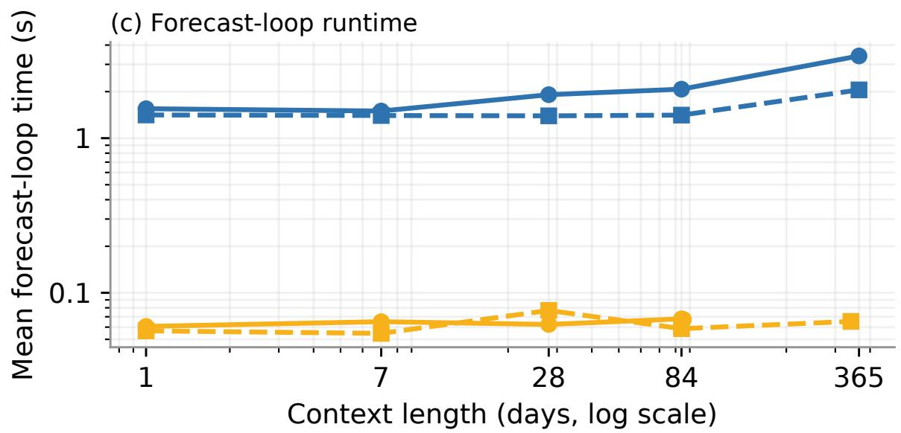  
Figure 3: Overall CVRMSE, CRPS, and mean forecast-loop runtime per forecast start for 24- hour heat load forecasts as a function of context length for the selected summer, winter, and transitional operating weeks.

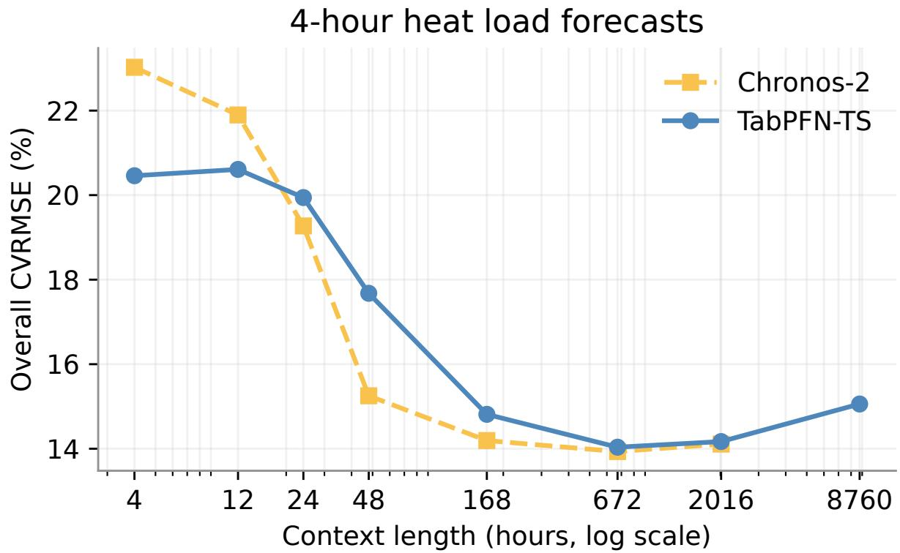  
Figure 4: Overall CVRMSE for 4-hour heat load forecasts at 15-minute resolution as a function of context length.

TabPFN-TS, CRPS improved with increasing context length up to 12 weeks, reaching 70.7 kW at hourly resolution and 97.3 kW at 15-minute resolution, before worsening again for the oneyear context. Chronos-2 showed the same optimum at hourly resolution, while the 15-minute CRPS reached its minimum at 4 weeks and changed only slightly for longer contexts. Thus, the CRPS results support the choice of a moderate recent context window and do not indicate a probabilistic benefit from using the full one-year context.

The corresponding forecast-loop runtime comparison is shown in the lower panel of Figure 3. For the 12-week context, the mean forecast-loop time per forecast start was 1.41 s and 2.07 s for TabPFN-TS at hourly and 15-minute resolution, respectively, compared to 0.06 s and 0.07 s for Chronos-2. The setup times of TabPFN-TS and Chronos-2 are similar and range from 24.6 s to 55.4 s across the timed runs.

The influence of the forecast horizon was then evaluated separately. First, a shorter 4-hour horizon was evaluated at 15-minute resolution, with forecasts issued every 4 hours. Figure 4 shows how the context-window length afects this short-horizon task. When only very short context windows are available, namely 4 hours or 12 hours, TabPFN-TS outperforms Chronos-2. For medium context windows of 1 day, 2 days, and 1 week, Chronos-2 achieves lower CVRMSE values. For longer context windows of 4 weeks and 12 weeks, both models perform very similarly.

The shorter horizon also changes the context-length optimum for TabPFN-TS. Whereas the 24-hour forecast at 15-minute resolution performed best with a 12-week context window, the 4- hour forecast performed best with a 4-week context window. Compared with the best TabPFN-TS setup for 24-hour forecasts at 15-minute resolution, the best 4-hour setup reduced CVRMSE from 15.71% to 14.04%, corresponding to a decrease of 1.67 percentage points, or 10.6% relative to the 24-hour setup. This comparison reflects the combined efect of the shorter forecast horizon and the higher forecast-update frequency.

To separate the efect of the forecast horizon from the efect of the update frequency, an additional TabPFN-TS run issued 24-hour forecasts every 4 hours and was evaluated with the non-overlapping latest-forecast-wins strategy defined in Section 3.2. With a 12-week context window, this setting achieved a CVRMSE of 14.17% and an $R ^ { 2 }$ of 0.955. This is only 0.13 percentage points higher than the best 4-hour TabPFN-TS forecast, which used a 4-week context window. Thus, most of the improvement over the daily 24-hour 15-minute-resolution forecast is explained by the higher forecast-update frequency. Once forecasts are reissued every 4 hours, extending the prediction horizon from 4 hours to 24 hours has only a small additional efect on the non-overlapping evaluation metric.

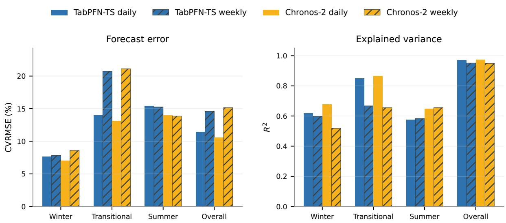  
Figure 5: CVRMSE and $R ^ { 2 }$ for daily 24-hour and weekly 168-hour forecasts at hourly resolution with a 12-week context window for TabPFN-TS and Chronos-2.

Finally, the selected hourly setup was evaluated for a longer 168-hour forecast horizon to test whether the configuration remains suitable for week-ahead prediction. For weekly forecasts at hourly resolution, the optimal context-window length for TabPFN-TS was again 12 weeks. The TabPFN-TS weekly forecast achieved a CVRMSE of 14.57%, an $R ^ { 2 }$ of 0.952, and an MAE of 129.0 kW, compared with 11.42%, 0.970, and 102.6 kW for 24-hour forecasts issued daily with the same 12-week context. The weekly prediction therefore resulted in a 27.6% higher CVRMSE, 1.9% lower $R ^ { 2 }$ , and 25.7% higher MAE. Figure 5 reports the corresponding metrics by operating regime. On the selected operating weeks, TabPFN-TS slightly outperformed Chronos-2 for the weekly horizon in terms of aggregate CVRMSE. This result did not hold in the full-year weekly simulation: Chronos-2 achieved a CVRMSE of 15.64% compared with 17.06% for TabPFN-TS. Complete $R ^ { 2 }$ and MAE results are provided in Supplementary Table S2.

These experiments identify a 12-week recent context as a robust default for TabPFN-TS, while showing that the attainable error level is governed not only by context length but also by temporal aggregation, forecast-update frequency, and forecast horizon.

After the context-length, resolution, and horizon diagnostics, the sensitivity to weathercovariate choice was evaluated for the hourly 24-hour forecast setup with a 12-week context window. Table 1 reports the aggregate performance over all selected operating weeks.

Including weather covariates beyond ambient temperature does not lead to a practically significant improvement for either TabPFN-TS or Chronos-2. The variation in MAE across forecast starts is also not materially reduced by the larger feature sets. While the configuration with all weather covariates achieves the best or tied-best aggregate scores for both foundation models, the ordering of the intermediate feature sets is not consistent between TabPFN-TS and Chronos-2. For example, including wind speed gives one of the strongest TabPFN-TS results, whereas the combination of precipitation and wind speed is more favorable for Chronos-2. This indicates that the small changes in accuracy should not be overinterpreted as a robust ranking of individual weather variables. At the same time, no additional weather covariate causes a clear deterioration in prediction quality. The mean prediction-call time increases by 2.4% for TabPFN-TS and 3.3% for Chronos-2 when moving from ambient temperature only to all weather covariates. For robustness, transferability, and operational simplicity, ambient temperature alone is used in the subsequent experiments, because it is measured at many sites and is commonly available as a forecast variable.

Table 1: Weather feature selection for 24-hour hourly forecasts with a 12-week context window for TabPFN-TS and Chronos-2.
<table><tr><td></td><td colspan="3">TabPFN-TS</td><td colspan="3">Chronos-2</td></tr><tr><td>Weather covariates</td><td>CVRMSE (%)</td><td> $R ^ { 2 }$ </td><td>MAE (kW)</td><td>CVRMSE (%)</td><td> $R ^ { 2 }$ </td><td>MAE (kW)</td></tr><tr><td>Amb. temp.</td><td>11.42</td><td>0.970</td><td> $1 0 2 . 6 \pm 5 8 . 7$ </td><td>10.60</td><td>0.974</td><td> $9 6 . 0 \pm 5 1 . 6$ </td></tr><tr><td>Amb. temp., relative humidity</td><td>11.43</td><td>0.970</td><td> $1 0 2 . 2 \pm 5 9 . 4$ </td><td>10.62</td><td>0.974</td><td> $9 6 . 7 \pm 5 2 . 9$ </td></tr><tr><td>Amb. temp., wind speed</td><td>11.09</td><td>0.972</td><td> $9 8 . 8 \pm 5 5 . 5$ </td><td>10.56</td><td>0.975</td><td> $9 6 . 0 \pm 4 9 . 8$ </td></tr><tr><td>Amb. temp., precipitation</td><td>11.16</td><td>0.972</td><td> $1 0 0 . 1 \pm 5 4 . 8$ </td><td>10.59</td><td>0.975</td><td> $9 6 . 0 \pm 5 1 . 4$ </td></tr><tr><td>Amb. temp., precip., wind sp.</td><td>11.25</td><td>0.971</td><td> $9 9 . 9 \pm 5 6 . 5$ </td><td>10.38</td><td>0.976</td><td> $9 4 . 2 \pm 4 8 . 5$ </td></tr><tr><td>Amb. temp., solar irradiation</td><td>11.33</td><td>0.971</td><td> $1 0 1 . 5 \pm 5 7 . 5$ </td><td>10.47</td><td>0.975</td><td> $9 5 . 3 \pm 5 0 . 4$ </td></tr><tr><td>All weather covariates</td><td>11.09</td><td>0.972</td><td> $9 8 . 8 \pm 5 5 . 9$ </td><td>10.32</td><td>0.976</td><td> $9 5 . 6 \pm 4 7 . 3$ </td></tr></table>

Table 2: Efect of context-data selection on the daily hourly baseline. "Recent 12 (auto feat.)" is the default automatic-feature setup; "Recent $1 2 "$ disables automatic temporal features; "Recent 6 + Relevant $6 "$ combines 6 recent weeks with 6 weeks from the same calendar period one year earlier.
<table><tr><td>Setup</td><td>CVRMSE (%)</td><td> $R ^ { 2 }$ </td><td>MAE (kW)</td></tr><tr><td>Recent 12 (auto feat.)</td><td>11.42</td><td>0.970</td><td> $1 0 2 . 6 \pm 5 8 . 7$ </td></tr><tr><td>Recent 12</td><td>11.69</td><td>0.969</td><td> $1 0 6 . 9 \pm 6 3 . 1$ </td></tr><tr><td>Recent 6 + Relevant 6</td><td>12.69</td><td>0.963</td><td> $1 1 3 . 0 \pm 6 8 . 5$ </td></tr></table>

Next, we examine whether the composition of the context window itself can improve TabPFN-TS forecasts. This experiment tests whether augmenting the recent context with seasonally similar historical observations improves TabPFN-TS forecasts when the recent context alone may not contain comparable operating conditions. The spectral analysis of the Munich heat load data discussed in Section 4.1 revealed a strong seasonal component, with the largest peak at a period of approximately one year. We therefore investigate whether adding relevant calendar-aligned observations from the previous year improves prediction accuracy.

Here, relevant observations denote historical data from a window around the current calendar date, shifted by one year. The recent-plus-relevant setup combines 6 weeks of recent context with a 6-week block from the same calendar period one year earlier, so that the total amount of context data matches the observed optimal 12-week recent-data context. According to the TabPFN-TS documentation, automatic temporal feature engineering must be disabled for this non-contiguous context configuration. Therefore, the recent-plus-relevant experiment used only calendar features and disabled the running-index and automatic seasonal features. This experiment was carried out only for TabPFN-TS, because Chronos-2 expects strictly regular time steps without gaps in the context.

No performance benefit was obtained from adding relevant data. Table 2 also shows that the default automatic temporal feature engineering improved prediction performance by 2.3% on CVRMSE compared with the recent-only setup.

Taken together, the context-length, temporal-resolution, forecast-horizon, weather-covariate, and context-data diagnostics motivate using 24-hour-ahead forecasts at hourly resolution with a 12-week rolling context window and ambient temperature as the only weather covariate in the subsequent full-year and transfer analyses. Figure 6 shows the resulting TabPFN-TS and Chronos-2 forecasts for the selected winter, transitional, and summer weeks.

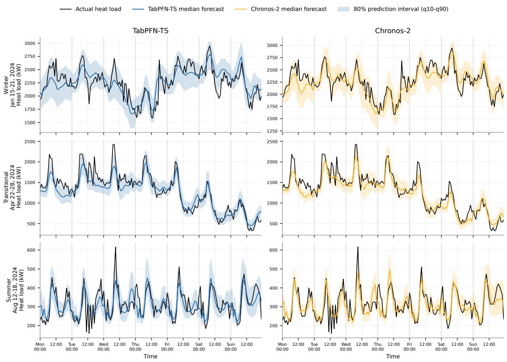  
Figure 6: Munich predictions for the selected 24-hour forecast setup at hourly resolution with a 12-week context window. Rows show the winter, transitional, and summer representative weeks; columns compare TabPFN-TS and Chronos-2. The shaded areas show the q10–q90 prediction intervals.

## 5.2 Seasonal Efects on Forecast Accuracy and Uncertainty

Figure 5 shows that forecast performance depends strongly on the operating period. For daily 24-hour forecasts, the CVRMSE is lowest in winter, followed by the transitional period and summer. The $R ^ { 2 }$ score follows a diferent pattern: winter and summer are comparable, while the transitional week achieves the highest $R ^ { 2 }$ . During the transitional week, the loss in accuracy when moving from daily to weekly forecasts is particularly visible.

The seasonal pattern is also reflected in the probabilistic forecasts. As an example, Table 3 reports the empirical coverage and width of the 80% prediction interval bounded by q10 and q90. The relative interval width is lowest in winter and highest in summer, with the transitional period in between. The empirical coverage is highest in winter for both TabPFN-TS and Chronos-2. The prediction intervals tend to be conservative in this period. In the transitional period, the coverage is lowest for both models, indicating overconfident probabilistic forecasts. Overall, TabPFN-TS is closer to the nominal 80% coverage, while Chronos-2 is more overconfident, especially in the transitional and summer periods.

Table 3: Probabilistic interval quality evaluated on q10 to q90 for daily issued forecasts at hourly resolution with a 12-week context on the selected representative weeks.
<table><tr><td>Period</td><td>Model</td><td>Cov. (%)</td><td>Width (kW)</td></tr><tr><td rowspan="2">Winter</td><td>TabPFN-TS</td><td>88.1</td><td>498.9</td></tr><tr><td>Chronos-2</td><td>89.3</td><td>488.4</td></tr><tr><td rowspan="2">Transitional</td><td>TabPFN-TS</td><td>75.0</td><td>370.3</td></tr><tr><td>Chronos-2</td><td>64.3</td><td>317.7</td></tr><tr><td rowspan="2">Summer</td><td>TabPFN-TS</td><td>79.2</td><td>114.8</td></tr><tr><td>Chronos-2</td><td>69.0</td><td>93.9</td></tr><tr><td rowspan="2">Overall</td><td>TabPFN-TS</td><td>80.8</td><td>328.0</td></tr><tr><td>Chronos-2</td><td>74.2</td><td>300.0</td></tr></table>

## 5.3 Full-Year Benchmark and Transfer Validation

The results of the full-year simulations are reported in Table 4. The entries are sorted by aggregate CVRMSE within each network. On the Munich data set, Chronos-2 achieved the lowest aggregate error, while TabPFN-TS outperformed the trained AutoGluon models across the reported accuracy metrics. To assess whether models perform consistently when transferred to a diferent data set, the rank-shift column reports the change in CVRMSE position in Flensburg relative to the Munich ordering. The relative error metrics were generally lower for Flensburg than for Munich, especially for the strongest models. Chronos-2, TabPFN-TS, and TFT remained the three strongest models in both networks, whereas the naive baselines stayed at the lower end of the ranking. The largest rank changes occurred for AutoETS and ETS, which lost five CVRMSE positions in Flensburg, and for Feed-forward, Recursive LGBM, and Seasonal naive, which gained three positions each. Chronos-2 again achieved the lowest aggregate error, while TabPFN-TS remained ahead of the trained AutoGluon models.

The critical-diference diagrams are shown in Fig. 7. For both data sets, TabPFN-TS lies within the critical diference of Chronos-2. On the Munich data set, the two time-series foundation models form the leading group and outperform all trained AutoGluon baselines in the daily-rank comparison. In Flensburg, the leading group is broader: TFT, DeepAR, and AG Ensemble also lie within the critical diference of the foundation-model results. Detailed pairwise daily CVRMSE win rates are provided in Supplementary Figure S2.

Table 4: Full-year benchmark and transfer-validation results for hourly 24-hour forecasts in 2024.
<table><tr><td></td><td></td><td colspan="3">Aggregate metrics</td><td colspan="3">Mean daily rank</td></tr><tr><td>Model</td><td>Rank shift</td><td>CVRMSE (%)</td><td>R2</td><td>MAE (kW)</td><td>CVRMSE</td><td>R2</td><td>MAE</td></tr><tr><td>Munich</td><td></td><td></td><td></td><td></td><td></td><td></td><td></td></tr><tr><td>Chronos-2</td><td></td><td>12.48</td><td>0.962</td><td> $8 5 . 2 \pm 4 9 . 3$ </td><td>3.05</td><td>3.01</td><td>3.11</td></tr><tr><td>TabPFN-TS</td><td></td><td>13.06</td><td>0.959</td><td> $9 0 . 0 \pm 5 1 . 5$ </td><td>3.89</td><td>3.86</td><td>3.83</td></tr><tr><td>TFT</td><td></td><td>14.57</td><td>0.948</td><td> $1 0 1 . 6 \pm 6 0 . 0$ </td><td>5.86</td><td>5.84</td><td>5.92</td></tr><tr><td>Direct LGBM</td><td></td><td>15.85</td><td>0.939</td><td> $1 1 3 . 3 \pm 6 9 . 2$ </td><td>6.49</td><td>6.41</td><td>6.49</td></tr><tr><td>DeepAR</td><td></td><td>16.43</td><td>0.935</td><td> $1 1 6 . 4 \pm 7 8 . 0$ </td><td>6.66</td><td>6.62</td><td>6.72</td></tr><tr><td>AG Ensemble</td><td></td><td>16.43</td><td>0.935</td><td> $1 1 6 . 4 \pm 7 8 . 0$ </td><td>6.66</td><td>6.62</td><td>6.72</td></tr><tr><td>Direct XGB</td><td></td><td>17.36</td><td>0.927</td><td> $1 2 6 . 3 \pm 7 7 . 2$ </td><td>8.45</td><td>8.40</td><td>8.62</td></tr><tr><td>AutoETS</td><td></td><td>18.45</td><td>0.917</td><td> $1 3 2 . 5 \pm 8 5 . 0$ </td><td>7.75</td><td>7.73</td><td>7.84</td></tr><tr><td>ETS</td><td></td><td>18.45</td><td>0.917</td><td> $1 3 2 . 5 \pm 8 5 . 0$ </td><td>7.75</td><td>7.73</td><td>7.84</td></tr><tr><td>DLinear</td><td></td><td>18.65</td><td>0.916</td><td> $1 3 4 . 6 \pm 8 5 . 5$ </td><td>8.66</td><td>8.68</td><td>8.74</td></tr><tr><td>Feed-forward</td><td></td><td>19.40</td><td>0.909</td><td> $1 4 1 . 4 \pm 8 8 . 7$ </td><td>9.58</td><td>9.62</td><td>9.66</td></tr><tr><td>AutoARIMA</td><td></td><td>20.51</td><td>0.898</td><td> $1 4 8 . 1 \pm 9 2 . 6$ </td><td>10.11</td><td>10.13</td><td>9.90</td></tr><tr><td>Recursive LGBM</td><td></td><td>21.12</td><td>0.892</td><td> $1 5 1 . 8 \pm 9 5 . 4$ </td><td>10.65</td><td>10.71</td><td>10.54</td></tr><tr><td>Seasonal naive Naive</td><td></td><td>22.55</td><td>0.877</td><td> $1 6 1 . 6 \pm 1 0 2 . 5$ </td><td>11.64</td><td>11.72</td><td>11.52</td></tr><tr><td></td><td></td><td>23.72</td><td>0.864</td><td> $1 7 2 . 0 \pm 1 0 8 . 8$ </td><td>12.79</td><td>12.92</td><td>12.55</td></tr><tr><td>Flensburg Chronos-2</td><td></td><td></td><td></td><td></td><td></td><td></td><td></td></tr><tr><td>TabPFN-TS</td><td></td><td>9.82</td><td>0.970</td><td>7913.6 ± 5187.2</td><td>3.98</td><td>3.98</td><td>4.14</td></tr><tr><td></td><td></td><td>10.37</td><td>0.966</td><td> $8 4 3 7 . 3 \pm 5 4 1 1 . 1$ </td><td>4.77</td><td>4.77</td><td>4.60</td></tr><tr><td>TFT</td><td></td><td>10.69</td><td>0.964</td><td> $8 6 6 9 . 2 \pm 6 1 9 9 . 9$ </td><td>5.07</td><td>5.07</td><td>5.06</td></tr><tr><td>DeepAR</td><td>↑1</td><td>10.72</td><td>0.964</td><td> $8 6 7 7 . 9 \pm 6 0 0 3 . 6$ </td><td>5.01</td><td>5.01</td><td>5.12</td></tr><tr><td>AG Ensemble</td><td>↑1</td><td>10.72</td><td>0.964</td><td> $8 6 7 7 . 9 \pm 6 0 0 3 . 6$ </td><td>5.01</td><td>5.01</td><td>5.12</td></tr><tr><td>Direct LGBM</td><td>↓2</td><td>11.12</td><td>0.961</td><td> $9 3 8 0 . 2 \pm 5 7 2 8 . 9$ </td><td>6.20</td><td>6.20</td><td>6.50</td></tr><tr><td>Direct XGB</td><td></td><td>11.43</td><td>0.959</td><td> $9 7 1 6 . 2 \pm 5 9 2 3 . 9$ </td><td>6.89</td><td>6.89</td><td>7.07</td></tr><tr><td>Feed-forward</td><td>↑3</td><td>13.05</td><td>0.946</td><td> $1 0 6 6 5 . 8 \pm 7 4 5 8 . 0$ </td><td>7.44</td><td>7.44</td><td>7.53</td></tr><tr><td>DLinear</td><td>↑1</td><td>13.62</td><td>0.941</td><td> $1 1 2 0 0 . 1 \pm 7 7 0 2 . 8$ </td><td>8.64</td><td>8.64</td><td>8.58</td></tr><tr><td>Recursive LGBM</td><td>↑3</td><td>13.75</td><td>0.940</td><td> $1 1 4 5 6 . 8 \pm 7 4 0 5 . 5$ </td><td>9.23</td><td>9.23</td><td>9.22</td></tr><tr><td>Seasonal naive</td><td>↑3</td><td>15.53</td><td>0.924</td><td> $1 2 7 7 5 . 2 \pm 8 5 9 3 . 8$ </td><td>10.68</td><td>10.68</td><td>10.40</td></tr><tr><td>AutoARIMA</td><td></td><td>15.80</td><td>0.921</td><td> $1 2 8 2 0 . 7 \pm 9 2 9 3 . 5$ </td><td>9.66</td><td>9.66</td><td>9.55</td></tr><tr><td>AutoETS</td><td>↓5</td><td>21.21</td><td>0.858</td><td> $1 8 2 5 5 . 5 \pm 1 2 5 2 9 . 3$ </td><td>12.43</td><td>12.43</td><td>12.38</td></tr><tr><td>ETS</td><td>↓5</td><td>21.21</td><td>0.858</td><td> $1 8 2 5 5 . 5 \pm 1 2 5 2 9 . 3$ </td><td>12.43</td><td>12.43</td><td>12.38</td></tr><tr><td>Naive</td><td></td><td>22.39</td><td>0.842</td><td>18766.4 ± 14250.6</td><td>12.56</td><td>12.56</td><td>12.34</td></tr></table>

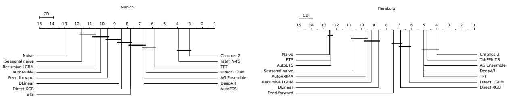  
Figure 7: Critical-diference diagrams for the full-year based on daily CVRMSE ranks.

## 5.4 Probabilistic Forecast Quality

Probabilistic forecast quality is compared between TabPFN-TS and Chronos-2. Table 5 compares representative 50% and 80% central prediction intervals with their empirical coverage for both models, while Figure 8 reports their aggregate probabilistic scores for the full-year hourly forecasts. Coverage results for all evaluated intervals are provided in Supplementary Table S3. TabPFN-TS is better calibrated, as indicated by its lower MACE. Chronos-2 achieves a lower CRPS, indicating better distributional accuracy under this score, but tends to be slightly overconfident and is less well calibrated in terms of empirical coverage.

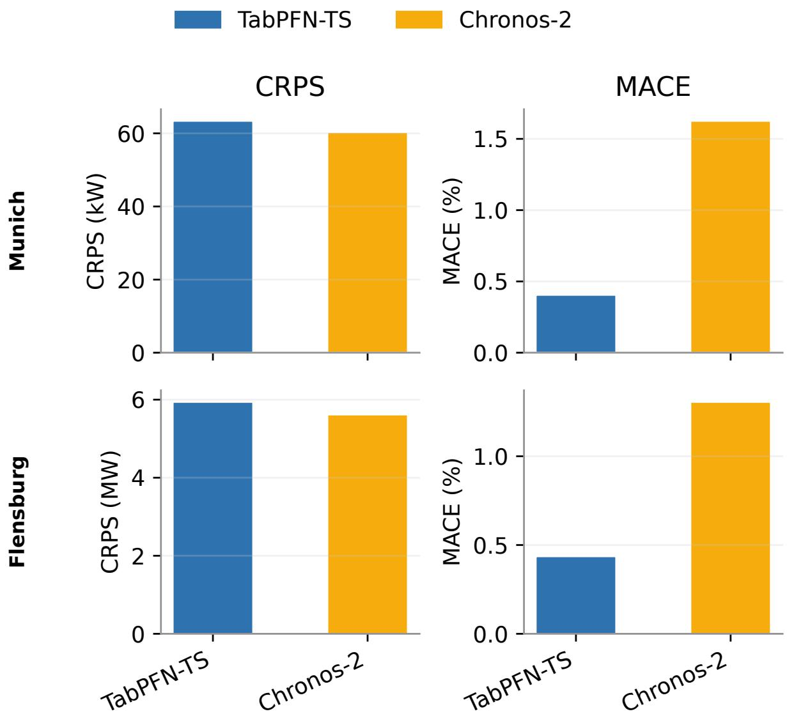  
Figure 8: Probabilistic full-year forecast scores for TabPFN-TS and Chronos-2.

## 5.5 Weather-Forecast Sensitivity

Table 6 summarizes the resulting change in point and probabilistic forecast quality. Both models are afected, with Chronos-2 showing slightly greater sensitivity in this experiment: its CVRMSE increases by 9.5%, compared with 8.3% for TabPFN-TS. The degradation is visible for both models in point-forecast accuracy, distributional scores, and calibration.

Table 5: Empirical coverage of representative central prediction intervals for the full-year hourly forecasts. Interval width is reported in kW for both networks.
<table><tr><td></td><td colspan="3">TabPFN-TS</td><td colspan="3">Chronos-2</td></tr><tr><td>Interval (%)</td><td>Emp. cov. (%)</td><td>Width (kW)</td><td>Rel. width (%)</td><td>Emp. cov. (%)</td><td>Width (kW)</td><td>Rel. width (%)</td></tr><tr><td>Munich</td><td></td><td></td><td></td><td></td><td></td><td></td></tr><tr><td>50.00</td><td>49.92</td><td>145.1</td><td>13.98</td><td>47.77</td><td>132.3</td><td>12.75</td></tr><tr><td>80.00</td><td>80.50</td><td>288.6</td><td>27.80</td><td>77.73</td><td>260.3</td><td>25.07</td></tr><tr><td>Flensburg</td><td></td><td></td><td></td><td></td><td></td><td></td></tr><tr><td>50.00</td><td>50.73</td><td>13702</td><td>11.35</td><td>48.37</td><td>12698</td><td>10.52</td></tr><tr><td>80.00</td><td>79.82</td><td>27126</td><td>22.48</td><td>78.19</td><td>24724</td><td>20.49</td></tr></table>

Table 6: Forecast-quality change when replacing realized future temperature with archived 24- hour-ahead temperature forecasts for the Munich sensitivity subset.
<table><tr><td></td><td></td><td colspan="3">Point forecast</td><td colspan="2">Probabilistic forecast</td></tr><tr><td>Model</td><td>Weather cov.</td><td>CVRMSE (%)</td><td> $R ^ { 2 }$ </td><td>MAE (kW)</td><td>CRPS (kW)</td><td>MACE (%)</td></tr><tr><td rowspan="2">TabPFN-TS</td><td>Realized</td><td>13.64</td><td>0.954</td><td>87.4</td><td>61.9</td><td>0.49</td></tr><tr><td>Forecasted</td><td>14.77 (+8.3%)</td><td>0.946 (-0.8%)</td><td>97.7 (+11.7%)</td><td>68.8 (+11.1%)</td><td>2.71</td></tr><tr><td rowspan="2">Chronos-2</td><td>Realized</td><td>12.89</td><td>0.959</td><td>82.2</td><td>58.2</td><td>1.72</td></tr><tr><td>Forecasted</td><td>14.12 (+9.5%)</td><td>0.950 (-0.9%)</td><td>92.6 (+12.6%)</td><td>65.3 (+12.1%)</td><td>4.91</td></tr></table>

## 5.6 Multi-Resolution Residual-Correction Forecaster Performance

The MRRC Forecaster is motivated by four findings from the preceding experiments:

1. The 24-hour forecast at hourly resolution with a 12-week context window provides a robust forecast of the slowly varying daily load trend, see Figure 3.

2. The high-resolution experiments depicted in Figure 4 show that a higher forecast-update frequency improves the prediction of short-term dynamics.

3. For the more frequently updated high-resolution tasks, shorter context windows are sufficient and can even be optimal, suggesting that recent data is more relevant for highfrequency behavior, see Figure 4.

4. As reported in Section 5.1, reducing the forecast horizon improves short-term accuracy further compared with issuing longer high-resolution forecasts.

Together, these observations motivate a forecaster that combines long-term forecasting with a longer context window and short-term forecasting with a shorter forecast horizon. Following the configuration experiments in Section 5.1, the Base Forecaster uses the selected hourly 24-hour forecast setup with a 12-week rolling context window and is reissued every 12 hours. The context window of the Residual Forecaster was tuned separately for the residual-prediction task and set to 7 days. Table 7 reports the resulting full-year comparison of the three TabPFN-TS setups.

Table 7: Deterministic full-year comparison of the TabPFN-TS MRRC Forecaster with the Base Forecaster and High Frequency & High Resolution setups.
<table><tr><td></td><td colspan="3">Short-term forecast</td><td colspan="2">Long-term forecast</td><td>Computation</td></tr><tr><td>Setup</td><td>CVRMSE (%)</td><td> $R ^ { 2 }$ </td><td>MAE (kW)</td><td>12 h E-CVRMSE (%)</td><td>12 h E-bias (%)</td><td>RTF</td></tr><tr><td>Base Forecaster</td><td>18.64</td><td>0.919</td><td> $1 2 4 . 9 \pm 5 7 . 8$ </td><td>7.56</td><td>-1.23</td><td> $1 . 7 2 \times 1 0 ^ { - 5 }$ </td></tr><tr><td>High Frequency &amp; High Resolution</td><td>17.96</td><td>0.925</td><td> $1 1 4 . 2 \pm 5 4 . 4$ </td><td>7.41</td><td>-1.23</td><td>4.21×10−4</td></tr><tr><td>MRRC Forecaster</td><td>17.95</td><td>0.925</td><td> $1 1 4 . 0 \pm 5 4 . 1$ </td><td>7.21</td><td>-1.18</td><td>2.16×10−4</td></tr></table>

The MRRC Forecaster achieves similar short-term results as the High Frequency & High Resolution setup. For the long-term 12-hour energy metric, it reduces the integrated error by 2.7%, and reduces the bias magnitude by 4.1%. Across the reported accuracy metrics, the MRRC Forecaster is the leading setup and has the lowest variance based on short-term MAE. In addition, it reduces the RTF by 48.7% compared with the High Frequency & High Resolution setup, as the diferent forecasting schemes difer in how often computationally expensive predictions are issued. Compared with the Base Forecaster, the MRRC Forecaster reduces the short-term CVRMSE by 3.7%, the 12 h E-CVRMSE by 4.6%, and the bias magnitude by 4.1%. The Base Forecaster requires less computation and is 12.6 times faster than the MRRC Forecaster.

For Chronos-2, the MRRC Forecaster reduced the 12-hour E-CVRMSE by 6.2% and the RTF by 21.7% relative to the High Frequency & High Resolution setup, while increasing short-term CVRMSE by 2.6%. Complete results are provided in Supplementary Table S4.

## 6 Discussion

Overall, Chronos-2 outperformed TabPFN-TS in deterministic forecasting, consistent with Obermeier et al.14. This advantage may reflect Chronos-2’s native time-series architecture and pretraining objective, which are more directly aligned with temporal structure than TabPFN-TS’s tabular reformulation under a synthetic prior. Nevertheless, TabPFN-TS’s competitive performance supports the potential of PFN-based in-context heat load forecasting, particularly if future variants use priors or pretraining tasks tailored to district-heating dynamics.

The context-length diagnostics in Section 5.1 show that forecast accuracy does not improve monotonically with the amount of historical context, as can be seen in Figure 3 and Figure 4, contradicting the assumption that more data necessarily improve forecasts. Optimal context length therefore remains application-specific even for foundation models. This may reflect superimposed demand processes: space heating is strongly seasonal and weather-driven, whereas domestic hot water is more stochastic and exhibits diferent, weaker temporal patterns. Without explicit separation, long contexts may include regimes irrelevant to the current forecast and obscure rather than improve in-context prediction.

The configuration experiments showed that hourly forecasts achieved substantially lower error metrics than forecasts at 15-minute resolution. This is likely due to temporal aggregation: hourly averaging smooths high-frequency dynamics that are dificult to predict at 15-minute resolution. One potential driver of these dynamics is domestic-hot-water draw-of behavior. The exact timing of individual draw-of events contains a stochastic component and is therefore inherently dificult to forecast48, whereas broader temporal patterns in domestic-hot-water demand are easier to capture49. Additional sources of high-frequency variability may include hydraulic interactions between buildings50, varying transport delays between the energy hub and consumers, delaydependent heat losses, hysteresis-controlled pressure pumps, and other operational efects. The short-horizon experiments also revealed a setting in which TabPFN-TS outperformed Chronos-2 in deterministic accuracy: for the 4-hour forecast task at 15-minute resolution, TabPFN-TS performed better than Chronos-2 when only very short context windows of 4 or 12 hours were available, as shown in Figure 4. This is consistent with energy-demand forecasting results by Kim et al.51, who report strong TabPFN performance under short-context conditions, and with the broader finding that TabPFN can deliver accurate predictions under low data availability11.

The seasonal efects in Section 5.2 provide complementary evidence on how demand composition afects forecast accuracy and uncertainty. The lower winter daily CVRMSE in Figure 5 is consistent with a larger share of weather-driven space-heating demand, creating a stronger and more predictable baseload. In summer, the smaller space-heating share and greater relative contribution of stochastic domestic hot water demand are expected to increase the relative forecast error. The higher $R ^ { 2 }$ during the transitional period results from greater variation in measured demand, allowing more variance to be explained despite the relative error not being lowest. The greater accuracy loss from daily to weekly forecasts in this period may arise because the longer horizon spans rapidly changing load and weather conditions, making multi-day extrapolation harder than in the more stable winter and summer periods. The relative interval widths in Table 3 similarly suggest that relative uncertainty rises as space-heating demand becomes less dominant and stochastic components gain importance. The low empirical coverage during the transitional period may be related to the 12-week context window containing operating conditions less representative of this rapidly changing regime.

Neither TabPFN-TS nor Chronos-2 materially benefited from weather covariates beyond ambient temperature. This is consistent with Petković et al. 52, who favor compact weather-input sets over large sets of meteorological covariates for heat load prediction. However, additional covariates also caused no clear deterioration in forecast accuracy. Because their computational cost was negligible in the tested setting, including all reliably available weather covariates remains defensible when suficiently accurate future values are available.

The transfer results in Section 5.3 and Table 4 should be interpreted in light of network scale. The lower relative errors in the Flensburg validation case may partly reflect aggregation: domestic hot water demand is comparatively stochastic at the individual-building level but becomes more deterministic as more buildings are connected. Because Flensburg is a city-scale district-heating system whereas Munich is a smaller mixed-use district, stronger aggregation in Flensburg may smooth idiosyncratic consumption events and contribute to its lower relative forecasting errors.

Our literature review in Section 2.1 identified retraining under concept drift as a central challenge in heat load forecasting. We therefore hypothesized that rolling-context in-context learning could adapt implicitly to gradual changes in system behavior without explicit retraining. Results from the dynamically evolving Munich network support this hypothesis: Chronos-2 and TabPFN-TS performed strongly and consistently outperformed task-specific models trained on historical data from 2023. Between training and evaluation, the network expanded, while changes in consumer composition and control strategies may also have altered its time-series dynamics. By conditioning on recent observations, the in-context learners could account for these changes directly, whereas models fitted to fixed historical data remained tied to past system conditions. Their smaller advantage in the more stable Flensburg case further supports this interpretation. Although the results do not establish causality, they indicate that rolling-context inference may be particularly beneficial for district-heating networks undergoing structural or operational change. In such settings, time-series foundation models with in-context learning may ofer a conceptual advantage over conventional approaches requiring explicit retraining to adapt to concept drift.

The experiment with seasonally relevant context should be interpreted cautiously. As described in Section 5.1, adding calendar-aligned observations from the previous year did not improve forecasts. However, the 2023 and 2024 data span the ongoing expansion of the Munich district and associated demand growth. The added block may therefore represent a diferent system configuration. Calendar alignment also only approximates physical similarity; selecting context by ambient temperature or clustered operating conditions may be more meaningful, although nonstationarity would remain challenging. Seasonally relevant context may thus be more beneficial in stationary district-heating systems.

The full-year experiments in Section 5.3 used realized future temperature and thus assume perfect weather forecasts. As expected, replacing realized temperatures with archived 24-hourahead forecasts reduced deterministic and probabilistic forecast quality, but the forecasts remained usable at the tested 24-hour horizon. Because the sensitivity analysis covered only this horizon and weather-forecast uncertainty generally increases with lead time, larger efects may occur for week-ahead forecasting or other longer-horizon operational planning tasks.

The MRRC Forecaster discussed in Section 4.3 should be viewed as an architecture derived from the diagnostics, not as a universally superior model. It decomposes demand into a slowly varying daily component and a short-term high-resolution residual, potentially reflecting the slower, weather-driven dynamics of space heating and the faster, more stochastic dynamics of domestic hot water. Although it does not explicitly separate these end uses, it represents their characteristic time scales separately. For TabPFN-TS, the MRRC Forecaster improved the 12- hour energy metric and reduced computational cost relative to the direct High Frequency & High Resolution setup while maintaining similar short-term trajectory accuracy. The High Frequency & High Resolution setup issues a forecast using a 12-week context window and a 13-hour horizon every hour. The MRRC Forecaster instead issues a 24-hour forecast with a 12-week context window only every 12 hours and supplements it with hourly updates using a 7-day context window and a 2-hour horizon. By reducing expensive long-context forecasts, it lowers operational prediction time, which may matter on less powerful hardware. Its benefit therefore depends on whether operational priorities favor short-term trajectory accuracy, longer-horizon energy planning, or lower computational cost.

## 7 Conclusion & Future Work

This work investigated whether TabPFN-TS is suitable for zero-shot probabilistic heat load forecasting in district heating networks. The results indicate that TabPFN-TS is a suitable and competitive forecasting approach, although Chronos-2 achieved the strongest overall accuracy in the reported benchmarks. A robust configuration for TabPFN-TS was obtained with hourly 24-hour forecasts, a 12-week rolling context window, and ambient temperature as the weather covariate.

The experiments show that rolling-context foundation-model forecasting can perform well in an evolving district heating network without repeated task-specific retraining. TabPFN-TS transferred to the Flensburg validation case, provided empirically well-calibrated prediction intervals, and outperformed the trained AutoGluon baselines in the main full-year comparison. At the same time, the diagnostic experiments showed that configuration choices remain important: more context data, higher temporal resolution, and larger weather-covariate sets did not automatically improve performance.

The derived Multi-Resolution Residual-Correction Forecaster further illustrates how the diagnostic findings can be translated into an operational forecasting architecture. By combining a longer-horizon base forecast with a short-term residual correction, it improved the balance between high-resolution forecast accuracy, longer-horizon energy prediction, and computational cost. Overall, the results suggest that time-series foundation models, including TabPFN-TS, are a promising low-engineering-efort option for probabilistic heat load forecasting in district heating networks, especially when recent operating conditions are more informative than fixed historical training data.

The MRRC Forecaster warrants further investigation beyond the Munich network and across diferent operating conditions. Its separation of slow load trends and high-frequency deviations may also transfer to other energy-system forecasting tasks. Future work should tune the Residual Forecaster horizon, test multiple weak learners, and compare combinations of time-series foundation models or classical machine-learning algorithms as Base and Residual Forecasters.

A second direction is to adapt foundation models more closely to district-heating heat load forecasting by preconditioning them on real-world time series, simulation data, or synthetic data containing the relevant dynamics. Task-specific prior data or further weight adaptation may improve forecast accuracy. However, if target-network data are included in the prior or used for adaptation, robustness under concept drift must be evaluated separately.

Future work should extend forecasts beyond heat demand to mass flow rates as well as supply and return temperatures. The delivered heat rate is proportional to mass flow rate and temperature diference, while the eficiency and usability of sustainable sources such as heat pumps and waste-heat streams depend on the required temperature level. Spatially distributed multivariate forecasts within the network could further support decentralized heat-source integration by providing more detailed information for operational planning and control.

# CRediT Authorship Contribution Statement

Ben Spoek: Conceptualization, Methodology, Software, Validation, Formal analysis, Investigation, Data curation, Visualization, Writing – original draft, Project administration.

Karim K. Ben Hicham: Conceptualization, Methodology, Software, Validation, Writing – review and editing.

Kai Derzsi: Data curation, Methodology, Validation, Formal analysis, Writing – review and editing.

Philipp Althaus: Conceptualization, Supervision, Writing – review and editing.

Alexander Mitsos: Supervision, Project administration, Funding acquisition, Writing – review and editing.

Dirk Müller: Supervision, Project administration, Funding acquisition, Writing – review and editing.

## Funding

We gratefully acknowledge the financial support provided by the Federal Ministry for Economic Afairs and Energy (BMWE) under funding code 03EN3118. We acknowledge support of the Werner Siemens Foundation in the frame of the WSS Research Center “catalaix”. The funders had no role in the study design, data collection, analysis, interpretation, manuscript preparation, or decision to submit the article.

## Declaration of Competing Interest

The authors declare that they have no known competing financial interests or personal relationships that could have appeared to influence the work reported in this paper.

## Code & Data Availability

The code used for the experiments is available on GitHub at https://github.com/benspoek/ts fm-heatload and on Zenodo at https://zenodo.org/records/21511738. The Munich district heating dataset used in this study is not publicly available due to third-party restrictions on the underlying operational data. The Flensburg district heating dataset is a third-party dataset and is publicly available. 46

## Acknowledgments and Computational Resources

Computations were performed with computing resources granted by RWTH Aachen University under project rwth2083.

## Declaration of Generative AI and AI-Assisted Technologies in the Manuscript Preparation Process

During the preparation of this work, the authors used OpenAI Codex to assist with code review and editing, manuscript organization, language refinement, and consistency checks. The authors reviewed and edited the output as needed and take full responsibility for the content of the published article.

## References

[1] European Parliament and Council of the European Union. Regulation (EU) 2021/1119 of the European Parliament and of the Council of 30 June 2021 Establishing the Framework for Achieving Climate Neutrality and Amending Regulations (EC) No 401/2009 and (EU) 2018/1999 (‘European Climate Law’). Oficial Journal of the European Union; 2021. L 243. Available from: https://eur-lex.europa.eu/eli/reg/2021/1119/oj.

[2] Lund H, Werner S, Wiltshire R, Svendsen S, Thorsen JE, Hvelplund F, et al. 4th Generation District Heating (4GDH). Energy. 2014 Apr;68:1-11. doi:10.1016/j.energy.2014.02.089.

[3] Jodeiri AM, Goldsworthy MJ, Bufa S, Cozzini M. Role of Sustainable Heat Sources in Transition towards Fourth Generation District Heating – A Review. Renew Sustain Energy Rev. 2022 Apr;158:112156. doi:10.1016/j.rser.2022.112156.

[4] Vandermeulen A, Van Der Heijde B, Helsen L. Controlling District Heating and Cooling Networks to Unlock Flexibility: A Review. Energy. 2018 May;151:103-15. doi:10.1016/j.energy.2018.03.034.

[5] Leiria D, Johra H, Marszal-Pomianowska A, Pomianowski MZ. A Methodology to Estimate Space Heating and Domestic Hot Water Energy Demand Profile in Residential Buildings from Low-Resolution Heat Meter Data. Energy. 2023 Jan;263:125705. doi:10.1016/j.energy.2022.125705.

[6] Wojdyga K. An Influence of Weather Conditions on Heat Demand in District Heating Systems. Energy Build. 2008;40(11):2009-14. doi:10.1016/j.enbuild.2008.05.008.

[7] Ivanko D, Sørensen ÅL, Nord N. Splitting Measurements of the Total Heat Demand in a Hotel into Domestic Hot Water and Space Heating Heat Use. Energy. 2021 Mar;219:119685. doi:10.1016/j.energy.2020.119685.

[8] Dang LM, Lee S, Li Y, Oh C, Nguyen TN, Song HK, et al. Daily and Seasonal Heat Usage Patterns Analysis in Heat Networks. Sci Rep. 2022 Jun;12(1):9165. doi:10.1038/s41598-022- 13030-6.

[9] Derzsi K, Klingebiel J, Müller D. Concept Drift Detection in District Heating: A Characterization Framework and Detector-Centric Benchmark. Energy AI. 2026 Sep;25:100788. doi:10.1016/j.egyai.2026.100788.

[10] Celik B, Vanschoren J. Adaptation Strategies for Automated Machine Learning on Evolving Data. IEEE Trans Pattern Anal Mach Intell. 2021 Sep;43(9):3067-78. doi:10.1109/TPAMI.2021.3062900.

[11] Hollmann N, Müller S, Purucker L, Krishnakumar A, Körfer M, Hoo SB, et al. Accurate Predictions on Small Data with a Tabular Foundation Model. Nature. 2025;637(8045):319- 26. doi:10.1038/s41586-024-08328-6.

[12] Qu J, Holzmüller D, Varoquaux G, Le Morvan M. TabICL: A Tabular Foundation Model for in-Context Learning on Large Data. In: Singh A, Fazel M, Hsu D, Lacoste-Julien S, Berkenkamp F, Maharaj T, et al, editors. Proceedings of the 42nd International Conference on Machine Learning. vol. 267 of Proceedings of Machine Learning Research. PMLR; 2025. p. 50817-47.

[13] Hoo SB, Müller S, Salinas D, Hutter F. From Tables to Time: Extending TabPFN-v2 to Time Series Forecasting. arXiv; 2025. arXiv preprint arXiv:2501.02945. Available from: https://arxiv.org/abs/2501.02945. doi:10.48550/arXiv.2501.02945.

[14] Obermeier M, Pruckner M, Haselbeck F, Zeiselmair A. FETS Benchmark: Foundation Models Outperform Dataset-Specific Machine Learning in Energy Time Series Forecasting. arXiv; 2026. arXiv preprint arXiv:2604.22328. Available from: https://arxiv.org/abs/2604.2 2328. doi:10.48550/arXiv.2604.22328.

[15] Ansari AF, Shchur O, Küken J, Auer A, Han B, Mercado P, et al. Chronos-2: From Univariate to Universal Forecasting. arXiv; 2025. arXiv preprint arXiv:2510.15821. Available from: https://arxiv.org/abs/2510.15821. doi:10.48550/arXiv.2510.15821.

[16] Ntakolia C, Anagnostis A, Moustakidis S, Karcanias N. Machine Learning Applied on the District Heating and Cooling Sector: A Review. Energy Syst. 2022 Feb;13(1):1-30. doi:10.1007/s12667-020-00405-9.

[17] Dotzauer E. Simple Model for Prediction of Loads in District-Heating Systems. Appl Energy. 2002;73(3–4):277-84. doi:10.1016/S0306-2619(02)00078-8.

[18] Nielsen HA, Madsen H. Modelling the Heat Consumption in District Heating Systems Using a Grey-Box Approach. Energy Build. 2006;38(1):63-71. doi:10.1016/j.enbuild.2005.05.002.

[19] Gadd H, Werner S. Daily Heat Load Variations in Swedish District Heating Systems. Appl Energy. 2013 Jun;106:47-55. doi:10.1016/j.apenergy.2013.01.030.

[20] Fang T, Lahdelma R. Evaluation of a Multiple Linear Regression Model and SARIMA Model in Forecasting Heat Demand for District Heating System. Appl Energy. 2016 Oct;179:544-52. doi:10.1016/j.apenergy.2016.06.133.

[21] Dahl M, Brun A, Andresen GB. Using Ensemble Weather Predictions in District Heating Operation and Load Forecasting. Appl Energy. 2017;193:455-65. doi:10.1016/j.apenergy.2017.02.066.

[22] Park TC, Kim US, Kim LH, Jo BW, Yeo YK. Heat Consumption Forecasting Using Partial Least Squares, Artificial Neural Network and Support Vector Regression Techniques in District Heating Systems. Korean J Chem Eng. 2010;27(4):1063-71. doi:10.1007/s11814- 010-0220-9.

[23] Finkenrath M, Faber T, Behrens F, Leiprecht S. Holistic Modelling and Optimisation of Thermal Load Forecasting, Heat Generation and Plant Dispatch for a District Heating Network. Energy. 2022;250:123666. doi:10.1016/j.energy.2022.123666.

[24] Runge J, Saloux E. A Comparison of Prediction and Forecasting Artificial Intelligence Models to Estimate the Future Energy Demand in a District Heating System. Energy. 2023;269:126661. doi:10.1016/j.energy.2023.126661.

[25] Izadyar N, Ong HC, Shamshirband S, Ghadamian H, Tong CW. Intelligent Forecasting of Residential Heating Demand for the District Heating System Based on the Monthly Overall Natural Gas Consumption. Energy Build. 2015;104:208-14. doi:10.1016/j.enbuild.2015.07.006.

[26] Powell KM, Sriprasad A, Cole WJ, Edgar TF. Heating, Cooling, and Electrical Load Forecasting for a Large-Scale District Energy System. Energy. 2014;74:877-85. doi:10.1016/j.energy.2014.07.064.

[27] Song J, Zhang L, Xue G, Ma Y, Gao S, Jiang Q. Predicting Hourly Heating Load in a District Heating System Based on a Hybrid CNN-LSTM Model. Energy Build. 2021;243:110998. doi:10.1016/j.enbuild.2021.110998.

[28] Kato K, Sakawa M, Ishimaru K, Ushiro S, Shibano T. Heat Load Prediction through Recurrent Neural Network in District Heating and Cooling Systems. In: 2008 IEEE International Conference on Systems, Man and Cybernetics; 2008. p. 1401-6. doi:10.1109/ICSMC.2008.4811482.

[29] Xue P, Qi C, Li J, Kong L, Song X. Heating Load Prediction Based on Attention Long Short Term Memory: A Case Study of Xingtai. Energy. 2020;203:117846. doi:10.1016/j.energy.2020.117846.

[30] Gong M, Zhao Y, Sun J, Han C, Sun G, Yan B. Load Forecasting of District Heating System Based on Informer. Energy. 2022;253:124179. doi:10.1016/j.energy.2022.124179.

[31] Gama J, Žliobait˙e I, Bifet A, Pechenizkiy M, Bouchachia A. A Survey on Concept Drift Adaptation. ACM Comput Surv. 2014 Apr;46(4):1-37. doi:10.1145/2523813.

[32] Lu J, Liu A, Dong F, Gu F, Gama J, Zhang G. Learning under Concept Drift: A Review. IEEE Trans Knowl Data Eng. 2019 Dec;31(12):2346-63. doi:10.1109/TKDE.2018.2876857.

[33] Webb GI, Hyde R, Cao H, Nguyen HL, Petitjean F. Characterizing Concept Drift. Data Min Knowl Discov. 2016 Jul;30(4):964-94. doi:10.1007/s10618-015-0448-4.

[34] Hollmann N, Müller S, Eggensperger K, Hutter F. TabPFN: A Transformer That Solves Small Tabular Classification Problems in a Second. In: The Eleventh International Conference on Learning Representations; 2023. Available from: https://openreview.net/forum ?id=cp5PvcI6w8\_.

[35] Müller S, Hollmann N, Pineda Arango S, Grabocka J, Hutter F. Transformers Can Do Bayesian Inference. In: The Tenth International Conference on Learning Representations; 2022. Available from: https://openreview.net/forum?id=KSugKcbNf9.

[36] Aksu T, Woo G, Liu J, Liu X, Liu C, Savarese S, et al. GIFT-Eval: A Benchmark for General Time Series Forecasting Model Evaluation. arXiv; 2024. arXiv preprint arXiv:2410.10393. Available from: https://arxiv.org/abs/2410.10393. doi:10.48550/arXiv.2410.10393.

[37] Meyer M, Zapata Gonzalez DR, Kaltenpoth SB, Müller O. Benchmarking Time Series Foundation Models for Short-Term Household Electricity Load Forecasting. IEEE Access. 2025;13:218141-53. doi:10.1109/ACCESS.2025.3648056.

[38] Koch F, Raisch F, Tischler B. Thermal-GEMs: Generalized Models for Building Thermal Dynamics. In: The 13th ACM International Conference on Systems for Energy-Eficient Buildings, Cities, and Transportation (BuildSys ’26). Banf, Canada: Association for Computing Machinery; 2026. p. 115-25. doi:10.1145/3744256.3812565.

[39] Hertel M, Nikoltchovska A, Pütz S, Mikut R, Schäfer B, Hagenmeyer V. Explainable Load Forecasting with Covariate-Informed Time Series Foundation Models. In: Proceedings of the 17th ACM International Conference on Future and Sustainable Energy Systems (e-Energy ’26). Association for Computing Machinery; 2026. p. 612-26. doi:10.1145/3744255.3811724.

[40] Alkhulaifi N, Bowler AL, Pekaslan D, Watson NJ, Triguero I. AutoEnergy: An Automated Feature Engineering Algorithm for Energy Consumption Forecasting with AutoML. Knowl-Based Syst. 2025 Nov;329:114300. doi:10.1016/j.knosys.2025.114300.

[41] Ramachandran A, Chatterjee S, Neergaard TFB, Oberndoerfer M, Maier A, Bayer S. A Deep Learning Framework for Heat Demand Forecasting Using Time-Frequency Representations of Decomposed Features. Energy AI. 2026;24:100704. doi:10.1016/j.egyai.2026.100704.

[42] Shchur O, Turkmen AC, Erickson N, Shen H, Shirkov A, Hu T, et al. AutoGluon-TimeSeries: AutoML for Probabilistic Time Series Forecasting. In: Faust A, Garnett R, White C, Hutter F, Gardner JR, editors. Proceedings of the Second International Conference on Automated Machine Learning. vol. 224 of Proceedings of Machine Learning Research. PMLR; 2023. p. 9/1-21.

[43] Zippenfenig P. Open-Meteo.com Weather API. Zenodo; 2023. [software]. Available from: https://doi.org/10.5281/zenodo.7970649. doi:10.5281/zenodo.7970649.

[44] Deutscher Wetterdienst (DWD). 10-minute station observation data for Munich (ID 03379) for the period 2023–2024. DWD Climate Data Center; 2026. [dataset]. Available from: https://opendata.dwd.de/climate\_environment/CDC/observations\_germany/climate /10\_minutes/air\_temperature/historical/.

[45] Stadtwerke Flensburg. Einzigartiges Fernwärmenetz: Anschlussquote von über 90 %. Stadtwerke Flensburg; 2024. Available from: https://www.stadtwerke-flensburg.d e/unternehmen/nachhaltigkeit/transformationsplan/flensburger-fernwaerme.

[46] Freißmann J, Fritz M, Tuschy I, Stadtwerke Flensburg GmbH. Network Data of the District Heating System for the City of Flensburg from 2020–2024. Zenodo; 2025. [dataset]. Available from: https://doi.org/10.5281/zenodo.17177421. doi:10.5281/zenodo.17177421.

[47] Biswas A, Kamal M, Krambroeckers R, Elahi MML, Momen S, Mohammed N, et al. One Step Closer to Ground Truth: A Multi-Scale Residual-Aware Representation Learning Pipeline for Predicting Time Series Data. arXiv; 2026. arXiv preprint arXiv:2606.10678. Available from: https://arxiv.org/abs/2606.10678. doi:10.48550/arXiv.2606.10678.

[48] Fuentes E, Arce L, Salom J. A Review of Domestic Hot Water Consumption Profiles for Application in Systems and Buildings Energy Performance Analysis. Renew Sustain Energy Rev. 2018 Jan;81:1530-47. doi:10.1016/j.rser.2017.05.229.

[49] Maltais LG, Gosselin L. Predictability Analysis of Domestic Hot Water Consumption with Neural Networks: From Single Units to Large Residential Buildings. Energy. 2021 Aug;229:120658. doi:10.1016/j.energy.2021.120658.

[50] Xu B, Fu L, Di H. Field Investigation on Consumer Behavior and Hydraulic Performance of a District Heating System in Tianjin, China. Build Environ. 2009 Feb;44(2):249-59. doi:10.1016/j.buildenv.2008.03.002.

[51] Kim S, Lim J, Byun J, Kim J, Kim H. Data-Eficient Electricity Consumption Forecasting with a Tabular Foundation Model. In: Proceedings of the 2025 International Conference on Information and Communication Technology Convergence (ICTC). IEEE; 2025. p. 489-93. doi:10.1109/ICTC66702.2025.11389094.

[52] Petković D, Protić M, Shamshirband S, Akib S, Raos M, Marković D. Evaluation of the Most Influential Parameters of Heat Load in District Heating Systems. Energy Build. 2015;104:264-74. doi:10.1016/j.enbuild.2015.06.074.

## Supplementary Information

This Supplementary Information provides additional details on the development of the Munich district heating network, the selection of representative operating weeks, the daily modelcomparison results, the probabilistic coverage evaluation, the full-year week-ahead forecasts, and the Chronos-2 Multi-Resolution Residual-Correction Forecaster comparison.

## S1 Munich Network Development and Representative Weeks

The Munich district heating network expanded over the available observation period, and its annual heat demand increased accordingly. Figure S1 shows the annual heat supplied during each complete calendar year in the data set.

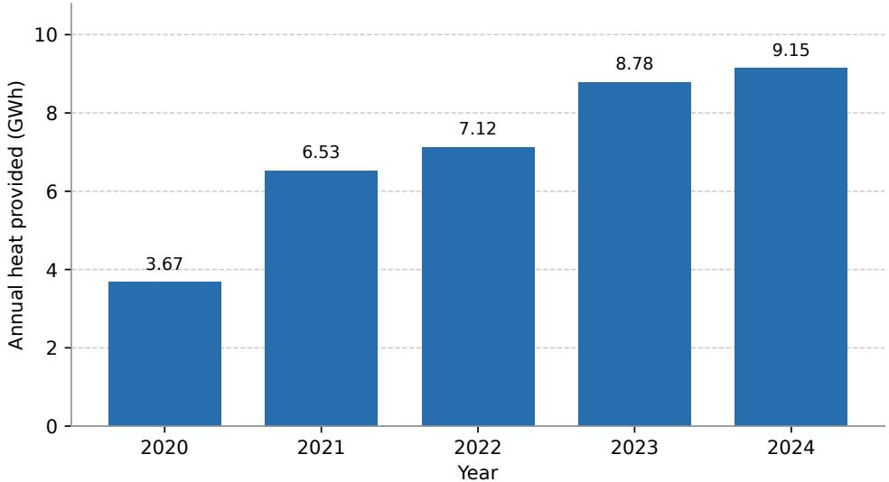  
Figure S1: Annual heat provided by the Munich district heating network for complete calendar years. Values are computed by integrating the 15-minute heat load signal in kW and converting the result to GWh.

Configuration diagnostics were conducted on complete Monday–Sunday weeks without detected heat load anomalies. Weeks containing signal outages, defined as three or more consecutive identical heat load values, were excluded. From the remaining weeks, the coldest week represents winter operation, the hottest week represents summer operation, and the week with the largest within-week ambient-temperature variability represents transitional operation. Table S1 reports the selected weeks and their temperature statistics.

Table S1: Selected representative weeks from 2024 and their ambient-temperature statistics.
<table><tr><td>Regime</td><td>Min. (°C)</td><td>Mean (°C)</td><td>Max. (°C)</td><td>Dates</td></tr><tr><td>Winter</td><td>-8.60</td><td>-0.51</td><td>11.20</td><td>Jan. 15–21</td></tr><tr><td>Transitional</td><td>0.40</td><td>7.97</td><td>24.60</td><td>Apr. 22–28</td></tr><tr><td>Summer</td><td>16.80</td><td>23.16</td><td>32.20</td><td>Aug. 12–18</td></tr></table>

## S2 Extended Daily-Rank Model Comparison

Figure S2 shows pairwise daily win rates based on CVRMSE for the full-year Munich and Flensburg evaluations. Each cell gives the percentage of daily forecasts for which the row model achieved a lower CVRMSE than the column model, with exact ties counted as half a win.

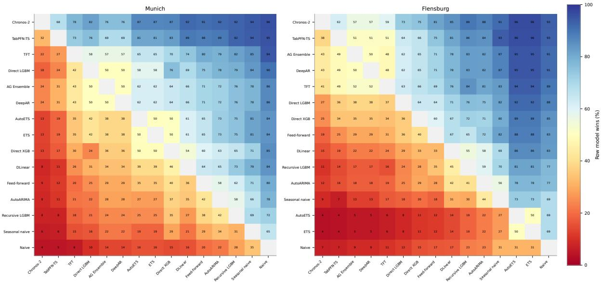  
Figure S2: Pairwise daily CVRMSE win rates for the full-year Munich and Flensburg evaluations.

## S3 Full-Year Week-Ahead Forecasting

The selected-week analysis suggested a slight CVRMSE advantage of TabPFN-TS over Chronos-2 for weekly 168-hour forecasts. To test whether this behavior was specific to the selected weeks, an additional full-year simulation was conducted for the Munich data set. The full-year result in Table S2 follows the main benchmark pattern: Chronos-2 outperforms TabPFN-TS on the week-ahead task, achieving a lower CVRMSE and MAE and a higher $R ^ { 2 }$

Table S2: Full-year Munich results for non-overlapping weekly 168-hour forecasts at hourly resolution.
<table><tr><td>Model</td><td>CVRMSE (%)</td><td> $R ^ { 2 }$  MAE (kW)</td></tr><tr><td>Chronos-2</td><td>15.64</td><td>0.941 109.7</td></tr><tr><td>TabPFN-TS</td><td>17.06</td><td>0.929 120.2</td></tr></table>

## S4 Extended Probabilistic Evaluation

Table S3 reports empirical coverage and interval width for all evaluated central prediction intervals. The results compare TabPFN-TS and Chronos-2 for the full-year hourly forecasts in both district heating networks.

Table S3: Empirical coverage of all evaluated central prediction intervals for the full-year hourly forecasts. Interval width is reported in kW for both networks.
<table><tr><td rowspan="2">Interval (%)</td><td colspan="3">TabPFN-TS</td><td colspan="3">Chronos-2</td></tr><tr><td>Emp. cov. (%)</td><td>Width (kW)</td><td>Rel. width (%)</td><td>Emp. cov. (%)</td><td>Width (kW)</td><td>Rel. width (%)</td></tr><tr><td>Munich</td><td></td><td></td><td></td><td></td><td></td><td></td></tr><tr><td>50.00</td><td>49.92</td><td>145.1</td><td>13.98</td><td>47.77</td><td>132.3</td><td>12.75</td></tr><tr><td>60.00</td><td>60.13</td><td>182.7</td><td>17.60</td><td>57.76</td><td>166.6</td><td>16.05</td></tr><tr><td>80.00</td><td>80.50</td><td>288.6</td><td>27.80</td><td>77.73</td><td>260.3</td><td>25.07</td></tr><tr><td>90.00</td><td>90.90</td><td>389.7</td><td>37.54</td><td>88.20</td><td>348.4</td><td>33.56</td></tr><tr><td>95.00</td><td>95.62</td><td>496.1</td><td>47.79</td><td>95.63</td><td>477.4</td><td>45.99</td></tr><tr><td>98.00</td><td>98.21</td><td>661.4</td><td>63.72</td><td>97.41</td><td>554.9</td><td>53.45</td></tr><tr><td>Flensburg</td><td></td><td></td><td></td><td></td><td></td><td></td></tr><tr><td>50.00</td><td>50.73</td><td>13702</td><td>11.35</td><td>48.37</td><td>12698</td><td>10.52</td></tr><tr><td>60.00</td><td>60.22</td><td>17242</td><td>14.29</td><td>58.88</td><td>15954</td><td>13.22</td></tr><tr><td>80.00</td><td>79.82</td><td>27126</td><td>22.48</td><td>78.19</td><td>24724</td><td>20.49</td></tr><tr><td>90.00</td><td>90.45</td><td>36340</td><td>30.11</td><td>88.18</td><td>32691</td><td>27.09</td></tr><tr><td>95.00</td><td>95.75</td><td>45772</td><td>37.93</td><td>94.84</td><td>43790</td><td>36.29</td></tr><tr><td>98.00</td><td>98.28</td><td>60076</td><td>49.78</td><td>96.70</td><td>50450</td><td>41.81</td></tr></table>

## S5 Chronos-2 MRRC Forecaster Comparison

The Chronos-2 comparison uses the same three forecasting setups as the TabPFN-TS evaluation. The Base Forecaster issues hourly 24-hour forecasts with a 12-week context every 12 hours. The High Frequency & High Resolution setup issues 13-hour forecasts at 15-minute resolution every hour. The Multi-Resolution Residual-Correction (MRRC) Forecaster combines the Base Forecaster with hourly residual updates using a 7-day context and a 2-hour horizon.

Table S4: Deterministic full-year comparison of the Chronos-2 MRRC Forecaster with the Base Forecaster and High Frequency & High Resolution setups.
<table><tr><td colspan="4">Short-term forecast</td></tr><tr><td>Setup</td><td>CVRMSE (%)</td><td> $R ^ { 2 }$ </td><td>MAE (kW)</td></tr><tr><td>Base Forecaster</td><td>18.21</td><td>0.923</td><td> $1 2 1 . 2 \pm 5 4 . 7$ </td></tr><tr><td>High Frequency &amp; High Resolution</td><td></td><td>17.72 0.927</td><td> $1 0 7 . 7 \pm 5 2 . 8$ </td></tr><tr><td>MRRC Forecaster</td><td>18.18</td><td>0.923</td><td> $1 0 9 . 0 \pm 5 4 . 1 $ </td></tr><tr><td colspan="4"></td></tr><tr><td>Long-term forecast and computation Setup</td><td>12 h</td><td>12 h</td><td>RTF</td></tr><tr><td></td><td>E-CVRMSE (%) E-bias (%)</td><td>-0.51</td><td> $5 . 8 0 \times 1 0 ^ { - 7 }$ </td></tr><tr><td>Base Forecaster High Frequency &amp; High Resolution</td><td>6.89 7.12</td><td>0.55</td><td> $8 . 0 1 \times 1 0 ^ { - 6 }$ </td></tr><tr><td>MRRC Forecaster</td><td>6.68</td><td>-0.47</td><td> $6 . 2 7 \times 1 0 ^ { - 6 }$ </td></tr></table>

The Chronos-2 results point in a similar direction to the TabPFN-TS results, although the short-term trajectory does not improve with the MRRC Forecaster. The High Frequency & High Resolution setup achieves the lowest short-term CVRMSE and MAE. Relative to this direct setup, the MRRC Forecaster increases short-term CVRMSE by 2.6%, while reducing the 12-hour E-CVRMSE by 6.2%, the bias magnitude by 14.5%, and the RTF by 21.7%. The MRRC Forecaster remains 10.8 times more computationally expensive than the Base Forecaster alone.