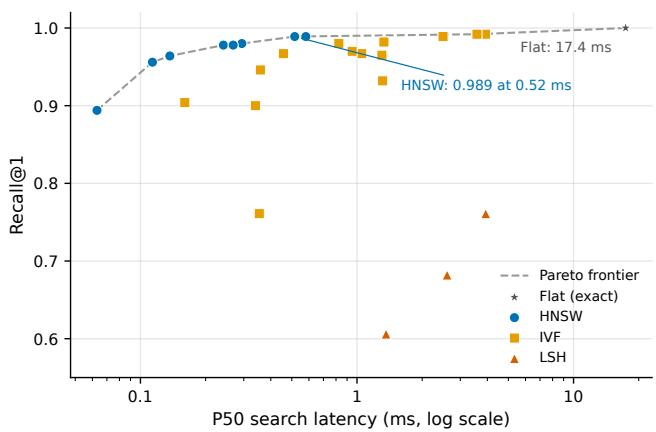
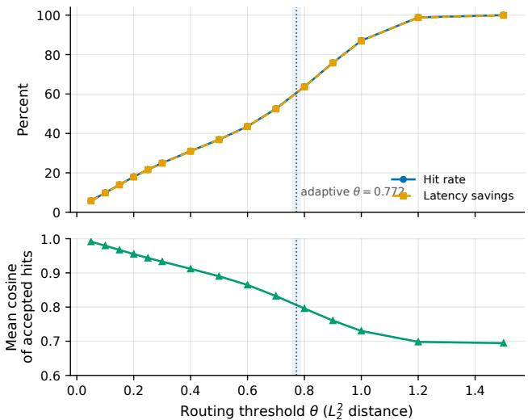
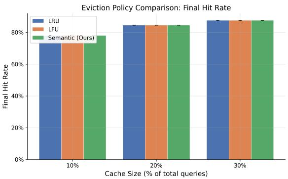
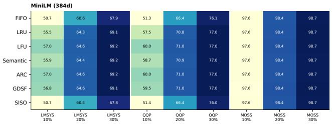
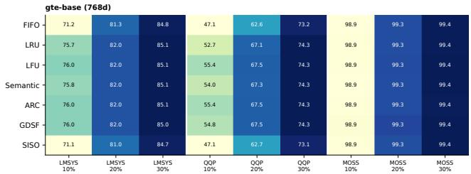
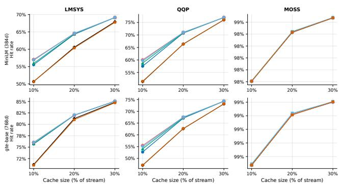
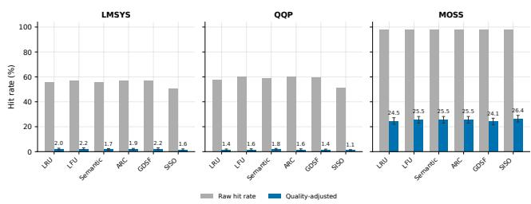
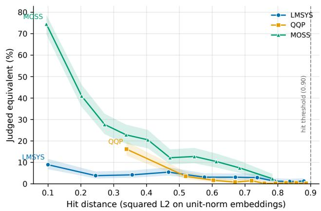
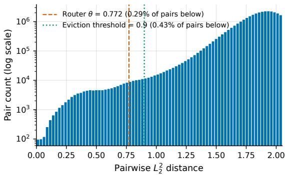
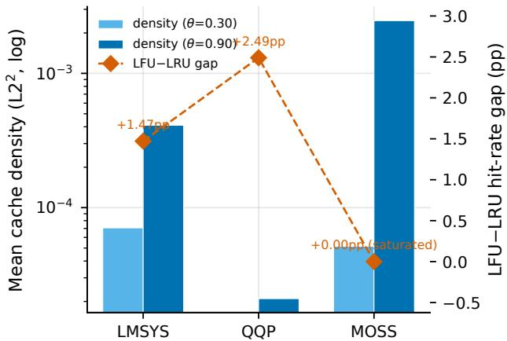

# Which Eviction Policy Should an LLM Cache Use? A Systematic Study Across Workloads, Capacities, and Encoders

Yash Kulkarni   
University of Michigan   
Ann Arbor, Michigan, USA   
yashkulk@umich.edu   
Shubham Harkare   
University of Michigan   
Ann Arbor, Michigan, USA   
sharkare@umich.edu

Arvind Suresh Yogesh Babu University of Michigan Ann Arbor, Michigan, USA savyo@umich.edu

## Abstract

Semantic caches reuse an LLM response when the incoming query embedding lies near a cached query, but proposed eviction policies have rarely been compared under one protocol. Using CLEVER, we evaluate FIFO, LRU, LFU, ARC, GDSF, a single-pass streaming adaptation ofSISO, and a semantic-redundancy policy across three ordered, deduplicated query corpora, three cache capacities, and two encoders. No evaluated policy improves on LFU by more than 0.041 percentage points in any of the eighteen settings. Replacement is not irrelevant: FIFO and streaming SISO trail LFU by as much as 8.67 and 8.55 points, respectively, at tight capacity.

We explain the missing upside with a conditional packing result. Under exact lookup and insert-on-miss, a newly inserted entry cannot have a resident neighbor within the hit radius, so a geometry-aware eviction rule receives little new redundancy signal. A separate audit exposes a larger problem with the evaluated operating point. At MiniLM’s median nearest-neighbor threshold, only 2.1–3.9% of sampled LMSYS and QQP hits are judged answer-substitutable, reducing raw hit rates of 51–60% to quality-adjusted rates of 1.1–2.2%. The cross-encoder study further shows that thresholds do not transfer between embedding models. LFU is the strongest simple default in this protocol; deployment decisions should first establish answer validity and then test sub-point policy diferences with exact search.

## Keywords

semantic caching, LLM serving, cache eviction, comparative evaluation, approximate nearest neighbor, HNSW, LMSYS, LLM-as-judge, quality-adjusted hit rate

## 1 Introduction

LLM inference incurs serving cost and latency [19]. Semantic caching embeds an incoming query, searches previously answered queries, and bypasses the model when a match falls within a distance threshold.

A semantic cache makes three relevant decisions:

(1) Indexing: Eficiently storing and retrieving highdimensional vectors.

(2) Routing (Thresholding): Deciding the distance threshold at which a cached response is a valid substitute for a fresh LLM call.

(3) Eviction: Deciding which entries to remove when the cache reaches capacity.

Eviction has attracted the widest range of proposals. Systems such as GPTCache [2] default to LRU or LFU, which treat keys as exact matches. Semantic policies instead protect isolated embeddings and remove entries with nearby substitutes. This family includes SISO [18], a bandit formulation [24], learning-augmented agent-memory replacement [32], and semantic-aware prefix eviction [8]. ARC [27] and GDSF [6] combine recency and frequency signals without using embedding geometry.

Each policy has been evaluated on a diferent combination of corpus, capacity, embedding model, and baseline. Published orderings can point in opposite directions. Sun et al. [32], for example, report LRU and LFU losing to FIFO on agent-memory workloads; in our matrix FIFO never beats LRU. A shared protocol makes the disagreement visible, but our data does not isolate its cause.

We built CLEVER so that every policy sees the same ordered corpus, index, threshold, measured sufix, and cache capacity. We compare FIFO, LRU, LFU, ARC, GDSF, streaming SISO, and an instrumented semantic-redundancy policy across three corpora, three capacities, and two encoders. We also audit whether the cached answer can be reused for the incoming query, because raw hit rate does not distinguish useful reuse from a permissive threshold. ANN-index and router benchmarks characterize the rest ofthe serving path.

No evaluated policy improves on LFU by more than 0.041 pp, although FIFO and streaming SISO lose several points at tight capacity. Insert-on-miss admission helps explain why semantic policies fail to add value: under exact lookup, each new miss enters outside every resident entry’s hit radius. This packing condition does not cover arbitrary prefill, approximate-search errors, or policies that change stored representations. The quality audit then shows that eviction is not the first deployment question. Thresholds change meaning across encoders, and the MiniLM operating point used to stress eviction admits few answer-substitutable LMSYS or QQP hits.

Contributions. This paper makes the following contributions:

(1) A Controlled Policy Comparison: A head-to-head evaluation ofFIFO, LRU, LFU, ARC, GDSF, streaming SISO, and a semantic redundancy policy under one protocol. No policy improves on LFU by more than 0.041 pp, while FIFO and streaming SISO lose up to 8.67 and 8.55 pp.

(2) A Conditional Mechanism: A packing result for exact insert-on-miss caches, together with cache-density measurements from the 10%-capacity MiniLM LRU configuration. It states when admission suppresses the redundancy signal and names the cases it does not cover.

(3) Per-Encoder Threshold Calibration: Evidence that a MiniLM threshold yields a degenerate 100% hit rate under gte-base. Quantile recalibration restores a usable experiment, but absolute LFU hit rates move by as much as 19 pp.

(4) Quality-Adjusted Hit Rate: A directional audit of answer substitutability. At the evaluated MiniLM threshold, quality-adjusted hit rates fall from 51–60% to 1.1–2.2% on LMSYS and QQP. Cross-runtime agreement within one judge family is � = 0.826 over 1,931 pairs.

(5) Deployment Guidance: A decision procedure (Section 6.6) that separates the supported recommendation, LFU as the simple baseline in this protocol, from the measurements still needed for deployment.

(6) Serving-Path Benchmarks: A comparison of FAISS index structures (Flat, HNSW, IVF, LSH) on 499K vectors establishing HNSW as Pareto-optimal (Recall@1 = 0.989 at �50 = 0.52 ms, a 34× speedup over exact search for a 1.1 pp recall loss), and a cost-based adaptive router achieving 60.33% mean nominal latency savings across five seeds.

## 2 Related Work

## 2.1 Semantic Caching for LLMs

GPTCache [2] provides an open-source architecture for embedding queries and searching vector indexes such as FAISS [16], with static thresholds and LRU/LFU eviction. Later systems move the cache client-side for privacy [10], cluster chat queries [21], add con versation context [33], or learn per-entry thresholds with an errorrate guarantee [9]. Liu et al. [24] formulate eviction as a combina torial bandit. None of these papers compares the candidate policies under one protocol.

## 2.2 ANN Indexing and Vector Search

Semantic caching requires similarity search over high-dimensional embeddings. FAISS [16] implements several ANN indexes. HNSW [25] uses hierarchical graph navigation to trade recall for latency. LSH [12] uses random projections; our benchmark finds lower recall under the tested $L _ { 2 }$ thresholds. Product Quantization [15] compresses embeddings when memory is constrained.

## 2.3 Cache Eviction Policies

Belady’s algorithm [4] is the ofline upper bound that evicts the entry used furthest in the future. LRU-K [28] tracks the �th most recent access to resist sequential scans. ARC [27] balances recency and frequency with two adaptive LRU lists. These policies operate on exact-match keys; our comparison asks whether embeddingaware replacement improves on that foundation.

## 2.4 Comparative Evaluations and Contemporaneous Work

Several recent papers evaluate multiple replacement policies on semantic workloads, and the picture they collectively paint is inconsistent, which is part of what motivates a controlled comparison. Sun et al. [32] study eight policies on agent retrieval bufers and report that LRU and LFU consistently underperform a naive FIFO baseline, attributing this to absent temporal locality and frequency concentration in their workloads. They manage stored agent experience, whereas we cache query-to-response pairs from ordered, deduplicated corpora. Our ordering is the opposite, with FIFO below LRU in every setting. Repetition, locality, cache semantics, and implementation could each explain the diference; the present experiments do not separate them. We include FIFO so the ordering can be compared directly (Section 5.4).

Fang et al. [8] learn semantic-aware eviction for prefix caches, operating on KV blocks inside the serving engine rather than on completed query-response pairs; their reported reuse variation across token types is a diferent phenomenon from the querylevel redundancy we measure. Baral et al. [3] address threshold calibration in semantic caching and argue that ranking metrics such as PR-AUC misrepresent behavior at a fixed deployment threshold, proposing precision-at-cache-hit metrics instead. Their work and ours reach a similar conclusion, that a permissive threshold inflates apparent cache performance, from opposite directions. They evaluate nine bi-encoders independently on a static labeled sentence-pair benchmark, determine hit validity from ground-truth pair labels, and study neither eviction nor the transfer of a calibrated threshold from one encoder to another. We run a streaming cache simulation in which admission and eviction interact, judge validity with an LLM on hits the deployed threshold actually admitted, and show that transferring a threshold across encoders fails outright. The two approaches are complementary: their metrics describe how to choose a threshold, our measurements describe what happens downstream when one is chosen badly. To our knowledge no prior study places the classical policies, the LLM-serving-specific policies, and a semantic policy under one protocol across workloads, capacities, and encoders, or pairs that comparison with an audit of whether the measured hits are valid.

## 2.5 Retrieval-Augmented Generation and Non-Parametric Memory

Retrieval-augmented generation conditions model output on external context [20]. kNN-LM [17], RETRO [5], and Atlas [14] show benefits from retrieval under diferent model and training settings; REPLUG [30] and Self-RAG [1] add black-box and adaptive variants.

Retrieval is not universally beneficial. Mallen et al. [26] show that retrieval augmentation can hurt performance on facts well memorized by parametric models, and Liu et al. [23] show that LLMs often fail to use retrieved context placed in the middle of long inputs. These results motivate measuring cache behavior by workload rather than assuming that every retrieved match helps.

## 3 System Architecture and Methodology

CLEVER is organized as a sequence of modular components: an index benchmark, a cost-based router, an eviction layer hosting seven interchangeable policies, and an LLM-based audit ofhit quality. This section describes each in turn.

## 3.1 Index Benchmarking

We compare four FAISS [16] index structures:

• Flat (Exact): Exhaustive $L _ { 2 }$ distance search, guaranteeing 1.0 recall.

• HNSW (Hierarchical Navigable Small World) [25]: A graph-based approach optimizing for rapid routing and high recall.

• IVF (Inverted File Index): A partition-based approach optimizing for memory footprint and throughput via Voronoi cells.

• LSH (Locality-Sensitive Hashing): Evaluated for extreme memory-constrained environments.

## 3.2 Cost-Based Adaptive Router

We evaluate a router that selects an $L _ { 2 } ^ { 2 }$ distance threshold (�) from a calibration set by trading estimated serving cost against embed ding similarity.

The router sweeps candidate thresholds to maximize a combined objective function:

$$
O b j = C o s t S a \nu i n g s ( \theta ) - \lambda ( 1 - Q u a l i t y ( \theta ) )\tag{1}
$$

where CostSavings comes from the hardware cost model and Quality is a cosine-similarity proxy $\begin{array} { r } { ( 1 - \frac { d ^ { 2 } } { 2 } } \end{array}$ , where � is the $L _ { 2 }$ distance between normalized vectors). We set $\lambda = 2 . 0$ . Normalization makes the distance-to-cosine conversion exact; it does not make cosine similarity an exact measure of answer quality. Section 6.7 audits this limitation.

## 3.3 The Semantic Redundancy Policy

The semantic policy in the comparison, from which CLEVER (Cluster-Level Eviction for Vector Embedding Retrieval) takes its name, scores entries by the ratio of their semantic redundancy to their historical utility.

The Scoring Function:

$$
s c o r e ( e ) = \frac { r ( e ) + \mu } { \alpha \cdot r e c e n c y ( e ) + \beta \cdot f r e q u e n c y ( e ) + \varepsilon }\tag{2}
$$

• Redundancy �(�): The fraction of active cached entries within distance $\theta _ { e }$ of $e .$

• �-Smoothing: An additive Laplace-style constant. As $\mu $ $\infty ,$ the semantic term is washed out, and the ordering approaches pure inverse-utility (LFU/LRU). This guarantees the policy degrades gracefully rather than failing entirely if the redundancy signal is absent.

• Recency Floor: �������(�) is ranked and floored at $1 / N .$ This prevents the oldest entry from driving the denominator to $\varepsilon ,$ which would cause its score to explode and render it “immortal” regardless of its redundancy.

Incremental Symmetric Redundancy Graph: Computing �(�) naively requires $O ( N ^ { 2 } )$ distance calculations per eviction. We implement an incremental approach:

• On Insert: We sample � ≤ 1024 active entries, compute distances to the new entry �, and symmetrically add edges to the neighbor graph for any pairs within $\theta _ { e }$ . This bounds insertion to $O ( S )$

• On Evict: We remove the evicted node from the neighbor lists of its connected peers in �(|����ℎ����|) time.

• Batch Rebuilds: To correct for sampling bias, we perform periodic full rebuilds of the graph via FAISS batch search.

## 3.4 Classical and LLM-Serving Policies

A comparison restricted to LRU, LFU, and the semantic policy would be too narrow to support deployment guidance, so we add four further policies spanning arrival-order, adaptive, cost-aware, and LLM-cache-specific designs. Each must be adapted to a semantic cache, where entries are unit-norm embeddings and cache ids are slot-unique (an evicted id is never re-requested).

FIFO evicts the oldest insertion and ignores accesses entirely. It is the weakest policy that still functions as a cache, and it anchors the bottom of the comparison: any policy that fails to beat it is extracting no value from the recency, frequency, or geometric signals it consults. We include it also because Sun et al. [32] report it outperforming LRU and LFU on semantic workloads, a claim that cannot be checked against our matrix without running it.

ARC [27] balances a recency list $T _ { 1 }$ against a frequency list $T _ { 2 }$ using ghost lists $B _ { 1 } / B _ { 2 }$ of recently evicted keys; a request for a ghosted key adapts the target spli $\cdot \mathbf { \nabla } \mathcal { P } \cdot$ . Because our cache ids are slotunique, a classic exact-match ghost hit can never fire. Our adaptation detects ghost hits semantically: each ghost retains the evicted entry’s embedding, and an inserted query whose embedding lies within $L _ { 2 } ^ { 2 } \le 0 . 2 0$ of a ghost (cosine ≈ 0.90 for unit-norm MiniLM vectors) counts as a ghost hit. This is the semantic-cache analogue of re-requesting a recently evicted item. On a match, � adapts with the classic deltas, the ghost is retired, and the new entry is admitted directly to �2; ghost lists are LRU-bounded at capacity �.

GDSF [6] assigns each entry the priority � + frequency(�) · cost(�)/size(�), where the inflation clock � rises to each victim’s priority (aging). We instantiate $c o s t ( e ) ~ = ~ 1 / \| e \|$ and size(�) as the embedding dimension. On unit-norm, fixed-dimension embeddings every entry has cost ≈ 1 and identical size, so the cost/size term is uniform and GDSF reduces to LFU-with-aging; the general formula is implemented regardless.

Streaming SISO. SISO [18] is a caching policy designed specifically for LLM serving. Each cached entry acts as a cluster centroid carrying a cluster size (semantic locality, long-term value) and an access count (short-term popularity). On insert, the closest cached entry within the clustering threshold $\theta _ { C } = 0 . 8 6$ cosine $( L _ { 2 } ^ { 2 } < 0 . 2 8 )$ absorbs one unit of cluster mass; an insert that opens a new semantic region receives temporary infinite-access-count protection. Every 1,000 requests a maintenance round decays all cluster sizes by 1.1× and resets access counts; eviction removes the entry with the lexicographically smallest (cluster size, access count) pair. SISO’s original cache manager re-clusters query logs ofline; our implementation maps its merge step to online per-insert merging with the search bounded at 1,024 sampled entries, and drives its M/D/1- based adaptive retrieval threshold $\theta _ { R }$ from a sliding-window hit rate. As in the original design, $\theta _ { R }$ does not influence victim selection. We therefore evaluate this adapted, online single-pass variant, denoted streaming SISO throughout, rather than the original ofline re-clustering manager; its results should be read as characterizing the streaming adaptation, and a comparison against the authors reference implementation is left to future work.

All seven policies (FIFO, LRU, LFU, Semantic, ARC, GDSF, streaming SISO) run under an identical protocol: the policy only observes insert, access, and evict events and selects victims, while admission, lookup, the $L _ { 2 } ^ { 2 } ~ = ~ 0 . 9 0$ hit threshold, capacity-sized prefill, and final-70% measurement sufix are fixed by the cache. The judged hit-quality audit (Section 3.6) predates the FIFO runs and therefore covers the other six policies only.

## 3.5 Per-Encoder Threshold Calibration

Similarity thresholds are not portable across embedding models. Our MiniLM configuration uses an $L _ { 2 } ^ { 2 }$ hit threshold of 0.90 (cosine ≥ 0.55), which sits at MiniLM’s median nearest-neighbor cosine similarity (0.553) over the 100K-query corpora. The second encoder, gte-base (768 dimensions) [22], is strongly anisotropic [7]: random query pairs average cosine similarity 0.69–0.76 across our three datasets, versus approximately 0 for MiniLM. A threshold of cosine 0.55 therefore lies below the random-pair mean under gtebase, and essentially every pair of queries qualifies as a cache hit. The same numeric threshold therefore does not define the same operating point across these encoders.

We therefore recalibrate every distance-bearing parameter for gte-base by anchoring it at the same quantile of the gte similarity distribution that the MiniLM value occupies in MiniLM’s. The hit threshold becomes 0.30 $L _ { 2 } ^ { 2 }$ (cosine 0.85), the gte nearest-neighbor median; the semantic policy’s redundancy threshold moves with it (0.30, preserving the invariant that two cached entries are neighbors if and only if one would be a hit for the other). The streaming-SISO clustering and retrieval thresholds move from cosine 0.86 to 0.94 (the deep random-pair tail under both encoders), with its dynamic-threshold floor raised from 0.60 to 0.85 so it cannot wander below gte’s random-pair mean (≈ 0.74). ARC’s ghost-list match threshold tightens from 0.20 to 0.10 $L _ { 2 } ^ { 2 }$ (cosine 0.95): at 0.20, ghost hits fired on 47–89% of merely topical gte neighbors, corrupting ARC’s adaptation signal. All non-geometric hyperparameters are unchanged. This calibration uses the evaluated 100K corpora rather than a held-out set. It makes the comparison non-degenerate; it does not establish that either threshold admits valid answer reuse.

## 3.6 Judged Hit Quality

Hit rate treats every match under the threshold as a success, yet a cached response is only useful if it actually answers the new query. To measure this, we instrument the eviction driver to log every served cache hit: the incoming query, the matched cached query, and their $L _ { 2 } ^ { 2 }$ distance, alongside the full run configuration. We enable logging for the 10%-capacity MiniLM runs (seed 42, 100k-query streams) across all three datasets and six policies. From each (dataset, policy) cell a stratified sampler draws 1,000 hits spread across five quantile bins of $L _ { 2 } ^ { 2 }$ distance, so borderline hits near the threshold are represented rather than only easy near-duplicates; this yields 18,000 records, or 13,669 unique query pairs after deduplicating pairs sampled under multiple policies.

Each pair is scored by an LLM judge [34] under a fixed binary rubric. The system prompt casts the judge as a “strict evaluator of semantic cache hits” that must “judge meaning, not wording” and answer NO “if reusing the original answer could mislead or omit something the new question specifically asks for.” The user prompt presents both queries and asks: “Would a correct, complete answer to the ORIGINAL question also be a correct and complete answer to the NEW question? Reply with exactly one word: YES or $N O _ { \cdot } ^ { \prime \prime }$ We call a

YES verdict answer-substitutable. The test is directional: it does not establish symmetric query equivalence. QQP provides no stored responses, so a response-grounded audit is outside this experiment. The judge does not see embedding distance.

The judge is Llama-3.1-8B-Instruct [11] served locally via Ollama’s OpenAI-compatible endpoint at temperature 0 with a 16- token completion cap; verdicts are parsed by exact YES/NO prefix, and 13,667 of 13,669 pairs parse cleanly. We also send 1,931 pairs to llama-3.1-8b-instant on Groq under the same rubric and decoding configuration. Because both runtimes serve the same model family, their agreement measures runtime consistency rather than judge correctness.

## 3.7 Hyperparameter Configuration

Table 1 summarizes the semantic-policy and router parameters. Within each reported matrix, values are fixed across datasets, capacities, and seeds. Distance parameters change by encoder as described in Section 3.5; that in-sample calibration is not a held-out hyperparameter study. The smoothing constant $\mu$ and recency floor keep the policy defined when redundancy is weak (Section 6.5).

Table 1: Hyperparameter configuration for the semantic eviction policy and the adaptive router.
<table><tr><td>Parameter</td><td>Symbol Value</td><td></td><td>Justification</td></tr><tr><td>Recency weight</td><td>α</td><td>1.0</td><td>Recency in utility de- nom.</td></tr><tr><td>Frequency weight</td><td> $\beta$ </td><td>1.0</td><td>Frequency in utility de- nom.</td></tr><tr><td>Denominator floor</td><td>ε</td><td>10⁻9</td><td>Prevents division by zero</td></tr><tr><td>Smoothing constant</td><td>µ</td><td>0.1</td><td>Laplace-style smooth- ing</td></tr><tr><td>Neighbor sample cap</td><td>S</td><td>1024</td><td>Bounds O(S) insert cost</td></tr><tr><td>Penalty coefficient</td><td>λ</td><td>2.0</td><td>Suppresses false ac- cepts</td></tr><tr><td>Routing threshold</td><td> $\theta _ { r }$ </td><td>0.772</td><td>Adaptive mean, 5 seeds</td></tr><tr><td>Eviction threshold</td><td> $\theta _ { e }$ </td><td>0.90</td><td>Semantic neighbor cut- off</td></tr></table>

## 4 Experimental Setup

All experiments share the following data, encoders, and measurement protocol.

• Datasets: We extract the first user utterance from each LMSYS-Chat-1M conversation [35], individual questions from Quora Question Pairs [13], and instruction prompts from MOSS [31]. Preprocessing removes exact duplicate text. The original three-policy evaluation uses the resulting 579,753-query LMSYS corpus. For the policy matrix, we sample 100,000 rows from each processed corpus without replacement and restore source-row order.

• Embeddings: Queries are encoded into 384-dimensional vectors using the all-MiniLM-L6-v2 sentencetransformer model [29]. The cross-encoder replication re-embeds all three datasets with gte-base (768 dimensions) [22].

• Normalization: All vectors are �2-normalized, so that squared $L _ { 2 }$ distance and cosine similarity are interchangeable via $L _ { 2 } ^ { 2 } = 2 ( 1 - \cos ) = 2 - 2 \cos$ (equivalently cos $= 1 - L _ { 2 } ^ { 2 } / 2 )$ , as required by the adaptive router.

• Workload Order: Queries follow processed-corpus row order. These inputs are ordered corpora, not production request traces. Exact query repetition is absent because the pipeline keeps only the first occurrence of each query text; recorded occurrence counts are not replayed.

• Multi-Turn Handling: LMSYS conversation context and later turns are excluded from the cache key. The evaluation therefore measures first-turn, single-query matching.

• Cache Capacity Sweep: We evaluate cache sizes at 10%, 20%, and 30% of the total unique query volume.

• Lookup Index: The eviction matrix uses FAISS HNSW with �=32, efConstruction=128, and efSearch=128 for every policy.

• Hardware: All experiments run on the University of Michigan Great Lakes HPC cluster. The resources we report are the SLURM allocations requested per job, not the hardware of the hosting node: index benchmarking requests 8 CPU cores and 64 GB RAM on the Standard partition, the five-seed adaptive-routing evaluation 8 cores and 32 GB on the GPU partition, and the computationally intensive eviction multi-seed matrix 16 cores and 64 GB on the Large-Memory partition. The requested allocations are recorded in the accompanying slurm/ batch scripts; each run’s manifest separately records the physical hardware of the larger shared node that hosted the job.

• Prefill and Measurement: For a capacity fraction �, the cache is built from the first � fraction of the corpus. The remainder of the first 30% is excluded, and hit rates cover the final 70%. This keeps the measured sufix fixed across capacities, but it is a capacity-sized prefill rather than a 30% online warmup.

• Repetitions: Eviction cells use seeds 42, 123, and 456. These seeds vary randomized policy-side sampling and check repeatability; they do not provide independent traces. Routing uses five seeds, and the judge sample comes from the seed-42 runs.

## 5 Results

We report the serving-path benchmarks first, then the policy comparison, its cross-encoder replication, and the judged audit of hit quality.

## 5.1 Index Benchmarking

Index benchmarking was conducted on 499K vectors drawn from the full embedding corpus, under a uniform query workload. At this scale, HNSW (�=32, efConstruction=256, efSearch=256) achieves a Recall@1 of 0.989 with a P50 search latency of 0.52 ms, versus 17.4 ms for exact Flat search: a 34× speedup for a 1.1 pp recall loss. IVF reaches comparable recall only at high probe counts (0.989 at nlist=1024, nprobe=128), where its P50 rises to 2.5 ms, roughly five times HNSW’s, and it degrades sharply at low probe counts (0.761 at nprobe=1). LSH does not exceed 0.761 recall even at 1,536 bits, rendering it non-viable for semantic caching. HNSW traces the Pareto frontier up to Recall@1 = 0.989; beyond that point, only near-exhaustive scans buy the last fraction of recall, at an order-of-magnitude latency cost (Fig. 1).

  
Figure 1: Recall@1 vs. P50 search latency (log scale) for all index configurations on 499K vectors, uniform workload. HNSW traces the Pareto frontier up to Recall@1 = 0.989 at 0.52 ms; exact Flat search pays 17.4 ms for perfect recall.

## 5.2 Adaptive Routing

The router selects $\theta \in \left[ 0 . 7 6 , 0 . 7 9 \right]$ . Under random cache fill, the five-seed mean is $\theta = 0 . 7 7 2 \pm 0 . 0 1 5$ , with a 60.43% hit rate, mean accepted-hit cosine of 0.806, and 60.33% nominal latency savings. In the sweep (Fig. 2), hit rate and savings rise as the threshold loosens while accepted-hit cosine falls. The mean cosine drops from 0.76 at $\theta \ : = \ : 0 . 9$ to 0.69 at � = 1.5, where every query is accepted.

## 5.3 Cache Eviction Performance

The semantic eviction policy provides no hit-rate gain on the full LMSYS corpus (Fig. 3). At 10% capacity, LFU leads the semantic policy by 0.26 pp and LRU by 0.33 pp; at 20% and 30%, all three values agree to four decimal places. The seeds exercise internal randomized sampling rather than new corpora, so Table 2 reports repeatability, not sampling uncertainty over request traces.

Runtime overhead. Table 3 reports mean per-query processing time for the same runs.

In the same runs, mean semantic-policy eviction time is 25.75 ms at 10% capacity and 90.27 ms at 30%. The added computation yields no hit-rate gain over LFU in these runs.

  
Figure 2: Five-seed mean threshold sweep under random cache fill. Hit rate and latency savings rise as the threshold loosens while accepted-hit quality falls; the adaptive router settles at $\theta = 0 . 7 7 2 \pm 0 . 0 1 5$ (shaded band).

Table 2: Cache hit rate (mean ± std) across three seeds (42, 123, 456) at three cache capacities. Diferences across poli cies are at most 0.34 pp in this experiment.
<table><tr><td>Cache Size</td><td>LRU</td><td>LFU</td><td>Semantic</td></tr><tr><td>10%</td><td> $0 . 7 8 0 2 \pm 0 . 0 0 0 1$ </td><td> $\mathbf { 0 . 7 8 3 5 \pm 0 . 0 0 0 0 }$ </td><td> $0 . 7 8 0 8 \pm 0 . 0 0 0 0$ </td></tr><tr><td>20%</td><td> $0 . 8 4 5 3 \pm 0 . 0 0 0 0$ </td><td> $0 . 8 4 5 3 \pm 0 . 0 0 0 0$ </td><td> $0 . 8 4 5 3 \pm 0 . 0 0 0 0$ </td></tr><tr><td>30%</td><td> $0 . 8 7 5 6 \pm 0 . 0 0 0 0$ </td><td> $0 . 8 7 5 6 \pm 0 . 0 0 0 0$ </td><td> $0 . 8 7 5 6 \pm 0 . 0 0 0 0$ </td></tr><tr><td colspan="4">† All stds &lt; 0.00005 except LRU at 10% (std = 0.00005); all round to ±0.0000 or</td></tr></table>

±0.0001 as shown. Variance is non-zero but below reporting precision.

Table 3: Mean per-query processing time across three seeds. Semantic/LRU reports multiplicative overhead relative to LRU.
<table><tr><td>Cache Size</td><td>LRU</td><td>LFU</td><td>Semantic</td><td>Sem./LRU</td></tr><tr><td>10%</td><td>1.45 ms</td><td>2.53 ms</td><td>8.47 ms</td><td>5.83×</td></tr><tr><td>30%</td><td>1.90 ms</td><td>3.67 ms</td><td>15.70 ms</td><td>8.24×</td></tr></table>

## 5.4 Seven-Policy Comparison Across Workloads and Capacities

We extend the eviction evaluation to the seven policies on the three ordered, deduplicated 100,000-query corpora described above. QQP supplies related questions, while templated MOSS instructions saturate the cache and act as a control. Figure 4 reports the full matrix, and Figure 5 shows the capacity sweep.

Across all eighteen dataset, capacity, and encoder settings, the largest gain over LFU is 0.041 pp (GDSF on LMSYS at 20% capacity under MiniLM), a handful of requests in the measured sufix. At 10% capacity, LFU reaches 57.0% on LMSYS and 60.0% on QQP. ARC remains within 0.01 pp of LFU in every setting. GDSF, which reduces to LFU-with-aging for fixed-size unit-norm embeddings, trails LFU by at most 0.62 pp (QQP at 10% capacity under gte-base) and leads it by at most 0.041 pp.

  
Figure 3: Hit rate across eviction policies at three cache capacities on the full processed LMSYS corpus.

FIFO trails LFU by 6.33, 3.97, and 1.22 pp on LMSYS and by 8.67, 4.64, and 0.94 pp on QQP at 10%, 20%, and 30% capacity under MiniLM, with the same pattern under gte-base. It does not beat LRU in any cell and ranks sixth or seventh in sixteen; the two exceptions are saturated MOSS cells under gte-base where all seven policies lie within 0.012 pp, and in one of them FIFO exactly ties LRU on total hits. This ordering difers from Sun et al.’s agentmemory result [32]. Repetition, locality, cache semantics, and implementation are plausible explanations, but this matrix does not identify which property reverses the ordering.

The streaming SISO adaptation is the weakest performer on both sparse corpora at every capacity, trailing LFU by 6.34, 4.18, and 1.40 pp on LMSYS and by 8.55, 4.66, and 0.96 pp on QQP. Across those twelve cells, streaming SISO and FIFO difer by 0.096 pp on average and at most 0.254 pp; streaming SISO is numerically lower in nine. Its cluster-size signal is weak in the measured caches, while its maintenance rounds reset access counts. The implementation also costs 2.8–5.2× LRU’s per-query time across these cells.

Both deficits shrink with capacity, and the leading policies converge more closely. LFU’s lead over LRU falls from 1.5 pp on LMSYS and 2.5 pp on QQP at 10% capacity to at most 0.012 pp at 30%. The largest streaming-SISO deficit at 30% remains 1.40 pp, so capacity narrows but does not eliminate every policy gap.

MOSS behaves as a saturation control: all policies land between 97.6% (10%) and 98.7% (30%), within 0.02 pp at each capacity. The maximum hit-rate standard deviation across the 126 cells is 3.1 × $1 0 ^ { - 4 }$ in hit-rate units and reflects internal randomized sampling, not variation across traces. At 10% capacity, streaming SISO’s mean processing time is 3.5× LRU’s on LMSYS and 3.2× on QQP; the semantic policy costs 4.4× and 3.8×.

## 5.5 Cross-Encoder Replication

Hit thresholds do not transfer across encoders. Running the gtebase matrix under the MiniLM-calibrated threshold $( 0 . 9 0 L _ { 2 } ^ { 2 } )$ is degenerate: on all three datasets, all three seeds, and all six policies evaluated at the time (the later FIFO runs use only the recalibrated configuration), the final hit rate is exactly 1.0 with zero misses and zero evictions. Because gte-base’s random-pair similarity exceeds the threshold, every query “hits” whatever the cache contains, eviction never fires, and the experiment measures nothing. We report this as a methodological result: a semantic-cache deployment that swaps encoders without recalibrating its threshold will accept the nearest resident entry for every request while reporting a perfect hit rate.

  
Figure 4: Hit rate (%) for all seven policies across three datasets and three cache capacities, MiniLM (top) and gtebase (bottom) embeddings; color is normalized within each dataset block. No policy improves on LFU by more than 0.041 pp. FIFO and streaming SISO lose several points at tight capacity.

  
FIFO LRU LFU Semantic ARC GDSF SISO  
Figure 5: Cache-size ablation. Gaps narrow as capacity grows, especially among the leading policies, under both encoders.

Recalibrated replication. After per-encoder quantile recalibration, the leading-policy pattern returns. At 10% capacity the policy ordering on LMSYS and QQP is identical to MiniLM’s: ARC = LFU > GDSF > Semantic > LRU, with streaming SISO and FIFO at the bottom. ARC and LFU match within 0.01pp in all nine dataset–capacity cells. The semantic policy again never beats LFU by more than 0.01pp. Streaming SISO trails the best policy by 5.0/1.0/0.4pp on LMSYS and 8.3/4.8/1.2pp on QQP at 10/20/30% capacity, with FIFO tracking streaming SISO to within 0.3 pp throughout; both deficits narrow as capacity grows. The LFU–LRU frequency advantage likewise shrinks with capacity (+2.7/+0.4/+0.0pp on QQP; +0.4/+0.0/+0.0pp on LMSYS), and MOSS remains saturated for every policy (0.989–0.994 hit rate, fewer than 750 mean evictions). Figure 5 shows both encoder rows.

  
Figure 6: Raw vs. quality-adjusted hit rate per dataset and policy. Quality adjustment collapses LMSYS and QQP hit rates by more than an order of magnitude and erases the ordering among policies.

  
Figure 7: Answer-substitutable rate vs. $L _ { 2 } ^ { 2 }$ hit distance (decile bins of unique pairs, Wilson 95% CIs). MOSS decays steeply; QQP has no near-duplicate regime; LMSYS stays low even at near-zero distance due to templated prompts.

Orderings transfer; absolute rates do not. While the leadingpolicy pattern recurs under both encoders, absolute hit rates do not: at 10% capacity, LFU achieves 0.760 on LMSYS under gte-base versus 0.570 under MiniLM (+19.0pp), yet 0.554 versus 0.600 on QQP (−4.6pp). The diferences are large and not even direction-consistent, so hit rates measured under one encoder cannot be used to provision a cache served by another. What does transfer is the relative conclusion: none of the evaluated complex policies improves materially on LFU.

Table 4: Judged hit quality at 10% cache (MiniLM, seed 42): raw hit rate (%), answer-substitutable (YES) fraction with Wilson 95% CI (�=1000 per cell), and quality-adjusted hit rate QA = Raw × YES (%). Within every dataset the YES intervals of all six policies overlap.
<table><tr><td></td><td></td><td colspan="3">LMSYS</td><td colspan="3"> $\mathrm { Q Q P }$ </td><td colspan="5">MOSS</td></tr><tr><td>Policy</td><td>Raw</td><td></td><td>YES [95% CI]</td><td>QA</td><td>Raw</td><td>YES [95% CI]</td><td></td><td>QA</td><td>Raw</td><td>YES [95% CI]</td><td></td><td>QA</td></tr><tr><td>LRU</td><td>55.5</td><td></td><td>3.6 [2.6, 4.9]</td><td>2.0</td><td>57.5</td><td></td><td>2.5 [1.7, 3.7]</td><td>1.4</td><td>97.6</td><td>25.1 [22.5, 27.9]</td><td></td><td>24.5</td></tr><tr><td>LFU</td><td>57.0</td><td></td><td>3.9 [2.9, 5.3]</td><td>2.2</td><td>60.0</td><td></td><td>2.6 [1.8, 3.8]</td><td>1.6</td><td>97.6</td><td></td><td>26.1 [23.5, 28.9]</td><td>25.5</td></tr><tr><td>Semantic</td><td>55.9</td><td></td><td>3.1 [2.2, 4.4]</td><td>1.7</td><td>58.7</td><td></td><td>3.1 [2.2, 4.4]</td><td>1.8</td><td>97.6</td><td></td><td>26.1 [23.5, 28.9]</td><td>25.5</td></tr><tr><td>ARC</td><td>57.0</td><td></td><td>3.3 [2.4, 4.6]</td><td>1.9</td><td>60.0</td><td></td><td>2.6 [1.8, 3.8]</td><td>1.6</td><td>97.6</td><td></td><td>26.1 [23.5, 28.9]</td><td>25.5</td></tr><tr><td>GDSF</td><td>56.8</td><td></td><td>3.9 [2.9, 5.3]</td><td>2.2</td><td>59.5</td><td></td><td>2.3 [1.5, 3.4]</td><td>1.4</td><td>97.6</td><td></td><td>24.7 [22.1, 27.5]</td><td>24.1</td></tr><tr><td>SISO</td><td>50.7</td><td></td><td>3.1 [2.2, 4.4]</td><td>1.6</td><td>51.4</td><td></td><td>2.1 [1.4, 3.2]</td><td>1.1</td><td>97.6</td><td></td><td>27.0 [24.3, 29.8]</td><td>26.4</td></tr></table>

## 5.6 Quality-Adjusted Hit Rate

At the 0.90 hit threshold, Table 4 and Figure 6 show that most matches counted by the raw hit rate do not answer the incoming query. On LMSYS, raw hit rates of 50.7–57.0% shrink to qualityadjusted rates of 1.6–2.2% (judged-YES fractions of 3.1–3.9%); on QQP, 51.4–60.0% shrinks to 1.1–1.8% (YES 2.1–3.1%). Even on MOSS, the clustered workload where every policy hits 97.6%, only 24.7–27.0% of sampled hits are judged answer-substitutable, for quality-adjusted rates of 24.1–26.4%.

Quality adjustment also flattens the policy ordering. Within each dataset, the Wilson 95% intervals on the YES fractions of all six policies overlap (Table 4); this sample does not establish a quality diference among policies. The inversion on MOSS is illustrative: streaming SISO, the worst policy by raw hit rate on the other datasets, attains the numerically highest YES rate (27.0%). The overlapping intervals do not support a quality ranking.

Figure 7 shows the mechanism behind these numbers: answer substitutability declines with embedding distance, and the shape of the decay difers across datasets. MOSS falls from 74.5% YES in its nearest distance decile to 2.4% in its farthest. QQP has no nearduplicate regime at all: its nearest decile already sits at median $L _ { 2 } ^ { 2 } = 0 . 3 4$ with only 16.2% YES. LMSYS is the starkest case. Even its nearest decile (median $L _ { 2 } ^ { 2 } = 0 . 1 0 )$ yields only 8.9% YES, with midrange deciles at 3–5%. Manual inspection attributes this to MiniLM saturating on long templated prompts: pairs at near-zero distance share an instruction template (e.g., “You are the text completion model. . . ”) but difer in the payload the template wraps, and the judge rejects them. Near-zero embedding distance therefore does not guarantee answer substitutability.

The verdicts are consistent across two runtimes serving the same judge family. On the 1,931-pair overlap between the local Ollama judge and Groq’s hosted llama-3.1-8b-instant, raw agreement is 98.55% with Cohen’s � = 0.826; the 28 disagreements concentrate at close distances (median $L _ { 2 } ^ { 2 }$ 0.236 vs. 0.606 for agreements). Because 1,923 of the overlap pairs are from LMSYS, this consistency check says little about QQP or MOSS and does not replace human validation.

## 6 Discussion: When Admission Suppresses Redundancy

Insert-on-miss admission places a precise limit on the redundancy signal available to an eviction policy. The measured density supports that mechanism in one reference configuration.

## 6.1 Packing Condition

Let $C _ { t }$ be the resident embeddings before query $q _ { t } ,$ , and let ℎ be the hit radius. With exact lookup and insert-on-miss, $q _ { t }$ is inserted only if

$$
\operatorname* { m i n } _ { c \in C _ { t } } d ( q _ { t } , c ) > h .\tag{3}
$$

For any redundancy radius $r \leq h ,$ the inserted entry therefore has no redundancy edge to a resident entry. Eviction cannot create an edge between unchanged embeddings. This packing condition applies after prefill and does not cover approximate-search false misses, insertion on hits, or policies that move stored centroids or otherwise update representations.

## 6.2 The Sparsity of the Redundancy Graph

The processed LMSYS corpus has weak local clustering under the routing and eviction thresholds used in our experiments. In an 8,572-query subset ofthe processed corpus, only 0.43% ofthe 36.7M pairwise $L _ { 2 } ^ { 2 }$ distances fall at or below the 0.90 eviction threshold, and 0.29% at or below the router threshold (Fig. 8).

Across all semantic runs (3 seeds × cache sizes 10%, 20%, 30%), mean redundancy ranges from $2 . 2 – 2 . 9 \times 1 0 ^ { - 5 }$ , with maximum observed redundancy 0.035. These values sit below $\mu = 0 . 1$ , so the smoothing term controls the numerator for most entries.

## 6.3 Cache-Content Density Characterization

To locate where the redundancy signal vanishes, we profile density over the cache contents rather than the workload: at periodic snapshots of the reference LRU cache during the stream (10% capacity, MiniLM), we measure the mean fraction of cached entries within $L _ { 2 } ^ { 2 }$ distance � of each cached entry.

Figure 9 shows the result. At the eviction threshold $\theta \ : = \ : 0 . 9 0 ;$ cache-content density orders QQP < LMSYS < MOSS $( 2 . 1 \times 1 0 ^ { - 5 }$ $4 . 1 \times 1 0 ^ { - 4 } , 2 . 5 \times 1 0 ^ { - 3 }$ at the final checkpoint); at $\theta = 0 . 3 0 , \mathrm { Q Q P ^ { \prime } s }$ cache density falls to zero. QQP was chosen because its source pairs contain related and duplicate questions, and it shows the largest LFU–LRU frequency payof (+2.49pp, versus +1.47pp for

  
Figure 8: Pairwise $L _ { 2 } ^ { 2 }$ distance distribution (log-scale counts) over an 8,572-query subset of the processed LMSYS corpus under MiniLM. Pairs within the router or eviction threshold are rare, so the redundancy graph over cached entries is sparse.

  
Figure 9: Mean cache-content density (log scale) at $L _ { 2 } ^ { 2 } \theta = 0 . 3 0$ and 0.90, with the LFU−LRU hit-rate gap (right axis) at 10% capacity in the MiniLM LRU profile.

LMSYS and +0.00pp for saturated MOSS). Yet its cache contents are the sparsest, 20× below LMSYS and two orders of magnitude below MOSS.

The packing condition predicts low redundancy when the semantic-policy radius equals the hit radius. Even the largest measured density $( 2 . 5 \times 1 0 ^ { - 3 }$ for MOSS) is 40× below the smoothing constant $\mu \ = \ 0 . 1$ , leaving redundancy with little weight in this profile. The profile covers LRU, 10% capacity, and MiniLM; it is supporting evidence for the mechanism, not a measurement of every policy, capacity, or encoder.

## 6.4 Mathematical Degradation to LFU

When $r ( e ) = 0 ;$ , the numerator of our scoring function collapses to the smoothing constant $\mu .$ . The equation simplifies to:

$$
s c o r e ( e ) = \frac { \mu } { u t i l i t y ( e ) }\tag{4}
$$

Because $\mu$ is a constant, the cache entries are ranked entirely by inverse-utility. The semantic policy then behaves exactly like a slightly heavier LFU/LRU hybrid.

## 6.5 The Necessity of �-Smoothing

The smoothing term keeps the score defined when redundancy vanishes. Without $\mu ,$ an entry with $r ( e ) = 0$ receives score 0 and can remain resident regardless of its access history. With $\mu > 0 ,$ the policy falls back to its recency-frequency utility.

## 6.6 Which Policy Should a Deployment Use? The measurements support a short decision procedure.

Use LFUas the simple baseline. LFU is best or within 0.041 pp of the best policy in every matrix setting and is among the cheapest. ARC matches it within 0.01 pp but does not improve on it here.

Treat capacity and policy as separate decisions. Larger capacities raise hit rate for every policy and sharply narrow the LFU–LRU gap. Streaming SISO and FIFO still trail by up to 1.40 and 1.22 pp at 30%. We do not compare the dollar cost of added capacity with engineering cost, so the sweep does not by itself prescribe provisioning.

Measure resident density before semantic eviction. Workloadlevel similarity does not guarantee that admitted entries remain neighbors. Measure resident cache density at the intended hit and redundancy radii, and compare it with the policy’s smoothing term. Our MiniLM LRU profile is sparse under this test; other cache architectures may not be.

Count policy overhead. The semantic policy costs 5.83–8.24× LRU’s per-query time on the full LMSYS runs, and streaming SISO costs 2.8–5.2× across the matrix’s sparse cells. Geometry maintenance is paid even when it does not change the victim ranking.

Quality-calibrate the hit threshold. Quantile matching is enough to avoid a degenerate comparison, not enough to deploy a cache. Select the threshold on held-out, human-labeled answersubstitutability data and audit served hits after deployment.

## 6.7 What Quality Adjustment Means for the Policy Comparison

The YES intervals overlap across the six audited policies, so this sample does not establish a quality diference among them. At the 0.90 threshold, the judge declines answer reuse for roughly 96–98% of sampled LMSYS and QQP hits. The hit threshold and matching model therefore determine how much useful reuse exists before eviction is considered. Verified caching reaches the same conclusion from the design side, replacing the single global threshold with per-entry thresholds under an explicit error budget [9]. This finding also bears on the router’s quality proxy. The router scores hits by cosine similarity $( 1 - d ^ { 2 } / 2 )$ , yet the templatedprompt failure shows that cosine similarity can approach 1.0 on pairs for which the judge rejects answer reuse, so similarity is an unreliable stand-in for answer quality on boilerplate-heavy text. Consequently, the 60.33% nominal latency savings (Fig. 2)

use a cosine operating point that the judge audit does not directly evaluate, since the audit fixes the eviction hit threshold (0.90 �2) rather than the tighter router-selected $\theta = 0 . 7 7 2 .$ . A distanceconditioned reanalysis of the existing LMSYS pairs gives context but does not replay cache dynamics at the router threshold. Restricting the deduplicated judged pairs to distances at or below the router threshold yields an answer-substitutable rate of 4.5% (� = 3,912; Wilson 95% CI 3.9–5.1%), against 3.5% for the full 0.90- threshold sample (scripts/21\_judge\_router\_threshold.py –reanalyze-existing). This conditional result suggests that a stricter numeric threshold alone may not solve the template failure. A response-grounded replay at � = 0.772 is still required before treating the nominal latency savings as quality-preserving.

## 7 Limitations

The eviction inputs are ordered, deduplicated corpora rather than production request traces. They exclude exact repetition, and LM-SYS contributes only the first user utterance from each conversation. The capacity protocol prefills the first � fraction of the corpus, omits the remainder of the first 30%, and measures the final 70%; it is not a continuous online warmup. The three seeds vary policyside randomized sampling, not traces. Our density profile covers LRU at 10% capacity under MiniLM, and the streaming-SISO result covers our adaptation rather than the authors’ ofline reference implementation.

The matrix uses HNSW for every policy. This controls the backend, but the harness index configuration’s separately measured 2.2 pp static Recall@1 loss (0.978 at �=32, ef 128 on 499K vectors) exceeds the diferences among the leading policies, and a false miss changes later cache state. Exact-index replication is needed for subpoint rankings. Both encoders are compact English sentence models, and CPU timing may not transfer to GPU serving. The gte threshold is calibrated on the evaluated embedding distributions, not held-out quality labels.

The judge audit is directional and response-free. It uses one 8B model family without human labels; cross-runtime agreement checks consistency only. The sample covers MiniLM, seed 42, 10% capacity, and six policies, so its quality-adjusted rates do not extend to the full matrix. A deployment study needs stored responses, human answer-substitutability labels, multiple request traces or time windows, and a held-out threshold-calibration set.

## 8 Conclusion

In the evaluated protocol, no policy improves on LFU by more than 0.041 pp. Poor choices still matter: FIFO and streaming SISO lose up to 8.67 and 8.55 pp at 10% capacity, and streaming SISO costs several times more per query. LFU is therefore the supported simple baseline, not evidence that all eviction policies are interchangeable.

The packing condition explains why geometry-aware replace ment has little new signal in an exact insert-on-miss cache when its redundancy radius does not exceed the hit radius. The density profile is consistent with that mechanism in one configuration. Exact-index replications and request traces with real repetition are needed to test how far it extends.

The immediate systems risk lies at admission. Numeric thresh olds do not transfer across encoders, and the evaluated MiniLM operating point admits few answer-substitutable LMSYS or QQP pairs. The next experiment should combine held-out human labels, stored responses, exact search, and multiple request windows. Only then can sub-point policy rankings support a deployment choice or explain why Sun et al.’s FIFO ordering [32] reverses here.

## 9 Reproducibility and Artifact Availability

All code and configuration files are maintained in a versioncontrolled repository, and the raw result artifacts behind every reported number are retained alongside it with per-run provenance manifests; both are available from the authors on request. Each experiment is produced by a numbered driver script under scripts/ paired with a YAML config under configs/, and every run writes a JSON manifest recording its exact command line, the config file and a content hash of its resolved parameters, the Python version (3.11.13) and the package versions active for that run (for the eviction matrix: numpy 2.4.2, torch 2.10.0, faiss 1.14.1, transformers 5.1.0, sentence-transformers 5.2.2), the Git commit, branch, and working-tree state, the node hardware (logical/physical cores, RAM, kernel), and a UTC timestamp.

Pipeline. The core results are regenerated by 03\_run\_ index\_benchmark.py (configs/index\_benchmark.yaml); 06\_run\_routing\_eval.py –config configs/routing.yaml –multi-seed (five-seed adaptive router); 08\_run\_eviction.py –config configs/eviction.yaml –multi-seed (threepolicy full-LMSYS eviction); the seven-policy matrix via 08\_run\_eviction.py –size 100k –multi-seed, with –dataset set to each of lmsys, qqp, and moss and –embedding-model to each encoder, against configs/eviction.yaml (MiniLM) and configs/eviction\_gte.yaml (recalibrated gte-base), the FIFO cells produced by the same driver invoked with –policies fifo; and the judged-quality audit via 16\_sample\_hits\_for\_judge.py → 17\_run\_llm\_judge.py → 18\_visualize\_judge.py.

Claim-to-artifact map. Table 5 maps each headline claim to the artifact that produces it.

Table 5: Claim-to-artifact map. Paths are relative to the repository root.
<table><tr><td>Claim</td><td>Artifact</td></tr><tr><td>Index Pareto frontier (Fig. 1)</td><td>results/benchmarks/index_ benchmark_*.json</td></tr><tr><td>Adaptive routing, 60.33% savings at θ=0.772 (Fig. 2)</td><td>results/routing/routing_eval_ multi_seed.json</td></tr><tr><td>Three-policy full-LMSYS eviction (Fig. 3, Table 2)</td><td>results/eviction/eviction_results_ multi_seed.json</td></tr><tr><td>Seven-policy matrix (Figs. 4, 5)</td><td>results/eviction/phase6_matrix_*, results/eviction/phase10_fifo_*</td></tr><tr><td>Recalibrated gte-base replication (Sec. 3.5)</td><td>results/eviction/phase6_recal_*</td></tr><tr><td>Judged hit quality (Table 4, Figs. 6, 7)</td><td>results/judge/,paper/tables/ phase8_judge_table.tex</td></tr><tr><td>Router-threshold judged quality (Sec. 6.7)</td><td>results/judge/phase7_minilm_c0p10_ local/verdicts. jsonl at L2 ≤ 0.772</td></tr></table>

Repeatability and provenance. Eviction cells run seeds 42, 123, and 456, and routing uses 42, 123, 456, 789, and 1024. The maximum eviction hit-rate standard deviation is $3 . 1 \times 1 0 ^ { - 4 }$ $( 2 . 2 \times 1 0 ^ { - 4 }$ for MiniLM); these seeds vary internal randomized sampling rather than request traces. The capacity-sized prefill, fixed final-70% sufix, and per-encoder thresholds are recorded in configuration and manifests. Representative run commits are 39676dd (routing), e4f39ee (three-policy eviction), and d386ffa (policy matrix); FIFO cells record their commits in their manifests. The index benchmark predates manifest instrumentation and is regenerated from 03\_run\_index\_benchmark.py and its configuration.

## 10 Ethical Considerations

This work uses the publicly released LMSYS-Chat-1M, Quora Question Pairs, and MOSS datasets and does not involve new humansubject data collection. We evaluate systems-level cache behavior rather than user-level profiling, and report aggregate metrics only. The LLM judge runs locally on open-weight models; no query content was sent to third-party services beyond a rate-limited validation subset.

## Acknowledgments

This project was conducted as part of CSE 584 (Advanced Database Systems) at the University of Michigan. We thank Professor Lin Ma for his guidance and feedback throughout the course and this project. We also thank the creators of the LMSYS-Chat-1M, Quora Question Pairs, and MOSS datasets, and acknowledge the University of Michigan Great Lakes HPC cluster, which ran the large-scale eviction experiments.

## References

[1] Akari Asai, Zeqiu Wu, Yizhong Wang, Avirup Sil, and Hannaneh Hajishirzi. Self-RAG: Learning to retrieve, generate, and critique through self-reflection. In Proceedings ofthe International Conference on Learning Representations (ICLR 2024), 2024.

[2] Fu Bang. GPTCache: An open-source semantic cache for LLM applications enabling faster answers and cost savings. In Proceedings ofthe 3rd Workshop for NLP Open Source Software (NLP-OSS 2023), pages 212–218. Association for Com putational Linguistics, 2023.

[3] Aditeya Baral, Radoslav Ralev, Iliya Sotirov Zhechev, Srijith Rajamohan, and Jen Agarwal. Closing the calibration gap in semantic caching. arXiv preprint arXiv:2606.19719, 2026.

[4] Laszlo A. Belady. A study of replacement algorithms for a virtual-storage com puter. IBM Systems Journal, 5(2):78–101, 1966.

[5] Sebastian Borgeaud, Arthur Mensch, Jordan Hofmann, et al. Improving lan guage models by retrieving from trillions of tokens. In Proceedings of the 39th International Conference on Machine Learning (ICML 2022), pages 2206–2240, 2022.

[6] Ludmila Cherkasova. Improving WWW proxies performance with greedy-dual size-frequency caching policy. Technical Report HPL-98-69, Hewlett-Packard Laboratories, 1998.

[7] Kawin Ethayarajh. How contextual are contextualized word representations? Comparing the geometry of BERT, ELMo, and GPT-2 embeddings. In Proceedings ofEMNLP-IJCNLP 2019, pages 55–65, 2019.

[8] Shaoke Fang, Ziang Li, Wenfei Wu, Jiatong Ji, Qingsong Liu, and Ruizhi Pu. Not all tokens are worth caching: Learning semantic-aware eviction for LLM prefix caches. arXiv preprint arXiv:2605.18825, 2026.

[9] Luis Gaspar Schroeder, Aditya Desai, Alejandro Cuadron, et al. vCache: Verified semantic prompt caching. arXiv preprint arXiv:2502.03771, 2025. Accepted to ICLR 2026.

[10] Waris Gill, Mohamed Elidrisi, Pallavi Kalapatapu, Ammar Ahmed, Ali Anwar, and Muhammad Ali Gulzar. MeanCache: User-centric semantic caching for LLM web services. In Proceedings of the 39th IEEE International Parallel and Distributed Processing Symposium (IPDPS 2025), 2025.

[11] Aaron Grattafiori et al. The Llama 3 herd of models. arXiv preprint arXiv:2407.21783, 2024.

[12] Piotr Indyk and Rajeev Motwani. Approximate nearest neighbors: Towards removing the curse of dimensionality. In Proceedings of the 30th Annual ACM Symposium on Theory ofComputing (STOC ’98), pages 604–613, 1998.

[13] Shankar Iyer, Nikhil Dandekar, and Kornél Csernai. First Quora dataset release: Question pairs. https://quoradata.quora.com/First-Quora-Dataset-Release-Question-Pairs, 2017.

[14] Gautier Izacard, Patrick Lewis, Maria Lomeli, et al. Atlas: Few-shot learning with retrieval augmented language models. Journal of Machine Learning Research, 24(251):1–43, 2023.

[15] Hervé Jégou, Matthijs Douze, and Cordelia Schmid. Product quantization for nearest neighbor search. IEEE Transactions on Pattern Analysis and Machine Intelligence, 33(1):117–128, 2011.

[16] Jef Johnson, Matthijs Douze, and Hervé Jégou. Billion-scale similarity search with GPUs. IEEE Transactions on Big Data, 7(3):535–547, 2021.

[17] Urvashi Khandelwal, Omer Levy, Dan Jurafsky, Luke Zettlemoyer, and Mike Lewis. Generalization through memorization: Nearest neighbor language models. In Proceedings of the International Conference on Learning Representations (ICLR 2020), 2020.

[18] Jungwoo Kim, Minsang Kim, Jaeheon Lee, et al. Rethinking caching for LLM serving systems: Beyond traditional heuristics. arXiv preprint arXiv:2508.18736, 2025.

[19] Woosuk Kwon, Zhuohan Li, Siyuan Zhuang, et al. Eficient memory management for large language model serving with PagedAttention. In Proceedings of the 29th Symposium on Operating Systems Principles (SOSP ’23), pages 611–626, 2023.

[20] Patrick Lewis, Ethan Perez, Aleksandra Piktus, et al. Retrieval-augmented generation for knowledge-intensive NLP tasks. In Advances in Neural Information Processing Systems (NeurIPS 2020), volume 33, pages 9459–9474, 2020.

[21] Jiaxing Li, Chi Xu, Feng Wang, Isaac M. von Riedemann, Cong Zhang, and Jiangchuan Liu. SCALM: Towards semantic caching for automated chat services with large language models. In Proceedings ofthe 32nd IEEE/ACM International Symposium on Quality ofService (IWQoS 2024), 2024.

[22] Zehan Li, Xin Zhang, Yanzhao Zhang, Dingkun Long, Pengjun Xie, and Meishan Zhang. Towards general text embeddings with multi-stage contrastive learning. arXiv preprint arXiv:2308.03281, 2023.

[23] Nelson F. Liu, Kevin Lin, John Hewitt, Ashwin Paranjape, Michele Bevilacqua, Fabio Petroni, and Percy Liang. Lost in the middle: How language models use long contexts. Transactions of the Association for Computational Linguistics, 12:157–173, 2024.

[24] Xutong Liu, Baran Atalar, et al. Semantic caching for low-cost LLM serving: From ofline learning to online adaptation. arXiv preprint arXiv:2508.07675, 2025. Accepted to IEEE INFOCOM 2026.

[25] Yury A. Malkov and Dmitry A. Yashunin. Eficient and robust approximate nearest neighbor search using hierarchical navigable small world graphs. IEEE Transactions on Pattern Analysis and Machine Intelligence, 42(4):824–836, 2020.

[26] Alex Mallen, Akari Asai, Victor Zhong, Rajarshi Das, Daniel Khashabi, and Hannaneh Hajishirzi. When not to trust language models: Investigating efectiveness of parametric and non-parametric memories. In Proceedings ofthe 61st Annual Meeting ofthe Association for Computational Linguistics (ACL 2023), pages 9802–9822, 2023.

[27] Nimrod Megiddo and Dharmendra S. Modha. ARC: A self-tuning, low overhead replacement cache. In Proceedings of the 2nd USENIX Conference on File and Storage Technologies (FAST ’03), pages 115–130, 2003.

[28] Elizabeth J. O’Neil, Patrick E. O’Neil, and Gerhard Weikum. The LRU-K page replacement algorithm for database disk bufering. In Proceedings of the ACM SIGMOD International Conference on Management of Data (SIGMOD ’93), pages 297–306, 1993.

[29] Nils Reimers and Iryna Gurevych. Sentence-BERT: Sentence embeddings using siamese BERT-networks. In Proceedings of EMNLP-IJCNLP 2019, pages 3982– 3992, 2019.

[30] Weijia Shi, Sewon Min, Michihiro Yasunaga, et al. REPLUG: Retrievalaugmented black-box language models. In Proceedings of the 2024 Conference of the North American Chapter of the Association for Computational Linguistics (NAACL 2024), pages 8371–8384, 2024.

[31] Tianxiang Sun, Xiaotian Zhang, Zhengfu He, et al. MOSS: An open conversa tional large language model. Machine Intelligence Research, 21(5):888–905, 2024.

[32] Yushi Sun, Bowen Cao, and Wai Lam. When classic cache policies fail: Learning-augmented replacement for semantic retrieval bufers. arXiv preprint arXiv:2607.00394, 2026

[33] Jianxin Yan, Wangze Ni, Lei Chen, Xuemin Lin, Peng Cheng, Zhan Qin, and Kui Ren. ContextCache: Context-aware semantic cache for multi-turn queries in large language models. arXiv preprint arXiv:2506.22791, 2025.

[34] Lianmin Zheng, Wei-Lin Chiang, Ying Sheng, et al. Judging LLM-as-a-judge with MT-Bench and chatbot arena. In Advances in Neural Information Processing Systems 36 (NeurIPS 2023), Datasets and Benchmarks Track, 2023.

[35] Lianmin Zheng, Wei-Lin Chiang, Ying Sheng, et al. LMSYS-Chat-1M: A largescale real-world LLM conversation dataset. arXiv preprint arXiv:2309.11998, 2023.