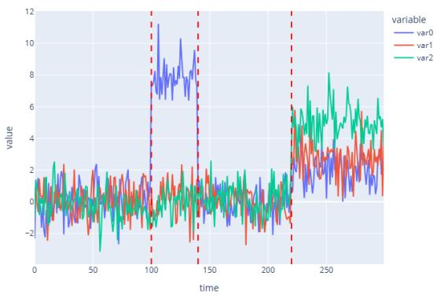
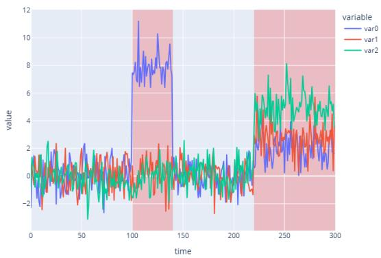
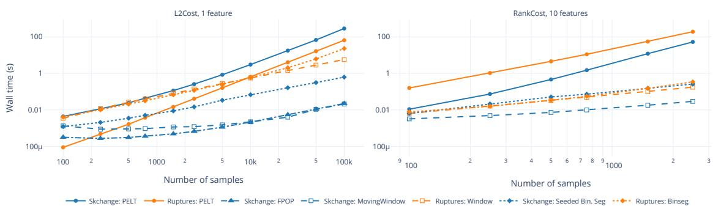

# skchange: Fast and Flexible Algorithms for Changepoint Detection

Martin Tveten<sup>1</sup>

Johannes Voll Kolstø<sup>1</sup>

tveten@nr.no

jvkolsto@nr.no

Per August Jarval Moen<sup>2</sup>

pamoen@math.uio.no

<sup>1</sup> Department of Statistics and Machine Learning, Norwegian Computing Center

<sup>2</sup> Department of Mathematics, University of Oslo

## Abstract

Skchange is an open-source Python library for detecting structural changes in time series. It implements modern change detection algorithms within a unified and extensible framework. The algorithms are modular and composable, and they include changepoint search methods based on both cost minimisation and statistical tests. Key features include the detection of anomalous segments in addition to changepoints; theoretically well-founded fast and approximate search methods; theoretically well-founded algorithms for high-dimensional data, covering settings where either few or many features change simultaneously; utilities for automatic and data-driven penalty calibration, which balances false alarms against missed detections; and a large collection of built-in costs and statistical tests. The design follows established scikit-learn conventions to streamline both user and contributor experience, and Numba is used extensively to achieve high computational performance. Source code and documentation are available at https://github.com/NorskRegnesentral/skchange.

Keywords: Time series, changepoint, anomaly, segmentation, Python, scikit-learn.

## 1 Introduction

Detecting structural changes in time series is a fundamental task in many machine learning applications, including personalised medicine (Li et al., 2026), condition monitoring of industrial equipment (Tveten et al., 2022), environmental monitoring (Gong et al., 2025), and fraud detection (Rousseeuw et al., 2019). The key problem is to detect the presence of changepoints and estimate their locations, where a changepoint marks an abrupt change in the statistical properties of a sequence (Figure 1a).

Recent advances in the statistics community have produced algorithms that are computationally eficient, theoretically well-founded, and flexible with respect to data-generating mechanisms. These methods are interpretable and can be tailored to specific domains. However, despite their practical relevance, most of these advances are not available in a user-friendly form in Python, limiting their adoption by machine learning practitioners.

In this paper, we introduce skchange, an open-source Python library for changepoint detection that aims to be both computationally eficient and easy to use and extend. We have developed an API for changepoint detection that follows scikit-learn conventions (Pedregosa et al., 2011) closely. Algorithms are implemented as modular compositions, and high computational performance is achieved through Numba (Lam et al., 2015) for just-intime compilation.

  
(a)

  
(b)  
Figure 1: Three-dimensional toy data with (a) three detected changepoints and (b) two detected segment anomalies as an alternative representation.

The closest previous work is the ruptures library (Truong et al., 2020), which compiles several classical changepoint detection algorithms and provides a wide range of cost functions to be optimised. Compared to ruptures, the scope of skchange is broader. Firstly, it does not restrict algorithms to cost-minimisation frameworks, enabling implementation of recent advances based on statistical tests. Among other advantages, such test-based methods are more suitable for high-dimensional data and can be more eficient to calibrate for a desired false alarm rate. Secondly, skchange supports segment anomaly detection, which can be viewed as a changepoint detection problem where the aim is to find segments that deviate from some baseline behaviour (Figure 1b). In addition, skchange features improved performance (see Section 3).

## 2 Design

Scikit-learn interface. Skchange follows scikit-learn estimator conventions, including fit and predict semantics, and the separation of hyperparameters from learned attributes. The key diference from other scikit-learn estimators is that predict returns detected changepoints as integer sample indices. Figure 2 shows a code example of detecting changepoints using skchange. This common interface supports interchangeable detector use and enables detector-agnostic tools for preprocessing, hyperparameter tuning and evaluation.

Composable detectors. Detectors in skchange are composed of three core components: a search algorithm, an interval scorer, and a penalty. In skchange, we introduce interval scorer as an abstraction for cost functions and test statistics applied to interval subsets of a dataset. Specifically, an interval scorer maps a dataset and a set of interval specifications to a value quantifying evidence for change or model deviation within the interval. By an interval specification, we refer to the indices encoding the interval and, for two-sample test statistics, the sample splitting information. The search algorithm determines which intervals to assess and how to combine results into a final set of detected changepoints. In Figure 2, CUSUM is the interval scorer and SeededBinarySegmentation is the search algorithm. The penalty controls model complexity by regulating the number of detected events. This modular design allows new detectors to be constructed by combining existing components or introducing new ones without altering the surrounding workflow.

```python
from skchange.detectors import SeededBinarySegmentation
from skchange.interval_scorers import CUSUM
score = CUSUM()
detector = SeededBinarySegmentation(score, penalty=5)
detector.fit(X)
changepoints = detector.predict(X)
```  
Figure 2: Code example of detecting changepoints in an array X using Seeded Binary Segmentation with a CUSUM score. Skchange also ofer tools for calibrating the penalty.

Vectorised interval scorers with precomputation. The computational bottleneck of most change detection algorithms is to compute interval scores over a large number of interval specifications, often with overlapping regions. Our design of interval scorers provides two mechanisms for speeding this up. Firstly, they can precompute quantities that are reused across many interval specifications, such as cumulative sums and other suficient statistics. Secondly, they are vectorised over interval specifications, enabling batch evaluation of large candidate sets with Numba-accelerated implementations.

## 3 Features

This section summarises the features that distinguish skchange from other packages.

State-of-the-art changepoint search methods. Supported methods include the moving window or MOSUM algorithm (Eichinger and Kirch, 2018; Meier et al., 2021), generalised to arbitrary test statistics and allowing multiple bandwidths and diferent selection methods; Seeded Binary Segmentation (Kov´acs et al., 2023), with optional narrowest-overthreshold selection (Baranowski et al., 2019); PELT (Killick et al., 2012); FPOP (Maidstone et al., 2017); and CROPS (Haynes et al., 2017). Of these, only PELT and a basic version of moving window are also available in ruptures. Seeded Binary Segmentation and the moving window algorithm are fast test-based algorithms with strong theoretical guarantees.

Segment anomaly detection. Skchange implements two change detection algorithms that also support segment anomaly detection: CAPA and its multivariate extensions (Fisch et al., 2022a,b), and Circular Binary Segmentation (Olshen et al., 2004). For multivariate data, CAPA additionally identifies which variables are afected by an anomaly.

Wide range of eficient scorers. The package provides a broad set of interval scorers covering common modelling assumptions and distributional features. Nearly all cost functions in ruptures are reimplemented for higher performance using the vectorised scorer design combined with Numba. These include parametric likelihood-based costs, trend and regression costs, and nonparametric measures such as rank-based costs. In addition, skchange ofers eficient implementations of scores based on statistical tests for changes in the mean (CUSUM), continuous linear trends, multivariate t-distributions, and more.

  
Figure 3: Run-time evaluation of comparable algorithms in skchange and ruptures on change-free Gaussian data for the L2 cost (left) and the multivariate rank cost (right). Machine specifications: CPU Intel Xeon Silver 4110 @ 2.10 GHz, 10 cores, 49 GB of RAM.

High-dimensional data. In high-dimensional settings, changes may be sparse (afecting few variables) or dense (afecting many). Classical statistical tests typically have power for only one regime. Skchange includes scores based on recent statistical tests that are sensitive to both regimes while remaining computationally eficient, such as ESAC (Moen et al., 2024) and SUBSET (Tickle et al., 2021).

Automatic penalty calibration. As the penalty governs the trade-of between false alarms and missed detections, calibrating the penalty parameter of change detectors is a critical task before the detector can be used reliably in real settings. Skchange features data-driven tools for automatically calibrating the penalty to control the family-wise error rate. Examples include methods based on permutations or the block bootstrap.

Run-time eficiency. Skchange is notably faster than ruptures in most cases. Figure 3 showcases run-time evaluations of comparable algorithms in skchange and ruptures for the canonical L2 cost for detecting abrupt changes in the mean in univariate data, and the non-parametric rank cost. The evaluation was performed on change-free Gaussian data for simplicity. For the L2 cost example, please note that FPOP and PELT are comparable as they solve the same optimisation problem, and that we use ruptures’ C-implementation of PELT in their KernelCPD detector. A more extensive set of run-time evaluations is available at https://github.com/NorskRegnesentral/change-point-benchmark.

## 4 Contribution and Development Practices

Skchange is released under the BSD 3-Clause license and is publicly available at https:// github.com/NorskRegnesentral/skchange. Comprehensive documentation is available at https://skchange.readthedocs.io, including user and developer guides, and a complete API reference. Reliability is ensured through near-complete test coverage and continuous integration across Python versions and platforms, including Linux and Windows. The library adheres to established software development best practices and has been deployed in production systems by industrial partners. Further contributions from students, researchers and the open-source community are highly welcome.

## Acknowledgments and Disclosure of Funding

This project was supported by Norwegian Research Council grants 332645 (Integreat), 337085 (EarOnEdge) and 356322 (SODA). Various AI tools have been used for proofreading and language improvements of the manuscript, including Microsoft Copilot and Claude Sonnet 4.5 and 4.6. The same AI tools have also been used to iterate on the software code since 2025. Thanks to Franz J. Kir´aly and the sktime community for valuable discussions during the early development of this work. An earlier version of skchange is available as part of the sktime library (L¨oning et al., 2019).

## References

Rafal Baranowski, Yining Chen, and Piotr Fryzlewicz. Narrowest-over-threshold detection of multiple change points and change-point-like features. Journal of the Royal Statistical Society Series B: Statistical Methodology, 81(3):649–672, 2019.

Birte Eichinger and Claudia Kirch. A mosum procedure for the estimation of multiple random change points. Bernoulli, 24(1):526–564, 2018.

Alexander T. M. Fisch, Idris A. Eckley, and Paul Fearnhead. A linear time method for the detection of collective and point anomalies. Statistical Analysis and Data Mining: The ASA Data Science Journal, 15(4):494–508, 2022a.

Alexander T. M. Fisch, Idris A. Eckley, and Paul Fearnhead. Subset multivariate collective and point anomaly detection. Journal of Computational and Graphical Statistics, 31(2): 574–585, 2022b.

Mengyi Gong, Rebecca Killick, Christopher Nemeth, and John Quinton. A changepoint approach to modelling nonstationary soil moisture dynamics. Journal of the Royal Statistical Society Series C: Applied Statistics, 74(3):866–883, 2025.

Kaylea Haynes, Idris A. Eckley, and Paul Fearnhead. Computationally eficient changepoint detection for a range of penalties. Journal of Computational and Graphical Statistics, 26 (1):134–143, 2017.

Rebecca Killick, Paul Fearnhead, and Idris A. Eckley. Optimal detection of changepoints with a linear computational cost. Journal of the American Statistical Association, 107 (500):1590–1598, 2012.

Solt Kov´acs, Peter B¨uhlmann, Housen Li, and Axel Munk. Seeded binary segmentation: a general methodology for fast and optimal changepoint detection. Biometrika, 110(1): 249–256, 2023.

Siu Kwan Lam, Antoine Pitrou, and Stanley Seibert. Numba: A llvm-based python jit compiler. In Proceedings of the Second Workshop on the LLVM Compiler Infrastructure in HPC, pages 1–6, 2015.

Jialiang Li, Jingli Wang, and Yuetao Yu. Change-point detection and its modern applications. Annual Review of Statistics and Its Application, 13, 2026.

Markus L¨oning, Anthony Bagnall, Sajaysurya Ganesh, Viktor Kazakov, Jason Lines, and Franz J Kir´aly. sktime: A unified interface for machine learning with time series. arXiv preprint arXiv:1909.07872, 2019.

Robert Maidstone, Toby Hocking, Guillem Rigaill, and Paul Fearnhead. On optimal multiple changepoint algorithms for large data. Statistics and computing, 27(2):519–533, 2017.

Alexander Meier, Claudia Kirch, and Haeran Cho. mosum: A package for moving sums in change-point analysis. Journal of Statistical Software, 97:1–42, 2021.

Per August Jarval Moen, Ingrid K. Glad, and Martin Tveten. Eficient sparsity adaptive changepoint estimation. Electronic Journal of Statistics, 18(2):3975–4038, 2024.

Adam B Olshen, E Seshan Venkatraman, Robert Lucito, and Michael Wigler. Circular binary segmentation for the analysis of array-based dna copy number data. Biostatistics, 5(4):557–572, 2004.

Fabian Pedregosa, Ga¨el Varoquaux, Alexandre Gramfort, Vincent Michel, Bertrand Thirion, Olivier Grisel, Mathieu Blondel, Peter Prettenhofer, Ron Weiss, Vincent Dubourg, et al. Scikit-learn: Machine learning in python. the Journal of machine Learning research, 12:2825–2830, 2011.

Peter Rousseeuw, Domenico Perrotta, Marco Riani, and Mia Hubert. Robust monitoring of time series with application to fraud detection. Econometrics and Statistics, 9:108–121, 2019.

Sam O. Tickle, I. A. Eckley, and Paul Fearnhead. A computationally eficient, highdimensional multiple changepoint procedure with application to global terrorism incidence. Journal of the Royal Statistical Society Series A: Statistics in Society, 184(4): 1303–1325, 2021.

Charles Truong, Laurent Oudre, and Nicolas Vayatis. Selective review of ofline change point detection methods. Signal Processing, 167:107299, 2020.

Martin Tveten, Idris A. Eckley, and Paul Fearnhead. Scalable change-point and anomaly detection in cross-correlated data with an application to condition monitoring. The Annals of Applied Statistics, 16(2):721–743, 2022.